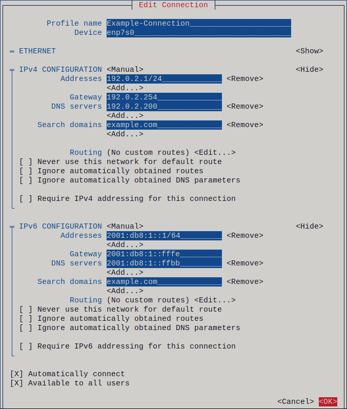
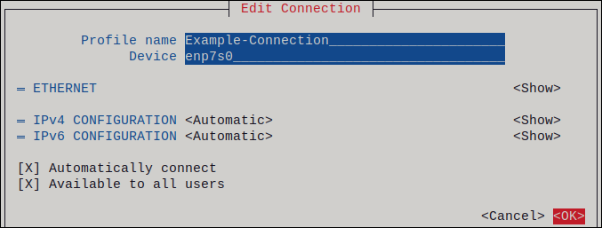

# 网络配置

[TOC]

## 概述

Centos 7 之前的版本都是通过 network.service 管理网络配置。到了 Centos 7 就同时支持 network.service 和 NetworkManager.service ，相当于在 Centos 7 的一个过渡，默认情况下这 2 个服务都有开启，但是因为 NetworkManager.service 当时的兼容性不好，大部分人都会将其关闭。在 RHEL 8 / Centos 8 上已废弃network.service（默认不安装），只能通过 NetworkManager 进行网络配置。

ifconfig  ip  nmcli

## NetworkManager

NetworkManager 服务是管理和监控网络设置的守护进程，是 2004 年由 RedHat 启动的项目，皆在能够让 Linux 用户更轻松的处理现代网络需求，尤其是无线网络，能够自动发现网卡并配置 IP 地址。

NetworkManager 主要管理 2 个对象： Connection（网卡连接配置） 和 Device（网卡设备），它们之间是多对一的关系，但是同一时刻只能有一个 Connection 对于 Device 生效。

使用 NetworkManager 的主要优点是：

- 通过 D-Bus 提供 API，它允许查询和控制网络配置和状态。这样，多个应用程序就可以检查和配置网络，确保同步和最新的网络状态。例如，RHEL web 控制台（通过一个 web 浏览器监控和配置服务）使用 **NetworkManager** D-BUS 接口来配置网络，以及 **Gnome GUI**、**nmcli** 和 **nm-connection-editor** 工具。对这些工具所做的每个改变都会被其他所有用户检测到。
- 可以更方便的镜像网络配置：**NetworkManager** 确保网络连接正常工作。当发现在系统中没有网络配置但存在网络设备时，**NetworkManager** 会创建临时连接以提供连接。
- 提供到用户的简单连接设置： **NetworkManager** 通过不同的工具提供管理 - **GUI、nmtui、nmcli**。
- 支持配置灵活性。例如，配置 WiFi 接口，**NetworkManager** 会扫描并显示可用的 wifi 网络。您可以选择一个接口，**NetworkManager** 会显示在重启过程后提供自动连接所需的凭证。**NetworkManager** 可以配置网络别名、IP 地址、静态路由、DNS 信息和 VPN 连接以及很多具体连接的参数。您可以修改配置选项以反应您的需要。
- 重启过程后保持设备状态，并接管在重启过程中将其设定为受管模式的接口。
- 处理没有被显式设置但由用户或者其他网络设备手动控制的设备。

在 RHEL 8 / Centos 8 有三种方法配置网络：

* 通过 nmcli connection add 命令配置，会自动生成 ifcfg 文件。
* 手动配置 ifcfg 文件，通过 nmcli connection reload 来加载生效。
* 手动配置 ifcfg 文件，通过传统 network.service 来加载生效。

### 管理 NetworkManager 连接的工具和应用程序

可以使用以下工具和应用程序来管理 NetworkManager 连接：

- `nmcli` ：用来管理连接的命令行工具。
- `nmtui` ：基于鼠标光标的文本用户界面(TUI)。要使用这个应用程序，请安装 `NetworkManager-tui` 软件包。
- `nm-connection-editor` ：用于与 NetworkManager 有关的任务的图形用户界面(GUI)。要启动这个应用程序，请在 GNOME 会话终端中输入 `nm-connection-editor`。
- `control-center`: GNOME shell 为桌面用户提供的 GUI。请注意，这个应用程序支持的特性比 `nm-connection-editor` 少。
- GNOME shell 中的 `网络连接图标` ：此图标表示网络连接状态，并充当您在使用的连接类型的视觉指示符。

### nmcli

NetworkManager 在系统中的管理工具为 nmcli 。

```bash
nmcli [OPTIONS] OBJECT { COMMAND | help }
# OPTIONS
      -a, --ask                                  ask for missing parameters
      -c, --colors auto|yes|no                   whether to use colors in output
      -e, --escape yes|no                        escape columns separators in values
      -f, --fields <field,...>|all|common        specify fields to output
      -g, --get-values <field,...>|all|common    shortcut for -m tabular -t -f
      -h, --help                                 print this help
      -m, --mode tabular|multiline               output mode
      -o, --overview                             overview mode
      -p, --pretty                               pretty output
      -s, --show-secrets                         allow displaying passwords
      -t, --terse                                terse output
      -v, --version                              show program version
      -w, --wait <seconds>                       set timeout waiting for finishing operations

# OBJECT
      g[eneral]                                  NetworkManager's general status and operations
      n[etworking]                               overall networking control
      r[adio]                                    NetworkManager radio switches
      c[onnection]                               NetworkManager's connections
      d[evice]                                   devices managed by NetworkManager
      a[gent]                                    NetworkManager secret agent or polkit agent
```

#### 调整输出格式

`nmcli` 工具支持不同的选项来修改 `nmcli` 命令的输出。通过使用这些选项，可以只显示所需的信息。这简化了处理脚本中输出的过程。 		

默认情况下，`nmcli` 工具以类似于表的格式显示其输出： 		

```bash
nmcli device

DEVICE  TYPE      STATE      CONNECTION
enp1s0  ethernet  connected  enp1s0
lo      loopback  unmanaged  --
```

使用 `-f` 选项，可以按自定义顺序显示特定的列。例如，要只显示 `DEVICE` 和 `STATE` 列，请输入： 		

```bash
nmcli -f DEVICE,STATE device

DEVICE  STATE
enp1s0  connected
lo      unmanaged
```

`-t` 选项允许您以冒号分隔的形式显示输出的每个字段： 		

```bash
nmcli -t device

enp1s0:ethernet:connected:enp1s0
lo:loopback:unmanaged:
```

当使用脚本处理输出时，将 `-f` 和 `-t` 组合，来只显示冒号分隔形式的特定字段： 		

```bash
nmcli -f DEVICE,STATE -t device

enp1s0:connected
lo:unmanaged
```

#### 使用 tab 自动完成

如果主机上安装了 `bash-completion` 软件包，则 `nmcli` 工具将支持选项卡补全功能。这可自动完成选项名称，并识别可能的选项和值。

可以使用 tab 自动完成来显示连接配置集中可以设置的所有属性。例如，如果输入 `nmcli connection modify connection_name` ，并按 **Tab**，命令将显示可用属性的完整列表。

#### general 常规选项

可以显示网络管理器状态和权限，可以获取和更改系统主机名，以及网络管理器日志记录级别和域。

```bash
nmcli general {status|hostname|permissions|logging}
```

1. 显示网络管理器的整体状态（status）

   ```bash
   nmcli general status
   
   STATE      CONNECTIVITY  WIFI-HW  WIFI     WWAN-HW  WWAN    
   connected  full          enabled  enabled  enabled  enabled
   ```

2. 获取主机名或更改主机名（hostname）

   ```bash
   # 查询主机名
   nmcli general hostname
   
   # 设置主机名
   nmcli general hostname centos8-nat-168-182-152-test
   ```

3. 显示当前用户对网络管理器可允许的操作权限（permissions）

   ```bash
   nmcli general permissions
   
   PERMISSION                                                        VALUE
   org.freedesktop.NetworkManager.checkpoint-rollback                yes
   org.freedesktop.NetworkManager.enable-disable-connectivity-check  yes
   org.freedesktop.NetworkManager.enable-disable-network             yes
   org.freedesktop.NetworkManager.enable-disable-statistics          yes
   org.freedesktop.NetworkManager.enable-disable-wifi                yes
   org.freedesktop.NetworkManager.enable-disable-wimax               yes
   org.freedesktop.NetworkManager.enable-disable-wwan                yes
   org.freedesktop.NetworkManager.network-control                    yes
   org.freedesktop.NetworkManager.reload                             yes
   org.freedesktop.NetworkManager.settings.modify.global-dns         yes
   org.freedesktop.NetworkManager.settings.modify.hostname           yes
   org.freedesktop.NetworkManager.settings.modify.own                yes
   org.freedesktop.NetworkManager.settings.modify.system             yes
   org.freedesktop.NetworkManager.sleep-wake                         yes
   org.freedesktop.NetworkManager.wifi.scan                          yes
   org.freedesktop.NetworkManager.wifi.share.open                    yes
   org.freedesktop.NetworkManager.wifi.share.protected               yes
   ```

4. 获取和更改网络管理器日志记录级别和域，没有任何参数，显示当前日志记录级别和域（loggin）

   ```bash
   nmcli general logging
   
   LEVEL  DOMAINS                                                                                                                                                                                                                       
   INFO   PLATFORM,RFKILL,ETHER,WIFI,BT,MB,DHCP4,DHCP6,PPP,IP4,IP6,AUTOIP4,DNS,VPN,SHARING,SUPPLICANT,AGENTS,SETTINGS,SUSPEND,CORE,DEVICE,OLPC,INFINIBAND,FIREWALL,ADSL,BOND,VLAN,BRIDGE,TEAM,CONCHECK,DCB,DISPATCH,AUDIT,SYSTEMD,PROXY
   ```

#### networking 网络控制

查询网络管理器网络状态，开启和关闭网络。

```bash
nmcli networking {on|off|connectivity}

# 选项：
 - on            禁用所有接口
 - off           开启所有接口
 - connectivity  获取网络状态，可选参数 checl 告诉网络管理器重新检查连接性，否则显示最近已知的状态。而无需重新检查。（可能的状态如下所示）
   - none        主机未连接到任何网络
   - portal      无法到达完整的互联网
   - limited     主机已连接到网络，但无法访问互联网
   - full        主机连接到网络，并具有完全访问
   - unknown     无法找到连接状态
```

1. 获取网络状态

   ```bash
   nmcli networking connectivity
   full
   ```

2. 重启所有网络接口

   ```bash
   nmcli networking off && nmcli networking on
   ```

#### radio 无线限传输控制

显示无线开关状态，或启用和禁用开关.

```bash
nmcli radio {all|wifi|wwan}
```

#### monitor 活动监视器

观察网络管理器活动。监视连接的变化状态、设备或连接配置文件。

#### connection 连接管理

```bash
nmcli connection {show|up|down|modify|add|edit|clone|delete|monitor|reload|load|import|export}
```

1. 列出活动的连接，或进行排序（±为升降序）

   ```bash
   # 查看所有连接状态
   nmcli connection show
   # 等同于nmcli connection show --order +active
   
   nmcli connection show --active
   
   # 以活动的连接进行排序
   nmcli connection show --order +active
   
   # 将所有连接以名称排序
   nmcli connection show --order +name
   
   # 将所有连接以类型排序(倒序)
   nmcli connection show --order -type
   ```

2. 查看指定连接的详细信息。

   ```bash
   nmcli connection show bond-bond0
   ```

3. 激活连接，提供连接名称或uuid进行激活，若未提供，则可以使用ifname指定设备名进行激活（up）

   ```bash
   # 以连接名进行激活
   nmcli connection up bond-bond0
   
   # 以uuid进行激活
   nmcli connection up 3a538589-12b9-4a82-adda-fe3da844510c
   
   # 以设备接口名进行激活
   nmcli connection up ifname bond0
   ```

4. 停用连接，提供连接名或uuid进行停用，若未提供，则可以使用ifname指定设备名进行激活（down）

   ```bash
   # 以连接名进行激活
   nmcli connection donw bond-bond0
   
   # 以uuid进行激活
   nmcli connection down 3a538589-12b9-4a82-adda-fe3da844510c
   
   # 以设备接口名进行激活
   nmcli connection donw ifname bond0
   ```

5. 【修改】这些属性可以用nmcli connection show bond-bond0进行获取，然后可以修改、添加或删除属性，若要设置属性，只需指定属性名称后跟值，空值将删除属性值，同一属性添加多个值使用+。同一属性删除指定值用-加索引（modify）

   ```bash
   # 添加多个ip（+ipv4.addresses）
   nmcli connection modify bond-bond0 +ipv4.addresses 192.168.182.102/24
   # 启用配置
   nmcli connection up bond-bond0
   # 查看刚才添加的ip
   nmcli -f IP4 connection show bond-bond0
   
   # 删除指定ip（-ipv4.addresses）
   nmcli connection modify bond-bond0 -ipv4.addresses 192.168.182.102/24
   # 启用配置
   nmcli connection up bond-bond0
   # 查看
   nmcli -f IP4 connection show bond-bond0
   ```

6. 【添加】这是创建一个新的连接，需要指定新创建连接的属性，语法与modify相同（add）

   ```bash
   nmcli connection add con-name eth1 type ethernet  autoconnect yes ifname ens33
   # con-name        连接名称
   # type            连接类型
   # autoconnect     是否自动连接
   # ifname          连接到的设备名称
   ```

7. 克隆连接，克隆一个存在的连接，除了连接名称和uuid是新生成的，其他都是一样的（clone）

   ```bash
   nmcli connection clone eth1 eth1_1
   ```

8. 【删除】删除连接，这将删除一个连接（delete）

   ```bash
   nmcli con delete eth1_1
   ```

9. 从磁盘加载/重新加载一个或多个连接文件，例如你手动创建了一个/etc/sysconfig/network-scripts/ifcfg-ethx连接文件，你可以将其加载到网络管理器，以便管理。

   ```bash
   echo -e "TYPE=Ethernet\nNAME=ethx" > /etc/sysconfig/network-scripts/ifcfg-ethx
   nmcli connection load /etc/sysconfig/network-scripts/ifcfg-ethx
   nmcli connection show
   ```

10. 监视连接配置文件活动（monitor）

    ```bash
    nmcli connection monitor bond-bond0
    ```

#### device 设备管理

显示和管理设备接口。该选项有很多功能，例如连接wifi，创建热点，扫描无线，邻近发现等，下面仅列出常用选项。详细功能可使用nmcli device help查看。

```bash
nmcli device {status|show|set|connect|reapply|modify|disconnect|delete|monitor|wifi|lldp}
```

1. 打印设备状态，如果没有将命令指定给nmcli device，则这是默认操作（status）

   ```bash
   nmcli device status
   nmcli device
   ```

2. 显示所有设备接口的详细信息（show）

   ```bash
   nmcli device show ens33
   ```

3. 设置设备属性（set）

   ```bash
   nmcli device set ifname ens33 autoconnect yes
   ```

4. 连接设备（connection）。提供一个设备接口，网络管理器将尝试找到一个合适的连接, 将被激活。它还将考虑未设置为自动连接的连接。(默认超时为90s)

   ```bash
   nmcli dev connect ens33
   ```

5. 修改设备上处于活动的设备（modify），但该修改只是临时的，并不会写入文件。（语法与 nmcli connection modify 相同）

   ```bash
   nmcli device modify ens33 +ipv4.addresses 192.168.100.103/24
   ```

6. 断开当前连接的设备（disconnect），防止自动连接。但注意，断开意味着设备停止！但可用 connect 进行连接

   ```bash
   nmcli device disconnect ens33
   ```

7. 删除设备（delete），该命令从系统中删除接口。请注意, 这仅适用于诸如bonds, bridges, teams等软件设备。命令无法删除硬件设备 (如以太网)。超时时间为10秒

   ```bash
   nmcli device delete bond0
   ```

8. 监视设备活动（monitor）。每当指定的设备更改状态时, 此命令都会打印一行

   ```bash
   nmcli device monitor bond0
   ```

#### nmcli 返回状态码

mcli 如果成功退出状态值为0，如果发生错误则返回大于0的值。

* 0      成功-指示操作已成功
* 1      位置或指定的错误
* 2      无效的用户输入，错误的nmcli调用
* 3      超时了（请参阅 --wait 选项）
* 4      连接激活失败
* 5      连接停用失败
* 6      断开设备失败
* 7      连接删除失败
* 8      网络管理器没有运行
* 10    连接、设备或接入点不存在
* 65    当使用 --complete-args 选项，文件名应遵循。

三、network和NetworkManager之间的区别

network：对网卡的配置
NetworkManager：这个服务由几个部分组成;一个是管理系统网络连接；一个是允许用户管理网络连接的客户端程序，使用它可以更好的管理网络

    1
    2

四、network和NetworkManager两个服务之间冲突解

    在CentOS系统上，目前有NetworkManager和network两种网络管理工具。如果两种都配置会引起冲突，而且NetworkManager在网络断开的时候，会清理路由，如果一些自定义的路由，没有加入到NetworkManager的配置文件中，路由就被清理掉，网络连接后需要自定义添加上去。

1）将NetworkManager 服务设置开机不启动

$ chkconfig NetworkManager off

    1

2）将NetwokManager服务关闭

$ systemctl stop NetworkManager

    1

3）重新启动一下network服务

$ systemctl restart network

    1

4）重新加载配置

# 重新加载所有网卡配置
nmcli c reload
# 指定加载
nmcli c reload /etc/sysconfig/network-scripts/ifcfg-ens33
# 重新加载所有网卡配置（可靠，推荐）
nmcli networking off && nmcli networking on
ifdown ens33 && ifup ens33
nmcli con down ens33 && nmcli con up ens33


## 网络接口设备命名

Linux 内核通过将固定前缀与随着内核初始化网络设备而增加的数字连接在一起，来为网络接口分配名称。例如，`eth0` 代表启动时被探测的第一个设备。如果在系统中添加另一个网卡，则内核设备名称的分配将不再是固定的。因此，重启后内核可能会以不同的方式为该设备命名。

要解决这个问题，`udev` 设备管理器支持很多不同的命名方案。默认情况下，`udev` 根据固件、拓扑和位置信息分配固定名称。有以下优点：

- 设备名称完全可预测。 			
- 即使添加或删除了硬件，设备名称也会保持不变，因为不会进行重新枚举。 			
- 有问题的硬件可以被无缝地替换。 			

> 警告:
>
> 红帽不支持禁用了一致设备命名的系统。详情请查看是否可以安全地 [设置 net.ifnames=0?](https://access.redhat.com/solutions/2435891) 		

### 命名等级

如果启用了一致的设备命名（在 RHEL 中是默认设置），则 `udev` 设备管理器会根据以下方案生成设备名称： 		

| 方案 | 描述                                                         | 示例              |
| ---- | ------------------------------------------------------------ | ----------------- |
| 1    | 设备名称包含固件或者 BIOS 提供的索引号，用于板上的设备。如果此信息不可用或不适用，则将使用方案 2。 | `eno1`            |
| 2    | 设备名称包含固件或 BIOS 提供的 PCI Express（PCIe）热插件插槽索引号。如果此信息不可用或不适用，则将使用方案 3。 | `ens1`            |
| 3    | 设备名称包含硬件连接器的物理位置。如果此信息不可用或不适用，则将使用方案 5。 | `enp2s0`          |
| 4    | 设备名称包含 MAC 地址。RHEL 默认不使用这个方案，但管理员可选择性地使用它。 | `enx525400d5e0fb` |
| 5    | 传统的无法预计的内核命名方案。如果无法应用任何其他方案，则设备管理器使用这个方案。 | `eth0`            |

默认情况下，RHEL 根据 `/usr/lib/systemd/network/99-default.link` 文件中的 `NamePolicy` 设置选择设备名称。`NamePolicy` 中值的顺序非常重要。RHEL 使用文件中指定的和 `udev` 生成的第一个设备名称。

如果手动配置 `udev` 规则来更改内核设备名称，则这些规则优先。 		

# 网络设备重命名是如何工作的

默认情况下，在 Red Hat Enterprise Linux 中启用了一致的设备命名。`udev` 设备管理器会处理不同的规则来重命名设备。以下列表描述了 `udev` 处理这些规则的顺序，以及这些规则负责什么操作： 		

1. `/usr/lib/udev/rules.d/60-net.rules` 文件定义了 `/lib/udev/rename_device` 帮助工具搜索 `/etc/sysconfig/network-scripts/ifcfg-*` 文件中的 `HWADDR` 参数。如果变量中设置的值与接口的 MAC 地址匹配，帮助程序会将接口重命名为文件 `DEVICE` 参数中设置的名称。只有安装 `initscripts` 软件包后，该文件才存在。 				

2. `/usr/lib/udev/rules.d/71-biosdevname.rules` 文件定义了 `biosdevname` 实用程序会根据其命名策略重命名接口，只要它在上一步中没有重命名。 	

3. `/usr/lib/udev/rules.d/75-net-description.rules` 文件定义了 `udev` 检查网络接口设备，并在 `udev`-internal 变量中设置在下一步中将要处理的属性。请注意，其中一些属性可能没有定义。 				

4. `/usr/lib/udev/rules.d/80-net-setup-link.rules` 文件调用内置的 `net_setup_link` `udev` ，然后应用策略。以下是存储在 `/usr/lib/systemd/network/99-default.link` 文件中的默认策略： 				

   ```ini
   [Link]
   NamePolicy=kernel database onboard slot path
   MACAddressPolicy=persistent
   ```

   有了这个策略，如果内核使用持久名称，则 `udev` 不会重命名接口。如果内核不使用持久名称，则 `udev` 会将接口重命名为 `udev` 的硬件数据库提供的名称。如果这个数据库不可用，Red Hat Enterprise Linux 会回复到上述机制中。 				

   另外，对于基于介质访问控制（MAC）地址的接口名称，将此文件中的 `NamePolicy` 参数设为 `mac`。 				

5. `/usr/lib/udev/rules.d/80-net-setup-link.rules` 文件定义了 `udev` 按以下顺序，根据 `udev`-internal 参数重命名接口： 				

   1. `ID_NET_NAME_ONBOARD` 						
   2. `ID_NET_NAME_SLOT` 						
   3. `ID_NET_NAME_PATH` 						

   如果没有设置参数，则 `udev` 将使用下一个参数。如果没有设置任何参数，接口就不会被重命名。 				

​		步骤 3 和 4 实现了网络接口设备命名层次结构中介绍的命名方案 1 到 4。 		

# x86_64 平台上的可预测的网络接口名称解释

当启用了一致的网络设备名称特性时，`udev` 设备管理器会根据不同的标准创建设备名称。这部分论述了在 x86_64 平台上安装 Red Hat Enterprise Linux 时的命名方案。 		

接口名称以双字符前缀开始，该前缀基于接口类型： 		

- `en` 用于以太网 				
- `wl` 用于无线 LAN(WLAN) 				
- `ww` 用于无线广域网(WWAN)。 				

另外，以下之一会根据 `udev` 设备管理器应用的模式，附加到上述前缀中的一个： 		

- `o*<on-board_index_number>*` 				

- `s*<hot_plug_slot_index_number>*[f*<function>*][d*<device_id>*]` 				

  请注意，所有多功能 PCI 设备在设备名称中都包含 `[f*<function>*]` 号，包括功能 `0` 设备。 				

- `x*<MAC_address>*` 				

- `[P*<domain_number>*]p*<bus>*s*<slot>*[f*<function>*][d*<device_id>*]` 				

  `[P*<domain_number>*]` 部分定义了 PCI 的地理位置。如果域号不是 `0` ，才会设置此部分。 				

- `[P*<domain_number>*]p*<bus>*s*<slot>*[f*<function>*][u*<usb_port>*][…][c*<config>*][i*<interface>*]` 				

  对于 USB 设备，hub 端口号的完整链由 hub 的端口号组成。如果名称大于最大值（15 个字符），则不会导出该名称。如果链中有多个 USB 设备，则 `udev` 会抑制 USB 配置描述符(`c1)`和 USB 接口描述符(`i`0)的默认值。

# System z 平台中可预测的网络接口设备名称解释

当启用了一致的网络设备名称特性时，System z 平台上的 `udev` 设备管理器会根据总线 ID 创建设备名称。总线 ID 识别 s390 频道子系统中的一个设备。 		

对于通道命令词(CCW)设备，总线 ID 是前缀为 `0.n` 的设备号 ，其中 `n` 是子通道集 ID。 		

例如，以太网接口被命名为 `enccw0.0.1234`。例如,串行线互联网协议(SLIP)通道到通道(CTC)网络设备被命名为 `slccw0.0.1234`。 		

使用 `znetconf -c` 或 `lscss -a` 命令显示可用的网络设备及其总线 ID。 		 

# 自定义以太网接口的前缀

可以在 Red Hat Enterprise Linux 安装过程中自定义以太网接口名称的前缀。 		

重要

红帽不支持在已部署的系统上使用 `prefixdevname` 工具自定义前缀。 			

RHEL 安装后，`udev` 服务将太网设备命名为 `*<prefix>*.*<index>*`。例如，如果您选择前缀 `net`，RHEL 将太网接口命名为 `net0`, `net1` ，等等。 		

**先决条件**

- 要设置的前缀满足以下要求： 				
  - 由 ASCII 字符组成。 						
  - 它是一个字母数字串。 						
  - 它小于 16 个字符。 						
  - 它不与任何用于网络接口命名的其他已知前缀冲突，如 `eth`、`eno`、`ens` 和 `em`。 						

**步骤**

1. 引导 Red Hat Enterprise Linux 安装介质。 				
2. 在引导管理器中： 				
   1. 选择 `Install Red Hat Enterprise Linux*<version>*` 条目，然后按 **Tab** 键编辑该条目。 						
   2. 将 `net.ifnames.prefix=*<prefix>*` 追加到在内核选项中。 						
   3. 按 **Enter** 键启动安装程序。 						
3. 安装 Red Hat Enterprise Linux。 				

**验证**

- 安装后，显示以太网接口： 				

  ```none
  ip link show
  ...
  2: net0: <BROADCAST,MULTICAST,UP,LOWER_UP> mtu 1500 qdisc fq_codel state UP mode DEFAULT group default qlen 1000
      link/ether 00:53:00:c5:98:1c brd ff:ff:ff:ff:ff:ff
  3: net1: <BROADCAST,MULTICAST,UP,LOWER_UP> mtu 1500 qdisc fq_codel state UP mode DEFAULT group default qlen 1000
      link/ether 00:53:00:c2:39:9e brd ff:ff:ff:ff:ff:ff
  ...
  ```

# 使用 udev 规则分配用户定义的网络接口名称

`udev` 设备管理器支持一组规则来自定义接口名称。 		

**流程**

1. 显示所有网络接口及其 MAC 地址： 				

   ```none
   # ip link list
   
   enp6s0f0: <BROADCAST,MULTICAST,UP,LOWER_UP> mtu 1500 qdisc fq_codel state UP mode DEFAULT group default qlen 1000
       link/ether b4:96:91:14:ae:58 brd ff:ff:ff:ff:ff:ff
   enp6s0f1: <BROADCAST,MULTICAST,UP,LOWER_UP> mtu 1500 qdisc fq_codel state UP mode DEFAULT group default qlen 1000
       link/ether b4:96:91:14:ae:5a brd ff:ff:ff:ff:ff:ff
   enp4s0f0: <BROADCAST,MULTICAST,UP,LOWER_UP> mtu 1500 qdisc fq_codel state UP mode DEFAULT group default qlen 1000
       link/ether 00:90:fa:6a:7d:90 brd ff:ff:ff:ff:ff:ff
   ```

2. 创建具有以下内容的文件 `/etc/udev/rules.d/70-custom-ifnames.rules` ： 				

   ```none
   SUBSYSTEM=="net",ACTION=="add",ATTR{address}=="b4:96:91:14:ae:58",ATTR{type}=="1",NAME="provider0"
   SUBSYSTEM=="net",ACTION=="add",ATTR{address}=="b4:96:91:14:ae:5a",ATTR{type}=="1",NAME="provider1"
   SUBSYSTEM=="net",ACTION=="add",ATTR{address}=="00:90:fa:6a:7d:90",ATTR{type}=="1",NAME="dmz"
   ```

   这些规则与网络接口的 MAC 地址相匹配，并将它们重命名为 **NAME** 属性中指定的名称。在这些示例中，**ATTR{type}** 参数值 **1** 定义了接口类型为 Ethernet。 				

**验证**

1. 重启系统： 				

   ```none
   # reboot
   ```

2. 验证每个 MAC 地址的接口名称是否与您在规则文件的 `NAME` 参数中设置的值相匹配： 				

   ```none
   # ip link show
   
   provider0: <BROADCAST,MULTICAST,UP,LOWER_UP> mtu 1500 qdisc mq state UP mode DEFAULT group default qlen 1000
       link/ether b4:96:91:14:ae:58 brd ff:ff:ff:ff:ff:ff
      altname enp6s0f0
   provider1: <BROADCAST,MULTICAST,UP,LOWER_UP> mtu 1500 qdisc mq state UP mode DEFAULT group default qlen 1000
       link/ether b4:96:91:14:ae:5a brd ff:ff:ff:ff:ff:ff
       altname enp6s0f1
   dmz: <BROADCAST,MULTICAST,UP,LOWER_UP> mtu 1500 qdisc mq state UP mode DEFAULT group default qlen 1000
       link/ether 00:90:fa:6a:7d:90 brd ff:ff:ff:ff:ff:ff
       altname enp4s0f0
   ```


# 使用 systemd 链接文件分配用户定义的网络接口名称

通过将网络接口重命名为 `provider0`来创建一个命名方案。 		

**流程**

1. 显示所有接口名称及其 MAC 地址： 				

   ```none
   ip link show
   
   enp6s0f0: <BROADCAST,MULTICAST,UP,LOWER_UP> mtu 1500 qdisc fq_codel state UP mode DEFAULT group default qlen 1000
       link/ether b4:96:91:14:ae:58 brd ff:ff:ff:ff:ff:ff
   enp6s0f1: <BROADCAST,MULTICAST,UP,LOWER_UP> mtu 1500 qdisc fq_codel state UP mode DEFAULT group default qlen 1000
       link/ether b4:96:91:14:ae:5a brd ff:ff:ff:ff:ff:ff
   enp4s0f0: <BROADCAST,MULTICAST,UP,LOWER_UP> mtu 1500 qdisc fq_codel state UP mode DEFAULT group default qlen 1000
       link/ether 00:90:fa:6a:7d:90 brd ff:ff:ff:ff:ff:ff
   ```

2. 对于将 MAC 地址为 **b4:96:91:14:ae:58** 的接口命名为 **provider0** ，请创建具有以下内容的 **/etc/systemd/network/70-custom-ifnames.link** 文件： 	

   ```none
   [Match]
   MACAddress=b4:96:91:14:ae:58
   
   [Link]
   Name=provider0
   ```

   此链接文件与 MAC 地址相匹配，并将网络接口重命名为 `Name` 参数中设置的名称。 				

**验证**

1. 重启系统： 				

   ```none
   # reboot
   ```

2. 验证 MAC 地址为您在链接文件中指定的设备是否已分配给 `provider0` ： 				

   ```none
   # ip link show
   
   provider0: <BROADCAST,MULTICAST,UP,LOWER_UP> mtu 1500 qdisc mq state UP mode DEFAULT group default qlen 1000
       link/ether b4:96:91:14:ae:58 brd ff:ff:ff:ff:ff:ff
   ```

## NetworkManager


### 配置 NetworkManager 以忽略某些设备

默认情况下，NetworkManager 管理除 `lo` （环回）设备以外的所有设备。但是，您可以将某些设备设置为 `非受管设备` 来配置网络管理器(NetworkManager)忽略这些设备。使用这个设置，您可以手动管理这些设备，例如使用脚本。 	

#### 永久将设备配置为 NetworkManager 中非受管设备

可以根据几个标准，将设备配置为 `unmanaged`，如接口名称、MAC 地址或设备类型。这个流程描述了如何在 NetworkManager 中将 `enp1s0` 接口永久设置为 `unmanaged` 。 		

要临时将网络设备配置为 `unmanaged`，请参阅 [在 NetworkManager 中临时将设备配置为非受管](https://access.redhat.com/documentation/zh-cn/red_hat_enterprise_linux/9/html/configuring_and_managing_networking/temporarily-configuring-a-device-as-unmanaged-in-networkmanager_configuring-networkmanager-to-ignore-certain-devices)。 		

**步骤**

1. 可选：显示设备列表，以便识别您要将其设置为 `unmanaged` 的设备： 				

   ```none
   # nmcli device status
   DEVICE  TYPE      STATE         CONNECTION
   enp1s0  ethernet  disconnected  --
   ...
   ```

2. 使用以下内容创建 `/etc/NetworkManager/conf.d/99-unmanaged-devices.conf` 文件： 				

   ```none
   [keyfile]
   unmanaged-devices=interface-name:enp1s0
   ```

   要将多个设备设置为非受管，请使用分号分隔 `unmanaged-devices` 参数中的条目： 				

   ```none
   [keyfile]
   unmanaged-devices=interface-name:interface_1;interface-name:interface_2;...
   ```

3. 重新载入 `NetworkManager` 服务： 				

   ```none
   # systemctl reload NetworkManager
   ```

**验证步骤**

- 显示设备列表： 				

  ```none
  nmcli device status
  
  DEVICE  TYPE      STATE      CONNECTION
  enp1s0  ethernet  unmanaged  --
  ...
  ```
```
  
  `enp1s0` 设备旁边的 `unmanaged` 状态表示 NetworkManager 没有管理该设备。 				

#### 将设备临时配置为在 NetworkManager 中不被管理

可以根据几个标准，将设备配置为 `unmanaged`，如接口名称、MAC 地址或设备类型。这个流程描述了如何在 NetworkManager 中临时将 `enp1s0` 接口设置为 `unmanaged` 。 		

可以使用这个方法用于特定目的，如测试。要永久将网络设备配置为 `unmanaged`，请参阅 [在 NetworkManager 中永久将设备配置为非受管](https://access.redhat.com/documentation/zh-cn/red_hat_enterprise_linux/9/html/configuring_and_managing_networking/configuring-networkmanager-to-ignore-certain-devices_configuring-and-managing-networking#permanently-configuring-a-device-as-unmanaged-in-networkmanager_configuring-networkmanager-to-ignore-certain-devices)。 		

**步骤**

1. 可选：显示设备列表，以便识别您要将其设置为 `unmanaged` 的设备： 				

   ```none
   # nmcli device status
   DEVICE  TYPE      STATE         CONNECTION
   enp1s0  ethernet  disconnected  --
   ...
```

2. 将 `enp1s0` 设备设置为 `unmanaged` 状态： 				

   ```none
   # nmcli device set enp1s0 managed no
   ```

**验证步骤**

- 显示设备列表： 				

  ```none
  # nmcli device status
  DEVICE  TYPE      STATE      CONNECTION
  enp1s0  ethernet  unmanaged  --
  ...
  ```

  `enp1s0` 设备旁边的 `unmanaged` 状态表示 NetworkManager 没有管理该设备。

## nmcli

- 显示列表连接配置集

  ```bash
  nmcli connection show
  
  NAME    UUID                                  TYPE      DEVICE
  enp1s0  45224a39-606f-4bf7-b3dc-d088236c15ee  ethernet  enp1s0
  ```

- 显示特定连接配置集的设置

  ```bash
  nmcli connection show connection_name
  
  connection.id:             enp1s0
  connection.uuid:           45224a39-606f-4bf7-b3dc-d088236c15ee
  connection.stable-id:      --
  connection.type:           802-3-ethernet
  ...
  ```

- 修改连接的属性

  ```bash
  nmcli connection modify connection_name property value
  ```

  如果将多个 ` property value ` 组合传给命令，则可以使用单个命令修改多个属性。

- 显示网络设备列表、其状态以及使用该设备的连接配置集

  ```bash
  nmcli device
  
  DEVICE  TYPE      STATE         CONNECTION
  enp1s0  ethernet  connected     enp1s0
  enp8s0  ethernet  disconnected  --
  enp7s0  ethernet  unmanaged     --
  ...
  ```

- 要激活连接，请输入： 				

  ```bash
  nmcli connection up connection_name
  ```

- 取消激活连接

  ```bash
  nmcli connection down connection_name
  ```

## 配置以太网连接

### 配置静态以太网连接

#### nmcli

- 静态 IPv4 地址 - `192.0.2.1` 和 `/24` 子网掩码
- 静态 IPv6 地址 - `2001:db8:1::1` 和 `/64` 子网掩码
- IPv4 默认网关 - `192.0.2.254`
- IPv6 默认网关 - `2001:db8:1::fffe`
- IPv4 DNS 服务器 - `192.0.2.200`
- IPv6 DNS 服务器 - `2001:db8:1::ffbb`
- DNS 搜索域 - `example.com`

1. 为以太网连接添加新的 NetworkManager 连接配置集：

   ```bash
   nmcli connection add con-name Example-Connection ifname enp7s0 type ethernet
   ```

   可以进一步修改您创建的 `Example-Connection` 连接配置集。

2. 设置 IPv4 地址：

   ```bash
   nmcli connection modify Example-Connection ipv4.addresses 192.0.2.1/24
   ```

3. 设置 IPv6 地址：

   ```bash
   nmcli connection modify Example-Connection ipv6.addresses 2001:db8:1::1/64
   ```

4. 将 IPv4 和 IPv6 连接方法设置为 `manual`：

   ```bash
   nmcli connection modify Example-Connection ipv4.method manual
   
   nmcli connection modify Example-Connection ipv6.method manual
   ```

5. 设置 IPv4 和 IPv6 默认网关：

   ```bash
   nmcli connection modify Example-Connection ipv4.gateway 192.0.2.254
   
   nmcli connection modify Example-Connection ipv6.gateway 2001:db8:1::fffe
   ```

6. 设置 IPv4 和 IPv6 DNS 服务器地址：

   ```bash
   nmcli connection modify Example-Connection ipv4.dns "192.0.2.200"
   
   nmcli connection modify Example-Connection ipv6.dns "2001:db8:1::ffbb"
   ```

   要设置多个 DNS 服务器，以空格分隔并用引号括起来。

7. 为 IPv4 和 IPv6 连接设置 DNS 搜索域：

   ```bash
   nmcli connection modify Example-Connection ipv4.dns-search example.com
   
   nmcli connection modify Example-Connection ipv6.dns-search example.com
   ```

8. 激活连接配置集：

   ```bash
   nmcli connection up Example-Connection
   
   Connection successfully activated (D-Bus active path: /org/freedesktop/NetworkManager/ActiveConnection/13)
   ```

**验证步骤**

1. 显示设备和连接的状态：

   ```bash
   nmcli device status
   
   DEVICE      TYPE      STATE      CONNECTION
   enp7s0      ethernet  connected  Example-Connection
   ```

2. 显示连接配置集的所有设置：

   ```bash
   nmcli connection show Example-Connection
   
   connection.id:              Example-Connection
   connection.uuid:            b6cdfa1c-e4ad-46e5-af8b-a75f06b79f76
   connection.stable-id:       --
   connection.type:            802-3-ethernet
   connection.interface-name:  enp7s0
   ...
   ```

3. 使用 `ping` 程序来验证这个主机是否可以向其它主机发送数据包。

   ```bash
   ping host_name_or_IP_address
   ```

4. 使用 `host` 实用程序来验证名称解析是否正常工作。例如：

   ```bash
   host client.example.com
   ```

   如果命令返回任何错误，如 `connection timed out` 或 `no servers could be reached`，请验证 DNS 设置。

**故障排除步骤**

* 验证网线是否插入到主机和交换机。
* 检查链路失败是否只存在于此主机上，或者连接到同一交换机的其它主机上。
* 验证网络电缆和网络接口是否如预期工作。执行硬件诊断步骤并替换有缺陷的电缆和网络接口卡。
* 如果磁盘中的配置与设备中的配置不匹配，则启动或重启 NetworkManager 会创建一个代表该设备的配置的内存连接。

#### nmcli 互动编辑器

这个流程描述了使用 `nmcli` 交互模式添加具有以下设置的以太网连接： 		

- 静态 IPv4 地址 - `192.0.2.1` 和 `/24` 子网掩码 				
- 静态 IPv6 地址 - `2001:db8:1::1` 和 `/64` 子网掩码 				
- IPv4 默认网关 - `192.0.2.254` 				
- IPv6 默认网关 - `2001:db8:1::fffe` 				
- IPv4 DNS 服务器 - `192.0.2.200` 				
- IPv6 DNS 服务器 - `2001:db8:1::ffbb` 				
- DNS 搜索域 - `example.com` 				

**步骤**

1. 要为以太网连接添加新的 NetworkManager 连接配置集并启动互动模式，请输入： 				

   ```none
   # nmcli connection edit type ethernet con-name Example-Connection
   ```

2. 设置网络接口： 				

   ```none
   nmcli> set connection.interface-name enp7s0
   ```

3. 设置 IPv4 地址： 				

   ```none
   nmcli> set ipv4.addresses 192.0.2.1/24
   ```

4. 设置 IPv6 地址： 				

   ```none
   nmcli> set ipv6.addresses 2001:db8:1::1/64
   ```

5. 将 IPv4 和 IPv6 连接方法设置为 `manual`： 				

   ```none
   nmcli> set ipv4.method manual
   nmcli> set ipv6.method manual
   ```

6. 设置 IPv4 和 IPv6 默认网关： 				

   ```none
   nmcli> set ipv4.gateway 192.0.2.254
   nmcli> set ipv6.gateway 2001:db8:1::fffe
   ```

7. 设置 IPv4 和 IPv6 DNS 服务器地址： 				

   ```none
   nmcli> set ipv4.dns 192.0.2.200
   nmcli> set ipv6.dns 2001:db8:1::ffbb
   ```

   要设置多个 DNS 服务器，以空格分隔并用引号括起来。 				

8. 为 IPv4 和 IPv6 连接设置 DNS 搜索域： 				

   ```none
   nmcli> set ipv4.dns-search example.com
   nmcli> set ipv6.dns-search example.com
   ```

9. 保存并激活连接： 				

   ```none
   nmcli> save persistent
   Saving the connection with 'autoconnect=yes'. That might result in an immediate activation of the connection.
   Do you still want to save? (yes/no) [yes] yes
   ```

10. 保留为互动模式： 				

    ```none
    nmcli> quit
    ```

**验证步骤**

1. 显示设备和连接的状态： 				

   ```none
   # nmcli device status
   DEVICE      TYPE      STATE      CONNECTION
   enp7s0      ethernet  connected  Example-Connection
   ```

   

2. ​						显示连接配置集的所有设置： 				

   ```none
   # nmcli connection show Example-Connection
   connection.id:              Example-Connection
   connection.uuid:            b6cdfa1c-e4ad-46e5-af8b-a75f06b79f76
   connection.stable-id:       --
   connection.type:            802-3-ethernet
   connection.interface-name:  enp7s0
   ...
   ```

3. ​						使用 `ping` 程序来验证这个主机是否可以向其它主机发送数据包。 				

   - ​								查找同一子网中的 IP 地址。 						

     ​								对于 IPv4： 						

     ```none
     # ping 192.0.2.3
     ```

     ​								对于 IPv6： 						

     ```none
     # ping 2001:db8:1::2
     ```

     ​								如果命令失败，请验证 IP 和子网的设置。 						

   - ​								在远程子网中查找 IP 地址。 						

     ​								对于 IPv4： 						

     ```none
     # ping 198.162.3.1
     ```

     ​								对于 IPv6： 						

     ```none
     # ping 2001:db8:2::1
     ```

     - ​										如果命令失败，则使用 ping 默认网关来验证设置。 								

       ​										对于 IPv4： 								

       ```none
       # ping 192.0.2.254
       ```

       ​										对于 IPv6: 								

       ```none
       # ping 2001:db8:1::fff3
       ```

4. ​						使用 `host` 实用程序来验证名称解析是否正常工作。例如： 				

   ```none
   # host client.example.com
   ```

   ​						如果命令返回任何错误，如 `connection timed out` 或 `no servers could be reached`，请验证您的 DNS 设置。 				

**故障排除步骤**

1. ​						如果连接失败，或者网络接口在上线和关闭状态间切换： 				
   - ​								确保网络电缆插入到主机和交换机。 						
   - ​								检查连接失败是否只存在于这个主机上，或者其他连接到该服务器连接的同一交换机的主机中。 						
   - ​								验证网络电缆和网络接口是否如预期工作。执行硬件诊断步骤并替换有缺陷的电缆和网络接口卡。 						

​				如果磁盘中的配置与设备中的配置不匹配，则启动或重启 NetworkManager 会创建一个代表该设备的配置的内存连接。有关详情以及如何避免这个问题，请参阅 [NetworkManager 服务重启后复制连接](https://access.redhat.com/solutions/3068421) 		

#### nmtui

`nmtui` 应用程序为 NetworkManager 提供了一个基于文本的用户界面。可以使用 `nmtui` 在没有图形界面的主机上配置使用静态 IP 地址的以太网连接。

> 注意：
>
> 在 `nmtui` 中：
>
> * 使用光标键导航。
> * 选择按钮并按 **Enter** 键。
> * 使用 **Space** 选择并取消选择复选框。

1. 如果不知道连接中使用的网络设备名称，显示可用的设备：

   ```bash
   nmcli device status
   
   DEVICE     TYPE      STATE                   CONNECTION
   enp7s0     ethernet  unavailable             --
   ...
   ```

2. 启动 `nmtui` ：

   ```bash
   nmtui
   ```

3. 选择 `Edit a connection`，点 **Enter**。

4. 按 `添加`按钮。

5. 从网络类型列表中选择 `Ethernet`，然后按 **Enter** 键。

6. 可选：为要创建的 NetworkManager 配置集输入一个名称。

7. 在 `Device` 字段中输入网络设备名称。

8. 在 IPv4 配置和 IPv6 `配置区中配置 IPv4` 和 `IPv6` 地址设置：

   1. 按" `自动` "按钮，然后从显示的列表中选择 `Manual`。

   2. 按您要配置的协议旁边的 `Show` 按钮，以显示其他字段。

   3. 按 Address 旁边的 `Add` 按钮，然后在无类别域间路由(CIDR)格式输入 IP 地址和子网掩码。

      如果没有指定子网掩码，NetworkManager 会为 IPv4 地址设置 `/32` 子网掩码，并为 IPv6 地址设置 `/64`。

   4. 输入默认网关的地址。

   5. 按 `DNS 服务器` 旁边的 `添加按钮`，并输入 DNS 服务器地址。

   6. 按 `搜索域` 旁边的 `添加按钮`，并输入 DNS 搜索域。

      

9. 按 `OK` 按钮创建并自动激活新连接。

10. 按" `返回` "按钮返回到主菜单。

11. 选择 `Quit`，然后按 **Enter** 键关闭 `nmtui` 应用程序。

**验证**

1. 显示设备和连接的状态：

   ```bash
   nmcli device status
   
   DEVICE      TYPE      STATE      CONNECTION
   enp7s0      ethernet  connected  Example-Connection
   ```

2. 使用 `ping` 工具验证这个主机是否可以向其他主机发送数据包：

   ```bash
   ping host_name_or_IP_address
   ```

**故障排除**

- 验证网线是否插入到主机和交换机。
- 检查链路失败是否只存在于此主机上，或者连接到同一交换机的其它主机上。
- 验证网络电缆和网络接口是否如预期工作。执行硬件诊断步骤并替换有缺陷的电缆和网络接口卡。
- 如果磁盘中的配置与设备中的配置不匹配，则启动或重启 NetworkManager 会创建一个代表该设备的配置的内存连接。

#### nmstatectl

这个流程描述了如何使用 `nmstatectl` 工具，使用以下配置，为 `enp7s0` 设备配置以太网连接： 		

- 静态 IPv4 地址 - `192.0.2.1`，子网掩码为 `/24` 				
- 静态 IPv6 地址 - `2001:db8:1::1`，子网掩码为 `/64` 				
- IPv4 默认网关 - `192.0.2.254` 				
- IPv6 默认网关 - `2001:db8:1::fffe` 				
- IPv4 DNS 服务器 - `192.0.2.200` 				
- IPv6 DNS 服务器 - `2001:db8:1::ffbb` 				
- DNS 搜索域 - `example.com` 				

`nmstatectl` 工具确保设置配置后，结果与配置文件匹配。如果有任何失败，`nmstatectl` 会自动回滚更改以避免系统处于不正确的状态。 		

该流程以 YAML 格式定义接口配置。或者，您也可以以 JSON 格式指定配置： 		

**先决条件**

- `nmstate` 软件包已安装。 				

**步骤**

1. 创建一个 YAML 文件，例如，包含以下内容的 `~/create-ethernet-profile.yml` ： 				

   ```none
   ---
   interfaces:
   - name: enp7s0
     type: ethernet
     state: up
     ipv4:
       enabled: true
       address:
       - ip: 192.0.2.1
         prefix-length: 24
       dhcp: false
     ipv6:
       enabled: true
       address:
       - ip: 2001:db8:1::1
         prefix-length: 64
       autoconf: false
       dhcp: false
   routes:
     config:
     - destination: 0.0.0.0/0
       next-hop-address: 192.0.2.254
       next-hop-interface: enp7s0
     - destination: ::/0
       next-hop-address: 2001:db8:1::fffe
       next-hop-interface: enp7s0
   dns-resolver:
     config:
       search:
       - example.com
       server:
       - 192.0.2.200
       - 2001:db8:1::ffbb
   ```

2. ​						将设置应用到系统： 				

   ```none
   # nmstatectl apply ~/create-ethernet-profile.yml
   ```

**验证步骤**

1. ​						显示设备和连接的状态： 				

   ```none
   # nmcli device status
   DEVICE      TYPE      STATE      CONNECTION
   enp7s0      ethernet  connected  enp7s0
   ```

2. ​						显示连接配置集的所有设置： 				

   ```none
   # nmcli connection show enp7s0
   connection.id:              enp7s0
   connection.uuid:            b6cdfa1c-e4ad-46e5-af8b-a75f06b79f76
   connection.stable-id:       --
   connection.type:            802-3-ethernet
   connection.interface-name:  enp7s0
   ...
   ```

3. ​						以 YAML 格式显示连接设置： 				

   ```none
   # nmstatectl show enp7s0
   ```

#### RHEL 系统角色

可以使用 `network` 角色在多目标机器上配置网络连接。可以配置以下类型的接口：

- Ethernet
- Bridge
- Bonded
- VLAN
- MacVLAN
- InfiniBand

每个主机所需的网络连接都作为 `network_connections` 变量中的列表提供。

> 警告：
>
> `network` 角色更新或者创建目标系统中的所有连接配置集，与在 `network_connections` 变量中指定的方法完全相同。因此，如果选项只在系统中出现而没有出现在 `network_connections` 变量中，`network` 角色会从指定的配置集中删除选项。

以下示例演示了如何应用 `network` 角色来确保存在与所需参数的以太网连接：

```yaml
# SPDX-License-Identifier: BSD-3-Clause
---
- hosts: managed-node-01.example.com
  vars:
    network_connections:

      # Create one Ethernet profile and activate it.
      # The profile uses automatic IP addressing
      # and is tied to the interface by MAC address.
      - name: prod1
        state: up
        type: ethernet
        autoconnect: yes
        mac: "00:00:5e:00:53:00"
        mtu: 1450

  roles:
    - rhel-system-roles.network
```

使用 `network` RHEL 系统角色通过运行 Ansible playbook 为 `enp7s0` 接口远程添加以太网连接： 		

- ​						静态 IPv4 地址 - `192.0.2.1` 和 `/24` 子网掩码 				
- ​						静态 IPv6 地址 - `2001:db8:1::1` 和 `/64` 子网掩码 				
- ​						IPv4 默认网关 - `192.0.2.254` 				
- ​						IPv6 默认网关 - `2001:db8:1::fffe` 				
- ​						IPv4 DNS 服务器 - `192.0.2.200` 				
- ​						IPv6 DNS 服务器 - `2001:db8:1::ffbb` 				
- ​						DNS 搜索域 - `example.com` 				

​				在 Ansible 控制节点上运行此步骤。 		

**先决条件**

- ​						`ansible-core` 和 `rhel-system-roles` 软件包在控制节点上安装。 				
- ​						如果您在运行 playbook 时使用了与 `root` 不同的远程用户，则此用户在受管节点上具有合适的 `sudo` 权限。 				
- ​						主机使用 NetworkManager 配置网络。 				

**步骤**

1. ​						如果您要在其上执行 playbook 中指令的主机还没有被列入清单，请将此主机的 IP 或名称添加到 `/etc/ansible/hosts` Ansible 清单文件中： 				

   ```none
   node.example.com
   ```

2. ​						使用以下内容创建 `~/ethernet-static-IP.yml` playbook： 				

   ```none
   ---
   - name: Configure an Ethernet connection with static IP
     hosts: node.example.com
     become: true
     tasks:
     - include_role:
         name: rhel-system-roles.network
   
       vars:
         network_connections:
           - name: enp7s0
             interface_name: enp7s0
             type: ethernet
             autoconnect: yes
             ip:
               address:
                 - 192.0.2.1/24
                 - 2001:db8:1::1/64
               gateway4: 192.0.2.254
               gateway6: 2001:db8:1::fffe
               dns:
                 - 192.0.2.200
                 - 2001:db8:1::ffbb
               dns_search:
                 - example.com
             state: up
   ```

3. ​						运行 playbook： 				

   - ​								要以 `root` 用户身份连接到受管主机，请输入： 						

     ```none
     # ansible-playbook -u root ~/ethernet-static-IP.yml
     ```

   - ​								以用户身份连接到受管主机，请输入： 						

     ```none
     # ansible-playbook -u user_name --ask-become-pass ~/ethernet-static-IP.yml
     ```

     ​								`--ask-become-pass` 选项确保 `ansible-playbook` 命令提示输入 `-u *user_name*` 选项中定义的用户的 `sudo` 密码。 						

   ​						如果没有指定 `-u *user_name*` 选项，`ansible-playbook` 以当前登录到控制节点的用户身份连接到受管主机。 				

#### RHEL 系统角色，配置带有设备路径的静态以太网连接

​				此流程描述了如何使用 RHEL 系统角色，通过运行 Ansible playbook 为与特定设备匹配的设备远程添加带有静态 IP 地址的以太网连接。 		

​				您可以使用以下命令识别设备路径： 		

```none
# udevadm info /sys/class/net/<device_name> | grep ID_PATH=
```

​				此流程将以下设置配置到与 PCI ID `0000:00:0[1-3].0` 表达式匹配的设备，但没有 `0000:00:02.0` 设备： 		

- ​						静态 IPv4 地址 - `192.0.2.1` 和 `/24` 子网掩码 				
- ​						静态 IPv6 地址 - `2001:db8:1::1` 和 `/64` 子网掩码 				
- ​						IPv4 默认网关 - `192.0.2.254` 				
- ​						IPv6 默认网关 - `2001:db8:1::fffe` 				
- ​						IPv4 DNS 服务器 - `192.0.2.200` 				
- ​						IPv6 DNS 服务器 - `2001:db8:1::ffbb` 				
- ​						DNS 搜索域 - `example.com` 				

​				在 Ansible 控制节点上运行此步骤。 		

**先决条件**

- ​						`ansible-core` 和 `rhel-system-roles` 软件包在控制节点上安装。 				
- ​						如果您在运行 playbook 时使用了与 `root` 不同的远程用户，则此用户在受管节点上具有合适的 `sudo` 权限。 				
- ​						主机使用 NetworkManager 配置网络。 				

**步骤**

1. ​						如果您要在其上执行 playbook 中指令的主机还没有被列入清单，请将此主机的 IP 或名称添加到 `/etc/ansible/hosts` Ansible 清单文件中： 				

   ```none
   node.example.com
   ```

2. ​						使用以下内容创建 `~/ethernet-dynamic-IP.yml` playbook： 				

   ```none
   ---
   - name: Configure an Ethernet connection with dynamic IP
     hosts: node.example.com
     become: true
     tasks:
     - include_role:
         name: rhel-system-roles.network
   
       vars:
         network_connections:
           - name: example
             match:
               path:
                 - pci-0000:00:0[1-3].0
                 - &!pci-0000:00:02.0
             type: ethernet
             autoconnect: yes
             ip:
               address:
                 - 192.0.2.1/24
                 - 2001:db8:1::1/64
               gateway4: 192.0.2.254
               gateway6: 2001:db8:1::fffe
               dns:
                 - 192.0.2.200
                 - 2001:db8:1::ffbb
               dns_search:
                 - example.com
             state: up
   ```

   ​						本例中的 `match` 参数定义了 Ansible 将剧本应用到与 PCI ID `0000:00:0[1-3].0` 匹配的设备，但没有 `0000:00:02.0` 设备。有关可以使用的特殊修饰符和通配符的详情，请查看 `/usr/share/ansible/roles/rhel-system-roles.network/README.md` 文件中的 `match` 参数描述。 				

3. ​						运行 playbook： 				

   - ​								要以 `root` 用户身份连接到受管主机，请输入： 						

     ```none
     # ansible-playbook -u root ~/ethernet-dynamic-IP.yml
     ```

   - ​								以用户身份连接到受管主机，请输入： 						

     ```none
     # ansible-playbook -u user_name --ask-become-pass ~/ethernet-dynamic-IP.yml
     ```

     ​								`--ask-become-pass` 选项确保 `ansible-playbook` 命令提示输入 `-u *user_name*` 选项中定义的用户的 `sudo` 密码。 						

   ​						如果没有指定 `-u *user_name*` 选项，`ansible-playbook` 以当前登录到控制节点的用户身份连接到受管主机。 				

### 配置动态以太网连接

# 使用 nmcli 配置动态以太网连接

​				这个流程描述了使用 `nmcli` 工具添加动态以太网连接。使用这个设置，NetworkManager 从 DHCP 服务器请求这个连接的 IP 设置。 		

**先决条件**

- ​						网络中有 DHCP 服务器。 				

**流程**

1. ​						为以太网连接添加新的 NetworkManager 连接配置集： 				

   ```none
   # nmcli connection add con-name Example-Connection ifname enp7s0 type ethernet
   ```

2. ​						（可选）在使用 `Example-Connection` 配置文件时，更改 NetworkManager 发送给 DHCP 服务器的主机名： 				

   ```none
   # nmcli connection modify Example-Connection ipv4.dhcp-hostname Example ipv6.dhcp-hostname Example
   ```

3. ​						（可选）在使用 `Example-Connection` 配置文件时，更改 NetworkManager 发送给 IPv4 DHCP 服务器的客户端 ID： 				

   ```none
   # nmcli connection modify Example-Connection ipv4.dhcp-client-id client-ID
   ```

   ​						请注意，对于 IPv6 ，没有 `dhcp-client-id` 参数。要为 IPv6 创建一个标识符，请配置 `dhclient` 服务。 				

**验证步骤**

1. ​						显示设备和连接的状态： 				

   ```none
   # nmcli device status
   DEVICE      TYPE      STATE      CONNECTION
   enp7s0      ethernet  connected  Example-Connection
   ```

2. ​						显示连接配置集的所有设置： 				

   ```none
   # nmcli connection show Example-Connection
   connection.id:              Example-Connection
   connection.uuid:            b6cdfa1c-e4ad-46e5-af8b-a75f06b79f76
   connection.stable-id:       --
   connection.type:            802-3-ethernet
   connection.interface-name:  enp7s0
   ...
   ```

3. ​						使用 `ping` 程序来验证这个主机是否可以向其它主机发送数据包。 				

   - ​								查找同一子网中的 IP 地址。 						

     ​								对于 IPv4： 						

     ```none
     # ping 192.0.2.3
     ```

     ​								对于 IPv6： 						

     ```none
     # ping 2001:db8:1::2
     ```

     ​								如果命令失败，请验证 IP 和子网的设置。 						

   - ​								在远程子网中查找 IP 地址。 						

     ​								对于 IPv4： 						

     ```none
     # ping 198.162.3.1
     ```

     ​								对于 IPv6： 						

     ```none
     # ping 2001:db8:2::1
     ```

     - ​										如果命令失败，则使用 ping 默认网关来验证设置。 								

       ​										对于 IPv4： 								

       ```none
       # ping 192.0.2.254
       ```

       ​										对于 IPv6: 								

       ```none
       # ping 2001:db8:1::fff3
       ```

4. ​						使用 `host` 实用程序来验证名称解析是否正常工作。例如： 				

   ```none
   # host client.example.com
   ```

   ​						如果命令返回任何错误，如 `connection timed out` 或 `no servers could be reached`，请验证您的 DNS 设置。 				

# 使用 nmcli 互动编辑器配置动态以太网连接

​				这个流程描述了使用 `nmcli` 工具的交互式编辑器添加动态以太网连接。使用这个设置，NetworkManager 从 DHCP 服务器请求这个连接的 IP 设置。 		

**先决条件**

- ​						网络中有 DHCP 服务器。 				

**流程**

1. ​						要为以太网连接添加新的 NetworkManager 连接配置集并启动互动模式，请输入： 				

   ```none
   # nmcli connection edit type ethernet con-name Example-Connection
   ```

2. ​						设置网络接口： 				

   ```none
   nmcli> set connection.interface-name enp7s0
   ```

3. ​						（可选）在使用 `Example-Connection` 配置文件时，更改 NetworkManager 发送给 DHCP 服务器的主机名： 				

   ```none
   nmcli> set ipv4.dhcp-hostname Example
   nmcli> set ipv6.dhcp-hostname Example
   ```

4. ​						（可选）在使用 `Example-Connection` 配置文件时，更改 NetworkManager 发送给 IPv4 DHCP 服务器的客户端 ID： 				

   ```none
   nmcli> set ipv4.dhcp-client-id client-ID
   ```

   ​						请注意，对于 IPv6 ，没有 `dhcp-client-id` 参数。要为 IPv6 创建一个标识符，请配置 `dhclient` 服务。 				

5. ​						保存并激活连接： 				

   ```none
   nmcli> save persistent
   Saving the connection with 'autoconnect=yes'. That might result in an immediate activation of the connection.
   Do you still want to save? (yes/no) [yes] yes
   ```

6. ​						保留为互动模式： 				

   ```none
   nmcli> quit
   ```

**验证步骤**

1. ​						显示设备和连接的状态： 				

   ```none
   # nmcli device status
   DEVICE      TYPE      STATE      CONNECTION
   enp7s0      ethernet  connected  Example-Connection
   ```

2. ​						显示连接配置集的所有设置： 				

   ```none
   # nmcli connection show Example-Connection
   connection.id:              Example-Connection
   connection.uuid:            b6cdfa1c-e4ad-46e5-af8b-a75f06b79f76
   connection.stable-id:       --
   connection.type:            802-3-ethernet
   connection.interface-name:  enp7s0
   ...
   ```

3. ​						使用 `ping` 程序来验证这个主机是否可以向其它主机发送数据包。 				

   - ​								查找同一子网中的 IP 地址。 						

     ​								对于 IPv4： 						

     ```none
     # ping 192.0.2.3
     ```

     ​								对于 IPv6： 						

     ```none
     # ping 2001:db8:1::2
     ```

     ​								如果命令失败，请验证 IP 和子网的设置。 						

   - ​								在远程子网中查找 IP 地址。 						

     ​								对于 IPv4： 						

     ```none
     # ping 198.162.3.1
     ```

     ​								对于 IPv6： 						

     ```none
     # ping 2001:db8:2::1
     ```

     - ​										如果命令失败，则使用 ping 默认网关来验证设置。 								

       ​										对于 IPv4： 								

       ```none
       # ping 192.0.2.254
       ```

       ​										对于 IPv6: 								

       ```none
       # ping 2001:db8:1::fff3
       ```

4. ​						使用 `host` 实用程序来验证名称解析是否正常工作。例如： 				

   ```none
   # host client.example.com
   ```

   ​						如果命令返回任何错误，如 `connection timed out` 或 `no servers could be reached`，请验证您的 DNS 设置。 				

#### nmtui

`nmtui` 应用程序为 NetworkManager 提供了一个基于文本的用户界面。可以使用 `nmtui` 在没有图形界面的主机上配置带有动态 IP 地址的以太网连接。

> 注意：
>
> 在 `nmtui` 中：
>
> * 使用光标键导航。
> * 选择按钮并按 **Enter** 键。
> * 使用 **Space** 选择并取消选择复选框。

1. 如果不知道连接中使用的网络设备名称，显示可用的设备：

   ```bash
   nmcli device status
   
   DEVICE     TYPE      STATE                   CONNECTION
   enp7s0     ethernet  unavailable             --
   ...
   ```

2. 启动 `nmtui` ：

   ```bash
   nmtui
   ```

3. 选择 `Edit a connection`，点 **Enter**。

4. 按 `添加`按钮。

5. 从网络类型列表中选择 `Ethernet`，然后按 **Enter** 键。

6. 可选：为要创建的 NetworkManager 配置集输入一个名称。

7. 在 `Device` 字段中输入网络设备名称。

8. 按 `OK` 按钮创建并自动激活新连接。

   

9. 按" `返回` "按钮返回到主菜单。

10. 选择 `Quit`，然后按 **Enter** 键关闭 `nmtui` 应用程序。

**验证**

1. 显示设备和连接的状态：

   ```bash
   nmcli device status
   
   DEVICE      TYPE      STATE      CONNECTION
   enp7s0      ethernet  connected  Example-Connection
   ```

2. 使用 `ping` 工具验证这个主机是否可以向其他主机发送数据包：

   ```bash
   ping host_name_or_IP_address
   ```

**故障排除**

- 验证网线是否插入到主机和交换机。
- 检查链路失败是否只存在于此主机上，或者连接到同一交换机的其它主机上。
- 验证网络电缆和网络接口是否如预期工作。执行硬件诊断步骤并替换有缺陷的电缆和网络接口卡。
- 如果磁盘中的配置与设备中的配置不匹配，则启动或重启 NetworkManager 会创建一个代表该设备的配置的内存连接。

# 使用 nmstatectl 配置动态以太网连接

​				这个流程描述了如何使用 `nmstatectl` 工具为 `enp7s0` 设备添加动态以太网。在这个过程中的设置中，NetworkManager 从 DHCP 服务器请求此连接的 IP 设置。 		

​				`nmstatectl` 工具确保设置配置后，结果与配置文件匹配。如果有任何失败，`nmstatectl` 会自动回滚更改以避免系统处于不正确的状态。 		

​				该流程以 YAML 格式定义接口配置。或者，您也可以以 JSON 格式指定配置： 		

**先决条件**

- ​						`nmstate` 软件包已安装。 				

**步骤**

1. ​						创建一个 YAML 文件，例如，包含以下内容的 `~/create-ethernet-profile.yml` ： 				

   ```none
   ---
   interfaces:
   - name: enp7s0
     type: ethernet
     state: up
     ipv4:
       enabled: true
       auto-dns: true
       auto-gateway: true
       auto-routes: true
       dhcp: true
     ipv6:
       enabled: true
       auto-dns: true
       auto-gateway: true
       auto-routes: true
       autoconf: true
       dhcp: true
   ```

2. ​						将设置应用到系统： 				

   ```none
   # nmstatectl apply ~/create-ethernet-profile.yml
   ```

**验证步骤**

1. ​						显示设备和连接的状态： 				

   ```none
   # nmcli device status
   DEVICE      TYPE      STATE      CONNECTION
   enp7s0      ethernet  connected  enp7s0
   ```

2. ​						显示连接配置集的所有设置： 				

   ```none
   # nmcli connection show enp7s0
   connection.id:              enp7s0_
   connection.uuid:            b6cdfa1c-e4ad-46e5-af8b-a75f06b79f76
   connection.stable-id:       --
   connection.type:            802-3-ethernet
   connection.interface-name:  enp7s0
   ...
   ```

3. ​						以 YAML 格式显示连接设置： 				

   ```none
   # nmstatectl show enp7s0
   ```


# 使用带有接口名称的 RHEL 系统角色配置动态以太网连接

​				此流程描述了如何使用 RHEL 系统角色通过运行 Ansible playbook 来为 `enp7s0` 接口远程添加动态以太网连接。在这个设置中，网络连接从 DHCP 服务器请求这个连接的 IP 设置。在 Ansible 控制节点上运行此步骤。 		

**先决条件**

- ​						网络中有 DHCP 服务器。 				
- ​						`ansible-core` 和 `rhel-system-roles` 软件包在控制节点上安装。 				
- ​						如果您在运行 playbook 时使用了与 `root` 不同的远程用户，则此用户在受管节点上具有合适的 `sudo` 权限。 				
- ​						主机使用 NetworkManager 配置网络。 				

**步骤**

1. ​						如果您要在其上执行 playbook 中指令的主机还没有被列入清单，请将此主机的 IP 或名称添加到 `/etc/ansible/hosts` Ansible 清单文件中： 				

   ```none
   node.example.com
   ```

2. ​						使用以下内容创建 `~/ethernet-dynamic-IP.yml` playbook： 				

   ```none
   ---
   - name: Configure an Ethernet connection with dynamic IP
     hosts: node.example.com
     become: true
     tasks:
     - include_role:
         name: rhel-system-roles.network
   
       vars:
         network_connections:
           - name: enp7s0
             interface_name: enp7s0
             type: ethernet
             autoconnect: yes
             ip:
               dhcp4: yes
               auto6: yes
             state: up
   ```

3. ​						运行 playbook： 				

   - ​								要以 `root` 用户身份连接到受管主机，请输入： 						

     ```none
     # ansible-playbook -u root ~/ethernet-dynamic-IP.yml
     ```

   - ​								以用户身份连接到受管主机，请输入： 						

     ```none
     # ansible-playbook -u user_name --ask-become-pass ~/ethernet-dynamic-IP.yml
     ```

     ​								`--ask-become-pass` 选项确保 `ansible-playbook` 命令提示输入 `-u *user_name*` 选项中定义的用户的 `sudo` 密码。 						

   ​						如果没有指定 `-u *user_name*` 选项，`ansible-playbook` 以当前登录到控制节点的用户身份连接到受管主机。 				


# 使用带有设备路径的 RHEL 系统角色配置动态以太网连接

​				此流程描述了如何使用 RHEL 系统角色通过运行 Ansible playbook  来为与特定设备路径相匹配的设备远程添加动态以太网连接。使用动态 IP 设置时，网络连接会从 DHCP 服务器请求这个连接的 IP 设置。在  Ansible 控制节点上运行此步骤。 		

​				您可以使用以下命令识别设备路径： 		

```none
# udevadm info /sys/class/net/<device_name> | grep ID_PATH=
```

**先决条件**

- ​						网络中有 DHCP 服务器。 				
- ​						`ansible-core` 和 `rhel-system-roles` 软件包在控制节点上安装。 				
- ​						如果您在运行 playbook 时使用了与 `root` 不同的远程用户，则此用户在受管节点上具有合适的 `sudo` 权限。 				
- ​						主机使用 NetworkManager 配置网络。 				

**步骤**

1. ​						如果您要在其上执行 playbook 中指令的主机还没有被列入清单，请将此主机的 IP 或名称添加到 `/etc/ansible/hosts` Ansible 清单文件中： 				

   ```none
   node.example.com
   ```

2. ​						使用以下内容创建 `~/ethernet-dynamic-IP.yml` playbook： 				

   ```none
   ---
   - name: Configure an Ethernet connection with dynamic IP
     hosts: node.example.com
     become: true
     tasks:
     - include_role:
         name: rhel-system-roles.network
   
       vars:
         network_connections:
           - name: example
             match:
               path:
                 - pci-0000:00:0[1-3].0
                 - &!pci-0000:00:02.0
             type: ethernet
             autoconnect: yes
             ip:
               dhcp4: yes
               auto6: yes
             state: up
   ```

   ​						本例中的 `match` 参数定义了 Ansible 将剧本应用到与 PCI ID `0000:00:0[1-3].0` 匹配的设备，但没有 `0000:00:02.0` 设备。有关可以使用的特殊修饰符和通配符的详情，请查看 `/usr/share/ansible/roles/rhel-system-roles.network/README.md` 文件中的 `match` 参数描述。 				

3. ​						运行 playbook： 				

   - ​								要以 `root` 用户身份连接到受管主机，请输入： 						

     ```none
     # ansible-playbook -u root ~/ethernet-dynamic-IP.yml
     ```

   - ​								以用户身份连接到受管主机，请输入： 						

     ```none
     # ansible-playbook -u user_name --ask-become-pass ~/ethernet-dynamic-IP.yml
     ```

     ​								`--ask-become-pass` 选项确保 `ansible-playbook` 命令提示输入 `-u *user_name*` 选项中定义的用户的 `sudo` 密码。 						

   ​						如果没有指定 `-u *user_name*` 选项，`ansible-playbook` 以当前登录到控制节点的用户身份连接到受管主机。 				


#  使用 control-center 配置以太网连接

​				以太网连接是在物理机或虚拟机中最常用的连接类型。这部分描述了如何在 GNOME `control-center` 中配置此连接类型： 		

​				请注意，`control-center` 不支持与 `nm-connection-editor` 应用程序或 `nmcli` 实用程序一样多的配置选项。 		

**先决条件**

- ​						服务器配置中有一个物理或者虚拟以太网设备。 				
- ​						已安装了 GNOME。 				

**步骤**

1. ​						按 **Super** 键，输入 `Settings`，然后按 **Enter** 键。 				

2. ​						在左侧导航中选择 `Network`。 				

3. ​						点击 `Wired` 条目旁边的 + 按钮来创建新配置文件。 				

4. ​						可选：在 `Identity` 选项卡中为连接设置名称。 				

5. ​						在 `IPv4` 选项卡中，配置 IPv4 设置。例如，选择`手动`，设置静态 IPv4 地址、网络掩码、默认网关和 DNS 服务器： 				

   

6. ​						在 `IPv6` 标签页中，配置 IPv6 设置。例如，选择`手动`，设置静态 IPv6 地址、网络掩码、默认网关和 DNS 服务器： 				

   

7. ​						点 Add 按钮保存连接。GNOME `control-center` 会自动激活连接。 				

**验证步骤**

1. ​						显示设备和连接的状态： 				

   ```none
   # nmcli device status
   DEVICE      TYPE      STATE      CONNECTION
   enp7s0      ethernet  connected  Example-Connection
   ```

2. ​						显示连接配置集的所有设置： 				

   ```none
   # nmcli connection show Example-Connection
   connection.id:              Example-Connection
   connection.uuid:            b6cdfa1c-e4ad-46e5-af8b-a75f06b79f76
   connection.stable-id:       --
   connection.type:            802-3-ethernet
   connection.interface-name:  enp7s0
   ...
   ```

3. ​						使用 `ping` 程序来验证这个主机是否可以向其它主机发送数据包。 				

   - ​								查找同一子网中的 IP 地址。 						

     ​								对于 IPv4： 						

     ```none
     # ping 192.0.2.3
     ```

     ​								对于 IPv6： 						

     ```none
     # ping 2001:db8:1::2
     ```

     ​								如果命令失败，请验证 IP 和子网的设置。 						

   - ​								在远程子网中查找 IP 地址。 						

     ​								对于 IPv4： 						

     ```none
     # ping 198.162.3.1
     ```

     ​								对于 IPv6： 						

     ```none
     # ping 2001:db8:2::1
     ```

     - ​										如果命令失败，则使用 ping 默认网关来验证设置。 								

       ​										对于 IPv4： 								

       ```none
       # ping 192.0.2.254
       ```

       ​										对于 IPv6: 								

       ```none
       # ping 2001:db8:1::fffe
       ```

4. ​						使用 `host` 实用程序来验证名称解析是否正常工作。例如： 				

   ```none
   # host client.example.com
   ```

   ​						如果命令返回任何错误，如 `connection timed out` 或 `no servers could be reached`，请验证您的 DNS 设置。 				

**故障排除步骤**

1. ​						如果连接失败，或者网络接口在上线和关闭状态间切换： 				
   - ​								确保网络电缆插入到主机和交换机。 						
   - ​								检查连接失败是否只存在于这个主机上，或者其他连接到该服务器连接的同一交换机的主机中。 						
   - ​								验证网络电缆和网络接口是否如预期工作。执行硬件诊断步骤并替换有缺陷的电缆和网络接口卡。 						


# 使用 nm-connection-editor 配置以太网连接

​				以太网连接是在物理或者虚拟服务器中最常用的连接类型。这部分描述了如何使用 `nm-connection-editor` 应用程序配置此连接类型。 		

**先决条件**

- ​						服务器配置中有一个物理或者虚拟以太网设备。 				
- ​						已安装了 GNOME。 				

**流程**

1. ​						打开终端窗口，输入： 				

   ```none
   $ nm-connection-editor
   ```

2. ​						点 + 按钮添加新连接。 				

3. ​						选择 `Ethernet` 类型，然后单击 Create。 				

4. ​						在 `General` 选项卡中： 				

   1. ​								要在系统启动时或者重启 `NetworkManager` 服务时自动启用此连接： 						

      1. ​										选择 `Connect automatically with priority` 。 								

      2. ​										可选：更改 `Connect automatically with priority` 旁边的优先级值。 								

         ​										如果同一设备有多个连接配置集，NetworkManager 只启用一个配置集。默认情况下，NetworkManager  激活启用了自动连接的最后使用的配置集。但是，如果您在配置集中设置了优先级值，NetworkManager 会以最高优先级激活配置集。 								

   2. ​								如果配置文件应该只对创建连接配置文件的用户可用，请清除 `All users may connect to this network` 复选框。 						

   ​						[](https://access.redhat.com/webassets/avalon/d/Red_Hat_Enterprise_Linux-9-Configuring_and_managing_networking-zh-CN/images/1a86c6621263b93e93604e88ff732aa7/ethernet-connection-general-tab.png) 					

5. ​						在 `Ethernet` 选项卡中，选择一个设备，还可以选择与以太网相关的其他设置。  					[](https://access.redhat.com/webassets/avalon/d/Red_Hat_Enterprise_Linux-9-Configuring_and_managing_networking-zh-CN/images/ea852bd099bbeba111699a3145469f29/ethernet-connection-settings.png) 					

6. ​						在 `IPv4 Settings` 选项卡中，配置 IPv4 设置。例如，设置静态 IPv4 地址、网络掩码、默认网关和 DNS 服务器：  					 					

7. ​						在 `IPv6 设置` 选项卡上，配置 IPv6 设置。例如，设置静态 IPv6 地址、网络掩码、默认网关和 DNS 服务器：  					 					

8. ​						保存连接。 				

9. ​						关闭 `nm-connection-editor`。 				

**验证步骤**

1. ​						使用 `ping` 程序来验证这个主机是否可以向其它主机发送数据包。 				

   - ​								查找同一子网中的 IP 地址。 						

     ​								对于 IPv4： 						

     ```none
     # ping 192.0.2.3
     ```

     ​								对于 IPv6： 						

     ```none
     # ping 2001:db8:1::2
     ```

     ​								如果命令失败，请验证 IP 和子网的设置。 						

   - ​								在远程子网中查找 IP 地址。 						

     ​								对于 IPv4： 						

     ```none
     # ping 198.162.3.1
     ```

     ​								对于 IPv6： 						

     ```none
     # ping 2001:db8:2::1
     ```

     - ​										如果命令失败，则使用 ping 默认网关来验证设置。 								

       ​										对于 IPv4： 								

       ```none
       # ping 192.0.2.254
       ```

       ​										对于 IPv6: 								

       ```none
       # ping 2001:db8:1::fff3
       ```

   - ​								使用 `host` 实用程序来验证名称解析是否正常工作。例如： 						

     ```none
     # host client.example.com
     ```

     ​								如果命令返回任何错误，如 `connection timed out` 或 `no servers could be reached`，请验证您的 DNS 设置。 						

# 更改 NetworkManager 的 DHCP 客户端

​				默认情况下，NetworkManager 使用其内部的 DHCP 客户端。但是，如果您需要不提供内置客户端的 DHCP 客户端，您也可以将 NetworkManager 配置为使用 `dhclient`。 		

​				请注意，RHEL 不提供 `dhcpcd`，因此 NetworkManager 无法使用这个客户端。 		

**流程**

1. ​						使用以下内容创建 `/etc/NetworkManager/conf.d/dhcp-client.conf` 文件： 				

   ```none
   [main]
   dhcp=dhclient
   ```

   ​						您可以对 `internal` （默认）或 `dhclient` 设置 `dhcp` 参数。 				

2. ​						如果对 `dhclient` 设置 `dhcp` 参数，请安装 `dhcp-client` 软件包： 				

   ```none
   # dnf install dhcp-client
   ```

3. ​						重启 NetworkManager： 				

   ```none
   # systemctl restart NetworkManager
   ```

   ​						请注意，重启会临时中断所有网络连接。 				

**验证**

- ​						在 `/var/log/messages` 日志文件中搜索类似于如下的条目： 				

  ```none
  Apr 26 09:54:19 server NetworkManager[27748]: <info>  [1650959659.8483] dhcp-init: Using DHCP client 'dhclient'
  ```

  ​						此日志条目确认 NetworkManager 使用 `dhclient` 作为 DHCP 客户端。 				


# 配置 NetworkManager 连接的 DHCP 行为

​				DHCP 客户端在每次连接到网络时都从 DHCP 服务器请求动态 IP 地址和对应配置信息。 		

​				当您将连接配置为从 DHCP 服务器检索 IP 地址时，网络管理器（NetworkManager）从 DHCP 服务器请求 IP 地址。默认情况下，客户端会等待 45 秒时间完成此请求。当 `DHCP` 连接启动时，dhcp 客户端会从 `DHCP` 服务器请求 IP 地址。 		

**先决条件**

- ​						在主机上配置了使用 DHCP 的连接。 				

**步骤**

1. ​						设置 `ipv4.dhcp-timeout` 和 `ipv6.dhcp-timeout` 属性。例如，要将这两个选项都设为 `30` 秒，请输入： 				

   ```none
   # nmcli connection modify connection_name ipv4.dhcp-timeout 30 ipv6.dhcp-timeout 30
   ```

   ​						另外，将参数设置为 `infinity` 以配置网络管理器(NetworkManager)不会停止尝试请求和续订 IP 地址，直到成功为止。 				

2. ​						可选：配置如果网络管理器（NetworkManager）在超时前没有接收 IPv4 地址时的行为： 				

   ```none
   # nmcli connection modify connection_name ipv4.may-fail value
   ```

   ​						如果将 `ipv4.may-fail` 选项设为： 				

   - ​								`yes`，连接的状态取决于 IPv6 配置： 						
     - ​										如果启用了 IPv6 配置并成功，NetworkManager 会激活 IPv6 连接，不再尝试激活 IPv4 连接。 								
     - ​										如果禁用或未配置 IPv6 配置，连接会失败。 								
   - ​								`no`，连接会被停止。在这种情况下： 						
     - ​										如果启用了连接的 `autoconnect` 属性，NetworkManager 会根据 `autoconnect-retries` 属性中设置的值尝试多次激活连接。默认值为 `4`。 								
     - ​										如果连接仍然无法获得 DHCP 地址，则自动激活会失败。请注意，5 分钟后，自动连接过程会再次启动，从 DHCP 服务器获取 IP 地址。 								

3. ​						可选：配置如果网络管理器（NetworkManager）在超时前没有接收 IPv6 地址时的行为： 				

   ```none
   # nmcli connection modify connection_name ipv6.may-fail value
   ```

# 按接口名称使用单一连接配置文件配置多个以太网接口

​				在大多数情况下，一个连接配置文件包含一个网络设备的设置。但是，当您在连接配置文件中设置接口名称时，NetworkManager  也支持通配符。如果主机在具有动态 IP 地址分配的以太网之间漫游，则您可以使用此功能创建可用于多个以太网接口的单一连接配置文件。 		

**先决条件**

- ​						DHCP 在网络中可用 				
- ​						主机有多个以太网适配器 				
- ​						主机上不存在连接配置文件 				

**流程**

1. ​						添加可应用于以 `enp` 开头的所有接口名称的连接配置文件： 				

   ```none
   #nmcli connection add con-name Example connection.multi-connect multiple match.interface-name enp* type ethernet
   ```

**验证步骤**

1. ​						显示单个连接配置文件的所有设置： 				

   ```none
   #nmcli connection show Example
   ```

   ```none
   connection.id:                      Example
   ...
   connection.multi-connect:           3 (multiple)
   match.interface-name:               `enp*`
   ...
   ```

   ​						`3` 表示 **同时在连接配置文件上处于活动状态的接口数量**，而不是连接配置文件中的网络接口数量。连接配置文件使用与 `match.interface-name` 参数中的模式匹配的所有设备，因此连接配置文件具有相同的通用唯一识别符(UUID)。 				

2. ​						显示连接的状态： 				

   ```none
   #nmcli connection show
   ```

   ```none
   NAME                    UUID                    TYPE     DEVICE
   ...
   Example  6f22402e-c0cc-49cf-b702-eaf0cd5ea7d1  ethernet  enp7s0
   Example  6f22402e-c0cc-49cf-b702-eaf0cd5ea7d1  ethernet  enp8s0
   Example  6f22402e-c0cc-49cf-b702-eaf0cd5ea7d1  ethernet  enp9s0
   ```

# 使用 PCI ID 为多个以太网接口配置一个连接配置文件

​				PCI ID 是连接到系统的设备的唯一标识符。连接配置文件根据 PCI ID 列表按匹配的接口来添加多个设备。您可以使用这个流程将多个设备 PCI ID 连接到一个连接配置文件。 		

**先决条件**

- ​						DHCP 服务器在网络中可用 				
- ​						主机有多个以太网适配器 				
- ​						系统上不存在连接配置文件 				

**流程**

1. ​						识别设备路径。例如，要显示以 `enp` 开头的所有接口的设备路径，请输入： 				

   ```none
   #udevadm info /sys/class/net/enp* | grep ID_PATH=
   
   ...
   E: ID_PATH=pci-0000:07:00.0
   E: ID_PATH=pci-0000:08:00.0
   ```

2. ​						添加可应用于匹配 `0000:00:0[7-8].0` 表达式的所有 PCI ID 的连接配置文件： 				

   ```none
   #nmcli connection add type ethernet connection.multi-connect multiple match.path "pci-0000:07:00.0 pci-0000:08:00.0" con-name Example
   ```

**验证步骤**

1. ​						显示连接的状态： 				

   ```none
   #nmcli connection show
   
   NAME   UUID     TYPE        DEVICE
   ...
   Example      9cee0958-512f-4203-9d3d-b57af1d88466  ethernet  enp7s0
   Example      9cee0958-512f-4203-9d3d-b57af1d88466  ethernet  enp8s0
   ...
   ```

2. ​						显示连接配置集的所有设置： 				

   ```none
   #nmcli connection show Example
   
   connection.id:               Example
   ...
   connection.multi-connect:    3 (multiple)
   match.path:                  pci-0000:07:00.0,pci-0000:08:00.0
   ...
   ```

​				此连接配置文件使用 PCI ID 与 `match.path` 参数中的模式匹配的所有设备，因此连接配置文件具有相同的全局唯一标识符(UUID)。 		


# 管理 wifi 连接

​			RHEL 提供多个实用程序和应用程序来配置和连接到 wifi 网络，例如： 	

- ​					`nmcli` 工具 			
- ​					GNOME 系统菜单 			
- ​					`GNOME 设置`应用程序 			
- ​					`nm-connection-editor` 应用程序 			

## 6.1. 支持的 wifi 安全类型

​				根据安全类型网络支持，您可以更安全地传输数据。 		

警告

​					不要连接到不使用加密的网络，或者只支持不安全的 WEP 或 WPA 标准。 			

​				Red Hat Enterprise Linux 9 支持以下 wifi 安全类型： 		

- ​						`None`：加密被禁用，数据在网络中以纯文本形式传输。 				
- ​						`Enhanced Open` ：使用投机无线加密（OWE），设备会协商唯一对主密钥 (PMK) 以在无线网络中加密连接，而无需身份验证。 				
- ​						`LEAP` ：由 Cisco 开发的轻量级可扩展验证协议，是可扩展身份验证协议 (EAP) 的专有版本。 				
- ​						`WPA & WPA2 Personal` ：在个人模式中，WPA）和 Wi-Fi Protected Access 2 (WPA2) 验证方法使用预共享密钥。 				
- ​						`WPA & WPA2 Enterprise` ：在企业模式中，WPA 和 WPA2 使用 EAP 框架，并对用户进行身份验证以远程身份验证服务 (RADIUS) 服务器。 				
- ​						`WPA3 Personal` - Wi-Fi Protected  Access 3(WPA3) Personal 使用 Simultaneous Authentication of Equals (SAE)  而不是预共享密钥 (PSK) 来防止字典攻击。WPA3 使用完美转发保密 (PFS)。 				

## 6.2. 使用 nmcli 命令连接到 WPA2 或 WPA3 个人访问令牌保护的 wifi 网络

​				您可以使用 `nmcli` 实用程序连接到 wifi 网络。当您第一次尝试连接到网络时，实用程序会自动为其创建一个 NetworkManager 连接配置集。如果网络需要额外的设置，如静态 IP 地址，您可以在它自动创建后修改配置集。 		

**先决条件**

- ​						在主机上安装了 wifi 设备。 				
- ​						如果存在硬件交换机，启用 wifi 设备。 				

**流程**

1. ​						如果网络管理器 (NetworkManager) 中禁用了 wifi radio，请启用此功能： 				

   ```none
   # nmcli radio wifi on
   ```

2. ​						可选：显示可用的 wifi 网络： 				

   ```none
   # nmcli device wifi list
   IN-USE  BSSID              SSID          MODE   CHAN  RATE        SIGNAL  BARS  SECURITY
           00:53:00:2F:3B:08  Office        Infra  44    270 Mbit/s  57      ▂▄▆_  WPA2 WPA3
           00:53:00:15:03:BF  --            Infra  1     130 Mbit/s  48      ▂▄__  WPA2 WPA3
   ```

   ​						服务设置标识符 (`SSID`) 列包含网络的名称。如果列显示 `--`，则此网络的接入点不会广播 SSID。 				

3. ​						连接到 wifi 网络： 				

   ```none
   # nmcli device wifi connect Office --ask
   Password: wifi-password
   ```

   ​						如果您要在命令中设置密码而不是以交互方式输入密码，请在命令中使用 `password *wifi-password*`选项而不是 `--ask`: 				

   ```none
   # nmcli device wifi connect Office wifi-password
   ```

   ​						请注意，如果网络需要静态 IP 地址，NetworkManager 无法在此时激活连接。您可以在后续步骤中配置 IP 地址。 				

4. ​						如果网络需要静态 IP 地址： 				

   1. ​								配置 IPv4 地址设置，例如： 						

      ```none
      # nmcli connection modify Office ipv4.method manual ipv4.addresses 192.0.2.1/24 ipv4.gateway 192.0.2.254 ipv4.dns 192.0.2.200 ipv4.dns-search example.com
      ```

   2. ​								配置 IPv6 地址设置，例如： 						

      ```none
      # nmcli connection modify Office ipv6.method manual ipv6.addresses 2001:db8:1::1/64 ipv6.gateway 2001:db8:1::fffe ipv6.dns 2001:db8:1::ffbb ipv6.dns-search example.com
      ```

5. ​						重新激活连接： 				

   ```none
   # nmcli connection up Office
   ```

**验证**

1. ​						显示活跃连接： 				

   ```none
   # nmcli connection show --active
   NAME    ID                                    TYPE  DEVICE
   Office  2501eb7e-7b16-4dc6-97ef-7cc460139a58  wifi  wlp0s20f3
   ```

   ​						如果输出列出了您创建的 wifi 连接，则连接会活跃。 				

2. ​						Ping 主机名或 IP 地址： 				

   ```none
   # ping -c 3 example.com
   ```

**其他资源**

- ​						`nm-settings-nmcli(5)` man page 中的 `802-11-wireless setting` 部分 				

## 6.3. 使用 nmtui 配置 wifi 连接

​				`nmtui` 应用程序为 NetworkManager 提供了一个基于文本的用户界面。您可以使用 `nmtui` 连接到 wifi 网络。 		

注意

​					在 `nmtui` 中： 			

- ​							使用光标键导航。 					
- ​							选择按钮并按 **Enter** 键。 					
- ​							使用 **Space** 选择并取消选择复选框。 					

**流程**

1. ​						如果您不知道连接中使用的网络设备名称，显示可用的设备： 				

   ```none
   # nmcli device status
   DEVICE     TYPE      STATE                   CONNECTION
   wlp2s0    wifi      unavailable             --
   ...
   ```

2. ​						启动 `nmtui` ： 				

   ```none
   # nmtui
   ```

3. ​						选择 `Edit a connection`，点 **Enter**。 				

4. ​						按 `添加按钮`。 				

5. ​						从网络类型列表中选择 `Wi-Fi`，然后按 **Enter** 键。 				

6. ​						可选：为要创建的 NetworkManager 配置集输入一个名称。 				

7. ​						在 `Device` 字段中输入网络设备名称。 				

8. ​						在 SSID 字段中输入 Wi-Fi 网络的名称，即 Service Set Identifier ( `SSID` )。 				

9. ​						将 `Mode` 字段设置为默认值，client 则 `保留为默认值`。 				

10. ​						选择 `Security` 字段，按 **Enter**，然后从列表中选择设置网络的身份验证类型。 				

    ​						根据您选择的验证类型，nm `nmtui` 显示不同的字段。 				

11. ​						填写与身份验证类型相关的字段。 				

12. ​						如果 Wi-Fi 网络需要静态 IP 地址： 				

    1. ​								按协议旁边的 `自动` 按钮，然后从显示的列表中选择 `Manual`。 						
    2. ​								按您要配置的协议旁边的 `Show` 按钮，以显示其他字段并填写它们。 						

13. ​						按 `OK` 按钮创建并自动激活新连接。 				

    

14. ​						按" `返回` "按钮返回到主菜单。 				

15. ​						选择 `Quit`，然后按 **Enter** 键关闭 `nmtui` 应用程序。 				

**验证**

1. ​						显示活跃连接： 				

   ```none
   # nmcli connection show --active
   NAME    ID                                    TYPE  DEVICE
   Office  2501eb7e-7b16-4dc6-97ef-7cc460139a58  wifi  wlp0s20f3
   ```

   ​						如果输出列出了您创建的 wifi 连接，则连接会活跃。 				

2. ​						Ping 主机名或 IP 地址： 				

   ```none
   # ping -c 3 example.com
   ```

## 6.4. 使用 GNOME 系统菜单连接至 wifi 网络

​				您可以使用 GNOME 系统菜单连接到 wifi 网络。当您第一次连接到网络时，GNOME 会为它创建一个 NetworkManager 连接配置集。如果您将连接配置集配置为不自动连接，也可以使用 GNOME 系统菜单使用现有 NetworkManager 连接配置集手动连接到  wifi 网络。 		

注意

​					第一次使用 GNOME 系统菜单建立与 wifi 网络的连接存在某种限制。例如，您无法配置 IP 地址设置。在这种情况下，首先配置连接： 			

- ​							[在 `GNOME 设置`应用程序中](https://access.redhat.com/documentation/zh-cn/red_hat_enterprise_linux/9/html-single/configuring_and_managing_networking/index#proc_connecting-to-a-wifi-network-using-the-gnome-settings-application_assembly_managing-wifi-connections) 					
- ​							[在 `nm-connection-editor` 应用程序中](https://access.redhat.com/documentation/zh-cn/red_hat_enterprise_linux/9/html-single/configuring_and_managing_networking/index#proc_configuring-a-wifi-connection-using-nm-connection-editor_assembly_managing-wifi-connections) 					
- ​							[使用 `nmcli` 命令](https://access.redhat.com/documentation/zh-cn/red_hat_enterprise_linux/9/html-single/configuring_and_managing_networking/index#proc_connecting-to-a-wifi-network-using-the-gnome-settings-application_assembly_managing-wifi-connections) 					

**先决条件**

- ​						在主机上安装了 wifi 设备。 				
- ​						如果存在硬件交换机，启用 wifi 设备。 				

**流程**

1. ​						打开顶栏右侧的系统菜单。 				

2. ​						展开 `Wi-Fi Not Connected` 条目。 				

3. ​						点 `Select Network`: 				

   

4. ​						选择您要连接到的 wifi 网络。 				

5. ​						点 `连接`。 				

6. ​						如果这是您第一次连接到这个网络，请输入网络的密码，然后点 `Connect`。 				

**验证**

1. ​						打开顶栏右侧的系统菜单，验证 wifi 网络是否已连接： 				

   

   ​						如果网络出现在列表中，它已被连接。 				

2. ​						Ping 主机名或 IP 地址： 				

   ```none
   # ping -c 3 example.com
   ```

## 6.5. 使用 GNOME 设置应用程序连接到 wifi 网络

​				您可以使用名为 `gnome-control-center` 的 `GNOME 设置` 应用程序连接到 wifi 网络并配置连接。当您第一次连接到网络时，GNOME 会为它创建一个 NetworkManager 连接配置集。 		

​				在 `GNOME 设置`中，您可以为 RHEL 支持的所有 wifi 网络安全类型配置 wifi 连接。 		

**先决条件**

- ​						在主机上安装了 wifi 设备。 				
- ​						如果存在硬件交换机，启用 wifi 设备。 				

**流程**

1. ​						按 **Super** 键，键入 `Wi-Fi`，然后按 **Enter** 键。 				

2. ​						点您要连接的 wifi 网络的名称。 				

3. ​						输入网络的密码，点 `Connect`。 				

4. ​						如果网络需要额外的设置，如静态 IP 地址或 WPA2 个人以外的安全类型： 				

   1. ​								点网络名称旁边的齿轮图标。 						

   2. ​								可选：在 `Details` 标签页中配置网络配置集无法自动连接。 						

      ​								如果取消激活这个功能，则必须总是手动连接到网络，例如，使用 `GNOME 设置` 或 GNOME 系统菜单。 						

   3. ​								在 IPv4 选项卡上配置 `IPv4` 设置，并在 IPv6 选项卡上配置 `IPv6` 设置。 						

   4. ​								在 `Security` 选项卡中，选择网络验证，如 `WPA3 Personal`，然后输入密码。 						

      ​								根据所选安全性，应用程序会显示其他字段。相应地填充它们。详情请参阅 wifi 网络管理员。 						

   5. ​								点`应用`。 						

**验证**

1. ​						打开顶栏右侧的系统菜单，验证 wifi 网络是否已连接： 				

   

   ​						如果网络出现在列表中，它已被连接。 				

2. ​						Ping 主机名或 IP 地址： 				

   ```none
   # ping -c 3 example.com
   ```

## 6.6. 使用 nm-connection-editor 配置 wifi 连接

​				您可以使用 `nm-connection-editor` 应用程序为无线网络创建连接配置集。在此应用程序中，您可以配置 RHEL 支持的所有 wifi 网络验证类型。 		

​				默认情况下，NetworkManager 为连接配置集启用自动连接功能，并在有可用时自动连接到保存的网络。 		

**先决条件**

- ​						在主机上安装了 wifi 设备。 				
- ​						如果存在硬件交换机，启用 wifi 设备。 				

**流程**

1. ​						打开终端窗口并输入： 				

   ```none
   # nm-connection-editor
   ```

2. ​						点击 + 按钮来添加一个新的连接。 				

3. ​						选择 `Wi-Fi` 连接类型，再点 Create。 				

4. ​						可选：为连接配置集设置名称。 				

5. ​						可选：在 `General` 选项卡中配置网络配置集无法自动连接。 				

   ​						如果取消激活这个功能，则必须总是手动连接到网络，例如，使用 `GNOME 设置` 或 GNOME 系统菜单。 				

6. ​						在 `Wi-Fi` 选项卡中，在 `SSID` 字段中输入服务设置标识符 (SSID)。 				

7. ​						在 `Wi-Fi Security` 选项卡中，为网络选择身份验证类型，如 `WPA3 Personal`，然后输入密码。 				

   ​						根据所选安全性，应用程序会显示其他字段。相应地填充它们。详情请参阅 wifi 网络管理员。 				

8. ​						在 IPv4 选项卡上配置 `IPv4` 设置，并在 IPv6 选项卡上配置 `IPv6` 设置。 				

9. ​						点 `Save`。 				

10. ​						关闭 `Network Connections` 窗口。 				

**验证**

1. ​						打开顶栏右侧的系统菜单，验证 wifi 网络是否已连接： 				

   

   ​						如果网络出现在列表中，它已被连接。 				

2. ​						Ping 主机名或 IP 地址： 				

   ```none
   # ping -c 3 example.com
   ```

## 6.7. 使用 RHEL 系统角色使用 802.1X 网络身份验证配置 Wi-Fi 连接

​				使用 RHEL 系统角色，您可以自动创建 Wi-Fi 连接。此流程描述了如何使用 Ansible playbook 为 `wlp1s0` 接口远程添加无线连接配置集。创建的配置集使用 802.1X 标准将客户端验证到 Wi-Fi 网络。该 playbook 将连接配置集配置为使用 DHCP。要配置静态 IP 设置，相应地调整 `ip` 字典中的参数。 		

**先决条件**

- ​						您已在控制节点上安装了 ansible 和 rhel-system-roles 软件包。 				
- ​						网络支持 802.1X 网络身份验证。 				
- ​						如果在运行 playbook 时使用了与 `root` 不同的远程用户，则您必须在受管节点上有合适的 `sudo` 权限。 				
- ​						您已在受管节点上安装了 `wpa_supplicant` 软件包。 				
- ​						DHCP 位于受管节点的网络中。 				
- ​						control 节点上存在 TLS 身份验证所需的以下文件： 				
  - ​								客户端密钥存储在 `/srv/data/client.key` 文件中。 						
  - ​								客户端证书存储在 `/srv/data/client.crt` 文件中。 						
  - ​								CA 证书存储在 `/srv/data/ca.crt` 文件中。 						

​				在 *Ansible 控制节点*上执行以下步骤。 		

**流程**

1. ​						如果要在其上执行 playbook 中指令的主机还没有被列入清单，请将此主机的 IP 或名称添加到 `/etc/ansible/hosts` Ansible 清单文件中： 				

   ```none
   node.example.com
   ```

2. ​						使用以下内容创建 `~/enable-802.1x.yml` playbook： 				

   ```none
   ---
   - name: Configure a wifi connection with 802.1X authentication
     hosts: "node.example.com"
     become: true
     tasks:
       - name: Copy client key for 802.1X authentication
         copy:
           src: "/srv/data/client.key"
           dest: "/etc/pki/tls/private/client.key"
           mode: 0400
   
       - name: Copy client certificate for 802.1X authentication
         copy:
           src: "/srv/data/client.crt"
           dest: "/etc/pki/tls/certs/client.crt"
   
       - name: Copy CA certificate for 802.1X authentication
         copy:
           src: "/srv/data/ca.crt"
           dest: "/etc/pki/ca-trust/source/anchors/ca.crt"
   
       - block:
           - import_role:
               name: linux-system-roles.network
             vars:
               network_connections:
                 - name: Configure the Example-wifi profile
                   interface_name: wlp1s0
                   state: up
                   type: wireless
                   autoconnect: yes
                   ip:
                     dhcp4: true
                     auto6: true
                   wireless:
                     ssid: "Example-wifi"
                     key_mgmt: "wpa-eap"
                   ieee802_1x:
                     identity: "user_name"
                     eap: tls
                     private_key: "/etc/pki/tls/client.key"
                     private_key_password: "password"
                     private_key_password_flags: none
                     client_cert: "/etc/pki/tls/client.pem"
                     ca_cert: "/etc/pki/tls/cacert.pem"
                     domain_suffix_match: "example.com"
   ```

3. ​						运行 playbook： 				

   - ​								要以 `root` 用户身份连接到受管主机，请输入： 						

     ```none
     # ansible-playbook -u root ~/enable-802.1x.yml
     ```

   - ​								以用户身份连接到受管主机，请输入： 						

     ```none
     # ansible-playbook -u user_name --ask-become-pass ~/ethernet-static-IP.yml
     ```

     ​								`--ask-become-pass` 选项可确保 `ansible-playbook` 命令提示输入 `-u *user_name*` 选项中定义的用户的 `sudo` 密码。 						

   ​						如果没有指定 `-u *user_name*` 选项，`ansible-playbook` 以当前登录到控制节点的用户身份连接到受管主机。 				

**其他资源**

- ​						`/usr/share/ansible/roles/rhel-system-roles.network/README.md` 文件 				
- ​						`ansible-playbook(1)` 手册页 				

## 6.8. 使用 nmcli 在现有 Wi-Fi 连接中配置 802.1X 网络身份验证

​				使用 `nmcli` 工具，您可以将客户端配置为向网络进行身份验证。此流程描述了如何在现有名为 `wlp1s0` 的 NetworkManager Wi-Fi 连接配置文件中使用 Microsoft Challenge-Handshake Authentication Protocol 版本 2(MSCHAPv2)配置受保护的扩展验证协议(PEAP)身份验证。 		

**先决条件**

1. ​						网络必须具有 802.1X 网络身份验证。 				
2. ​						Wi-Fi 连接配置集存在于 NetworkManager 中，且具有有效的 IP 配置。 				
3. ​						如果需要客户端验证验证方的证书，则证书颁发机构(CA)证书必须存储在 `/etc/pki/ca-trust/source/anchors/` 目录中。 				
4. ​						`wpa_supplicant` 软件包已安装。 				

**流程**

1. ​						将 Wi-Fi 安全模式设为 `wpa-eap`、将可扩展验证协议(EAP)设为 `peap`，将内部验证协议设为 `mschapv2`，和用户名： 				

   ```none
   # nmcli connection modify wlp1s0 wireless-security.key-mgmt wpa-eap 802-1x.eap peap 802-1x.phase2-auth mschapv2 802-1x.identity user_name
   ```

   ​						请注意，您必须在单个命令中设置 `wireless-security.key-mgmt`、`802-1x.eap`、`802-1x.phase2-auth` 和 `802-1x.identity` 参数。 				

2. ​						另外，还可将该密码存储在配置中： 				

   ```none
   # nmcli connection modify wlp1s0 802-1x.password password
   ```

   重要

   ​							默认情况下，NetworkManager 在 `/etc/sysconfig/network-scripts/keys-*connection_name*` 文件中以明文形式保存密码，该文件只对 `root` 用户可读。但是，在配置文件中清除文本密码会有安全隐患。 					

   ​							要提高安全性，请将 `802-1x.password-flags` 参数设为 `0x1`。有了这个设置，在具有 GNOME 桌面环境或运行 `nm-applet` 的服务器上，NetworkManager 从这些服务中检索密码。在其他情况下，NetworkManager 会提示输入密码。 					

3. ​						如果需要客户端验证验证方的证书，请将连接配置文件中的 `802-1x.ca-cert` 参数设为 CA 证书的路径： 				

   ```none
   # nmcli connection modify wlp1s0 802-1x.ca-cert /etc/pki/ca-trust/source/anchors/ca.crt
   ```

   注意

   ​							为了安全起见，红帽建议使用验证程序证书来使客户端能够验证验证器的身份。 					

4. ​						激活连接配置集： 				

   ```none
   # nmcli connection up wlp1s0
   ```

**验证步骤**

- ​						访问需要网络身份验证的网络上的资源。 				

**其他资源**

- ​						[管理 wifi 连接](https://access.redhat.com/documentation/zh-cn/red_hat_enterprise_linux/9/html-single/configuring_and_managing_networking/index#assembly_managing-wifi-connections_configuring-and-managing-networking) 				
- ​						`nm-settings(5)` 手册页中的`802-1x 设置` 部分 				
- ​						`nmcli(1)` 手册页 				

## 6.9. 手动设置无线规范域

​				在 RHEL 上，`udev` 规则执行 `setregdomain` 工具来设置无线规范域。然后，实用程序为内核提供此信息。 		

​				默认情况下，`setregdomain` 会尝试自动决定国家代码。如果此操作失败，则无线规范域设置可能会出错。要临时解决这个问题，您可以手动设置国家代码。 		

重要

​					手动设置规范域将禁用自动检测。因此，如果您稍后在不同的国家/地区使用计算机，之前配置的设置可能不再正确。在这种情况下，删除 `/etc/sysconfig/regdomain` 文件以切回到自动检测，或使用此流程再次更新规范域设置。 			

**流程**

1. ​						可选：显示当前规范域设置： 				

   ```none
   # iw reg get
   global
   country US: DFS-FCC
   ...
   ```

2. ​						使用以下内容创建 `/etc/sysconfig/regdomain` 文件： 				

   ```none
   COUNTRY=<country_code>
   ```

   ​						将 `COUNTRY` 变量设置为一个 ISO 3166-1 alpha2 国家代码，如 `DE` 代表德国，`US` 代表美国。 				

3. ​						设置规范域： 				

   ```none
   # setregdomain
   ```

**验证**

- ​						显示规范域设置： 				

  ```none
  # iw reg get
  global
  country DE: DFS-ETSI
  ...
  ```

**其他资源**

- ​						`setregdomain(1)` 手册页 				
- ​						`iw(8)` 手册页 				
- ​						`Specification.bin(5)` 手册页 				
- ​						[ISO 3166 国家代码](https://www.iso.org/iso-3166-country-codes.html) 				

# 配置 VLAN 标记

​			这部分论述了如何配置虚拟本地区域网络（VLAN）。VLAN 是物理网络中的一个逻辑网络。当 VLAN 接口通过接口时，VLAN 接口标签带有 VLAN ID 的数据包，并删除返回的数据包的标签。 	

​			您可以在另一个接口（如以太网、绑定、team 或桥接设备）上创建 VLAN 接口。这个界面被称为 `父接口`。 	

## 7.1. 使用 nmcli 命令配置 VLAN 标记

​				这部分论述了如何使用 `nmcli` 工具配置虚拟本地局域网（VLAN)标记。 		

**先决条件**

- ​						您计划用作虚拟 VLAN 接口的父接口支持 VLAN 标签。 				
- ​						如果您在绑定接口之上配置 VLAN： 				
  - ​								绑定的端口是上线的。 						
  - ​								这个绑定没有使用 `fail_over_mac=follow` 选项进行配置。VLAN 虚拟设备无法更改其 MAC 地址以匹配父设备的新 MAC 地址。在这种情况下，流量仍会与不正确的源 MAC 地址一同发送。 						
  - ​								这个绑定通常不会预期从 DHCP 服务器或 IPv6 自动配置获取 IP 地址。在创建绑定时通过设置 `ipv4.method=disable` 和 `ipv6.method=ignore` 选项来确保它。否则，如果 DHCP 或 IPv6 自动配置在一段时间后失败，接口可能会关闭。 						
- ​						主机连接到的交换机被配置为支持 VLAN 标签。详情请查看您的交换机文档。 				

**流程**

1. ​						显示网络接口： 				

   ```none
   # nmcli device status
   DEVICE   TYPE      STATE         CONNECTION
   enp1s0   ethernet  disconnected  enp1s0
   bridge0  bridge    connected     bridge0
   bond0    bond      connected     bond0
   ...
   ```

2. ​						创建 VLAN 接口。例如，要创建一个使用 `enp1s0` 作为其父接口，使用 VLAN ID `10` 标记数据包，名为 `vlan10` 的 VLAN 接口，请输入： 				

   ```none
   # nmcli connection add type vlan con-name vlan10 ifname vlan10 vlan.parent enp1s0 vlan.id 10
   ```

   ​						请注意，VLAN 必须在范围 `0` 到 `4094` 之间。 				

3. ​						默认情况下，VLAN 连接会继承上级接口的最大传输单元（MTU）。另外，还可设置不同的 MTU 值： 				

   ```none
   # nmcli connection modify vlan10 ethernet.mtu 2000
   ```

4. ​						配置 VLAN 设备的 IP 设置。如果要使用这个 VLAN 设备作为其它设备的端口，请跳过这一步。 				

   1. ​								配置 IPv4 设置。例如，要对 `vlan10` 连接设置静态 IPv4 地址、网络掩码、默认网关和 DNS 服务器设置，请输入： 						

      ```none
      # nmcli connection modify vlan10 ipv4.addresses '192.0.2.1/24'
      # nmcli connection modify vlan10 ipv4.gateway '192.0.2.254'
      # nmcli connection modify vlan10 ipv4.dns '192.0.2.253'
      # nmcli connection modify vlan10 ipv4.method manual
      ```

   2. ​								配置 IPv6 设置。例如，要对 `vlan10` 连接设置静态 IPv6 地址、网络掩码、默认网关和 DNS 服务器设置，请输入： 						

      ```none
      # nmcli connection modify vlan10 ipv6.addresses '2001:db8:1::1/32'
      # nmcli connection modify vlan10 ipv6.gateway '2001:db8:1::fffe'
      # nmcli connection modify vlan10 ipv6.dns '2001:db8:1::fffd'
      # nmcli connection modify vlan10 ipv6.method manual
      ```

5. ​						激活连接： 				

   ```none
   # nmcli connection up vlan10
   ```

**验证步骤**

- ​						验证设置： 				

  ```none
  # ip -d addr show vlan10
  4: vlan10@enp1s0: <BROADCAST,MULTICAST,UP,LOWER_UP> mtu 1500 qdisc noqueue state UP group default qlen 1000
      link/ether 52:54:00:72:2f:6e brd ff:ff:ff:ff:ff:ff promiscuity 0
      vlan protocol 802.1Q id 10 <REORDER_HDR> numtxqueues 1 numrxqueues 1 gso_max_size 65536 gso_max_segs 65535
      inet 192.0.2.1/24 brd 192.0.2.255 scope global noprefixroute vlan10
         valid_lft forever preferred_lft forever
      inet6 2001:db8:1::1/32 scope global noprefixroute
         valid_lft forever preferred_lft forever
      inet6 fe80::8dd7:9030:6f8e:89e6/64 scope link noprefixroute
         valid_lft forever preferred_lft forever
  ```

**其他资源**

- ​						[测试基本的网络设置](https://access.redhat.com/documentation/zh-cn/red_hat_enterprise_linux/9/html-single/configuring_and_managing_networking/index#testing-basic-network-settings_configuring-and-managing-networking)。 				
- ​						[配置 NetworkManager 以避免使用特定的配置文件来提供默认网关](https://access.redhat.com/documentation/zh-cn/red_hat_enterprise_linux/9/html-single/configuring_and_managing_networking/index#proc_configuring-networkmanager-to-avoid-using-a-specific-profile-to-provide-a-default-gateway_managing-the-default-gateway-setting)。 				
- ​						`nm-settings(5)` 手册页中的 `vlan 设置` 部分 				

## 7.2. 使用 RHEL web 控制台配置 VLAN 标记

​				本节介绍如何使用 RHEL web 控制台配置网络桥接。 		

**先决条件**

- ​						您计划用作虚拟 VLAN 接口的父接口支持 VLAN 标签。 				
- ​						如果您在绑定接口之上配置 VLAN： 				
  - ​								绑定的端口是上线的。 						
  - ​								这个绑定没有使用 `fail_over_mac=follow` 选项进行配置。VLAN 虚拟设备无法更改其 MAC 地址以匹配父设备的新 MAC 地址。在这种情况下，流量仍会与不正确的源 MAC 地址一同发送。 						
  - ​								这个绑定通常不会预期从 DHCP 服务器或 IPv6 自动配置获取 IP 地址。禁用 IPv4 和 IPv6 协议创建绑定以确保它。否则，如果 DHCP 或 IPv6 自动配置在一段时间后失败，接口可能会关闭。 						
- ​						主机连接到的交换机被配置为支持 VLAN 标签。详情请查看您的交换机文档。 				

**流程**

1. ​						在屏幕左侧的导航中选择 `Networking` 选项卡。 				

2. ​						在 `Interfaces` 部分点 Add VLAN。 				

3. ​						选择父设备。 				

4. ​						输入 VLAN ID。 				

5. ​						输入 VLAN 设备的名称，或保留自动生成的名称。 				

   [](https://access.redhat.com/webassets/avalon/d/Red_Hat_Enterprise_Linux-9-Configuring_and_managing_networking-zh-CN/images/801dda277f220b3c96bdcb152d1487ef/vlan-settings.png)

6. ​						点应用。 				

7. ​						默认情况下，VLAN 设备使用动态 IP 地址。如果要设置静态 IP 地址： 				

   1. ​								点 `Interfaces` 部分中的 VLAN 设备名称。 						

   2. ​								点您要配置的协议旁的 `Edit`。 						

   3. ​								选择 `Addresses` 旁的 `Manual`，并输入 IP 地址、前缀和默认网关。 						

   4. ​								在 `DNS` 部分，点 + 按钮，并输入 DNS 服务器的 IP 地址。重复此步骤来设置多个 DNS 服务器。 						

   5. ​								在 `DNS search domains` 部分中，点 + 按钮并输入搜索域。 						

   6. ​								如果接口需要静态路由，请在 `Routes` 部分配置它们。 						

      [](https://access.redhat.com/webassets/avalon/d/Red_Hat_Enterprise_Linux-9-Configuring_and_managing_networking-zh-CN/images/7994cde2fafedf1c5a1436807dc34096/bond-team-bridge-vlan.ipv4.png)

   7. ​								点 应用 						

**验证**

- ​						在屏幕左侧的导航中选择 `Networking` 选项卡，并检查接口上是否有传入和传出流量： 				

  [](https://access.redhat.com/webassets/avalon/d/Red_Hat_Enterprise_Linux-9-Configuring_and_managing_networking-zh-CN/images/85f426e0a5c782a8a6407d35d3d57bdc/vlan-verify.png)

## 7.3. 使用 nmtui 配置 VLAN 标记

​				`nmtui` 应用程序为 NetworkManager 提供了一个基于文本的用户界面。您可以使用 `nmtui` 在没有图形界面的主机上配置 VLAN 标记。 		

注意

​					在 `nmtui` 中： 			

- ​							使用光标键导航。 					
- ​							选择按钮并按 **Enter** 键。 					
- ​							使用 **Space** 选择并取消选择复选框。 					

**先决条件**

- ​						您计划用作虚拟 VLAN 接口的父接口支持 VLAN 标签。 				
- ​						如果您在绑定接口之上配置 VLAN： 				
  - ​								绑定的端口是上线的。 						
  - ​								这个绑定没有使用 `fail_over_mac=follow` 选项进行配置。VLAN 虚拟设备无法更改其 MAC 地址以匹配父设备的新 MAC 地址。在这种情况下，流量仍会与不正确的源 MAC 地址一同发送。 						
  - ​								这个绑定通常不会预期从 DHCP 服务器或 IPv6 自动配置获取 IP 地址。在创建绑定时通过设置 `ipv4.method=disable` 和 `ipv6.method=ignore` 选项来确保它。否则，如果 DHCP 或 IPv6 自动配置在一段时间后失败，接口可能会关闭。 						
- ​						主机连接到的交换机被配置为支持 VLAN 标签。详情请查看您的交换机文档。 				

**步骤**

1. ​						如果您不知道要配置 VLAN 标记的网络设备名称，显示可用的设备： 				

   ```none
   # nmcli device status
   DEVICE     TYPE      STATE                   CONNECTION
   enp1s0     ethernet  unavailable             --
   ...
   ```

2. ​						启动 `nmtui` ： 				

   ```none
   # nmtui
   ```

3. ​						选择 `Edit a connection`，点 **Enter**。 				

4. ​						按 `添加按钮`。 				

5. ​						从网络类型列表中选择 `VLAN`，然后按 **Enter** 键。 				

6. ​						可选：为要创建的 NetworkManager 配置集输入一个名称。 				

7. ​						在 `Device` 字段中输入要创建的 VLAN 设备名称。 				

8. ​						在 `Parent` 字段中输入您要配置 VLAN 标记的设备名称。 				

9. ​						输入 VLAN ID。ID 必须在 `0` 到 `4094` 之间。 				

10. ​						根据您的环境，相应地在 `IPv4 配置和 IPv 6` 配置区域配置 IP 地址设置。对于这个方法，按 `Automatic` 按钮并选择： 				

    - ​								`禁用`，如果此 VLAN 设备不需要 IP 地址，或者您想要将其用作其它设备的端口。 						

    - ​								`自动`，如果 DHCP 服务器动态地为 VLAN 设备分配 IP 地址。 						

    - ​								`手动`，如果网络需要静态 IP 地址设置。在这种情况下，您必须填写更多字段： 						

      1. ​										按您要配置的协议旁边的 `Show` 按钮，以显示其他字段。 								

      2. ​										按 Address 旁边的 `Add` 按钮，然后在无类别域间路由(CIDR)格式输入 IP 地址和子网掩码。`` 								

         ​										如果没有指定子网掩码，NetworkManager 会为 IPv4 地址设置 `/32` 子网掩码，并为 IPv6 地址设置 `/64`。 								

      3. ​										输入默认网关的地址。 								

      4. ​										按 `DNS 服务器` 旁边的 `添加按钮`，并输入 DNS 服务器地址。 								

      5. ​										按 `搜索域` 旁边的 `添加按钮`，并输入 DNS 搜索域。 								

    图 7.1. 使用静态 IP 地址设置的 VLAN 连接示例

    

11. ​						按 `OK` 按钮创建并自动激活新连接。 				

12. ​						按" `返回` "按钮返回到主菜单。 				

13. ​						选择 `Quit`，然后按 **Enter** 键关闭 `nmtui` 应用程序。 				

**验证**

- ​						验证设置： 				

  ```none
  # ip -d addr show vlan10
  4: vlan10@enp1s0: <BROADCAST,MULTICAST,UP,LOWER_UP> mtu 1500 qdisc noqueue state UP group default qlen 1000
      link/ether 52:54:00:72:2f:6e brd ff:ff:ff:ff:ff:ff promiscuity 0
      vlan protocol 802.1Q id 10 <REORDER_HDR> numtxqueues 1 numrxqueues 1 gso_max_size 65536 gso_max_segs 65535
      inet 192.0.2.1/24 brd 192.0.2.255 scope global noprefixroute vlan10
         valid_lft forever preferred_lft forever
      inet6 2001:db8:1::1/32 scope global noprefixroute
         valid_lft forever preferred_lft forever
      inet6 fe80::8dd7:9030:6f8e:89e6/64 scope link noprefixroute
         valid_lft forever preferred_lft forever
  ```

## 7.4. 使用 nm-connection-editor 配置 VLAN 标记

​				这部分描述了如何使用 `nm-connection-editor` 应用程序配置虚拟局域网(VLAN)标记。 		

**先决条件**

- ​						您计划用作虚拟 VLAN 接口的父接口支持 VLAN 标签。 				
- ​						如果您在绑定接口之上配置 VLAN： 				
  - ​								绑定的端口是上线的。 						
  - ​								这个绑定没有使用 `fail_over_mac=follow` 选项进行配置。VLAN 虚拟设备无法更改其 MAC 地址以匹配父设备的新 MAC 地址。在这种情况下，流量仍会与不正确的源 MAC 地址一同发送。 						
- ​						主机已连接，以支持 VLAN 标签。详情请查看您的交换机文档。 				

**步骤**

1. ​						打开一个终端，输入 `nm-connection-editor` ： 				

   ```none
   $ nm-connection-editor
   ```

2. ​						点击 + 按钮来添加一个新的连接。 				

3. ​						选择 `VLAN` 连接类型，然后单击 Create。 				

4. ​						在 `VLAN` 选项卡中： 				

   1. ​								选择上级接口。 						

   2. ​								选择 VLAN ID。请注意，VLAN 必须在范围 `0` 到 `4094` 之间。 						

   3. ​								默认情况下，VLAN 连接会继承上级接口的最大传输单元（MTU）。另外，还可设置不同的 MTU 值。 						

   4. ​								另外，还可设置 VLAN 接口的名称以及其它特定 VLAN 选项。 						

      ​								 							

5. ​						配置 VLAN 设备的 IP 设置。如果要使用这个 VLAN 设备作为其它设备的端口，请跳过这一步。 				

   1. ​								在 `IPv4 Settings` 选项卡中，配置 IPv4 设置。例如，设置静态 IPv4 地址、网络掩码、默认网关和 DNS 服务器：  							 							
   2. ​								在 `IPv6 设置` 选项卡上，配置 IPv6 设置。例如，设置静态 IPv6 地址、网络掩码、默认网关和 DNS 服务器：  							 							

6. ​						点击 Save 保存 VLAN 连接。 				

7. ​						关闭 `nm-connection-editor`。 				

**验证步骤**

1. ​						验证设置： 				

   ```none
   # ip -d addr show vlan10
   4: vlan10@enp1s0: <BROADCAST,MULTICAST,UP,LOWER_UP> mtu 1500 qdisc noqueue state UP group default qlen 1000
       link/ether 52:54:00:d5:e0:fb brd ff:ff:ff:ff:ff:ff promiscuity 0
       vlan protocol 802.1Q id 10 <REORDER_HDR> numtxqueues 1 numrxqueues 1 gso_max_size 65536 gso_max_segs 65535
       inet 192.0.2.1/24 brd 192.0.2.255 scope global noprefixroute vlan10
          valid_lft forever preferred_lft forever
       inet6 2001:db8:1::1/32 scope global noprefixroute
          valid_lft forever preferred_lft forever
       inet6 fe80::8dd7:9030:6f8e:89e6/64 scope link noprefixroute
          valid_lft forever preferred_lft forever
   ```

**其他资源**

- ​						[测试基本的网络设置](https://access.redhat.com/documentation/zh-cn/red_hat_enterprise_linux/9/html-single/configuring_and_managing_networking/index#testing-basic-network-settings_configuring-and-managing-networking)。 				
- ​						[配置 NetworkManager 以避免使用特定的配置文件来提供默认网关](https://access.redhat.com/documentation/zh-cn/red_hat_enterprise_linux/9/html-single/configuring_and_managing_networking/index#proc_configuring-networkmanager-to-avoid-using-a-specific-profile-to-provide-a-default-gateway_managing-the-default-gateway-setting)。 				

## 7.5. 使用 nmstatectl 配置 VLAN 标记

​				这部分描述了如何使用 `nmstatectl` 工具配置使用以太网连接、 ID 为 10 的 VLAN。作为子设备，VLAN 连接包含 IP、默认网关和 DNS 配置。 		

​				根据您的环境，相应地调整 YAML 文件。例如，要在 VLAN 中使用网桥或绑定设备，请调整您在 VLAN 中使用的端口的 `base-iface` 属性和 `type` 属性。 		

**先决条件**

- ​						要将以太网设备用作 VLAN 中的端口，必须在服务器中安装物理或者虚拟以太网设备。 				
- ​						`nmstate` 软件包已安装。 				

**步骤**

1. ​						创建包含以下内容的 YAML 文件，如 `~/create-vlan.yml` ： 				

   ```none
   ---
   interfaces:
   - name: vlan10
     type: vlan
     state: up
     ipv4:
       enabled: true
       address:
       - ip: 192.0.2.1
         prefix-length: 24
       dhcp: false
     ipv6:
       enabled: true
       address:
       - ip: 2001:db8:1::1
         prefix-length: 64
       autoconf: false
       dhcp: false
     vlan:
       base-iface: enp1s0
       id: 10
   - name: enp1s0
     type: ethernet
     state: up
   
   routes:
     config:
     - destination: 0.0.0.0/0
       next-hop-address: 192.0.2.254
       next-hop-interface: vlan10
     - destination: ::/0
       next-hop-address: 2001:db8:1::fffe
       next-hop-interface: vlan10
   
   dns-resolver:
     config:
       search:
       - example.com
       server:
       - 192.0.2.200
       - 2001:db8:1::ffbb
   ```

2. ​						将设置应用到系统： 				

   ```none
   # nmstatectl apply ~/create-vlan.yml
   ```

**验证步骤**

1. ​						显示设备和连接的状态： 				

   ```none
   # nmcli device status
   DEVICE      TYPE      STATE      CONNECTION
   vlan10      vlan      connected  vlan10
   ```

2. ​						显示连接配置集的所有设置： 				

   ```none
   # nmcli connection show vlan10
   connection.id:              vlan10
   connection.uuid:            1722970f-788e-4f81-bd7d-a86bf21c9df5
   connection.stable-id:       --
   connection.type:            vlan
   connection.interface-name:  vlan10
   ...
   ```

3. ​						以 YAML 格式显示连接设置： 				

   ```none
   # nmstatectl show vlan0
   ```

**其他资源**

- ​						`nmstatectl(8)` 手册页 				
- ​						`/usr/share/doc/nmstate/examples/` 				

## 7.6. 使用 RHEL 系统角色配置 VLAN 标记

​				您可以使用 `network` RHEL 系统角色配置 VLAN 标记。这个流程描述了如何在这个以太网连接之上添加以太网连接 ID 为 `10` 的 VLAN 。作为子设备，VLAN 连接包含 IP、默认网关和 DNS 配置。 		

​				根据您的环境，相应地进行调整。例如： 		

- ​						若要将 VLAN 用作其他连接中的端口（如绑定），请省略 `ip` 属性，并在子配置中设置 IP 配置。 				
- ​						若要在 VLAN 中使用 team、bridge 或 bond 设备，请调整您在 VLAN 中使用的端口的 `interface_name` 和 `类型` 属性。 				

**先决条件**

- ​						`ansible-core` 和 `rhel-system-roles` 软件包在控制节点上安装。 				
- ​						如果您在运行 playbook 时使用了与 `root` 不同的远程用户，则此用户在受管节点上具有合适的 `sudo` 权限。 				

**步骤**

1. ​						如果您要在其上执行 playbook 中指令的主机还没有被列入清单，请将此主机的 IP 或名称添加到 `/etc/ansible/hosts` Ansible 清单文件中： 				

   ```none
   node.example.com
   ```

2. ​						使用以下内容创建 `~/vlan-ethernet.yml` playbook： 				

   ```none
   ---
   - name: Configure a VLAN that uses an Ethernet connection
     hosts: node.example.com
     become: true
     tasks:
     - include_role:
         name: rhel-system-roles.network
   
       vars:
         network_connections:
           # Add an Ethernet profile for the underlying device of the VLAN
           - name: enp1s0
             type: ethernet
             interface_name: enp1s0
             autoconnect: yes
             state: up
             ip:
               dhcp4: no
               auto6: no
   
           # Define the VLAN profile
           - name: enp1s0.10
             type: vlan
             ip:
               address:
                 - "192.0.2.1/24"
                 - "2001:db8:1::1/64"
               gateway4: 192.0.2.254
               gateway6: 2001:db8:1::fffe
               dns:
                 - 192.0.2.200
                 - 2001:db8:1::ffbb
               dns_search:
                 - example.com
             vlan_id: 10
             parent: enp1s0
             state: up
   ```

   ​						VLAN 配置文件中的 `parent` 属性将 VLAN 配置为在 `enp1s0` 设备之上运行。 				

3. ​						运行 playbook： 				

   - ​								要以 `root` 用户身份连接到受管主机，请输入： 						

     ```none
     # ansible-playbook -u root ~/vlan-ethernet.yml
     ```

   - ​								以用户身份连接到受管主机，请输入： 						

     ```none
     # ansible-playbook -u user_name --ask-become-pass ~/vlan-ethernet.yml
     ```

     ​								`--ask-become-pass` 选项确保 `ansible-playbook` 命令提示输入 `-u *user_name*` 选项中定义的用户的 `sudo` 密码。 						

   ​						如果没有指定 `-u *user_name*` 选项，`ansible-playbook` 以当前登录到控制节点的用户身份连接到受管主机。 				

​			

## VXLAN

### 为虚拟机创建虚拟第 2 层域

​			虚拟可扩展局域网(VXLAN)是一种网络协议，它使用 UDP 协议在 IP 网络上对第 2  层流量进行隧道化。例如，在不同主机上运行的某些虚拟机(VM)可以通过 VXLAN  隧道进行通信。主机可以位于不同的子网中，甚至位于世界各地的不同数据中心。从虚拟机的角度来看，同一 VXLAN 中的其他虚拟机都在同一个第 2  层域中。 	

​			本文档描述了如何在 RHEL 主机上配置虚拟机不可见的 VXLAN ： 	

[](https://access.redhat.com/webassets/avalon/d/Red_Hat_Enterprise_Linux-9-Configuring_and_managing_networking-zh-CN/images/f0ed0f273b7b4b9f8ed9ab229efc49fd/vxlan-tunnel.png)

​			在本例中，RHEL-host-A 和 RHEL-host-B 使用网桥 `br0` 来在每台具有 VXLAN 为 `vxlan10` 的主机上连接虚拟机的虚拟网络。由于此配置，VXLAN 对虚拟机不可见，虚拟机不需要任何特殊的配置。如果您稍后将更多的虚拟机连接到同一虚拟网络，则虚拟机将自动成为同一虚拟第 2 层域的成员。 	

重要

​				就像正常的第 2 层流量一样，VXLAN 中的数据是不加密的。出于安全考虑，在 VPN 或其他类型的加密连接上使用 VXLAN 。 		

## VXLAN 的优点

​				虚拟可扩展局域网(VXLAN)提供了以下主要优点： 		

- ​						VXLAN 使用 24 位 ID。因此，您可以创建高达 16,777,216 个隔离网络。例如，虚拟 LAN(VLAN)只支持 4,096 个隔离网络。 				
- ​						VXLAN 使用 IP 协议。这可让您路由流量，并在同一第 2 层域中的不同网络和位置虚拟运行系统。 				
- ​						与大多数隧道协议不同，VXLAN 不仅仅是一个点对点的网络。VXLAN 可以动态了解其他端点的 IP 地址，也可以使用静态配置的转发条目。 				
- ​						某些网卡支持 UDP 隧道相关的卸载功能。 							

## 8.2. 在主机上配置以太网接口

​				要将 RHEL 虚拟机主机连接到以太网，请创建一个网络连接配置文件，配置 IP 设置，并激活配置文件。 		

​				在 RHEL 主机上运行此过程，并相应地调整 IP 地址配置。 		

**先决条件**

- ​						主机连接到以太网主机。 				

**步骤**

1. ​						在 NetworkManager 中添加新的以太网连接配置文件： 				

   ```none
   # nmcli connection add con-name Example ifname enp1s0 type ethernet
   ```

2. ​						配置 IPv4 设置： 				

   ```none
   # nmcli connection modify Example ipv4.addresses 198.51.100.2/24 ipv4.method manual ipv4.gateway 198.51.100.254 ipv4.dns 198.51.100.200 ipv4.dns-search example.com
   ```

   ​						如果网络使用 DHCP，请跳过这一步。 				

3. ​						激活 `Example` 连接： 				

   ```none
   # nmcli connection up Example
   ```

**验证**

1. ​						显示设备和连接的状态： 				

   ```none
   # nmcli device status
   DEVICE      TYPE      STATE      CONNECTION
   enp1s0      ethernet  connected  Example
   ```

2. ​						在远程网络中 ping 主机以验证 IP 设置： 				

   ```none
   # ping RHEL-host-B.example.com
   ```

   ​						请注意，在该主机上配置网络前，您无法 ping 其他虚拟机主机。 				

**其他资源**

- ​						`nm-settings(5)` 				

## 8.3. 创建附加了 VXLAN 的网桥

​				要使虚拟可扩展局域网(VXLAN)对虚拟机(VM)不可见，请在主机上创建一个网桥，并将 VXLAN 附加给网桥。使用 NetworkManager 创建网桥和 VXLAN。您不能将虚拟机的任何流量访问点(TAP)设备（通常在主机上称为 `vnet` *）添加到网桥。在虚拟机启动时，`libvirtd` 服务会动态添加它们。 		

​				在 RHEL 主机上运行此过程，并相应地调整 IP 地址。 		

**步骤**

1. ​						创建网桥 `br0` ： 				

   ```none
   # nmcli connection add type bridge con-name br0 ifname br0 ipv4.method disabled ipv6.method disabled
   ```

   ​						此命令在网桥设备上设置没有 IPv4 和 IPv6 地址，因为此网桥在第 2 层工作。 				

2. ​						创建 VXLAN 接口，并将其附加到 `br0` ： 				

   ```none
   # nmcli connection add type vxlan slave-type bridge con-name br0-vxlan10 ifname vxlan10 id 10 local 198.51.100.2 remote 203.0.113.1 master br0
   ```

   ​						这个命令使用以下设置： 				

   - ​								`ID 10` ：设置 VXLAN 标识符。 						
   - ​								`local 198.51.100.2` ：设置传出数据包的源 IP 地址。 						
   - ​								`remote 203.0.113.1` ：当目的地链路层地址在 VXLAN 设备转发数据库中未知时，设置要在传出数据包中使用的单播或多播IP地址。 						
   - ​								`Master br0` ：将要创建的此 VXLAN 连接设为 `br0` 连接中的一个端口。 						
   - ​								`ipv4.method disabled` 和 `ipv6.method disabled`: 在网桥上禁用 IPv4 和 IPv6。 						

   ​						默认情况下，NetworkManager 使用 `8472` 作为目的地端口。如果目的地端口不同，还要将 `destination-port *<port_number>*` 选项传给命令。 				

3. ​						激活 `br0` 连接配置文件： 				

   ```none
   # nmcli connection up br0
   ```

4. ​						在本地防火墙中为进入 UDP 连接打开端口 `8472` ： 				

   ```none
   # firewall-cmd --permanent --add-port=8472/udp
   # firewall-cmd --reload
   ```

**验证**

- ​						显示转发表： 				

  ```none
  # bridge fdb show dev vxlan10
  2a:53:bd:d5:b3:0a master br0 permanent
  00:00:00:00:00:00 dst 203.0.113.1 self permanent
  ...
  ```

**其他资源**

- ​						`nm-settings(5)` 				

## 8.4. 在带有现有网桥的 libvirt 中创建一个虚拟网络

​				要使虚拟机(VM)使用带有附加虚拟可扩展局域网(VXLAN) 的 `br0` 网桥，首先将虚拟网络添加到使用此网桥的 `libvirtd` 服务中。 		

**先决条件**

- ​						您已安装了 `libvirt` 软件包。 				
- ​						您已启动并启用了 `libvirtd` 服务。 				
- ​						您已在 RHEL 上配置了带有 VXLAN 的 `br0` 设备。 				

**步骤**

1. ​						使用以下内容创建 `~/vxlan10-bridge.xml` 文件： 				

   ```none
   <network>
    <name>vxlan10-bridge</name>
    <forward mode="bridge" />
    <bridge name="br0" />
   </network>
   ```

2. ​						使用 `~/vxlan10-bridge.xml` 文件来在 `libvirt` 中创建一个新的虚拟网络： 				

   ```none
   # virsh net-define ~/vxlan10-bridge.xml
   ```

3. ​						删除 `~/vxlan10-bridge.xml` 文件： 				

   ```none
   # rm ~/vxlan10-bridge.xml
   ```

4. ​						启动 `vxlan10-bridge` 虚拟网络： 				

   ```none
   # virsh net-start vxlan10-bridge
   ```

5. ​						将 `vxlan10-bridge` 虚拟网络配置为在 `libvirtd` 服务启动时自动启动： 				

   ```none
   # virsh net-autostart vxlan10-bridge
   ```

**验证**

- ​						显示虚拟网络列表： 				

  ```none
  # virsh net-list
   Name              State    Autostart   Persistent
  ----------------------------------------------------
   vxlan10-bridge    active   yes         yes
   ...
  ```

**其他资源**

- ​						`virsh(1)` 手册页 				

## 8.5. 配置虚拟机以使用 VXLAN

​				要在主机上将虚拟机配置为使用带有附加虚拟可扩展 LAN(VXLAN)的网桥设备，请创建一个使用 `vxlan10-bridge` 虚拟网络的新虚拟机或更新现有虚拟机的设置以使用这个网络。 		

​				在 RHEL 主机上执行此流程。 		

**先决条件**

- ​						您在 `libvirtd` 中配置了 `vxlan10-bridge` 虚拟网络。 				

**步骤**

- ​						要创建新的虚拟机，并将其配置为使用 `vxlan10-bridge` 网络，请在创建虚拟机时将 `--network network:*vxlan10-bridge*` 选项传给 `virt-install` 命令： 				

  ```none
  # virt-install ... --network network:vxlan10-bridge
  ```

- ​						要更改现有虚拟机的网络设置： 				

  1. ​								将虚拟机的网络接口连接到 `vxlan10-bridge` 虚拟网络： 						

     ```none
     # virt-xml VM_name --edit --network network=vxlan10-bridge
     ```

  2. ​								关闭虚拟机，并重新启动它： 						

     ```none
     # virsh shutdown VM_name
     # virsh start VM_name
     ```

**验证**

1. ​						显示主机上虚拟机的虚拟网络接口： 				

   ```none
   # virsh domiflist VM_name
    Interface   Type     Source           Model    MAC
   -------------------------------------------------------------------
    vnet1       bridge   vxlan10-bridge   virtio   52:54:00:c5:98:1c
   ```

2. ​						显示连接到 `vxlan10-bridge` 网桥的接口： 				

   ```none
   # ip link show master vxlan10-bridge
   18: vxlan10: <BROADCAST,MULTICAST,UP,LOWER_UP> mtu 1500 qdisc noqueue master br0 state UNKNOWN mode DEFAULT group default qlen 1000
       link/ether 2a:53:bd:d5:b3:0a brd ff:ff:ff:ff:ff:ff
   19: vnet1: <BROADCAST,MULTICAST,UP,LOWER_UP> mtu 1500 qdisc noqueue master br0 state UNKNOWN mode DEFAULT group default qlen 1000
       link/ether 52:54:00:c5:98:1c brd ff:ff:ff:ff:ff:ff
   ```

   ​						请注意，`libvirtd` 服务会动态更新网桥的配置。当您启动使用了 `vxlan10-bridge` 网络的虚拟机时，主机上对应的 `vnet*` 设备会显示为网桥的端口。 				

3. ​						使用地址解析协议(ARP)请求来验证虚拟机是否在同一 VXLAN 中： 				

   1. ​								启动同一 VXLAN 中的两个或多个虚拟机。 						

   2. ​								将 ARP 请求从一个虚拟机发送到另一个虚拟机： 						

      ```none
      # arping -c 1 192.0.2.2
      ARPING 192.0.2.2 from 192.0.2.1 enp1s0
      Unicast reply from 192.0.2.2 [52:54:00:c5:98:1c] 1.450ms
      Sent 1 probe(s) (0 broadcast(s))
      Received 1 response(s) (0 request(s), 0 broadcast(s))
      ```

      ​								如果命令显示回复，则虚拟机位于同一第 2 层域中，在这种情况下，是在同一 VXLAN 中。 						

      ​								安装 `iputils` 软件包以使用 `arping` 工具。 						

**其他资源**

- ​						`virt-install(1)` 手册页 				
- ​						`virt-xml(1)` 手册页 				
- ​						`virsh(1)` 手册页 				
- ​						`arping(8)` 手册页 				


# 配置网络桥接

​			网络桥接是一个链路层设备，它可根据 MAC 地址列表转发网络间的流量。网桥通过侦听网络流量并了解连接到每个网络的主机来构建 MAC  地址表。例如，您可以使用 Red Hat Enterprise Linux  主机上的软件桥接模拟硬件桥接或在虚拟化环境中，将虚拟机(VM)集成到与主机相同的网络中。 	

​			桥接需要在桥接应该连接的每个网络中有一个网络设备。当您配置网桥时，网桥被称为 `controller`，其使用的设备为 `ports`。 	

​			您可以在不同类型的设备中创建桥接，例如： 	

- ​					物理和虚拟以太网设备 			
- ​					网络绑定 			
- ​					网络团队（team） 			
- ​					VLAN 设备 			

​			由于 IEEE 802.11 标准指定在 Wi-Fi 中使用 3 个地址帧以便有效地使用随机时间，您无法通过 Ad-Hoc 或者 Infrastructure 模式中的 Wi-Fi 网络配置网桥。 	

## 9.1. 使用 nmcli 命令配置网络桥接

​				这部分解释了如何使用 `nmcli` 工具配置网桥。 		

**先决条件**

- ​						在服务器中安装两个或者两个以上物理或者虚拟网络设备。 				
- ​						要将以太网设备用作网桥的端口，必须在服务器中安装物理或者虚拟以太网设备。 				
- ​						要使用 team、bond 或 VLAN 设备作为网桥的端口，您可以在创建桥接时创建这些设备，或者预先创建它们，如： 				
  - ​								[使用 nmcli 命令配置网络团队](https://access.redhat.com/documentation/zh-cn/red_hat_enterprise_linux/9/html-single/configuring_and_managing_networking/index#configuring-a-network-team-using-nmcli-commands_configuring-network-teaming) 						
  - ​								[使用 nmcli 命令配置网络绑定](https://access.redhat.com/documentation/zh-cn/red_hat_enterprise_linux/9/html-single/configuring_and_managing_networking/index#configuring-a-network-bond-using-nmcli-commands_configuring-network-bonding) 						
  - ​								[使用 nmcli 命令配置 VLAN 标记](https://access.redhat.com/documentation/zh-cn/red_hat_enterprise_linux/9/html-single/configuring_and_managing_networking/index#configuring-vlan-tagging-using-nmcli-commands_configuring-vlan-tagging) 						

**步骤**

1. ​						创建网桥接口： 				

   ```none
   # nmcli connection add type bridge con-name bridge0 ifname bridge0
   ```

   ​						这个命令会创建一个名为 `bridge0` 的网桥，输入： 				

2. ​						显示网络接口，并记录您要添加到网桥中的接口名称： 				

   ```none
   # nmcli device status
   DEVICE  TYPE      STATE         CONNECTION
   enp7s0  ethernet  disconnected  --
   enp8s0  ethernet  disconnected  --
   bond0   bond      connected     bond0
   bond1   bond      connected     bond1
   ...
   ```

   ​						在本例中： 				

   - ​								没有配置 `enp7s0` 和 `enp8s0` 。要将这些设备用作端口，请在下一步中添加连接配置集。 						
   - ​								`bond0` 和 `bond1` 已有连接配置文件。要将这些设备用作端口，请在下一步中修改其配置集。 						

3. ​						将接口分配给网桥。 				

   1. ​								如果没有配置您要分配给网桥的接口，为其创建新的连接配置集： 						

      ```none
      # nmcli connection add type ethernet slave-type bridge con-name bridge0-port1 ifname enp7s0 master bridge0
      # nmcli connection add type ethernet slave-type bridge con-name bridge0-port2 ifname enp8s0 master bridge0
      ```

      ​								这些命令为 `enp7s0` 和 `enp8s0` 创建配置文件，并将它们添加到 `bridge0` 连接中。 						

   2. ​								如果要为网桥分配现有的连接配置文件，请将这些连接的 `master` 参数设为 `bridge0` ： 						

      ```none
      # nmcli connection modify bond0 master bridge0
      # nmcli connection modify bond1 master bridge0
      ```

      ​								这些命令将名为 `bond0` 和 `bond1` 的现有连接配置文件分配给 `bridge0` 连接。 						

4. ​						配置网桥的 IP 设置。如果要使用这个网桥作为其它设备的端口，请跳过这一步。 				

   1. ​								配置 IPv4 设置。例如：要设置 `bridge0` 连接的静态 IPv4 地址、网络掩码、默认网关、DNS 服务器和 DNS 搜索域，请输入： 						

      ```none
      # nmcli connection modify bridge0 ipv4.addresses '192.0.2.1/24'
      # nmcli connection modify bridge0 ipv4.gateway '192.0.2.254'
      # nmcli connection modify bridge0 ipv4.dns '192.0.2.253'
      # nmcli connection modify bridge0 ipv4.dns-search 'example.com'
      # nmcli connection modify bridge0 ipv4.method manual
      ```

   2. ​								配置 IPv6 设置。例如：要设置 `bridge0` 连接的静态 IPv6 地址、网络掩码、默认网关、DNS 服务器和 DNS 搜索域，请输入： 						

      ```none
      # nmcli connection modify bridge0 ipv6.addresses '2001:db8:1::1/64'
      # nmcli connection modify bridge0 ipv6.gateway '2001:db8:1::fffe'
      # nmcli connection modify bridge0 ipv6.dns '2001:db8:1::fffd'
      # nmcli connection modify bridge0 ipv6.dns-search 'example.com'
      # nmcli connection modify bridge0 ipv6.method manual
      ```

5. ​						可选：配置网桥的其他属性。例如，要将 `bridge0` 的生成树协议(STP)优先级设为 `16384`，请输入： 				

   ```none
   # nmcli connection modify bridge0 bridge.priority '16384'
   ```

   ​						默认情况下启用 STP。 				

6. ​						激活连接： 				

   ```none
   # nmcli connection up bridge0
   ```

7. ​						验证端口是否已连接，并且 `CONNECTION` 列是否显示端口的连接名称： 				

   ```none
   # nmcli device
   DEVICE   TYPE      STATE      CONNECTION
   ...
   enp7s0   ethernet  connected  bridge0-port1
   enp8s0   ethernet  connected  bridge0-port2
   ```

   ​						当您激活连接的任何端口时，NetworkManager 也会激活网桥，但不会激活它的其它端口。您可以在启用桥接时配置 Red Hat Enterprise Linux 自动启用所有端口： 				

   1. ​								启用网桥连接的 `connection.autoconnect-slaves` 参数： 						

      ```none
      # nmcli connection modify bridge0 connection.autoconnect-slaves 1
      ```

   2. ​								重新激活桥接： 						

      ```none
      # nmcli connection up bridge0
      ```

**验证步骤**

- ​						使用 `ip` 工具来显示作为特定网桥端口的以太网设备的链接状态： 				

  ```none
  # ip link show master bridge0
  3: enp7s0: <BROADCAST,MULTICAST,UP,LOWER_UP> mtu 1500 qdisc fq_codel master bridge0 state UP mode DEFAULT group default qlen 1000
      link/ether 52:54:00:62:61:0e brd ff:ff:ff:ff:ff:ff
  4: enp8s0: <BROADCAST,MULTICAST,UP,LOWER_UP> mtu 1500 qdisc fq_codel master bridge0 state UP mode DEFAULT group default qlen 1000
      link/ether 52:54:00:9e:f1:ce brd ff:ff:ff:ff:ff:ff
  ```

- ​						使用 `bridge` 工具来显示作为任意网桥设备端口的以太网设备状态： 				

  ```none
  # bridge link show
  3: enp7s0: <BROADCAST,MULTICAST,UP,LOWER_UP> mtu 1500 master bridge0 state forwarding priority 32 cost 100
  4: enp8s0: <BROADCAST,MULTICAST,UP,LOWER_UP> mtu 1500 master bridge0 state listening priority 32 cost 100
  5: enp9s0: <BROADCAST,MULTICAST,UP,LOWER_UP> mtu 1500 master bridge1 state forwarding priority 32 cost 100
  6: enp11s0: <BROADCAST,MULTICAST,UP,LOWER_UP> mtu 1500 master bridge1 state blocking priority 32 cost 100
  ...
  ```

  ​						要显示特定以太网设备的状态，请使用 `bridge link show dev *ethernet_device_name*` 命令。 				

**其他资源**

- ​						[测试基本网络设置](https://access.redhat.com/documentation/zh-cn/red_hat_enterprise_linux/9/html-single/configuring_and_managing_networking/index#testing-basic-network-settings_configuring-and-managing-networking) 				
- ​						[配置 NetworkManager 以避免使用特定配置集提供默认网关](https://access.redhat.com/documentation/zh-cn/red_hat_enterprise_linux/9/html-single/configuring_and_managing_networking/index#proc_configuring-networkmanager-to-avoid-using-a-specific-profile-to-provide-a-default-gateway_managing-the-default-gateway-setting) 				
- ​						`nm-settings(5)` 手册页中的 `网桥设置` 部分 				
- ​						`nm-settings(5)` 手册页中的 `网桥-端口 设置` 部分 				
- ​						`bridge(8)` 手册页 				
- ​						[重启 NetworkManager 服务后NetworkManager 会复制连接](https://access.redhat.com/solutions/3068421) 				
- ​						[如何使用 vlan 信息配置网桥？](https://access.redhat.com/solutions/5314671) 				

## 9.2. 使用 RHEL web 控制台配置网络桥接

​				本节介绍如何使用 RHEL web 控制台配置网络桥接。 		

**先决条件**

- ​						在服务器中安装两个或者两个以上物理或者虚拟网络设备。 				
- ​						要将以太网设备用作网桥的端口，必须在服务器中安装物理或者虚拟以太网设备。 				
- ​						要使用 team、bond 或 VLAN 设备作为网桥的端口，您可以在创建桥接时创建这些设备，或者预先创建它们，如： 				
  - ​								[使用 RHEL web 控制台配置网络团队](https://access.redhat.com/documentation/zh-cn/red_hat_enterprise_linux/9/html-single/configuring_and_managing_networking/index#proc_configuring-a-network-team-using-the-rhel-web-console_configuring-network-teaming) 						
  - ​								[使用 RHEL web 控制台配置网络绑定](https://access.redhat.com/documentation/zh-cn/red_hat_enterprise_linux/9/html-single/configuring_and_managing_networking/index#proc_configuring-a-network-bond-using-the-rhel-web-console_configuring-network-bonding) 						
  - ​								[使用 RHEL web 控制台配置 VLAN 标记](https://access.redhat.com/documentation/zh-cn/red_hat_enterprise_linux/9/html-single/configuring_and_managing_networking/index#proc_configuring-vlan-tagging-using-the-rhel-web-console_configuring-vlan-tagging) 						

**流程**

1. ​						在屏幕左侧的导航中选择 `Networking` 选项卡。 				

2. ​						在 `Interfaces` 部分点 Add bridge。 				

3. ​						输入您要创建的网桥设备名称。 				

4. ​						选择应该是网桥端口的接口。 				

5. ​						可选：启用 `Spanning tree 协议 (STP)` 功能，以避免桥接循环和广播。 				

   

6. ​						点应用。 				

7. ​						默认情况下，网桥使用动态 IP 地址。如果要设置静态 IP 地址： 				

   1. ​								在 `Interfaces` 部分，点网桥的名称。 						

   2. ​								点您要配置的协议旁的 `Edit`。 						

   3. ​								选择 `Addresses` 旁的 `Manual`，并输入 IP 地址、前缀和默认网关。 						

   4. ​								在 `DNS` 部分，点 + 按钮，并输入 DNS 服务器的 IP 地址。重复此步骤来设置多个 DNS 服务器。 						

   5. ​								在 `DNS search domains` 部分中，点 + 按钮并输入搜索域。 						

   6. ​								如果接口需要静态路由，请在 `Routes` 部分配置它们。 						

      [](https://access.redhat.com/webassets/avalon/d/Red_Hat_Enterprise_Linux-9-Configuring_and_managing_networking-zh-CN/images/7994cde2fafedf1c5a1436807dc34096/bond-team-bridge-vlan.ipv4.png)

   7. ​								点 应用 						

**验证**

1. ​						在屏幕左侧的导航中选择 `Networking` 选项卡，并检查接口上是否有传入和传出流量： 				

   [](https://access.redhat.com/webassets/avalon/d/Red_Hat_Enterprise_Linux-9-Configuring_and_managing_networking-zh-CN/images/f4b42ba76f5890a0113eaaa9254ac6c0/bridge-verify.png)

## 9.3. 使用 nmtui 配置网络桥接

​				`nmtui` 应用程序为 NetworkManager 提供了一个基于文本的用户界面。您可以使用 `nmtui` 在没有图形界面的主机上配置网络桥接。 		

注意

​					在 `nmtui` 中： 			

- ​							使用光标键导航。 					
- ​							选择按钮并按 **Enter** 键。 					
- ​							使用 **Space** 选择并取消选择复选框。 					

**先决条件**

- ​						在服务器中安装两个或者两个以上物理或者虚拟网络设备。 				
- ​						要将以太网设备用作网桥的端口，必须在服务器中安装物理或者虚拟以太网设备。 				

**步骤**

1. ​						如果您不知道您要配置网络桥接的网络设备名称，显示可用的设备： 				

   ```none
   # nmcli device status
   DEVICE     TYPE      STATE                   CONNECTION
   enp7s0     ethernet  unavailable             --
   enp8s0     ethernet  unavailable             --
   ...
   ```

2. ​						启动 `nmtui` ： 				

   ```none
   # nmtui
   ```

3. ​						选择 `Edit a connection`，点 **Enter**。 				

4. ​						按 `添加按钮`。 				

5. ​						从网络类型列表中选择 `Bridge`，然后按 **Enter** 键。 				

6. ​						可选：为要创建的 NetworkManager 配置集输入一个名称。 				

7. ​						在 `Device` 字段中输入要创建的网桥设备名称。 				

8. ​						将端口添加到要创建的网桥中： 				

   1. ​								按 `Slaves` 列表旁边的 `添加按钮`。 						

   2. ​								选择您要作为端口添加到网桥的接口类型，例如 `以太网`。 						

   3. ​								可选：为这个网桥端口创建 NetworkManager 配置集的名称。 						

   4. ​								在 `Device` 字段中输入端口的设备名称。 						

   5. ​								按 `OK` 按钮，返回到具有网桥设置的窗口。 						

      图 9.1. 将以太网设备作为端口添加到桥接

      

   6. ​								重复这些步骤，为网桥添加更多端口。 						

9. ​						根据您的环境，相应地在 `IPv4 配置和 IPv 6` 配置区域配置 IP 地址设置。对于这个方法，按 `Automatic` 按钮并选择： 				

   - ​								`禁用`，如果网桥不需要 IP 地址。 						

   - ​								`自动`，如果 DHCP 服务器动态为网桥分配 IP 地址。 						

   - ​								`手动`，如果网络需要静态 IP 地址设置。在这种情况下，您必须填写更多字段： 						

     1. ​										按您要配置的协议旁边的 `Show` 按钮，以显示其他字段。 								

     2. ​										按 Address 旁边的 `Add` 按钮，然后在无类别域间路由(CIDR)格式输入 IP 地址和子网掩码。`` 								

        ​										如果没有指定子网掩码，NetworkManager 会为 IPv4 地址设置 `/32` 子网掩码，并为 IPv6 地址设置 `/64`。 								

     3. ​										输入默认网关的地址。 								

     4. ​										按 `DNS 服务器` 旁边的 `添加按钮`，并输入 DNS 服务器地址。 								

     5. ​										按 `搜索域` 旁边的 `添加按钮`，并输入 DNS 搜索域。 								

   图 9.2. 没有 IP 地址设置的桥接连接示例

   

10. ​						按 `OK` 按钮创建并自动激活新连接。 				

11. ​						按" `返回` "按钮返回到主菜单。 				

12. ​						选择 `Quit`，然后按 **Enter** 键关闭 `nmtui` 应用程序。 				

**验证**

1. ​						使用 `ip` 工具来显示作为特定网桥端口的以太网设备的链接状态： 				

   ```none
   # ip link show master bridge0
   3: enp7s0: <BROADCAST,MULTICAST,UP,LOWER_UP> mtu 1500 qdisc fq_codel master bridge0 state UP mode DEFAULT group default qlen 1000
       link/ether 52:54:00:62:61:0e brd ff:ff:ff:ff:ff:ff
   4: enp8s0: <BROADCAST,MULTICAST,UP,LOWER_UP> mtu 1500 qdisc fq_codel master bridge0 state UP mode DEFAULT group default qlen 1000
       link/ether 52:54:00:9e:f1:ce brd ff:ff:ff:ff:ff:ff
   ```

2. ​						使用 `bridge` 工具来显示作为任意网桥设备端口的以太网设备状态： 				

   ```none
   # bridge link show
   3: enp7s0: <BROADCAST,MULTICAST,UP,LOWER_UP> mtu 1500 master bridge0 state forwarding priority 32 cost 100
   4: enp8s0: <BROADCAST,MULTICAST,UP,LOWER_UP> mtu 1500 master bridge0 state listening priority 32 cost 100
   ...
   ```

   ​						要显示特定以太网设备的状态，请使用 `bridge link show dev *ethernet_device_name*` 命令。 				

## 9.4. 使用 nm-connection-editor 配置网络桥接

​				本节解释了如何使用 `nm-connection-editor` 应用程序配置网桥。 		

​				请注意，`nm-connection-editor` 只能向网桥添加新端口。要将现有的连接配置文件用作端口，请使用 `nmcli` 工具创建网桥，如 [使用 nmcli 命令配置网桥](https://access.redhat.com/documentation/zh-cn/red_hat_enterprise_linux/9/html-single/configuring_and_managing_networking/index#configuring-a-network-bridge-using-nmcli-commands_configuring-a-network-bridge) 中所述。 		

**先决条件**

- ​						在服务器中安装两个或者两个以上物理或者虚拟网络设备。 				
- ​						要将以太网设备用作网桥的端口，必须在服务器中安装物理或者虚拟以太网设备。 				
- ​						要使用 team、bond 或 VLAN 设备作为网桥的端口，请确保这些设备还没有配置。 				

**步骤**

1. ​						打开一个终端，输入 `nm-connection-editor` ： 				

   ```none
   $ nm-connection-editor
   ```

2. ​						点击 + 按钮来添加一个新的连接。 				

3. ​						选择 `Bridge` 连接类型，然后点击 Create。 				

4. ​						在 `Bridge` 选项卡中： 				

   1. ​								可选：在 `Interface name` 字段中设置网桥接口的名称。 						

   2. ​								点 Add 按钮为网络接口创建新连接配置集，并将配置集作为端口添加到网桥。 						

      1. ​										选择接口的连接类型。例如，为有线连接选择 `Ethernet`。 								
      2. ​										另外，还可为端口设备设置连接名称。 								
      3. ​										如果您为以太网设备创建连接配置文件，请打开 `Ethernet` 选项卡，在 `Device` 字段中选择您要作为端口添加给网桥的网络接口。如果您选择了不同的设备类型，请相应地进行配置。 								
      4. ​										点 Save。 								

   3. ​								对您要添加到桥接的每个接口重复前面的步骤。 						

      ​								 							

5. ​						可选：配置其他网桥设置，如生成树协议（STP）选项。 				

6. ​						配置网桥的 IP 设置。如果要使用这个网桥作为其它设备的端口，请跳过这一步。 				

   1. ​								在 `IPv4 Settings` 选项卡中，配置 IPv4 设置。例如，设置静态 IPv4 地址、网络掩码、默认网关、DNS 服务器和 DNS 搜索域： 						

      ​								 							

   2. ​								在 `IPv6 Settings` 选项卡中，配置 IPv6 设置。例如，设置静态 IPv6 地址、网络掩码、默认网关、DNS 服务器和 DNS 搜索域： 						

      ​								 							

7. ​						保存网桥连接。 				

8. ​						关闭 `nm-connection-editor`。 				

**验证步骤**

- ​						使用 `ip` 工具来显示作为特定网桥端口的以太网设备的链接状态。 				

  ```none
  # ip link show master bridge0
  3: enp7s0: <BROADCAST,MULTICAST,UP,LOWER_UP> mtu 1500 qdisc fq_codel master bridge0 state UP mode DEFAULT group default qlen 1000
      link/ether 52:54:00:62:61:0e brd ff:ff:ff:ff:ff:ff
  4: enp8s0: <BROADCAST,MULTICAST,UP,LOWER_UP> mtu 1500 qdisc fq_codel master bridge0 state UP mode DEFAULT group default qlen 1000
      link/ether 52:54:00:9e:f1:ce brd ff:ff:ff:ff:ff:ff
  ```

- ​						使用 `bridge` 工具来显示作为任意网桥设备中端口的以太网设备状态： 				

  ```none
  # bridge link show
  3: enp7s0: <BROADCAST,MULTICAST,UP,LOWER_UP> mtu 1500 master bridge0 state forwarding priority 32 cost 100
  4: enp8s0: <BROADCAST,MULTICAST,UP,LOWER_UP> mtu 1500 master bridge0 state listening priority 32 cost 100
  5: enp9s0: <BROADCAST,MULTICAST,UP,LOWER_UP> mtu 1500 master bridge1 state forwarding priority 32 cost 100
  6: enp11s0: <BROADCAST,MULTICAST,UP,LOWER_UP> mtu 1500 master bridge1 state blocking priority 32 cost 100
  ...
  ```

  ​						要显示特定以太网设备的状态，请使用 `bridge link show dev *ethernet_device_name*` 命令。 				

**其他资源**

- ​						[使用 nm-connection-editor 配置网络绑定](https://access.redhat.com/documentation/zh-cn/red_hat_enterprise_linux/9/html-single/configuring_and_managing_networking/index#configuring-a-network-bond-using-nm-connection-editor_configuring-network-bonding) 				
- ​						[使用 nm-connection-editor 配置网络团队](https://access.redhat.com/documentation/zh-cn/red_hat_enterprise_linux/9/html-single/configuring_and_managing_networking/index#configuring-a-network-team-using-nm-connection-editor_configuring-network-teaming) 				
- ​						[使用 nm-connection-editor 配置 VLAN 标记](https://access.redhat.com/documentation/zh-cn/red_hat_enterprise_linux/9/html-single/configuring_and_managing_networking/index#configuring-vlan-tagging-using-nm-connection-editor_configuring-vlan-tagging) 				
- ​						[测试基本网络设置](https://access.redhat.com/documentation/zh-cn/red_hat_enterprise_linux/9/html-single/configuring_and_managing_networking/index#testing-basic-network-settings_configuring-and-managing-networking) 				
- ​						[配置 NetworkManager 以避免使用特定配置集提供默认网关](https://access.redhat.com/documentation/zh-cn/red_hat_enterprise_linux/9/html-single/configuring_and_managing_networking/index#proc_configuring-networkmanager-to-avoid-using-a-specific-profile-to-provide-a-default-gateway_managing-the-default-gateway-setting) 				
- ​						[如何使用 vlan 信息配置网桥？](https://access.redhat.com/solutions/5314671) 				

## 9.5. 使用 nmstatectl 配置网络桥接

​				这部分描述了如何使用 `nmstatectl` 工具来配置带有以下设置的 Linux 网桥 `bridge0` ： 		

- ​						网桥中的网络接口：`enp1s0` 和 `enp7s0` 				
- ​						Spanning Tree Protocol (STP): 启用 				
- ​						静态 IPv4 地址：`192.0.2.1`，子网掩码为 `/24` 				
- ​						静态 IPv6 地址：`2001:db8:1::1` ，子网掩码为 `/64` 				
- ​						IPv4 默认网关：`192.0.2.254` 				
- ​						IPv6 默认网关：`2001:db8:1::fffe` 				
- ​						IPv4 DNS 服务器：`192.0.2.200` 				
- ​						IPv6 DNS 服务器：`2001:db8:1::ffbb` 				
- ​						DNS 搜索域：`example.com` 				

**先决条件**

- ​						在服务器中安装两个或者两个以上物理或者虚拟网络设备。 				
- ​						要将以太网设备用作网桥中的端口，必须在服务器中安装物理或者虚拟以太网设备。 				
- ​						要使用团队、绑定或 VLAN 设备作为网桥中的端口，请在 `port` 列表中设置接口名称，并定义对应的接口。 				
- ​						`nmstate` 软件包已安装。 				

**步骤**

1. ​						创建包含以下内容的 YAML 文件，如 `~/create-bridge.yml` ： 				

   ```none
   ---
   interfaces:
   - name: bridge0
     type: linux-bridge
     state: up
     ipv4:
       enabled: true
       address:
       - ip: 192.0.2.1
         prefix-length: 24
       dhcp: false
     ipv6:
       enabled: true
       address:
       - ip: 2001:db8:1::1
         prefix-length: 64
       autoconf: false
       dhcp: false
     bridge:
       options:
         stp:
           enabled: true
       port:
         - name: enp1s0
         - name: enp7s0
   - name: enp1s0
     type: ethernet
     state: up
   - name: enp7s0
     type: ethernet
     state: up
   
   routes:
     config:
     - destination: 0.0.0.0/0
       next-hop-address: 192.0.2.254
       next-hop-interface: bridge0
     - destination: ::/0
       next-hop-address: 2001:db8:1::fffe
       next-hop-interface: bridge0
   dns-resolver:
     config:
       search:
       - example.com
       server:
       - 192.0.2.200
       - 2001:db8:1::ffbb
   ```

2. ​						将设置应用到系统： 				

   ```none
   # nmstatectl apply ~/create-bridge.yml
   ```

**验证步骤**

1. ​						显示设备和连接的状态： 				

   ```none
   # nmcli device status
   DEVICE      TYPE      STATE      CONNECTION
   bridge0     bridge    connected  bridge0
   ```

2. ​						显示连接配置集的所有设置： 				

   ```none
   # nmcli connection show bridge0
   connection.id:              bridge0
   connection.uuid:            e2cc9206-75a2-4622-89cf-1252926060a9
   connection.stable-id:       --
   connection.type:            bridge
   connection.interface-name:  bridge0
   ...
   ```

3. ​						以 YAML 格式显示连接设置： 				

   ```none
   # nmstatectl show bridge0
   ```

​			

## 网络团队（team）

> 注意：
>
> 网络 teaming 在 RHEL 9 中已弃用。

可以在不同类型的设备中创建网络团队，例如： 	

- 物理和虚拟以太网设备 			
- 网络绑定 			
- 网络桥接 			
- VLAN 设备 			

### 将配置迁移到网络绑定

重要

`team2bond` 程序可以将网络团队配置转换为绑定。之后，您必须手动配置绑定的进一步设置，如 IP 地址和 DNS 配置。 			

**先决条件**

- `team-team0` NetworkManager 连接配置集被配置并管理 `team0` 设备。 				
- 已安装 `teamd` 软件包。 				

**步骤**

1. 可选：显示 `team-team0` NetworkManager 连接的 IP 配置： 				

   ```none
   # nmcli connection show team-team0 | egrep "^ip"
   ...
   ipv4.method:                            manual
   ipv4.dns:                               192.0.2.253
   ipv4.dns-search:                        example.com
   ipv4.addresses:                         192.0.2.1/24
   ipv4.gateway:                           192.0.2.254
   ...
   ipv6.method:                            manual
   ipv6.dns:                               2001:db8:1::fffd
   ipv6.dns-search:                        example.com
   ipv6.addresses:                         2001:db8:1::1/64
   ipv6.gateway:                           2001:db8:1::fffe
   ...
   ```

2. ​						将 `team0` 设备的配置导出到 JSON 文件中： 				

   ```none
   # teamdctl team0 config dump actual > /tmp/team0.json
   ```

3. ​						删除网络组。例如，如果您在 NetworkManager 中配置了团队，请删除 `team-team0` 连接配置集以及相关端口的配置集： 				

   ```none
   # nmcli connection delete team-team0
   # nmcli connection delete team-team0-port1
   # nmcli connection delete team-team0-port2
   ```

4. ​						以空运行模式运行 `team2bond` 程序，显示 `nmcli` 命令，该命令使用类似设置的网络绑定设置为团队设备： 				

   ```none
   # team2bond --config=/tmp/team0.json --rename=bond0
   nmcli con add type bond ifname bond0 bond.options "mode=active-backup,num_grat_arp=1,num_unsol_na=1,resend_igmp=1,miimon=100,miimon=100"
   nmcli con add type ethernet ifname enp7s0 master bond0
   nmcli con add type ethernet ifname enp8s0 master bond0
   ```

   ​						第一个命令包含两个 `miimon` 选项，因为团队配置文件包含两个 `link_watch` 条目。请注意，这不会影响创建绑定。 				

   ​						如果您将服务绑定到团队的设备名称并希望避免更新或破坏这些服务，请省略 `--rename=bond0` 选项。在这种情况下，`team2bond` 为绑定使用与团队相同的接口名称。 				

5. ​						验证推荐 `team2bond` 工具的绑定选项是否正确。 				

6. ​						创建绑定。您可以执行建议的 `nmcli` 命令，或使用 `--exec-cmd` 选项重新运行 `team2bond` 命令： 				

   ```none
   # team2bond --config=/tmp/team0.json --rename=bond0 --exec-cmd
   Connection 'bond-bond0' (0241a531-0c72-4202-80df-73eadfc126b5) successfully added.
   Connection 'bond-slave-enp7s0' (38489729-b624-4606-a784-1ccf01e2f6d6) successfully added.
   Connection 'bond-slave-enp8s0' (de97ec06-7daa-4298-9a71-9d4c7909daa1) successfully added.
   ```

   ​						下一步需要绑定连接配置集的名称(`bond-bond0`)。 				

7. ​						将之前在 `team-team0` 中配置的 IPv4 设置设置为 `bond-bond0` 连接： 				

   ```none
   # nmcli connection modify bond-bond0 ipv4.addresses '192.0.2.1/24'
   # nmcli connection modify bond-bond0 ipv4.gateway '192.0.2.254'
   # nmcli connection modify bond-bond0 ipv4.dns '192.0.2.253'
   # nmcli connection modify bond-bond0 ipv4.dns-search 'example.com'
   # nmcli connection modify bond-bond0 ipv4.method manual
   ```

8. ​						将之前在 `team-team0` 中配置的 IPv6 设置设置为 `bond-bond0` 连接： 				

   ```none
   # nmcli connection modify bond-bond0 ipv6.addresses '2001:db8:1::1/64'
   # nmcli connection modify bond-bond0 ipv6.gateway '2001:db8:1::fffe'
   # nmcli connection modify bond-bond0 ipv6.dns '2001:db8:1::fffd'
   # nmcli connection modify bond-bond0 ipv6.dns-search 'example.com'
   # nmcli connection modify bond-bond0 ipv6.method manual
   ```

9. ​						激活连接： 				

   ```none
   # nmcli connection up bond-bond0
   ```

**验证**

1. ​						显示 `bond-bond0` NetworkManager 连接的 IP 配置： 				

   ```none
   # nmcli connection show bond-bond0 | egrep "^ip"
   ...
   ipv4.method:                            manual
   ipv4.dns:                               192.0.2.253
   ipv4.dns-search:                        example.com
   ipv4.addresses:                         192.0.2.1/24
   ipv4.gateway:                           192.0.2.254
   ...
   ipv6.method:                            manual
   ipv6.dns:                               2001:db8:1::fffd
   ipv6.dns-search:                        example.com
   ipv6.addresses:                         2001:db8:1::1/64
   ipv6.gateway:                           2001:db8:1::fffe
   ...
   ```

2. ​						显示绑定状态： 				

   ```none
   # cat /proc/net/bonding/bond0
   Ethernet Channel Bonding Driver: v5.13.0-0.rc7.51.el9.x86_64
   
   Bonding Mode: fault-tolerance (active-backup)
   Primary Slave: None
   Currently Active Slave: enp7s0
   MII Status: up
   MII Polling Interval (ms): 100
   Up Delay (ms): 0
   Down Delay (ms): 0
   Peer Notification Delay (ms): 0
   
   Slave Interface: enp7s0
   MII Status: up
   Speed: Unknown
   Duplex: Unknown
   Link Failure Count: 0
   Permanent HW addr: 52:54:00:bf:b1:a9
   Slave queue ID: 0
   
   Slave Interface: enp8s0
   MII Status: up
   Speed: Unknown
   Duplex: Unknown
   Link Failure Count: 0
   Permanent HW addr: 52:54:00:04:36:0f
   Slave queue ID: 0
   ```

   ​						在这个示例中，两个端口都是上线的。 				

3. ​						验证绑定故障切换是否正常工作： 				

   1. ​								从主机中临时删除网络电缆。请注意，无法使用命令行正确测试链路失败事件。 						

   2. ​								显示绑定状态： 						

      ```none
      # cat /proc/net/bonding/bond0
      ```

## 10.2. 了解网络团队

​				网络团队（network teaming）是一个合并或聚合网络接口的功能，它提供了一个高吞吐量或冗余的逻辑接口。 		

​				网络团队使用内核驱动程序来实现对数据包流、用户空间库以及用于其他任务的服务的快速处理。因此，网络团队是一个易扩展的解决方案，来满足负载平衡和冗余的要求。 		

重要

​					某些网络团队的功能，比如故障切换机制，不支持不通过网络交换机的直接电缆连接。详情请查看[是否支持直接连接的绑定？](https://access.redhat.com/solutions/202583) 			

## 10.3. 了解控制器和端口接口的默认行为

​				在使用 `NetworkManager` 服务管理或排除团队或绑定端口接口故障时，请考虑以下默认行为： 		

- ​						启动控制器接口不会自动启动端口接口。 				
- ​						启动端口接口总会启动控制器接口。 				
- ​						停止控制器接口也会停止端口接口。 				
- ​						没有端口的控制器可以启动静态 IP 连接。 				
- ​						没有端口的控制器在启动 DHCP 连接时会等待端口。 				
- ​						当您添加具有载体的端口时，等待端口且具有 DHCP 连接的控制器会完成。 				
- ​						当您添加不具有载体的端口时，等待端口且具有 DHCP 连接的控制器将继续等待。 				

## 10.4. 了解 teamd 服务、运行程序和 link-watchers

​				团队服务 `teamd` 控制团队驱动程序的一个实例。这个驱动的实例添加硬件设备驱动程序实例组成一个网络接口组。团队驱动程序向内核提供一个网络接口，如 `team0`。 		

​				`teamd` 服务对所有团队方法实现通用逻辑。这些功能对不同的负载共享和备份方法（如循环）是唯一的，并由称为 `runners` 的单独的代码单元来实现。管理员以 JavaScript 对象表示法(JSON)格式指定runners ，在创建实例时，JSON 代码被编译到 `teamd` 实例中。另外，在使用 `NetworkManager` 时，您可以在 `team.runner` 参数中设置 runner ，`NetworkManager` 会自动创建对应的 JSON 代码。 		

​				可用的 runner 如下： 		

- ​						`broadcast` ：转换所有端口上的数据。 				
- ​						`roundrobin` ：依次转换所有端口上的数据。 				
- ​						`activebackup` ：转换一个端口上的数据，而其他端口上的数据则作为备份保留。 				
- ​						`loadbalance`：转换所有具有活跃的 Tx 负载均衡和基于 Berkeley 数据包过滤器(BPF)的 Tx 端口选择器的端口上的数据。 				
- ​						`random` ：转换随机选择的端口上的数据。 				
- ​						`lacp` ：实现 802.3ad 链路聚合控制协议(LACP)。 				

​				`teamd` 服务使用链路监视器来监控从属设备的状态。可用的 link-watchers 如下： 		

- ​						`ethtool` ：`libteam` 库使用 `ethtool` 工具来监视链接状态的变化。这是默认的 link-watcher。 				
- ​						`arp_ping`: `libteam` 库使用 `arp_ping` 工具来监控使用地址解析协议(ARP)的远端硬件地址是否存在。 				
- ​						`nsna_ping`: 在 IPv6 连接上，`libteam` 库使用来自 IPv6 邻居发现协议的邻居广告和邻居请求功能来监控邻居接口的存在。 				

​				每个 runner 都可以使用任何链接监视器，但 `lacp` 除外。此 runner 只能使用 `ethtool` 链接监视器。 		

## 10.5. 安装 teamd 服务

​				要在 `NetworkManager` 中配置网络团队，您需要 `NetworkManager` 的 `teamd` 服务和团队插件。默认情况下，它们都会在 Red Hat Enterprise Linux 上安装。这部分论述了如何在删除所需软件包时安装它们。 		

**先决条件**

- ​						为主机分配了活跃的红帽订阅。 				

**步骤**

- ​						安装 `teamd` 和 `NetworkManager-team` 软件包： 				

  ```none
  # dnf install teamd NetworkManager-team
  ```

## 10.6. 使用 nmcli 命令配置网络团队

​				这部分论述了如何使用 `nmcli` 工具配置网络团队。 		

重要

​					网络 teaming 在 Red Hat Enterprise Linux 9 中已弃用。考虑使用网络绑定驱动程序作为替代方案。详情请参阅 [配置网络绑定](https://access.redhat.com/documentation/zh-cn/red_hat_enterprise_linux/9/html-single/configuring_and_managing_networking/index#configuring-network-bonding_configuring-and-managing-networking)。 			

**先决条件**

- ​						在服务器中安装两个或者两个以上物理或者虚拟网络设备。 				
- ​						要将以太网设备用作组的端口，必须在服务器中安装物理或者虚拟以太网设备并连接到交换机。 				
- ​						要使用 bond、bridge 或 VLAN 设备作为团队的端口，您可以在创建团队时创建这些设备，或者预先创建它们，如下所述： 				
  - ​								[使用 nmcli 命令配置网络绑定](https://access.redhat.com/documentation/zh-cn/red_hat_enterprise_linux/9/html-single/configuring_and_managing_networking/index#configuring-a-network-bond-using-nmcli-commands_configuring-network-bonding) 						
  - ​								[使用 nmcli 命令配置网络桥接](https://access.redhat.com/documentation/zh-cn/red_hat_enterprise_linux/9/html-single/configuring_and_managing_networking/index#configuring-a-network-bridge-using-nmcli-commands_configuring-a-network-bridge) 						
  - ​								[使用 nmcli 命令配置 VLAN 标记](https://access.redhat.com/documentation/zh-cn/red_hat_enterprise_linux/9/html-single/configuring_and_managing_networking/index#configuring-vlan-tagging-using-nmcli-commands_configuring-vlan-tagging) 						

**流程**

1. ​						创建团队接口： 				

   ```none
   # nmcli connection add type team con-name team0 ifname team0 team.runner activebackup
   ```

   ​						此命令创建一个使用 `activebackup` runner、名为 `team0` 的网络团队。 				

2. ​						另外，还可设置链接监视器。例如，要在 `team0` 连接配置文件中设置 `ethtool` 链接监视器： 				

   ```none
   # nmcli connection modify team0 team.link-watchers "name=ethtool"
   ```

   ​						链路监视器支持不同的参数。要为链路监视器设置参数，请在 `name` 属性中以空格分隔的方式来指定它们。请注意，name 属性必须用引号包围起来。例如，要使用 `ethtool` 链接监视器，并将其 `delay-up` 参数设置为 `2500` 毫秒（2.5 秒）： 				

   ```none
   # nmcli connection modify team0 team.link-watchers "name=ethtool delay-up=2500"
   ```

   ​						要设置多个链路监视器，每个都使用特定的参数，不同的连接监视器以逗号分隔。以下示例使用 `delay-up` 参数设置 `ethtool` 链接监视器，使用 `source-host` 和 `target-host` 参数设置 `arp_ping` 链路监视器： 				

   ```none
   # nmcli connection modify team0 team.link-watchers "name=ethtool delay-up=2, name=arp_ping source-host=192.0.2.1 target-host=192.0.2.2"
   ```

3. ​						显示网络接口，并记录您要添加到团队中的接口名称： 				

   ```none
   # nmcli device status
   DEVICE  TYPE      STATE         CONNECTION
   enp7s0  ethernet  disconnected  --
   enp8s0  ethernet  disconnected  --
   bond0   bond      connected  bond0
   bond1   bond      connected  bond1
   ...
   ```

   ​						在本例中： 				

   - ​								没有配置 `enp7s0` 和 `enp8s0` 。要将这些设备用作端口，请在下一步中添加连接配置集。请注意，您只能在没有分配给任何连接的团队中使用以太网接口。 						
   - ​								`bond0` 和 `bond1` 已有连接配置文件。要将这些设备用作端口，请在下一步中修改其配置集。 						

4. ​						为团队分配端口接口： 				

   1. ​								如果没有配置您要分配给团队的接口，为其创建新的连接配置集： 						

      ```none
      # nmcli connection add type ethernet slave-type team con-name team0-port1 ifname enp7s0 master team0
      # nmcli connection add type ethernet slave-type team con-name team0-port2 ifname enp8s0 master team0
      ```

      ​								.这些命令为 `enp7s0` 和 `enp8s0` 创建配置文件，并将它们添加到 `team0` 连接中。 						

   2. ​								要现有的连接配置文件分配给团队，请将这些连接的 `master` 参数设为 `team0` ： 						

      ```none
      # nmcli connection modify bond0 master team0
      # nmcli connection modify bond1 master team0
      ```

      ​								这些命令将名为 `bond0` 和 `bond1` 的现有连接配置文件分配给 `team0` 连接。 						

5. ​						配置团队的 IP 设置。如果要使用这个团队作为其它设备的端口，请跳过这一步。 				

   1. ​								配置 IPv4 设置。例如：要设置 `team0` 连接的静态 IPv4 地址、网络掩码、默认网关、DNS 服务器和 DNS 搜索域，请输入： 						

      ```none
      # nmcli connection modify team0 ipv4.addresses '192.0.2.1/24'
      # nmcli connection modify team0 ipv4.gateway '192.0.2.254'
      # nmcli connection modify team0 ipv4.dns '192.0.2.253'
      # nmcli connection modify team0 ipv4.dns-search 'example.com'
      # nmcli connection modify team0 ipv4.method manual
      ```

   2. ​								配置 IPv6 设置。例如：要设置 `team0` 连接的静态 IPv6 地址、网络掩码、默认网关、DNS 服务器和 DNS 搜索域，请输入： 						

      ```none
      # nmcli connection modify team0 ipv6.addresses '2001:db8:1::1/64'
      # nmcli connection modify team0 ipv6.gateway '2001:db8:1::fffe'
      # nmcli connection modify team0 ipv6.dns '2001:db8:1::fffd'
      # nmcli connection modify team0 ipv6.dns-search 'example.com'
      # nmcli connection modify team0 ipv6.method manual
      ```

6. ​						激活连接： 				

   ```none
   # nmcli connection up team0
   ```

**验证步骤**

- ​						显示团队状态： 				

  ```none
  # teamdctl team0 state
  setup:
    runner: activebackup
  ports:
    enp7s0
      link watches:
        link summary: up
        instance[link_watch_0]:
          name: ethtool
          link: up
          down count: 0
    enp8s0
      link watches:
        link summary: up
        instance[link_watch_0]:
          name: ethtool
          link: up
          down count: 0
  runner:
    active port: enp7s0
  ```

  ​						在这个示例中，两个端口都是上线的。 				

**其他资源**

- ​						[测试基本网络设置](https://access.redhat.com/documentation/zh-cn/red_hat_enterprise_linux/9/html-single/configuring_and_managing_networking/index#testing-basic-network-settings_configuring-and-managing-networking) 				
- ​						[配置 NetworkManager 以避免使用特定配置集提供默认网关](https://access.redhat.com/documentation/zh-cn/red_hat_enterprise_linux/9/html-single/configuring_and_managing_networking/index#proc_configuring-networkmanager-to-avoid-using-a-specific-profile-to-provide-a-default-gateway_managing-the-default-gateway-setting) 				
- ​						[了解 teamd 服务、运行程序和 link-watchers](https://access.redhat.com/documentation/zh-cn/red_hat_enterprise_linux/9/html-single/configuring_and_managing_networking/index#understanding-the-teamd-service-runners-and-link-watchers_configuring-network-teaming) 				
- ​						`nm-settings(5)` 手册页中的 `team` 部分 				
- ​						`teamd.conf(5)` 手册页 				

## 10.7. 使用 RHEL web 控制台配置网络团队

​				本节论述了如何使用 RHEL web 控制台配置网络团队。 		

重要

​					网络 teaming 在 Red Hat Enterprise Linux 9 中已弃用。考虑使用网络绑定驱动程序作为替代方案。详情请参阅 [配置网络绑定](https://access.redhat.com/documentation/zh-cn/red_hat_enterprise_linux/9/html-single/configuring_and_managing_networking/index#configuring-network-bonding_configuring-and-managing-networking)。 			

**先决条件**

- ​						在服务器中安装两个或者两个以上物理或者虚拟网络设备。 				
- ​						要将以太网设备用作组的端口，必须在服务器中安装物理或者虚拟以太网设备并连接到交换机。 				
- ​						要将 bond、bridge 或 VLAN 设备用作团队的端口，请预先创建它们，如下所述： 				
  - ​								[使用 RHEL web 控制台配置网络绑定](https://access.redhat.com/documentation/zh-cn/red_hat_enterprise_linux/9/html-single/configuring_and_managing_networking/index#proc_configuring-a-network-bond-using-the-rhel-web-console_configuring-network-bonding) 						
  - ​								[使用 RHEL web 控制台配置网络桥接](https://access.redhat.com/documentation/zh-cn/red_hat_enterprise_linux/9/html-single/configuring_and_managing_networking/index#proc_configuring-a-network-bridge-using-the-rhel-web-console_configuring-a-network-bridge) 						
  - ​								[使用 RHEL web 控制台配置 VLAN 标记](https://access.redhat.com/documentation/zh-cn/red_hat_enterprise_linux/9/html-single/configuring_and_managing_networking/index#proc_configuring-vlan-tagging-using-the-rhel-web-console_configuring-vlan-tagging) 						

**流程**

1. ​						在屏幕左侧的导航中选择 `Networking` 选项卡。 				

2. ​						在 `Interfaces` 部分点 Add team。 				

3. ​						输入您要创建的团队设备名称。 				

4. ​						选择应该是团队端口的接口。 				

5. ​						选择团队的运行程序。 				

   ​						如果您选择 `Load balancing` 或 `802.3ad LACP`，Web 控制台会显示额外的 `Balancer` 字段。 				

6. ​						设置链接监视器： 				

   - ​								如果您选择 `Ethtool`，请设置链接并关闭延迟。 						
   - ​								如果您设置了 `ARP ping` 或 `NSNA ping`，还要设置 ping 间隔并 ping 目标。 						

   

7. ​						点应用。 				

8. ​						默认情况下，团队使用动态 IP 地址。如果要设置静态 IP 地址： 				

   1. ​								在 `Interfaces` 部分点团队的名称。 						

   2. ​								点您要配置的协议旁的 `Edit`。 						

   3. ​								选择 `Addresses` 旁的 `Manual`，并输入 IP 地址、前缀和默认网关。 						

   4. ​								在 `DNS` 部分，点 + 按钮，并输入 DNS 服务器的 IP 地址。重复此步骤来设置多个 DNS 服务器。 						

   5. ​								在 `DNS search domains` 部分中，点 + 按钮并输入搜索域。 						

   6. ​								如果接口需要静态路由，请在 `Routes` 部分配置它们。 						

      [](https://access.redhat.com/webassets/avalon/d/Red_Hat_Enterprise_Linux-9-Configuring_and_managing_networking-zh-CN/images/7994cde2fafedf1c5a1436807dc34096/bond-team-bridge-vlan.ipv4.png)

   7. ​								点 应用 						

**验证**

1. ​						在屏幕左侧的导航中选择 `Networking` 选项卡，并检查接口上是否有传入和传出流量。 				

   [](https://access.redhat.com/webassets/avalon/d/Red_Hat_Enterprise_Linux-9-Configuring_and_managing_networking-zh-CN/images/9d0d1abde2e82451bdadc815e6e9e8d8/team-verify.png)

2. ​						显示团队状态： 				

   ```none
   # teamdctl team0 state
   setup:
     runner: activebackup
   ports:
     enp7s0
       link watches:
         link summary: up
         instance[link_watch_0]:
           name: ethtool
           link: up
           down count: 0
     enp8s0
       link watches:
         link summary: up
         instance[link_watch_0]:
           name: ethtool
           link: up
           down count: 0
   runner:
     active port: enp7s0
   ```

   ​						在这个示例中，两个端口都是上线的。 				

**其他资源**

- ​						[网络团队运行程序](https://access.redhat.com/documentation/en-us/red_hat_enterprise_linux/9/html/configuring_and_managing_networking/configuring-network-teaming_configuring-and-managing-networking#understanding-the-teamd-service-runners-and-link-watchers_configuring-network-teaming) 				

## 10.8. 使用 nm-connection-editor 配置网络团队

​				本节描述了如何使用 `nm-connection-editor` 应用程序配置网络团队。 		

​				请注意：`nm-connection-editor` 只能向团队添加新端口。要使用现有连接配置集作为端口，请使用 `nmcli` 实用程序创建团队，如[使用 nmcli 命令配置网络团队](https://access.redhat.com/documentation/zh-cn/red_hat_enterprise_linux/9/html-single/configuring_and_managing_networking/index#configuring-a-network-team-using-nmcli-commands_configuring-network-teaming) 所述。 		

重要

​					网络 teaming 在 Red Hat Enterprise Linux 9 中已弃用。考虑使用网络绑定驱动程序作为替代方案。详情请参阅 [配置网络绑定](https://access.redhat.com/documentation/zh-cn/red_hat_enterprise_linux/9/html-single/configuring_and_managing_networking/index#configuring-network-bonding_configuring-and-managing-networking)。 			

**先决条件**

- ​						在服务器中安装两个或者两个以上物理或者虚拟网络设备。 				
- ​						要将以太网设备用作组的端口，必须在服务器中安装物理或者虚拟以太网设备。 				
- ​						要使用 team、bond 或 VLAN 设备作为团队的端口，请确保这些设备还没有配置。 				

**步骤**

1. ​						打开一个终端，输入 `nm-connection-editor` ： 				

   ```none
   $ nm-connection-editor
   ```

2. ​						点击 + 按钮来添加一个新的连接。 				

3. ​						选择 `Team` 连接类型，然后单击 Create。 				

4. ​						在 `Team` 选项卡中： 				

   1. ​								可选：在 `Interface name` 字段中设置团队接口的名称。 						

   2. ​								点 Add 按钮为网络接口添加新连接配置集，并将配置集作为端口添加到团队。 						

      1. ​										选择接口的连接类型。例如，为有线连接选择 `Ethernet`。 								
      2. ​										可选：为端口设置连接名称。 								
      3. ​										如果您要为以太网设备创建一个连接配置文件，请打开 `Ethernet` 选项卡，然后在 `Device` 字段中选择您要作为端口添加到团队的网络接口。如果您选择了不同的设备类型，请相应地进行配置。请注意，您只能在没有分配给任何连接的团队中使用以太网接口。 								
      4. ​										点 Save。 								

   3. ​								对您要添加到团队的每个接口重复前面的步骤。 						

      ​								 							

   4. ​								点 Advanced 按钮将高级选项设置为团队连接。 						

      1. ​										在 `Runner` 选项卡中，选择 runner。 								
      2. ​										在 `Link Watcher` 选项卡中，设置链接监视器及其可选设置。 								
      3. ​										点确定。 								

5. ​						配置团队的 IP 设置。如果要使用这个团队作为其它设备的端口，请跳过这一步。 				

   1. ​								在 `IPv4 Settings` 选项卡中，配置 IPv4 设置。例如，设置静态 IPv4 地址、网络掩码、默认网关、DNS 服务器和 DNS 搜索域：  							 							
   2. ​								在 `IPv6 Settings` 选项卡中，配置 IPv6 设置。例如，设置静态 IPv6 地址、网络掩码、默认网关、DNS 服务器和 DNS 搜索域：  							 							

6. ​						保存团队连接。 				

7. ​						关闭 `nm-connection-editor`。 				

**验证步骤**

- ​						显示团队状态： 				

  ```none
  # teamdctl team0 state
  setup:
    runner: activebackup
  ports:
    enp7s0
      link watches:
        link summary: up
        instance[link_watch_0]:
          name: ethtool
          link: up
          down count: 0
    enp8s0
      link watches:
        link summary: up
        instance[link_watch_0]:
          name: ethtool
          link: up
          down count: 0
  runner:
    active port: enp7s0
  ```


## 网络绑定

网络绑定（network bonding）是组合或者整合网络接口的方法，以便提供一个高吞吐量或冗余的逻辑接口。

可以在不同类型的设备中创建绑定，例如：

- 物理和虚拟以太网设备
- 网络桥接
- 网络团队（team）
- VLAN 设备

### 控制器和端口接口的默认行为

在使用 `NetworkManager` 服务管理或排除绑定端口接口故障时，考虑以下默认行为：

- 启动控制器接口不会自动启动端口接口。
- 启动端口接口总会启动控制器接口。
- 控制器接口也会停止端口接口。
- 没有端口的控制器可以启动静态 IP 连接。
- 没有端口的控制器在启动 DHCP 连接时会等待端口。
- 当您添加具有载体的端口时，等待端口且具有 DHCP 连接的控制器会完成。
- 当您添加不具有载体的端口时，等待端口且具有 DHCP 连接的控制器将继续等待。

### 绑定模式

| 绑定模式              | 交换机上的配置                                  |
| --------------------- | ----------------------------------------------- |
| `0` - `balance-rr`    | 需要启用静态的 Etherchannel（未启用 LACP 协商） |
| `1` - `active-backup` | 需要可自主端口                                  |
| `2` - `balance-xor`   | 需要启用静态的 Etherchannel（未启用 LACP 协商） |
| `3` - `broadcast`     | 需要启用静态的 Etherchannel（未启用 LACP 协商） |
| `4` - `802.3ad`       | 需要启用 LACP 协商的 Etherchannel               |
| `5` - `balance-tlb`   | 需要可自主端口                                  |
| `6` - `balance-alb`   | 需要可自主端口                                  |

​				Linux 绑定驱动程序提供链路聚合。它是并行聚合多个网络接口以提供一个逻辑绑定接口的过程。绑定接口的操作取决于也称为模式的绑定策略。模式提供负载平衡服务或热待机。 		

- Balance-rr (Mode 0)

  ​							`balance-rr` 使用循环算法，它按顺序将数据包从第一个可用端口传输到最后一个端口。此模式提供容错和负载平衡。 					 						要设置 Etherchannel，这个模式需要一个交换机配置。Etherchannel 是一个端口链路聚合技术，可将多个物理以太网链接分组到一个逻辑以太网链接或类似端口分组。 					 						这个模式的缺陷在于它不适用于大量工作负载，或者 TCP 吞吐量或排序数据包交付非常重要。 					

- Active-backup (Mode 1)

  ​							`Active-backup` 使用策略来确定在绑定中只有一个端口活跃。这个模式提供容错功能，不需要任何交换机配置。 					 						如果活动端口失败，则备用端口将变为活动状态。该绑定向网络发送一个额外的地址解析协议 (ARP)。gratuitous ARP 强制执行 ARP 帧的接收器，以更新它们的转发表。`Active-backup` 模式传输一个 gratuitous ARP，宣布为主机维护连接的新路径。 					 						`primary` 选项定义绑定接口的首选端口。 					

- Balance-xor (Mode 2)

  ​							`balance-xor` 使用所选传输哈希策略来传输数据包。这个模式提供负载平衡、容错功能，并且需要交换机配置来设置 Etherchannel 或类似的端口分组。 					 						要更改数据包传输，请使用 xmit_hash_policy 选项。根据接口上流量的源或目的地，接口需要额外的负载均衡配置。 					

- Broadcast (Mode 3)

  ​							`Broadcast` 使用广播策略在所有代理接口上传输每个数据包。此模式提供容错功能。 					 						在这个模式中，需要一个切换配置来建立 EtherChannel 或类似的端口分组。 					 						这个模式的缺陷在于它不适用于大量工作负载，或者 TCP 吞吐量或排序数据包交付非常重要。 					

- 802.3ad (Mode 4)

  ​							`802.3ad` 使用 IEEE 标准 802.3ad 或 IEEE 标准 802.1ax-2008 动态链路聚合策略。此模式提供容错功能。 					 						这个模式会创建聚合组，它们共享相同的速度和双工设置，并使用活跃聚合器中的所有端口。根据接口上流量的源或目的地，此模式需要额外的负载平衡配置。 					 						默认情况下，传出流量的端口选择取决于传输哈希策略。使用传输哈希策略的 `xmit_hash_policy` 选项更改端口选择。 					 						`802.3ad` 和 `Balance-xor` 策略之间的区别是合规。并非所有传输策略都符合 `802.3ad`。在端口上使用不同的策略具有不同的容错率。 					

- Balance-tlb (Mode 5)

  ​							`balance-tlb` 使用适应性传输负载平衡策略。这个模式提供容错、负载均衡和建立不需要任何交换机支持的频道绑定。 					 						活动端口接收传入流量。如果活动端口失败，另一个则是接管故障端口的 MAC 地址。 					 						要确定哪个接口处理传出流量，使用以下模式之一：值 `1` 使用负载平衡和值 `0` 将流量分发到每个端口，使用哈希分发策略来分发流量，而无需负载平衡。 					 						`primary` 选项定义绑定接口的首选端口。 					

- Balance-alb (Mode 6)

  ​							`balance-alb` 模式使用适应性负载平衡策略。这个模式提供容错、负载平衡，且不需要任何特殊交换机支持。 					 						此模式包含 balance-trans-mit 负载平衡 (`balance-tlb`) 和 IPv4 和 IPv6 流量接收负载均衡。绑定会截获本地系统发送的 ARP 回复，并覆盖绑定中某个端口的源硬件地址。ARP 协商管理接收负载平衡。因此，不同的端口对服务器使用不同的硬件地址。 					 						`primary` 选项定义绑定接口的首选端口。 					

**其他资源**

- ​						`/usr/share/doc/kernel-doc-<version>/Documentation/networking/bonding.rst` 由 `kernel-doc` 软件包提供 				
- ​						[与虚拟机客户机或容器连接的网桥一起使用的绑定模式](https://access.redhat.com/solutions/67546) 		

`active-backup`、`balance-tlb` 和 `balance-alb` 模式不需要网络交换机的任何具体配置。然而，其他绑定模式需要配置交换机来聚合链接。

例如：

* 对于模式 0、2 和 3，Cisco 交换机需要 `EtherChannel` 
* 对于模式 4，需要链接聚合控制协议(LACP)和 `EtherChannel`。

重要

某些网络绑定的功能，比如故障切换机制，不支持不通过网络交换机的直接电缆连接。详情请查看[是否支持直接连接的绑定？](https://access.redhat.com/solutions/202583)KCS 解决方案。 

### 配置网络绑定

#### nmcli

先决条件：

- 在服务器中安装两个或者两个以上物理或者虚拟网络设备。
- 要将以太网设备用作绑定的端口，必须在服务器中安装物理或者虚拟以太网设备。
- 要使用 team、bridge 或 VLAN 设备作为绑定的端口，可以在创建绑定时创建这些设备，或者预先创建它们。

1. 创建绑定接口：

   ```bash
   nmcli connection add type bond con-name bond0 ifname bond0 bond.options "mode=active-backup"
   ```

   创建一个使用 `active-backup` 模式、名为 `bond0` 的绑定。

   要额外设置介质独立接口(MII)监控间隔，在 `bond.options` 属性中添加 `miimon=interval` 选项。

   例如，要使用同样的命令，但还需要将 MII 监控间隔设为 `1000` 毫秒（1 秒）： 				

   ```bash
   nmcli connection add type bond con-name bond0 ifname bond0 bond.options "mode=active-backup,miimon=1000"
   ```

2. 显示网络接口以及要添加到绑定中的接口名称： 				

   ```bash
   nmcli device status
   
   DEVICE   TYPE      STATE         CONNECTION
   enp7s0   ethernet  disconnected  --
   enp8s0   ethernet  disconnected  --
   bridge0  bridge    connected     bridge0
   bridge1  bridge    connected     bridge1
   ...
   ```

   在本例中：

   - 没有配置 `enp7s0` 和 `enp8s0` 。要将这些设备用作端口，在下一步中添加连接配置集。
   - `bridge0` 和 `bridge1` 都有现有的连接配置文件。要将这些设备用作端口，在下一步中修改其配置集。

3. 为绑定分配接口： 				

   1. 如果没有配置要分配给绑定的接口，为其创建新的连接配置集：

      ```bash
      nmcli connection add type ethernet slave-type bond con-name bond0-port1 ifname enp7s0 master bond0
      nmcli connection add type ethernet slave-type bond con-name bond0-port2 ifname enp8s0 master bond0
      ```

      这些命令为 `enp7s0` 和 `enp8s0` 创建配置文件，并将它们添加到 `bond0` 连接中。

   2. 要将现有连接的配置文件分配给绑定，将这些连接的 `master` 参数设为 `bond0` ：

      ```none
      nmcli connection modify bridge0 master bond0
      nmcli connection modify bridge1 master bond0
      ```

      这些命令将名为 `bridge0` 和 `bridge1` 的现有连接配置文件分配给 `bond0` 连接。

4. 配置绑定的 IP 设置。如果要使用这个绑定作为其它设备的端口，跳过这一步。

   1. 配置 IPv4 设置。例如，要对 `bond0` 连接设置静态 IPv4 地址、网络掩码、默认网关、DNS 服务器和 DNS 搜索域设置：

      ```bash
      nmcli connection modify bond0 ipv4.addresses '192.0.2.1/24'
      nmcli connection modify bond0 ipv4.gateway '192.0.2.254'
      nmcli connection modify bond0 ipv4.dns '192.0.2.253'
      nmcli connection modify bond0 ipv4.dns-search 'example.com'
      nmcli connection modify bond0 ipv4.method manual
      ```

   2. 配置 IPv6 设置。例如，要对 `bond0` 连接设置静态 IPv6 地址、网络掩码、默认网关、DNS 服务器和 DNS 搜索域设置：

      ```bash
      nmcli connection modify bond0 ipv6.addresses '2001:db8:1::1/64'
      nmcli connection modify bond0 ipv6.gateway '2001:db8:1::fffe'
      nmcli connection modify bond0 ipv6.dns '2001:db8:1::fffd'
      nmcli connection modify bond0 ipv6.dns-search 'example.com'
      nmcli connection modify bond0 ipv6.method manual
      ```

5. 激活连接： 				

   ```bash
   nmcli connection up bond0
   ```

6. 验证端口是否已连接，并且 `CONNECTION` 列是否显示端口的连接名称： 				

   ```bash
   nmcli device
   
   DEVICE   TYPE      STATE      CONNECTION
   ...
   enp7s0   ethernet  connected  bond0-port1
   enp8s0   ethernet  connected  bond0-port2
   ```
```
   
当激活连接的任何端口时，NetworkManager 也激活绑定，但不会激活它的其它端口。可以配置 RHEL ，在启用绑定时自动启用所有端口： 				
   
1. 启用绑定连接的 `connection.autoconnect-slaves` 参数： 						
   
      ```bash
      nmcli connection modify bond0 connection.autoconnect-slaves 1
```

2. 重新激活： 						
   
      ```bash
      nmcli connection up bond0
      ```

**验证步骤**

1. 从主机中临时删除网络电缆。

   请注意，无法使用软件工具正确测试链路失败事件。停用连接的工具（如 `nmcli` ），只显示绑定驱动程序可以处理端口配置的更改，而不是实际的链接失败事件。

2. 显示绑定状态：

   ```bash
   cat /proc/net/bonding/bond0
   ```

#### RHEL web 控制台

**先决条件**

- 已登陆到 RHEL web 控制台。 				
- 在服务器中安装两个或者两个以上物理或者虚拟网络设备。 				
- 要将以太网设备用作绑定的成员，必须在服务器中安装物理或者虚拟以太网设备。 				
- 要将 team、bridge 或 VLAN 设备用作绑定成员，请预先创建它们。					

**流程**

1. 在屏幕左侧的导航中选择 `Networking` 选项卡。 				

2. 在 `Interfaces` 部分点 Add bond。 				

3. 输入您要创建的绑定设备名称。 				

4. 选择应该是绑定成员的接口。 				

5. 选择绑定模式。 				

   如果您选择 `Active backup`，Web 控制台会显示额外的 `Primary` 字段，您可以在其中选择首选的活动设备。 				

6. 设置链路监控模式。例如，当您使用 `Adaptive 负载均衡` 模式时，将它设置为 `ARP`。 				

7. 可选：调整监控间隔、链接延迟和连接延迟设置。通常，您只需要更改默认值以进行故障排除。 				

   

8. ​						点应用。 				

9. ​						默认情况下，绑定使用动态 IP 地址。如果要设置静态 IP 地址： 				

   1. ​								在 `Interfaces` 部分点绑定的名称。 						

   2. ​								点您要配置的协议旁的 `Edit`。 						

   3. ​								选择 `Addresses` 旁的 `Manual`，并输入 IP 地址、前缀和默认网关。 						

   4. ​								在 `DNS` 部分，点 + 按钮，并输入 DNS 服务器的 IP 地址。重复此步骤来设置多个 DNS 服务器。 						

   5. ​								在 `DNS search domains` 部分中，点 + 按钮并输入搜索域。 						

   6. ​								如果接口需要静态路由，请在 `Routes` 部分配置它们。 						

      [](https://access.redhat.com/webassets/avalon/d/Red_Hat_Enterprise_Linux-9-Configuring_and_managing_networking-zh-CN/images/7994cde2fafedf1c5a1436807dc34096/bond-team-bridge-vlan.ipv4.png)

   7. ​								点 应用 						

**验证**

1. ​						在屏幕左侧的导航中选择 `Networking` 选项卡，并检查接口上是否有传入和传出流量： 				

   [](https://access.redhat.com/webassets/avalon/d/Red_Hat_Enterprise_Linux-9-Configuring_and_managing_networking-zh-CN/images/7eb80fb00d3136600392a9172ad9a8a4/bond-verify.png)

2. ​						从主机中临时删除网络电缆。 				

   ​						请注意，无法使用软件工具正确测试链路失败事件。取消激活连接的工具（如 Web 控制台）只显示处理成员配置更改且没有实际链路失败事件的能力。 				

3. ​						显示绑定状态： 				

   ```none
   # cat /proc/net/bonding/bond0
   ```

#### nmtui	

`nmtui` 应用程序为 NetworkManager 提供了一个基于文本的用户界面。您可以使用 `nmtui` 在没有图形界面的主机上配置网络绑定。 		

注意

​					在 `nmtui` 中： 			

- ​							使用光标键导航。 					
- ​							选择按钮并按 **Enter** 键。 					
- ​							使用 **Space** 选择并取消选择复选框。 					

**先决条件**

- ​						在服务器中安装两个或者两个以上物理或者虚拟网络设备。 				
- ​						要将以太网设备用作绑定的端口，必须在服务器中安装物理或者虚拟以太网设备。 				

**流程**

1. ​						如果您不知道您要配置网络绑定的网络设备名称，显示可用的设备： 				

   ```none
   # nmcli device status
   DEVICE     TYPE      STATE                   CONNECTION
   enp7s0     ethernet  unavailable             --
   enp8s0     ethernet  unavailable             --
   ...
   ```

2. ​						启动 `nmtui` ： 				

   ```none
   # nmtui
   ```

3. ​						选择 `Edit a connection`，点 **Enter**。 				

4. ​						按 `添加按钮`。 				

5. ​						从网络类型列表中选择 `Bond`，然后按 **Enter** 键。 				

6. ​						可选：为要创建的 NetworkManager 配置集输入一个名称。 				

7. ​						在 `Device` 字段中输入要创建的绑定设备名称。 				

8. ​						为要创建的绑定添加端口： 				

   1. ​								按 `Slaves` 列表旁边的 `添加按钮`。 						

   2. ​								选择您要作为端口添加到绑定的接口类型，例如 `以太网`。 						

   3. ​								可选：为这个绑定端口创建一个 NetworkManager 配置集的名称。 						

   4. ​								在 `Device` 字段中输入端口的设备名称。 						

   5. ​								按 `OK` 按钮，返回到具有绑定设置的窗口。 						

      图 11.1. 将以太网设备添加为绑定的端口

      

   6. ​								重复这些步骤，为绑定添加更多端口。 						

9. ​						设置绑定模式。根据您设置的值，`nmtui` 会显示与所选模式相关的设置的额外字段。 				

10. ​						根据您的环境，相应地在 `IPv4 配置和 IPv 6` 配置区域配置 IP 地址设置。对于这个方法，按 `Automatic` 按钮并选择： 				

    - ​								`禁用`，如果绑定不需要 IP 地址。 						

    - ​								`自动`，如果 DHCP 服务器动态为绑定分配 IP 地址。 						

    - ​								`手动`，如果网络需要静态 IP 地址设置。在这种情况下，您必须填写更多字段： 						

      1. ​										按您要配置的协议旁边的 `Show` 按钮，以显示其他字段。 								

      2. ​										按 Address 旁边的 `Add` 按钮，然后在无类别域间路由(CIDR)格式输入 IP 地址和子网掩码。`` 								

         ​										如果没有指定子网掩码，NetworkManager 会为 IPv4 地址设置 `/32` 子网掩码，并为 IPv6 地址设置 `/64`。 								

      3. ​										输入默认网关的地址。 								

      4. ​										按 `DNS 服务器` 旁边的 `添加按钮`，并输入 DNS 服务器地址。 								

      5. ​										按 `搜索域` 旁边的 `添加按钮`，并输入 DNS 搜索域。 								

    图 11.2. 使用静态 IP 地址设置的绑定连接示例

    [](https://access.redhat.com/webassets/avalon/d/Red_Hat_Enterprise_Linux-9-Configuring_and_managing_networking-zh-CN/images/2bec7d095c8adc5a6cc12c088a3c7da4/nmtui-bond-static-IP.png)

11. ​						按 `OK` 按钮创建并自动激活新连接。 				

12. ​						按" `返回` "按钮返回到主菜单。 				

13. ​						选择 `Quit`，然后按 **Enter** 键关闭 `nmtui` 应用程序。 				

**验证**

1. ​						从主机中临时删除网络电缆。 				

   ​						请注意，无法使用软件工具正确测试链路失败事件。停用连接的工具（如 `nmcli` ），只显示绑定驱动程序可以处理端口配置的更改，而不是实际的链接失败事件。 				

2. ​						显示绑定状态： 				

   ```none
   # cat /proc/net/bonding/bond0
   ```

#### nm-connection-editor

请注意：`nm-connection-editor` 只能向绑定添加新端口。要使用现有连接配置文件作为端口，请使用 `nmcli` 工具创建绑定，如 [使用 nmcli 命令配置网络绑定](https://access.redhat.com/documentation/zh-cn/red_hat_enterprise_linux/9/html-single/configuring_and_managing_networking/index#configuring-a-network-bond-using-nmcli-commands_configuring-network-bonding) 中所述。 		

**先决条件**

- ​						在服务器中安装两个或者两个以上物理或者虚拟网络设备。 				
- ​						要将以太网设备用作绑定的端口，必须在服务器中安装物理或者虚拟以太网设备。 				
- ​						要使用 team、bond 或 VLAN 设备作为绑定的端口，请确保这些设备还没有配置。 				

**步骤**

1. ​						打开一个终端，输入 `nm-connection-editor` ： 				

   ```none
   $ nm-connection-editor
   ```

2. ​						点击 + 按钮来添加一个新的连接。 				

3. ​						选择 `Bond` 连接类型，再单击 Create。 				

4. ​						在 `Bond` 选项卡中： 				

   1. ​								可选：在 `Interface name` 字段中设置绑定接口的名称。 						

   2. ​								点 Add 按钮将网络接口作为端口添加到绑定。 						

      1. ​										选择接口的连接类型。例如，为有线连接选择 `Ethernet`。 								
      2. ​										可选：为端口设置连接名称。 								
      3. ​										如果您要为以太网设备创建连接配置文件，请打开 `Ethernet` 选项卡，在 `Device` 字段中选择您要作为端口添加到绑定的网络接口。如果您选择了不同的设备类型，请相应地进行配置。请注意，您只能在没有配置的绑定中使用以太网接口。 								
      4. ​										点 Save。 								

   3. ​								对您要添加到绑定的每个接口重复前面的步骤： 						

      ​								 							

   4. ​								可选：设置其他选项，如介质独立接口（MII）监控间隔。 						

5. ​						配置绑定的 IP 设置。如果要使用这个绑定作为其它设备的端口，请跳过这一步。 				

   1. ​								在 `IPv4 Settings` 选项卡中，配置 IPv4 设置。例如，设置静态 IPv4 地址、网络掩码、默认网关、DNS 服务器和 DNS 搜索域： 						

      ​								 							

   2. ​								在 `IPv6 Settings` 选项卡中，配置 IPv6 设置。例如，设置静态 IPv6 地址、网络掩码、默认网关、DNS 服务器和 DNS 搜索域： 						

      ​								 							

6. ​						点 Save 保存绑定连接。 				

7. ​						关闭 `nm-connection-editor`。 				

**验证步骤**

1. ​						从主机中临时删除网络电缆。 				

   ​						请注意，无法使用软件工具正确测试链路失败事件。停用连接的工具（如 `nmcli` ），只显示绑定驱动程序可以处理端口配置的更改，而不是实际的链接失败事件。 				

2. ​						显示绑定状态： 				

   ```none
   # cat /proc/net/bonding/bond0		
   ```

#### nmstatectl

​				本节描述了如何使用 `nmstatectl` 工具配置具有以下设置的网络绑定 `bond0` ： 		

- ​						绑定中的网络接口：`enp1s0` 和 `enp7s0` 				
- ​						模式: `active-backup` 				
- ​						静态 IPv4 地址：`192.0.2.1`，子网掩码为 `/24` 				
- ​						静态 IPv6 地址：`2001:db8:1::1`子网掩码为 `/64` 				
- ​						IPv4 默认网关：`192.0.2.254` 				
- ​						IPv6 默认网关：`2001:db8:1::fffe` 				
- ​						IPv4 DNS 服务器：`192.0.2.200` 				
- ​						IPv6 DNS 服务器：`2001:db8:1::ffbb` 				
- ​						DNS 搜索域：`example.com` 				

**先决条件**

- ​						在服务器中安装两个或者两个以上物理或者虚拟网络设备。 				
- ​						要将以太网设备用作绑定中的端口，必须在服务器中安装物理或者虚拟以太网设备。 				
- ​						要在绑定中使用团队、网桥或 VLAN 设备作为端口，请在 `port` 列表中设置接口名称，并定义相应的接口。 				
- ​						`nmstate` 软件包已安装。 				

**步骤**

1. ​						创建包含以下内容的 YAML 文件，如 `~/create-bond.yml` ： 				

   ```none
   ---
   interfaces:
   - name: bond0
     type: bond
     state: up
     ipv4:
       enabled: true
       address:
       - ip: 192.0.2.1
         prefix-length: 24
       dhcp: false
     ipv6:
       enabled: true
       address:
       - ip: 2001:db8:1::1
         prefix-length: 64
       autoconf: false
       dhcp: false
     link-aggregation:
       mode: active-backup
       port:
       - enp1s0
       - enp7s0
   - name: enp1s0
     type: ethernet
     state: up
   - name: enp7s0
     type: ethernet
     state: up
   
   routes:
     config:
     - destination: 0.0.0.0/0
       next-hop-address: 192.0.2.254
       next-hop-interface: bond0
     - destination: ::/0
       next-hop-address: 2001:db8:1::fffe
       next-hop-interface: bond0
   
   dns-resolver:
     config:
       search:
       - example.com
       server:
       - 192.0.2.200
       - 2001:db8:1::ffbb
   ```

2. ​						将设置应用到系统： 				

   ```none
   # nmstatectl apply ~/create-bond.yml
   ```

**验证步骤**

1. ​						显示设备和连接的状态： 				

   ```none
   # nmcli device status
   DEVICE      TYPE      STATE      CONNECTION
   bond0       bond      connected  bond0
   ```

2. ​						显示连接配置集的所有设置： 				

   ```none
   # nmcli connection show bond0
   connection.id:              bond0
   connection.uuid:            79cbc3bd-302e-4b1f-ad89-f12533b818ee
   connection.stable-id:       --
   connection.type:            bond
   connection.interface-name:  bond0
   ...
   ```

3. ​						以 YAML 格式显示连接设置： 				

   ```none
   # nmstatectl show bond0
   ```

**其他资源**

- ​						`nmstatectl(8)` 手册页 				
- ​						`/usr/share/doc/nmstate/examples/` 				

#### RHEL 系统角色

可以使用 `network` RHEL 系统角色来配置网络绑定。这个步骤描述了如何在使用两个以太网设备的主动备份模式中配置绑定,并设置 IPv4 和 IPv6 地址、默认网关和 DNS 配置。 		

注意

​					在绑定上设置 IP 配置，而不是在 Linux 绑定的端口上设置。 			

**先决条件**

- ​						`ansible-core` 软件包和 `rhel-system-roles` 软件包安装在控制节点上。 				
- ​						如果您在运行 playbook 时使用了与 `root` 不同的远程用户，则此用户在受管节点上具有合适的 `sudo` 权限。 				
- ​						在服务器中安装两个或者两个以上物理或者虚拟网络设备。 				

**步骤**

1. ​						如果您要在其上执行 playbook 中指令的主机还没有被列入清单，请将此主机的 IP 或名称添加到 `/etc/ansible/hosts` Ansible 清单文件中： 				

   ```none
   node.example.com
   ```

2. ​						使用以下内容创建 `~/bond-ethernet.yml` playbook： 				

   ```none
   ---
   - name: Configure a network bond that uses two Ethernet ports
     hosts: node.example.com
     become: true
     tasks:
     - include_role:
         name: rhel-system-roles.network
   
       vars:
         network_connections:
           # Define the bond profile
           - name: bond0
             type: bond
             interface_name: bond0
             ip:
               address:
                 - "192.0.2.1/24"
                 - "2001:db8:1::1/64"
               gateway4: 192.0.2.254
               gateway6: 2001:db8:1::fffe
               dns:
                 - 192.0.2.200
                 - 2001:db8:1::ffbb
               dns_search:
                 - example.com
             bond:
               mode: active-backup
             state: up
   
           # Add an Ethernet profile to the bond
           - name: bond0-port1
             interface_name: enp7s0
             type: ethernet
             controller: bond0
             state: up
   
           # Add a second Ethernet profile to the bond
           - name: bond0-port2
             interface_name: enp8s0
             type: ethernet
             controller: bond0
             state: up
   ```

3. 运行 playbook： 				

   - 要以 `root` 用户身份连接到受管主机，请输入： 						

     ```none
     ansible-playbook -u root ~/bond-ethernet.yml
     ```

   - 以用户身份连接到受管主机，请输入： 						

     ```none
     ansible-playbook -u user_name --ask-become-pass ~/bond-ethernet.yml
     ```

     `--ask-become-pass` 选项确保 `ansible-playbook` 命令提示输入 `-u *user_name*` 选项中定义的用户的 `sudo` 密码。 						

   ​		如果没有指定 `-u *user_name*` 选项，`ansible-playbook` 以当前登录到控制节点的用户身份连接到受管主机。

### 创建网络绑定以便在不中断 VPN 的情况下在以太网和无线连接间进行切换

​				将工作站连接到公司网络的 RHEL 用户通常会使用 VPN 访问远程资源。然而，如果工作站在以太网和 Wi-Fi 连接间切换，例如：如果您是从带以太网连接的 docking 站中释放的笔记本电脑，VPN 连接就中断。要避免这个问题，您可以在 `active-backup` 模式中创建使用以太网和 Wi-Fi 连接的网络绑定。 		

**先决条件**

- ​						主机包含以太网和 Wi-Fi 设备。 				

- ​						已创建以太网和 Wi-Fi 网络管理器连接配置集，且两个连接都可以独立工作。 				

  ​						此流程使用以下连接配置文件来创建名为 `bond0` 的网络绑定： 				

  - ​								与 `enp11s0u1` 以太网设备关联的 `Docking_station` 						
  - ​								`Wi-Fi` 与 `wlp1s0` Wi-Fi 设备关联 						

**流程**

1. ​						在 `active-backup` 模式中创建一个绑定接口： 				

   ```none
   # nmcli connection add type bond con-name bond0 ifname bond0 bond.options "mode=active-backup"
   ```

   ​						这个命令将接口和连接配置文件命名为 `bond0` 。 				

2. ​						配置绑定的 IPv4 设置： 				

   - ​								如果您的网络中的 DHCP 服务器为主机分配 IPv4 地址，则不需要任何操作。 						

   - ​								如果您的本地网络需要静态 IPv4 地址，请将地址、网络掩码、默认网关、DNS 服务器和 DNS 搜索域设为 `bond0` 连接： 						

     ```none
     # nmcli connection modify bond0 ipv4.addresses '192.0.2.1/24'
     # nmcli connection modify bond0 ipv4.gateway '192.0.2.254'
     # nmcli connection modify bond0 ipv4.dns '192.0.2.253'
     # nmcli connection modify bond0 ipv4.dns-search 'example.com'
     # nmcli connection modify bond0 ipv4.method manual
     ```

3. ​						配置绑定的 IPv6 设置： 				

   - ​								如果您的网络中的路由器或者 DHCP 服务器为主机分配 IPv6 地址，则不需要任何操作。 						

   - ​								如果您的本地网络需要静态 IPv6 地址，请将地址、网络掩码、默认网关、DNS 服务器和 DNS 搜索域设为 `bond0` 连接： 						

     ```none
     # nmcli connection modify bond0 ipv6.addresses '2001:db8:1::1/64'
     # nmcli connection modify bond0 ipv6.gateway '2001:db8:1::fffe'
     # nmcli connection modify bond0 ipv6.dns '2001:db8:1::fffd'
     # nmcli connection modify bond0 ipv6.dns-search 'example.com'
     # nmcli connection modify bond0 ipv6.method manual
     ```

4. ​						显示连接配置集： 				

   ```none
   # nmcli connection show
   NAME             UUID                                  TYPE      DEVICE
   Docking_station  256dd073-fecc-339d-91ae-9834a00407f9  ethernet  enp11s0u1
   Wi-Fi            1f1531c7-8737-4c60-91af-2d21164417e8  wifi      wlp1s0
   ...
   ```

   ​						下一步需要连接配置集的名称和以太网设备名称。 				

5. ​						为绑定分配以太网连接的配置： 				

   ```none
   # nmcli connection modify Docking_station master bond0
   ```

6. ​						为绑定分配 Wi-Fi 连接的连接配置集： 				

   ```none
   # nmcli connection modify Wi-Fi master bond0
   ```

7. ​						如果您的 Wi-Fi 网络使用 MAC 过滤来只允许列表中的 MAC 地址访问网络，请配置 NetworkManager 将活跃端口的 MAC 地址动态分配给绑定： 				

   ```none
   # nmcli connection modify bond0 +bond.options fail_over_mac=1
   ```

   ​						使用这个设置时，您必须将 Wi-Fi 设备的 MAC 地址设置为 allow 列表，而不是以太网和 Wi-Fi 设备的 MAC 地址。 				

8. ​						将与以太连接关联的设备设置为绑定的主设备： 				

   ```none
   # nmcli con modify bond0 +bond.options "primary=enp11s0u1"
   ```

   ​						使用这个设置时，如果可用，绑定总是使用以太网连接。 				

9. ​						配置当 `bond0` 设备激活时，NetworkManager 会自动激活端口： 				

   ```none
   # nmcli connection modify bond0 connection.autoconnect-slaves 1
   ```

10. ​						激活 `bond0` 连接： 				

    ```none
    # nmcli connection up bond0
    ```

**验证步骤**

- ​						显示当前激活的设备，绑定及其端口的状态： 				

  ```none
  # cat /proc/net/bonding/bond0
  Ethernet Channel Bonding Driver: v3.7.1 (April 27, 2011)
  
  Bonding Mode: fault-tolerance (active-backup) (fail_over_mac active)
  Primary Slave: enp11s0u1 (primary_reselect always)
  Currently Active Slave: enp11s0u1
  MII Status: up
  MII Polling Interval (ms): 1
  Up Delay (ms): 0
  Down Delay (ms): 0
  Peer Notification Delay (ms): 0
  
  Slave Interface: enp11s0u1
  MII Status: up
  Speed: 1000 Mbps
  Duplex: full
  Link Failure Count: 0
  Permanent HW addr: 00:53:00:59:da:b7
  Slave queue ID: 0
  
  Slave Interface: wlp1s0
  MII Status: up
  Speed: Unknown
  Duplex: Unknown
  Link Failure Count: 2
  Permanent HW addr: 00:53:00:b3:22:ba
  Slave queue ID: 0
  ```

# 第 12 章 设置 WireGuard VPN

​			WireGuard 是一个在 Linux 内核中运行的高性能 VPN 解决方案。它使用现代加密机制，并且比许多其他 VPN  解决方案更容易配置。另外，WireGuard 的小代码库降低了安全攻击的攻击面，因此提高安全性。对于身份验证和加密，WireGuard  使用类似于 SSH 的键。 	

重要

​				WireGuard 只作为技术预览提供。红帽产品服务级别协议（SLA）不支持技术预览功能，且其功能可能并不完善，因此红帽不建议在生产环境中使用它们。这些预览可让用户早期访问将来的产品功能，让用户在开发过程中测试并提供反馈意见。 		

​				如需有关 [技术预览功能支持范围](https://access.redhat.com/support/offerings/techpreview) 的信息，请参阅红帽客户门户网站中的技术预览功能支持范围。 		

​			要设置 WireGuard VPN，您必须完成以下步骤。您可以使用不同的选项执行每个步骤： 	

1. ​					[为 VPN 中的每个主机创建公钥和私钥](https://access.redhat.com/documentation/zh-cn/red_hat_enterprise_linux/9/html-single/configuring_and_managing_networking/index#proc_creating-private-and-public-keys-to-be-used-in-wireguard-connections_assembly_setting-up-a-wireguard-vpn)。 			
2. ​					使用 [nmcli](https://access.redhat.com/documentation/zh-cn/red_hat_enterprise_linux/9/html-single/configuring_and_managing_networking/index#proc_configuring-a-wireguard-using-nmcli_assembly_setting-up-a-wireguard-vpn)、[nmtui](https://access.redhat.com/documentation/zh-cn/red_hat_enterprise_linux/9/html-single/configuring_and_managing_networking/index#proc_configuring-a-wireguard-server-using-nmtui_assembly_setting-up-a-wireguard-vpn)、[nmn-connection-editor](https://access.redhat.com/documentation/zh-cn/red_hat_enterprise_linux/9/html-single/configuring_and_managing_networking/index#proc_configuring-a-wireguard-server-using-nm-connection-editor_assembly_setting-up-a-wireguard-vpn) 或 [wg-quick](https://access.redhat.com/documentation/zh-cn/red_hat_enterprise_linux/9/html-single/configuring_and_managing_networking/index#proc_configuring-a-wireguard-server-using-the-wg-quick-service_assembly_setting-up-a-wireguard-vpn) 服务来配置 WireGuard 服务器。 			
3. ​					[使用命令行](https://access.redhat.com/documentation/zh-cn/red_hat_enterprise_linux/9/html-single/configuring_and_managing_networking/index#proc_configuring-firewalld-on-a-wireguard-server-using-the-command-line_assembly_setting-up-a-wireguard-vpn) 或 [图形界面](https://access.redhat.com/documentation/zh-cn/red_hat_enterprise_linux/9/html-single/configuring_and_managing_networking/index#proc_configuring-firewalld-on-a-wireguard-server-using-the-graphical-interface_assembly_setting-up-a-wireguard-vpn)，在 WireGuard 服务器上配置 firewalld。 			
4. ​					使用 [nmcli](https://access.redhat.com/documentation/zh-cn/red_hat_enterprise_linux/9/html-single/configuring_and_managing_networking/index#proc_configuring-a-wireguard-client-using-nmcli_assembly_setting-up-a-wireguard-vpn)、[nm-connection-editor](https://access.redhat.com/documentation/zh-cn/red_hat_enterprise_linux/9/html-single/configuring_and_managing_networking/index#proc_configuring-a-wireguard-client-using-nm-connection-editor_assembly_setting-up-a-wireguard-vpn) 或 [wg-quick](https://access.redhat.com/documentation/zh-cn/red_hat_enterprise_linux/9/html-single/configuring_and_managing_networking/index#proc_configuring-a-wireguard-client-using-the-wg-quick-service_assembly_setting-up-a-wireguard-vpn) 服务来配置 WireGuard 客户端。 			

​			WireGuard 在网络层（层 3）上运行。因此，您无法使用 DHCP，且必须为服务器和客户端上的隧道设备分配静态 IP 地址或 IPv6 本地链接地址。 	

重要

​				只有在禁用 RHEL 中的 Federal Information Processing Standard(FIPS)模式时，才能使用 WireGuard。 		

​			请注意，参与 WireGuard VPN 的所有主机都是同级的。本文档中，使用术语 `客户端（client）`代表建立连接的主机;并使用术语`服务器（server）`代表带有固定主机名或 IP 地址的主机，客户端会连接到这个主机或通过这个主机路由所有流量。 	

## 12.1. WireGuard 使用的协议和原语

​				WireGuard 使用以下协议和原语： 		

- ​						ChaCha20 用于通过 Poly1305 进行身份验证，使用带有关联数据(AEAD)的 Authenticated Encryption，如 [RFC7539](https://tools.ietf.org/html/rfc7539) 所述 				
- ​						Curve25519 用于 Elliptic-curve Diffie-Hellman(ECDH)密钥交换 				
- ​						用于哈希和密钥哈希的 BLAKE2s，如 [RFC7693](https://tools.ietf.org/html/rfc7693)所述 				
- ​						用于哈希表键的 SipHash24 				
- ​						用于密钥派生的 HKDF，如 [RFC5869](https://tools.ietf.org/html/rfc5869)所述 				

## 12.2. WireGuard 如何使用隧道 IP 地址、公钥和远程端点

​				当 WireGuard 将网络数据包发送到对等点时： 		

1. ​						WireGuard 从数据包读取目标 IP，并将其与本地配置中允许的 IP 地址列表进行比较。如果未找到 peer，WireGuard 会丢弃数据包。 				
2. ​						如果 peer 有效，WireGuard 使用对等的公钥对数据包进行加密。 				
3. ​						发送主机查找主机的最新互联网 IP 地址，并将加密数据包发送到此地址。 				

​				当 WireGuard 接收数据包时： 		

1. ​						WireGuard 使用远程主机的私钥解密数据包。 				
2. ​						WireGuard 从数据包读取内部源地址，并在本地主机上对等点的设置中查询 IP 地址是否配置。如果源 IP 位于允许列表中，WireGuard 会接受数据包。如果 IP 地址不在列表中，WireGuard 会丢弃数据包。 				

​				公钥和允许的 IP 地址的关联被称为 `Cryptokey Routing Table`。这意味着，当发送数据包时，IP 地址列表的行为与路由表相似，在接收数据包时作为一种访问控制列表。 		

## 12.3. 使用 NAT 和防火墙后面的 WireGuard 客户端

​				WireGuard 使用 UDP 协议，只有在对等点发送数据包时才会传输数据。路由器上的有状态防火墙和网络地址转换(NAT)可跟踪连接，以启用 NAT 或防火墙接收数据包的对等点。 		

​				为保持连接处于活动状态，WireGuard 支持 `persistent keepalives`。这意味着您可以设置一个间隔，其中 WireGuard 发送 keepalive 数据包。默认情况下，禁用持久的 keep-alive 功能来减少网络流量。如果您在带有 NAT  的网络中使用客户端，或者防火墙在一定时间不活动状态后关闭连接，在客户端上启用此功能。 		

## 12.4. 创建在 WireGuard 连接中使用的私钥和公钥

​				WireGuard 使用 base64 编码的私钥和公钥来互相验证主机。因此，您必须在参与 WireGuard VPN 的每个主机上创建密钥。 		

重要

​					对于安全连接，请为每个主机创建不同的密钥，并确保只使用远程 WireGuard 主机共享公钥。不要使用本文档中使用的示例键。 			

**步骤**

1. ​						安装 `wireguard-tools` 软件包： 				

   ```none
   # dnf install wireguard-tools
   ```

2. ​						为主机创建私钥和对应的公钥： 				

   ```none
   # wg genkey | tee /etc/wireguard/$HOSTNAME.private.key | wg pubkey > /etc/wireguard/$HOSTNAME.public.key
   ```

   ​						您需要密钥文件的内容，而不是文件本身。但是，红帽建议在将来需要记住密钥时保留文件。 				

3. ​						在密钥文件中设置安全权限： 				

   ```none
   # chmod 600 /etc/wireguard/$HOSTNAME.private.key /etc/wireguard/$HOSTNAME.public.key
   ```

4. ​						显示私钥： 				

   ```none
   # cat /etc/wireguard/$HOSTNAME.private.key
   YFAnE0psgIdiAF7XR4abxiwVRnlMfeltxu10s/c4JXg=
   ```

   ​						您需要私钥在本地主机上配置 WireGuard 连接。不要共享私钥。 				

5. ​						显示公钥： 				

   ```none
   # cat /etc/wireguard/$HOSTNAME.public.key
   UtjqCJ57DeAscYKRfp7cFGiQqdONRn69u249Fa4O6BE=
   ```

   ​						您需要公钥在远程主机上配置 WireGuard 连接。 				

**其他资源**

- ​						`wg(8)` man page 				

## 12.5. 使用 nmcli 配置 WireGuard 服务器

​				您可以通过在 NetworkManager 中创建连接配置集来配置 WireGuard 服务器。使用此方法让 NetworkManager 管理 WireGuard 连接。 		

​				此流程假设以下设置： 		

- ​						server： 				
  - ​								Private key: `YFAnE0psgIdiAF7XR4abxiwVRnlMfeltxu10s/c4JXg=` 						
  - ​								Tunnel IPv4 address: `192.0.2.1/24` 						
  - ​								Tunnel IPv6 address: `2001:db8:1::1/32` 						
- ​						Client: 				
  - ​								Public key: `bnwfQcC8/g2i4vvEqcRUM2e6Hi3Nskk6G9t4r26nFVM=` 						
  - ​								隧道 IPv4 地址： `192.0.2.2/24` 						
  - ​								Tunnel IPv6 address: `2001:db8:1::2/32` 						

**先决条件**

- ​						您已为服务器和客户端生成了公钥和私钥。 				
- ​						您知道以下信息： 				
  - ​								服务器的私钥 						
  - ​								客户端的静态隧道 IP 地址和子网掩码 						
  - ​								客户端的公钥 						
  - ​								服务器的静态隧道 IP 地址和子网掩码 						

**步骤**

1. ​						添加 NetworkManager WireGuard 连接配置集： 				

   ```none
   # nmcli connection add type wireguard con-name server-wg0 ifname wg0 autoconnect no
   ```

   ​						这个命令会创建一个名为 `server-wg0` 的配置集，并为其分配虚拟接口 `wg0`。要防止连接在添加没有最终配置的情况下自动启动，请禁用 `autoconnect` 参数。 				

2. ​						设置服务器的隧道 IPv4 地址和子网掩码： 				

   ```none
   # nmcli connection modify server-wg0 ipv4.method manual ipv4.addresses 192.0.2.1/24
   ```

3. ​						设置服务器的隧道 IPv6 地址和子网掩码： 				

   ```none
   # nmcli connection modify server-wg0 ipv6.method manual ipv6.addresses 2001:db8:1::1/32
   ```

4. ​						将服务器的私钥添加到连接配置集中： 				

   ```none
   # nmcli connection modify server-wg0 wireguard.private-key "YFAnE0psgIdiAF7XR4abxiwVRnlMfeltxu10s/c4JXg="
   ```

5. ​						为传入的 WireGuard 连接设定端口： 				

   ```none
   # nmcli connection modify server-wg0 wireguard.listen-port 51820
   ```

   ​						在主机上始终设置固定端口号，接收传入的 WireGuard 连接。如果您没有设置端口，WireGuard 每次激活 `wg0` 接口时会使用一个随机的空闲端口。 				

6. ​						为您要允许与此服务器通信的每个客户端添加对等配置。您必须手动添加这些设置，因为 `nmcli` 实用程序不支持设置对应的连接属性。 				

   1. ​								编辑 `/etc/NetworkManager/system-connections/*server-wg0*.nmconnection` 文件，并附加： 						

      ```none
      [wireguard-peer.bnwfQcC8/g2i4vvEqcRUM2e6Hi3Nskk6G9t4r26nFVM=]
      allowed-ips=192.0.2.2;2001:db8:1::2;
      ```

      - ​										`[wireguard-peer.*<public_key_of_the_client*>]` 条目定义了客户端的对等部分，部分名称包含客户端的公钥。 								

      - ​										`allowed-ips` 参数设置允许向这个服务器发送数据的客户端的隧道 IP 地址。 								

        ​										为每个客户端添加一个部分。 								

   2. ​								重新载入 `server-wg0` 连接配置集： 						

      ```none
      # nmcli connection load /etc/NetworkManager/system-connections/server-wg0.nmconnection
      ```

7. ​						可选：将连接配置为自动启动，请输入： 				

   ```none
   # nmcli connection modify server-wg0 autoconnect yes
   ```

8. ​						重新激活 `server-wg0` 连接： 				

   ```none
   # nmcli connection up server-wg0
   ```

**后续步骤**

- ​						[在 WireGuard 服务器 上配置 firewalld 服务](https://access.redhat.com/documentation/zh-cn/red_hat_enterprise_linux/9/html-single/configuring_and_managing_networking/index#proc_configuring-firewalld-on-a-wireguard-server-using-the-command-line_assembly_setting-up-a-wireguard-vpn)。 				

**验证**

1. ​						显示 `wg0` 设备的接口配置： 				

   ```none
   # wg show wg0
   interface: wg0
     public key: UtjqCJ57DeAscYKRfp7cFGiQqdONRn69u249Fa4O6BE=
     private key: (hidden)
     listening port: 51820
   
   peer: bnwfQcC8/g2i4vvEqcRUM2e6Hi3Nskk6G9t4r26nFVM=
     allowed ips: 192.0.2.2/32, 2001:db8:1::2/128
   ```

   ​						要在输出中显示私钥，请使用 `WG_HIDE_KEYS=never wg 显示 *wg0*` 命令。 				

2. ​						显示 `wg0` 设备的 IP 配置： 				

   ```none
   # ip address show wg0
   20: wg0: <POINTOPOINT,NOARP,UP,LOWER_UP> mtu 1420 qdisc noqueue state UNKNOWN group default qlen 1000
       link/none
       inet 192.0.2.1/24 brd 192.0.2.255 scope global noprefixroute wg0
          valid_lft forever preferred_lft forever
       inet6 2001:db8:1::1/32 scope global noprefixroute
          valid_lft forever preferred_lft forever
       inet6 fe80::3ef:8863:1ce2:844/64 scope link noprefixroute
          valid_lft forever preferred_lft forever
   ```

**其他资源**

- ​						`wg(8)` man page 				
- ​						`nm-settings(5)` man page 中的 `WireGuard 设置` 部分 				

## 12.6. 使用 nmtui 配置 WireGuard 服务器

​				您可以通过在 NetworkManager 中创建连接配置集来配置 WireGuard 服务器。使用此方法让 NetworkManager 管理 WireGuard 连接。 		

​				此流程假设以下设置： 		

- ​						server： 				
  - ​								Private key: `YFAnE0psgIdiAF7XR4abxiwVRnlMfeltxu10s/c4JXg=` 						
  - ​								隧道 IPv4 地址：`192.0.2.1/24` 						
  - ​								频道 IPv6 地址：`2001:db8:1::1/32` 						
- ​						Client: 				
  - ​								Public key: `bnwfQcC8/g2i4vvEqcRUM2e6Hi3Nskk6G9t4r26nFVM=` 						
  - ​								隧道 IPv4 地址：`192.0.2.2/24` 						
  - ​								频道 IPv6 地址：`2001:db8:1::2/32` 						

**先决条件**

- ​						您已为服务器和客户端生成了公钥和私钥。 				
- ​						您知道以下信息： 				
  - ​								服务器的私钥 						
  - ​								客户端的静态隧道 IP 地址和子网掩码 						
  - ​								客户端的公钥 						
  - ​								服务器的静态隧道 IP 地址和子网掩码 						
- ​						已安装 `NetworkManager-tui` 软件包。 				

**流程**

1. ​						启动 `nmtui` 应用程序： 				

   ```none
   # nmtui
   ```

2. ​						选择 `Edit a connection`，点 **Enter**。 				

3. ​						选择 添加，然后按 **Enter** 键。 				

4. ​						选择列表中的 `WireGuard` 连接类型，然后按 **Enter** 键。 				

5. ​						在 `Edit connection` 窗口中： 				

   1. ​								输入连接名称和虚拟接口，如 `wg0`，以便 NetworkManager 应分配给连接。 						

   2. ​								输入服务器的私钥。 						

   3. ​								为传入的 WireGuard 连接设置侦听端口号，如 `51820`。 						

      ​								在主机上始终设置固定端口号，接收传入的 WireGuard 连接。如果您没有设置端口，WireGuard 会在每次激活接口时都使用一个随机的空闲端口。 						

      

   4. ​								点 `Peers` 窗格旁的 Add s: 						

      1. ​										输入客户端的公钥。 								

      2. ​										将 `Allowed IP` 字段设置为允许向这个服务器发送数据的客户端的隧道 IP 地址。 								

      3. ​										选择 确定，然后按 **Enter** 键。 								

         

   5. ​								选择 `IPv4 Configuration` 旁边的 显示，然后按 **Enter** 键。 						

      1. ​										选择 IPv4 配置方法 `Manual`。 								
      2. ​										输入隧道 IPv4 地址和子网掩码。将 `Gateway` 字段留空。 								

   6. ​								选择 `IPv6 Configuration` 旁边的 显示，然后按 **Enter** 键。 						

      1. ​										选择 IPv6 配置方法 `Manual`。 								
      2. ​										输入隧道 IPv6 地址和子网掩码。将 `Gateway` 字段留空。 								

   7. ​								选择 确定，然后按 **Enter**键 						

      

6. ​						在带有连接列表的窗口中，选择 Back，然后按 **Enter** 键。 				

7. ​						在 `NetworkManager TUI` 主窗口中，选择 Quit，然后按 **Enter** 键。 				

**后续步骤**

- ​						[在 WireGuard 服务器 上配置 firewalld 服务](https://access.redhat.com/documentation/zh-cn/red_hat_enterprise_linux/9/html-single/configuring_and_managing_networking/index#proc_configuring-firewalld-on-a-wireguard-server-using-the-command-line_assembly_setting-up-a-wireguard-vpn)。 				

**验证**

1. ​						显示 `wg0` 设备的接口配置： 				

   ```none
   # wg show wg0
   interface: wg0
     public key: UtjqCJ57DeAscYKRfp7cFGiQqdONRn69u249Fa4O6BE=
     private key: (hidden)
     listening port: 51820
   
   peer: bnwfQcC8/g2i4vvEqcRUM2e6Hi3Nskk6G9t4r26nFVM=
     allowed ips: 192.0.2.2/32, 2001:db8:1::2/128
   ```

   ​						要在输出中显示私钥，请使用 `WG_HIDE_KEYS=never wg show *wg0*` 命令。 				

2. ​						显示 `wg0` 设备的 IP 配置： 				

   ```none
   # ip address show wg0
   20: wg0: <POINTOPOINT,NOARP,UP,LOWER_UP> mtu 1420 qdisc noqueue state UNKNOWN group default qlen 1000
       link/none
       inet 192.0.2.1/24 brd 192.0.2.255 scope global noprefixroute wg0
          valid_lft forever preferred_lft forever
       inet6 2001:db8:1::1/32 scope global noprefixroute
          valid_lft forever preferred_lft forever
       inet6 fe80::3ef:8863:1ce2:844/64 scope link noprefixroute
          valid_lft forever preferred_lft forever
   ```

**其他资源**

- ​						`wg(8)` man page 				

## 12.7. 使用 nm-connection-editor 配置 WireGuard 服务器

​				您可以通过在 NetworkManager 中创建连接配置集来配置 WireGuard 服务器。使用此方法让 NetworkManager 管理 WireGuard 连接。 		

**先决条件**

- ​						您已为服务器和客户端生成了公钥和私钥。 				
- ​						您知道以下信息： 				
  - ​								服务器的私钥 						
  - ​								客户端的静态隧道 IP 地址和子网掩码 						
  - ​								客户端的公钥 						
  - ​								服务器的静态隧道 IP 地址和子网掩码 						

**步骤**

1. ​						打开终端窗口，输入： 				

   ```none
   # nm-connection-editor
   ```

2. ​						点 + 按钮添加新连接。 				

3. ​						选择 `WireGuard` 连接类型，然后单击 Create。 				

4. ​						可选：更新连接名称。 				

5. ​						在 `General` 选项卡中，选择 `Connect automatically with priority`。另外，还可设置优先级值。 				

6. ​						在 `WireGuard` 选项卡中： 				

   1. ​								输入虚拟接口的名称，如 `wg0`，以便 NetworkManager 将其分配给连接。 						

   2. ​								输入服务器的私钥。 						

   3. ​								为传入的 WireGuard 连接设置侦听端口号，如 `51820`。 						

      ​								在主机上始终设置固定端口号，接收传入的 WireGuard 连接。如果您没有设置端口，WireGuard 会在每次激活接口时都使用一个随机的空闲端口。 						

   4. ​								点 Add 添加对等点： 						

      1. ​										输入客户端的公钥。 								
      2. ​										将 `Allowed IP` 字段设置为允许向这个服务器发送数据的客户端的隧道 IP 地址。 								
      3. ​										点应用。 								

7. ​						在 `IPv4 Settings` 选项卡中： 				

   1. ​								在 `Method` 列表中选择 `Manual`。 						
   2. ​								单击 Add 以进入隧道 IPv4 地址和子网掩码。将 `Gateway` 字段留空。 						

8. ​						在 `IPv6 设置` 选项卡中： 				

   1. ​								在 `Method` 列表中选择 `Manual`。 						
   2. ​								单击 Add 以进入隧道 IPv6 地址和子网掩码。将 `Gateway` 字段留空。 						

9. ​						点 Save 存储连接配置集。 				

**后续步骤**

- ​						[在 WireGuard 服务器 上配置 firewalld 服务](https://access.redhat.com/documentation/zh-cn/red_hat_enterprise_linux/9/html-single/configuring_and_managing_networking/index#proc_configuring-firewalld-on-a-wireguard-server-using-the-graphical-interface_assembly_setting-up-a-wireguard-vpn)。 				

**验证**

1. ​						显示 `wg0` 设备的接口配置： 				

   ```none
   # wg show wg0
   interface: wg0
     public key: UtjqCJ57DeAscYKRfp7cFGiQqdONRn69u249Fa4O6BE=
     private key: (hidden)
     listening port: 51820
   
   peer: bnwfQcC8/g2i4vvEqcRUM2e6Hi3Nskk6G9t4r26nFVM=
     allowed ips: 192.0.2.2/32, 2001:db8:1::2/128
   ```

   ​						要在输出中显示私钥，请使用 `WG_HIDE_KEYS=never wg 显示 *wg0*` 命令。 				

2. ​						显示 `wg0` 设备的 IP 配置： 				

   ```none
   # ip address show wg0
   20: wg0: <POINTOPOINT,NOARP,UP,LOWER_UP> mtu 1420 qdisc noqueue state UNKNOWN group default qlen 1000
       link/none
       inet 192.0.2.1/24 brd 192.0.2.255 scope global noprefixroute wg0
          valid_lft forever preferred_lft forever
       inet6 2001:db8:1::1/32 scope global noprefixroute
          valid_lft forever preferred_lft forever
       inet6 fe80::3ef:8863:1ce2:844/64 scope link noprefixroute
          valid_lft forever preferred_lft forever
   ```

**其他资源**

- ​						`wg(8)` man page 				

## 12.8. 使用 wg-quick 服务配置 WireGuard 服务器

​				您可以通过在 `/etc/wireguard/` 目录中创建配置文件来配置 WireGuard 服务器。使用此方法独立于 NetworkManager 配置服务。 		

​				此流程假设以下设置： 		

- ​						server： 				
  - ​								Private key: `YFAnE0psgIdiAF7XR4abxiwVRnlMfeltxu10s/c4JXg=` 						
  - ​								Tunnel IPv4 address: `192.0.2.1/24` 						
  - ​								Tunnel IPv6 address: `2001:db8:1::1/32` 						
- ​						Client: 				
  - ​								Public key: `bnwfQcC8/g2i4vvEqcRUM2e6Hi3Nskk6G9t4r26nFVM=` 						
  - ​								隧道 IPv4 地址： `192.0.2.2/24` 						
  - ​								Tunnel IPv6 address: `2001:db8:1::2/32` 						

**先决条件**

- ​						您已为服务器和客户端生成了公钥和私钥。 				
- ​						您知道以下信息： 				
  - ​								服务器的私钥 						
  - ​								客户端的静态隧道 IP 地址和子网掩码 						
  - ​								客户端的公钥 						
  - ​								服务器的静态隧道 IP 地址和子网掩码 						

**步骤**

1. ​						安装 `wireguard-tools` 软件包： 				

   ```none
   # dnf install wireguard-tools
   ```

2. ​						使用以下内容创建 `/etc/wireguard/wg0.conf` 文件： 				

   ```none
   [Interface]
   Address = 192.0.2.1/24, 2001:db8:1::1/32
   ListenPort = 51820
   PrivateKey = YFAnE0psgIdiAF7XR4abxiwVRnlMfeltxu10s/c4JXg=
   
   [Peer]
   PublicKey = bnwfQcC8/g2i4vvEqcRUM2e6Hi3Nskk6G9t4r26nFVM=
   AllowedIPs = 192.0.2.2, 2001:db8:1::2
   ```

   - ​								`[Interface]` 部分描述了服务器中接口的 WireGuard 设置： 						

     - ​										`Address`：服务器的隧道 IP 地址的逗号分隔列表。 								

     - ​										`PrivateKey` ：服务器的私钥。 								

     - ​										`ListenPort` ：WireGuard 侦听传入 UDP 连接的端口。 								

       ​										在主机上始终设置固定端口号，接收传入的 WireGuard 连接。如果您没有设置端口，WireGuard 每次激活 `wg0` 接口时会使用一个随机的空闲端口。 								

   - ​								每个 `[Peer]` 部分描述了一个客户端的设置： 						

     - ​										`PublicKey` ：客户端的公钥. 								
     - ​										`AllowedIPs` ：允许向这个服务器发送数据的客户端的隧道 IP 地址。 								

3. ​						启用并启动 WireGuard 连接： 				

   ```none
   # systemctl enable --now wg-quick@wg0
   ```

   ​						systemd 实例名称必须与 `/etc/wireguard/` 目录中的配置文件的名称匹配（没有 `.conf` 后缀）。该服务还会将这个名称用于虚拟网络接口。 				

**后续步骤**

- ​						[在 WireGuard 服务器 上配置 firewalld 服务](https://access.redhat.com/documentation/zh-cn/red_hat_enterprise_linux/9/html-single/configuring_and_managing_networking/index#proc_configuring-firewalld-on-a-wireguard-server-using-the-command-line_assembly_setting-up-a-wireguard-vpn)。 				

**验证**

1. ​						显示 `wg0` 设备的接口配置： 				

   ```none
   # wg show wg0
   interface: wg0
     public key: UtjqCJ57DeAscYKRfp7cFGiQqdONRn69u249Fa4O6BE=
     private key: (hidden)
     listening port: 51820
   
   peer: bnwfQcC8/g2i4vvEqcRUM2e6Hi3Nskk6G9t4r26nFVM=
     allowed ips: 192.0.2.2/32, 2001:db8:1::2/128
   ```

   ​						要在输出中显示私钥，请使用 `WG_HIDE_KEYS=never wg 显示 *wg0*` 命令。 				

2. ​						显示 `wg0` 设备的 IP 配置： 				

   ```none
   # ip address show wg0
   20: wg0: <POINTOPOINT,NOARP,UP,LOWER_UP> mtu 1420 qdisc noqueue state UNKNOWN group default qlen 1000
       link/none
       inet 192.0.2.1/24 scope global wg0
          valid_lft forever preferred_lft forever
       inet6 2001:db8:1::1/32 scope global
          valid_lft forever preferred_lft forever
   ```

**其他资源**

- ​						`wg(8)` man page 				
- ​						`wg-quick(8)` man page 				

## 12.9. 使用命令行在 WireGuard 服务器中配置 firewalld

​				您必须在 WireGuard 服务器上配置 `firewalld` 服务，以允许来自客户端的进入连接。另外，如果客户端能够使用 WireGuard 服务器作为默认网关，并通过隧道路由所有流量，则必须启用伪装。 		

**步骤**

1. ​						为 `firewalld` 服务中的传入连接打开 WireGuard 端口： 				

   ```none
   # firewall-cmd --permanent --add-port=51820/udp --zone=public
   ```

2. ​						如果客户端应该通过隧道路由所有流量，并使用 WireGuard 服务器作为默认网关，请为 `public` 区启用伪装 ： 				

   ```none
   # firewall-cmd --permanent --zone=public --add-masquerade
   ```

3. ​						重新加载 `firewalld` 规则。 				

   ```none
   # firewall-cmd --reload
   ```

**验证**

- ​						显示 `public` 区的配置： 				

  ```none
  # firewall-cmd --list-all
  public (active)
    ...
    ports: 51820/udp
    masquerade: yes
    ...
  ```

**其他资源**

- ​						`firewall-cmd(1)` man page 				

## 12.10. 使用图形界面在 WireGuard 服务器中配置 firewalld

​				您必须在 WireGuard 服务器上配置 `firewalld` 服务，以允许来自客户端的进入连接。另外，如果客户端能够使用 WireGuard 服务器作为默认网关，并通过隧道路由所有流量，则必须启用伪装。 		

**步骤**

1. ​						按 **Super** 键，输入 `firewall`，然后从结果中选择 `Firewall` 应用程序。 				
2. ​						在 `Configuration` 列表中选择 `Permanent`。 				
3. ​						选择 `public` 区域。 				
4. ​						允许到 WireGuard 端口的传入连接： 				
   1. ​								在`端口`选项卡上，单击 添加。 						
   2. ​								输入您为传入 WireGuard 连接设置的端口号： 						
   3. ​								从 `协议` 列表中选择 `udp`。 						
   4. ​								点确定。 						
5. ​						如果客户端应该通过隧道路由所有流量，并使用 WireGuard 服务器作为默认网关： 				
   1. ​								导航到 `public` 区域的 `Masquerading` 选项卡。 						
   2. ​								选择 `Masquerade zone`。 						
6. ​						选择 Options → Reload Firewalld。 				

**验证**

- ​						显示 `public` 区的配置： 				

  ```none
  # firewall-cmd --list-all
  public (active)
    ...
    ports: 51820/udp
    masquerade: yes
    ...
  ```

## 12.11. 使用 nmcli 配置 WireGuard 客户端

​				您可以通过在 NetworkManager 中创建连接配置集来配置 WireGuard 客户端。使用此方法让 NetworkManager 管理 WireGuard 连接。 		

​				此流程假设以下设置： 		

- ​						Client: 				
  - ​								Private key: `aPUcp5vHz8yMLrzk8SsDyYnV33IhE/k20e52iKJFV0A=` 						
  - ​								隧道 IPv4 地址： `192.0.2.2/24` 						
  - ​								Tunnel IPv6 address: `2001:db8:1::2/32` 						
- ​						server： 				
  - ​								Public key: `UtjqCJ57DeAscYKRfp7cFGiQqdONRn69u249Fa4O6BE=` 						
  - ​								Tunnel IPv4 address: `192.0.2.1/24` 						
  - ​								Tunnel IPv6 address: `2001:db8:1::1/32` 						

**先决条件**

- ​						您已为服务器和客户端生成了公钥和私钥。 				
- ​						您知道以下信息： 				
  - ​								客户端的私钥 						
  - ​								客户端的静态隧道 IP 地址和子网掩码 						
  - ​								服务器的公钥 						
  - ​								服务器的静态隧道 IP 地址和子网掩码 						

**步骤**

1. ​						添加 NetworkManager WireGuard 连接配置集： 				

   ```none
   # nmcli connection add type wireguard con-name client-wg0 ifname wg0 autoconnect no
   ```

   ​						这个命令会创建一个名为 `client-wg0` 的配置集，并将虚拟接口 `wg0` 分配给它。要防止连接在添加没有最终配置的情况下自动启动，请禁用 `autoconnect` 参数。 				

2. ​						可选：配置 NetworkManager，使其不会自动启动 `client-wg` 连接： 				

   ```none
   # nmcli connection modify client-wg0 autoconnect no
   ```

3. ​						设置客户端的隧道 IPv4 地址和子网掩码： 				

   ```none
   # nmcli connection modify client-wg0 ipv4.method manual ipv4.addresses 192.0.2.2/24
   ```

4. ​						设置客户端的隧道 IPv6 地址和子网掩码： 				

   ```none
   # nmcli connection modify client-wg0 ipv6.method manual ipv6.addresses 2001:db8:1::2/32
   ```

5. ​						如果要通过隧道路由所有流量，请将服务器的隧道 IP 地址设置为默认网关： 				

   ```none
   # nmcli connection modify client-wg0 ipv4.gateway 192.0.2.1 ipv6.gateway 2001:db8:1::1
   ```

6. ​						将服务器的私钥添加到连接配置集中： 				

   ```none
   # nmcli connection modify client-wg0 wireguard.private-key "aPUcp5vHz8yMLrzk8SsDyYnV33IhE/k20e52iKJFV0A="
   ```

   1. ​								编辑 `/etc/NetworkManager/system-connections/*client-wg0*.nmconnection` 文件，并附加： 						

      ```none
      [wireguard-peer.UtjqCJ57DeAscYKRfp7cFGiQqdONRn69u249Fa4O6BE=]
      endpoint=server.example.com:51820
      allowed-ips=192.0.2.1;2001:db8:1::1;
      persistent-keepalive=20
      ```

      - ​										`[wireguard-peer.*<public_key_of_the_server*>]` 条目定义了服务器的 peer 部分，部分名称包含服务器的公钥。 								
      - ​										`endpoint` 参数设置服务器的主机名或 IP 地址以及服务器的端口。客户端使用此信息来建立连接。 								
      - ​										`allowed-ips` 参数设置允许向此客户端发送数据的 IP 地址列表。例如，将参数设置为： 								
        - ​												服务器隧道 IP 地址，以仅允许服务器与此客户端通信。上例中的值可配置这种情况。 										
        - ​												`0.0.0.0/0;::/0;` 用于允许任何远程 IPv4 和 IPv6 地址与此客户端通信。使用此设置通过隧道路由所有流量，并使用 WireGuard 服务器作为默认网关。 										
      - ​										可选的 `persistent-keepalive` 参数定义一个 WireGuard 发送 keepalive 数据包到服务器的间隔（以秒为单位）。如果您在网络中使用具有网络地址转换(NAT)的客户端，或者防火墙在一段时间不活跃后关闭 UDP 连接，则设置此参数。 								

   2. ​								重新载入 `client-wg0` 连接配置集： 						

      ```none
      # nmcli connection load /etc/NetworkManager/system-connections/client-wg0.nmconnection
      ```

7. ​						重新激活 `client-wg0` 连接： 				

   ```none
   # nmcli connection up client-wg0
   ```

**验证**

1. ​						Ping 服务器的 IP 地址： 				

   ```none
   # ping 192.0.2.1
   # ping6 2001:db8:1::1
   ```

2. ​						显示 `wg0` 设备的接口配置： 				

   ```none
   # wg show wg0
   interface: wg0
     public key: bnwfQcC8/g2i4vvEqcRUM2e6Hi3Nskk6G9t4r26nFVM=
     private key: (hidden)
     listening port: 51820
   
   peer: UtjqCJ57DeAscYKRfp7cFGiQqdONRn69u249Fa4O6BE=
     endpoint: server.example.com:51820
     allowed ips: 192.0.2.1/32, 2001:db8:1::1/128
     latest handshake: 1 minute, 41 seconds ago
     transfer: 824 B received, 1.01 KiB sent
     persistent keepalive: every 20 seconds
   ```

   ​						要在输出中显示私钥，请使用 `WG_HIDE_KEYS=never wg 显示 *wg0*` 命令。 				

   ​						请注意，如果已经通过 VPN 隧道发送流量，输出只会包含 `latest handshake` 和 `transfer` 条目。 				

3. ​						显示 `wg0` 设备的 IP 配置： 				

   ```none
   # ip address show wg0
   10: wg0: <POINTOPOINT,NOARP,UP,LOWER_UP> mtu 1420 qdisc noqueue state UNKNOWN group default qlen 1000
       link/none
       inet 192.0.2.2/24 brd 192.0.2.255 scope global noprefixroute wg0
          valid_lft forever preferred_lft forever
       inet6 2001:db8:1::2/32 scope global noprefixroute
          valid_lft forever preferred_lft forever
       inet6 fe80::73d9:6f51:ea6f:863e/64 scope link noprefixroute
          valid_lft forever preferred_lft forever
   ```

**其他资源**

- ​						`wg(8)` man page 				
- ​						`nm-settings(5)` man page 中的 `WireGuard 设置` 部分 				

## 12.12. 使用 nmtui 配置 WireGuard 客户端

​				您可以通过在 NetworkManager 中创建连接配置集来配置 WireGuard 客户端。使用此方法让 NetworkManager 管理 WireGuard 连接。 		

​				此流程假设以下设置： 		

- ​						Client: 				
  - ​								Private key: `aPUcp5vHz8yMLrzk8SsDyYnV33IhE/k20e52iKJFV0A=` 						
  - ​								隧道 IPv4 地址：`192.0.2.2/24` 						
  - ​								频道 IPv6 地址：`2001:db8:1::2/32` 						
- ​						server： 				
  - ​								公钥：`UtjqCJ57DeAscYKRfp7cFGiQqdONRn69u249Fa4O6BE=` 						
  - ​								隧道 IPv4 地址：`192.0.2.1/24` 						
  - ​								频道 IPv6 地址：`2001:db8:1::1/32` 						

**先决条件**

- ​						您已为服务器和客户端生成了公钥和私钥。 				
- ​						您知道以下信息： 				
  - ​								客户端的私钥 						
  - ​								客户端的静态隧道 IP 地址和子网掩码 						
  - ​								服务器的公钥 						
  - ​								服务器的静态隧道 IP 地址和子网掩码 						
- ​						已安装 `NetworkManager-tui` 软件包 				

**流程**

1. ​						启动 `nmtui` 应用程序： 				

   ```none
   # nmtui
   ```

2. ​						选择 `Edit a connection`，点 **Enter**。 				

3. ​						选择 添加，然后按 **Enter** 键。 				

4. ​						选择列表中的 `WireGuard` 连接类型，然后按 **Enter** 键。 				

5. ​						在 `Edit connection` 窗口中： 				

   1. ​								输入连接名称和虚拟接口，如 `wg0`，以便 NetworkManager 应分配给连接。 						

   2. ​								输入客户端的私钥。 						

      

   3. ​								点 `Peers` 窗格旁的 Add s: 						

      1. ​										输入服务器的公钥。 								

      2. ​										设置 `Allowed IPs` 字段。例如，将其设置为： 								

         - ​												服务器隧道 IP 地址，以仅允许服务器与此客户端通信。 										
         - ​												`0.0.0.0/0,::/0` 以允许任何远程 IPv4 和 IPv6 地址与此客户端通信。使用此设置通过隧道路由所有流量，并使用 WireGuard 服务器作为默认网关。 										

      3. ​										在 `Endpoint` 字段中输入 WireGuard 服务器的主机名或 IP 地址和端口。使用以下格式： `*hostname_or_IP*:*port_number*` 								

      4. ​										可选： 如果您在带有网络地址转换(NAT)的网络中使用客户端，或者防火墙在一定时间不活动状态后关闭 UDP 连接，则设置持久的间隔（以秒为单位）。在这个间隔中，客户端向服务器发送一个保留数据包。 								

      5. ​										选择 确定，然后按 **Enter** 键。 								

         

   4. ​								选择 `IPv4 Configuration` 旁边的 显示，然后按 **Enter** 键。 						

      1. ​										选择 IPv4 配置方法 `Manual`。 								
      2. ​										输入隧道 IPv4 地址和子网掩码。将 `Gateway` 字段留空。 								

   5. ​								选择 `IPv6 Configuration` 旁边的 显示，然后按 **Enter** 键。 						

      1. ​										选择 IPv6 配置方法 `Manual`。 								
      2. ​										输入隧道 IPv6 地址和子网掩码。将 `Gateway` 字段留空。 								

   6. ​								可选： 选择 `Automatically connect`。 						

   7. ​								选择 确定，然后按 **Enter**键 						

      

6. ​						在带有连接列表的窗口中，选择 Back，然后按 **Enter** 键。 				

7. ​						在 `NetworkManager TUI` 主窗口中，选择 Quit，然后按 **Enter** 键。 				

**验证**

1. ​						Ping 服务器的 IP 地址： 				

   ```none
   # ping 192.0.2.1
   # ping6 2001:db8:1::1
   ```

2. ​						显示 `wg0` 设备的接口配置： 				

   ```none
   # wg show wg0
   interface: wg0
     public key: bnwfQcC8/g2i4vvEqcRUM2e6Hi3Nskk6G9t4r26nFVM=
     private key: (hidden)
     listening port: 51820
   
   peer: UtjqCJ57DeAscYKRfp7cFGiQqdONRn69u249Fa4O6BE=
     endpoint: server.example.com:51820
     allowed ips: 192.0.2.1/32, 2001:db8:1::1/128
     latest handshake: 1 minute, 41 seconds ago
     transfer: 824 B received, 1.01 KiB sent
     persistent keepalive: every 20 seconds
   ```

   ​						要在输出中显示私钥，请使用 `WG_HIDE_KEYS=never wg show *wg0*` 命令。 				

   ​						请注意，如果已经通过 VPN 隧道发送流量，输出只会包含 `latest handshake` 和 `transfer` 条目。 				

3. ​						显示 `wg0` 设备的 IP 配置： 				

   ```none
   # ip address show wg0
   10: wg0: <POINTOPOINT,NOARP,UP,LOWER_UP> mtu 1420 qdisc noqueue state UNKNOWN group default qlen 1000
       link/none
       inet 192.0.2.2/24 brd 192.0.2.255 scope global noprefixroute wg0
          valid_lft forever preferred_lft forever
       inet6 2001:db8:1::2/32 scope global noprefixroute
          valid_lft forever preferred_lft forever
       inet6 fe80::73d9:6f51:ea6f:863e/64 scope link noprefixroute
          valid_lft forever preferred_lft forever
   ```

**其他资源**

- ​						`wg(8)` man page 				

## 12.13. 使用 nm-connection-editor 配置 WireGuard 客户端

​				您可以通过在 NetworkManager 中创建连接配置集来配置 WireGuard 客户端。使用此方法让 NetworkManager 管理 WireGuard 连接。 		

**先决条件**

- ​						您已为服务器和客户端生成了公钥和私钥。 				
- ​						您知道以下信息： 				
  - ​								客户端的私钥 						
  - ​								客户端的静态隧道 IP 地址和子网掩码 						
  - ​								服务器的公钥 						
  - ​								服务器的静态隧道 IP 地址和子网掩码 						

**步骤**

1. ​						打开终端窗口，输入： 				

   ```none
   # nm-connection-editor
   ```

2. ​						点 + 按钮添加新连接。 				

3. ​						选择 `WireGuard` 连接类型，然后单击 Create。 				

4. ​						可选：更新连接名称。 				

5. ​						可选： 在 `General` 选项卡中，选择 `Connect automatically with priority`。 				

6. ​						在 `WireGuard` 选项卡中： 				

   1. ​								输入虚拟接口的名称，如 `wg0`，以便 NetworkManager 将其分配给连接。 						
   2. ​								输入客户端的私钥。 						
   3. ​								点 Add 添加对等点： 						
      1. ​										输入服务器的公钥。 								
      2. ​										设置 `Allowed IPs` 字段。例如，将其设置为： 								
         - ​												服务器隧道 IP 地址，以仅允许服务器与此客户端通信。 										
         - ​												`0.0.0.0/0;::/0;` 用于允许任何远程 IPv4 和 IPv6 地址与此客户端通信。使用此设置通过隧道路由所有流量，并使用 WireGuard 服务器作为默认网关。 										
      3. ​										在 `Endpoint` 字段中输入 WireGuard 服务器的主机名或 IP 地址和端口。使用以下格式： `*hostname_or_IP*:*port_number*` 								
      4. ​										可选： 如果您在带有网络地址转换(NAT)的网络中使用客户端，或者防火墙在一定时间不活动状态后关闭 UDP 连接，则设置持久的间隔（以秒为单位）。在这个间隔中，客户端向服务器发送一个保留数据包。 								
      5. ​										点应用。 								

7. ​						在 `IPv4 Settings` 选项卡中： 				

   1. ​								在 `Method` 列表中选择 `Manual`。 						
   2. ​								单击 Add 以进入隧道 IPv4 地址和子网掩码。 						
   3. ​								如果要通过隧道路由所有流量，请在 `Gateway` 字段中设置服务器的隧道 IPv4 地址。否则，将字段留空。 						

8. ​						在 `IPv6 设置` 选项卡中： 				

   1. ​								在 `Method` 列表中选择 `Manual`。 						
   2. ​								单击 Add 以进入隧道 IPv6 地址和子网掩码。 						
   3. ​								如果要通过隧道路由所有流量，请在 `Gateway` 字段中设置服务器的隧道 IPv6 地址。否则，将字段留空。 						

9. ​						点 Save 存储连接配置集。 				

**验证**

1. ​						Ping 服务器的 IP 地址： 				

   ```none
   # ping 192.0.2.1
   # ping6 2001:db8:1::1
   ```

2. ​						显示 `wg0` 设备的接口配置： 				

   ```none
   # wg show wg0
   interface: wg0
     public key: bnwfQcC8/g2i4vvEqcRUM2e6Hi3Nskk6G9t4r26nFVM=
     private key: (hidden)
     listening port: 51820
   
   peer: UtjqCJ57DeAscYKRfp7cFGiQqdONRn69u249Fa4O6BE=
     endpoint: server.example.com:51820
     allowed ips: 192.0.2.1/32, 2001:db8:1::1/128
     latest handshake: 1 minute, 41 seconds ago
     transfer: 824 B received, 1.01 KiB sent
     persistent keepalive: every 20 seconds
   ```

   ​						要在输出中显示私钥，请使用 `WG_HIDE_KEYS=never wg 显示 *wg0*` 命令。 				

   ​						请注意，如果已经通过 VPN 隧道发送流量，输出只会包含 `latest handshake` 和 `transfer` 条目。 				

3. ​						显示 `wg0` 设备的 IP 配置： 				

   ```none
   # ip address show wg0
   10: wg0: <POINTOPOINT,NOARP,UP,LOWER_UP> mtu 1420 qdisc noqueue state UNKNOWN group default qlen 1000
       link/none
       inet 192.0.2.2/24 brd 192.0.2.255 scope global noprefixroute wg0
          valid_lft forever preferred_lft forever
       inet6 2001:db8:1::2/32 scope global noprefixroute
          valid_lft forever preferred_lft forever
       inet6 fe80::73d9:6f51:ea6f:863e/64 scope link noprefixroute
          valid_lft forever preferred_lft forever
   ```

**其他资源**

- ​						`wg(8)` man page 				

## 12.14. 使用 wg-quick 服务配置 WireGuard 客户端

​				您可以通过在 `/etc/wireguard/` 目录中创建配置文件来配置 WireGuard 客户端。使用此方法独立于 NetworkManager 配置服务。 		

​				此流程假设以下设置： 		

- ​						Client: 				
  - ​								Private key: `aPUcp5vHz8yMLrzk8SsDyYnV33IhE/k20e52iKJFV0A=` 						
  - ​								隧道 IPv4 地址： `192.0.2.2/24` 						
  - ​								Tunnel IPv6 address: `2001:db8:1::2/32` 						
- ​						server： 				
  - ​								Public key: `UtjqCJ57DeAscYKRfp7cFGiQqdONRn69u249Fa4O6BE=` 						
  - ​								Tunnel IPv4 address: `192.0.2.1/24` 						
  - ​								Tunnel IPv6 address: `2001:db8:1::1/32` 						

**先决条件**

- ​						您已为服务器和客户端生成了公钥和私钥。 				
- ​						您知道以下信息： 				
  - ​								客户端的私钥 						
  - ​								客户端的静态隧道 IP 地址和子网掩码 						
  - ​								服务器的公钥 						
  - ​								服务器的静态隧道 IP 地址和子网掩码 						

**步骤**

1. ​						安装 `wireguard-tools` 软件包： 				

   ```none
   # dnf install wireguard-tools
   ```

2. ​						使用以下内容创建 `/etc/wireguard/wg0.conf` 文件： 				

   ```none
   [Interface]
   Address = 192.0.2.2/24, 2001:db8:1::2/32
   PrivateKey = aPUcp5vHz8yMLrzk8SsDyYnV33IhE/k20e52iKJFV0A=
   
   [Peer]
   PublicKey = UtjqCJ57DeAscYKRfp7cFGiQqdONRn69u249Fa4O6BE=
   AllowedIPs = 192.0.2.1, 2001:db8:1::1
   Endpoint = server.example.com:51820
   PersistentKeepalive = 20
   ```

   - ​								`[Interface]` 部分描述了客户端上接口的 WireGuard 设置： 						
     - ​										`Address` ：以逗号分隔的客户端隧道 IP 地址列表。 								
     - ​										`PrivateKey` ：客户端的私钥。 								
   - ​								`[Peer]` 部分描述了服务器的设置： 						
     - ​										`PublicKey` ：服务器的公钥. 								
     - ​										`AllowedIPs` ：允许向这个客户端发送数据的 IP 地址。例如，将参数设置为： 								
       - ​												服务器隧道 IP 地址，以仅允许服务器与此客户端通信。上例中的值可配置这种情况。 										
       - ​												`0.0.0.0/0, ::/0` 以允许任何远程 IPv4 和 IPv6 地址与此客户端通信。使用此设置通过隧道路由所有流量，并使用 WireGuard 服务器作为默认网关。 										
     - ​										`Endpoint` ：设置服务器的主机名或 IP 地址以及服务器的端口。客户端使用此信息来建立连接。 								
     - ​										可选的 `persistent-keepalive` 参数定义一个 WireGuard 发送 keepalive 数据包到服务器的间隔（以秒为单位）。如果您在网络中使用具有网络地址转换(NAT)的客户端，或者防火墙在一段时间不活跃后关闭 UDP 连接，则设置此参数。 								

3. ​						启用并启动 WireGuard 连接： 				

   ```none
   # systemctl enable --now wg-quick@wg0
   ```

   ​						systemd 实例名称必须与 `/etc/wireguard/` 目录中的配置文件的名称匹配（没有 `.conf` 后缀）。该服务还会将这个名称用于虚拟网络接口。 				

**验证**

1. ​						Ping 服务器的 IP 地址： 				

   ```none
   # ping 192.0.2.1
   # ping6 2001:db8:1::1
   ```

2. ​						显示 `wg0` 设备的接口配置： 				

   ```none
   # wg show wg0
   interface: wg0
     public key: bnwfQcC8/g2i4vvEqcRUM2e6Hi3Nskk6G9t4r26nFVM=
     private key: (hidden)
     listening port: 51820
   
   peer: UtjqCJ57DeAscYKRfp7cFGiQqdONRn69u249Fa4O6BE=
     endpoint: server.example.com:51820
     allowed ips: 192.0.2.1/32, 2001:db8:1::1/128
     latest handshake: 1 minute, 41 seconds ago
     transfer: 824 B received, 1.01 KiB sent
     persistent keepalive: every 20 seconds
   ```

   ​						要在输出中显示私钥，请使用 `WG_HIDE_KEYS=never wg 显示 *wg0*` 命令。 				

   ​						请注意，如果已经通过 VPN 隧道发送流量，输出只会包含 `latest handshake` 和 `transfer` 条目。 				

3. ​						显示 `wg0` 设备的 IP 配置： 				

   ```none
   # ip address show wg0
   10: wg0: <POINTOPOINT,NOARP,UP,LOWER_UP> mtu 1420 qdisc noqueue state UNKNOWN group default qlen 1000
       link/none
       inet 192.0.2.2/24 scope global wg0
          valid_lft forever preferred_lft forever
       inet6 2001:db8:1::2/32__ scope global
          valid_lft forever preferred_lft forever
   ```

**其他资源**

- ​						`wg(8)` man page 				
- ​						`wg-quick(8)` man page 				

# 第 13 章 配置 VPN 连接

​			这部分论述了如何配置虚拟专用网络（VPN）连接。 	

​			VPN 是通过互联网连接到本地网络的一种方式。`Libreswan` 提供的 `IPsec` 是创建 VPN 的首选方法。`libreswan` 是 VPN 的用户空间 `IPsec` 实现。VPN 通过在中间网络（比如互联网）设置隧道，启用 LAN 和另一个远程 LAN 之间的通信。为了安全起见，VPN 隧道总是使用认证和加密。对于加密操作，`Libreswan` 使用 `NSS` 库。 	

## 13.1. 使用 control-center 配置 VPN 连接

​				这个步骤描述了如何使用 `control-center` 配置 VPN 连接。 		

**先决条件**

- ​						已安装 `NetworkManager-libreswan-gnome` 软件包。 				

**步骤**

1. ​						按 **Super** 键，输入 `Settings`，然后按 **Enter** 键打开 `control-center` 应用程序。 				

2. ​						选择左侧的 `Network` 条目。 				

3. ​						点 **+** 图标。 				

4. ​						选择 `VPN`。 				

5. ​						选择 `Identity` 菜单项来查看基本配置选项： 				

   ​						**General** 				

   ​						`Gateway` - 远程 VPN 网关的名称或 `IP` 地址。 				

   ​						**认证** 				

   ​						`类型` 				

   - ​								`IKEv2(Certificate)`- 客户端通过证书进行身份验证。它更安全（默认）。 						

   - ​								`IKEv1(XAUTH)` - 客户端通过用户名和密码或预共享密钥(PSK)进行身份验证。 						

     ​								以下配置设置在 `高级` 部分中提供： 						

     图 13.1. VPN 连接的高级选项

     

     警告

     ​									当使用 `gnome-control-center` 应用程序配置基于 IPsec 的 VPN 连接时，`高级` 对话框会显示配置，但它不允许任何更改。因此，用户无法更改任何高级 IPsec 选项。使用 `nm-connection-editor` 或 `nmcli` 工具来配置高级属性。 							

     ​								**身份识别** 						

   - ​								`域` - 如果需要，输入域名。 						

     ​								**安全性** 						

   - ​								`Phase1 Algorithms` - 对应于 `ike` Libreswan 参数 - 输入用来验证和设置加密频道的算法。 						

   - ​								`Phase2 Algorithms` - 对应于 `esp` Libreswan 参数 - 输入用于 `IPsec` 协商的算法。 						

     ​								选择 `Disable PFS` 字段来关闭 Perfect Forward Secrecy(PFS)，以确保与不支持 PFS 的旧服务器兼容。 						

   - ​								`Phase1 Lifetime` - 对应于 `ikelifetime` Libreswan 参数 - 用于加密流量的密钥的有效期。 						

   - ​								`Phase2 Lifetime` - 对应于 `salifetime` Libreswan 参数 - 在过期前连接的特定实例应多久。 						

     ​								注意：为了安全起见，加密密钥应该不时地更改。 						

   - ​								`Remote network` - 对应于 `rightsubnet` Libreswan 参数 - 应该通过 VPN 访问的目标专用远程网络。 						

     ​								检查 `缩减` 字段以启用缩小字段。请注意，它只在 IKEv2 协商中有效。 						

   - ​								`Enable fragmentation` - 对应于 `fragmentation` Libreswan 参数 - 是否允许 IKE 分段。有效值为 `yes` （默认）或 `no`。 						

   - ​								`Enable Mobike` - 对应于 `mobike` Libreswan 参数 - 是否允许 Mobility and Multihoming Protocol（MOBIKE、RFC 4555）启用连接来迁移其端点，而无需从头开始重启连接。这可用于在有线、无线或者移动数据连接之间进行切换的移动设备。值为 `no` （默认）或 `yes`。 						

6. ​						选择 IPv4 菜单条目： 				

   ​						**IPv4 方法** 				

   - ​								`Automatic (DHCP)` - 如果您要连接的网络使用 `DHCP` 服务器来分配动态 `IP` 地址，请选择此选项。 						

   - ​								`Link-Local Only` - 如果您要连接的网络没有 `DHCP` 服务器且您不想手动分配 `IP` 地址，请选择这个选项。随机地址将根据 *[RFC 3927](http://www.rfc-editor.org/info/rfc3927)* 分配，带有前缀 `169.254/16`。 						

   - ​								`手动` - 如果您要手动分配 `IP` 地址，请选择这个选项。 						

   - ​								`Disable` - 在这个连接中禁用 `IPv4`。 						

     ​								**DNS** 						

     ​								在 `DNS` 部分，当 `Automatic` 为 `ON` 时，将其切换到 `OFF` 以进入您要用逗号分开的 DNS 服务器的 IP 地址。 						

     ​								**Routes** 						

     ​								请注意，在 `Routes` 部分，当 `Automatic` 为 `ON` 时，会使用 DHCP 的路由，但您也可以添加额外的静态路由。当 `OFF` 时，只使用静态路由。 						

   - ​								`Address` - 输入远程网络或主机的 `IP` 地址。 						

   - ​								`Netmask` - 以上输入的 `IP` 地址的子网掩码或前缀长度。 						

   - ​								`Gateway` - 上面输入的远程网络或主机的网关的 `IP` 地址。 						

   - ​								`Metric` - 网络成本，赋予此路由的首选值。数值越低，优先级越高。 						

     ​								**仅将此连接用于其网络上的资源** 						

     ​								选择这个复选框以防止连接成为默认路由。选择这个选项意味着只有特别用于路由的流量才会通过连接自动获得，或者手动输入到连接上。 						

7. ​						要在 `VPN` 连接中配置 `IPv6` 设置，请选择 IPv6 菜单条目： 				

   ​						**IPv6 Method** 				

   - ​								`Automatic` - 选择这个选项使用 `IPv6` Stateless Address AutoConfiguration（SLAAC）根据硬件地址和路由器公告（RA）创建自动的、无状态的配置。 						

   - ​								`Automatic, DHCP only` - 选择这个选项以不使用 RA，但从 `DHCPv6` 请求信息以创建有状态的配置。 						

   - ​								`Link-Local Only` - 如果您要连接的网络没有 `DHCP` 服务器且您不想手动分配 `IP` 地址，请选择这个选项。随机地址将根据 *[RFC 4862](http://www.rfc-editor.org/info/rfc4862)* 分配，前缀为 `FE80::0`。 						

   - ​								`手动` - 如果您要手动分配 `IP` 地址，请选择这个选项。 						

   - ​								`Disable` - 在这个连接中禁用 `IPv6`。 						

     ​								请注意，`DNS`, `Routes`, `Use this connection only for resources on its network` 项是 `IPv4` 的常规设置。 						

8. ​						编辑完 `VPN` 连接后，点添加按钮自定义配置或应用按钮为现有配置保存它。 				

9. ​						将配置集切换为 `ON` 以激活 `VPN` 连接。 				

**其他资源**

- ​						`nm-settings-libreswan(5)` 				

## 13.2. 使用 nm-connection-editor 配置 VPN 连接

​				这个步骤描述了如何使用 `nm-connection-editor` 配置 VPN 连接。 		

**先决条件**

- ​						已安装 `NetworkManager-libreswan-gnome` 软件包。 				
- ​						如果您配置了互联网密钥交换版本 2（IKEv2）连接： 				
  - ​								证书导入到 IPsec 网络安全服务（NSS）数据库中。 						
  - ​								NSS 数据库中的证书 nickname 是已知的。 						

**流程**

1. ​						打开终端窗口，输入： 				

   ```none
   $ nm-connection-editor
   ```

2. ​						点击 + 按钮来添加一个新的连接。 				

3. ​						选择 `IPsec based VPN` 连接类型，然后点击 Create。 				

4. ​						在 `VPN` 选项卡中： 				

   1. ​								在 `Gateway` 字段中输入 VPN 网关的主机名或 IP 地址，然后选择验证类型。根据验证类型，您必须输入不同的额外信息： 						

      - ​										`IKEv2（认证）` 使用证书验证客户端，这会更安全。这个设置需要在 IPsec NSS 数据库中指定证书的 nickname 								
      - ​										`IKEv1(XAUTH)` 使用用户名和密码（预共享密钥）验证用户身份。此设置要求您输入以下值： 								
        - ​												用户名 										
        - ​												密码 										
        - ​												组名称 										
        - ​												Secret 										

   2. ​								如果远程服务器为 IKE 交换指定了本地标识符，在 `Remote ID` 字段中输入准确的字符串。在运行 Libreswan 的远程服务器中，这个值是在服务器的 `leftid` 参数中设置的。 						

      ​								 							

   3. ​								（可选）点击高级按钮配置附加设置。您可以配置以下设置： 						

      - ​										身份识别 								

        - ​												`域` - 如果需要，请输入域名。 										

      - ​										安全性 								

        - ​												`Phase1 Algorithms` 对应于 ike `Libreswan` 参数。输入用来验证和设置加密频道的算法。 										

        - ​												`Phase2 Algorithms` 对应于 `esp` Libreswan 参数。输入用于 `IPsec` 协商的算法。 										

          ​												选择 `Disable PFS` 字段来关闭 Perfect Forward Secrecy(PFS)，以确保与不支持 PFS 的旧服务器兼容。 										

        - ​												`Phase1 Lifetime` 与 `ikelifetime` Libreswan 参数对应。此参数定义用于加密流量的密钥的有效期。 										

        - ​												`Phase2 Lifetime` 与 `salifetime` Libreswan 参数对应。这个参数定义安全关联有效期。 										

      - ​										连接性 								

        - ​												`远程网络` 与 `rightsubnet` Libreswan 参数对应，并定义应通过 VPN 访问的目标专用远程网络。 										

          ​												检查 `缩减` 字段以启用缩小字段。请注意，它只在 IKEv2 协商中有效。 										

        - ​												`Enable fragmentation` 与 `segmentation` Libreswan 参数对应，并定义是否允许 IKE 分段。有效值为 `yes` （默认）或 `no`。 										

        - ​												`Enable Mobike` 与 `mobike` 参数对应。参数定义是否允许移动和多功能协议（MOBIKE）（RFC 4555）启用连接来迁移其端点而无需从头开始重启连接。这可用于在有线、无线或者移动数据连接之间进行切换的移动设备。值为 `no` （默认）或 `yes`。 										

5. ​						在 `IPv4 Settings` 选项卡中，选择 IP 分配方法，并可选择设置额外的静态地址、DNS 服务器、搜索域和路由。 				

   ​						 					

6. ​						保存连接。 				

7. ​						关闭 `nm-connection-editor`。 				

注意

​					当您点 + 按钮添加新连接时， **NetworkManager** 会为那个连接创建新配置文件，然后打开同一个对话框来编辑现有连接。这两个对话框之间的区别在于现有连接配置集有**详情**菜单条目。 			

**其他资源**

- ​						`nm-settings-libreswan(5)` 手册页 				

## 13.3. 配置自动检测和使用 ESP 硬件卸载来加速 IPsec 连接

​				卸载硬件的封装安全负载(ESP)来加速以太网上的 IPsec 连接。默认情况下，Libreswan 会检测硬件是否支持这个功能，并因此启用 ESP 硬件卸载。这个流程描述了如何在禁用或显式启用此功能时启用自动检测。 		

**先决条件**

- ​						网卡支持 ESP 硬件卸载。 				
- ​						网络驱动程序支持 ESP 硬件卸载。 				
- ​						IPsec 连接已配置且可以正常工作。 				

**步骤**

1. ​						编辑连接的 `/etc/ipsec.d/` 目录中的 Libreswan 配置文件，该文件应使用 ESP 硬件卸载支持的自动检测。 				

2. ​						确保连接的设置中没有设置 `nic-offload` 参数。 				

3. ​						如果您删除了 `nic-offload`，请重启 `ipsec` 服务： 				

   ```none
   # systemctl restart ipsec
   ```

**验证**

​					如果网卡支持 ESP 硬件卸载支持，请按照以下步骤验证结果： 			

1. ​						显示 IPsec 连接使用的以太网设备计数器 `tx_ipsec` 和 `rx_ipsec` ： 				

   ```none
   # ethtool -S enp1s0 | egrep "_ipsec"
        tx_ipsec: 10
        rx_ipsec: 10
   ```

2. ​						通过 IPsec 隧道发送流量。例如，ping 远程 IP 地址： 				

   ```none
   # ping -c 5 remote_ip_address
   ```

3. ​						再次显示 `tx_ipsec` 和 `rx_ipsec` 以太网设备计数器： 				

   ```none
   # ethtool -S enp1s0 | egrep "_ipsec"
        tx_ipsec: 15
        rx_ipsec: 15
   ```

   ​						如果计数器值增加了，ESP 硬件卸载正常工作。 				

**其他资源**

- ​						[使用 IPsec 配置 VPN](https://access.redhat.com/documentation/en-us/red_hat_enterprise_linux/9/html/securing_networks/configuring-a-vpn-with-ipsec_securing-networks) 				

## 13.4. 在绑定中配置 ESP 硬件卸载以加快 IPsec 连接

​				将封装安全负载(ESP)卸载到硬件可加速 IPsec 连接。如果出于故障转移原因而使用网络绑定，配置 ESP 硬件卸载的要求和流程与使用常规以太网设备的要求和流程不同。例如，在这种情况下，您可以对绑定启用卸载支持，内核会将设置应用到绑定的端口。 		

**先决条件**

- ​						绑定中的所有网卡都支持 ESP 硬件卸载。 				
- ​						网络驱动程序支持对绑定设备的 ESP 硬件卸载。在 RHEL 中，只有 `ixgbe` 驱动程序支持此功能。 				
- ​						绑定已配置且可以正常工作。 				
- ​						该绑定使用 `active-backup` 模式。绑定驱动程序不支持此功能的任何其他模式。 				
- ​						IPsec 连接已配置且可以正常工作。 				

**步骤**

1. ​						对网络绑定启用 ESP 硬件卸载支持： 				

   ```none
   # nmcli connection modify bond0 ethtool.feature-esp-hw-offload on
   ```

   ​						这个命令在对 `bond0` 连接启用 ESP 硬件卸载支持。 				

2. ​						重新激活 `bond0` 连接： 				

   ```none
   # nmcli connection up bond0
   ```

3. ​						编辑应使用 ESP 硬件卸载的连接的 `/etc/ipsec.d/` 目录中的 Libreswan 配置文件，并将 `nic-offload=yes` 语句附加到连接条目： 				

   ```none
   conn example
       ...
       nic-offload=yes
   ```

4. ​						重启 `ipsec` 服务： 				

   ```none
   # systemctl restart ipsec
   ```

**验证**

1. ​						显示绑定的活动端口： 				

   ```none
   # grep "Currently Active Slave" /proc/net/bonding/bond0
   Currently Active Slave: enp1s0
   ```

2. ​						显示活动端口的 `tx_ipsec` 和 `rx_ipsec` 计数器： 				

   ```none
   # ethtool -S enp1s0 | egrep "_ipsec"
        tx_ipsec: 10
        rx_ipsec: 10
   ```

3. ​						通过 IPsec 隧道发送流量。例如，ping 远程 IP 地址： 				

   ```none
   # ping -c 5 remote_ip_address
   ```

4. ​						再次显示活动端口的 `tx_ipsec` 和 `rx_ipsec` 计数器： 				

   ```none
   # ethtool -S enp1s0 | egrep "_ipsec"
        tx_ipsec: 15
        rx_ipsec: 15
   ```

   ​						如果计数器值增加了，ESP 硬件卸载正常工作。 				

**其他资源**

- ​						[配置网络绑定](https://access.redhat.com/documentation/zh-cn/red_hat_enterprise_linux/9/html-single/configuring_and_managing_networking/index#configuring-network-bonding_configuring-and-managing-networking) 				
- ​						[在安全网络文档中使用 IPsec 配置 VPN](https://access.redhat.com/documentation/en-us/red_hat_enterprise_linux/9/html/securing_networks/configuring-a-vpn-with-ipsec_securing-networks) 部分 				

# 第 14 章 配置 IP 隧道

​			与 VPN 类似，IP 隧道通过网络（如互联网）直接连接两个网络。然而，不是所有的隧道协议都支持加密。 	

​			两个建立隧道网络的路由器至少需要两个接口： 	

- ​					一个连接到本地网络的接口 			
- ​					一个连接到建立隧道的网络的接口。 			

​			要建立隧道，您可以在两个路由器中使用来自远程子网的 IP 地址创建一个虚拟接口。 	

​			NetworkManager 支持以下 IP 隧道： 	

- ​					通用路由封装（GRE） 			
- ​					IPv6 上的通用路由封装（IP6GRE） 			
- ​					通用路由封装终端接入点（GRETAP） 			
- ​					通用路由登录在 IPv6（IP6GRETAP）上 			
- ​					IPv4 over IPv4（IPIP） 			
- ​					IPv4 over IPv6（IPIP6） 			
- ​					IPv6 over IPv6（IP6IP6） 			
- ​					简单的互联网转换（SIT） 			

​			根据类型，这些通道在 Open Systems Interconnection（OSI）的第 2 层或 3 层动作。 	

## 14.1. 使用 nmcli 配置 IPIP 隧道来封装 IPv4 数据包中的 IPv4 流量

​				IP over IP（IPIP）隧道在 OSI 层 3 上运行，并封装 IPv4 数据包中的 IPv4 流量，如 [RFC 2003 所述](https://tools.ietf.org/html/rfc2003)。 		

重要

​					通过 IPIP 隧道发送的数据没有加密。出于安全考虑，只在已经加密的数据中使用隧道，比如 HTTPS。 			

​				请注意，IPIP 隧道只支持单播数据包。如果您需要支持多播的 IPv4 隧道，请参阅 [使用 nmcli 配置 GRE 隧道来封装 IPv4 数据包中的第 3 层流量](https://access.redhat.com/documentation/zh-cn/red_hat_enterprise_linux/9/html-single/configuring_and_managing_networking/index#configuring-a-gre-tunnel-using-nmcli-to-encapsulate-layer-3-traffic-in-ipv4-packets_configuring-ip-tunnels)。 		

​				此流程描述了如何在两个 RHEL 路由器之间创建 IPIP 隧道以通过互联网连接两个内部子网，如下图所示： 		

[](https://access.redhat.com/webassets/avalon/d/Red_Hat_Enterprise_Linux-9-Configuring_and_managing_networking-zh-CN/images/7a4baade335da7cdc9159871199529bb/IPIP-tunnel.png)

**先决条件**

- ​						每个 RHEL 路由器都有一个网络接口，它连接到其本地子网。 				
- ​						每个 RHEL 路由器都有一个网络接口，它连接到互联网。 				
- ​						您需要通过隧道发送的流量是 IPv4 单播。 				

**流程**

1. ​						在网络 A 的 RHEL 路由器上： 				

   1. ​								创建名为 `tun0` 的 IPIP 隧道接口： 						

      ```none
      # nmcli connection add type ip-tunnel ip-tunnel.mode ipip con-name tun0 ifname tun0 remote 198.51.100.5 local 203.0.113.10
      ```

      ​								`remote` 和 `local` 参数设置远程和本地路由器的公共 IP 地址。 						

   2. ​								将 IPv4 地址设为 `tun0` 设备： 						

      ```none
      # nmcli connection modify tun0 ipv4.addresses '10.0.1.1/30'
      ```

      ​								请注意，具有两个可用 IP 地址的 `/30` 子网足以满足隧道的需要。 						

   3. ​								将 `tun0` 连接配置为使用手动 IPv4 配置： 						

      ```none
      # nmcli connection modify tun0 ipv4.method manual
      ```

   4. ​								添加一个静态路由，其将到 `172.16.0.0/24` 网络的流量路由到路由器 B 上的隧道 IP： 						

      ```none
      # nmcli connection modify tun0 +ipv4.routes "172.16.0.0/24 10.0.1.2"
      ```

   5. ​								启用 `tun0` 连接。 						

      ```none
      # nmcli connection up tun0
      ```

   6. ​								启用数据包转发： 						

      ```none
      # echo "net.ipv4.ip_forward=1" > /etc/sysctl.d/95-IPv4-forwarding.conf
      # sysctl -p /etc/sysctl.d/95-IPv4-forwarding.conf
      ```

2. ​						在网络 B 中的 RHEL 路由器中： 				

   1. ​								创建名为 `tun0` 的 IPIP 隧道接口： 						

      ```none
      # nmcli connection add type ip-tunnel ip-tunnel.mode ipip con-name tun0 ifname tun0 remote 203.0.113.10 local 198.51.100.5
      ```

      ​								`remote` 和 `local` 参数设置远程和本地路由器的公共 IP 地址。 						

   2. ​								将 IPv4 地址设为 `tun0` 设备： 						

      ```none
      # nmcli connection modify tun0 ipv4.addresses '10.0.1.2/30'
      ```

   3. ​								将 `tun0` 连接配置为使用手动 IPv4 配置： 						

      ```none
      # nmcli connection modify tun0 ipv4.method manual
      ```

   4. ​								添加一个静态路由，其将路由到 `192.0.2.0/24` 网络的流量路由到路由器 A 上的隧道 IP： 						

      ```none
      # nmcli connection modify tun0 +ipv4.routes "192.0.2.0/24 10.0.1.1"
      ```

   5. ​								启用 `tun0` 连接。 						

      ```none
      # nmcli connection up tun0
      ```

   6. ​								启用数据包转发： 						

      ```none
      # echo "net.ipv4.ip_forward=1" > /etc/sysctl.d/95-IPv4-forwarding.conf
      # sysctl -p /etc/sysctl.d/95-IPv4-forwarding.conf
      ```

**验证步骤**

- ​						从每个 RHEL 路由器中，ping 路由器的内部接口的 IP 地址： 				

  1. ​								在路由器 A 上，ping `172.16.0.1` ： 						

     ```none
     # ping 172.16.0.1
     ```

  2. ​								在路由器 B 上，ping `192.0.2.1` ： 						

     ```none
     # ping 192.0.2.1
     ```

**其他资源**

- ​						`nmcli` 手册页 				
- ​						`nm-settings(5)` 手册页中的 `ip-tunnel 设置` 部分 				

## 14.2. 使用 nmcli 配置 GRE 隧道来封装 IPv4 数据包中的层 3 流量

​				Generic Routing Encapsulation（GRE）隧道封装 IPv4 数据包中的第 3 层流量，如 [RFC 2784](https://tools.ietf.org/html/rfc2784) 所述。GRE 隧道可以使用有效的以太网类型封装任何第 3 层协议。 		

重要

​					通过 GRE 隧道发送的数据没有加密。出于安全考虑，只在已经加密的数据中使用隧道，比如 HTTPS。 			

​				此流程描述了如何在两个 RHEL 路由器之间创建 GRE 隧道以通过互联网连接两个内部子网，如下图所示： 		

[](https://access.redhat.com/webassets/avalon/d/Red_Hat_Enterprise_Linux-9-Configuring_and_managing_networking-zh-CN/images/ee24ab1cb16aa24353c8a2fd6fbbb556/GRE-tunnel.png)

注意

​					保留 `gre0` 设备名称。对该设备使用 `gre1` 或者不同的名称。 			

**先决条件**

- ​						每个 RHEL 路由器都有一个网络接口，它连接到其本地子网。 				
- ​						每个 RHEL 路由器都有一个网络接口，它连接到互联网。 				

**流程**

1. ​						在网络 A 的 RHEL 路由器上： 				

   1. ​								创建名为 `gre1` 的 GRE 隧道接口： 						

      ```none
      # nmcli connection add type ip-tunnel ip-tunnel.mode gre con-name gre1 ifname gre1 remote 198.51.100.5 local 203.0.113.10
      ```

      ​								`remote` 和 `local` 参数设置远程和本地路由器的公共 IP 地址。 						

   2. ​								将 IPv4 地址设为 `gre1` 设备： 						

      ```none
      # nmcli connection modify gre1 ipv4.addresses '10.0.1.1/30'
      ```

      ​								请注意，具有两个可用 IP 地址的 `/30` 子网足以满足隧道的需要。 						

   3. ​								将 `gre1` 连接配置为使用手动 IPv4 配置： 						

      ```none
      # nmcli connection modify gre1 ipv4.method manual
      ```

   4. ​								添加一个静态路由，其将到 `172.16.0.0/24` 网络的流量路由到路由器 B 上的隧道 IP： 						

      ```none
      # nmcli connection modify gre1 +ipv4.routes "172.16.0.0/24 10.0.1.2"
      ```

   5. ​								启用 `gre1` 连接。 						

      ```none
      # nmcli connection up gre1
      ```

   6. ​								启用数据包转发： 						

      ```none
      # echo "net.ipv4.ip_forward=1" > /etc/sysctl.d/95-IPv4-forwarding.conf
      # sysctl -p /etc/sysctl.d/95-IPv4-forwarding.conf
      ```

2. ​						在网络 B 中的 RHEL 路由器中： 				

   1. ​								创建名为 `gre1` 的 GRE 隧道接口： 						

      ```none
      # nmcli connection add type ip-tunnel ip-tunnel.mode gre con-name gre1 ifname gre1 remote 203.0.113.10 local 198.51.100.5
      ```

      ​								`remote` 和 `local` 参数设置远程和本地路由器的公共 IP 地址。 						

   2. ​								将 IPv4 地址设为 `gre1` 设备： 						

      ```none
      # nmcli connection modify gre1 ipv4.addresses '10.0.1.2/30'
      ```

   3. ​								将 `gre1` 连接配置为使用手动 IPv4 配置： 						

      ```none
      # nmcli connection modify gre1 ipv4.method manual
      ```

   4. ​								添加一个静态路由，其将路由到 `192.0.2.0/24` 网络的流量路由到路由器 A 上的隧道 IP： 						

      ```none
      # nmcli connection modify gre1 +ipv4.routes "192.0.2.0/24 10.0.1.1"
      ```

   5. ​								启用 `gre1` 连接。 						

      ```none
      # nmcli connection up gre1
      ```

   6. ​								启用数据包转发： 						

      ```none
      # echo "net.ipv4.ip_forward=1" > /etc/sysctl.d/95-IPv4-forwarding.conf
      # sysctl -p /etc/sysctl.d/95-IPv4-forwarding.conf
      ```

**验证步骤**

1. ​						从每个 RHEL 路由器中，ping 路由器的内部接口的 IP 地址： 				

   1. ​								在路由器 A 上，ping `172.16.0.1` ： 						

      ```none
      # ping 172.16.0.1
      ```

   2. ​								在路由器 B 上，ping `192.0.2.1` ： 						

      ```none
      # ping 192.0.2.1
      ```

**其他资源**

- ​						`nmcli` 手册页 				
- ​						`nm-settings(5)` 手册页中的 `ip-tunnel 设置` 部分 				

## 14.3. 配置 GRETAP 隧道来通过 IPv4 传输以太网帧

​				通用路由封装终端接入点(GRETAP)隧道在 OSI 级别 2 上运行，并封装 IPv4 数据包中的以太网流量，如 [RFC 2784](https://tools.ietf.org/html/rfc2784) 所述。 		

重要

​					通过 GRETAP 隧道发送的数据没有加密。出于安全考虑，通过 VPN 或不同的加密连接建立隧道。 			

​				此流程描述了如何在两个 RHEL 路由器之间创建 GRETAP 隧道以使用桥接连接两个网络，如下图所示： 		

[](https://access.redhat.com/webassets/avalon/d/Red_Hat_Enterprise_Linux-9-Configuring_and_managing_networking-zh-CN/images/00b6e5003f5f139db0b0f35dfd051213/GRETAP-tunnel.png)

注意

​					保留 `gretap0` 设备名称。对该设备使用 `gretap1` 或者不同的名称。 			

**先决条件**

- ​						每个 RHEL 路由器都有一个网络接口，它连接到其本地网络，接口没有分配 IP 配置。 				
- ​						每个 RHEL 路由器都有一个网络接口，它连接到互联网。 				

**流程**

1. ​						在网络 A 的 RHEL 路由器上： 				

   1. ​								创建名为 `bridge0` 的网桥接口： 						

      ```none
      # nmcli connection add type bridge con-name bridge0 ifname bridge0
      ```

   2. ​								配置网桥的 IP 设置： 						

      ```none
      # nmcli connection modify bridge0 ipv4.addresses '192.0.2.1/24'
      # nmcli connection modify bridge0 ipv4.method manual
      ```

   3. ​								为连接到本地网络的接口添加新连接配置集到网桥： 						

      ```none
      # nmcli connection add type ethernet slave-type bridge con-name bridge0-port1 ifname enp1s0 master bridge0
      ```

   4. ​								为网桥添加 GRETAP 隧道接口的新连接配置集： 						

      ```none
      # nmcli connection add type ip-tunnel ip-tunnel.mode gretap slave-type bridge con-name bridge0-port2 ifname gretap1 remote 198.51.100.5 local 203.0.113.10 master bridge0
      ```

      ​								`remote` 和 `local` 参数设置远程和本地路由器的公共 IP 地址。 						

   5. ​								可选：如果您不需要，STP（Spanning Tree Protocol）： 						

      ```none
      # nmcli connection modify bridge0 bridge.stp no
      ```

      ​								默认情况下，STP 被启用并导致在使用连接前出现延迟。 						

   6. ​								配置激活 `bridge0` 连接会自动激活网桥端口： 						

      ```none
      # nmcli connection modify bridge0 connection.autoconnect-slaves 1
      ```

   7. ​								激活 `bridge0` 连接： 						

      ```none
      # nmcli connection up bridge0
      ```

2. ​						在网络 B 中的 RHEL 路由器中： 				

   1. ​								创建名为 `bridge0` 的网桥接口： 						

      ```none
      # nmcli connection add type bridge con-name bridge0 ifname bridge0
      ```

   2. ​								配置网桥的 IP 设置： 						

      ```none
      # nmcli connection modify bridge0 ipv4.addresses '192.0.2.2/24'
      # nmcli connection modify bridge0 ipv4.method manual
      ```

   3. ​								为连接到本地网络的接口添加新连接配置集到网桥： 						

      ```none
      # nmcli connection add type ethernet slave-type bridge con-name bridge0-port1 ifname enp1s0 master bridge0
      ```

   4. ​								为网桥添加 GRETAP 隧道接口的新连接配置集： 						

      ```none
      # nmcli connection add type ip-tunnel ip-tunnel.mode gretap slave-type bridge con-name bridge0-port2 ifname gretap1 remote 203.0.113.10 local 198.51.100.5 master bridge0
      ```

      ​								`remote` 和 `local` 参数设置远程和本地路由器的公共 IP 地址。 						

   5. ​								可选：如果您不需要，STP（Spanning Tree Protocol）： 						

      ```none
      # nmcli connection modify bridge0 bridge.stp no
      ```

   6. ​								配置激活 `bridge0` 连接会自动激活网桥端口： 						

      ```none
      # nmcli connection modify bridge0 connection.autoconnect-slaves 1
      ```

   7. ​								激活 `bridge0` 连接： 						

      ```none
      # nmcli connection up bridge0
      ```

**验证步骤**

1. ​						在两个路由器上，验证 `enp1s0` 和 `gretap1` 连接是否已连接，并且 `CONNECTION` 列是否显示端口的连接名称： 				

   ```none
   # nmcli device
   nmcli device
   DEVICE   TYPE      STATE      CONNECTION
   ...
   bridge0  bridge    connected  bridge0
   enp1s0   ethernet  connected  bridge0-port1
   gretap1  iptunnel  connected  bridge0-port2
   ```

2. ​						从每个 RHEL 路由器中，ping 路由器的内部接口的 IP 地址： 				

   1. ​								在路由器 A 上，ping `192.0.2.2` ： 						

      ```none
      # ping 192.0.2.2
      ```

   2. ​								在路由器 B 上，ping `192.0.2.1` ： 						

      ```none
      # ping 192.0.2.1
      ```

## 端口镜像

​			网络管理员可以使用端口镜像复制从一个网络设备传输到另一个网络设备的入站和出站网络流量。管理员使用端口镜像来监控网络流量，并收集网络流量，用于： 	

- ​					调试网络问题并调整网络流 			
- ​					检查并分析网络流量，来对网络问题进行故障排除 			
- ​					检测入侵 			

## 15.1. 使用 nmcli 对网络接口进行镜像

​				您可以使用 NetworkManager 配置端口镜像。以下流程将流量从 `enp1s0` 镜像到 `enp7s0`，方法是添加流量控制 (`tc`) 规则并过滤到 `enp1s0` 网络接口。 		

**先决条件**

- ​						一个镜像网络流量的网络接口。 				

**流程**

1. ​						添加您要镜像网络流量的网络连接配置集： 				

   ```none
   # nmcli connection add type ethernet ifname enp1s0 con-name enp1s0 autoconnect no
   ```

2. ​						将 `prio` `qdisc` 附加到带有 `10:` handle 的出口（传出）流量的 `enp1s0` ： 				

   ```none
   # nmcli connection modify enp1s0 +tc.qdisc "root prio handle 10:"
   ```

   ​						在没有子项的情况下附加 `prio` `qdisc` 可允许附加过滤器。 				

3. ​						为入口流量添加 `qdisc`，使用 `ffff:` handle： 				

   ```none
   # nmcli connection modify enp1s0 +tc.qdisc "ingress handle ffff:"
   ```

4. ​						添加以下过滤器，以匹配入口和出口 `qdiscs` 上的数据包，并将其镜像到 `enp7s0` ： 				

   ```none
   # nmcli connection modify enp1s0 +tc.tfilter "parent ffff: matchall action mirred egress mirror dev enp7s0"
   
   # nmcli connection modify enp1s0 +tc.tfilter "parent 10: matchall action mirred egress mirror dev enp7s0"
   ```

   ​						`matchall` 过滤器与所有数据包匹配，`mirred` 操作会将数据包重定向到目的地。 				

5. ​						激活连接： 				

   ```none
   # nmcli connection up enp1s0
   ```

**验证步骤**

1. ​						安装 `tcpdump` 工具： 				

   ```none
   # dnf install tcpdump
   ```

2. ​						显示目标设备上镜像的流量 (`enp7s0`)： 				

   ```none
   # tcpdump -i enp7s0
   ```


# 第 16 章 配置网络设备以接受来自所有 MAC 地址的流量

​			网络设备通常会拦截和读取编程的控制器接收的数据包。您可以在虚拟交换机或端口组层面上，将网络设备配置为接受来自所有 MAC 地址的流量。 	

​			您可以使用这个网络模式来： 	

- ​					诊断网络连接问题， 			
- ​					出于安全原因监控网络活动， 			
- ​					拦截传输中的私有数据或网络中的入侵。 			

​			这部分描述了如何使用 `iproute2`、 `nmcli` 或 `nmstatectl` 工具来将网络设备配置为接受来自所有 MAC 地址的流量。您可以为除 `InfiniBand` 以外的任何类型的网络设备启用此模式。 	

## 16.1. 使用 iproute2 临时将网络设备配置为接受所有流量

​				这个流程描述了如何配置网络设备来接受所有流量，而不考虑 MAC 地址。使用 `iproute2` 工具所做的任何更改都是临时的，并在机器重启后丢失。 		

**步骤**

1. ​						可选：显示网络接口以标识您要接收所有流量的接口： 				

   ```none
   # ip a
   1: enp1s0: <NO-CARRIER,BROADCAST,MULTICAST,UP> mtu 1500 qdisc fq_codel state DOWN group default qlen 1000
       link/ether 98:fa:9b:a4:34:09 brd ff:ff:ff:ff:ff:ff
   2: bond0: <NO-CARRIER,BROADCAST,MULTICAST,MASTER,UP> mtu 1500 qdisc noqueue state DOWN group default qlen 1000
       link/ether 6a:fd:16:b0:83:5c brd ff:ff:ff:ff:ff:ff
   3: wlp1s0: <BROADCAST,MULTICAST,UP,LOWER_UP> mtu 1500 qdisc noqueue state UP group default qlen 1000
   ...
   ```

2. ​						修改设备以启用或禁用此属性。 				

   - ​								为 `enp1s0` 启用 `accept-all-mac-addresses` 模式： 						

     ```none
     # ip link set enp1s0 promisc on
     ```

   - ​								为 `enp1s0` 禁用 `accept-all-mac-addresses` 模式： 						

     ```none
     # ip link set enp1s0 promisc off
     ```

**验证步骤**

- ​						要验证 `accept-all-mac-addresses` 模式是否已启用： 				

  ```none
  # ip link show enp1s0
  1: enp1s0: <NO-CARRIER,BROADCAST,MULTICAST,PROMISC,UP> mtu 1500 qdisc fq_codel state DOWN mode DEFAULT group default qlen 1000
      link/ether 98:fa:9b:a4:34:09 brd ff:ff:ff:ff:ff:ff
  ```

​				设备描述中的 `PROMISC` 标志表示启用了该模式。 		

## 16.2. 使用 nmcli 永久配置网络设备来接受所有流量

​				这个流程描述了如何使用 `nmcli` 命令来配置网络设备，以接受流量，而无论 MAC 地址是什么。 		

**步骤**

1. ​						可选：显示网络接口以标识您要接收所有流量的接口： 				

   ```none
   # ip a
   1: enp1s0: <NO-CARRIER,BROADCAST,MULTICAST,UP> mtu 1500 qdisc fq_codel state DOWN group default qlen 1000
       link/ether 98:fa:9b:a4:34:09 brd ff:ff:ff:ff:ff:ff
   2: bond0: <NO-CARRIER,BROADCAST,MULTICAST,MASTER,UP> mtu 1500 qdisc noqueue state DOWN group default qlen 1000
       link/ether 6a:fd:16:b0:83:5c brd ff:ff:ff:ff:ff:ff
   3: wlp1s0: <BROADCAST,MULTICAST,UP,LOWER_UP> mtu 1500 qdisc noqueue state UP group default qlen 1000
   ...
   ```

   ​						如果没有任何连接，您可以创建一个新的连接。 				

2. ​						修改网络设备以启用或禁用此属性。 				

   - ​								为 `enp1s0` 启用 `ethernet.accept-all-mac-addresses` 模式： 						

     ```none
     # nmcli connection modify enp1s0 ethernet.accept-all-mac-addresses yes
     ```

   - ​								为 `enp1s0` 禁用 `accept-all-mac-addresses` 模式： 						

     ```none
     # nmcli connection modify enp1s0 ethernet.accept-all-mac-addresses no
     ```

3. ​						要应用更改，请重新激活连接： 				

   ```none
   # nmcli connection up enp1s0
   ```

**验证步骤**

- ​						要验证 `ethernet.accept-all-mac-addresses` 模式是否已启用： 				

  ```none
  # nmcli connection show enp1s0
  ...
  802-3-ethernet.accept-all-mac-addresses:1     (true)
  ```

​				`802-3-ethernet.accept-all-mac-addresses: true` 表示该模式已启用。 		

## 16.3. 使用 nmstatectl 永久配置网络设备来接受所有流量

​				这个流程描述了如何使用 `nmstatectl` 工具来配置网络设备，以接受所有流量，而不论 MAC 地址是什么。 		

**先决条件**

- ​						`nmstate` 软件包已安装。 				
- ​						用于配置设备的 ` ` 文件可用。 				

**步骤**

1. ​						编辑 *enp1s0* 连接的现有的 `enp1s0.yml` 文件，并在其中添加以下内容： 				

   ```none
   ---
   interfaces:
     - name: enp1s0
       type: ethernet
       state: up
       accept -all-mac-address: true
   ```

2. ​						应用网络设置。 				

   ```none
   # nmstatectl apply ~/enp1s0.yml
   ```

**验证步骤**

- ​						验证是否启用了 `802-3-ethernet.accept-all-mac-addresses` 模式： 				

  ```none
  # nmstatectl show enp1s0
  interfaces:
    - name: enp1s0
      type: ethernet
      state: up
      accept-all-mac-addresses:     true
  ...
  ```

​				`802-3-ethernet.accept-all-mac-addresses: true` 表示该模式已启用。 		

**其他资源**

- ​						有关 `nmstatectl` 的详情，请查看 `nmstatectl(8)` 手册页。 				
- ​						如需了解更多配置示例，请参阅 `/usr/share/doc/nmstate/examples/` 目录。 				

# 第 17 章 为使用带有 FreeRADIUS 后端的 hostapd 的 LAN 客户端设置 802.1x 网络身份验证服务

​			IEEE 802.1X 标准定义了安全身份验证和授权方法，以保护网络不接受未授权的客户端。使用 `hostapd` 服务和 FreeRADIUS，您可以在您的网络中提供网络访问控制(NAC)。 	

​			在本文档中，RHEL 主机充当一个网桥，以使用现有的网络连接不同的客户端。但是，RHEL 主机只授权认证的客户端可以访问网络。 	

[](https://access.redhat.com/webassets/avalon/d/Red_Hat_Enterprise_Linux-9-Configuring_and_managing_networking-zh-CN/images/ca84d2e3ed843c708176bacdf71457ba/rhel-authenticator-802-1x.png)

## 17.1. 先决条件

- ​						全新安装 FreeRADIUS. 				

  ​						如果已安装 `freeradius` 软件包，删除 `/etc/raddb/` 目录，卸载，然后再次安装该软件包。不要使用 `dnf reinstall` 命令重新安装软件包，因为 `/etc/raddb/` 目录中的权限和符号链接会不同。 				

## 17.2. 在 authenticator 中设置桥接

​				网桥是一个链路层设备，它根据 MAC 地址表在主机和网络之间转发流量。如果将 RHEL 设置为 802.1X 验证器，请将要在其上执行身份验证的接口和 LAN 接口添加到网桥。 		

**先决条件**

- ​						服务器有多个以太网接口。 				

**流程**

1. ​						创建网桥接口： 				

   ```none
   # nmcli connection add type bridge con-name br0 ifname br0
   ```

2. ​						将太网接口分配给网桥： 				

   ```none
   # nmcli connection add type ethernet slave-type bridge con-name br0-port1 ifname enp1s0 master br0
   # nmcli connection add type ethernet slave-type bridge con-name br0-port2 ifname enp7s0 master br0
   # nmcli connection add type ethernet slave-type bridge con-name br0-port3 ifname enp8s0 master br0
   # nmcli connection add type ethernet slave-type bridge con-name br0-port4 ifname enp9s0 master br0
   ```

3. ​						启用网桥以转发 LAN(EAPOL)数据包上的可扩展验证协议： 				

   ```none
   # nmcli connection modify br0 group-forward-mask 8
   ```

4. ​						配置连接以自动激活端口： 				

   ```none
   # nmcli connection modify br0 connection.autoconnect-slaves 1
   ```

5. ​						激活连接： 				

   ```none
   # nmcli connection up br0
   ```

**验证**

1. ​						显示作为特定网桥端口的以太网设备的链接状态： 				

   ```none
   # ip link show master br0
   3: enp1s0: <BROADCAST,MULTICAST,UP,LOWER_UP> mtu 1500 qdisc fq_codel master br0 state UP mode DEFAULT group default qlen 1000
       link/ether 52:54:00:62:61:0e brd ff:ff:ff:ff:ff:ff
   ...
   ```

2. ​						验证 `br0` 设备上是否启用了 EAPOL 数据包的转发： 				

   ```none
   # cat /sys/class/net/br0/bridge/group_fwd_mask
   0x8
   ```

   ​						如果命令返回 `0x8`，则启用了转发。 				

**其他资源**

- ​						`nm-settings(5)` 手册页 				

## 17.3. FreeRADIUS 的证书要求

​				对于安全的 FreeRADIUS 服务，您需要 TLS 证书来满足不同的目的： 		

- ​						用于加密连接到服务器的 TLS 服务器证书。使用信任的证书颁发机构(CA)来发布证书。 				

  ​						服务器证书要求将扩展密钥使用(EKU)字段设为 `TLS Web Server Authentication`。 				

- ​						由同一 CA 为扩展身份验证协议传输层安全(EAP-TLS)发布的客户端证书。EAP-TLS 提供基于证书的身份验证，并默认启用。 				

  ​						客户端证书需要其 EKU 字段设为 `TLS Web Client Authentication`。 				

警告

​					要安全连接，请使用您公司的 CA 或创建自己的 CA 来为 FreeRADIUS 发布证书。如果使用公共 CA，则您允许其验证用户，并为 EAP-TLS 发布客户端证书。 			

## 17.4. 在 FreeRADIUS 服务器上，出于测试目的创建一组证书

​				出于测试目的，`freeradius` 软件包会在 `/etc/raddb/certs/` 目录中安装脚本和配置文件，以创建自己的证书颁发机构(CA)并发布证书。 		

重要

​					如果您使用默认配置，这些脚本生成的证书会在 60 天后过期，密钥使用不安全的密码("whatever")。但是，您可以自定义 CA、服务器和客户端配置。 			

​				执行此流程后，会创建本文档稍后所需要的以下文件： 		

- ​						`/etc/raddb/certs/ca.pem`: CA 证书 				
- ​						`/etc/raddb/certs/server.key`: 服务器证书的私钥 				
- ​						`/etc/raddb/certs/server.pem`: 服务器证书 				
- ​						`/etc/raddb/certs/client.key`: 客户端证书的私钥 				
- ​						`/etc/raddb/certs/client.pem`: 客户端证书 				

**先决条件**

- ​						`freeradius` 软件包已安装。 				

**流程**

1. ​						进入 `/etc/raddb/certs/` 目录： 				

   ```none
   # cd /etc/raddb/certs/
   ```

2. ​						可选：自定义 CA 配置： 				

   ```none
   ...
   [ req ]
   default_bits            = 2048
   input_password          = ca_password
   output_password         = ca_password
   ...
   [certificate_authority]
   countryName             = US
   stateOrProvinceName     = North Carolina
   localityName            = Raleigh
   organizationName        = Example Inc.
   emailAddress            = admin@example.org
   commonName              = "Example Certificate Authority"
   ...
   ```

3. ​						可选：自定义服务器配置： 				

   ```none
   ...
   [ CA_default ]
   default_days            = 730
   ...
   [ req ]
   distinguished_name      = server
   default_bits            = 2048
   input_password          = key_password
   output_password         = key_password
   ...
   [server]
   countryName             = US
   stateOrProvinceName     = North Carolina
   localityName            = Raleigh
   organizationName        = Example Inc.
   emailAddress            = admin@example.org
   commonName              = "Example Server Certificate"
   ...
   ```

4. ​						可选：自定义客户端配置： 				

   ```none
   ...
   [ CA_default ]
   default_days            = 365
   ...
   [ req ]
   distinguished_name      = client
   default_bits            = 2048
   input_password          = password_on_private_key
   output_password         = password_on_private_key
   ...
   [client]
   countryName             = US
   stateOrProvinceName     = North Carolina
   localityName            = Raleigh
   organizationName        = Example Inc.
   emailAddress            = user@example.org
   commonName              = user@example.org
   ...
   ```

5. ​						创建证书： 				

   ```none
   # make all
   ```

6. ​						将 `/etc/raddb/certs/server.pem` 文件中的组更改为 `radiusd` ： 				

   ```none
   # chgrp radiusd /etc/raddb/certs/server.pem*
   ```

**其他资源**

- ​						`/etc/raddb/certs/README.md` 				

## 17.5. 配置 FreeRADIUS 以使用 EAP 安全地验证网络客户端

​				FreeRADIUS 支持通过不同的扩展验证协议(EAP)的方法。但是，对于安全网络，本文档介绍了如何配置 FreeRADIUS 来支持以下安全 EAP 身份验证方法： 		

- ​						EAP-TLS（传输层安全）使用安全 TLS 连接来验证使用证书的客户端。要使用 EAP-TLS，需要每个网络客户端的 TLS  客户端证书，以及服务器的服务器证书。请注意，同样的证书颁发机构(CA)必须已发布了证书。始终使用您自己的 CA 来创建证书，因为您使用的 CA  发布的所有客户端证书都可以向 FreeRADIUS 服务器进行身份验证。 				
- ​						EAP-TTLS（隧道传输层安全）使用安全 TLS 连接，并使用密码认证协议(PAP)或挑战握手身份验证协议(CHAP)等机制来验证客户端。要使用 EAP-TTLS，您需要一个 TLS 服务器证书。 				
- ​						EAP-PEAP（受保护的身份验证协议）使用安全 TLS 连接作为外部身份验证协议来设置隧道。验证器验证 RADIUS  服务器的证书。之后，请求方通过使用 Microsoft 挑战握手身份验证协议版本 2(MS-CHAPv2)或其他方法加密的隧道来进行身份验证。 				

注意

​					默认的 FreeRADIUS 配置文件充当文档，并描述了所有参数和指令。如果要禁用某些特性，请注释掉它们，而不是删除配置文件中的相应部分。这可让您保留配置文件和包含的文档的结构。 			

**先决条件**

- ​						`freeradius` 软件包已安装。 				

- ​						`/etc/raddb/` 目录中的配置文件保持不变，就像 `freeradius` 软件包提供的那样。 				

- ​						服务器上存在以下文件： 				

  - ​								FreeRADIUS 主机的 TLS 私钥：`/etc/raddb/certs/server.key` 						
  - ​								FreeRADIUS 主机的 TLS 服务器证书：`/etc/raddb/certs/server.pem` 						
  - ​								TLS CA 证书：`/etc/raddb/certs/ca.pem` 						

  ​						如果您将文件存储在不同的位置或者它们有不同的名称，请在 `/etc/raddb/mods-available/eap` 文件中相应地设置 `private_key_file`、`certificate_file` 和 `ca_file` 参数。 				

**流程**

1. ​						如果带有 Diffie-Hellman(DH)参数的 `/etc/raddb/certs/dh` 不存在，就创建一个。例如，要创建带有 2048 位素数的 DH 文件，请输入： 				

   ```none
   # openssl dhparam -out /etc/raddb/certs/dh 2048
   ```

   ​						为了安全起见，请不要使用小于 2048 位素数的 DH 文件。根据位数，文件的创建可能需要几分钟。 				

2. ​						使用 DH 参数对 TLS 私钥、服务器证书、CA 证书和文件设置安全权限： 				

   ```none
   # chmod 640 /etc/raddb/certs/server.key /etc/raddb/certs/server.pem /etc/raddb/certs/ca.pem /etc/raddb/certs/dh
   # chown root:radiusd /etc/raddb/certs/server.key /etc/raddb/certs/server.pem /etc/raddb/certs/ca.pem /etc/raddb/certs/dh
   ```

3. ​						编辑 `/etc/raddb/mods-available/eap` 文件： 				

   1. ​								在 `private_key_password` 参数中设置私钥的密码： 						

      ```none
      eap {
          ...
          tls-config tls-common {
              ...
              private_key_password = key_password
              ...
          }
      }
      ```

   2. ​								根据您的环境，将 `eap` 指令中的 `default_eap_type` 参数设为您使用的主要 EAP 类型： 						

      ```none
      eap {
          ...
          default_eap_type = ttls
          ...
      }
      ```

      ​								对于安全环境，请仅使用 `ttls`、`tls` 或 `peap`。 						

   3. ​								注释掉 `md5` 指令，以禁用不安全的 EAP-MD5 身份验证方法： 						

      ```none
      eap {
          ...
          # md5 {
          # }
          ...
      }
      ```

      ​								请注意，在默认的配置文件中，其他不安全的 EAP 身份验证方法默认被注释掉了。 						

4. ​						编辑 `/etc/raddb/sites-available/default` 文件，然后注释掉 `eap` 以外的所有身份验证方法： 				

   ```none
   authenticate {
       ...
       # Auth-Type PAP {
       #     pap
       # }
   
       # Auth-Type CHAP {
       #     chap
       # }
   
       # Auth-Type MS-CHAP {
       #     mschap
       # }
   
       # mschap
   
       # digest
       ...
   }
   ```

   ​						这只会启用 EAP，并禁用纯文本身份验证方法。 				

5. ​						编辑 `/etc/raddb/clients.conf` 文件： 				

   1. ​								在 `localhost` 和 `localhost_ipv6` 客户端指令中设置安全密码： 						

      ```none
      client localhost {
          ipaddr = 127.0.0.1
          ...
          secret = client_password
          ...
      }
      
      client localhost_ipv6 {
          ipv6addr = ::1
          secret = client_password
      }
      ```

   2. ​								如果远程主机上的 RADIUS 客户端（如网络验证器）应能够访问 FreeRADIUS 服务，请为它们添加相应的客户端指令： 						

      ```none
      client hostapd.example.org {
          ipaddr = 192.0.2.2/32
          secret = client_password
      }
      ```

      ​								`ipaddr` 参数接受 IPv4 和 IPv6 地址，您可以使用可选的无类别域间路由(CIDR)表示法来指定范围。但是，在这个参数中您只能设置一个值。例如，若要授予对 IPv4 和 IPv6 地址的访问权限，请添加两个客户端指令。 						

      ​								为客户端指令使用一个描述性名称，如主机名或一个描述 IP 范围在哪里使用的词语。 						

6. ​						如果要使用 EAP-TTLS 或 EAP-PEAP，请将用户添加到 `/etc/raddb/users` 文件中： 				

   ```none
   example_user        Cleartext-Password := "user_password"
   ```

   ​						对于应使用基于证书的身份验证(EAP-TLS)的用户，不要添加任何条目。 				

7. ​						验证配置文件： 				

   ```none
   # radiusd -XC
   ...
   Configuration appears to be OK
   ```

8. ​						启用并启动 `radiusd` 服务： 				

   ```none
   # systemctl enable --now radiusd
   ```

**验证**

- ​						[针对 FreeRADIUS 服务器或验证器测试 EAP-TTLS 身份验证](https://access.redhat.com/documentation/zh-cn/red_hat_enterprise_linux/9/html-single/configuring_and_managing_networking/index#proc_testing-eap-ttls-authentication-against-a-freeradius-server-or-authenticator_assembly_setting-up-an-802-1x-network-authentication-service-for-lan-clients-using-hostapd-with-freeradius-backend) 				
- ​						[针对 FreeRADIUS 服务器或验证器测试 EAP-TLS 身份验证](https://access.redhat.com/documentation/zh-cn/red_hat_enterprise_linux/9/html-single/configuring_and_managing_networking/index#proc_testing-eap-tls-authentication-against-a-freeradius-server-or-authenticator_assembly_setting-up-an-802-1x-network-authentication-service-for-lan-clients-using-hostapd-with-freeradius-backend) 				

**故障排除**

1. ​						停止 `radiusd` 服务： 				

   ```none
   # systemctl stop radiusd
   ```

2. ​						以 debug 模式启动该服务： 				

   ```none
   # radiusd -X
   ...
   Ready to process requests
   ```

3. ​						在 FreeRADIUS 主机上执行验证测试，如 `验证` 部分中所述。 				

**后续步骤**

- ​						禁用不必要的验证方法，以及您不使用的其他特性。 				

## 17.6. 在有线网络中将 hostapd 配置为验证器

​				主机访问点守护进程（`hostapd`）服务可在有线网络中充当验证器，来提供 802.1X 身份验证。为此，`hostapd` 服务需要一个用来验证客户端的 RADIUS 服务器。 		

​				`hostapd` 服务提供集成的 RADIUS 服务器。但是，使用集成的 RADIUS 服务器只用于测试目的。对于生产环境，请使用 FreeRADIUS 服务器，它支持其他特性，如不同的身份验证方法和访问控制。 		

重要

​					`hostapd` 服务不与流量平面交互。该服务仅充当身份验证器。例如，使用脚本或服务，该脚本或服务使用 `hostapd` 控制接口、根据身份验证事件的结果来允许或拒绝流量。 			

**先决条件**

- ​						`hostapd` 软件包已安装。 				
- ​						FreeRADIUS 服务器已配置，它已准备好对客户端进行身份验证。 				

**流程**

1. ​						使用以下内容创建 `/etc/hostapd/hostapd.conf` 文件： 				

   ```none
   # General settings of hostapd
   # ===========================
   
   # Control interface settings
   ctrl_interface=/var/run/hostapd
   ctrl_interface_group=wheel
   
   # Enable logging for all modules
   logger_syslog=-1
   logger_stdout=-1
   
   # Log level
   logger_syslog_level=2
   logger_stdout_level=2
   
   
   # Wired 802.1X authentication
   # ===========================
   
   # Driver interface type
   driver=wired
   
   # Enable IEEE 802.1X authorization
   ieee8021x=1
   
   # Use port access entry (PAE) group address
   # (01:80:c2:00:00:03) when sending EAPOL frames
   use_pae_group_addr=1
   
   
   # Network interface for authentication requests
   interface=br0
   
   
   # RADIUS client configuration
   # ===========================
   
   # Local IP address used as NAS-IP-Address
   own_ip_addr=192.0.2.2
   
   # Unique NAS-Identifier within scope of RADIUS server
   nas_identifier=hostapd.example.org
   
   # RADIUS authentication server
   auth_server_addr=192.0.2.1
   auth_server_port=1812
   auth_server_shared_secret=client_password
   
   # RADIUS accounting server
   acct_server_addr=192.0.2.1
   acct_server_port=1813
   acct_server_shared_secret=client_password
   ```

   ​						有关此配置中使用的参数的详情，请查看 `/usr/share/doc/hostapd/hostapd/hostapd.conf` 示例配置文件中的描述。 				

2. ​						启用并启动 `hostapd` 服务： 				

   ```none
   # systemctl enable --now hostapd
   ```

**验证**

- ​						请参阅： 				
  - ​								[针对 FreeRADIUS 服务器或验证器测试 EAP-TTLS 身份验证](https://access.redhat.com/documentation/zh-cn/red_hat_enterprise_linux/9/html-single/configuring_and_managing_networking/index#proc_testing-eap-ttls-authentication-against-a-freeradius-server-or-authenticator_assembly_setting-up-an-802-1x-network-authentication-service-for-lan-clients-using-hostapd-with-freeradius-backend) 						
  - ​								[针对 FreeRADIUS 服务器或验证器测试 EAP-TLS 身份验证](https://access.redhat.com/documentation/zh-cn/red_hat_enterprise_linux/9/html-single/configuring_and_managing_networking/index#proc_testing-eap-tls-authentication-against-a-freeradius-server-or-authenticator_assembly_setting-up-an-802-1x-network-authentication-service-for-lan-clients-using-hostapd-with-freeradius-backend) 						

**故障排除**

1. ​						停止 `hostapd` 服务： 				

   ```none
   # systemctl stop hostapd
   ```

2. ​						以 debug 模式启动该服务： 				

   ```none
   # hostapd -d /etc/hostapd/hostapd.conf
   ```

3. ​						在 FreeRADIUS 主机上执行验证测试，如 `验证` 部分中所述。 				

**其他资源**

- ​						`hostapd.conf(5)` 手册页 				
- ​						`/usr/share/doc/hostapd/hostapd.conf` 				

## 17.7. 针对 FreeRADIUS 服务器或验证器测试 EAP-TTLS 身份验证

​				要测试在隧道传输层安全(EAP-TTLS)上使用可扩展身份验证协议(EAP-TTLS)的身份验证是否按预期工作，请运行此流程： 		

- ​						设置 FreeRADIUS 服务器后 				
- ​						将 `hostapd` 服务设为 802.1X 网络身份验证验证器后。 				

​				此流程中使用的测试工具的输出提供有关 EAP 通信的其他信息，并帮助您调试问题。 		

**先决条件**

- ​						当您要验证： 				
  - ​								FreeRADIUS 服务器： 						
    - ​										`hostapd` 软件包提供的 `eapol_test` 工具已安装。 								
    - ​										您在其上运行此流程的客户端已在 FreeRADIUS 服务器的客户端数据库中被授权。 								
  - ​								由同命软件包提供的验证器 `wpa_supplicant` 工具已安装。 						
- ​						您在 `/etc/pki/tls/certs/ca.pem` 文件中存储了证书颁发机构(CA)证书。 				

**流程**

1. ​						使用以下内容创建 `/etc/wpa_supplicant/wpa_supplicant-TTLS.conf` 文件： 				

   ```none
   ap_scan=0
   
   network={
       eap=TTLS
       eapol_flags=0
       key_mgmt=IEEE8021X
   
       # Anonymous identity (sent in unencrypted phase 1)
       # Can be any string
       anonymous_identity="anonymous"
   
       # Inner authentication (sent in TLS-encrypted phase 2)
       phase2="auth=PAP"
       identity="example_user"
       password="user_password"
   
       # CA certificate to validate the RADIUS server's identity
       ca_cert="/etc/pki/tls/certs/ca.pem"
   }
   ```

2. ​						要向以下进行身份验证： 				

   - ​								FreeRADIUS 服务器，请输入： 						

     ```none
     # eapol_test -c /etc/wpa_supplicant/wpa_supplicant-TTLS.conf -a 192.0.2.1 -s client_password
     ...
     EAP: Status notification: remote certificate verification (param=success)
     ...
     CTRL-EVENT-EAP-SUCCESS EAP authentication completed successfully
     ...
     SUCCESS
     ```

     ​								`-a` 选项定义了 FreeRADIUS 服务器的 IP 地址，而 `-s` 选项指定您要在其上运行 FreeRADIUS 服务器的客户端配置中命令的主机的密码。 						

   - ​								验证器，请输入： 						

     ```none
     # wpa_supplicant -c /etc/wpa_supplicant/wpa_supplicant-TTLS.conf -D wired -i enp0s31f6
     ...
     enp0s31f6: CTRL-EVENT-EAP-SUCCESS EAP authentication completed successfully
     ...
     ```

     ​								`-i` 选项指定 `wpa_supplicant` 通过 LAN(EAPOL)数据包发送扩展验证协议的网络接口名称。 						

     ​								若要了解更多调试信息，请将 `-d` 选项传给命令。 						

**其他资源**

- ​						`/usr/share/doc/wpa_supplicant/wpa_supplicant.conf` 				

## 17.8. 针对 FreeRADIUS 服务器或验证器测试 EAP-TLS 身份验证

​				要测试使用可扩展身份验证协议(EAP)传输层安全(EAP-TLS)的身份验证是否按预期工作，请执行以下流程： 		

- ​						设置 FreeRADIUS 服务器后 				
- ​						将 `hostapd` 服务设为 802.1X 网络身份验证验证器后。 				

​				此流程中使用的测试工具的输出提供有关 EAP 通信的其他信息，并帮助您调试问题。 		

**先决条件**

- ​						当您要验证： 				
  - ​								FreeRADIUS 服务器： 						
    - ​										`hostapd` 软件包提供的 `eapol_test` 工具已安装。 								
    - ​										您在其上运行此流程的客户端已在 FreeRADIUS 服务器的客户端数据库中被授权。 								
  - ​								由同命软件包提供的验证器 `wpa_supplicant` 工具已安装。 						
- ​						您在 `/etc/pki/tls/certs/ca.pem` 文件中存储了证书颁发机构(CA)证书。 				
- ​						发布客户端证书的 CA 与发布 FreeRADIUS 服务器的服务器证书的 CA 是同一个。 				
- ​						您将客户端证书存储在 `/etc/pki/tls/certs/client.pem` 文件中。 				
- ​						将客户端的私钥存储在 `/etc/pki/tls/private/client.key`中 				

**流程**

1. ​						使用以下内容创建 `/etc/wpa_supplicant/wpa_supplicant-TLS.conf` 文件： 				

   ```none
   ap_scan=0
   
   network={
       eap=TLS
       eapol_flags=0
       key_mgmt=IEEE8021X
   
       identity="user@example.org"
       client_cert="/etc/pki/tls/certs/client.pem"
       private_key="/etc/pki/tls/private/client.key"
       private_key_passwd="password_on_private_key"
   
       # CA certificate to validate the RADIUS server's identity
       ca_cert="/etc/pki/tls/certs/ca.pem"
   }
   ```

2. ​						要向以下进行身份验证： 				

   - ​								FreeRADIUS 服务器，请输入： 						

     ```none
     # eapol_test -c /etc/wpa_supplicant/wpa_supplicant-TLS.conf -a 192.0.2.1 -s client_password
     ...
     EAP: Status notification: remote certificate verification (param=success)
     ...
     CTRL-EVENT-EAP-SUCCESS EAP authentication completed successfully
     ...
     SUCCESS
     ```

     ​								`-a` 选项定义了 FreeRADIUS 服务器的 IP 地址，而 `-s` 选项指定您要在其上运行 FreeRADIUS 服务器的客户端配置中命令的主机的密码。 						

   - ​								验证器，请输入： 						

     ```none
     # wpa_supplicant -c /etc/wpa_supplicant/wpa_supplicant-TLS.conf -D wired -i enp0s31f6
     ...
     enp0s31f6: CTRL-EVENT-EAP-SUCCESS EAP authentication completed successfully
     ...
     ```

     ​								`-i` 选项指定 `wpa_supplicant` 通过 LAN(EAPOL)数据包发送扩展验证协议的网络接口名称。 						

     ​								若要了解更多调试信息，请将 `-d` 选项传给命令。 						

**其他资源**

- ​						`/usr/share/doc/wpa_supplicant/wpa_supplicant.conf` 				

## 17.9. 根据 hostapd 验证事件阻止和允许流量

​				`hostapd` 服务不与流量平面交互。该服务仅充当身份验证器。但是，您可以编写一个脚本，根据身份验证事件的结果来允许或拒绝流量。 		

重要

​					此流程不受支持，没有企业级的解决方案。它只演示如何通过评估由 `hostapd_cli` 检索的事件来阻止或允许流量。 			

​				当 `802-1x-tr-mgmt` systemd 服务启动时，RHEL 会阻止 `hostapd` 监听端口上的所有流量，但 LAN(EAPOL)数据包上可扩展验证协议除外，并使用 `hostapd_cli` 工具连接到 `hostapd` 控制接口。`/usr/local/bin/802-1x-tr-mgmt` 脚本随后评估事件。根据 `hostapd_cli` 收到的不同事件，该脚本允许或阻止 MAC 地址的流量。请注意，当 `802-1x-tr-mgmt` 服务停止时，所有流量会自动允许。 		

​				在 `hostapd` 服务器上执行这此流程。 		

**先决条件**

- ​						`hostapd` 服务已配置，服务已准备好对客户端进行身份验证。 				

**流程**

1. ​						使用以下内容创建 `/usr/local/bin/802-1x-tr-mgmt` 文件： 				

   ```none
   #!/bin/sh
   
   if [ "x$1" == "xblock_all" ]
   then
   
       nft delete table bridge tr-mgmt-br0 2>/dev/null || true
       nft -f - << EOF
   table bridge tr-mgmt-br0 {
           set allowed_macs {
                   type ether_addr
           }
   
           chain accesscontrol {
                   ether saddr @allowed_macs accept
                   ether daddr @allowed_macs accept
                   drop
           }
   
           chain forward {
                   type filter hook forward priority 0; policy accept;
                   meta ibrname "br0" jump accesscontrol
           }
   }
   EOF
       echo "802-1x-tr-mgmt Blocking all traffic through br0. Traffic for given host will be allowed after 802.1x authentication"
   
   elif [ "x$1" == "xallow_all" ]
   then
   
       nft delete table bridge tr-mgmt-br0
       echo "802-1x-tr-mgmt Allowed all forwarding again"
   
   fi
   
   case ${2:-NOTANEVENT} in
   
       AP-STA-CONNECTED | CTRL-EVENT-EAP-SUCCESS | CTRL-EVENT-EAP-SUCCESS2)
           nft add element bridge tr-mgmt-br0 allowed_macs { $3 }
           echo "$1: Allowed traffic from $3"
           ;;
   
       AP-STA-DISCONNECTED | CTRL-EVENT-EAP-FAILURE)
           nft delete element bridge tr-mgmt-br0 allowed_macs { $3 }
           echo "802-1x-tr-mgmt $1: Denied traffic from $3"
           ;;
   
   esac
   ```

2. ​						使用以下内容创建 `/etc/systemd/system/802-1x-tr-mgmt@.service` systemd 服务文件： 				

   ```none
   [Unit]
   Description=Example 802.1x traffic management for hostapd
   After=hostapd.service
   After=sys-devices-virtual-net-%i.device
   
   [Service]
   Type=simple
   ExecStartPre=-/bin/sh -c '/usr/sbin/tc qdisc del dev %i ingress > /dev/null 2>&1'
   ExecStartPre=-/bin/sh -c '/usr/sbin/tc qdisc del dev %i clsact > /dev/null 2>&1'
   ExecStartPre=/usr/sbin/tc qdisc add dev %i clsact
   ExecStartPre=/usr/sbin/tc filter add dev %i ingress pref 10000 protocol 0x888e matchall action ok index 100
   ExecStartPre=/usr/sbin/tc filter add dev %i ingress pref 10001 protocol all matchall action drop index 101
   ExecStart=/usr/sbin/hostapd_cli -i %i -a /usr/local/bin/802-1x-tr-mgmt
   ExecStopPost=-/usr/sbin/tc qdisc del dev %i clsact
   
   [Install]
   WantedBy=multi-user.target
   ```

3. ​						重新载入 systemd： 				

   ```none
   # systemctl daemon-reload
   ```

4. ​						启用并启动接口名称 `hostapd` 正在侦听的 `802-1x-tr-mgmt` 服务： 				

   ```none
   # systemctl enable --now 802-1x-tr-mgmt@br0.service
   ```

**验证**

- ​						通过客户端向网络进行身份验证。请参阅： 				
  - ​								[针对 FreeRADIUS 服务器或验证器测试 EAP-TTLS 身份验证](https://access.redhat.com/documentation/zh-cn/red_hat_enterprise_linux/9/html-single/configuring_and_managing_networking/index#proc_testing-eap-ttls-authentication-against-a-freeradius-server-or-authenticator_assembly_setting-up-an-802-1x-network-authentication-service-for-lan-clients-using-hostapd-with-freeradius-backend) 						
  - ​								[针对 FreeRADIUS 服务器或验证器测试 EAP-TLS 身份验证](https://access.redhat.com/documentation/zh-cn/red_hat_enterprise_linux/9/html-single/configuring_and_managing_networking/index#proc_testing-eap-tls-authentication-against-a-freeradius-server-or-authenticator_assembly_setting-up-an-802-1x-network-authentication-service-for-lan-clients-using-hostapd-with-freeradius-backend) 						

**其他资源**

- ​						`systemd.service(5)` 手册页 				

# 第 18 章 使用证书保存在文件系统上的 802.1X 标准来向网络验证 RHEL 客户端

​			管理员通常使用基于 IEEE 802.1X 标准的基于端口的网络访问控制（NAC）来保护网络不受未授权 LAN 和 Wi-Fi 客户端的影响。本节中的步骤描述了配置网络身份验证的不同选项。 	

## 18.1. 使用 nmcli 在现有以太网连接中配置 802.1X 网络身份验证

​				使用 `nmcli` 工具，您可以将客户端配置为向网络进行身份验证。这个流程描述了如何在名为 `enp1s0` 的现有 NetworkManager 以太网连接配置文件中配置 TLS 身份验证，以向网络进行身份验证。 		

**先决条件**

- ​						网络支持 802.1X 网络身份验证。 				
- ​						以太网连接配置集存在于 NetworkManager 中，且具有有效的 IP 配置。 				
- ​						客户端上存在 TLS 身份验证所需的以下文件： 				
  - ​								存储的客户端密钥位于 `/etc/pki/tls/private/client.key` 文件中，该文件归 `root` 用户所有，且只对 root 可读。 						
  - ​								客户端证书存储在 `/etc/pki/tls/certs/client.crt` 文件中。 						
  - ​								证书颁发机构(CA)证书存储在 `/etc/pki/tls/certs/ca.crt` 文件中。 						
- ​						`wpa_supplicant` 软件包已安装。 				

**步骤**

1. ​						将扩展验证协议(EAP)设置为 `tls`，将路径设置为客户端证书和密钥文件： 				

   ```none
   # nmcli connection modify enp1s0 802-1x.eap tls 802-1x.client-cert /etc/pki/tls/certs/client.crt 802-1x.private-key /etc/pki/tls/certs/certs/client.key
   ```

   ​						请注意，您必须在一个命令中设置 `802-1x.eap`、`802-1x.client-cert` 和 `802-1x.private-key` 参数。 				

2. ​						设置 CA 证书的路径： 				

   ```none
   # nmcli connection modify enp1s0 802-1x.ca-cert /etc/pki/tls/certs/ca.crt
   ```

3. ​						设置证书中使用的用户的身份： 				

   ```none
   # nmcli connection modify enp1s0 802-1x.identity user@example.com
   ```

4. ​						另外，还可将该密码存储在配置中： 				

   ```none
   # nmcli connection modify enp1s0 802-1x.private-key-password password
   ```

   重要

   ​							默认情况下，NetworkManager 在 `/etc/sysconfig/network-scripts/keys-*connection_name*` 文件中以明文形式保存密码，该文件只对 `root` 用户可读。但是，在配置文件中清除文本密码会有安全隐患。 					

   ​							要提高安全性，请将 `802-1x.password-flags` 参数设为 `0x1`。有了这个设置，在具有 GNOME 桌面环境或运行 `nm-applet` 的服务器上，NetworkManager 从这些服务中检索密码。在其他情况下，NetworkManager 会提示输入密码。 					

5. ​						激活连接配置集： 				

   ```none
   # nmcli connection up enp1s0
   ```

**验证步骤**

- ​						访问需要网络身份验证的网络上的资源。 				

**其他资源**

- ​						[配置以太网连接](https://access.redhat.com/documentation/zh-cn/red_hat_enterprise_linux/9/html-single/configuring_and_managing_networking/index#configuring-an-ethernet-connection_configuring-and-managing-networking) 				
- ​						`nm-settings(5)` 手册页中的`802-1x 设置` 部分 				
- ​						`nmcli(1)` 手册页 				

## 18.2. 使用 nmstatectl 配置带有 802.1X 网络身份验证的静态以太网连接

​				使用 `nmstate` 工具，您可以创建一个使用 802.1X 标准的以太网连接来验证客户端。这个流程描述了如何使用以下设置为 `enp1s0` 接口添加以太网连接： 		

- ​						静态 IPv4 地址 - `192.0.2.1` 和 `/24` 子网掩码 				
- ​						静态 IPv6 地址 - `2001:db8:1::1` 和 `/64` 子网掩码 				
- ​						IPv4 默认网关 - `192.0.2.254` 				
- ​						IPv6 默认网关 - `2001:db8:1::fffe` 				
- ​						IPv4 DNS 服务器 - `192.0.2.200` 				
- ​						IPv6 DNS 服务器 - `2001:db8:1::ffbb` 				
- ​						DNS 搜索域 - `example.com` 				
- ​						使用 `TLS` 可扩展身份验证协议(EAP)进行 802.1X 网络身份验证. 				

注意

​					`nmstate` 库只支持 `TLS` EAP 方法。 			

**先决条件**

- ​						网络支持 802.1X 网络身份验证。 				
- ​						受管节点使用 NetworkManager。 				
- ​						客户端上存在 TLS 身份验证所需的以下文件： 				
  - ​								存储的客户端密钥位于 `/etc/pki/tls/private/client.key` 文件中，该文件归 `root` 用户所有，且只对 root 可读。 						
  - ​								客户端证书存储在 `/etc/pki/tls/certs/client.crt` 文件中。 						
  - ​								证书颁发机构(CA)证书存储在 `/etc/pki/tls/certs/ca.crt` 文件中。 						

**步骤**

1. ​						创建一个 YAML 文件，例如，包含以下内容的 `~/create-ethernet-profile.yml` ： 				

   ```none
   ---
   interfaces:
   - name: enp1s0
     type: ethernet
     state: up
     ipv4:
       enabled: true
       address:
       - ip: 192.0.2.1
         prefix-length: 24
       dhcp: false
     ipv6:
       enabled: true
       address:
       - ip: 2001:db8:1::1
         prefix-length: 64
       autoconf: false
       dhcp: false
     802.1x:
       ca-cert: /etc/pki/tls/certs/ca.crt
       client-cert: /etc/pki/tls/certs/client.crt
       eap-methods:
         - tls
       identity: client.example.org
       private-key: /etc/pki/tls/private/client.key
       private-key-password: password
   routes:
     config:
     - destination: 0.0.0.0/0
       next-hop-address: 192.0.2.254
       next-hop-interface: enp1s0
     - destination: ::/0
       next-hop-address: 2001:db8:1::fffe
       next-hop-interface: enp1s0
   dns-resolver:
     config:
       search:
       - example.com
       server:
       - 192.0.2.200
       - 2001:db8:1::ffbb
   ```

2. ​						将设置应用到系统： 				

   ```none
   # nmstatectl apply ~/create-ethernet-profile.yml
   ```

**验证**

- ​						访问需要网络身份验证的网络上的资源。 				

## 18.3. 使用 RHEL 系统角色配置带有 802.1X 网络身份验证的静态以太网连接

​				使用 `network` RHEL 系统角色，您可以自动创建使用 802.1X 标准的以太网连接来验证客户端。此流程描述了如何通过运行 Ansible playbook 为 `enp1s0` 接口远程添加以下以太网连接配置： 		

- ​						静态 IPv4 地址 - `192.0.2.1` 和 `/24` 子网掩码 				
- ​						静态 IPv6 地址 - `2001:db8:1::1` 和 `/64` 子网掩码 				
- ​						IPv4 默认网关 - `192.0.2.254` 				
- ​						IPv6 默认网关 - `2001:db8:1::fffe` 				
- ​						IPv4 DNS 服务器 - `192.0.2.200` 				
- ​						IPv6 DNS 服务器 - `2001:db8:1::ffbb` 				
- ​						DNS 搜索域 - `example.com` 				
- ​						使用 `TLS` 可扩展身份验证协议(EAP)进行 802.1X 网络身份验证. 				

​				在 Ansible 控制节点上运行此步骤。 		

**先决条件**

- ​						`ansible-core` 和 `rhel-system-roles` 软件包在控制节点上安装。 				
- ​						如果您在运行 playbook 时使用了与 `root` 不同的远程用户，则您必须在受管节点上具有合适的 `sudo` 权限。 				
- ​						网络支持 802.1X 网络身份验证。 				
- ​						受管节点使用 NetworkManager。 				
- ​						control 节点上存在 TLS 身份验证所需的以下文件： 				
  - ​								客户端密钥存储在 `/srv/data/client.key` 文件中。 						
  - ​								客户端证书存储在 `/srv/data/client.crt` 文件中。 						
  - ​								证书颁发机构(CA)证书存储在 `/srv/data/ca.crt` 文件中。 						

**步骤**

1. ​						如果您要在其上执行 playbook 中指令的主机还没有被列入清单，请将此主机的 IP 或名称添加到 `/etc/ansible/hosts` Ansible 清单文件中： 				

   ```none
   node.example.com
   ```

2. ​						使用以下内容创建 `~/enable-802.1x.yml` playbook： 				

   ```none
   ---
   - name: Configure an Ethernet connection with 802.1X authentication
     hosts: node.example.com
     become: true
     tasks:
       - name: Copy client key for 802.1X authentication
         copy:
           src: "/srv/data/client.key"
           dest: "/etc/pki/tls/private/client.key"
           mode: 0600
   
       - name: Copy client certificate for 802.1X authentication
         copy:
           src: "/srv/data/client.crt"
           dest: "/etc/pki/tls/certs/client.crt"
   
       - name: Copy CA certificate for 802.1X authentication
         copy:
           src: "/srv/data/ca.crt"
           dest: "/etc/pki/ca-trust/source/anchors/ca.crt"
   
       - include_role:
           name: rhel-system-roles.network
         vars:
           network_connections:
             - name: enp1s0
               type: ethernet
               autoconnect: yes
               ip:
                 address:
                   - 192.0.2.1/24
                   - 2001:db8:1::1/64
                 gateway4: 192.0.2.254
                 gateway6: 2001:db8:1::fffe
                 dns:
                   - 192.0.2.200
                   - 2001:db8:1::ffbb
                 dns_search:
                   - example.com
               ieee802_1x:
                 identity: user_name
                 eap: tls
                 private_key: "/etc/pki/tls/private/client.key"
                 private_key_password: "password"
                 client_cert: "/etc/pki/tls/certs/client.crt"
                 ca_cert: "/etc/pki/ca-trust/source/anchors/ca.crt"
                 domain_suffix_match: example.com
               state: up
   ```

3. ​						运行 playbook： 				

   - ​								要以 `root` 用户身份连接到受管主机，请输入： 						

     ```none
     # ansible-playbook -u root ~/enable-802.1x.yml
     ```

   - ​								以用户身份连接到受管主机，请输入： 						

     ```none
     # ansible-playbook -u user_name --ask-become-pass ~/ethernet-static-IP.yml
     ```

     ​								`--ask-become-pass` 选项确保 `ansible-playbook` 命令提示输入 `-u *user_name*` 选项中定义的用户的 `sudo` 密码。 						

   ​						如果没有指定 `-u *user_name*` 选项，`ansible-playbook` 以当前登录到控制节点的用户身份连接到受管主机。 				

**其他资源**

- ​						`/usr/share/ansible/roles/rhel-system-roles.network/README.md` 文件 				
- ​						`/usr/share/ansible/roles/rhel-system-roles.network/README.md` 文件 				
- ​						`ansible-playbook(1)` 手册页 				

## 18.4. 使用 RHEL 系统角色使用 802.1X 网络身份验证配置 Wi-Fi 连接

​				使用 RHEL 系统角色，您可以自动创建 Wi-Fi 连接。此流程描述了如何使用 Ansible playbook 为 `wlp1s0` 接口远程添加无线连接配置集。创建的配置集使用 802.1X 标准将客户端验证到 Wi-Fi 网络。该 playbook 将连接配置集配置为使用 DHCP。要配置静态 IP 设置，相应地调整 `ip` 字典中的参数。 		

**先决条件**

- ​						您已在控制节点上安装了 ansible 和 rhel-system-roles 软件包。 				
- ​						网络支持 802.1X 网络身份验证。 				
- ​						如果在运行 playbook 时使用了与 `root` 不同的远程用户，则您必须在受管节点上有合适的 `sudo` 权限。 				
- ​						您已在受管节点上安装了 `wpa_supplicant` 软件包。 				
- ​						DHCP 位于受管节点的网络中。 				
- ​						control 节点上存在 TLS 身份验证所需的以下文件： 				
  - ​								客户端密钥存储在 `/srv/data/client.key` 文件中。 						
  - ​								客户端证书存储在 `/srv/data/client.crt` 文件中。 						
  - ​								CA 证书存储在 `/srv/data/ca.crt` 文件中。 						

​				在 *Ansible 控制节点*上执行以下步骤。 		

**流程**

1. ​						如果要在其上执行 playbook 中指令的主机还没有被列入清单，请将此主机的 IP 或名称添加到 `/etc/ansible/hosts` Ansible 清单文件中： 				

   ```none
   node.example.com
   ```

2. ​						使用以下内容创建 `~/enable-802.1x.yml` playbook： 				

   ```none
   ---
   - name: Configure a wifi connection with 802.1X authentication
     hosts: "node.example.com"
     become: true
     tasks:
       - name: Copy client key for 802.1X authentication
         copy:
           src: "/srv/data/client.key"
           dest: "/etc/pki/tls/private/client.key"
           mode: 0400
   
       - name: Copy client certificate for 802.1X authentication
         copy:
           src: "/srv/data/client.crt"
           dest: "/etc/pki/tls/certs/client.crt"
   
       - name: Copy CA certificate for 802.1X authentication
         copy:
           src: "/srv/data/ca.crt"
           dest: "/etc/pki/ca-trust/source/anchors/ca.crt"
   
       - block:
           - import_role:
               name: linux-system-roles.network
             vars:
               network_connections:
                 - name: Configure the Example-wifi profile
                   interface_name: wlp1s0
                   state: up
                   type: wireless
                   autoconnect: yes
                   ip:
                     dhcp4: true
                     auto6: true
                   wireless:
                     ssid: "Example-wifi"
                     key_mgmt: "wpa-eap"
                   ieee802_1x:
                     identity: "user_name"
                     eap: tls
                     private_key: "/etc/pki/tls/client.key"
                     private_key_password: "password"
                     private_key_password_flags: none
                     client_cert: "/etc/pki/tls/client.pem"
                     ca_cert: "/etc/pki/tls/cacert.pem"
                     domain_suffix_match: "example.com"
   ```

3. ​						运行 playbook： 				

   - ​								要以 `root` 用户身份连接到受管主机，请输入： 						

     ```none
     # ansible-playbook -u root ~/enable-802.1x.yml
     ```

   - ​								以用户身份连接到受管主机，请输入： 						

     ```none
     # ansible-playbook -u user_name --ask-become-pass ~/ethernet-static-IP.yml
     ```

     ​								`--ask-become-pass` 选项可确保 `ansible-playbook` 命令提示输入 `-u *user_name*` 选项中定义的用户的 `sudo` 密码。 						

   ​						如果没有指定 `-u *user_name*` 选项，`ansible-playbook` 以当前登录到控制节点的用户身份连接到受管主机。 				

**其他资源**

- ​						`/usr/share/ansible/roles/rhel-system-roles.network/README.md` 文件 				
- ​						`ansible-playbook(1)` 手册页 				

# 第 19 章 管理默认网关设置

​			默认网关是在没有其他路由与数据包的目的地匹配时转发网络数据包的路由器。在本地网络中，默认网关通常是与距离互联网有一跳的主机。 	

## 19.1. 使用 nmcli 在现有连接上设置默认网关

​				在大多数情况下，管理员会在创建连接时设置默认网关，如 [使用 nmcli 配置静态以太网连接](https://access.redhat.com/documentation/zh-cn/red_hat_enterprise_linux/9/html-single/configuring_and_managing_networking/index#configuring-a-static-ethernet-connection-using-nmcli_configuring-an-ethernet-connection) 中所述。 		

​				这部分描述了如何使用 `nmcli` 工具在之前创建的连接上设置或更新默认网关。 		

**先决条件**

- ​						至少需要在设置默认网关的连接上配置一个静态 IP 地址。 				
- ​						如果用户在物理控制台中登录，用户权限就足够了。否则，用户必须具有 `root` 权限。 				

**步骤**

1. ​						设置默认网关的 IP 地址。 				

   ​						例如，要将 `*example*` 连接上的默认网关的 IPv4 地址设为 `192.0.2.1` ： 				

   ```none
   $ sudo nmcli connection modify example ipv4.gateway "192.0.2.1"
   ```

   ​						例如，要将 `*example*` 连接上的默认网关的 IPv6 地址设为 `2001:db8:1::1` ： 				

   ```none
   $ sudo nmcli connection modify example ipv6.gateway "2001:db8:1::1"
   ```

2. ​						重启网络连接以使更改生效。例如，要使用命令行重启 `*example*` 连接： 				

   ```none
   $ sudo nmcli connection up example
   ```

   警告

   ​							所有目前使用这个网络连接的连接在重启过程中暂时中断。 					

3. ​						（可选）验证路由是否活跃。 				

   ​						显示 IPv4 默认网关： 				

   ```none
   $ ip -4 route
   default via 192.0.2.1 dev example proto static metric 100
   ```

   ​						显示 IPv6 默认网关： 				

   ```none
   $ ip -6 route
   default via 2001:db8:1::1 dev example proto static metric 100 pref medium
   ```

**其它资源**

- ​						[使用 nmcli 配置静态以太网连接](https://access.redhat.com/documentation/zh-cn/red_hat_enterprise_linux/9/html-single/configuring_and_managing_networking/index#configuring-a-static-ethernet-connection-using-nmcli_configuring-an-ethernet-connection) 				

## 19.2. 使用 nmcli 互动模式在现有连接上设置默认网关

​				在大多数情况下，管理员会在创建连接时设置默认网关，如 [使用 nmcli 交互式编辑器配置动态以太网连接](https://access.redhat.com/documentation/zh-cn/red_hat_enterprise_linux/9/html-single/configuring_and_managing_networking/index#configuring-a-dynamic-ethernet-connection-using-the-nmcli-interactive-editor_configuring-an-ethernet-connection) 中所述。 		

​				这部分描述了如何使用 `nmcli` 工具的交互模式在之前创建的连接上设置或更新默认网关。 		

**先决条件**

- ​						至少需要在设置默认网关的连接上配置一个静态 IP 地址。 				
- ​						如果用户在物理控制台中登录，用户权限就足够了。否则，该用户必须具有 `root` 权限。 				

**步骤**

1. ​						为所需的连接打开 `nmcli` 交互模式。例如，要为 *example* 连接打开 `nmcli` 交互模式： 				

   ```none
   $ sudo nmcli connection edit example
   ```

2. ​						设置默认网关。 				

   ​						例如，要将 `*example*` 连接上的默认网关的 IPv4 地址设为 `192.0.2.1` ： 				

   ```none
   nmcli> set ipv4.gateway 192.0.2.1
   ```

   ​						例如，要将 `*example*` 连接上的默认网关的 IPv6 地址设为 `2001:db8:1::1` ： 				

   ```none
   nmcli> set ipv6.gateway 2001:db8:1::1
   ```

3. ​						另外，还可验证默认网关是否正确设置： 				

   ```none
   nmcli> print
   ...
   ipv4.gateway:                           192.0.2.1
   ...
   ipv6.gateway:                           2001:db8:1::1
   ...
   ```

4. ​						保存配置： 				

   ```none
   nmcli> save persistent
   ```

5. ​						重启网络连接以使更改生效： 				

   ```none
   nmcli> activate example
   ```

   警告

   ​							所有目前使用这个网络连接的连接在重启过程中暂时中断。 					

6. ​						保留 `nmcli` 交互模式： 				

   ```none
   nmcli> quit
   ```

7. ​						（可选）验证路由是否活跃。 				

   ​						显示 IPv4 默认网关： 				

   ```none
   $ ip -4 route
   default via 192.0.2.1 dev example proto static metric 100
   ```

   ​						显示 IPv6 默认网关： 				

   ```none
   $ ip -6 route
   default via 2001:db8:1::1 dev example proto static metric 100 pref medium
   ```

**其它资源**

- ​						[使用 nmcli 互动编辑器配置静态以太网连接](https://access.redhat.com/documentation/zh-cn/red_hat_enterprise_linux/9/html-single/configuring_and_managing_networking/index#configuring-a-static-ethernet-connection-using-the-nmcli-interactive-editor_configuring-an-ethernet-connection) 				

## 19.3. 使用 nm-connection-editor 在现有连接上设置默认网关

​				在大多数情况下，管理员在创建连接时设置默认网关。这部分描述了如何使用 `nm-connection-editor` 应用程序在之前创建的连接上设置或更新默认网关。 		

**先决条件**

- ​						至少需要在设置默认网关的连接上配置一个静态 IP 地址。 				

**步骤**

1. ​						打开一个终端，输入 `nm-connection-editor` ： 				

   ```none
   $ nm-connection-editor
   ```

2. ​						选择要修改的连接，并点击 gear wheel 图标编辑现有连接。 				

3. ​						设置 IPv4 默认网关。例如，要将连接上的默认网关的 IPv4 地址设为 `192.0.2.1` ： 				

   1. ​								打开 `IPv4 Settings` 选项卡。 						

   2. ​								在网关地址所在的 IP 范围旁边的 `gateway` 字段中输入地址： 						

      ​								 							

4. ​						设置 IPv6 默认网关。例如，要将连接上默认网关的 IPv6 地址设为 `2001:db8:1::1` ： 				

   1. ​								打开 `IPv6` 选项卡。 						

   2. ​								在网关地址所在的 IP 范围旁边的 `gateway` 字段中输入地址： 						

      ​								 							

5. ​						点击 确定。 				

6. ​						点击 Save。 				

7. ​						重启网络连接以使更改生效。例如，要使用命令行重启 `*example*` 连接： 				

   ```none
   $ sudo nmcli connection up example
   ```

   警告

   ​							所有目前使用这个网络连接的连接在重启过程中暂时中断。 					

8. ​						（可选）验证路由是否活跃。 				

   ​						显示 IPv4 默认网关： 				

   ```none
   $ ip -4 route
   default via 192.0.2.1 dev example proto static metric 100
   ```

   ​						显示 IPv6 默认网关： 				

   ```none
   $ ip -6 route
   default via 2001:db8:1::1 dev example proto static metric 100 pref medium
   ```

**其他资源**

- ​						[使用 nm-connection-editor 配置以太网连接](https://access.redhat.com/documentation/zh-cn/red_hat_enterprise_linux/9/html-single/configuring_and_managing_networking/index#configuring-an-ethernet-connection-using-nm-connection-editor_configuring-an-ethernet-connection) 				

## 19.4. 使用 control-center 在现有连接上设置默认网关

​				在大多数情况下，管理员在创建连接时设置默认网关。本节描述了如何使用 `control-center` 应用程序在之前创建的连接上设置或更新默认网关。 		

**先决条件**

- ​						至少需要在设置默认网关的连接上配置一个静态 IP 地址。 				
- ​						连接的网络配置在 `control-center` 应用程序中打开。 				

**步骤**

1. ​						设置 IPv4 默认网关。例如，要将连接上的默认网关的 IPv4 地址设为 `192.0.2.1` ： 				

   1. ​								打开 `IPv4` 选项卡。 						

   2. ​								在网关地址所在的 IP 范围旁边的 `gateway` 字段中输入地址： 						

      ​								 							

2. ​						设置 IPv6 默认网关。例如，要将连接上默认网关的 IPv6 地址设为 `2001:db8:1::1` ： 				

   1. ​								打开 `IPv6` 选项卡。 						

   2. ​								在网关地址所在的 IP 范围旁边的 `gateway` 字段中输入地址： 						

      ​								 							

3. ​						点应用。 				

4. ​						返回到 `Network` 窗口，通过将连接的按钮切换为 Off ，然后返回到 On 来禁用并重新启用连接，以使更改生效。 				

   警告

   ​							所有目前使用这个网络连接的连接在重启过程中暂时中断。 					

5. ​						（可选）验证路由是否活跃。 				

   ​						显示 IPv4 默认网关： 				

   ```none
   $ ip -4 route
   default via 192.0.2.1 dev example proto static metric 100
   ```

   ​						显示 IPv6 默认网关： 				

   ```none
   $ ip -6 route
   default via 2001:db8:1::1 dev example proto static metric 100 pref medium
   ```

**其他资源**

- ​						[使用 control-center 配置以太网连接](https://access.redhat.com/documentation/zh-cn/red_hat_enterprise_linux/9/html-single/configuring_and_managing_networking/index#configuring-an-ethernet-connection-using-nm-connection-editor_configuring-an-ethernet-connection) 				

## 19.5. 使用 nmstatectl 在现有连接上设置默认网关

​				您可以使用 `nmstatectl` 工具设置网络连接的默认网关。这个流程描述了如何将现有 `enp1s0` 连接的默认网关设为 `192.0.2.1`。 		

**先决条件**

- ​						至少需要在设置默认网关的连接上配置一个静态 IP 地址。 				
- ​						`enp1s0` 接口已配置，默认网关的 IP 地址在此接口的 IP 配置子网内。 				
- ​						`nmstate` 软件包已安装。 				

**步骤**

1. ​						创建包含以下内容的 YAML 文件，如 `~/set-default-gateway.yml` ： 				

   ```none
   ---
   routes:
     config:
     - destination: 0.0.0.0/0
       next-hop-address: 192.0.2.1
       next-hop-interface: enp1s0
   ```

2. ​						将设置应用到系统： 				

   ```none
   # nmstatectl apply ~/set-default-gateway.yml
   ```

**其他资源**

- ​						有关 `nmstatectl` 的详情，请查看 `nmstatectl(8)` 手册页。 				
- ​						如需了解更多配置示例，请参阅 `/usr/share/doc/nmstate/examples/` 目录。 				

## 19.6. 使用系统角色在现有连接上设置默认网关

​				您可以使用 `network` RHEL 系统角色来设置默认网关。 		

重要

​					当您运行使用 `network` RHEL 系统角色的剧本时，如果设置的值与剧本中指定的名称不匹配，则系统角色会覆盖具有相同名称的现有的连接配置文件。因此，始终在剧本中指定网络连接配置文件的整个配置，即使 IP 配置已经存在。否则，角色会将这些值重置为默认值。 			

​				根据它是否已存在，流程使用以下设置创建或更新 `enp1s0` 连接配置文件： 		

- ​						静态 IPv4 地址 - `198.51.100.20`，子网掩码为`/24` 				
- ​						静态 IPv6 地址 - `2001:db8:1::1` 和 `/64` 子网掩码 				
- ​						IPv4 默认网关 - `198.51.100.254` 				
- ​						IPv6 默认网关 - `2001:db8:1::fffe` 				
- ​						IPv4 DNS 服务器 - `198.51.100.200` 				
- ​						IPv6 DNS 服务器 - `2001:db8:1::ffbb` 				
- ​						DNS 搜索域 - `example.com` 				

**先决条件**

- ​						`ansible-core` 和 `rhel-system-roles` 软件包在控制节点上安装。 				
- ​						如果您在运行 playbook 时使用了与 `root` 不同的远程用户，则此用户在受管节点上具有合适的 `sudo` 权限。 				

**步骤**

1. ​						如果您要在其上执行 playbook 中指令的主机还没有被列入清单，请将此主机的 IP 或名称添加到 `/etc/ansible/hosts` Ansible 清单文件中： 				

   ```none
   node.example.com
   ```

2. ​						使用以下内容创建 `~/ethernet-connection.yml` playbook： 				

   ```none
   ---
   - name: Configure an Ethernet connection with static IP and default gateway
     hosts: node.example.com
     become: true
     tasks:
     - include_role:
         name: rhel-system-roles.network
   
       vars:
         network_connections:
           - name: enp1s0
             type: ethernet
             autoconnect: yes
             ip:
               address:
                 - 198.51.100.20/24
                 - 2001:db8:1::1/64
               gateway4: 198.51.100.254
               gateway6: 2001:db8:1::fffe
               dns:
                 - 198.51.100.200
                 - 2001:db8:1::ffbb
               dns_search:
                 - example.com
             state: up
   ```

3. ​						运行 playbook： 				

   - ​								要以 `root` 用户身份连接到受管主机，请输入： 						

     ```none
     # ansible-playbook -u root ~/ethernet-connection.yml
     ```

   - ​								以用户身份连接到受管主机，请输入： 						

     ```none
     # ansible-playbook -u user_name --ask-become-pass ~/ethernet-connection.yml
     ```

     ​								`--ask-become-pass` 选项确保 `ansible-playbook` 命令提示输入 `-u *user_name*` 选项中定义的用户的 `sudo` 密码。 						

   ​						如果没有指定 `-u *user_name*` 选项，`ansible-playbook` 以当前登录到控制节点的用户身份连接到受管主机。 				

**其他资源**

- ​						`/usr/share/ansible/roles/rhel-system-roles.network/README.md` 				
- ​						`ansible-playbook(1)` 手册页 				

## 19.7. NetworkManager 如何管理多个默认网关

​				在某些情况下，您可能需要在主机上设置多个默认网关。但是，为了避免异步路由问题，同一协议的每个默认网关都需要单独的指标值。请注意，RHEL 只使用到设置成最低指标的默认网关的连接。 		

​				您可以使用以下命令为连接的 IPv4 和 IPv6 网关设置指标： 		

```none
# nmcli connection modify connection-name ipv4.route-metric value ipv6.route-metric value
```

重要

​					不要为多个连接配置集中的同一协议设置相同的指标值以避免路由问题。 			

​				如果您设置了没有指标值的默认网关，则 NetworkManager 会自动根据接口类型设置指标值。为此，NetworkManager  将这个网络类型的默认值分配给激活的第一个连接，并根据激活的顺序为同一类型的每一个其他连接设置递增值。例如，如果带有默认网关的两个以太网连接存在，则 NetworkManager 会将路由上的 `100` 指标设置为您首先激活的连接的默认网关。对于第二个连接，NetworkManager 会设为 `101`。 		

​				以下是经常使用的网络类型及其默认指标的概述： 		

| 连接类型   | 默认指标值 |
| ---------- | ---------- |
| VPN        | 50         |
| Ethernet   | 100        |
| MACsec     | 125        |
| InfiniBand | 150        |
| Bond       | 300        |
| Team       | 350        |
| VLAN       | 400        |
| Bridge     | 425        |
| TUN        | 450        |
| Wi-Fi      | 600        |
| IP tunnel  | 675        |

**其他资源**

- ​						[配置基于策略的路由以定义其他路由](https://access.redhat.com/documentation/zh-cn/red_hat_enterprise_linux/9/html-single/configuring_and_managing_networking/index#configuring-policy-based-routing-to-define-alternative-routes_configuring-and-managing-networking) 				
- ​						[多路径 TCP 入门](https://access.redhat.com/documentation/zh-cn/red_hat_enterprise_linux/9/html-single/configuring_and_managing_networking/index#getting-started-with-multipath-tcp_configuring-and-managing-networking) 				

## 19.8. 配置 NetworkManager 以避免使用特定配置集提供默认网关

​				您可以配置 NetworkManager 从不使用特定的配置文件来提供默认网关。对于没有连接到默认网关的连接配置集，请按照以下步骤操作。 		

**先决条件**

- ​						没有连接到默认网关的连接的 NetworkManager 连接配置文件存在。 				

**流程**

1. ​						如果连接使用动态 IP 配置，请配置 NetworkManager 不使用该连接作为 IPv4 和 IPv6 连接的默认路由： 				

   ```none
   # nmcli connection modify connection_name ipv4.never-default yes ipv6.never-default yes
   ```

   ​						请注意，将 `ipv4.never-default` 和 `ipv6.never-default` 设为 `yes`，会自动从连接配置文件中删除相应协议默认网关的 IP 地址。 				

2. ​						激活连接： 				

   ```none
   # nmcli connection up connection_name
   ```

**验证步骤**

- ​						使用 `ip -4` 路由和 `ip -6 route` 命令，来验证 RHEL 是否未对 IPv4 和 IPv6 协议的默认路使用网络接口。 				

## 19.9. 修复因为多个默认网关导致的意外路由行为

​				只有在很少情况下（比如使用多路径 TCP 时），在主机上需要多个默认网关。在大多数情况下，您只配置一个默认网关，来避免意外的路由行为或异步路由问题。 		

注意

​					要将流量路由到不同的互联网提供商，请使用基于策略的路由，而不是多个默认网关。 			

**先决条件**

- ​						主机使用 NetworkManager 管理网络连接，这是默认设置。 				
- ​						主机有多个网络接口。 				
- ​						主机配置了多个默认网关。 				

**流程**

1. ​						显示路由表： 				

   - ​								对于 IPv4，请输入： 						

     ```none
     # ip -4 route
     default via 192.0.2.1 dev enp1s0 proto static metric 101
     default via 198.51.100.1 dev enp7s0 proto static metric 102
     ...
     ```

   - ​								对于 IPv6，请输入： 						

     ```none
     # ip -6 route
     default via 2001:db8:1::1 dev enp1s0 proto static metric 101 pref medium
     default via 2001:db8:2::1 dev enp7s0 proto static metric 102 pref medium
     ...
     ```

   ​						以 `default` 开头的条目表示默认路由。注意 `dev` 旁边显示的这些条目的接口名称。 				

2. ​						使用以下命令显示您使用在上一步中识别的接口的 NetworkManager 连接： 				

   ```none
   # nmcli -f GENERAL.CONNECTION,IP4.GATEWAY,IP6.GATEWAY device show enp1s0
   GENERAL.CONNECTION:      Corporate-LAN
   IP4.GATEWAY:             192.168.122.1
   IP6.GATEWAY:             2001:db8:1::1
   
   # nmcli -f GENERAL.CONNECTION,IP4.GATEWAY,IP6.GATEWAY device show enp7s0
   GENERAL.CONNECTION:      Internet-Provider
   IP4.GATEWAY:             198.51.100.1
   IP6.GATEWAY:             2001:db8:2::1
   ```

   ​						在这些示例中，名为 `Corporate-LAN` 和 `Internet-Provider` 的配置文件设置了默认网关。因为在本地网络中，默认网关通常是距离互联网一跳的主机，所以此流程的剩下部分假设 `Corporate-LAN` 中的默认网关是不正确的。 				

3. ​						配置 NetworkManager 不使用 `Corporate-LAN` 连接作为 IPv4 和 IPv6 连接的默认路由： 				

   ```none
   # nmcli connection modify Corporate-LAN ipv4.never-default yes ipv6.never-default yes
   ```

   ​						请注意，将 `ipv4.never-default` 和 `ipv6.never-default` 设为 `yes`，会自动从连接配置文件中删除相应协议默认网关的 IP 地址。 				

4. ​						激活 `Corporate-LAN` 连接： 				

   ```none
   # nmcli connection up Corporate-LAN
   ```

**验证步骤**

- ​						显示 IPv4 和 IPv6 路由表，并确认每个协议都只有一个默认网关： 				

  - ​								对于 IPv4，请输入： 						

    ```none
    # ip -4 route
    default via 192.0.2.1 dev enp1s0 proto static metric 101
    ...
    ```

  - ​								对于 IPv6，请输入： 						

    ```none
    # ip -6 route
    default via 2001:db8:1::1 dev enp1s0 proto static metric 101 pref medium
    ...
    ```

**其他资源**

- ​						[配置基于策略的路由以定义其他路由](https://access.redhat.com/documentation/zh-cn/red_hat_enterprise_linux/9/html-single/configuring_and_managing_networking/index#configuring-policy-based-routing-to-define-alternative-routes_configuring-and-managing-networking) 				
- ​						[多路径 TCP 入门](https://access.redhat.com/documentation/zh-cn/red_hat_enterprise_linux/9/html-single/configuring_and_managing_networking/index#getting-started-with-multipath-tcp_configuring-and-managing-networking) 				

# 第 20 章 配置静态路由

​			路由可确保您可以在相互连接的网络间发送和接收流量。在较大环境中，管理员通常配置服务以便路由器可以动态地了解其他路由器。在较小的环境中，管理员通常会配置静态路由，以确保流量可以从一个网络到下一个网络访问。 	

​			如果适用所有这些条件，您需要静态路由以在多个网络间获得正常运行的通信： 	

- ​					流量必须通过多个网络。 			
- ​					通过默认网关的独占流量流不足。 			

​			[第 20.1 节 “需要静态路由的网络示例”](https://access.redhat.com/documentation/zh-cn/red_hat_enterprise_linux/9/html-single/configuring_and_managing_networking/index#ref_example-of-a-network-that-requires-static-routes_configuring-static-routes) 描述没有配置静态路由时不同网络间的流量流的情况。 	

## 20.1. 需要静态路由的网络示例

​				您需要在这个示例中的静态路由，因为并非所有 IP 网络都通过一个路由器直接连接。如果没有静态路由，一些网络无法相互通信。此外，某些网络流的流量仅有一个方向。 		

注意

​					本例中的网络拓扑是假设的，仅用于解释静态路由的概念。在生产环境中并不推荐使用这个拓扑。 			

​				对于本示例中所有网络中的一个正常运行的通信，请将静态路由配置为 Raleigh (`198.51.100.0/24`)，下一个越点（hop）路由器 2 (`203.0.113.10`)。下一个跃点的 IP 地址是数据中心网络中的一个路由器 2 (`203.0.113.0/24`)。 		

​				您可以配置静态路由，如下所示： 		

- ​						对于简化的配置，仅在路由器 1 上设置此静态路由。但是，这会增加路由器 1 上的流量，因为来自数据中心（`203.0.113.0/24`）的主机将流量发送到 Raleigh (`198.51.100.0/24`)，始终通过路由器 1 到路由器 2。 				
- ​						对于更复杂的配置，请在数据中心的所有主机上配置此静态路由 (`203.0.113.0/24`)。然后，此子网中的所有主机直接向路由器 2 (`203.0.113.10`)发送更接近 Raleigh 的主机 (`198.51.100.0/24`)。 				

​				有关网络流量流或不符的更多详情，请参见以下示意图中的说明。 		

[](https://access.redhat.com/webassets/avalon/d/Red_Hat_Enterprise_Linux-9-Configuring_and_managing_networking-zh-CN/images/723cecf0994423cbfbdf04daff0df7ea/routing-example.png)

​				**如果没有配置所需的静态路由**，下面描述了通信是否正常工作，且无法正常工作： 		

- ​						Berlin 网络中的主机 (`192.0.2.0/24`)： 				
  - ​								可以与同一子网中的其他主机通信，因为它们是直接连接的。 						
  - ​								可以与互联网通信，因为路由器 1 位于 Berlin 网络 (`192.0.2.0/24`) 中，并有一个默认网关，它与互联网相连接。 						
  - ​								可以与数据中心网络 (`203.0.113.0/24`)通信 ，因为路由器 1 在 Berlin (`192.0.2.0/24`) 和数据中心(`203.0.113.0/24`) 网络中都有接口。 						
  - ​								无法与 Raleigh 网络 (`198.51.100.0/24`) 通信，因为路由器 1 在此网络中没有接口。因此，路由器 1 将流量发送到自己的默认网关(Internet)。 						
- ​						数据中心网络中的主机 (`203.0.113.0/24`): 				
  - ​								可以与同一子网中的其他主机通信，因为它们是直接连接的。 						
  - ​								可以与互联网通信，因为它们的默认网关设置为路由器 1，路由器 1 在网络、数据中心 (`203.0.113.0/24`) 和互联网上均有接口。 						
  - ​								可以与 Berlin 网络 (`192.0.2.0/24`) 通信，因为它们的默认网关设置为路由器 1，并且路由器 1 在数据中心 (`203.0.113.0/24`) 和 Berlin (`192.0.2.0/24`) 网络中都存在接口。 						
  - ​								无法与 Raleigh 网络 (`198.51.100.0/24`) 通信，因为该网络中没有接口。因此，数据中心中的主机 (`203.0.113.0/24`) 将流量发送到其默认网关 (路由器 1)。路由器 1 在 Raleigh 网络（`198.51.100.0/24`）中没有接口，因此 Router 1 会将这个流量发送到自己的默认网关 (Internet)。 						
- ​						Raleigh 网络中的主机 (`198.51.100.0/24`)： 				
  - ​								可以与同一子网中的其他主机通信，因为它们是直接连接的。 						
  - ​								无法与互联网上的主机通信。因为默认的网关设置，路由器 2 将流量发送到路由器 1。路由器 1 的实际行为取决于反向路径过滤器 (`rp_filter`) 系统控制 (`sysctl`) 设置。默认情况下，在 RHEL 中，路由器 1 会丢弃传出流量，而不是将其路由到互联网。但是，无论配置的行为如何，都无法在没有静态路由的情况下进行通信。 						
  - ​								无法与数据中心网络通信(`203.0.113.0/24`)。由于默认网关设置，传出流量通过路由器 2 到达目的地。但是，对数据包的回复不会到达发送者，因为数据中心网络中的主机(`203.0.113.0/24`)将回复发送到其默认网关(Router 1)。然后，路由器 1 将流量发送到互联网。 						
  - ​								无法与 Berlin 网络通信(`192.0.2.0/24`)。因为默认的网关设置，路由器 2 将流量发送到路由器 1。路由器 1 的实际行为取决于 `rp_filter` `sysctl` 设置。默认情况下，在 RHEL 中，路由器 1 会丢弃传出流量，而不是将其发送到 Berlin 网络(`192.0.2.0/24`)。但是，无论配置的行为如何，都无法在没有静态路由的情况下进行通信。 						

注意

​					除了配置静态路由外，还必须在两个路由器上启用 IP 转发。 			

**其他资源**

- ​						[如果在服务器上设置了 net.ipv4.conf.all.rp_filter，为什么无法 ping 服务器？](https://access.redhat.com/solutions/32261) 				
- ​						[启用 IP 转发](https://access.redhat.com/solutions/2854141) 				

## 20.2. 如何使用 nmcli 命令配置静态路由

​				要配置静态路由，请使用具有以下语法的 `nmcli` 工具： 		

```none
$ nmcli connection modify connection_name ipv4.routes "ip[/prefix] [next_hop] [metric] [attribute=value] [attribute=value] ..."
```

​				该命令支持以下路由属性： 		

- ​						`cwnd=*n*` ：设置拥塞窗口(CWND)大小，以数据包数量定义。 				
- ​						`lock-cwnd=true|false` ：定义内核是否可以更新 CWND 值。 				
- ​						`lock-mtu=true|false` ：定义内核是否可以将 MTU 更新为路径 MTU 发现。 				
- ​						`lock-window=true|false` ：定义内核是否可更新 TCP 数据包的最大窗口大小。 				
- ​						`mtu=*n*` ：设置要与目的地的路径一起使用的最大传输单元(MTU)。 				
- ​						`onlink=true|false` ：定义下一个跃点是否直接附加到此链接，即使它与任何接口前缀都不匹配。 				
- ​						`scope=*n*`: 对于 IPv4 路由，此属性设置路由前缀所涵盖的目的地的范围。将值设为整数(0-255)。 				
- ​						`src=*address*` ：当将流量发送到路由前缀所涵盖的目的地时，将源地址设为首选。 				
- ​						`table=*table_id*` ：设置应将路由添加到的表的 ID。如果省略此参数，NetworkManager 将使用 `main` 表。 				
- ​						`tos=*n*` ：设置服务类型(TOS)密钥。将值设为整数(0-255)。 				
- ​						`type=*value*` ：设置路由类型。NetworkManager 支持 `单播`、`本地`、`黑色`、`不可访问` 且 `禁止` 路由类型。默认为 `unicast`。 				
- ​						`window=*n*` ：设置播发到这些目的地的 TCP 的最大窗口大小，以字节为单位。 				

​				如果使用 `ipv4.routes` 子命令，`nmcli` 会覆盖这个参数的所有当前设置。要添加额外的路由，请使用 `nmcli connection modify *connection_name* +ipv4.routes "…"` 命令。类似地，您可以使用 `nmcli connection modify *connection_name* -ipv4.routes "…"` 来删除特定的路由。 		

## 20.3. 使用 nmcli 命令配置静态路由

​				您可以使用 `nmcli connection modify` 命令将静态路由添加到现有 NetworkManager 连接配置集。 		

​				此流程配置以下路由： 		

- ​						到远程 `198.51.100.0/24` 网络的 IPv4 路由。IP 地址为 `192.0.2.10` 的对应网关可以通过 `example` 连接访问。 				
- ​						到远程 `2001:db8:2::/64` 网络的 IPv6 路由。IP 地址为 `2001:db8:1::10` 的对应网关可以通过 `example` 连接访问。 				

**先决条件**

- ​						`example` 连接配置集存在，它将此主机配置为与网关在同一 IP 子网中。 				

**流程**

1. ​						将静态 IPv4 路由添加到 `example` 连接配置集： 				

   ```none
   # nmcli connection modify example +ipv4.routes "198.51.100.0/24 192.0.2.10"
   ```

   ​						要在一个步骤中设置多个路由，使用逗号分隔单个路由传递给该命令。例如，要将路由添加到 `198.51.100.0/24` 和 `203.0.113.0/24` 网络，它们都通过 `192.0.2.10` 网关路由，请输入： 				

   ```none
   # nmcli connection modify example +ipv4.routes "198.51.100.0/24 192.0.2.10, 203.0.113.0/24 192.0.2.10"
   ```

2. ​						将静态 IPv6 路由添加到 `example` 连接配置集： 				

   ```none
   # nmcli connection modify example +ipv6.routes "2001:db8:2::/64 2001:db8:1::10"
   ```

3. ​						重新激活连接： 				

   ```none
   # nmcli connection up example
   ```

**验证**

1. ​						显示 IPv4 路由： 				

   ```none
   # ip -4 route
   ...
   198.51.100.0/24 via 192.0.2.10 dev enp1s0
   ```

2. ​						显示 IPv6 路由： 				

   ```none
   # ip -6 route
   ...
   2001:db8:2::/64 via 2001:db8:1::10 dev enp1s0 metric 1024 pref medium
   ```

**其他资源**

- ​						`nmcli(1)` man page 				
- ​						`nm-settings-nmcli(5)` man page 				

## 20.4. 使用 nmtui 配置静态路由

​				`nmtui` 应用程序为 NetworkManager 提供了一个基于文本的用户界面。您可以使用 `nmtui` 在没有图形界面的主机上配置静态路由。 		

​				这个步骤描述了如何将路由添加到使用 `198.51.100.1` 上运行的网关的 `192.0.2.0/24` 网络，该网络可通过现有连接配置集访问。 		

注意

​					在 `nmtui` 中： 			

- ​							使用光标键导航。 					
- ​							选择按钮并按 **Enter** 键。 					
- ​							使用 **Space** 选择并取消选择复选框。 					

**先决条件**

- ​						网络已配置。 				
- ​						静态路由的网关必须在接口上直接访问。 				
- ​						如果用户在物理控制台中登录，用户权限就足够了。否则，命令需要 root 权限。 				

**流程**

1. ​						启动 `nmtui` ： 				

   ```none
   # nmtui
   ```

2. ​						选择 `Edit a connection`，点 **Enter**。 				

3. ​						选择您可以到达目的地网络的下一跃点的连接配置集，然后按 **Enter** 键。 				

4. ​						根据它是 IPv4 还是 IPv6 路由，按协议配置区域旁边的 `Show` 按钮。 				

5. ​						`按` `路由` 旁边的编辑按钮。这将打开一个新窗口，在其中配置静态路由： 				

   1. ​								按 `添加按钮` 并填写： 						

      - ​										目的地网络，包括无类别域间路由(CIDR)格式的前缀 								
      - ​										下一个跃点的 IP 地址 								
      - ​										指标值，如果您向同一网络添加多个路由，并且希望优先选择路由 								

   2. ​								对您要添加的每个路由重复上一步，并可通过此连接配置集访问。 						

   3. ​								按 `OK` 按钮返回到具有连接设置的窗口。 						

      图 20.1. 没有指标的静态路由示例

      

6. ​						按 `OK` 按钮返回到 `nmtui` 主菜单。 				

7. ​						选择 `Activate a connection` 并按 **Enter**。 				

8. ​						选择您编辑的连接配置集，然后按 **Enter** 两次停用并再次激活它。 				

   重要

   ​							如果您通过远程连接运行 `nmtui`，比如使用您要重新激活的连接配置集，请跳过这一步。在这种情况下，如果您在 `nmtui` 中取消激活它，连接将被终止，因此您无法再次激活。要避免这个问题，请使用 `nmcli connection *connection_profile_name* up` 命令在上述场景中重新激活连接。 					

9. ​						按" `返回` "按钮返回到主菜单。 				

10. ​						选择 `Quit`，然后按 **Enter** 键关闭 `nmtui` 应用程序。 				

**验证**

- ​						验证路由是否活跃： 				

  ```none
  $ ip route
  ...
  192.0.2.0/24 via 198.51.100.1 dev example proto static metric 100
  ```

## 20.5. 使用 control-center 配置静态路由

​				您可以在 GNOME 中使用 `control-center`，来将静态路由添加到网络连接配置中。 		

​				此流程配置以下路由： 		

- ​						到远程 `198.51.100.0/24` 网络的 IPv4 路由。对应的网关的 IP 地址 `192.0.2.10`。 				
- ​						到远程 `2001:db8:2::/64` 网络的 IPv6 路由。对应的网关具有 IP 地址 `2001:db8:1::10`。 				

**先决条件**

- ​						网络已配置。 				
- ​						此主机与网关位于同一个 IP 子网中。 				
- ​						连接的网络配置在 `control-center` 应用程序中打开。请参阅[使用 nm-connection-editor 配置以太网连接。](https://access.redhat.com/documentation/zh-cn/red_hat_enterprise_linux/9/html-single/configuring_and_managing_networking/index#configuring-an-ethernet-connection-using-nm-connection-editor_configuring-an-ethernet-connection) 				

**流程**

1. ​						在 `IPv4` 标签页中： 				

   1. ​								可选：点 `IPv4` 选项卡的 `Routes` 部分中的 On 按钮来禁用自动路由，使其只使用静态路由。如果启用了自动路由，Red Hat Enterprise Linux 将使用静态路由和从 DHCP 服务器接收的路由。 						

   2. ​								输入 IPv4 路由的地址、子网掩码、网关和可选的指标值： 						

      ​								 							

2. ​						在 `IPv6` 标签页中： 				

   1. ​								可选：点 `IPv4` 选项卡的 `Routes` 部分中的 On 按钮来禁用自动路由，使其只使用静态路由。 						

   2. ​								输入 IPv6 路由的地址、子网掩码、网关和可选的指标值： 						

      ​								 							

3. ​						点应用。 				

4. ​						返回到 `Network` 窗口，通过将连接的按钮切换为 Off ，然后返回到 On 来禁用并重新启用连接，以使更改生效。 				

   警告

   ​							重启连接会破坏那个接口的连接。 					

**验证**

1. ​						显示 IPv4 路由： 				

   ```none
   # ip -4 route
   ...
   198.51.100.0/24 via 192.0.2.10 dev enp1s0
   ```

2. ​						显示 IPv6 路由： 				

   ```none
   # ip -6 route
   ...
   2001:db8:2::/64 via 2001:db8:1::10 dev enp1s0 metric 1024 pref medium
   ```

## 20.6. 使用 nm-connection-editor 配置静态路由

​				您可以使用 `nm-connection-editor` 应用程序将静态路由添加到网络连接配置中。 		

​				此流程配置以下路由： 		

- ​						到远程 `198.51.100.0/24` 网络的 IPv4 路由。IP 地址为 `192.0.2.10` 的对应网关可以通过 `example` 连接访问。 				
- ​						到远程 `2001:db8:2::/64` 网络的 IPv6 路由。IP 地址为 `2001:db8:1::10` 的对应网关可以通过 `example` 连接访问。 				

**先决条件**

- ​						网络已配置。 				
- ​						此主机与网关位于同一个 IP 子网中。 				

**流程**

1. ​						打开一个终端，输入 `nm-connection-editor` ： 				

   ```none
   $ nm-connection-editor
   ```

2. ​						选择 `example` 连接配置集，并点齿轮图标编辑现有连接。 				

3. ​						在 `IPv4 设置` 标签页中： 				

   1. ​								点击 路由 按钮。 						

   2. ​								点击 添加 按钮并输入地址、子网掩码、网关以及可选的指标值。 						

      ​								 							

   3. ​								点击 确定。 						

4. ​						在 `IPv6 设置` 标签页中： 				

   1. ​								点击 路由 按钮。 						

   2. ​								点击 添加 按钮并输入地址、子网掩码、网关以及可选的指标值。 						

      ​								 							

   3. ​								点击 确定。 						

5. ​						点击 Save。 				

6. ​						重启网络连接以使更改生效。例如，要使用命令行重启 `example` 连接： 				

   ```none
   # nmcli connection up example
   ```

**验证**

1. ​						显示 IPv4 路由： 				

   ```none
   # ip -4 route
   ...
   198.51.100.0/24 via 192.0.2.10 dev enp1s0
   ```

2. ​						显示 IPv6 路由： 				

   ```none
   # ip -6 route
   ...
   2001:db8:2::/64 via 2001:db8:1::10 dev enp1s0 metric 1024 pref medium
   ```

## 20.7. 使用 nmcli 互动模式配置静态路由

​				您可以使用 `nmcli` 工具的交互模式，将静态路由添加到网络连接配置中。 		

​				此流程配置以下路由： 		

- ​						到远程 `198.51.100.0/24` 网络的 IPv4 路由。IP 地址为 `192.0.2.10` 的对应网关可以通过 `example` 连接访问。 				
- ​						到远程 `2001:db8:2::/64` 网络的 IPv6 路由。IP 地址为 `2001:db8:1::10` 的对应网关可以通过 `example` 连接访问。 				

**先决条件**

- ​						`example` 连接配置集存在，它将此主机配置为与网关在同一 IP 子网中。 				

**流程**

1. ​						为 `example` 连接打开 `nmcli` 交互模式： 				

   ```none
   # nmcli connection edit example
   ```

2. ​						添加静态 IPv4 路由： 				

   ```none
   nmcli> set ipv4.routes 198.51.100.0/24 192.0.2.10
   ```

3. ​						添加静态 IPv6 路由： 				

   ```none
   nmcli> set ipv6.routes 2001:db8:2::/64 2001:db8:1::10
   ```

4. ​						（可选）验证路由是否已正确添加到配置中： 				

   ```none
   nmcli> print
   ...
   ipv4.routes:    { ip = 198.51.100.0/24, nh = 192.0.2.10 }
   ...
   ipv6.routes:    { ip = 2001:db8:2::/64, nh = 2001:db8:1::10 }
   ...
   ```

   ​						`ip` 属性显示要路由的网络，`nh` 属性显示网关（下一跳）。 				

5. ​						保存配置： 				

   ```none
   nmcli> save persistent
   ```

6. ​						重启网络连接： 				

   ```none
   nmcli> activate example
   ```

7. ​						保留 `nmcli` 交互模式： 				

   ```none
   nmcli> quit
   ```

**验证**

1. ​						显示 IPv4 路由： 				

   ```none
   # ip -4 route
   ...
   198.51.100.0/24 via 192.0.2.10 dev enp1s0
   ```

2. ​						显示 IPv6 路由： 				

   ```none
   # ip -6 route
   ...
   2001:db8:2::/64 via 2001:db8:1::10 dev enp1s0 metric 1024 pref medium
   ```

**其他资源**

- ​						`nmcli(1)` man page 				
- ​						`nm-settings-nmcli(5)` man page 				

## 20.8. 使用 nmstatectl 配置静态路由

​				您可以使用 `nmstatectl` 工具将静态路由添加到网络连接配置中。 		

​				此流程配置以下路由： 		

- ​						到远程 `198.51.100.0/24` 网络的 IPv4 路由。IP 地址为 `192.0.2.10` 的对应网关可以通过 `enp1s0` 接口访问。 				
- ​						到远程 `2001:db8:2::/64` 网络的 IPv6 路由。IP 地址为 `2001:db8:1::10` 的对应网关可以通过 `enp1s0` 接口访问。 				

**先决条件**

- ​						`enp1s0` 网络接口已配置，且与网关位于同一个 IP 子网。 				
- ​						`nmstate` 软件包已安装。 				

**步骤**

1. ​						创建一个 YAML 文件，如 `~/add-static-route-to-enp1s0.yml`，其内容如下： 				

   ```none
   ---
   routes:
     config:
     - destination: 198.51.100.0/24
       next-hop-address: 192.0.2.10
       next-hop-interface: enp1s0
     - destination: 2001:db8:2::/64
       next-hop-address: 2001:db8:1::10
       next-hop-interface: enp1s0
   ```

2. ​						将设置应用到系统： 				

   ```none
   # nmstatectl apply ~/add-static-route-to-enp1s0.yml
   ```

**验证**

1. ​						显示 IPv4 路由： 				

   ```none
   # ip -4 route
   ...
   198.51.100.0/24 via 192.0.2.10 dev enp1s0
   ```

2. ​						显示 IPv6 路由： 				

   ```none
   # ip -6 route
   ...
   2001:db8:2::/64 via 2001:db8:1::10 dev enp1s0 metric 1024 pref medium
   ```

**其他资源**

- ​						`nmstatectl(8)` 				
- ​						`/usr/share/doc/nmstate/examples/` 				

## 20.9. 使用 RHEL 系统角色配置静态路由

​				您可以使用 `network` RHEL 系统角色配置静态路由。 		

重要

​					当您运行使用 `network` RHEL 系统角色的剧本时，如果设置的值与剧本中指定的名称不匹配，则系统角色会覆盖具有相同名称的现有的连接配置文件。因此，始终在剧本中指定网络连接配置文件的整个配置，即使 IP 配置已经存在。否则，角色会将这些值重置为默认值。 			

​				根据它是否已存在，流程使用以下设置创建或更新 `enp7s0` 连接配置文件： 		

- ​						静态 IPv4 地址 - `192.0.2.1` 和 `/24` 子网掩码 				
- ​						静态 IPv6 地址 - `2001:db8:1::1` 和 `/64` 子网掩码 				
- ​						IPv4 默认网关 - `192.0.2.254` 				
- ​						IPv6 默认网关 - `2001:db8:1::fffe` 				
- ​						IPv4 DNS 服务器 - `192.0.2.200` 				
- ​						IPv6 DNS 服务器 - `2001:db8:1::ffbb` 				
- ​						DNS 搜索域 - `example.com` 				
- ​						静态路由： 				
  - ​								`198.51.100.0/24`，网关为 `192.0.2.10` 						
  - ​								`2001:db8:2::/64`，网关为 `2001:db8:1::10` 						

**先决条件**

- ​						`ansible-core` 和 `rhel-system-roles` 软件包在控制节点上安装。 				
- ​						如果您在运行 playbook 时使用了与 root 不同的远程用户，则此用户在受管节点上具有合适的 `sudo` 权限。 				

**步骤**

1. ​						如果您要在其上执行 playbook 中指令的主机还没有被列入清单，请将此主机的 IP 或名称添加到 `/etc/ansible/hosts` Ansible 清单文件中： 				

   ```none
   node.example.com
   ```

2. ​						使用以下内容创建 `~/add-static-routes.yml` playbook： 				

   ```none
   ---
   - name: Configure an Ethernet connection with static IP and additional routes
     hosts: node.example.com
     become: true
     tasks:
     - include_role:
         name: rhel-system-roles.network
   
       vars:
         network_connections:
           - name: enp7s0
             type: ethernet
             autoconnect: yes
             ip:
               address:
                 - 192.0.2.1/24
                 - 2001:db8:1::1/64
               gateway4: 192.0.2.254
               gateway6: 2001:db8:1::fffe
               dns:
                 - 192.0.2.200
                 - 2001:db8:1::ffbb
               dns_search:
                 - example.com
               route:
                 - network: 198.51.100.0
                   prefix: 24
                   gateway: 192.0.2.10
                 - network: 2001:db8:2::
                   prefix: 64
                   gateway: 2001:db8:1::10
             state: up
   ```

3. ​						运行 playbook： 				

   - ​								要以 `root` 用户身份连接到受管主机，请输入： 						

     ```none
     # ansible-playbook -u root ~/add-static-routes.yml
     ```

   - ​								以用户身份连接到受管主机，请输入： 						

     ```none
     # ansible-playbook -u user_name --ask-become-pass ~/add-static-routes.yml
     ```

     ​								`--ask-become-pass` 选项确保 `ansible-playbook` 命令提示输入 `-u *user_name*` 选项中定义的用户的 `sudo` 密码。 						

   ​						如果没有指定 `-u *user_name*` 选项，`ansible-playbook` 以当前登录到控制节点的用户身份连接到受管主机。 				

**验证步骤**

1. ​						显示 IPv4 路由： 				

   ```none
   # ip -4 route
   ...
   198.51.100.0/24 via 192.0.2.10 dev enp7s0
   ```

2. ​						显示 IPv6 路由： 				

   ```none
   # ip -6 route
   ...
   2001:db8:2::/64 via 2001:db8:1::10 dev enp7s0 metric 1024 pref medium
   ```

**其他资源**

- ​						`/usr/share/ansible/roles/rhel-system-roles.network/README.md` 				
- ​						`ansible-playbook(1)` 				

# 第 21 章 配置基于策略的路由以定义其他路由

​			默认情况下，RHEL 中的内核决定使用路由表根据目标地址转发网络数据包。基于策略的路由允许您配置复杂的路由场景。例如，您可以根据各种条件来路由数据包，如源地址、数据包元数据或协议。 	

​			本节论述了如何使用 NetworkManager 配置基于策略的路由。 	

注意

​				在使用 NetworkManager 的系统上，只有 `nmcli` 工具支持设置路由规则，并将路由分配给特定的表。 		

## 21.1. 使用 NetworkManager 将特定子网的流量路由到不同的默认网关

​				您可以使用基于策略的路由为来自特定子网的流量配置不同的默认网关。例如，您可以将 RHEL 配置为默认路由将所有流量路由到互联网供应商 A 的路由器。但是，从内部工作站子网接收的流量路由到供应商 B。 		

​				该流程假设以下网络拓扑： 		

​				[](https://access.redhat.com/webassets/avalon/d/Red_Hat_Enterprise_Linux-9-Configuring_and_managing_networking-zh-CN/images/13d0843cf47a810942ae325682f70d0c/policy-based-routing.png) 			

**先决条件**

- ​						系统使用 `NetworkManager` 来配置网络，这是默认设置。 				
- ​						要在流程中设置的 RHEL 路由器有四个网络接口： 				
  - ​								`enp7s0` 接口已连接到提供商 A 的网络。提供商网络中的网关 IP 为 `198.51.100.2`，网络使用 `/30` 网络掩码。 						
  - ​								`enp1s0` 接口连接到提供商 B 的网络。提供商网络中的网关 IP 为 `192.0.2.2`，网络使用 `/30` 网络掩码。 						
  - ​								`enp8s0` 接口已与连有内部工作站的 `10.0.0.0/24` 子网相连。 						
  - ​								`enp9s0` 接口已与连有公司服务器的 `203.0.113.0/24` 子网相连。 						
- ​						内部工作站子网中的主机使用 `10.0.0.1` 作为默认网关。在此流程中，您可以将这个 IP 地址分配给路由器的 `enp8s0` 网络接口。 				
- ​						服务器子网中的主机使用 `203.0.113.1` 作为默认网关。在此流程中，您可以将这个 IP 地址分配给路由器的 `enp9s0` 网络接口。 				
- ​						`firewalld` 服务已启用，并处于活动状态。 				

**步骤**

1. ​						将网络接口配置为供应商 A: 				

   ```none
   # nmcli connection add type ethernet con-name Provider-A ifname enp7s0 ipv4.method manual ipv4.addresses 198.51.100.1/30 ipv4.gateway 198.51.100.2 ipv4.dns 198.51.100.200 connection.zone external
   ```

   ​						`nmcli connection add` 命令创建 NetworkManager 连接配置文件。以下列表描述了该命令的选项： 				

   - ​								`type` `ethernet` ：定义连接类型为以太网。 						
   - ​								`con-name` `*connection_name*` ：设置配置文件的名称。使用有意义的名称以避免混淆。 						
   - ​								`ifname` `*network_device*` ：设置网络接口。 						
   - ​								`ipv4.method` `manual`: 允许配置静态 IP 地址。 						
   - ​								`ipv4.addresses` `*IP_address*/*subnet_mask*` ：设置 IPv4 地址和子网掩码。 						
   - ​								`ipv4.gateway` `*IP_address*` ：设置默认网关地址。 						
   - ​								`ipv4.dns` `*IP_of_DNS_server*` ：设置 DNS 服务器的 IPv4 地址。 						
   - ​								`connection.zone` `*firewalld_zone*` ：将网络接口分配给定义的 `firewalld` 区域。请注意，`firewalld` 会为分配给 `external` 区域的接口自动启用伪装。 						

2. ​						将网络接口配置为供应商 B: 				

   ```none
   # nmcli connection add type ethernet con-name Provider-B ifname enp1s0 ipv4.method manual ipv4.addresses 192.0.2.1/30 ipv4.routes "0.0.0.0/0 192.0.2.2 table=5000" connection.zone external
   ```

   ​						此命令使用 `ipv4.routes` 参数而不是 `ipv4.gateway` 来设置默认网关。这需要将这个连接的默认网关分配给不同于默认的路由表(`5000`)。当连接被激活时，NetworkManager 会自动创建这个新的路由表。 				

3. ​						将网络接口配置为内部工作站子网： 				

   ```none
   # nmcli connection add type ethernet con-name Internal-Workstations ifname enp8s0 ipv4.method manual ipv4.addresses 10.0.0.1/24 ipv4.routes "10.0.0.0/24 table=5000" ipv4.routing-rules "priority 5 from 10.0.0.0/24 table 5000" connection.zone trusted
   ```

   ​						此命令使用 `ipv4.routes` 参数将静态路由添加到 ID 为 `5000` 的路由表中。`10.0.0.0/24` 子网的这个静态路由使用到供应商 B 的本地网络接口的 IP 地址(`192.0.2.1`)来作为下一跳。 				

   ​						另外，命令使用 `ipv4.routing-rules` 参数来添加优先级为 `5` 的路由规则，该规则将来自 `10.0.0.0/24` 子网的流量路由到表 `5000`。低的值具有更高的优先级。 				

   ​						请注意，`ipv4.routing-rules` 参数的语法与 `ip rule add` 命令中的语法相同，但 `ipv4.routing-rules` 总是需要指定优先级。 				

4. ​						将网络接口配置为服务器子网： 				

   ```none
   # nmcli connection add type ethernet con-name Servers ifname enp9s0 ipv4.method manual ipv4.addresses 203.0.113.1/24 connection.zone trusted
   ```

**验证步骤**

1. ​						在内部工作站子网的 RHEL 主机上： 				

   1. ​								安装 `traceroute` 软件包： 						

      ```none
      # dnf install traceroute
      ```

   2. ​								使用 `traceroute` 工具显示到互联网上主机的路由： 						

      ```none
      # traceroute redhat.com
      traceroute to redhat.com (209.132.183.105), 30 hops max, 60 byte packets
       1  10.0.0.1 (10.0.0.1)     0.337 ms  0.260 ms  0.223 ms
       2  192.0.2.1 (192.0.2.1)   0.884 ms  1.066 ms  1.248 ms
       ...
      ```

      ​								命令的输出显示路由器通过 `192.0.2.1` ，即提供商 B 的网络来发送数据包。 						

2. ​						在服务器子网的 RHEL 主机上： 				

   1. ​								安装 `traceroute` 软件包： 						

      ```none
      # dnf install traceroute
      ```

   2. ​								使用 `traceroute` 工具显示到互联网上主机的路由： 						

      ```none
      # traceroute redhat.com
      traceroute to redhat.com (209.132.183.105), 30 hops max, 60 byte packets
       1  203.0.113.1 (203.0.113.1)    2.179 ms  2.073 ms  1.944 ms
       2  198.51.100.2 (198.51.100.2)  1.868 ms  1.798 ms  1.549 ms
       ...
      ```

      ​								命令的输出显示路由器通过 `198.51.100.2` ，即供应商 A 的网络来发送数据包。 						

**故障排除步骤**

​					在 RHEL 路由器中： 			

1. ​						显示规则列表： 				

   ```none
   # ip rule list
   0:	from all lookup local
   5:	from 10.0.0.0/24 lookup 5000
   32766:	from all lookup main
   32767:	from all lookup default
   ```

   ​						默认情况下，RHEL 包含表 `local`、`main` 和 `default` 的规则。 				

2. ​						显示表 `5000` 中的路由： 				

   ```none
   # ip route list table 5000
   0.0.0.0/0 via 192.0.2.2 dev enp1s0 proto static metric 100
   10.0.0.0/24 dev enp8s0 proto static scope link src 192.0.2.1 metric 102
   ```

3. ​						显示接口和防火墙区： 				

   ```none
   # firewall-cmd --get-active-zones
   external
     interfaces: enp1s0 enp7s0
   trusted
     interfaces: enp8s0 enp9s0
   ```

4. ​						验证 `external` 区是否启用了伪装： 				

   ```none
   # firewall-cmd --info-zone=external
   external (active)
     target: default
     icmp-block-inversion: no
     interfaces: enp1s0 enp7s0
     sources:
     services: ssh
     ports:
     protocols:
     masquerade: yes
     ...
   ```

**其他资源**

- ​						`nm-settings(5)` 手册页中的 `IPv4 设置` 部分 				
- ​						`nm-settings(5)` 手册页中的 `连接设置` 部分 				
- ​						`nmcli(1)` 手册页中的 `连接管理命令` 部分 				
- ​						[是否可以在 RHEL 中使用 NetworkManager 设置基于策略的路由？](https://access.redhat.com/solutions/1257153) 				

# 第 22 章 创建 dummy 接口

​			作为 Red Hat Enterprise Linux 用户，您可以创建并使用 dummy 网络接口进行调试和测试。dummy  接口提供了一个设备来路由数据包而无需实际传送数据包。它可让您创建使用网络管理器（NetworkManager）管理的其他回送设备，使不活跃  SLIP（Serial Line Internet Protocol）地址类似本地程序的实际地址。 	

## 22.1. 使用 nmcli 使用 IPv4 和 IPv6 地址创建 dummy 接口

​				您可以创建带有各种设置的 dummy 接口。这个步骤描述了如何使用 IPv4 和 IPv6 地址创建 dummy 接口。创建虚拟接口后，NetworkManager 会自动将其分配给默认的 `public` 防火墙区。 		

注意

​					要配置没有 IPv4 或 IPv6 地址的虚拟接口，请将 `ipv4.method` 和 `ipv6.method` 参数设为 `disabled`。否则，IP 自动配置失败，NetworkManager 会取消激活连接并删除 dummy 设备。 			

**流程**

1. ​						要创建一个名为 *dummy0* 的、带有静态 IPv4 和 IPv6 地址的 dummy 接口，请输入： 				

   ```none
   # nmcli connection add type dummy ifname dummy0 ipv4.method manual ipv4.addresses 192.0.2.1/24 ipv6.method manual ipv6.addresses 2001:db8:2::1/64
   ```

2. ​						可选： 要查看 dummy 接口，请输入： 				

   ```none
   # nmcli connection show
   NAME            UUID                                  TYPE      DEVICE
   enp1s0          db1060e9-c164-476f-b2b5-caec62dc1b05  ethernet    ens3
   dummy-dummy0    aaf6eb56-73e5-4746-9037-eed42caa8a65  dummy    dummy0
   ```

**其它资源**

- ​						nm-settings(5) man page 				

# 第 23 章 使用 nmstate-autoconf 自动配置使用 LLDP 的网络状态

​			网络设备可以使用链路层发现协议(LLDP)，来在 LAN 中公告其身份、功能和邻居。`nmstate-autoconf` 工具可使用此信息来自动配置本地网络接口。 	

重要

​				`nmstate-autoconf` 工具仅作为技术预览提供。红帽产品服务级别协议（SLA）不支持技术预览功能，且其功能可能并不完善，因此红帽不建议在生产环境中使用它们。这些预览可让用户早期访问将来的产品功能，让用户在开发过程中测试并提供反馈意见。 		

​				如需有关 [技术预览功能支持范围](https://access.redhat.com/support/offerings/techpreview) 的信息，请参阅红帽客户门户网站中的技术预览功能支持范围。 		

## 23.1. 使用 nmstate-autoconf 来自动配置网络接口

​				`nmstate-autoconf` 工具使用 LLDP 来识别连接到交换机的接口的 VLAN 设置来配置本地设备。 		

​				此流程假设以下场景，以及交换机使用 LLDP 广播 VLAN 设置： 		

- ​						RHEL 服务器的 `enp1s0` 和 `enp2s0` 接口连接到使用 VLAN ID `100` 和 VLAN 名称 `prod-net` 配置的交换机端口。 				
- ​						RHEL 服务器的 `enp3s0` 接口连接到使用 VLAN ID `200` 和 VLAN 名称 `mgmt-net` 配置的交换机端口。 				

​				然后，`nmstate-autoconf` 工具使用此信息来在服务器上创建以下接口： 		

- ​						`bond100` - `enp1s0` 和 `enp2s0` 作为端口的绑定接口。 				
- ​						`prod-net` - 在 VLAN ID 为 `100` 的 `bond100` 上面的 VLAN 接口。 				
- ​						`mgmt-net` - 在 VLAN ID 为`200` 的 `enp3s0` 上面的 VLAN 接口 				

​				如果您将多个网络接口连接到 LLDP 用来广播同一 VLAN ID 的不同交换机的端口，则 `nmstate-autoconf` 会用这些接口来创建一个绑定，并在其上配置通用 VLAN ID。 		

**先决条件**

- ​						`nmstate` 软件包已安装。 				
- ​						网络交换机上启用了 LLDP。 				
- ​						以太网接口已启用。 				

**步骤**

1. ​						在以太网接口上启用 LLDP： 				

   1. ​								创建包含以下内容的 YAML 文件，如 `~/enable-lldp.yml` ： 						

      ```none
      interfaces:
        - name: enp1s0
          type: ethernet
          lldp:
            enabled: true
        - name: enp2s0
          type: ethernet
          lldp:
            enabled: true
        - name: enp3s0
          type: ethernet
          lldp:
            enabled: true
      ```

   2. ​								将设置应用到系统： 						

      ```none
      # nmstatectl apply ~/enable-lldp.yml
      ```

2. ​						使用 LLDP 配置网络接口： 				

   1. ​								可选，启动一个空运行来显示并验证 `nmstate-autoconf` 生成的 YAML 配置： 						

      ```none
      # nmstate-autoconf -d enp1s0,enp2s0,enp3s0
      ---
      interfaces:
      - name: prod-net
        type: vlan
        state: up
        vlan:
          base-iface: bond100
          id: 100
      - name: mgmt-net
        type: vlan
        state: up
        vlan:
          base-iface: enp3s0
          id: 200
      - name: bond100
        type: bond
        state: up
        link-aggregation:
          mode: balance-rr
          port:
          - enp1s0
          - enp2s0
      ```

   2. ​								使用 `nmstate-autoconf` 根据从 LLDP 接收的信息来生成配置，并将设置应用到系统： 						

      ```none
      # nmstate-autoconf enp1s0,enp2s0,enp3s0
      ```

**后续步骤**

- ​						如果您的网络中没有为接口提供 IP 设置的 DHCP 服务器，请手动配置它们。详情请查看： 				
  - ​								[配置以太网连接](https://access.redhat.com/documentation/zh-cn/red_hat_enterprise_linux/9/html-single/configuring_and_managing_networking/index#configuring-an-ethernet-connection_configuring-and-managing-networking) 						
  - ​								[配置网络绑定](https://access.redhat.com/documentation/zh-cn/red_hat_enterprise_linux/9/html-single/configuring_and_managing_networking/index#configuring-network-bonding_configuring-and-managing-networking) 						

**验证**

1. ​						显示单个接口的设置： 				

   ```none
   # nmstatectl show <interface_name>
   ```

**其他资源**

- ​						`nmstate-autoconf(8)` 手册页 				

# 第 24 章 使用 LLDP 来调试网络配置问题

​			您可以使用链路层发现协议(LLDP)来调试拓扑中的网络配置问题。这意味着 LLDP 可以报告与其他主机或路由器以及交换机的配置不一致。 	

## 24.1. 使用 LLDP 信息调试不正确的 VLAN 配置

​				如果您将交换机端口配置为使用特定的 VLAN ，而主机没有收到这些 VLAN 数据包，则您可以使用链路层发现协议(LLDP)来调试问题。在没有收到数据包的主机上执行这个流程。 		

**先决条件**

- ​						`nmstate` 软件包已安装。 				
- ​						交换机支持 LLDP。 				
- ​						LLDP 在邻居设备上已启用。 				

**流程**

1. ​						使用以下内容创建 `~/enable-LLDP-enp1s0.yml` 文件： 				

   ```none
   interfaces:
     - name: enp1s0
       type: ethernet
       lldp:
         enabled: true
   ```

2. ​						使用 `~/enable-LLDP-enp1s0.yml` 文件来在接口 `enp1s0` 上启用 LLDP： 				

   ```none
   # nmstatectl apply ~/enable-LLDP-enp1s0.yml
   ```

3. ​						显示 LLDP 信息： 				

   ```none
   # nmstatectl show enp1s0
   - name: enp1s0
     type: ethernet
     state: up
     ipv4:
       enabled: false
       dhcp: false
     ipv6:
       enabled: false
       autoconf: false
       dhcp: false
     lldp:
       enabled: true
       neighbors:
       - - type: 5
           system-name: Summit300-48
         - type: 6
           system-description: Summit300-48 - Version 7.4e.1 (Build 5)
             05/27/05 04:53:11
         - type: 7
           system-capabilities:
           - MAC Bridge component
           - Router
         - type: 1
           _description: MAC address
           chassis-id: 00:01:30:F9:AD:A0
           chassis-id-type: 4
         - type: 2
           _description: Interface name
           port-id: 1/1
           port-id-type: 5
         - type: 127
           ieee-802-1-vlans:
           - name: v2-0488-03-0505
             vid: 488
           oui: 00:80:c2
           subtype: 3
         - type: 127
           ieee-802-3-mac-phy-conf:
             autoneg: true
             operational-mau-type: 16
             pmd-autoneg-cap: 27648
           oui: 00:12:0f
           subtype: 1
         - type: 127
           ieee-802-1-ppvids:
           - 0
           oui: 00:80:c2
           subtype: 2
         - type: 8
           management-addresses:
           - address: 00:01:30:F9:AD:A0
             address-subtype: MAC
             interface-number: 1001
             interface-number-subtype: 2
         - type: 127
           ieee-802-3-max-frame-size: 1522
           oui: 00:12:0f
           subtype: 4
     mac-address: 82:75:BE:6F:8C:7A
     mtu: 1500
   ```

4. ​						验证输出，以确保设置与您预期的配置匹配。例如，连接到交换机的接口的 LLDP 信息显示此主机连接的交换机端口使用 VLAN ID `448`: 				

   ```none
   - type: 127
           ieee-802-1-vlans:
           - name: v2-0488-03-0505
             vid: 488
   ```

   ​						如果 `enp1s0` 接口的网络配置使用不同的 VLAN ID，请相应地进行修改。 				

**其他资源**

​					[配置 VLAN 标记](https://access.redhat.com/documentation/zh-cn/red_hat_enterprise_linux/9/html-single/configuring_and_managing_networking/index#configuring-vlan-tagging_configuring-and-managing-networking) 			

# 第 25 章 手动创建密钥文件格式的 NetworkManager 配置文件

​			默认情况下，NetworkManager 以密钥文件格式存储配置集。例如，`nmcli` 实用程序、`network` RHEL 系统角色或 `nmstate` API 来管理配置集使用这种格式。但是，NetworkManager 仍然支持已弃用的 `ifcfg` 格式的配置集。 	

## 25.1. NetworkManager 配置文件的密钥文件格式

​				NetworkManager 在磁盘上存储连接配置文件时，使用 INI 样式的密钥文件格式。 		

**密钥文件格式的以太网连接配置文件的示例**

​					

```none
[connection]
id=example_connection
uuid=82c6272d-1ff7-4d56-9c7c-0eb27c300029
type=ethernet
autoconnect=true

[ipv4]
method=auto

[ipv6]
method=auto

[ethernet]
mac-address=00:53:00:8f:fa:66
```

​				每个部分都对应一个 NetworkManager 设置名称，如 `nm-settings(5)` 和 `nm-settings-keyfile(5)` 手册页中所述。该部分中的每一个键值对是手册页设置规范中列出的一个属性。 		

​				NetworkManager 密钥文件中的大部分变量都具有一对一映射。这意味着 NetworkManager 属性以相同的名称和格式的变量存储在密钥文件中。不过，也有例外情况，主要是为了使密钥文件语法更易于阅读。有关这些例外的列表，请查看 `nm-settings-keyfile(5)` 手册页。 		

重要

​					出于安全考虑，由于连接配置文件可以包含敏感信息，如私钥和密语，NetworkManager 仅使用 `root` 拥有的配置文件，并且仅可由 `root` 读和写。 			

​				根据连接配置文件的目的，将其保存在以下目录中： 		

- ​						`/etc/NetworkManager/system-connections/` ：用户创建的持久配置文件的通用位置，也可以对其进行编辑。NetworkManager 将它们自动复制到 `/etc/NetworkManager/system-connections/`。 				
- ​						`/run/NetworkManager/system-connections/` ：用于在重启系统时自动删除的临时配置文件。 				
- ​						`/usr/lib/NetworkManager/system-connections/` ：用于预先部署的不可变的配置文件。当您使用 NetworkManager API 编辑此类配置文件时，NetworkManager 会将此配置文件复制到持久性存储或临时存储中。 				

​				NetworkManager 不会自动从磁盘重新加载配置文件。当您以密钥文件格式创建或更新连接配置文件时，请使用 `nmcli connection reload` 命令告知 NetworkManager 这些变化。 		

## 25.2. 以密钥文件格式创建 NetworkManager 配置文件

​				本节解释了如何以密钥文件格式手动创建 NetworkManager 连接配置文件的通用流程。 		

注意

​					手动创建或更新配置文件可能会导致意外或无法正常工作的网络配置。红帽建议您使用 NetworkManager 工具，如 `nmcli`、`网络` RHEL 系统角色或 `nmstate` API 来管理 NetworkManager 连接。 			

**步骤**

1. ​						如果您为硬件接口（如以太网）创建了一个配置文件，请显示此接口的 MAC 地址： 				

   ```none
   # ip address show enp1s0
   2: enp1s0: <BROADCAST,MULTICAST,UP,LOWER_UP> mtu 1500 qdisc fq_codel state UP group default qlen 1000
       link/ether 00:53:00:8f:fa:66 brd ff:ff:ff:ff:ff:ff
   ```

2. ​						创建连接配置文件。例如，对于使用 DHCP 的以太网设备的连接配置文件，请使用以下内容创建 `/etc/NetworkManager/system-connections/example.nmconnection` 文件： 				

   ```none
   [connection]
   id=example_connection
   type=ethernet
   autoconnect=true
   
   [ipv4]
   method=auto
   
   [ipv6]
   method=auto
   
   [ethernet]
   mac-address=00:53:00:8f:fa:66
   ```

   注意

   ​							您可以使用任何以 `.nmconnection` 为后缀的文件名。但是，当您稍后使用 `nmcli` 命令来管理连接时，您必须在引用此连接时使用 `id` 变量中设置的连接名称。当省略 `id` 变量时，请使用不带 `.nmconnection` 的文件名来引用此连接。 					

3. ​						对配置文件设置权限，以便只有 `root` 用户可以读和更新它： 				

   ```none
   # chown root:root /etc/NetworkManager/system-connections/example.nmconnection
   # chmod 600 /etc/NetworkManager/system-connections/example.nmconnection
   ```

4. ​						重新加载连接配置文件： 				

   ```none
   # nmcli connection reload
   ```

5. ​						验证 NetworkManager 是否从配置文件读取配置文件： 				

   ```none
   # nmcli -f NAME,UUID,FILENAME connection
   NAME                UUID                                  FILENAME
   example-connection  86da2486-068d-4d05-9ac7-957ec118afba  /etc/NetworkManager/system-connections/example.nmconnection
   ...
   ```

   ​						如果命令未显示新添加的连接，请验证文件权限和您在文件中使用的语法是否正确。 				

6. ​						可选：如果您将配置文件中的 `autoconnect` 变量设为 `false`，请激活连接： 				

   ```none
   # nmcli connection up example_connection
   ```

**验证**

1. ​						显示连接配置文件： 				

   ```none
   # nmcli connection show example_connection
   ```

2. ​						显示接口的 IP 设置： 				

   ```none
   # ip address show enp1s0
   ```

**其他资源**

- ​						`nm-settings-keyfile(5)` 				

## 25.3. 将 NetworkManager 配置集从 ifcfg 迁移到 keyfile 格式

​				您可以使用 `nmcli connection migrate` 命令将现有 `ifcfg` 连接配置集迁移到 keyfile 格式。这样，所有连接配置集都将使用一个位置，并以首选格式使用。 		

**先决条件**

- ​						您有 `ifcfg` 格式的连接配置集，采用 `/etc/sysconfig/network-scripts/` 目录中。 				

**步骤**

- ​						迁移连接配置集： 				

  ```none
  # nmcli connection migrate
  Connection 'enp1s0' (43ed18ab-f0c4-4934-af3d-2b3333948e45) successfully migrated.
  Connection 'enp2s0' (883333e8-1b87-4947-8ceb-1f8812a80a9b) successfully migrated.
  ...
  ```

**验证**

- ​						另外，您可以验证您是否成功迁移了所有连接配置集： 				

  ```none
  # nmcli -f TYPE,FILENAME,NAME connection
  TYPE      FILENAME                                                           NAME
  ethernet  /etc/NetworkManager/system-connections/enp1s0.nmconnection         enp1s0
  ethernet  /etc/NetworkManager/system-connections/enp2s0.nmconnection         enp2s0
  ...
  ```

**其他资源**

- ​						`nm-settings-keyfile(5)` 				
- ​						`nm-settings-ifcfg-rh(5)` 				
- ​						`nmcli(1)` 				

## 25.4. 使用 nmcli 在离线模式中创建密钥文件连接配置集

​				红帽建议您使用 NetworkManager 工具，如 `nmcli`、`network` RHEL 系统角色或 `nmstate` API 来管理 NetworkManager 连接。但是，您也可以使用 `nmcli --offline connection add` 命令以离线模式创建不同的连接配置集。 		

​				脱机模式可确保 `nmcli` 在没有 `NetworkManager` 服务的情况下运行，以通过标准输出生成 keyfile 连接配置集。此功能在以下情况中很有用： 		

- ​						您需要创建需要预先部署的连接配置集。例如在容器镜像中，或者作为 RPM 软件包。 				
- ​						您需要在 `NetworkManager` 服务不可用的环境中创建连接配置集。例如，您需要使用 `chroot` 实用程序。或者，当您想通过 Kickstart `%post` 脚本创建或修改 RHEL 系统的网络配置时。 				

​				您可以创建以下连接配置集类型： 		

- ​						静态以太网连接 				
- ​						动态以太网连接 				
- ​						网络绑定 				
- ​						网桥 				
- ​						VLAN 或任何支持的连接类型 				

警告

​					手动创建或更新配置文件可能会导致意外或无法正常工作的网络配置。 			

**先决条件**

- ​						`NetworkManager` 服务已停止。 				

**步骤**

1. ​						以 keyfile 格式创建新连接配置集。例如，对于不使用 DHCP 的以太网设备的连接配置文件，请运行类似的 `nmcli` 命令： 				

   ```none
   # nmcli --offline connection add type ethernet con-name Example-Connection ipv4.addresses 192.0.2.1/24 ipv4.dns 192.0.2.200 ipv4.method manual > /etc/NetworkManager/system-connections/output.nmconnection
   ```

   注意

   ​							使用 `con-name` 键指定的连接名称被保存到生成的配置集的 `id` 变量中。当您使用 `nmcli` 命令稍后管理这个连接时，请按如下所示指定连接： 					

   - ​									如果没有省略 `id` 变量，请使用连接名称，如 `Example-Connection`。 							
   - ​									当没有使用 `id` 变量时，请使用没有 `.nmconnection` 后缀的文件名，如 `output`。 							

2. ​						对配置文件设置权限，以便只有 `root` 用户可以读和更新它： 				

   ```none
   # chmod 600 /etc/NetworkManager/system-connections/output.nmconnection
   # chown root:root /etc/NetworkManager/system-connections/output.nmconnection
   ```

3. ​						启动 `NetworkManager` 服务： 				

   ```none
   # systemctl start NetworkManager.service
   ```

4. ​						可选：如果您将配置文件中的 `autoconnect` 变量设为 `false`，请激活连接： 				

   ```none
   # nmcli connection up Example-Connection
   ```

**验证**

1. ​						验证 `NetworkManager` 服务是否正在运行： 				

   ```none
   # systemctl status NetworkManager.service
   ● NetworkManager.service - Network Manager
      Loaded: loaded (/usr/lib/systemd/system/NetworkManager.service; enabled; vendor preset: enabled)
      Active: active (running) since Wed 2022-08-03 13:08:32 CEST; 1min 40s ago
        Docs: man:NetworkManager(8)
    Main PID: 7138 (NetworkManager)
       Tasks: 3 (limit: 22901)
      Memory: 4.4M
      CGroup: /system.slice/NetworkManager.service
              └─7138 /usr/sbin/NetworkManager --no-daemon
   
   Aug 03 13:08:33 example.com NetworkManager[7138]: <info>  [1659524913.3600] device (vlan20): state change: secondaries -> activated (reason 'none', sys-iface-state: 'assume')
   Aug 03 13:08:33 example.com NetworkManager[7138]: <info>  [1659524913.3607] device (vlan20): Activation: successful, device activated.
   ...
   ```

2. ​						验证 NetworkManager 是否可以从配置文件中读取配置集： 				

   ```none
   # nmcli -f TYPE,FILENAME,NAME connection
   TYPE      FILENAME                                                    NAME
   ethernet /etc/NetworkManager/system-connections/output.nmconnection Example-Connection
   ethernet  /etc/sysconfig/network-scripts/ifcfg-enp1s0                 enp1s0
   ...
   ```

   ​						如果输出没有显示新创建的连接，请验证密钥文件权限和您所用的语法是否正确。 				

3. ​						显示连接配置文件： 				

   ```none
   # nmcli connection show Example-Connection
   connection.id:                          Example-Connection
   connection.uuid:                        232290ce-5225-422a-9228-cb83b22056b4
   connection.stable-id:                   --
   connection.type:                        802-3-ethernet
   connection.interface-name:              --
   connection.autoconnect:                 yes
   ...
   ```

**其他资源**

- ​						`nmcli(1)` 				
- ​						`nm-settings-keyfile(5)` 				
- ​						[NetworkManager 配置文件的密钥文件格式](https://access.redhat.com/documentation/zh-cn/red_hat_enterprise_linux/9/html-single/configuring_and_managing_networking/index#con_the-keyfile-format-of-networkmanager-profiles_assembly_manually-creating-networkmanager-profiles-in-keyfile-format) 				
- ​						[使用 nmcli 配置静态以太网连接](https://access.redhat.com/documentation/zh-cn/red_hat_enterprise_linux/9/html-single/configuring_and_managing_networking/index#configuring-a-static-ethernet-connection-using-nmcli_configuring-an-ethernet-connection) 				
- ​						[使用 nmcli 配置动态以太网连接](https://access.redhat.com/documentation/zh-cn/red_hat_enterprise_linux/9/html-single/configuring_and_managing_networking/index#configuring-a-dynamic-ethernet-connection-using-nmcli_configuring-an-ethernet-connection) 				
- ​						[使用 nmcli 命令配置 VLAN 标记](https://access.redhat.com/documentation/zh-cn/red_hat_enterprise_linux/9/html-single/configuring_and_managing_networking/index#configuring-vlan-tagging-using-nmcli-commands_configuring-vlan-tagging) 				
- ​						[使用 nmcli 命令配置网络桥接](https://access.redhat.com/documentation/zh-cn/red_hat_enterprise_linux/9/html-single/configuring_and_managing_networking/index#configuring-a-network-bridge-using-nmcli-commands_configuring-a-network-bridge) 				
- ​						[使用 nmcli 命令配置网络绑定](https://access.redhat.com/documentation/zh-cn/red_hat_enterprise_linux/9/html-single/configuring_and_managing_networking/index#configuring-a-network-bond-using-nmcli-commands_configuring-network-bonding) 				

# 第 26 章 使用 netconsole 通过网络记录内核信息

​			使用 `netconsole` 内核模块和同名的服务，您可以在日志记录到磁盘失败或不可能使用串行控制台时通过网络记录内核消息，以调试内核。 	

## 26.1. 配置 netconsole 服务为将内核信息记录到远程主机

​				使用 `netconsole` 内核模块，您可以将内核信息记录到远程系统日志服务。 		

**先决条件**

- ​						远程主机上已安装系统日志服务，如 `rsyslog`。 				
- ​						远程系统日志服务被配置为接收来自此主机的日志条目。 				

**步骤**

1. ​						安装 `netconsole-service` 软件包： 				

   ```none
   # dnf install netconsole-service
   ```

2. ​						编辑 `/etc/sysconfig/netconsole` 文件，并将 `SYSLOGADDR` 参数设为远程主机的 IP 地址： 				

   ```none
   # SYSLOGADDR=192.0.2.1
   ```

3. ​						启用并启动 `netconsole` 服务： 				

   ```none
   # systemctl enable --now netconsole
   ```

**验证步骤**

- ​						在远程系统日志服务器上显示 `/var/log/messages` 文件。 				

**其他资源**

- ​						[配置远程日志记录解决方案](https://access.redhat.com/documentation/en-us/red_hat_enterprise_linux/9/html/security_hardening/assembly_configuring-a-remote-logging-solution_configuring-basic-system-settings) 				

# 第 27 章 systemd 网络目标和服务

​			NetworkManager 在系统引导过程中配置网络。但是，当使用远程 root(/)引导时，例如，如果 root 目录存储在 iSCSI 设备上，网络设置会在 RHEL 启动之前在初始 RAM 磁盘(`initrd`)中应用。例如，如果网络配置是在内核命令行上使用 `rd.neednet=1` 指定的，或者配置被指定为挂载远程文件系统，则网络设置将在 `initrd` 上应用。 	

​			本节描述了应用网络设置时使用的不同目标，如 `network` 、`network-online`、和 `NetworkManager-wait-online` 服务，以及如何配置 `systemd` 服务以使其在 `network-online` 服务启动后启动。 	

## 27.1. network 和 network-online systemd target 的不同

​				systemd 维护 `network` 和 `network-online` 目标单元。特殊单元，如 `NetworkManager-wait-online.service`，具有 `WantedBy=network-online.target` 和 `Before=network-online.target` 参数。如果启用了，这些单元将启动 `network-online.target` ，并延迟要达到的目标，直到建立了某种形式的网络连接。它们会延迟 `network-online` 目标，直到网络连接了。 		

​				`network-online` 目标启动一个服务，这会对进一步执行增加更长的延迟。systemd 会自动使用这个目标单元的 `Wants` 和 `After` 参数来向所有 System V(SysV) `init` 脚本服务单元添加依赖项，这些服务单元具有一个指向 `$network` 工具的 Linux Standard Base(LSB)头。LSB 头是 `init` 脚本的元数据。您可以使用它指定依赖项。这与 `systemd` 目标类似。 		

​				`network` 目标不会显著延迟引导进程的执行。到达 `network` 目标意味着，负责设置网络的服务已启动。但并不意味着已经配置了一个网络设备。这个目标在关闭系统的过程中非常重要。例如，如果您在引导过程中有一个排在 `network` 目标之后的服务，则这个依赖关系在关闭过程中会反过来。在服务停止后，网络才会断开连接。远程网络文件系统的所有挂载单元都会自动启动 `network-online` 目标单元，并在其之后排序。 		

注意

​					`network-online` 目标单元只在系统启动过程中有用。系统完成引导后，这个目标不会跟踪网络的在线状态。因此，您无法使用 `network-online` 来监控网络连接。这个目标提供了一个一次性系统启动概念。 			

## 27.2. NetworkManager-wait-online 概述

​				`NetworkManager-wait-online`  服务会等待网络配置网络超时。这个网络配置涉及插入以太网设备、扫描 Wi-Fi 设备等。NetworkManager  会自动激活配置为自动启动的适当配置集。因 DHCP  超时或类似事件导致自动激活失败，网络管理器（NetworkManager）可能会在一定时间内处于忙碌状态。根据配置，NetworkManager 会重新尝试激活同一配置集或不同的配置集。 		

​				当启动完成后，所有配置集都处于断开连接的状态，或被成功激活。您可以配置配置集来自动连接。以下是一些参数示例，这些参数设定超时或者在连接被视为活跃时定义： 		

- ​						`connection.wait-device-timeout` - 设置用来检测设备的驱动程序的超时时间 				
- ​						`ipv4.may-fail` 和 `ipv6.may-fail` - 使用一个 IP 地址系列设置激活，或者一个特定的地址系列是否必须已完成配置。 				
- ​						`ipv4.gateway-ping-timeout` - 延迟激活。 				

**其他资源**

- ​						`nm-settings(5)` 手册页 				

## 27.3. 将 systemd 服务配置为在网络已启动后再启动

​				Red Hat Enterprise Linux 在 `/usr/lib/systemd/system/` 目录中安装 `systemd` 服务文件。此流程为 `/etc/systemd/system/*service_name*.service.d/` 中的服务文件创建一个置入段，该文件与 `/usr/lib/systemd/system/` 中的服务文件一起使用，以便在网络在线后启动特定的 *服务*。如果置入段中的设置与 `/usr/lib/systemd/system/` 中服务文件中的设置重叠，则它具有更高的优先级。 		

**步骤**

1. ​						要在编辑器中打开服务文件，请输入： 				

   ​						# **systemctl edit service_name** 				

2. ​						输入以下内容并保存更改： 				

   ```none
   [Unit]
   After=network-online.target
   ```

3. ​						重新加载 `systemd` 服务。 				

   ​						# **systemctl daemon-reload** 				

# 第 28 章 Linux 流量控制

​			Linux 提供管理和操作数据包传输的工具。Linux 流量控制（TC）子系统帮助进行策略、分类、控制以及调度网络流量。TC 还可以通过使用过滤器和动作在分类过程中利用数据包内容分栏。TC 子系统通过排队规则(`qdisc`)，TC 架构的基本元素，来实现此目的。 	

​			调度机制在进入或退出不同的队列前确定或者重新安排数据包。最常见的调度程序是先入先出（FIFO）调度程序。您可以使用 `tc` 工具临时执行 `qdiscs` 操作，也可以使用 NetworkManager 永久执行操作。 	

​			本节解释了排队规则，并描述了如何在 RHEL 中更新默认的 `qdiscs`。 	

## 28.1. 排队规则概述

​				排队规则(`qdiscs`)帮助排队，之后通过网络接口调度流量传输。`qdisc` 有两个操作： 		

- ​						排队请求，以便在以后传输时对数据包进行排队 				
- ​						出队请求，以便可以选择其中一个排队的数据包进行即时传输。 				

​				每个 `qdisc` 都有一个 16 位十六进制标识数字，称为 `句柄`，带有一个附加的冒号，如 `1:` 或 `abcd：`这个数字被称为 `qdisc` 主号码。如果 `qdisc` 有类，则标识符是由两个数字组成的对，主号码在次要号码之前，即 `<major>:<minor>`，例如 `abcd:1`。次要号码的编号方案取决于 `qdisc` 类型。有时，编号是系统化的，其中第一类的 ID 为 < `<major>:1`，第二类的 ID 为 `<major>:2` ，等等。一些 `qdiscs` 允许用户在创建类时随机设置类的次要号码。 		

- 类 `qdiscs`

  ​							存在不同类型的 `qdiscs`，帮助向和从网络接口传输数据包。您可以使用根、父或子类配置 `qdiscs`。子对象可以被附加的位置称为类。`qdisc` 中的类是灵活的，始终包含多个子类或一个子类 `qdisc`。不禁止包含类 `qdisc` 本身的类，这有助于实现复杂的流量控制场景。 					 						类 `qdiscs` 本身不存储任何数据包。相反，它们根据特定于 `qdisc` 的标准，将排队和出队请求传到它们其中的一个子类。最后，这个递归数据包传递最终结束保存数据包的位置（在出现排队时从中提取）。 					

- 无类别 `qdiscs`

  ​							有些 `qdiscs` 不包含子类，它们称为无类别 `qdiscs`。与类 `qdiscs` 相比，无类别 `qdiscs` 需要较少的自定义。通常情况下，将它们附加到接口就足够了。 					

**其他资源**

- ​						`tc(8)` 手册页 				
- ​						`tc-actions.8` 手册页 				

## 28.2. RHEL 中可用的 qdiscs

​				每个 `qdisc` 解决唯一的与网络相关的问题。以下是 RHEL 中可用的 `qdiscs` 列表。您可以使用以下任何一个 `qdisc` 来根据您的网络要求来塑造网络流量。 		

表 28.1. RHEL 中的可用调度程序

| `qdisc` 名称                                                 | 包含在                 | 卸载支持 |
| ------------------------------------------------------------ | ---------------------- | -------- |
| 异步传输模式(ATM)                                            | `kernel-modules-extra` |          |
| 基于类的队列                                                 | `kernel-modules-extra` |          |
| 基于信用的塑造程序                                           | `kernel-modules-extra` | 是       |
| CHOose 和 Keep 用于有响应的流量，CHOose 和 Kill 用于没有响应的流量（CHOKE） | `kernel-modules-extra` |          |
| 受控的延迟（CoDel）                                          | `kernel-core`          |          |
| 轮循(DRR)                                                    | `kernel-modules-extra` |          |
| Differentiated Services marker (DSMARK)                      | `kernel-modules-extra` |          |
| Enhanced Transmission Selection (ETS)                        | `kernel-modules-extra` | 是       |
| Fair Queue (FQ)                                              | `kernel-core`          |          |
| Fair Queuing Controlled Delay (FQ_CODel)                     | `kernel-core`          |          |
| Generalized Random Early Detection (GRED)                    | `kernel-modules-extra` |          |
| Hierarchical Fair Service Curve (HSFC)                       | `kernel-core`          |          |
| Heavy-Hitter Filter (HHF)                                    | `kernel-core`          |          |
| Hierarchy Token Bucket (HTB)                                 | `kernel-core`          |          |
| INGRESS                                                      | `kernel-core`          | 是       |
| Multi Queue Priority (MQPRIO)                                | `kernel-modules-extra` | 是       |
| Multiqueue (MULTIQ)                                          | `kernel-modules-extra` | 是       |
| Network Emulator (NETEM)                                     | `kernel-modules-extra` |          |
| Proportional Integral-controller Enhanced (PIE)              | `kernel-core`          |          |
| PLUG                                                         | `kernel-core`          |          |
| Quick Fair Queueing (QFQ)                                    | `kernel-modules-extra` |          |
| Random Early Detection (RED)                                 | `kernel-modules-extra` | 是       |
| Stochastic Fair Blue (SFB)                                   | `kernel-modules-extra` |          |
| Stochastic Fairness Queueing (SFQ)                           | `kernel-core`          |          |
| Token Bucket Filter (TBF)                                    | `kernel-core`          | 是       |
| Trivial Link Equalizer (TEQL)                                | `kernel-modules-extra` |          |

重要

​					`qdisc` 卸载需要对 NIC 的硬件和驱动程序的支持。 			

**其他资源**

- ​						`tc(8)`，`cbq`,`cbs`,`choke`,`CoDel`,`drr`,`fq`,`htb`,`mqprio`,`netem`,`pie`，`sfb`,`pfifo`,`tc-red`,`sfq`,`tbf`, `prio` 手册页。 				

## 28.3. 使用 tc 工具检查网络接口的 qdiscs

​				默认情况下，Red Hat Enterprise Linux 系统使用 `fq_codel` `qdisc`。这个流程描述了如何检查 `qdisc` 计数器。 		

**步骤**

1. ​						可选：查看您当前的 `qdisc` ： 				

   ​						# **TC qdisc show dev \*enp0s1\*** 				

2. ​						检查当前的 `qdisc` 计数器： 				

   ```none
   # tc -s qdisc show dev enp0s1
   qdisc fq_codel 0: root refcnt 2 limit 10240p flows 1024 quantum 1514 target 5.0ms interval 100.0ms memory_limit 32Mb ecn
   Sent 1008193 bytes 5559 pkt (dropped 233, overlimits 55 requeues 77)
   backlog 0b 0p requeues 0
   ....
   ```

- ​						`dropped` - 由于所有队列已满而丢弃数据包的次数 				
- ​						`overlimits` - 配置的链路容量已满的次数 				
- ​						`sent` - 出队的数量 				

## 28.4. 更新默认的 qdisc

​				如果使用当前的 `qdisc` 观察网络数据包丢失情况，您可以根据您的网络要求更改 `qdisc`。您可以选择满足您网络要求的 `qdisc` 。这个流程描述了如何在 Red Hat Enterprise Linux 中更改默认的 `qdisc`。 		

**步骤**

1. ​						查看当前的默认的 `qdisc` ： 				

   ```none
   # sysctl -a | grep qdisc
   net.core.default_qdisc = fq_codel
   ```

2. ​						查看当前以太网连接的 `qdisc` ： 				

   ```none
   # tc -s qdisc show dev enp0s1
   qdisc fq_codel 0: root refcnt 2 limit 10240p flows 1024 quantum 1514 target 5.0ms interval 100.0ms memory_limit 32Mb ecn
   Sent 0 bytes 0 pkt (dropped 0, overlimits 0 requeues 0)
   backlog 0b 0p requeues 0
   maxpacket 0 drop_overlimit 0 new_flow_count 0 ecn_mark 0
   new_flows_len 0 old_flows_len 0
   ```

3. ​						更新现有的 `qdisc` ： 				

   ​						# **sysctl -w net.core.default_qdisc=pfifo_fast** 				

4. ​						要应用更改，请重新加载网络驱动程序： 				

   ​						# **rmmod \*NETWORKDRIVERNAME\*** 				

   ​						# **modprobe \*NETWORKDRIVERNAME\*** 				

5. ​						启动网络接口： 				

   ​						# **IP link set \*enp0s1\* up** 				

**验证步骤**

- ​						查看以太网连接的 `qdisc` ： 				

  ```none
  # tc -s qdisc show dev enp0s1
  qdisc pfifo_fast 0: root refcnt 2 bands 3 priomap  1 2 2 2 1 2 0 0 1 1 1 1 1 1 1 1
   Sent 373186 bytes 5333 pkt (dropped 0, overlimits 0 requeues 0)
   backlog 0b 0p requeues 0
  ....
  ```

**其他资源**

- ​						[如何在 Red Hat Enterprise Linux 上设置 `sysctl` 变量](https://access.redhat.com/solutions/2587) 				

## 28.5. 使用 tc 工具临时设置网络接口的当前 qdisk

​				您可以更新当前的 `qdisc` 而不更改默认的 qdisc 。这个流程描述了如何在 Red Hat Enterprise Linux 中更改当前的 `qdisc`。 		

**步骤**

1. ​						可选：查看当前的 `qdisc` ： 				

   ​						# **tc -s qdisc show dev \*enp0s1\*** 				

2. ​						更新当前的 `qdisc` ： 				

   ​						# **tc qdisc replace dev \*enp0s1\* root \*htb\*** 				

**验证步骤**

- ​						查看更新后的当前 `qdisc` ： 				

  ```none
  # tc -s qdisc show dev enp0s1
  qdisc htb 8001: root refcnt 2 r2q 10 default 0 direct_packets_stat 0 direct_qlen 1000
  Sent 0 bytes 0 pkt (dropped 0, overlimits 0 requeues 0)
  backlog 0b 0p requeues 0
  ```

## 28.6. 使用 NetworkManager 永久设置网络接口的当前 qdisk

​				您可以更新 NetworkManager 连接当前的 `qdisc` 值。 		

**步骤**

1. ​						可选：查看当前的 `qdisc` ： 				

   ```none
   # tc qdisc show dev enp0s1
     qdisc fq_codel 0: root refcnt 2
   ```

2. ​						更新当前的 `qdisc` ： 				

   ```none
   # nmcli connection modify enp0s1 tc.qdiscs ‘root pfifo_fast’
   ```

3. ​						可选：要在现有的 `qdisc` 上添加另一个 `qdisc`，请使用 `+tc.qdisc` 选项： 				

   ```none
   # nmcli connection modify enp0s1 +tc.qdisc ‘ingress handle ffff:’
   ```

4. ​						激活更改： 				

   ```none
   # nmcli connection up enp0s1
   ```

**验证步骤**

- ​						查看网络接口当前的 `qdisc` ： 				

  ```none
  # tc qdisc show dev enp0s1
  qdisc pfifo_fast 8001: root refcnt 2 bands 3 priomap  1 2 2 2 1 2 0 0 1 1 1 1 1 1 1 1
  qdisc ingress ffff: parent ffff:fff1 ----------------
  ```

**其他资源**

- ​						`nm-settings(5)` 手册页 				

# 第 29 章 多路径 TCP 入门

​			多路径 TCP(MPTCP)是传输控制协议(TCP)的扩展。利用互联网协议(IP)，主机可以向目的地发送数据包。TCP 可确保通过互联网可靠地提供数据，并自动调整其带宽以响应网络负载。 	

​			本节描述了如何： 	

- ​					创建新的 MPTCP 连接 			
- ​					启用服务器以使用 MPTCP 			
- ​					在内核中禁用 MPTCP 			

​			它还包括使用 MPTCP 的优势。 	

## 29.1. MPTCP 优点

​				多路径 TCP(MPTCP)设计提高了连接的稳定性。请注意，在 MPTCP 术语中，链接被视为路径。 		

​				以下是 MPTCP 的优点： 		

- ​						它允许一个连接同时使用多个网络接口。 				
- ​						如果连接绑定到链路速度，则使用多个链接可能会增加连接的吞吐量。请注意，如果连接绑定到 CPU，则使用多个链路会导致连接性能下降。 				
- ​						它提高对链接故障的恢复能力。 				

## 29.2. 准备 RHEL 启用 MPTCP 支持

​				默认情况下，RHEL 中禁用 MPTCP 支持。启用 MPTCP，以便支持此特性的应用程序可以使用它。另外，如果应用程序默认有 TCP 套接字，则必须配置用户空间应用程序来强制使用 MPTCP 套接字。 		

**先决条件**

​					安装以下软件包： 			

- ​						`iperf3` 				
- ​						`mptcpd` 				

**步骤**

1. ​						在内核中启用 MPTCP 套接字： 				

   ```none
   # echo "net.mptcp.enabled=1" > /etc/sysctl.d/90-enable-MPTCP.conf
   # sysctl -p /etc/sysctl.d/90-enable-MPTCP.conf
   ```

2. ​						启动 `iperf3` 服务器，并强制它创建 MPTCP 套接字而不是 TCP 套接字： 				

   ```none
   # mptcpize run iperf3 -s
   
   Server listening on 5201
   ```

3. ​						将客户端连接到服务器，并强制它创建 MPTCP 套接字而不是 TCP 套接字： 				

   ```none
   # mptcpize iperf3 -c 127.0.0.1 -t 3
   ```

4. ​						建立连接后，验证 `ss` 输出以查看特定于子流的状态： 				

   ```none
   # ss -nti '( dport :5201 )'
   
   State Recv-Q Send-Q Local Address:Port Peer Address:Port Process
   ESTAB 0      0      127.0.0.1:41842    127.0.0.1:5201
   cubic wscale:7,7 rto:205 rtt:4.455/8.878 ato:40 mss:21888 pmtu:65535 rcvmss:536 advmss:65483 cwnd:10 bytes_sent:141 bytes_acked:142 bytes_received:4 segs_out:8 segs_in:7 data_segs_out:3 data_segs_in:3 send 393050505bps lastsnd:2813 lastrcv:2772 lastack:2772 pacing_rate 785946640bps delivery_rate 10944000000bps delivered:4 busy:41ms rcv_space:43690 rcv_ssthresh:43690 minrtt:0.008 tcp-ulp-mptcp flags:Mmec token:0000(id:0)/2ff053ec(id:0) seq:3e2cbea12d7673d4 sfseq:3 ssnoff:ad3d00f4 maplen:2
   ```

5. ​						使用 `nstat MPTcp*` 命令验证 MPTCP 计数器： 				

   ```none
   # nstat MPTcp*
   
   #kernel
   MPTcpExtMPCapableSYNRX          2                  0.0
   MPTcpExtMPCapableSYNTX          2                  0.0
   MPTcpExtMPCapableSYNACKRX       2                  0.0
   MPTcpExtMPCapableACKRX          2                  0.0
   ```

**其他资源**

- ​						`TCP(7)` man page 				
- ​						`mptcpize(8)` 手册页 				

## 29.3. 使用 iproute2 为 MPTCP 应用程序配置和启用多路径

​				每个 MPTCP 连接都使用一个类似于纯 TCP 的单个子流。要利用 MPTCP 优势为每个 MPTCP 连接的最大子流数指定一个高限值，并配置额外的端点来创建这些子流。 		

​				请注意，MPTCP 尚不支持为同一套接字混合 IPv6 和 IPv4 端点。使用属于同一地址系列的端点。 		

**先决条件**

- ​						已安装 `mptcpd` 软件包 				
- ​						安装了 `iperf3` 软件包 				
- ​						服务器网络接口设置： 				
  - ​								enp4s0: **192.0.2.1/24** 						
  - ​								enp1s0: **198.51.100.1/24** 						
- ​						客户端网络接口设置： 				
  - ​								enp4s0f0: **192.0.2.2/24** 						
  - ​								enp4s0f1: **198.51.100.2/24** 						

**步骤**

1. ​						在服务器上将每个连接的额外子流的限制设为 `1` ： 				

   ```none
   # ip mptcp limits set subflow 1
   ```

   ​						请注意，设定每个连接可以具有的 *额外* 子流的最大数，不包括初始子流。 				

2. ​						在客户端上将每个连接和额外子流的限制设为 `1` ： 				

   ```none
   # ip mptcp limits set subflow 1 add_addr_accepted 1
   ```

3. ​						在服务器上将 IP 地址 `198.51.100.1` 添加为新的 MPTCP 端点： 				

   ```none
   # ip mptcp endpoint add 198.51.100.1 dev enp1s0 signal
   ```

   重要

   ​							您可以将标志的下列值设为 `subflow`、`backup`、`signal`。将标签设置为： 					

   - ​									`signal`，在三向握手完成后发送 `ADD_ADDR` 数据包 							
   - ​									`subflow`，由客户端发送一个 `MP_JOIN SYN` 							
   - ​									`backup`，将端点设置为备份地址 							

4. ​						启动 `iperf3` 服务器，并强制它创建 MPTCP 套接字而不是 TCP 套接字： 				

   ```none
   # mptcpize run iperf3 -s
   
   Server listening on 5201
   ```

5. ​						将客户端连接到服务器，并强制它创建 MPTCP 套接字而不是 TCP 套接字： 				

   ```none
   # mptcpize iperf3 -c 192.0.2.1 -t 3
   ```

**验证步骤**

1. ​						验证连接是否已建立： 				

   ```none
   # ss -nti '( sport :5201 )'
   ```

2. ​						验证连接和 IP 地址限制： 				

   ```none
   # ip mptcp limit show
   ```

3. ​						验证新添加的端点： 				

   ```none
   # ip mptcp endpoint show
   ```

4. ​						在服务器上使用 `nstat MPTcp*` 命令验证 MPTCP 计数器： 				

   ```none
   # nstat MPTcp*
   
   #kernel
   MPTcpExtMPCapableSYNRX          2                  0.0
   MPTcpExtMPCapableACKRX          2                  0.0
   MPTcpExtMPJoinSynRx             2                  0.0
   MPTcpExtMPJoinAckRx             2                  0.0
   MPTcpExtEchoAdd                 2                  0.0
   ```

**其他资源**

- ​						`ip-mptcp(8)` 手册页 				
- ​						`mptcpize(8)` 手册页 				

## 29.4. 监控 MPTCP 子流

​				多路径 TCP(MPTCP)套接字的生命周期可能比较复杂：创建主 MPTCP 套接字，验证 MPTCP 路径，创建一个或多个子流并最终删除。最后，终止MPTCP 套接字。 		

​				MPTCP 协议允许使用 `iproute` 软件包提供的 `ip` 工具监控与套接字和子流创建和删除相关的特定于 MPTCP 的事件。这个工具使用 `netlink` 接口来监控 MPTCP 事件。 		

​				此流程演示了如何监控 MPTCP 事件。因此，它会模拟 MPTCP 服务器应用程序，以及客户端连接到此服务。本例中涉及的客户端使用以下接口和 IP 地址： 		

- ​						服务器：`192.0.2.1` 				
- ​						客户端（以太网连接）：`192.0.2.2` 				
- ​						客户端（WiFi 连接）：`192.0.2.3` 				

​				为了简化这一示例，所有接口都在同一子网内。这不是必须的。但是，重要的是路由已正确配置，并且客户端能够通过两个接口访问服务器。 		

**先决条件**

- ​						有两个网络接口的 RHEL 客户端，如带有以太网和 WiFi 的笔记本电脑 				
- ​						客户端可以通过两个接口连接到服务器 				
- ​						RHEL 服务器 				
- ​						客户端和服务器运行 RHEL 9.0 或更高版本 				
- ​						在客户端和服务器上安装了 `mptcpd` 软件包 				

**流程**

1. ​						将客户端和服务器上的每个连接额外子流的限制设为 `1` ： 				

   ```none
   # ip mptcp limits set add_addr_accepted 0 subflows 1
   ```

2. ​						在服务器上，要模拟 MPTCP 服务器应用程序，请使用强制的 MPTCP 套接字而不是 TCP 套接字，以侦听模式启动 `netcat` (`nc`)： 				

   ```none
   # mptcpize run nc -l -k -p 12345
   ```

   ​						`-k` 选项可使 `nc` 在第一次接受连接后不关闭监听程序。这要求演示子流的监控。 				

3. ​						在客户端中： 				

   1. ​								识别具有最低指标的接口： 						

      ```none
      # ip -4 route
      192.0.2.0/24 dev enp1s0 proto kernel scope link src 192.0.2.2 metric 100
      192.0.2.0/24 dev wlp1s0 proto kernel scope link src 192.0.2.3 metric 600
      ```

      ​								`enp1s0` 接口具有比 `wlp1s0` 更低的指标。因此，RHEL 默认使用 `enp1s0`。 						

   2. ​								在第一个终端上，启动监控： 						

      ```none
      # ip mptcp monitor
      ```

   3. ​								在第二个终端上，启动到服务器的 MPTCP 连接： 						

      ```none
      # mptcpize run nc 192.0.2.1 12345
      ```

      ​								RHEL 使用 `enp1s0` 接口及其关联的 IP 地址作为此连接的源。 						

      ​								在监控终端上，"ip mptcp monitor"命令现在记录日志： 						

      ```none
      [       CREATED] token=63c070d2 remid=0 locid=0 saddr4=192.0.2.2 daddr4=192.0.2.1 sport=36444 dport=12345
      ```

      ​								这个令牌将 MPTCP 套接字标识为唯一的 ID，之后它会在同一套接字上关联 MPTCP 事件。 						

   4. ​								在运行 `nc` 连接到服务器的终端上，按 **Enter** 键。第一个数据包完全建立连接。请注意，只要没有发送数据，连接就不会建立。 						

      ​								在监控终端上，`ip mptcp monitor` 现在记录日志： 						

      ```none
      [   ESTABLISHED] token=63c070d2 remid=0 locid=0 saddr4=192.0.2.2 daddr4=192.0.2.1 sport=36444 dport=12345
      ```

   5. ​								可选：显示到服务器上端口 `12345` 的连接： 						

      ```none
      # ss -taunp | grep ":12345"
      tcp ESTAB  0  0         192.0.2.2:36444 192.0.2.1:12345
      ```

      ​								此时，只建立一个到服务器的连接。 						

   6. ​								在第三个终端上，创建另一个端点： 						

      ```none
      # ip mptcp endpoint add dev wlp1s0 192.0.2.3 subflow
      ```

      ​								此命令设置客户端 WiFi 接口的名称和 IP 地址。 						

      ​								在监控终端上，`ip mptcp monitor` 现在记录日志： 						

      ```none
      [SF_ESTABLISHED] token=63c070d2 remid=0 locid=2 saddr4=192.0.2.3 daddr4=192.0.2.1 sport=53345 dport=12345 backup=0 ifindex=3
      ```

      ​								`locid` 字段显示新子流的本地地址 ID，即使连接使用了网络地址转换(NAT)，也标识此子流。`saddr4` 字段与 `ip mptcp endpoint add` 命令的端点的 IP 地址匹配。 						

   7. ​								可选：显示到服务器上端口 `12345` 的连接： 						

      ```none
      # ss -taunp | grep ":12345"
      tcp ESTAB  0  0         192.0.2.2:36444 192.0.2.1:12345
      tcp ESTAB  0  0  192.0.2.3%wlp1s0:53345 192.0.2.1:12345
      ```

      ​								该命令现在显示两个连接： 						

      - ​										源地址为 `192.0.2.2` 的、与之前建立的第一个 MPTCP 子流相对应的连接。 								
      - ​										来自 `wlp1s0` 接口及源地址 `192.0.2.3` 的子流的连接。 								

   8. ​								在第三个终端上，删除端点： 						

      ```none
      # ip mptcp endpoint delete id 2
      ```

      ​								使用 `ip mptcp monitor` 输出中的 `locid` 字段的 ID，或者使用 `ip mptcp endpoint show` 命令来检索端点 ID。 						

      ​								在监控终端上，`ip mptcp monitor` 现在记录日志： 						

      ```none
      [     SF_CLOSED] token=63c070d2 remid=0 locid=2 saddr4=192.0.2.3 daddr4=192.0.2.1 sport=53345 dport=12345 backup=0 ifindex=3
      ```

   9. ​								在第一个带有 `nc` 客户端的终端上，按 **Ctrl**+**C** 来终止会话。 						

      ​								在监控终端上，`ip mptcp monitor` 现在记录日志： 						

      ```none
      [        CLOSED] token=63c070d2
      ```

**其他资源**

- ​						`ip-mptcp(1)` 手册页 				
- ​						[NetworkManager 如何管理多个默认网关](https://access.redhat.com/documentation/zh-cn/red_hat_enterprise_linux/9/html-single/configuring_and_managing_networking/index#con_how-networkmanager-manages-multiple-default-gateways_managing-the-default-gateway-setting) 				

## 29.5. 在内核中禁用多路径 TCP

​				这个步骤描述了如何在内核中禁用 MPTCP 选项。 		

**步骤**

- ​						禁用 `mptcp.enabled` 选项。 				

  ```none
  # echo "net.mptcp.enabled=0" > /etc/sysctl.d/90-enable-MPTCP.conf
  # sysctl -p /etc/sysctl.d/90-enable-MPTCP.conf
  ```

**验证步骤**

- ​						验证 `mptcp.enabled` 是否在内核中被禁用。 				

  ```none
  # sysctl -a | grep mptcp.enabled
  net.mptcp.enabled = 0
  ```

# 第 30 章 管理 mptcpd 服务

​			本节介绍 `mptcpd` 服务的基本管理。`mptcpd` 软件包提供 `mptcpize` 工具，该工具在 `TCP` 环境中的 `mptcp` 协议上切换。 	

## 30.1. 配置 mptcpd

​				`mptcpd` 服务是 `mptcp` 协议的一个组件，它提供对配置 `mptcp` 端点的检测。`mptcpd` 服务默认为每个地址创建一个子流端点。端点列表根据正在运行的主机上的 IP 地址修改动态更新。`mptcpd` 服务自动创建端点列表。它使多个路径作为使用 `ip` 工具的替代选择。 		

**先决条件**

- ​						已安装 `mptcpd` 软件包 				

**流程**

1. ​						使用以下命令在内核中启用 `mptcp.enabled` 选项： 				

   ```none
   # echo "net.mptcp.enabled=1" > /etc/sysctl.d/90-enable-MPTCP.conf
   # sysctl -p /etc/sysctl.d/90-enable-MPTCP.conf
   ```

2. ​						启动 `mptcpd` 服务： 				

   ​						# `systemctl start mptcp.service` 				

3. ​						验证端点创建： 				

   ​						# `ip mptcp endpoint` 				

4. ​						要停止 `mptcpd` 服务，请使用以下命令： 				

   ​						# `systemctl stop mptcp.service` 				

5. ​						要手动配置 `mptcpd` 服务，修改 `/etc/mptcpd/mptcpd.conf` 配置文件。 				

​				请注意，端点 mptcpd 服务创建，最后一个主机关闭。 		

**其他资源**

- ​						`mptcpd(8)` man page。 				

## 30.2. 使用 mptcpize 工具管理应用程序

​				使用 `mptcpize` 工具管理应用程序和服务。 		

​				以下指令演示了如何使用 `mptcpize` 工具在 `TCP` 环境中管理应用程序。 		

​				假设需要使用启用的 `MPTCP` 套接字运行 `iperf3` 工具。您可以按照以下过程来实现此目标。 		

**先决条件**

- ​						已安装 `mptcpd` 软件包 				
- ​						`iperf3` 软件包已安装 				

**流程**

- ​						启动启用 `MPTCP` 套接字的 `iperf3` 工具： 				

  ​						# `mptcpize run iperf3 -s &` 				

## 30.3. 使用 mptcpize 程序为服务启用 MPTCP 套接字

​				以下一组命令演示了如何使用 `mptcpize` 工具管理服务。您可以为服务启用或禁用 `mptcp` 套接字。 		

​				假设需要管理 `nginx` 服务的 `mptcp` 套接字。您可以按照以下过程来实现此目标。 		

**先决条件**

- ​						已安装 `mptcpd` 软件包 				
- ​						安装了 `nginx` 软件包 				

**流程**

1. ​						为服务启用 `MPTCP` 套接字： 				

   ```none
   # mptcpize enable nginx
   ```

2. ​						为服务禁用 `MPTCP` 套接字： 				

   ```none
   # mptcpize disable nginx
   ```

3. ​						重启该服务以使更改生效： 				

   ```none
   # systemctl restart nginx
   ```

# 第 31 章 配置 DNS 服务器顺序

​			大多数应用程序使用 `glibc` 库的 `getaddrinfo（）` 函数来解析 DNS 请求。默认情况下，`glibc` 将所有 DNS 请求发送到 `/etc/resolv.conf` 文件中指定的第一个 DNS 服务器。如果这个服务器没有回复，Red Hat Enterprise Linux 会使用这个文件中的下一个服务器。 	

​			这部分论述了如何自定义 DNS 服务器顺序。 	

## 31.1. NetworkManager 如何在 /etc/resolv.conf 中对 DNS 服务器进行排序

​				NetworkManager 根据以下规则对 `/etc/resolv.conf` 文件中的 DNS 服务器进行排序： 		

- ​						如果只有一个连接配置集，NetworkManager 将使用那个连接中指定的 IPv4 和 IPv6 DNS 服务器顺序。 				

- ​						如果激活多个连接配置集，NetworkManager 会根据 DNS 优先级值对 DNS 服务器进行排序。如果您设置了 DNS 优先级，NetworkManager 的行为取决于 `dns` 参数中设置的值。您可以在 `/etc/NetworkManager/NetworkManager.conf` 文件的 `[main]` 部分中设置此参数： 				

  - ​								`dns=default` 或者如果 `dns` 参数没有设置： 						

    ​								NetworkManager 根据每个连接中的 `ipv4.dns-priority` 和 `ipv6.dns-priority` 参数对不同的连接的 DNS 服务器进行排序。 						

    ​								如果没有设置值，或者您将 `ipv4.dns-priority` 和 `ipv6.dns-priority` 设为 `0` ，则 NetworkManager 将使用全局默认值。请参阅 [DNS 优先级参数的默认值](https://access.redhat.com/documentation/zh-cn/red_hat_enterprise_linux/9/html-single/configuring_and_managing_networking/index#default-values-of-dns-priority-parameters_configuring-the-order-of-dns-servers)。 						

  - ​								`dns=dnsmasq` 或 `dns=systemd-resolved` ： 						

    ​								当您使用这些设置中的一个时，NetworkManager 将 `dnsmasq` 的 `127.0.0.1` 或 `127.0.0.53` 设为 `/etc/resolv.conf` 文件中的 `nameserver` 条目。 						

    ​								`dnsmasq` 和 `systemd-resolved` 服务将对 NetworkManager 连接中设置的搜索域的查询转发到该连接中指定的 DNS 服务器，并将对其他域的查询转发到带有默认路由的连接。当多个连接有相同的搜索域集时，`dnsmasq` 和 `systemd-resolved` 将这个域的查询转发到在具有最低优先级值的连接中设置的 DNS 服务器。 						

#### DNS 优先级参数的默认值

​				NetworkManager 对连接使用以下默认值： 		

- ​						`50` 用于 VPN 连接 				
- ​						`100` 用于其他连接 				

#### 有效的 DNS 优先级值：

​				您可以将全局默认值和特定于连接的 `ipv4.dns-priority` 和 `ipv6.dns-priority` 参数设为 `-2147483647` 和 `2147483647` 之间的值。 		

- ​						低的值具有更高的优先级。 				
- ​						负值具有一个特殊的效果，它会排除其他带有更大值的配置。例如，如果至少有一个连接具有负优先级值，NetworkManager 只使用在连接配置集中指定的具有最低优先级的 DNS 服务器。 				
- ​						如果多个连接具有相同的 DNS 优先级，NetworkManager 会按照以下顺序排列 DNS 的优先顺序： 				
  1. ​								VPN 连接 						
  2. ​								带有活跃的默认路由的连接。活跃的默认路由是具有最低指标的默认路由。 						

**其他资源**

- ​						`nm-settings(5)` 手册页中 `ipv4` 和 `ipv6` 部分中的 `dns-priority` 参数描述 				
- ​						[在不同域中使用不同的 DNS 服务器](https://access.redhat.com/documentation/zh-cn/red_hat_enterprise_linux/9/html-single/configuring_and_managing_networking/index#using-different-dns-servers-for-different-domains_configuring-and-managing-networking) 				

## 31.2. 设置 NetworkManager 范围默认 DNS 服务器优先级值

​				NetworkManager 为连接使用以下 DNS 优先级默认值： 		

- ​						`50` 用于 VPN 连接 				
- ​						`100` 用于其他连接 				

​				这部分论述了如何使用 IPv4 和 IPv6 连接的自定义默认值覆盖这些系统范围的默认值。 		

**步骤**

1. ​						编辑 `/etc/NetworkManager/NetworkManager.conf` 文件： 				

   1. ​								添加 `[connection]` 部分（如果其不存在）： 						

      ```none
      [connection]
      ```

   2. ​								将自定义默认值添加到 `[connection]` 部分。例如，要将 IPv4 和 IPv6 的新默认值设为 `200`，请添加： 						

      ```none
      ipv4.dns-priority=200
      ipv6.dns-priority=200
      ```

      ​								您可以将参数设为 `-2147483647` 和 `2147483647` 之间的值。请注意，将参数设置为 `0` 将启用内置的默认值（对于 VPN 连接为 `50` ，对于其他连接为 `100` ）。 						

2. ​						重新载入 `NetworkManager` 服务： 				

   ```none
   # systemctl reload NetworkManager
   ```

**其他资源**

- ​						`NetworkManager.conf(5)` 手册页中的 `连接部分` 				

## 31.3. 设置网络管理器连接的 DNS 优先级

​				这部分描述了如何在 NetworkManager 创建或更新 `/etc/resolv.conf` 文件时定义 DNS 服务器的顺序。 		

​				请注意，只有在您配置了多个与不同 DNS 服务器的连接时，设置 DNS 优先级才有意义。如果您只有一个与多个 DNS 服务器的连接，请在连接配置集中按首选顺序手动设置 DNS 服务器。 		

**先决条件**

- ​						系统配置了多个网络管理器连接。 				
- ​						系统在 `/etc/NetworkManager/NetworkManager.conf` 文件中未设置 `dns` 参数，或者该参数被设为了 `default`。 				

**步骤**

1. ​						另外，还可显示可用的连接： 				

   ```none
   # nmcli connection show
   NAME           UUID                                  TYPE      DEVICE
   Example_con_1  d17ee488-4665-4de2-b28a-48befab0cd43  ethernet  enp1s0
   Example_con_2  916e4f67-7145-3ffa-9f7b-e7cada8f6bf7  ethernet  enp7s0
   ...
   ```

2. ​						设置 `ipv4.dns-priority` 和 `ipv6.dns-priority` 参数。例如，对于 `Example_con_1` 连接，将两个参数都设为 `10` ： 				

   ```none
   # nmcli connection modify Example_con_1 ipv4.dns-priority 10 ipv6.dns-priority 10
   ```

3. ​						另外，还可为其他连接重复前面的步骤。 				

4. ​						重新激活您更新的连接： 				

   ```none
   # nmcli connection up Example_con_1
   ```

**验证步骤**

- ​						显示 `/etc/resolv.conf` 文件的内容以验证 DNS 服务器顺序是否正确： 				

  ```none
  # cat /etc/resolv.conf
  ```

# 第 32 章 使用 NetworkManager 为特定连接禁用 IPv6

​			这部分描述了如何在使用 NetworkManager 管理网络接口的系统上禁用 `IPv6` 协议。如果您禁用了 `IPv6`，则 NetworkManager 会在内核中自动设置相应的 `sysctl` 值。 	

注意

​				如果使用内核可调参数或内核引导参数禁用 IPv6，则必须额外考虑系统配置。如需更多信息，请参阅文章 [如何在 RHEL 中禁用或启用 IPv6 协议？](https://access.redhat.com/solutions/8709) 		

**先决条件**

- ​					系统使用 NetworkManager 来管理网络接口，这是 Red Hat Enterprise Linux 上的默认设置。 			

## 32.1. 使用 nmcli 在连接上禁用 IPv6

​				这个流程描述了如何使用 `nmcli` 工具禁用 `IPv6` 协议。 		

**步骤**

1. ​						另外，还可显示网络连接列表： 				

   ```none
   # nmcli connection show
   NAME    UUID                                  TYPE      DEVICE
   Example 7a7e0151-9c18-4e6f-89ee-65bb2d64d365  ethernet  enp1s0
   ...
   ```

2. ​						将连接的 `ipv6.method` 参数设为 `disabled` ： 				

   ```none
   # nmcli connection modify Example ipv6.method "disabled"
   ```

3. ​						重启网络连接： 				

   ```none
   # nmcli connection up Example
   ```

**验证步骤**

1. ​						输入 `ip address show` 命令来显示设备的 IP 设置： 				

   ```none
   # ip address show enp1s0
   2: enp1s0: <BROADCAST,MULTICAST,UP,LOWER_UP> mtu 1500 qdisc fq_codel state UP group default qlen 1000
       link/ether 52:54:00:6b:74:be brd ff:ff:ff:ff:ff:ff
       inet 192.0.2.1/24 brd 192.10.2.255 scope global noprefixroute enp1s0
          valid_lft forever preferred_lft forever
   ```

   ​						如果没有显示 `inet6` 条目，则 `IPv6` 在该设备上被禁用。 				

2. ​						验证 `/proc/sys/net/ipv6/conf/*enp1s0*/disable_ipv6` 文件现在是否包含值 `1`： 				

   ```none
   # cat /proc/sys/net/ipv6/conf/enp1s0/disable_ipv6
   1
   ```

   ​						值 `1` 表示针对该设备禁用 `IPv6`。 				

# 第 33 章 监控并调优 NIC 环缓冲

​			接收环缓冲在设备驱动程序和网络接口控制器(NIC)之间共享。该卡分配一个传输(TX)和接收(RX)环缓冲。名称意味着，环缓冲是循环缓冲区，溢出会覆盖现有数据。可以通过两种方法将数据从 NIC 移至内核，硬件中断和软件中断也称为 SoftIRQ。 	

​			内核使用 RX 环缓冲来存储传入的数据包，直到它们可以被设备驱动程序处理。设备驱动程序排空 RX 环，通常使用 SoftIRQ，将传入的数据包置于名为 `sk_buff` 或 `skb` 的内核数据结构中，从而通过内核并开始其拥有相关套接字的应用程序。 	

​			内核使用 TX 环缓冲来保存为有线目的的传出数据包。 	

​			这些环缓冲位于堆栈的底部，是可能会发生数据包丢弃的关键点，进而会对网络性能造成负面影响。 	

## 33.1. 显示丢弃的数据包数量

​				`ethtool` 工具可让管理员查询、配置或控制网络驱动程序设置。 		

​				环缓冲的耗尽会导致计数器的递增，如 `ethtool -S *interface_name*` 的输出中的 "discard" 或 "drop"。丢弃的数据包表示可用缓冲区的填满速度要快于内核可以处理数据包的速度。 		

**流程**

- ​						显示 `*enp1s0*` 接口的丢弃计数器： 				

  ```none
  $ ethtool -S enp1s0
  ```

## 33.2. 增加环缓冲，以减少数据包丢弃率

​				如果数据包丢失率导致应用程序报告，您可以增加以太网设备的环缓冲的大小： 		

- ​						数据丢失 				
- ​						集群隔离 				
- ​						性能较慢 				
- ​						超时 				
- ​						大型数据传输失败，如备份 				

​				确定丢弃的数据包数量，增加 TX 和 RX 环缓冲，以降低高数据包的降低率。 		

**流程**

1. ​						显示最大环缓冲大小： 				

   ```none
   # ethtool -g enp1s0
    Ring parameters for enp1s0:
    Pre-set maximums:
    RX:             4096
    RX Mini:        0
    RX Jumbo:       16320
    TX:             4096
    Current hardware settings:
    RX:             255
    RX Mini:        0
    RX Jumbo:       0
    TX:             255
   ```

2. ​						如果 `Pre-set maximums` 部分中的值高于 `Current hardware settings` 部分中的值，请增加环缓冲： 				

   - ​								要增加 RX 环缓冲，请输入： 						

     ```none
     # nmcli connection modify Example-Connection ethtool.ring-rx 4096
     ```

   - ​								要增加 TX 环缓冲，请输入： 						

     ```none
     # nmcli connection modify Example-Connection ethtool.ring-tx 4096
     ```

3. ​						重新载入 NetworkManager 连接： 				

   ```none
   # nmcli connection up Example-Connection
   ```

   重要

   ​							根据您的网卡使用的驱动，环缓冲的改变会很快中断网络连接。 					

**其他资源**

- ​						[ifconfig 和 ip 命令报告数据包丢弃](https://access.redhat.com/solutions/2073223) 				
- ​						[我是否应该关注 0.05% 的数据包丢弃率？](https://access.redhat.com/solutions/742043) 				
- ​						`ethtool(8)` 手册页 				

# 第 34 章 配置 802.3 链路设置

## 34.1. 了解自动协商

​				自动协商是 IEEE 802.3u 快速以太网协议的一个特性。它以设备端口为目标，为链路上的信息交换提供速度、双工模式和流控制的最佳性能。使用自动协商协议时，您具有在以太网上进行数据传输的最佳性能。 		

注意

​					要最大限度地利用自动协商的性能，请在链接两端使用同样的配置。 			

## 34.2. 使用 nmcli 工具配置 802.3 链路设置

​				要配置以太网连接的 802.3 链接设置，请修改以下配置参数： 		

- ​						`802-3-ethernet.auto-negotiate` 				
- ​						`802-3-ethernet.speed` 				
- ​						`802-3-ethernet.duplex` 				

**流程**

1. ​						显示连接的当前设置： 				

   ```none
   # nmcli connection show Example-connection
   ...
   802-3-ethernet.speed:  0
   802-3-ethernet.duplex: --
   802-3-ethernet.auto-negotiate: no
   ...
   ```

   ​						如果需要在有问题的时候重置参数，您可以使用这些值。 				

2. ​						设置速度和双工链路设置： 				

   ```none
   # nmcli connection modify Example-connection 802-3-ethernet.auto-negotiate no 802-3-ethernet.speed 10000 802-3-ethernet.duplex full
   ```

   ​						这个命令会禁用自动协商，并将连接的速度设为 `10000` Mbit 全双工。 				

3. ​						重新激活连接： 				

   ```none
   # nmcli connection up Example-connection
   ```

**验证**

- ​						使用 `ethtool` 工具验证以太网接口 `enp1s0` 的值： 				

  ```none
  # ethtool enp1s0
  
  Settings for enp1s0:
      ...
      Advertised auto-negotiation: No
      ...
      Speed: 10000Mb/s
      Duplex: Full
      Auto-negotiation: off
      ...
      Link detected: yes
  ```

**其他资源**

- ​						[网络接口速度为 100Mbps，应为 1Gbps](https://access.redhat.com/solutions/111173) 				
- ​						`nm-settings(5)` 手册页 				

# 第 35 章 配置 ethtool offload 功能

​			网络接口卡可使用 TCP 卸载引擎（TOE）将某些操作卸载到网络控制器以提高网络吞吐量。 	

​			这部分论述了如何设置卸载功能。 	

## 35.1. NetworkManager 支持的卸载功能

​				您可以使用 NetworkManager 设置以下 `ethtool` 卸载特性： 		

- ​						`ethtool.feature-esp-hw-offload` 				
- ​						`ethtool.feature-esp-tx-csum-hw-offload` 				
- ​						`ethtool.feature-fcoe-mtu` 				
- ​						`ethtool.feature-gro` 				
- ​						`ethtool.feature-gso` 				
- ​						`ethtool.feature-highdma` 				
- ​						`ethtool.feature-hw-tc-offload` 				
- ​						`ethtool.feature-l2-fwd-offload` 				
- ​						`ethtool.feature-loopback` 				
- ​						`ethtool.feature-lro` 				
- ​						`ethtool.feature-macsec-hw-offload` 				
- ​						`ethtool.feature-ntuple` 				
- ​						`ethtool.feature-rx` 				
- ​						`ethtool.feature-rx-all` 				
- ​						`ethtool.feature-rx-fcs` 				
- ​						`ethtool.feature-rx-gro-hw` 				
- ​						`ethtool.feature-rx-gro-list` 				
- ​						`ethtool.feature-rx-udp_tunnel-port-offload` 				
- ​						`ethtool.feature-rx-udp-gro-forwarding` 				
- ​						`ethtool.feature-rx-vlan-filter` 				
- ​						`ethtool.feature-rx-vlan-stag-filter` 				
- ​						`ethtool.feature-rx-vlan-stag-hw-parse` 				
- ​						`ethtool.feature-rxhash` 				
- ​						`ethtool.feature-rxvlan` 				
- ​						`ethtool.feature-sg` 				
- ​						`ethtool.feature-tls-hw-record` 				
- ​						`ethtool.feature-tls-hw-rx-offload` 				
- ​						`ethtool.feature-tls-hw-tx-offload` 				
- ​						`ethtool.feature-tso` 				
- ​						`ethtool.feature-tx` 				
- ​						`ethtool.feature-tx-checksum-fcoe-crc` 				
- ​						`ethtool.feature-tx-checksum-ip-generic` 				
- ​						`ethtool.feature-tx-checksum-ipv4` 				
- ​						`ethtool.feature-tx-checksum-ipv6` 				
- ​						`ethtool.feature-tx-checksum-sctp` 				
- ​						`ethtool.feature-tx-esp-segmentation` 				
- ​						`ethtool.feature-tx-fcoe-segmentation` 				
- ​						`ethtool.feature-tx-gre-csum-segmentation` 				
- ​						`ethtool.feature-tx-gre-segmentation` 				
- ​						`ethtool.feature-tx-gso-list` 				
- ​						`ethtool.feature-tx-gso-partial` 				
- ​						`ethtool.feature-tx-gso-robust` 				
- ​						`ethtool.feature-tx-ipxip4-segmentation` 				
- ​						`ethtool.feature-tx-ipxip6-segmentation` 				
- ​						`ethtool.feature-tx-nocache-copy` 				
- ​						`ethtool.feature-tx-scatter-gather` 				
- ​						`ethtool.feature-tx-scatter-gather-fraglist` 				
- ​						`ethtool.feature-tx-sctp-segmentation` 				
- ​						`ethtool.feature-tx-tcp-ecn-segmentation` 				
- ​						`ethtool.feature-tx-tcp-mangleid-segmentation` 				
- ​						`ethtool.feature-tx-tcp-segmentation` 				
- ​						`ethtool.feature-tx-tcp6-segmentation` 				
- ​						`ethtool.feature-tx-tunnel-remcsum-segmentation` 				
- ​						`ethtool.feature-tx-udp-segmentation` 				
- ​						`ethtool.feature-tx-udp_tnl-csum-segmentation` 				
- ​						`ethtool.feature-tx-udp_tnl-segmentation` 				
- ​						`ethtool.feature-tx-vlan-stag-hw-insert` 				
- ​						`ethtool.feature-txvlan` 				

​				有关各个卸载特性的详情，请查看 `ethtool` 工具文档和内核文档。 		

## 35.2. 使用 NetworkManager 配置 ethtool offload 功能

​				这部分论述了如何使用 NetworkManager 启用和禁用 `ethtool` 卸载特性，以及如何从 NetworkManager 连接配置文件中删除某一特性的设置。 		

**步骤**

1. ​						例如：要启用 RX 卸载特性，并在 `enp1s0` 连接配置文件中禁用 TX 卸载，请输入： 				

   ```none
   # nmcli con modify enp1s0 ethtool.feature-rx on ethtool.feature-tx off
   ```

   ​						这个命令明确启用 RX 卸载并禁用 TX 卸载功能。 				

2. ​						要删除之前启用或禁用的卸载特性的设置，请将特性的参数设为 `ignore`。例如，要删除 TX 卸载的配置，请输入： 				

   ```none
   # nmcli con modify enp1s0 ethtool.feature-tx ignore
   ```

3. ​						重新激活网络配置集： 				

   ```none
   # nmcli connection up enp1s0
   ```

**验证步骤**

- ​						使用 `ethtool -k` 命令显示网络设备的当前卸载特性： 				

  ```none
  # ethtool -k network_device
  ```

**其他资源**

- ​						[NetworkManager 支持的卸载特性](https://access.redhat.com/documentation/zh-cn/red_hat_enterprise_linux/9/html-single/configuring_and_managing_networking/index#offload-features-supported-by-networkmanager_configuring-ethtool-offload-features) 				

## 35.3. 使用 RHEL 系统角色设置 ethtool 特性

​				您可以使用 `network` RHEL 系统角色配置 NetworkManager 连接中的 `ethtool` 功能。 		

重要

​					当您运行使用 `network` RHEL 系统角色的剧本时，如果设置的值与剧本中指定的名称不匹配，则系统角色会覆盖具有相同名称的现有的连接配置文件。因此，始终在剧本中指定网络连接配置文件的整个配置，例如，即使 IP 配置已经存在。否则，角色会将这些值重置为默认值。 			

​				根据它是否已存在，流程使用以下设置创建或更新 `enp1s0` 连接配置文件： 		

- ​						静态 `IPv4` 地址 - `198.51.100.20` ，子网掩码为 `/24` 				
- ​						静态 `IPv6` 地址 - `2001:db8:1::1` ，子网掩码为 `/64` 				
- ​						`IPv4` 默认网关 - `198.51.100.254` 				
- ​						`IPv6` 默认网关 - `2001:db8:1::fffe` 				
- ​						`IPv4` DNS 服务器 - `198.51.100.200` 				
- ​						`IPv6` DNS 服务器 - `2001:db8:1::ffbb` 				
- ​						DNS 搜索域 - `example.com` 				
- ​						`ethtool` 功能： 				
  - ​								通用接收卸载(GRO)：禁用 						
  - ​								通用分段卸载(GSO)：启用 						
  - ​								TX 流控制传输协议(SCTP)分段：禁用 						

**先决条件**

- ​						`ansible-core` 软件包和 `rhel-system-roles` 软件包安装在控制节点上。 				
- ​						如果您在运行 playbook 时使用了与 root 不同的远程用户，则此用户在受管节点上具有合适的 `sudo` 权限。 				

**步骤**

1. ​						如果您要在其上执行 playbook 中指令的主机还没有被列入清单，请将此主机的 IP 或名称添加到 `/etc/ansible/hosts` Ansible 清单文件中： 				

   ```none
   node.example.com
   ```

2. ​						使用以下内容创建 `~/configure-ethernet-device-with-ethtool-features.yml` playbook： 				

   ```none
   ---
   - name: Configure an Ethernet connection with ethtool features
     hosts: node.example.com
     become: true
     tasks:
     - include_role:
         name: rhel-system-roles.network
   
       vars:
         network_connections:
           - name: enp1s0
             type: ethernet
             autoconnect: yes
             ip:
               address:
                 - 198.51.100.20/24
                 - 2001:db8:1::1/64
               gateway4: 198.51.100.254
               gateway6: 2001:db8:1::fffe
               dns:
                 - 198.51.100.200
                 - 2001:db8:1::ffbb
               dns_search:
                 - example.com
             ethtool:
               features:
                 gro: "no"
                 gso: "yes"
                 tx_sctp_segmentation: "no"
             state: up
   ```

3. ​						运行 playbook： 				

   - ​								要以 `root` 用户身份连接到受管主机，请输入： 						

     ```none
     # ansible-playbook -u root ~/configure-ethernet-device-with-ethtool-features.yml
     ```

   - ​								以用户身份连接到受管主机，请输入： 						

     ```none
     # ansible-playbook -u user_name --ask-become-pass ~/configure-ethernet-device-with-ethtool-features.yml
     ```

     ​								`--ask-become-pass` 选项确保 `ansible-playbook` 命令提示输入 `-u *user_name*` 选项中定义的用户的 `sudo` 密码。 						

   ​						如果没有指定 `-u *user_name*` 选项，`ansible-playbook` 以当前登录到控制节点的用户身份连接到受管主机。 				

**其他资源**

- ​						`/usr/share/ansible/roles/rhel-system-roles.network/README.md` 文件 				
- ​						`ansible-playbook(1)` 手册页 				

# 第 36 章 配置 ethtool coalesce 设置

​			利用中断合并，系统收集网络数据包，并为多个数据包生成一个中断。这会增加使用一个硬件中断发送到内核的数据量，从而减少中断负载，并最大化吞吐量。 	

​			本节提供了用来设置 `ethtool` 合并设置的不同选项。 	

## 36.1. NetworkManager 支持的合并设置

​				您可以使用 NetworkManager 设置以下 `ethtool` 合并设置： 		

- ​						`coalesce-adaptive-rx` 				
- ​						`coalesce-adaptive-tx` 				
- ​						`coalesce-pkt-rate-high` 				
- ​						`coalesce-pkt-rate-low` 				
- ​						`coalesce-rx-frames` 				
- ​						`coalesce-rx-frames-high` 				
- ​						`coalesce-rx-frames-irq` 				
- ​						`coalesce-rx-frames-low` 				
- ​						`coalesce-rx-usecs` 				
- ​						`coalesce-rx-usecs-high` 				
- ​						`coalesce-rx-usecs-irq` 				
- ​						`coalesce-rx-usecs-low` 				
- ​						`coalesce-sample-interval` 				
- ​						`coalesce-stats-block-usecs` 				
- ​						`coalesce-tx-frames` 				
- ​						`coalesce-tx-frames-high` 				
- ​						`coalesce-tx-frames-irq` 				
- ​						`coalesce-tx-frames-low` 				
- ​						`coalesce-tx-usecs` 				
- ​						`coalesce-tx-usecs-high` 				
- ​						`coalesce-tx-usecs-irq` 				
- ​						`coalesce-tx-usecs-low` 				

## 36.2. 使用 NetworkManager 配置 ethtool 合并设置

​				这部分描述了如何使用 NetworkManager 设置 `ethtool` 合并设置，以及如何从 NetworkManager 连接配置文件中删除设置。 		

**步骤**

1. ​						例如，要在 `enp1s0` 连接配置文件中将接收的数据包的最大数量设置为延迟到 `128`，请输入： 				

   ```none
   # nmcli connection modify enp1s0 ethtool.coalesce-rx-frames 128
   ```

2. ​						要删除合并设置，可将设置设为 `ignore`。例如，要删除 `ethtool.coalesce-rx-frames` 设置，请输入： 				

   ```none
   # nmcli connection modify enp1s0 ethtool.coalesce-rx-frames ignore
   ```

3. ​						重新激活网络配置集： 				

   ```none
   # nmcli connection up enp1s0
   ```

**验证步骤**

1. ​						使用 `ethtool -c` 命令显示网络设备的当前卸载特性： 				

   ```none
   # ethtool -c network_device
   ```

**其他资源**

- ​						[NetworkManager 支持的合并设置](https://access.redhat.com/documentation/zh-cn/red_hat_enterprise_linux/9/html-single/configuring_and_managing_networking/index#ref_coalesce-settings-supported-by-networkmanager_assembly_configuring-ethtool-coalesce-settings) 				

## 36.3. 使用 RHEL 系统角色来配置 ethtool 合并设置

​				您可以使用 `network` RHEL 系统角色配置 NetworkManager 连接的 `ethtool` coalesce 设置。 		

重要

​					当您运行使用 `network` RHEL 系统角色的剧本时，如果设置的值与剧本中指定的名称不匹配，则系统角色会覆盖具有相同名称的现有的连接配置文件。因此，始终在剧本中指定网络连接配置文件的整个配置，例如，即使 IP 配置已经存在。否则，角色会将这些值重置为默认值。 			

​				根据它是否已存在，流程使用以下设置创建或更新 `enp1s0` 连接配置文件： 		

- ​						静态 IPv4 地址 - `198.51.100.20`，子网掩码为`/24` 				
- ​						静态 IPv6 地址 - `2001:db8:1::1` 和 `/64` 子网掩码 				
- ​						IPv4 默认网关 - `198.51.100.254` 				
- ​						IPv6 默认网关 - `2001:db8:1::fffe` 				
- ​						IPv4 DNS 服务器 - `198.51.100.200` 				
- ​						IPv6 DNS 服务器 - `2001:db8:1::ffbb` 				
- ​						DNS 搜索域 - `example.com` 				
- ​						`ethtool` coalesce 设置： 				
  - ​								RX 帧：`128` 						
  - ​								TX 帧：`128` 						

**先决条件**

- ​						`ansible-core` 和 `rhel-system-roles` 软件包在控制节点上安装。 				
- ​						如果您在运行 playbook 时使用了与 root 不同的远程用户，则此用户在受管节点上具有合适的 `sudo` 权限。 				

**步骤**

1. ​						如果您要在其上执行 playbook 中指令的主机还没有被列入清单，请将此主机的 IP 或名称添加到 `/etc/ansible/hosts` Ansible 清单文件中： 				

   ```none
   node.example.com
   ```

2. ​						使用以下内容创建 `~/configure-ethernet-device-with-ethtoolcoalesce-settings.yml` playbook： 				

   ```none
   ---
   - name: Configure an Ethernet connection with ethtool coalesce settings
     hosts: node.example.com
     become: true
     tasks:
     - include_role:
         name: rhel-system-roles.network
   
       vars:
         network_connections:
           - name: enp1s0
             type: ethernet
             autoconnect: yes
             ip:
               address:
                 - 198.51.100.20/24
                 - 2001:db8:1::1/64
               gateway4: 198.51.100.254
               gateway6: 2001:db8:1::fffe
               dns:
                 - 198.51.100.200
                 - 2001:db8:1::ffbb
               dns_search:
                 - example.com
             ethtool:
               coalesce:
                 rx_frames: 128
                 tx_frames: 128
             state: up
   ```

3. ​						运行 playbook： 				

   - ​								要以 `root` 用户身份连接到受管主机，请输入： 						

     ```none
     # ansible-playbook -u root ~/configure-ethernet-device-with-ethtoolcoalesce-settings.yml
     ```

   - ​								以用户身份连接到受管主机，请输入： 						

     ```none
     # ansible-playbook -u user_name --ask-become-pass ~/configure-ethernet-device-with-ethtoolcoalesce-settings.yml
     ```

     ​								`--ask-become-pass` 选项确保 `ansible-playbook` 命令提示输入 `-u *user_name*` 选项中定义的用户的 `sudo` 密码。 						

   ​						如果没有指定 `-u *user_name*` 选项，`ansible-playbook` 以当前登录到控制节点的用户身份连接到受管主机。 				

**其他资源**

- ​						`/usr/share/ansible/roles/rhel-system-roles.network/README.md` 				
- ​						`ansible-playbook(1)` 手册页 				

# 第 37 章 使用 MACsec 加密同一物理网络中的第 2 层流量

​			您可以使用 MACsec 来保护两个设备（点到点）之间的通信。例如，您的分支办公室通过城际以太网与中心办公室连接，您可以在连接办公室的两个主机上配置 MACsec，以提高安全性。 	

​			介质访问控制安全(MACsec)是一种第 2 层的协议，用于保护以太网链路上的不同的流量类型，包括： 	

- ​					动态主机配置协议(DHCP) 			
- ​					地址解析协议(ARP) 			
- ​					互联网协议版本 4 / 6(`IPv4` / `IPv6`)以及 			
- ​					任何使用 IP的流量（如 TCP 或 UDP） 			

​			MACsec 默认使用 GCM-AES-128 算法加密并验证 LAN 中的所有流量，并使用预共享密钥在参与的主机之间建立连接。如果要更改预共享密钥，您需要更新网络中使用 MACsec 的所有主机上的 NM 配置。 	

​			MACsec 连接将以太网设备（如以太网网卡、VLAN 或隧道设备）用作父设备。您可以只在 MACsec 设备上设置 IP  配置，以便只使用加密连接与其他主机进行通信，也可以在父设备上设置 IP 配置。在后者的情况下，您可以使用父设备使用未加密连接和 MACsec  设备加密连接与其他主机通信。 	

​			macsec 不需要任何特殊硬件。例如，您可以使用任何交换机，除非您只想在主机和交换机之间加密流量。在这种情况下，交换机还必须支持 MACsec。 	

​			换句话说，有 2 种常用的方法来配置 MACsec： 	

- ​					主机到主机，和 			
- ​					主机到交换机，然后交换机到其他主机 			

重要

​				您只能在相同（物理或虚拟）LAN 的主机间使用 MACsec。 		

## 37.1. 使用 nmcli 配置 MACsec 连接

​				您可以使用 `nmcli` 工具将以太网接口配置为使用 MACsec。这个流程描述了如何在通过以太网连接的两个主机之间创建 MACsec 连接。 		

**流程**

1. ​						在配置 MACsec 的第一个主机上： 				

   - ​								为预共享密钥创建连接关联密钥(CAK)和连接关联密钥名称(CKN)： 						

     1. ​										创建一个 16 字节的十六进制 CAK： 								

        ```none
        # dd if=/dev/urandom count=16 bs=1 2> /dev/null | hexdump -e '1/2 "%04x"'
        50b71a8ef0bd5751ea76de6d6c98c03a
        ```

     2. ​										创建一个 32 字节的十六进制 CKN： 								

        ```none
        # dd if=/dev/urandom count=32 bs=1 2> /dev/null | hexdump -e '1/2 "%04x"'
        f2b4297d39da7330910a74abc0449feb45b5c0b9fc23df1430e1898fcf1c4550
        ```

2. ​						在您要通过 MACsec 连接连接的两个主机上： 				

3. ​						创建 MACsec 连接： 				

   ```none
   # nmcli connection add type macsec con-name macsec0 ifname macsec0 connection.autoconnect yes macsec.parent enp1s0 macsec.mode psk macsec.mka-cak 50b71a8ef0bd5751ea76de6d6c98c03a macsec.mka-ckn f2b4297d39da7330910a7abc0449feb45b5c0b9fc23df1430e1898fcf1c4550
   ```

   ​						在`macsec.mka-cak` 和 `macsec.mka-ckn` 参数中使用上一步生成的 CAK 和 CKN。在 MACsec-protected 网络的每个主机上，这些值必须相同。 				

4. ​						配置 MACsec 连接中的 IP 设置。 				

   1. ​								配置 `IPv4` 设置。例如，要为 `macsec0` 连接设置静态 `IPv4` 地址、网络掩码、默认网关和 DNS 服务器，请输入： 						

      ```none
      # nmcli connection modify macsec0 ipv4.method manual ipv4.addresses '192.0.2.1/24' ipv4.gateway '192.0.2.254' ipv4.dns '192.0.2.253'
      ```

   2. ​								配置 `IPv6` 设置。例如，要为 `macsec0` 连接设置静态 `IPv6` 地址、网络掩码、默认网关和 DNS 服务器，请输入： 						

      ```none
      # nmcli connection modify macsec0 ipv6.method manual ipv6.addresses '2001:db8:1::1/32' ipv6.gateway '2001:db8:1::fffe' ipv6.dns '2001:db8:1::fffd'
      ```

5. ​						激活连接： 				

   ```none
   # nmcli connection up macsec0
   ```

**验证步骤**

1. ​						验证流量是否加密： 				

   ```none
   # tcpdump -nn -i enp1s0
   ```

2. ​						可选：显示未加密的流量： 				

   ```none
   # tcpdump -nn -i macsec0
   ```

3. ​						显示 MACsec 统计信息： 				

   ```none
   # ip macsec show
   ```

4. ​						显示每种保护类型的单独的计数器：仅完整性（关闭加密）和加密（打开加密） 				

   ```none
   # ip -s macsec show
   ```

## 37.2. 其他资源

- ​						[MACsec：加密网络流量的另一种解决方案](https://developers.redhat.com/blog/2016/10/14/macsec-a-different-solution-to-encrypt-network-traffic/) 博客。 				

# 第 38 章 在不同域中使用不同的 DNS 服务器

​			默认情况下，Red Hat Enterprise Linux(RHEL)将所有 DNS 请求发送到 `/etc/resolv.conf` 文件中指定的第一个 DNS 服务器。如果这个服务器没有回复，RHEL 会使用这个文件中的下一个服务器。 	

​			在一个 DNS 服务器无法解析所有域的环境中，管理员可将 RHEL 配置为将特定域的 DNS 请求发送到所选 DNS 服务器。例如，您可以配置一个 DNS 服务器来解析对 `example.com` 的查询，配置另一个 DNS 服务器来解析对 `example.net` 的查询。对于所有其他 DNS 请求，RHEL 使用与默认网关连接中配置的 DNS 服务器。 	

重要

​				`systemd-resolved` 服务仅作为技术预览提供。红帽产品服务级别协议（SLA）不支持技术预览功能，且其功能可能并不完善，因此红帽不建议在生产环境中使用它们。这些预览可让用户早期访问将来的产品功能，让用户在开发过程中测试并提供反馈意见。 		

​				如需有关 [技术预览功能支持范围](https://access.redhat.com/support/offerings/techpreview) 的信息，请参阅红帽客户门户网站中的技术预览功能支持范围。 		

## 38.1. 将特定域的 DNS 请求发送到所选 DNS 服务器

​				本节配置了 `systemd-resolved` 服务和 NetworkManager ，来将对特定域的 DNS 查询发送到所选的 DNS 服务器。 		

​				如果您完成了本节中的流程，RHEL 将使用 `/etc/resolv.conf` 文件中 `systemd-resolved` 提供的 DNS 服务。`systemd-resolved` 服务启动一个 DNS 服务，该服务侦听端口 `53` ，IP 地址 `127.0.0.53`。该服务会动态将 DNS 请求路由到 NetworkManager 中指定的对应 DNS 服务器。 		

注意

​					`127.0.0.53` 地址只能从本地系统访问，而不能从网络访问。 			

**先决条件**

- ​						系统配置了多个网络管理器连接。 				

- ​						在负责解析特定域的 NetworkManager 连接中配置 DNS 服务器和搜索域 				

  ​						例如：如果 VPN 连接中指定的 DNS 服务器应该可以解析对 `example.com` 域的查询，则 VPN 连接配置文件必须有： 				

  - ​								配置一个可以解析 `example.com` 的 DNS 服务器 						
  - ​								在 `ipv4.dns-search` 和 `ipv6.dns-search` 参数中将搜索域配置为 `example.com` 						

**步骤**

1. ​						启动并启用 `systemd-resolved` 服务： 				

   ```none
   # systemctl --now enable systemd-resolved
   ```

2. ​						编辑 `/etc/NetworkManager/NetworkManager.conf` 文件，并在 `[main]` 部分中设置以下条目： 				

   ```none
   dns=systemd-resolved
   ```

3. ​						重新载入 `NetworkManager` 服务： 				

   ```none
   # systemctl reload NetworkManager
   ```

**验证步骤**

1. ​						验证 `/etc/resolv.conf` 文件中的 `nameserver` 条目是否指向 `127.0.0.53` ： 				

   ```none
   # cat /etc/resolv.conf
   nameserver 127.0.0.53
   ```

2. ​						验证 `systemd-resolved` 服务是否监听本地 IP 地址 `127.0.0.53` 上的端口 `53` ： 				

   ```none
   # ss -tulpn | grep "127.0.0.53"
   udp  UNCONN 0  0      127.0.0.53%lo:53   0.0.0.0:*    users:(("systemd-resolve",pid=1050,fd=12))
   tcp  LISTEN 0  4096   127.0.0.53%lo:53   0.0.0.0:*    users:(("systemd-resolve",pid=1050,fd=13))
   ```

**其他资源**

- ​						`NetworkManager.conf(5)` 手册页中 `dns` 参数的描述 				

# 第 39 章 开始使用 IPVLAN

​			本文档描述了 IPVLAN 驱动程序。 	

## 39.1. IPVLAN 概述

​				IPVLAN 是虚拟网络设备的驱动程序，可在容器环境中用于访问主机网络。IPVLAN 会将一个 MAC  地址公开给外部网络，而不管主机网络中所创建的 IPVLAN 设备的数量。这意味着，用户可以在多个容器中有多个 IPVLAN  设备，相应的交换机会读取单个 MAC 地址。当本地交换机对它可管理的 MAC 地址的总数施加约束时，IPVLAN 驱动程序很有用。 		

## 39.2. IPVLAN 模式

​				IPVLAN 有以下模式可用： 		

- ​						**L2 模式** 				

  ​						在 IPVLAN **L2 模式** 中，虚拟设备接收并响应地址解析协议(ARP)请求。`netfilter` 框架仅在拥有虚拟设备的容器中运行。容器化流量的默认命名空间中不会执行 `netfilter` 链。使用**L2 模式**会提供良好的性能，但对网络流量的控制要小。 				

- ​						**L3 模式** 				

  ​						在 **L3 模式** 中，虚拟设备只处理 **L3** 以上的流量。虚拟设备不响应 ARP 请求，用户必须手动为相关点上的 IPVLAN IP 地址配置邻居条目。相关容器的出口流量位于默认命名空间中的 `netfilter` POSTROUTING 和 OUTPUT 链上，而入口流量以与 **L2 模式** 相同的方式被线程化。使用**L3 模式**会提供很好的控制，但可能会降低网络流量性能。 				

- ​						**L3S 模式** 				

  ​						在 **L3S 模式** 中，虚拟设备处理方式与 **L3 模式** 中的处理方式相同，但相关容器的出口和入口流量都位于默认命名空间中的 `netfilter` 链上。**L3S 模式** 的行为方式和 **L3 模式** 相似，但提供了对网络的更大控制。 				

注意

​					对于 **L3** 和 **L3S** 模式，IPVLAN 虚拟设备不接收广播和多播流量。 			

## 39.3. MACVLAN 概述

​				MACVLAN 驱动程序允许在一个 NIC 上创建多个虚拟网络设备，每个网卡都由其自身唯一的 MAC 地址标识。物理 NIC 上的数据包通过目的地的 MAC 地址与相关的 MACVLAN 设备进行多路复用。MACVLAN 设备不添加任何级别的封装。 		

## 39.4. IPVLAN 和 MACVLAN 的比较

​				下表显示了 MACVLAN 和 IPVLAN 的主要区别。 		

| MACVLAN                                                      | IPVLAN                                                       |
| ------------------------------------------------------------ | ------------------------------------------------------------ |
| 为每个 MACVLAN 设备使用 MAC 地址。交换中 MAC 表的 MAC 地址限制可能会导致连接丢失。 | 使用不限制 IPVLAN 设备数的单个 MAC 地址。                    |
| 全局命名空间的 netfilter 规则不会影响子命名空间中到达或从 MACVLAN 设备的网络流量。 | 有可能在 **L3 模式**和 **L3S 模式**中控制到 IPVLAN 设备或者来自 IPVLAN 设备的网络流量。 |

​				请注意，IPVLAN 和 MACVLAN 不需要任何级别的封装。 		

## 39.5. 使用 iproute2 创建和配置 IPVLAN 设备

​				此流程演示了如何使用 `iproute2` 设置 IPVLAN 设备。 		

**步骤**

1. ​						要创建 IPVLAN 设备，请输入以下命令： 				

   ```none
   # ip link add link real_NIC_device name IPVLAN_device type ipvlan mode l2
   ```

   ​						请注意：网络接口控制器（NIC）是将计算机连接到网络的一个硬件组件。 				

   例 39.1. 创建 IPVLAN 设备

   ```none
   # ip link add link enp0s31f6 name my_ipvlan type ipvlan mode l2
   # ip link
   47: my_ipvlan@enp0s31f6: <BROADCAST,MULTICAST> mtu 1500 qdisc noop state DOWN mode DEFAULT group default qlen 1000 link/ether e8:6a:6e:8a:a2:44 brd ff:ff:ff:ff:ff:ff
   ```

2. ​						要给接口分配 `IPv4` 或 `IPv6` 地址，请输入以下命令： 				

   ```none
   # ip addr add dev IPVLAN_device IP_address/subnet_mask_prefix
   ```

3. ​						如果在 **L3 模式**或 **L3S 模式**中配置 IPVLAN 设备，请进行以下设置： 				

   1. ​								在远程主机上为远程 peer 配置邻居设置： 						

      ```none
      # ip neigh add dev peer_device IPVLAN_device_IP_address lladdr MAC_address
      ```

      ​								其中 *MAC_address* 是 IPVLAN 设备所基于的实际网卡的 MAC 地址。 						

   2. ​								使用以下命令为 **L3 模式** 配置 IPVLAN 设备： 						

      ```none
      # ip route add dev <real_NIC_device> <peer_IP_address/32>
      ```

      ​								对于 **L3S 模式**： 						

      ```none
      # ip route add dev real_NIC_device peer_IP_address/32
      ```

      ​								其中 IP-address 代表远程 peer 的地址。 						

4. ​						要设置活跃的 IPVLAN 设备，请输入以下命令： 				

   ```none
   # ip link set dev IPVLAN_device up
   ```

5. ​						要检查 IPVLAN 设备是否活跃，请在远程主机中执行以下命令： 				

   ```none
   # ping IP_address
   ```

   ​						其中 *IP_address* 使用 IPVLAN 设备的 IP 地址。 				

# 第 40 章 在不同的接口上重复使用相同的 IP 地址

​			使用虚拟路由和转发(VRF)，管理员可以在同一主机上同时使用多个路由表。为此，VRF 将网络在第 3 层进行分区。这可让管理员使用每个  VRF 域的独立路由表隔离流量。这个技术与虚拟 LAN（虚拟 LAN）类似，后者在第二层对网络进行分区，其中操作系统使用不同的 VLAN  标签来隔离共享相同物理介质的流量。 	

​			与第二层上的分区相比，VRF 的一个优点是，考虑到所涉及的对等路由的数量，路由可以更好地扩展。 	

​			Red Hat Enterprise Linux 为每个 VRF 域使用虚拟 `vrt` 设备，并通过向 VRF 设备添加现有网络设备来向 VRF 域添加路由。之前附加到原始设备的地址和路由将在 VRF 域中移动。 	

​			请注意，每个 VRF 域间都是相互隔离的。 	

## 40.1. 在不同接口上永久重复使用相同的 IP 地址

​				这个步骤描述了如何使用 VRF 功能在同一服务器的不同接口中永久使用相同的 IP 地址。 		

重要

​					要在重新使用相同的 IP 地址时让远程对等两个 VRF 接口都联系，网络接口必须属于不同的广播域。网络中的广播域是一组节点，它们接收其中任何一个节点发送的广播流量。在大多数配置中，所有连接到同一交换机的节点都属于相同的域。 			

**先决条件**

- ​						以 `root` 用户身份登录。 				
- ​						没有配置网络接口。 				

**流程**

1. ​						创建并配置第一个 VRF 设备： 				

   1. ​								为 VRF 设备创建连接并将其分配到路由表中。例如，要创建一个分配给 `1001` 路由表、名为 `vrf0` 的 VRF 设备： 						

      ```none
      # nmcli connection add type vrf ifname vrf0 con-name vrf0 table 1001 ipv4.method disabled ipv6.method disabled
      ```

   2. ​								启用 `vrf0` 设备： 						

      ```none
      # nmcli connection up vrf0
      ```

   3. ​								为刚刚创建的 VRF 分配网络设备。例如，要向 `vrf0` VRF 设备添加 `enp1s0` 以太网设备，并向 `enp1s0` 分配 IP 地址和子网掩码，请输入： 						

      ```none
      # nmcli connection add type ethernet con-name vrf.enp1s0 ifname enp1s0 master vrf0 ipv4.method manual ipv4.address 192.0.2.1/24
      ```

   4. ​								激活 `vrf.enp1s0` 连接： 						

      ```none
      # nmcli connection up vrf.enp1s0
      ```

2. ​						创建并配置下一个 VRF 设备： 				

   1. ​								创建 VRF 设备并将其分配到路由表中。例如，要创建一个分配给 `1002` 路由表、名为 `vrf1` 的 VRF 设备，请输入： 						

      ```none
      # nmcli connection add type vrf ifname vrf1 con-name vrf1 table 1002 ipv4.method disabled ipv6.method disabled
      ```

   2. ​								激活 `vrf1` 设备： 						

      ```none
      # nmcli connection up vrf1
      ```

   3. ​								为刚刚创建的 VRF 分配网络设备。例如，要向 `vrf1` VRF 设备添加 `enp7s0` 以太网设备，并给 `enp7s0` 分配 IP 地址和子网掩码，请输入： 						

      ```none
      # nmcli connection add type ethernet con-name vrf.enp7s0 ifname enp7s0 master vrf1 ipv4.method manual ipv4.address 192.0.2.1/24
      ```

   4. ​								激活 `vrf.enp7s0` 设备： 						

      ```none
      # nmcli connection up vrf.enp7s0
      ```

## 40.2. 在不同接口中临时重复使用相同的 IP 地址

​				本节中的步骤论述了如何使用虚拟路由和转发（VRF）功能在某个服务器的不同接口中临时使用相同的 IP 地址。这个过程仅用于测试目的，因为配置是临时的并在重启系统后会丢失。 		

重要

​					要在重新使用相同的 IP 地址时让远程对等两个 VRF 接口都联系，网络接口必须属于不同的广播域。广播域是一组节点，它们接收被其中任何一个发送的广播流量。在大多数配置中，所有连接到同一交换机的节点都属于相同的域。 			

**先决条件**

- ​						以 `root` 用户身份登录。 				
- ​						没有配置网络接口。 				

**流程**

1. ​						创建并配置第一个 VRF 设备： 				

   1. ​								创建 VRF 设备并将其分配到路由表中。例如，要创建一个分配给 `1001` 路由表、名为 `blue` 的 VRF 设备： 						

      ```none
      # ip link add dev blue type vrf table 1001
      ```

   2. ​								启用 `blue` 设备： 						

      ```none
      # ip link set dev blue up
      ```

   3. ​								为 VRF 设备分配网络设备。例如，要向 `blue` VRF 设备添加 `enp1s0` 以太网设备： 						

      ```none
      # ip link set dev enp1s0 master blue
      ```

   4. ​								启用 `enp1s0` 设备： 						

      ```none
      # ip link set dev enp1s0 up
      ```

   5. ​								向 `enp1s0` 设备分配 IP 地址和子网掩码。例如，将其设为 `192.0.2.1/24` ： 						

      ```none
      # ip addr add dev enp1s0 192.0.2.1/24
      ```

2. ​						创建并配置下一个 VRF 设备： 				

   1. ​								创建 VRF 设备并将其分配到路由表中。例如，要创建一个分配给 `1002` 路由表、名为 `red` 的 VRF 设备： 						

      ```none
      # ip link add dev red type vrf table 1002
      ```

   2. ​								启用 `red` 设备： 						

      ```none
      # ip link set dev red up
      ```

   3. ​								为 VRF 设备分配网络设备。例如，要向 `red` VRF 设备添加 `enp7s0` 以太网设备： 						

      ```none
      # ip link set dev enp7s0 master red
      ```

   4. ​								启用 `enp7s0` 设备： 						

      ```none
      # ip link set dev enp7s0 up
      ```

   5. ​								为 `enp7s0` 设备分配与 `blue` VRF 域中 `enp1s0` 设备所使用的相同的 IP 地址和子网掩码： 						

      ```none
      # ip addr add dev enp7s0 192.0.2.1/24
      ```

3. ​						另外，还可按照上述步骤创建更多 VRF 设备。 				

## 40.3. 其他资源

- ​						`kernel-doc` 软件包的 `/usr/share/doc/kernel-doc-<*kernel_version*>/Documentation/networking/vrf.txt` 				

# 第 41 章 在隔离的 VRF 网络内启动服务

​			使用虚拟路由和转发(VRF)，您可以使用与操作系统主路由表不同的路由表创建隔离网络。然后，您可以启动服务和应用程序，以便它们只能访问该路由表中定义的网络。 	

## 41.1. 配置 VRF 设备

​				要使用虚拟路由和转发(VRF)，您可以创建一个 VRF 设备，并将物理或虚拟网络接口和路由信息附加给它。 		

警告

​					要防止您将自己远程锁定，请在本地控制台中或通过您不想分配给 VRF 设备的网络接口远程执行此流程。 			

**先决条件**

- ​						您已在本地登录或使用与您要分配给 VRF 设备不同的网络接口。 				

**步骤**

1. ​						使用同命的虚拟设备创建 `vrf0` 连接，并将其附加到路由表 `1000` ： 				

   ```none
   # nmcli connection add type vrf ifname vrf0 con-name vrf0 table 1000 ipv4.method disabled ipv6.method disabled
   ```

2. ​						向 `vrf0` 连接添加 `enp1s0` 设备，并配置 IP 设置： 				

   ```none
   # nmcli connection add type ethernet con-name enp1s0 ifname enp1s0 master vrf0 ipv4.method manual ipv4.address 192.0.2.1/24 ipv4.gateway 192.0.2.254
   ```

   ​						此命令会创建 `enp1s0` 连接，来作为 `vrf0` 连接的端口。由于此配置，路由信息会自动分配给与 `vrf0` 设备关联的路由表 `1000`。 				

3. ​						如果您在隔离网络中需要静态路由： 				

   1. ​								添加静态路由： 						

      ```none
      # nmcli connection modify enp1s0 +ipv4.routes "198.51.100.0/24 192.0.2.2"
      ```

      ​								这向 `198.51.100.0/24` 网络添加了一个路由，该网络使用 `192.0.2.2` 作为路由器。 						

   2. ​								激活连接： 						

      ```none
      # nmcli connection up enp1s0
      ```

**验证**

1. ​						显示与 `vrf0` 关联的设备的 IP 设置： 				

   ```none
   # ip -br addr show vrf vrf0
   enp1s0    UP    192.0.2.15/24
   ```

2. ​						显示 VRF 设备及其关联的路由表： 				

   ```none
   # ip vrf show
   Name              Table
   -----------------------
   vrf0              1000
   ```

3. ​						显示主路由表： 				

   ```none
   # ip route show
   default via 192.168.0.1 dev enp1s0 proto static metric 100
   ```

4. ​						显示路由表 `1000` ： 				

   ```none
   # ip route show table 1000
   default via 192.0.2.254 dev enp1s0 proto static metric 101
   broadcast 192.0.2.0 dev enp1s0 proto kernel scope link src 192.0.2.1
   192.0.2.0/24 dev enp1s0 proto kernel scope link src 192.0.2.1 metric 101
   local 192.0.2.1 dev enp1s0 proto kernel scope host src 192.0.2.1
   broadcast 192.0.2.255 dev enp1s0 proto kernel scope link src 192.0.2.1
   198.51.100.0/24 via 192.0.2.2 dev enp1s0 proto static metric 101
   ```

   ​						`default` 条目表示使用此路由表的服务，将 `192.0.2.254` 用作其默认网关，而不是主路由表中的默认网关。 				

5. ​						在与 `vrf0` 关联的网络中执行 `traceroute` 工具，以验证工具是否使用表 `1000` 的路由： 				

   ```none
   # ip vrf exec vrf0 traceroute 203.0.113.1
   traceroute to 203.0.113.1 (203.0.113.1), 30 hops max, 60 byte packets
    1  192.0.2.254 (192.0.2.254)  0.516 ms  0.459 ms  0.430 ms
   ...
   ```

   ​						第一跳是分配给路由表 `1000` 的默认网关，而不是系统的主路由表中的默认网关。 				

**其他资源**

- ​						ip-vrf(8) 				

## 41.2. 在隔离的 VRF 网络内启动服务

​				您可以将服务（如 Apache HTTP 服务器）配置为在隔离的虚拟路由和转发(VRF)网络中启动。 		

重要

​					服务只能绑定到同一 VRF 网络中的本地 IP 地址。 			

**先决条件**

- ​						您已配置了 `vrf0` 设备。 				
- ​						您已将 Apache HTTP 服务器配置为仅侦听分配给与 `vrf0` 设备关联的接口的 IP 地址。 				

**步骤**

1. ​						显示 `httpd` systemd 服务的内容： 				

   ```none
   # systemctl cat httpd
   ...
   [Service]
   ExecStart=/usr/sbin/httpd $OPTIONS -DFOREGROUND
   ...
   ```

   ​						在后续步骤中需要 `ExecStart` 参数的内容，以在隔离的 VRF 网络中运行相同的命令。 				

2. ​						创建 `/etc/systemd/system/httpd.service.d/` 目录： 				

   ```none
   # mkdir /etc/systemd/system/httpd.service.d/
   ```

3. ​						使用以下内容创建 `/etc/systemd/system/httpd.service.d/override.conf` 文件： 				

   ```none
   [Service]
   ExecStart=
   ExecStart=/usr/sbin/ip vrf exec vrf0 /usr/sbin/httpd $OPTIONS -DFOREGROUND
   ```

   ​						要覆盖 `ExecStart` 参数，您首先需要对其取消设置，然后将其设为所示的新值。 				

4. ​						重新加载 systemd 。 				

   ```none
   # systemctl daemon-reload
   ```

5. ​						重新启动 `httpd` 服务。 				

   ```none
   # systemctl restart httpd
   ```

**验证**

1. ​						显示 `httpd` 进程的进程 ID(PID)： 				

   ```none
   # pidof -c httpd
   1904 ...
   ```

2. ​						显示 PID 的 VRF 关联，例如： 				

   ```none
   # ip vrf identify 1904
   vrf0
   ```

3. ​						显示与 `vrf0` 设备关联的所有 PID： 				

   ```none
   # ip vrf pids vrf0
   1904  httpd
   ...
   ```

**其他资源**

- ​						ip-vrf(8) 				

# 第 42 章 为您的系统设置路由协议

​			这部分描述了如何使用 `自由范围路由` （`FRRouting` 或 `FRR`）特性来为您的系统启用和设置所需的路由协议。 	

## 42.1. FRRouting 介绍

​				`自由范围路由` （`FRRouting` 或 `FRR`）是一个路由协议堆栈，它由 `AppStream` 存储库中的 `frr` 软件包提供。 		

​				`FRR` 代替了 RHEL 之前版本中使用的 `Quagga`。因此，`FRR` 提供了基于 TCP/IP 的路由服务，并支持多个 IPv4 和 IPv6 路由协议。 		

​				支持的协议包括： 		

- ​						边界网关协议(`BGP`) 				
- ​						中间系统到中间系统(`IS-IS`) 				
- ​						首先打开最短路径(`OSPF`) 				
- ​						协议独立多播(`PIM`) 				
- ​						路由信息协议(`RIP`) 				
- ​						下一代路由信息协议(`RIPng`) 				
- ​						增强的内部网关路由协议(`EIGRP`) 				
- ​						下一跳解析协议(`NHRP`) 				
- ​						双向转发检测(`BFD`) 				
- ​						基于策略的路由(`PBR`) 				

​				FRR 是下列服务的集合： 		

- ​						`zebra` 				
- ​						`bgpd` 				
- ​						`isisd` 				
- ​						`ospfd` 				
- ​						`ospf6d` 				
- ​						`pimd` 				
- ​						`ripd` 				
- ​						`ripngd` 				
- ​						`eigrpd` 				
- ​						`nhrpd` 				
- ​						`bfdd` 				
- ​						`pbrd` 				
- ​						`staticd` 				
- ​						`fabricd` 				

​				如果安装了 `frr`，系统可以充当专用的路由器，其使用路由协议与内部或外部网络中的其他路由器交换路由信息。 		

## 42.2. 设置 FRRouting

​				本节解释了如何设置自由范围路由（FRRouting 或 FRR）。 		

**先决条件**

- ​						确保在您的系统中安装了 `frr` 软件包： 				

```none
# dnf install frr
```

**步骤**

1. ​						编辑 `/etc/frr/daemons` 配置文件，并为您的系统启用所需的守护进程。 				

   ​						例如，要启用 `ripd` 守护进程，请包含以下行： 				

   ```none
   ripd=yes
   ```

   警告

   ​							必须始终启用 `zebra` 守护进程，以便您必须设置 `zebra=yes` 才能使用 `FRR`。 					

   重要

   ​							默认情况下，`/etc/frr/daemons` 包含所有守护进程的 `[daemon_name]=no` 条目。因此，所有守护进程都被禁用，在新安装系统后启动 `FRR` 无效。 					

2. ​						启动 `frr` 服务： 				

   ```none
   # systemctl start frr
   ```

3. ​						另外，您也可以将 `FRR` 设为在引导时自动启动： 				

   ```none
   # systemctl enable frr
   ```

## 42.3. 修改 FRR 的配置

​				本节描述： 		

- ​						设置 `FRR`后如何启用额外的守护进程 				
- ​						设置 `FRR`后如何禁用守护进程 				

**先决条件**

- ​						`FRR` 已设置，如 [设置 FRRouting](https://access.redhat.com/documentation/zh-cn/red_hat_enterprise_linux/9/html-single/configuring_and_managing_networking/index#setting-up-frrouting_setting-your-routing-protocols) 中所述。 				

**步骤**

1. ​						编辑 `/etc/frr/daemons` 配置文件，并将所需守护进程的行更改为 `yes`，而不是 `no`。 				

   ​						例如，启用 `ripd` 守护进程： 				

   ```none
   ripd=yes
   ```

2. ​						重新加载 `frr` 服务： 				

   ```none
   # systemctl reload frr
   ```

## 42.4. 修改特定守护进程的配置

​				使用默认配置，`FRR` 中的每个路由守护进程都只能充当普通路由器。 		

​				要进行守护进程的额外配置，请使用以下步骤。 		

**步骤**

1. ​						在 `/etc/frr/` 目录中，为所需守护进程创建一个配置文件，并将该文件命名为： 				

   ```none
   [daemon_name].conf
   ```

   ​						例如，要进一步配置 `eigrpd` 守护进程，请在上述目录中创建 `eigrpd.conf` 文件。 				

2. ​						使用所需内容填充新文件。 				

   ​						有关特定的 `FRR` 守护进程的配置示例，请查看 `/usr/share/doc/frr/` 目录。 				

3. ​						重新加载 `frr` 服务： 				

   ```none
   # systemctl reload frr
   ```

# 第 43 章 测试基本网络设置

​			这部分论述了如何执行基本网络测试。 	

## 43.1. 使用 ping 程序验证 IP 到其他主机的连接

​				`ping` 工具向远程主机发送 ICMP 数据包。您可以使用此功能来测试 IP 与不同主机的连接是否正常工作。 		

**流程**

- ​						将主机的 IP 地址放在同一子网中，如您的默认网关： 				

  ```none
  # ping 192.0.2.3
  ```

  ​						如果命令失败，请验证默认网关设置。 				

- ​						在远程子网中指定主机的 IP 地址： 				

  ```none
  # ping 198.162.3.1
  ```

​				如果命令失败，请验证默认网关设置，并确保网关在连接的网络间转发数据包。 		

## 43.2. 使用 host 实用程序验证名称解析

​				这个流程描述了如何在 Red Hat Enterprise Linux 中验证名字解析。 		

**步骤**

- ​						使用 `host` 实用程序来验证名称解析是否正常工作。例如：要将 `client.example.com` 主机名解析为 IP 地址，请输入： 				

  ```none
  # host client.example.com
  ```

​				如果命令返回错误，如 `connection timed out` 或 `no servers could be reached`，请验证您的 DNS 设置。 		

# 第 44 章 使用 NetworkManager 的一个分配程序脚本运行 hclient exit hooks

​			您可以使用 NetworkManager 分配程序脚本来执行 `dhclient` exit hooks。 	

## 44.1. NetworkManager 分配程序脚本的概念

​				在发生网络事件时，`NetworkManager-dispatcher` 服务会按字母顺序执行用户提供的脚本。这些脚本通常是 shell 脚本，但可以是任何可执行的脚本或应用程序。例如，您可以使用分配程序脚本来调整您无法使用 NetworkManager 进行管理的与网络相关的设置。 		

​				您可以在以下目录中存储分配程序脚本： 		

- ​						`/etc/NetworkManager/dispatcher.d/` ：`root` 用户可以编辑的分配程序脚本的通用位置。 				
- ​						`/usr/lib/NetworkManager/dispatcher.d/`: 用于预先部署的不可变分配程序脚本。 				

​				为了安全起见，`NetworkManager-dispatcher` 服务只有在满足以下条件时才执行脚本： 		

- ​						脚本归 `root` 用户所有。 				
- ​						该脚本仅可由 `root` 读写。 				
- ​						脚本上没有设置 `setuid` 位。 				

​				`NetworkManager-dispatcher` 服务使用两个参数运行每个脚本： 		

1. ​						操作所在的设备的接口名称。 				
2. ​						当接口被激活时，如 `up` 操作。 				

​				`NetworkManager(8)` 手册页中的 `分配程序脚本` 部分提供了在脚本中可以使用的操作和环境变量的概述。 		

​				`NetworkManager-dispatcher` 服务一次运行一个脚本，但与主 NetworkManager 进程异步运行。请注意，如果脚本已排队，服务将始终运行它，即使后续事件使其过时。但是，`NetworkManager-dispatcher` 服务运行脚本，它们是指向 `/etc/NetworkManager/dispatcher.d/no-wait.d/` 中的文件的符号链接，而无需等待之前脚本的终止，且并行运行。 		

**其他资源**

- ​						`NetworkManager(8)` 手册页中的 `分配程序脚本` 部分 				

## 44.2. 创建运行 dhclient exit hooks 的 NetworkManager 分配程序脚本

​				本节解释了当从 DHCP 服务器分配或更新 IPv4 地址时，如何编写 NetworkManager 分配程序脚本，该脚本运行保存在 `/etc/dhcp/dhclient-exit-hooks.d/` 目录下的 `dhclient` exit hooks 。 		

**先决条件**

- ​						`dhclient` exit hooks 存储在 `/etc/dhcp/dhclient-exit-hooks.d/` 目录下。 				

**步骤**

1. ​						使用以下内容创建 `/etc/NetworkManager/dispatcher.d/12-dhclient-down` 文件： 				

   ```bash
   #!/bin/bash
   # Run dhclient.exit-hooks.d scripts
   
   if [ -n "$DHCP4_DHCP_LEASE_TIME" ] ; then
     if [ "$2" = "dhcp4-change" ] || [ "$2" = "up" ] ; then
       if [ -d /etc/dhcp/dhclient-exit-hooks.d ] ; then
         for f in /etc/dhcp/dhclient-exit-hooks.d/*.sh ; do
           if [ -x "${f}" ]; then
             . "${f}"
           fi
         done
       fi
     fi
   fi
   ```

2. ​						将 `root` 用户设为文件的所有者： 				

   ```none
   # chown root:root /etc/NetworkManager/dispatcher.d/12-dhclient-down
   ```

3. ​						设置权限，以便只有 root 用户才能执行它： 				

   ```none
   # chmod 0700 /etc/NetworkManager/dispatcher.d/12-dhclient-down
   ```

4. ​						恢复 SELinux 上下文： 				

   ```none
   # restorecon /etc/NetworkManager/dispatcher.d/12-dhclient-down
   ```

**其他资源**

- ​						`NetworkManager(8)` 手册页中的 `分配程序脚本` 部分。 				

# 第 45 章 网络管理器调试介绍

​			提高所有或某些域的日志级别有助于记录 NetworkManager 所执行的操作的更多详情。管理员可以使用这些信息排除问题。NetworkManager 提供不同的级别和域来生成日志信息。`/etc/NetworkManager/NetworkManager.conf` 文件是 NetworkManager 的主配置文件。日志存储在日志中。 	

​			本节提供有关为 NetworkManager 启用调试日志以及使用不同日志级别和域配置日志量的信息。 	

## 45.1. 调试级别和域

​				您可以使用 `levels` 和 `domains` 参数来管理 NetworkManager 的调试。levels 定义了详细程度，而 domains 定义了消息的类别，以记录给定的严重程度（`级别`）的日志。 		

| 日志级别 | 描述                                 |
| -------- | ------------------------------------ |
| `OFF`    | 不记录任何有关 NetworkManager 的信息 |
| `ERR`    | 仅记录严重错误                       |
| `WARN`   | 记录可以反映操作的警告信息           |
| `INFO`   | 记录各种有助于跟踪状态和操作的信息   |
| `DEBUG`  | 为调试启用详细日志记录               |
| `TRACE`  | 启用比 `DEBUG` 级别更详细的日志      |

​				请注意，后续的级别记录来自以前级别的所有信息。例如，将日志级别设为 `INFO` 也会记录包含在 `ERR` 和 `WARN` 日志级别中的消息。 		

**其他资源**

- ​						`NetworkManager.conf(5)` man page 				

## 45.2. 设置 NetworkManager 日志级别

​				默认情况下，所有日志域都设为记录 `INFO` 日志级别。在收集调试日志前禁用速率限制。通过速率限制，如果短时间内有太多信息，`systemd-journald` 会丢弃它们。当日志级别为 `TRACE` 时，可能会发生这种情况。 		

​				此流程禁用速率限制，并为所有（ALL）域启用记录调试日志。 		

**步骤**

1. ​						要禁用速率限制，请编辑 `/etc/systemd/journald.conf` 文件，取消 `[Journal]` 部分中的 `RateLimitBurst` 参数的注释，并将其值设为 `0` ： 				

   ```none
   RateLimitBurst=0
   ```

2. ​						重启 `systemd-journald` 服务。 				

   ```none
   # systemctl restart systemd-journald
   ```

3. ​						使用以下内容创建 `/etc/NetworkManager/conf.d/95-nm-debug.conf` 文件： 				

   ```none
   [logging]
   domains=ALL:TRACE
   ```

   ​						`domains` 参数可以包含多个用逗号分隔的 `domain:level` 对。 				

4. ​						重启 NetworkManager 服务。 				

   ```none
   # systemctl restart NetworkManager
   ```

**验证**

- ​						查询 `systemd` 日志以显示 `NetworkManager` 单元的日志条目： 				

  ```none
  # journalctl -u NetworkManager
  ...
  Jun 30 15:24:32 server NetworkManager[164187]: <debug> [1656595472.4939] active-connection[0x5565143c80a0]: update activation type from assume to managed
  Jun 30 15:24:32 server NetworkManager[164187]: <trace> [1656595472.4939] device[55b33c3bdb72840c] (enp1s0): sys-iface-state: assume -> managed
  Jun 30 15:24:32 server NetworkManager[164187]: <trace> [1656595472.4939] l3cfg[4281fdf43e356454,ifindex=3]: commit type register (type "update", source "device", existing a369f23014b9ede3) -> a369f23014b9ede3
  Jun 30 15:24:32 server NetworkManager[164187]: <info>  [1656595472.4940] manager: NetworkManager state is now CONNECTED_SITE
  ...
  ```

## 45.3. 在运行时使用 nmcli 临时设置日志级别

​				您可以使用 `nmcli` 在运行时更改日志级别。但是，红帽建议使用配置文件启用调试并重启 NetworkManager。使用 `.conf` 文件更新 `levels`和 `domains` 有助于调试启动问题，并捕获初始状态的所有日志。 		

**步骤**

1. ​						可选：显示当前的日志设置： 				

   ```none
   # nmcli general logging
     LEVEL  DOMAINS
     INFO   PLATFORM,RFKILL,ETHER,WIFI,BT,MB,DHCP4,DHCP6,PPP,WIFI_SCAN,IP4,IP6,A
   UTOIP4,DNS,VPN,SHARING,SUPPLICANT,AGENTS,SETTINGS,SUSPEND,CORE,DEVICE,OLPC,
   WIMAX,INFINIBAND,FIREWALL,ADSL,BOND,VLAN,BRIDGE,DBUS_PROPS,TEAM,CONCHECK,DC
   B,DISPATCH
   ```

2. ​						要修改日志级别和域，请使用以下选项： 				

   - ​								要将所有域的日志级别都设为同样的 `LEVEL`，请输入： 						

     ```none
     # nmcli general logging level LEVEL domains ALL
     ```

   - ​								要更改特定域的级别，请输入： 						

     ```none
     # nmcli general logging level LEVEL domains DOMAINS
     ```

     ​								请注意，使用这个命令更新日志级别会禁用所有其他域的日志功能。 						

   - ​								要更改特定域的级别并保持其它域的级别，请输入： 						

     ```none
     # nmcli general logging level KEEP domains DOMAIN:LEVEL,DOMAIN:LEVEL
     ```

## 45.4. 查看 NetworkManager 日志

​				您可以查看 NetworkManager 日志进行故障排除。 		

**流程**

- ​						要查看日志，请输入： 				

  ```none
  # journalctl -u NetworkManager -b
  ```

**其他资源**

- ​						`NetworkManager.conf(5)` 手册页。 				
- ​						`journalctl` 手册页。 				

# 第 46 章 捕获网络数据包

​			要调试网络问题和通讯，您可以捕获网络数据包。以下部分提供有关捕获网络数据包的步骤和附加信息。 	

## 46.1. 使用 xdpdump 捕获包括 XDP 程序丢弃的数据包在内的网络数据包

​				`xdpdump` 工具捕获网络数据包。与 `tcpdump` 工具不同，`xdpdump` 为此使用扩展的 Berkeley 数据包过滤(eBPF)程序。这也可使 `xdpdump` 能够捕获快速数据路径(XDP)程序丢弃的数据包。用户空间工具（如 `tcpdump` ）无法捕获这些被丢弃的数据包，以及 XDP 程序修改的原始数据包。 		

​				您可以使用 `xdpdump` 来调试已附加到接口上的 XDP 程序。因此，实用程序可以在 XDP 程序启动和完成后捕获数据包。在后一种情况下，`xdpdump` 也捕获 XDP 操作。默认情况下，`xdpdump` 会在 XDP 程序的入口处捕获传入的数据包。 		

重要

​					在 AMD 和 Intel 64 位以外的其他构架上，`xdpdump` 工具仅作为技术预览提供。红帽产品服务级别协议（SLA）不支持技术预览功能，且其功能可能并不完善，因此红帽不建议在生产环境中使用它们。这些预览可让用户早期访问将来的产品功能，让用户在开发过程中测试并提供反馈意见。 			

​					如需有关 [技术预览功能支持范围](https://access.redhat.com/support/offerings/techpreview) 的信息，请参阅红帽客户门户网站中的技术预览功能支持范围。 			

​				请注意，`xdpdump` 没有数据包过滤或解码功能。但是，您可以将它与 `tcpdump` 结合使用来解码数据包。 		

​				这个流程描述了如何捕获 `enp1s0` 接口上的所有数据包，并将它们写入到 `/root/capture.pcap` 文件。 		

**先决条件**

- ​						支持 XDP 程序的网络驱动程序。 				
- ​						XDP 程序被加载到 `enp1s0` 接口。如果没有程序载入，`xdpdump` 会以与 `tcpdump` 类似的方式捕获数据包，以便向后兼容。 				

**步骤**

1. ​						要捕获 `enp1s0` 接口上的数据包，并将它们写入到 `/root/capture.pcap` 文件，请输入： 				

   ```none
   # xdpdump -i enp1s0 -w /root/capture.pcap
   ```

2. ​						要停止捕获数据包，请按 **Ctrl**+**C**。 				

**其他资源**

- ​						`xdpdump(8)` 手册页 				
- ​						如果您是开发人员，并且您对 `xdpdump` 的源代码感兴趣，请从红帽客户门户网站下载并安装相应的源 RPM(SRPM)。 				

## 46.2. 其他资源

- ​						[如何使用 tcpdump 捕获网络数据包？](https://access.redhat.com/solutions/8787) 				

# 第 47 章 DPDK 入门

​			数据平面开发套件(DPDK)提供库和网络驱动程序来加快用户空间中的软件包处理。 	

​			管理员使用 DPDK，例如，在虚拟机中使用单一根 I/O 虚拟化（SR-IOV）来减少延迟并增加 I/O 吞吐量。 	

注意

​				红帽不支持实验性的 DPDK API。 		

## 47.1. 安装 dpdk 软件包

​				这部分描述了如何安装 `dpdk` 软件包。 		

**先决条件**

- ​						安装了红帽企业版 Linux。 				
- ​						为主机分配了有效的订阅。 				

**步骤**

- ​						使用 `dnf` 工具安装 `dpdk` 软件包： 				

  ```none
  # dnf install dpdk
  ```

## 47.2. 其他资源

- ​						[网络适配器快速数据路径特性支持矩阵](https://access.redhat.com/articles/3538141) 				

# 第 48 章 了解 RHEL 中的 eBPF 网络功能

​			扩展的 Berkeley Packet 过滤器（eBPF）是一个内核中的虚拟机，允许在内核空间中执行代码。此代码运行在一个受限的沙箱环境中，仅可访问有限功能集。 	

​			在网络中，您可以使用 eBPF 来补充或替换内核数据包处理。根据您使用的 hook，eBPF 程序有： 	

- ​					对元数据的读和写的访问权限 			
- ​					可以查找套接字和路由 			
- ​					可以设置套接字选项 			
- ​					可以重定向数据包 			

## 48.1. RHEL 中网络 eBPF 功能概述

​				您可以将扩展的 Berkeley 数据包过滤器(eBPF)网络程序附加到 RHEL 中的以下钩子： 		

- ​						Express Data Path(XDP)：在内核网络堆栈处理它们之前，对接收的数据包提供早期的访问权限。 				
- ​						`TC` eBPF 分类器：提供对入口和出口上的强大的数据包处理。 				
- ​						控制组版本 2(cgroup v2)：在控制组中，对程序所执行的基于套接字的操作启用过滤和覆盖。 				
- ​						套接字过滤：启用对从套接字接收的数据包进行过滤。这个功能也可用于经典 Berkeley Packet Filter（cBPF），但已扩展为支持 eBPF 程序。 				
- ​						流解析器：启用将流分成单独的消息、过滤并将其重定向到套接字。 				
- ​						`SO_REUSEPORT` 套接字选择：提供来自 `reuseport` 套接字组的接收套接字的可编程选择。 				
- ​						流程分析器：在某些情况下，启用覆盖内核解析数据包头的方式。 				
- ​						TCP 拥塞控制回调：启用实现一个自定义 TCP 拥塞控制算法。 				
- ​						带有封装的路由： 允许创建自定义隧道封装。 				

#### XDP

​				您可以将 `BPF_PROG_TYPE_XDP` 类型的程序附加到网络接口。然后，在内核网络堆栈开始处理之前，内核会在接收的数据包上执行该程序。在某些情况下，这允许快速数据包转发，如快速数据包丢弃以防止分布式拒绝服务(DDoS)攻击，以及负载均衡场景的快速数据包重定向。 		

​				您还可以使用 XDP 进行不同类型的数据包监控和抽样。内核允许 XDP 程序修改数据包，并将其传送到内核网络堆栈进行进一步处理。 		

​				以下的 XDP 模式可用： 		

- ​						原生（驱动程序）XDP：内核在数据包接收过程从最早可能的点执行程序。目前，内核无法解析数据包，因此无法使用内核提供的元数据。这个模式要求网络接口驱动程序支持 XDP，但并非所有驱动程序都支持这种原生模式。 				
- ​						通用 XDP：内核网络栈在进程早期执行 XDP 程序。此时内核数据结构已被分配，数据包已被预先处理。如果数据包被丢弃或重定向，与原生模式相比，这需要大量开销。但是，通用模式不需要支持网络接口驱动，它可适用于所有网络接口。 				
- ​						Offloaded XDP：内核在网络接口而不是主机 CPU 上执行 XDP 程序。请注意，这需要特定的硬件，这个模式中只有某些 eBPF 功能可用。 				

​				在 RHEL 中，使用 `libxdp` 库载入所有 XDP 程序。这个程序库启用系统控制的 XDP 使用。 		

注意

​					目前，XDP 程序有一些系统配置限制。例如：您必须禁用接收接口中某些硬件卸载功能。另外，并非所有功能都可用于支持原生模式的所有驱动程序。 			

#### AF_XDP

​				使用过滤并将数据包重定向到给定 `AF_XDP` 套接字的 XDP 程序，您可以使用 `AF_XDP` 协议系列中的一个或多个套接字快速从内核复制到用户空间。 		

#### 流量控制

​				流量控制(`tc`)子系统提供以下 eBPF 程序类型： 		

- ​						`BPF_PROG_TYPE_SCHED_CLS` 				
- ​						`BPF_PROG_TYPE_SCHED_ACT` 				

​				这些类型允许您在 eBPF 中编写自定义 `tc` 分类器和 `tc` 操作。与 `tc` 生态系统的部分一起，这为强大的数据包处理提供了功能，也是一些容器联网编配解决方案的核心部分。 		

​				在大多数情况下，只有类符被使用，与 direct-action 标记一样，eBPF 分类器可以直接从同一 eBPF 程序执行操作。`clsact` Queueing Discipline（`qdisc`）已设计在入口端启用此功能。 		

​				请注意，使用一个流 Unsector eBPF 程序可能会影响其他 `qdiscs` 和 `tc` 类器（如 `flower`）的操作。 		

#### 套接字过滤器

​				一些实用程序会使用或在过去使用了 classic Berkeley Packet Filter（cBPF）过滤套接字上接收到的数据包。例如，`tcpdump` 实用程序允许用户指定表达式，`tcpdump` 然后会把它转换为 cBPF 代码。 		

​				作为 cBPF 的替代方案，内核允许 `BPF_PROG_TYPE_SOCKET_FILTER` 类型的 eBPF 程序达到同样目的。 		

#### 控制组群

​				在 RHEL 中，您可以使用多种 eBPF 程序，供您附加到 cgroup。当给定 cgroup 中的某个程序执行某个操作时，内核会执行这些程序。请注意，您只能使用 cgroups 版本 2。 		

​				RHEL 中提供以下与网络相关的 cgroup eBPF 程序： 		

- ​						`BPF_PROG_TYPE_SOCK_OPS` ：内核在各种 TCP 事件上调用该程序。程序可以调整内核 TCP 堆栈的行为，包括自定义 TCP 头选项等。 				
- ​						`BPF_PROG_TYPE_CGROUP_SOCK_ADDR`: 内核会在 `connect`, `bind`, `sendto`, `recvmsg`, `getpeername`, 和 `getsockname` 操作期间调用这个程序。该程序允许更改 IP 地址和端口。当您在 eBPF 中实现基于套接字的网络地址转换(NAT)时，这很有用。 				
- ​						`BPF_PROG_TYPE_CGROUP_SOCKOPT`: 内核会在 `setsockopt` 和 `getsockopt` 操作期间调用这个程序，并允许修改选项。 				
- ​						`BPF_PROG_TYPE_CGROUP_SOCK` ：内核在套接字创建、套接字释放和绑定到地址时调用该程序。您可以使用这些程序来允许或拒绝操作，或者只检查套接字创建统计信息。 				
- ​						`BPF_PROG_TYPE_CGROUP_SKB` ：该程序在入口和出口中过滤单个数据包，并可以接受或拒绝数据包。 				
- ​						`BPF_PROG_TYPE_CGROUP_SYSCTL` ：该程序允许过滤系统控制的访问(`sysctl`)。 				

#### 流解析器（Stream Parser）

​				流解析器对添加到特殊 eBPF 映射中的一组套接字进行操作。然后 eBPF 程序处理内核在那些套接字上接收或发送的数据包。 		

​				RHEL 中提供了以下流解析程序 eBPF 程序： 		

- ​						`BPF_PROG_TYPE_SK_SKB`：eBPF 程序将从套接字接收的数据包解析到单个消息中，并指示内核丢弃这些信息，或者将其发送到组中的另一套接字。 				
- ​						`BPF_PROG_TYPE_SK_MSG` ：此程序过滤出口消息。eBPF 程序将数据包解析到单个信息中，并批准或拒绝它们。 				

#### SO_REUSEPORT 套接字选择

​				使用这个套接字选项，您可以绑定多个套接字到相同的 IP 地址和端口。如果没有 eBPF，内核会根据连接散列选择接收套接字。在 `BPF_PROG_TYPE_SK_REUSEPORT` 程序中，选择接收套接字可以完全被编程。 		

#### dissector 流程

​				当内核需要在不处理全部协议解码的情况下处理数据包标头时，它们就会`取消选择`。例如，这会在 `tc` 子系统、多路径路由、绑定或者计算数据包散列时发生。在这种情况下，内核解析数据包的标头，并使用数据包标头中的信息填充内部结构。您可以使用 `BPF_PROG_TYPE_FLOW_DISSECTOR` 程序替换此内部解析。请注意，您只能在 RHEL 的 eBPF 的 IPv4 和 IPv6 上分离 TCP 和 UDP。 		

#### TCP 阻塞控制

​				您可以使用一组 `BPF_PROG_TYPE_STRUCT_OPS` 程序（实施 `struct tcp_congestion_oops` 回调）编写自定义 TCP 阻塞控制算法。通过这种方法的算法可以和内置内核算法一起提供给系统。 		

#### 带有封装的路由

​				您可以将以下 eBPF 程序类型之一附加到路由表中作为隧道封装属性的路由： 		

- ​						`BPF_PROG_TYPE_LWT_IN` 				
- ​						`BPF_PROG_TYPE_LWT_OUT` 				
- ​						`BPF_PROG_TYPE_LWT_XMIT` 				

​				这样的 eBPF 程序的功能仅限于特定的隧道配置，它不允许创建通用封装或封装解决方案。 		

#### 套接字查找

​				要绕过 `bind` 系统调用的限制，请使用 `BPF_PROG_TYPE_SK_LOOKUP` 类型的 eBPF 程序。这些程序可以为新的传入的 TCP 连接选择侦听套接字，或为 UDP 数据包选择一个未连接的套接字。 		

## 48.2. 网卡的 XDP 功能概述

​				以下是启用了 XDP 的网卡和您可以使用的 XDP 特性的概述： 		

| 网卡                                                         | 驱动           | 基本的 | 重定向 | 目标                                                         | HW 卸载 | 零复制 |
| ------------------------------------------------------------ | -------------- | ------ | ------ | ------------------------------------------------------------ | ------- | ------ |
| Amazon 弹性网络适配卡                                        | `ena`          | 是     | 是     | 是                                                           | 否      | 否     |
| Broadcom NetXtreme-C/E 10/25/40/50 千兆以太网                | `bnxt_en`      | 是     | 是     | 是 [[a\]](https://access.redhat.com/documentation/zh-cn/red_hat_enterprise_linux/9/html-single/configuring_and_managing_networking/index#ftn.idm140642139815104) [[b\]](https://access.redhat.com/documentation/zh-cn/red_hat_enterprise_linux/9/html-single/configuring_and_managing_networking/index#ftn.idm140642139814000) | 否      | 否     |
| Cavium Thunder 虚拟功能                                      | `nicvf`        | 是     | 否     | 否                                                           | 否      | 否     |
| Intel® 以太网控制器 XL710 系列                               | `i40e`         | 是     | 是     | 是 [[c\]](https://access.redhat.com/documentation/zh-cn/red_hat_enterprise_linux/9/html-single/configuring_and_managing_networking/index#ftn.idm140642139556656) [[d\]](https://access.redhat.com/documentation/zh-cn/red_hat_enterprise_linux/9/html-single/configuring_and_managing_networking/index#ftn.idm140642139555680) | 否      | 是     |
| Intel® 以太网连接 E800 系列                                  | `Ice`          | 是     | 是     | 是 [[e\]](https://access.redhat.com/documentation/zh-cn/red_hat_enterprise_linux/9/html-single/configuring_and_managing_networking/index#ftn.idm140642137451520) [[f\]](https://access.redhat.com/documentation/zh-cn/red_hat_enterprise_linux/9/html-single/configuring_and_managing_networking/index#ftn.idm140642137450544) | 否      | 是     |
| Intel® PCI Express 千兆适配卡                                | `igb`          | 是     | 是     | 是 [[g\]](https://access.redhat.com/documentation/zh-cn/red_hat_enterprise_linux/9/html-single/configuring_and_managing_networking/index#ftn.idm140642136055152) | 否      | 否     |
| Intel® Ethernet Controller I225 Family                       | `igc`          | 是     | 是     | 是                                                           | 否      | 是     |
| Intel® 10GbE PCI Express 适配器                              | `ixgbe`        | 是     | 是     | 是 [[h\]](https://access.redhat.com/documentation/zh-cn/red_hat_enterprise_linux/9/html-single/configuring_and_managing_networking/index#ftn.idm140642140126448) [[i\]](https://access.redhat.com/documentation/zh-cn/red_hat_enterprise_linux/9/html-single/configuring_and_managing_networking/index#ftn.idm140642140125472) | 否      | 是     |
| Intel® 10GbE PCI Express 虚拟功能以太网                      | `ixgbevf`      | 是     | 否     | 否                                                           | 否      | 否     |
| Mellanox Technologies 1/10/40Gbit 以太网                     | `mlx4_en`      | 是     | 否     | 否                                                           | 否      | 否     |
| Mellanox 第 5 代网络适配卡（ConnectX 系列）                  | `mlx5_core`    | 是     | 是     | 是 [[j\]](https://access.redhat.com/documentation/zh-cn/red_hat_enterprise_linux/9/html-single/configuring_and_managing_networking/index#ftn.idm140642176806704) | 否      | 是     |
| Microsoft Azure Network Adapter                              | `mana`         | 是     | 否     | 否                                                           | 否      | 否     |
| Microsoft Hyper-V 虚拟网络                                   | `hv_netvsc`    | 是     | 否     | 否                                                           | 否      | 否     |
| Netronome® NFP4000/NFP6000 NIC                               | `nfp`          | 是     | 否     | 否                                                           | 是      | 否     |
| QEMU Virtio 网络                                             | `virtio_net`   | 是     | 是     | 是 [[k\]](https://access.redhat.com/documentation/zh-cn/red_hat_enterprise_linux/9/html-single/configuring_and_managing_networking/index#ftn.idm140642145818560) | 否      | 否     |
| QLogic QED 25/40/100Gb 以太网 NIC                            | `qede`         | 是     | 是     | 是                                                           | 否      | 否     |
| Solarflare SFC9000/SFC9100/EF100-系列                        | `sfc`          | 是     | 是     | 是 [[l\]](https://access.redhat.com/documentation/zh-cn/red_hat_enterprise_linux/9/html-single/configuring_and_managing_networking/index#ftn.idm140642135406832) | 否      | 否     |
| STMicroelectronics Multi-Gigabit Ethernet                    | `stmmac`       | 是     | 是     | 是                                                           | 否      | 是     |
| 通用 TUN/TAP 设备                                            | `tun`          | 是     | 是     | 是                                                           | 否      | 否     |
| 虚拟以太网对设备                                             | `veth`         | 是     | 是     | 是                                                           | 否      | 否     |
| Xen 半虚拟网络设备                                           | `xen-netfront` | 是     | 是     | 否                                                           | 否      | 否     |
| [[a\] ](https://access.redhat.com/documentation/zh-cn/red_hat_enterprise_linux/9/html-single/configuring_and_managing_networking/index#idm140642139815104) 								XDP-on-interface，仅适用于在接口上加载 XDP 程序。 							[[b\] ](https://access.redhat.com/documentation/zh-cn/red_hat_enterprise_linux/9/html-single/configuring_and_managing_networking/index#idm140642139814000) 								require-queues-ge-cpu-index，Requires 分配的 XDP TX 队列数大于或等于最大 CPU 索引。 							[[c\] ](https://access.redhat.com/documentation/zh-cn/red_hat_enterprise_linux/9/html-single/configuring_and_managing_networking/index#idm140642139556656) 								xdp-on-interface 							[[d\] ](https://access.redhat.com/documentation/zh-cn/red_hat_enterprise_linux/9/html-single/configuring_and_managing_networking/index#idm140642139555680) 								requires-queues-ge-cpu-index 							[[e\] ](https://access.redhat.com/documentation/zh-cn/red_hat_enterprise_linux/9/html-single/configuring_and_managing_networking/index#idm140642137451520) 								xdp-on-interface 							[[f\] ](https://access.redhat.com/documentation/zh-cn/red_hat_enterprise_linux/9/html-single/configuring_and_managing_networking/index#idm140642137450544) 								requires-queues-ge-cpu-index 							[[g\] ](https://access.redhat.com/documentation/zh-cn/red_hat_enterprise_linux/9/html-single/configuring_and_managing_networking/index#idm140642136055152) 								xdp-on-interface 							[[h\] ](https://access.redhat.com/documentation/zh-cn/red_hat_enterprise_linux/9/html-single/configuring_and_managing_networking/index#idm140642140126448) 								xdp-on-interface 							[[i\] ](https://access.redhat.com/documentation/zh-cn/red_hat_enterprise_linux/9/html-single/configuring_and_managing_networking/index#idm140642140125472) 								requires-queues-ge-cpu-index 							[[j\] ](https://access.redhat.com/documentation/zh-cn/red_hat_enterprise_linux/9/html-single/configuring_and_managing_networking/index#idm140642176806704) 								requires-queues-ge-cpu-index 							[[k\] ](https://access.redhat.com/documentation/zh-cn/red_hat_enterprise_linux/9/html-single/configuring_and_managing_networking/index#idm140642145818560) 								xdp-on-interface 							[[l\] ](https://access.redhat.com/documentation/zh-cn/red_hat_enterprise_linux/9/html-single/configuring_and_managing_networking/index#idm140642135406832) 								requires-queues-ge-cpu-index |                |        |        |                                                              |         |        |

​				图例： 		

- ​						基本：支持基本返回代码： `DROP`、`PASS`、`ABORTED` 和 `TX`。 				
- ​						重定向：支持 `REDIRECT` 返回代码。 				
- ​						target：可以是 `REDIRECT` 返回代码的目标。 				
- ​						HW 卸载：支持 XDP 硬件卸载。 				
- ​						zero-copy：支持 `AF_XDP` 协议系列的零副本模式。 				

# 第 49 章 使用 BPF 编译器集合进行网络追踪

​			本节解释了 BPF 编译器集合(BCC)是什么，如何安装 BCC，以及如何使用 `bcc-tools` 软件包提供的预创建的脚本来执行不同的网络追踪操作。所有这些脚本都支持 `--ebpf` 参数，来显示工具上传到内核的 eBPF 代码。您可以使用这些代码了解更多有关编写 eBPF 脚本的信息。 	

## 49.1. BCC 介绍

​				BPF Compiler Collection（BCC）是一个库，可帮助创建扩展的 Berkeley Packet Filter（eBPF）程序。eBPF 程序的主要工具是在不需要额外的开销或存在安全问题的情况下，分析操作系统性能和网络性能。 		

​				BCC 不再需要用户了解 eBPF 的技术详情，并提供了许多开箱即用的起点，如带有预先创建的 eBPF 程序的 `bcc-tools` 软件包。 		

注意

​					eBPF 程序在事件中触发，如磁盘 I/O、TCP 连接以及进程创建。程序不太可能导致内核崩溃、循环或者变得无响应，因为它们在内核的安全性虚拟机中运行。 			

## 49.2. 安装 bcc-tools 软件包

​				本节论述了如何安装 `bcc-tools` 软件包，该软件包还会将 BPF Compiler Collection (BCC) 库作为依赖项安装。 		

**流程**

1. ​						安装 `bcc-tools` ： 				

   ```none
   # dnf install bcc-tools
   ```

   ​						BCC 工具安装在 `/usr/share/bcc/tools/` 目录中。 				

2. ​						（可选）检查工具： 				

   ```none
   # ll /usr/share/bcc/tools/
   ...
   -rwxr-xr-x. 1 root root  4198 Dec 14 17:53 dcsnoop
   -rwxr-xr-x. 1 root root  3931 Dec 14 17:53 dcstat
   -rwxr-xr-x. 1 root root 20040 Dec 14 17:53 deadlock_detector
   -rw-r--r--. 1 root root  7105 Dec 14 17:53 deadlock_detector.c
   drwxr-xr-x. 3 root root  8192 Mar 11 10:28 doc
   -rwxr-xr-x. 1 root root  7588 Dec 14 17:53 execsnoop
   -rwxr-xr-x. 1 root root  6373 Dec 14 17:53 ext4dist
   -rwxr-xr-x. 1 root root 10401 Dec 14 17:53 ext4slower
   ...
   ```

   ​						上表中的 `doc` 目录包含每个工具的文档。 				

## 49.3. 显示添加到内核的接受队列中的 TCP 连接

​				内核在 TCP 3 向握手中接收 `ACK` 数据包后，内核会将来自 `SYN` 队列的连接移到 `accept` 队列，直到连接的状态变为 `ESTABLISHED`。因此，只有成功的 TCP 连接才能在此队列中看到。 		

​				`tcpaccept` 工具使用 eBPF 特性显示内核添加到 `accept` 队列的所有连接。该工具是轻量级的，因为它跟踪内核的 `accept（）` 函数，而不是捕获和过滤数据包。例如，使用 `tcpaccept` 进行常规故障排除，来显示服务器已接受的新连接。 		

**步骤**

1. ​						输入以下命令来启动对内核 `accept` 队列的追踪： 				

   ```none
   # /usr/share/bcc/tools/tcpaccept
   PID   COMM      IP RADDR         RPORT  LADDR    LPORT
   843   sshd      4  192.0.2.17    50598  192.0.2.1  22
   1107  ns-slapd  4  198.51.100.6  38772  192.0.2.1  389
   1107  ns-slapd  4  203.0.113.85  38774  192.0.2.1  389
   ...
   ```

   ​						每次内核接受一个连接时，`tcpaccept` 都会显示连接的详情。 				

2. ​						按 **Ctrl**+**C** 停止追踪过程。 				

**其他资源**

- ​						`tcpaccept(8)` 手册页 				
- ​						`/usr/share/bcc/tools/doc/tcpaccept_example.txt` 				

## 49.4. 追踪出去的 TCP 连接尝试

​				`tcpconnect` 工具使用 eBPF 特性来跟踪出去的 TCP 连接尝试。该工具的输出还包括失败的连接。 		

​				`tcpconnect` 工具是轻量级的，例如，因为它跟踪内核的 `connect（）` 函数，而不是捕获和过滤数据包。 		

**步骤**

1. ​						输入以下命令启动显示所有传出连接的追踪过程： 				

   ```none
   # /usr/share/bcc/tools/tcpconnect
   PID    COMM         IP SADDR      DADDR          DPORT
   31346  curl         4  192.0.2.1  198.51.100.16  80
   31348  telnet       4  192.0.2.1  203.0.113.231  23
   31361  isc-worker00 4  192.0.2.1  192.0.2.254    53
   ...
   ```

   ​						每次内核处理一个出去的连接时，`tcpconnect` 都会显示连接的详情。 				

2. ​						按 **Ctrl**+**C** 停止追踪过程。 				

**其他资源**

- ​						`tcpconnect(8)` 手册页 				
- ​						`/usr/share/bcc/tools/doc/tcpconnect_example.txt` 				

## 49.5. 测量出站 TCP 连接的延迟

​				TCP 连接延迟是建立连接所需的时间。这通常涉及内核 TCP/IP 处理和网络往返时间，而不是应用程序运行时。 		

​				`tcpconnlat` 工具使用 eBPF 特性来测量发送 `SYN` 数据包和接收响应数据包之间的时间。 		

**步骤**

1. ​						开始测量出站连接的延迟： 				

   ```none
   # /usr/share/bcc/tools/tcpconnlat
   PID    COMM         IP SADDR      DADDR          DPORT LAT(ms)
   32151  isc-worker00 4  192.0.2.1  192.0.2.254    53    0.60
   32155  ssh          4  192.0.2.1  203.0.113.190  22    26.34
   32319  curl         4  192.0.2.1  198.51.100.59  443   188.96
   ...
   ```

   ​						每次内核处理一个出去的连接时，`tcpconnlat` 都会在内核接收响应数据包后显示连接的详细信息。 				

2. ​						按 **Ctrl**+**C** 停止追踪过程。 				

**其他资源**

- ​						`tcpconnlat(8)` 手册页 				
- ​						`/usr/share/bcc/tools/doc/tcpconnlat_example.txt` 				

## 49.6. 显示被内核丢弃的 TCP 数据包和片段详情

​				`tcpdrop` 工具使管理员能够显示内核所丢弃的 TCP 数据包和段的详情。使用这个实用程序调试丢弃数据包的高速率，以便远程系统发送基于计时器的重新传输。释放数据包和片段的高速率可能会影响服务器的性能。 		

​				`tcpdrop` 工具使用 eBPF 特性，而不是捕获和过滤资源密集型的数据包，来直接从内核检索信息。 		

**步骤**

1. ​						输入以下命令来显示丢弃 TCP 数据包和片段详情： 				

   ```none
   # /usr/share/bcc/tools/tcpdrop
   TIME     PID    IP SADDR:SPORT       > DADDR:DPORT   STATE (FLAGS)
   13:28:39 32253  4  192.0.2.85:51616  > 192.0.2.1:22  CLOSE_WAIT (FIN|ACK)
   	b'tcp_drop+0x1'
   	b'tcp_data_queue+0x2b9'
   	...
   
   13:28:39 1      4  192.0.2.85:51616  > 192.0.2.1:22   CLOSE (ACK)
   	b'tcp_drop+0x1'
   	b'tcp_rcv_state_process+0xe2'
   	...
   ```

   ​						每次内核丢弃 TCP 数据包和段时，`tcpdrop` 都会显示连接的详情，包括导致软件包丢弃的内核堆栈追踪。 				

2. ​						按 **Ctrl**+**C** 停止追踪过程。 				

**其他资源**

- ​						`tcpdrop(8)` 手册页 				
- ​						`/usr/share/bcc/tools/doc/tcpdrop_example.txt` 				

## 49.7. 追踪 TCP 会话

​				`tcplife` 工具使用 eBPF 跟踪打开和关闭的 TCP 会话，并打印一行输出来总结每一个会话。管理员可以使用 `tcplife` 来识别连接和传输的流量数。 		

​				本节中的示例描述了如何显示到端口 `22` (SSH)的连接，以检索以下信息： 		

- ​						本地进程 ID（PID） 				
- ​						本地进程名称 				
- ​						本地 IP 地址和端口号 				
- ​						远程 IP 地址和端口号 				
- ​						接收和传输的流量的数量（以 KB 为单位）。 				
- ​						连接处于活跃状态的时间（毫秒） 				

**步骤**

1. ​						输入以下命令来开始追踪到本地端口 `22` 的连接： 				

   ```none
   /usr/share/bcc/tools/tcplife -L 22
   PID   COMM    LADDR      LPORT RADDR       RPORT TX_KB  RX_KB      MS
   19392 sshd    192.0.2.1  22    192.0.2.17  43892    53     52 6681.95
   19431 sshd    192.0.2.1  22    192.0.2.245 43902    81 249381 7585.09
   19487 sshd    192.0.2.1  22    192.0.2.121 43970  6998     7 16740.35
   ...
   ```

   ​						每次关闭连接时，`tcplife` 都会显示连接的详情。 				

2. ​						按 **Ctrl**+**C** 停止追踪过程。 				

**其他资源**

- ​						`tcplife(8)` 手册页 				
- ​						`/usr/share/bcc/tools/doc/tcplife_example.txt` 				

## 49.8. 追踪 TCP 重新传输

​				`tcpretrans` 工具显示有关 TCP 重新传输的详细信息，如本地和远程的 IP 地址和端口号，以及重新传输时 TCP 的状态。 		

​				该工具使用 eBPF 功能，因此开销非常低。 		

**流程**

1. ​						使用以下命令来显示 TCP 重新传输详情： 				

   ```none
   # /usr/share/bcc/tools/tcpretrans
   TIME     PID  IP LADDR:LPORT   T> RADDR:RPORT         STATE
   00:23:02 0    4  192.0.2.1:22  R> 198.51.100.0:26788  ESTABLISHED
   00:23:02 0    4  192.0.2.1:22  R> 198.51.100.0:26788  ESTABLISHED
   00:45:43 0    4  192.0.2.1:22  R> 198.51.100.0:17634  ESTABLISHED
   ...
   ```

   ​						每次内核调用 TCP 重新传输函数时，`tcpretrans` 都会显示连接的详情。 				

2. ​						按 **Ctrl**+**C** 停止追踪过程。 				

**其他资源**

- ​						`tcpretrans(8)` 手册页 				
- ​						`/usr/share/bcc/tools/doc/tcpretrans_example.txt` 				

## 49.9. 显示 TCP 状态更改信息

​				在 TCP 会话中，TCP 状态会改变。`tcpstates` 工具使用 eBPF 功能跟踪这些状态变化，并打印包括每个状态持续时间的详细信息。例如，使用 `tcpstates` 来确定连接是否在初始化状态中花费了太多时间。 		

**步骤**

1. ​						使用以下命令开始追踪 TCP 状态更改： 				

   ```none
   # /usr/share/bcc/tools/tcpstates
   SKADDR           C-PID C-COMM     LADDR     LPORT RADDR       RPORT OLDSTATE    -> NEWSTATE    MS
   ffff9cd377b3af80 0     swapper/1  0.0.0.0   22    0.0.0.0     0     LISTEN      -> SYN_RECV    0.000
   ffff9cd377b3af80 0     swapper/1  192.0.2.1 22    192.0.2.45  53152 SYN_RECV    -> ESTABLISHED 0.067
   ffff9cd377b3af80 818   sssd_nss   192.0.2.1 22    192.0.2.45  53152 ESTABLISHED -> CLOSE_WAIT  65636.773
   ffff9cd377b3af80 1432  sshd       192.0.2.1 22    192.0.2.45  53152 CLOSE_WAIT  -> LAST_ACK    24.409
   ffff9cd377b3af80 1267  pulseaudio 192.0.2.1 22    192.0.2.45  53152 LAST_ACK    -> CLOSE       0.376
   ...
   ```

   ​						每次连接改变其状态时，`tcpstates` 都会显示一个新行，其中包含更新的连接详情。 				

   ​						如果多个连接同时改变了其状态，请使用第一列中的套接字地址(`SKADDR`)来确定哪些条目属于同一个连接。 				

2. ​						按 **Ctrl**+**C** 停止追踪过程。 				

**其他资源**

- ​						`tcpstates(8)` 手册页 				
- ​						`/usr/share/bcc/tools/doc/tcpstates_example.txt` 				

## 49.10. 聚合发送到特定子网的 TCP 流量

​				`tcpsubnet` 工具汇总并合计了本地主机发往子网的 IPv4 TCP 流量，并按固定间隔显示输出。该工具使用 eBPF 功能来收集并总结数据，以减少开销。 		

​				默认情况下，`tcpsubnet` 为以下子网汇总流量： 		

- ​						`127.0.0.1/32` 				
- ​						`10.0.0.0/8` 				
- ​						`172.16.0.0/12` 				
- ​						`192.0.2.0/24/16` 				
- ​						`0.0.0.0/0` 				

​				请注意，最后一个子网(`0.0.0.0/0`)是一个全包括选项。`tcpsubnet` 工具计算与这个全包括条目中前四个不同的子网的所有流量。 		

​				按照以下流程计算 `192.0.2.0/24` 和 `198.51.100.0/24` 子网的流量。到其他子网的流量将在 `0.0.0.0/0` 全包括子网条目中跟踪。 		

**步骤**

1. ​						开始监控发送到 `192.0.2.0/24`、`198.51.100.0/24` 以及其他子网的流量数： 				

   ```none
   # /usr/share/bcc/tools/tcpsubnet 192.0.2.0/24,198.51.100.0/24,0.0.0.0/0
   Tracing... Output every 1 secs. Hit Ctrl-C to end
   [02/21/20 10:04:50]
   192.0.2.0/24           856
   198.51.100.0/24       7467
   [02/21/20 10:04:51]
   192.0.2.0/24          1200
   198.51.100.0/24       8763
   0.0.0.0/0              673
   ...
   ```

   ​						这个命令以字节为单位显示指定子网每秒一次的流量。 				

2. ​						按 **Ctrl**+**C** 停止追踪过程。 				

**其他资源**

- ​						`tcpsubnet(8)` 手册页 				
- ​						`/usr/share/bcc/tools/doc/tcpsubnet.txt` 				

## 49.11. 通过 IP 地址和端口显示网络吞吐量

​				`tcptop` 工具以 KB 为单位显示主机发送并接收的 TCP 流量。这个报告会自动刷新并只包含活跃的 TCP 连接。该工具使用 eBPF 功能，因此开销非常低。 		

**流程**

1. ​						要监控发送和接收的流量，请输入： 				

   ```none
   # /usr/share/bcc/tools/tcptop
   13:46:29 loadavg: 0.10 0.03 0.01 1/215 3875
   
   PID    COMM         LADDR           RADDR              RX_KB   TX_KB
   3853   3853         192.0.2.1:22    192.0.2.165:41838  32     102626
   1285   sshd         192.0.2.1:22    192.0.2.45:39240   0           0
   ...
   ```

   ​						命令的输出只包括活跃的 TCP 连接。如果本地或者远程系统关闭了连接，则该连接在输出中不再可见。 				

2. ​						按 **Ctrl**+**C** 停止追踪过程。 				

**其他资源**

- ​						`tcptop(8)` 手册页 				
- ​						`/usr/share/bcc/tools/doc/tcptop.txt` 				

## 49.12. 追踪已建立的 TCP 连接

​				`tcptracer` 工具跟踪连接、接受和关闭 TCP 连接的内核函数。该工具使用 eBPF 功能，因此开销非常低。 		

**流程**

1. ​						使用以下命令启动追踪过程： 				

   ```none
   # /usr/share/bcc/tools/tcptracer
   Tracing TCP established connections. Ctrl-C to end.
   T  PID    COMM        IP SADDR        DADDR       SPORT  DPORT
   A  1088   ns-slapd    4  192.0.2.153  192.0.2.1   0      65535
   A  845    sshd        4  192.0.2.1    192.0.2.67  22     42302
   X  4502   sshd        4  192.0.2.1    192.0.2.67  22     42302
   ...
   ```

   ​						每当内核连接、接受或关闭连接时，`tcptracer` 都会显示连接的详情。 				

2. ​						按 **Ctrl**+**C** 停止追踪过程。 				

**其他资源**

- ​						`tcptracer(8)` 手册页 				
- ​						`/usr/share/bcc/tools/doc/tcptracer_example.txt` file 				

## 49.13. 追踪 IPv4 和 IPv6 侦听尝试

​				`solisten` 工具追踪所有 IPv4 和 IPv6 侦听尝试。它跟踪监听尝试，包括最终失败或者不接受连接的监听程序。当程序要侦听 TCP 连接时，程序会追踪内核调用的功能。 		

**流程**

1. ​						输入以下命令启动显示所有监听 TCP 尝试的追踪过程： 				

   ```none
   # /usr/share/bcc/tools/solisten
   PID    COMM           PROTO         BACKLOG     PORT     ADDR
   3643   nc             TCPv4         1           4242     0.0.0.0
   3659   nc             TCPv6         1           4242     2001:db8:1::1
   4221   redis-server   TCPv6         128         6379     ::
   4221   redis-server   TCPv4         128         6379     0.0.0.0
   ....
   ```

2. ​						按 **Ctrl**+**C** 停止追踪过程。 				

**其他资源**

- ​						`solisten` 手册页 				
- ​						`/usr/share/bcc/tools/doc/solisten_example.txt` 文件。 				

## 49.14. 软中断的服务时间概述

​				`softirqs` 工具总结了服务软中断（soft IRQ）所花费的时间，并将这个时间显示为总计或直方图分布。这个工具使用 `irq:softirq_enter` 和 `irq:softirq_exit` 内核追踪点，是一个稳定的追踪机制。 		

**步骤**

1. ​						输入以下命令启动追踪 `soft irq` 事件时间： 				

   ```none
   # /usr/share/bcc/tools/softirqs
   Tracing soft irq event time... Hit Ctrl-C to end.
   ^C
   SOFTIRQ          TOTAL_usecs
   tasklet                  166
   block                   9152
   net_rx                 12829
   rcu                    53140
   sched                 182360
   timer                 306256
   ```

2. ​						按 **Ctrl**+**C** 停止追踪过程。 				

**其他资源**

- ​						`softirqs` 手册页 				
- ​						`/usr/share/bcc/tools/doc/softirqs_example.txt` 				
- ​						`mpstat(1)` 手册页 				

## 49.15. 其他资源

- ​						`/usr/share/doc/bcc/README.md` 文件 				

# 第 50 章 TIPC 入门

​			透明进程间通信(TIPC)（也称为 `集群域套接字）是用于` 集群范围操作的进程间通信(IPC)服务。 	

​			 在高可用性和动态集群环境中运行的应用程序有特殊需要。集群中的节点数量可能会有所不同，路由器可能会失败，且出于负载均衡的考虑，功能也可以移到集群中的不同节点。TIPC 可最大程度降低应用程序开发人员处理此类问题的工作，并尽可能以正确和最佳的方式处理它们。另外，TIPC 比一般协议（如  TCP）提供效率更高且容错的通讯。 	

## 50.1. TIPC 的构架

​				TIPC 是使用 TIPC 和数据包传输服务(`bearer`)的应用程序之间的一个层，横跨传输层、网络层和信令链路层。然而，TIPC 可以使用不同的传输协议作为 bearer，这样 TCP 连接就可以充当 TIPC 信号连接的 bearer。 		

​				TIPC 支持以下 bearer: 		

- ​						Ethernet 				
- ​						InfiniBand 				
- ​						UDP 协议 				

​				TIPC 提供了在 TIPC 端口间可靠传送信息，这是所有 TIPC 通讯的端点。 		

​				以下是 TIPC 构架图： 		

## 50.2. 系统引导时载入 tipc 模块

​				在使用 TIPC 协议前，请加载 `tipc` 内核模块。本节介绍如何在系统引导时配置 RHEL 自动载入这个模块。 		

**步骤**

1. ​						使用以下内容创建 `/etc/modules-load.d/tipc.conf` 文件： 				

   ```none
   tipc
   ```

2. ​						重启 `systemd-modules-load` 服务，以在不重启系统的情况下加载模块： 				

   ```none
   # systemctl start systemd-modules-load
   ```

**验证步骤**

1. ​						使用以下命令验证 RHEL 是否已载入 `tipc` 模块： 				

   ```none
   # lsmod | grep tipc
   tipc    311296  0
   ```

   ​						如果命令没有显示 `tipc` 模块的条目，则 RHEL 没有加载它。 				

**其他资源**

- ​						`modules-load.d(5)` 手册页 				

## 50.3. 创建 TIPC 网络

​				这部分论述了如何创建 TIPC 网络。 		

重要

​					这些命令只临时配置 TIPC 网络。要在节点上永久配置 TIPC，在脚本中使用此流程的命令，并将 RHEL 配置为在系统引导时执行该脚本。 			

**先决条件**

- ​						`tipc` 模块已加载。详情请查看 [当系统启动时加载 tipc 模块](https://access.redhat.com/documentation/zh-cn/red_hat_enterprise_linux/9/html-single/configuring_and_managing_networking/index#loading-the-tipc-module-when-the-system-boots_getting-started-with-tipc) 				

**步骤**

1. ​						可选：设置一个唯一的节点身份，如 UUID 或节点的主机名： 				

   ```none
   # tipc node set identity host_name
   ```

   ​						身份可以是任何由最多 16 个字母和数字组成的唯一字符串。 				

   ​						您不能在此步骤后设置或改变身份。 				

2. ​						添加一个 bearer。例如，要将 Ethernet 用作介质，并将 `enp0s1` 设备用作物理 bearer 设备，请输入： 				

   ```none
   # tipc bearer enable media eth device enp1s0
   ```

3. ​						可选： 要获得冗余和更好的性能，请使用上一步中的命令附加更多 bearer。您可以配置最多三个 bearer，但在同一介质上不能超过两个。 				

4. ​						在应该加入 TIPC 网络的每个节点中重复前面的所有步骤。 				

**验证步骤**

1. ​						显示集群成员的链接状态： 				

   ```none
   # tipc link list
   broadcast-link: up
   5254006b74be:enp1s0-525400df55d1:enp1s0: up
   ```

   ​						此输出表示，节点 `5254006b74be` 上的 bearer `enp1s0` 和节点 `525400df55d1` 上的 bearer `enp1s0` 之间的链接为 `up`。 				

2. ​						显示 TIPC 发布表： 				

   ```none
   # tipc nametable show
   Type       Lower      Upper      Scope    Port       Node
   0          1795222054 1795222054 cluster  0          5254006b74be
   0          3741353223 3741353223 cluster  0          525400df55d1
   1          1          1          node     2399405586 5254006b74be
   2          3741353223 3741353223 node     0          5254006b74be
   ```

   - ​								服务类型为 `0` 的两个条目表示两个节点是这个集群的成员。 						
   - ​								服务类型为 `1` 的条目代表内置的拓扑服务跟踪服务。 						
   - ​								服务类型为 `2` 的条目显示从发布节点看到的链接。范围限制 `3741353223` 代表十进制格式表示的对等端点的地址（基于节点身份的唯一 32 位哈希值）。 						

**其他资源**

- ​						`tipc-bearer(8)` 手册页 				
- ​						`tipc-namespace(8)` 手册页 				

## 50.4. 其他资源

- ​						红帽建议使用其他 bearer 级别协议来根据传输介质加密节点之间的通信。例如： 				
  - ​								MACsec：请参阅 [使用 MACsec 来加密第 2 层流量](https://access.redhat.com/documentation/zh-cn/red_hat_enterprise_linux/9/html-single/configuring_and_managing_networking/index#assembly_using-macsec-to-encrypt-layer-2-traffic-in-the-same-physical-network_configuring-and-managing-networking) 						
  - ​								IPsec： 请参阅[使用 IPsec 配置 VPN](https://access.redhat.com/documentation/en-us/red_hat_enterprise_linux/9/html/securing_networks/configuring-a-vpn-with-ipsec_securing-networks) 						
- ​						有关如何使用 TIPC 的示例，请使用 `git clone git://git.code.sf.net/p/tipc/tipc/tipcutils` 命令克隆上游的 GIT 存储库。该仓库包含使用 TIPC 功能的演示和测试程序的源代码。请注意，这个软件仓库不是由红帽提供的。 				
- ​						`/usr/share/doc/kernel-doc-*<kernel_version>*/Documentation/output/networking/tipc.html` 由`kernel-doc` 软件包提供。 				

# 第 51 章 使用 nm-cloud-setup 在公有云中自动配置网络接口

​			通常，虚拟机(VM)只有一个可由 DHCP 配置的接口。但是，一些虚拟机在一个无法由 DHCP 配置的接口中可能有多个网络接口、IP 地址和 IP 子网。另外，管理员可以在机器运行时重新配置网络。`nm-cloud-setup` 工具从云服务提供商的元数据服务器自动检索配置信息，并更新公有云中虚拟机的网络配置。 	

## 51.1. 配置和预部署 nm-cloud-setup

​				要在公有云中启用和配置网络接口，请运行 `nm-cloud-setup` 作为计时器和服务。以下流程描述了如何对 Amazon EC2 使用 `nm-cloud-setup` 。 		

注意

​					在 Red Hat Enterprise Linux On Demand 和 AWS 黄金镜像上，`nn-cloud-setup` 已启用，无需任何操作。 			

**前提条件**

- ​						存在网络连接。 				

- ​						连接使用 DHCP。 				

  ​						默认情况下，NetworkManager 会创建一个使用 DHCP 的连接配置文件。如果因为您在 `/etc/NetworkManager/NetworkManager.conf` 中设置了 `no-auto-default` 参数而没有创建配置文件，请手动创建此初始连接。 				

**流程**

1. ​						安装 `nm-cloud-setup` 软件包： 				

   ```none
   # dnf install NetworkManager-cloud-setup
   ```

2. ​						为 `nm-cloud-setup` 服务创建并运行 管理单元文件： 				

   1. ​								使用以下命令开始编辑管理单元文件： 						

      ```none
      # systemctl edit nm-cloud-setup.service
      ```

      ​								显式启动服务或重启系统，以使配置设置生效是非常重要的。 						

   2. ​								使用 `systemd` 管理单元文件来在 `nm-cloud-setup` 中配置云提供商。例如，要使用 Amazon EC2，请输入： 						

      ```none
      [Service]
      Environment=NM_CLOUD_SETUP_EC2=yes
      ```

      ​								您可以设置以下环境变量来启用您所使用的云提供商： 						

      - ​										用于 Microsoft Azure 的 `NM_CLOUD_SETUP_AZURE` 								
      - ​										用于 Amazon EC2(AWS)的 `NM_CLOUD_SETUP_EC2` 								
      - ​										用于 Google Cloud Platform(GCP)的 `NM_CLOUD_SETUP_GCP` 								
      - ​										用于 Alibaba Cloud (Aliyun) 的 `NM_CLOUD_SETUP_ALIYUN` 								

   3. ​								保存文件并退出编辑器。 						

3. ​						重新载入 `systemd` 配置： 				

   ```none
   # systemctl daemon-reload
   ```

4. ​						启用并启动 `nm-cloud-setup` 服务： 				

   ```none
   # systemctl enable --now nm-cloud-setup.service
   ```

5. ​						启用并启动 `nm-cloud-setup` 计时器： 				

   ```none
   # systemctl enable --now nm-cloud-setup.timer		
   ```


To illustrate this chapter, we will use the following architecture.


It will allow us to consider :

- integration in a LAN (local area network);
- the configuration of a gateway to reach a remote server;
- the configuration of a DNS server and the implementation of name resolution.

The minimum parameters to be defined for the machine are:

- the name of the machine ;
- the IP address;
- the subnet mask.

Example:

- `pc-rocky`;
- `192.168.1.10`;
- `255.255.255.0`.

The notation called CIDR is more and more frequent: 192.168.1.10/24

IP addresses are used for the proper routing of messages (packets). They are divided into two parts:

- the fixed part, identifying the network;
- the identifier of the host in the network.

The subnet mask is a set of **4 bytes** intended to isolate:

- the network address (**NetID** or **SubnetID**) by performing a bitwise logical AND between the IP address and the mask;
- the host address (**HostID**) by performing a bitwise logical AND between the IP address and the complement of the mask.

There are also specific addresses within a network, which must be  identified. The first address of a range as well as the last one have a  particular role:

- The first address of a range is the **network address**. It is used to identify networks and to route information from one network to another.
- The last address of a range is the **broadcast address**. It is used to broadcast information to all the machines on the network.

### MAC address / IP address[¶](https://docs.rockylinux.org/zh/books/admin_guide/12-network/#mac-address-ip-address)

A **MAC address** is a physical identifier written in  the factory onto the device. This is sometimes referred to as the  hardware address. It consists of 6 bytes often given in hexadecimal form (for example 5E:FF:56:A2:AF:15). It is composed of : 3 bytes of the  manufacturer identifier and 3 bytes of the serial number.

!!! Warning This last statement is nowadays a little less true with  virtualization. There are also software solutions for changing the MAC  address.

An Internet Protocol (**IP**) address is an  identification number permanently or temporarily assigned to each device connected to a computer network using the Internet Protocol. One part  defines the network address (NetID or SubnetID as the case may be), the  other part defines the address of the host in the network (HostID). The  relative size of each part varies according to the network (sub)mask.

An IPv4 address defines an address on 4 bytes. The number of  available addresses being close to saturation a new standard was  created, the IPv6 defined on 16 bytes.

IPv6 is often represented by 8 groups of 2 bytes separated by a  colon. Insignificant zeros can be omitted, one or more groups of 4  consecutive zeros can be replaced by a double colon.

Subnet masks have from 0 to 128 bits. (for example 21ac:0000:0000:0611:21e0:00ba:321b:54da/64 or 21ac::611:21e0321b:54da/64)

In a web address or URL (Uniform Resource Locator), an ip address can be followed by a colon and the port address (which indicates the  application to which the data is destined). Also to avoid confusion in a URL, the IPv6 address is written in square brackets [ ], colon, port  address.

IP and MAC addresses must be unique on a network!

### DNS Domain[¶](https://docs.rockylinux.org/zh/books/admin_guide/12-network/#dns-domain)

Client machines can be part of a DNS (**Domain Name System**, e.g. `mydomain.lan`) domain.

The fully qualified machine name (**FQDN**) becomes `pc-rocky.mydomain.lan`.

A set of computers can be grouped into a logical, name-resolving, set called a DNS domain. A DNS domain is not, of course, limited to a  single physical network.

In order for a computer to be part of a DNS domain, it must be given a DNS suffix (here `mydomain.lan`) as well as servers that it can query.

### Reminder of the OSI model[¶](https://docs.rockylinux.org/zh/books/admin_guide/12-network/#reminder-of-the-osi-model)

!!! Note "Memory aid" To remember the order of the layers of the OSI model, remember the following sentence: **Please Do Not Touch Steven's Pet Alligator**.

| Layer            | Protocoles                                 |
| ---------------- | ------------------------------------------ |
| 7 - Application  | POP, IMAP, SMTP, SSH, SNMP, HTTP, FTP, ... |
| 6 - Presentation | ASCII, MIME, ...                           |
| 5 - Session      | TLS, SSL, NetBIOS, ...                     |
| 4 - Transport    | TLS, SSL, TCP, UDP, ...                    |
| 3 - Network      | IPv4, IPv6, ARP, ...                       |
| 2 - Data Link    | Ethernet, WiFi, Token Ring, ...            |
| 1 - Physical     | Cables, optical fibers, radio waves, ...   |

**Layer 1** (Physical) supports transmission over a communication channel (Wifi, Optical fiber, RJ cable, etc.). Unit: the bit.

**Layer 2** (Data Link) supports network topology (token-ring, star, bus, etc.), data splitting and transmission errors. Unit: the frame.

**Layer 3** (Network) supports end-to-end data transmission (IP routing = Gateway). Unit: the packet.

**Layer 4** (Transport) supports service type (connected or unconnected) encryption and flow control. Unit: the segment or the datagram.

**Layer 5** (Session) supports the communication between two computers.

**Layer 6** (Presentation) represents the area that is  independent of data at the application layer. Essentially this layer  translates from network format to the application format, or or from the application format to the network format.

**Layer 7** (Application) represents the contact with  the user. It provides the services offered by the network: http, dns,  ftp, imap, pop, smtp, etc.

## The naming of interfaces[¶](https://docs.rockylinux.org/zh/books/admin_guide/12-network/#the-naming-of-interfaces)

*lo* is the "**loopback**" interface which allows TCP/IP programs to communicate with each other without leaving the  local machine. This enables testing if the **network module of the system is working properly** and also allows pinging the localhost. All packets that enter through  localhost leave through localhost. The packets received are the packets  sent.

The Linux kernel assigns interface names with a specific prefix depending on the type. Traditionally, all **Ethernet** interfaces, for example, began with **eth**. The prefix was followed by a number, the first being 0 (eth0, eth1, eth2...). The wifi interfaces were given a wlan prefix.

On Rocky8 Linux distributions, systemd will name interfaces with the new following policy where "X" represents a number:

- `enoX`:  on-board devices
- `ensX`: PCI Express hotplug slot
- `enpXsX`: physical/geographical location of the connector of the hardware
- ...

## Using the `ip` command[¶](https://docs.rockylinux.org/zh/books/admin_guide/12-network/#using-the-ip-command)

Forget the old `ifconfig` command! Think `ip`!

!!! Note Comment for administrators of older Linux systems:

```
The historical network management command is `ifconfig`. This command has been replaced by the `ip` command, which is already well known to network administrators.

The `ip` command is the only command to manage **IP address, ARP, routing, etc.**.

The `ifconfig` command is no longer installed by default in Rocky8.

It is important to get into good habits now.
```

## The hostname[¶](https://docs.rockylinux.org/zh/books/admin_guide/12-network/#the-hostname)

The `hostname` command displays or sets the host name of the system

```
hostname [-f] [hostname]
```

| Option | Description                    |
| ------ | ------------------------------ |
| `-f`   | Display the FQDN               |
| `-i`   | Display the system IPs address |

!!! Tip This command is used by various network programs to identify the machine.

To assign a host name, it is possible to use the `hostname` command, but the changes will not be retained at the next boot. The command with no arguments displays the host name.

To set the host name, the file `/etc/sysconfig/network` must be modified:

```
NETWORKING=yes
HOSTNAME=pc-rocky.mondomaine.lan
```

The RedHat boot script also consults the `/etc/hosts` file to resolve the host name of the system.

When the system boots, Linux evaluates the `HOSTNAME` value in the `/etc/sysconfig/network` file.

It then uses the `/etc/hosts` file to evaluate the main IP address of the server and its host name. It deduces the DNS domain name.

It is therefore essential to fill in these two files before any configuration of network services.

!!! Tip To know if this configuration is well done, the commands `hostname` and `hostname -f` must answer with the expected values.

## /etc/hosts file[¶](https://docs.rockylinux.org/zh/books/admin_guide/12-network/#etchosts-file)

The `/etc/hosts` file is a static host name mapping table, which follows the following format:

```
@IP <hostname>  [alias]  [# comment]
```

Example of `/etc/hosts` file:

```
127.0.0.1   localhost localhost.localdomain
::1         localhost localhost.localdomain
192.168.1.10    rockstar.rockylinux.lan rockstar
```

The `/etc/hosts` file is still used by the system, especially at boot time when the system FQDN is determined.

!!! Tip RedHat recommends that at least one line containing the system name be filled in.

If the **DNS** service (**D**domain **N**ame **S**ervice) is not in place, you must fill in all the names in the hosts file for each of your machines.

The `/etc/hosts` file contains one line per entry, with  the IP address, the FQDN, then the host name (in that order) and a  series of aliases (alias1 alias2 ...). The alias is an option.

## `/etc/nsswitch.conf` file[¶](https://docs.rockylinux.org/zh/books/admin_guide/12-network/#etcnsswitchconf-file)

The **NSS** (**N**ame **S**ervice **S**witch) allows configuration files (e.g. `/etc/passwd`, `/etc/group`, `/etc/hosts`) to be substituted for one or more centralized databases.

The `/etc/nsswitch.conf` file is used to configure the name service databases.

```
passwd: files
shadow: files
group: files

hosts: files dns
```

In this case, Linux will first look for a host name match (`hosts:` line) in the `/etc/hosts` file (`files` value) before querying DNS (`dns` value)! This behavior can simply be changed by editing the `/etc/nsswitch.conf` file.

Of course, it is possible to imagine querying an LDAP, MySQL or other server by configuring the name service to respond to system requests  for hosts, users, groups, etc.

The resolution of the name service can be tested with the `getent` command that we will see later in this course.

## `/etc/resolv.conf` file[¶](https://docs.rockylinux.org/zh/books/admin_guide/12-network/#etcresolvconf-file)

The `/etc/resolv.conf` file contains the DNS name resolution configuration.

```
#Generated by NetworkManager
domain mondomaine.lan
search mondomaine.lan
nameserver 192.168.1.254
```

!!! Tip This file is historical. It is no longer filled in directly!

Newer generations of distributions have generally integrated the `NetworkManager` service. This service allows you to manage the configuration more efficiently, either in graphical or console mode.

It allows for the addition of DNS servers from the configuration file of a network interface. It then dynamically populates the `/etc/resolv.conf` file which should never be edited directly, otherwise the configuration changes will be lost the next time the network service is started.

## `ip` command[¶](https://docs.rockylinux.org/zh/books/admin_guide/12-network/#ip-command)

The `ip` command from the `iproute2` package allows you to configure an interface and its routing table.

Display interfaces :

```
[root]# ip link
```

Display interfaces information:

```
[root]# ip addr show
```

Display the information of an interface :

```
[root]# ip addr show eth0
```

Display the ARP table:

```
[root]# ip neigh
```

All historical network management commands have been grouped under the `ip` command, which is well known to network administrators.

## DHCP configuration[¶](https://docs.rockylinux.org/zh/books/admin_guide/12-network/#dhcp-configuration)

The **DHCP** protocol (**D**ynamic **H**ost **C**Control **P**rotocol) allows you to obtain a complete IP configuration via the network. This  is the default configuration mode of a network interface under Rocky  Linux, which explains why a system connected to the network of an  Internet router can function without additional configuration.

The configuration of interfaces under Rocky Linux is done in the `/etc/sysconfig/network-scripts/` folder.

For each Ethernet interface, a `ifcfg-ethX` file allows for the configuration of the associated interface.

```
DEVICE=eth0
ONBOOT=yes
BOOTPROTO=dhcp
HWADDR=00:0c:29:96:32:e3
```

- Interface name : (must be in the file name)

```
DEVICE=eth0
```

- Automatically start the interface:

```
ONBOOT=yes
```

- Make a DHCP request when the interface starts up:

```
BOOTPROTO=dhcp
```

- Specify the MAC address (optional but useful when there are several interfaces) :

```
HWADDR=00:0c:29:96:32:e3
```

!!! Tip If NetworkManager is installed, the changes are taken into  account automatically. If not, you have to restart the network service.

- Restart the network service:

```
[root]# systemctl restart NetworkManager
```

## Static configuration[¶](https://docs.rockylinux.org/zh/books/admin_guide/12-network/#static-configuration)

The static configuration requires at least:

```
DEVICE=eth0
ONBOOT=yes
BOOTPROTO=none
IPADDR=192.168.1.10
NETMASK=255.255.255.0
```

- Here we are replacing "dhcp" with "none" which equals static configuration:

```
BOOTPROTO=none
```

- IP Address:

```
IPADDR=192.168.1.10
```

- Subnet mask:

```
NETMASK=255.255.255.0
```

- The mask can be specified with a prefix:

```
PREFIX=24
```

!!! Warning You must use NETMASK OR PREFIX - Not both!

## Routing[¶](https://docs.rockylinux.org/zh/books/admin_guide/12-network/#routing)


```
DEVICE=eth0
ONBOOT=yes
BOOTPROTO=none
HWADDR=00:0c:29:96:32:e3
IPADDR=192.168.1.10
NETMASK=255.255.255.0
GATEWAY=192.168.1.254
```

The `ip route` command:

```
[root]# ip route show
192.168.1.0/24 dev eth0 […] src 192.168.1.10 metric 1
default via 192.168.1.254 dev eth0 proto static
```

It is a good idea to know how to read a routing table, especially in an environment with multiple network interfaces.

- In the example shown, the `192.168.1.0/24` network is reachable directly from the `eth0` device, so there is a metric at `1` (does not traverse a router).
- All other networks than the previous one will be reachable, again from the `eth0` device, but this time the packets will be addressed to a `192.168.1.254` gateway. The routing protocol is a static protocol (although it is  possible to add a route to a dynamically assigned address in Linux).

## Name resolution[¶](https://docs.rockylinux.org/zh/books/admin_guide/12-network/#name-resolution)

A system needs to resolve:

- FQDNs into IP addresses

```
www.free.fr = 212.27.48.10
```

- IP addresses into names

```
212.27.48.10 = www.free.fr
```

- or to obtain information about an area:

```
MX de free.fr = 10 mx1.free.fr + 20 mx2.free.fr
DEVICE=eth0
ONBOOT=yes
BOOTPROTO=none
HWADDR=00:0c:29:96:32:e3
IPADDR=192.168.1.10
NETMASK=255.255.255.0
GATEWAY=192.168.1.254
DNS1=172.16.1.2
DNS2=172.16.1.3
DOMAIN=rockylinux.lan
```

In this case, to reach the DNS, you have to go through the gateway.

```
 #Generated by NetworkManager
 domain mondomaine.lan
 search mondomaine.lan
 nameserver 172.16.1.2
 nameserver 172.16.1.3
```

The file has been updated by NetworkManager.

## Troubleshooting[¶](https://docs.rockylinux.org/zh/books/admin_guide/12-network/#troubleshooting)

The `ping` command sends datagrams to another machine and waits for a response.

It is the basic command for testing the network because it checks the connectivity between your network interface and another.

Syntax of the `ping` command:

```
ping [-c numerical] destination
```

The `-c` (count) option allows you to stop the command after the countdown in seconds.

Example:

```
[root]# ping –c 4 localhost
```

Tip

\1) Validate the TCP/IP software layer

```
[root]# ping localhost
```

"Pinging" the inner loop does not detect a hardware failure on the  network interface. It simply determines whether the IP software  configuration is correct.

\2) Validate the network card

```
[root]# ping 192.168.1.10
```

To determine that the network card is functional, we must now ping  its IP address. The network card, if the network cable is not connected, should be in a "down" state.

If the ping does not work, first check the network cable to your network switch and reassemble the interface (see the `if up` command), then check the interface itself.

\3) Validate the connectivity of the gateway

```
[root]# ping 192.168.1.254
```

\4) Validate the connectivity of a remote server

```
[root]# ping 172.16.1.2
```

\5) Validate the DNS service

```
[root]# ping www.free.fr
```

### `dig` command[¶](https://docs.rockylinux.org/zh/books/admin_guide/12-network/#dig-command)

The `dig` command is used to query the DNS server.

The `dig` command syntax:

```
dig [-t type] [+short] [name]
```

Examples:

```
[root]# dig +short rockylinux.org
76.223.126.88
[root]# dig -t MX +short rockylinux.org                                                          ✔
5 alt1.aspmx.l.google.com.
...
```

The `dig` command is used to query DNS servers. It is very verbose by default, but this behavior can be changed with the `+short` option.

It is also possible to specify a DNS **record type** to resolve, such as an MX **type** to get information about the mail exchangers for a domain.

### `getent` command[¶](https://docs.rockylinux.org/zh/books/admin_guide/12-network/#getent-command)

The `getent` (get entry) command is used to get an NSSwitch entry (`hosts` + `dns`)

Syntax of the `getent` command:

```
getent hosts name
```

Example:

```
[root]# getent hosts rockylinux.org
  76.223.126.88 rockylinux.org
```

Querying only a DNS server may return an erroneous result that does not take into account the contents of a `hosts` file, although this should be rare nowadays.

To take the `/etc/hosts` file into account as well, the NSSwitch name service must be queried, which will take care of any DNS resolution.

### `ipcalc` command[¶](https://docs.rockylinux.org/zh/books/admin_guide/12-network/#ipcalc-command)

The `ipcalc` (**ip calculation**) command is used to calculate the address of a network or broadcast from an IP address and a mask.

Syntax of the `ipcalc` command:

```
ipcalc  [options] IP <netmask>
```

Example:

```
[root]# ipcalc –b 172.16.66.203 255.255.240.0
BROADCAST=172.16.79.255
```

!!! Tip This command is interesting followed by a redirection to  automatically fill in the configuration files of your interfaces:

````

```
[root]# ipcalc –b 172.16.66.203 255.255.240.0 >> /etc/sysconfig/network-scripts/ifcfg-eth0
```

````

| Option | Description                            |
| ------ | -------------------------------------- |
| `-b`   | Displays the broadcast address.        |
| `-n`   | Displays the network address and mask. |

`ipcalc` is a simple way to calculate the IP information of a host. The various options indicate what information `ipcalc` should display on the standard output. Multiple options can be  specified. An IP address on which to operate must be specified. Most  operations also require a network mask or CIDR prefix.

| Option short | Option long   | Description                                                  |
| ------------ | ------------- | ------------------------------------------------------------ |
| `-b`         | `--broadcast` | Displays the broadcast address of the given IP address and the network mask. |
| `-h`         | `--hostname`  | Displays the hostname of the IP address given via DNS.       |
| `-n`         | `--netmask`   | Calculates the network mask for the given IP address. Assumes that  the IP address is part of a complete class A, B, or C network. Many  networks do not use default network masks, in which case an incorrect  incorrect value will be returned. |
| `-p`         | `--prefix`    | Indicates the prefix of the mask/IP address.                 |
| `-n`         | `--network`   | Indicates the network address of the given IP address and mask. |
| `-s`         | `--silent`    | Never displays any error messages.                           |

### `ss` command[¶](https://docs.rockylinux.org/zh/books/admin_guide/12-network/#ss-command)

The `ss` (**socket statistics**) command displays the listening ports on the network.

Syntax of the `ss` command:

```
ss [-tuna]
```

Example:

```
[root]# ss –tuna
tcp   LISTEN   0   128   *:22   *:*
```

The commands `ss` and `netstat` (to follow) will be very important for the rest of your Linux life.

When implementing network services, it is very common to check with  one of these two commands that the service is listening on the expected  ports.

### `netstat` command[¶](https://docs.rockylinux.org/zh/books/admin_guide/12-network/#netstat-command)

!!! Warning The `netstat` command is now deprecated and is no-longer installed by default on Rocky Linux. You may still find some  Linux versions that have it installed, but it is best to move on to  using `ss` for everything that you would have used `netstat` for.

The `netstat` command (**network statistics**) displays the listening ports on the network.

Syntax of the `netstat` command:

```
netstat -tapn
```

Example:

```
[root]# netstat –tapn
tcp  0  0  0.0.0.0:22  0.0.0.0:*  LISTEN 2161/sshd
```

### IP or MAC address conflicts[¶](https://docs.rockylinux.org/zh/books/admin_guide/12-network/#ip-or-mac-address-conflicts)

A misconfiguration can cause multiple interfaces to use the same IP  address. This can happen when a network has multiple DHCP servers or  when the same IP address is manually assigned multiple times.

When the network is malfunctioning, and when an IP address conflict could be the cause, it is possible to use the `arp-scan` software (requires the EPEL repository):

```
$ dnf install arp-scan
```

Example:

```
$ arp-scan -I eth0 -l

172.16.1.104  00:01:02:03:04:05       3COM CORPORATION
172.16.1.107  00:0c:29:1b:eb:97       VMware, Inc.
172.16.1.250  00:26:ab:b1:b7:f6       (Unknown)
172.16.1.252  00:50:56:a9:6a:ed       VMWare, Inc.
172.16.1.253  00:50:56:b6:78:ec       VMWare, Inc.
172.16.1.253  00:50:56:b6:78:ec       VMWare, Inc. (DUP: 2)
172.16.1.253  00:50:56:b6:78:ec       VMWare, Inc. (DUP: 3)
172.16.1.253  00:50:56:b6:78:ec       VMWare, Inc. (DUP: 4)
172.16.1.232   88:51:fb:5e:fa:b3       (Unknown) (DUP: 2)
```

!!! Tip As the above example shows, it is also possible to have MAC  address conflicts! These problems are brought about by virtualization  technologies and the copying of virtual machines.

## Hot configuration[¶](https://docs.rockylinux.org/zh/books/admin_guide/12-network/#hot-configuration)

The `ip` command can hot add an IP address to an interface

```
ip addr add @IP dev DEVICE
```

Example:

```
[root]# ip addr add 192.168.2.10 dev eth1
```

The `ip` command allows for the activation or deactivation of an interface:

```
ip link set DEVICE up
ip link set DEVICE down
```

Example:

```
[root]# ip link set eth1 up
[root]# ip link set eth1 down
```

The `ip` command is used to add a route:

```
ip route add [default|netaddr] via @IP [dev device]
```

Example:

```
[root]# ip route add default via 192.168.1.254
[root]# ip route add 192.168.100.0/24 via 192.168.2.254 dev eth1
```

## In summary[¶](https://docs.rockylinux.org/zh/books/admin_guide/12-network/#in-summary)

The files used in this chapter are :


A complete interface configuration could be this (file `/etc/sysconfig/network-scripts/ifcfg-eth0`):

```
 DEVICE=eth0
 ONBOOT=yes
 BOOTPROTO=none
 HWADDR=00:0c:29:96:32:e3
 IPADDR=192.168.1.10
 NETMASK=255.255.255.0
 GATEWAY=192.168.1.254
 DNS1=172.16.1.1
 DNS2=172.16.1.2
 DOMAIN=rockylinux.lan
```

The troubleshooting method should go from closest to farthest:

1. ping localhost (software test)
2. ping IP-address (hardware test)
3. ping gateway (connectivity test)
4. ping remote-server (routing test)
5. DNS query (dig or ping)


## 使用 NetworkManager 服务[¶](https://docs.rockylinux.org/zh/guides/network/basic_network_configuration/#networkmanager)

在用户级别，网络堆栈由 *NetworkManager* 管理。该工具作为服务运行，您可以使用以下命令检查其状态：

```
systemctl status NetworkManager
```

### 配置文件[¶](https://docs.rockylinux.org/zh/guides/network/basic_network_configuration/#_3)

NetworkManager 只应用从 `/etc/sysconfig/network-scripts/ifcfg-<IFACE_NAME>` 文件中读取的配置。 每个网络接口都有其配置文件。服务器的默认配置文件如下所示：

```
TYPE=Ethernet
PROXY_METHOD=none
BROWSER_ONLY=no
BOOTPROTO=none
DEFROUTE=yes
IPV4_FAILURE_FATAL=no
IPV6INIT=no
NAME=ens18
UUID=74c5ccee-c1f4-4f45-883f-fc4f765a8477
DEVICE=ens18
ONBOOT=yes
IPADDR=192.168.0.1
PREFIX=24
GATEWAY=192.168.0.254
DNS1=192.168.0.254
DNS2=1.1.1.1
IPV6_DISABLED=yes
```

接口的名称是 **ens18**，因此该文件的名称将是 `/etc/sysconfig/network-scripts/ifcfg-ens18`。

**提示：** 有多种方法或机制可以为系统分配其 IP 配置信息。最常用的两种方法是**静态 IP 配置**方案和**动态 IP 配置**方案。

静态 IP 配置方案在服务器类系统或网络上非常常用。

动态 IP 方法在家庭和办公网络或工作站和台式机类系统上很常用。动态方案通常需要本地可用的额外协议，以便为请求的工作站和台式机提供适当的 IP 配置信息。这种协议就是所谓的动态主机配置协议（DHCP）。

通常，家庭/办公室用户不必担心或不了解 DHCP。这是因为有人或其他程序会在后台自动进行处理。最终用户唯一需要做的就是通过物理或无线连接到正确的网络（确保系统已通电）！

#### IP 地址[¶](https://docs.rockylinux.org/zh/guides/network/basic_network_configuration/#ip)

在前面的 `/etc/sysconfig/network-scripts/ifcfg-ens18` 文件中，`BOOTPROTO` 参数或键的值设置为 `none`。 这意味着将系统设置为静态 IP 地址方案。

相反，如果要将系统配置为使用动态 IP 地址方案，则必须将 `BOOTPROTO` 参数的值从 `none` 更改为 `dhcp`，并删除 `IPADDR`、 `PREFIX` 和 `GATEWAY` 行。这是必需的，因为所有这些信息都将从任何可用的 DHCP 服务器中自动获得。

要配置静态 IP 地址属性，请设置以下内容：

- IPADDR：分配给接口的 IP 地址
- PREFIX：[CIDR 表示法](https://en.wikipedia.org/wiki/Classless_Inter-Domain_Routing#CIDR_notation)中的子网掩码
- GATEWAY：默认网关

`ONBOOT` 参数设置为 `yes`，表示此连接将在系统引导时被激活。

#### DNS 解析[¶](https://docs.rockylinux.org/zh/guides/network/basic_network_configuration/#dns)

为了获得正确的名称解析，必须设置以下参数：

- DNS1：主名称服务器的 IP 地址
- DNS2：辅助名称服务器 IP 地址

### 应用配置[¶](https://docs.rockylinux.org/zh/guides/network/basic_network_configuration/#_4)

要应用网络配置，可以使用 `nmcli` 命令：

```
nmcli connection up ens18
```

要获取连接状态，只需使用：

```
nmcli connection show
```

您还可以使用 `ifup` 和 `ifdown` 命令对该接口进行开启和关闭操作（它们对 `nmcli` 进行简单包装）：

```
ifup ens18
ifdown ens18
```

### 检查配置[¶](https://docs.rockylinux.org/zh/guides/network/basic_network_configuration/#_5)

您可以使用以下 `nmcli` 命令检查配置是否已正确应用：

```
nmcli device show ens18
```

其输出如下所示：

```
GENERAL.DEVICE:                         ens18
GENERAL.TYPE:                           ethernet
GENERAL.HWADDR:                         6E:86:C0:4E:15:DB
GENERAL.MTU:                            1500
GENERAL.STATE:                          100 (connecté)
GENERAL.CONNECTION:                     ens18
GENERAL.CON-PATH:                       /org/freedesktop/NetworkManager/ActiveConnection/1
WIRED-PROPERTIES.CARRIER:               marche
IP4.ADDRESS[1]:                         192.168.0.1/24
IP4.GATEWAY:                            192.168.0.254
IP4.ROUTE[1]:                           dst = 192.168.0.0/24, nh = 0.0.0.0, mt = 100
IP4.ROUTE[2]:                           dst = 0.0.0.0/0, nh = 192.168.0.254, mt = 100
IP4.DNS[1]:                             192.168.0.254
IP4.DNS[2]:                             1.1.1.1
IP6.GATEWAY:                            --
```

## 使用 ip 命令[¶](https://docs.rockylinux.org/zh/guides/network/basic_network_configuration/#ip_1)

`ip` 命令（由 *iproute2* 软件包提供）是一个功能强大的工具，可用于获取网络信息并配置现代 Linux 系统（如 Rocky Linux）的网络。

在下面示例中，假定以下参数：

- 接口名称：ens19
- IP 地址：192.168.20.10
- 子网掩码：24
- 网关：192.168.20.254

### 获取常用信息[¶](https://docs.rockylinux.org/zh/guides/network/basic_network_configuration/#_6)

要查看所有接口的详细状态，请使用以下命令：

```
ip a
```

**实用提示** * 使用 `-c` 标志可获得更具可读性的彩色输出：`ip -c a`。 * `ip`接受缩写，因此 `ip a`、`ip addr` 和 `ip address` 是等效的。

### 开启或关闭接口[¶](https://docs.rockylinux.org/zh/guides/network/basic_network_configuration/#_7)

要开启 *ens19* 接口，只需使用 `ip link set ens19 up`，而要关闭接口，使用 `ip link set ens19 down`。

### 为接口分配静态地址[¶](https://docs.rockylinux.org/zh/guides/network/basic_network_configuration/#_8)

使用的命令的格式为：

```
ip addr add <IP ADDRESS/CIDR> dev <IFACE NAME>
```

要分配上述示例参数，使用以下命令：

```
ip a add 192.168.20.10/24 dev ens19
```

然后，检查结果：

```
ip a show dev ens19
```

将输出以下内容：

```
3: ens19: <BROADCAST,MULTICAST,UP,LOWER_UP> mtu 1500 qdisc fq_codel state UP group default qlen 1000
    link/ether 4a:f2:f5:b6:aa:9f brd ff:ff:ff:ff:ff:ff
    inet 192.168.20.10/24 scope global ens19
    valid_lft forever preferred_lft forever
```

接口已启动并配置完毕，但仍然缺少一些配置！

### 使用 ifcfg 命令[¶](https://docs.rockylinux.org/zh/guides/network/basic_network_configuration/#ifcfg)

要给 *ens19* 接口添加新示例 IP 地址，请使用以下命令：

```
ifcfg ens19 add 192.168.20.10/24
```

删除 ip 地址，请使用以下命令：

```
ifcfg ens19 del 192.168.20.10/24
```

要完全禁用此接口上的 IP 地址，请使用以下命令：

```
ifcfg ens19 stop
```

*注意，它不会导致接口关闭，它只是从接口取消分配的所有 IP 地址。*

### 网关配置[¶](https://docs.rockylinux.org/zh/guides/network/basic_network_configuration/#_9)

现在接口已有一个地址，接下来必须设置它的默认路由，这可以通过以下方式完成：

```
ip route add default via 192.168.20.254 dev ens19
```

使用以下命令显示内核路由表：

```
ip route
```

以上可简写为 `ip r`。

## 检查网络连接[¶](https://docs.rockylinux.org/zh/guides/network/basic_network_configuration/#_10)

此时，您应该已启动并正确配置了网络接口。有几种方法可以验证您的连接。

通过 *pinging* 同一网络中的另一个 IP 地址（此处使用 `192.168.20.42` 作为示例）：

```
ping -c3 192.168.20.42
```

此命令将发出 3 个 *ping*（称为 ICMP 请求）并等待回复。如果一切正常，您应该会得到以下输出：

```
PING 192.168.20.42 (192.168.20.42) 56(84) bytes of data.
64 bytes from 192.168.20.42: icmp_seq=1 ttl=64 time=1.07 ms
64 bytes from 192.168.20.42: icmp_seq=2 ttl=64 time=0.915 ms
64 bytes from 192.168.20.42: icmp_seq=3 ttl=64 time=0.850 ms

--- 192.168.20.42 ping statistics ---
3 packets transmitted, 3 received, 0% packet loss, time 5ms
rtt min/avg/max/mdev = 0.850/0.946/1.074/0.097 ms
```

然后，为确保您的路由配置正确，请尝试 *ping* 外部主机，例如众所周知的公共 DNS 解析器：

```
ping -c3 8.8.8.8
```

如果您计算机有多个网络接口，且您希望通过特定接口发出 ICMP 请求，则可以使用 `-I` 标志：

```
ping -I ens19  -c3 192.168.20.42
```

接下来确保 DNS 解析正常工作。提醒一下，DNS 解析是一种用于将人性化的计算机名称转换为 IP 地址的机制，反之称为反向 DNS。

如果 `/etc/resolv.conf` 文件指示可访问的 DNS 服务器，则执行以下操作：

```
host rockylinux.org
```

结果应为：

```
rockylinux.org has address 76.76.21.21
```


对于初次使用GNU/Linux的新手用户来说，最先考虑的事情是安装操作系统后如何让机器连接互联网。本篇将告诉您如何配置IP地址、子网掩码、网关以及DNS，有几种方式作为参考，不管是新手还是熟手，相信您都都能快速上手。

## nmtui[¶](https://docs.rockylinux.org/zh/gemstones/nmtui/#nmtui)

`NetworkManager`是标准 Linux 网络配置工具套件，支持服务器，也支持桌面环境，发展到如今，绝大多数流行的发行版都支持它。这套网络配置工具适用于 Rocky Linux 8 及更高版本，如果您希望图形化的方式配置网络信息（即命令行`nmtui`），只需要这么做：

```
shell > dnf -y install NetworkManager NetworkManager-tui
shell > nmtui
```

| NetworkManager TUI    |       |
| --------------------- | ----- |
| Edit a connection     |       |
| Activate a connection |       |
| Set system hostname   |       |
| Quit                  |       |
|                       | \<OK> |

您可以使用 Tab键 或者 ↑↓←→键的方式选择具体的功能，如果要更改网络信息，请选择 **Edit a connection** ，然后Enter键。选择不同的网卡，选择 **Edit..** 进行编辑。

### DHCP的IPv4[¶](https://docs.rockylinux.org/zh/gemstones/nmtui/#dhcpipv4)

针对IPv4，如果是使用DHCP的方式获取网络信息，则只需要选择 *IPv4 CONFIGURATION* 后面的  **<Automatic>** ，然后在您的终端中运行下`systemctl restart NetworkManager.service`，大多数的情况下都能生效，极少数的情况下需要开关网卡才能生效，例如这样的方式——`nmcli connection down ens33`，`nmcli connection up ens33`

### 手动固定网络信息[¶](https://docs.rockylinux.org/zh/gemstones/nmtui/#_2)

如果要将所有IPv4的网络信息进行手动固定，需要选择 *IPv4 CONFIGURATION* 后面的 **<Manual>**，一行一行进行添加，例如我这样的：

| 项          | 值               |
| ----------- | ---------------- |
| Addresses   | 192.168.100.4/24 |
| Gateway     | 192.168.100.1    |
| DNS servers | 8.8.8.8          |

然后点击 \<OK> ，一步一步返回到终端界面，执行`systemctl restart NetworkManager.service` 即可。同样的，极少数的情况下需要开关网卡才能生效。

## 更改配置文件的方式[¶](https://docs.rockylinux.org/zh/gemstones/nmtui/#_3)

所有的RHEL发行版，不管是上游的还是下游的，都是一样的配置方式。网络信息的配置文件保存在 **/etc/sysconfig/network-scripts/** 目录下面，一个网卡对应一个配置文件。配置文件的参数非常的多，如下表所示。注意！参数一定要大写。

```
shell > ls /etc/sysconfig/network-scripts/
ifcfg-ens33
```

| 参数名             | 含义                                                         | 示例                              |
| ------------------ | ------------------------------------------------------------ | --------------------------------- |
| DEVICE             | 系统逻辑设备名                                               | DEVICE=ens33                      |
| ONBOOT             | 网卡是否随系统自启动，可选择yes或者no                        | ONBOOT=yes                        |
| TYPE               | 网卡接口类型，一般是Ethernet                                 | TYPE=Ethernet                     |
| BOOTPROTO          | 获取ip的方式，可以是DHCP动态获取，也可以使用static静态手动配置 | BOOTPROTO=static                  |
| IPADDR             | 网卡的ip地址，当BOOTPROTO=static时，该参数才生效             | IPADDR=192.168.100.4              |
| HWADDR             | 硬件地址，即MAC地址                                          | HWADDR=00:0C:29:84:F6:9C          |
| NETMASK            | 十进制的子网掩码                                             | NETMASK=255.255.255.0             |
| PREFIX             | 子网掩码，用数字表示的方式                                   | PREFIX=24                         |
| GATEWAY            | 网关，若有多块网卡，该参数只能出现一次                       | GATEWAY=192.168.100.1             |
| PEERDNS            | 当为yes时，此处定义的DNS参数会修改/etc/resolv.conf；当为no时，不会修改/etc/resolv.conf。当使用DHCP时，此处默认yes | PEERDNS=yes                       |
| DNS1               | 主选DNS，当PEERDNS=no时才生效                                | DNS1=8.8.8.8                      |
| DNS2               | 备选DNS，当PEERDNS=no时才生效                                | DNS2=114.114.114.114              |
| BROWSER_ONLY       | 是否只允许浏览器                                             | BROWSER_ONLY=no                   |
| USERCTL            | 是否允许普通用户控制网卡设备，yes表示允许，no表示不允许      | USERCTL=no                        |
| UUID               | 通用唯一识别码，主要作用是标识硬件，一般来说可不填           |                                   |
| PROXY_METHOD       | 代理的方式，一般为none，可不填                               |                                   |
| IPV4_FAILURE_FATAL | 如果为yes，表示ipv4配置失败后禁用设备；为no，表示不禁用。    | IPV4_FAILURE_FATAL=no             |
| IPV6INIT           | 是否启用IPV6，yes启用，no不启用。当IPV6INIT=yes时，还能启用 IPV6ADDR 与  IPV6_DEFAULTGW 两个参数，前者表示IPV6地址，后者表示指定网关 | IPV6INIT=yes                      |
| IPV6_AUTOCONF      | 是否使用IPV6的自动配置，yes表示使用；no表示不使用            | IPV6_AUTOCONF=yes                 |
| IPV6_DEFROUTE      | 是否给IPV6默认路由                                           | IPV6_DEFROUTE=yes                 |
| IPV6_FAILURE_FATAL | IPV6配置失败后，是否禁用设备                                 | IPV6_FAILURE_FATAL=no             |
| IPV6_ADDR_GEN_MODE | 产生IPV6地址的模型，可选值有stable-privacy与eui64            | IPV6_ADDR_GEN_MODE=stable-privacy |

配置文件修改成功后，记得重启网卡服务`systemctl restart NetworkManager.service`

### IPV4的推荐配置[¶](https://docs.rockylinux.org/zh/gemstones/nmtui/#ipv4)

```
TYPE=Ethernet
ONBOOT=yes
DEVICE=ens33
USERCTL=no
IPV4_FAILURE_FATAL=no
BROWSER_ONLY=no
BOOTPROTO=static
PEERDNS=no
IPADDR=192.168.100.4
PREFIX=24
GATEWAY=192.168.100.1
DNS1=8.8.8.8
DNS2=114.114.114.114
```

### IPV6的推荐配置[¶](https://docs.rockylinux.org/zh/gemstones/nmtui/#ipv6)

```
TYPE=Ethernet
ONBOOT=yes
DEVICE=ens33
USERCTL=no
BROWSER_ONLY=no
IPV6INIT=yes
IPV6_AUTOCONF=yes
IPV6_DEFROUTE=yes
IPV6_FAILURE_FATAL=no
```

## 查看网络信息[¶](https://docs.rockylinux.org/zh/gemstones/nmtui/#_4)

```
ip a`或者`nmcli device show
```

Author: tianci li

Contributors: Steven Spencer, Neil Hanlon

# Introduction[¶](https://docs.rockylinux.org/guides/network/basic_network_configuration/#introduction)

You can't do much with a computer these days without network  connectivity. Whether you need to update the packages on a server or  simply browse external websites from your laptop, you will need network  access! This guide aims to provide Rocky Linux users the basic knowledge on setting up network connectivity.

## Prerequisites[¶](https://docs.rockylinux.org/guides/network/basic_network_configuration/#prerequisites)

- A certain amount of comfort operating from the command line
- Elevated or administrative privileges on the system (For example root, `sudo` and so on)
- Optional: familiarity with networking concepts

98

## Network Configuration - Rocky Linux 9[¶](https://docs.rockylinux.org/guides/network/basic_network_configuration/#network-configuration-rocky-linux-9)

A lot has changed with network configuration as of Rocky Linux 9. One of the major changes is the move from Network-Scripts (still available  to install-but effectively deprecated) to the use of Network Manager and key files, rather than `ifcfg` based files. `NetworkManager` as of 9, prioritizes `keyfiles` over the previous `ifcfg` files. Since this is now the default, the act of configuring the  network should now take the default as the proper way of doing things,  given that other changes over the years have meant the eventual  deprecation and removal of older utilities. This guide will attempt to  walk you through the use of Network Manager and the latest changes  within Rocky Linux 9. 

## Prerequisites[¶](https://docs.rockylinux.org/guides/network/basic_network_configuration/#prerequisites_1)

- A certain amount of comfort operating from the command line
- Elevated or administrative privileges on the system (For example root, `sudo` and so on)
- Optional: familiarity with networking concepts

## Using NetworkManager service[¶](https://docs.rockylinux.org/guides/network/basic_network_configuration/#using-networkmanager-service)

At the user level, the networking stack is managed by `NetworkManager`. This tool runs as a service, and you can check its state with the following command:

```
systemctl status NetworkManager
```

## Configuration files[¶](https://docs.rockylinux.org/guides/network/basic_network_configuration/#configuration-files)

As noted at the beginning, the configuration files by default are now key files. You can see how `NetworkManager` prioritizes these files by running the following command:

```
NetworkManager --print-config
```

This gives you output that looks like this:

```
[main]
# plugins=keyfile,ifcfg-rh
# rc-manager=auto
# auth-polkit=true
# iwd-config-path=
dhcp=dhclient
configure-and-quit=no

[logging]
# backend=journal
# audit=false

[device]
# wifi.backend=wpa_supplicant

# no-auto-default file "/var/lib/NetworkManager/no-auto-default.state"
```

Note at the top of the configuration file the reference to `keyfile` followed by `ifcfg-rh`. This means that `keyfile` is the default. Any time you run any of the `NetworkManager` tools to configure an interface (example: `nmcli` or `nmtui`), it will automatically build or update key files.

Configuration Storage Location

In Rocky Linux 8, the storage location for network configuration was in `/etc/sysconfig/Network-Scripts/`. With Rocky Linux 9, the new default storage location for the key files is in `/etc/NetworkManager/system-connections`. 

The primary (but not the only) utility used for configuring a network interface is the `nmtui` command. This can also be done with the `nmcli` command, but is much less intuitive. We can show the interface as it is currently configured using `nmcli` with: 

```
nmcli device show enp0s3
GENERAL.DEVICE:                         enp0s3
GENERAL.TYPE:                           ethernet
GENERAL.HWADDR:                         08:00:27:BA:CE:88
GENERAL.MTU:                            1500
GENERAL.STATE:                          100 (connected)
GENERAL.CONNECTION:                     enp0s3
GENERAL.CON-PATH:                       /org/freedesktop/NetworkManager/ActiveConnection/1
WIRED-PROPERTIES.CARRIER:               on
IP4.ADDRESS[1]:                         192.168.1.151/24
IP4.GATEWAY:                            192.168.1.1
IP4.ROUTE[1]:                           dst = 192.168.1.0/24, nh = 0.0.0.0, mt = 100
IP4.ROUTE[2]:                           dst = 0.0.0.0/0, nh = 192.168.1.1, mt = 100
IP4.DNS[1]:                             8.8.8.8
IP4.DNS[2]:                             8.8.4.4
IP4.DNS[3]:                             192.168.1.1
IP6.ADDRESS[1]:                         fe80::a00:27ff:feba:ce88/64
IP6.GATEWAY:                            --
IP6.ROUTE[1]:                           dst = fe80::/64, nh = ::, mt = 1024
```

**Tips:**

There are a few ways or mechanisms by which systems can be assigned their IP configuration information. The two most common methods are - **Static IP configuration** scheme and **Dynamic IP configuration** scheme.

The static IP configuration scheme is very popular on server class systems or networks.

The dynamic IP approach is popular on home and office networks or  workstation and desktop class systems in a business environment.  The  dynamic scheme usually needs *something* extra that is locally  available and that can supply proper IP configuration information to  requesting workstations and desktops. This *something* is called  the Dynamic Host Configuration Protocol (DHCP). On a home network, and  even on most business networks, this service is provided by a DHCP  Server configured for the purpose. This can be a separate server or part of a router configuration.

## IP Address[¶](https://docs.rockylinux.org/guides/network/basic_network_configuration/#ip-address)

In the previous section, the displayed configuration for the interface `enp0s3` is generated from the `.ini` file  `/etc/NetworkManager/system-connections/enp0s3.nmconnection`. This shows that the IP4.ADDRESS[1] has been statically configured,  rather than dynamically configured via DHCP. If we want to switch this  interface back to a dynamically allocated address, the easiest way is to use the `nmtui` command. 

1. First, run the `nmtui` command at the command-line which should show you the following

   

2. It's already on the selection we need "Edit a connection" so hit the TAB key so that "OK" is highlighted and hit ENTER

3. This will bring up a screen showing the Ethernet connections on the machine and allow you to choose one. In our case, there is *ONLY* one, so it is already highlighted, we simply need to hit the TAB key until "Edit" is highlighted and then hit ENTER

   

4. Once we've done this, we will be to the screen that shows our current configuration. What we need to do is switch from "Manual" to  "Automatic" so hit the TAB key several times until you get to where "Manual" is highlighted and then hit ENTER.

   

5. Arrow up until "Automatic" is highlighted and then hit ENTER

   

6. Once we have switched the interface over to "Automatic" we need to remove the statically assigned IP so hit the TAB key until the "Remove" is highlighted next to the IP address and hit ENTER.

   

7. Finally, hit the TAB key several times until you get to the bottom of the `nmtui` screen and the "OK" is highlighted and hit ENTER

You can deactivate and reactivate your interface with `nmtui` as well, but instead let's do this with `nmcli`. In this way we can string the deactivation of the interface and the  reactivation of the interface so that the interface is never down for  long:

```
nmcli con down enp0s3 && nmcli con up enp0s3
```

Think of this as the equivalent to the old `ifdown enp0s3 && ifup enp0s3` used in older versions of the OS.

To verify that it worked, go ahead and check using either the `ip addr` command, or the `nmcli device show enp0s3` command that we used earlier.

```
ip addr
```

If successful, you should now see that the static IP is removed and  that a dynamically allocated address has been added, similar to this:

```
2: enp0s3: <BROADCAST,MULTICAST,UP,LOWER_UP> mtu 1500 qdisc fq_codel state UP group default qlen 1000
link/ether 08:00:27:ba:ce:88 brd ff:ff:ff:ff:ff:ff
inet 192.168.1.137/24 brd 192.168.1.255 scope global dynamic noprefixroute enp0s3
   valid_lft 6342sec preferred_lft 6342sec
inet6 fe80::a00:27ff:feba:ce88/64 scope link noprefixroute 
   valid_lft forever preferred_lft forever
```

### IP Address Changing with `nmcli`[¶](https://docs.rockylinux.org/guides/network/basic_network_configuration/#ip-address-changing-with-nmcli)

Using the `nmtui` is nice, but if you just want to quickly reconfigure the network interface without all of the time between  screens, you probably will want to use `nmcli` by itself.  Let's take a look at our example above of a statically assigned IP and  what the steps are to reconfigure the interface to DHCP using only `nmcli`.

Before we start, be aware that to reconfigure the interface to DHCP we need to: 

- Remove the IPv4 Gateway 
- Remove the IPv4 Address that we statically assigned
- Change the IPv4 Method to automatic
- Down and Up the interface

Note too, that we are not using examples that tell you to use  -ipv4.address etc. These do not change the interface completely. In  order to do that we need to set the ipv4.address and the ipv4.gateway to an empty string. Again, to save as much time as possible with our  command, we are going to string them all together in one line:

```
nmcli con mod enp0s3 ipv4.gateway '' && nmcli con mod enp0s3 ipv4.address '' && nmcli con mod enp0s3 ipv4.method auto && nmcli con down enp0s3 && nmcli con up enp0s3
```

Running the `ip addr` command again, should show you the exact same results as when we ran the changes with `nmtui`. We could obviously do everything in reverse as well (changing our DHCP  address to a static one). To do this, we would run the commands in  reverse starting with changing the `ipv4.method` to manual, setting the `ipv4.gateway` and then setting the `ipv4.address`. Since in all of these examples we are completely reconfiguring the  interface and not adding or subtracting values to it, we again would not use the examples out there that talk about using `+ipv4.method`,`+ipv4.gateway`, and `+ipv4.address`. If you used these commands instead of the ones we have used above, you would end up with an interface with *BOTH* a DHCP assigned address and a statically assigned one. That said, this  can sometimes be very handy. If you have a web service listening on one  IP lets say, and an SFTP server listening on another IP. Having a method of assigning multiple IP's to an interface is quite useful. 

## DNS resolution[¶](https://docs.rockylinux.org/guides/network/basic_network_configuration/#dns-resolution)

Setting DNS servers can be done with either `nmtui` or `nmcli`. While the `nmtui` interface is easy to navigate and much more intuitive, it makes the process a lot slower. Doing this with the `nmcli` is much faster. In the case of the DHCP assigned address, it's not  usually necessary to set DNS servers as they normally are forwarded on  from the DHCP server. That said, you *can* statically add DNS servers to a DHCP interface. In the case of the statically assigned interface, you will *HAVE* to do this as it will need to know how to get DNS resolution and will not have an automatically assigned method.

Since the best example for all of this is a statically assigned IP,  let's return to our original statically assigned address in our example  interface (enp0s3). Before we can change the DNS values, we need to see  what they are currently set to.  To get proper name resolution, let's start by removing our already set  DNS servers and adding in different ones. Currently the `ipv4.dns` is set to `8.8.8.8,8.8.4.4,192.168.1.1`. In this case, we don't need to first set the ipv4.dns to an empty  string. We can simply use the following command to replace our values: 

```
nmcli con mod enp0s3 ipv4.dns '208.67.222.222,208.67.220.220,192.168.1.1'
```

Running `nmcli con show enp0s3 | grep ipv4.dns` should  show you that we have successfully changed the DNS servers. To activate  everything, let's bring our interface down and up again so that our  changes are active:

```
nmcli con down enp0s3 && nmcli con up enp0s3
```

To test that we *do* in fact have name resolution, try pinging a known host. We will use google.com as an example:

```
ping google.com
PING google.com (172.217.4.46) 56(84) bytes of data.
64 bytes from lga15s46-in-f14.1e100.net (172.217.4.46): icmp_seq=1 ttl=119 time=14.5 ms
64 bytes from lga15s46-in-f14.1e100.net (172.217.4.46): icmp_seq=2 ttl=119 time=14.6 ms
64 bytes from lga15s46-in-f14.1e100.net (172.217.4.46): icmp_seq=3 ttl=119 time=14.4 ms
^C
```

## Using The `ip` Utility[¶](https://docs.rockylinux.org/guides/network/basic_network_configuration/#using-the-ip-utility)

The `ip` command (provided by the *iproute2* package) is a powerful tool to get information and configure the network of a modern Linux system such as Rocky Linux.

In this example, we will assume the following parameters:

- interface name: enp0s3
- ip address: 192.168.1.151
- subnet mask: 24
- gateway: 192.168.1.1

### Get general information[¶](https://docs.rockylinux.org/guides/network/basic_network_configuration/#get-general-information)

To see the detailed state of all interfaces, use

```
ip a
```

**Pro tips:**

- use the `-c` flag to get a more readable coloured output: `ip -c a`.
- `ip` accepts abbreviation so `ip a`, `ip addr` and `ip address` are equivalent

### Bring interface up or down[¶](https://docs.rockylinux.org/guides/network/basic_network_configuration/#bring-interface-up-or-down)

Note

While it is still possible to use this method for bringing the  interface up and down in Rocky Linux 9, the command reacts a great deal  slower than simply using the `nmcli` command in our previous examples.

To bring the *enp0s3* down and up again we can simply use: 

```
ip link set enp0s3 down && ip link set enp0s3 up
```

### Assign the interface a static address[¶](https://docs.rockylinux.org/guides/network/basic_network_configuration/#assign-the-interface-a-static-address)

Currently, our enp0s3 interface has an IP address of 192.168.1.151.  To switch that to 192.168.1.152, we would remove the old IP with

```
ip addr delete 192.168.1.151/24 dev enp0s3 && ip addr add 192.168.1.152/24 dev enp0s3
```

If we wanted a second IP assigned to the interface instead of  removing the 192.168.1.151 address, we would simply add the second  address with:

```
ip addr add 192.168.1.152/24 dev enp0s3
```

We can check to see if the IP address was added with 

```
ip a show dev enp0s3
```

will output:

```
2: enp0s3: <BROADCAST,MULTICAST,UP,LOWER_UP> mtu 1500 qdisc fq_codel state UP group default qlen 1000
link/ether 08:00:27:ba:ce:88 brd ff:ff:ff:ff:ff:ff
inet 192.168.1.151/24 brd 192.168.1.255 scope global noprefixroute enp0s3
   valid_lft forever preferred_lft forever
inet 192.168.1.152/24 scope global secondary enp0s3
   valid_lft forever preferred_lft forever
inet6 fe80::a00:27ff:feba:ce88/64 scope link noprefixroute 
   valid_lft forever preferred_lft forever
```

While bringing the interface up and down using the `ip` utility is much slower than `nmcli`, `ip` has a distinct advantage when setting new or additional IP addresses,  as it happens in real time, without bringing the interface down and up.

### Gateway configuration[¶](https://docs.rockylinux.org/guides/network/basic_network_configuration/#gateway-configuration)

Now that the interface has an address, we have to set its default route, this can be done with:

```
ip route add default via 192.168.1.1 dev enp0s3
```

The kernel routing table can be displayed with

```
ip route
```

or `ip r` for short.

This should output something like this:

```
default via 192.168.1.1 dev enp0s3 
192.168.1.0/24 dev enp0s3 proto kernel scope link src 192.168.1.151 metric 100
```

## Checking network connectivity[¶](https://docs.rockylinux.org/guides/network/basic_network_configuration/#checking-network-connectivity)

Throughout the examples above we have done some testing. Your best  bet for testing is to start by pinging the default gateway. This should  always work:

```
ping -c3 192.168.1.1
PING 192.168.1.1 (192.168.1.1) 56(84) bytes of data.
64 bytes from 192.168.1.1: icmp_seq=1 ttl=64 time=0.437 ms
64 bytes from 192.168.1.1: icmp_seq=2 ttl=64 time=0.879 ms
64 bytes from 192.168.1.1: icmp_seq=3 ttl=64 time=0.633 ms
```

Next, test to see if your LAN routing is working completely by pinging a host on your local network:

```
ping -c3 192.168.1.10
PING 192.168.1.10 (192.168.1.10) 56(84) bytes of data.
64 bytes from 192.168.1.10: icmp_seq=2 ttl=255 time=0.684 ms
64 bytes from 192.168.1.10: icmp_seq=3 ttl=255 time=0.676 ms
```

Now test to make sure we can see a reachable host external of your  network. For the test below, we are using Google's open DNS server:

```
ping -c3 8.8.8.8
PING 8.8.8.8 (8.8.8.8) 56(84) bytes of data.
64 bytes from 8.8.8.8: icmp_seq=1 ttl=119 time=19.8 ms
64 bytes from 8.8.8.8: icmp_seq=2 ttl=119 time=20.2 ms
64 bytes from 8.8.8.8: icmp_seq=3 ttl=119 time=20.1 ms
```

The final test, is to make sure that DNS resolution is working. For this example, we are using google.com:

```
ping -c3 google.com
PING google.com (172.217.4.46) 56(84) bytes of data.
64 bytes from lga15s46-in-f14.1e100.net (172.217.4.46): icmp_seq=1 ttl=119 time=14.5 ms
64 bytes from lga15s46-in-f14.1e100.net (172.217.4.46): icmp_seq=2 ttl=119 time=15.1 ms
64 bytes from lga15s46-in-f14.1e100.net (172.217.4.46): icmp_seq=3 ttl=119 time=14.6 ms
```

If your machine has several interfaces and you want to test from a particular interface, simply use the `-I` option with ping:

```
ping -I enp0s3 -c3 192.168.1.10
```

## Conclusions[¶](https://docs.rockylinux.org/guides/network/basic_network_configuration/#conclusions)

There are a great deal of changes to the networking stack in Rocky Linux 9. Among these are the prioritization of `keyfile` over the formerly used `ifcfg` files found in Network-Scripts. Since it is evident that the direction  of movement here in future versions of Rocky Linux will completely  deprecate and remove Network-Scripts as an option, it's best to focus  attention on methodologies such as `nmcli`, `nmtui`, and in some cases `ip`, for network configuration.

# 配置和管理网络

Red Hat Enterprise Linux 9

## 管理网络接口和高级网络功能

Red Hat Customer Content Services

[法律通告](https://access.redhat.com/documentation/zh-cn/red_hat_enterprise_linux/9/html-single/configuring_and_managing_networking/index#idm140668265489840)

**摘要**

​				Red Hat Enterprise Linux (RHEL) 的网络功能可让您配置主机以满足您组织的网络和安全要求。您可以配置  Bonds、VLAN、网桥、隧道和其他网络类型，以便将主机连接到网络。IPsec 和 WireGuard 在主机和网络之间提供安全 VPN。 		

​				RHEL 还支持高级网络功能。例如，使用基于策略的路由，您可以设置复杂的路由场景，而 MultiPath TCP (MPTCP) 可让客户端在不同的网络间漫游，而无需中断在 RHEL 服务器中运行的应用程序的 TCP 连接。 		

------

# 使开源包含更多

​			红帽致力于替换我们的代码、文档和 Web 属性中存在问题的语言。我们从这四个术语开始：master、slave、黑名单和白名单。由于此项工作十分艰巨，这些更改将在即将推出的几个发行版本中逐步实施。详情请查看 [CTO Chris Wright 的信息](https://www.redhat.com/en/blog/making-open-source-more-inclusive-eradicating-problematic-language)。 	

# 对红帽文档提供反馈

​			我们感谢您对我们文档的反馈。让我们了解如何改进它。 	

**根据具体内容提交评论**

1. ​					查看 **Multi-page HTML** 格式的文档，并确保在页面完全加载后看到右上角的 **Feedback** 按钮。 			
2. ​					使用光标突出显示您要评论的文本部分。 			
3. ​					点在高亮文本旁的 **Add Feedback** 按钮。 			
4. ​					添加您的反馈并点 **Submit**。 			

**通过 Bugzilla 提交反馈（需要帐户）**

1. ​					登录到 [Bugzilla](https://bugzilla.redhat.com/enter_bug.cgi?product=Red Hat Enterprise Linux 9&component=Documentation) 网站。 			
2. ​					从 **Version** 菜单中选择正确的版本。 			
3. ​					在 **Summary** 字段中输入描述性标题。 			
4. ​					在 **Description** 字段中输入您对改进的建议。包括文档相关部分的链接。 			
5. ​					点 **Submit Bug**。 			

# 第 1 章 一致的网络接口设备命名

​			Linux 内核通过将固定前缀与随着内核初始化网络设备而增加的数字连接在一起，来为网络接口分配名称。例如，`eth0` 代表启动时被探测的第一个设备。如果您在系统中添加另一个网卡，则内核设备名称的分配将不再是固定的。因此，重启后内核可能会以不同的方式为该设备命名。 	

​			要解决这个问题，`udev` 设备管理器支持很多不同的命名方案。默认情况下，`udev` 根据固件、拓扑和位置信息分配固定名称。它有以下优点： 	

- ​					设备名称完全可预测。 			
- ​					即使添加或删除了硬件，设备名称也会保持不变，因为不会进行重新枚举。 			
- ​					因此，有问题的硬件可以被无缝地替换。 			

警告

​				红帽不支持禁用了一致设备命名的系统。详情请查看 [是否可以安全地设置 net.ifnames=0?](https://access.redhat.com/solutions/2435891) 		

## 1.1. 网络接口设备命名等级

​				如果启用了一致的设备命名（在 Red Hat Enterprise Linux 中是默认设置），则 `udev` 设备管理器会根据以下方案生成设备名称： 		

| 方案 | 描述                                                         | 示例              |
| ---- | ------------------------------------------------------------ | ----------------- |
| 1    | 设备名称包含固件或者 BIOS 提供的索引号，用于板上的设备。如果此信息不可用或不适用，则 `udev` 将使用方案 2。 | `eno1`            |
| 2    | 设备名称包含固件或 BIOS 提供的 PCI Express（PCIe）热插件插槽索引号。如果此信息不可用或不适用，则 `udev` 将使用方案 3。 | `ens1`            |
| 3    | 设备名称包含硬件连接器的物理位置。如果此信息不可用或不适用，则 `udev` 将使用方案 5。 | `enp2s0`          |
| 4    | 设备名称包含 MAC 地址。Red Hat Enterprise Linux 默认不使用这个方案，但管理员可选择性地使用它。 | `enx525400d5e0fb` |
| 5    | 传统的无法预计的内核命名方案。如果 `udev` 无法应用任何其他方案，则设备管理器使用这个方案。 | `eth0`            |

​				默认情况下，Red Hat Enterprise Linux 根据 `/usr/lib/systemd/network/99-default.link` 文件中的 `NamePolicy` 设置选择设备名称。`NamePolicy` 中值的顺序非常重要。Red Hat Enterprise Linux 使用文件中指定的和 `udev` 生成的第一个设备名称。 		

​				如果您手动配置 `udev` 规则来更改内核设备名称，则这些规则优先。 		

## 1.2. 网络设备重命名是如何工作的

​				默认情况下，在 Red Hat Enterprise Linux 中启用了一致的设备命名。`udev` 设备管理器会处理不同的规则来重命名设备。`udev` 服务按以下顺序处理这些规则： 		

1. ​						`/usr/lib/udev/rules.d/60-net.rules` 文件定义了 `/lib/udev/rename_device` 帮助工具搜索 `/etc/sysconfig/network-scripts/ifcfg-*` 文件中的 `HWADDR` 参数。如果变量中设置的值与接口的 MAC 地址匹配，帮助程序会将接口重命名为文件 `DEVICE` 参数中设置的名称。只有安装 `initscripts` 软件包后，该文件才存在。 				

2. ​						`/usr/lib/udev/rules.d/71-biosdevname.rules` 文件定义了 `biosdevname` 实用程序会根据其命名策略重命名接口，只要它在上一步中没有重命名。 				

3. ​						`/usr/lib/udev/rules.d/75-net-description.rules` 文件定义了 `udev` 检查网络接口设备，并在 `udev`-internal 变量中设置在下一步中将要处理的属性。请注意，其中一些属性可能没有定义。 				

4. ​						`/usr/lib/udev/rules.d/80-net-setup-link.rules` 文件调用内置的 `net_setup_link` `udev` ，然后应用策略。以下是存储在 `/usr/lib/systemd/network/99-default.link` 文件中的默认策略： 				

   

   ```none
   [Link]
   NamePolicy=kernel database onboard slot path
   MACAddressPolicy=persistent
   ```

   ​						有了这个策略，如果内核使用持久名称，则 `udev` 不会重命名接口。如果内核不使用持久名称，则 `udev` 会将接口重命名为 `udev` 的硬件数据库提供的名称。如果这个数据库不可用，Red Hat Enterprise Linux 会回复到上述机制中。 				

   ​						另外，对于基于介质访问控制（MAC）地址的接口名称，将此文件中的 `NamePolicy` 参数设为 `mac`。 				

5. ​						`/usr/lib/udev/rules.d/80-net-setup-link.rules` 文件定义了 `udev` 按以下顺序，根据 `udev`-internal 参数重命名接口： 				

   1. ​								`ID_NET_NAME_ONBOARD` 						
   2. ​								`ID_NET_NAME_SLOT` 						
   3. ​								`ID_NET_NAME_PATH` 						

   ​						如果没有设置参数，则 `udev` 将使用下一个参数。如果没有设置任何参数，接口就不会被重命名。 				

​				步骤 3 和 4 实现了[网络接口设备命名层次结构](https://access.redhat.com/documentation/zh-cn/red_hat_enterprise_linux/9/html-single/configuring_and_managing_networking/index#network-interface-device-naming-hierarchy_consistent-network-interface-device-naming)中介绍的命名方案 1 到 4。 		

**其他资源**

- ​						[在安装过程中自定义以太网接口的前缀](https://access.redhat.com/documentation/zh-cn/red_hat_enterprise_linux/9/html-single/configuring_and_managing_networking/index#proc_customizing-the-prefix-of-ethernet-interfaces-during-the-installation_consistent-network-interface-device-naming) 				
- ​						[为什么 systemd 网络接口名称在主 RHEL 版本之间不同？](https://access.redhat.com/solutions/5984311) 解决方案 				
- ​						`systemd.link(5)` man page 				

## 1.3. x86_64 平台上的可预测的网络接口名称解释

​				当启用了一致的网络设备名称特性时，`udev` 设备管理器会根据不同的标准创建设备名称。接口名称以双字符前缀开始，该前缀基于接口类型： 		

- ​						`en` 用于以太网 				
- ​						`wl` 用于无线 LAN(WLAN) 				
- ​						`ww` 用于无线广域网(WWAN)。 				

​				另外，以下之一会根据 `udev` 设备管理器应用的模式，附加到上述前缀中的一个： 		

- ​						`o*<on-board_index_number>*` 				

- ​						`s*<hot_plug_slot_index_number>*[f*<function>*][d*<device_id>*]` 				

  ​						请注意，所有多功能 PCI 设备在设备名称中都包含 `[f*<function>*]` 号，包括功能 `0` 设备。 				

- ​						`x*<MAC_address>*` 				

- ​						`[P*<domain_number>*]p*<bus>*s*<slot>*[f*<function>*][d*<device_id>*]` 				

  ​						`[P*<domain_number>*]` 部分定义了 PCI 的地理位置。如果域号不是 `0` ，才会设置此部分。 				

- ​						`[P*<domain_number>*]p*<bus>*s*<slot>*[f*<function>*][u*<usb_port>*][…][c*<config>*][i*<interface>*]` 				

  ​						对于 USB 设备，hub 端口号的完整链由 hub 的端口号组成。如果名称大于最大值（15 个字符），则不会导出该名称。如果链中有多个 USB 设备，则 `udev` 会抑制 USB 配置描述符(`c1)`和 USB 接口描述符(`i`0)的默认值。 				

## 1.4. System z 平台中可预测的网络接口设备名称解释

​				当启用了一致的网络设备名称特性时，System z 平台上的 `udev` 设备管理器会根据总线 ID 创建设备名称。总线 ID 识别 s390 频道子系统中的一个设备。 		

​				对于通道命令词(CCW)设备，总线 ID 是前缀为 `0.n` 的设备号 ，其中 `n` 是子通道集 ID。 		

​				例如，以太网接口被命名为 `enccw0.0.1234`。例如,串行线互联网协议(SLIP)通道到通道(CTC)网络设备被命名为 `slccw0.0.1234`。 		

​				使用 `znetconf -c` 或 `lscss -a` 命令显示可用的网络设备及其总线 ID。 		

​				Red Hat Enterprise Linux 还支持通过融合以太网(RoCE) Express PCI 功能的 RDMA  的可预测和持久接口名称。两个标识符提供可预测的接口名称：用户标识符 (UID) 和功能标识符 (FID)。在一个系统上，若要获取基于 UID  的可预测接口名称，请强制 UID 的唯一性，这是首选的命名方案。如果没有可用的 UID，则 RHEL 将使用 FID 来设置可预测的接口名称。 		

## 1.5. 在安装过程中自定义以太网接口的前缀

​				您可以在 Red Hat Enterprise Linux 安装过程中自定义以太网接口名称的前缀。 		

重要

​					红帽不支持在已部署的系统上使用 `prefixdevname` 工具自定义前缀。 			

​				RHEL 安装后，`udev` 服务将太网设备命名为 `*<prefix>*.*<index>*`。例如，如果您选择前缀 `net`，RHEL 将太网接口命名为 `net0`, `net1` ，等等。 		

**先决条件**

- ​						要设置的前缀满足以下要求： 				
  - ​								由 ASCII 字符组成。 						
  - ​								它是一个字母数字串。 						
  - ​								它小于 16 个字符。 						
  - ​								它不与任何用于网络接口命名的其他已知前缀冲突，如 `eth`、`eno`、`ens` 和 `em`。 						

**步骤**

1. ​						引导 Red Hat Enterprise Linux 安装介质。 				
2. ​						在引导管理器中： 				
   1. ​								选择 `Install Red Hat Enterprise Linux*<version>*` 条目，然后按 **Tab** 键编辑该条目。 						
   2. ​								将 `net.ifnames.prefix=*<prefix>*` 追加到在内核选项中。 						
   3. ​								按 **Enter** 键启动安装程序。 						
3. ​						安装 Red Hat Enterprise Linux。 				

**验证**

- ​						安装后，显示以太网接口： 				

  

  ```none
  # ip link show
  ...
  2: net0: <BROADCAST,MULTICAST,UP,LOWER_UP> mtu 1500 qdisc fq_codel state UP mode DEFAULT group default qlen 1000
      link/ether 00:53:00:c5:98:1c brd ff:ff:ff:ff:ff:ff
  3: net1: <BROADCAST,MULTICAST,UP,LOWER_UP> mtu 1500 qdisc fq_codel state UP mode DEFAULT group default qlen 1000
      link/ether 00:53:00:c2:39:9e brd ff:ff:ff:ff:ff:ff
  ...
  ```

## 1.6. 使用 udev 规则分配用户定义的网络接口名称

​				`udev` 设备管理器支持一组规则来自定义接口名称。 		

**流程**

1. ​						显示所有网络接口及其 MAC 地址： 				

   

   ```none
   # ip link list
   
   enp6s0f0: <BROADCAST,MULTICAST,UP,LOWER_UP> mtu 1500 qdisc fq_codel state UP mode DEFAULT group default qlen 1000
       link/ether b4:96:91:14:ae:58 brd ff:ff:ff:ff:ff:ff
   enp6s0f1: <BROADCAST,MULTICAST,UP,LOWER_UP> mtu 1500 qdisc fq_codel state UP mode DEFAULT group default qlen 1000
       link/ether b4:96:91:14:ae:5a brd ff:ff:ff:ff:ff:ff
   enp4s0f0: <BROADCAST,MULTICAST,UP,LOWER_UP> mtu 1500 qdisc fq_codel state UP mode DEFAULT group default qlen 1000
       link/ether 00:90:fa:6a:7d:90 brd ff:ff:ff:ff:ff:ff
   ```

2. ​						创建具有以下内容的文件 `/etc/udev/rules.d/70-custom-ifnames.rules` ： 				

   

   ```none
   SUBSYSTEM=="net",ACTION=="add",ATTR{address}=="b4:96:91:14:ae:58",ATTR{type}=="1",NAME="provider0"
   SUBSYSTEM=="net",ACTION=="add",ATTR{address}=="b4:96:91:14:ae:5a",ATTR{type}=="1",NAME="provider1"
   SUBSYSTEM=="net",ACTION=="add",ATTR{address}=="00:90:fa:6a:7d:90",ATTR{type}=="1",NAME="dmz"
   ```

   ​						这些规则与网络接口的 MAC 地址相匹配，并将它们重命名为 **NAME** 属性中指定的名称。在这些示例中，**ATTR{type}** 参数值 **1** 定义了接口类型为 Ethernet。 				

**验证**

1. ​						重启系统： 				

   

   ```none
   # reboot
   ```

2. ​						验证每个 MAC 地址的接口名称是否与您在规则文件的 `NAME` 参数中设置的值相匹配： 				

   

   ```none
   # ip link show
   
   provider0: <BROADCAST,MULTICAST,UP,LOWER_UP> mtu 1500 qdisc mq state UP mode DEFAULT group default qlen 1000
       link/ether b4:96:91:14:ae:58 brd ff:ff:ff:ff:ff:ff
      altname enp6s0f0
   provider1: <BROADCAST,MULTICAST,UP,LOWER_UP> mtu 1500 qdisc mq state UP mode DEFAULT group default qlen 1000
       link/ether b4:96:91:14:ae:5a brd ff:ff:ff:ff:ff:ff
       altname enp6s0f1
   dmz: <BROADCAST,MULTICAST,UP,LOWER_UP> mtu 1500 qdisc mq state UP mode DEFAULT group default qlen 1000
       link/ether 00:90:fa:6a:7d:90 brd ff:ff:ff:ff:ff:ff
       altname enp4s0f0
   ```

**其他资源**

- ​						`udev(7)` 手册页 				
- ​						`udevadm(8)` 手册页 				
- ​						`/usr/src/kernels/*<kernel_version>*/include/uapi/linux/if_arp.h` 由 `kernel-doc` 软件包提供 				

## 1.7. 使用 systemd 链接文件分配用户定义的网络接口名称

​				通过将网络接口重命名为 `provider0`来创建一个命名方案。 		

**流程**

1. ​						显示所有接口名称及其 MAC 地址： 				

   

   ```none
   # ip link show
   
   enp6s0f0: <BROADCAST,MULTICAST,UP,LOWER_UP> mtu 1500 qdisc fq_codel state UP mode DEFAULT group default qlen 1000
       link/ether b4:96:91:14:ae:58 brd ff:ff:ff:ff:ff:ff
   enp6s0f1: <BROADCAST,MULTICAST,UP,LOWER_UP> mtu 1500 qdisc fq_codel state UP mode DEFAULT group default qlen 1000
       link/ether b4:96:91:14:ae:5a brd ff:ff:ff:ff:ff:ff
   enp4s0f0: <BROADCAST,MULTICAST,UP,LOWER_UP> mtu 1500 qdisc fq_codel state UP mode DEFAULT group default qlen 1000
       link/ether 00:90:fa:6a:7d:90 brd ff:ff:ff:ff:ff:ff
   ```

2. ​						对于将 MAC 地址为 **b4:96:91:14:ae:58** 的接口命名为 **provider0** ，请创建具有以下内容的 **/etc/systemd/network/70-custom-ifnames.link** 文件： 				

   

   ```none
   [Match]
   MACAddress=b4:96:91:14:ae:58
   
   [Link]
   Name=provider0
   ```

   ​						此链接文件与 MAC 地址相匹配，并将网络接口重命名为 `Name` 参数中设置的名称。 				

**验证**

1. ​						重启系统： 				

   

   ```none
   # reboot
   ```

2. ​						验证 MAC 地址为您在链接文件中指定的设备是否已分配给 `provider0` ： 				

   

   ```none
   # ip link show
   
   provider0: <BROADCAST,MULTICAST,UP,LOWER_UP> mtu 1500 qdisc mq state UP mode DEFAULT group default qlen 1000
       link/ether b4:96:91:14:ae:58 brd ff:ff:ff:ff:ff:ff
   ```

**其他资源**

- ​						`systemd.link(5)` man page 				

# 第 2 章 配置以太网连接

​			Red Hat Enterprise Linux 为管理员提供不同的选项来配置以太网连接。例如： 	

- ​					在命令行中使用 `nmcli` 配置连接。 			
- ​					使用 `nmtui` 在基于文本的用户界面中配置连接。 			
- ​					使用 RHEL 系统角色在一个或多个主机上自动配置连接。 			
- ​					使用 GNOME Settings 菜单或 `nm-connection-editor` 应用程序在图形界面中配置连接。 			
- ​					使用 `nmstatectl` 通过 Nmstate API 配置连接。 			

注意

​				如果要对运行在 Microsoft Azure 云中的主机手动配置以太网连接，请禁用 `cloud-init` 服务或将其配置为忽略从云环境检索到的网络设置。否则，`cloud-init` 将在下次重启时覆盖您手动配置的网络设置。 		

## 2.1. 使用 nmcli 配置带有静态 IP 地址的以太网连接

​				要在命令行上配置以太网连接，请使用 `nmcli` 工具。 		

​				例如，以下流程使用以下设置为 `enp7s0` 设备创建 NetworkManager 连接配置文件： 		

- ​						静态 IPv4 地址 - `192.0.2.1` 和 `/24` 子网掩码 				
- ​						静态 IPv6 地址 - `2001:db8:1::1` 和 `/64` 子网掩码 				
- ​						IPv4 默认网关 - `192.0.2.254` 				
- ​						IPv6 默认网关 - `2001:db8:1::fffe` 				
- ​						IPv4 DNS 服务器 - `192.0.2.200` 				
- ​						IPv6 DNS 服务器 - `2001:db8:1::ffbb` 				
- ​						DNS 搜索域 - `example.com` 				

**先决条件**

- ​						服务器配置中有一个物理或者虚拟以太网设备。 				

**流程**

1. ​						为以太网连接添加新的 NetworkManager 连接配置集： 				

   

   ```none
   # nmcli connection add con-name Example-Connection ifname enp7s0 type ethernet
   ```

   ​						可以进一步修改您创建的 `Example-Connection` 连接配置集。 				

2. ​						设置 IPv4 地址： 				

   

   ```none
   # nmcli connection modify Example-Connection ipv4.addresses 192.0.2.1/24
   ```

3. ​						设置 IPv6 地址： 				

   

   ```none
   # nmcli connection modify Example-Connection ipv6.addresses 2001:db8:1::1/64
   ```

4. ​						将 IPv4 和 IPv6 连接方法设置为 `manual`： 				

   

   ```none
   # nmcli connection modify Example-Connection ipv4.method manual
   # nmcli connection modify Example-Connection ipv6.method manual
   ```

5. ​						设置 IPv4 和 IPv6 默认网关： 				

   

   ```none
   # nmcli connection modify Example-Connection ipv4.gateway 192.0.2.254
   # nmcli connection modify Example-Connection ipv6.gateway 2001:db8:1::fffe
   ```

6. ​						设置 IPv4 和 IPv6 DNS 服务器地址： 				

   

   ```none
   # nmcli connection modify Example-Connection ipv4.dns "192.0.2.200"
   # nmcli connection modify Example-Connection ipv6.dns "2001:db8:1::ffbb"
   ```

   ​						要设置多个 DNS 服务器，以空格分隔并用引号括起来。 				

7. ​						为 IPv4 和 IPv6 连接设置 DNS 搜索域： 				

   

   ```none
   # nmcli connection modify Example-Connection ipv4.dns-search example.com
   # nmcli connection modify Example-Connection ipv6.dns-search example.com
   ```

8. ​						激活连接配置集： 				

   

   ```none
   # nmcli connection up Example-Connection
   Connection successfully activated (D-Bus active path: /org/freedesktop/NetworkManager/ActiveConnection/13)
   ```

**验证**

1. ​						显示设备和连接的状态： 				

   

   ```none
   # nmcli device status
   DEVICE      TYPE      STATE      CONNECTION
   enp7s0      ethernet  connected  Example-Connection
   ```

2. ​						使用 `ping` 程序来验证这个主机是否可以向其它主机发送数据包： 				

   

   ```none
   # ping host_name_or_IP_address
   ```

**故障排除**

- ​						验证网线是否插入到主机和交换机。 				
- ​						检查链路失败是否只存在于此主机上，或者也存在于其它连接到同一交换机的主机上。 				
- ​						验证网络电缆和网络接口是否如预期工作。执行硬件诊断步骤并替换有缺陷的电缆和网络接口卡。 				
- ​						如果磁盘中的配置与设备中的配置不匹配，则启动或重启 NetworkManager 会创建一个代表该设备的配置的内存连接。有关详情以及如何避免此问题，请参阅 [NetworkManager 服务重启后复制连接](https://access.redhat.com/solutions/3068421)。 				

**其他资源**

- ​						`nm-settings(5)` 手册页 				
- ​						`nmcli(1)` 手册页 				
- ​						[配置 NetworkManager 以避免使用特定配置集提供默认网关](https://access.redhat.com/documentation/zh-cn/red_hat_enterprise_linux/9/html-single/configuring_and_managing_networking/index#proc_configuring-networkmanager-to-avoid-using-a-specific-profile-to-provide-a-default-gateway_managing-the-default-gateway-setting) 				

## 2.2. 使用 nmcli 互动编辑器配置带有静态 IP 地址的以太网连接

​				您可以使用 `nmcli` 工具的交互模式在命令行上配置以太网连接。 		

​				例如，以下流程使用以下设置为 `enp7s0` 设备创建 NetworkManager 连接配置文件： 		

- ​						静态 IPv4 地址 - `192.0.2.1` 和 `/24` 子网掩码 				
- ​						静态 IPv6 地址 - `2001:db8:1::1` 和 `/64` 子网掩码 				
- ​						IPv4 默认网关 - `192.0.2.254` 				
- ​						IPv6 默认网关 - `2001:db8:1::fffe` 				
- ​						IPv4 DNS 服务器 - `192.0.2.200` 				
- ​						IPv6 DNS 服务器 - `2001:db8:1::ffbb` 				
- ​						DNS 搜索域 - `example.com` 				

**先决条件**

- ​						服务器配置中有一个物理或者虚拟以太网设备。 				

**步骤**

1. ​						要为以太网连接添加新的 NetworkManager 连接配置集并启动互动模式，请输入： 				

   

   ```none
   # nmcli connection edit type ethernet con-name Example-Connection
   ```

2. ​						设置网络接口： 				

   

   ```none
   nmcli> set connection.interface-name enp7s0
   ```

3. ​						设置 IPv4 地址： 				

   

   ```none
   nmcli> set ipv4.addresses 192.0.2.1/24
   ```

4. ​						设置 IPv6 地址： 				

   

   ```none
   nmcli> set ipv6.addresses 2001:db8:1::1/64
   ```

5. ​						将 IPv4 和 IPv6 连接方法设置为 `manual`： 				

   

   ```none
   nmcli> set ipv4.method manual
   nmcli> set ipv6.method manual
   ```

6. ​						设置 IPv4 和 IPv6 默认网关： 				

   

   ```none
   nmcli> set ipv4.gateway 192.0.2.254
   nmcli> set ipv6.gateway 2001:db8:1::fffe
   ```

7. ​						设置 IPv4 和 IPv6 DNS 服务器地址： 				

   

   ```none
   nmcli> set ipv4.dns 192.0.2.200
   nmcli> set ipv6.dns 2001:db8:1::ffbb
   ```

   ​						要设置多个 DNS 服务器，请将它们用空格分隔，并用引号括起来。 				

8. ​						为 IPv4 和 IPv6 连接设置 DNS 搜索域： 				

   

   ```none
   nmcli> set ipv4.dns-search example.com
   nmcli> set ipv6.dns-search example.com
   ```

9. ​						保存并激活连接： 				

   

   ```none
   nmcli> save persistent
   Saving the connection with 'autoconnect=yes'. That might result in an immediate activation of the connection.
   Do you still want to save? (yes/no) [yes] yes
   ```

10. ​						保留为互动模式： 				

    

    ```none
    nmcli> quit
    ```

**验证**

1. ​						显示设备和连接的状态： 				

   

   ```none
   # nmcli device status
   DEVICE      TYPE      STATE      CONNECTION
   enp7s0      ethernet  connected  Example-Connection
   ```

2. ​						使用 `ping` 程序来验证这个主机是否可以向其它主机发送数据包： 				

   

   ```none
   # ping host_name_or_IP_address
   ```

**故障排除**

- ​						验证网线是否插入到主机和交换机。 				
- ​						检查链路失败是否只存在于此主机上，或者也存在于其它连接到同一交换机的主机上。 				
- ​						验证网络电缆和网络接口是否如预期工作。执行硬件诊断步骤并替换有缺陷的电缆和网络接口卡。 				
- ​						如果磁盘中的配置与设备中的配置不匹配，则启动或重启 NetworkManager 会创建一个代表该设备的配置的内存连接。有关详情以及如何避免此问题，请参阅 [NetworkManager 服务重启后复制连接](https://access.redhat.com/solutions/3068421)。 				

**其他资源**

- ​						`nm-settings(5)` 手册页 				
- ​						`nmcli(1)` 手册页 				
- ​						[配置 NetworkManager 以避免使用特定配置集提供默认网关](https://access.redhat.com/documentation/zh-cn/red_hat_enterprise_linux/9/html-single/configuring_and_managing_networking/index#proc_configuring-networkmanager-to-avoid-using-a-specific-profile-to-provide-a-default-gateway_managing-the-default-gateway-setting) 				

## 2.3. 使用 nmtui 配置带有静态 IP 地址的以太网连接

​				`nmtui` 应用程序为 NetworkManager 提供了一个基于文本的用户界面。您可以使用 `nmtui` 在没有图形界面的主机上配置具有静态 IP 地址的以太网连接。 		

注意

​					在 `nmtui` 中： 			

- ​							使用光标键导航。 					
- ​							选择一个按钮并按 **Enter** 键。 					
- ​							使用 **Space** 选择并取消选择复选框。 					

**先决条件**

- ​						服务器配置中有一个物理或者虚拟以太网设备。 				

**流程**

1. ​						如果您不知道要在连接中使用的网络设备名称，显示可用的设备： 				

   

   ```none
   # nmcli device status
   DEVICE     TYPE      STATE                   CONNECTION
   enp7s0     ethernet  unavailable             --
   ...
   ```

2. ​						启动 `nmtui` ： 				

   

   ```none
   # nmtui
   ```

3. ​						选择 `Edit a connection`，并按 **Enter**。 				

4. ​						按 `Add` 按钮。 				

5. ​						从网络类型列表中选择 `Ethernet`，然后按 **Enter** 。 				

6. ​						可选：为要创建的 NetworkManager 配置文件输入一个名称。 				

7. ​						在 `Device` 字段中输入网络设备名称。 				

8. ​						在 `IPv4 configuration` 和 `IPv6 configuration` 区中配置 IPv4和 IPv6 地址设置： 				

   1. ​								按 `Automatic` 按钮，然后从显示的列表中选择 `Manual`。 						

   2. ​								按您要配置的协议旁边的 `Show` 按钮来显示其他字段。 						

   3. ​								按 `Addresses` 旁边的 `Add` 按钮，然后输入 IP 地址和无类别域间路由(CIDR)格式的子网掩码。 						

      ​								如果没有指定子网掩码，NetworkManager 会为 IPv4 地址设置 `/32` 子网掩码，为 IPv6 地址设置 `/64` 子网掩码。 						

   4. ​								输入默认网关的地址。 						

   5. ​								按 `DNS servers` 旁边的 `Add` 按钮，并输入 DNS 服务器地址。 						

   6. ​								按 `Search domains` 旁边的 `Add` 按钮，并输入 DNS 搜索域。 						

   图 2.1. 具有静态 IP 地址设置的以太网连接示例

   

9. ​						按 `OK` 按钮来创建并自动激活新连接。 				

10. ​						按 `Back` 按钮返回到主菜单。 				

11. ​						选择 `Quit`，然后按 **Enter** 来关闭 `nmtui` 应用程序。 				

**验证**

1. ​						显示设备和连接的状态： 				

   

   ```none
   # nmcli device status
   DEVICE      TYPE      STATE      CONNECTION
   enp7s0      ethernet  connected  Example-Connection
   ```

2. ​						使用 `ping` 程序来验证这个主机是否可以向其它主机发送数据包： 				

   

   ```none
   # ping host_name_or_IP_address
   ```

**故障排除**

- ​						验证网线是否插入到主机和交换机。 				
- ​						检查链路失败是否只存在于此主机上，或者也存在于其它连接到同一交换机的主机上。 				
- ​						验证网络电缆和网络接口是否如预期工作。执行硬件诊断步骤并替换有缺陷的电缆和网络接口卡。 				
- ​						如果磁盘中的配置与设备中的配置不匹配，则启动或重启 NetworkManager 会创建一个代表该设备的配置的内存连接。有关详情以及如何避免此问题，请参阅 [NetworkManager 服务重启后复制连接](https://access.redhat.com/solutions/3068421)。 				

**其他资源**

- ​						[配置 NetworkManager 以避免使用特定配置集提供默认网关](https://access.redhat.com/documentation/zh-cn/red_hat_enterprise_linux/9/html-single/configuring_and_managing_networking/index#proc_configuring-networkmanager-to-avoid-using-a-specific-profile-to-provide-a-default-gateway_managing-the-default-gateway-setting) 				

## 2.4. 使用 nmstatectl 配置带有静态 IP 地址的以太网连接

​				要使用 Nmstate API 配置以太网连接，请使用 `nmstatectl` 工具。 		

​				例如，以下流程使用以下设置为 `enp7s0` 设备创建 NetworkManager 连接配置文件： 		

- ​						静态 IPv4 地址 - `192.0.2.1`，子网掩码为 `/24` 				
- ​						静态 IPv6 地址 - `2001:db8:1::1`，子网掩码为 `/64` 				
- ​						IPv4 默认网关 - `192.0.2.254` 				
- ​						IPv6 默认网关 - `2001:db8:1::fffe` 				
- ​						IPv4 DNS 服务器 - `192.0.2.200` 				
- ​						IPv6 DNS 服务器 - `2001:db8:1::ffbb` 				
- ​						DNS 搜索域 - `example.com` 				

​				`nmstatectl` 工具确保设置配置后，结果与配置文件匹配。如果有任何失败，`nmstatectl` 会自动回滚更改以避免系统处于不正确的状态。 		

​				该流程以 YAML 格式定义接口配置。或者，您也可以以 JSON 格式指定配置： 		

**先决条件**

- ​						服务器配置中有一个物理或者虚拟以太网设备。 				
- ​						`nmstate` 软件包已安装。 				

**步骤**

1. ​						创建一个 YAML 文件，例如，包含以下内容的 `~/create-ethernet-profile.yml` ： 				

   

1. ```yaml
   ---
   interfaces:
   - name: enp7s0
     type: ethernet
     state: up
     ipv4:
       enabled: true
       address:
       - ip: 192.0.2.1
         prefix-length: 24
       dhcp: false
     ipv6:
       enabled: true
       address:
       - ip: 2001:db8:1::1
         prefix-length: 64
       autoconf: false
       dhcp: false
   routes:
     config:
     - destination: 0.0.0.0/0
       next-hop-address: 192.0.2.254
       next-hop-interface: enp7s0
     - destination: ::/0
       next-hop-address: 2001:db8:1::fffe
       next-hop-interface: enp7s0
   dns-resolver:
     config:
       search:
       - example.com
       server:
       - 192.0.2.200
       - 2001:db8:1::ffbb
   ```

2. ​						将设置应用到系统： 				

   

   ```none
   # nmstatectl apply ~/create-ethernet-profile.yml
   ```

**验证**

1. ​						显示设备和连接的状态： 				

   

   ```none
   # nmcli device status
   DEVICE      TYPE      STATE      CONNECTION
   enp7s0      ethernet  connected  enp7s0
   ```

2. ​						显示连接配置集的所有设置： 				

   

   ```none
   # nmcli connection show enp7s0
   connection.id:              enp7s0
   connection.uuid:            b6cdfa1c-e4ad-46e5-af8b-a75f06b79f76
   connection.stable-id:       --
   connection.type:            802-3-ethernet
   connection.interface-name:  enp7s0
   ...
   ```

3. ​						以 YAML 格式显示连接设置： 				

   

   ```none
   # nmstatectl show enp7s0
   ```

**其他资源**

- ​						`nmstatectl(8)` 手册页 				
- ​						`/usr/share/doc/nmstate/examples/` 目录 				

## 2.5. 使用带有接口名称的网络 RHEL 系统角色，使用静态 IP 地址配置以太网连接

​				您可以使用 `network` RHEL 系统角色远程配置以太网连接。 		

​				例如，以下流程使用以下设置为 `enp7s0` 设备创建 NetworkManager 连接配置文件： 		

- ​						静态 IPv4 地址 - `192.0.2.1` 和 `/24` 子网掩码 				
- ​						静态 IPv6 地址 - `2001:db8:1::1` 和 `/64` 子网掩码 				
- ​						IPv4 默认网关 - `192.0.2.254` 				
- ​						IPv6 默认网关 - `2001:db8:1::fffe` 				
- ​						IPv4 DNS 服务器 - `192.0.2.200` 				
- ​						IPv6 DNS 服务器 - `2001:db8:1::ffbb` 				
- ​						DNS 搜索域 - `example.com` 				

​				在 Ansible 控制节点上执行此步骤。 		

**前提条件**

- ​						[您已准备好控制节点和受管节点](https://access.redhat.com/documentation/zh-cn/red_hat_enterprise_linux/9/html/administration_and_configuration_tasks_using_system_roles_in_rhel/assembly_preparing-a-control-node-and-managed-nodes-to-use-rhel-system-roles_administration-and-configuration-tasks-using-system-roles-in-rhel.html) 				
- ​						以可在受管主机上运行 playbook 的用户登录到控制节点。 				
- ​						用于连接到受管节点的帐户对其具有 `sudo` 权限。 				
- ​						您要在其上运行此 playbook 的受管节点或受管节点组列在 Ansible 清单文件中。 				

- ​						服务器配置中有一个物理或者虚拟以太网设备。 				
- ​						受管节点使用 NetworkManager 配置网络。 				

**流程**

1. ​						创建包含以下内容的 playbook 文件，如 `*~/ethernet-static-IP.yml*` ： 				

   

   ```yaml
   ---
   - name: Configure the network
     hosts: managed-node-01.example.com
     tasks:
     - name: Configure an Ethernet connection with static IP
       include_role:
         name: rhel-system-roles.network
   
       vars:
         network_connections:
           - name: enp7s0
             interface_name: enp7s0
             type: ethernet
             autoconnect: yes
             ip:
               address:
                 - 192.0.2.1/24
                 - 2001:db8:1::1/64
               gateway4: 192.0.2.254
               gateway6: 2001:db8:1::fffe
               dns:
                 - 192.0.2.200
                 - 2001:db8:1::ffbb
               dns_search:
                 - example.com
             state: up
   ```

2. ​						运行 playbook： 				

   

   ```none
   # ansible-playbook ~/ethernet-static-IP.yml
   ```

**其他资源**

- ​						`/usr/share/ansible/roles/rhel-system-roles.network/README.md` 文件 				

## 2.6. 使用带有设备路径的网络 RHEL 系统角色使用静态 IP 地址配置以太网连接

​				您可以使用 `network` RHEL 系统角色远程配置以太网连接。 		

​				您可以使用以下命令识别设备路径： 		


```none
# udevadm info /sys/class/net/<device_name> | grep ID_PATH=
```

​				例如，以下流程会使用以下设置为与 PCI ID `0000:00:0[1-3].0` 表达式，而不是 `0000:00:02.0` 匹配的设备创建 NetworkManager 连接配置文件： 		

- ​						静态 IPv4 地址 - `192.0.2.1` 和 `/24` 子网掩码 				
- ​						静态 IPv6 地址 - `2001:db8:1::1` 和 `/64` 子网掩码 				
- ​						IPv4 默认网关 - `192.0.2.254` 				
- ​						IPv6 默认网关 - `2001:db8:1::fffe` 				
- ​						IPv4 DNS 服务器 - `192.0.2.200` 				
- ​						IPv6 DNS 服务器 - `2001:db8:1::ffbb` 				
- ​						DNS 搜索域 - `example.com` 				

​				在 Ansible 控制节点上执行此步骤。 		

**前提条件**

- ​						[您已准备好控制节点和受管节点](https://access.redhat.com/documentation/zh-cn/red_hat_enterprise_linux/9/html/administration_and_configuration_tasks_using_system_roles_in_rhel/assembly_preparing-a-control-node-and-managed-nodes-to-use-rhel-system-roles_administration-and-configuration-tasks-using-system-roles-in-rhel.html) 				
- ​						以可在受管主机上运行 playbook 的用户登录到控制节点。 				
- ​						用于连接到受管节点的帐户对其具有 `sudo` 权限。 				
- ​						您要在其上运行此 playbook 的受管节点或受管节点组列在 Ansible 清单文件中。 				

- ​						服务器配置中有一个物理或者虚拟以太网设备。 				
- ​						受管节点使用 NetworkManager 配置网络。 				

**流程**

1. ​						创建包含以下内容的 playbook 文件，如 `*~/ethernet-static-IP.yml*` ： 				

   

   ```yaml
   ---
   - name: Configure the network
     hosts: managed-node-01.example.com
     tasks:
     - name: Configure an Ethernet connection with static IP
       include_role:
         name: rhel-system-roles.network
   
       vars:
         network_connections:
           - name: example
             match:
               path:
                 - pci-0000:00:0[1-3].0
                 - &!pci-0000:00:02.0
             type: ethernet
             autoconnect: yes
             ip:
               address:
                 - 192.0.2.1/24
                 - 2001:db8:1::1/64
               gateway4: 192.0.2.254
               gateway6: 2001:db8:1::fffe
               dns:
                 - 192.0.2.200
                 - 2001:db8:1::ffbb
               dns_search:
                 - example.com
             state: up
   ```

   ​						本例中的 `match` 参数定义了 Ansible 将剧本应用到与 PCI ID `0000:00:0[1-3].0` 匹配的设备，但没有 `0000:00:02.0` 设备。有关可以使用的特殊修饰符和通配符的详情，请查看 `/usr/share/ansible/roles/rhel-system-roles.network/README.md` 文件中的 `match` 参数描述。 				

2. ​						运行 playbook： 				

   

   ```none
   # ansible-playbook ~/ethernet-static-IP.yml
   ```

**其他资源**

- ​						`/usr/share/ansible/roles/rhel-system-roles.network/README.md` 文件 				

## 2.7. 使用 nmcli 配置带有动态 IP 地址的以太网连接

​				要在命令行上配置以太网连接，请使用 `nmcli` 工具。对于具有动态 IP 地址设置的连接，NetworkManager 会为来自 DHCP 服务器的连接请求 IP 设置。 		

**先决条件**

- ​						服务器配置中有一个物理或者虚拟以太网设备。 				
- ​						网络中有 DHCP 服务器。 				

**流程**

1. ​						为以太网连接添加新的 NetworkManager 连接配置集： 				

   

   ```none
   # nmcli connection add con-name Example-Connection ifname enp7s0 type ethernet
   ```

2. ​						（可选）在使用 `Example-Connection` 配置文件时，更改 NetworkManager 发送给 DHCP 服务器的主机名： 				

   

   ```none
   # nmcli connection modify Example-Connection ipv4.dhcp-hostname Example ipv6.dhcp-hostname Example
   ```

3. ​						（可选）在使用 `Example-Connection` 配置文件时，更改 NetworkManager 发送给 IPv4 DHCP 服务器的客户端 ID： 				

   

   ```none
   # nmcli connection modify Example-Connection ipv4.dhcp-client-id client-ID
   ```

   ​						请注意，对于 IPv6 ，没有 `dhcp-client-id` 参数。要为 IPv6 创建一个标识符，请配置 `dhclient` 服务。 				

**验证**

1. ​						显示设备和连接的状态： 				

   

   ```none
   # nmcli device status
   DEVICE      TYPE      STATE      CONNECTION
   enp7s0      ethernet  connected  Example-Connection
   ```

2. ​						使用 `ping` 程序来验证这个主机是否可以向其它主机发送数据包： 				

   

   ```none
   # ping host_name_or_IP_address
   ```

**故障排除**

- ​						验证网线是否插入到主机和交换机。 				
- ​						检查链路失败是否只存在于此主机上，或者也存在于其它连接到同一交换机的主机上。 				
- ​						验证网络电缆和网络接口是否如预期工作。执行硬件诊断步骤并替换有缺陷的电缆和网络接口卡。 				
- ​						如果磁盘中的配置与设备中的配置不匹配，则启动或重启 NetworkManager 会创建一个代表该设备的配置的内存连接。有关详情以及如何避免此问题，请参阅 [NetworkManager 服务重启后复制连接](https://access.redhat.com/solutions/3068421)。 				

**其他资源**

- ​						`dhclient(8)` 手册页 				
- ​						`nm-settings(5)` 				
- ​						`nmcli(1)` 手册页 				
- ​						[配置 NetworkManager 以避免使用特定配置集提供默认网关](https://access.redhat.com/documentation/zh-cn/red_hat_enterprise_linux/9/html-single/configuring_and_managing_networking/index#proc_configuring-networkmanager-to-avoid-using-a-specific-profile-to-provide-a-default-gateway_managing-the-default-gateway-setting) 				

## 2.8. 使用 nmcli 互动编辑器配置带有动态 IP 地址的以太网连接

​				您可以使用 `nmcli` 工具的交互模式在命令行上配置以太网连接。对于具有动态 IP 地址设置的连接，NetworkManager 会为来自 DHCP 服务器的连接请求 IP 设置。 		

**先决条件**

- ​						服务器配置中有一个物理或者虚拟以太网设备。 				
- ​						网络中有 DHCP 服务器。 				

**流程**

1. ​						要为以太网连接添加新的 NetworkManager 连接配置集并启动互动模式，请输入： 				

   

   ```none
   # nmcli connection edit type ethernet con-name Example-Connection
   ```

2. ​						设置网络接口： 				

   

   ```none
   nmcli> set connection.interface-name enp7s0
   ```

3. ​						（可选）在使用 `Example-Connection` 配置文件时，更改 NetworkManager 发送给 DHCP 服务器的主机名： 				

   

   ```none
   nmcli> set ipv4.dhcp-hostname Example
   nmcli> set ipv6.dhcp-hostname Example
   ```

4. ​						（可选）在使用 `Example-Connection` 配置文件时，更改 NetworkManager 发送给 IPv4 DHCP 服务器的客户端 ID： 				

   

   ```none
   nmcli> set ipv4.dhcp-client-id client-ID
   ```

   ​						请注意，对于 IPv6 ，没有 `dhcp-client-id` 参数。要为 IPv6 创建一个标识符，请配置 `dhclient` 服务。 				

5. ​						保存并激活连接： 				

   

   ```none
   nmcli> save persistent
   Saving the connection with 'autoconnect=yes'. That might result in an immediate activation of the connection.
   Do you still want to save? (yes/no) [yes] yes
   ```

6. ​						保留为互动模式： 				

   

   ```none
   nmcli> quit
   ```

**验证**

1. ​						显示设备和连接的状态： 				

   

   ```none
   # nmcli device status
   DEVICE      TYPE      STATE      CONNECTION
   enp7s0      ethernet  connected  Example-Connection
   ```

2. ​						使用 `ping` 程序来验证这个主机是否可以向其它主机发送数据包： 				

   

   ```none
   # ping host_name_or_IP_address
   ```

**故障排除**

- ​						验证网线是否插入到主机和交换机。 				
- ​						检查链路失败是否只存在于此主机上，或者也存在于其它连接到同一交换机的主机上。 				
- ​						验证网络电缆和网络接口是否如预期工作。执行硬件诊断步骤并替换有缺陷的电缆和网络接口卡。 				
- ​						如果磁盘中的配置与设备中的配置不匹配，则启动或重启 NetworkManager 会创建一个代表该设备的配置的内存连接。有关详情以及如何避免此问题，请参阅 [NetworkManager 服务重启后复制连接](https://access.redhat.com/solutions/3068421)。 				

**其他资源**

- ​						`nm-settings(5)` 手册页 				
- ​						`nmcli(1)` 手册页 				
- ​						[配置 NetworkManager 以避免使用特定配置集提供默认网关](https://access.redhat.com/documentation/zh-cn/red_hat_enterprise_linux/9/html-single/configuring_and_managing_networking/index#proc_configuring-networkmanager-to-avoid-using-a-specific-profile-to-provide-a-default-gateway_managing-the-default-gateway-setting) 				

## 2.9. 使用 nmtui 配置带有动态 IP 地址的以太网连接

​				`nmtui` 应用程序为 NetworkManager 提供了一个基于文本的用户界面。您可以使用 `nmtui` 在没有图形界面的主机上配置具有动态 IP 地址的以太网连接。 		

注意

​					在 `nmtui` 中： 			

- ​							使用光标键导航。 					
- ​							选择一个按钮并按 **Enter** 键。 					
- ​							使用 **Space** 选择并取消选择复选框。 					

**先决条件**

- ​						服务器配置中有一个物理或者虚拟以太网设备。 				
- ​						网络中有 DHCP 服务器。 				

**步骤**

1. ​						如果您不知道要在连接中使用的网络设备名称，显示可用的设备： 				

   

   ```none
   # nmcli device status
   DEVICE     TYPE      STATE                   CONNECTION
   enp7s0     ethernet  unavailable             --
   ...
   ```

2. ​						启动 `nmtui` ： 				

   

   ```none
   # nmtui
   ```

3. ​						选择 `Edit a connection`，并按 **Enter**。 				

4. ​						按 `Add` 按钮。 				

5. ​						从网络类型列表中选择 `Ethernet`，然后按 **Enter** 。 				

6. ​						可选：为要创建的 NetworkManager 配置文件输入一个名称。 				

7. ​						在 `Device` 字段中输入网络设备名称。 				

8. ​						按 `OK` 按钮来创建并自动激活新连接。 				

   

9. ​						按 `Back` 按钮返回到主菜单。 				

10. ​						选择 `Quit`，然后按 **Enter** 来关闭 `nmtui` 应用程序。 				

**验证**

1. ​						显示设备和连接的状态： 				

   

   ```none
   # nmcli device status
   DEVICE      TYPE      STATE      CONNECTION
   enp7s0      ethernet  connected  Example-Connection
   ```

2. ​						使用 `ping` 程序来验证这个主机是否可以向其它主机发送数据包： 				

   

   ```none
   # ping host_name_or_IP_address
   ```

**故障排除**

- ​						验证网线是否插入到主机和交换机。 				
- ​						检查链路失败是否只存在于此主机上，或者也存在于其它连接到同一交换机的主机上。 				
- ​						验证网络电缆和网络接口是否如预期工作。执行硬件诊断步骤并替换有缺陷的电缆和网络接口卡。 				
- ​						如果磁盘中的配置与设备中的配置不匹配，则启动或重启 NetworkManager 会创建一个代表该设备的配置的内存连接。有关详情以及如何避免此问题，请参阅 [NetworkManager 服务重启后复制连接](https://access.redhat.com/solutions/3068421)。 				

**其他资源**

- ​						[配置 NetworkManager 以避免使用特定配置集提供默认网关](https://access.redhat.com/documentation/zh-cn/red_hat_enterprise_linux/9/html-single/configuring_and_managing_networking/index#proc_configuring-networkmanager-to-avoid-using-a-specific-profile-to-provide-a-default-gateway_managing-the-default-gateway-setting) 				

## 2.10. 使用 nmstatectl 配置带有动态 IP 地址的以太网连接

​				要使用 Nmstate API 配置以太网连接，请使用 `nmstatectl` 工具。对于具有动态 IP 地址设置的连接，NetworkManager 会为来自 DHCP 服务器的连接请求 IP 设置。 		

​				`nmstatectl` 工具确保设置配置后，结果与配置文件匹配。如果有任何失败，`nmstatectl` 会自动回滚更改以避免系统处于不正确的状态。 		

​				该流程以 YAML 格式定义接口配置。或者，您也可以以 JSON 格式指定配置： 		

**先决条件**

- ​						服务器配置中有一个物理或者虚拟以太网设备。 				
- ​						网络中有 DHCP 服务器。 				
- ​						`nmstate` 软件包已安装。 				

**步骤**

1. ​						创建一个 YAML 文件，例如，包含以下内容的 `~/create-ethernet-profile.yml` ： 				

   

   ```yaml
   ---
   interfaces:
   - name: enp7s0
     type: ethernet
     state: up
     ipv4:
       enabled: true
       auto-dns: true
       auto-gateway: true
       auto-routes: true
       dhcp: true
     ipv6:
       enabled: true
       auto-dns: true
       auto-gateway: true
       auto-routes: true
       autoconf: true
       dhcp: true
   ```

2. ​						将设置应用到系统： 				

   

   ```none
   # nmstatectl apply ~/create-ethernet-profile.yml
   ```

**验证**

1. ​						显示设备和连接的状态： 				

   

   ```none
   # nmcli device status
   DEVICE      TYPE      STATE      CONNECTION
   enp7s0      ethernet  connected  enp7s0
   ```

2. ​						显示连接配置集的所有设置： 				

   

   ```none
   # nmcli connection show enp7s0
   connection.id:              enp7s0
   connection.uuid:            b6cdfa1c-e4ad-46e5-af8b-a75f06b79f76
   connection.stable-id:       --
   connection.type:            802-3-ethernet
   connection.interface-name:  enp7s0
   ...
   ```

3. ​						以 YAML 格式显示连接设置： 				

   

   ```none
   # nmstatectl show enp7s0
   ```

**其他资源**

- ​						`nmstatectl(8)` 手册页 				
- ​						`/usr/share/doc/nmstate/examples/` 目录 				

## 2.11. 使用带有接口名称的网络 RHEL 系统角色，使用动态 IP 地址配置以太网连接

​				您可以使用 `network` RHEL 系统角色远程配置以太网连接。对于具有动态 IP 地址设置的连接，NetworkManager 会为来自 DHCP 服务器的连接请求 IP 设置。 		

​				在 Ansible 控制节点上执行此步骤。 		

**前提条件**

- ​						[您已准备好控制节点和受管节点](https://access.redhat.com/documentation/zh-cn/red_hat_enterprise_linux/9/html/administration_and_configuration_tasks_using_system_roles_in_rhel/assembly_preparing-a-control-node-and-managed-nodes-to-use-rhel-system-roles_administration-and-configuration-tasks-using-system-roles-in-rhel.html) 				
- ​						以可在受管主机上运行 playbook 的用户登录到控制节点。 				
- ​						用于连接到受管节点的帐户对其具有 `sudo` 权限。 				
- ​						您要在其上运行此 playbook 的受管节点或受管节点组列在 Ansible 清单文件中。 				

- ​						服务器配置中有一个物理或者虚拟以太网设备。 				
- ​						网络中有 DHCP 服务器 				
- ​						受管节点使用 NetworkManager 配置网络。 				

**流程**

1. ​						创建包含以下内容的 playbook 文件，如 `*~/ethernet-dynamic-IP.yml*` ： 				

   

   ```yaml
   ---
   - name: Configure the network
     hosts: managed-node-01.example.com
     tasks:
     - name: Configure an Ethernet connection with dynamic IP
       include_role:
         name: rhel-system-roles.network
   
       vars:
         network_connections:
           - name: enp7s0
             interface_name: enp7s0
             type: ethernet
             autoconnect: yes
             ip:
               dhcp4: yes
               auto6: yes
             state: up
   ```

2. ​						运行 playbook： 				

   

   ```none
   # ansible-playbook ~/ethernet-dynamic-IP.yml
   ```

**其他资源**

- ​						`/usr/share/ansible/roles/rhel-system-roles.network/README.md` 文件 				

## 2.12. 使用带有设备路径的网络 RHEL 系统角色使用动态 IP 地址配置以太网连接

​				您可以使用 `network` RHEL 系统角色远程配置以太网连接。对于具有动态 IP 地址设置的连接，NetworkManager 会为来自 DHCP 服务器的连接请求 IP 设置。 		

​				您可以使用以下命令识别设备路径： 		


```none
# udevadm info /sys/class/net/<device_name> | grep ID_PATH=
```

​				在 Ansible 控制节点上执行此步骤。 		

**前提条件**

- ​						[您已准备好控制节点和受管节点](https://access.redhat.com/documentation/zh-cn/red_hat_enterprise_linux/9/html/administration_and_configuration_tasks_using_system_roles_in_rhel/assembly_preparing-a-control-node-and-managed-nodes-to-use-rhel-system-roles_administration-and-configuration-tasks-using-system-roles-in-rhel.html) 				
- ​						以可在受管主机上运行 playbook 的用户登录到控制节点。 				
- ​						用于连接到受管节点的帐户对其具有 `sudo` 权限。 				
- ​						您要在其上运行此 playbook 的受管节点或受管节点组列在 Ansible 清单文件中。 				

- ​						服务器配置中有一个物理或者虚拟以太网设备。 				
- ​						网络中有 DHCP 服务器。 				
- ​						受管主机使用 NetworkManager 配置网络。 				

**流程**

1. ​						创建包含以下内容的 playbook 文件，如 `*~/ethernet-dynamic-IP.yml*` ： 				

   

   ```yaml
   ---
   - name: Configure the network
     hosts: managed-node-01.example.com
     tasks:
     - name: Configure an Ethernet connection with dynamic IP
       include_role:
         name: rhel-system-roles.network
   
       vars:
         network_connections:
           - name: example
             match:
               path:
                 - pci-0000:00:0[1-3].0
                 - &!pci-0000:00:02.0
             type: ethernet
             autoconnect: yes
             ip:
               dhcp4: yes
               auto6: yes
             state: up
   ```

   ​						本例中的 `match` 参数定义了 Ansible 将剧本应用到与 PCI ID `0000:00:0[1-3].0` 匹配的设备，但没有 `0000:00:02.0` 设备。有关可以使用的特殊修饰符和通配符的详情，请查看 `/usr/share/ansible/roles/rhel-system-roles.network/README.md` 文件中的 `match` 参数描述。 				

2. ​						运行 playbook： 				

   

   ```none
   # ansible-playbook ~/ethernet-dynamic-IP.yml
   ```

**其他资源**

- ​						`/usr/share/ansible/roles/rhel-system-roles.network/README.md` 文件 				

## 2.13. 使用 control-center 配置以太网连接

​				以太网连接是在物理机或虚拟机中最常用的连接类型。如果您使用带有图形界面的 Red Hat Enterprise Linux ，您可以在 GNOME `control-center` 中配置此连接类型。 		

​				请注意，`control-center` 不支持与 `nm-connection-editor` 应用程序或 `nmcli` 实用程序一样多的配置选项。 		

**先决条件**

- ​						服务器配置中有一个物理或者虚拟以太网设备。 				
- ​						已安装了 GNOME。 				

**步骤**

1. ​						按 **Super** 键，输入 `Settings`，然后按 **Enter** 键。 				

2. ​						在左侧导航中选择 `Network`。 				

3. ​						点击 `Wired` 条目旁边的 + 按钮来创建新配置文件。 				

4. ​						可选：在 `Identity` 选项卡中为连接设置名称。 				

5. ​						在 `IPv4` 选项卡中，配置 IPv4 设置。例如，选择`手动`，设置静态 IPv4 地址、网络掩码、默认网关和 DNS 服务器： 				

   

6. ​						在 `IPv6` 标签页中，配置 IPv6 设置。例如，选择`手动`，设置静态 IPv6 地址、网络掩码、默认网关和 DNS 服务器： 				

   

7. ​						点 Add 按钮保存连接。GNOME `control-center` 会自动激活连接。 				

**验证**

1. ​						显示设备和连接的状态： 				

   

   ```none
   # nmcli device status
   DEVICE      TYPE      STATE      CONNECTION
   enp7s0      ethernet  connected  Example-Connection
   ```

2. ​						使用 `ping` 程序来验证这个主机是否可以向其它主机发送数据包： 				

   

   ```none
   # ping host_name_or_IP_address
   ```

**故障排除步骤**

- ​						验证网线是否插入到主机和交换机。 				
- ​						检查链路失败是否只存在于此主机上，或者也存在于其它连接到同一交换机的主机上。 				
- ​						验证网络电缆和网络接口是否如预期工作。执行硬件诊断步骤并替换有缺陷的电缆和网络接口卡。 				
- ​						如果磁盘中的配置与设备中的配置不匹配，则启动或重启 NetworkManager 会创建一个代表该设备的配置的内存连接。有关详情以及如何避免此问题，请参阅 [NetworkManager 服务重启后复制连接](https://access.redhat.com/solutions/3068421)。 				

**其它资源**

- ​						[配置 NetworkManager 以避免使用特定配置集提供默认网关](https://access.redhat.com/documentation/zh-cn/red_hat_enterprise_linux/9/html-single/configuring_and_managing_networking/index#proc_configuring-networkmanager-to-avoid-using-a-specific-profile-to-provide-a-default-gateway_managing-the-default-gateway-setting) 				

## 2.14. 使用 nm-connection-editor 配置以太网连接

​				以太网连接是在物理或者虚拟服务器中最常用的连接类型。如果使用带有图形界面的 Red Hat Enterprise Linux ，您可以使用 `nm-connection-editor` 应用程序配置此连接类型。 		

**先决条件**

- ​						服务器配置中有一个物理或者虚拟以太网设备。 				
- ​						已安装了 GNOME。 				

**流程**

1. ​						打开终端窗口，输入： 				

   

   ```none
   $ nm-connection-editor
   ```

2. ​						点 + 按钮添加新连接。 				

3. ​						选择 `Ethernet` 类型，然后单击 Create。 				

4. ​						在 `General` 选项卡中： 				

   1. ​								要在系统启动时或者重启 `NetworkManager` 服务时自动启用此连接： 						

      1. ​										选择 `Connect automatically with priority` 。 								

      2. ​										可选：更改 `Connect automatically with priority` 旁边的优先级值。 								

         ​										如果同一设备有多个连接配置集，NetworkManager 只启用一个配置集。默认情况下，NetworkManager  激活启用了自动连接的最后使用的配置集。但是，如果您在配置集中设置了优先级值，NetworkManager 会以最高优先级激活配置集。 								

   2. ​								如果配置文件应该只对创建连接配置文件的用户可用，请清除 `All users may connect to this network` 复选框。 						

   ​						[](https://access.redhat.com/webassets/avalon/d/Red_Hat_Enterprise_Linux-9-Configuring_and_managing_networking-zh-CN/images/1a86c6621263b93e93604e88ff732aa7/ethernet-connection-general-tab.png) 					

5. ​						在 `Ethernet` 选项卡中，选择一个设备，还可以选择与以太网相关的其他设置。 				

   ​						[](https://access.redhat.com/webassets/avalon/d/Red_Hat_Enterprise_Linux-9-Configuring_and_managing_networking-zh-CN/images/ea852bd099bbeba111699a3145469f29/ethernet-connection-settings.png) 					

6. ​						在 `IPv4 Settings` 选项卡中，配置 IPv4 设置。例如，设置静态 IPv4 地址、网络掩码、默认网关和 DNS 服务器： 				

   ​						 					

7. ​						在 `IPv6 设置` 选项卡上，配置 IPv6 设置。例如，设置静态 IPv6 地址、网络掩码、默认网关和 DNS 服务器： 				

   ​						 					

8. ​						保存连接。 				

9. ​						关闭 `nm-connection-editor`。 				

**验证**

1. ​						显示设备和连接的状态： 				

   

   ```none
   # nmcli device status
   DEVICE      TYPE      STATE      CONNECTION
   enp7s0      ethernet  connected  Example-Connection
   ```

2. ​						使用 `ping` 程序来验证这个主机是否可以向其它主机发送数据包： 				

   

   ```none
   # ping host_name_or_IP_address
   ```

**其它资源**

- ​						[配置 NetworkManager 以避免使用特定配置集提供默认网关](https://access.redhat.com/documentation/zh-cn/red_hat_enterprise_linux/9/html-single/configuring_and_managing_networking/index#proc_configuring-networkmanager-to-avoid-using-a-specific-profile-to-provide-a-default-gateway_managing-the-default-gateway-setting) 				

## 2.15. 更改 NetworkManager 的 DHCP 客户端

​				默认情况下，NetworkManager 使用其内部的 DHCP 客户端。但是，如果您需要不提供内置客户端的 DHCP 客户端，您也可以将 NetworkManager 配置为使用 `dhclient`。 		

​				请注意，RHEL 不提供 `dhcpcd`，因此 NetworkManager 无法使用这个客户端。 		

**步骤**

1. ​						使用以下内容创建 `/etc/NetworkManager/conf.d/dhcp-client.conf` 文件： 				

   

   ```none
   [main]
   dhcp=dhclient
   ```

   ​						您可以对 `internal` （默认）或 `dhclient` 设置 `dhcp` 参数。 				

2. ​						如果对 `dhclient` 设置 `dhcp` 参数，请安装 `dhcp-client` 软件包： 				

   

   ```none
   # dnf install dhcp-client
   ```

3. ​						重启 NetworkManager： 				

   

   ```none
   # systemctl restart NetworkManager
   ```

   ​						请注意，重启会临时中断所有网络连接。 				

**验证**

- ​						在 `/var/log/messages` 日志文件中搜索类似于如下的条目： 				

  

  ```none
  Apr 26 09:54:19 server NetworkManager[27748]: <info>  [1650959659.8483] dhcp-init: Using DHCP client 'dhclient'
  ```

  ​						此日志条目确认 NetworkManager 使用 `dhclient` 作为 DHCP 客户端。 				

**其他资源**

- ​						`NetworkManager.conf(5)` man page 				

## 2.16. 配置 NetworkManager 连接的 DHCP 行为

​				DHCP 客户端在每次连接到网络时都从 DHCP 服务器请求动态 IP 地址和对应配置信息。 		

​				当您将连接配置为从 DHCP 服务器检索 IP 地址时，网络管理器（NetworkManager）从 DHCP 服务器请求 IP 地址。默认情况下，客户端会等待 45 秒时间完成此请求。当 `DHCP` 连接启动时，dhcp 客户端会从 `DHCP` 服务器请求 IP 地址。 		

**先决条件**

- ​						在主机上配置了使用 DHCP 的连接。 				

**步骤**

1. ​						设置 `ipv4.dhcp-timeout` 和 `ipv6.dhcp-timeout` 属性。例如，要将这两个选项都设为 `30` 秒，请输入： 				

   

   ```none
   # nmcli connection modify connection_name ipv4.dhcp-timeout 30 ipv6.dhcp-timeout 30
   ```

   ​						另外，将参数设置为 `infinity` 以配置网络管理器(NetworkManager)不会停止尝试请求和续订 IP 地址，直到成功为止。 				

2. ​						可选：配置如果网络管理器（NetworkManager）在超时前没有接收 IPv4 地址时的行为： 				

   

   ```none
   # nmcli connection modify connection_name ipv4.may-fail value
   ```

   ​						如果将 `ipv4.may-fail` 选项设为： 				

   - ​								`yes`，连接的状态取决于 IPv6 配置： 						
     - ​										如果启用了 IPv6 配置并成功，NetworkManager 会激活 IPv6 连接，不再尝试激活 IPv4 连接。 								
     - ​										如果禁用或未配置 IPv6 配置，连接会失败。 								
   - ​								`no`，连接会被停止。在这种情况下： 						
     - ​										如果启用了连接的 `autoconnect` 属性，NetworkManager 会根据 `autoconnect-retries` 属性中设置的值尝试多次激活连接。默认值为 `4`。 								
     - ​										如果连接仍然无法获得 DHCP 地址，则自动激活会失败。请注意，5 分钟后，自动连接过程会再次启动，从 DHCP 服务器获取 IP 地址。 								

3. ​						可选：配置如果网络管理器（NetworkManager）在超时前没有接收 IPv6 地址时的行为： 				

   

   ```none
   # nmcli connection modify connection_name ipv6.may-fail value
   ```

**其他资源**

- ​						`nm-settings(5)` 手册页 				

## 2.17. 按接口名称使用单一连接配置文件配置多个以太网接口

​				在大多数情况下，一个连接配置文件包含一个网络设备的设置。但是，当您在连接配置文件中设置接口名称时，NetworkManager  也支持通配符。如果主机在具有动态 IP 地址分配的以太网之间漫游，则您可以使用此功能创建可用于多个以太网接口的单一连接配置文件。 		

**前提条件**

- ​						服务器配置中存在多个物理或虚拟以太网设备。 				
- ​						网络中有 DHCP 服务器。 				
- ​						主机上不存在连接配置文件。 				

**流程**

1. ​						添加可应用于以 `enp` 开头的所有接口名称的连接配置文件： 				

   

   ```none
   # nmcli connection add con-name Example connection.multi-connect multiple match.interface-name enp* type ethernet
   ```

**验证**

1. ​						显示单个连接配置文件的所有设置： 				

   

   ```none
   # nmcli connection show Example
   connection.id:                      Example
   ...
   connection.multi-connect:           3 (multiple)
   match.interface-name:               enp*
   ...
   ```

   ​						`3` 表示同一时间在连接配置文件上活跃的接口数量，而不是连接配置文件中的网络接口数量。连接配置文件使用与 `match.interface-name` 参数中的模式匹配的所有设备，因此连接配置文件具有相同的通用唯一识别符(UUID)。 				

2. ​						显示连接的状态： 				

   

   ```none
   # nmcli connection show
   NAME                    UUID                    TYPE     DEVICE
   ...
   Example  6f22402e-c0cc-49cf-b702-eaf0cd5ea7d1  ethernet  enp7s0
   Example  6f22402e-c0cc-49cf-b702-eaf0cd5ea7d1  ethernet  enp8s0
   Example  6f22402e-c0cc-49cf-b702-eaf0cd5ea7d1  ethernet  enp9s0
   ```

**其他资源**

- ​						`nmcli(1)` 手册页 				
- ​						`nm-settings(5)` 手册页 				

## 2.18. 使用 PCI ID 为多个以太网接口配置一个连接配置文件

​				PCI ID 是连接到系统的设备的唯一标识符。连接配置文件根据 PCI ID 列表按匹配的接口来添加多个设备。您可以使用这个流程将多个设备 PCI ID 连接到一个连接配置文件。 		

**先决条件**

- ​						服务器配置中存在多个物理或虚拟以太网设备。 				
- ​						网络中有 DHCP 服务器。 				
- ​						主机上不存在连接配置文件。 				

**步骤**

1. ​						识别设备路径。例如，要显示以 `enp` 开头的所有接口的设备路径，请输入： 				

   

   ```none
   # udevadm info /sys/class/net/enp* | grep ID_PATH=
   ...
   E: ID_PATH=pci-0000:07:00.0
   E: ID_PATH=pci-0000:08:00.0
   ```

2. ​						添加可应用于匹配 `0000:00:0[7-8].0` 表达式的所有 PCI ID 的连接配置文件： 				

   

   ```none
   # nmcli connection add type ethernet connection.multi-connect multiple match.path "pci-0000:07:00.0 pci-0000:08:00.0" con-name Example
   ```

**验证**

1. ​						显示连接的状态： 				

   

   ```none
   # nmcli connection show
   NAME   UUID     TYPE        DEVICE
   Example      9cee0958-512f-4203-9d3d-b57af1d88466  ethernet  enp7s0
   Example      9cee0958-512f-4203-9d3d-b57af1d88466  ethernet  enp8s0
   ...
   ```

2. ​						显示连接配置集的所有设置： 				

   

   ```none
   # nmcli connection show Example
   connection.id:               Example
   ...
   connection.multi-connect:    3 (multiple)
   match.path:                  pci-0000:07:00.0,pci-0000:08:00.0
   ...
   ```

   ​						此连接配置文件使用 PCI ID 与 `match.path` 参数中的模式匹配的所有设备，因此连接配置文件具有相同的全局唯一标识符(UUID)。 				

**其他资源**

- ​						`nmcli(1)` 手册页 				
- ​						`nm-settings(5)` 手册页 				

# 第 3 章 管理 wifi 连接

​			RHEL 提供多个实用程序和应用程序来配置和连接到 wifi 网络，例如： 	

- ​					`nmcli` 工具 			
- ​					GNOME 系统菜单 			
- ​					`GNOME 设置`应用程序 			
- ​					`nm-connection-editor` 应用程序 			

## 3.1. 支持的 wifi 安全类型

​				根据安全类型网络支持，您可以更安全地传输数据。 		

警告

​					不要连接到不使用加密的网络，或者只支持不安全的 WEP 或 WPA 标准。 			

​				Red Hat Enterprise Linux 9 支持以下 wifi 安全类型： 		

- ​						`None`：加密被禁用，数据在网络中以纯文本形式传输。 				
- ​						`Enhanced Open` ：使用投机无线加密（OWE），设备会协商唯一对主密钥 (PMK) 以在无线网络中加密连接，而无需身份验证。 				
- ​						`LEAP` ：由 Cisco 开发的轻量级可扩展验证协议，是可扩展身份验证协议 (EAP) 的专有版本。 				
- ​						`WPA & WPA2 Personal` ：在个人模式中，WPA）和 Wi-Fi Protected Access 2 (WPA2) 验证方法使用预共享密钥。 				
- ​						`WPA & WPA2 Enterprise` ：在企业模式中，WPA 和 WPA2 使用 EAP 框架，并对用户进行身份验证以远程身份验证服务 (RADIUS) 服务器。 				
- ​						`WPA3 Personal` - Wi-Fi Protected  Access 3(WPA3) Personal 使用 Simultaneous Authentication of Equals (SAE)  而不是预共享密钥 (PSK) 来防止字典攻击。WPA3 使用完美转发保密 (PFS)。 				

## 3.2. 使用 nmcli 命令连接到 WPA2 或 WPA3 个人访问令牌保护的 wifi 网络

​				您可以使用 `nmcli` 实用程序连接到 wifi 网络。当您第一次尝试连接到网络时，实用程序会自动为其创建一个 NetworkManager 连接配置集。如果网络需要额外的设置，如静态 IP 地址，您可以在它自动创建后修改配置集。 		

**先决条件**

- ​						在主机上安装了 wifi 设备。 				
- ​						如果存在硬件交换机，启用 wifi 设备。 				

**流程**

1. ​						如果网络管理器 (NetworkManager) 中禁用了 wifi radio，请启用此功能： 				

   

   ```none
   # nmcli radio wifi on
   ```

2. ​						可选：显示可用的 wifi 网络： 				

   

   ```none
   # nmcli device wifi list
   IN-USE  BSSID              SSID          MODE   CHAN  RATE        SIGNAL  BARS  SECURITY
           00:53:00:2F:3B:08  Office        Infra  44    270 Mbit/s  57      ▂▄▆_  WPA2 WPA3
           00:53:00:15:03:BF  --            Infra  1     130 Mbit/s  48      ▂▄__  WPA2 WPA3
   ```

   ​						服务设置标识符 (`SSID`) 列包含网络的名称。如果列显示 `--`，则此网络的接入点不会广播 SSID。 				

3. ​						连接到 wifi 网络： 				

   

   ```none
   # nmcli device wifi connect Office --ask
   Password: wifi-password
   ```

   ​						如果您要在命令中设置密码而不是以交互方式输入密码，请在命令中使用 `password *wifi-password*`选项而不是 `--ask`: 				

   

   ```none
   # nmcli device wifi connect Office wifi-password
   ```

   ​						请注意，如果网络需要静态 IP 地址，NetworkManager 无法在此时激活连接。您可以在后续步骤中配置 IP 地址。 				

4. ​						如果网络需要静态 IP 地址： 				

   1. ​								配置 IPv4 地址设置，例如： 						

      

      ```none
      # nmcli connection modify Office ipv4.method manual ipv4.addresses 192.0.2.1/24 ipv4.gateway 192.0.2.254 ipv4.dns 192.0.2.200 ipv4.dns-search example.com
      ```

   2. ​								配置 IPv6 地址设置，例如： 						

      

      ```none
      # nmcli connection modify Office ipv6.method manual ipv6.addresses 2001:db8:1::1/64 ipv6.gateway 2001:db8:1::fffe ipv6.dns 2001:db8:1::ffbb ipv6.dns-search example.com
      ```

5. ​						重新激活连接： 				

   

   ```none
   # nmcli connection up Office
   ```

**验证**

1. ​						显示活跃连接： 				

   

   ```none
   # nmcli connection show --active
   NAME    ID                                    TYPE  DEVICE
   Office  2501eb7e-7b16-4dc6-97ef-7cc460139a58  wifi  wlp0s20f3
   ```

   ​						如果输出列出了您创建的 wifi 连接，则连接会活跃。 				

2. ​						Ping 主机名或 IP 地址： 				

   

   ```none
   # ping -c 3 example.com
   ```

**其他资源**

- ​						`nm-settings-nmcli(5)` 手册页 				

## 3.3. 使用 nmtui 配置 wifi 连接

​				`nmtui` 应用程序为 NetworkManager 提供了一个基于文本的用户界面。您可以使用 `nmtui` 连接到 wifi 网络。 		

注意

​					在 `nmtui` 中： 			

- ​							使用光标键导航。 					
- ​							选择一个按钮并按 **Enter** 键。 					
- ​							使用 **Space** 选择并取消选择复选框。 					

**流程**

1. ​						如果您不知道要在连接中使用的网络设备名称，显示可用的设备： 				

   

   ```none
   # nmcli device status
   DEVICE     TYPE      STATE                   CONNECTION
   wlp2s0    wifi      unavailable             --
   ...
   ```

2. ​						启动 `nmtui` ： 				

   

   ```none
   # nmtui
   ```

3. ​						选择 `Edit a connection`，并按 **Enter**。 				

4. ​						按 `Add` 按钮。 				

5. ​						从网络类型列表中选择 `Wi-Fi`，然后按 **Enter** 。 				

6. ​						可选：为要创建的 NetworkManager 配置文件输入一个名称。 				

7. ​						在 `Device` 字段中输入网络设备名称。 				

8. ​						在 `SSID` 字段中输入 Wi-Fi 网络的名称，即服务集标识符(SSID)。 				

9. ​						将 `Mode` 字段设为默认值，`Client`。 				

10. ​						选择 `Security` 字段，按 **Enter**，然后从列表中设置网络的验证类型。 				

    ​						根据您选择的验证类型，`nmtui` 会显示不同的字段。 				

11. ​						填写与验证类型相关的字段。 				

12. ​						如果 Wi-Fi 网络需要静态 IP 地址： 				

    1. ​								按协议旁边的 `Automatic` 按钮，然后从显示的列表中选择 `Manual`。 						
    2. ​								按您要配置的协议旁边的 `Show` 按钮，来显示其他字段并填写它们。 						

13. ​						按 `OK` 按钮来创建并自动激活新连接。 				

    

14. ​						按 `Back` 按钮返回到主菜单。 				

15. ​						选择 `Quit`，然后按 **Enter** 来关闭 `nmtui` 应用程序。 				

**验证**

1. ​						显示活跃连接： 				

   

   ```none
   # nmcli connection show --active
   NAME    ID                                    TYPE  DEVICE
   Office  2501eb7e-7b16-4dc6-97ef-7cc460139a58  wifi  wlp0s20f3
   ```

   ​						如果输出列出了您创建的 wifi 连接，则连接会活跃。 				

2. ​						Ping 主机名或 IP 地址： 				

   

   ```none
   # ping -c 3 example.com
   ```

## 3.4. 使用 GNOME 系统菜单连接至 wifi 网络

​				您可以使用 GNOME 系统菜单连接到 wifi 网络。当您第一次连接到网络时，GNOME 会为它创建一个 NetworkManager 连接配置集。如果您将连接配置集配置为不自动连接，也可以使用 GNOME 系统菜单使用现有 NetworkManager 连接配置集手动连接到  wifi 网络。 		

注意

​					第一次使用 GNOME 系统菜单建立与 wifi 网络的连接存在某种限制。例如，您无法配置 IP 地址设置。在这种情况下，首先配置连接： 			

- ​							[在 `GNOME 设置`应用程序中](https://access.redhat.com/documentation/zh-cn/red_hat_enterprise_linux/9/html-single/configuring_and_managing_networking/index#proc_connecting-to-a-wifi-network-using-the-gnome-settings-application_assembly_managing-wifi-connections) 					
- ​							[在 `nm-connection-editor` 应用程序中](https://access.redhat.com/documentation/zh-cn/red_hat_enterprise_linux/9/html-single/configuring_and_managing_networking/index#proc_configuring-a-wifi-connection-using-nm-connection-editor_assembly_managing-wifi-connections) 					
- ​							[使用 `nmcli` 命令](https://access.redhat.com/documentation/zh-cn/red_hat_enterprise_linux/9/html-single/configuring_and_managing_networking/index#proc_connecting-to-a-wifi-network-using-the-gnome-settings-application_assembly_managing-wifi-connections) 					

**先决条件**

- ​						在主机上安装了 wifi 设备。 				
- ​						如果存在硬件交换机，启用 wifi 设备。 				

**步骤**

1. ​						打开顶栏右侧的系统菜单。 				

2. ​						展开 `Wi-Fi Not Connected` 条目。 				

3. ​						点 `Select Network`: 				

   

4. ​						选择您要连接到的 wifi 网络。 				

5. ​						点 `连接`。 				

6. ​						如果这是您第一次连接到这个网络，请输入网络的密码，然后点 `Connect`。 				

**验证**

1. ​						打开顶栏右侧的系统菜单，验证 wifi 网络是否已连接： 				

   

   ​						如果网络出现在列表中，它已被连接。 				

2. ​						Ping 主机名或 IP 地址： 				

   

   ```none
   # ping -c 3 example.com
   ```

## 3.5. 使用 GNOME 设置应用程序连接到 wifi 网络

​				您可以使用名为 `gnome-control-center` 的 `GNOME 设置` 应用程序连接到 wifi 网络并配置连接。当您第一次连接到网络时，GNOME 会为它创建一个 NetworkManager 连接配置集。 		

​				在 `GNOME 设置`中，您可以为 RHEL 支持的所有 wifi 网络安全类型配置 wifi 连接。 		

**前提条件**

- ​						在主机上安装了 wifi 设备。 				
- ​						如果存在硬件交换机，启用 wifi 设备。 				

**流程**

1. ​						按 **Super** 键，键入 `Wi-Fi`，然后按 **Enter** 键。 				

2. ​						点您要连接的 wifi 网络的名称。 				

3. ​						输入网络的密码，点 `Connect`。 				

4. ​						如果网络需要额外的设置，如静态 IP 地址或 WPA2 个人以外的安全类型： 				

   1. ​								点网络名称旁边的齿轮图标。 						

   2. ​								可选：在 `Details` 标签页中配置网络配置集无法自动连接。 						

      ​								如果取消激活这个功能，则必须总是手动连接到网络，例如，使用 `GNOME 设置` 或 GNOME 系统菜单。 						

   3. ​								在 IPv4 选项卡上配置 `IPv4` 设置，并在 IPv6 选项卡上配置 `IPv6` 设置。 						

   4. ​								在 `Security` 选项卡中，选择网络验证，如 `WPA3 Personal`，然后输入密码。 						

      ​								根据所选安全性，应用程序会显示其他字段。相应地填充它们。详情请参阅 wifi 网络管理员。 						

   5. ​								点`应用`。 						

**验证**

1. ​						打开顶栏右侧的系统菜单，验证 wifi 网络是否已连接： 				

   

   ​						如果网络出现在列表中，它已被连接。 				

2. ​						Ping 主机名或 IP 地址： 				

   

   ```none
   # ping -c 3 example.com
   ```

## 3.6. 使用 nm-connection-editor 配置 wifi 连接

​				您可以使用 `nm-connection-editor` 应用程序为无线网络创建连接配置集。在此应用程序中，您可以配置 RHEL 支持的所有 wifi 网络验证类型。 		

​				默认情况下，NetworkManager 为连接配置集启用自动连接功能，并在有可用时自动连接到保存的网络。 		

**前提条件**

- ​						在主机上安装了 wifi 设备。 				
- ​						如果存在硬件交换机，启用 wifi 设备。 				

**流程**

1. ​						打开终端窗口并输入： 				

   

   ```none
   # nm-connection-editor
   ```

2. ​						点 + 按钮添加新连接。 				

3. ​						选择 `Wi-Fi` 连接类型，再点 Create。 				

4. ​						可选：为连接配置集设置名称。 				

5. ​						可选：在 `General` 选项卡中配置网络配置集无法自动连接。 				

   ​						如果取消激活这个功能，则必须总是手动连接到网络，例如，使用 `GNOME 设置` 或 GNOME 系统菜单。 				

6. ​						在 `Wi-Fi` 选项卡中，在 `SSID` 字段中输入服务设置标识符 (SSID)。 				

7. ​						在 `Wi-Fi Security` 选项卡中，为网络选择身份验证类型，如 `WPA3 Personal`，然后输入密码。 				

   ​						根据所选安全性，应用程序会显示其他字段。相应地填充它们。详情请参阅 wifi 网络管理员。 				

8. ​						在 IPv4 选项卡上配置 `IPv4` 设置，并在 IPv6 选项卡上配置 `IPv6` 设置。 				

9. ​						点击 `Save`。 				

10. ​						关闭 `Network Connections` 窗口。 				

**验证**

1. ​						打开顶栏右侧的系统菜单，验证 wifi 网络是否已连接： 				

   

   ​						如果网络出现在列表中，它已被连接。 				

2. ​						Ping 主机名或 IP 地址： 				

   

   ```none
   # ping -c 3 example.com
   ```

## 3.7. 使用 network RHEL 系统角色使用 802.1X 网络身份验证配置 wifi 连接

​				使用 RHEL 系统角色，您可以自动创建 Wi-Fi 连接。例如，您可以使用 Ansible playbook 远程为 `wlp1s0` 接口添加无线连接配置文件。创建的配置集使用 802.1X 标准将客户端验证到 Wi-Fi 网络。该 playbook 将连接配置集配置为使用 DHCP。要配置静态 IP 设置，相应地调整 `ip` 字典中的参数。 		

​				在 Ansible 控制节点上执行此步骤。 		

**前提条件**

- ​						[您已准备好控制节点和受管节点](https://access.redhat.com/documentation/zh-cn/red_hat_enterprise_linux/9/html/administration_and_configuration_tasks_using_system_roles_in_rhel/assembly_preparing-a-control-node-and-managed-nodes-to-use-rhel-system-roles_administration-and-configuration-tasks-using-system-roles-in-rhel.html) 				
- ​						以可在受管主机上运行 playbook 的用户登录到控制节点。 				
- ​						用于连接到受管节点的帐户对其具有 `sudo` 权限。 				
- ​						您要在其上运行此 playbook 的受管节点或受管节点组列在 Ansible 清单文件中。 				

- ​						网络支持 802.1X 网络身份验证。 				
- ​						您已在受管节点上安装了 `wpa_supplicant` 软件包。 				
- ​						DHCP 位于受管节点的网络中。 				
- ​						control 节点上存在 TLS 身份验证所需的以下文件： 				
  - ​								客户端密钥存储在 `/srv/data/client.key` 文件中。 						
  - ​								客户端证书存储在 `/srv/data/client.crt` 文件中。 						
  - ​								CA 证书存储在 `/srv/data/ca.crt` 文件中。 						

**流程**

1. ​						创建包含以下内容的 playbook 文件，如 `*~/enable-802.1x.yml*` ： 				

   

1. ```yaml
   ---
   - name: Configure a wifi connection with 802.1X authentication
     hosts: managed-node-01.example.com
     tasks:
       - name: Copy client key for 802.1X authentication
         copy:
           src: "/srv/data/client.key"
           dest: "/etc/pki/tls/private/client.key"
           mode: 0400
   
       - name: Copy client certificate for 802.1X authentication
         copy:
           src: "/srv/data/client.crt"
           dest: "/etc/pki/tls/certs/client.crt"
   
       - name: Copy CA certificate for 802.1X authentication
         copy:
           src: "/srv/data/ca.crt"
           dest: "/etc/pki/ca-trust/source/anchors/ca.crt"
   
       - block:
           - import_role:
               name: linux-system-roles.network
             vars:
               network_connections:
                 - name: Configure the Example-wifi profile
                   interface_name: wlp1s0
                   state: up
                   type: wireless
                   autoconnect: yes
                   ip:
                     dhcp4: true
                     auto6: true
                   wireless:
                     ssid: "Example-wifi"
                     key_mgmt: "wpa-eap"
                   ieee802_1x:
                     identity: "user_name"
                     eap: tls
                     private_key: "/etc/pki/tls/client.key"
                     private_key_password: "password"
                     private_key_password_flags: none
                     client_cert: "/etc/pki/tls/client.pem"
                     ca_cert: "/etc/pki/tls/cacert.pem"
                     domain_suffix_match: "example.com"
   ```

2. ​						运行 playbook： 				

   

   ```none
   # ansible-playbook ~/enable-802.1x.yml
   ```

**其他资源**

- ​						`/usr/share/ansible/roles/rhel-system-roles.network/README.md` 文件 				

## 3.8. 使用 nmcli 在现有 Wi-Fi 连接中配置 802.1X 网络身份验证

​				使用 `nmcli` 工具，您可以将客户端配置为向网络进行身份验证。例如，您可以在名为 `wlp1s0` 的 NetworkManager wifi 连接配置文件中使用 Microsoft Challenge-Handshake  Authentication Protocol 版本 2 (MSCHAPv2)配置 Protected Extensible  Authentication Protocol(PEAP)身份验证。 		

**前提条件**

- ​						网络必须具有 802.1X 网络身份验证。 				
- ​						Wi-Fi 连接配置集存在于 NetworkManager 中，且具有有效的 IP 配置。 				
- ​						如果需要客户端验证验证方的证书，则证书颁发机构(CA)证书必须存储在 `/etc/pki/ca-trust/source/anchors/` 目录中。 				
- ​						`wpa_supplicant` 软件包已安装。 				

**流程**

1. ​						将 wifi 安全模式设为 `wpa-eap`，将 JBoss Extensible Authentication Protocol(JBoss EAP)设为 `peap`，将内部身份验证协议设为 `mschapv2`，以及用户名： 				

   

   ```none
   # nmcli connection modify wlp1s0 wireless-security.key-mgmt wpa-eap 802-1x.eap peap 802-1x.phase2-auth mschapv2 802-1x.identity user_name
   ```

   ​						请注意，您必须在单个命令中设置 `wireless-security.key-mgmt`、`802-1x.eap`、`802-1x.phase2-auth` 和 `802-1x.identity` 参数。 				

2. ​						另外，还可将该密码存储在配置中： 				

   

   ```none
   # nmcli connection modify wlp1s0 802-1x.password password
   ```

   重要

   ​							默认情况下，NetworkManager 将密码以纯文本形式存储在 `/etc/sysconfig/network-scripts/keys-*connection_name*` 文件中，该文件只对 `root` 用户可读。但是，配置文件中的纯文本密码可能会造成安全风险。 					

   ​							要提高安全性，请将 `802-1x.password-flags` 参数设为 `0x1`。有了这个设置，在具有 GNOME 桌面环境或运行 `nm-applet` 的服务器上，NetworkManager 从这些服务中检索密码。在其他情况下，NetworkManager 会提示输入密码。 					

3. ​						如果客户端需要验证验证方的证书，请将连接配置文件中的 `802-1x.ca-cert` 参数设置为 CA 证书的路径： 				

   

   ```none
   # nmcli connection modify wlp1s0 802-1x.ca-cert /etc/pki/ca-trust/source/anchors/ca.crt
   ```

   注意

   ​							为了安全起见，红帽建议使用验证方的证书，使客户端能够验证验证方的身份。 					

4. ​						激活连接配置集： 				

   

   ```none
   # nmcli connection up wlp1s0
   ```

**验证**

- ​						访问需要网络身份验证的网络上的资源。 				

**其他资源**

- ​						[管理 wifi 连接](https://access.redhat.com/documentation/zh-cn/red_hat_enterprise_linux/9/html-single/configuring_and_managing_networking/index#assembly_managing-wifi-connections_configuring-and-managing-networking) 				
- ​						`nm-settings(5)` 手册页 				
- ​						`nmcli(1)` 手册页 				

## 3.9. 手动设置无线规范域

​				在 RHEL 上，`udev` 规则执行 `setregdomain` 工具来设置无线规范域。然后，实用程序为内核提供此信息。 		

​				默认情况下，`setregdomain` 会尝试自动决定国家代码。如果此操作失败，则无线规范域设置可能会出错。要临时解决这个问题，您可以手动设置国家代码。 		

重要

​					手动设置规范域将禁用自动检测。因此，如果您稍后在不同的国家/地区使用计算机，之前配置的设置可能不再正确。在这种情况下，删除 `/etc/sysconfig/regdomain` 文件以切回到自动检测，或使用此流程再次更新规范域设置。 			

**流程**

1. ​						可选：显示当前规范域设置： 				

   

   ```none
   # iw reg get
   global
   country US: DFS-FCC
   ...
   ```

2. ​						使用以下内容创建 `/etc/sysconfig/regdomain` 文件： 				

   

   ```none
   COUNTRY=<country_code>
   ```

   ​						将 `COUNTRY` 变量设置为一个 ISO 3166-1 alpha2 国家代码，如 `DE` 代表德国，`US` 代表美国。 				

3. ​						设置规范域： 				

   

   ```none
   # setregdomain
   ```

**验证**

- ​						显示规范域设置： 				

  

  ```none
  # iw reg get
  global
  country DE: DFS-ETSI
  ...
  ```

**其他资源**

- ​						`setregdomain(1)` 手册页 				
- ​						`iw(8)` 手册页 				
- ​						`Specification.bin(5)` 手册页 				
- ​						[ISO 3166 国家代码](https://www.iso.org/iso-3166-country-codes.html) 				

# 第 4 章 将 RHEL 配置为 wifi 接入点

​			在具有 wifi 设备的主机上，您可以使用 NetworkManager 将这个主机配置为接入点。然后，无线客户端可以使用访问点连接到 RHEL 主机或网络中的服务。 	

​			当您配置接入点时，NetworkManager 会自动： 	

- ​					配置 `dnsmasq` 服务来为客户端提供 DHCP 和 DNS 服务 			
- ​					启用 IP 转发 			
- ​					添加 `nftables` 防火墙规则来伪装来自 wifi 设备的流量并配置 IP 转发 			

## 4.1. 确定 wifi 设备是否支持访问点模式

​				要使用 wifi 设备作为接入点，该设备必须支持此功能。您可以使用 `nmcli` 实用程序确定硬件支持访问点模式。 		

**前提条件**

- ​						在主机上安装了 wifi 设备。 				

**流程**

1. ​						列出 wifi 设备来识别应提供访问点的 wifi 设备： 				

   

   ```none
   # nmcli device status | grep wifi
   wlp0s20f3    wifi   disconnected    --
   ```

2. ​						验证该设备是否支持访问点模式： 				

   

   ```none
   # nmcli -f WIFI-PROPERTIES.AP device show wlp0s20f3
   WIFI-PROPERTIES.AP:     yes
   ```

## 4.2. 将 RHEL 配置为 WPA2 或 WPA3 个人访问令牌

​				Wi-Fi Protected Access 2 (WPA2) 和 Wi-Fi Protected Access 3 (WPA3) 个人在无线网络中提供安全验证方法。用户可以使用预共享密钥 (PSK) 连接到访问点。 		

**前提条件**

- ​						wifi 设备支持在接入点模式下运行。 				
- ​						wifi 设备没有使用。 				
- ​						主机可以访问互联网。 				

**流程**

1. ​						安装 `dnsmasq` 和 `NetworkManager-wifi` 软件包： 				

   

   ```none
   # dnf install dnsmasq NetworkManager-wifi
   ```

   ​						NetworkManager 使用 `dnsmasq` 服务为访问点的客户端提供 DHCP 和 DNS 服务。 				

2. ​						创建初始访问点配置： 				

   

   ```none
   # nmcli device wifi hotspot ifname wlp0s20f3 con-name Example-Hotspot ssid Example-Hotspot password "password"
   ```

   ​						此命令在 `wlp0s20f3` 设备（提供 WPA2 和 WPA3 个人访问令牌）上创建一个连接配置集。无线网络的名称，Service Set Identifier (SSID) 是 `Example-Hotspot`，并使用预共享密钥 `密码`。 				

3. ​						可选：将访问点配置为只支持 WPA3: 				

   

   ```none
   # nmcli connection modify Example-Hotspot 802-11-wireless-security.key-mgmt sae
   ```

4. ​						默认情况下，NetworkManager 使用 IP 地址 `10.42.0.1` 作为 wifi 设备，并将剩余的 `10.42.0.0/24` 子网的 IP 地址分配给客户端。要配置不同的子网和 IP 地址，请输入： 				

   

   ```none
   # nmcli connection modify Example-Hotspot ipv4.addresses 192.0.2.254/24
   ```

   ​						您设置的 IP 地址（本例中为 `192.0.2.254` ）是 NetworkManager 分配给 wifi 设备的 IP 地址。客户端将此 IP 地址用作默认网关和 DNS 服务器。 				

5. ​						激活连接配置集： 				

   

   ```none
   # nmcli connection up Example-Hotspot
   ```

**验证**

1. ​						在服务器中： 				

   1. ​								验证 NetworkManager 是否启动了 `dnsmasq` 服务，并且服务侦听端口 67 (DHCP) 和 53 (DNS)： 						

      

      ```none
      # ss -tulpn | egrep ":53|:67"
      udp   UNCONN 0  0   10.42.0.1:53    0.0.0.0:*    users:(("dnsmasq",pid=55905,fd=6))
      udp   UNCONN 0  0     0.0.0.0:67    0.0.0.0:*    users:(("dnsmasq",pid=55905,fd=4))
      tcp   LISTEN 0  32  10.42.0.1:53    0.0.0.0:*    users:(("dnsmasq",pid=55905,fd=7))
      ```

   2. ​								显示 `nftables` 规则集，以确保 NetworkManager 为来自 `10.42.0.0/24` 子网的流量启用转发和伪装： 						

      

      ```none
      # nft list ruleset
      table ip nm-shared-wlp0s20f3 {
          chain nat_postrouting {
              type nat hook postrouting priority srcnat; policy accept;
              ip saddr 10.42.0.0/24 ip daddr != 10.42.0.0/24 masquerade
          }
      
          chain filter_forward {
              type filter hook forward priority filter; policy accept;
              ip daddr 10.42.0.0/24 oifname "wlp0s20f3" ct state { established, related } accept
              ip saddr 10.42.0.0/24 iifname "wlp0s20f3" accept
              iifname "wlp0s20f3" oifname "wlp0s20f3" accept
              iifname "wlp0s20f3" reject
              oifname "wlp0s20f3" reject
          }
      }
      ```

2. ​						在带有 wifi 适配器的客户端中： 				

   1. ​								显示可用网络列表： 						

      

      ```none
      # nmcli device wifi
      IN-USE  BSSID              SSID             MODE   CHAN  RATE      SIGNAL  BARS  SECURITY
              00:53:00:88:29:04  Example-Hotspot  Infra  11    130 Mbit/s  62      ▂▄▆_  WPA3
      ...
      ```

   2. ​								连接到 `Example-Hotspot` 无线网络。请参阅[管理 Wi-Fi 连接](https://access.redhat.com/documentation/zh-cn/red_hat_enterprise_linux/9/html-single/configuring_and_managing_networking/index#assembly_managing-wifi-connections_configuring-and-managing-networking)。 						

   3. ​								对远程网络或互联网中的主机发出 ping 以验证连接是否正常工作： 						

      

      ```none
      # ping -c 3 www.redhat.com
      ```

**其他资源**

- ​						[确定 wifi 设备是否支持访问点模式](https://access.redhat.com/documentation/zh-cn/red_hat_enterprise_linux/9/html-single/configuring_and_managing_networking/index#proc_identifying-whether-a-wifi-device-supports-the-access-point-mode_assembly_configuring-rhel-as-a-wifi-access-point) 				
- ​						`nm-settings(5)` 手册页 				

# 第 5 章 配置 VLAN 标记

​			Virtual Local Area Network (VLAN) 是物理网络中的一个逻辑网络。当 VLAN 接口通过接口时，VLAN  接口标签带有 VLAN ID 的数据包，并删除返回的数据包的标签。您可以在另一个接口（如以太网、绑定、团队或桥接设备）上创建 VLAN  接口。这些接口被称为`父接口`。 	

​			Red Hat Enterprise Linux 为管理员提供不同的选项来配置 VLAN 设备。例如： 	

- ​					使用 `nmcli` 使用命令行配置 VLAN 标记。 			
- ​					通过 RHEL web 控制台使用 Web 浏览器配置 VLAN 标记。 			
- ​					使用 `nmtui` 在基于文本的用户界面中配置 VLAN 标记。 			
- ​					使用 `nm-connection-editor` 应用程序在图形界面中配置连接。 			
- ​					使用 `nmstatectl` 通过 Nmstate API 配置连接。 			
- ​					使用 RHEL 系统角色在一个或多个主机上自动化 VLAN 配置。 			

## 5.1. 使用 nmcli 配置 VLAN 标记

​				您可以使用 `nmcli` 实用程序在命令行中配置 Virtual Local Area Network (VLAN) 标记。 		

**前提条件**

- ​						您计划用作虚拟 VLAN 接口的父接口支持 VLAN 标签。 				
- ​						如果您在绑定接口之上配置 VLAN： 				
  - ​								绑定的端口是上线的。 						
  - ​								这个绑定没有使用 `fail_over_mac=follow` 选项进行配置。VLAN 虚拟设备无法更改其 MAC 地址以匹配父设备的新 MAC 地址。在这种情况下，流量仍会与不正确的源 MAC 地址一同发送。 						
  - ​								这个绑定通常不会预期从 DHCP 服务器或 IPv6 自动配置获取 IP 地址。在创建绑定时通过设置 `ipv4.method=disable` 和 `ipv6.method=ignore` 选项来确保它。否则，如果 DHCP 或 IPv6 自动配置在一段时间后失败，接口可能会关闭。 						
- ​						主机连接到的交换机被配置为支持 VLAN 标签。详情请查看您的交换机文档。 				

**流程**

1. ​						显示网络接口： 				

   

   ```none
   # nmcli device status
   DEVICE   TYPE      STATE         CONNECTION
   enp1s0   ethernet  disconnected  enp1s0
   bridge0  bridge    connected     bridge0
   bond0    bond      connected     bond0
   ...
   ```

2. ​						创建 VLAN 接口。例如，要创建一个使用 `enp1s0` 作为其父接口，使用 VLAN ID `10` 标记数据包，名为 `vlan10` 的 VLAN 接口，请输入： 				

   

   ```none
   # nmcli connection add type vlan con-name vlan10 ifname vlan10 vlan.parent enp1s0 vlan.id 10
   ```

   ​						请注意，VLAN 必须在范围 `0` 到 `4094` 之间。 				

3. ​						默认情况下，VLAN 连接会继承上级接口的最大传输单元（MTU）。另外，还可设置不同的 MTU 值： 				

   

   ```none
   # nmcli connection modify vlan10 ethernet.mtu 2000
   ```

4. ​						配置 IPv4 设置： 				

   - ​								要将这个 VLAN 设备用作其它设备的端口，请输入： 						

     

     ```none
     # nmcli connection modify vlan10 ipv4.method disabled
     ```

   - ​								要使用 DHCP，不需要进行任何操作。 						

   - ​								要为 `vlan10` 连接设置静态 IPv4 地址、网络掩码、默认网关和 DNS 服务器设置，请输入： 						

     

     ```none
     # nmcli connection modify vlan10 ipv4.addresses '192.0.2.1/24'
     # nmcli connection modify vlan10 ipv4.gateway '192.0.2.254'
     # nmcli connection modify vlan10 ipv4.dns '192.0.2.253'
     # nmcli connection modify vlan10 ipv4.method manual
     ```

5. ​						配置 IPv6 设置： 				

   - ​								要将这个 VLAN 设备用作其它设备的端口，请输入： 						

     

     ```none
     # nmcli connection modify vlan10 ipv6.method disabled
     ```

   - ​								要使用 DHCP，不需要进行任何操作。 						

   - ​								要为 `vlan10` 连接设置静态 IPv6 地址、网络掩码、默认网关和 DNS 服务器设置，请输入： 						

     

     ```none
     # nmcli connection modify vlan10 ipv6.addresses '2001:db8:1::1/32'
     # nmcli connection modify vlan10 ipv6.gateway '2001:db8:1::fffe'
     # nmcli connection modify vlan10 ipv6.dns '2001:db8:1::fffd'
     # nmcli connection modify vlan10 ipv6.method manual
     ```

6. ​						激活连接： 				

   

   ```none
   # nmcli connection up vlan10
   ```

**验证**

- ​						验证设置： 				

  

  ```none
  # ip -d addr show vlan10
  4: vlan10@enp1s0: <BROADCAST,MULTICAST,UP,LOWER_UP> mtu 1500 qdisc noqueue state UP group default qlen 1000
      link/ether 52:54:00:72:2f:6e brd ff:ff:ff:ff:ff:ff promiscuity 0
      vlan protocol 802.1Q id 10 <REORDER_HDR> numtxqueues 1 numrxqueues 1 gso_max_size 65536 gso_max_segs 65535
      inet 192.0.2.1/24 brd 192.0.2.255 scope global noprefixroute vlan10
         valid_lft forever preferred_lft forever
      inet6 2001:db8:1::1/32 scope global noprefixroute
         valid_lft forever preferred_lft forever
      inet6 fe80::8dd7:9030:6f8e:89e6/64 scope link noprefixroute
         valid_lft forever preferred_lft forever
  ```

**其他资源**

- ​						[配置 NetworkManager 以避免使用特定配置集提供默认网关](https://access.redhat.com/documentation/zh-cn/red_hat_enterprise_linux/9/html-single/configuring_and_managing_networking/index#proc_configuring-networkmanager-to-avoid-using-a-specific-profile-to-provide-a-default-gateway_managing-the-default-gateway-setting) 				
- ​						`nm-settings(5)` 手册页 				

## 5.2. 使用 RHEL web 控制台配置 VLAN 标记

​				如果您希望使用基于 Web 浏览器的界面管理网络设置，请使用 RHEL web 控制台配置 VLAN 标记。 		

**前提条件**

- ​						您计划用作虚拟 VLAN 接口的父接口支持 VLAN 标签。 				
- ​						如果您在绑定接口之上配置 VLAN： 				
  - ​								绑定的端口是上线的。 						
  - ​								这个绑定没有使用 `fail_over_mac=follow` 选项进行配置。VLAN 虚拟设备无法更改其 MAC 地址以匹配父设备的新 MAC 地址。在这种情况下，流量仍会与不正确的源 MAC 地址一同发送。 						
  - ​								这个绑定通常不会预期从 DHCP 服务器或 IPv6 自动配置获取 IP 地址。禁用 IPv4 和 IPv6 协议创建绑定以确保它。否则，如果 DHCP 或 IPv6 自动配置在一段时间后失败，接口可能会关闭。 						
- ​						主机连接到的交换机被配置为支持 VLAN 标签。详情请查看您的交换机文档。 				

**步骤**

1. ​						在屏幕左侧的导航中选择 `Networking` 选项卡。 				

2. ​						在 `Interfaces` 部分点 Add VLAN。 				

3. ​						选择父设备。 				

4. ​						输入 VLAN ID。 				

5. ​						输入 VLAN 设备的名称，或保留自动生成的名称。 				

   [](https://access.redhat.com/webassets/avalon/d/Red_Hat_Enterprise_Linux-9-Configuring_and_managing_networking-zh-CN/images/801dda277f220b3c96bdcb152d1487ef/vlan-settings.png)

6. ​						点应用。 				

7. ​						默认情况下，VLAN 设备使用动态 IP 地址。如果要设置静态 IP 地址： 				

   1. ​								点 `Interfaces` 部分中的 VLAN 设备名称。 						

   2. ​								点您要配置的协议旁的 `Edit`。 						

   3. ​								选择 `Addresses` 旁的 `Manual`，并输入 IP 地址、前缀和默认网关。 						

   4. ​								在 `DNS` 部分，点 + 按钮，并输入 DNS 服务器的 IP 地址。重复此步骤来设置多个 DNS 服务器。 						

   5. ​								在 `DNS search domains` 部分中，点 + 按钮并输入搜索域。 						

   6. ​								如果接口需要静态路由，请在 `Routes` 部分配置它们。 						

      [](https://access.redhat.com/webassets/avalon/d/Red_Hat_Enterprise_Linux-9-Configuring_and_managing_networking-zh-CN/images/7994cde2fafedf1c5a1436807dc34096/bond-team-bridge-vlan.ipv4.png)

   7. ​								点 应用 						

**验证**

- ​						在屏幕左侧的导航中选择 `Networking` 选项卡，并检查接口上是否有传入和传出流量： 				

  [](https://access.redhat.com/webassets/avalon/d/Red_Hat_Enterprise_Linux-9-Configuring_and_managing_networking-zh-CN/images/85f426e0a5c782a8a6407d35d3d57bdc/vlan-verify.png)

## 5.3. 使用 nmtui 配置 VLAN 标记

​				`nmtui` 应用程序为 NetworkManager 提供了一个基于文本的用户界面。您可以使用 `nmtui` 在没有图形界面的主机上配置 VLAN 标签。 		

注意

​					在 `nmtui` 中： 			

- ​							使用光标键导航。 					
- ​							选择一个按钮并按 **Enter** 键。 					
- ​							使用 **Space** 选择并取消选择复选框。 					

**前提条件**

- ​						您计划用作虚拟 VLAN 接口的父接口支持 VLAN 标签。 				
- ​						如果您在绑定接口之上配置 VLAN： 				
  - ​								绑定的端口是上线的。 						
  - ​								这个绑定没有使用 `fail_over_mac=follow` 选项进行配置。VLAN 虚拟设备无法更改其 MAC 地址以匹配父设备的新 MAC 地址。在这种情况下，流量仍会与不正确的源 MAC 地址一同发送。 						
  - ​								这个绑定通常不会预期从 DHCP 服务器或 IPv6 自动配置获取 IP 地址。在创建绑定时通过设置 `ipv4.method=disable` 和 `ipv6.method=ignore` 选项来确保它。否则，如果 DHCP 或 IPv6 自动配置在一段时间后失败，接口可能会关闭。 						
- ​						主机连接到的交换机被配置为支持 VLAN 标签。详情请查看您的交换机文档。 				

**流程**

1. ​						如果您不知道要在其上配置 VLAN 标签的网络设备名称，请显示可用的设备： 				

   

   ```none
   # nmcli device status
   DEVICE     TYPE      STATE                   CONNECTION
   enp1s0     ethernet  unavailable             --
   ...
   ```

2. ​						启动 `nmtui` ： 				

   

   ```none
   # nmtui
   ```

3. ​						选择 `Edit a connection`，并按 **Enter**。 				

4. ​						按 `Add` 按钮。 				

5. ​						从网络类型列表中选择 `VLAN`，然后按 **Enter** 。 				

6. ​						可选：为要创建的 NetworkManager 配置文件输入一个名称。 				

7. ​						在 `Device` 字段中输入要创建的 VLAN 设备名称。 				

8. ​						在 `Parent` 字段中输入您要在其上配置 VLAN 标签的设备名称。 				

9. ​						输入 VLAN ID。ID 必须在 `0` 到 `4094` 之间。 				

10. ​						根据您的环境，相应地在 `IPv4 configuration` 和 `IPv6 configuration` 区中配置 IP 地址。为此，请按 `Automatic` 按钮并选择： 				

    - ​								`Disabled`，如果此 VLAN 设备不需要 IP 地址，或者您想要将其用作其它设备的端口。 						

    - ​								`Automatic`，如果 DHCP 服务器为 VLAN 设备动态分配了一个 IP 地址。 						

    - ​								`Manual`，如果网络需要静态 IP 地址设置。在这种情况下，您必须填写更多字段： 						

      1. ​										按您要配置的协议旁边的 `Show` 按钮来显示其他字段。 								

      2. ​										按 `Addresses` 旁边的 `Add` 按钮，然后输入 IP 地址和无类别域间路由(CIDR)格式的子网掩码。 								

         ​										如果没有指定子网掩码，NetworkManager 会为 IPv4 地址设置 `/32` 子网掩码，为 IPv6 地址设置 `/64` 子网掩码。 								

      3. ​										输入默认网关的地址。 								

      4. ​										按 `DNS servers` 旁边的 `Add` 按钮，并输入 DNS 服务器地址。 								

      5. ​										按 `Search domains` 旁边的 `Add` 按钮，并输入 DNS 搜索域。 								

    图 5.1. 具有静态 IP 地址设置的 VLAN 连接示例

    

11. ​						按 `OK` 按钮来创建并自动激活新连接。 				

12. ​						按 `Back` 按钮返回到主菜单。 				

13. ​						选择 `Quit`，然后按 **Enter** 来关闭 `nmtui` 应用程序。 				

**验证**

- ​						验证设置： 				

  

  ```none
  # ip -d addr show vlan10
  4: vlan10@enp1s0: <BROADCAST,MULTICAST,UP,LOWER_UP> mtu 1500 qdisc noqueue state UP group default qlen 1000
      link/ether 52:54:00:72:2f:6e brd ff:ff:ff:ff:ff:ff promiscuity 0
      vlan protocol 802.1Q id 10 <REORDER_HDR> numtxqueues 1 numrxqueues 1 gso_max_size 65536 gso_max_segs 65535
      inet 192.0.2.1/24 brd 192.0.2.255 scope global noprefixroute vlan10
         valid_lft forever preferred_lft forever
      inet6 2001:db8:1::1/32 scope global noprefixroute
         valid_lft forever preferred_lft forever
      inet6 fe80::8dd7:9030:6f8e:89e6/64 scope link noprefixroute
         valid_lft forever preferred_lft forever
  ```

## 5.4. 使用 nm-connection-editor 配置 VLAN 标记

​				您可以使用 `nm-connection-editor` 应用程序在图形界面中配置 Virtual Local Area Network (VLAN) 标记。 		

**前提条件**

- ​						您计划用作虚拟 VLAN 接口的父接口支持 VLAN 标签。 				
- ​						如果您在绑定接口之上配置 VLAN： 				
  - ​								绑定的端口是上线的。 						
  - ​								这个绑定没有使用 `fail_over_mac=follow` 选项进行配置。VLAN 虚拟设备无法更改其 MAC 地址以匹配父设备的新 MAC 地址。在这种情况下，流量仍会与不正确的源 MAC 地址一同发送。 						
- ​						主机已连接，以支持 VLAN 标签。详情请查看您的交换机文档。 				

**步骤**

1. ​						打开一个终端，输入 `nm-connection-editor` ： 				

   

   ```none
   $ nm-connection-editor
   ```

2. ​						点击 + 按钮来添加一个新的连接。 				

3. ​						选择 `VLAN` 连接类型，然后单击 Create。 				

4. ​						在 `VLAN` 选项卡中： 				

   1. ​								选择上级接口。 						

   2. ​								选择 VLAN ID。请注意，VLAN 必须在范围 `0` 到 `4094` 之间。 						

   3. ​								默认情况下，VLAN 连接会继承上级接口的最大传输单元（MTU）。另外，还可设置不同的 MTU 值。 						

   4. ​								另外，还可设置 VLAN 接口的名称以及其它特定 VLAN 选项。 						

      ​								 							

5. ​						配置 VLAN 设备的 IP 设置。如果要使用这个 VLAN 设备作为其它设备的端口，请跳过这一步。 				

   1. ​								在 `IPv4 Settings` 选项卡中，配置 IPv4 设置。例如，设置静态 IPv4 地址、网络掩码、默认网关和 DNS 服务器：  							 							
   2. ​								在 `IPv6 设置` 选项卡上，配置 IPv6 设置。例如，设置静态 IPv6 地址、网络掩码、默认网关和 DNS 服务器：  							 							

6. ​						点击 Save 保存 VLAN 连接。 				

7. ​						关闭 `nm-connection-editor`。 				

**验证**

1. ​						验证设置： 				

   

   ```none
   # ip -d addr show vlan10
   4: vlan10@enp1s0: <BROADCAST,MULTICAST,UP,LOWER_UP> mtu 1500 qdisc noqueue state UP group default qlen 1000
       link/ether 52:54:00:d5:e0:fb brd ff:ff:ff:ff:ff:ff promiscuity 0
       vlan protocol 802.1Q id 10 <REORDER_HDR> numtxqueues 1 numrxqueues 1 gso_max_size 65536 gso_max_segs 65535
       inet 192.0.2.1/24 brd 192.0.2.255 scope global noprefixroute vlan10
          valid_lft forever preferred_lft forever
       inet6 2001:db8:1::1/32 scope global noprefixroute
          valid_lft forever preferred_lft forever
       inet6 fe80::8dd7:9030:6f8e:89e6/64 scope link noprefixroute
          valid_lft forever preferred_lft forever
   ```

**其他资源**

- ​						[配置 NetworkManager 以避免使用特定配置集提供默认网关](https://access.redhat.com/documentation/zh-cn/red_hat_enterprise_linux/9/html-single/configuring_and_managing_networking/index#proc_configuring-networkmanager-to-avoid-using-a-specific-profile-to-provide-a-default-gateway_managing-the-default-gateway-setting) 				

## 5.5. 使用 nmstatectl 配置 VLAN 标记

​				您可以使用 `nmstatectl` 程序配置 Virtual Local Area Network (VLAN) 标记。这个示例配置了使用以太网连接 ID 10 的 VLAN。作为子设备，VLAN 连接包含 IP、默认网关和 DNS 配置。 		

​				根据您的环境，相应地调整 YAML 文件。例如，要在 VLAN 中使用网桥或绑定设备，请调整您在 VLAN 中使用的端口的 `base-iface` 属性和 `type` 属性。 		

**先决条件**

- ​						要将以太网设备用作 VLAN 中的端口，必须在服务器中安装物理或者虚拟以太网设备。 				
- ​						`nmstate` 软件包已安装。 				

**步骤**

1. ​						创建包含以下内容的 YAML 文件，如 `~/create-vlan.yml` ： 				

   

1. ```yaml
   ---
   interfaces:
   - name: vlan10
     type: vlan
     state: up
     ipv4:
       enabled: true
       address:
       - ip: 192.0.2.1
         prefix-length: 24
       dhcp: false
     ipv6:
       enabled: true
       address:
       - ip: 2001:db8:1::1
         prefix-length: 64
       autoconf: false
       dhcp: false
     vlan:
       base-iface: enp1s0
       id: 10
   - name: enp1s0
     type: ethernet
     state: up
   
   routes:
     config:
     - destination: 0.0.0.0/0
       next-hop-address: 192.0.2.254
       next-hop-interface: vlan10
     - destination: ::/0
       next-hop-address: 2001:db8:1::fffe
       next-hop-interface: vlan10
   
   dns-resolver:
     config:
       search:
       - example.com
       server:
       - 192.0.2.200
       - 2001:db8:1::ffbb
   ```

2. ​						将设置应用到系统： 				

   

   ```none
   # nmstatectl apply ~/create-vlan.yml
   ```

**验证**

1. ​						显示设备和连接的状态： 				

   

   ```none
   # nmcli device status
   DEVICE      TYPE      STATE      CONNECTION
   vlan10      vlan      connected  vlan10
   ```

2. ​						显示连接配置集的所有设置： 				

   

   ```none
   # nmcli connection show vlan10
   connection.id:              vlan10
   connection.uuid:            1722970f-788e-4f81-bd7d-a86bf21c9df5
   connection.stable-id:       --
   connection.type:            vlan
   connection.interface-name:  vlan10
   ...
   ```

3. ​						以 YAML 格式显示连接设置： 				

   

   ```none
   # nmstatectl show vlan0
   ```

**其他资源**

- ​						`nmstatectl(8)` 手册页 				
- ​						`/usr/share/doc/nmstate/examples/` 目录 				

## 5.6. 使用 network RHEL 系统角色配置 VLAN 标记

​				您可以使用 `network` RHEL 系统角色配置 VLAN 标记。这个示例在这个以太网连接之上添加了一个以太网连接和 ID 为 `10` 的 VLAN。作为子设备，VLAN 连接包含 IP、默认网关和 DNS 配置。 		

​				根据您的环境，相应地进行调整。例如： 		

- ​						若要将 VLAN 用作其他连接中的端口（如绑定），请省略 `ip` 属性，并在子配置中设置 IP 配置。 				
- ​						若要在 VLAN 中使用 team、bridge 或 bond 设备，请调整您在 VLAN 中使用的端口的 `interface_name` 和 `类型` 属性。 				

​				在 Ansible 控制节点上执行此步骤。 		

**前提条件**

- ​						[您已准备好控制节点和受管节点](https://access.redhat.com/documentation/zh-cn/red_hat_enterprise_linux/9/html/administration_and_configuration_tasks_using_system_roles_in_rhel/assembly_preparing-a-control-node-and-managed-nodes-to-use-rhel-system-roles_administration-and-configuration-tasks-using-system-roles-in-rhel.html) 				
- ​						以可在受管主机上运行 playbook 的用户登录到控制节点。 				
- ​						用于连接到受管节点的帐户对其具有 `sudo` 权限。 				
- ​						您要在其上运行此 playbook 的受管节点或受管节点组列在 Ansible 清单文件中。 				

**流程**

1. ​						创建包含以下内容的 playbook 文件，如 `*~/vlan-ethernet.yml*` ： 				

   

1. ```yaml
   ---
   - name: Configure the network
     hosts: managed-node-01.example.com
     tasks:
     - name: Configure a VLAN that uses an Ethernet connection
       include_role:
         name: rhel-system-roles.network
   
       vars:
         network_connections:
           # Add an Ethernet profile for the underlying device of the VLAN
           - name: enp1s0
             type: ethernet
             interface_name: enp1s0
             autoconnect: yes
             state: up
             ip:
               dhcp4: no
               auto6: no
   
           # Define the VLAN profile
           - name: enp1s0.10
             type: vlan
             ip:
               address:
                 - "192.0.2.1/24"
                 - "2001:db8:1::1/64"
               gateway4: 192.0.2.254
               gateway6: 2001:db8:1::fffe
               dns:
                 - 192.0.2.200
                 - 2001:db8:1::ffbb
               dns_search:
                 - example.com
             vlan_id: 10
             parent: enp1s0
             state: up
   ```

   ​						VLAN 配置文件中的 `parent` 属性将 VLAN 配置为在 `enp1s0` 设备之上运行。 				

2. ​						运行 playbook： 				

   

   ```none
   # ansible-playbook ~/vlan-ethernet.yml
   ```

**其他资源**

- ​						`/usr/share/ansible/roles/rhel-system-roles.network/README.md` 文件 				

## 5.7. 其他资源

- ​						[系统管理员的 VLAN：基本知识](https://www.redhat.com/sysadmin/vlans-sysadmins-basics) 				

# 第 6 章 使用 VXLAN 为虚拟机创建虚拟第 2 层域

​			虚拟可扩展局域网(VXLAN)是一种网络协议，它使用 UDP 协议在 IP 网络上对第 2  层流量进行隧道化。例如，在不同主机上运行的某些虚拟机(VM)可以通过 VXLAN  隧道进行通信。主机可以位于不同的子网中，甚至位于世界各地的不同数据中心。从虚拟机的角度来看，同一 VXLAN 中的其他虚拟机都在同一第 2  层域中： 	

[](https://access.redhat.com/webassets/avalon/d/Red_Hat_Enterprise_Linux-9-Configuring_and_managing_networking-zh-CN/images/f0ed0f273b7b4b9f8ed9ab229efc49fd/vxlan-tunnel.png)

​			在本例中，RHEL-host-A 和 RHEL-host-B 使用网桥 `br0` 来在每台具有 VXLAN 为 `vxlan10` 的主机上连接虚拟机的虚拟网络。由于此配置，VXLAN 对虚拟机不可见，虚拟机不需要任何特殊的配置。如果您稍后将更多的虚拟机连接到同一虚拟网络，则虚拟机将自动成为同一虚拟第 2 层域的成员。 	

重要

​				就像正常的第 2 层流量一样，VXLAN 中的数据是不加密的。出于安全考虑，在 VPN 或其他类型的加密连接上使用 VXLAN 。 		

## 6.1. VXLAN 的优点

​				虚拟可扩展局域网(VXLAN)提供了以下主要优点： 		

- ​						VXLAN 使用 24 位 ID。因此，您可以创建高达 16,777,216 个隔离网络。例如，虚拟 LAN(VLAN)只支持 4,096 个隔离网络。 				
- ​						VXLAN 使用 IP 协议。这可让您路由流量，并在同一第 2 层域中的不同网络和位置虚拟运行系统。 				
- ​						与大多数隧道协议不同，VXLAN 不仅仅是一个点对点的网络。VXLAN 可以动态了解其他端点的 IP 地址，也可以使用静态配置的转发条目。 				
- ​						某些网卡支持 UDP 隧道相关的卸载功能。 				

**其他资源**

- ​						`/usr/share/doc/kernel-doc-*<kernel_version>*> /Documentation/networking/vxlan.rst` 由 `kernel-doc` 软件包提供 				

## 6.2. 在主机上配置以太网接口

​				要将 RHEL 虚拟机主机连接到以太网，请创建一个网络连接配置文件，配置 IP 设置，并激活配置文件。 		

​				在 RHEL 主机上运行此过程，并相应地调整 IP 地址配置。 		

**先决条件**

- ​						主机连接到以太网。 				

**步骤**

1. ​						在 NetworkManager 中添加新的以太网连接配置文件： 				

   

   ```none
   # nmcli connection add con-name Example ifname enp1s0 type ethernet
   ```

2. ​						配置 IPv4 设置： 				

   

   ```none
   # nmcli connection modify Example ipv4.addresses 198.51.100.2/24 ipv4.method manual ipv4.gateway 198.51.100.254 ipv4.dns 198.51.100.200 ipv4.dns-search example.com
   ```

   ​						如果网络使用 DHCP，请跳过这一步。 				

3. ​						激活 `Example` 连接： 				

   

   ```none
   # nmcli connection up Example
   ```

**验证**

1. ​						显示设备和连接的状态： 				

   

   ```none
   # nmcli device status
   DEVICE      TYPE      STATE      CONNECTION
   enp1s0      ethernet  connected  Example
   ```

2. ​						在远程网络中 ping 主机以验证 IP 设置： 				

   

   ```none
   # ping RHEL-host-B.example.com
   ```

   ​						请注意，在该主机上配置网络前，您无法 ping 其他虚拟机主机。 				

**其他资源**

- ​						`nm-settings(5)` 手册页 				

## 6.3. 创建附加了 VXLAN 的网桥

​				要使虚拟可扩展局域网(VXLAN)对虚拟机(VM)不可见，请在主机上创建一个网桥，并将 VXLAN 附加给网桥。使用 NetworkManager 创建网桥和 VXLAN。您不能将虚拟机的任何流量访问点(TAP)设备（通常在主机上称为 `vnet` *）添加到网桥。在虚拟机启动时，`libvirtd` 服务会动态添加它们。 		

​				在 RHEL 主机上运行此过程，并相应地调整 IP 地址。 		

**步骤**

1. ​						创建网桥 `br0` ： 				

   

   ```none
   # nmcli connection add type bridge con-name br0 ifname br0 ipv4.method disabled ipv6.method disabled
   ```

   ​						此命令在网桥设备上设置没有 IPv4 和 IPv6 地址，因为此网桥在第 2 层工作。 				

2. ​						创建 VXLAN 接口，并将其附加到 `br0` ： 				

   

   ```none
   # nmcli connection add type vxlan slave-type bridge con-name br0-vxlan10 ifname vxlan10 id 10 local 198.51.100.2 remote 203.0.113.1 master br0
   ```

   ​						这个命令使用以下设置： 				

   - ​								`ID 10` ：设置 VXLAN 标识符。 						
   - ​								`local 198.51.100.2` ：设置传出数据包的源 IP 地址。 						
   - ​								`remote 203.0.113.1` ：当目的地链路层地址在 VXLAN 设备转发数据库中未知时，设置要在传出数据包中使用的单播或多播IP地址。 						
   - ​								`Master br0` ：将要创建的此 VXLAN 连接设为 `br0` 连接中的一个端口。 						
   - ​								`ipv4.method disabled` 和 `ipv6.method disabled`: 在网桥上禁用 IPv4 和 IPv6。 						

   ​						默认情况下，NetworkManager 使用 `8472` 作为目的地端口。如果目的地端口不同，还要将 `destination-port *<port_number>*` 选项传给命令。 				

3. ​						激活 `br0` 连接配置文件： 				

   

   ```none
   # nmcli connection up br0
   ```

4. ​						在本地防火墙中为传入的 UDP 连接打开端口 `8472` ： 				

   

   ```none
   # firewall-cmd --permanent --add-port=8472/udp
   # firewall-cmd --reload
   ```

**验证**

- ​						显示转发表： 				

  

  ```none
  # bridge fdb show dev vxlan10
  2a:53:bd:d5:b3:0a master br0 permanent
  00:00:00:00:00:00 dst 203.0.113.1 self permanent
  ...
  ```

**其他资源**

- ​						`nm-settings(5)` 手册页 				

## 6.4. 在带有现有网桥的 libvirt 中创建一个虚拟网络

​				要使虚拟机(VM)使用带有附加虚拟可扩展局域网(VXLAN) 的 `br0` 网桥，首先将虚拟网络添加到使用此网桥的 `libvirtd` 服务中。 		

**先决条件**

- ​						您已安装了 `libvirt` 软件包。 				
- ​						您已启动并启用了 `libvirtd` 服务。 				
- ​						您已在 RHEL 上配置了带有 VXLAN 的 `br0` 设备。 				

**步骤**

1. ​						使用以下内容创建 `~/vxlan10-bridge.xml` 文件： 				

   

   ```none
   <network>
    <name>vxlan10-bridge</name>
    <forward mode="bridge" />
    <bridge name="br0" />
   </network>
   ```

2. ​						使用 `~/vxlan10-bridge.xml` 文件来在 `libvirt` 中创建一个新的虚拟网络： 				

   

   ```none
   # virsh net-define ~/vxlan10-bridge.xml
   ```

3. ​						删除 `~/vxlan10-bridge.xml` 文件： 				

   

   ```none
   # rm ~/vxlan10-bridge.xml
   ```

4. ​						启动 `vxlan10-bridge` 虚拟网络： 				

   

   ```none
   # virsh net-start vxlan10-bridge
   ```

5. ​						将 `vxlan10-bridge` 虚拟网络配置为在 `libvirtd` 服务启动时自动启动： 				

   

   ```none
   # virsh net-autostart vxlan10-bridge
   ```

**验证**

- ​						显示虚拟网络列表： 				

  

  ```none
  # virsh net-list
   Name              State    Autostart   Persistent
  ----------------------------------------------------
   vxlan10-bridge    active   yes         yes
   ...
  ```

**其他资源**

- ​						`virsh(1)` 手册页 				

## 6.5. 配置虚拟机以使用 VXLAN

​				要在主机上将虚拟机配置为使用带有附加虚拟可扩展 LAN(VXLAN)的网桥设备，请创建一个使用 `vxlan10-bridge` 虚拟网络的新虚拟机或更新现有虚拟机的设置以使用这个网络。 		

​				在 RHEL 主机上执行此流程。 		

**先决条件**

- ​						您在 `libvirtd` 中配置了 `vxlan10-bridge` 虚拟网络。 				

**步骤**

- ​						要创建新的虚拟机，并将其配置为使用 `vxlan10-bridge` 网络，请在创建虚拟机时将 `--network network:*vxlan10-bridge*` 选项传给 `virt-install` 命令： 				

  

  ```none
  # virt-install ... --network network:vxlan10-bridge
  ```

- ​						要更改现有虚拟机的网络设置： 				

  1. ​								将虚拟机的网络接口连接到 `vxlan10-bridge` 虚拟网络： 						

     

     ```none
     # virt-xml VM_name --edit --network network=vxlan10-bridge
     ```

  2. ​								关闭虚拟机，并重新启动它： 						

     

     ```none
     # virsh shutdown VM_name
     # virsh start VM_name
     ```

**验证**

1. ​						显示主机上虚拟机的虚拟网络接口： 				

   

   ```none
   # virsh domiflist VM_name
    Interface   Type     Source           Model    MAC
   -------------------------------------------------------------------
    vnet1       bridge   vxlan10-bridge   virtio   52:54:00:c5:98:1c
   ```

2. ​						显示连接到 `vxlan10-bridge` 网桥的接口： 				

   

   ```none
   # ip link show master vxlan10-bridge
   18: vxlan10: <BROADCAST,MULTICAST,UP,LOWER_UP> mtu 1500 qdisc noqueue master br0 state UNKNOWN mode DEFAULT group default qlen 1000
       link/ether 2a:53:bd:d5:b3:0a brd ff:ff:ff:ff:ff:ff
   19: vnet1: <BROADCAST,MULTICAST,UP,LOWER_UP> mtu 1500 qdisc noqueue master br0 state UNKNOWN mode DEFAULT group default qlen 1000
       link/ether 52:54:00:c5:98:1c brd ff:ff:ff:ff:ff:ff
   ```

   ​						请注意，`libvirtd` 服务会动态更新网桥的配置。当您启动使用了 `vxlan10-bridge` 网络的虚拟机时，主机上对应的 `vnet*` 设备会显示为网桥的端口。 				

3. ​						使用地址解析协议(ARP)请求来验证虚拟机是否在同一 VXLAN 中： 				

   1. ​								启动同一 VXLAN 中的两个或多个虚拟机。 						

   2. ​								将 ARP 请求从一个虚拟机发送到另一个虚拟机： 						

      

      ```none
      # arping -c 1 192.0.2.2
      ARPING 192.0.2.2 from 192.0.2.1 enp1s0
      Unicast reply from 192.0.2.2 [52:54:00:c5:98:1c] 1.450ms
      Sent 1 probe(s) (0 broadcast(s))
      Received 1 response(s) (0 request(s), 0 broadcast(s))
      ```

      ​								如果命令显示回复，则虚拟机位于同一第 2 层域中，在这种情况下，是在同一 VXLAN 中。 						

      ​								安装 `iputils` 软件包以使用 `arping` 工具。 						

**其他资源**

- ​						`virt-install(1)` 手册页 				
- ​						`virt-xml(1)` 手册页 				
- ​						`virsh(1)` 手册页 				
- ​						`arping(8)` 手册页 				

# 第 7 章 配置网络桥接

​			网络桥接是一个链路层设备，它可根据 MAC 地址列表转发网络间的流量。网桥通过侦听网络流量并了解连接到每个网络的主机来构建 MAC  地址表。例如，您可以使用 Red Hat Enterprise Linux  主机上的软件桥接模拟硬件桥接或在虚拟化环境中，将虚拟机(VM)集成到与主机相同的网络中。 	

​			桥接需要在桥接应该连接的每个网络中有一个网络设备。当您配置网桥时，网桥被称为 `controller`，其使用的设备为 `ports`。 	

​			您可以在不同类型的设备中创建桥接，例如： 	

- ​					物理和虚拟以太网设备 			
- ​					网络绑定 			
- ​					网络团队（team） 			
- ​					VLAN 设备 			

​			由于 IEEE 802.11 标准指定在 Wi-Fi 中使用 3 个地址帧以便有效地使用随机时间，您无法通过 Ad-Hoc 或者 Infrastructure 模式中的 Wi-Fi 网络配置网桥。 	

## 7.1. 使用 nmcli 配置网络桥接

​				要在命令行上配置网桥，请使用 `nmcli` 工具。 		

**先决条件**

- ​						在服务器中安装两个或者两个以上物理或者虚拟网络设备。 				
- ​						要将以太网设备用作网桥的端口，必须在服务器中安装物理或者虚拟以太网设备。 				
- ​						要使用 team、bond 或 VLAN 设备作为网桥的端口，您可以在创建桥接时创建这些设备，或者预先创建它们，如： 				
  - ​								[使用 nmcli 配置网络团队](https://access.redhat.com/documentation/zh-cn/red_hat_enterprise_linux/9/html-single/configuring_and_managing_networking/index#configuring-a-network-team-by-using-nmcli_configuring-network-teaming) 						
  - ​								[使用 nmcli 配置网络绑定](https://access.redhat.com/documentation/zh-cn/red_hat_enterprise_linux/9/html-single/configuring_and_managing_networking/index#configuring-a-network-bond-by-using-nmcli_configuring-network-bonding) 						
  - ​								[使用 nmcli 配置 VLAN 标记](https://access.redhat.com/documentation/zh-cn/red_hat_enterprise_linux/9/html-single/configuring_and_managing_networking/index#configuring-vlan-tagging-by-using-nmcli_configuring-vlan-tagging) 						

**步骤**

1. ​						创建网桥接口： 				

   

   ```none
   # nmcli connection add type bridge con-name bridge0 ifname bridge0
   ```

   ​						这个命令会创建一个名为 `bridge0` 的网桥，输入： 				

2. ​						显示网络接口，并记录您要添加到网桥中的接口名称： 				

   

   ```none
   # nmcli device status
   DEVICE  TYPE      STATE         CONNECTION
   enp7s0  ethernet  disconnected  --
   enp8s0  ethernet  disconnected  --
   bond0   bond      connected     bond0
   bond1   bond      connected     bond1
   ...
   ```

   ​						在本例中： 				

   - ​								没有配置 `enp7s0` 和 `enp8s0` 。要将这些设备用作端口，请在下一步中添加连接配置集。 						
   - ​								`bond0` 和 `bond1` 已有连接配置文件。要将这些设备用作端口，请在下一步中修改其配置集。 						

3. ​						将接口分配给网桥。 				

   1. ​								如果没有配置您要分配给网桥的接口，为其创建新的连接配置集： 						

      

      ```none
      # nmcli connection add type ethernet slave-type bridge con-name bridge0-port1 ifname enp7s0 master bridge0
      # nmcli connection add type ethernet slave-type bridge con-name bridge0-port2 ifname enp8s0 master bridge0
      ```

      ​								这些命令为 `enp7s0` 和 `enp8s0` 创建配置文件，并将它们添加到 `bridge0` 连接中。 						

   2. ​								如果要将现有的连接配置文件分配给网桥： 						

      1. ​										将这些连接的 `master` 参数设为 `bridge0` ： 								

         

         ```none
         # nmcli connection modify bond0 master bridge0
         # nmcli connection modify bond1 master bridge0
         ```

         ​										这些命令将名为 `bond0` 和 `bond1` 的现有连接配置文件分配给 `bridge0` 连接。 								

      2. ​										重新激活连接： 								

         

         ```none
         # nmcli connection up bond0
         # nmcli connection up bond1
         ```

4. ​						配置 IPv4 设置： 				

   - ​								要将这个网桥设备用作其它设备的端口，请输入： 						

     

     ```none
     # nmcli connection modify bridge0 ipv4.method disabled
     ```

   - ​								要使用 DHCP，不需要进行任何操作。 						

   - ​								要为 `bridge0` 连接设置静态 IPv4 地址、网络掩码、默认网关和 DNS 服务器设置，请输入： 						

     

     ```none
     # nmcli connection modify bridge0 ipv4.addresses '192.0.2.1/24'
     # nmcli connection modify bridge0 ipv4.gateway '192.0.2.254'
     # nmcli connection modify bridge0 ipv4.dns '192.0.2.253'
     # nmcli connection modify bridge0 ipv4.dns-search 'example.com'
     # nmcli connection modify bridge0 ipv4.method manual
     ```

5. ​						配置 IPv6 设置： 				

   - ​								要将这个网桥设备用作其它设备的端口，请输入： 						

     

     ```none
     # nmcli connection modify bridge0 ipv6.method disabled
     ```

   - ​								要使用 DHCP，不需要进行任何操作。 						

   - ​								要为 `bridge0` 连接设置静态 IPv6 地址、网络掩码、默认网关和 DNS 服务器设置，请输入： 						

     

     ```none
     # nmcli connection modify bridge0 ipv6.addresses '2001:db8:1::1/64'
     # nmcli connection modify bridge0 ipv6.gateway '2001:db8:1::fffe'
     # nmcli connection modify bridge0 ipv6.dns '2001:db8:1::fffd'
     # nmcli connection modify bridge0 ipv6.dns-search 'example.com'
     # nmcli connection modify bridge0 ipv6.method manual
     ```

6. ​						可选：配置网桥的其他属性。例如，要将 `bridge0` 的生成树协议(STP)优先级设为 `16384`，请输入： 				

   

   ```none
   # nmcli connection modify bridge0 bridge.priority '16384'
   ```

   ​						默认情况下启用 STP。 				

7. ​						激活连接： 				

   

   ```none
   # nmcli connection up bridge0
   ```

8. ​						验证端口是否已连接，并且 `CONNECTION` 列是否显示端口的连接名称： 				

   

   ```none
   # nmcli device
   DEVICE   TYPE      STATE      CONNECTION
   ...
   enp7s0   ethernet  connected  bridge0-port1
   enp8s0   ethernet  connected  bridge0-port2
   ```

   ​						当您激活连接的任何端口时，NetworkManager 也会激活网桥，但不会激活它的其它端口。您可以配置 Red Hat Enterprise Linux 在启用桥接时自动启用所有端口： 				

   1. ​								启用网桥连接的 `connection.autoconnect-slaves` 参数： 						

      

      ```none
      # nmcli connection modify bridge0 connection.autoconnect-slaves 1
      ```

   2. ​								重新激活桥接： 						

      

      ```none
      # nmcli connection up bridge0
      ```

**验证**

- ​						使用 `ip` 工具来显示作为特定网桥端口的以太网设备的链接状态： 				

  

  ```none
  # ip link show master bridge0
  3: enp7s0: <BROADCAST,MULTICAST,UP,LOWER_UP> mtu 1500 qdisc fq_codel master bridge0 state UP mode DEFAULT group default qlen 1000
      link/ether 52:54:00:62:61:0e brd ff:ff:ff:ff:ff:ff
  4: enp8s0: <BROADCAST,MULTICAST,UP,LOWER_UP> mtu 1500 qdisc fq_codel master bridge0 state UP mode DEFAULT group default qlen 1000
      link/ether 52:54:00:9e:f1:ce brd ff:ff:ff:ff:ff:ff
  ```

- ​						使用 `bridge` 工具来显示作为任意网桥设备端口的以太网设备状态： 				

  

  ```none
  # bridge link show
  3: enp7s0: <BROADCAST,MULTICAST,UP,LOWER_UP> mtu 1500 master bridge0 state forwarding priority 32 cost 100
  4: enp8s0: <BROADCAST,MULTICAST,UP,LOWER_UP> mtu 1500 master bridge0 state listening priority 32 cost 100
  5: enp9s0: <BROADCAST,MULTICAST,UP,LOWER_UP> mtu 1500 master bridge1 state forwarding priority 32 cost 100
  6: enp11s0: <BROADCAST,MULTICAST,UP,LOWER_UP> mtu 1500 master bridge1 state blocking priority 32 cost 100
  ...
  ```

  ​						要显示特定以太网设备的状态，请使用 `bridge link show dev *ethernet_device_name*` 命令。 				

**其他资源**

- ​						[配置 NetworkManager 以避免使用特定配置集提供默认网关](https://access.redhat.com/documentation/zh-cn/red_hat_enterprise_linux/9/html-single/configuring_and_managing_networking/index#proc_configuring-networkmanager-to-avoid-using-a-specific-profile-to-provide-a-default-gateway_managing-the-default-gateway-setting) 				
- ​						`nm-settings(5)` 手册页 				
- ​						`bridge(8)` 手册页 				
- ​						[重启 NetworkManager 服务后NetworkManager 会复制连接](https://access.redhat.com/solutions/3068421) 				
- ​						[如何配置具有 VLAN 信息的网桥？](https://access.redhat.com/solutions/5314671) 				

## 7.2. 使用 RHEL web 控制台配置网络桥接

​				如果您希望使用基于 Web 浏览器的界面管理网络设置，请使用 RHEL web 控制台来配置网桥。 		

**前提条件**

- ​						在服务器中安装两个或者两个以上物理或者虚拟网络设备。 				
- ​						要将以太网设备用作网桥的端口，必须在服务器中安装物理或者虚拟以太网设备。 				
- ​						要使用 team、bond 或 VLAN 设备作为网桥的端口，您可以在创建桥接时创建这些设备，或者预先创建它们，如： 				
  - ​								[使用 RHEL web 控制台配置网络团队](https://access.redhat.com/documentation/zh-cn/red_hat_enterprise_linux/9/html-single/configuring_and_managing_networking/index#proc_configuring-a-network-team-by-using-the-rhel-web-console_configuring-network-teaming) 						
  - ​								[使用 RHEL web 控制台配置网络绑定](https://access.redhat.com/documentation/zh-cn/red_hat_enterprise_linux/9/html-single/configuring_and_managing_networking/index#proc_configuring-a-network-bond-by-using-the-rhel-web-console_configuring-network-bonding) 						
  - ​								[使用 RHEL web 控制台配置 VLAN 标记](https://access.redhat.com/documentation/zh-cn/red_hat_enterprise_linux/9/html-single/configuring_and_managing_networking/index#proc_configuring-vlan-tagging-by-using-the-rhel-web-console_configuring-vlan-tagging) 						

**步骤**

1. ​						在屏幕左侧的导航中选择 `Networking` 选项卡。 				

2. ​						在 `Interfaces` 部分点 Add bridge。 				

3. ​						输入您要创建的网桥设备名称。 				

4. ​						选择应该是网桥端口的接口。 				

5. ​						可选：启用 `Spanning tree 协议 (STP)` 功能，以避免桥接循环和广播。 				

   

6. ​						点应用。 				

7. ​						默认情况下，网桥使用动态 IP 地址。如果要设置静态 IP 地址： 				

   1. ​								在 `Interfaces` 部分，点网桥的名称。 						

   2. ​								点您要配置的协议旁的 `Edit`。 						

   3. ​								选择 `Addresses` 旁的 `Manual`，并输入 IP 地址、前缀和默认网关。 						

   4. ​								在 `DNS` 部分，点 + 按钮，并输入 DNS 服务器的 IP 地址。重复此步骤来设置多个 DNS 服务器。 						

   5. ​								在 `DNS search domains` 部分中，点 + 按钮并输入搜索域。 						

   6. ​								如果接口需要静态路由，请在 `Routes` 部分配置它们。 						

      [](https://access.redhat.com/webassets/avalon/d/Red_Hat_Enterprise_Linux-9-Configuring_and_managing_networking-zh-CN/images/7994cde2fafedf1c5a1436807dc34096/bond-team-bridge-vlan.ipv4.png)

   7. ​								点 应用 						

**验证**

1. ​						在屏幕左侧的导航中选择 `Networking` 选项卡，并检查接口上是否有传入和传出流量： 				

   [](https://access.redhat.com/webassets/avalon/d/Red_Hat_Enterprise_Linux-9-Configuring_and_managing_networking-zh-CN/images/f4b42ba76f5890a0113eaaa9254ac6c0/bridge-verify.png)

## 7.3. 使用 nmtui 配置网络桥接

​				`nmtui` 应用程序为 NetworkManager 提供了一个基于文本的用户界面。您可以使用 `nmtui` 在没有图形界面的主机上配置网桥。 		

注意

​					在 `nmtui` 中： 			

- ​							使用光标键导航。 					
- ​							选择一个按钮并按 **Enter** 键。 					
- ​							使用 **Space** 选择并取消选择复选框。 					

**前提条件**

- ​						在服务器中安装两个或者两个以上物理或者虚拟网络设备。 				
- ​						要将以太网设备用作网桥的端口，必须在服务器中安装物理或者虚拟以太网设备。 				

**步骤**

1. ​						如果您不知道您要在其上配置网桥的网络设备名称，请显示可用的设备： 				

   

   ```none
   # nmcli device status
   DEVICE     TYPE      STATE                   CONNECTION
   enp7s0     ethernet  unavailable             --
   enp8s0     ethernet  unavailable             --
   ...
   ```

2. ​						启动 `nmtui` ： 				

   

   ```none
   # nmtui
   ```

3. ​						选择 `Edit a connection`，并按 **Enter**。 				

4. ​						按 `Add` 按钮。 				

5. ​						从网络类型列表中选择 `Bridge`，然后按 **Enter** 。 				

6. ​						可选：为要创建的 NetworkManager 配置文件输入一个名称。 				

7. ​						在 `Device` 字段中输入要创建的网桥设备名称。 				

8. ​						将端口添加到要创建的网桥中： 				

   1. ​								按 `Slaves` 列表旁边的 `Add` 按钮。 						

   2. ​								选择您要作为端口添加到网桥的接口类型，例如 `Ethernet`。 						

   3. ​								可选：为这个网桥端口输入要创建的 NetworkManager 配置文件的名称。 						

   4. ​								在 `Device` 字段中输入端口的设备名称。 						

   5. ​								按 `OK` 按钮返回到网桥设置窗口。 						

      图 7.1. 将以太网设备作为端口添加到网桥

      

   6. ​								重复这些步骤，来向网桥添加更多的端口。 						

9. ​						根据您的环境，相应地在 `IPv4 configuration` 和 `IPv6 configuration` 区中配置 IP 地址。为此，请按 `Automatic` 按钮并选择： 				

   - ​								`Disabled`，如果网桥不需要 IP 地址。 						

   - ​								`Automatic`，如果 DHCP 服务器为网桥动态分配了一个 IP 地址。 						

   - ​								`Manual`，如果网络需要静态 IP 地址设置。在这种情况下，您必须填写更多字段： 						

     1. ​										按您要配置的协议旁边的 `Show` 按钮来显示其他字段。 								

     2. ​										按 `Addresses` 旁边的 `Add` 按钮，然后输入 IP 地址和无类别域间路由(CIDR)格式的子网掩码。 								

        ​										如果没有指定子网掩码，NetworkManager 会为 IPv4 地址设置 `/32` 子网掩码，为 IPv6 地址设置 `/64` 子网掩码。 								

     3. ​										输入默认网关的地址。 								

     4. ​										按 `DNS servers` 旁边的 `Add` 按钮，并输入 DNS 服务器地址。 								

     5. ​										按 `Search domains` 旁边的 `Add` 按钮，并输入 DNS 搜索域。 								

   图 7.2. 没有 IP 地址设置的网桥连接的示例

   

10. ​						按 `OK` 按钮来创建并自动激活新连接。 				

11. ​						按 `Back` 按钮返回到主菜单。 				

12. ​						选择 `Quit`，然后按 **Enter** 来关闭 `nmtui` 应用程序。 				

**验证**

1. ​						使用 `ip` 工具来显示作为特定网桥端口的以太网设备的链接状态： 				

   

   ```none
   # ip link show master bridge0
   3: enp7s0: <BROADCAST,MULTICAST,UP,LOWER_UP> mtu 1500 qdisc fq_codel master bridge0 state UP mode DEFAULT group default qlen 1000
       link/ether 52:54:00:62:61:0e brd ff:ff:ff:ff:ff:ff
   4: enp8s0: <BROADCAST,MULTICAST,UP,LOWER_UP> mtu 1500 qdisc fq_codel master bridge0 state UP mode DEFAULT group default qlen 1000
       link/ether 52:54:00:9e:f1:ce brd ff:ff:ff:ff:ff:ff
   ```

2. ​						使用 `bridge` 工具来显示作为任意网桥设备端口的以太网设备状态： 				

   

   ```none
   # bridge link show
   3: enp7s0: <BROADCAST,MULTICAST,UP,LOWER_UP> mtu 1500 master bridge0 state forwarding priority 32 cost 100
   4: enp8s0: <BROADCAST,MULTICAST,UP,LOWER_UP> mtu 1500 master bridge0 state listening priority 32 cost 100
   ...
   ```

   ​						要显示特定以太网设备的状态，请使用 `bridge link show dev *ethernet_device_name*` 命令。 				

## 7.4. 使用 nm-connection-editor 配置网络桥接

​				如果使用带有图形界面的 Red Hat Enterprise Linux ，您可以使用 `nm-connection-editor` 应用程序配置网桥。 		

​				请注意，`nm-connection-editor` 只能向网桥添加新端口。要使用现有连接配置集作为端口，请使用 `nmcli` 实用程序创建网桥，[如使用 nmcli 配置网络桥接](https://access.redhat.com/documentation/zh-cn/red_hat_enterprise_linux/9/html-single/configuring_and_managing_networking/index#configuring-a-network-bridge-by-using-nmcli_configuring-a-network-bridge) 中所述。 		

**先决条件**

- ​						在服务器中安装两个或者两个以上物理或者虚拟网络设备。 				
- ​						要将以太网设备用作网桥的端口，必须在服务器中安装物理或者虚拟以太网设备。 				
- ​						要使用 team、bond 或 VLAN 设备作为网桥的端口，请确保这些设备还没有配置。 				

**步骤**

1. ​						打开一个终端，输入 `nm-connection-editor` ： 				

   

   ```none
   $ nm-connection-editor
   ```

2. ​						点击 + 按钮来添加一个新的连接。 				

3. ​						选择 `Bridge` 连接类型，然后点击 Create。 				

4. ​						在 `Bridge` 选项卡中： 				

   1. ​								可选：在 `Interface name` 字段中设置网桥接口的名称。 						

   2. ​								点 Add 按钮为网络接口创建新连接配置集，并将配置集作为端口添加到网桥。 						

      1. ​										选择接口的连接类型。例如，为有线连接选择 `Ethernet`。 								
      2. ​										另外，还可为端口设备设置连接名称。 								
      3. ​										如果您为以太网设备创建连接配置文件，请打开 `Ethernet` 选项卡，在 `Device` 字段中选择您要作为端口添加给网桥的网络接口。如果您选择了不同的设备类型，请相应地进行配置。 								
      4. ​										点 Save。 								

   3. ​								对您要添加到桥接的每个接口重复前面的步骤。 						

      ​								 							

5. ​						可选：配置其他网桥设置，如生成树协议（STP）选项。 				

6. ​						配置网桥的 IP 设置。如果要使用这个网桥作为其它设备的端口，请跳过这一步。 				

   1. ​								在 `IPv4 Settings` 选项卡中，配置 IPv4 设置。例如，设置静态 IPv4 地址、网络掩码、默认网关、DNS 服务器和 DNS 搜索域： 						

      ​								 							

   2. ​								在 `IPv6 Settings` 选项卡中，配置 IPv6 设置。例如，设置静态 IPv6 地址、网络掩码、默认网关、DNS 服务器和 DNS 搜索域： 						

      ​								 							

7. ​						保存网桥连接。 				

8. ​						关闭 `nm-connection-editor`。 				

**验证**

- ​						使用 `ip` 工具来显示作为特定网桥端口的以太网设备的链接状态。 				

  

  ```none
  # ip link show master bridge0
  3: enp7s0: <BROADCAST,MULTICAST,UP,LOWER_UP> mtu 1500 qdisc fq_codel master bridge0 state UP mode DEFAULT group default qlen 1000
      link/ether 52:54:00:62:61:0e brd ff:ff:ff:ff:ff:ff
  4: enp8s0: <BROADCAST,MULTICAST,UP,LOWER_UP> mtu 1500 qdisc fq_codel master bridge0 state UP mode DEFAULT group default qlen 1000
      link/ether 52:54:00:9e:f1:ce brd ff:ff:ff:ff:ff:ff
  ```

- ​						使用 `bridge` 工具来显示作为任意网桥设备中端口的以太网设备状态： 				

  

  ```none
  # bridge link show
  3: enp7s0: <BROADCAST,MULTICAST,UP,LOWER_UP> mtu 1500 master bridge0 state forwarding priority 32 cost 100
  4: enp8s0: <BROADCAST,MULTICAST,UP,LOWER_UP> mtu 1500 master bridge0 state listening priority 32 cost 100
  5: enp9s0: <BROADCAST,MULTICAST,UP,LOWER_UP> mtu 1500 master bridge1 state forwarding priority 32 cost 100
  6: enp11s0: <BROADCAST,MULTICAST,UP,LOWER_UP> mtu 1500 master bridge1 state blocking priority 32 cost 100
  ...
  ```

  ​						要显示特定以太网设备的状态，请使用 `bridge link show dev *ethernet_device_name*` 命令。 				

**其他资源**

- ​						[使用 nm-connection-editor 配置网络绑定](https://access.redhat.com/documentation/zh-cn/red_hat_enterprise_linux/9/html-single/configuring_and_managing_networking/index#configuring-a-network-bond-by-using-nm-connection-editor_configuring-network-bonding) 				
- ​						[使用 nm-connection-editor 配置网络团队](https://access.redhat.com/documentation/zh-cn/red_hat_enterprise_linux/9/html-single/configuring_and_managing_networking/index#configuring-a-network-team-by-using-nm-connection-editor_configuring-network-teaming) 				
- ​						[使用 nm-connection-editor 配置 VLAN 标记](https://access.redhat.com/documentation/zh-cn/red_hat_enterprise_linux/9/html-single/configuring_and_managing_networking/index#configuring-vlan-tagging-by-using-nm-connection-editor_configuring-vlan-tagging) 				
- ​						[配置 NetworkManager 以避免使用特定配置集提供默认网关](https://access.redhat.com/documentation/zh-cn/red_hat_enterprise_linux/9/html-single/configuring_and_managing_networking/index#proc_configuring-networkmanager-to-avoid-using-a-specific-profile-to-provide-a-default-gateway_managing-the-default-gateway-setting) 				
- ​						[如何配置具有 VLAN 信息的网桥？](https://access.redhat.com/solutions/5314671) 				

## 7.5. 使用 nmstatectl 配置网络桥接

​				要使用 Nmstate API 配置网桥，请使用 `nmstatectl` 工具。 		

​				例如，以下流程使用以下设置在 NetworkManager 中创建桥接： 		

- ​						网桥中的网络接口：`enp1s0` 和 `enp7s0` 				
- ​						Spanning Tree Protocol (STP): 启用 				
- ​						静态 IPv4 地址：`192.0.2.1`，子网掩码为 `/24` 				
- ​						静态 IPv6 地址：`2001:db8:1::1` ，子网掩码为 `/64` 				
- ​						IPv4 默认网关：`192.0.2.254` 				
- ​						IPv6 默认网关：`2001:db8:1::fffe` 				
- ​						IPv4 DNS 服务器：`192.0.2.200` 				
- ​						IPv6 DNS 服务器：`2001:db8:1::ffbb` 				
- ​						DNS 搜索域：`example.com` 				

**先决条件**

- ​						在服务器中安装两个或者两个以上物理或者虚拟网络设备。 				
- ​						要将以太网设备用作网桥中的端口，必须在服务器中安装物理或者虚拟以太网设备。 				
- ​						要使用团队、绑定或 VLAN 设备作为网桥中的端口，请在 `port` 列表中设置接口名称，并定义对应的接口。 				
- ​						`nmstate` 软件包已安装。 				

**步骤**

1. ​						创建包含以下内容的 YAML 文件，如 `~/create-bridge.yml` ： 				

   

1. ```yaml
   ---
   interfaces:
   - name: bridge0
     type: linux-bridge
     state: up
     ipv4:
       enabled: true
       address:
       - ip: 192.0.2.1
         prefix-length: 24
       dhcp: false
     ipv6:
       enabled: true
       address:
       - ip: 2001:db8:1::1
         prefix-length: 64
       autoconf: false
       dhcp: false
     bridge:
       options:
         stp:
           enabled: true
       port:
         - name: enp1s0
         - name: enp7s0
   - name: enp1s0
     type: ethernet
     state: up
   - name: enp7s0
     type: ethernet
     state: up
   
   routes:
     config:
     - destination: 0.0.0.0/0
       next-hop-address: 192.0.2.254
       next-hop-interface: bridge0
     - destination: ::/0
       next-hop-address: 2001:db8:1::fffe
       next-hop-interface: bridge0
   dns-resolver:
     config:
       search:
       - example.com
       server:
       - 192.0.2.200
       - 2001:db8:1::ffbb
   ```

2. ​						将设置应用到系统： 				

   

   ```none
   # nmstatectl apply ~/create-bridge.yml
   ```

**验证**

1. ​						显示设备和连接的状态： 				

   

   ```none
   # nmcli device status
   DEVICE      TYPE      STATE      CONNECTION
   bridge0     bridge    connected  bridge0
   ```

2. ​						显示连接配置集的所有设置： 				

   

   ```none
   # nmcli connection show bridge0
   connection.id:              bridge0
   connection.uuid:            e2cc9206-75a2-4622-89cf-1252926060a9
   connection.stable-id:       --
   connection.type:            bridge
   connection.interface-name:  bridge0
   ...
   ```

3. ​						以 YAML 格式显示连接设置： 				

   

   ```none
   # nmstatectl show bridge0
   ```

**其他资源**

- ​						`nmstatectl(8)` 手册页 				
- ​						`/usr/share/doc/nmstate/examples/` 目录 				
- ​						[如何使用 vlan 信息配置网桥？](https://access.redhat.com/solutions/5314671) 				

## 7.6. 使用 network RHEL 系统角色配置网络桥接

​				您可以使用 `network` RHEL 系统角色配置 Linux 网桥。例如，使用它来配置使用两个以太网设备的网桥，并设置 IPv4 和 IPv6 地址、默认网关和 DNS 配置。 		

注意

​					在网桥上设置 IP 配置,而不是在 Linux 网桥的端口上设置。 			

​				在 Ansible 控制节点上执行此步骤。 		

**先决条件**

- ​						[您已准备好控制节点和受管节点](https://access.redhat.com/documentation/zh-cn/red_hat_enterprise_linux/9/html/administration_and_configuration_tasks_using_system_roles_in_rhel/assembly_preparing-a-control-node-and-managed-nodes-to-use-rhel-system-roles_administration-and-configuration-tasks-using-system-roles-in-rhel.html) 				
- ​						以可在受管主机上运行 playbook 的用户登录到控制节点。 				
- ​						用于连接到受管节点的帐户对其具有 `sudo` 权限。 				
- ​						您要在其上运行此 playbook 的受管节点或受管节点组列在 Ansible 清单文件中。 				

- ​						在服务器中安装两个或者两个以上物理或者虚拟网络设备。 				

**步骤**

1. ​						创建包含以下内容的 playbook 文件，如 `*~/bridge-ethernet.yml*` ： 				

   

1. ```yaml
   ---
   - name: Configure the network
     hosts: managed-node-01.example.com
     tasks:
     - name: Configure a network bridge that uses two Ethernet ports
       include_role:
         name: rhel-system-roles.network
   
       vars:
         network_connections:
           # Define the bridge profile
           - name: bridge0
             type: bridge
             interface_name: bridge0
             ip:
               address:
                 - "192.0.2.1/24"
                 - "2001:db8:1::1/64"
               gateway4: 192.0.2.254
               gateway6: 2001:db8:1::fffe
               dns:
                 - 192.0.2.200
                 - 2001:db8:1::ffbb
               dns_search:
                 - example.com
             state: up
   
           # Add an Ethernet profile to the bridge
           - name: bridge0-port1
             interface_name: enp7s0
             type: ethernet
             controller: bridge0
             port_type: bridge
             state: up
   
           # Add a second Ethernet profile to the bridge
           - name: bridge0-port2
             interface_name: enp8s0
             type: ethernet
             controller: bridge0
             port_type: bridge
             state: up
   ```

2. ​						运行 playbook： 				

   

   ```none
   # ansible-playbook ~/bridge-ethernet.yml
   ```

**其他资源**

- ​						`/usr/share/ansible/roles/rhel-system-roles.network/README.md` 文件 				

# 第 8 章 配置网络团队（team）

​			网络组是一种组合或聚合物理和虚拟网络接口的方法，以提供高吞吐量或冗余的逻辑接口。在网络团队中，一个小内核模块和一个用户空间服务来处理操作。您可以在不同类型的设备（如以太网设备或 VLAN）中创建网络团队。 	

​			Red Hat Enterprise Linux 为管理员提供不同的选项来配置团队设备。例如： 	

- ​					使用 `nmcli` 使用命令行配置团队连接。 			
- ​					使用 RHEL web 控制台使用 Web 浏览器配置组连接。 			
- ​					使用 `nm-connection-editor` 应用程序在图形界面中配置组连接。 			

重要

​				网络 teaming 在 Red Hat Enterprise Linux 9 中已弃用。考虑使用网络绑定驱动程序作为替代方案。详情请参阅 [配置网络绑定](https://access.redhat.com/documentation/zh-cn/red_hat_enterprise_linux/9/html-single/configuring_and_managing_networking/index#configuring-network-bonding_configuring-and-managing-networking)。 		

## 8.1. 将网络团队配置迁移到网络绑定

​				网络 teaming 在 Red Hat Enterprise Linux 9 中已弃用。如果您已经配置了正常工作的网络团队，例如，因为从以前的 RHEL 版本升级，您可以将配置迁移到由 NetworkManager 管理的网络绑定。 		

重要

​					`team2bond` 程序可以将网络团队配置转换为绑定。之后，您必须手动配置绑定的进一步设置，如 IP 地址和 DNS 配置。 			

**先决条件**

- ​						`team-team0` NetworkManager 连接配置集被配置并管理 `team0` 设备。 				
- ​						已安装 `teamd` 软件包。 				

**步骤**

1. ​						可选：显示 `team-team0` NetworkManager 连接的 IP 配置： 				

   

   ```none
   # nmcli connection show team-team0 | egrep "^ip"
   ...
   ipv4.method:                            manual
   ipv4.dns:                               192.0.2.253
   ipv4.dns-search:                        example.com
   ipv4.addresses:                         192.0.2.1/24
   ipv4.gateway:                           192.0.2.254
   ...
   ipv6.method:                            manual
   ipv6.dns:                               2001:db8:1::fffd
   ipv6.dns-search:                        example.com
   ipv6.addresses:                         2001:db8:1::1/64
   ipv6.gateway:                           2001:db8:1::fffe
   ...
   ```

2. ​						将 `team0` 设备的配置导出到 JSON 文件中： 				

   

   ```none
   # teamdctl team0 config dump actual > /tmp/team0.json
   ```

3. ​						删除网络组。例如，如果您在 NetworkManager 中配置了团队，请删除 `team-team0` 连接配置集以及相关端口的配置集： 				

   

   ```none
   # nmcli connection delete team-team0
   # nmcli connection delete team-team0-port1
   # nmcli connection delete team-team0-port2
   ```

4. ​						以空运行模式运行 `team2bond` 程序，显示 `nmcli` 命令，该命令使用类似设置的网络绑定设置为团队设备： 				

   

   ```none
   # team2bond --config=/tmp/team0.json --rename=bond0
   nmcli con add type bond ifname bond0 bond.options "mode=active-backup,num_grat_arp=1,num_unsol_na=1,resend_igmp=1,miimon=100,miimon=100"
   nmcli con add type ethernet ifname enp7s0 master bond0
   nmcli con add type ethernet ifname enp8s0 master bond0
   ```

   ​						第一个命令包含两个 `miimon` 选项，因为团队配置文件包含两个 `link_watch` 条目。请注意，这不会影响创建绑定。 				

   ​						如果您将服务绑定到团队的设备名称并希望避免更新或破坏这些服务，请省略 `--rename=bond0` 选项。在这种情况下，`team2bond` 为绑定使用与团队相同的接口名称。 				

5. ​						验证推荐 `team2bond` 工具的绑定选项是否正确。 				

6. ​						创建绑定。您可以执行建议的 `nmcli` 命令，或使用 `--exec-cmd` 选项重新运行 `team2bond` 命令： 				

   

   ```none
   # team2bond --config=/tmp/team0.json --rename=bond0 --exec-cmd
   Connection 'bond-bond0' (0241a531-0c72-4202-80df-73eadfc126b5) successfully added.
   Connection 'bond-slave-enp7s0' (38489729-b624-4606-a784-1ccf01e2f6d6) successfully added.
   Connection 'bond-slave-enp8s0' (de97ec06-7daa-4298-9a71-9d4c7909daa1) successfully added.
   ```

   ​						下一步需要绑定连接配置集的名称(`bond-bond0`)。 				

7. ​						将之前在 `team-team0` 中配置的 IPv4 设置设置为 `bond-bond0` 连接： 				

   

   ```none
   # nmcli connection modify bond-bond0 ipv4.addresses '192.0.2.1/24'
   # nmcli connection modify bond-bond0 ipv4.gateway '192.0.2.254'
   # nmcli connection modify bond-bond0 ipv4.dns '192.0.2.253'
   # nmcli connection modify bond-bond0 ipv4.dns-search 'example.com'
   # nmcli connection modify bond-bond0 ipv4.method manual
   ```

8. ​						将之前在 `team-team0` 中配置的 IPv6 设置设置为 `bond-bond0` 连接： 				

   

   ```none
   # nmcli connection modify bond-bond0 ipv6.addresses '2001:db8:1::1/64'
   # nmcli connection modify bond-bond0 ipv6.gateway '2001:db8:1::fffe'
   # nmcli connection modify bond-bond0 ipv6.dns '2001:db8:1::fffd'
   # nmcli connection modify bond-bond0 ipv6.dns-search 'example.com'
   # nmcli connection modify bond-bond0 ipv6.method manual
   ```

9. ​						激活连接： 				

   

   ```none
   # nmcli connection up bond-bond0
   ```

**验证**

1. ​						显示 `bond-bond0` NetworkManager 连接的 IP 配置： 				

   

   ```none
   # nmcli connection show bond-bond0 | egrep "^ip"
   ...
   ipv4.method:                            manual
   ipv4.dns:                               192.0.2.253
   ipv4.dns-search:                        example.com
   ipv4.addresses:                         192.0.2.1/24
   ipv4.gateway:                           192.0.2.254
   ...
   ipv6.method:                            manual
   ipv6.dns:                               2001:db8:1::fffd
   ipv6.dns-search:                        example.com
   ipv6.addresses:                         2001:db8:1::1/64
   ipv6.gateway:                           2001:db8:1::fffe
   ...
   ```

2. ​						显示绑定状态： 				

   

   ```none
   # cat /proc/net/bonding/bond0
   Ethernet Channel Bonding Driver: v5.13.0-0.rc7.51.el9.x86_64
   
   Bonding Mode: fault-tolerance (active-backup)
   Primary Slave: None
   Currently Active Slave: enp7s0
   MII Status: up
   MII Polling Interval (ms): 100
   Up Delay (ms): 0
   Down Delay (ms): 0
   Peer Notification Delay (ms): 0
   
   Slave Interface: enp7s0
   MII Status: up
   Speed: Unknown
   Duplex: Unknown
   Link Failure Count: 0
   Permanent HW addr: 52:54:00:bf:b1:a9
   Slave queue ID: 0
   
   Slave Interface: enp8s0
   MII Status: up
   Speed: Unknown
   Duplex: Unknown
   Link Failure Count: 0
   Permanent HW addr: 52:54:00:04:36:0f
   Slave queue ID: 0
   ```

   ​						在这个示例中，两个端口都是上线的。 				

3. ​						验证绑定故障切换是否正常工作： 				

   1. ​								从主机中临时删除网络电缆。请注意，无法使用命令行正确测试链路失败事件。 						

   2. ​								显示绑定状态： 						

      

      ```none
      # cat /proc/net/bonding/bond0
      ```

## 8.2. 了解网络团队

​				网络团队（network teaming）是一个合并或聚合网络接口的功能，它提供了一个高吞吐量或冗余的逻辑接口。 		

​				网络团队使用内核驱动程序来实现对数据包流、用户空间库以及用于其他任务的服务的快速处理。因此，网络团队是一个易扩展的解决方案，来满足负载平衡和冗余的要求。 		

重要

​					某些网络团队的功能，比如故障切换机制，不支持不通过网络交换机的直接电缆连接。详情请查看[是否支持直接连接的绑定？](https://access.redhat.com/solutions/202583) 			

## 8.3. 了解控制器和端口接口的默认行为

​				在使用 `NetworkManager` 服务管理或排除团队或绑定端口接口故障时，请考虑以下默认行为： 		

- ​						启动控制器接口不会自动启动端口接口。 				
- ​						启动端口接口总会启动控制器接口。 				
- ​						停止控制器接口也会停止端口接口。 				
- ​						没有端口的控制器可以启动静态 IP 连接。 				
- ​						没有端口的控制器在启动 DHCP 连接时会等待端口。 				
- ​						当您添加具有载体的端口时，等待端口且具有 DHCP 连接的控制器会完成。 				
- ​						当您添加不具有载体的端口时，等待端口且具有 DHCP 连接的控制器将继续等待。 				

## 8.4. 了解 teamd 服务、运行程序和 link-watchers

​				团队服务 `teamd` 控制团队驱动程序的一个实例。这个驱动的实例添加硬件设备驱动程序实例组成一个网络接口组。团队驱动程序向内核提供一个网络接口，如 `team0`。 		

​				`teamd` 服务对所有团队方法实现通用逻辑。这些功能对不同的负载共享和备份方法（如循环）是唯一的，并由称为 `runners` 的单独的代码单元来实现。管理员以 JavaScript 对象表示法(JSON)格式指定runners ，在创建实例时，JSON 代码被编译到 `teamd` 实例中。另外，在使用 `NetworkManager` 时，您可以在 `team.runner` 参数中设置 runner ，`NetworkManager` 会自动创建对应的 JSON 代码。 		

​				可用的 runner 如下： 		

- ​						`broadcast` ：转换所有端口上的数据。 				
- ​						`roundrobin` ：依次转换所有端口上的数据。 				
- ​						`activebackup` ：转换一个端口上的数据，而其他端口上的数据则作为备份保留。 				
- ​						`loadbalance`：转换所有具有活跃的 Tx 负载均衡和基于 Berkeley 数据包过滤器(BPF)的 Tx 端口选择器的端口上的数据。 				
- ​						`random` ：转换随机选择的端口上的数据。 				
- ​						`lacp` ：实现 802.3ad 链路聚合控制协议(LACP)。 				

​				`teamd` 服务使用链路监视器来监控从属设备的状态。可用的 link-watchers 如下： 		

- ​						`ethtool` ：`libteam` 库使用 `ethtool` 工具来监视链接状态的变化。这是默认的 link-watcher。 				
- ​						`arp_ping`: `libteam` 库使用 `arp_ping` 工具来监控使用地址解析协议(ARP)的远端硬件地址是否存在。 				
- ​						`nsna_ping`: 在 IPv6 连接上，`libteam` 库使用来自 IPv6 邻居发现协议的邻居广告和邻居请求功能来监控邻居接口的存在。 				

​				每个 runner 都可以使用任何链接监视器，但 `lacp` 除外。此 runner 只能使用 `ethtool` 链接监视器。 		

## 8.5. 使用 nmcli 配置网络团队

​				要在命令行中配置网络团队，请使用 `nmcli` 工具。 		

重要

​					网络 teaming 在 Red Hat Enterprise Linux 9 中已弃用。考虑使用网络绑定驱动程序作为替代方案。详情请参阅 [配置网络绑定](https://access.redhat.com/documentation/zh-cn/red_hat_enterprise_linux/9/html-single/configuring_and_managing_networking/index#configuring-network-bonding_configuring-and-managing-networking)。 			

**前提条件**

- ​						已安装 `teamd` 和 `NetworkManager-team` 软件包。 				
- ​						在服务器中安装两个或者两个以上物理或者虚拟网络设备。 				
- ​						要将以太网设备用作组的端口，必须在服务器中安装物理或者虚拟以太网设备并连接到交换机。 				
- ​						要使用 bond、bridge 或 VLAN 设备作为团队的端口，您可以在创建团队时创建这些设备，或者预先创建它们，如下所述： 				
  - ​								[使用 nmcli 配置网络绑定](https://access.redhat.com/documentation/zh-cn/red_hat_enterprise_linux/9/html-single/configuring_and_managing_networking/index#configuring-a-network-bond-by-using-nmcli_configuring-network-bonding) 						
  - ​								[使用 nmcli 配置网络桥接](https://access.redhat.com/documentation/zh-cn/red_hat_enterprise_linux/9/html-single/configuring_and_managing_networking/index#configuring-a-network-bridge-by-using-nmcli_configuring-a-network-bridge) 						
  - ​								[使用 nmcli 配置 VLAN 标记](https://access.redhat.com/documentation/zh-cn/red_hat_enterprise_linux/9/html-single/configuring_and_managing_networking/index#configuring-vlan-tagging-by-using-nmcli_configuring-vlan-tagging) 						

**流程**

1. ​						创建团队接口： 				

   

   ```none
   # nmcli connection add type team con-name team0 ifname team0 team.runner activebackup
   ```

   ​						此命令创建一个使用 `activebackup` runner、名为 `team0` 的网络团队。 				

2. ​						另外，还可设置链接监视器。例如，要在 `team0` 连接配置文件中设置 `ethtool` 链接监视器： 				

   

   ```none
   # nmcli connection modify team0 team.link-watchers "name=ethtool"
   ```

   ​						链路监视器支持不同的参数。要为链路监视器设置参数，请在 `name` 属性中以空格分隔的方式来指定它们。请注意，name 属性必须用引号括起来。例如，要使用 `ethtool` 链接监视器，并将其 `delay-up` 参数设置为 `2500` 毫秒（2.5 秒）： 				

   

   ```none
   # nmcli connection modify team0 team.link-watchers "name=ethtool delay-up=2500"
   ```

   ​						要设置多个链路监视器，每个都使用特定的参数，不同的连接监视器以逗号分隔。以下示例使用 `delay-up` 参数设置 `ethtool` 链接监视器，使用 `source-host` 和 `target-host` 参数设置 `arp_ping` 链路监视器： 				

   

   ```none
   # nmcli connection modify team0 team.link-watchers "name=ethtool delay-up=2, name=arp_ping source-host=192.0.2.1 target-host=192.0.2.2"
   ```

3. ​						显示网络接口，并记录您要添加到团队中的接口名称： 				

   

   ```none
   # nmcli device status
   DEVICE  TYPE      STATE         CONNECTION
   enp7s0  ethernet  disconnected  --
   enp8s0  ethernet  disconnected  --
   bond0   bond      connected  bond0
   bond1   bond      connected  bond1
   ...
   ```

   ​						在本例中： 				

   - ​								没有配置 `enp7s0` 和 `enp8s0` 。要将这些设备用作端口，请在下一步中添加连接配置集。请注意，您只能在没有分配给任何连接的团队中使用以太网接口。 						
   - ​								`bond0` 和 `bond1` 已有连接配置文件。要将这些设备用作端口，请在下一步中修改其配置集。 						

4. ​						为团队分配端口接口： 				

   1. ​								如果没有配置您要分配给团队的接口，为其创建新的连接配置集： 						

      

      ```none
      # nmcli connection add type ethernet slave-type team con-name team0-port1 ifname enp7s0 master team0
      # nmcli connection add type ethernet slave-type team con-name team0-port2 ifname enp8s0 master team0
      ```

      ​								.这些命令为 `enp7s0` 和 `enp8s0` 创建配置文件，并将它们添加到 `team0` 连接中。 						

   2. ​								将现有的连接配置文件分配给团队： 						

      1. ​										将这些连接的 `master` 参数设为 `team0` ： 								

         

         ```none
         # nmcli connection modify bond0 master team0
         # nmcli connection modify bond1 master team0
         ```

         ​										这些命令将名为 `bond0` 和 `bond1` 的现有连接配置文件分配给 `team0` 连接。 								

      2. ​										重新激活连接： 								

         

         ```none
         # nmcli connection up bond0
         # nmcli connection up bond1
         ```

5. ​						配置 IPv4 设置： 				

   - ​								要将这个团队设备用作其它设备的端口，请输入： 						

     

     ```none
     # nmcli connection modify team0 ipv4.method disabled
     ```

   - ​								要使用 DHCP，不需要进行任何操作。 						

   - ​								要为 `team0` 连接设置静态 IPv4 地址、网络掩码、默认网关和 DNS 服务器设置，请输入： 						

     

     ```none
     # nmcli connection modify team0 ipv4.addresses '192.0.2.1/24'
     # nmcli connection modify team0 ipv4.gateway '192.0.2.254'
     # nmcli connection modify team0 ipv4.dns '192.0.2.253'
     # nmcli connection modify team0 ipv4.dns-search 'example.com'
     # nmcli connection modify team0 ipv4.method manual
     ```

6. ​						配置 IPv6 设置： 				

   - ​								要将这个团队设备用作其它设备的端口，请输入： 						

     

     ```none
     # nmcli connection modify team0 ipv6.method disabled
     ```

   - ​								要使用 DHCP，不需要进行任何操作。 						

   - ​								要为 `team0` 连接设置静态 IPv6 地址、网络掩码、默认网关和 DNS 服务器设置，请输入： 						

     

     ```none
     # nmcli connection modify team0 ipv6.addresses '2001:db8:1::1/64'
     # nmcli connection modify team0 ipv6.gateway '2001:db8:1::fffe'
     # nmcli connection modify team0 ipv6.dns '2001:db8:1::fffd'
     # nmcli connection modify team0 ipv6.dns-search 'example.com'
     # nmcli connection modify team0 ipv6.method manual
     ```

7. ​						激活连接： 				

   

   ```none
   # nmcli connection up team0
   ```

**验证**

- ​						显示团队状态： 				

  

  ```none
  # teamdctl team0 state
  setup:
    runner: activebackup
  ports:
    enp7s0
      link watches:
        link summary: up
        instance[link_watch_0]:
          name: ethtool
          link: up
          down count: 0
    enp8s0
      link watches:
        link summary: up
        instance[link_watch_0]:
          name: ethtool
          link: up
          down count: 0
  runner:
    active port: enp7s0
  ```

  ​						在这个示例中，两个端口都是上线的。 				

**其他资源**

- ​						[配置 NetworkManager 以避免使用特定配置集提供默认网关](https://access.redhat.com/documentation/zh-cn/red_hat_enterprise_linux/9/html-single/configuring_and_managing_networking/index#proc_configuring-networkmanager-to-avoid-using-a-specific-profile-to-provide-a-default-gateway_managing-the-default-gateway-setting) 				
- ​						[了解 teamd 服务、运行程序和 link-watchers](https://access.redhat.com/documentation/zh-cn/red_hat_enterprise_linux/9/html-single/configuring_and_managing_networking/index#understanding-the-teamd-service-runners-and-link-watchers_configuring-network-teaming) 				
- ​						`nm-settings(5)` 手册页 				
- ​						`teamd.conf(5)` 手册页 				

## 8.6. 使用 RHEL web 控制台配置网络团队

​				如果您希望使用基于 Web 浏览器的界面管理网络设置，请使用 RHEL web 控制台来配置网络团队。 		

重要

​					网络 teaming 在 Red Hat Enterprise Linux 9 中已弃用。考虑使用网络绑定驱动程序作为替代方案。详情请参阅 [配置网络绑定](https://access.redhat.com/documentation/zh-cn/red_hat_enterprise_linux/9/html-single/configuring_and_managing_networking/index#configuring-network-bonding_configuring-and-managing-networking)。 			

**先决条件**

- ​						已安装 `teamd` 和 `NetworkManager-team` 软件包。 				
- ​						在服务器中安装两个或者两个以上物理或者虚拟网络设备。 				
- ​						要将以太网设备用作组的端口，必须在服务器中安装物理或者虚拟以太网设备并连接到交换机。 				
- ​						要将 bond、bridge 或 VLAN 设备用作团队的端口，请预先创建它们，如下所述： 				
  - ​								[使用 RHEL web 控制台配置网络绑定](https://access.redhat.com/documentation/zh-cn/red_hat_enterprise_linux/9/html-single/configuring_and_managing_networking/index#proc_configuring-a-network-bond-by-using-the-rhel-web-console_configuring-network-bonding) 						
  - ​								[使用 RHEL web 控制台配置网络桥接](https://access.redhat.com/documentation/zh-cn/red_hat_enterprise_linux/9/html-single/configuring_and_managing_networking/index#proc_configuring-a-network-bridge-by-using-the-rhel-web-console_configuring-a-network-bridge) 						
  - ​								[使用 RHEL web 控制台配置 VLAN 标记](https://access.redhat.com/documentation/zh-cn/red_hat_enterprise_linux/9/html-single/configuring_and_managing_networking/index#proc_configuring-vlan-tagging-by-using-the-rhel-web-console_configuring-vlan-tagging) 						

**步骤**

1. ​						在屏幕左侧的导航中选择 `Networking` 选项卡。 				

2. ​						在 `Interfaces` 部分点 Add team。 				

3. ​						输入您要创建的团队设备名称。 				

4. ​						选择应该是团队端口的接口。 				

5. ​						选择团队的运行程序。 				

   ​						如果您选择 `Load balancing` 或 `802.3ad LACP`，Web 控制台会显示额外的 `Balancer` 字段。 				

6. ​						设置链接监视器： 				

   - ​								如果您选择 `Ethtool`，请设置链接并关闭延迟。 						
   - ​								如果您设置了 `ARP ping` 或 `NSNA ping`，还要设置 ping 间隔并 ping 目标。 						

   

7. ​						点应用。 				

8. ​						默认情况下，团队使用动态 IP 地址。如果要设置静态 IP 地址： 				

   1. ​								在 `Interfaces` 部分点团队的名称。 						

   2. ​								点您要配置的协议旁的 `Edit`。 						

   3. ​								选择 `Addresses` 旁的 `Manual`，并输入 IP 地址、前缀和默认网关。 						

   4. ​								在 `DNS` 部分，点 + 按钮，并输入 DNS 服务器的 IP 地址。重复此步骤来设置多个 DNS 服务器。 						

   5. ​								在 `DNS search domains` 部分中，点 + 按钮并输入搜索域。 						

   6. ​								如果接口需要静态路由，请在 `Routes` 部分配置它们。 						

      [](https://access.redhat.com/webassets/avalon/d/Red_Hat_Enterprise_Linux-9-Configuring_and_managing_networking-zh-CN/images/7994cde2fafedf1c5a1436807dc34096/bond-team-bridge-vlan.ipv4.png)

   7. ​								点 应用 						

**验证**

1. ​						在屏幕左侧的导航中选择 `Networking` 选项卡，并检查接口上是否有传入和传出流量。 				

   [](https://access.redhat.com/webassets/avalon/d/Red_Hat_Enterprise_Linux-9-Configuring_and_managing_networking-zh-CN/images/9d0d1abde2e82451bdadc815e6e9e8d8/team-verify.png)

2. ​						显示团队状态： 				

   

   ```none
   # teamdctl team0 state
   setup:
     runner: activebackup
   ports:
     enp7s0
       link watches:
         link summary: up
         instance[link_watch_0]:
           name: ethtool
           link: up
           down count: 0
     enp8s0
       link watches:
         link summary: up
         instance[link_watch_0]:
           name: ethtool
           link: up
           down count: 0
   runner:
     active port: enp7s0
   ```

   ​						在这个示例中，两个端口都是上线的。 				

**其他资源**

- ​						[网络团队运行程序](https://access.redhat.com/documentation/zh-cn/red_hat_enterprise_linux/9/html/configuring_and_managing_networking/configuring-network-teaming_configuring-and-managing-networking#understanding-the-teamd-service-runners-and-link-watchers_configuring-network-teaming) 				

## 8.7. 使用 nm-connection-editor 配置网络团队

​				如果使用带有图形界面的 Red Hat Enterprise Linux ，您可以使用 `nm-connection-editor` 应用程序配置网络团队。 		

​				请注意：`nm-connection-editor` 只能向团队添加新端口。要使用现有连接配置集作为端口，请使用 `nmcli` 实用程序创建团队，如使用 nmcli [配置网络团队](https://access.redhat.com/documentation/zh-cn/red_hat_enterprise_linux/9/html-single/configuring_and_managing_networking/index#configuring-a-network-team-by-using-nmcli_configuring-network-teaming) 中所述。 		

重要

​					网络 teaming 在 Red Hat Enterprise Linux 9 中已弃用。考虑使用网络绑定驱动程序作为替代方案。详情请参阅 [配置网络绑定](https://access.redhat.com/documentation/zh-cn/red_hat_enterprise_linux/9/html-single/configuring_and_managing_networking/index#configuring-network-bonding_configuring-and-managing-networking)。 			

**前提条件**

- ​						已安装 `teamd` 和 `NetworkManager-team` 软件包。 				
- ​						在服务器中安装两个或者两个以上物理或者虚拟网络设备。 				
- ​						要将以太网设备用作组的端口，必须在服务器中安装物理或者虚拟以太网设备。 				
- ​						要使用 team、bond 或 VLAN 设备作为团队的端口，请确保这些设备还没有配置。 				

**步骤**

1. ​						打开一个终端，输入 `nm-connection-editor` ： 				

   

   ```none
   $ nm-connection-editor
   ```

2. ​						点击 + 按钮来添加一个新的连接。 				

3. ​						选择 `Team` 连接类型，然后单击 Create。 				

4. ​						在 `Team` 选项卡中： 				

   1. ​								可选：在 `Interface name` 字段中设置团队接口的名称。 						

   2. ​								点 Add 按钮为网络接口添加新连接配置集，并将配置集作为端口添加到团队。 						

      1. ​										选择接口的连接类型。例如，为有线连接选择 `Ethernet`。 								
      2. ​										可选：为端口设置连接名称。 								
      3. ​										如果您要为以太网设备创建一个连接配置文件，请打开 `Ethernet` 选项卡，然后在 `Device` 字段中选择您要作为端口添加到团队的网络接口。如果您选择了不同的设备类型，请相应地进行配置。请注意，您只能在没有分配给任何连接的团队中使用以太网接口。 								
      4. ​										点 Save。 								

   3. ​								对您要添加到团队的每个接口重复前面的步骤。 						

      ​								 							

   4. ​								点 Advanced 按钮将高级选项设置为团队连接。 						

      1. ​										在 `Runner` 选项卡中，选择 runner。 								
      2. ​										在 `Link Watcher` 选项卡中，设置链接监视器及其可选设置。 								
      3. ​										点确定。 								

5. ​						配置团队的 IP 设置。如果要使用这个团队作为其它设备的端口，请跳过这一步。 				

   1. ​								在 `IPv4 Settings` 选项卡中，配置 IPv4 设置。例如，设置静态 IPv4 地址、网络掩码、默认网关、DNS 服务器和 DNS 搜索域： 						

      ​								 							

   2. ​								在 `IPv6 Settings` 选项卡中，配置 IPv6 设置。例如，设置静态 IPv6 地址、网络掩码、默认网关、DNS 服务器和 DNS 搜索域： 						

      ​								 							

6. ​						保存团队连接。 				

7. ​						关闭 `nm-connection-editor`。 				

**验证**

- ​						显示团队状态： 				

  

  ```none
  # teamdctl team0 state
  setup:
    runner: activebackup
  ports:
    enp7s0
      link watches:
        link summary: up
        instance[link_watch_0]:
          name: ethtool
          link: up
          down count: 0
    enp8s0
      link watches:
        link summary: up
        instance[link_watch_0]:
          name: ethtool
          link: up
          down count: 0
  runner:
    active port: enp7s0
  ```

**其它资源**

- ​						[使用 nm-connection-editor 配置网络绑定](https://access.redhat.com/documentation/zh-cn/red_hat_enterprise_linux/9/html-single/configuring_and_managing_networking/index#configuring-a-network-bond-by-using-nm-connection-editor_configuring-network-bonding) 				
- ​						[使用 nm-connection-editor 配置网络团队](https://access.redhat.com/documentation/zh-cn/red_hat_enterprise_linux/9/html-single/configuring_and_managing_networking/index#configuring-a-network-bridge-by-using-nm-connection-editor_configuring-a-network-bridge) 				
- ​						[使用 nm-connection-editor 配置 VLAN 标记](https://access.redhat.com/documentation/zh-cn/red_hat_enterprise_linux/9/html-single/configuring_and_managing_networking/index#configuring-vlan-tagging-by-using-nm-connection-editor_configuring-vlan-tagging) 				
- ​						[配置 NetworkManager 以避免使用特定配置集提供默认网关](https://access.redhat.com/documentation/zh-cn/red_hat_enterprise_linux/9/html-single/configuring_and_managing_networking/index#proc_configuring-networkmanager-to-avoid-using-a-specific-profile-to-provide-a-default-gateway_managing-the-default-gateway-setting) 				
- ​						[了解 teamd 服务、运行程序和 link-watchers](https://access.redhat.com/documentation/zh-cn/red_hat_enterprise_linux/9/html-single/configuring_and_managing_networking/index#understanding-the-teamd-service-runners-and-link-watchers_configuring-network-teaming) 				
- ​						[重启 NetworkManager 服务后NetworkManager 会复制连接](https://access.redhat.com/solutions/3068421) 				

# 第 9 章 配置网络绑定

​			网络绑定是一种组合或聚合物理和虚拟网络接口的方法，以提供高吞吐量或冗余的逻辑接口。在绑定中，内核只处理所有操作。您可以在不同类型的设备中创建绑定，如以太网设备或 VLAN。 	

​			Red Hat Enterprise Linux 为管理员提供不同的选项来配置团队设备。例如： 	

- ​					使用 `nmcli` 使用命令行配置绑定连接。 			
- ​					通过 RHEL web 控制台使用 Web 浏览器配置绑定连接。 			
- ​					使用 `nmtui` 在基于文本的用户界面中配置绑定连接。 			
- ​					使用 `nm-connection-editor` 应用程序在图形界面中配置绑定连接。 			
- ​					使用 `nmstatectl` 通过 Nmstate API 配置绑定连接。 			
- ​					使用 RHEL 系统角色在一个或多个主机上自动绑定配置。 			

## 9.1. 了解网络绑定

​				网络绑定（network bonding）是组合或者整合网络接口的方法，以便提供一个高吞吐量或冗余的逻辑接口。 		

​				`active-backup`、`balance-tlb` 和 `balance-alb` 模式不需要网络交换机的任何具体配置。然而，其他绑定模式需要配置交换机来聚合链接。例如，对于模式 0、2 和 3，Cisco 交换机需要 `EtherChannel` ，但对于模式 4，需要链接聚合控制协议(LACP)和 `EtherChannel`。 		

​				详情请查看您的交换机和 [Linux 以太网捆绑驱动程序 HOWTO 文档](https://www.kernel.org/doc/Documentation/networking/bonding.txt)。 		

重要

​					某些网络绑定的功能，比如故障切换机制，不支持不通过网络交换机的直接电缆连接。详情请查看[是否支持直接连接的绑定？](https://access.redhat.com/solutions/202583)KCS 解决方案。 			

## 9.2. 了解控制器和端口接口的默认行为

​				在使用 `NetworkManager` 服务管理或排除团队或绑定端口接口故障时，请考虑以下默认行为： 		

- ​						启动控制器接口不会自动启动端口接口。 				
- ​						启动端口接口总会启动控制器接口。 				
- ​						停止控制器接口也会停止端口接口。 				
- ​						没有端口的控制器可以启动静态 IP 连接。 				
- ​						没有端口的控制器在启动 DHCP 连接时会等待端口。 				
- ​						当您添加具有载体的端口时，等待端口且具有 DHCP 连接的控制器会完成。 				
- ​						当您添加不具有载体的端口时，等待端口且具有 DHCP 连接的控制器将继续等待。 				

## 9.3. 上游交换配置取决于绑定模式

​				根据绑定模式，将以下设置应用到上游交换机： 		

| 绑定模式              | 交换机上的配置                                  |
| --------------------- | ----------------------------------------------- |
| `0` - `balance-rr`    | 需要启用静态的 Etherchannel（未启用 LACP 协商） |
| `1` - `active-backup` | 需要可自主端口                                  |
| `2` - `balance-xor`   | 需要启用静态的 Etherchannel（未启用 LACP 协商） |
| `3` - `broadcast`     | 需要启用静态的 Etherchannel（未启用 LACP 协商） |
| `4` - `802.3ad`       | 需要启用 LACP 协商的 Etherchannel               |
| `5` - `balance-tlb`   | 需要可自主端口                                  |
| `6` - `balance-alb`   | 需要可自主端口                                  |

​				有关在交换机上配置这些设置的信息，请查看交换机文档。 		

## 9.4. 使用 nmcli 配置网络绑定

​				要在命令行上配置网络绑定，请使用 `nmcli` 工具。 		

**先决条件**

- ​						在服务器中安装两个或者两个以上物理或者虚拟网络设备。 				
- ​						要将以太网设备用作绑定的端口，必须在服务器中安装物理或者虚拟以太网设备。 				
- ​						要使用 team、bridge 或 VLAN 设备作为绑定的端口，您可以在创建绑定时创建这些设备，或者预先创建它们，如： 				
  - ​								[使用 nmcli 配置网络团队](https://access.redhat.com/documentation/zh-cn/red_hat_enterprise_linux/9/html-single/configuring_and_managing_networking/index#configuring-a-network-team-by-using-nmcli_configuring-network-teaming) 						
  - ​								[使用 nmcli 配置网络桥接](https://access.redhat.com/documentation/zh-cn/red_hat_enterprise_linux/9/html-single/configuring_and_managing_networking/index#configuring-a-network-bridge-by-using-nmcli_configuring-a-network-bridge) 						
  - ​								[使用 nmcli 配置 VLAN 标记](https://access.redhat.com/documentation/zh-cn/red_hat_enterprise_linux/9/html-single/configuring_and_managing_networking/index#configuring-vlan-tagging-by-using-nmcli_configuring-vlan-tagging) 						

**步骤**

1. ​						创建绑定接口： 				

   

   ```none
   # nmcli connection add type bond con-name bond0 ifname bond0 bond.options "mode=active-backup"
   ```

   ​						这个命令会创建一个使用 `active-backup` 模式、名为 `bond0` 的绑定。 				

   ​						要额外设置介质独立接口(MII)监控间隔，请在 `bond.options` 属性中添加 `miimon=*interval*` 选项。例如，要使用同样的命令，但还需要将 MII 监控间隔设为 `1000` 毫秒（1 秒），请输入： 				

   

   ```none
   # nmcli connection add type bond con-name bond0 ifname bond0 bond.options "mode=active-backup,miimon=1000"
   ```

2. ​						显示网络接口以及您要添加到绑定中的接口名称： 				

   

   ```none
   # nmcli device status
   DEVICE   TYPE      STATE         CONNECTION
   enp7s0   ethernet  disconnected  --
   enp8s0   ethernet  disconnected  --
   bridge0  bridge    connected     bridge0
   bridge1  bridge    connected     bridge1
   ...
   ```

   ​						在本例中： 				

   - ​								没有配置 `enp7s0` 和 `enp8s0` 。要将这些设备用作端口，请在下一步中添加连接配置集。 						
   - ​								`bridge0` 和 `bridge1` 都有现有的连接配置文件。要将这些设备用作端口，请在下一步中修改其配置集。 						

3. ​						为绑定分配接口： 				

   1. ​								如果没有配置您要分配给绑定的接口，为其创建新的连接配置集： 						

      

      ```none
      # nmcli connection add type ethernet slave-type bond con-name bond0-port1 ifname enp7s0 master bond0
      # nmcli connection add type ethernet slave-type bond con-name bond0-port2 ifname enp8s0 master bond0
      ```

      ​								这些命令为 `enp7s0` 和 `enp8s0` 创建配置文件，并将它们添加到 `bond0` 连接中。 						

   2. ​								要将现有的连接配置文件分配给绑定： 						

      1. ​										将这些连接的 `master` 参数设为 `bond0` ： 								

         

         ```none
         # nmcli connection modify bridge0 master bond0
         # nmcli connection modify bridge1 master bond0
         ```

         ​										这些命令将名为 `bridge0` 和 `bridge1` 的现有连接配置文件分配给 `bond0` 连接。 								

      2. ​										重新激活连接： 								

         

         ```none
         # nmcli connection up bridge0
         # nmcli connection up bridge1
         ```

   3. ​								配置 IPv4 设置： 						

      - ​										要将这个绑定设备用作其它设备的端口，请输入： 								

        

        ```none
        # nmcli connection modify bond0 ipv4.method disabled
        ```

      - ​										要使用 DHCP，不需要进行任何操作。 								

      - ​										要为 `bond0` 连接设置静态 IPv4 地址、网络掩码、默认网关和 DNS 服务器设置，请输入： 								

        

        ```none
        # nmcli connection modify bond0 ipv4.addresses '192.0.2.1/24'
        # nmcli connection modify bond0 ipv4.gateway '192.0.2.254'
        # nmcli connection modify bond0 ipv4.dns '192.0.2.253'
        # nmcli connection modify bond0 ipv4.dns-search 'example.com'
        # nmcli connection modify bond0 ipv4.method manual
        ```

   4. ​								配置 IPv6 设置： 						

      - ​										要将这个绑定设备用作其它设备的端口，请输入： 								

        

        ```none
        # nmcli connection modify bond0 ipv6.method disabled
        ```

      - ​										要使用 DHCP，不需要进行任何操作。 								

      - ​										要为 `bond0` 连接设置静态 IPv6 地址、网络掩码、默认网关和 DNS 服务器设置，请输入： 								

        

        ```none
        # nmcli connection modify bond0 ipv6.addresses '2001:db8:1::1/64'
        # nmcli connection modify bond0 ipv6.gateway '2001:db8:1::fffe'
        # nmcli connection modify bond0 ipv6.dns '2001:db8:1::fffd'
        # nmcli connection modify bond0 ipv6.dns-search 'example.com'
        # nmcli connection modify bond0 ipv6.method manual
        ```

4. ​						可选：如果要对绑定端口设置任何参数，请使用以下命令： 				

   

   ```none
   # nmcli connection modify bond0-port1 bond-port.<parameter> <value>
   ```

5. ​						激活连接： 				

   

   ```none
   # nmcli connection up bond0
   ```

6. ​						验证端口是否已连接，并且 `CONNECTION` 列是否显示端口的连接名称： 				

   

   ```none
   # nmcli device
   DEVICE   TYPE      STATE      CONNECTION
   ...
   enp7s0   ethernet  connected  bond0-port1
   enp8s0   ethernet  connected  bond0-port2
   ```

   ​						当您激活连接的任何端口时，NetworkManager 也激活绑定，但不会激活它的其它端口。您可以配置 Red Hat Enterprise Linux 在启用绑定时自动启用所有端口： 				

   1. ​								启用绑定连接的 `connection.autoconnect-slaves` 参数： 						

      

      ```none
      # nmcli connection modify bond0 connection.autoconnect-slaves 1
      ```

   2. ​								重新激活桥接： 						

      

      ```none
      # nmcli connection up bond0
      ```

**验证**

1. ​						从主机中临时删除网络电缆。 				

   ​						请注意，无法使用软件工具正确测试链路失败事件。停用连接的工具（如 `nmcli` ），只显示绑定驱动程序可以处理端口配置的更改，而不是实际的链接失败事件。 				

2. ​						显示绑定状态： 				

   

   ```none
   # cat /proc/net/bonding/bond0
   ```

**其他资源**

- ​						[配置 NetworkManager 以避免使用特定配置集提供默认网关](https://access.redhat.com/documentation/zh-cn/red_hat_enterprise_linux/9/html-single/configuring_and_managing_networking/index#proc_configuring-networkmanager-to-avoid-using-a-specific-profile-to-provide-a-default-gateway_managing-the-default-gateway-setting) 				
- ​						[网络绑定文档](https://www.kernel.org/doc/Documentation/networking/bonding.txt) 				

## 9.5. 使用 RHEL web 控制台配置网络绑定

​				如果您希望使用基于 Web 浏览器的界面管理网络设置，请使用 RHEL web 控制台配置网络绑定。 		

**先决条件**

- ​						已登陆到 RHEL web 控制台。 				
- ​						在服务器中安装两个或者两个以上物理或者虚拟网络设备。 				
- ​						要将以太网设备用作绑定的成员，必须在服务器中安装物理或者虚拟以太网设备。 				
- ​						要将 team、bridge 或 VLAN 设备用作绑定成员，请预先创建它们，如： 				
  - ​								[使用 RHEL web 控制台配置网络团队](https://access.redhat.com/documentation/zh-cn/red_hat_enterprise_linux/9/html-single/configuring_and_managing_networking/index#proc_configuring-a-network-team-by-using-the-rhel-web-console_configuring-network-teaming) 						
  - ​								[使用 RHEL web 控制台配置网络桥接](https://access.redhat.com/documentation/zh-cn/red_hat_enterprise_linux/9/html-single/configuring_and_managing_networking/index#proc_configuring-a-network-bridge-by-using-the-rhel-web-console_configuring-a-network-bridge) 						
  - ​								[使用 RHEL web 控制台配置 VLAN 标记](https://access.redhat.com/documentation/zh-cn/red_hat_enterprise_linux/9/html-single/configuring_and_managing_networking/index#proc_configuring-vlan-tagging-by-using-the-rhel-web-console_configuring-vlan-tagging) 						

**步骤**

1. ​						在屏幕左侧的导航中选择 `Networking` 选项卡。 				

2. ​						在 `Interfaces` 部分点 Add bond。 				

3. ​						输入您要创建的绑定设备名称。 				

4. ​						选择应该是绑定成员的接口。 				

5. ​						选择绑定模式。 				

   ​						如果您选择 `Active backup`，Web 控制台会显示额外的 `Primary` 字段，您可以在其中选择首选的活动设备。 				

6. ​						设置链路监控模式。例如，当您使用 `Adaptive 负载均衡` 模式时，将它设置为 `ARP`。 				

7. ​						可选：调整监控间隔、链接延迟和连接延迟设置。通常，您只需要更改默认值以进行故障排除。 				

   

8. ​						点应用。 				

9. ​						默认情况下，绑定使用动态 IP 地址。如果要设置静态 IP 地址： 				

   1. ​								在 `Interfaces` 部分点绑定的名称。 						

   2. ​								点您要配置的协议旁的 `Edit`。 						

   3. ​								选择 `Addresses` 旁的 `Manual`，并输入 IP 地址、前缀和默认网关。 						

   4. ​								在 `DNS` 部分，点 + 按钮，并输入 DNS 服务器的 IP 地址。重复此步骤来设置多个 DNS 服务器。 						

   5. ​								在 `DNS search domains` 部分中，点 + 按钮并输入搜索域。 						

   6. ​								如果接口需要静态路由，请在 `Routes` 部分配置它们。 						

      [](https://access.redhat.com/webassets/avalon/d/Red_Hat_Enterprise_Linux-9-Configuring_and_managing_networking-zh-CN/images/7994cde2fafedf1c5a1436807dc34096/bond-team-bridge-vlan.ipv4.png)

   7. ​								点 应用 						

**验证**

1. ​						在屏幕左侧的导航中选择 `Networking` 选项卡，并检查接口上是否有传入和传出流量： 				

   [](https://access.redhat.com/webassets/avalon/d/Red_Hat_Enterprise_Linux-9-Configuring_and_managing_networking-zh-CN/images/7eb80fb00d3136600392a9172ad9a8a4/bond-verify.png)

2. ​						从主机中临时删除网络电缆。 				

   ​						请注意，无法使用软件工具正确测试链路失败事件。取消激活连接的工具（如 Web 控制台）只显示处理成员配置更改且没有实际链路失败事件的能力。 				

3. ​						显示绑定状态： 				

   

   ```none
   # cat /proc/net/bonding/bond0
   ```

## 9.6. 使用 nmtui 配置网络绑定

​				`nmtui` 应用程序为 NetworkManager 提供了一个基于文本的用户界面。您可以使用 `nmtui` 在没有图形界面的主机上配置网络绑定。 		

注意

​					在 `nmtui` 中： 			

- ​							使用光标键导航。 					
- ​							选择一个按钮并按 **Enter** 键。 					
- ​							使用 **Space** 选择并取消选择复选框。 					

**先决条件**

- ​						在服务器中安装两个或者两个以上物理或者虚拟网络设备。 				
- ​						要将以太网设备用作绑定的端口，必须在服务器中安装物理或者虚拟以太网设备。 				

**步骤**

1. ​						如果您不知道您要在其上配置网络绑定的网络设备名称，请显示可用的设备： 				

   

   ```none
   # nmcli device status
   DEVICE     TYPE      STATE                   CONNECTION
   enp7s0     ethernet  unavailable             --
   enp8s0     ethernet  unavailable             --
   ...
   ```

2. ​						启动 `nmtui` ： 				

   

   ```none
   # nmtui
   ```

3. ​						选择 `Edit a connection`，并按 **Enter**。 				

4. ​						按 `Add` 按钮。 				

5. ​						从网络类型列表中选择 `Bond`，然后按 **Enter** 。 				

6. ​						可选：为要创建的 NetworkManager 配置文件输入一个名称。 				

7. ​						在 `Device` 字段中输入要创建的绑定设备名称。 				

8. ​						为要创建的绑定添加端口： 				

   1. ​								按 `Slaves` 列表旁边的 `Add` 按钮。 						

   2. ​								选择您要作为端口添加到绑定的接口类型，例如 `Ethernet`。 						

   3. ​								可选：为这个绑定端口输入要创建的 NetworkManager 配置文件的名称。 						

   4. ​								在 `Device` 字段中输入端口的设备名称。 						

   5. ​								按 `OK` 按钮返回到绑定设置窗口。 						

      图 9.1. 将以太网设备作为端口添加到绑定

      

   6. ​								重复这些步骤，来向绑定添加更多的端口。 						

9. ​						设置绑定模式。根据您设置的值，`nmtui` 会显示与所选模式相关的设置的额外字段。 				

10. ​						根据您的环境，相应地在 `IPv4 configuration` 和 `IPv6 configuration` 区中配置 IP 地址。为此，请按 `Automatic` 按钮并选择： 				

    - ​								`Disabled`，如果绑定不需要 IP 地址。 						

    - ​								`Automatic`，如果 DHCP 服务器为绑定动态分配一个 IP 地址。 						

    - ​								`Manual`，如果网络需要静态 IP 地址设置。在这种情况下，您必须填写更多字段： 						

      1. ​										按您要配置的协议旁边的 `Show` 按钮来显示其他字段。 								

      2. ​										按 `Addresses` 旁边的 `Add` 按钮，然后输入 IP 地址和无类别域间路由(CIDR)格式的子网掩码。 								

         ​										如果没有指定子网掩码，NetworkManager 会为 IPv4 地址设置 `/32` 子网掩码，为 IPv6 地址设置 `/64` 子网掩码。 								

      3. ​										输入默认网关的地址。 								

      4. ​										按 `DNS servers` 旁边的 `Add` 按钮，并输入 DNS 服务器地址。 								

      5. ​										按 `Search domains` 旁边的 `Add` 按钮，并输入 DNS 搜索域。 								

    图 9.2. 具有静态 IP 地址设置的绑定连接的示例

    [](https://access.redhat.com/webassets/avalon/d/Red_Hat_Enterprise_Linux-9-Configuring_and_managing_networking-zh-CN/images/2bec7d095c8adc5a6cc12c088a3c7da4/nmtui-bond-static-IP.png)

11. ​						按 `OK` 按钮来创建并自动激活新连接。 				

12. ​						按 `Back` 按钮返回到主菜单。 				

13. ​						选择 `Quit`，然后按 **Enter** 来关闭 `nmtui` 应用程序。 				

**验证**

1. ​						从主机中临时删除网络电缆。 				

   ​						请注意，无法使用软件工具正确测试链路失败事件。停用连接的工具（如 `nmcli` ），只显示绑定驱动程序可以处理端口配置的更改，而不是实际的链接失败事件。 				

2. ​						显示绑定状态： 				

   

   ```none
   # cat /proc/net/bonding/bond0
   ```

## 9.7. 使用 nm-connection-editor 配置网络绑定

​				如果使用带有图形界面的 Red Hat Enterprise Linux ，您可以使用 `nm-connection-editor` 应用程序配置网络绑定。 		

​				请注意：`nm-connection-editor` 只能向绑定添加新端口。要使用现有连接配置集作为端口，请使用 `nmcli` 实用程序创建绑定，如使用 nmcli [配置网络绑定](https://access.redhat.com/documentation/zh-cn/red_hat_enterprise_linux/9/html-single/configuring_and_managing_networking/index#configuring-a-network-bond-by-using-nmcli_configuring-network-bonding) 中所述。 		

**先决条件**

- ​						在服务器中安装两个或者两个以上物理或者虚拟网络设备。 				
- ​						要将以太网设备用作绑定的端口，必须在服务器中安装物理或者虚拟以太网设备。 				
- ​						要使用 team、bond 或 VLAN 设备作为绑定的端口，请确保这些设备还没有配置。 				

**步骤**

1. ​						打开一个终端，输入 `nm-connection-editor` ： 				

   

   ```none
   $ nm-connection-editor
   ```

2. ​						点击 + 按钮来添加一个新的连接。 				

3. ​						选择 `Bond` 连接类型，再单击 Create。 				

4. ​						在 `Bond` 选项卡中： 				

   1. ​								可选：在 `Interface name` 字段中设置绑定接口的名称。 						

   2. ​								点 Add 按钮将网络接口作为端口添加到绑定。 						

      1. ​										选择接口的连接类型。例如，为有线连接选择 `Ethernet`。 								
      2. ​										可选：为端口设置连接名称。 								
      3. ​										如果您要为以太网设备创建连接配置文件，请打开 `Ethernet` 选项卡，在 `Device` 字段中选择您要作为端口添加到绑定的网络接口。如果您选择了不同的设备类型，请相应地进行配置。请注意，您只能在没有配置的绑定中使用以太网接口。 								
      4. ​										点 Save。 								

   3. ​								对您要添加到绑定的每个接口重复前面的步骤： 						

      ​								 							

   4. ​								可选：设置其他选项，如介质独立接口（MII）监控间隔。 						

5. ​						配置绑定的 IP 设置。如果要使用这个绑定作为其它设备的端口，请跳过这一步。 				

   1. ​								在 `IPv4 Settings` 选项卡中，配置 IPv4 设置。例如，设置静态 IPv4 地址、网络掩码、默认网关、DNS 服务器和 DNS 搜索域： 						

      ​								 							

   2. ​								在 `IPv6 Settings` 选项卡中，配置 IPv6 设置。例如，设置静态 IPv6 地址、网络掩码、默认网关、DNS 服务器和 DNS 搜索域： 						

      ​								 							

6. ​						点 Save 保存绑定连接。 				

7. ​						关闭 `nm-connection-editor`。 				

**验证**

1. ​						从主机中临时删除网络电缆。 				

   ​						请注意，无法使用软件工具正确测试链路失败事件。停用连接的工具（如 `nmcli` ），只显示绑定驱动程序可以处理端口配置的更改，而不是实际的链接失败事件。 				

2. ​						显示绑定状态： 				

   

   ```none
   # cat /proc/net/bonding/bond0
   ```

**其他资源**

- ​						[配置 NetworkManager 以避免使用特定配置集提供默认网关](https://access.redhat.com/documentation/zh-cn/red_hat_enterprise_linux/9/html-single/configuring_and_managing_networking/index#proc_configuring-networkmanager-to-avoid-using-a-specific-profile-to-provide-a-default-gateway_managing-the-default-gateway-setting) 				
- ​						[使用 nm-connection-editor 配置网络团队](https://access.redhat.com/documentation/zh-cn/red_hat_enterprise_linux/9/html-single/configuring_and_managing_networking/index#configuring-a-network-team-by-using-nm-connection-editor_configuring-network-teaming) 				
- ​						[使用 nm-connection-editor 配置网络桥接](https://access.redhat.com/documentation/zh-cn/red_hat_enterprise_linux/9/html-single/configuring_and_managing_networking/index#configuring-a-network-bridge-by-using-nm-connection-editor_configuring-a-network-bridge) 				
- ​						[使用 nm-connection-editor 配置 VLAN 标记](https://access.redhat.com/documentation/zh-cn/red_hat_enterprise_linux/9/html-single/configuring_and_managing_networking/index#configuring-vlan-tagging-by-using-nm-connection-editor_configuring-vlan-tagging) 				

## 9.8. 使用 nmstatectl 配置网络绑定

​				要使用 Nmstate API 配置网络绑定，请使用 `nmstatectl` 工具。 		

​				例如，以下流程使用以下设置在 NetworkManager 中创建绑定： 		

- ​						绑定中的网络接口：`enp1s0` 和 `enp7s0` 				
- ​						模式: `active-backup` 				
- ​						静态 IPv4 地址：`192.0.2.1`，子网掩码为 `/24` 				
- ​						静态 IPv6 地址：`2001:db8:1::1`子网掩码为 `/64` 				
- ​						IPv4 默认网关：`192.0.2.254` 				
- ​						IPv6 默认网关：`2001:db8:1::fffe` 				
- ​						IPv4 DNS 服务器：`192.0.2.200` 				
- ​						IPv6 DNS 服务器：`2001:db8:1::ffbb` 				
- ​						DNS 搜索域：`example.com` 				

**先决条件**

- ​						在服务器中安装两个或者两个以上物理或者虚拟网络设备。 				
- ​						要将以太网设备用作绑定中的端口，必须在服务器中安装物理或者虚拟以太网设备。 				
- ​						要在绑定中使用团队、网桥或 VLAN 设备作为端口，请在 `port` 列表中设置接口名称，并定义相应的接口。 				
- ​						`nmstate` 软件包已安装。 				

**步骤**

1. ​						创建包含以下内容的 YAML 文件，如 `~/create-bond.yml` ： 				

   

1. ```yaml
   ---
   interfaces:
   - name: bond0
     type: bond
     state: up
     ipv4:
       enabled: true
       address:
       - ip: 192.0.2.1
         prefix-length: 24
       dhcp: false
     ipv6:
       enabled: true
       address:
       - ip: 2001:db8:1::1
         prefix-length: 64
       autoconf: false
       dhcp: false
     link-aggregation:
       mode: active-backup
       port:
       - enp1s0
       - enp7s0
   - name: enp1s0
     type: ethernet
     state: up
   - name: enp7s0
     type: ethernet
     state: up
   
   routes:
     config:
     - destination: 0.0.0.0/0
       next-hop-address: 192.0.2.254
       next-hop-interface: bond0
     - destination: ::/0
       next-hop-address: 2001:db8:1::fffe
       next-hop-interface: bond0
   
   dns-resolver:
     config:
       search:
       - example.com
       server:
       - 192.0.2.200
       - 2001:db8:1::ffbb
   ```

2. ​						将设置应用到系统： 				

   

   ```none
   # nmstatectl apply ~/create-bond.yml
   ```

**验证**

1. ​						显示设备和连接的状态： 				

   

   ```none
   # nmcli device status
   DEVICE      TYPE      STATE      CONNECTION
   bond0       bond      connected  bond0
   ```

2. ​						显示连接配置集的所有设置： 				

   

   ```none
   # nmcli connection show bond0
   connection.id:              bond0
   connection.uuid:            79cbc3bd-302e-4b1f-ad89-f12533b818ee
   connection.stable-id:       --
   connection.type:            bond
   connection.interface-name:  bond0
   ...
   ```

3. ​						以 YAML 格式显示连接设置： 				

   

   ```none
   # nmstatectl show bond0
   ```

**其他资源**

- ​						`nmstatectl(8)` 手册页 				
- ​						`/usr/share/doc/nmstate/examples/` 目录 				

## 9.9. 使用 network RHEL 系统角色配置网络绑定

​				您可以使用 `network` RHEL 系统角色来配置 Linux 绑定。例如，使用它来在 active-backup 模式中配置使用两个以太网设备的网络绑定，并设置 IPv4 和 IPv6 地址、默认网关和 DNS 配置。 		

注意

​					在绑定上设置 IP 配置，而不是在 Linux 绑定的端口上设置。 			

​				在 Ansible 控制节点上执行此步骤。 		

**前提条件**

- ​						[您已准备好控制节点和受管节点](https://access.redhat.com/documentation/zh-cn/red_hat_enterprise_linux/9/html/administration_and_configuration_tasks_using_system_roles_in_rhel/assembly_preparing-a-control-node-and-managed-nodes-to-use-rhel-system-roles_administration-and-configuration-tasks-using-system-roles-in-rhel.html) 				
- ​						以可在受管主机上运行 playbook 的用户登录到控制节点。 				
- ​						用于连接到受管节点的帐户对其具有 `sudo` 权限。 				
- ​						您要在其上运行此 playbook 的受管节点或受管节点组列在 Ansible 清单文件中。 				

- ​						在服务器中安装两个或者两个以上物理或者虚拟网络设备。 				

**流程**

1. ​						创建包含以下内容的 playbook 文件，如 `*~/bond-ethernet.yml*` ： 				

   

1. ```yaml
   ---
   - name: Configure the network
     hosts: managed-node-01.example.com
     tasks:
     - name: Configure a network bond that uses two Ethernet ports
       include_role:
         name: rhel-system-roles.network
   
       vars:
         network_connections:
           # Define the bond profile
           - name: bond0
             type: bond
             interface_name: bond0
             ip:
               address:
                 - "192.0.2.1/24"
                 - "2001:db8:1::1/64"
               gateway4: 192.0.2.254
               gateway6: 2001:db8:1::fffe
               dns:
                 - 192.0.2.200
                 - 2001:db8:1::ffbb
               dns_search:
                 - example.com
             bond:
               mode: active-backup
             state: up
   
           # Add an Ethernet profile to the bond
           - name: bond0-port1
             interface_name: enp7s0
             type: ethernet
             controller: bond0
             state: up
   
           # Add a second Ethernet profile to the bond
           - name: bond0-port2
             interface_name: enp8s0
             type: ethernet
             controller: bond0
             state: up
   ```

2. ​						运行 playbook： 				

   

   ```none
   # ansible-playbook ~/bond-ethernet.yml
   ```

**其他资源**

- ​						`/usr/share/ansible/roles/rhel-system-roles.network/README.md` 文件 				

## 9.10. 创建网络绑定以便在不中断 VPN 的情况下在以太网和无线连接间进行切换

​				将工作站连接到公司网络的 RHEL 用户通常会使用 VPN 访问远程资源。然而，如果工作站在以太网和 Wi-Fi 连接间切换，例如：如果您是从带以太网连接的 docking 站中释放的笔记本电脑，VPN 连接就中断。要避免这个问题，您可以在 `active-backup` 模式中创建使用以太网和 Wi-Fi 连接的网络绑定。 		

**先决条件**

- ​						主机包含以太网和 Wi-Fi 设备。 				

- ​						已创建以太网和 Wi-Fi 网络管理器连接配置集，且两个连接都可以独立工作。 				

  ​						此流程使用以下连接配置文件来创建名为 `bond0` 的网络绑定： 				

  - ​								与 `enp11s0u1` 以太网设备关联的 `Docking_station` 						
  - ​								`Wi-Fi` 与 `wlp1s0` Wi-Fi 设备关联 						

**流程**

1. ​						在 `active-backup` 模式中创建一个绑定接口： 				

   

   ```none
   # nmcli connection add type bond con-name bond0 ifname bond0 bond.options "mode=active-backup"
   ```

   ​						这个命令将接口和连接配置文件命名为 `bond0` 。 				

2. ​						配置绑定的 IPv4 设置： 				

   - ​								如果您的网络中的 DHCP 服务器为主机分配 IPv4 地址，则不需要任何操作。 						

   - ​								如果您的本地网络需要静态 IPv4 地址，请将地址、网络掩码、默认网关、DNS 服务器和 DNS 搜索域设为 `bond0` 连接： 						

     

     ```none
     # nmcli connection modify bond0 ipv4.addresses '192.0.2.1/24'
     # nmcli connection modify bond0 ipv4.gateway '192.0.2.254'
     # nmcli connection modify bond0 ipv4.dns '192.0.2.253'
     # nmcli connection modify bond0 ipv4.dns-search 'example.com'
     # nmcli connection modify bond0 ipv4.method manual
     ```

3. ​						配置绑定的 IPv6 设置： 				

   - ​								如果您的网络中的路由器或者 DHCP 服务器为主机分配 IPv6 地址，则不需要任何操作。 						

   - ​								如果您的本地网络需要静态 IPv6 地址，请将地址、网络掩码、默认网关、DNS 服务器和 DNS 搜索域设为 `bond0` 连接： 						

     

     ```none
     # nmcli connection modify bond0 ipv6.addresses '2001:db8:1::1/64'
     # nmcli connection modify bond0 ipv6.gateway '2001:db8:1::fffe'
     # nmcli connection modify bond0 ipv6.dns '2001:db8:1::fffd'
     # nmcli connection modify bond0 ipv6.dns-search 'example.com'
     # nmcli connection modify bond0 ipv6.method manual
     ```

4. ​						显示连接配置集： 				

   

   ```none
   # nmcli connection show
   NAME             UUID                                  TYPE      DEVICE
   Docking_station  256dd073-fecc-339d-91ae-9834a00407f9  ethernet  enp11s0u1
   Wi-Fi            1f1531c7-8737-4c60-91af-2d21164417e8  wifi      wlp1s0
   ...
   ```

   ​						下一步需要连接配置集的名称和以太网设备名称。 				

5. ​						为绑定分配以太网连接的配置： 				

   

   ```none
   # nmcli connection modify Docking_station master bond0
   ```

6. ​						为绑定分配 Wi-Fi 连接的连接配置集： 				

   

   ```none
   # nmcli connection modify Wi-Fi master bond0
   ```

7. ​						如果您的 Wi-Fi 网络使用 MAC 过滤来只允许列表中的 MAC 地址访问网络，请配置 NetworkManager 将活跃端口的 MAC 地址动态分配给绑定： 				

   

   ```none
   # nmcli connection modify bond0 +bond.options fail_over_mac=1
   ```

   ​						使用这个设置时，您必须将 Wi-Fi 设备的 MAC 地址设置为 allow 列表，而不是以太网和 Wi-Fi 设备的 MAC 地址。 				

8. ​						将与以太连接关联的设备设置为绑定的主设备： 				

   

   ```none
   # nmcli con modify bond0 +bond.options "primary=enp11s0u1"
   ```

   ​						使用这个设置时，如果可用，绑定总是使用以太网连接。 				

9. ​						配置当 `bond0` 设备激活时，NetworkManager 会自动激活端口： 				

   

   ```none
   # nmcli connection modify bond0 connection.autoconnect-slaves 1
   ```

10. ​						激活 `bond0` 连接： 				

    

    ```none
    # nmcli connection up bond0
    ```

**验证**

- ​						显示当前激活的设备，绑定及其端口的状态： 				

  

  ```none
  # cat /proc/net/bonding/bond0
  Ethernet Channel Bonding Driver: v3.7.1 (April 27, 2011)
  
  Bonding Mode: fault-tolerance (active-backup) (fail_over_mac active)
  Primary Slave: enp11s0u1 (primary_reselect always)
  Currently Active Slave: enp11s0u1
  MII Status: up
  MII Polling Interval (ms): 1
  Up Delay (ms): 0
  Down Delay (ms): 0
  Peer Notification Delay (ms): 0
  
  Slave Interface: enp11s0u1
  MII Status: up
  Speed: 1000 Mbps
  Duplex: full
  Link Failure Count: 0
  Permanent HW addr: 00:53:00:59:da:b7
  Slave queue ID: 0
  
  Slave Interface: wlp1s0
  MII Status: up
  Speed: Unknown
  Duplex: Unknown
  Link Failure Count: 2
  Permanent HW addr: 00:53:00:b3:22:ba
  Slave queue ID: 0
  ```

**其它资源**

- ​						[配置以太网连接](https://access.redhat.com/documentation/zh-cn/red_hat_enterprise_linux/9/html-single/configuring_and_managing_networking/index#configuring-an-ethernet-connection_configuring-and-managing-networking) 				
- ​						[管理 Wi-Fi 连接](https://access.redhat.com/documentation/zh-cn/red_hat_enterprise_linux/9/html-single/configuring_and_managing_networking/index#assembly_managing-wifi-connections_configuring-and-managing-networking) 				
- ​						[配置网络绑定](https://access.redhat.com/documentation/zh-cn/red_hat_enterprise_linux/9/html-single/configuring_and_managing_networking/index#configuring-network-bonding_configuring-and-managing-networking) 				

## 9.11. 不同的网络绑定模式

​				Linux 绑定驱动程序提供链路聚合。绑定是并行封装多个网络接口的过程，以提供单个逻辑绑定接口。绑定接口的操作取决于也称为模式的绑定策略。不同的模式提供负载均衡或热待机服务。 		

​				存在以下模式： 		

- Balance-rr (Mode 0)

  ​							`balance-rr` 使用循环算法，它按顺序将数据包从第一个可用端口传输到最后一个端口。这个模式提供负载平衡和容错。 					 						这个模式需要切换端口聚合组（也称为 EtherChannel 或类似的端口分组）。EtherChannel 是一个端口链路聚合技术，用于将多个物理以太网链接分组到一个逻辑以太网链接中。 					 						这个模式的缺陷在于它不适用于大量工作负载，以及 TCP 吞吐量或排序数据包交付非常重要。 					

- Active-backup (Mode 1)

  ​							`Active-backup` 使用策略来确定在绑定中只有一个端口活跃。这个模式提供容错功能，不需要任何交换机配置。 					 						如果活动端口失败，则备用端口将变为活动状态。绑定会向网络发送大量地址解析协议 (ARP) 响应。gratuitous ARP 强制执行 ARP 帧的接收器，以更新它们的转发表。`Active-backup` 模式传输一个 gratuitous ARP，宣布为主机维护连接的新路径。 					 						`primary` 选项定义绑定接口的首选端口。 					

- Balance-xor (Mode 2)

  ​							`balance-xor` 使用所选传输哈希策略来发送数据包。这个模式提供负载平衡、容错和需要切换配置来设置 Etherchannel 或类似的端口分组。 					 						要改变数据包传输和平衡传输，此模式使用 `xmit_hash_policy` 选项。根据接口上流量的源或目的地，接口需要额外的负载均衡配置。请参阅 [xmit_hash_policy bonding 参数](https://access.redhat.com/documentation/zh-cn/red_hat_enterprise_linux/9/html-single/configuring_and_managing_networking/index#ref_xmit-hash-policy-bonding-parameter_configuring-network-bonding)。 					

- Broadcast (Mode 3)

  ​							`广播`使用在所有接口上传输每个数据包的策略。这个模式提供容错，需要交换机配置来设置 EtherChannel 或类似的端口分组。 					 						这个模式的缺陷在于它不适用于大量工作负载，以及 TCP 吞吐量或排序数据包交付非常重要。 					

- 802.3ad (Mode 4)

  ​							`802.3ad` 使用同名的 IEEE 标准动态链路聚合策略。此模式提供容错功能。这个模式需要切换配置来设置链路聚合控制协议 (LACP) 端口分组。 					 						这个模式会创建聚合组，它们共享相同的速度和双工设置，并使用活跃聚合器中的所有端口。根据接口上流量的源或目的地，此模式需要额外的负载平衡配置。 					 						默认情况下，传出流量的端口选择取决于传输哈希策略。使用传输哈希策略的 `xmit_hash_policy` 选项更改端口选择和平衡传输。 					 						`802.3ad` 和 `Balance-xor` 之间的差别是合规性。`802.3ad` 策略在端口聚合组之间协商 LACP。请参阅 [xmit_hash_policy bonding 参数](https://access.redhat.com/documentation/zh-cn/red_hat_enterprise_linux/9/html-single/configuring_and_managing_networking/index#ref_xmit-hash-policy-bonding-parameter_configuring-network-bonding) 					

- Balance-tlb (Mode 5)

  ​							`balance-tlb` 使用传输负载均衡策略。这个模式提供容错、负载均衡和建立不需要任何交换机支持的频道绑定。 					 						活动端口接收传入流量。如果活动端口失败，另一个则是接管故障端口的 MAC 地址。要确定哪个接口处理传出流量，请使用以下模式之一： 					 								值 `0` ：使用哈希分发策略在不进行负载均衡的情况下分发流量 							 								值 `1：` 利用负载均衡将流量分配到每个端口 							 								使用 bonding 选项 `tlb_dynamic_lb=0`，此绑定模式使用 `xmit_hash_policy` bonding 选项来均衡传输。`primary` 选项定义绑定接口的首选端口。 							 						请参阅 [xmit_hash_policy bonding 参数](https://access.redhat.com/documentation/zh-cn/red_hat_enterprise_linux/9/html-single/configuring_and_managing_networking/index#ref_xmit-hash-policy-bonding-parameter_configuring-network-bonding)。 					

- Balance-alb (Mode 6)

  ​							`balance-alb` 使用自适应负载平衡策略。这个模式提供容错、负载平衡，且不需要任何特殊交换机支持。 					 						此模式包含 balance-trans-mit 负载平衡 (`balance-tlb`) 和 IPv4 和 IPv6 流量接收负载均衡。绑定会截获本地系统发送的 ARP 回复，并覆盖绑定中某个端口的源硬件地址。ARP 协商管理接收负载平衡。因此，不同的端口为服务器使用不同的硬件地址。 					 						`primary` 选项定义绑定接口的首选端口。使用 bonding 选项 `tlb_dynamic_lb=0`，此绑定模式使用 `xmit_hash_policy` bonding 选项来均衡传输。请参阅 [xmit_hash_policy bonding 参数](https://access.redhat.com/documentation/zh-cn/red_hat_enterprise_linux/9/html-single/configuring_and_managing_networking/index#ref_xmit-hash-policy-bonding-parameter_configuring-network-bonding)。 					

**其他资源**

- ​						`/usr/share/doc/kernel-doc-<*version*>/Documentation/networking/bonding.rst` 由 `kernel-doc` 软件包提供 				
- ​						`/usr/share/doc/kernel-doc-<*version*>/Documentation/networking/bonding.txt` 由 `kernel-doc` 软件包提供 				
- ​						[与虚拟机客户机或容器连接的网桥一起使用的绑定模式](https://access.redhat.com/solutions/67546) 				
- ​						[How are the values for different policies in "xmit_hash_policy" bonding parameter calculated?](https://access.redhat.com/solutions/71883) 				

## 9.12. xmit_hash_policy bonding 参数

​				`xmit_hash_policy` 负载均衡参数在 `balance-xor`、`802.3ad`、`balance-alb` 和 `balance-tlb` 模式中选择节点选择的传输散列策略。如果 `tlb_dynamic_lb 参数为 0`，则只适用于模式 5 和 6。此参数可能的值是 `layer2`, `layer2+3`, `layer3+4`, `encap2+3`, `encap3+4`, 和 `vlan+srcmac`。 		

​				详情请查看表： 		

| **策略或网络层** | **Layer2**                                               | **Layer2+3**                                       | **Layer3+4**                                                 | **encap2+3**                                                 | **encap3+4**                                                 | **VLAN+srcmac**                                              |
| ---------------- | -------------------------------------------------------- | -------------------------------------------------- | ------------------------------------------------------------ | ------------------------------------------------------------ | ------------------------------------------------------------ | ------------------------------------------------------------ |
| **使用**         | 源和目的地 MAC 地址和以太网协议类型的 XOR                | 源和目标 MAC 地址和 IP 地址的 XOR                  | 源和目标端口和 IP 地址的 XOR                                 | 支持的隧道内的目的地 MAC 地址和 IP 地址的 XOR，如虚拟可扩展局域网 (VXLAN)。此模式依赖于 `skb_flow_dissect()` 函数来获取标头字段 | 受支持的隧道内的目标端口和 IP 地址的 XOR，如 VXLAN。此模式依赖于 `skb_flow_dissect()` 函数来获取标头字段 | VLAN ID 和源 MAC 厂商和源 MAC 设备的 XOR                     |
| **流量放置**     | 在同一个底层网络接口上到特定网络对等的所有流量           | 同一底层网络接口上特定 IP 地址的所有流量           | 同一底层网络接口上特定 IP 地址和端口的所有流量               |                                                              |                                                              |                                                              |
| **主要选择**     | 如果网络流量在同一广播域中的此系统和多个其他系统之间     | 如果此系统和多个其他系统间的网络流量会通过默认网关 | 如果此系统和其他系统之间的网络流量使用相同的 IP 地址，但会经历多个端口 | 封装的流量在源系统和多个其它系统中使用多个 IP 地址           | 封装的流量是源系统和其它使用多个端口号的系统间               | 如果绑定承载来自多个容器或虚拟机 (VM) 的网络流量，它会将其 MAC 地址直接公开给外部网络，如桥接网络，您无法配置模式 2 或模式 4 的交换机。 |
| **辅助选择**     | 如果网络流量主要是此系统和默认网关后面的多个其他系统之间 | 如果网络流量主要是此系统和另一个系统间的           |                                                              |                                                              |                                                              |                                                              |
| **Compliant**    | 802.3ad                                                  | 802.3ad                                            | Not 802.3ad                                                  |                                                              |                                                              |                                                              |
| **默认策略**     | 如果没有提供配置，则这是默认策略                         | 对于非 IP 流量，公式与 `L2` 传输策略相同           | 对于非 IP 流量，公式与 `L2` 传输策略相同                     |                                                              |                                                              |                                                              |

# 第 10 章 设置 WireGuard VPN

​			WireGuard 是一个在 Linux 内核中运行的高性能 VPN 解决方案。它使用现代加密机制，并且比许多其他 VPN  解决方案更容易配置。另外，WireGuard 的小代码库降低了安全攻击的攻击面，因此提高安全性。对于身份验证和加密，WireGuard  使用类似于 SSH 的键。 	

重要

​				WireGuard 只作为技术预览提供。红帽产品服务级别协议（SLA）不支持技术预览功能，且其功能可能并不完善，因此红帽不建议在生产环境中使用它们。这些预览可让用户早期访问将来的产品功能，让用户在开发过程中测试并提供反馈意见。 		

​				如需有关 [技术预览功能支持范围](https://access.redhat.com/support/offerings/techpreview) 的信息，请参阅红帽客户门户网站中的技术预览功能支持范围。 		

​			要设置 WireGuard VPN，您必须完成以下步骤。您可以使用不同的选项执行大多数步骤： 	

1. ​					[为 VPN 中的每个主机创建公钥和私钥](https://access.redhat.com/documentation/zh-cn/red_hat_enterprise_linux/9/html-single/configuring_and_managing_networking/index#proc_creating-private-and-public-keys-to-be-used-in-wireguard-connections_assembly_setting-up-a-wireguard-vpn)。 			
2. ​					使用 [nmcli](https://access.redhat.com/documentation/zh-cn/red_hat_enterprise_linux/9/html-single/configuring_and_managing_networking/index#proc_configuring-a-wireguard-by-using-nmcli_assembly_setting-up-a-wireguard-vpn)、[nmtui](https://access.redhat.com/documentation/zh-cn/red_hat_enterprise_linux/9/html-single/configuring_and_managing_networking/index#proc_configuring-a-wireguard-server-by-using-nmtui_assembly_setting-up-a-wireguard-vpn)、[nmn-connection-editor](https://access.redhat.com/documentation/zh-cn/red_hat_enterprise_linux/9/html-single/configuring_and_managing_networking/index#proc_configuring-a-wireguard-server-by-using-nm-connection-editor_assembly_setting-up-a-wireguard-vpn) 或 [wg-quick](https://access.redhat.com/documentation/zh-cn/red_hat_enterprise_linux/9/html-single/configuring_and_managing_networking/index#proc_configuring-a-wireguard-server-by-using-the-wg-quick-service_assembly_setting-up-a-wireguard-vpn) 服务来配置 WireGuard 服务器。 			
3. ​					[使用命令行](https://access.redhat.com/documentation/zh-cn/red_hat_enterprise_linux/9/html-single/configuring_and_managing_networking/index#proc_configuring-firewalld-on-a-wireguard-server-by-using-the-command-line_assembly_setting-up-a-wireguard-vpn) 或 [图形界面](https://access.redhat.com/documentation/zh-cn/red_hat_enterprise_linux/9/html-single/configuring_and_managing_networking/index#proc_configuring-firewalld-on-a-wireguard-server-by-using-the-graphical-interface_assembly_setting-up-a-wireguard-vpn) 在 WireGuard 服务器上配置 firewalld。 			
4. ​					使用 [nmcli](https://access.redhat.com/documentation/zh-cn/red_hat_enterprise_linux/9/html-single/configuring_and_managing_networking/index#proc_configuring-a-wireguard-client-by-using-nmcli_assembly_setting-up-a-wireguard-vpn)、[nm-connection-editor](https://access.redhat.com/documentation/zh-cn/red_hat_enterprise_linux/9/html-single/configuring_and_managing_networking/index#proc_configuring-a-wireguard-client-by-using-nm-connection-editor_assembly_setting-up-a-wireguard-vpn) 或 [wg-quick](https://access.redhat.com/documentation/zh-cn/red_hat_enterprise_linux/9/html-single/configuring_and_managing_networking/index#proc_configuring-a-wireguard-client-by-using-the-wg-quick-service_assembly_setting-up-a-wireguard-vpn) 服务来配置 WireGuard 客户端。 			

​			WireGuard 在网络层（层 3）上运行。因此，您无法使用 DHCP，且必须为服务器和客户端上的隧道设备分配静态 IP 地址或 IPv6 本地链接地址。 	

重要

​				只有在禁用 RHEL 中的 Federal Information Processing Standard(FIPS)模式时，才能使用 WireGuard。 		

​			请注意，参与 WireGuard VPN 的所有主机都是同级的。本文档使用术语 `客户端` 来描述建立连接的主机，使用 `服务器` 来描述固定主机名或客户端连接的 IP 地址的主机，并可选通过这个服务器路由所有流量。 	

## 10.1. WireGuard 使用的协议和原语

​				WireGuard 使用以下协议和原语： 		

- ​						ChaCha20 用于通过 Poly1305 进行身份验证，使用带有关联数据(AEAD)的 Authenticated Encryption，如 [RFC7539](https://tools.ietf.org/html/rfc7539) 所述 				
- ​						Curve25519 用于 Elliptic-curve Diffie-Hellman(ECDH)密钥交换 				
- ​						用于哈希和密钥哈希的 BLAKE2s，如 [RFC7693](https://tools.ietf.org/html/rfc7693)所述 				
- ​						用于哈希表键的 SipHash24 				
- ​						用于密钥派生的 HKDF，如 [RFC5869](https://tools.ietf.org/html/rfc5869)所述 				

## 10.2. WireGuard 如何使用隧道 IP 地址、公钥和远程端点

​				当 WireGuard 将网络数据包发送到对等点时： 		

1. ​						WireGuard 从数据包读取目标 IP，并将其与本地配置中允许的 IP 地址列表进行比较。如果未找到 peer，WireGuard 会丢弃数据包。 				
2. ​						如果 peer 有效，WireGuard 使用对等的公钥对数据包进行加密。 				
3. ​						发送主机查找主机的最新互联网 IP 地址，并将加密数据包发送到此地址。 				

​				当 WireGuard 接收数据包时： 		

1. ​						WireGuard 使用远程主机的私钥解密数据包。 				
2. ​						WireGuard 从数据包读取内部源地址，并在本地主机上对等点的设置中查询 IP 地址是否配置。如果源 IP 位于允许列表中，WireGuard 会接受数据包。如果 IP 地址不在列表中，WireGuard 会丢弃数据包。 				

​				公钥和允许的 IP 地址的关联称为 `加密密钥路由表`。这意味着，当发送数据包时，IP 地址列表的行为与路由表相似，在接收数据包时作为一种访问控制列表。 		

## 10.3. 使用 NAT 和防火墙后面的 WireGuard 客户端

​				WireGuard 使用 UDP 协议，只有在对等点发送数据包时才会传输数据。路由器上的有状态防火墙和网络地址转换(NAT)可跟踪连接，以启用 NAT 或防火墙接收数据包的对等点。 		

​				为了保持连接处于活动状态，WireGuard 支持 `持久性 keepalives`。这意味着您可以设置一个间隔，其中 WireGuard 发送 keepalive 数据包。默认情况下，禁用持久的 keep-alive 功能来减少网络流量。如果您在带有 NAT  的网络中使用客户端，或者防火墙在一定时间不活动状态后关闭连接，在客户端上启用此功能。 		

## 10.4. 创建在 WireGuard 连接中使用的私钥和公钥

​				WireGuard 使用 base64 编码的私钥和公钥来互相验证主机。因此，您必须在参与 WireGuard VPN 的每个主机上创建密钥。 		

重要

​					对于安全连接，请为每个主机创建不同的密钥，并确保只使用远程 WireGuard 主机共享公钥。不要使用本文档中使用的示例键。 			

**步骤**

1. ​						安装 `wireguard-tools` 软件包： 				

   

   ```none
   # dnf install wireguard-tools
   ```

2. ​						为主机创建私钥和对应的公钥： 				

   

   ```none
   # wg genkey | tee /etc/wireguard/$HOSTNAME.private.key | wg pubkey > /etc/wireguard/$HOSTNAME.public.key
   ```

   ​						您需要密钥文件的内容，而不是文件本身。但是，红帽建议在将来需要记住密钥时保留文件。 				

3. ​						在密钥文件中设置安全权限： 				

   

   ```none
   # chmod 600 /etc/wireguard/$HOSTNAME.private.key /etc/wireguard/$HOSTNAME.public.key
   ```

4. ​						显示私钥： 				

   

   ```none
   # cat /etc/wireguard/$HOSTNAME.private.key
   YFAnE0psgIdiAF7XR4abxiwVRnlMfeltxu10s/c4JXg=
   ```

   ​						您需要私钥在本地主机上配置 WireGuard 连接。不要共享私钥。 				

5. ​						显示公钥： 				

   

   ```none
   # cat /etc/wireguard/$HOSTNAME.public.key
   UtjqCJ57DeAscYKRfp7cFGiQqdONRn69u249Fa4O6BE=
   ```

   ​						您需要公钥在远程主机上配置 WireGuard 连接。 				

**其他资源**

- ​						`wg(8)` man page 				

## 10.5. 使用 nmcli 配置 WireGuard 服务器

​				您可以通过在 NetworkManager 中创建连接配置集来配置 WireGuard 服务器。使用此方法让 NetworkManager 管理 WireGuard 连接。 		

​				此流程假设以下设置： 		

- ​						server： 				
  - ​								私钥: `YFAnE0psgIdiAF7XR4abxiwVRnlMfeltxu10s/c4JXg=` 						
  - ​								隧道 IPv4 地址：`192.0.2.1/24` 						
  - ​								频道 IPv6 地址：`2001:db8:1::1/32` 						
- ​						Client: 				
  - ​								Public key: `bnwfQcC8/g2i4vvEqcRUM2e6Hi3Nskk6G9t4r26nFVM=` 						
  - ​								隧道 IPv4 地址：`192.0.2.2/24` 						
  - ​								频道 IPv6 地址：`2001:db8:1::2/32` 						

**先决条件**

- ​						您已为服务器和客户端生成了公钥和私钥。 				
- ​						您知道以下信息： 				
  - ​								服务器的私钥 						
  - ​								客户端的静态隧道 IP 地址和子网掩码 						
  - ​								客户端的公钥 						
  - ​								服务器的静态隧道 IP 地址和子网掩码 						

**步骤**

1. ​						添加 NetworkManager WireGuard 连接配置集： 				

   

   ```none
   # nmcli connection add type wireguard con-name server-wg0 ifname wg0 autoconnect no
   ```

   ​						此命令创建一个名为 `server-wg0` 的配置文件，并将虚拟接口 `wg0` 分配给它。要防止连接在添加后而没有最终配置的情况下自动启动，请禁用 `autoconnect` 参数。 				

2. ​						设置服务器的隧道 IPv4 地址和子网掩码： 				

   

   ```none
   # nmcli connection modify server-wg0 ipv4.method manual ipv4.addresses 192.0.2.1/24
   ```

3. ​						设置服务器的隧道 IPv6 地址和子网掩码： 				

   

   ```none
   # nmcli connection modify server-wg0 ipv6.method manual ipv6.addresses 2001:db8:1::1/32
   ```

4. ​						将服务器的私钥添加到连接配置集中： 				

   

   ```none
   # nmcli connection modify server-wg0 wireguard.private-key "YFAnE0psgIdiAF7XR4abxiwVRnlMfeltxu10s/c4JXg="
   ```

5. ​						为传入的 WireGuard 连接设定端口： 				

   

   ```none
   # nmcli connection modify server-wg0 wireguard.listen-port 51820
   ```

   ​						在主机上始终设置固定端口号，接收传入的 WireGuard 连接。如果您没有设置端口，WireGuard 会在每次激活 `wg0` 接口时使用随机的空闲端口。 				

6. ​						为您要允许与此服务器通信的每个客户端添加对等配置。您必须手动添加这些设置，因为 `nmcli` 工具不支持设置相应的连接属性。 				

   1. ​								编辑 `/etc/NetworkManager/system-connections/*server-wg0*.nmconnection` 文件，并追加： 						

      

      ```none
      [wireguard-peer.bnwfQcC8/g2i4vvEqcRUM2e6Hi3Nskk6G9t4r26nFVM=]
      allowed-ips=192.0.2.2;2001:db8:1::2;
      ```

      - ​										`[wireguard-peer.*<public_key_of_the_client*>]` 条目定义客户端对等的部分，以及包含客户端公钥的部分的名称。 								

      - ​										`allowed-ips` 参数设置允许向这个服务器发送数据的客户端的隧道 IP 地址。 								

        ​										为每个客户端添加一个部分。 								

   2. ​								重新载入 `server-wg0` 连接配置文件： 						

      

      ```none
      # nmcli connection load /etc/NetworkManager/system-connections/server-wg0.nmconnection
      ```

7. ​						可选：将连接配置为自动启动，请输入： 				

   

   ```none
   # nmcli connection modify server-wg0 autoconnect yes
   ```

8. ​						重新激活 `server-wg0` 连接： 				

   

   ```none
   # nmcli connection up server-wg0
   ```

**后续步骤**

- ​						[在 WireGuard 服务器 上配置 firewalld 服务](https://access.redhat.com/documentation/zh-cn/red_hat_enterprise_linux/9/html-single/configuring_and_managing_networking/index#proc_configuring-firewalld-on-a-wireguard-server-by-using-the-command-line_assembly_setting-up-a-wireguard-vpn)。 				

**验证**

1. ​						显示 `wg0` 设备的接口配置： 				

   

   ```none
   # wg show wg0
   interface: wg0
     public key: UtjqCJ57DeAscYKRfp7cFGiQqdONRn69u249Fa4O6BE=
     private key: (hidden)
     listening port: 51820
   
   peer: bnwfQcC8/g2i4vvEqcRUM2e6Hi3Nskk6G9t4r26nFVM=
     allowed ips: 192.0.2.2/32, 2001:db8:1::2/128
   ```

   ​						要在输出中显示私钥，请使用 `WG_HIDE_KEYS=never wg show *wg0*` 命令。 				

2. ​						显示 `wg0` 设备的 IP 配置： 				

   

   ```none
   # ip address show wg0
   20: wg0: <POINTOPOINT,NOARP,UP,LOWER_UP> mtu 1420 qdisc noqueue state UNKNOWN group default qlen 1000
       link/none
       inet 192.0.2.1/24 brd 192.0.2.255 scope global noprefixroute wg0
          valid_lft forever preferred_lft forever
       inet6 2001:db8:1::1/32 scope global noprefixroute
          valid_lft forever preferred_lft forever
       inet6 fe80::3ef:8863:1ce2:844/64 scope link noprefixroute
          valid_lft forever preferred_lft forever
   ```

**其他资源**

- ​						`wg(8)` man page 				
- ​						`nm-settings (5)` 手册页中的 `WireGuard 设置` 部分 				

## 10.6. 使用 nmtui 配置 WireGuard 服务器

​				您可以通过在 NetworkManager 中创建连接配置集来配置 WireGuard 服务器。使用此方法让 NetworkManager 管理 WireGuard 连接。 		

​				此流程假设以下设置： 		

- ​						server： 				
  - ​								私钥: `YFAnE0psgIdiAF7XR4abxiwVRnlMfeltxu10s/c4JXg=` 						
  - ​								隧道 IPv4 地址：`192.0.2.1/24` 						
  - ​								频道 IPv6 地址：`2001:db8:1::1/32` 						
- ​						Client: 				
  - ​								Public key: `bnwfQcC8/g2i4vvEqcRUM2e6Hi3Nskk6G9t4r26nFVM=` 						
  - ​								隧道 IPv4 地址：`192.0.2.2/24` 						
  - ​								频道 IPv6 地址：`2001:db8:1::2/32` 						

**先决条件**

- ​						您已为服务器和客户端生成了公钥和私钥。 				
- ​						您知道以下信息： 				
  - ​								服务器的私钥 						
  - ​								客户端的静态隧道 IP 地址和子网掩码 						
  - ​								客户端的公钥 						
  - ​								服务器的静态隧道 IP 地址和子网掩码 						
- ​						已安装 `NetworkManager-tui` 软件包。 				

**流程**

1. ​						启动 `nmtui` 应用程序： 				

   

   ```none
   # nmtui
   ```

2. ​						选择 `Edit a connection`，点 **Enter**。 				

3. ​						选择 添加，然后按 **Enter** 键。 				

4. ​						选择列表中的 `WireGuard` 连接类型，然后按 **Enter** 键。 				

5. ​						在 `Edit connection` 窗口中： 				

   1. ​								输入连接名称和虚拟接口，如 `wg0`，以便 NetworkManager 应分配给连接。 						

   2. ​								输入服务器的私钥。 						

   3. ​								为传入的 WireGuard 连接设置侦听端口号，如 `51820`。 						

      ​								在主机上始终设置固定端口号，接收传入的 WireGuard 连接。如果您没有设置端口，WireGuard 会在每次激活接口时都使用一个随机的空闲端口。 						

      

   4. ​								点 `Peers` 窗格旁的 Add s: 						

      1. ​										输入客户端的公钥。 								

      2. ​										将 `Allowed IP` 字段设置为允许向这个服务器发送数据的客户端的隧道 IP 地址。 								

      3. ​										选择 确定，然后按 **Enter** 键。 								

         

   5. ​								选择 `IPv4 Configuration` 旁边的 显示，然后按 **Enter** 键。 						

      1. ​										选择 IPv4 配置方法 `Manual`。 								
      2. ​										输入隧道 IPv4 地址和子网掩码。将 `Gateway` 字段留空。 								

   6. ​								选择 `IPv6 Configuration` 旁边的 显示，然后按 **Enter** 键。 						

      1. ​										选择 IPv6 配置方法 `Manual`。 								
      2. ​										输入隧道 IPv6 地址和子网掩码。将 `Gateway` 字段留空。 								

   7. ​								选择 确定，然后按 **Enter**键 						

      

6. ​						在带有连接列表的窗口中，选择 Back，然后按 **Enter** 键。 				

7. ​						在 `NetworkManager TUI` 主窗口中，选择 Quit，然后按 **Enter** 键。 				

**后续步骤**

- ​						[在 WireGuard 服务器 上配置 firewalld 服务](https://access.redhat.com/documentation/zh-cn/red_hat_enterprise_linux/9/html-single/configuring_and_managing_networking/index#proc_configuring-firewalld-on-a-wireguard-server-by-using-the-command-line_assembly_setting-up-a-wireguard-vpn)。 				

**验证**

1. ​						显示 `wg0` 设备的接口配置： 				

   

   ```none
   # wg show wg0
   interface: wg0
     public key: UtjqCJ57DeAscYKRfp7cFGiQqdONRn69u249Fa4O6BE=
     private key: (hidden)
     listening port: 51820
   
   peer: bnwfQcC8/g2i4vvEqcRUM2e6Hi3Nskk6G9t4r26nFVM=
     allowed ips: 192.0.2.2/32, 2001:db8:1::2/128
   ```

   ​						要在输出中显示私钥，请使用 `WG_HIDE_KEYS=never wg show *wg0*` 命令。 				

2. ​						显示 `wg0` 设备的 IP 配置： 				

   

   ```none
   # ip address show wg0
   20: wg0: <POINTOPOINT,NOARP,UP,LOWER_UP> mtu 1420 qdisc noqueue state UNKNOWN group default qlen 1000
       link/none
       inet 192.0.2.1/24 brd 192.0.2.255 scope global noprefixroute wg0
          valid_lft forever preferred_lft forever
       inet6 2001:db8:1::1/32 scope global noprefixroute
          valid_lft forever preferred_lft forever
       inet6 fe80::3ef:8863:1ce2:844/64 scope link noprefixroute
          valid_lft forever preferred_lft forever
   ```

**其他资源**

- ​						`wg(8)` man page 				

## 10.7. 使用 nm-connection-editor 配置 WireGuard 服务器

​				您可以通过在 NetworkManager 中创建连接配置集来配置 WireGuard 服务器。使用此方法让 NetworkManager 管理 WireGuard 连接。 		

**先决条件**

- ​						您已为服务器和客户端生成了公钥和私钥。 				
- ​						您知道以下信息： 				
  - ​								服务器的私钥 						
  - ​								客户端的静态隧道 IP 地址和子网掩码 						
  - ​								客户端的公钥 						
  - ​								服务器的静态隧道 IP 地址和子网掩码 						

**步骤**

1. ​						打开终端窗口，输入： 				

   

   ```none
   # nm-connection-editor
   ```

2. ​						点 + 按钮添加新连接。 				

3. ​						选择 `WireGuard` 连接类型，然后点 Create。 				

4. ​						可选：更新连接名称。 				

5. ​						在 `General` 选项卡中，选择 `Connect automatically with priority`。另外，还可设置优先级值。 				

6. ​						在 `WireGuard` 选项卡中： 				

   1. ​								输入虚拟接口的名称，如 `wg0`，这是 NetworkManager 应分配给连接的名称。 						

   2. ​								输入服务器的私钥。 						

   3. ​								为传入的 WireGuard 连接设置侦听端口号，如 `51820`。 						

      ​								在主机上始终设置固定端口号，接收传入的 WireGuard 连接。如果您没有设置端口，WireGuard 会在每次激活接口时都使用一个随机的空闲端口。 						

   4. ​								点 Add 添加对等点： 						

      1. ​										输入客户端的公钥。 								
      2. ​										将 `Allowed IP` 字段设置为允许向这个服务器发送数据的客户端的隧道 IP 地址。 								
      3. ​										点应用。 								

7. ​						在 `IPv4 设置` 标签页中： 				

   1. ​								在 `Method` 列表中选择 `Manual`。 						
   2. ​								单击 Add 来输入隧道 IPv4 地址和子网掩码。将 `Gateway` 字段留空。 						

8. ​						在 `IPv6 设置` 标签页中： 				

   1. ​								在 `Method` 列表中选择 `Manual`。 						
   2. ​								单击 Add 来输入隧道 IPv6 地址和子网掩码。将 `Gateway` 字段留空。 						

9. ​						点 Save 存储连接配置集。 				

**后续步骤**

- ​						[在 WireGuard 服务器 上配置 firewalld 服务](https://access.redhat.com/documentation/zh-cn/red_hat_enterprise_linux/9/html-single/configuring_and_managing_networking/index#proc_configuring-firewalld-on-a-wireguard-server-by-using-the-graphical-interface_assembly_setting-up-a-wireguard-vpn)。 				

**验证**

1. ​						显示 `wg0` 设备的接口配置： 				

   

   ```none
   # wg show wg0
   interface: wg0
     public key: UtjqCJ57DeAscYKRfp7cFGiQqdONRn69u249Fa4O6BE=
     private key: (hidden)
     listening port: 51820
   
   peer: bnwfQcC8/g2i4vvEqcRUM2e6Hi3Nskk6G9t4r26nFVM=
     allowed ips: 192.0.2.2/32, 2001:db8:1::2/128
   ```

   ​						要在输出中显示私钥，请使用 `WG_HIDE_KEYS=never wg show *wg0*` 命令。 				

2. ​						显示 `wg0` 设备的 IP 配置： 				

   

   ```none
   # ip address show wg0
   20: wg0: <POINTOPOINT,NOARP,UP,LOWER_UP> mtu 1420 qdisc noqueue state UNKNOWN group default qlen 1000
       link/none
       inet 192.0.2.1/24 brd 192.0.2.255 scope global noprefixroute wg0
          valid_lft forever preferred_lft forever
       inet6 2001:db8:1::1/32 scope global noprefixroute
          valid_lft forever preferred_lft forever
       inet6 fe80::3ef:8863:1ce2:844/64 scope link noprefixroute
          valid_lft forever preferred_lft forever
   ```

**其他资源**

- ​						`wg(8)` man page 				

## 10.8. 使用 wg-quick 服务配置 WireGuard 服务器

​				您可以通过在 `/etc/wireguard/` 目录中创建配置文件来配置 WireGuard 服务器。使用此方法独立于 NetworkManager 配置服务。 		

​				此流程假设以下设置： 		

- ​						server： 				
  - ​								私钥: `YFAnE0psgIdiAF7XR4abxiwVRnlMfeltxu10s/c4JXg=` 						
  - ​								隧道 IPv4 地址：`192.0.2.1/24` 						
  - ​								频道 IPv6 地址：`2001:db8:1::1/32` 						
- ​						Client: 				
  - ​								Public key: `bnwfQcC8/g2i4vvEqcRUM2e6Hi3Nskk6G9t4r26nFVM=` 						
  - ​								隧道 IPv4 地址：`192.0.2.2/24` 						
  - ​								频道 IPv6 地址：`2001:db8:1::2/32` 						

**先决条件**

- ​						您已为服务器和客户端生成了公钥和私钥。 				
- ​						您知道以下信息： 				
  - ​								服务器的私钥 						
  - ​								客户端的静态隧道 IP 地址和子网掩码 						
  - ​								客户端的公钥 						
  - ​								服务器的静态隧道 IP 地址和子网掩码 						

**步骤**

1. ​						安装 `wireguard-tools` 软件包： 				

   

   ```none
   # dnf install wireguard-tools
   ```

2. ​						使用以下内容创建 `/etc/wireguard/wg0.conf` 文件： 				

   

   ```none
   [Interface]
   Address = 192.0.2.1/24, 2001:db8:1::1/32
   ListenPort = 51820
   PrivateKey = YFAnE0psgIdiAF7XR4abxiwVRnlMfeltxu10s/c4JXg=
   
   [Peer]
   PublicKey = bnwfQcC8/g2i4vvEqcRUM2e6Hi3Nskk6G9t4r26nFVM=
   AllowedIPs = 192.0.2.2, 2001:db8:1::2
   ```

   - ​								`[Interface]` 部分描述了服务器上接口的 WireGuard 设置： 						

     - ​										`Address` ：逗号分隔的服务器的隧道 IP 地址的列表。 								

     - ​										`PrivateKey` ：服务器的私钥。 								

     - ​										`ListenPort` ：WireGuard 在其上侦听传入的 UDP 连接的端口。 								

       ​										在主机上始终设置固定端口号，接收传入的 WireGuard 连接。如果您没有设置端口，WireGuard 会在每次激活 `wg0` 接口时使用随机的空闲端口。 								

   - ​								每个 `[Peer]` 部分描述了一个客户端的设置： 						

     - ​										`PublicKey` ：客户端的公钥。 								
     - ​										`AllowedIPs` ：允许向这个服务器发送数据的客户端的隧道 IP 地址。 								

3. ​						启用并启动 WireGuard 连接： 				

   

   ```none
   # systemctl enable --now wg-quick@wg0
   ```

   ​						systemd 实例名称必须与 `/etc/wireguard/` 目录中不带 `.conf` 后缀的配置文件的名称匹配。该服务还会将这个名称用于虚拟网络接口。 				

**后续步骤**

- ​						[在 WireGuard 服务器 上配置 firewalld 服务](https://access.redhat.com/documentation/zh-cn/red_hat_enterprise_linux/9/html-single/configuring_and_managing_networking/index#proc_configuring-firewalld-on-a-wireguard-server-by-using-the-command-line_assembly_setting-up-a-wireguard-vpn)。 				

**验证**

1. ​						显示 `wg0` 设备的接口配置： 				

   

   ```none
   # wg show wg0
   interface: wg0
     public key: UtjqCJ57DeAscYKRfp7cFGiQqdONRn69u249Fa4O6BE=
     private key: (hidden)
     listening port: 51820
   
   peer: bnwfQcC8/g2i4vvEqcRUM2e6Hi3Nskk6G9t4r26nFVM=
     allowed ips: 192.0.2.2/32, 2001:db8:1::2/128
   ```

   ​						要在输出中显示私钥，请使用 `WG_HIDE_KEYS=never wg show *wg0*` 命令。 				

2. ​						显示 `wg0` 设备的 IP 配置： 				

   

   ```none
   # ip address show wg0
   20: wg0: <POINTOPOINT,NOARP,UP,LOWER_UP> mtu 1420 qdisc noqueue state UNKNOWN group default qlen 1000
       link/none
       inet 192.0.2.1/24 scope global wg0
          valid_lft forever preferred_lft forever
       inet6 2001:db8:1::1/32 scope global
          valid_lft forever preferred_lft forever
   ```

**其他资源**

- ​						`wg(8)` man page 				
- ​						`wg-quick (8)` 手册页 				

## 10.9. 使用命令行在 WireGuard 服务器中配置 firewalld

​				您必须在 WireGuard 服务器上配置 `firewalld` 服务，以允许来自客户端的传入的连接。另外，如果客户端能够使用 WireGuard 服务器作为默认网关，并通过隧道路由所有流量，则必须启用伪装。 		

**步骤**

1. ​						为 `firewalld` 服务中的传入连接打开 WireGuard 端口： 				

   

   ```none
   # firewall-cmd --permanent --add-port=51820/udp --zone=public
   ```

2. ​						如果客户端应该使用 WireGuard 服务器作为默认网关来通过隧道路由所有流量，请为 `public` 区域启用伪装： 				

   

   ```none
   # firewall-cmd --permanent --zone=public --add-masquerade
   ```

3. ​						重新加载 `firewalld` 规则。 				

   

   ```none
   # firewall-cmd --reload
   ```

**验证**

- ​						显示 `public` 区域的配置： 				

  

  ```none
  # firewall-cmd --list-all
  public (active)
    ...
    ports: 51820/udp
    masquerade: yes
    ...
  ```

**其他资源**

- ​						`firewall-cmd (1)` 手册页 				

## 10.10. 使用图形界面在 WireGuard 服务器中配置 firewalld

​				您必须在 WireGuard 服务器上配置 `firewalld` 服务，以允许来自客户端的传入的连接。另外，如果客户端能够使用 WireGuard 服务器作为默认网关，并通过隧道路由所有流量，则必须启用伪装。 		

**步骤**

1. ​						按 **Super** 键，输入 `firewall`，然后从结果中选择 `Firewall` 应用程序。 				
2. ​						在 `Configuration` 列表中选择 `Permanent`。 				
3. ​						选择 `public` 区域。 				
4. ​						允许到 WireGuard 端口的传入连接： 				
   1. ​								在 `Ports` 选项卡上，单击 Add。 						
   2. ​								输入您为传入 WireGuard 连接设置的端口号： 						
   3. ​								从 `Protocol` 列表中选择 `udp`。 						
   4. ​								点确定。 						
5. ​						如果客户端应该通过隧道路由所有流量，并使用 WireGuard 服务器作为默认网关： 				
   1. ​								导航到 `public` 区域的 `Masquerading` 选项卡。 						
   2. ​								选择 `Masquerade zone`。 						
6. ​						选择 Options → Reload Firewalld。 				

**验证**

- ​						显示 `public` 区域的配置： 				

  

  ```none
  # firewall-cmd --list-all
  public (active)
    ...
    ports: 51820/udp
    masquerade: yes
    ...
  ```

## 10.11. 使用 nmcli 配置 WireGuard 客户端

​				您可以通过在 NetworkManager 中创建连接配置集来配置 WireGuard 客户端。使用此方法让 NetworkManager 管理 WireGuard 连接。 		

​				此流程假设以下设置： 		

- ​						Client: 				
  - ​								Private key: `aPUcp5vHz8yMLrzk8SsDyYnV33IhE/k20e52iKJFV0A=` 						
  - ​								隧道 IPv4 地址：`192.0.2.2/24` 						
  - ​								频道 IPv6 地址：`2001:db8:1::2/32` 						
- ​						server： 				
  - ​								公钥：`UtjqCJ57DeAscYKRfp7cFGiQqdONRn69u249Fa4O6BE=` 						
  - ​								隧道 IPv4 地址：`192.0.2.1/24` 						
  - ​								频道 IPv6 地址：`2001:db8:1::1/32` 						

**先决条件**

- ​						您已为服务器和客户端生成了公钥和私钥。 				
- ​						您知道以下信息： 				
  - ​								客户端的私钥 						
  - ​								客户端的静态隧道 IP 地址和子网掩码 						
  - ​								服务器的公钥 						
  - ​								服务器的静态隧道 IP 地址和子网掩码 						

**步骤**

1. ​						添加 NetworkManager WireGuard 连接配置集： 				

   

   ```none
   # nmcli connection add type wireguard con-name client-wg0 ifname wg0 autoconnect no
   ```

   ​						此命令创建一个名为 `client-wg0` 的配置文件，并将虚拟接口 `wg0` 分配给它。要防止连接在添加后而没有最终配置的情况下自动启动，请禁用 `autoconnect` 参数。 				

2. ​						可选：配置 NetworkManager，使其不会自动启动 `client-wg` 连接： 				

   

   ```none
   # nmcli connection modify client-wg0 autoconnect no
   ```

3. ​						设置客户端的隧道 IPv4 地址和子网掩码： 				

   

   ```none
   # nmcli connection modify client-wg0 ipv4.method manual ipv4.addresses 192.0.2.2/24
   ```

4. ​						设置客户端的隧道 IPv6 地址和子网掩码： 				

   

   ```none
   # nmcli connection modify client-wg0 ipv6.method manual ipv6.addresses 2001:db8:1::2/32
   ```

5. ​						如果要通过隧道路由所有流量，请将服务器的隧道 IP 地址设置为默认网关： 				

   

   ```none
   # nmcli connection modify client-wg0 ipv4.gateway 192.0.2.1 ipv6.gateway 2001:db8:1::1
   ```

   ​						通过隧道路由所有流量要求您在后续步骤中设置此客户端上的 allow `-ips` 到 `0.0.0.0/0;::/0`。 				

   ​						请注意，通过隧道路由所有流量可能会影响到其他主机的连接，具体取决于服务器路由和防火墙配置。 				

6. ​						将服务器的私钥添加到连接配置集中： 				

   

   ```none
   # nmcli connection modify client-wg0 wireguard.private-key "aPUcp5vHz8yMLrzk8SsDyYnV33IhE/k20e52iKJFV0A="
   ```

   1. ​								编辑 `/etc/NetworkManager/system-connections/*client-wg0*.nmconnection` 文件，并追加： 						

      

      ```none
      [wireguard-peer.UtjqCJ57DeAscYKRfp7cFGiQqdONRn69u249Fa4O6BE=]
      endpoint=server.example.com:51820
      allowed-ips=192.0.2.1;2001:db8:1::1;
      persistent-keepalive=20
      ```

      - ​										`[wireguard-peer. <*public_key_of*` _the_server >] 条目定义了服务器的对等部分，部分名称具有服务器的公钥。 								
      - ​										`endpoint` 参数设置服务器的主机名或 IP 地址以及端口。客户端使用此信息来建立连接。 								
      - ​										`allowed-ips` 参数设置可向这个客户端发送数据的 IP 地址列表。例如，将参数设置为： 								
        - ​												服务器隧道 IP 地址，以仅允许服务器与此客户端通信。上例中的值可配置这种情况。 										
        - ​												`0.0.0.0/0;::/0;` 允许任何远程 IPv4 和 IPv6 地址与此客户端进行通信。使用此设置通过隧道路由所有流量，并使用 WireGuard 服务器作为默认网关。 										
      - ​										可选的 `persistent-keepalive` 参数定义一个间隔（以秒为单位），WireGuard 会向服务器发送一个实时数据包。如果您在网络中使用具有网络地址转换(NAT)的客户端，或者防火墙在一段时间不活跃后关闭 UDP 连接，则设置此参数。 								

   2. ​								重新载入 `client-wg0` 连接配置文件： 						

      

      ```none
      # nmcli connection load /etc/NetworkManager/system-connections/client-wg0.nmconnection
      ```

7. ​						重新激活 `client-wg0` 连接： 				

   

   ```none
   # nmcli connection up client-wg0
   ```

**验证**

1. ​						Ping 服务器的 IP 地址： 				

   

   ```none
   # ping 192.0.2.1
   # ping6 2001:db8:1::1
   ```

2. ​						显示 `wg0` 设备的接口配置： 				

   

   ```none
   # wg show wg0
   interface: wg0
     public key: bnwfQcC8/g2i4vvEqcRUM2e6Hi3Nskk6G9t4r26nFVM=
     private key: (hidden)
     listening port: 51820
   
   peer: UtjqCJ57DeAscYKRfp7cFGiQqdONRn69u249Fa4O6BE=
     endpoint: server.example.com:51820
     allowed ips: 192.0.2.1/32, 2001:db8:1::1/128
     latest handshake: 1 minute, 41 seconds ago
     transfer: 824 B received, 1.01 KiB sent
     persistent keepalive: every 20 seconds
   ```

   ​						要在输出中显示私钥，请使用 `WG_HIDE_KEYS=never wg show *wg0*` 命令。 				

   ​						请注意，如果您已经通过 VPN 隧道发送流量，输出只有 `最新的握手` `和传输` 条目。 				

3. ​						显示 `wg0` 设备的 IP 配置： 				

   

   ```none
   # ip address show wg0
   10: wg0: <POINTOPOINT,NOARP,UP,LOWER_UP> mtu 1420 qdisc noqueue state UNKNOWN group default qlen 1000
       link/none
       inet 192.0.2.2/24 brd 192.0.2.255 scope global noprefixroute wg0
          valid_lft forever preferred_lft forever
       inet6 2001:db8:1::2/32 scope global noprefixroute
          valid_lft forever preferred_lft forever
       inet6 fe80::73d9:6f51:ea6f:863e/64 scope link noprefixroute
          valid_lft forever preferred_lft forever
   ```

**其他资源**

- ​						`wg(8)` man page 				
- ​						`nm-settings (5)` 手册页中的 `WireGuard 设置` 部分 				

## 10.12. 使用 nmtui 配置 WireGuard 客户端

​				您可以通过在 NetworkManager 中创建连接配置集来配置 WireGuard 客户端。使用此方法让 NetworkManager 管理 WireGuard 连接。 		

​				此流程假设以下设置： 		

- ​						Client: 				
  - ​								Private key: `aPUcp5vHz8yMLrzk8SsDyYnV33IhE/k20e52iKJFV0A=` 						
  - ​								隧道 IPv4 地址：`192.0.2.2/24` 						
  - ​								频道 IPv6 地址：`2001:db8:1::2/32` 						
- ​						server： 				
  - ​								公钥：`UtjqCJ57DeAscYKRfp7cFGiQqdONRn69u249Fa4O6BE=` 						
  - ​								隧道 IPv4 地址：`192.0.2.1/24` 						
  - ​								频道 IPv6 地址：`2001:db8:1::1/32` 						

**先决条件**

- ​						您已为服务器和客户端生成了公钥和私钥。 				
- ​						您知道以下信息： 				
  - ​								客户端的私钥 						
  - ​								客户端的静态隧道 IP 地址和子网掩码 						
  - ​								服务器的公钥 						
  - ​								服务器的静态隧道 IP 地址和子网掩码 						
- ​						已安装 `NetworkManager-tui` 软件包 				

**流程**

1. ​						启动 `nmtui` 应用程序： 				

   

   ```none
   # nmtui
   ```

2. ​						选择 `Edit a connection`，点 **Enter**。 				

3. ​						选择 添加，然后按 **Enter** 键。 				

4. ​						选择列表中的 `WireGuard` 连接类型，然后按 **Enter** 键。 				

5. ​						在 `Edit connection` 窗口中： 				

   1. ​								输入连接名称和虚拟接口，如 `wg0`，以便 NetworkManager 应分配给连接。 						

   2. ​								输入客户端的私钥。 						

      

   3. ​								点 `Peers` 窗格旁的 Add s: 						

      1. ​										输入服务器的公钥。 								

      2. ​										设置 `Allowed IPs` 字段。例如，将其设置为： 								

         - ​												服务器隧道 IP 地址，以仅允许服务器与此客户端通信。 										
         - ​												`0.0.0.0/0,::/0` 以允许任何远程 IPv4 和 IPv6 地址与此客户端通信。使用此设置通过隧道路由所有流量，并使用 WireGuard 服务器作为默认网关。 										

      3. ​										在 `Endpoint` 字段中输入 WireGuard 服务器的主机名或 IP 地址和端口。使用以下格式： `*hostname_or_IP*:*port_number*` 								

      4. ​										可选： 如果您在带有网络地址转换(NAT)的网络中使用客户端，或者防火墙在一定时间不活动状态后关闭 UDP 连接，则设置持久的间隔（以秒为单位）。在这个间隔中，客户端向服务器发送一个保留数据包。 								

      5. ​										选择 确定，然后按 **Enter** 键。 								

         

   4. ​								选择 `IPv4 Configuration` 旁边的 显示，然后按 **Enter** 键。 						

      1. ​										选择 IPv4 配置方法 `Manual`。 								
      2. ​										输入隧道 IPv4 地址和子网掩码。将 `Gateway` 字段留空。 								

   5. ​								选择 `IPv6 Configuration` 旁边的 显示，然后按 **Enter** 键。 						

      1. ​										选择 IPv6 配置方法 `Manual`。 								
      2. ​										输入隧道 IPv6 地址和子网掩码。将 `Gateway` 字段留空。 								

   6. ​								可选： 选择 `Automatically connect`。 						

   7. ​								选择 确定，然后按 **Enter**键 						

      

6. ​						在带有连接列表的窗口中，选择 Back，然后按 **Enter** 键。 				

7. ​						在 `NetworkManager TUI` 主窗口中，选择 Quit，然后按 **Enter** 键。 				

**验证**

1. ​						Ping 服务器的 IP 地址： 				

   

   ```none
   # ping 192.0.2.1
   # ping6 2001:db8:1::1
   ```

2. ​						显示 `wg0` 设备的接口配置： 				

   

   ```none
   # wg show wg0
   interface: wg0
     public key: bnwfQcC8/g2i4vvEqcRUM2e6Hi3Nskk6G9t4r26nFVM=
     private key: (hidden)
     listening port: 51820
   
   peer: UtjqCJ57DeAscYKRfp7cFGiQqdONRn69u249Fa4O6BE=
     endpoint: server.example.com:51820
     allowed ips: 192.0.2.1/32, 2001:db8:1::1/128
     latest handshake: 1 minute, 41 seconds ago
     transfer: 824 B received, 1.01 KiB sent
     persistent keepalive: every 20 seconds
   ```

   ​						要在输出中显示私钥，请使用 `WG_HIDE_KEYS=never wg show *wg0*` 命令。 				

   ​						请注意，如果已经通过 VPN 隧道发送流量，输出只会包含 `latest handshake` 和 `transfer` 条目。 				

3. ​						显示 `wg0` 设备的 IP 配置： 				

   

   ```none
   # ip address show wg0
   10: wg0: <POINTOPOINT,NOARP,UP,LOWER_UP> mtu 1420 qdisc noqueue state UNKNOWN group default qlen 1000
       link/none
       inet 192.0.2.2/24 brd 192.0.2.255 scope global noprefixroute wg0
          valid_lft forever preferred_lft forever
       inet6 2001:db8:1::2/32 scope global noprefixroute
          valid_lft forever preferred_lft forever
       inet6 fe80::73d9:6f51:ea6f:863e/64 scope link noprefixroute
          valid_lft forever preferred_lft forever
   ```

**其它资源**

- ​						`wg(8)` man page 				

## 10.13. 使用 nm-connection-editor 配置 WireGuard 客户端

​				您可以通过在 NetworkManager 中创建连接配置集来配置 WireGuard 客户端。使用此方法让 NetworkManager 管理 WireGuard 连接。 		

**先决条件**

- ​						您已为服务器和客户端生成了公钥和私钥。 				
- ​						您知道以下信息： 				
  - ​								客户端的私钥 						
  - ​								客户端的静态隧道 IP 地址和子网掩码 						
  - ​								服务器的公钥 						
  - ​								服务器的静态隧道 IP 地址和子网掩码 						

**步骤**

1. ​						打开终端窗口，输入： 				

   

   ```none
   # nm-connection-editor
   ```

2. ​						点 + 按钮添加新连接。 				

3. ​						选择 `WireGuard` 连接类型，然后点 Create。 				

4. ​						可选：更新连接名称。 				

5. ​						可选：在 `General` 选项卡中，选择 `Connect automatically with priority`。 				

6. ​						在 `WireGuard` 选项卡中： 				

   1. ​								输入虚拟接口的名称，如 `wg0`，这是 NetworkManager 应分配给连接的名称。 						

   2. ​								输入客户端的私钥。 						

   3. ​								点 Add 添加对等点： 						

      1. ​										输入服务器的公钥。 								

      2. ​										设置 `Allowed IPs` 字段。例如，将其设置为： 								

         - ​												服务器隧道 IP 地址，以仅允许服务器与此客户端通信。 										

         - ​												`0.0.0.0/0;::/0;` 允许任何远程 IPv4 和 IPv6 地址与此客户端进行通信。使用此设置通过隧道路由所有流量，并使用 WireGuard 服务器作为默认网关。 										

           ​												请注意，通过隧道路由所有流量可能会影响到其他主机的连接，具体取决于服务器路由和防火墙配置。 										

      3. ​										在 `Endpoint` 字段中输入 WireGuard 服务器的主机名或 IP 地址以及端口。使用以下格式： `*hostname_or_IP*:*port_number*` 								

      4. ​										可选： 如果您在带有网络地址转换(NAT)的网络中使用客户端，或者防火墙在一定时间不活动状态后关闭 UDP 连接，则设置持久的间隔（以秒为单位）。在这个间隔中，客户端向服务器发送一个实时数据包。 								

      5. ​										点应用。 								

7. ​						在 `IPv4 设置` 标签页中： 				

   1. ​								在 `Method` 列表中选择 `Manual`。 						

   2. ​								单击 Add 来输入隧道 IPv4 地址和子网掩码。 						

   3. ​								如果要通过隧道路由所有流量，请在 `Gateway` 字段中设置服务器的隧道 IPv4 地址。否则，将字段留空。 						

      ​								通过隧道路由所有 IPv4 流量需要在这个客户端的 `Allowed IP` 字段中包含 `0.0.0.0/0`。 						

8. ​						在 `IPv6 设置` 标签页中： 				

   1. ​								在 `Method` 列表中选择 `Manual`。 						

   2. ​								单击 Add 来输入隧道 IPv6 地址和子网掩码。 						

   3. ​								如果要通过隧道路由所有流量，请在 `Gateway` 字段中设置服务器的隧道 IPv6 地址。否则，将字段留空。 						

      ​								通过隧道路由所有 IPv4 流量需要在这个客户端的 `Allowed IP` 字段中包含 `::/0`。 						

9. ​						点 Save 存储连接配置集。 				

**验证**

1. ​						Ping 服务器的 IP 地址： 				

   

   ```none
   # ping 192.0.2.1
   # ping6 2001:db8:1::1
   ```

2. ​						显示 `wg0` 设备的接口配置： 				

   

   ```none
   # wg show wg0
   interface: wg0
     public key: bnwfQcC8/g2i4vvEqcRUM2e6Hi3Nskk6G9t4r26nFVM=
     private key: (hidden)
     listening port: 51820
   
   peer: UtjqCJ57DeAscYKRfp7cFGiQqdONRn69u249Fa4O6BE=
     endpoint: server.example.com:51820
     allowed ips: 192.0.2.1/32, 2001:db8:1::1/128
     latest handshake: 1 minute, 41 seconds ago
     transfer: 824 B received, 1.01 KiB sent
     persistent keepalive: every 20 seconds
   ```

   ​						要在输出中显示私钥，请使用 `WG_HIDE_KEYS=never wg show *wg0*` 命令。 				

   ​						请注意，如果您已经通过 VPN 隧道发送流量，输出才会有 `最新的握手` `和传输` 条目。 				

3. ​						显示 `wg0` 设备的 IP 配置： 				

   

   ```none
   # ip address show wg0
   10: wg0: <POINTOPOINT,NOARP,UP,LOWER_UP> mtu 1420 qdisc noqueue state UNKNOWN group default qlen 1000
       link/none
       inet 192.0.2.2/24 brd 192.0.2.255 scope global noprefixroute wg0
          valid_lft forever preferred_lft forever
       inet6 2001:db8:1::2/32 scope global noprefixroute
          valid_lft forever preferred_lft forever
       inet6 fe80::73d9:6f51:ea6f:863e/64 scope link noprefixroute
          valid_lft forever preferred_lft forever
   ```

**其他资源**

- ​						`wg(8)` man page 				

## 10.14. 使用 wg-quick 服务配置 WireGuard 客户端

​				您可以通过在 `/etc/wireguard/` 目录中创建配置文件来配置 WireGuard 客户端。使用此方法独立于 NetworkManager 配置服务。 		

​				此流程假设以下设置： 		

- ​						Client: 				
  - ​								Private key: `aPUcp5vHz8yMLrzk8SsDyYnV33IhE/k20e52iKJFV0A=` 						
  - ​								隧道 IPv4 地址：`192.0.2.2/24` 						
  - ​								频道 IPv6 地址：`2001:db8:1::2/32` 						
- ​						server： 				
  - ​								公钥：`UtjqCJ57DeAscYKRfp7cFGiQqdONRn69u249Fa4O6BE=` 						
  - ​								隧道 IPv4 地址：`192.0.2.1/24` 						
  - ​								频道 IPv6 地址：`2001:db8:1::1/32` 						

**先决条件**

- ​						您已为服务器和客户端生成了公钥和私钥。 				
- ​						您知道以下信息： 				
  - ​								客户端的私钥 						
  - ​								客户端的静态隧道 IP 地址和子网掩码 						
  - ​								服务器的公钥 						
  - ​								服务器的静态隧道 IP 地址和子网掩码 						

**步骤**

1. ​						安装 `wireguard-tools` 软件包： 				

   

   ```none
   # dnf install wireguard-tools
   ```

2. ​						使用以下内容创建 `/etc/wireguard/wg0.conf` 文件： 				

   

   ```none
   [Interface]
   Address = 192.0.2.2/24, 2001:db8:1::2/32
   PrivateKey = aPUcp5vHz8yMLrzk8SsDyYnV33IhE/k20e52iKJFV0A=
   
   [Peer]
   PublicKey = UtjqCJ57DeAscYKRfp7cFGiQqdONRn69u249Fa4O6BE=
   AllowedIPs = 192.0.2.1, 2001:db8:1::1
   Endpoint = server.example.com:51820
   PersistentKeepalive = 20
   ```

   - ​								`[Interface]` 部分描述了客户端上接口的 WireGuard 设置： 						
     - ​										`Address` ：逗号分隔的客户端隧道 IP 地址的列表。 								
     - ​										`PrivateKey` ：客户端的私钥。 								
   - ​								`[Peer]` 部分描述了服务器的设置： 						
     - ​										`PublicKey` ：服务器的公钥。 								
     - ​										`AllowedIPs` ：允许向此客户端发送数据的 IP 地址。例如，将参数设置为： 								
       - ​												服务器隧道 IP 地址，以仅允许服务器与此客户端通信。上例中的值可配置这种情况。 										
       - ​												`0.0.0.0/0, ::/0` 允许任何远程 IPv4 和 IPv6 地址与此客户端进行通信。使用此设置通过隧道路由所有流量，并使用 WireGuard 服务器作为默认网关。 										
     - ​										`Endpoint` ：设置服务器的主机名或 IP 地址以及端口。客户端使用此信息来建立连接。 								
     - ​										可选的 `persistent-keepalive` 参数定义 WireGuard 将 keepalive 数据包发送给服务器的间隔（以秒为单位）。如果您在网络中使用具有网络地址转换(NAT)的客户端，或者防火墙在一段时间不活跃后关闭 UDP 连接，则设置此参数。 								

3. ​						启用并启动 WireGuard 连接： 				

   

   ```none
   # systemctl enable --now wg-quick@wg0
   ```

   ​						systemd 实例名称必须与 `/etc/wireguard/` 目录中不带 `.conf` 后缀的配置文件的名称匹配。该服务还会将这个名称用于虚拟网络接口。 				

**验证**

1. ​						Ping 服务器的 IP 地址： 				

   

   ```none
   # ping 192.0.2.1
   # ping6 2001:db8:1::1
   ```

2. ​						显示 `wg0` 设备的接口配置： 				

   

   ```none
   # wg show wg0
   interface: wg0
     public key: bnwfQcC8/g2i4vvEqcRUM2e6Hi3Nskk6G9t4r26nFVM=
     private key: (hidden)
     listening port: 51820
   
   peer: UtjqCJ57DeAscYKRfp7cFGiQqdONRn69u249Fa4O6BE=
     endpoint: server.example.com:51820
     allowed ips: 192.0.2.1/32, 2001:db8:1::1/128
     latest handshake: 1 minute, 41 seconds ago
     transfer: 824 B received, 1.01 KiB sent
     persistent keepalive: every 20 seconds
   ```

   ​						要在输出中显示私钥，请使用 `WG_HIDE_KEYS=never wg show *wg0*` 命令。 				

   ​						请注意，如果已经通过 VPN 隧道发送流量，输出只会包含 `latest handshake` 和 `transfer` 条目。 				

3. ​						显示 `wg0` 设备的 IP 配置： 				

   

   ```none
   # ip address show wg0
   10: wg0: <POINTOPOINT,NOARP,UP,LOWER_UP> mtu 1420 qdisc noqueue state UNKNOWN group default qlen 1000
       link/none
       inet 192.0.2.2/24 scope global wg0
          valid_lft forever preferred_lft forever
       inet6 2001:db8:1::2/32__ scope global
          valid_lft forever preferred_lft forever
   ```

**其他资源**

- ​						`wg(8)` man page 				
- ​						`wg-quick (8)` 手册页 				

# 第 11 章 配置 VPN 连接

​			虚拟专用网络(VPN)是通过互联网连接到本地网络的一种方式。`Libreswan` 提供的 `IPsec` 是创建 VPN 的首选方法。`libreswan` 是 VPN 的用户空间 `IPsec` 实现。VPN 通过在中间网络（比如互联网）设置隧道，启用 LAN 和另一个远程 LAN 之间的通信。为了安全起见，VPN 隧道总是使用认证和加密。对于加密操作，`Libreswan` 使用 `NSS` 库。 	

## 11.1. 使用 control-center 配置 VPN 连接

​				如果使用带有图形界面的 Red Hat Enterprise Linux ，您可以在 GNOME `control-center` 中配置 VPN 连接。 		

**先决条件**

- ​						已安装 `NetworkManager-libreswan-gnome` 软件包。 				

**步骤**

1. ​						按 **Super** 键，输入 `Settings`，然后按 **Enter** 键打开 `control-center` 应用程序。 				

2. ​						选择左侧的 `Network` 条目。 				

3. ​						点 **+** 图标。 				

4. ​						选择 `VPN`。 				

5. ​						选择 `Identity` 菜单项来查看基本配置选项： 				

   ​						**General** 				

   ​						`Gateway` - 远程 VPN 网关的名称或 `IP` 地址。 				

   ​						**认证** 				

   ​						`类型` 				

   - ​								`IKEv2(Certificate)`- 客户端通过证书进行身份验证。它更安全（默认）。 						

   - ​								`IKEv1(XAUTH)` - 客户端通过用户名和密码或预共享密钥(PSK)进行身份验证。 						

     ​								以下配置设置在 `高级` 部分中提供： 						

     图 11.1. VPN 连接的高级选项

     

     警告

     ​									当使用 `gnome-control-center` 应用程序配置基于 IPsec 的 VPN 连接时，`高级` 对话框会显示配置，但它不允许任何更改。因此，用户无法更改任何高级 IPsec 选项。使用 `nm-connection-editor` 或 `nmcli` 工具来配置高级属性。 							

     ​								**身份识别** 						

   - ​								`域` - 如果需要，输入域名。 						

     ​								**安全性** 						

   - ​								`Phase1 Algorithms` - 对应于 `ike` Libreswan 参数 - 输入用来验证和设置加密频道的算法。 						

   - ​								`Phase2 Algorithms` - 对应于 `esp` Libreswan 参数 - 输入用于 `IPsec` 协商的算法。 						

     ​								选择 `Disable PFS` 字段来关闭 Perfect Forward Secrecy(PFS)，以确保与不支持 PFS 的旧服务器兼容。 						

   - ​								`Phase1 Lifetime` - 对应于 `ikelifetime` Libreswan 参数 - 用于加密流量的密钥的有效期。 						

   - ​								`Phase2 Lifetime` - 对应于 `salifetime` Libreswan 参数 - 在过期前连接的特定实例应多久。 						

     ​								注意：为了安全起见，加密密钥应该不时地更改。 						

   - ​								`Remote network` - 对应于 `rightsubnet` Libreswan 参数 - 应该通过 VPN 访问的目标专用远程网络。 						

     ​								检查 `缩减` 字段以启用缩小字段。请注意，它只在 IKEv2 协商中有效。 						

   - ​								`Enable fragmentation` - 对应于 `fragmentation` Libreswan 参数 - 是否允许 IKE 分段。有效值为 `yes` （默认）或 `no`。 						

   - ​								`Enable Mobike` - 对应于 `mobike` Libreswan 参数 - 是否允许 Mobility and Multihoming Protocol（MOBIKE、RFC 4555）启用连接来迁移其端点，而无需从头开始重启连接。这可用于在有线、无线或者移动数据连接之间进行切换的移动设备。值为 `no` （默认）或 `yes`。 						

6. ​						选择 IPv4 菜单条目： 				

   ​						**IPv4 方法** 				

   - ​								`Automatic (DHCP)` - 如果您要连接的网络使用 `DHCP` 服务器来分配动态 `IP` 地址，请选择此选项。 						

   - ​								`Link-Local Only` - 如果您要连接的网络没有 `DHCP` 服务器且您不想手动分配 `IP` 地址，请选择这个选项。随机地址将根据 *[RFC 3927](http://www.rfc-editor.org/info/rfc3927)* 分配，带有前缀 `169.254/16`。 						

   - ​								`手动` - 如果您要手动分配 `IP` 地址，请选择这个选项。 						

   - ​								`Disable` - 在这个连接中禁用 `IPv4`。 						

     ​								**DNS** 						

     ​								在 `DNS` 部分，当 `Automatic` 为 `ON` 时，将其切换到 `OFF` 以输入您要用逗号分开的 DNS 服务器的 IP 地址。 						

     ​								**Routes** 						

     ​								请注意，在 `Routes` 部分，当 `Automatic` 为 `ON` 时，会使用 DHCP 的路由，但您也可以添加额外的静态路由。当 `OFF` 时，只使用静态路由。 						

   - ​								`Address` - 输入远程网络或主机的 `IP` 地址。 						

   - ​								`Netmask` - 以上输入的 `IP` 地址的子网掩码或前缀长度。 						

   - ​								`Gateway` - 上面输入的远程网络或主机的网关的 `IP` 地址。 						

   - ​								`Metric` - 网络成本，赋予此路由的首选值。数值越低，优先级越高。 						

     ​								**仅将此连接用于其网络上的资源** 						

     ​								选择这个复选框以防止连接成为默认路由。选择这个选项意味着只有特别用于路由的流量才会通过连接自动获得，或者手动输入到连接上。 						

7. ​						要在 `VPN` 连接中配置 `IPv6` 设置，请选择 IPv6 菜单条目： 				

   ​						**IPv6 Method** 				

   - ​								`Automatic` - 选择这个选项使用 `IPv6` Stateless Address AutoConfiguration（SLAAC）根据硬件地址和路由器公告（RA）创建自动的、无状态的配置。 						

   - ​								`Automatic, DHCP only` - 选择这个选项以不使用 RA，但从 `DHCPv6` 请求信息以创建有状态的配置。 						

   - ​								`Link-Local Only` - 如果您要连接的网络没有 `DHCP` 服务器且您不想手动分配 `IP` 地址，请选择这个选项。随机地址将根据 *[RFC 4862](http://www.rfc-editor.org/info/rfc4862)* 分配，前缀为 `FE80::0`。 						

   - ​								`手动` - 如果您要手动分配 `IP` 地址，请选择这个选项。 						

   - ​								`Disable` - 在这个连接中禁用 `IPv6`。 						

     ​								请注意，`DNS`, `Routes`, `Use this connection only for resources on its network` 项是 `IPv4` 的常规设置。 						

8. ​						编辑完 `VPN` 连接后，点添加按钮自定义配置或应用按钮为现有配置保存它。 				

9. ​						将配置集切换为 `ON` 以激活 `VPN` 连接。 				

**其他资源**

- ​						`nm-settings-libreswan(5)` 				

## 11.2. 使用 nm-connection-editor 配置 VPN 连接

​				如果使用带有图形界面的 Red Hat Enterprise Linux ，您可以在 `nm-connection-editor` 应用程序中配置 VPN 连接。 		

**先决条件**

- ​						已安装 `NetworkManager-libreswan-gnome` 软件包。 				
- ​						如果您配置了互联网密钥交换版本 2（IKEv2）连接： 				
  - ​								证书导入到 IPsec 网络安全服务（NSS）数据库中。 						
  - ​								NSS 数据库中的证书 nickname 是已知的。 						

**流程**

1. ​						打开终端窗口，输入： 				

   

   ```none
   $ nm-connection-editor
   ```

2. ​						点击 + 按钮来添加一个新的连接。 				

3. ​						选择 `IPsec based VPN` 连接类型，然后点击 Create。 				

4. ​						在 `VPN` 选项卡中： 				

   1. ​								在 `Gateway` 字段中输入 VPN 网关的主机名或 IP 地址，然后选择验证类型。根据验证类型，您必须输入不同的额外信息： 						

      - ​										`IKEv2（认证）` 使用证书验证客户端，这会更安全。这个设置需要在 IPsec NSS 数据库中指定证书的 nickname 								
      - ​										`IKEv1(XAUTH)` 使用用户名和密码（预共享密钥）验证用户身份。此设置要求您输入以下值： 								
        - ​												用户名 										
        - ​												密码 										
        - ​												组名称 										
        - ​												Secret 										

   2. ​								如果远程服务器为 IKE 交换指定了本地标识符，在 `Remote ID` 字段中输入准确的字符串。在运行 Libreswan 的远程服务器中，这个值是在服务器的 `leftid` 参数中设置的。 						

      ​								 							

   3. ​								（可选）点击高级按钮配置附加设置。您可以配置以下设置： 						

      - ​										身份识别 								

        - ​												`域` - 如果需要，请输入域名。 										

      - ​										安全性 								

        - ​												`Phase1 Algorithms` 对应于 ike `Libreswan` 参数。输入用来验证和设置加密频道的算法。 										

        - ​												`Phase2 Algorithms` 对应于 `esp` Libreswan 参数。输入用于 `IPsec` 协商的算法。 										

          ​												选择 `Disable PFS` 字段来关闭 Perfect Forward Secrecy(PFS)，以确保与不支持 PFS 的旧服务器兼容。 										

        - ​												`Phase1 Lifetime` 与 `ikelifetime` Libreswan 参数对应。此参数定义用于加密流量的密钥的有效期。 										

        - ​												`Phase2 Lifetime` 与 `salifetime` Libreswan 参数对应。这个参数定义安全关联有效期。 										

      - ​										连接性 								

        - ​												`远程网络` 与 `rightsubnet` Libreswan 参数对应，并定义应通过 VPN 访问的目标专用远程网络。 										

          ​												检查 `缩减` 字段以启用缩小字段。请注意，它只在 IKEv2 协商中有效。 										

        - ​												`Enable fragmentation` 与 `segmentation` Libreswan 参数对应，并定义是否允许 IKE 分段。有效值为 `yes` （默认）或 `no`。 										

        - ​												`Enable Mobike` 与 `mobike` 参数对应。参数定义是否允许移动和多功能协议（MOBIKE）（RFC 4555）启用连接来迁移其端点而无需从头开始重启连接。这可用于在有线、无线或者移动数据连接之间进行切换的移动设备。值为 `no` （默认）或 `yes`。 										

5. ​						在 `IPv4 Settings` 选项卡中，选择 IP 分配方法，并可选择设置额外的静态地址、DNS 服务器、搜索域和路由。 				

   ​						 					

6. ​						保存连接。 				

7. ​						关闭 `nm-connection-editor`。 				

注意

​					当您点 + 按钮添加新连接时， **NetworkManager** 会为那个连接创建新配置文件，然后打开同一个对话框来编辑现有连接。这两个对话框之间的区别在于现有连接配置集有**详情**菜单条目。 			

**其他资源**

- ​						`nm-settings-libreswan(5)` 手册页 				

## 11.3. 配置自动检测和使用 ESP 硬件卸载来加速 IPsec 连接

​				卸载硬件的封装安全负载(ESP)来加速以太网上的 IPsec 连接。默认情况下，Libreswan 会检测硬件是否支持这个功能，并因此启用 ESP 硬件卸载。如果这个功能被禁用了或明确启用了，您可以切回到自动检测。 		

**前提条件**

- ​						网卡支持 ESP 硬件卸载。 				
- ​						网络驱动程序支持 ESP 硬件卸载。 				
- ​						IPsec 连接已配置且可以正常工作。 				

**流程**

1. ​						编辑应使用 ESP 硬件卸载支持的自动检测连接的 `/etc/ipsec.d/` 目录中的 Libreswan 配置文件。 				

2. ​						确保 `nic-offload` 参数没有在连接的设置中设置。 				

3. ​						如果您删除了 `nic-offload`，请重启 `ipsec` 服务： 				

   

   ```none
   # systemctl restart ipsec
   ```

**验证**

​					如果网卡支持 ESP 硬件卸载支持，请按照以下步骤验证结果： 			

1. ​						显示 IPsec 连接使用的以太网设备的 `tx_ipsec` 和 `rx_ipsec` 计数器： 				

   

   ```none
   # ethtool -S enp1s0 | egrep "_ipsec"
        tx_ipsec: 10
        rx_ipsec: 10
   ```

2. ​						通过 IPsec 隧道发送流量。例如，ping 远程 IP 地址： 				

   

   ```none
   # ping -c 5 remote_ip_address
   ```

3. ​						再次显示以太网设备的 `tx_ipsec` 和 `rx_ipsec` 计数器： 				

   

   ```none
   # ethtool -S enp1s0 | egrep "_ipsec"
        tx_ipsec: 15
        rx_ipsec: 15
   ```

   ​						如果计数器值增加了，ESP 硬件卸载正常工作。 				

**其他资源**

- ​						[使用 IPsec 配置 VPN](https://access.redhat.com/documentation/zh-cn/red_hat_enterprise_linux/9/html/securing_networks/configuring-a-vpn-with-ipsec_securing-networks) 				

## 11.4. 在绑定中配置 ESP 硬件卸载以加快 IPsec 连接

​				将封装安全负载(ESP)卸载到硬件可加速 IPsec 连接。如果出于故障转移原因而使用网络绑定，配置 ESP 硬件卸载的要求和流程与使用常规以太网设备的要求和流程不同。例如，在这种情况下，您可以对绑定启用卸载支持，内核会将设置应用到绑定的端口。 		

**先决条件**

- ​						绑定中的所有网卡都支持 ESP 硬件卸载。 				
- ​						网络驱动程序支持对绑定设备的 ESP 硬件卸载。在 RHEL 中，只有 `ixgbe` 驱动程序支持此功能。 				
- ​						绑定已配置且可以正常工作。 				
- ​						该绑定使用 `active-backup` 模式。绑定驱动程序不支持此功能的任何其他模式。 				
- ​						IPsec 连接已配置且可以正常工作。 				

**步骤**

1. ​						对网络绑定启用 ESP 硬件卸载支持： 				

   

   ```none
   # nmcli connection modify bond0 ethtool.feature-esp-hw-offload on
   ```

   ​						这个命令在对 `bond0` 连接启用 ESP 硬件卸载支持。 				

2. ​						重新激活 `bond0` 连接： 				

   

   ```none
   # nmcli connection up bond0
   ```

3. ​						编辑应使用 ESP 硬件卸载的连接的 `/etc/ipsec.d/` 目录中的 Libreswan 配置文件，并将 `nic-offload=yes` 语句附加到连接条目： 				

   

   ```none
   conn example
       ...
       nic-offload=yes
   ```

4. ​						重启 `ipsec` 服务： 				

   

   ```none
   # systemctl restart ipsec
   ```

**验证**

1. ​						显示绑定的活动端口： 				

   

   ```none
   # grep "Currently Active Slave" /proc/net/bonding/bond0
   Currently Active Slave: enp1s0
   ```

2. ​						显示活动端口的 `tx_ipsec` 和 `rx_ipsec` 计数器： 				

   

   ```none
   # ethtool -S enp1s0 | egrep "_ipsec"
        tx_ipsec: 10
        rx_ipsec: 10
   ```

3. ​						通过 IPsec 隧道发送流量。例如，ping 远程 IP 地址： 				

   

   ```none
   # ping -c 5 remote_ip_address
   ```

4. ​						再次显示活动端口的 `tx_ipsec` 和 `rx_ipsec` 计数器： 				

   

   ```none
   # ethtool -S enp1s0 | egrep "_ipsec"
        tx_ipsec: 15
        rx_ipsec: 15
   ```

   ​						如果计数器值增加了，ESP 硬件卸载正常工作。 				

**其他资源**

- ​						[配置网络绑定](https://access.redhat.com/documentation/zh-cn/red_hat_enterprise_linux/9/html-single/configuring_and_managing_networking/index#configuring-network-bonding_configuring-and-managing-networking) 				
- ​						安全网络文档中的[使用 IPsec 配置 VPN](https://access.redhat.com/documentation/zh-cn/red_hat_enterprise_linux/9/html/securing_networks/configuring-a-vpn-with-ipsec_securing-networks) 部分 				

# 第 12 章 配置 IP 隧道

​			与 VPN 类似，IP 隧道通过网络（如互联网）直接连接两个网络。然而，不是所有的隧道协议都支持加密。 	

​			两个建立隧道网络的路由器至少需要两个接口： 	

- ​					一个连接到本地网络的接口 			
- ​					一个连接到建立隧道的网络的接口。 			

​			要建立隧道，您可以在两个路由器中使用来自远程子网的 IP 地址创建一个虚拟接口。 	

​			NetworkManager 支持以下 IP 隧道： 	

- ​					通用路由封装（GRE） 			
- ​					IPv6 上的通用路由封装（IP6GRE） 			
- ​					通用路由封装终端接入点（GRETAP） 			
- ​					通用路由登录在 IPv6（IP6GRETAP）上 			
- ​					IPv4 over IPv4（IPIP） 			
- ​					IPv4 over IPv6（IPIP6） 			
- ​					IPv6 over IPv6（IP6IP6） 			
- ​					简单的互联网转换（SIT） 			

​			根据类型，这些通道在 Open Systems Interconnection（OSI）的第 2 层或 3 层动作。 	

## 12.1. 使用 nmcli 配置 IPIP 隧道来封装 IPv4 数据包中的 IPv4 流量

​				IP over IP（IPIP）隧道在 OSI 层 3 上运行，并封装 IPv4 数据包中的 IPv4 流量，如 [RFC 2003 所述](https://tools.ietf.org/html/rfc2003)。 		

重要

​					通过 IPIP 隧道发送的数据没有加密。出于安全考虑，只在已经加密的数据中使用隧道，比如 HTTPS。 			

​				请注意，IPIP 隧道只支持单播数据包。如果您需要支持多播的 IPv4 隧道，请参阅 [使用 nmcli 配置 GRE 隧道来封装 IPv4 数据包中的第 3 层流量](https://access.redhat.com/documentation/zh-cn/red_hat_enterprise_linux/9/html-single/configuring_and_managing_networking/index#configuring-a-gre-tunnel-using-nmcli-to-encapsulate-layer-3-traffic-in-ipv4-packets_configuring-ip-tunnels)。 		

​				例如，您可以在两个 RHEL 路由器之间创建一个 IPIP 隧道来通过互联网连接两个内部子网，如下图所示： 		

[](https://access.redhat.com/webassets/avalon/d/Red_Hat_Enterprise_Linux-9-Configuring_and_managing_networking-zh-CN/images/7a4baade335da7cdc9159871199529bb/IPIP-tunnel.png)

**先决条件**

- ​						每个 RHEL 路由器都有一个网络接口，它连接到其本地子网。 				
- ​						每个 RHEL 路由器都有一个网络接口，它连接到互联网。 				
- ​						您需要通过隧道发送的流量是 IPv4 单播。 				

**流程**

1. ​						在网络 A 的 RHEL 路由器上： 				

   1. ​								创建名为 `tun0` 的 IPIP 隧道接口： 						

      

      ```none
      # nmcli connection add type ip-tunnel ip-tunnel.mode ipip con-name tun0 ifname tun0 remote 198.51.100.5 local 203.0.113.10
      ```

      ​								`remote` 和 `local` 参数设置远程和本地路由器的公共 IP 地址。 						

   2. ​								将 IPv4 地址设为 `tun0` 设备： 						

      

      ```none
      # nmcli connection modify tun0 ipv4.addresses '10.0.1.1/30'
      ```

      ​								请注意，具有两个可用 IP 地址的 `/30` 子网足以满足隧道的需要。 						

   3. ​								将 `tun0` 连接配置为使用手动 IPv4 配置： 						

      

      ```none
      # nmcli connection modify tun0 ipv4.method manual
      ```

   4. ​								添加一个静态路由，其将到 `172.16.0.0/24` 网络的流量路由到路由器 B 上的隧道 IP： 						

      

      ```none
      # nmcli connection modify tun0 +ipv4.routes "172.16.0.0/24 10.0.1.2"
      ```

   5. ​								启用 `tun0` 连接。 						

      

      ```none
      # nmcli connection up tun0
      ```

   6. ​								启用数据包转发： 						

      

      ```none
      # echo "net.ipv4.ip_forward=1" > /etc/sysctl.d/95-IPv4-forwarding.conf
      # sysctl -p /etc/sysctl.d/95-IPv4-forwarding.conf
      ```

2. ​						在网络 B 中的 RHEL 路由器中： 				

   1. ​								创建名为 `tun0` 的 IPIP 隧道接口： 						

      

      ```none
      # nmcli connection add type ip-tunnel ip-tunnel.mode ipip con-name tun0 ifname tun0 remote 203.0.113.10 local 198.51.100.5
      ```

      ​								`remote` 和 `local` 参数设置远程和本地路由器的公共 IP 地址。 						

   2. ​								将 IPv4 地址设为 `tun0` 设备： 						

      

      ```none
      # nmcli connection modify tun0 ipv4.addresses '10.0.1.2/30'
      ```

   3. ​								将 `tun0` 连接配置为使用手动 IPv4 配置： 						

      

      ```none
      # nmcli connection modify tun0 ipv4.method manual
      ```

   4. ​								添加一个静态路由，其将路由到 `192.0.2.0/24` 网络的流量路由到路由器 A 上的隧道 IP： 						

      

      ```none
      # nmcli connection modify tun0 +ipv4.routes "192.0.2.0/24 10.0.1.1"
      ```

   5. ​								启用 `tun0` 连接。 						

      

      ```none
      # nmcli connection up tun0
      ```

   6. ​								启用数据包转发： 						

      

      ```none
      # echo "net.ipv4.ip_forward=1" > /etc/sysctl.d/95-IPv4-forwarding.conf
      # sysctl -p /etc/sysctl.d/95-IPv4-forwarding.conf
      ```

**验证**

- ​						从每个 RHEL 路由器中，ping 路由器的内部接口的 IP 地址： 				

  1. ​								在路由器 A 上，ping `172.16.0.1` ： 						

     

     ```none
     # ping 172.16.0.1
     ```

  2. ​								在路由器 B 上，ping `192.0.2.1` ： 						

     

     ```none
     # ping 192.0.2.1
     ```

**其他资源**

- ​						`nmcli(1)` 手册页 				
- ​						`nm-settings(5)` 手册页 				

## 12.2. 使用 nmcli 配置 GRE 隧道来封装 IPv4 数据包中的层 3 流量

​				Generic Routing Encapsulation（GRE）隧道封装 IPv4 数据包中的第 3 层流量，如 [RFC 2784](https://tools.ietf.org/html/rfc2784) 所述。GRE 隧道可以使用有效的以太网类型封装任何第 3 层协议。 		

重要

​					通过 GRE 隧道发送的数据没有加密。出于安全考虑，只在已经加密的数据中使用隧道，比如 HTTPS。 			

​				例如，您可以在两个 RHEL 路由器之间创建一个 GRE 隧道来通过互联网连接两个内部子网，如下图所示： 		

[](https://access.redhat.com/webassets/avalon/d/Red_Hat_Enterprise_Linux-9-Configuring_and_managing_networking-zh-CN/images/ee24ab1cb16aa24353c8a2fd6fbbb556/GRE-tunnel.png)

注意

​					保留 `gre0` 设备名称。对该设备使用 `gre1` 或者不同的名称。 			

**先决条件**

- ​						每个 RHEL 路由器都有一个网络接口，它连接到其本地子网。 				
- ​						每个 RHEL 路由器都有一个网络接口，它连接到互联网。 				

**流程**

1. ​						在网络 A 的 RHEL 路由器上： 				

   1. ​								创建名为 `gre1` 的 GRE 隧道接口： 						

      

      ```none
      # nmcli connection add type ip-tunnel ip-tunnel.mode gre con-name gre1 ifname gre1 remote 198.51.100.5 local 203.0.113.10
      ```

      ​								`remote` 和 `local` 参数设置远程和本地路由器的公共 IP 地址。 						

   2. ​								将 IPv4 地址设为 `gre1` 设备： 						

      

      ```none
      # nmcli connection modify gre1 ipv4.addresses '10.0.1.1/30'
      ```

      ​								请注意，具有两个可用 IP 地址的 `/30` 子网足以满足隧道的需要。 						

   3. ​								将 `gre1` 连接配置为使用手动 IPv4 配置： 						

      

      ```none
      # nmcli connection modify gre1 ipv4.method manual
      ```

   4. ​								添加一个静态路由，其将到 `172.16.0.0/24` 网络的流量路由到路由器 B 上的隧道 IP： 						

      

      ```none
      # nmcli connection modify gre1 +ipv4.routes "172.16.0.0/24 10.0.1.2"
      ```

   5. ​								启用 `gre1` 连接。 						

      

      ```none
      # nmcli connection up gre1
      ```

   6. ​								启用数据包转发： 						

      

      ```none
      # echo "net.ipv4.ip_forward=1" > /etc/sysctl.d/95-IPv4-forwarding.conf
      # sysctl -p /etc/sysctl.d/95-IPv4-forwarding.conf
      ```

2. ​						在网络 B 中的 RHEL 路由器中： 				

   1. ​								创建名为 `gre1` 的 GRE 隧道接口： 						

      

      ```none
      # nmcli connection add type ip-tunnel ip-tunnel.mode gre con-name gre1 ifname gre1 remote 203.0.113.10 local 198.51.100.5
      ```

      ​								`remote` 和 `local` 参数设置远程和本地路由器的公共 IP 地址。 						

   2. ​								将 IPv4 地址设为 `gre1` 设备： 						

      

      ```none
      # nmcli connection modify gre1 ipv4.addresses '10.0.1.2/30'
      ```

   3. ​								将 `gre1` 连接配置为使用手动 IPv4 配置： 						

      

      ```none
      # nmcli connection modify gre1 ipv4.method manual
      ```

   4. ​								添加一个静态路由，其将路由到 `192.0.2.0/24` 网络的流量路由到路由器 A 上的隧道 IP： 						

      

      ```none
      # nmcli connection modify gre1 +ipv4.routes "192.0.2.0/24 10.0.1.1"
      ```

   5. ​								启用 `gre1` 连接。 						

      

      ```none
      # nmcli connection up gre1
      ```

   6. ​								启用数据包转发： 						

      

      ```none
      # echo "net.ipv4.ip_forward=1" > /etc/sysctl.d/95-IPv4-forwarding.conf
      # sysctl -p /etc/sysctl.d/95-IPv4-forwarding.conf
      ```

**验证**

1. ​						从每个 RHEL 路由器中，ping 路由器的内部接口的 IP 地址： 				

   1. ​								在路由器 A 上，ping `172.16.0.1` ： 						

      

      ```none
      # ping 172.16.0.1
      ```

   2. ​								在路由器 B 上，ping `192.0.2.1` ： 						

      

      ```none
      # ping 192.0.2.1
      ```

**其他资源**

- ​						`nmcli(1)` 手册页 				
- ​						`nm-settings(5)` 手册页 				

## 12.3. 配置 GRETAP 隧道来通过 IPv4 传输以太网帧

​				通用路由封装终端接入点(GRETAP)隧道在 OSI 级别 2 上运行，并封装 IPv4 数据包中的以太网流量，如 [RFC 2784](https://tools.ietf.org/html/rfc2784) 所述。 		

重要

​					通过 GRETAP 隧道发送的数据没有加密。出于安全考虑，通过 VPN 或不同的加密连接建立隧道。 			

​				例如，您可以在两个 RHEL 路由器之间创建一个 GRETAP 隧道，以使用网桥连接两个网络，如下图所示： 		

[](https://access.redhat.com/webassets/avalon/d/Red_Hat_Enterprise_Linux-9-Configuring_and_managing_networking-zh-CN/images/00b6e5003f5f139db0b0f35dfd051213/GRETAP-tunnel.png)

注意

​					保留 `gretap0` 设备名称。对该设备使用 `gretap1` 或者不同的名称。 			

**先决条件**

- ​						每个 RHEL 路由器都有一个网络接口，它连接到其本地网络，接口没有分配 IP 配置。 				
- ​						每个 RHEL 路由器都有一个网络接口，它连接到互联网。 				

**流程**

1. ​						在网络 A 的 RHEL 路由器上： 				

   1. ​								创建名为 `bridge0` 的网桥接口： 						

      

      ```none
      # nmcli connection add type bridge con-name bridge0 ifname bridge0
      ```

   2. ​								配置网桥的 IP 设置： 						

      

      ```none
      # nmcli connection modify bridge0 ipv4.addresses '192.0.2.1/24'
      # nmcli connection modify bridge0 ipv4.method manual
      ```

   3. ​								为连接到本地网络的接口添加新连接配置集到网桥： 						

      

      ```none
      # nmcli connection add type ethernet slave-type bridge con-name bridge0-port1 ifname enp1s0 master bridge0
      ```

   4. ​								为网桥添加 GRETAP 隧道接口的新连接配置集： 						

      

      ```none
      # nmcli connection add type ip-tunnel ip-tunnel.mode gretap slave-type bridge con-name bridge0-port2 ifname gretap1 remote 198.51.100.5 local 203.0.113.10 master bridge0
      ```

      ​								`remote` 和 `local` 参数设置远程和本地路由器的公共 IP 地址。 						

   5. ​								可选：如果您不需要，STP（Spanning Tree Protocol）： 						

      

      ```none
      # nmcli connection modify bridge0 bridge.stp no
      ```

      ​								默认情况下，STP 被启用并导致在使用连接前出现延迟。 						

   6. ​								配置激活 `bridge0` 连接会自动激活网桥端口： 						

      

      ```none
      # nmcli connection modify bridge0 connection.autoconnect-slaves 1
      ```

   7. ​								激活 `bridge0` 连接： 						

      

      ```none
      # nmcli connection up bridge0
      ```

2. ​						在网络 B 中的 RHEL 路由器中： 				

   1. ​								创建名为 `bridge0` 的网桥接口： 						

      

      ```none
      # nmcli connection add type bridge con-name bridge0 ifname bridge0
      ```

   2. ​								配置网桥的 IP 设置： 						

      

      ```none
      # nmcli connection modify bridge0 ipv4.addresses '192.0.2.2/24'
      # nmcli connection modify bridge0 ipv4.method manual
      ```

   3. ​								为连接到本地网络的接口添加新连接配置集到网桥： 						

      

      ```none
      # nmcli connection add type ethernet slave-type bridge con-name bridge0-port1 ifname enp1s0 master bridge0
      ```

   4. ​								为网桥添加 GRETAP 隧道接口的新连接配置集： 						

      

      ```none
      # nmcli connection add type ip-tunnel ip-tunnel.mode gretap slave-type bridge con-name bridge0-port2 ifname gretap1 remote 203.0.113.10 local 198.51.100.5 master bridge0
      ```

      ​								`remote` 和 `local` 参数设置远程和本地路由器的公共 IP 地址。 						

   5. ​								可选：如果您不需要，STP（Spanning Tree Protocol）： 						

      

      ```none
      # nmcli connection modify bridge0 bridge.stp no
      ```

   6. ​								配置激活 `bridge0` 连接会自动激活网桥端口： 						

      

      ```none
      # nmcli connection modify bridge0 connection.autoconnect-slaves 1
      ```

   7. ​								激活 `bridge0` 连接： 						

      

      ```none
      # nmcli connection up bridge0
      ```

**验证**

1. ​						在两个路由器上，验证 `enp1s0` 和 `gretap1` 连接是否已连接，并且 `CONNECTION` 列是否显示端口的连接名称： 				

   

   ```none
   # nmcli device
   nmcli device
   DEVICE   TYPE      STATE      CONNECTION
   ...
   bridge0  bridge    connected  bridge0
   enp1s0   ethernet  connected  bridge0-port1
   gretap1  iptunnel  connected  bridge0-port2
   ```

2. ​						从每个 RHEL 路由器中，ping 路由器的内部接口的 IP 地址： 				

   1. ​								在路由器 A 上，ping `192.0.2.2` ： 						

      

      ```none
      # ping 192.0.2.2
      ```

   2. ​								在路由器 B 上，ping `192.0.2.1` ： 						

      

      ```none
      # ping 192.0.2.1
      ```

**其他资源**

- ​						`nmcli(1)` 手册页 				
- ​						`nm-settings(5)` 手册页 				

## 12.4. 其它资源

- ​						`ip-link(8)` 手册页 				

# 第 13 章 更改主机名

​			系统的主机名是系统本身的名称。您可在安装 RHEL 时设置名称，之后可以更改它。 	

## 13.1. 使用 nmcli 更改主机名

​				您可以使用 `nmcli` 工具更新系统主机名。请注意，其他工具可能会使用不同的术语，如静态或持久的主机名。 		

**步骤**

1. ​						可选：显示当前主机名设置： 				

   

   ```none
   # nmcli general hostname
   old-hostname.example.com
   ```

2. ​						设置新主机名： 				

   

   ```none
   # nmcli general hostname new-hostname.example.com
   ```

3. ​						NetworkManager 自动重启 `systemd-hostnamed` 来激活新主机名。但是，如果您不想重启主机，则需要以下手动操作： 				

   1. ​								重启在服务启动时仅读取主机名的所有服务： 						

      

      ```none
      # systemctl restart service_name
      ```

   2. ​								活跃的 shell 用户必须重新登录才能使更改生效。 						

**验证**

- ​						显示主机名： 				

  

  ```none
  # nmcli general hostname
  new-hostname.example.com
  ```

## 13.2. 使用 hostnamectl 更改主机名

​				您可以使用 `hostnamectl` 工具更新主机名。默认情况下，这个工具设置以下主机名类型： 		

- ​						静态主机名：存储在 `/etc/hostname` 文件中。通常，服务使用此名称作为主机名。 				
- ​						用户友善的主机名：一个描述性名称，如 `数据中心 A 中的代理服务器`。 				
- ​						临时主机名：通常从网络配置接收的回退值。 				

**步骤**

1. ​						可选：显示当前主机名设置： 				

   

   ```none
   # hostnamectl status --static
   old-hostname.example.com
   ```

2. ​						设置新主机名： 				

   

   ```none
   # hostnamectl set-hostname new-hostname.example.com
   ```

   ​						这个命令将静态、用户友善和临时主机名设为新值。要只设置一个特定类型，请将 `--static`、`--pretty` 或 `--transient` 选项传给命令。 				

3. ​						`hostnamectl` 工具自动重启 `systemd-hostnamed` 来激活新主机名。但是，如果您不想重启主机，则需要以下手动操作： 				

   1. ​								重启在服务启动时仅读取主机名的所有服务： 						

      

      ```none
      # systemctl restart service_name
      ```

   2. ​								活跃的 shell 用户必须重新登录才能使更改生效。 						

**验证**

- ​						显示主机名： 				

  

  ```none
  # hostnamectl status --static
  new-hostname.example.com
  ```

**其他资源**

- ​						`hostnamectl(1)` 				
- ​						`systemd-hostnamed.service(8)` 				

# 第 14 章 端口镜像

​			网络管理员可以使用端口镜像复制从一个网络设备传输到另一个网络设备的入站和出站网络流量。管理员使用端口镜像来监控网络流量，并收集网络流量，用于： 	

- ​					调试网络问题并调整网络流 			
- ​					检查并分析网络流量，来对网络问题进行故障排除 			
- ​					检测入侵 			

## 14.1. 使用 nmcli 对网络接口进行镜像

​				您可以使用 NetworkManager 配置端口镜像。以下流程将流量从 `enp1s0` 镜像到 `enp7s0`，方法是添加流量控制 (`tc`) 规则并过滤到 `enp1s0` 网络接口。 		

**先决条件**

- ​						一个镜像网络流量的网络接口。 				

**流程**

1. ​						添加您要镜像网络流量的网络连接配置集： 				

   

   ```none
   # nmcli connection add type ethernet ifname enp1s0 con-name enp1s0 autoconnect no
   ```

2. ​						将 `prio` `qdisc` 附加到带有 `10:` handle 的出口（传出）流量的 `enp1s0` ： 				

   

   ```none
   # nmcli connection modify enp1s0 +tc.qdisc "root prio handle 10:"
   ```

   ​						在没有子项的情况下附加 `prio` `qdisc` 可允许附加过滤器。 				

3. ​						为入口流量添加 `qdisc`，使用 `ffff:` handle： 				

   

   ```none
   # nmcli connection modify enp1s0 +tc.qdisc "ingress handle ffff:"
   ```

4. ​						添加以下过滤器，以匹配入口和出口 `qdiscs` 上的数据包，并将其镜像到 `enp7s0` ： 				

   

   ```none
   # nmcli connection modify enp1s0 +tc.tfilter "parent ffff: matchall action mirred egress mirror dev enp7s0"
   
   # nmcli connection modify enp1s0 +tc.tfilter "parent 10: matchall action mirred egress mirror dev enp7s0"
   ```

   ​						`matchall` 过滤器与所有数据包匹配，`mirred` 操作会将数据包重定向到目的地。 				

5. ​						激活连接： 				

   

   ```none
   # nmcli connection up enp1s0
   ```

**验证**

1. ​						安装 `tcpdump` 工具： 				

   

   ```none
   # dnf install tcpdump
   ```

2. ​						显示目标设备上镜像的流量 (`enp7s0`)： 				

   

   ```none
   # tcpdump -i enp7s0
   ```

**其他资源**

- ​						[如何使用 `tcpdump`捕获网络数据包](https://access.redhat.com/solutions/8787) 				

# 第 15 章 配置 NetworkManager 以忽略某些设备

​			默认情况下，NetworkManager 管理除 `lo` （环回）设备以外的所有设备。但是，您可以将某些设备设置为 `非受管设备` 来配置网络管理器(NetworkManager)忽略这些设备。使用这个设置，您可以手动管理这些设备，例如使用脚本。 	

## 15.1. 永久将设备配置为网络管理器（NetworkManager）中非受管设备

​				您可以根据几个标准,如接口名称、MAC 地址或设备类型,将设备永久配置为 `unmanaged` 。 		

​				要临时将网络设备配置为 `unmanaged`，请参阅 [在 NetworkManager 中临时将设备配置为非受管](https://access.redhat.com/documentation/zh-cn/red_hat_enterprise_linux/9/html-single/configuring_and_managing_networking/index#temporarily-configuring-a-device-as-unmanaged-in-networkmanager_configuring-networkmanager-to-ignore-certain-devices)。 		

**步骤**

1. ​						可选：显示要识别设备的设备列表或您要设置为 `unmanaged` 的设备的 MAC 地址： 				

   

   ```none
   # ip link show
   ...
   2: enp1s0: <BROADCAST,MULTICAST,UP,LOWER_UP> mtu 1500 qdisc fq_codel state UP mode DEFAULT group default qlen 1000
       link/ether 52:54:00:74:79:56 brd ff:ff:ff:ff:ff:ff
   ...
   ```

2. ​						使用以下内容创建 `/etc/NetworkManager/conf.d/99-unmanaged-devices.conf` 文件： 				

   - ​								要将特定接口配置为 unmanaged，请添加： 						

     

     ```none
     [keyfile]
     unmanaged-devices=interface-name:enp1s0
     ```

   - ​								要将具有特定 MAC 地址的设备配置为 unmanaged，请添加： 						

     

     ```none
     [keyfile]
     unmanaged-devices=mac:52:54:00:74:79:56
     ```

   - ​								要将特定类型的所有设备配置为 unmanaged，请添加： 						

     

     ```none
     [keyfile]
     unmanaged-devices=type:ethernet
     ```

   ​						要将多个设备设置为非受管，请使用分号分隔 `unmanaged-devices` 参数中的条目： 				

3. ​						重新载入 `NetworkManager` 服务： 				

   

   ```none
   # systemctl reload NetworkManager
   ```

**验证**

- ​						显示设备列表： 				

  

  ```none
  # nmcli device status
  DEVICE  TYPE      STATE      CONNECTION
  enp1s0  ethernet  unmanaged  --
  ...
  ```

  ​						`enp1s0` 设备旁边的 `unmanaged` 状态表示 NetworkManager 没有管理该设备。 				

**其他资源**

- ​						`NetworkManager.conf(5)` man page 				

## 15.2. 将设备临时配置为在 NetworkManager 中不被管理

​				您可以临时将设备配置为 `unmanaged`。 		

​				可以使用这个方法用于特定目的，如测试。要永久将网络设备配置为 `unmanaged`，请参阅 [在 NetworkManager 中永久将设备配置为非受管](https://access.redhat.com/documentation/zh-cn/red_hat_enterprise_linux/9/html-single/configuring_and_managing_networking/index#permanently-configuring-a-device-as-unmanaged-in-networkmanager_configuring-networkmanager-to-ignore-certain-devices)。 		

**步骤**

1. ​						可选：显示设备列表，以便识别您要将其设置为 `unmanaged` 的设备： 				

   

   ```none
   # nmcli device status
   DEVICE  TYPE      STATE         CONNECTION
   enp1s0  ethernet  disconnected  --
   ...
   ```

2. ​						将 `enp1s0` 设备设置为 `unmanaged` 状态： 				

   

   ```none
   # nmcli device set enp1s0 managed no
   ```

**验证**

- ​						显示设备列表： 				

  

  ```none
  # nmcli device status
  DEVICE  TYPE      STATE      CONNECTION
  enp1s0  ethernet  unmanaged  --
  ...
  ```

  ​						`enp1s0` 设备旁边的 `unmanaged` 状态表示 NetworkManager 没有管理该设备。 				

**其他资源**

- ​						`NetworkManager.conf(5)` man page 				

# 第 16 章 配置网络设备以接受来自所有 MAC 地址的流量

​			网络设备通常会拦截和读取编程的控制器接收的数据包。您可以在虚拟交换机或端口组层面上，将网络设备配置为接受来自所有 MAC 地址的流量。 	

​			您可以使用这个网络模式来： 	

- ​					诊断网络连接问题 			
- ​					出于安全原因监控网络活动 			
- ​					拦截传输中的私有数据或网络中的入侵 			

​			您可以为任何类型的网络设备启用此模式，除了 `InfiniBand` 。 	

## 16.1. 临时配置设备以接受所有流量

​				您可以使用 `ip` 工具临时配置网络设备以接受所有流量，而不考虑 MAC 地址。 		

**步骤**

1. ​						可选：显示网络接口以标识您要接收所有流量的接口： 				

   

   ```none
   # ip address show
   1: enp1s0: <NO-CARRIER,BROADCAST,MULTICAST,UP> mtu 1500 qdisc fq_codel state DOWN group default qlen 1000
       link/ether 98:fa:9b:a4:34:09 brd ff:ff:ff:ff:ff:ff
   ...
   ```

2. ​						修改设备以启用或禁用此属性： 				

   - ​								为 `enp1s0` 启用 `accept-all-mac-addresses` 模式： 						

     

     ```none
     # ip link set enp1s0 promisc on
     ```

   - ​								为 `enp1s0` 禁用 `accept-all-mac-addresses` 模式： 						

     

     ```none
     # ip link set enp1s0 promisc off
     ```

**验证**

- ​						验证 `accept-all-mac-addresses` 模式是否已启用： 				

  

  ```none
  # ip link show enp1s0
  1: enp1s0: <NO-CARRIER,BROADCAST,MULTICAST,PROMISC,UP> mtu 1500 qdisc fq_codel state DOWN mode DEFAULT group default qlen 1000
      link/ether 98:fa:9b:a4:34:09 brd ff:ff:ff:ff:ff:ff
  ```

  ​						设备描述中的 `PROMISC` 标志表示启用了该模式。 				

## 16.2. 使用 nmcli 永久配置网络设备来接受所有流量

​				您可以使用 `nmcli` 工具永久配置网络设备以接受所有流量，而不考虑 MAC 地址。 		

**步骤**

1. ​						可选：显示网络接口以标识您要接收所有流量的接口： 				

   

   ```none
   # ip address show
   1: enp1s0: <NO-CARRIER,BROADCAST,MULTICAST,UP> mtu 1500 qdisc fq_codel state DOWN group default qlen 1000
       link/ether 98:fa:9b:a4:34:09 brd ff:ff:ff:ff:ff:ff
   ...
   ```

   ​						如果没有任何连接，您可以创建一个新的连接。 				

2. ​						修改网络设备以启用或禁用此属性。 				

   - ​								为 `enp1s0` 启用 `ethernet.accept-all-mac-addresses` 模式： 						

     

     ```none
     # nmcli connection modify enp1s0 ethernet.accept-all-mac-addresses yes
     ```

   - ​								为 `enp1s0` 禁用 `accept-all-mac-addresses` 模式： 						

     

     ```none
     # nmcli connection modify enp1s0 ethernet.accept-all-mac-addresses no
     ```

3. ​						应用更改，重新激活连接： 				

   

   ```none
   # nmcli connection up enp1s0
   ```

**验证**

- ​						验证是否启用了 `ethernet.accept-all-mac-addresses` 模式： 				

  

  ```none
  # nmcli connection show enp1s0
  ...
  802-3-ethernet.accept-all-mac-addresses:1     (true)
  ```

  ​						`802-3-ethernet.accept-all-mac-addresses: true` 表示该模式已启用。 				

## 16.3. 使用 nmstatectl 永久配置网络设备以接受所有流量

​				您可以使用 `nmstatectl` 工具永久配置网络设备以接受所有流量，而不考虑 MAC 地址。 		

**先决条件**

- ​						`nmstate` 软件包已安装。 				
- ​						用于配置设备的 `enp1s0.yml` 文件可用。 				

**步骤**

1. ​						编辑 `enp1s0` 连接的现有 `enp1s0.yml` 文件，并将以下内容添加到其中： 				

   

   ```yaml
   ---
   interfaces:
     - name: enp1s0
       type: ethernet
       state: up
       accept -all-mac-address: true
   ```

2. ​						应用网络设置： 				

   

   ```none
   # nmstatectl apply ~/enp1s0.yml
   ```

**验证**

- ​						验证是否启用了 `802-3-ethernet.accept-all-mac-addresses` 模式： 				

  

  ```none
  # nmstatectl show enp1s0
  interfaces:
    - name: enp1s0
      type: ethernet
      state: up
      accept-all-mac-addresses:     true
  ...
  ```

  ​						`802-3-ethernet.accept-all-mac-addresses: true` 表示该模式已启用。 				

**其他资源**

- ​						`nmstatectl(8)` 手册页 				
- ​						`/usr/share/doc/nmstate/examples/` 目录 				

# 第 17 章 为使用带有 FreeRADIUS 后端的 hostapd 的 LAN 客户端设置 802.1x 网络身份验证服务

​			IEEE 802.1X 标准定义了安全身份验证和授权方法，以保护网络不接受未授权的客户端。使用 `hostapd` 服务和 FreeRADIUS，您可以在您的网络中提供网络访问控制(NAC)。 	

​			在本文档中，RHEL 主机充当一个网桥，以使用现有的网络连接不同的客户端。但是，RHEL 主机只授权认证的客户端可以访问网络。 	

[](https://access.redhat.com/webassets/avalon/d/Red_Hat_Enterprise_Linux-9-Configuring_and_managing_networking-zh-CN/images/ca84d2e3ed843c708176bacdf71457ba/rhel-authenticator-802-1x.png)

## 17.1. 先决条件

- ​						全新安装 FreeRADIUS. 				

  ​						如果已安装 `freeradius` 软件包，删除 `/etc/raddb/` 目录，卸载，然后再次安装该软件包。不要使用 `dnf reinstall` 命令重新安装软件包，因为 `/etc/raddb/` 目录中的权限和符号链接会不同。 				

## 17.2. 在 authenticator 中设置桥接

​				网桥是一个链路层设备，它根据 MAC 地址表在主机和网络之间转发流量。如果将 RHEL 设置为 802.1X 验证器，请将要在其上执行身份验证的接口和 LAN 接口添加到网桥。 		

**先决条件**

- ​						服务器有多个以太网接口。 				

**步骤**

1. ​						创建网桥接口： 				

   

   ```none
   # nmcli connection add type bridge con-name br0 ifname br0
   ```

2. ​						将太网接口分配给网桥： 				

   

   ```none
   # nmcli connection add type ethernet slave-type bridge con-name br0-port1 ifname enp1s0 master br0
   # nmcli connection add type ethernet slave-type bridge con-name br0-port2 ifname enp7s0 master br0
   # nmcli connection add type ethernet slave-type bridge con-name br0-port3 ifname enp8s0 master br0
   # nmcli connection add type ethernet slave-type bridge con-name br0-port4 ifname enp9s0 master br0
   ```

3. ​						启用网桥以转发 LAN(EAPOL)数据包上的可扩展验证协议： 				

   

   ```none
   # nmcli connection modify br0 group-forward-mask 8
   ```

4. ​						配置连接以自动激活端口： 				

   

   ```none
   # nmcli connection modify br0 connection.autoconnect-slaves 1
   ```

5. ​						激活连接： 				

   

   ```none
   # nmcli connection up br0
   ```

**验证**

1. ​						显示作为特定网桥端口的以太网设备的链接状态： 				

   

   ```none
   # ip link show master br0
   3: enp1s0: <BROADCAST,MULTICAST,UP,LOWER_UP> mtu 1500 qdisc fq_codel master br0 state UP mode DEFAULT group default qlen 1000
       link/ether 52:54:00:62:61:0e brd ff:ff:ff:ff:ff:ff
   ...
   ```

2. ​						验证 `br0` 设备上是否启用了 EAPOL 数据包的转发： 				

   

   ```none
   # cat /sys/class/net/br0/bridge/group_fwd_mask
   0x8
   ```

   ​						如果命令返回 `0x8`，则启用了转发。 				

**其他资源**

- ​						`nm-settings(5)` 手册页 				

## 17.3. FreeRADIUS 的证书要求

​				对于安全的 FreeRADIUS 服务，您需要 TLS 证书来满足不同的目的： 		

- ​						用于加密连接到服务器的 TLS 服务器证书。使用信任的证书颁发机构(CA)来发布证书。 				

  ​						服务器证书要求将扩展密钥使用(EKU)字段设为 `TLS Web Server Authentication`。 				

- ​						由同一 CA 为扩展身份验证协议传输层安全(EAP-TLS)发布的客户端证书。EAP-TLS 提供基于证书的身份验证，并默认启用。 				

  ​						客户端证书需要其 EKU 字段设为 `TLS Web Client Authentication`。 				

警告

​					要安全连接，请使用您公司的 CA 或创建自己的 CA 来为 FreeRADIUS 发布证书。如果使用公共 CA，则您允许其验证用户，并为 EAP-TLS 发布客户端证书。 			

## 17.4. 在 FreeRADIUS 服务器上，出于测试目的创建一组证书

​				出于测试目的，`freeradius` 软件包会在 `/etc/raddb/certs/` 目录中安装脚本和配置文件，以创建自己的证书颁发机构(CA)并发布证书。 		

重要

​					如果您使用默认配置，这些脚本生成的证书会在 60 天后过期，密钥使用不安全的密码("whatever")。但是，您可以自定义 CA、服务器和客户端配置。 			

​				执行此流程后，会创建本文档稍后所需要的以下文件： 		

- ​						`/etc/raddb/certs/ca.pem`: CA 证书 				
- ​						`/etc/raddb/certs/server.key`: 服务器证书的私钥 				
- ​						`/etc/raddb/certs/server.pem`: 服务器证书 				
- ​						`/etc/raddb/certs/client.key`: 客户端证书的私钥 				
- ​						`/etc/raddb/certs/client.pem`: 客户端证书 				

**先决条件**

- ​						`freeradius` 软件包已安装。 				

**步骤**

1. ​						进到 `/etc/raddb/certs/` 目录： 				

   

   ```none
   # cd /etc/raddb/certs/
   ```

2. ​						可选：在 `/etc/raddb/certs/ca.cnf` 文件中自定义 CA 配置： 				

   

   ```none
   ...
   [ req ]
   default_bits            = 2048
   input_password          = ca_password
   output_password         = ca_password
   ...
   [certificate_authority]
   countryName             = US
   stateOrProvinceName     = North Carolina
   localityName            = Raleigh
   organizationName        = Example Inc.
   emailAddress            = admin@example.org
   commonName              = "Example Certificate Authority"
   ...
   ```

3. ​						可选：在 `/etc/raddb/certs/server.cnf` 文件中自定义服务器配置： 				

   

   ```none
   ...
   [ CA_default ]
   default_days            = 730
   ...
   [ req ]
   distinguished_name      = server
   default_bits            = 2048
   input_password          = key_password
   output_password         = key_password
   ...
   [server]
   countryName             = US
   stateOrProvinceName     = North Carolina
   localityName            = Raleigh
   organizationName        = Example Inc.
   emailAddress            = admin@example.org
   commonName              = "Example Server Certificate"
   ...
   ```

4. ​						可选：在 `/etc/raddb/certs/client.cnf` 文件中自定义客户端配置： 				

   

   ```none
   ...
   [ CA_default ]
   default_days            = 365
   ...
   [ req ]
   distinguished_name      = client
   default_bits            = 2048
   input_password          = password_on_private_key
   output_password         = password_on_private_key
   ...
   [client]
   countryName             = US
   stateOrProvinceName     = North Carolina
   localityName            = Raleigh
   organizationName        = Example Inc.
   emailAddress            = user@example.org
   commonName              = user@example.org
   ...
   ```

5. ​						创建证书： 				

   

   ```none
   # make all
   ```

6. ​						将 `/etc/raddb/certs/server.pem` 文件中的组更改为 `radiusd` ： 				

   

   ```none
   # chgrp radiusd /etc/raddb/certs/server.pem
   ```

**其他资源**

- ​						`/etc/raddb/certs/README.md` 				

## 17.5. 配置 FreeRADIUS 以使用 EAP 安全地验证网络客户端

​				FreeRADIUS 支持通过不同的扩展验证协议(EAP)的方法。但是，对于安全网络，请配置 FreeRADIUS 以仅支持以下安全 EAP 身份验证方法： 		

- ​						EAP-TLS（传输层安全）使用安全 TLS 连接来验证使用证书的客户端。要使用 EAP-TLS，需要每个网络客户端的 TLS  客户端证书，以及服务器的服务器证书。请注意，同样的证书颁发机构(CA)必须已发布了证书。始终使用您自己的 CA 来创建证书，因为您使用的 CA  发布的所有客户端证书都可以向 FreeRADIUS 服务器进行身份验证。 				
- ​						EAP-TTLS（隧道传输层安全）使用安全 TLS 连接，并使用密码认证协议(PAP)或挑战握手身份验证协议(CHAP)等机制来验证客户端。要使用 EAP-TTLS，您需要一个 TLS 服务器证书。 				
- ​						EAP-PEAP（受保护的身份验证协议）使用安全 TLS 连接作为外部身份验证协议来设置隧道。验证器验证 RADIUS  服务器的证书。之后，请求方通过使用 Microsoft 挑战握手身份验证协议版本 2(MS-CHAPv2)或其他方法加密的隧道来进行身份验证。 				

注意

​					默认的 FreeRADIUS 配置文件充当文档，并描述了所有参数和指令。如果要禁用某些特性，请注释掉它们，而不是删除配置文件中的相应部分。这可让您保留配置文件和包含的文档的结构。 			

**先决条件**

- ​						`freeradius` 软件包已安装。 				

- ​						`/etc/raddb/` 目录中的配置文件保持不变，就像 `freeradius` 软件包提供的那样。 				

- ​						服务器上存在以下文件： 				

  - ​								FreeRADIUS 主机的 TLS 私钥：`/etc/raddb/certs/server.key` 						
  - ​								FreeRADIUS 主机的 TLS 服务器证书：`/etc/raddb/certs/server.pem` 						
  - ​								TLS CA 证书：`/etc/raddb/certs/ca.pem` 						

  ​						如果您将文件存储在不同的位置或者它们有不同的名称，请在 `/etc/raddb/mods-available/eap` 文件中相应地设置 `private_key_file`、`certificate_file` 和 `ca_file` 参数。 				

**步骤**

1. ​						如果带有 Diffie-Hellman(DH)参数的 `/etc/raddb/certs/dh` 不存在，就创建一个。例如，要创建带有 2048 位素数的 DH 文件，请输入： 				

   

   ```none
   # openssl dhparam -out /etc/raddb/certs/dh 2048
   ```

   ​						为了安全起见，请不要使用小于 2048 位素数的 DH 文件。根据位数，文件的创建可能需要几分钟。 				

2. ​						使用 DH 参数对 TLS 私钥、服务器证书、CA 证书和文件设置安全权限： 				

   

   ```none
   # chmod 640 /etc/raddb/certs/server.key /etc/raddb/certs/server.pem /etc/raddb/certs/ca.pem /etc/raddb/certs/dh
   # chown root:radiusd /etc/raddb/certs/server.key /etc/raddb/certs/server.pem /etc/raddb/certs/ca.pem /etc/raddb/certs/dh
   ```

3. ​						编辑 `/etc/raddb/mods-available/eap` 文件： 				

   1. ​								在 `private_key_password` 参数中设置私钥的密码： 						

      

      ```none
      eap {
          ...
          tls-config tls-common {
              ...
              private_key_password = key_password
              ...
          }
      }
      ```

   2. ​								根据您的环境，将 `eap` 指令中的 `default_eap_type` 参数设为您使用的主要 EAP 类型： 						

      

      ```none
      eap {
          ...
          default_eap_type = ttls
          ...
      }
      ```

      ​								对于安全环境，请仅使用 `ttls`、`tls` 或 `peap`。 						

   3. ​								注释掉 `md5` 指令，以禁用不安全的 EAP-MD5 身份验证方法： 						

      

      ```none
      eap {
          ...
          # md5 {
          # }
          ...
      }
      ```

      ​								请注意，在默认的配置文件中，其他不安全的 EAP 身份验证方法默认被注释掉了。 						

4. ​						编辑 `/etc/raddb/sites-available/default` 文件，然后注释掉 `eap` 以外的所有身份验证方法： 				

   

   ```none
   authenticate {
       ...
       # Auth-Type PAP {
       #     pap
       # }
   
       # Auth-Type CHAP {
       #     chap
       # }
   
       # Auth-Type MS-CHAP {
       #     mschap
       # }
   
       # mschap
   
       # digest
       ...
   }
   ```

   ​						这只会启用 EAP，并禁用纯文本身份验证方法。 				

5. ​						编辑 `/etc/raddb/clients.conf` 文件： 				

   1. ​								在 `localhost` 和 `localhost_ipv6` 客户端指令中设置安全密码： 						

      

      ```none
      client localhost {
          ipaddr = 127.0.0.1
          ...
          secret = client_password
          ...
      }
      
      client localhost_ipv6 {
          ipv6addr = ::1
          secret = client_password
      }
      ```

   2. ​								如果远程主机上的 RADIUS 客户端（如网络验证器）应能够访问 FreeRADIUS 服务，请为它们添加相应的客户端指令： 						

      

      ```none
      client hostapd.example.org {
          ipaddr = 192.0.2.2/32
          secret = client_password
      }
      ```

      ​								`ipaddr` 参数接受 IPv4 和 IPv6 地址，您可以使用可选的无类别域间路由(CIDR)表示法来指定范围。但是，在这个参数中您只能设置一个值。例如，若要授予对 IPv4 和 IPv6 地址的访问权限，请添加两个客户端指令。 						

      ​								为客户端指令使用一个描述性名称，如主机名或一个描述 IP 范围在哪里使用的词语。 						

6. ​						如果要使用 EAP-TTLS 或 EAP-PEAP，请将用户添加到 `/etc/raddb/users` 文件中： 				

   

   ```none
   example_user        Cleartext-Password := "user_password"
   ```

   ​						对于应使用基于证书的身份验证(EAP-TLS)的用户，不要添加任何条目。 				

7. ​						验证配置文件： 				

   

   ```none
   # radiusd -XC
   ...
   Configuration appears to be OK
   ```

8. ​						启用并启动 `radiusd` 服务： 				

   

   ```none
   # systemctl enable --now radiusd
   ```

**验证**

- ​						[针对 FreeRADIUS 服务器或验证器测试 EAP-TTLS 身份验证](https://access.redhat.com/documentation/zh-cn/red_hat_enterprise_linux/9/html-single/configuring_and_managing_networking/index#proc_testing-eap-ttls-authentication-against-a-freeradius-server-or-authenticator_assembly_setting-up-an-802-1x-network-authentication-service-for-lan-clients-using-hostapd-with-freeradius-backend) 				
- ​						[针对 FreeRADIUS 服务器或验证器测试 EAP-TLS 身份验证](https://access.redhat.com/documentation/zh-cn/red_hat_enterprise_linux/9/html-single/configuring_and_managing_networking/index#proc_testing-eap-tls-authentication-against-a-freeradius-server-or-authenticator_assembly_setting-up-an-802-1x-network-authentication-service-for-lan-clients-using-hostapd-with-freeradius-backend) 				

**故障排除**

1. ​						停止 `radiusd` 服务： 				

   

   ```none
   # systemctl stop radiusd
   ```

2. ​						以 debug 模式启动该服务： 				

   

   ```none
   # radiusd -X
   ...
   Ready to process requests
   ```

3. ​						在 FreeRADIUS 主机上执行验证测试，如 `验证` 部分中所述。 				

**后续步骤**

- ​						禁用不再需要的身份验证方法，以及您不使用的其他功能。 				

## 17.6. 在有线网络中将 hostapd 配置为验证器

​				主机访问点守护进程（`hostapd`）服务可在有线网络中充当验证器，来提供 802.1X 身份验证。为此，`hostapd` 服务需要一个用来验证客户端的 RADIUS 服务器。 		

​				`hostapd` 服务提供集成的 RADIUS 服务器。但是，使用集成的 RADIUS 服务器只用于测试目的。对于生产环境，请使用 FreeRADIUS 服务器，它支持其他特性，如不同的身份验证方法和访问控制。 		

重要

​					`hostapd` 服务不与流量平面交互。该服务仅充当身份验证器。例如，使用脚本或服务，该脚本或服务使用 `hostapd` 控制接口、根据身份验证事件的结果来允许或拒绝流量。 			

**先决条件**

- ​						`hostapd` 软件包已安装。 				
- ​						FreeRADIUS 服务器已配置，它已准备好对客户端进行身份验证。 				

**步骤**

1. ​						使用以下内容创建 `/etc/hostapd/hostapd.conf` 文件： 				

   

1. ```none
   # General settings of hostapd
   # ===========================
   
   # Control interface settings
   ctrl_interface=/var/run/hostapd
   ctrl_interface_group=wheel
   
   # Enable logging for all modules
   logger_syslog=-1
   logger_stdout=-1
   
   # Log level
   logger_syslog_level=2
   logger_stdout_level=2
   
   
   # Wired 802.1X authentication
   # ===========================
   
   # Driver interface type
   driver=wired
   
   # Enable IEEE 802.1X authorization
   ieee8021x=1
   
   # Use port access entry (PAE) group address
   # (01:80:c2:00:00:03) when sending EAPOL frames
   use_pae_group_addr=1
   
   
   # Network interface for authentication requests
   interface=br0
   
   
   # RADIUS client configuration
   # ===========================
   
   # Local IP address used as NAS-IP-Address
   own_ip_addr=192.0.2.2
   
   # Unique NAS-Identifier within scope of RADIUS server
   nas_identifier=hostapd.example.org
   
   # RADIUS authentication server
   auth_server_addr=192.0.2.1
   auth_server_port=1812
   auth_server_shared_secret=client_password
   
   # RADIUS accounting server
   acct_server_addr=192.0.2.1
   acct_server_port=1813
   acct_server_shared_secret=client_password
   ```

   ​						有关此配置中使用的参数的详情，请查看 `/usr/share/doc/hostapd/hostapd/hostapd.conf` 示例配置文件中的描述。 				

2. ​						启用并启动 `hostapd` 服务： 				

   

   ```none
   # systemctl enable --now hostapd
   ```

**验证**

- ​						请参阅： 				
  - ​								[针对 FreeRADIUS 服务器或验证器测试 EAP-TTLS 身份验证](https://access.redhat.com/documentation/zh-cn/red_hat_enterprise_linux/9/html-single/configuring_and_managing_networking/index#proc_testing-eap-ttls-authentication-against-a-freeradius-server-or-authenticator_assembly_setting-up-an-802-1x-network-authentication-service-for-lan-clients-using-hostapd-with-freeradius-backend) 						
  - ​								[针对 FreeRADIUS 服务器或验证器测试 EAP-TLS 身份验证](https://access.redhat.com/documentation/zh-cn/red_hat_enterprise_linux/9/html-single/configuring_and_managing_networking/index#proc_testing-eap-tls-authentication-against-a-freeradius-server-or-authenticator_assembly_setting-up-an-802-1x-network-authentication-service-for-lan-clients-using-hostapd-with-freeradius-backend) 						

**故障排除**

1. ​						停止 `hostapd` 服务： 				

   

   ```none
   # systemctl stop hostapd
   ```

2. ​						以 debug 模式启动该服务： 				

   

   ```none
   # hostapd -d /etc/hostapd/hostapd.conf
   ```

3. ​						在 FreeRADIUS 主机上执行验证测试，如 `验证` 部分中所述。 				

**其他资源**

- ​						`hostapd.conf(5)` 手册页 				
- ​						`/usr/share/doc/hostapd/hostapd.conf` 文件 				

## 17.7. 针对 FreeRADIUS 服务器或验证器测试 EAP-TTLS 身份验证

​				要测试在隧道传输层安全(EAP-TTLS)上使用可扩展身份验证协议(EAP-TTLS)的身份验证是否按预期工作，请运行此流程： 		

- ​						设置 FreeRADIUS 服务器后 				
- ​						将 `hostapd` 服务设为 802.1X 网络身份验证验证器后。 				

​				此流程中使用的测试工具的输出提供有关 EAP 通信的其他信息，并帮助您调试问题。 		

**先决条件**

- ​						当您要验证： 				
  - ​								FreeRADIUS 服务器： 						
    - ​										`hostapd` 软件包提供的 `eapol_test` 工具已安装。 								
    - ​										您在其上运行此流程的客户端已在 FreeRADIUS 服务器的客户端数据库中被授权。 								
  - ​								由同命软件包提供的验证器 `wpa_supplicant` 工具已安装。 						
- ​						您在 `/etc/pki/tls/certs/ca.pem` 文件中存储了证书颁发机构(CA)证书。 				

**步骤**

1. ​						使用以下内容创建 `/etc/wpa_supplicant/wpa_supplicant-TTLS.conf` 文件： 				

   

   ```none
   ap_scan=0
   
   network={
       eap=TTLS
       eapol_flags=0
       key_mgmt=IEEE8021X
   
       # Anonymous identity (sent in unencrypted phase 1)
       # Can be any string
       anonymous_identity="anonymous"
   
       # Inner authentication (sent in TLS-encrypted phase 2)
       phase2="auth=PAP"
       identity="example_user"
       password="user_password"
   
       # CA certificate to validate the RADIUS server's identity
       ca_cert="/etc/pki/tls/certs/ca.pem"
   }
   ```

2. ​						要向以下进行身份验证： 				

   - ​								FreeRADIUS 服务器，请输入： 						

     

     ```none
     # eapol_test -c /etc/wpa_supplicant/wpa_supplicant-TTLS.conf -a 192.0.2.1 -s client_password
     ...
     EAP: Status notification: remote certificate verification (param=success)
     ...
     CTRL-EVENT-EAP-SUCCESS EAP authentication completed successfully
     ...
     SUCCESS
     ```

     ​								`-a` 选项定义了 FreeRADIUS 服务器的 IP 地址，而 `-s` 选项指定您要在其上运行 FreeRADIUS 服务器的客户端配置中命令的主机的密码。 						

   - ​								验证器，请输入： 						

     

     ```none
     # wpa_supplicant -c /etc/wpa_supplicant/wpa_supplicant-TTLS.conf -D wired -i enp0s31f6
     ...
     enp0s31f6: CTRL-EVENT-EAP-SUCCESS EAP authentication completed successfully
     ...
     ```

     ​								`-i` 选项指定 `wpa_supplicant` 通过 LAN(EAPOL)数据包发送扩展验证协议的网络接口名称。 						

     ​								若要了解更多调试信息，请将 `-d` 选项传给命令。 						

**其他资源**

- ​						`/usr/share/doc/wpa_supplicant/wpa_supplicant.conf` file 				

## 17.8. 针对 FreeRADIUS 服务器或验证器测试 EAP-TLS 身份验证

​				要测试使用可扩展身份验证协议(EAP)传输层安全(EAP-TLS)的身份验证是否按预期工作，请执行以下流程： 		

- ​						设置 FreeRADIUS 服务器后 				
- ​						将 `hostapd` 服务设为 802.1X 网络身份验证验证器后。 				

​				此流程中使用的测试工具的输出提供有关 EAP 通信的其他信息，并帮助您调试问题。 		

**先决条件**

- ​						当您要验证： 				
  - ​								FreeRADIUS 服务器： 						
    - ​										`hostapd` 软件包提供的 `eapol_test` 工具已安装。 								
    - ​										您在其上运行此流程的客户端已在 FreeRADIUS 服务器的客户端数据库中被授权。 								
  - ​								由同命软件包提供的验证器 `wpa_supplicant` 工具已安装。 						
- ​						您在 `/etc/pki/tls/certs/ca.pem` 文件中存储了证书颁发机构(CA)证书。 				
- ​						发布客户端证书的 CA 与发布 FreeRADIUS 服务器的服务器证书的 CA 是同一个。 				
- ​						您将客户端证书存储在 `/etc/pki/tls/certs/client.pem` 文件中。 				
- ​						将客户端的私钥存储在 `/etc/pki/tls/private/client.key`中 				

**流程**

1. ​						使用以下内容创建 `/etc/wpa_supplicant/wpa_supplicant-TLS.conf` 文件： 				

   

   ```none
   ap_scan=0
   
   network={
       eap=TLS
       eapol_flags=0
       key_mgmt=IEEE8021X
   
       identity="user@example.org"
       client_cert="/etc/pki/tls/certs/client.pem"
       private_key="/etc/pki/tls/private/client.key"
       private_key_passwd="password_on_private_key"
   
       # CA certificate to validate the RADIUS server's identity
       ca_cert="/etc/pki/tls/certs/ca.pem"
   }
   ```

2. ​						要向以下进行身份验证： 				

   - ​								FreeRADIUS 服务器，请输入： 						

     

     ```none
     # eapol_test -c /etc/wpa_supplicant/wpa_supplicant-TLS.conf -a 192.0.2.1 -s client_password
     ...
     EAP: Status notification: remote certificate verification (param=success)
     ...
     CTRL-EVENT-EAP-SUCCESS EAP authentication completed successfully
     ...
     SUCCESS
     ```

     ​								`-a` 选项定义了 FreeRADIUS 服务器的 IP 地址，而 `-s` 选项指定您要在其上运行 FreeRADIUS 服务器的客户端配置中命令的主机的密码。 						

   - ​								验证器，请输入： 						

     

     ```none
     # wpa_supplicant -c /etc/wpa_supplicant/wpa_supplicant-TLS.conf -D wired -i enp0s31f6
     ...
     enp0s31f6: CTRL-EVENT-EAP-SUCCESS EAP authentication completed successfully
     ...
     ```

     ​								`-i` 选项指定 `wpa_supplicant` 通过 LAN(EAPOL)数据包发送扩展验证协议的网络接口名称。 						

     ​								若要了解更多调试信息，请将 `-d` 选项传给命令。 						

**其他资源**

- ​						`/usr/share/doc/wpa_supplicant/wpa_supplicant.conf` file 				

## 17.9. 根据 hostapd 验证事件阻止和允许流量

​				`hostapd` 服务不与流量平面交互。该服务仅充当身份验证器。但是，您可以编写一个脚本，根据身份验证事件的结果来允许或拒绝流量。 		

重要

​					此流程不受支持，没有企业级的解决方案。它只演示如何通过评估由 `hostapd_cli` 检索的事件来阻止或允许流量。 			

​				当 `802-1x-tr-mgmt` systemd 服务启动时，RHEL 会阻止 `hostapd` 监听端口上的所有流量，但 LAN(EAPOL)数据包上可扩展验证协议除外，并使用 `hostapd_cli` 工具连接到 `hostapd` 控制接口。`/usr/local/bin/802-1x-tr-mgmt` 脚本随后评估事件。根据 `hostapd_cli` 收到的不同事件，该脚本允许或阻止 MAC 地址的流量。请注意，当 `802-1x-tr-mgmt` 服务停止时，所有流量会自动允许。 		

​				在 `hostapd` 服务器上执行这此流程。 		

**先决条件**

- ​						`hostapd` 服务已配置，服务已准备好对客户端进行身份验证。 				

**流程**

1. ​						使用以下内容创建 `/usr/local/bin/802-1x-tr-mgmt` 文件： 				

   

1. ```bash
   #!/bin/sh
   
   if [ "x$1" == "xblock_all" ]
   then
   
       nft delete table bridge tr-mgmt-br0 2>/dev/null || true
       nft -f - << EOF
   table bridge tr-mgmt-br0 {
           set allowed_macs {
                   type ether_addr
           }
   
           chain accesscontrol {
                   ether saddr @allowed_macs accept
                   ether daddr @allowed_macs accept
                   drop
           }
   
           chain forward {
                   type filter hook forward priority 0; policy accept;
                   meta ibrname "br0" jump accesscontrol
           }
   }
   EOF
       echo "802-1x-tr-mgmt Blocking all traffic through br0. Traffic for given host will be allowed after 802.1x authentication"
   
   elif [ "x$1" == "xallow_all" ]
   then
   
       nft delete table bridge tr-mgmt-br0
       echo "802-1x-tr-mgmt Allowed all forwarding again"
   
   fi
   
   case ${2:-NOTANEVENT} in
   
       AP-STA-CONNECTED | CTRL-EVENT-EAP-SUCCESS | CTRL-EVENT-EAP-SUCCESS2)
           nft add element bridge tr-mgmt-br0 allowed_macs { $3 }
           echo "$1: Allowed traffic from $3"
           ;;
   
       AP-STA-DISCONNECTED | CTRL-EVENT-EAP-FAILURE)
           nft delete element bridge tr-mgmt-br0 allowed_macs { $3 }
           echo "802-1x-tr-mgmt $1: Denied traffic from $3"
           ;;
   
   esac
   ```

2. ​						使用以下内容创建 `/etc/systemd/system/802-1x-tr-mgmt@.service` systemd 服务文件： 				

   

   ```none
   [Unit]
   Description=Example 802.1x traffic management for hostapd
   After=hostapd.service
   After=sys-devices-virtual-net-%i.device
   
   [Service]
   Type=simple
   ExecStartPre=-/bin/sh -c '/usr/sbin/tc qdisc del dev %i ingress > /dev/null 2>&1'
   ExecStartPre=-/bin/sh -c '/usr/sbin/tc qdisc del dev %i clsact > /dev/null 2>&1'
   ExecStartPre=/usr/sbin/tc qdisc add dev %i clsact
   ExecStartPre=/usr/sbin/tc filter add dev %i ingress pref 10000 protocol 0x888e matchall action ok index 100
   ExecStartPre=/usr/sbin/tc filter add dev %i ingress pref 10001 protocol all matchall action drop index 101
   ExecStart=/usr/sbin/hostapd_cli -i %i -a /usr/local/bin/802-1x-tr-mgmt
   ExecStopPost=-/usr/sbin/tc qdisc del dev %i clsact
   
   [Install]
   WantedBy=multi-user.target
   ```

3. ​						重新载入 systemd： 				

   

   ```none
   # systemctl daemon-reload
   ```

4. ​						启用并启动接口名称 `hostapd` 正在侦听的 `802-1x-tr-mgmt` 服务： 				

   

   ```none
   # systemctl enable --now 802-1x-tr-mgmt@br0.service
   ```

**验证**

- ​						通过客户端向网络进行身份验证。请参阅： 				
  - ​								[针对 FreeRADIUS 服务器或验证器测试 EAP-TTLS 身份验证](https://access.redhat.com/documentation/zh-cn/red_hat_enterprise_linux/9/html-single/configuring_and_managing_networking/index#proc_testing-eap-ttls-authentication-against-a-freeradius-server-or-authenticator_assembly_setting-up-an-802-1x-network-authentication-service-for-lan-clients-using-hostapd-with-freeradius-backend) 						
  - ​								[针对 FreeRADIUS 服务器或验证器测试 EAP-TLS 身份验证](https://access.redhat.com/documentation/zh-cn/red_hat_enterprise_linux/9/html-single/configuring_and_managing_networking/index#proc_testing-eap-tls-authentication-against-a-freeradius-server-or-authenticator_assembly_setting-up-an-802-1x-network-authentication-service-for-lan-clients-using-hostapd-with-freeradius-backend) 						

**其他资源**

- ​						`systemd.service(5)` 手册页 				

# 第 18 章 使用证书保存在文件系统上的 802.1X 标准来向网络验证 RHEL 客户端

​			管理员通常使用基于 IEEE 802.1X 标准的基于端口的网络访问控制（NAC）来保护网络不受未授权 LAN 和 Wi-Fi 客户端的影响。 	

## 18.1. 使用 nmcli 在现有以太网连接中配置 802.1X 网络身份验证

​				使用 `nmcli` 工具，您可以将客户端配置为向网络进行身份验证。例如，在名为 `enp1s0` 的现有 NetworkManager 以太网连接配置文件中配置 TLS 身份验证，以向网络进行身份验证。 		

**先决条件**

- ​						网络支持 802.1X 网络身份验证。 				
- ​						以太网连接配置集存在于 NetworkManager 中，且具有有效的 IP 配置。 				
- ​						客户端上存在 TLS 身份验证所需的以下文件： 				
  - ​								存储的客户端密钥位于 `/etc/pki/tls/private/client.key` 文件中，该文件归 `root` 用户所有，且只对 root 可读。 						
  - ​								客户端证书存储在 `/etc/pki/tls/certs/client.crt` 文件中。 						
  - ​								证书颁发机构(CA)证书存储在 `/etc/pki/tls/certs/ca.crt` 文件中。 						
- ​						`wpa_supplicant` 软件包已安装。 				

**步骤**

1. ​						将扩展验证协议(EAP)设置为 `tls`，将路径设置为客户端证书和密钥文件： 				

   

   ```none
   # nmcli connection modify enp1s0 802-1x.eap tls 802-1x.client-cert /etc/pki/tls/certs/client.crt 802-1x.private-key /etc/pki/tls/certs/certs/client.key
   ```

   ​						请注意，您必须在一个命令中设置 `802-1x.eap`、`802-1x.client-cert` 和 `802-1x.private-key` 参数。 				

2. ​						设置 CA 证书的路径： 				

   

   ```none
   # nmcli connection modify enp1s0 802-1x.ca-cert /etc/pki/tls/certs/ca.crt
   ```

3. ​						设置证书中使用的用户的身份： 				

   

   ```none
   # nmcli connection modify enp1s0 802-1x.identity user@example.com
   ```

4. ​						另外，还可将该密码存储在配置中： 				

   

   ```none
   # nmcli connection modify enp1s0 802-1x.private-key-password password
   ```

   重要

   ​							默认情况下，NetworkManager 在 `/etc/sysconfig/network-scripts/keys-*connection_name*` 文件中以明文形式保存密码，该文件只对 `root` 用户可读。但是，在配置文件中清除文本密码会有安全隐患。 					

   ​							要提高安全性，请将 `802-1x.password-flags` 参数设为 `0x1`。有了这个设置，在具有 GNOME 桌面环境或运行 `nm-applet` 的服务器上，NetworkManager 从这些服务中检索密码。在其他情况下，NetworkManager 会提示输入密码。 					

5. ​						激活连接配置集： 				

   

   ```none
   # nmcli connection up enp1s0
   ```

**验证**

- ​						访问需要网络身份验证的网络上的资源。 				

**其他资源**

- ​						[配置以太网连接](https://access.redhat.com/documentation/zh-cn/red_hat_enterprise_linux/9/html-single/configuring_and_managing_networking/index#configuring-an-ethernet-connection_configuring-and-managing-networking) 				
- ​						`nm-settings(5)` 手册页 				
- ​						`nmcli(1)` 手册页 				

## 18.2. 使用 nmstatectl 配置带有 802.1X 网络身份验证的静态以太网连接

​				使用 `nmstate` 工具，您可以创建一个使用 802.1X 标准的以太网连接来验证客户端。例如，为 `enp1s0` 接口使用以下设置添加一个以太网连接： 		

- ​						静态 IPv4 地址 - `192.0.2.1` 和 `/24` 子网掩码 				
- ​						静态 IPv6 地址 - `2001:db8:1::1` 和 `/64` 子网掩码 				
- ​						IPv4 默认网关 - `192.0.2.254` 				
- ​						IPv6 默认网关 - `2001:db8:1::fffe` 				
- ​						IPv4 DNS 服务器 - `192.0.2.200` 				
- ​						IPv6 DNS 服务器 - `2001:db8:1::ffbb` 				
- ​						DNS 搜索域 - `example.com` 				
- ​						使用 `TLS` 可扩展身份验证协议(EAP)进行 802.1X 网络身份验证. 				

注意

​					`nmstate` 库只支持 `TLS` EAP 方法。 			

**先决条件**

- ​						网络支持 802.1X 网络身份验证。 				
- ​						受管节点使用 NetworkManager。 				
- ​						客户端上存在 TLS 身份验证所需的以下文件： 				
  - ​								存储的客户端密钥位于 `/etc/pki/tls/private/client.key` 文件中，该文件归 `root` 用户所有，且只对 root 可读。 						
  - ​								客户端证书存储在 `/etc/pki/tls/certs/client.crt` 文件中。 						
  - ​								证书颁发机构(CA)证书存储在 `/etc/pki/tls/certs/ca.crt` 文件中。 						

**步骤**

1. ​						创建一个 YAML 文件，例如，包含以下内容的 `~/create-ethernet-profile.yml` ： 				

   

1. ```yaml
   ---
   interfaces:
   - name: enp1s0
     type: ethernet
     state: up
     ipv4:
       enabled: true
       address:
       - ip: 192.0.2.1
         prefix-length: 24
       dhcp: false
     ipv6:
       enabled: true
       address:
       - ip: 2001:db8:1::1
         prefix-length: 64
       autoconf: false
       dhcp: false
     802.1x:
       ca-cert: /etc/pki/tls/certs/ca.crt
       client-cert: /etc/pki/tls/certs/client.crt
       eap-methods:
         - tls
       identity: client.example.org
       private-key: /etc/pki/tls/private/client.key
       private-key-password: password
   routes:
     config:
     - destination: 0.0.0.0/0
       next-hop-address: 192.0.2.254
       next-hop-interface: enp1s0
     - destination: ::/0
       next-hop-address: 2001:db8:1::fffe
       next-hop-interface: enp1s0
   dns-resolver:
     config:
       search:
       - example.com
       server:
       - 192.0.2.200
       - 2001:db8:1::ffbb
   ```

2. ​						将设置应用到系统： 				

   

   ```none
   # nmstatectl apply ~/create-ethernet-profile.yml
   ```

**验证**

- ​						访问需要网络身份验证的网络上的资源。 				

## 18.3. 使用 network RHEL 系统角色使用 802.1X 网络身份验证配置静态以太网连接

​				使用 `network` RHEL 系统角色，您可以自动创建使用 802.1X 标准的以太网连接来验证客户端。例如，通过运行 Ansible playbook ，使用以下设置，为 `enp1s0` 接口远程添加一个以太网连接： 		

- ​						静态 IPv4 地址 - `192.0.2.1` 和 `/24` 子网掩码 				
- ​						静态 IPv6 地址 - `2001:db8:1::1` 和 `/64` 子网掩码 				
- ​						IPv4 默认网关 - `192.0.2.254` 				
- ​						IPv6 默认网关 - `2001:db8:1::fffe` 				
- ​						IPv4 DNS 服务器 - `192.0.2.200` 				
- ​						IPv6 DNS 服务器 - `2001:db8:1::ffbb` 				
- ​						DNS 搜索域 - `example.com` 				
- ​						使用 `TLS` 可扩展身份验证协议(EAP)进行 802.1X 网络身份验证. 				

​				在 Ansible 控制节点上执行此步骤。 		

**前提条件**

- ​						[您已准备好控制节点和受管节点](https://access.redhat.com/documentation/zh-cn/red_hat_enterprise_linux/9/html/administration_and_configuration_tasks_using_system_roles_in_rhel/assembly_preparing-a-control-node-and-managed-nodes-to-use-rhel-system-roles_administration-and-configuration-tasks-using-system-roles-in-rhel.html) 				
- ​						以可在受管主机上运行 playbook 的用户登录到控制节点。 				
- ​						用于连接到受管节点的帐户对其具有 `sudo` 权限。 				
- ​						您要在其上运行此 playbook 的受管节点或受管节点组列在 Ansible 清单文件中 				

- ​						网络支持 802.1X 网络身份验证。 				
- ​						受管节点使用 NetworkManager。 				
- ​						control 节点上存在 TLS 身份验证所需的以下文件： 				
  - ​								客户端密钥存储在 `/srv/data/client.key` 文件中。 						
  - ​								客户端证书存储在 `/srv/data/client.crt` 文件中。 						
  - ​								证书颁发机构(CA)证书存储在 `/srv/data/ca.crt` 文件中。 						

**流程**

1. ​						创建包含以下内容的 playbook 文件，如 `*~/enable-802.1x.yml*` ： 				

   

1. ```yaml
   ---
   - name: Configure an Ethernet connection with 802.1X authentication
     hosts: managed-node-01.example.com
     tasks:
       - name: Copy client key for 802.1X authentication
         copy:
           src: "/srv/data/client.key"
           dest: "/etc/pki/tls/private/client.key"
           mode: 0600
   
       - name: Copy client certificate for 802.1X authentication
         copy:
           src: "/srv/data/client.crt"
           dest: "/etc/pki/tls/certs/client.crt"
   
       - name: Copy CA certificate for 802.1X authentication
         copy:
           src: "/srv/data/ca.crt"
           dest: "/etc/pki/ca-trust/source/anchors/ca.crt"
   
       - include_role:
           name: rhel-system-roles.network
   
         vars:
           network_connections:
             - name: enp1s0
               type: ethernet
               autoconnect: yes
               ip:
                 address:
                   - 192.0.2.1/24
                   - 2001:db8:1::1/64
                 gateway4: 192.0.2.254
                 gateway6: 2001:db8:1::fffe
                 dns:
                   - 192.0.2.200
                   - 2001:db8:1::ffbb
                 dns_search:
                   - example.com
               ieee802_1x:
                 identity: user_name
                 eap: tls
                 private_key: "/etc/pki/tls/private/client.key"
                 private_key_password: "password"
                 client_cert: "/etc/pki/tls/certs/client.crt"
                 ca_cert: "/etc/pki/ca-trust/source/anchors/ca.crt"
                 domain_suffix_match: example.com
               state: up
   ```

2. ​						运行 playbook： 				

   

   ```none
   # ansible-playbook ~/enable-802.1x.yml
   ```

**其他资源**

- ​						`/usr/share/ansible/roles/rhel-system-roles.network/README.md` 文件 				

## 18.4. 使用 network RHEL 系统角色使用 802.1X 网络身份验证配置 wifi 连接

​				使用 RHEL 系统角色，您可以自动创建 Wi-Fi 连接。例如，您可以使用 Ansible playbook 远程为 `wlp1s0` 接口添加无线连接配置文件。创建的配置集使用 802.1X 标准将客户端验证到 Wi-Fi 网络。该 playbook 将连接配置集配置为使用 DHCP。要配置静态 IP 设置，相应地调整 `ip` 字典中的参数。 		

​				在 Ansible 控制节点上执行此步骤。 		

**先决条件**

- ​						[您已准备好控制节点和受管节点](https://access.redhat.com/documentation/zh-cn/red_hat_enterprise_linux/9/html/administration_and_configuration_tasks_using_system_roles_in_rhel/assembly_preparing-a-control-node-and-managed-nodes-to-use-rhel-system-roles_administration-and-configuration-tasks-using-system-roles-in-rhel.html) 				
- ​						以可在受管主机上运行 playbook 的用户登录到控制节点。 				
- ​						用于连接到受管节点的帐户对其具有 `sudo` 权限。 				
- ​						您要在其上运行此 playbook 的受管节点或受管节点组列在 Ansible 清单文件中。 				

- ​						网络支持 802.1X 网络身份验证。 				
- ​						您已在受管节点上安装了 `wpa_supplicant` 软件包。 				
- ​						DHCP 位于受管节点的网络中。 				
- ​						control 节点上存在 TLS 身份验证所需的以下文件： 				
  - ​								客户端密钥存储在 `/srv/data/client.key` 文件中。 						
  - ​								客户端证书存储在 `/srv/data/client.crt` 文件中。 						
  - ​								CA 证书存储在 `/srv/data/ca.crt` 文件中。 						

**步骤**

1. ​						创建包含以下内容的 playbook 文件，如 `*~/enable-802.1x.yml*` ： 				

   

1. ```yaml
   ---
   - name: Configure a wifi connection with 802.1X authentication
     hosts: managed-node-01.example.com
     tasks:
       - name: Copy client key for 802.1X authentication
         copy:
           src: "/srv/data/client.key"
           dest: "/etc/pki/tls/private/client.key"
           mode: 0400
   
       - name: Copy client certificate for 802.1X authentication
         copy:
           src: "/srv/data/client.crt"
           dest: "/etc/pki/tls/certs/client.crt"
   
       - name: Copy CA certificate for 802.1X authentication
         copy:
           src: "/srv/data/ca.crt"
           dest: "/etc/pki/ca-trust/source/anchors/ca.crt"
   
       - block:
           - import_role:
               name: linux-system-roles.network
             vars:
               network_connections:
                 - name: Configure the Example-wifi profile
                   interface_name: wlp1s0
                   state: up
                   type: wireless
                   autoconnect: yes
                   ip:
                     dhcp4: true
                     auto6: true
                   wireless:
                     ssid: "Example-wifi"
                     key_mgmt: "wpa-eap"
                   ieee802_1x:
                     identity: "user_name"
                     eap: tls
                     private_key: "/etc/pki/tls/client.key"
                     private_key_password: "password"
                     private_key_password_flags: none
                     client_cert: "/etc/pki/tls/client.pem"
                     ca_cert: "/etc/pki/tls/cacert.pem"
                     domain_suffix_match: "example.com"
   ```

2. ​						运行 playbook： 				

   

   ```none
   # ansible-playbook ~/enable-802.1x.yml
   ```

**其他资源**

- ​						`/usr/share/ansible/roles/rhel-system-roles.network/README.md` 文件 				

# 第 19 章 管理默认网关设置

​			默认网关是在没有其他路由与数据包的目的地匹配时转发网络数据包的路由器。在本地网络中，默认网关通常是与距离互联网有一跳的主机。 	

## 19.1. 使用 nmcli 在现有连接上设置默认网关

​				在大多数情况下，管理员在创建连接时设置默认网关，例如，[使用 nmcli 配置带有静态 IP 地址的以太网连接](https://access.redhat.com/documentation/zh-cn/red_hat_enterprise_linux/9/html-single/configuring_and_managing_networking/index#configuring-an-ethernet-connection-with-a-static-ip-address-by-using-nmcli_configuring-an-ethernet-connection)。 		

​				在大多数情况下，管理员在创建连接时设置默认网关。但是，您也可以使用 `nmcli` 工具对之前创建的连接设置或更新默认网关设置。 		

**先决条件**

- ​						至少需要在设置默认网关的连接上配置一个静态 IP 地址。 				
- ​						如果用户在物理控制台中登录，用户权限就足够了。否则，用户必须具有 `root` 权限。 				

**步骤**

1. ​						设置默认网关的 IP 地址。 				

   ​						例如，要将 `*example*` 连接上的默认网关的 IPv4 地址设为 `192.0.2.1` ： 				

   

   ```none
   # nmcli connection modify example ipv4.gateway "192.0.2.1"
   ```

   ​						例如，要将 `*example*` 连接上的默认网关的 IPv6 地址设为 `2001:db8:1::1` ： 				

   

   ```none
   # nmcli connection modify example ipv6.gateway "2001:db8:1::1"
   ```

2. ​						重启网络连接以使更改生效。例如，要使用命令行重启 `*example*` 连接： 				

   

   ```none
   # nmcli connection up example
   ```

   警告

   ​							所有目前使用这个网络连接的连接在重启过程中暂时中断。 					

3. ​						（可选）验证路由是否活跃。 				

   ​						显示 IPv4 默认网关： 				

   

   ```none
   # ip -4 route
   default via 192.0.2.1 dev example proto static metric 100
   ```

   ​						显示 IPv6 默认网关： 				

   

   ```none
   # ip -6 route
   default via 2001:db8:1::1 dev example proto static metric 100 pref medium
   ```

**其它资源**

​					[使用 nmcli 使用静态 IP 地址配置以太网连接](https://access.redhat.com/documentation/zh-cn/red_hat_enterprise_linux/9/html-single/configuring_and_managing_networking/index#configuring-an-ethernet-connection-with-a-static-ip-address-by-using-nmcli_configuring-an-ethernet-connection)。 			

## 19.2. 使用 nmcli 交互模式在现有连接上设置默认网关

​				在大多数情况下，管理员在创建连接时设置默认网关，如使用 [nmcli 互动编辑器配置带有静态 IP 地址的以太网连接](https://access.redhat.com/documentation/zh-cn/red_hat_enterprise_linux/9/html-single/configuring_and_managing_networking/index#configuring-an-ethernet-connection-with-a-static-ip-address-by-using-the-nmcli-interactive-editor_configuring-an-ethernet-connection) 		

​				在大多数情况下，管理员在创建连接时设置默认网关。但是，您也可以使用 `nmcli` 工具的交互模式对之前创建的连接设置或更新默认网关设置。 		

**先决条件**

- ​						至少需要在设置默认网关的连接上配置一个静态 IP 地址。 				
- ​						如果用户在物理控制台中登录，用户权限就足够了。否则，该用户必须具有 `root` 权限。 				

**步骤**

1. ​						为所需的连接打开 `nmcli` 交互模式。例如，要为 *example* 连接打开 `nmcli` 交互模式： 				

   

   ```none
   # nmcli connection edit example
   ```

2. ​						设置默认网关。 				

   ​						例如，要将 `*example*` 连接上的默认网关的 IPv4 地址设为 `192.0.2.1` ： 				

   

   ```none
   nmcli> set ipv4.gateway 192.0.2.1
   ```

   ​						例如，要将 `*example*` 连接上的默认网关的 IPv6 地址设为 `2001:db8:1::1` ： 				

   

   ```none
   nmcli> set ipv6.gateway 2001:db8:1::1
   ```

3. ​						另外，还可验证默认网关是否正确设置： 				

   

   ```none
   nmcli> print
   ...
   ipv4.gateway:                           192.0.2.1
   ...
   ipv6.gateway:                           2001:db8:1::1
   ...
   ```

4. ​						保存配置： 				

   

   ```none
   nmcli> save persistent
   ```

5. ​						重启网络连接以使更改生效： 				

   

   ```none
   nmcli> activate example
   ```

   警告

   ​							所有目前使用这个网络连接的连接在重启过程中暂时中断。 					

6. ​						保留 `nmcli` 交互模式： 				

   

   ```none
   nmcli> quit
   ```

7. ​						（可选）验证路由是否活跃。 				

   ​						显示 IPv4 默认网关： 				

   

   ```none
   # ip -4 route
   default via 192.0.2.1 dev example proto static metric 100
   ```

   ​						显示 IPv6 默认网关： 				

   

   ```none
   # ip -6 route
   default via 2001:db8:1::1 dev example proto static metric 100 pref medium
   ```

**其它资源**

- ​						[使用 nmcli 互动编辑器配置带有静态 IP 地址的以太网连接](https://access.redhat.com/documentation/zh-cn/red_hat_enterprise_linux/9/html-single/configuring_and_managing_networking/index#configuring-an-ethernet-connection-with-a-static-ip-address-by-using-the-nmcli-interactive-editor_configuring-an-ethernet-connection) 				

## 19.3. 使用 nm-connection-editor 在现有连接上设置默认网关

​				在大多数情况下，管理员在创建连接时设置默认网关。但是，您也可以使用 `nm-connection-editor` 应用程序对之前创建的连接设置或更新默认网关设置。 		

**先决条件**

- ​						至少需要在设置默认网关的连接上配置一个静态 IP 地址。 				

**步骤**

1. ​						打开一个终端，输入 `nm-connection-editor` ： 				

   

   ```none
   # nm-connection-editor
   ```

2. ​						选择要修改的连接，并点击 gear wheel 图标编辑现有连接。 				

3. ​						设置 IPv4 默认网关。例如，要将连接上的默认网关的 IPv4 地址设为 `192.0.2.1` ： 				

   1. ​								打开 `IPv4 Settings` 选项卡。 						

   2. ​								在网关地址所在的 IP 范围旁边的 `gateway` 字段中输入地址： 						

      ​								 							

4. ​						设置 IPv6 默认网关。例如，要将连接上默认网关的 IPv6 地址设为 `2001:db8:1::1` ： 				

   1. ​								打开 `IPv6` 选项卡。 						

   2. ​								在网关地址所在的 IP 范围旁边的 `gateway` 字段中输入地址： 						

      ​								 							

5. ​						点击 确定。 				

6. ​						点击 Save。 				

7. ​						重启网络连接以使更改生效。例如，要使用命令行重启 `*example*` 连接： 				

   

   ```none
   # nmcli connection up example
   ```

   警告

   ​							所有目前使用这个网络连接的连接在重启过程中暂时中断。 					

8. ​						（可选）验证路由是否活跃。 				

   ​						显示 IPv4 默认网关： 				

   

   ```none
   # ip -4 route
   default via 192.0.2.1 dev example proto static metric 100
   ```

   ​						显示 IPv6 默认网关： 				

   

   ```none
   # ip -6 route
   default via 2001:db8:1::1 dev example proto static metric 100 pref medium
   ```

**其他资源**

- ​						[使用 nm-connection-editor 配置以太网连接](https://access.redhat.com/documentation/zh-cn/red_hat_enterprise_linux/9/html-single/configuring_and_managing_networking/index#configuring-an-ethernet-connection-by-using-nm-connection-editor_configuring-an-ethernet-connection) 				

## 19.4. 使用 control-center 在现有连接上设置默认网关

​				在大多数情况下，管理员在创建连接时设置默认网关。但是，您也可以使用 `control-center` 应用程序对之前创建的连接设置或更新默认网关设置。 		

**先决条件**

- ​						至少需要在设置默认网关的连接上配置一个静态 IP 地址。 				
- ​						连接的网络配置在 `control-center` 应用程序中打开。 				

**步骤**

1. ​						设置 IPv4 默认网关。例如，要将连接上的默认网关的 IPv4 地址设为 `192.0.2.1` ： 				

   1. ​								打开 `IPv4` 选项卡。 						

   2. ​								在网关地址所在的 IP 范围旁边的 `gateway` 字段中输入地址： 						

      ​								 							

2. ​						设置 IPv6 默认网关。例如，要将连接上默认网关的 IPv6 地址设为 `2001:db8:1::1` ： 				

   1. ​								打开 `IPv6` 选项卡。 						

   2. ​								在网关地址所在的 IP 范围旁边的 `gateway` 字段中输入地址： 						

      ​								 							

3. ​						点应用。 				

4. ​						返回到 `Network` 窗口，通过将连接的按钮切换为 Off ，然后返回到 On 来禁用并重新启用连接，以使更改生效。 				

   警告

   ​							所有目前使用这个网络连接的连接在重启过程中暂时中断。 					

5. ​						（可选）验证路由是否活跃。 				

   ​						显示 IPv4 默认网关： 				

   

   ```none
   $ ip -4 route
   default via 192.0.2.1 dev example proto static metric 100
   ```

   ​						显示 IPv6 默认网关： 				

   

   ```none
   $ ip -6 route
   default via 2001:db8:1::1 dev example proto static metric 100 pref medium
   ```

**其他资源**

- ​						[使用 control-center 配置以太网连接](https://access.redhat.com/documentation/zh-cn/red_hat_enterprise_linux/9/html-single/configuring_and_managing_networking/index#configuring-an-ethernet-connection-by-using-nm-connection-editor_configuring-an-ethernet-connection) 				

## 19.5. 使用 nmstatectl 在现有连接上设置默认网关

​				在大多数情况下，管理员在创建连接时设置默认网关。但是，您也可以使用 `nmstatectl` 工具设置或更新网络连接的默认网关设置。 		

**先决条件**

- ​						至少需要在设置默认网关的连接上配置一个静态 IP 地址。 				
- ​						`enp1s0` 接口已配置，默认网关的 IP 地址在此接口的 IP 配置子网内。 				
- ​						`nmstate` 软件包已安装。 				

**步骤**

1. ​						创建包含以下内容的 YAML 文件，如 `~/set-default-gateway.yml` ： 				

   

   ```yaml
   ---
   routes:
     config:
     - destination: 0.0.0.0/0
       next-hop-address: 192.0.2.1
       next-hop-interface: enp1s0
   ```

2. ​						将设置应用到系统： 				

   

   ```none
   # nmstatectl apply ~/set-default-gateway.yml
   ```

**其他资源**

- ​						`nmstatectl(8)` 手册页 				
- ​						`/usr/share/doc/nmstate/examples/` 目录 				

## 19.6. 使用 network RHEL 系统角色在现有连接上设置默认网关

​				您可以使用 `network` RHEL 系统角色来设置默认网关。 		

重要

​					当您运行使用 `network` RHEL 系统角色的剧本时，如果设置的值与剧本中指定的名称不匹配，则系统角色会覆盖具有相同名称的现有的连接配置文件。因此，始终在剧本中指定网络连接配置文件的整个配置，即使 IP 配置已经存在。否则，角色会将这些值重置为默认值。 			

​				根据它是否已存在，流程使用以下设置创建或更新 `enp1s0` 连接配置文件： 		

- ​						静态 IPv4 地址 - `198.51.100.20`，子网掩码为`/24` 				
- ​						静态 IPv6 地址 - `2001:db8:1::1` 和 `/64` 子网掩码 				
- ​						IPv4 默认网关 - `198.51.100.254` 				
- ​						IPv6 默认网关 - `2001:db8:1::fffe` 				
- ​						IPv4 DNS 服务器 - `198.51.100.200` 				
- ​						IPv6 DNS 服务器 - `2001:db8:1::ffbb` 				
- ​						DNS 搜索域 - `example.com` 				

​				在 Ansible 控制节点上执行此步骤。 		

**前提条件**

- ​						[您已准备好控制节点和受管节点](https://access.redhat.com/documentation/zh-cn/red_hat_enterprise_linux/9/html/administration_and_configuration_tasks_using_system_roles_in_rhel/assembly_preparing-a-control-node-and-managed-nodes-to-use-rhel-system-roles_administration-and-configuration-tasks-using-system-roles-in-rhel.html) 				
- ​						以可在受管主机上运行 playbook 的用户登录到控制节点。 				
- ​						用于连接到受管节点的帐户对其具有 `sudo` 权限。 				
- ​						您要在其上运行此 playbook 的受管节点或受管节点组列在 Ansible 清单文件中。 				

**流程**

1. ​						创建包含以下内容的 playbook 文件，如 `*~/ethernet-connection.yml*` ： 				

   

   ```yaml
   ---
   - name: Configure the network
     hosts: managed-node-01.example.com
     tasks:
     - name: Configure an Ethernet connection with static IP and default gateway
       include_role:
         name: rhel-system-roles.network
   
       vars:
         network_connections:
           - name: enp1s0
             type: ethernet
             autoconnect: yes
             ip:
               address:
                 - 198.51.100.20/24
                 - 2001:db8:1::1/64
               gateway4: 198.51.100.254
               gateway6: 2001:db8:1::fffe
               dns:
                 - 198.51.100.200
                 - 2001:db8:1::ffbb
               dns_search:
                 - example.com
             state: up
   ```

2. ​						运行 playbook： 				

   

   ```none
   # ansible-playbook ~/ethernet-connection.yml
   ```

**其他资源**

- ​						`/usr/share/ansible/roles/rhel-system-roles.network/README.md` 文件 				

## 19.7. NetworkManager 如何管理多个默认网关

​				在某些情况下，您可能需要在主机上设置多个默认网关。但是，为了避免异步路由问题，同一协议的每个默认网关都需要单独的指标值。请注意，RHEL 只使用到设置成最低指标的默认网关的连接。 		

​				您可以使用以下命令为连接的 IPv4 和 IPv6 网关设置指标： 		


```none
# nmcli connection modify connection-name ipv4.route-metric value ipv6.route-metric value
```

重要

​					不要为多个连接配置集中的同一协议设置相同的指标值以避免路由问题。 			

​				如果您设置了没有指标值的默认网关，则 NetworkManager 会自动根据接口类型设置指标值。为此，NetworkManager  将这个网络类型的默认值分配给激活的第一个连接，并根据激活的顺序为同一类型的每一个其他连接设置递增值。例如，如果带有默认网关的两个以太网连接存在，则 NetworkManager 会将路由上的 `100` 指标设置为您首先激活的连接的默认网关。对于第二个连接，NetworkManager 会设为 `101`。 		

​				以下是经常使用的网络类型及其默认指标的概述： 		

| 连接类型   | 默认指标值 |
| ---------- | ---------- |
| VPN        | 50         |
| Ethernet   | 100        |
| MACsec     | 125        |
| InfiniBand | 150        |
| Bond       | 300        |
| Team       | 350        |
| VLAN       | 400        |
| Bridge     | 425        |
| TUN        | 450        |
| Wi-Fi      | 600        |
| IP tunnel  | 675        |

**其他资源**

- ​						[配置基于策略的路由以定义其他路由](https://access.redhat.com/documentation/zh-cn/red_hat_enterprise_linux/9/html-single/configuring_and_managing_networking/index#configuring-policy-based-routing-to-define-alternative-routes_configuring-and-managing-networking) 				
- ​						[多路径 TCP 入门](https://access.redhat.com/documentation/zh-cn/red_hat_enterprise_linux/9/html-single/configuring_and_managing_networking/index#getting-started-with-multipath-tcp_configuring-and-managing-networking) 				

## 19.8. 配置 NetworkManager 以避免使用特定配置集提供默认网关

​				您可以配置 NetworkManager 从不使用特定的配置文件来提供默认网关。对于没有连接到默认网关的连接配置集，请按照以下步骤操作。 		

**先决条件**

- ​						没有连接到默认网关的连接的 NetworkManager 连接配置文件存在。 				

**流程**

1. ​						如果连接使用动态 IP 配置，请配置 NetworkManager 不使用该连接作为 IPv4 和 IPv6 连接的默认路由： 				

   

   ```none
   # nmcli connection modify connection_name ipv4.never-default yes ipv6.never-default yes
   ```

   ​						请注意，将 `ipv4.never-default` 和 `ipv6.never-default` 设为 `yes`，会自动从连接配置文件中删除相应协议默认网关的 IP 地址。 				

2. ​						激活连接： 				

   

   ```none
   # nmcli connection up connection_name
   ```

**验证**

- ​						使用 `ip -4` 路由和 `ip -6 route` 命令，来验证 RHEL 是否未对 IPv4 和 IPv6 协议的默认路使用网络接口。 				

## 19.9. 修复因为多个默认网关导致的意外路由行为

​				只有在很少情况下（比如使用多路径 TCP 时），在主机上需要多个默认网关。在大多数情况下，您只配置一个默认网关，来避免意外的路由行为或异步路由问题。 		

注意

​					要将流量路由到不同的互联网提供商，请使用基于策略的路由，而不是多个默认网关。 			

**先决条件**

- ​						主机使用 NetworkManager 管理网络连接，这是默认设置。 				
- ​						主机有多个网络接口。 				
- ​						主机配置了多个默认网关。 				

**流程**

1. ​						显示路由表： 				

   - ​								对于 IPv4，请输入： 						

     

     ```none
     # ip -4 route
     default via 192.0.2.1 dev enp1s0 proto static metric 101
     default via 198.51.100.1 dev enp7s0 proto static metric 102
     ...
     ```

   - ​								对于 IPv6，请输入： 						

     

     ```none
     # ip -6 route
     default via 2001:db8:1::1 dev enp1s0 proto static metric 101 pref medium
     default via 2001:db8:2::1 dev enp7s0 proto static metric 102 pref medium
     ...
     ```

   ​						以 `default` 开头的条目表示默认路由。注意 `dev` 旁边显示的这些条目的接口名称。 				

2. ​						使用以下命令显示您使用在上一步中识别的接口的 NetworkManager 连接： 				

   

   ```none
   # nmcli -f GENERAL.CONNECTION,IP4.GATEWAY,IP6.GATEWAY device show enp1s0
   GENERAL.CONNECTION:      Corporate-LAN
   IP4.GATEWAY:             192.168.122.1
   IP6.GATEWAY:             2001:db8:1::1
   
   # nmcli -f GENERAL.CONNECTION,IP4.GATEWAY,IP6.GATEWAY device show enp7s0
   GENERAL.CONNECTION:      Internet-Provider
   IP4.GATEWAY:             198.51.100.1
   IP6.GATEWAY:             2001:db8:2::1
   ```

   ​						在这些示例中，名为 `Corporate-LAN` 和 `Internet-Provider` 的配置文件设置了默认网关。因为在本地网络中，默认网关通常是距离互联网一跳的主机，所以此流程的剩下部分假设 `Corporate-LAN` 中的默认网关是不正确的。 				

3. ​						配置 NetworkManager 不使用 `Corporate-LAN` 连接作为 IPv4 和 IPv6 连接的默认路由： 				

   

   ```none
   # nmcli connection modify Corporate-LAN ipv4.never-default yes ipv6.never-default yes
   ```

   ​						请注意，将 `ipv4.never-default` 和 `ipv6.never-default` 设为 `yes`，会自动从连接配置文件中删除相应协议默认网关的 IP 地址。 				

4. ​						激活 `Corporate-LAN` 连接： 				

   

   ```none
   # nmcli connection up Corporate-LAN
   ```

**验证**

- ​						显示 IPv4 和 IPv6 路由表，并确认每个协议都只有一个默认网关： 				

  - ​								对于 IPv4，请输入： 						

    

    ```none
    # ip -4 route
    default via 192.0.2.1 dev enp1s0 proto static metric 101
    ...
    ```

  - ​								对于 IPv6，请输入： 						

    

    ```none
    # ip -6 route
    default via 2001:db8:1::1 dev enp1s0 proto static metric 101 pref medium
    ...
    ```

**其他资源**

- ​						[配置基于策略的路由以定义其他路由](https://access.redhat.com/documentation/zh-cn/red_hat_enterprise_linux/9/html-single/configuring_and_managing_networking/index#configuring-policy-based-routing-to-define-alternative-routes_configuring-and-managing-networking) 				
- ​						[多路径 TCP 入门](https://access.redhat.com/documentation/zh-cn/red_hat_enterprise_linux/9/html-single/configuring_and_managing_networking/index#getting-started-with-multipath-tcp_configuring-and-managing-networking) 				

# 第 20 章 配置静态路由

​			路由可确保您可以在相互连接的网络间发送和接收流量。在较大环境中，管理员通常配置服务以便路由器可以动态地了解其他路由器。在较小的环境中，管理员通常会配置静态路由，以确保流量可以从一个网络到下一个网络访问。 	

​			如果适用所有这些条件，您需要静态路由以在多个网络间获得正常运行的通信： 	

- ​					流量必须通过多个网络。 			
- ​					通过默认网关的独占流量流不足。 			

​			[第 20.1 节 “需要静态路由的网络示例”](https://access.redhat.com/documentation/zh-cn/red_hat_enterprise_linux/9/html-single/configuring_and_managing_networking/index#ref_example-of-a-network-that-requires-static-routes_configuring-static-routes) 描述没有配置静态路由时不同网络间的流量流的情况。 	

## 20.1. 需要静态路由的网络示例

​				您需要在这个示例中的静态路由，因为并非所有 IP 网络都通过一个路由器直接连接。如果没有静态路由，一些网络无法相互通信。此外，某些网络流的流量仅有一个方向。 		

注意

​					本例中的网络拓扑是假设的，仅用于解释静态路由的概念。在生产环境中并不推荐使用这个拓扑。 			

​				对于本示例中所有网络中的一个正常运行的通信，请将静态路由配置为 Raleigh (`198.51.100.0/24`)，下一个越点（hop）路由器 2 (`203.0.113.10`)。下一个跃点的 IP 地址是数据中心网络中的一个路由器 2 (`203.0.113.0/24`)。 		

​				您可以配置静态路由，如下所示： 		

- ​						对于简化的配置，仅在路由器 1 上设置此静态路由。但是，这会增加路由器 1 上的流量，因为来自数据中心（`203.0.113.0/24`）的主机将流量发送到 Raleigh (`198.51.100.0/24`)，始终通过路由器 1 到路由器 2。 				
- ​						对于更复杂的配置，请在数据中心的所有主机上配置此静态路由 (`203.0.113.0/24`)。然后，此子网中的所有主机直接向路由器 2 (`203.0.113.10`)发送更接近 Raleigh 的主机 (`198.51.100.0/24`)。 				

​				有关网络流量流或不符的更多详情，请参见以下示意图中的说明。 		

[](https://access.redhat.com/webassets/avalon/d/Red_Hat_Enterprise_Linux-9-Configuring_and_managing_networking-zh-CN/images/723cecf0994423cbfbdf04daff0df7ea/routing-example.png)

​				**在所需的静态路由没有配置的情况下** ，如下是通信可以正常工作和不能正常工作的情况： 		

- ​						Berlin 网络中的主机 (`192.0.2.0/24`)： 				
  - ​								可以与同一子网中的其他主机通信，因为它们是直接连接的。 						
  - ​								可以与互联网通信，因为路由器 1 位于 Berlin 网络 (`192.0.2.0/24`) 中，并有一个默认网关，它与互联网相连接。 						
  - ​								可以与数据中心网络 (`203.0.113.0/24`)通信 ，因为路由器 1 在 Berlin (`192.0.2.0/24`) 和数据中心(`203.0.113.0/24`) 网络中都有接口。 						
  - ​								无法与 Raleigh 网络 (`198.51.100.0/24`) 通信，因为路由器 1 在此网络中没有接口。因此，路由器 1 将流量发送到自己的默认网关(Internet)。 						
- ​						数据中心网络中的主机 (`203.0.113.0/24`): 				
  - ​								可以与同一子网中的其他主机通信，因为它们是直接连接的。 						
  - ​								可以与互联网通信，因为它们的默认网关设置为路由器 1，路由器 1 在网络、数据中心 (`203.0.113.0/24`) 和互联网上均有接口。 						
  - ​								可以与 Berlin 网络 (`192.0.2.0/24`) 通信，因为它们的默认网关设置为路由器 1，并且路由器 1 在数据中心 (`203.0.113.0/24`) 和 Berlin (`192.0.2.0/24`) 网络中都存在接口。 						
  - ​								无法与 Raleigh 网络 (`198.51.100.0/24`) 通信，因为该网络中没有接口。因此，数据中心中的主机 (`203.0.113.0/24`) 将流量发送到其默认网关 (路由器 1)。路由器 1 在 Raleigh 网络（`198.51.100.0/24`）中没有接口，因此 Router 1 会将这个流量发送到自己的默认网关 (Internet)。 						
- ​						Raleigh 网络中的主机 (`198.51.100.0/24`)： 				
  - ​								可以与同一子网中的其他主机通信，因为它们是直接连接的。 						
  - ​								无法与互联网上的主机通信。因为默认的网关设置，路由器 2 将流量发送到路由器 1。路由器 1 的实际行为取决于反向路径过滤器 (`rp_filter`) 系统控制 (`sysctl`) 设置。默认情况下，在 RHEL 中，路由器 1 会丢弃传出流量，而不是将其路由到互联网。但是，无论配置的行为如何，都无法在没有静态路由的情况下进行通信。 						
  - ​								无法与数据中心网络通信(`203.0.113.0/24`)。由于默认网关设置，传出流量通过路由器 2 到达目的地。但是，对数据包的回复不会到达发送者，因为数据中心网络中的主机(`203.0.113.0/24`)将回复发送到其默认网关(Router 1)。然后，路由器 1 将流量发送到互联网。 						
  - ​								无法与 Berlin 网络通信(`192.0.2.0/24`)。因为默认的网关设置，路由器 2 将流量发送到路由器 1。路由器 1 的实际行为取决于 `rp_filter` `sysctl` 设置。默认情况下，在 RHEL 中，路由器 1 会丢弃传出流量，而不是将其发送到 Berlin 网络(`192.0.2.0/24`)。但是，无论配置的行为如何，都无法在没有静态路由的情况下进行通信。 						

注意

​					除了配置静态路由外，还必须在两个路由器上启用 IP 转发。 			

**其他资源**

- ​						[如果在服务器上设置了 net.ipv4.conf.all.rp_filter，为什么无法 ping 服务器？](https://access.redhat.com/solutions/32261) 				
- ​						[启用 IP 转发](https://access.redhat.com/solutions/2854141) 				

## 20.2. 如何使用 nmcli 命令配置静态路由

​				要配置静态路由，请使用具有以下语法的 `nmcli` 工具： 		


```none
$ nmcli connection modify connection_name ipv4.routes "ip[/prefix] [next_hop] [metric] [attribute=value] [attribute=value] ..."
```

​				该命令支持以下路由属性： 		

- ​						`cwnd=*n*` ：设置拥塞窗口(CWND)大小，以数据包数量定义。 				
- ​						`lock-cwnd=true|false` ：定义内核是否可以更新 CWND 值。 				
- ​						`lock-mtu=true|false` ：定义内核是否可以将 MTU 更新为路径 MTU 发现。 				
- ​						`lock-window=true|false` ：定义内核是否可更新 TCP 数据包的最大窗口大小。 				
- ​						`mtu=*n*` ：设置要与目的地的路径一起使用的最大传输单元(MTU)。 				
- ​						`onlink=true|false` ：定义下一个跃点是否直接附加到此链接，即使它与任何接口前缀都不匹配。 				
- ​						`scope=*n*`: 对于 IPv4 路由，此属性设置路由前缀所涵盖的目的地的范围。将值设为整数(0-255)。 				
- ​						`src=*address*` ：当将流量发送到路由前缀所涵盖的目的地时，将源地址设为首选。 				
- ​						`table=*table_id*` ：设置应将路由添加到的表的 ID。如果省略此参数，NetworkManager 将使用 `main` 表。 				
- ​						`tos=*n*` ：设置服务类型(TOS)密钥。将值设为整数(0-255)。 				
- ​						`type=*value*` ：设置路由类型。NetworkManager 支持 `unicast`、`local`、`blackhole`、`unreachable`、`prohibit` 和 `throw` 路由类型。默认为 `unicast`。 				
- ​						`window=*n*` ：设置播发到这些目的地的 TCP 的最大窗口大小，以字节为单位。 				

​				如果使用 `ipv4.routes` 子命令，`nmcli` 会覆盖这个参数的所有当前设置。 		

​				要添加一个路由： 		


```none
$ nmcli connection modify connection_name +ipv4.routes "<route>"
```

​				同样，要删除一个特定的路由： 		


```none
$ nmcli connection modify connection_name -ipv4.routes "<route>"
```

## 20.3. 使用 nmcli 配置静态路由

​				您可以使用 `nmcli connection modify` 命令将静态路由添加到现有 NetworkManager 连接配置集。 		

​				以下流程配置以下路由： 		

- ​						到远程 `198.51.100.0/24` 网络的 IPv4 路由。IP 地址为 `192.0.2.10` 的对应网关可以通过 `example` 连接访问。 				
- ​						到远程 `2001:db8:2::/64` 网络的 IPv6 路由。IP 地址为 `2001:db8:1::10` 的对应网关可以通过 `example` 连接访问。 				

**前提条件**

- ​						`example` 连接配置集存在，它将此主机配置为与网关在同一 IP 子网中。 				

**流程**

1. ​						将静态 IPv4 路由添加到 `example` 连接配置集： 				

   

   ```none
   # nmcli connection modify example +ipv4.routes "198.51.100.0/24 192.0.2.10"
   ```

   ​						要在一个步骤中设置多个路由，使用逗号分隔单个路由传递给该命令。例如，要将路由添加到 `198.51.100.0/24` 和 `203.0.113.0/24` 网络，它们都通过 `192.0.2.10` 网关路由，请输入： 				

   

   ```none
   # nmcli connection modify example +ipv4.routes "198.51.100.0/24 192.0.2.10, 203.0.113.0/24 192.0.2.10"
   ```

2. ​						将静态 IPv6 路由添加到 `example` 连接配置集： 				

   

   ```none
   # nmcli connection modify example +ipv6.routes "2001:db8:2::/64 2001:db8:1::10"
   ```

3. ​						重新激活连接： 				

   

   ```none
   # nmcli connection up example
   ```

**验证**

1. ​						显示 IPv4 路由： 				

   

   ```none
   # ip -4 route
   ...
   198.51.100.0/24 via 192.0.2.10 dev enp1s0
   ```

2. ​						显示 IPv6 路由： 				

   

   ```none
   # ip -6 route
   ...
   2001:db8:2::/64 via 2001:db8:1::10 dev enp1s0 metric 1024 pref medium
   ```

**其他资源**

- ​						`nmcli(1)` 手册页 				
- ​						`nm-settings-nmcli(5)` 手册页 				

## 20.4. 使用 nmtui 配置静态路由

​				`nmtui` 应用程序为 NetworkManager 提供了一个基于文本的用户界面。您可以使用 `nmtui` 在没有图形界面的主机上配置静态路由。 		

​				例如，以下流程将路由添加到 `192.0.2.0/24` 网络，该网络使用运行在 `198.51.100.1` 上的网关，该网络可通过现有的连接配置文件访问。 		

注意

​					在 `nmtui` 中： 			

- ​							使用光标键导航。 					
- ​							选择一个按钮并按 **Enter** 键。 					
- ​							使用 **Space** 选择并取消选择复选框。 					

**先决条件**

- ​						网络已配置。 				
- ​						静态路由的网关必须在接口上直接访问。 				
- ​						如果用户在物理控制台中登录，用户权限就足够了。否则，命令需要 root 权限。 				

**步骤**

1. ​						启动 `nmtui` ： 				

   

   ```none
   # nmtui
   ```

2. ​						选择 `Edit a connection`，并按 **Enter**。 				

3. ​						选择您可通过其到达目的地网络的下一跳的连接配置文件，然后按 **Enter** 。 				

4. ​						根据它是 IPv4 还是 IPv6 路由，按协议配置区旁边的 `Show` 按钮。 				

5. ​						按 `Routing` 旁边的 `Edit` 按钮。这将打开一个新窗口，您可在其中配置静态路由： 				

   1. ​								按 `Add` 按钮，并填写： 						

      - ​										目的网络，包括无类别域间路由(CIDR)格式的前缀 								
      - ​										下一跳的 IP 地址 								
      - ​										指标值，如果您向同一网络添加多个路由，并且希望根据效率对路由进行优先排序 								

   2. ​								对您要添加的每个路由重复上一步，且通过此连接配置文件可达。 						

   3. ​								按 `OK` 按钮返回到具有连接设置的窗口。 						

      图 20.1. 没有指标的静态路由的示例

      

6. ​						按 `OK` 按钮返回到 `nmtui` 主菜单。 				

7. ​						选择 `Activate a connection` ，并按 **Enter**。 				

8. ​						选择您编辑的连接配置文件，然后按 **Enter** 两次来停用并再次激活它。 				

   重要

   ​							如果您通过使用您要重新激活的连接配置文件的远程连接（如 SSH）来运行 `nmtui` ，请跳过这一步。在这种情况下，如果您在 `nmtui` 中停用了它，连接将被终止，因此您无法再次激活它。要避免这个问题，请使用 `nmcli connection *connection_profile_name* up` 命令来在上述场景中重新激活连接。 					

9. ​						按 `Back` 按钮返回到主菜单。 				

10. ​						选择 `Quit`，然后按 **Enter** 来关闭 `nmtui` 应用程序。 				

**验证**

- ​						验证路由是否处于活跃状态： 				

  

  ```none
  $ ip route
  ...
  192.0.2.0/24 via 198.51.100.1 dev example proto static metric 100
  ```

## 20.5. 使用 control-center 配置静态路由

​				您可以在 GNOME 中使用 `control-center`，来将静态路由添加到网络连接配置中。 		

​				以下流程配置以下路由： 		

- ​						到远程 `198.51.100.0/24` 网络的 IPv4 路由。对应的网关的 IP 地址 `192.0.2.10`。 				
- ​						到远程 `2001:db8:2::/64` 网络的 IPv6 路由。对应的网关具有 IP 地址 `2001:db8:1::10`。 				

**前提条件**

- ​						网络已配置。 				
- ​						此主机与网关位于同一个 IP 子网中。 				
- ​						连接的网络配置在 `control-center` 应用程序中打开。[请参阅使用 nm-connection-editor 配置以太网连接](https://access.redhat.com/documentation/zh-cn/red_hat_enterprise_linux/9/html-single/configuring_and_managing_networking/index#configuring-an-ethernet-connection-by-using-nm-connection-editor_configuring-an-ethernet-connection)。 				

**流程**

1. ​						在 `IPv4` 标签页中： 				

   1. ​								可选：点 `IPv4` 选项卡的 `Routes` 部分中的 On 按钮来禁用自动路由，使其只使用静态路由。如果启用了自动路由，Red Hat Enterprise Linux 将使用静态路由和从 DHCP 服务器接收的路由。 						

   2. ​								输入 IPv4 路由的地址、子网掩码、网关和可选的指标值： 						

      ​								 							

2. ​						在 `IPv6` 标签页中： 				

   1. ​								可选：点 `IPv4` 选项卡的 `Routes` 部分中的 On 按钮来禁用自动路由，使其只使用静态路由。 						

   2. ​								输入 IPv6 路由的地址、子网掩码、网关和可选的指标值： 						

      ​								 							

3. ​						点应用。 				

4. ​						返回到 `Network` 窗口，通过将连接的按钮切换为 Off ，然后返回到 On 来禁用并重新启用连接，以使更改生效。 				

   警告

   ​							重启连接会破坏那个接口的连接。 					

**验证**

1. ​						显示 IPv4 路由： 				

   

   ```none
   # ip -4 route
   ...
   198.51.100.0/24 via 192.0.2.10 dev enp1s0
   ```

2. ​						显示 IPv6 路由： 				

   

   ```none
   # ip -6 route
   ...
   2001:db8:2::/64 via 2001:db8:1::10 dev enp1s0 metric 1024 pref medium
   ```

## 20.6. 使用 nm-connection-editor 配置静态路由

​				您可以使用 `nm-connection-editor` 应用程序将静态路由添加到网络连接配置中。 		

​				以下流程配置以下路由： 		

- ​						到远程 `198.51.100.0/24` 网络的 IPv4 路由。IP 地址为 `192.0.2.10` 的对应网关可以通过 `example` 连接访问。 				
- ​						到远程 `2001:db8:2::/64` 网络的 IPv6 路由。IP 地址为 `2001:db8:1::10` 的对应网关可以通过 `example` 连接访问。 				

**前提条件**

- ​						网络已配置。 				
- ​						此主机与网关位于同一个 IP 子网中。 				

**流程**

1. ​						打开一个终端，输入 `nm-connection-editor` ： 				

   

   ```none
   $ nm-connection-editor
   ```

2. ​						选择 `example` 连接配置集，并点齿轮图标编辑现有连接。 				

3. ​						在 `IPv4 设置` 标签页中： 				

   1. ​								点击 路由 按钮。 						

   2. ​								点击 添加 按钮并输入地址、子网掩码、网关以及可选的指标值。 						

      ​								 							

   3. ​								点确定。 						

4. ​						在 `IPv6 设置` 标签页中： 				

   1. ​								点击 路由 按钮。 						

   2. ​								点击 添加 按钮并输入地址、子网掩码、网关以及可选的指标值。 						

      ​								 							

   3. ​								点确定。 						

5. ​						点击 Save。 				

6. ​						重启网络连接以使更改生效。例如，要使用命令行重启 `example` 连接： 				

   

   ```none
   # nmcli connection up example
   ```

**验证**

1. ​						显示 IPv4 路由： 				

   

   ```none
   # ip -4 route
   ...
   198.51.100.0/24 via 192.0.2.10 dev enp1s0
   ```

2. ​						显示 IPv6 路由： 				

   

   ```none
   # ip -6 route
   ...
   2001:db8:2::/64 via 2001:db8:1::10 dev enp1s0 metric 1024 pref medium
   ```

## 20.7. 使用 nmcli 互动模式配置静态路由

​				您可以使用 `nmcli` 工具的交互模式，将静态路由添加到网络连接配置中。 		

​				以下流程配置以下路由： 		

- ​						到远程 `198.51.100.0/24` 网络的 IPv4 路由。IP 地址为 `192.0.2.10` 的对应网关可以通过 `example` 连接访问。 				
- ​						到远程 `2001:db8:2::/64` 网络的 IPv6 路由。IP 地址为 `2001:db8:1::10` 的对应网关可以通过 `example` 连接访问。 				

**前提条件**

- ​						`example` 连接配置集存在，它将此主机配置为与网关在同一 IP 子网中。 				

**流程**

1. ​						为 `example` 连接打开 `nmcli` 交互模式： 				

   

   ```none
   # nmcli connection edit example
   ```

2. ​						添加静态 IPv4 路由： 				

   

   ```none
   nmcli> set ipv4.routes 198.51.100.0/24 192.0.2.10
   ```

3. ​						添加静态 IPv6 路由： 				

   

   ```none
   nmcli> set ipv6.routes 2001:db8:2::/64 2001:db8:1::10
   ```

4. ​						（可选）验证路由是否已正确添加到配置中： 				

   

   ```none
   nmcli> print
   ...
   ipv4.routes:    { ip = 198.51.100.0/24, nh = 192.0.2.10 }
   ...
   ipv6.routes:    { ip = 2001:db8:2::/64, nh = 2001:db8:1::10 }
   ...
   ```

   ​						`ip` 属性显示要路由的网络，`nh` 属性显示网关（下一跳）。 				

5. ​						保存配置： 				

   

   ```none
   nmcli> save persistent
   ```

6. ​						重启网络连接： 				

   

   ```none
   nmcli> activate example
   ```

7. ​						保留 `nmcli` 交互模式： 				

   

   ```none
   nmcli> quit
   ```

**验证**

1. ​						显示 IPv4 路由： 				

   

   ```none
   # ip -4 route
   ...
   198.51.100.0/24 via 192.0.2.10 dev enp1s0
   ```

2. ​						显示 IPv6 路由： 				

   

   ```none
   # ip -6 route
   ...
   2001:db8:2::/64 via 2001:db8:1::10 dev enp1s0 metric 1024 pref medium
   ```

**其他资源**

- ​						`nmcli(1)` 手册页 				
- ​						`nm-settings-nmcli(5)` 手册页 				

## 20.8. 使用 nmstatectl 配置静态路由

​				您可以使用 `nmstatectl` 工具将静态路由添加到网络连接配置中。 		

​				以下流程配置以下路由： 		

- ​						到远程 `198.51.100.0/24` 网络的 IPv4 路由。IP 地址为 `192.0.2.10` 的对应网关可以通过 `enp1s0` 接口访问。 				
- ​						到远程 `2001:db8:2::/64` 网络的 IPv6 路由。IP 地址为 `2001:db8:1::10` 的对应网关可以通过 `enp1s0` 接口访问。 				

**前提条件**

- ​						`enp1s0` 网络接口已配置，且与网关位于同一个 IP 子网。 				
- ​						`nmstate` 软件包已安装。 				

**步骤**

1. ​						创建一个 YAML 文件，如 `~/add-static-route-to-enp1s0.yml`，其内容如下： 				

   

   ```yaml
   ---
   routes:
     config:
     - destination: 198.51.100.0/24
       next-hop-address: 192.0.2.10
       next-hop-interface: enp1s0
     - destination: 2001:db8:2::/64
       next-hop-address: 2001:db8:1::10
       next-hop-interface: enp1s0
   ```

2. ​						将设置应用到系统： 				

   

   ```none
   # nmstatectl apply ~/add-static-route-to-enp1s0.yml
   ```

**验证**

1. ​						显示 IPv4 路由： 				

   

   ```none
   # ip -4 route
   ...
   198.51.100.0/24 via 192.0.2.10 dev enp1s0
   ```

2. ​						显示 IPv6 路由： 				

   

   ```none
   # ip -6 route
   ...
   2001:db8:2::/64 via 2001:db8:1::10 dev enp1s0 metric 1024 pref medium
   ```

**其他资源**

- ​						`nmstatectl(8)` 手册页 				
- ​						`/usr/share/doc/nmstate/examples/` 目录 				

## 20.9. 使用 network RHEL 系统角色配置静态路由

​				您可以使用 `network` RHEL 系统角色配置静态路由。 		

重要

​					当您运行使用 `network` RHEL 系统角色的剧本时，如果设置的值与剧本中指定的名称不匹配，则系统角色会覆盖具有相同名称的现有的连接配置文件。因此，始终在剧本中指定网络连接配置文件的整个配置，即使 IP 配置已经存在。否则，角色会将这些值重置为默认值。 			

​				根据它是否已存在，流程使用以下设置创建或更新 `enp7s0` 连接配置文件： 		

- ​						静态 IPv4 地址 - `192.0.2.1` 和 `/24` 子网掩码 				
- ​						静态 IPv6 地址 - `2001:db8:1::1` 和 `/64` 子网掩码 				
- ​						IPv4 默认网关 - `192.0.2.254` 				
- ​						IPv6 默认网关 - `2001:db8:1::fffe` 				
- ​						IPv4 DNS 服务器 - `192.0.2.200` 				
- ​						IPv6 DNS 服务器 - `2001:db8:1::ffbb` 				
- ​						DNS 搜索域 - `example.com` 				
- ​						静态路由： 				
  - ​								`198.51.100.0/24`，网关为 `192.0.2.10` 						
  - ​								`2001:db8:2::/64`，网关为 `2001:db8:1::10` 						

​				在 Ansible 控制节点上执行此步骤。 		

**前提条件**

- ​						[您已准备好控制节点和受管节点](https://access.redhat.com/documentation/zh-cn/red_hat_enterprise_linux/9/html/administration_and_configuration_tasks_using_system_roles_in_rhel/assembly_preparing-a-control-node-and-managed-nodes-to-use-rhel-system-roles_administration-and-configuration-tasks-using-system-roles-in-rhel.html) 				
- ​						以可在受管主机上运行 playbook 的用户登录到控制节点。 				
- ​						用于连接到受管节点的帐户对其具有 `sudo` 权限。 				
- ​						您要在其上运行此 playbook 的受管节点或受管节点组列在 Ansible 清单文件中。 				

**流程**

1. ​						创建包含以下内容的 playbook 文件，如 `*~/add-static-routes.yml*` ： 				

   

1. ```yaml
   ---
   - name: Configure the network
     hosts: managed-node-01.example.com
     tasks:
     - name: Configure an Ethernet connection with static IP and additional routes
       include_role:
         name: rhel-system-roles.network
   
       vars:
         network_connections:
           - name: enp7s0
             type: ethernet
             autoconnect: yes
             ip:
               address:
                 - 192.0.2.1/24
                 - 2001:db8:1::1/64
               gateway4: 192.0.2.254
               gateway6: 2001:db8:1::fffe
               dns:
                 - 192.0.2.200
                 - 2001:db8:1::ffbb
               dns_search:
                 - example.com
               route:
                 - network: 198.51.100.0
                   prefix: 24
                   gateway: 192.0.2.10
                 - network: 2001:db8:2::
                   prefix: 64
                   gateway: 2001:db8:1::10
             state: up
   ```

2. ​						运行 playbook： 				

   

   ```none
   # ansible-playbook ~/add-static-routes.yml
   ```

**验证**

1. ​						在受管节点上： 				

   1. ​								显示 IPv4 路由： 						

      

      ```none
      # ip -4 route
      ...
      198.51.100.0/24 via 192.0.2.10 dev enp7s0
      ```

   2. ​								显示 IPv6 路由： 						

      

      ```none
      # ip -6 route
      ...
      2001:db8:2::/64 via 2001:db8:1::10 dev enp7s0 metric 1024 pref medium
      ```

**其他资源**

- ​						`/usr/share/ansible/roles/rhel-system-roles.network/README.md` 文件 				

# 第 21 章 配置基于策略的路由以定义其他路由

​			默认情况下，RHEL 中的内核决定使用路由表根据目标地址转发网络数据包。基于策略的路由允许您配置复杂的路由场景。例如，您可以根据各种条件来路由数据包，如源地址、数据包元数据或协议。 	

注意

​				在使用 NetworkManager 的系统上，只有 `nmcli` 工具支持设置路由规则，并将路由分配给特定的表。 		

## 21.1. 使用 nmcli 将特定子网的流量路由到不同的默认网关

​				您可以使用基于策略的路由为来自特定子网的流量配置不同的默认网关。例如，您可以将 RHEL 配置为默认路由将所有流量路由到互联网供应商 A 的路由器。但是，从内部工作站子网接收的流量路由到供应商 B。 		

​				该流程假设以下网络拓扑： 		

​				[](https://access.redhat.com/webassets/avalon/d/Red_Hat_Enterprise_Linux-9-Configuring_and_managing_networking-zh-CN/images/13d0843cf47a810942ae325682f70d0c/policy-based-routing.png) 			

**先决条件**

- ​						系统使用 `NetworkManager` 来配置网络，这是默认设置。 				
- ​						要在流程中设置的 RHEL 路由器有四个网络接口： 				
  - ​								`enp7s0` 接口已连接到提供商 A 的网络。提供商网络中的网关 IP 为 `198.51.100.2`，网络使用 `/30` 网络掩码。 						
  - ​								`enp1s0` 接口连接到提供商 B 的网络。提供商网络中的网关 IP 为 `192.0.2.2`，网络使用 `/30` 网络掩码。 						
  - ​								`enp8s0` 接口已与连有内部工作站的 `10.0.0.0/24` 子网相连。 						
  - ​								`enp9s0` 接口已与连有公司服务器的 `203.0.113.0/24` 子网相连。 						
- ​						内部工作站子网中的主机使用 `10.0.0.1` 作为默认网关。在此流程中，您可以将这个 IP 地址分配给路由器的 `enp8s0` 网络接口。 				
- ​						服务器子网中的主机使用 `203.0.113.1` 作为默认网关。在此流程中，您可以将这个 IP 地址分配给路由器的 `enp9s0` 网络接口。 				
- ​						`firewalld` 服务已启用，并处于活动状态。 				

**步骤**

1. ​						将网络接口配置为供应商 A: 				

   

   ```none
   # nmcli connection add type ethernet con-name Provider-A ifname enp7s0 ipv4.method manual ipv4.addresses 198.51.100.1/30 ipv4.gateway 198.51.100.2 ipv4.dns 198.51.100.200 connection.zone external
   ```

   ​						`nmcli connection add` 命令创建 NetworkManager 连接配置文件。该命令使用以下选项： 				

   - ​								`type` `ethernet` ：定义连接类型为以太网。 						
   - ​								`con-name` `*connection_name*` ：设置配置文件的名称。使用有意义的名称以避免混淆。 						
   - ​								`ifname` `*network_device*` ：设置网络接口。 						
   - ​								`ipv4.method` `manual`: 允许配置静态 IP 地址。 						
   - ​								`ipv4.addresses` `*IP_address*/*subnet_mask*` ：设置 IPv4 地址和子网掩码。 						
   - ​								`ipv4.gateway` `*IP_address*` ：设置默认网关地址。 						
   - ​								`ipv4.dns` `*IP_of_DNS_server*` ：设置 DNS 服务器的 IPv4 地址。 						
   - ​								`connection.zone` `*firewalld_zone*` ：将网络接口分配给定义的 `firewalld` 区域。请注意，`firewalld` 会为分配给 `external` 区域的接口自动启用伪装。 						

2. ​						将网络接口配置为供应商 B: 				

   

   ```none
   # nmcli connection add type ethernet con-name Provider-B ifname enp1s0 ipv4.method manual ipv4.addresses 192.0.2.1/30 ipv4.routes "0.0.0.0/0 192.0.2.2 table=5000" connection.zone external
   ```

   ​						此命令使用 `ipv4.routes` 参数而不是 `ipv4.gateway` 来设置默认网关。这需要将这个连接的默认网关分配给不同于默认的路由表(`5000`)。当连接被激活时，NetworkManager 会自动创建这个新的路由表。 				

3. ​						将网络接口配置为内部工作站子网： 				

   

   ```none
   # nmcli connection add type ethernet con-name Internal-Workstations ifname enp8s0 ipv4.method manual ipv4.addresses 10.0.0.1/24 ipv4.routes "10.0.0.0/24 table=5000" ipv4.routing-rules "priority 5 from 10.0.0.0/24 table 5000" connection.zone trusted
   ```

   ​						此命令使用 `ipv4.routes` 参数将静态路由添加到 ID 为 `5000` 的路由表中。`10.0.0.0/24` 子网的这个静态路由使用到供应商 B 的本地网络接口的 IP 地址(`192.0.2.1`)来作为下一跳。 				

   ​						另外，命令使用 `ipv4.routing-rules` 参数来添加优先级为 `5` 的路由规则，该规则将来自 `10.0.0.0/24` 子网的流量路由到表 `5000`。低的值具有更高的优先级。 				

   ​						请注意，`ipv4.routing-rules` 参数的语法与 `ip rule add` 命令中的语法相同，但 `ipv4.routing-rules` 总是需要指定优先级。 				

4. ​						将网络接口配置为服务器子网： 				

   

   ```none
   # nmcli connection add type ethernet con-name Servers ifname enp9s0 ipv4.method manual ipv4.addresses 203.0.113.1/24 connection.zone trusted
   ```

**验证**

1. ​						在内部工作站子网的 RHEL 主机上： 				

   1. ​								安装 `traceroute` 软件包： 						

      

      ```none
      # dnf install traceroute
      ```

   2. ​								使用 `traceroute` 工具显示到互联网上主机的路由： 						

      

      ```none
      # traceroute redhat.com
      traceroute to redhat.com (209.132.183.105), 30 hops max, 60 byte packets
       1  10.0.0.1 (10.0.0.1)     0.337 ms  0.260 ms  0.223 ms
       2  192.0.2.1 (192.0.2.1)   0.884 ms  1.066 ms  1.248 ms
       ...
      ```

      ​								命令的输出显示路由器通过 `192.0.2.1` ，即提供商 B 的网络来发送数据包。 						

2. ​						在服务器子网的 RHEL 主机上： 				

   1. ​								安装 `traceroute` 软件包： 						

      

      ```none
      # dnf install traceroute
      ```

   2. ​								使用 `traceroute` 工具显示到互联网上主机的路由： 						

      

      ```none
      # traceroute redhat.com
      traceroute to redhat.com (209.132.183.105), 30 hops max, 60 byte packets
       1  203.0.113.1 (203.0.113.1)    2.179 ms  2.073 ms  1.944 ms
       2  198.51.100.2 (198.51.100.2)  1.868 ms  1.798 ms  1.549 ms
       ...
      ```

      ​								命令的输出显示路由器通过 `198.51.100.2` ，即供应商 A 的网络来发送数据包。 						

**故障排除步骤**

​					在 RHEL 路由器中： 			

1. ​						显示规则列表： 				

   

   ```none
   # ip rule list
   0:	from all lookup local
   5:	from 10.0.0.0/24 lookup 5000
   32766:	from all lookup main
   32767:	from all lookup default
   ```

   ​						默认情况下，RHEL 包含表 `local`、`main` 和 `default` 的规则。 				

2. ​						显示表 `5000` 中的路由： 				

   

   ```none
   # ip route list table 5000
   0.0.0.0/0 via 192.0.2.2 dev enp1s0 proto static metric 100
   10.0.0.0/24 dev enp8s0 proto static scope link src 192.0.2.1 metric 102
   ```

3. ​						显示接口和防火墙区： 				

   

   ```none
   # firewall-cmd --get-active-zones
   external
     interfaces: enp1s0 enp7s0
   trusted
     interfaces: enp8s0 enp9s0
   ```

4. ​						验证 `external` 区是否启用了伪装： 				

   

   ```none
   # firewall-cmd --info-zone=external
   external (active)
     target: default
     icmp-block-inversion: no
     interfaces: enp1s0 enp7s0
     sources:
     services: ssh
     ports:
     protocols:
     masquerade: yes
     ...
   ```

**其他资源**

- ​						`nm-settings(5)` 手册页 				
- ​						`nmcli(1)` 手册页 				
- ​						[是否可以在 RHEL 中使用 NetworkManager 设置基于策略的路由？](https://access.redhat.com/solutions/1257153) 				

## 21.2. 使用 network RHEL 系统角色将特定子网的流量路由到不同的默认网关

​				您可以使用基于策略的路由为来自特定子网的流量配置不同的默认网关。例如，您可以将 RHEL 配置为默认路由将所有流量路由到互联网供应商 A 的路由器。但是，从内部工作站子网接收的流量路由到供应商 B。 		

​				要远程和在多个节点上配置基于策略的路由，您可以使用 RHEL `network` 系统角色。在 Ansible 控制节点上执行此步骤。 		

​				此流程假设以下网络拓扑： 		

​				[](https://access.redhat.com/webassets/avalon/d/Red_Hat_Enterprise_Linux-9-Configuring_and_managing_networking-zh-CN/images/13d0843cf47a810942ae325682f70d0c/policy-based-routing.png) 			

**先决条件**

- ​						[您已准备好控制节点和受管节点](https://access.redhat.com/documentation/zh-cn/red_hat_enterprise_linux/9/html/administration_and_configuration_tasks_using_system_roles_in_rhel/assembly_preparing-a-control-node-and-managed-nodes-to-use-rhel-system-roles_administration-and-configuration-tasks-using-system-roles-in-rhel.html) 				
- ​						以可在受管主机上运行 playbook 的用户登录到控制节点。 				
- ​						用于连接到受管节点的帐户对其具有 `sudo` 权限。 				
- ​						您要在其上运行此 playbook 的受管节点或受管节点组列在 Ansible 清单文件中。 				

- ​						受管节点使用 `NetworkManager` 和 `firewalld` 服务。 				
- ​						您要配置的受管节点有 4 个网络接口： 				
  - ​								`enp7s0` 接口已连接到提供商 A 的网络。提供商网络中的网关 IP 为 `198.51.100.2`，网络使用 `/30` 网络掩码。 						
  - ​								`enp1s0` 接口连接到提供商 B 的网络。提供商网络中的网关 IP 为 `192.0.2.2`，网络使用 `/30` 网络掩码。 						
  - ​								`enp8s0` 接口已与连有内部工作站的 `10.0.0.0/24` 子网相连。 						
  - ​								`enp9s0` 接口已与连有公司服务器的 `203.0.113.0/24` 子网相连。 						
- ​						内部工作站子网中的主机使用 `10.0.0.1` 作为默认网关。在此流程中，您可以将这个 IP 地址分配给路由器的 `enp8s0` 网络接口。 				
- ​						服务器子网中的主机使用 `203.0.113.1` 作为默认网关。在此流程中，您可以将这个 IP 地址分配给路由器的 `enp9s0` 网络接口。 				

**步骤**

1. ​						创建包含以下内容的 playbook 文件，如 `~/pbr.yml` ： 				

   

1. ```yaml
   ---
   - name: Configuring policy-based routing
     hosts: managed-node-01.example.com
     tasks:
     - name: Routing traffic from a specific subnet to a different default gateway
       include_role:
         name: rhel-system-roles.network
   
       vars:
         network_connections:
           - name: Provider-A
             interface_name: enp7s0
             type: ethernet
             autoconnect: True
             ip:
               address:
                 - 198.51.100.1/30
               gateway4: 198.51.100.2
               dns:
                 - 198.51.100.200
             state: up
             zone: external
   
           - name: Provider-B
             interface_name: enp1s0
             type: ethernet
             autoconnect: True
             ip:
               address:
                 - 192.0.2.1/30
               route:
                 - network: 0.0.0.0
                   prefix: 0
                   gateway: 192.0.2.2
                   table: 5000
             state: up
             zone: external
   
           - name: Internal-Workstations
             interface_name: enp8s0
             type: ethernet
             autoconnect: True
             ip:
               address:
                 - 10.0.0.1/24
               route:
                 - network: 10.0.0.0
                   prefix: 24
                   table: 5000
               routing_rule:
                 - priority: 5
                   from: 10.0.0.0/24
                   table: 5000
             state: up
             zone: trusted
   
           - name: Servers
             interface_name: enp9s0
             type: ethernet
             autoconnect: True
             ip:
               address:
                 - 203.0.113.1/24
             state: up
             zone: trusted
   ```

2. ​						运行 playbook： 				

   

   ```none
   # ansible-playbook ~/pbr.yml
   ```

**验证**

1. ​						在内部工作站子网的 RHEL 主机上： 				

   1. ​								安装 `traceroute` 软件包： 						

      

      ```none
      # dnf install traceroute
      ```

   2. ​								使用 `traceroute` 工具显示到互联网上主机的路由： 						

      

      ```none
      # traceroute redhat.com
      traceroute to redhat.com (209.132.183.105), 30 hops max, 60 byte packets
       1  10.0.0.1 (10.0.0.1)     0.337 ms  0.260 ms  0.223 ms
       2  192.0.2.1 (192.0.2.1)   0.884 ms  1.066 ms  1.248 ms
       ...
      ```

      ​								命令的输出显示路由器通过 `192.0.2.1` ，即提供商 B 的网络来发送数据包。 						

2. ​						在服务器子网的 RHEL 主机上： 				

   1. ​								安装 `traceroute` 软件包： 						

      

      ```none
      # dnf install traceroute
      ```

   2. ​								使用 `traceroute` 工具显示到互联网上主机的路由： 						

      

      ```none
      # traceroute redhat.com
      traceroute to redhat.com (209.132.183.105), 30 hops max, 60 byte packets
       1  203.0.113.1 (203.0.113.1)    2.179 ms  2.073 ms  1.944 ms
       2  198.51.100.2 (198.51.100.2)  1.868 ms  1.798 ms  1.549 ms
       ...
      ```

      ​								命令的输出显示路由器通过 `198.51.100.2` ，即供应商 A 的网络来发送数据包。 						

3. ​						在使用 RHEL 系统角色配置的 RHEL 路由器上： 				

   1. ​								显示规则列表： 						

      

      ```none
      # ip rule list
      0:      from all lookup local
      5:    from 10.0.0.0/24 lookup 5000
      32766:  from all lookup main
      32767:  from all lookup default
      ```

      ​								默认情况下，RHEL 包含表 `local`、`main` 和 `default` 的规则。 						

   2. ​								显示表 `5000` 中的路由： 						

      

      ```none
      # ip route list table 5000
      0.0.0.0/0 via 192.0.2.2 dev enp1s0 proto static metric 100
      10.0.0.0/24 dev enp8s0 proto static scope link src 192.0.2.1 metric 102
      ```

   3. ​								显示接口和防火墙区： 						

      

      ```none
      # firewall-cmd --get-active-zones
      external
        interfaces: enp1s0 enp7s0
      trusted
        interfaces: enp8s0 enp9s0
      ```

   4. ​								验证 `external` 区是否启用了伪装： 						

      

      ```none
      # firewall-cmd --info-zone=external
      external (active)
        target: default
        icmp-block-inversion: no
        interfaces: enp1s0 enp7s0
        sources:
        services: ssh
        ports:
        protocols:
        masquerade: yes
        ...
      ```

**其他资源**

- ​						`/usr/share/ansible/roles/rhel-system-roles.network/README.md` 文件 				

# 第 22 章 创建 dummy 接口

​			作为 Red Hat Enterprise Linux 用户，您可以创建并使用 dummy 网络接口进行调试和测试。dummy  接口提供了一个设备来路由数据包而无需实际传送数据包。它可让您创建使用网络管理器（NetworkManager）管理的其他回送设备，使不活跃  SLIP（Serial Line Internet Protocol）地址类似本地程序的实际地址。 	

## 22.1. 使用 nmcli 使用 IPv4 和 IPv6 地址创建 dummy 接口

​				您可以创建一个具有各种设置的虚拟接口，如 IPv4 和 IPv6 地址。创建接口后，NetworkManager 会自动将其分配给默认的 `public` `firewalld` 区域。 		

**流程**

- ​						创建一个具有静态 IPv4 和 IPv6 地址的名为 `dummy0` 的伪接口： 				

  

  ```none
  # nmcli connection add type dummy ifname dummy0 ipv4.method manual ipv4.addresses 192.0.2.1/24 ipv6.method manual ipv6.addresses 2001:db8:2::1/64
  ```

  注意

  ​							要配置没有 IPv4 和 IPv6 地址的伪接口，请将 `ipv4.method` 和 `ipv6.method` 参数设为 `disabled`。否则，IP 自动配置会失败，NetworkManager 会停用连接，并删除该设备。 					

**验证**

- ​						列出连接配置文件： 				

  

  ```none
  # nmcli connection show
  NAME            UUID                                  TYPE     DEVICE
  dummy-dummy0    aaf6eb56-73e5-4746-9037-eed42caa8a65  dummy    dummy0
  ```

**其它资源**

- ​						`nm-settings(5)` 手册页 				

# 第 23 章 使用 nmstate-autoconf 自动配置使用 LLDP 的网络状态

​			网络设备可以使用链路层发现协议(LLDP)，来在 LAN 中公告其身份、功能和邻居。`nmstate-autoconf` 工具可使用此信息来自动配置本地网络接口。 	

重要

​				`nmstate-autoconf` 工具仅作为技术预览提供。红帽产品服务级别协议（SLA）不支持技术预览功能，且其功能可能并不完善，因此红帽不建议在生产环境中使用它们。这些预览可让用户早期访问将来的产品功能，让用户在开发过程中测试并提供反馈意见。 		

​				如需有关 [技术预览功能支持范围](https://access.redhat.com/support/offerings/techpreview) 的信息，请参阅红帽客户门户网站中的技术预览功能支持范围。 		

## 23.1. 使用 nmstate-autoconf 来自动配置网络接口

​				`nmstate-autoconf` 工具使用 LLDP 来识别连接到交换机的接口的 VLAN 设置来配置本地设备。 		

​				此流程假设以下场景，以及交换机使用 LLDP 广播 VLAN 设置： 		

- ​						RHEL 服务器的 `enp1s0` 和 `enp2s0` 接口连接到使用 VLAN ID `100` 和 VLAN 名称 `prod-net` 配置的交换机端口。 				
- ​						RHEL 服务器的 `enp3s0` 接口连接到使用 VLAN ID `200` 和 VLAN 名称 `mgmt-net` 配置的交换机端口。 				

​				然后，`nmstate-autoconf` 工具使用此信息来在服务器上创建以下接口： 		

- ​						`bond100` - `enp1s0` 和 `enp2s0` 作为端口的绑定接口。 				
- ​						`prod-net` - 在 VLAN ID 为 `100` 的 `bond100` 上面的 VLAN 接口。 				
- ​						`mgmt-net` - 在 VLAN ID 为`200` 的 `enp3s0` 上面的 VLAN 接口 				

​				如果您将多个网络接口连接到 LLDP 用来广播同一 VLAN ID 的不同交换机的端口，则 `nmstate-autoconf` 会用这些接口来创建一个绑定，并在其上配置通用 VLAN ID。 		

**先决条件**

- ​						`nmstate` 软件包已安装。 				
- ​						网络交换机上启用了 LLDP。 				
- ​						以太网接口已启用。 				

**步骤**

1. ​						在以太网接口上启用 LLDP： 				

   1. ​								创建包含以下内容的 YAML 文件，如 `~/enable-lldp.yml` ： 						

      

      ```yaml
      interfaces:
        - name: enp1s0
          type: ethernet
          lldp:
            enabled: true
        - name: enp2s0
          type: ethernet
          lldp:
            enabled: true
        - name: enp3s0
          type: ethernet
          lldp:
            enabled: true
      ```

   2. ​								将设置应用到系统： 						

      

      ```none
      # nmstatectl apply ~/enable-lldp.yml
      ```

2. ​						使用 LLDP 配置网络接口： 				

   1. ​								可选，启动一个空运行来显示并验证 `nmstate-autoconf` 生成的 YAML 配置： 						

      

      ```none
      # nmstate-autoconf -d enp1s0,enp2s0,enp3s0
      ---
      interfaces:
      - name: prod-net
        type: vlan
        state: up
        vlan:
          base-iface: bond100
          id: 100
      - name: mgmt-net
        type: vlan
        state: up
        vlan:
          base-iface: enp3s0
          id: 200
      - name: bond100
        type: bond
        state: up
        link-aggregation:
          mode: balance-rr
          port:
          - enp1s0
          - enp2s0
      ```

   2. ​								使用 `nmstate-autoconf` 根据从 LLDP 接收的信息来生成配置，并将设置应用到系统： 						

      

      ```none
      # nmstate-autoconf enp1s0,enp2s0,enp3s0
      ```

**后续步骤**

- ​						如果您的网络中没有为接口提供 IP 设置的 DHCP 服务器，请手动配置它们。详情请查看： 				
  - ​								[配置以太网连接](https://access.redhat.com/documentation/zh-cn/red_hat_enterprise_linux/9/html-single/configuring_and_managing_networking/index#configuring-an-ethernet-connection_configuring-and-managing-networking) 						
  - ​								[配置网络绑定](https://access.redhat.com/documentation/zh-cn/red_hat_enterprise_linux/9/html-single/configuring_and_managing_networking/index#configuring-network-bonding_configuring-and-managing-networking) 						

**验证**

1. ​						显示单个接口的设置： 				

   

   ```none
   # nmstatectl show <interface_name>
   ```

**其他资源**

- ​						`nmstate-autoconf(8)` 手册页 				

# 第 24 章 使用 LLDP 来调试网络配置问题

​			您可以使用链路层发现协议(LLDP)来调试拓扑中的网络配置问题。这意味着 LLDP 可以报告与其他主机或路由器以及交换机的配置不一致。 	

## 24.1. 使用 LLDP 信息调试不正确的 VLAN 配置

​				如果您将交换机端口配置为使用特定的 VLAN ，而主机没有收到这些 VLAN 数据包，则您可以使用链路层发现协议(LLDP)来调试问题。在没有收到数据包的主机上执行这个流程。 		

**先决条件**

- ​						`nmstate` 软件包已安装。 				
- ​						交换机支持 LLDP。 				
- ​						LLDP 在邻居设备上已启用。 				

**流程**

1. ​						使用以下内容创建 `~/enable-LLDP-enp1s0.yml` 文件： 				

   

   ```yaml
   interfaces:
     - name: enp1s0
       type: ethernet
       lldp:
         enabled: true
   ```

2. ​						使用 `~/enable-LLDP-enp1s0.yml` 文件来在接口 `enp1s0` 上启用 LLDP： 				

   

   ```none
   # nmstatectl apply ~/enable-LLDP-enp1s0.yml
   ```

3. ​						显示 LLDP 信息： 				

   

1. ```none
   # nmstatectl show enp1s0
   - name: enp1s0
     type: ethernet
     state: up
     ipv4:
       enabled: false
       dhcp: false
     ipv6:
       enabled: false
       autoconf: false
       dhcp: false
     lldp:
       enabled: true
       neighbors:
       - - type: 5
           system-name: Summit300-48
         - type: 6
           system-description: Summit300-48 - Version 7.4e.1 (Build 5)
             05/27/05 04:53:11
         - type: 7
           system-capabilities:
           - MAC Bridge component
           - Router
         - type: 1
           _description: MAC address
           chassis-id: 00:01:30:F9:AD:A0
           chassis-id-type: 4
         - type: 2
           _description: Interface name
           port-id: 1/1
           port-id-type: 5
         - type: 127
           ieee-802-1-vlans:
           - name: v2-0488-03-0505
             vid: 488
           oui: 00:80:c2
           subtype: 3
         - type: 127
           ieee-802-3-mac-phy-conf:
             autoneg: true
             operational-mau-type: 16
             pmd-autoneg-cap: 27648
           oui: 00:12:0f
           subtype: 1
         - type: 127
           ieee-802-1-ppvids:
           - 0
           oui: 00:80:c2
           subtype: 2
         - type: 8
           management-addresses:
           - address: 00:01:30:F9:AD:A0
             address-subtype: MAC
             interface-number: 1001
             interface-number-subtype: 2
         - type: 127
           ieee-802-3-max-frame-size: 1522
           oui: 00:12:0f
           subtype: 4
     mac-address: 82:75:BE:6F:8C:7A
     mtu: 1500
   ```

2. ​						验证输出，以确保设置与您预期的配置匹配。例如，连接到交换机的接口的 LLDP 信息显示此主机连接的交换机端口使用 VLAN ID `448`: 				

   

   ```yaml
   - type: 127
           ieee-802-1-vlans:
           - name: v2-0488-03-0505
             vid: 488
   ```

   ​						如果 `enp1s0` 接口的网络配置使用不同的 VLAN ID，请相应地进行修改。 				

**其他资源**

​					[配置 VLAN 标记](https://access.redhat.com/documentation/zh-cn/red_hat_enterprise_linux/9/html-single/configuring_and_managing_networking/index#configuring-vlan-tagging_configuring-and-managing-networking) 			

# 第 25 章 手动创建密钥文件格式的 NetworkManager 配置文件

​			默认情况下，NetworkManager 以密钥文件格式存储配置集。例如，`nmcli` 实用程序、`network` RHEL 系统角色或 `nmstate` API 来管理配置集使用这种格式。但是，NetworkManager 仍然支持已弃用的 `ifcfg` 格式的配置集。 	

## 25.1. NetworkManager 配置文件的密钥文件格式

​				NetworkManager 在磁盘上存储连接配置文件时，使用 INI 样式的密钥文件格式。 		

​				keyfile 格式的以太网连接配置文件的示例： 		


```none
[connection]
id=example_connection
uuid=82c6272d-1ff7-4d56-9c7c-0eb27c300029
type=ethernet
autoconnect=true

[ipv4]
method=auto

[ipv6]
method=auto

[ethernet]
mac-address=00:53:00:8f:fa:66
```

​				每个部分都对应一个 NetworkManager 设置名称，如 `nm-settings(5)` 和 `nm-settings-keyfile(5)` 手册页中所述。该部分中的每一个键值对是手册页设置规范中列出的一个属性。 		

​				NetworkManager 密钥文件中的大部分变量都具有一对一映射。这意味着 NetworkManager 属性以相同的名称和格式的变量存储在密钥文件中。不过，也有例外情况，主要是为了使密钥文件语法更易于阅读。有关这些例外的列表，请查看 `nm-settings-keyfile(5)` 手册页。 		

重要

​					出于安全考虑，由于连接配置文件可以包含敏感信息，如私钥和密语，NetworkManager 仅使用 `root` 拥有的配置文件，并且仅可由 `root` 读和写。 			

​				根据连接配置文件的目的，将其保存在以下目录中： 		

- ​						`/etc/NetworkManager/system-connections/` ：持久配置文件的位置。如果您使用 NetworkManager API 修改了持久配置文件，NetworkManager 会写并覆盖此目录中的文件。 				
- ​						`/run/NetworkManager/system-connections/` ：用于在重启系统时自动删除的临时配置文件。 				
- ​						`/usr/lib/NetworkManager/system-connections/` ：用于预先部署的不可变的配置文件。当您使用 NetworkManager API 编辑此类配置文件时，NetworkManager 会将此配置文件复制到持久性存储或临时存储中。 				

​				NetworkManager 不会自动从磁盘重新加载配置文件。当您以密钥文件格式创建或更新连接配置文件时，请使用 `nmcli connection reload` 命令告知 NetworkManager 这些变化。 		

## 25.2. 以密钥文件格式创建 NetworkManager 配置文件

​				您可以手动创建密钥文件格式的 NetworkManager 连接配置集。 		

注意

​					手动创建或更新配置文件可能会导致意外或无法正常工作的网络配置。红帽建议您使用 NetworkManager 工具，如 `nmcli`、`网络` RHEL 系统角色或 `nmstate` API 来管理 NetworkManager 连接。 			

**步骤**

1. ​						如果您为硬件接口（如以太网）创建了一个配置文件，请显示此接口的 MAC 地址： 				

   

   ```none
   # ip address show enp1s0
   2: enp1s0: <BROADCAST,MULTICAST,UP,LOWER_UP> mtu 1500 qdisc fq_codel state UP group default qlen 1000
       link/ether 00:53:00:8f:fa:66 brd ff:ff:ff:ff:ff:ff
   ```

2. ​						创建连接配置文件。例如，对于使用 DHCP 的以太网设备的连接配置文件，请使用以下内容创建 `/etc/NetworkManager/system-connections/example.nmconnection` 文件： 				

   

   ```none
   [connection]
   id=example_connection
   type=ethernet
   autoconnect=true
   
   [ipv4]
   method=auto
   
   [ipv6]
   method=auto
   
   [ethernet]
   mac-address=00:53:00:8f:fa:66
   ```

   注意

   ​							您可以使用任何以 `.nmconnection` 为后缀的文件名。但是，当您稍后使用 `nmcli` 命令来管理连接时，您必须在引用此连接时使用 `id` 变量中设置的连接名称。当省略 `id` 变量时，请使用不带 `.nmconnection` 的文件名来引用此连接。 					

3. ​						对配置文件设置权限，以便只有 `root` 用户可以读和更新它： 				

   

   ```none
   # chown root:root /etc/NetworkManager/system-connections/example.nmconnection
   # chmod 600 /etc/NetworkManager/system-connections/example.nmconnection
   ```

4. ​						重新加载连接配置文件： 				

   

   ```none
   # nmcli connection reload
   ```

5. ​						验证 NetworkManager 是否从配置文件读取配置文件： 				

   

   ```none
   # nmcli -f NAME,UUID,FILENAME connection
   NAME                UUID                                  FILENAME
   example-connection  86da2486-068d-4d05-9ac7-957ec118afba  /etc/NetworkManager/system-connections/example.nmconnection
   ...
   ```

   ​						如果命令未显示新添加的连接，请验证文件权限和您在文件中使用的语法是否正确。 				

6. ​						可选：如果您将配置文件中的 `autoconnect` 变量设为 `false`，请激活连接： 				

   

   ```none
   # nmcli connection up example_connection
   ```

**验证**

1. ​						显示连接配置文件： 				

   

   ```none
   # nmcli connection show example_connection
   ```

2. ​						显示接口的 IP 设置： 				

   

   ```none
   # ip address show enp1s0
   ```

**其他资源**

- ​						`nm-settings-keyfile(5)` 				

## 25.3. 将 NetworkManager 配置集从 ifcfg 迁移到 keyfile 格式

​				您可以使用 `nmcli connection migrate` 命令将现有 `ifcfg` 连接配置集迁移到 keyfile 格式。这样，所有连接配置集都将使用一个位置，并以首选格式使用。 		

**先决条件**

- ​						您有 `ifcfg` 格式的连接配置集，采用 `/etc/sysconfig/network-scripts/` 目录中。 				

**步骤**

- ​						迁移连接配置集： 				

  

  ```none
  # nmcli connection migrate
  Connection 'enp1s0' (43ed18ab-f0c4-4934-af3d-2b3333948e45) successfully migrated.
  Connection 'enp2s0' (883333e8-1b87-4947-8ceb-1f8812a80a9b) successfully migrated.
  ...
  ```

**验证**

- ​						另外，您可以验证您是否成功迁移了所有连接配置集： 				

  

  ```none
  # nmcli -f TYPE,FILENAME,NAME connection
  TYPE      FILENAME                                                           NAME
  ethernet  /etc/NetworkManager/system-connections/enp1s0.nmconnection         enp1s0
  ethernet  /etc/NetworkManager/system-connections/enp2s0.nmconnection         enp2s0
  ...
  ```

**其他资源**

- ​						`nm-settings-keyfile(5)` 				
- ​						`nm-settings-ifcfg-rh(5)` 				
- ​						`nmcli(1)` 				

## 25.4. 使用 nmcli 在离线模式中创建密钥文件连接配置集

​				红帽建议您使用 NetworkManager 工具，如 `nmcli`、`network` RHEL 系统角色或 `nmstate` API 来管理 NetworkManager 连接。但是，您也可以使用 `nmcli --offline connection add` 命令以离线模式创建不同的连接配置集。 		

​				脱机模式可确保 `nmcli` 在没有 `NetworkManager` 服务的情况下运行，以通过标准输出生成 keyfile 连接配置集。此功能在以下情况中很有用： 		

- ​						您需要创建需要预先部署的连接配置集。例如在容器镜像中，或者作为 RPM 软件包。 				
- ​						您需要在 `NetworkManager` 服务不可用的环境中创建连接配置集。例如，您需要使用 `chroot` 实用程序。或者，当您想通过 Kickstart `%post` 脚本创建或修改 RHEL 系统的网络配置时。 				

​				您可以创建以下连接配置集类型： 		

- ​						静态以太网连接 				
- ​						动态以太网连接 				
- ​						网络绑定 				
- ​						网桥 				
- ​						VLAN 或任何支持的连接类型 				

警告

​					手动创建或更新配置文件可能会导致意外或无法正常工作的网络配置。 			

**前提条件**

- ​						`NetworkManager` 服务已停止。 				

**流程**

1. ​						以 keyfile 格式创建新连接配置集。例如，对于不使用 DHCP 的以太网设备的连接配置文件，请运行类似的 `nmcli` 命令： 				

   

   ```none
   # nmcli --offline connection add type ethernet con-name Example-Connection ipv4.addresses 192.0.2.1/24 ipv4.dns 192.0.2.200 ipv4.method manual > /etc/NetworkManager/system-connections/output.nmconnection
   ```

   注意

   ​							使用 `con-name` 键指定的连接名称被保存到生成的配置集的 `id` 变量中。当您使用 `nmcli` 命令稍后管理这个连接时，请按如下所示指定连接： 					

   - ​									如果没有省略 `id` 变量，请使用连接名称，如 `Example-Connection`。 							
   - ​									当没有使用 `id` 变量时，请使用没有 `.nmconnection` 后缀的文件名，如 `output`。 							

2. ​						对配置文件设置权限，以便只有 `root` 用户可以读和更新它： 				

   

   ```none
   # chmod 600 /etc/NetworkManager/system-connections/output.nmconnection
   # chown root:root /etc/NetworkManager/system-connections/output.nmconnection
   ```

3. ​						启动 `NetworkManager` 服务： 				

   

   ```none
   # systemctl start NetworkManager.service
   ```

4. ​						可选：如果您将配置文件中的 `autoconnect` 变量设为 `false`，请激活连接： 				

   

   ```none
   # nmcli connection up Example-Connection
   ```

**验证**

1. ​						验证 `NetworkManager` 服务是否正在运行： 				

   

   ```none
   # systemctl status NetworkManager.service
   ● NetworkManager.service - Network Manager
      Loaded: loaded (/usr/lib/systemd/system/NetworkManager.service; enabled; vendor preset: enabled)
      Active: active (running) since Wed 2022-08-03 13:08:32 CEST; 1min 40s ago
        Docs: man:NetworkManager(8)
    Main PID: 7138 (NetworkManager)
       Tasks: 3 (limit: 22901)
      Memory: 4.4M
      CGroup: /system.slice/NetworkManager.service
              └─7138 /usr/sbin/NetworkManager --no-daemon
   
   Aug 03 13:08:33 example.com NetworkManager[7138]: <info>  [1659524913.3600] device (vlan20): state change: secondaries -> activated (reason 'none', sys-iface-state: 'assume')
   Aug 03 13:08:33 example.com NetworkManager[7138]: <info>  [1659524913.3607] device (vlan20): Activation: successful, device activated.
   ...
   ```

2. ​						验证 NetworkManager 是否可以从配置文件中读取配置集： 				

   

   ```none
   # nmcli -f TYPE,FILENAME,NAME connection
   TYPE      FILENAME                                                    NAME
   ethernet /etc/NetworkManager/system-connections/output.nmconnection Example-Connection
   ethernet  /etc/sysconfig/network-scripts/ifcfg-enp1s0                 enp1s0
   ...
   ```

   ​						如果输出没有显示新创建的连接，请验证密钥文件权限和您所用的语法是否正确。 				

3. ​						显示连接配置文件： 				

   

   ```none
   # nmcli connection show Example-Connection
   connection.id:                          Example-Connection
   connection.uuid:                        232290ce-5225-422a-9228-cb83b22056b4
   connection.stable-id:                   --
   connection.type:                        802-3-ethernet
   connection.interface-name:              --
   connection.autoconnect:                 yes
   ...
   ```

**其他资源**

- ​						`nmcli(1)` 				
- ​						`nm-settings-keyfile(5)` 				
- ​						[NetworkManager 配置文件的密钥文件格式](https://access.redhat.com/documentation/zh-cn/red_hat_enterprise_linux/9/html-single/configuring_and_managing_networking/index#con_the-keyfile-format-of-networkmanager-profiles_assembly_manually-creating-networkmanager-profiles-in-keyfile-format) 				
- ​						[使用 nmcli 配置带有静态 IP 地址的以太网连接](https://access.redhat.com/documentation/zh-cn/red_hat_enterprise_linux/9/html-single/configuring_and_managing_networking/index#configuring-an-ethernet-connection-with-a-static-ip-address-by-using-nmcli_configuring-an-ethernet-connection) 				
- ​						[使用 nmcli 配置带有动态 IP 地址的以太网连接](https://access.redhat.com/documentation/zh-cn/red_hat_enterprise_linux/9/html-single/configuring_and_managing_networking/index#configuring-an-ethernet-connection-with-a-dynamic-ip-address-by-using-nmcli_configuring-an-ethernet-connection) 				
- ​						[使用 nmcli 配置 VLAN 标记](https://access.redhat.com/documentation/zh-cn/red_hat_enterprise_linux/9/html-single/configuring_and_managing_networking/index#configuring-vlan-tagging-by-using-nmcli_configuring-vlan-tagging) 				
- ​						[使用 nmcli 配置网络桥接](https://access.redhat.com/documentation/zh-cn/red_hat_enterprise_linux/9/html-single/configuring_and_managing_networking/index#configuring-a-network-bridge-by-using-nmcli_configuring-a-network-bridge) 				
- ​						[使用 nmcli 配置网络绑定](https://access.redhat.com/documentation/zh-cn/red_hat_enterprise_linux/9/html-single/configuring_and_managing_networking/index#configuring-a-network-bond-by-using-nmcli_configuring-network-bonding) 				

# 第 26 章 systemd 网络目标和服务

​			NetworkManager 在系统引导过程中配置网络。但是，当使用远程 root(/)引导时，例如，如果 root 目录存储在 iSCSI 设备上，网络设置会在 RHEL 启动之前在初始 RAM 磁盘(`initrd`)中应用。例如，如果网络配置是使用 `rd.neednet=1` 在内核命令行上指定了，或配置被指定为挂载远程文件系统，那么网络设置将在 `initrd` 上应用。 	

​			在应用网络设置时，RHEL 使用 `network` 和 `network-online` 目标以及 `NetworkManager-wait-online` 服务。另外，如果这些服务无法动态重新加载，您可以将 `systemd` 服务配置为在网络完全可用后启动。 	

## 26.1. network 和 network-online systemd target 的不同

​				systemd 维护 `network` 和 `network-online` 目标单元。特殊单元，如 `NetworkManager-wait-online.service`，具有 `WantedBy=network-online.target` 和 `Before=network-online.target` 参数。如果启用了，这些单元将启动 `network-online.target` ，并延迟要达到的目标，直到建立了某种形式的网络连接。它们会延迟 `network-online` 目标，直到网络连接了。 		

​				`network-online` 目标启动一个服务，这会对进一步执行增加更长的延迟。systemd 会自动使用这个目标单元的 `Wants` 和 `After` 参数来向所有 System V(SysV) `init` 脚本服务单元添加依赖项，这些服务单元具有一个指向 `$network` 工具的 Linux Standard Base(LSB)头。LSB 头是 `init` 脚本的元数据。您可以使用它指定依赖项。这与 `systemd` 目标类似。 		

​				`network` 目标不会显著延迟引导进程的执行。到达 `network` 目标意味着，负责设置网络的服务已启动。但并不意味着已经配置了一个网络设备。这个目标在关闭系统的过程中非常重要。例如，如果您在引导过程中有一个排在 `network` 目标之后的服务，则这个依赖关系在关闭过程中会反过来。在服务停止后，网络才会断开连接。远程网络文件系统的所有挂载单元都会自动启动 `network-online` 目标单元，并在其之后排序。 		

注意

​					`network-online` 目标单元只在系统启动过程中有用。系统完成引导后，这个目标不会跟踪网络的在线状态。因此，您无法使用 `network-online` 来监控网络连接。这个目标提供了一个一次性系统启动概念。 			

## 26.2. NetworkManager-wait-online 概述

​				`NetworkManager-wait-online`  服务会等待网络配置网络超时。这个网络配置涉及插入以太网设备、扫描 Wi-Fi 设备等。NetworkManager  会自动激活配置为自动启动的适当配置集。因 DHCP  超时或类似事件导致自动激活失败，网络管理器（NetworkManager）可能会在一定时间内处于忙碌状态。根据配置，NetworkManager 会重新尝试激活同一配置集或不同的配置集。 		

​				当启动完成后，所有配置集都处于断开连接的状态，或被成功激活。您可以配置配置集来自动连接。以下是一些参数示例，这些参数设定超时或者在连接被视为活跃时定义： 		

- ​						`connection.wait-device-timeout` - 设置用来检测设备的驱动程序的超时时间 				
- ​						`ipv4.may-fail` 和 `ipv6.may-fail` - 使用一个 IP 地址系列设置激活，或者一个特定的地址系列是否必须已完成配置。 				
- ​						`ipv4.gateway-ping-timeout` - 延迟激活。 				

**其他资源**

- ​						`nm-settings(5)` 手册页 				

## 26.3. 将 systemd 服务配置为在网络已启动后再启动

​				Red Hat Enterprise Linux 在 `/usr/lib/systemd/system/` 目录中安装 `systemd` 服务文件。此流程为 `/etc/systemd/system/*service_name*.service.d/` 中的服务文件创建一个置入段，该文件与 `/usr/lib/systemd/system/` 中的服务文件一起使用，以便在网络在线后启动特定的 *服务*。如果置入段中的设置与 `/usr/lib/systemd/system/` 中服务文件中的设置重叠，则它具有更高的优先级。 		

**步骤**

1. ​						要在编辑器中打开服务文件，请输入： 				

   

   ```none
   # systemctl edit service_name
   ```

2. ​						输入以下内容并保存更改： 				

   

   ```none
   [Unit]
   After=network-online.target
   ```

3. ​						重新加载 `systemd` 服务。 				

   

   ```none
   # systemctl daemon-reload
   ```

# 第 27 章 Linux 流量控制

​			Linux 提供管理和操作数据包传输的工具。Linux 流量控制（TC）子系统帮助进行策略、分类、控制以及调度网络流量。TC 还可以通过使用过滤器和动作在分类过程中利用数据包内容分栏。TC 子系统通过使用排队规则(`qdisc`)这个 TC 架构的基本元素来达到此目的。 	

​			调度机制在进入或退出不同的队列前确定或者重新安排数据包。最常见的调度程序是先入先出（FIFO）调度程序。您可以使用 `tc` 工具临时执行 `qdiscs` 操作，也可以使用 NetworkManager 永久执行操作。 	

​			在 Red Hat Enterprise Linux 中，您可以使用各种方法配置默认的排队规则来管理网络接口上的流量。 	

## 27.1. 排队规则概述

​				排队规则(`qdiscs`)帮助排队，之后通过网络接口调度流量传输。`qdisc` 有两个操作： 		

- ​						排队请求，以便在以后传输时对数据包进行排队 				
- ​						出队请求，以便可以选择其中一个排队的数据包进行即时传输。 				

​				每个 `qdisc` 都有一个 16 位十六进制标识数字，称为 `句柄`，带有一个附加的冒号，如 `1:` 或 `abcd：`这个数字被称为 `qdisc` 主号码。如果 `qdisc` 有类，则标识符是由两个数字组成的对，主号码在次要号码之前，即 `<major>:<minor>`，例如 `abcd:1`。次要号码的编号方案取决于 `qdisc` 类型。有时，编号是系统化的，其中第一类的 ID 为 < `<major>:1`，第二类的 ID 为 `<major>:2` ，等等。一些 `qdiscs` 允许用户在创建类时随机设置类的次要号码。 		

- 类 `qdiscs`

  ​							存在不同类型的 `qdiscs`，帮助向和从网络接口传输数据包。您可以使用根、父或子类配置 `qdiscs`。子对象可以被附加的位置称为类。`qdisc` 中的类是灵活的，始终包含多个子类或一个子类 `qdisc`。不禁止包含类 `qdisc` 本身的类，这有助于实现复杂的流量控制场景。 					 						类 `qdiscs` 本身不存储任何数据包。相反，它们根据特定于 `qdisc` 的标准，将排队和出队请求传到它们其中的一个子类。最后，这个递归数据包传递最终结束保存数据包的位置（在出现排队时从中提取）。 					

- 无类别 `qdiscs`

  ​							有些 `qdiscs` 不包含子类，它们称为无类别 `qdiscs`。与类 `qdiscs` 相比，无类别 `qdiscs` 需要较少的自定义。通常情况下，将它们附加到接口就足够了。 					

**其他资源**

- ​						`tc(8)` 手册页 				
- ​						`tc-actions(8)` 手册页 				

## 27.2. 连接跟踪简介

​				`Netfilter` 框架在防火墙过滤来自外部网络的数据包。数据包到达后，`Netfilter` 分配一个连接跟踪条目。此条目存储 `Netfilter`  标记，并在内存表中跟踪连接状态信息。新的数据包元组映射到现有条目。如果数据包元组没有与现有条目进行映射，则数据包会添加一个新的连接跟踪条目，该条目将对同一连接的数据包进行分组。例如，要确保 FTP 连接的所有数据包都以同样的方式工作，请向 FTP 连接分配一个连接跟踪条目。 		

​				`tc` 是一个流量控制器工具，它通过使用 qdisc 来配置数据包调度程序，qdisc 是一个内核配置的队列规则，以便在网络设备传输流量前捕获所有流量。`tc qdisc` 命令限制属于同一连接的数据包的带宽率。 		

​				`tc` 工具有连接跟踪信息(`ctinfo`)模块，其将数据从连接跟踪标记检索到各个字段，并具有 `connmark` 功能。要存储数据包标记信息，`ctinfo` 模块会将 `Netfilter` 标记和连接状态信息复制到 `skb` ，其代表套接字缓冲区(skb)标记元数据字段。 		

​				如果通过物理介质传输，则数据包会丢失其元数据。在数据包丢失其元数据之前，`ctinfo` 模块将 `Netfilter` 标记值映射并复制为数据包的 `IP` 字段中 Diffserv 代码点(DSCP)的特定值。 		

**其他资源**

- ​						`tc(8)` 和 `tc-ctinfo (8)` 手册页 				

## 27.3. 使用 tc 工具检查网络接口的 qdiscs

​				默认情况下，Red Hat Enterprise Linux 系统使用 `fq_codel` `qdisc`。您可以使用 `tc` 工具检查 `qdisc` 计数器。 		

**步骤**

1. ​						可选：查看您当前的 `qdisc` ： 				

   

   ```none
   # tc qdisc show dev enp0s1
   ```

2. ​						检查当前的 `qdisc` 计数器： 				

   

   ```none
   # tc -s qdisc show dev enp0s1
   qdisc fq_codel 0: root refcnt 2 limit 10240p flows 1024 quantum 1514 target 5.0ms interval 100.0ms memory_limit 32Mb ecn
   Sent 1008193 bytes 5559 pkt (dropped 233, overlimits 55 requeues 77)
   backlog 0b 0p requeues 0
   ```

   - ​								`dropped` - 由于所有队列已满而丢弃数据包的次数 						
   - ​								`overlimits` - 配置的链路容量已满的次数 						
   - ​								`sent` - 出队的数量 						

## 27.4. 更新默认的 qdisc

​				如果使用当前的 `qdisc` 观察网络数据包丢失情况，您可以根据您的网络要求更改 `qdisc`。 		

**步骤**

1. ​						查看当前的默认的 `qdisc` ： 				

   

   ```none
   # sysctl -a | grep qdisc
   net.core.default_qdisc = fq_codel
   ```

2. ​						查看当前以太网连接的 `qdisc` ： 				

   

   ```none
   # tc -s qdisc show dev enp0s1
   qdisc fq_codel 0: root refcnt 2 limit 10240p flows 1024 quantum 1514 target 5.0ms interval 100.0ms memory_limit 32Mb ecn
   Sent 0 bytes 0 pkt (dropped 0, overlimits 0 requeues 0)
   backlog 0b 0p requeues 0
   maxpacket 0 drop_overlimit 0 new_flow_count 0 ecn_mark 0
   new_flows_len 0 old_flows_len 0
   ```

3. ​						更新现有的 `qdisc` ： 				

   

   ```none
   # sysctl -w net.core.default_qdisc=pfifo_fast
   ```

4. ​						要应用更改，请重新加载网络驱动程序： 				

   

   ```none
   # rmmod NETWORKDRIVERNAME
   # modprobe NETWORKDRIVERNAME
   ```

5. ​						启动网络接口： 				

   

   ```none
   # ip link set enp0s1 up
   ```

**验证**

- ​						查看以太网连接的 `qdisc` ： 				

  

  ```none
  # tc -s qdisc show dev enp0s1
  qdisc pfifo_fast 0: root refcnt 2 bands 3 priomap  1 2 2 2 1 2 0 0 1 1 1 1 1 1 1 1
   Sent 373186 bytes 5333 pkt (dropped 0, overlimits 0 requeues 0)
   backlog 0b 0p requeues 0
  ....
  ```

**其他资源**

- ​						[如何在 Red Hat Enterprise Linux 上设置 `sysctl` 变量](https://access.redhat.com/solutions/2587) 				

## 27.5. 使用 tc 工具临时设置网络接口的当前 qdisk

​				您可以更新当前的 `qdisc` 而不更改默认的 qdisc 。 		

**步骤**

1. ​						可选：查看当前的 `qdisc` ： 				

   

   ```none
   # tc -s qdisc show dev enp0s1
   ```

2. ​						更新当前的 `qdisc` ： 				

   

   ```none
   # tc qdisc replace dev enp0s1 root htb
   ```

**验证**

- ​						查看更新后的当前 `qdisc` ： 				

  

  ```none
  # tc -s qdisc show dev enp0s1
  qdisc htb 8001: root refcnt 2 r2q 10 default 0 direct_packets_stat 0 direct_qlen 1000
  Sent 0 bytes 0 pkt (dropped 0, overlimits 0 requeues 0)
  backlog 0b 0p requeues 0
  ```

## 27.6. 使用 NetworkManager 永久设置网络接口的当前 qdisk

​				您可以更新 NetworkManager 连接当前的 `qdisc` 值。 		

**步骤**

1. ​						可选：查看当前的 `qdisc` ： 				

   

   ```none
   # tc qdisc show dev enp0s1
     qdisc fq_codel 0: root refcnt 2
   ```

2. ​						更新当前的 `qdisc` ： 				

   

   ```none
   # nmcli connection modify enp0s1 tc.qdiscs ‘root pfifo_fast’
   ```

3. ​						可选：要在现有的 `qdisc` 上添加另一个 `qdisc`，请使用 `+tc.qdisc` 选项： 				

   

   ```none
   # nmcli connection modify enp0s1 +tc.qdisc ‘ingress handle ffff:’
   ```

4. ​						激活更改： 				

   

   ```none
   # nmcli connection up enp0s1
   ```

**验证**

- ​						查看网络接口当前的 `qdisc` ： 				

  

  ```none
  # tc qdisc show dev enp0s1
  qdisc pfifo_fast 8001: root refcnt 2 bands 3 priomap  1 2 2 2 1 2 0 0 1 1 1 1 1 1 1 1
  qdisc ingress ffff: parent ffff:fff1 ----------------
  ```

**其他资源**

- ​						`nm-settings(5)` 手册页 				

## 27.7. 使用 tc-ctinfo 工具配置数据包的速率限制

​				连接跟踪条目存储 `Netfilter` 标记和连接信息。当路由器转发来自防火墙的数据包时，路由器会删除或修改数据包的连接跟踪条目。连接跟踪信息(`ctinfo`)模块将数据从连接跟踪标记检索到各个字段。此内核模块通过将 `Netfilter` 标记复制到套接字缓冲区标记元数据字段(`skb`)来保留 Netfilter 标记。以下是使用 `ctinfo` 模块在服务器系统上对数据包进行速率限制的步骤。 		

**先决条件**

- ​						`iperf3` 工具安装在服务器和客户端上。 				

**步骤**

1. ​						在服务器上执行以下步骤： 				

   1. ​								在网络接口中添加一个虚拟链接： 						

      

      ```none
      # ip link add name ifb4eth0 numtxqueues 48 numrxqueues 48 type ifb
      ```

      ​								这个命令有以下参数： 						

      - ​										`name ifb4eth0` ：设置新的虚拟设备名称 								
      - ​										`numtxqueues 48` ：设置传输队列的数量 								
      - ​										`numrxqueues 48` ：设置接收队列的数量 								
      - ​										`type ifb` ：设置新设备的类型 								

   2. ​								更改接口 `ifb4eth0` 的状态： 						

      

      ```none
      # ip link set dev ifb4eth0 up
      ```

   3. ​								对网络接口添加 `qdisc` ，并将其应用到传入的流量： 						

      

      ```none
      # tc qdisc add dev enp1s0 handle ffff: ingress
      ```

      ​								在选项 `handle ffff:` 中，`handle` 参数将主号作为默认值 `ffff:` 分配给类 `qdisc`。`qdisc` 是排队规则参数，用于分析流量控制。 						

   4. ​								对 `ip` 协议的接口 `enp1s0` 添加一个过滤器，以对数据包进行分类： 						

      

      ```none
      # tc filter add dev enp1s0 parent ffff: protocol ip u32 match u32 0 0 action ctinfo cpmark 100 action mirred egress redirect dev ifb4eth0
      ```

      ​								这个命令有以下属性： 						

      - ​										`parent ffff：` : 为父 `qdisc` 设置主号 `ffff:`。 								
      - ​										`u32 match u32 0 0` ：设置 `u32` 过滤器，以 `匹配` 模式 `u32` IP 头。第一个 `0` 代表 IP 头的第二个字节，另一个 `0` 用于掩码匹配，告诉过滤器要匹配哪些位。 								
      - ​										`action ctinfo` ：将操作来自连接跟踪标记的数据检索到各个字段。 								
      - ​										`cpmark 100` ：将连接跟踪标记(connmark) `100` 复制到数据包 IP 头字段中。 								
      - ​										`action mirred egress redirect dev ifb4eth0` : 设置 `action` `mirred` 以将接收的数据包重定向到目标接口 `ifb4eth0`。 								

   5. ​								向接口 `ifb4eth0` 添加类 `qdisc` ： 						

      

      ```none
      # tc qdisc add dev ifb4eth0 root handle 1: htb default 1000
      ```

      ​								此命令将主号 `1` 设为 root `qdisc`，并使用 minor-id `1000` 的分级令牌存储桶 `htb` 类 `qdisc`。 						

   6. ​								将 `ifb4eth0` 的流量限制为 1 Mbit/s，上限为 2 Mbit/s： 						

      

      ```none
      # tc class add dev ifb4eth0 parent 1:1 classid 1:100 htb ceil 2mbit rate 1mbit prio 100
      ```

      ​								这个命令有以下参数： 						

      - ​										`parent 1:1` ：将 `parent` 设为 `classid` 为 `1`，`root` 为 `1`。 								
      - ​										`classid 1:100` : 将 `classid` 命名为 `1:100`，其中 `1` 是父 `qdisc` 的号，`100` 是父 `qdisc` 的类号。 								
      - ​										`htb ceil 2mbit` : `htb` 类 `qdisc` 允许上限带宽为 `2 Mbit/s`，来作为 `ceil` 速率限制。 								

   7. ​								将无类别 `qdisc` 的 Stochastic Fairness Queuing (`sfq`)应用到接口 `ifb4eth0`，时间间隔为 `60` 秒，以减少队列算法扰动： 						

      

      ```none
      # tc qdisc add dev ifb4eth0 parent 1:100 sfq perturb 60
      ```

   8. ​								将防火墙标记(`fw`)过滤器添加到设备 `ifb4eth0` ： 						

      

      ```none
      # tc filter add dev ifb4eth0 parent 1:0 protocol ip prio 100 handle 100 fw classid 1:100
      ```

   9. ​								从连接标记(`CONNMARK`)恢复数据包元标记： 						

      

      ```none
      # nft add rule ip mangle PREROUTING counter meta mark set ct mark
      ```

      ​								在这个命令中，`nft` 工具有带有链规则说明 `PREROUTING` 的 `mangle` 表，该表会在路由前修改传入的数据包，以用 `CONNMARK` 替换数据包标记。 						

   10. ​								如果 `nft` 表和链不存在，则创建一个表并添加一个链规则： 						

       

       ```none
       # nft add table ip mangle
       # nft add chain ip mangle PREROUTING {type filter hook prerouting priority mangle \;}
       ```

   11. ​								对在指定目的地地址 `192.0.2.3` 上收到的 `tcp` 数据包设置元标记： 						

       

       ```none
       # nft add rule ip mangle PREROUTING ip daddr 192.0.2.3 counter meta mark set 0x64
       ```

   12. ​								将数据包标记保存到连接标记中： 						

       

       ```none
       # nft add rule ip mangle PREROUTING counter ct mark set mark
       ```

   13. ​								在系统上作为服务器运行 `iperf3` ，并作为等待客户端连接响应的服务器 `-s` 进行监听： 						

       

       ```none
       # iperf3 -s
       ```

2. ​						在另一个系统上作为客户端运行 `iperf3`，并连接到侦听 IP 地址 `192.0.2.3` 的服务器，以进行定期的 HTTP 请求响应时间戳： 				

   

   ```none
   # iperf3 -c 192.0.2.3 -t TCP_STREAM | tee rate
   ```

3. ​						在服务器上，按 **Ctrl**+**C**。 				

4. ​						服务器上的 `iperf3` 工具显示结果： 				

   

   ```none
   Accepted connection from 192.0.2.4, port 52128
   [5]  local 192.0.2.3 port 5201 connected to 192.0.2.4 port 52130
   [ID] Interval       	Transfer 	Bitrate
   [5]   0.00-1.00   sec   119 KBytes   973 Kbits/sec
   [5]   1.00-2.00   sec   116 KBytes   950 Kbits/sec
   ....
   - - - - - - - - - - - - - - - - - - - - - - - - -
   [ID] Interval       	Transfer 	Bitrate
   [5]   0.00-14.81  sec  1.51 MBytes   853 Kbits/sec  receiver
   
   iperf3: interrupt - the server has terminated
   ```

5. ​						按 **Ctrl**+**C** 结束服务器上的 `iperf3` ： 				

   

   ```none
   Connecting to host 192.0.2.3, port 5201
   [5] local 192.0.2.4 port 52130 connected to 192.0.2.3 port 5201
   [ID] Interval       	Transfer 	Bitrate     	Retr  Cwnd
   [5]   0.00-1.00   sec   481 KBytes  3.94 Mbits/sec	0   76.4 KBytes
   [5]   1.00-2.00   sec   223 KBytes  1.83 Mbits/sec	0   82.0 KBytes
   ....
   - - - - - - - - - - - - - - - - - - - - - - - - -
   [ID] Interval       	Transfer 	Bitrate     	Retr
   [5]   0.00-14.00  sec  3.92 MBytes  2.35 Mbits/sec   32     sender
   [5]   0.00-14.00  sec  0.00 Bytes  0.00 bits/sec            receiver
   
   iperf3: error - the server has terminated
   ```

**验证**

1. ​						显示接口 `ifb4eth0` 上类 `htb` 和 `sfq` 的数据包数量的统计信息： 				

   

   ```none
   # tc -s qdisc show dev ifb4eth0
   
   qdisc htb 1: root
   ....
    Sent 26611455 bytes 3054 pkt (dropped 76, overlimits 4887 requeues 0)
   ....
   qdisc sfq 8001: parent
   ....
    Sent 26535030 bytes 2296 pkt (dropped 76, overlimits 0 requeues 0)
   ....
   ```

2. ​						显示操作 `mirred` 和 `ctinfo` 的数据包数量的统计信息： 				

   

   ```none
   # tc -s filter show dev enp1s0 ingress
   
   filter parent ffff: protocol ip pref 49152 u32 chain 0
   filter parent ffff: protocol ip pref 49152 u32 chain 0 fh 800: ht divisor 1
   filter parent ffff: protocol ip pref 49152 u32 chain 0 fh 800::800 order 2048 key ht 800 bkt 0 terminal flowid not_in_hw (rule hit 8075 success 8075)
     match 00000000/00000000 at 0 (success 8075 )
       action order 1: ctinfo zone 0 pipe
         index 1 ref 1 bind 1 cpmark 0x00000064 installed 3105 sec firstused 3105 sec DSCP set 0 error 0
         CPMARK set 7712
       Action statistics:
       Sent 25891504 bytes 3137 pkt (dropped 0, overlimits 0 requeues 0)
       backlog 0b 0p requeues 0
   
       action order 2: mirred (Egress Redirect to device ifb4eth0) stolen
          index 1 ref 1 bind 1 installed 3105 sec firstused 3105 sec
       Action statistics:
       Sent 25891504 bytes 3137 pkt (dropped 0, overlimits 61 requeues 0)
       backlog 0b 0p requeues 0
   ```

3. ​						显示 `htb` 速率限制器及其配置的统计信息： 				

   

   ```none
   # tc -s class show dev ifb4eth0
   
   class htb 1:100 root leaf 8001: prio 7 rate 1Mbit ceil 2Mbit burst 1600b cburst 1600b
    Sent 26541716 bytes 2373 pkt (dropped 61, overlimits 4887 requeues 0)
    backlog 0b 0p requeues 0
    lended: 7248 borrowed: 0 giants: 0
    tokens: 187250 ctokens: 93625
   ```

**其他资源**

- ​						`tc(8)` 手册页 				
- ​						`tc-ctinfo(8)` 手册页 				
- ​						`nft(8)` 手册页 				

## 27.8. RHEL 中可用的 qdiscs

​				每个 `qdisc` 解决唯一的与网络相关的问题。以下是 RHEL 中可用的 `qdiscs` 列表。您可以使用以下任何一个 `qdisc` 来根据您的网络要求来塑造网络流量。 		

表 27.1. RHEL 中的可用调度程序

| `qdisc` 名称                                                 | 包含在                 | 卸载支持 |
| ------------------------------------------------------------ | ---------------------- | -------- |
| 异步传输模式(ATM)                                            | `kernel-modules-extra` |          |
| 基于类的队列                                                 | `kernel-modules-extra` |          |
| 基于信用的塑造程序                                           | `kernel-modules-extra` | 是       |
| CHOose 和 Keep 用于有响应的流量，CHOose 和 Kill 用于没有响应的流量（CHOKE） | `kernel-modules-extra` |          |
| 受控的延迟（CoDel）                                          | `kernel-core`          |          |
| 轮循(DRR)                                                    | `kernel-modules-extra` |          |
| Differentiated Services marker (DSMARK)                      | `kernel-modules-extra` |          |
| Enhanced Transmission Selection (ETS)                        | `kernel-modules-extra` | 是       |
| Fair Queue (FQ)                                              | `kernel-core`          |          |
| Fair Queuing Controlled Delay (FQ_CODel)                     | `kernel-core`          |          |
| Generalized Random Early Detection (GRED)                    | `kernel-modules-extra` |          |
| Hierarchical Fair Service Curve (HSFC)                       | `kernel-core`          |          |
| Heavy-Hitter Filter (HHF)                                    | `kernel-core`          |          |
| Hierarchy Token Bucket (HTB)                                 | `kernel-core`          |          |
| INGRESS                                                      | `kernel-core`          | 是       |
| Multi Queue Priority (MQPRIO)                                | `kernel-modules-extra` | 是       |
| Multiqueue (MULTIQ)                                          | `kernel-modules-extra` | 是       |
| Network Emulator (NETEM)                                     | `kernel-modules-extra` |          |
| Proportional Integral-controller Enhanced (PIE)              | `kernel-core`          |          |
| PLUG                                                         | `kernel-core`          |          |
| Quick Fair Queueing (QFQ)                                    | `kernel-modules-extra` |          |
| Random Early Detection (RED)                                 | `kernel-modules-extra` | 是       |
| Stochastic Fair Blue (SFB)                                   | `kernel-modules-extra` |          |
| Stochastic Fairness Queueing (SFQ)                           | `kernel-core`          |          |
| Token Bucket Filter (TBF)                                    | `kernel-core`          | 是       |
| Trivial Link Equalizer (TEQL)                                | `kernel-modules-extra` |          |

重要

​					`qdisc` 卸载需要对 NIC 的硬件和驱动程序的支持。 			

**其他资源**

- ​						`tc(8)` 手册页 				

# 第 28 章 多路径 TCP 入门

​			传输控制协议 (TCP) 可确保通过互联网可靠地提供数据，并自动调整其带宽以响应网络负载。多路径 TCP (MPTCP) 是原始 TCP  协议 (single-path) 的扩展。MPTCP 支持传输连接同时在多个路径中运行，并为用户端点设备带来网络连接冗余。 	

## 28.1. 了解 MPTCP

​				多路径 TCP (MPTCP) 协议允许在连接端点间同时使用多个路径。协议设计提高了连接稳定性，与单一路径 TCP 相比也带来了其他好处。 		

注意

​					在 MPTCP 术语中，链接被视为路径。 			

​				以下是使用 MPTCP 的一些优点： 		

- ​						它允许一个连接同时使用多个网络接口。 				
- ​						如果连接绑定到链路速度，则使用多个链接可能会增加连接的吞吐量。请注意，如果连接绑定到 CPU，则使用多个链路会导致连接性能下降。 				
- ​						它提高对链接故障的恢复能力。 				

​				有关 MPTCP 的详情，我们强烈推荐您查阅 *附加资源*。 		

**其他资源**

- ​						[了解多路径 TCP：端点和高可用性以及未来的网络](https://www.redhat.com/en/blog/understanding-multipath-tcp-networking-highway-future) 				
- ​						[RFC8684：通过多个地址进行多路径操作的 TCP 扩展](https://www.rfc-editor.org/rfc/rfc8684) 				

## 28.2. 准备 RHEL 启用 MPTCP 支持

​				默认情况下，RHEL 中禁用 MPTCP 支持。启用 MPTCP，以便支持此特性的应用程序可以使用它。另外，如果应用程序默认有 TCP 套接字，则必须配置用户空间应用程序来强制使用 MPTCP 套接字。 		

**先决条件**

​					安装以下软件包： 			

- ​						`iperf3` 				
- ​						`mptcpd` 				
- ​						`systemtap` 				

**流程**

1. ​						在内核中启用 MPTCP 套接字： 				

   

   ```none
   # echo "net.mptcp.enabled=1" > /etc/sysctl.d/90-enable-MPTCP.conf
   # sysctl -p /etc/sysctl.d/90-enable-MPTCP.conf
   ```

2. ​						启动 `iperf3` 服务器，并强制它创建 MPTCP 套接字而不是 TCP 套接字： 				

   

   ```none
   # mptcpize run iperf3 -s
   
   Server listening on 5201
   ```

3. ​						将客户端连接到服务器，并强制它创建 MPTCP 套接字而不是 TCP 套接字： 				

   

   ```none
   # mptcpize iperf3 -c 127.0.0.1 -t 3
   ```

4. ​						建立连接后，验证 `ss` 输出以查看特定于子流的状态： 				

   

   ```none
   # ss -nti '( dport :5201 )'
   
   State Recv-Q Send-Q Local Address:Port Peer Address:Port Process
   ESTAB 0      0      127.0.0.1:41842    127.0.0.1:5201
   cubic wscale:7,7 rto:205 rtt:4.455/8.878 ato:40 mss:21888 pmtu:65535 rcvmss:536 advmss:65483 cwnd:10 bytes_sent:141 bytes_acked:142 bytes_received:4 segs_out:8 segs_in:7 data_segs_out:3 data_segs_in:3 send 393050505bps lastsnd:2813 lastrcv:2772 lastack:2772 pacing_rate 785946640bps delivery_rate 10944000000bps delivered:4 busy:41ms rcv_space:43690 rcv_ssthresh:43690 minrtt:0.008 tcp-ulp-mptcp flags:Mmec token:0000(id:0)/2ff053ec(id:0) seq:3e2cbea12d7673d4 sfseq:3 ssnoff:ad3d00f4 maplen:2
   ```

5. ​						验证 MPTCP 计数器： 				

   

   ```none
   # nstat MPTcp*
   
   #kernel
   MPTcpExtMPCapableSYNRX          2                  0.0
   MPTcpExtMPCapableSYNTX          2                  0.0
   MPTcpExtMPCapableSYNACKRX       2                  0.0
   MPTcpExtMPCapableACKRX          2                  0.0
   ```

**其他资源**

- ​						`TCP(7)` man page 				
- ​						`mptcpize(8)` 手册页 				

## 28.3. 使用 iproute2 为 MPTCP 应用程序临时配置和启用多个路径

​				每个 MPTCP 连接都使用一个类似于纯 TCP 的单个子流。要使用 MPTCP 优点，为每个 MPTCP 连接的最大子流数指定较高的限制。然后配置额外的端点以创建这些子流。 		

重要

​					在重启机器后，这个过程中的配置不会保留。 			

​				请注意，MPTCP 尚不支持为同一套接字混合 IPv6 和 IPv4 端点。使用属于同一地址系列的端点。 		

**前提条件**

- ​						已安装 `mptcpd` 软件包 				
- ​						安装了 `iperf3` 软件包 				
- ​						服务器网络接口设置： 				
  - ​								enp4s0: `192.0.2.1/24` 						
  - ​								enp1s0: `198.51.100.1/24` 						
- ​						客户端网络接口设置： 				
  - ​								enp4s0f0: `192.0.2.2/24` 						
  - ​								enp4s0f1: `198.51.100.2/24` 						

**流程**

1. ​						在服务器上将每个连接的额外子流的限制设为 `1` ： 				

   

   ```none
   # ip mptcp limits set subflow 1
   ```

   ​						请注意，设定每个连接可以具有的 *额外* 子流的最大数，不包括初始子流。 				

2. ​						在客户端上将每个连接和额外子流的限制设为 `1` ： 				

   

   ```none
   # ip mptcp limits set subflow 1 add_addr_accepted 1
   ```

3. ​						在服务器上将 IP 地址 `198.51.100.1` 添加为新的 MPTCP 端点： 				

   

   ```none
   # ip mptcp endpoint add 198.51.100.1 dev enp1s0 signal
   ```

   ​						`signal` 选项可确保在三向手后发送 `ADD_ADDR` 数据包。 				

4. ​						启动 `iperf3` 服务器，并强制它创建 MPTCP 套接字而不是 TCP 套接字： 				

   

   ```none
   # mptcpize run iperf3 -s
   
   Server listening on 5201
   ```

5. ​						将客户端连接到服务器，并强制它创建 MPTCP 套接字而不是 TCP 套接字： 				

   

   ```none
   # mptcpize iperf3 -c 192.0.2.1 -t 3
   ```

**验证**

1. ​						验证连接是否已建立： 				

   

   ```none
   # ss -nti '( sport :5201 )'
   ```

2. ​						验证连接和 IP 地址限制： 				

   

   ```none
   # ip mptcp limit show
   ```

3. ​						验证新添加的端点： 				

   

   ```none
   # ip mptcp endpoint show
   ```

4. ​						在服务器上使用 `nstat MPTcp*` 命令验证 MPTCP 计数器： 				

   

   ```none
   # nstat MPTcp*
   
   #kernel
   MPTcpExtMPCapableSYNRX          2                  0.0
   MPTcpExtMPCapableACKRX          2                  0.0
   MPTcpExtMPJoinSynRx             2                  0.0
   MPTcpExtMPJoinAckRx             2                  0.0
   MPTcpExtEchoAdd                 2                  0.0
   ```

**其他资源**

- ​						`ip-mptcp(8)` 手册页 				
- ​						`mptcpize(8)` 手册页 				

## 28.4. 为 MPTCP 应用程序永久配置多路径

​				您可以使用 `nmcli` 命令配置 MultiPath TCP (MPTCP)，以在源和目标系统之间永久建立多个子流。子流可以使用不同的资源，不同的路由到目的地，甚至不同网络。例如以太网、单元格、wifi 等。因此，您可以实现组合连接，这提高了网络弹性和吞吐量。 		

​				服务器在我们的示例中使用以下网络接口： 		

- ​						enp4s0: `192.0.2.1/24` 				
- ​						enp1s0: `198.51.100.1/24` 				
- ​						enp7s0: `192.0.2.3/24` 				

​				客户端在我们的示例中使用以下网络接口： 		

- ​						enp4s0f0: `192.0.2.2/24` 				
- ​						enp4s0f1: `198.51.100.2/24` 				
- ​						enp6s0: `192.0.2.5/24` 				

**前提条件**

- ​						您在相关接口上配置了默认网关。 				

**流程**

1. ​						在内核中启用 MPTCP 套接字： 				

   

   ```none
   # echo "net.mptcp.enabled=1" > /etc/sysctl.d/90-enable-MPTCP.conf
   # sysctl -p /etc/sysctl.d/90-enable-MPTCP.conf
   ```

2. ​						可选：用于子流限制的 RHEL 内核默认是 2。如果您需要更多： 				

   1. ​								使用以下内容创建 `/etc/systemd/system/set_mptcp_limit.service` 文件： 						

      

      ```none
      [Unit]
      Description=Set MPTCP subflow limit to 3
      After=network.target
      
      [Service]
      ExecStart=ip mptcp limits set subflows 3
      Type=oneshot
      
      [Install]
      WantedBy=multi-user.target
      ```

      ​								在每个引导过程中，当网络 (`network.target`) 可以正常工作后，**oneshot** 单元会执行 `ip mptcp limits set subflows 3` 命令。 						

      ​								`ip mptcp limits set subflows 3` 命令为每个连接设置*附加*子流的最大数量，即 4 个。可以最多添加 3 个额外的子流。 						

   2. ​								启用 `set_mptcp_limit` 服务： 						

      

      ```none
      # systemctl enable --now set_mptcp_limit
      ```

3. ​						在要用于连接聚合的所有连接配置集上启用 MPTCP： 				

   

   ```none
   # nmcli connection modify <profile_name> connection.mptcp-flags signal,subflow,also-without-default-route
   ```

   ​						`connection.mptcp-flags` 参数配置 MPTCP 端点和 IP 地址标志。如果在 NetworkManager 连接配置集中启用 MPTCP，则设置会将相关网络接口的 IP 地址配置为 MPTCP 端点。 				

   ​						默认情况下，如果没有默认网关，NetworkManager 不会将 MPTCP 标记添加到 IP 地址。如果要绕过该检查，则需要使用 `also-without-default-route` 标志。 				

**验证**

1. ​						验证您启用了 MPTCP 内核参数： 				

   

   ```none
   # sysctl net.mptcp.enabled
   net.mptcp.enabled = 1
   ```

2. ​						验证您正确设置了子流限制，如果默认值是不够的： 				

   

   ```none
   # ip mptcp limit show
   add_addr_accepted 2 subflows 3
   ```

3. ​						验证您正确配置了每个地址 MPTCP 设置： 				

   

   ```none
   # ip mptcp endpoint show
   192.0.2.1 id 1 subflow dev enp4s0
   198.51.100.1 id 2 subflow dev enp1s0
   192.0.2.3 id 3 subflow dev enp7s0
   ...
   ```

4. ​						验证您正确配置了每个地址 MPTCP 设置： 				

   

   ```none
   # ip mptcp endpoint show
   192.0.2.1 id 1 subflow dev enp4s0
   198.51.100.1 id 2 subflow dev enp1s0
   192.0.2.3 id 3 subflow dev enp7s0
   192.0.2.4 id 4 subflow dev enp3s0
   ...
   ```

**其他资源**

- ​						`nm-settings-nmcli(5)` 				
- ​						`ip-mptcp(8)` 				
- ​						[第 28.1 节 “了解 MPTCP”](https://access.redhat.com/documentation/zh-cn/red_hat_enterprise_linux/9/html-single/configuring_and_managing_networking/index#understanding-mptcp_getting-started-with-multipath-tcp) 				
- ​						[了解多路径 TCP：端点和高可用性以及未来的网络](https://www.redhat.com/en/blog/understanding-multipath-tcp-networking-highway-future) 				
- ​						[RFC8684：通过多个地址进行多路径操作的 TCP 扩展](https://www.rfc-editor.org/rfc/rfc8684) 				
- ​						[使用多路径 TCP 更好地停机并增加带宽](https://www.redhat.com/en/blog/using-multipath-tcp-better-survive-outages-and-increase-bandwidth) 				

## 28.5. 监控 MPTCP 子流

​				多路径 TCP(MPTCP)套接字的生命周期可能比较复杂：创建主 MPTCP 套接字，验证 MPTCP 路径，创建一个或多个子流并最终删除。最后，终止MPTCP 套接字。 		

​				MPTCP 协议允许使用 `iproute` 软件包提供的 `ip` 工具监控与套接字和子流创建和删除相关的特定于 MPTCP 的事件。这个工具使用 `netlink` 接口来监控 MPTCP 事件。 		

​				此流程演示了如何监控 MPTCP 事件。因此，它会模拟 MPTCP 服务器应用程序，以及客户端连接到此服务。本例中涉及的客户端使用以下接口和 IP 地址： 		

- ​						服务器：`192.0.2.1` 				
- ​						客户端（以太网连接）：`192.0.2.2` 				
- ​						客户端（WiFi 连接）：`192.0.2.3` 				

​				为了简化这一示例，所有接口都在同一子网内。这不是必须的。但是，重要的是路由已正确配置，并且客户端能够通过两个接口访问服务器。 		

**前提条件**

- ​						有两个网络接口的 RHEL 客户端，如带有以太网和 WiFi 的笔记本电脑 				
- ​						客户端可以通过两个接口连接到服务器 				
- ​						RHEL 服务器 				
- ​						客户端和服务器运行 RHEL 9.0 或更高版本 				
- ​						在客户端和服务器上安装了 `mptcpd` 软件包 				

**流程**

1. ​						将客户端和服务器上的每个连接额外子流的限制设为 `1` ： 				

   

   ```none
   # ip mptcp limits set add_addr_accepted 0 subflows 1
   ```

2. ​						在服务器上，要模拟 MPTCP 服务器应用程序，请使用强制的 MPTCP 套接字而不是 TCP 套接字，以侦听模式启动 `netcat` (`nc`)： 				

   

   ```none
   # mptcpize run nc -l -k -p 12345
   ```

   ​						`-k` 选项可使 `nc` 在第一次接受连接后不关闭监听程序。这要求演示子流的监控。 				

3. ​						在客户端中： 				

   1. ​								识别具有最低指标的接口： 						

      

      ```none
      # ip -4 route
      192.0.2.0/24 dev enp1s0 proto kernel scope link src 192.0.2.2 metric 100
      192.0.2.0/24 dev wlp1s0 proto kernel scope link src 192.0.2.3 metric 600
      ```

      ​								`enp1s0` 接口具有比 `wlp1s0` 更低的指标。因此，RHEL 默认使用 `enp1s0`。 						

   2. ​								在第一个终端上，启动监控： 						

      

      ```none
      # ip mptcp monitor
      ```

   3. ​								在第二个终端上，启动到服务器的 MPTCP 连接： 						

      

      ```none
      # mptcpize run nc 192.0.2.1 12345
      ```

      ​								RHEL 使用 `enp1s0` 接口及其关联的 IP 地址作为此连接的源。 						

      ​								在监控终端上，`ip mptcp monitor` 命令现在记录日志： 						

      

      ```none
      [       CREATED] token=63c070d2 remid=0 locid=0 saddr4=192.0.2.2 daddr4=192.0.2.1 sport=36444 dport=12345
      ```

      ​								这个令牌将 MPTCP 套接字标识为唯一的 ID，之后它会在同一套接字上关联 MPTCP 事件。 						

   4. ​								在运行 `nc` 连接到服务器的终端上，按 **Enter** 键。第一个数据包完全建立连接。请注意，只要没有发送数据，连接就不会建立。 						

      ​								在监控终端上，`ip mptcp monitor` 现在记录日志： 						

      

      ```none
      [   ESTABLISHED] token=63c070d2 remid=0 locid=0 saddr4=192.0.2.2 daddr4=192.0.2.1 sport=36444 dport=12345
      ```

   5. ​								可选：显示到服务器上端口 `12345` 的连接： 						

      

      ```none
      # ss -taunp | grep ":12345"
      tcp ESTAB  0  0         192.0.2.2:36444 192.0.2.1:12345
      ```

      ​								此时，只建立一个到服务器的连接。 						

   6. ​								在第三个终端上，创建另一个端点： 						

      

      ```none
      # ip mptcp endpoint add dev wlp1s0 192.0.2.3 subflow
      ```

      ​								此命令设置客户端 WiFi 接口的名称和 IP 地址。 						

      ​								在监控终端上，`ip mptcp monitor` 现在记录日志： 						

      

      ```none
      [SF_ESTABLISHED] token=63c070d2 remid=0 locid=2 saddr4=192.0.2.3 daddr4=192.0.2.1 sport=53345 dport=12345 backup=0 ifindex=3
      ```

      ​								`locid` 字段显示新子流的本地地址 ID，即使连接使用了网络地址转换(NAT)，也标识此子流。`saddr4` 字段与 `ip mptcp endpoint add` 命令的端点的 IP 地址匹配。 						

   7. ​								可选：显示到服务器上端口 `12345` 的连接： 						

      

      ```none
      # ss -taunp | grep ":12345"
      tcp ESTAB  0  0         192.0.2.2:36444 192.0.2.1:12345
      tcp ESTAB  0  0  192.0.2.3%wlp1s0:53345 192.0.2.1:12345
      ```

      ​								该命令现在显示两个连接： 						

      - ​										源地址为 `192.0.2.2` 的、与之前建立的第一个 MPTCP 子流相对应的连接。 								
      - ​										来自 `wlp1s0` 接口及源地址 `192.0.2.3` 的子流的连接。 								

   8. ​								在第三个终端上，删除端点： 						

      

      ```none
      # ip mptcp endpoint delete id 2
      ```

      ​								使用 `ip mptcp monitor` 输出中的 `locid` 字段的 ID，或者使用 `ip mptcp endpoint show` 命令来检索端点 ID。 						

      ​								在监控终端上，`ip mptcp monitor` 现在记录日志： 						

      

      ```none
      [     SF_CLOSED] token=63c070d2 remid=0 locid=2 saddr4=192.0.2.3 daddr4=192.0.2.1 sport=53345 dport=12345 backup=0 ifindex=3
      ```

   9. ​								在第一个带有 `nc` 客户端的终端上，按 **Ctrl**+**C** 来终止会话。 						

      ​								在监控终端上，`ip mptcp monitor` 现在记录日志： 						

      

      ```none
      [        CLOSED] token=63c070d2
      ```

**其他资源**

- ​						`ip-mptcp(1)` 手册页 				
- ​						[NetworkManager 如何管理多个默认网关](https://access.redhat.com/documentation/zh-cn/red_hat_enterprise_linux/9/html-single/configuring_and_managing_networking/index#con_how-networkmanager-manages-multiple-default-gateways_managing-the-default-gateway-setting) 				

## 28.6. 在内核中禁用多路径 TCP

​				您可以在内核中明确禁用 MPTCP 选项。 		

**步骤**

- ​						禁用 `mptcp.enabled` 选项。 				

  

  ```none
  # echo "net.mptcp.enabled=0" > /etc/sysctl.d/90-enable-MPTCP.conf
  # sysctl -p /etc/sysctl.d/90-enable-MPTCP.conf
  ```

**验证**

- ​						验证 `mptcp.enabled` 是否在内核中被禁用。 				

  

  ```none
  # sysctl -a | grep mptcp.enabled
  net.mptcp.enabled = 0
  ```

# 第 29 章 管理 mptcpd 服务

​			本节介绍 `mptcpd` 服务的基本管理。`mptcpd` 软件包提供 `mptcpize` 工具，该工具在 `TCP` 环境中的 `mptcp` 协议上切换。 	

## 29.1. 配置 mptcpd

​				`mptcpd` 服务是 `mptcp` 协议的一个组件，它提供对配置 `mptcp` 端点的检测。`mptcpd` 服务默认为每个地址创建一个子流端点。端点列表根据正在运行的主机上的 IP 地址修改动态更新。`mptcpd` 服务自动创建端点列表。它使多个路径作为使用 `ip` 工具的替代选择。 		

**先决条件**

- ​						已安装 `mptcpd` 软件包 				

**步骤**

1. ​						使用以下命令在内核中启用 `mptcp.enabled` 选项： 				

   

   ```none
   # echo "net.mptcp.enabled=1" > /etc/sysctl.d/90-enable-MPTCP.conf
   # sysctl -p /etc/sysctl.d/90-enable-MPTCP.conf
   ```

2. ​						启动 `mptcpd` 服务： 				

   ​						# `systemctl start mptcp.service` 				

3. ​						验证端点创建： 				

   ​						`ip mptcp endpoint` 				

4. ​						要停止 `mptcpd` 服务，请使用以下命令： 				

   ​						# `systemctl stop mptcp.service` 				

5. ​						要手动配置 `mptcpd` 服务，修改 `/etc/mptcpd/mptcpd.conf` 配置文件。 				

​				请注意，端点 mptcpd 服务创建，最后一个主机关闭。 		

**其他资源**

- ​						`mptcpd(8)` man page。 				

## 29.2. 使用 mptcpize 工具管理应用程序

​				使用 `mptcpize` 工具管理应用程序和服务。 		

​				以下指令演示了如何使用 `mptcpize` 工具在 `TCP` 环境中管理应用程序。 		

​				假设需要使用启用的 `MPTCP` 套接字运行 `iperf3` 工具。您可以按照以下过程来实现此目标。 		

**先决条件**

- ​						已安装 `mptcpd` 软件包 				
- ​						`iperf3` 软件包已安装 				

**步骤**

- ​						启动启用 `MPTCP` 套接字的 `iperf3` 工具： 				

  ​						# `mptcpize run iperf3 -s &` 				

## 29.3. 使用 mptcpize 程序为服务启用 MPTCP 套接字

​				以下一组命令演示了如何使用 `mptcpize` 工具管理服务。您可以为服务启用或禁用 `mptcp` 套接字。 		

​				假设需要管理 `nginx` 服务的 `mptcp` 套接字。您可以按照以下过程来实现此目标。 		

**先决条件**

- ​						已安装 `mptcpd` 软件包 				
- ​						安装了 `nginx` 软件包 				

**步骤**

1. ​						为服务启用 `MPTCP` 套接字： 				

   

   ```none
   # mptcpize enable nginx
   ```

2. ​						为服务禁用 `MPTCP` 套接字： 				

   

   ```none
   # mptcpize disable nginx
   ```

3. ​						重启该服务以使更改生效： 				

   

   ```none
   # systemctl restart nginx
   ```

# 第 30 章 配置 DNS 服务器顺序

​			大多数应用程序使用 `glibc` 库的 `getaddrinfo()` 函数来解决 DNS 请求。默认情况下，`glibc` 将所有 DNS 请求发送到 `/etc/resolv.conf` 文件中指定的第一个 DNS 服务器。如果这个服务器没有回复，RHEL 会使用这个文件中的下一个服务器。使用 NetworkManager 可让您影响 `etc/resolv.conf` 中的 DNS 服务器顺序。 	

## 30.1. NetworkManager 如何在 /etc/resolv.conf 中对 DNS 服务器进行排序

​				NetworkManager 根据以下规则对 `/etc/resolv.conf` 文件中的 DNS 服务器进行排序： 		

- ​						如果只有一个连接配置集，NetworkManager 将使用那个连接中指定的 IPv4 和 IPv6 DNS 服务器顺序。 				

- ​						如果激活多个连接配置集，NetworkManager 会根据 DNS 优先级值对 DNS 服务器进行排序。如果您设置了 DNS 优先级，NetworkManager 的行为取决于 `dns` 参数中设置的值。您可以在 `/etc/NetworkManager/NetworkManager.conf` 文件的 `[main]` 部分中设置此参数： 				

  - ​								`dns=default` 或者如果 `dns` 参数没有设置： 						

    ​								NetworkManager 根据每个连接中的 `ipv4.dns-priority` 和 `ipv6.dns-priority` 参数对不同的连接的 DNS 服务器进行排序。 						

    ​								如果没有设置值，或者您将 `ipv4.dns-priority` 和 `ipv6.dns-priority` 设为 `0` ，则 NetworkManager 将使用全局默认值。请参阅 [DNS 优先级参数的默认值](https://access.redhat.com/documentation/zh-cn/red_hat_enterprise_linux/9/html-single/configuring_and_managing_networking/index#default-values-of-dns-priority-parameters_configuring-the-order-of-dns-servers)。 						

  - ​								`dns=dnsmasq` 或 `dns=systemd-resolved` ： 						

    ​								当您使用这些设置中的一个时，NetworkManager 将 `dnsmasq` 的 `127.0.0.1` 或 `127.0.0.53` 设为 `/etc/resolv.conf` 文件中的 `nameserver` 条目。 						

    ​								`dnsmasq` 和 `systemd-resolved` 服务将对 NetworkManager 连接中设置的搜索域的查询转发到该连接中指定的 DNS 服务器，并将对其他域的查询转发到带有默认路由的连接。当多个连接有相同的搜索域集时，`dnsmasq` 和 `systemd-resolved` 将这个域的查询转发到在具有最低优先级值的连接中设置的 DNS 服务器。 						

#### DNS 优先级参数的默认值

​				NetworkManager 对连接使用以下默认值： 		

- ​						`50` 用于 VPN 连接 				
- ​						`100` 用于其他连接 				

#### 有效的 DNS 优先级值：

​				您可以将全局默认值和特定于连接的 `ipv4.dns-priority` 和 `ipv6.dns-priority` 参数设为 `-2147483647` 和 `2147483647` 之间的值。 		

- ​						低的值具有更高的优先级。 				
- ​						负值具有一个特殊的效果，它会排除其他带有更大值的配置。例如，如果至少有一个连接具有负优先级值，NetworkManager 只使用在连接配置集中指定的具有最低优先级的 DNS 服务器。 				
- ​						如果多个连接具有相同的 DNS 优先级，NetworkManager 会按照以下顺序排列 DNS 的优先顺序： 				
  1. ​								VPN 连接 						
  2. ​								带有活跃的默认路由的连接。活跃的默认路由是具有最低指标的默认路由。 						

**其他资源**

- ​						`nm-settings(5)` 手册页 				
- ​						[在不同域中使用不同的 DNS 服务器](https://access.redhat.com/documentation/zh-cn/red_hat_enterprise_linux/9/html-single/configuring_and_managing_networking/index#using-different-dns-servers-for-different-domains_configuring-and-managing-networking) 				

## 30.2. 设置 NetworkManager 范围默认 DNS 服务器优先级值

​				NetworkManager 为连接使用以下 DNS 优先级默认值： 		

- ​						`50` 用于 VPN 连接 				
- ​						`100` 用于其他连接 				

​				您可以对 IPv4 和 IPv6 连接使用自定义的默认值覆盖这些系统范围的默认值。 		

**步骤**

1. ​						编辑 `/etc/NetworkManager/NetworkManager.conf` 文件： 				

   1. ​								添加 `[connection]` 部分（如果其不存在）： 						

      

      ```none
      [connection]
      ```

   2. ​								将自定义默认值添加到 `[connection]` 部分。例如，要将 IPv4 和 IPv6 的新默认值设为 `200`，请添加： 						

      

      ```none
      ipv4.dns-priority=200
      ipv6.dns-priority=200
      ```

      ​								您可以将参数设为 `-2147483647` 和 `2147483647` 之间的值。请注意，将参数设置为 `0` 将启用内置的默认值（对于 VPN 连接为 `50` ，对于其他连接为 `100` ）。 						

2. ​						重新载入 `NetworkManager` 服务： 				

   

   ```none
   # systemctl reload NetworkManager
   ```

**其他资源**

- ​						`NetworkManager.conf(5)` man page 				

## 30.3. 设置网络管理器连接的 DNS 优先级

​				如果您需要 DNS 服务器的特定顺序，您可以在连接配置文件中设置优先级值。NetworkManager 使用这些值来在服务创建或更新 `/etc/resolv.conf` 文件时对服务器进行排序。 		

​				请注意，只有在您配置了多个与不同 DNS 服务器的连接时，设置 DNS 优先级才有意义。如果您只有一个与多个 DNS 服务器的连接，请在连接配置集中按首选顺序手动设置 DNS 服务器。 		

**先决条件**

- ​						系统配置了多个网络管理器连接。 				
- ​						系统在 `/etc/NetworkManager/NetworkManager.conf` 文件中未设置 `dns` 参数，或者该参数被设为了 `default`。 				

**步骤**

1. ​						另外，还可显示可用的连接： 				

   

   ```none
   # nmcli connection show
   NAME           UUID                                  TYPE      DEVICE
   Example_con_1  d17ee488-4665-4de2-b28a-48befab0cd43  ethernet  enp1s0
   Example_con_2  916e4f67-7145-3ffa-9f7b-e7cada8f6bf7  ethernet  enp7s0
   ...
   ```

2. ​						设置 `ipv4.dns-priority` 和 `ipv6.dns-priority` 参数。例如，对于 `Example_con_1` 连接，将两个参数都设为 `10` ： 				

   

   ```none
   # nmcli connection modify Example_con_1 ipv4.dns-priority 10 ipv6.dns-priority 10
   ```

3. ​						另外，还可为其他连接重复前面的步骤。 				

4. ​						重新激活您更新的连接： 				

   

   ```none
   # nmcli connection up Example_con_1
   ```

**验证**

- ​						显示 `/etc/resolv.conf` 文件的内容以验证 DNS 服务器顺序是否正确： 				

  

  ```none
  # cat /etc/resolv.conf
  ```

# 第 31 章 使用 NetworkManager 为特定连接禁用 IPv6

​			在使用 NetworkManager 来管理网络接口的系统上，如果网络只使用 IPv4，您可以禁用 IPv6 协议。如果您禁用了 `IPv6`，NetworkManager 会自动在内核中设置相应的 `sysctl` 值。 	

注意

​				如果使用内核可调参数或内核引导参数禁用 IPv6，则必须额外考虑系统配置。如需更多信息，请参阅文章 [如何在 RHEL 中禁用或启用 IPv6 协议？](https://access.redhat.com/solutions/8709) 		

## 31.1. 使用 nmcli 在连接上禁用 IPv6

​				您可以使用 `nmcli` 工具在命令行上禁用 `IPv6` 协议。 		

**先决条件**

- ​						系统使用 NetworkManager 来管理网络接口。 				

**步骤**

1. ​						另外，还可显示网络连接列表： 				

   

   ```none
   # nmcli connection show
   NAME    UUID                                  TYPE      DEVICE
   Example 7a7e0151-9c18-4e6f-89ee-65bb2d64d365  ethernet  enp1s0
   ...
   ```

2. ​						将连接的 `ipv6.method` 参数设为 `disabled` ： 				

   

   ```none
   # nmcli connection modify Example ipv6.method "disabled"
   ```

3. ​						重启网络连接： 				

   

   ```none
   # nmcli connection up Example
   ```

**验证**

1. ​						显示设备的 IP 设置： 				

   

   ```none
   # ip address show enp1s0
   2: enp1s0: <BROADCAST,MULTICAST,UP,LOWER_UP> mtu 1500 qdisc fq_codel state UP group default qlen 1000
       link/ether 52:54:00:6b:74:be brd ff:ff:ff:ff:ff:ff
       inet 192.0.2.1/24 brd 192.10.2.255 scope global noprefixroute enp1s0
          valid_lft forever preferred_lft forever
   ```

   ​						如果没有显示 `inet6` 条目，则 `IPv6` 在该设备上被禁用。 				

2. ​						验证 `/proc/sys/net/ipv6/conf/*enp1s0*/disable_ipv6` 文件现在是否包含值 `1`： 				

   

   ```none
   # cat /proc/sys/net/ipv6/conf/enp1s0/disable_ipv6
   1
   ```

   ​						值 `1` 表示针对该设备禁用 `IPv6`。 				

# 第 32 章 增加环缓冲，以减少数据包丢弃率

​			接收环缓冲在设备驱动程序和网络接口控制器(NIC)之间共享。该卡分配一个传输(TX)和接收(RX)环缓冲。名称意味着，环缓冲是循环缓冲区，溢出会覆盖现有数据。可以通过两种方法将数据从 NIC 移至内核，硬件中断和软件中断也称为 SoftIRQ。 	

​			内核使用 RX 环缓冲来存储传入的数据包，直到它们可以被设备驱动程序处理。设备驱动程序排空 RX 环，通常使用 SoftIRQ，将传入的数据包置于名为 `sk_buff` 或 `skb` 的内核数据结构中，从而通过内核并开始其拥有相关套接字的应用程序。 	

​			内核使用 TX 环缓冲来保存为有线目的的传出数据包。这些环缓冲位于堆栈的底部，是可能会发生数据包丢弃的关键点，进而会对网络性能造成负面影响。 	

​			如果数据包丢失率导致应用程序报告数据丢失、超时或其他问题，则可以增加以太网设备的环缓冲区的大小。 	

**步骤**

1. ​					显示接口的数据包丢失统计信息： 			

   

   ```none
   # ethtool -S enp1s0
       ...
       rx_queue_0_drops: 97326
       rx_queue_1_drops: 63783
       ...
   ```

   ​					请注意，命令的输出取决于网卡和驱动程序。 			

   ​					`discard` 或 `drop` 计数器中的高值表示可用缓冲区的填满速度快于内核可以处理数据包的速度。增加环缓冲有助于避免此类丢失。 			

2. ​					显示最大环缓冲大小： 			

   

   ```none
   # ethtool -g enp1s0
    Ring parameters for enp1s0:
    Pre-set maximums:
    RX:             4096
    RX Mini:        0
    RX Jumbo:       16320
    TX:             4096
    Current hardware settings:
    RX:             255
    RX Mini:        0
    RX Jumbo:       0
    TX:             255
   ```

   ​					如果 `Pre-set maximums` 部分中的值大于 `Current hardware settings` 部分中的值，您可以在下一步中更改设置。 			

3. ​					确定使用接口的 NetworkManager 连接配置文件： 			

   

   ```none
   # nmcli connection show
   NAME                UUID                                  TYPE      DEVICE
   Example-Connection  a5eb6490-cc20-3668-81f8-0314a27f3f75  ethernet  enp1s0
   ```

4. ​					更新连接配置文件，并增加环缓冲区： 			

   - ​							要增加 RX 环缓冲区，请输入： 					

     

     ```none
     # nmcli connection modify Example-Connection ethtool.ring-rx 4096
     ```

   - ​							要增加 TX 环缓冲区，请输入： 					

     

     ```none
     # nmcli connection modify Example-Connection ethtool.ring-tx 4096
     ```

5. ​					重新载入 NetworkManager 连接： 			

   

   ```none
   # nmcli connection up Example-Connection
   ```

   重要

   ​						根据 NIC 使用的驱动程序，环缓冲区中的更改可能会很快中断网络连接。 				

**其他资源**

- ​					[ifconfig 和 ip 命令报告数据包丢弃](https://access.redhat.com/solutions/2073223) 			
- ​					[我是否应该关注 0.05% 的数据包丢弃率？](https://access.redhat.com/solutions/742043) 			
- ​					`ethtool(8)` 手册页 			

# 第 33 章 配置 802.3 链路设置

## 33.1. 了解自动协商

​				自动协商是 IEEE 802.3u 快速以太网协议的一个特性。它以设备端口为目标，为链路上的信息交换提供速度、双工模式和流控制的最佳性能。使用自动协商协议时，您具有在以太网上进行数据传输的最佳性能。 		

注意

​					要最大限度地利用自动协商的性能，请在链接两端使用同样的配置。 			

## 33.2. 使用 nmcli 工具配置 802.3 链路设置

​				要配置以太网连接的 802.3 链接设置，请修改以下配置参数： 		

- ​						`802-3-ethernet.auto-negotiate` 				
- ​						`802-3-ethernet.speed` 				
- ​						`802-3-ethernet.duplex` 				

**步骤**

1. ​						显示连接的当前设置： 				

   

   ```none
   # nmcli connection show Example-connection
   ...
   802-3-ethernet.speed:  0
   802-3-ethernet.duplex: --
   802-3-ethernet.auto-negotiate: no
   ...
   ```

   ​						如果需要在有问题的时候重置参数，您可以使用这些值。 				

2. ​						设置速度和双工链路设置： 				

   

   ```none
   # nmcli connection modify Example-connection 802-3-ethernet.auto-negotiate no 802-3-ethernet.speed 10000 802-3-ethernet.duplex full
   ```

   ​						这个命令会禁用自动协商，并将连接的速度设为 `10000` Mbit 全双工。 				

3. ​						重新激活连接： 				

   

   ```none
   # nmcli connection up Example-connection
   ```

**验证**

- ​						使用 `ethtool` 工具验证以太网接口 `enp1s0` 的值： 				

  

  ```none
  # ethtool enp1s0
  
  Settings for enp1s0:
      ...
      Advertised auto-negotiation: No
      ...
      Speed: 10000Mb/s
      Duplex: Full
      Auto-negotiation: off
      ...
      Link detected: yes
  ```

**其他资源**

- ​						[网络接口速度为 100Mbps，应为 1Gbps](https://access.redhat.com/solutions/111173) 				
- ​						`nm-settings(5)` 手册页 				

# 第 34 章 配置 ethtool offload 功能

​			网络接口卡可使用 TCP 卸载引擎（TOE）将某些操作卸载到网络控制器以提高网络吞吐量。 	

## 34.1. NetworkManager 支持的卸载功能

​				您可以使用 NetworkManager 设置以下 `ethtool` 卸载特性： 		

- ​						`ethtool.feature-esp-hw-offload` 				
- ​						`ethtool.feature-esp-tx-csum-hw-offload` 				
- ​						`ethtool.feature-fcoe-mtu` 				
- ​						`ethtool.feature-gro` 				
- ​						`ethtool.feature-gso` 				
- ​						`ethtool.feature-highdma` 				
- ​						`ethtool.feature-hw-tc-offload` 				
- ​						`ethtool.feature-l2-fwd-offload` 				
- ​						`ethtool.feature-loopback` 				
- ​						`ethtool.feature-lro` 				
- ​						`ethtool.feature-macsec-hw-offload` 				
- ​						`ethtool.feature-ntuple` 				
- ​						`ethtool.feature-rx` 				
- ​						`ethtool.feature-rx-all` 				
- ​						`ethtool.feature-rx-fcs` 				
- ​						`ethtool.feature-rx-gro-hw` 				
- ​						`ethtool.feature-rx-gro-list` 				
- ​						`ethtool.feature-rx-udp_tunnel-port-offload` 				
- ​						`ethtool.feature-rx-udp-gro-forwarding` 				
- ​						`ethtool.feature-rx-vlan-filter` 				
- ​						`ethtool.feature-rx-vlan-stag-filter` 				
- ​						`ethtool.feature-rx-vlan-stag-hw-parse` 				
- ​						`ethtool.feature-rxhash` 				
- ​						`ethtool.feature-rxvlan` 				
- ​						`ethtool.feature-sg` 				
- ​						`ethtool.feature-tls-hw-record` 				
- ​						`ethtool.feature-tls-hw-rx-offload` 				
- ​						`ethtool.feature-tls-hw-tx-offload` 				
- ​						`ethtool.feature-tso` 				
- ​						`ethtool.feature-tx` 				
- ​						`ethtool.feature-tx-checksum-fcoe-crc` 				
- ​						`ethtool.feature-tx-checksum-ip-generic` 				
- ​						`ethtool.feature-tx-checksum-ipv4` 				
- ​						`ethtool.feature-tx-checksum-ipv6` 				
- ​						`ethtool.feature-tx-checksum-sctp` 				
- ​						`ethtool.feature-tx-esp-segmentation` 				
- ​						`ethtool.feature-tx-fcoe-segmentation` 				
- ​						`ethtool.feature-tx-gre-csum-segmentation` 				
- ​						`ethtool.feature-tx-gre-segmentation` 				
- ​						`ethtool.feature-tx-gso-list` 				
- ​						`ethtool.feature-tx-gso-partial` 				
- ​						`ethtool.feature-tx-gso-robust` 				
- ​						`ethtool.feature-tx-ipxip4-segmentation` 				
- ​						`ethtool.feature-tx-ipxip6-segmentation` 				
- ​						`ethtool.feature-tx-nocache-copy` 				
- ​						`ethtool.feature-tx-scatter-gather` 				
- ​						`ethtool.feature-tx-scatter-gather-fraglist` 				
- ​						`ethtool.feature-tx-sctp-segmentation` 				
- ​						`ethtool.feature-tx-tcp-ecn-segmentation` 				
- ​						`ethtool.feature-tx-tcp-mangleid-segmentation` 				
- ​						`ethtool.feature-tx-tcp-segmentation` 				
- ​						`ethtool.feature-tx-tcp6-segmentation` 				
- ​						`ethtool.feature-tx-tunnel-remcsum-segmentation` 				
- ​						`ethtool.feature-tx-udp-segmentation` 				
- ​						`ethtool.feature-tx-udp_tnl-csum-segmentation` 				
- ​						`ethtool.feature-tx-udp_tnl-segmentation` 				
- ​						`ethtool.feature-tx-vlan-stag-hw-insert` 				
- ​						`ethtool.feature-txvlan` 				

​				有关各个卸载特性的详情，请查看 `ethtool` 工具文档和内核文档。 		

## 34.2. 使用 nmcli 配置 ethtool offload 功能

​				您可以使用 NetworkManager 来在连接配置文件中启用和禁用 `ethtool` 卸载功能。 		

**步骤**

1. ​						例如：要启用 RX 卸载特性，并在 `enp1s0` 连接配置文件中禁用 TX 卸载，请输入： 				

   

   ```none
   # nmcli con modify enp1s0 ethtool.feature-rx on ethtool.feature-tx off
   ```

   ​						这个命令明确启用 RX 卸载并禁用 TX 卸载功能。 				

2. ​						要删除之前启用或禁用的卸载特性的设置，请将特性的参数设为 `ignore`。例如，要删除 TX 卸载的配置，请输入： 				

   

   ```none
   # nmcli con modify enp1s0 ethtool.feature-tx ignore
   ```

3. ​						重新激活网络配置集： 				

   

   ```none
   # nmcli connection up enp1s0
   ```

**验证**

- ​						使用 `ethtool -k` 命令显示网络设备的当前卸载特性： 				

  

  ```none
  # ethtool -k network_device
  ```

**其他资源**

- ​						[NetworkManager 支持的卸载特性](https://access.redhat.com/documentation/zh-cn/red_hat_enterprise_linux/9/html-single/configuring_and_managing_networking/index#offload-features-supported-by-networkmanager_configuring-ethtool-offload-features) 				

## 34.3. 使用 network RHEL 系统角色配置 ethtool 卸载功能

​				您可以使用 `network` RHEL 系统角色配置 NetworkManager 连接中的 `ethtool` 功能。 		

重要

​					当您运行使用 `network` RHEL 系统角色的剧本时，如果设置的值与剧本中指定的名称不匹配，则系统角色会覆盖具有相同名称的现有的连接配置文件。因此，始终在剧本中指定网络连接配置文件的整个配置，例如，即使 IP 配置已经存在。否则，角色会将这些值重置为默认值。 			

​				根据它是否已存在，流程使用以下设置创建或更新 `enp1s0` 连接配置文件： 		

- ​						静态 `IPv4` 地址 - `198.51.100.20` ，子网掩码为 `/24` 				
- ​						静态 `IPv6` 地址 - `2001:db8:1::1` ，子网掩码为 `/64` 				
- ​						`IPv4` 默认网关 - `198.51.100.254` 				
- ​						`IPv6` 默认网关 - `2001:db8:1::fffe` 				
- ​						`IPv4` DNS 服务器 - `198.51.100.200` 				
- ​						`IPv6` DNS 服务器 - `2001:db8:1::ffbb` 				
- ​						DNS 搜索域 - `example.com` 				
- ​						`ethtool` 功能： 				
  - ​								通用接收卸载(GRO)：禁用 						
  - ​								通用分段卸载(GSO)：启用 						
  - ​								TX 流控制传输协议(SCTP)分段：禁用 						

​				在 Ansible 控制节点上执行此步骤。 		

**前提条件**

- ​						[您已准备好控制节点和受管节点](https://access.redhat.com/documentation/zh-cn/red_hat_enterprise_linux/9/html/administration_and_configuration_tasks_using_system_roles_in_rhel/assembly_preparing-a-control-node-and-managed-nodes-to-use-rhel-system-roles_administration-and-configuration-tasks-using-system-roles-in-rhel.html) 				
- ​						以可在受管主机上运行 playbook 的用户登录到控制节点。 				
- ​						用于连接到受管节点的帐户对其具有 `sudo` 权限。 				
- ​						您要在其上运行此 playbook 的受管节点或受管节点组列在 Ansible 清单文件中。 				

**流程**

1. ​						创建一个 playbook 文件，如 `*~/configure-ethernet-device-with-ethtool-features.yml*`，其内容如下： 				

   

   ```yaml
   ---
   - name: Configure the network
     hosts: managed-node-01.example.com
     tasks:
     - name: Configure an Ethernet connection with ethtool features
       include_role:
         name: rhel-system-roles.network
   
       vars:
         network_connections:
           - name: enp1s0
             type: ethernet
             autoconnect: yes
             ip:
               address:
                 - 198.51.100.20/24
                 - 2001:db8:1::1/64
               gateway4: 198.51.100.254
               gateway6: 2001:db8:1::fffe
               dns:
                 - 198.51.100.200
                 - 2001:db8:1::ffbb
               dns_search:
                 - example.com
             ethtool:
               features:
                 gro: "no"
                 gso: "yes"
                 tx_sctp_segmentation: "no"
             state: up
   ```

2. ​						运行 playbook： 				

   

   ```none
   # ansible-playbook ~/configure-ethernet-device-with-ethtool-features.yml
   ```

**其他资源**

- ​						`/usr/share/ansible/roles/rhel-system-roles.network/README.md` 文件 				

# 第 35 章 配置 ethtool coalesce 设置

​			利用中断合并，系统收集网络数据包，并为多个数据包生成一个中断。这会增加使用一个硬件中断发送到内核的数据量，从而减少中断负载，并最大化吞吐量。 	

## 35.1. NetworkManager 支持的合并设置

​				您可以使用 NetworkManager 设置以下 `ethtool` 合并设置： 		

- ​						`coalesce-adaptive-rx` 				
- ​						`coalesce-adaptive-tx` 				
- ​						`coalesce-pkt-rate-high` 				
- ​						`coalesce-pkt-rate-low` 				
- ​						`coalesce-rx-frames` 				
- ​						`coalesce-rx-frames-high` 				
- ​						`coalesce-rx-frames-irq` 				
- ​						`coalesce-rx-frames-low` 				
- ​						`coalesce-rx-usecs` 				
- ​						`coalesce-rx-usecs-high` 				
- ​						`coalesce-rx-usecs-irq` 				
- ​						`coalesce-rx-usecs-low` 				
- ​						`coalesce-sample-interval` 				
- ​						`coalesce-stats-block-usecs` 				
- ​						`coalesce-tx-frames` 				
- ​						`coalesce-tx-frames-high` 				
- ​						`coalesce-tx-frames-irq` 				
- ​						`coalesce-tx-frames-low` 				
- ​						`coalesce-tx-usecs` 				
- ​						`coalesce-tx-usecs-high` 				
- ​						`coalesce-tx-usecs-irq` 				
- ​						`coalesce-tx-usecs-low` 				

## 35.2. 使用 nmcli 配置 ethtool coalesce 设置

​				您可以使用 NetworkManager 来在连接配置文件中设置 `ethtool` 合并设置。 		

**步骤**

1. ​						例如，要在 `enp1s0` 连接配置文件中将接收的数据包的最大数量设置为延迟到 `128`，请输入： 				

   

   ```none
   # nmcli connection modify enp1s0 ethtool.coalesce-rx-frames 128
   ```

2. ​						要删除合并设置，可将设置设为 `ignore`。例如，要删除 `ethtool.coalesce-rx-frames` 设置，请输入： 				

   

   ```none
   # nmcli connection modify enp1s0 ethtool.coalesce-rx-frames ignore
   ```

3. ​						重新激活网络配置集： 				

   

   ```none
   # nmcli connection up enp1s0
   ```

**验证**

1. ​						使用 `ethtool -c` 命令显示网络设备的当前卸载特性： 				

   

   ```none
   # ethtool -c network_device
   ```

**其他资源**

- ​						[NetworkManager 支持的合并设置](https://access.redhat.com/documentation/zh-cn/red_hat_enterprise_linux/9/html-single/configuring_and_managing_networking/index#ref_coalesce-settings-supported-by-networkmanager_assembly_configuring-ethtool-coalesce-settings) 				

## 35.3. 使用 network RHEL 系统角色配置 ethtool coalesce 设置

​				您可以使用 `network` RHEL 系统角色配置 NetworkManager 连接的 `ethtool` coalesce 设置。 		

重要

​					当您运行使用 `network` RHEL 系统角色的剧本时，如果设置的值与剧本中指定的名称不匹配，则系统角色会覆盖具有相同名称的现有的连接配置文件。因此，始终在剧本中指定网络连接配置文件的整个配置，例如，即使 IP 配置已经存在。否则，角色会将这些值重置为默认值。 			

​				根据它是否已存在，流程使用以下设置创建或更新 `enp1s0` 连接配置文件： 		

- ​						静态 IPv4 地址 - `198.51.100.20`，子网掩码为`/24` 				
- ​						静态 IPv6 地址 - `2001:db8:1::1` 和 `/64` 子网掩码 				
- ​						IPv4 默认网关 - `198.51.100.254` 				
- ​						IPv6 默认网关 - `2001:db8:1::fffe` 				
- ​						IPv4 DNS 服务器 - `198.51.100.200` 				
- ​						IPv6 DNS 服务器 - `2001:db8:1::ffbb` 				
- ​						DNS 搜索域 - `example.com` 				
- ​						`ethtool` coalesce 设置： 				
  - ​								RX 帧：`128` 						
  - ​								TX 帧：`128` 						

​				在 Ansible 控制节点上执行此步骤。 		

**前提条件**

- ​						[您已准备好控制节点和受管节点](https://access.redhat.com/documentation/zh-cn/red_hat_enterprise_linux/9/html/administration_and_configuration_tasks_using_system_roles_in_rhel/assembly_preparing-a-control-node-and-managed-nodes-to-use-rhel-system-roles_administration-and-configuration-tasks-using-system-roles-in-rhel.html) 				
- ​						以可在受管主机上运行 playbook 的用户登录到控制节点。 				
- ​						用于连接到受管节点的帐户对其具有 `sudo` 权限。 				
- ​						您要在其上运行此 playbook 的受管节点或受管节点组列在 Ansible 清单文件中。 				

**流程**

1. ​						创建一个 playbook 文件，如 `*~/configure-ethernet-device-with-ethtoolcoalesce-settings.yml*`，其内容如下： 				

   

   ```yaml
   ---
   - name: Configure the network
     hosts: managed-node-01.example.com
     tasks:
     - name: Configure an Ethernet connection with ethtool coalesce settings
       include_role:
         name: rhel-system-roles.network
   
       vars:
         network_connections:
           - name: enp1s0
             type: ethernet
             autoconnect: yes
             ip:
               address:
                 - 198.51.100.20/24
                 - 2001:db8:1::1/64
               gateway4: 198.51.100.254
               gateway6: 2001:db8:1::fffe
               dns:
                 - 198.51.100.200
                 - 2001:db8:1::ffbb
               dns_search:
                 - example.com
             ethtool:
               coalesce:
                 rx_frames: 128
                 tx_frames: 128
             state: up
   ```

2. ​						运行 playbook： 				

   

   ```none
   # ansible-playbook ~/configure-ethernet-device-with-ethtoolcoalesce-settings.yml
   ```

**其他资源**

- ​						`/usr/share/ansible/roles/rhel-system-roles.network/README.md` 文件 				

# 第 36 章 使用 MACsec 加密同一物理网络中的第 2 层流量

​			您可以使用 MACsec 来保护两个设备（点到点）之间的通信。例如，您的分支办公室通过城际以太网与中心办公室连接，您可以在连接办公室的两个主机上配置 MACsec，以提高安全性。 	

​			介质访问控制安全(MACsec)是一种第 2 层的协议，用于保护以太网链路上的不同的流量类型，包括： 	

- ​					动态主机配置协议(DHCP) 			
- ​					地址解析协议(ARP) 			
- ​					互联网协议版本 4 / 6(`IPv4` / `IPv6`)以及 			
- ​					任何使用 IP的流量（如 TCP 或 UDP） 			

​			MACsec 默认使用 GCM-AES-128 算法加密并验证 LAN 中的所有流量，并使用预共享密钥在参与的主机之间建立连接。如果要更改预共享密钥，您需要更新网络中使用 MACsec 的所有主机上的 NM 配置。 	

​			MACsec 连接将以太网设备（如以太网网卡、VLAN 或隧道设备）用作父设备。您可以只在 MACsec 设备上设置 IP  配置，以便只使用加密连接与其他主机进行通信，也可以在父设备上设置 IP 配置。在后者的情况下，您可以使用父设备使用未加密连接和 MACsec  设备加密连接与其他主机通信。 	

​			macsec 不需要任何特殊硬件。例如，您可以使用任何交换机，除非您只想在主机和交换机之间加密流量。在这种情况下，交换机还必须支持 MACsec。 	

​			换句话说，有 2 种常用的方法来配置 MACsec： 	

- ​					主机到主机，和 			
- ​					主机到交换机，然后交换机到其他主机 			

重要

​				您只能在相同（物理或虚拟）LAN 的主机间使用 MACsec。 		

## 36.1. 使用 nmcli 配置 MACsec 连接

​				您可以使用 `nmcli` 工具将以太网接口配置为使用 MACsec。例如，您可以在通过以太网连接的两个主机之间创建一个 MACsec 连接。 		

**步骤**

1. ​						在配置 MACsec 的第一个主机上： 				

   - ​								为预共享密钥创建连接关联密钥(CAK)和连接关联密钥名称(CKN)： 						

     1. ​										创建一个 16 字节的十六进制 CAK： 								

        

        ```none
        # dd if=/dev/urandom count=16 bs=1 2> /dev/null | hexdump -e '1/2 "%04x"'
        50b71a8ef0bd5751ea76de6d6c98c03a
        ```

     2. ​										创建一个 32 字节的十六进制 CKN： 								

        

        ```none
        # dd if=/dev/urandom count=32 bs=1 2> /dev/null | hexdump -e '1/2 "%04x"'
        f2b4297d39da7330910a74abc0449feb45b5c0b9fc23df1430e1898fcf1c4550
        ```

2. ​						在您要通过 MACsec 连接连接的两个主机上： 				

3. ​						创建 MACsec 连接： 				

   

   ```none
   # nmcli connection add type macsec con-name macsec0 ifname macsec0 connection.autoconnect yes macsec.parent enp1s0 macsec.mode psk macsec.mka-cak 50b71a8ef0bd5751ea76de6d6c98c03a macsec.mka-ckn f2b4297d39da7330910a7abc0449feb45b5c0b9fc23df1430e1898fcf1c4550
   ```

   ​						在`macsec.mka-cak` 和 `macsec.mka-ckn` 参数中使用上一步生成的 CAK 和 CKN。在 MACsec-protected 网络的每个主机上，这些值必须相同。 				

4. ​						配置 MACsec 连接中的 IP 设置。 				

   1. ​								配置 `IPv4` 设置。例如，要为 `macsec0` 连接设置静态 `IPv4` 地址、网络掩码、默认网关和 DNS 服务器，请输入： 						

      

      ```none
      # nmcli connection modify macsec0 ipv4.method manual ipv4.addresses '192.0.2.1/24' ipv4.gateway '192.0.2.254' ipv4.dns '192.0.2.253'
      ```

   2. ​								配置 `IPv6` 设置。例如，要为 `macsec0` 连接设置静态 `IPv6` 地址、网络掩码、默认网关和 DNS 服务器，请输入： 						

      

      ```none
      # nmcli connection modify macsec0 ipv6.method manual ipv6.addresses '2001:db8:1::1/32' ipv6.gateway '2001:db8:1::fffe' ipv6.dns '2001:db8:1::fffd'
      ```

5. ​						激活连接： 				

   

   ```none
   # nmcli connection up macsec0
   ```

**验证**

1. ​						验证流量是否加密： 				

   

   ```none
   # tcpdump -nn -i enp1s0
   ```

2. ​						可选：显示未加密的流量： 				

   

   ```none
   # tcpdump -nn -i macsec0
   ```

3. ​						显示 MACsec 统计信息： 				

   

   ```none
   # ip macsec show
   ```

4. ​						显示每种保护类型的单独的计数器：仅完整性（关闭加密）和加密（打开加密） 				

   

   ```none
   # ip -s macsec show
   ```

## 36.2. 其他资源

- ​						[MACsec：加密网络流量的另一种解决方案](https://developers.redhat.com/blog/2016/10/14/macsec-a-different-solution-to-encrypt-network-traffic/) 博客。 				

# 第 37 章 在不同域中使用不同的 DNS 服务器

​			默认情况下，Red Hat Enterprise Linux(RHEL)将所有 DNS 请求发送到 `/etc/resolv.conf` 文件中指定的第一个 DNS 服务器。如果这个服务器没有回复，RHEL 会使用这个文件中的下一个服务器。 	

​			在一个 DNS 服务器无法解析所有域的环境中，管理员可将 RHEL 配置为将特定域的 DNS 请求发送到所选 DNS 服务器。例如，您可以配置一个 DNS 服务器来解析对 `example.com` 的查询，配置另一个 DNS 服务器来解析对 `example.net` 的查询。对于所有其他 DNS 请求，RHEL 使用与默认网关连接中配置的 DNS 服务器。 	

重要

​				`systemd-resolved` 服务仅作为技术预览提供。红帽产品服务级别协议（SLA）不支持技术预览功能，且其功能可能并不完善，因此红帽不建议在生产环境中使用它们。这些预览可让用户早期访问将来的产品功能，让用户在开发过程中测试并提供反馈意见。 		

​				如需有关 [技术预览功能支持范围](https://access.redhat.com/support/offerings/techpreview) 的信息，请参阅红帽客户门户网站中的技术预览功能支持范围。 		

## 37.1. 将特定域的 DNS 请求发送到所选 DNS 服务器

​				您可以配置 `systemd-resolved` 服务和 NetworkManager，来将特定域的 DNS 查询发送到所选的 DNS 服务器。 		

​				如果您完成了这个流程，RHEL 将使用 `/etc/resolv.conf` 文件中 `systemd-resolved` 提供的 DNS 服务。`systemd-resolved` 服务启动一个 DNS 服务，该服务侦听端口 `53` ，IP 地址 `127.0.0.53`。该服务会动态将 DNS 请求路由到 NetworkManager 中指定的对应 DNS 服务器。 		

注意

​					`127.0.0.53` 地址只能从本地系统访问，而不能从网络访问。 			

**先决条件**

- ​						系统配置了多个网络管理器连接。 				

- ​						在负责解析特定域的 NetworkManager 连接中配置 DNS 服务器和搜索域 				

  ​						例如：如果 VPN 连接中指定的 DNS 服务器应该可以解析对 `example.com` 域的查询，则 VPN 连接配置文件必须有： 				

  - ​								配置一个可以解析 `example.com` 的 DNS 服务器 						
  - ​								在 `ipv4.dns-search` 和 `ipv6.dns-search` 参数中将搜索域配置为 `example.com` 						

**步骤**

1. ​						启动并启用 `systemd-resolved` 服务： 				

   

   ```none
   # systemctl --now enable systemd-resolved
   ```

2. ​						编辑 `/etc/NetworkManager/NetworkManager.conf` 文件，并在 `[main]` 部分中设置以下条目： 				

   

   ```none
   dns=systemd-resolved
   ```

3. ​						重新载入 `NetworkManager` 服务： 				

   

   ```none
   # systemctl reload NetworkManager
   ```

**验证**

1. ​						验证 `/etc/resolv.conf` 文件中的 `nameserver` 条目是否指向 `127.0.0.53` ： 				

   

   ```none
   # cat /etc/resolv.conf
   nameserver 127.0.0.53
   ```

2. ​						验证 `systemd-resolved` 服务是否监听本地 IP 地址 `127.0.0.53` 上的端口 `53` ： 				

   

   ```none
   # ss -tulpn | grep "127.0.0.53"
   udp  UNCONN 0  0      127.0.0.53%lo:53   0.0.0.0:*    users:(("systemd-resolve",pid=1050,fd=12))
   tcp  LISTEN 0  4096   127.0.0.53%lo:53   0.0.0.0:*    users:(("systemd-resolve",pid=1050,fd=13))
   ```

**其他资源**

- ​						`NetworkManager.conf(5)` man page 				

# 第 38 章 开始使用 IPVLAN

​			IPVLAN 是虚拟网络设备的驱动程序，可在容器环境中用于访问主机网络。IPVLAN 会将一个 MAC  地址公开给外部网络，而不管主机网络中所创建的 IPVLAN 设备的数量。这意味着，用户可以在多个容器中有多个 IPVLAN  设备，相应的交换机会读取单个 MAC 地址。当本地交换机对它可管理的 MAC 地址的总数施加约束时，IPVLAN 驱动程序很有用。 	

## 38.1. IPVLAN 模式

​				IPVLAN 有以下模式可用： 		

- ​						**L2 模式** 				

  ​						在 IPVLAN **L2 模式** 中，虚拟设备接收并响应地址解析协议(ARP)请求。`netfilter` 框架仅在拥有虚拟设备的容器中运行。容器化流量的默认命名空间中不会执行 `netfilter` 链。使用**L2 模式**会提供良好的性能，但对网络流量的控制要小。 				

- ​						**L3 模式** 				

  ​						在 **L3 模式** 中，虚拟设备只处理 **L3** 以上的流量。虚拟设备不响应 ARP 请求，用户必须手动为相关点上的 IPVLAN IP 地址配置邻居条目。相关容器的出口流量位于默认命名空间中的 `netfilter` POSTROUTING 和 OUTPUT 链上，而入口流量以与 **L2 模式** 相同的方式被线程化。使用**L3 模式**会提供很好的控制，但可能会降低网络流量性能。 				

- ​						**L3S 模式** 				

  ​						在 **L3S 模式** 中，虚拟设备处理方式与 **L3 模式** 中的处理方式相同，但相关容器的出口和入口流量都位于默认命名空间中的 `netfilter` 链上。**L3S 模式** 的行为方式和 **L3 模式** 相似，但提供了对网络的更大控制。 				

注意

​					对于 **L3** 和 **L3S** 模式，IPVLAN 虚拟设备不接收广播和多播流量。 			

## 38.2. IPVLAN 和 MACVLAN 的比较

​				下表显示了 MACVLAN 和 IPVLAN 的主要区别。 		

| MACVLAN                                                      | IPVLAN                                                       |
| ------------------------------------------------------------ | ------------------------------------------------------------ |
| 为每个 MACVLAN 设备使用 MAC 地址。交换中 MAC 表的 MAC 地址限制可能会导致连接丢失。 | 使用不限制 IPVLAN 设备数的单个 MAC 地址。                    |
| 全局命名空间的 netfilter 规则不会影响子命名空间中到达或从 MACVLAN 设备的网络流量。 | 有可能在 **L3 模式**和 **L3S 模式**中控制到 IPVLAN 设备或者来自 IPVLAN 设备的网络流量。 |

​				请注意，IPVLAN 和 MACVLAN 不需要任何级别的封装。 		

## 38.3. 使用 iproute2 创建和配置 IPVLAN 设备

​				此流程演示了如何使用 `iproute2` 设置 IPVLAN 设备。 		

**步骤**

1. ​						要创建 IPVLAN 设备，请输入以下命令： 				

   

   ```none
   # ip link add link real_NIC_device name IPVLAN_device type ipvlan mode l2
   ```

   ​						请注意：网络接口控制器（NIC）是将计算机连接到网络的一个硬件组件。 				

   例 38.1. 创建 IPVLAN 设备

   

   ```none
   # ip link add link enp0s31f6 name my_ipvlan type ipvlan mode l2
   # ip link
   47: my_ipvlan@enp0s31f6: <BROADCAST,MULTICAST> mtu 1500 qdisc noop state DOWN mode DEFAULT group default qlen 1000 link/ether e8:6a:6e:8a:a2:44 brd ff:ff:ff:ff:ff:ff
   ```

2. ​						要给接口分配 `IPv4` 或 `IPv6` 地址，请输入以下命令： 				

   

   ```none
   # ip addr add dev IPVLAN_device IP_address/subnet_mask_prefix
   ```

3. ​						如果在 **L3 模式**或 **L3S 模式**中配置 IPVLAN 设备，请进行以下设置： 				

   1. ​								在远程主机上为远程 peer 配置邻居设置： 						

      

      ```none
      # ip neigh add dev peer_device IPVLAN_device_IP_address lladdr MAC_address
      ```

      ​								其中 *MAC_address* 是 IPVLAN 设备所基于的实际网卡的 MAC 地址。 						

   2. ​								使用以下命令为 **L3 模式** 配置 IPVLAN 设备： 						

      

      ```none
      # ip route add dev <real_NIC_device> <peer_IP_address/32>
      ```

      ​								对于 **L3S 模式**： 						

      

      ```none
      # ip route add dev real_NIC_device peer_IP_address/32
      ```

      ​								其中 IP-address 代表远程 peer 的地址。 						

4. ​						要设置活跃的 IPVLAN 设备，请输入以下命令： 				

   

   ```none
   # ip link set dev IPVLAN_device up
   ```

5. ​						要检查 IPVLAN 设备是否活跃，请在远程主机中执行以下命令： 				

   

   ```none
   # ping IP_address
   ```

   ​						其中 *IP_address* 使用 IPVLAN 设备的 IP 地址。 				

# 第 39 章 在不同的接口上重复使用相同的 IP 地址

​			使用虚拟路由和转发(VRF)，管理员可以在同一主机上同时使用多个路由表。为此，VRF 将网络在第 3 层进行分区。这可让管理员使用每个  VRF 域的独立路由表隔离流量。这个技术与虚拟 LAN（虚拟 LAN）类似，后者在第二层对网络进行分区，其中操作系统使用不同的 VLAN  标签来隔离共享相同物理介质的流量。 	

​			与第二层上的分区相比，VRF 的一个优点是，考虑到所涉及的对等路由的数量，路由可以更好地扩展。 	

​			Red Hat Enterprise Linux 为每个 VRF 域使用虚拟 `vrt` 设备，并通过向 VRF 设备添加现有网络设备来向 VRF 域添加路由。之前附加到原始设备的地址和路由将在 VRF 域中移动。 	

​			请注意，每个 VRF 域间都是相互隔离的。 	

## 39.1. 在不同接口上永久重复使用相同的 IP 地址

​				您可以使用虚拟路由和转发(VRF)功能来对一个服务器的不同接口永久使用同样的 IP 地址。 		

重要

​					要在重新使用相同的 IP 地址时让远程对等两个 VRF 接口都联系，网络接口必须属于不同的广播域。网络中的广播域是一组节点，它们接收其中任何一个节点发送的广播流量。在大多数配置中，所有连接到同一交换机的节点都属于相同的域。 			

**先决条件**

- ​						以 `root` 用户身份登录。 				
- ​						没有配置网络接口。 				

**流程**

1. ​						创建并配置第一个 VRF 设备： 				

   1. ​								为 VRF 设备创建连接并将其分配到路由表中。例如，要创建一个分配给 `1001` 路由表、名为 `vrf0` 的 VRF 设备： 						

      

      ```none
      # nmcli connection add type vrf ifname vrf0 con-name vrf0 table 1001 ipv4.method disabled ipv6.method disabled
      ```

   2. ​								启用 `vrf0` 设备： 						

      

      ```none
      # nmcli connection up vrf0
      ```

   3. ​								为刚刚创建的 VRF 分配网络设备。例如，要向 `vrf0` VRF 设备添加 `enp1s0` 以太网设备，并向 `enp1s0` 分配 IP 地址和子网掩码，请输入： 						

      

      ```none
      # nmcli connection add type ethernet con-name vrf.enp1s0 ifname enp1s0 master vrf0 ipv4.method manual ipv4.address 192.0.2.1/24
      ```

   4. ​								激活 `vrf.enp1s0` 连接： 						

      

      ```none
      # nmcli connection up vrf.enp1s0
      ```

2. ​						创建并配置下一个 VRF 设备： 				

   1. ​								创建 VRF 设备并将其分配到路由表中。例如，要创建一个分配给 `1002` 路由表、名为 `vrf1` 的 VRF 设备，请输入： 						

      

      ```none
      # nmcli connection add type vrf ifname vrf1 con-name vrf1 table 1002 ipv4.method disabled ipv6.method disabled
      ```

   2. ​								激活 `vrf1` 设备： 						

      

      ```none
      # nmcli connection up vrf1
      ```

   3. ​								为刚刚创建的 VRF 分配网络设备。例如，要向 `vrf1` VRF 设备添加 `enp7s0` 以太网设备，并给 `enp7s0` 分配 IP 地址和子网掩码，请输入： 						

      

      ```none
      # nmcli connection add type ethernet con-name vrf.enp7s0 ifname enp7s0 master vrf1 ipv4.method manual ipv4.address 192.0.2.1/24
      ```

   4. ​								激活 `vrf.enp7s0` 设备： 						

      

      ```none
      # nmcli connection up vrf.enp7s0
      ```

## 39.2. 在不同接口中临时重复使用相同的 IP 地址

​				您可以使用虚拟路由和转发(VRF)功能来对一个服务器的不同接口临时使用同样的 IP 地址。这个过程仅用于测试目的，因为配置是临时的并在重启系统后会丢失。 		

重要

​					要在重新使用相同的 IP 地址时让远程对等两个 VRF 接口都联系，网络接口必须属于不同的广播域。广播域是一组节点，它们接收被其中任何一个发送的广播流量。在大多数配置中，所有连接到同一交换机的节点都属于相同的域。 			

**先决条件**

- ​						以 `root` 用户身份登录。 				
- ​						没有配置网络接口。 				

**流程**

1. ​						创建并配置第一个 VRF 设备： 				

   1. ​								创建 VRF 设备并将其分配到路由表中。例如，要创建一个分配给 `1001` 路由表、名为 `blue` 的 VRF 设备： 						

      

      ```none
      # ip link add dev blue type vrf table 1001
      ```

   2. ​								启用 `blue` 设备： 						

      

      ```none
      # ip link set dev blue up
      ```

   3. ​								为 VRF 设备分配网络设备。例如，要向 `blue` VRF 设备添加 `enp1s0` 以太网设备： 						

      

      ```none
      # ip link set dev enp1s0 master blue
      ```

   4. ​								启用 `enp1s0` 设备： 						

      

      ```none
      # ip link set dev enp1s0 up
      ```

   5. ​								向 `enp1s0` 设备分配 IP 地址和子网掩码。例如，将其设为 `192.0.2.1/24` ： 						

      

      ```none
      # ip addr add dev enp1s0 192.0.2.1/24
      ```

2. ​						创建并配置下一个 VRF 设备： 				

   1. ​								创建 VRF 设备并将其分配到路由表中。例如，要创建一个分配给 `1002` 路由表、名为 `red` 的 VRF 设备： 						

      

      ```none
      # ip link add dev red type vrf table 1002
      ```

   2. ​								启用 `red` 设备： 						

      

      ```none
      # ip link set dev red up
      ```

   3. ​								为 VRF 设备分配网络设备。例如，要向 `red` VRF 设备添加 `enp7s0` 以太网设备： 						

      

      ```none
      # ip link set dev enp7s0 master red
      ```

   4. ​								启用 `enp7s0` 设备： 						

      

      ```none
      # ip link set dev enp7s0 up
      ```

   5. ​								为 `enp7s0` 设备分配与 `blue` VRF 域中 `enp1s0` 设备所使用的相同的 IP 地址和子网掩码： 						

      

      ```none
      # ip addr add dev enp7s0 192.0.2.1/24
      ```

3. ​						另外，还可按照上述步骤创建更多 VRF 设备。 				

## 39.3. 其他资源

- ​						`kernel-doc` 软件包的 `/usr/share/doc/kernel-doc-<*kernel_version*>/Documentation/networking/vrf.txt` 				

# 第 40 章 在隔离的 VRF 网络内启动服务

​			使用虚拟路由和转发(VRF)，您可以使用与操作系统主路由表不同的路由表创建隔离网络。然后，您可以启动服务和应用程序，以便它们只能访问该路由表中定义的网络。 	

## 40.1. 配置 VRF 设备

​				要使用虚拟路由和转发(VRF)，您可以创建一个 VRF 设备，并将物理或虚拟网络接口和路由信息附加给它。 		

警告

​					要防止您将自己远程锁定，请在本地控制台中或通过您不想分配给 VRF 设备的网络接口远程执行此流程。 			

**先决条件**

- ​						您已在本地登录或使用与您要分配给 VRF 设备不同的网络接口。 				

**步骤**

1. ​						使用同命的虚拟设备创建 `vrf0` 连接，并将其附加到路由表 `1000` ： 				

   

   ```none
   # nmcli connection add type vrf ifname vrf0 con-name vrf0 table 1000 ipv4.method disabled ipv6.method disabled
   ```

2. ​						向 `vrf0` 连接添加 `enp1s0` 设备，并配置 IP 设置： 				

   

   ```none
   # nmcli connection add type ethernet con-name enp1s0 ifname enp1s0 master vrf0 ipv4.method manual ipv4.address 192.0.2.1/24 ipv4.gateway 192.0.2.254
   ```

   ​						此命令会创建 `enp1s0` 连接，来作为 `vrf0` 连接的端口。由于此配置，路由信息会自动分配给与 `vrf0` 设备关联的路由表 `1000`。 				

3. ​						如果您在隔离网络中需要静态路由： 				

   1. ​								添加静态路由： 						

      

      ```none
      # nmcli connection modify enp1s0 +ipv4.routes "198.51.100.0/24 192.0.2.2"
      ```

      ​								这向 `198.51.100.0/24` 网络添加了一个路由，该网络使用 `192.0.2.2` 作为路由器。 						

   2. ​								激活连接： 						

      

      ```none
      # nmcli connection up enp1s0
      ```

**验证**

1. ​						显示与 `vrf0` 关联的设备的 IP 设置： 				

   

   ```none
   # ip -br addr show vrf vrf0
   enp1s0    UP    192.0.2.1/24
   ```

2. ​						显示 VRF 设备及其关联的路由表： 				

   

   ```none
   # ip vrf show
   Name              Table
   -----------------------
   vrf0              1000
   ```

3. ​						显示主路由表： 				

   

   ```none
   # ip route show
   default via 203.0.113.0/24 dev enp7s0 proto static metric 100
   ```

   ​						主路由表没有提到任何与设备 `enp1s0` 或 `192.0.2.1/24` 子网关联的路由。 				

4. ​						显示路由表 `1000` ： 				

   

   ```none
   # ip route show table 1000
   default via 192.0.2.254 dev enp1s0 proto static metric 101
   broadcast 192.0.2.0 dev enp1s0 proto kernel scope link src 192.0.2.1
   192.0.2.0/24 dev enp1s0 proto kernel scope link src 192.0.2.1 metric 101
   local 192.0.2.1 dev enp1s0 proto kernel scope host src 192.0.2.1
   broadcast 192.0.2.255 dev enp1s0 proto kernel scope link src 192.0.2.1
   198.51.100.0/24 via 192.0.2.2 dev enp1s0 proto static metric 101
   ```

   ​						`default` 条目表示使用此路由表的服务，将 `192.0.2.254` 用作其默认网关，而不是主路由表中的默认网关。 				

5. ​						在与 `vrf0` 关联的网络中执行 `traceroute` 工具，以验证工具是否使用表 `1000` 的路由： 				

   

   ```none
   # ip vrf exec vrf0 traceroute 203.0.113.1
   traceroute to 203.0.113.1 (203.0.113.1), 30 hops max, 60 byte packets
    1  192.0.2.254 (192.0.2.254)  0.516 ms  0.459 ms  0.430 ms
   ...
   ```

   ​						第一跳是分配给路由表 `1000` 的默认网关，而不是系统的主路由表中的默认网关。 				

**其他资源**

- ​						`ip-vrf(8)` 手册页 				

## 40.2. 在隔离的 VRF 网络内启动服务

​				您可以将服务（如 Apache HTTP 服务器）配置为在隔离的虚拟路由和转发(VRF)网络中启动。 		

重要

​					服务只能绑定到同一 VRF 网络中的本地 IP 地址。 			

**先决条件**

- ​						您已配置了 `vrf0` 设备。 				
- ​						您已将 Apache HTTP 服务器配置为仅侦听分配给与 `vrf0` 设备关联的接口的 IP 地址。 				

**步骤**

1. ​						显示 `httpd` systemd 服务的内容： 				

   

   ```none
   # systemctl cat httpd
   ...
   [Service]
   ExecStart=/usr/sbin/httpd $OPTIONS -DFOREGROUND
   ...
   ```

   ​						在后续步骤中需要 `ExecStart` 参数的内容，以在隔离的 VRF 网络中运行相同的命令。 				

2. ​						创建 `/etc/systemd/system/httpd.service.d/` 目录： 				

   

   ```none
   # mkdir /etc/systemd/system/httpd.service.d/
   ```

3. ​						使用以下内容创建 `/etc/systemd/system/httpd.service.d/override.conf` 文件： 				

   

   ```none
   [Service]
   ExecStart=
   ExecStart=/usr/sbin/ip vrf exec vrf0 /usr/sbin/httpd $OPTIONS -DFOREGROUND
   ```

   ​						要覆盖 `ExecStart` 参数，您首先需要对其取消设置，然后将其设为所示的新值。 				

4. ​						重新加载 systemd 。 				

   

   ```none
   # systemctl daemon-reload
   ```

5. ​						重新启动 `httpd` 服务。 				

   

   ```none
   # systemctl restart httpd
   ```

**验证**

1. ​						显示 `httpd` 进程的进程 ID(PID)： 				

   

   ```none
   # pidof -c httpd
   1904 ...
   ```

2. ​						显示 PID 的 VRF 关联，例如： 				

   

   ```none
   # ip vrf identify 1904
   vrf0
   ```

3. ​						显示与 `vrf0` 设备关联的所有 PID： 				

   

   ```none
   # ip vrf pids vrf0
   1904  httpd
   ...
   ```

**其他资源**

- ​						`ip-vrf(8)` 手册页 				

# 第 41 章 使用 NetworkManager 的一个分配程序脚本运行 hclient exit hooks

​			您可以使用 NetworkManager 分配程序脚本来执行 `dhclient` exit hooks。 	

## 41.1. NetworkManager 分配程序脚本的概念

​				在发生网络事件时，`NetworkManager-dispatcher` 服务会按字母顺序执行用户提供的脚本。这些脚本通常是 shell 脚本，但可以是任何可执行的脚本或应用程序。例如，您可以使用分配程序脚本来调整您无法使用 NetworkManager 进行管理的与网络相关的设置。 		

​				您可以在以下目录中存储分配程序脚本： 		

- ​						`/etc/NetworkManager/dispatcher.d/` ：`root` 用户可以编辑的分配程序脚本的通用位置。 				
- ​						`/usr/lib/NetworkManager/dispatcher.d/`: 用于预先部署的不可变分配程序脚本。 				

​				为了安全起见，`NetworkManager-dispatcher` 服务只有在满足以下条件时才执行脚本： 		

- ​						脚本归 `root` 用户所有。 				
- ​						该脚本仅可由 `root` 读写。 				
- ​						脚本上没有设置 `setuid` 位。 				

​				`NetworkManager-dispatcher` 服务使用两个参数运行每个脚本： 		

1. ​						操作所在的设备的接口名称。 				
2. ​						当接口被激活时，如 `up` 操作。 				

​				`NetworkManager(8)` 手册页中的 `分配程序脚本` 部分提供了在脚本中可以使用的操作和环境变量的概述。 		

​				`NetworkManager-dispatcher` 服务一次运行一个脚本，但与主 NetworkManager 进程异步运行。请注意，如果脚本已排队，服务将始终运行它，即使后续事件使其过时。但是，`NetworkManager-dispatcher` 服务运行脚本，它们是指向 `/etc/NetworkManager/dispatcher.d/no-wait.d/` 中的文件的符号链接，而无需等待之前脚本的终止，且并行运行。 		

**其他资源**

- ​						`NetworkManager(8)` 手册页 				

## 41.2. 创建运行 dhclient exit hooks 的 NetworkManager 分配程序脚本

​				当 DHCP 服务器分配或更新 IPv4 地址时，NetworkManager 可以运行存储在 `/etc/dhcp/dhclient-exit-hooks.d/` 目录中的分配程序脚本。然后，该分配程序脚本可以运行 `dhclient` 退出钩子。 		

**先决条件**

- ​						`dhclient` exit hooks 存储在 `/etc/dhcp/dhclient-exit-hooks.d/` 目录下。 				

**步骤**

1. ​						使用以下内容创建 `/etc/NetworkManager/dispatcher.d/12-dhclient-down` 文件： 				

   

   ```bash
   #!/bin/bash
   # Run dhclient.exit-hooks.d scripts
   
   if [ -n "$DHCP4_DHCP_LEASE_TIME" ] ; then
     if [ "$2" = "dhcp4-change" ] || [ "$2" = "up" ] ; then
       if [ -d /etc/dhcp/dhclient-exit-hooks.d ] ; then
         for f in /etc/dhcp/dhclient-exit-hooks.d/*.sh ; do
           if [ -x "${f}" ]; then
             . "${f}"
           fi
         done
       fi
     fi
   fi
   ```

2. ​						将 `root` 用户设为文件的所有者： 				

   

   ```none
   # chown root:root /etc/NetworkManager/dispatcher.d/12-dhclient-down
   ```

3. ​						设置权限，以便只有 root 用户才能执行它： 				

   

   ```none
   # chmod 0700 /etc/NetworkManager/dispatcher.d/12-dhclient-down
   ```

4. ​						恢复 SELinux 上下文： 				

   

   ```none
   # restorecon /etc/NetworkManager/dispatcher.d/12-dhclient-down
   ```

**其他资源**

- ​						`NetworkManager(8)` 手册页 				

# 第 42 章 网络管理器调试介绍

​			提高所有或某些域的日志级别有助于记录 NetworkManager 所执行的操作的更多详情。管理员可以使用这些信息排除问题。NetworkManager 提供不同的级别和域来生成日志信息。`/etc/NetworkManager/NetworkManager.conf` 文件是 NetworkManager 的主配置文件。日志存储在日志中。 	

## 42.1. 调试级别和域

​				您可以使用 `levels` 和 `domains` 参数来管理 NetworkManager 的调试。levels 定义了详细程度，而 domains 定义了消息的类别，以记录给定的严重程度（`级别`）的日志。 		

| 日志级别 | 描述                                 |
| -------- | ------------------------------------ |
| `OFF`    | 不记录任何有关 NetworkManager 的信息 |
| `ERR`    | 仅记录严重错误                       |
| `WARN`   | 记录可以反映操作的警告信息           |
| `INFO`   | 记录各种有助于跟踪状态和操作的信息   |
| `DEBUG`  | 为调试启用详细日志记录               |
| `TRACE`  | 启用比 `DEBUG` 级别更详细的日志      |

​				请注意，后续的级别记录来自以前级别的所有信息。例如，将日志级别设为 `INFO` 也会记录包含在 `ERR` 和 `WARN` 日志级别中的消息。 		

**其他资源**

- ​						`NetworkManager.conf(5)` man page 				

## 42.2. 设置 NetworkManager 日志级别

​				默认情况下，所有日志域都设为记录 `INFO` 日志级别。在收集调试日志前禁用速率限制。通过速率限制，如果短时间内有太多信息，`systemd-journald` 会丢弃它们。当日志级别为 `TRACE` 时，可能会发生这种情况。 		

​				此流程禁用速率限制，并为所有（ALL）域启用记录调试日志。 		

**步骤**

1. ​						要禁用速率限制，请编辑 `/etc/systemd/journald.conf` 文件，取消 `[Journal]` 部分中的 `RateLimitBurst` 参数的注释，并将其值设为 `0` ： 				

   

   ```none
   RateLimitBurst=0
   ```

2. ​						重启 `systemd-journald` 服务。 				

   

   ```none
   # systemctl restart systemd-journald
   ```

3. ​						使用以下内容创建 `/etc/NetworkManager/conf.d/95-nm-debug.conf` 文件： 				

   

   ```none
   [logging]
   domains=ALL:TRACE
   ```

   ​						`domains` 参数可以包含多个用逗号分隔的 `domain:level` 对。 				

4. ​						重启 NetworkManager 服务。 				

   

   ```none
   # systemctl restart NetworkManager
   ```

**验证**

- ​						查询 `systemd` 日志以显示 `NetworkManager` 单元的日志条目： 				

  

  ```none
  # journalctl -u NetworkManager
  ...
  Jun 30 15:24:32 server NetworkManager[164187]: <debug> [1656595472.4939] active-connection[0x5565143c80a0]: update activation type from assume to managed
  Jun 30 15:24:32 server NetworkManager[164187]: <trace> [1656595472.4939] device[55b33c3bdb72840c] (enp1s0): sys-iface-state: assume -> managed
  Jun 30 15:24:32 server NetworkManager[164187]: <trace> [1656595472.4939] l3cfg[4281fdf43e356454,ifindex=3]: commit type register (type "update", source "device", existing a369f23014b9ede3) -> a369f23014b9ede3
  Jun 30 15:24:32 server NetworkManager[164187]: <info>  [1656595472.4940] manager: NetworkManager state is now CONNECTED_SITE
  ...
  ```

## 42.3. 在运行时使用 nmcli 临时设置日志级别

​				您可以使用 `nmcli` 在运行时更改日志级别。但是，红帽建议使用配置文件启用调试并重启 NetworkManager。使用 `.conf` 文件更新 `levels`和 `domains` 有助于调试启动问题，并捕获初始状态的所有日志。 		

**步骤**

1. ​						可选：显示当前的日志设置： 				

   

   ```none
   # nmcli general logging
     LEVEL  DOMAINS
     INFO   PLATFORM,RFKILL,ETHER,WIFI,BT,MB,DHCP4,DHCP6,PPP,WIFI_SCAN,IP4,IP6,A
   UTOIP4,DNS,VPN,SHARING,SUPPLICANT,AGENTS,SETTINGS,SUSPEND,CORE,DEVICE,OLPC,
   WIMAX,INFINIBAND,FIREWALL,ADSL,BOND,VLAN,BRIDGE,DBUS_PROPS,TEAM,CONCHECK,DC
   B,DISPATCH
   ```

2. ​						要修改日志级别和域，请使用以下选项： 				

   - ​								要将所有域的日志级别都设为同样的 `LEVEL`，请输入： 						

     

     ```none
     # nmcli general logging level LEVEL domains ALL
     ```

   - ​								要更改特定域的级别，请输入： 						

     

     ```none
     # nmcli general logging level LEVEL domains DOMAINS
     ```

     ​								请注意，使用这个命令更新日志级别会禁用所有其他域的日志功能。 						

   - ​								要更改特定域的级别并保持其它域的级别，请输入： 						

     

     ```none
     # nmcli general logging level KEEP domains DOMAIN:LEVEL,DOMAIN:LEVEL
     ```

## 42.4. 查看 NetworkManager 日志

​				您可以查看 NetworkManager 日志进行故障排除。 		

**流程**

- ​						要查看日志，请输入： 				

  

  ```none
  # journalctl -u NetworkManager -b
  ```

**其他资源**

- ​						`NetworkManager.conf(5)` man page 				
- ​						`journalctl(1)` 手册页 				

# 第 43 章 Nmstate 简介

​			nmstate 是一个声明性网络管理器 API。`nmstate` 软件包提供了 `libnmstate` Python 库和一个命令行实用程序 `nmstatectl` 来管理 RHEL 上的 NetworkManager。使用 Nmstate 时，您可以使用 YAML 或 JSON 格式的指令描述预期的网络状态。 	

​			nmstate 有很多优点。例如，它： 	

- ​					提供稳定且可扩展的接口来管理 RHEL 网络功能 			
- ​					支持主机和集群级别的原子和事务操作 			
- ​					支持对大多数属性进行部分编辑，并保留在说明中没有指定的现有设置 			
- ​					提供插件支持，使管理员能够使用自己的插件 			

## 43.1. 在 Python 应用程序中使用 libnmstate 库

​				`libnmstate` Python 库可让开发人员在他们自己的应用程序中使用 Nmstate 		

​				要使用库，请在源代码中导入它： 		


```none
import libnmstate
```

​				请注意，您必须安装 `nmstate` 软件包才能使用这个库。 		

例 43.1. 使用 libnmstate 库查询网络状态

​					以下 Python 代码导入了 `libnmstate` 库，并显示可用的网络接口及其状态： 			


```python
import json
import libnmstate
from libnmstate.schema import Interface

net_state = libnmstate.show()
for iface_state in net_state[Interface.KEY]:
    print(iface_state[Interface.NAME] + ": "
          + iface_state[Interface.STATE])
```

## 43.2. 使用 nmstatectl 更新当前的网络配置

​				您可以使用 `nmstatectl` 工具将一个或多个接口的当前网络配置存储在一个文件中。然后您可以使用此文件： 		

- ​						修改配置并将其应用到同一系统。 				
- ​						将文件复制到其他主机上，并使用相同的或经过修改的设置配置主机。 				

​				例如，您可以将 `enp1s0` 接口的设置导出到一个文件中，修改配置，将设置应用到主机。 		

**先决条件**

- ​						`nmstate` 软件包已安装。 				

**步骤**

1. ​						将 `enp1s0` 接口的设置导出到 `~/network-config.yml` 文件： 				

   

   ```none
   # nmstatectl show enp1s0 > ~/network-config.yml
   ```

   ​						此命令会以 YAML 格式存储 `enp1s0` 的配置。要以 JSON 格式存储输出，请将 `--json` 选项传给命令。 				

   ​						如果没有指定接口名称，`nmstatectl` 将导出所有接口的配置。 				

2. ​						使用文本编辑器修改 `~/network-config.yml` 文件，以更新配置。 				

3. ​						应用 `~/network-config.yml` 文件中的设置： 				

   

   ```none
   # nmstatectl apply ~/network-config.yml
   ```

   ​						如果您以 JSON 格式导出设置，请将 `--json` 选项传给命令。 				

## 43.3. 网络 RHEL 系统角色的网络状态

​				`network` RHEL 系统角色支持 playbook 中的状态配置来配置设备。为此，请使用 `network_state` 变量，后面跟上状态配置。 		

​				在 playbook 中使用 `network_state` 变量的好处： 		

- ​						通过与状态配置结合使用声明方法，您可以配置接口，NetworkManager 会在后台为这些接口创建一个配置集。 				
- ​						使用 `network_state` 变量，您可以指定您需要更改的选项，所有其他选项将保持不变。但是，使用 `network_connections` 变量，您必须指定所有设置来更改网络连接配置集。 				

​				例如，要使用动态 IP 地址设置创建以太网连接，请在 playbook 中使用以下 `vars` 块： 		

| 带有状态配置的 playbook                                      | 常规 playbook                                                |
| ------------------------------------------------------------ | ------------------------------------------------------------ |
| `vars:  network_state:    interfaces:    - name: enp7s0      type: ethernet      state: up      ipv4:        enabled: true        auto-dns: true        auto-gateway: true        auto-routes: true        dhcp: true      ipv6:        enabled: true        auto-dns: true        auto-gateway: true        auto-routes: true        autoconf: true        dhcp: true` | `vars:  network_connections:    - name: enp7s0      interface_name: enp7s0      type: ethernet      autoconnect: yes      ip:        dhcp4: yes        auto6: yes      state: up` |

​				例如，要仅更改您之前创建的动态 IP 地址设置的连接状态，请在 playbook 中使用以下 `vars` 块： 		

| 带有状态配置的 playbook                                      | 常规 playbook                                                |
| ------------------------------------------------------------ | ------------------------------------------------------------ |
| `vars:  network_state:    interfaces:    - name: enp7s0      type: ethernet      state: down` | `vars:  network_connections:    - name: enp7s0      interface_name: enp7s0      type: ethernet      autoconnect: yes      ip:        dhcp4: yes        auto6: yes      state: down` |

**其他资源**

- ​						`/usr/share/ansible/roles/rhel-system-roles.network/README.md` 文件 				
- ​						[Nmstate 简介](https://access.redhat.com/documentation/zh-cn/red_hat_enterprise_linux/9/html-single/configuring_and_managing_networking/index#assembly_introduction-to-nmstate_configuring-and-managing-networking) 				

## 43.4. 其他资源

- ​						`/usr/share/doc/nmstate/README.md` 				
- ​						`/usr/share/doc/nmstate/examples/` 				

# 第 44 章 捕获网络数据包

​			要调试网络问题和通讯，您可以捕获网络数据包。以下部分提供有关捕获网络数据包的步骤和附加信息。 	

## 44.1. 使用 xdpdump 捕获包括 XDP 程序丢弃的数据包在内的网络数据包

​				`xdpdump` 工具捕获网络数据包。与 `tcpdump` 工具不同，`xdpdump` 为此使用扩展的 Berkeley 数据包过滤(eBPF)程序。这也可使 `xdpdump` 能够捕获快速数据路径(XDP)程序丢弃的数据包。用户空间工具（如 `tcpdump` ）无法捕获这些被丢弃的数据包，以及 XDP 程序修改的原始数据包。 		

​				您可以使用 `xdpdump` 来调试已附加到接口上的 XDP 程序。因此，实用程序可以在 XDP 程序启动和完成后捕获数据包。在后一种情况下，`xdpdump` 也捕获 XDP 操作。默认情况下，`xdpdump` 会在 XDP 程序的入口处捕获传入的数据包。 		

重要

​					在 AMD 和 Intel 64 位以外的其他构架上，`xdpdump` 工具仅作为技术预览提供。红帽产品服务级别协议（SLA）不支持技术预览功能，且其功能可能并不完善，因此红帽不建议在生产环境中使用它们。这些预览可让用户早期访问将来的产品功能，让用户在开发过程中测试并提供反馈意见。 			

​					如需有关 [技术预览功能支持范围](https://access.redhat.com/support/offerings/techpreview) 的信息，请参阅红帽客户门户网站中的技术预览功能支持范围。 			

​				请注意，`xdpdump` 没有数据包过滤或解码功能。但是，您可以将它与 `tcpdump` 结合使用来解码数据包。 		

**先决条件**

- ​						支持 XDP 程序的网络驱动程序。 				
- ​						XDP 程序被加载到 `enp1s0` 接口。如果没有程序载入，`xdpdump` 会以与 `tcpdump` 类似的方式捕获数据包，以便向后兼容。 				

**步骤**

1. ​						要捕获 `enp1s0` 接口上的数据包，并将它们写入到 `/root/capture.pcap` 文件，请输入： 				

   

   ```none
   # xdpdump -i enp1s0 -w /root/capture.pcap
   ```

2. ​						要停止捕获数据包，请按 **Ctrl**+**C**。 				

**其他资源**

- ​						`xdpdump(8)` 手册页 				
- ​						如果您是开发人员，并且您对 `xdpdump` 的源代码感兴趣，请从红帽客户门户网站下载并安装相应的源 RPM(SRPM)。 				

## 44.2. 其他资源

- ​						[如何使用 tcpdump 捕获网络数据包？](https://access.redhat.com/solutions/8787) 				

# 第 45 章 DPDK 入门

​			数据平面开发套件(DPDK)提供库和网络驱动程序来加快用户空间中的数据包处理。 	

​			管理员使用 DPDK，例如，在虚拟机中使用单一根 I/O 虚拟化（SR-IOV）来减少延迟并增加 I/O 吞吐量。 	

注意

​				红帽不支持实验性的 DPDK API。 		

## 45.1. 安装 dpdk 软件包

​				要使用 DPDK，请安装 `dpdk` 软件包。 		

**步骤**

- ​						使用 `dnf` 工具安装 `dpdk` 软件包： 				

  

  ```none
  # dnf install dpdk
  ```

## 45.2. 其他资源

- ​						[网络适配器快速数据路径特性支持矩阵](https://access.redhat.com/articles/3538141) 				

# 第 46 章 了解 RHEL 9 中的 eBPF 网络功能

​			扩展的 Berkeley Packet 过滤器（eBPF）是一个内核中的虚拟机，允许在内核空间中执行代码。此代码运行在一个受限的沙箱环境中，仅可访问有限功能集。 	

​			在网络中，您可以使用 eBPF 来补充或替换内核数据包处理。根据您使用的 hook，eBPF 程序有： 	

- ​					对元数据的读和写的访问权限 			
- ​					可以查找套接字和路由 			
- ​					可以设置套接字选项 			
- ​					可以重定向数据包 			

## 46.1. RHEL 9 中网络 eBPF 功能概述

​				您可以将扩展的 Berkeley 数据包过滤器(eBPF)网络程序附加到 RHEL 中的以下钩子： 		

- ​						Express Data Path(XDP)：在内核网络堆栈处理它们之前，对接收的数据包提供早期的访问权限。 				
- ​						带有直接动作标志的 `tc` eBPF 分类器：对入口和出口提供强大的数据包处理。 				
- ​						控制组版本 2(cgroup v2)：在控制组中，对程序所执行的基于套接字的操作启用过滤和覆盖。 				
- ​						套接字过滤：启用对从套接字接收的数据包进行过滤。这个功能也可用于经典 Berkeley Packet Filter（cBPF），但已扩展为支持 eBPF 程序。 				
- ​						流解析器：启用将流分成单独的消息、过滤并将其重定向到套接字。 				
- ​						`SO_REUSEPORT` 套接字选择：对来自 `reuseport` 套接字组的接收套接字提供可编程选择。 				
- ​						流程分析器：在某些情况下，启用覆盖内核解析数据包头的方式。 				
- ​						TCP 拥塞控制回调：启用实现一个自定义 TCP 拥塞控制算法。 				
- ​						带有封装的路由： 允许创建自定义隧道封装。 				

#### XDP

​				您可以将 `BPF_PROG_TYPE_XDP` 类型的程序附加到网络接口。然后，在内核网络堆栈开始处理之前，内核会在接收的数据包上执行该程序。在某些情况下，这允许快速数据包转发，如快速数据包丢弃以防止分布式拒绝服务(DDoS)攻击，以及负载均衡场景的快速数据包重定向。 		

​				您还可以使用 XDP 进行不同类型的数据包监控和抽样。内核允许 XDP 程序修改数据包，并将其传送到内核网络堆栈进行进一步处理。 		

​				以下的 XDP 模式可用： 		

- ​						原生（驱动程序）XDP：内核在数据包接收过程从最早可能的点执行程序。目前，内核无法解析数据包，因此无法使用内核提供的元数据。这个模式要求网络接口驱动程序支持 XDP，但并非所有驱动程序都支持这种原生模式。 				
- ​						通用 XDP：内核网络栈在进程早期执行 XDP 程序。此时内核数据结构已被分配，数据包已被预先处理。如果数据包被丢弃或重定向，与原生模式相比，这需要大量开销。但是，通用模式不需要支持网络接口驱动，它可适用于所有网络接口。 				
- ​						Offloaded XDP：内核在网络接口而不是主机 CPU 上执行 XDP 程序。请注意，这需要特定的硬件，这个模式中只有某些 eBPF 功能可用。 				

​				在 RHEL 上，使用 `libxdp` 库加载所有 XDP 程序。这个程序库启用系统控制的 XDP 使用。 		

注意

​					目前，XDP 程序有一些系统配置限制。例如：您必须禁用接收接口中某些硬件卸载功能。另外，并非所有功能都可用于支持原生模式的所有驱动程序。 			

​				在 RHEL 9 中，红帽仅在使用 `libxdp` 库将程序加载到内核中时，才支持 XDP 功能。 		

#### AF_XDP

​				使用过滤并将数据包重定向到给定的 `AF_XDP` 套接字的 XDP 程序，您可以使用 `AF_XDP` 协议系列中的一个或多个套接字来快速将数据包从内核复制到用户空间。 		

#### 流量控制

​				流量控制(`tc`)子系统提供以下 eBPF 程序类型： 		

- ​						`BPF_PROG_TYPE_SCHED_CLS` 				
- ​						`BPF_PROG_TYPE_SCHED_ACT` 				

​				这些类型允许您在 eBPF 中编写自定义的 `tc` 分类器和 `tc` 操作。与 `tc` 生态系统的各个部分一起，这为强大的数据包处理提供了能力，是一些容器编排解决方案的核心部分。 		

​				在大多数情况下，只有类符被使用，与 direct-action 标记一样，eBPF 分类器可以直接从同一 eBPF 程序执行操作。`clsact` 排队规程(`qdisc`)被设计为在入口端启用此功能。 		

​				请注意，使用流解析器 eBPF 程序可能会影响其他 `qdiscs` 和 `tc` 分类器的操作，如 `flower`。 		

#### 套接字过滤器

​				一些实用程序会使用或在过去使用了 classic Berkeley Packet Filter（cBPF）过滤套接字上接收到的数据包。例如，`tcpdump` 工具允许用户指定表达式，`tcpdump` 然后将它们转换为 cBPF 码。 		

​				作为 cBPF 的替代方案，内核允许 `BPF_PROG_TYPE_SOCKET_FILTER` 类型的 eBPF 程序实现相同的目的。 		

#### 控制组群

​				在 RHEL 中，您可以使用多种 eBPF 程序，供您附加到 cgroup。当给定 cgroup 中的某个程序执行某个操作时，内核会执行这些程序。请注意，您只能使用 cgroups 版本 2。 		

​				RHEL 中提供以下与网络相关的 cgroup eBPF 程序： 		

- ​						`BPF_PROG_TYPE_SOCK_OPS` ：内核对各种 TCP 事件调用该程序。程序可以调整内核 TCP 堆栈的行为，包括自定义 TCP 头选项等。 				
- ​						`BPF_PROG_TYPE_CGROUP_SOCK_ADDR` ：在 `connect` 、`bind`、`sendto`、`recvmsg`、`getpeername` 和 `getockname` 操作过程中，内核调用该程序。该程序允许更改 IP 地址和端口。当您在 eBPF 中实现基于套接字的网络地址转换(NAT)时，这很有用。 				
- ​						`BPF_PROG_TYPE_CGROUP_SOCKOPT` ：在 `setockopt` 和 `getsockopt` 过程中，内核调用该程序，并允许更改选项。 				
- ​						`BPF_PROG_TYPE_CGROUP_SOCK` ：在套接字创建、套接字释放和绑定到地址的过程中，内核调用该程序。您可以使用这些程序来允许或拒绝操作，或者只检查套接字创建统计信息。 				
- ​						`BPF_PROG_TYPE_CGROUP_SKB` ：该程序在入口和出口处过滤单个数据包，并可以接受或拒绝数据包。 				
- ​						`BPF_PROG_TYPE_CGROUP_SYSCTL` ：该程序允许访问系统控制的过滤(`sysctl`)。 				

#### 流解析器（Stream Parser）

​				流解析器对添加到特殊 eBPF 映射中的一组套接字进行操作。然后 eBPF 程序处理内核在那些套接字上接收或发送的数据包。 		

​				RHEL 中提供了以下流解析程序 eBPF 程序： 		

- ​						`BPF_PROG_TYPE_SK_SKB` ：eBPF 程序将来自套接字的数据包解析为单独的消息，并指示内核丢弃这些消息或将其发送给组中的另一个套接字。 				
- ​						`BPF_PROG_TYPE_SK_MSG` ：此程序过滤出口消息。eBPF 程序将数据包解析到单个信息中，并批准或拒绝它们。 				

#### SO_REUSEPORT 套接字选择

​				使用这个套接字选项，您可以绑定多个套接字到相同的 IP 地址和端口。如果没有 eBPF，内核会根据连接散列选择接收套接字。有了 `BPF_PROG_TYPE_SK_REUSEPORT` 程序，接收套接字的选择是完全可编程的。 		

#### dissector 流程

​				当内核需要处理数据包头，而不需要查看全部协议解码时，会对它们进行 `剖析`。例如，这会在 `tc` 子系统、多路径路由、绑定或者计算数据包哈希时发生。在这种情况下，内核解析数据包的标头，并使用数据包标头中的信息填充内部结构。您可以使用 `BPF_PROG_TYPE_FLOW_DISSECTOR` 程序替换此内部解析。请注意，您只能在 RHEL 的 eBPF 的 IPv4 和 IPv6 上分离 TCP 和 UDP。 		

#### TCP 阻塞控制

​				您可以使用一组实现 `struct tcp_congestion_oops` 回调的 `BPF_PROG_TYPE_STRUCT_OPS` 程序来编写一个自定义的 TCP 阻塞控制算法。通过这种方法的算法可以和内置内核算法一起提供给系统。 		

#### 带有封装的路由

​				您可以将以下 eBPF 程序类型之一附加到路由表中作为隧道封装属性的路由： 		

- ​						`BPF_PROG_TYPE_LWT_IN` 				
- ​						`BPF_PROG_TYPE_LWT_OUT` 				
- ​						`BPF_PROG_TYPE_LWT_XMIT` 				

​				这样的 eBPF 程序的功能仅限于特定的隧道配置，它不允许创建通用封装或封装解决方案。 		

#### 套接字查找

​				要绕过 `bind` 系统调用的限制，请使用 `BPF_PROG_TYPE_SK_LOOKUP` 类型的 eBPF 程序。此类程序可以为新传入的 TCP 连接选择侦听套接字，或为 UDP 数据包选择一个未连接的套接字。 		

## 46.2. 使用网卡 RHEL 9 中的 XDP 功能概述

​				以下是启用了 XDP 的网卡和您可以使用的 XDP 特性的概述： 		

| 网卡                                                         | 驱动           | 基本的 | 重定向 | 目标                                                         | HW 卸载 | 零复制 |
| ------------------------------------------------------------ | -------------- | ------ | ------ | ------------------------------------------------------------ | ------- | ------ |
| Amazon 弹性网络适配卡                                        | `ena`          | 是     | 是     | 是 [[a\]](https://access.redhat.com/documentation/zh-cn/red_hat_enterprise_linux/9/html-single/configuring_and_managing_networking/index#ftn.xdp-on-interface) | 否      | 否     |
| Broadcom NetXtreme-C/E 10/25/40/50 千兆以太网                | `bnxt_en`      | 是     | 是     | 是 [[a\]](https://access.redhat.com/documentation/zh-cn/red_hat_enterprise_linux/9/html-single/configuring_and_managing_networking/index#ftn.xdp-on-interface) | 否      | 否     |
| Cavium Thunder 虚拟功能                                      | `nicvf`        | 是     | 否     | 否                                                           | 否      | 否     |
| Intel® 10GbE PCI Express 虚拟功能以太网                      | `ixgbevf`      | 是     | 否     | 否                                                           | 否      | 否     |
| Intel® 10GbE PCI Express 适配卡                              | `ixgbe`        | 是     | 是     | 是 [[a\]](https://access.redhat.com/documentation/zh-cn/red_hat_enterprise_linux/9/html-single/configuring_and_managing_networking/index#ftn.xdp-on-interface) | 否      | 是     |
| Intel® 以太网连接 E800 系列                                  | `Ice`          | 是     | 是     | 是 [[a\]](https://access.redhat.com/documentation/zh-cn/red_hat_enterprise_linux/9/html-single/configuring_and_managing_networking/index#ftn.xdp-on-interface) [[b\]](https://access.redhat.com/documentation/zh-cn/red_hat_enterprise_linux/9/html-single/configuring_and_managing_networking/index#ftn.requires-queues-ge-cpu-index) | 否      | 是     |
| Intel® Ethernet Controller I225-LM/I225-V 系列               | `igc`          | 是     | 是     | 是                                                           | 否      | 是     |
| Intel® PCI Express 千兆适配卡                                | `igb`          | 是     | 是     | 是 [[a\]](https://access.redhat.com/documentation/zh-cn/red_hat_enterprise_linux/9/html-single/configuring_and_managing_networking/index#ftn.xdp-on-interface) | 否      | 否     |
| Intel® 以太网控制器 XL710 系列                               | `i40e`         | 是     | 是     | 是 [[a\]](https://access.redhat.com/documentation/zh-cn/red_hat_enterprise_linux/9/html-single/configuring_and_managing_networking/index#ftn.xdp-on-interface) [[b\]](https://access.redhat.com/documentation/zh-cn/red_hat_enterprise_linux/9/html-single/configuring_and_managing_networking/index#ftn.requires-queues-ge-cpu-index) | 否      | 是     |
| Mellanox 第 5 代网络适配卡（ConnectX 系列）                  | `mlx5_core`    | 是     | 是     | 是 [[b\]](https://access.redhat.com/documentation/zh-cn/red_hat_enterprise_linux/9/html-single/configuring_and_managing_networking/index#ftn.requires-queues-ge-cpu-index) | 否      | 是     |
| Mellanox Technologies 1/10/40Gbit 以太网                     | `mlx4_en`      | 是     | 是     | 否                                                           | 否      | 否     |
| Microsoft Azure Network Adapter                              | `mana`         | 是     | 否     | 否                                                           | 否      | 否     |
| Microsoft Hyper-V 虚拟网络                                   | `hv_netvsc`    | 是     | 是     | 是                                                           | 否      | 否     |
| Netronome® NFP4000/NFP6000 NIC                               | `nfp`          | 是     | 否     | 否                                                           | 是      | 否     |
| QEMU Virtio 网络                                             | `virtio_net`   | 是     | 是     | 是 [[a\]](https://access.redhat.com/documentation/zh-cn/red_hat_enterprise_linux/9/html-single/configuring_and_managing_networking/index#ftn.xdp-on-interface) | 否      | 否     |
| QLogic QED 25/40/100Gb 以太网 NIC                            | `qede`         | 是     | 是     | 是                                                           | 否      | 否     |
| STMicroelectronics Multi-Gigabit Ethernet                    | `stmmac`       | 是     | 是     | 是                                                           | 否      | 是     |
| Solarflare SFC9000/SFC9100/EF100-系列                        | `sfc`          | 是     | 是     | 是 [[b\]](https://access.redhat.com/documentation/zh-cn/red_hat_enterprise_linux/9/html-single/configuring_and_managing_networking/index#ftn.requires-queues-ge-cpu-index) | 否      | 否     |
| 通用 TUN/TAP 设备                                            | `tun`          | 是     | 是     | 是                                                           | 否      | 否     |
| 虚拟以太网对设备                                             | `veth`         | 是     | 是     | 是                                                           | 否      | 否     |
| Xen 半虚拟网络设备                                           | `xen-netfront` | 是     | 是     | 是                                                           | 否      | 否     |
| [[a\] ](https://access.redhat.com/documentation/zh-cn/red_hat_enterprise_linux/9/html-single/configuring_and_managing_networking/index#xdp-on-interface) 								只有在接口上加载 XDP 程序时。 							[[b\] ](https://access.redhat.com/documentation/zh-cn/red_hat_enterprise_linux/9/html-single/configuring_and_managing_networking/index#requires-queues-ge-cpu-index) 								需要分配一些大于或等于最大 CPU 索引的 XDP TX 队列。 |                |        |        |                                                              |         |        |

​				图例： 		

- ​						基本的：支持基本的返回代码：`DROP`、`PASS`、`ABORTED` 和 `TX`。 				
- ​						重定向：支持 `REDIRECT` 返回码。 				
- ​						目标：可以是 `REDIRECT` 返回码的目标。 				
- ​						HW 卸载：支持 XDP 硬件卸载。 				
- ​						零-复制：支持 `AF_XDP` 协议系列的零复制模式。 				

# 第 47 章 使用 BPF 编译器集合进行网络追踪

​			BPF Compiler Collection（BCC）是一个库，可帮助创建扩展的 Berkeley Packet Filter（eBPF）程序。eBPF 程序的主要工具是分析操作系统性能和网络性能,而不会遇到开销或安全问题。 	

​			BCC 不再需要用户了解 eBPF 的技术详情，并提供了许多开箱即用的起点，如带有预先创建的 eBPF 程序的 `bcc-tools` 软件包。 	

注意

​				eBPF 程序在事件中触发，如磁盘 I/O、TCP 连接以及进程创建。程序不太可能导致内核崩溃、循环或者变得无响应，因为它们在内核的安全性虚拟机中运行。 		

## 47.1. 安装 bcc-tools 软件包

​				安装 `bcc-tools` 软件包，该软件包还会将 BPF Compiler Collection (BCC)库作为依赖项安装。 		

**流程**

1. ​						安装 `bcc-tools`。 				

   

   ```none
   # dnf install bcc-tools
   ```

   ​						BCC 工具安装在 `/usr/share/bcc/tools/` 目录中。 				

2. ​						（可选）检查工具： 				

   

   ```none
   # ll /usr/share/bcc/tools/
   ...
   -rwxr-xr-x. 1 root root  4198 Dec 14 17:53 dcsnoop
   -rwxr-xr-x. 1 root root  3931 Dec 14 17:53 dcstat
   -rwxr-xr-x. 1 root root 20040 Dec 14 17:53 deadlock_detector
   -rw-r--r--. 1 root root  7105 Dec 14 17:53 deadlock_detector.c
   drwxr-xr-x. 3 root root  8192 Mar 11 10:28 doc
   -rwxr-xr-x. 1 root root  7588 Dec 14 17:53 execsnoop
   -rwxr-xr-x. 1 root root  6373 Dec 14 17:53 ext4dist
   -rwxr-xr-x. 1 root root 10401 Dec 14 17:53 ext4slower
   ...
   ```

   ​						上表中的 `doc` 目录包含每个工具的文档。 				

## 47.2. 显示添加到内核的接受队列中的 TCP 连接

​				内核在 TCP 3 向握手中接收 `ACK` 数据包后，内核会将来自 `SYN` 队列的连接移到 `accept` 队列，直到连接的状态变为 `ESTABLISHED`。因此，只有成功的 TCP 连接才能在此队列中看到。 		

​				`tcpaccept` 工具使用 eBPF 特性显示内核添加到 `accept` 队列的所有连接。该工具是轻量级的，因为它跟踪内核的 `accept（）` 函数，而不是捕获和过滤数据包。例如，使用 `tcpaccept` 进行常规故障排除，来显示服务器已接受的新连接。 		

**步骤**

1. ​						输入以下命令来启动对内核 `accept` 队列的追踪： 				

   

   ```none
   # /usr/share/bcc/tools/tcpaccept
   PID   COMM      IP RADDR         RPORT  LADDR    LPORT
   843   sshd      4  192.0.2.17    50598  192.0.2.1  22
   1107  ns-slapd  4  198.51.100.6  38772  192.0.2.1  389
   1107  ns-slapd  4  203.0.113.85  38774  192.0.2.1  389
   ...
   ```

   ​						每次内核接受一个连接时，`tcpaccept` 都会显示连接的详情。 				

2. ​						按 **Ctrl**+**C** 停止追踪过程。 				

**其他资源**

- ​						`tcpaccept(8)` 手册页 				
- ​						`/usr/share/bcc/tools/doc/tcpaccept_example.txt` file 				

## 47.3. 追踪出去的 TCP 连接尝试

​				`tcpconnect` 工具使用 eBPF 特性来跟踪出去的 TCP 连接尝试。该工具的输出还包括失败的连接。 		

​				`tcpconnect` 工具是轻量级的，例如，因为它跟踪内核的 `connect（）` 函数，而不是捕获和过滤数据包。 		

**步骤**

1. ​						输入以下命令启动显示所有传出连接的追踪过程： 				

   

   ```none
   # /usr/share/bcc/tools/tcpconnect
   PID    COMM         IP SADDR      DADDR          DPORT
   31346  curl         4  192.0.2.1  198.51.100.16  80
   31348  telnet       4  192.0.2.1  203.0.113.231  23
   31361  isc-worker00 4  192.0.2.1  192.0.2.254    53
   ...
   ```

   ​						每次内核处理一个出去的连接时，`tcpconnect` 都会显示连接的详情。 				

2. ​						按 **Ctrl**+**C** 停止追踪过程。 				

**其他资源**

- ​						`tcpconnect(8)` 手册页 				
- ​						`/usr/share/bcc/tools/doc/tcpconnect_example.txt` file 				

## 47.4. 测量出站 TCP 连接的延迟

​				TCP 连接延迟是建立连接所需的时间。这通常涉及内核 TCP/IP 处理和网络往返时间，而不是应用程序运行时。 		

​				`tcpconnlat` 工具使用 eBPF 特性来测量发送 `SYN` 数据包和接收响应数据包之间的时间。 		

**步骤**

1. ​						开始测量出站连接的延迟： 				

   

   ```none
   # /usr/share/bcc/tools/tcpconnlat
   PID    COMM         IP SADDR      DADDR          DPORT LAT(ms)
   32151  isc-worker00 4  192.0.2.1  192.0.2.254    53    0.60
   32155  ssh          4  192.0.2.1  203.0.113.190  22    26.34
   32319  curl         4  192.0.2.1  198.51.100.59  443   188.96
   ...
   ```

   ​						每次内核处理一个出去的连接时，`tcpconnlat` 都会在内核接收响应数据包后显示连接的详细信息。 				

2. ​						按 **Ctrl**+**C** 停止追踪过程。 				

**其他资源**

- ​						`tcpconnlat(8)` 手册页 				
- ​						`/usr/share/bcc/tools/doc/tcpconnlat_example.txt` 文件 				

## 47.5. 显示被内核丢弃的 TCP 数据包和片段详情

​				`tcpdrop` 工具使管理员能够显示内核所丢弃的 TCP 数据包和段的详情。使用这个实用程序调试丢弃数据包的高速率，以便远程系统发送基于计时器的重新传输。释放数据包和片段的高速率可能会影响服务器的性能。 		

​				`tcpdrop` 工具使用 eBPF 特性，而不是捕获和过滤资源密集型的数据包，来直接从内核检索信息。 		

**步骤**

1. ​						输入以下命令来显示丢弃 TCP 数据包和片段详情： 				

   

   ```none
   # /usr/share/bcc/tools/tcpdrop
   TIME     PID    IP SADDR:SPORT       > DADDR:DPORT   STATE (FLAGS)
   13:28:39 32253  4  192.0.2.85:51616  > 192.0.2.1:22  CLOSE_WAIT (FIN|ACK)
   	b'tcp_drop+0x1'
   	b'tcp_data_queue+0x2b9'
   	...
   
   13:28:39 1      4  192.0.2.85:51616  > 192.0.2.1:22   CLOSE (ACK)
   	b'tcp_drop+0x1'
   	b'tcp_rcv_state_process+0xe2'
   	...
   ```

   ​						每次内核丢弃 TCP 数据包和段时，`tcpdrop` 都会显示连接的详情，包括导致软件包丢弃的内核堆栈追踪。 				

2. ​						按 **Ctrl**+**C** 停止追踪过程。 				

**其他资源**

- ​						`tcpdrop(8)` 手册页 				
- ​						`/usr/share/bcc/tools/doc/tcpdrop_example.txt` file 				

## 47.6. 追踪 TCP 会话

​				`tcplife` 工具使用 eBPF 跟踪打开和关闭的 TCP 会话，并打印一行输出来总结每一个会话。管理员可以使用 `tcplife` 来识别连接和传输的流量数。 		

​				例如，您可以显示到端口 `22` (SSH)的连接来检索以下信息： 		

- ​						本地进程 ID（PID） 				
- ​						本地进程名称 				
- ​						本地 IP 地址和端口号 				
- ​						远程 IP 地址和端口号 				
- ​						接收和传输的流量的数量（以 KB 为单位）。 				
- ​						连接处于活跃状态的时间（毫秒） 				

**步骤**

1. ​						输入以下命令来开始追踪到本地端口 `22` 的连接： 				

   

   ```none
   /usr/share/bcc/tools/tcplife -L 22
   PID   COMM    LADDR      LPORT RADDR       RPORT TX_KB  RX_KB      MS
   19392 sshd    192.0.2.1  22    192.0.2.17  43892    53     52 6681.95
   19431 sshd    192.0.2.1  22    192.0.2.245 43902    81 249381 7585.09
   19487 sshd    192.0.2.1  22    192.0.2.121 43970  6998     7 16740.35
   ...
   ```

   ​						每次关闭连接时，`tcplife` 都会显示连接的详情。 				

2. ​						按 **Ctrl**+**C** 停止追踪过程。 				

**其他资源**

- ​						`tcplife(8)` 手册页 				
- ​						`/usr/share/bcc/tools/doc/tcplife_example.txt` 文件 				

## 47.7. 追踪 TCP 重新传输

​				`tcpretrans` 工具显示有关 TCP 重新传输的详细信息，如本地和远程的 IP 地址和端口号，以及重新传输时 TCP 的状态。 		

​				该工具使用 eBPF 功能，因此开销非常低。 		

**流程**

1. ​						使用以下命令来显示 TCP 重新传输详情： 				

   

   ```none
   # /usr/share/bcc/tools/tcpretrans
   TIME     PID  IP LADDR:LPORT   T> RADDR:RPORT         STATE
   00:23:02 0    4  192.0.2.1:22  R> 198.51.100.0:26788  ESTABLISHED
   00:23:02 0    4  192.0.2.1:22  R> 198.51.100.0:26788  ESTABLISHED
   00:45:43 0    4  192.0.2.1:22  R> 198.51.100.0:17634  ESTABLISHED
   ...
   ```

   ​						每次内核调用 TCP 重新传输函数时，`tcpretrans` 都会显示连接的详情。 				

2. ​						按 **Ctrl**+**C** 停止追踪过程。 				

**其他资源**

- ​						`tcpretrans(8)` 手册页 				
- ​						`/usr/share/bcc/tools/doc/tcpretrans_example.txt` file 				

## 47.8. 显示 TCP 状态更改信息

​				在 TCP 会话中，TCP 状态会改变。`tcpstates` 工具使用 eBPF 功能跟踪这些状态变化，并打印包括每个状态持续时间的详细信息。例如，使用 `tcpstates` 来确定连接是否在初始化状态中花费了太多时间。 		

**步骤**

1. ​						使用以下命令开始追踪 TCP 状态变化： 				

   

   ```none
   # /usr/share/bcc/tools/tcpstates
   SKADDR           C-PID C-COMM     LADDR     LPORT RADDR       RPORT OLDSTATE    -> NEWSTATE    MS
   ffff9cd377b3af80 0     swapper/1  0.0.0.0   22    0.0.0.0     0     LISTEN      -> SYN_RECV    0.000
   ffff9cd377b3af80 0     swapper/1  192.0.2.1 22    192.0.2.45  53152 SYN_RECV    -> ESTABLISHED 0.067
   ffff9cd377b3af80 818   sssd_nss   192.0.2.1 22    192.0.2.45  53152 ESTABLISHED -> CLOSE_WAIT  65636.773
   ffff9cd377b3af80 1432  sshd       192.0.2.1 22    192.0.2.45  53152 CLOSE_WAIT  -> LAST_ACK    24.409
   ffff9cd377b3af80 1267  pulseaudio 192.0.2.1 22    192.0.2.45  53152 LAST_ACK    -> CLOSE       0.376
   ...
   ```

   ​						每次连接改变其状态时，`tcpstates` 都会显示一个新行，其中包含更新的连接详情。 				

   ​						如果多个连接同时改变了其状态，请使用第一列中的套接字地址(`SKADDR`)来确定哪些条目属于同一个连接。 				

2. ​						按 **Ctrl**+**C** 停止追踪过程。 				

**其他资源**

- ​						`tcpstates(8)` 手册页 				
- ​						`/usr/share/bcc/tools/doc/tcpstates_example.txt` file 				

## 47.9. 聚合发送到特定子网的 TCP 流量

​				`tcpsubnet` 工具汇总并合计了本地主机发往子网的 IPv4 TCP 流量，并按固定间隔显示输出。该工具使用 eBPF 功能来收集并总结数据，以减少开销。 		

​				默认情况下，`tcpsubnet` 为以下子网汇总流量： 		

- ​						`127.0.0.1/32` 				
- ​						`10.0.0.0/8` 				
- ​						`172.16.0.0/12` 				
- ​						`192.0.2.0/24/16` 				
- ​						`0.0.0.0/0` 				

​				请注意，最后一个子网(`0.0.0.0/0`)是一个全包括选项。`tcpsubnet` 工具计算与这个全包括条目中前四个不同的子网的所有流量。 		

​				按照以下流程计算 `192.0.2.0/24` 和 `198.51.100.0/24` 子网的流量。到其他子网的流量将在 `0.0.0.0/0` 全包括子网条目中跟踪。 		

**步骤**

1. ​						开始监控发送到 `192.0.2.0/24`、`198.51.100.0/24` 以及其他子网的流量数： 				

   

   ```none
   # /usr/share/bcc/tools/tcpsubnet 192.0.2.0/24,198.51.100.0/24,0.0.0.0/0
   Tracing... Output every 1 secs. Hit Ctrl-C to end
   [02/21/20 10:04:50]
   192.0.2.0/24           856
   198.51.100.0/24       7467
   [02/21/20 10:04:51]
   192.0.2.0/24          1200
   198.51.100.0/24       8763
   0.0.0.0/0              673
   ...
   ```

   ​						这个命令以字节为单位显示指定子网每秒一次的流量。 				

2. ​						按 **Ctrl**+**C** 停止追踪过程。 				

**其他资源**

- ​						`tcpsubnet(8)` 手册页 				
- ​						`/usr/share/bcc/tools/doc/tcpsubnet.txt` 文件 				

## 47.10. 通过 IP 地址和端口显示网络吞吐量

​				`tcptop` 工具以 KB 为单位显示主机发送并接收的 TCP 流量。这个报告会自动刷新并只包含活跃的 TCP 连接。该工具使用 eBPF 功能，因此开销非常低。 		

**流程**

1. ​						要监控发送和接收的流量，请输入： 				

   

   ```none
   # /usr/share/bcc/tools/tcptop
   13:46:29 loadavg: 0.10 0.03 0.01 1/215 3875
   
   PID    COMM         LADDR           RADDR              RX_KB   TX_KB
   3853   3853         192.0.2.1:22    192.0.2.165:41838  32     102626
   1285   sshd         192.0.2.1:22    192.0.2.45:39240   0           0
   ...
   ```

   ​						命令的输出只包括活跃的 TCP 连接。如果本地或者远程系统关闭了连接，则该连接在输出中不再可见。 				

2. ​						按 **Ctrl**+**C** 停止追踪过程。 				

**其他资源**

- ​						`tcptop(8)` 手册页 				
- ​						`/usr/share/bcc/tools/doc/tcptop.txt` 文件 				

## 47.11. 追踪已建立的 TCP 连接

​				`tcptracer` 工具跟踪连接、接受和关闭 TCP 连接的内核函数。该工具使用 eBPF 功能，因此开销非常低。 		

**流程**

1. ​						使用以下命令启动追踪过程： 				

   

   ```none
   # /usr/share/bcc/tools/tcptracer
   Tracing TCP established connections. Ctrl-C to end.
   T  PID    COMM        IP SADDR        DADDR       SPORT  DPORT
   A  1088   ns-slapd    4  192.0.2.153  192.0.2.1   0      65535
   A  845    sshd        4  192.0.2.1    192.0.2.67  22     42302
   X  4502   sshd        4  192.0.2.1    192.0.2.67  22     42302
   ...
   ```

   ​						每当内核连接、接受或关闭连接时，`tcptracer` 都会显示连接的详情。 				

2. ​						按 **Ctrl**+**C** 停止追踪过程。 				

**其他资源**

- ​						`tcptracer(8)` 手册页 				
- ​						`/usr/share/bcc/tools/doc/tcptracer_example.txt` file 				

## 47.12. 追踪 IPv4 和 IPv6 侦听尝试

​				`solisten` 工具追踪所有 IPv4 和 IPv6 侦听尝试。它跟踪监听尝试，包括最终失败或者不接受连接的监听程序。当程序要侦听 TCP 连接时，程序会追踪内核调用的功能。 		

**流程**

1. ​						输入以下命令启动显示所有监听 TCP 尝试的追踪过程： 				

   

   ```none
   # /usr/share/bcc/tools/solisten
   PID    COMM           PROTO         BACKLOG     PORT     ADDR
   3643   nc             TCPv4         1           4242     0.0.0.0
   3659   nc             TCPv6         1           4242     2001:db8:1::1
   4221   redis-server   TCPv6         128         6379     ::
   4221   redis-server   TCPv4         128         6379     0.0.0.0
   ....
   ```

2. ​						按 **Ctrl**+**C** 停止追踪过程。 				

**其他资源**

- ​						`solisten(9)` 手册页 				
- ​						`/usr/share/bcc/tools/doc/solisten_example.txt` file 				

## 47.13. 软中断的服务时间概述

​				`softirqs` 工具总结了服务软中断（soft IRQ）所花费的时间，并将这个时间显示为总计或直方图分布。这个工具使用 `irq:softirq_enter` 和 `irq:softirq_exit` 内核追踪点，是一个稳定的追踪机制。 		

**步骤**

1. ​						输入以下命令启动追踪 `soft irq` 事件时间： 				

   

   ```none
   # /usr/share/bcc/tools/softirqs
   Tracing soft irq event time... Hit Ctrl-C to end.
   ^C
   SOFTIRQ          TOTAL_usecs
   tasklet                  166
   block                   9152
   net_rx                 12829
   rcu                    53140
   sched                 182360
   timer                 306256
   ```

2. ​						按 **Ctrl**+**C** 停止追踪过程。 				

**其他资源**

- ​						`softirqs(8)` 手册页 				
- ​						`/usr/share/bcc/tools/doc/softirqs_example.txt` file 				
- ​						`mpstat(1)` 手册页 				

## 47.14. 其他资源

- ​						`/usr/share/doc/bcc/README.md` 文件 				

# TIPC 入门

​			透明进程间通信(TIPC)（也称为 `集群域套接字）是用于` 集群范围操作的进程间通信(IPC)服务。 	

​			 在高可用性和动态集群环境中运行的应用程序有特殊需要。集群中的节点数量可能会有所不同，路由器可能会失败，且出于负载均衡的考虑，功能也可以移到集群中的不同节点。TIPC 可最大程度降低应用程序开发人员处理此类问题的工作，并尽可能以正确和最佳的方式处理它们。另外，TIPC 比一般协议（如  TCP）提供效率更高且容错的通讯。 	

## 48.1. TIPC 的构架

​				TIPC 是使用 TIPC 和数据包传输服务(`bearer`)的应用程序之间的一个层，横跨传输层、网络层和信令链路层。然而，TIPC 可以使用不同的传输协议作为 bearer，这样 TCP 连接就可以充当 TIPC 信号连接的 bearer。 		

​				TIPC 支持以下 bearer: 		

- ​						Ethernet 				
- ​						InfiniBand 				
- ​						UDP 协议 				

​				TIPC 提供了在 TIPC 端口间可靠传送信息，这是所有 TIPC 通讯的端点。 		

​				以下是 TIPC 构架图： 		

## 48.2. 系统引导时载入 tipc 模块

​				在使用 TIPC 协议前，您必须载入 `tipc` 内核模块。您可以将 Red Hat Enterprise Linux 配置为在系统引导时自动载入这个内核模块。 		

**步骤**

1. ​						使用以下内容创建 `/etc/modules-load.d/tipc.conf` 文件： 				

   

   ```none
   tipc
   ```

2. ​						重启 `systemd-modules-load` 服务，以在不重启系统的情况下加载模块： 				

   

   ```none
   # systemctl start systemd-modules-load
   ```

**验证**

1. ​						使用以下命令验证 RHEL 是否已载入 `tipc` 模块： 				

   

   ```none
   # lsmod | grep tipc
   tipc    311296  0
   ```

   ​						如果命令没有显示 `tipc` 模块的条目，则 RHEL 没有加载它。 				

**其他资源**

- ​						`modules-load.d(5)` 手册页 				

## 48.3. 创建 TIPC 网络

​				要创建 TIPC 网络，请在应该加入 TIPC 网络的每个主机上执行这个流程。 		

重要

​					这些命令只临时配置 TIPC 网络。要在节点上永久配置 TIPC，在脚本中使用此流程的命令，并将 RHEL 配置为在系统引导时执行该脚本。 			

**先决条件**

- ​						`tipc` 模块已加载。详情请查看 [当系统启动时加载 tipc 模块](https://access.redhat.com/documentation/zh-cn/red_hat_enterprise_linux/9/html-single/configuring_and_managing_networking/index#loading-the-tipc-module-when-the-system-boots_getting-started-with-tipc) 				

**步骤**

1. ​						可选：设置一个唯一的节点身份，如 UUID 或节点的主机名： 				

   

   ```none
   # tipc node set identity host_name
   ```

   ​						身份可以是任何由最多 16 个字母和数字组成的唯一字符串。 				

   ​						您不能在此步骤后设置或改变身份。 				

2. ​						添加一个 bearer。例如，要将 Ethernet 用作介质，并将 `enp0s1` 设备用作物理 bearer 设备，请输入： 				

   

   ```none
   # tipc bearer enable media eth device enp1s0
   ```

3. ​						可选： 要获得冗余和更好的性能，请使用上一步中的命令附加更多 bearer。您可以配置最多三个 bearer，但在同一介质上不能超过两个。 				

4. ​						在应该加入 TIPC 网络的每个节点中重复前面的所有步骤。 				

**验证**

1. ​						显示集群成员的链接状态： 				

   

   ```none
   # tipc link list
   broadcast-link: up
   5254006b74be:enp1s0-525400df55d1:enp1s0: up
   ```

   ​						此输出表示，节点 `5254006b74be` 上的 bearer `enp1s0` 和节点 `525400df55d1` 上的 bearer `enp1s0` 之间的链接为 `up`。 				

2. ​						显示 TIPC 发布表： 				

   

   ```none
   # tipc nametable show
   Type       Lower      Upper      Scope    Port       Node
   0          1795222054 1795222054 cluster  0          5254006b74be
   0          3741353223 3741353223 cluster  0          525400df55d1
   1          1          1          node     2399405586 5254006b74be
   2          3741353223 3741353223 node     0          5254006b74be
   ```

   - ​								服务类型为 `0` 的两个条目表示两个节点是这个集群的成员。 						
   - ​								服务类型为 `1` 的条目代表内置的拓扑服务跟踪服务。 						
   - ​								服务类型为 `2` 的条目显示从发布节点看到的链接。范围限制 `3741353223` 代表十进制格式表示的对等端点的地址（基于节点身份的唯一 32 位哈希值）。 						

**其他资源**

- ​						`tipc-bearer(8)` 手册页 				
- ​						`tipc-namespace(8)` 手册页 				

## 48.4. 其他资源

- ​						红帽建议使用其他 bearer 级别协议来根据传输介质加密节点之间的通信。例如： 				
  - ​								MACsec：请参阅 [使用 MACsec 来加密第 2 层流量](https://access.redhat.com/documentation/zh-cn/red_hat_enterprise_linux/9/html-single/configuring_and_managing_networking/index#assembly_using-macsec-to-encrypt-layer-2-traffic-in-the-same-physical-network_configuring-and-managing-networking) 						
  - ​								IPsec： 请参阅[使用 IPsec 配置 VPN](https://access.redhat.com/documentation/zh-cn/red_hat_enterprise_linux/9/html/securing_networks/configuring-a-vpn-with-ipsec_securing-networks) 						
- ​						有关如何使用 TIPC 的示例，请使用 `git clone git://git.code.sf.net/p/tipc/tipc/tipcutils` 命令克隆上游的 GIT 存储库。该仓库包含使用 TIPC 功能的演示和测试程序的源代码。请注意，这个软件仓库不是由红帽提供的。 				
- ​						`/usr/share/doc/kernel-doc-*<kernel_version>*/Documentation/output/networking/tipc.html` 由`kernel-doc` 软件包提供。 				

# 第 49 章 使用 nm-cloud-setup 在公有云中自动配置网络接口

​			通常，虚拟机(VM)只有一个可由 DHCP 配置的接口。但是，一些虚拟机在一个无法由 DHCP 配置的接口中可能有多个网络接口、IP 地址和 IP 子网。另外，管理员可以在机器运行时重新配置网络。`nm-cloud-setup` 工具从云服务提供商的元数据服务器自动检索配置信息，并更新公有云中虚拟机的网络配置。 	

## 49.1. 配置和预部署 nm-cloud-setup

​				要在公有云中启用和配置网络接口，请运行 `nm-cloud-setup` 作为计时器和服务。 		

注意

​					在 Red Hat Enterprise Linux On Demand 和 AWS 黄金镜像上，`nn-cloud-setup` 已启用，无需任何操作。 			

**前提条件**

- ​						存在网络连接。 				

- ​						连接使用 DHCP。 				

  默认情况下，NetworkManager 会创建一个使用 DHCP 的连接配置文件。如果因为您在 `/etc/NetworkManager/NetworkManager.conf` 中设置了 `no-auto-default` 参数而没有创建配置文件，请手动创建此初始连接。 				

**步骤**

1. 安装 `nm-cloud-setup` 软件包：

   ```none
   # dnf install NetworkManager-cloud-setup
   ```
   
2. 为 `nm-cloud-setup` 服务创建并运行 管理单元文件： 				

   1. 使用以下命令开始编辑管理单元文件：

      ```none
   # systemctl edit nm-cloud-setup.service
      ```
      
      显式启动服务或重启系统，以使配置设置生效是非常重要的。 						

   2. 使用 `systemd` 管理单元文件来在 `nm-cloud-setup` 中配置云提供商。例如，要使用 Amazon EC2，请输入：

      ```none
      [Service]
      Environment=NM_CLOUD_SETUP_EC2=yes
      ```
      
      您可以设置以下环境变量来启用您所使用的云提供商： 						
   
      - 用于 Microsoft Azure 的 `NM_CLOUD_SETUP_AZURE` 								
      - 用于 Amazon EC2(AWS)的 `NM_CLOUD_SETUP_EC2` 								
      - 用于 Google Cloud Platform(GCP)的 `NM_CLOUD_SETUP_GCP` 								
      - 用于 Alibaba Cloud (Aliyun) 的 `NM_CLOUD_SETUP_ALIYUN` 								
      
   3. 保存文件并退出编辑器。 						
   
3. 重新载入 `systemd` 配置：

   ```none
   # systemctl daemon-reload
   ```
   
4. 启用并启动 `nm-cloud-setup` 服务：

   ```none
   # systemctl enable --now nm-cloud-setup.service
   ```

5. 启用并启动 `nm-cloud-setup` 计时器：

   ```none
   # systemctl enable --now nm-cloud-setup.timer
   ```

**其他资源**

- `nm-cloud-setup(8)` 手册页 				
- [配置以太网连接](https://access.redhat.com/documentation/zh-cn/red_hat_enterprise_linux/9/html/configuring_and_managing_networking/configuring-an-ethernet-connection_configuring-and-managing-networking) 				