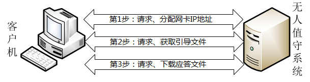

# OS自动化部署

[TOC]

## 概述



## CentOS

### 方法1：PXE + DHCP + TFTP + vsftpd + Kickstart

由于当前的客户端主机并没有完整的操作系统，因此也就不能完成 FTP 协议的验证，所以需要使用 TFTP 协议帮助客户端获取引导及驱动文件。vsftpd 服务程序用于将完整的系统安装镜像通过网络传输给客户端。当然，只要能将系统安装镜像成功传输给客户端即可，因此也可以使用 httpd 来替代 vsftpd 服务程序。

#### Server

服务器端需要安装如下服务：

| 服务名称    | 主要作用                       |
| ----------- | ------------------------------ |
| dhcpd       | 分配网卡信息及指引获取驱动文件 |
| tftp-server | 提供驱动及引导文件的传输       |
| SYSLinux    | 提供驱动及引导文件             |
| vsftpd      | 提供完整系统镜像的传输         |
| kickstart   | 提供安装过程中选项的问答设置   |

##### DHCP
```bash
# 编辑配置文件。
# 允许BOOTP引导程序协议，旨在让局域网内暂时没有操作系统的主机也能获取静态IP地址。
# 加载了引导驱动文件pxelinux.0，让客户端主机获取到IP地址后主动获取引导驱动文件，自行进入下一步的安装过程。
vim /etc/dhcp/dhcpd.conf

allow booting;
allow bootp;
ddns-update-style interim;
ignore client-updates;

subnet 192.168.10.0 netmask 255.255.255.0 {
     option subnet-mask      255.255.255.0;
     option domain-name-servers  192.168.10.10;
     range dynamic-bootp 192.168.10.100 192.168.10.200;
     default-lease-time      21600;
     max-lease-time          43200;
     next-server             192.168.10.10;
     filename                "pxelinux.0";
}
```

##### TFTP

配置TFTP服务程序，为客户端主机提供引导及驱动文件。当客户端主机有了基本的驱动程序之后，再通过vsftpd服务程序将完整的光盘镜像文件传输过去。

##### SYSLinux

用于提供引导加载的服务程序，目的是简化安装Linux系统的时间。SYSLinux是一个用于提供引导加载的服务程序。与其说SYSLinux是一个服务程序，不如说是一个包含了很多引导文件的文件夹。在安装好SYSLinux服务程序后，/usr/share/syslinux目录中会出现很多引导文件。

```bash
# 安装syslinux服务程序
yum install syslinux
dnf install syslinux

# 将引导相关文件复制到tftp目录以供客户端下载（请确保光盘镜像已挂载到/media/cdrom）
cd /var/lib/tftpboot
cp /usr/share/syslinux/pxelinux.0 .
cp /media/cdrom/images/pxeboot/{vmlinuz,initrd.img} .
cp /media/cdrom/isolinux/{vesamenu.c32,*.msg} .

# 将引导模板文件复制tftp目录
mkdir pxelinux.cfg
# 这个default文件就是开机时的选项菜单
cp /media/cdrom/isolinux/isolinux.cfg pxelinux.cfg/default

# 编辑引导模板文件
vim pxelinux.cfg/default
#将第1行修改为：
default linux
#将第64行修改为：
append initrd=initrd.img inst.stage2=ftp://192.168.10.10 ks=ftp://192.168.10.10/pub/ks.cfg quiet
#以下部分，有资料没有提及。
#将第70行修改为：
append initrd=initrd.img inst.stage2=ftp://192.168.10.10 rd.live.check ks=ftp://192.168.10.10/pub/ks.cfg quiet
```

默认的开机菜单中有3个选项：安装系统、对安装介质进行检验、排错模式。既然已经确定采用无人值守的方式安装系统，若还需要为每台主机手动选择相应的选项，则未免与我们的主旨（无人值守安装）相悖。

这样系统在开机时就会默认执行那个名称为linux的选项了。对应的linux选项大约在第64行，将默认的光盘镜像安装方式修改成FTP文件传输方式，并指定好光盘镜像的获取网址以及Kickstart应答文件的获取路径：

建议在安装源的后面加入quiet参数，意为使用静默安装方式，不再需要用户进行确认。文件修改完毕后保存即可。开机选项菜单是被调用的文件，因此不需要单独重启任何服务。

##### vsftpd

```bash
# RHEL 8系统版本的vsftpd服务默认不允许匿名公开访问模式，因此需要手动进行开启
vim /etc/vsftpd/vsftpd.conf
anonymous_enable=YES

# 将光盘镜像文件的内容复制到FTP目录中（请先确保您的光盘已经挂载到/media/cdrom目录）
cp -r /media/cdrom/* /var/ftp
```

##### 创建KickStart应答文件

在 root 管理员的家目录中有一个名为 anaconda-ks.cfg 的文件，它就是应答文件。下面将这个文件复制到 vsftpd 服务程序的工作目录中（在开机选项菜单的配置文件中已经定义了该文件的获取路径，也就是 vsftpd 服务程序数据目录中的 pub 子目录）。使用 chmod 设置该文件的权限，确保所有人都有可读的权限，以保证客户端主机顺利获取到应答文件及里面的内容。Kickstart 应答文件将使用 FTP 服务进行传输，然后由安装向导进行调用，因此也不需要重启任何服务。

```bash
# 复制一份应答文件模板并给予权限
cp ~/anaconda-ks.cfg /var/ftp/pub/ks.cfg
chmod +r /var/ftp/pub/ks.cfg

# 编辑模板文件
vim /var/ftp/pub/ks.cfg 

#将第6行的cdrom修改为
url --url=ftp://192.168.10.10
```

#### Client

开启客户机，使用 PXE 启动。

### 方法2 Cobbler

## Ubuntu

