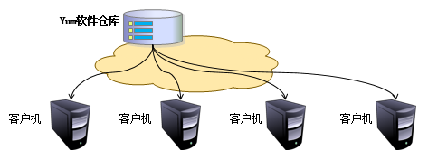

# 软件管理

[TOC]

## 概论

软件包管理器公布之前，要想在Linux系统中安装软件，只能采取编译源码包的方式。所以，早期安装软件是一件非常困难、耗费耐心的事情，而且大多数的服务程序仅仅提供自身的源代码，还需要运维人员编译代码后自行解决软件之间的依赖关系。

早期的 Linux 系统在安装、升级、卸载服务程序时还要考虑到其他程序、库的依赖关系，所以在进行校验、安装、卸载、查询、升级等软件操作时难度都非常大。

## 软件包管理器

### apt-get

大多数基于 Debian 的系统通常会使用 apt-get 来安装软件包和升级。

```bash
apt-get update
apt-get upgrade

# 清除相关命令
apt-get clean
# 清除遗留在 /var/cache 中的已取回的包文件的本地仓库。
# 清除的目录是 /var/cache/apt/archives/ 和 /var/cache/apt/archives/partial/ 。
# 留在 /var/cache/apt/archives 中的是 lock 文件和 partial 子目录。
# 通常用于根据需要清除磁盘空间，一般作为定期计划维护的一部分。

apt-get autoclean
# 类似于 apt-get clean ，会清除已检索包文件的本地仓库，但只会删除不会再下载且几乎无用的文件。有助于防止缓存过大。

apt-get autoremove
# 将删除自动安装的软件包，因为某些其他软件包需要它们，但是在删除了其他软件包之后，而不再需要它们。有时会在升级时建议运行此命令。
# 要删除的软件包通常称为“未使用的依赖项”。实际上，一个好的做法是在卸载软件包后使用 autoremove ，以确保不会留下不需要的文件。
```

### dpkg

Debian 包管理器。

#### 语法

```bash
dpkg -[command] [.deb package name]

# 安装/升级软件
# 如果软件已经安装了，就会升级它。
dpkg -i package.deb

# 从文件夹里安装软件
# 会安装 /opt/software 目录下的所有以 .deb 为后缀的软件。
dpkg -iR /opt/software

# 显示已安装软件列表，同时显示软件版本和描述信息。
dpkg -l

# 查看指定的已安装软件，同时会显示软件版本和描述信息。
dpkg -l atom

# 查看软件安装目录
dpkg -L atom

# 查看 deb 包内容
dpkg -c atom-amd64.deb

# 显示软件的详细信息，如软件名、软件类别、版本、维护者、软件架构、依赖的软件、软件描述等等
dpkg -s atom
 
# 查看文件属于哪个软件
dpkg -S /usr/bin/atom

# 移除/删除软件，但不删除配置文件。
dpkg -r atom

# 清除软件，包括配置文件在内的所有文件。
dpkg -P atom

# 帮助
dpkg -help
```

#### 相关文件的位置

```bash
/var/lib/dpkg
# 这个文件包含了被 dpkg 命令（install、remove 等）所修改的包的信息。

/var/lib/dpkg/status
# 这个文件包含了可用包的列表
```

### DNF（Dandified Yum）

发现 Yum 虽然解决了软件的依赖关系问题，但仍然还是存在分析不准确、内存占用量大、不能多人同时安装软件等硬伤。在 2015 年随着 Fedora 22 系统的发布，红帽给了一个新的选择— DNF 。DNF 实际上就是解决了上述问题的 Yum 软件仓库的提升版，行业内称之为 Yum v4 版本。

作为 Yum 软件仓库 v3 的接替者，DNF 特别友好地继承了原有的命令格式，且使用习惯上也保持了一致。

The `dnf` command allows the management of packages by  comparing those installed on the system with those in the repositories  defined on the server. It also automatically installs dependencies, if  they are also present in the repositories.

The dnf command allows you to install a package by specifying only the short name.

```
dnf [install][remove][list all][search][info] package
```

Example:

```
[root]# dnf install tree
```

Only the short name of the package is required.

| Option                    | Description                                   |
| ------------------------- | --------------------------------------------- |
| `install`                 | Installs the package.                         |
| `remove`                  | Uninstall the package.                        |
| `list all`                | Lists the packages already in the repository. |
| `search`                  | Search for a package in the repository.       |
| `provides */command_name` | Search for a command.                         |
| `info`                    | Displays the package information.             |

The `dnf list` command lists all the packages installed on the system and present in the repository. It accepts several parameters:

| Parameter   | Description                                                  |
| ----------- | ------------------------------------------------------------ |
| `all`       | Lists the installed packages and then those available on the repositories. |
| `available` | Lists only the packages available for installation.          |
| `updates`   | Lists packages that can be upgraded.                         |
| `obsoletes` | Lists the packages made obsolete by higher versions available. |
| `recent`    | Lists the latest packages added to the repository.           |

Example of a search for the `semanage` command:

```
[root]# dnf provides */semanage
```


The DNF manager relies on one or more configuration files to target the repositories containing the RPM packages.

These files are located in `/etc/yum.repos.d/` and must end with `.repo` in order to be used by DNF.

Example:

```
/etc/yum.repos.d/Rocky-BaseOS.repo
```

Each `.repo` file consists of at least the following information, one directive per line.

Example:

```ini
[baseos] # Short name of the repository
name=Rocky Linux $releasever - BaseOS # Short name of the repository #Detailed name
mirrorlist=http://mirrors.rockylinux.org/mirrorlist?arch=$basearch&repo=BaseOS-$releasever # http address of a list or mirror
#baseurl=http://dl.rockylinux.org/$contentdir/$releasever/BaseOS/$basearch/os/ # http address for direct access
gpgcheck=1 # Repository requiring a signature
enabled=1 # Activated =1, or not activated =0
gpgkey=file:///etc/pki/rpm-gpg/RPM-GPG-KEY-rockyofficial # GPG public key path
```

By default, the `enabled` directive is absent which means that the repository is enabled. To disable a repository, you must specify the `enabled=0` directive.

### Pacman

### RPM（RedHat Package Manager）

RPM（红帽软件包管理器），有点像Windows系统中的控制面板，会建立统一的数据库，详细记录软件信息并能够自动分析依赖关系。

RPM 软件包的命名规则：


| 命令                  | 作用                                         |
| --------------------- | -------------------------------------------- |
| rpm -ivh filename.rpm | 安装软件                                     |
| rpm -Uvh filename.rpm | 升级软件                                     |
| rpm -e filename.rpm   | 卸载软件                                     |
| rpm -qpi filename.rpm | 查询软件描述信息                             |
| rpm -qpl filename.rpm | 列出软件文件信息                             |
| rpm -qf filename      | 查询文件属于哪个RPM                          |
| -h                    | Displays a progress bar.                     |
| -v                    | Informs about the progress of the operation. |
| --test                | Tests the command without executing it.      |

The `rpm` command also allows you to query the system package database by adding the `-q` option.

It is possible to execute several types of queries to obtain  different information about the installed packages. The RPM database is  located in the directory `/var/lib/rpm`.

Example:

```
[root]# rpm -qa
```

This command queries all the packages installed on the system.

```
rpm -q [-a][-i][-l] package [-f] file
```

Example:

```
[root]# rpm -qil package
[root]# rpm -qf /path/to/file
```

| Option           | Description                                                  |
| ---------------- | ------------------------------------------------------------ |
| `-a`             | Lists all packages installed on the system.                  |
| `-i __package__` | Displays the package information.                            |
| `-l __package__` | Lists the files contained in the package.                    |
| `-f`             | Shows the name of the package containing the specified file. |
| `--last`         | The list of packages is given by installation date (the last installed packages appear first). |

!!! Warning After the `-q` option, the package name must be exact. Metacharacters (wildcards) are not supported.

!!! Tip However, it is possible to list all installed packages and filter with the `grep` command.

Example: list the last installed packages:

```
sudo rpm -qa --last | head
NetworkManager-config-server-1.26.0-13.el8.noarch Mon 24 May 2021 02:34:00 PM CEST
iwl2030-firmware-18.168.6.1-101.el8.1.noarch  Mon 24 May 2021 02:34:00 PM CEST
iwl2000-firmware-18.168.6.1-101.el8.1.noarch  Mon 24 May 2021 02:34:00 PM CEST
iwl135-firmware-18.168.6.1-101.el8.1.noarch   Mon 24 May 2021 02:34:00 PM CEST
iwl105-firmware-18.168.6.1-101.el8.1.noarch   Mon 24 May 2021 02:34:00 PM CEST
iwl100-firmware-39.31.5.1-101.el8.1.noarch    Mon 24 May 2021 02:34:00 PM CEST
iwl1000-firmware-39.31.5.1-101.el8.1.noarch   Mon 24 May 2021 02:34:00 PM CEST
alsa-sof-firmware-1.5-2.el8.noarch            Mon 24 May 2021 02:34:00 PM CEST
iwl7260-firmware-25.30.13.0-101.el8.1.noarch  Mon 24 May 2021 02:33:59 PM CEST
iwl6050-firmware-41.28.5.1-101.el8.1.noarch   Mon 24 May 2021 02:33:59 PM CEST
```

Example: list the installation history of the kernel:

```
sudo rpm -qa --last kernel
kernel-4.18.0-305.el8.x86_64                  Tue 25 May 2021 06:04:56 AM CEST
kernel-4.18.0-240.22.1.el8.x86_64             Mon 24 May 2021 02:33:35 PM CEST
```

Example: list all installed packages with a specific name using `grep`:

```
sudo dnf list installed | grep httpd
centos-logos-httpd.noarch           80.5-2.el8                              @baseos      
httpd.x86_64                        2.4.37-30.module_el8.3.0+561+97fdbbcc   @appstream   
httpd-filesystem.noarch             2.4.37-30.module_el8.3.0+561+97fdbbcc   @appstream   
httpd-tools.x86_64                  2.4.37-30.module_el8.3.0+561+97fdbbcc   @appstream
```

### urpmi

### Yum (**Yellow dog** U**pdater** Modified)

尽管 RPM 能够帮助用户查询软件之间的依赖关系，但问题还是要自己来解决，而有些大型软件可能与数十个程序都有依赖关系，在这种情况下安装软件依然很繁琐。Yum 软件仓库是为了进一步降低软件安装难度和复杂度而设计的技术。Yum 软件仓库可以根据用户的要求分析出所需软件包及其相关的依赖关系，然后自动从服务器下载软件包并安装到系统。Yum 软件仓库的技术拓扑图如下：



Yum 软件仓库中的 RPM 软件包可以是由红帽官方发布的，也可以是由第三方发布的，当然也可以是自己编写的。

deltarpm 

增量 RPM 包包含旧版本和新版本的 RPM 包之间的差别。在旧 RPM 上应用增量 RPM 将得到全新的 RPM。不需要旧 RPM 的副本，因为增量 RPM 可以与已安装的 RPM 一起工作。增量 RPM 包的大小甚至比增补程序 RPM 小，这有利于通过因特网传送更新包。缺点是，涉及增量 RPM 的更新操作与使用纯粹 RPM 或增补程序 RPM 进行更新的情况相比，占用的 CPU 周期要长得多。

| 命令                            | 说明                                               |
| ------------------------------- | -------------------------------------------------- |
| yum repolist all                | 列出所有仓库                                       |
| yum list all                    | 列出仓库中所有软件包                               |
| yum list extras                 | 列出所有已安装但不在 Yum Repository 內的软件包     |
| yum list installed              | 列出所有已安装的软件包                             |
| yum list updates                | 列出所有可更新的软件包                             |
| yum list <package_name>         | 列出所指定的软件包                                 |
| yum info                        | 列出所有软件包的信息                               |
| yum info extras                 | 列出所有已安装但不在 Yum Repository 內的软件包信息 |
| yum info updates                | 列出所有可更新的软件包信息                         |
| yum info installed              | 列出所有已安裝的软件包信息                         |
| yum info <package_name>         | 查看软件包信息                                     |
| yum install <package_name>      | 安装软件包                                         |
| yum provides <package_name>     | 列出软件包提供哪些文件                             |
| yum reinstall <package_name>    | 重新安装软件包                                     |
| yum update <package_name>       | 升级指定软件包                                     |
| yum update                      | 升级所有软件包                                     |
| yum remove <package_name>       | 移除软件包                                         |
| yum check-update                | 检查可更新的软件包                                 |
| yum grouplist                   | 查看系统中已经安装的软件包组                       |
| yum groupinstall <package_name> | 安装指定的软件包组                                 |
| yum groupremove <package_name>  | 移除指定的软件包组                                 |
| yum groupinfo <package_name>    | 查询指定的软件包组信息                             |

**清除YUM缓存**

yum 会把下载的软件包和header存储在cache中，而不会自动删除。

```bash
#清除缓存目录(/var/cache/yum)下的软件包
yum clean packages

#清除缓存目录(/var/cache/yum)下的 headers
yum clean headers

#清除所有
yum clean all

#清除缓存目录(/var/cache/yum)下旧的 headers
yum clean oldheaders

#清除缓存目录(/var/cache/yum)下的软件包及旧的headers
yum clean, yum clean all (= yum clean packages; yum clean oldheaders) 
```

#### 配置文件

```bash
cat /etc/yum.conf
 
[main]
cachedir=/var/cache/yum            #yum下载的RPM包的缓存目录
keepcache=0                        #缓存是否保存，1保存，0不保存。一般需要保存一些常用而又不容易下载的软件时，就开启这个选项。
debuglevel=2                       #调试级别(0-10)，默认为2(具体调试级别的应用，我也不了解)。
logfile=/var/log/yum.log           #yum的日志文件所在的位置
exactarch=1                        #在更新的时候，是否允许更新不同版本的RPM包，比如是否在i386上更新i686的RPM包。
obsoletes=1                        #这是一个update的参数，具体请参阅yum(8)，简单的说就是相当于upgrade，允许更新陈旧的RPM包。
gpgcheck=1                         #是否检查GPG(GNU Private Guard)，一种密钥方式签名。
plugins=1                          #是否允许使用插件，默认是0不允许，但是我们一般会用yum-fastestmirror这个插件。
installonly_limit=3                #允许保留多少个内核包。
exclude=selinux*                   #屏蔽不想更新的RPM包，可用通配符，多个RPM包之间使用空格分离。
proxy=socks5://192.168.96.213:1080
```

### Zypper