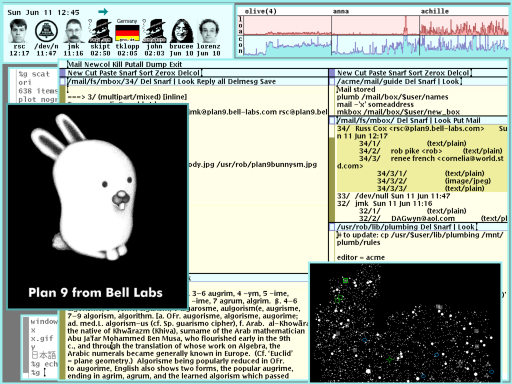

# Plan 9

[TOC]

## 介绍

贝尔实验室的 Plan 9 是贝尔实验室从 1980 年代后期开始开发的研究系统。它的原始设计师和作者是 Ken Thompson、Rob  Pike、Dave Presotto 和 Phil Winterbottom。随着整个 1990 年代至今的发展，许多其他人加入了他们的行列。

Plan 9 展示了一种新的、通常更简洁的方法来解决大多数系统问题。整个系统对于 Unix 用户来说可能感觉很熟悉，但同时又很陌生。

In Plan 9, each process has its own mutable name space. A process may rearrange, add to, and remove from its own name space without affecting the name spaces of unrelated processes.   Included in the name space mutations is the ability to  *mount* a connection to a file server speaking 9P, a simple file protocol. The connection may be a network connection, a pipe, or any other file descriptor open for reading and writing with a 9P server on the other end. Customized name spaces are used heavily throughout the system, to present new resources (e.g., the window system), to import resources from another machine (e.g., the network stack), or to browse backward in time (e.g., the dump file system). 
在 Plan 9 中，每个进程都有自己的可变命名空间。进程可以重新排列、添加到和删除其自己的名称空间，而不会影响不相关进程的名称空间。名称空间变更中包括将连接*挂载*到使用 9P（一种简单的文件协议）的文件服务器的能力。该连接可以是网络连接、管道或任何其他文件描述符，用于与另一端的 9P  服务器进行读写。自定义名称空间在整个系统中被大量使用，以呈现新资源（例如，窗口系统），从另一台计算机导入资源（例如，网络堆栈），或向后浏览（例如，转储文件系统）。

The bulk of the software is predominantly new, written for Plan 9 rather than ported from Unix or other systems. The window system, compilers, file server, and network services are all freshly written for Plan 9. 
Plan 9 是一个操作系统内核，也是随附软件的集合。大部分软件主要是新的，为 Plan 9 编写的，而不是从 Unix 或其他系统移植的。窗口系统、编译器、文件服务器和网络服务都是为 Plan 9 编写的。尽管经典的 Unix 程序，如 [dc(1)](https://plan9.io/magic/man2html/1/dc)、[ed(1)](https://plan9.io/magic/man2html/1/ed)  甚至 [troff(1)](https://plan9.io/magic/man2html/1/troff) 已经出现，但它们通常采用更新的形式。例如，`troff` 接受以 UTF-8 编码的 Unicode 文档，系统的其余部分也是如此。 

论文 [Plan 9 from Bell Labs](https://plan9.io/sys/doc/) 对系统进行了更深入的介绍。

## Release

Plan 9 在其生命周期中已经发布了四个主要版本。

**第一版**于 1992 年发布，仅对大学开放。第一版具有 Plan 9 的大部分可识别部分，包括 kernel、ndb、sam、upas、alef 和完整的 UTF-8 支持。Acme 在早期以 help 的形式出现。CPU 服务器是 Sun Sparcstation、SGI Power 和 SGI Magnum，以 NeXTstation 和 PC 作为终端。The locally built Gnot and Hobbit workstations were also used as terminals. 当地建造的 Gnot 和 Hobbit 工作站也被用作终端。

**第二版**于 1995 年以书籍和 CD 形式发行，添加了 acme 和一些较小的实用程序。到第二版发布时，Plan 9 团队正在努力重新实现名为 Brazil 的系统。1999 年，为了准备第三版发行，Brazil 的名称改回了 Plan 9 。

It introduced a new color graphics operator called draw and a new program connection mechanism called plumbing.
预期的**第三版**于 2000 年 6 月发布，通过 Internet 免费分发。它引入了一个名为 draw 的新彩色图形运算符和一个名为 plumbing 的新程序连接机制。该发行版引入了一个名为 wrap 的简单更新管理器，用于安装打包的系统更新。

9P2000 removes some now-cumbersome restrictions on name lengths, adds a ‘last modifier’ field to directory metadata, batches walk messages, and introduces authentication files as a mechanism for moving the details of authentication  protocols out of the 9P protocol proper. 
从第三版发布后不久开始，贝尔实验室团队开始对 9P 协议进行修订，称为 9P2000。与早期使用的 9P 版本相比，9P2000  消除了一些现在对名称长度的繁琐限制，在目录元数据中添加了“last  modifier”字段，对消息进行批处理，并引入了身份验证文件作为将身份验证协议的详细信息移出 9P 协议的机制。

The **fourth edition** release, in 2002, introduced 9P2000 along with the associated security agent [*factotum*(4)](https://plan9.io/magic/man2html/4/factotum) and key store [*secstore*(8)](https://plan9.io/magic/man2html/8/secstore).
2002 年发布的**第四版**引入了 9P2000 以及相关的安全代理 [*factotum*（4）](https://plan9.io/magic/man2html/4/factotum) 和密钥存储 [*secstore*（8）。](https://plan9.io/magic/man2html/8/secstore) 它还引入了 [venti(8)](https://plan9.io/magic/man2html/8/venti) 块存储服务器。 基于 `venti` 的文件服务器 [fossil(4)](https://plan9.io/magic/man2html/4/fossil) 于 2003 年初首次亮相。 

Nightly snapshots of  *sources*, accessed via its dump file system, provide a convenient release history. 
除了这些程序之外，第四版还引入了一种向系统分发更新的新机制。公共 *fossil* 文件服务器 *sources.cs.bell-labs.com*  保存一个当前文件树，它为任何连接 Internet 的 Plan 9 系统提供服务。对这第四版树的更改是经常进行的，通常是每天都会进行。客户端运行 [replica(1)](https://plan9.io/magic/man2html/1/replica) 工具以保持自己的系统与*源*同步 。 通过其 dump 文件系统访问*的源代码*的夜间快照提供了方便的发布历史记录。 

以下版本代表了 Plan 9 的历史版本。第 4 版的两个版本代表贝尔实验室在更新和修补后提供的初始版本和最终版本。Plan 9 的所有历史版本均已根据 MIT 许可证的条款重新发布。

* 第 1 版：
  * US        [ISO](http://ftp.osuosl.org/pub/plan9/history/plan9-1e.iso.bz2)  [tar](http://ftp.osuosl.org/pub/plan9/history/plan9-1e.tar.bz2)
  * France [ISO](https://plan9.io/plan9/download/history/plan9-1e.iso.bz2)  [tar](https://plan9.io/plan9/download/history/plan9-1e.tar.bz2)
* 第 2 版
  * US        [ISO](http://ftp.osuosl.org/pub/plan9/history/plan9-2e.iso.bz2)  [tar](http://ftp.osuosl.org/pub/plan9/history/plan9-2e.tar.bz2)
  * France [ISO](https://plan9.io/plan9/download/history/plan9-2e.iso.bz2)  [tar](https://plan9.io/plan9/download/history/plan9-2e.tar.bz2)  
* 第 3 版
  * US        [ISO](http://ftp.osuosl.org/pub/plan9/history/plan9-3e.iso.bz2)  [tar](http://ftp.osuosl.org/pub/plan9/history/plan9-3e.tar.bz2)
  * France [ISO](https://plan9.io/plan9/download/history/plan9-3e.iso.bz2)  [tar](https://plan9.io/plan9/download/history/plan9-3e.tar.bz2)  
* 第 4 版
  * US        [ISO](http://ftp.osuosl.org/pub/plan9/history/plan9-4e.iso.bz2)  [tar](http://ftp.osuosl.org/pub/plan9/history/plan9-4e.tar.bz2)
  * France [ISO](https://plan9.io/plan9/download/history/plan9-4e.iso.bz2)  [tar](https://plan9.io/plan9/download/history/plan9-4e.tar.bz2)  
* 第 4 版，最终版本
  * US        [ISO](http://ftp.osuosl.org/pub/plan9/history/plan9-4e-latest.iso.bz2)  [tar](http://ftp.osuosl.org/pub/plan9/history/plan9-4e-latest.tar.bz2)
  * France [ISO](https://plan9.io/plan9/download/history/plan9-4e-latest.iso.bz2)  [tar](https://plan9.io/plan9/download/history/plan9-4e-latest.tar.bz2)

## Licensing

第一版仅供大学使用。

第二版以 350 美元的分发成本向公众提供，其中包括在整个组织中使用该软件的许可。

对于第三版，朗讯同意在新的许可证 Plan 9 许可证下通过互联网免费发布 Plan 9。

The fourth edition was made available under the  [Lucent Public License version 1.02](http://www.opensource.org/licenses/lucent1.02.php). Adopted to address shortcomings in the Plan 9 License, the Lucent Public License 1.02 is identical the  [IBM Public License 1.0](http://www.opensource.org/licenses/ibmpl.php) except that it does not require source code to be distributed with derived works; it is non-viral. 
第四版可在 这 [Lucent Public License 版本 1.02](http://www.opensource.org/licenses/lucent1.02.php)。 用于解决 Plan 9 许可证中的缺点， 朗讯公共许可证 1.02 与 [IBM 公共许可证 1.0](http://www.opensource.org/licenses/ibmpl.php) 不同之处在于它不需要使用 衍生作品;它是非病毒性的。

Since March 23, 2021, all fourth editions were made available under the [MIT License](https://opensource.org/licenses/MIT). 
自 2021 年 3 月 23 日起，所有第四版均在 [MIT 许可证 ](https://opensource.org/licenses/MIT)。

## 现状

Plan 9 每天都在变化。如上所述，这些更改将通过 [*sources.cs.bell-labs.com*](https://plan9.io/sources/) 分发给许多 Plan 9 用户 。即便如此，Plan 9 仍然忠于其最初的愿景，1992 年第一版系统的用户在适应今天时不需要太多帮助。

The dump file system has been mimicked in Athena’s  `OldFiles` directories or Network Appliance’s `.snapshot` directories. The flexible [*rfork*(2)](https://plan9.io/magic/man2html/2/rfork) system call, the basis of lightweight threads, was adopted as is by the various BSD derivatives and reincarnated on Linux as [*clone*(2)](https://plan9.io/magic/man2html/2/clone). The simple file protocol 9P has been implemented on early versions of FreeBSD and current versions of Linux. 
慢慢地，Plan 9 的想法正在被其他系统采用。Plan 9 是第一个完全支持 UTF-8 Unicode 字符集编码的作系统。转储文件系统已在 Athena 的  `OldFiles`  目录或 Network Appliance  `.snapshot`  的目录中被模拟。灵活的 [*rfork*（2）](https://plan9.io/magic/man2html/2/rfork) 系统调用是轻量级线程的基础，被各种 BSD 衍生产品原样采用，并在 Linux 上转世为 [*clone*（2）。](https://plan9.io/magic/man2html/2/clone) 简单文件协议 9P 已在早期版本的 FreeBSD 和当前版本的 Linux 上实现。

少数公司在销售基于 Plan 9 的产品方面取得了成功。 最值得注意的是 [Vita Nuova](http://www.vitanuova.com)，该公司继续维护和销售 Inferno，这是针对机顶盒和其他嵌入式设备的 Plan 9 衍生产品。

In particular, Plan 9 has no full-featured web browser; [*webfs*(4)](https://plan9.io/magic/man2html/4/webfs) and  [*html*(2)](https://plan9.io/magic/man2html/2/html) are intended as steps toward a solution. 
由于 Plan 9 的系统模型与其他现代作系统截然不同，因此有时很难将外部软件移植到 Plan 9。特别是，Plan 9 没有功能齐全的 Web 浏览器;[*webfs*（4）](https://plan9.io/magic/man2html/4/webfs) 和 [*html*（2）](https://plan9.io/magic/man2html/2/html) 旨在作为解决方案的步骤。

## 屏幕截图

这是 8 位颜色映射模式下的 1024x768 屏幕。（Plan 9 还可以以 16 位、24 位和 32 位深度运行。

A multi-level MIME message containing a JPEG has just arrived; the structure of the message is visible in the Acme mail directory on the right-hand side. The graphical programs displayed are: the mail announcer [*faces*(1)](https://plan9.io/magic/man2html/1/faces), the system statistics watcher [*stats*(8)](https://plan9.io/magic/man2html/8/stats), the text editor [*acme*(1)](https://plan9.io/magic/man2html/1/acme), the sky catalog [*scat*(7)](https://plan9.io/magic/man2html/7/scat), the image viewer [*page*(1)](https://plan9.io/magic/man2html/1/page) (showing [glenda](https://plan9.io/plan9/glenda.html)), and the window system [*rio*(1)](https://plan9.io/magic/man2html/1/rio). Acme is running Mail, which uses the mail file system [*upas/fs*(4).](https://plan9.io/magic/man2html/4/upasfs) Acme is also editing the [*rules*](https://plan9.io/magic/man2html/6/plumb) for  [*plumber*(4)](https://plan9.io/magic/man2html/4/plumber)
刚刚收到一封包含 JPEG 的多级 MIME 邮件;邮件的结构显示在右侧的 Acme 邮件目录中。显示的图形程序是：邮件播报员[*的脸（*1），](https://plan9.io/magic/man2html/1/faces) 系统统计观察器[*统计* （8），](https://plan9.io/magic/man2html/8/stats) 文本编辑器 [*acme*（1），](https://plan9.io/magic/man2html/1/acme) 天空目录 [*scat*（7），](https://plan9.io/magic/man2html/7/scat) 图像查看器[*页面* （1）](https://plan9.io/magic/man2html/1/page) （显示 [Glenda](https://plan9.io/plan9/glenda.html)）和窗口系统 [*Rio*（1）。](https://plan9.io/magic/man2html/1/rio)Acme 正在运行 Mail，它使用邮件文件系统 [*upas/fs*（4）。](https://plan9.io/magic/man2html/4/upasfs) Acme 还在编辑[*管道工*](https://plan9.io/magic/man2html/4/plumber)[*的*规则 （](https://plan9.io/magic/man2html/6/plumb)4） .

## Plan 9 兔子 Glenda

 

The logo above is scanned from the original drawing of Glenda, the Plan 9 bunny, and appears on your screen at roughly the size of the original drawing. [Renée French](https://www.instagram.com/reneefrench/) drew Glenda.  When we needed higher-resolution drawings, she made a much larger drawing, which was scanned, tweaked, and made into two versions, one with a white background and one with a black background. High-resolution JPEGs of these versions are available by clicking on the images below. 
上面的标志是从 Glenda 的原始图纸扫描而来的， Plan 9 兔子，并以大致相同的大小出现在您的屏幕上 的原始绘图。 [Renée French](https://www.instagram.com/reneefrench/) drew Glenda. 当我们需要更高分辨率时 图画，她画了一幅大得多的图画， 它被扫描、调整并制作成两个版本， 一个背景为白色，另一个背景为黑色。 这些版本的高分辨率 JPEG 可通过单击 在下面的图片中。

Feel free to use these images to make t-shirts and other paraphernalia, but if you do a production run, please send us a sample for our collection. 
随意使用这些图像制作 T 恤和其他用具，但如果您进行生产运行，请将我们的系列样品发送给我们。

|  |  |  |
| ------------------------------------------------------------ | ------------------------------------------------------------ | ------------------------------------------------------------ |

## 第四版发行说明

2002 年 4 月

更新时间：2003 年 6 月

The fourth release of the Plan 9 operating system from Bell Labs packages a major overhaul of the system at every level.
贝尔实验室 （Bell Labs） 的 Plan 9 操作系统的第四个版本对系统的各个级别进行了重大改革。从底层文件系统协议 9P 到内核、库和应用程序，几乎所有内容都经过修改，在许多情况下，还被重新设计或重写。

The most significant change is that 9P has been redesigned to address a number of shortcomings, most important, its previous inability to handle long file names. Unfortunately, squeezing long names onto the disks of existing file servers is a messy business that we’re still grappling with, so at the moment *fs*(4) and *kfs*(4) can’t yet handle long names, although they do talk the new protocol. (In fact, they talk both old and new, as required, to ease transition.) In the meantime, there is a workaround — *lnfs*(4) — and many of the other file servers such as *ramfs*(4) and *u9fs*(4) work just fine with long names. It’s only the old disk-resident file servers that don’t. The new file server *fossil*(4) handles supports long names and many other features.
最显着的变化是 9P 经过重新设计，解决了许多缺点，最重要的是，它以前无法处理长文件名。不幸的是，将长名称压缩到现有文件服务器的磁盘上是一件麻烦的事情，我们仍在努力解决，因此目前 *fs*（4） 和 *kfs*（4） 还不能处理长名称，尽管它们确实使用新协议。（事实上，他们根据需要同时谈论新旧对话，以简化过渡。同时，有一个解决方法 — *lnfs*（4） — 许多其他文件服务器，例如 *ramfs*（4） 和 *u9fs*（4） 可以很好地使用长名称。只有旧的驻留在磁盘上的文件服务器没有。新的文件服务器 *fossil*（4） handles 支持长名称和许多其他功能。较旧的服务器现已弃用。

以下是整个系统主要更改的部分列表。

* It now has variable-length names, so it can handle long names but also is more compact when handling short ones. It uses a different format that is easily parsed, eliminating the need for the old `aux/fcall` utility, and delegates its authentication duties to an external agent, `factotum`
  ∙ 文件系统协议 9P 已重新设计。它现在具有可变长度的名称，因此它可以处理长名称，但在处理短名称时也更加紧凑。它使用易于解析的不同格式，无需旧  `aux/fcall`  实用程序，并将其身份验证职责委托给外部代理。  `factotum` .
* A new security agent, *factotum*(4), manages passwords and other secrets and, coupled with a new secure file store *secstore*(8), enables secure single sign-on. 
  ∙ 安全性一直是关注的焦点。新的安全代理 *factotum*（4） 管理密码和其他秘密，并结合新的安全文件存储 *secstore*（8），实现安全的单点登录。 
* ∙ `Cpu`, `import`, and `exportfs` all encrypt their connections now, and since they use the new 9P they also use new network port numbers. A new service *aan*(1) is used by `import` to make its network connections more reliable in the face of network outages. The old ports still work, through the agency of a protocol conversion filter *srvold9p*(4). 
    `Cpu` ∙ 、  `import`  和  `exportfs`  现在都加密了他们的连接，并且由于他们使用新的 9P，因此他们也使用新的网络端口号。使用一个新的服务 *aan*（1）  来使其网络连接在网络中断时更加可靠。 `import`  旧的端口仍然可以通过协议转换过滤器 *srvold9p*（4）  的代理工作。
* ∙ We are phasing out the IL protocol since it doesn’t handle long-distance connections well (and long-distance networks don’t handle it well, either). IL is still used by *fs*(4) but TCP has become the standard protocol for all other services. 
  ∙ 我们正在逐步淘汰 IL 协议，因为它不能很好地处理长途连接（长途网络也不能很好地处理它）。IL 仍然被 *fs*（4） 使用，但 TCP 已经成为所有其他服务的标准协议。 
* ∙ The software for the new network-resident secure block store, *venti*(8), is included with this distribution. The new file server *fossil*(4) uses Venti rather than a WORM as its permanent block repository/backup medium. It is still being developed, but is mature enough that a handful of users throughout the world are using it as their primary file server. 
  ∙ 用于新的网络驻留安全块存储的软件 *venti*（8） 包含在此发行版中。新的文件服务器 *fossil*（4） 使用 Venti 而不是 WORM 作为其永久块存储库/备份介质。它仍在开发中，但已经足够成熟，以至于世界各地的少数用户正在将其用作他们的主要文件服务器。
* ∙ The need to handle longer file names triggered a rethinking of the way the system handles strings in general. The kernel is now more explanatory when it gives an error message and more consistent in how it handles strings such as commands to devices. The interfaces to many of the system calls, such as *errstr*(2) and *wait*(2) all had to change as a result, as did the library interface to read directories, *stat*(2) and its relatives. 
  ∙ 处理较长文件名的需求引发了对系统处理字符串方式的重新思考。现在，内核在提供错误消息时更具解释性，并且在处理字符串（例如设备命令）方面更加一致。因此，许多系统调用的接口，例如 *errstr*（2） 和 *wait*（2） 都不得不更改，用于读取目录、*stat*（2） 及其相关对象的库接口也必须更改。
* ∙ The formatted I/O package described in *print*(2) and *fmtinstall*(2) has been redesigned. Although the basic interface is unchanged, it now runs without locks and has an internal buffer management mechanism that means `print` no longer needs a large on-stack buffer. The interface for writing custom print verbs and custom formatted I/O routines has also been greatly improved. 
  ∙ print（2） 和 *fmtinstall*（2）  中描述的格式化的 I/O 软件包已经重新设计。尽管基本接口保持不变，但它现在在没有锁的情况下运行，并且具有内部缓冲区管理机制，这意味着  `print`  不再需要大型堆栈上缓冲区。用于编写自定义打印动词和自定义格式化 I/O 例程的接口也得到了极大的改进。
* The main visible change is that, coupled with the changes to printing, `threadprint` is gone; you can just use `print` or `fprint` at will. 
  ∙ 线程库 *thread*(2) 已被完全重写。主要的可见变化是，再加上对打印的更改，  `threadprint`  已经消失了;您可以随意使用  `print`  或  `fprint`  随意使用。 
* ∙ Support for electronic mail has been extended in many ways and now includes some new spam filtering tools, much better (and more standard) handling of MIME messages, the ability to render incoming HTML mail, and much more. 
  ∙ 对电子邮件的支持已在许多方面进行了扩展，现在包括一些新的垃圾邮件过滤工具、更好（和更标准）的 MIME 消息处理、呈现传入 HTML 邮件的能力等等。
* There are so many changes to the programming interfaces of the system that they are described in a separate document, entitled *Changes to the Programming Environment in the Fourth Release of Plan 9.* Please read it before you start updating your own software to run under the new system. 
  系统的编程接口有很多变化，因此在单独的文档中描述了这些变化，标题为 *Changes to the Programming Environment in the Fourth Release of Plan 9。*  在开始更新自己的软件以在新系统下运行之前，请先阅读它。 
* The installation method has also changed and we’re moving towards a new method for maintaining updates. The Plan 9 Wiki (`http://plan9.bell-labs.com/wiki/plan9`) and Usenet group (`comp.os.plan9`) are the places to visit to learn more and stay current. In particular, the installation notes are now maintained in the Wiki; the traditional papers on installation and start-up are gone. 
  安装方法也发生了变化，我们正在转向维护更新的新方法。Plan 9 Wiki （ `http://plan9.bell-labs.com/wiki/plan9` ） 和 Usenet 组 （ `comp.os.plan9` ） 是了解更多信息和保持最新状态的地方。特别是，安装说明现在在 Wiki 中维护;关于安装和启动的传统论文已经不复存在。
* There’s lots more new stuff. If you have problems, mail `9trouble@plan9.bell-labs.com` or, better, check the wiki `http://plan9.bell-labs.com/wiki/plan9` or ask the Usenet newsgroup `comp.os.plan9`
  还有更多新内容。如果您有问题，请发送电子邮件  `9trouble@plan9.bell-labs.com`  ，或者更好的是，检查 wiki  `http://plan9.bell-labs.com/wiki/plan9`  或询问 Usenet 新闻组  `comp.os.plan9` .
