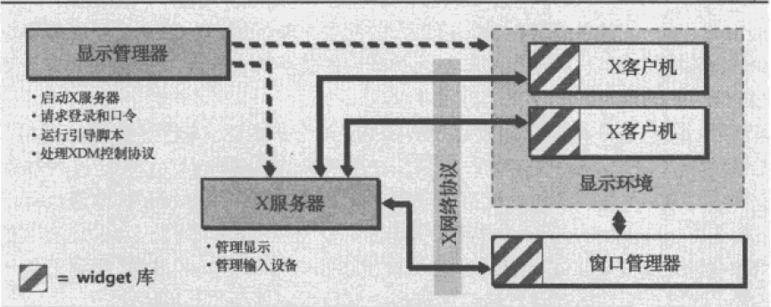

# X窗口系统
X窗口系统(X Window System)，也叫X11，简称为X。是W窗口系统的自然延续。  
20世纪80年代初W --> 1985 X11 --> XFree86 --> 2004 Xorg  
  
## X显示管理器
>* xdm (X display manager)
>* gdm (GNOME display manager)
>* kdm (KDE display manager)
