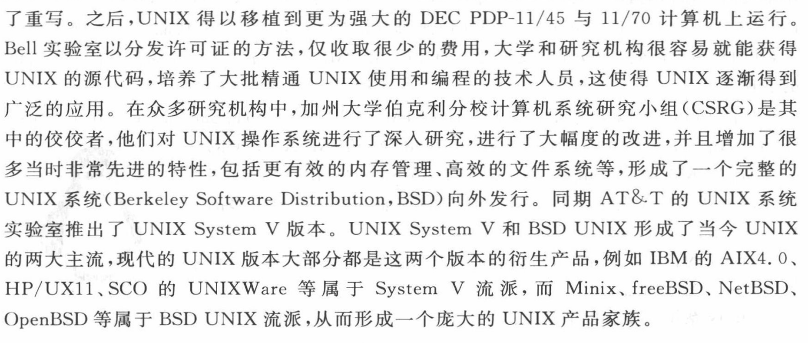

# 历史

[TOC]

## MULTICS

二十世纪六十年代，人们还在用批处理计算机，也就是一次性给一批任务到计算机，然后等待结果，中途不能和计算机进行交互，而且准备作业需要耗费大量时间。

1965 年，为了解决服务器的终端连接数量的限制（300 台以上终端机可以同时连接一台大型计算机进行作业）和处理复杂计算的问题，AT&T 贝尔（Bell）实验室、通用电气（GE）公司以及麻省理工学院（MIT）决定联手打造一款全新的“分时多任务处理系统” — MULTICS（Multiplexed Information and Computing System，多任务信息与计算系统）。

其目标是开发一种交互式的、具有多道程序处理能力的分时操作系统，以取代当时广泛使用的批处理操作系统。

但由于开发过程不顺利，遇到了诸多阻碍，后期连资金也出现了短缺现象，最终在 1969 年，随着贝尔实验室的退出，MULTICS 也终止了研发工作（后来 Multics 成功开发完成，尽管没有再被重视）。

## UNIX

1969 年，调回到贝尔实验室的工程师看到费时的批处理机器，十分怀念先进的 Multics 。一位工程师肯·汤普森（ Ken Thompson ）在研发 Multics 的时候，写了一个叫太空大战（SpaceTravel）的游戏，是飞机发射子弹那种类型的游戏，然而这个游戏只能运行在 Multics 上面，他很想要移植这个游戏继续玩。

1969 年 8 月，Thompson 在库房发现了一台闲置的 PDP-7 ，刚好此时休假并且妻儿都去加利福尼亚探亲度假去了，经过四个星期的努力，用 BCPL（Basic Combined Programming Language，基本组合编程语言）、汇编语言编写了一组内核程序，还包括内核工具程序，以及一个小的文件系统。完成之后，Thompson 激动地把身边的同事叫过来，让他们来玩他的游戏。由于这个系统是由 Multics 简化而来，同事们就戏称这个系统为 "UNiplexed Information and Computing Service”，即没路信息计算系统，缩写为 Unics ，取其谐音 Unix 。这时是 1970 年，于是就将 1970 年定为 Unix 元年，现代计算机的计时也就是这个时候（参考日期为 1970 年 1 月 1 日）开始的。

不久，丹尼斯·里奇（Dennis Ritchie）加入了这个项目。


Unix 实在太好用了，这套系统在 Bell 实验室广为流传。但 Unix 是用汇编语言写的，有致命的缺点——高度依赖硬件，需要针对每一台不同架构的服务器重新编写汇编语言代码，才能使其使用 UNICS 系统内核。这样不仅麻烦而且使用门槛极高。于是 Thompson 和 Dennis Ritchie 合作准备用更高级的语言改写，提高可移植性。Thompson 改进了 BCPL，称为 B 语言，然而这套语言在内存方面有限制，一筹莫展。又和 Ritchie 尝试了 Pascal，发现编译出来的内核性能并不好。最终 Ritchie 决定再对 B 语言进行改进，成为了大名鼎鼎的 C 语言（1971 年）。1973 年时，重新改写了 Unix ，让其具备更好的跨平台性，更适合被广泛普及。

1974 年 7 月，Bell 实验室公开了 Unix ，引起了学术界的广泛讨论，并大量应用于教育目的。

1976 年，UNIX 被无偿向大学发放，因而成了许多操作系统课程和学术研究项目的基础。

1977 年，加州大学伯克利分校的计算机系统研究小组 (ComputerSystemResearch Group，CSRG) 从 AT&T 获得了有许可证的代码，自此成为伯克利 UNIX (Berkeley UNIX) 的开端。

1978 年学术界老大伯克利大学，推出了以 Unix 第六版为基础并加入改进的新 Unix ，并命名为 BSD（Berkeley Software Distribution 伯克利分发版），于是 Unix 的分支 BSD 系列就诞生了。

伯克利的发布版本(称为 BSD，代表 Berkeley Software Distribution)从 1977年用于 PDP-11 的第一个版本 1BSD 开始，到 1993 年以最高版本 4.4BSD 结束。

由于 Unix 的高度可移植性与强大的性能，加上当时并没有版权的纠纷，所以让很多商业公司开始了 Unix 操作系统的开发。

然而当时 Bell 属于 AT&T，AT&T 被《谢尔曼反托拉斯法》规定了不能销售除了电话机电报机等之外的商品，后来随着 AT&T 的分解，Bell 可以卖出 Unix 了，第七版 Unix 明确提出“不可对学生提供源码”，Unix 走向了商业化。高昂的授权费导致很多大学停止了对 Unix 的研究。

在 1979 年，贝尔实验室的上级公司 AT&T 看到了 UNIX 系统的商业价值和潜力，不顾贝尔实验室的反对声音，依然坚决做出了对其商业化的决定，并在随后收回了版权，逐步限制 UNIX 系统源代码的自由传播，渴望将其转化成专利产品而大赚一笔。崇尚自由分享的黑客面对冷酷无情的资本力量心灰意冷，开源社区的技术分享热潮一度跌入谷底。此时，人们也不能再自由地享受科技成果了，一切都以商业为重。

随着 UNIX 获得了商业上的认可，源代码许可证的价格迅速攀升。最后，伯克利制订出长期目标，要从 BSD 中去除 AT&T 的代码，这是一个单调乏味而且耗时的过程。在这项工作即将完成时，伯克利失去了研究操作系统的资金支持，于是 CSRG 被解散了。

在解散以前，CSRG 发布了其不含 AT&T 代码的最终软件包，即 4.4BSD-Lite 。目前大多数 BSDUNIX 的版本(包括 FreeBSD、NetBSD、Mac OS X 和 OpenBSD  等)都宣称 4.4BSD-Lite 软件包是它们的“鼻祖”。

大多数其他的主流 UNIX 版本(包括 HP-UX 和 Solaris )都是有原 AT&T 代码“血统”的后代。Linux 并没有和 AT&T 或者 BSD 风格的 UNIX 共享代码，但是从功能上看，Linux 系统的位置则介于两者之间。

## GNU

Richard M.Stallman 看不惯版权收费，于 1984 年创立自由软件体系 GNU（Gun is Not Unix），拟定了普遍公用版权协议（General Public License，GPL），所有 GPL 协议下的自由软件都遵循着 Copyleft（非版权）原则：自由软件允许用户自由拷贝、修改和销售，但是对其源代码的任何修改都必须向所有用户公开 。

GNU 希望开发一个类似 UNIX 并且是自由软件的完整操作系统——GNU 系统。到 90 年代初，GNU 项目开发出许多高质量的免费软件，包括 emacs 编辑器、bash shell 程序、gcc 系列编译程序、gdb 调试程序。

面对如此封闭的软件创作环境，著名的黑客 Richard  Stallman 在 1983 年发起了 GNU 源代码开放计划，并在 1989 年起草了著名的 GPL 许可证。他渴望建立起一个更加自由和开放的操作系统和社区。之所以称之为 GNU，其实是有 “GNU’s Not  Unix!” 的含义，这暗戳戳地鄙视了一下被商业化的 UNIX 系统。但是，想法和计划只停留在口头上是不够的，还需要落地才行，因此 Richard 便以当时现有的软件功能为蓝本，重新开发出了多款开源免费的好用工具。在 1987 年，GNU 计划终于有了重大突破，Richard 和社区共同编写出了一款能够运行 C 语言代码的编译器— gcc（GNU C  Compiler）。这使得人们可以免费地使用 gcc 编译器将自己编写的 C 语言代码编译成可执行文件，供更多的用户使用，这进一步发展壮大了开源社区。随后的一段时间里，Emacs 编辑器和 bash 解释器等重磅产品陆续亮相，一批批的技术爱好者也纷纷加入 GNU 源代码开放计划中来。

## Minix

Unix 进行了商业化，教师们都用不起了，1987 年，身为 ACM 和 IEEE 两会资深会员的荷兰数学与计算机科学系统教授 Andrew S. Tanenbaum 开发了 Minix 操作系统，是 Unix 的缩小版，用于学生学习操作系统原理，很多技术大牛希望改进 Minix ，但遭到了 AST 教授的丑拒，他认为 Minix 就是为了教学，让学生一学期学完，并不想被加入杂乱的东西。

在 1984 年时，UNIX 系统版权依然被 AT&T 公司死死地攥在手里，AT&T 公司明确规定不允许将代码提供给学生使用。荷兰的一位大学教授 Andrew（历史中被遗忘的大神）为了能给学生上课，竟然仿照 UNIX 系统编写出了一款名为 Minix 的操作系统。但当时他只是用于课堂教学，根本没有大规模商业化的打算，所以实际使用 Minix 操作系统的人数其实并不算多。

## POSIX

POSIX（Portable Operating System Interface for Computing Systems）是由 IEEE 和 ISO/IEC 开发的一簇标准，该标准是基于现有的 UNIX 实践和经验，描述了操作系统的调用服务接口，用于保证编制的应用程序可以在源代码一级上在多种操作系统上移植和运行。

## Linux

IBM 公司开发的 MS-DOS 操作系统、Apple 公司开发的 Mac 操作系统，Unix 操作系统，Minix 操作系统全都要收费。GNU 尽管已经开发出最受期盼的GNU C 编译器，开发的操作系统却进度缓慢，渴求诞生一款自由软件操作系统来证明自己存在的价值。

与此同时，芬兰学生 Linus Torvalds 利用圣诞的压岁钱和贷款购买了一台 386 兼容电脑，并从美国邮购了一套 Minix 系统软件，在等待邮寄到达的期间，Linus 认真学习了有关 Intel 80386 的硬件知识。为了能通过 Modem 拨号连接到学校的主机上，他使用汇编语言并利用 80386 CPU 的多任务特性编制出了相关程序。甚至为了将老式电脑的软件复制到新电脑上，为一些硬件编写了驱动程序。Linus 逐渐认识到了 Minix 的诸多限制，产生了自己编写一个新的操作系统的想法，最初构想的这个项目是要作为 Minix 的一个有限分支。

1991 年 4 月，Linus 花费了全部时间研究 Minix-386 系统，并尝试移植 GNU 的 gcc、bash、gdb 到新系统上。

1991 年 4 月 13 日，Linus 在 comp.os.minix 上发布信息说自己成功将 bash 移植到了 Minix 上，而且已经爱不释手，离不开这个 shell 软件了。

1991 年 7 月 3 日，Linus 在 comp.os.minix 上透露了正在进行 Linux 系统的开发，并已经开始考虑 POSIX 的兼容了。

1991 年 8 月 25 日，Linus 在 comp.os.minix 上发布了 “What would you like to see in minix?”，透露出正在开发一个免费的 386 操作系统，新开发的系统会移植 bash 和 gcc，并且声明他开发的操作系统没有用一行 Minix 的源代码。

1991 年 10 月 5 日，Linus 在 comp.os.minix 上发布消息，正式向外宣布 Linux 内核诞生（Free minix-like kernel sources for 386-AT），发布了第一个版本 0.02 。该系统内核因其较高的代码质量且基于GNU GPL 许可证的开放源代码特性，迅速得到了 GNU 源代码开放计划和一大批黑客程序员的支持，随后 Linux 正式进入如火如荼的发展阶段。Linux 遵循 GPL 协议，也给 GNU 运动送上了一份最好的礼物。Linux 提供内核，GNU 提供外围软件，GNU/Linux 就成了密不可分的体系。术语 Linux 是来自创始人的名字 Linus 和 UNIX 两者的组合。

- **1993**: 创建 Debian 发行版。 Debian 是一个基于社区的非商业发行版。 它最初是为在服务器上使用而开发的，特别适合于服务器，但它是一个通用系统，因此也可以在个人计算机上使用。 Debian 是许多其他发行版的基础，例如 Mint 或 Ubuntu。
- **1994**: 红帽（Red Hat）公司创始人 Bob  Young 在 Linux 系统内核的基础之上，集成了众多的常用源代码和程序软件，随后发布了红帽操作系统并开始出售技术服务，这进一步推动了 Linux 系统的普及。该公司目前是 GNU/Linux 操作系统的领先发行商。 RedHat 支持社区版 Fedora 和自由发行版 CentOS。1.0 版内核发布。
- **1997**: 创建 KDE 桌面环境。 它基于 QT 组件库和 C++ 开发语言。
- 1998 年以后，随着 GNU 源代码开放计划和 Linux 系统的继续火热，以 IBM 和 Intel 为首的多家 IT 巨头企业开始大力推动开放源代码软件的发展，很多人认为这是一个重要转折点。
- **1999**: 创建 Gnome 桌面环境。 它基于 GTK+ 组件库。
- **2002**: 创建 Arch 发行版。 其特殊性在于滚动发行（持续更新）。
- **2004**: Canonical 公司（Mark Shuttleworth）创建 Ubuntu。 它基于 Debian，但包括自由和专有软件。
- 2012 年，红帽公司成为全球第一家年收入 10 亿美元的开源公司，后来是 20 亿、30 亿……不断刷新纪录。
- **2021**: Rocky Linux 诞生，基于 RedHat 发行版。

Linus  Torvalds 最早发布的帖子内容的截图如下。

```bash
  Hello everybody out there using minix -

  I'm doing a (free) operating system (just a hobby, won't be big and
  professional like gnu) for 386(486) AT clones.  This has been brewing
  since april, and is starting to get ready.  I'd like any feedback on
  things people like/dislike in minix, as my OS resembles it somewhat
  (same physical layout of the file-system (due to practical reasons)
  among other things).

  I've currently ported bash(1.08) and gcc(1.40), and things seem to work.
  This implies that I'll get something practical within a few months, and
  I'd like to know what features most people would want.  Any suggestions
  are welcome, but I won't promise I'll implement them :-)

                Linus torvalds
```

Linux 系统的吉祥物名为 Tux，是一只呆萌的小企鹅。相传 Linus  Torvalds 在童年时期去澳大利亚的动物园游玩时，不幸被一只企鹅咬伤，所以为了“报复”就选择了这个物种作为吉祥物。这个故事是否可信无从考证，但万幸是只企鹅，而不是老虎或者狮子，否则就不是换个 Logo 这么简单的事了。


时至今日，Linux内核已经发展到 5.6 版本，衍生系统也有数百个版本之多，它们使用的都是 Linus Torvalds 开发维护的 Linux 系统内核。红帽也成为开源行业及Linux 系统的领头羊。



了重写。之后,UNIX得以移植到更为强大的DECPDP-11/45与11/70计算机上运行Bell实验室以分发许可证的方法,仅收取很少的费用,大学和研究机构很容易就能获得UNIX的源代码,培养了大批精通UNIX使用和编程的技术人员,这使得UNIX逐渐得到广泛的应用。在众多研究机构中,加州大学伯克利分校计算机系统研究小组(CSRG)是其中的佼佼者,他们对UNIX操作系统进行了深入研究,进行了大幅度的改进,并且增加了很多当时非常先进的特性,包括更有效的内存管理、高效的文件系统等,形成了一个完整的UNIX系统(Berkeley Software Distribution,BSD)向外发行。同期AT&T的UNIX系统实验室推出了UNIXSystemV版本。UNIXSystemV和BSD UNIX形成了当今 UNIX的两大主流,现代的UNIX版本大部分都是这两个版本的衍生产品,例如IBM的AIX4.0、HP/UX11、SCO的UNIXWare等属于System V流派,而 Minix、freeBSD、NetBSD、OpenBSD等属于BSDUNIX流派,从而形成一个庞大的UNIX产品家族。