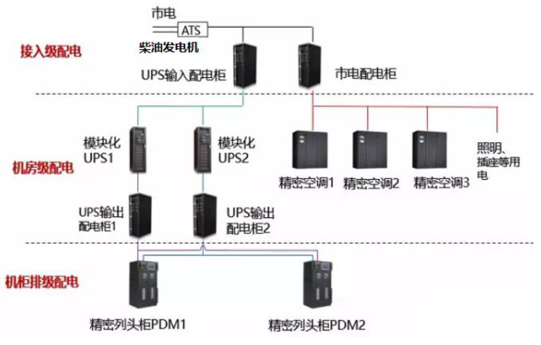

# 数据中心

[TOC]

## 分级

### 国标 GB 50174-2017
《数据中心设计规范》

分类依据：数据中心的使用性质，数据丢失或网络中断在经济或社会上造成的损失或影响程度。

| 级别 | 描述 |
|------|-----|
| A | 容错型，在系统需要运行期间，其场地设备不应因操作失误、设备故障、外电源中断、维护和检修而导致电子信息系统运行中断。 |
| B | 冗余型，在系统需要运行期间，其场地设备在冗余能力范围内，不应因设备故障导致电子信息系统运行中断。 |
| C | 基本型，在场地设备正常运行的情况下，应保证电子信息系统运行不中断。 |

### Uptime Institute的可用性分级体系

|                          | Tier I | Tier II | Tier III      | Tier IV     |
| ------------------------ | ------ | ------- | ------------- | ----------- |
| 支持IT负载的基础设施设备 | N      | N + 1   | N + 1         | 2N          |
| 分配路径                 | 1      | 1       | 1运行 + 1备用 | 2个同时运行 |
| 可并行维护               | 否     | 否      | 是            | 是          |
| 容错性                   | 否     | 否      | 否            | 是          |
| 分区                     | 否     | 否      | 否            | 是          |
| 连续冷却                 | 否     | 否      | 否            | 是          |


| 级别 | 发电机 | UPS | 供电来源 | HVAC | 可用性 |
|----|-----|-----|------|------|-----|
| 1 | 无 | N | 单路 | N | 99.671% |
| 2 | N | N+1 | 单路 | N+1 | 99.741% |
| 3 | N+1 | N+1 | 双路，可切换 | N+1 | 99.982% |
| 4 | 2N | 2N | 双路，并行 | 2N | 99.995% |

### TIA-942

## 功能区

### 划分

* 主机房

  安装和运行数据处理设备的建筑空间，包括服务器机房、网络机房、存储机房等功能区域。

* 辅助区

  安装、调试、维护、运行监控和管理电子信息设备和软件的场所，包括进线间、测试机房、总控中心、消防和安防控制室、拆包区、备件库、维修室、打印室等区域。

* 支持区

  为主机房、辅助区提供动力支持和安全保障的区域，包括变配电室、柴油发电机房、电池室、空调机房、动力站房、不间断电源系统用房、消防设施用房等。

* 行政管理区

  日常行政管理及客户对托管设备进行管理的场所，包括办公室、门厅、值班室、盥洗室、更衣间和用户工作室。

### 面积

在对电子信息设备的具体情况不完全掌握时，主机房使用面积

```bash
A=SN

# A 主机房的使用面积m^2
# S 单台机柜（架）、大型电子信息设备和列头柜等设备占用面积，可取 2 - 4 m^2/台
# N 主机房内所有机柜（架）、大型电子信息设备和列头柜等设备的总台数。
```

## 基础设施组成

### 消防系统

* 火灾探测系统
* 烟感探测系统
* 灭火系统

### DCIM管理

* 集成管理
* 门禁
* CCTV
* 动环监控

### 综合布线

* 走线架
* 光纤配线架
* 线缆 光纤
* 标识
* 走线支架

### 制冷系统

* 精密空调
* 舒适性空调
* 通风系统

### 防雷/接地

* 瞬间浪涌电压抑制装置
* 接地保护系统

### 机柜系统

* 精确送风机柜
* IT设备机柜

### 供电系统



* 高压变配电系统

  将市电（6kV/10kV/35kV，3相）通过该变压器转换成（380V/400V，3相），供后级低压设备用电。

* 低压配电系统

  电能分配，将前级的电能按照要求、标准与规范分配给各种类型的用电设备。

* UPS输出列头配电系统

  UPS输出电能分配，将电能按照要求与标准分配给各种类型的IT设备。

* 机架配电系统

  机架内的电能分配。

* -48V直流电源

  为通信设备提供安全、可靠的电源保障。

* 柴油发电机系统

  作为后备电源，一旦市电失电，迅速启动为后级低压设备提供备用电源，根据不同电压级别，分中压油机和低压油机。

* ATS

* UPS

  电能净化，电能后备，为IT负载提供纯净、可靠的用电保护。

* 直流电源柜

* 交流电源柜

* 自动转换开关系统

  自动完成市电与市电或者市电与柴油发电机之间的备用切换。

* 电池及电池架

* 电源线缆

### 内部装修

* 平面布局
* 门窗
* 墙 天花板
* 架空地板
* 照明

## 数据中心内机架的功率分级

| 功率级别 | 瓦/机架 |
|------|------|
| 超高密度 | 25kW |
| 甚高密度 | 20kW |
| 高密度 | 16kW |
| 存储设备 | 12kW |
| 网络交换设备 | 8kW |
| 正常密度 | 6kW |

## kVA和kW
kVA=kW/0.85  
kW=kVA*0.85

## 绿色IT中“绿色”的含义
>* 较低的功耗
>* 较小的场地需求
>* 较低的耗材消耗
>* 可循环利用的产出

## 供电

1. 设备内部安装蓄电池（比如服务器主板）
2. UPS
3. 双线供电
4. 柴油发电机 + 油罐

## 发展历程

* 传统离散数据中心
* 虚拟化数据中心
* 云数据中心
* 分布式云数据中心

## 制冷技术

* 联动管理
* 冷冻水行级空调
* 自然冷却技术
* 密闭冷热通道