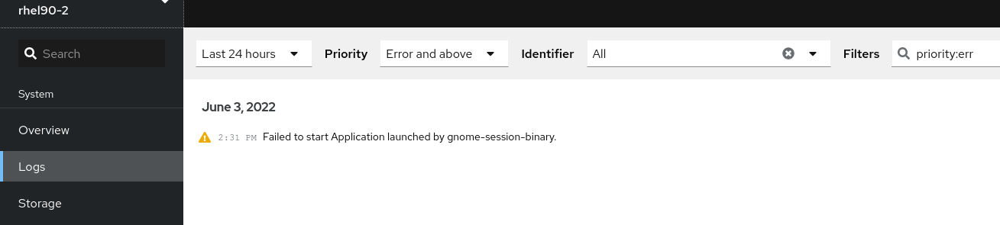

# 日志

[TOC]

## 概述

日志文件包含有关系统的消息，包括内核、服务及其上运行的应用。这些信息可帮助故障排除问题或监控系统功能。Red Hat Enterprise Linux 中的日志记录系统基于内置的 `syslog` 协议。特定的程序使用这个系统记录事件并将其整理到日志文件中，这些文件在审核操作系统和故障排除各种问题时非常有用。

## 日志分析的必要性

日志可以为我们提供关于系统行为的必要信息。然而，每个不同的服务，或者同一个系统中不同的组件中，日志的内容和格式都可能是不同的。比如说，一个扫描器可能会记录同其他设备通信时发生的相关错误；另一方面，Web 服务器则会记录所有进入的请求返回的响应，以及响应时间等信息。同样的，一个电子商务网站的应用日志也会记录业务特定的日志。

正因为日志的内容是多样化的，它们的用处才能体现出来。例如，上述扫描器的日志可以用来排查故障、执行简单的状态检查或者生成报表，而 Web 服务器日志则可以用来分析跨多个产品之间的流量模式。通过电子商务网站的日志可以分析出某个特定位置发出的包裹是否被频繁地退回，还能分析出可能的原因是什么。

下面是一些可以使用日志分析的常见用例：

* 问题调试

  问题调试是在应用程序中开启日志最常见的理由之一。调试日志最简单和最频繁的用法是查找特定的错误消息或者发生的事件。如果一名系统管理员觉得程序是因为网络失败而崩溃的，他可以在服务器日志中尝试査找类似 connection dropped 这样的消息来分析具体的原因。一旦 bug 或者问题被定位，日志分析解决方案可以帮助捕获应用的信息，并且提供问题发生时的日志快照给开发团队用于后续的深入分析。

* 性能分析

  日志分析有助于优化或者调试系统的性能，可以提供系统瓶颈处的关键信息。了解系统的性能往往是在了解系统中如何使用资源。日志可以帮助分析系统中单个资源的使用情况、应用程序中的多线程行为，以及潜在的死锁条件等。日志中一般会带有时间戳，这是分析系统随时间推移的行为变化所必不可少的信息。例如，可以通过 Web 服务器日志中的响应时间和 HTTP 响应代码来了解每个服务的情况等。

* 安全分析

  对任何组织来说，日志都可以在应用安全的管理中起到关键的作用，特别有助于检测安全漏洞、应用程序滥用、恶意攻击等。当用户与系统进行交互时会产生日志事件，可以帮助跟踪用户行为、识别可疑的活动，并提供警报或记录安全事件的违规行为。

  入侵检测过程也包括日志本身的会话重构。例如，系统中的 SSH 登录事件可以用来识别机器上的各种侵入行为。

* 预测分析

  预测分析是近年来的研究热点之一。日志和事件数据可用于非常准确的预测分析。预测分析模型有助于识别潜在客户、规划资源、管理和优化库存、提升工作负载和资源调度的效率。它也有助于指导营销策略、用户人群定向、广告投放策略等。

* 物联网 (IoT) 日志

  当涉及到物联网设备（设备或机器在没有人工干预的情况下进行交互）时，对系统进行监测和管理，以保持停机时间最短，并快速解决任何重大 bug 或问题来说，日志是非常关键的。由于这些设备的位置可能分布在一个非常大的地理范围内，所以需要尽可能少的人工介人。我们期望日志数据对于了解系统的行为、减少停机时间发挥重要的作用。

## 日志分析的挑战
目前的日志分析过程主要是检查在多个服务器上的日志，这些日志是应用程序中不同的的组件和系统所记录的。这有各种各样的问题，分析这些日志是一个既费时又烦琐的工作。让我们来看一些常见的问题：

* 不一致的日志格式

  每一个应用或者设备都有自己记录日志的方式，每种格式都需要各自的专家才能解读。并且在不同格式的日志之间进行搜索也是非常困难的。

  不同的日志可能采用不同的时间戳格式，也有不同的方式来表示信息（INFO）和错误（ERROR）等，并且在日志中记录这些组件的顺序也不尽相同。如果只是看一眼日志记录，很难弄清楚究竟是什么地方出现了什么问题。这就是像 Logstash 这样的工具可以提供帮助的地方。

  对于不同的应用和不同的设备产生的日志，不仅仅是日志格式本身不一样，就连其中的时间戳格式也可能不同。系统中不同组件日志中的时间戳格式不同，也使得很难将多个系统在同一时间发生的事件关联起来。

* 离散的日志

  在应用程序中，日志往往分布在不同的服务器和不同的组件中。多个组件在多个位置记录日志，增加了日志分析的复杂性。如果只有一两台服务器，想从日志中查找信息直接运行 cat 或者 tai1 命令即可，或者也可以通过管道使用 grep 命令。但是如果你有 10 台、20 台，或者说 100 台服务器呢？使用上述命令来搜索日志是无法推广到这样庞大的机器集群的，这时候就需要一个集中的日志管理和分析的解决方案。

* 专业知识的需求

  通常来说，人们关心的是业务相关的信息，而不是日志本身。很多人没有必要直接访问日志，也缺乏从日志中以最快的方式得到所需信息的技术能力。这种情况使得分析问题变得很慢，甚至很多时候根本无法分析。

## 处理 syslog 信息的服务

以下两个服务处理 `syslog` 信息：

- `systemd-journald` 守护进程
- `Rsyslog` 服务

`systemd-journald` 守护进程收集来自各种来源的信息并将其转发到 `Rsyslog` 以便进一步处理。`systemd-journald` 守护进程从以下来源收集信息：

- 内核
- 引导过程的早期阶段
- 启动并运行守护进程的标准和错误输出
- `Syslog`

`Rsyslog` 服务根据类型和优先权对 `syslog` 信息进行排序，并将其写入 `/var/log` 目录下的文件中。`/var/log` 目录会永久保存日志信息。 		

## 存储 syslog 信息的子目录

`/var/log` 下的以下子目录保存了 `syslog` 信息。

- `/var/log/messages` - 除以下外的所有 `syslog` 信息
- `/var/log/secure` - 与安全和验证相关的信息和错误
- `/var/log/maillog` - 与邮件服务器相关的信息和错误
- `/var/log/cron` - 与定期执行的任务相关的日志文件
- `/var/log/boot.log` - 与系统启动相关的日志文件

## 使用 Web 控制台检查日志文件

1. 登录到 RHEL web 控制台 。
2. 点 **Logs**。

## 使用命令行查看日志

Journal 是 systemd 的一个组件，可帮助查看和管理日志文件。它解决了与传统日志记录相关的问题，与系统的其余部分紧密集成，并且支持各种日志记录技术以及日志文件的访问管理。

可以通过命令行，使用 `journalctl` 命令查看系统日志中的信息，例如：

```bash
journalctl -b | grep kvm

May 15 11:31:41 localhost.localdomain kernel: kvm-clock: Using msrs 4b564d01 and 4b564d00
May 15 11:31:41 localhost.localdomain kernel: kvm-clock: cpu 0, msr 76401001, primary cpu clock
...
```

查看系统信息

| 命令                  | 描述                                                         |
| --------------------- | ------------------------------------------------------------ |
| `journalctl`          | 显示所有收集的日志条目。                                     |
| `journalctl FILEPATH` | 显示与特定文件相关的日志。例如： `journalctl /dev/sda` 命令显示与 `/dev/sda` 文件系统相关的日志。 |
| `journalctl -b`       | 显示当前引导的日志。                                         |
| `journalctl -k -b -1` | 显示当前引导的内核日志。                                     |

查看特定服务的信息

| 命令                                                         | 描述                                                         |
| ------------------------------------------------------------ | ------------------------------------------------------------ |
| `journalctl -b _SYSTEMD_UNIT=foo`                            | 过滤日志以查看与 "foo" `systemd` 服务匹配的日志。            |
| `journalctl -b _SYSTEMD_UNIT=foo _PID=number`                | 合并匹配。例如： 这个命令显示与 `foo` 和 PID `number` 匹配的 `systemd-units` 的日志。 |
| `journalctl -b _SYSTEMD_UNIT=foo _PID=number + _SYSTEMD_UNIT=foo1` | 分隔符"+"将两个表达式组合成一个逻辑 OR 。例如，此命令显示来自进程为 `PID` 的`foo` 服务的所有消息，加上来自 `foo1` 服务的所有消息（来自其任何进程）。 |
| `journalctl -b _SYSTEMD_UNIT=foo _SYSTEMD_UNIT=foo1`         | 此命令显示与引用同一字段的任一表达式匹配的所有条目。在这里，这个命令会显示与 systemd-unit `foo` 或 systemd-unit `foo1` 匹配的日志。 |

查看与特定引导相关的日志

| 命令                                     | 描述                                                         |
| ---------------------------------------- | ------------------------------------------------------------ |
| `journalctl --list-boots`                | 显示引导号、其 ID 以及与引导相关的第一条和最后一个消息的时间戳列表。您可以在下一个命令中使用 ID 来查看详细信息。 |
| `journalctl --boot=ID _SYSTEMD_UNIT=foo` | 显示有关指定的引导 ID 的信息。                               |

## 日志文件
| 文件 | 程序 | 出处 | 频率 | 系统 | 内容 | 备注 |
|----|----|----|----|----|----|----|
| anaconda.ifcfg.log |  |  |  |  |  |  |
| anaconda.log |  |  |  |  |  |  |
| anaconda.program.log |  |  |  |  |  |  |
| anaconda.storage.log |  |  |  |  |  |  |
| anaconda.syslog |  |  |  |  |  |  |
| anaconda.xlog |  |  |  |  |  |  |
| anaconda.yum.log |  |  |  |  |  |  |
| acpid | acpid | F | 64K | RZ | 与电源相关的事件 |  |
| audit.log |  |  |  |  |  |  |
| auth.log | sudo等 | S | M | U | 授权 |  |
| apache2/* | httpd ver.2 | F | D | ZU | Apache HTTP服务器的日志(第二版) |  |
| apt* | APT | F | M | U | Aptitude软件包安装程序 |  |
| boot.log | rc脚本 | F | M | R | 系统启动脚本的输出 |  |
| boot.msg | 内核 | H | - | Z | 内核消息缓冲的转储 |  |
| cron,cron/log | cron | S | W | RAH | cron的执行情况和出错信息 |  |
| cups/* | CUPS | F | W | ZRU | 与打印有关的消息 |  |
| daemon.log | 许多 | S | W | U | 所有守护进程功能的消息 |  |
| debug | 许多 | S | D | U | 调试输出 |  |
| dmesg | 内核 | H | - | RU | 内核消息缓冲的转储 |  |
| dpkg.log | dpkg | F | M | U | 软件包管理日志 |  |
| dracut.log |  |  |  |  |  |  |
| faillog | login | H | W | RZU | 不成功的登录企图 |  |
| httpd/* | httpd | F | D | R | Apache HTTP服务器的日志(在/etc下) |  |
| kern.log | 内核 | S | W | U | 所有kern功能的消息 |  |
| lastlog | login | H | - | RZ | 每个用户上次登录的时间(二进制) |  |
| maillog | 与mail有关的 | S | W | 所有 | 所有mail功能的消息 |  |
| messages | 许多 | S | W | RZUS | 经常是主要的系统日志文件，系统启动后的信息和错误日志 |  |
| rpmpkgs | cron.daily | H | D | R | 已安装的RPM软件包清单 |  |
| samba/* | smbd等 | F | W | - | Samba |  |
| secure | sshd等 | S | M | R | 保密的授权消息 |  |
| spooler |  |  |  |  | 与UUCP和news设备相关的日志信息 |  |
| sulog | su | F | - | SAH | su成功和失败 |  |
| syslog* | 许多 | S | W | SUH | 系统日志主文件 |  |
| tallylog |  |  |  |  |  |  |
| warn | 许多 | S | W | Z | 所有的警告/出错级的消息 |  |
| wpars/* | wpar | F | - | A | 工作负载分区事件 |  |
| wtmp | login | H | M | 所有 | 登录记录（二进制） |  |
| xen/* | Xen | F | W | RS | Xen虚拟机信息 |  |
| xferlog |  |  |  |  |  |  |
| Xorg.n.log | Xorg | F | W | RS | X窗口服务器的出错信息 |  |
| yum.log | yum | F | W | R | 软件包管理日志 |  |

出处：S=Syslog H=硬链接 F=配置文件  
频率：D=每天 W=每周 M=每月 NN[km]=基于大小，以KB或者MB为单位  
系统：U=Ubuntu Z=SUSE R=Red Hat和CentOS S=Solaris H=HP-UX A=AIX
## 体系结构
1. syslogd，日志守护进程(及其配置文件/etc/syslog.conf)  
2. openlog等，将消息提交给syslogd的库例程
3. logger，一条从shell提交日志记录项的用户级命令

syslogd在系统引导时启动并连续运行，不能用inetd来管理。程序把日志项写到/dev/log中，syslogd从其中读取消息，参考配置文件，将各条信息发送到合适的目的地。
## 配置syslogd
/etc/syslog.conf基本格式为：

    selector<Tab>action
selector的格式为：

    facility.level
### syslog的设备名
| 设备(facility) | 使用该设备的程序 |
|--------------|----------|
| * | 除了"mark"之外的所有设备 |
| auth | 与安全和授权有关的命令 |
| authpriv | 敏感/保密的授权信息 |
| cron | 守护进程cron |
| daemon | 系统守护进程 |
| ftp | FTP守护进程，ftpd |
| kern | 内核 |
| local0-7 | 本地消息的8种类型 |
| lpr | 行式打印机的假脱机系统 |
| mail | sendmail及其他与电子邮件有关的软件 |
| mark | 定期产生的时间戳 |
| news | Usenet新闻系统(已淘汰) |
| syslog | syslogd内部消息 |
| user | 用户进程(如果没有指定，这将是默认值) |
| uucp | 已淘汰，可忽略 |
### syslog的严重性级别
| 级别 | 大致含义 | 级别 | 大致含义 |
|--|--|--|--|
| emerg | 恐慌状态 | warning | 警告消息 |
| alert | 紧急状态 | notice | 需要调查的事项 |
| crit | 临界状态 | info | 提供信息的消息 |
| err | 其他错误情况 | debug | 仅供调试 |
### Linux在syslog.conf中限定优先级的例子
| 选择符 | 含义 |
|--|--|
| mail.info | 选择与邮件相关的、优先级为info或者更高的消息 |
| mail.=info | 只选择优先级为info的消息 |
| mail.info;mail.!err | 只选择优先级为info、notice和warning的消息 |
| mail.debug;mail.!=warning | 选择除warning之外的所有优先级 |
### syslog动作
| 动作 | 含义 | 备注 |
|--|--|--|
| filename | 把消息写入本地机器上的一个文件里 |  |
| @hostname | 把消息转发给主机hostname上的syslogd |  |
| @ipaddress | 把消息转发给IP地址为ipaddress的主机 |  |
| \|fifoname | 把消息写入有名管道fifoname | 参考info mkfifo，仅限linux版本的syslogd |
| user1,user2,... | 如果用户登录到了系统上，那么就把消息卸载用户的屏幕上 |  |
| * | 把消息写给目前已经登录的所有用户 |  |
## 分析日志文件
swatch
logcheck
splunk
