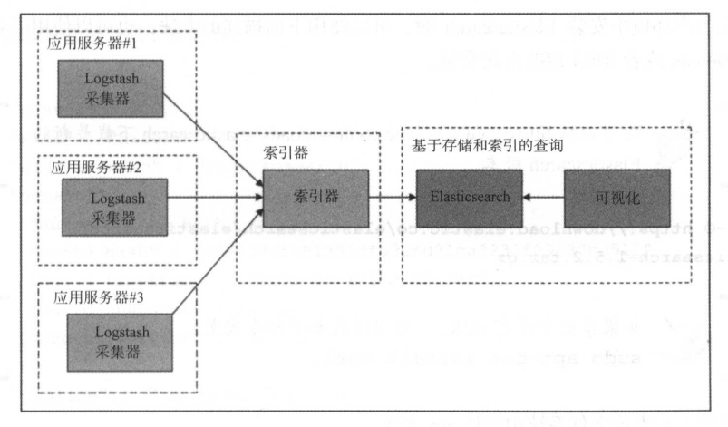

# Elastic Stack

[TOC]

## Elasticsearch

Elasticsearch 是 Elastic Stack 的核心组件，Elastic Stack 是一套用于收集、存储、搜索和可视化数据的产品。

Elasticsearch 是 Elastic Stack 核心的分布式搜索和分析引擎。

Elasticsearch 是一个基于 Apache Lucene 的分布式开源搜索引擎，使用 Apache2.0 开源协议发布。它在 Lucene 的实时搜索之外提供了可扩展性、可靠性和多租户功能。Elasticsearch 的这些功能可以通过基于 JSON 的 RESTfuIAPI 来使用。它的搜索能力来源于后端的 Apache Lucene 引擎，无须预先定义数据结构就能动态地对数据进行索引。Elasticsearch 能够快速响应搜索请求是因为使用了索引来进行文本搜索。

Elasticsearch的关键特性包括：

* 它是一个开源的分布式、可扩展和高可用的实时文档存储。
* 提供了实时搜索和分析的能力。
* 提供了复杂的 RESTIAPI ，包括查找和其他各种功能，如批量搜索、地理位置搜索、自动完成、上下文搜索建议和结果片段等，能够很简单地进行水平扩展，也很容易和其他云基础设施如 AWS 等集成。

## Logstash

Logstash 和 Beats 便于收集、聚合和丰富数据，并将其存储在 Elasticsearch 中。

Logstash 是一个数据管道，主要用来收集、解析和分析大量结构化和非结构化的数据以及各种系统产生的事件。Logstash 提供了输入插件来支持不同的数据源和平台，设计用来高效地处理日志、事件和非结构化数据源，然后通过输出插件如文件、标准输出（如输出到运行 Logstash 的控制台）或者 Elasticsearch 等输出结果数据。

Logstash 的关键特性如下：

* 集中化的数据处理

  Logstash 通过数据管道，可以集中化地处理数据。使用不同的输入和输出插件，可以将各种不同的输入源转换成一种单一的通用格式。

* 支持自定义日志格式

  不同应用生成的日志通常有不同的特殊格式。Logstash 可以分析和处理大规模的自定义格式的日志。Logstash 自带了很多开箱即用的过滤插件，也支持用户编写自定义的插件。

* 插件开发

  可以开发和发布自定义插件。实际上现在已经有很多可用的自定义插件。

## Kibana
Kibana 是一个基于 Apache2.0 开源协议的开源数据可视化平台。它可以对存储于 Elasticsearch 的索引中的各种结构化和非结构化的数据进行可视化呈现。

Kibana 完全使用 HTML 和 Javascript 编写，利用 Elascticsearch 的 RESTfu API 来实现其强大的搜索能力，将结果显示为各种震撼的图形提供给最终的用户。从基本的商业智能到实时调试等不同场景，Kibana 都可以通过直方图、地图、饼图、其他图形和表格等方式来表达数据。

Kibana 使得理解大量的数据变得容易。其基于浏览器的简单界面，使得用户可以很迅速地创建和分享动态的仪表盘，以呈现 Elasticsearch 的实时搜索结果。

Kibana的关键特性如下：

* 它为商业智能提供了一个灵活的分析和可视化平台。
* 它提供了实时分析、汇总、图表和调试的能力。
* 它提供了一个直观且用户友好的界面，并且是高度可定制的，可以根据需要对图表进行拖放和对齐。
* 可以管理多个仪表盘，并且能够保存。仪表盘可以在多个系统中分享和嵌人。
* 可以分享日志搜索结果的快照，可以隔离不同的问题处理过程。

Kibana enables you to interactively explore, visualize, and share insights into your data and manage and monitor the stack. Kibana 使您能够交互式地探索、可视化和共享对数据的见解，并管理和监视堆栈。Elasticsearch is where the indexing, search, and analysis magic happens. Elasticsearch 是索引、搜索和分析的神奇之处。

## ELK 数据管道

在典型的 ELK 技术栈的数据管道中,多个应用服务器上的日志通过 Logstash 采集器传输到一个集中化的索引器中，索引器将处理后的数据结果输出到 Elasticsearch 集群，然后 Kibana 通过查询 Elasticserch 集群中的日志数据创建仪表盘，做可视化展现。

 