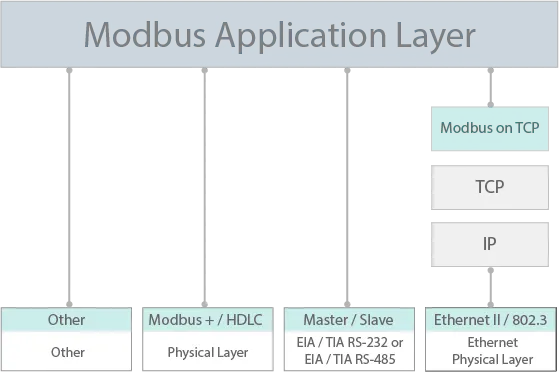
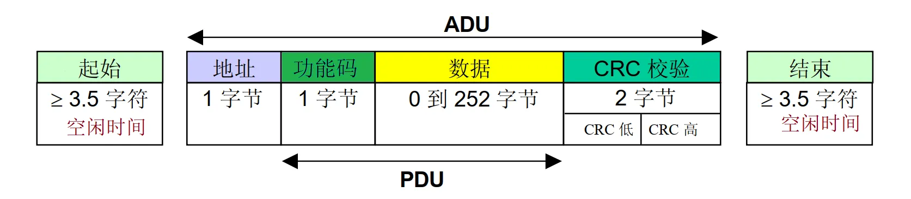
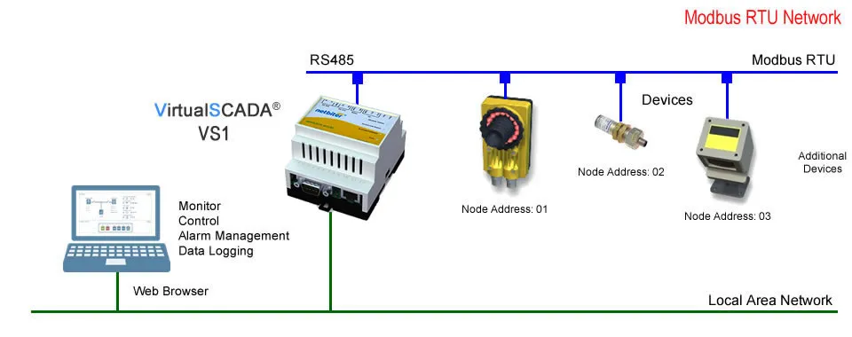
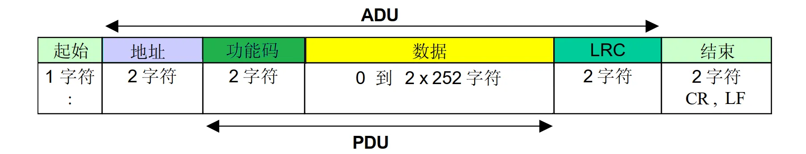
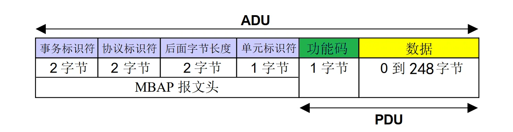
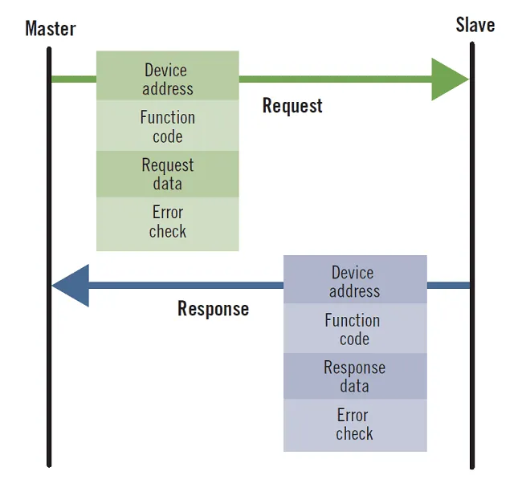
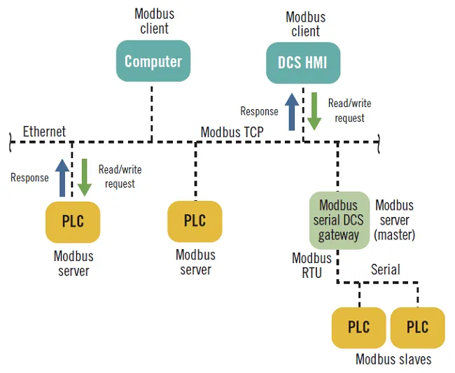
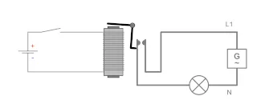

# Modbus

[TOC]

## 概述

Modbus 协议是一个开放标准的通信协议，最初设计用于连接可编程逻辑控制器（PLC）和其他自动化设备。它的简单性和可靠性使得 Modbus 成为工业领域中最受欢迎的通信协议之一，被广泛用于监控、控制和数据采集。

Modbus 协议包括 RTU、ASCII、TCP，其中 Modbus-RTU 最常用，比较简单，在单片机上很容易实现。

Modbus 和 OPC UA、MQTT 等通讯协议本质上是一样的，都是为了实现多个设备相互通信的应用层协议。

## 起源与发展

Modbus 协议于 1979 年由 Modicon 公司（现被 Schneider 公司收购）设计开发，一经面世因其简单开放的通信方式逐渐成为工业系统中流行的标准，是全球第一个真正用于工业现场的总线协议。

后来，为了更好地普及和推动 Modbus 基于以太网（TCP / IP）的分布式应用，施耐德公司将 Modbus 协议的所有权移交给 IDA（Interface for Distributed Automation，分布式自动化接口）组织，并成立了 Modbu-IDA 国际组织，负责推广 Modbus 标准以及对 Modbus 产品进行认证。

现在，我们可以从 Modbus 官网 [www.modbus.org](https://www.modbus.org/) 找到相关协议文档、Modbus 产品和厂商等信息。

## 通信协议特点

Modbus 协议定义了一个控制器能够认识使用的消息结构，而不管它们是经过何种网络进行通信的。因此，底层通信方式可以使用 RS232，RS485 等串行链路，也可以使用 TCP/IP 以太网链路。当在 Modbus 网络上通信时，控制器必须要知道该网络中其他从设备的地址，才能识别按地址发来的消息，并作出相应行为。

简单来说，Modbus 通信协议具有以下几个特点：

- Modbus 协议标准开放、公开发布且无版税要求，用户可以免费获取并使用 Modbus 协议，不需要缴纳许可证费。
- Modbus 最开始使用 RS232，RS485 等串行链路作为底层通信方式，串行总线的接口芯片成本低，而且布线也简单方便。
- Modbus 协议支持多种电气接口，如 RS232、RS485、TCP/IP 等，还可以在各种介质上传输，如双绞线、光纤、红外、无线等。
- Modbus 是简单地应用层协议，其协议消息帧格式简单、紧凑、通俗易懂，便于用户理解和使用、厂商开发和集成，方便形成工业控制网络。

## 术语

在 Modbus 开发中的常见专业术语如下：

- Master ：主（站）设备
- Slave ：从（站）设备
- Client ：客户端，对应 Master 设备
- Server ：服务器端，对应 Slave 设备
- ADU ：应用数据单元（Application Data Unit）
- PDU ：协议数据单元（Protocol Data Unit）
- MSB ：最高有效位（Most Significant Bit）
- LSB ：最低有效位（Least Significant Bit）
- MBAP ：Modbus 应用协议（Modbus Application Protocol）
- PLC ：可编程逻辑控制器（Programmable Logic Controller）
- RTU ：远程终端单元（Remote Terminal Unit）
- SCADA ：监督控制和数据采集（Supervisory Control And Data Acquisition）

## 协议版本

下图大致展示了 Modbus 协议栈模型。

 

Modbus 通信协议目前存在用于串行链路、TCP/IP 以太网以及其他支持互联网协议的网络版本。在实际应用中，通过 RS485 和 TCP/IP 连接的方式最为常见。

### Modbus RTU

Modbus RTU 是 Modbus 最常见的实现方式，它基于串行通信总线（例如 RS232、RS485），并采用紧凑的二进制数据形式进行协议通信。RTU 格式在命令/数据之后带有循环冗余校验的校验和作为错误校验机制，以确保数据的可靠性。Modbus RTU 消息必须连续传输，没有字符间犹豫。Modbus 消息由空闲（静默）时段构成（分隔）。

 

RTU 模式每个字节（11位）的格式为：

| 帧格式     | 说明                                                         |
| ---------- | ------------------------------------------------------------ |
| 编码系统   | 8 位二进制                                                   |
| 数据位     | 1位 起始位 8位 数据位，首先发送最低有效位 1位 奇偶校验（注：默认偶校验是必须的，奇校验或无校验也可以使用） 1位 停止位（注：使用无校验时要求2个停止位） |
| 帧发送方式 | 每个字符或字节均由从左到右顺序发送                           |
| 检验       | CRC（循环冗余校验），低位字节先发                            |
| 起始/结束  | 报文帧由时长至少为 3.5 个字节时间的空闲间隔区分 1 帧数据     |

Modbus RTU 协议定义了一个与下层通信层无关的简单协议数据单元（PDU），串行链路上的 Modbus RTU 帧格式如下图所示。

地址字段只含有从机地址；功能码指示指令要执行何种操作；功能码的后续数据是请求或响应数据字段；差错检验字段是“报文内容”数据进行“循环冗余校验”计算所得结果，采用 CRC16 循环冗余校验算法。

 

### Modbus ASCII

Modbus ASCII 和 Modbus RTU 一样都是使用串行链路通信方式，不同的是，Modbus ASCII 采用一种人类可读的、冗长的表示方式，并使用纵向冗余校验的校验和保证数据传输的完整性。Modbus ASCII 消息由前导冒号 (“:”) 和尾随换行符 (CR/LF) 构成。



ASCII 模式每个字节（10位）的格式为：

| 帧格式     | 说明                                                         |
| ---------- | ------------------------------------------------------------ |
| 编码系统   | 十六进制，ASCII 字符 0-9，A-F                                |
| 数据位     | 1位 起始位 7位 数据位，首先发送最低有效位 1位 奇偶校验（注：默认偶校验是必须的，奇校验或无校验也可以使用） 1位 停止位（注：使用无校验时要求2个停止位） |
| 帧发送方式 | 每个字符或字节均由从左到右顺序发送                           |
| 检验       | LRC（纵向冗余校验），低位字节先发                            |
| 起始       | 一个‘冒号’（:）起始，对应 ASCII 十六进制为 3A                |
| 结束       | 以‘回车-换行’（CR，LF）对（ASCII 十六进制 0D 和 0A）结束     |

需要注意的是，由于帧格式不同，被配置为 RTU 模式的节点是不能与配置为 ASCII 模式的节点正常通信，反之亦然。

### Modbus TCP

Modbus TCP（或称为 Modbus TCP/IP）是一种 Modbus 变体，用于通过 TCP/IP 网络进行通信，通过端口 502 进行连接。和前面两种不一样，Modbus TCP 不需要校验和计算，因为较低层的 TCP/IP 协议栈已经提供校验和保护。

如果将校验和包含在有效载荷中，形成与 Modbus RTU 类似的帧，则称为 Modbus RTU/IP。



### 其他版本

除了上述三种常用的 Modbus 协议，还有如下一些不太常见的 Modbus 扩展版本。

#### Modbus over UDP

既然有 Modbus over TCP，那么自然也会有人尝试将 Modbus 运行在 UDP 之上，即 Modbus over UDP。 这么做的好处是消除了 TCP 所需的开销。

#### Modbus Plus

Modbus Plus（Modbus+、MB+ 或 MBP）协议是 Schneider Electric 的专利，与其他变体不同，它支持多个主站之间的点对点通信。不过，它需要一个专用的协处理器来处理类似 HDLC 的高速令牌轮换。它使用 1 Mbit/s 的双绞线，并在每个节点都有变压器隔离，这使其成为转换/边沿触发而不是电压/电平触发。连接 Modbus Plus 到计算机需要特殊的硬件，通常是支持 ISA、PCI 或 PCMCIA 总线的板卡。

#### Pemex Modbus

Pemex Modbus 是标准 Modbus 的扩展，支持历史和流量数据。它是为 Pemex 石油和天然气公司设计的，用于过程控制，但从未得到广泛采用。

#### Enron Modbus

Enron Modbus 是 Enron 公司开发的标准 Modbus 的另一个扩展，支持 32 位整数和浮点变量以及历史和流量数据。数据类型使用标准地址映射。历史数据用于满足美国石油协会 (API) 行业标准，即如何存储数据。

### 注意事项

前四种 Modbus 协议（Modbus RTU、Modbus ASCII、Modbus TCP 和 Modbus UDP）在数据模型和功能调用上都是相同的，只是传输报文的封装方式不同。但是，由于帧格式不同，因此这些协议变体并不是可互操作的。

## 工作模式

Modbus 基于主从模式工作。在一个网络中，Modbus 协议通过主设备（客户端）和从设备（服务器）之间的请求——应答机制来交换信息。

下图展示了典型的 Modbus 网络，其中一个 master 设备（client）控制一个或多个 slave 设备（server）。

 

在标准的 Modbus 网络中，有 1 个主设备和最多 31 个从设备。

### 通讯特点

主设备——从设备工作原理有如下特点：

- 在同一时间只能有一个主设备连接到网络。
- 只有主设备能够发起通讯并向从设备发送请求。
- 主设备可以使用专门的地址分别访问每个从设备，也可以使用地址 0 同时访问所有从设备。
- 从设备只能向主设备发送应答。
- 从设备不能向主设备或其它从设备发起通讯。

### 通讯模式

Modbus 协议支持两种通讯模式交换信息：

- 单播模式 —— 主设备通过专门的地址访问从设备，从设备处理请求，然后向主设备发送应答。
- 广播模式 —— 主设备通过地址 0 访问所有从设备，在这种模式下，从设备不对广播消息作出应答。（因此，广播模式的请求指令必须是 Modbus 标准功能中的写指令）

### 应答时间

应答时间是指从设备对主设备发出的请求做出应答所需的时间。其中 Modbus 协议的数值：

- 典型值 < 10 ms （90% 的信息交换）
- 最大值大约是 700 ms，因此建议在发送完一个 Modbus 请求后暂停 1 秒钟再继续。

### 数据交换

Modbus 协议支持两种数据类型：

- 单个位
- 寄存器（16 位）

具体的位和寄存器定义由从设备决定。

### 地址

使用 Modbus 协议交换的消息包含要处理的数据的地址。每个寄存器都有一个寄存器编号，每类数据（位或寄存器）都有一个 16 位的地址。

在 Modbus 协议规定的 PDU 中，规定所有线圈或寄存器地址从 0 开始计算。因此，第 n 号寄存器的地址是 n-1。例如，第 12000 号寄存器的地址是 0x2EDF（11999）。

### 帧

使用 Modbus 协议交换的所有帧（ADU）最大为 256 字节（ASCII 格式翻倍），其中包括 4 个域：

| 域   | 定义             | 大小（RTU 格式） | 描述                                                         |
| ---- | ---------------- | ---------------- | ------------------------------------------------------------ |
| 1    | 从设备号（地址） | 1 个字节         | 请求的目的地址 – 0 ：广播（涉及所有从设备） – 1-247 ：单播，从设备的唯一地址 |
| 2    | 功能代码         | 1 个字节         | 参阅 Modbus 功能码                                           |
| 3    | 数据             | 0 到 252 个字节  | 请求数据（或应答数据）                                       |
| 4    | 校验和           | 2 个字节         | CRC 校验和（ASCII 为 LRC）                                   |

下图展示了主设备-从设备工作模型中的帧交换过程。

 

### 网络拓扑

#### Modbus RTU

Modbus RTU 通常基于 RS-485 串行通信链路，RS-485 总线布线规范规定其必须是总线式拓扑结构。在实际布线中，通常采用手牵手菊花链布线方式。例如，Slave 1/2/3 三台 RS-485 设备，Slave1 的 485+ 接入 Slave2 的 485+ 端口，Slave2 的 485+ 再连接到 Slave3 的 485+ 端口，以此类推，485- 的接线方式和 485+ 一样。

[](https://image.modbus.cn/wp-content/uploads/2024/04/20240429003307515.png)

#### Modbus TCP

相对于使用串行链路的 Modbus RTU，Modbus TCP 基于以太网通信，因此其网络拓扑结构更为灵活。从串行链路上一主多从的构造，演变为多客户端/多服务器端的构造模型。

使用 Modbus TCP，主站设备（客户端）可以通过 IP 地址找到 Modbus 从设备（服务器），并通过 Modbus 网关连接到另一个 Modbus RTU 网络。

 

## 寄存器

### 线圈和寄存器

介绍 Modbus 的内容中多次提到线圈（coil）和寄存器（register）的概念，尤其是 Modbus 功能码中，操作的对象基本上都是线圈和寄存器。

在 Modbus 协议中之所以仍然称为线圈和寄存器，完全是历史原因。在 PLC 应用领域，一个线圈就代表一个 PLC 输出点，也称为输出继电器。通过控制线圈导通与否来改变继电器输出状态，实现弱电控制强电。

 

但实际上，在如今的 Modbus 设备中，它们都只是对应一块内存区域而已。其中，线圈代表位操作（bit），表示一个布尔变量；寄存器代表字操作（word），表示一个整型变量（当然也可以通过多个字的组合，表示浮点数以及其他复合数据结构）。在 Modbus 协议中，字（word）的长度是 16 位，即 2 个字节。

### 种类

在 Modbus 协议中，所有数据均存放于寄存器中。根据存放的数据类型以及各自读写特性，可以将寄存器分为四个部分，这四个部分可以连续也可以不连续，完全由开发者决定。

下表展示了四类寄存器的含义以及与 PLC 的类比。

| 寄存器种类                      | 含义                 | PLC              | 示例                     |
| ------------------------------- | -------------------- | ---------------- | ------------------------ |
| 线圈状态 （Coil Status）        | 输出端口（可读可写） | DO（数字量输出） | 电磁阀输出、LED 显示     |
| 离散输入状态 （Input Status）   | 输入端口（只读）     | DI（数字量输入） | 拨码开关、微动开关       |
| 保持寄存器 （Holding Register） | 输出参数（可读可写） | AO（模拟量输出） | PID 运行参数、阈值上下限 |
| 输入寄存器 （Input Register）   | 输入参数（只读）     | AI（模拟量输入） | 传感器数据输入           |

### 地址分配

Modbus 寄存器地址分配如下表所示，同样参照了 PLC 寄存器地址的分配方法。

| 寄存器种类   | 寄存器 PLC 地址 | 寄存器 Modbus 协议地址 | 简称 |
| ------------ | --------------- | ---------------------- | ---- |
| 线圈状态     | 00001~09999     | 0000H~FFFFH            | 0x   |
| 离散输入状态 | 10001~19999     | 0000H~FFFFH            | 1x   |
| 保持寄存器   | 40001~49999     | 0000H~FFFFH            | 4x   |
| 输入寄存器   | 30001~39999     | 0000H~FFFFH            | 3x   |

该表中的 PLC 地址可以理解为 Modbus 协议地址的变种，在触摸屏和 PLC 编程中应用较为广泛。

- 寄存器 PLC 地址指存放于控制器中的地址，这些控制器可以是 PLC，也可以是触摸屏，或者文本显示器。PLC 地址一般采用十进制描述，共有 5 位，其中第一位数字代表寄存器类型。
- 寄存器 Modbus 协议地址指的是通信时使用的寄存器寻址地址，例如 PLC 地址 40001 对应寻址地址 0x0000，40002 对应寻址地址 0x0001。寄存器寻址地址一般使用十六进制描述。

细心的你会发现，PLC 寄存器地址 40003 对应的协议地址是 0x0002，PLC 寄存器地址 30003 对应的协议地址也是 0x0002，虽然通信时使用两个相同的 Modbus 协议地址，但是因为不同寄存器的功能码是不相同的，因此并不存在访问冲突。

## 功能码

功能码是 Modbus 消息帧（报文）的重要组成部分，是 Modbus 协议中通信事务处理的基础。


Modbus 功能码占用一个字节，取值范围是 1~127（即 0x01 ~ 0x7F）。同时，使用功能码 + 0x80 表示异常状态，即 129 ~ 255 代表异常码。

在 Modbus 标准协议中，一共规定了三类 Modbus 功能码。

1. 公共功能码
   - 被明确定义的功能码。
   - 保证唯一性。
   - 由 Modbus 协会确认，并提供公开的文档。
   - 可进行一致性测试。
   - 包括协议定义的功能码和保留将来使用的功能码。
2. 用户自定义功能码
   - 有两个用户自定义功能码区域，分别是 65~~72 和 100~~110 。
   - 用户自定义，不保证唯一性。
3. 保留功能码
   - 保留功能码是因为历史遗留原因，某些公司的传统产品上现行使用的功能码不作为公共使用。

## 公共功能码

| 代码 | 名称             | 英文                     | 寄存器 PLC 地址 | 位/字操作 | 操作数量   |
| ---- | ---------------- | ------------------------ | --------------- | --------- | ---------- |
| 01   | 读线圈状态       | Read Coils               | 00001~09999     | 位操作    | 单个或多个 |
| 02   | 读离散输入状态   | Read Discrete Inputs     | 10001~19999     | 位操作    | 单个或多个 |
| 03   | 读保持寄存器     | Read Holding Registers   | 40001~49999     | 字操作    | 单个或多个 |
| 04   | 读输入寄存器     | Read Input Registers     | 30001~39999     | 字操作    | 单个或多个 |
| 05   | 写单个线圈       | Write Single Coil        | 00001~09999     | 位操作    | 单个       |
| 06   | 写单个保持寄存器 | Write Single Register    | 40001~49999     | 字操作    | 单个       |
| 15   | 写多个线圈       | Write Multiple Coils     | 00001~09999     | 位操作    | 多个       |
| 16   | 写多个保持寄存器 | Write Multiple Registers | 40001~49999     | 字操作    | 多个       |

功能码的操作可分为两种：

- 位操作 —— 最小单位为一位（bit），包括读线圈状态功能码 01、读离散输入状态功能码 02、写单个线圈功能码 05 和写多个线圈功能码 15 。
- 字操作 —— 最小单位为两个字节，包括读保持寄存器功能码 03、读输入寄存器功能码 04、写单个保持寄存器功能码 06 和写多个保持寄存器功能码 16 。

### 0x01 读取线圈/离散量输出值

- 该功能码用于读取从设备的线圈或离散量输出的状态，即各 DO（Discrete Output，离散输出）的 ON/OFF 状态。
- 消息帧中指定了需读取的线圈起始地址和线圈数目。
- 起始地址由 2 个字节构成，取值范围为 0x0000 到 0xFFFF。
- 线圈数量由 2 个字节构成，取值范围为 0x0001 到 0x07D0（即十进制 1~2000）。
- 需要注意，在 Modbus 协议规定的 PDU 中，规定所有线圈或寄存器地址从 0 开始计算。

### 0x02 读取离散量输入值

- 该功能码用于读取从设备的离散输入，即 DI（Discrete Input）的 ON/OFF 状态。
- 消息帧中指定了需读取的离散输入寄存器起始地址和数目，可读取 1~2000 个连续的离散量输入状态。
- 如果从设备接受主设备的请求则回复功能码 02，并返回离散量输入各变量的当前状态（如果返回的 DI 数量不是 8 的整数倍，将用 0 填充最后数据字节的剩余位）。
- 起始地址由 2 个字节构成，取值范围为 0x0000 到 0xFFFF。
- 离散量数量由 2 个字节构成，取值范围为 0x0001 到 0x07D0（即十进制 1~2000），最多一次可读取 2000 个离散输入状态值。

### 0x03 读取保持寄存器值

- 该功能码用于读取从设备保持寄存器的内容，不支持广播模式。
- 消息帧中指定了需读取的保持寄存器的起始地址和数目，而保持寄存器中各地址的具体内容和意义则由设备开发者自行规定。
- 起始地址由 2 个字节构成，取值范围为 0x0000 到 0xFFFF。
- 寄存器数量由 2 个字节构成，取值范围为 0x0001 到 0x007D（即十进制 1~125），最多一次可连续读取 125 个寄存器值。
- 需要注意，Modbus 的保持寄存器和输入寄存器是以字（Word）为基本单位的（1Word 等于 2Bytes）。因此，在读取时需要注意字节序（大小端）问题。

### 0x04 读取输入寄存器值

- 该功能码用于读取从设备输入寄存器的内容，不支持广播模式。（与 03 功能码类似）
- 消息帧中指定了需读取的输入寄存器的起始地址和数目，而输入寄存器中各地址的具体内容和意义则由设备开发者自行规定。
- 起始地址由 2 个字节构成，取值范围为 0x0000 到 0xFFFF。
- 寄存器数量由 2 个字节构成，取值范围为 0x0001 到 0x007D（即十进制 1~125），最多一次可连续读取 125 个寄存器值。
- 同样需要注意字节序问题。

### 0x05 写单个线圈/单个离散输出

- 该功能码用于将单个线圈寄存器（或离散输出）设置为 ON 或 OFF，支持广播模式。
- 在广播模式下，所有从站设备的同一地址的值将被统一修改。
- 消息帧中指定了需要变更的线圈地址和设定的状态值。
- 起始地址由 2 个字节构成，取值范围为 0x0000 到 0xFFFF。
- 目标数据（即查询报文中的 ON/OFF 状态）由报文数据字段的常数指定，0xFF00 表示 ON 状态，0x0000 表示 OFF 状态，其余所有值均是非法的。
- 需要注意，在 Modbus 协议规定的 PDU 中，规定所有线圈或寄存器地址从 0 开始计算。

### 0x06 写单个保持寄存器

- 该功能码用于更新从设备的单个保持寄存器的值，支持广播模式。
- 在广播模式下，所有从站设备的同一地址的值将被统一修改。
- 消息帧中需要指定从设备地址以及需要变更的保持寄存器地址和设定值。
- 起始地址由 2 个字节构成，取值范围为 0x0000 到 0xFFFF。
- 变更目标数据由 2 个字节构成，取值范围为 0x0000 到 0xFFFF。
- 保持寄存器以字（Word）为基本单位，写入时需要注意目标数据的字节序问题。

### 0x08 诊断功能

- 该功能码仅用于串行链路，主要用于检测主设备和从设备之间的通信故障，或检测从设备的各种内部故障，该功能不支持广播。
- 查询报文中需要指定从设备地址、功能码（Modbus Command）以及子功能码（Diagnostic Sub-function）。其中，子功能码字段为 2 个字节，用于区别各诊断类型。
- 在正常的响应报文中，从设备将原样回复功能码和子功能码。

常用的 Modbus 诊断子功能码定义如下：

| 功能码 | 子功能码   | 描述                                    | 说明                                                         |
| ------ | ---------- | --------------------------------------- | ------------------------------------------------------------ |
| 08     | 00（0x00） | Return Data Query (Loop-back)           | 原样返回查询报文                                             |
| 08     | 01（0x01） | Restart Communications                  | 用于初始化并重新启动从站设备 其中，报文字段 0x00, 0x00 表示保持事件记录 0xFF, 0x00 表示清除事件记录 |
| 08     | 02（0x02） | Return Diagnostic Register              | 返回诊断寄存器内容                                           |
| 08     | 03（0x03） | Change ASCII Input Delimiter            |                                                              |
| 08     | 04（0x04） | Force Listen Only Mode                  | 强制被寻址的从站设备进入只听模式 使其与网络中的其他设备断开，不返回响应 |
| 08     | 10（0x0A） | Clear Counters and Diagnostic Registers | 清除计数器和诊断寄存器                                       |
| 08     | 11（0x0B） | Return Bus Message Count                | 返回总线报文计数值                                           |
| 08     | 12（0x0C） | Return Bus Communication Error Count    | 返回总线通信 CRC 出错计数                                    |
| 08     | 13（0x0D） | Return Bus Exception Error Count        | 返回总线异常计数                                             |
| 08     | 14（0x0E） | Return Slave Message Count              | 返回从站设备接收的报文数量                                   |
| 08     | 15（0x0F） | Return Slave No Response Count          | 返回从站设备没有返回响应的报文数量                           |
| 08     | 16（0x10） | Return Slave NAK Count                  |                                                              |
| 08     | 17（0x11） | Return Slave Busy Count                 | 返回从站设备响应忙的报文数量                                 |
| 08     | 18（0x12） | Return Bus Character Overrun Count      | 返回总线字符超限的报文数量                                   |
| 08     | 19（0x13） | Return IOP Overrun Count (884)          |                                                              |
| 08     | 20（0x14） | Clear Overrun Counter and Flag (884)    |                                                              |

### 0x0B 获取通信事件计数器

- 该功能码主要用于获取从设备通信计数器中的状态字和事件计数的值，不支持广播模式。
- 可以通过在通信报文之前和之后读取通信事件计数值，来确定从设备是否正常处理报文。
- 对于正常完成报文处理和传输的场合，事件计数器增加 1；而对于异常响应、轮询命令或读事件计数器（即 0x0B 功能码）的场合，则计数器不变。
- 通过 0x08 诊断功能中的 0x01 子功能和 0x0A 子功能，可以复位事件寄存器。

### 0x0C 获取通信事件记录

- 该功能码主要用于从从设备获取状态字、事件计数、报文计数以及事件字节字段。
- 其中状态字和事件计数与功能码 0x0B 获取的值一致。
- 报文计数器包含了加电重启、清除计数器之后的报文数量，报文计数与通过 0x08 诊断功能中的 0x0B 子功能码获取的值一致。
- 事件字节字段包含 0~64 个字节，定义各种事件。
- 正常情况下响应报文包括一个 2 Bytes 状态字字段、一个 2 Bytes 事件计数字段、一个 2 Bytes 消息计数字段以及 0~64 个字节的事件字段。
- 由于事件字段是变长的，因此增加了一个 1 Byte 的数据长度字段，以方便读取响应数据。

### 0x0F 写多个线圈

- 该功能码用于将连续的多个线圈（或离散输出）设置为 ON 或 OFF，支持广播模式。
- 在广播模式下，所有从站设备的同一地址的值将被统一修改。
- 消息帧中指定了需要变更的线圈起始地址和线圈数目。
- 起始地址由 2 个字节构成，取值范围为 0x0000 到 0xFFFF。
- 寄存器数量字段由 2 个字节构成，取值范围为 0x0001 到 0x07B0。
- 数据字段中为逻辑 1 的位对应 ON，逻辑 0 的位对应 OFF。

### 0x10 写多个保持寄存器

- 该功能码用于设置或写入从设备保持寄存器的多个连续的地址块（1~123个寄存器），支持广播模式。
- 在广播模式下，所有从站设备的同一地址的值将被统一修改。
- 消息帧中需要指定从设备地址以及需要变更的保持寄存器地址和数量。
- 起始地址由 2 个字节构成，取值范围为 0x0000 到 0xFFFF。
- 寄存器数量字段由 2 个字节构成，取值范围为 0x0001 到 0x007B（即十进制 1~123）。
- 在实际开发中，该功能码常用于方便用户写入多字节类型的数据，例如浮点数值。因此，需要注意字节序问题。

### 0x11 报告从站 ID

- 该功能码仅适用于串行链路，用于读取从站设备的 ID、类型描述、当前状态以及其他信息，不支持广播模式。
- 查询报文中没有数据字段。
- 响应消息的构成由从站设备决定。

## 总结

常用 Modbus 公共功能码下表所示。

[](https://image.modbus.cn/wp-content/uploads/2024/04/20240429003632267.png)

其中，支持广播模式的功能码有：

- 0x05 写单个线圈
- 0x06 写单个保持寄存器
- 0x0F 写多个线圈
- 0x10 写多个保持寄存器

除了广播模式的报文以外，其他所有查询报文都希望能够获取一个正常的响应报文。如果一切正常，则从站设备将返回一个正常响应报文，该响应报文的功能码与请求报文的功能码一致。

另外，对于字操作的功能码，存在多字节存储的大小端问题，因此主站设备和从站设备必须保持一致的规则处理，约定 Modbus 传输中的数据字段的字节序。

## 异常响应

### 有效功能码说明（十进制）

| 功能码       | 说明                      |
| ------------ | ------------------------- |
| 01           | 读取线圈状态              |
| 02           | 读取输入状态              |
| 03           | 读取保持寄存器            |
| 04           | 读取输入寄存器            |
| 05           | 强置单线圈                |
| 06           | 预置单寄存器              |
| 07           | 读取异常状态              |
| 08           | 回送诊断校验              |
| 09           | 编程（只用于484）         |
| 10           | 控询                      |
| 11           | 读取事件计数              |
| 12           | 读取通信事件记录          |
| 13           | 编程（184/384/484/584等） |
| 14           | 探寻                      |
| 15           | 强置多线圈                |
| 16           | 预置多线圈                |
| 17           | 报告多寄存器              |
| 18           | 可使主机模拟编程功能      |
| 19           | 重置通信链路              |
| 20           | 读取通用参数              |
| 21           | 写入通用参数              |
| 22           | 屏蔽写寄存器              |
| 23           | 读/写多个寄存器           |
| 43           | 读设备别识码              |
| 22-42, 44-64 | 保留作为扩展功能          |
| 65-72        | 保留以备用功能所用        |
| 73-119       | 非法功能                  |
| 120-127      | 保留，留作内部作用        |
| 128-255      | 保留，用于异常应答        |

### 异常响应

主设备（客户端）或从设备（服务器）中的任何一个出现异常晌应，都会导致数据处理错误。在主设备（客户端）发出一个请求以后，可能出现以下事件中的一种：

- 如果从设备（服务器）从主设备（客户端）接收了请求，其中没有出现通讯错误，并且正确处理了请求，那么它会返回一个正常晌应。
- 如果从设备（服务器）因为通讯错误而没有从主设备（客户端）接收请求，那么它不会返回晌应。主设备程序最终会为请求处理一个超时条件。
- 如果从设备（服务器）从主设备（客户端）接收了请求，但是检测到了一个通讯错误，那么它不会返回晌应。主设备程序最终会为请求处理一个超时条件。
- 如果从设备（服务器）从主设备（客户端）接收了请求，其中没有出现通讯错误，但是无法处理它（比如该请求是读取一个不存在的寄存器），那么从设备就会返回一个异常晌应，以通知主设备出现了何种错误。

### 异常帧

从设备向主设备发送了一个异常帧，以报告异常晌应。一个异常帧包括四个域：

| **域** | **定义**     | **大小** | **说明**                            |
| ------ | ------------ | -------- | ----------------------------------- |
| 1      | 从设备号     | 1 个字节 | 请求的目的地址1–247：唯一的目的地址 |
| 2      | 异常功能代码 | 1 个字节 | 请求功能代码 +128 (0x80)            |
| 3      | 异常代码     | n 字节   | 参见下节                            |
| 4      | 检查         | 2 字节   | CRC16（检查传输错误）               |

### 异常代码

异常晌应帧有两个将其区别于普通晌应帧的字段：

- 异常晌应的异常功能代码等于原请求的功能代码加上 128 (0x80)。
- 异常代码取决于从设备所遇到的通讯错误。

下表介绍了由断路器处理的异常代码：

| **异常代码** | **名称**             | **说明**                                                     |
| ------------ | -------------------- | ------------------------------------------------------------ |
| 01 (0x01)    | 非法功能             | 在请求中接收的功能代码不是从设备的一个授权操作。从设备可能处于错误状态，无法处理特定请求。 |
| 02 (0x02)    | 非法数据地址         | 从设备接收的数据地址不是从设备的一个授权地址。               |
| 03 (0x03)    | 非法数据值           | 在请求数据栏中的数值不是从设备的一个授权值。                 |
| 04 (0x04)    | 从设备故障           | 从设备未能执行一个请求的操作，因为出现了一个无法修复的错误。 |
| 05 (0x05)    | 确认                 | 从设备接受了请求，但是需要较长的时间来处理它。               |
| 06 (0x06)    | 从设备繁忙           | 从设备忙于处理另一个命令。主设备必须在从设备空闲后发送请求。 |
| 07 (0x07)    | 否定确认             | 从设备无法执行主设备发送的编程请求。                         |
| 08 (0x08)    | 存储器奇偶校验错误   | 从设备在尝试读取扩展存储器的时候从存储器中检测到一个奇偶校验错误。 |
| 10 (0x0A)    | 网关通道不可用       | 网关过载，或者没有正确配置。                                 |
| 11 (0x0B)    | 网关目标设备未能晌应 | 在网络中不存在从设备。                                       |

# Modbus协议在TCP/IP上的实现指南

## 范围

这个文件的范围是介绍TCP/IP上的MODBUS报文传输服务，提供参考信息以帮助软件开发者使用这种服务。这个文中不包括MODBUS功能码的编码内容，这些信息请参阅MODBUS协议规范[2]。

这个文件准确而全面地描述了MODBUS报文传输服务的实现。其目的是便于在那些使用MODBUS报文传输服务的设备之间进行可互操作。

这个文件主要由三部分组成：

- **在TCP/IP上的MODBUS协议概述**
- **MODBUS客户机、服务器和网关工具的功能描述**
- **针对一个MODBUS实现实例的目标模型建议的实现准则。**

## 客户机/服务器模型

MODBUS报文传输服务提供设备之间的客户机/服务器通信，这些设备联接在一个Ethernet（以太网） TCP/IP网络上。

这个客户机/服务器模式是基于4种类型报文：

- **MODBUS 请求**
- **MODBUS 证实**
- **MODBUS 指示**
- **MODBUS 响应**

[](https://image.modbus.cn/wp-content/uploads/2024/05/20240508215600378.png?x-oss-process=image/resize,m_lfit,w_950,h_218)

MODBUS请求是客户机在网络上发送用来启动[事务处理](https://www.modbus.cn/tag/事务处理)的报文

MODBUS指示是服务端接收的请求报文

MODBUS响应是服务器发送的响应信息

MODBUS证实是在客户端接收的响应信息


MODBUS报文传输服务（客户机/服务器模型）用于实时信息交换：

- 在两个设备应用程序之间
- 在设备应用和其它设备之间
- 在HMI/SCADA应用程序和设备之间
- 在一个PC和一个提供在线服务的设备程序之间

## 规范性引用文件

这章给出了在这个文件之前喜欢阅读的文件列表：

[2] **MODBUS协议规范**

[4] **RFC1122**

# 缩略语

**ADU** — 应用数据单元

**IETF** — 因特网工程工作组

**IP** — 互连网协议

**MAC** — 介质访问控制

**MB** — MODBUS

**MBAP** — MODBUS协议

**PDU** — 协议数据单元

**PLC** — 可编程序逻辑控制器

**TCP** — 传输控制协议

**BSD** — 伯克利软件分配

**MSL** — 最大段寿命

# 背景概要

## 协议描述

### 总体通信结构

MODBUS TCP/IP的通信系统可以包括不同类型的设备：

- 连接至TCP/IP网络的MODBUS TCP/IP客户机和服务器设备
- 互连设备，例如：在TCP/IP网络和串行链路子网之间互连的网桥、路由器或网关，联接，该子网允许将MODBUS串行链路客户机和服务器终端设备连接起来。

[](https://image.modbus.cn/wp-content/uploads/2024/05/20240508220108661.png?x-oss-process=image/resize,m_lfit,w_950,h_463)

图1：MODBUS TCP/IP通信结构

MODBUS协议定义了一个与基础通信层无关的**简单协议数据单元（PDU）**。特定总线或网络上的MODBUS协议映射能够在**应用数据单元（ADU）**上引入一些附加域。

[](https://image.modbus.cn/wp-content/uploads/2024/05/20240508211317493.png)

图2：通用MODBUS帧

启动MODBUS事务处理的客户机建立MODBUS应用数据单元。这个功能码向服务器指示执行执行哪种操作。

### TCP/IP上的MODBUS应用数据单元

这节描述了MODBUS TCP/IP网络中进行的MODBUS请求或响应的封装。

[](https://image.modbus.cn/wp-content/uploads/2024/05/20240508220305907.png?x-oss-process=image/resize,m_lfit,w_950,h_232)

图3：TCP/IP上的MODBUS的请求/响应

在TCP/IP上使用一种专用报文头识别MODBUS应用数据单元。将这种报文头称为MBAP报文头（MODBUS协议报文头）。

这种报文头提供一些与串行链路上使用的MODBUS RTU应用数据单元比较的差别：

- 用MBAP报文头中的单个字节单元标识符取代MODBUS串行链路上通常使用的MODBUS从地址域。这个单元标识符用于设备的通信，这些设备使用单个IP地址支持多个独立MODBUS终端单元，例如：网桥、路由器和网关。
- 用接收者可以验证完成报文的方式设计所有MODBUS请求和响应。对于MODBUS PDU有固定长度的功能码来说，仅功能码就足够了。对于在请求或响应中携带一个可变数据的功能码来说，数据域包括字节数。
- 当在TCP上携带MODBUS时，即使将报文分成多个信息包来传输，办事在MBAP报文头上携带附加长度信息，以便接收者能识别报文边界。显式和隐式长度规则的存在以及CRC-32差错校验码的使用（在以太网上）将对请求或响应报文产生极小的未检出干扰。

### MBAP报文头描述

MBAP报文头包括下列域：

| 域           | 长度    | 描述                                       | 客户机             | 服务器                       |
| ------------ | ------- | ------------------------------------------ | ------------------ | ---------------------------- |
| 事务元标识符 | 2个字节 | MODBUS请求/响应事务处理的识别码            | 客户机启动         | 服务器从接收的请求中重新复制 |
| 协议标识符   | 2个字节 | 0=MODBUS协议                               | 客户机启动         | 服务器从接收的请求中重新复制 |
| 长度         | 2个字节 | 以下字节的数量                             | 客户机启动（请求） | 服务器（响应）启动           |
| 单元标识符   | 1个字节 | 串行链路或其它总线上连接的远程从站的识别码 | 客户机启动         | 服务器从接收的请求中重新复制 |

报文头为7个字节长：

事务处理标识符：用于事务处理配对。在响应中，MODBUS服务器复制请求的事务处理标识符。

协议标识符：用于系统内的多路复用。通过值0识别MODBUS协议。

长度：长度域是下一个域的字节数，包括单元标识符和数据域。

单元标识符：为了系统内路由，使用这个域。专门用于通过以太网TCP-IP网络和MODBUS串行链路之间的网关对MODBUS或MODBUS+串行链路从站的通信。MODBUS客户机在请求中设置这个域，在响应中服务器必须利用相同的值返回这个域。

**在注册的502端口上利用TCP发送所有MODBUS/TCP ADU。**

注：用Big-endian编码不同域。

## MODBUS功能码描述

在MODBUS协议规范[2]中详细说明了MODBUS应用层协议上使用的标准功能码。

# 功能描述

这里提供的MODBUS组件结构是一个既包含MODBUS客户机又包含MODBUS服务器组件的通用模型，适用于任何设备。

有些设备可能仅提供服务器或客户机组件。

本章的第一部分，给出一个有关MODBUS报文传输服务组件结构的简要概述，然后，给出结构模型内部每一个组件的描述。

**MODBUS组件结构模型**

[](https://image.modbus.cn/wp-content/uploads/2024/05/20240508211432986.png)

图4 MODBUS报文传输服务概念结构

- **通信应用层**

一个MODBUS设备可以提供一个客户机和/或服务器MODBUS接口。

可提供一个MODBUS后台接口，允许间接的访问用户应用对象。

此接口由四部分组成：离散量输入、离散量输出（线圈）、寄存器输入和寄存器输出。此接口与用户应用数据之间的映射必须加以定义（本地问题）。

| 基本数据表 | 对象类型 | 属性  | 说明                     |
| ---------- | -------- | ----- | ------------------------ |
| 离散量输入 | 1位      | 只读  | 此类数据可来自I/O系统    |
| 线圈       | 1位      | 读-写 | 此类数据可被应用程序修改 |
| 寄存器输入 | 16位字   | 只读  | 此类数据可来自I/O系统    |
| 寄存器输出 | 16位字   | 只写  | 此类数据可被应用程序修改 |

[](https://image.modbus.cn/wp-content/uploads/2024/05/20240508211501453.png?x-oss-process=image/resize,m_lfit,w_950,h_473)

- **MODBUS客户机**

MODBUS客户机允许用户应用清晰地控制与远端设备的信息交换。MODBUS客户机根据用户应用向MODBUS客户接口发送的需求中所包含的参数生成一个MODBUS请求。

MODBUS客户机调用一个MODBUS的事务处理，事务处理管理包括MODBUS证实的等待和处理。

- **MODBUS客户机接口**

MODBUS客户机接口提供一个接口，使得用户应用能够生成对包括访问MODBUS应用对象在内的各类MODBUS服务的请求。尽管在实现模型中以实例说明，但是MODBUS客户机接口（API）在这里不进行描述。

- **MODBUS服务器**

在收到一个MODBUS请求以后，模块激活一个本地操作进行读、写、或完成其他操作。这些操作的处理对应用程序开发人员来说都是透明的。MODBUS服务器的主要功能是等待来自TCP502口的MODBUS请求，处理这一请求，然后生成一个MODBUS应答，应答取决于设备状况（场境）。

- **MODBUS后台接口**

MODBUS后台接口是一个从MODBUS服务器到定义应用对象的用户应用之间的接口。

- **TCP管理层**

报文传输服务的主要功能之一是管理通信的建立和结束，管理建立在TCP连接上的数据流。

- **连接管理**

在客户机和服务器的MODBUS模块之间的通信需要调用TCP连接管理模块。它负责全面管理报文传输TCP连接。

连接管理中存在两种可能：用户应用自身管理TCP连接，或全部由这个模块进行连接管理，而对用户应用透明。后一种方案灵活性较差。

TCP 502口的侦听是为MODBUS通信保留的。在缺省状态下，强制侦听这个口。然而，有些市场或应用可能需要其他口作为TCP上MODBUS的通信之用。当需要与非施奈德（Schneider）产品进行互操作时，就属于这种情况，例如：在建筑控制中。为此，强烈建议：客户机和服务器均应向用户提供对TCP口号上的MODBUS参数进行配置的可能性。重要的是：即使在某一个特定的应用中为MODBUS服务配置了其他TCP服务器口，除一些特定应用口外，TCP服务器502口必须仍然是可用的。

- **访问控制模块**

在某些至关重要的场合，必须禁止不需要的主机对设备内部数据的访问。这既是为什么需要安全模式，也是在需要时实现安全处理的原因。

- **TCP/IP栈层**

TCP/IP的栈可以进行参数配置，以便于使得数据流控制、地址管理和连接管理适应于特定的产品或系统的不同的约束。一般说来，BSD[套接字](https://www.modbus.cn/tag/套接字)接口就用来管理TCP连接。

- **资源管理和数据流控制**

为了平衡MODBUS客户机与服务器之间进出报文传输的数据流，在MODBUS报文传输栈的所有各层均设置了数据流控制机制。资源管理和数据流控制模块首先是基于TCP内部数据流控制，附加数据链路层的某些数据流控制，以及用户应用层的数据流控制。

## TCP连接管理

### 连接管理模块

#### **总体描述**

MODBUS通信需要建立客户机与服务器之间的TCP连接。

连接的建立可以由用户应用模块直接实现，也可以由TCP连接管理模块自动完成。

在第一种情况下，用户应用模块必须提供应用程序接口，以便完全管理连接。这种方式为应用开发人员提供了灵活性，但需要TCP/IP机制方面的专长。

在第二种方案中，TCP连接管理完全不出现，用户应用仅需要发送和接受MODBUS报文。TCP连接管理模块负责在需要时建立新的TCP连接。

TCP客户机和服务器连接数量的定义不属于本文件的范畴（在本文中采用n）。根据设备能力，TCP连接的数量会不同。

**实现规则：**

- 如果没有明确的用户需求，建议采用自动的TCP连接管理
- 建议：打开并保持与远端设备的连接，而不要在每次MODBUS/TCP事务处理时打开和关闭连接。注：然而，MODBUS客户必须能够接收来自服务器的关闭请求，并关闭连接。当需要时，连接可以被重新打开。
- 建议：每一个MODBUS客户至少要打开与远端MODBUS服务器的TCP连接（同一IP地址）。一个应用建立一个连接是好的选择。
- 几个MODBUS事务处理可以在同一个TCP连接上被同时激活注：如果以此方式，MODBUS事务处理标识必须被用来唯一地识别请求与响应的匹配。
- 在两个远端MODBUS设备（一个客户机和一个服务器）之间双向通信的情况下，有必要为客户机数据流和服务器数据流分别建立连接。
- 一个TCP帧只能传送一个MODBUS ADU。建议：不要在同一个TCP PDU中发送多个请求或应答。

[](https://image.modbus.cn/wp-content/uploads/2024/05/20240508211530686.png)

图7：TCP连接管理操作图

**1． 显式TCP连接管理**

用户应用模块负责管理所有的TCP连接：主动的和被动的连接建立、连接结束………。对客户机与服务器间所有的连接进行这种管理。BSD套接字接口用在用户应用模块中来管理TCP连接。这种方案提供了完全的灵活性，但也意味着应用开发人员要具备充分的有关TCP的知识。

考虑到设备的能力和需求，必须进行配置客户机与服务器间连接数的限制。

**2． 自动TCP连接管理**

TCP连接管理对用户应用模块是完全透明的。连接管理模块可以接受足够数量的客户机/服务器连接。否则，在超过所授权数量的连接时必须有一种实现机制。在这种情况下，我们建议：关闭最早建立的不使用的连接。

在收到第一个来自远端客户机或本地用户应用的数据包后，就建立了与远端对象的连接。如果一个网络进行终止或本地设备决定终止，此连接将被关闭。在接收连接请求时，访问控制选项可用来禁止未授权客户访问设备的可能性。

TCP连接管理模块采用栈接口（通常BSD套接字接口）来与TCP/IP栈进行通信。

为了保持系统需求与服务器资源之间的兼容，TCP管理将保持两个连接库。

- 第一个库（优先连接库）由那些从不被本地主动关闭的连接组成。必须提供一个配置来建立这个库。实现的原理是将这个库的每一个可能的连接与一个特定的IP地址联系起来。具有这个IP地址的设备被称为“标记的”。任何一个被“标记的”设备的新的连接请求必须被接收，并从优先连接库中取出。还有必要设置允许每个远端设备最多建立连接的数量，以避免同一设备使用优先连接库中所有的连接。
- 第二个库（非优先连接库）包括了非标记设备的连接。这里采用的规则是：当有来自非标记设备的新的连接请求，以及库中没有连接可用时，关闭早些时候建立的连接。

一个配置可作为选项提供来分配每个库中可用连接的数量。然而（非强制性的），如果需要，设计人员可在设计期间设定连接的数量。

#### **连接管理描述**

- **连接建立**

MODBUS报文传输服务必须在502口上提供一个侦听套接字，允许接收新的连接和与其他设备交换数据。

当报文传输服务需要与远端服务器交换数据时，它必须与远端502口建立一个新的客户连接，以便与远距离交换数据。本地口必须高于1024，并且每个客户连接各不相同。

[](https://image.modbus.cn/wp-content/uploads/2024/05/20240508211601399.png)

图8：MODBUS TCP/IP连接建立

如果客户机与服务器的连接数量大于授权的连接数量，则最早建立的无用的连接被关闭。激活访问控制机制检查远端客户机的IP地址是否是经过授权的。如果未经授权，将拒绝新的连接。

- MODBUS数据变换

基于已经打开的正确的TCP连接发送MODBUS请求。远端设备的IP地址用于寻找所建的TCP连接。在与同一个远端设备建立多个连接时，必须选择其中一个连接用于发送MODBUS报文，可以采取不同的选择策略，例如：最早的连接、第一个连接。在MODBUS通信的全过程中，连接必须始终保持打开。如同下列各章所描述的一样，一个客户机可以向一个服务器启动多个事务处理，而不必等待前序事物处理结束。

- 连接关闭

当客户机与服务器间的MODBUS通信结束时，客户机必须关闭用于通信的连接。

### 操作模式对TCP连接的影响

某些操作模式（两操作端点之间通信断开、一个端点的故障和重新启动、………）会对TCP连接产生影响。一个连接可被视为在这一侧关闭或异常终止而没有另一侧的确认，称这种连接为“半打开”的连接。

本章描述每种主要操作模式的特性。假设在连接的两端采用了“ **保持连接** ”TCP机制。

#### **两操作端之间通信断开**

通信断开的原因可以是服务器侧以太网连接电缆断开。预期的特性是：

- 如果在连接上没有正在发送数据包：

如果通信断开持续的时间短于“保持连接”计时器的值，将察觉不到通信断开。如果通信断开时间超过“保持连接”计时器的值，将一个错误返回到TCP连接层，由其复位连接。

- 如果在连接断开的前后发送一些数据包：

TCP重新传输算法（Jacobson算法、Karn算法以及指数补偿算法）被激活。这可能导致在“保持连接”计时器终止之前TCP栈连接层复位。

#### **服务器端的故障和重新启动**

在服务器故障和重新启动以后，客户端处于“半打开”连接状态。预期的特性是：

- 如果在半打开的连接上没有发送数据包：

只要“保持连接”计时器还在计时中，从客户端看，连接是半打开的。之后，将返回一个错误到TCP管理层，由其复位连接。

- 如果在半打开的连接上发送一些数据包：

服务器在不存在的连接上接收数据。TCP层的栈发送一个复位指令来关闭客户端的半打开的连接。

#### **客户机端的故障和重新启动**

在客户机故障和重新启动以后，服务器侧处于“半打开”连接状态。预期的的状态是：

- 如果在半打开的连接上没有发送数据包：

只要“保持连接”计时器还在计时中，从服务器端看，这种连接是半打开的。之后，将返回一个错误到TCP管理层，由其复位连接。

- 如果在“保持连接”计时器完成计时前，客户机打开一个新的连接：

**必须分两种情况研究：**

- 所打开的连接与服务器侧半打开的连接具有相同的特性（相同的源和目的口、相同的源和目的IP地址），所以，在连接建立超时后（伯克利实现的多数情况下为75ms），TCP栈层将不能打开连接。为了避免较长超时时间内不能进行通信，建议：在客户机端重新启动后，确保使用与原有连接不同的源口号建立连接。
- 所打开的连接与服务器侧半打开的连接具有不同的特性（不同的源口和相同的目的口、相同的源和目的IP地址），所以，在TCP栈层上打开连接，并向服务器侧的TCP管理层发送信号。

如果服务器侧TCP管理层仅支持一个远端客户机IP地址的连接，那么可以关闭原来的半打开的连接，使用新的连接。

如果服务器侧TCP管理层支持多个远端客户机IP地址的连接，那么新的连接保持打开状态，原来的连接也保持半打开状态，直到“保持连接”计时器计时结束，此时，将返回一个错误到TCP管理层。之后，TCP管理层将能够复位原有的连接。

### 访问控制模块

这个模块的目的是检查每一个新的连接，对照一个合法授权的远程IP地址列表，它可以授权或禁止一个远端客户机的TCP连接。

在至关重要的场合，应用开发人员需要选择访问控制模块来保证网络的访问。在这种情况下，需要对每个远端IP授权或禁止访问。用户需提供一个IP地址的列表，并特别注明每个IP地址是否合法授权。在缺省情况下，在安全模式中，用户未配置的IP地址均被禁止。所以，借助于访问控制模式，关闭来自未知的IP地址的访问连接。

## TCP/IP栈的使用

TCP/IP栈提供了一个接口，用来管理连接、发送和接收数据，还可以进行参数配置，以使得栈的特性适应于设备或系统的限制。

本章的目的是给出有关栈接口的综述，以及一些与栈的参数配置有关的信息。总揽综述主要是MODBUS报文传输所使用的一些特性。

对于更多的信息，建议阅读RFC 1122，这个RFC 1122为厂商和开发商提供了互联网通信软件的指南。RFC 1122详述了一个连接到互联网的主机必须采用的标准协议，以及一组明确的需求和选项。

栈接口一般是基于本文件中描述的BSD（伯克利软件分配代码）接口。

[](https://image.modbus.cn/wp-content/uploads/2024/05/20240508211654827.png)

### BSD套接字接口的应用

*注：有些TCP/IP栈从性能考虑提出其他类型的接口。MODBUS客户机或服务器可以使用这些特定的接口，但是在本文件中对这种使用不做描述。*

一个套接字是一个通信端点，它是通信中的基本构成块。通过套接字发送和接收数据可以执行一个MODBUS通信。TCO/IP库仅提供了使用TCP和提供基于连接的通信服务的流套接字。

socket()函数用来创建套接字。返回的一个套接字号被创建者用来访问套接字。套接字创建时没有地址（IP地址和口号）。直到一个口被绑定到该套接字时，方可接收数据。

bind()函数用来绑定一个口号到套接字。bind()函数在套接字与所指定的口号之间建立一个连接。

为了初始化一个连接，客户端必须发送connect()函数来指定套接字号、远端IP地址和远端侦听口号（主动连接建立）。

为了完成连接，服务器端必须发送accept()函数指定以前在listen()调用中所指定的套接字号（被动连接建立）。一个新的套接字被创建，并具有与最初相同的特性。这个新的套接字连接到客户机的套接字，而将套接字号返回到服务器端。于是，释放初始套接字，以便为其他欲与服务器连接的客户机使用。

在TCP连接建立以后，数据即可被传递。将Send()和recv()函数专门地设计成与已经连接的套接字一道使用。

setsockopt()函数允许套接字的创建者用套接字建立若干选项。这些选项描述了套接字的操作特征。

select()函数允许编程人员测试所有套接字上的事件。

shutdown()函数允许套接字的使用者来终止send()和/或recv()。

一旦不再需要套接字，可以使用close()函数来放弃套接字的描述信息。

[](https://image.modbus.cn/wp-content/uploads/2024/05/20240508211725797.png)

图9：MODBUS信息交换

上图给出了客户机与服务器间的完整的MODBUS通信过程。客户机建立一个连接，向服务器发送3个MODBUS请求，而不等待第一个请求的应答到来。在收到所有的应答后，客户机正常地关闭连接。

### TCP层参数配置

可以调整TCP/IP栈的一些参数以使得其特性满足产品或系统的限制。TCP层的下列参数可以进行调整：

- **每个连接的参数**

SO-RCVBUF, SO-SNDBUF:

这些参数允许为发送和接收用套接字接口设定高限位。可以通过调整这些参数来实现流量控制管理。接收缓存区的的大小即为每个连接advertised window的最大值。为了提高性能，必须增加套接字缓存区的大小。否则，这些值必须小于内部驱动器的资源，以便在内部驱动器的资源耗尽之前关闭TCP窗口。

接收缓存区大小取决于TCP窗口大小、TCP最大段的大小和接收输入帧所需的时间。由于最大段的尺寸为300个字（一个MODBUS请求需要最大256字+MBAP报文头）,如果需要3帧进行缓存，可将套接字缓存区大小调整为900字。为了满足最大的缓存需求和预定的时间，可以增加TCP窗口的大小。

TCP-NODELAY:

通常，小报文（称为：tinygrams）在局域网（LAN）上的传输不会产生问题，因为多数局域网是不拥堵的，但是，这些tinygrams在广域网上将会造成拥堵。一个称为“NAGLE算法”的简单方案是：收集小量的数据，当前面报文的TCP确认到达时再用单个进行发送。

为了获得更好的实时特性，建议：将小量的数据直接发送，而不要试图将其收集到一个段内再发送。这就是为什么建议强制TCP-NODELAY选项，这个选项禁用客户机和服务器连接的“NAGLE算法”。

SO-REUSEADDR:

当MODBUS服务器关闭一个由远端客户启动的TCP连接时，在这个连接处于“时间等待”状态（两个MSL：最大段寿命）的过程中，该连接所用的本地口号不能被再次用来打开一个新的连接。

建议：为每个客户机和服务器连接，指明SO-REUSEADDR选项，以迂回这个限制。此选项允许为自身分配一个口号，它作为连接的一部分在2MSL期间内等待客户机并侦听套接字接口。

SO-KEEPALIVE:

TCP/IP协议缺省状态下，不通过空闲的TCP连接发送数据。因此，如果在TCP连接端这个过程没有发送数据，在两个TCP模块间就没有交换任何数据。这就假设客户机端应用和服务器端应用均采用计数器来探测连接的存活性，以便关闭连接。

建议：在客户机与服务器连接两端均采用KEEPALIVE选项，以便查询另一端得知对方是否故障并死机，或故障并重新启动。

然而，我们必须牢记，采用KEEPALIVE可能引起一个非常良好的连接，在瞬间故障时通信中断，如果保持连接计时器计时周期太短，将占用不必要的网络带宽。

- **整个TCP层的参数**

TCP连接建立超时:

多数伯克利推出的系统将新连接建立的时限设定为75秒，这个缺省值应该适应于实时的应用限制。

保持连接参数:

连接的缺省空闲时间是2小时。超过此空闲时间将触发一个保持连接试探过程。第一个保持连接试探后，在最大次数内每隔75秒发送一个试探，直到收到对试探的应答为止。

在一个空闲连接上发出保持连接试探的最大数是8次。如果发出最大试探次数之后而没有收到应答，TCP向应用发出一个错误信号，由应用来决定关闭连接。

超时与重发参数:

如果检测到一个TCP报文丢失，将重发此报文。检测丢失的方法之一是管理重发超时（RTO），如果没有收到来自远端的确认，超时终止。

TCP进行RTO的动态评估。为此，在发送每个非重发的报文后测量往返时间(RTT)。往返时间（RTT）是指报文到达远端设备并从远端设备获得一个确认所用的时间。一个连接的往返时间是动态计算的，然而，如果TCP不能在3秒钟内获得RTT的估计，那么，就设定RTT的缺省值为3秒。

如果已经估算出RTO，它将被用于下一个报文的发送。如果在估算的RTO终止之前没有收到下一个报文的确认，启用**指数补偿**算法。在一个特定的时间段内，允许相同报文最大次数的重发。之后，如果收不到确认，连接终止。

可以对某些栈设置连接终止之前重发的最大次数和重发的最长时间。

在TCP标准中定义了一些重发算法：

- **Jacobson RTO估计算法**用来估计重发超时(RTO)；
- **Karn算法**指出，在重发段，不应进行RTO估计；
- **指数补偿算法**定义：对于64秒时间上限内每一次重发，加倍重发超时；
- **快速重发算法**允许在收到3个重复确认之后进行重发。考虑这个算法是因为：在LAN上，可能会导致报文丢失的检测快于等待RTO终止的检测。

在MODBUS实现中，推荐使用这些算法。

### IP层的参数配置

#### IP参数

下列参数必须在MODBUS实现的IP层进行配置：

- 本地IP地址：IP地址可以是A、B或C类的一种。
- 子网掩码：可基于各种原因，将IP网络划分成子网：使用不同的物理介质（例如：以太网、广域网等）、更有效的使用网络地址、以及控制网络流量的能力。子网掩码必须与本地IP地址的类型相一致。
- 缺省网关：缺省网关的IP地址必须与本地IP地址在同一子网内。禁止使用0.0.0.0的值。如果没有定义网关，那么此值可设为127.0.0.1或本地IP地址。

*注：MODBUS报**文传输服务在IP层上不要求段功能。*

应该利用本地IP地址、子网掩码和省缺网关（不同于0.0.0.0）配置本地IP端。

## 通信应用层

### MODBUS客户端

[](https://image.modbus.cn/wp-content/uploads/2024/05/20240508211805192.png?x-oss-process=image/resize,m_lfit,w_950,h_569)

图10：MODBUS客户端

#### MODBUS客户端设计

MODBUS/TCP协议使得能够对一个客户端进行简单的设计。下图描述了客户端发送MODBUS请求并处理MODBUS应答的主要处理过程。

[](https://image.modbus.cn/wp-content/uploads/2024/05/20240508211830629.png)

图11：MODBUS客户端操作示意图

一个MODBUS客户机可以接收三类事件：

- 一个来自用户应用的发送请求的新需求，在这种情况下，必须对MODBUS请求进行编码，并使用TCP管理组件服务通过网络进行发送MODBUS请求。下层（TCP管理模块）会返回一个错误信息，这些错误信息是由于TCP连接错误或其他错误信息所导致的。
- 
- 来自TCP管理的一个响应，在这种情况下，客户端必须分析响应的内容，并向用户应用发送一个证实。
- 由于无响应而超时结束。可以通过网络发送一个重试电文，或向用户应用发送一个否定证实。

*注：这些重试是由MODBUS客户机启动的，可以在无TCP确认的情况下由TCP层来进行其它类型的重试。*

#### **MODBUS请求的生成**

在收到来自用户应用的需求后，客户端必须生成一个MODBUS请求，并发送到TCP管理。

可以将生成MODBUS请求分解成为几个子任务：

- MODBUS事务处理的实例化，使客户机能够存储所有需要的信息，以便将响应与相应的请求匹配，并向用户应用发送证实。
- MODBUS请求（PDU+MPAB报文头）的编码。启动需求的用户应用必须提供所有需要的信息，使得客户机能够将请求编码。根据MODBUS协议进行MODBUS  PDU的编码（MODBUS功能码、相关参数和应用数据[2]）。填充MBAP报文头的所有域。然后，将MBAP报文头作为PDU前缀，生成MODBUS请求ADU。
- 发送MODBUS请求ADU到TCP管理模块，TCP管理模块负责对远端服务器寻找正确TCP的套接字。除了MODBUS ADU以外，还必须传递目的IP地址。

下图比图17更深入地描述了请求生成的过程。

[](https://image.modbus.cn/wp-content/uploads/2024/05/20240508211856611.png)

图12：请求生成操作示意图

下面给出了实例：从地址为05的远端服务器读1个字的MODBUS请求ADU编码

- **MODBUS请求ADU编码：**

|                  | 说明             | 大小   | 实例 |
| ---------------- | ---------------- | ------ | ---- |
| MBAP报文头       | 事务处理标识符Hi | 1      | 0x15 |
| 事务处理标识符Lo | 1                | 0x01   |      |
| 协议标识符       | 2                | 0x0000 |      |
| 长度             | 2                | 0x0006 |      |
| 单元标识符       | 1                | 0xFF   |      |
| MODBUS请求       | 功能码（*）      | 1      | 0x03 |
| 起始地址         | 2                | 0x0005 |      |
| 寄存器数量       | 2                | 0x0001 |      |

（*）参见MODBUS协议规范[2]

- **事务处理标识符**

事务处理标识符用于将请求与未来响应之间建立联系。因此，对TCP连接来说，在同一时刻，这个标识符必须是唯一的。有几种使用此标识符的方式：

- 例如：可以作为一个带有计数器的简单“TCP顺序号”，在每一个请求时增加计数器；
- 也可以用作智能索引或指针，来识别事务处理的内容，以便记忆当前的远端服务器和未处理的请求。

通常，在MODBUS串行链路上，客户机必须一次发送一个请求。这意味着这个客户机在发送第二个请求之前必须等待对第一个请求的回答。在MODBUS TCP上，可以向同一个服务器发送多个请求而不需等待服务器的证实。MODBUS/TCP到MODBUS串行链路之间的网关负责保证这两种操作之间的兼容性。

服务器收接受的请求数量取决于其容量，即：服务器资源量和TCP窗口尺寸。同样，客户机同时启动事务处理的数量也取决于客户机的资源容量。这个实现参数称为“NnmberMaxofClientTransaction”，必须作为MODBUS客户机的一个特性进行描述。根据设备的类型，此参数取值为1～16。

- **单元标识符**

在MODBUS或MODBUS+串行链路子网中对设备进行寻址时，这个域是用于路由的目的。在这种情况下，“Unit Identifier”携带一个远端设备的MODBUS从站地址：

– 如果MODBUS服务器连接到MODBUS+或MODBUS串行链路子网，并通过一个桥或网关配置地址这个服务器，MODBUS单元标识符对识别连接到网桥或网关后的子网的从站设备是必需的。目的IP地址识别了网桥本身的地址，而网桥则使用MODBUS单元标识符将请求转交给正确的从站设备。

– 分配串行链路上MODBUS从站设备地址为1～247（10进制），地址0作为广播地址。

对TCP/IP来说，利用IP地址寻址MODBUS服务器；因此，MODBUS单元标识符是无用的。必需使用值0xFF。

– 当对直接连接到TCP/IP网络上的MODBUS服务器寻址时，建议不要在“单元标识符”域使用有效的MODBUS从站地址。在一个自动系统中重新分配IP地址的情况下，并且如果以前分配给MODBUS服务器的IP地址又被指配给网关，使用一个有效的从站地址可能会由于网关的路由不畅而引起麻烦。使用无效的从站地址，网关仅是简单地废弃MODBUD PDU，而不会有任何问题。建议：在采用0xFF作为“单元标识符”的无效值。

*注：0也可以用作与MODBUS/TCP设备直接通信。*

#### **处理MODBUS证实**

在TCP连接中，当收到一个响应帧时，位于MBAP报文头中的事务处理标识符用来将响应与先前发往TCP连接的原始请求联系起来：

- 如果事务处理标识符没有提及任何未解决的事务处理，那么必须废弃响应；
- 如果事务处理标识符提及了未解决的事务处理，那么必须分解响应，以便向用户应用发送MODBUS证实（肯定的或否定的证实）；

分解响应就是检验MBAP报文头和MODBUS PDU的响应：

- **MBAP报文头**

在检验协议标识符必为0x0000以后，长度给出了MODBUS响应的大小。

如果响应来自直接连接到TCP/IP网络的MODBUS服务器设备，TCP连接识别码足以清晰地识别出远端服务器。因此，MBAP头中携带的单元标识符是无效的，必须废弃这个单元标识符。

如果将远端服务器连接在一个串行链路子网上，并且响应来自一个网桥、路由或网关，那么单元标识符（值≠0xFF）识别发送初始响应的远端MODBUS服务器。

- **MODBUS响应PDU**

必须检验功能码，根据MODBUS协议，分析MODBUS的响应格式：

- 如果功能码与请求中所用的功能码相同，并且如果响应的格式是正确的，那么，向用户应用发出MODBUS响应作为肯定的证实。
- 如果功能码是一个MODBUS异常码（功能码+80H），向用户应用发出一个异常响应作为肯定的证实。
- 如果功能码与请求中所用的功能码不同（= 非预期的功能码），或如果响应的格式是错误的，那么，向用户应用发出一个错误信号作为否定的证实。

*注：肯定证实是指服务器收到请求命令并做出响应的证实。并不意味着服务器能够成功地完成请求命令中要求的操作（MODBUS异常响应指明执行操作失败）。*

下图比图17更深入地描述了证实处理的过程。

图13：MODBUS证实处理操作示意图

[](https://image.modbus.cn/wp-content/uploads/2024/05/20240508212114935.png)

#### **超时管理**

对MODBUS/TCP上事务处理所需响应时间有意不作规定。

这是因为：从毫秒级的I/O扫描到延时几秒钟的远距离无线链路，预期MODBUS/TCP会用于可能最宽泛的通信场合。

从客户机的角度，超时必须考虑网络上预期的传输延迟，以便确定一个合理的响应时间。这种传输延迟可能是交换式以太网中的几个毫秒，或广域网连接中的几百毫秒。

反过来讲，任何客户机启动应用重试使用的超时时间应该大于预期的最大的合理响应时间。如果不遵循这一点，目标设备或网络就存在过度拥挤的潜在危险，而反过来会导致更多的错误。这是一个应该始终避免的特性。

因此，在实际中，在高性能应用中所使用的客户机超时似乎总是与网络拓扑和期望的客户机性能有关。

时间因素不很重要的系统经常采用TCP缺省值作为超时值，在多数平台上，几秒钟之后将报告通信故障。

### MODBUS服务器端

[](https://image.modbus.cn/wp-content/uploads/2024/05/20240508212136910.png?x-oss-process=image/resize,m_lfit,w_950,h_508)

图14：MODBUS服务器端

MODBUS服务器的作用是为应用对象提供访问以及为远端客户机提供服务。

根据用户应用，提供不同类型的访问：

- 简单访问：获得或设定应用对象的属性；
- 高级访问：启动一个特定的应用服务

MODBUS服务器必须：

- 将一个应用对象映射成可读或可写的MODBUS对象，以便获得或设定应用对象的属性；
- 提供一种对应用对象启动服务的方法；

在运行过程中，MODBUS服务器必须分析接收到的MODBUS请求，处理所需的操作，返回MODBUS响应。

#### **MODBUS服务器设计**

MODBUS服务器设计取决于如下两个方面：

- 对应用对象访问的类型（对属性的简单访问或对服务的高级访问）；
- MODBUS服务器与用户应用之间交互作用的类型（同步或异步）。

下图描述了服务器进行的主要处理过程，以便获得来自TCP管理的MODBUS请求，然后，分析请求，处理所需的操作，返回MODBUS响应。

[](https://image.modbus.cn/wp-content/uploads/2024/05/20240508212200801.png)

图15：处理MODBUS指令操作示意图

象前面的操作示意图示出的那样：

- MODBUS服务器本身可以立即处理一些服务，没有与用户应用之间的交互作用；
- 一些服务还可能需要与被处理的用户应用进行明显的交互作用；
- 有些高级服务需要调用特定的接口，即：MODBUS后台服务。例如：可能根据用户应用层协议，使用若干个MODBUS请求/响应事务处理的时序来启动用户应用服务。后台服务负责所有单个MODBUS事务处理的正确进行，以便于执行全局用户应用服务。

在下列各章中给出更完整的描述。

MODBUS服务器可以接收并同时为多个MODBUS请求提供服务。服务器可以同时接收MODBUS请求的最大数量是MODBUS服务器的主要特性之一。这个数量取决于服务器的设计以及它的处理和存储能力。将这个实现参数称为“NumberMaxOfServerTransaction”，必须作为MODBUS服务器的一个特性描述这个实现参数。根据设备的能力，它的取值范围为：1～16，。

“NumberMaxOfServerTransaction”参数对MODBUS服务器的操作和性能有非常显著的影响。尤其重要的是，所管理的并发MODBUS事务处理的数量可能影响服务器对MODBUS请求的响应时间。

#### MODBUS PDU检验

下图描述了MODBUS PDU检验操作。

[](https://image.modbus.cn/wp-content/uploads/2024/05/20240508212222546.png)

图16：MODBUS PDU检验操作流程图

MODBUS PDU检验功能首先是分解MBAP报文头。必须检验协议标识符域：

- 如果与MODBUS协议类型不同，那么废除这个指示。
- 如果是正确的（= MODBUS协议类型；值为0x00），立即举例说明一个MODBUS事务处理。

一个服务器可以距离说明的MODBUS事务处理的最大数量由参数“NumberMaxOfTransaction”（系统或配置参数）来定义。

在无效的事务处理的情况下，服务器生成一个MODBUS异常响应（异常码6：服务器繁忙）。

如果事务处理是有效的，它将被启动，以便存储下列信息：

- 用于发送指示的TCP连接标识符（由TCP管理给出）
- MODBUS事务处理ID（MBAP报文头中给出）
- 单元标识符（MBAP报文头中给出）

然后，分解MODBUS PDU。首先分析功能码：

- 当无效时，生成MODBUS异常响应（异常码1：无效功能）
- 如果接收功能码，服务器启动一个“MODBUS服务处理”操作。

#### MODBUS服务处理

[](https://image.modbus.cn/wp-content/uploads/2024/05/20240508212243966.png)

图17：MODBUS 服务处理操作流程图

根据后面实例中的设备软件和硬件结构，可以用不同的方式进行要求的MODBUS服务处理：

- 在一个小型设备或单线程体系结构内，MODBUS服务器可以直接访问用户应用数据，服务器自身可以本地处理要求的服务，而无需调用后台服务。

根据“MODBUS协议规范”，进行这种处理。在出现错误的情况下，生成MODBUS异常响应。

- 在一个模块化的多处理器的设备或多线程体系结构中，“通信层”和“用户应用层”是两个独立的实体，通信实体可以完全地处理一些不重要的服务，而其他的服务需要应用后台服务与用户应用实体协调完成。

为了实现与用户应用的交互作用，MODBUS后台服务必须执行所有适当的机制，以便处理用户应用的事务处理，并且正确管理用户应用调用和相应的响应。

#### **用户应用接口（后台接口）**

在MODBUS后台服务中，可以执行几种策略来完成工作，虽然从用户网络吞吐量、接口带宽使用、响应时间、甚至设计工作量的角度，这几种策略是不均衡的。

MODBUS后台服务将对用户应用采用适当接口：

- 或基于串行链路的物理接口，或双口RAM方案，或一条简单的I/O电缆，或由操作系统提供的基于报文传输服务的逻辑接口。
- 到用户应用的接口可以是同步的或异步的。

MODBUS后台服务还将使用适当的设计模式来得到/设定目标属性或触发服务。在某些情况下，一个简单的“网关模式”将是足够的。在其他情况下，从简单的交换表历史到更复杂的重复机制中，设计者将必须执行带有高速缓存策略的“代理服务器模式”，。

MODBUS后台服务有责任实现协议的转换，以便与用户应用进行交互作用。因此，它必须具有机制来实现报文的分拆和重组、数据一致性保证以及所有需要的同步等功能。

#### MODBUS响应的生成

一旦处理请求，MODBUS服务器必须使用适当的MODBUS服务器事务处理生成一个响应，并且必须将响应发送到TCP管理组件。

根据处理结果，可以生成两类响应：

- 肯定的MODBUS响应：
- 响应功能码 = 请求功能码
- MODBUS异常响应：
- 目的是为客户机提供与处理过程检测到的错误相关的信息
- 响应功能码 = 请求功能码+0x80
- 提供异常码来表明出错的原因。

| 异常码 | MODBUS名称     | 备注                                                         |
| ------ | -------------- | ------------------------------------------------------------ |
| 01     | 非法的功能码   | 服务器不了解功能码                                           |
| 02     | 非法的数据地址 | 与请求有关                                                   |
| 03     | 非法的数据值   | 与请求有关                                                   |
| 04     | 服务器故障     | 在执行过程中，服务器故障                                     |
| 05     | 确认           | 服务器接受服务调用，但是需要相对长的时间完成服务。因此，服务器仅返回一个服务调用接收的确认。 |
| 06     | 服务器繁忙     | 服务器不能接受MODBUS请求PDU。客户应用由责任决定是否和何时重发请求。 |
| 0A     | 网关故障       | 网关路经是无效的。                                           |
| 0B     | 网关故障       | 目标设备没有响应。网关生成这个异常信息。                     |

MODBUS响应PDU必须以MBAP报文头做前缀，使用事务处理正文中的数据生成MBAP报文头。

- **单元标识符**

当在所收到的MODBUS请求中给出单元标识符时，拷贝这个单元标识符，并将其存储在事务处理的正文中。

- **长度**

服务器计算MODBUS PDU和单元标识符字的大小。在“长度”域中设置这个值。

- **协议标识符**

设置协议标识符域为0x0000（MODBUS协议），在所收到的MODBUS请求中给出协议标识符。

- **事务处理标识符**

设置这个域为“事务处理标识符”值，它与初始请求有关，并将其存储在。

利用事务处理正文中存储的TCP连接对正确的MODBUS客户机返回MODBUS响应。当发送响应时，事务处理正文必须释空闲的。

# 实现指南

本章的目的是提出一个实现报文传输服务的实例。下面所描述的模型可用作客户机或服务器实现MODBUS报文传输服务过程的指南。

## 对象模型示意图

[](https://image.modbus.cn/wp-content/uploads/2024/05/20240508212308474.png)

图18：MODBUS报文传输服务对象模型示意图

四种主要程序包构成对象模型示意图：

- 配置层，它配置和管理其它程序包组件的操作模式
- TCP管理，它使TCP/IP栈和管理TCP连接的通信应用层连接。这指的是套接字接口的管理。
- 通信应用层，它由在一侧的MODBUS客户机和在另一侧的MODBUS服务器组成。该程序包和用户应用链接。
- 用户应用，它和设备应用相对应，它完全与设备有关，因此在本文件中不予讨论。

本模型与实现的选择无关，例如：OS类型、存储管理等。为保证这种无相关性，在TCP管理层和通信层之间以及在通信层和用户应用层之间使用普通界面层（generic Interface layers）。

有不同的实现方法实现该界面：两项任务之间的传输、共享存储器、串行链接界面、过程呼叫等。

为定义下面的实现模型，作了一些假定：

- 静态存储器管理
- 服务器的同步处理
- 处理有关所有套接字接收的任务。

### TCP管理程序包


[](https://image.modbus.cn/wp-content/uploads/2024/05/20240508222259773.png?x-oss-process=image/resize,m_lfit,w_950,h_906)

图19：MODBUS TCP管理程序包

TCP管理程序包包括下列类：

ClnterfaceConnexion：该类的作用是管理用于连接的存储库。

CltemConnexion：该类含有描述连接所需要的所有信息。

CTCPConnexion：该类提供自动管理TCP连接的方法（CStackTCP_IP提供接口套接字）。

CconnexionMngt：该类管理所有连接，并通过CinterfaceindicationMsg和CinterfaceRoseponseMsg向MODBUS服务器/MODBUS客户机发送请求/响应。该类还处理连接建立的访问控制。

CMBAP：该类提供读/写/分析MODBUS MBAP的方法。

CStackTCP_IP：该类执行套接字服务并提供栈的参数配置。

配置层程序包


[](https://image.modbus.cn/wp-content/uploads/2024/05/20240508222427280.png)

图20：MODBUS配置层程序包

配置层程序包包括下列类：

TConfigreObject：该类将各组件相互配置所需的数据分组。用CoperatingMode类中的m_Confire方法填充这个结构。每个需要配置的类从这个对象中取得自己的数据。配置数据与实现本身有关。因此，提供该类的属性表作为一个实例。

CoperatingMode：该类的作用是填充TConfigueObject（根据用户的配置）和管理下述类的操作模式。

- CMODBUSServer
- CMODBUSClient
- CconnexionMngt

### 通信层程序包

[](https://image.modbus.cn/wp-content/uploads/2024/05/20240508222513782.png)

图21：MODBUS通信应用层程序包

通信应用层程序包包括以下各类：

CMODBUSServer：从CinterfaceIndicationMsg中接收MODBUS询问（通过m_ServerRecievingMessage方法）。该类的作用是根据询问建立MODBUS响应或MODBUS异常（从网络进入）。该类实现MODBUS服务器的Graph State。只有类CoperatingMode发送了用户配置和正确的操作模式，才可能生成响应。

CMODBUSClient：从类CinterfaceUserApplication中读取MODBUS询问，客户机的任务是用m_ClientReceivingMessage方法接收询问。该类实现MODBUS客户机的State Graph，并且管理链接带有响应的询问的事务处理（来自网络的）。只有类CoperatingMode发送了用户配置和正确的操作模式，才能通过网络发送询问。

CTransaction：该类实现管理事务的方法和结构。

### 接口类

CInterfaceUserApplication：该类表示与用户应用的接口，它提供两种访问用户数据的方法。在实际的实现中，根据硬件和软件设备的能力，用不同的方式实现这种方法（相当于一个终端驱动器、访问PCMCIA的实例、共享存储器等）。

CInterfaceIndicationMsg：该接口类用来从网络向MODBUS服务器发送询问，以及从网络向客户机发送响应。该类使TCPManagement和通信应用层程序包连接（从网络中）。该类的实现与网络有关。

CInterfaceResponseMsg：该接口类用于从服务器接受响应，以及从客户机向网络发送询问。该类使通信应用层程序包和TCPManagement连接（向网络）。该类的实现和设备有关。

## 通信实现的类的示意图

下列类的示意图是一个完整的实现方案的示意图。

[](https://image.modbus.cn/wp-content/uploads/2024/05/20240508214216849.png?x-oss-process=image/resize,m_lfit,w_950,h_1066)

图22：类的示意图

## 序列图

下面描述了两个序列图，以便说明客户机MODBUS事务处理和服务器MODBUS事务处理。

[](https://image.modbus.cn/wp-content/uploads/2024/05/20240508212826496.png?x-oss-process=image/resize,m_lfit,w_950,h_835)

图23：MODBUS客户机序列图

为更好地理解客户机序列图，简单的注释为：

第一步：读来自用户应用的询问(通过m_Read方法)。

第二步：客户机的任务是接收MODBUS询问（通过m_ClientReceivingMessage方法）。这是客户机的进入点。为了使询问和相应的响应相互协调，当得到询问时，客户机使用事务处理资源（类名：CTransaction）。通过呼叫类接口CInterfaceResponseMsg向TCP_Management发送MODBUS询问（通过m_MODBUSRequest方法）。

第三步：如过已建立连接，并且不需要对连接做什么，那么通过网络发送报文。否则，在网络上可以发送报文之前，必须有开放的连接。

此时，客户机等待最后讨论的响应（来自远程服务器）。

第四步：若从已经从网络得到响应，那么TCP/IP栈接收数据（隐蔽地呼叫m_EventOnStack方法）。

如果已建立连接，那么读MBAP以恢复连接对象（连接对象提供存储资源和其它信息）。

读取来自网络的数据，通过类接口CinterfaceIndicationMsg向客户机发送证实（通过m_MODBUSConfirmation方法）。客户机的任务是接收MODBUS证实（通过m_ClientReceivingResponse方法）。

最后，向用户应用写入响应（通过m_Writedata方法），并且事务处理资源是空闲的。

下面是MODBUS服务器交换的实例：

[](https://image.modbus.cn/wp-content/uploads/2024/05/20240508212902835.png?x-oss-process=image/resize,m_lfit,w_950,h_950)

图24：MODBUS服务器序列图

为更好地理解客户机序列图，简单的注释为：

第一步：某客户机已通过网络发送了询问（MODBUS询问）。TCP/IP栈接收数据（隐蔽地呼叫m_EventOnSocket方法）。

第二步：请求可能是连接请求，也可能不是连接请求（通过m_IsConnexionRequest方法）。如果请求是连接请求，那么分配连接对象和收发MODBUS帧的缓冲器（m_GetObjectConnexion）。之后，必须检查和接受连接访问控制。

第三步：如果询问是MODBUS请求，那么可以读出完整的MODBUS Query（通过m_ReceiveData方法）。此时，必须分析MBAP（通过m_IsMdbHeadercorrect方法）。通过CInterfaceIndicationMessaging类向服务器任务（task）发送完整的帧（通过m_MODBUSIndication方法）。服务器的任务是接收MODBUS QUERY（通过m_ServerReceivingMessage方法）并加以分析。

如果有差错出现（未支持的功能码等），生成MODBUS异常帧形（m_BuildMODBUSException），否则生成响应。

第四步：通过CInterfaceResponseMessaging（通过m_MODBUSResponse方法）在网络上发送响应。通过m_SendData方法进行对连接对象的处理（恢复连接描述符等），在网络上发送数据。

## 类和方法的描述

### MODBUS服务器端的类

类名：CMODBUSServer

类名：**CMODBUSServer**

**Stereotype实现类**

提供用服务器模式管理MODBUS报文传输的方法

| **域综述**     |                                                              |
| -------------- | ------------------------------------------------------------ |
| protected char | [**GlobalState**](https://www.modbus.cn/CModbusServer.html" /l "GlobalState)MODBUS服务器的状态 |

| **构造器综述**                                               |      |
| ------------------------------------------------------------ | ---- |
| [**CMODBUSServer**](https://www.modbus.cn/CModbusServer.html" /l "CModbusServer(TConfigureObject))([TConfigureObject *](https://www.modbus.cn/TConfigureObject.html) lnkConfigureObject)构造器：生成内部对象 |      |

| **方法综述**   |                                                              |
| -------------- | ------------------------------------------------------------ |
| protected void | [**m_InitServerFunctions**](https://www.modbus.cn/CModbusServer.html" /l "m_InitServerFunctions(void))(void )为填充功能阵列“m_ServerFunction”数列构造器呼叫的功能 |
| bool           | [**m_Reset**](https://www.modbus.cn/CModbusServer.html" /l "m_Reset(void))(void )重新设置服务器的方法，如果重新设置，那么返回肯定值 |
| int            | [**m_ServerReceivingMessage**](https://www.modbus.cn/CModbusServer.html" /l "m_ServerReceivingMessage(TItemConnexion))([TItemConnexion *](https://www.modbus.cn/TItemConnexion.html) lnkMODBUS)与CindicationMsg：：m_MODBUSIndication的接口，以从网络接收询问，如有问题，返回否定值 |
| bool           | [**m_Start**](https://www.modbus.cn/CModbusServer.html" /l "m_Start(void))(void )启动服务器的方法，如果启动，返回肯定值 |
| bool           | [**m_Stop**](https://www.modbus.cn/CModbusServer.html" /l "m_Stop(void))(void )停止服务器的方法，如果停止，返回肯定值 |
| protected void | [**m_tServerMODBUS**](https://www.modbus.cn/CModbusServer.html" /l "m_tServerModbus(void))(void )服务器的MODBUS任务.. |

### MODBUS客户机类

类名：CMODBUSClient

类名：CMODBUSClient

提供用客户机模式管理MODBUS报文传输的方法

**Stereotype**实现类

| 域综述         |                                   |
| -------------- | --------------------------------- |
| protected char | **GlobalState**MODBUS客户机的状态 |

| 构造器综述                                                   |      |
| ------------------------------------------------------------ | ---- |
| **CMODBUSClient**(TConfigureObject * lnkConfigureObject)构造器：生成内部对象，启动0变量 |      |

| 方法综述       |                                                              |
| -------------- | ------------------------------------------------------------ |
| Int            | **m_ClientReceivingMessage**([TItemConnexion *](https://www.modbus.cn/TItemConnexion.html) lnkMODBUS)从应用层接收报文传输的接口：呼叫读数据呼叫的CinterfaceUserApplication::m_Read  为事务处理取得存储器的CInterfaceConnexion::m_GetObjectConnexion 如果有问题，那么返回否定值 |
| Bool           | **m_Reset**(空的)重新设置组件的方法，如果重新设置，返回肯定值 |
| bool           | **m_Start**(空的)启动组件的方法，如果启动，返回肯定值        |
| bool           | **m_Stop**(空的)停止组件的方法，如果停止，返回肯定值         |
| protected 空的 | **m_tClientMODBUS**(空的)客户机的MODBUS任务….                |

### 

### 接口的类

#### 接口指示类

类名：CInterfaceIndicationMsg

直接已知的子类

[CConnexionMngt](https://www.modbus.cn/CConnexionMngt.html)

类名：**CInterfaceIndicationMsg**

从TCP_Management向MODBUS服务器或客户机发送报文的类

Stereotype**接口**

| 方法综述 |                                                              |
| -------- | ------------------------------------------------------------ |
| int      | [**m_MODBUSConfirmation**](https://www.modbus.cn/CInterfaceIndicationMsg.html" /l "m_ModbusConfirmation(TItemConnexion))([TItemConnexion *](https://www.modbus.cn/TItemConnexion.html) lnkObject)接收进入响应和呼叫客户机的方法：通过可用参考值、报文排队、远程过程呼叫等, … |
| int      | [**m_MODBUSIndication**](https://www.modbus.cn/CInterfaceIndicationMsg.html" /l "m_ModbusIndication(TItemConnexion))([TItemConnexion *](https://www.modbus.cn/TItemConnexion.html) lnkObject)读进入MODBUS询问和呼叫服务器的方法：通过可用参考值、报文排队、远程过程呼叫等, … |

#### 接口响应类

类名：CInterfaceResponseMsg

直接已知的子类：

[CMODBUSClient](https://www.modbus.cn/CModbusClient.html)、[CMODBUSServer](https://www.modbus.cn/CModbusServer.html)

class **CInterfaceResponseMsg**

从客户机或服务器向TCP_Management发送响应或询问的类

Stereotype**接口**

| 方法综述                                                     |                                                              |
| ------------------------------------------------------------ | ------------------------------------------------------------ |
| [TitemConnexion *](https://www.modbus.cn/TItemConnexion.html) | [**m_GetMemoryConnexion**](https://www.modbus.cn/CInterfaceResponseMsg.html" /l "m_GetMemoryConnexion(unsigned long))(unsigned long IPDest)从存储库得到对象ItemConnexion，如果存储不充足，返回值-1 |
| int                                                          | [**m_MODBUSRequest**](https://www.modbus.cn/CInterfaceResponseMsg.html" /l "m_ModbusRequest(TItemConnexion))([TItemConnexion *](https://www.modbus.cn/TItemConnexion.html) lnkCMODBUS)将进入MODBUS询问客户机写入ConnexionMngt的方法：通过可用参考值、报文排队、远程过程呼叫等, … |
| int                                                          | [**m_MODBUSResponse**](https://www.modbus.cn/CInterfaceResponseMsg.html" /l "m_ModbusResponse(TItemConnexion))([TItemConnexion *](https://www.modbus.cn/TItemConnexion.html) lnkObject)将MODBUS服务器的响应写入ConnexionMngt的方法：通过可用参考值、报文排队、远程过程呼叫等, … |

### 连接管理类

类名：CConnexionMngt

类名：**CConnexionMngt**

管理所有TCP连接的类

**Stereotype 实现类**

| 域综述         |                                                              |
| -------------- | ------------------------------------------------------------ |
| protected char | [**GlobalState**](https://www.modbus.cn/CConnexionMngt.html" /l "GlobalState)组件ConnexionMngt的综合状态 |
| Int            | [**NbConnectionSupported**](https://www.modbus.cn/CConnexionMngt.html" /l "NbConnectionSupported)连接的全部数量 |
| Int            | [**NbLocalConnection**](https://www.modbus.cn/CConnexionMngt.html" /l "NbLocalConnection)本地客户机向远程服务器开放的连接数量 |
| Int            | [**NbRemoteConnection**](https://www.modbus.cn/CConnexionMngt.html" /l "NbRemoteConnection)远程客户机向本地服务器开放的连接数量 |

| 构造器综述                                                   |      |
| ------------------------------------------------------------ | ---- |
| [**CconnexionMngt**](https://www.modbus.cn/CConnexionMngt.html" /l "CConnexionMngt(TConfigureObject))([TConfigureObject *](https://www.modbus.cn/TConfigureObject.html) lnkConfigureObject)构造器：生成内部对象、启动0变量 |      |

| 方法综述 |                                                              |
| -------- | ------------------------------------------------------------ |
| int      | [**m_EventOnSocket**](https://www.modbus.cn/CConnexionMngt.html" /l "m_EventOnSocket(void))(空的)唤醒 |
| bool     | [**m_IsConnectionAuthorized**](https://www.modbus.cn/CConnexionMngt.html" /l "m_IsConnectionAuthorized(unsigned long))(unsigned long IPAdress)如果授权新连接，返回肯定值 |
| int      | [**m_ReceiveData**](https://www.modbus.cn/CConnexionMngt.html" /l "m_ReceiveData(TItemConnexion))([TItemConnexion *](https://www.modbus.cn/TItemConnexion.html) lnkConnexion)与CTCPConnexion::write接口，从网络中读数据的方法，如果有问题，返回否定值 |
| bool     | [**m_Reset**](https://www.modbus.cn/CConnexionMngt.html" /l "m_Reset(void))(空的)重新设置ConnectionMngt组件的方法，如果重新设置，返回肯定值 |
| int      | [**m_SendData**](https://www.modbus.cn/CConnexionMngt.html" /l "m_SendData(TItemConnexion))([TItemConnexion *](https://www.modbus.cn/TItemConnexion.html) lnkConnexion)为CTCPConnexion::read接口，向网络发送数据的方法，如果有问题，返回否定值 |
| bool     | [**m_Start**](https://www.modbus.cn/CConnexionMngt.html" /l "m_Start(void))(空的)启动ConnectionMngt组件的方法，如果启动，返回肯定值 |
| bool     | [**m_Stop**](https://www.modbus.cn/CConnexionMngt.html" /l "m_Stop(void))(空的)停止组件的方法，如果停止，返回肯定值 |

# 深入理解Modbus的LRC和CRC校验

基于串行链路的 Modbus 通信需要进行差错校验，根据传输模式（ASCII 或 RTU）的不同，差错校验域采用不同的校验方法。

- **ASCII 模式** —— 校验字段由两个字符组成，其值是基于对全部报文内容执行 **LRC** 校验（Longitudinal Redundancy Check，纵向冗余校验）的计算结果。计算对象不包括起始的冒号（`:`）和回车换行符号（`CRLF`）。
- **RTU 模式** —— 校验字段由 16 个比特位（两个字节）组成，其值是基于对全部报文内容执行 **CRC** 校验（Cyclical Redundancy Check，循环冗余校验）的计算结果。计算对象包括校验域之前的所有字节。

## LRC 校验[](https://getiot.tech/zh/modbus/modbus-checksum#lrc-校验)

LRC 校验比较简单，它在 ASCII 协议中使用，检测了消息域中除开始的冒号及结束的回车换行号外的内容。它仅仅是把每一个需要传输的数据按字节叠加（丢弃所有进位），然后对结果进行二进制补码操作。

下面是 LRC 校验的具体代码：

```cpp
unsigned char LRC(unsigned char *auchMsg, unsigned short usDataLen)
{
    unsigned char uchLRC = 0;
    while (usDataLen--)
        uchLRC += *auchMsg++;
    return ((unsigned char)(-((char)uchLRC)));
}
```

从算法本质来说，LRC 域本身仅占 1 个字节，但在 ASCII 模式传递消息帧时，LRC 值被编码为 2 个字节的 ASCII 字符。例如，计算得到的 LRC 值为 0xF3，那么在 ASCII 消息帧中表示为 ‘F’ 和 ‘3’ 两个字符。

## CRC 校验[](https://getiot.tech/zh/modbus/modbus-checksum#crc-校验)

CRC 域是两个字节，包含一个 16 位的二进制值。它由传输设备计算后加入到消息中。接收设备重新计算收到消息的 CRC，并与接收到的 CRC 域中的值比较，如果两值不同，则有误。

CRC 是先调入一值是全“1”的 16 位寄存器，然后调用一过程将消息中连续的 8 位字节各当前寄存器中的值进行处理。仅每个字符中的 8 位数据对 CRC 有效，起始位和停止位以及奇偶校验位均无效。 CRC 产生过程中，每个 8 位字符都单独和寄存器内容相或（OR），结果向最低有效位方向移动，最高有效位以 0 填充。LSB 被提取出来检测，如果 LSB 为 1，寄存器单独和预置的值或一下，如果 LSB 为 0，则不进行。整个过程要重复 8 次。在最后一位（第 8 位）完成后，下一个 8 位字节又单独和寄存器的当前值相或。最终寄存器中的值，是消息中所有的字节都执行之后的 CRC 值。

下面是 CRC 校验的具体代码：

```cpp
unsigned short CRC16(unsigned char *puchMsg, unsigned short usDataLen)
{
    int i, j;
    unsigned short usRegCRC = 0xFFFF;
    
    for (i=0; i<usDataLen; i++)
    {
        usRegCRC ^= *puchMsg++;
        for (j=0; j<8; j++)
        {
            if (usRegCRC & 0x0001)
                usRegCRC = usRegCRC >> 1 ^ 0xA001;
            else
                usRegCRC >>= 1;
        }
    }
    
    return usRegCRC;
}
```

在 Modbus RTU 模式中，规定了在消息帧传递时 CRC 校验值必须按低字节在前，高字节在后的顺序。例如，计算得到的 CRC 值为 0xCA31，那么发送顺序为 0x31、0xCA。

上面的 CRC16 计算方法并不是最优的，因为它需要大量的运算，只适用于对速度不敏感的场合。对运算速度有要求的，可以采用查表法得到校验值，是一种以空间换时间的策略。

# Modbus ASCII数据报文结构详解

​         [Modbus 进阶](https://www.modbus.cn/category/advanced)             2024年4月28日 下午11:37        

1. [首页](https://www.modbus.cn)
2. [Modbus 进阶](https://www.modbus.cn/category/advanced)

Modbus ASCII是Modbus的一种消息帧，相比RTU，ASCII的传输是按照字符传的，传输的数据量会比RTU更多，所以数据量大的时候一般使用的RTU，数据量小的时候才会用ASCII，然后ASCII协议帧里面添加了起始和结束，更换了校验算法，下面详细介绍ASCII协议

## 帧格式

Modbus ASCII 模式下的通讯帧格式如下：

| 名称     | 长度 (字节) | 描述                                                         |
| -------- | ----------- | ------------------------------------------------------------ |
| Start    | 1           | 以冒号 : 开头，ASCII [十六进制](https://www.modbus.cn/tag/十六进制)值为 3A |
| Address  | 2           | 十六进制节点地址，字符表示                                   |
| Function | 2           | 十六进制功能码，字符表示                                     |
| Data     | n x 2       | n 是数据字节数，它取决于功能码                               |
| LRC      | 2           | LRC冗余检验码                                                |
| End      | 2           | CR / LF                                                      |

注：地址、功能、数据和 LRC 都是表示 8 位值 (0-255) 的大写十六进制可读字符对；即：在 Modbus ASCII 中，每个数据字节被分割成表示十六进制值中的两个 ASCII 字符的两个字节。

| 组件      | 描述                                 | 字符数  | ASCII表示 |
| --------- | ------------------------------------ | ------- | --------- |
| Start     | 消息开始                             | 1 CHAR  | **:**     |
| Address   | 节点地址（十六进制表示）             | 2 CHARS |           |
| Function  | 功能码（十六进制表示）               | 2 CHARS |           |
| Data      | 数据（根据功能码变化，十六进制表示） | n CHARS |           |
| LRC CHECK | 纵向冗余检验码（LRC）                | 2 CHARS |           |
| END       | 消息结束，回车换行                   | 2 CHARS | CRLF      |

在 ASCII 模式下，Modbus 消息的每个部分都以特定的字符数和格式出现，如下所示：

```
:AA BB CC...DD EE<CRLF>
```

- `:` – 消息的开始符号。
- `AA` – 节点地址，十六进制表示。
- `BB` – 功能码，十六进制表示。
- `CC...DD` – 数据字段，根据功能码和需要传输的数据长度变化。
- `EE` – LRC 校验码，用于错误检测。
- `<CRLF>` – 消息的结束符号，代表回车和换行（Carriage Return Line Feed）。

[](https://image.modbus.cn/wp-content/uploads/2024/04/20240428234607209.png)

## ASCII帧的传输状态

[](https://image.modbus.cn/wp-content/uploads/2024/04/20240429000650409.png?x-oss-process=image/resize,m_lfit,w_950,h_532)

上面状态图可以得到的信息:

1）“空闲” 态是没有发送和接收报文要处理的正常状态。

2）每次接收到 “:” 字符表示新的报文的开始。如果在一个报文的接收过程中收到该字符，则当前地报文被认为不完整并被丢弃。而一个新的接收缓冲区被重新分配。

3）检测到帧结束后，完成 LRC 计算和检验。然后，分析地址域以确定帧是否发往此设备，如果不是，则丢弃此帧。 为了减少接收处理时间，地址域可以在一接到就分析，而不需要等到整个帧结束。

## ASCII帧的报文传输

由于ASCII报文帧与RTU报文帧有着很大的不同，ASCII报文帧是有起始和结束标识符的，而RTU帧没有这样的标识。所以ASCII报文帧的接收就简单方便多了，也不需要什么t3.5的帧间隔时间。

但是呢，为了保证接收的报文帧连续，还是可以约定字符间的传输时间的。一般认为，报文中的字符时间间隔可以达到一秒，如果超过了这个时间间隔，就认为发生了错误，要废弃掉这一帧报文数据，重新开始接收。

## 功能码

ASCII 模式下最常用的功能代码与 RTU 模式下的功能代码定义相同。以下是一些基本的功能码及其描述：

| 访问地址      | 映射地址      | 描述              | 功能     | R/W  |
| ------------- | ------------- | ----------------- | -------- | ---- |
| 1 ~ 10000     | address-1     | Coils             | 01/05/15 | R/W  |
| 10001 ~ 20000 | address-10001 | Discrete Inputs   | 02       | R    |
| 30001 ~ 40000 | address-30001 | Input Registers   | 04       | R    |
| 40001 ~ 50000 | address-40001 | Holding Registers | 03/06/16 | R/W  |

### ASCII传输示例

例如，要读取地址 `0x20C1` 的两个寄存器，需要发送以下 ASCII 消息：

```
:010420C1000218<CRLF>
```

请求：

- `:` – 消息开始 – 0x3A
- `01` – 从站地址 – 0x01
- `04` – 功能码 (读取输入寄存器) – 0x04
- `20C1` – 要读取的寄存器地址 – 0x20C1
- `0002` – 要读取的寄存器长度 (必须是 2) – 0x0002
- `18` – LRC 校验码
- `<CRLF>` – 消息结束，回车换行 – 0x0D0A

响应：

```
:01040400001234B1<CRLF>
```

响应：

- `:` – 消息开始 – 0x3A
- `01` – 从站地址 – 0x01
- `04` – 功能码 (读取输入寄存器) – 0x04
- `04` – 读取数据长度 (4 字节) – 0x04
- `00001234` – 从 VAR1 读取的值 – 0x00001234
- `B1` – LRC 校验码
- `<CRLF>` – 消息结束，回车换行 – 0x0D0A

## 常用功能码操作

以下是 Modbus 的常用功能码及其请求和响应示例：

### 功能 01（01H）读线圈

- 请求：读取从机中线圈的 ON/OFF 状态。

[](https://image.modbus.cn/wp-content/uploads/2024/04/20240428235721252.png)

- 响应：线圈状态响应消息被打包为数据字段的每比特表示一个线圈。

[](https://image.modbus.cn/wp-content/uploads/2024/04/20240428235733959.png)

### 功能 02（02H）读离散输入

- 请求：读取从机中离散输入的 ON/OFF 状态。

[](https://image.modbus.cn/wp-content/uploads/2024/04/20240428235746527.png)

- 响应：离散输入状态响应消息的构造与线圈状态相同。

[](https://image.modbus.cn/wp-content/uploads/2024/04/20240428235756370.png)

### 功能 03（03H）读保持寄存器

- 请求：读取从机中保持寄存器的二进制内容。

[](https://image.modbus.cn/wp-content/uploads/2024/04/20240428235811530.png)

- 响应：保持寄存器数据在每个寄存器中打包为两个字节。

[](https://image.modbus.cn/wp-content/uploads/2024/04/20240428235821601.png)

### 功能 04（04H）读输入寄存器

- 请求：读取从机中输入寄存器的二进制内容。

[](https://image.modbus.cn/wp-content/uploads/2024/04/20240428235833750.png)

- 响应：读输入寄存器数据的响应消息的构造与读取保持寄存器相同。

[](https://image.modbus.cn/wp-content/uploads/2024/04/20240428235845939.png)

### 功能 05（05H）写单线圈

- 请求：将单个线圈写入 ON 或 OFF。

[](https://image.modbus.cn/wp-content/uploads/2024/04/20240429000029367.png)

- 响应：正常的响应是请求的回显。

[](https://image.modbus.cn/wp-content/uploads/2024/04/20240429000041894.png)

### 功能 06（06H）写单个保持寄存器

- 请求将一个值写入单个保持寄存器中。当广播时，该函数在所有附加的从机上设置相同的寄存器引用。请求消息指定要写入的寄存器引用（指定地址和数值）。

[](https://image.modbus.cn/wp-content/uploads/2024/04/20240429000422789.png)

- 响应

  正常的响应是请求的回显，在写入保持寄存器内容之后返回。

[](https://image.modbus.cn/wp-content/uploads/2024/04/20240429000455848.png)

### 功能 15（0FH）写多个线圈

- 请求：将一个线圈序列中的每个线圈写入 ON 或 OFF。

[](https://image.modbus.cn/wp-content/uploads/2024/04/20240429000125390.png)

- 响应：正常响应返回从地址、功能代码、起始地址和写入的线圈数量。

[](https://image.modbus.cn/wp-content/uploads/2024/04/20240429000138140.png)

### 功能 16（10H）写多个保持寄存器

- 请求：将值写入到一个保持寄存器序列中。

[](https://image.modbus.cn/wp-content/uploads/2024/04/20240429000203560.png)

- 响应：正常响应返回从地址、功能代码、起始地址和写入的寄存器数量。

[](https://image.modbus.cn/wp-content/uploads/2024/04/20240429000214899.png)

### LRC校验

LRC 校验码的计算方法如下：

```
unsigned char ucMBLRC( unsigned char * pucFrame, unsigned short usLen )
{
    unsigned char ucLRC = 0;  /* LRC char initialized */

    while( usLen-- )
    {
        ucLRC += *pucFrame++;   /* Add buffer byte without carry */
    }

    /* Return twos complement */
    ucLRC = ( UCHAR ) ( -( ( CHAR ) ucLRC ) );
    return ucLRC;
}
```

# Modbus RTU数据报文结构详解

## 什么是Modbus RTU协议？

Modbus RTU协议是一种允许可编程逻辑控制器（PLC）和计算机之间进行数据交换的通信方式。 电子设备可以使用Modbus协议通过串行线路交换信息。

它已被广泛接受并广泛用于 建筑管理系统 的建设 (BMS) 和工业自动化系统（IAS）。 它的易用性，可靠性以及它是开源的，并且可以在任何设备或应用程序中免费使用。

该协议由Modicon®于1979年开发和发布，用于其可编程逻辑控制器。 它使用主/从架构构建，并支持使用RS232 / RS485 / RS422协议的串行设备。 Modbus通常用于多个仪器和控制设备将信号传输到中央控制器或系统以收集和分析数据的情况。 工业自动化和监督控制和数据采集 (SCADA) 系统通常采用Modbus协议。

### **Modbus RTU代表什么？**

Modbus RTU（远程终端单元）是原始Modbus规范中定义的两种传输模式之一。 这两种模式是Modbus RTU和ASCII，它们都设计用于支持RS232，RS485和RS422协议的串行设备。 Modbus RTU的一个显着特点是它使用二进制编码和强大的CRC错误检查。 Modbus RTU是Modbus协议的实现，最常用于工业应用和自动化生产设施。

## Modbus RTU如何工作?

Modbus协议基本上是一个处理来自电子设备的请求和响应的系统。 主/从体系结构与主设备请求一起使用，这些请求由从设备响应。

### **什么是Modbus RTU主站？**

Modbus RTU主站是从连接的从站设备请求信息的中央设备。 自动化生产系统中的中央控制器可以扮演Modbus RTU主站的角色。 Modbus实现有一个主服务器。 主设备从从设备获取信息，也可以写入从设备的寄存器。

### **什么是Modbus RTU从站？**

Modbus RTU从站是响应主设备请求的设备。 它无法启动信息传输，并且在响应主服务器发出的请求之前处于保持模式。

Modbus协议的核心是被称为的组件 协议数据单元 (PDU). PDU由功能代码和数据组成，无论使用何种Modbus传输模式，都可以一致地构建。 功能代码指定主站请求的数据。

在Modbus RTU传输模式中，附加信息包裹在PDU周围以创建完整的应用数据单元（ADU）。 在信号流中和功能代码之前，在Modbus RTU模式下，发送1字节的从ID以识别应满足请求的从设备。 附加到PDU的是2字节CRC，确保发送和接收正确数量的字节。

Modbus设备支持四个数据表，用于促进设备之间的通信。 它们是离散输入，离散输出（线圈），输入寄存器和保持寄存器。 寄存器执行不同的功能，并不是每个设备都包含在内。 在某些情况下，只有保持寄存器用于I / O功能。

| 领域       | 访问  | 尺寸 | 描述                                       |
| ---------- | ----- | ---- | ------------------------------------------ |
| 离散输入   | 只读  | 1位  | 用作输入                                   |
| 线圈输出   | 读/写 | 1位  | 用于控制离散                               |
| 输入寄存器 | 只读  | 16位 | 用于输入                                   |
| 持有寄存器 | 读/写 | 16位 | 用于各种事物，包括输入，输出，配置数据等。 |

功能代码指示主设备如何与从设备ID中指定的从设备进行交互。 根据发送的功能代码，主设备可以读取从机的一个寄存器，或写入它们。

当从站接收到包含请求中的错误的数据包时，它们会返回错误代码。 对于诸如非法功能请求，指定从站无法访问的非法寄存器[地址](https://www.modbus.cn/tag/地址)以及指示从设备忙或已经发生故障的消息等问题，将返回错误代码。

Modbus RTU要求您在启动通信时知道或定义波特率，字符格式（8位无奇偶校验等）和从站ID等参数。 任何这些参数不匹配都会导致您的通信尝试失败。

下面让我们详细解释一下Modbus RTU数据报文：

## 帧结构

帧结构 = 地址 + 功能吗 + 数据 + 校验

**地址**: 占用一个字节，范围0-255，其中有效范围是1-247，其他有特殊用途，比如255是广播地址(广播地址就是应答所有地址，正常的需要两个设备的地址一样才能进行查询和回复)。

**功能码**：占用一个字节，功能码的意义就是，知道这个指令是干啥的，比如你可以查询从机的数据，也可以修改数据，所以不同功能码对应不同功能。

**数据**：根据功能码不同，有不同结构，在后续的实例中有说明。

**校验**：为了保证数据不错误，增加这个,然后再把前面的数据进行计算看数据是否一致，如果一致，就说明这帧数据是正确的，我再回复；如果不一样，说明你这个数据在传输的时候出了问题，数据不对的，所以就抛弃了。

下面通过功能码03和06解释详细解释一下：

## 功能码0x03(读）

```makefile
主机发送: 01 03 00 00 00 01 84 0A
从机回复: 01 03 02 19 98 B2 7E
```


那么这一组数据是什么意思呢?

从上面的结构图中，可以看出，主机发送的数据大致是 **地址**+**功能码**+**数据**+**校验**；

所以解析如下:

**发送数据解析**

[](https://image.modbus.cn/wp-content/uploads/2024/04/20240428220010117.png?x-oss-process=image/resize,m_lfit,w_950,h_383)

```undefined
01 - 地址，也就是你传感器的地址
03 - 功能码，03代表查询功能，查询传感器的数据
00 00 - 代表查询的起始寄存器地址.说明从0x0000开始查询。这里需要说明以下，Modbus把数据存放在寄存器中，通过查询寄存器来得到不同变量的值，一个寄存器地址对应2字节数据
00 01 - 代表查询了一个寄存器.结合前面的00 00,意思就是查询从0开始的1个寄存器值
84 0A - 循环冗余校验,是modbus的校验公式,从首个字节开始到84前面为止;
```

**回复数据解析**

[](https://image.modbus.cn/wp-content/uploads/2024/04/20240428220027597.png?x-oss-process=image/resize,m_lfit,w_950,h_378)

```undefined
01 - 地址，也就是你传感器的地址
03 - 功功能码，03代表查询功能，查询传感器的数据。这里要注意的是注意发给从机的功能码是啥，从机就要回复同样的功能码，如果不一样说明这一帧数据有错误
02 - 代表后面数据的字节数,因为上面说到,一个寄存器有2个字节,所以后面的字节数肯定是2*查询的寄存器个数;
19 98 - 寄存器的值是19 98,结合发送的数据看出,01这个寄存器的值为19 98
B2 7E - 循环冗余校验
```

**基本流程：**

发送：从机的地址+我要干嘛的功能码+我要查的寄存器的地址+我要查的寄存器地址的个数+校验码

回复：从机的地址+主机发我的功能码+要发送给主机数据的字节数+数据+校验码

## 功能码0x06（写）

如果我要修改从机的数据呢?那么这个协议有吗,答案是Yes!

```makefile
主机发送: 01 06 00 00 00 01 48 0A
从机回复: 01 06 00 00 00 01 48 0A
```

**发送数据解析**

[](https://image.modbus.cn/wp-content/uploads/2024/04/20240428220048983.png?x-oss-process=image/resize,m_lfit,w_950,h_356)

```undefined
01-主机要查询的从机地址
06-功能码,06代表修改单个寄存器功能,修改有些不同,有修改一个寄存器和修改多个寄存器;
00 00-代表修改的起始寄存器地址.说明从0x0000开始.
00 01-代表修改的值为00 01.结合前面的00 00,意思就是修改0号寄存器值为00 01;
48 0A-循环冗余校验,是modbus的校验公式,从首个字节开始到48前面为止;
```

回复数据解析

[](https://image.modbus.cn/wp-content/uploads/2024/04/20240428221114111.png?x-oss-process=image/resize,m_lfit,w_950,h_356)

```undefined
01-从机返回给主机自己的地址,说明这就是主机查的从机
06-功能码,代表修改单个寄存器功能，主机发啥功能码，从机就必须回什么功能码;
00 00-代表修改的起始寄存器地址.说明是0x0000.
00 01-代表修改的值为00 01.结合前面的00 00,意思就是修改0号寄存器值为00 01;
48 0A-循环冗余校验,是modbus的校验公式,从首个字节开始到48前面为止;
```

# **常用功能码详解**

**常用功能码表格**

| 功能码 | 名称             | 数据类型             | 作用                                       |
| ------ | ---------------- | -------------------- | ------------------------------------------ |
| 0x01   | 读线圈寄存器     | 位                   | 取得一组逻辑线圈的当前状态（ON/OFF）       |
| 0x02   | 读离散输入寄存器 | 位                   | 取得一组开关输入的当前状态（ON/OFF）       |
| 0x03   | 读保持寄存器     | 整型、浮点型、字符型 | 在一个或多个保持寄存器中取得当前的二进制值 |
| 0x04   | 读输入寄存器     | 整型、浮点型         | 在一个或多个输入寄存器中取得当前的二进制值 |
| 0x05   | 写单个线圈寄存器 | 位                   | 强置一个逻辑线圈的通断状态                 |
| 0x06   | 写单个保持寄存器 | 整型、浮点型、字符型 | 把具体二进制值装入一个保持寄存器           |
| 0x0F   | 写多个线圈寄存器 | 位                   | 强置一串连续逻辑线圈的通断                 |
| 0x10   | 写多个保持寄存器 | 整型、浮点型、字符型 | 把具体的二进制值装入一串连续的保持寄存器   |

## 01H-读线圈状态

1）描述：读从机线圈寄存器，位操作，可读单个或者多个；
2）发送指令：
假设从机地址位0x01，寄存器开始地址0x0023，寄存器结束抵制0x0038，总共读取21个线圈。协议图如下：

[](https://image.modbus.cn/wp-content/uploads/2024/04/20240428230647305.png)

3）响应：
返回数据的每一位对应线圈状态，1-ON，0-OFF,如下图；

[](https://image.modbus.cn/wp-content/uploads/2024/04/20240428230707986.png)

上表中data1表示0x0023-0x002a的线圈状态，data1的最低位代表最低地址的线圈状态，可以理解为小端模式；

data2表示地址0x002b-0x0033的线圈状态，如下表：

[](https://image.modbus.cn/wp-content/uploads/2024/04/20240428230726456.png)

data3表示地址0x0034-0x0038的线圈状态，不够8位，字节高位填充为0，如下表：

[](https://image.modbus.cn/wp-content/uploads/2024/04/20240428230736350.png)

## 02H-读离散输入状态

1)：读离散输入寄存器，位操作，可读单个或多个，协议类似功能码0X01协议，此处省；

## 03H-读保持寄存器

1)描述：读保持寄存器，字节指令操作，可读单个或者多个；
2)发送指令：
从机地址0x01，保持寄存器起始地址0x0032，读2个保持寄存器

[](https://image.modbus.cn/wp-content/uploads/2024/04/20240428230608531.png)

3)响应：

[](https://image.modbus.cn/wp-content/uploads/2024/04/20240428230620860.png)

数据存储顺序

[](https://image.modbus.cn/wp-content/uploads/2024/04/20240428230629102.png)

## 04H-读输入寄存器

1)描述：读输入寄存器，字节指令操作，可读单个或者多个；
2)发送指令：同03H；
3)响应：同03H；

## 05H-写单个线圈

1)描述：写单个线圈，位操作，只能写一个，写0xff00表示设置线圈状态为ON，写0x0000表示设置线圈状态为OFF
2)发送指令：
设置0x0032线圈为ON；

[](https://image.modbus.cn/wp-content/uploads/2024/04/20240428230536160.png)

3)响应：
同发送指令；

## 06H-写单个保持寄存器

1)描述：写单个保持寄存器，字节指令操作，只能写一个；
2)发送指令：
写0x0032保持寄存器为0x1232;

[](https://image.modbus.cn/wp-content/uploads/2024/04/20240428230522402.png)

3)响应：同发送指令；

## 0F-写多个线圈

1)描述：写多个线圈寄存器。若数据区的某位值为“1”表示被请求的相应线圈状态为ON，若某位值为“0”，则为状态为OFF。
2)发送指令：
线圈地址为0x04a5，写12个线圈，

[](https://image.modbus.cn/wp-content/uploads/2024/04/20240428230432994.png)

上图中DATA1为0x0c，表示：

[](https://image.modbus.cn/wp-content/uploads/2024/04/20240428230445217.png)

DATA2为0x02，不够8位，字节高位填充0：

[](https://image.modbus.cn/wp-content/uploads/2024/04/20240428230455439.png)

3)响应：

[](https://image.modbus.cn/wp-content/uploads/2024/04/20240428230503732.png)

## 10H-写多个保持寄存器

1)描述：写多个保持寄存器，字节指令操作，可写多个；
2)发送指令：
保持寄存器起始地址为0x0034,写2个寄存器4个字节的数据；

[](https://image.modbus.cn/wp-content/uploads/2024/04/20240428230355909.png)

3)响应：

[](https://image.modbus.cn/wp-content/uploads/2024/04/20240428230407726.png)

# Modbus TCP数据报文结构详解

​         [Modbus 进阶](https://www.modbus.cn/category/advanced)             2024年4月28日 下午9:53        

1. [首页](https://www.modbus.cn)
2. [Modbus 进阶](https://www.modbus.cn/category/advanced)

ModbusTCP与Modbus UDP的报文格式是一样的，它们之间的区别其实就是TCP与UDP的区别，因此下面就针对ModbusTCP的协议进行分析，Modbus TCP与Modbus Rtu（ModbusASCII）之间的区别如下图：

[](https://image.modbus.cn/wp-content/uploads/2022/03/640.png)

从上图可以看出，ModbusTCP在Modbus串行通信的基础上，去除了校验（由于TCP本身就带有校验和）和设备[地址](https://www.modbus.cn/tag/地址)（ModbusTCP弱化了设备地址，用IP地址来取代），再加上MBAP报文头（占7 bytes），下面针对MBAP进行分析说明：

| 域             | 长度  | 说明                                                      | 客户机     | 服务器     |
| -------------- | ----- | --------------------------------------------------------- | ---------- | ---------- |
| 事务处理标识符 | 2字节 | Modbus请求/响应事务处理的标识                             | 客户机启动 | 复制响应   |
| 协议标识符     | 2字节 | 0=[Modbus协议](https://www.modbus.cn/tag/modbus-protocol) | 客户机启动 | 复制响应   |
| 长度           | 2字节 | 长度之后的字节总数                                        | 客户机启动 | 服务器启动 |
| 单元标识符     | 1字节 | 串行链路或其它总线的从站识别                              | 客户端启动 | 复制响应   |

下面针对具体报文进行分析，Modbus协议在以太网链路上的报文格式如下所示：

| 事务处理标识符 | 协议标识符 | 长度    | 单元标识符 | 功能码 | 数据    |
| -------------- | ---------- | ------- | ---------- | ------ | ------- |
| 2 bytes        | 2 bytes    | 2 bytes | 1 byte     | 1 byte | N bytes |

有了以上理论基础之后，下面针对各个功能码进行详细分析：

## 读取输出线圈

发送报文格式如下：

[](https://image.modbus.cn/wp-content/uploads/2022/03/640-1.png)

发送报文含义：读取服务器1号从站输出线圈，起始地址为0x13=19，对应地址为00020，线圈数量为0x1B=27，即读取1号从站输出线圈，地址从00020-00046，共27个线圈的状态值。

> 这里值得注意一下，协议中的起始地址指的是索引，后面的地址指的是具体地址，对于任意一个存储区，索引都是从0开始的，但是对应的具体地址，与存储区是相关的，比如输出线圈，0对应00001；输入线圈，0对应10001；输入寄存器，0对应30001；保持寄存器，0对应40001。

返回报文格式如下：

[](https://image.modbus.cn/wp-content/uploads/2022/03/640-2.png)

返回报文含义：返回服务器1号从站输出线圈00020-00046，共27个线圈的状态值，返回字节数为4个，分别为CD 6B B2 05。

CD=1100 1101 对应 00020-00027

6B=0110 1011 对应 00028-00035

B2=1011 0010 对应 00036-00043

05=0000 0101 对应 00044-00046

## 读取输入线圈

发送报文格式如下：

[](https://image.modbus.cn/wp-content/uploads/2022/03/640-3.png)

发送报文含义：读取服务器1号从站输入线圈，起始地址为0xC4=196，对应地址为10197，线圈数量为0x1D=29，即读取1号从站输入线圈，地址从10197-10225，共29个线圈的状态值。

返回报文格式如下：

[](https://image.modbus.cn/wp-content/uploads/2022/03/640-4.png)

返回报文含义：返回服务器1号从站输入线圈10197-10225，共29个线圈的状态值，返回字节数为4个，分别为CD 6B B2 05。

CD=1100 1101 对应 10197-10204

6B=0110 1011 对应 10205-10212

B2=1011 0010 对应 10213-10220

05=0000 0101 对应 10221-10225

## 读取保持寄存器

发送报文格式如下：

[](https://image.modbus.cn/wp-content/uploads/2022/03/640-5.png)

发送报文含义：读取服务器1号从站保持寄存器，起始地址为0x6B=107，对应地址为40108，寄存器数量为0x02=2，即读取1号从站保持寄存器，地址从40108-40109，共2个寄存器的数值。

返回报文格式如下：

[](https://image.modbus.cn/wp-content/uploads/2022/03/640-6.png)

返回报文含义：返回服务器1号从站保持寄存器40108-40109，共2个寄存器的数值，返回字节数为4个，分别为02 2B 01 06，40108对应数值为0x022B，40109对应数值为0x0106。

## 读取输入寄存器

发送报文格式如下：

[](https://image.modbus.cn/wp-content/uploads/2022/03/640-7.png)

发送报文含义：读取服务器1号从站输入寄存器，起始地址为0x6B=107，对应地址为30108，寄存器数量为0x02=2，即读取1号从站保持寄存器，地址从30108-30109，共2个寄存器的数值。

返回报文格式如下：

[](https://image.modbus.cn/wp-content/uploads/2022/03/640-8.png)

返回报文含义：返回服务器1号从站输入寄存器30108-30109，共2个寄存器的数值，返回字节数为4个，分别为02 2B 01 06，30108对应数值为0x022B，30109对应数值为0x0106。

## 预置单线圈

发送报文格式如下：

[](https://image.modbus.cn/wp-content/uploads/2022/03/640-9.png)

发送报文含义：预置服务器1号从站单个线圈的值，线圈地址为0x00AC=172，对应地址为00173，断通标志0xFF00表示置位，0x000表示复位，即置位1号从站输出线圈00173。

返回报文格式如下：

[](https://image.modbus.cn/wp-content/uploads/2022/03/640-10.png)

返回报文含义：预置单输出线圈原报文返回。

## 预置单寄存器

发送报文格式如下：

[](https://image.modbus.cn/wp-content/uploads/2022/03/640-11.png)

发送报文含义：预置服务器1号从站单个保持寄存器的值，寄存器地址为0x0087=135，对应地址为40136，写入值为0x039E，即预置1号从站保持寄存器40136值为0x039E。

返回报文格式如下：

[](https://image.modbus.cn/wp-content/uploads/2022/03/640-12.png)

返回报文含义：预置单保持寄存器原报文返回。

## 预置多线圈

发送报文格式如下：

[](https://image.modbus.cn/wp-content/uploads/2022/03/640-13.png)

发送报文含义：预置服务器1号从站多个线圈的值，线圈地址为0x0013=19，对应地址为00020，线圈数为0x0A=10，写入值为0xCD00，即预置1号从站线圈00020-00027=0xCD=1100 1101，00028-00029=0x00=0000 0000。

返回报文格式如下：

[](https://image.modbus.cn/wp-content/uploads/2022/03/640-14.png)

返回报文含义：预置多输出线圈返回报文是在原报文基础上除去字节数及具体字节后返回。

## 预置多寄存器

发送报文格式如下：

[](https://image.modbus.cn/wp-content/uploads/2022/03/640-15.png)

发送报文含义：预置服务器1号从站多个寄存器的值，寄存器地址为0x0087=135，起始地址为40136，寄存器数量为0x02=2，结束地址为40137，写入值为0xCD00和0x0A10，即预置1号从站寄存器40136=0x0105，40137=0x0A10。

返回报文格式如下：

[](https://image.modbus.cn/wp-content/uploads/2022/03/640-16.png)

返回报文含义：预置多保持寄存器返回报文是在原报文基础上除去字节数及具体字节后返回。

打赏赞(5)微海报分享