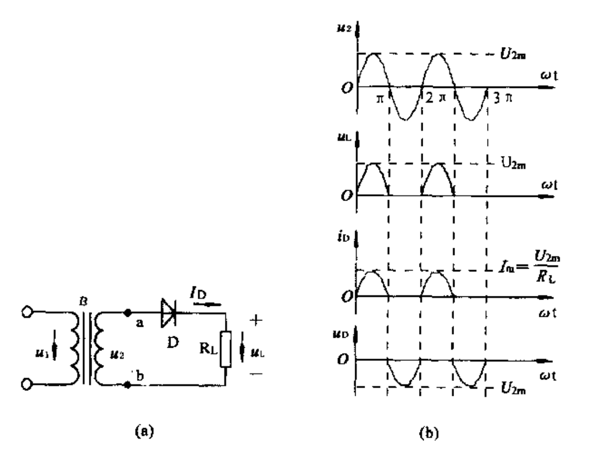
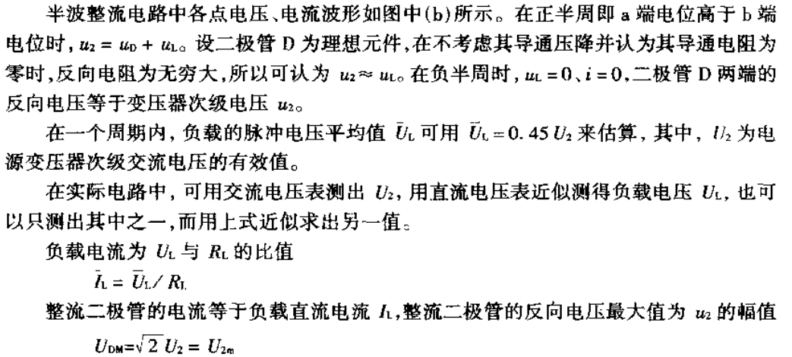
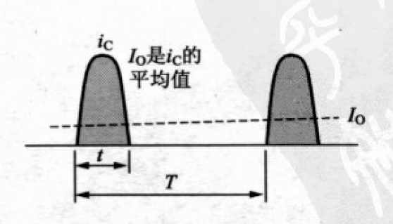
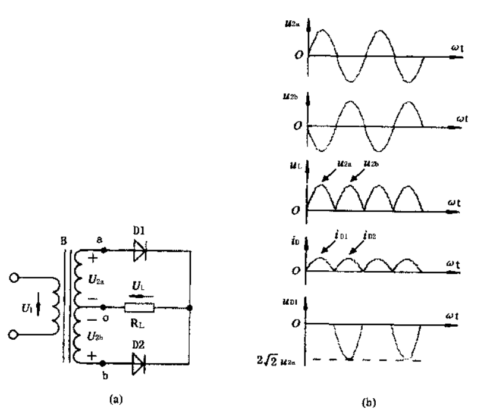
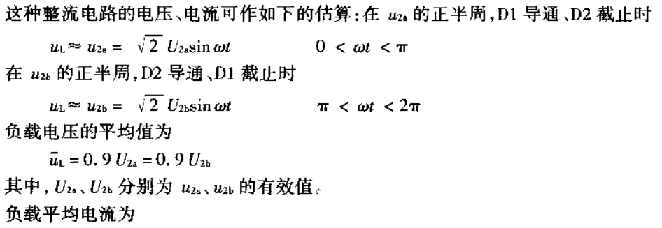
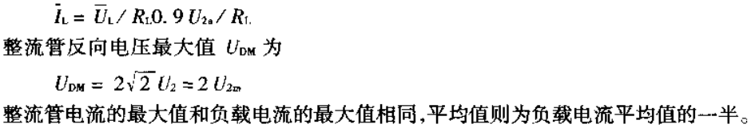
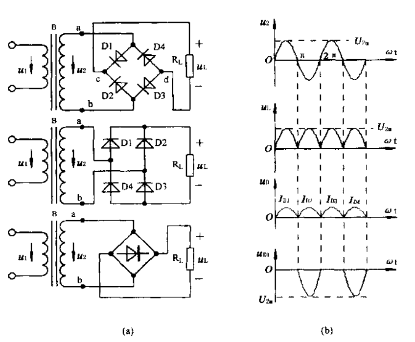
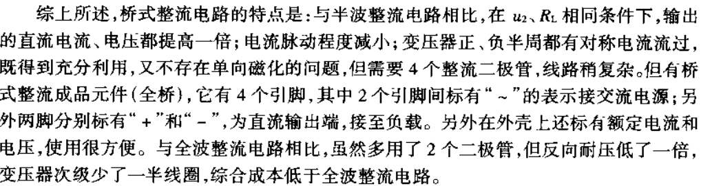
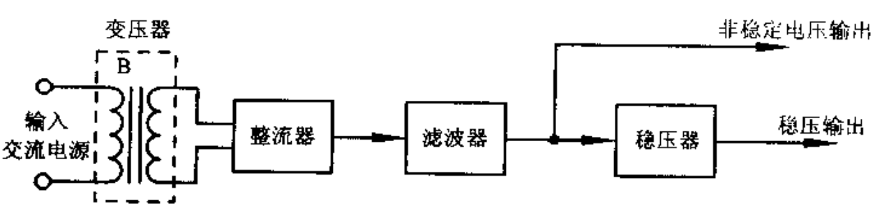
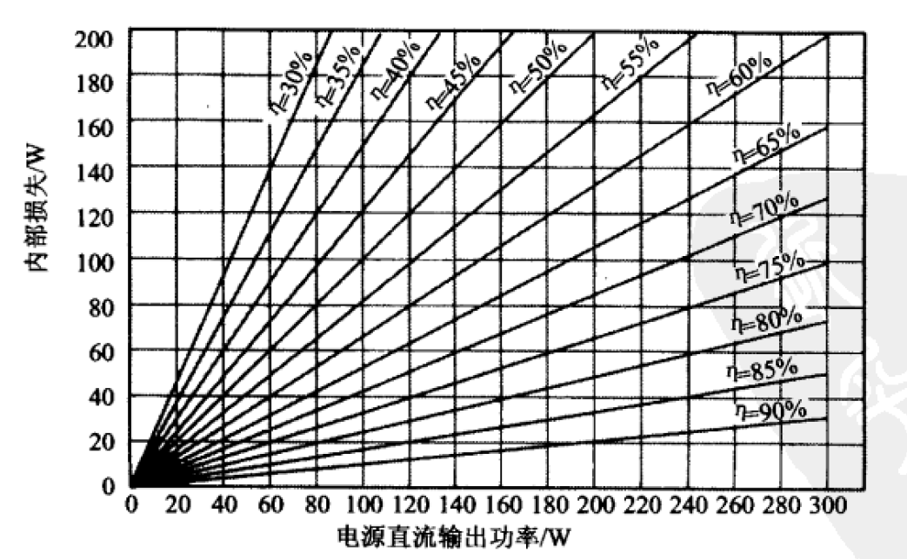

# 电源

[TOC]

## 直流电源

1. 电池作为直流电源。
2. 采用整流和滤波电路将交流电转换成直流电源。

## 概念

### 电动势与电压

1. 电动势和电压的物理意义不同，电动势表示了外力（非电场力）做功的能力，而电压表示电场做功的能力。
2. 电动势只存在于电源的内部，大小等于外力将单位正电荷从电源负极经电源内部移动到正极所做的功；而电压存在于电源的两端，并且存在于电源外部电路中，即电路中的两点。
3. 电动势有方向，并且与电压方向相反，电动势方向是电位升高的方向，而电压方向是电位降低的方向。电动势在电源内部的方向是从电源的负极指向电源的正极，而电压在外电路中的方向是从电源的正极指向电源的负极。
4. 电动势和电压的单位相同，都是伏特，用E表示。
5. 当电源两端不接负载时，电源两端的电压在数值上等于电源的电动势。

### 电源端电压

电源端电压等于电源正、负极之间的电位差。一般所说的电源电压，就是电源端电压。

## 电压变化原因

1. 交流电源电压的变化

   商用电源，电压会有波动。且附近有大型设备启动时，可能带来电压大幅下降。

2. 变压器的电压降

   变压器内部导线的电阻，产生电压降。

   初级和次级之间存在的漏电感引起电压降。

3. 整流二极管的电压降

4. 波纹电压

   波纹电压可看成是以2倍的电源频率连续变化的电压脉动。

5. 负载变化

## 直流稳压电源分类

* 线性稳压电源
  * 串联稳压电源
  * 并联稳压电源
* 开关稳压电源

### 对比

|              | 线性电源                                 | 开关电源                                                     |
| ------------ | ---------------------------------------- | ------------------------------------------------------------ |
| 使用场景     | 电压精度（稳定性）要求高或小功率的场合。 | 不适用于无线电设备、测量仪器、医疗器械之类处理极微弱心信号的设备。 |
| 结构         | 简单                                     | 复杂                                                         |
| 可靠性       | 高                                       | 低                                                           |
| 转换效率     | 低                                       | 高                                                           |
| 电气噪声     | 少                                       | 大                                                           |
| 直流输出纹波 | 小                                       |                                                              |
| 功率损耗     | 大                                       | 小                                                           |
| 变压器体积   | 大                                       | 小                                                           |

## 线性稳压电源

### 降压电路

#### 交流降压电路

1. 电源变压器降压电路

   最常用，安全，有对220V交流市电隔离的作用。

2. 电容器降压电路

   经济，安全性差，很少才用。

3. 恒压变压器降压方式

#### 直流降压电路

1. 阻容滤波器构成的直流降压电路
2. 电子滤波器构成的直流降压电路
3. 串联二极管或者串联稳压二极管的方式降低电压
4. 大量才用电阻分压电路进行局部电流电压降低

### 整流电路

**电容器输入型整流：**在二极管整流电路的后面连接平滑电容器的整流方式

#### 1.半波整流电路

IO     直流输出电流。

iC      电容器充电电流。
$$
I_{O} = \frac{1}{T} \int_{0}^{t} i_{C} \ast dt
$$
**优点：** 电路简单，元件少。

**缺点：** 输出的直流电压脉动很大，变压器的利用率低。仅适用于输出数十毫安的小功率电路。

#### 2.全波整流电路

**优点：** 相比半波整流电路，负载电流和电压各增加一倍，电流脉动值减少。

**缺点：** 变压器的利用率不高，整流管的数量增加了一倍，每个整流管承担的方向电压最大值也增加了一倍。

#### 3.桥式整流电流

#### 4.倍压整流电路

### 滤波电路

#### 电容滤波器

#### RC滤波器

#### LC滤波器

#### L型滤波

#### π型滤波

#### 电子滤波器

#### 对比

| 滤波形式 | 优点                     | 缺点                     | 适用条件               |
| ---- | ---------------------- | ---------------------- | ------------------ |
| 电容滤波 | 输出电压高，滤波效果好            | 负载能力弱，浪涌电流大            | 负载电流较小的场合          |
| 电感滤波 | 负载能力好，能适应变动负载，无浪涌电流    | 铁芯元件体积大、笨重，输出电压低，反电动势大 | 适用于负载变化大的场合        |
| Γ型滤波 | 输出大电流时负载能力好，效果比L、C滤波都好 | 输出电压低，反电动势大，铁芯元件体积大、笨重 | 适用于负载变化大而且负载电流大的场合 |
| π型滤波 | 输出电压高，滤波效果好            | 负载能力弱，输出电流小            | 适用于要求稳输出，输出电流小的场合  |

## 开关稳压电源

### 拓扑

线性调整器

Buck调整器

Boost调整器

反相开关型调整器（反激式或Buck-Boost调整器）

### 结构图

## 保护电路

1. 过电压保护电路
2. 过电流保护电路
3. 整流二极管保护电路
4. 局部单元电路故障保护电路

## 制作建议

1. 装配时电源变压器应直接安装到金属外壳的后部。
2. 保险丝、电源开关和接线端子也安装在外壳后面板上。
3. 电路板应固定牢靠。
4. 在电路板上二极管或者整流器组件与滤波电容和电压调节元件尽可能紧靠放置。
5. 保证稳压器的有效散热。
6. 在外壳前面放置电源输出插孔。
7. 在外壳上钻孔帮助散热。
8. 外壳接地。
9. 电源线从后面板的孔中引出，在出口使用一个橡皮圈。
10. 为避免电击，确认所有的裸露的电源连接点都用热塑管隔离。

## 转换效率

η	    转换效率。

PL      电源内部的功率损耗。

PO     输出功率。

VO     输出电压。

IO      输出电流。
$$
P_{L} = \left ( \frac{1}{\eta } \right ) - 1 \ast P_{O} \\ P_{O} = V_{O}  \ast I_{O}
$$

通常，串联稳压器输出电压越低，转换效率越差。

