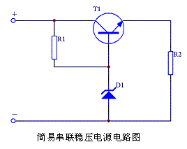
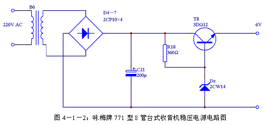

# 串联稳压电源

[TOC]

## 概述

并联稳压电源有效率低、输出电压调节范围小和稳定度不高这三个缺点。

串联稳压电源正好可以避免这些缺点，所以现在广泛使用的一般都是串联稳压电源。

## 原理分析

简易串联稳压电源，T1是调整管，D1是基准电压源，R1是限流电阻，R2是负载。

由于T1基极电压被D1固定在UD1，T1发射结电压（UT1）BE在T1正常工作时基本是一个固定值（一般硅管为0.7V，锗管为0.3V），所以输出电压UO＝UD1－（UT1）BE。当输出电压远大于T1发射结电压时，可以忽略（UT1）BE，则UO≈UD1。

假设由于某种原因引起输出电压UO降低，即T1的发射极电压（UT1）E降低，由于UD1保持不变，从而造成T1发射结电压（UT1）BE上升，引起T1基极电流（IT1）B上升，从而造成T1发射极电流（IT1）E被放大β倍上升，由晶体管的负载特性可知，这时T1导通更加充分管压降（UT1）CE将迅速减小，输入电压UI更多的加到负载上，UO得到快速回升。这个调整过程可以使用下面的变化关系图表示：  UO↓→（UT1）E↓→UD1恒定→（UT1）BE↑→（IT1）B↑→（IT1）E↑→（UT1）CE↓→UO↑        当输出电压上升时，整个分析过程与上面过程的变化相反，这里我们就不再重复，只是简单的用下面的变化关系图表示：  UO↑→（UT1）E↑→UD1恒定→（UT1）BE↓→（IT1）B↓→（IT1）E↓→（UT1）CE↑→UO↓        这里我们只分析了输出电压UO降低的稳压工作原理，其实输入电压UI降低等其他情况下的稳压工作原理都与此类似，最终都是反应在输出电压UO降低上，因此工作原理大致相同。        从电路的工作原理可以看出，稳压的关键有两点：一是稳压管D1的稳压值UD1要保持稳定；二是调整管T1要工作在放大区且工作特性要好。        其实还可以用反馈的原理来说明简易串联稳压电源的工作原理。由于电路是一个射极输出器，属于电压串联负反馈电路，电路的输出电压为UO＝（UT1）E≈（UT1）B，由于（UT1）B保持稳定，所以输出电压UO也保持稳定。        简易串联稳压电源由于使用固定的基准电压源D1，所以当需要改变输出电压时只有更换稳压管D1，这样调整输出电压非常不方便。另外由于直接通过输出电压UO的变化来调节T1的管压降（UT1）CE，这样控制作用较小，稳压效果还不够理想。因此这种稳压电源仅仅适合一些比较简单的应用场合。  **2****、电路实例**        图4－1－1是简易串联稳压电源的一个实际应用电路，这个电路用在无锡市无线电五厂生产的“咏梅”牌771型8管台式收音机上。其中T8、DZ、R18构成简易稳压电路，B6、D4～D7、C21组成整流滤波电路。由于T8发射结有0.7V压降，为保证输出电压达到6V，应选用稳压值为6.7V左右的稳压管。 

   

**二、串联负反馈稳压电源**       由于简易串联稳压电源输出电压受稳压管稳压值得限制无法调节，当需要改变输出电压时必须更换稳压管，造成电路的灵活性较差；同时由输出电压直接控制调整管的工作，造成电路的稳压效果也不够理想。所以必须对简易稳压电源进行改进，增加一级放大电路，专门负责将输出电压的变化量放大后控制调整管的工作。由于整个控制过程是一个负反馈过程，所以这样的稳压电源叫串联负反馈稳压电源。  **1****、原理分析**        图4－2－1是串联负反馈稳压电路电路图，其中T1是调整管，D1和R2组成基准电压，T2为比较放大器，R3～R5组成取样电路，R6是负载。其电路组成框图见图4－2－2。        假设由于某种原因引起输出电压UO降低时，通过R3～R5的取样电路，引起T2基极电压（UT2）O成比例下降，由于T2发射极电压（UT2）E受稳压管D1的稳压值控制保持不变，所以T2发射结电压（UT2）BE将减小，于是T2基极电流（IT2）B减小，T2发射极电流（IT2）E跟随减小，T2管压降（UT2）CE增加，导致其发射极电压（UT2）C上升，即调整管T1基极电压（UT1）B将上升，T1管压降（UT1）CE减小，使输入电压UI更多的加到负载上，这样输出电压UO就上升。这个调整过程可以使用下面的变化关系图表示：  UO↓→（UT2）O↓→UD1恒定→（UT2）BE↓→（IT2）B↓→（IT2）E↓→（UT2）CE↑  →（UT2）C↑→（UT1）B↑→（UT1）CE↓→UO↑        当输出电压升高时整个变化过程与上面完全相反，这里就不再赘述，简单的用下图表示：  UO↑→（UT2）O↑→UD1恒定→（UT2）BE↑→（IT2）B↑→（IT2）E↑→（UT2）CE↓  →（UT2）C↓→（UT1）B↓→（UT1）CE↑→UO↓        与简易串联稳压电源相似，当输入电压UI或者负载等其他情况发生时，都会引起输出电压UO的相应变化，最终都可以用上面分析的过程说明其工作原理。  

        在串联负反馈稳压电源的整个稳压控制过程中，由于增加了比较放大电路T2，输出电压UO的变化经过T2放大后再去控制调整管T1的基极，使电路的稳压性能得到增强。T2的β值越大，输出的电压稳定性越好。  **2****、调节输出电压**        前面我们还说到R3～R5是取样电路，由于取样电路并联在稳压电路的输出端，而取样电压实际上是通过这三个电阻分压后得到。在选取R3～R5的阻值时，可以通过选择适当的电阻值来使流过分压电阻的电流远大于流过T2基极的电流。也就是说可以忽略T2基极电流的分流作用，这样就可以用电阻分压的计算方法来确定T2基极电压（UT2）B。          当R4滑动到最上端时T2基极电压（UT2）B为：          此时输出电压为：          这时的输出电压是最小值。        当R4滑动到最下端时T2基极电压（UT2）B为：            此时输出电压为：          这时的输出电压是最大值。        以上计算中，当（UT2）BE<<UD1时可以忽略（UT2）BE的值。        通过上面的计算我们可以看出，只要合适选择R3～R5的阻值就可以控制输出电压UO的范围，改变R3和R5的阻值就可以改变输出电压UO的边界值。  **3****、增加输出电流**        当输出电流不能达到要求时，可以通过采用复合调整管的方法来增加输出电流。一般复合调整管有四种连接方式，如图4－2－7所示。          图4－2－7中的复合管都是由一个小功率三极管T2和一个大功率三极管T1连接而成。复合管就可以看作是一个放大倍数为βT1βT2，极性和T2一致，功率为（PT1）PCM的大功率管，而其驱动电流只要求（IT2）B。        图4－2－8是一个实用串联负反馈稳压电源电路图。此电路采用图4－2－7（a）中的复合管连接方法来增加输出电流大小。另外还增加了一个电容C2，它的主要作用是防止产生自激振荡，一旦发生自激振荡可由C2将其旁路掉。    **三、设计实例**      这一节我们综合运用前面各章节的知识，根据给定条件实际设计一个直流稳压电源，通过这个设计实例更好的掌握串联负反馈稳压电源的设计。由于是业余条件下的设计，有些参数指标并没有过多考虑，有部分参数以经验值进行估算。这样可以避免涉及过深、过多的理论知识，对于业余条件下的应用完全可以满足。  **1****、电路指标**        ①直流输出电压UO：6V～15V；        ②最大输出电流IO：500mA；        ③电网电压变化±10％时，输出电压变化小于±1％；  **2****、电路初选**    图4－3－1：直流稳压电源电路设计初选电路图        由于桥式整流、电容滤波电路十分成熟，这里我们选择桥式整流、电容滤波电路作为电源的整流、滤波部分。由于要求电源输出电压有一定的调整范围，稳压电源部分选择串联负反馈稳压电路。同时由于对输出电流要求比较大，调整管必须采用复合管。综合这些因素可以初步确定电路的形式，参见图4－2－9。  **3****、变压部分**        这一部分主要计算变压器B1次级输出电压（UB1）O和变压器的功率PB1。  一般整流滤波电路有2V以上的电压波动（设为ΔUD）。调整管T1的管压降（UT1）CE应维持在3V以上，才能保证调整管T1工作在放大区。整流输出电压最大值为15V。根据第二章《常用整流滤波电路计算表》可知，桥式整流输出电压是变压器次级电压的1.2倍。        当电网电压下降－10％时，变压器次级输出的电压应能保证后续电路正常工作，那么变压器B1次级输出电压（UB1）OMIN应该是：  （UB1）OMIN＝（ΔUD＋（UT1）CE＋（UO）MAX）÷1.2  （UB1）OMIN＝（2V＋3V＋15V）÷1.2＝20V÷1.2＝16.67V        则变压器B1次级额定电压为：  （UB1）O＝（UB1）OMIN÷0.9  （UB1）O＝16.67V÷0.9＝18.5V        当电网电压上升＋10％时，变压器B1的输出功率最大。这时稳压电源输出的最大电流（IO）MAX为500mA。此时变压器次级电压（UB1）OMAX为：  （UB1）OMAX＝（UB1）O×1.1  （UB1）OMAX＝18.5V×1.1＝20.35V        变压器B1的设计功率为：  PB1＝（UB1）OMAX×（IO）MAX  PB1＝20.35V×500mA＝10.2VA        为保证变压器留有一定的功率余量，确定变压器B1的额定输出电压为18.5V，额定功率为12VA。实际购买零件时如果没有输出电压为18.5V的变压器可以选用输出电压为18V或以上的变压器。当选用较高输出电压的变压器时，后面各部分电路的参数需要重新计算，以免由于电压过高造成元件损坏。  **4****、整流部分**        这一部分主要计算整流管的最大电流（ID1）MAX和耐压（VD1）RM。由于四个整流管D1～D4参数相同，所以只需要计算D1的参数。        根据第二章《常用整流滤波电路计算表》可知，整流管D1的最大整流电流为：  （ID1）MAX＝0.5×IO  （ID1）MAX＝0.5×500mA＝0.25A        考虑到取样和放大部分的电流，可选取最大电流（ID1）MAX为0.3A。        整流管D1的耐压（VD1）RM即当市电上升10％时D1两端的最大反向峰值电压为：  （VD1）RM≈1.414×（UB1）OMAX＝1.414×1.1×（UB1）O≈1.555×（UB1）O  （VD1）RM≈1.555×18.5V≈29V        得到这些参数后可以查阅有关整流二极管参数表，这里我们选择额定电流1A，反向峰值电压50V的IN4001作为整流二极管。  **5****、滤波部分**        这里主要计算滤波电容的电容量C1和其耐压VC1值。        根据根据第二章滤波电容选择条件公式可知滤波电容的电容量为（3－5）×0.5×T÷R，一般系数取5，由于市电频率是50Hz，所以T为0.02S，R为负载电阻。        当最不利的情况下，即输出电压为15V，负载电流为500mA时：  C1＝5×0.5×T÷（UO÷IO）  C1＝5×0.5×0.02S÷（15V÷0.5A）≈1666μF        当市电上升10％时整流电路输出的电压值最大，此时滤波电容承受的最大电压为：  VC1＝（UB1）OMAX＝20.35V        实际上普通电容都是标准电容值，只能选取相近的容量，这里可以选择2200μF的铝质电解电容。耐压可选择25V以上，一般为留有余量并保证长期使用中的安全，可将滤波电容的耐压值选大一点，这里选择35V。  **6****、调整部分**        调整部分主要是计算调整管T1和T2的集电极－发射极反向击穿电压（BVT1）CEO，最大允许集电极电流（IT1）CM，最大允许集电极耗散功率（PT1）CM。        在最不利的情况下，市电上升10％，同时负载断路，整流滤波后的出电压全部加到调整管T1上，这时调整管T1的集电极－发射极反向击穿电压（BVT1）CEO为：  （BVT1）CEO＝（UB1）OMAX＝20.35V        考虑到留有一定余量，可取（BVT1）CEO为25V。        当负载电流最大时最大允许集电极电流（IT1）CM为：  （IT1）CM＝IO＝500mA        考虑到放大取样电路需要消耗少量电流，同时留有一定余量，可取（IT1）CM为600mA。        这样大允许集电极耗散功率（PT1）CM为：  （PT1）CM＝（（UB1）OMAX－UOMIN）×（IT1）CM  （PT1）CM＝（20.35V-6V）×600mA＝8.61W        考虑到留有一定余量，可取（PT1）CM为10W。        查询晶体管参数手册后选择3DD155A作为调整管T1。该管参数为：PCM＝20W，ICM＝1A，BVCEO≥50V，完全可以满足要求。如果实在无法找到3DD155A也可以考虑用3DD15A代替，该管参数为：PCM＝50W，ICM＝5A，BVCEO≥60V。        选择调整管T1时需要注意其放大倍数β≥40。        调整管T2各项参数的计算原则与T1类似，下面给出各项参数的计算过程。  （BVT2）CEO＝（BVT1）CEO＝（UB1）OMAX＝20.35V        同样考虑到留有一定余量，取（BVT2）CEO为25V。  （IT2）CM＝（IT1）CM÷βT1  （IT2）CM＝600mA÷40＝15mA  （PT2）CM＝（（UB1）OMAX－UOMIN）×（IT2）CM  （PT2）CM＝（20.35V－6V）×15mA＝0.21525W        考虑到留有一定余量，可取（PT2）CM为250mW。        查询晶体管参数手册后选择3GD6D作为调整管T2。该管参数为：PCM＝500mW，ICM＝20mA，BVCEO≥30V，完全可以满足要求。还可以采用9014作为调整管T2，该管参数为：PCM＝450mW，ICM＝100mA，BVCEO≥45V，也可以满足要求。        选择调整管T2时需要注意其放大倍数β≥80。        则此时T2所需要的基极驱动电流为：  （IT2）MAX＝（IT2）CM÷βT1＝15mA÷80＝0.1875mA  **7****、基准电源部分**        基准电源部分主要计算稳压管D5和限流电阻R2的参数。        稳压管D5的稳压值应该小于最小输出电压UOMIN，但是也不能过小，否则会影响稳定度。这里选择稳压值为3V的2CW51，该型稳压管的最大工作电流为71mA，最大功耗为250mW。为保证稳定度，稳压管的工作电流ID5应该尽量选择大一些。而其工作电流ID5＝（IT3）CE＋IR2，由于（IT3）CE在工作中是变化值，为保证稳定度取IR2＞＞（IT3）CE，则ID5≈IR2。        这里初步确定IR2MIN＝8mA，则R2为：  R2＝（UOMIN－UD5）÷IR2MIN  R2＝（6V－3V）÷8mA＝375Ω        实际选择时可取R2为390Ω        当输出电压UO最高时，IR2MAX为：  IR2MAX＝UOMAX÷R2  IR2MAX＝15V÷390≈38.46mA        这时的电流IR2MAX小于稳压管D5的最大工作电流，可见选择的稳压管能够安全工作。  **8****、取样部分**        取样部分主要计算取样电阻R3、R4、R5的阻值。        由于取样电路同时接入T3的基极，为避免T3基极电流IT3B对取样电路分压比产生影响，需要让IT3B＞＞IR3。另外为了保证稳压电源空载时调整管能够工作在放大区，需要让IR3大于调整管T1的最小工作电流（IT1）CEMIN。由于3DD155A最小工作电流（IT1）CEMIN为1mA，因此取IR3MIN＝10mA。则可得：  R3＋R4＋R5＝UOMIN÷IR3MIN  R3＋R4＋R5＝6V÷10mA＝600Ω        当输出电压UO＝6V时：  UD5＋（UT3）BE＝（R4＋R5）÷（R3＋R4＋R5）×UO  （R4＋R5）＝（UD5＋（UT3）BE）×（R3＋R4＋R5）÷UO  （R4＋R5）＝（3V＋0.7V）×600Ω÷6V＝370Ω        当输出电压UO＝15V时：  UD5＋（UT3）BE＝R5÷（R3＋R4＋R5）×UO  R5＝（UD5＋（UT3）BE）×（R3＋R4＋R5）÷UO  R5＝（3V＋0.7V）×600Ω÷15V＝148Ω        实际选择时可取R5为150Ω。这样R4为220Ω，R3为230Ω。但实际选择时可取R3为220Ω。  **9****、放大部分**        放大部分主要是计算限流电阻R1和比较放大管T3的参数。由于这部分电路的电流比较小，主要考虑T3的放大倍数β和集电极－发射极反向击穿电压（BVT1）CEO。        这里需要T3工作在放大区，可通过控制T3的集电极电流（IT3）C来达到。而（IT3）C是由限流电阻R1控制，并且有：  IR1＝（IT3）C＋（IT2）B        一方面，为保证T1能够满足负载电流的要求，要求满足IR1＞（IT2）B；另一方面，为保证T3稳定工作在放大区，以保证电源的稳定度，其集电极电流（IT3）C不能太大。        这里可以选IR1为1mA，当输出电压最小时，则R1为：  R1＝（（UB1）O－UO－（UT1）BE－（UT2）BE）÷IR1  R1＝（15V－6V－0.7V－0.7V）÷1mA＝7.6KΩ        实际选择时可取R1为7.5 KΩ。        当输出电压最大时，IR1为：  IR1＝（（UB1）O－UO－（UT1）BE－（UT2）BE）÷R1  IR1＝（15V－6V－0.7V－0.7V）÷7.5 KΩ≈1.013mA        可见当输出电压最大时IR1上升幅度仅1％，对T3工作点影响不大，可满足要求。        由于放电电路的电流并不大，各项电压也都小于调整电路，可以直接选用3GD6D或9014作为放大管T3。  **10****、其他元件**        在T2的基极与地之间并联有电容C2，此电容的作用是为防止发生自激振荡影响电路工作的稳定性，一般可取0.01μF/35V。在电源的输出端并联的电容C3是为提高输出电压的稳定度，特别对于瞬时大电流可以起到较好的抑制作用，可选470μF/25V铝电解电容。  **10****、总结**        通过前面的计算，已经得到了所有元件的参数。可以将这些参数标注到图4－3－1中，这样就得到完整的串联负反馈稳压电源电路图，见图4－3－2。这里计算的其实都还只是初步的参数，实际组装完毕后应该仔细测量电源的各项指标是否符合要求，各部分元件工作是否正常。如果发现问题，应该根据实际情况作出调整。根据调整的结果来修正原理图中的电路参数，最终完成稳压电源的设计。      **四、串联稳压电源的改进措施**      前面介绍的串联负反馈稳压电源只是一种基本的稳压电路，实际使用中的稳压电源可能会有各种各样的特殊要求。有些要求更高的电压稳定度，有些要求更大的输出电流能力，有些要求有短路保护。这样就需要针对不同的要求对前面介绍的电路进行改进。下面就对串联负反馈稳压电源的各种改进措施进行介绍。    **1****、改善稳定度**        一般改善稳定度的方法有：使用恒流源负载、增加电压放大部分的级数、采用辅助的稳定电源、增加补偿电路等方法。    **使用恒流源负载**        由于串联负反馈稳压电路是通过输出电压的变化量，经放大后来调节调整管的管压降达到稳压的目的。当放大倍数越高，电源的稳定度就越高。对于三极管放大器，当集电极电阻越大同时输入电阻越小时，放大倍数就越大。但集电极电阻过大会造成集电极电流过小，会造成输入电阻增大。为解决这个矛盾，可以使用恒流源负载代替集电极电阻。          图4－4－1是一种使用三极管恒流源的稳压电路。图中虚线框内的T4、D2、R6、R7组成恒流源电路，作为T3发射极负载。            图4－4－2是使用恒流二极管作为恒流源的稳压电路。恒流二极管一种能在比较宽的电压范围内提供恒定电流的半导体器件。由于具有直流等效电阻低、交流动态阻抗高、稳定系数小、直流电压降可调的优点。因此可用于代替图4－4－1中的三极管恒流源。  ****  图4－4－3是使用场效应管作为恒流源的串联负反馈稳压电路。由于结型场效应管具有类似恒流二极管的特性，当漏极D接到整流滤波后的电压，栅极G与源极S连接后接到放大管T3的集电极时，场效应管就成了放大管T3的集电极恒流源负载。  ****  **增加电压放大部分的级数**        由于当放大电路的放大倍数越高时，电源的稳定度就越高。一般单管放大电路的放大倍数有限，可以采用增加放大电路级数的方法来提高放大倍数，这样也可以大大提高电源的稳定度。不过增加放大电路的级数后，电路更容易产生自激振荡，在设计放大电路时需要采取手段避免电路产生自激。由于增加电压放大级数不可避免的增加了电路的复杂程度，一般分离元件制作的稳压电源中较少使用此方法。    **采用辅助的稳定电源**        在基本形式的串联负反馈稳压电路中，放大管T3的集电极电路R1直接连接到经整流滤波后的电压上。由于这个电压不是稳定的电压，当其发生变化时，其变化量会加到调整管的基极，进而影响输出电压稳定度。可以通过将R1接入到一个稳定电压的方法来避免这种影响。图4－4－2中，D2、R6组成辅助稳压电源，负责向R1提供稳定的电压。这种形式的稳压电路通常用在大输出电流的稳压电源中，可以显著提高电源的稳定度。    **增加补偿电路**        由于串联负反馈稳压电路是通过输出电压的变化量来控制稳定度，那么可以直接使用输入电压的波动或者负载电流的波动来进行补偿控制，理想状态下可以达到补偿效果正好等于输出电压的变化量。但由于补偿量的计算比较复杂，实际电路中受各种因素影响，补偿效果也难以达到要求。一般较少采用此方法，多为针对特定电路采取的临时措施。         

 [岳达](http://www.51hei.com/bbs/space-uid-73187.html) *发表于 2015-2-3 11:50* | [显示全部楼层](http://www.51hei.com/bbs/dpj-28456-1.html)   大师 在 1、原理分析中 UO↓→（UT1）E↓→UD1恒定→（UT1）BE↑→（IT1）B↑→（IT1）E↑→（UT1）CE↓→UO↑  是因为UO下降时调整管T的发射极Ue 下降  由于稳压管D1作用使调整管T的Ibe增大（可以看作是调整管T的b和e之间有内阻么？）从而T的Uce增加 而达到UO的稳定，，可以这样理解么

串联式整流稳压器：
 利用控制基极电流IB而改变集极的电流IC，使能获得特性优越的大容量稳压电路。

图中的输出电压Vout =稳压电压–射基极电压

Vout = VZ – VBE

输入电压(VS)的改变，会同时引致基极电压改变，[稳压管](http://www.838dz.com/e/search/result/?searchid=13410)的电压稳定作用可使到输出电压(VOUT)恒定不变。 
 例：在上图若输入电压是18V，稳压[二极管](http://www.838dz.com/e/search/result/?searchid=13898)的稳压电压是12.6V，VBE = 0.7V，负载电流是1.5A，求输出电压和Q所损耗的功率。

  输出电压= 12.6V–0.7V = 11.9V 
   Q所损耗的功率= (18V–11.9V) **×**1.5A = 9.15W

串联稳压器电路：控制元件和负载成串联。

VS  ISRS = VL              晶体管
 VS  IL (IS)­↑RS↓(VRS不变) = VL  TRANSFER + RESISTOR

方块图

电路：

 电路分为四部份：

 

​          **1**/**2**   **1** [2](http://www.838dz.com/jicu/cuxue/170_2.html) [下一页](http://www.838dz.com/jicu/cuxue/170_2.html) [尾页](http://www.838dz.com/jicu/cuxue/170_2.html)        

 回输取样电路：由分压电路(R1，R2)组成，从输出端抽取样本,监视输出端电压之变化，把变化(Vf)送到误差放大器，此电路由(R1，R2)电阻组成。 基准电压电路：由一电阻和一个稳压[二极管](http://www.838dz.com/e/search/result/?searchid=13898)组成，利用稳压[二极管](http://www.838dz.com/e/search/result/?searchid=13898)的稳压特性输出一稳定的参考电压Vref.。 R4用以限制稳压[二极管](http://www.838dz.com/e/search/result/?searchid=13898)的工作电流。[838电子](http://www.838dz.com/) 

 取样电路基准电压电路 

 3.误差放大：由一负载电阻和三极管所构成的共射极放大器组成，把回输电压和参考电压作出比较，把误差电压输出到控制元件。

控制元件：由一个三极管构成，三极管的内阻受输入基极的误差电压所影响，当其内阻变大时，输出电压便下降，反之则上升。所以控制元件可看成一个 可变电阻，而电阻值由误差电压所控制，误差电压愈高，Q1的内阻便愈低，流经Q1的电流便愈大。

  误差放大                 控制元件

输出电压：          
          
 由上式:当R1 = 0时，Vo的输出为最低。 
 串联稳压电路的改良： [838电子](http://www.838dz.com/)

​           

 1.控制元件Q1使用单只达林顿管或由二只三极管组成的达林顿管：提高电流增益。

前置稳压器：误差电压Ve除受参考电压Vref之变化而改变外，也受输入电压VS的影响，为使输出电压不受输入电压VS影响，可把R3的阻值加大，当R3为无限大时，Ve便不受VS的影响，但R3不可能无限大，因此用一恒流源代替R3，此恒流源称为 前置稳压器，在上图中DA，QA，RA1，RA2组成一个前置稳压器。

短路保护：QC，RC组成限流保护器，当Io增大RC两端的电压增加，若VRC的电压增加至0.6V时，QC便会导通，相当数量的Q1基极电流转移到QC集极，使Q1的电流固定在一定的数值内，改变RC的电阻值，便可设定稳压器的最大输出电流。

 串联型稳压电源电路

