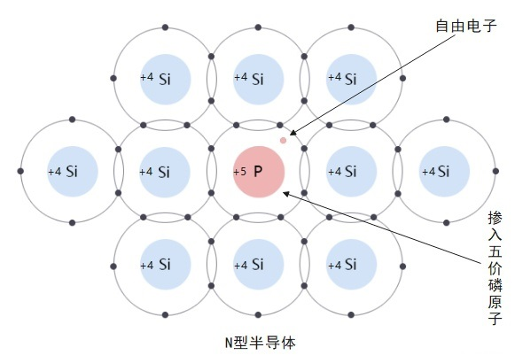
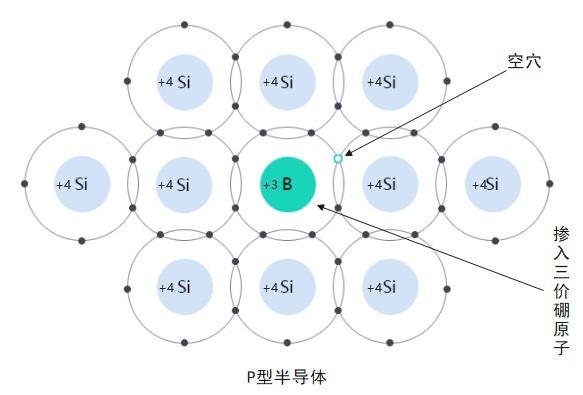

# 半导体

[TOC]

## 概述

特性：

1. 热敏特性
2. 光敏特性
3. 掺杂特性

## 分类

* 元素半导体
  * 硅          Si
  * 锗          Ge
* 化合物半导体
  * 砷化镓  GaAs
* 掺杂或制成其他化合物半导体材料
  * 硼          B
  * 磷          P
  * 铟          In
  * 锑          Sb

## N型半导体（电子型半导体）

在本征半导体如硅、锗中掺入微量的五价元素如砷、锑、磷等。

主要靠电子导电。

## P型半导体（空穴型半导体）

在本征半导体如硅、锗中掺入微量的三价元素如铟、硼、铝等。

主要靠空穴导电。

