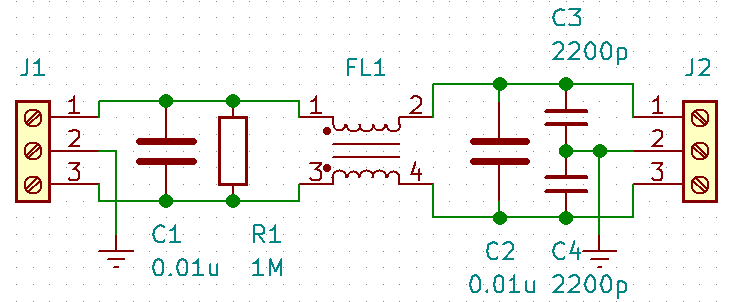

# EMI滤波器

电源滤波器，“电源EMI滤波器”或者“EMI电源滤波器”，是一种由电容、电感和电阻组成的滤波器，是滤波器的一种。作用是：对特定频率的频点或该频点以外的频率进行有效滤除，得到所需要的有效信号。

一种无源双向网络，一端是电源，另一端是负载，因此是一种阻抗适配网络，主要是针对电源端口电磁骚扰的特点而设计，电源滤波器一般都设计为低通式。对于任何电源线上高频传导骚扰信号，都可以用差模干扰信号和共模干扰信号来描述。差模干扰在两传输导线之间流动，属于对称性干扰;共模干扰在传输导线与地之间传输，属于非对称性干扰。

## 电源滤波器原理

典型电路图，其中：C1、C2是差模电容器，一般称为X电容，电容容量很多时候选择在0.01μF到0.47μF之间；Y1和Y2是共模电容，一般称为Y电容，电容量不宜过大，一般在几十纳法左右，选的太大容易引起漏电；L1为共模扼流圈，它为同向绕在同一个铁氧体环上的一对线圈，电感量约为几毫亨，对于共模干扰电流，两个线圈产生的磁场是同方向的，共模扼流圈表现出较大的阻抗，从而起到衰减干扰信号的作用；而对于差模信号，两个线圈产生的磁场抵消，因此不会影响到电路的性能。如果想要效果得到更好可以采用二级滤波。

## 性能指标

主要参数有：额定电压、额定电流、漏电流、绝缘电阻、耐压值、工作温度、插入损耗等。其中最重要的是插入损耗，插入损耗经常用“IL”来表示，有时候也称插入衰减，这项指标是评价电源滤波器性能优劣的主要指标，通常用分贝数或频率特性曲线来表示。指滤波器接入线路前后，测试信号从电源端传到负载端的功率比或端口电压比。分贝数越大，说明抑制干扰的能力就越强。例如插入损耗有些可以用50欧姆测试系统测试，如下图是某电源滤波器插入损耗图

## 选择

选购电源滤波器时候，要充分考虑相数、额定电压、额定电流、漏电流大小、认证、体积以及形状、插入损耗等，额定电压/电流要符合产品所需，漏电流不能选择太大的，选择有相关认证体系的电源滤波器，体积和形状根据实际来决定，插入损耗选择抑制能力强一点的等等。

除了这些还需要根据实际需要，例如有些电源滤波器是军用级的有些是工业级的，有些是家庭设备专用，有些是变频器专用，有些是医疗设备专用......只有确定了使用对象才能选择好适合自己的电源滤波器，其实只要基本条件满足的话，很多时候都是考虑价格成本的问题。