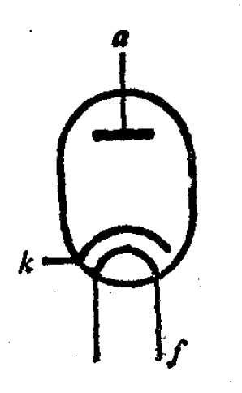
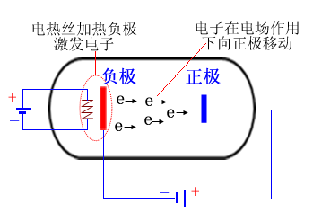
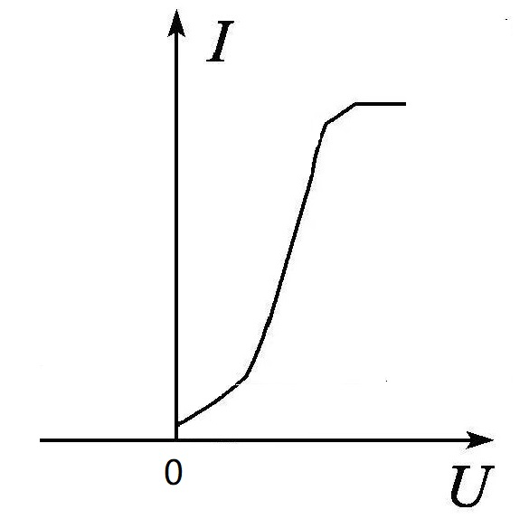

# 二极管

[TOC]

## 概述

是最简单的一种电子管。是一个密封的玻璃管（或金属管），管内被抽成高度真空。其中安装两个电极，一个是阴极，一个是屏极。

* 灯丝	f

  阴极的热源。

* 阴极    k

  通常由发射温度低而效率高的材料制成，如金属氧化物、钨、碳化钍钨等，作用是发射热电子。

* 屏极    a

  通常由镍、镀镍铁片或钼、钽等材料制成，作用是收集热电子。为使热电子全部顺利地到达屏极，做成了圆筒形，套在阴极外边。

## 工作原理（单向导电性）

 

## 伏安特性曲线

特性曲线是非线性。阴极在不同的工作温度下，有不同的曲线。当屏压一定时，温度越高，屏流越大。二极管伏安特性曲线描述屏流及屏压间的关系。

 

## 3/2次方定律

$$
\Huge i_{a} = Gu_{a}^{\frac{3}{2} }
$$

* G	常数，由二极管的构造决定。

## 参数

### 内阻 Ri
在额定灯丝电压下，直流屏极电压 Ua  对直流屏极电流 Ia 的比值。
$$
\Huge R_{i} = \frac{\Delta U_{a}}{\Delta I_{a}}
$$
对应于各工作点的内阻不相同。手册内的内阻，是在特性曲线的运用范围内，各工作点的内阻的平均值。常称为直流内阻。

### 屏极损耗功率 Pa
电子受到屏极电场的加速，撞到屏极上，电子的动能转化为热能，使屏极温度升高。这些热量是无用的损耗，叫做屏极损耗。  

等于屏极与阴极之间的电压与屏流的乘积。  
$$
\Huge P_{a} = U_{a}I_{a}
$$
**害处：**

1. 屏极温度过高，金属内残余的气体释放，破坏真空度。
2. 屏极发热，会导致阴极额外受热，氧化物阴极在过热时，会很快失去发射电子的能力。

**应对：**
1. 屏极进行黑化（表面变成黑色），增加辐射散热率。
2. 增加屏极面积，增加侧面板。

### 最大屏极反峰电压
在二极管加上阴极为正，屏极为负的反向电压时，这个电压的最大容许值。

整流电路，电子管工作时，两端实际存在的反向电压接近为电源电压峰值的两倍。

### 最大整流电流
二极管允许连续不断的通过的最大平均屏极电流值。

### 最大峰值屏流
二极管在安全范围内容许的最大瞬时屏流值。决定于阴极的发射能力。负载电流不得超过最大屏流。

### 灯丝额定电源 Uf

保证阴极正常发射电子所需的工作电压。

## 用途

### 整流

* 半波整流
* 全波整流

### 检波

