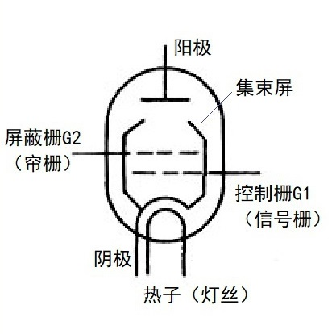
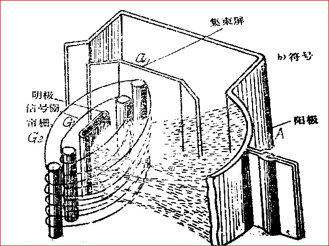

# 四极管

[TOC]

## 概述

在三极管的基础上增加一个栅极——帘栅极。

## 束射管

束射管利用帘栅极与屏极之间的空间电荷来克服二次发射的影响。如果帘栅极与屏极之间有足够多的空间电荷，在屏压低于帘栅压时，有可能使空间电荷对屏极发出的二次电子的斥力超过帘栅极对二次电子的吸引力，将二次电子斥回，从而起到抑制栅极的作用。

### 结构

 

 

* 阴极

  成矩形，有相当大的发射面积且与栅极之间的间距相当均匀。发射的电子流很大，且均匀。

* 栅极

  与帘栅极在单位长度上的圈数相等，而且相互对齐。可以减少帘栅流，降低了帘栅极上的功率损耗和温度。同时使电子流在栅丝间成束射出，因而在帘栅极与屏极间获得密集而均匀的空间电荷。

* 帘栅极

  帘栅极与屏极间的距离相当宽阔，使整个区域内的空间电荷增多。帘栅极与屏极之间的两侧装置了一对束射板，与阴极相连，防止屏极上的二次电子从各个栅极支柱的两侧绕道流向帘栅极，同时使电子流向中间密集，增大空间电荷密度。

* 屏极