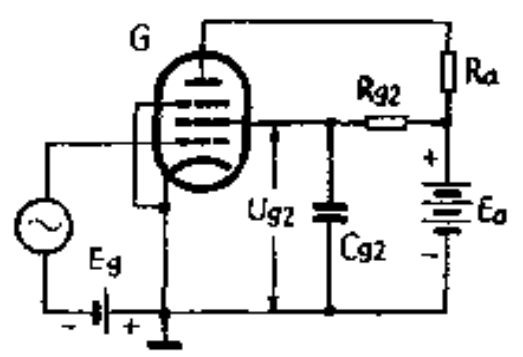

# 五极管

[TOC]

## 概述

在三极管的栅极和屏极之间加入另外两个栅极，成为五极管。

## 栅极

* 控制栅极

* 帘栅极

  利用屏蔽的原理，减少跨路电容。需接地，且必须接上正电压，以免影响屏流。

* 抑制栅极

  消除在屏极上产生的二次电子发射的影响。从阴极发射的电子受到屏极和帘栅极正电场的加速作用而以高速撞击屏极，使屏极表面的电子获得足够的动能而飞出屏极。抑制栅极与阴极相连，二次电子被抑制极排斥返回屏极。

## 电路图

* Cg2	帘栅极旁路电容
* Rg2    帘栅降压电阻
* Ig20    帘栅极电流的直流分量
* fd       电子管工作时的最低频率

$$
\Huge R_{g2} = \frac{ E_{a} - U_{g2} } { I_{g20} } \\
\Huge C_{g2} > \frac{ 3 }{ 2\pi f_{ d } R_{ g2 } }   
$$

## 优缺点

### 优点

* 放大系统比较大。
* 帘栅极和抑制栅极的双重屏蔽作用，跨路电容非常小，可以工作于较高的频率。

### 缺点

* 屏极特性曲线族在屏压较低时，曲线间的间隔不均匀，用作放大器时会引起失真。
* 由于电子运动的不规律性，使屏极与帘栅极之间的电流分配会随时间而发生不规则的波动，引起噪声。失真和噪声比三极管大。