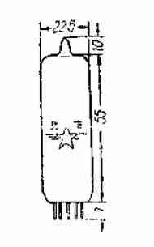
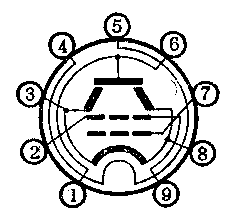

# 6P1

[TOC]

## 概述

旁热式涂氧化物阴极

**供热电流：**交流或直流

束射四极管

功率管，低频功率放大，音频功率放大

 

## 引脚接线图

 

1. a
2. 栅2
3. 束射屏阴
4. 灯丝
5. 灯丝
6. 屏极
7. 栅1
8. 束射屏阴
9. 栅2

## 基本数据

| 参数           | 数值          | 最小值       | 最大值       | 备注      |
|----------------|---------------|---------------|---------------|---------------|
| 尺寸		 | Φ22.5 * 73    |     |     |     |
| 灯丝电压 Uf   | 6.3 V         | 5.7 V     | 7 V | 资料有不同 6.9 V |
| 灯丝电流 If   | 0.5 A         |           |           |           |
| 阳极电压 Ua    | 250 V         |           | 250 V     | 资料有不同 300 V |
| 阳极电流 Ia    | 44 ± 11mA  |     |     |      |
| 第一栅电压     | - 12.5 V      |          |          |          |
| 第二栅电压 Ug2 | 250 V         |           | 250 V     | 资料有不同 300 V |
| 第二栅电流 Ig2 | ≤ 7 mA     |        |        |         |
| 输出功率 Po    | ≥ 3.8 W(4.5) |   |   | 标准值：Ug1～= 8.8 V，ZL = 5 kΩ |
| 跨导 S         | 4.9 ± 1.1 mA / V |  |  |  |
| 内阻 Ri        | 40 kΩ         |           |           |           |
| 非线性失真系数 Kf | 7 %           |             |             | 标准值：Ug1～值应使 Po= 3.8 W（极限运用数据） |
| 负载电阻       | 5 kΩ          |            |            |            |

## 管内极间电容

| 参数     | 数值   |
| -------- | ------ |
| 输入电容 | 8 pF   |
| 输出电容 | 5 pF   |
| 过渡电容 | 0.9 pF |

## 极限运用数据

| 参数                           | 数值    |
| ------------------------------ | ------- |
| 最大灯丝与阴极间电压（Ufkmax） | ± 100 V |
| 最大阴极电流（Ikmax）          | 70 mA   |
| 最大屏极耗散功率（Pamax）      | 12 Ｗ   |
| 最大第二栅极耗散功率（Pg2max） | 2.5 W   |
| 最大第一栅极电路电阻（Rg1max） | 0.5 MΩ  |

## 参考电路

