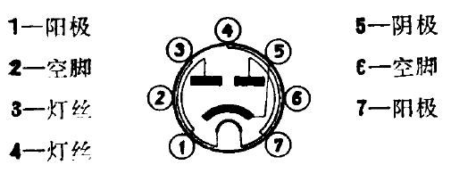
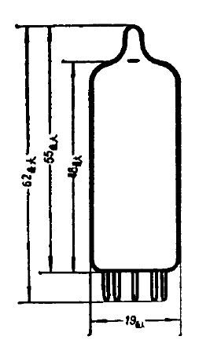

# 6Z4

[TOC]

## 概述

旁热式氧化物阴极管。双阳极整流二极管（共阴极），小功率全波整流。

## 引脚接线图

## 基本数据

| 参数           | 数值          | 最小值       | 最大值       | 备注      |
|----------------|---------------|---------------|---------------|---------------|
| 尺寸		 |     |     |     |     |
| 灯丝电压   | 6.3V          | 5.7V   | 6.9V 7V  |           |
| 灯丝电流   | 600 ± 60mA |           |           |           |
| 变压器次级线圈交流电压有效值 | 2 × 350V   |           |       |           |
| 阳极电路电阻 | 5.2kΩ |     |     |      |
| 滤波电容 | 8μF  16μF |          |          |          |
| 整流电流 | ≥ 72mA    |        | 75mA |         |

## 极限运用数据

| 参数                 | 数值           |
| -------------------- | -------------- |
| 最大阳极反向电压峰值 | 1000V          |
| 最大阳极电流峰值     | 300mA          |
| 最大灯丝与阴极间电压 | +100V ， -400V |