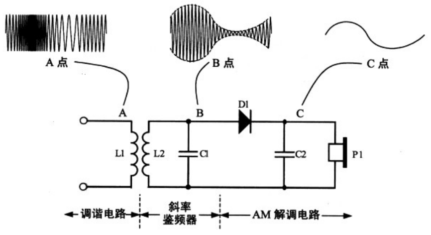

# 电磁波

[TOC]

## 概述
λ=c/f

λ波长  
c光速  
f频率

## 模拟信号的调制方式
* 幅度调制（amplitude modulation,AM）

  载波的幅度随音频调制信号成正比例变化，而载波频率是固定不变的。

* 频率调制（frequency modulation,FM）

* 相位调制（phase modulation,PM）

## AM信号解调电路

## FM信号解调电路
**锁相环路检波器（phase-locked loop demodulator）**  
**积分检波器（quadrature detector）**  
**鉴频器（FM discriminator）**  

> 斜率鉴频器（slope detector）
> 

## 习惯性表示方法
1. 中波，长波－－－频率
2. 短波，超短波－－－波长
3. 微波－－－频率（MHz,KMHz）
4. 红外线，可见光，紫外线，X射线－－－波长（埃）

## 无线电频段和波段表
| 段号 | 频段名称    | 频率范围    | 波段名称     | 波长范围   | 典型源                        |
| ---- | ----------- | ----------- | ------------ | ---------- | ----------------------------- |
| 1    | 极低频(ELF) | 3-30Hz      | 极长波       | 100-10M米  | 海军深海通信                  |
| 2    | 超低频(SLF) | 30-300Hz    | 超长波       | 10-1M米    | 海底通信，交流电源            |
| 3    | 特低频(ULF) | 300-3000Hz  | 特长波       | 100-10万米 | 地震波，地下通信              |
| 4    | 甚低频(VLF) | 3-30KHz     | 甚长波       | 10-1万米   | 近海面通信                    |
| 5    | 低频(LF)    | 30-300KHz   | 长波         | 10-1千米   | AM广播，飞机塔台              |
| 6    | 中频(MF)    | 300-3000KHz | 中波         | 10-1百米   | AM广播                        |
| 7    | 高频(HF)    | 3-30MHz     | 短波         | 100-10米   | 远距离通信，SW广播            |
| 8    | 甚高频(VHF) | 30-300MHz   | 米波         | 10-1米     | FM广播，电视广播，DVB广播     |
| 9    | 特高频(UHF) | 300-3000MHz | 分米波(微波) | 10-1分米   | 微波炉，手机，蓝牙，GPS，Wifi |
| 10   | 超高频(SHF) | 3-30GHz     | 厘米波(微波) | 10-1厘米   | 雷达，卫星电视，Wifi          |
| 11   | 极高频(EHF) | 30-300GHz   | 毫米波(微波) | 10-1毫米   | 卫星间通信，单向能量武器      |
| 12   | 至高频      | 300-3000GHz | 丝米波(微波) | 10-1丝米   |                               |

| 波段名称 | 波长范围     | 用途                                           | 优点                         | 缺点                             |
| -------- | ------------ | ---------------------------------------------- | ---------------------------- | -------------------------------- |
| 长波     | 3000-30000米 | 航行通信，广播                                 | 传输不收气候影响             | 传播损耗大                       |
| 中波     | 200-3000米   | 广播                                           | 传输稳定                     | 传播距离短                       |
| 短波     | 10-200米     | 广播，电报及电话通信                           | 传输距离远                   | 不稳定                           |
| 超短波   | 10米以下     | 近距或接力通信，雷达，电视广播，调频制语音广播 | 干扰小，电磁波直线进行，稳定 | 传输不远，一般只在直线视距内传输 |

AM广播：530KHz-1600KHz  
FM广播：88MHz-108MHz

| L波段  | S波段  | C波段  | X波段   | Ku波段   | K波段      | Ka波段     | U波段    | V波段    | W波段     |
| ------ | ------ | ------ | ------- | -------- | ---------- | ---------- | -------- | -------- | --------- |
| 1-2GHz | 2-4GHz | 4-8GHz | 8-12GHz | 12-18GHz | 18-26.5GHz | 26.5-40GHz | 40-60GHz | 60-80GHz | 80-100GHz |

## 中国周边VLF发射站

| 国家     | 发射站 | 频率                                   |
| -------- | ------ | -------------------------------------- |
| 日本     | JP     | 17.8kHz                                |
| 印度     | VTX    | 18.2kHz                                |
| 俄罗斯   | RA1    | 11.904761kHz 12.648809kHz 14.880952kHz |
| 俄罗斯   | RA3    | 11.904761kHz 12.648809kHz 14.880952kHz |
| 澳大利亚 | NWC    | 19.8kHz                                |

## 历史

1. 啊
2. d
3. a
4. a
5. a