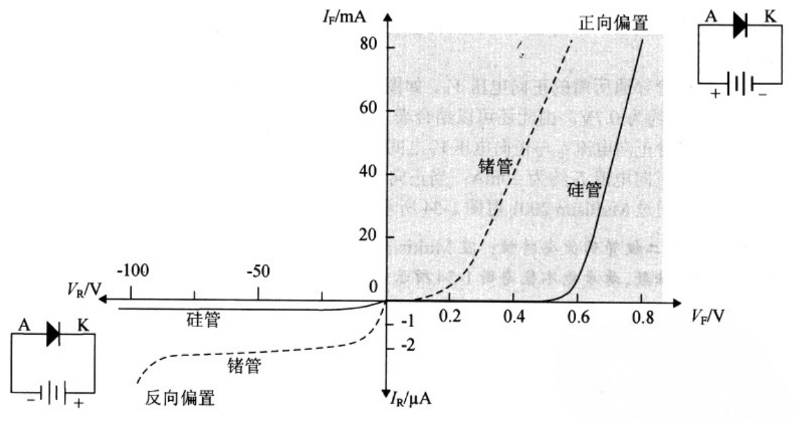

# 二极管
**种类：**
1. 半导体材料：锗二极管，硅二极管，砷化镓二极管
2. 用途：开关二极管，整流二极管，发光二极管，稳压二极管，光电二极管，隧道二极管，肖特基二极管，检波二极管，变容二极管，高压硅堆二极管，阻尼二极管，温敏二极管，磁敏二极管
3. 结构：点接触型二极管，面接触型二极管，平面型二极管
4. 封装：塑料封装二极管，金属封装二极管，玻璃封装二极管，树脂封装二极管

## 二极管导通所需的正向导通电压及电阻范围
| 二极管类型 | 导通所需的最小正向电压 | 电阻范围 |
|------------|------------------------|----------|
| 硅管       | 0.7V                   | 4-8K     |
| 锗管       | 0.15V                  | 1K       |

## 伏安特性曲线

## 稳压二极管
齐纳二极管(Zener)

## 检波二极管
结电容小，频率特性好，正向压降小，通常用锗材料点接触式结构。  
2AP系列，1N60

## 选择方式
1. 点接触型：高频检波、混频;小电流整流
2. 面接触型：低频
