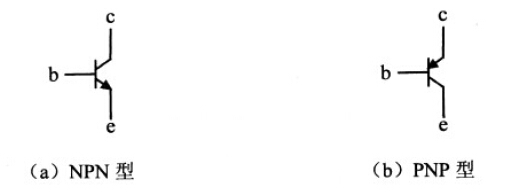

# 三极管
双极型晶体管
结型场效应管
金属氧化半导体场效应管（MOSFET）耗尽型
金属氧化半导体场效应管（MOSFET）增强型
单结晶体管
## 管脚
| 管脚 | 名称   | 英文名    |
|------|--------|-----------|
| b    | 基极   | base      |
| c    | 集电极 | collector |
| e    | 发射极 | emitter   |
## 分类
NPN型和PNP型

