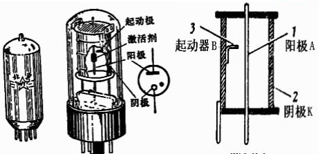
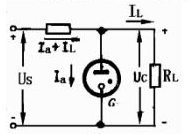

# 充气稳压电子管

[TOC]

## 稳压管

**结构：**

**示意电路：**

WY1   150V  
WY2P    70-80V

<table border="1">
<tr>
  <th rowspan="2">国产型号</th>
  <th rowspan="2">启辉电压 Uz (V)</th>
  <th rowspan="2">稳定电压 Uc (V)</th>
  <th rowspan="2">稳定电压变化 Δuc (V)</th>
  <th colspan="2">屏流 Ia (mA)</th>
  <th rowspan="2">管子类型</th>
  <th rowspan="2">同特性国外管</th>
</tr>
<tr>
  <td>Iamin</td>
  <td>Iamax</td>
</tr>
<tr>
  <td>WY5B</td>
  <td>180</td>
  <td>142-157</td>
  <td>4</td>
  <td>5</td>
  <td>10</td>
  <td rowspan="3">超小型管 ST</td>
  <td>150B2  7475</td>
</tr>
<tr>
  <td>WY202B</td>
  <td>135</td>
  <td>81-87</td>
  <td>3.5</td>
  <td>1.5</td>
  <td>5</td>
  <td>6308</td>
</tr>
<tr>
  <td>WY301G</td>
  <td>430</td>
  <td>380-400</td>
  <td>14</td>
  <td>0.003</td>
  <td>0.1</td>
  <td></td>
</tr>
<tr>
  <td>WY1</td>
  <td>180</td>
  <td>143-160</td>
  <td>4</td>
  <td>5</td>
  <td>30</td>
  <td rowspan="4">拇指管 MT</td>
  <td>OA2  6073  VR150ST</td>
</tr>
<tr>
  <td>WY1-Q</td>
  <td>170</td>
  <td>144-154</td>
  <td>2.5</td>
  <td>5</td>
  <td>30</td>
  <td>OD3  OD3A  OA2MA</td>
</tr>
<tr>
  <td>WY1-T</td>
  <td>160</td>
  <td>143-149</td>
  <td>1.5</td>
  <td>15</td>
  <td>30</td>
  <td></td>
</tr>
<tr>
  <td>WY2</td>
  <td>150</td>
  <td>104-112</td>
  <td>2.5</td>
  <td>5</td>
  <td>40</td>
  <td>OB2  OB2MA  6074</td>
</tr>
<tr>
  <td>WY2P</td>
  <td>105</td>
  <td>70-80</td>
  <td>4.5</td>
  <td>5</td>
  <td>40</td>
  <td rowspan="2">GT 管</td>
  <td>OA3  OA3A  OC2  VR75ST  VR75GT</td>
</tr>
<tr>
  <td>WY3P</td>
  <td>127</td>
  <td>104-112</td>
  <td>3</td>
  <td>5</td>
  <td>40</td>
  <td>OC3  OC3W  VR105GT</td>
</tr>
</table>

