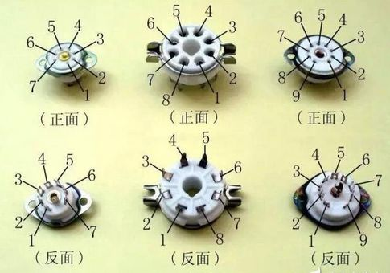
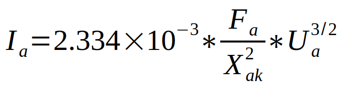

# 电子管
1906年 德福雷斯特

## 电子发射
热电子发射  
光电子发射  （光电管）
二次发射  （光电倍增管）
冷阴极发射  
场致发射（汞弧整流管）

## 电极配置方案
直接加热式阴极(直热式)  
间接加热式阴极(旁热式)  
冷阴极  
金属板

## 分类
1. 放电形式：真空管，充气管（离子管）  
2. 发射类型：详见电子发射
3. 电极数目：二极管，三极管，五级管，复合管
4. 用途：整流管，放大管，振荡管，检波管，变频管
5. 外形：普通八脚管，小型管，超小型管，金属管，锁式管，橡实管，金属陶瓷管

## 管脚

## 灯丝
钨丝  
敷钍钨丝

## 符号
电子管	G  
阴极	K  
屏极	a  
灯丝	f  
栅极	g

## 公式

### 二分之三次方定律

Ia　屏流

Ua	屏压V

Fa	屏极面积cm^2

Xak	屏极与阴极间距cm

