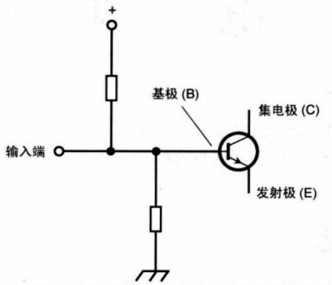
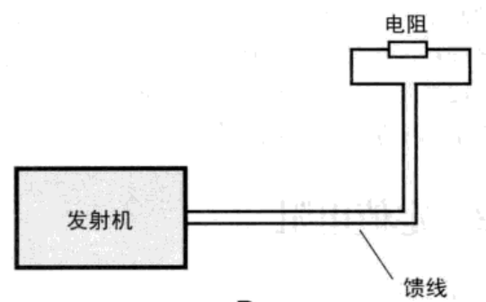
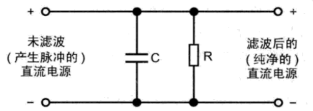
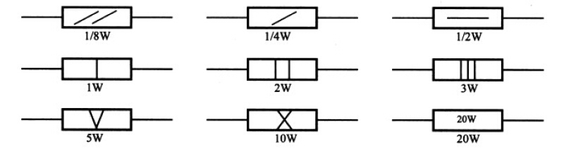

# 电阻
## 应用场景

* **分压**
* **偏置**  

* **限流**  
* **消耗功率**  

* **放电**  
  
高压电路中，防止电容的危险。电阻应该足够大，以避免影响电路；同时应该足够小，在电源关闭后，能够在短时间内释放掉电容中的电荷。
* **阻抗匹配**

## 阻值取值基准
### E12

|     |     |     |     |     |     |
|-----|-----|-----|-----|-----|-----|
| 1.0 | 1.2 | 1.5 | 1.8 | 2.2 | 2.7 |
| 3.3 | 3.9 | 4.7 | 5.6 | 6.8 | 8.2 |

### E24

|     |     |     |     |     |     |
|-----|-----|-----|-----|-----|-----|
| 1.0 | 1.1 | 1.2 | 1.3 | 1.5 | 1.6 |
| 1.8 | 2.0 | 2.2 | 2.4 | 3.0 | 3.3 |
| 3.6 | 3.9 | 4.3 | 4.7 | 5.1 | 5.6 |
| 6.2 | 6.8 | 7.5 | 8.2 | 9.1 |     |

## 额定功率值

## 种类
### 材料和结构
>* 绕线电阻（通用线绕电阻，精密线绕电阻，大功率线绕电阻，高频线绕电阻）
>* 非绕线电阻（碳膜电阻，合成碳膜电阻，金属膜电阻，金属氧化膜电阻，化学沉积膜电阻，金属玻璃釉电阻，金属氮化膜电阻，厚膜电阻，薄膜电阻）
>* 实心电阻 （无机合成实心碳质电阻，有机合成实心碳质电阻）
>* 敏感电阻

## 光敏电阻
LDR/photoresistor  
阻值与照射到其表面的光强成反比：光线越强其阻值越小。  

## 电位器
数字电位器：X9313

## 常用电阻阻值表

### 精度为5％的碳膜电阻，以欧姆为单位的标称值
1.0     5.6     33      160      820       3.9K      20K      100K      510K      2.7M 
1.1     6.2     36      180      910       4.3K      22K      110K      560K      3M 
1.2     6.8     39      200      1K        4.7K      24K      120K      620K       3.3M 
1.3     7.5     43      220      1.1K      5.1K      27K      130K      680K      3.6M 
1.5     8.2     47      240      1.2K      5.6K      30K      150K      750K      3.9M 
1.6     9.1     51      270      1.3K      6.2K      33K      160K      820K      4.3M 
1.8     10      56      300      1.5K      6.6K      36K      180K      910K      4.7M 
2.0     11      62      330      1.6K      7.5K      39K      200K      1M         5.1M 
2.2     12      68      360      1.8K      8.2K      43K      220K      1.1M      5.6M 
2.4     13      75      390      2K         9.1K      47K      240K      1.2M      6.2M 
2.7     15      82      430      2.2K      10K       51K      270K      1.3M      6.8M 
3.0     16      91      470      2.4K      11K       56K      300K      1.5M      7.5M 
3.3     18      100     510     2.7K      12K       62K      330K      1.6M      8.2M 
3.6     20      110     560      3K        13K       68K       360K      1.8M      9.1M 
3.9     22      120     620      3.2K      15K       75K      390K       2M        10M 
4.3     24      130     680      3.3K      16K       82K      430K      2.2M      15M 
4.7     27      150     750      3.6K      18K       91K      470K      2.4M      22M
5.1     30     

### 精度为1％的金属膜电阻，以欧姆为单位的标称值

10        33        100      332     1K          3.32K     10.5K     34K        107K     357K 
10.2     33.2     102      340     1.02K     3.4K       10.7K     34.8K     110K     360K 
10.5     34        105      348     1.05K     3.48K     11K        35.7K     113K     365K 
10.7     34.8     107      350     1.07K     3.57K     11.3K     36K        115K     374K 
11        35.7     110      357     1.1K       3.6K       11.5K     36.5K     118K     383K 
11.3     36        113      360     1.13K     3.65K     11.8K     37.4K     120K     390K 
11.5     36.5     115      365     1.15K     3.74K     12K        38.3K     121K     392K 
11.8     37.4     118      374     1.18K     3.83K     12.1K     39K        124K     402K 
12        38.3     120      383     1.2K       3.9K       12.4K     39.2K     127K     412K 
12.1     39        121      390     1.21K     3.92K     12.7K     40.2K     130K     422K 
12.4     39.2     124      392     1.24K     4.02K     13K        41.2K     133K     430K 
12.7     40.2     127      402     1.27K     4.12K     13.3K     42.2K     137K     432K 
13        41.2     130      412     1.3K       4.22K     13.7K     43K        140K     442K 
13.3     42.2     133      422     1.33K     4.32K     14K        43.2K     143K     453K 
13.7     43        137      430     1.37K     4.42K     14.3K     44.2K     147K     464K 
14        43.2     140      432     1.4K       4.53K     14.7K     45.3K     150K     470K 
14.3     44.2     143      442     1.43K     4.64K     15K        46.4K     154K     475K 
14.7     45.3     147      453     1.47K     4.7K       15.4K     47K        158K     487K 
15        46.4     150      464     1.5K       4.75K     15.8K     47.5K     160K     499K 
15.4     47        154      470     1.54K     4.87K     16K        48.7K     162K     511K 
15.8     47.5     158      475     1.58K     4.99K     16.2K     49.9K     165K     523K 
16        48.7     160      487     1.6K       5.1K       16.5K     51K        169K     536K 
16.2     49.9     162      499     1.62K     5.11K     16.9K     51.1K     174K     549K 
16.5     51        165      510     1.65K     5.23K     17.4K     52.3K     178K     560K 
16.9     51.1     169      511     1.69K     5.36K     17.8K     53.6K     180K     562K 
17.4     52.3     174      523     1.74K     5.49K     18K        54.9K     182K     576K 
17.8     53.6     178      536     1.78K     5.6K       18.2K     56K        187K     590K 
18        54.9     180      549     1.8K       5.62K     18.7K     56.2K     191K     604K 
18.2     56        182      560     1.82K     5.76K     19.1K     57.6K     196K     619K 
18.7     56.2     187      562     1.87K     5.9K       19.6K     59K        200K     620K 
19.1     57.6     191      565     1.91K     6.04K     20K        60.4K     205K     634K 
19.6     59        196      578     1.96K     6.19K     20.5K     61.9K     210K     649K 
20        60.4     200      590     2K          6.2K       21K        62K        215K     665K 
20.5     61.9     205      604     2.05K     6.34K     21.5K     63.4K     220K     680K 
21        62        210      619     2.1K       6.49K     22K        64.9K     221K     681K 
21.5     63.4     215      620     2.15K     6.65K     22.1K     66.5K     226K     698K 
22        64.9     220      634     2.2K       6.8K       22.6K     68K        232K     715K 
22.1     66.5     221      649     2.21K     6.81K     23.2K     68.1K     237K     732K 
22.6     68        226      665     2.26K     6.98K     23.7K     69.8K     240K     750K 
23.2     68.1     232      680     2.32K     7.15K     24K        71.5K     243K     768K 
23.7     69.8     237      681     2.37       7.32K     24.3K     73.2K     249K     787K 
24       71.5      240      698     2.4K       7.5K       24.9K     75K        255K     806K 
24.3     73.2     243      715     2.43K     7.68K     25.5K     76.8K     261K     820K 
24.7     75        249      732     2.49K     7.87K     26.1K     78.7K     267K     825K 
24.9     75.5     255      750     2.55K     8.06K     26.7K     80.6K     270K     845K 
25.5     76.8     261      768     2.61K     8.2K       27K        82K        274K     866K 
26.1     78.7     267      787     2.67K     8.25K     27.4K     82.5K     280K     887K 
26.7     80.6     270      806     2.7K       8.45K     28K        84.5K     287K     909K 
27        82        274      820     2.74K     8.66K     28.7K     86.6K     294K     910K 
27.4     82.5     280      825     2.8K       8.8K       29.4K     88.7K     300K     931K 
28        84.5     287      845     2.87K     8.87K     30K        90.9K     301K     953K 
28.7     86.6     294      866     2.94K     9.09K     30.1K     91K        309K     976K 
29.4     88.7     300      887     3.0K       9.1K       30.9K     93.1K     316K     1.0M 
30        90.9     301      909     3.01K     9.31K     31.6K     95.3K     324K     1.5M 
30.1     91        309      910     3.09K     9.53K     32.4K     97.6K     330K     2.2M 
30.9     93.1     316      931     3.16K     9.76K     33K        100K      332K     
31.6     95.3     324      953     3.24K     10K        33.2K     102K      340K     
32.4     97.6     330      976     3.3K       10.2K     33.6K     105K      348K 