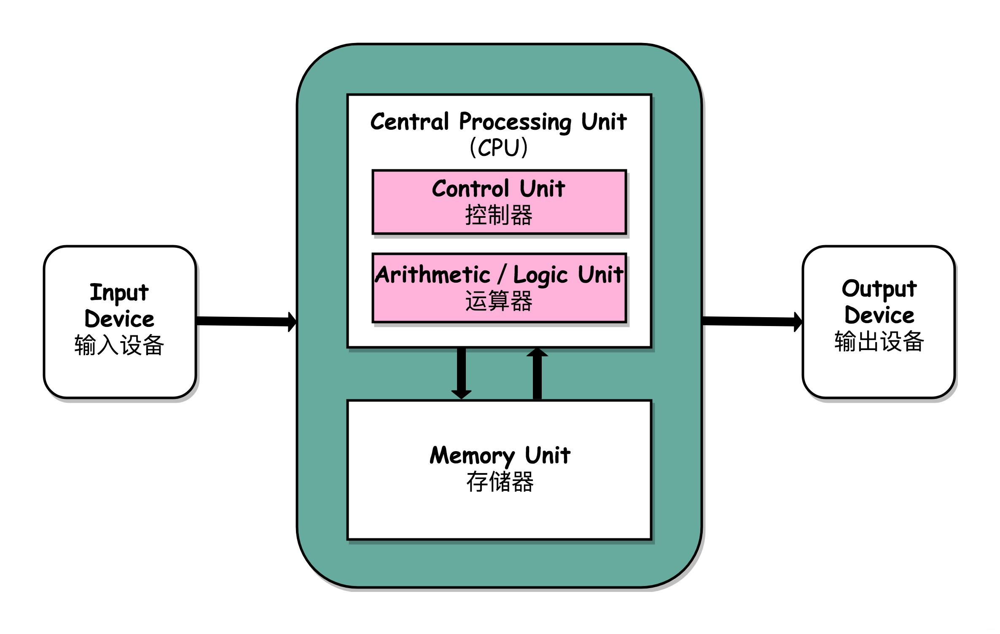

# 计算机

[TOC]

## 概述

**计算机的功能：**接收输入设备的指令和数据，经过 CPU 的数据和逻辑运算处理产生有用的信息存储起来或者输出到屏幕上。

计算机只认识 ０，１ 代码。早期对计算机的全部操作都是采取人工操作方式进行的。早期的操作方式是由纸带或卡片打孔和没打孔来代替 0 和 1 输入计算机来实现一些功能的，就相当于是直接使用机器语言让计算机工作。但是使用机器语言去操控计算机有几个缺点：

1. 需要了解机器语言。
2. 需要了解所有硬件的相关功能函数。因为你的程序必须要写给机器看，你就得去参考机器本身的功能，然后针对该功能去编写程序代码。例如你要让 DVD 影片能够放映，那就得要参考 DVD 光驱的硬件信息。看参考手册是很费劲的。
3. 程序不具有可移植性。每个 CPU 都有独特的微指令集，同样，每个硬件都有其功能函数。
4. 程序具有专一性。因为这样的程序必须要针对硬件功能函数来编写，如果已经开发了一个浏览器程序，想要再开发文件管理程序时，还得要从头参考硬件的功能函数来继续编写。

为了解决这几个问题，计算机科学家就设计出一种让人类看得懂的程序语言，然后创造一种“编译器”来将这些人类写的程序语言翻译成机器能看懂的机器码。这样一来我们修改与编写程序就变得容易多了。

目前常见的编译器有 C，C++，JAVA 等。

但是，在这样的环境下还得要考虑整体的硬件系统来设计程序。举例来说：当你需要将运行的数据写入内存中，就得要自行分配一个内存块出来让自己的数据能够填上去，所以你还得要了解到内存的地址是如何定位的。为了要克服硬件方面老是需要重复编写句柄的问题，所以就有了操作系统。

## 组成

 

1. **控制器**，是整个计算机的中枢神经，根据程序要求进行控制，协调计算机各部分工作及内存与外设的访问等。
2. **运算器**，对数据进行各种 **算术运算** 和 **逻辑运算** 。
3. **存储器**，存储程序、数据和各种信号、命令等信息。
4. **输入设备**，将程序、原始数据、文字、字符、控制命令或现场采集的数据等信息输入到计算机。常见的输入设备有键盘、鼠标等。
5. **输出设备**，把计算机计算后的信息输出出来。常用的输出设备有显示终端、打印机、绘图仪等。