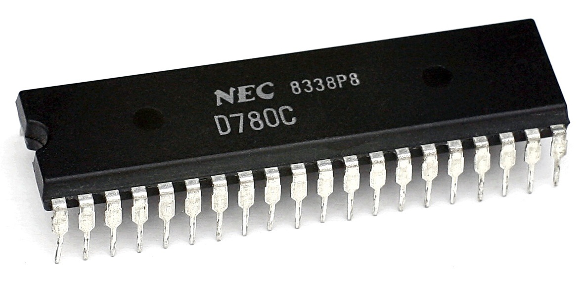

# Z80

[TOC]

## 概述

1976 年美国 Zilog 公司推出的微处理器 Z840004，Z840006 和 Z840008 。因其卓越的性能，强大的输入/出接口能力，快速的运算速度（Z840008 时钟频率可达 8 MHz，同时期的其他产品如 Intel 的 8085、Motorola 的 M6802 等时钟频率为 2 ~ 5 MHz），品种多样的外设支持而迅速被业内人士关注。

Zilog 公司的这类微处理器通常被叫做 Z80 微处理器或 Z80 微机。

Z80微机的早期应用主要是将构成计算机系统的 Z80 微处理器，RAM，ROM 和输入/出接口等电路都组合在一块 PCB 板卡上面，因此这时期的 Z80 微机系统也叫 Z80 单板机（SBC，Single Board computer）。

Z80 单板机具有体积小，外设搭配灵活，运行可靠等特点，因此在以后的十几年时间里，Z80 单板机被广泛的应用于 PC 机接口及扩展和各种工业、控制领域，尤其是在美国和日本得到了极大的发展。我国自上世纪 80 年代末引入，因为其所具有的第三代计算机的优良特点而迅速被市场所接受，小到家用电器，红白游戏机，大到工业采集系统，自动控制装置，电动机及传动等都有大量的使用和应用。各类大中型院校也开设了 Z80 微处理器的课程，Z80 微处理器和 Z80 单板机的研究和应用在我国具有广泛的基础。

与英特尔公司出产的 8080 微处理器的代码兼容。Z80 可执行为 8080 所写的 CP/M 操作系统，所以过去在 apple II 兼容机盛行的年代，很多人都爱在电脑内加装 z80 扩充卡，并透过它来运行 WordStar、VisiCalc 等商业软件。

Z80 也广泛用在一些家用电脑（当时还未使用个人电脑这一名词）中，其中较知名的例如 Tandy / Radio Shack 的 TRS-80 。

Z80 也大量用于微电脑学习机，例如宏碁公司的第一款微电脑产品：小教授一号（MPF I）。

原始 Z80 的最高时脉是 2.5 MHz，Z80A 则可以使用到 4 MHz 时脉，后来推出的 Z80B 最高可以使用 6 MHz 时脉。之后还有 8MHz、10MHz 的版本。

Z80 原使用 NMOS 制程，后来也有生产 CMOS 制程的Z80。后期使用的编号，NMOS 者为 Z8400，CMOS 者为 Z84C00 。

Z80 作为诞生于 48 年前的芯片，不仅曾经是苹果电脑、TI-84 Plus CE 图形计算器的核心，也曾驱动过世嘉 SG-1000、任天堂 Game Boy Color 等游戏机，并开枝散叶到大量的衍生产品中。

直到现在，Z80 仍然没有“退役”，依然存在大量应用，甚至包括飞机、军工。

这一颇有传奇色彩的芯片，在最近宣告了生命周期的终极。Zilog 目前是 Ixys 和 Littelfuse 的一部分，该公司上个月末发布通知，因为老旧的 Z80 架构无法与 8 位元 RISC 和低成本的 32 位元嵌入式处理器竞争，Zilog 决定停止生产 Z80 系列。晶圆代工制造商将于 6 月中旬停止接受新的 Z80 芯片订单，意味着 Z80 即将退出历史舞台。

## 设计特点

Zilog 公司对 Z80 微处理器的设计定位是：特殊应用标准产品，Application Specific Standard Parts 。它要求该微处理器既能像 ASIC（Application Specific Integrated Circuit）那样尽可能利用硬件设计满足应用对象的各种特殊要求，又能通过软件代码手段来适应各种应用场面。

Z80 微处理器使用了 NMOS 的大规模 IC 工艺，可以说是当时的 Intel 8080 的改进产品，为了达成上述设计思想，Z80 单板机拥有很多支持的外设，而其支持的汇编指令也多达 158 条（Intel 8080 只有 72 条），应用非常灵活。

因此，硬件的专门设计 + 软件的灵活设计构成 Z80 微处理器的最显著设计特点，也使之成为了 80 年代最成功的 8 位 CPU 之一。

## 结构

16 个地址端口，可以寻址 64K 的地址空间，支持三种中断。

Z80 微处理器的内部寄存器也较为特殊，有两套寄存器组：Main Register Set 和 Alternate Register Set 。其中 Main Register Set 完成正常寄存器寻址及运算功能，Alternate Register Set 完成对 Main Register Set 的备份和替换，在实际软件编码中使用很灵活。

Z80 的指令集多达 158 条，按照处理方式可以分成 8 位指令集和 16 位指令集；按照功能可以分成 8 大类；指令的长度一般为 1-4 字节，执行时间为 4-23T，T 为时钟周期。Z80 寻址方式也很灵活，可以分成：直接寻址，寄存器寻址，寄存器间接寻址，立即寻址，相对寻址和变址寻址。

## 结论

虽然 Z80 微处理器的设计和结构特点已经具备了现代 CPU 的特点，但由于大规模集成 IC 工艺的出现，单片机（MCU）这种 Soc（System on a Chip）系统的出现对 Z80 造成了很大的冲击，这表现在：

1. 单片机的大规模集成工艺弥补了Z80 单板机的工艺缺陷；
2. 现代工业的高速性使 Z80 单板机走到了尽头；
3. 单片机的高度外设集成使 Z80 单板机设计显得复杂；
4. 程序设计的简洁性好和移植性高等特点注定 Z80 单板机要逐渐被取代；

尽管如此，上世纪 80 年代左右产生的 Z80 也是非常优秀的一款微处理器，它在设计之初就已经融入了部分现代 CPU 的设计理念，并且作为嵌入式学习的一种选择，Z80 单板机仍然还是有自己的一些特点：

- 学习 Z80 微处理器的硬件结构，寻址方式和指令集有助于理解嵌入式系统开发原理；尽管 51，ARM（基于 ARM 指令集的硬件平台）硬件平台，DSP，AVR，MPS430，9S12，PowerPC 等都是非常优秀的嵌入式硬件平台，但究其原理，Z80 系统架构仍然是这些架构中的佼佼者，其简洁，灵活的特点是较为显著的；
- 搭建 Z80 系统可以更好的理解 Soc 的工作原理；当前主流的单片机或者 Soc 系统都采用了大规模集成工艺，对于大多数外设，如 RAM，ROM，输入输出端口等都已经集成在了单片机内部，这样就构成了一个类似的“闭锁”系统，再加之 C 语言开发的特点，很多嵌入式的内部原理是无法深入了解的，而根据嵌入式的特点，只有了解了其内部时序和寄存器的特点（Z80无累加器，使用寄存器阵列的特点）才能开发出优秀的执行率高，误码率少的代码。

## 第二来源厂商

 

除了 Zilog 公司外，当时制造与 Z80（A）相同 CPU 的第二来源厂商还有 Sharp 与 NEC ，其厂牌型号对应如下：

| 厂牌＼最高时脉速度 | 2.5 MHz | 4 MHz     | 6 MHz     |
| ------------------ | ------- | --------- | --------- |
| ZiLog              | Z80 CPU | Z80A CPU  | Z80B CPU  |
| NEC                | µPD780C | µPD780C-1 | µPD780C-2 |
| Sharp              | LH0080  | LH0080A   | LH0080B   |

## 周边元件

Z80 系列除了有 Z80 CPU（后来又称 Z8400）之外，Zilog 公司也推出一系列周边 IC，可搭配 Z80 CPU 使用。

- Z80 DMA (Z8410)：直接内存存取控制器。（功能类似 Intel 8257）
- Z80 PIO (Z8420)：平行输入输出埠界面。（功能类似 Intel 8255）
- Z80 CTC (Z8430)：计数器、计时器。（功能类似 Intel 8253）
- Z80 SIO (Z8440)：序列输入输出埠界面，支援同步与异步传输。（功能类似 Intel 8251）

​                                                            

Z80的历史可以追溯到20世纪70年代中期，当时微处理器技术正处于快速发展阶段。Z80作为这一时期的代表性产品之一，设计初衷是为了提供一种强大且高效的微处理器解决方案，以满足当时日益增长的计算需求。

Zilog的创建源于单芯片微处理器的竞争。Federico  Faggin，作为Zilog的主要创始人之一，曾经开发了被普遍认为是第一个商用单芯片微处理器的4位元英特尔4004，以及8位元英特尔8008，并在后续处理器——4040和8080的改进中发挥了重要作用。特别是1974年推出的8080，它是首个性能强大的8位元微处理器，能够直接寻址64K的RAM，并且其接口比英特尔之前的微处理器芯片更为简便。

然而，Faggin对于微处理器的期待超越了当时英特尔的目标。据说，英特尔更专注于销售静态RAM和ROM，基本上将微处理器视为一种促进更多存储芯片销售的手段，而非一种有价值的独立产品。因此，Faggin在1974年末离开了英特尔，随后与Ralph Ungermann一同创立了Zilog。

Z80是Zilog公司的首个产品，作为8位微处理器，Z80的设计始于1975年，由Federico  Faggin领导的一小组工程师在Zilog公司内展开。他们基于之前的经验和对市场的深入了解，开始了Z80的设计工作。在设计过程中，他们特别注重提高处理器的性能和指令集的丰富性，同时保持其相对较小的尺寸和较低的功耗。

第一个工作样品于1976年3月交付，而Z80于1976年7月正式投放市场。Zilog公司通过Z80建立了自己的芯片工厂，并在接下来的两年里发展到了超过一千名员工。

简单来说，Zilog的Z80是Intel  8080的软件兼容扩展和增强版，主要面向嵌入式系统。尽管主要用于嵌入式系统，Z80还是从1970年代到1980年代中期成为台式计算机和家用计算机中最广泛使用的CPU之一。此外，它在军事应用、音乐设备如合成器（如Roland Jupiter-8），以及1970年代末和80年代初的投币式街机游戏（包括吃豆人）中也非常常见。

Z80一经推出，便迅速在市场上取得了成功。随着技术的不断进步和市场需求的不断变化，Z80也经历了多次改进和升级。其中，一些重要的改进包括增加指令集、提高主频、增强存储管理功能等。这些改进使得Z80能够更好地适应各种应用需求，并保持其在市场上的领先地位。

**Z80改变过什么行业**

在1970年代末和1980年代初，Z80掀起了电脑和游戏的革命。那时候Z80微处理器被广泛用于大量山寨的商业机器中，这些机器都搭载了CP/M操作系统，这种组合在当时的市场上占据了主导地位。运行CP/M的Z80商用计算机的四个典型机器包括Heathkit H89、便携式Osborne 1、Kaypro系列和Epson QX-10。

这个时期，Z80同时作为扩展卡引入了家用计算机，它们使用 Z80 作为主处理器或作为插件选项，以方便访问为 Z80 编写的软件。

Heathkit H89 PC

1980年～1990年末，那时候还没有笔记本电脑的概念，Z80也曾经进入过越来越便携的电脑中。随着CMOS版本处理器出现，Z80在更轻的电池供电设备中的使用变得更加普遍，同时它启发了其它基于CMOS的处理器开发。

1981年～1985年，夏普PC-1500、改良Z80 PC-1600、Epson PX-8  Geneva、PX-4、Bondwell-2接连面世，它们是像台式机一样运行CP/M操作系统的笔记本电脑，不过随后几年，笔记本电脑迅速转向更强大的英特尔8086处理器和MS-DOS操作系统。

夏普PC-1500

1988年，Z80被引入更为轻量级的系统，比如1988年的Cambridge Z88和1992 年的Amstrad NC100 。Z80衍生的Z8S180也进入了早期的笔式个人数字助理，比如，1993年的Amstrad PenPad PDA600。

Amstrad PenPad PDA600

围绕着Z80内核，德州仪器 (TI) 也生产过一系列的产品，其中第一个是TI PS-6200 ，经过几十个型号的长时间生产运行，最终形成了他们的PocketMate系列。

TI PS-6200

当然，Z80渗透最大的领域是嵌入式，其中非常具有开创性的产品就包括音乐合成器Prophet-5、第一个 MIDI 合成器Prophet 600、卡西欧视频游戏机PV-1000、《吃豆人》游戏街机、Sega Master System、Sega  Game Gear游戏机、TI-81、TI-82、TI-84、TI-85、TI-84 Plus  CE系列图形计算器、“AON”苏联固定电话采用了Z80。

Z80克隆和衍生的产品更无数。克隆品比较典型的包括Mostek为Zilog生产了第一个Z80，克隆生产了 MK3880；东芝制造了CMOS版本的TMPZ84C00，这是与Zilog用于其自己的CMOS Z84C00  的设计相同；苏联制造了Z80的几个克隆版本-T34BM1；在东德，生产了未经许可的复制品  ，称为U880；Sharp和NEC分别克隆生产了NMOS Z80、LH0080（用于夏普等日本厂商生产的各种家用电脑和个人电脑，包括索尼  MSX电脑，以及夏普MZ系列的多款电脑） 和μPD780C。

衍生品分类多种类型：与原装Z80兼容包括日立开发了HD64180、东芝开发了84针Z84013/Z84C13和100针Z84015/Z84C15系列的“智能外设控制器”、川崎（日本上市的跨国）开发了二进制兼容的KL5C8400、NEC μPD9002、炬力的音频处理器系列芯片ATJ2085、National Semiconductor NSC800；不兼容的包括东芝TLCS  900系列、NEC 78K系列微控制器；部分兼容的包括Rabbit 2000/3000/4000微处理器/微控制器、NMOS Z800和  CMOS Z280、某些街机游戏如Pang / Buster Bros使用由VLSI Technology制造的加密“歌舞伎”Z80 CPU 。

**告别后的未来**

具体来说，Z84C0006VEG - Z84C0006PEG - Z84C001PEG - Z84C0008AEG - Z84C0020VEG - Z84C0008PEG -  Z84C0010AEG - Z84C0010VEG00TR - Z84C0020AEG - Z84C0020PEG - Z84C0006AEG  Zilog将接受最后订单直到2024年6月14日。

在此之后，Z80的痕迹其实还是会留存的。因为Z80软核心（soft cores）可用于FPGA中实现，而eZ80是一种增强的架构衍生嵌入式处理器，与Z80代码兼容，但在内存寻址和接口上更快、更现代。更重要的是，Z80开源版本也能够带来巨大动能。

传奇的嵌入式芯片，停产了，但它不会从此消失，而是以另一个方式，永远地服务着每一个嵌入式设备。

Zilog将根据客户需求处理和安排Z80的LTB订单，而WFM将在此后提供实际交货日期。根据LTB的总体需求，公司可能会对最小和最大数量提出更严格的要求。

据了解，Zilog Z80最初是作为Intel 8080的一个项目开发的，最终成为游戏和通用计算设备中最受欢迎和广泛使用的8位CPU之一。

Z80是一个8位的微处理器，是Zilog公司的第一个产品，由Federico Faggin于1974年底构思，并于1976年7月正式投放市场。

通过Z80，Zilog公司建立了自己的芯片工厂，并在接下来的两年里发展到了超过一千名员工。

Zilog Z80是Intel 8080的软件兼容扩展和增强，与8080一样，主要针对嵌入式系统。

尽管用于嵌入式系统，Z80还是从1970年代到1980年代中期成为台式计算机和家用计算机中使用最广泛的CPU之一。

一些家用电脑和游戏机都是围绕Z80的功能构建的，包括世嘉的Master System和SG-1000，以及任天堂的Game Boy和Game Boy Color。

许多经典街机游戏也使用了Z80，包括原始版本的吃豆人。此外，8位处理器在军事应用、Roland Jupiter-8等音乐合成器以及各种其他电子设备中很常见。

​	穿越时空的爱恋-Z80 [CPU](https://www.elecfans.com/v/tag/132/)的前世今生

​	它是1976年推出时，与6502 CPU 一起，引发了一系列项目，导致了 80 年代初期的家用计算机革命。同时你能想象在CPU更新迭代速度这么快的时代，直到今天他还在服役，还没“退休”。

​	[TI](https://bbs.elecfans.com/group_715)-84 Plus CE 直到现在还在生产售卖（截止2020年），网页地址：https://www.ceme[te](http://www.elecfans.com/tags/te/)ch.net/news/2020/5/950/_/ti-83-premium-ceti-84-plus-ce-asmc-removal-updates

​	基于Zilog eZ80 （TI-84 Plus CE） TI[产品](https://www.hqchip.com/ask/)（2020年）

​	这块CPU也被广泛应用于苹果[电脑](https://www.elecfans.com/v/tag/1247/)、街机及世嘉的各种游戏机，这块CPU就是Zilog Z80 ，让我们看下这块可能是最“长命”的CPU的前世今生。

​	Z80是一个8位的[微处理器](https://m.hqchip.com/app/1382)，是Zilog[公司](https://m.hqchip.com/gongsi.html)作为启动公司的第一个产品。Z80 由Federico Faggin于 1974 年底构思，并于 1975 年初由他和他的 11 名员工开发。第一个工作样品于 1976 年 3 月交付，并于 1976 年 7 月正式投放市场。通过Z80该公司建立了自己的[芯片](https://m.elecfans.com/v/tag/137/)工厂，并在接下来的两年里发展到了超过一千名员工。

​	Zilog Z80 是[Intel](https://bbs.elecfans.com/group_863) 8080的软件兼容扩展和增强，与8080一样，主要针对[嵌入式系统](https://www.elecfans.com/v/tag/2447/)。尽管用于[嵌入式](https://bbs.elecfans.com/group_1121)系统，Z80 还是从 1970 年代到 1980 年代中期成为台式计算机和家用计算机中使用最广泛的CPU之一。它在军事应用、音乐设备如合成器（如Roland Ju[pi](http://www.elecfans.com/tags/pi/)ter-8）以及1970 年代末和 80 年代初的投币式街机游戏（包括吃豆人）中也很常见。

​	Zilog Z80 CPU（1976年）

​	Zilog 也将 Z80 授权给了美国的Synertek和Mostek，后者帮助他们进行了初始生产，以及欧洲的第二来源制造商SGS。该设计还被几家日本、东欧和苏联制造商复制。由于像NEC、[东芝](http://www.elecfans.com/tags/东芝/)、夏普和日立这样的大公司开始制造该设备（或他们自己的 Z80 兼容克隆或设计），让z80在世界市场上赢得了认可。

​	近几十年来，Zilog 重新关注不断增长的嵌入式系统市场，[最新](https://www.elecfans.com/article/zt/)的 Z80 兼容[微控制器](https://m.hqchip.com/app/1380)系列、具有线性16 MB地址范围的全流水线 24 位 eZ80与更简单的 Z80 和Z180一起成功推出各自产品。

​	80 年代的星空

​	Z80 诞生于物理学家和[工程师](https://bbs.elecfans.com/zhuti_lecture_1.html)Feder[ic](https://www.hqchip.com/app/1726)o Faggin，Federico Faggin于 1974 年底离开[英特尔](http://www.elecfans.com/tags/英特尔/)，与Ralph Ungermann 一起创立Zilog 。在飞兆[半导体](https://www.hqchip.com/gongsi.html)（[Fairchild](http://www.elecfans.com/tags/fairchild/) Semiconductor International， Inc.是一家位于加利福尼亚州圣何塞的美国半导体公司。成立于 1957 年，作为Fairchild Camera and Instrument 的一个部门，它成为[晶体管](https://www.hqchip.com/app/1555)和[集成电路](https://m.elecfans.com/v/tag/123/)制造领域的先驱。斯伦贝谢于 1979 年收购了该公司，并于 1987 年将其出售给美国国家半导体公司；Fairchild于1997 年再次分拆为独立公司。

​	2016 年9 月，Fairchild 被[安森美](http://www.elecfans.com/tags/安森美/)半导体收购。）和后来的英特尔，Faggin 一直致力于基本晶体管和[半导体制造](https://www.elecfans.com/v/tag/8112/)技术。他还开发了用于英特尔存储器和微处理器的基本设计方法，并领导了英特尔 4004、8080和其他几款 IC 的工作。

​	志摩正敏（Masatoshi Shima 是日本[电子工程师](https://m.elecfans.com/v/tag/125/)。他参与了微处理器的英特尔4004的研制。1968年，Shima就职于日本Busicom，为专用CPU进行逻辑设计，转化为三片定制芯片。1969年，他与英特尔的Ted Hoff和Stanley Maz[or](https://www.hqchip.com/app/1716)合作，减少了三芯片Busicom建议进入单芯片架构。1970年，该建议被改造成硅芯片中。后来他于1972年加入英特尔。在那里，他与Faggin合作开发了英特尔8080，于1974年发布。Shima随后开发了几款英特尔外围芯片，其中一些用于IBM PC，如8259 中断[控制器](https://www.hqchip.com/app/1716)，8255 并口芯片，8253[定时器](https://www.elecfans.com/tags/定时器/)芯片、8257 直接存储器存取（[DMA](http://www.elecfans.com/tags/dma/)）芯片和8251 串行[通信](https://m.elecfans.com/v/tag/1301/) USART芯片。

​	随后，他加入了Zilog，在那里他与 Faggin 合作开发了Zilog Z80（1976 年）和Z8000（1979 年））也在随后加入了 Zilog 团队。

​	Z80 VS Intel 8080

​	据设计者介绍，Z80 CPU（及其可选支持和外围IC）的主要目标是[智能](https://m.elecfans.com/v/)终端、高端打印机和高级收银机等产品以及电信设备、[工业机器人](https://www.elecfans.com/v/tag/144/)和其他类型的自动化产品、设备。

​	到 1976 年 3 月，Zilog 已为其客户开发了 Z80 以及随附的基于[汇编](https://m.elecfans.com/v/tag/3195/)器的开发系统，并于 1976 年 7 月正式投放市场。一些 Z80 支持和外围 IC 此时也在开发中，其中许多是在第二年推出的。

​	1976 年 5 月的 Zilog Z-80 8 位微处理器广告

​	早期的 Z80 由 Synertek 和 Mostek 制造，之后 Zilog 于 1976 年末拥有自己的制造工厂。之所以选择这些公司，是因为他们可以进行离子注入，以创建Z80 设计用作负载晶体管的耗尽型 [MOSFET](http://www.elecfans.com/tags/mosfet/)以应对单个 5 伏[电源](https://www.hqchip.com/app.html)。

​	采用耗尽负载nMOS的原始 Zilog Z80微处理器设计的照片。总芯片尺寸为 3545×3350 μm。（这个实际的[芯片制造](https://m.elecfans.com/v/tag/207/)于 1990 年。）

​	Federico Faggin设计了指令集是与Intel 8080二进制兼容的 ，使得最8080码，特别是CP / M [操作系统](https://m.elecfans.com/v/tag/527/)和Intel的PL / M编译器8080（以及其生成的代码），将在新的 Z80 CPU 上未经修改地运行。志摩正敏在少数工程师和布局人员的协助下设计了 Z80  CPU 的大部分微架构以及栅极和晶体管级。CEO Federico Faggin  实际上参与了芯片布局工作，还有两个专门的布局人员。根据Federico Faggin的说法，他每周工作 80  小时（多吗？），以满足投资者给的紧迫的日程安排。

​	CMOS Z80 四方封装

​	虽然Z80是兼容8080的，但是Z80 在 8080 基础上提供了许多改进：

​	增强型指令集包括：

​	一个更合乎逻辑、更易于理解和可读的汇编指令助记符系统

​	更灵活的 16 位数据移动（加载或 LD）指令，关键包括堆栈指针 SP

​	更灵活的输入/输出寻址模式到外围[端口](https://www.hqchip.com/app/1808)

​	所有[寄存器](http://www.elecfans.com/tags/寄存器/)和内存的单位寻址，包括位测试

​	在累加器以外的存储器和寄存器上移位/旋转

​	改进和更准确（比以前的 8080）BCD[算法](https://www.elecfans.com/v/tag/2562/)

​	内存中 BCD 数字串的旋转指令

​	16 位减法和 8 位取反

​	程序循环

​	程序计数器相对跳转

​	块复制、块输入/输出（I/O） 和字节搜索指令。

​	一个溢出标志，更好地支持有符号 8 位和 16 位算术。

​	带有直接基址+偏移寻址指令的新 IX 和 IY[索引](https://www.hqchip.com/ic/0)寄存器

​	更好的中断系统：一种更自动和通用的向量化中断系统：模式 2，主要用于 Zilog 的计数器/定时器系列、DMA 和通信控制器，以及固定向量中断系统，模式 1，用于具有最少[硬件](https://www.elecfans.com/v/tag/1751/)的简单系统（模式 0为8080 兼容模式）。

​	不可屏蔽中断 （NMI），可用于响应掉电情况或其他高优先级事件（并允许简约的 Z80 系统在模式 1 中轻松实现两级中断方案）。

​	一个完整重复的寄存器文件 ，其可以迅速地切换，以加快响应于中断，如快速异步事件处理程序或者多任务 调度器。尽管它们不打算用作通用代码的额外寄存器，但它们在某些应用程序中仍然以这种方式使用。

​	电源、[时钟](https://www.elecfans.com/tags/时钟/)生成以及内存和 I/O [接口](https://www.hqchip.com/app/1787)所需的硬件更少

​	单个 5 伏电源（8080 需要 -5 V/+5 V/+12 V）。

​	单相 5 伏时钟（8080 需要高振幅（9 到 12 伏）非重叠两相时钟）。

​	除非使用更昂贵且密度更低（但速度更快）的 S[RAM](http://www.elecfans.com/tags/ram/)，否则将需要外部电路的内置[DRAM](http://www.elecfans.com/tags/dram/) 刷新。

​	非多路复用总线（8080 将状态[信号](https://m.hqchip.com/app/1072)多路复用到数据总线上）。

​	一个特殊的复位功能，它只清除程序计数器，以便单个 Z80 CPU 可以用于开发系统，如在线[仿真器](https://www.elecfans.com/tags/仿真器/)。

​	Z80在[处理器](https://m.hqchip.com/app/1381)市场上取代了 8080 及其后代8085 ，成为最受欢迎的 8 位 CPU 之一。一些组织，例如英国电信，由于对 8085  及其片上串行接口和中断架构的熟悉，仍然忠于用于嵌入式应用的 8085。英特尔生产的低功耗 CMOS 8085 （80C85） 出现在电池[供电](https://m.hqchip.com/app/1720)的便携式计算机中，例如1983 年 4 月由Kyocera（日本[京瓷](http://www.elecfans.com/tags/京瓷/)公司）设计的笔记本电脑，也由 Tandy 出售（作为TRS-80 Model 100、Olivetti 和 NEC 的各种变体）。然而，在接下来的几年里，Z80 的 CMOS 版本（来自 Zilog 和日本制造商）也将主导这个市场。

​	或许 Z80 最初成功的关键是内置 DRAM ，至少在CP/M和其他办公和家用电脑等市场是这样（大多数 Z80嵌入式系统使用静态  RAM不需要刷新。），也可能是其简约的两级中断系统，或者相反，它的通用多级菊花链中断系统可用于服务多个Z80  IO芯片。允许使用更少的支持硬件和更简单的电路板布局来构建系统的所有功能。然而，其他人声称它的流行是由于与寄存器较少的 8 位 CPU  相比，复制寄存器允许快速上下文切换或更有效地处理诸如浮点数学之类的事情（Z80 可以在内部保留几个这样的数字，使用 HL‘HL、DE’DE 和  BC‘BC 作为 32 位寄存器，避免在计算过程中必须从较慢的 RAM 访问它们。）

​	对于最初的NMOS设计，时钟频率上限从指标性的 2.5 MHz依次增加 ，通过众所周知的 4 MHz （Z80A），到 6 MHz（Z80B） 和 8 MHz （Z80H）。自 1980 年代后期以来，NMOS 版本已作为 10 MHz  芯片生产。CMOS版本的开发具有指定的频率上限，范围从 4 MHz 到 20 MHz。完全兼容的衍生产品HD64180 / Z180 和eZ80 目前分别指定可以跑到高达 33 MHz和 50 MHz。

​	兼容的组件

​	Zilog 为Z80 引入了许多外围部件，它们都支持Z80 的中断处理系统和I/O 地址空间。其中包括计数器/定时器通道 （CTC）、SIO（串行输入输出）、DMA（直接存储器访问）、PIO（并行输入-输出）和 DART（双异步[接收器](https://www.hqchip.com/app/1847)发送器）。随着产品线的发展，这些芯片的低功耗、高速CMOS版本被引入。

​	与 8080、8085 和 8086 处理器一样，但与摩托罗拉 6800 和 MOS Technology 6502 等处理器不同的是，Z80 和 8080 具有单独的控制线和 I/O 指令地址空间。虽然一些基于 Z80 的计算机（如Osborne  1）使用“摩托罗拉式”内存映射输入/输出设备，但使用了通常 I/O 空间用于寻址与 Z80 兼容的众多 Zilog 外围芯片之一。Zilog  I/O 芯片支持 Z80 的新模式 2 中断，它简化了大量外设的中断处理。

​	电脑和游戏的革命

​	在 1970 年代末和 1980 年代初，Z80 被用于大量山寨的具有CP/M操作系统的面向商业的机器，这种组合在当时占据了市场主导地位。运行 CP/M 的 Z80 商用计算机的四个著名示例是Heathkit H89、便携式Osborne 1、Kaypro系列和[Epson](http://www.elecfans.com/tags/epson/) QX-10。鲜为人知的是昂贵的高端Otrona Att[ac](https://m.hqchip.com/app/1703)he一些系统使用多任务操作系统软件（如MP/M或Morrow的 Micronix）在多个处理器之间共享一个处理器。

​	Z80同时作为扩展卡引入了家用计算机，它们使用 Z80 作为主处理器或作为插件选项，以方便访问为 Z80  编写的软件。值得注意的是TRS-80系列，包括配备 Z80 作为主处理器的原始型号（后来改名为“Model I”）、Model II、Model III和Model 4，以及一些（但不是全部）其他型号使用 Z80 作为主处理器或辅助处理器的 TRS-80 型号。其他值得注意的机器是DEC Rainbow 100和Seequa Chameleon，两者都采用英特尔 8088和 Z80 CPU，以支持在 Z80 上运行的 8 位  CP/M-80 应用程序，或与在 8088 上运行不完全兼容的自定义 MS-DOS的PC DOS应用程序 。

​	1981 年，Multitech（后来成为Acer）推出了Microprofessor I，这是一种用于 Z80  微处理器的简单且廉价的培训系统。目前，它仍然由位于英国南安普敦的 Flite Electronics International Limited 制造和销售。

​	甲辛克莱 ZX光谱，其中使用的Z80主频为3.5兆赫

​	便携式和掌上电脑

​	随着处理器的 CMOS 版本的出现，Z80 在更轻的电池供电设备中的使用变得更加普遍。它还启发了其他基于 CMOS 的处理器的开发，例如夏普的  LH5801（数据手册：http://www.pc-1500.info/Data/Service_Manuals/PC-1500_Technical_Reference_Manual.pdf）。

​	在夏普PC-1500（一个B[ASIC](https://bbs.elecfans.com/zhuti_fpga_1.html) -可[编程](https://bbs.elecfans.com/group_75)袖珍计算机）于1981年发布，采用改良Z80的夏普PC-1600（1986年）和夏普PC-E220（1991年）及夏普精灵系列也陆续发布了。随后在 1984 年推出了Epson PX-8 Geneva，并在 1985 年推出了爱普生  PX-4和Bondwell-2，他们是可以像台式机一样运行 CP/M 操作系统的笔记本电脑。虽然随后几年的笔记本电脑市场转向了更强大的英特尔  8086处理器和 MS-DOS 操作系统，但仍在引入具有更长电池寿命的基于 Z80 的轻量级系统，例如1988 年的Cambridge  Z88和1992 年的[Ams](http://www.elecfans.com/tags/ams/)tr[ad](https://bbs.elecfans.com/zhuti_1472_1.html) NC100 。Z80 衍生的Z8S180也进入了早期的笔式个人数字助理，1993 年的Amstrad PenPad PDA600（PDA熟悉不！）。

​	总部位于香港的VTech生产了一系列基于 Z80 的名为“Lase[rs](http://www.elecfans.com/tags/rs/)”的小型笔记本电脑。最后两个是激光 PC5和 PC6，该CI[DC](https://m.hqchip.com/app/1703)O MailStation Mivo 100，于1999年首次发布，是一个独立的便携式[电子](https://m.hqchip.com/ask/)邮件设备，具有基于Z80的微控制器。[德州仪器](https://www.elecfans.com/tags/德州仪器/) （TI） 使用围绕 Z80 内核构建的东芝处理器生产了一系列袖珍处理器（结束于 2000 年）；其中第一个是 TI PS-6200 ，经过几十个型号的长时间生产运行，最终形成了他们的 PocketMate 系列。

​	基于 Z80 的PABX。Z80 是从左数第三个芯片，在芯片的右侧，上面有手写的白色[标签](https://www.hqchip.com/tags)

​	嵌入式系统和[消费电子](https://www.elecfans.com/soft/data/39-96/)产品

​	Zilog Z80 长期以来一直是嵌入式系统和微控制器内核中的流行微处理器（最初的定位），直到今天仍然广泛使用。Z80 的应用包括消费电子产品、[工业](https://m.elecfans.com/v/)产品和电子乐器。例如，Z80 用于开创性的音乐合成器Prophet-5，以及第一个 MIDI 合成器Prophet 600。卡西欧在其PV-1000[视频](https://m.elecfans.com/v/)游戏机中使用了 Z80A 。

​	Z80A 被用作许多游戏机的 CPU，例如ColecoVision

​	许多 1980 年代早期的街机视频游戏，包括街机游戏《吃豆人》，都包含 Z80 CPU。

​	Z80 用于世嘉的Sega Master System和Sega Game Gear游戏机，具有自己的8 KB的RAM，它作为辅助主CPU  MC68000，具有与系统的声音芯片和I / O（控制器）端口，并且具有交换数据路径与68000 的主内存总线（提供对 64 KB 主  RAM、软件盒和整个视频芯片的访问）；除了提供与 Master System 游戏的向后兼容性外，Z80 还经常用于控制 Genesis  软件中的[音频](https://www.hqchip.com/app/1537)。

​	 Z80的CPU也被德州仪器用来制作在开创性和流行方面的TI-8系列图形计算器，TI-81系列图形计算器从1990年开始，其特点是Z80主频为2兆赫。该系列中的大多数为高端计算器，从TI-82和TI-85 开始，其 Z80 CPU 的时钟频率变为 6 MHz 或更高。（一些带有 TI-8x 名称的型号使用其他 CPU，例如  M68000，但绝大多数是基于 Z80 的。在这些型号上，可以以 Z80 机器语言代码的形式运行组装或编译的用户程序。）。2004  年推出的TI-84 Plus 系列，截至 2020 年仍在生产。TI-84 Plus CE 系列于 2015 年推出，使用 Z80  衍生的Zilog eZ80处理器，截至 2020 年仍在生产中。

​	1980 年代后期，一系列名为“AON”的苏联固定电话采用了 Z80；这些电话通过来电显示、基于来电者的不同铃声、快速拨号等扩展了固定电话的功能集。在 90 年代后半期，这些[手机](https://m.elecfans.com/v/tag/107/)的制造商转而使用兼容 8051 的 [MCU](https://www.hqchip.com/app/1379)，以降低功耗并防止过热。

​	克隆及衍生品

​	Z80 CPU之所以在世界范围内广受欢迎主要原因是其衍生体及克隆版本特别多，下面介绍一些Z80克隆及衍生品。

​	Mostek 为 Zilog 生产了第一个 Z80，克隆生产了 MK3880  。SGS-Thomson（现在是STMicroelectronics）也克隆生产了他们的 Z8400。Sharp 和NEC 分别克隆生产了  NMOS Z80、LH0080（用于夏普等日本[厂商](https://m.hqchip.com/gongsi.html)生产的各种家用电脑和个人电脑，包括索尼 MSX电脑，以及夏普MZ系列的多款电脑） 和μPD780C。

​	东芝制造了 CMOS 版本的 TMPZ84C00，这是与 Zilog 用于其自己的 CMOS Z84C00  的设计相同。还有GoldStar（现LG）生产的Z80芯片和ROHM  Electronics生产的NMOS和CMOS中的Z80克隆体BU18400系列（包括DMA、PIO、CTC、DART和SIO）。

​	在东德，生产了未经许可的复制品 ，称为U880。它非常流行，被用于Robotron和 VEB Mikroelektronik  Mühlhausen  的计算机系统（如KC85系列）以及许多自制的计算机系统。在罗马尼亚，可以找到另一个未经许可的克隆体，名为MMN80CPU，由Microelectronica生产，用于 TIM-S、HC、COBRA 等家用计算机。

​	此外，苏联还制造了 Z80 的几个克隆版本-T34BM1（用于预生产系列），也称为КР1858ВМ1（与苏联 8080  克隆版本KR580VM80A（用于更大的生产） 相似）。尽管如此，由于 1980 年代后期苏联微电子的崩溃，T34BM1 的数量比  КР1858ВМ1 多得多。

​	日立开发了HD64180，这是一种采用 CMOS 微编码和部分动态的 Z80，带有片上外围设备和一个提供 1 MB地址空间的简单 MMU  。后来由 Zilog 第二次采购，最初为 Z64180，然后以略微修改的Z180 的形式提供，其总线协议和时序更适合 Z80 外围芯片。Z180 一直以 Zilog 的名义进行维护和进一步开发，[最新版](http://www.elecfans.com/article/bbs/)本基于完全静态的 S180/L180 内核，具有极低的功耗和 EMI（噪声）。

​	东芝开发了84针Z84013/Z84C13和100针Z84015/Z84C15系列的“智能外设控制器”，基本上是普通的NMOS和CMOS Z80内核与Z80外设、[看门狗](http://www.elecfans.com/tags/看门狗/)定时器、上电复位、等待状态发生器在同一芯片上。由夏普和东芝制造。这些产品如今由 Zilog 提供第二来源。1994 年推出的 32 位 Z80 兼容 Zilog Z380主要用于电信设备。

​	Zilog 的全流水线 Z80 兼容eZ80 具有8/16/24位字长和线性 16 MB 地址空间于 2001  年推出。它带有片上SRAM或闪存以及集成外设的版本中。 一种变体具有片上MAC（媒体访问控制器），可用软件访问TCP/IP 堆栈。与 Z800 和 Z280 相比，仅增加了少量指令（主要是LEA、PEA和可变地址 16/24 位加载），但指令的执行效率是原始 Z80 的时钟周期效率的 2 到 11 倍（平均值约为 3-5 倍）。它目前指定用于高达 50 MHz 的时钟频率。

​	川崎（日本上市的跨国）开发了二进制兼容的 KL5C8400，其时钟周期效率约为原始 Z80 的 1.2-1.3 倍，时钟频率最高可达 33  MHz。Kawasaki 还生产 KL5C80A1x 系列，它具有外围设备以及片上小 RAM；它的时钟周期效率大约与 eZ80  一样，并且时钟频率最高可达 10 MHz （2006）。

​	NEC μPD9002 是一款兼容 Z80 和x86系列的混合 CPU 。

​	中国炬力的音频处理器系列芯片（ATJ2085 等）包含一个 Z80 兼容MCU和一个 24 位专用 [DSP](https://www.hqchip.com/app/1378) 处理器。这些芯片用于许多 MP3 和媒体播放器产品。

​	T80 （VHDL） 和 TV80 （[Verilog](https://bbs.elecfans.com/group_378)） 可综合软核可从 OpenCores.org 获得。

​	1980 年宣布的 National Semiconductor NSC800 被用于许多 TeleSecurity Timmann  （TST） 电子密码机和佳能 X-07。NSC 800 与 Z-80 指令集完全兼容。NSC800 使用多路复用总线（8085上使用），但与  Z80 具有不同的引脚排列。

​	不兼容

​	东芝TLCS 900系列高体积（主要是OTP）的微控制器是基于Z80; 它们共享相同的基本 BC、DE、HL、IX、IY 寄存器结构，以及基本相同的指令，但不是二进制兼容的，而之前的 TLCS 90 与 Z80 兼容。

​	NEC 78K系列微控制器是基于Z80; 它们共享相同的基本 BC、DE、HL 寄存器结构，并具有相似（但名称不同）的指令；不兼容二进制。

​	部分兼容

​	Rabbit Semiconductor的Rabbit 2000/3000/4000微处理器/微控制器基于HD64180 / Z180架构，尽管它们不完全兼容二进制。

​	Zilog 的 NMOS Z800和 CMOS Z280是 16 位 Z80 实现（在HD64180 / Z180之前），具有 16 MB  分页 MMU 地址空间；他们为 Z80 指令集添加了许多正交化和寻址模式。小型机的特性——例如用户和系统模式、多处理器支持、片上  MMU、片上指令和数据缓存等——被视为更复杂，而不是对（通常面向电子的）嵌入式系统设计者的功能和支持，这也使得预测指令执行时间变得非常困难。

​	某些街机游戏如Pang / Buster Bros使用由[VLSI](https://www.elecfans.com/v/tag/5088/) Technology制造的加密“歌舞伎”Z80 CPU ，其中解密密钥存储在其内部电池后备内存中，以避免盗版和非法盗版游戏。

​	Z80软件部分说明

​	寄存器

​	与 8080 一样，8 位寄存器通常配对以提供 16 位版本。与8080 兼容寄存器是：

​	AF： 8 位累加器（A） 和标志位 （F） 进位、零、减号、奇偶校验/溢出、半进位（用于BCD）和一个加/减标志（通常称为 N）也用于 BCD

​	BC： 16 位数据/地址寄存器或两个 8 位寄存器

​	DE： 16 位数据/地址寄存器或两个 8 位寄存器

​	HL： 16 位累加器/地址寄存器或两个 8 位寄存器

​	SP：堆栈指针，16 位

​	PC： 程序计数器，16 位

​	Z80 引入的新寄存器是：

​	IX： 8 位立即数偏移的 16 位索引或基址寄存器

​	IY： 8 位立即数偏移的 16 位索引或基址寄存器

​	I：中断向量基址寄存器，8位

​	R：DRAM 刷新计数器，8 位（msb不计数）

​	AF’：交替（或阴影）累加器和标志（用 EX AF，AF‘ 切换进出）

​	BC’，DE‘和HL’： 替代（或影子）寄存器（用 EXX 切换进出）

​	四位中断状态和中断模式状态

​	Z80 汇编语言

​	第一个 Intel 8008汇编语言基于从 Datapoint 2200  设计继承的非常简单（但系统）的语法。这种原始语法后来被转换成一种新的、更传统的汇编语言形式，用于同样的原始 8008  芯片。大约在同一时间，新的汇编语言也得到了扩展，以适应更先进的 Intel 8080 芯片中的额外寻址模式（8008 和 8080  共享一个语言子集，但不兼容二进制；然而，8008 与 Datapoint 二进制兼容2200）。

​	汇编指令对比如下：

​	汇编示例代码

​	以下 Z80 汇编程序源代码用于名为 HELLO_WORLD 的子例程。众所周知，这是一个介绍性程序，它将向视频显示器打印一条消息，然后退出。虽然很简单，但它演示了如何格式化汇编源代码以及如何通过计算机操作系统与显示硬件交互。

​	每条指令都按通常称为机器周期（M 周期）的步骤执行，每条指令可能需要三到六个时钟周期（T 周期）。每个 M 周期大致对应于一次内存访问或内部操作。许多指令实际上在下一条指令的 M1 期间结束，这被称为提取/执行重叠。

​	责任编辑：haq

​                        声明：本文内容及配图由入驻作者撰写或者入驻合作网站授权转载。文章观点仅代表作者本

**1976年**美国Zilog公司推出的微处理器（microprocessor）Z840004，Z840006和Z840008因其卓越的性能，强大的输入/出接口能力，快速的运算速度（Z840008时钟频率可达8MHz，同时期的其他产品如Intel的8085、Motorola的M6802等时钟频率为2~5MHz），品种多样的外设支持而迅速被业内人士关注。Zilog公司的这类微处理器通常被叫做Z80微处理器或Z80微机。

Z80单板机具有体积小，外设搭配灵活，运行可靠等特点，因此在以后的十几年时间里，Z80单板机被广泛的应用于PC机接口及扩展和各种工业、控制领域，尤其是在美国和日本得到了极大的发展。我国自上世纪80年代末引入，因为其所具有的第三代计算机的优良特点而迅速被市场所接受，小到家用电器，红白游戏机，大到工业采集系统，自动控制装置，电动机及传动等都有大量的使用和应用。各类大中型院校也开设了Z80微处理器的课程，Z80微处理器和Z80单板机的研究和应用在我国具有广泛的基础。

Z80

**Zilog Z80 CPU**，简称**Z80**，是一款8位微处理器，与英特尔公司出产的8080微处理器的指令集兼容。Z80可执行为8080所写的CP/M操作系统，所以过去在apple II兼容机盛行的年代，很多人都爱在电脑内加装z80扩展卡，并透过它来运行WordStar、VisiCalc等商业软件。

APPLE卡

microsoft卡

Z80也广泛用在一些家用电脑（当时还未使用个人电脑这一名词）中，其中较知名的例如Tandy / Radio Shack的TRS-80。TRS-80 Model II，第二代的TRS-80

Game Gear游戏机使用Zilog Z80

Z80也大量用于微电脑学习机，例如宏碁公司的第一款微电脑产品：小教授一号（MPF I）。

原始Z80的最高频率是2.5 MHz，Z80A则可以使用到4 MHz频率，后来推出的Z80B最高可以使用6 MHz频率。之后还有8MHz、10MHz的版本。 Z80原使用NMOS制程，后来也有生产CMOS制程的Z80。后期使用的编号，NMOS者为Z8400，CMOS者为Z84C00。

任天堂的经典掌机GameBoy所使用的CPU——DMG，就是Z80的定制版本。

Z80微处理器使用了NMOS的大规模IC工艺，可以说是当时的Intel 8080的改进产品，为了达成上述设计思想，Z80单板机拥有很多支持的外设，而其支持的汇编指令也多达158条（Intel 8080只有72条），应用非常灵活。

因此，硬件的专门设计+软件的灵活设计构成Z80微处理器的最显著设计特点，也使之成为了80年代最成功的8位CPU之一。

Z80系统的核心图，有兴趣的可供收藏：

CMOS版Z84C00核心图（1K精度）