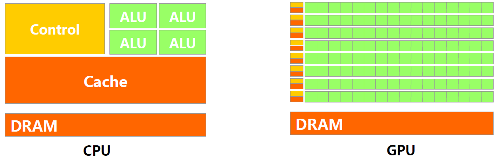
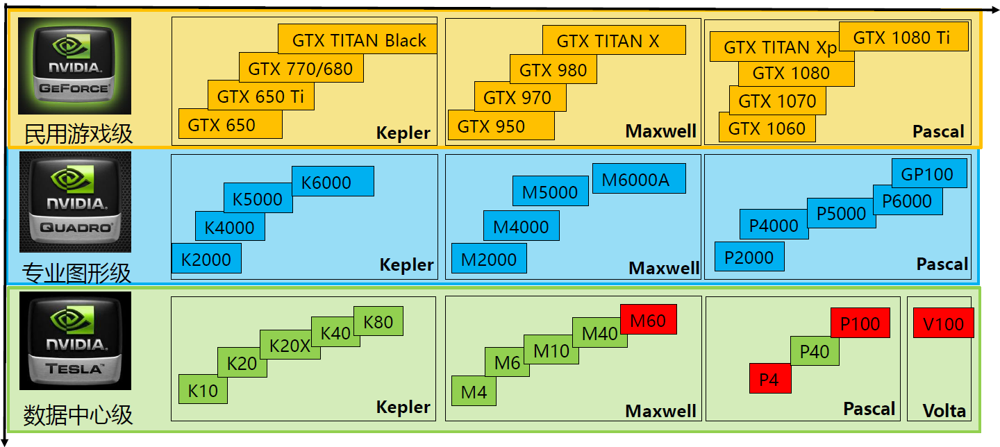

# GPU

[TOC]

## 概述

**Graphics Processing Unit，图形处理器**

又称显示核心、视觉处理器、显示芯片，是一种专门在个人电脑、工作站、游戏机和一些移动设备上图像运算工作的微处理器。

## 与CPU硬件逻辑架构对比

## GPU加速应用场景

* 智能金融
* 智能医疗
* 平安城市
* 智慧交通
* 机器翻译
* 语音识别
* 自动驾驶

## 硬件举例

### Nvidia

