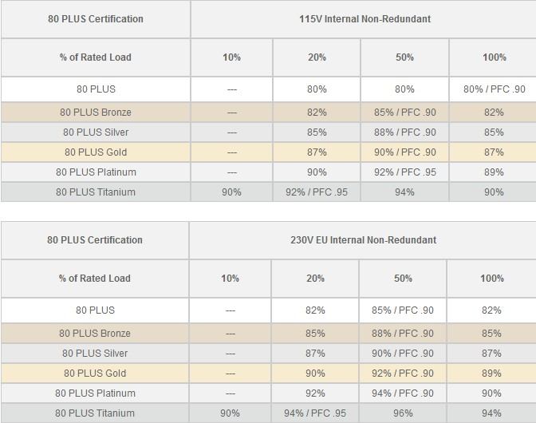
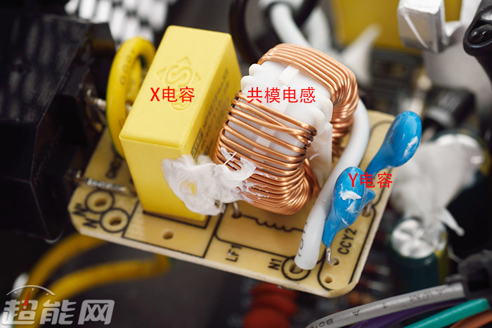
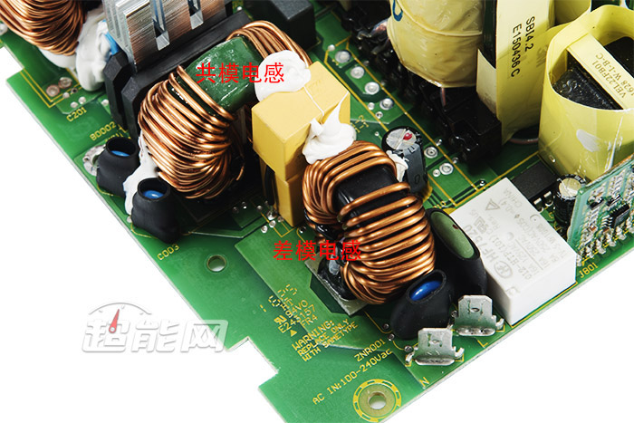
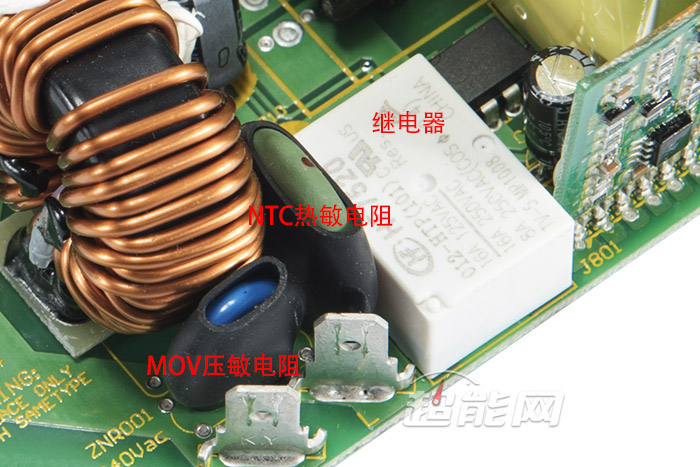
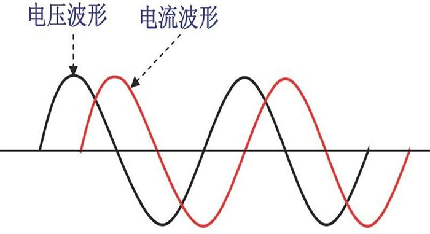
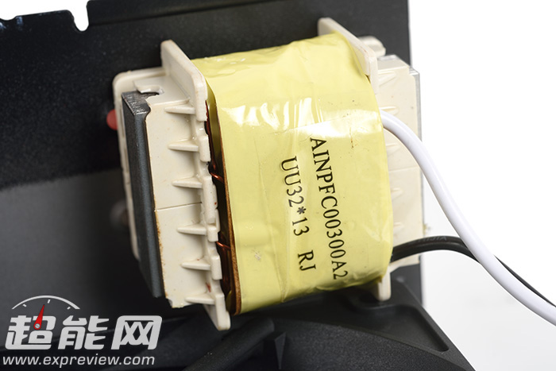
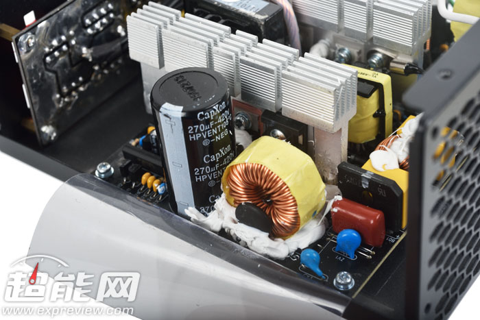

# 电源

## 认证

### Ecova 80Plus

## EMI滤波电路

PC电源中的EMI滤波电路可以分为一级EMI滤波电路以及二级EMI滤波电路，前者一般放置在电源上的AC输入插座上，有直接把元件焊接在插座上的，也有制作成独立PCB再与插座连接的；后者在多数是放置在PC电源的主PCB上，元件相比一级EMI滤波电路更多，同时也是电源保护系统的重要组成部分。

**一级EMI滤波电路**主要由X电容和Y电容组成，X电容和Y电容都属于安规电容，其中X电容并接在火线和零线之间，块头通常比较大，负责滤除差模干扰；而Y电容则是在火线与地线之间以及零线与地线之间并接的电容，通常以成对的形式出现，负责滤除共模干扰。

大部分的PC电源在都会采用一个X电容和一对Y电容组成一级EMI滤波电路，基本上这个属于主流的标准配置。而有部分产品会在这个基础上加入共模电感以增强EMI滤波作用，高端PC电源甚至会在这样的基础上增加接地金属罩以加强对EMI的防护效果。

**二级EMI滤波电路**则是在一级EMI滤波电路的基础上增添更多元件而来，除了X电容和Y电容外还会有共模电感和差模电感。共模电感（Common Mode Choke）是拥有两个绕组的线圈，其主要作用是抑制市电输入中的共模干扰，同时也抑制电源本身的共模干扰对外泄漏；而差模电感（Differential Mode Choke） 则是单个绕组的电感线圈，其主要用于抑制市电输出中的差模干扰。

差模电感的旁边有一个使用热缩套包裹的两脚直插元件，被称为MOV，即金属氧化物压敏电阻（Metal Oxide Varistor），它可以抑制输入电压的尖峰，可以起到防止输入电压过高以及雷击保护的作用。

NTC即热敏电阻（Negative Temperature CoeffiCient Resistor）也是二级EMI滤波电路中的常见的元件 ，共模电感旁边、采用热缩套包裹的墨绿色元件，具有常温下高电阻、随着自身温度提升阻值迅速减小的特性，电源在刚通电的时候NTC的温度往往与室温相当，自身呈高阻值， 可以限制电源主电容充电形成的冲击电流。

由于NTC本质上是一个电阻，因此其多少会形成不必要的电流消耗，从而影响电源的转换效率。不过其在电源进入正常工作后，会因为自身通电而发热，随之阻值下降， 对电流的限制也会放宽，从而减少对电源效能的影响。不过部分追求高效率的电源会设法将NTC的影响降到最低，这就需要用到继电器了。

继电器一般并联在NTC热敏电阻上，在开机前处于断开状态，因此在电源通电时是NTC热敏电阻在工作；而当电源进入正常工作状态后，继电器启动并导通，从而短路NTC热敏电阻，此时NTC热敏电阻不再工作，不再 消耗电流，也就不再发热，重新回到高阻态的模式下。

继电器与NTC并联的设计可以在减少电流损耗的同时也提高 了PC电源的可靠性。对于追求效率的电源来说，NTC热敏电阻几瓦的损耗始终会降低电源的转换效率，而且对于关机后在短时间内再次开机的情况，如果没有继电器，处于高温下的NTC热敏电阻将无法发挥正常作用，因此继电器与NTC在高端电源中往往是配套使用。

PC电源中EMI滤波电路本质上是一个低通滤波器，它可以滤除输入市电中的高频杂波，只让纯净50Hz的交流电进入后续的整流调压电路当中。同时它还可以降低市电中的共模和差模干扰，进一步提升输入电流的纯净度，以确保电源的稳定工作。

PC电源的EMI电路还可以起到保护电源的作用，EMI滤波电路中的MOV以及NTC可以抑制市电输入中的突发电压和突发电流，避免后续电路元件因为电压或电流的冲击而烧毁，可以说是PC电源乃至整台PC的第一道防线。

EMI滤波电路还可以抑制电源自身对外发出EMI电磁干扰。

## PFC

被动式PFC与主动式PFC

目前电路负载基本上可以分为两种模式，其一为电阻型负载，这种负载在采用交流输入时，其电压与电流的波形都将呈现正弦曲线且相位相同，换句话说电压和电流都会在同一时刻逆转极性，能量一直为正向移动；另外一种则是电抗型负载，这种负载在采用交流输入时虽然电压与电流的波形同样为正弦曲线，但两个波形之间存在相位差，这样就无法保证电压与电流在每一个时刻都是相同的极性，在极性相反的周期内，能量是反向移动。

由于电压与电流波形之间存在相位差，因此会有反向能量即无效功率的产生

当然这两种都是理想状态下的负载，在实际应用中其实是电阻性负载与电抗型负载的混合，极少存在单一型负载的情况，因此在任意时刻的负载中会有两种不同方向的能量，其中只有正向能量是有价值的，我们将其称为有效功率，反向能量则称为无效功率，而两者的综合就是视在功率了。

为了体现电器设备对能量的利用率，需要用到功率因数（Power Factor），即电源评测中常提到的PF值，这是一个有效功率除以视在功率所得出来的比值。而功率因数校正即PFC（Power Factor Correction）的用作就是提升PF值，它可以起到减少脉冲电流谐波分量、降低EMI电磁干扰、降低谐波失真度等作用，从是实现降低电网污染、使功率因数趋向于1的效果。

目前PC电源中有分为被动式PFC和主动式PFC，前者一般来说可以将电源的功率因数控制在0.7到0.8的范围，但一般不会超过0.8；后者则是目前主流和高端电源的标配，它可以将电源的功率因数控制在0.9甚至更高的水平，部分高端产的功率因数甚至可以无限接近于1。

### 被动式PFC

由于相对低廉的成本，因此其仍然活跃在额定功率400W以下的入门级电源产品中。被动式PFC电源的PF值大多在0.7到0.8左右，但甚少能有超过0.8的水平，毕竟要在被动式PFC电源上做到PF值0.8以上，从成本来说足以做主动式PFC电源，后者的PF值可以轻松达到0.9的水平。

常见于PC电源中的被动式PFC是电感补偿式，其通过减少交流输入的基波电流与电压之间相位差来提高功率因数，特点是在高压滤波电容附近有一个PFC电感，这个电感由多块硅钢片外部缠绕铜线而成，体积大、重量高。

电感补偿式的被动式PFC有结构简单、成本低廉的优势，但是其电感的体积和重量都会随着电源额定功率的提升而增加，因此被动式PFC基本上不会用在额定功率比较高的电源产品中。

被动式PFC电源对输入电压的稳定性有一定的要求，基本上电压波动的允许范围不会太广。而且由于被动式PFC适合在比较高的电压下使用，因此采用110V输入设计的被动式PFC电源还需要添加一个倍压器，将输入电压从110V增加至220V，以保证PFC电路工作的正常。

### 主动式PFC

主动式PFC在结构上来说基本就是一个通过PWM控制电流波形的AC/DC整流器，交流输入通过整流桥进行整流，然后PWM触发主动PFC电路中的MosFET管，分离中间直流电压到恒定脉冲序列，随后这些脉冲信号通过滤波电容，将相对平顺的电流送到主开关电路。

设计结构上来说，主动式PFC显然比被动式PFC更复杂，成本也更高。但是主动式PFC有着更宽广的电压适应能力，在电压波动较大的情况下仍然可以稳定工作，不少产品甚至直接支持110V到220V电压的输入。同时在功率因数校正的效果上，主动式PFC也有凌驾于被动式PFC，可以轻松达到0.9以上，部分高端产品甚至可以实现无限接近于1的效果。