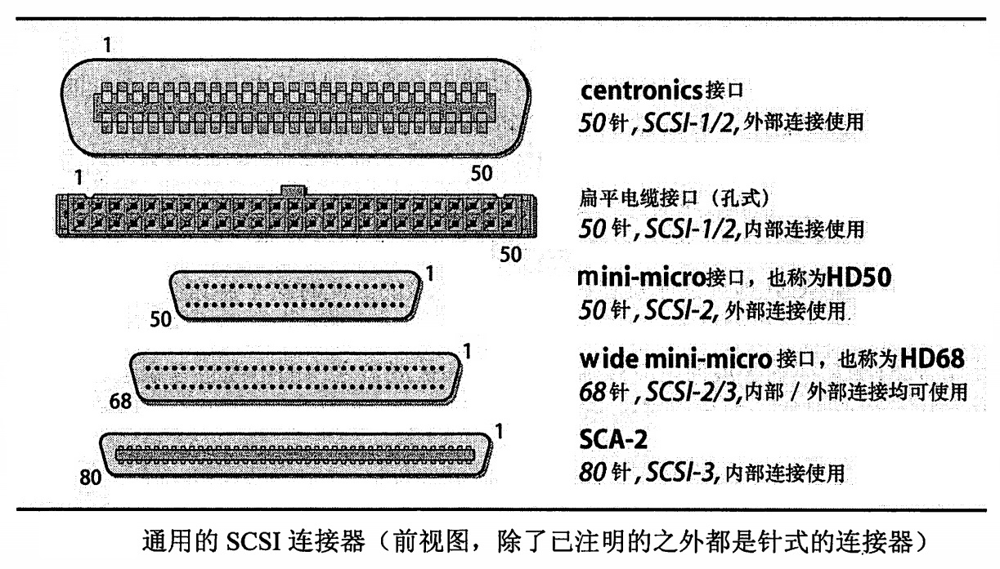

# 硬盘

[TOC]

## 概述

大多数系统通过称为 SCSI（Small Computer System Interface，小型计算机系统接口，发音和 “scuzzy” 相似）的标准外设总线来连接硬盘。PC 支持另一种称为 IDE（Integrated Drive Electronics，集成驱动电路设备）的接口。

## 接口

现如今虽然刚刚出现了几种新技术，但只有少数几种接口标准得到了广泛的应用。选择和系统接口相匹配的硬盘驱动器非常重要。如果系统支持几种不同的接口那么就应该选择最能满足自己在速度、冗余性、移动性以及价格方面要求的一种。

* PATA（也叫做 IDE），是作为 PC 的一种简单而廉价的接口而开发的。因为它把硬件控制器和硬盘片本身放置在同一个盒子内，并且在计算机和硬盘之间使用一种相对高层的协议进行通信，所以最初它被称为“集成驱动器电路”。这就是所有现代硬盘的标准体系结构，但其名称沿用了下来。IDE 硬盘的速度中等、容量大，并且非常便宜。
* 串行 ATA（SATA）是传统 IDE 的后续技术。除了支持更快的传输速率之外，SATA 通过清楚的连线和更长的最大电缆长度让连接更简单。SATA 本身支持热插拔和命令队列功能，这两种功能最终让 IDE 在服务器领域可以成为 SCSI 的一种替代选择。
* SCSI 虽然不如以前那么流行了，但它仍然是得到最广泛支持的硬盘接口之一。它有几种不同的形式，所有形式都支持在一条总线上安装多个硬盘，并且支持不同的速率和多种通信类型。
* 光纤通道（Fibre Channel）是在企业环境中正得到广泛应用的串行接口，因为它的带宽高，一次能够连接大量的设备。光纤通道设备通过光纤或者双铜轴电缆连接在一起。现在其速度能够达到 100 MB/s 以上。常见的拓扑包括 FC-AL（Fibre Channel Arbitrated Loop，光纤通道仲裁环路）的环形结构和使用光纤通道开关的交叉开关结构。光纤通道可以使用几种不同的协议，其中包括 SCSI 甚至 IP 。光纤通道设备名可以由称为 World Wide Name 的硬连线 ID 号进行识别，它和以太网 MAC 地址类似。
* 对于连接键盘和鼠标这样的设备来说，USB（Universal Serial Bus，通用串行总线）已经开始变得流行起来，但它的当前版本也有足够的带宽来支持像硬盘和CD-ROM 驱动器这样的设备。USB 在个人电脑上使用得非常普遍，它能让您很容易地在系统之间移动硬盘。

## PATA

PATA（Parallel Advanced Technology Attachment，并行的先进技术附件规范），也称为 IDE ，它的设计简单而且价格不贵。在个人电脑或者价格便宜的工作站中最容易找到它。IDE 在 20 世纪 80 年代末期开始流行。那之后不久，就又研发出 ATA-2 来满足用户和硬件驱动器厂商不断增长的需求。

ATA-2 增加了更快的 PIO（Programmed I/O，编程 I/O）和 DMA（Direct Memory Access，直接内存访问）模式,并且扩充了总线的即插即用功能。它还增加了一种名为 LBA（Logical Block Addressing，逻辑块寻址）的功能，此功能（和增强的 PC BIOS 组合起来）解决了 BIOS 无法访问硬盘上超过前 1024 柱面的区域这一问题。以前，这个限制把硬盘空间限定在 504MB 内。谁会想到硬盘会变得那样大呢！

因为 BIOS 管理了部分的引导过程，所以过去必须在前 1024 个柱面中创建一个小的可引导分区以确保内核能够被老的 BIOS 载入。一旦内核载入并开始运行，那么就不需要 BIOS了，可以访问硬盘的其余部分。这个不高明的策略在如今的硬件中是没有必要的，因为 LBA 摆脱了柱面-磁头-扇区（CHS）的寻址方式，而支持一种线性的寻址方案。

ATA-3 增加了更高的可靠性、更加精密的电源管理和自监控能力。UItra-ATA 试图在 ATA-3 和 ATA-4 之间的差别上架起一座桥梁，它增加了名为 UItra DMA/33 和 UItra DMA/66 的高性能模式，它们分别将总线带宽从 16MB/s 扩展到了 33MB/s 和 66MB/s 。ATA-4 也是一种需求很大的尝试，它将 ATA-3 和 ATAPI（ATA Packet Interface，ATA 包接口）合并在了一起，ATAPI 是能让 CD-ROM 和磁带机在一个 IDE 总线上工作的协议。

这一系列标准中最新的成员 ATA-5 和 ATA-6 增强了管理性能和出错处理功能，两者都会改善 Linux 这样的多用户环境的性能。ATA-7 预计是对并行 ATA 的最后升级。它支持的数据传输速率高达 133MB/s 。

IDE 硬盘几乎总是内置使用的（除非出于测试目的而考虑将硬盘挂在计算机外部）。ATA-2 总线的最大长度仅仅是 18 英寸，这就使总线甚至难以连到系统最上面的硬盘槽的位置。除了电缆的长度很短之外，一条 IDE 总线只能容纳两个设备。为了弥补这些不足，大多数制造商在他们的主板上提供了不止一条 IDE 总线（一般有两条，称为 primary 和 secondary）。

较老的 IDE 设备是以一种有连接的方式进行访问的，这就意味着一次只有一个设备是活动的。因此，如果将老式设备分散在多条总线上的话，性能将是最好的。扩展的 IDE 标准通过在一个接口上模拟两个 IDE 接口的方法绕过了这一限制，能让两个设备同时活动。当然，两个设备不能同时在电缆上发送数据，但是 SCSI 也是这样的。

IDE 连接器是一个 40 针的接头，它用带状电缆将硬盘连接到接口卡上。诸如 Ultra DMA/66 这样比较新一些的 IDE 标准使用一种不同的电缆，它能提供更多的接地针，因此减少了电路噪声。如果电缆或者硬盘没有标记，那么就应该确保硬盘上的针 1 和接口卡上的针 1 相连接。在连接器一边的针 1 通常会以一个很小的 “1” 来标记出。如果没有进行标记，那么规则就是，针 1 通常是那个离电源连接器最近的针。带状电缆上的针 1 通常用红色标记出来。如果在电缆的边缘部分没有红色条纹，那么就应该确保电缆的方向正确，使得针 1 和针 1 连接在一起，并且还应该清楚地标记出其位置以供下次使用。

如果在一条 IDE 总线上有不止一个设备，那么就必须将其中的一个设备指定为主设备，将另一个设备指定为从设备。现代的硬盘上有一个 “cable select（电缆选择）”跳线设置（通常是默认），让设备自己选择是作为主设备还是从设备运行。作为主设备运行并不会有任何性能上的提升。有些比较老的 IDE 硬盘不喜欢作为从设备使用，所以如果在让一种配置工作的过程中遇到了困难，那么不妨试着颠倒一下它们之间的角色，让另一个设备作为从设备。如果仍然不能够正常工作，那么让每个设备都成为各自 IDE 总线上的主设备，这样情况可能会好一些。

考虑 IDE 硬件的时候，请记住以下这些要点：

* 新的 IDE 硬盘可以在老的板卡上工作，老的 IDE 硬盘可以在新的板卡上工作。自然，只有两个设备所共有的那些功能才能得到支持。
* 电缆长度非常短，只有 18 英寸，这就需要延长总线长度才能向总线中添加额外的设备。如果遇到了一些不确定出现的问题，那么应该检査一下电缆长度。自己定制的电缆可能会引发问题。
* IDE 设备新的电缆设计技术采用了缠绕在一起的打线方式，而不是更常见的带状电缆。新的电缆让机箱内部更整洁，而且改善了空气流通。

## SATA

随着 PATA 硬盘的传输速率不断提高（特别是随着 ATA-7 的出现），这项标准的缺点开始变得突出起来。电磁干扰和其他电气方面的问题开始导致在高速下出现可靠性问题。于是出现了 SATA（串行 ATA，Serial ATA）来解决这些问题。SATA 的概念在 2000 年左右的时候就有了。

SATA 缓解了 PATA 的许多突出问题。虽然 SATA 硬盘起初 150MB/s 的速度只比 ATA-7 稍微快-点儿，但是 SATA-2 在 2008 年前将最终支持高达 600MB/s 的传输速率。其他显著的改进包括：更好的出错检查技术、能够热更换硬盘、自带命令队列机制、以及各种提高性能的措施。最后，SATA 不需要指定主从设备，因为一个通道只能连接一个硬盘。

SATA 克服了 PATA 电缆不能超过 18 英寸长的限制，还分别引入了电缆以及 7 针和 15 针连接插头的新标准。这两种电缆比以前的带状电缆更灵活，用起来也更容易——为了在一条线上连接多个硬盘不用多弯曲和打折。

## SCSI

只要几个芯片集就能实现 SCSI 标准，所以有时候厂商就直接在主板上支持 SCSI 。SCSI 定义了一个通用的数据通道，所有类型的外围设备都可以使用这个通道。以前，数据通道由硬盘、磁带机、扫描仪和打印机使用，而现如今大多数外设都摈弃了 SCSI 而采用 USB 。SCSI 标准并没有规定硬盘的结构或者布局如何，它只是规定了硬盘和其他设备进行通信的方式。

SCSI 标准已经经历了数次修正，目前的版本是 SCSI-3 。SCSI-1 是在 1986 年作为基于 SASI（Shugart Associates System Interface）的一种 ANSI 标准而开发的，SASI 是一种需要商业购买才能采用的系统总线。SCSI-2 在 1990 年开发出来。它向后兼容 SCSI-1，但增加了几种提高性能的特性。这些特性包括命令队列，该功能让设备重新排列 I/O 请求以优化吞吐量，以及分散聚集 I/O，该功能可以在不连续的内存区域中进行直接内存访问（DMA，Direct Memory Access）传输。

您可能会看到人们使用术语 “fast” 和 “wide” 形容 SCSI-2 设备，它们的意思是说总线的速度提高了一倍，或者是说同时传输的位数更多了，典型情况下是用 16 位或者 32 位而不是通常所用的 8 位（32 位 SCSI 总线不是太常见。有些可能需要多条电缆，分别称之为 A 电缆和 B 电缆。）。wide（宽的）SCSI 链能够支持多达 16 个设备，而 narrow（窄的）SCSI 电路只能支持 8 个设备。快速性和宽广性是互相独立的功能，通常情况下它们可以一起使用来提高综合性能。

SCSI-3 实际上是一系列标准。它包括了对不同物理介质的规范，这些物理介质既包括传统的并行总线，也包括像光纤通道以及 IEEE1394（“火线”）这样的高速串行介质。它还规定了 SCSI 的命令集合，并且增强了对设备自动配置、多媒体应用和新型设备的支持。

尽管 SCSI-3 的规范从 1993 年起至今就一直在制定之中，但仍然没有完成。不过，它的很多功能早就已经出现在市场上了，通常是以 “Ultra SCSI” 的名称出现。SCSI-3 中包含了 SCSI-2 的功能，所以 SCSI-3 内已经具有了一定程度的向后兼容性。不过需要牢牢记住的是，将老设备安装在新总线上会降低整个总线的速度。它还会影响电缆的最大长度。

下表总结了不同的 SCSI 版本和它们相应的总线带宽以及电缆长度的联系。

单端的 Ultra 和 Wide Ultra SCSl 最大电缆长度取决于投入使用的设备的数量。对于 8 个设备来说最长为 1.5m，如果只用 4 个设备，那么总线长度就扩展到 3m。Wide Ultra SCSl 只能以差动模式支持 16 个设备。

| 版本                          | 频率   | 宽度   | 速度     | 长度              | 差动长度                              |
| ----------------------------- | ------ | ------ | -------- | ----------------- | ------------------------------------- |
| SCSI-1                        | 5 MHz  | 8 bit  | 5 MB/s   | 6m                | 25m                                   |
| SCSI-2                        | 5 MHz  | 8 bit  | 5 MB/s   | 6m                | 25m                                   |
| Fast SCSI-2                   | 10 MHz | 8 bit  | 10 MB/s  | 3m                | 25m                                   |
| Fast/wide SCSI-2              | 10 MHz | 16 bit | 20 MB/s  | 3m                | 25m                                   |
| Ultra SCSI                    | 20 MHz | 8 bit  | 20 MB/s  | 1.5m a | 25m                                   |
| Wide Ultra SCSI b  | 20 MHz | 16 bit | 40 MB/s  | 1.5m a | 25m                                   |
| Wide Uttra2 SCSI b | 40 MHz | 16 bit | 80 MB/s  | - c    | 25m(HVD)  d 12m (LVD) |
| Wide Ultra3 SCSI e | 80 MHz | 16 bit | 160 MB/s | - c    | 12m (LVD)                             |

> a. 有所不同。
>
> b. Wide Ultra SCSI 和 Wide Ultra2 SCSI 有时候分别被称为 Fast-20 Wide SCSI 和 Fast-40 Wide SCSl 。
>
> c. 这些版本的 SCSI 只使用差动信令。
>
> d. HVD 是 High Voltage Differential（高电压差动信号），LVD 是 Low Voltage Differential（低电压差动信号）。HVD 用于早期的 SCSI 版本中，并不是在 Ultra2 SCSI 标准之上定义的。
>
> e. Wide Ultra3 SCSI 有时候被称为 Ultra-160 。类似的还有分别将速率翻倍和三倍的标准 UItra-320 和 Ultra-640 。大多数新硬盘是 Ultra-320 的。

SCSI 设备可以使用很多类型的连接器。它们根据所用的 SCSI 版本和连接类型的不同而异：内置式或者外置式。narrow（窄的）SCSI 设备有 50 个针，wide（宽的）SCSI 有 68 个针。内部设备通常接受一个 50 针接头或者连接在带状电缆上的 68 针的针式迷你型微连接器。外部设备通常使用高密度的 50针 或者 68 针迷你型微连接器和计算机进行连接。

一种有趣的 SCSI 变体对于热插拔硬盘阵列尤其有用，这就是 SCA（SingleConnector Attachment，单连接器附件）插头。它是一个包含有总线连接、电源和 SCSI 配置的 80 针连接器，因而可以让一个单独的连接器满足硬盘的所有需要。

下图中显示了最常用的连接器的图片。每个连接器都是从前面显示的，就好像您正要把它插入自己的前额一样。

SCSI 总线使用一个菊花链的配置，所以多数外部设备具有两个 SCSI 端口。这两个端口是相同的，并且可以互换，所以任何一个都可以是输入端口。由于一些原因，扫描仪厂商认为他们自己可以不受这些固有规则的限制，所以有时候只提供一个 SCSI 端口。如果没有在内部加以终结，那么这些设备就需要一种特殊类型的终结器。

内部 SCSI 设备经常被连接到一条带状电缆上。因为连接器能够被压接到带状电缆的中间，所以实际的 SCSI 设备上只需要一个端口。当使用带状电缆时，一定要确保 SCSI 总线上的针 1 是和硬件驱动器上的针 1 相连接（针 1 通常用红色条纹标记）。

SCSI 总线的每一端都必须有一个终结电阻（“终结器”）。当信号到达总线末端时，这些电阻会吸收这些信号，以防噪声返回到总线中去。终结器有几种形式，从可以插到常规端口上的小型外部插头到安装在设备电路板上的一系列很小的排电阻，都有可能。大多数现代设备是自动终结的。

总线的一端通常在主机内部终结，不是在 SCSI 控制器上终结，就是在一个内部 SCSI 驱动器上终结。总线的另一端通常会在一个外部设备上终结，如果没有任何外部设备的话，就会在 SCSI 控制器上终结。如果您的 SCSI 总线出现了似乎是随机发生的硬件问题，那么就应该首先检查总线两端是否正确终结了。不正确的终结是最常见的 SCSI 配置错误，它产生的错误可能是非常不明显并且是时断时续的。

SCSI 地址本质上可以是任意的。从技术上看，它决定了总线上设备的优先权，但在实际使用中，精确的优先权并不会有很大的差别。一些系统将目标号最低的硬盘作为默认的引导盘，还有一些系统要求引导盘为目标 0。

如果运气好的话，碰到的设备会有一个外部小旋钮，使用它可以设置目标号。其他设置目标号的常见方法是 DIP 开关和跳线。如果不能明确在设备上如何设置目标号，那么就应该参考硬件手册。现在大多数硬件说明都可以在制造商的网页上找到，可以尝试着用一个硬盘进行大量的试误测试来进行设置。

SCSI 标准支持一种名为“逻辑单元号”（LUN，Logical Unit Number）的子地址。每个目标内部都有几个逻辑单元。例如有几个硬盘但只有一个 SCSI 控制器的硬盘阵列。然而，逻辑单元很少在实际生活中用到。当您听到 “SCSI 单元号” 的时候，应该假定它就是正在讨论的目标号，除非事实证明是其他的东西。如果 SCSI 设备只包含一个逻辑单元，那么 LUN 经常默认设置为 0 。

通常情况下，SCSI 总线很容易配置，但有一些事情也可能会出错。

* 很多工作站都具有内部 SCSI 设备。在重新启动添加新设备之前应该检查一下目前所有设备的清单。
* 在添加了一个新的 SCSI 设备之后，检査 OS 重新启动时所发现的设备清单，从而确认所期望有的所有设备都在那里。大多数 SCSI 驱动器不会检测到具有相同 SCSI 地址的多个设备——这是一种非法的配置。SCSI 地址的冲突可能会导致非常奇怪的现象。
* 有些扩展盒（包含有电源和一个或者多个 SCSI 设备的盒子）在盒子内部终结总线。如果设备是附加在扩展盒之后的，那么您就会遇到 SCSI 链上所有设备都不可靠的问题。无论什么时候，都要仔细检查您的确具有两个终结器，并且它们两个都在总线的端部。
* 用于设置设备 SCSI 地址的小旋钮有时候是倒着接的。此时这个旋钮会改变 SCSI 地址，但是不会改变已经显示出来的数值。
* 计算 SCSI-2 总线的长度时，应该确保将设备和扩展盒之内的电缆也考虑进去。这些电缆可能非常长。还要记住，如果将老的 SCSI 设备添加到新的 SCSI 总线中去，电缆的最大长度可能会减少。
* 永远都不要忘记 SCSI 控制器使用了一个 SCSI 地址。

## SCSI 和 IDE 的比较

在以前，SCSI 在服务器上应用一直都处于明显的优势。不过，随着 SATA 硬盘的出现，SCSI 没有以前那么值得投资了。SATA 硬盘能够和几乎每一类 SCSI 硬盘相媲美。与此同时，SATA 硬盘又非常便宜，使用更为广泛。

SCSI 硬盘的优势之一是在控制器上集成了一个处理器，能够把系统的 CPU 解放出来去处理其他事情在繁忙的系统上，这就意味着获得了很大的性能提升。当然，要由用户自己确定花这么多钱是否值得。

在有些情况下 SCSI 是可取的，甚至是必须采用的。

* 如果必须具有可能的最好性能，那么应选择 SCSI 。硬盘制造商们用 IDE/SCSI 这样的划分来满足硬盘驱动器市场的需求。有些 IDE 驱动器可能在吞吐速率的峰值上超过了 SCSI，但是 SCSI 几乎一定会提供更好的持续吞吐速率。
* 服务器和多用户系统需要使用 SCSI 。SCSI 协议在以高效方式管理多个并发请求的能力方面是无与伦比的。在一个繁忙的系统中，您会看到系统性能得到了提高，这是具体的，能够测量到的。
* 如果需要连接很多设备，那么 SCSI 又领先一筹。SCSI 设备可以和其他设备很好地协作，而 IDE 设备会在总线上互相干扰和冲突。

## 硬盘的几何结构
下图显示了硬盘的几何结构以及通常用于称呼硬盘各个部分的术语。现代的硬盘驱动器仍然以同样的基本结构为基础，但软件却再也不知道（或者是不必知道）关于驱动器的物理结构的很多信息。

典型的硬盘驱动器由镀上磁性薄膜的旋转盘片组成。数据是通过改变盘片表面磁性微粒方向的一个小磁头来进行读取和写入的。数据盘片是完全密封的，这样任何灰尘或者杂质都进不去。这项功能使固定的硬盘比可移动的介质更加可靠。

在计算机硬件的很早时期，硬盘驱动器通常只有一个盘片。存储能力的增加是通过盘片直径的增加来做到的。在我们的一个用户区的墙上有一个很古老的硬盘,其直径超过 4 英尺,保存了大约 280KB 的数据。

现在，硬盘通常都有几个互相叠在一起的小盘片，而不是只有一个单独的大盘片。盘片的两面都用来保存数据，尽管有一个硬盘的一面通常用来保存定位信息，而不能用来存储。单盘密度目前能够高达约 130GB 。

盘片以恒定的速度旋转。它们通过很小的滑动磁头进行读取和写入，这些小磁头就像唱针在唱片机上一样前后移动。磁头漂浮在距离盘片表面非常近的位置，但并没有实际接触盘片。磁头和旋转盘片之间的距离可以和 F-16 喷气式战斗机以全速在距离地面 10 英尺的高度处飞行相提并论。如果磁头接触到了盘片，那么这就被称作磁头碰撞，这种情况是非常具有破坏性的。

硬盘的旋转速度随着时间推移已经得到了大幅增加。老式硬盘只能以 3600RPM（转/分）或者 5400RPM 的速度运转。现在 7200RPM 是主流市场的标准，而且10000RPM 和15000RPM 的驱动器正在高端市场上流行起来。更高的旋转速度减小了等待时间、增加了数据传输的带宽，但这可能会引入一些由于产生的热量增加而滋生的散热问题。如果您打算购买一个高端驱动器，那么一定要确保有充分的空气流通性。

每个表面至少需要一个磁头。早期驱动器上的磁头必须移动很大的距离，但现在这种小的堆叠盘片的几何结构效率更高一些。硬盘直径仍然在继续减小，从 20 年前的 14 英寸的标准减小到了 10 年前的 5.25 英寸的标准，到现在只有 3.5 英寸，甚至更小一些。

将磁头移动到正确位置读取特定的一段数据，这称作寻道。当硬盘在磁头下面旋转时磁头所能达到的每个位置称为磁道。磁道还可以进一步划分为扇区，通常情况下它有 512 字节长。

在不同的盘片上距离旋转轴相同距离的一系列磁道称为一个柱面。如果所有磁头都一起移动（这在占市场份额最大的驱动器中是很典型的），那么不需要任何额外的移动，就能够读取存储在一个单独柱面上的数据。尽管磁头的移动相当快，但它们仍然比硬盘的旋转要慢得多。因此，任何不需要磁头寻找新位置的硬盘访问都会更快一些。