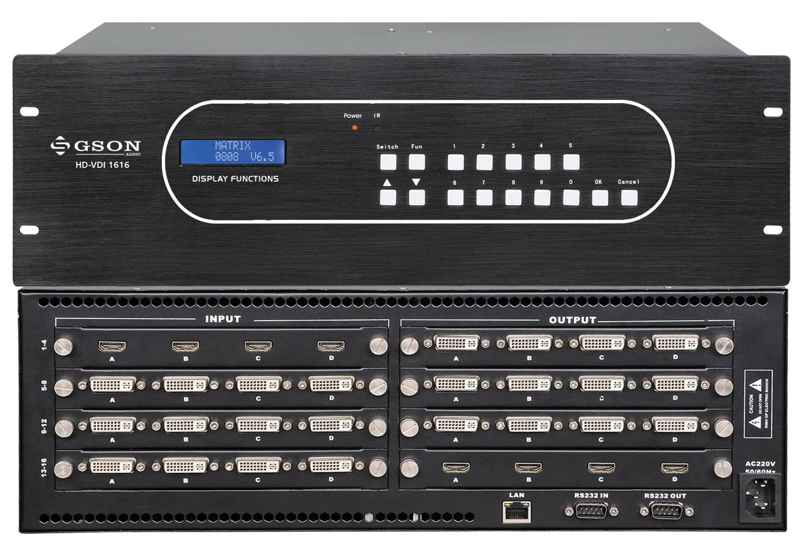
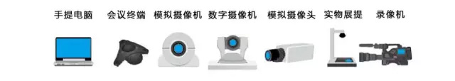
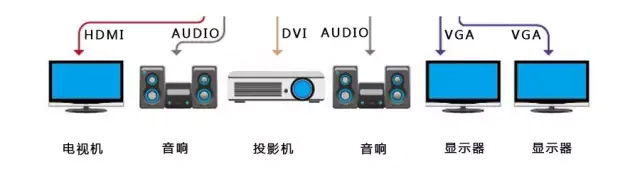
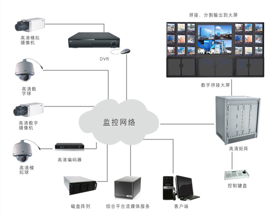

# 视频矩阵

[TOC]                                

## 概述

视频矩阵是指通过阵列切换的方法将 M 路视频信号任意输出至 N 路监控设备上的电子装置，一般情况下矩阵的输入大于输出即 M>N 。有一些视频矩阵也带有音频切换功能，能将视频和音频信号进行同步切换，这种矩阵叫做视音频矩阵。

视频矩阵最主要的功能是实现对输入视频图像的切换输出。准确概括那就是：将视频图像从任意一个输入通道切换到任意一个输出通道显示。视频矩阵可以做到音频和视频同步或者不同步。一般来讲，一个M×N矩阵：表示它可以同时支持M路图像输入和N路图像输出。

矩阵系统通常还包括以下基本功能：字符信号叠加；解码器接口以控制云台和摄像机；报警器接口；控制主机，以及音频控制箱、报警接口箱、控制键盘等附件。

矩阵系统还需要支持级联，来实现更高的容量。为了适应不同用户对矩阵系统容量的要求，矩阵系统应该支持模块化和即插即用(PnP)的，可以通过增加或减少视频输入、输出卡来实现不同容量的组合。

一般用于各类监控场合。

 

## 系统组成

### 视频矩阵设备

### 输入信号源

电脑、会议终端、监控摄像机、高速球、画面处理器等多种设备。

### 输出信号源

显示终端一般监视器，电视墙，拼接屏等。

通常视频矩阵输入很多，一般几十路到几千路视频，输出比较少一般2-128个显示器；例如8进8出，16进16出，32进32出，72进72出等。

## 常用接口 

* 射频RF

  是天线和模拟闭路连接电视机采用的射频（RF）接口。它可同时传输模拟视频以及音频信号，是一种最为常见的视频连接方式。RF射频信号需要经过调制、放大、检波、解调等过程。RF接口传输的是视频和音频混合编码后的信号，显示设备的电路将混合编码信号进行一系列分离、解码再输出成像。

* S-video接口（S端子）

  全称叫Separate Video，将 Video 信号分开传送，它是在AV接口的基础上将色度信号C和亮度信号Y进行分离，再分别以不同的通道进行传输，在很大程度上避免了视频设备内信号串扰而产生的图像失真，极大提高了图像的清晰度。S-video接口又可分为三种（普通S端子 增强型S端子 VIVO端子）

* 色差接口

  通常标记为YCbCr\YPbPr，用蓝、绿、红三种颜色来标注每条线缆和接口。绿色线缆（Y），传输亮度信号。蓝色和红色线缆（Pb 和Pr）传输的是颜色差别信号。

* AV接口

  AV矩阵的接口，全称叫标准视频输入（RCA）接口,通常都是成对的白色的音频接口和黄色的视频接口，它通常采用RCA(俗称莲花头)进行连接，使用时只需要将带莲花头的标准AV线缆与相应接口连接起来即可。

* RGB接口

  也叫RGBHV接口，“R、G、B、H、V”五种信号分别是红绿蓝三原色和行场同步信号，分别用五根同轴电缆进行传输，使信号相互间干扰减少，达到更佳的信号响应效果。

* VGA接口

  也叫D-Sub接口，是一种D型接口，上面共有15针空，分成三排，每排五个，常用于电脑显卡的输出接口，属于模拟接口。VGA接口是显卡上应用最为 广泛的接口类型，绝大多数的显卡都带有此种接口。迷你音响或者家庭影院拥有VGA接口就可以方便的和计算机的显示器连接，用计算机的显示器显示图像。

* DVI接口

  与VGA都是电脑中最常用的接口，与VGA不同的是，DVI传输的是数字信号，速度快，画面清晰。目前，很多高清电视上也提供了DVI接口。DVI采用全数字传输方式，是一种数字化接口，通常称之为高清接口，通常情况下有效传输距离仅有10米左右。DVI接口分为两种，一个是DVI-D接口，只能接收数字信号，不兼容模拟信号。另一种是DVI-I接口，可同时兼容模拟和数字信号。

* HDMI接口

  与DVI接口一样采用全数字传输方式，不同的是HDMI接口不仅能传输高清数字视频信号，还可以同时传输高质量的音频信号，是高清晰度多媒体接口，广泛应用于DVD播放机、有线电视/卫星电视机顶盒、HDTV等设备上，它们可以有效地提高数字图像的质量，不再需要进行模数转换。

## 主要分类

实现视频切换的不同方式：

* 模拟矩阵

  视频切换在模拟视频层完成，信号切换主要是采用单片机或更复杂的芯片控制模拟开关实现。

* 数字矩阵

  视频切换在数字视频层完成，这个过程可以是同步的也可以是异步的。数字矩阵的核心是对数字视频的处理，需要在视频输入端增加AD转换，将模拟信号变为数字信号，在视频输出端增加DA转换，将数字信号转换为模拟信号输出。视频切换的核心部分由模拟矩阵的模拟开关，变将成了对数字视频的处理和传输。

 档次：

* 电信广播级

  切换的时候没有闪烁和雪花，很平稳

* 专用矩阵

  切换的时候稍微出现点黑屏，但也没有闪烁。

* 民用级

  大多数会议室用的就是这种，切换的瞬间有闪烁的雪花和抖动，但切换完画面很稳定。