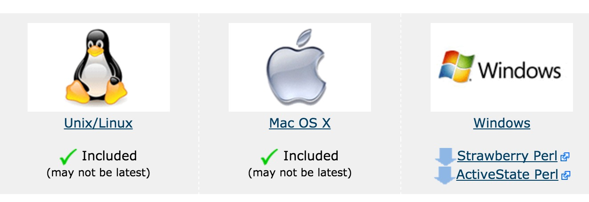
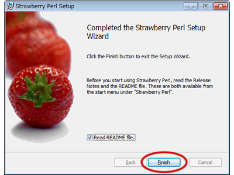

# 安装

[TOC]

## 概述

Perl 可以在以下平台下运行：

- Unix (Solaris, Linux, FreeBSD, AIX, HP/UX, SunOS, IRIX etc.)
- Win 9x/NT/2000/
- WinCE
- Macintosh (PPC, 68K)
- Solaris (x86, SPARC)
- OpenVMS
- Alpha (7.2 and later)
- Symbian
- Debian GNU/kFreeBSD
- MirOS BSD
- 等等...

很多系统平台上已经默认安装了 perl，可以通过以下命令来查看是否已安装：

```bash
$ perl -v

This is perl 5, version 18, subversion 2 (v5.18.2) built for darwin-thread-multi-2level
(with 2 registered patches, see perl -V for more detail)

Copyright 1987-2013, Larry Wall
……
```

## 安装 Perl

可以在 Perl 的官网下载对应平台的安装包:https://www.perl.org/get.html



### Unix 和 Linux

- 通过浏览器打开 [http://www.perl.org/get.html。](http://www.perl.org/get.html)

- 下载适用于 Unix/Linux 的源码包。

- 下载 **perl-5.x.y.tar.gz** 文件后执行以下操作。

  ```bash
  tar -xzf perl-5.x.y.tar.gz
  cd perl-5.x.y
  ./Configure -de
  make
  make test
  make install
  ```

安装成功后，Perl 的安装路径为 */usr/local/bin* ，库安装在 */usr/local/lib/perlXX* ,  XX 为版本号。

### Windows

Perl 在 Window 平台上有 ActiveStatePerl 和 Strawberry Perl 编译器。

ActiveState Perl 和 Strawberry Perl 最大的区别是 Strawberry Perl 里面有多包含一些 CPAN 里的模块， 所以 Strawberry Perl 下载的安装文件有 80多M, 而ActiveState Perl 只有 20M 左右。

这里使用了 Strawberry Perl 。

Window 系统上 Perl 安装步骤如下：

-  Strawberry 安装包链接： http://strawberryperl.com。
- 下载对应系统的版本： 32bit 或 64bit 。
- 下载后双击打开，按安装向导一步步安装即可。

 

### Mac OS

Mac OS 系统一般默认已经安装了 Perl，如果未安装则执行以下步骤：

- 通过浏览器打开 [http://www.perl.org/get.html。](http://www.perl.org/get.html)

- 下载适用于 Mac OS 的源码包。

- 下载 **perl-5.x.y.tar.gz** 文件后执行以下操作。

  ```bash
  tar -xzf perl-5.x.y.tar.gz
  cd perl-5.x.y
  ./Configure -de
  make
  make test
  make install
  ```

执行成功后 Perl 的安装路径为 */usr/local/bin* ，库安装在 */usr/local/lib/perlXX* ,  XX  为版本号。