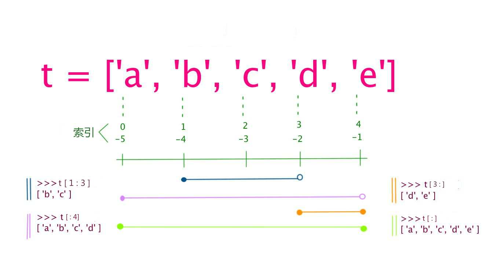
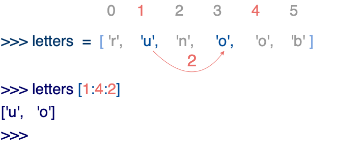
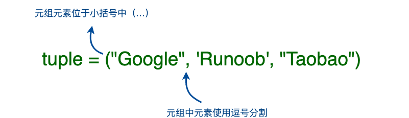
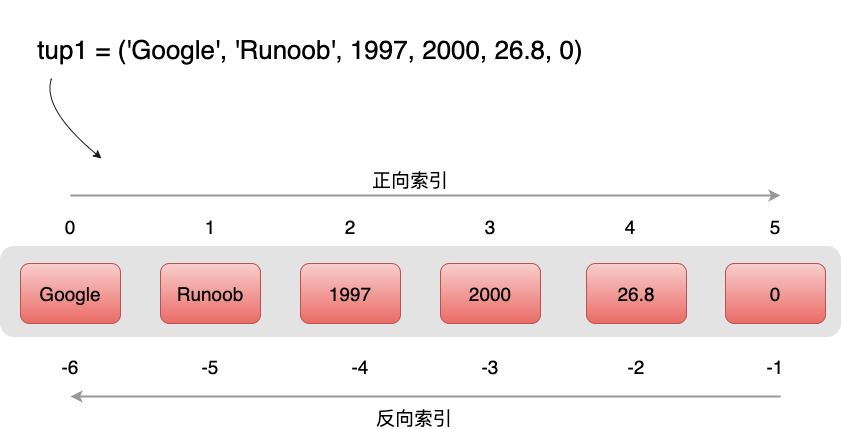
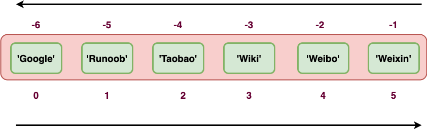

# 数据类型

[TOC]

## 概述

标准的数据类型：

```python
Number    （数字）
String    （字符串）
List      （列表）
Tuple     （元组）
Sets      （集合）
Dictionary（字典）
```

Python3 的六个标准数据类型中：

- **不可变数据（3 个）：**
  - Number
  - String
  - Tuple
- **可变数据（3 个）：**
  - List
  - Dictionary
  - Set

内置的 type() 函数可以用来查询变量所指的对象类型。

还可以用 isinstance 来判断

```python
>>> a = 111
>>> isinstance(a, int)
True
>>>
```

isinstance 和 type 的区别在于：

- type() 不会认为子类是一种父类类型。
- isinstance() 会认为子类是一种父类类型。

```python
>>> class A:
...     pass
... 
>>> class B(A):
...     pass
... 
>>> isinstance(A(), A)
True
>>> type(A()) == A 
True
>>> isinstance(B(), A)
True
>>> type(B()) == A
False
```

> **注意：**Python3 中，bool 是 int 的子类，True 和 False 可以和数字相加， True==1、False==0 会返回 **True**，但可以通过 is 来判断类型。
>
> ```python
> >>> issubclass(bool, int) 
> True
> >>> True==1
> True
> >>> False==0
> True
> >>> True+1
> 2
> >>> False+1
> 1
> >>> 1 is True
> False
> >>> 0 is False
> False
> ```
>
> 在 Python2 中是没有布尔型的，它用数字 0 表示 False，用 1 表示 True。

## 数字

不可改变的数据类型，意味着改变数字数据类型会分配一个新的对象。 


支持 3 种不同的类型：

* int          （有符号整型）

  是正、负整数，不带小数点。在 3.x 中，没有大小限制，可以当做 long 类型使用。

* float       （浮点型）

  由整数部分与小数部分组成。也可以使用科学计数法表示。

* complex（复数）

  由实数部分和虚数部分构成，可以用 a + bj ,或者 complex(a,b) 表示， 复数的实部 a 和虚部 b 都是浮点型。

> 使用"L"来显示长整型 （Python 3 不再存在）。
>
> 十六进制　0x
>
> 八进制   0

## 字符串

字符串或串（String）是由数字、字母、下划线组成的一串字符。

字串列表有2种取值顺序:

* 从左到右索引默认 0 开始的，最大范围是字符串长度少 1 。
* 从右到左索引默认 -1 开始的，最大范围是字符串开头。

要取得一段子串，可以用到 **变量[头下标:尾下标]** ，就可以截取相应的字符串，其中下标是从 0 开始算起，可以是正数或负数，下标可以为空表示取到头或尾。

**方法：**

```python
title()      单词首字母大写
upper()      字母转为大写
lower()      字母转为小写
lstrip()     删除头部空白
rstrip()     删除末尾空白
strip()      删除两端空白
```

* python 中单引号和双引号使用完全相同。

* 没有单独的字符类型，一个字符就是长度为1的字符串。

* 使用三引号(''' 或 """)可以指定一个多行字符串。

* 转义符 `\`

  | 转义字符 | 描述                                                         |
  | -------- | ------------------------------------------------------------ |
  | \        | 在行尾时，续行符                                             |
  | `\\`     | 反斜杠符号                                                   |
  | `\'`     | 单引号                                                       |
  | `\"`     | 双引号                                                       |
  | \a       | 响铃                                                         |
  | \b       | 退格(Backspace)                                              |
  | \000     | 空                                                           |
  | \n       | 换行                                                         |
  | \v       | 纵向制表符                                                   |
  | \t       | 横向制表符                                                   |
  | \r       | 回车，将 \r 后面的内容移到字符串开头，并逐一替换开头部分的字符，直至将 \r 后面的内容完全替换完成。 |
  | \f       | 换页                                                         |
  | \yyy     | 八进制数，y 代表 0~7 的字符，例如：\012 代表换行。           |
  | \xyy     | 十六进制数，以 \x 开头，y 代表的字符，例如：\x0a 代表换行    |
  | \other   | 其它的字符以普通格式输出                                     |

* 自然字符串， 通过在字符串前加 `r` 或 `R` 。`r` 指 raw，即 raw string，会自动将反斜杠转义。如 `r"this is a line with \n"` 则 `\n` 会显示，并不是换行。

* python 允许处理 unicode字符串，加前缀 `u` 或 `U`， 如 `u"this is an unicode string"` 。

* 字符串是不可变的。

* 按字面意义级联字符串，如 `"this " "is " "string"` 会被自动转换为 `this is string` 。

* 加号（+）是字符串连接运算符，星号（`*`）是重复操作。

* 与 C 字符串不同的是，Python 字符串不能被改变。向一个索引位置赋值，比如 `word[0] = 'm'` 会导致错误。

```python
#!/usr/bin/python3
 
str='123456789'
 
print(str)                 # 输出字符串
print(str[0:-1])           # 输出第一个到倒数第二个的所有字符
print(str[0])              # 输出字符串第一个字符
print(str[2:5])            # 输出从第三个开始到第五个的字符
print(str[2:])             # 输出从第三个开始后的所有字符
print(str[1:5:2])          # 输出从第二个开始到第五个且每隔一个的字符（步长为2）
print(str * 2)             # 输出字符串两次
print(str + '你好')         # 连接字符串
 
print('------------------------------')
 
print('hello\nrunoob')      # 使用反斜杠(\)+n转义特殊字符
print(r'hello\nrunoob')     # 在字符串前面添加一个 r，表示原始字符串，不会发生转义
```

### 格式化

Python 支持格式化字符串的输出 。尽管这样可能会用到非常复杂的表达式，但最基本的用法是将一个值插入到一个有字符串格式符 %s 的字符串中。

在 Python 中，字符串格式化使用与 C 中 sprintf 函数一样的语法。

```python
#!/usr/bin/python3
print ("我叫 %s 今年 %d 岁!" % ('小明', 10))
```

以上实例输出结果：

```python
我叫 小明 今年 10 岁!
```

#### 格式化符号

| 符  号 | 描述                                 |
| ------ | ------------------------------------ |
| %c     | 格式化字符及其ASCII码                |
| %s     | 格式化字符串                         |
| %d     | 格式化整数                           |
| %u     | 格式化无符号整型                     |
| %o     | 格式化无符号八进制数                 |
| %x     | 格式化无符号十六进制数               |
| %X     | 格式化无符号十六进制数（大写）       |
| %f     | 格式化浮点数字，可指定小数点后的精度 |
| %e     | 用科学计数法格式化浮点数             |
| %E     | 作用同%e，用科学计数法格式化浮点数   |
| %g     | %f和%e的简写                         |
| %G     | %f 和 %E 的简写                      |
| %p     | 用十六进制数格式化变量的地址         |

#### 格式化操作符辅助指令

| 符号  | 功能                                                         |
| ----- | ------------------------------------------------------------ |
| *     | 定义宽度或者小数点精度                                       |
| -     | 用做左对齐                                                   |
| +     | 在正数前面显示加号( + )                                      |
| <sp>  | 在正数前面显示空格                                           |
| #     | 在八进制数前面显示零('0')，在十六进制前面显示'0x'或者'0X'(取决于用的是'x'还是'X') |
| 0     | 显示的数字前面填充'0'而不是默认的空格                        |
| %     | '%%'输出一个单一的'%'                                        |
| (var) | 映射变量(字典参数)                                           |
| m.n.  | m 是显示的最小总宽度,n 是小数点后的位数(如果可用的话)        |

Python2.6 开始，新增了一种格式化字符串的函数 str.format() ，它增强了字符串格式化的功能。

#### f-string

f-string 是 python3.6 之后版本添加的，称之为字面量格式化字符串，是新的格式化字符串的语法。

之前我们习惯用百分号 (%):

```python
>>> name = 'Runoob'
>>> 'Hello %s' % name
'Hello Runoob' 
```

**f-string** 格式化字符串以 f 开头，后面跟着字符串，字符串中的表达式用大括号 {} 包起来，它会将变量或表达式计算后的值替换进去，实例如下：

```bash
>>> name = 'Runoob'
>>> f'Hello {name}'  # 替换变量
'Hello Runoob'
>>> f'{1+2}'     # 使用表达式
'3'
 
>>> w = {'name': 'Runoob', 'url': 'www.runoob.com'}
>>> f'{w["name"]}: {w["url"]}'
'Runoob: www.runoob.com'
```

用了这种方式明显更简单了，不用再去判断使用 %s，还是 %d。

在 Python 3.8 的版本中可以使用 = 符号来拼接运算表达式与结果：

```python
>>> x = 1
>>> print(f'{x+1}')  # Python 3.6
2
 
>>> x = 1
>>> print(f'{x+1=}')  # Python 3.8
x+1=2
```

### Unicode 字符串

在 Python2 中，普通字符串是以 8 位 ASCII 码进行存储的，而 Unicode 字符串则存储为 16 位 unicode 字符串，这样能够表示更多的字符集。使用的语法是在字符串前面加上前缀 **u**。

在 Python3 中，所有的字符串都是 Unicode 字符串。

## 列表

列表用 [ ] 标识。

列表可以完成大多数集合类的数据结构实现。列表中元素的类型可以不相同，它支持数字，字符串甚至可以包含列表（所谓嵌套）。

列表是写在方括号 [] 之间、用逗号分隔开的元素列表。

和字符串一样，列表同样可以被索引和截取，列表被截取后返回一个包含所需元素的新列表。

列表中的值得分割用到`变量[头下标:尾下标]`，就可以截取相应的列表，从左到右索引默认 0 开始的，从右到左索引默认 -1 开始，下标可以为空表示取到头或尾。

 

Python 列表截取可以接收第三个参数，参数作用是截取的步长，以下实例在索引 1 到索引 4 的位置并设置为步长为 2（间隔一个位置）来截取字符串：

 

如果第三个参数为负数表示逆向读取，以下实例用于翻转字符串：

```python
def reverseWords(input): 
    
   # 通过空格将字符串分隔符，把各个单词分隔为列表
   inputWords = input.split(" ") 
  
   # 翻转字符串
   # 假设列表 list = [1,2,3,4],  
   # list[0]=1, list[1]=2 ，而 -1 表示最后一个元素 list[-1]=4 ( 与 list[3]=4 一样) 
   # inputWords[-1::-1] 有三个参数
   # 第一个参数 -1 表示最后一个元素
   # 第二个参数为空，表示移动到列表末尾
   # 第三个参数为步长，-1 表示逆向
   inputWords=inputWords[-1::-1] 
  
   # 重新组合字符串
   output = ' '.join(inputWords) 
    
   return output 
  
if __name__ == "__main__": 
   input = 'I like runoob'
   rw = reverseWords(input) 
   print(rw)
```

输出结果为：

```
runoob like I
```

与Python字符串不一样的是，列表中的元素是可以改变的。

**方法：**

* append()
* pop() 

### 更新列表

可以对列表的数据项进行修改或更新，也可以使用 append() 方法来添加列表项，如下所示：

```python
#!/usr/bin/python3
list = ['Google', 'Runoob', 1997, 2000]
print ("第三个元素为 : ", list[2])
list[2] = 2001
print ("更新后的第三个元素为 : ", list[2])
list1 = ['Google', 'Runoob', 'Taobao']
list1.append('Baidu') print ("更新后的列表 : ", list1)
```

以上实例输出结果：

```
第三个元素为 :  1997
更新后的第三个元素为 :  2001
更新后的列表 :  ['Google', 'Runoob', 'Taobao', 'Baidu']
```

### 删除列表元素

可以使用 del 语句来删除列表的的元素，如下实例：

```python
#!/usr/bin/python3
list = ['Google', 'Runoob', 1997, 2000]
print ("原始列表 : ", list)
del list[2]
print ("删除第三个元素 : ", list)
```

以上实例输出结果：

```
原始列表 :  ['Google', 'Runoob', 1997, 2000]
删除第三个元素 :  ['Google', 'Runoob', 2000]
```

### 列表脚本操作符

列表对 + 和  * 的操作符与字符串相似。+ 号用于组合列表，* 号用于重复列表。

如下所示：

| Python 表达式                         | 结果                         | 描述                 |
| ------------------------------------- | ---------------------------- | -------------------- |
| len([1, 2, 3])                        | 3                            | 长度                 |
| [1, 2, 3] + [4, 5, 6]                 | [1, 2, 3, 4, 5, 6]           | 组合                 |
| ['Hi!'] * 4                           | ['Hi!', 'Hi!', 'Hi!', 'Hi!'] | 重复                 |
| 3 in [1, 2, 3]                        | True                         | 元素是否存在于列表中 |
| for x in [1, 2, 3]: print(x, end=" ") | 1 2 3                        | 迭代                 |

### 列表截取与拼接

Python的列表截取与字符串操作类型，如下所示：

```python
L=['Google', 'Runoob', 'Taobao']
```

操作：

| Python 表达式 | 结果                 | 描述                                               |
| ------------- | -------------------- | -------------------------------------------------- |
| L[2]          | 'Taobao'             | 读取第三个元素                                     |
| L[-2]         | 'Runoob'             | 从右侧开始读取倒数第二个元素: count from the right |
| L[1:]         | ['Runoob', 'Taobao'] | 输出从第二个元素开始后的所有元素                   |

```python
>>> L=['Google', 'Runoob', 'Taobao']
>>> L[2] 
'Taobao' 
>>> L[-2]
'Runoob'
>>> L[1:]
['Runoob', 'Taobao']
```

列表还支持拼接操作：

```python
>>> squares = [1, 4, 9, 16, 25]
>>> squares += [36, 49, 64, 81, 100]
>>> squares
[1, 4, 9, 16, 25, 36, 49, 64, 81, 100]
```

### 嵌套列表

使用嵌套列表即在列表里创建其它列表，例如：

```
>>> a = ['a', 'b', 'c'] 
>>> n = [1, 2, 3]
>>> x = [a, n]
>>> x
[['a', 'b', 'c'], [1, 2, 3]]
>>> x[0]
['a', 'b', 'c']
>>> x[0][1]
'b'
```

### 列表比较

列表比较需要引入 operator 模块的 eq 方法（详见：[Python operator 模块](https://www.runoob.com/python3/python-operator.html)）：

```python
# 导入 operator 模块
import operator

a = [1, 2]
b = [2, 3]
c = [2, 3]

print("operator.eq(a,b): ", operator.eq(a,b))
print("operator.eq(c,b): ", operator.eq(c,b))
```

以上代码输出结果为：

```python
operator.eq(a,b):  False
operator.eq(c,b):  True
```

## 元组

元组用 () 标识。内部元素用逗号隔开。Python 的元组与列表类似，不同之处在于元组的元素不能修改。

构造包含 0 个或 1 个元素的元组比较特殊，所以有一些额外的语法规则：

```python
tup1 = ()    # 空元组
tup2 = (20,) # 一个元素，需要在元素后添加逗号
```

元组创建很简单，只需要在括号中添加元素，并使用逗号隔开即可。

 

## 实例(Python 3.0+)

\>>> tup1 = ('Google', 'Runoob', 1997, 2000)
 \>>> tup2 = (1, 2, 3, 4, 5 )
 \>>> tup3 = "a", "b", "c", "d"  #  不需要括号也可以
 \>>> type(tup3)
 <**class** 'tuple'>

创建空元组

```
tup1 = ()
```

元组中只包含一个元素时，需要在元素后面添加逗号 , ，否则括号会被当作运算符使用：

## 实例(Python 3.0+)

\>>> tup1 = (50)
 \>>> type(tup1)   # 不加逗号，类型为整型
 <**class** 'int'>

 \>>> tup1 = (50,)
 \>>> type(tup1)   # 加上逗号，类型为元组
 <**class** 'tuple'>

元组与字符串类似，下标索引从 0 开始，可以进行截取，组合等。

 

### 访问元组

元组可以使用下标索引来访问元组中的值，如下实例:

## 实例(Python 3.0+)

\#!/usr/bin/python3  tup1 = ('Google', 'Runoob', 1997, 2000) tup2 = (1, 2, 3, 4, 5, 6, 7 )  print ("tup1[0]: ", tup1[0]) print ("tup2[1:5]: ", tup2[1:5])

以上实例输出结果：

```
tup1[0]:  Google
tup2[1:5]:  (2, 3, 4, 5)
```

### 修改元组

元组中的元素值是不允许修改的，但我们可以对元组进行连接组合，如下实例:

## 实例(Python 3.0+)

\#!/usr/bin/python3  tup1 = (12, 34.56) tup2 = ('abc', 'xyz')  # 以下修改元组元素操作是非法的。 # tup1[0] = 100  # 创建一个新的元组 tup3 = tup1 + tup2 print (tup3)

以上实例输出结果：

```
(12, 34.56, 'abc', 'xyz')
```

### 删除元组

元组中的元素值是不允许删除的，但我们可以使用del语句来删除整个元组，如下实例:

## 实例(Python 3.0+)

\#!/usr/bin/python3  tup = ('Google', 'Runoob', 1997, 2000)  print (tup) del tup print ("删除后的元组 tup : ") print (tup)

以上实例元组被删除后，输出变量会有异常信息，输出如下所示：

```
删除后的元组 tup : 
Traceback (most recent call last):
  File "test.py", line 8, in <module>
    print (tup)
NameError: name 'tup' is not defined
```

### 元组运算符

与字符串一样，元组之间可以使用 + 号和 * 号进行运算。这就意味着他们可以组合和复制，运算后会生成一个新的元组。

| Python 表达式                                | 结果                         | 描述         |
| -------------------------------------------- | ---------------------------- | ------------ |
| `len((1, 2, 3))`                             | 3                            | 计算元素个数 |
| `(1, 2, 3) + (4, 5, 6)`                      | (1, 2, 3, 4, 5, 6)           | 连接         |
| `('Hi!',) * 4`                               | ('Hi!', 'Hi!', 'Hi!', 'Hi!') | 复制         |
| `3 in (1, 2, 3)`                             | True                         | 元素是否存在 |
| `for x in (1, 2, 3):     print (x, end=" ")` | 1 2 3                        | 迭代         |

### 元组索引，截取

因为元组也是一个序列，所以我们可以访问元组中的指定位置的元素，也可以截取索引中的一段元素，如下所示：

元组：

```
tup = ('Google', 'Runoob', 'Taobao', 'Wiki', 'Weibo','Weixin')
```

 

| Python 表达式 | 结果                                            | 描述                                             |
| ------------- | ----------------------------------------------- | ------------------------------------------------ |
| tup[1]        | 'Runoob'                                        | 读取第二个元素                                   |
| tup[-2]       | 'Weibo'                                         | 反向读取，读取倒数第二个元素                     |
| tup[1:]       | ('Runoob', 'Taobao', 'Wiki', 'Weibo', 'Weixin') | 截取元素，从第二个开始后的所有元素。             |
| tup[1:4]      | ('Runoob', 'Taobao', 'Wiki')                    | 截取元素，从第二个开始到第四个元素（索引为 3）。 |

运行实例如下：

## 实例

\>>> tup = ('Google', 'Runoob', 'Taobao', 'Wiki', 'Weibo','Weixin')
 \>>> tup[1]
 'Runoob'
 \>>> tup[-2]
 'Weibo'
 \>>> tup[1:]
 ('Runoob', 'Taobao', 'Wiki', 'Weibo', 'Weixin')
 \>>> tup[1:4]
 ('Runoob', 'Taobao', 'Wiki')
 \>>> 

### 元组内置函数

Python元组包含了以下内置函数

| 序号 | 方法及描述                               | 实例                                                         |
| ---- | ---------------------------------------- | ------------------------------------------------------------ |
| 1    | len(tuple) 计算元组元素个数。            | `>>> tuple1 = ('Google', 'Runoob', 'Taobao') >>> len(tuple1) 3 >>> ` |
| 2    | max(tuple) 返回元组中元素最大值。        | `>>> tuple2 = ('5', '4', '8') >>> max(tuple2) '8' >>> `      |
| 3    | min(tuple) 返回元组中元素最小值。        | `>>> tuple2 = ('5', '4', '8') >>> min(tuple2) '4' >>> `      |
| 4    | tuple(iterable) 将可迭代系列转换为元组。 | `>>> list1= ['Google', 'Taobao', 'Runoob', 'Baidu'] >>> tuple1=tuple(list1) >>> tuple1 ('Google', 'Taobao', 'Runoob', 'Baidu')` |

### 关于元组是不可变的

所谓元组的不可变指的是元组所指向的内存中的内容不可变。

\>>> tup = ('r', 'u', 'n', 'o', 'o', 'b')
 \>>> tup[0] = 'g'   # 不支持修改元素
 Traceback (most recent call last):
  File "<stdin>", line 1, **in** <module>
 TypeError: 'tuple' object does **not** support item assignment
 \>>> id(tup)   # 查看内存地址
 4440687904
 \>>> tup = (1,2,3)
 \>>> id(tup)
 4441088800   # 内存地址不一样了

从以上实例可以看出，重新赋值的元组 tup，绑定到新的对象了，不是修改了原来的对象。

### 集合

集合（set）是由一个或数个形态各异的大小整体组成的，构成集合的事物或对象称作元素或是成员。

是一个无序不重复元素的集。基本功能是进行成员关系测试和消除重复元素。

可以使用 {} 或者 set()函数创建set集合。

注意：创建一个空集合必须用 set() 而不是 { }，因为{ }是用来创建一个空字典。 

## 集合的基本操作

### 1、添加元素

**语法格式如下：**

```
s.add( x )
```

将元素 x 添加到集合 s 中，如果元素已存在，则不进行任何操作。

## 实例(Python 3.0+)

\>>> thisset = set(("Google", "Runoob", "Taobao"))
 \>>> thisset.add("Facebook")
 \>>> **print**(thisset)
 {'Taobao', 'Facebook', 'Google', 'Runoob'}

还有一个方法，也可以添加元素，且参数可以是列表，元组，字典等，语法格式如下：

```
s.update( x )
```

x 可以有多个，用逗号分开。

## 实例(Python 3.0+)

\>>> thisset = set(("Google", "Runoob", "Taobao"))
 \>>> thisset.update({1,3})
 \>>> **print**(thisset)
 {1, 3, 'Google', 'Taobao', 'Runoob'}
 \>>> thisset.update([1,4],[5,6])  
 \>>> **print**(thisset)
 {1, 3, 4, 5, 6, 'Google', 'Taobao', 'Runoob'}
 \>>> 

### 2、移除元素

**语法格式如下：**

```
s.remove( x )
```

将元素 x 从集合 s 中移除，如果元素不存在，则会发生错误。

## 实例(Python 3.0+)

\>>> thisset = set(("Google", "Runoob", "Taobao"))
 \>>> thisset.remove("Taobao")
 \>>> **print**(thisset)
 {'Google', 'Runoob'}
 \>>> thisset.remove("Facebook")  # 不存在会发生错误
 Traceback (most recent call last):
  File "<stdin>", line 1, **in** <module>
 KeyError: 'Facebook'
 \>>> 

此外还有一个方法也是移除集合中的元素，且如果元素不存在，不会发生错误。格式如下所示：

```
s.discard( x )
```

## 实例(Python 3.0+)

\>>> thisset = set(("Google", "Runoob", "Taobao"))
 \>>> thisset.discard("Facebook")  # 不存在不会发生错误
 \>>> **print**(thisset)
 {'Taobao', 'Google', 'Runoob'}

我们也可以设置随机删除集合中的一个元素，语法格式如下：

```
s.pop() 
```

## 脚本模式实例(Python 3.0+)

thisset = set(("Google", "Runoob", "Taobao", "Facebook"))
 x = thisset.pop()

 **print**(x)

输出结果：

```
$ python3 test.py 
Runoob
```

多次执行测试结果都不一样。

set 集合的 pop 方法会对集合进行无序的排列，然后将这个无序排列集合的左面第一个元素进行删除。

### 3、计算集合元素个数

**语法格式如下：**

```
len(s)
```

计算集合 s 元素个数。

## 实例(Python 3.0+)

\>>> thisset = set(("Google", "Runoob", "Taobao"))
 \>>> len(thisset)
 3

### 4、清空集合

**语法格式如下：**

```
s.clear()
```

清空集合 s。

## 实例(Python 3.0+)

\>>> thisset = set(("Google", "Runoob", "Taobao"))
 \>>> thisset.clear()
 \>>> **print**(thisset)
 set()

### 5、判断元素是否在集合中存在

**语法格式如下：**

```
x in s
```

判断元素 x 是否在集合 s 中，存在返回 True，不存在返回 False。

## 实例(Python 3.0+)

\>>> thisset = set(("Google", "Runoob", "Taobao"))
 \>>> "Runoob" **in** thisset
 True
 \>>> "Facebook" **in** thisset
 False
 \>>> 

### 集合内置方法完整列表

| 方法                                                         | 描述                                                         |
| ------------------------------------------------------------ | ------------------------------------------------------------ |
| [add()](https://www.runoob.com/python3/ref-set-add.html)     | 为集合添加元素                                               |
| [clear()](https://www.runoob.com/python3/ref-set-clear.html) | 移除集合中的所有元素                                         |
| [copy()](https://www.runoob.com/python3/ref-set-copy.html)   | 拷贝一个集合                                                 |
| [difference()](https://www.runoob.com/python3/ref-set-difference.html) | 返回多个集合的差集                                           |
| [difference_update()](https://www.runoob.com/python3/ref-set-difference_update.html) | 移除集合中的元素，该元素在指定的集合也存在。                 |
| [discard()](https://www.runoob.com/python3/ref-set-discard.html) | 删除集合中指定的元素                                         |
| [intersection()](https://www.runoob.com/python3/ref-set-intersection.html) | 返回集合的交集                                               |
| [intersection_update()](https://www.runoob.com/python3/ref-set-intersection_update.html) | 返回集合的交集。                                             |
| [isdisjoint()](https://www.runoob.com/python3/ref-set-isdisjoint.html) | 判断两个集合是否包含相同的元素，如果没有返回 True，否则返回 False。 |
| [issubset()](https://www.runoob.com/python3/ref-set-issubset.html) | 判断指定集合是否为该方法参数集合的子集。                     |
| [issuperset()](https://www.runoob.com/python3/ref-set-issuperset.html) | 判断该方法的参数集合是否为指定集合的子集                     |
| [pop()](https://www.runoob.com/python3/ref-set-pop.html)     | 随机移除元素                                                 |
| [remove()](https://www.runoob.com/python3/ref-set-remove.html) | 移除指定元素                                                 |
| [symmetric_difference()](https://www.runoob.com/python3/ref-set-symmetric_difference.html) | 返回两个集合中不重复的元素集合。                             |
| [symmetric_difference_update()](https://www.runoob.com/python3/ref-set-symmetric_difference_update.html) | 移除当前集合中在另外一个指定集合相同的元素，并将另外一个指定集合中不同的元素插入到当前集合中。 |
| [union()](https://www.runoob.com/python3/ref-set-union.html) | 返回两个集合的并集                                           |
| [update()](https://www.runoob.com/python3/ref-set-update.html) | 给集合添加元素                                               |

​			

### 元字典

字典是另一种可变容器模型，且可存储任意类型对象。

字典的每个键值 key=>value  对用冒号 :  分割，每个对之间用逗号(**,**)分割，整个字典包括在花括号 {} 中 ,格式如下所示：

```
d = {key1 : value1, key2 : value2, key3 : value3 }
```

**注意：**dict 作为 Python 的关键字和内置函数，变量名不建议命名为 **dict**。

 

键必须是唯一的，但值则不必。

值可以取任何数据类型，但键必须是不可变的，如字符串，数字。

一个简单的字典实例：

```
tinydict = {'name': 'runoob', 'likes': 123, 'url': 'www.runoob.com'}
```

 

也可如此创建字典：

```
tinydict1 = { 'abc': 456 }
tinydict2 = { 'abc': 123, 98.6: 37 }
```

------

## 创建空字典

使用大括号 { } 创建空字典：

## 实例

\# 使用大括号 {} 来创建空字典
 emptyDict = {}

 \# 打印字典
 **print**(emptyDict)

 \# 查看字典的数量
 **print**("Length:", len(emptyDict))

 \# 查看类型
 **print**(type(emptyDict))

以上实例输出结果：

```
{}
Length: 0
<class 'dict'>
```

使用内建函数 dict() 创建字典：

## 实例

emptyDict = dict()

 \# 打印字典
 **print**(emptyDict)

 \# 查看字典的数量
 **print**("Length:",len(emptyDict))

 \# 查看类型
 **print**(type(emptyDict))

以上实例输出结果：

```
{}
Length: 0
<class 'dict'>
```

------

## 访问字典里的值

把相应的键放入到方括号中，如下实例:

## 实例

\#!/usr/bin/python3  tinydict = {'Name': 'Runoob', 'Age': 7, 'Class': 'First'}  print ("tinydict['Name']: ", tinydict['Name']) print ("tinydict['Age']: ", tinydict['Age'])

以上实例输出结果：

```
tinydict['Name']:  Runoob
tinydict['Age']:  7
```

如果用字典里没有的键访问数据，会输出错误如下：

## 实例

\#!/usr/bin/python3  tinydict = {'Name': 'Runoob', 'Age': 7, 'Class': 'First'}  print ("tinydict['Alice']: ", tinydict['Alice'])

以上实例输出结果：

```
Traceback (most recent call last):
  File "test.py", line 5, in <module>
    print ("tinydict['Alice']: ", tinydict['Alice'])
KeyError: 'Alice'
```


------

## 修改字典

向字典添加新内容的方法是增加新的键/值对，修改或删除已有键/值对如下实例:

## 实例

\#!/usr/bin/python3  tinydict = {'Name': 'Runoob', 'Age': 7, 'Class': 'First'}  tinydict['Age'] = 8               # 更新 Age tinydict['School'] = "菜鸟教程"  # 添加信息   print ("tinydict['Age']: ", tinydict['Age']) print ("tinydict['School']: ", tinydict['School'])

以上实例输出结果：

```
tinydict['Age']:  8
tinydict['School']:  菜鸟教程
```


------

## 删除字典元素

能删单一的元素也能清空字典，清空只需一项操作。

显式删除一个字典用del命令，如下实例：

## 实例

\#!/usr/bin/python3  tinydict = {'Name': 'Runoob', 'Age': 7, 'Class': 'First'}  del tinydict['Name'] # 删除键 'Name' tinydict.clear()     # 清空字典 del tinydict         # 删除字典  print ("tinydict['Age']: ", tinydict['Age']) print ("tinydict['School']: ", tinydict['School'])

但这会引发一个异常，因为用执行 del 操作后字典不再存在：

```
Traceback (most recent call last):
  File "/runoob-test/test.py", line 9, in <module>
    print ("tinydict['Age']: ", tinydict['Age'])
NameError: name 'tinydict' is not defined
```

**注：**del() 方法后面也会讨论。


### 字典键的特性

字典值可以是任何的 python 对象，既可以是标准的对象，也可以是用户定义的，但键不行。

两个重要的点需要记住：


1）不允许同一个键出现两次。创建时如果同一个键被赋值两次，后一个值会被记住，如下实例：


## 实例

\#!/usr/bin/python3  tinydict = {'Name': 'Runoob', 'Age': 7, 'Name': '小菜鸟'}  print ("tinydict['Name']: ", tinydict['Name'])

以上实例输出结果：

```
tinydict['Name']:  小菜鸟
```

2）键必须不可变，所以可以用数字，字符串或元组充当，而用列表就不行，如下实例：

## 实例

\#!/usr/bin/python3  tinydict = {['Name']: 'Runoob', 'Age': 7}  print ("tinydict['Name']: ", tinydict['Name'])

以上实例输出结果：

```
Traceback (most recent call last):
  File "test.py", line 3, in <module>
    tinydict = {['Name']: 'Runoob', 'Age': 7}
TypeError: unhashable type: 'list'
```


------

## 字典内置函数&方法

Python字典包含了以下内置函数：

| 序号 | 函数及描述                                                   | 实例                                                         |
| ---- | ------------------------------------------------------------ | ------------------------------------------------------------ |
| 1    | len(dict) 计算字典元素个数，即键的总数。                     | `>>> tinydict = {'Name': 'Runoob', 'Age': 7, 'Class': 'First'} >>> len(tinydict) 3` |
| 2    | str(dict) 输出字典，可以打印的字符串表示。                   | `>>> tinydict = {'Name': 'Runoob', 'Age': 7, 'Class': 'First'} >>> str(tinydict) "{'Name': 'Runoob', 'Class': 'First', 'Age': 7}"` |
| 3    | type(variable) 返回输入的变量类型，如果变量是字典就返回字典类型。 | `>>> tinydict = {'Name': 'Runoob', 'Age': 7, 'Class': 'First'} >>> type(tinydict) <class 'dict'>` |

Python字典包含了以下内置方法：

| 序号 | 函数及描述                                                   |
| ---- | ------------------------------------------------------------ |
| 1    | [dict.clear()](https://www.runoob.com/python3/python3-att-dictionary-clear.html) 删除字典内所有元素 |
| 2    | [dict.copy()](https://www.runoob.com/python3/python3-att-dictionary-copy.html) 返回一个字典的浅复制 |
| 3    | [dict.fromkeys()](https://www.runoob.com/python3/python3-att-dictionary-fromkeys.html)  创建一个新字典，以序列seq中元素做字典的键，val为字典所有键对应的初始值 |
| 4    | [dict.get(key, default=None)](https://www.runoob.com/python3/python3-att-dictionary-get.html) 返回指定键的值，如果键不在字典中返回 default 设置的默认值 |
| 5    | [key in dict](https://www.runoob.com/python3/python3-att-dictionary-in.html) 如果键在字典dict里返回true，否则返回false |
| 6    | [dict.items()](https://www.runoob.com/python3/python3-att-dictionary-items.html) 以列表返回一个视图对象 |
| 7    | [dict.keys()](https://www.runoob.com/python3/python3-att-dictionary-keys.html) 返回一个视图对象 |
| 8    | [dict.setdefault(key, default=None)](https://www.runoob.com/python3/python3-att-dictionary-setdefault.html)     和get()类似, 但如果键不存在于字典中，将会添加键并将值设为default |
| 9    | [dict.update(dict2)](https://www.runoob.com/python3/python3-att-dictionary-update.html) 把字典dict2的键/值对更新到dict里 |
| 10   | [dict.values()](https://www.runoob.com/python3/python3-att-dictionary-values.html) 返回一个视图对象 |
| 11   | [pop(key[,default\])](https://www.runoob.com/python3/python3-att-dictionary-pop.html) 删除字典给定键 key 所对应的值，返回值为被删除的值。key值必须给出。 否则，返回default值。 |
| 12   | [ popitem()](https://www.runoob.com/python3/python3-att-dictionary-popitem.html) 返回并删除字典中的最后一对键和值。 |

一种映射类型（mapping type），它是一个无序的键 : 值对集合。

关键字必须使用不可变类型，也就是说list和包含可变类型的tuple不能做关键字。

在同一个字典中，关键字还必须互不相同。 

字典当中的元素是通过键来存取的，而不是通过偏移存取。

字典用"{ }"标识。字典由索引(key)和它对应的值value组成。创建空字典使用{ }。 

构造函数 dict() 可以直接从键值对序列中构建字典如下：

```python
>>> dict([('Runoob', 1), ('Google', 2), ('Taobao', 3)])
{'Runoob': 1, 'Google': 2, 'Taobao': 3}

>>> {x: x**2 **for** x **in** (2, 4, 6)}
{2: 4, 4: 16, 6: 36}
# 该代码使用的是字典推导式

>>> dict(Runoob=1, Google=2, Taobao=3)
{'Runoob': 1, 'Google': 2, 'Taobao': 3}
```

另外，字典类型也有一些内置的函数，例如 clear()、keys()、values() 等。

### 数据类型转换

有时候，我们需要对数据内置的类型进行转换，数据类型的转换，一般情况下只需要将数据类型作为函数名即可。

Python 数据类型转换可以分为两种：

- 隐式类型转换 - 自动完成
- 显式类型转换 - 需要使用类型函数来转换

#### 隐式类型转换

在隐式类型转换中，Python 会自动将一种数据类型转换为另一种数据类型，不需要我们去干预。

以下实例中，我们对两种不同类型的数据进行运算，较低数据类型（整数）就会转换为较高数据类型（浮点数）以避免数据丢失。

```python
num_int = 123
num_flo = 1.23
 
num_new = num_int + num_flo
 
print("datatype of num_int:",type(num_int))
print("datatype of num_flo:",type(num_flo))
 
print("Value of num_new:",num_new)
print("datatype of num_new:",type(num_new))
```

以上实例输出结果为：

```python
num_int 数据类型为: <class 'int'>
num_flo 数据类型为: <class 'float'>
num_new: 值为: 124.23
num_new 数据类型为: <class 'float'>
```

代码解析：

- 实例中我们对两个不同数据类型的变量 `num_int` 和 `num_flo` 进行相加运算，并存储在变量 `num_new` 中。
- 然后查看三个变量的数据类型。
- 在输出结果中，我们看到 `num_int` 是 `整型（integer）` ， `num_flo` 是 ` 浮点型（float）`。
- 同样，新的变量 `num_new` 是 ` 浮点型（float）`，这是因为 Python 会将较小的数据类型转换为较大的数据类型，以避免数据丢失。

整型数据与字符串类型的数据进行相加：

```python
num_int = 123
num_str = "456"
 
print("Data type of num_int:",type(num_int))
print("Data type of num_str:",type(num_str))
 
print(num_int+num_str)
```

以上实例输出结果为：

```python
num_int 数据类型为: <class 'int'>
num_str 数据类型为: <class 'str'>
Traceback (most recent call last):
  File "/runoob-test/test.py", line 7, in <module>
    print(num_int+num_str)
TypeError: unsupported operand type(s) for +: 'int' and 'str'
```

从输出中可以看出，整型和字符串类型运算结果会报错，输出 TypeError。 Python 在这种情况下无法使用隐式转换。

但是，Python 为这些类型的情况提供了一种解决方案，称为显式转换。

#### 显式类型转换

在显式类型转换中，用户将对象的数据类型转换为所需的数据类型。 使用 int() 、float() 、str() 等预定义函数来执行显式类型转换。

int() 强制转换为整型：

```python
x = int(1)  # x 输出结果为 1
y = int(2.8) # y 输出结果为 2
z = int("3") # z 输出结果为 3
```

float() 强制转换为浮点型：

```python
x = float(1)   # x 输出结果为 1.0
y = float(2.8)  # y 输出结果为 2.8
z = float("3")  # z 输出结果为 3.0
w = float("4.2") # w 输出结果为 4.2
```

str() 强制转换为字符串类型：

```python
x = str("s1") # x 输出结果为 's1'
y = str(2)   # y 输出结果为 '2'
z = str(3.0)  # z 输出结果为 '3.0'
```

整型和字符串类型进行运算，就可以用强制类型转换来完成：

```python
num_int = 123
num_str = "456"

print("num_int 数据类型为:",type(num_int))
print("类型转换前，num_str 数据类型为:",type(num_str))

num_str = int(num_str)   # 强制转换为整型
print("类型转换后，num_str 数据类型为:",type(num_str))

num_sum = num_int + num_str

print("num_int 与 num_str 相加结果为:",num_sum)
print("sum 数据类型为:",type(num_sum))
```

以上实例输出结果为：

```python
num_int 数据类型为: <class 'int'>
类型转换前，num_str 数据类型为: <class 'str'>
类型转换后，num_str 数据类型为: <class 'int'>
num_int 与 num_str 相加结果为: 579
sum 数据类型为: <class 'int'>
```

| 函数           | 描述                                                    |
| -------------- | ------------------------------------------------------- |
| int(x [,base]) | 将 x 转换为一个整数                                     |
| float(x)       | 将 x 转换到一个浮点数                                   |
| complex(x)     | 将 x 转换为一个复数，实数部分为 x，虚数部分为 0 。      |
| complex(x,y)   | 将 x 和 y 转换为一个复数，实数部分为 x，虚数部分为 y 。 |
| str(x)         | 将对象 x 转换为字符串                                   |
| repr(x)        | 将对象 x 转换为表达式字符串                             |
| eval(str)      | 用来计算在字符串中的有效Python表达式,并返回一个对象     |
| tuple(s)       | 将序列 s 转换为一个元组                                 |
| list(s)        | 将序列 s 转换为一个列表                                 |
| set(s)         | 转换为可变集合                                          |
| dict(d)        | 创建一个字典。d 必须是一个序列 (key,value)元组          |
| frozenset(s)   | 转换为不可变集合                                        |
| chr(x)         | 将一个整数转换为一个字符                                |
| unichr(x)      | 将一个整数转换为 Unicode 字符                           |
| ord(x)         | 将一个字符转换为它的整数值                              |
| hex(x)         | 将一个整数转换为一个十六进制字符串                      |
| oct(x)         | 将一个整数转换为一个八进制字符串                        |

## 推导式

Python 推导式是一种独特的数据处理方式，可以从一个数据序列构建另一个新的数据序列的结构体。

Python 支持各种数据结构的推导式：

- 列表(list)推导式
- 字典(dict)推导式
- 集合(set)推导式
- 元组(tuple)推导式

### 列表推导式

列表推导式格式为：

```python
[表达式 for 变量 in 列表] 
[out_exp_res for out_exp in input_list]

或者 

[表达式 for 变量 in 列表 if 条件]
[out_exp_res for out_exp in input_list if condition]
```

- out_exp_res：列表生成元素表达式，可以是有返回值的函数。
- for out_exp in input_list：迭代 input_list 将 out_exp 传入到 out_exp_res 表达式中。
- if condition：条件语句，可以过滤列表中不符合条件的值。

过滤掉长度小于或等于3的字符串列表，并将剩下的转换成大写字母：

```python
>>> names = ['Bob','Tom','alice','Jerry','Wendy','Smith']
>>> new_names = [name.upper() for name in names if len(name)>3]
>>> print(new_names)
['ALICE', 'JERRY', 'WENDY', 'SMITH']
```

计算 30 以内可以被 3 整除的整数：

```python
>>> multiples = [i for i in range(30) if i % 3 == 0]
>>> print(multiples)
[0, 3, 6, 9, 12, 15, 18, 21, 24, 27]
```

### 字典推导式

字典推导基本格式：

```python
{ key_expr: value_expr for value in collection }

或

{ key_expr: value_expr for value in collection if condition }
```

使用字符串及其长度创建字典：

```python
listdemo = ['Google','Runoob', 'Taobao']
# 将列表中各字符串值为键，各字符串的长度为值，组成键值对
>>> newdict = {key:len(key) for key in listdemo}
>>> newdict
 {'Google': 6, 'Runoob': 6, 'Taobao': 6}
```

提供三个数字，以三个数字为键，三个数字的平方为值来创建字典：

```python
>>> dic = {x: x**2 for x in (2, 4, 6)}
>>> dic
{2: 4, 4: 16, 6: 36}
>>> type(dic)
<class 'dict'>
```

### 集合推导式

集合推导式基本格式：

```python
{ expression for item in Sequence }
或
{ expression for item in Sequence if conditional }
```

计算数字 1,2,3 的平方数：

```python
>>> setnew = {i**2 for i in (1,2,3)}
>>> setnew
{1, 4, 9}
```

判断不是 abc 的字母并输出：

```python
>>> a = {x for x in 'abracadabra' if x not in 'abc'}
>>> a
{'d', 'r'}
>>> type(a)
<class 'set'>
```

### 元组推导式

元组推导式可以利用 range 区间、元组、列表、字典和集合等数据类型，快速生成一个满足指定需求的元组。

元组推导式基本格式：

```
(expression for item in Sequence )
或
(expression for item in Sequence if conditional )
```

元组推导式和列表推导式的用法也完全相同，只是元组推导式是用 () 圆括号将各部分括起来，而列表推导式用的是中括号 []，另外元组推导式返回的结果是一个生成器对象。

例如，我们可以使用下面的代码生成一个包含数字 1~9 的元组：

```python
>>> a = (x for x in range(1,10))
>>> a
 <generator object <genexpr> at 0x7faf6ee20a50>  # 返回的是生成器对象

>>> tuple(a)    # 使用 tuple() 函数，可以直接将生成器对象转换成元组
(1, 2, 3, 4, 5, 6, 7, 8, 9)
```
