# 登录

[TOC]

## 通过 Console 口登录设备

  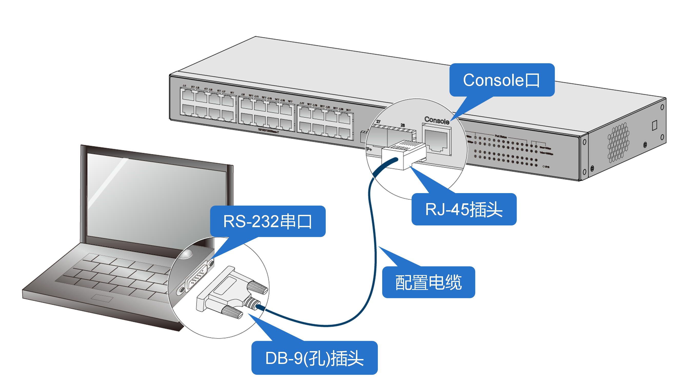

 

### 配置准备

* 终端软件：PuTTY、VTP 等软件。
* 配置电缆：不同产品支持的配置电缆类型存在差异。

> 注意：
>
> 不同厂商提供的串行 Console 口电缆 RJ-45 连接器引脚定义可能存在差异，为避免配置终端显示异常，推荐选配 H3C 提供的串行 Console 口电缆；如果需要自备串行 Console 口电缆，请确保所选电缆 RJ-45 连接器引脚定义一致。

配置电缆类型：

| 配置连接方式                      | 配置电缆类型               | 配置终端侧连接器类型 | 交换机侧连接器类型 |
| --------------------------------- | -------------------------- | -------------------- | ------------------ |
| 通过串行 Console 口电缆连接       | DB9-to-RJ45 Console 口电缆 | DB-9 孔式插头        | RJ-45              |
| USB-to-RJ45 Console 口电缆        | USB 口                     | RJ-45                |                    |
| 通过 Mini USB Console 口电缆连接  | Mini USB Console 口电缆    | USB 口               | USB mini-Type B    |
| 通过 Micro USB Console 口电缆连接 | Micro USB Console 口电缆   | USB 口               | USB micro-Type B   |

配置电缆图示：

| 配置电缆类型               | 图示                                                         | H3C 编码 |
| -------------------------- | ------------------------------------------------------------ | -------- |
| DB9-to-RJ45 Console 口电缆 |  | 04042967 |
| USB-to-RJ45 Console 口电缆 | 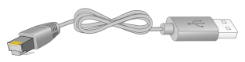 | 0404A1EE |
| Mini USB Console 口电缆    | 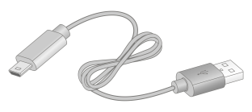 | -        |
| Micro USB Console 口电缆   | 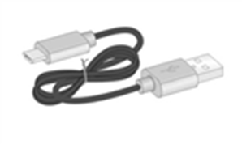 | -        |

DB9-to-RJ45 Console 口电缆连接关系

| RJ-45 | Signal | DB-9 | Signal |
| ----- | ------ | ---- | ------ |
| 1     | RTS    | 8    | CTS    |
| 2     | DTR    | 6    | DSR    |
| 3     | TXD    | 2    | RXD    |
| 4     | SG     | 5    | SG     |
| 5     | SG     | 5    | SG     |
| 6     | RXD    | 3    | TXD    |
| 7     | DSR    | 4    | DTR    |
| 8     | CTS    | 7    | RTS    |

### 配置步骤

(1)  使用配置电缆连接 PC 机与设备后，右击【计算机】选择【属性】--【设备管理器】--【端口】，查看确认电脑上使用的通信端口。

> 注意：
>
> 若使用 USB-to-RJ45 Console 口电缆、Mini USB Console 口电缆或 Micro USB Console 口电缆连接 PC 机与设备，PC 机需安装相应驱动后才会识别到端口。

 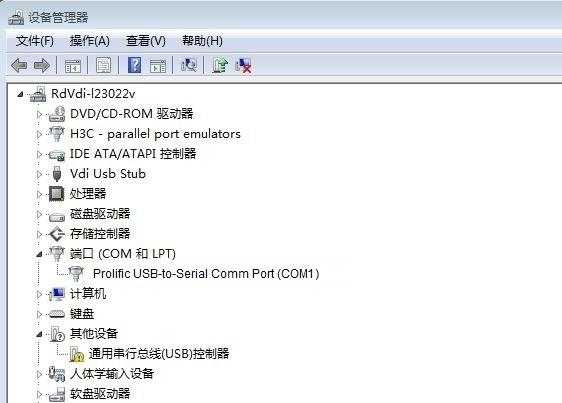

(2)   打开 PC 机上的终端软件，以 VTP软件为例。新建串口控制台。

 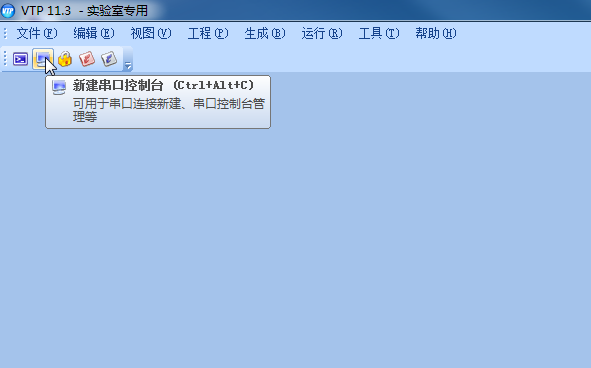

(3)   输入设备名称 Switch，端口选择 COM1，配置如下终端控制参数后点击确定。

* 波特率：9600
* 数据位：8
* 停止位：1
* 奇偶校验：无
* 流量控制：无

 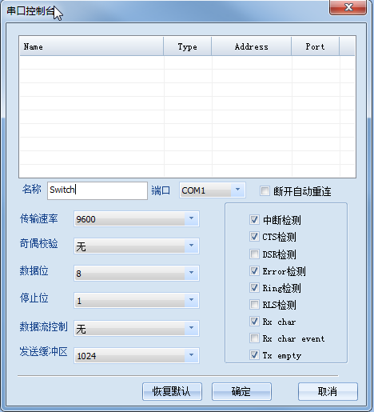

(4)   进入命令行页面，表示 PC 机使用 Console 线连接设备成功。

 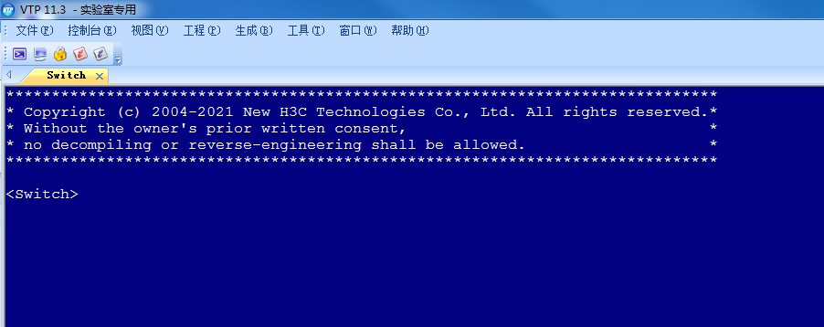

## 通过Telnet登录设备

## 2.2 组网需求

如[图6](https://www.h3c.com/cn/d_202303/1816236_30005_0.htm#_Ref82159936)所示，将Host  A的网口通过网线与Device设备的GigabitEthernet1/0/1接口连接。通过在Device设备上进行配置，实现用户通过Telnet登录Device设备，具体要求采用scheme本地认证方式登录，需要输入用户名abc和密码hello12345，建议将本地用户的用户角色配置为network-admin。

 

 

## 2.3 配置准备

·   先配置设备IP地址并获取Telnet服务器的IP地址。如果设备与Telnet服务器相连的端口不在同一子网内，请保证两台设备间路由可达。

·   Windows系统的命令提示符窗口，可以充当Telnet客户端。Win7以上系统默认未开启Telnet客户端功能，手动开启方法如[图7](https://www.h3c.com/cn/d_202303/1816236_30005_0.htm#_Ref81318704)所示：控制面板—程序和功能—打开或关闭Windows功能—勾选Telnet客户端即可。

 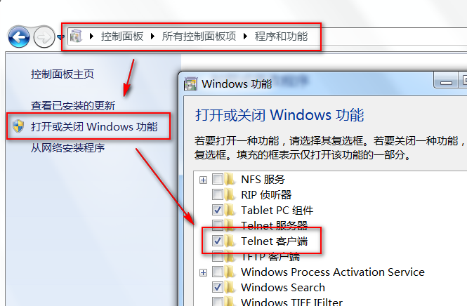

## 2.4 配置步骤

\# 通过Console口登录设备，进入系统视图，并开启Telnet服务。

<Sysname> system-view

[Sysname] telnet server enable

\# 设置通过VTY用户线登录设备使用AAA的认证方式。

[Sysname] line vty 0 63

[Sysname-line-vty0-63] authentication-mode scheme

[Sysname-line-vty0-63] quit

\# 创建本地用户abc，配置密码为hello12345，授权其用户角色为network-admin。

[Sysname] local-user abc

[Sysname-luser-manage-abc] password simple hello12345

[Sysname-luser-manage-abc] service-type telnet

[Sysname-luser-manage-abc] authorization-attribute user-role network-admin

[Sysname-luser-manage-abc] quit

## 2.5 验证配置

\# 按下Win+R组合键，打开“运行”对话框，输入“cmd”即可打开命令提示符界面，输入命令Telnet 设备管理IP，回车即可打开登录界面，。

C:\Users\Administrator> telnet 192.168.3.1

\# 先输入账号回车，再输入密码回车（注意：密码无回显），即可进入系统命令行。

Login: abc

Password:

******************************************************************************

\* Copyright (c) 2004-2019 New H3C Technologies Co., Ltd. All rights reserved.*

\* Without the owner's prior written consent,                 *

\* no decompiling or reverse-engineering shall be allowed.          *

******************************************************************************

 

<Sysname>

## 2.6 配置文件

\#

 telnet server enable

\#

line vty 0 63

 authentication-mode scheme

\#

local-user abc

 password hash $h$6$I2Sg4Llj1qVUWQZ3$JA6KkU3zfVVRg48MM92X6cVpdiqR2JF887PKi3GQMwn

XXXcsWBuz7GIeJZeeNFMmMBaV7DPkKblnb0sGT2axvg==

 service-type telnet

 authorization-attribute user-role network-admin

\#

 

# 3 通过Console口本地认证方式登录设备

## 3.2 配置准备

参考[1 ](https://www.h3c.com/cn/d_202303/1816236_30005_0.htm#_Ref82102525)[通过Console口登录设备](https://www.h3c.com/cn/d_202303/1816236_30005_0.htm#_Ref82102511)章节进入设备命令行页面。

## 3.3 配置步骤

本地认证分为password认证和scheme认证方式两种。

#### 1. password认证方式

\# 进入系统视图。

<Sysname> system-view

\# 配置AUX用户线（管理Console口）认证模式为password模式（密码认证）

[Sysname] line aux 0

[Sysname-line-aux0] authentication-mode password

\# 设置密码为simple明文方式，值为hello12345。

[Sysname-line-aux0] set authentication password simple hello12345

\# 配置用户角色为network-admin，可操作系统所有功能和资源。

[Sysname-line-aux0] user-role network-admin

\# 退回系统视图。

[Sysname-line-aux0] quit

\# 保存配置，防止配置丢失。

[Sysname] save

#### 2. scheme认证方式

\# 进入系统视图。

<Sysname> system-view

\# 配置AUX用户线（管理Console口）认证模式为scheme模式（用户名密码认证）。

[Sysname] line aux 0

[Sysname-line-aux0] authentication-mode scheme

\# 退回系统视图。

[Sysname-line-aux0] quit

\# 创建本地用户Client，设置密码为simple明文方式，值为hello12345，用户角色为network-admin，可操作系统所有功能和资源。

[Sysname] local-user Client

[Sysname-luser-manage-Client] password simple hello12345

[Sysname-luser-manage-Client] authorization-attribute user-role network-admin

\# 配置服务类型为terminal，即Console口登陆类型。

[Sysname-luser-manage-Client] service-type terminal

\# 退回系统视图。

[Sysname-luser-manage-Client] quit

\# 保存配置，防止配置丢失。

[Sysname] save

## 3.4 验证配置

配置完成后再次通过Console口登录设备时：

·   password认证方式出现如下提示，在password处输入配置的密码hello12345后即可进入系统命令行（输入的密码不会打印显示）。

Line aux0 is available.

 

Press ENTER to get started.

Password:

******************************************************************************

\* Copyright (c) 2004-2021 New H3C Technologies Co., Ltd. All rights reserved.*

\* Without the owner's prior written consent,                 *

\* no decompiling or reverse-engineering shall be allowed.          *

******************************************************************************

 

<Sysname>

 

·   scheme认证方式出现如下提示，在Login处输入配置的用户Client，在password处输入配置的密码hello12345后即可进入系统命令行（输入的密码不会打印显示）。

Line aux0 is available.

 

Press ENTER to get started.

Login: Client

Password:

******************************************************************************

\* Copyright (c) 2004-2021 New H3C Technologies Co., Ltd. All rights reserved.*

\* Without the owner's prior written consent,                 *

\* no decompiling or reverse-engineering shall be allowed.          *

******************************************************************************

 

<Sysname>

 

## 3.5 配置文件

·   password认证方式

\#

line aux 0

 authentication-mode password

 user-role network-admin

 set authentication password hash $h$6$fHkW5VqkiATx1+QX$1c5xycW0hx3f9TJi2vMzCwUS

tFKCPNvM+M8KyCWPc1f1Q4nhm1SUDGp59LGlSHn+tsjjxpxEfA+00Y6yr00Ojg==

\#

·   scheme认证方式

\#

line aux 0

 authentication-mode scheme

\#

local-user Client class manage

 password hash $h$6$nz1haYkZ7nMNDuD8$61zQWor52DYHpv2KFyCdVHX/d4W9VNRPfyEEU2zyuoB

oOZ5lIS8bLYqUFSjVlBncRIA25FIiz4Js13akTZ3SXw==

 service-type terminal

 authorization-attribute user-role network-admin

\#

 

# 4 通过云简网络远程登录设备

## 4.2 组网需求

如[图8](https://www.h3c.com/cn/d_202303/1816236_30005_0.htm#_Ref79001870)所示，交换机Switch安装在公司内部网络。现要求将Switch接入云简网络，使管理员可以通过云简网络远程登录该设备。

图8 通过云简网络远程登录设备配置组网图

 

 

## 4.3 配置注意事项

本特性的支持情况与设备型号有关，具体支持情况可以在微信公众号“新华三云简网络 > 服务 > 版本说明”中的“云简网络版本说明.pdf”查看。

执行本配置前，请先将Switch配置为Telnet服务器，以便用户能够通过Telnet登录到设备进行远程管理和监控。关于如何配置通过Telnet登录设备的详细介绍，请参见产品配套“基础配置指导”中的“登录设备”。

## 4.4 配置步骤

#### 1. 配置Switch

\# 创建VLAN，在VLAN中加入对应的端口，并配置各VLAN接口的IP地址。

<Switch> system-view

[Switch] vlan 100

[Switch-vlan100] port gigabitethernet 1/0/1

[Switch-vlan100] quit

[Switch] interface vlan-interface 100

[Switch-Vlan-interface100] ip address 192.168.1.2 24

[Switch-Vlan-interface100] quit

\# 配置静态路由。

[Switch] ip route-static 0.0.0.0 0 192.168.1.1

\# 配置域名服务器的IPv4地址。

[Switch] dns server 114.114.114.114

\# 配置云简网络域名。

[Switch] cloud-management server domain oasis.h3c.com 

\# 保存配置。

[SwitchA] save force

#### 2. 配置Router

\# 配置接口的IP地址。

<Router> system-view

[Router] interface gigabitethernet 1/0/1

[Router-GigabitEthernet1/0/1] ip address 192.168.1.1 24

[Router-GigabitEthernet1/0/1] quit

\# 保存配置。

[Router] save force

#### 3. 云简网络配置

在云简网络（https://oasis.h3c.com），在云简平台上需要添加手动设备，具体操作步骤请查看官网路径“首页 > 支持 > 文档与软件 > 文档中心 > 云简网络 > 云简网络 > H3C云简网络”。

也可以直接点击链接查看手册：

https://www.h3c.com/cn/Service/Document_Software/Document_Center/Oasis/Catalog/Oasis_Platform/Oasis_Platform/

图9 将Switch添加到云简网络

 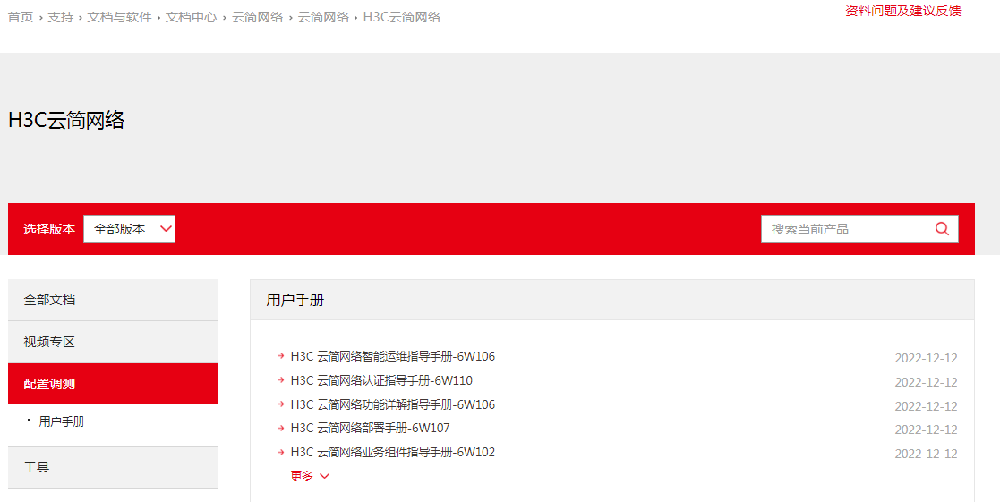

 

## 4.5 验证配置

\# 查看Switch与云简网络的连接状态，当Cloud connection state为Established状态时，表示连接已建立。

[Switch] display cloud-management state

Cloud connection state  : Established

Device state       : Request_success

Cloud server address   : 101.36.161.141

Cloud server domain name : oasis.h3c.com

Cloud server port    : 443

Connected at       : Tue Apr 20 15:43:17 2021

Duration         : 00d 00h 02m 32s

Process state      : Message received

Failure reason      : N/A

\# 在云简网络通过Telnet管理设备。

在云简网络管理页面顶部导航栏中选择“网络管理”，左侧导航栏中选择“维护 > 命令助手”，打开telnet模式，即可通过云简网络远程登录设备命令行界面。

图10 在云简网络通过Telnet管理设备

 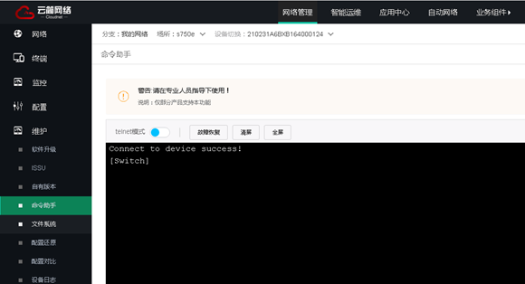

 4.6 配置文件

·   Switch ：

\#

 dns server 114.114.114.114

\#

vlan 100

\#

interface Vlan-interface100

 ip address 192.168.1.2 255.255.255.0

\#

interface GigabitEthernet1/0/1

 port link-mode bridge

 port access vlan 100

\#

 ip route-static 0.0.0.0 0 192.168.1.1

\#

 cloud-management server domain oasis.h3c.com

\#

·   Router ：

\#

interface GigabitEthernet1/0/1

 port link-mode route

 ip address 192.168.1.1 255.255.255.0

\#

 

# 5 忘记Console口密码处理方法

## 5.1 简介

本案例介绍忘记Console口密码的处理方法。

方法一适用于仅忘记Console口密码，仍可通过Telnet/SSH方式登录设备时。

方法二与方法三适用于忘记所有密码，无法登录设备且需要保留设备配置文件时。

方法四适用于忘记所有密码，无法登录设备且无需保留设备配置文件时。

## 5.2 组网需求

无

## 5.3 配置步骤

建议优先使用方法一恢复console口密码，如果忘记所有登录设备的密码，再使用其他方法。

 

#### 1. 方法一：通过Telnet/SSH登录设备后修改Console口密码

通过Telnet/SSH方式登录设备后，参考[3.3 1. ](https://www.h3c.com/cn/d_202303/1816236_30005_0.htm#_Ref81405563)[password认证方式](https://www.h3c.com/cn/d_202303/1816236_30005_0.htm#_Ref81405563) [3.3 2. ](https://www.h3c.com/cn/d_202303/1816236_30005_0.htm#_Ref81405585)[scheme认证方式](https://www.h3c.com/cn/d_202303/1816236_30005_0.htm#_Ref81405585)重新配置Console口密码。

#### 2. 方法二：通过bootware菜单选择跳过配置文件启动后手工修改console口密码

不同产品的bootware页面可能有所不同，此处以S5130系列以太网交换机为例。

 

(1)   通过console口连接设备后将设备重新启动。

(2)   设备重启时按下Ctrl+B进入bootware菜单，选择跳过当前配置启动，如[图11](https://www.h3c.com/cn/d_202303/1816236_30005_0.htm#_Ref63699703)所示。

图11 进入bootware菜单并跳过当前配置启动

 (3)   选择Reboot重启设备，如[图12](https://www.h3c.com/cn/d_202303/1816236_30005_0.htm#_Ref63699718)所示。

(4)   设备重启时按下Ctrl+C或Ctrl+D跳过自动配置，如[图13](https://www.h3c.com/cn/d_202303/1816236_30005_0.htm#_Ref63699727)所示。

(5)   按下Enter键成功跳过配置文件启动，进入命令行页面。

(6)   查看配置文件内容。

<Sysname> more startup.cfg

(7)   将显示配置文件全部选中后复制粘贴到本地txt文件中，如[图14](https://www.h3c.com/cn/d_202303/1816236_30005_0.htm#_Ref63699742)与[图15](https://www.h3c.com/cn/d_202303/1816236_30005_0.htm#_Ref63699756)所示。

图14 导出配置文件（一）

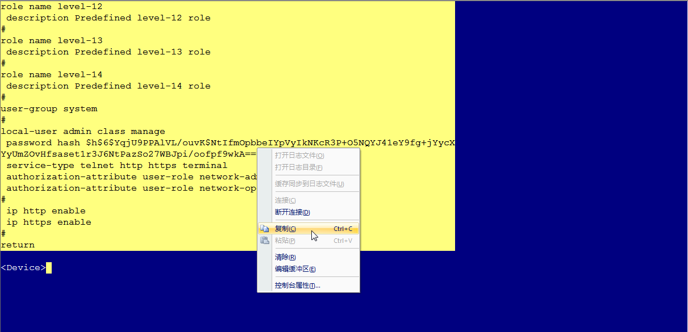

图15 导出配置文件（二）

 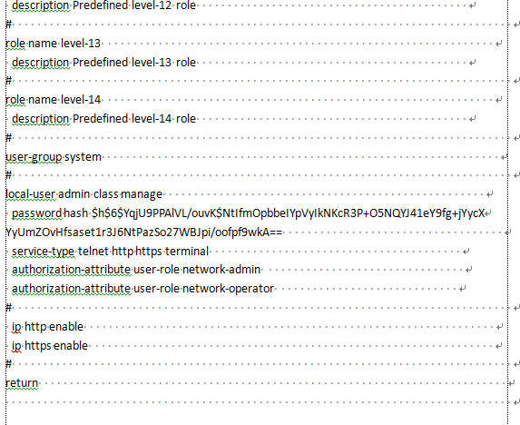

(8)   修改配置文件，删除密码或配置新密码。本文以配置新密码hello12345为例，如[图16](https://www.h3c.com/cn/d_202303/1816236_30005_0.htm#_Ref63699773)所示。

password认证方式密码配置在AUX口配置下，scheme方式密码配置在local-user配置下，本文以修改scheme方式密码为例。

 

图16 配置新密码

 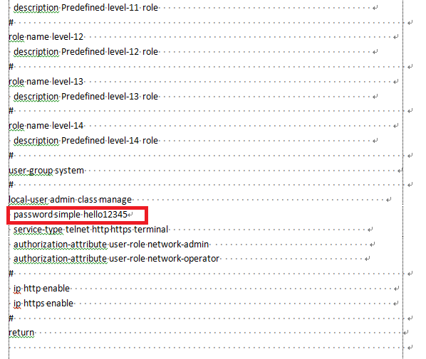

 

(9)   回到设备命令行页面，进入系统视图。

<Sysname> system-view

(10)   将修改后的配置文件复制粘贴到设备，如[图17](https://www.h3c.com/cn/d_202303/1816236_30005_0.htm#_Ref63597661)所示。

图17 导入配置文件

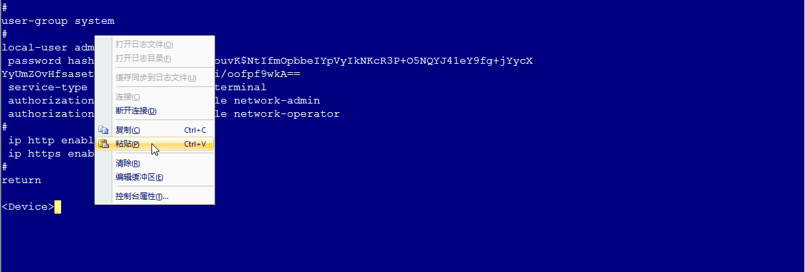

 

(11)   保存配置。

[Sysname] save

(12)   回到用户视图重启设备。

[Sysname] quit

<Sysname> reboot

#### 3. 方法三：通过bootware菜单选择跳过配置文件启动后配置回滚

(1)   通过方法二跳过配置文件启动后不查看配置文件，直接进入系统视图。

<Sysname> system-view

(2)   将当前配置回滚至默认配置文件startup.cfg中的配置状态并输入N不保存当前空配置。

[Sysname] configuration replace file startup.cfg

Current configuration will be lost, save current configuration? [Y/N]:N

Now replacing the current configuration. Please wait...

Succeeded in replacing current configuration with the file startup.cfg.

(3)   参见[3.3 1. ](https://www.h3c.com/cn/d_202303/1816236_30005_0.htm#_Ref81405563)[password认证方式](https://www.h3c.com/cn/d_202303/1816236_30005_0.htm#_Ref81405563)或[3.3 2. ](https://www.h3c.com/cn/d_202303/1816236_30005_0.htm#_Ref81405585)[scheme认证方式](https://www.h3c.com/cn/d_202303/1816236_30005_0.htm#_Ref81405585)重新配置Console口密码。

#### 4. 方法四：通过bootware菜单选择跳过配置文件启动后保留当前空配置

此方法会清空设备所有配置，请确保当前业务不会受到影响时再进行。

 

(1)   通过方法二跳过配置文件启动后直接进入系统视图，并保存当前空配置。

<Sysname> system-view

[Sysname] save

(2)   参见[3.3 1. ](https://www.h3c.com/cn/d_202303/1816236_30005_0.htm#_Ref81405563)[password认证方式](https://www.h3c.com/cn/d_202303/1816236_30005_0.htm#_Ref81405563)或[3.3 2. ](https://www.h3c.com/cn/d_202303/1816236_30005_0.htm#_Ref81405585)[scheme认证方式](https://www.h3c.com/cn/d_202303/1816236_30005_0.htm#_Ref81405585)重新配置Console口密码。

 

# 6 忘记Telnet/Web登录密码处理方法

## 配置步骤

#### 1. 忘记Telnet登录密码处理方法

通过Console口登录设备后，请参见[2 ](https://www.h3c.com/cn/d_202303/1816236_30005_0.htm#_Ref82157818)[通过Telnet登录设备](https://www.h3c.com/cn/d_202303/1816236_30005_0.htm#_Ref82157821)重新配置Telnet登录密码。

#### 2. 忘记Web登录密码处理方法

通过Console口登录设备后，重新配置Web登录密码。

\#进入系统视图。

<Sysname> system-view

\# 进入所需Web用户视图（此处以client为例），配置认证密码为hello12345。

[Sysname] local-user client

[Sysname-luser-manage-client] password simple hello12345

[Sysname-luser-manage-client] quit

\#保存配置，防止配置丢失。

[Sysname] save

## 6.4 配置文件

·   Telnet方式

请参见[2 ](https://www.h3c.com/cn/d_202303/1816236_30005_0.htm#_Ref82161983)[通过Telnet登录设备](https://www.h3c.com/cn/d_202303/1816236_30005_0.htm#_Ref82161972)

·   Web方式

\#

ip http enable

\#

ip https enable

\#

local-user client

 password hash $h$6$I2Sg4Llj1qVUWQZ3$JA6KkU3zfVVRg48MM92X6cVpdiqR2JF887PKi3GQMwn

XXXcsWBuz7GIeJZeeNFMmMBaV7DPkKblnb0sGT2axvg==

 service-type http https

 authorization-attribute user-role network-admin

\#