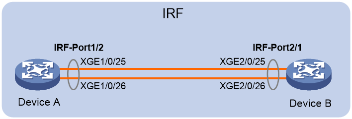

# IRF

[TOC]

## 配置两台成员设备的 IRF

### 组网需求

Device A 为公司的核心设备，但由于公司网络规模日益增大，Device A 单台设备的转发能力已无法达到公司网络的需求。为了拓展核心设备的转发能力，又尽量不改变现有网络。现公司希望增加 Device B，与 Device A 组成 IRF，来满足当前网络的需求。

 

### 配置思路

配置思路如下：

(1)   配置成员编号

不同成员设备需要配置不同的成员编号。修改成员编号的配置需要重启设备后生效。

(2)   配置成员优先级

在主设备选举过程中，优先级数值大的成员设备将优先被选举成为主设备。

(3)   配置 IRF 物理端口

(4)   保存配置

(5)   连接 IRF 物理链路

(6)   激活 IRF 端口配置

### 数据规划

| 设备     | 成员编号  | 成员优先级 | IRF端口及其绑定的物理端口                                    |
| -------- | --------- | ---------- | ------------------------------------------------------------ |
| Device A | 1（缺省） | 32         | IRF端口：irf-port 1/2  IRF物理接口：Ten-GigabitEthernet 1/0/25  Ten-GigabitEthernet 1/0/26 |
| Device B | 2         | 1（缺省）  | IRF端口：irf-port 2/1  IRF物理接口：Ten-GigabitEthernet 2/0/25  Ten-GigabitEthernet 2/0/26 |

### 注意事项

与 IRF-Port1 口绑定的 IRF 物理端口只能和邻居成员设备 IRF-Port2 口上绑定的 IRF 物理端口相连，本设备上与 IRF-Port2 口绑定的 IRF 物理端口只能和邻居成员设备 IRF-Port1 口上绑定的 IRF 物理端口相连。否则，不能形成 IRF 。

### 配置步骤

#### Device A

(1)   Device A 保留缺省编号为 1，不需要进行配置

(2)   创建 IRF 端口 2，并将它与物理端口 Ten-GigabitEthernet 1/0/25 和 Ten-GigabitEthernet 1/0/26 绑定

```
<DeviceA> system-view
[DeviceA] interface ten-gigabitethernet 1/0/25
[DeviceA-Ten-GigabitEthernet1/0/25] shutdown
[DeviceA-Ten-GigabitEthernet1/0/25] quit

[DeviceA] interface ten-gigabitethernet 1/0/26
[DeviceA-Ten-GigabitEthernet1/0/26] shutdown
[DeviceA-Ten-GigabitEthernet1/0/26] quit

[DeviceA] irf-port 1/2
[DeviceA-irf-port1/2] port group interface ten-gigabitethernet1/0/25
[DeviceA-irf-port1/2] port group interface ten-gigabitethernet1/0/26
[DeviceA-irf-port1/2] quit

[DeviceA] interface ten-gigabitethernet 1/0/25
[DeviceA-Ten-GigabitEthernet1/0/25] undo shutdown
[DeviceA-Ten-GigabitEthernet1/0/25] quit

[DeviceA] interface ten-gigabitethernet 1/0/26
[DeviceA-Ten-GigabitEthernet1/0/26] undo shutdown
[DeviceA-Ten-GigabitEthernet1/0/26] quit
```

(3)   配置 Device A 的成员优先级为 32，以保证其成为 IRF 中的主设备。

```
[DeviceA] irf member 1 priority 32
```

(4)   保存配置

```
[DeviceA] save force
```

#### Device B

(1)   设置 Device B 的成员编号为 2，并重启设备使配置生效。

```
<DeviceB> system-view
[DeviceB] irf member 1 renumber 2
Warning: Renumbering the switch number may result in configuration change or loss. Continue? [Y/N]:y
[DeviceB] quit

<DeviceB> reboot
```

(2)   创建设备的 IRF 端口 1，并将它与物理端口 Ten-GigabitEthernet 2/0/25 和 Ten-GigabitEthernet 2/0/26 绑定

```
[DeviceB] interface ten-gigabitethernet 2/0/25
[DeviceB-Ten-GigabitEthernet2/0/25] shutdown
[DeviceB-Ten-GigabitEthernet2/0/25] quit

[DeviceB] interface ten-gigabitethernet 2/0/26
[DeviceB-Ten-GigabitEthernet2/0/26] shutdown
[DeviceB-Ten-GigabitEthernet2/0/26] quit

[DeviceB] irf-port 2/1
[DeviceB-irf-port2/1] port group interface ten-gigabitethernet2/0/25
[DeviceB-irf-port2/1] port group interface ten-gigabitethernet2/0/26
[DeviceB-irf-port2/1] quit

[DeviceB] interface ten-gigabitethernet 2/0/25
[DeviceB-Ten-GigabitEthernet2/0/25] undo shutdown
[DeviceB-Ten-GigabitEthernet2/0/25] quit

[DeviceB] interface ten-gigabitethernet 2/0/26
[DeviceB-Ten-GigabitEthernet2/0/26] undo shutdown
[DeviceB-Ten-GigabitEthernet2/0/26] quit
```

(3)   保存配置

```
[DeviceB] save force
```

(4)   连接 Device A 和 Device B 之间的 IRF 端口

#### 激活配置

激活 DeviceA 的 IRF 端口配置。

```
[DeviceA] irf-port-configuration active
```

激活 DeviceB 的 IRF 端口配置。

```
[DeviceB] irf-port-configuration active
```

两台设备间将会进行 Master 竞选，竞选失败的一方将自动重启，重启完成后，IRF 形成，系统名称统一为 DeviceA 。

### 验证配置

验证 IRF 建立成功：

```
<DeviceA> display irf

MemberID Slot Role  Priority CPU-Mac     Description
 *+1   0   Master 32    0210-fc01-0000 ---
  2   0   Standby 1     0210-fc02-0000 ---
\--------------------------------------------------
 \* indicates the device is the master.
 \+ indicates the device through which the user logs in.
 

 The Bridge MAC of the IRF is: 3822-d60f-2800
 Auto upgrade       : yes
 Mac persistent     : always
 Domain ID          : 0
 Auto merge         : yes
```

从命令行的显示看，当前两台设备 IRF 成功建立。

### 配置文件

Device A：

```
#

irf-port 1/2

 port group interface ten-gigabitethernet1/0/25
 port group interface ten-gigabitethernet1/0/26

#

 irf-port-configuration active

#
```

Device B：

```
#

irf member 1 renumber 2

irf-port 2/1

 port group interface ten-gigabitethernet2/0/25
 port group interface ten-gigabitethernet2/0/26

#

 irf-port-configuration active

#
```

## 通过 BFD MAD 检测 IRF

### 组网需求

设备 Device A 和 Device B 配置 IRF，为了防止万一 IRF 链路故障导致 IRF 分裂、网络中存在两个配置冲突的 IRF，需要启用 MAD 检测功能，采用 BFD  MAD 检测方式来监测 IRF 的状态，IRF 分裂后，通过分裂检测机制 IRF 会检测到网络中存在其它处于 Active 状态，冲突处理会让 Master 成员编号最小的 IRF 继续正常工作，其它 IRF 会迁移到 Recovery 状态（表示 IRF 处于禁用状态），并关闭 Recovery 状态 IRF 中所有成员设备上除保留端口以外的其它所有物理端口。

 

### 注意事项

* BFD MAD 和 STP 功能互斥，用于 BFD MAD 检测的端口不能使能 STP 功能。
* 使能 BFD MAD 检测功能的三层接口只能专用于 BFD MAD 检测，不允许运行其它业务。如果配置了其它业务，可能会影响该业务以及 BFD MAD 检测功能的运行。

### 配置步骤

#### 配置交换机 Device A 和 Device B 建立 IRF

#### 配置 BFD MAD

IRF 上的配置：

1. 创建VLAN 3，并将 Device A 上的端口 GigabitEthernet1/0/1 和 Device B 上的端口 GigabitEthernet2/0/1 加入 VLAN3 中。

   ```
   <IRF> system-view
   
   [IRF] vlan 3
   [IRF-vlan3] port gigabitethernet 1/0/1 gigabitethernet 2/0/1
   [IRF-vlan3] quit
   ```

2. 创建 VLAN 接口 3，并配置 MAD IP 地址。

   ```
   [IRF] interface vlan-interface 3
   [IRF-Vlan-interface3] mad bfd enable
   [IRF-Vlan-interface3] mad ip address 192.168.2.1 24 member 1
   [IRF-Vlan-interface3] mad ip address 192.168.2.2 24 member 2
   [IRF-Vlan-interface3] quit
   ```

3. 因为 BFD MAD 和生成树功能互斥，所以在 GigabitEthernet1/0/1 和 GigabitEthernet2/0/1 上关闭生成树协议。

   ```
   [IRF] interface gigabitethernet 1/0/1
   [IRF-gigabitethernet1/0/1] undo stp enable
   [IRF-gigabitethernet1/0/1] quit
   
   [IRF] interface gigabitethernet 2/0/1
   [IRF-gigabitethernet2/0/1] undo stp enable
   ```

### 验证配置

当 IRF 分裂时，在 Device A 上执行 `display mad verbose` 命令，可以看到一台设备 Multi-active recovery state 为 No，Device A 正常工作。

```
<DeviceA> display mad
MAD ARP disabled.
MAD ND disabled.
MAD LACP disabled.
MAD BFD enabled.

<DeviceA> display mad verbose 

Multi-active recovery state: No
Excluded ports (user-configured):
Excluded ports (system-configured):

Ten-GigabitEthernet1/1/1
MAD ARP disabled.
MAD ND disabled.
MAD LACP disabled.

MAD BFD enabled interface: Vlan-interface3
 MAD status         : Faulty
 Member ID  MAD IP address    Neighbor  MAD status
 1      192.168.2.1/24    2      Faulty
```

当 Device B 为 Recovery 状态时，使用 `display interface brief down` 查看 Device B 端口时发现端口全部被关闭，状态为 mad shutdown 。

```
<DeviceB> display interface brief down 

Brief information on interfaces in route mode:
Link: ADM - administratively down; Stby - standby

Interface Link Cause 
GE2/0/2 DOWN MAD ShutDown 
GE2/0/3 DOWN MAD ShutDown 
```

### 配置文件

```
#

vlan 3
 port gigabitethernet 1/0/1 gigabitethernet 2/0/1

#

interface vlan-interface 3
 mad bfd enable
 mad ip address 192.168.2.1 24 member 1
 mad ip address 192.168.2.2 24 member 2

#

interface gigabitethernet 1/0/1
 undo stp enable

#

interface gigabitethernet 2/0/1
 undo stp enable

#
```

