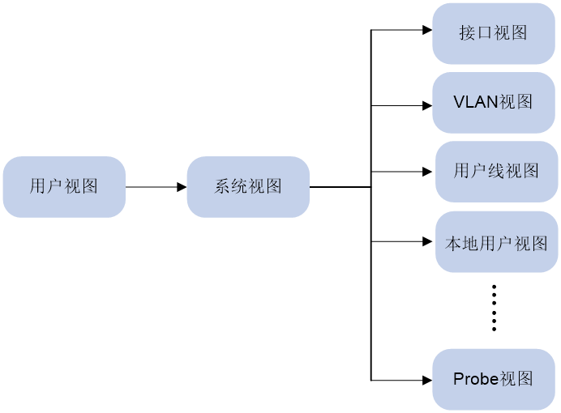

# 命令视图

设备提供了丰富的功能，不同的功能对应不同的配置和查询命令。为便于用户使用这些命令，设备按功能对命令进行分类组织。功能分类与命令视图对应，当要配置某功能的某条命令时，需要先进入这条命令所在的视图。每个视图都有唯一的、含义清晰的提示符，例如提示符 `[Sysname-vlan100]` 表示当前的命令视图是VLAN 视图，VLAN 的编号是 100 ，在该视图下可对 VLAN 100 的属性进行配置。

命令视图采用分层结构。第一层为用户视图，第二层为系统视图，第三层为各个功能视图。

 

* 登录设备后，直接进入用户视图。可执行的操作主要包括查看操作、调试操作、文件管理操作、设置系统时间、重启设备、FTP 和 Telnet 操作等。
* 从用户视图可以进入系统视图。系统视图下能对设备运行参数以及部分功能进行配置，例如配置夏令时、配置欢迎信息、配置快捷键等。
* 在系统视图下输入特定命令，可以进入相应的功能视图，完成相应功能的配置。例如：进入接口视图配置接口参数、进入 VLAN 视图给 VLAN 添加端口、进入用户线视图配置登录用户的属性、创建本地用户并进入本地用户视图配置本地用户的属性等。功能视图下可能还包含子视图，例如 NQA 测试组视图下还包含测试类型视图。

想要了解某命令视图下支持哪些命令，请在该命令视图提示符后输入 `?` 。

## 进入视图

不同视图的进入方式为：

* 用户登录设备后，直接进入用户视图。
* 从用户视图执行 `system-view` 命令，可以进入系统视图。
* 在系统视图下输入特定命令，可以进入相应的功能视图。功能视图下可能还包含子视图。

## 退出视图

除用户视图、Tcl 配置视图、Python shell 、公共密钥编辑视图和公共密钥视图外，其他视图的退出方式为：

* 在当前视图执行 `quit` 命令可返回上一级视图。
* 执行 `return` 命令返回用户视图。
* 按快捷键 <Ctrl+Z> 可返回用户视图，功能等同于 `return` 命令。

用户视图下执行 `quit` 命令后，会断开与设备的连接；用户视图下不能使用 `return` 命令。

Tcl 配置视图、Python shell、公共密钥编辑视图和公共密钥视图的退出方式分别为：

* Tcl 配置视图下请使用 `tclquit` 返回用户视图。
* 在 Python shell 下请通过执行 `exit()` 命令，从 Python shell 退回到用户视图。
* 公共密钥编辑视图下请使用 `public-key-code end` 返回上一级视图（公共密钥视图）；公共密钥视图下请使用 `peer-public-key end` 命令返回系统视图。

## 用户视图

用户登录设备后，即进入用户视图，在用户视图下可执行的操作主要包括查看操作、调试操作、文件管理操作、设置系统时间、重启设备、FTP 和 Telnet 操作等。

用户视图的提示符为 <系统名称>，例如，`<Sysname>` 。用户可以自行配置系统名称。

## 系统视图

在用户视图下键入 `system-view` 命令，即进入系统视图。如下所示：

```bash
<Sysname> system-view
System View: return to User View with Ctrl+Z.
[Sysname]
```

在系统视图下，能对设备运行参数以及部分功能进行配置，例如配置夏令时、配置欢迎信息、配置快捷键等。

## 功能视图

在系统视图下，可以分别进入各功能视图。

例如进入以太网接口视图：

```bash
<Sysname> system-view
[Sysname] interface GigabitEthernet 1/0/1
[Sysname-GigabitEthernet1/0/1]
```

例如进入VLAN视图：

```bash
<Sysname> system-view
[Sysname] vlan 2
[Sysname-vlan2]
```

## 使用命令行在线帮助

在命令行输入过程中，可以在命令行的任意位置输入 `?` 以获得详尽的在线帮助。

* 在任意视图下，输入 `?` 即可获取该视图下可以使用的所有命令及其简单描述。例如：

  ```bash
  <Sysname> ?
  User view commands:
  archive       Archive configuration
  arp           Address Resolution Protocol (ARP) module
  backup        Backup the startup configuration file to a TFTP server
  boot-loader   Software image file management   
  ```

* 输入一条命令的关键字，后接以空格分隔的 `?` 。

  如果 `?` 位置为关键字，则列出全部关键字及其简单描述。例如：

  ```
  <Sysname> terminal ?
  debugging Enable to display debugging logs on the current terminal
  logging   Display logs on the current terminal
  monitor   Enable to display logs on the current terminal
  ```

  如果 `?`位置为参数，则列出有关的参数描述。例如：

  ```
  <Sysname> system-view
  [Sysname] interface vlan-interface ?
  	<1-4094> Vlan-interface interface number
  [Sysname] interface vlan-interface 1 ?
  	<cr>
  ```

  其中，`<1-4094>` 表示该参数的取值范围为1～4094；`<cr>` 表示命令行当前位置无参数，直接输入回车即可执行。

* 输入命令的不完整关键字，其后紧接 `?` ，显示以该字符串开头的所有命令关键字及其帮助信息。例如：

  ```bash
  <Sysname> f?
   fdisk    Partition a storage medium
   fixdisk  Check and repair a storage medium
   format   Format a storage medium
   free     Release a connection
   ftp      Open an FTP connection
  
  <Sysname> display ftp?
   ftp        FTP module
   ftp-server FTP server information
   ftp-user   FTP user information
  ```

## 命令的undo形式

命令的 undo 形式一般用来恢复缺省情况、关闭某个功能或者删除某项设置。大部分配置命令都有对应的 undo 形式。例如，`info-center enable` 命令用来开启信息中心，`undo info-center enable` 命令用来关闭信息中心。

## 命令行输入

### 编辑命令行

编辑命令行时，系统支持单个按键和组合键。

通过键盘输入命令行后，按 `Enter` 键执行该命令。

| 按键            | 功能                                                         |
| --------------- | ------------------------------------------------------------ |
| 普通按键        | 若编辑缓冲区未满，则插入到当前光标位置，并向右移动光标（命令行下发前会暂时缓存在编辑缓冲区，缓冲区的大小为 511 个字符，如果编辑缓冲区满，则后续输入的字符无效）。 |
| 退格键Backspace | 删除光标位置的前一个字符，光标前移。                         |
| 左光标键<←>     | 光标向左移动一个字符位置。                                   |
| 右光标键<→>     | 光标向右移动一个字符位置。                                   |
| 上光标键<↑>     | 访问上一条历史命令。                                         |
| 下光标键<↓>     | 访问下一条历史命令。                                         |
| Tab 键          | 输入不完整的关键字后按下 Tab 键，系统自动补全关键字；如果与之匹配的关键字唯一，则系统用此完整的关键字替代原输入并换行显示；如果与之匹配的关键字不唯一，则多次按 Tab 键，系统会循环显示所有以输入字符串开头的关键字；如果没有与之匹配的关键字，系统会不作任何修改，重新换行显示原输入。 |

> Note：
>
> 在命令行末尾进行自动补全时，如果自动补全后整条命令行超过编辑缓冲区的大小，则系统不再进行补全。
>
> 在配置文件中，存在 `#` 和 `version 7.1.xxx, Release xxx` 这样的特殊命令行配置信息。`#` 用于将两段配置信息隔开；`version 7.1.xxx, Release  xxx` 用于记录设备正在运行的软件包的版本信息。这样的命令行不支持在线帮助，但可以在任意视图下执行 `# xxx` 或者在系统视图下执行 `version xxx`（例如执行 `# abc` 或者 `version abc` ），执行后系统不会提示错误信息，也不会修改这些行的值。这样的命令行用户没有必要使用。

### STRING 和 TEXT 类型参数的输入

如果命令行中的参数为STRING类型，则建议输入除“?”、“"”、“\”、空格之外的可见字符（可见字符对应的ASCII码区间为32～126），以免设备将该参数传递给其它网络设备时，对端设备无法解析。如果STRING类型的参数中需要包含字符“"”、“\”，则必须使用转义字符“\”辅助输入，即实际应输入“\"”、“\\”；如需输入空格，则需要将整个字符串包含在双引号中，例如，若要配置字符串参数为“my device”，则实际应输入“"my device"”。

如果命令行中的参数为TEXT类型，则除了“?”外的其他字符均可输入。

各业务模块可能对参数有更多的输入限制，详情请参见命令的提示信息以及命令参考中的参数描述。

### 接口类型的输入

输入接口类型时，设备支持使用接口类型的全称和简称。使用接口类型的全称时，支持不完整的字符输入；使用接口类型简称时，必须输入完整的简称。两种方式输入的接口类型均不区分大小写。例如在输入interface gigabitethernet 1/0/1时，可以使用接口类型全称的不完整字符interface g 1/0/1，也可以使用接口类型简称interface ge 1/0/1。接口类型和接口编号之间无论输入空格与否，都可以成功进入接口视图。关于接口全名与简名的对应关系请参见下表。

表2 接口类型的全称和简称对应表

| 接口类型全称         | 接口类型简称 |
| -------------------- | ------------ |
| Bridge-Aggregation   | BAGG         |
| Ethernet             | Eth          |
| EVI-Link             | EVI          |
| FiftyGigE            | 50GE         |
| FortyGigE            | FGE          |
| FourHundredGigE      | 400GE        |
| GigabitEthernet      | GE           |
| HundredGigE          | HGE          |
| InLoopBack           | InLoop       |
| LoopBack             | Loop         |
| M-Ethernet           | ME           |
| M-GigabitEthernet    | MGE          |
| Multicast Tunnel     | MTunnel      |
| NULL                 | NULL         |
| Pex                  | PEX          |
| RPR-Bridge           | RPR-B        |
| RPR-Router           | RPR-R        |
| Register-Tunnel      | REG          |
| Route-Aggregation    | RAGG         |
| SAN-Aggregation      | SAGG         |
| S-Channel            | S-Ch         |
| Schannel-Aggregation | SCH-AGG      |
| Schannel-Bundle      | SCH-B        |
| Smartrate-Ethernet   | SGE          |
| Ten-GigabitEthernet  | XGE          |
| Tunnel               | Tun          |
| Tunnel-Bundle        | Tunnel-B     |
| TwentyGigE           | TGE          |
| Twenty-FiveGigE      | WGE          |
| Vfc                  | Vfc          |
| Vsi-interface        | Vsi          |
| Vlan-interface       | Vlan-int     |

### 快速输入命令行

设备支持不完整关键字输入，即在当前视图下，当输入的字符足够匹配唯一的关键字时，可以不必输入完整的关键字。该功能提供了一种快捷的输入方式，有助于提高操作效率。

例如用户视图下以s开头的命令有startup saved-configuration、system-view等。

* 如果要输入system-view，可以直接输入sy（不能只输入s，因为只输入s时，匹配到的关键字不唯一）。
* 如果要输入startup saved-configuration，可以直接输入st s。

可以按<Tab>键由系统自动补全关键字的全部字符，以确认系统的选择是否为所需输入的关键字。

### 配置命令字符串的别名

#### 1. 功能简介

通过本命令用户可以为命令行指定一个或多个别名，也可以为命令行开头的一个或多个关键字配置多个别名，使其符合用户的使用习惯。例如：

·   将命令display ip routing-table的别名配置为shiprt后，就可以使用别名命令shiprt来代替执行命令display ip routing-table。

·   将命令关键字display ip的别名配置为ship，就可以用别名命令ship执行所有以display ip开头的命令行，如可以使用ship routing-table代替执行display ip routing-table，使用ship interface代替执行display ip interface。

用户成功执行的带别名的命令将以系统原始的命令形式被显示或存储。

为了方便用户使用，系统定义了部分常用的关键字作为缺省别名，如[表3](https://www.h3c.com/cn/d_202303/1816235_30005_0.htm#_Ref396407562)所示。

表3 系统定义的缺省别名


| 缺省别名    | 命令        |
| ----------- | ----------- |
| access-list | acl         |
| end         | return      |
| erase       | delete      |
| exit        | quit        |
| hostname    | sysname     |
| logging     | info-center |
| no          | undo        |
| show        | display     |
| write       | save        |

 

#### 2. 配置限制和指导

使用本特性，只有当命令行第一个关键字或者undo命令的第二个关键字是别名时，才按照别名命令替换执行，否则按照非别名命令执行。例如：

用户成功执行的带别名的命令将以系统原始的命令形式被显示或存储。

配置别名时，可以使用$n表示命令行中的参数或者关键字，这样既可以用别名替代部分关键字来简化输入，又可以根据实际需要指定不同的参数或者关键字，增加了灵活性。$n最多可以使用9次，n为1～9的整数，表示参数或关键字出现的顺序。如果别名命令中定义了参数，则参数必须输入完整。比如，将命令display ip $1 | include $2的别名配置为shinc后，如果需要执行display ip routing-table | include Static命令来筛选并查看路由表中的所有静态路由信息，可直接执行shinc routing-table Static。

系统定义的缺省别名无法取消。

#### 3. 配置步骤

(1)   进入系统视图。

system-view 

(2)   给指定的命令字符串配置别名。

alias alias command 

系统定义的缺省别名命令，请参见[1. 表3](https://www.h3c.com/cn/d_202303/1816235_30005_0.htm#_Ref396407562)。

(3)   （可选）可在任意视图下执行本命令，显示命令字符串别名功能的相关配置。

display alias [ alias ]

### 修改快捷键的绑定关系

#### 1. 功能简介

为方便用户快捷操作设备，设备支持23个快捷键，用户可以修改除“CTRL_]”外的22个快捷键的绑定关系。用户按下快捷键后，设备会立即执行对应的命令行或者功能。如果这些快捷键和用户登录终端定义的快捷键冲突，或者不符合用户的使用习惯，用户可使用该命令重新定义快捷键，甚至取消快捷键的绑定关系。

#### 2. 配置限制和指导

一个快捷键对应一个命令或功能，如果使用本命令多次定义同一快捷键，则最新配置生效。如果多次使用本命令将多个快捷键和同一命令、功能绑定，则这些绑定的快捷键均生效。

当用户使用终端软件与设备进行交互时，如果终端软件定义快捷键（包括用户可定义和系统保留快捷键），则快捷键会遵从终端软件的定义。

#### 3. 配置步骤

(1)   进入系统视图。

system-view

(2)   修改快捷键的绑定关系。

hotkey hotkey { command | function function | none }

缺省情况下，各快捷键的绑定关系见[(3)表4](https://www.h3c.com/cn/d_202303/1816235_30005_0.htm#_Ref478145601)。

(3)   （可选）可在任意视图下执行本命令，显示系统中快捷键的分配信息。

display hotkey

表4 快捷键的缺省绑定关系

| 快捷键 | 缺省绑定的功能或命令                                         |
| ------ | ------------------------------------------------------------ |
| CTRL_A | move_the_cursor_to_the_beginning_of_the_line，表示将光标移动到当前行的开头 |
| CTRL_B | move_the_cursor_one_character_to_the_left，表示将光标向左移动一个字符 |
| CTRL_C | stop_the_current_command，表示停止当前正在执行的功能         |
| CTRL_D | erase_the_character_at_the_cursor，表示删除当前光标所在位置的字符 |
| CTRL_E | move_the_cursor_to_the_end_of_the_line，表示将光标移动到当前行的末尾 |
| CTRL_F | move_the_cursor_one_character_to_the_right，表示将光标向右移动一个字符 |
| CTRL_G | display current-configuration，表示显示当前配置              |
| CTRL_H | erase_the_character_to_the_left_of_the_cursor，表示删除光标左侧的一个字符 |
| CTRL_L | display ip routing-table，表示显示IPv4路由表信息             |
| CTRL_N | display_the_next_command_in_the_history_buffer，表示显示历史缓冲区中的下一条命令（密码配置命令会跳过） |
| CTRL_O | undo debugging all，表示关闭所有功能项的调试开关             |
| CTRL_P | display_the_previous_command_in_the_history_buffer，表示显示历史缓冲区中的上一条命令（密码配置命令会跳过） |
| CTRL_R | redisplay_the_current_line，表示重新显示当前行信息           |
| CTRL_T | 未绑定任何命令行或功能                                       |
| CTRL_U | 未绑定任何命令行或功能                                       |
| CTRL_W | delete_the_word_to_the_left_of_the_cursor，表示删除光标左侧连续字符串内的所有字符 |
| CTRL_X | delete_all_characters_from_the_beginning_of_the_line_to_the_cursor，表示删除光标左侧所有的字符 |
| CTRL_Y | delete_all_characters_from_the_cursor_to_the_end_of_the_line，表示删除光标所在位置及其右侧所有的字符 |
| CTRL_Z | return_to_the_User_View，表示退回到用户视图                  |
| CTRL_] | kill_incoming_connection_or_redirect_connection，表示终止当前连接 |
| ESC_B  | move_the_cursor_back_one_word，表示将光标移动到左侧连续字符串的首字符处 |
| ESC_D  | delete_all_characters_from_the_cursor_to_the_end_of_the_word，表示删除光标所在位置及其右侧连续字符串内的所有字符 |
| ESC_F  | move_the_cursor_forward_one_word，表示将光标向右移到下一个连续字符串之前 |

 

### 命令行输入回显功能

#### 1. 功能简介

当用户在未完成输入操作却被大量的系统信息打断时，开启此功能可以回显用户已经输入而未提交执行的信息，方便用户继续完成未输入的内容。

#### 2. 配置步骤

(1)   进入系统视图。

system-view

(2)   打开命令行输入回显功能。

info-center synchronous

缺省情况下，命令行输入回显功能处于关闭状态。

本命令的详细介绍请参见“网络管理和监控命令参考”中的“信息中心”。

## 解读输入错误提示信息

命令行输入完毕后，请按<Enter>键执行该命令。设备执行命令的过程中，首先会对命令行进行合法性检查。如果通过合法性检查，则正确执行；否则，输出错误信息，常见的错误信息如[表5](https://www.h3c.com/cn/d_202303/1816235_30005_0.htm#_Ref132083433)所示。

表5 命令行常见错误信息表

| 英文错误信息                                  | 错误原因                                  |
| --------------------------------------------- | ----------------------------------------- |
| % Unrecognized command found at '^' position. | 命令无法解析，符号“^”指示位置出错         |
| % Incomplete command found at '^' position.   | 符号“^”指示位置的参数输入不完整           |
| % Ambiguous command found at '^' position.    | 符号“^”指示位置的关键字不明确，存在二义性 |
| % Too many parameters found at '^' position.  | 符号“^”指示位置的参数输入太多             |
| % Wrong parameter found at '^' position.      | 在符号“^”指示位置的参数错误               |

 

## 使用历史命令

### 2.6.1 功能简介

用户在设备上成功执行的命令，会同时保存到用户独享的历史命令缓冲区和所有用户共享的历史命令缓冲区。

表6 历史命令缓冲区描述表

| 选项     | 独享历史命令缓冲区     | 共享历史命令缓冲区     |
| -------- | ---------------------- | ---------------------- |
| 内容     | 当前用户执行成功的命令 | 所有用户执行成功的命令 |
| 查看     | 支持                   | 支持                   |
| 调用     | 支持                   | 不支持                 |
| 保存     | 不保存                 | 保存                   |
| 调整大小 | 支持                   | 大小固定为1024条       |

 

### 2.6.2 配置限制和指导

设备保存用户执行过的命令时，遵循以下原则：

·   如果用户使用了命令的不完整形式，保存的历史命令也是不完整形式。

·   如果用户使用了命令字符串的别名形式，保存的历史命令是原始命令形式。

·   如果用户连续多次执行同一条命令，设备的历史命令中只保留一次。但如果执行时输入的形式不同，将作为不同的命令对待。例如：连续多次执行display current-configuration命令，设备只保存一条历史命令；如果分别执行display current-configuration命令和它的不完整形式display cu，设备将保存为两条历史命令。

·   如果当前历史命令缓冲区满且有新的命令需要缓存，则自动删除最早的记录，来保存新命令。

### 2.6.3 操作历史命令缓冲区

#### 1. 查看历史命令缓冲区

·   可在任意视图下执行本命令，查看独享历史命令缓冲区。

display history-command

·   可在任意视图下执行本命令，查看共享历史命令缓冲区。

display history-command all

#### 2. 调用历史命令缓冲区

使用上光标键↑并回车，调用上一条历史命令；使用下光标键↓并回车，可调用下一条历史命令。

但是该操作不支持调用密码配置命令。

#### 3. 配置命令缓冲区的大小

在用户线/用户线类视图下执行history-command max-size命令，可调整独享历史命令缓冲区大小。具体配置请参见“基础配置命令参考”中的“登录设备”。

### 2.6.4 重复执行历史记录命令

#### 1. 功能简介

当需要重复执行最近的历史记录命令时，使用repeat命令可以重复多次执行多条历史命令，并且可以设置每次重复执行历史命令的时间间隔。

#### 2. 配置限制和指导

·   重复执行历史命令时，系统将按照历史命令的下发顺序执行。例如，用户在某视图下依次执行命令a、b和c后，再执行repeat 3命令，则系统将按照a、b和c的顺序重复执行。

·   重复执行某条历史命令时，需要先进入该命令所在的视图。重复执行多条历史命令时，需要先进入第一条命令所在的视图。

·   如果用户重复执行的历史命令中存在交互式命令，需要用户手工输入交互信息来完成该命令的执行或者等待系统超时退出执行该命令，交互命令处理结束后，系统会继续执行其他历史命令。

·   如果用户重复执行的历史命令中存在密码配置命令，系统会跳过密码配置命令。

#### 3. 配置步骤

可在任意视图下执行本命令，重复执行历史记录命令。

repeat [ number ] [ count times ] [ delay seconds ]

## 2.7 便捷地查看显示信息

### 2.7.1 控制显示信息的分屏

#### 1. 功能简介

缺省情况下，设备支持分屏显示功能，即当显示信息超过一屏时，系统会将信息分屏显示，并在屏间显示“----more----”信息，表示这一屏信息已经显示完毕，自动暂停，方便查看显示信息。这时用户可以使用[表7](https://www.h3c.com/cn/d_202303/1816235_30005_0.htm#_Ref132083122)所示的按键来选择下一步操作。

表7 分屏显示功能表

| 按键       | 功能                           |
| ---------- | ------------------------------ |
| 空格键     | 继续显示下一屏信息             |
| 回车键     | 继续显示下一行信息             |
| <Ctrl+C>   | 停止显示，退回到命令行编辑状态 |
| <PageUp>   | 显示上一页信息                 |
| <PageDown> | 显示下一页信息                 |

 

如果想要一次查看全部显示信息，可以通过以下配置关闭当前登录用户的分屏显示功能。分屏显示功能处于关闭状态时，如果信息较多，则会连续刷屏，不方便查看。

#### 2. 关闭分屏显示功能

请在用户视图下执行本命令，关闭当前用户的分屏显示功能。

screen-length disable

缺省情况下，用户登录后将遵循用户线下的screen-length设置。screen-length设置的缺省情况为：允许分屏显示，下一屏显示24行数据。screen-length命令的详细介绍请参见“基础配置命令参考”中的“登录设备”

命令的执行仅对当前用户本次登录有效，用户重新登录后将恢复到缺省情况。

### 2.7.2 查看带行号的显示信息

#### 1. 功能简介

在用display命令查看显示信息时，用户可以用by-linenum参数在显示信息的同时显示信息行号，方便定位显示信息。

行号占5个字符，通常行号后面接“:”。当by-linenum和begin参数一起使用时，行号后面还可能接“-”，其中“:”表示该行符合匹配规则，“-”表示该行不符合匹配规则。

#### 2. 配置步骤

按行显示display命令执行结果。

display command | by-linenum

#### 3. 配置举例

\# 显示VLAN 999信息的同时显示行号。

<Sysname> display vlan 999 | by-linenum

   1: VLAN ID: 999

   2: VLAN type: Static

   3: Route interface: Configured

   4: IPv4 address: 192.168.2.1

   5: IPv4 subnet mask: 255.255.255.0

   6: Description: For LAN Access

   7: Name: VLAN 0999

   8: Tagged ports:  None

   9: Untagged ports: None

### 2.7.3 使用正则表达式过滤显示信息

#### 1. 功能简介

在执行display命令查看显示信息时，可以使用正则表达式来过滤显示信息，以便快速的找到自己关注的信息。

在display命令中通过输入[ | [ by-linenum ] { begin | exclude | include } regular-expression ]&<1-128>参数的方式来过滤显示。各关键字的含义如下：

·   by-linenum：表示带行号显示。当多次使用正则表达式对显示信息过滤时，by-linenum参数只需要输入一次即可生效。不指定该参数时，表示不带行号显示。

·   begin：显示特定行及其以后的所有行，该特定行必须包含指定正则表达式。

·   exclude：显示不包含指定正则表达式的所有行。

·   include：只显示包含指定正则表达式的所有行。

·   &<1-128>：表示前面的参数最多可以输入128次。

正则表达式（regular-expression）为1～256个字符的字符串，区分大小写，它支持多种特殊字符，特殊字符的匹配规则如[表8](https://www.h3c.com/cn/d_202303/1816235_30005_0.htm#_Ref418102378)所示。

表8 正则表达式中的特殊字符描述表

| 特殊字符 | 含义                                                         | 举例                                                         |
| -------- | ------------------------------------------------------------ | ------------------------------------------------------------ |
| ^        | 匹配以指定字符开始的行                                       | ^u只能匹配以u开始的行，不能匹配以Au开始的行                  |
| $        | 匹配以指定字符结束的行                                       | u$只能匹配以u结尾的行，不能匹配以uA结尾的行                  |
| .        | 通配符，可代表任何一个字符                                   | .s可以匹配as和bs等                                           |
| *        | 匹配星号前面的字符或字符串零次或多次                         | ·   zo*可以匹配z以及zoo  ·   (zo)*可以匹配zo以及zozo         |
| +        | 匹配+前面的字符或字符串一次或多次                            | zo+可以匹配zo以及zoo，但不能匹配z                            |
| \|       | 匹配\|左边或右边的整个字符串                                 | def\|int只能匹配包含def或者int的字符串所在的行               |
| ( )      | 表示字符串，一般与“+”或“*”等符号一起使用                     | (123A)表示字符串123A；408(12)+可以匹配40812或408121212等字符串，但不能匹配408 |
| \index   | 表示重复一次指定字符串，字符串是指\前用()括起来的字符串，index对应\前字符串的顺序号按从左至右的顺序从1开始编号：如果\前面只有一个字符串，则index只能为1；如果\前面有n个字符串，则index可以为1到n中的任意整数 | (string)\1表示把string重复一次，匹配的字符串必须包含stringstring；(string1)(string2)\2表示把string2重复一次，匹配的字符串必须包含string1string2string2；(string1)(string2)\1\2表示先把string1重复一次，再重复一次string2，匹配的字符串必须包含string1string2string1string2 |
| [ ]      | 表示字符选择范围，将以选择范围内的单个字符为条件进行匹配，只要字符串里包含该范围的某个字符就能匹配到 | ·   [16A]表示可以匹配到的字符串只需要包含1、6或A中任意一个  ·   [1-36A] 表示可以匹配到的字符串只需要包含1、2、3、6或A中任意一个（-为连接符）  如果]需要作为普通字符出现在[ ]内时，必须把]写在[ ]中字符的最前面，形如[]string]，才能匹配到]。[没有这样的限制 |
| [^]      | 表示选择范围外的字符，将以单个字符为条件进行匹配，只要字符串里包含该范围外的某个字符就能匹配到 | [^16A]表示可匹配的字符串只需要包含1、6和A之外的任意字符，该字符串也可以包含字符1、6或A，但不能只包含这三个字符。例如[^16A]可以匹配abc、m16，不能匹配1、16、16A |
| {n}      | n是一个非负整数，匹配n次                                     | o{2}不能匹配Bob，但是能匹配food                              |
| {n,}     | n是一个非负整数，至少匹配n次                                 | o{2,}不能匹配Bob，但能匹配foooood                            |
| {n,m}    | m和n均为非负整数，其中n小于等于m。只要字符串里包含n到m个某字符就能匹配到 | o{1,3}能匹配fod、food、foood、foooood，但不能匹配fd          |
| \<       | 匹配包含指定字符串的字符串，字符串前面如果有字符则不能是数字、字母和下划线 | \<do匹配单词domain，还可以匹配字符串doa                      |
| \>       | 匹配包含指定字符串的字符串，字符串后面如果有字符则不能是数字、字母和下划线 | do\>匹配单词undo，还可以匹配字符串cdo                        |
| \b       | 匹配一个单词边界，也就是指单词和空格间的位置                 | er\b可以匹配never，但不能匹配verb  \ber可以匹配erase，但不能匹配verb |
| \B       | 匹配非单词边界                                               | er\B能匹配verb，但不能匹配never                              |
| \w       | \w等效于[A-Za-z0-9_]，是数字、字母或下划线                   | v\w能匹配vlan，v\w还能匹配service                            |
| \W       | \W等效于[^A-Za-z0-9_]，是除了数字、字母和下划线之外的任意字符 | \Wa可以匹配-a，但是不能匹配2a和ba等                          |
| \        | 转义操作符，\后紧跟本表中罗列的单个特殊字符时，将去除特殊字符的特定含义 | ·   \\可以匹配包含\的字符串  ·   \^可以匹配包含^的字符串  ·   \\b可以匹配包含\b的字符串 |

 

#### 2. 配置限制和指导

正则表达式的执行时间和正则表达式的复杂程度成正比，对于复杂的正则表达式，执行时间会比较长，如有需要，可按<CTRL+C>键终止。

#### 3. 配置举例

\# 查看当前生效的配置中，从包含“line”字符串的行开始到最后一行的配置信息（该显示信息与设备型号以及用户的当前配置有关）。

<Sysname> display current-configuration | begin line

line class aux

 user-role network-admin

\#

line class vty

 user-role network-operator

\#

line aux 0

 user-role network-admin

\#

line vty 0 63

 authentication-mode none

 user-role network-admin

 user-role network-operator

\#

……略……

\# 查看设备当前处于UP状态的接口概要信息。

<Sysname> display interface brief | exclude DOWN

Brief information on interfaces in route mode:

Link: ADM - administratively down; Stby - standby

Protocol: (s) - spoofing

Interface      Link Protocol Primary IP   Description

InLoop0       UP  UP(s)  --

NULL0        UP  UP(s)  --

Vlan1        UP  UP    192.168.1.83

 

Brief information on interfaces in bridge mode:

Link: ADM - administratively down; Stby - standby

Speed: (a) - auto

Duplex: (a)/A - auto; H - half; F - full

Type: A - access; T - trunk; H - hybrid

Interface      Link Speed  Duplex Type PVID Description

GE1/0/1        UP  1000M(a) F(a)  A  1

\# 查看SNMP相关配置。

<Sysname> display current-configuration | include snmp

 snmp-agent

 snmp-agent community write private

 snmp-agent community read public

 snmp-agent sys-info version all

 snmp-agent target-host trap address udp-domain 192.168.1.26 params securityname public

\# 显示日志缓冲区中包含SHELL字符串且包含VTY字符串的日志。

<Sysname> display logbuffer | include SHELL | include VTY

%Sep 6 10:38:12:320 2018 Sysname SHELL/5/SHELL_LOGIN: VTY logged in from 169.254.100.171.

%Sep 6 10:52:32:576 2018 Sysname SHELL/5/SHELL_LOGOUT: VTY logged out from 169.254.100.171.

%Sep 6 16:03:27:100 2018 Sysname SHELL/5/SHELL_LOGIN: VTY logged in from 169.254.100.171.

%Sep 6 16:44:18:113 2018 Sysname SHELL/5/SHELL_LOGOUT: VTY logged out from 169.254.100.171.

### 2.7.4 将显示信息保存到指定文件

#### 1. 功能简介

display命令显示的内容通常是统计信息、功能是否开启以及功能的相关参数配置，这些信息在设备运行过程中会随着时间或者用户的配置而改变。使用本配置可以将当前显示信息保存到指定文件，方便随时比对和查看。

有两种方式将显示信息保存到文件中：

·   将显示信息独立保存到指定文件：使用该方式时，该文件只包含该显示信息的内容。

·   将显示信息以追加方式保存到已有文件：使用该方式时，该命令的显示信息会追加在指定文件的尾部保存，该文件能包含多条显示信息的内容。

#### 2. 配置步骤

·   请在任意视图下执行本命令，将显示信息独立保存到指定文件。

display command > filename

·   请在任意视图下执行本命令，将显示信息以追加方式保存到已有文件。

display command >> filename

#### 3. 配置举例

\# 将display vlan 1命令的显示信息保存到指定文件vlan.txt。

<Sysname> display vlan 1 > vlan.txt

\# 查看vlan.txt的内容，验证display >命令的执行效果。

<Sysname> more vlan.txt

VLAN ID: 1

 VLAN type: Static

 Route interface: Not configured

 Description: VLAN 0001

 Name: VLAN 0001

 Tagged ports:  None

 Untagged ports: None

\# 将display vlan 999的显示信息以追加方式保存到指定文件vlan.txt。

<Sysname> display vlan 999 >> vlan.txt

\# 查看vlan.txt的内容，验证display >>命令的执行效果。

<Sysname> more vlan.txt

VLAN ID: 1

 VLAN type: Static

 Route interface: Not configured

 Description: VLAN 0001

 Name: VLAN 0001

 Tagged ports:  None

 Untagged ports: None

 VLAN ID: 999

 VLAN type: Static

 Route interface: Configured

 IP address: 192.168.2.1

 Subnet mask: 255.255.255.0

 Description: For LAN Access

 Name: VLAN 0999

 Tagged ports:  None

 Untagged ports: None

### 2.7.5 各种便捷查看方式的综合应用

#### 1. 功能简介

执行display命令时，通过选择参数，可以同时实现“[2.7.2 ](https://www.h3c.com/cn/d_202303/1816235_30005_0.htm#_Ref389234018)[查看带行号的显示信息](https://www.h3c.com/cn/d_202303/1816235_30005_0.htm#_Ref389234020)”、“[2.7.3 ](https://www.h3c.com/cn/d_202303/1816235_30005_0.htm#_Ref327171740)[使用正则表达式过滤显示信息](https://www.h3c.com/cn/d_202303/1816235_30005_0.htm#_Ref327171740)”和“[2.7.4 ](https://www.h3c.com/cn/d_202303/1816235_30005_0.htm#_Ref298332868)[将显示信息保存到指定文件](https://www.h3c.com/cn/d_202303/1816235_30005_0.htm#_Ref298332868)”。

#### 2. 配置步骤

请在用户视图下执行本命令，以综合使用各种方式便捷地查看显示信息。

display command [ | [ by-linenum ] { begin | exclude | include } regular-expression ]&<1-128> [ > filename | >> filename ]

#### 3. 配置举例

下面将通过举例示意如何将各种便捷查看方式综合应用。

\# 按行号将当前配置保存到文件test.txt。

<Sysname> display current-configuration | by-linenum > test.txt

\# 将SNMP的相关配置以追加方式保存到文件test.txt。

<Sysname> display current-configuration | include snmp >> test.txt

\# 查看当前配置，从包含“user-group”字符串的行开始到最后一行配置信息，并同时显示行号。（行号后为“:”表示该行包含“user-group”字符串，行号后为“-”表示该行不包含“user-group”字符串。）

<Sysname> display current-configuration | by-linenum begin user-group

 114: user-group system

 115- #

 116- return


