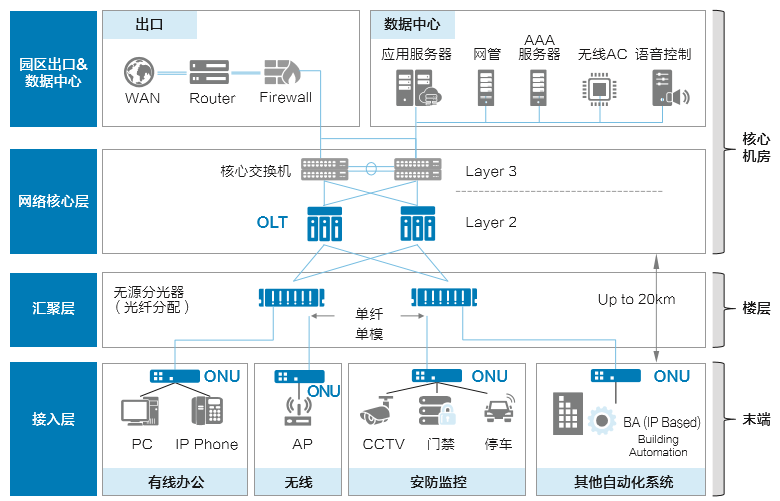
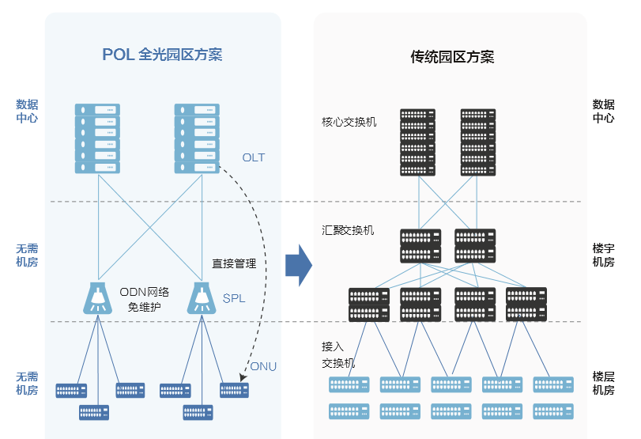
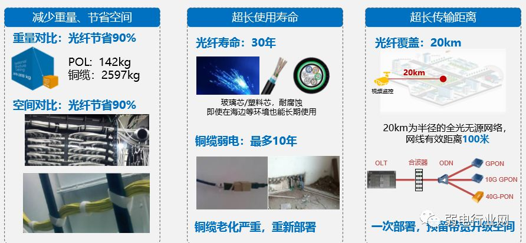
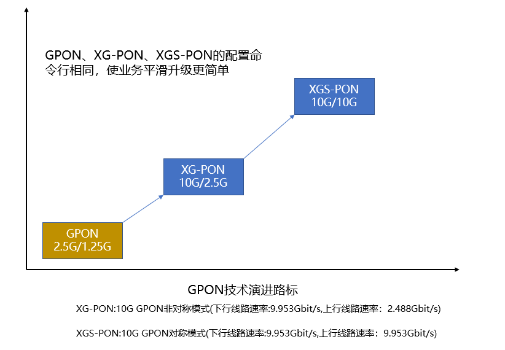
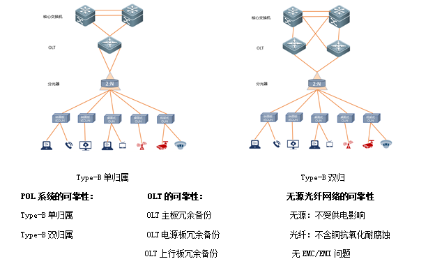

# 无源光网络(POL)

[TOC]

## 概述

POL（Passive Optical LAN，无源全光局域网），基于PON技术的新型局域网组网方式。继承了PON 网络大带宽、高可靠性、扁平化、易部署、易管理等优点。

大型园区、楼宇基础网络建设主要面临以下挑战：

* 大量交换机占用机房空间，功耗大，散热难。
* 汇聚路由器之间连接复杂，而且占用管道空间，走线和维护难度大。
* 交换机位置分散，管理复杂，需要庞大的维护团队。
* 传输距离的限制。
* 网络新增设备操作复杂。
* 升级和扩容难。

对于传输距离，网络平滑升级，高可靠性，灵活组网，易部署，简捷运维等方面，传统综合布线系统已经全面落后于全光网网络（POL），全光网把传统综合布线的传输和光纤到桌面，光纤到用户单元，光纤到公共区域进行整体的融合；另外，加入网络设备把原有的3层网络变成扁平的二层架构，全光网（POL）网络融合园区+边缘云，企业可将数据，语音、视频安防以及无线等不同的系统融合在一张光纤网络中，具有传统综合布线不可比拟的优势。

## 全光网的组成

PON（Passive Optical Network）是一种点到多点（P2MP）结构的无源光网络，其组成涵盖三部分：

* OLT

  替代传统 LAN 中的汇聚层交换机。

* ODN

* ONU

  提供二/三层功能，通过有线或者无线接入用户的数据、语音及视频等业务。

水平铜缆被光纤替代。

接入交换机由无源的分光器替代。

## 传输方式

下行采用广播方式：通过分光器将 OLT 发出的光信号分成多份带有相同信息的光信号，传送到每个 ONU；ONU 根据报文中所带的标记，选择性接收属于自己的报文，对标记不符的进行丢弃处理。

PON 网络上行方向：OLT 侧统一分配给各个 ONU 一个时间片，ONU 严格按照这一时间片窗口进行信号发送，不属于自己的时间片对光口进行关断操作，上行时间窗口调度机制高度依赖 PON 的测距技术来实现。

为保证在一芯光纤上转发两个方向的流量报文，PON 采用波分方式；在发展到万兆 PON 后，实际采用了四个波长段进行光纤复用。

## 优点

**超长传输能力**

POL 采用 hub-spoke 结构，而交换机是多层级的树/星型结构，从总体来看，POL主要是优化了局域网的基础布线和网络结构，网络结构更加扁平和简洁。

ODN 的最大传输距离达到 20KM，远远超过了传统综合布线的传输距离，对于园区，机场，体育馆，超高层建筑等大型建筑的网络建设而言，传统综合布线需要增加额外的有源设备及空间来部署网络设施，以弥补传输距离的不足，而全光网（POL）网络在减少有源设备的同时，可以轻松解决难点。

**易部署属性**

传统综合布线系统在部署接入交换机时，需要有弱电间，机柜，电源等配套设施，而全光网（POL）无需专门的弱电间；分光器可以按照用户现场环境进行灵活布放，无需弱电间，机柜，电源等配套设施；把有源设备集中在中心机房和终端用户侧，这样让运维点更集中和更贴近使用者，让运维变得更简捷高效。

根据部署计划将 ONU 进行预配置，当 ONU 硬件安装完成，系统上电后 OLT 可以自动发现和添加 ONU，完成 ONU 设备部署、远程软调，大大提高部署效率，降低网络建设成本。

由于 POL 突破了传统综合布线网络中双绞线受到百米距离的限制和对弱电间的需求，并将三层网络拓扑结构简化为两层，从而节省了 80% 的弱电机房空间及 60% 供电能耗，实现网络建设成本降低 30%，网络的运维开支可缩减 60% 以上。

**可升级性**

当前，按照传统的综合布线系统布放网络，寿命大概在10-15年，系统在应用过程中逐步被淘汰，然而智慧楼宇，物联网的迅速发展普及，不得不让我们重新审视网络建设的持续可用性；未来终端接入设备将成指数倍增长，带来了带宽的巨大压力，传统的综合布线不得不缩短网络重建或翻新周期，导致资源严重损耗；全光网(POL)网络光纤可以提供GPON，10GPON，未来可以提供50GPON/100GPON带宽和速率进行平滑升级，让园区，大楼网络使用寿命成倍数延长，保证网络的可用性同时，也保持了网络的前瞻性。

设备迭代的速度是网络建设的重大问题，旧设备往往只能被废弃，这无形中会造成巨大的资产浪费，而全光网络基于光纤组网，全光组网可满足园区内各类宽带需求，比如目前热门的 Wi-Fi 6 业务承载需要 2.5Gbps 或者 10Gpbs 的业务接口，对应 10G PON 方案或者 50G  PON 上行大带宽就可轻松承载，全光组网网络升级只需要更换板卡，甚至只需要更换光模块就可以实现升级，再加上光纤具有耐腐蚀、抗高低温、抗干扰等特性，POL 全光网络使用寿命可达 30 年，超长的网络使用周期让网络全生命周期内投资成本最优化。

**POL网络的高可靠性**

POL 采用 PON 方案架构，OLT 部署在核心机房，从核心机房到用户，中间层采用无源分光器，无需独立机房部署，无需供电，减少了有中间有源设备故障点，ONU 靠近用户，通过铜线连接用户。

POL 通过多种组网方式来保证网络的持续可用性，如下图所示：

**安全防护**

POL 网络有效避免了电磁干扰，电磁泄露等问题，支持 AES128 加密，保障数据光纤传输安全；POL 设备支持 MAC 绑定，802.1x 认证、用户隔离等、广播抑制，防 DOS 攻击有效杜绝了非法用户接入和其它用户攻击。

* 支持端口和 ONU 隔离功能
* 支持 MAC 过滤
* 支持防 DoS 攻击
* 支持用户分级，防止未授权用户的非法侵入
* 支持端口广播/组播报文抑制
* 支持基于源/目的MAC地址、VLAN、802.1p、ToS、Diff Serv、源/目的 IP（IPv4/IPv6）地址、TCP/UDP 端口号、协议类型等 IP 报文头信息的流分类和流定义
* 支持对报文头部80字节深度的 L2-L7 ACL 流分类
* 支持业务流策略，包括镜像、重定向、统计、过滤

**3、语音系统组网解决方案及对比传统** 

 

简化网络：语音、数据一线接入， 降低工程实施难度，减少投资 

**4、pol全光视频监控组网解决方案**

**
**

**5、酒店网络远距离无线覆盖** 

 

成本低：别墅内ONT接入，比光交换 机节约50%投资 

易部署：一个ONT实现语音、宽带、 视频多业务接入，无需部署多套系统

**6、wlan系统布署**

**
**

**7、电视系统组网** 

 

**三、案例** 

某大型温泉酒店，客房比较多，且分好几栋区域，需要承载语音、宽带、电视等业务。网络布线难，带宽要求高，如何布线？

**改造前：**线缆众多，故障率高，维护复杂。

 

**改造后：**简化网络，降低维护成本 

 

采用了**GPON+LAN+WLAN**，GPON 解决酒店分散别墅的远端接入，别墅内LAN和WLAN 提供一体化网络覆盖。

**补充：**

**这里面弱电君要补充下：**

**1、什么是GPON?**

GPON是最新一代宽带无源光综合接入标准，具有高带宽，高效率，大覆盖范围。

同所有PON 系统一样, GPON 由ONU、OLT 和无源光分配网组成。OLT 为接入网提供网络侧与核心网之间的接口, 通过ODN与各ONU  连接。作为PON 系统的核心功能设备, OLT 具有集中带宽分配、控制各ONU、实时监控、运行维护管理PON 系统的功能。ONU  为接入网提供用户侧的接口, 提供话音、数据、视频等 多业务流与ODN 的接入, 受OLT 集中控制。系统支持的分支比为1∶16/ 32/ 64, 随着光收发模块的发展演进, 支持的分支比将达到1∶128。

GPON的传输机制和EPON完全相同，都是采用单纤双向传输机制，在同一根光纤上,使用WDM技术，用不同波长传输上下行数据。在同一根光纤上, **GPON可使用波分复用(WDM)技术实现信号的双向传输**。根据实际需要, 还可以在传统的树型拓扑的基础 上采用相应的PON保护结构来提高网络的生存性。

​							 									 									 										 								 							

**POL全光网络典型应用场景有哪些?**

​				2017-09-18 											分类：[新闻](http://www.dostor.com/category/news) 											 		

你家里，你办公室里的局域网网线的速度怎么样？用的五类线CAT5，六类线CAT6，还是最新的七类线CAT7，不会是CAT3吧，10 Mbps传输速率简直拖了时代的后腿儿，换成七类线的10Gbps或许你会发现不一样的世界吧。你有没有想过，局域网换成光纤的呢？ 这个可以有。

**POL，无源光纤局域网**

这里要说的就是POL（Passive Optical  LAN）无源光纤局域网。POL技术的出现可以改变原有的网络架构。POL基于PON(Passive Optical  Network无源光纤网络)技术，PON技术最早应用在运营商领域网络，中国的电信、联通、移动家庭光纤入户用的都是PON技术。

PON技术的好处在于，可以实现从电信机房到终端用户的全程20公里无源光网络覆盖，更重要的是网络架构非常简洁，只有两层。而原来的网路架构从终端到网线，到接入交换机，到汇聚交换机，核心交换机，架构非常复杂，相比之下，POL的部署应用要高效的多。

PON技术应用到企业环境中，在办公楼宇，教育园区、医疗环境、酒店等实现无源光纤网络覆盖园区局域网，这就是POL（无源光纤局域网）了。

看起来POL的架构非常简单，在实际应用中又有哪些优点呢？

网线要升级的时候选POL非常方便。即使是很老的建筑，很古老的网络布线，POL也能适应环境，由于光纤体积较小，这为施工省去了很多麻烦，POL能很简单改造一张旧网。

光纤可以提供GPON，10GPON，未来可以提供100GPON带宽和速率，对于老旧网络改造，POL会有很大提升。

光纤的使用年限比普通的金属网线要长，当金属网线超过使用年限，就会腐蚀、生锈、氧化等等，此时就需要重新布线了。

POL容易管理和维护，5000个网口后端只需要一台设备。过去传统交换机网络要求一栋几十层的大厦每隔两层要有一个机房。现在一台设备就能实现自动化管理。

**酒香也怕巷子深，APOLAN来推广**

这么多优点的新解决方案按说一经推出就应该大范围使用才对，为什么许多人没采用，甚至还有许多人都不知道这种新技术呢？

对此，华为接入网产品线副总裁张晓亮表示：“在实际应用中，因为在行业市场中许多客户还不太熟悉光纤的熔接和施工，对POL本身技术也知之甚少，对新技术的接受需要有一个过程，为了加快这一过程，一些公司在2013年成立了全球无源光纤局域网联盟APOLAN（Association of Passive Optical LAN）。”

APOLAN联盟成员中，有的做OLT，ONT有源设备，有的做ODN无源光分配网，有的做网络设计，还有的做集成、施工等等，联盟成员做的事情覆盖整个产业链和POL这个方案各个环节，联盟致力于把基于PON技术的POL方案在全世界的各个企业垂直行业进行推广。

在2017华为全联接大会，APOLAN亚太分委会成立了，华为被APOLAN的董事会任命为亚太分委会的主席，3M公司担任副主席。主席张晓亮介绍说，APOLAN接下来要联合更多的伙伴来一起做无源光纤局域网POL，随后会有相关的培训计划，成员招募计划，产业推广计划，推动与现有成员之间的合作。

**联盟成员各尽所能**

POL的市场非常广阔，有数据预测，2016年到2024年期间，POL的年度复合增长率为22.9%，2015年，POL市场规模为141亿美金，其中亚太地区占到了36%，而中国是亚太地区市场增长的主要推动力。为推广这一市场，抓住发展机遇联盟成员各尽所能。

以华为为例，华为提供端到端的解决方案，涵盖从产品，服务，解决方案的整套解决方案，在POL联盟中，华为发布Agile POL解决方案，发布全球POL体验中心，举办POL论坛等，通过多种方式推动POL产业发展。

此外，华为在POL技术基础上有许多创新之处，比如N2510光纤链路故障诊断系统能精准定位故障范围，精确度达到0.5米，大大提升了故障排查效率，彻底解决传统局域网中网线管理盲区的问题，实现局域网从有源设备到无源介质端到端可视，可管理，可维护，降低企业维护难度，提升维护效率。

在实际应用中，华为POL解决方案在全球有了许多案例，比如英国排名第二的度假村酒店集团Bourne  Leisure在英国57个酒店、游乐场部署了POL，比如意大利国家电力公司Enel也在采用华为的POL方案。新加坡樟宜机场也采用华为的POL方案为其提供高可靠的视频监控业务。

此外，专注于做光纤预制棒和光纤、光缆领域的长飞光纤光缆股份有限公司和3M 公司也分别介绍了其在POL领域的优势，以及对于推广POL解决方案的规划。

未来随着APOLAN联盟的壮大和联盟工作的推进，POL会走入越来越多的企业内部。

​                                     

​	大多数方案都会采用近桌面端部署接入设备ONU的方式，而这样的部署会造成大量的明线存在桌面端，影响用户工作区的整洁美观，且使用不方便。

​	3、长飞POL布线解决方案

​	针对新的网络部署与施工方案所带来的挑战，长飞公司创新了POL预端接方案，不仅有针对性的提出了解决方案，同时也保留了全光网络固有的特点，如节省机房和线槽的空间、长距离覆盖、方便维护等。

​	下面将以一个比较通用的场景详细阐述长飞公司POL预端接方案系统。

​	下图为一个楼宇场景，划分了三个功能分区，即独立办公室上网，敞开式办公室上网、楼内无线覆盖与[监控](http://www.hqchip.com/app/220)。分光器集中部署在机房内，由机房引出的垂直主干到各楼层预端接分纤箱，再用预端接水平缆从预端接分纤箱引至ONU。

​	长飞POL预端接方案系统图

​	系统主要由预端接配线架、预端接主干、预端接分纤箱、预端接水平缆组成。

​	预端接配线架与预端接分纤箱用预端接主干相连，预端接分纤箱可以引出预端接水平缆，水平缆直接接入ONU。

​	主干部分预端接采用MPO多芯[连接器](http://www.hqchip.com/app/1512/canshu)，水平缆预端接采用SC活动连接器。主干缆与水平缆相连接的节点用分纤箱内置的模块盒进行转接。

​	预端接系统消除了整个链路中的光缆熔接点，即插即用。施工人员只需将预端接主干缆从弱电井拉至目标弱电间即可。为了保护预端接连接器，主干光缆的接头处设计有专门设计的保护[套管](http://www.hqchip.com/app/1016)，避免在拖拽施工的过程中损坏连接器，造成线缆插入损耗过大。另外，主干分支部分设计了分支器结构，可安装在分纤箱中的分支固定件，将整根主干光缆锚定在分纤箱内，如下图。

​	

​	分支器的使用避免了主干光缆在固定的时候受到侧向压力，保证了光纤在光缆套管中的原始状态，从而避免外力带来的光损耗。主干光缆可按5米、10米、15米递增，施工后多余的长度可盘留在预端接分纤箱中。

​	水平缆可定制长度，一端采用标准SC/UPC连接器，另外一端采用可拆卸式连接器。由于水平缆的敷设线路很多都是穿管敷设，长飞公司预端接水平缆的一端采用的可拆卸式连接器体积较小（直径约5.8mm），可直接穿入PVC管道中。

​	长飞公司预端接水平缆提供两种施工方式，分别是拉拽施工和推进施工。在拉拽施工时，长飞公司预端接水平缆前端设有专门的拉线，可提供牵引点。并且推荐使用如下的绕线法，以使得在拉拽过程中，接头始终与管道保持平行。如下图：

​	1.接头保护帽 2.拉线

​	推进施工时，长飞公司预端接水平缆提供一种特殊材质与结构的圆形缆，可以不适用穿管器，直接将光缆用人力推入管道中，在经过10个左右的弯道的情况下，最大推进距离可达100m。

​	当水平缆敷设到预定位置后，将接头的内、外框套分别装入连接器，使之成为一个标准的SC接头。如下图：

​	4、小结

​	长飞预端接系统免去了主干、水平缆的熔接操作，可节省10-20元/芯的熔接成本；同时也缩短了线缆部署的施工时间，其快速施工的特点保障了线缆的扩容和维修相比传统的布线方式，更加的快速便捷，从而极大的提升施工效率。

​	另外需要注意的是，预端接系统的所有线缆都是定长的，这点要求在施工前需要将线缆的大致长度进行测算，否则可能造成线缆的浪费或者不够用的情况。

​	最后，POL预端接系统在楼宇布线领域是一个新生事物，市场对其的广泛认知和应用将是一个渐进的过程，但是预端接系统在数据中心行业已成熟应用多年，我们相信最终POL预端接系统将会获得广大客户的认同，给客户提供了一种新的选择。

POL 采用 PON 方案架构，OLT 为汇聚网元，部署在核心机房，从核心机房到用户，中间层采用无源分光器，无需独立机房部署，无需供电。ONT 靠近用户，通过铜线连接用户。POL 全光网络广泛应用于大中小型企业、政府机关、科技园区/工业园区、学校、医院以及需要在内部进行局域/本地宽带联网的各种场景，其业务需求、组网规模各有不同。						

 随着学校数据业务迅速发展，现有网络容量和性能越来越难以满足学校发展的需求。校园网络存在1）网络层级多，存在重复嵌套部署，极易造成网络风暴和引发ARP攻击；2）复杂的网络层次导致故障定位、日常维护困难；3）网络横向之间缺乏隔离和管控措施；4）采用千兆骨干网络，只针对部分地区进行了无线覆盖，有限的网络资源大大影响了师生的工作、学习和生活。现代校园网络需要一个高速互联，稳定可靠，便捷管理，安全可控的网络。

　　华为针对现代校园网络的特点，推出了POL全光接入校园网络解决方案。

　　POL（PassiveOpticalLAN）是无源全光局域网，是基于PON技术的新型局域网组网方案，继承了PON网络大带宽、高可靠性、扁平化、易部署、易管理等优点，同时，在POL方案充分适应基于校园局域网的特性要求，比如802.1x认证、POE等，具备在园区大规模商用的能力。

　　POL技术早期兴起于北美，2010年左右，MOTO在美国开始尝试采用POL方案部署医院、企业办公楼、政府机关等场景；2013年，IBM发起了POL联盟-APOLAN，创立成员包括POL产业链各环节的厂商，如TEDATA，Tellabs，ZONE，Corning，3M等，POL开始走向产业化。2015年，APOLAN欧委会创立，欧洲大T和华为，阿尔卡特朗讯等GPON厂商加入联盟，进一步推进方案商业化的进程。

　　POL典型逻辑架构如下图所示：

　　POL采用PON方案架构，OLT为汇聚网元，部署在核心机房，从核心机房到用户，中间层采用无源分光器，无需独立机房部署，无需供电。ONT靠近用户，通过铜线连接用户。

　　华为针对校园的网络建设需求，结合学校人员密度大的特点，将全球领先的接入汇聚一体设备OLT（MA5680T/MA5608T）部署在核心机房，采用无源ODN网络完成光纤到桌面的网络覆盖，不同种类的接入终端ONU，满足用户高速上网、IPTV、VOIP，电视等多种接入需求，可以承载视频监控、一卡通等多种业务，采用支持POE供电的ONU外接AP方案为师生提供无阻塞的无线上网体验。

　　华为POL解决方案具有如下特点：

　　1.极宽：一次部署，网络容量持续升级

　　POL网络在机房到ONU之间，铺设的是光纤而不是网线，每PON口最高可达10G的带宽，并且后续能支持到40G甚至100G带宽。未来需求更高带宽时，光纤无需更换，只需要更换两端的设备或者光模块，简化升级步骤，节省升级成本。

　　2.极简：扁平化网络架构简易运维

　　POL网络层级简单，有源设备只有OLT和ONT两级，相对于传统的园区方案，减少了网络层级，从而方便维护管理，减少故障点，提高网络可靠性。

　　3.融合：一根光纤承载所有业务

　　根据业务需求的不同，ONU能提供传统电话pots端口，传统电视同轴端口，百/千/万兆以太网端口，POE功能等，从而实现在一套POL网络中，接入多种业务，无需建立多套网络来承载多种业务。

　　4.安全：提供多种安全防护机制

　　POL网络使用光纤进行数据传输，有效避免了电磁干扰，电磁泄露等问题，并且支持AES128加密，从物理线路上避免了信息被窃取的危险。POL设备支持MAC绑定，802.1x认证等，防止非法用户接入设备，从而杜绝了非法用户接入网络的可能。设备支持用户隔离，广播抑制，防DOS攻击等功能，有效防止了已接入用户对设备，对其他用户的攻击行为。

　　GPON接入经过运营商多年的应用，证明了这种技术的成熟，可靠，并且有明确的演进路线。华为作为GPON市场占用率第一的厂商，依托GPON技术推出的POL全光接入方案，以高速，简单，多能，安全等特点，完美的解决了校园网络需要的高速互联，稳定可靠，便捷管理，安全可控的需求，为校园网络的建设提供了一个全新的建设模式。

[返回搜狐，查看更多](https://www.sohu.com/?strategyid=00001&spm=smpc.content.content.2.1617343815596JBajVvV)

​                                

​     

导读

很多朋友多次问到关于酒店最新的组网方案，目前酒店的弱电项目很多朋友都做的越来越多，随着网络技术的发展，传统的酒店组网方式成本越来越大，一端口一线的方式给弱电布线人员增加很大工程量和成本，那么有什么更好解决方案，本期我们一起来了解下酒店全光网络解决方案。 

​                                                                                                     

POL（Passive Optical LAN），无源光局域网，基于PON技术的新型局域网组网方式，优化了局域网的基础布线和网络结构，网络结构更加扁平和简洁。继承了PON网络大带宽、高可靠性、扁平化、易部署、易管理等优点。

POL网络统一承载宽带、语音、视 频、WiFi、CATV、办公等业务。

 POL方案广泛应用于酒店、校园、 企业园区、企业办公楼，电力、交 通等场景。

 

**3、语音系统组网解决方案及对比传统** 

 

简化网络：语音、数据一线接入， 降低工程实施难度，减少投资 

**4、pol全光视频监控组网解决方案**

**
**

**5、酒店网络远距离无线覆盖** 

 

成本低：别墅内ONT接入，比光交换 机节约50%投资 

易部署：一个ONT实现语音、宽带、 视频多业务接入，无需部署多套系统

**6、wlan系统布署**

**
**

**7、电视系统组网** 

 

**三、案例** 

某大型温泉酒店，客房比较多，且分好几栋区域，需要承载语音、宽带、电视等业务。网络布线难，带宽要求高，如何布线？

**改造前：**线缆众多，故障率高，维护复杂。

 

**改造后：**简化网络，降低维护成本 

 

采用了**GPON+LAN+WLAN**，GPON 解决酒店分散别墅的远端接入，别墅内LAN和WLAN 提供一体化网络覆盖。

**补充：**

**这里面弱电君要补充下：**

**1、什么是GPON?**

GPON是最新一代宽带无源光综合接入标准，具有高带宽，高效率，大覆盖范围。

同所有PON 系统一样, GPON 由ONU、OLT 和无源光分配网组成。OLT 为接入网提供网络侧与核心网之间的接口, 通过ODN与各ONU  连接。作为PON 系统的核心功能设备, OLT 具有集中带宽分配、控制各ONU、实时监控、运行维护管理PON 系统的功能。ONU  为接入网提供用户侧的接口, 提供话音、数据、视频等 多业务流与ODN 的接入, 受OLT 集中控制。系统支持的分支比为1∶16/ 32/ 64, 随着光收发模块的发展演进, 支持的分支比将达到1∶128。

GPON的传输机制和EPON完全相同，都是采用单纤双向传输机制，在同一根光纤上,使用WDM技术，用不同波长传输上下行数据。在同一根光纤上, **GPON可使用波分复用(WDM)技术实现信号的双向传输**。根据实际需要, 还可以在传统的树型拓扑的基础 上采用相应的PON保护结构来提高网络的生存性。

中电一舟POL全光纤网企业布线解决方案

时间: 2016-11-30 16:36  浏览次数：148

北京中电一舟科技光缆光纤网讯 POL： 光纤以太网，以光纤传输为主。POL采用PON技术，提供二层传输网络，提供到用户终端的千兆接入。以一根光纤融合承载视频、数据、无线、语音等

 **北京中电一舟科技光缆光纤网讯 POL：**光纤以太网，以光纤传输为主。POL采用PON技术，提供二层传输网络，提供到用户终端的千兆接入。以一根光纤融合承载视频、数据、无线、语音等业务。

​	　　其核心的器件为分光器。通过分光器可以将主干大量资源用一个光纤能均分成出来，进行多客户覆盖。

​	

​	　　**POL光纤到桌面网络解决方案特点**

​	　　**1、传输快**

​	　　光纤的速率远高于铜缆。POL较大的带宽可以承载很多业务，包括家里需要看视频，包括下载电影，都需要高带宽。

​	　　**2、可靠性高**

​	　　光纤技术从2008年就开始用了。目前，国内主要城市光纤覆盖已达到90%。光纤自开始到现在，近十年来运行一直非常稳定。

​	　　**3、性价比高**

​	　　性能同等的情况下，建筑使用POL方式，投资可以减少50%以上。光纤连通后不去动它，一般不会出现什么障碍。维护方便，运行人力成本大幅降低。

​	　　**4、绿色环保**

​	　　同样是生产铜缆和生产光纤，生产铜缆对环境的污染要远大于生产光纤。其次POL省掉了人到机房这一块，也就省掉了这部分的用电，更加环保。再  而，POL主干是光缆，水平也是光缆，中间楼道里不再需要楼层的配件系统，只是需要一个简单的光纤的管理界面。比起传统网络，POL使用的基础材料更少。

​	　　**传统楼宇布线系统与POL结构对比**

​	

​	

​	

​	　　**传统楼宇布线系统与POL成本对比**

​	

​	　　**POL网络主要建设场景**

​	　　基于目前国内对于POL网络成熟的应用，我们主要把场景分成三部分，第一种是叫做多层楼宇，第二种是高层楼宇，还有一些是大型场景，这些场景都比较适用于POL的方式。

​	　　**1、多层楼宇**

​	　　典型案例：学校图书馆；快捷酒店；学生宿舍

​	

​	　　这些点比较集中，整体区域很大，需要放大量的节点，用POL的方式可以大量节省成本。

​	

​	　　**2、高层楼宇**

​	　　典型案例：办公楼；高档酒店；高档写字楼

​	

​	　　近两年，国内这类典型的建筑很多已经开始应用光纤了。电信也开始开拓这方面的业务。把酒店里的每间客房当成一个光纤节点来做接入的方案和方式已经比较普遍了。

​	

​	　　**3、多层多区域建筑**

​	　　典型案例：大型商场；机场；火车站

​	

​	　　这些场景信息点非常分散，整个区域非常大，点和点之间就需要放很长的网线。传统的方式网线只能放90米，因此中间需要增加很多节点，造价非常高。如果用光纤则不存在这样的问题。

​	

​	　　并很早就开始涉及布线产品。IDC技术，通过这个技术，工作人员不需要再把绝缘层去掉，用刀片把  绝缘层轻轻一动，使刀片和绝缘层里边的芯片相连接，产生一种导通。平时铜线连接基本都是采用这种技术，包括一些电话线、网线，包括一些模块都是基于这种技 术发展起来。

​				

网络上新添加设备的复杂操作

难以升级和扩展

由于传输距离远，网络平滑升级，可靠性高，组网灵活，易于部署，操作维护简单等特点，传统的综合布线系统已经落后于全光网络（POL）.  进行传输和光纤到桌面，光纤到用户单元，光纤到公共区域的布线以进行整体集成；此外，添加网络设备以将原始的第3层网络转换为扁平的两层架构，全光网络（POL）网络集成Campus + edge cloud，企业可以集成不同的系统，例如数据，语音，视频安全性和无线进入单一光纤网络**光网络终端是路由器吗**，具有传统集成布线无与伦比的优势.

全光网络的组成和传输方法

POL采用PON技术； PON（[无源光网络](http://www.pc-fly.com/a/tongxinshuyu/article-245139-1.html)）是一种点对多点（P2MP）结构的无源光网络，其组成涵盖了三个部分: OLT，ODN，ONU

POL: 无源光局域网无源光局域网

在POL网络中，传统LAN中的聚合交换机被OLT取代；水平铜缆被光纤代替. 接入开关被无源分光器代替； ONU提供第2层/第3层功能，可通过有线或无线用户数据，语音和视频服务进行访问.

PON网络下行链路采用广播方式: OLT发送的光信号通过分光器分为具有相同信息的多个光信号，并发送给每个ONU.  ONU根据消息中包含的标记有选择地接收所有物，如果它们不匹配，请丢弃自己的数据包.

PON网络的上行方向: OLT侧为每个ONU均匀分配一个时间片，ONU严格按照该时间片窗口发送信号，光片不被其自己的时间片关闭，而上行时间窗口调度机制高度依赖PON的测距技术.

理解PON技术的原理有助于我们将该技术更熟练地应用于电气设计，尤其是其光分布网络的无源（无电源）特性，以及与传统交换机的区别所带来的要点. 需要特别注意. 为了保证业务数据包在核心光纤上的两个方向上的转发，PON采用了波分方法. 在10 Gb  PON开发之后，实际上已将四个波段用于光纤复用.

POL网络的超长传输能力

POL采用中心辐射状结构，而交换机是多层树/星形结构. 总体而言，POL主要优化了局域网的基本布线和网络结构，网络结构更加平坦简洁.

ODN的最大传输距离达到20KM，远远超过传统集成布线的传输距离.  对于大型建筑物的网络建设，例如公园，机场，体育场和超高层建筑，传统的集成布线需要增加额外的有源设备和空间来部署网络设施，以弥补传输距离的不足，以及所有光网络（POL）网络可以轻松解决难题，同时减少有源设备.

POL网络的轻松部署属性

在传统的集成布线系统中部署接入交换机时，需要辅助设施，例如弱电流室，机柜和电源，并且全光网络（POL）不需要特殊的弱电流室；可以根据用户的现场环境灵活部署分路器，无需弱电室，机柜，电源和其他辅助设施；主动设备集中在中央机房和最终用户侧，使操作维护点更加集中，更贴近用户，使操作维护更加简单高效.

根据部署计划预先配置ONU.  ONU硬件安装完成后，OLT可以在系统上电后自动发现并添加ONU，完成ONU设备的部署，远程软调，大大提高了部署效率，降低了网络建设成本.

由于POL突破了传统综合布线网络中100米双绞线距离的限制以及对弱电流房间的需求，因此三层网络的拓扑结构简化为两层，从而节省了80％弱机房的空间和60％的电力和能源消耗，可将网络建设成本降低30％，并将网络运营和维护费用减少60％以上.

POL网络的可升级性

目前，网络是根据传统的集成布线系统部署的. 寿命约为10-15年. 该系统在应用过程中逐渐被淘汰.  然而，智能建筑和物联网的飞速发展和普及必须使我们重新审视网络. 持续提供施工；终端接入设备未来将成倍增长，这将给带宽带来巨大压力.  传统的综合布线将不得不缩短网络的重建或整修周期，从而导致严重的资源损失；全光网络（POL）网络光纤可以提供GPON和10GPON.  将来，可以平滑升级50GPON / 100GPON的带宽和速度，从而将园区和建筑网络的使用寿命延长数倍，确保网络的可用性，并保持网络的前瞻性.

设备迭代的速度是网络建设中的主要问题. 旧设备通常只能丢弃，实际上会造成巨大的资产浪费.  全光网络基于光纤网络，全光网络可以满足园区的需求. 宽带要求，例如当前流行的Wi-Fi  6服务承载需要2.5Gbps或10Gpbs服务接口，对应于10G PON解决方案或50G  PON的上游大带宽可以轻松携带，全光网络升级仅需更换网卡，甚至只需更换光模块就可以升级. 另外，光纤具有耐腐蚀，耐高低温和耐干扰的特性.   POL全光网络的使用寿命可以达到30年，并且网络的使用寿命长，可以使网络的整个生命周期得到优化.

POL网络的高可靠性

POL采用PON方案架构.  OLT部署在从核心计算机室到用户的核心计算机室中. 中间层使用无源分光器.  不需要独立的计算机室部署，也不需要电源. 这减少了中间活动设备故障点的数量，并且ONU靠近用户. 通过铜线连接用户.   POL全光网络根据其业务需求和网络规模，广泛用于大型和小型企业，政府机构，科技园区/工业园区，学校，医院以及内部需要本地/本地宽带联网的各种情况.  . 不同.

POL使用多种联网方法来确保网络的连续可用性，如下图所示:

B型单归B型双归

POL系统的可靠性: OLT的可靠性: 无源光纤网络的可靠性

B型单宿主OLT主板冗余备份被动: 不受电源影响

B型双归属OLT电源板冗余备用光纤: 无铜，抗氧化和抗腐蚀

OLT上游板的冗余备份而没有EMC / EMI问题

POL网络的安全保护

POL网络有效避免电磁干扰，电磁泄漏等问题，支持AES128加密，确保数据光纤传输安全； POL设备支持MAC绑定，802.1x身份验证，用户隔离等，广播抑制，抗DOS攻击，可有效消除非法用户访问和其他用户攻击.

支持端口和ONU隔离功能

支持MAC过滤

支持反DoS攻击

支持用户分类，以防止未经授权的用户非法入侵

支持端口广播/多播消息抑制

基于源/目标MAC地址，VLAN，802.1p，ToS，Diff Serv，源/目标IP（IPv4 / IPv6）地址，TCP / UDP端口号，协议类型等支持流分类和IP数据包头信息. 流程定义

在报文头中支持深度为80字节的L2-L7 ACL流分类

支持业务流程策略，包括镜像，重定向**光网络终端是路由器吗**，统计信息，过滤

Forrester的首席分析师Andre  Kindness在讲话中指出，POL无源光学局域网使用光纤重建传统的园区网络，并将光纤延伸到最后一米，非常符合部署，维护和演进的需求.  当前的市场规模正在以18.8％的速度增长. 物联网未来的普及将带来无源光网络技术的爆炸性发展.  凭借其多网络，绿色，环保，经济高效，简单，灵活，安全可靠的特点，有效地支持企业数字化，开创固定光纤F5G的新时代，成为数以千计的行业中最数字化的转型作为教育，安平，酒店，政府，交通，工厂，综合公园（智能建筑，商业综合体，住宅社区和工业智能园）的不错选择.

当前，业务云化使数据应用大幅增加，同时，业务的融合创新以及万物感知带来的数据洪流与各产业深度融合产生的新业务，催生了现有企业园区承载网新的技术发展与变革。

传统的局域网在新业务模式下，其固有的劣势越发明显，如网络性能稳定性低、网络结构复杂、占用空间大、维护困难、覆盖距离短等。而业界提出的POL（Passive Optical LAN）全光局域网的模式，能够很好地解决新业务带来的各种挑战。

POL全光局域网解决方案是基于PON技术的新型局域网组网方案，它将数据、语音、视频以及无线接入等不同业务合并在一张光纤网络中；同时，针对企业办公、酒店公寓、建筑综合体和智慧园区等不同的应用场景，还进行了光网络布线技术及产品优化，使之更适合在企业场景下使用。   如图1所示。

图1 POL全光局域网组网方案

长飞企业全光网方案是一套端到端的整体解决方案，包括“即插即用”的光分及布线系统和ONU、OLT及网络管理系统，具有绿色、融合、便捷、创新的特点。

▪ **绿色**，长飞公司绿色汇捷企业全光网解决方案可提供从中心机房到园区各业务终端泛在的连接。园区专用的小直径、大芯数的光纤光缆（如气吹微缆、生物防护光缆、全干式光缆、微簇光缆、多用途布线光缆、蝶形引入光缆以及HDMI（USB3.0）AOC特种光缆等）不仅可以提供从中心机房到园区各业务终端泛在的连接，还可节省80%的弱电机房和空调能耗，降低30%的建网成本。光纤具有耐腐蚀、抗高低温、抗干扰等产品特性，不仅可以解决园区内近期的网络资源需求，还能兼顾园区的可持续发展，是“一次布线30年无忧”的最佳选择。

▪ **融合，**通过光配互连产品及光纤光缆合理的组合，实现一纤承载多种业务。提供从中心机房到业务终端之间全系列的布线产品，实现产品和物料单品牌的交付和管理，使得网络建设部署中管理效率可提升40%。基于光纤组网，在从1G PON网络向10G/50G PON演进时，仍可重用原网络轻松承载，仅需更换有源设备板卡和终端即可实现升级。

▪ **便捷，**全系列无源布线产品采用标准化、模块化设计，充分考虑到网络建设和部署过程中的快速易装的要求，网络部署效率提升40%；并可根据不同客户和不同使用场景的个性需求提供差异化无源布线产品及解决方案，实现全光网络快速部署、易维护的要求。

▪ **创新，**长飞企业全光网解决方案的创新主要体现在“即插即用”光纤分光及布线系统，以及全应用场景的ONU系列。

**“即插即用”光纤布线系统**

针对企业网络部署与施工方案带来的挑战，长飞公司创新了POL“即插即用”布线方案，不仅针对性地提出了解决办法，而且也保留了全光网络固有的特点，如节省机房和线槽的空间、长距离覆盖、方便维护等。长飞公司POL“即插即用”方案系统图如图2所示。

图2 长飞公司POL“即插即用”方案系统

由于光缆熔接通常需要专业的施工技术人员，普通弱电施工人员难以承担此项任务，针对这个问题，长飞公司创新设计针对POL的预端接布线系统。该系统主要由预端接配线架、预端接主干、预端接分纤箱、预端接水平缆组成；预端接配线架与预端接分纤箱用预端接主干相连，预端接分纤箱可以引出预端接水平缆，水平缆直接接入ONU；主干部分预端接采用MPO多芯连接器，水平缆预端接采用SC活动连接器。主干缆与水平缆相连接的节点用分纤箱内置的模块盒进行转接。

预端接系统消除了整个链路中的光缆熔接点，施工人员只需将预端接主干缆从弱电井拉至目标弱电间即可，真正实现即插即用。为了保护预端接连接器，主干光缆的接头处有专门设计的保护套管，避免在拖拽施工的过程中损坏连接器，造成线缆插入损耗过大。

另外，主干分支部分设计了分支器结构，可安装在分纤箱中的分支固定件，将整根主干光缆锚定在分纤箱内，如图3所示。分支器的使用避免了主干光缆在固定的时候受到侧向压力，保证了光纤在光缆套管中的原始状态，从而避免外力带来的光损耗。主干光缆可按5米、10米、15米递增，施工后多余的长度可盘留在预端接分纤箱中。

图3 主干分支部分在分纤箱中固定示意图

水平缆可定制长度，一端采用标准SC/UPC连接器，另外一端采用可拆卸式连接器。由于水平缆的敷设线路很多都是穿管敷设，长飞公司预端接水平缆的一端采用的可拆卸式连接器体积较小（直径约5.8mm），可直接穿入PVC管道中。另外，长飞公司预端接水平缆提供两种施工方式：一种是拉拽施工，另一种是推进施工。在拉拽施工时，长飞公司预端接水平缆前端设有专门的拉线，可提供牵引点，并且推荐使用如图4所示的绕线法，以便在拉拽过程中，接头始终与管道保持平行。

图4 预端接水平缆前端拉线法

推进施工时，长飞公司预端接水平缆提供一种特殊材质与结构的圆形缆，可以不采用穿管器，直接将光缆用人力推入管道中，在经过10个左右弯道的情况下，光缆最大推进距离可达100m。当水平缆敷设到预定位置后，将接头的内、外框套分别装入连接器，使之成为一个标准的SC接头，如图5所示。

图5  标准SC接头的安装步骤

 

**全应用场景****ONU****系列**

长飞企业全光网解决方案提供86面板式、桌面型、机架式三大类ONU，可以灵活适应企业楼宇和园区的各个不同应用场景。

面板式ONU旨在解决ONU靠近桌面部署带来的一系列问题，其尺寸与一般的86墙装面板一致，可利用现有标准的86式面板开孔进行安装，所有接入线缆均采用暗管敷设。输出端口可提供RJ45以太网接口，也可提供RJ11的语音接口。上行接口类型采用GPON，符合ITU G.984.2 Class B+技术标准。面板式ONU业务特性与传统桌面式ONU特性一致，适用于独立办公及独立房间、地插型安装环境。

桌面型ONU相较86面板式ONU有更大的空间，支持更多的端口、支撑更广的应用。长飞公司目前提供4口和8口1G以太网接口，可选择支持POE或不支持POE，也可选择支持Wi-Fi或不支持Wi-Fi等。桌面型ONU广泛应用于CP集中分布点、公共办公区间等环境。

如图6所示，机架式ONU是一款面向全光企业网用户的多端口终端，采用了XGS-PON上联接口，支持上下行10G数据的接入。用户侧提供24/48个GE以太网接口。每个以太网端口均支持POE供电功能，单端口最大支持60W。

机架式ONU可安装于标准19英寸机架内，采用AC供电方式，内置双电源模块，保障POE供电能力。机架式ONU主要应用在分布面广的公共监控、公共AP点、门禁等公共楼宇设备系统等。

图6 机架式ONU

 **全光网解决方案提升客户体验**

**简单高效**

区别于传统光缆布放方式，长飞POL解决方案采用“即插即用”预端接技术，操作维护简单。近桌面部署的ONU采用面板式ONU，使得用户桌面整洁美观。

**安全可靠**

由于线路基本全部采用光纤部署，使得整个网络具有无电磁干扰等特点。

**平滑升级、简化管理**

传统网络升级需要更换较多的铜线、交换机等设备，更换成本高。POL的线路部分全部采用无源器件组成，光纤一次部署到位，升级无需更换线路部分，升级更为平滑。而且，POL可承载多种业务，一张网接入宽带、电话、电视、无线覆盖及物业管理，并进行集中管理，使得网络更简洁，管理更简单。

**超宽带网络**

POL网络在机房到ONU/MDU之间，铺设的是光纤而不是网线，每PON口最高可达10G带宽，后续可以支持到40G甚至100G带宽。当有更高带宽需求时，光纤无需更换，只需要更换两端的设备或者光模块，简化升级步骤，节省升级成本。

**绿色节能、节省空间**

由于POL采用了无源分光器作为其汇聚层，省去了传统网络的多级有源汇聚节点，使得网络扁平化，节省了相应的机房、供电和空调等配套，更加绿色环保。同时POL有点对多点，单纤双向的特点，也节省了管道资源和光纤。

长飞企业全光网方案已广泛应用在金融、制造、教育、政府等各个行业，主要案例包括长飞潜江科技园、西南证券总部大楼、南京邮电大学园区、华中某科技园、深圳某智慧园区、某省检察院等。

目前，全光网技术在社区家庭宽带市场已全面普及，长飞公司利用自身在光缆、光器件、光设备及全光网规划设计、施工工艺上的优势，形成一套完整的企业全光网解决方案及标准。未来，长飞公司将会继续与光网络产业链上下游各厂商，开展更广泛的交流和合作，打造“高速、融合、泛在”的全光园区，推动全光网络产业的生态繁荣。

 
 

​                            办公楼弱电工程公司承诺守信「卓信佳成」[卓信佳成2f50c1a]

卓信佳成POL智慧酒店全光网络解决方案

一房一纤：一个房间只布放一根光纤一个房间只配备一个终端

一机三用：一台IPTV电视和一融合型3合1网关解决企业路由、上网日志、IPTV智慧电视三大业务

一网多能：一张网络满足所有接入场景客房，安防，无线，门禁全场景覆盖

酒店电视系统，乐享高清

采用IPTV系统进行节目源采集，提供视频点播/直播业务ONT支持各种TV客户端，提供VOD/OTT视频点播业务

酒店WLAN系统，灵活部署，自由上网

酒店视频监控系统，高清图像，保障酒店安全

卓信佳成OLT设备

OLT 设备一方面将承载各种业务的信号进行汇聚，按照一定的信号格式送入接入部分以便向终端用户传输，另一方面将来自终端用户的信号按照业务类型分别送入各业务网中。

OLT 设备应能灵活地对其所带用户的同类业务进行汇聚；对于所有以太网/IP 类业务，应支持通过不同的上联端口区分，以及通过相同的上联端口以不同的VLAN等方式区分。

OLT设置方式：OLT  集中设置在端局便于设备的集中管理，节约网络上联所需传输资源。光进铜退的实施，管道资源可以满足未来大量光缆的敷设。光缆材料成本占管线造价的比例较小，随着光器件成本的进一步下降，大芯数光缆的建设成本与小芯数光缆相差将会越来越不明显。集中设置在端局可以大大减少接入点的投资。集中维护管理可以降低维护成本。本次建议采用集中设置端局模式。本方案可以实现电视节目直播和电影、课件等点播(VOD)系统，客户通过IPTV机顶盒或者安卓智能电视**可以观看高清电视节目，也可以点播自己喜欢的高清视频节目。

卓信佳成ONU/ONT设备

ONU负责与OLT 之间的信息互通，并可通过内置或用户网络接口设备的方式提供用户接入。

ONU设备性能要求：ONU设备应符合相应的技术体制。ONU 可根据不同的应用场合配置不同的用户接口。

ONU设置与供电：ONU应根据FTTH网络的应用模式、业务需求进行设置：可选择将ONU设置在大楼楼道或竖井内机柜、室外光交接箱等不同位置。ONU原则上采用本地供电方式，尽量不采用远端供电方式。为保证断电时语音业务的正常开展，可以根据需要提供ONU断电保护。容易扩展：重用ODN网络，即可平滑升级到10GGPON和下一代PON技术。

​     POL（Passive Optical LAN），无源光局域网，基于**PON技术**的新型局域网组网方式，优化了**局域网的基础布线和网络结构**，网络结构**更加扁平和简洁**。继承了PON网络大带宽、高可靠性、扁平化、易部署、易管理等优点。

POL全光网络传输和交换过程**全部通过光纤实现**，信号只是在进出网络时才进行电光和光电转换，而在网络中**传输和交换的过程信号始终以光的形式存在**，因此能大大提高网速。

​    

POL网络统**一承载宽带**、语音、视 频、WiFi、CATV、办公等业务。

 POL方案广泛应用于酒店、校园、 企业园区、企业办公楼，电力、交 通等场景。

面对大量业务通信，传统的**线缆传输必然受限**，需要更高的带宽，POL基于PON网络的全光局域网可以解决：

更远的覆盖距离；

更多的业务种类；

更高的用户带宽；

更精简的网络结构。

说的直接点，网络在**传输和交换**的过程信号始终以光纤的形式存在，网速大大提升，因此简化了网络结构，多种业务一网承载多种业务，网络进行大的“瘦身。

**二、全光网络与传统网络的区别**

用光纤代替铜线不但优化传输距离，同时也大大提到了带宽，

一、网络结构

​    

**1、POL全光网络：**

**带宽保障：**单PON口2.5G带宽；高峰时段，出口带宽有效利用率＞92%

**层级清晰：**架构扁平化**，**覆盖面积&用户数量不影响二级结构

**维护简单：**OND网络免维护；OLT直接管理ONU

**平滑升级：**带宽按需扩容；动态调整，1G→10G，无需改动全光网络

**2、传统网络堆叠：**

**带宽浪费：**单端口1G带宽；高峰时段，出口带宽有效利用率＜60%。

**层级混乱：**层级随着规模的扩张而增加，庞杂而混乱，维护复杂，上层设备无法管理下层设备，人工管理困难。

**升级困难：**新增人员，带宽递减；升级带宽网络需要重新布放。

二、布线优势

**1、光纤：**

（1）、光纤寿命30年，玻璃芯/塑料芯，耐腐蚀。

（2）、超长传输距离，能解决很多布线的困难。

​    

**2、铜线**

（1）、铜线布线占用大量的管线资源

（2）、一般在10年左右容易老化，需要重新部署。

（3）、传输距离限制100米。

**三、全光网如何建设？由哪些部分组成**

全光网络结构：

​    

这一条完整全光网络组成部分，由OLT、ODN、ONU、路由器、终端等，每一个设备都有其重要的作用，其中比较关键三类设备，OLT、ODN、ONU，我们来看下他们作用。

OLT：

光线路终端，用于连接干线的终端设备。**OLT是光接入网的核心部件**，相当于传统通信网中的交换机或路由器，也是一个多业务提供平台。一般放置在局端，提供面向用户的无源光纤网络的光纤接口。

**它主要实现的功能是：**上联上层网络，完成PON网络的上行接入。通过ODN网络（由光纤和无源分光器组成）下连用户端设备ONU。实现对用户端设备ONU的控制、管理和测距等功能。

我们可以看到，华为的OLT设备，参数非常清楚，根据覆盖用选用相应的设备。

​    

OLT一般在机房，与odf柜相连。

二、ODN

光分配网络：基于PON设备的光缆网络, 在OLT和ONU间提供光传输通道，一般我们是使用分路器，分光器由入射和出射狭缝、反射镜和色散元件组成，其作用是**将所需要的共振吸收线分离出来。**分光器是组建PON网络的一个组件，是一个连接OLT和ONU的无源设备，它的功能是分发下行数据，并集中上行数据。分光器带有一个上行光接口，若干下行光接口。常用分光器的分路比有1:2、1:4、1:8、1:16、1:32、1:64几种。

​    

​    

三、ONU介绍

ONU光网络单元，ONU分为有源光网络单元和无源光网络单元。一般把装有包括光接收机、上行光发射机、多个桥接放大器网络监控的设备叫做光节点。PON使用单光纤连接到OLT，然后OLT连接到ONU。ONU提供数据、IPTV，语音等业务，在不影响通信效率和通信质量的条件下承载尽量多的终端用户，提高网络利用率，降低用户成本。

华为的关于ONU的相关设备：

​    

可以看下onu的应用，上承OND与olt，下载终端用户：

​    

**四、全光网的作用与案例**

全光网络的应用非常广泛，同时也是技术的一大革新，相比较传输的网络，它拥有快、简、易，省。

**快：**全程光纤传输，传输距离远，带宽有保障；

**简：**层级简单，给组网者带来方便，不用复杂的布线，一网承载所有。

**易：**组网结构清晰，维护方便，操作容易的。

**省：**网络后续升级省时省力，故障少，运维成本低。

在**酒店、校园、办公楼、园区、大型商场**等各类公共场都有应用，适用于大多数弱电项目，我们来看下它的应用案例。

**1、一根光纤承载所有业务**

​    

**2、全光校园Agile POL组网方案**

​    

**3、宿舍区全光网络接入方案**

​    

**4、办公楼全光网络接入方案**

​    

**5、全光网络承载无线覆盖方案**

​    

**6、全光网络承载视频监控**

​    

**7、全光网络承载一卡通**

​    

**8、大学GPON接入校园网案例**

​    

**9、名校南师大附中智慧校园建设**

​                                                                  

## History

* POL 技术早期兴起于北美，2010年左右，MOTO 在美国开始尝试采用 POL 方案部署医院、企业办公楼、政府机关等场景。
* 2013年，IBM 发起了 POL 联盟-APOLAN，创立成员包括 POL 产业链各环节的厂商，如 TE DATA， Tellabs， ZONE，Corning，3M 等，POL 开始走向产业化。
* 2015年，APOLAN 欧委会创立，欧洲大T和华为，阿尔卡特朗讯等 GPON 厂商加入联盟，进一步推进方案商业化的进程。