# Open vSwitch

[TOC]

## 概述

 

官方网站： http://www.openvswitch.org/ 

Open vSwitch 是根据开源 Apache 2 许可证许可的多层软件交换机。由 Nicira  Networks 开发，主要实现代码为可移植的 C 代码。目标是实现一个生产级的交换平台，支持标准管理接口，并将转发功能开放给编程扩展和控制。opens the forwarding functions to programmatic extension and control.简称 OVS 。

Open vSwitch 非常适合用作 VM 环境中的虚拟交换机。In addition to exposing standard control and visibility interfaces to the virtual networking layer, it was designed to support distribution across multiple physical servers.  除了向虚拟网络层公开标准的控制和可见性接口之外，它还设计用于支持跨多个物理服务器的分发。Open vSwitch 支持多种基于 Linux 的虚拟化技术，包括 KVM 和 Virtual Box 。

大部分代码是用独立于平台的 C 语言编写的，很容易移植到其他环境。

Open vSwitch 的当前版本支持以下功能：

- Standard 802.1Q VLAN model with trunk and access ports带有 trunk 和 access 端口的标准 802.1Q VLAN 模型
- NIC bonding with or without LACP on upstream switch
- 上游交换机上带有或不带有LACP的NIC绑定
- NetFlow, sFlow(R), and mirroring for increased visibility
- 净流量、s流量（R）和镜像以提高可见性
- QoS (Quality of Service) configuration, plus policing
- QoS（服务质量）配置，加上监管
- Geneve, GRE, VXLAN, STT, and LISP tunneling
- Geneve、GRE、VXLAN、STT和LISP隧道
- 802.1ag connectivity fault management
- 802.1ag连接故障管理
- OpenFlow 1.0 plus numerous extensions
- Open Flow 1.0加上许多扩展
- Transactional configuration database with C and Python bindings
- 具有C和Python绑定的事务配置数据库
- 使用 Linux 内核模块的高性能转发

Open vSwitch can also operate entirely in userspace without assistance from a kernel module.  也可以完全在用户空间中运行，无需内核模块的帮助。这个用户空间实现应该比基于内核的交换机更容易移植。OVS in userspace can access Linux or DPDK devices.用户空间中的 OVS 可以访问 Linux 或 DPDK 设备。注意：带有用户空间数据路径和非DPDK设备的Open v Switch被认为是实验性的，并且具有一定的性能成本。 Note Open vSwitch with userspace datapath and non DPDK devices is considered experimental and comes with a cost in performance.

在 SDN 的架构下，ovs 作为 SDN 交换机，向上连接控制器，向下连接主机。并且 Open vSwitch 交换机是能够与真是物理交换机通信，相互交流数据。

 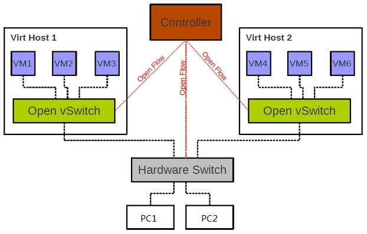

## 组件

 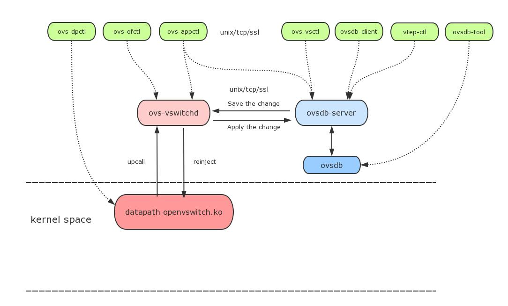

主要组成部分包括：

- ovs-vswitchd

  a daemon that implements the switch, along with a companion Linux kernel module for flow-based switching.

  一个实现交换的守护程序，以及一个用于基于流的交换的配套Linux内核模块。ovs 守护进程，实现基于流的交换,实现内核datapath upcall 处理以及ofproto 查表，同时是dpdk  datapath处理程序。与ovsdb-server通信使用OVSDB协议，与内核模块使用netlink机制通信，与controller通信使用OpenFlow协议。

- ovsdb-server

  一个轻量级数据库服务器，ovs-vswitchd 通过查询来获取其配置。OVS轻量级的数据库服务器的服务程序，用于保存整个OVS的配置信息。数据库服务程序, 使用目前普遍认可的ovsdb 协议。

- ovs-db

  开放虚拟交换机数据库是一种轻量级的数据库，它是一个JSON文件，默认路径:/etc/openvswitch/conf.db;

- ovs-dpctl

  一个用于配置交换机内核模块的工具。配置vswitch内核模块。配置vswitch内核模块，可以控制转发规则。

- 为 RHEL 构建 RPM 和为 Ubuntu / Debian 构建 deb 包的脚本和规范。

- ovs-vsctl

  一个用于查询和更新 ovs-vswitchd 配置的实用程序。网桥、接口等的创建、删除、设置、查询等。获取或者更改ovs-vswitchd的配置信息，此工具操作的时候会更新ovsdb-server中的数据库。ovs-vSwitch管理程序，可以进行网桥、接口等的创建、删除、设置、查询等（即获取或更改ovs-vswitchd的配置信息），此工具操作的时候会通过ovsdb-server更新数据库。

- ovs-appctl

  一个向正在运行的 Open vSwitch 守护程序发送命令的实用程序。发送命令消息到ovs-vswithchd, 查看不同模块状态。用于查询和控制ovs-vswithchd。

- datapath

  Datapath把流的match和action结果缓存，避免后续同样的流继续upcall到用户空间进行流表匹配。Datapath把流的match和action结果缓存，避免后续同样的流继续upcall到用户空间进行流表匹配。

Open vSwitch 还提供了一些工具：

- ovs-ofctl

  一个用于查询和控制 OpenFlow 交换机和控制器的实用程序。下发流表信息。该命令可以配置其他openflow 交换机（采用openflow 协议）操作交换机里的流表。基于 OpenFlow 协议对 OpenFlow 交换机进行监控和管理，下发流表信息等。

- ovs-pki

  一个用于创建和管理开放流交换机公钥基础设施的实用程序。the public-key infrastructure for OpenFlow switches.

- ovs-testcontroller

  一个简单的 OpenFlow 控制器，可能对测试有用（但不适用于生产）。

- tcpdump 补丁，使其能够解析 OpenFlow 消息。 that enables it to parse OpenFlow messages.

- ovsdb-tool

  对ovsdb数据库操作，不经过ovsdb-server模块。ovsdb-tool 直接操作数据库，无需借助ovsdb-server。

- **ovsdb-client：**访问 ovsdb-server 的客户端程序，通过 ovsdb-server 执行数据库操作。

- **vtep-ctl：**VTEP（VXLAN隧道端点模拟器（VXLAN Tunnel EndPoint，VTEP））配置工具。


可以通过命令ovsdb-client dump将数据库结构打印出来。OVSDB中包含一系列记录网桥、端口、QoS等网络配置信息的表，这些表均以JSON格式保存。

每一个 ovs 交换机中，数据库中存在的表如下：

 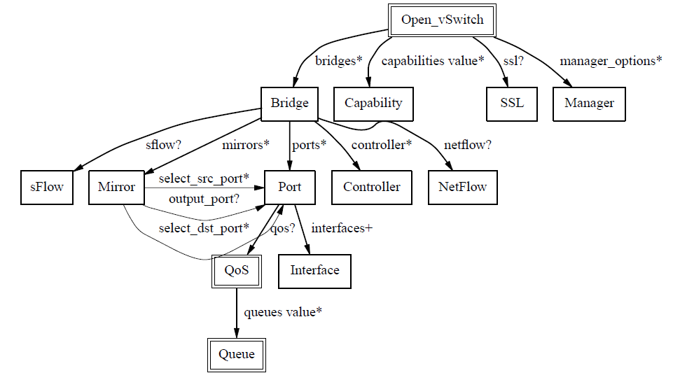

## 数据包处理流程 

1. ovs 的 datapath 接收到从 ovs 连接的某个网络设备发来的数据包，从数据包中提取源 / 目的 IP、源 / 目的 MAC、端口等信息。
2. ovs 在内核状态下查看流表结构（通过 Hash），观察是否有缓存的信息可用于转发这个数据包。
3. 假设数据包是这个网络设备发来的第一个数据包，在 OVS 内核中，将不会有相应的流表缓存信息存在，那么内核将不会知道如何处置这个数据包。所以内核将发送 upcall 给用户态。
4. ovs-vswitchd 进程接收到 upcall 后，将检查数据库以查询数据包的目的端口是哪里，然后告诉内核应该将数据包转发到哪个端口，例如 eth0。
5. 内核执行用户此前设置的动作。即内核将数据包转发给端口 eth0，进而数据被发送出去。

## 控制器

控制器是给交换机下发流表的设备。

## 流表

当交换机连接上控制器之后，控制器会给交换机发送流表。

一个最简单的流表由 3 部分组成，分别是：

* 匹配项

  用来匹配流量的特征，例如传统交换机能够根据 mac 地址转发，路由器能够根据 ip 地址转发。mac，ip 都是流量的特征。

* 动作

  动作是匹配项匹配到数据之后采取的动作，包括转发和丢弃这两个最常见的动作。

* 计数器

 

在 OpenStack 的 ovs 交换机中，流表是这样的：

 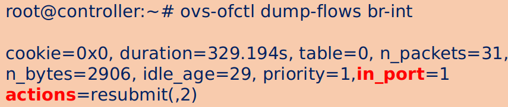

 可以看到in_port=1是一种匹配项，actions指明了转发动作。

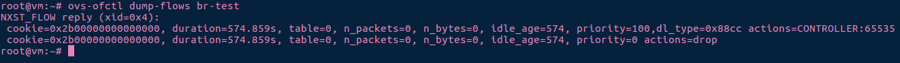

对于以上两条流表来说转发动作分别是 CONTROLLER:65535  （转发给控制器）和drop （丢弃）。这两个动作是怎么执行呢？以上两个流表都没有匹配项，就是说默认匹配进入的所有的流量。一个转发，一个丢弃，到底执行谁呢？这个根据优先级来选择，priority 是优先级，作用是优先级越高，流表越先执行。所有第一条：actions=CONTROLLER:65535  发挥效果。这也符合常识，交换机里没有流表，所以进入的流表都要交给控制器，让控制器去完成计算和流表下发。

## 在 OpenStack 中的应用

OpenStack 中的网桥 br-int、br-tun、br-ex 都由 ovs 创建，其中保存流表，用于指定数据流方向。

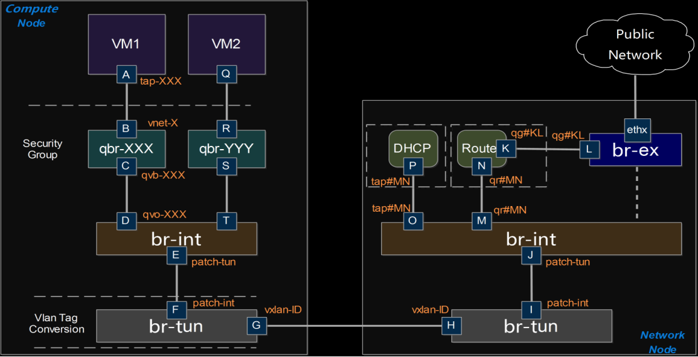

**启用Open vSwitch的日志功能以便调试和排障**

Open  vSwitch具有一个内建的日志机制，它称之为VLOG。VLOG工具允许你在各种网络交换组件中启用并自定义日志，由VLOG生成的日志信息可以被发送到一个控制台、syslog以及一个便于查看的单独日志文件。你可以通过一个名为ovs-appctl的命令行工具在运行时动态配置OVS日志。


这里为你演示如何使用ovs-appctl启用Open vSwitch中的日志功能，并进行自定义。

下面是ovs-appctl自定义VLOG的语法。


复制代码代码如下:
$ sudo ovs-appctl vlog/set module[:facility[:level]] 
Module：OVS中的任何合法组件的名称（如netdev，ofproto，dpif，vswitchd等等）
Facility：日志信息的目的地（必须是：console，syslog，或者file）
Level：日志的详细程度（必须是：emer，err，warn，info，或者dbg）
在OVS源代码中，模块名称在源文件中是以以下格式定义的：

VLOG_DEFINE_THIS_MODULE();
例如，在lib/netdev.c中，你可以看到：

VLOG_DEFINE_THIS_MODULE(netdev);
这个表明，lib/netdev.c是netdev模块的一部分，任何在lib/netdev.c中生成的日志信息将属于netdev模块。

在OVS源代码中，有多个严重度等级用于定义几个不同类型的日志信息：VLOGINFO()用于报告，VLOGWARN()用于警告，VLOGERR()用于错误提示，VLOGDBG()用于调试信息，VLOG_EMERG用于紧急情况。日志等级和工具确定哪个日志信息发送到哪里。

要查看可用模块、工具和各自日志级别的完整列表，请运行以下命令。该命令必须在你启动OVS后调用。


复制代码代码如下:
$ sudo ovs-appctl vlog/list 


输出结果显示了用于三个场合（facility：console，syslog，file）的各个模块的调试级别。默认情况下，所有模块的日志等级都被设置为INFO。

指定任何一个OVS模块，你可以选择性地修改任何特定场合的调试级别。例如，如果你想要在控制台屏幕中查看dpif更为详细的调试信息，可以运行以下命令。


复制代码代码如下:
$ sudo ovs-appctl vlog/set dpif:console:dbg 
你将看到dpif模块的console工具已经将其日志等级修改为DBG，而其它两个场合syslog和file的日志级别仍然没有改变。

如果你想要修改所有模块的日志等级，你可以指定“ANY”作为模块名。例如，下面命令将修改每个模块的console的日志级别为DBG。

复制代码代码如下:
$ sudo ovs-appctl vlog/set ANY:console:dbg


同时，如果你想要一次性修改所有三个场合的日志级别，你可以指定“ANY”作为场合名。例如，下面的命令将修改每个模块的所有场合的日志级别为DBG。

复制代码代码如下:$ sudo ovs-appctl vlog/set ANY:ANY:dbg 


可以通过命令ovsdb-client dump将数据库结构打印出来。OVSDB中包含一系列记录网桥、端口、QoS等网络配置信息的表，这些表均以JSON格式保存。

今天先来看看一个使用频率很高的命令**ovs-vsctl。**

前面介绍到ovs-vsctl是ovs-vswitchd进程的管理程序。前面提到的网桥类似交换机，每个都可以有多个vport，vport就类似于是交换机的网口。


**1.查看网桥信息**


ovs-vsctl show 查看网桥信息


新安装的机器没有任何网桥信息，可以显示主机ID以及交换机版本信息，主机ID在连接控制器之后才会有作用。


**2.添加网桥**


ovs-vsctl add-br br0 添加网桥


可以看到创建后的网桥br0。网桥相当于物理交换机，根据流表，将端口收到的包转发至一个或多个端口。

**Bridge br0：**指网桥br0；

**Port br0：**指网桥br0的端口，端口名称是br0；这个和网桥同名的端口可以理解为环回口。

**type: internal：**表示端口类型。此时会发现操作系统中会创建一个虚机网卡br0（状态为down），此端口收到的所有数据包会将流量转发到这张网卡，这张网卡发出的数据会通过port br0这个端口进入ovs。当创建网桥时，默认会创建与网桥同名的internal port，并创建一个同名的Interface接口。

**Interface br0：**接口br0是ovs与外部交换数据包的组件，一个接口就是操作系统的一块网卡，这块网卡可能是Open vSwitch生成的虚拟网卡（**本次情况）**，也可能是物理网卡挂载在Open vSwitch上，也可能是操作系统的虚拟网卡（TUN/TAP）挂载在Open vSwitch上。

**配置虚拟网卡br0地址：**

ip address add 192.168.83.132/24 dev br0


**3.添加port**


为操作物理网卡挂载在Open vSwitch上，又为该虚机添加了网卡ens36，将网卡ens36添加在网桥br0上：


ovs-vsctl list-br 列出所有网桥

ovs-vsctl list-ports br0  列出连接到网桥br0的所有网络接口

此时可以看到有两个port，两个接口：


查看ens36网络接口加入的网桥：

ovs-vsctl port-to-br ens36


删除ens36接口地址，网卡加入网桥后，就变成了二层接口，无需配置地址。


为了验证是通过br0连接，将ens33地址也删除，删除后，ssh立马连接就断开了，验证目前ssh是电脑本地网卡和虚机的ens33网卡通信的。


通过网桥br0管理地址连接虚机正常（需要手工up一下br0网卡，否则连接不上）：


根据前面描述：此端口收到的所有数据包会将流量转发到这张网卡，这张网卡发出的数据会通过port  br0这个端口进入ovs。目前流量从ens36接收后会通过桥转发到br0端口，将ens36接口down掉，网桥内br0端口应该收不到ssh请求。果然Down掉接口后连接立马断开：


此时对br0网卡抓包没有icmp流量，也无法ping通：


ifconfig ens36 up 开启ens36接口后，登录正常：


**4.删除port及网桥**


ovs-vsctl del-port br0 ens36 删除br0网桥的ens36 port

删除后，连接断开：


查看ovs信息，端口没有了:


如果删除port时不指明名字，那么将会删除全部的port。

ovs-vsctl del-br br0 删除网桥


今天先到这里，下次试试虚机间通信。

根据前面学习的RFC:7047 OVSDB管理协议的规范，可以了解到OVSDB管理协议主要是管理OVS交换机的OVSDB数据库，OVSDB架构如图所示：


OVS包含三个重要的组件：OVSDB-Server、OVS-vSwitchd以及OVS内核模块：

- **OVSDB-Server**：OVS的数据库服务器端，用于存储虚拟交换机的配置信息（比如网桥、端口等），为控制器和OVS-vSwitchd提供OVSDB操作接口。OVSDB位于OVS本地，OVSDB-server对应的客户端可以是控制器，通过OVSDB 管理协议向OVSDB-Server端发送数据库配置和查询的命令；也可以是运行在Open  vSwitch本地的命令行工具，即管理员可以在OVS本地以命令行方式输入数据库配置和查询命令。
- **OVS-vSwitchd**：OVS的核心组件，OVS守护进程，负责保存和管理控制器下发的所有流表，为OVS的内核模块提供流表查询功能，并为控制器提供OpenFlow协议的操作接口。
- **OVS内核模块**：缓存某些常用流表，并负责数据包转发（由转发部分Forwarding Path负责），当遇到无法匹配的报文，该模块将向OVS-vSwitchd发送请求，获取报文处理指令。OVS内核模块可以实现多个datapath，每个datapath可以有多个vport。

简单理解就是OVSDB-Server管配置、OVS-vSwitchd管流表，内核管转发。


根据前面操作，正常顺序即：

- 配置可用数据库；
- 配置ovsdb-server使用数据库并侦听 Unix 域套接字
- ovsdb-tool 创建数据库后第一次需要初始化数据库；
- 启动守护进程，连接到同一个 Unix 域套接字；
- 检查进程是否都启动


**7.验证**

现在就可以查看版本，添加网桥等。


openvswitch有几个脚本放在/usr/local/share/openvswitch/scripts下，为了方便使用，可以设置PATH路径。由于运行需要root权限，可以切换到root，再设置PATH。

export PATH=$PATH:/usr/local/share/openvswitch/scripts
ovs-ctl start 

    1
    2

在这里插入图片描述

system ID not configured, please use --system-id ... failed!

    1

这里有一个失败，可以不用管它。

这样的方式在下次启动后，还需要再手动开启，可以加入服务中自动启动。

验证是否开启：

ps -e | grep ovs

    1

在这里插入图片描述

ovs-vsctl show

    1

在这里插入图片描述
四、卸载OVS的内核模块

如果想要卸载，先停止服务：

ovs-ctl stop

    1

查看OVS datapath：

ovs-dpctl show

    1

在这里插入图片描述
删除datapath：

ovs-dpctl del-dp ovs-system

    1

在这里插入图片描述
卸载openvswitch内核模块

rmmod openvswitch

    1

此时查看内核模块，不再有openvswitch

lsmod | grep openvswitch

    1

五、加入服务自动启动
2. CentOS7及以上版本：

在/usr/lib/systemd/system/下创建一个ovs.service文件，内容如下：


    [Unit]
    Description=Open vSwitch server daemon
    After=network.target
    
    [Service]
    Type=oneshot
    RemainAfterExit=yes
    ExecStart=/usr/local/share/openvswitch/scripts/ovs-ctl start
    ExecStop=/usr/local/share/openvswitch/scripts/ovs-ctl stop
    
    [Install]
    WantedBy=multi-user.target

并将之添加运行权限：

chmod 777 ./ovs.service

    1

然后使用：

systemctl enable ovs

    1

在这里插入图片描述
设置为开机启动。

重启系统后可以看到进程：


当前最新代码包主要包括以下模块和特性：

- ovs-vswitchd 主要模块，实现switch的daemon，包括一个支持流交换的Linux内核模块；
- ovsdb-server 轻量级数据库服务器，提供ovs-vswitchd获取配置信息；
- ovs-brcompatd 让ovs-vswitch替换Linuxbridge，包括获取bridge ioctls的Linux内核模块；
- ovs-dpctl 用来配置switch内核模块；

一些Scripts and specs 辅助OVS安装在Citrix XenServer上，作为默认switch；

- ovs-vsctl 查询和更新ovs-vswitchd的配置；
- ovs-appctl 发送命令消息，运行相关daemon；
- ovsdbmonitor GUI工具，可以远程获取OVS数据库和OpenFlow的流表。

此外，OVS也提供了支持OpenFlow的特性实现，包括

- ovs-openflowd：一个简单的OpenFlow交换机；
- ovs-controller：一个简单的OpenFlow控制器；
- ovs-ofctl 查询和控制OpenFlow交换机和控制器；
- ovs-pki ：OpenFlow交换机创建和管理公钥框架；
- ovs-tcpundump：tcpdump的补丁，解析OpenFlow的消息；

内核模块实现了多个“数据路径”（类似于网桥），每个都可以有多个“vports”（类似于桥内的端口）。每个数据路径也通过关联一下流表（flow  table）来设置操作，而这些流表中的流都是用户空间在报文头和元数据的基础上映射的关键信息，一般的操作都是将数据包转发到另一个vport。当一个数据包到达一个vport，内核模块所做的处理是提取其流的关键信息并在流表中查找这些关键信息。当有一个匹配的流时它执行对应的操作。如果没有匹配，它会将数据包送到用户空间的处理队列中（作为处理的一部分，用户空间可能会设置一个流用于以后碰到相同类型的数据包可以在内核中执行操作）。

## 二、open vswitch常用操作

以下操作都需要root权限运行，在所有命令中br0表示网桥名称，eth0为网卡名称。

添加网桥：

```
#ovs-vsctl add-br br0
```

列出open vswitch中的所有网桥：

```
#ovs-vsctl list-br
```

判断网桥是否存在

```
#ovs-vsctl br-exists br0
```

将物理网卡挂接到网桥：

```
#ovs-vsctl add-port br0 eth0
```

列出网桥中的所有端口：

```
#ovs-vsctl list-ports br0
```

列出所有挂接到网卡的网桥：

```
#ovs-vsctl port-to-br eth0
```

查看open vswitch的网络状态：

```
#ovs-vsctl show
```

删除网桥上已经挂接的网口：

```
#vs-vsctl del-port br0 eth0
```

删除网桥：

```
#ovs-vsctl del-br br0
```

## 三、使用open vswitch构建虚拟网络

1、构建物理机和物理机相互连接的网络
 在安装open vswitch的主机上有两块网卡，分别为eth0、eth1，把这两块网卡挂接到open vswitch的网桥上，然后有两台物理机host1、host2分别连接到eth0和eth1上，实现这两台物理机的通信。构建结果图如下：
 

执行以下命令：

```
#ovs-vsctl add-br br0 //建立一个名为br0的open vswitch网桥
#ovs-vsctl add-port br0 eth0 //把eth0挂接到br0中
#ovs-vsctl add-port br0 eth1 //把eth1挂接到br0中
```

## 2、构建虚拟机与虚拟机相连的网络

在安装open vswitch的主机上安装两个虚拟机，把两个虚拟机的网卡都挂接在open vswitch的网桥上，实现两台虚拟机的通信，构建结果图如下：
 
 执行以下命令：

```
# ovs-vsctl add-br br0 //建立一个名为br0的open vswitch网桥
```

如果使用vbox或virt-manager把bridge设置为br0即可，如果使用cli kvm则先创建两个文件，用于虚拟网卡的添加于删除。假设这两个文件分别为/etc/ovs-ifup和/etc/ovs-ifdown，则向这两个文件中写入以下内容
 /etc/ovs-ifup

```
#!/bin/sh

switch='br0'
/sbin/ifconfig $1 0.0.0.0 up
ovs-vsctl add-port ${switch} $1
```

/etc/ovs-ifdown

```
#!/bin/sh

switch='br0'
/sbin/ifconfig $1 0.0.0.0 down
ovs-vsctl del-port ${switch} $1
```

使用以下命令建立虚拟机

```
kvm -m 512 -net nic,macaddr=00:11:22:33:44:55-net \

tap,script=/etc/ovs-ifup,downscript=/etc/ovs-ifdown-drive\

file=/path/to/disk-image,boot=on

kvm -m 512 -net nic,macaddr=11:22:33:44:55:66-net \

tap,script=/etc/ovs-ifup,downscript=/etc/ovs-ifdown-drive\

file=/path/to/disk-image,boot=on
```

## 3、构建虚拟机与物理机相连的网络

在装有open vswitch的主机上有一个物理网卡eth0，一台主机通过网线和eth0相连，在open vswitch的主机上还装有一台虚拟机，把此虚拟机和连接到eth0的主机挂接到同一个网桥上，实现两者之间的通信，构建结果图如下：
 
 执行命令：

```
# ovs-vsctl add-br br0 //建立一个名为br0的open vswitch网桥
# ovs-vsctl add-port br0 eth0 //把eth0挂接到br0中
# kvm -m 512 -net nic,macaddr=00:11:22:33:44:55-net \
tap,script=/etc/ovs-ifup,downscript=/etc/ovs-ifdown-drive\
file=/path/to/disk-image,boot=on //ovs-ifup和ovs-ifdown和上一节中相同
```

## 4、构建网桥和网桥相连的网络

以上操作都是将多个主机（物理机或虚拟机）连接到同一个网桥上，实现它们之间的通信，但是要构建复杂的网络，就需要多个网桥，在装有open vswitch的主机上建立两个网桥，实现它们之间的连接，构建结果如下：
 
 执行命令：

```
ovs-vsctl add-br br 添加一个名为br0的网桥
ovs-vsctl add-br br1 //添加一个名为br0的网桥

ovs-vsctl add-port br0 patch-to-br1 //为br0添加一个虚拟端口

ovs-vsctl set interface patch-to-br1type=patch //把patch-to-br1的类型设置为patch
ovs-vsctl set interface patch-to-br1 options:peer=patch-to-br0 把对端网桥和此网桥连接的端口名称设置为patch-to-br0

ovs-vsctl add-port br1 patch-to-br0 //为br0添加一个虚拟端口
ovs-vsctl set interface patch-to-br0type=patch //把patch-to-br0的类型设置为patch

ovs-vsctl set interface patch-to-br0options:peer=patch-to-br1 //把对端网桥和此网桥连接的端口名称设置为patch-to-br1

ovs-vsctl set interface patch-to-br0type=patch 和ovs-vsctl set interface patch-to-br0 options:peer=patch-to-br1是对ovs-database的操作，有有兴趣的同学可以参考ovs-vswitchd.conf.db.5
```

## 5、在不同的主机之间构建网桥之间的连接

在两台机器上分别安装上open vswitch并创建网桥，分别为两个网桥添加物理网卡，然后通过网线连接两个网桥，实现两个网桥之间的互通。构建结果图如下：
 
 执行命令：
 host1

```
#ovs-vsctl add-br br0 //添加名为br0的网桥
#ovs-vsctl add-port br0 eth0 //把eth0挂接到br0上
```

host2

```
#ovs-vsctl add-br br0 //添加名为br0的网桥
#ovs-vsctl add-port br0 eth0 //把eth0挂接到br0上
```

然后使用网线把host1的eth0和host2的eth0相连即可。

使用上边五种方法的组合就可以构建出各种复杂的网络，为各种实验提供网络的支持。


是一个由纯软件实现的二层交换机功能，可以实现全部交换机的功能，二层交换、网络隔离、QoS、流量监控、vxlan等等，用于虚拟化场景下，配合sdn实现交换机的控制和转发分离，网络的自动化和可编程能力，能适应网络的架构快速变化。
ovs的架构

在这里插入图片描述
用户态

    ovs-vswitchd
    交换机的功能实现，vSwitch的守候进程daemon，包括一个支持流交换的Linux内核模块。
    
    ovsdb-server
    数据库用于保存ovs配置信息，ovs-vswitchd获取数据。
    
    管理命令
        ovs-vsctl：主要获取或更改ovs-vswitchd的配置信息，此工具操作时会更新ovsdb-server中的数据库。
        ovs-ofctl：查询和控制OpenFlow虚拟交换机的流。
        ovs-dpctl：用来配置vSwitch内核模块的一个工具。
        ovs-appctl：一个向ovs-vswtichd的守护进程发送命令的程序。

内核态

    datapath：内核模块，属于快速转发平面，根据流表匹配结果做相应处理。

sdn中架构

sdn控制器实现集中管理，区别于硬件交换机的独立管理。
在这里插入图片描述
SDN控制器

实现控制转发分离
实现网络资源的可编程

    OpenStack Neutron
    基于Linuxnamespace，构建一个个相对独立的虚拟网络功能单元。通过这些网络功能单元提供OpenStack所需要的网络服务。
    
    OpenDayLight
    在这里插入图片描述
    
    OpenDayLight
    基于Java+OSGI，实现众多网络的隔离，极大的增加了控制层面的扩展性。ODL趋向于变成SDN Platform，架构变得相对复杂
    在这里插入图片描述
    
    ONOS
    基于Java+OSGI，实现众多网络的隔离，ONOS专门针对service provider场景，目的是提供一个SDN系统。在这里插入图片描述

Openflow网络协议

Openflow是实现sdn控制器与ovs之前传输的网络协议，由于sdn采用了控制转发分离，那么控制器就要承担l2交换机的功能，从而拓扑架构无需要网络设备的改动。
Openflow三种消息类型

    controller-to-switch：由控制器发起，管理和查看交换机。
    asynchronous：交换机发起，报告状态和改变到控制端。
    symmetric：控制器和交换器任意发起消息，无需请求。
    在这里插入图片描述

控制器和交换机建立过程

在这里插入图片描述

    建立tcp连接，控制端端口3366
    互发hello消息，确认openflow版本号，以较低的版本为准
    控制端发送features请求交换机上报自己的配置参数，交换机进行回复
    控制器通过get config下发配置参数到交换机，再通过get config request请求交换机上报自己的当前配置
    控制器与交换机之间发送packet_out和packet_in进行LLDP网络拓扑探测
    控制器与交换机之间发送multipart_request和multipart_reply，控制端获取交换机的状态，流表、端口等等
    echo是控制器与交换机之间的心跳，保证两者之间有效链接


Hypervisors need the ability to bridge traffic between VMs and with the outside world. On Linux-based hypervisors, this used to mean using the built-in L2 switch (the Linux bridge), which is fast and reliable. So, it is reasonable to ask why Open vSwitch is used.

The answer is that Open vSwitch is targeted at multi-server virtualization deployments, a landscape for which the previous stack is not well suited. These environments are often characterized by highly dynamic end-points, the maintenance of logical abstractions, and (sometimes) integration with or offloading to special purpose switching hardware.

The following characteristics and design considerations help Open vSwitch cope with the above requirements.

虚拟机监控程序需要能够在虚拟机之间以及与外部世界之间架起通信桥梁。在基于Linux的管理程序上，这意味着使用内置的L2交换机（Linux网桥），这是一种快速可靠的方法。因此，有理由询问为什么使用Open v Switch。

答案是Open v Switch的目标是多服务器虚拟化部署，而以前的堆栈并不适合这种情况。这些环境的特点通常是高度动态的端点、逻辑抽象的维护以及（有时）与专用交换硬件的集成或卸载。

以下特性和设计注意事项有助于Open v Switch满足上述要求。

国家的流动性¶

与网络实体（例如虚拟机）相关联的所有网络状态都应易于识别，并可在不同主机之间迁移。这可能包括传统的“软状态”（如L2学习表中的条目）、L3转发状态、策略路由状态、ACL、QoS策略、监控配置（如Net Flow、IPFIX、S Flow）等。

Open v  Switch支持在实例之间配置和迁移慢速（配置）和快速网络状态。例如，如果VM在终端主机之间迁移，则不仅可以迁移相关配置（SPAN规则、ACL、QoS），还可以迁移任何实时网络状态（例如，包括可能难以重建的现有状态）。此外，Open v Switch状态是类型化的，并由允许开发结构化自动化系统的真实数据模型支持。

响应网络动态¶

虚拟环境的特点通常是变化率高。虚拟机来来往往，虚拟机在时间上前后移动，逻辑网络环境的变化等等。

Open v Switch支持多种功能，允许网络控制系统在环境变化时做出响应和调整。这包括简单的会计和可见性支持，如Net Flow、IPFIX和s  Flow。但也许更有用的是，Open v  Switch支持支持远程触发器的网络状态数据库（OVSDB）。因此，一个编排软件可以“监视”网络的各个方面，并在它们发生变化时做出响应。例如，这在今天被大量用于响应和跟踪VM迁移。

Open v Switch还支持Open Flow作为导出远程访问以控制流量的方法。这有许多用途，包括通过检查发现或链路状态流量（例如LLDP、CDP、OSPF等）进行全局网络发现。

逻辑标签维护¶

分布式虚拟交换机（如VMware v DS和Cisco的Nexus  1000V）通常通过在网络数据包中附加或操纵标签来维护网络中的逻辑上下文。这可以用来唯一地标识VM（以一种抵抗硬件欺骗的方式），或者保存仅与逻辑域相关的其他上下文。构建分布式虚拟交换机的大部分问题是如何有效和正确地管理这些标签。

Open v Switch包含多个用于指定和维护标记规则的方法，所有这些方法都可由远程流程访问以进行编排。此外，在许多情况下，这些标记规则以优化的形式存储，因此它们不必与重量级网络设备耦合。例如，这允许配置、更改和迁移数千个标记或地址重新映射规则。

同样，Open v Switch支持GRE实现，可以处理数千个同时的GRE隧道，并支持远程配置以创建、配置和拆除隧道。例如，这可以用于连接不同数据中心中的专用VM网络。

硬件集成¶

Open v Switch的转发路径（内核内数据路径）设计为能够将数据包处理“卸载”到硬件芯片组，无论是安装在经典的硬件交换机机箱中还是安装在终端主机NIC中。这允许Open v Switch控制路径能够控制纯软件实现或硬件交换机。

有许多正在努力将Open v Switch移植到硬件芯片组。其中包括多个商用硅芯片组（Broadcom和Marvell），以及多个特定于供应商的平台。文档中的“移植”部分讨论了如何创建这样的端口。

硬件集成的优势不仅在于虚拟化环境中的性能。如果物理交换机也公开了Open v Switch控制抽象，那么裸机和虚拟主机环境都可以使用相同的自动网络控制机制进行管理。

摘要¶

在许多方面，Open v Switch针对的设计空间与以前的虚拟机监控程序网络堆栈不同，重点是在大规模基于Linux的虚拟化环境中实现自动化和动态网络控制的需要。

Open v Switch的目标是使内核代码尽可能小（这是性能所必需的），并在适用时重用现有的子系统（例如Open v Switch使用现有的Qo  S堆栈）。从Linux 3.3开始，Open v Switch作为内核的一部分，大多数流行的发行版都提供了用户空间实用程序的打包。

## The mobility of state[¶](https://docs.openvswitch.org/en/latest/intro/why-ovs/#the-mobility-of-state)

All network state associated with a network entity (say a virtual machine) should be easily identifiable and migratable between different hosts. This may include traditional “soft state” (such as an entry in an L2 learning table), L3 forwarding state, policy routing state, ACLs, QoS policy, monitoring configuration (e.g. NetFlow, IPFIX, sFlow), etc.

Open vSwitch has support for both configuring and migrating both slow (configuration) and fast network state between instances. For example, if a VM migrates between end-hosts, it is possible to not only migrate associated configuration (SPAN rules, ACLs, QoS) but any live network state (including, for example, existing state which may be difficult to reconstruct). Further, Open vSwitch state is typed and backed by a real data-model allowing for the development of structured automation systems.

## Responding to network dynamics[¶](https://docs.openvswitch.org/en/latest/intro/why-ovs/#responding-to-network-dynamics)

Virtual environments are often characterized by high-rates of change. VMs coming and going, VMs moving backwards and forwards in time, changes to the logical network environments, and so forth.

Open vSwitch supports a number of features that allow a network control system to respond and adapt as the environment changes. This includes simple accounting and visibility support such as NetFlow, IPFIX, and sFlow. But perhaps more useful, Open vSwitch supports a network state database (OVSDB) that supports remote triggers. Therefore, a piece of orchestration software can “watch” various aspects of the network and respond if/when they change. This is used heavily today, for example, to respond to and track VM migrations.

Open vSwitch also supports OpenFlow as a method of exporting remote access to control traffic. There are a number of uses for this including global network discovery through inspection of discovery or link-state traffic (e.g. LLDP, CDP, OSPF, etc.).

## Maintenance of logical tags[¶](https://docs.openvswitch.org/en/latest/intro/why-ovs/#maintenance-of-logical-tags)

Distributed virtual switches (such as VMware vDS and Cisco’s Nexus 1000V) often maintain logical context within the network through appending or manipulating tags in network packets. This can be used to uniquely identify a VM (in a manner resistant to hardware spoofing), or to hold some other context that is only relevant in the logical domain. Much of the problem of building a distributed virtual switch is to efficiently and correctly manage these tags.

Open vSwitch includes multiple methods for specifying and maintaining tagging rules, all of which are accessible to a remote process for orchestration. Further, in many cases these tagging rules are stored in an optimized form so they don’t have to be coupled with a heavyweight network device. This allows, for example, thousands of tagging or address remapping rules to be configured, changed, and migrated.

In a similar vein, Open vSwitch supports a GRE implementation that can handle thousands of simultaneous GRE tunnels and supports remote configuration for tunnel creation, configuration, and tear-down. This, for example, can be used to connect private VM networks in different data centers.

## Hardware integration[¶](https://docs.openvswitch.org/en/latest/intro/why-ovs/#hardware-integration)

Open vSwitch’s forwarding path (the in-kernel datapath) is designed to be amenable to “offloading” packet processing to hardware chipsets, whether housed in a classic hardware switch chassis or in an end-host NIC. This allows for the Open vSwitch control path to be able to both control a pure software implementation or a hardware switch.

There are many ongoing efforts to port Open vSwitch to hardware chipsets. These include multiple merchant silicon chipsets (Broadcom and Marvell), as well as a number of vendor-specific platforms. The “Porting” section in the documentation discusses how one would go about making such a port.

The advantage of hardware integration is not only performance within virtualized environments. If physical switches also expose the Open vSwitch control abstractions, both bare-metal and virtualized hosting environments can be managed using the same mechanism for automated network control.

## Summary[¶](https://docs.openvswitch.org/en/latest/intro/why-ovs/#summary)

In many ways, Open vSwitch targets a different point in the design space than previous hypervisor networking stacks, focusing on the need for automated and dynamic network control in large-scale Linux-based virtualization environments.

The goal with Open vSwitch is to keep the in-kernel code as small as possible (as is necessary for performance) and to re-use existing subsystems when applicable (for example Open vSwitch uses the existing QoS stack). As of Linux 3.3, Open vSwitch is included as a part of the kernel and packaging for the userspace utilities are available on most popular distributions.

This document lists various popular distributions packaging Open vSwitch. Open vSwitch is packaged by various distributions for multiple platforms and architectures.


## Debian / Ubuntu[¶](https://docs.openvswitch.org/en/latest/intro/install/distributions/#debian-ubuntu)

You can use `apt-get` or `aptitude` to install the .deb packages and must be superuser.

\1. Debian and Ubuntu has `openvswitch-switch` and `openvswitch-common` packages that includes the core userspace components of the switch.  Extra packages for documentation, ipsec, pki, VTEP and Python support are also available.  The Open vSwitch kernel datapath is maintained as part of the upstream kernel available in the distribution.

\2. For fast userspace switching, Open vSwitch with DPDK support is bundled in the package `openvswitch-switch-dpdk`.

## Fedora[¶](https://docs.openvswitch.org/en/latest/intro/install/distributions/#fedora)

Fedora provides `openvswitch`, `openvswitch-devel`, `openvswitch-test` and `openvswitch-debuginfo` rpm packages. You can install `openvswitch` package in minimum installation. Use `yum` or `dnf` to install the rpm packages and must be superuser.

## Red Hat[¶](https://docs.openvswitch.org/en/latest/intro/install/distributions/#red-hat)

RHEL distributes `openvswitch` rpm package that supports kernel datapath. DPDK accelerated Open vSwitch can be installed using `openvswitch-dpdk` package.

## OpenSuSE[¶](https://docs.openvswitch.org/en/latest/intro/install/distributions/#opensuse)

OpenSUSE provides `openvswitch`, `openvswitch-switch` rpm packages. Also `openvswitch-dpdk` and `openvswitch-dpdk-switch` can be installed for Open vSwitch using DPDK accelerated datapath.

# Debian Packaging for Open vSwitch[¶](https://docs.openvswitch.org/en/latest/intro/install/debian/#debian-packaging-for-open-vswitch)

This document describes how to build Debian packages for Open vSwitch. To install Open vSwitch on Debian without building Debian packages, refer to [Open vSwitch on Linux, FreeBSD and NetBSD](https://docs.openvswitch.org/en/latest/intro/install/general/) instead.

Note

These instructions should also work on Ubuntu and other Debian derivative distributions.

## Before You Begin[¶](https://docs.openvswitch.org/en/latest/intro/install/debian/#before-you-begin)

Before you begin, consider whether you really need to build packages yourself. Debian “wheezy” and “sid”, as well as recent versions of Ubuntu, contain pre-built Debian packages for Open vSwitch. It is easier to install these than to build your own. To use packages from your distribution, skip ahead to “Installing .deb Packages”, below.

## Building Open vSwitch Debian packages[¶](https://docs.openvswitch.org/en/latest/intro/install/debian/#building-open-vswitch-debian-packages)

You may build from an Open vSwitch distribution tarball or from an Open vSwitch Git tree with these instructions.

You do not need to be the superuser to build the Debian packages.

1. Install the “build-essential” and “fakeroot” packages. For example:

   ```
   $ apt-get install build-essential fakeroot
   ```

2. Obtain and unpack an Open vSwitch source distribution and `cd` into its top level directory.

3. Install the build dependencies listed under “Build-Depends:” near the top of `debian/control.in`. You can install these any way you like, e.g.  with `apt-get install`.

4. Prepare the package source.

   If you want to build the package with DPDK support execute the following command:

   ```
   $ ./boot.sh && ./configure --with-dpdk=shared && make debian
   ```

   If not:

   ```
   $ ./boot.sh && ./configure && make debian
   ```

Check your work by running `dpkg-checkbuilddeps` in the top level of your OVS directory. If you’ve installed all the dependencies properly, `dpkg-checkbuilddeps` will exit without printing anything. If you forgot to install some dependencies, it will tell you which ones.

1. Build the package:

   ```
   $ make debian-deb
   ```

1. The generated .deb files will be in the parent directory of the Open vSwitch source distribution.

## Installing .deb Packages[¶](https://docs.openvswitch.org/en/latest/intro/install/debian/#installing-deb-packages)

These instructions apply to installing from Debian packages that you built yourself, as described in the previous section.  In this case, use a command such as `dpkg -i` to install the .deb files that you build.  You will have to manually install any missing dependencies.

You can also use these instruction to install from packages provided by Debian or a Debian derivative distribution such as Ubuntu.  In this case, use a program such as `apt-get` or `aptitude` to download and install the provided packages.  These programs will also automatically download and install any missing dependencies.

Important

You must be superuser to install Debian packages.

1. Start by installing an Open vSwitch kernel module. See `debian/openvswitch-switch.README.Debian` for the available options.
2. Install the `openvswitch-switch` and `openvswitch-common` packages. These packages include the core userspace components of the switch.

Open vSwitch `.deb` packages not mentioned above are rarely useful. Refer to their individual package descriptions to find out whether any of them are useful to you.

# Fedora, RHEL 7.x Packaging for Open vSwitch[¶](https://docs.openvswitch.org/en/latest/intro/install/fedora/#fedora-rhel-7-x-packaging-for-open-vswitch)

This document provides instructions for building and installing Open vSwitch RPM packages on a Fedora Linux host. Instructions for the installation of Open vSwitch on a Fedora Linux host without using RPM packages can be found in the [Open vSwitch on Linux, FreeBSD and NetBSD](https://docs.openvswitch.org/en/latest/intro/install/general/).

These instructions have been tested with Fedora 23, and are also applicable for RHEL 7.x and its derivatives, including CentOS 7.x and Scientific Linux 7.x.

## Build Requirements[¶](https://docs.openvswitch.org/en/latest/intro/install/fedora/#build-requirements)

You will need to install all required packages to build the RPMs. Newer distributions use `dnf` but if it’s not available, then use `yum` instructions.

The command below will install RPM tools and generic build dependencies. And (optionally) include these packages: libcap-ng libcap-ng-devel dpdk-devel.

DNF:

```
$ dnf install @'Development Tools' rpm-build dnf-plugins-core
```

YUM:

```
$ yum install @'Development Tools' rpm-build yum-utils
```

Then it is necessary to install Open vSwitch specific build dependencies. The dependencies are listed in the SPEC file, but first it is necessary to replace the VERSION tag to be a valid SPEC.

The command below will create a temporary SPEC file:

```
$ sed -e 's/@VERSION@/0.0.1/' rhel/openvswitch-fedora.spec.in \
  > /tmp/ovs.spec
```

And to install specific dependencies, use the corresponding tool below. For some of the dependencies on RHEL you may need to add two additional repositories to help yum-builddep, e.g.:

```
$ subscription-manager repos --enable=rhel-7-server-extras-rpms
$ subscription-manager repos --enable=rhel-7-server-optional-rpms
```

or for RHEL 8:

```
$ subscription-manager repos \
  --enable=codeready-builder-for-rhel-8-x86_64-rpms
```

DNF:

```
$ dnf builddep /tmp/ovs.spec
```

YUM:

```
$ yum-builddep /tmp/ovs.spec
```

Once that is completed, remove the file `/tmp/ovs.spec`.

## Bootstraping[¶](https://docs.openvswitch.org/en/latest/intro/install/fedora/#bootstraping)

Refer to [Bootstrapping](https://docs.openvswitch.org/en/latest/intro/install/general/#general-bootstrapping).

## Configuring[¶](https://docs.openvswitch.org/en/latest/intro/install/fedora/#configuring)

Refer to [Configuring](https://docs.openvswitch.org/en/latest/intro/install/general/#general-configuring).

## Building[¶](https://docs.openvswitch.org/en/latest/intro/install/fedora/#building)

### User Space RPMs[¶](https://docs.openvswitch.org/en/latest/intro/install/fedora/#user-space-rpms)

To build Open vSwitch user-space RPMs, execute the following from the directory in which ./configure was executed:

```
$ make rpm-fedora
```

This will create the RPMs openvswitch, python3-openvswitch, openvswitch-test, openvswitch-devel and openvswitch-debuginfo.

To enable DPDK support in the openvswitch package, the `--with dpdk` option can be added:

```
$ make rpm-fedora RPMBUILD_OPT="--with dpdk --without check"
```

To enable AF_XDP support in the openvswitch package, the `--with afxdp` option can be added:

```
$ make rpm-fedora RPMBUILD_OPT="--with afxdp --without check"
```

You can also have the above commands automatically run the Open vSwitch unit tests.  This can take several minutes.

```
$ make rpm-fedora RPMBUILD_OPT="--with check"
```

## Installing[¶](https://docs.openvswitch.org/en/latest/intro/install/fedora/#installing)

RPM packages can be installed by using the command `rpm -i`. Package installation requires superuser privileges.

In most cases only the openvswitch RPM will need to be installed. The python3-openvswitch, openvswitch-test, openvswitch-devel, and openvswitch-debuginfo RPMs are optional unless required for a specific purpose.

Refer to the [RHEL README](https://github.com/openvswitch/ovs/blob/master/rhel/README.RHEL.rst) for additional usage and configuration information.

# Bash command-line completion scripts[¶](https://docs.openvswitch.org/en/latest/intro/install/bash-completion/#bash-command-line-completion-scripts)

There are two completion scripts available: `ovs-appctl-bashcomp.bash` and `ovs-vsctl-bashcomp.bash`.

## ovs-appctl-bashcomp[¶](https://docs.openvswitch.org/en/latest/intro/install/bash-completion/#ovs-appctl-bashcomp)

`ovs-appctl-bashcomp.bash` adds bash command-line completion support for `ovs-appctl`, `ovs-dpctl`, `ovs-ofctl` and `ovsdb-tool` commands.

### Features[¶](https://docs.openvswitch.org/en/latest/intro/install/bash-completion/#features)

- Display available completion or complete on unfinished user input (long option, subcommand, and argument).
- Subcommand hints
- Convert between keywords like `bridge`, `port`, `interface`, or `dp` and the available record in ovsdb.

### Limitations[¶](https://docs.openvswitch.org/en/latest/intro/install/bash-completion/#limitations)

- Only supports a small set of important keywords (`dp`, `datapath`, `bridge`, `switch`, `port`, `interface`, `iface`).

- Does not support parsing of nested options. For example:

  ```
  $ ovsdb-tool create [db [schema]]
  ```

- Does not support expansion on repeated argument. For example:

  ```
  $ ovs-dpctl show [dp...]).
  ```

- Only supports matching on long options, and only in the format `--option [arg]`. Do not use `--option=[arg]`.

## ovs-vsctl-bashcomp[¶](https://docs.openvswitch.org/en/latest/intro/install/bash-completion/#ovs-vsctl-bashcomp)

`ovs-vsctl-bashcomp.bash` adds Bash command-line completion support for `ovs-vsctl` command.

### Features[¶](https://docs.openvswitch.org/en/latest/intro/install/bash-completion/#id1)

- Display available completion and complete on user input for global/local options, command, and argument.
- Query database and expand keywords like `table`, `record`, `column`, or `key`, to available completions.
- Deal with argument relations like ‘one and more’, ‘zero or one’.
- Complete multiple `ovs-vsctl` commands cascaded via `--`.

### Limitations[¶](https://docs.openvswitch.org/en/latest/intro/install/bash-completion/#id2)

Completion of very long `ovs-vsctl` commands can take up to several seconds.

## Usage[¶](https://docs.openvswitch.org/en/latest/intro/install/bash-completion/#usage)

The bashcomp scripts should be placed at `/etc/bash_completion.d/` to be available for all bash sessions.  Running `make install` will place the scripts to `$(sysconfdir)/bash_completion.d/`, thus, the user should specify `--sysconfdir=/etc` at configuration.  If OVS is installed from packages, the scripts will automatically be placed inside `/etc/bash_completion.d/`.

If you just want to run the scripts in one bash, you can remove them from `/etc/bash_completion.d/` and run the scripts via `. ovs-appctl-bashcomp.bash` or `. ovs-vsctl-bashcomp.bash`.

## Tests[¶](https://docs.openvswitch.org/en/latest/intro/install/bash-completion/#tests)

Unit tests are added in `tests/completion.at` and integrated into autotest framework.  To run the tests, just run `make check`.

# Open vSwitch Documentation[¶](https://docs.openvswitch.org/en/latest/intro/install/documentation/#open-vswitch-documentation)

This document describes how to build the OVS documentation for use offline. A continuously updated, online version can be found at [docs.openvswitch.org](http://docs.openvswitch.org).

Note

These instructions provide information on building the documentation locally. For information on writing documentation, refer to [Documentation Style](https://docs.openvswitch.org/en/latest/internals/contributing/documentation-style/)

## Build Requirements[¶](https://docs.openvswitch.org/en/latest/intro/install/documentation/#build-requirements)

As described in the [Documentation Style](https://docs.openvswitch.org/en/latest/internals/contributing/documentation-style/), the Open vSwitch documentation is written in reStructuredText and built with Sphinx. A detailed guide on installing Sphinx in many environments is available on the [Sphinx website](http://www.sphinx-doc.org/en/master/usage/installation.html) but, for most Linux distributions, you can install with your package manager. For example, on Debian/Ubuntu run:

```
$ sudo apt-get install python3-sphinx
```

Similarly, on RHEL/Fedora run:

```
$ sudo dnf install python3-sphinx
```

A `requirements.txt` is also provided in the `/Documentation`, should you wish to install using `pip`:

```
$ virtualenv .venv
$ source .venv/bin/activate
$ pip install -r Documentation/requirements.txt
```

## Configuring[¶](https://docs.openvswitch.org/en/latest/intro/install/documentation/#configuring)

It’s unlikely that you’ll need to customize any aspect of the configuration. However, the `Documentation/conf.py` is the go-to place for all configuration. This file is well documented and further information is available on the [Sphinx website](http://www.sphinx-doc.org/en/master/config.html).

## Building[¶](https://docs.openvswitch.org/en/latest/intro/install/documentation/#building)

Once Sphinx is installed, the documentation can be built using the provided Makefile targets:

```
$ make docs-check
```

Important

The `docs-check` target will fail if there are any syntax errors. However, it won’t catch more succint issues such as style or grammar issues. As a result, you should always inspect changes visually to ensure the result is as intended.

Once built, documentation is available in the `/Documentation/_build` folder. Open the root `index.html` to browse the documentation.


## 安装

### 二进制包

```bash
# Ubuntu
sudo apt-get install openvswitch-switch

# 验证OVS内核模块
lsmod | grep openvswitch

Module			Size		Used by
openvswitch		66901	0
gre				13796	1	openvswitch
vxlan			37619	1	openvswitch
libcrc32c		12644	1	openvswitch
```

### 源码编译

1. 安装 python 。

   ```bash
   apt install python
   ```

2. 安装 python-pip 。

   ```bash
   apt install python-pip 
   ```

   如果不安装 pip，在下面的过程会报错找不到 six 模块。

3. 下载指定版本，并解压缩。

4. 生成 makefile 文件。

   ```bash
   ./configure
   ```

5. make 编译文件。

   ```bash
   make
   ```

6. 安装。

   ```bash
   make install
   ```

7. 检查模块。

   如果在安装的过程中生成了修改了内核模块，那么重新编译内核。

   ```bash
   make modules_install
   ```

8. 载入 openvswitch 的模块到内核中，并确认。

   ```bash
   /sbin/modprobe openvswitch
   /sbin/lsmod | grep openvswitch
   ```

9. 启动

   ```bash
   export PATH=$PATH:/usr/local/share/openvswitch/scripts
   ovs-ctl start 
   ```

10. 启动 ovsdb-server 服务。

    ```bash
    export PATH=$PATH:/usr/local/share/openvswitch/scripts
    ovs-ctl --no-ovs-vswitchd start
    ```

11. 启动 ovs-vswitchd 服务。

    ```bash
    export PATH=$PATH:/usr/local/share/openvswitch/scripts
    ovs-ctl --no--ovsdb-server start
    ```

12. 配置 ovsdb 的数据库。

    ```bash
    mkdir -p /usr/local/etc/openvswitch
    ovsdb-tool create /usr/local/etc/openvswitch/conf.db vswitchd/vswitch.ovsschema
    ```

13. 配置 ovsdb-server 以使用上面创建的数据库，监听 Unix 域套接字。

    ```bash
    mkdir -p /usr/local/var/run/openvswitch
    ovsdb-server --remote=punix:/usr/local/var/run/openvswitch/db.sock \
        --remote=db:Open_vSwitch,Open_vSwitch,manager_options \
        --private-key=db:Open_vSwitch,SSL,private_key \
        --certificate=db:Open_vSwitch,SSL,certificate \
        --bootstrap-ca-cert=db:Open_vSwitch,SSL,ca_cert \
        --pidfile --detach --log-file
    ```

14. 使用 ovs-vsctl 初始化数据库。

    ```bash
    ovs-vsctl --no-wait init
    ```

15. 启动主 Open vSwitch 守护进程。

    ```bash
    ovs-vswitchd --pidfile --detach --log-file
    ```

16. 使用 ovs-vsctl show 命令，查看 ovs 的版本号。


## ovs-vsctl

### 创建网桥

创建一个网桥，其实就是创建一个交换机。而端口则是指交换机的网口。

查看所有的网桥的信息。

```bash
ovs-vsctl show
```

因为这是一个刚装好ovs的机器，所以还没有任何网桥信息，但是还是有一些信息的。比如这一串数字指的是该主机的id，只在连接了SDN控制器之后才有作用；还有一个交换机的版本信息，这里的版本是2.5.5。

创建网桥。使用如下命令创建一个名字叫着 br-test的网桥。

```bash
ovs-vsctl add-br  br-test
```

查看创建后的网桥。


可以看到已经有创建好的网桥br-test了，Bridge br-test  指的是网桥br-test，那么在这个交换机中只有一个网口，是的，这个网口叫着port，即port  br-test。为什么我们只创建了网桥并没有创建端口这里却有一个呢？其实这个端口就是常见的环回口。在我们的电脑上都有一个叫着localhost的端口，交换机中也会有一个和交换机同名的网口，都是指环回口。

### 删除网桥

```bash
ovs-vsctl del-br br-test
```

值得注意的是：删除网桥时如果网桥上有很多端口，那么端口也会被一并删除。这个很好理解 

再次查看网桥信息


### 新建端口

在上面创建好一个网桥之后默认有一个同名的port，使用下面的命令可以继续添加port。格式是：ovs-vsctl add-port 网桥名 端口名 。这里端口需要是存在机器上的网卡名。

我的机器上的网卡的信息如下


因为我的机器上有网卡 enp0s3 所有可以使用下面的命令向网桥br-test上添加port enp0s3。如果想在自己的机器上做这个实验要把网卡替换成你机器的真实网卡。

```bash
ovs-vsctl add-port br-test enp0s3
```

再次查看，可以看到port由一个变成两个，多了一个叫enp0s3的port。


### 删除端口

```bash
ovs-vsctl del-port br-test enp0s3 
```


注意：如果删除port时不指明名字，那么将会删除全部的port，小心这个操作。

### 连接控制器

ovs交换作为SDN交换机连接到SDN控制器上才能发挥最大的效能。

```bash
ovs-vsctl set-controller br-test tcp:172.171.82.31:6633
```

查看此时网桥的配置信息，在 Bridge 下出现了一个 Controller ，控制器的 IP 是 172.171.82.31，端口是 6633，下面还有一个连接成功的状态：is_connected=True。


## ovs-ofctl 

ovs-ofctl 命令是对流表的操作，包括对流表的增，删，改，查等命令。简单来说流表类似于交换机的MAC地址表，路由器的路由表，是 ovs 交换机指挥流量转发的表。

 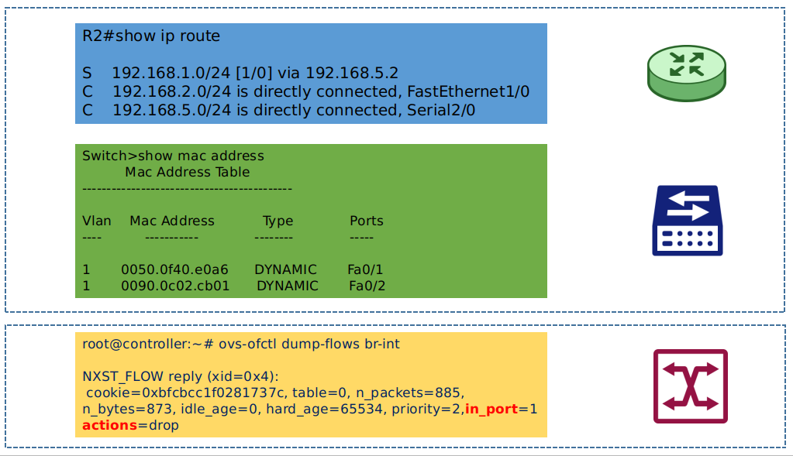

### 查看流表

```bash
ovs-ofctl dump-flows br-test
```


### 手动下发流表

流表（低版本）可以匹配 OSI 模型的 1 层至 4 层，如下图所示，对匹配到的流表做转发、丢弃或者更复杂的操作。具体的匹配项如下图所示：

 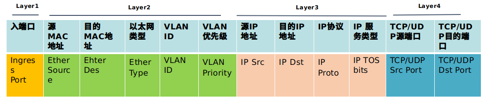 

下发流表的命令，需要加上匹配项和动作，可以匹配到上面提到 1 ~ 4 层。

```bash
ovs-ofctl add-flow 
```

1. 第一层：入端口

   in_port 表示入端口，匹配到之后的 actions 是 output:2 , 意思是从 2 端口转发出去。

    

   使用命令来查看刚刚下发的流表，可以在交换机中找到。

   ```
   ovs-ofctl dump-flows br-test
   ```

   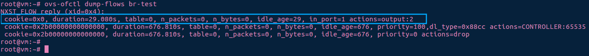

2. 第二层：匹配MAC地址

   匹配mac地址的关键字是：

   dl_src ：源mac地址

   dl_dst ：目的mac地址

   然后转发actions=output:2 从2端口转发出去

    

   查看流表下发是否成功： 

   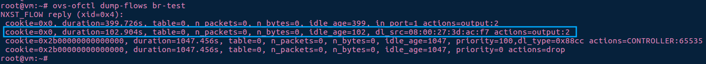

3. 第三层：匹配IP地址

   匹配网络层ip地址比匹配入端口和mac地址要复杂一些。因为网络层中除了IP协议外还有ICMP，IGMP等，所以需要指定匹配的是网络层中的哪一种协议。

   匹配方式：

   * 协议： dl_type=0x0800 或者 ip  表明是用于匹配哪一种协议
   * nw_src: 源ip地址
   * nw_dst: 目的ip地址

   **dl_type = 0x0800** 
   
    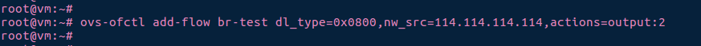
   
   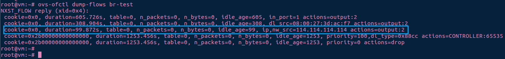
   
   **ip**
   
    
   
   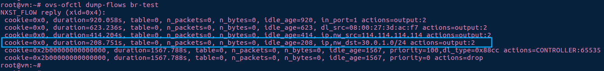
   
   更多匹配字段：
   
   | 字段名称                                            | 说明                                                         |
   | --------------------------------------------------- | ------------------------------------------------------------ |
   | in_port=port                                        | 传递数据包的端口的 OpenFlow 端口编号                         |
   | dl_vlan=vlan                                        | 数据包的 VLAN Tag 值，范围是 0-4095，0xffff 代表不包含 VLAN Tag 的数据包 |
   | dl_vlan_pcp=priority                                | VLAN 优先级，改值取值区间为[0-7]。数字越大，表示优先级越高。 |
   | dl_src=<MAC>                           dl_dst=<MAC> | 匹配源或者目标的 MAC  地址01:00:00:00:00:00/01:00:00:00:00:00 代表广播 地址00:00:00:00:00:00/01:00:00:00:00:00 代表单播 |
   | dl_type=ethertype                                   | 匹配以太网协议类型，其中： dl_type=0x0800 代表 IPv4 协议 dl_type=0x086dd 代表 IPv6 协议 dl_type=0x0806 代表 ARP 协议 |
   | nw_src=ip[/netmask]  nw_dst=ip[/netmask]            | 当 dl_typ=0x0800 时，匹配源或者目标的 IPv4 地址，可以使 IP 地址或者域名 |
   | nw_proto=proto                                      | 和 dl_type 字段协同使用。 当 dl_type=0x0800 时，匹配 IP 协议编号 当 dl_type=0x086dd 代表 IPv6 协议编号 |
   | table=number                                        | 指定要使用的流表的编号，范围是 0-254。 在不指定的情况下，默认值为 0 通过使用流表编号，可以创建或者修改多个 Table 中的 Flow |
   | reg<idx>=value[/mask]                               | 交换机中的寄存器的值。 当一个数据包进入交换机时，所有的寄存器都被清零，用户可以通过 Action 的指令修改寄存器中的值 |
   | tp_src=number                                       | TCP/UDP/SCTP 源端口                                          |
   | tp_dst=number                                       | TCP/UDP/SCTP 目的端口                                        |
   

### 删除流表

流表不仅要会添加，同时也要会删除。删除流表的命令是：ovs-ofctl del-flows + 网桥 + 匹配条件

匹配条件一：入端口

 

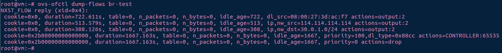

匹配条件二：源ip地址。删除去往 114.114.114.114 的流表 

 

## 网桥特性功能配置

ovs 作为一个交换机，既可以工作在 SDN 模式也可以工作在普通交换机模式。工作在普通交换机模式下就有 mac 自学习功能。和普通的交换机一样，ovs 交换机也能查看 mac 和端口关系的对应表。

查看网桥MAC学习地址表

```bash
ovs-appctl fdb/show s1
```

 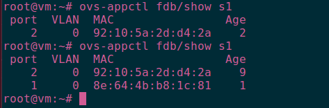

### 设置网桥不连接控制器的转发模式

ovs 交换机在连接不上控制器时有一个 fail_mode 的标志，所谓 fail_mode 就是故障模式，意思是 SDN 控制器故障时，交换机未连接控制器时的模式。

 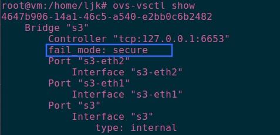

fail_mode 故障模式有两种状态：一种是 **standalone**，一种是 **secure** 状态。

如果是配置了 standalone mode，在三次探测控制器连接不成功后，此时 ovs-vswitchd 将会接管转发逻辑（后台仍然尝试连接到控制器，一旦连接则退出 fail 状态），OpenvSwitch 将作为一个正常的 mac 学习的二层交换机。

如果是配置了 secure mode，则 ovs-vswitchd 将不会自动配置新的转发流表，OpenvSwitch 将按照原先有的流表转发。

简单来说：

standalone(default)：清除所有控制器下发的流表，ovs 自己接管。
secure：按照原来流表继续转发。

```bash
ovs-vsctl get-fail-mode br0
```

 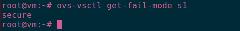


```bash
ovs-vsctl set-fail-mode br0 secure 
```

 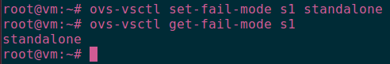
再次查看交换机，可以看到交换机的 fail_mode 已经变成 standalone 模式。这里有一点需要说明，fail_mode 连不上交换机之后的 ovs 的转发模式，跟当前 ovs交换机连没连控制器没有关系。

 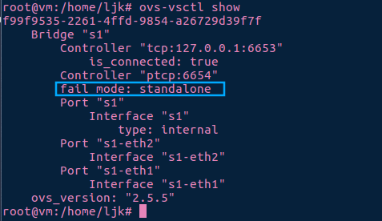

 同样也可以删除 fail_mode

```bash
ovs-vsctl del-fail-mode br0 
```

### 开启STP

STP 是 Spanning Tree Protocol 的缩写，意思是指生成树协议，可应用于计算机网络中树形拓扑结构建立，主要作用是防止网桥网络中的冗余链路形成环路工作。

 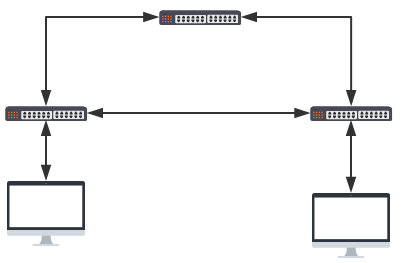

在上面的拓扑中，交换机之间形成环路，交换机中的广播数据包会形成广播风暴，而 STP 生成树的作用就是经过计算阻塞交换机的部分端口，使得交换机之间不会形成环路。

查看 ovs 交换机是否开启 stp 协议。

```bash
ovs-vsctl get bridge s1 stp_enable
```

 

设置交换机开启stp协议

```bash
ovs-vsctl set bridge br0 stp_enable=true
```

 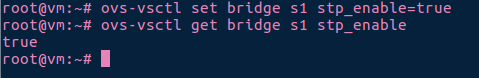

查看网桥配置信息

对于一个网桥来说有很多特性，比如前面提到的是否开启 STP 生成树，当控制器故障时的 fail-mode 是 standalone 还是 secure 。网桥的特性远不止于此，可以命令查看到一个网桥的配置信息。

```bash
ovs-vsctl list bridge s1
```

 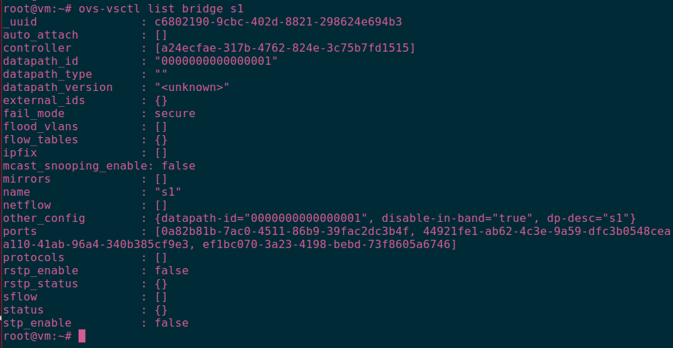

查看端口配置信息

网桥的配置信息可以查看到，同样端口的配置也可以查看到。端口是否有vlan，tag号多少等。通过命令能够查看到端口的特性。

```
ovs-vsctl list port s1 s1-eth1 
```

 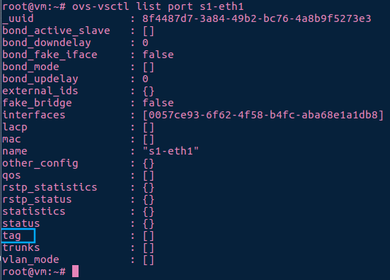

网卡加入网桥IP失效的解决方法

 在 ovs 操作中常常有这么一个现象，将本机的网卡加入到网桥之中后就发现机器的ip地址失效了，不能ssh，不能ping通。这是因为当网卡加入网桥之后，网卡就是交换机上的一个端口，交换机作为二层设备，其端口是不可能有IP地址的，所以本机的IP地址失效。

那么这样的情况如何处理？处理方法还是有的，关键点就在网桥的一个端口。网桥创建成功后会默认带一个与网桥同名的port，并且这个port的类型是比较特殊的Internal。

 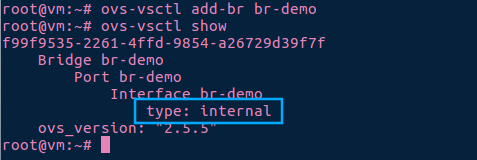

ovs中port有四种类型

| **类型** | **说明**                                                     |
| -------- | ------------------------------------------------------------ |
| Normal   | 用户可以把操作系统中的网卡绑定到ovs上，ovs会生成一个普通端口处理这块网卡进出的数据包。 |
| Internal | 端口类型为internal时，ovs会创建一块虚拟网卡，虚拟网卡会与端口自动绑定。当ovs创建一个新网桥时，默认会创建一个与网桥同名的Internal Port。 |
| Patch    | 当机器中有多个ovs网桥时，可以使用Patch Port把两个网桥连起来。Patch Port总是成对出现，分别连接在两个网桥上，在两个网桥之间交换数据。 |
| Tunne    | 隧道端口是一种虚拟端口，支持使用gre或vxlan等隧道技术与位于网络上其他位置的远程端口通讯。 |

  

Internal 类型可以看做每个OVS交换机有个可以用来处理数据报的本地端口，可以为这个网络设备配置 IP  地址。当创建ovs网桥时会自带一个同名的端口，该端口就是类型为Internal  端口。解决的思路就是Internal类型的port会生成一个虚拟网卡，将绑定到网桥的网卡的IP地址转移到该虚拟网卡上，然后配置路由即可。

**解决步骤：**

**1.查看当前网卡ip地址**

 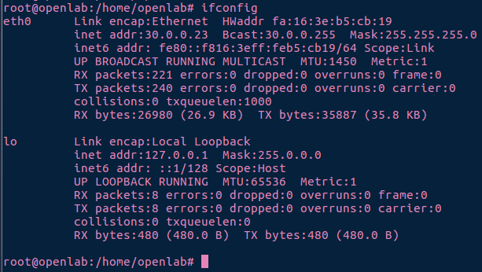

查看路由

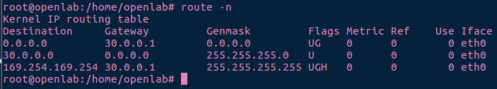 

**2.创建网桥,绑定端口**

当创建网桥之后网桥自带一个类型为Internal的port，该port就是一个虚拟网卡。使用ifconfig能够查看得到，网卡名字就叫做s1.

 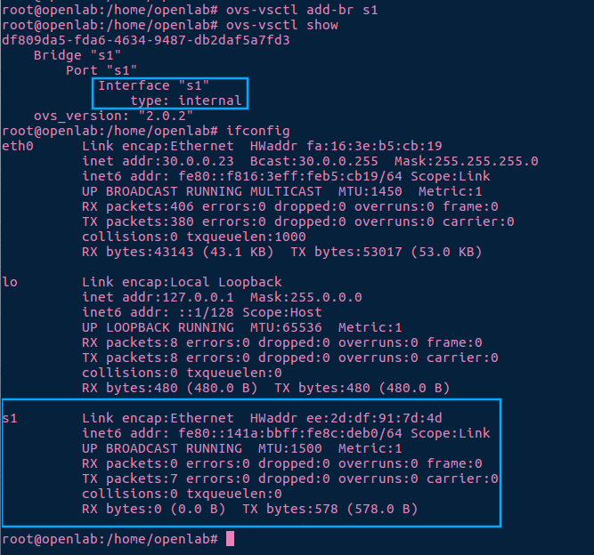

 

**3.将网卡eth0的ip地址转移到网卡s1上**

由于我是ssh远程到虚拟机上操作，当将eth0绑定到网桥上之后ip失效，所以ssh断开，只能在虚拟机上操作。

 

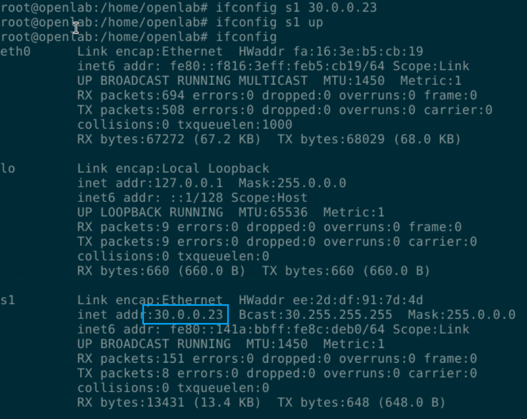 

 **4.查看路由**

当前路由中已经没有发往外网的路由

 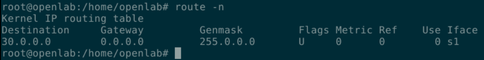

**5.添加新路由**

为新网卡s1添加网关路由 


```
route add default gw 30.0.0.1
```

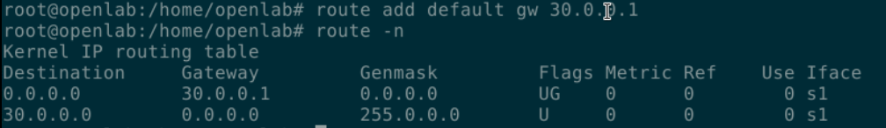 

**6.测试生效**

添加好路由之后可以发现能够重新通外网。网卡eth0的ip在新网卡s1上生效

 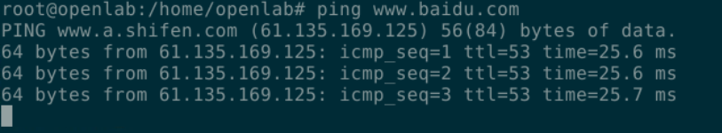

 

## VLAN 隔离

ovs 交换机可以实现 vlan 的隔离，功能上类似于普通交换的 vlan 隔离。ovs 的隔离通过 tag 标签来实现。

### 示例

使用 mininet 仿真软件创建一个最简单的拓扑，然后设置端口 tag 来实现 vlan 。

Mininet 创建简单拓扑，两个主机连接到一个交换机中。

 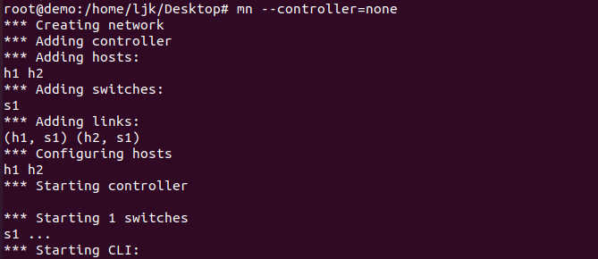

 查看交换机的端口。两个主机连接到交换机的两个端口，分别是 s1-eth2，s1-eth2 。所有的端口默认其实都是有 tag 的，tag 为 0，但不会显示在这里。

 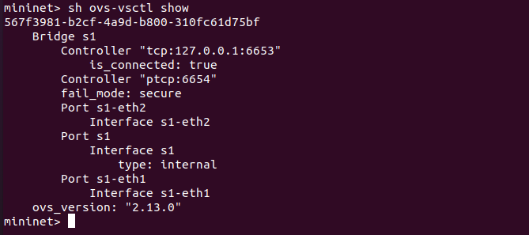

打开h1，mininet 仿真器可以打开任何一个模拟出来的设备，可以将新开的端口看做一个虚拟机。

 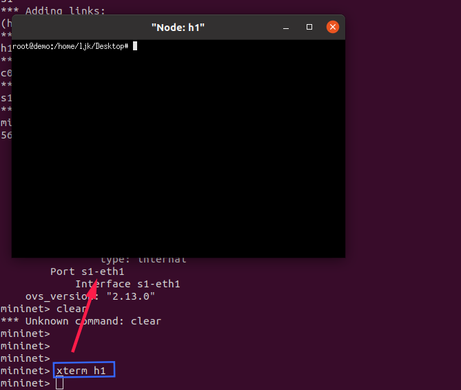

主机h1这时还不能和主机h2通信，因为ovs交换机中没有任何流表。

 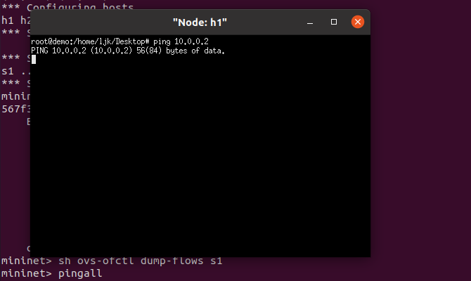

下发正常转发流表

action=NORMAL 的流表意思是该交换机配置成一个正常传统交换机工作。ovs 交换机有两种工作模式：SDN 模式和传统模式。传统的 ovs 交换机是通过 mac 地址自学习来完成数据帧交换，SDN 模式是交换机里的流表匹配数据流然后有相应的转发动作。这里就是让交换机实现 mac 地址自学习功能。

```
sh ovs-ofctl add-flow s1 action=normal
```

 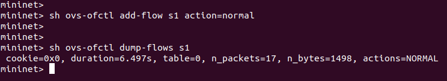

 主机1能够ping通主机2

 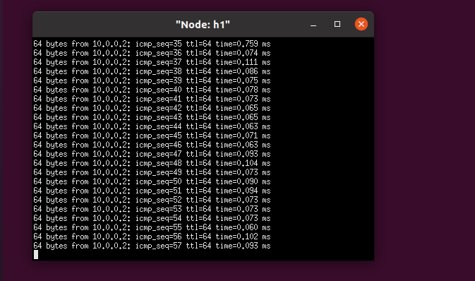

查看mac地址自学习表，可以看到这个时候交换机的端口，特别是VALN都是0。

 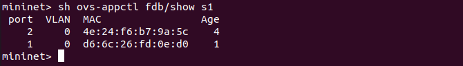

设置tag号。tag是在端口上设置的，使用命令将tag号打在端口上。

```bash
ovs-vsctl set Port s1-eth1 tag=100
ovs-vsctl set Port s1-eth2 tag=200
```

 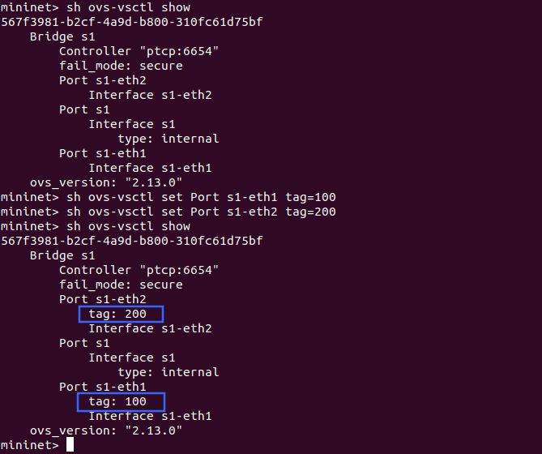

再次让h1 ping h2 可以发现已经无法通信了。

 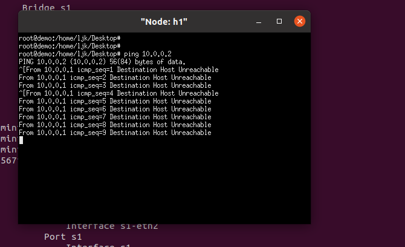

查看交换机的mac地址自学习表，能够看到VLAN发生了变化。正是这种LVAN的变化导致数据

 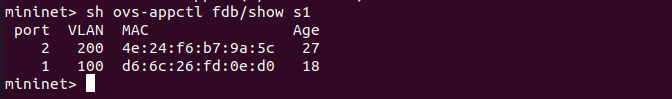

**`ovs-dpctl`**：可以统计每条 datapath 上的设备通过的流量，打印流的信息。datapath模块是最底层交换机机制的实现，功能是接收网包-查表-执行action。下面使用dpctl查看经过datapath数据流是怎么样

```bash
ovs-dpctl dump-dps
```

 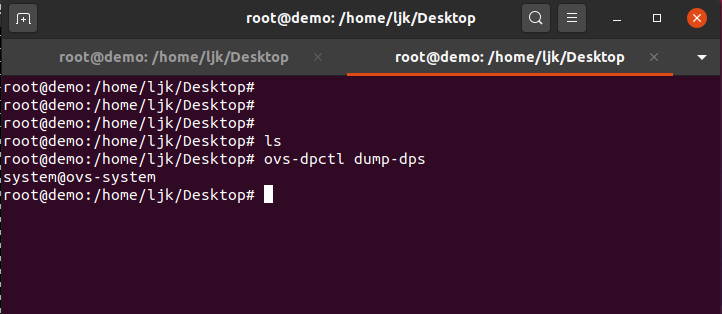

可以看到在h1 h2互相ping时的数据流。

 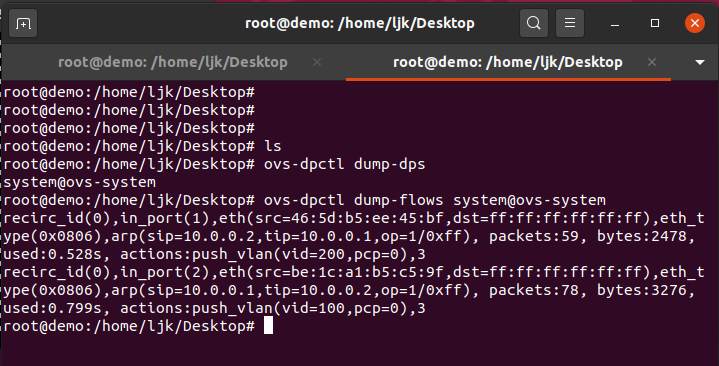


```bash
recirc_id(0),in_port(1),eth(src=46:5d:b5:ee:45:bf,dst=ff:ff:ff:ff:ff:ff),eth_type(0x0806),arp(sip=10.0.0.2,tip=10.0.0.1,op=1/0xff), 
packets:59, bytes:2478, used:0.528s, actions:push_vlan(vid=200,pcp=0),3
```


```bash
recirc_id(0),in_port(2),eth(src=be:1c:a1:b5:c5:9f,dst=ff:ff:ff:ff:ff:ff),eth_type(0x0806),arp(sip=10.0.0.1,tip=10.0.0.2,op=1/0xff), 
packets:78, bytes:3276, used:0.799s, actions:push_vlan(vid=100,pcp=0),3 
```

这两条经过的数据流分别是h2和h1发出的。其中action表明了该条流vlan的产生过程。数据帧进入s1是不带vlan的，因为ovs是软件模拟，所以datapath负责对设置了tag的端口在数据帧中加入tag(个人理解)。从h2出来的数据帧进入datapath打上vlan tag200，从h1出来的数据帧进入datapath打上vlan tag100。正是因为数据流的tag导致了匹配之后无法转发。

注意这里的in_port并不是网桥s1上的port，而是datapath自己的的port，关系可以参考如下：

[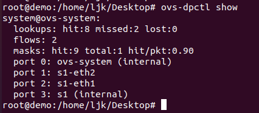](https://img2020.cnblogs.com/blog/1060878/202005/1060878-20200501111727701-168117323.png) 

### tag 在 OpenStack 中使用

openstack 有多种网络插件，其中最重要的就是 ovs，即 openvswitch-plugin 。在使用 ovs 实现 openstack 中的各种网络时，这里各种网络指：local，flat，vlan，vxlan 等，tag 标签的使用可以说是每一种网络都离不开的。下面说说在各种网络中 tag 标签的使用。

#### local 网络

local网络是虚拟机的网络和网桥连接，但是网络和服务器网卡之间没有连接。流量限制在网桥内部。在local网络中，为了实现网络隔离，不同网络之间连接到网桥的tag是不一样的。在同一个tag下的网络可以互相通信，当然网络是访问不到外网的，则是local网络的最大特征。

 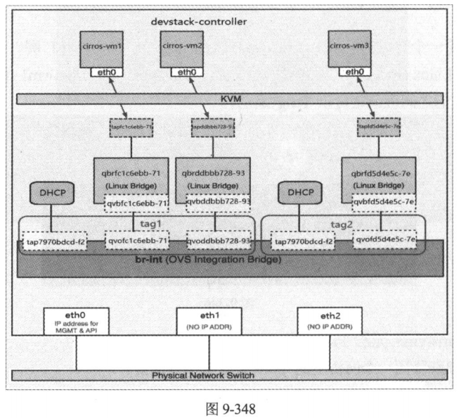

#### flat 网络

flat网络叫平面网络即为不带tag的网络。不带也是一种特征。flat网络模式下，每创建一个网络，就需要独占一块网卡，所以一般也不会使用这种网络作为租户网络。虽然说flat网络不带tag，但是其实是所有的port都使用了默认的tag号1，所以能够看到网桥中port都有tag为1。

[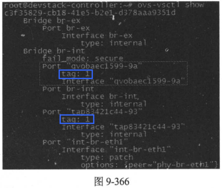](https://img2020.cnblogs.com/blog/1060878/202005/1060878-20200501142546423-1955416197.png) 

#### VLAN网络

vlan网络是tag在openstack中的一个重要应用，值得重点讲解。

vlan网络的模型如下：

[](https://img2020.cnblogs.com/blog/1060878/202005/1060878-20200501143220957-1041218223.png)

在vlan网络中。每一个网络在br-int上的tag号都是不一样的，比如使用网络1创建的虚拟机，其port的tag是1，使用网络2创建的虚拟机，其port的tag是2。有了不同的tag就能够实现了vlan隔离。如下图：

[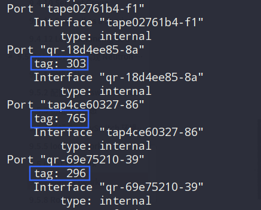](https://img2020.cnblogs.com/blog/1060878/202005/1060878-20200501143559177-1119065652.png)

但是只使用tag隔离不同网络还不算完成vlan网络。因为如果同一个网络下的两个虚拟机调度到不同的节点，那么流量要经过一个节点达到另一个节点肯定要经过物理交换机。前面说过tag号就是vlan id。在br-int上定义的tag号不会考虑物理交换机上的vlan  id支持。通俗来说就是ovs是虚拟交换机，tag号自己管理，而物理交换机的vlan  id是物理交换机管理。这两个vlan是不同设备的，所有不能保证可以直接通用。万一ovs定义的vlan为3000，而物理交换机不能识别呢？所以在br-ethx这个网桥上需要对ovs的vlan和物理交换机的vlan做一个转换。规则也很简单：

1. 在br-ethx上对来自br-int 的数据，将vlan 1转化成物理网卡能通过的vlan 100
2. 在br-int上对来自br-ethx的数据，将vlan 100转成ovs交换机能通过的vlan 1。 

br-int上流表：


```
#ovs-ofctl dump-flows br-int
 cookie=0x0, duration=100.795s, table=0, n_packets=6, n_bytes=468, idle_age=90, priority=2,in_port=3 actions=drop
 cookie=0x0, duration=97.069s, table=0, n_packets=22, n_bytes=6622, idle_age=31, priority=3,in_port=3,dl_vlan=101 actions=mod_vlan_vid:1,NORMAL
 cookie=0x0, duration=95.781s, table=0, n_packets=8, n_bytes=1165, idle_age=11, priority=3,in_port=3,dl_vlan=102 actions=mod_vlan_vid:2,NORMAL
 cookie=0x0, duration=103.626s, table=0, n_packets=47, n_bytes=13400, idle_age=11, priority=1 actions=NORMAL
```

 br-ethx上流表：


```
#ovs-ofctl dump-flows br-eth0
NXST_FLOW reply (xid=0x4):
 cookie=0x0, duration=73.461s, table=0, n_packets=51, n_bytes=32403, idle_age=2, hard_age=65534, priority=4,in_port=4,dl_vlan=1 actions=mod_vlan_vid:101,NORMAL
 cookie=0x0, duration=83.461s, table=0, n_packets=51, n_bytes=32403, idle_age=2, hard_age=65534, priority=4,in_port=4,dl_vlan=2 actions=mod_vlan_vid:102,NORMAL
 cookie=0x0, duration=651.538s, table=0, n_packets=72, n_bytes=3908, idle_age=2574, hard_age=65534, priority=2,in_port=4 actions=drop
 cookie=0x0, duration=654.002s, table=0, n_packets=31733, n_bytes=6505880, idle_age=2, hard_age=65534, priority=1 actions=NORMAL 
```

#### vxlan 网络

vxlan网络看似比较复杂，其实如果能够理解vlan网络的ovs tag和物理vlan id转换原理就好理解。vxlan数据构造比较特殊，其数据结构如下：

[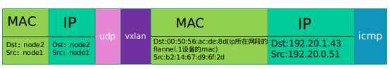](https://img2020.cnblogs.com/blog/1060878/202005/1060878-20200501150228940-338857218.png)

在正常的网络封装上还有外层，并且重要的是中间还有一个vxlan头。重点就在这个vxlan的头，vxlan头部中有一个tunnel id。不同的vxlan网络之间使用tunnel id来隔离。ovs实现的vxlan结构如下：

[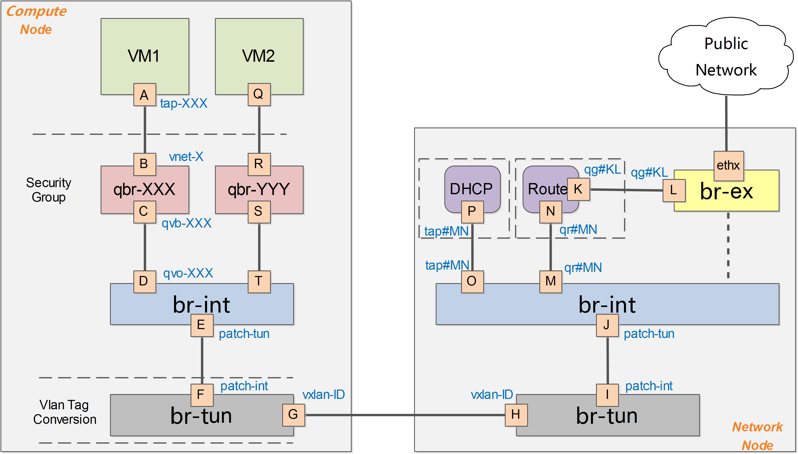](https://img2020.cnblogs.com/blog/1060878/202005/1060878-20200501150536375-1156885915.png)

创建虚拟机之后，在br-int上的port会有tag号。不同的网络之间tag号是不一样的。那么分情况讨论：

- 如果同一网络的虚拟机都在一个计算节点，同一个br-int上，它们之间的tag是一样的，所以直接通过br-int转发数据。不同网络之间tag不同，br-int根据tag实现隔离。
- 如果同一网络的虚拟机分布在不同的计算节点上，这时就需要通过bt-tun这个网桥发送出去。在br-tun上维护了一个vlan和vxlan之间的转换关系。比如对于计算节点1来说：vlan 4 对应了 vxlan 256。这时bt-tun就会把vlan 为4 的数据经过vxlan封装，封装成vxlan  256的数据包，然后发送出。同样当br-tun接收到数据包时，会将vxlan转化成vlan，然后发送到br-int，br-int  根据不同的vlan转发到对应虚拟机。

将vlan转化成vxlan


```
cookie=0x9814613d8b13e33b, duration=355743.467s, table=22, n_packets=121, n_bytes=5490, idle_age=65534, hard_age=65534, priority=1,dl_vlan=786 actions=strip_vlan,load:0x25a->NXM_NX_TUN_ID[],output:3,output:2,output:5,output:4
 cookie=0x9814613d8b13e33b, duration=335047.168s, table=22, n_packets=114, n_bytes=5460, idle_age=23232, hard_age=65534, priority=1,dl_vlan=788 actions=strip_vlan,load:0x222->NXM_NX_TUN_ID[],output:3,output:2,output:5,output:4
```

将vxlan 转化成vlan


```
cookie=0x9814613d8b13e33b, duration=355644.212s, table=4, n_packets=1025, n_bytes=107512, idle_age=17091, hard_age=65534, priority=1,tun_id=0x25a actions=mod_vlan_vid:786,resubmit(,10)
 cookie=0x9814613d8b13e33b, duration=334947.915s, table=4, n_packets=8487, n_bytes=710987, idle_age=38, hard_age=65534, priority=1,tun_id=0x222 actions=mod_vlan_vid:788,resubmit(,10)
```

刚好这两条处理是相互的，可以清晰看出vlan和vxlan之间的转换。

最后这里有一个有意思的东西，前面说过vxlan网络下，使用tunnel id 隔离。在不同的计算节点上发现 相同的tunnel id 0x222 对应的vlan 是不一样的？为什么会这样？


```
root@compute15:~# ovs-ofctl dump-flows br-tun | grep 0x222
 cookie=0xa6b0faa0153f7efc, duration=335373.158s, table=4, n_packets=4741, n_bytes=9326933, idle_age=26, hard_age=65534, priority=1,tun_id=0x222 actions=mod_vlan_vid:3678,resubmit(,10)
 cookie=0xa6b0faa0153f7efc, duration=26.944s, table=20, n_packets=0, n_bytes=0, hard_timeout=300, idle_age=26, priority=1,vlan_tci=0x0e5e/0x0fff,dl_dst=fa:16:3e:22:69:3a actions=load:0->NXM_OF_VLAN_TCI[],load:0x222->NXM_NX_TUN_ID[],output:4
 cookie=0xa6b0faa0153f7efc, duration=335373.162s, table=22, n_packets=133, n_bytes=36387, idle_age=23569, hard_age=65534, priority=1,dl_vlan=3678 actions=strip_vlan,load:0x222->NXM_NX_TUN_ID[],output:4,output:3,output:2,output:5
```

 

[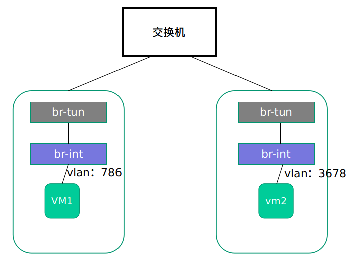](https://img2020.cnblogs.com/blog/1060878/202005/1060878-20200501154803650-544800263.png)

同一个tunnel  在不同节点的对应的tag号不一样，那不同节点上的虚拟机之间vlan不同能够正常访问吗？毫无疑问是可以的，为啥呢？因为在出服务器时br-tun已经将tag剥离，到了相应的服务器时会加上该tunnel id在该服务器上的对应的tag号。每一个服务器上tunnel id对应的tag都是不一样的，但是只要tunnel id一致就能走遍天下。

 

ovs实现的vlan就讲这么多，一个小小的tag最后发现能够成为openstack这种巨大架构中很重要的一部分，充分说明难度再大的技术都是由小知识点组成的，所以面对庞然大物时也不要心生畏惧，将其分解成一个个小知识就能掌握。学习如此，人生亦如是～

## meter 表限速

 网络限速有很多种方式，比如网卡限速，队列限速，meter表限速。其中meter表限速是颇具代表性的限速方式。因为网卡限速和队列限速都是传统网络的限速方式，而meter表是SDN架构下的限速方式。本篇主要介绍meter限速。

由于meter表是OpenFlow13出现的特性，而Open VSwitch 2.8.0以上的版本才支持OpenFlow13。
 [](https://img2020.cnblogs.com/blog/1060878/202007/1060878-20200711111137284-1305546459.png)
 所以本文实验环境： `Ubuntu1604 desktop` + `Mininet` + `ovs2.8.1`。
 安装顺序：先安装`mininet`所有组件，然后编译安装`ovs2.8.1`

原理

meter表限速的原理是丢弃多余数据包。首先创建一个转发的流表。比如:

1. 交换机上有流表：1端口进来的流量从2端口出去，`in_port=1,actions=output:2`。
2. 这个时候再创建一个meter表，作用是：速度超过10M的流量丢弃，`meter=1,type=drop,rate=10000`
3. 最后修改流表使用该meter表。`in_port=1,actions=meter:1,output:2`

这是从1端口进来的流量，在从2端口转发出去之前会被meter表处理，处理方式就是丢弃掉超过10M的流量，然后再转发到2口。

以上就是meter表的工作原理，使用的是伪命令。下面具体分析meter表

数据结构

meter表的数据结构如下：


```
struct ofp_meter_mod {
struct ofp_header header;
uint16_t command; /* One of OFPMC_*. */
uint16_t flags; /* One of OFPMF_*. */
uint32_t meter_id; /* Meter instance. */
struct ofp_meter_band_header bands[0]; /* The bands length is inferred from the length field in the header. */
};
```

[](https://img2020.cnblogs.com/blog/1060878/202006/1060878-20200606214106501-948446859.png)

command

command字段是表示该meter表的操作，是增加、修改或者删除 meter表。


```
/* Meter commands */
enum ofp_meter_mod_command {
OFPMC_ADD, /* New meter. */
OFPMC_MODIFY, /* Modify specified meter. */
OFPMC_DELETE, /* Delete specified meter. */
};
```

flags

flag字段能够表示的信息很多，一个16位的字节，能够表示：

1. meter表限速的单位。默认单位是 kb/s
2. 更换成 packet/s 的算法
3. 是否开启burst
4. 是否统计


```
enum ofp_meter_flags {
OFPMF_KBPS = 1 << 0, /* Rate value in kb/s (kilo-bit per second). */
OFPMF_PKTPS = 1 << 1, /* Rate value in packet/sec. */
OFPMF_BURST = 1 << 2, /* Do burst size. */
OFPMF_STATS = 1 << 3, /* Collect statistics. */
};
```

meter_id

meter_id 这个字段是meter表的身份id，在交换机中是唯一的。memter_id的定义是从1开始的，最大值是根据交换机能够支持的最大数值而定。

band


```
/* Common header for all meter bands */
struct ofp_meter_band_header {
uint16_t type; /* One of OFPMBT_*. */
uint16_t len; /* Length in bytes of this band. */
uint32_t rate; /* Rate for this band. */
uint32_t burst_size; /* Size of bursts. */
};
```

[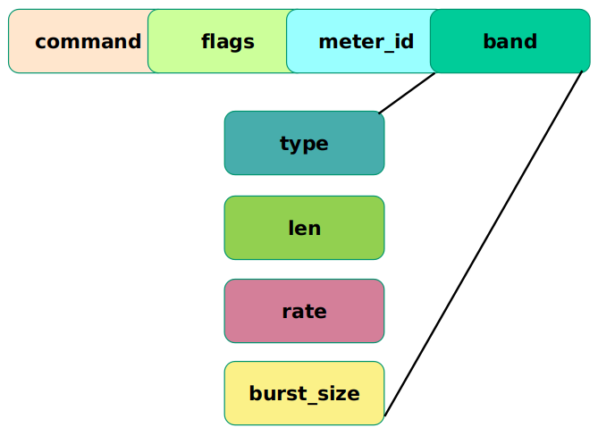](https://img2020.cnblogs.com/blog/1060878/202006/1060878-20200608230720401-353528916.png)

band字段是一个速度band数组。它可以包含多个数量的计量带，并且每一个计量带都可以重复。同一时间只有一个计量带生效，如果数据包的速度超过所有的计量带，那么配置的速度最高的计量带会被使用。


```
/* Common header for all meter bands */
struct ofp_meter_band_header {
uint16_t type; /* One of OFPMBT_*. */
uint16_t len; /* Length in bytes of this band. */
uint32_t rate; /* Rate for this band. */
uint32_t burst_size; /* Size of bursts. */
};
```

[](https://img2020.cnblogs.com/blog/1060878/202006/1060878-20200606215030970-1374066942.png)

### type:


```
The type field must be one of the following:
/* Meter band types */
enum ofp_meter_band_type {
OFPMBT_DROP = 1, /* Drop packet. */
OFPMBT_DSCP_REMARK = 2, /* Remark DSCP in the IP header. */
OFPMBT_EXPERIMENTER = 0xFFFF /* Experimenter meter band. */
};
```

`type`字段是指高出限速值的数据包的处理方式。主要有`丢弃`和`设置优先丢弃`。一个openflow交换机可能不会支持所有的band的type值，也不是所有的meter都要支持全部的type值。

type中三种处理动作：

- drop:
   计量带OFPMBT_DROP定义了一个简单的速度限制器，会丢弃掉超过该值的数据包

- remark:
   OFPMBT_DSCP_REMARK 字段定义了一个简单的DiffServ 策略，当超过定义值的数据包到来时，其ip头部中的丢弃字段DSCP会被标记。这样该ip数据包就会优先被丢弃。
   ip数据包：
   [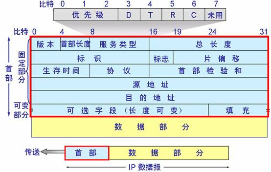](https://img2020.cnblogs.com/blog/1060878/202007/1060878-20200711104550079-2108047824.png)

  服务类型:占 8 位,用来获得更好的服务.这个字段在旧标准中叫做服务类型,但实际上一直没有被使用过.1998年IETF把这个字段改名为区分服务 DS(Differentiated Services).只有在使用区分服务时,这个字段才起作用.

- experimenter:
   该类型应该是被用于创新实验使用的，可以自定义超出定义值的数据包处理方式。

### len

len字段表示的该band的数据包的长度

### rate:

rate字段表示可能作用于数据包的值即限速的值。rate字段的单位是kb每秒，除非在flags字段包含了`OFPMF_PKTPS`，这时rate的单位是 packet/s

### brust_size:

`brust_size`字段只有在flags字段包含了`OFPMC_BURST`才会被使用。它主要用于在使用meter表时突发的大量数据包或者字节时。burst的单位是kb，当flags包含`OFPMF_PKTPS`时，burst的单位为 packet

meter 使用

拓扑创建

使用mininet创建一个最简单的拓扑，一个控制器，一个交换机，两个主机。mininet是SDN中网络仿真器，用来创建控制器、交换机、主机等网络设备。`mn`命令创建一个自带的控制器，ovs交换机和主机。
 [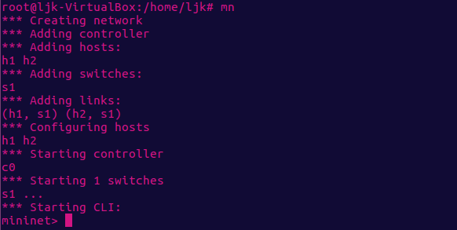](https://img2020.cnblogs.com/blog/1060878/202006/1060878-20200613155307410-1687015851.png)

`iperf`工具是用来测量网络带宽的常用命令。
 服务端开启一个监听 `iperf -s`，客户端连接服务端，测试带宽`iperf -c 10.0.0.1`。默认是TCP连接，可以测试出两个主机之间的带宽。
 在没有限速之前测试其速度大小。可以看出其速度是27.5GB/s。测得的速度和机器的性能有关，当前的实验环境机器是4核 8G SSD固态盘。
 [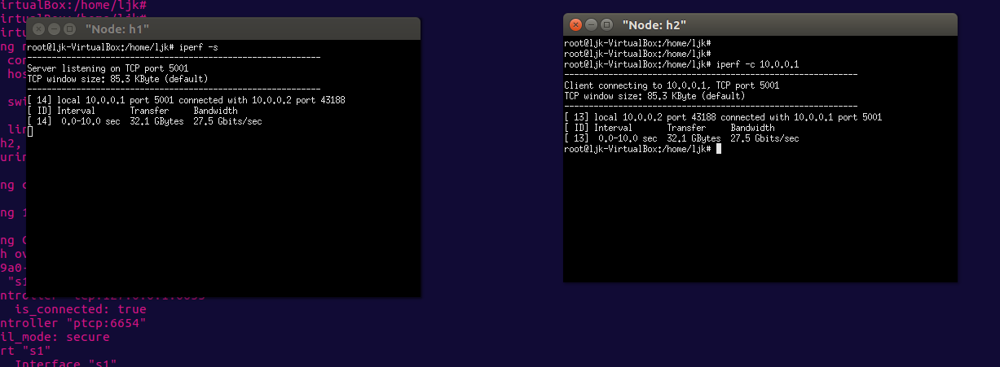](https://img2020.cnblogs.com/blog/1060878/202006/1060878-20200613160716580-47519881.png)

设置 datapath

设置datapath为用户态。datapath一般来说是运行在内核态，如果想实现限速功能，就需要将其设置成用户态。


```
ovs-vsctl set bridge s1 datapath_type=netdev
ovs-vsctl set bridge s1 protocols=OpenFlow13
```

[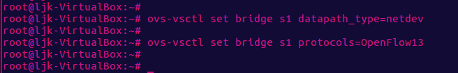](https://img2020.cnblogs.com/blog/1060878/202006/1060878-20200613155415095-2001357000.png)

下发 meter 表

下发限速的meter表。名字：s1；速度：5M；动作：丢弃；id:1


```
ovs-ofctl add-meter s1 meter=1,kbps,band=type=drop,rate=5000 -O OpenFlow13
```

[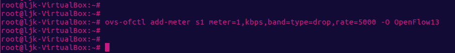](https://img2020.cnblogs.com/blog/1060878/202006/1060878-20200613155441360-1158255526.png)


```
ovs-ofctl dump-meters s1 -O openflow13
```

[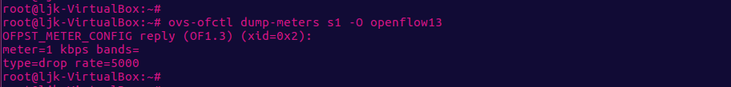](https://img2020.cnblogs.com/blog/1060878/202006/1060878-20200613155640721-1733685499.png)

下发流表，并使用 meter 表

下发转发的流表。匹配进端口为1，转发动作为`meter:1,output:2`。`meter:1`表示匹配到的流表首先交给meter表处理，就是超过5M的数据包丢弃掉，然后在交给`output:2`，从2端口转发出去。


```
ovs-ofctl add-flow s1 priority=200,in_port=1,action=meter:1,output:2 -O OpenFlow13
ovs-ofctl add-flow s1 priority=200,in_port=2,output:1 -O OpenFlow13
```

[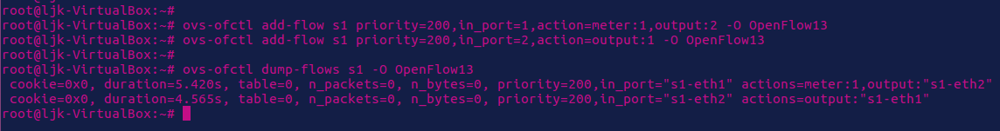](https://img2020.cnblogs.com/blog/1060878/202007/1060878-20200711102410865-1876195869.png)

关闭 tx 校验

当 `datapath_type` 设置为 `netdev` 之后，就是将datapath从内核态转化到用户态，这时datapath收到数据包会校验数据包并且校验不通过而丢弃数据包。这是很多时候为什么`datapath_type=netdev`之后，主机之间能够ping通，但是不能够使用`iperf`测量带宽的原因。需要将`tx-checksumming`关闭掉。

1、 关闭主机的网卡的tx校验
 [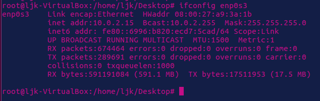](https://img2020.cnblogs.com/blog/1060878/202007/1060878-20200709213932832-1219488101.png)


```
root@ljk-VirtualBox:/home/ljk/Desktop# ethtool -K enp0s3 tx off
Cannot get device udp-fragmentation-offload settings: Operation not supported
Cannot get device udp-fragmentation-offload settings: Operation not supported
Actual changes:
tx-checksumming: off
	tx-checksum-ip-generic: off
tcp-segmentation-offload: off
	tx-tcp-segmentation: off [requested on]
```

2、 关闭`iperf客户端`的tx校验
 [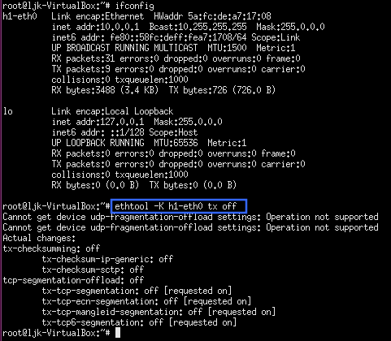](https://img2020.cnblogs.com/blog/1060878/202007/1060878-20200709211521146-921133988.png)

验证

通过`iperf`验证速度可以得到此时的带宽为5M。注意在`iperf`打流时使用UDP的流测量准确度会高与TCP。
 客户端以10M的速度打流


```
iperf -u -c 10.0.0.2 -b 10M -i 5 -t 20
```

[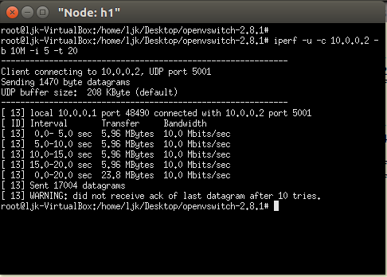](https://img2020.cnblogs.com/blog/1060878/202007/1060878-20200709211301381-1890701076.png)
 服务端接收并验证。可以看到meter限速是5M,而服务端的速度也接近这个值，说明限速是成功的。


```
iperf -u -s
```

[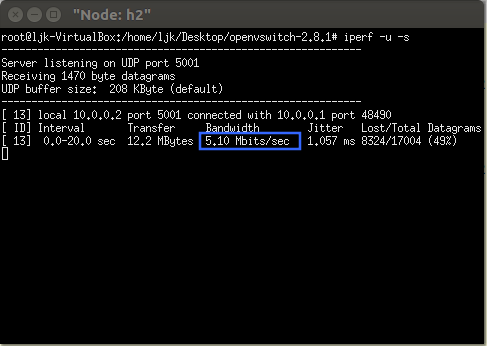](https://img2020.cnblogs.com/blog/1060878/202007/1060878-20200709211324780-1616691145.png)

多 band （计量带）meter 表

前面介绍band时说过一个meter表中可以包含多个band，当一个merer表有多个计量带时，以小于当前带宽的最大的rate作为限速的速度，下面测试多个计量带时限速的表现。

下发多计量带 meter 表

设置meter表有多个计量带，rate=5000，以及rate=12000。就是rate=5M和rate=12M


```
ovs-ofctl add-meter s1 meter=1,kbps,band=type=drop,rate=5000,rate=12000 -O OpenFlow13
```

以高于 rate 的带宽验证

客户端以15M的带宽打流
 [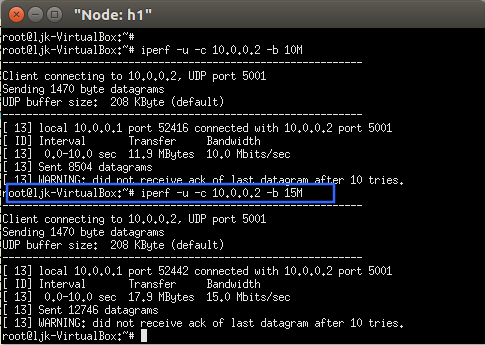](https://img2020.cnblogs.com/blog/1060878/202007/1060878-20200709213259086-1020141700.png)
 服务端接收到的带宽为12M左右。
 [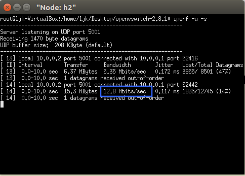](https://img2020.cnblogs.com/blog/1060878/202007/1060878-20200709213224524-1514087521.png)
 15M的带宽，限速在12M，而不是5M。所以符合多计量带的限速规则。

以带宽限速中间范围值验证

两个限速为5M和12M，客户端以中间值8M带宽测试
 [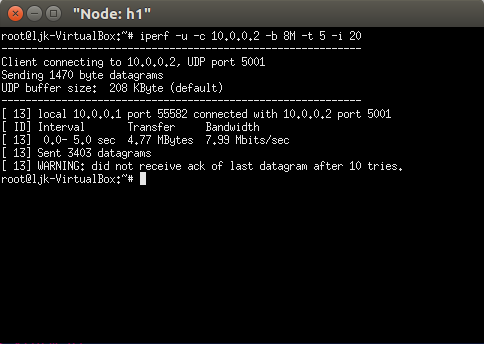](https://img2020.cnblogs.com/blog/1060878/202007/1060878-20200711110817180-32878355.png)

服务端接收到的带宽为5M左右，限速符合多计量带规则。
 [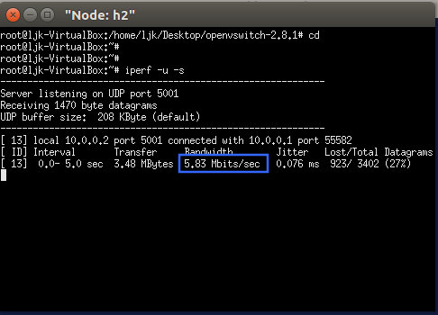](https://img2020.cnblogs.com/blog/1060878/202007/1060878-20200711110850843-1808355627.png)

burst_size 瞬时流量

burst 令牌桶原理

在计量带中有一个参数叫做`burst_size`，这个参数为非必填字段，但是从这个字段能够体现限流的操作的基本原理。`burst_size`是令牌桶的容量。所谓令牌桶，原理如下图：
 [](https://img2020.cnblogs.com/blog/1060878/202007/1060878-20200711092316205-1100456311.png)

令牌桶的意义在于：每一个数据包想要被转发都需要得到一个令牌，而令牌来自于令牌桶。令牌桶以一个速度获得令牌，该速度就是限速的速度，超过令牌桶容量的令牌会溢出，同时数据包转发以一定的速度消耗令牌，这就是限速的原理。而`burse_size` 指的就是令牌桶的容量。

令牌桶的作用是面对突发的大量数据请求可以瞬间消耗令牌桶内的令牌，所以有` burse_size`的效果就是某个大流量到来的瞬间限速的速度等于`令牌桶的容量+限速的速度`

下发携带 burst_size 参数的 meter 表

下发meter表，设置 `rate=5000`，`burst_size=5000`，所以理论上瞬时的限速值为`rate`+`burst_size` = 10M


```
ovs-ofctl -O OpenFlow13 add-meter s1 meter=3,kbps,burst,band=type=drop,rate=5000,burst_size=5000
```

验证

客户端以15M的带宽打流
 [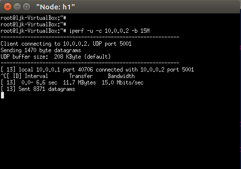](https://img2020.cnblogs.com/blog/1060878/202007/1060878-20200709214455526-1411742094.png)

设置服务端每秒输出一次带宽，从显示可以看出，第1秒中的速度达到10M，然后速度下降稳定在5M左右。


```
iperf -u -s -i 1
```

[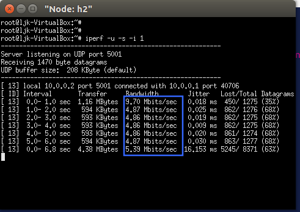](https://img2020.cnblogs.com/blog/1060878/202007/1060878-20200709214518326-1757954087.png)

分析：第1s内15M的带宽的流量到来，瞬间消耗了令牌桶的令牌 5000k ，同时加上稳定下发到令牌桶中的令牌  5000k/s，两方面加起来就是10M左右,所以第1s带宽能瞬间达到10M。如果后面带宽小于限速的5M，令牌桶内的令牌会慢慢积累起来，等待一下次高峰流量的到来。

小结

使用meter表能够完成很多创新的场景，比如 Qos，差异化服务等，希望通过本篇文章能够让学习SDN的童鞋掌握meter表的常规使用，实现更多自己的网络创新。


## VXLAN 隧道

`官方介绍`：
 VXLAN（Virtual eXtensible Local Area  Network，虚拟扩展局域网），是由IETF定义的NVO3（Network Virtualization over Layer  3）标准技术之一，是对传统VLAN协议的一种扩展。VXLAN的特点是将L2的以太帧封装到UDP报文（即L2 over  L4）中，并在L3网络中传输。VXLAN本质上是一种隧道技术，在源网络设备与目的网络设备之间的IP网络上，建立一条逻辑隧道，将用户侧报文经过特定的封装后通过这条隧道转发。

vxlan 是一种网络协议，将原始数据封装到UDP数据包中传输。vxlan被广泛应用到云计算网络环境中，耳熟能详的云计算框架`openstack`主要的网络架构就是vxlan，`kubernetes`也有vxlan的网络插件。vxlan 有许多优点，诸如：

1. 连接两个局域网，可以将局域网内主机之间流量互通。就像是在局域网之间架起桥梁
2. 支持隔离。vlan最多支持4096个隔离，而vxlan支持2的次方数32即 4294967296据隔离

vxlan的封装格式
 [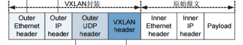](https://img2020.cnblogs.com/blog/1060878/202009/1060878-20200908145154467-2141116531.png)

本篇文章使用ovs搭建vxlan网桥，连接两个mininet构建的局域网。
 实验环境：两台虚拟机 ubuntu1804桌面版+ubuntu1604桌面版+mininet

[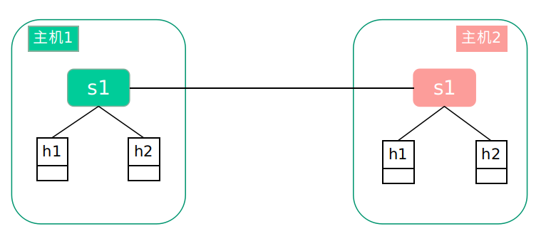](https://img2020.cnblogs.com/blog/1060878/202009/1060878-20200908134145788-345639850.png)

安装 mininet

分别在两台机器上安装mininet

安装 git 工具


```
root@ubuntu:~# apt install git
Reading package lists... Done
Building dependency tree       
Reading state information... Done
The following additional packages will be installed:
  git-man liberror-perl
Suggested packages:
  git-daemon-run | git-daemon-sysvinit git-doc git-el git-email git-gui gitk gitweb git-arch git-cvs git-mediawiki git-svn
The following NEW packages will be installed:
  git git-man liberror-perl
0 upgraded, 3 newly installed, 0 to remove and 406 not upgraded.
Need to get 3,932 kB of archives.
After this operation, 25.6 MB of additional disk space will be used.
Do you want to continue? [Y/n] y
```


从 github 上拉取 mininet 源码

```
root@openlab:~# git clone git://github.com/mininet/mininet
Cloning into 'mininet'...
remote: Enumerating objects: 9752, done.
remote: Total 9752 (delta 0), reused 0 (delta 0), pack-reused 9752
Receiving objects: 100% (9752/9752), 3.03 MiB | 1.35 MiB/s, done.
Resolving deltas: 100% (6472/6472), done.
```

安装 mininet

mininet的安装是进入`mininet/util`目录中，然后执行 `./install -a`。`-a`表示安装全部的组件。mininet的安装可以有很多备选项。


```
root@openlab:~/mininet/util# ./install.sh -a
Detected Linux distribution: Ubuntu 18.04 bionic amd64
sys.version_info(major=3, minor=6, micro=7, releaselevel='final', serial=0)
Detected Python (python3) version 3
Installing all packages except for -eix (doxypy, ivs, nox-classic)...
Install Mininet-compatible kernel if necessary
.......
.......
.......
libtool: install: /usr/bin/install -c cbench /usr/local/bin/cbench
make[2]: Nothing to be done for 'install-data-am'.
make[2]: Leaving directory '/root/oflops/cbench'
make[1]: Leaving directory '/root/oflops/cbench'
Making install in doc
make[1]: Entering directory '/root/oflops/doc'
make[1]: Nothing to be done for 'install'.
make[1]: Leaving directory '/root/oflops/doc'
Enjoy Mininet!
```

验证安装

安装完成之后，`ovs`会安装好，使用`ovs-vsctl show`命令，查看ovs版本


```
root@openlab:~/mininet/util# ovs-vsctl show
58cc7b02-ef48-4de7-a96b-ee1c0259472d
    ovs_version: "2.9.5"
```

使用命令 `mn` 创建一个最小拓扑的环境。包括一个控制器，一个交换机，两个主机。
 [](https://img2020.cnblogs.com/blog/1060878/202009/1060878-20200908140454722-2008653959.png)


```
root@openlab:~/mininet/util# mn
*** Creating network
*** Adding controller
*** Adding hosts:
h1 h2 
*** Adding switches:
s1 
*** Adding links:
(h1, s1) (h2, s1) 
*** Configuring hosts
h1 h2 
*** Starting controller
c0 
*** Starting 1 switches
s1 ...
*** Starting CLI:
mininet> 
```

配置VXLAN

第一台机器配置

记录下第一台机器的ip地址和路由信息，后面会使用这些信息。


```
root@openlab:~/mininet/util# ifconfig
ens33: flags=4163<UP,BROADCAST,RUNNING,MULTICAST>  mtu 1500
        inet 192.168.175.130  netmask 255.255.255.0  broadcast 192.168.175.255
        inet6 fe80::20c:29ff:fe45:a8b7  prefixlen 64  scopeid 0x20<link>
        ether 00:0c:29:45:a8:b7  txqueuelen 1000  (Ethernet)
        RX packets 247144  bytes 344597431 (344.5 MB)
        RX errors 0  dropped 0  overruns 0  frame 0
        TX packets 74937  bytes 6024181 (6.0 MB)
        TX errors 0  dropped 0 overruns 0  carrier 0  collisions 0

lo: flags=73<UP,LOOPBACK,RUNNING>  mtu 65536
        inet 127.0.0.1  netmask 255.0.0.0
        inet6 ::1  prefixlen 128  scopeid 0x10<host>
        loop  txqueuelen 1000  (Local Loopback)
        RX packets 993  bytes 76788 (76.7 KB)
        RX errors 0  dropped 0  overruns 0  frame 0
        TX packets 993  bytes 76788 (76.7 KB)
        TX errors 0  dropped 0 overruns 0  carrier 0  collisions 0
```


```
root@openlab:~/mininet/util# route -n
Kernel IP routing table
Destination     Gateway         Genmask         Flags Metric Ref    Use Iface
0.0.0.0         192.168.175.2   0.0.0.0         UG    100    0        0 ens33
192.168.175.0   0.0.0.0         255.255.255.0   U     0      0        0 ens33
192.168.175.2   0.0.0.0         255.255.255.255 UH    100    0        0 ens33
```

第二台机器配置

同样，记录第二台机器的ip地址和路由信息。


```
ens33     Link encap:Ethernet  HWaddr 00:0c:29:a6:71:34  
          inet addr:192.168.175.128  Bcast:192.168.175.255  Mask:255.255.255.0
          inet6 addr: fe80::b933:b350:fe27:b89a/64 Scope:Link
          UP BROADCAST RUNNING MULTICAST  MTU:1500  Metric:1
          RX packets:56351 errors:0 dropped:0 overruns:0 frame:0
          TX packets:14943 errors:0 dropped:0 overruns:0 carrier:0
          collisions:0 txqueuelen:1000 
          RX bytes:76128903 (76.1 MB)  TX bytes:1464272 (1.4 MB)

lo        Link encap:Local Loopback  
          inet addr:127.0.0.1  Mask:255.0.0.0
          inet6 addr: ::1/128 Scope:Host
          UP LOOPBACK RUNNING  MTU:65536  Metric:1
          RX packets:404 errors:0 dropped:0 overruns:0 frame:0
          TX packets:404 errors:0 dropped:0 overruns:0 carrier:0
          collisions:0 txqueuelen:1000 
          RX bytes:33728 (33.7 KB)  TX bytes:33728 (33.7 KB)
```


```
root@ubuntu:~/mininet/util# route -n
Kernel IP routing table
Destination     Gateway         Genmask         Flags Metric Ref    Use Iface
0.0.0.0         192.168.175.2   0.0.0.0         UG    100    0        0 ens33
169.254.0.0     0.0.0.0         255.255.0.0     U     1000   0        0 ens33
192.168.175.0   0.0.0.0         255.255.255.0   U     100    0        0 ens33
```

创建隧道网桥 br-tun

使用ovs创建一个网桥，叫做br-tun，该网桥后面会作为vxlan隧道的端点。两个虚拟机都需要创建。


```
root@openlab:~/mininet/util# ovs-vsctl add-br br-tun
root@openlab:~/mininet/util# 
root@openlab:~/mininet/util# ovs-vsctl show
58cc7b02-ef48-4de7-a96b-ee1c0259472d
    Bridge br-tun
        Port br-tun
            Interface br-tun
                type: internal
    ovs_version: "2.9.5"
```

创建好br-tun之后，可以用`ifconfig -a`查看到这个设备


```
root@openlab:~/mininet/util# ifconfig -a
br-tun: flags=4098<BROADCAST,MULTICAST>  mtu 1500
        ether 26:c9:1f:49:4e:4e  txqueuelen 1000  (Ethernet)
        RX packets 0  bytes 0 (0.0 B)
        RX errors 0  dropped 0  overruns 0  frame 0
        TX packets 0  bytes 0 (0.0 B)
        TX errors 0  dropped 0 overruns 0  carrier 0  collisions 0

ens33: flags=4163<UP,BROADCAST,RUNNING,MULTICAST>  mtu 1500
        inet 192.168.175.130  netmask 255.255.255.0  broadcast 192.168.175.255
        inet6 fe80::20c:29ff:fe45:a8b7  prefixlen 64  scopeid 0x20<link>
        ether 00:0c:29:45:a8:b7  txqueuelen 1000  (Ethernet)
        RX packets 247744  bytes 344644771 (344.6 MB)
        RX errors 0  dropped 0  overruns 0  frame 0
        TX packets 75331  bytes 6070686 (6.0 MB)
        TX errors 0  dropped 0 overruns 0  carrier 0  collisions 0

lo: flags=73<UP,LOOPBACK,RUNNING>  mtu 65536
        inet 127.0.0.1  netmask 255.0.0.0
        inet6 ::1  prefixlen 128  scopeid 0x10<host>
        loop  txqueuelen 1000  (Local Loopback)
        RX packets 993  bytes 76788 (76.7 KB)
        RX errors 0  dropped 0  overruns 0  frame 0
        TX packets 993  bytes 76788 (76.7 KB)
        TX errors 0  dropped 0 overruns 0  carrier 0  collisions 0

ovs-system: flags=4098<BROADCAST,MULTICAST>  mtu 1500
        ether 62:da:79:d8:d4:d3  txqueuelen 1000  (Ethernet)
        RX packets 0  bytes 0 (0.0 B)
        RX errors 0  dropped 0  overruns 0  frame 0
        TX packets 0  bytes 0 (0.0 B)
        TX errors 0  dropped 0 overruns 0  carrier 0  collisions 0
```

[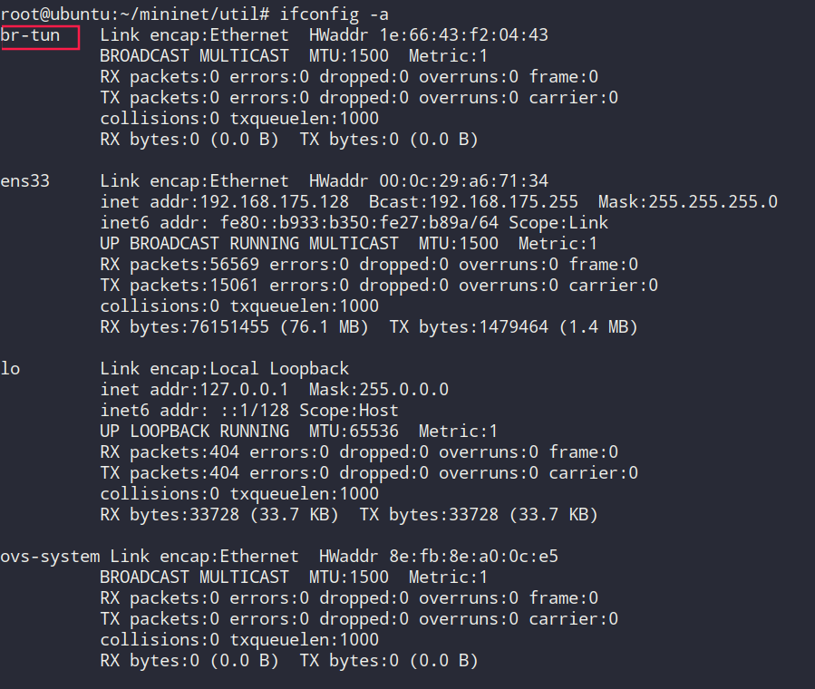](https://img2020.cnblogs.com/blog/1060878/202009/1060878-20200908100611860-235848771.png)

第二台机器创建好的设备。


```
root@ubuntu:~/mininet/util# ifconfig -a
br-tun    Link encap:Ethernet  HWaddr 1e:66:43:f2:04:43  
          BROADCAST MULTICAST  MTU:1500  Metric:1
          RX packets:0 errors:0 dropped:0 overruns:0 frame:0
          TX packets:0 errors:0 dropped:0 overruns:0 carrier:0
          collisions:0 txqueuelen:1000 
          RX bytes:0 (0.0 B)  TX bytes:0 (0.0 B)

ens33     Link encap:Ethernet  HWaddr 00:0c:29:a6:71:34  
          inet addr:192.168.175.128  Bcast:192.168.175.255  Mask:255.255.255.0
          inet6 addr: fe80::b933:b350:fe27:b89a/64 Scope:Link
          UP BROADCAST RUNNING MULTICAST  MTU:1500  Metric:1
          RX packets:56569 errors:0 dropped:0 overruns:0 frame:0
          TX packets:15061 errors:0 dropped:0 overruns:0 carrier:0
          collisions:0 txqueuelen:1000 
          RX bytes:76151455 (76.1 MB)  TX bytes:1479464 (1.4 MB)

lo        Link encap:Local Loopback  
          inet addr:127.0.0.1  Mask:255.0.0.0
          inet6 addr: ::1/128 Scope:Host
          UP LOOPBACK RUNNING  MTU:65536  Metric:1
          RX packets:404 errors:0 dropped:0 overruns:0 frame:0
          TX packets:404 errors:0 dropped:0 overruns:0 carrier:0
          collisions:0 txqueuelen:1000 
          RX bytes:33728 (33.7 KB)  TX bytes:33728 (33.7 KB)

ovs-system Link encap:Ethernet  HWaddr 8e:fb:8e:a0:0c:e5  
          BROADCAST MULTICAST  MTU:1500  Metric:1
          RX packets:0 errors:0 dropped:0 overruns:0 frame:0
          TX packets:0 errors:0 dropped:0 overruns:0 carrier:0
          collisions:0 txqueuelen:1000 
          RX bytes:0 (0.0 B)  TX bytes:0 (0.0 B)
```

[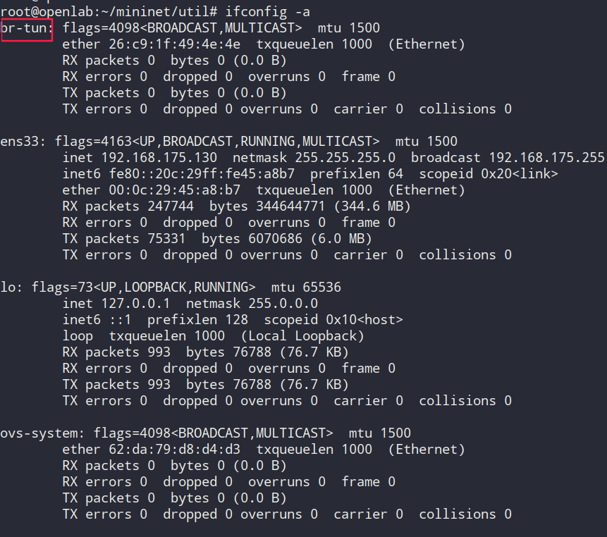](https://img2020.cnblogs.com/blog/1060878/202009/1060878-20200908100702885-1283542953.png)

转移 ens33 网卡的IP 到 br-tun 上

将网卡上的ip地址转交给br-tun。从上一步可以看出br-tun和网卡其实是非常类似的，将其赋值ip地址就可以当做网卡使用。现在要做的是把虚拟机网卡的ip地址给br-tun。
 增加路由信息。将ip地址转交给br-tun之后，路由信息也需要更新。ip地址和路由信息都要以实际的信息，在复制实验时不可直接使用我的。这也是为什么在前面记录ip信息和路由信息的原因。


```
ifconfig ens33 0 up
ifconfig br-tun 192.168.175.130/24 up
route add default gw 192.168.175.2
```

[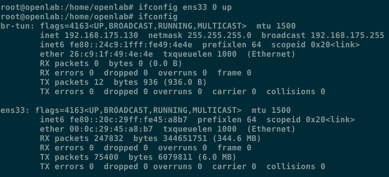](https://img2020.cnblogs.com/blog/1060878/202009/1060878-20200908101716956-1953479535.png)

同样在第二台机器上完成同样的操作。


```
ifconfig ens33 0 up
ifconfig br-tun 192.168.175.128/24 up
route add default gw 192.168.175.2
```

[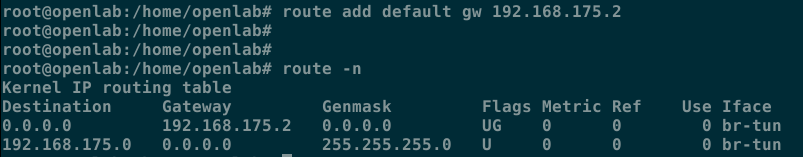](https://img2020.cnblogs.com/blog/1060878/202009/1060878-20200908102224548-723253434.png)

将网卡 ens33 作为端口添加到 br-tun

因为ens33是流量出虚拟机的接口，所以最后流量还是肯定走ens33网卡出去。br-tun只是一个虚拟机的设备，要将ens33作为端口加入br-tun中


```
ovs-vsctl add-port br-tun ens33
```

[](https://img2020.cnblogs.com/blog/1060878/202009/1060878-20200908104827381-1960912188.png)

同样在第二台机器上完成同样的操作。


```
ovs-vsctl add-port br-tun ens33
```

[](https://img2020.cnblogs.com/blog/1060878/202009/1060878-20200908104827381-1960912188.png)

启动 mininet

使用命令`mn`启动一个最小拓扑的实验。创建的设备包括两个主机，h1，h2；一个交换机 s1
 [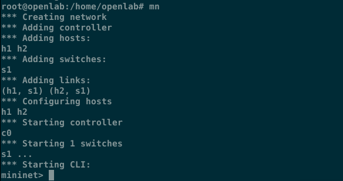](https://img2020.cnblogs.com/blog/1060878/202009/1060878-20200908104920936-2098492788.png)

使用`ovs-vsctl show` 可以看到环境中新增了一个交换机s1
 [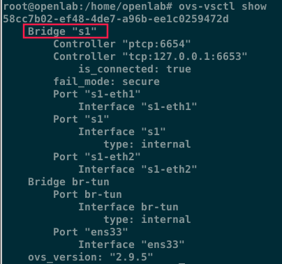](https://img2020.cnblogs.com/blog/1060878/202009/1060878-20200908105025358-1450642303.png)

同样在第二台机器上完成同样的操作。

修改主机IP地址

上一步创建的mininet中两个主机的默认地址都是`10.0.0.1`和`10.0.0.2`,需要将第一台虚拟机中的mininet的主机的地址修改`10.0.0.3`和`10.0.0.4`。构建的环境如下:

[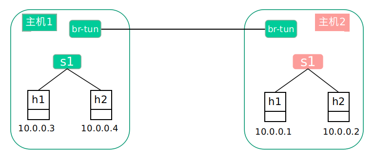](https://img2020.cnblogs.com/blog/1060878/202009/1060878-20200908143126048-1581543749.png)

[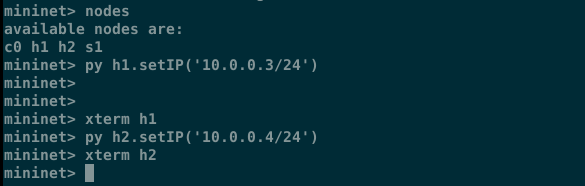](https://img2020.cnblogs.com/blog/1060878/202009/1060878-20200908110132185-477294079.png)

创建 Vxlan隧道

在交换机s1创建vxlan隧道。这一步是最关键的一步。


```
ovs-vsctl add-port s1 vx1 -- set interface vx1 type=vxlan options:remote_ip=192.168.175.128
```

其中`s1`是创建隧道的网桥，`remote_ip`就是隧道另外一端机器的ip地址。
 [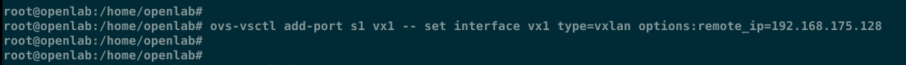](https://img2020.cnblogs.com/blog/1060878/202009/1060878-20200908105855505-2137336127.png)
 查看创建好的隧道
 [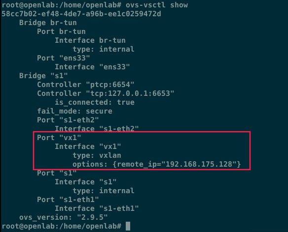](https://img2020.cnblogs.com/blog/1060878/202009/1060878-20200908105932183-289731795.png)

在第二台虚拟机上做同样的操作


```
ovs-vsctl add-port s1 vx1 -- set interface vx1 type=vxlan options:remote_ip=192.168.175.130
```

[](https://img2020.cnblogs.com/blog/1060878/202009/1060878-20200908111322181-1680379194.png)
 查看创建好的隧道
 [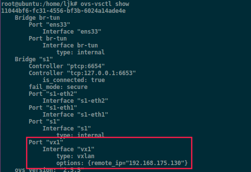](https://img2020.cnblogs.com/blog/1060878/202009/1060878-20200908111405864-510232338.png)

验证通信

在第一台虚拟机上打开h2。使用命令`xterm h2`可以打开mininet中h2的操作终端。
 [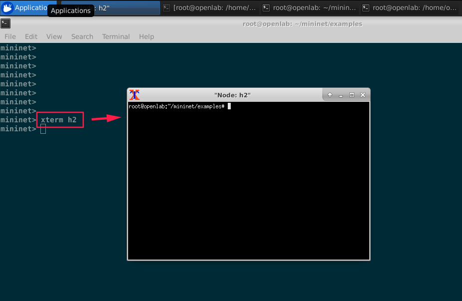](https://img2020.cnblogs.com/blog/1060878/202009/1060878-20200908111541127-2000679420.png)

在终端中`ping 10.0.0.1`
 [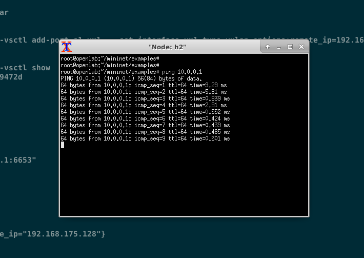](https://img2020.cnblogs.com/blog/1060878/202009/1060878-20200908110006227-1878787071.png)
 [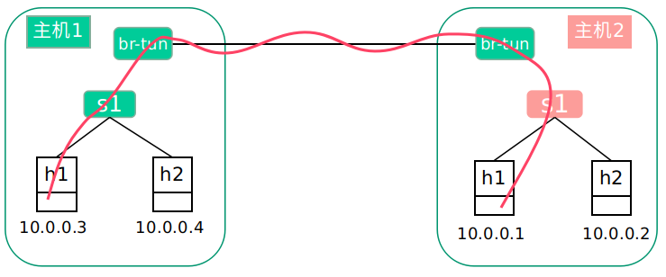](https://img2020.cnblogs.com/blog/1060878/202009/1060878-20200908144206833-490038416.png)

在终端中`ping 10.0.0.2`
 [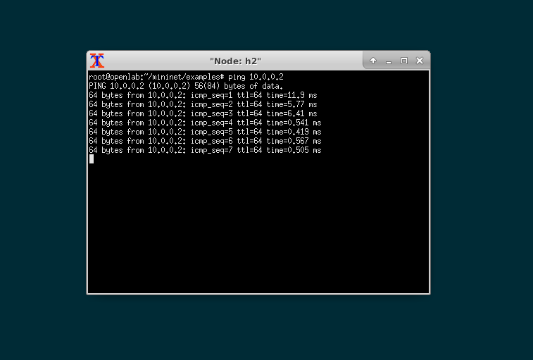](https://img2020.cnblogs.com/blog/1060878/202009/1060878-20200908111704036-548029964.png)

抓取vxlan数据包

打开`wireshark`，监听`br-tun`隧道端点上的流量。可以看到目前流量就是`ICMP`。
 [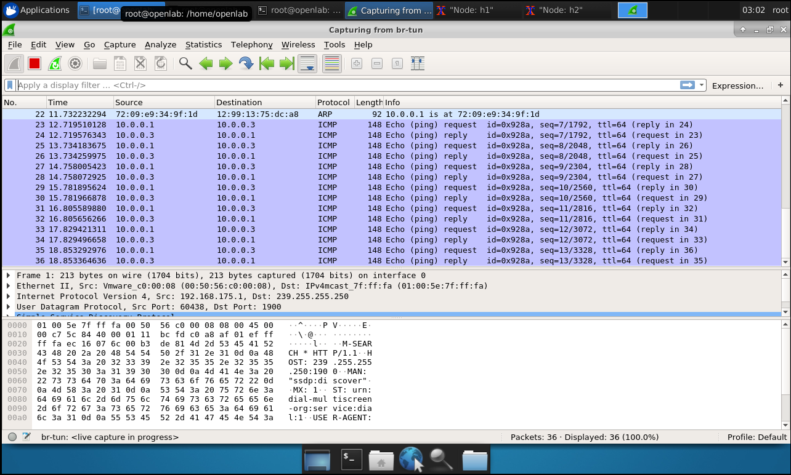](https://img2020.cnblogs.com/blog/1060878/202009/1060878-20200908110301705-581325438.png)

打开具体的icmp查看，与普通icmp有什么不同之处。正常icmp流量是`icmp+网络层+数据链路层`，而使用vxlan的icmp则是 `icmp + 网络层 + 数据链路层 + vxlan报文头 + udp + 网络层 + 数据链路层`。内层是10.0.0.3 ping 10.0.0.1的流量，这些流量被vxlan封装之后有外层包 192.168.175.130到192.168.175.128的UDP数据包。

[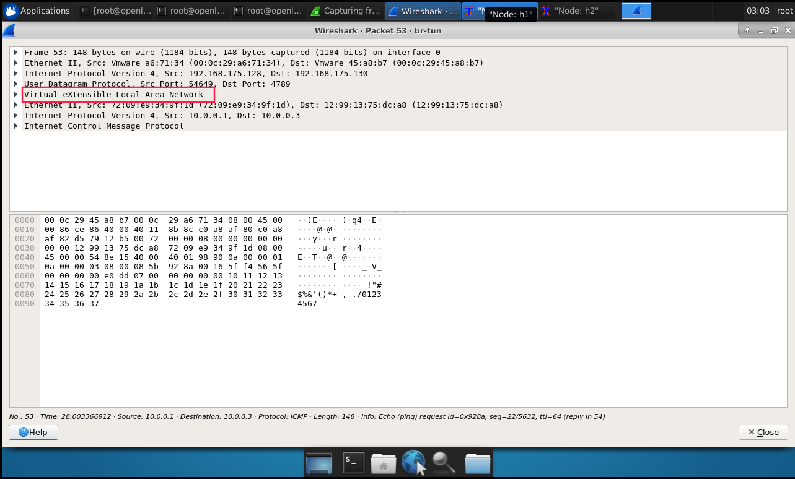](https://img2020.cnblogs.com/blog/1060878/202009/1060878-20200908110358148-1680874567.png)

最后看一下vxlan报文头的具体信息。里面包含了一个 `vxlan network identity` 即vni，就是类似与vlan tag的ID号。不同的ID号之间不可以通信。
 [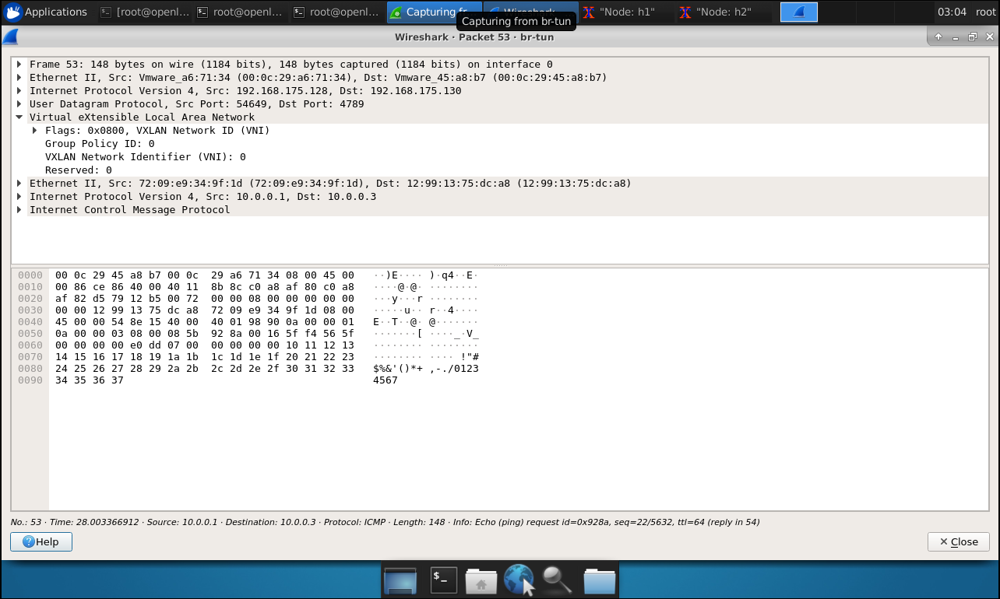](https://img2020.cnblogs.com/blog/1060878/202009/1060878-20200908110442750-1368948111.png)

总结

在两个交换机上配置了vxlan之后，就像是在s1和s1之间打通了隧道，跨越局域网的限制传输数据。逻辑上是如上，实际是流量是从 `h1 -->s1-->br-tun -->ens33 -->ens33 -->br-tun -->s1 -->h1`。
 [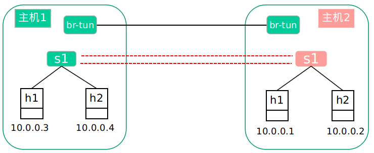](https://img2020.cnblogs.com/blog/1060878/202009/1060878-20200908150821852-717308103.png)

​    

## group 表


组表是openflow1.1之后引入的一个高级功能，可以解决在特定场景下需要很多流表才能完成的动作。

组表的能量

节省流表空间

组表的能力就可以存储多个动作，当匹配到一个合适的动作后可以执行多个动作，优化了流表`一个匹配+一个动作`的工作模式。

数据包复制

组表可以将进入的流量复制成多份，并对每一份单独处理。特定场合下如流量分析，可以一边将流量正常转发，一边将流量导入到某一个分析机中。

容错能力-备用端口/路径

组表有识别up端口和down端口的能力，可以在up的端口down掉之后将选择一个新的up端口转发流量。
 例如：如果一个数据包应该在端口1离开交换机，但是这个端口down掉了，你想要将数据包通过端口2发送出去。如果用流表的话，当端口1down掉，需要找到所有含有“发往端口1”的流表项，全部修改成端口2，这个操作是很复杂的。这个时候，需要定义一个“1st live” group来表示这种容错行为，然后将所有的流表项的规则指向该组表。只要端口1正常，group会把所有的数据包发往端口1，如果端口1 down掉，将所有数据包发往端口2，流表没有任何变化。

负载分流

组表可以选择动作中的某一个动作执行，在负载的场景下就可以通过转发到不同的端口实现后端流量负载。

组表结构

组表的结构图如下
 [](https://img2020.cnblogs.com/blog/1060878/202011/1060878-20201130145614115-622323029.png)

一个组表包含多个组条目。组条目的能力是让openflow能够实现额外的转发能力。


```
 | Group Identifier | Group Type | Counters | Action Buckets|
```

[](https://img2020.cnblogs.com/blog/1060878/202011/1060878-20201130161737693-1765165863.png)

`Group Identifier`：一个32bit无符号的整形，用来表示组表在交换机中的身份
 `Group Type`： 确定组的类型
 `Counters`： 当数据包被组处理时跟新数值
 `Action Buckets`： 一个动作桶的有序列表，每一个桶包含多个动作可以去执行。动作桶中的动作是无重复的结合。

组表可以包含0个或多个动作桶，除了 indirect 类型的桶只能有一个动作。一个组表没有动作桶默认是丢弃数据。
 一个桶的典型使用是包含一个可以修改数据包的动作和一个将数据转发到另一个端口的动作。动作桶也可以包含一个动作，这个动作可以调用另一个组的，前提是交换机支持这种组表调用链。一个没有动作桶的组表是合法的，一个动作桶没有转发动作或别的动作，会默认丢弃掉匹配的数据包。

组表的类型：

- all:  执行组表中所有的动作。这种类型通常被用在组播或者广播转发。数据包非常高效的复制给每一个桶。每一个数据都被组表中的动作桶执行。如果一个动作是直接将数据包转发到进入的端口，这个包的复制会被放弃。如果控制器中写入了转发到进端口的流表，组表必须包含一个转发动作为OFPT_IN_PORT的保留动作。
- select: 执行组表中的一个动作桶。数据包被组表中一个单个的桶处理，具体是哪一个动作通取决于交换机的选择算法。所有关于选择算法的配置和状态都是独立于OpenFlow协议之外的。
- indirect: 执行组表中的一个定义的动作桶。这种组表只支持一个动作桶。允许多个流表条目或者组表指向这个id，支持更快，更高校的聚合。这种组类型是所有组类型中最高效的方式。
- fast failover:  执行第一个活动的桶。每个动作桶和特殊的端口或组表有关系，可以控制动作桶的存活。动作桶有序的定义在组表中，第一个和活动的端口有关系的桶会被选择。这种类型可以修改交换机的流表而不需要控制器下发流表。如果没有动作桶是活动的，数据包会被丢弃。

类型验证

all

1. 用mininet新建一个拓扑，一个交换机，下面挂4个主机
    `mn --topo single,4`

[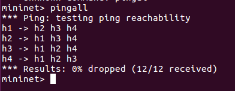](https://img2020.cnblogs.com/blog/1060878/202011/1060878-20201130143716394-1295338004.png)

1. 删除所有流表然后下发组表，引用组表


```
ovs-ofctl del-flows s1
ovs-ofctl add-group s1 group_id=1,type=all,bucket=output:2,bucket=output:3,bucket=output:4 -O openflow11
ovs-ofctl add-flow s1 in_port=1,action=group:1 -O openflow11
```

[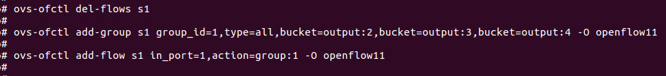](https://img2020.cnblogs.com/blog/1060878/202011/1060878-20201130143856052-1217825266.png)

[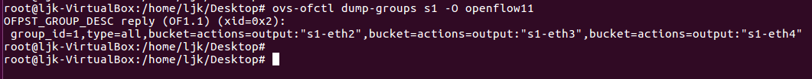](https://img2020.cnblogs.com/blog/1060878/202011/1060878-20201130144101377-1533649995.png)
 [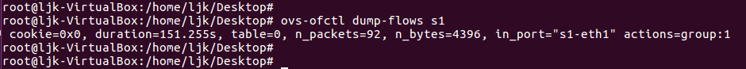](https://img2020.cnblogs.com/blog/1060878/202011/1060878-20201130144119291-837588256.png)

1. 验证类型为all的功能
    type=all,组表将选择动作桶里所有的的动作。首先打开h4，打开wireshark，抓取网卡上的数据。

[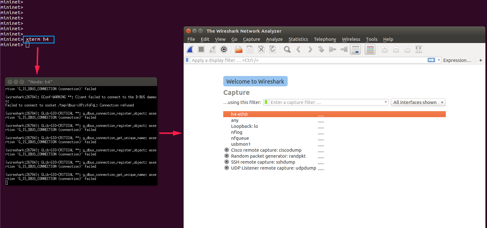](https://img2020.cnblogs.com/blog/1060878/202011/1060878-20201130143401655-1834100210.png)

在h1上ping h2，流量会经过交换机，被流表匹配到，然后交给组表。组表会将ping的数据包复制多份，发给每一个动作去处理。流量会从2、3、4这三个端口都转发出去，所以在h4上能够看到icmp的数据包。

[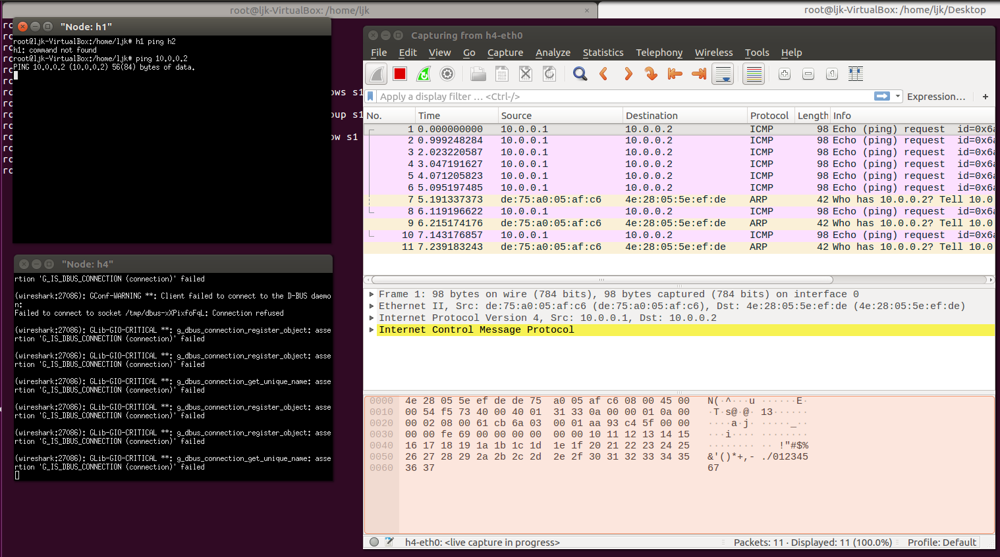](https://img2020.cnblogs.com/blog/1060878/202011/1060878-20201130143956190-947258692.png)

select

仍然使用上面的的拓扑，一个交换机连接4个主机。


```
ovs-ofctl add-group s1 group_id=2,type=select,bucket=output:2,bucket=output:3,bucket=output:4 -O openflow11
ovs-ofctl add-flow s1 in_port=1,action=group:1 -O openflow11
```

[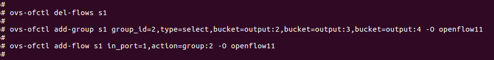](https://img2020.cnblogs.com/blog/1060878/202011/1060878-20201130145044648-727112657.png)

type=select，组表在动作桶中随机选择一个动作去执行，可以看到下在h2、h3、h4中监听的tcpdump中h4有流量捕获。在h1中ping 10.0.0.2，最后流量通过组表的select转发到h4上。

[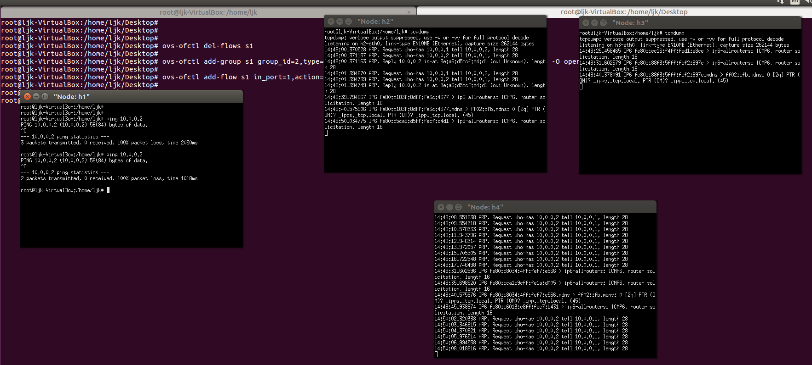](https://img2020.cnblogs.com/blog/1060878/202011/1060878-20201130145023206-1533557539.png)

fast failover

通过fast failover这个名字就能发现该类型是一个快速恢复的类型。具体来说就是当转发的端口down掉之后组表能够感知到并且切换到另一个up的端口。
 由于构建场景比较复杂，还没有实现该功能的演示。


```
ovs-ofctl add-group s1 group_id=0,type=ff,bucket=weight:0,watch_port:2,watch_group:0,actions=output:2,bucket=weight:0,watch_port:3,watch_group:0,actions=output:3 -O openflow11
```

[](https://img2020.cnblogs.com/blog/1060878/202011/1060878-20201130153211482-1917142535.png)

[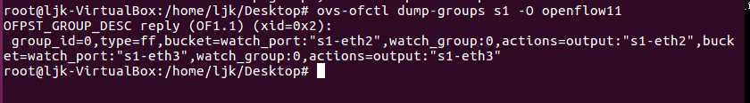](https://img2020.cnblogs.com/blog/1060878/202011/1060878-20201130153244801-1447547243.png)

具体可以参加该使用案例：`http://voip.netlab.uky.edu/grw2018ky/handout/Khayam_FFO_Clemson.pdf`


__EOF__


本文作者：**[goldsunshine](https://www.cnblogs.com/goldsunshine/p/13866415.html)** 
**本文链接**：https://www.cnblogs.com/goldsunshine/p/13866415.html
关于博主：评论和私信会在第一时间回复。或者[直接私信](https://msg.cnblogs.com/msg/send/goldsunshine)我。
版权声明：本博客所有文章除特别声明外，均采用 [BY-NC-SA](https://creativecommons.org/licenses/by-nc-nd/4.0/) 许可协议。转载请注明出处！
声援博主：如果您觉得文章对您有帮助，可以点击文章右下角**【[推荐](javascript:void(0);)】**一下。您的鼓励是博主的最大动力！

​    标签:             [SDN](https://www.cnblogs.com/goldsunshine/tag/SDN/)

​        [好文要顶](javascript:void(0);)        [关注我](javascript:void(0);)    [收藏该文](javascript:void(0);)    [](javascript:void(0);)    [](javascript:void(0);)

[](https://home.cnblogs.com/u/goldsunshine/)

​            [金色旭光](https://home.cnblogs.com/u/goldsunshine/)
​            [粉丝 - 245](https://home.cnblogs.com/u/goldsunshine/followers/)            [关注 - 8](https://home.cnblogs.com/u/goldsunshine/followees/)
​        

​                [+加关注](javascript:void(0);)    

​        1    

​        0    

​    

​    [« ](https://www.cnblogs.com/goldsunshine/p/13221661.html) 上一篇：    [动态规划系列之一爬楼梯问题](https://www.cnblogs.com/goldsunshine/p/13221661.html)    
​    [» ](https://www.cnblogs.com/goldsunshine/p/13943608.html) 下一篇：    [用python讲解数据结构之树的遍历](https://www.cnblogs.com/goldsunshine/p/13943608.html)

posted @  2020-11-30 16:39 [金色旭光](https://www.cnblogs.com/goldsunshine/) 阅读(3703) 评论(2) [编辑](https://i.cnblogs.com/EditPosts.aspx?postid=13866415) [收藏](javascript:void(0)) [举报](javascript:void(0))

## 调用北向接口下发流表

postman介绍

在开发中，前端和后端是分开开发的，当后端开发完成之后会测试接口。Postman就是一个后端接口的测试工具，通过postman可以发送GET、POST、DELETE等请求。通过Postman可以调用控制器的北向接口，下发流表到交换机
 [](https://img2020.cnblogs.com/blog/1060878/202103/1060878-20210306134440685-460356780.png)

`GET请求`
 Get请求需要注意两点，第一请求方法是get，第二是URL
 [](https://img2020.cnblogs.com/blog/1060878/202103/1060878-20210306131922249-1527853621.png)

`POST请求`
 POST请求需要注意三点：第一 请求方式是POST，第二URL，第三请求的body体。
 [](https://img2020.cnblogs.com/blog/1060878/202103/1060878-20210306131936030-207182036.png)

postman下发流表的标准格式

postman下发一条流表需要准备4个部分，分别是：

1. 动作
2. URL
3. 身份认证
4. body体

动作：PUT
 URL：替换自己控制器的ip和交换机switch_id，还要注意flow_id即url最后一个参数，该参数要和body体中一致。
 `控制器ip:8181/restconf/config/opendaylight-inventory:nodes/node/你的交换机switch_id/flow-node-inventory:table/0/flow/flow6`，
 认证信息：Basic Auth， `username`: admin `password`:admin
 [](https://img2020.cnblogs.com/blog/1060878/202103/1060878-20210306132123857-1683028636.png)
 body体：格式为 raw --> Json。body体里的内容就是流表的信息。
 [](https://img2020.cnblogs.com/blog/1060878/202103/1060878-20210306132729045-1882452752.png)

body体具体内容：
 body体就是一个流表的具体内容，分为三大块：流表元数据、匹配、动作。
 `元数据`：流表名字，id，优先级等
 `匹配`：流表匹配规则，如经典匹配十二元组
 `动作`：标准动作转发和丢弃
 [](https://img2020.cnblogs.com/blog/1060878/202103/1060878-20210306133706655-1011429554.png)

物理端口匹配

匹配进端口为1，动作是转发到222端口


```
ovs-ofctl add-flow br0 in_port=1,action=output:222
```


```
控制器ip地址:8181/restconf/config/opendaylight-inventory:nodes/node/交换机switch_id/flow-node-inventory:table/0/flow/demo_14
```


```
{
  "flow": [
    {
      "id": "demo_14",
      "flow-name": "demo_14",
      "table_id": 0,
      "match": {
        "in-port": "1",
        "ethernet-match": {
          
        }
      },
      "instructions": {
        "instruction": [
          {
            "order": "0",
            "apply-actions": {
              "action": [
                {
                  "order": "0",
                  "output-action": {
                    "output-node-connector": "222"
                  }
                }
              ]
            }
          }
        ]
      }
    }
  ]
}
```

mac 地址匹配

匹配源mac地址：`78:45:c4:1c:ba:b9`，目的mac地址：`00:50:56:c0:00:08`，动作是丢弃


```
ovs-ofctl add-flow br0 dl_src=78:45:c4:1c:ba:b9,dl_dst=00:50:56:c0:00:08,aciton=drop
```


```
控制器ip地址:8181/restconf/config/opendaylight-inventory:nodes/node/交换机switch_id/flow-node-inventory:table/0/flow/demo_four
```


```
{
  "flow": [
    {
      "id": "demo_four",
      "flow-name": "demo_four",
      "table_id": 0,
      "match": {
        "ethernet-match": {
          "ethernet-source": {
            "mask": "ff:ff:ff:ff:ff:ff",
            "address": "78:45:c4:1c:ba:b9"
          },
          "ethernet-destination": {
            "mask": "ff:ff:ff:ff:ff:ff",
            "address": "00:50:56:c0:00:08"
          }
        }
      },
      "instructions": {
        "instruction": [
          {
            "order": "0",
            "apply-actions": {
              "action": [
                {
                  "order": "0",
                  "drop-action": {
                    
                  }
                }
              ]
            }
          }
        ]
      }
    }
  ]
}
```

ip地址匹配

匹配源ip地址为30.0.0.1/32，目的ip为30.0.0.2/32的流表，动作是转发到222端口


```
ovs-ofctl add-flow br0 ip,nw_src=30.0.0.1/32,nw_dst=30.0.0.2/32,aciton=output:222
```


```
控制器ip地址:8181/restconf/config/opendaylight-inventory:nodes/node/交换机switch_id/flow-node-inventory:table/0/flow/demo_14
```


```
{
  "flow": [
    {
      "id": "demo_14",
      "flow-name": "demo_14",
      "table_id": 0,
      "match": {
        "ethernet-match": {
          "ethernet-type": {
            "type": "0x0800"
          }
        },
        "ipv4-source": "30.0.0.1/32",
        "ipv4-destination": "30.0.0.2/32"
      },
      "instructions": {
        "instruction": [
          {
            "order": "0",
            "apply-actions": {
              "action": [
                {
                  "order": "0",
                  "output-action": {
                    "output-node-connector": "222"
                  }
                }
              ]
            }
          }
        ]
      }
    }
  ]
}
```

udp 端口匹配

匹配 源端口为112，目的端口为2321的UDP数据包，动作是转发到222端口。


```
ovs-ofctl add-flow br0 udp,udp_src=112,udp_dst=2321,action=output:222
```


```
控制器ip地址:8181/restconf/config/opendaylight-inventory:nodes/node/交换机switch_id/flow-node-inventory:table/0/flow/demo_13
```


```
{
  "flow": [
    {
      "id": "demo_13",
      "flow-name": "demo_13",
      "table_id": 0,
      "match": {
        "ethernet-match": {
          "ethernet-type": {
            "type": "0x0800"
          }
        },
        "ip-match": {
          "ip-protocol": 17
        },
        "udp-destination-port": "2321",
        "udp-source-port": "112"
      },
      "instructions": {
        "instruction": [
          {
            "order": "0",
            "apply-actions": {
              "action": [
                {
                  "order": "0",
                  "output-action": {
                    "output-node-connector": "222"
                  }
                }
              ]
            }
          }
        ]
      }
    }
  ]
}
```

tcp 端口匹配

匹配源端口是888，目的端口是999的TCP流量，动作是转发到222端口


```
ovs-ofctl add-flow br0 tcp,tcp_src=888,tcp_dst=999,action=output:222
```


```
控制器ip地址:8181/restconf/config/opendaylight-inventory:nodes/node/交换机switch_id/flow-node-inventory:table/0/flow/demo_14
```


```
{
  "flow": [
    {
      "id": "demo_14",
      "flow-name": "demo_14",
      "table_id": 0,
      "match": {
        "ethernet-match": {
          "ethernet-type": {
            "type": "0x0800"
          }
        },
        "ip-match": {
          "ip-protocol": 6
        },
        "tcp-destination-port": "999",
        "tcp-source-port": "888"
      },
      "instructions": {
        "instruction": [
          {
            "order": "0",
            "apply-actions": {
              "action": [
                {
                  "order": "0",
                  "output-action": {
                    "output-node-connector": "222"
                  }
                }
              ]
            }
          }
        ]
      }
    }
  ]
}
```

meter 表

meter表，限速为10k，超过限制的流量丢弃。


```
ovs-ofctl add-meter s1 meter=1,kbps,band=type=drop,rate=10 -O OpenFlow13
```


```
控制器ip:8181/restconf/config/opendaylight-inventory:nodes/node/交换机switch_id/meter/1
```


```
{
  "meter": {

    "meter-id": "1",
    "meter-name": "guestMeter",
    "flags": "meter-kbps",

    "meter-band-headers": {
      "meter-band-header": {
        "band-id": "0",
        "meter-band-types": { "flags": "ofpmbt-drop" },
        "drop-burst-size": "0",
        "drop-rate": "10"
      }
    }
  }
}
```

匹配进端口为1的流量，经过meter表限速，然后转发到2端口


```
ovs-ofctl add-flow s1 priority=200,in_port=1,action=meter:1,output:2 -O OpenFlow13
```


```
控制器ip地址:8181/restconf/config/opendaylight-inventory:nodes/node/交换机switch_id/flow-node-inventory:table/0/flow/flow1
```


```
{
  "flow": {
  "id": "flow1",   
  "table_id": "0",
  "priority": "120",
  "name":"flow_name"


  "match": {
    "in-port":"1"
    },
   

    "instructions": {
      "instruction": [
        {
          "order": "0",
          "meter": { "meter-id": "1" }
        },
        {
          "order": "1",
          "apply-actions": {
            "action": {
              "order": "1",
              "output-action": {
                "output-node-connector": "2"
              }
            }
          }
        }
      ]
    }
  }
}
```


## ovs-dpdk

dpdk 介绍

`DPDK`(Data Plane Development Kit)：
 是一组快速处理数据包的开发平台及接口。有intel主导开发，主要基于Linux系统，用于快速数据包处理的函数库与驱动集合，可以极大提高数据处理性能和吞吐量，提高数据平面应用程序的工作效率。

`DPDK的作用`：
 在数据平面应用中为快速处理数据包提供一个简单而完善的架构。在理解此工具集之后，开发人员可以以此为基础进行新的原型设计处理大并发网络数据请求。

当前数据包的处理流程是这样：
 数据包到达网卡，网卡发送中断通知CPU，CPU将数据包拷贝到内核空间中，应用程序从内核空间中拷贝数据到用户态空间，数据处理。

在这个过程中数据包处理耗时的操作有：

1. 网卡每次收到数据都发送中断，打断cpu的工作。切换和恢复过程都耗时
2. 网络数据包经过TCP/IP协议栈，达到真正的应用处理程序时走过很多的流程
3. 应用程序拿到网络数据时需要经过内核空间到用户态空间的一次copy，增加耗时

[](https://img2020.cnblogs.com/blog/1060878/202101/1060878-20210111101857807-975118303.png)

```
dpdk解决问题办法：
```

1. DPDK技术是重载网卡驱动，直接将数据传递给用户态的应用程序，避免了中间环节的经过TCP/IP协议栈，内核空间到用户空间的copy。
2. 同时针对第一点网卡频繁的中断，应用程序可以使用轮询的方式获取网卡上的数据，避免中断造成的场景切换和恢复浪费的时间。

[](https://img2020.cnblogs.com/blog/1060878/202101/1060878-20210111102615995-372407894.png)

ovs-dpdk

普通ovs

ovs的架构图：
 [](https://img2020.cnblogs.com/blog/1060878/202105/1060878-20210509130204033-1033930936.png)

`ovs`处理流表的过程是：
 1.ovs的datapath接收到从ovs连接的某个网络设备发来的数据包，从数据包中提取源/目的IP、源/目的MAC、端口等信息。
 2.ovs在**内核状态**下查看流表结构（通过Hash），观察是否有缓存的信息可用于转发这个数据包。
 3.内核不知道如何处置这个数据包会将其发送给用户态的ovs-vswitchd。
 4.ovs-vswitchd进程接收到upcall后，将检查数据库以查询数据包的目的端口是哪里，然后告诉内核应该将数据包转发到哪个端口，例如eth0。
 5.内核执行用户此前设置的动作。即内核将数据包转发给端口eth0，进而数据被发送出去。

ovs-dpdk

DPDK加速的OVS与原始OVS的区别在于，从OVS连接的某个网络端口接收到的报文不需要openvswitch.ko内核态的处理，报文通过DPDK PMD驱动直接到达用户态ovs-vswitchd里。
 [](https://img2020.cnblogs.com/blog/1060878/202105/1060878-20210509130057172-1672367703.png)

`DPDK加速的OVS`数据流转发的大致流程如下：
 1.OVS的ovs-vswitchd接收到从OVS连接的某个网络端口发来的数据包，从数据包中提取源/目的IP、源/目的MAC、端口等信息。
 2.OVS在**用户态**查看精确流表和模糊流表，如果命中，则直接转发。
 3.如果还不命中，在SDN控制器接入的情况下，经过OpenFlow协议，通告给控制器，由控制器处理。
 4.控制器下发新的流表，该数据包重新发起选路，匹配；报文转发，结束。

`总结`
 主要区别在于流表的处理。普通ovs流表转发在内核态，而ovs-dpdk流表转发在用户态

ovs-dpdk安装

安装环境

[](https://img2020.cnblogs.com/blog/1060878/202105/1060878-20210509125716038-1207113839.png)
 系统：ubuntu1604
 网卡：intel I350
 [](https://img2020.cnblogs.com/blog/1060878/202105/1060878-20210508181106047-1078972603.png)
 [](https://img2020.cnblogs.com/blog/1060878/202105/1060878-20210508181304613-1294796010.png)


编译工具安装

```
apt-get update
apt install automake libtool build-essential openssl -y
apt install desktop-file-utils groff graphviz -y
apt install checkpolicy python-sphinx python-twisted-core -y
```


编译安装dpdk

```
wget http://dpdk.org/browse/dpdk/snapshot/dpdk-16.11.tar.gz
mkdir -p /usr/src/dpdk
解压并进入目录
make config T=x86_64-native-linuxapp-gcc
make install T=x86_64-native-linuxapp-gcc DESTDIR=/usr/src/dpdk
make install T=x86_64-native-linuxapp-gcc DESTDIR=/usr
```


编译安装ovs

```
wget http://openvswitch.org/releases/openvswitch-2.7.0.tar.gz

解压并进入目录

./boot.sh

./configure \
--with-dpdk=/usr/src/dpdk \
--prefix=/usr \
--exec-prefix=/usr \
--sysconfdir=/etc \
--localstatedir=/var

make

make install
```

网卡绑定

### 系统设置


```
vim  /boot/grub2/grub.cfg
```

找到引导的相应内核参数，在后面添加：`iommu=pt intel_iommu=on`


```
linux   /vmlinuz-4.4.0-142-generic root=/dev/mapper/ubuntu--vg-root ro recovery nomodeset  iommu=pt intel_iommu=on
```

重启生效

### 设置dpdk驱动


```
modprobe uio_pci_generic
dpdk-devbind --bind=uio_pci_generic enp1s0f0
dpdk-devbind --bind=uio_pci_generic enp1s0f1
```

### 配置大页

查看当前的hugepage


```
grep HugePages_ /proc/meminfo
```

修改hugepage的页数为1024

临时设置大页的方法，重启失效：


```
echo 1024 > /proc/sys/vm/nr_hugepages
```

配置保存的设置方法，重启生效：


```
echo 'vm.nr_hugepages=1024' > /etc/sysctl.d/hugepages.conf
```

### 挂载hugepages


```
mount -t hugetlbfs none /dev/hugepages
```

启动ovs 进程

### 准备ovs相关路径


```
mkdir -p /etc/openvswitch
mkdir -p /var/run/openvswitch
```

### 删除旧的ovs配置数据和创建新的(可选)

如果不需要旧配置时，可以选择该操作


```
rm /etc/openvswitch/conf.db
ovsdb-tool create /etc/openvswitch/conf.db /usr/share/openvswitch/vswitch.ovsschema
```

启动ovsdb server


```
ovsdb-server /etc/openvswitch/conf.db \
-vconsole:emer -vsyslog:err -vfile:info \
--remote=punix:/var/run/openvswitch/db.sock \
--private-key=db:Open_vSwitch,SSL,private_key \
--certificate=db:Open_vSwitch,SSL,certificate \
--bootstrap-ca-cert=db:Open_vSwitch,SSL,ca_cert --no-chdir \
--log-file=/var/log/openvswitch/ovsdb-server.log \
--pidfile=/var/run/openvswitch/ovsdb-server.pid \
--detach --monitor
```


第一次启动 ovs需要初始化

```
ovs-vsctl --no-wait init
```

初始化 dpdk

从ovs-v2.7.0开始，开启dpdk功能已不是vswitchd进程启动时指定–dpdk等参数了，而是通过设置ovsdb来开启dpdk功能


```
ovs-vsctl --no-wait set Open_vSwitch . other_config:dpdk-init=true
```

自定义一些dpdk的参数（可选）

### 指定的sockets从hugepages预先分配的内存


```
ovs-vsctl --no-wait set Open_vSwitch . other_config:dpdk-socket-mem="1024,0"
```

### 指定在某些core上运行


```
ovs-vsctl set Open_vSwitch . other_config:pmd-cpu-mask=0x02
```

### 查看自定义的dpdk参数


```
ovs-vsctl get Open_vSwitch . other_config:dpdk-socket-mem
ovs-vsctl get Open_vSwitch . other_config:pmd-cpu-mask
ovs-vsctl get Open_vSwitch . other_config:dpdk-init
```


启动vswitchd进程

```
ovs-vswitchd unix:/var/run/openvswitch/db.sock \
-vconsole:emer -vsyslog:err -vfile:info --mlockall --no-chdir \
--log-file=/var/log/openvswitch/ovs-vswitchd.log \
--pidfile=/var/run/openvswitch/ovs-vswitchd.pid \
--detach --monitor
```

ovs 工具使用

### 创建openvswitch网桥


```
ovs-vsctl add-br br0 -- set bridge br0 datapath_type=netdev
```

[](https://img2020.cnblogs.com/blog/1060878/202105/1060878-20210508181017570-1183587580.png)

### 把dpdk端口加入网桥

先使用dpdk-devbind命令查看当前已绑定的dpdk网卡，并记住相应的PCI地址


```
dpdk-devbind --status

ovs-vsctl add-port br0 dpdk0 -- set Interface dpdk0 type=dpdk options:dpdk-devargs=0000:01:00.0
ovs-vsctl add-port br0 dpdk1 -- set Interface dpdk1 type=dpdk options:dpdk-devargs=0000:01:00.1
```

[](https://img2020.cnblogs.com/blog/1060878/202105/1060878-20210508181025541-1929751595.png)

完成分割线

到这里就安装完成了，并且两台主机之间可以直接转发数据。

测速

在两主机之间使用iperf工具测速，服务端收集到的测速信息如下：
 两主机之间是1000Mb的带宽
 [](https://img2020.cnblogs.com/blog/1060878/202105/1060878-20210508181035603-898577490.png)

目前只使用了`iperf`的测速方法，发现ovs-dpdk和ovs的转发效率没有什么区别，可能并没有找到合适的测试方法，待补充。

报错解决

在安装过程中可能会出现的报错：


```
ovs-vsctl: unix:/usr/local/var/run/openvswitch/db.sock: database connection failed (No such file or directory)
```

解决方法：


```
ovsdb-server --remote=punix:/usr/local/var/run/openvswitch/db.sock \
                     --remote=db:Open_vSwitch,Open_vSwitch,manager_options \
                     --private-key=db:Open_vSwitch,SSL,private_key \
                     --certificate=db:Open_vSwitch,SSL,certificate \
                     --bootstrap-ca-cert=db:Open_vSwitch,SSL,ca_cert \
                     --pidfile --detach
ovs-vsctl --no-wait init
ovs-vswitchd --pidfile --detach
/usr/share/openvswitch/scripts/ovs-ctl start
```


# OVS Faucet Tutorial[¶](https://docs.openvswitch.org/en/latest/tutorials/faucet/#ovs-faucet-tutorial)

This tutorial demonstrates how Open vSwitch works with a general-purpose OpenFlow controller, using the Faucet controller as a simple way to get started.  It was tested with the “master” branch of Open vSwitch and version 1.6.15 of Faucet.  It does not use advanced or recently added features in OVS or Faucet, so other versions of both pieces of software are likely to work equally well.

The goal of the tutorial is to demonstrate Open vSwitch and Faucet in an end-to-end way, that is, to show how it works from the Faucet controller configuration at the top, through the OpenFlow flow table, to the datapath processing.  Along the way, in addition to helping to understand the architecture at each level, we discuss performance and troubleshooting issues. We hope that this demonstration makes it easier for users and potential users to understand how Open vSwitch works and how to debug and troubleshoot it.

We provide enough details in the tutorial that you should be able to fully follow along by following the instructions.

## Setting Up OVS[¶](https://docs.openvswitch.org/en/latest/tutorials/faucet/#setting-up-ovs)

This section explains how to set up Open vSwitch for the purpose of using it with Faucet for the tutorial.

You might already have Open vSwitch installed on one or more computers or VMs, perhaps set up to control a set of VMs or a physical network.  This is admirable, but we will be using Open vSwitch in a different way to set up a simulation environment called the OVS “sandbox”.  The sandbox does not use virtual machines or containers, which makes it more limited, but on the other hand it is (in this writer’s opinion) easier to set up.

There are two ways to start a sandbox: one that uses the Open vSwitch that is already installed on a system, and another that uses a copy of Open vSwitch that has been built but not yet installed.  The latter is more often used and thus better tested, but both should work.  The instructions below explain both approaches:

1. Get a copy of the Open vSwitch source repository using Git, then `cd` into the new directory:

   ```
   $ git clone https://github.com/openvswitch/ovs.git
   $ cd ovs
   ```

   The default checkout is the master branch.  You will need to use the master branch for this tutorial as it includes some functionality required for this tutorial.

2. If you do not already have an installed copy of Open vSwitch on your system, or if you do not want to use it for the sandbox (the sandbox will not disturb the functionality of any existing switches), then proceed to step 3. If you do have an installed copy and you want to use it for the sandbox, try to start the sandbox by running:

   ```
   $ tutorial/ovs-sandbox
   ```

   Note

   The default behaviour for some of the commands used in this tutorial changed in Open vSwitch versions 2.9.x and 2.10.x which breaks the tutorial.  We recommend following step 3 and building master from source or using a system Open vSwitch that is version 2.8.x or older.

   If it is successful, you will find yourself in a subshell environment, which is the sandbox (you can exit with `exit` or Control+D).  If so, you’re finished and do not need to complete the rest of the steps.  If it fails, you can proceed to step 3 to build Open vSwitch anyway.

3. Before you build, you might want to check that your system meets the build requirements.  Read [Open vSwitch on Linux, FreeBSD and NetBSD](https://docs.openvswitch.org/en/latest/intro/install/general/) to find out.  For this tutorial, there is no need to compile the Linux kernel module, or to use any of the optional libraries such as OpenSSL, DPDK, or libcap-ng.

   If you are using a Linux system that uses apt and have some `deb-src` repos listed in `/etc/apt/sources.list`, often an easy way to install the build dependencies for a package is to use `build-dep`:

   ```
   $ sudo apt-get build-dep openvswitch
   ```

4. Configure and build Open vSwitch:

   ```
   $ ./boot.sh
   $ ./configure
   $ make -j4
   ```

5. Try out the sandbox by running:

   ```
   $ make sandbox
   ```

   You can exit the sandbox with `exit` or Control+D.

## Setting up Faucet[¶](https://docs.openvswitch.org/en/latest/tutorials/faucet/#setting-up-faucet)

This section explains how to get a copy of Faucet and set it up appropriately for the tutorial.  There are many other ways to install Faucet, but this simple approach worked well for me.  It has the advantage that it does not require modifying any system-level files or directories on your machine.  It does, on the other hand, require Docker, so make sure you have it installed and working.

It will be a little easier to go through the rest of the tutorial if you run these instructions in a separate terminal from the one that you’re using for Open vSwitch, because it’s often necessary to switch between one and the other.

1. Get a copy of the Faucet source repository using Git, then `cd` into the new directory:

   ```
   $ git clone https://github.com/faucetsdn/faucet.git
   $ cd faucet
   ```

   At this point I checked out the latest tag:

   ```
   $ latest_tag=$(git describe --tags $(git rev-list --tags --max-count=1))
   $ git checkout $latest_tag
   ```

2. Build a docker container image:

   ```
   $ sudo docker build -t faucet/faucet -f Dockerfile.faucet .
   ```

   This will take a few minutes.

3. Create an installation directory under the `faucet` directory for the docker image to use:

   ```
   $ mkdir inst
   ```

   The Faucet configuration will go in `inst/faucet.yaml` and its main log will appear in `inst/faucet.log`.  (The official Faucet installation instructions call to put these in `/etc/ryu/faucet` and `/var/log/ryu/faucet`, respectively, but we avoid modifying these system directories.)

4. Create a container and start Faucet:

   ```
   $ sudo docker run -d --name faucet --restart=always -v $(pwd)/inst/:/etc/faucet/ -v $(pwd)/inst/:/var/log/faucet/ -p 6653:6653 -p 9302:9302 faucet/faucet
   ```

5. Look in `inst/faucet.log` to verify that Faucet started.  It will probably start with an exception and traceback because we have not yet created `inst/faucet.yaml`.

6. Later on, to make a new or updated Faucet configuration take effect quickly, you can run:

   ```
   $ sudo docker exec faucet pkill -HUP -f faucet.faucet
   ```

   Another way is to stop and start the Faucet container:

   ```
   $ sudo docker restart faucet
   ```

   You can also stop and delete the container; after this, to start it again, you need to rerun the `docker run` command:

   ```
   $ sudo docker stop faucet
   $ sudo docker rm faucet
   ```

## Overview[¶](https://docs.openvswitch.org/en/latest/tutorials/faucet/#overview)

Now that Open vSwitch and Faucet are ready, here’s an overview of what we’re going to do for the remainder of the tutorial:

1. Switching: Set up an L2 network with Faucet.
2. Routing: Route between multiple L3 networks with Faucet.
3. ACLs: Add and modify access control rules.

At each step, we will take a look at how the features in question work from Faucet at the top to the data plane layer at the bottom.  From the highest to lowest level, these layers and the software components that connect them are:

- Faucet.

  As the top level in the system, this is the authoritative source of the network configuration. Faucet connects to a variety of monitoring and performance tools, but we won’t use them in this tutorial.  Our main insights into the system will be through `faucet.yaml` for configuration and `faucet.log` to observe state, such as MAC learning and ARP resolution, and to tell when we’ve screwed up configuration syntax or semantics.

- The OpenFlow subsystem in Open vSwitch.

  OpenFlow is the protocol, standardized by the Open Networking Foundation, that controllers like Faucet use to control how Open vSwitch and other switches treat packets in the network. We will use `ovs-ofctl`, a utility that comes with Open vSwitch, to observe and occasionally modify Open vSwitch’s OpenFlow behavior. We will also use `ovs-appctl`, a utility for communicating with `ovs-vswitchd` and other Open vSwitch daemons, to ask “what-if?” type questions. In addition, the OVS sandbox by default raises the Open vSwitch logging level for OpenFlow high enough that we can learn a great deal about OpenFlow behavior simply by reading its log file.

- Open vSwitch datapath.

  This is essentially a cache designed to accelerate packet processing.  Open vSwitch includes a few different datapaths, such as one based on the Linux kernel and a userspace-only datapath (sometimes called the “DPDK” datapath). The OVS sandbox uses the latter, but the principles behind it apply equally well to other datapaths.

At each step, we discuss how the design of each layer influences performance.  We demonstrate how Open vSwitch features can be used to debug, troubleshoot, and understand the system as a whole.

## Switching[¶](https://docs.openvswitch.org/en/latest/tutorials/faucet/#switching)

Layer-2 (L2) switching is the basis of modern networking.  It’s also very simple and a good place to start, so let’s set up a switch with some VLANs in Faucet and see how it works at each layer.  Begin by putting the following into `inst/faucet.yaml`:

```
dps:
    switch-1:
        dp_id: 0x1
        timeout: 3600
        arp_neighbor_timeout: 3600
        interfaces:
            1:
                native_vlan: 100
            2:
                native_vlan: 100
            3:
                native_vlan: 100
            4:
                native_vlan: 200
            5:
                native_vlan: 200
vlans:
    100:
    200:
```

This configuration file defines a single switch (“datapath” or “dp”) named `switch-1`.  The switch has five ports, numbered 1 through 5. Ports 1, 2, and 3 are in VLAN 100, and ports 4 and 5 are in VLAN 2. Faucet can identify the switch from its datapath ID, which is defined to be 0x1.

Note

This also sets high MAC learning and ARP timeouts.  The defaults are 5 minutes and about 8 minutes, which are fine in production but sometimes too fast for manual experimentation.

Now restart Faucet so that the configuration takes effect, e.g.:

```
$ sudo docker restart faucet
```

Assuming that the configuration update is successful, you should now see a new line at the end of `inst/faucet.log`:

```
Sep 10 06:44:10 faucet INFO     Add new datapath DPID 1 (0x1)
```

Faucet is now waiting for a switch with datapath ID 0x1 to connect to it over OpenFlow, so our next step is to create a switch with OVS and make it connect to Faucet.  To do that, switch to the terminal where you checked out OVS and start a sandbox with `make sandbox` or `tutorial/ovs-sandbox` (as explained earlier under [Setting Up OVS](https://docs.openvswitch.org/en/latest/tutorials/faucet/#setting-up-ovs)).  You should see something like this toward the end of the output:

```
----------------------------------------------------------------------
You are running in a dummy Open vSwitch environment.  You can use
ovs-vsctl, ovs-ofctl, ovs-appctl, and other tools to work with the
dummy switch.

Log files, pidfiles, and the configuration database are in the
"sandbox" subdirectory.

Exit the shell to kill the running daemons.
blp@sigabrt:~/nicira/ovs/tutorial(0)$
```

Inside the sandbox, create a switch (“bridge”) named `br0`, set its datapath ID to 0x1, add simulated ports to it named `p1` through `p5`, and tell it to connect to the Faucet controller.  To make it easier to understand, we request for port `p1` to be assigned OpenFlow port 1, `p2` port 2, and so on.  As a final touch, configure the controller to be “out-of-band” (this is mainly to avoid some annoying messages in the `ovs-vswitchd` logs; for more information, run `man ovs-vswitchd.conf.db` and search for `connection_mode`):

```
$ ovs-vsctl add-br br0 \
         -- set bridge br0 other-config:datapath-id=0000000000000001 \
         -- add-port br0 p1 -- set interface p1 ofport_request=1 \
         -- add-port br0 p2 -- set interface p2 ofport_request=2 \
         -- add-port br0 p3 -- set interface p3 ofport_request=3 \
         -- add-port br0 p4 -- set interface p4 ofport_request=4 \
         -- add-port br0 p5 -- set interface p5 ofport_request=5 \
         -- set-controller br0 tcp:127.0.0.1:6653 \
         -- set controller br0 connection-mode=out-of-band
```

Note

You don’t have to run all of these as a single `ovs-vsctl` invocation.  It is a little more efficient, though, and since it updates the OVS configuration in a single database transaction it means that, for example, there is never a time when the controller is set but it has not yet been configured as out-of-band.

Faucet requires ports to be in the up state before it will configure them.  In Open vSwitch versions earlier than 2.11.0 dummy ports started in the down state. You will need to force them to come up with the following `ovs-appctl` command (please skip this step if using a newer version of Open vSwitch):

```
$ ovs-appctl netdev-dummy/set-admin-state up
```

Now, if you look at `inst/faucet.log` again, you should see that Faucet recognized and configured the new switch and its ports:

```
Sep 10 06:45:03 faucet.valve INFO     DPID 1 (0x1) switch-1 Cold start configuring DP
Sep 10 06:45:03 faucet.valve INFO     DPID 1 (0x1) switch-1 Configuring VLAN 100 vid:100 ports:Port 1,Port 2,Port 3
Sep 10 06:45:03 faucet.valve INFO     DPID 1 (0x1) switch-1 Configuring VLAN 200 vid:200 ports:Port 4,Port 5
Sep 10 06:45:24 faucet.valve INFO     DPID 1 (0x1) switch-1 Port 1 (1) up
Sep 10 06:45:24 faucet.valve INFO     DPID 1 (0x1) switch-1 Port 2 (2) up
Sep 10 06:45:24 faucet.valve INFO     DPID 1 (0x1) switch-1 Port 3 (3) up
Sep 10 06:45:24 faucet.valve INFO     DPID 1 (0x1) switch-1 Port 4 (4) up
Sep 10 06:45:24 faucet.valve INFO     DPID 1 (0x1) switch-1 Port 5 (5) up
```

Over on the Open vSwitch side, you can see a lot of related activity if you take a look in `sandbox/ovs-vswitchd.log`.  For example, here is the basic OpenFlow session setup and Faucet’s probe of the switch’s ports and capabilities:

```
rconn|INFO|br0<->tcp:127.0.0.1:6653: connecting...
vconn|DBG|tcp:127.0.0.1:6653: sent (Success): OFPT_HELLO (OF1.4) (xid=0x1):
 version bitmap: 0x01, 0x02, 0x03, 0x04, 0x05
vconn|DBG|tcp:127.0.0.1:6653: received: OFPT_HELLO (OF1.3) (xid=0xdb9dab08):
 version bitmap: 0x01, 0x02, 0x03, 0x04
vconn|DBG|tcp:127.0.0.1:6653: negotiated OpenFlow version 0x04 (we support version 0x05 and earlier, peer supports version 0x04 and earlier)
rconn|INFO|br0<->tcp:127.0.0.1:6653: connected
vconn|DBG|tcp:127.0.0.1:6653: received: OFPT_FEATURES_REQUEST (OF1.3) (xid=0xdb9dab09):
00040|vconn|DBG|tcp:127.0.0.1:6653: sent (Success): OFPT_FEATURES_REPLY (OF1.3) (xid=0xdb9dab09): dpid:0000000000000001
n_tables:254, n_buffers:0
capabilities: FLOW_STATS TABLE_STATS PORT_STATS GROUP_STATS QUEUE_STATS
vconn|DBG|tcp:127.0.0.1:6653: received: OFPST_PORT_DESC request (OF1.3) (xid=0xdb9dab0a): port=ANY
vconn|DBG|tcp:127.0.0.1:6653: sent (Success): OFPST_PORT_DESC reply (OF1.3) (xid=0xdb9dab0a):
 1(p1): addr:aa:55:aa:55:00:14
     config:     0
     state:      LIVE
     speed: 0 Mbps now, 0 Mbps max
 2(p2): addr:aa:55:aa:55:00:15
     config:     0
     state:      LIVE
     speed: 0 Mbps now, 0 Mbps max
 3(p3): addr:aa:55:aa:55:00:16
     config:     0
     state:      LIVE
     speed: 0 Mbps now, 0 Mbps max
 4(p4): addr:aa:55:aa:55:00:17
     config:     0
     state:      LIVE
     speed: 0 Mbps now, 0 Mbps max
 5(p5): addr:aa:55:aa:55:00:18
     config:     0
     state:      LIVE
     speed: 0 Mbps now, 0 Mbps max
 LOCAL(br0): addr:42:51:a1:c4:97:45
     config:     0
     state:      LIVE
     speed: 0 Mbps now, 0 Mbps max
```

After that, you can see Faucet delete all existing flows and then start adding new ones:

```
vconn|DBG|tcp:127.0.0.1:6653: received: OFPT_FLOW_MOD (OF1.3) (xid=0xdb9dab0f): DEL table:255 priority=0 actions=drop
vconn|DBG|tcp:127.0.0.1:6653: received: OFPT_FLOW_MOD (OF1.3) (xid=0xdb9dab10): ADD priority=0 cookie:0x5adc15c0 out_port:0 actions=drop
vconn|DBG|tcp:127.0.0.1:6653: received: OFPT_FLOW_MOD (OF1.3) (xid=0xdb9dab11): ADD table:1 priority=0 cookie:0x5adc15c0 out_port:0 actions=goto_table:2
vconn|DBG|tcp:127.0.0.1:6653: received: OFPT_FLOW_MOD (OF1.3) (xid=0xdb9dab12): ADD table:2 priority=0 cookie:0x5adc15c0 out_port:0 actions=goto_table:3
...
```

### OpenFlow Layer[¶](https://docs.openvswitch.org/en/latest/tutorials/faucet/#openflow-layer)

Let’s take a look at the OpenFlow tables that Faucet set up.  Before we do that, it’s helpful to take a look at `docs/architecture.rst` in the Faucet documentation to learn how Faucet structures its flow tables.  In summary, this document says that when all features are enabled our table layout will be:

- Table 0

  Port-based ACLs

- Table 1

  Ingress VLAN processing

- Table 2

  VLAN-based ACLs

- Table 3

  Ingress L2 processing, MAC learning

- Table 4

  L3 forwarding for IPv4

- Table 5

  L3 forwarding for IPv6

- Table 6

  Virtual IP processing, e.g. for router IP addresses implemented by Faucet

- Table 7

  Egress L2 processing

- Table 8

  Flooding

With that in mind, let’s dump the flow tables.  The simplest way is to just run plain `ovs-ofctl dump-flows`:

```
$ ovs-ofctl dump-flows br0
```

If you run that bare command, it produces a lot of extra junk that makes the output harder to read, like statistics and “cookie” values that are all the same.  In addition, for historical reasons `ovs-ofctl` always defaults to using OpenFlow 1.0 even though Faucet and most modern controllers use OpenFlow 1.3, so it’s best to force it to use OpenFlow 1.3.  We could throw in a lot of options to fix these, but we’ll want to do this more than once, so let’s start by defining a shell function for ourselves:

```
$ dump-flows () {
  ovs-ofctl -OOpenFlow13 --names --no-stat dump-flows "$@" \
    | sed 's/cookie=0x5adc15c0, //'
}
```

Let’s also define `save-flows` and `diff-flows` functions for later use:

```
$ save-flows () {
  ovs-ofctl -OOpenFlow13 --no-names --sort dump-flows "$@"
}
$ diff-flows () {
  ovs-ofctl -OOpenFlow13 diff-flows "$@" | sed 's/cookie=0x5adc15c0 //'
}
```

Now let’s take a look at the flows we’ve got and what they mean, like this:

```
$ dump-flows br0
```

To reduce resource utilisation on hardware switches, Faucet will try to install the minimal set of OpenFlow tables to match the features enabled in `faucet.yaml`.  Since we have only enabled switching we will end up with 4 tables. If we inspect the contents of `inst/faucet.log` Faucet will tell us what each table does:

```
Sep 10 06:44:10 faucet.valve INFO     DPID 1 (0x1) switch-1 table ID 0 table config dec_ttl: None exact_match: None match_types: (('eth_dst', True), ('eth_type', False), ('in_port', False), ('vlan_vid', False)) meter: None miss_goto: None name: vlan next_tables: ['eth_src'] output: True set_fields: ('vlan_vid',) size: 32 table_id: 0 vlan_port_scale: 1.5
Sep 10 06:44:10 faucet.valve INFO     DPID 1 (0x1) switch-1 table ID 1 table config dec_ttl: None exact_match: None match_types: (('eth_dst', True), ('eth_src', False), ('eth_type', False), ('in_port', False), ('vlan_vid', False)) meter: None miss_goto: eth_dst name: eth_src next_tables: ['eth_dst', 'flood'] output: True set_fields: ('vlan_vid', 'eth_dst') size: 32 table_id: 1 vlan_port_scale: 4.1
Sep 10 06:44:10 faucet.valve INFO     DPID 1 (0x1) switch-1 table ID 2 table config dec_ttl: None exact_match: True match_types: (('eth_dst', False), ('vlan_vid', False)) meter: None miss_goto: flood name: eth_dst next_tables: [] output: True set_fields: None size: 41 table_id: 2 vlan_port_scale: 4.1
Sep 10 06:44:10 faucet.valve INFO     DPID 1 (0x1) switch-1 table ID 3 table config dec_ttl: None exact_match: None match_types: (('eth_dst', True), ('in_port', False), ('vlan_vid', False)) meter: None miss_goto: None name: flood next_tables: [] output: True set_fields: None size: 32 table_id: 3 vlan_port_scale: 2.1
```

Currently, we have:

- Table 0 (vlan)

  Ingress VLAN processing

- Table 1 (eth_src)

  Ingress L2 processing, MAC learning

- Table 2 (eth_dst)

  Egress L2 processing

- Table 3 (flood)

  Flooding

In Table 0 we see flows that recognize packets without a VLAN header on each of our ports (`vlan_tci=0x0000/0x1fff`), push on the VLAN configured for the port, and proceed to table 3.  There is also a fallback flow to drop other packets, which in practice means that if any received packet already has a VLAN header then it will be dropped:

```
priority=9000,in_port=p1,vlan_tci=0x0000/0x1fff actions=push_vlan:0x8100,set_field:4196->vlan_vid,goto_table:1
priority=9000,in_port=p2,vlan_tci=0x0000/0x1fff actions=push_vlan:0x8100,set_field:4196->vlan_vid,goto_table:1
priority=9000,in_port=p3,vlan_tci=0x0000/0x1fff actions=push_vlan:0x8100,set_field:4196->vlan_vid,goto_table:1
priority=9000,in_port=p4,vlan_tci=0x0000/0x1fff actions=push_vlan:0x8100,set_field:4296->vlan_vid,goto_table:1
priority=9000,in_port=p5,vlan_tci=0x0000/0x1fff actions=push_vlan:0x8100,set_field:4296->vlan_vid,goto_table:1
priority=0 actions=drop
```

Note

The syntax `set_field:4196->vlan_vid` is curious and somewhat misleading.  OpenFlow 1.3 defines the `vlan_vid` field as a 13-bit field where bit 12 is set to 1 if the VLAN header is present.  Thus, since 4196 is 0x1064, this action sets VLAN value 0x64, which in decimal is 100.

Table 1 starts off with a flow that drops some inappropriate packets, in this case EtherType 0x9000 (Ethernet Configuration Testing Protocol), which should not be forwarded by a switch:

```
table=1, priority=9099,dl_type=0x9000 actions=drop
```

Table 1 is primarily used for MAC learning but the controller hasn’t learned any MAC addresses yet. It also drops some more inappropriate packets such as those that claim to be from a broadcast source address (why not from all multicast source addresses, though?). We’ll come back here later:

```
table=1, priority=9099,dl_src=ff:ff:ff:ff:ff:ff actions=drop
table=1, priority=9001,dl_src=0e:00:00:00:00:01 actions=drop
table=1, priority=9000,dl_vlan=100 actions=CONTROLLER:96,goto_table:2
table=1, priority=9000,dl_vlan=200 actions=CONTROLLER:96,goto_table:2
table=1, priority=0 actions=goto_table:2
```

Table 2 is used to direct packets to learned MACs but Faucet hasn’t learned any MACs yet, so it just sends all the packets along to table 3:

```
table=2, priority=0 actions=goto_table:3
```

Table 3 does some more dropping of packets we don’t want to forward, in this case STP:

```
table=3, priority=9099,dl_dst=01:00:0c:cc:cc:cd actions=drop
table=3, priority=9099,dl_dst=01:80:c2:00:00:00/ff:ff:ff:ff:ff:f0 actions=drop
```

Table 3 implements flooding, broadcast, and multicast.  The flows for broadcast and flood are easy to understand: if the packet came in on a given port and needs to be flooded or broadcast, output it to all the other ports in the same VLAN:

```
table=3, priority=9004,dl_vlan=100,dl_dst=ff:ff:ff:ff:ff:ff actions=pop_vlan,output:p1,output:p2,output:p3
table=3, priority=9004,dl_vlan=200,dl_dst=ff:ff:ff:ff:ff:ff actions=pop_vlan,output:p4,output:p5
table=3, priority=9000,dl_vlan=100 actions=pop_vlan,output:p1,output:p2,output:p3
table=3, priority=9000,dl_vlan=200 actions=pop_vlan,output:p4,output:p5
```

There are also some flows for handling some standard forms of multicast, and a fallback drop flow:

```
table=3, priority=9003,dl_vlan=100,dl_dst=33:33:00:00:00:00/ff:ff:00:00:00:00 actions=pop_vlan,output:p1,output:p2,output:p3
table=3, priority=9003,dl_vlan=200,dl_dst=33:33:00:00:00:00/ff:ff:00:00:00:00 actions=pop_vlan,output:p4,output:p5
table=3, priority=9001,dl_vlan=100,dl_dst=01:80:c2:00:00:00/ff:ff:ff:00:00:00 actions=pop_vlan,output:p1,output:p2,output:p3
table=3, priority=9002,dl_vlan=100,dl_dst=01:00:5e:00:00:00/ff:ff:ff:00:00:00 actions=pop_vlan,output:p1,output:p2,output:p3
table=3, priority=9001,dl_vlan=200,dl_dst=01:80:c2:00:00:00/ff:ff:ff:00:00:00 actions=pop_vlan,output:p4,output:p5
table=3, priority=9002,dl_vlan=200,dl_dst=01:00:5e:00:00:00/ff:ff:ff:00:00:00 actions=pop_vlan,output:p4,output:p5
table=3, priority=0 actions=drop
```

### Tracing[¶](https://docs.openvswitch.org/en/latest/tutorials/faucet/#tracing)

Let’s go a level deeper.  So far, everything we’ve done has been fairly general.  We can also look at something more specific: the path that a particular packet would take through Open vSwitch.  We can use the `ofproto/trace` command to play “what-if?” games.  This command is one that we send directly to `ovs-vswitchd`, using the `ovs-appctl` utility.

Note

`ovs-appctl` is actually a very simple-minded JSON-RPC client, so you could also use some other utility that speaks JSON-RPC, or access it from a program as an API.

The `ovs-vswitchd`(8) manpage has a lot of detail on how to use `ofproto/trace`, but let’s just start by building up from a simple example.  You can start with a command that just specifies the datapath (e.g. `br0`), an input port, and nothing else; unspecified fields default to all-zeros.  Let’s look at the full output for this trivial example:

```
$ ovs-appctl ofproto/trace br0 in_port=p1
Flow: in_port=1,vlan_tci=0x0000,dl_src=00:00:00:00:00:00,dl_dst=00:00:00:00:00:00,dl_type=0x0000

bridge("br0")
-------------
 0. in_port=1,vlan_tci=0x0000/0x1fff, priority 9000, cookie 0x5adc15c0
    push_vlan:0x8100
    set_field:4196->vlan_vid
    goto_table:1
 1. dl_vlan=100, priority 9000, cookie 0x5adc15c0
    CONTROLLER:96
    goto_table:2
 2. priority 0, cookie 0x5adc15c0
    goto_table:3
 3. dl_vlan=100, priority 9000, cookie 0x5adc15c0
    pop_vlan
    output:1
     >> skipping output to input port
    output:2
    output:3

Final flow: unchanged
Megaflow: recirc_id=0,eth,in_port=1,vlan_tci=0x0000,dl_src=00:00:00:00:00:00,dl_dst=00:00:00:00:00:00,dl_type=0x0000
Datapath actions: push_vlan(vid=100,pcp=0),userspace(pid=0,controller(reason=1,dont_send=1,continuation=0,recirc_id=1,rule_cookie=0x5adc15c0,controller_id=0,max_len=96)),pop_vlan,2,3
```

The first line of output, beginning with `Flow:`, just repeats our request in a more verbose form, including the L2 fields that were zeroed.

Each of the numbered items under `bridge("br0")` shows what would happen to our hypothetical packet in the table with the given number. For example, we see in table 0 that the packet matches a flow that push on a VLAN header, set the VLAN ID to 100, and goes on to further processing in table 1.  In table 1, the packet gets sent to the controller to allow MAC learning to take place, and then table 3 floods the packet to the other ports in the same VLAN.

Summary information follows the numbered tables.  The packet hasn’t been changed (overall, even though a VLAN was pushed and then popped back off) since ingress, hence `Final flow: unchanged`.  We’ll look at the `Megaflow` information later.  The `Datapath actions` summarize what would actually happen to such a packet.

### Triggering MAC Learning[¶](https://docs.openvswitch.org/en/latest/tutorials/faucet/#triggering-mac-learning)

We just saw how a packet gets sent to the controller to trigger MAC learning.  Let’s actually send the packet and see what happens.  But before we do that, let’s save a copy of the current flow tables for later comparison:

```
$ save-flows br0 > flows1
```

Now use `ofproto/trace`, as before, with a few new twists: we specify the source and destination Ethernet addresses and append the `-generate` option so that side effects like sending a packet to the controller actually happen:

```
$ ovs-appctl ofproto/trace br0 in_port=p1,dl_src=00:11:11:00:00:00,dl_dst=00:22:22:00:00:00 -generate
```

The output is almost identical to that before, so it is not repeated here.  But, take a look at `inst/faucet.log` now.  It should now include a line at the end that says that it learned about our MAC 00:11:11:00:00:00, like this:

```
Sep 10 08:16:28 faucet.valve INFO     DPID 1 (0x1) switch-1 L2 learned 00:11:11:00:00:00 (L2 type 0x0000, L3 src None, L3 dst None) Port 1 VLAN 100  (1 hosts total)
```

Now compare the flow tables that we saved to the current ones:

```
diff-flows flows1 br0
```

The result should look like this, showing new flows for the learned MACs:

```
+table=1 priority=9098,in_port=1,dl_vlan=100,dl_src=00:11:11:00:00:00 hard_timeout=3605 actions=goto_table:2
+table=2 priority=9099,dl_vlan=100,dl_dst=00:11:11:00:00:00 idle_timeout=3605 actions=pop_vlan,output:1
```

To demonstrate the usefulness of the learned MAC, try tracing (with side effects) a packet arriving on `p2` (or `p3`) and destined to the address learned on `p1`, like this:

```
$ ovs-appctl ofproto/trace br0 in_port=p2,dl_src=00:22:22:00:00:00,dl_dst=00:11:11:00:00:00 -generate
```

The first time you run this command, you will notice that it sends the packet to the controller, to learn `p2`’s 00:22:22:00:00:00 source address:

```
bridge("br0")
-------------
 0. in_port=2,vlan_tci=0x0000/0x1fff, priority 9000, cookie 0x5adc15c0
    push_vlan:0x8100
    set_field:4196->vlan_vid
    goto_table:1
 1. dl_vlan=100, priority 9000, cookie 0x5adc15c0
    CONTROLLER:96
    goto_table:2
 2. dl_vlan=100,dl_dst=00:11:11:00:00:00, priority 9099, cookie 0x5adc15c0
    pop_vlan
    output:1
```

If you check `inst/faucet.log`, you can see that `p2`’s MAC has been learned too:

```
Sep 10 08:17:45 faucet.valve INFO     DPID 1 (0x1) switch-1 L2 learned 00:22:22:00:00:00 (L2 type 0x0000, L3 src None, L3 dst None) Port 2 VLAN 100  (2 hosts total)
```

Similarly for `diff-flows`:

```
$ diff-flows flows1 br0
+table=1 priority=9098,in_port=1,dl_vlan=100,dl_src=00:11:11:00:00:00 hard_timeout=3605 actions=goto_table:2
+table=1 priority=9098,in_port=2,dl_vlan=100,dl_src=00:22:22:00:00:00 hard_timeout=3599 actions=goto_table:2
+table=2 priority=9099,dl_vlan=100,dl_dst=00:11:11:00:00:00 idle_timeout=3605 actions=pop_vlan,output:1
+table=2 priority=9099,dl_vlan=100,dl_dst=00:22:22:00:00:00 idle_timeout=3599 actions=pop_vlan,output:2
```

Then, if you re-run either of the `ofproto/trace` commands (with or without `-generate`), you can see that the packets go back and forth without any further MAC learning, e.g.:

```
$ ovs-appctl ofproto/trace br0 in_port=p2,dl_src=00:22:22:00:00:00,dl_dst=00:11:11:00:00:00 -generate
Flow: in_port=2,vlan_tci=0x0000,dl_src=00:22:22:00:00:00,dl_dst=00:11:11:00:00:00,dl_type=0x0000

bridge("br0")
-------------
 0. in_port=2,vlan_tci=0x0000/0x1fff, priority 9000, cookie 0x5adc15c0
    push_vlan:0x8100
    set_field:4196->vlan_vid
    goto_table:1
 1. in_port=2,dl_vlan=100,dl_src=00:22:22:00:00:00, priority 9098, cookie 0x5adc15c0
    goto_table:2
 2. dl_vlan=100,dl_dst=00:11:11:00:00:00, priority 9099, cookie 0x5adc15c0
    pop_vlan
    output:1

Final flow: unchanged
Megaflow: recirc_id=0,eth,in_port=2,vlan_tci=0x0000/0x1fff,dl_src=00:22:22:00:00:00,dl_dst=00:11:11:00:00:00,dl_type=0x0000
Datapath actions: 1
```

### Performance[¶](https://docs.openvswitch.org/en/latest/tutorials/faucet/#performance)

Open vSwitch has a concept of a “fast path” and a “slow path”; ideally all packets stay in the fast path.  This distinction between slow path and fast path is the key to making sure that Open vSwitch performs as fast as possible.

Some factors can force a flow or a packet to take the slow path.  As one example, all CFM, BFD, LACP, STP, and LLDP processing takes place in the slow path, in the cases where Open vSwitch processes these protocols itself instead of delegating to controller-written flows.  As a second example, any flow that modifies ARP fields is processed in the slow path.  These are corner cases that are unlikely to cause performance problems in practice because these protocols send packets at a relatively slow rate, and users and controller authors do not normally need to be concerned about them.

To understand what cases users and controller authors should consider, we need to talk about how Open vSwitch optimizes for performance.  The Open vSwitch code is divided into two major components which, as already mentioned, are called the “slow path” and “fast path” (aka “datapath”).  The slow path is embedded in the `ovs-vswitchd` userspace program.  It is the part of the Open vSwitch packet processing logic that understands OpenFlow.  Its job is to take a packet and run it through the OpenFlow tables to determine what should happen to it.  It outputs a list of actions in a form similar to OpenFlow actions but simpler, called “ODP actions” or “datapath actions”.  It then passes the ODP actions to the datapath, which applies them to the packet.

Note

Open vSwitch contains a single slow path and multiple fast paths. The difference between using Open vSwitch with the Linux kernel versus with DPDK is the datapath.

If every packet passed through the slow path and the fast path in this way, performance would be terrible.  The key to getting high performance from this architecture is caching.  Open vSwitch includes a multi-level cache.  It works like this:

1. A packet initially arrives at the datapath.  Some datapaths (such as DPDK and the in-tree version of the OVS kernel module) have a first-level cache called the “microflow cache”.  The microflow cache is the key to performance for relatively long-lived, high packet rate flows.  If the datapath has a microflow cache, then it consults it and, if there is a cache hit, the datapath executes the associated actions.  Otherwise, it proceeds to step 2.
2. The datapath consults its second-level cache, called the “megaflow cache”.  The megaflow cache is the key to performance for shorter or low packet rate flows.  If there is a megaflow cache hit, the datapath executes the associated actions.  Otherwise, it proceeds to step 3.
3. The datapath passes the packet to the slow path, which runs it through the OpenFlow table to yield ODP actions, a process that is often called “flow translation”.  It then passes the packet back to the datapath to execute the actions and to, if possible, install a megaflow cache entry so that subsequent similar packets can be handled directly by the fast path.  (We already described above most of the cases where a cache entry cannot be installed.)

The megaflow cache is the key cache to consider for performance tuning.  Open vSwitch provides tools for understanding and optimizing its behavior.  The `ofproto/trace` command that we have already been using is the most common tool for this use.  Let’s take another look at the most recent `ofproto/trace` output:

```
$ ovs-appctl ofproto/trace br0 in_port=p2,dl_src=00:22:22:00:00:00,dl_dst=00:11:11:00:00:00 -generate
Flow: in_port=2,vlan_tci=0x0000,dl_src=00:22:22:00:00:00,dl_dst=00:11:11:00:00:00,dl_type=0x0000

bridge("br0")
-------------
 0. in_port=2,vlan_tci=0x0000/0x1fff, priority 9000, cookie 0x5adc15c0
    push_vlan:0x8100
    set_field:4196->vlan_vid
    goto_table:1
 1. in_port=2,dl_vlan=100,dl_src=00:22:22:00:00:00, priority 9098, cookie 0x5adc15c0
    goto_table:2
 2. dl_vlan=100,dl_dst=00:11:11:00:00:00, priority 9099, cookie 0x5adc15c0
    pop_vlan
    output:1

Final flow: unchanged
Megaflow: recirc_id=0,eth,in_port=2,vlan_tci=0x0000/0x1fff,dl_src=00:22:22:00:00:00,dl_dst=00:11:11:00:00:00,dl_type=0x0000
Datapath actions: 1
```

This time, it’s the last line that we’re interested in.  This line shows the entry that Open vSwitch would insert into the megaflow cache given the particular packet with the current flow tables.  The megaflow entry includes:

- `recirc_id`.  This is an implementation detail that users don’t normally need to understand.

- `eth`.  This just indicates that the cache entry matches only Ethernet packets; Open vSwitch also supports other types of packets, such as IP packets not encapsulated in Ethernet.

- All of the fields matched by any of the flows that the packet visited:

  - `in_port`

    In tables 0 and 1.

  - `vlan_tci`

    In tables 0, 1, and 2 (`vlan_tci` includes the VLAN ID and PCP fields and``dl_vlan`` is just the VLAN ID).

  - `dl_src`

    In table 1.

  - `dl_dst`

    In table 2.

- All of the fields matched by flows that had to be ruled out to ensure that the ones that actually matched were the highest priority matching rules.

The last one is important.  Notice how the megaflow matches on `dl_type=0x0000`, even though none of the tables matched on `dl_type` (the Ethernet type).  One reason is because of this flow in OpenFlow table 1 (which shows up in `dump-flows` output):

```
table=1, priority=9099,dl_type=0x9000 actions=drop
```

This flow has higher priority than the flow in table 1 that actually matched.  This means that, to put it in the megaflow cache, `ovs-vswitchd` has to add a match on `dl_type` to ensure that the cache entry doesn’t match ECTP packets (with Ethertype 0x9000).

Note

In fact, in some cases `ovs-vswitchd` matches on fields that aren’t strictly required according to this description.  `dl_type` is actually one of those, so deleting the LLDP flow probably would not have any effect on the megaflow.  But the principle here is sound.

So why does any of this matter?  It’s because, the more specific a megaflow is, that is, the more fields or bits within fields that a megaflow matches, the less valuable it is from a caching viewpoint.  A very specific megaflow might match on L2 and L3 addresses and L4 port numbers.  When that happens, only packets in one (half-)connection match the megaflow.  If that connection has only a few packets, as many connections do, then the high cost of the slow path translation is amortized over only a few packets, so the average cost of forwarding those packets is high.  On the other hand, if a megaflow only matches a relatively small number of L2 and L3 packets, then the cache entry can potentially be used by many individual connections, and the average cost is low.

For more information on how Open vSwitch constructs megaflows, including about ways that it can make megaflow entries less specific than one would infer from the discussion here, please refer to the 2015 NSDI paper, “The Design and Implementation of Open vSwitch”, which focuses on this algorithm.

## Routing[¶](https://docs.openvswitch.org/en/latest/tutorials/faucet/#routing)

We’ve looked at how Faucet implements switching in OpenFlow, and how Open vSwitch implements OpenFlow through its datapath architecture. Now let’s start over, adding L3 routing into the picture.

It’s remarkably easy to enable routing.  We just change our `vlans` section in `inst/faucet.yaml` to specify a router IP address for each VLAN and define a router between them. The `dps` section is unchanged:

```
dps:
    switch-1:
        dp_id: 0x1
        timeout: 3600
        arp_neighbor_timeout: 3600
        interfaces:
            1:
                native_vlan: 100
            2:
                native_vlan: 100
            3:
                native_vlan: 100
            4:
                native_vlan: 200
            5:
                native_vlan: 200
vlans:
    100:
        faucet_vips: ["10.100.0.254/24"]
    200:
        faucet_vips: ["10.200.0.254/24"]
routers:
    router-1:
        vlans: [100, 200]
```

Then we can tell Faucet to reload its configuration:

```
$ sudo docker exec faucet pkill -HUP -f faucet.faucet
```

### OpenFlow Layer[¶](https://docs.openvswitch.org/en/latest/tutorials/faucet/#id1)

Now that we have an additional feature enabled (routing) we will notice some additional OpenFlow tables if we check `inst/faucet.log`:

```
Sep 10 08:28:14 faucet.valve INFO     DPID 1 (0x1) switch-1 table ID 0 table config dec_ttl: None exact_match: None match_types: (('eth_dst', True), ('eth_type', False), ('in_port', False), ('vlan_vid', False)) meter: None miss_goto: None name: vlan next_tables: ['eth_src'] output: True set_fields: ('vlan_vid',) size: 32 table_id: 0 vlan_port_scale: 1.5
Sep 10 08:28:14 faucet.valve INFO     DPID 1 (0x1) switch-1 table ID 1 table config dec_ttl: None exact_match: None match_types: (('eth_dst', True), ('eth_src', False), ('eth_type', False), ('in_port', False), ('vlan_vid', False)) meter: None miss_goto: eth_dst name: eth_src next_tables: ['ipv4_fib', 'vip', 'eth_dst', 'flood'] output: True set_fields: ('vlan_vid', 'eth_dst') size: 32 table_id: 1 vlan_port_scale: 4.1
Sep 10 08:28:14 faucet.valve INFO     DPID 1 (0x1) switch-1 table ID 2 table config dec_ttl: True exact_match: None match_types: (('eth_type', False), ('ipv4_dst', True), ('vlan_vid', False)) meter: None miss_goto: None name: ipv4_fib next_tables: ['vip', 'eth_dst', 'flood'] output: True set_fields: ('eth_dst', 'eth_src', 'vlan_vid') size: 32 table_id: 2 vlan_port_scale: 3.1
Sep 10 08:28:14 faucet.valve INFO     DPID 1 (0x1) switch-1 table ID 3 table config dec_ttl: None exact_match: None match_types: (('arp_tpa', False), ('eth_dst', False), ('eth_type', False), ('icmpv6_type', False), ('ip_proto', False)) meter: None miss_goto: None name: vip next_tables: ['eth_dst', 'flood'] output: True set_fields: None size: 32 table_id: 3 vlan_port_scale: None
Sep 10 08:28:14 faucet.valve INFO     DPID 1 (0x1) switch-1 table ID 4 table config dec_ttl: None exact_match: True match_types: (('eth_dst', False), ('vlan_vid', False)) meter: None miss_goto: flood name: eth_dst next_tables: [] output: True set_fields: None size: 41 table_id: 4 vlan_port_scale: 4.1
Sep 10 08:28:14 faucet.valve INFO     DPID 1 (0x1) switch-1 table ID 5 table config dec_ttl: None exact_match: None match_types: (('eth_dst', True), ('in_port', False), ('vlan_vid', False)) meter: None miss_goto: None name: flood next_tables: [] output: True set_fields: None size: 32 table_id: 5 vlan_port_scale: 2.1
```

So now we have an additional FIB and VIP table:

- Table 0 (vlan)

  Ingress VLAN processing

- Table 1 (eth_src)

  Ingress L2 processing, MAC learning

- Table 2 (ipv4_fib)

  L3 forwarding for IPv4

- Table 3 (vip)

  Virtual IP processing, e.g. for router IP addresses implemented by Faucet

- Table 4 (eth_dst)

  Egress L2 processing

- Table 5 (flood)

  Flooding

Back in the OVS sandbox, let’s see what new flow rules have been added, with:

```
$ diff-flows flows1 br0 | grep +
```

First, table 1 has new flows to direct ARP packets to table 3 (the virtual IP processing table), presumably to handle ARP for the router IPs.  New flows also send IP packets destined to a particular Ethernet address to table 2 (the L3 forwarding table); we can make the educated guess that the Ethernet address is the one used by the Faucet router:

```
+table=1 priority=9131,arp,dl_vlan=100 actions=goto_table:3
+table=1 priority=9131,arp,dl_vlan=200 actions=goto_table:3
+table=1 priority=9099,ip,dl_vlan=100,dl_dst=0e:00:00:00:00:01 actions=goto_table:2
+table=1 priority=9099,ip,dl_vlan=200,dl_dst=0e:00:00:00:00:01 actions=goto_table:2
```

In the new `ipv4_fib` table (table 2) there appear to be flows for verifying that the packets are indeed addressed to a network or IP address that Faucet knows how to route:

```
+table=2 priority=9131,ip,dl_vlan=100,nw_dst=10.100.0.254 actions=goto_table:3
+table=2 priority=9131,ip,dl_vlan=200,nw_dst=10.200.0.254 actions=goto_table:3
+table=2 priority=9123,ip,dl_vlan=200,nw_dst=10.100.0.0/24 actions=goto_table:3
+table=2 priority=9123,ip,dl_vlan=100,nw_dst=10.100.0.0/24 actions=goto_table:3
+table=2 priority=9123,ip,dl_vlan=200,nw_dst=10.200.0.0/24 actions=goto_table:3
+table=2 priority=9123,ip,dl_vlan=100,nw_dst=10.200.0.0/24 actions=goto_table:3
```

In our new `vip` table (table 3) there are a few different things going on. It sends ARP requests for the router IPs to the controller; presumably the controller will generate replies and send them back to the requester. It switches other ARP packets, either broadcasting them if they have a broadcast destination or attempting to unicast them otherwise.  It sends all other IP packets to the controller:

```
+table=3 priority=9133,arp,arp_tpa=10.100.0.254 actions=CONTROLLER:128
+table=3 priority=9133,arp,arp_tpa=10.200.0.254 actions=CONTROLLER:128
+table=3 priority=9132,arp,dl_dst=ff:ff:ff:ff:ff:ff actions=goto_table:4
+table=3 priority=9131,arp actions=goto_table:4
+table=3 priority=9130,ip actions=CONTROLLER:128
```

Performance is clearly going to be poor if every packet that needs to be routed has to go to the controller, but it’s unlikely that’s the full story.  In the next section, we’ll take a closer look.

### Tracing[¶](https://docs.openvswitch.org/en/latest/tutorials/faucet/#id2)

As in our switching example, we can play some “what-if?” games to figure out how this works.  Let’s suppose that a machine with IP 10.100.0.1, on port `p1`, wants to send a IP packet to a machine with IP 10.200.0.1 on port `p4`.  Assuming that these hosts have not been in communication recently, the steps to accomplish this are normally the following:

1. Host 10.100.0.1 sends an ARP request to router 10.100.0.254.
2. The router sends an ARP reply to the host.
3. Host 10.100.0.1 sends an IP packet to 10.200.0.1, via the router’s Ethernet address.
4. The router broadcasts an ARP request to `p4` and `p5`, the ports that carry the 10.200.0.<x> network.
5. Host 10.200.0.1 sends an ARP reply to the router.
6. Either the router sends the IP packet (which it buffered) to 10.200.0.1, or eventually 10.100.0.1 times out and resends it.

Let’s use `ofproto/trace` to see whether Faucet and OVS follow this procedure.

Before we start, save a new snapshot of the flow tables for later comparison:

```
$ save-flows br0 > flows2
```

#### Step 1: Host ARP for Router[¶](https://docs.openvswitch.org/en/latest/tutorials/faucet/#step-1-host-arp-for-router)

Let’s simulate the ARP from 10.100.0.1 to its gateway router 10.100.0.254.  This requires more detail than any of the packets we’ve simulated previously:

```
$ ovs-appctl ofproto/trace br0 in_port=p1,dl_src=00:01:02:03:04:05,dl_dst=ff:ff:ff:ff:ff:ff,dl_type=0x806,arp_spa=10.100.0.1,arp_tpa=10.100.0.254,arp_sha=00:01:02:03:04:05,arp_tha=ff:ff:ff:ff:ff:ff,arp_op=1 -generate
```

The important part of the output is where it shows that the packet was recognized as an ARP request destined to the router gateway and therefore sent to the controller:

```
3. arp,arp_tpa=10.100.0.254, priority 9133, cookie 0x5adc15c0
  CONTROLLER:128
```

The Faucet log shows that Faucet learned the host’s MAC address, its MAC-to-IP mapping, and responded to the ARP request:

```
Sep 10 08:52:46 faucet.valve INFO     DPID 1 (0x1) switch-1 Adding new route 10.100.0.1/32 via 10.100.0.1 (00:01:02:03:04:05) on VLAN 100
Sep 10 08:52:46 faucet.valve INFO     DPID 1 (0x1) switch-1 Resolve response to 10.100.0.254 from 00:01:02:03:04:05 (L2 type 0x0806, L3 src 10.100.0.1, L3 dst 10.100.0.254) Port 1 VLAN 100
Sep 10 08:52:46 faucet.valve INFO     DPID 1 (0x1) switch-1 L2 learned 00:01:02:03:04:05 (L2 type 0x0806, L3 src 10.100.0.1, L3 dst 10.100.0.254) Port 1 VLAN 100  (1 hosts total)
```

We can also look at the changes to the flow tables:

```
$ diff-flows flows2 br0
+table=1 priority=9098,in_port=1,dl_vlan=100,dl_src=00:01:02:03:04:05 hard_timeout=3605 actions=goto_table:4
+table=2 priority=9131,ip,dl_vlan=200,nw_dst=10.100.0.1 actions=set_field:4196->vlan_vid,set_field:0e:00:00:00:00:01->eth_src,set_field:00:01:02:03:04:05->eth_dst,dec_ttl,goto_table:4
+table=2 priority=9131,ip,dl_vlan=100,nw_dst=10.100.0.1 actions=set_field:4196->vlan_vid,set_field:0e:00:00:00:00:01->eth_src,set_field:00:01:02:03:04:05->eth_dst,dec_ttl,goto_table:4
+table=4 priority=9099,dl_vlan=100,dl_dst=00:01:02:03:04:05 idle_timeout=3605 actions=pop_vlan,output:1
```

The new flows include one in table 1 and one in table 4 for the learned MAC, which have the same forms we saw before.  The new flows in table 2 are different.  They matches packets directed to 10.100.0.1 (in two VLANs) and forward them to the host by updating the Ethernet source and destination addresses appropriately, decrementing the TTL, and skipping ahead to unicast output in table 7.  This means that packets sent **to** 10.100.0.1 should now get to their destination.

#### Step 2: Router Sends ARP Reply[¶](https://docs.openvswitch.org/en/latest/tutorials/faucet/#step-2-router-sends-arp-reply)

`inst/faucet.log` said that the router sent an ARP reply.  How can we see it?  Simulated packets just get dropped by default.  One way is to configure the dummy ports to write the packets they receive to a file.  Let’s try that.  First configure the port:

```
$ ovs-vsctl set interface p1 options:pcap=p1.pcap
```

Then re-run the “trace” command:

```
$ ovs-appctl ofproto/trace br0 in_port=p1,dl_src=00:01:02:03:04:05,dl_dst=ff:ff:ff:ff:ff:ff,dl_type=0x806,arp_spa=10.100.0.1,arp_tpa=10.100.0.254,arp_sha=00:01:02:03:04:05,arp_tha=ff:ff:ff:ff:ff:ff,arp_op=1 -generate
```

And dump the reply packet:

```
$ /usr/sbin/tcpdump -evvvr sandbox/p1.pcap
reading from file sandbox/p1.pcap, link-type EN10MB (Ethernet)
20:55:13.186932 0e:00:00:00:00:01 (oui Unknown) > 00:01:02:03:04:05 (oui Unknown), ethertype ARP (0x0806), length 60: Ethernet (len 6), IPv4 (len 4), Reply 10.100.0.254 is-at 0e:00:00:00:00:01 (oui Unknown), length 46
```

We clearly see the ARP reply, which tells us that the Faucet router’s Ethernet address is 0e:00:00:00:00:01 (as we guessed before from the flow table.

Let’s configure the rest of our ports to log their packets, too:

```
$ for i in 2 3 4 5; do ovs-vsctl set interface p$i options:pcap=p$i.pcap; done
```

#### Step 3: Host Sends IP Packet[¶](https://docs.openvswitch.org/en/latest/tutorials/faucet/#step-3-host-sends-ip-packet)

Now that host 10.100.0.1 has the MAC address for its router, it can send an IP packet to 10.200.0.1 via the router’s MAC address, like this:

```
$ ovs-appctl ofproto/trace br0 in_port=p1,dl_src=00:01:02:03:04:05,dl_dst=0e:00:00:00:00:01,udp,nw_src=10.100.0.1,nw_dst=10.200.0.1,nw_ttl=64 -generate
Flow: udp,in_port=1,vlan_tci=0x0000,dl_src=00:01:02:03:04:05,dl_dst=0e:00:00:00:00:01,nw_src=10.100.0.1,nw_dst=10.200.0.1,nw_tos=0,nw_ecn=0,nw_ttl=64,tp_src=0,tp_dst=0

bridge("br0")
-------------
 0. in_port=1,vlan_tci=0x0000/0x1fff, priority 9000, cookie 0x5adc15c0
    push_vlan:0x8100
    set_field:4196->vlan_vid
    goto_table:1
 1. ip,dl_vlan=100,dl_dst=0e:00:00:00:00:01, priority 9099, cookie 0x5adc15c0
    goto_table:2
 2. ip,dl_vlan=100,nw_dst=10.200.0.0/24, priority 9123, cookie 0x5adc15c0
    goto_table:3
 3. ip, priority 9130, cookie 0x5adc15c0
    CONTROLLER:128

Final flow: udp,in_port=1,dl_vlan=100,dl_vlan_pcp=0,vlan_tci1=0x0000,dl_src=00:01:02:03:04:05,dl_dst=0e:00:00:00:00:01,nw_src=10.100.0.1,nw_dst=10.200.0.1,nw_tos=0,nw_ecn=0,nw_ttl=64,tp_src=0,tp_dst=0
Megaflow: recirc_id=0,eth,ip,in_port=1,vlan_tci=0x0000/0x1fff,dl_src=00:01:02:03:04:05,dl_dst=0e:00:00:00:00:01,nw_dst=10.200.0.0/25,nw_frag=no
Datapath actions: push_vlan(vid=100,pcp=0),userspace(pid=0,controller(reason=1,dont_send=0,continuation=0,recirc_id=6,rule_cookie=0x5adc15c0,controller_id=0,max_len=128))
```

Observe that the packet gets recognized as destined to the router, in table 1, and then as properly destined to the 10.200.0.0/24 network, in table 2.  In table 3, however, it gets sent to the controller. Presumably, this is because Faucet has not yet resolved an Ethernet address for the destination host 10.200.0.1.  It probably sent out an ARP request.  Let’s take a look in the next step.

#### Step 4: Router Broadcasts ARP Request[¶](https://docs.openvswitch.org/en/latest/tutorials/faucet/#step-4-router-broadcasts-arp-request)

The router needs to know the Ethernet address of 10.200.0.1.  It knows that, if this machine exists, it’s on port `p4` or `p5`, since we configured those ports as VLAN 200.

Let’s make sure:

```
$ /usr/sbin/tcpdump -evvvr sandbox/p4.pcap
reading from file sandbox/p4.pcap, link-type EN10MB (Ethernet)
20:57:31.116097 0e:00:00:00:00:01 (oui Unknown) > Broadcast, ethertype ARP (0x0806), length 60: Ethernet (len 6), IPv4 (len 4), Request who-has 10.200.0.1 tell 10.200.0.254, length 46
```

and:

```
$ /usr/sbin/tcpdump -evvvr sandbox/p5.pcap
reading from file sandbox/p5.pcap, link-type EN10MB (Ethernet)
20:58:04.129735 0e:00:00:00:00:01 (oui Unknown) > Broadcast, ethertype ARP (0x0806), length 60: Ethernet (len 6), IPv4 (len 4), Request who-has 10.200.0.1 tell 10.200.0.254, length 46
```

For good measure, let’s make sure that it wasn’t sent to `p3`:

```
$ /usr/sbin/tcpdump -evvvr sandbox/p3.pcap
reading from file sandbox/p3.pcap, link-type EN10MB (Ethernet)
```

#### Step 5: Host 2 Sends ARP Reply[¶](https://docs.openvswitch.org/en/latest/tutorials/faucet/#step-5-host-2-sends-arp-reply)

The Faucet controller sent an ARP request, so we can send an ARP reply:

```
$ ovs-appctl ofproto/trace br0 in_port=p4,dl_src=00:10:20:30:40:50,dl_dst=0e:00:00:00:00:01,dl_type=0x806,arp_spa=10.200.0.1,arp_tpa=10.200.0.254,arp_sha=00:10:20:30:40:50,arp_tha=0e:00:00:00:00:01,arp_op=2 -generate
Flow: arp,in_port=4,vlan_tci=0x0000,dl_src=00:10:20:30:40:50,dl_dst=0e:00:00:00:00:01,arp_spa=10.200.0.1,arp_tpa=10.200.0.254,arp_op=2,arp_sha=00:10:20:30:40:50,arp_tha=0e:00:00:00:00:01

bridge("br0")
-------------
 0. in_port=4,vlan_tci=0x0000/0x1fff, priority 9000, cookie 0x5adc15c0
    push_vlan:0x8100
    set_field:4296->vlan_vid
    goto_table:1
 1. arp,dl_vlan=200, priority 9131, cookie 0x5adc15c0
    goto_table:3
 3. arp,arp_tpa=10.200.0.254, priority 9133, cookie 0x5adc15c0
    CONTROLLER:128

Final flow: arp,in_port=4,dl_vlan=200,dl_vlan_pcp=0,vlan_tci1=0x0000,dl_src=00:10:20:30:40:50,dl_dst=0e:00:00:00:00:01,arp_spa=10.200.0.1,arp_tpa=10.200.0.254,arp_op=2,arp_sha=00:10:20:30:40:50,arp_tha=0e:00:00:00:00:01
Megaflow: recirc_id=0,eth,arp,in_port=4,vlan_tci=0x0000/0x1fff,arp_tpa=10.200.0.254
Datapath actions: push_vlan(vid=200,pcp=0),userspace(pid=0,controller(reason=1,dont_send=0,continuation=0,recirc_id=7,rule_cookie=0x5adc15c0,controller_id=0,max_len=128))
```

It shows up in `inst/faucet.log`:

```
Sep 10 08:59:02 faucet.valve INFO     DPID 1 (0x1) switch-1 Adding new route 10.200.0.1/32 via 10.200.0.1 (00:10:20:30:40:50) on VLAN 200
Sep 10 08:59:02 faucet.valve INFO     DPID 1 (0x1) switch-1 Received advert for 10.200.0.1 from 00:10:20:30:40:50 (L2 type 0x0806, L3 src 10.200.0.1, L3 dst 10.200.0.254) Port 4 VLAN 200
Sep 10 08:59:02 faucet.valve INFO     DPID 1 (0x1) switch-1 L2 learned 00:10:20:30:40:50 (L2 type 0x0806, L3 src 10.200.0.1, L3 dst 10.200.0.254) Port 4 VLAN 200  (1 hosts total)
```

and in the OVS flow tables:

```
$ diff-flows flows2 br0
+table=1 priority=9098,in_port=4,dl_vlan=200,dl_src=00:10:20:30:40:50 hard_timeout=3598 actions=goto_table:4
...
+table=2 priority=9131,ip,dl_vlan=200,nw_dst=10.200.0.1 actions=set_field:4296->vlan_vid,set_field:0e:00:00:00:00:01->eth_src,set_field:00:10:20:30:40:50->eth_dst,dec_ttl,goto_table:4
+table=2 priority=9131,ip,dl_vlan=100,nw_dst=10.200.0.1 actions=set_field:4296->vlan_vid,set_field:0e:00:00:00:00:01->eth_src,set_field:00:10:20:30:40:50->eth_dst,dec_ttl,goto_table:4
...
+table=4 priority=9099,dl_vlan=200,dl_dst=00:10:20:30:40:50 idle_timeout=3598 actions=pop_vlan,output:4
```

#### Step 6: IP Packet Delivery[¶](https://docs.openvswitch.org/en/latest/tutorials/faucet/#step-6-ip-packet-delivery)

Now both the host and the router have everything they need to deliver the packet.  There are two ways it might happen.  If Faucet’s router is smart enough to buffer the packet that trigger ARP resolution, then it might have delivered it already.  If so, then it should show up in `p4.pcap`.  Let’s take a look:

```
$ /usr/sbin/tcpdump -evvvr sandbox/p4.pcap ip
reading from file sandbox/p4.pcap, link-type EN10MB (Ethernet)
```

Nope.  That leaves the other possibility, which is that Faucet waits for the original sending host to re-send the packet.  We can do that by re-running the trace:

```
$ ovs-appctl ofproto/trace br0 in_port=p1,dl_src=00:01:02:03:04:05,dl_dst=0e:00:00:00:00:01,udp,nw_src=10.100.0.1,nw_dst=10.200.0.1,nw_ttl=64 -generate

Flow: udp,in_port=1,vlan_tci=0x0000,dl_src=00:01:02:03:04:05,dl_dst=0e:00:00:00:00:01,nw_src=10.100.0.1,nw_dst=10.200.0.1,nw_tos=0,nw_ecn=0,nw_ttl=64,tp_src=0,tp_dst=0
bridge("br0")
-------------
 0. in_port=1,vlan_tci=0x0000/0x1fff, priority 9000, cookie 0x5adc15c0
    push_vlan:0x8100
    set_field:4196->vlan_vid
    goto_table:1
 1. ip,dl_vlan=100,dl_dst=0e:00:00:00:00:01, priority 9099, cookie 0x5adc15c0
    goto_table:2
 2. ip,dl_vlan=100,nw_dst=10.200.0.1, priority 9131, cookie 0x5adc15c0
    set_field:4296->vlan_vid
    set_field:0e:00:00:00:00:01->eth_src
    set_field:00:10:20:30:40:50->eth_dst
    dec_ttl
    goto_table:4
 4. dl_vlan=200,dl_dst=00:10:20:30:40:50, priority 9099, cookie 0x5adc15c0
    pop_vlan
    output:4

Final flow: udp,in_port=1,vlan_tci=0x0000,dl_src=0e:00:00:00:00:01,dl_dst=00:10:20:30:40:50,nw_src=10.100.0.1,nw_dst=10.200.0.1,nw_tos=0,nw_ecn=0,nw_ttl=63,tp_src=0,tp_dst=0
Megaflow: recirc_id=0,eth,ip,in_port=1,vlan_tci=0x0000/0x1fff,dl_src=00:01:02:03:04:05,dl_dst=0e:00:00:00:00:01,nw_dst=10.200.0.1,nw_ttl=64,nw_frag=no
Datapath actions: set(eth(src=0e:00:00:00:00:01,dst=00:10:20:30:40:50)),set(ipv4(dst=10.200.0.1,ttl=63)),4
```

Finally, we have working IP packet forwarding!

### Performance[¶](https://docs.openvswitch.org/en/latest/tutorials/faucet/#id3)

Take another look at the megaflow line above:

```
Megaflow: recirc_id=0,eth,ip,in_port=1,vlan_tci=0x0000/0x1fff,dl_src=00:01:02:03:04:05,dl_dst=0e:00:00:00:00:01,nw_dst=10.200.0.1,nw_ttl=64,nw_frag=no
```

This means that (almost) any packet between these Ethernet source and destination hosts, destined to the given IP host, will be handled by this single megaflow cache entry.  So regardless of the number of UDP packets or TCP connections that these hosts exchange, Open vSwitch packet processing won’t need to fall back to the slow path.  It is quite efficient.

Note

The exceptions are packets with a TTL other than 64, and fragmented packets.  Most hosts use a constant TTL for outgoing packets, and fragments are rare.  If either of those did change, then that would simply result in a new megaflow cache entry.

The datapath actions might also be worth a look:

```
Datapath actions: set(eth(src=0e:00:00:00:00:01,dst=00:10:20:30:40:50)),set(ipv4(dst=10.200.0.1,ttl=63)),4
```

This just means that, to process these packets, the datapath changes the Ethernet source and destination addresses and the IP TTL, and then transmits the packet to port `p4` (also numbered 4).  Notice in particular that, despite the OpenFlow actions that pushed, modified, and popped back off a VLAN, there is nothing in the datapath actions about VLANs.  This is because the OVS flow translation code “optimizes out” redundant or unneeded actions, which saves time when the cache entry is executed later.

Note

It’s not clear why the actions also re-set the IP destination address to its original value.  Perhaps this is a minor performance bug.

## ACLs[¶](https://docs.openvswitch.org/en/latest/tutorials/faucet/#acls)

Let’s try out some ACLs, since they do a good job illustrating some of the ways that OVS tries to optimize megaflows.  Update `inst/faucet.yaml` to the following:

```
dps:
    switch-1:
        dp_id: 0x1
        timeout: 3600
        arp_neighbor_timeout: 3600
        interfaces:
            1:
                native_vlan: 100
                acl_in: 1
            2:
                native_vlan: 100
            3:
                native_vlan: 100
            4:
                native_vlan: 200
            5:
                native_vlan: 200
vlans:
    100:
        faucet_vips: ["10.100.0.254/24"]
    200:
        faucet_vips: ["10.200.0.254/24"]
routers:
    router-1:
        vlans: [100, 200]
acls:
    1:
        - rule:
            dl_type: 0x800
            nw_proto: 6
            tcp_dst: 8080
            actions:
                allow: 0
        - rule:
            actions:
                allow: 1
```

Then reload Faucet:

```
$ sudo docker exec faucet pkill -HUP -f faucet.faucet
```

We will now find Faucet has added a new table to the start of the pipeline for processing port ACLs.  Let’s take a look at our new table 0 with `dump-flows br0`:

```
priority=9099,tcp,in_port=p1,tp_dst=8080 actions=drop
priority=9098,in_port=p1 actions=goto_table:1
priority=9099,in_port=p2 actions=goto_table:1
priority=9099,in_port=p3 actions=goto_table:1
priority=9099,in_port=p4 actions=goto_table:1
priority=9099,in_port=p5 actions=goto_table:1
priority=0 actions=drop
```

We now have a flow that just jumps to table 1 (vlan) for each configured port, and a low priority rule to drop other unrecognized packets.  We also see a flow rule for dropping TCP port 8080 traffic on port 1.  If we compare this rule to the ACL we configured, we can clearly see how Faucet has converted this ACL to fit into the OpenFlow pipeline.

The most interesting question here is performance.  If you recall the earlier discussion, when a packet through the flow table encounters a match on a given field, the resulting megaflow has to match on that field, even if the flow didn’t actually match.  This is expensive.

In particular, here you can see that any TCP packet is going to encounter the ACL flow, even if it is directed to a port other than 8080.  If that means that every megaflow for a TCP packet is going to have to match on the TCP destination, that’s going to be bad for caching performance because there will be a need for a separate megaflow for every TCP destination port that actually appears in traffic, which means a lot more megaflows than otherwise.  (Really, in practice, if such a simple ACL blew up performance, OVS wouldn’t be a very good switch!)

Let’s see what happens, by sending a packet to port 80 (instead of 8080):

```
$ ovs-appctl ofproto/trace br0 in_port=p1,dl_src=00:01:02:03:04:05,dl_dst=0e:00:00:00:00:01,tcp,nw_src=10.100.0.1,nw_dst=10.200.0.1,nw_ttl=64,tp_dst=80 -generate
src=10.100.0.1,nw_dst=10.200.0.1,nw_ttl=64,tp_dst=80 -generate
Flow: tcp,in_port=1,vlan_tci=0x0000,dl_src=00:01:02:03:04:05,dl_dst=0e:00:00:00:00:01,nw_src=10.100.0.1,nw_dst=10.200.0.1,nw_tos=0,nw_ecn=0,nw_ttl=64,tp_src=0,tp_dst=80,tcp_flags=0

bridge("br0")
-------------
 0. in_port=1, priority 9098, cookie 0x5adc15c0
    goto_table:1
 1. in_port=1,vlan_tci=0x0000/0x1fff, priority 9000, cookie 0x5adc15c0
    push_vlan:0x8100
    set_field:4196->vlan_vid
    goto_table:2
 2. ip,dl_vlan=100,dl_dst=0e:00:00:00:00:01, priority 9099, cookie 0x5adc15c0
    goto_table:3
 3. ip,dl_vlan=100,nw_dst=10.200.0.0/24, priority 9123, cookie 0x5adc15c0
    goto_table:4
 4. ip, priority 9130, cookie 0x5adc15c0
    CONTROLLER:128

Final flow: tcp,in_port=1,dl_vlan=100,dl_vlan_pcp=0,vlan_tci1=0x0000,dl_src=00:01:02:03:04:05,dl_dst=0e:00:00:00:00:01,nw_src=10.100.0.1,nw_dst=10.200.0.1,nw_tos=0,nw_ecn=0,nw_ttl=64,tp_src=0,tp_dst=80,tcp_flags=0
Megaflow: recirc_id=0,eth,tcp,in_port=1,vlan_tci=0x0000/0x1fff,dl_src=00:01:02:03:04:05,dl_dst=0e:00:00:00:00:01,nw_dst=10.200.0.0/25,nw_frag=no,tp_dst=0x0/0xf000
Datapath actions: push_vlan(vid=100,pcp=0),userspace(pid=0,controller(reason=1,dont_send=0,continuation=0,recirc_id=8,rule_cookie=0x5adc15c0,controller_id=0,max_len=128))
```

Take a look at the Megaflow line and in particular the match on `tp_dst`, which says `tp_dst=0x0/0xf000`.  What this means is that the megaflow matches on only the top 4 bits of the TCP destination port.  That works because:

```
  80 (base 10) == 0000,0000,0101,0000 (base 2)
8080 (base 10) == 0001,1111,1001,0000 (base 2)
```

and so by matching on only the top 4 bits, rather than all 16, the OVS fast path can distinguish port 80 from port 8080.  This allows this megaflow to match one-sixteenth of the TCP destination port address space, rather than just 1/65536th of it.

Note

The algorithm OVS uses for this purpose isn’t perfect.  In this case, a single-bit match would work (e.g. tp_dst=0x0/0x1000), and would be superior since it would only match half the port address space instead of one-sixteenth.

For details of this algorithm, please refer to `lib/classifier.c` in the Open vSwitch source tree, or our 2015 NSDI paper “The Design and Implementation of Open vSwitch”.

## Finishing Up[¶](https://docs.openvswitch.org/en/latest/tutorials/faucet/#finishing-up)

When you’re done, you probably want to exit the sandbox session, with Control+D or `exit`, and stop the Faucet controller with `sudo docker stop faucet; sudo docker rm faucet`.

## Further Directions[¶](https://docs.openvswitch.org/en/latest/tutorials/faucet/#further-directions)

We’ve looked a fair bit at how Faucet interacts with Open vSwitch.  If you still have some interest, you might want to explore some of these directions:

- Adding more than one switch.  Faucet can control multiple switches but we’ve only been simulating one of them.  It’s easy enough to make a single OVS instance act as multiple switches (just `ovs-vsctl add-br` another bridge), or you could use genuinely separate OVS instances.
- Additional features.  Faucet has more features than we’ve demonstrated, such as IPv6 routing and port mirroring.  These should also interact gracefully with Open vSwitch.
- Real performance testing.  We’ve looked at how flows and traces **should** demonstrate good performance, but of course there’s no proof until it actually works in practice.  We’ve also only tested with trivial configurations.  Open vSwitch can scale to millions of OpenFlow flows, but the scaling in practice depends on the particular flow tables and traffic patterns, so it’s valuable to test with large configurations, either in the way we’ve done it or with real traffic.

​                    

# OVS IPsec Tutorial[¶](https://docs.openvswitch.org/en/latest/tutorials/ipsec/#ovs-ipsec-tutorial)

This document provides a step-by-step guide for running IPsec tunnel in Open vSwitch. A more detailed description on OVS IPsec tunnel and its configuration modes can be found in [Encrypt Open vSwitch Tunnels with IPsec](https://docs.openvswitch.org/en/latest/howto/ipsec/).

## Requirements[¶](https://docs.openvswitch.org/en/latest/tutorials/ipsec/#requirements)

OVS IPsec tunnel requires Linux kernel (>= v3.10.0) and OVS out-of-tree kernel module. The compatible IKE daemons are LibreSwan (>= v3.23) and StrongSwan (>= v5.3.5).


## Installing OVS and IPsec Packages[¶](https://docs.openvswitch.org/en/latest/tutorials/ipsec/#installing-ovs-and-ipsec-packages)

OVS IPsec has .deb and .rpm packages. You should use the right package based on your Linux distribution. This tutorial uses Ubuntu 22.04 and Fedora 32 as examples.

### Ubuntu[¶](https://docs.openvswitch.org/en/latest/tutorials/ipsec/#ubuntu)

1. Install the related packages:

   ```
   # apt-get install openvswitch-ipsec
   ```

   If the installation is successful, you should be able to see the ovs-monitor-ipsec daemon is running in your system.

### Fedora[¶](https://docs.openvswitch.org/en/latest/tutorials/ipsec/#fedora)

1. Install the related packages. Fedora 32 does not require installation of the out-of-tree kernel module:

   ```
   # dnf install python3-openvswitch libreswan \
                 openvswitch openvswitch-ipsec
   ```

2. Install firewall rules to allow ESP and IKE traffic:

   ```
   # systemctl start firewalld
   # firewall-cmd --add-service ipsec
   ```

   Or to make permanent:

   ```
   # systemctl enable firewalld
   # firewall-cmd --permanent --add-service ipsec
   ```

3. Run the openvswitch-ipsec service:

   ```
   # systemctl start openvswitch-ipsec.service
   ```

   Note

   The SELinux policies might prevent openvswitch-ipsec.service to access certain resources. You can configure SELinux to remove such restrictions.

## Configuring IPsec tunnel[¶](https://docs.openvswitch.org/en/latest/tutorials/ipsec/#configuring-ipsec-tunnel)

Suppose you want to build an IPsec tunnel between two hosts. Assume host_1’s external IP is 1.1.1.1, and host_2’s external IP is 2.2.2.2. Make sure host_1 and host_2 can ping each other via these external IPs.

1. Set up some variables to make life easier.  On both hosts, set `ip_1` and `ip_2` variables, e.g.:

   ```
   # ip_1=1.1.1.1
   # ip_2=2.2.2.2
   ```

2. Set up OVS bridges in both hosts.

   In host_1:

   ```
   # ovs-vsctl add-br br-ipsec
   # ip addr add 192.0.0.1/24 dev br-ipsec
   # ip link set br-ipsec up
   ```

   In host_2:

   ```
   # ovs-vsctl add-br br-ipsec
   # ip addr add 192.0.0.2/24 dev br-ipsec
   # ip link set br-ipsec up
   ```

3. Set up IPsec tunnel.

   There are three authentication methods.  Choose one method to set up your IPsec tunnel and follow the steps below.

   1. Using pre-shared key:

      In host_1:

      ```
      # ovs-vsctl add-port br-ipsec tun -- \
                  set interface tun type=gre \
                                options:remote_ip=$ip_2 \
                                options:psk=swordfish
      ```

      In host_2:

      ```
      # ovs-vsctl add-port br-ipsec tun -- \
                  set interface tun type=gre \
                                options:remote_ip=$ip_1 \
                                options:psk=swordfish
      ```

      Note

      Pre-shared key (PSK) based authentication is easy to set up but less secure compared with other authentication methods. You should use it cautiously in production systems.

   2. Using self-signed certificate:

      Generate self-signed certificate in both host_1 and host_2. Then copy the certificate of host_1 to host_2 and the certificate of host_2 to host_1.

      In host_1:

      ```
      # ovs-pki req -u host_1
      # ovs-pki self-sign host_1
      # scp host_1-cert.pem $ip_2:/etc/keys/host_1-cert.pem
      ```

      In host_2:

      ```
      # ovs-pki req -u host_2
      # ovs-pki self-sign host_2
      # scp host_2-cert.pem $ip_1:/etc/keys/host_2-cert.pem
      ```

      Note

      If you use StrongSwan as IKE daemon, please move the host certificates to /etc/ipsec.d/certs/ and private key to /etc/ipsec.d/private/ so that StrongSwan has permission to access those files.

      Configure IPsec tunnel to use self-signed certificates.

      In host_1:

      ```
      # ovs-vsctl set Open_vSwitch . \
                 other_config:certificate=/etc/keys/host_1-cert.pem \
                 other_config:private_key=/etc/keys/host_1-privkey.pem
      # ovs-vsctl add-port br-ipsec tun -- \
                  set interface tun type=gre \
                         options:remote_ip=$ip_2 \
                         options:remote_cert=/etc/keys/host_2-cert.pem
      ```

      In host_2:

      ```
      # ovs-vsctl set Open_vSwitch . \
                 other_config:certificate=/etc/keys/host_2-cert.pem \
                 other_config:private_key=/etc/keys/host_2-privkey.pem
      # ovs-vsctl add-port br-ipsec tun -- \
                  set interface tun type=gre \
                         options:remote_ip=$ip_1 \
                         options:remote_cert=/etc/keys/host_1-cert.pem
      ```

      Note

      The confidentiality of the private key is very critical.  Don’t copy it to places where it might be compromised.  (The certificate need not be kept confidential.)

   3. Using CA-signed certificate:

      First you need to establish a public key infrastructure (PKI). Suppose you choose host_1 to host PKI.

      In host_1:

      ```
      # ovs-pki init
      ```

      Generate certificate requests and copy the certificate request of host_2 to host_1.

      In host_1:

      ```
      # ovs-pki req -u host_1
      ```

      In host_2:

      ```
      # ovs-pki req -u host_2
      # scp host_2-req.pem $ip_1:/etc/keys/host_2-req.pem
      ```

      Sign the certificate requests with the CA key. Copy host_2’s signed certificate and the CA certificate to host_2.

      In host_1:

      ```
      # ovs-pki sign host_1 switch
      # ovs-pki sign host_2 switch
      # scp host_2-cert.pem $ip_2:/etc/keys/host_2-cert.pem
      # scp /var/lib/openvswitch/pki/switchca/cacert.pem \
                $ip_2:/etc/keys/cacert.pem
      ```

      Note

      If you use StrongSwan as IKE daemon, please move the host certificates to /etc/ipsec.d/certs/, CA certificate to /etc/ipsec.d/cacerts/, and private key to /etc/ipsec.d/private/ so that StrongSwan has permission to access those files.

      Configure IPsec tunnel to use CA-signed certificate.

      In host_1:

      ```
      # ovs-vsctl set Open_vSwitch . \
              other_config:certificate=/etc/keys/host_1-cert.pem \
              other_config:private_key=/etc/keys/host_1-privkey.pem \
              other_config:ca_cert=/etc/keys/cacert.pem
      # ovs-vsctl add-port br-ipsec tun -- \
               set interface tun type=gre \
                             options:remote_ip=$ip_2 \
                             options:remote_name=host_2
      ```

      In host_2:

      ```
      # ovs-vsctl set Open_vSwitch . \
              other_config:certificate=/etc/keys/host_2-cert.pem \
              other_config:private_key=/etc/keys/host_2-privkey.pem \
              other_config:ca_cert=/etc/keys/cacert.pem
      # ovs-vsctl add-port br-ipsec tun -- \
               set interface tun type=gre \
                             options:remote_ip=$ip_1 \
                             options:remote_name=host_1
      ```

      Note

      remote_name is the common name (CN) of the signed-certificate.  It must match the name given as the argument to the `ovs-pki sign command`. It ensures that only certificate with the expected CN can be authenticated; otherwise, any certificate signed by the CA would be accepted.

4. Set the local_ip field in the Interface table (Optional)

   > Make sure that the local_ip field in the Interface table is set to the NIC used for egress traffic.
   >
   > On host 1:
   >
   > ```
   > # ovs-vsctl set Interface tun options:local_ip=$ip_1
   > ```
   >
   > Similarly, on host 2:
   >
   > ```
   > # ovs-vsctl set Interface tun options:local_ip=$ip_2
   > ```

   Note

   It is not strictly necessary to set the local_ip field if your system only has one NIC or the default gateway interface is set to the NIC used for egress traffic.

5. Test IPsec tunnel.

   Now you should have an IPsec GRE tunnel running between two hosts. To verify it, in host_1:

   ```
   # ping 192.0.0.2 &
   # tcpdump -ni any net $ip_2
   ```

   You should be able to see that ESP packets are being sent from host_1 to host_2.

## Custom options[¶](https://docs.openvswitch.org/en/latest/tutorials/ipsec/#custom-options)

Any parameter prefixed with ipsec_ will be added to the connection profile. For example:

```
# ovs-vsctl set interface tun options:ipsec_encapsulation=yes
```

Will result in:

```
#  ovs-appctl -t ovs-monitor-ipsec tunnels/show
Interface name: tun v7 (CONFIGURED)
Tunnel Type:    vxlan
Local IP:       192.0.0.1
Remote IP:      192.0.0.2
Address Family: IPv4
SKB mark:       None
Local cert:     None
Local name:     None
Local key:      None
Remote cert:    None
Remote name:    None
CA cert:        None
PSK:            swordfish
Custom Options: {'encapsulation': 'yes'}
```

And in the following connection profiles:

```
conn tun-in-7
    left=192.0.0.1
    right=192.0.0.2
    authby=secret
    encapsulation=yes
    leftprotoport=udp/4789
    rightprotoport=udp

conn tun-out-7
    left=192.0.0.1
    right=192.0.0.2
    authby=secret
    encapsulation=yes
    leftprotoport=udp
    rightprotoport=udp/4789
```

## Troubleshooting[¶](https://docs.openvswitch.org/en/latest/tutorials/ipsec/#troubleshooting)

The `ovs-monitor-ipsec` daemon manages and monitors the IPsec tunnel state. Use the following `ovs-appctl` command to view `ovs-monitor-ipsec` internal representation of tunnel configuration:

```
# ovs-appctl -t ovs-monitor-ipsec tunnels/show
```

If there is misconfiguration, then `ovs-appctl` should indicate why. For example:

```
Interface name: gre0 v5 (CONFIGURED) <--- Should be set to CONFIGURED.
                                          Otherwise, error message will
                                          be provided
Tunnel Type:    gre
Local IP:       %defaultroute
Remote IP:      2.2.2.2
SKB mark:       None
Local cert:     None
Local name:     None
Local key:      None
Remote cert:    None
Remote name:    None
CA cert:        None
PSK:            swordfish
Custom Options: {}
Ofport:         1          <--- Whether ovs-vswitchd has assigned Ofport
                                number to this Tunnel Port
CFM state:      Up         <--- Whether CFM declared this tunnel healthy
Kernel policies installed:
...                          <--- IPsec policies for this OVS tunnel in
                                  Linux Kernel installed by strongSwan
Kernel security associations installed:
...                          <--- IPsec security associations for this OVS
                                  tunnel in Linux Kernel installed by
                                  strongswan
IPsec connections that are active:
...                          <--- IPsec "connections" for this OVS
                                  tunnel
```

If you don’t see any active connections, try to run the following command to refresh the `ovs-monitor-ipsec` daemon:

```
# ovs-appctl -t ovs-monitor-ipsec refresh
```

You can also check the logs of the `ovs-monitor-ipsec` daemon and the IKE daemon to locate issues. `ovs-monitor-ipsec` outputs log messages to /var/log/openvswitch/ovs-monitor-ipsec.log.

## Bug Reporting[¶](https://docs.openvswitch.org/en/latest/tutorials/ipsec/#bug-reporting)

If you think you may have found a bug with security implications, like

1. IPsec protected tunnel accepted packets that came unencrypted; OR
2. IPsec protected tunnel allowed packets to leave unencrypted;

Then report such bugs according to [Security Process](https://docs.openvswitch.org/en/latest/internals/security/).

If bug does not have security implications, then report it according to instructions in [Reporting Bugs](https://docs.openvswitch.org/en/latest/internals/bugs/).

If you have suggestions to improve this tutorial, please send a email to [ovs-discuss@openvswitch.org](mailto:ovs-discuss%40openvswitch.org).

# Open vSwitch Advanced Features[¶](https://docs.openvswitch.org/en/latest/tutorials/ovs-advanced/#open-vswitch-advanced-features)

Many tutorials cover the basics of OpenFlow.  This is not such a tutorial. Rather, a knowledge of the basics of OpenFlow is a prerequisite.  If you do not already understand how an OpenFlow flow table works, please go read a basic tutorial and then continue reading here afterward.

It is also important to understand the basics of Open vSwitch before you begin. If you have never used ovs-vsctl or ovs-ofctl before, you should learn a little about them before proceeding.

Most of the features covered in this tutorial are Open vSwitch extensions to OpenFlow.  Also, most of the features in this tutorial are specific to the software Open vSwitch implementation.  If you are using an Open vSwitch port to an ASIC-based hardware switch, this tutorial will not help you.

This tutorial does not cover every aspect of the features that it mentions. You can find the details elsewhere in the Open vSwitch documentation, especially `ovs-ofctl(8)` and the comments in the `include/openflow/nicira-ext.h` and `include/openvswitch/meta-flow.h` header files.

## Getting Started[¶](https://docs.openvswitch.org/en/latest/tutorials/ovs-advanced/#getting-started)

This is a hands-on tutorial.  To get the most out of it, you will need Open vSwitch binaries.  You do not, on the other hand, need any physical networking hardware or even supervisor privilege on your system.  Instead, we will use a script called `ovs-sandbox`, which accompanies the tutorial, that constructs a software simulated network environment based on Open vSwitch.

You can use `ovs-sandbox` three ways:

- If you have already installed Open vSwitch on your system, then you should be able to just run `ovs-sandbox` from this directory without any options.
- If you have not installed Open vSwitch (and you do not want to install it), then you can build Open vSwitch according to the instructions in [Open vSwitch on Linux, FreeBSD and NetBSD](https://docs.openvswitch.org/en/latest/intro/install/general/), without installing it.  Then run `./ovs-sandbox -b DIRECTORY` from this directory, substituting the Open vSwitch build directory for `DIRECTORY`.
- As a slight variant on the latter, you can run `make sandbox` from an Open vSwitch build directory.

When you run `ovs-sandbox`, it does the following:

1. **CAUTION:** Deletes any subdirectory of the current directory named “sandbox” and any files in that directory.
2. Creates a new directory “sandbox” in the current directory.
3. Sets up special environment variables that ensure that Open vSwitch programs will look inside the “sandbox” directory instead of in the Open vSwitch installation directory.
4. If you are using a built but not installed Open vSwitch, installs the Open vSwitch manpages in a subdirectory of “sandbox” and adjusts the `MANPATH` environment variable to point to this directory.  This means that you can use, for example, `man ovs-vsctl` to see a manpage for the `ovs-vsctl` program that you built.
5. Creates an empty Open vSwitch configuration database under “sandbox”.
6. Starts `ovsdb-server` running under “sandbox”.
7. Starts `ovs-vswitchd` running under “sandbox”, passing special options that enable a special “dummy” mode for testing.
8. Starts a nested interactive shell inside “sandbox”.

At this point, you can run all the usual Open vSwitch utilities from the nested shell environment.  You can, for example, use `ovs-vsctl` to create a bridge:

```
$ ovs-vsctl add-br br0
```

From Open vSwitch’s perspective, the bridge that you create this way is as real as any other.  You can, for example, connect it to an OpenFlow controller or use `ovs-ofctl` to examine and modify it and its OpenFlow flow table.  On the other hand, the bridge is not visible to the operating system’s network stack, so `ip` cannot see it or affect it, which means that utilities like `ping` and `tcpdump` will not work either.  (That has its good side, too: you can’t screw up your computer’s network stack by manipulating a sandboxed OVS.)

When you’re done using OVS from the sandbox, exit the nested shell (by entering the “exit” shell command or pressing Control+D).  This will kill the daemons that `ovs-sandbox` started, but it leaves the “sandbox” directory and its contents in place.

The sandbox directory contains log files for the Open vSwitch dameons.  You can examine them while you’re running in the sandboxed environment or after you exit.

## Using GDB[¶](https://docs.openvswitch.org/en/latest/tutorials/ovs-advanced/#using-gdb)

GDB support is not required to go through the tutorial. It is added in case user wants to explore the internals of OVS programs.

GDB can already be used to debug any running process, with the usual `gdb <program> <process-id>` command.

`ovs-sandbox` also has a `-g` option for launching ovs-vswitchd under GDB. This option can be handy for setting break points before ovs-vswitchd runs, or for catching early segfaults. Similarly, a `-d` option can be used to run ovsdb-server under GDB. Both options can be specified at the same time.

In addition, a `-e` option also launches ovs-vswitchd under GDB. However, instead of displaying a `gdb>` prompt and waiting for user input, ovs-vswitchd will start to execute immediately. `-r` option is the corresponding option for running ovsdb-server under gdb with immediate execution.

To avoid GDB mangling with the sandbox sub shell terminal, `ovs-sandbox` starts a new xterm to run each GDB session.  For systems that do not support X windows, GDB support is effectively disabled.

When launching sandbox through the build tree’s make file, the `-g` option can be passed via the `SANDBOXFLAGS` environment variable.  `make sandbox SANDBOXFLAGS=-g` will start the sandbox with ovs-vswitchd running under GDB in its own xterm if X is available.

In addition, a set of GDB macros are available in `utilities/gdb/ovs_gdb.py`. Which are able to dump various internal data structures. See the header of the file itself for some more details and an example.

## Motivation[¶](https://docs.openvswitch.org/en/latest/tutorials/ovs-advanced/#motivation)

The goal of this tutorial is to demonstrate the power of Open vSwitch flow tables.  The tutorial works through the implementation of a MAC-learning switch with VLAN trunk and access ports.  Outside of the Open vSwitch features that we will discuss, OpenFlow provides at least two ways to implement such a switch:

1. An OpenFlow controller to implement MAC learning in a “reactive” fashion. Whenever a new MAC appears on the switch, or a MAC moves from one switch port to another, the controller adjusts the OpenFlow flow table to match.
2. The “normal” action.  OpenFlow defines this action to submit a packet to “the traditional non-OpenFlow pipeline of the switch”.  That is, if a flow uses this action, then the packets in the flow go through the switch in the same way that they would if OpenFlow was not configured on the switch.

Each of these approaches has unfortunate pitfalls.  In the first approach, using an OpenFlow controller to implement MAC learning, has a significant cost in terms of network bandwidth and latency.  It also makes the controller more difficult to scale to large numbers of switches, which is especially important in environments with thousands of hypervisors (each of which contains a virtual OpenFlow switch).  MAC learning at an OpenFlow controller also behaves poorly if the OpenFlow controller fails, slows down, or becomes unavailable due to network problems.

The second approach, using the “normal” action, has different problems.  First, little about the “normal” action is standardized, so it behaves differently on switches from different vendors, and the available features and how those features are configured (usually not through OpenFlow) varies widely.  Second, “normal” does not work well with other OpenFlow actions.  It is “all-or-nothing”, with little potential to adjust its behavior slightly or to compose it with other features.

## Scenario[¶](https://docs.openvswitch.org/en/latest/tutorials/ovs-advanced/#scenario)

We will construct Open vSwitch flow tables for a VLAN-capable, MAC-learning switch that has four ports:

- p1

  a trunk port that carries all VLANs, on OpenFlow port 1.

- p2

  an access port for VLAN 20, on OpenFlow port 2.

- p3, p4

  both access ports for VLAN 30, on OpenFlow ports 3 and 4, respectively.

Note

The ports’ names are not significant.  You could call them eth1 through eth4, or any other names you like.

Note

An OpenFlow switch always has a “local” port as well.  This scenario won’t use the local port.

Our switch design will consist of five main flow tables, each of which implements one stage in the switch pipeline:

- Table 0

  Admission control.

- Table 1

  VLAN input processing.

- Table 2

  Learn source MAC and VLAN for ingress port.

- Table 3

  Look up learned port for destination MAC and VLAN.

- Table 4

  Output processing.

The section below describes how to set up the scenario, followed by a section for each OpenFlow table.

You can cut and paste the `ovs-vsctl` and `ovs-ofctl` commands in each of the sections below into your `ovs-sandbox` shell.  They are also available as shell scripts in this directory, named `t-setup`, `t-stage0`, `t-stage1`, …, `t-stage4`.  The `ovs-appctl` test commands are intended for cutting and pasting and are not supplied separately.

## Setup[¶](https://docs.openvswitch.org/en/latest/tutorials/ovs-advanced/#setup)

To get started, start `ovs-sandbox`.  Inside the interactive shell that it starts, run this command:

```
$ ovs-vsctl add-br br0 -- set Bridge br0 fail-mode=secure
```

This command creates a new bridge “br0” and puts “br0” into so-called “fail-secure” mode.  For our purpose, this just means that the OpenFlow flow table starts out empty.

Note

If we did not do this, then the flow table would start out with a single flow that executes the “normal” action.  We could use that feature to yield a switch that behaves the same as the switch we are currently building, but with the caveats described under “Motivation” above.)

The new bridge has only one port on it so far, the “local port” br0.  We need to add `p1`, `p2`, `p3`, and `p4`.  A shell `for` loop is one way to do it:

```
for i in 1 2 3 4; do
    ovs-vsctl add-port br0 p$i -- set Interface p$i ofport_request=$i
    ovs-ofctl mod-port br0 p$i up
done
```

In addition to adding a port, the `ovs-vsctl` command above sets its `ofport_request` column to ensure that port `p1` is assigned OpenFlow port 1, `p2` is assigned OpenFlow port 2, and so on.

Note

We could omit setting the ofport_request and let Open vSwitch choose port numbers for us, but it’s convenient for the purposes of this tutorial because we can talk about OpenFlow port 1 and know that it corresponds to `p1`.

The `ovs-ofctl` command above brings up the simulated interfaces, which are down initially, using an OpenFlow request.  The effect is similar to `ip link up`, but the sandbox’s interfaces are not visible to the operating system and therefore `ip` would not affect them.

We have not configured anything related to VLANs or MAC learning.  That’s because we’re going to implement those features in the flow table.

To see what we’ve done so far to set up the scenario, you can run a command like `ovs-vsctl show` or `ovs-ofctl show br0`.

## Implementing Table 0: Admission control[¶](https://docs.openvswitch.org/en/latest/tutorials/ovs-advanced/#implementing-table-0-admission-control)

Table 0 is where packets enter the switch.  We use this stage to discard packets that for one reason or another are invalid.  For example, packets with a multicast source address are not valid, so we can add a flow to drop them at ingress to the switch with:

```
$ ovs-ofctl add-flow br0 \
    "table=0, dl_src=01:00:00:00:00:00/01:00:00:00:00:00, actions=drop"
```

A switch should also not forward IEEE 802.1D Spanning Tree Protocol (STP) packets, so we can also add a flow to drop those and other packets with reserved multicast protocols:

```
$ ovs-ofctl add-flow br0 \
    "table=0, dl_dst=01:80:c2:00:00:00/ff:ff:ff:ff:ff:f0, actions=drop"
```

We could add flows to drop other protocols, but these demonstrate the pattern.

We need one more flow, with a priority lower than the default, so that flows that don’t match either of the “drop” flows we added above go on to pipeline stage 1 in OpenFlow table 1:

```
$ ovs-ofctl add-flow br0 "table=0, priority=0, actions=resubmit(,1)"
```

Note

The “resubmit” action is an Open vSwitch extension to OpenFlow.

## Testing Table 0[¶](https://docs.openvswitch.org/en/latest/tutorials/ovs-advanced/#testing-table-0)

If we were using Open vSwitch to set up a physical or a virtual switch, then we would naturally test it by sending packets through it one way or another, perhaps with common network testing tools like `ping` and `tcpdump` or more specialized tools like Scapy.  That’s difficult with our simulated switch, since it’s not visible to the operating system.

But our simulated switch has a few specialized testing tools.  The most powerful of these tools is `ofproto/trace`.  Given a switch and the specification of a flow, `ofproto/trace` shows, step-by-step, how such a flow would be treated as it goes through the switch.

### Example 1[¶](https://docs.openvswitch.org/en/latest/tutorials/ovs-advanced/#example-1)

Try this command:

```
$ ovs-appctl ofproto/trace br0 in_port=1,dl_dst=01:80:c2:00:00:05
```

The output should look something like this:

```
Flow: in_port=1,vlan_tci=0x0000,dl_src=00:00:00:00:00:00,dl_dst=01:80:c2:00:00:05,dl_type=0x0000

bridge("br0")
-------------
 0. dl_dst=01:80:c2:00:00:00/ff:ff:ff:ff:ff:f0, priority 32768
    drop

Final flow: unchanged
Megaflow: recirc_id=0,in_port=1,dl_src=00:00:00:00:00:00/01:00:00:00:00:00,dl_dst=01:80:c2:00:00:00/ff:ff:ff:ff:ff:f0,dl_type=0x0000
Datapath actions: drop
```

The first line shows the flow being traced, in slightly greater detail than specified on the command line.  It is mostly zeros because unspecified fields default to zeros.

The second group of lines shows the packet’s trip through bridge br0. We see, in table 0, the OpenFlow flow that the fields matched, along with its priority, followed by its actions, one per line.  In this case, we see that this packet that has a reserved multicast destination address matches the flow that drops those packets.

The final block of lines summarizes the results, which are not very interesting here.

### Example 2[¶](https://docs.openvswitch.org/en/latest/tutorials/ovs-advanced/#example-2)

Try another command:

```
$ ovs-appctl ofproto/trace br0 in_port=1,dl_dst=01:80:c2:00:00:10
```

The output should be:

```
Flow: in_port=1,vlan_tci=0x0000,dl_src=00:00:00:00:00:00,dl_dst=01:80:c2:00:00:10,dl_type=0x0000

bridge("br0")
-------------
 0. priority 0
    resubmit(,1)
 1. No match.
    drop

Final flow: unchanged
Megaflow: recirc_id=0,in_port=1,dl_src=00:00:00:00:00:00/01:00:00:00:00:00,dl_dst=01:80:c2:00:00:10/ff:ff:ff:ff:ff:f0,dl_type=0x0000
Datapath actions: drop
```

This time the flow we handed to `ofproto/trace` doesn’t match any of our “drop” flows in table 0, so it falls through to the low-priority “resubmit” flow.  The “resubmit” causes a second lookup in OpenFlow table 1, described by the block of text that starts with “1.”  We haven’t yet added any flows to OpenFlow table 1, so no flow actually matches in the second lookup.  Therefore, the packet is still actually dropped, which means that the externally observable results would be identical to our first example.

## Implementing Table 1: VLAN Input Processing[¶](https://docs.openvswitch.org/en/latest/tutorials/ovs-advanced/#implementing-table-1-vlan-input-processing)

A packet that enters table 1 has already passed basic validation in table 0. The purpose of table 1 is validate the packet’s VLAN, based on the VLAN configuration of the switch port through which the packet entered the switch. We will also use it to attach a VLAN header to packets that arrive on an access port, which allows later processing stages to rely on the packet’s VLAN always being part of the VLAN header, reducing special cases.

Let’s start by adding a low-priority flow that drops all packets, before we add flows that pass through acceptable packets.  You can think of this as a “default drop” flow:

```
$ ovs-ofctl add-flow br0 "table=1, priority=0, actions=drop"
```

Our trunk port `p1`, on OpenFlow port 1, is an easy case.  `p1` accepts any packet regardless of whether it has a VLAN header or what the VLAN was, so we can add a flow that resubmits everything on input port 1 to the next table:

```
$ ovs-ofctl add-flow br0 \
    "table=1, priority=99, in_port=1, actions=resubmit(,2)"
```

On the access ports, we want to accept any packet that has no VLAN header, tag it with the access port’s VLAN number, and then pass it along to the next stage:

```
$ ovs-ofctl add-flows br0 - <<'EOF'
table=1, priority=99, in_port=2, vlan_tci=0, actions=mod_vlan_vid:20, resubmit(,2)
table=1, priority=99, in_port=3, vlan_tci=0, actions=mod_vlan_vid:30, resubmit(,2)
table=1, priority=99, in_port=4, vlan_tci=0, actions=mod_vlan_vid:30, resubmit(,2)
EOF
```

We don’t write any flows that match packets with 802.1Q that enter this stage on any of the access ports, so the “default drop” flow we added earlier causes them to be dropped, which is ordinarily what we want for access ports.

Note

Another variation of access ports allows ingress of packets tagged with VLAN 0 (aka 802.1p priority tagged packets).  To allow such packets, replace `vlan_tci=0` by `vlan_tci=0/0xfff` above.

## Testing Table 1[¶](https://docs.openvswitch.org/en/latest/tutorials/ovs-advanced/#testing-table-1)

`ofproto/trace` allows us to test the ingress VLAN flows that we added above.

### Example 1: Packet on Trunk Port[¶](https://docs.openvswitch.org/en/latest/tutorials/ovs-advanced/#example-1-packet-on-trunk-port)

Here’s a test of a packet coming in on the trunk port:

```
$ ovs-appctl ofproto/trace br0 in_port=1,vlan_tci=5
```

The output shows the lookup in table 0, the resubmit to table 1, and the resubmit to table 2 (which does nothing because we haven’t put anything there yet):

```
Flow: in_port=1,vlan_tci=0x0005,dl_src=00:00:00:00:00:00,dl_dst=00:00:00:00:00:00,dl_type=0x0000

bridge("br0")
-------------
 0. priority 0
    resubmit(,1)
 1. in_port=1, priority 99
    resubmit(,2)
 2. No match.
    drop

Final flow: unchanged
Megaflow: recirc_id=0,in_port=1,dl_src=00:00:00:00:00:00/01:00:00:00:00:00,dl_dst=00:00:00:00:00:00/ff:ff:ff:ff:ff:f0,dl_type=0x0000
Datapath actions: drop
```

### Example 2: Valid Packet on Access Port[¶](https://docs.openvswitch.org/en/latest/tutorials/ovs-advanced/#example-2-valid-packet-on-access-port)

Here’s a test of a valid packet (a packet without an 802.1Q header) coming in on access port `p2`:

```
$ ovs-appctl ofproto/trace br0 in_port=2
```

The output is similar to that for the previous case, except that it additionally tags the packet with `p2`’s VLAN 20 before it passes it along to table 2:

```
Flow: in_port=2,vlan_tci=0x0000,dl_src=00:00:00:00:00:00,dl_dst=00:00:00:00:00:00,dl_type=0x0000

bridge("br0")
-------------
 0. priority 0
    resubmit(,1)
 1. in_port=2,vlan_tci=0x0000, priority 99
    mod_vlan_vid:20
    resubmit(,2)
 2. No match.
    drop

Final flow: in_port=2,dl_vlan=20,dl_vlan_pcp=0,dl_src=00:00:00:00:00:00,dl_dst=00:00:00:00:00:00,dl_type=0x0000
Megaflow: recirc_id=0,in_port=2,vlan_tci=0x0000,dl_src=00:00:00:00:00:00/01:00:00:00:00:00,dl_dst=00:00:00:00:00:00/ff:ff:ff:ff:ff:f0,dl_type=0x0000
Datapath actions: drop
```

### Example 3: Invalid Packet on Access Port[¶](https://docs.openvswitch.org/en/latest/tutorials/ovs-advanced/#example-3-invalid-packet-on-access-port)

This tests an invalid packet (one that includes an 802.1Q header) coming in on access port `p2`:

```
$ ovs-appctl ofproto/trace br0 in_port=2,vlan_tci=5
```

The output shows the packet matching the default drop flow:

```
Flow: in_port=2,vlan_tci=0x0005,dl_src=00:00:00:00:00:00,dl_dst=00:00:00:00:00:00,dl_type=0x0000

bridge("br0")
-------------
 0. priority 0
    resubmit(,1)
 1. priority 0
    drop

Final flow: unchanged
Megaflow: recirc_id=0,in_port=2,vlan_tci=0x0005,dl_src=00:00:00:00:00:00/01:00:00:00:00:00,dl_dst=00:00:00:00:00:00/ff:ff:ff:ff:ff:f0,dl_type=0x0000
Datapath actions: drop
```

## Implementing Table 2: MAC+VLAN Learning for Ingress Port[¶](https://docs.openvswitch.org/en/latest/tutorials/ovs-advanced/#implementing-table-2-mac-vlan-learning-for-ingress-port)

This table allows the switch we’re implementing to learn that the packet’s source MAC is located on the packet’s ingress port in the packet’s VLAN.

Note

This table is a good example why table 1 added a VLAN tag to packets that entered the switch through an access port.  We want to associate a MAC+VLAN with a port regardless of whether the VLAN in question was originally part of the packet or whether it was an assumed VLAN associated with an access port.

It only takes a single flow to do this.  The following command adds it:

```
$ ovs-ofctl add-flow br0 \
    "table=2 actions=learn(table=10, NXM_OF_VLAN_TCI[0..11], \
                           NXM_OF_ETH_DST[]=NXM_OF_ETH_SRC[], \
                           load:NXM_OF_IN_PORT[]->NXM_NX_REG0[0..15]), \
                     resubmit(,3)"
```

The “learn” action (an Open vSwitch extension to OpenFlow) modifies a flow table based on the content of the flow currently being processed.  Here’s how you can interpret each part of the “learn” action above:

- `table=10`

  Modify flow table 10.  This will be the MAC learning table.

- `NXM_OF_VLAN_TCI[0..11]`

  Make the flow that we add to flow table 10 match the same VLAN ID that the packet we’re currently processing contains.  This effectively scopes the MAC learning entry to a single VLAN, which is the ordinary behavior for a VLAN-aware switch.

- `NXM_OF_ETH_DST[]=NXM_OF_ETH_SRC[]`

  Make the flow that we add to flow table 10 match, as Ethernet destination, the Ethernet source address of the packet we’re currently processing.

- `load:NXM_OF_IN_PORT[]->NXM_NX_REG0[0..15]`

  Whereas the preceding parts specify fields for the new flow to match, this specifies an action for the flow to take when it matches.  The action is for the flow to load the ingress port number of the current packet into register 0 (a special field that is an Open vSwitch extension to OpenFlow).

Note

A real use of “learn” for MAC learning would probably involve two additional elements.  First, the “learn” action would specify a hard_timeout for the new flow, to enable a learned MAC to eventually expire if no new packets were seen from a given source within a reasonable interval.  Second, one would usually want to limit resource consumption by using the Flow_Table table in the Open vSwitch configuration database to specify a maximum number of flows in table 10.

This definitely calls for examples.

## Testing Table 2[¶](https://docs.openvswitch.org/en/latest/tutorials/ovs-advanced/#testing-table-2)

### Example 1[¶](https://docs.openvswitch.org/en/latest/tutorials/ovs-advanced/#id1)

Try the following test command:

```
$ ovs-appctl ofproto/trace br0 \
    in_port=1,vlan_tci=20,dl_src=50:00:00:00:00:01 -generate
```

The output shows that “learn” was executed in table 2 and the particular flow that was added:

```
Flow: in_port=1,vlan_tci=0x0014,dl_src=50:00:00:00:00:01,dl_dst=00:00:00:00:00:00,dl_type=0x0000

bridge("br0")
-------------
 0. priority 0
    resubmit(,1)
 1. in_port=1, priority 99
    resubmit(,2)
 2. priority 32768
    learn(table=10,NXM_OF_VLAN_TCI[0..11],NXM_OF_ETH_DST[]=NXM_OF_ETH_SRC[],load:NXM_OF_IN_PORT[]->NXM_NX_REG0[0..15])
     -> table=10 vlan_tci=0x0014/0x0fff,dl_dst=50:00:00:00:00:01 priority=32768 actions=load:0x1->NXM_NX_REG0[0..15]
    resubmit(,3)
 3. No match.
    drop

Final flow: unchanged
Megaflow: recirc_id=0,in_port=1,vlan_tci=0x0014/0x1fff,dl_src=50:00:00:00:00:01,dl_dst=00:00:00:00:00:00/ff:ff:ff:ff:ff:f0,dl_type=0x0000
Datapath actions: drop
```

The `-generate` keyword is new.  Ordinarily, `ofproto/trace` has no side effects: “output” actions do not actually output packets, “learn” actions do not actually modify the flow table, and so on.  With `-generate`, though, `ofproto/trace` does execute “learn” actions.  That’s important now, because we want to see the effect of the “learn” action on table 10.  You can see that by running:

```
$ ovs-ofctl dump-flows br0 table=10
```

which (omitting the `duration` and `idle_age` fields, which will vary based on how soon you ran this command after the previous one, as well as some other uninteresting fields) prints something like:

```
NXST_FLOW reply (xid=0x4):
 table=10, vlan_tci=0x0014/0x0fff,dl_dst=50:00:00:00:00:01 actions=load:0x1->NXM_NX_REG0[0..15]
```

You can see that the packet coming in on VLAN `20` with source MAC `50:00:00:00:00:01` became a flow that matches VLAN `20` (written in hexadecimal) and destination MAC `50:00:00:00:00:01`.  The flow loads port number `1`, the input port for the flow we tested, into register 0.

### Example 2[¶](https://docs.openvswitch.org/en/latest/tutorials/ovs-advanced/#id2)

Here’s a second test command:

```
$ ovs-appctl ofproto/trace br0 \
    in_port=2,dl_src=50:00:00:00:00:01 -generate
```

The flow that this command tests has the same source MAC and VLAN as example 1, although the VLAN comes from an access port VLAN rather than an 802.1Q header. If we again dump the flows for table 10 with:

```
$ ovs-ofctl dump-flows br0 table=10
```

then we see that the flow we saw previously has changed to indicate that the learned port is port 2, as we would expect:

```
NXST_FLOW reply (xid=0x4):
 table=10, vlan_tci=0x0014/0x0fff,dl_dst=50:00:00:00:00:01 actions=load:0x2->NXM_NX_REG0[0..15]
```

## Implementing Table 3: Look Up Destination Port[¶](https://docs.openvswitch.org/en/latest/tutorials/ovs-advanced/#implementing-table-3-look-up-destination-port)

This table figures out what port we should send the packet to based on the destination MAC and VLAN.  That is, if we’ve learned the location of the destination (from table 2 processing some previous packet with that destination as its source), then we want to send the packet there.

We need only one flow to do the lookup:

```
$ ovs-ofctl add-flow br0 \
    "table=3 priority=50 actions=resubmit(,10), resubmit(,4)"
```

The flow’s first action resubmits to table 10, the table that the “learn” action modifies.  As you saw previously, the learned flows in this table write the learned port into register 0.  If the destination for our packet hasn’t been learned, then there will be no matching flow, and so the “resubmit” turns into a no-op.  Because registers are initialized to 0, we can use a register 0 value of 0 in our next pipeline stage as a signal to flood the packet.

The second action resubmits to table 4, continuing to the next pipeline stage.

We can add another flow to skip the learning table lookup for multicast and broadcast packets, since those should always be flooded:

```
$ ovs-ofctl add-flow br0 \
    "table=3 priority=99 dl_dst=01:00:00:00:00:00/01:00:00:00:00:00 \
      actions=resubmit(,4)"
```

Note

We don’t strictly need to add this flow, because multicast addresses will never show up in our learning table.  (In turn, that’s because we put a flow into table 0 to drop packets that have a multicast source address.)

## Testing Table 3[¶](https://docs.openvswitch.org/en/latest/tutorials/ovs-advanced/#testing-table-3)

### Example[¶](https://docs.openvswitch.org/en/latest/tutorials/ovs-advanced/#example)

Here’s a command that should cause OVS to learn that `f0:00:00:00:00:01` is on `p1` in VLAN `20`:

```
$ ovs-appctl ofproto/trace br0 \
    in_port=1,dl_vlan=20,dl_src=f0:00:00:00:00:01,dl_dst=90:00:00:00:00:01 \
    -generate
```

The output shows (from the “no match” looking up the resubmit to table 10) that the flow’s destination was unknown:

```
Flow: in_port=1,dl_vlan=20,dl_vlan_pcp=0,dl_src=f0:00:00:00:00:01,dl_dst=90:00:00:00:00:01,dl_type=0x0000

bridge("br0")
-------------
 0. priority 0
    resubmit(,1)
 1. in_port=1, priority 99
    resubmit(,2)
 2. priority 32768
    learn(table=10,NXM_OF_VLAN_TCI[0..11],NXM_OF_ETH_DST[]=NXM_OF_ETH_SRC[],load:NXM_OF_IN_PORT[]->NXM_NX_REG0[0..15])
     -> table=10 vlan_tci=0x0014/0x0fff,dl_dst=f0:00:00:00:00:01 priority=32768 actions=load:0x1->NXM_NX_REG0[0..15]
    resubmit(,3)
 3. priority 50
    resubmit(,10)
    10. No match.
            drop
    resubmit(,4)
 4. No match.
    drop

Final flow: unchanged
Megaflow: recirc_id=0,in_port=1,dl_vlan=20,dl_src=f0:00:00:00:00:01,dl_dst=90:00:00:00:00:01,dl_type=0x0000
Datapath actions: drop
```

There are two ways that you can verify that the packet’s source was learned.  The most direct way is to dump the learning table with:

```
$ ovs-ofctl dump-flows br0 table=10
```

which ought to show roughly the following, with extraneous details removed:

```
table=10, vlan_tci=0x0014/0x0fff,dl_dst=f0:00:00:00:00:01 actions=load:0x1->NXM_NX_REG0[0..15]
```

Note

If you tried the examples for the previous step, or if you did some of your own experiments, then you might see additional flows there.  These additional flows are harmless.  If they bother you, then you can remove them with ovs-ofctl del-flows br0 table=10.

The other way is to inject a packet to take advantage of the learning entry. For example, we can inject a packet on p2 whose destination is the MAC address that we just learned on p1:

```
$ ovs-appctl ofproto/trace br0 \
    in_port=2,dl_src=90:00:00:00:00:01,dl_dst=f0:00:00:00:00:01 -generate
```

Here is this command’s output.  Take a look at the lines that trace the `resubmit(,10)`, showing that the packet matched the learned flow for the first MAC we used, loading the OpenFlow port number for the learned port `p1` into register `0`:

```
Flow: in_port=2,vlan_tci=0x0000,dl_src=90:00:00:00:00:01,dl_dst=f0:00:00:00:00:01,dl_type=0x0000

bridge("br0")
-------------
 0. priority 0
    resubmit(,1)
 1. in_port=2,vlan_tci=0x0000, priority 99
    mod_vlan_vid:20
    resubmit(,2)
 2. priority 32768
    learn(table=10,NXM_OF_VLAN_TCI[0..11],NXM_OF_ETH_DST[]=NXM_OF_ETH_SRC[],load:NXM_OF_IN_PORT[]->NXM_NX_REG0[0..15])
     -> table=10 vlan_tci=0x0014/0x0fff,dl_dst=90:00:00:00:00:01 priority=32768 actions=load:0x2->NXM_NX_REG0[0..15]
    resubmit(,3)
 3. priority 50
    resubmit(,10)
    10. vlan_tci=0x0014/0x0fff,dl_dst=f0:00:00:00:00:01, priority 32768
            load:0x1->NXM_NX_REG0[0..15]
    resubmit(,4)
 4. No match.
    drop

Final flow: reg0=0x1,in_port=2,dl_vlan=20,dl_vlan_pcp=0,dl_src=90:00:00:00:00:01,dl_dst=f0:00:00:00:00:01,dl_type=0x0000
Megaflow: recirc_id=0,in_port=2,vlan_tci=0x0000,dl_src=90:00:00:00:00:01,dl_dst=f0:00:00:00:00:01,dl_type=0x0000
Datapath actions: drop
```

If you read the commands above carefully, then you might have noticed that they simply have the Ethernet source and destination addresses exchanged.  That means that if we now rerun the first `ovs-appctl` command above, e.g.:

```
$ ovs-appctl ofproto/trace br0 \
    in_port=1,dl_vlan=20,dl_src=f0:00:00:00:00:01,dl_dst=90:00:00:00:00:01 \
    -generate
```

then we see in the output, looking at the indented “load” action executed in table 10, that the destination has now been learned:

```
Flow: in_port=1,dl_vlan=20,dl_vlan_pcp=0,dl_src=f0:00:00:00:00:01,dl_dst=90:00:00:00:00:01,dl_type=0x0000

bridge("br0")
-------------
 0. priority 0
    resubmit(,1)
 1. in_port=1, priority 99
    resubmit(,2)
 2. priority 32768
    learn(table=10,NXM_OF_VLAN_TCI[0..11],NXM_OF_ETH_DST[]=NXM_OF_ETH_SRC[],load:NXM_OF_IN_PORT[]->NXM_NX_REG0[0..15])
     -> table=10 vlan_tci=0x0014/0x0fff,dl_dst=f0:00:00:00:00:01 priority=32768 actions=load:0x1->NXM_NX_REG0[0..15]
    resubmit(,3)
 3. priority 50
    resubmit(,10)
    10. vlan_tci=0x0014/0x0fff,dl_dst=90:00:00:00:00:01, priority 32768
            load:0x2->NXM_NX_REG0[0..15]
    resubmit(,4)
 4. No match.
    drop
```

## Implementing Table 4: Output Processing[¶](https://docs.openvswitch.org/en/latest/tutorials/ovs-advanced/#implementing-table-4-output-processing)

At entry to stage 4, we know that register 0 contains either the desired output port or is zero if the packet should be flooded.  We also know that the packet’s VLAN is in its 802.1Q header, even if the VLAN was implicit because the packet came in on an access port.

The job of the final pipeline stage is to actually output packets.  The job is trivial for output to our trunk port `p1`:

```
$ ovs-ofctl add-flow br0 "table=4 reg0=1 actions=1"
```

For output to the access ports, we just have to strip the VLAN header before outputting the packet:

```
$ ovs-ofctl add-flows br0 - <<'EOF'
table=4 reg0=2 actions=strip_vlan,2
table=4 reg0=3 actions=strip_vlan,3
table=4 reg0=4 actions=strip_vlan,4
EOF
```

The only slightly tricky part is flooding multicast and broadcast packets and unicast packets with unlearned destinations.  For those, we need to make sure that we only output the packets to the ports that carry our packet’s VLAN, and that we include the 802.1Q header in the copy output to the trunk port but not in copies output to access ports:

```
$ ovs-ofctl add-flows br0 - <<'EOF'
table=4 reg0=0 priority=99 dl_vlan=20 actions=1,strip_vlan,2
table=4 reg0=0 priority=99 dl_vlan=30 actions=1,strip_vlan,3,4
table=4 reg0=0 priority=50            actions=1
EOF
```

Note

Our flows rely on the standard OpenFlow behavior that an output action will not forward a packet back out the port it came in on.  That is, if a packet comes in on p1, and we’ve learned that the packet’s destination MAC is also on p1, so that we end up with `actions=1` as our actions, the switch will not forward the packet back out its input port.  The multicast/broadcast/unknown destination cases above also rely on this behavior.

## Testing Table 4[¶](https://docs.openvswitch.org/en/latest/tutorials/ovs-advanced/#testing-table-4)

### Example 1: Broadcast, Multicast, and Unknown Destination[¶](https://docs.openvswitch.org/en/latest/tutorials/ovs-advanced/#example-1-broadcast-multicast-and-unknown-destination)

Try tracing a broadcast packet arriving on `p1` in VLAN `30`:

```
$ ovs-appctl ofproto/trace br0 \
    in_port=1,dl_dst=ff:ff:ff:ff:ff:ff,dl_vlan=30
```

The interesting part of the output is the final line, which shows that the switch would remove the 802.1Q header and then output the packet to `p3` and `p4`, which are access ports for VLAN `30`:

```
Datapath actions: pop_vlan,3,4
```

Similarly, if we trace a broadcast packet arriving on `p3`:

```
$ ovs-appctl ofproto/trace br0 in_port=3,dl_dst=ff:ff:ff:ff:ff:ff
```

then we see that it is output to `p1` with an 802.1Q tag and then to `p4` without one:

```
Datapath actions: push_vlan(vid=30,pcp=0),1,pop_vlan,4
```

Note

Open vSwitch could simplify the datapath actions here to just `4,push_vlan(vid=30,pcp=0),1` but it is not smart enough to do so.

The following are also broadcasts, but the result is to drop the packets because the VLAN only belongs to the input port:

```
$ ovs-appctl ofproto/trace br0 \
    in_port=1,dl_dst=ff:ff:ff:ff:ff:ff
$ ovs-appctl ofproto/trace br0 \
    in_port=1,dl_dst=ff:ff:ff:ff:ff:ff,dl_vlan=55
```

Try some other broadcast cases on your own:

```
$ ovs-appctl ofproto/trace br0 \
    in_port=1,dl_dst=ff:ff:ff:ff:ff:ff,dl_vlan=20
$ ovs-appctl ofproto/trace br0 \
    in_port=2,dl_dst=ff:ff:ff:ff:ff:ff
$ ovs-appctl ofproto/trace br0 \
    in_port=4,dl_dst=ff:ff:ff:ff:ff:ff
```

You can see the same behavior with multicast packets and with unicast packets whose destination has not been learned, e.g.:

```
$ ovs-appctl ofproto/trace br0 \
    in_port=4,dl_dst=01:00:00:00:00:00
$ ovs-appctl ofproto/trace br0 \
    in_port=1,dl_dst=90:12:34:56:78:90,dl_vlan=20
$ ovs-appctl ofproto/trace br0 \
    in_port=1,dl_dst=90:12:34:56:78:90,dl_vlan=30
```

### Example 2: MAC Learning[¶](https://docs.openvswitch.org/en/latest/tutorials/ovs-advanced/#example-2-mac-learning)

Let’s follow the same pattern as we did for table 3.  First learn a MAC on port `p1` in VLAN `30`:

```
$ ovs-appctl ofproto/trace br0 \
    in_port=1,dl_vlan=30,dl_src=10:00:00:00:00:01,dl_dst=20:00:00:00:00:01 \
    -generate
```

You can see from the last line of output that the packet’s destination is unknown, so it gets flooded to both `p3` and `p4`, the other ports in VLAN `30`:

```
Datapath actions: pop_vlan,3,4
```

Then reverse the MACs and learn the first flow’s destination on port `p4`:

```
$ ovs-appctl ofproto/trace br0 \
    in_port=4,dl_src=20:00:00:00:00:01,dl_dst=10:00:00:00:00:01 -generate
```

The last line of output shows that the this packet’s destination is known to be `p1`, as learned from our previous command:

```
Datapath actions: push_vlan(vid=30,pcp=0),1
```

Now, if we rerun our first command:

```
$ ovs-appctl ofproto/trace br0 \
    in_port=1,dl_vlan=30,dl_src=10:00:00:00:00:01,dl_dst=20:00:00:00:00:01 \
    -generate
```

…we can see that the result is no longer a flood but to the specified learned destination port `p4`:

```
Datapath actions: pop_vlan,4
```

#### Contact[¶](https://docs.openvswitch.org/en/latest/tutorials/ovs-advanced/#contact)

# OVS Conntrack Tutorial[¶](https://docs.openvswitch.org/en/latest/tutorials/ovs-conntrack/#ovs-conntrack-tutorial)

OVS can be used with the Connection tracking system where OpenFlow flow can be used to match on the state of a TCP, UDP, ICMP, etc., connections. (Connection tracking system supports tracking of both statefull and stateless protocols)

This tutorial demonstrates how OVS can use the connection tracking system to match on the TCP segments from connection setup to connection tear down. It will use OVS with the Linux kernel module as the datapath for this tutorial. (The datapath that utilizes the openvswitch kernel module to do the packet processing in the Linux kernel) It was tested with the “master” branch of Open vSwitch.

## Definitions[¶](https://docs.openvswitch.org/en/latest/tutorials/ovs-conntrack/#definitions)

**conntrack**: is a connection tracking module for stateful packet inspection.

**pipeline**: is the packet processing pipeline which is the path taken by the packet when traversing through the tables where the packet matches the match fields of a flow in the table and performs the actions present in the matched flow.

**network namespace**: is a way to create virtual routing domains within a single instance of linux kernel.  Each network namespace has it’s own instance of network tables (arp, routing) and certain interfaces attached to it.

**flow**: used in this tutorial refers to the OpenFlow flow which can be programmed using an OpenFlow controller or OVS command line tools like ovs-ofctl which is used here.  A flow will have match fields and actions.

## Conntrack Related Fields[¶](https://docs.openvswitch.org/en/latest/tutorials/ovs-conntrack/#conntrack-related-fields)

### Match Fields[¶](https://docs.openvswitch.org/en/latest/tutorials/ovs-conntrack/#match-fields)

OVS supports following match fields related to conntrack:

\1. **ct_state**: The state of a connection matching the packet. Possible values:

> - *new*
> - *est*
> - *rel*
> - *rpl*
> - *inv*
> - *trk*
> - *snat*
> - *dnat*

Each of these flags is preceded by either a “+” for a flag that must be set, or a “-” for a flag that must be unset. Multiple flags can also be specified e.g. ct_state=+trk+new. We will see the usage of some of these flags below. For a detailed description, please see the OVS fields documentation at: http://openvswitch.org/support/dist-docs/ovs-fields.7.txt

\2. **ct_zone**: A zone is an independent connection tracking context which can be set by a ct action. A 16-bit ct_zone set by the most recent ct action (by an OpenFlow flow on a conntrack entry) can be used as a match field in another flow entry.

\3. **ct_mark**: The 32-bit metadata committed, by an action within the exec parameter to the ct action, to the connection to which the current packet belongs.

\4. **ct_label**: The 128-bit label committed by an action within the exec parameter to the ct action, to the connection to which the current packet belongs.

\5.  **ct_nw_src** /  **ct_ipv6_src**: Matches IPv4/IPv6 conntrack original direction tuple source address.

\6.  **ct_nw_dst** / **ct_ipv6_dst**: Matches IPv4/IPv6 conntrack original direction tuple destination address.

\7. **ct_nw_proto**: Matches conntrack original direction tuple IP protocol type.

\8. **ct_tp_src**: Matches on the conntrack original direction tuple transport source port.

\9. **ct_tp_dst**: Matches on the conntrack original direction tuple transport destination port.

### Actions[¶](https://docs.openvswitch.org/en/latest/tutorials/ovs-conntrack/#actions)

OVS supports “ct” action related to conntrack.

*ct([argument][,argument…])*

The **ct** action sends the packet through the connection tracker.

The following arguments are supported:

\1. **commit**: Commit the connection to the connection tracking module which will be stored beyond the lifetime of packet in the pipeline.

\2. **force**: The force flag may be used in addition to commit flag to effectively terminate the existing connection and start a new one in the current direction.

\3. **table=number**: Fork pipeline processing in two. The original instance of the packet will continue processing the current actions list as an untracked packet. An additional instance of the packet will be sent to the connection tracker, which will be re-injected into the OpenFlow pipeline to resume processing in table number, with the ct_state and other ct match fields set.

\4. **zone=value OR zone=src[start..end]**: A 16-bit context id that can be used to isolate connections into separate domains, allowing over‐lapping network addresses in different zones. If a zone is not provided, then the default is to use zone zero.

\5. **exec([action][,action…])**: Perform restricted set of actions within the context of connection tracking. Only actions which modify the *ct_mark* or *ct_label* fields are accepted within the exec action.

\6. **alg=<ftp/tftp>**: Specify alg (application layer gateway) to track specific connection types.

\7. **nat**: Specifies the address and port translation for the connection being tracked.

## Sample Topology[¶](https://docs.openvswitch.org/en/latest/tutorials/ovs-conntrack/#sample-topology)

This tutorial uses the following topology to carry out the tests.

```
    +                                                       +
    |                                                       |
    |                       +-----+                         |
    |                       |     |                         |
    |                       |     |                         |
    |     +----------+      | OVS |     +----------+        |
    |     |   left   |      |     |     |  right   |        |
    |     | namespace|      |     |     |namespace |        |
    +-----+        A +------+     +-----+ B        +--------+
    |     |          |    A'|     | B'  |          |        |
    |     |          |      |     |     |          |        |
    |     +----------+      |     |     +----------+        |
    |                       |     |                         |
    |                       |     |                         |
    |                       |     |                         |
    |                       +-----+                         |
    |                                                       |
    |                                                       |
    +                                                       +
192.168.0.X n/w                                          10.0.0.X n/w

A  = veth_l1
A' = veth_l0
B  = veth_r1
B' = veth_r0

Diagram: Sample Topology for conntrack testing
```

The steps for creation of the setup are mentioned below.

Create “left” network namespace:

```
$ ip netns add left
```

Create “right” network namespace:

```
$ ip netns add right
```

Create first pair of veth interfaces:

```
$ ip link add veth_l0 type veth peer name veth_l1
```

Add veth_l1 to “left” network namespace:

```
$ ip link set veth_l1 netns left
```

Create second pair of veth interfaces:

```
$ ip link add veth_r0 type veth peer name veth_r1
```

Add veth_r1 to “right” network namespace:

```
$ ip link set veth_r1 netns right
```

Create a bridge br0:

```
$ ovs-vsctl add-br br0
```

Add veth_l0 and veth_r0 to br0:

```
$ ovs-vsctl add-port br0 veth_l0
$ ovs-vsctl add-port br0 veth_r0
```

Packets generated with src/dst IP set to 192.168.0.X / 10.0.0.X in the “left” and the inverse in the “right” namespaces will appear to OVS as hosts in two networks (192.168.0.X and 10.0.0.X) communicating with each other. This is basically a simulation of two networks / subnets with hosts communicating with each other with OVS in middle.

## Tool used to generate TCP segments[¶](https://docs.openvswitch.org/en/latest/tutorials/ovs-conntrack/#tool-used-to-generate-tcp-segments)

You can use scapy to generate the TCP segments. We used scapy on Ubuntu 16.04 for the steps carried out in this testing. (Installation of scapy is not discussed and is out of scope of this document.)

You can keep two scapy sessions active on each of the namespaces:

```
$ sudo ip netns exec left sudo `which scapy`

$ sudo ip netns exec right sudo `which scapy`
```

Note: In case you encounter this error:

```
ifreq = ioctl(s, SIOCGIFADDR,struct.pack("16s16x",LOOPBACK_NAME))

IOError: [Errno 99] Cannot assign requested address
```

run the command:

```
$ sudo ip netns exec <namespace> sudo ip link set lo up
```

## Matching TCP packets[¶](https://docs.openvswitch.org/en/latest/tutorials/ovs-conntrack/#matching-tcp-packets)

### TCP Connection setup[¶](https://docs.openvswitch.org/en/latest/tutorials/ovs-conntrack/#tcp-connection-setup)

Two simple flows can be added in OVS which will forward packets from “left” to “right” and from “right” to “left”:

```
$ ovs-ofctl add-flow br0 \
         "table=0, priority=10, in_port=veth_l0, actions=veth_r0"

$ ovs-ofctl add-flow br0 \
         "table=0, priority=10, in_port=veth_r0, actions=veth_l0"
```

Instead of adding these two flows, we will add flows to match on the states of the TCP segments.

We will send the TCP connection setup segments namely: syn, syn-ack and ack between hosts 192.168.0.2 in the “left” namespace and 10.0.0.2 in the “right” namespace.

First, let’s add a flow to start “tracking” a packet received at OVS.

*How do we start tracking a packet?*

To start tracking a packet, it first needs to match a flow, which has action as “ct”.  This action sends the packet through the connection tracker.  To identify that a packet is an “untracked” packet, the ct_state in the flow match field must be set to “-trk”, which means it is not a tracked packet. Once the packet is sent to the connection tracker, then only we will know about its conntrack state.  (i.e. whether this packet represents start of a new connection or the packet belongs to an existing connection or it is a malformed packet and so on.)

Let’s add that flow:

```
(flow #1)
$ ovs-ofctl add-flow br0 \
   "table=0, priority=50, ct_state=-trk, tcp, in_port=veth_l0, actions=ct(table=0)"
```

A TCP syn packet sent from “left” namespace will match flow #1 because the packet is coming to OVS from veth_l0 port and it is not being tracked.  This is because the packet just entered OVS. When a packet enters a namespace for the first time, a new connection tracker context is entered, hence, the packet will be initially “untracked” in that namespace. When a packet (re)enters the same datapath that it already belongs to there is no need to discard the namespace and other information associated with the conntrack flow.  In this case the packet will remain in the tracked state.  If the namespace has changed then it is discarded and a new connection tracker is created since connection tracking information is logically separate for different namespaces. The flow will send the packet to the connection tracker due to the action “ct”. Also “table=0” in the “ct” action forks the pipeline processing in two.  The original instance of packet will continue processing the current action list as untracked packet. (Since there are no actions after this, the original packet gets dropped.) The forked instance of the packet will be sent to the  connection  tracker, which will be re-injected into the OpenFlow pipeline to resume processing in table number, with the ct_state and other ct match fields set. In this case, the packet with the ct_state and other ct match fields comes back to table 0.

Next, we add a flow to match on the packet coming back from conntrack:

```
(flow #2)
$ ovs-ofctl add-flow br0 \
    "table=0, priority=50, ct_state=+trk+new, tcp, in_port=veth_l0, actions=ct(commit),veth_r0"
```

Now that the packet is coming back from conntrack, the ct_state would have the “trk” set. Also, if this is the first packet of the TCP connection, the ct_state “new” would be set. (Which is the condition here as there does not exist any TCP connection between hosts 192.168.0.2 and 10.0.0.2) The ct argument “commit” will commit the connection to the connection tracking module.  The significance of this action is that the information about the connection will now be stored beyond the lifetime of the packet in the pipeline.

Let’s send the TCP syn segment using scapy (at the “left” scapy session) (flags=0x02 is syn):

```
$ >>> sendp(Ether()/IP(src="192.168.0.2", dst="10.0.0.2")/TCP(sport=1024, dport=2048, flags=0x02, seq=100), iface="veth_l1")
```

This packet will match flow #1 and flow #2.

The conntrack module will now have an entry for this connection:

```
$ ovs-appctl dpctl/dump-conntrack | grep "192.168.0.2"
tcp,orig=(src=192.168.0.2,dst=10.0.0.2,sport=1024,dport=2048),reply=(src=10.0.0.2,dst=192.168.0.2,sport=2048,dport=1024),protoinfo=(state=SYN_SENT)
```

Note: At this stage, if the TCP syn packet is re-transmitted, it will again match flow #1 (since a new packet is untracked) and it will match flow #2. The reason it will match flow #2 is that although conntrack has information about the connection, but it is not in “ESTABLISHED” state, therefore it matches the “new” state again.

Next for the TCP syn-ack from the opposite/server direction, we need following flows at OVS:

```
(flow #3)
$ ovs-ofctl add-flow br0 \
    "table=0, priority=50, ct_state=-trk, tcp, in_port=veth_r0, actions=ct(table=0)"
(flow #4)
$ ovs-ofctl add-flow br0 \
    "table=0, priority=50, ct_state=+trk+est, tcp, in_port=veth_r0, actions=veth_l0"
```

flow #3 matches untracked packets coming back from server (10.0.0.2) and sends this to conntrack. (Alternatively, we could have also combined flow #1 and flow #3 into one flow by not having the “in_port” match)

The syn-ack packet which has now gone through the conntrack has the ct_state of “est”.

Note: Conntrack puts the ct_state of the connection to “est” state when it sees bidirectional traffic, but till it does not get the third ack from client, it puts a short cleanup timer on the conntrack entry.

Sending TCP syn-ack segment using scapy (at the “right” scapy session) (flags=0x12 is ack and syn):

```
$ >>> sendp(Ether()/IP(src="10.0.0.2", dst="192.168.0.2")/TCP(sport=2048, dport=1024, flags=0x12, seq=200, ack=101), iface="veth_r1")
```

This packet will match flow #3 and flow #4.

conntrack entry:

```
$ ovs-appctl dpctl/dump-conntrack | grep "192.168.0.2"

tcp,orig=(src=192.168.0.2,dst=10.0.0.2,sport=1024,dport=2048),reply=(src=10.0.0.2,dst=192.168.0.2,sport=2048,dport=1024),protoinfo=(state=ESTABLISHED)
```

The conntrack state is “ESTABLISHED” on receiving just syn and syn-ack packets, but at this point if it does not receive the third ack (from client), the connection gets cleared up from conntrack quickly.

Next, for a TCP ack from client direction, we can add following flows to match on the packet:

```
(flow #5)
$ ovs-ofctl add-flow br0 \
    "table=0, priority=50, ct_state=+trk+est, tcp, in_port=veth_l0, actions=veth_r0"
```

Send the third TCP ack segment using scapy (at the “left” scapy session) (flags=0x10 is ack):

```
$ >>> sendp(Ether()/IP(src="192.168.0.2", dst="10.0.0.2")/TCP(sport=1024, dport=2048, flags=0x10, seq=101, ack=201), iface="veth_l1")
```

This packet will match on flow #1 and flow #5.

conntrack entry:

```
$ ovs-appctl dpctl/dump-conntrack | grep "192.168.0.2"

 tcp,orig=(src=192.168.0.2,dst=10.0.0.2,sport=1024,dport=2048), \
     reply=(src=10.0.0.2,dst=192.168.0.2,sport=2048,dport=1024), \
                                     protoinfo=(state=ESTABLISHED)
```

The conntrack state stays in “ESTABLISHED” state, but now since it has received the ack from client, it will stay in this state for a longer time even without receiving any data on this connection.

### TCP Data[¶](https://docs.openvswitch.org/en/latest/tutorials/ovs-conntrack/#tcp-data)

When a data segment, carrying one byte of TCP payload, is sent from 192.168.0.2 to 10.0.0.2, the packet carrying the segment would hit flow #1 and then flow #5.

Send a TCP segment with one byte data using scapy (at the “left” scapy session) (flags=0x10 is ack):

```
$ >>> sendp(Ether()/IP(src="192.168.0.2", dst="10.0.0.2")/TCP(sport=1024, dport=2048, flags=0x10, seq=101, ack=201)/"X", iface="veth_l1")
```

Send the TCP ack for the above segment using scapy (at the “right” scapy session) (flags=0x10 is ack):

```
$ >>> sendp(Ether()/IP(src="10.0.0.2", dst="192.168.0.2")/TCP(sport=2048, dport=1024, flags=0X10, seq=201, ack=102), iface="veth_r1")
```

The acknowledgement for the data would hit flow #3 and flow #4.

### TCP Connection Teardown[¶](https://docs.openvswitch.org/en/latest/tutorials/ovs-conntrack/#tcp-connection-teardown)

There are different ways to tear down TCP connection. We will tear down the connection by sending “fin” from client, “fin-ack” from server followed by the last “ack” by client.

All the packets from client to server would hit flow #1 and flow #5. All the packets from server to client would hit flow #3 and flow #4. Interesting point to note is that even when the TCP connection is going down, all the packets (which are actually tearing down the connection) still hits “+est” state.  A packet, for which the conntrack entry *is* or *was* in “ESTABLISHED” state, would continue to match “+est” ct_state in OVS.

Note: In fact, when the conntrack connection state is in “TIME_WAIT” state (after all the TCP fins and their acks are exchanged), a re-transmitted data packet (from 192.168.0.2 -> 10.0.0.2), still hits flows #1 and #5.

Sending TCP fin segment using scapy (at the “left” scapy session) (flags=0x11 is ack and fin):

```
$ >>> sendp(Ether()/IP(src="192.168.0.2", dst="10.0.0.2")/TCP(sport=1024, dport=2048, flags=0x11, seq=102, ack=201), iface="veth_l1")
```

This packet hits flow #1 and flow #5.

conntrack entry:

```
$ sudo ovs-appctl dpctl/dump-conntrack | grep "192.168.0.2"

  tcp,orig=(src=192.168.0.2,dst=10.0.0.2,sport=1024,dport=2048),reply=(src=10.0.0.2,dst=192.168.0.2,sport=2048,dport=1024),protoinfo=(state=FIN_WAIT_1)
```

Sending TCP fin-ack segment using scapy (at the “right” scapy session) (flags=0x11 is ack and fin):

```
$ >>> sendp(Ether()/IP(src="10.0.0.2", dst="192.168.0.2")/TCP(sport=2048, dport=1024, flags=0X11, seq=201, ack=103), iface="veth_r1")
```

This packet hits flow #3 and flow #4.

conntrack entry:

```
$ sudo ovs-appctl dpctl/dump-conntrack | grep "192.168.0.2"

  tcp,orig=(src=192.168.0.2,dst=10.0.0.2,sport=1024,dport=2048),reply=(src=10.0.0.2,dst=192.168.0.2,sport=2048,dport=1024),protoinfo=(state=LAST_ACK)
```

Sending TCP ack segment using scapy (at the “left” scapy session) (flags=0x10 is ack):

```
$ >>> sendp(Ether()/IP(src="192.168.0.2", dst="10.0.0.2")/TCP(sport=1024, dport=2048, flags=0x10, seq=103, ack=202), iface="veth_l1")
```

This packet hits flow #1 and flow #5.

conntrack entry:

```
$ sudo ovs-appctl dpctl/dump-conntrack | grep "192.168.0.2"

  tcp,orig=(src=192.168.0.2,dst=10.0.0.2,sport=1024,dport=2048),reply=(src=10.0.0.2,dst=192.168.0.2,sport=2048,dport=1024),protoinfo=(state=TIME_WAIT)
```

## Summary[¶](https://docs.openvswitch.org/en/latest/tutorials/ovs-conntrack/#summary)

Following table summarizes the TCP segments exchanged against the flow match fields

> | TCP Segment                                   | ct_state(flow#)            |
> | --------------------------------------------- | -------------------------- |
> | **Connection Setup**                          |                            |
> | 192.168.0.2 → 10.0.0.2 [SYN] Seq=0            | -trk(#1) then +trk+new(#2) |
> | 10.0.0.2 → 192.168.0.2 [SYN, ACK] Seq=0 Ack=1 | -trk(#3) then +trk+est(#4) |
> | 192.168.0.2 → 10.0.0.2 [ACK] Seq=1 Ack=1      | -trk(#1) then +trk+est(#5) |
> | **Data Transfer**                             |                            |
> | 192.168.0.2 → 10.0.0.2 [ACK] Seq=1 Ack=1      | -trk(#1) then +trk+est(#5) |
> | 10.0.0.2 → 192.168.0.2 [ACK] Seq=1 Ack=2      | -trk(#3) then +trk+est(#4) |
> | **Connection Teardown**                       |                            |
> | 192.168.0.2 → 10.0.0.2 [FIN, ACK] Seq=2 Ack=1 | -trk(#1) then +trk+est(#5) |
> | 10.0.0.2 → 192.168.0.2 [FIN, ACK] Seq=1 Ack=3 | -trk(#3) then +trk+est(#4) |
> | 192.168.0.2 → 10.0.0.2 [ACK] Seq=3 Ack=2      | -trk(#1) then +trk+est(#5) |

Note: Relative sequence number and acknowledgement numbers are shown as captured from tshark.

### Flows[¶](https://docs.openvswitch.org/en/latest/tutorials/ovs-conntrack/#flows)

```
 (flow #1)
 $ ovs-ofctl add-flow br0 \
    "table=0, priority=50, ct_state=-trk, tcp, in_port=veth_l0, actions=ct(table=0)"

(flow #2)
$ ovs-ofctl add-flow br0 \
    "table=0, priority=50, ct_state=+trk+new, tcp, in_port=veth_l0, actions=ct(commit),veth_r0"

(flow #3)
$ ovs-ofctl add-flow br0 \
    "table=0, priority=50, ct_state=-trk, tcp, in_port=veth_r0, actions=ct(table=0)"

(flow #4)
$ ovs-ofctl add-flow br0 \
    "table=0, priority=50, ct_state=+trk+est, tcp, in_port=veth_r0, actions=veth_l0"

(flow #5)
$ ovs-ofctl add-flow br0 \
    "table=0, priority=50, ct_state=+trk+est, tcp, in_port=veth_l0, actions=veth_r0"
```

# Open vSwitch with KVM[¶](https://docs.openvswitch.org/en/latest/howto/kvm/#open-vswitch-with-kvm)

This document describes how to use Open vSwitch with the Kernel-based Virtual Machine (KVM).

Note

This document assumes that you have Open vSwitch set up on a Linux system.

## Setup[¶](https://docs.openvswitch.org/en/latest/howto/kvm/#setup)

KVM uses tunctl to handle various bridging modes, which you can install with the Debian/Ubuntu package `uml-utilities`:

```
$ apt-get install uml-utilities
```

Next, you will need to modify or create custom versions of the `qemu-ifup` and `qemu-ifdown` scripts. In this guide, we’ll create custom versions that make use of example Open vSwitch bridges that we’ll describe in this guide.

Create the following two files and store them in known locations. For example:

```
$ cat << 'EOF' > /etc/ovs-ifup
#!/bin/sh

switch='br0'
ip link set $1 up
ovs-vsctl add-port ${switch} $1
EOF
$ cat << 'EOF' > /etc/ovs-ifdown
#!/bin/sh

switch='br0'
ip addr flush dev $1
ip link set $1 down
ovs-vsctl del-port ${switch} $1
EOF
```

The basic usage of Open vSwitch is described at the end of [Open vSwitch on Linux, FreeBSD and NetBSD](https://docs.openvswitch.org/en/latest/intro/install/general/). If you haven’t already, create a bridge named `br0` with the following command:

```
$ ovs-vsctl add-br br0
```

Then, add a port to the bridge for the NIC that you want your guests to communicate over (e.g. `eth0`):

```
$ ovs-vsctl add-port br0 eth0
```

Refer to ovs-vsctl(8) for more details.

Next, we’ll start a guest that will use our ifup and ifdown scripts:

```
$ kvm -m 512 -net nic,macaddr=00:11:22:EE:EE:EE -net \
    tap,script=/etc/ovs-ifup,downscript=/etc/ovs-ifdown -drive \
    file=/path/to/disk-image,boot=on
```

This will start the guest and associate a tap device with it. The `ovs-ifup` script will add a port on the br0 bridge so that the guest will be able to communicate over that bridge.

To get some more information and for debugging you can use Open vSwitch utilities such as ovs-dpctl and ovs-ofctl, For example:

```
$ ovs-dpctl show
$ ovs-ofctl show br0
```

You should see tap devices for each KVM guest added as ports to the bridge (e.g. tap0)

Refer to ovs-dpctl(8) and ovs-ofctl(8) for more details.                    

# Encrypt Open vSwitch Tunnels with IPsec[¶](https://docs.openvswitch.org/en/latest/howto/ipsec/#encrypt-open-vswitch-tunnels-with-ipsec)

This document gives detailed description on the OVS IPsec tunnel and its configuration modes.  If you want to follow a step-by-step guide to run and test IPsec tunnel, please refer to [OVS IPsec Tutorial](https://docs.openvswitch.org/en/latest/tutorials/ipsec/).

## Overview[¶](https://docs.openvswitch.org/en/latest/howto/ipsec/#overview)

### Why do encryption?[¶](https://docs.openvswitch.org/en/latest/howto/ipsec/#why-do-encryption)

OVS tunnel packets are transported from one machine to another. Along the path, the packets are processed by physical routers and physical switches.  There are risks that these physical devices might read or write the contents of the tunnel packets. IPsec encrypts IP payload and prevents the malicious party sniffing or manipulating the tunnel traffic.

### OVS IPsec[¶](https://docs.openvswitch.org/en/latest/howto/ipsec/#ovs-ipsec)

OVS IPsec aims to provide a simple interface for user to add encryption on OVS tunnels. It supports GRE, GENEVE, VXLAN, and STT tunnel. The IPsec configuration is done by setting options of the tunnel interface and other_config of Open_vSwitch. You can choose different authentication methods and plaintext tunnel policies based on your requirements.

OVS does not currently provide any support for IPsec encryption for traffic not encapsulated in a tunnel.

## Configuration[¶](https://docs.openvswitch.org/en/latest/howto/ipsec/#configuration)

### Authentication Methods[¶](https://docs.openvswitch.org/en/latest/howto/ipsec/#authentication-methods)

Hosts of the IPsec tunnel need to authenticate each other to build a secure channel. There are three authentication methods:

1. You can use a pre-shared key (PSK) to do authentication. In both hosts, set the same PSK value. This PSK is like your password. You should never reveal it to untrusted parties. This method is easier to use but less secure than the certificate-based methods:

   ```
   $ ovs-vsctl add-port br0 ipsec_gre0 -- \
               set interface ipsec_gre0 type=gre \
                                  options:remote_ip=2.2.2.2 \
                                  options:psk=swordfish
   ```

2. You can use a self-signed certificate to do authentication. In each host, generate a certificate and the paired private key. Copy the certificate of the remote host to the local host and configure the OVS as following:

   ```
   $ ovs-vsctl set Open_vSwitch . \
               other_config:certificate=/path/to/local_cert.pem \
               other_config:private_key=/path/to/priv_key.pem
   $ ovs-vsctl add-port br0 ipsec_gre0 -- \
               set interface ipsec_gre0 type=gre \
                              options:remote_ip=2.2.2.2 \
                              options:remote_cert=/path/to/remote_cert.pem
   ```

   local_cert.pem is the certificate of the local host. priv_key.pem is the private key of the local host. priv_key.pem needs to be stored in a secure location. remote_cert.pem is the certificate of the remote host.

   Note

   OVS IPsec requires x.509 version 3 certificate with the subjectAltName DNS field setting the same string as the common name (CN) field. You can follow the tutorial in [OVS IPsec Tutorial](https://docs.openvswitch.org/en/latest/tutorials/ipsec/) and use ovs-pki(8) to generate compatible certificate and key.

   (Before OVS version 2.10.90, ovs-pki(8) did not generate x.509 v3 certificates, so if your existing PKI was generated by an older version, it is not suitable for this purpose.)

3. You can also use CA-signed certificate to do authentication. First, you need to create a CA certificate and sign each host certificate with the CA key (please see [OVS IPsec Tutorial](https://docs.openvswitch.org/en/latest/tutorials/ipsec/)). Copy the CA certificate to each host and configure the OVS as following:

   ```
   $ ovs-vsctl set Open_vSwitch . \
               other_config:certificate=/path/to/local_cert.pem \
               other_config:private_key=/path/to/priv_key.pem \
               other_config:ca_cert=/path/to/ca_cert.pem
   $ ovs-vsctl add-port br0 ipsec_gre0 -- \
               set interface ipsec_gre0 type=gre \
                                  options:remote_ip=2.2.2.2 \
                                  options:remote_name=remote_cn
   ```

   ca_cert.pem is the CA certificate.  You need to set remote_cn as the common name (CN) of the remote host’s certificate so that only the certificate with the expected CN can be trusted in this connection. It is preferable to use this method than 2) if there are many remote hosts since you don’t have to copy every remote certificate to the local host.

   Note

   When using certificate-based authentication, you should not set psk in the interface options. When using psk-based authentication, you should not set certificate, private_key, ca_cert, remote_cert, and remote_name.

### Plaintext Policies[¶](https://docs.openvswitch.org/en/latest/howto/ipsec/#plaintext-policies)

When an IPsec tunnel is configured in this database, multiple independent components take responsibility for implementing it.  `ovs-vswitchd` and its datapath handle packet forwarding to the tunnel and a separate daemon pushes the tunnel’s IPsec policy configuration to the kernel or other entity that implements it.  There is a race: if the former configuration completes before the latter, then packets sent by the local host over the tunnel can be transmitted in plaintext.  Using this setting, OVS users can avoid this undesirable situation.

1. The default setting allows unencrypted packets to be sent before IPsec completes negotiation:

   ```
   $ ovs-vsctl add-port br0 ipsec_gre0 -- \
                set interface ipsec_gre0 type=gre \
                                   options:remote_ip=2.2.2.2 \
                                   options:psk=swordfish
   ```

   This setting should be used only and only if tunnel configuration is static and/or if there is firewall that can drop the plain packets that occasionally leak the tunnel unencrypted on OVSDB (re)configuration events.

2. Setiing ipsec_skb_mark drops unencrypted packets by using skb_mark of tunnel packets:

   ```
   $ ovs-vsctl set Open_vSwitch . other_config:ipsec_skb_mark=0/1
   $ ovs-vsctl add-port br0 ipsec_gre0 -- \
               set interface ipsec_gre0 type=gre \
                                  options:remote_ip=2.2.2.2 \
                                  options:psk=swordfish
   ```

   OVS IPsec drops unencrypted packets which carry the same skb_mark as ipsec_skb_mark. By setting the ipsec_skb_mark as 0/1, OVS IPsec prevents all unencrypted tunnel packets leaving the host since the default skb_mark value for tunnel packets are 0. This affects all OVS tunnels including those without IPsec being set up. You can install OpenFlow rules to enable those non-IPsec tunnels by setting the skb_mark of the tunnel traffic as non-zero value.

3. Setting ipsec_skb_mark as 1/1 only drops tunnel packets with skb_mark value being 1:

   ```
   $ ovs-vsctl set Open_vSwitch . other_config:ipsec_skb_mark=1/1
   $ ovs-vsctl add-port br0 ipsec_gre0 -- \
               set interface ipsec_gre0 type=gre \
                                  options:remote_ip=2.2.2.2 \
                                  options:psk=swordfish
   ```

   Opposite to 2), this setting passes through unencrypted tunnel packets by default. To drop unencrypted IPsec tunnel traffic, you need to explicitly set skb_mark to a non-zero value for those tunnel traffic by installing OpenFlow rules.

## Bug Reporting[¶](https://docs.openvswitch.org/en/latest/howto/ipsec/#bug-reporting)

If you think you may have found a bug with security implications, like

1. IPsec protected tunnel accepted packets that came unencrypted; OR
2. IPsec protected tunnel allowed packets to leave unencrypted

then please report such bugs according to [Security Process](https://docs.openvswitch.org/en/latest/internals/security/).

If the bug does not have security implications, then report it according to instructions in [Reporting Bugs](https://docs.openvswitch.org/en/latest/internals/bugs/).

# Open vSwitch with SELinux[¶](https://docs.openvswitch.org/en/latest/howto/selinux/#open-vswitch-with-selinux)

Security-Enhanced Linux (SELinux) is a Linux kernel security module that limits “the malicious things” that certain processes, including OVS, can do to the system in case they get compromised.  In our case SELinux basically serves as the “second line of defense” that limits the things that OVS processes are allowed to do.  The “first line of defense” is proper input validation that eliminates code paths that could be used by attacker to do any sort of “escape attacks”, such as file name escape, shell escape, command line argument escape, buffer escape. Since developers don’t always implement proper input validation, then SELinux Access Control’s goal is to confine damage of such attacks, if they turned out to be possible.

Besides Type Enforcement there are other SELinux features, but they are out of scope for this document.

Currently there are two SELinux policies for Open vSwitch:

- the one that ships with your Linux distribution (i.e. selinux-policy-targeted package)
- the one that ships with OVS (i.e. openvswitch-selinux-policy package)

## Limitations[¶](https://docs.openvswitch.org/en/latest/howto/selinux/#limitations)

If Open vSwitch is directly started from command line, then it will run under `unconfined_t` SELinux domain that basically lets daemon to do whatever it likes.  This is very important for developers to understand, because they might introduced code in OVS that invokes new system calls that SELinux policy did not anticipate.  This means that their feature may have worked out just fine for them.  However, if someone else would try to run the same code when Open vSwitch is started through systemctl, then Open vSwitch would get Permission Denied errors.

Currently the only distributions that enforce SELinux on OVS by default are RHEL, CentOS and Fedora.  While Ubuntu and Debian also have some SELinux support, they run Open vSwitch under the unrestricted `unconfined` domain. Also, it seems that Ubuntu is leaning towards Apparmor that works slightly differently than SELinux.

SELinux and Open vSwitch are moving targets.  What this means is that, if you solely rely on your Linux distribution’s SELinux policy, then this policy might not have correctly anticipated that a newer Open vSwitch version needs extra rules to allow behavior.  However, if you solely rely on SELinux policy that ships with Open vSwitch, then Open vSwitch developers might not have correctly anticipated the feature set that your SELinux implementation supports.

## Installation[¶](https://docs.openvswitch.org/en/latest/howto/selinux/#installation)

Refer to [Fedora, RHEL 7.x Packaging for Open vSwitch](https://docs.openvswitch.org/en/latest/intro/install/fedora/) for instructions on how to build all Open vSwitch rpm packages.

Once the package is built, install it on your Linux distribution:

```
$ dnf install openvswitch-selinux-policy-2.4.1-1.el7.centos.noarch.rpm
```

Restart Open vSwitch:

```
$ systemctl restart openvswitch
```

## Troubleshooting[¶](https://docs.openvswitch.org/en/latest/howto/selinux/#troubleshooting)

When SELinux was implemented some of the standard system utilities acquired `-Z` flag (e.g. `ps -Z`, `ls -Z`).  For example, to find out under which SELinux security domain process runs, use:

```
$ ps -AZ | grep ovs-vswitchd
system_u:system_r:openvswitch_t:s0 854 ?    ovs-vswitchd
```

To find out the SELinux label of file or directory, use:

```
$ ls -Z /etc/openvswitch/conf.db
system_u:object_r:openvswitch_rw_t:s0 /etc/openvswitch/conf.db
```

If, for example, SELinux policy for Open vSwitch is too strict, then you might see in Open vSwitch log files “Permission Denied” errors:

```
$ cat /var/log/openvswitch/ovs-vswitchd.log
vlog|INFO|opened log file /var/log/openvswitch/ovs-vswitchd.log
ovs_numa|INFO|Discovered 2 CPU cores on NUMA node 0
ovs_numa|INFO|Discovered 1 NUMA nodes and 2 CPU cores
reconnect|INFO|unix:/var/run/openvswitch/db.sock: connecting...
reconnect|INFO|unix:/var/run/openvswitch/db.sock: connected
netlink_socket|ERR|fcntl: Permission denied
dpif_netlink|ERR|Generic Netlink family 'ovs_datapath' does not exist.
                 The Open vSwitch kernel module is probably not loaded.
dpif|WARN|failed to enumerate system datapaths: Permission denied
dpif|WARN|failed to create datapath ovs-system: Permission denied
```

However, not all “Permission denied” errors are caused by SELinux.  So, before blaming too strict SELinux policy, make sure that indeed SELinux was the one that denied OVS access to certain resources, for example, run:

```
$ grep "openvswitch_t" /var/log/audit/audit.log | tail
type=AVC msg=audit(1453235431.640:114671): avc:  denied  { getopt } for  pid=4583 comm="ovs-vswitchd" scontext=system_u:system_r:openvswitch_t:s0 tcontext=system_u:system_r:openvswitch_t:s0 tclass=netlink_generic_socket permissive=0
```

If SELinux denied OVS access to certain resources, then make sure that you have installed our SELinux policy package that “loosens” up distribution’s SELinux policy:

```
$ rpm -qa | grep openvswitch-selinux
openvswitch-selinux-policy-2.4.1-1.el7.centos.noarch
```

Then verify that this module was indeed loaded:

```
# semodule -l | grep openvswitch
openvswitch-custom    1.0
openvswitch          1.1.1
```

If you still see Permission denied errors, then take a look into `selinux/openvswitch.te.in` file in the OVS source tree and try to add allow rules.  This is really simple, just run SELinux audit2allow tool:

```
$ grep "openvswitch_t" /var/log/audit/audit.log | audit2allow -M ovslocal
```

## Contributing SELinux policy patches[¶](https://docs.openvswitch.org/en/latest/howto/selinux/#contributing-selinux-policy-patches)

Here are few things to consider before proposing SELinux policy patches to Open vSwitch developer mailing list:

1. The SELinux policy that resides in Open vSwitch source tree amends SELinux policy that ships with your distributions.

   Implications of this are that it is assumed that the distribution’s Open vSwitch SELinux module must be already loaded to satisfy dependencies.

2. The SELinux policy that resides in Open vSwitch source tree must work on all currently relevant Linux distributions.

   Implications of this are that you should use only those SELinux policy features that are supported by the lowest SELinux version out there. Typically this means that you should test your SELinux policy changes on the oldest RHEL or CentOS version that this OVS version supports. Refer to [Fedora, RHEL 7.x Packaging for Open vSwitch](https://docs.openvswitch.org/en/latest/intro/install/fedora/) to find out this.

3. The SELinux policy is enforced only when state transition to `openvswitch_t` domain happens.

   Implications of this are that perhaps instead of loosening SELinux policy you can do certain things at the time rpm package is installed.

# Open vSwitch with Libvirt[¶](https://docs.openvswitch.org/en/latest/howto/libvirt/#open-vswitch-with-libvirt)

This document describes how to use Open vSwitch with Libvirt 0.9.11 or later. This document assumes that you followed [Open vSwitch on Linux, FreeBSD and NetBSD](https://docs.openvswitch.org/en/latest/intro/install/general/) or installed Open vSwitch from distribution packaging such as a .deb or .rpm.  The Open vSwitch support is included by default in Libvirt 0.9.11. Consult www.libvirt.org for instructions on how to build the latest Libvirt, if your Linux distribution by default comes with an older Libvirt release.

## Limitations[¶](https://docs.openvswitch.org/en/latest/howto/libvirt/#limitations)

Currently there is no Open vSwitch support for networks that are managed by libvirt (e.g. NAT). As of now, only bridged networks are supported (those where the user has to manually create the bridge).

## Setup[¶](https://docs.openvswitch.org/en/latest/howto/libvirt/#setup)

First, create the Open vSwitch bridge by using the ovs-vsctl utility (this must be done with administrative privileges):

```
$ ovs-vsctl add-br ovsbr
```

Once that is done, create a VM, if necessary, and edit its Domain XML file:

```
$ virsh edit <vm>
```

Lookup in the Domain XML file the `<interface>` section. There should be one such XML section for each interface the VM has:

```
<interface type='network'>
 <mac address='52:54:00:71:b1:b6'/>
 <source network='default'/>
 <address type='pci' domain='0x0000' bus='0x00' slot='0x03' function='0x0'/>
</interface>
```

And change it to something like this:

```
<interface type='bridge'>
 <mac address='52:54:00:71:b1:b6'/>
 <source bridge='ovsbr'/>
 <virtualport type='openvswitch'/>
 <address type='pci' domain='0x0000' bus='0x00' slot='0x03' function='0x0'/>
</interface>
```

The interface type must be set to `bridge`. The `<source>` XML element specifies to which bridge this interface will be attached to. The `<virtualport>` element indicates that the bridge in `<source>` element is an Open vSwitch bridge.

Then (re)start the VM and verify if the guest’s vnet interface is attached to the ovsbr bridge:

```
$ ovs-vsctl show
```

## Troubleshooting[¶](https://docs.openvswitch.org/en/latest/howto/libvirt/#troubleshooting)

If the VM does not want to start, then try to run the libvirtd process either from the terminal, so that all errors are printed in console, or inspect Libvirt/Open vSwitch log files for possible root cause.

# Open vSwitch with SSL[¶](https://docs.openvswitch.org/en/latest/howto/ssl/#open-vswitch-with-ssl)

If you plan to configure Open vSwitch to connect across the network to an OpenFlow controller, then we recommend that you build Open vSwitch with OpenSSL. SSL support ensures integrity and confidentiality of the OpenFlow connections, increasing network security.

This document describes how to configure an Open vSwitch to connect to an OpenFlow controller over SSL.  Refer to [Open vSwitch on Linux, FreeBSD and NetBSD](https://docs.openvswitch.org/en/latest/intro/install/general/). for instructions on building Open vSwitch with SSL support.

Open vSwitch uses TLS version 1.0 or later (TLSv1), as specified by RFC 2246, which is very similar to SSL version 3.0.  TLSv1 was released in January 1999, so all current software and hardware should implement it.

This document assumes basic familiarity with public-key cryptography and public-key infrastructure.

## SSL Concepts for OpenFlow[¶](https://docs.openvswitch.org/en/latest/howto/ssl/#ssl-concepts-for-openflow)

This section is an introduction to the public-key infrastructure architectures that Open vSwitch supports for SSL authentication.

To connect over SSL, every Open vSwitch must have a unique private/public key pair and a certificate that signs that public key.  Typically, the Open vSwitch generates its own public/private key pair.  There are two common ways to obtain a certificate for a switch:

- Self-signed certificates: The Open vSwitch signs its certificate with its own private key.  In this case, each switch must be individually approved by the OpenFlow controller(s), since there is no central authority.

  This is the only switch PKI model currently supported by NOX (http://noxrepo.org).

- Switch certificate authority: A certificate authority (the “switch CA”) signs each Open vSwitch’s public key.  The OpenFlow controllers then check that any connecting switches’ certificates are signed by that certificate authority.

  This is the only switch PKI model supported by the simple OpenFlow controller included with Open vSwitch.

Each Open vSwitch must also have a copy of the CA certificate for the certificate authority that signs OpenFlow controllers’ keys (the “controller CA” certificate).  Typically, the same controller CA certificate is installed on all of the switches within a given administrative unit.  There are two common ways for a switch to obtain the controller CA certificate:

- Manually copy the certificate to the switch through some secure means, e.g. using a USB flash drive, or over the network with “scp”, or even FTP or HTTP followed by manual verification.
- Open vSwitch “bootstrap” mode, in which Open vSwitch accepts and saves the controller CA certificate that it obtains from the OpenFlow controller on its first connection.  Thereafter the switch will only connect to controllers signed by the same CA certificate.

## Establishing a Public Key Infrastructure[¶](https://docs.openvswitch.org/en/latest/howto/ssl/#establishing-a-public-key-infrastructure)

Open vSwitch can make use of your existing public key infrastructure.  If you already have a PKI, you may skip forward to the next section.  Otherwise, if you do not have a PKI, the ovs-pki script included with Open vSwitch can help. To create an initial PKI structure, invoke it as:

```
$ ovs-pki init
```

This will create and populate a new PKI directory.  The default location for the PKI directory depends on how the Open vSwitch tree was configured (to see the configured default, look for the `--dir` option description in the output of `ovs-pki --help`).

The pki directory contains two important subdirectories.  The controllerca subdirectory contains controller CA files, including the following:

- cacert.pem

  Root certificate for the controller certificate authority.  Each Open vSwitch must have a copy of this file to allow it to authenticate valid controllers.

- private/cakey.pem

  Private signing key for the controller certificate authority.  This file must be kept secret.  There is no need for switches or controllers to have a copy of it.

The switchca subdirectory contains switch CA files, analogous to those in the controllerca subdirectory:

- cacert.pem

  Root certificate for the switch certificate authority.  The OpenFlow controller must have this file to enable it to authenticate valid switches.

- private/cakey.pem

  Private signing key for the switch certificate authority.  This file must be kept secret.  There is no need for switches or controllers to have a copy of it.

After you create the initial structure, you can create keys and certificates for switches and controllers with ovs-pki.  Refer to the ovs-pki(8) manage for complete details.  A few examples of its use follow:

### Controller Key Generation[¶](https://docs.openvswitch.org/en/latest/howto/ssl/#controller-key-generation)

To create a controller private key and certificate in files named ctl-privkey.pem and ctl-cert.pem, run the following on the machine that contains the PKI structure:

```
$ ovs-pki req+sign ctl controller
```

ctl-privkey.pem and ctl-cert.pem would need to be copied to the controller for its use at runtime.  If, for testing purposes, you were to use ovs-testcontroller, the simple OpenFlow controller included with Open vSwitch, then the –private-key and –certificate options, respectively, would point to these files.

It is very important to make sure that no stray copies of ctl-privkey.pem are created, because they could be used to impersonate the controller.

### Switch Key Generation with Self-Signed Certificates[¶](https://docs.openvswitch.org/en/latest/howto/ssl/#switch-key-generation-with-self-signed-certificates)

If you are using self-signed certificates (see “SSL Concepts for OpenFlow”), this is one way to create an acceptable certificate for your controller to approve.

1. Run the following command on the Open vSwitch itself:

   ```
   $ ovs-pki self-sign sc
   ```

   Note

   This command does not require a copy of any of the PKI files generated by `ovs-pki init`, and you should not copy them to the switch because some of them have contents that must remain secret for security.)

   The `ovs-pki self-sign` command has the following output:

   - sc-privkey.pem

     the switch private key file.  For security, the contents of this file must remain secret.  There is ordinarily no need to copy this file off the Open vSwitch.

   - sc-cert.pem

     the switch certificate, signed by the switch’s own private key.  Its contents are not a secret.

2. Optionally, copy controllerca/cacert.pem from the machine that has the OpenFlow PKI structure and verify that it is correct.  (Otherwise, you will have to use CA certificate bootstrapping when you configure Open vSwitch in the next step.)

3. Configure Open vSwitch to use the keys and certificates (see “Configuring SSL Support”, below).

### Switch Key Generation with a Switch PKI (Easy Method)[¶](https://docs.openvswitch.org/en/latest/howto/ssl/#switch-key-generation-with-a-switch-pki-easy-method)

If you are using a switch PKI (see “SSL Concepts for OpenFlow”, above), this method of switch key generation is a little easier than the alternate method described below, but it is also a little less secure because it requires copying a sensitive private key from file from the machine hosting the PKI to the switch.

1. Run the following on the machine that contains the PKI structure:

   ```
   $ ovs-pki req+sign sc switch
   ```

   This command has the following output:

   - sc-privkey.pem

     the switch private key file.  For security, the contents of this file must remain secret.

   - sc-cert.pem

     the switch certificate.  Its contents are not a secret.

2. Copy sc-privkey.pem and sc-cert.pem, plus controllerca/cacert.pem, to the Open vSwitch.

3. Delete the copies of sc-privkey.pem and sc-cert.pem on the PKI machine and any other copies that may have been made in transit.  It is very important to make sure that there are no stray copies of sc-privkey.pem, because they could be used to impersonate the switch.

   Warning

   Don’t delete controllerca/cacert.pem!  It is not security-sensitive and you will need it to configure additional switches.

4. Configure Open vSwitch to use the keys and certificates (see “Configuring SSL Support”, below).

### Switch Key Generation with a Switch PKI (More Secure)[¶](https://docs.openvswitch.org/en/latest/howto/ssl/#switch-key-generation-with-a-switch-pki-more-secure)

If you are using a switch PKI (see “SSL Concepts for OpenFlow”, above), then, compared to the previous method, the method described here takes a little more work, but it does not involve copying the private key from one machine to another, so it may also be a little more secure.

1. Run the following command on the Open vSwitch itself:

   ```
   $ ovs-pki req sc
   ```

   Note

   This command does not require a copy of any of the PKI files generated by “ovs-pki init”, and you should not copy them to the switch because some of them have contents that must remain secret for security.

   The “ovs-pki req” command has the following output:

   - sc-privkey.pem

     the switch private key file.  For security, the contents of this file must remain secret.  There is ordinarily no need to copy this file off the Open vSwitch.

   - sc-req.pem

     the switch “certificate request”, which is essentially the switch’s public key.  Its contents are not a secret.

   - a fingerprint

     this is output on stdout.

2. Write the fingerprint down on a slip of paper and copy sc-req.pem to the machine that contains the PKI structure.

3. On the machine that contains the PKI structure, run:

   ```
   $ ovs-pki sign sc switch
   ```

   This command will output a fingerprint to stdout and request that you verify it.  Check that it is the same as the fingerprint that you wrote down on the slip of paper before you answer “yes”.

   `ovs-pki sign` creates a file named sc-cert.pem, which is the switch certificate.  Its contents are not a secret.

4. Copy the generated sc-cert.pem, plus controllerca/cacert.pem from the PKI structure, to the Open vSwitch, and verify that they were copied correctly.

   You may delete sc-cert.pem from the machine that hosts the PKI structure now, although it is not important that you do so.

   Warning

   Don’t delete controllerca/cacert.pem!  It is not security-sensitive and you will need it to configure additional switches.

5. Configure Open vSwitch to use the keys and certificates (see “Configuring SSL Support”, below).

## Configuring SSL Support[¶](https://docs.openvswitch.org/en/latest/howto/ssl/#configuring-ssl-support)

SSL configuration requires three additional configuration files.  The first two of these are unique to each Open vSwitch.  If you used the instructions above to build your PKI, then these files will be named sc-privkey.pem and sc-cert.pem, respectively:

- A private key file, which contains the private half of an RSA or DSA key.

  This file can be generated on the Open vSwitch itself, for the greatest security, or it can be generated elsewhere and copied to the Open vSwitch.

  The contents of the private key file are secret and must not be exposed.

- A certificate file, which certifies that the private key is that of a trustworthy Open vSwitch.

  This file has to be generated on a machine that has the private key for the switch certification authority, which should not be an Open vSwitch; ideally, it should be a machine that is not networked at all.

  The certificate file itself is not a secret.

The third configuration file is typically the same across all the switches in a given administrative unit.  If you used the instructions above to build your PKI, then this file will be named cacert.pem:

- The root certificate for the controller certificate authority.  The Open vSwitch verifies it that is authorized to connect to an OpenFlow controller by verifying a signature against this CA certificate.

Once you have these files, configure ovs-vswitchd to use them using the `ovs-vsctl set-ssl` command, e.g.:

```
$ ovs-vsctl set-ssl /etc/openvswitch/sc-privkey.pem \
    /etc/openvswitch/sc-cert.pem /etc/openvswitch/cacert.pem
```

Substitute the correct file names, of course, if they differ from the ones used above.  You should use absolute file names (ones that begin with `/`), because ovs-vswitchd’s current directory is unrelated to the one from which you run ovs-vsctl.

If you are using self-signed certificates (see “SSL Concepts for OpenFlow”) and you did not copy controllerca/cacert.pem from the PKI machine to the Open vSwitch, then add the `--bootstrap` option, e.g.:

```
$ ovs-vsctl -- --bootstrap set-ssl /etc/openvswitch/sc-privkey.pem \
    /etc/openvswitch/sc-cert.pem /etc/openvswitch/cacert.pem
```

After you have added all of these configuration keys, you may specify `ssl:` connection methods elsewhere in the configuration database.  `tcp:` connection methods are still allowed even after SSL has been configured, so for security you should use only `ssl:` connections.

# Using LISP tunneling[¶](https://docs.openvswitch.org/en/latest/howto/lisp/#using-lisp-tunneling)

LISP is a layer 3 tunneling mechanism, meaning that encapsulated packets do not carry Ethernet headers, and ARP requests shouldn’t be sent over the tunnel. Because of this, there are some additional steps required for setting up LISP tunnels in Open vSwitch, until support for L3 tunnels will improve.

This guide assumes tunneling between two VMs connected to OVS bridges on different hypervisors reachable over IPv4.  Of course, more than one VM may be connected to any of the hypervisors, and a hypervisor may communicate with several different hypervisors over the same lisp tunneling interface.  A LISP “map-cache” can be implemented using flows, see example at the bottom of this file.

There are several scenarios:

1. the VMs have IP addresses in the same subnet and the hypervisors are also in a single subnet (although one different from the VM’s);
2. the VMs have IP addresses in the same subnet but the hypervisors are separated by a router;
3. the VMs are in different subnets.

In cases 1) and 3) ARP resolution can work as normal: ARP traffic is configured not to go through the LISP tunnel.  For case 1) ARP is able to reach the other VM, if both OVS instances default to MAC address learning.  Case 3) requires the hypervisor be configured as the default router for the VMs.

In case 2) the VMs expect ARP replies from each other, but this is not possible over a layer 3 tunnel.  One solution is to have static MAC address entries preconfigured on the VMs (e.g., `arp -f /etc/ethers` on startup on Unix based VMs), or have the hypervisor do proxy ARP.  In this scenario, the eth0 interfaces need not be added to the br0 bridge in the examples below.

On the receiving side, the packet arrives without the original MAC header.  The LISP tunneling code attaches a header with hard-coded source and destination MAC address `02:00:00:00:00:00`.  This address has all bits set to 0, except the locally administered bit, in order to avoid potential collisions with existing allocations.  In order for packets to reach their intended destination, the destination MAC address needs to be rewritten.  This can be done using the flow table.

See below for an example setup, and the associated flow rules to enable LISP tunneling.

```
Diagram

       +---+                               +---+
       |VM1|                               |VM2|
       +---+                               +---+
         |                                   |
    +--[tap0]--+                       +--[tap0]---+
    |          |                       |           |
[lisp0] OVS1 [eth0]-----------------[eth0] OVS2 [lisp0]
    |          |                       |           |
    +----------+                       +-----------+
```

On each hypervisor, interfaces tap0, eth0, and lisp0 are added to a single bridge instance, and become numbered 1, 2, and 3 respectively:

```
$ ovs-vsctl add-br br0
$ ovs-vsctl add-port br0 tap0
$ ovs-vsctl add-port br0 eth0
$ ovs-vsctl add-port br0 lisp0 \
  -- set Interface lisp0 type=lisp options:remote_ip=flow options:key=flow
```

The last command sets up flow based tunneling on the lisp0 interface.  From the LISP point of view, this is like having the Tunnel Router map cache implemented as flow rules.

Flows on br0 should be configured as follows:

```
priority=3,dl_dst=02:00:00:00:00:00,action=mod_dl_dst:<VMx_MAC>,output:1
priority=2,in_port=1,dl_type=0x0806,action=NORMAL
priority=1,in_port=1,dl_type=0x0800,vlan_tci=0,nw_src=<EID_prefix>,action=set_field:<OVSx_IP>->tun_dst,output:3
priority=0,action=NORMAL
```

The third rule is like a map cache entry: the `<EID_prefix>` specified by the `nw_src` match field is mapped to the RLOC `<OVSx_IP>`, which is set as the tunnel destination for this particular flow.

Optionally, if you want to use Instance ID in a flow, you can add `set_tunnel:<IID>` to the action list.

# Connecting VMs Using Tunnels[¶](https://docs.openvswitch.org/en/latest/howto/tunneling/#connecting-vms-using-tunnels)

This document describes how to use Open vSwitch to allow VMs on two different hosts to communicate over port-based GRE tunnels.

Note

This guide covers the steps required to configure GRE tunneling. The same approach can be used for any of the other tunneling protocols supported by Open vSwitch.


## Setup[¶](https://docs.openvswitch.org/en/latest/howto/tunneling/#setup)

This guide assumes the environment is configured as described below.

### Two Physical Networks[¶](https://docs.openvswitch.org/en/latest/howto/tunneling/#two-physical-networks)

- Transport Network

  Ethernet network for tunnel traffic between hosts running OVS. Depending on the tunneling protocol being used (this cookbook uses GRE), some configuration of the physical switches may be required (for example, it may be necessary to adjust the MTU). Configuration of the physical switching hardware is outside the scope of this cookbook entry.

- Management Network

  Strictly speaking this network is not required, but it is a simple way to give the physical host an IP address for remote access since an IP address cannot be assigned directly to a physical interface that is part of an OVS bridge.

### Two Physical Hosts[¶](https://docs.openvswitch.org/en/latest/howto/tunneling/#two-physical-hosts)

The environment assumes the use of two hosts, named host1 and host2. Both hosts are hypervisors running Open vSwitch. Each host has two NICs, eth0 and eth1, which are configured as follows:

- eth0 is connected to the Transport Network. eth0 has an IP address that is used to communicate with Host2 over the Transport Network.
- eth1 is connected to the Management Network. eth1 has an IP address that is used to reach the physical host for management.

### Four Virtual Machines[¶](https://docs.openvswitch.org/en/latest/howto/tunneling/#four-virtual-machines)

Each host will run two virtual machines (VMs). vm1 and vm2 are running on host1, while vm3 and vm4 are running on host2.

Each VM has a single interface that appears as a Linux device (e.g., `tap0`) on the physical host.

Note

VM interfaces may appear as Linux devices with names like `vnet0`, `vnet1`, etc.

## Configuration Steps[¶](https://docs.openvswitch.org/en/latest/howto/tunneling/#configuration-steps)

Before you begin, you’ll want to ensure that you know the IP addresses assigned to eth0 on both host1 and host2, as they will be needed during the configuration.

Perform the following configuration on host1.

1. Create an OVS bridge:

   ```
   $ ovs-vsctl add-br br0
   ```

   Note

   You will *not* add eth0 to the OVS bridge.

2. Boot vm1 and vm2 on host1. If the VMs are not automatically attached to OVS, add them to the OVS bridge you just created (the commands below assume `tap0` is for vm1 and `tap1` is for vm2):

   ```
   $ ovs-vsctl add-port br0 tap0
   $ ovs-vsctl add-port br0 tap1
   ```

3. Add a port for the GRE tunnel:

   ```
   $ ovs-vsctl add-port br0 gre0 \
       -- set interface gre0 type=gre options:remote_ip=<IP of eth0 on host2>
   ```

Create a mirrored configuration on host2 using the same basic steps:

1. Create an OVS bridge, but do not add any physical interfaces to the bridge:

   ```
   $ ovs-vsctl add-br br0
   ```

2. Launch vm3 and vm4 on host2, adding them to the OVS bridge if needed (again, `tap0` is assumed to be for vm3 and `tap1` is assumed to be for vm4):

   ```
   $ ovs-vsctl add-port br0 tap0
   $ ovs-vsctl add-port br0 tap1
   ```

3. Create the GRE tunnel on host2, this time using the IP address for `eth0` on host1 when specifying the `remote_ip` option:

   ```
   $ ovs-vsctl add-port br0 gre0 \
     -- set interface gre0 type=gre options:remote_ip=<IP of eth0 on host1>
   ```

## Testing[¶](https://docs.openvswitch.org/en/latest/howto/tunneling/#testing)

Pings between any of the VMs should work, regardless of whether the VMs are running on the same host or different hosts.

Using `ip route show` (or equivalent command), the routing table of the operating system running inside the VM should show no knowledge of the IP subnets used by the hosts, only the IP subnet(s) configured within the VM’s operating system. To help illustrate this point, it may be preferable to use very different IP subnet assignments within the guest VMs than what is used on the hosts.

## Troubleshooting[¶](https://docs.openvswitch.org/en/latest/howto/tunneling/#troubleshooting)

If connectivity between VMs on different hosts isn’t working, check the following items:

- Make sure that host1 and host2 have full network connectivity over `eth0` (the NIC attached to the Transport Network). This may necessitate the use of additional IP routes or IP routing rules.
- Make sure that `gre0` on host1 points to `eth0` on host2, and that `gre0` on host2 points to `eth0` on host1.
- Ensure that all the VMs are assigned IP addresses on the same subnet; there is no IP routing functionality in this configuration.

# Connecting VMs Using Tunnels (Userspace)[¶](https://docs.openvswitch.org/en/latest/howto/userspace-tunneling/#connecting-vms-using-tunnels-userspace)

This document describes how to use Open vSwitch to allow VMs on two different hosts to communicate over VXLAN tunnels. Unlike [Connecting VMs Using Tunnels](https://docs.openvswitch.org/en/latest/howto/tunneling/), this configuration works entirely in userspace.

Note

This guide covers the steps required to configure VXLAN tunneling. The same approach can be used for any of the other tunneling protocols supported by Open vSwitch.

```
+--------------+
|     vm0      | 192.168.1.1/24
+--------------+
   (vm_port0)
       |
       |
       |
+--------------+
|    br-int    |                                    192.168.1.2/24
+--------------+                                   +--------------+
|    vxlan0    |                                   |    vxlan0    |
+--------------+                                   +--------------+
       |                                                  |
       |                                                  |
       |                                                  |
 172.168.1.1/24                                           |
+--------------+                                          |
|    br-phy    |                                   172.168.1.2/24
+--------------+                                  +---------------+
|  dpdk0/eth1  |----------------------------------|      eth1     |
+--------------+                                  +---------------+
Host A with OVS.                                     Remote host.
```

## Setup[¶](https://docs.openvswitch.org/en/latest/howto/userspace-tunneling/#setup)

This guide assumes the environment is configured as described below.

### Two Physical Hosts[¶](https://docs.openvswitch.org/en/latest/howto/userspace-tunneling/#two-physical-hosts)

The environment assumes the use of two hosts, named host1 and host2. We only detail the configuration of host1 but a similar configuration can be used for host2. Both hosts should be configured with Open vSwitch (with or without DPDK), QEMU/KVM and suitable VM images. Open vSwitch should be running before proceeding.

## Configuration Steps[¶](https://docs.openvswitch.org/en/latest/howto/userspace-tunneling/#configuration-steps)

Perform the following configuration on host1:

1. Create a `br-int` bridge:

   ```
   $ ovs-vsctl --may-exist add-br br-int \
     -- set Bridge br-int datapath_type=netdev \
     -- br-set-external-id br-int bridge-id br-int \
     -- set bridge br-int fail-mode=standalone
   ```

2. Add a port to this bridge. If using tap ports, first boot a VM and then add the port to the bridge:

   ```
   $ ovs-vsctl add-port br-int tap0
   ```

   If using DPDK vhost-user ports, add the port and then boot the VM accordingly, using `vm_port0` as the interface name:

   ```
   $ ovs-vsctl add-port br-int vm_port0 \
     -- set Interface vm_port0 type=dpdkvhostuserclient \
        options:vhost-server-path=/tmp/vm_port0
   ```

3. Configure the IP address of the VM interface *in the VM itself*:

   ```
   $ ip addr add 192.168.1.1/24 dev eth0
   $ ip link set eth0 up
   ```

4. On host1, add a port for the VXLAN tunnel:

   ```
   $ ovs-vsctl add-port br-int vxlan0 \
     -- set interface vxlan0 type=vxlan options:remote_ip=172.168.1.2
   ```

   Note

   `172.168.1.2` is the remote tunnel end point address. On the remote host this will be `172.168.1.1`

5. Create a `br-phy` bridge:

   ```
   $ ovs-vsctl --may-exist add-br br-phy \
       -- set Bridge br-phy datapath_type=netdev \
       -- br-set-external-id br-phy bridge-id br-phy \
       -- set bridge br-phy fail-mode=standalone \
            other_config:hwaddr=<mac address of eth1 interface>
   ```

   Note

   This additional bridge is required when running Open vSwitch in userspace rather than kernel-based Open vSwitch. The purpose of this bridge is to allow use of the kernel network stack for routing and ARP resolution. The datapath needs to look-up the routing table and ARP table to prepare the tunnel header and transmit data to the output port.

   Note

   `eth1` is used rather than `eth0`. This is to ensure network connectivity is retained.

6. Attach `eth1`/`dpdk0` to the `br-phy` bridge.

   If the physical port `eth1` is operating as a kernel network interface, run:

   ```
   $ ovs-vsctl --timeout 10 add-port br-phy eth1
   $ ip addr add 172.168.1.1/24 dev br-phy
   $ ip link set br-phy up
   $ ip addr flush dev eth1 2>/dev/null
   $ ip link set eth1 up
   $ iptables -F
   ```

   If instead the interface is a DPDK interface and bound to the `igb_uio` or `vfio` driver, run:

   ```
   $ ovs-vsctl --timeout 10 add-port br-phy dpdk0 \
     -- set Interface dpdk0 type=dpdk options:dpdk-devargs=0000:06:00.0
   $ ip addr add 172.168.1.1/24 dev br-phy
   $ ip link set br-phy up
   $ iptables -F
   ```

   The commands are different as DPDK interfaces are not managed by the kernel, thus, the port details are not visible to any `ip` commands.

   Important

   Attempting to use the kernel network commands for a DPDK interface will result in a loss of connectivity through `eth1`. Refer to [Basic Configuration](https://docs.openvswitch.org/en/latest/faq/configuration/) for more details.

Once complete, check the cached routes using ovs-appctl command:

```
$ ovs-appctl ovs/route/show
```

If the tunnel route is missing, adding it now:

```
$ ovs-appctl ovs/route/add 172.168.1.1/24 br-phy
```

Repeat these steps if necessary for host2, but using the below commands for the VM interface IP address:

```
$ ip addr add 192.168.1.2/24 dev eth0
$ ip link set eth0 up
```

And the below command for the the host2 VXLAN tunnel:

```
$ ovs-vsctl add-port br-int vxlan0 \
  -- set interface vxlan0 type=vxlan options:remote_ip=172.168.1.1
```

## Testing[¶](https://docs.openvswitch.org/en/latest/howto/userspace-tunneling/#testing)

With this setup, ping to VXLAN target device (`192.168.1.2`) should work. Traffic will be VXLAN encapsulated and sent over the `eth1`/`dpdk0` interface.

## Tunneling-related Commands[¶](https://docs.openvswitch.org/en/latest/howto/userspace-tunneling/#tunneling-related-commands)

### Tunnel routing table[¶](https://docs.openvswitch.org/en/latest/howto/userspace-tunneling/#tunnel-routing-table)

To add route:

```
$ ovs-appctl ovs/route/add <IP address>/<prefix length> <output-bridge-name> <gw>
```

To see all routes configured:

```
$ ovs-appctl ovs/route/show
```

To delete route:

```
$ ovs-appctl ovs/route/del <IP address>/<prefix length>
```

To look up and display the route for a destination:

```
$ ovs-appctl ovs/route/lookup <IP address>
```

### ARP[¶](https://docs.openvswitch.org/en/latest/howto/userspace-tunneling/#arp)

To see arp cache content:

```
$ ovs-appctl tnl/arp/show
```

To flush arp cache:

```
$ ovs-appctl tnl/arp/flush
```

To set a specific arp entry:

```
$ ovs-appctl tnl/arp/set <bridge> <IP address> <MAC address>
```

### Ports[¶](https://docs.openvswitch.org/en/latest/howto/userspace-tunneling/#ports)

To check tunnel ports listening in ovs-vswitchd:

```
$ ovs-appctl tnl/ports/show
```

To set range for VxLan UDP source port:

```
$ ovs-appctl tnl/egress_port_range <num1> <num2>
```

To show current range:

```
$ ovs-appctl tnl/egress_port_range
```

### Datapath[¶](https://docs.openvswitch.org/en/latest/howto/userspace-tunneling/#datapath)

To check datapath ports:

```
$ ovs-appctl dpif/show
```

To check datapath flows:

```
$ ovs-appctl dpif/dump-flows
```

# Isolating VM Traffic Using VLANs[¶](https://docs.openvswitch.org/en/latest/howto/vlan/#isolating-vm-traffic-using-vlans)

This document describes how to use Open vSwitch is to isolate VM traffic using VLANs.


## Setup[¶](https://docs.openvswitch.org/en/latest/howto/vlan/#setup)

This guide assumes the environment is configured as described below.

### Two Physical Networks[¶](https://docs.openvswitch.org/en/latest/howto/vlan/#two-physical-networks)

- Data Network

  Ethernet network for VM data traffic, which will carry VLAN-tagged traffic between VMs. Your physical switch(es) must be capable of forwarding VLAN-tagged traffic and the physical switch ports should operate as VLAN trunks. (Usually this is the default behavior. Configuring your physical switching hardware is beyond the scope of this document.)

- Management Network

  This network is not strictly required, but it is a simple way to give the physical host an IP address for remote access, since an IP address cannot be assigned directly to eth0 (more on that in a moment).

### Two Physical Hosts[¶](https://docs.openvswitch.org/en/latest/howto/vlan/#two-physical-hosts)

The environment assumes the use of two hosts: host1 and host2. Both hosts are running Open vSwitch. Each host has two NICs, eth0 and eth1, which are configured as follows:

- eth0 is connected to the Data Network. No IP address is assigned to eth0.
- eth1 is connected to the Management Network (if necessary). eth1 has an IP address that is used to reach the physical host for management.

### Four Virtual Machines[¶](https://docs.openvswitch.org/en/latest/howto/vlan/#four-virtual-machines)

Each host will run two virtual machines (VMs). vm1 and vm2 are running on host1, while vm3 and vm4 are running on host2.

Each VM has a single interface that appears as a Linux device (e.g., `tap0`) on the physical host.

Note

VM interfaces may appear as Linux devices with names like `vnet0`, `vnet1`, etc.

## Configuration Steps[¶](https://docs.openvswitch.org/en/latest/howto/vlan/#configuration-steps)

Perform the following configuration on host1:

1. Create an OVS bridge:

   ```
   $ ovs-vsctl add-br br0
   ```

2. Add `eth0` to the bridge:

   ```
   $ ovs-vsctl add-port br0 eth0
   ```

   Note

   By default, all OVS ports are VLAN trunks, so eth0 will pass all VLANs

   Note

   When you add eth0 to the OVS bridge, any IP addresses that might have been assigned to eth0 stop working. IP address assigned to eth0 should be migrated to a different interface before adding eth0 to the OVS bridge. This is the reason for the separate management connection via eth1.

3. Add vm1 as an “access port” on VLAN 100. This means that traffic coming into OVS from VM1 will be untagged and considered part of VLAN 100:

   ```
   $ ovs-vsctl add-port br0 tap0 tag=100
   ```

   Add VM2 on VLAN 200:

   ```
   $ ovs-vsctl add-port br0 tap1 tag=200
   ```

Repeat these steps on host2:

1. Setup a bridge with eth0 as a VLAN trunk:

   ```
   $ ovs-vsctl add-br br0
   $ ovs-vsctl add-port br0 eth0
   ```

2. Add VM3 to VLAN 100:

   ```
   $ ovs-vsctl add-port br0 tap0 tag=100
   ```

3. Add VM4 to VLAN 200:

   ```
   $ ovs-vsctl add-port br0 tap1 tag=200
   ```

## Validation[¶](https://docs.openvswitch.org/en/latest/howto/vlan/#validation)

Pings from vm1 to vm3 should succeed, as these two VMs are on the same VLAN.

Pings from vm2 to vm4 should also succeed, since these VMs are also on the same VLAN as each other.

Pings from vm1/vm3 to vm2/vm4 should not succeed, as these VMs are on different VLANs. If you have a router configured to forward between the VLANs, then pings will work, but packets arriving at vm3 should have the source MAC address of the router, not of vm1.

# Quality of Service (QoS) Rate Limiting[¶](https://docs.openvswitch.org/en/latest/howto/qos/#quality-of-service-qos-rate-limiting)

This document explains how to use Open vSwitch to rate-limit traffic by a VM to either 1 Mbps or 10 Mbps.


## Setup[¶](https://docs.openvswitch.org/en/latest/howto/qos/#setup)

This guide assumes the environment is configured as described below.

### One Physical Network[¶](https://docs.openvswitch.org/en/latest/howto/qos/#one-physical-network)

- Data Network

  Ethernet network for VM data traffic. This network is used to send traffic to and from an external host used for measuring the rate at which a VM is sending. For experimentation, this physical network is optional; you can instead connect all VMs to a bridge that is not connected to a physical interface and use a VM as the measurement host.

There may be other networks (for example, a network for management traffic), but this guide is only concerned with the Data Network.

### Two Physical Hosts[¶](https://docs.openvswitch.org/en/latest/howto/qos/#two-physical-hosts)

The first host, named host1, is a hypervisor that runs Open vSwitch and has one NIC. This single NIC, eth0, is connected to the Data Network. Because it is participating in an OVS bridge, no IP address can be assigned on eth0.

The second host, named Measurement Host, can be any host capable of measuring throughput from a VM. For this guide, we use [netperf](http://www.netperf.org), a free tool for testing the rate at which one host can send to another. The Measurement Host has only a single NIC, eth0, which is connected to the Data Network. eth0 has an IP address that can reach any VM on host1.

### Two VMs[¶](https://docs.openvswitch.org/en/latest/howto/qos/#two-vms)

Both VMs (vm1 and vm2) run on host1.

Each VM has a single interface that appears as a Linux device (e.g., `tap0`) on the physical host.

Note

VM interfaces may appear as Linux devices with names like `vnet0`, `vnet1`, etc.

## Configuration Steps[¶](https://docs.openvswitch.org/en/latest/howto/qos/#configuration-steps)

For both VMs, we modify the Interface table to configure an ingress policing rule. There are two values to set:

- `ingress_policing_rate`

  the maximum rate (in Kbps) that this VM should be allowed to send

- `ingress_policing_burst`

  a parameter to the policing algorithm to indicate the maximum amount of data (in Kb) that this interface can send beyond the policing rate.

To rate limit VM1 to 1 Mbps, use these commands:

```
$ ovs-vsctl set interface tap0 ingress_policing_rate=1000
$ ovs-vsctl set interface tap0 ingress_policing_burst=100
```

Similarly, to limit vm2 to 10 Mbps, enter these commands on host1:

```
$ ovs-vsctl set interface tap1 ingress_policing_rate=10000
$ ovs-vsctl set interface tap1 ingress_policing_burst=1000
```

To see the current limits applied to VM1, run this command:

```
$ ovs-vsctl list interface tap0
```

## Testing[¶](https://docs.openvswitch.org/en/latest/howto/qos/#testing)

To test the configuration, make sure netperf is installed and running on both VMs and on the Measurement Host. netperf consists of a client (`netperf`) and a server (`netserver`). In this example, we run `netserver` on the Measurement Host (installing Netperf usually starts `netserver` as a daemon, meaning this is running by default).

For this example, we assume that the Measurement Host has an IP of 10.0.0.100 and is reachable from both VMs.

From vm1, run this command:

```
$ netperf -H 10.0.0.100
```

This will cause VM1 to send TCP traffic as quickly as it can to the Measurement Host. After 10 seconds, this will output a series of values. We are interested in the “Throughput” value, which is measured in Mbps (10^6 bits/sec). For VM1 this value should be near 1. Running the same command on VM2 should give a result near 10.

## Troubleshooting[¶](https://docs.openvswitch.org/en/latest/howto/qos/#troubleshooting)

Open vSwitch uses the Linux [traffic-control](http://lartc.org/howto/lartc.qdisc.html) capability for rate-limiting. If you are not seeing the configured rate-limit have any effect, make sure that your kernel is built with “ingress qdisc” enabled, and that the user-space utilities (e.g., `/sbin/tc`) are installed.

## Additional Information[¶](https://docs.openvswitch.org/en/latest/howto/qos/#additional-information)

Open vSwitch’s rate-limiting uses policing, which does not queue packets. It drops any packets beyond the specified rate. Specifying a larger burst size lets the algorithm be more forgiving, which is important for protocols like TCP that react severely to dropped packets. Setting a burst size of less than the MTU (e.g., 10 kb) should be avoided.

For TCP traffic, setting a burst size to be a sizeable fraction (e.g., > 10%) of the overall policy rate helps a flow come closer to achieving the full rate. If a burst size is set to be a large fraction of the overall rate, the client will actually experience an average rate slightly higher than the specific policing rate.

For UDP traffic, set the burst size to be slightly greater than the MTU and make sure that your performance tool does not send packets that are larger than your MTU (otherwise these packets will be fragmented, causing poor performance). For example, you can force netperf to send UDP traffic as 1000 byte packets by running:

```
$ netperf -H 10.0.0.100 -t UDP_STREAM -- -m 1000
```

# How to Use the VTEP Emulator[¶](https://docs.openvswitch.org/en/latest/howto/vtep/#how-to-use-the-vtep-emulator)

This document explains how to use ovs-vtep, a VXLAN Tunnel Endpoint (VTEP) emulator that uses Open vSwitch for forwarding. VTEPs are the entities that handle VXLAN frame encapsulation and decapsulation in a network.

## Requirements[¶](https://docs.openvswitch.org/en/latest/howto/vtep/#requirements)

The VTEP emulator is a Python script that invokes calls to tools like vtep-ctl and ovs-vsctl. It is only useful when Open vSwitch daemons like ovsdb-server and ovs-vswitchd are running and installed. To do this, either:

- Follow the instructions in [Open vSwitch on Linux, FreeBSD and NetBSD](https://docs.openvswitch.org/en/latest/intro/install/general/) (don’t start any daemons yet).
- Follow the instructions in [Debian Packaging for Open vSwitch](https://docs.openvswitch.org/en/latest/intro/install/debian/) and then install the `openvswitch-vtep` package (if operating on a debian based machine).  This will automatically start the daemons.

## Design[¶](https://docs.openvswitch.org/en/latest/howto/vtep/#design)

At the end of this process, you should have the following setup:

```
Architecture

+---------------------------------------------------+
| Host Machine                                      |
|                                                   |
|                                                   |
|       +---------+ +---------+                     |
|       |         | |         |                     |
|       |   VM1   | |   VM2   |                     |
|       |         | |         |                     |
|       +----o----+ +----o----+                     |
|            |           |                          |
| br0 +------o-----------o--------------------o--+  |
|            p0          p1                  br0    |
|                                                   |
|                                                   |
|                              +------+   +------+  |
+------------------------------| eth0 |---| eth1 |--+
                               +------+   +------+
                               10.1.1.1   10.2.2.1
                  MANAGEMENT      |          |
                +-----------------o----+     |
                                             |
                             DATA/TUNNEL     |
                           +-----------------o---+
```

Some important points.

- We will use Open vSwitch to create our “physical” switch labeled `br0`

- Our “physical” switch `br0` will have one internal port also named `br0` and two “physical” ports, namely `p0` and `p1`.

- The host machine may have two external interfaces. We will use `eth0` for management traffic and `eth1` for tunnel traffic (One can use a single interface to achieve both). Please take note of their IP addresses in the diagram. You do not have to use exactly the same IP addresses. Just know that the above will be used in the steps below.

- You can optionally connect physical machines instead of virtual machines to switch 

  ```
  br0
  ```

  . In that case:

  - Make sure you have two extra physical interfaces in your host machine, `eth2` and `eth3`.
  - In the rest of this doc, replace `p0` with `eth2` and `p1` with `eth3`.

1. In addition to implementing `p0` and `p1` as physical interfaces, you can also optionally implement them as standalone TAP devices, or VM interfaces for simulation.
2. Creating and attaching the VMs is outside the scope of this document and is included in the diagram for reference purposes only.

## Startup[¶](https://docs.openvswitch.org/en/latest/howto/vtep/#startup)

These instructions describe how to run with a single ovsdb-server instance that handles both the OVS and VTEP schema. You can skip steps 1-3 if you installed using the debian packages as mentioned in step 2 of the “Requirements” section.

1. Create the initial OVS and VTEP schemas:

   ```
   $ ovsdb-tool create /etc/openvswitch/ovs.db vswitchd/vswitch.ovsschema
   $ ovsdb-tool create /etc/openvswitch/vtep.db vtep/vtep.ovsschema
   ```

2. Start ovsdb-server and have it handle both databases:

   ```
   $ ovsdb-server --pidfile --detach --log-file \
       --remote punix:/var/run/openvswitch/db.sock \
       --remote=db:hardware_vtep,Global,managers \
       /etc/openvswitch/ovs.db /etc/openvswitch/vtep.db
   ```

3. Start ovs-vswitchd as normal:

   ```
   $ ovs-vswitchd --log-file --detach --pidfile \
       unix:/var/run/openvswitch/db.sock
   ```

4. Create a “physical” switch and its ports in OVS:

   ```
   $ ovs-vsctl add-br br0
   $ ovs-vsctl add-port br0 p0
   $ ovs-vsctl add-port br0 p1
   ```

5. Configure the physical switch in the VTEP database:

   ```
   $ vtep-ctl add-ps br0
   $ vtep-ctl set Physical_Switch br0 tunnel_ips=10.2.2.1
   ```

6. Start the VTEP emulator. If you installed the components following [Open vSwitch on Linux, FreeBSD and NetBSD](https://docs.openvswitch.org/en/latest/intro/install/general/), run the following from the `vtep` directory:

   ```
   $ ./ovs-vtep --log-file=/var/log/openvswitch/ovs-vtep.log \
       --pidfile=/var/run/openvswitch/ovs-vtep.pid \
       --detach br0
   ```

   If the installation was done by installing the openvswitch-vtep package, you can find ovs-vtep at `/usr/share/openvswitch/scripts`.

7. Configure the VTEP database’s manager to point at an NVC:

   ```
   $ vtep-ctl set-manager tcp:<CONTROLLER IP>:6640
   ```

   Where `<CONTROLLER IP>` is your controller’s IP address that is accessible via the Host Machine’s eth0 interface.

## Simulating an NVC[¶](https://docs.openvswitch.org/en/latest/howto/vtep/#simulating-an-nvc)

A VTEP implementation expects to be driven by a Network Virtualization Controller (NVC), such as NSX.  If one does not exist, it’s possible to use vtep-ctl to simulate one:

1. Create a logical switch:

   ```
   $ vtep-ctl add-ls ls0
   ```

2. Bind the logical switch to a port:

   ```
   $ vtep-ctl bind-ls br0 p0 0 ls0
   $ vtep-ctl set Logical_Switch ls0 tunnel_key=33
   ```

3. Direct unknown destinations out a tunnel.

   For handling L2 broadcast, multicast and unknown unicast traffic, packets can be sent to all members of a logical switch referenced by a physical switch.  The “unknown-dst” address below is used to represent these packets. There are different modes to replicate the packets.  The default mode of replication is to send the traffic to a service node, which can be a hypervisor, server or appliance, and let the service node handle replication to other transport nodes (hypervisors or other VTEP physical switches). This mode is called *service node* replication.  An alternate mode of replication, called *source node* replication, involves the source node sending to all other transport nodes.  Hypervisors are always responsible for doing their own replication for locally attached VMs in both modes. Service node mode is the default.  Service node replication mode is considered a basic requirement because it only requires sending the packet to a single transport node.  The following configuration is for service node replication mode as only a single transport node destination is specified for the unknown-dst address:

   ```
   $ vtep-ctl add-mcast-remote ls0 unknown-dst 10.2.2.2
   ```

4. Optionally, change the replication mode from a default of `service_node` to `source_node`, which can be done at the logical switch level:

   ```
   $ vtep-ctl set-replication-mode ls0 source_node
   ```

5. Direct unicast destinations out a different tunnel:

   ```
   $ vtep-ctl add-ucast-remote ls0 00:11:22:33:44:55 10.2.2.3
   ```

# Monitoring VM Traffic Using sFlow[¶](https://docs.openvswitch.org/en/latest/howto/sflow/#monitoring-vm-traffic-using-sflow)

This document describes how to use Open vSwitch is to monitor traffic sent between two VMs on the same host using an sFlow collector. VLANs.


## Setup[¶](https://docs.openvswitch.org/en/latest/howto/sflow/#setup)

This guide assumes the environment is configured as described below.

### Two Physical Networks[¶](https://docs.openvswitch.org/en/latest/howto/sflow/#two-physical-networks)

- Data Network

  > Ethernet network for VM data traffic. For experimentation, this physical network is optional. You can instead connect all VMs to a bridge that is not connected to a physical interface.

- Management Network

  This network must exist, as it is used to send sFlow data from the agent to the remote collector.

### Two Physical Hosts[¶](https://docs.openvswitch.org/en/latest/howto/sflow/#two-physical-hosts)

The environment assumes the use of two hosts: host1 and hostMon. host is a hypervisor that run Open vSwitch and has two NICs:

- eth0 is connected to the Data Network. No IP address can be assigned on eth0 because it is part of an OVS bridge.
- eth1 is connected to the Management Network. eth1 has an IP address for management traffic, including sFlow.

hostMon can be any computer that can run the sFlow collector. For this cookbook entry, we use [sFlowTrend](http://www.inmon.com/products/sFlowTrend.php), a free sFlow collector that is a simple cross-platform Java download. Other sFlow collectors should work equally well. hostMon has a single NIC, eth0, that is connected to the Management Network. eth0 has an IP adress that can reach eth1 on host1.

### Two Virtual Machines[¶](https://docs.openvswitch.org/en/latest/howto/sflow/#two-virtual-machines)

This guide uses two virtual machines - vm1 and vm2-  running on host1.

Note

VM interfaces may appear as Linux devices with names like `vnet0`, `vnet1`, etc.

## Configuration Steps[¶](https://docs.openvswitch.org/en/latest/howto/sflow/#configuration-steps)

On host1, define the following configuration values in your shell environment:

```
COLLECTOR_IP=10.0.0.1
COLLECTOR_PORT=6343
AGENT_IP=eth1
HEADER_BYTES=128
SAMPLING_N=64
POLLING_SECS=10
```

Port 6343 (`COLLECTOR_PORT`) is the default port number for sFlowTrend. If you are using an sFlow collector other than sFlowTrend, set this value to the appropriate port for your particular collector. Set your own IP address for the collector in the place of 10.0.0.1 (`COLLECTOR_IP`). Setting the `AGENT_IP` value to eth1 indicates that the sFlow agent should send traffic from eth1’s IP address. The other values indicate settings regarding the frequency and type of packet sampling that sFlow should perform.

Still on host1, run the following command to create an sFlow configuration and attach it to bridge br0:

```
$ ovs-vsctl -- --id=@sflow create sflow agent=${AGENT_IP} \
    target="\"${COLLECTOR_IP}:${COLLECTOR_PORT}\"" header=${HEADER_BYTES} \
    sampling=${SAMPLING_N} polling=${POLLING_SECS} \
      -- set bridge br0 sflow=@sflow
```

Make note of the UUID that is returned by this command; this value is necessary to remove the sFlow configuration.

On hostMon, go to the [sFlowTrend](http://www.inmon.com/products/sFlowTrend.php) and click “Install” in the upper right-hand corner. If you have Java installed, this will download and start the sFlowTrend application. Once sFlowTrend is running, the light in the lower right-hand corner of the sFlowTrend application should blink green to indicate that the collector is receiving traffic.

The sFlow configuration is now complete, and sFlowTrend on hostMon should be receiving sFlow data from OVS on host1.

To configure sFlow on additional bridges, just replace `br0` in the above command with a different bridge name.

To remove sFlow configuration from a bridge (in this case, `br0`), run this command, where “sFlow UUID” is the UUID returned by the command used to set the sFlow configuration initially:

```
$ ovs-vsctl remove bridge br0 sflow <sFlow UUID>
```

To see all current sets of sFlow configuration parameters, run:

```
$ ovs-vsctl list sflow
```

## Troubleshooting[¶](https://docs.openvswitch.org/en/latest/howto/sflow/#troubleshooting)

If sFlow data isn’t being collected and displayed by sFlowTrend, check the following items:

- Make sure the VMs are sending/receiving network traffic over bridge br0, preferably to multiple other hosts and using a variety of protocols.

- To confirm that the agent is sending traffic, check that running the following command shows that the agent on the physical server is sending traffic to the collector IP address (change the port below to match the port your collector is using):

  ```
  $ tcpdump -ni eth1 udp port 6343
  ```

If no traffic is being sent, there is a problem with the configuration of OVS. If traffic is being sent but nothing is visible in the sFlowTrend user interface, this may indicate a configuration problem with the collector.

Check to make sure the host running the collector (hostMon) does not have a firewall that would prevent UDP port 6343 from reaching the collector.

## Credit[¶](https://docs.openvswitch.org/en/latest/howto/sflow/#credit)

This document is heavily based on content from Neil McKee at InMon:

- https://mail.openvswitch.org/pipermail/ovs-dev/2010-July/165245.html
- https://blog.sflow.com/2010/01/open-vswitch.html

Note

The configuration syntax is out of date, but the high-level descriptions are correct.

# Using Open vSwitch with DPDK[¶](https://docs.openvswitch.org/en/latest/howto/dpdk/#using-open-vswitch-with-dpdk)

This document describes how to use Open vSwitch with DPDK.

Important

Using DPDK with OVS requires configuring OVS at build time to use the DPDK library.  The version of DPDK that OVS supports varies from one OVS release to another, as described in the [releases FAQ](https://docs.openvswitch.org/en/latest/faq/releases/). For build instructions refer to [Open vSwitch with DPDK](https://docs.openvswitch.org/en/latest/intro/install/dpdk/).

## Ports and Bridges[¶](https://docs.openvswitch.org/en/latest/howto/dpdk/#ports-and-bridges)

ovs-vsctl can be used to set up bridges and other Open vSwitch features. Bridges should be created with a `datapath_type=netdev`:

```
$ ovs-vsctl add-br br0 -- set bridge br0 datapath_type=netdev
```

ovs-vsctl can also be used to add DPDK devices. ovs-vswitchd should print the number of dpdk devices found in the log file:

```
$ ovs-vsctl add-port br0 dpdk-p0 -- set Interface dpdk-p0 type=dpdk \
    options:dpdk-devargs=0000:01:00.0
$ ovs-vsctl add-port br0 dpdk-p1 -- set Interface dpdk-p1 type=dpdk \
    options:dpdk-devargs=0000:01:00.1
```

Some NICs (i.e. Mellanox ConnectX-3) have only one PCI address associated with multiple ports. Using a PCI device like above won’t work. Instead, below usage is suggested:

```
$ ovs-vsctl add-port br0 dpdk-p0 -- set Interface dpdk-p0 type=dpdk \
    options:dpdk-devargs="class=eth,mac=00:11:22:33:44:55"
$ ovs-vsctl add-port br0 dpdk-p1 -- set Interface dpdk-p1 type=dpdk \
    options:dpdk-devargs="class=eth,mac=00:11:22:33:44:56"
```

Important

Hotplugging physical interfaces is not supported using the above syntax. This is expected to change with the release of DPDK v18.05. For information on hotplugging physical interfaces, you should instead refer to [Hotplugging](https://docs.openvswitch.org/en/latest/topics/dpdk/phy/#port-hotplug).

After the DPDK ports get added to switch, a polling thread continuously polls DPDK devices and consumes 100% of the core, as can be checked from `top` and `ps` commands:

```
$ top -H
$ ps -eLo pid,psr,comm | grep pmd
```

Creating bonds of DPDK interfaces is slightly different to creating bonds of system interfaces. For DPDK, the interface type and devargs must be explicitly set. For example:

```
$ ovs-vsctl add-bond br0 dpdkbond p0 p1 \
    -- set Interface p0 type=dpdk options:dpdk-devargs=0000:01:00.0 \
    -- set Interface p1 type=dpdk options:dpdk-devargs=0000:01:00.1
```

To stop ovs-vswitchd & delete bridge, run:

```
$ ovs-appctl -t ovs-vswitchd exit
$ ovs-appctl -t ovsdb-server exit
$ ovs-vsctl del-br br0
```


## OVS with DPDK Inside VMs[¶](https://docs.openvswitch.org/en/latest/howto/dpdk/#ovs-with-dpdk-inside-vms)

Additional configuration is required if you want to run ovs-vswitchd with DPDK backend inside a QEMU virtual machine. ovs-vswitchd creates separate DPDK TX queues for each CPU core available. This operation fails inside QEMU virtual machine because, by default, VirtIO NIC provided to the guest is configured to support only single TX queue and single RX queue. To change this behavior, you need to turn on `mq` (multiqueue) property of all `virtio-net-pci` devices emulated by QEMU and used by DPDK.  You may do it manually (by changing QEMU command line) or, if you use Libvirt, by adding the following string to `<interface>` sections of all network devices used by DPDK:

```
<driver name='vhost' queues='N'/>
```

where:

- `N`

  determines how many queues can be used by the guest.

This requires QEMU >= 2.2.


## PHY-PHY[¶](https://docs.openvswitch.org/en/latest/howto/dpdk/#phy-phy)

Add a userspace bridge and two `dpdk` (PHY) ports:

```
# Add userspace bridge
$ ovs-vsctl add-br br0 -- set bridge br0 datapath_type=netdev

# Add two dpdk ports
$ ovs-vsctl add-port br0 phy0 -- set Interface phy0 type=dpdk \
      options:dpdk-devargs=0000:01:00.0 ofport_request=1

$ ovs-vsctl add-port br0 phy1 -- set Interface phy1 type=dpdk
      options:dpdk-devargs=0000:01:00.1 ofport_request=2
```

Add test flows to forward packets between DPDK port 0 and port 1:

```
# Clear current flows
$ ovs-ofctl del-flows br0

# Add flows between port 1 (phy0) to port 2 (phy1)
$ ovs-ofctl add-flow br0 in_port=1,action=output:2
$ ovs-ofctl add-flow br0 in_port=2,action=output:1
```

Transmit traffic into either port. You should see it returned via the other.


## PHY-VM-PHY (vHost Loopback)[¶](https://docs.openvswitch.org/en/latest/howto/dpdk/#phy-vm-phy-vhost-loopback)

Add a userspace bridge, two `dpdk` (PHY) ports, and two `dpdkvhostuserclient` ports:

```
# Add userspace bridge
$ ovs-vsctl add-br br0 -- set bridge br0 datapath_type=netdev

# Add two dpdk ports
$ ovs-vsctl add-port br0 phy0 -- set Interface phy0 type=dpdk \
      options:dpdk-devargs=0000:01:00.0 ofport_request=1

$ ovs-vsctl add-port br0 phy1 -- set Interface phy1 type=dpdk
      options:dpdk-devargs=0000:01:00.1 ofport_request=2

# Add two dpdkvhostuserclient ports
$ ovs-vsctl add-port br0 dpdkvhostclient0 \
    -- set Interface dpdkvhostclient0 type=dpdkvhostuserclient \
       options:vhost-server-path=/tmp/dpdkvhostclient0 ofport_request=3
$ ovs-vsctl add-port br0 dpdkvhostclient1 \
    -- set Interface dpdkvhostclient1 type=dpdkvhostuserclient \
       options:vhost-server-path=/tmp/dpdkvhostclient1 ofport_request=4
```

Add test flows to forward packets between DPDK devices and VM ports:

```
# Clear current flows
$ ovs-ofctl del-flows br0

# Add flows
$ ovs-ofctl add-flow br0 in_port=1,action=output:3
$ ovs-ofctl add-flow br0 in_port=3,action=output:1
$ ovs-ofctl add-flow br0 in_port=4,action=output:2
$ ovs-ofctl add-flow br0 in_port=2,action=output:4

# Dump flows
$ ovs-ofctl dump-flows br0
```

Create a VM using the following configuration:

| Configuration        | Values  | Comments     |
| -------------------- | ------- | ------------ |
| QEMU version         | 2.2.0   | n/a          |
| QEMU thread affinity | core 5  | taskset 0x20 |
| Memory               | 4GB     | n/a          |
| Cores                | 2       | n/a          |
| Qcow2 image          | CentOS7 | n/a          |
| mrg_rxbuf            | off     | n/a          |

You can do this directly with QEMU via the `qemu-system-x86_64` application:

```
$ export VM_NAME=vhost-vm
$ export GUEST_MEM=3072M
$ export QCOW2_IMAGE=/root/CentOS7_x86_64.qcow2
$ export VHOST_SOCK_DIR=/tmp

$ taskset 0x20 qemu-system-x86_64 -name $VM_NAME -cpu host -enable-kvm \
  -m $GUEST_MEM -drive file=$QCOW2_IMAGE --nographic -snapshot \
  -numa node,memdev=mem -mem-prealloc -smp sockets=1,cores=2 \
  -object memory-backend-file,id=mem,size=$GUEST_MEM,mem-path=/dev/hugepages,share=on \
  -chardev socket,id=char0,path=$VHOST_SOCK_DIR/dpdkvhostclient0,server \
  -netdev type=vhost-user,id=mynet1,chardev=char0,vhostforce \
  -device virtio-net-pci,mac=00:00:00:00:00:01,netdev=mynet1,mrg_rxbuf=off \
  -chardev socket,id=char1,path=$VHOST_SOCK_DIR/dpdkvhostclient1,server \
  -netdev type=vhost-user,id=mynet2,chardev=char1,vhostforce \
  -device virtio-net-pci,mac=00:00:00:00:00:02,netdev=mynet2,mrg_rxbuf=off
```

For a explanation of this command, along with alternative approaches such as booting the VM via libvirt, refer to [DPDK vHost User Ports](https://docs.openvswitch.org/en/latest/topics/dpdk/vhost-user/).

Once the guest is configured and booted, configure DPDK packet forwarding within the guest. To accomplish this, build the `testpmd` application as described in [DPDK in the Guest](https://docs.openvswitch.org/en/latest/topics/dpdk/vhost-user/#dpdk-testpmd). Once compiled, run the application:

```
$ cd $DPDK_DIR/app/test-pmd;
$ ./testpmd -c 0x3 -n 4 --socket-mem 1024 -- \
    --burst=64 -i --txqflags=0xf00 --disable-hw-vlan
$ set fwd mac retry
$ start
```

When you finish testing, bind the vNICs back to kernel:

```
$ $DPDK_DIR/usertools/dpdk-devbind.py --bind=virtio-pci 0000:00:03.0
$ $DPDK_DIR/usertools/dpdk-devbind.py --bind=virtio-pci 0000:00:04.0
```

Note

Valid PCI IDs must be passed in above example. The PCI IDs can be retrieved like so:

```
$ $DPDK_DIR/usertools/dpdk-devbind.py --status
```

More information on the dpdkvhostuserclient ports can be found in [DPDK vHost User Ports](https://docs.openvswitch.org/en/latest/topics/dpdk/vhost-user/).

### PHY-VM-PHY (vHost Loopback) (Kernel Forwarding)[¶](https://docs.openvswitch.org/en/latest/howto/dpdk/#phy-vm-phy-vhost-loopback-kernel-forwarding)

[PHY-VM-PHY (vHost Loopback)](https://docs.openvswitch.org/en/latest/howto/dpdk/#dpdk-vhost-loopback) details steps for PHY-VM-PHY loopback testcase and packet forwarding using DPDK testpmd application in the Guest VM. For users wishing to do packet forwarding using kernel stack below, you need to run the below commands on the guest:

```
$ ip addr add 1.1.1.2/24 dev eth1
$ ip addr add 1.1.2.2/24 dev eth2
$ ip link set eth1 up
$ ip link set eth2 up
$ systemctl stop firewalld.service
$ systemctl stop iptables.service
$ sysctl -w net.ipv4.ip_forward=1
$ sysctl -w net.ipv4.conf.all.rp_filter=0
$ sysctl -w net.ipv4.conf.eth1.rp_filter=0
$ sysctl -w net.ipv4.conf.eth2.rp_filter=0
$ route add -net 1.1.2.0/24 eth2
$ route add -net 1.1.1.0/24 eth1
$ arp -s 1.1.2.99 DE:AD:BE:EF:CA:FE
$ arp -s 1.1.1.99 DE:AD:BE:EF:CA:EE
```

### PHY-VM-PHY (vHost Multiqueue)[¶](https://docs.openvswitch.org/en/latest/howto/dpdk/#phy-vm-phy-vhost-multiqueue)

vHost Multiqueue functionality can also be validated using the PHY-VM-PHY configuration. To begin, follow the steps described in [PHY-PHY](https://docs.openvswitch.org/en/latest/howto/dpdk/#dpdk-phy-phy) to create and initialize the database, start ovs-vswitchd and add `dpdk`-type devices to bridge `br0`. Once complete, follow the below steps:

1. Configure PMD and RXQs.

   For example, set the number of dpdk port rx queues to at least 2  The number of rx queues at vhost-user interface gets automatically configured after virtio device connection and doesn’t need manual configuration:

   ```
   $ ovs-vsctl set Open_vSwitch . other_config:pmd-cpu-mask=0xc
   $ ovs-vsctl set Interface phy0 options:n_rxq=2
   $ ovs-vsctl set Interface phy1 options:n_rxq=2
   ```

2. Instantiate Guest VM using QEMU cmdline

   We must configure with appropriate software versions to ensure this feature is supported.

   | Setting              | Value                  |
   | -------------------- | ---------------------- |
   | QEMU version         | 2.5.0                  |
   | QEMU thread affinity | 2 cores (taskset 0x30) |
   | Memory               | 4 GB                   |
   | Cores                | 2                      |
   | Distro               | Fedora 22              |
   | Multiqueue           | Enabled                |

   To do this, instantiate the guest as follows:

   ```
   $ export VM_NAME=vhost-vm
   $ export GUEST_MEM=4096M
   $ export QCOW2_IMAGE=/root/Fedora22_x86_64.qcow2
   $ export VHOST_SOCK_DIR=/tmp
   $ taskset 0x30 qemu-system-x86_64 -cpu host -smp 2,cores=2 -m 4096M \
       -drive file=$QCOW2_IMAGE --enable-kvm -name $VM_NAME \
       -nographic -numa node,memdev=mem -mem-prealloc \
       -object memory-backend-file,id=mem,size=$GUEST_MEM,mem-path=/dev/hugepages,share=on \
       -chardev socket,id=char1,path=$VHOST_SOCK_DIR/dpdkvhostclient0,server \
       -netdev type=vhost-user,id=mynet1,chardev=char1,vhostforce,queues=2 \
       -device virtio-net-pci,mac=00:00:00:00:00:01,netdev=mynet1,mq=on,vectors=6 \
       -chardev socket,id=char2,path=$VHOST_SOCK_DIR/dpdkvhostclient1,server \
       -netdev type=vhost-user,id=mynet2,chardev=char2,vhostforce,queues=2 \
       -device virtio-net-pci,mac=00:00:00:00:00:02,netdev=mynet2,mq=on,vectors=6
   ```

   Note

   Queue value above should match the queues configured in OVS, The vector value should be set to “number of queues x 2 + 2”

3. Configure the guest interface

   Assuming there are 2 interfaces in the guest named eth0, eth1 check the channel configuration and set the number of combined channels to 2 for virtio devices:

   ```
   $ ethtool -l eth0
   $ ethtool -L eth0 combined 2
   $ ethtool -L eth1 combined 2
   ```

   More information can be found in vHost walkthrough section.

4. Configure kernel packet forwarding

   Configure IP and enable interfaces:

   ```
   $ ip addr add 5.5.5.1/24 dev eth0
   $ ip addr add 90.90.90.1/24 dev eth1
   $ ip link set eth0 up
   $ ip link set eth1 up
   ```

   Configure IP forwarding and add route entries:

   ```
   $ sysctl -w net.ipv4.ip_forward=1
   $ sysctl -w net.ipv4.conf.all.rp_filter=0
   $ sysctl -w net.ipv4.conf.eth0.rp_filter=0
   $ sysctl -w net.ipv4.conf.eth1.rp_filter=0
   $ ip route add 2.1.1.0/24 dev eth1
   $ route add default gw 2.1.1.2 eth1
   $ route add default gw 90.90.90.90 eth1
   $ arp -s 90.90.90.90 DE:AD:BE:EF:CA:FE
   $ arp -s 2.1.1.2 DE:AD:BE:EF:CA:FA
   ```

   Check traffic on multiple queues:

   ```
   $ cat /proc/interrupts | grep virtio
   ```


## Flow Hardware Offload (Experimental)[¶](https://docs.openvswitch.org/en/latest/howto/dpdk/#flow-hardware-offload-experimental)

The flow hardware offload is disabled by default and can be enabled by:

```
$ ovs-vsctl set Open_vSwitch . other_config:hw-offload=true
```

Matches and actions are programmed into HW to achieve full offload of the flow. If not all actions are supported, fallback to partial flow offload (offloading matches only). Moreover, it only works with PMD drivers that support the configured rte_flow actions. Partial flow offload requires support of “MARK + RSS” actions. Full hardware offload requires support of the actions listed below.

The validated NICs are:

- Mellanox (ConnectX-4, ConnectX-4 Lx, ConnectX-5)
- Napatech (NT200B01)

Supported protocols for hardware offload matches are:

- L2: Ethernet, VLAN
- L3: IPv4, IPv6
- L4: TCP, UDP, SCTP, ICMP

Supported actions for hardware offload are:

- Output.
- Drop.
- Modification of Ethernet (mod_dl_src/mod_dl_dst).
- Modification of IPv4 (mod_nw_src/mod_nw_dst/mod_nw_ttl).
- Modification of TCP/UDP (mod_tp_src/mod_tp_dst).
- VLAN Push/Pop (push_vlan/pop_vlan).
- Modification of IPv6 (set_field:<ADDR>->ipv6_src/ipv6_dst/mod_nw_ttl).
- Clone/output (tnl_push and output) for encapsulating over a tunnel.
- Tunnel pop, for packets received on physical ports.

Note

Tunnel offloads are experimental APIs in DPDK. In order to enable it, compile with -DALLOW_EXPERIMENTAL_API.

## Multiprocess[¶](https://docs.openvswitch.org/en/latest/howto/dpdk/#multiprocess)

This DPDK feature is not supported and disabled during OVS initialization.

## Further Reading[¶](https://docs.openvswitch.org/en/latest/howto/dpdk/#further-reading)

More detailed information can be found in the [DPDK topics section](https://docs.openvswitch.org/en/latest/topics/dpdk/) of the documentation. These guides are listed below.

- DPDK Bridges
  - [Quick Example](https://docs.openvswitch.org/en/latest/topics/dpdk/bridge/#quick-example)
  - [Extended & Custom Statistics](https://docs.openvswitch.org/en/latest/topics/dpdk/bridge/#extended-custom-statistics)
  - [Simple Match Lookup](https://docs.openvswitch.org/en/latest/topics/dpdk/bridge/#simple-match-lookup)
  - [EMC Insertion Probability](https://docs.openvswitch.org/en/latest/topics/dpdk/bridge/#emc-insertion-probability)
  - [SMC cache](https://docs.openvswitch.org/en/latest/topics/dpdk/bridge/#smc-cache)
  - [Datapath Classifier Performance](https://docs.openvswitch.org/en/latest/topics/dpdk/bridge/#datapath-classifier-performance)
  - [Datapath Interface Performance](https://docs.openvswitch.org/en/latest/topics/dpdk/bridge/#datapath-interface-performance)
  - [Packet parsing performance](https://docs.openvswitch.org/en/latest/topics/dpdk/bridge/#packet-parsing-performance)
  - [Actions Implementations (Experimental)](https://docs.openvswitch.org/en/latest/topics/dpdk/bridge/#actions-implementations-experimental)
- DPDK Physical Ports
  - [Quick Example](https://docs.openvswitch.org/en/latest/topics/dpdk/phy/#quick-example)
  - [Binding NIC Drivers](https://docs.openvswitch.org/en/latest/topics/dpdk/phy/#binding-nic-drivers)
  - [Multiqueue](https://docs.openvswitch.org/en/latest/topics/dpdk/phy/#multiqueue)
  - [Flow Control](https://docs.openvswitch.org/en/latest/topics/dpdk/phy/#flow-control)
  - [Rx Checksum Offload](https://docs.openvswitch.org/en/latest/topics/dpdk/phy/#rx-checksum-offload)
  - [Hotplugging](https://docs.openvswitch.org/en/latest/topics/dpdk/phy/#hotplugging)
  - [Representors](https://docs.openvswitch.org/en/latest/topics/dpdk/phy/#representors)
  - [Jumbo Frames](https://docs.openvswitch.org/en/latest/topics/dpdk/phy/#jumbo-frames)
  - [Link State Change (LSC) detection configuration](https://docs.openvswitch.org/en/latest/topics/dpdk/phy/#link-state-change-lsc-detection-configuration)
- DPDK vHost User Ports
  - [Quick Example](https://docs.openvswitch.org/en/latest/topics/dpdk/vhost-user/#quick-example)
  - [vhost-user vs. vhost-user-client](https://docs.openvswitch.org/en/latest/topics/dpdk/vhost-user/#vhost-user-vs-vhost-user-client)
  - [vhost-user](https://docs.openvswitch.org/en/latest/topics/dpdk/vhost-user/#vhost-user)
  - [vhost-user-client](https://docs.openvswitch.org/en/latest/topics/dpdk/vhost-user/#vhost-user-client)
  - [DPDK in the Guest](https://docs.openvswitch.org/en/latest/topics/dpdk/vhost-user/#dpdk-in-the-guest)
  - [Sample XML](https://docs.openvswitch.org/en/latest/topics/dpdk/vhost-user/#sample-xml)
  - [Jumbo Frames](https://docs.openvswitch.org/en/latest/topics/dpdk/vhost-user/#jumbo-frames)
  - [vhost tx retries](https://docs.openvswitch.org/en/latest/topics/dpdk/vhost-user/#vhost-tx-retries)
- DPDK Virtual Devices
  - [Quick Example](https://docs.openvswitch.org/en/latest/topics/dpdk/vdev/#quick-example)
- PMD Threads
  - [PMD Thread Statistics](https://docs.openvswitch.org/en/latest/topics/dpdk/pmd/#pmd-thread-statistics)
  - [Port/Rx Queue Assignment to PMD Threads](https://docs.openvswitch.org/en/latest/topics/dpdk/pmd/#port-rx-queue-assignment-to-pmd-threads)
  - [PMD Automatic Load Balance](https://docs.openvswitch.org/en/latest/topics/dpdk/pmd/#pmd-automatic-load-balance)
- Quality of Service (QoS)
  - [QoS (Egress Policing)](https://docs.openvswitch.org/en/latest/topics/dpdk/qos/#qos-egress-policing)
  - [Rate Limiting (Ingress Policing)](https://docs.openvswitch.org/en/latest/topics/dpdk/qos/#rate-limiting-ingress-policing)
  - [Flow Control](https://docs.openvswitch.org/en/latest/topics/dpdk/qos/#flow-control)
- [Jumbo Frames](https://docs.openvswitch.org/en/latest/topics/dpdk/jumbo-frames/)
- DPDK Device Memory Models
  - [Shared Memory](https://docs.openvswitch.org/en/latest/topics/dpdk/memory/#shared-memory)
  - [Per Port Memory](https://docs.openvswitch.org/en/latest/topics/dpdk/memory/#per-port-memory)
  - [Calculating Memory Requirements](https://docs.openvswitch.org/en/latest/topics/dpdk/memory/#calculating-memory-requirements)
  - [Shared Mempool Configuration](https://docs.openvswitch.org/en/latest/topics/dpdk/memory/#shared-mempool-configuration)

# DPDK Bridges[¶](https://docs.openvswitch.org/en/latest/topics/dpdk/bridge/#dpdk-bridges)

Bridge must be specially configured to utilize DPDK-backed [physical](https://docs.openvswitch.org/en/latest/topics/dpdk/phy/) and [virtual](https://docs.openvswitch.org/en/latest/topics/dpdk/vhost-user/) ports.

## Quick Example[¶](https://docs.openvswitch.org/en/latest/topics/dpdk/bridge/#quick-example)

This example demonstrates how to add a bridge that will take advantage of DPDK:

```
$ ovs-vsctl add-br br0 -- set bridge br0 datapath_type=netdev
```

This assumes Open vSwitch has been built with DPDK support. Refer to [Open vSwitch with DPDK](https://docs.openvswitch.org/en/latest/intro/install/dpdk/) for more information.


## Extended & Custom Statistics[¶](https://docs.openvswitch.org/en/latest/topics/dpdk/bridge/#extended-custom-statistics)

The DPDK Extended Statistics API allows PMDs to expose a unique set of statistics.  The Extended Statistics are implemented and supported only for DPDK physical and vHost ports. Custom statistics are a dynamic set of counters which can vary depending on the driver. Those statistics are implemented for DPDK physical ports and contain all “dropped”, “error” and “management” counters from `XSTATS`.  A list of all `XSTATS` counters can be found [here](https://wiki.opnfv.org/display/fastpath/Collectd+Metrics+and+Events).

Note

vHost ports only support RX packet size-based counters. TX packet size counters are not available.

To enable statistics, you have to enable OpenFlow 1.4 support for OVS. To configure a bridge, `br0`, to support OpenFlow version 1.4, run:

```
$ ovs-vsctl set bridge br0 datapath_type=netdev \
  protocols=OpenFlow10,OpenFlow11,OpenFlow12,OpenFlow13,OpenFlow14
```

Once configured, check the OVSDB protocols column in the bridge table to ensure OpenFlow 1.4 support is enabled:

```
$ ovsdb-client dump Bridge protocols
```

You can also query the port statistics by explicitly specifying the `-O OpenFlow14` option:

```
$ ovs-ofctl -O OpenFlow14 dump-ports br0
```

There are custom statistics that OVS accumulates itself and these stats has `ovs_` as prefix. These custom stats are shown along with other stats using the following command:

```
$ ovs-vsctl get Interface <iface> statistics
```

## Simple Match Lookup[¶](https://docs.openvswitch.org/en/latest/topics/dpdk/bridge/#simple-match-lookup)

There are cases where users might want simple forwarding or drop rules for all packets received from a specific port, e.g

```
in_port=1,actions=2
in_port=2,actions=IN_PORT
in_port=3,vlan_tci=0x1234/0x1fff,actions=drop
in_port=4,actions=push_vlan:0x8100,set_field:4196->vlan_vid,output:3
```

There are also cases where complex OpenFlow rules can be simplified down to datapath flows with very simple match criteria.

In theory, for very simple forwarding, OVS doesn’t need to parse packets at all in order to follow these rules.  In practice, due to various implementation constraints, userspace datapath has to match at least on a small set of packet fileds.  Some matching criteria (for example, ingress port) are not related to the packet itself and others (for example, VLAN tag or Ethernet type) can be extracted without fully parsing the packet.  This allows OVS to significantly speed up packet forwarding for these flows with simple match criteria. Statistics on the number of packets matched in this way can be found in a simple match hits counter of ovs-appctl dpif-netdev/pmd-stats-show command.

## EMC Insertion Probability[¶](https://docs.openvswitch.org/en/latest/topics/dpdk/bridge/#emc-insertion-probability)

By default 1 in every 100 flows is inserted into the Exact Match Cache (EMC). It is possible to change this insertion probability by setting the `emc-insert-inv-prob` option:

```
$ ovs-vsctl --no-wait set Open_vSwitch . other_config:emc-insert-inv-prob=N
```

where:

- `N`

  A positive integer representing the inverse probability of insertion, i.e. on average 1 in every `N` packets with a unique flow will generate an EMC insertion.

If `N` is set to 1, an insertion will be performed for every flow. If set to 0, no insertions will be performed and the EMC will effectively be disabled.

With default `N` set to 100, higher megaflow hits will occur initially as observed with pmd stats:

```
$ ovs-appctl dpif-netdev/pmd-stats-show
```

For certain traffic profiles with many parallel flows, it’s recommended to set `N` to ‘0’ to achieve higher forwarding performance.

It is also possible to enable/disable EMC on per-port basis using:

```
$ ovs-vsctl set interface <iface> other_config:emc-enable={true,false}
```

Note

This could be useful for cases where different number of flows expected on different ports. For example, if one of the VMs encapsulates traffic using additional headers, it will receive large number of flows but only few flows will come out of this VM. In this scenario it’s much faster to use EMC instead of classifier for traffic from the VM, but it’s better to disable EMC for the traffic which flows to the VM.

For more information on the EMC refer to [Open vSwitch with DPDK](https://docs.openvswitch.org/en/latest/intro/install/dpdk/) .

## SMC cache[¶](https://docs.openvswitch.org/en/latest/topics/dpdk/bridge/#smc-cache)

SMC cache or signature match cache is a new cache level after EMC cache. The difference between SMC and EMC is SMC only stores a signature of a flow thus it is much more memory efficient. With same memory space, EMC can store 8k flows while SMC can store 1M flows. When traffic flow count is much larger than EMC size, it is generally beneficial to turn off EMC and turn on SMC. It is currently turned off by default.

To turn on SMC:

```
$ ovs-vsctl --no-wait set Open_vSwitch . other_config:smc-enable=true
```

## Datapath Classifier Performance[¶](https://docs.openvswitch.org/en/latest/topics/dpdk/bridge/#datapath-classifier-performance)

The datapath classifier (dpcls) performs wildcard rule matching, a compute intensive process of matching a packet `miniflow` to a rule `miniflow`. The code that does this compute work impacts datapath performance, and optimizing it can provide higher switching performance.

Modern CPUs provide extensive SIMD instructions which can be used to get higher performance. The CPU OVS is being deployed on must be capable of running these SIMD instructions in order to take advantage of the performance benefits. In OVS v2.14 runtime CPU detection was introduced to enable identifying if these CPU ISA additions are available, and to allow the user to enable them.

OVS provides multiple implementations of dpcls. The following command enables the user to check what implementations are available in a running instance:

```
$ ovs-appctl dpif-netdev/subtable-lookup-info-get
Available dpcls implementations:
        autovalidator (Use count: 1, Priority: 5)
        generic (Use count: 0, Priority: 1)
        avx512_gather (Use count: 0, Priority: 3)
```

To set the priority of a lookup function, run the `prio-set` command:

```
$ ovs-appctl dpif-netdev/subtable-lookup-prio-set avx512_gather 5
Lookup priority change affected 1 dpcls ports and 1 subtables.
```

The highest priority lookup function is used for classification, and the output above indicates that one subtable of one DPCLS port is has changed its lookup function due to the command being run. To verify the prioritization, re-run the get command, note the updated priority of the `avx512_gather` function:

```
$ ovs-appctl dpif-netdev/subtable-lookup-info-get
Available dpcls implementations:
        autovalidator (Use count: 1, Priority: 5)
        generic (Use count: 0, Priority: 1)
        avx512_gather (Use count: 0, Priority: 3)
```

If two lookup functions have the same priority, the first one in the list is chosen, and the 2nd occurance of that priority is not used. Put in logical terms, a subtable is chosen if its priority is greater than the previous best candidate.

### Optimizing Specific Subtable Search[¶](https://docs.openvswitch.org/en/latest/topics/dpdk/bridge/#optimizing-specific-subtable-search)

During the packet classification, the datapath can use specialized lookup tables to optimize the search.  However, not all situations are optimized.  If you see a message like the following one in the OVS logs, it means that there is no specialized implementation available for the current network traffic:

```
Using non-specialized AVX512 lookup for subtable (X,Y) and possibly others.
```

In this case, OVS will continue to process the traffic normally using a more generic lookup table.

Additional specialized lookups can be added to OVS if the user provides that log message along with the command output as show below to the OVS mailing list.  Note that the numbers in the log message (`subtable (X,Y)`) need to match with the numbers in the provided command output (`dp-extra-info:miniflow_bits(X,Y)`).

`ovs-appctl dpctl/dump-flows -m`, which results in output like this:

```
ufid:82770b5d-ca38-44ff-8283-74ba36bd1ca5, skb_priority(0/0),skb_mark(0/0)
,ct_state(0/0),ct_zone(0/0),ct_mark(0/0),ct_label(0/0),recirc_id(0),
dp_hash(0/0),in_port(pcap0),packet_type(ns=0,id=0),eth(src=00:00:00:00:00:
00/00:00:00:00:00:00,dst=ff:ff:ff:ff:ff:ff/00:00:00:00:00:00),eth_type(
0x8100),vlan(vid=1,pcp=0),encap(eth_type(0x0800),ipv4(src=127.0.0.1/0.0.0.0
,dst=127.0.0.1/0.0.0.0,proto=17/0,tos=0/0,ttl=64/0,frag=no),udp(src=53/0,
dst=53/0)), packets:77072681, bytes:3545343326, used:0.000s, dp:ovs,
actions:vhostuserclient0, dp-extra-info:miniflow_bits(4,1)
```

Please send an email to the OVS mailing list [ovs-dev@openvswitch.org](mailto:ovs-dev%40openvswitch.org) with the output of the `dp-extra-info:miniflow_bits(4,1)` values.

## Datapath Interface Performance[¶](https://docs.openvswitch.org/en/latest/topics/dpdk/bridge/#datapath-interface-performance)

The datapath interface (DPIF) is responsible for taking packets through the major components of the userspace datapath; such as packet parsing, caches and datapath classifier lookups.

Just like with the datapath classifier, SIMD instructions can be applied to the datapath interface implementation to improve performance.

OVS provides multiple implementations of the userspace datapath interface. Available implementations can be listed with the following command:

```
$ ovs-appctl dpif-netdev/dpif-impl-get
Available DPIF implementations:
  dpif_scalar (pmds: none)
  dpif_avx512 (pmds: 1,2,6,7)
```

By default, `dpif_scalar` is used.  Implementations can be selected by name:

```
$ ovs-appctl dpif-netdev/dpif-impl-set dpif_avx512
DPIF implementation set to dpif_avx512.

$ ovs-appctl dpif-netdev/dpif-impl-set dpif_scalar
DPIF implementation set to dpif_scalar.
```

## Packet parsing performance[¶](https://docs.openvswitch.org/en/latest/topics/dpdk/bridge/#packet-parsing-performance)

Open vSwitch performs parsing of the raw packets and extracts the important header information into a compressed miniflow structure.  This miniflow is composed of bits and blocks where the bits signify which blocks are set or have values where as the blocks hold the metadata, ip, udp, vlan, etc.  These values are used by the datapath for switching decisions later.

Most modern CPUs have some SIMD (single instruction, mutiple data) capabilities.  These SIMD instructions are able to process a vector rather than act on one variable.  OVS provides multiple implementations of packet parsing functions.  This allows the user to take advantage of SIMD instructions like AVX512 to gain additional performance.

A list of implementations can be obtained by the following command.  The command also shows whether the CPU supports each implementation:

```
$ ovs-appctl dpif-netdev/miniflow-parser-get
    Available Optimized Miniflow Extracts:
        autovalidator (available: True, pmds: none)
        scalar (available: True, pmds: 1,15)
        study (available: True, pmds: none)
```

An implementation can be selected manually by the following command:

```
$ ovs-appctl dpif-netdev/miniflow-parser-set [-pmd core_id] name \
  [study_cnt]
```

The above command has two optional parameters: `study_cnt` and `core_id`. The `core_id` sets a particular packet parsing function to a specific PMD thread on the core.  The third parameter `study_cnt`, which is specific to `study` and ignored by other implementations, means how many packets are needed to choose the best implementation.

Also user can select the `study` implementation which studies the traffic for a specific number of packets by applying all available implementations of the packet parsing function and then chooses the one with the most optimal result for that traffic pattern.  The user can optionally provide a packet count `study_cnt` parameter which is the minimum number of packets that OVS must study before choosing an optimal implementation.  If no packet count is provided, then the default value, `128` is chosen.

`study` can be selected with packet count by the following command:

```
$ ovs-appctl dpif-netdev/miniflow-parser-set study 1024
```

`study` can be selected with packet count and explicit PMD selection by the following command:

```
$ ovs-appctl dpif-netdev/miniflow-parser-set -pmd 3 study 1024
```

`scalar` can be selected on core `3` by the following command:

```
$ ovs-appctl dpif-netdev/miniflow-parser-set -pmd 3 scalar
```

## Actions Implementations (Experimental)[¶](https://docs.openvswitch.org/en/latest/topics/dpdk/bridge/#actions-implementations-experimental)

Actions describe what processing or modification should be performed on a packet when it matches a given flow. Similar to the datapath interface, DPCLS and MFEX (see above), the implementation of these actions can be accelerated using SIMD instructions, resulting in improved performance.

OVS provides multiple implementations of the actions, however some implementations requiring a CPU capable of executing the required SIMD instructions.

Available implementations can be listed with the following command:

```
$ ovs-appctl odp-execute/action-impl-show
    Available Actions implementations:
        scalar (available: Yes, active: Yes)
        autovalidator (available: Yes, active: No)
        avx512 (available: Yes, active: No)
```

By default, `scalar` is used.  Implementations can be selected by name:

```
$ ovs-appctl odp-execute/action-impl-set avx512
Action implementation set to avx512.

$ ovs-appctl odp-execute/action-impl-set scalar
Action implementation set to scalar.
```

# DPDK Physical Ports[¶](https://docs.openvswitch.org/en/latest/topics/dpdk/phy/#dpdk-physical-ports)

The netdev datapath allows attaching of DPDK-backed physical interfaces in order to provide high-performance ingress/egress from the host.

Important

To use any DPDK-backed interface, you must ensure your bridge is configured correctly. For more information, refer to [DPDK Bridges](https://docs.openvswitch.org/en/latest/topics/dpdk/bridge/).

Changed in version 2.7.0: Before Open vSwitch 2.7.0, it was necessary to prefix port names with a `dpdk` prefix. Starting with 2.7.0, this is no longer necessary.

## Quick Example[¶](https://docs.openvswitch.org/en/latest/topics/dpdk/phy/#quick-example)

This example demonstrates how to bind two `dpdk` ports, bound to physical interfaces identified by hardware IDs `0000:01:00.0` and `0000:01:00.1`, to an existing bridge called `br0`:

```
$ ovs-vsctl add-port br0 dpdk-p0 \
   -- set Interface dpdk-p0 type=dpdk options:dpdk-devargs=0000:01:00.0
$ ovs-vsctl add-port br0 dpdk-p1 \
   -- set Interface dpdk-p1 type=dpdk options:dpdk-devargs=0000:01:00.1
```

For the above example to work, the two physical interfaces must be bound to the DPDK poll-mode drivers in userspace rather than the traditional kernel drivers. See the binding NIC drivers <dpdk-binding-nics> section for details.


## Binding NIC Drivers[¶](https://docs.openvswitch.org/en/latest/topics/dpdk/phy/#binding-nic-drivers)

DPDK operates entirely in userspace and, as a result, requires use of its own poll-mode drivers in user space for physical interfaces and a passthrough-style driver for the devices in kernel space.

There are two different tools for binding drivers: **driverctl** which is a generic tool for persistently configuring alternative device drivers, and **dpdk-devbind** which is a DPDK-specific tool and whose changes do not persist across reboots. In addition, there are two options available for this kernel space driver - VFIO (Virtual Function I/O) and UIO (Userspace I/O) - along with a number of drivers for each option. We will demonstrate examples of both tools and will use the `vfio-pci` driver, which is the more secure, robust driver of those available. More information can be found in the [DPDK documentation](https://docs.openvswitch.org/en/latest/topics/dpdk/phy/dpdk-drivers).

To list devices using **driverctl**, run:

```
$ driverctl -v list-devices | grep -i net
0000:07:00.0 igb (I350 Gigabit Network Connection (Ethernet Server Adapter I350-T2))
0000:07:00.1 igb (I350 Gigabit Network Connection (Ethernet Server Adapter I350-T2))
```

You can then bind one or more of these devices using the same tool:

```
$ driverctl set-override 0000:07:00.0 vfio-pci
```

Alternatively, to list devices using **dpdk-devbind**, run:

```
$ dpdk-devbind --status
Network devices using DPDK-compatible driver
============================================
<none>

Network devices using kernel driver
===================================
0000:07:00.0 'I350 Gigabit Network Connection 1521' if=enp7s0f0 drv=igb unused=igb_uio
0000:07:00.1 'I350 Gigabit Network Connection 1521' if=enp7s0f1 drv=igb unused=igb_uio

Other Network devices
=====================
...
```

Once again, you can then bind one or more of these devices using the same tool:

```
$ dpdk-devbind --bind=vfio-pci 0000:07:00.0
```

Changed in version 2.6.0: Open vSwitch 2.6.0 added support for DPDK 16.07, which in turn renamed the former `dpdk_nic_bind` tool to `dpdk-devbind`.

For more information, refer to the [DPDK documentation](https://docs.openvswitch.org/en/latest/topics/dpdk/phy/dpdk-drivers).


## Multiqueue[¶](https://docs.openvswitch.org/en/latest/topics/dpdk/phy/#multiqueue)

Poll Mode Driver (PMD) threads are the threads that do the heavy lifting for userspace switching. Correct configuration of PMD threads and the Rx queues they utilize is a requirement in order to deliver the high-performance possible with DPDK acceleration. It is possible to configure multiple Rx queues for `dpdk` ports, thus ensuring this is not a bottleneck for performance. For information on configuring PMD threads, refer to [PMD Threads](https://docs.openvswitch.org/en/latest/topics/dpdk/pmd/).


## Flow Control[¶](https://docs.openvswitch.org/en/latest/topics/dpdk/phy/#flow-control)

Flow control can be enabled only on DPDK physical ports. To enable flow control support at Tx side while adding a port, run:

```
$ ovs-vsctl add-port br0 dpdk-p0 -- set Interface dpdk-p0 type=dpdk \
    options:dpdk-devargs=0000:01:00.0 options:tx-flow-ctrl=true
```

Similarly, to enable Rx flow control, run:

```
$ ovs-vsctl add-port br0 dpdk-p0 -- set Interface dpdk-p0 type=dpdk \
    options:dpdk-devargs=0000:01:00.0 options:rx-flow-ctrl=true
```

To enable flow control auto-negotiation, run:

```
$ ovs-vsctl add-port br0 dpdk-p0 -- set Interface dpdk-p0 type=dpdk \
    options:dpdk-devargs=0000:01:00.0 options:flow-ctrl-autoneg=true
```

To turn on the Tx flow control at run time for an existing port, run:

```
$ ovs-vsctl set Interface dpdk-p0 options:tx-flow-ctrl=true
```

The flow control parameters can be turned off by setting `false` to the respective parameter. To disable the flow control at Tx side, run:

```
$ ovs-vsctl set Interface dpdk-p0 options:tx-flow-ctrl=false
```

## Rx Checksum Offload[¶](https://docs.openvswitch.org/en/latest/topics/dpdk/phy/#rx-checksum-offload)

By default, DPDK physical ports are enabled with Rx checksum offload.

Rx checksum offload can offer performance improvement only for tunneling traffic in OVS-DPDK because the checksum validation of tunnel packets is offloaded to the NIC. Also enabling Rx checksum may slightly reduce the performance of non-tunnel traffic, specifically for smaller size packet.


## Hotplugging[¶](https://docs.openvswitch.org/en/latest/topics/dpdk/phy/#hotplugging)

OVS supports port hotplugging, allowing the use of physical ports that were not bound to DPDK when ovs-vswitchd was started.

Warning

This feature is not compatible with all NICs. Refer to vendor documentation for more information.

Important

Ports must be bound to DPDK. Refer to [Binding NIC Drivers](https://docs.openvswitch.org/en/latest/topics/dpdk/phy/#dpdk-binding-nics) for more information.

To *hotplug* a port, simply add it like any other port:

```
$ ovs-vsctl add-port br0 dpdkx -- set Interface dpdkx type=dpdk \
    options:dpdk-devargs=0000:01:00.0
```

Ports can be detached using the `del-port` command:

```
$ ovs-vsctl del-port dpdkx
```

This should both delete the port and detach the device. If successful, you should see an `INFO` log. For example:

```
INFO|Device '0000:04:00.1' has been detached
```

If the log is not seen then the port can be detached like so:

```
$ ovs-appctl netdev-dpdk/detach 0000:01:00.0
```

Warning

Detaching should not be done if a device is known to be non-detachable, as this may cause the device to behave improperly when added back with add-port. The Chelsio Terminator adapters which use the cxgbe driver seem to be an example of this behavior; check the driver documentation if this is suspected.

### Hotplugging with IGB_UIO[¶](https://docs.openvswitch.org/en/latest/topics/dpdk/phy/#hotplugging-with-igb-uio)

Important

As of DPDK v20.11 IGB_UIO has been deprecated and is no longer built as part of the default DPDK library. Below is intended for those who wish to use IGB_UIO outside of the standard DPDK build from v20.11 onwards.

As of DPDK v19.11, default igb_uio hotplugging behavior changed from previous DPDK versions.

From DPDK v19.11 onwards, if no device is bound to igb_uio when OVS is launched then the IOVA mode may be set to virtual addressing for DPDK. This is incompatible for hotplugging with igb_uio.

To hotplug a port with igb_uio in this case, DPDK must be configured to use physical addressing for IOVA mode. For more information regarding IOVA modes in DPDK please refer to the [DPDK IOVA Mode Detection](https://doc.dpdk.org/guides-21.11/prog_guide/env_abstraction_layer.html#iova-mode-detection).

To configure OVS DPDK to use physical addressing for IOVA:

```
$ ovs-vsctl --no-wait set Open_vSwitch . \
    other_config:dpdk-extra="--iova-mode=pa"
```

Note

Changing IOVA mode requires restarting the ovs-vswitchd application.


## Representors[¶](https://docs.openvswitch.org/en/latest/topics/dpdk/phy/#representors)

DPDK representors enable configuring a phy port to a guest (VM) machine.

OVS resides in the hypervisor which has one or more physical interfaces also known as the physical functions (PFs). If a PF supports SR-IOV it can be used to enable communication with the VMs via Virtual Functions (VFs). The VFs are virtual PCIe devices created from the physical Ethernet controller.

DPDK models a physical interface as a rte device on top of which an eth device is created. DPDK (version 18.xx) introduced the representors eth devices. A representor device represents the VF eth device (VM side) on the hypervisor side and operates on top of a PF. Representors are multi devices created on top of one PF.

For more information, refer to the [DPDK documentation](https://doc.dpdk.org/guides-21.11/prog_guide/switch_representation.html#port-representors).

Prior to port representors there was a one-to-one relationship between the PF and the eth device. With port representors the relationship becomes one PF to many eth devices. In case of two representors ports, when one of the ports is closed - the PCI bus cannot be detached until the second representor port is closed as well.

When configuring a PF-based port, OVS traditionally assigns the device PCI address in devargs. For an existing bridge called `br0` and PCI address `0000:08:00.0` an `add-port` command is written as:

```
$ ovs-vsctl add-port br0 dpdk-pf -- set Interface dpdk-pf type=dpdk \
   options:dpdk-devargs=0000:08:00.0
```

When configuring a VF-based port, DPDK uses an extended devargs syntax which has the following format:

```
BDBF,representor=<representor identifier>
```

This syntax shows that a representor is an enumerated eth device (with a representor identifier) which uses the PF PCI address. The following commands add representors of VF 3 and 5 using PCI device address `0000:08:00.0`:

```
$ ovs-vsctl add-port br0 dpdk-rep3 -- set Interface dpdk-rep3 type=dpdk \
   options:dpdk-devargs=0000:08:00.0,representor=vf3

$ ovs-vsctl add-port br0 dpdk-rep5 -- set Interface dpdk-rep5 type=dpdk \
   options:dpdk-devargs=0000:08:00.0,representor=vf5
```

Important

Representors ports are configured prior to OVS invocation and independently of it, or by other means as well. Please consult a NIC vendor instructions on how to establish representors.

**Intel NICs ixgbe and i40e**

In the following example we create one representor on PF address `0000:05:00.0`. Once the NIC is bounded to a DPDK compatible PMD the representor is created:

```
# echo 1 > /sys/bus/pci/devices/0000\:05\:00.0/max_vfs
```

**Mellanox NICs ConnectX-4, ConnectX-5 and ConnectX-6**

In the following example we create two representors on PF address `0000:05:00.0` and net device name `enp3s0f0`.

- Ensure SR-IOV is enabled on the system.

Enable IOMMU in Linux by adding `intel_iommu=on` to kernel parameters, for example, using GRUB (see /etc/grub/grub.conf).

- Verify the PF PCI address prior to representors creation:

  ```
  # lspci | grep Mellanox
  05:00.0 Ethernet controller: Mellanox Technologies MT27700 Family [ConnectX-4]
  05:00.1 Ethernet controller: Mellanox Technologies MT27700 Family [ConnectX-4]
  ```

- Create the two VFs on the compute node:

  ```
  # echo 2 > /sys/class/net/enp3s0f0/device/sriov_numvfs
  ```

> Verify the VFs creation:
>
> ```
> # lspci | grep Mellanox
> 05:00.0 Ethernet controller: Mellanox Technologies MT27700 Family [ConnectX-4]
> 05:00.1 Ethernet controller: Mellanox Technologies MT27700 Family [ConnectX-4]
> 05:00.2 Ethernet controller: Mellanox Technologies MT27700 Family [ConnectX-4 Virtual Function]
> 05:00.3 Ethernet controller: Mellanox Technologies MT27700 Family [ConnectX-4 Virtual Function]
> ```

- Unbind the relevant VFs 0000:05:00.2..0000:05:00.3:

  ```
  # echo 0000:05:00.2 > /sys/bus/pci/drivers/mlx5_core/unbind
  # echo 0000:05:00.3 > /sys/bus/pci/drivers/mlx5_core/unbind
  ```

- Change e-switch mode.

The Mellanox NIC has an e-switch on it. Change the e-switch mode from legacy to switchdev using the PF PCI address:

```
# sudo devlink dev eswitch set pci/0000:05:00.0 mode switchdev
```

This will create the VF representors network devices in the host OS.

- After setting the PF to switchdev mode bind back the relevant VFs:

  ```
  # echo 0000:05:00.2 > /sys/bus/pci/drivers/mlx5_core/bind
  # echo 0000:05:00.3 > /sys/bus/pci/drivers/mlx5_core/bind
  ```

- Restart Open vSwitch

To verify representors correct configuration, execute:

```
$ ovs-vsctl show
```

and make sure no errors are indicated.

Port representors are an example of multi devices. There are NICs which support multi devices by other methods than representors for which a generic devargs syntax is used. The generic syntax is based on the device mac address:

```
class=eth,mac=<MAC address>
```

For example, the following command adds a port to a bridge called `br0` using an eth device whose mac address is `00:11:22:33:44:55`:

```
$ ovs-vsctl add-port br0 dpdk-mac -- set Interface dpdk-mac type=dpdk \
   options:dpdk-devargs="class=eth,mac=00:11:22:33:44:55"
```

### Representor specific configuration[¶](https://docs.openvswitch.org/en/latest/topics/dpdk/phy/#representor-specific-configuration)

In some topologies, a VF must be configured before being assigned to a guest (VM) machine.  This configuration is done through VF-specific fields in the `options` column of the `Interface` table.

Important

Some DPDK port use [bifurcated drivers](https://docs.openvswitch.org/en/latest/topics/dpdk/phy/bifurcated-drivers), which means that a kernel netdevice remains when Open vSwitch is stopped.

In such case, any configuration applied to a VF would remain set on the kernel netdevice, and be inherited from it when Open vSwitch is restarted, even if the options described in this section are unset from Open vSwitch.

- Configure the VF MAC address:

  ```
  $ ovs-vsctl set Interface dpdk-rep0 options:dpdk-vf-mac=00:11:22:33:44:55
  ```

The requested MAC address is assigned to the port and is listed as part of its options:

```
$ ovs-appctl dpctl/show
[...]
  port 3: dpdk-rep0 (dpdk: configured_rx_queues=1, ..., dpdk-vf-mac=00:11:22:33:44:55, ...)

$ ovs-vsctl show
[...]
        Port dpdk-rep0
            Interface dpdk-rep0
                type: dpdk
                options: {dpdk-devargs="<representor devargs>", dpdk-vf-mac="00:11:22:33:44:55"}

$ ovs-vsctl get Interface dpdk-rep0 status
{dpdk-vf-mac="00:11:22:33:44:55", ...}

$ ovs-vsctl list Interface dpdk-rep0 | grep 'mac_in_use\|options'
mac_in_use          : "00:11:22:33:44:55"
options             : {dpdk-devargs="<representor devargs>", dpdk-vf-mac="00:11:22:33:44:55"}
```

The value listed as `dpdk-vf-mac` is only a request from the user and is possibly not yet applied.

When the requested configuration is successfully applied to the port, this MAC address is then also shown in the column `mac_in_use` of the `Interface` table.  On failure however, `mac_in_use` will keep its previous value, which will thus differ from `dpdk-vf-mac`.

## Jumbo Frames[¶](https://docs.openvswitch.org/en/latest/topics/dpdk/phy/#jumbo-frames)

DPDK physical ports can be configured to use Jumbo Frames. For more information, refer to [Jumbo Frames](https://docs.openvswitch.org/en/latest/topics/dpdk/jumbo-frames/).


## Link State Change (LSC) detection configuration[¶](https://docs.openvswitch.org/en/latest/topics/dpdk/phy/#link-state-change-lsc-detection-configuration)

There are two methods to get the information when Link State Change (LSC) happens on a network interface: by polling or interrupt.

Configuring the lsc detection mode has no direct effect on OVS itself, instead it configures the NIC how it should handle link state changes. Processing the link state update request triggered by OVS takes less time using interrupt mode, since the NIC updates its link state in the background, while in polling mode the link state has to be fetched from the firmware every time to fulfil this request.

Note that not all PMD drivers support LSC interrupts.

The default configuration is polling mode. To set interrupt mode, option `dpdk-lsc-interrupt` has to be set to `true`.

- Command to set interrupt mode for a specific interface::

  $ ovs-vsctl set interface <iface_name> options:dpdk-lsc-interrupt=true

- Command to set polling mode for a specific interface::

  $ ovs-vsctl set interface <iface_name> options:dpdk-lsc-interrupt=false

# DPDK vHost User Ports[¶](https://docs.openvswitch.org/en/latest/topics/dpdk/vhost-user/#dpdk-vhost-user-ports)

OVS userspace switching supports vHost user ports as a primary way to interact with guests.  For more information on vHost User, refer to the [QEMU documentation](http://git.qemu-project.org/?p=qemu.git;a=blob;f=docs/specs/vhost-user.txt;h=7890d7169;hb=HEAD) on same.

Important

To use any DPDK-backed interface, you must ensure your bridge is configured correctly. For more information, refer to [DPDK Bridges](https://docs.openvswitch.org/en/latest/topics/dpdk/bridge/).

## Quick Example[¶](https://docs.openvswitch.org/en/latest/topics/dpdk/vhost-user/#quick-example)

This example demonstrates how to add two `dpdkvhostuserclient` ports to an existing bridge called `br0`:

```
$ ovs-vsctl add-port br0 dpdkvhostclient0 \
    -- set Interface dpdkvhostclient0 type=dpdkvhostuserclient \
       options:vhost-server-path=/tmp/dpdkvhostclient0
$ ovs-vsctl add-port br0 dpdkvhostclient1 \
    -- set Interface dpdkvhostclient1 type=dpdkvhostuserclient \
       options:vhost-server-path=/tmp/dpdkvhostclient1
```

For the above examples to work, an appropriate server socket must be created at the paths specified (`/tmp/dpdkvhostclient0` and `/tmp/dpdkvhostclient1`).  These sockets can be created with QEMU; see the [vhost-user client](https://docs.openvswitch.org/en/latest/topics/dpdk/vhost-user/#dpdk-vhost-user-client) section for details.

## vhost-user vs. vhost-user-client[¶](https://docs.openvswitch.org/en/latest/topics/dpdk/vhost-user/#vhost-user-vs-vhost-user-client)

Open vSwitch provides two types of vHost User ports:

- vhost-user (`dpdkvhostuser`)
- vhost-user-client (`dpdkvhostuserclient`)

vHost User uses a client-server model. The server creates/manages/destroys the vHost User sockets, and the client connects to the server. Depending on which port type you use, `dpdkvhostuser` or `dpdkvhostuserclient`, a different configuration of the client-server model is used.

For vhost-user ports, Open vSwitch acts as the server and QEMU the client. This means if OVS dies, all VMs **must** be restarted. On the other hand, for vhost-user-client ports, OVS acts as the client and QEMU the server. This means OVS can die and be restarted without issue, and it is also possible to restart an instance itself. For this reason, vhost-user-client ports are the preferred type for all known use cases; the only limitation is that vhost-user client mode ports require QEMU version 2.7.  Ports of type vhost-user are currently deprecated and will be removed in a future release.


## vhost-user[¶](https://docs.openvswitch.org/en/latest/topics/dpdk/vhost-user/#vhost-user)

Important

Use of vhost-user ports requires QEMU >= 2.2;  vhost-user ports are *deprecated*.

To use vhost-user ports, you must first add said ports to the switch. DPDK vhost-user ports can have arbitrary names with the exception of forward and backward slashes, which are prohibited. For vhost-user, the port type is `dpdkvhostuser`:

```
$ ovs-vsctl add-port br0 vhost-user-1 -- set Interface vhost-user-1 \
    type=dpdkvhostuser
```

This action creates a socket located at `/usr/local/var/run/openvswitch/vhost-user-1`, which you must provide to your VM on the QEMU command line.

Note

If you wish for the vhost-user sockets to be created in a sub-directory of `/usr/local/var/run/openvswitch`, you may specify this directory in the ovsdb like so:

```
$ ovs-vsctl --no-wait \
    set Open_vSwitch . other_config:vhost-sock-dir=subdir
```

Once the vhost-user ports have been added to the switch, they must be added to the guest. There are two ways to do this: using QEMU directly, or using libvirt.

Note

IOMMU and Post-copy Live Migration are not supported with vhost-user ports.

### Adding vhost-user ports to the guest (QEMU)[¶](https://docs.openvswitch.org/en/latest/topics/dpdk/vhost-user/#adding-vhost-user-ports-to-the-guest-qemu)

To begin, you must attach the vhost-user device sockets to the guest. To do this, you must pass the following parameters to QEMU:

```
-chardev socket,id=char1,path=/usr/local/var/run/openvswitch/vhost-user-1
-netdev type=vhost-user,id=mynet1,chardev=char1,vhostforce
-device virtio-net-pci,mac=00:00:00:00:00:01,netdev=mynet1
```

where `vhost-user-1` is the name of the vhost-user port added to the switch.

Repeat the above parameters for multiple devices, changing the chardev `path` and `id` as necessary. Note that a separate and different chardev `path` needs to be specified for each vhost-user device. For example you have a second vhost-user port named `vhost-user-2`, you append your QEMU command line with an additional set of parameters:

```
-chardev socket,id=char2,path=/usr/local/var/run/openvswitch/vhost-user-2
-netdev type=vhost-user,id=mynet2,chardev=char2,vhostforce
-device virtio-net-pci,mac=00:00:00:00:00:02,netdev=mynet2
```

In addition, QEMU must allocate the VM’s memory on hugetlbfs. vhost-user ports access a virtio-net device’s virtual rings and packet buffers mapping the VM’s physical memory on hugetlbfs. To enable vhost-user ports to map the VM’s memory into their process address space, pass the following parameters to QEMU:

```
-object memory-backend-file,id=mem,size=4096M,mem-path=/dev/hugepages,share=on
-numa node,memdev=mem -mem-prealloc
```

Finally, you may wish to enable multiqueue support. This is optional but, should you wish to enable it, run:

```
-chardev socket,id=char2,path=/usr/local/var/run/openvswitch/vhost-user-2
-netdev type=vhost-user,id=mynet2,chardev=char2,vhostforce,queues=$q
-device virtio-net-pci,mac=00:00:00:00:00:02,netdev=mynet2,mq=on,vectors=$v
```

where:

- `$q`

  The number of queues

- `$v`

  The number of vectors, which is `$q` * 2 + 2

The vhost-user interface will be automatically reconfigured with required number of Rx and Tx queues after connection of virtio device.  Manual configuration of `n_rxq` is not supported because OVS will work properly only if `n_rxq` will match number of queues configured in QEMU.

A least two PMDs should be configured for the vswitch when using multiqueue. Using a single PMD will cause traffic to be enqueued to the same vhost queue rather than being distributed among different vhost queues for a vhost-user interface.

If traffic destined for a VM configured with multiqueue arrives to the vswitch via a physical DPDK port, then the number of Rx queues should also be set to at least two for that physical DPDK port. This is required to increase the probability that a different PMD will handle the multiqueue transmission to the guest using a different vhost queue.

If one wishes to use multiple queues for an interface in the guest, the driver in the guest operating system must be configured to do so. It is recommended that the number of queues configured be equal to `$q`.

For example, this can be done for the Linux kernel virtio-net driver with:

```
$ ethtool -L <DEV> combined <$q>
```

where:

- `-L`

  Changes the numbers of channels of the specified network device

- `combined`

  Changes the number of multi-purpose channels.

### Adding vhost-user ports to the guest (libvirt)[¶](https://docs.openvswitch.org/en/latest/topics/dpdk/vhost-user/#adding-vhost-user-ports-to-the-guest-libvirt)

To begin, you must change the user and group that qemu runs under, and restart libvirtd.

- In `/etc/libvirt/qemu.conf` add/edit the following lines:

  ```
  user = "root"
  group = "root"
  ```

- Finally, restart the libvirtd process, For example, on Fedora:

  ```
  $ systemctl restart libvirtd.service
  ```

Once complete, instantiate the VM. A sample XML configuration file is provided at the [end of this file](https://docs.openvswitch.org/en/latest/topics/dpdk/vhost-user/#dpdk-vhost-user-xml). Save this file, then create a VM using this file:

```
$ virsh create demovm.xml
```

Once created, you can connect to the guest console:

```
$ virsh console demovm
```

The demovm xml configuration is aimed at achieving out of box performance on VM. These enhancements include:

- The vcpus are pinned to the cores of the CPU socket 0 using `vcpupin`.
- Configure NUMA cell and memory shared using `memAccess='shared'`.
- Disable `mrg_rxbuf='off'`

Refer to the [libvirt documentation](http://libvirt.org/formatdomain.html) for more information.


## vhost-user-client[¶](https://docs.openvswitch.org/en/latest/topics/dpdk/vhost-user/#vhost-user-client)

Important

Use of vhost-user-client ports requires QEMU >= 2.7

To use vhost-user-client ports, you must first add said ports to the switch. Like DPDK vhost-user ports, DPDK vhost-user-client ports can have mostly arbitrary names. However, the name given to the port does not govern the name of the socket device. Instead, this must be configured by the user by way of a `vhost-server-path` option. For vhost-user-client, the port type is `dpdkvhostuserclient`:

```
$ VHOST_USER_SOCKET_PATH=/path/to/socket
$ ovs-vsctl add-port br0 vhost-client-1 \
    -- set Interface vhost-client-1 type=dpdkvhostuserclient \
         options:vhost-server-path=$VHOST_USER_SOCKET_PATH
```

Once the vhost-user-client ports have been added to the switch, they must be added to the guest. Like vhost-user ports, there are two ways to do this: using QEMU directly, or using libvirt. Only the QEMU case is covered here.

### Adding vhost-user-client ports to the guest (QEMU)[¶](https://docs.openvswitch.org/en/latest/topics/dpdk/vhost-user/#adding-vhost-user-client-ports-to-the-guest-qemu)

Attach the vhost-user device sockets to the guest. To do this, you must pass the following parameters to QEMU:

```
-chardev socket,id=char1,path=$VHOST_USER_SOCKET_PATH,server
-netdev type=vhost-user,id=mynet1,chardev=char1,vhostforce
-device virtio-net-pci,mac=00:00:00:00:00:01,netdev=mynet1
```

where `vhost-user-1` is the name of the vhost-user port added to the switch.

If the corresponding `dpdkvhostuserclient` port has not yet been configured in OVS with `vhost-server-path=/path/to/socket`, QEMU will print a log similar to the following:

```
QEMU waiting for connection on: disconnected:unix:/path/to/socket,server
```

QEMU will wait until the port is created sucessfully in OVS to boot the VM. One benefit of using this mode is the ability for vHost ports to ‘reconnect’ in event of the switch crashing or being brought down. Once it is brought back up, the vHost ports will reconnect automatically and normal service will resume.

### vhost-user-client IOMMU Support[¶](https://docs.openvswitch.org/en/latest/topics/dpdk/vhost-user/#vhost-user-client-iommu-support)

vhost IOMMU is a feature which restricts the vhost memory that a virtio device can access, and as such is useful in deployments in which security is a concern.

IOMMU support may be enabled via a global config value, `vhost-iommu-support`. Setting this to true enables vhost IOMMU support for all vhost ports when/where available:

```
$ ovs-vsctl set Open_vSwitch . other_config:vhost-iommu-support=true
```

The default value is false.

Important

Changing this value requires restarting the daemon.

Important

Enabling the IOMMU feature also enables the vhost user reply-ack protocol; this is known to work on QEMU v2.10.0, but is buggy on older versions (2.7.0 - 2.9.0, inclusive). Consequently, the IOMMU feature is disabled by default (and should remain so if using the aforementioned versions of QEMU). Starting with QEMU v2.9.1, vhost-iommu-support can safely be enabled, even without having an IOMMU device, with no performance penalty.

### vhost-user-client Post-copy Live Migration Support (experimental)[¶](https://docs.openvswitch.org/en/latest/topics/dpdk/vhost-user/#vhost-user-client-post-copy-live-migration-support-experimental)

`Post-copy` migration is the migration mode where the destination CPUs are started before all the memory has been transferred. The main advantage is the predictable migration time. Mostly used as a second phase after the normal ‘pre-copy’ migration in case it takes too long to converge.

More information can be found in QEMU [docs](https://git.qemu.org/?p=qemu.git;a=blob;f=docs/devel/migration.rst).

Post-copy support may be enabled via a global config value `vhost-postcopy-support`. Setting this to `true` enables Post-copy support for all vhost-user-client ports:

```
$ ovs-vsctl set Open_vSwitch . other_config:vhost-postcopy-support=true
```

The default value is `false`.

Important

Changing this value requires restarting the daemon.

Important

DPDK Post-copy migration mode uses userfaultfd syscall to communicate with the kernel about page fault handling and uses shared memory based on huge pages. So destination host linux kernel should support userfaultfd over shared hugetlbfs. This feature only introduced in kernel upstream version 4.11.

Post-copy feature supported in DPDK since 18.11.0 version and in QEMU since 2.12.0 version. But it’s suggested to use QEMU >= 3.0.1 because migration recovery was fixed for post-copy in 3.0 and few additional bug fixes (like userfaulfd leak) was released in 3.0.1.

DPDK Post-copy feature requires avoiding to populate the guest memory (application must not call mlock* syscall). So enabling mlockall is incompatible with post-copy feature.

Note that during migration of vhost-user device, PMD threads hang for the time of faulted pages download from source host. Transferring 1GB hugepage across a 10Gbps link possibly unacceptably slow. So recommended hugepage size is 2MB.

### vhost-user-client tx retries config[¶](https://docs.openvswitch.org/en/latest/topics/dpdk/vhost-user/#vhost-user-client-tx-retries-config)

For vhost-user-client interfaces, the max amount of retries can be changed from the default 8 by setting `tx-retries-max`.

The minimum is 0 which means there will be no retries and if any packets in each batch cannot be sent immediately they will be dropped. The maximum is 32, which would mean that after the first packet(s) in the batch was sent there could be a maximum of 32 more retries.

Retries can help with avoiding packet loss when temporarily unable to send to a vhost interface because the virtqueue is full. However, spending more time retrying to send to one interface, will reduce the time available for rx/tx and processing packets on other interfaces, so some tuning may be required for best performance.

Tx retries max can be set for vhost-user-client ports:

```
$ ovs-vsctl set Interface vhost-client-1 options:tx-retries-max=0
```

Note

Configurable vhost tx retries are not supported with vhost-user ports.


## DPDK in the Guest[¶](https://docs.openvswitch.org/en/latest/topics/dpdk/vhost-user/#dpdk-in-the-guest)

The DPDK `testpmd` application can be run in guest VMs for high speed packet forwarding between vhostuser ports. DPDK and testpmd application has to be compiled on the guest VM. Below are the steps for setting up the testpmd application in the VM.

Note

Support for DPDK in the guest requires QEMU >= 2.2

To begin, instantiate a guest as described in [vhost-user](https://docs.openvswitch.org/en/latest/topics/dpdk/vhost-user/#dpdk-vhost-user) or [vhost-user-client](https://docs.openvswitch.org/en/latest/topics/dpdk/vhost-user/#dpdk-vhost-user-client). Once started, connect to the VM, download the DPDK sources to VM and build DPDK as described in [Installing](https://docs.openvswitch.org/en/latest/intro/install/dpdk/#dpdk-install).

Setup huge pages and DPDK devices using UIO:

```
$ sysctl vm.nr_hugepages=1024
$ mkdir -p /dev/hugepages
$ mount -t hugetlbfs hugetlbfs /dev/hugepages  # only if not already mounted
$ modprobe uio
$ insmod $DPDK_BUILD/kmod/igb_uio.ko
$ $DPDK_DIR/usertools/dpdk-devbind.py --status
$ $DPDK_DIR/usertools/dpdk-devbind.py -b igb_uio 00:03.0 00:04.0
```

Note

vhost ports pci ids can be retrieved using:

```
lspci | grep Ethernet
```

Finally, start the application:

```
# TODO
```


## Sample XML[¶](https://docs.openvswitch.org/en/latest/topics/dpdk/vhost-user/#sample-xml)

```
<domain type='kvm'>
  <name>demovm</name>
  <uuid>4a9b3f53-fa2a-47f3-a757-dd87720d9d1d</uuid>
  <memory unit='KiB'>4194304</memory>
  <currentMemory unit='KiB'>4194304</currentMemory>
  <memoryBacking>
    <hugepages>
      <page size='2' unit='M' nodeset='0'/>
    </hugepages>
  </memoryBacking>
  <vcpu placement='static'>2</vcpu>
  <cputune>
    <shares>4096</shares>
    <vcpupin vcpu='0' cpuset='4'/>
    <vcpupin vcpu='1' cpuset='5'/>
    <emulatorpin cpuset='4,5'/>
  </cputune>
  <os>
    <type arch='x86_64' machine='pc'>hvm</type>
    <boot dev='hd'/>
  </os>
  <features>
    <acpi/>
    <apic/>
  </features>
  <cpu mode='host-model'>
    <model fallback='allow'/>
    <topology sockets='2' cores='1' threads='1'/>
    <numa>
      <cell id='0' cpus='0-1' memory='4194304' unit='KiB' memAccess='shared'/>
    </numa>
  </cpu>
  <on_poweroff>destroy</on_poweroff>
  <on_reboot>restart</on_reboot>
  <on_crash>destroy</on_crash>
  <devices>
    <emulator>/usr/bin/qemu-system-x86_64</emulator>
    <disk type='file' device='disk'>
      <driver name='qemu' type='qcow2' cache='none'/>
      <source file='/root/CentOS7_x86_64.qcow2'/>
      <target dev='vda' bus='virtio'/>
    </disk>
    <interface type='vhostuser'>
      <mac address='00:00:00:00:00:01'/>
      <source type='unix' path='/usr/local/var/run/openvswitch/dpdkvhostuser0' mode='client'/>
       <model type='virtio'/>
      <driver queues='2'>
        <host mrg_rxbuf='on'/>
      </driver>
    </interface>
    <interface type='vhostuser'>
      <mac address='00:00:00:00:00:02'/>
      <source type='unix' path='/usr/local/var/run/openvswitch/dpdkvhostuser1' mode='client'/>
      <model type='virtio'/>
      <driver queues='2'>
        <host mrg_rxbuf='on'/>
      </driver>
    </interface>
    <serial type='pty'>
      <target port='0'/>
    </serial>
    <console type='pty'>
      <target type='serial' port='0'/>
    </console>
  </devices>
</domain>
```

## Jumbo Frames[¶](https://docs.openvswitch.org/en/latest/topics/dpdk/vhost-user/#jumbo-frames)

DPDK vHost User ports can be configured to use Jumbo Frames. For more information, refer to [Jumbo Frames](https://docs.openvswitch.org/en/latest/topics/dpdk/jumbo-frames/).

## vhost tx retries[¶](https://docs.openvswitch.org/en/latest/topics/dpdk/vhost-user/#vhost-tx-retries)

When sending a batch of packets to a vhost-user or vhost-user-client interface, it may happen that some but not all of the packets in the batch are able to be sent to the guest. This is often because there is not enough free descriptors in the virtqueue for all the packets in the batch to be sent. In this case there will be a retry, with a default maximum of 8 occurring. If at any time no packets can be sent, it may mean the guest is not accepting packets, so there are no (more) retries.

For information about configuring the maximum amount of tx retries for vhost-user-client interfaces see [vhost-user-client tx retries config](https://docs.openvswitch.org/en/latest/topics/dpdk/vhost-user/#vhost-user-client-tx-retries-config).

Note

Maximum vhost tx batch size is defined by NETDEV_MAX_BURST, and is currently as 32.

Tx Retries may be reduced or even avoided by some external configuration, such as increasing the virtqueue size through the `rx_queue_size` parameter introduced in QEMU 2.7.0 / libvirt 2.3.0:

```
<interface type='vhostuser'>
    <mac address='56:48:4f:53:54:01'/>
    <source type='unix' path='/tmp/dpdkvhostclient0' mode='server'/>
    <model type='virtio'/>
    <driver name='vhost' rx_queue_size='1024' tx_queue_size='1024'/>
    <address type='pci' domain='0x0000' bus='0x00' slot='0x10' function='0x0'/>
</interface>
```

The guest application will also need to provide enough descriptors. For example with `testpmd` the command line argument can be used:

```
--rxd=1024 --txd=1024
```

The guest should also have sufficient cores dedicated for consuming and processing packets at the required rate.

The amount of Tx retries on a vhost-user or vhost-user-client interface can be shown with:

```
$ ovs-vsctl get Interface dpdkvhostclient0 statistics:ovs_tx_retries
```

Further information can be found in the [DPDK documentation](https://doc.dpdk.org/guides-21.11/prog_guide/vhost_lib.html)

# DPDK Virtual Devices[¶](https://docs.openvswitch.org/en/latest/topics/dpdk/vdev/#dpdk-virtual-devices)

DPDK provides drivers for both physical and virtual devices. Physical DPDK devices are added to OVS by specifying a valid PCI address in `dpdk-devargs`. Virtual DPDK devices which do not have PCI addresses can be added using a different format for `dpdk-devargs`.

Important

To use any DPDK-backed interface, you must ensure your bridge is configured correctly. For more information, refer to [DPDK Bridges](https://docs.openvswitch.org/en/latest/topics/dpdk/bridge/).

Note

Not all DPDK virtual PMD drivers have been tested and verified to work.

New in version 2.7.0.

## Quick Example[¶](https://docs.openvswitch.org/en/latest/topics/dpdk/vdev/#quick-example)

To add a virtual `dpdk` devices, the `dpdk-devargs` argument should be of the format `eth_<driver_name><x>`, where `x`’ is a unique identifier of your choice for the given port. For example to add a `dpdk` port that uses the `null` DPDK PMD driver, run:

```
$ ovs-vsctl add-port br0 null0 -- set Interface null0 type=dpdk \
    options:dpdk-devargs=eth_null0
```

Similarly, to add a `dpdk` port that uses the `af_packet` DPDK PMD driver, run:

```
$ ovs-vsctl add-port br0 myeth0 -- set Interface myeth0 type=dpdk \
    options:dpdk-devargs=eth_af_packet0,iface=eth0
```

More information on the different types of virtual DPDK PMDs can be found in the [DPDK documentation](https://doc.dpdk.org/guides-21.11/nics/overview.html).

# PMD Threads[¶](https://docs.openvswitch.org/en/latest/topics/dpdk/pmd/#pmd-threads)

Poll Mode Driver (PMD) threads are the threads that do the heavy lifting for userspace switching.  They perform tasks such as continuous polling of input ports for packets, classifying packets once received, and executing actions on the packets once they are classified.

PMD threads utilize Receive (Rx) and Transmit (Tx) queues, commonly known as *rxq*s and *txq*s to receive and send packets from/to an interface.

- For physical interfaces, the number of Tx Queues is automatically configured based on the number of PMD thread cores. The number of Rx queues can be configured with:

  ```
  $ ovs-vsctl set Interface <interface_name> options:n_rxq=N
  ```

- For virtual interfaces, the number of Tx and Rx queues are configured by libvirt/QEMU and enabled/disabled in the guest. Refer to :doc:’vhost-user’ for more information.

The **ovs-appctl** utility provides a number of commands for querying PMD threads and their respective queues. This, and all of the above, is discussed here.

## PMD Thread Statistics[¶](https://docs.openvswitch.org/en/latest/topics/dpdk/pmd/#pmd-thread-statistics)

To show current stats:

```
$ ovs-appctl dpif-netdev/pmd-stats-show
```

or:

```
$ ovs-appctl dpif-netdev/pmd-perf-show
```

Detailed performance metrics for `pmd-perf-show` can also be enabled:

```
$ ovs-vsctl set Open_vSwitch . other_config:pmd-perf-metrics=true
```

See the [ovs-vswitchd(8)](http://openvswitch.org/support/dist-docs/ovs-vswitchd.8.html) manpage for more information.

To clear previous stats:

```
$ ovs-appctl dpif-netdev/pmd-stats-clear
```

Note

PMD stats are cumulative so they should be cleared in order to see how the PMDs are being used with current traffic.

## Port/Rx Queue Assignment to PMD Threads[¶](https://docs.openvswitch.org/en/latest/topics/dpdk/pmd/#port-rx-queue-assignment-to-pmd-threads)

Correct configuration of PMD threads and the Rx queues they utilize is a requirement in order to achieve maximum performance. This is particularly true for enabling things like multiqueue for [physical](https://docs.openvswitch.org/en/latest/topics/dpdk/phy/#dpdk-phy-multiqueue) and [vhost-user](https://docs.openvswitch.org/en/latest/topics/dpdk/vhost-user/#dpdk-vhost-user) interfaces.

Rx queues will be assigned to PMD threads by OVS, or they can be manually pinned to PMD threads by the user.

To see the port/Rx queue assignment and current measured usage history of PMD core cycles for each Rx queue:

```
$ ovs-appctl dpif-netdev/pmd-rxq-show
```

Note

A history of one minute is recorded and shown for each Rx queue to allow for traffic pattern spikes. Any changes in the Rx queue’s PMD core cycles usage, due to traffic pattern or reconfig changes, will take one minute to be fully reflected in the stats.

Changed in version 2.6.0: The `pmd-rxq-show` command was added in OVS 2.6.0.

Changed in version 2.16.0: A `overhead` statistics is shown per PMD: it represents the number of cycles inherently consumed by the OVS PMD processing loop.

Rx queue to PMD assignment takes place whenever there are configuration changes or can be triggered by using:

```
$ ovs-appctl dpif-netdev/pmd-rxq-rebalance
```

Changed in version 2.9.0: Utilization-based allocation of Rx queues to PMDs and the `pmd-rxq-rebalance` command were added in OVS 2.9.0. Prior to this, allocation was round-robin and processing cycles were not taken into consideration.

In addition, the output of `pmd-rxq-show` was modified to include Rx queue utilization of the PMD as a percentage.

### Port/Rx Queue assignment to PMD threads by manual pinning[¶](https://docs.openvswitch.org/en/latest/topics/dpdk/pmd/#port-rx-queue-assignment-to-pmd-threads-by-manual-pinning)

Rx queues may be manually pinned to cores. This will change the default Rx queue assignment to PMD threads:

```
$ ovs-vsctl set Interface <iface> \
    other_config:pmd-rxq-affinity=<rxq-affinity-list>
```

where:

- `<rxq-affinity-list>` is a CSV list of `<queue-id>:<core-id>` values

For example:

```
$ ovs-vsctl set interface dpdk-p0 options:n_rxq=4 \
    other_config:pmd-rxq-affinity="0:3,1:7,3:8"
```

This will ensure there are *4* Rx queues for dpdk-p0 and that these queues are configured like so:

- Queue #0 pinned to core 3
- Queue #1 pinned to core 7
- Queue #2 not pinned
- Queue #3 pinned to core 8

PMD threads on cores where Rx queues are *pinned* will become *isolated* by default. This means that these threads will only poll the *pinned* Rx queues.

If using `pmd-rxq-assign=group` PMD threads with *pinned* Rxqs can be *non-isolated* by setting:

```
$ ovs-vsctl set Open_vSwitch . other_config:pmd-rxq-isolate=false
```

Warning

If there are no *non-isolated* PMD threads, *non-pinned* RX queues will not be polled. If the provided `<core-id>` is not available (e.g. the `<core-id>` is not in `pmd-cpu-mask`), the RX queue will be assigned to a *non-isolated* PMD, that will remain *non-isolated*.

### Automatic Port/Rx Queue assignment to PMD threads[¶](https://docs.openvswitch.org/en/latest/topics/dpdk/pmd/#automatic-port-rx-queue-assignment-to-pmd-threads)

If `pmd-rxq-affinity` is not set for Rx queues, they will be assigned to PMDs (cores) automatically.

The algorithm used to automatically assign Rxqs to PMDs can be set by:

```
$ ovs-vsctl set Open_vSwitch . other_config:pmd-rxq-assign=<assignment>
```

By default, `cycles` assignment is used where the Rxqs will be ordered by their measured processing cycles, and then be evenly assigned in descending order to PMDs. The PMD that will be selected for a given Rxq will be the next one in alternating ascending/descending order based on core id. For example, where there are five Rx queues and three cores - 3, 7, and 8 - available and the measured usage of core cycles per Rx queue over the last interval is seen to be:

- Queue #0: 30%
- Queue #1: 80%
- Queue #3: 60%
- Queue #4: 70%
- Queue #5: 10%

The Rx queues will be assigned to the cores in the following order:

```
Core 3: Q1 (80%) |
Core 7: Q4 (70%) | Q5 (10%)
Core 8: Q3 (60%) | Q0 (30%)
```

`group` assignment is similar to `cycles` in that the Rxqs will be ordered by their measured processing cycles before being assigned to PMDs. It differs from `cycles` in that it uses a running estimate of the cycles that will be on each PMD to select the PMD with the lowest load for each Rxq.

This means that there can be a group of low traffic Rxqs on one PMD, while a high traffic Rxq may have a PMD to itself. Where `cycles` kept as close to the same number of Rxqs per PMD as possible, with `group` this restriction is removed for a better balance of the workload across PMDs.

For example, where there are five Rx queues and three cores - 3, 7, and 8 - available and the measured usage of core cycles per Rx queue over the last interval is seen to be:

- Queue #0: 10%
- Queue #1: 80%
- Queue #3: 50%
- Queue #4: 70%
- Queue #5: 10%

The Rx queues will be assigned to the cores in the following order:

```
Core 3: Q1 (80%) |
Core 7: Q4 (70%) |
Core 8: Q3 (50%) | Q0 (10%) | Q5 (10%)
```

Alternatively, `roundrobin` assignment can be used, where the Rxqs are assigned to PMDs in a round-robin fashion. This algorithm was used by default prior to OVS 2.9. For example, given the following ports and queues:

- Port #0 Queue #0 (P0Q0)
- Port #0 Queue #1 (P0Q1)
- Port #1 Queue #0 (P1Q0)
- Port #1 Queue #1 (P1Q1)
- Port #1 Queue #2 (P1Q2)

The Rx queues may be assigned to the cores in the following order:

```
Core 3: P0Q0 | P1Q1
Core 7: P0Q1 | P1Q2
Core 8: P1Q0 |
```

## PMD Automatic Load Balance[¶](https://docs.openvswitch.org/en/latest/topics/dpdk/pmd/#pmd-automatic-load-balance)

Cycle or utilization based allocation of Rx queues to PMDs is done to give an efficient load distribution based at the time of assignment. However, over time it may become less efficient due to changes in traffic. This may cause an uneven load among the PMDs, which in the worst case may result in packet drops and lower throughput.

To address this, automatic load balancing of PMDs can be enabled by:

```
$ ovs-vsctl set open_vswitch . other_config:pmd-auto-lb="true"
```

The following are minimum configuration pre-requisites needed for PMD Auto Load Balancing to operate:

1. `pmd-auto-lb` is enabled.
2. `cycle` (default) or `group` based Rx queue assignment is selected.
3. There are two or more non-isolated PMDs present.
4. At least one non-isolated PMD is polling more than one Rx queue.

When PMD Auto Load Balance is enabled, a PMD core’s CPU utilization percentage is measured. The PMD is considered above the threshold if that percentage utilization is greater than the load threshold every 10 secs for 1 minute.

The load threshold can be set by the user. For example, to set the load threshold to 70% utilization of a PMD core:

```
$ ovs-vsctl set open_vswitch .\
    other_config:pmd-auto-lb-load-threshold="70"
```

If not set, the default load threshold is 95%.

If a PMD core is detected to be above the load threshold and the minimum pre-requisites are met, a dry-run using the current PMD assignment algorithm is performed.

The current variance of load between the PMD cores and estimated variance from the dry-run are both calculated. If the estimated dry-run variance is improved from the current one by the variance threshold, a new Rx queue to PMD assignment will be performed.

For example, to set the variance improvement threshold to 40%:

```
$ ovs-vsctl set open_vswitch .\
    other_config:pmd-auto-lb-improvement-threshold="40"
```

If not set, the default variance improvement threshold is 25%.

Note

PMD Auto Load Balancing will not operate if Rx queues are assigned to PMD cores on a different NUMA. This is because the processing load could change after a new assignment due to differing cross-NUMA datapaths, making it difficult to estimate the loads during a dry-run. The only exception is when all PMD threads are running on cores from a single NUMA node. In this case cross-NUMA datapaths will not change after reassignment.

The minimum time between 2 consecutive PMD auto load balancing iterations can also be configured by:

```
$ ovs-vsctl set open_vswitch .\
    other_config:pmd-auto-lb-rebal-interval="<interval>"
```

where `<interval>` is a value in minutes. The default interval is 1 minute.

A user can use this option to set a minimum frequency of Rx queue to PMD reassignment due to PMD Auto Load Balance. For example, this could be set (in min) such that a reassignment is triggered at most every few hours.

# Quality of Service (QoS)[¶](https://docs.openvswitch.org/en/latest/topics/dpdk/qos/#quality-of-service-qos)

It is possible to apply both ingress and egress limiting when using the DPDK datapath. These are referred to as *QoS* and *Rate Limiting*, respectively.

New in version 2.7.0.

## QoS (Egress Policing)[¶](https://docs.openvswitch.org/en/latest/topics/dpdk/qos/#qos-egress-policing)

### Single Queue Policer[¶](https://docs.openvswitch.org/en/latest/topics/dpdk/qos/#single-queue-policer)

Assuming you have a [vhost-user port](https://docs.openvswitch.org/en/latest/topics/dpdk/vhost-user/) transmitting traffic consisting of packets of size 64 bytes, the following command would limit the egress transmission rate of the port to ~1,000,000 packets per second:

```
$ ovs-vsctl set port vhost-user0 qos=@newqos -- \
    --id=@newqos create qos type=egress-policer other-config:cir=46000000 \
    other-config:cbs=2048`
```

To examine the QoS configuration of the port, run:

```
$ ovs-appctl -t ovs-vswitchd qos/show vhost-user0
```

To clear the QoS configuration from the port and ovsdb, run:

```
$ ovs-vsctl destroy QoS vhost-user0 -- clear Port vhost-user0 qos
```

### Multi Queue Policer[¶](https://docs.openvswitch.org/en/latest/topics/dpdk/qos/#multi-queue-policer)

In addition to the egress-policer OVS-DPDK also has support for a RFC 4115’s Two-Rate, Three-Color marker meter. It’s a two-level hierarchical policer which first does a color-blind marking of the traffic at the queue level, followed by a color-aware marking at the port level. At the end traffic marked as Green or Yellow is forwarded, Red is dropped. For details on how traffic is marked, see RFC 4115.

This egress policer can be used to limit traffic at different rated based on the queues the traffic is in. In addition, it can also be used to prioritize certain traffic over others at a port level.

For example, the following configuration will limit the traffic rate at a port level to a maximum of 2000 packets a second (64 bytes IPv4 packets). 1000pps as CIR (Committed Information Rate) and 1000pps as EIR (Excess Information Rate). CIR and EIR are measured in bytes without Ethernet header. As a result, 1000pps means (64-byte - 14-byte) * 1000 = 50,000 in the configuration below. High priority traffic is routed to queue 10, which marks all traffic as CIR, i.e. Green. All low priority traffic, queue 20, is marked as EIR, i.e. Yellow:

```
$ ovs-vsctl --timeout=5 set port dpdk1 qos=@myqos -- \
    --id=@myqos create qos type=trtcm-policer \
    other-config:cir=50000 other-config:cbs=2048 \
    other-config:eir=50000 other-config:ebs=2048  \
    queues:10=@dpdk1Q10 queues:20=@dpdk1Q20 -- \
     --id=@dpdk1Q10 create queue \
      other-config:cir=100000 other-config:cbs=2048 \
      other-config:eir=0 other-config:ebs=0 -- \
     --id=@dpdk1Q20 create queue \
       other-config:cir=0 other-config:cbs=0 \
       other-config:eir=50000 other-config:ebs=2048
```

This configuration accomplishes that the high priority traffic has a guaranteed bandwidth egressing the ports at CIR (1000pps), but it can also use the EIR, so a total of 2000pps at max. These additional 1000pps is shared with the low priority traffic. The low priority traffic can use at maximum 1000pps.

Refer to `vswitch.xml` for more details on egress policer.

## Rate Limiting (Ingress Policing)[¶](https://docs.openvswitch.org/en/latest/topics/dpdk/qos/#rate-limiting-ingress-policing)

Assuming you have a [vhost-user port](https://docs.openvswitch.org/en/latest/topics/dpdk/vhost-user/) receiving traffic consisting of packets of size 64 bytes, the following command would limit the reception rate of the port to ~1,000,000 packets per second:

```
$ ovs-vsctl set interface vhost-user0 ingress_policing_rate=368000 \
    ingress_policing_burst=1000`
```

To examine the ingress policer configuration of the port:

```
$ ovs-vsctl list interface vhost-user0
```

To clear the ingress policer configuration from the port:

```
$ ovs-vsctl set interface vhost-user0 ingress_policing_rate=0
```

Refer to `vswitch.xml` for more details on ingress policer.

## Flow Control[¶](https://docs.openvswitch.org/en/latest/topics/dpdk/qos/#flow-control)

Flow control is available for [DPDK physical ports](https://docs.openvswitch.org/en/latest/topics/dpdk/phy/). For more information, refer to [Flow Control](https://docs.openvswitch.org/en/latest/topics/dpdk/phy/#dpdk-phy-flow-control).

# Jumbo Frames[¶](https://docs.openvswitch.org/en/latest/topics/dpdk/jumbo-frames/#jumbo-frames)

New in version 2.6.0.

By default, DPDK ports are configured with standard Ethernet MTU (1500B). To enable Jumbo Frames support for a DPDK port, change the Interface’s `mtu_request` attribute to a sufficiently large value. For example, to add a [DPDK physical port](https://docs.openvswitch.org/en/latest/topics/dpdk/phy/) with an MTU of 9000, run:

```
$ ovs-vsctl add-port br0 dpdk-p0 -- set Interface dpdk-p0 type=dpdk \
      options:dpdk-devargs=0000:01:00.0 mtu_request=9000
```

Similarly, to change the MTU of an existing port to 6200, run:

```
$ ovs-vsctl set Interface dpdk-p0 mtu_request=6200
```

Some additional configuration is needed to take advantage of jumbo frames with [vHost User ports](https://docs.openvswitch.org/en/latest/topics/dpdk/vhost-user/):

- *Mergeable buffers* must be enabled for vHost User ports, as demonstrated in the QEMU command line snippet below:

  ```
  -netdev type=vhost-user,id=mynet1,chardev=char0,vhostforce \
  -device virtio-net-pci,mac=00:00:00:00:00:01,netdev=mynet1,mrg_rxbuf=on
  ```

- Where virtio devices are bound to the Linux kernel driver in a guest environment (i.e. interfaces are not bound to an in-guest DPDK driver), the MTU of those logical network interfaces must also be increased to a sufficiently large value. This avoids segmentation of Jumbo Frames received in the guest. Note that ‘MTU’ refers to the length of the IP packet only, and not that of the entire frame.

  To calculate the exact MTU of a standard IPv4 frame, subtract the L2 header and CRC lengths (i.e. 18B) from the max supported frame size. So, to set the MTU for a 9018B Jumbo Frame:

  ```
  $ ip link set eth1 mtu 9000
  ```

When Jumbo Frames are enabled, the size of a DPDK port’s mbuf segments are increased, such that a full Jumbo Frame of a specific size may be accommodated within a single mbuf segment.

Jumbo frame support has been validated against 9728B frames, which is the largest frame size supported by Fortville NIC using the DPDK i40e driver, but larger frames and other DPDK NIC drivers may be supported. These cases are common for use cases involving East-West traffic only.

# DPDK Device Memory Models[¶](https://docs.openvswitch.org/en/latest/topics/dpdk/memory/#dpdk-device-memory-models)

DPDK device memory can be allocated in one of two ways in OVS DPDK, **shared memory** or **per port memory**. The specifics of both are detailed below.

## Shared Memory[¶](https://docs.openvswitch.org/en/latest/topics/dpdk/memory/#shared-memory)

By default OVS DPDK uses a shared memory model. This means that multiple ports can share the same mempool. For example when a port is added it will have a given MTU and socket ID associated with it. If a mempool has been created previously for an existing port that has the same MTU and socket ID, that mempool is used for both ports. If there is no existing mempool supporting these parameters then a new mempool is created.

## Per Port Memory[¶](https://docs.openvswitch.org/en/latest/topics/dpdk/memory/#per-port-memory)

In the per port memory model, mempools are created per device and are not shared. The benefit of this is a more transparent memory model where mempools will not be exhausted by other DPDK devices. However this comes at a potential increase in cost for memory dimensioning for a given deployment. Users should be aware of the memory requirements for their deployment before using this model and allocate the required hugepage memory.

Per port mempool support may be enabled via a global config value, `per-port-memory`. Setting this to true enables the per port memory model for all DPDK devices in OVS:

```
$ ovs-vsctl set Open_vSwitch . other_config:per-port-memory=true
```

Important

This value should be set before setting dpdk-init=true. If set after dpdk-init=true then the daemon must be restarted to use per-port-memory.

## Calculating Memory Requirements[¶](https://docs.openvswitch.org/en/latest/topics/dpdk/memory/#calculating-memory-requirements)

The amount of memory required for a given mempool can be calculated by the **number mbufs in the mempool \* mbuf size**.

Users should be aware of the following:

- The **number of mbufs** per mempool will differ between memory models.
- The **size of each mbuf** will be affected by the requested **MTU** size.

Important

An mbuf size in bytes is always larger than the requested MTU size due to alignment and rounding needed in OVS DPDK.

Below are a number of examples of memory requirement calculations for both shared and per port memory models.

### Shared Memory Calculations[¶](https://docs.openvswitch.org/en/latest/topics/dpdk/memory/#shared-memory-calculations)

In the shared memory model the number of mbufs requested is directly affected by the requested MTU size as described in the table below.

| MTU Size        | Num MBUFS |
| --------------- | --------- |
| 1500 or greater | 262144    |
| Less than 1500  | 16384     |

Important

If a deployment does not have enough memory to provide 262144 mbufs then the requested amount is halved up until 16384.

#### Example 1[¶](https://docs.openvswitch.org/en/latest/topics/dpdk/memory/#example-1)

```
MTU = 1500 Bytes
Number of mbufs = 262144
Mbuf size = 3008 Bytes
Memory required = 262144 * 3008 = 788 MB
```

#### Example 2[¶](https://docs.openvswitch.org/en/latest/topics/dpdk/memory/#example-2)

```
MTU = 1800 Bytes
Number of mbufs = 262144
Mbuf size = 3008 Bytes
Memory required = 262144 * 3008 = 788 MB
```

Note

Assuming the same socket is in use for example 1 and 2 the same mempool would be shared.

#### Example 3[¶](https://docs.openvswitch.org/en/latest/topics/dpdk/memory/#example-3)

```
MTU = 6000 Bytes
Number of mbufs = 262144
Mbuf size = 7104 Bytes
Memory required = 262144 * 7104 = 1862 MB
```

#### Example 4[¶](https://docs.openvswitch.org/en/latest/topics/dpdk/memory/#example-4)

```
MTU = 9000 Bytes
Number of mbufs = 262144
Mbuf size = 10176 Bytes
Memory required = 262144 * 10176 = 2667 MB
```

### Per Port Memory Calculations[¶](https://docs.openvswitch.org/en/latest/topics/dpdk/memory/#per-port-memory-calculations)

The number of mbufs requested in the per port model is more complicated and accounts for multiple dynamic factors in the datapath and device configuration.

A rough estimation of the number of mbufs required for a port is:

```
packets required to fill the device rxqs +
packets that could be stuck on other ports txqs +
packets on the pmd threads +
additional corner case memory.
```

The algorithm in OVS used to calculate this is as follows:

```
requested number of rxqs * requested rxq size +
requested number of txqs * requested txq size +
min(RTE_MAX_LCORE, requested number of rxqs) * netdev_max_burst +
MIN_NB_MBUF.
```

where:

- **requested number of rxqs**: Number of requested receive queues for a device.
- **requested rxq size**: The number of descriptors requested for a rx queue.
- **requested number of txqs**: Number of requested transmit queues for a device. Calculated as the number of PMDs configured +1.
- **requested txq size**: the number of descriptors requested for a tx queue.
- **min(RTE_MAX_LCORE,  requested number of rxqs)**: Compare the maximum number of lcores supported by DPDK to the number of requested receive queues for the device and use the variable of lesser value.
- **NETDEV_MAX_BURST**: Maximum number of packets in a burst, defined as 32.
- **MIN_NB_MBUF**: Additional memory for corner case, defined as 16384.

For all examples below assume the following values:

- requested_rxq_size = 2048
- requested_txq_size = 2048
- RTE_MAX_LCORE = 128
- netdev_max_burst = 32
- MIN_NB_MBUF = 16384

#### Example 1: (1 rxq, 1 PMD, 1500 MTU)[¶](https://docs.openvswitch.org/en/latest/topics/dpdk/memory/#example-1-1-rxq-1-pmd-1500-mtu)

```
MTU = 1500
Number of mbufs = (1 * 2048) + (2 * 2048) + (1 * 32) + (16384) = 22560
Mbuf size = 3008 Bytes
Memory required = 22560 * 3008 = 67 MB
```

#### Example 2: (1 rxq, 2 PMD, 6000 MTU)[¶](https://docs.openvswitch.org/en/latest/topics/dpdk/memory/#example-2-1-rxq-2-pmd-6000-mtu)

```
MTU = 6000
Number of mbufs = (1 * 2048) + (3 * 2048) + (1 * 32) + (16384) = 24608
Mbuf size = 7104 Bytes
Memory required = 24608 * 7104 = 175 MB
```

#### Example 3: (2 rxq, 2 PMD, 9000 MTU)[¶](https://docs.openvswitch.org/en/latest/topics/dpdk/memory/#example-3-2-rxq-2-pmd-9000-mtu)

```
MTU = 9000
Number of mbufs = (2 * 2048) + (3 * 2048) + (1 * 32) + (16384) = 26656
Mbuf size = 10176 Bytes
Memory required = 26656 * 10176 = 271 MB
```

## Shared Mempool Configuration[¶](https://docs.openvswitch.org/en/latest/topics/dpdk/memory/#shared-mempool-configuration)

In order to increase sharing of mempools, a user can configure the MTUs which mempools are based on by using `shared-mempool-config`.

An MTU configured by the user is adjusted to an mbuf size used for mempool creation and stored. If a port is subsequently added that has an MTU which can be accommodated by this mbuf size, it will be used for mempool creation/reuse.

This can increase sharing by consolidating mempools for ports with different MTUs which would otherwise use separate mempools. It can also help to remove the need for mempools being created after a port is added but before it’s MTU is changed to a different value.

For example, on a 2 NUMA system:

```
$ ovs-vsctl ovs-vsctl --no-wait set Open_vSwitch . \
other_config:shared-mempool-config=9000,1500:1,6000:1
```

In this case, OVS stores the mbuf sizes based on the following MTUs.

- NUMA 0: 9000
- NUMA 1: 1500, 6000, 9000

Ports added will use mempools with the mbuf sizes based on the above MTUs where possible. If there is more than one suitable, the one closest to the MTU will be selected.

Port added on NUMA 0:

- MTU 1500, use mempool based on 9000 MTU
- MTU 6000, use mempool based on 9000 MTU
- MTU 9000, use mempool based on 9000 MTU
- MTU 9300, use mempool based on 9300 MTU (existing behaviour)

Port added on NUMA 1:

- MTU 1500, use mempool based on 1500 MTU
- MTU 6000, use mempool based on 6000 MTU
- MTU 9000, use mempool based on 9000 MTU
- MTU 9300, use mempool based on 9300 MTU (existing behaviour)

# Flow Hardware offload with Linux TC flower[¶](https://docs.openvswitch.org/en/latest/howto/tc-offload/#flow-hardware-offload-with-linux-tc-flower)

This document describes how to offload flows with TC flower.

## Flow Hardware Offload[¶](https://docs.openvswitch.org/en/latest/howto/tc-offload/#flow-hardware-offload)

The flow hardware offload is disabled by default and can be enabled by:

```
$ ovs-vsctl set Open_vSwitch . other_config:hw-offload=true
```

TC flower has one additional configuration option caled `tc-policy`. For more details see `man ovs-vswitchd.conf.db`.

## TC Meter Offload[¶](https://docs.openvswitch.org/en/latest/howto/tc-offload/#tc-meter-offload)

Offloading meters to TC does not require any additional configuration and is enabled automatically when possible. Offloading with meters does require the tc-police action to be available in the Linux kernel. For more details on the tc-police action, see `man tc-police`.

### Configuration[¶](https://docs.openvswitch.org/en/latest/howto/tc-offload/#configuration)

There is no parameter change in ovs-ofctl command, to configue a meter and use it for a flow in the offload way. Usually the commands are like:

```
$ ovs-ofctl -O OpenFlow13 add-meter br0 "meter=1 pktps bands=type=drop rate=1"
$ ovs-ofctl -O OpenFlow13 add-flow br0 "priority=10,in_port=ovs-p0,udp actions=meter:1,normal"
```

For more details, see `man ovs-ofctl`.

Note

Each meter is mapped to one TC police action. To avovid the conflicton, the police action index of 0x10000000-0x1fffffff are resevered for the mapping. You can check the police actions by the command `tc action ls action police` in Linux system.

## Known TC flow offload limitations[¶](https://docs.openvswitch.org/en/latest/howto/tc-offload/#known-tc-flow-offload-limitations)

### General[¶](https://docs.openvswitch.org/en/latest/howto/tc-offload/#general)

These sections describe limitations to the general TC flow offload implementation.

#### Flow bytes count[¶](https://docs.openvswitch.org/en/latest/howto/tc-offload/#flow-bytes-count)

Flows that are offloaded with TC do not include the L2 bytes in the packet byte count. Take the datapath flow dump below as an example. The first one is from the none-offloaded case the second one is from a TC offloaded flow:

```
in_port(2),eth(macs),eth_type(0x0800),ipv4(proto=17,frag=no), packets:10, bytes:470, used:0.001s, actions:outputmeter(0),3

in_port(2),eth(macs),eth_type(0x0800),ipv4(proto=17,frag=no), packets:10, bytes:330, used:0.001s, actions:outputmeter(0),3
```

As you can see above the none-offload case reports 140 bytes more, which is 14 bytes per packet. This represents the L2 header, in this case, 2 * *Ethernet address* + *Ethertype*.

### TC Meter Offload[¶](https://docs.openvswitch.org/en/latest/howto/tc-offload/#id1)

These sections describe limitations related to the TC meter offload implementation.

#### Missing byte count drop statistics[¶](https://docs.openvswitch.org/en/latest/howto/tc-offload/#missing-byte-count-drop-statistics)

The kernel’s TC infrastructure is only counting the number of dropped packet, not their byte size. This results in the meter statistics always showing 0 for byte_count. Here is an example:

```
$ ovs-ofctl -O OpenFlow13 meter-stats br0
OFPST_METER reply (OF1.3) (xid=0x2):
meter:1 flow_count:1 packet_in_count:11 byte_in_count:377 duration:3.199s bands:
0: packet_count:9 byte_count:0
```

#### First flow packet not processed by meter[¶](https://docs.openvswitch.org/en/latest/howto/tc-offload/#first-flow-packet-not-processed-by-meter)

Packets that are received by ovs-vswitchd through an upcall before the actual meter flow is installed, are not passing TC police action and therefore are not considered for policing.


# 使用OpenVSwitch改造家庭网络

家用路由器的核心功能不过就是广播域+DHCP Server+简单的SNAT网关+AP热点。比较实用的附加功能其实也就是“一键组网”和“无线Mesh”，但是跟“路由”本身也没有什么太大关系。

支持例如多拨号，限流，流量处理（例如去广告）等功能，性能富余的软路由还可以跑容器、虚拟机，或者当作NAS使用。

使用软路由时，有这几种组网方案：

### 软路由拨号

软路由拨号。需要找电信把光猫配成桥接模式。这样拓扑简单，流量自然而然的都从路由走。

```text
    +--------+              +---------+
<---| Router |--------------| Devices |
    +--------+              +---------+
```

这里还分两种情况。
一种情况是路由器有至少两个网口，这种情况接线方便，一个口上联接光猫，一个口下联接家庭设备即可。
另一种情况是路由器只有一个网口，这种情况只能把路由器、光猫、以及家中的其他设备接在同一个交换机上（一般家用交换机不支持vlan，如果支持的话接交换机的口开trunk，划分vlan后一个网口可以当作多个网口用，就和前一种情况一样了）。由于上联光猫（或者运营商）对报文有处理，家里出去的广播包不会影响它的正常工作，所以这样接线流量也可以正常跑通。

### 光猫拨号

软路由作为光猫的“用户”，光猫使用路由模式。其实光猫本身就是一个路由器，电信工作人员也更倾向于将光猫配置成路由模式，这也是现在大部分家庭路由器一接上光猫不用拨号就能直接使用的原因。

这种情况虽然对于普通用户来说简单方便，但如果想尽量减少NAT次数的话，组网反而会稍微复杂一些。

如果路由器只有一个网口，那么你需要关闭光猫的dhcp功能，让路由器做dhcp，或者关闭路由器的DHCP功能，将光猫的DHCP信息中的网关地址配置为路由器的地址（当然，路由器上联需要手动配置网关ip为光猫，而不使用DHCP分配到的，否则会出现网关地址是自己的情况）。这样才能让家庭设备自动将你的路由器作为默认网关。网络包会从路由器上绕一圈，路由器能够有机会处理这些包。
如果光猫没法关dhcp，那么可以找一个支持VLAN的交换机，通过VLAN+chunk口实现多网口路由器的效果。家用的一般叫做“网管交换机”，小几百块一个，也是能负担得起的。

```text
    +-------+.        +--------+
<---| Modem |----+----| Router |
    +-------+    |    +--------+
                 |
            +---------+
            | Devices |
            +---------+
```

很多人认为，光猫拨号的情况，软路由只能作为所谓的“旁路由”，即上面单口的这种情况。而实际上，如果路由器有多个网口，是可以玩出花来的。这也是本文实操的场景。

## 基本概念

### SDN

SDN即“软件定义网络”。

传统的网络设备严格按照2、3、4层来处理网络报文：二层根据目的mac选 出端口、三层根据目的ip选下一跳、NAT操作按照五元组做session跟踪。

而SDN则**没有任何限定规则**。只要你愿意写代码，什么转发能力都可以实现。例如你可以写“如果tcp的目的端口是80，则将目的mac地址设置为00:11:22:33:44:55并将包从eth0发出”。
即使不写代码，绝大部分操作也可以完成。前人已经规范了一组标准的“匹配和转发规则”，这套规则我们一般称作“流”（flow），“流”由优先级组合在一起，形成“流表”。社区常用的配置流表的协议，叫做“OpenFlow”。而OpenVSwitch（简称ovs）则是使用最广泛的应用了OpenFlow的虚拟交换机。

### DHCP

DHCP（动态主机配置协议）用于设备的自动网络配置。设备插上网线之后，就会发起DHCP请求，这是一个广播的UDP包，同一个二层的所有机器都会收到DHCP请求。在设计网络时，一个广播域内应当只有一个DHCP服务器。
DHCP服务器收到请求后则会给客户端传回响应，告诉客户端它可以使用的ip、网段、默认网关、dns服务器，以及例如打印机地址之类的各种网络信息。
（注：实际上DHCP有两次请求响应，具体可以看rfc2131）

### DNS

DNS用来做域名解析，主要功能（家庭一般能用到的功能）是，把肉眼可读的字符串（例如`zhihu.com`）转换成ip地址（例如`103.41.167.234`）。
客户端发送一个基于UDP的DNS包给服务器，DNS服务器响应DNS查询的结果。

### 网桥（br）

linux和ovs都提供一种叫做网桥（bridge，简称br）的虚拟网络设备。网桥可以类比为交换机。

网桥可以包含其他网络设备，即你可以把网络设备插到网桥上。每个加入网桥的设备，都相当于连了一根网线到网桥这个交换机上。
此外，在创建网桥时，会按你输入的名字建立一个网络设备，用于管理这个网桥，这个网络设备也是可以跑流量的，它默认就连接到了这个网桥里面。不过我们这里并不使用这个设备。

### veth

linux提供一种虚拟网络设备，叫做veth，更具体的说，叫做veth pair。veth是**一对**连接在一起的虚拟网卡。

```text
+-------+                +------------+
| veth0 |----------------| veth0-pair |
+-------+                +------------+
```

从一端进去的包，会从另一端出来。所以我倒是觉得veth更像是一根网线。举个例子，比如有两个交换机，你可以用一根网线把它们连起来；相对应的，你也可以用一对veth把两个网桥连起来。当然，veth是linux的虚拟设备，所以你可以一端插在网桥里，一端接在linux协议栈上，这样就可以让协议栈与网桥互动。
一般会把veth的一端放在网桥里，另一端放在某个netns里，比如docker默认的bridge网络就是这么干的。

### Namespace（名字空间，ns，netns）

linux提供一个网络虚拟化的机制，叫做Namespace，一般简写ns，或者netns。每个ns有自己的一整套网络协议栈，包括网络设备、路由、netfilter等。使用ns可以方便地分割网络配置。

## 改造之前的网络方案

1. 光猫使用路由模式
2. 光猫后面接一台华为WS5200增强版家用路由器，称作R1
3. 通过HiLink（一键组网功能），无线转接到另一台WS5200增强版家用路由器，称作R2
4. R1底下没有有线设备
5. R2底下有线接了台式、群晖、macmini
6. 无线设备就不多说了，R1R2哪个近接哪个
7. 群晖上跑一个桥接的虚拟机，上面跑了一个所谓的“旁路由”，但是这个“旁路由”比较特殊，下面具体说一下

这个虚拟机里跑了一个我自己写的软件，叫`vproxy`。vproxy不是“路由”，而是“DNSServer”和“ProxyServer”。当收到客户端的DNS请求时，vproxy检查请求的域名是否在配置的规则内；如果在规则内，则会在配置的网段内分配一个空闲的ip，将这个ip返回给客户端。在此之后，客户端会以这个返回的ip作为目的地址开TCP连接。这时，请求就会发到vproxy上，vproxy根据分配的这个ip和域名的对应关系，进行实际的流量处理。

拿我的环境举个例子：

1. 网段192.168.3.0/24
2. 路由器网关ip 192.168.3.1
3. vproxy服务器192.168.3.21
4. 在群晖上配置DHCP服务器（群晖自带的功能）
5. DHCP配置默认网关192.168.3.1
6. DHCP配置掩码/24
7. DHCP配置DNS服务器192.168.3.21（即vproxy服务器）
8. DHCP配置可分配网段从192.168.3.65到127
9. vproxy配置ip分配的网段192.168.3.128/25（这是192.168.3.0/24的子段，也就是说所有的IP都是同一个网段下的）

拓扑如下：

```text
                                                         +----------+
                                                   +-----| Synology |(vproxy)
                                                   |     +----------+
   192.168.1.0/24                                  |
     +-------+     +----+               +----+     |     +----+
<----| Modem |-----| R1 | ...))) (((... | R2 |-----+-----| PC |
     +-------+     +----+               +----+     |     +----+
               192.168.3.0/24                      |
                                                   |     +---------+
                                                   +-----| MacMini |
                                                         +---------+
```


拿http://zhihu.com举例，假设http://zhihu.com在配置的域名规则内，那么客户端访问http://zhihu.com时的顺序为：

1. 客户端请求vproxy dns：查询`zhihu.com`对应的A记录
2. vproxy检查配置，发现`zhihu.com`需要处理，则在配置的网段内分配一个ip：`192.168.3.135`，并记录ip和域名`zhihu.com`的对应关系
3. vproxy将`192.168.3.135`响应给客户端
4. 客户端发起https请求：`192.168.3.135:443` ，这是一条TCP连接
5. vproxy接受连接，从映射关系中，找到`192.168.3.135`对应的域名`zhihu.com` 
6. vproxy执行针对`zhihu.com`的流量处理

这里有一个关键点：vproxy要同时监听整个/25网段的所有ip的所有端口。这自然不是傻乎乎的监听那么多地址`（2^(32-25) * 65535)`。要监听整个网段的所有端口，可以通过local路由和transparent proxy来实现，只开一个监听socket即可完成。

> 这里提一下，Envoy作为Istio sidecar时，也可以使用这种监听方式。

原理具体可见Cloudflare的一篇博客：

[Abusing Linux's firewall: the hack that allowed us to build Spectrum](https://link.zhihu.com/?target=https%3A//blog.cloudflare.com/how-we-built-spectrum/)

[blog.cloudflare.com/how-we-built-spectrum/](https://link.zhihu.com/?target=https%3A//blog.cloudflare.com/how-we-built-spectrum/)


上述这种流程（通过域名做负载处理）的好处是，无需处理的域名的流量不会经过vproxy，没有性能损耗；并且只要是用域名访问的服务，就都能享受到统一的负载处理。而现在的互联网环境，绝大多数站点都是通过域名提供服务的，也就是说绝大多数请求都可以享受负载处理。

但是这个网络有不少问题：

1. R1不支持配置在DHCP中配置DNS服务器，也不支持配置默认网关
2. 有一部分设备无法访问群晖上的DHCP服务（抓包看discovery广播包都没收到，猜测是有安全限制）
3. R1和群晖都开DHCP，在R1附近结果都是R1的，在R2附近DHCP结果是随机的。这就是同一个广播域中多个DHCP服务器的冲突问题
4. 虚拟机占用群晖资源，一些管控操作非常卡。关闭虚拟机后，进入群晖管理页面只要几秒钟，开启虚拟机后需要半分钟甚至一分钟
5. 虚拟机没有硬盘相关的优化，群晖的硬盘无法正常休眠
6. 在R1上有一次NAT，在光猫上还有一次NAT，性能略微有些不必要的损失

## 基于OVS的全新网络方案

### 组网目标

1. 网络中只增加这一台新机器（后续简称R0）
2. 使用机器自带的UOS，不重装操作系统
3. 使用光猫做拨号和NAT，即光猫的路由模式
4. 整个网络不感知R0，即机器看到的网关地址、DHCP地址、DNS地址，均为光猫的地址
5. R0处理DHCP、DNS，以及在R0上使用`vproxy`进行流量处理
6. 光猫不做任何修改，即R0不但要对下联透明，还要对上联的光猫透明，就好像网络中根本不存在这个设备一样

### 实现方案

该网络中需要定制的内容非常多，理论上用iptables配合策略路由也是可以处理的，但是性能会比较差。这里先放一放，后面附录中我会把纯iptables的思路写一下。

而OVS可以操作2-4层所有报文，可以向任意物理网卡和虚拟网卡转发网络包，流表配置也简单方便。若使用OVS，不管是从性能考虑，还是从维护性和扩展性考虑，都会更有优势。

### 网络拓扑

```text
 +----------------------------------------------------------+
 | +-----------+ +-------------------+ +------------------+ |
 | | netns: gw | |   netns: vproxy   | |                  | |
 | |           | |                   | |                  | |
 | |   dhcp    | |    dns,traffic    | |  ssh,vnc,other   | |
 | |           | |                   | |                  | |
 | |  +-----+  | |    +---------+    | |    +-------+     | |
 | |  | gw0 |  | |    | vproxy0 |    | |    | veth0 |     | |
 | |  +--+--+  | |    +----+----+    | |    +---+---+     | |
 | +-----|-----+ +---------|---------+ +--------|---------+ |
 |       |                 |                    |           |
 |       +-------+         |         +----------+           |
 |               |         |         |                      |
 |          +----|---------|---------|-----+                |
 |          | +--+--+ +----+---+ +---+---+ |                |
 |          | | vgw | | vproxy | | admin | |                |
 |          | +-----+ +--------+ +-------+ |                |
 |          |           OVS-BR             |                |
 |          | +--------+      +----------+ |                |
 |          | | uplink |      | downlink | |                |
 |          | +---+----+      +----+-----+ |                |
 |          +-----|----------------|-------+                |
 |                |       R0       |                        |
 +----------------|----------------|------------------------+
                  |                |
   192.168.1.1/24 |                |
     +-------+    |                |     +----+           +----+
<----| Modem |----+                +-----| R1 | .))) (((. | R2 |--+
     +-------+                           +----+           +----+  |
                                        ap bridge                 |
                                                                  |
                                                                  |
                                            Devices... -----------+
```

1. 光猫使用路由模式
2. 光猫下面接R0
3. R0内部一个网口作上联（uplink），一个网口作下联（downlink）。并开两个ns，一个把自己虚拟成光猫（`netns: gw`），并且跑dhcp；另一个跑DNS和流量处理（`netns: vproxy`）
4. 使用veth将两个ns连接到br上，将上联、下联物理网口也加入br中，并开一个veth0连接到协议栈上，以便登录机器
5. R0下联接R1，R1跑ap bridge，R2中继，并通过网线连接PC等设备

### 网络规则

这里涉及的内容比较多，我们从“让一台机器正常上网”的报文顺序一条一条分析。

当一台设备加入网络时，该设备会发出DHCP discovery广播，尝试获取网络配置信息（ip、网段、网关、dns服务器等）。这时，我们要把DHCP请求（包括广播和单播）发送给图中的`netns:gw`。
后续的DHCP操作，可能均为广播，也可能会出现单播；不过无论是哪种报文，凡是客户端发送给服务端的DHCP包，都必须发送给`netns:gw`，而不能发送给光猫。
服务端发送给客户的的DHCP包，理论上无需特殊处理，但是为了避免实现细节问题，可以直接配一条规则：从DHCP服务器出来的的DHCP包一律向下联发送；由于R0机器上的所有ip都会配置为静态ip，所以R0自身无需DHCP，一股脑往下联发就足够了。此外，还需屏蔽从上联过来的任何DHCP包，防止光猫扰乱DHCP。

这些规则配上后，客户端即可正常通过DHCP获取ip了。

接下来，我们还是拿知乎为例，并且假定我们需要处理客户端访问知乎的流量。
假如设备想要访问`zhihu.com` ，首先设备想要知道`zhihu.com`对应的ip地址。设备想要发起DNS请求，但此时设备只知道DNS服务器的ip而不知道mac，于是它需要发送ARP来获取DNS服务器的mac地址。
由于DNS ip就是光猫ip，所以这一步直接让光猫响应即可，无需特殊配置。当然，这里做一层arp代答也可以，只不过没什么必要。

后续设备会发起DNS请求，我们需要配置流表，将DNS请求导入`netns:vproxy`。

这里注意，由于客户端想访问光猫，所以包的目的mac是光猫的mac，为了让linux能够处理报文，我们还需要将这个包的目的mac改为`netns:vproxy`中虚拟网口的mac。后文会出现多次将包导入其他网口的描述，只要这个包不是广播包，那么就需要修改mac。

收到DNS请求后，vproxy会传回DNS响应。这是一个单播UDP包。在发出前也会通过arp拿到请求者的mac。这一步也无需特殊流表。

> 这里稍微留意一下，假如vproxy收到的DNS请求是无需处理的域名，或者请求类型不是A或者AAAA记录，那么它需要向光猫代理该DNS请求，这是需要在流表中体现的，后文会说到。

现在设备已经拿到了`zhihu.com`对应的ip地址。由于`zhihu.com`是需要处理的域名，所以这个ip地址是由vproxy分配的一个假地址（我经常用`100.64.96.0/11`这个段），由于这个假地址是LAN`192.168.1.0/24`以外的，所以设备会将包发给默认网关，也就是`192.168.1.1`。这里我们要加这样的流表：把目的地址为“假地址网段”的包导入`netns:vproxy`。

在`netns: vproxy`中，通过transparent proxy，vproxy可以accept该连接，并可以通过连接的local ip在内存里找到其对应的域名。此时vproxy想知道该域名对应的真实的ip地址，所以它会向光猫`192.168.1.1`发起DNS请求。
当然，为了发出DNS包，首先还是会发送arp查询`192.168.1.1`的mac，之后才是发送单播UDP。

在ARP这一步并不需要什么特殊处理。
在DNS这一步，由于上面一个步骤将DNS包一股脑的全导入了`netns: vproxy`，所以在这里我们需要通过流表来保证，从`vproxy0`出来的DNS请求包，必须能够正常地流出，不能再导回到`netns:vproxy`中，或者，也可以明确指定：从`vproxy0`出来的DNS请求包，都要送到上联（光猫） 去。

接下来vproxy会做实际的TCP转发，这一步无需任何特殊配置。

上述流程走下来，设备看到的网关、DHCP地址、DNS地址均为`192.168.1.1`，但是实际上流量已经被悄悄地处理过了。


设备看到的都是192.168.1.1

## 先看看设备

### UOS


neofetch截图

### 网络

从网络管理界面可以看到，有两个有线网络和一个无线网络。实测下来发现开启有线网络的情况下，即使删除了默认的网络配置，每次重启后还是会自动生成网络配置。我们的网络方案中需要将两块有线网卡全部纳入OVS管理，这里我们直接禁用这两块网卡。
比较“幸运”的是，在这个界面里禁用网卡、再去终端里用`ip link set xx up`拉起网卡后，这个控制界面里的网卡依旧是禁用的。看来上层UI和底层是分离的。 


在界面上禁用所有网卡

这里的无线网卡可以用hostapd做无线网络，不过该技术不在本文介绍的范围内，暂且略过吧。

### 电源管理

刚开机的时候风扇声音呼呼得，吓了我一跳。如果按这个分贝就别当软路由了，吵都能吵死。于是我想看看有没有省电模式或者低性能模式。进入电源管理，果然有个节能模式。
开启节能模式后风扇声音马上变小了，只有靠近才能听到。


开启节能模式

顺便在电源管理里把“关闭显示器”改成了1分钟，“自动锁屏”改成了1分钟，“进入待机”改成了“从不”。还好是进来看了一眼，不然过一会就给我自动待机了。这里按电源按钮时，本来是“无任何操作”，我改成了“关机”。这样不用时直接按一下电源就能关掉，不需要SSH或者VNC连上去操作了。


禁止自动待机

为了进一步节约能源（虽然可能没啥用），可以进入蓝牙管理，把蓝牙关掉。目前暂时没在用任何蓝牙相关的功能，以后看看能不能发掘一些特殊的玩法把。


### 进程管理

UOS自带一个“系统监视器”。VNC进去当监控图表看也不是不行。


## 实操环节

### 1. 让我能ssh进去

老是抱着个小屏幕加临时的键鼠做配置显然不太方便。
我们第一步就是要让网络能跑通，并且能够从其他设备上ssh进去。后续其他配置做起来就会比较舒服了。

打开终端，`sudo /bin/bash`输入密码进入root。 

然后把ovs装上：

```bash
apt-get update
apt-get install openvswitch-switch
```

 接着建网桥，然后把两块网卡加进去。

```bash
ovs-vsctl add-br ovsbr0 # 网桥的名字是ovsbr0
ovs-vsctl add-port ovsbr0 enp5s0
ovs-vsctl add-port ovsbr0 enp1s0
```

这里的网卡名可以通过`ip link` 查看。我的网卡名是`enp5s0`和`enp1s0`，这个命名规则和PCIe插槽有关，总之定下来了就不会再变了。而OVS网桥和端口信息，都是会由ovsdb持久化下来的，所以这里的配置是一劳永逸，后续无需写启动脚本做配置。

配置后，OS其实可以看作没有网卡。两块网卡都是`master ovs-system`，表示由ovs接管。我们需要创建一个虚拟网卡，把OS接到网桥里。

这里使用`veth`。

创建一对veth，一端插在OS上，一端插在网桥里：

```bash
ip link add veth0 type veth peer name veth0-in-br
ip link set veth0-in-br up
ovs-vsctl add-port ovsbr0 veth0-in-br
ip link set veth0 address 5c:85:00:00:00:02 # 这里mac作了抹去处理，配置后面解释
ip link set veth0 up
```

这里有一个操作，是给虚拟网卡配置mac。注意，这里的mac需要和上联网卡保持一致。这个环境中，所谓的“上联”网卡就是接到光猫上的那块网卡。mac地址可以用`ip link`查看。 

这里解释下为什么要给虚拟设备配mac。我们这块虚拟网卡的“角色”，其实就是“上联”网卡，把mac地址配成上联是一件很自然的事。mac地址还包含了厂商信息，使用物理网卡的mac地址，路由器可以分辨出这台机器是什么设备。遇到网络问题时（例如ip冲突），抓包看到源mac地址后，也可以去搜索该mac对应的厂商，进而猜测是哪台设备在发包。
一句话总结：对外透明、方便维护。

说个题外话，玩过OVS的应该知道OVS有一个`type = internal`的虚拟网络设备，它就是一个从网桥连出来的设备。但是我们不用它。internal口是一个和网桥强绑定的设备，而veth是两个设备，一个设备塞进网桥后，另一个设备依然可以自由操作。docker和k8s社区也有基于ovs实现网络方案的项目，一般也都不使用internal口，主要还是考虑netns和设备改名的问题。我们这里随大流，用veth这种更加广泛使用的方案。

虚拟网口现在正常了，接下来给veth0配置ip，并且配上默认路由，让这台机器能正常联网。

```bash
ip addr add 192.168.1.8/24 dev veth0
ip route add default via 192.168.1.1
```

假如之前通过dhcp获取过ip，那么最好是复用之前拿到过的ip，和光猫上的DHCP租约相一致。这么做的原因无他，唯洁癖耳。

网络配置完成，把sshd起起来。

```bash
systemctl enable sshd
systemctl start sshd
```

因为公钥比较长，输入麻烦，我们可以先允许密码登录，登进去复制粘贴公钥后，再换成公钥登录。这跟网络无关，就不展开了。

### 2. 配置netns: vproxy

我们把vproxy相关的网络环境配在一个单独的netns里，可以隔离网卡和iptables等规则，也可以防止误操作。

先看一下我们要实现的功能。客户端会对网关地址（也就是`192.168.1.1`）来发起DNS请求。 在接收到请求后，vproxy可能返回虚地址，也可能需要代理DNS请求给网关，并且，这个netns里面的程序正常运行时也可能要发起DNS请求。

这里我们用OVS把所有DNS请求（udp，目的端口53）全部导入这个netns里，并且在netns里配置一条iptables规则，在NAT表的PREROUTING链里，把所有目的地址为`udp,192.168.1.1:53 `的包都REDIRECT到本地。

由于PREROUTING是包刚从网卡出来时走的链，隐含意思就是“入方向”。在出方向并不会走这条链，所以出去的目的地址为192.168.1.1的包不会受影响。

流程如下：

```text
Client ---192.168.1.1:53---> OVS -> NetNS --REDIRECT--127.0.0.1:53--> vproxy
vproxy ---192.168.1.1:53---> OVS -> Uplink ----> GW
```

首先配置netns和虚拟网卡。

```bash
ip netns add vproxy
ip link add vp-veth0 type veth peer name vp-veth0-in-br
ovs-vsctl add-port ovsbr0 vp-veth0-in-br
ip link set vp-veth0-in-br up
ip link set vp-veth0 netns vproxy
ip netns exec vproxy ip link set vp-veth0 address d6:00:00:00:00:bf
ip netns exec vproxy ip link set vp-veth0 up
ip netns exec vproxy ip addr add 192.168.1.9/24 dev vp-veth0
ip netns exec vproxy ip route add default via 192.168.1.1
```

这里创建了一个veth  pair，把其中一端加到网桥里，另一端挂到netns里。并且在netns里配置ip和默认路由。这里注意，当虚拟网卡创建时，自动就会分配一个mac地址，这里可以记录一下这个mac地址，以后每次重启都给网卡分配这个mac。这样对其他设备来说，`192.168.1.9`这个ip对应的mac都不会有变化。这是一个习惯性问题，可以避免一些莫名其妙的网络异常，比如arp缓存失效之类的。此外，由于局域网内的设备总是想要给光猫发包，而其对应的mac地址显然和veth设备的mac地址不同。这时我们想把包发到这个veth设备上，就必须把包的目的mac改掉。这个操作会写成流表，把mac固定下来的话，写流表会更加方便。 

接下来配置OVS。匹配下联网口进来的、目的端口53的udp包，把它送到netns的网口上。要送到netns的网口`vp-veth0`上，就要把包往网桥里面的`vp-veth0-in-br`上发。

```bash
ovs-ofctl add-flow ovsbr0 table=0,priority=500,\
    udp,in_port=vp-veth0-in-br,nw_dst=192.168.1.1,tp_dst=53,\
    actions=output:enp5s0
ovs-ofctl add-flow ovsbr0 table=0,priority=499,\
    udp,nw_dst=192.168.1.1,tp_dst=53,\
    actions=mod_dl_dst:d6:62:92:ee:ce:bf,output:vp-veth0-in-br
```

这两条流表，前一条的含义是：对于所有从`vp-veth0`出来的指向网关的DNS包，全部送去上联（也就是送去光猫），而对于其他所有DNS包，全部送去`vp-veth0`。
这里通过priority实现了类似于“if-else”的语义。 

这时如果在`netns:vproxy`里抓包，就能收到外面进来的DNS请求了。并且可以使用dig测试，在这个netns中可以正常向网关发出DNS请求、接收DNS响应。

现在包虽然进来了，但是由于`192.168.1.1`并不是本地ip，所以不会被处理。默认ip_forward也是关的，所以这个包也不会路由出去（如果ip_forward打开的话，这个包会被送到OVS里，根据规则，从`vp-veth0-in-br`过来的指向网关的DNS包都会到上联去，DNS其实也是能走通的）。

我们要配一条iptables规则，让我们的程序能够处理这些DNS请求。

```bash
iptables -t nat -I PREROUTING -d 192.168.1.1 -p udp --dport 53 -j REDIRECT --to-ports 53
```

这里规则建在PREROUTING链上，表示入报文，匹配目的地址`192.168.1.1`，协议udp，目的端口53，执行REDIRECT，重定向到53端口。REDIRECT规则总是将包向本地导入。在回包的时候，会走conntrack，自动给它NAT回去。

此时，DNS配置完成。我们只要把进程启动起来就ok了，一般通过service文件即可做好配置，这里不详述。

### 3. 配置虚拟ip的网络环境

在之前的流量处理流程中讲到过，我的DNS代理进程会将要做流量处理的域名解析到一段虚拟的ip网段上。这里我选择的是`100.96.0.0/11`。 由于我的流量处理进程和DNS代理就是同一个进程，所以很自然的，这个虚拟ip网段也需要扔到`netns:vproxy`里面。在netns里面的iptables和路由表都可以参照上面Cloudflare的那篇博客进行配置。这里着重说一说OVS的配置。

其实OVS里配置也很简单。我们看一下网络会怎么走。

由于`100.96.0.0/11`在`192.168.1.0/24`之外，所以客户端在访问这些虚拟ip时，会直接把包发给网关，也就是`192.168.1.1`，就和访问互联网一样，所以我们从IP层开始考虑就够了。

我们需要匹配目的地址是`100.96.0.0/11` 的ip包，把它们全都发到`vp-veth0`网卡上。
此外，和上面DNS包一样，由于客户端想把包丢给网关，所以包的目的mac是网关的mac。为了把包发给`netns: vproxy`，这里还需要把mac地址改成`vp-veth0`的mac地址。 

```bash
ovs-ofctl add-flow ovsbr0 table=0,priority=500,\
    ip,nw_dst=100.96.0.0/11,\
    actions=mod_dl_dst:d6:00:00:00:00:bf,output:vp-veth0-in-br
```

一条流表即可。

在回包时，由于目的地址是`192.168.1.0/24`内的，所以无需任何额外配置即可正常回去。

### 4. 遇到了一点小问题

在做配置时遇到过一个奇怪的现象。去ping`192.168.1.8`，也就是我的软路由时，发现有时能通有时不通，ssh也是如此，有时可通有时不通。于是我开着ping抓了个包，发现包能过去，但是响应没有发出。

我把`-e`打开一看，发现目的mac不是设备的mac。查了一下发现是下联网口的mac。在客户端看了下neighbor表，发现的确`192.168.1.8`指向的是下联网口。这就奇怪了。下联网口挂在OVS里面，也没有别的设备配置和它一样的mac，怎么会被arp学到呢。

于是我在软路由的`veth0`口、下联口，以及我的电脑上同时抓包。最终发现有一个`61.54.25.98`的ARP查询广播从下联口发出：`who has 61.54.25.98 tell 192.168.1.8`。其他设备看到广播后，就会直接把neighbor表中的`192.168.1.8`的mac指向下联。 

这就很奇怪了。明明`61.54.25.98`是网段以外的ip，为什么会发ARP查它的mac呢？

这个ip对应的域名是`packages.deepin.com`。看起来是UOS自己内置程序的问题了。它会直接指定网卡发ARP，但是因为该网卡上没有绑ip，所以这个程序又扫了一遍已有的ip，然后选了它查到的第一个ip发送ARP，这就导致了上面看到的现象。

我们其实不需要知道是哪一个程序在指定网卡发ARP，因为即使找到对应程序，也不一定能关掉，即使能关掉，也不能保证后续其他程序不会触发类似的问题。一般来说，指定网卡发ARP时，肯定是会选择网卡上绑着的IP作为ARP的src。所以尝试给上联绑`192.168.1.8`，给下联绑`192.168.1.7`。

事实确实和预期的一致。现在下联看到的这种奇怪的ARP长这样，不会再扰乱neighbor表了：


网卡绑IP，保证ARP不要乱

不过话说回来，罪魁祸首还是得找的。

首先我观察了一波ARP包的时间，非常有规律，每分钟发一轮，不过并非在0秒时开始，所以不像是crontab。我也翻了一遍crontab相关命令，并没有看到可能会发ARP的命令。
接下来把发ARP时的进程列表，和无ARP时的进程列表存了下来，并做了diff，结果没有任何差异。也就是说，触发ARP的进程并不是新进程，猜测就是一个daemon进程。
结合这个域名，估计十有八九是一个自带的UOS系统服务触发的。

于是开始对进程逐一排查，优先排查和应用商店、更新、网络相关的进程。因为猜测是系统进程，所以按进程号增序排查。

这个进程`/usr/sbin/NetworkManager`映入眼帘。 很明显他是网络管理相关的进程。`strace -p $PID -f 2>&1 | grep '61.54.25.98'`。观察了五分钟，每一分钟都会和ARP抓包一起刷出日志。那就差不多了。看一眼完整的strace输出。

好家伙，它挨个网卡发请求。由于这几个网卡没有对应的路由表配置，于是不管目的ip是谁，它都会尝试走二层，就是说它会发ARP来做查询。


网络管理器的strace输出

直接在systemctl里查NetworkManager状态，果然能查到。虽然不知道具体是用来做什么的，不过先停了试试。停止后，NetworkManager进程消失，等待5分钟，也没有收到这样的ARP包了。

我怀疑这个进程是UOS上层UI里的网络配置相关的进程，所以VNC进去瞅了一眼。好家伙，网络配置管理中，几个网卡配置直接消失了～


停止NetworkManager后，显示设备被删除


网卡都消失了～

其实从结果来看挺不错的，本身我就不想让UOS来管理网卡。之前是禁用，现在直接消失不给配置，似乎更合适。我直接把这个服务disable掉，后续重启也不会再启动了。

```bash
systemctl disable NetworkManager
```


### 5. DHCP

上面我们配置了几个静态ip，其中一个是`192.168.1.7` 。当时配这个ip的时候arping和ping了一把，都没有找到这个ip。但是过了一会，发现有一个智能设备拉起。这个设备可能是在配置的空隙之间通过光猫的DHCP拿到了这个ip。后续续租时也没检查网段内的ip。所以它一直拿着这个ip不放。

本来其实不太想自己做DHCP的，但是既然遇到这个很坑的情况就不得不做了。

```bash
apt-get install isc-dhcp-server
```

在`/etc/dhcp/dhcpd.conf`中清空所有配置，并增加如下配置：

```text
default-lease-time 86400;
max-lease-time 86400;

subnet 192.168.1.0 netmask 255.255.255.0 {
  range  192.168.1.65 192.168.1.191;
  option routers 192.168.1.1;
  option domain-name-servers 192.168.1.1;
}
```

此外还需在`/etc/default/isc-dhcp-server`中指定运行dhcp的网口：

```text
INTERFACESv4="veth0"
```

接着拉起即可`systemctl start isc-dhcp-server`。

这里我是装了个dhcp server并直接运行。很明显，dhcp server的地址是veth0的ip地址，也就是`192.168.1.8`。
这样一来下联设备就会感知软路由（设备上会记录DHCP Server是`192.168.1.8`，而不是`192.168.1.1`），属于强迫症不能忍系列，我们需要让下联设备看到的dhcp服务器也是`192.168.1.1`才够优雅。

### 6. 虚拟网关

如果想让客户端看到的DHCP Server也是网关地址，那么需要做稍微比较hack的处理。

从协议内容的角度来说，在DHCP响应中，会附带DHCP Server的“Identifier”，一般来说就是DHCP Server的ip地址。而DHCP  Server的代码不在我手里，不改代码的情况下，代码中肯定是直接拿工作网口的地址，所以如果想要针对DHCP也做到透明，就必须让网卡绑定192.168.1.1。 
从网络包的角度来说，众所周知，DHCP是包括广播的协议，由于广播的存在，我们没办法对一次DHCP请求响应建立一条conntrack，而本地的出包也没法走iptables snat，所以这个功能没法简单地用iptables实现。

为了解决这个问题，我们要虚拟出一个网关，并且要绑定网关地址（`192.168.1.1`）。

可能有人会说，不就是本地绑一个ip吗有什么难的。实际上问题比这复杂的多。

相信这两个常识大伙都有：

1. 同一个二层内，不能有两张网卡绑定相同的ip，否则ARP会乱。
2. 同一个二层内，不能有两张网卡使用相同的mac，否则交换机会乱。

而我们要做的事情是，在同一个二层内，有两张网卡，不但绑定相同的ip，还绑定相同的mac。

为了让网络不崩掉，首先我们需要知道交换机如何工作。

众所周知，我们平常看见的包的二层都是Ethernet，会有目的mac地址和源mac地址。交换机从一个网口`port0`收到一个包时，会检查它的源mac，并在mac表中记录“mac0对应了port0” 。接着交换机会检查包的目的mac，在mac表中查询目的mac对应的网口，比方说目的mac1对应了port1，那么这个包就会从port1发出。
一进一出一存一查，这样便完成了包的“交换”。

那么如果同一个网络下，有两台完全相同的设备（ip、mac均相同），我们会遇到什么问题呢？

在做ARP请求的广播时，两台设备都会收到广播，两台设备都会回复ARP响应。而响应的二层源mac，就是设备自身的mac。因为两台设备接在交换机的两个网口上，所以这两个设备会相互踢掉对方的mac表规则，导致指向这两台设备的包会不确定地到达这两台设备的其中一台上，流量会发生异常。
于是我们要在软路由上主动处理这种场景，让流出软路由的包不要受到影响：对于上联，由于软路由上联和光猫在同一个广播域，所以绝对不能向上联发送源mac是光猫mac的包；而对于下联则没有该限制，下联无法辨别 源mac是光猫mac的包 到底是从软路由上发出的 还是从光猫上发出的。

首先我们建一个netns和一对veth设备，当作“虚拟网关”使用。目前仅DHCP功能使用了“虚拟网关”，但是后续如果有其他需要也可以把相关功能加到这个netns中。

```bash
ip netns add gw
ip link add gw0 type veth peer name gw0-in-br
ip link set gw0-in-br up
ovs-vsctl add-port ovsbr0 gw0-in-br
ip link set gw0 netns gw
ip netns exec gw ip link set gw0 address 18:75:00:00:00:e8 # 抹去了mac信息
ip netns exec gw ip link set gw0 up
ip netns exec gw ip addr add 192.168.1.1/24 dev gw0
```

这样我们就有了一个“虚拟网关”了。这里ip是网关的ip，mac是网关的mac（网关的mac可以通过`ip neigh`查看）。现在我们要手动处理一下网关的流量。

首先我们目前在虚拟网关netns中，只会跑DHCP Server。其次我们也希望下联所有设备都在虚拟网关中处理DHCP。那么我们需要添加几条流表：对于所有DHCP请求，都发往虚拟网关。

```bash
ovs-ofctl add-flow ovsbr0 table=0,priority=1000,\
    udp,tp_src=68,tp_dst=67,
    actions=output:gw0-in-br
ovs-ofctl add-flow ovsbr0 table=0,priority=1000,\
    udp,tp_src=67,tp_dst=68,
    actions=output:enp1s0 # downlink
```

这里对于所有DHCP Server发出的包，都送往下联，不考虑软路由内部的各个veth口。这是因为我们的软路由里面所有的ip都是静态ip，无需DHCP。

对于客户端查询192.168.1.1的ARP请求，可以一律送往上联，此时由上联返回它自己的mac地址。 这样，对于上联光猫来说，它可以看到客户端发来的ARP，可以看到客户端的mac地址，刷新它的neighbor表。

```bash
ovs-ofctl add-flow ovsbr0 table=0,priority=1000,\
    arp,nw_dst=192.168.1.1,
    actions=output:enp5s0 # downlink
```

在DHCP Server进行响应时，是需要单播的。而单播就必须通过ARP获取ip对应的mac地址（也许DHCP  Server实现时可以直接拿客户端发过来的mac地址作为目的mac，但是也有可能只是开UDP口，不感知底下的Ethernet头，这种情况就会发ARP）。
所以现在会有两个`192.168.1.1`发起的ARP请求，一个由光猫发出从上联进来，一个由`netns:gw` 发出，从`gw0-in-br`虚拟网口进来。并且ARP请求是一个广播。
这里我们必须手动处理源mac是网关mac的广播包。因为同一个mac不能让它出现在不同的交换机口上，所以我们要把源mac是网关mac的广播包发往“除了上联和`gw0`之外的所有网卡” 。

```bash
ovs-ofctl add-flow ovsbr0 table=0,priority=1000,
    dl_dst=ff:ff:ff:ff:ff:ff,dl_src=192.168.1.1,
    actions=output:enp1s0,output:veth0-in-br,output:vp-veth0-in-br
#                  donwlink      local              vproxy
```

既然有发就有收。当看到一个回复给网关的arp包时，我们不能确定这个响应包对应的请求是从网关发出的还是从我们的虚拟网关发出的。所以干脆把包复制两份，两个网口都发出去。

```bash
ovs-ofctl add-flow ovsbr0 table=0,priority=1000,
    arp,dl_dst=18:75:00:00:00:e8, # 抹去了mac信息
    actions=output:enp5s0,output:gw0-in-br
#           uplink        virtual gw
```

对于其他非ARP、非DHCP的包，如果目的mac地址是网关mac，那么就应该送到网关去，也就是应当从上联网口出去。我们配置一个低优先级流处理这些包。

```bash
ovs-ofctl add-flow ovsbr0 table=0,priority=200,
    dl_dst=18:75:00:00:00:e8, # 抹去了mac信息
    actions=output:enp5s0 # uplink
```

除此之外，我们还需要配置一些兜底的“安全规则”，彻底防止源mac是网关mac的包被发往网关或者虚拟网关。前面已经处理过源mac是网关mac的广播了，这里再处理一下单播即可。

```bash
ovs-ofctl add-flow ovsbr0 table=0,priority=1000,
    dl_src=18:75:00:00:00:e8, # 抹去了mac信息
    dl_dst=18:75:00:00:00:e8, # 抹去了mac信息
    actions=drop
```

到此我们关于“虚拟网关”的配置已经完成了。接下来我们需要在`netns:gw`里面启动dhcp server。

`isc-dhcp-server` 的启动配置位于`/etc/init.d/isc-dhcp-server`。在其start分支启动代码更改为如下内容

```bash
sleep 2s
/usr/sbin/ip netns exec gw start-stop-daemon --start ... # 后面省略
```

这里之所以要sleep 2s，是因为dhcp server的启动和我们配置网卡的脚本是同时执行的，通过简单的sleep就可以保证网卡配置早于dhcp server启动。

此外，网卡配置也要改一下，改成我们的`gw0`。

```text
vim /etc/default/isc-dhcp-server
INTERFACESv4="gw0"
```

### 7. 其他配置

到此我们已经完成了所有预期功能的流表配置。但除此之外最好增加一些兜底容错流表，防止后续修改时改出问题。

首先是DHCP。光猫上的DHCP没有禁用，为了完全透明，我们不禁用光猫的DHCP，而是在OVS中配置流表丢掉光猫上的DHCP包。

```bash
ovs-ofctl add-flow ovsbr0 table=0,priority=1000,\
    udp,in_port=enp5s0,tp_src=67,tp_dst=68,\
    actions=drop
ovs-ofctl add-flow ovsbr0 table=0,priority=1000,\
    udp,in_port=enp5s0,tp_src=68,tp_dst=67,\
    actions=drop
```

此外我们还在`netns:vproxy`中处理了指向`192.168.1.1`的包。为了防止今后配置时误配ip或者local路由，我们最好把这个口发出的`192.168.1.1`arp禁用，以绝后患。

```bash
ovs-ofctl add-flow ovsbr0 table=0,priority=1000,\
    arp,in_port=vp-veth0-in-br,nw_src=192.168.1.1,\
    actions=drop
```

由于电信没给我分配公网ipv6，我们干脆也把ipv6全禁用好了。

```bash
ovs-ofctl add-flow ovsbr0 table=0,priority=1000,\
    ipv6,\
    actions=drop
```

### 8. 其他软件

为了更方便地操作图形界面，我装了一个VNC Server和一个NoVNC。其中VNC Server只跑在本地，NoVNC通过https暴露安全连接，在网页即可安全地使用图形界面了。

装起来也是比较简单。

```text
apt-get install x11vnc novnc python-websockify
```

简单的配置一下即可。配置我都放在附录里了可供参考。

## 尾声

现在我们已经搭起了一个完整的软路由。这个软路由接在光猫和家庭设备之间，并且对光猫和家庭设备都透明：光猫感知不到软路由的存在，家庭设备也感知不到软路由的存在，但是DHCP、DNS和一部分需要处理的流量，皆由软路由接管。

这里我们用到的技术也比较简单，规则都比较直接。除了虚拟网关那里稍微有点hack，其他都是普普通通常见的技术：OVS、veth、netns、iptables，在大部分K8S环境中都在广泛使用。这个软路由的搭建经验也可以直接用于其他SDN领域。有用的经验又增加了！

## 附录

### 不使用OVS的搭建思路

把设备当作路由，打开`ip_forward`，上下联网口都配上ip。

由于没有OVS，所以上下联被划分为两个广播域，对于ARP、DHCP等广播信息就必须做中继。不过好在也有成熟的方案可用。

上联要配死`/32`的静态路由指向光猫，默认路由也是走上联，而广播域要走下联。

对于DNS，一条Prerouting链里配一条Redirect即可导入本地，和本文的方式一样处理；本文使用的虚拟网段也是直接按文中所述配置即可。

对于DHCP，理论上应该也可以实现，不过我没试过。首先开一个netns，挂一个veth  pair，一端在ns里一端在ns外。ns里绑192.168.1.1/32，只配置一条/32的静态路由和一条默认路由，指向ns外面的ip。然后在ns里配置静态arp表，把外面的ip固定下来。这样就无需发送arp查询即可发包了。而ns外面也类似的，配一条路由和一条静态arp表。这里注意，路由和arp表里的ip最好不要写本网络（`192.168.1.0/24`）网段下的，而是随便选一个假ip，比如`100.64.1.2`。
大概如下：

```bash
# ns 外面
ip route add 100.64.1.2/32 dev veth0
arp -s 100.64.2.1 "00:00:00:00:00:02" # 这里配ns里面网口的mac地址

# ns 里面
ip route add 100.64.2.1/32 dev veth1
arp -s 100.64.1.2 "00:00:00:00:00:01" # 这里配ns外面网口的mac地址
```

然后在ns外面开dhcp中继，运行于下联网口上，把dhcp包中转给`100.64.2.1`。由于中继包都是单播，所以可以做conntrack，也就可以很方便地做NAT。
此外，netns里必须关闭arp，否则可能会扰乱neighbor表。

总结一下，不加上OVS，规则复杂度高、所有包都要走协议栈过一圈做三层转发性能差、配规则比较hack不简洁。唯一的好处可能就是网卡不需要托管给OVS，可以用系统内置的可视化网络界面做配置。

### 配置汇总

### 启动脚本

```
/etc/rc.local
#!/bin/bash

LOGGER="/usr/bin/logger"

function execute() {
  SCRIPT="$1"
  "$LOGGER" "==============================="
  "$LOGGER" "executing $SCRIPT"
  OUTPUT=`"$SCRIPT" 2>&1`
  EXIT_CODE=$?
  "$LOGGER" "$SCRIPT exit code $EXIT_CODE"
  "$LOGGER" "$OUTPUT"
  "$LOGGER" "==============================="
}

"$LOGGER" 'rc-local BEGIN'

execute /root/netscripts/init-nics.sh
execute /root/netscripts/init-flow.sh
execute /root/netscripts/init-vproxy0.sh
execute /root/netscripts/init-software.sh

"$LOGGER" 'rc-local END'

exit 0
/usr/lib/systemd/system/rc-local.service
[Unit]
Description=/etc/rc.local Compatibility
Documentation=man:systemd-rc-local-generator(8)
ConditionFileIsExecutable=/etc/rc.local
After=network.target

[Service]
Type=forking
ExecStart=/etc/rc.local start
TimeoutSec=0
RemainAfterExit=yes
GuessMainPID=no
```

### DHCP Server

```
/etc/dhcp/dhcpd.conf
default-lease-time 86400;
max-lease-time 86400;

subnet 192.168.1.0 netmask 255.255.255.0 {
  range  192.168.1.65 192.168.1.191;
  option routers 192.168.1.1;
  option domain-name-servers 192.168.1.1;
}
/etc/default/isc-dhcp-server
INTERFACESv4="gw0"
/etc/init.d/isc-dhcp-server
# 修改start_daemon函数
sleep 2s
/usr/sbin/ip netns exec gw start-stop-daemon --start ... # 省略 
```

### 网络配置

注意，这里mac信息作了抹去处理。

```
/root/netscripts/init-nics.sh
#!/bin/bash

IP="/usr/sbin/ip"
IPTABLES="/usr/sbin/iptables"

LOCAL_UP_IP="192.168.1.8"
LOCAL_DOWN_IP="192.168.1.7"
VPROXY_LOCAL="192.168.1.9/24"
VETH_UP_LOCAL="$LOCAL_UP_IP/24"
VETH_DOWN_LOCAL="$LOCAL_DOWN_IP/24"
UPLINK="enp5s0"
UPLINK_LOCAL="$LOCAL_UP_IP/32"
DOWNLINK="enp1s0"
DOWNLINK_LOCAL="$LOCAL_DOWN_IP/32"
GW="192.168.1.1"

"$IP" link set "$UPLINK" up
"$IP" link set "$DOWNLINK" up

"$IP" addr add "$UPLINK_LOCAL" dev "$UPLINK"
"$IP" addr add "$DOWNLINK_LOCAL" dev "$DOWNLINK"

echo "" > /etc/resolv.conf
echo "nameserver $GW" >> /etc/resolv.conf

"$IP" link add veth0 type veth peer name veth0-in-br
"$IP" link set veth0 address 5c:00:00:00:00:7d
"$IP" link set veth0 up
"$IP" link set veth0-in-br up
"$IP" addr add "$VETH_UP_LOCAL" dev veth0
"$IP" route add default via "$GW"

"$IP" link add veth1 type veth peer name veth1-in-br
"$IP" link set veth1 address 5c:00:00:00:00:7c
"$IP" link set veth1 up
"$IP" link set veth1-in-br up
"$IP" addr add "$VETH_DOWN_LOCAL" dev veth1

"$IP" netns add vproxy
"$IP" netns exec vproxy "$IP" link set lo up
"$IP" link add vp-veth0 type veth peer name vp-veth0-in-br
"$IP" link set vp-veth0-in-br up
"$IP" link set vp-veth0 netns vproxy
"$IP" netns exec vproxy "$IP" link set vp-veth0 address d6:00:00:00:00:bf
"$IP" netns exec vproxy "$IP" link set vp-veth0 up
"$IP" netns exec vproxy "$IP" addr add "$VPROXY_LOCAL" dev vp-veth0
"$IP" netns exec vproxy "$IP" route add default via "$GW"

# handle virtual gw
"$IP" link add gw0 type veth peer name gw0-in-br
"$IP" link set gw0-in-br up
"$IP" netns add gw
"$IP" link set gw0 netns gw
"$IP" netns exec gw "$IP" link set gw0 address 18:00:00:00:00:e8
"$IP" netns exec gw "$IP" link set gw0 up
"$IP" netns exec gw "$IP" addr add 192.168.1.1/24 dev gw0
/root/netscripts/init-flow.sh
#!/bin/bash

OF="/usr/bin/ovs-ofctl"

GW="192.168.1.1"
GW_MAC="18:00:00:00:00:e8"
UPLINK="enp5s0"
DOWNLINK="enp1s0"
VIRTUAL="vp-veth0-in-br"
VIRTUAL_MAC="d6:00:00:00:00:bf"
LOCAL="veth0-in-br"
VGW="gw0-in-br"

# clear all flows
"$OF" del-flows ovsbr0

# forbid ipv6 packets, we do not handle them currently
"$OF" add-flow ovsbr0 "table=0,priority=1000,ipv6,action=drop"
# prevent dl_src=gw_ mac packets go to gw
"$OF" add-flow ovsbr0 "table=0,priority=1000,dl_src=$GW_MAC,dl_dst=$GW_MAC,action=drop"
# specify gw broadcast output nics
"$OF" add-flow ovsbr0 "table=0,priority=1000,dl_dst=ff:ff:ff:ff:ff:ff,dl_src=$GW_MAC,action=output:$DOWNLINK,output:$LOCAL,output:$VIRTUAL"
# arp response to gw should go to both uplink and vgw
"$OF" add-flow ovsbr0 "table=0,priority=1000,arp,dl_dst=$GW_MAC,action=output:$UPLINK,output:$VGW"
# arp for gw go to uplink
"$OF" add-flow ovsbr0 "table=0,priority=999,arp,nw_dst=$GW,action=output:$UPLINK"
# dhcp req go to vgw
"$OF" add-flow ovsbr0 "table=0,priority=1000,udp,tp_src=68,tp_dst=67,action=output:$VGW"
# dhcp resp go to donwlink
"$OF" add-flow ovsbr0 "table=0,priority=1000,udp,tp_src=67,tp_dst=68,action=output:$DOWNLINK"
# forbid dhcp from uplink
"$OF" add-flow ovsbr0 "table=0,priority=1000,in_port=$UPLINK,udp,tp_src=67,tp_dst=68,action=drop"
"$OF" add-flow ovsbr0 "table=0,priority=1000,in_port=$UPLINK,udp,tp_src=68,tp_dst=67,action=drop"
# prevent virtual network sending out gw arp packets
"$OF" add-flow ovsbr0 "table=0,priority=1000,in_port=vp-veth0-in-br,arp,nw_src=$GW,action=drop"
# redirect dns requests to virtual network
"$OF" add-flow ovsbr0 "table=0,priority=499,udp,nw_dst=$GW,tp_dst=53,action=set_field:$VIRTUAL_MAC->dl_dst,output:$VIRTUAL"
# dns requests from virtual network go to gw (this is required because the priority=499 flow redirects all dns traffic)
"$OF" add-flow ovsbr0 "table=0,priority=500,in_port=vp-veth0-in-br,udp,nw_dst=$GW,tp_dst=53,action=output:$UPLINK"
# flow to virtual network
"$OF" add-flow ovsbr0 "table=0,priority=500,ip,nw_dst=100.96.0.0/11,action=set_field:$VIRTUAL_MAC->dl_dst,output:$VIRTUAL"
# normal flow to gw should go through uplink
"$OF" add-flow ovsbr0 "table=0,priority=200,dl_dst=$GW_MAC,action=output:$UPLINK"
# ensure normal flow exists
"$OF" add-flow ovsbr0 "table=0,priority=0,actions=NORMAL"
/root/netscripts/init-vproxy0.sh
#!/bin/bash

IP="/usr/sbin/ip"

"$IP" netns exec vproxy /root/netscripts/init-vproxy.sh
/root/netscripts/init-vproxy.sh
#!/bin/bash

IP="/usr/sbin/ip"

"$IP" netns exec vproxy /root/netscripts/init-vproxy.sh
root@wkgcass-LZX:~/netscripts# cat init-vproxy.sh
#!/bin/bash

IP="/usr/sbin/ip"
IPTABLES="/usr/sbin/iptables"

NETWORK="100.96.0.0/11"

"$IP" route add local "$NETWORK" dev lo src 127.0.0.1
"$IPTABLES" -t mangle -I PREROUTING -d "$NETWORK" -p tcp -j TPROXY --on-port=8888 --on-ip="127.0.0.1"
"$IPTABLES" -t nat -I PREROUTING -d 192.168.1.1 -p udp --dport 53 -j REDIRECT --to-port 53

source /root/.bashrc
HOME=root pm2 start /root/vproxy/vproxy.pm2.json
```

### 软件

```
/root/netscripts/init-software.sh
#!/bin/bash

/usr/bin/websockify -D --web=/usr/share/novnc/ --cert=/etc/novnc/novnc.pem 6080 --ssl-only localhost:5900
/lib/systemd/system/x11vnc.service
[Unit]
Description=x11vnc
After=multi-user.target

[Service]
Type=simple
ExecStart=/usr/bin/x11vnc -auth guess -forever -loop -noxdamage -repeat -rfbauth /etc/x11vnc/pass -rfbport 5900 -shared -listen 127.0.0.1 -no6

[Install]
WantedBy=multi-user.target
```

生成证书和私钥：

```
openssl req -x509 -nodes -newkey rsa:2048 -keyout novnc.pem -out novnc.pem -days 365
```


怎么配置呢？登到这台交换机上去，敲几行命令就搞定了。


如果要配置100台交换机呢？头大了吧，难不成登陆100台？


想不想有一个集中的地方，能看到整个网络的拓扑图，统一配置一下，然后一回车，配置的策略就通过管理网络平面下发到100台交换机上。


这样整个网络的拓扑结构就不是硬的了，也即不是通过插线，拔线，登陆盒子配置的，而是变成了软的，也即通过软件统一控制，这个统一控制的地方我们称为SDN Controller控制器，这样的网络拓扑结构，我们称为软件定义的网络。


控制器控制网络设备的协议是啥呢？对于硬件设备来讲，由于利益纠葛，大家谁也不肯完全统一协议，所以各家用各家的。


但是还是有了一个子集的协议OpenFlow，虽然功能不如各家的协议强大，总算达成了部分共识。


OpenFlow的架构如图所示，和SDN的定义是一样的，要求交换机支持OpenFlow的协议。


有些物理的交换机是遵守这个协议的，将物理机连接起来。

也有些虚拟的交换机是遵守这个协议的，可以将虚拟机连接起来。


因为有了虚拟机，虚拟机的创建，删除，迁移比物理机灵活的多，所以很难像物理的交换机一样，用网线将交换机和物理机连接起来，就不怎么变了。虚拟机就不一样了，所以需要虚拟交换机，也即通过软件模拟一个交换机，用软件模拟一根网线，一头插在虚拟机上，一头插在虚拟交换机上，一会儿创建五个虚拟机，要插到一个交换机上，一会儿其中两个虚拟机迁移到了另外的物理机上，则他们两个的网口要从上一台交换机上拔下来，插到新的虚拟交换机上，这样做没有问题，因为都是软件实现的，很灵活。


Openvswitch就是虚拟交换机的一种实现。


在一台Linux机器上安装了Openvswitch之后，就可以用[手机号转让](https://www.fgba.net/)命令行不费吹灰之力创建虚拟交换机了。


ovs-vsctl add-br ubuntu_br


一个虚拟交换机就创建出来了，名字叫ubuntu_br，不信你ifconfig就能看到了。


ip link add first_br type veth peer name first_if

ip link add second_br type veth peer name second_if

ip link add third_br type veth peer name third_if


创建三根虚拟的网线，一头叫first_br，second_br和third_br，对应的另一头叫first_if, second_if和third_if。


ovs-vsctl add-port ubuntu_br first_br

ovs-vsctl add-port ubuntu_br second_br

ovs-vsctl add-port ubuntu_br third_br


 将三根网线的一头插到虚拟交换机上，就形成了下面的图


看你不用买硬件，就能创建复杂的网络拓扑图。


例如你想做TCP/IP详解里面如此复杂的图，本来你应该有一个实验室的，但是用Openvswitch和容器，就能够很容易的模拟了。


Openvswitch是怎么用软件模拟交换机的呢？


如图是Openvswitch的架构图，Openvswitch是通过如此多的组件来模拟交换机的。


例如上面的那个拓扑图，如此的复杂，创建了交换机，添加了很多的网卡，所有这些信息肯定要有一个地方保存，而不能机器重启了就不见了，保存在哪里呢？在图中明眼人一眼就能看到ovsdb这个进程，对啊，人家是数据库，所有的虚拟交换机的创建，网卡的添加等，都给这个进程，然后这个进程保存在一个文件里面，不至于丢了。


ovsdb仅仅起一个数据库的作用，还需要一个进程真的能够起到创建虚拟交换机的作用，这就是vswitchd。这个进程从数据库里面读取你创建的虚拟交换机和添加的网卡，然后真的创建他们，这个进程在，虚拟交换机是工作的，这个进程宕机了，虚拟交换机就不工作了。


vswtichd这个进程还可以接受openflow协议，如前面SDN描述的一样，其实vswtichd是openflow swtich的具体实现。


vswtichd起到交换的作用，那面网络包从哪里来呢？一般都会从内核里面来，因而需要一个内核的模块，能够监听网卡，将包拿进来，交给虚拟交换机处理。因而内核模块为Datapatch，是一个openvswitch.ko加载到内核里面的。


当openvswtich.ko加载到内核里面的时候，会在网卡上注册一个函数，每当有网络包到达网卡的时候，这个函数就会被调用。


这个函数将网络包开始层层拆包，MAC层，IP层，TCP层等，然后查看有没有已经定义好的策略，来处理网络包，例如修改MAC，修改IP，修改TCP端口，从哪个网卡发出去等策略，如果找到了策略，则直接就从网卡发出去了。


这个处理过程非常快，因为全部在内核里面，因而称为fastpath。


然而内核态，大家都知道，没有多少内存，所以内核态能够保持的策略是很少的，往往有新的策略到来，老的策略就丢弃了。


然而在内核态找不到策略，则不代表没有配置过策略，需要到用户态去寻找，也即将包通过netlink，一种内核态和用户态交互的机制，发送给vswitchd，vswitchd有一个线程一直在监听，发现有从内核态发过来的包，就进入了自己的处理流程，称为slow path。


vswtichd里面就包含了所有的策略，这些策略都是controller通过openflow协议下发给他的。vswtichd会根据网络包的信息层层匹配，总能找到一款策略进行处理，如果实在找不到，则一般会有一个默认策略，例如丢弃这个包。


当找到了一个策略匹配之后，为了下一个相同类型的包能够从内核就匹配到，则通过netlink协议，将这个策略下发给内核。


当这个策略下发给内核后，如果内核空间不足，可能会淘汰一部分老的策略，没关系，由于近因效应，接下来的网络包，应该都是能够匹配这个策略的，例如传输一个文件，同类型的网络包会源源不断的到来，所以放在内核里面是划算的。

OpenvSwitch简称OVS，官网(http://openvswitch.org/) OVS是一个高质量、多层的虚拟交换软件，即虚拟交换机。 OpenvSwitch的见的相关组件： 　ovs-vswitchd：实现switch的daemon功能，包括一个支持流交换的Linux内核模块，实现了交换功能 　ovsdb-vswtich: openvswitch的数据库，给ovs-vswitchd提供运行配置信息，即保存了ovs-vswitchd的配置信息，例如vlan、port等信息 　ovs-vsctl：查询和更新ovs-vswitchd的配置，即用于修改或查询ovsdb-vswitch的信息 　还有些组件此处不做介绍 接下来我们来做一个实验，利用GRE通道搭建一个跨多宿主机的虚拟化网络,环境centos6.7 拓扑图如下  1)修改内核参数(一定要先修改内核参数，若果配置了网络名称空间在配置内核参数，内核参数将不会生效) net.ipv4.ip_forward = 1 \启用内核转发功能 net.ipv4.conf.default.rp_filter = 0 \关闭路由验证 /etc/init.d/iptables stop \关闭防火墙 setenforce 0 \关闭Selinux 2)准备yum源 `[openswitch]` `name= openswitch` `baseurl=https:``//repos``.fedorapeople.org``/openstack/EOL/openstack-icehouse/epel-6/` `enabled=1` `gpgcheck=0`  yum install openvswitch \两台宿主机都要安装　　启动openvswitch:  service openvswitch start yum update iproute \更新iproute软件  ip netns add A1 \创建A1网络名称空间 ip netns add B1 \创建B1网络名称空间 ip netns show  \查看创建的玩两个名称空间  ovs-vsctl add-br br1 \使用openvswitch创建br1桥设备 ovs-vsctl add-br br2 \使用openvswitch创建br2桥设备 ovs-vsctl add-br br3 \使用openvswitch创建br3桥设备 ovs-vsctl show  \查看创建的桥设备  ip link add name a1.1 type veth peer name a1.2 \创建一对端口，用于连接A1网络名称空间跟br2桥设备 ip link set a1.1 up \激活a1.1端口 ip link set a1.2 up  \激活a1.2端口  ip link add name b1.1 type veth peer name b1.2 \创建一对端口，用于连接B1网络名称空间与br3桥设备 ip link set b1.2 up  \激活b1.2端口 ip link set b1.1 up  \激活b1.1端口  ip link add name b12.1 type veth peer name b12.2 \创建一对端口，用于连接br2与br1桥设备 ip link set b12.1 up \激活b12.1端口 ip link set b12.2 up  \激活b12.2端口  ip link add name b13.1 type veth peer name b13.2 \创建一对端口，用于连接br3与br1桥设备 ip link set b13.1 up \激活b13.1端口 ip link set b13.2 up  \激活b13.2端口  ip link add name b23.1 type veth peer name b23.2 \创建一对端口，用于连接br2与br3桥设备 ip link set b23.1 up \激活b23.1端口 ip link set b23.2 up  \激活b23.2端口  ovs-vsctl add-port br2 a1.1 \把a1.1端口加入到br2桥设备上 ip link set a1.2 netns A1 \把a1.2端口添加到A1网络名称空间，要注意，a1.2添加到网络名称空间后不会在本地显示  ovs-vsctl add-port br3 b1.1 \把b1.1端口加入到br3桥设备上 ip link set b1.2 netns B1  \把b1.2端口加入到B1网络名称空间  ovs-vsctl add-port br2 b23.2   \把b23.2端口加入到br2桥设备上 ovs-vsctl add-port br3 b23.1   \把b23.1加入到br3桥设备上  ip netns exec A1 ip link set a1.2 up ip netns exec A1 ip addr add 192.168.10.1/24 dev a1.2  ip netns exec A1 ifconfig \查看配置的ip地址  ip netns exec B1 ip link set b1.2 up ip netns exec B1 ip addr add 192.168.10.2/24 dev b1.2  ip netns exec B1 ifconfig  \查看配置的ip地址 ip netns exec B1 ping 192.168.10.1 \在B1网络名称空间可以ping通A1网络名称空间 `64 bytes from 192.168.10.1: icmp_seq=1 ttl=64 ``time``=2.66 ms`  ip netns exec A1 ping 192.168.10.2  \在A1网络名称空间可以ping通B1网络名称空间 `64 bytes from 192.168.10.2: icmp_seq=1 ttl=64 ``time``=1.52 ms`  ovs-vsctl add-port br1 b12.2  \添加b12.2端口到br1桥设备上 ovs-vsctl add-port br1 b13.2   \添加b13.2端口到br1桥设备上 ovs-vsctl add-port br2 b12.1   \添加b12.1端口到br2桥设备上 ovs-vsctl add-port br3 b13.1    \添加b13.1端口到br3桥设备上  ovs-vsctl set Bridge br1 stp_enable=true \为了防止br1、br2、br3桥设备产生环路，开启stp协议 ovs-vsctl set Bridge br2 stp_enable=true \为了防止br1、br2、br3桥设备产生环路，开启stp协议 ovs-vsctl set Bridge br3 stp_enable=true  \为了防止br1、br2、br3桥设备产生环路，开启stp协议  ovs-vsctl add-port br1 GRE  \宿主机的br1桥设备上添加一个用于GRE封装的端口 ovs-vsctl set Interface GRE type=gre options:remote_ip=192.168.204.132  上面的步骤在node4上做一遍，最后一步的地址改为192.168.204.131  测试两台宿主机之间网络名称空间的连通性 　`[root@node3 ~]``# ip netns exec B1 ping 192.168.10.10` 　`64 bytes from 192.168.10.10: icmp_seq=1 ttl=64 ``time``=3.59 ms` 　`[root@node4 ~]``# ip netns exec A2 ping 192.168.10.1` 　`64 bytes from 192.168.10.1: icmp_seq=1 ttl=64 ``time``=6.75 ms`  `在node4宿主机上``ping` `node3宿主机上的网络名称空间，在node3宿主机上抓包分析` `[root@node3 ~]``# tcpdump -nn -i eth1` `10:15:38.768203 IP 10.10.10.1 > 10.10.10.2: GREv0, length 56: STP 802.1d, Config, Flags [none], bridge-``id` `8000.a2:49:24:81:6e:46.8001, length 35` 通过以上数据转发，会发现数据是经过GRE转发的  `[root@node3 ~]``# ip netns exec A1 tcpdump -nn icmp  -i a1.2` `10:18:29.352487 IP 192.168.10.10 > 192.168.10.1: ICMP ``echo` `request, ``id` `7211, ``seq` `1, length 64`   利用vxlan通道建一个跨多宿主机的虚拟化网络,环境centos6.7 拓扑图如下  步骤与gre的相同但最后一步变成了 ovs-vsctl set Interface vxlan type=vxlan options:remote_ip=192.168.204.131  `在node4宿主机上``ping` `node3宿主机上的网络名称空间，在node3宿主机上抓包分析`  `[root@node3 ~]``# tcpdump -nn -i eth1` 10:34:12.799191 IP 10.10.10.1.58588 > 10.10.10.2.4789: UDP, length 60  通过以上数据分析，可以发现vxlan利用udp封装数据报文将两台宿主机之前的虚拟网络打通

## 历史

2006 年，SDN 诞生于美国 GENI 项目资助的斯坦福大学 Clean  Slate 课题，斯坦福大学 Nick  McKeown 教授为首的研究团队提出了 Openflow 的概念用于校园网络的试验创新，后续基于 Openflow 给网络带来可编程的特性，SDN 的概念应运而生。Clean Slate 项目的最终目的是要重新发明英特网，旨在改变设计已略显不合时宜，且难以进化发展的现有网络基础架构。

SDN 的诞生，打破了网络传统设备制造商领域。SDN 架构下，交换机要支持可编程能力，要能够理解控制器下发的流表。网络硬件设备制造商因为成本等因素不提供对硬件进行重新编程的能力； 核心ASIC 芯片从设计、定型到市场推广所需的超长周期，使得芯片制造商不愿意对新协议和标准轻易试水，导致硬件缺乏可编程特性。

 

基于以上两个原因，Nick 的学生 Martin 提出解决办法。Martin 认为基于 x86 的虚拟交换机将会弥补传统硬件交换机转发面灵活性不足这一短板。 2007 年 8 月的某一天，Martin Casado 提交了第一个开源虚拟机的 commit ，这个开源虚拟交换机在 2009 年五月份正式称之为 Open VSwitch 。

 如下是初代 ovs 交换机的硬件

 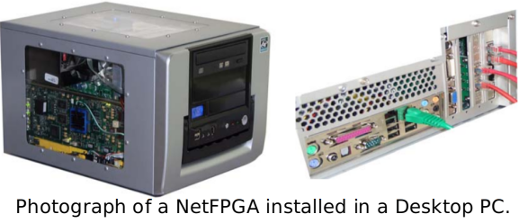

 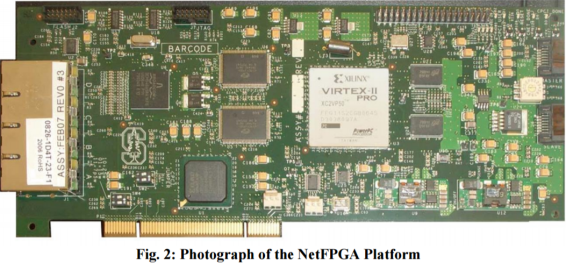

 随后，ovs 交换得到学术界的认可，并逐步走向商业化。 

 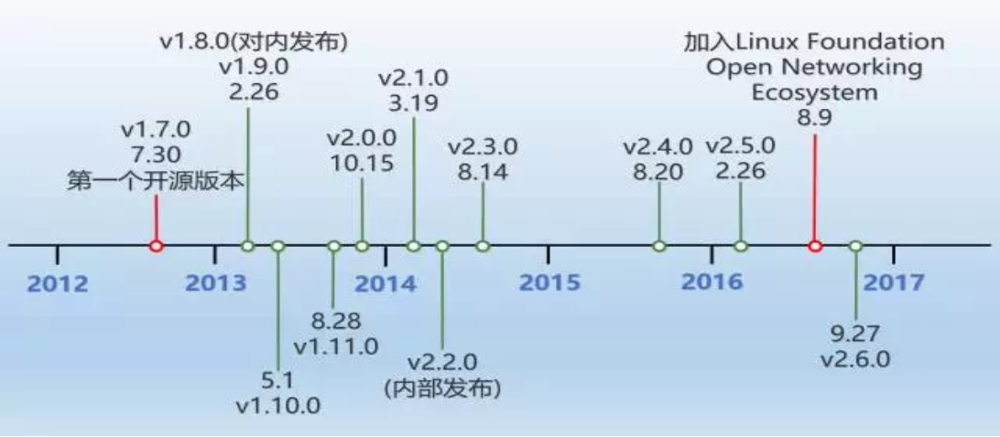