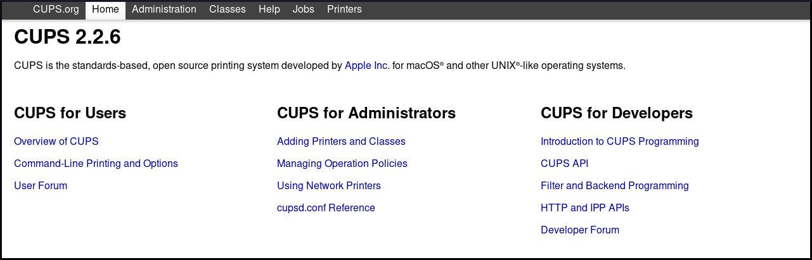
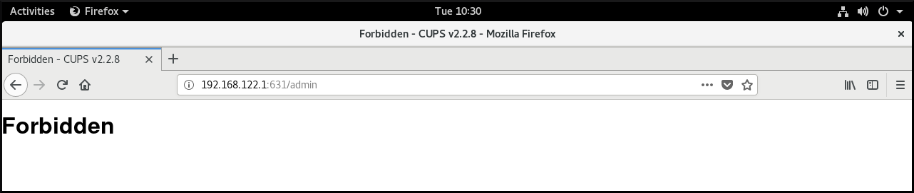
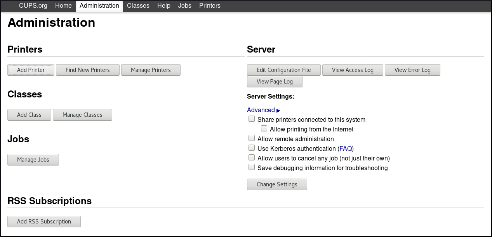
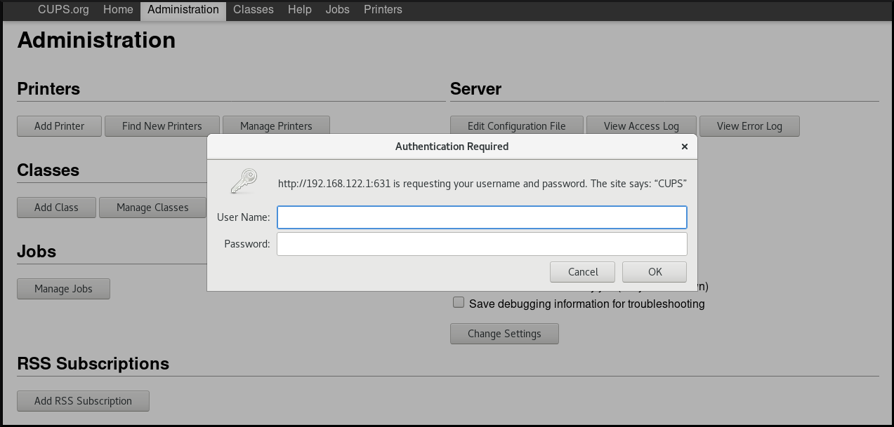
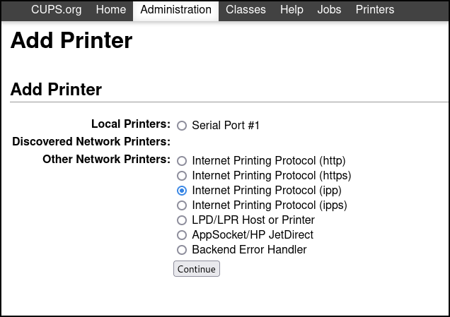
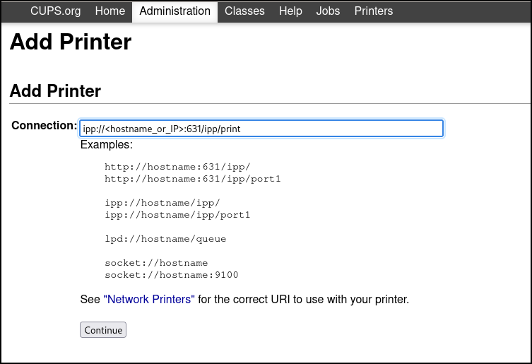
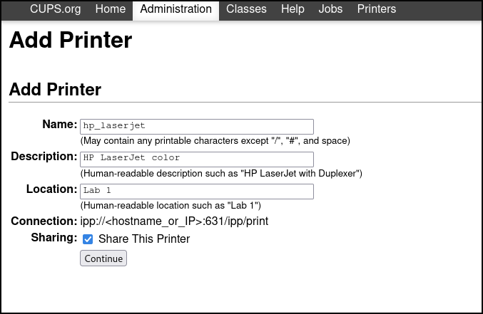
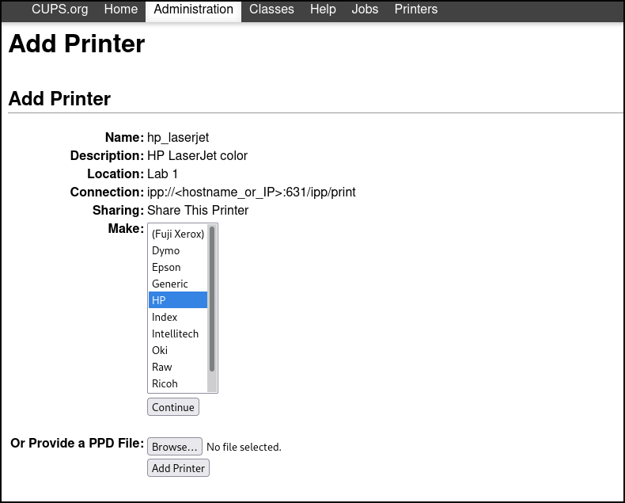
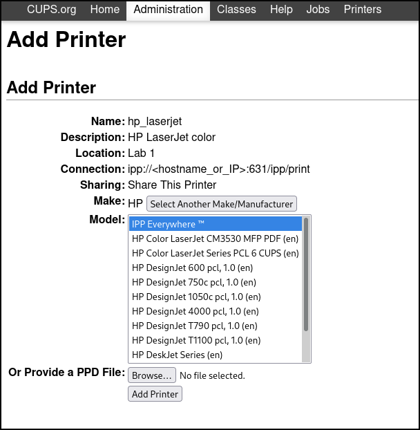
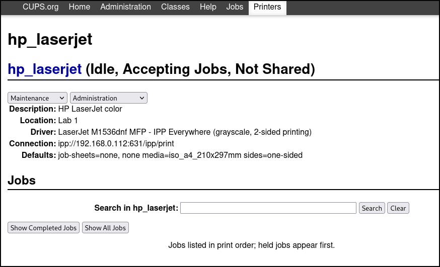

# CUPS

[TOC]

## 概述

通用 Unix 打印系统 (CUPS) 。

## 激活 cups 服务

安装：

```bash
dnf install cups
```

启动 `cups` 服务： 				

```bash
systemctl start cups
systemctl enable cups 
```

检查 `cups` 服务的状态： 				

```bash
systemctl status cups
```

## 打印设置工具

要实现各种与打印相关的任务：

- CUPS Web 用户界面 (UI)		
- GNOME 控制中心 				

使用上述工具可以实现的任务包括： 		

- 添加和配置新打印机 				
- 维护打印机配置 				
- 管理打印机类 				

## CUPS Web UI

### 访问 CUPS Web UI 			

1. 通过在 `/etc/cups/cupsd.conf` 文件中设置 ` Port 631`，允许 CUPS 服务器监听来自网络的连接： 				

   ```bash
   #Listen localhost:631
   Port 631
   ```

   > **警告:**
   >
   > 启用 CUPS 服务器侦听端口 631 会为服务器访问的任何地址打开这个端口。因此，只在从外部网络无法访问的本地网络中使用此设置。不推荐在可公开访问的服务器上配置 CUPS 服务器。

2. 通过在 `/etc/cups/cupsd.conf` 文件中包含以下指令来允许您的系统访问 CUPS 服务器： 				

   ```bash
   <Location />
   Allow from <your_ip_address>
   Order allow,deny
   </Location>
   
   # <your_ip_address> 是系统的实际 IP 地址。还可以将正则表达式用于子网。
   ```

   > **警告:**
   >
   > CUPS 配置在 <Location> 标签中提供了 `Allow from all` 指令，但建议仅在可信任的网络中使用此指令。设置 `Allow from all` 使所有能够通过端口 631 连接到服务器的用户拥有访问权限。如果将 `Port` 指令设置为 631，并且该服务器可从外部网络访问，那么互联网上的任何人都可以访问您系统上的 CUPS 服务。

3. 重启 cups.service： 				

   ```bash
   systemctl restart cups
   ```

4. 打开浏览器，进入到 `http://<IP_address_of_the_CUPS_server>:631/`。

   

   现在，除了 `管理` 菜单外的所有菜单都可用。 				

   如果点击 `管理` 菜单，您会收到 **Forbidden** 信息： 				

   

### 获取 **CUPS Web UI** 的管理访问权限	

1. 要能够访问 **CUPS Web UI** 中的 `管理` 菜单，请在 `/etc/cups/cupsd.conf` 文件中包括以下行：

   ```bash
   <Location /admin>
   Allow from <your_ip_address>
   Order allow,deny
   </Location>
   ```

2. 要访问 **CUPS Web UI** 中的配置文件，请在 `/etc/cups/cupsd.conf` 文件中包括以下内容：

   ```bash
   <Location /admin/conf>
   AuthType Default
   Require user @SYSTEM
   Allow from <your_ip_address>
   Order allow,deny
   </Location>
   ```

3. 要访问 **CUPS Web UI** 中的日志文件，请在 `/etc/cups/cupsd.conf` 文件中包括以下内容：

   ```
   <Location /admin/log>
   AuthType Default
   Require user @SYSTEM
   Allow from <your_ip_address>
   Order allow,deny
   </Location>
   ```

4. 要在 **CUPS Web UI** 中指定加密对经过身份验证的请求的使用，请在 `/etc/cups/cupsd.conf` 文件中包括 `DefaultEncryption` ：

   ```bash
   DefaultEncryption IfRequested
   ```

   有了此设置，在尝试访问 `管理` 菜单时，您将收到一个验证窗口，用来输入允许添加打印机的用户的用户名。

5. 重启 `cups` 服务：

   ```bash
   systemctl restart cups
   ```


## 配置无驱动程序打印

可以将无驱动程序打印配置为使用打印机或远程 CUPS 队列，而无需任何特殊软件。 		

RHEL 9 为以下无驱动程序标准提供无驱动程序打印支持：

- CUPS 中的 **IPP Everywhere 模型** 支持 AirPrint、IPP Everywhere 和 Wi-Fi Direct 标准。 				
- cups-filters 中的 **Driverless 模型** 支持与 CUPS 相同的标准，同时还支持 PCLm 文档格式。 				

这些标准使用 Internet 打印协议 (IPP) 2.0  或更高版本来沟通打印机设置，并无需为特定打印机安装特定驱动程序。要在没有特定驱动程序的情况下使用打印机，您需要有打印机，它支持一种无驱动程序的标准。要确定您的打印机是否支持没有驱动程序标准，请选择以下选项之一： 		

- 请参阅打印机规格，并搜索 [无驱动程序的标准支持](https://openprinting.github.io/driverless/01-standards-and-their-pdls/) 或询问您的供应商。 				
- 搜索 [认证的打印机](https://www.pwg.org/printers/)。 				
- 使用 [ipptool 命令根据](https://access.redhat.com/documentation/zh-cn/red_hat_enterprise_linux/9/html/configuring_and_using_a_cups_printing_server/configuring-driverless-printing_configuring-printing#determining-printer-attributes-using-ipptool_configuring-driverless-printing) 打印机的属性确定驱动程序无支持。 				

要使用 IPP Everywhere 模型在客户端上安装打印队列，该模型指向打印服务器上的队列，您需要让远程打印服务器和具有 RHEL 8.6 安装或更新的客户端安装。 		

> **注意:**
>
> 您可以使用 [ipptool 命令根据](https://access.redhat.com/documentation/zh-cn/red_hat_enterprise_linux/9/html/configuring_and_using_a_cups_printing_server/configuring-driverless-printing_configuring-printing#determining-printer-attributes-using-ipptool_configuring-driverless-printing) 打印服务器的属性验证驱动程序无支持。 			

### 使用 ipptool 确定打印机属性

要确定打印机或打印服务器是否支持无驱动程序标准，可使用 `ipptool` 软件包中提供的 `ipptool` 命令检查打印机属性。

显示打印机或打印服务器的属性： 					

```bash
ipptool -tv <URI> get-printer-attributes.test
```

> **注意:**
>
> 将 <URI> 替换为打印机的 URI，例如 `ipp://<hostname_or_IP_address>:631/ipp/print` for printers 或 `ipp://<hostname_or_IP_address>:631/printers/<remote_print_queue` > 用于来自打印服务器的远程打印队列。

您的打印机或打印服务器支持无驱动程序打印：

- `ipp-version-supported` 属性包含 IPP 协议 `2.0` 的 2.0 或更高版本，以及 					
- `document-format-supported` 属性包含 [无驱动程序打印标准](https://openprinting.github.io/driverless/01-standards-and-their-pdls/) 中列出的受支持文档格式之一。 					

### 在 CUPS Web UI 中添加驱动程序更新打印机

从 RHEL 8.6 开始，可以在 CUPS Web UI 中添加无驱动程序打印机，并使用 CUPS 直接从应用程序打印到网络打印机或打印服务器，而无需为特定打印机安装任何特定驱动程序或软件。 			

**先决条件**

- 打印机或打印服务器具有 IPP Everywhere 标准实现。 					
- 打开 IPP 端口：用于 IPP 的端口 **631** 或端口 **443，** 用于使用 IPPS 进行安全打印。 					
- 在打印服务器的防火墙中启用 `ipp` 和 `ipp-client` 通信。 
- 如果目的地是另一个 CUPS 服务器，允许在远程服务器上进行远程访问，或者如果使用网络打印机，打开 Web 用户界面，搜索 IPP 相关的设置： IPP 或 AirPrint，并启用这些设置。 					

**流程**

1. 在浏览器中，前往 `localhost:631` 并选择 `Administration` 选项卡。

2. 在 `打印机` 下，`单击添加打印机`。 					

   

3. 使用用户名和密码进行身份验证： 					

   

   > **重要:**
   >
   > 为了可以使用 **CUPS Web UI** 添加新打印机，必须以属于 `/etc/cups/cups-files` 中 **SystemGroup** 指令定义的组用户的身份进行身份验证。默认组为： 
   >
   > * root
   > * sys
   > * wheel

4. 在 `Administrator` 选项卡中，在 `Add Printer` 下选择其中一个选项： 					

   - `Internet 打印协议(IPP)` 
   - `Internet 打印协议(ipps)`  

    

5. 在 `Connection` 字段中，输入设备的 URI，然后单击 `Continue`。

    

   > **注意:**
   >
   > URI 由以下部分组成：
   >
   > * 协议 `ipp://` 或 `ipps://` 如果打印机或打印服务器支持加密
   >
   > * 打印机的主机名或 IP 地址
   >
   > * 端口
   >
   > * 资源部分 `/ipp/print` 用于打印机，或用于远程 CUPS 队列的 `/printers/<remote_queue_name` >。 
   >
   >   例如： `ipp://myprinter.mydomain:631/ipp/print` 或 `ipp://myserver.mydomain:631/printers/myqueue`。

6. 添加有关新打印机的详细信息：名称、描述和位置。要设置可以通过网络共享的打印机，请选中 `Share This Printer` 复选框。

    

   > **注意:**
   >
   > 'name' 是唯一必填字段，其他字段是可选的。 						
7. 从" `制作` "下拉菜单中，选择打印机厂商，然后单击 `Continue`。

    

8. 要继续安装无驱动程序打印机，请从下拉菜单中选择 `IPP Everywhere`，然后单击 `添加打印机`。 					

    

9. 添加新打印机后，您可以设置您选择的默认打印选项。

   
   
10. 最后的窗口确认设置了无驱动程序打印机并可使用。

    

## 在 CUPS Web UI 中添加带有经典驱动程序的打印机	

**先决条件**

- ​						您可以使用 **CUPS Web UI 的管理访问权限**，如 [获取 CUPS Web UI 的管理访问权限](https://access.redhat.com/documentation/zh-cn/red_hat_enterprise_linux/9/html/configuring_and_using_a_cups_printing_server/acquiring-administration-access-to-cups-web-ui_configuring-printing) 中所述。 				

**流程**

1. ​						启动 **CUPS Web UI**，如启动 [CUPS Web UI](https://access.redhat.com/documentation/zh-cn/red_hat_enterprise_linux/9/html/configuring_and_using_a_cups_printing_server/starting-cups-web-ui_configuring-printing)所述 				

2. ​						在您的浏览器中，前往 `localhost:631` 并选择 `Administration` 选项卡。 				

3. ​						在 `打印机` 下，`单击添加打印机`。 				

   [](https://access.redhat.com/webassets/avalon/d/Red_Hat_Enterprise_Linux-9-Configuring_and_using_a_CUPS_printing_server-zh-CN/images/4679eed2027c5677722fd4b289211da3/add-printer-in-cups-ui-2.png)

4. ​						使用用户名和密码进行身份验证： 				

   [](https://access.redhat.com/webassets/avalon/d/Red_Hat_Enterprise_Linux-9-Configuring_and_using_a_CUPS_printing_server-zh-CN/images/087f020317d6bd55150e0eff9a897f42/add-printer-in-cups-ui-auth-n.png)

   重要

   ​							为了可以使用 **CUPS Web UI** 添加新打印机，您必须以属于 `/etc/cups/cups-files` 中的 **SystemGroup** 指令定义的组的身份进行身份验证。 					

   ​							默认组： 					

   - ​									root 							
   - ​									sys 							
   - ​									wheel 							

5. ​						如果连接了本地打印机，或者 CUPS 找到了可用的网络打印机，请选择打印机。如果本地打印机或网络打印机都不可用，请从 `其他网络打印机` 中选择一个打印机类型，如 **APP Socket/HP Jet direct**，输入打印机的 IP 地址，然后点击 `继续`。 				

   [](https://access.redhat.com/webassets/avalon/d/Red_Hat_Enterprise_Linux-9-Configuring_and_using_a_CUPS_printing_server-zh-CN/images/fbffc5556f67b57882698f25b9b2ad56/add-printer-in-cups-ui-4-new.png)

6. ​						如果您已选择如上所示的 **APP Socket/HP Jet direct**，请输入打印机的 IP 地址，然后点击 `继续`。 				

   [](https://access.redhat.com/webassets/avalon/d/Red_Hat_Enterprise_Linux-9-Configuring_and_using_a_CUPS_printing_server-zh-CN/images/802c829d9095eec587a985c9ab4cfdf4/add-printer-in-cups-ui-5-new.png)

7. ​						您可以添加有关新打印机的更多详情，如名称、描述和位置。要设置可以通过网络共享的打印机，请选中 `Share This Printer` 复选框。 				

   [](https://access.redhat.com/webassets/avalon/d/Red_Hat_Enterprise_Linux-9-Configuring_and_using_a_CUPS_printing_server-zh-CN/images/2acc8eb9914ae366bf71dd9aa7925fc7/add-printer-in-cups-ui-6-new.png)

8. ​						选择打印机制造商，然后点击 `继续`。 				

   [](https://access.redhat.com/webassets/avalon/d/Red_Hat_Enterprise_Linux-9-Configuring_and_using_a_CUPS_printing_server-zh-CN/images/8f2eae25e7db830be8ca357790071357/add-printer-in-cups-ui-7-new.png)

   ​						或者，您也可以通过单击底部的 `Browse…` 按钮，提供用作打印机驱动程序的 **postscript 打印机描述** (PPD)文件。 				

9. ​						选择打印机的型号，然后点击 `添加打印机`。 				

   [](https://access.redhat.com/webassets/avalon/d/Red_Hat_Enterprise_Linux-9-Configuring_and_using_a_CUPS_printing_server-zh-CN/images/7bec6e7816e8bc58e69abcf210992759/add-printer-in-cups-ui-8-new.png)

10. ​						添加打印机后，下一个窗口允许您设置默认打印选项。 				

    [](https://access.redhat.com/webassets/avalon/d/Red_Hat_Enterprise_Linux-9-Configuring_and_using_a_CUPS_printing_server-zh-CN/images/918d49afebcd80b10bb0b94b96b13302/cups-web-ui-set-defaults-n2.png)

​				点击 `设置默认选项` 后，您将收到一条新打印机已成功添加的确认信息。 		

[](https://access.redhat.com/webassets/avalon/d/Red_Hat_Enterprise_Linux-9-Configuring_and_using_a_CUPS_printing_server-zh-CN/images/e71405d37ad651b944ba1122ae49b2f7/add-printer-in-cups-ui-final-confirm.png)

**验证步骤**

- ​						请打印测试页，尤其是在您设置了打印机时： 				

  - ​								进入 `打印机` 菜单，然后点击 `维护` → `打印测试页`。 						

    [](https://access.redhat.com/webassets/avalon/d/Red_Hat_Enterprise_Linux-9-Configuring_and_using_a_CUPS_printing_server-zh-CN/images/20e4a6896b739bb38ee7a60481997028/printing-test-page-cups-web-ui.png)

## 在 CUPS Web UI 中配置打印机

​				本节论述了如何配置新打印机，以及如何使用 **CUPS Web UI** 维护打印机配置。 		

**先决条件**

- ​						您可以使用 **CUPS Web UI 的管理访问权限**，如 [获取 CUPS Web UI 的管理访问权限](https://access.redhat.com/documentation/zh-cn/red_hat_enterprise_linux/9/html/configuring_and_using_a_cups_printing_server/acquiring-administration-access-to-cups-web-ui_configuring-printing) 中所述。 				

**流程**

1. ​						点击 `打印机` 菜单，来查看您可以配置的可用打印机。 				

   [](https://access.redhat.com/webassets/avalon/d/Red_Hat_Enterprise_Linux-9-Configuring_and_using_a_CUPS_printing_server-zh-CN/images/2d5b745b61351d3215bcde83d8c2423d/conf-printer-cups-1.png)

2. ​						选择您要配置的打印机。 				

   [](https://access.redhat.com/webassets/avalon/d/Red_Hat_Enterprise_Linux-9-Configuring_and_using_a_CUPS_printing_server-zh-CN/images/1fb7a2fe9c3df04117a1f86d48e886d1/conf-printer-cups-2.png)

3. ​						使用其中一个可用菜单来执行您选择的任务： 				

   - ​								从第一个下拉菜单中选择 `Maintenance`。 						

     [](https://access.redhat.com/webassets/avalon/d/Red_Hat_Enterprise_Linux-9-Configuring_and_using_a_CUPS_printing_server-zh-CN/images/396ac0b8797a859314cb28a7c0d67ce3/conf-printer-cups-3.png)

   - ​								从第二个下拉菜单中选择 `Administration`。 						

     [](https://access.redhat.com/webassets/avalon/d/Red_Hat_Enterprise_Linux-9-Configuring_and_using_a_CUPS_printing_server-zh-CN/images/c69ec1ce500da1a40e176ac86752f3af/conf-printer-cups-4.png)

   - ​								您还可以通过点击 `显示完成的作业` 或 `显示所有的作业` 按钮来检查已完成的打印作业或所有活动的打印作业。 						

**验证步骤**

- ​						请打印测试页，尤其是当您更改了打印机配置时： 				

  - ​								进入 `打印机` 菜单，然后点击 `维护` → `打印测试页`。 						

    [](https://access.redhat.com/webassets/avalon/d/Red_Hat_Enterprise_Linux-9-Configuring_and_using_a_CUPS_printing_server-zh-CN/images/20e4a6896b739bb38ee7a60481997028/printing-test-page-cups-web-ui.png)

## 使用 CUPS Web UI 设置打印选项

​				本节描述了如何在 **CUPS web UI** 中设置通用的打印选项，如介质大小和类型、打印质量或颜色模式。 		

**先决条件**

​					您可以使用 **CUPS Web UI 的管理访问权限**，如 [获取 CUPS Web UI 的管理访问权限](https://access.redhat.com/documentation/zh-cn/red_hat_enterprise_linux/9/html/configuring_and_using_a_cups_printing_server/acquiring-administration-access-to-cups-web-ui_configuring-printing) 中所述。 			

**流程**

1. ​						进入 `管理` 菜单，然后点击 `维护` → `设置默认选项`。 				

   [](https://access.redhat.com/webassets/avalon/d/Red_Hat_Enterprise_Linux-9-Configuring_and_using_a_CUPS_printing_server-zh-CN/images/729ee1c0a509a09c6beeac18cb1f5741/cups-web-ui-set-defaults-n1.png)

2. ​						设置打印选项。 				

   [](https://access.redhat.com/webassets/avalon/d/Red_Hat_Enterprise_Linux-9-Configuring_and_using_a_CUPS_printing_server-zh-CN/images/918d49afebcd80b10bb0b94b96b13302/cups-web-ui-set-defaults-n2.png)

## 为打印服务器安装证书

​				要为打印服务器安装证书，您可以选择以下一个选项： 		

- ​						使用自签名证书自动安装 				
- ​						使用认证认证机构生成的证书和私钥手动安装 				

**先决条件**

​					对于服务器上的 **cupsd** 守护进程： 			

1. ​						将 `/etc/cups/cupsd.conf` 文件中的以下指令设置为： 				

   ​						`Encryption Required` 				

2. ​						重启 cups 服务： 				

   ```none
   $ sudo systemctl restart cups
   ```

***\*使用自签名证书自动安装\****

​					有了这个选项，CUPS 会自动生成证书和密钥。 			

注意

​					自签名证书并不以身份管理(IdM)、Active Directory(AD)或红帽证书系统(RHCS)认证颁发机构生成的证书提供非常安全,但可用于打印位于安全本地网络中的服务器。 			

**流程**

1. ​						要访问 CUPS Web UI，打开浏览器并访问 `https://<server>:631` 				

   ​						其中 *<server>* 是服务器 IP 地址或服务器主机名。 				

   注意

   ​							当 CUPS 首次连接到系统时，浏览器会显示自签名证书有潜在安全风险的警告。 					

2. ​						要确认继续操作是否安全，请点击 `Advanced…` 按钮。 				

   [](https://access.redhat.com/webassets/avalon/d/Red_Hat_Enterprise_Linux-9-Configuring_and_using_a_CUPS_printing_server-zh-CN/images/16059ef9cdb048558a2c3543b0a49f10/cups_ui_certificate_warning.png)

3. ​						单击 `Accept the Risk and Continue` 按钮。 				

   [](https://access.redhat.com/webassets/avalon/d/Red_Hat_Enterprise_Linux-9-Configuring_and_using_a_CUPS_printing_server-zh-CN/images/6798f63cbe3e20ccd50463397b23b6ce/cups_ui_certificate_warning2.png)

​				CUPS 现在开始使用自生成的证书和密钥。 		

注意

​					当您在自动安装后访问 CUPS Web UI 时，浏览器会在地址栏中显示一个警告图标。这是因为您通过确认安全风险警告添加了安全例外。如果您想永久删除此警告图标，请使用认证机构生成的证书和私钥来执行手动安装。 			

***\*使用认证认证机构生成的证书和私钥手动安装\****

​					对于位于公共网络中的打印服务器或要永久删除浏览器中的警告，请手动导入证书和密钥。 			

**先决条件**

- ​						您有 IdM、AD 或 RHCS 认证颁发机构生成的证书和私钥文件。 				

**流程**

1. ​						将 `.crt` 和 `.key` 文件复制到您要使用 CUPS Web UI 的系统的 `/etc/cups/ssl` 目录中。 				

2. ​						将复制的文件重命名为 `<hostname>.crt` 和 `<hostname>.key`。 				

   ​						将 *<hostname>* 替换为您要连接 CUPS Web UI 的系统主机名。 				

3. ​						将以下权限设置为重命名的文件： 				

   - ​								`# **chmod 644 /etc/cups/ssl/<hostname>.crt**` 						
   - ​								`# **chmod 644 /etc/cups/ssl/<hostname>.key**` 						
   - ​								`# **chown root:root /etc/cups/ssl/<hostname>.crt**` 						
   - ​								`# **chown root:root /etc/cups/ssl/<hostname>.key**` 						

4. ​						重启 cups 服务： 				

   - ​								`# **systemctl restart cupsd**` 						

## 使用 Samba 打印到使用 Kerberos 验证的 Windows 打印服务器

​				有了 `samba-krb5-printing`  包装程序，登录到Red Hat Enterprise Linux 的 Active Directory(AD)用户可以通过使用 Kerberos 来认证到 Active Directory(AD)，然后打印到将打印作业转发到 Windows 打印服务器的本地 CUPS 打印服务器。 		

​				此配置的好处在于，Red Hat Enterprise Linux 上的 CUPS 管理员不需要在配置中存储固定的用户名和密码。CUPS 使用发送打印作业的用户的 Kerberos ticket 验证 AD。 		

​				这部分论述了如何为这种情况配置 CUPS。 		

注意

​					红帽只支持从本地系统将打印作业提交给 CUPS，而不支持在 Samba 打印服务器上重新共享打印机。 			

**先决条件**

- ​						要添加到本地 CUPS 实例中的打印机在 AD 打印服务器上是共享的。 				
- ​						作为 AD 的成员加入 Red Hat Enterprise Linux 主机。 				
- ​						CUPS 已安装在 Red Hat Enterprise Linux 上，并且 `cups` 服务正在运行。详情请查看 [激活 CUPS 服务](https://access.redhat.com/documentation/zh-cn/red_hat_enterprise_linux/9/html/configuring_and_using_a_cups_printing_server/configuring-printing_configuring-and-using-a-cups-printing-server#activating-cups-service_configuring-printing)。 				
- ​						打印机的 PostScript 打印机描述(PPD)文件存储在 `/usr/share/cups/model/` 目录中。 				

**流程**

1. ​						安装 `samba-krb5-printing`、`samba-client` 和 `krb5-workstation` 软件包： 				

   ```none
   # dnf install samba-krb5-printing samba-client krb5-workstation
   ```

2. ​						可选： 作为域管理员授权并显示 Windows 打印服务器上共享的打印机列表： 				

   ```none
   # smbclient -L win_print_srv.ad.example.com -U administrator@AD_KERBEROS_REALM --use-kerberos=required
   
   	Sharename       Type      Comment
   	---------       ----      -------
   	...
   	Example         Printer   Example
   	...
   ```

3. ​						可选：显示 CUPS 模型列表以识别打印机的 PPD 名称： 				

   ```none
   lpinfo -m
   ...
   samsung.ppd Samsung M267x 287x Series PXL
   ...
   ```

   ​						在下一步中添加打印机时，需要 PPD 文件的名称。 				

4. ​						在 CUPS 中添加打印机： 				

   ```none
   # lpadmin -p "example_printer" -v smb://win_print_srv.ad.example.com/Example -m samsung.ppd -o auth-info-required=negotiate -E
   ```

   ​						该命令使用以下选项： 				

   - ​								`-p *printer_name*` 在 CUPS 中设置打印机的名称。 						
   - ​								`-V *URI_to_Windows_printer*` 将 URI 设置为 Windows 打印机。使用以下格式：smb `://*host_name*/*printer_share_name*`. 						
   - ​								`-m *PPD_file*` 设置打印机使用的 PPD 文件。 						
   - ​								`-O auth-info-required=negotiate` 配置 CUPS，以便在将打印作业转发到远程服务器时使用 Kerberos 身份验证。 						
   - ​								`-e` 可使打印机，CUPS 接受打印机的作业。 						

**验证步骤**

1. ​						以 AD 域用户身份登录 Red Hat Enterprise Linux 主机。 				

2. ​						以 AD 域用户身份进行身份验证： 				

   ```none
   # kinit domain_user_name@AD_KERBEROS_REALM
   ```

3. ​						将文件输出到您添加到本地 CUPS 打印服务器的打印机： 				

   ```none
   # lp -d example_printer file
   ```

​    

## 日志

CUPS 提供三种不同类型的日志： 			

- 错误日志 - 存储错误消息、警告和调试信息。 					
- 访问日志 - 存储有关访问 CUPS 客户端和 Web UI 的次数的信息。 					
- 页面日志 - 保存每个打印作业打印页面总数的信息。 					

​					在 Red Hat Enterprise Linux 8 中，所有三种类型都在 `systemd-journald` 中与其他程序的日志一起集中记录。 			

警告

​						在 Red Hat Enterprise Linux 8 中，不会再像 Red Hat Enterprise Linux 7 那样将日志存储在 `/var/log/cups` 目录中的特定文件中。 				

# 访问所有 CUPS 日志

​					您可以列出 `systemd-journald` 中的所有 CUPS 日志。 			

**流程**

- ​							过滤 CUPS 日志： 					

```none
$ journalctl -u cups
```

# 访问特定打印作业的 CUPS 日志

​					如果您需要为特定打印作业查找 CUPS 日志，您可以使用打印作业的编号来过滤日志。 			

**流程**

- ​							过滤特定打印作业的日志： 					

```none
$ journalctl -u cups JID=N
```

​					其中 `N` 是一个打印作业号。 			

#  根据特定时间框架访问 CUPS 日志

​					如果您需要在特定时间段内访问 CUPS 日志，您可以在 `systemd-journald` 中过滤日志。 			

**流程**

- ​							在指定时间段内过滤日志： 					

```none
$ journalctl -u cups --since=YYYY-MM-DD --until=YYYY-MM-DD
```

​					其中 `YYYY` 为年份，`MM` 为月份，`DD` 为天。 			

**其它资源**

- ​							`journalctl(1)` 手册页 					

# 配置 CUPS 日志位置

​					这部分论述了如何配置 CUPS 日志的位置。 			

​					在 Red Hat Enterprise Linux 8 中，CUPS 日志默认登录到 systemd-journald，其是通过 `/etc/cups/cups-files.conf` 文件中的以下默认设置保证的： 			

```none
ErrorLog syslog
```

重要

​						红帽建议保留 CUPS 日志的默认位置。 				

​					如果要将日志发送到不同的位置，您需要更改 `/etc/cups/cups-files.conf` 文件中的设置，如下所示： 			

```none
ErrorLog <your_required_location>
```

警告

​						如果您更改了 CUPS 日志的默认位置，您可能会遇到 SELinux 问题。 				