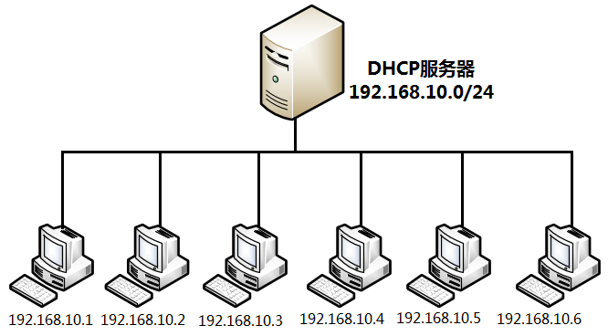

# DHCP

[TOC]

## 概述

动态主机配置协议（DHCP，Dynamic Host Configuration  Protocol），是一种基于 UDP 协议且仅限于在局域网内部使用的网络协议。该协议用于自动管理局域网内主机的 IP 地址、子网掩码、网关地址及 DNS 地址等参数，可以有效地提升 IP 地址的利用率，提高配置效率，并降低管理与维护成本。



## 常见术语

* 作用域：一个完整的 IP 地址段，DHCP 根据作用域来管理网络的分布、IP 地址的分配及其他配置参数。
* 超级作用域：用于管理处于同一个物理网络中的多个逻辑子网段，它包含了可以统一管理的作用域列表。
* 排除范围：把作用域中的某些 IP 地址排除，确保这些 IP 地址不会分配给 DHCP 客户端。
* 地址池：在定义了 DHCP 的作用域并应用了排除范围后，剩余的用来动态分配给客户端的 IP 地址范围。
* 租约：DHCP 客户端能够使用动态分配的 IP 地址的时间。
* 预约：保证网络中的特定设备总是获取到相同的IP地址。

## 工作过程

在正常情况下，DHCP的运作会经历4个过程：请求、提供、选择和确认。当客户端顺利获得一个IP地址及相关的网络信息后，就会发送一个ARP（Address Resolution  Protocol，地址解析协议）请求给服务器。在dhcpd服务程序收到这条信息后，也会再把这个IP地址分配给其他主机，从根源上避免了IP地址冲突的情况。

## 安装

dhcpd 是 Linux 系统中用于提供 DHCP 的服务程序。

```bash
# 安装DHCP
dnf install dhcp-server

# 参考配置文件： /usr/share/doc/dhcp-server/dhcpd.conf.example

vim /etc/dhcp/dhcpd.conf

ddns-update-style interim;
ignore client-updates;

subnet 192.168.10.0 netmask 255.255.255.0 {
     option subnet-mask      255.255.255.0;
     option domain-name-servers  192.168.10.10;
     range dynamic-bootp 192.168.10.100 192.168.10.200;
     default-lease-time      21600;
     max-lease-time          43200;
}

# 重启服务并开机启动
systemctl restart dhcpd
systemctl enable dhcpd
systemctl status dhcpd

# 添加防火墙对dhcpd服务允许的规则
firewall-cmd --zone=public --permanent --add-service=dhcp
firewall-cmd --reload
# 可以禁用防火墙。
```

## 配置

一个标准的配置文件应该包括：

* 全局配置参数

  用于定义dhcpd服务程序的整体运行参数。

* 子网网段声明

  用于配置整个子网段的地址属性。

* 地址配置选项以及地址配置参数。

```bash
# 定义 DNS 服务动态更新的类型，类型包括：
#  none   （不支持动态更新）
#  interim（互动更新模式）
#  ad-hoc （特殊更新模式）
ddns-update-style interim;
# 允许/忽略客户端更新DNS记录
#allow client-updates;
ignore client-updates;

subnet 192.168.10.0 netmask 255.255.255.0 {
     option subnet-mask      255.255.255.0;                     # 定义客户端的子网掩码
     option routers   192.168.10.1;                             # 定义客户端的网关地址
     option domain-name-servers  192.168.10.10;                 # 定义DNS服务器地址
     option domain-name "domain.org";                           # 定义默认的搜索域
     range 192.168.10.100 192.168.10.200;                       # 定义用于分配的IP地址池
     default-lease-time      21600;                             # 默认超时时间（s）
     max-lease-time          43200;                             # 最大超时时间（s）

	 # MAC 与 IP 绑定
     host hostname {
			hardware	ethernet;
			fixed-address	IP;
	 }
}


hardware 硬件类型 MAC地址;    # 指定网卡接口的类型与MAC地址
fixed-address IP地址;       # 将某个固定的IP地址分配给指定主机
time-offset 偏移差;      # 指定客户端与格林尼治时间的偏移差
ntp-server  ;       # 定义客户端的网络时间服务器（NTP）
nis-servers IP地址;     # 定义客户端的NIS域服务器的地址
server-name 主机名;# 向DHCP客户端通知DHCP服务器的主机名
broadcast-address                           # 定义客户端的广播地址
```

# 第 3 章 提供 DHCP 服务

​			动态主机配置协议(DHCP)是一种网络协议，可以自动向客户端分配 IP 信息。您可以设置 `dhcpd` 服务，来在网络中提供 DHCP 服务器和 DHCP 转发。 	

## 3.1. 静态和动态 IP 地址之间的区别

- 静态 IP 地址

  ​							当您为某个设备分配静态 IP 地址时，该地址不会随时间变化，除非您手动更改该地址。如果您要使用静态 IP 地址： 					 								确保 DNS 等服务器的网络地址一致性以及验证服务器。 							 								使用独立于其他网络基础结构的带外管理设备。 							

- 动态 IP 地址

  ​							当您将设备配置为使用动态 IP 地址时，该地址会随时更改。因此，动态地址通常用于偶尔连接到网络的设备，因为重启主机后 IP 地址可能会不同。 					 						动态 IP 地址更为灵活，更容易设置和管理。动态主机控制协议（DHCP）是动态为主机分配网络配置的传统方法。 					

注意

​					没有严格的规则来定义何时使用静态或动态 IP 地址。它取决于用户的需求、喜好和网络环境。 			

## 3.2. DHCP 的阶段

​				DHCP 分为四个阶段： Discovery、Offer、Request、Afirmledgement（也称为 DORA 进程）。DHCP 使用这个过程为客户端提供 IP 地址。 		

- Discovery（发现）

  ​							DHCP 客户端发送一条信息来发现网络中 DHCP 服务器。这个消息在网络和数据链路层广播。 					

- Offer（提供）

  ​							DHCP 服务器从客户端接收信息，并为 DHCP 客户端提供 IP 地址。这个消息在数据链路层单播，但在网络层广播。 					

- Request（请求）

  ​							DHCP 客户端为提供的 IP 地址请求 DHCP 服务器。这个消息在数据链路层单播，但在网络层广播。 					

- Acknowledgment（承认）

  ​							DHCP 服务器向 DHCP 客户端发送承认信息。这个消息在数据链路层单播，但在网络层广播。它是 DHCP DORA 进程的最后一个信息。 					

## 3.3. 对 DHCPv4 和 DHCPv6 使用 dhcpd 时的不同

​				`dhcpd` 服务支持在一个服务器上提供 DHCPv4 和 DHCPv6。但是，您需要单独的 `dhcpd` 实例以及单独的配置文件，来为每个协议提供 DHCP。 		

- DHCPv4

  ​									配置文件：`/etc/dhcp/dhcpd.conf` 							 								systemd 服务名称： `dhcpd` 							

- DHCPv6

  ​									配置文件：`/etc/dhcp/dhcpd6.conf` 							 								systemd 服务名称：`dhcpd6` 							

## 3.4. dhcpd 服务的租期数据库

​				DHCP 租期是 `dhcpd` 服务给客户端分配网络地址的时间段。`dhcpd` 服务将 DHCP 租期存储在以下数据库中： 		

- ​						对于 DHCPv4：`/var/lib/dhcpd/dhcpd.leases` 				
- ​						对于 DHCPv6：`/var/lib/dhcpd/dhcpd6.leases` 				

警告

​					手动更新数据库文件可能会破坏数据库。 			

​				租期数据库包含有关分配的租期的信息，如分配给 MAC 地址的 IP 地址或租期到期的时间戳。请注意，租期数据库中的所有时间戳都是 UTC。 		

​				`dhcpd` 服务定期重新创建数据库： 		

1. ​						该服务重命名现有文件： 				
   - ​								将 `/var/lib/dhcpd/dhcpd.leases` 重命名为 `/var/lib/dhcpd/dhcpd.leases~` 						
   - ​								`/var/lib/dhcpd/dhcpd6.leases` 重命名为 `/var/lib/dhcpd/dhcpd6.leases~` 						
2. ​						服务将所有已知的租期写入新创建的 `/var/lib/dhcpd/dhcpd。leases` 和 `/var/lib/dhcpd/dhcpd6.leases` 文件。 				

**其他资源**

- ​						`dhcpd.leases(5)` 手册页 				
- ​						[恢复损坏的租期数据库](https://access.redhat.com/documentation/zh-cn/red_hat_enterprise_linux/9/html/configuring_and_managing_networking/providing-dhcp-services_configuring-and-managing-networking#restoring-a-corrupt-lease-database_providing-dhcp-services) 				

## 3.5. DHCPv6 和 radvd 的比较

​				在 IPv6 网络中，只有路由器广告消息提供有关 IPv6 默认网关的信息。因此，如果您想在需要默认网关设置的子网中使用 DHCPv6，您必须额外配置路由器广告服务，如路由器广告守护进程(`radvd`)。 		

​				`radvd` 服务使用路由器广告数据包中的标志来声明 DHCPv6 服务器的可用性。 		

​				下表比较 DHCPv6 和 `radvd` 的功能： 		

|                             | DHCPv6 | `radvd` |
| --------------------------- | ------ | ------- |
| 提供有关默认网关的信息      | 否     | 是      |
| 保证随机地址以保护隐私      | 是     | 否      |
| 发送更多网络配置选项        | 是     | 否      |
| 将 MAC 地址映射到 IPv6 地址 | 是     | 否      |

## 3.6. 为 IPv6 路由器配置 radvd 服务

​				路由器广告守护进程(`radvd`)发送 IPv6 无状态自动配置所需的路由器广告消息。这可让用户根据这些公告自动配置其地址、设置、路由和选择默认路由器。 		

注意

​					您只能在 `radvd` 服务中设置 `/64` 前缀。要使用其他前缀，请使用 DHCPv6。 			

**先决条件**

- ​						已以 `root` 用户身份登录。 				

**步骤**

1. ​						安装 `radvd` 软件包： 				

   

   ```none
   # dnf install radvd
   ```

2. ​						编辑 `/etc/radvd.conf` 文件，并添加以下配置： 				

   

   ```none
   interface enp1s0
   {
     AdvSendAdvert on;
     AdvManagedFlag on;
     AdvOtherConfigFlag on;
   
     prefix 2001:db8:0:1::/64 {
     };
   };
   ```

   ​						这些设置将 `radvd` 配置为对 `2001:db8:0:1::/64` 子网在 `enp1s0` 设备上发送路由器广告消息。`AdvManagedFlag on` 设置定义了客户端应从 DHCP 服务器接收 IP 地址，而 `AdvOtherConfigFlag` 参数设为 `on`，定义了客户端也应从 DHCP 服务器接收非地址信息。 				

3. ​						另外，可以将 `radvd` 配置为在系统启动时自动启动： 				

   

   ```none
   # systemctl enable radvd
   ```

4. ​						启动 `radvd` 服务： 				

   

   ```none
   # systemctl start radvd
   ```

5. ​						另外，可以显示路由器广告数据包的内容，以及 `radvd` 发送的配置值： 				

   

   ```none
   # radvdump
   ```

**其他资源**

- ​						`radvd.conf(5)` man page 				
- ​						`/usr/share/doc/radvd/radvd.conf.example` file 				
- ​						[我是否可以在 IPv6 路由器广告中使用不是 64 位的前缀长度？](https://access.redhat.com/solutions/1175913) 				

## 3.7. 为 DHCP 服务器设置网络接口

​				默认情况下，`dhcpd` 服务仅处理网络接口上的请求，该接口在在服务的配置文件有一个在子网中定义的 IP 地址。 		

​				例如，在以下场景中，`dhcpd` 仅侦听 `enp0s1` 网络接口： 		

- ​						在 `/etc/dhcp/dhcpd.conf` 文件中，您只有 192.0.2.0/24 的 `子网` 定义。 				
- ​						`enp0s1` 网络接口连接到 192.0.2.0/24 子网。 				
- ​						`enp7s0` 接口连接到不同的子网。 				

​				只有 DHCP 服务器包含连接到同一网络的多个网络接口，但服务应该只侦听特定的接口时，才应按照以下步骤操作。 		

​				根据您要为 IPv4、IPv6 或两个协议提供 DHCP 的信息，请查看以下操作过程： 		

- ​						[IPv4 网络](https://access.redhat.com/documentation/zh-cn/red_hat_enterprise_linux/9/html-single/managing_networking_infrastructure_services/index#setting-network-interfaces-for-the-dhcp-server_providing-dhcp-services_ipv4) 				
- ​						[IPv6 网络](https://access.redhat.com/documentation/zh-cn/red_hat_enterprise_linux/9/html-single/managing_networking_infrastructure_services/index#setting-network-interfaces-for-the-dhcp-server_providing-dhcp-services_ipv6) 				

**先决条件**

- ​						已以 `root` 用户身份登录。 				
- ​						`dhcp-server` 软件包已安装。 				

**步骤**

- ​						对于 IPv4 网络： 				

  1. ​								将 `/usr/lib/systemd/system/dhcpd.service` 文件复制到 `/etc/systemd/system/` 目录中： 						

     

     ```none
     # cp /usr/lib/systemd/system/dhcpd.service /etc/systemd/system/
     ```

     ​								不要编辑 `/usr/lib/systemd/system/dhcpd.service` 文件。`dhcp-server` 软件包的未来更新可以覆盖更改。 						

  2. ​								编辑 `/etc/systemd/system/dhcpd.service` 文件，并追加接口名称，`dhcpd` 应该侦听 `ExecStart` 参数中的命令： 						

     

     ```none
     ExecStart=/usr/sbin/dhcpd -f -cf /etc/dhcp/dhcpd.conf -user dhcpd -group dhcpd --no-pid $DHCPDARGS enp0s1 enp7s0
     ```

     ​								本例配置了 `dhcpd` 仅侦听 `*enp0s1*` 和 `enp7s0` 接口。 						

  3. ​								重新加载 `systemd` 管理器配置： 						

     

     ```none
     # systemctl daemon-reload
     ```

  4. ​								重启 `dhcpd` 服务： 						

     

     ```none
     # systemctl restart dhcpd.service
     ```

- ​						对于 IPv6 网络： 				

  1. ​								将 `/usr/lib/systemd/system/dhcpd6.service` 文件复制到 `/etc/systemd/system/` 目录中： 						

     

     ```none
     # cp /usr/lib/systemd/system/dhcpd6.service /etc/systemd/system/
     ```

     ​								不要编辑 `/usr/lib/systemd/system/dhcpd6.service` 文件。`dhcp-server` 软件包的未来更新可以覆盖更改。 						

  2. ​								编辑 `/etc/systemd/system/dhcpd6.service` 文件，并追加接口名称，`dhcpd` 应该侦听 `ExecStart` 参数中的命令： 						

     

     ```none
     ExecStart=/usr/sbin/dhcpd -f -6 -cf /etc/dhcp/dhcpd6.conf -user dhcpd -group dhcpd --no-pid $DHCPDARGS enp0s1 enp7s0
     ```

     ​								本例配置了 `dhcpd` 仅侦听 `*enp0s1*` 和 `enp7s0` 接口。 						

  3. ​								重新加载 `systemd` 管理器配置： 						

     

     ```none
     # systemctl daemon-reload
     ```

  4. ​								重启 `dhcpd6` 服务： 						

     

     ```none
     # systemctl restart dhcpd6.service
     ```

## 3.8. 为直接连接到 DHCP 服务器的子网设置 DHCP 服务

​				如果 DHCP 服务器直接连接到该服务器应响应 DHCP 请求的子网，请使用以下步骤。如果服务器的网络接口有这个子网的 IP 地址，那么就会出现这种情况。 		

​				根据您要为 IPv4、IPv6 或两个协议提供 DHCP 的信息，请查看以下操作过程： 		

- ​						[IPv4 网络](https://access.redhat.com/documentation/zh-cn/red_hat_enterprise_linux/9/html-single/managing_networking_infrastructure_services/index#setting-up-the-dhcp-service-for-subnets-directly-connected-to-the-dhcp-server_providing-dhcp-services_ipv4) 				
- ​						[IPv6 网络](https://access.redhat.com/documentation/zh-cn/red_hat_enterprise_linux/9/html-single/managing_networking_infrastructure_services/index#setting-up-the-dhcp-service-for-subnets-directly-connected-to-the-dhcp-server_providing-dhcp-services_ipv6) 				

**先决条件**

- ​						已以 `root` 用户身份登录。 				
- ​						`dhcp-server` 软件包已安装。 				

**步骤**

- ​						对于 IPv4 网络： 				

  1. ​								编辑 `/etc/dhcp/dhcpd.conf` 文件： 						

     1. ​										另外，如果没有其他指令包含这些设置，则添加 `dhcpd` 用作默认值的全局参数： 								

        

        ```none
        option domain-name "example.com";
        default-lease-time 86400;
        ```

        ​										本例将连接 example.com 的默认域名设为 `example.com`，默认的租期时间设为 `86400` 秒（1 天）。 								

     2. ​										在新行中添加 `authoritative` 语句： 								

        

        ```none
        authoritative;
        ```

        重要

        ​											没有 `authoritative` 语句，如果客户端询问池外部的地址，则 `dhcpd` 服务不会回答带有 `DHCPNAK` 的 `DHCPREQUEST` 消息。 									

     3. ​										对于每个直接连接到服务器接口的 IPv4 子网，请添加 `subnet` 声明： 								

        

        ```none
        subnet 192.0.2.0 netmask 255.255.255.0 {
          range 192.0.2.20 192.0.2.100;
          option domain-name-servers 192.0.2.1;
          option routers 192.0.2.1;
          option broadcast-address 192.0.2.255;
          max-lease-time 172800;
        }
        ```

        ​										这个示例为 192.0.2.0/24 网络添加了 subnet 声明。使用这个配置，DHCP 服务器会为发送这个子网的 DHCP 请求的客户端分配下列设置： 								

        - ​												`range` 参数定义的范围内空闲的 IPv4 地址 										
        - ​												此子网的 DNS 服务器的 IP 为：`192.0.2.1` 										
        - ​												此子网的默认网关为：`192.0.2.1` 										
        - ​												此子网的广播地址为：`192.0.2.255` 										
        - ​												最长租期时间，之后此子网中的客户端释放 IP ，并向服务器发送新请求：`172800` 秒（2 天） 										

  2. ​								另外，配置在系统引导时自动启动 `dhcpd` ： 						

     

     ```none
     # systemctl enable dhcpd
     ```

  3. ​								启动 `dhcpd` 服务： 						

     

     ```none
     # systemctl start dhcpd
     ```

- ​						对于 IPv6 网络： 				

  1. ​								编辑 `/etc/dhcp/dhcpd6.conf` 文件： 						

     1. ​										另外，如果没有其他指令包含这些设置，则添加 `dhcpd` 用作默认值的全局参数： 								

        

        ```none
        option dhcp6.domain-search "example.com";
        default-lease-time 86400;
        ```

        ​										本例将连接 example.com 的默认域名设为 `example.com`，默认的租期时间设为 `86400` 秒（1 天）。 								

     2. ​										在新行中添加 `authoritative` 语句： 								

        

        ```none
        authoritative;
        ```

        重要

        ​											没有 `authoritative` 语句，如果客户端询问池外部的地址，则 `dhcpd` 服务不会回答带有 `DHCPNAK` 的 `DHCPREQUEST` 消息。 									

     3. ​										对于每个直接连接到服务器接口的 IPv6 子网，请添加 `subnet` 声明： 								

        

        ```none
        subnet6 2001:db8:0:1::/64 {
          range6 2001:db8:0:1::20 2001:db8:0:1::100;
          option dhcp6.name-servers 2001:db8:0:1::1;
          max-lease-time 172800;
        }
        ```

        ​										本例为 2001:db8:0:1::/64 网络添加了一个 subnet 声明。使用这个配置，DHCP 服务器会为发送这个子网的 DHCP 请求的客户端分配下列设置： 								

        - ​												`range6` 参数中定义的范围内可用的 IPv6 地址。 										

        - ​												此子网的 DNS 服务器的 IP 地址为 `2001:db8:0:1::1`。 										

        - ​												最大租期时间是 `172800` 秒（2 天），之后此子网中的客户端释放 IP ，并向服务器发送新请求。 										

          ​												请注意： IPv6 需要使用路由器广告信息来识别默认网关。 										

  2. ​								另外，配置在系统引导时自动启动 `dhcpd6` ： 						

     

     ```none
     # systemctl enable dhcpd6
     ```

  3. ​								启动 `dhcpd6` 服务： 						

     

     ```none
     # systemctl start dhcpd6
     ```

**其他资源**

- ​						`dhcp-options(5)` 手册页 				
- ​						`dhcpd.conf (5)` 手册页 				
- ​						`/usr/share/doc/dhcp-server/dhcpd.conf.example` file 				
- ​						`/usr/share/doc/dhcp-server/dhcpd6.conf.example` file 				

## 3.9. 为没有直接连接到 DHCP 服务器的子网设置 DHCP 服务

​				如果 DHCP 服务器没有直接连接到该服务器应响应 DHCP 请求的子网，请使用以下步骤。如果 DHCP 中继代理将请求转发给 DHCP 服务器，则属于这种情况，因为 DHCP 服务器的接口没有一个直接连接到服务器应服务的子网。 		

​				根据您要为 IPv4、IPv6 或两个协议提供 DHCP 的信息，请查看以下操作过程： 		

- ​						[IPv4 网络](https://access.redhat.com/documentation/zh-cn/red_hat_enterprise_linux/9/html-single/managing_networking_infrastructure_services/index#setting-up-the-dhcp-service-for-subnets-that-are-not-directly-connected-to-the-dhcp-server_providing-dhcp-services_ipv4) 				
- ​						[IPv6 网络](https://access.redhat.com/documentation/zh-cn/red_hat_enterprise_linux/9/html-single/managing_networking_infrastructure_services/index#setting-up-the-dhcp-service-for-subnets-that-are-not-directly-connected-to-the-dhcp-server_providing-dhcp-services_ipv6) 				

**先决条件**

- ​						已以 `root` 用户身份登录。 				
- ​						`dhcp-server` 软件包已安装。 				

**步骤**

- ​						对于 IPv4 网络： 				

  1. ​								编辑 `/etc/dhcp/dhcpd.conf` 文件： 						

     1. ​										另外，如果没有其他指令包含这些设置，则添加 `dhcpd` 用作默认值的全局参数： 								

        

        ```none
        option domain-name "example.com";
        default-lease-time 86400;
        ```

        ​										本例将连接 example.com 的默认域名设为 `example.com`，默认的租期时间设为 `86400` 秒（1 天）。 								

     2. ​										在新行中添加 `authoritative` 语句： 								

        

        ```none
        authoritative;
        ```

        重要

        ​											没有 `authoritative` 语句，如果客户端询问池外部的地址，则 `dhcpd` 服务不会回答带有 `DHCPNAK` 的 `DHCPREQUEST` 消息。 									

     3. ​										为没有直接连接到服务器接口的 IPv4 子网添加 `shared-network` 声明，如下所示： 								

        

        ```none
        shared-network example {
          option domain-name-servers 192.0.2.1;
          ...
        
          subnet 192.0.2.0 netmask 255.255.255.0 {
            range 192.0.2.20 192.0.2.100;
            option routers 192.0.2.1;
          }
        
          subnet 198.51.100.0 netmask 255.255.255.0 {
            range 198.51.100.20 198.51.100.100;
            option routers 198.51.100.1;
          }
          ...
        }
        ```

        ​										这个示例添加了一个共享网络声明，其中包含对 192.0.2.0/24 和 198.51.100.0/24 的 `subnet` 声明。使用这个配置，DHCP 服务器会为发送来自这些子网之一 DHCP 请求的客户端分配下列设置： 								

        - ​												两个子网的客户端的 DNS 服务器的 IP 是： `192.0.2.1`。 										
        - ​												`range` 参数中定义范围内空闲的 IPv4 地址，具体取决于客户端从哪个子网发送请求。 										
        - ​												默认网关是 `192.0.2.1` 或 `198.51.100.1`，具体取决于客户端从哪个子网发送请求。 										

     4. ​										为服务器直接连接的子网添加 `subnet` 声明，用于访问上面 `shared-network` 中指定的远程子网： 								

        

        ```none
        subnet 203.0.113.0 netmask 255.255.255.0 {
        }
        ```

        注意

        ​											如果服务器没有向这个子网提供 DHCP 服务，则 `subnet` 声明必须为空，如示例中所示。没有对直接连接的子网的声明，`dhcpd` 不会启动。 									

  2. ​								另外，配置在系统引导时自动启动 `dhcpd` ： 						

     

     ```none
     # systemctl enable dhcpd
     ```

  3. ​								启动 `dhcpd` 服务： 						

     

     ```none
     # systemctl start dhcpd
     ```

- ​						对于 IPv6 网络： 				

  1. ​								编辑 `/etc/dhcp/dhcpd6.conf` 文件： 						

     1. ​										另外，如果没有其他指令包含这些设置，则添加 `dhcpd` 用作默认值的全局参数： 								

        

        ```none
        option dhcp6.domain-search "example.com";
        default-lease-time 86400;
        ```

        ​										本例将连接 example.com 的默认域名设为 `example.com`，默认的租期时间设为 `86400` 秒（1 天）。 								

     2. ​										在新行中添加 `authoritative` 语句： 								

        

        ```none
        authoritative;
        ```

        重要

        ​											没有 `authoritative` 语句，如果客户端询问池外部的地址，则 `dhcpd` 服务不会回答带有 `DHCPNAK` 的 `DHCPREQUEST` 消息。 									

     3. ​										为没有直接连接到服务器接口的 IPv6 子网添加 `shared-network` 声明，如下所示： 								

        

        ```none
        shared-network example {
          option domain-name-servers 2001:db8:0:1::1:1
          ...
        
          subnet6 2001:db8:0:1::1:0/120 {
            range6 2001:db8:0:1::1:20 2001:db8:0:1::1:100
          }
        
          subnet6 2001:db8:0:1::2:0/120 {
            range6 2001:db8:0:1::2:20 2001:db8:0:1::2:100
          }
          ...
        }
        ```

        ​										本例添加了一个共享网络声明，其中包含对 2001:db8:0:1::1:0/120 和 2001:db8:0:1::2:0/120 的 `subnet6` 声明。使用这个配置，DHCP 服务器会为发送来自这些子网之一 DHCP 请求的客户端分配下列设置： 								

        - ​												两个子网的客户端的 DNS 服务器的 IP 是 `2001:db8:0:1::1:1`。 										

        - ​												`range6` 参数中定义的空闲的 IPv6 地址，具体取决于客户端从哪个子网发送请求。 										

          ​												请注意： IPv6 需要使用路由器广告信息来识别默认网关。 										

     4. ​										为服务器直接连接的子网添加 `subnet6` 声明，用于访问上面 `shared-network` 中指定的远程子网： 								

        

        ```none
        subnet6 2001:db8:0:1::50:0/120 {
        }
        ```

        注意

        ​											如果服务器没有向这个子网提供 DHCP 服务，则 `subnet6` 声明必须为空，如示例中所示。没有对直接连接的子网的声明，`dhcpd` 不会启动。 									

  2. ​								另外，配置在系统引导时自动启动 `dhcpd6` ： 						

     

     ```none
     # systemctl enable dhcpd6
     ```

  3. ​								启动 `dhcpd6` 服务： 						

     

     ```none
     # systemctl start dhcpd6
     ```

**其他资源**

- ​						`dhcp-options(5)` 手册页 				
- ​						`dhcpd.conf (5)` 手册页 				
- ​						`/usr/share/doc/dhcp-server/dhcpd.conf.example` file 				
- ​						`/usr/share/doc/dhcp-server/dhcpd6.conf.example` file 				
- ​						[设置 DHCP 转发代理](https://access.redhat.com/documentation/zh-cn/red_hat_enterprise_linux/9/html/configuring_and_managing_networking/providing-dhcp-services_configuring-and-managing-networking#setting-up-a-dhcp-relay-agent_providing-dhcp-services) 				

## 3.10. 使用 DHCP 为主机分配静态地址

​				使用 `host` 声明，您可以配置 DHCP 服务器，来为主机的媒体访问控制（MAC）地址分配固定 IP 地址。例如：使用这个方法总是为服务器或者网络设备分配相同的 IP 地址。 		

​				根据您要为 IPv4、IPv6 或这两个协议配置固定地址，请查看以下操作过程： 		

- ​						[IPv4 网络](https://access.redhat.com/documentation/zh-cn/red_hat_enterprise_linux/9/html/configuring_and_managing_networking/providing-dhcp-services_configuring-and-managing-networking#assigning-a-static-address-to-a-host-using-dhcp_providing-dhcp-services_ipv4) 				
- ​						[IPv6 网络](https://access.redhat.com/documentation/zh-cn/red_hat_enterprise_linux/9/html/configuring_and_managing_networking/providing-dhcp-services_configuring-and-managing-networking#assigning-a-static-address-to-a-host-using-dhcp_providing-dhcp-services_ipv6) 				

**前提条件**

- ​						`dhcpd` 服务已配置且正在运行。 				
- ​						已以 `root` 用户身份登录。 				

**步骤**

- ​						对于 IPv4 网络： 				

  1. ​								编辑 `/etc/dhcp/dhcpd.conf` 文件： 						

     1. ​										添加一个 `host` 声明： 								

        

        ```none
        host server.example.com {
        	hardware ethernet 52:54:00:72:2f:6e;
        	fixed-address 192.0.2.130;
        }
        ```

        ​										这个示例将 DHCP 服务器配置为始终将 `192.0.2.130` IP 地址分配给 MAC 地址为 `52:54:00:72:2f:6e` 的主机。 								

        ​										`dhcpd` 服务根据 `fixed-address` 参数中指定的 MAC 地址识别系统，而不是根据 `host` 声明中的名称。因此，您可以将此名称设置为不与其它 `host` 声明匹配的任何字符串。要为多个网络配置相同的系统，请使用不同的名称，否则 `dhcpd` 无法启动。 								

     2. ​										另外，对针对此主机的特定的 `host` 声明添加其他设置。 								

  2. ​								重启 `dhcpd` 服务： 						

     

     ```none
     # systemctl start dhcpd
     ```

- ​						对于 IPv6 网络： 				

  1. ​								编辑 `/etc/dhcp/dhcpd6.conf` 文件： 						

     1. ​										添加一个 `host` 声明： 								

        

        ```none
        host server.example.com {
        	hardware ethernet 52:54:00:72:2f:6e;
        	fixed-address6 2001:db8:0:1::200;
        }
        ```

        ​										这个示例将 DHCP 服务器配置为始终将 `2001:db8:0:1::20` IP 地址分配给 MAC 地址为 `52:54:00:72:2f:6e` 的主机。 								

        ​										`dhcpd` 服务根据 `fixed-address6` 参数中指定的 MAC 地址识别系统，而不是根据 `host` 声明中的名称。因此，可以将此名称设为任何字符串，只要它对其它 `host` 声明是唯一的。要为多个网络配置相同的系统，请使用不同的名称，因为，否则的话 `dhcpd` 无法启动。 								

     2. ​										另外，对针对此主机的特定的 `host` 声明添加其他设置。 								

  2. ​								重启 `dhcpd6` 服务： 						

     

     ```none
     # systemctl start dhcpd6
     ```

**其他资源**

- ​						`dhcp-options(5)` 手册页 				
- ​						`/usr/share/doc/dhcp-server/dhcpd.conf.example` file 				
- ​						`/usr/share/doc/dhcp-server/dhcpd6.conf.example` file 				

## 3.11. 使用 group 声明同时将参数应用到多个主机、子网和共享网络

​				使用 `group` 声明，您可以将同样的参数应用到多个主机、子网和共享网络。 		

​				请注意，该流程描述了对主机使用 `group` 声明，但步骤与子网和共享网络相同。 		

​				根据您要为 IPv4、IPv6 或两个协议配置组，请查看以下操作过程： 		

- ​						[IPv4 网络](https://access.redhat.com/documentation/zh-cn/red_hat_enterprise_linux/9/html-single/managing_networking_infrastructure_services/index#using-a-group-declaration-to-apply-parameters-to-multiple-hosts-subnets-and-shared-networks-at-the-same-time_providing-dhcp-services_ipv4) 				
- ​						[IPv6 网络](https://access.redhat.com/documentation/zh-cn/red_hat_enterprise_linux/9/html-single/managing_networking_infrastructure_services/index#using-a-group-declaration-to-apply-parameters-to-multiple-hosts-subnets-and-shared-networks-at-the-same-time_providing-dhcp-services_ipv6) 				

**先决条件**

- ​						`dhcpd` 服务已配置且正在运行。 				
- ​						已以 `root` 用户身份登录。 				

**步骤**

- ​						对于 IPv4 网络： 				

  1. ​								编辑 `/etc/dhcp/dhcpd.conf` 文件： 						

     1. ​										添加一个 `group` 声明： 								

        

        ```none
        group {
          option domain-name-servers 192.0.2.1;
        
          host server1.example.com {
            hardware ethernet 52:54:00:72:2f:6e;
            fixed-address 192.0.2.130;
          }
        
          host server2.example.com {
            hardware ethernet 52:54:00:1b:f3:cf;
            fixed-address 192.0.2.140;
          }
        }
        ```

        ​										这个 `group` 定义对两个 `host` 条目进行分组。`dhcpd` 服务将 `option domain-name-servers` 参数中设置的值应用到组中的两个主机。 								

     2. ​										另外，对特定于这些主机的 `group` 声明添加其他设置。 								

  2. ​								重启 `dhcpd` 服务： 						

     

     ```none
     # systemctl start dhcpd
     ```

- ​						对于 IPv6 网络： 				

  1. ​								编辑 `/etc/dhcp/dhcpd6.conf` 文件： 						

     1. ​										添加一个 `group` 声明： 								

        

        ```none
        group {
          option dhcp6.domain-search "example.com";
        
          host server1.example.com {
            hardware ethernet 52:54:00:72:2f:6e;
            fixed-address 2001:db8:0:1::200;
          }
        
          host server2.example.com {
            hardware ethernet 52:54:00:1b:f3:cf;
            fixed-address 2001:db8:0:1::ba3;
          }
        }
        ```

        ​										这个 `group` 定义对两个 `host` 条目进行分组。`dhcpd` 服务将 `option dhcp6.domain-search` 参数中设置的值应用到组中的两个主机。 								

     2. ​										另外，对特定于这些主机的 `group` 声明添加其他设置。 								

  2. ​								重启 `dhcpd6` 服务： 						

     

     ```none
     # systemctl start dhcpd6
     ```

**其他资源**

- ​						`dhcp-options(5)` 手册页 				
- ​						`/usr/share/doc/dhcp-server/dhcpd.conf.example` file 				
- ​						`/usr/share/doc/dhcp-server/dhcpd6.conf.example` file 				

## 3.12. 恢复损坏的租期数据库

​				如果 DHCP 服务器记录了一个与租期数据库有关的错误，如 `Corrupt lease file - possible data loss!`，则您可以从 `dhcpd` 服务创建的的副本中恢复租期数据库。请注意，这个副本可能没有反映数据库的最新状态。 		

警告

​					如果您删除了租期数据库而不是用备份替换它，则丢失了当前分配的租期的所有信息。因此，DHCP 服务器可以为之前分配给其它主机但还没有过期的客户端分配租期。这会导致 IP 冲突。 			

​				根据您要恢复 DHCPv4、DHCPv6 还是两个数据库，请查看： 		

- ​						[恢复 DHCPv4 租期数据库](https://access.redhat.com/documentation/zh-cn/red_hat_enterprise_linux/9/html-single/managing_networking_infrastructure_services/index#restoring-a-corrupt-lease-database_providing-dhcp-services_ipv4) 				
- ​						[恢复 DHCPv6 租期数据库](https://access.redhat.com/documentation/zh-cn/red_hat_enterprise_linux/9/html-single/managing_networking_infrastructure_services/index#restoring-a-corrupt-lease-database_providing-dhcp-services_ipv6) 				

**先决条件**

- ​						已以 `root` 用户身份登录。 				
- ​						租期数据库被损坏。 				

**流程**

- ​						恢复 DHCPv4 租期数据库： 				

  1. ​								停止 `dhcpd` 服务： 						

     

     ```none
     # systemctl stop dhcpd
     ```

  2. ​								重命名损坏租期数据库： 						

     

     ```none
     # mv /var/lib/dhcpd/dhcpd.leases /var/lib/dhcpd/dhcpd.leases.corrupt
     ```

  3. ​								恢复 `dhcp` 服务在刷新租期数据库时创建的租期数据库的副本： 						

     

     ```none
     # cp -p /var/lib/dhcpd/dhcpd.leases~ /var/lib/dhcpd/dhcpd.leases
     ```

     重要

     ​									如果您有租期数据库的最新备份，则恢复这个备份。 							

  4. ​								启动 `dhcpd` 服务： 						

     

     ```none
     # systemctl start dhcpd
     ```

- ​						恢复 DHCPv6 租期数据库： 				

  1. ​								停止 `dhcpd6` 服务： 						

     

     ```none
     # systemctl stop dhcpd6
     ```

  2. ​								重命名损坏租期数据库： 						

     

     ```none
     # mv /var/lib/dhcpd/dhcpd6.leases /var/lib/dhcpd/dhcpd6.leases.corrupt
     ```

  3. ​								恢复 `dhcp` 服务在刷新租期数据库时创建的租期数据库的副本： 						

     

     ```none
     # cp -p /var/lib/dhcpd/dhcpd6.leases~ /var/lib/dhcpd/dhcpd6.leases
     ```

     重要

     ​									如果您有租期数据库的最新备份，则恢复这个备份。 							

  4. ​								启动 `dhcpd6` 服务： 						

     

     ```none
     # systemctl start dhcpd6
     ```

**其他资源**

- ​						[dhcpd 服务的租期数据库](https://access.redhat.com/documentation/zh-cn/red_hat_enterprise_linux/9/html/configuring_and_managing_networking/providing-dhcp-services_configuring-and-managing-networking#the-lease-database-of-the-dhcpd-service_providing-dhcp-services) 				

## 3.13. 设置 DHCP 转发代理

​				DHCP 中继代理(`dhcrelay`)可以将来自没有 DHCP 服务器的子网的 DHCP 和 BOOTP 请求中继到其他子网上的一个或多个 DHCP 服务器。当 DHCP 客户端请求信息时，DHCP  转发代理会将该请求转发到指定的 DHCP 服务器列表。当 DHCP 服务器返回一个回复时，DHCP 转发代理会将此请求转发给客户端。 		

​				根据您要为 IPv4、IPv6 或两个协议设置 DHCP 转发，请查看以下操作过程： 		

- ​						[IPv4 网络](https://access.redhat.com/documentation/zh-cn/red_hat_enterprise_linux/9/html-single/managing_networking_infrastructure_services/index#setting-up-a-dhcp-relay-agent_providing-dhcp-services_ipv4) 				
- ​						[IPv6 网络](https://access.redhat.com/documentation/zh-cn/red_hat_enterprise_linux/9/html-single/managing_networking_infrastructure_services/index#setting-up-a-dhcp-relay-agent_providing-dhcp-services_ipv6) 				

**先决条件**

- ​						已以 `root` 用户身份登录。 				

**步骤**

- ​						对于 IPv4 网络： 				

  1. ​								安装 `dhcp-relay` 软件包： 						

     

     ```none
     # dnf install dhcp-relay
     ```

  2. ​								将 `/lib/systemd/system/dhcrelay.service` 文件复制到 `/etc/systemd/system/` 目录中： 						

     

     ```none
     # cp /lib/systemd/system/dhcrelay.service /etc/systemd/system/
     ```

     ​								不要编辑 `/usr/lib/systemd/system/dhcrelay.service` 文件。`dhcp-relay` 软件包的未来更新可能会覆盖更改。 						

  3. ​								编辑 `/etc/systemd/system/dhcrelay.service` 文件，并追加 `-i *interface*` 参数以及负责该子网的 DHCPv4 服务器的 IP 地址列表： 						

     

     ```none
     ExecStart=/usr/sbin/dhcrelay -d --no-pid -i enp1s0 192.0.2.1
     ```

     ​								使用这些额外的参数，`dhcrelay` 会侦听 `enp1s0` 接口上的 DHCPv4 请求，并将它们转发到 IP 为 `192.0.2.1` 的 DHCP 服务器。 						

  4. ​								重新加载 `systemd` 管理器配置： 						

     

     ```none
     # systemctl daemon-reload
     ```

  5. ​								（可选）配置在系统引导时启动 `dhcrelay` 服务： 						

     

     ```none
     # systemctl enable dhcrelay.service
     ```

  6. ​								启动 `dhcrelay` 服务： 						

     

     ```none
     # systemctl start dhcrelay.service
     ```

- ​						对于 IPv6 网络： 				

  1. ​								安装 `dhcp-relay` 软件包： 						

     

     ```none
     # dnf install dhcp-relay
     ```

  2. ​								将 `/lib/systemd/system/dhcrelay.service` 文件复制到 `/etc/systemd/system/` 目录中，并将其命名为 `dhcrelay6.service` ： 						

     

     ```none
     # cp /lib/systemd/system/dhcrelay.service /etc/systemd/system/dhcrelay6.service
     ```

     ​								不要编辑 `/usr/lib/systemd/system/dhcrelay.service` 文件。`dhcp-relay` 软件包的未来更新可能会覆盖更改。 						

  3. ​								编辑 `/etc/systemd/system/dhcrelay6.service` 文件，并追加 `-l *receiving_interface*` 和 `-u *outgoing_interface*` 参数： 						

     

     ```none
     ExecStart=/usr/sbin/dhcrelay -d --no-pid -l enp1s0 -u enp7s0
     ```

     ​								使用这些额外的参数，`dhcrelay` 会侦听 `enp1s0` 接口上的 DHCPv6 请求，并将它们转发给连接到 `enp7s0` 接口的网络。 						

  4. ​								重新加载 `systemd` 管理器配置： 						

     

     ```none
     # systemctl daemon-reload
     ```

  5. ​								（可选）配置在系统引导时启动 `dhcrelay6` 服务： 						

     

     ```none
     # systemctl enable dhcrelay6.service
     ```

  6. ​								启动 `dhcrelay6` 服务： 						

     

     ```none
     # systemctl start dhcrelay6.service
     ```

**其他资源**

- ​						`dhcrelay(8)` 手册页 				