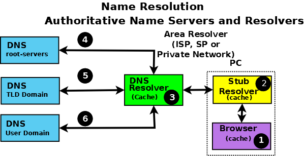
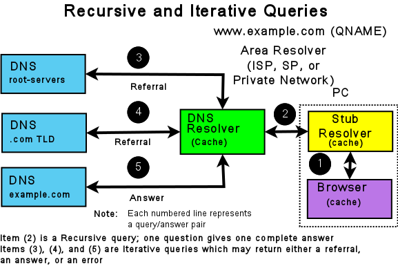

# DNS

## 概述

DNS ( Domain Name System )，作用是把主机名解析为 IP 地址。

域名系统作为一个层次结构和分布式数据库，包含各种类型的数据，包括主机和域名。

所有网络系统都使用 IPv4 和 IPv6 等网络地址运行。绝大多数人发现使用名称比使用看似无穷无尽的网络地址数字更容易。最早的 ARPANET 系统（from which the Internet evolved，从互联网发展而来）使用一个 `hosts` 文件将名称映射到地址，每当发生变化时， `hosts` 文件就会分发给所有实体。在操作上，一旦有超过 100 个联网实体，这样的系统就很快变得不可持续，这导致了我们今天使用的域名系统的规范和实施。which led to the specification and implementation of the Domain Name System that we use today.

名称解析的方法：

* hosts 文件

  简单的文本文件，每行就是一个条目，包含一个 IP 及该 IP 相关联的主机名。

* NIS 系统

  由 SUN 开发的一种命名系统，将主机表替换为主机数据库。客户机从中央主机获取所需的主机信息。

* DNS 系统

## 系统组成

* DNS 域名空间

  指定用于组织名称的域的层次结构。

* DNS 服务器

  保持和维护域名空间中数据的程序。

* 解析器

  简单的程序或子程序，从服务器中提取信息以响应对域名空间中主机的查询，用于 DNS 客户端。

## DNS 的阶层架构与 TLD

DNS 命名系统被组织为由多个级别组成的树结构，因此它自然地创建了一个分布式系统。Each node in the tree is given a label which defines its **Domain** (its area or zone) of **Authority**. 树中的每个节点都有一个标签，该标签定义了其权限域（其区域或区域）。树中最顶层的节点是**根域**；it delegates to **Domains** at the next level which are generically known as the **Top-Level Domains (TLDs)**.它委托给下一级的域，通常称为顶级域（TLD）。They in turn delegate to **Second-Level Domains (SLDs)**, and so on. 它们依次委托给二级域（SLD），依此类推。The Top-Level Domains (TLDs) include a special group of TLDs called the **Country Code Top-Level Domains (ccTLDs)**, in which every country is assigned a unique two-character country code from ISO 3166 as its domain.顶级域（TLD）包括一组特殊的顶级域，称为国家代码顶级域（cc TLD），每个国家都被分配一个来自ISO 3166的唯一两个字符的国家代码作为其域。

> **Note：**
>
> 域名系统由 ICANN 控制 (https://www.icann.org)（一个 501c 非营利实体）
>
> their current policy is that any new TLD, consisting of three or more characters, may be proposed by any group of commercial sponsors and if it meets ICANN’s criteria will be added to the TLDs.
>
> 他们目前的政策是，任何由三个或更多字符组成的新TLD都可以由任何一组商业赞助商提出，如果它符合ICANN的标准，将被添加到TLD中。

委派和授权的概念沿着 DNS 树（DNS 层次结构）向下流动，如下所示：

 

域是树中节点的标签。A **domain name** uniquely identifies any node in the DNS tree and is written, left to right, by combining all the domain labels (each of which are unique within their parent’s zone or domain of authority), with a dot separating each component, up to the root domain. 域名唯一地标识DNS树中的任何节点，并通过组合所有域标签（每个标签在其父区域或权限域中都是唯一的）从左到右写入，并用一个点分隔每个组件，直到根域。在上图中，以下是所有域名：

```bash
example.com
b.com
ac.uk
us
org
```

根具有唯一的标签 `.`（点），当它被写入域名时通常会省略，但当它被写为完全限定域名（FQDN）时，点必须存在。因此：

```bash
example.com     #域名
example.com.    #FQDN
```

在整个 DNS 系统的最上方一定是 . (小数点)。这个 DNS 服务器 (称为 root )，最早以前它底下管理的就只有 (1)com, edu, gov, mil, org, .net 这种特殊领域以及 (2)以国家为分类的第二层的主机名称。这两者称为 Top Level Domains (TLDs) 。 

一般最上层域名称为 (Generic TLDs, gTLD)

国家最上层域名称为 (Country code TLDs, ccTLD)

## 权限和授权

Each domain (node) has been **delegated** the authority  from its parent domain. 每个域（节点）都已从其父域委派了权限。The delegated authority includes specific responsibilities to ensure that every domain it delegates has a unique name or label within its zone or domain of authority, and that it maintains an **authoritative** list of its delegated domains. 委派的权限包括特定的职责，以确保其委派的每个域在其区域或权限域内具有唯一的名称或标签，并维护其委派域的权威列表。The responsibilities further include an operational requirement to operate two (or more) name servers (which may be contracted to a third party) which will contain the authoritative data for all the domain labels within its zone of authority in a [zone file](https://bind9.readthedocs.io/en/latest/chapter3.html#zone-file). 职责还包括操作两个（或多个）名称服务器（可与第三方签订合同）的操作要求，该服务器将在区域文件中包含其权限区域内所有域名标签的权威数据。Again, the tree structure ensures that the DNS name space is naturally distributed.同样，树结构确保 DNS 名称空间自然分布。

The following diagram illustrates that **Authoritative Name Servers** exist for every level and every domain in the DNS name space:下图说明了 DNS 名称空间中每个级别和每个域都存在权威名称服务器：

 

> **Note：**
>
> Domain 和 Zone 之间的区别可能会令人困惑。实际上，这些术语在 DNS 中通常是同义词。If, however, you are into directed graphs and tree structure theory or  similar exotica, a zone can be considered as an arc through any node (or domain) with the domain at its apex. 然而，如果你正在研究有向图和树结构理论或类似的外来现象，那么一个区域可以被认为是通过任何节点（或域）的弧，其顶点是域。The  zone therefore encompasses all the name space below the domain. 因此，该区域包含域下面的所有名称空间。然而，这可能导致子区域的概念，而这些确实是在原始DNS规范中定义的。This can, however, lead to the concept of subzones and these were indeed defined in the original DNS specifications. 谢天谢地，subzone 这个词在时间的迷雾中消失了。

## 根服务器

The **root servers** are a critical part of the DNS authoritative infrastructure. 根服务器是 DNS 权威基础结构的关键部分。有13个根服务器 (*a.root-servers.net* 到 *m.root-servers.net*)。The number 13 is historically based on the maximum amount of name and IPv4 data that could be packed into a 512-byte UDP message, 从历史上看，数字 13 是基于可以打包到 512 字节 UDP 消息中的名称和 IPv4 数据的最大数量，而不是某些文化认为不吉利的数字。The 512-byte UDP data limit 512 字节 UDP 数据限制不再是一个限制因素，所有根服务器现在都支持 IPv4 和 IPv6 。此外，几乎所有根服务器都使用选播（ **anycast**），目前全球范围内有 300 多个根服务器实例提供服务（请参阅 https://www.root-servers.org ). 根服务器是 DNS 中所有名称解析的起点。

## 名称解析

So far all the emphasis has been on how the DNS stores its authoritative domain (zone) data. 到目前为止，所有的重点都是 DNS 如何存储其权威域（区域）数据。终端用户系统使用名称（电子邮件地址或 web 地址），需要访问该权威数据以获得 IP 地址，他们使用该 IP 地址联系所需的网络资源，如 web、FTP 或邮件服务器。将域名转换为结果的过程（通常是 IP 地址，尽管可以获得其他类型的数据）通常称为名称解析，由解析器（也称为缓存名称服务器和许多其他术语）处理。

下图显示了典型的名称解析过程：

 

当需要解析诸如 `www.example.com` 之类的名称时，终端用户应用程序，如浏览器（1）makes an internal system call to a minimal function resolution entity called a **stub resolver** (2) 对称为存根解析器（2）的最小函数解析实体进行内部系统调用。The stub resolver (using stored IP addresses) contacts a resolver (a caching name server or full-service resolver) (3), which in turn contacts all the necessary authoritative name servers (4, 5, and 6) to provide the answer that it  then returns to the user (2, 1).存根解析器（使用存储的IP地址）联系解析器（缓存名称服务器或全服务解析器）（3），解析器依次联系所有必要的权威名称服务器（4、5和6），以提供答案，然后返回给用户（2、1）。To improve performance, all resolvers (including most stub resolvers) cache (store) their  results such that a subsequent request for the same data is taken from the resolver’s cache, removing the need to repeat the name resolution process and use time-consuming resources. 为了提高性能，所有解析器（包括大多数存根解析器）都缓存（存储）其结果，以便从解析器的缓存中获取对相同数据的后续请求，从而无需重复名称解析过程并使用耗时的资源。All communication  between the stub resolver, the resolver, and the authoritative name servers uses the DNS protocol’s query and response message pair.存根解析器、解析器和权威名称服务器之间的所有通信都使用DNS协议的查询和响应消息对。

## DNS协议和查询

DNS 查询使用 UDP 协议通过保留端口 53 （但是 TCP和 TLS 可以可选地在网络的某些部分中使用）。

The following diagram shows the name resolution process expressed in terms of DNS queries and responses.下图显示了以DNS查询和响应表示的名称解析过程。

 

The stub resolver sends a **recursive query** message (with the required domain name in the QUESTION section of the query) (2) to the resolver. 存根解析器向解析器发送递归查询消息（查询的QUESTION部分中包含所需域名）（2）。A **recursive** query simply requests the resolver to find the complete answer.递归查询只是请求解析器查找完整的答案。A stub resolver only ever sends recursive queries and always needs the service of a resolver. 存根解析器只发送递归查询，并且总是需要解析器的服务。递归查询的响应可以是：

1. The answer to the user’s QUESTION in the ANSWER section of the query response.查询响应的 answer 部分中用户问题的答案。
2. An error (such as NXDOMAIN - the name does not exist).错误（例如 NXDOMAIN - 名称不存在）。

The resolver, on receipt of the user’s recursive query, either responds immediately, if the ANSWER is in its cache, or accesses the DNS hierarchy to obtain the answer. 解析器在收到用户的递归查询后，如果ANSWER在其缓存中，则立即响应，或者访问DNS层次结构以获得答案。The resolver always starts with root servers and sends an **iterative query** (4, 5, and 6). The response to an iterative query can be:解析器总是从根服务器开始，并发送一个迭代查询（4、5和6）。对迭代查询的响应可以是：

1. The answer to the resolver’s QUESTION in the ANSWER section of the query response.查询响应的answer部分中解析器问题的答案。

2. A **referral** (indicated by an empty ANSWER section but data in the AUTHORITY section, and typically IP addresses in the ADDITIONAL section of the response).转介（由空的ANSWER部分指示，但在AUTHORITY部分中有数据，通常在响应的ADDITIONAL部分中有IP地址）。
3. An error (such as NXDOMAIN - the name does not exist).错误（例如NXDOMAIN-名称不存在）。

If the response is either an answer or an error, these are returned  immediately to the user (and cached for future use). If the response is a referral, the resolver needs to take additional action to respond  to the user’s recursive query.如果响应是答案或错误，则会立即将其返回给用户（并缓存以备将来使用）。如果响应是引用，解析器需要采取其他操作来响应用户的递归查询。

A referral, in essence, indicates that the queried server does not  know the answer (the ANSWER section of the response is empty), but it refers the resolver to the authoritative name servers (in the AUTHORITY  section of the response) which it knows about in the domain name supplied in the QUESTION section of the query. Thus, if the  QUESTION is for the domain name **www.example.com**, the root server to which the iterative query was sent adds a list of the **.com authoritative name servers** in the AUTHORITY section. The resolver selects one of the servers from the AUTHORITY section and sends an iterative query to it. Similarly, the .com authoritative name servers send a referral containing a list of the **example.com** authoritative name servers. This process continues down the DNS hierarchy until either an ANSWER or  an error is received, at which point the user’s original recursive query is sent a response.本质上，引用表示被查询的服务器不知道答案（响应的answer部分为空），但它将解析器引用到它在查询的QUESTION部分提供的域名中知道的权威名称服务器（在响应的AUTHORITY部分中）。因此，如果问题是针对域名www.example。com，迭代查询发送到的根服务器在AUTHORITY部分中添加了.com权威名称服务器的列表。解析器从AUTHORITY部分选择一个服务器，并向其发送迭代查询。类似地，.com权威名称服务器发送包含示例列表的引用。com权威名称服务器。此过程在DNS层次结构中继续进行，直到收到ANSWER或错误，此时用户的原始递归查询将发送响应。

> **Note：**
>
> The DNS hierarchy is always accessed starting at the root servers and working down; there is no concept of “up” in the DNS hierarchy.  Clearly, if the resolver has already cached the list of .com authoritative name  servers and the user’s recursive query QUESTION contains a domain name ending in .com, it can omit access to the root servers. However, that is simply an artifact (in this case a performance benefit) of caching and does not change the concept of top-down access within the  DNS hierarchy.
>
> DNS层次结构总是从根服务器开始并向下访问；DNS层次结构中没有“向上”的概念。显然，如果解析器已经缓存了.com权威名称服务器的列表，并且用户的递归查询QUESTION包含以.com结尾的域名，那么它可以省略对根服务器的访问。然而，这只是缓存的一个工件（在本例中是性能优势），并不会改变DNS层次结构中自上而下访问的概念。

The insatiably curious may find reading [**RFC 1034**](https://datatracker.ietf.org/doc/html/rfc1034.html) and [**RFC 1035**](https://datatracker.ietf.org/doc/html/rfc1035.html) a useful starting point for further information.好奇的人可能会发现阅读RFC 1034和RFC 1035是获取更多信息的有用起点。

## 安全概述

DNS 是一种通信协议。所有通信协议都有可能受到颠覆和窃听。对用户来说，审计他们在其运营环境中面临的各种威胁并实施适当的解决方案非常重要。

A generic DNS network is shown below, followed by text descriptions. In general, the further one goes from the left-hand side of the diagram, the more complex the implementation.通用 DNS 网络如下所示，后面是文本描述。一般来说，从图的左侧开始的距离越远，实现就越复杂。

> **Note：**
>
> Historically, DNS data was regarded as public and security was concerned, primarily, with ensuring the integrity of DNS data. DNS data privacy is increasingly regarded as an important dimension of overall security, specifically [DNS over TLS](https://bind9.readthedocs.io/en/latest/chapter7.html#dns-over-tls).
>
> 历史上，DNS 数据被视为公共数据，安全主要关注确保 DNS 数据的完整性。DNS 数据隐私越来越被视为整体安全的一个重要方面，特别是TLS上的DNS。

 

以下注释涉及上图中的编号元素。

1. 可以使用各种系统管理技术和方法来保护 BIND 9 的本地环境，包括文件权限、在 jail 中运行 BIND 9 以及使用访问控制列表。

2. The remote name daemon control ([rndc](https://bind9.readthedocs.io/en/latest/chapter4.html#ops-rndc)) program allows the system administrator to control the operation of a name server. 远程名称守护程序控制（rndc）程序允许系统管理员控制名称服务器的操作。The majority of BIND 9 packages or ports come preconfigured with local (loopback address) security preconfigured.大多数BIND  9包或端口都预先配置了本地（环回地址）安全性。如果从远程主机调用 `rndc` ，则需要进一步配置。 `nsupdate` 工具使用动态 DNS（DDNS）功能，允许用户动态更改区域文件的内容。`nsupdate` access and security may be controlled using `named.conf` [statements or using TSIG or SIG(0) cryptographic methods](https://bind9.readthedocs.io/en/latest/chapter7.html#dynamic-update-security). 可以使用named来控制nsupdate访问和安全性。conf语句或使用TSIG或SIG（0）加密方法。显然，如果用于 rndc 或 DDNS 的远程主机位于完全由用户控制的网络内，则安全威胁可能被视为不存在。因此，任何实施要求都取决于站点的安全策略。

3. 通过公共网络从主要权威名称服务器到一个或多个次要权威名称服务器的区域转移存在风险。区域传输可以使用named进行保护。conf语句、TSIG加密方法或TLS。显然，如果次要权威名称服务器都位于完全由用户控制的网络内，则安全威胁可能被视为不存在。任何实施要求再次取决于站点的安全策略。

   Zone transfer from a **primary** to one or more **secondary** authoritative name servers across a public network carries risk. The zone transfer may be secured using `named.conf` [statements, TSIG cryptographic methods or TLS](https://bind9.readthedocs.io/en/latest/chapter7.html#sec-file-transfer). Clearly, if the secondary authoritative name server(s) all lie within a network entirely under the user’s control, the security threat may be regarded as non-existent. Any implementation requirements again depend on the site’s security policy.

4. 如果权威名称服务器（主要或次要）的操作员希望确保对用户发起的有关其负责区域的查询的DNS响应只能来自其服务器，用户接收的数据与发送的数据相同，并且不存在的名称是真实的，则DNSSEC是唯一的解决方案。DNSSEC要求对权威名称服务器和访问这些服务器的任何解析器进行配置和操作更改。

   If the operator of an authoritative name server (primary or secondary) wishes to ensure that DNS responses to user-initiated queries about the zone(s) for which they are responsible can only have come from their server, that the data received by the user is the same as that sent, and that non-existent names are genuine, then [DNSSEC](https://bind9.readthedocs.io/en/latest/chapter5.html#dnssec) is the only solution. DNSSEC requires configuration and operational changes both to the authoritative name servers and to any resolver which accesses those servers.

5. 典型的互联网连接终端用户设备（PC 、笔记本电脑甚至手机）要么有存根解析器，要么通过DNS代理进行操作。存根解析器需要区域或全服务解析器的服务来完全回答用户查询。大多数PC和笔记本电脑上的存根解析器通常具有缓存功能，以提高性能。目前还没有实现DNSSEC的标准存根解析器或代理DNS工具。BIND  9可以被配置为在支持的Linux或Unix平台上提供这种能力。TLS上的DNS可以被配置为验证存根解析器和区域（或全服务）解析器之间数据的完整性。但是，除非解析器和权威名称服务器实现DNSSEC，否则无法保证端到端的完整性（从权威名称服务器到存根解析器）。

   The typical Internet-connected end-user device (PCs, laptops, and even mobile phones) either has a stub resolver or operates via a DNS proxy. A stub resolver requires the services of an area or full-service resolver to completely answer user queries. Stub resolvers on the majority of PCs and laptops typically have a caching capability to increase performance. At this time there are no standard stub resolvers or proxy DNS tools that implement DNSSEC. BIND 9 may be configured to provide such capability on supported Linux or Unix platforms. [DNS over TLS](https://bind9.readthedocs.io/en/latest/chapter7.html#dns-over-tls) may be configured to verify the integrity of the data between the stub  resolver and area (or full-service) resolver. However, unless the resolver and the  Authoritative Name Server implements DNSSEC, end-to-end integrity (from authoritative name server to stub resolver) cannot be guaranteed.

## 域名含义

| 名称 | 代表意义         |
| ---- | ---------------- |
| com  | 公司、行号、企业 |
| org  | 组织、机构       |
| edu  | 教育单位         |
| gov  | 政府单位         |
| net  | 网络、通讯       |
| mil  | 军事单位         |

## 查询方式

**本地查询：** 客户机平时得到的 DNS 查询记录都保存在 DNS 缓存中。客户端首先使用本地缓存进行解析，如可以进行解析，则直接应答，不需要再向 DNS 服务器查询。

**直接查询：** 如不能从本地 DNS 缓存解析，则向 DNS 服务器进行查询。DNS 服务器查询是否能够解析，如可以，进行答复；如不能，则查询自己的 DNS 缓存，如可以解析，则进行答复。

**递归查询：** 客户端与服务器之间的查询。主机向本地域名服务器的查询一般都是采用递归查询。如果主机所询问的本地域名服务器不知道被查询域名的 IP 地址，那么本地域名服务器就以 DNS 客户的身份，向其他根域名服务器继续发出查询请求报文。最后会给客户端一个准确的返回结果，无论是成功与否。

**迭代查询：** 服务器与服务器之间的查询。本地域名服务器向根域名服务器的查询通常是采用迭代查询（反复查询）。当根域名服务器收到本地域名服务器的迭代查询请求报文时，要么给出所要查询的IP地址，要么告诉本地域名服务器下一步应向那个域名服务器进行查询。然后让本地域名服务器进行后续的查询。

## 解析类型

    正向解析：由 FQDN 解析到 IP 地址；
    反向解析：由 IP 地址解析到 FQDN；

名称解析方式：

    hosts文件（etc/hosts）
    dns
    广播
    解析缓存
    wins（windows 中）等

## DNS服务器类型

> 负责至少解析一个域

　　　主名称服务器

　　　辅助名称服务器

> 不负责域解析

　　　缓存名称服务器

## 主-辅DNS服务器

- 主DNS：维护所负责解析的域数据库的那台服务器；读写操作均可执行；
- 从DNS：从主DNS服务器那里或其它的从DNS那里复制一份解析库；但只能进行读操作；

### 复制操作的实施方式

1. 序列号：serial，也即是数据库的版本号，主服务器数据内容发生变化时，其版本号要递增；
2. 刷新时间间隔：refresh，从服务器每隔多久向主服务器检查序列号更新情况；
3. 重试时间间隔：retry，从服务器从主服务器请求同步解析库失败时，再次发起尝试请求的时间间隔；应小于刷新时间间隔；
4. 过期时长：expire，从服务器始终联系不到主服务器时，多久之后放弃从主服务器同步数据；停止提供服务；
5. 否定答案的缓存时长；minimum

### 区域传送

- 全量传送：axfr，传送整个数据库；
- 增量传送：lxfr，仅传送变化的数据；

## 资源记录

资源记录(Resource Record)：简称rr；常用的资源记录类型有：A, AAAA, PTR, SOA, MX, CNAME, NS；

- SOA：起始授权记录；一个区域解析库有且只能有一个SOA记录，而且必须放在第一条；
- NS：域名服务记录；一个区域解析库可以有多个NS记录；其中一个为主的；
- A：地址记录，FQDN —> IP
- AAAA：地址记录，FQDN —> IPv6
- MX：邮件交换器；优先级0-99，数字越小优先级越高；
- CNAME：别名记录；
- PTR：地址记录，IP —> FQDN；

## 软件

* **bind**

  老牌软件，应用比较广泛。配置文件方式管理解析记录。

* **dnsmasq**

  适合小型的应用环境，解析记录直接保存在文件中，类似于 hosts 文件，使用简单方便。

* **powerdns**

  成立于 1990 年，也是一个老牌软件，默认支持 mysql 来存储解析记录，并配备了 web 管理界面。安装和配置简便。