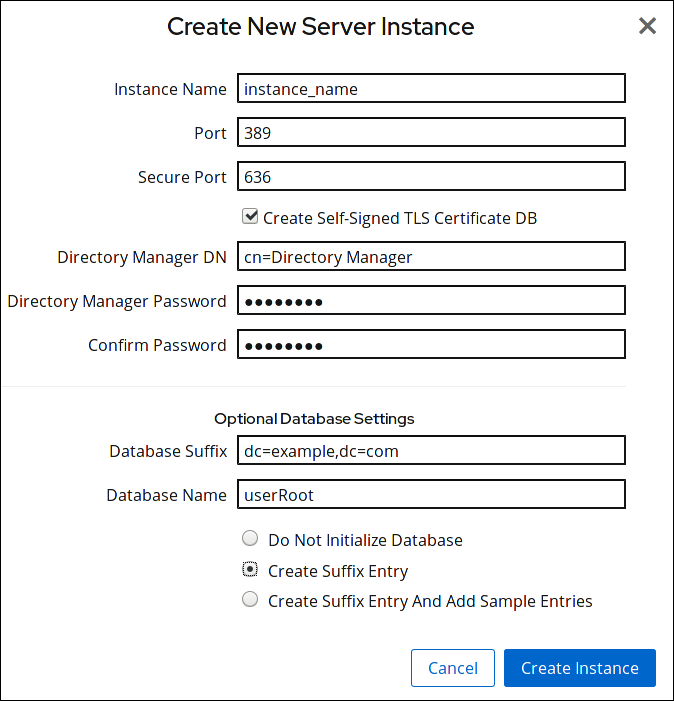

# 安装指南

[TOC]

## 安装 Red Hat Directory Server 软件包

1. 列出红帽帐户中的可用订阅，找到提供 Red Hat Directory Server 的池 ID。

   ```bash
   subscription-manager list --all --available --matches 'Red Hat Directory Server'
   ...
   Subscription Name:   Example Subscription
   Provides:            ...
                        Red Hat Directory Server
                        ...
   Pool ID:             5ab6a8df96b03fd30aba9a9c58da57a1
   Available:           1
   ...
   ```
   
2. 使用上一步中的池 ID 将 Red Hat Directory Server 订阅附加到系统：

   ```bash
   subscription-manager attach --pool=5ab6a8df96b03fd30aba9a9c58da57a1
   Successfully attached a subscription for: Example Subscription
   ```
   
3. 启用 `dirsrv-11-for-rhel-8-x86_64-rpms` 存储库：

   ```bash
   subscription-manager repos --enable=dirsrv-11-for-rhel-8-x86_64-rpms
   Repository 'dirsrv-11-for-rhel-8-x86_64-rpms' is enabled for this system.
   ```
   
4. 安装 `redhat-ds:11` 模块：

   ```bash
   yum module install redhat-ds:11
   ```
   
   这个命令会自动安装所有必需的依赖项。

## 设置一个新的 Directory Server 实例

目录服务器支持以下方式创建新实例：

- 在命令行中使用 `.inf` 文件
- 使用交互式命令行安装程序
- 使用 Web 控制台

### 在命令行中使用 .inf 文件设置

使用 `.inf` 安装目录服务器可让您自定义高级设置。例如，除了交互式安装程序和 Web 控制台中的设置外，您还可以在 `.inf` 文件中自定义以下设置：

- 用户和组在服务启动后使用 `ns-slapd` Directory Server 进程。请注意，您必须在开始安装前手动创建用户和组。
- 路径，如配置、备份和数据目录。
- 证书的有效性。
- 禁用严格的主机检查，当在负载均衡器后面使用 GSSAPI 安装实例时。	

#### 创建 .inf 文件

使用 `dscreate create-template` 命令创建模板 `.inf` 文件。例如，将模板存储在 `/root/instance_name.inf` 文件中：

```bash
dscreate create-template /root/instance_name.inf
```

创建的文件包含所有可用的参数及描述。

#### 编辑创建的文件 					

取消注释要设置以自定义安装的参数。 							

> 注意:
>
> 所有参数都具有默认值。但是，红帽建议为生产环境自定义某些参数。 								

例如，至少设置以下参数：

```ini
[slapd]
   # instance_name (str)
   # Description: ...
   # Default value: localhost
   instance_name = instance_name
   
   # root_password (str)
   # Description: ...
   # Default value: directory manager password
   root_password = password
```

   使用 `dscreate create-template` 命令创建的模板文件包含您可以在这些部分中配置的参数的完整列表。

在创建实例的过程中自动创建后缀：

1. 取消注释 `create_suffix_entry` 参数，并将其设置为 `true` ：

   ```ini
   # create_suffix_entry (bool)
   # Description: ...
   # Default value: False
   create_suffix_entry = True
   ```
   
2. 取消注释 `suffix` 参数，并设置后缀：

   ```ini
   # suffix (str)
   # Description: ...
   # Default value:
   suffix = dc=example,dc=com

   > 重要:
   >
   > 除了在实例创建过程中创建后缀外，也可以稍后创建它。但是，如果没有创建后缀，则无法将数据存储到这个实例中。

2. （可选）取消注释其他参数，并将其设置为适合您环境的值。例如，使用这些参数为 LDAP 和 LDAPS 协议指定不同的端口。

   > 注意:
   >
   > 默认情况下，您创建的新实例包括启用自签名证书和 TLS。为了提高安全性，红帽建议您不要禁用此功能。请注意，您可以稍后将自签名证书替换为证书颁发机构(CA)发布的证书。

#### 设置新的目录服务器实例

将 `.inf` 文件传递给 `dscreate from-file` 命令，以创建新实例。例如：

```bash
dscreate from-file /root/instance_name.inf
Starting installation...
Completed installation for instance_name
```

创建的实例将自动启动，并配置为在系统引导时启动。

#### 在防火墙中打开所需端口

如果在实例创建过程中没有指定端口，实例将端口 `389` 用于 LDAP，和端口 `636` 用于 LDAPS 协议。

1. 使用 `firewall-cmd` 工具打开所需的端口。例如，要在默认防火墙区中打开 LDAP 和 LDAPS 默认端口：

   ```bash
firewall-cmd --permanent --add-port={389/tcp,636/tcp}
   ```

3. 重新载入防火墙配置，以确保立即进行更改：

   ```bash
   firewall-cmd --reload
   ```

### 使用交互式安装程序在命令行中设置

管理员可以通过回答有关新实例配置的问题，使用 Directory Server 交互式安装程序设置新实例。

如果要在安装过程中自定义其他设置，请使用 `.inf` 文件而不是交互式安装程序。

#### 支持的设置

使用交互式安装程序，您可以设置以下设置：

- 系统主机名
- 启用或禁用严格的主机名验证
- 实例的名称
- LDAP 端口号
- LDAPS 端口号
- 自动使用自签名证书
- 目录管理器帐户的 DN
- 目录管理器帐户的密码
- 可选创建数据库后缀

#### 创建实例

要启动交互式安装程序来设置新实例，请输入：

```bash
dscreate interactive
```

要使用安装程序中大部分问题后面的方括号中显示的默认值，请按 **Enter** 但不输入一个值。

```bash
# dscreate interactive
Install Directory Server (interactive mode)
===========================================

Enter system's hostname [server.example.com]:

Enter the instance name [server]: instance_name

Enter port number [389]:

Create self-signed certificate database [yes]:

Enter secure port number [636]:

Enter Directory Manager DN [cn=Directory Manager]:

Enter the Directory Manager password: password
Confirm the Directory Manager Password: password

Enter the database suffix (or enter "none" to skip) [dc=server,dc=example,dc=com]: dc=example,dc=com

Create sample entries in the suffix [no]:

Create just the top suffix entry [no]: yes

Do you want to start the instance after the installation? [yes]:

Are you ready to install? [no]: yes
Starting installation...
Completed installation for instance_name
```

> 注意:
>
> 可以使用明文设置密码，而不必设置由 **pwd\*hash\*** 程序生成的 **{\*algorithm\*} hash** 字符串。 				

#### 在防火墙中打开所需端口

如果在实例创建过程中没有指定端口，实例将端口 `389` 用于 LDAP，和端口 `636` 用于 LDAPS 协议。

1. 使用 `firewall-cmd` 工具打开所需的端口。例如，要在默认防火墙区中打开 LDAP 和 LDAPS 默认端口：

   ```bash
firewall-cmd --permanent --add-port={389/tcp,636/tcp}
   ```

3. 重新载入防火墙配置，以确保立即进行更改：

   ```bash
   firewall-cmd --reload					
   ```

### 使用 Web 控制台设置新实例

使用浏览器连接到在 Directory 服务器主机上端口 9090 上运行的 Web 控制台。例如：

```none
https://server.example.com:9090
```

以 `root` 用户身份或具有 sudo 权限的用户身份登录。

选择 **Red Hat Directory Server** 条目。

创建新实例：

- 如果服务器上不存在任何实例，请单击 Create New Instance 按钮。
- 如果服务器已在运行现有的实例，请选择 Actions，再单击 Create Instance 。

完成 `Create New Server Instance` 表单的字段：

 

- `Instance Name` ：设置实例的名称。不能在创建实例后更改实例名称。
- 端口 ：设置 LDAP 协议的端口号。端口不能被另一个实例或服务使用。默认端口为 389。

- `安全端口` ：设置 LDAPS 协议的端口号。端口不能被另一个实例或服务使用。默认端口为 636。

- `创建自签署的 TLS 证书 DB` ：在实例中启用 TLS 加密并创建自签名证书。为提高安全性，红帽建议您创建启用了自签名证书和 TLS 的新实例。请注意，您可以稍后将自签名证书替换为证书颁发机构(CA)发布的证书。

- `目录管理器 DN` ：设置实例的管理用户的可分辨名称(DN)。默认值为 `cn=Directory Manager`。

- `Directory Manager Password` ：设置实例的管理用户的密码。

- `确认密码`: Must 设置为与 `Directory Manager Password` 字段中的值相同。

- `Database Suffix` ：为后端设置后缀。默认值为 `dc=example,dc=com`。

- `数据库名称` ：设置后端数据库的名称。如果指定了后端后缀，则需要填写此字段。

- 选择以下选项之一：

  - `不初始化数据库` ：安装程序不会创建数据库和后缀。
  
  
    - `创建 Suffix Entry`: 安装程序根据 `Database Suffix` 和 `Database Name` 字段中填写的值创建数据库和后缀。
  
  
    - `创建 Suffix Entry and Add Sample Entries`: 安装程序会根据 `Database Suffix` 和 `Database Name` 字段中填写的值创建数据库和后缀。另外，安装程序会在目录中创建示例条目。
  
      > 注意：
      >
      > 如果在安装过程中没有创建后缀，您必须稍后手动创建它，然后才能向该目录添加条目。
  

点 Create Instance。

新实例启动，并配置为在系统引导时自动启动。

在防火墙中打开所需端口。

如果在实例创建过程中没有指定端口，实例将端口 `389` 用于 LDAP，和端口 `636` 用于 LDAPS 协议。

1. 使用 `firewall-cmd` 工具打开所需的端口。例如，要在默认防火墙区中打开 LDAP 和 LDAPS 默认端口：

   ```bash
firewall-cmd --permanent --add-port={389/tcp,636/tcp}
   ```

3. 重新载入防火墙配置，以确保立即进行更改：

   ```bash
   firewall-cmd --reload					
   ```

## 在负载均衡器后面使用 Kerberos 验证安装目录服务器

为提供高可用性，请在负载均衡器后面安装两个目录服务器实例。用户必须能够使用 Kerberos 进行身份验证。 	

> 注意：
>
> 设置此场景只支持使用命令行。

### 了解在负载均衡器后面使用 Kerberos 设置实例时的区别

​				如果用户使用通用安全服务 API(GSSAPI)访问服务，则 Kerberos 主体包含服务主机的 DNS 名称。如果用户连接到负载均衡器，主体包含负载均衡器的 DNS 名称，而不是来自 Directory 服务器的 DNS 名称。例如： `ldap/loadbalancer.example.com@EXAMPLE.COM`。 		

​				为便于成功连接，接收请求的 Directory 服务器实例必须使用与负载均衡器相同的名称，即使负载均衡器 DNS 名称不同。 		

### 为 Directory 服务器实例安装创建 .inf 文件

​				在本节中，您将了解如何为 `dscreate` 实用程序创建 `.inf` 配置文件以及如何调整 `.inf` 文件到您的环境。在后续步骤中，您将使用此文件来创建新的 Directory 服务器实例。 		

#### 流程

1. ​						使用 `dscreate create-template` 命令创建模板 `.inf` 文件。例如，将模板存储在 `/root/instance_name.inf` 文件中： 				

   

   ```none
   # dscreate create-template /root/instance_name.inf
   ```

   ​						创建的文件包含所有可用的参数及描述 				

2. ​						编辑您在上一步中创建的文件： 				

   1. ​								取消注释您要设置以自定义安装的参数。 						

      注意

      ​									所有参数都具有默认值。但是，红帽建议为生产环境自定义某些参数。 							

      ​								例如，至少设置以下参数： 						

      

      ```none
      [slapd]
      # instance_name (str)
      # Description: ...
      # Default value: localhost
      instance_name = instance_name
      
      # root_password (str)
      # Description: ...
      # Default value: directory manager password
      root_password = password
      ```

      ​								使用 `dscreate create-template` 命令创建的模板文件包含您可以在这些部分中配置的参数的完整列表。 						

   2. ​								要将负载均衡器后面的实例与 GSSAPI 身份验证一起使用，请将 `[general]` 部分中的 `full_machine_name` 参数设置为负载均衡器的完全限定域名(FQDN)而不是 Directory Server 主机的 FQDN： 						

      

      ```none
      [general]
      # full_machine_name (str)
      # Description: ...
      # Default value: loadbalancer.example.com
      full_machine_name = loadbalancer.example.com
      ```

      ​								详情请查看 [第 3.1 节 “了解在负载均衡器后面使用 Kerberos 设置实例时的区别”](https://access.redhat.com/documentation/zh-cn/red_hat_directory_server/11/html-single/installation_guide/index#con_understanding-the-differences-when-setting-up-an-instance-with-kerberos-behind-a-load-balancer_assembly_installing-directory-server-with-kerberos-authentication-behind-a-load-balancer)。 						

   3. ​								在 `[general]` 部分中取消注释 `strict_host_checking` 参数，并将它设为 `False` ： 						

      

      ```none
      # strict_host_checking (bool)
      # Description: ...
      # Default value: True
      strict_host_checking = False
      ```

   4. ​								在创建实例的过程中自动创建后缀： 						

      1. ​										取消注释 `create_suffix_entry` 参数，并将其设置为 `true` ： 								

         

         ```none
         # create_suffix_entry (bool)
         # Description: ...
         # Default value: False
         create_suffix_entry = True
         ```

      2. ​										取消注释 `suffix` 参数，并设置后缀： 								

         

         ```none
         # suffix (str)
         # Description: ...
         # Default value:
         suffix = dc=example,dc=com
         ```

         重要

         ​											除了在实例创建过程中创建后缀外，您可以稍后创建它，如Red Hat Directory Server 管理指南中的创建数据库所述。https://access.redhat.com/documentation/en-us/red_hat_directory_server/11/html/administration_guide/configuring_directory_databases-creating_and_maintaining_databases#Creating_and_Maintaining_Databases-Creating_Databases但是，如果没有创建后缀，则无法将数据存储到这个实例中。 									

   5. ​								（可选）取消注释其他参数，并将其设置为适合您环境的值。例如，使用这些参数为 LDAP 和 LDAPS 协议指定不同的端口。 						

      注意

      ​									默认情况下，您创建的新实例包括启用自签名证书和 TLS。为了提高安全性，红帽建议您不要禁用此功能。请注意，您可以稍后将自签名证书替换为证书颁发机构(CA)发布的证书。 							

#### 其他资源

- ​						有关您可以在每个参数的 `.inf` 文件和描述中设置的参数的完整列表，请查看 `dscreate create create-template` 命令的模板文件。 				
- ​						有关在安装后安装证书的详情，请参考 Red Hat Directory Server 管理指南中的 [Directory Server 使用的 NSS 数据库](https://access.redhat.com/documentation/en-us/red_hat_directory_server/11/html/administration_guide/managing_the_nss_database_used_by_directory_server) 部分。 				

### 使用 .inf 文件设置新的目录服务器实例

​				这部分论述了如何使用命令行使用 `.inf` 文件设置新的 Directory Server 实例。 		

#### 先决条件

- ​						所创建的 Directory 服务器实例的 `.inf` 文件，如 [第 3.2 节 “为 Directory 服务器实例安装创建 `.inf` 文件”](https://access.redhat.com/documentation/zh-cn/red_hat_directory_server/11/html-single/installation_guide/index#proc_creating-a-inf-file-for-a-directory-server-instance-installation_assembly_installing-directory-server-with-kerberos-authentication-behind-a-load-balancer) 所述。 				

#### 流程

1. ​						将 `.inf` 文件传递给 `dscreate from-file` 命令，以创建新实例。例如： 				

   

   ```none
   # dscreate from-file /root/instance_name.inf
   Starting installation...
   Completed installation for instance_name
   ```

   ​						创建的实例将自动启动，并配置为在系统引导时启动。 				

2. ​						在防火墙中打开所需端口。请查看 [第 3.4 节 “在防火墙中打开所需端口”](https://access.redhat.com/documentation/zh-cn/red_hat_directory_server/11/html-single/installation_guide/index#proc_opening-required-ports-in-the-firewall_assembly_installing-directory-server-with-kerberos-authentication-behind-a-load-balancer) 				

### 在防火墙中打开所需端口

​				要允许其他机器通过网络连接到目录服务器，请在本地防火墙中打开所需的端口。 		

​				如果在实例创建过程中没有指定端口，实例将端口 `389` 用于 LDAP，和端口 `636` 用于 LDAPS 协议。 		

#### 先决条件

- ​						在实例创建过程中设置的 LDAP 和 LDAPS 协议的端口号。 				

#### 流程

1. ​						确保 `firewalld` 服务正在运行。 				

   - ​								查看 `firewalld` 当前是否正在运行： 						

     

     ```none
     # systemctl status firewalld
     ● firewalld.service - firewalld - dynamic firewall daemon
        Loaded: loaded (/usr/lib/systemd/system/firewalld.service; enabled; vendor preset: enabled)
        Active: active (running) since Fri 2018-06-15 14:06:33 CEST; 1h 17min ago
        ...
     ```

   - ​								要启动 `firewalld` 并将服务配置为在系统引导时自动启动： 						

     

     ```none
     # systemctl start firewalld
     # systemctl enable firewalld
     ```

2. ​						使用 `firewall-cmd` 工具打开所需的端口。例如，要在默认防火墙区中打开 LDAP 和 LDAPS 默认端口： 				

   

   ```none
   # firewall-cmd --permanent --add-port={389/tcp,636/tcp}
   ```

3. ​						重新载入防火墙配置，以确保立即进行更改： 				

   

   ```none
   # firewall-cmd --reload
   ```

#### 其他资源

- ​						有关使用 `firewall-cmd` 在系统上打开端口的详情，请查看 Red Hat Enterprise Linux [安全指南](https://access.redhat.com/documentation/en-US/Red_Hat_Enterprise_Linux/7/html/Security_Guide/sec-Using_Firewalls.html) 或 `firewall-cmd(1)` man page。 				

### 为负载均衡器创建 keytab，并将 Directory 服务器配置为使用 keytab

​				在用户使用 GSSAPI 对负载均衡器后面的目录服务器验证前，您必须为负载均衡器创建 Kerberos 主体，并将 Directory Server 配置为使用 Kerberos 主体。本节描述了这个步骤。 		

#### 先决条件

​				包含以下 `.inf` 文件配置的实例： 		

- ​						`full_machine_name` 参数设置为负载均衡器的 DNS 名称。 				
- ​						`strict_host_checking` 参数设为 `False`。 				

#### 流程

1. ​						为负载均衡器创建 Kerberos 主体。例如，`ldap/*loadbalancer.example.com*@*EXAMPLE.COM*` 				

2. ​						另外，您还可以在 keytab 文件中添加更多主体。例如，要让用户直接使用 Kerberos 身份验证连接到负载均衡器后面的 Directory 服务器实例，请为 Directory Server 主机添加额外的主体。例如，`ldap/*server1.example.com*@*EXAMPLE.COM*`。 				

   ​						创建服务主体的步骤取决于您的 Kerberos 安装。详情请查看您的 Kerberos 服务器文档。 				

3. ​						将服务 keytab 文件复制到 Directory 服务器。例如，将其存储在 `/etc/dirsrv/slapd-*instance_name*/ldap.keytab` 文件中。 				

4. ​						在 `/etc/sysconfig/slapd-*instance_name*` 文件中添加服务 keytab 的路径： 				

   

   ```none
   KRB5_KTNAME=/etc/dirsrv/slapd-instance_name/ldap.keytab
   ```

5. ​						重启 Directory 服务器实例： 				

   

   ```none
   # systemctl restart dirsrv@instance_name
   ```

6. ​						验证您可以使用 GSSAPI 协议连接到负载均衡器。例如： 				

   

   ```none
   # ldapsearch -H ldap://loadbalancer.example.com -Y GSSAPI
   ```

   ​						如果您在 keytab 文件（如 Directory Server 主机本身）中添加了额外的 Kerberos 主体，还必须验证这些连接。例如： 				

   

   ```none
   # ldapsearch -H ldap://server1.example.com -Y GSSAPI
   ```

## 更新目录服务器

使用 `yum module update redhat-ds` 命令检查 Directory Server 软件包及其依赖软件包的新更新，并安装它们：

```bash
yum module update redhat-ds
```

在更新期间，`dirsrv` 服务会自动重启服务器上所有实例。

## 将 Directory Server 10 迁移到 Directory Server 11			

### 使用复制方法迁移到目录服务器 11

在复制拓扑中，使用复制方法迁移到 Directory Server 11。

1. 安装 Directory Server 11。
2. 另外，还可配置 TLS。
3. 在 Directory Server 11 主机上，启用复制，但不创建复制协议。
4. 在 Directory Server 10 主机上，启用复制并创建指向 Directory Server 11 主机的复制协议。
5. 另外，还可在 Directory Server 11 主机间设置使用复制协议的进一步目录服务器 11 主机。
6. 将您的客户端配置为仅使用 Directory Server 11 主机。
7. 删除与 Directory Server 10 主机的复制协议。
8. 卸载 Directory Server 10 主机。

### 使用导出和导入方法迁移到目录服务器 11

使用导出和导入方法迁移 small Directory 服务器环境，如没有复制的实例。

1. 在现有 Directory Server 10 主机上：

   1. 停止并禁用 `dirsrv` 服务：

      ```bash
      systemctl stop dirsrv@instance_name
      systemctl disable dirsrv@instance_name
      ```
      
   2. 导出后端。例如，要导出 `用户Root` 后端并将其存储在 `/tmp/userRoot.ldif` 文件中：

      ```bash
      db2ldif -Z instance_name -n userRoot -a /tmp/userRoot.ldif
      ```
      
   3. 将以下文件复制到您要安装 Directory Server 11 的新主机中：
   
      - 您上一步导出的 LDIF 文件。
      - 如果您使用自定义 schema，`/etc/dirsrv/slapd-instance_name/schema/99user.ldif` 
      - 如果要迁移启用 TLS 的实例并重复使用 Directory Server 11 安装的同一主机名，请将以下文件复制到新主机：
        - `/etc/dirsrv/slapd-instance_name/cert8.db` 
        - `/etc/dirsrv/slapd-instance_name/key3.db` 
        - `/etc/dirsrv/slapd-instance_name/pin.txt` 
   
   4. 如果要重复使用 Directory Server 11 主机上相同的主机名和 IP，请将旧服务器与网络断开连接。
   
2. 在新主机上：

   1. 安装 Directory Server 11。详情请查看 [第 2 章 *设置一个新的 Directory 服务器实例*](https://access.redhat.com/documentation/zh-cn/red_hat_directory_server/11/html-single/installation_guide/index#assembly_setting-up-a-new-directory-server-instance_installation-guide)。

   2. 另外，还可配置 TLS 加密：

      - 如果新安装使用不同于 Directory Server 10 实例的主机名：

        1. 请参阅 *Red Hat Directory Server Administrator Guide* 中的 [启用 TLS](https://access.redhat.com/documentation/en-us/red_hat_directory_server/11/html/administration_guide/enabling_tls) 章节。

      - 要使用与之前目录服务器 10 安装相同的主机名：

        1. 停止实例：

           ```none
           systemctl stop dirsrv@instance_name
           ```
           
        2. 删除网络安全服务(NSS)数据库和 Directory 服务器的密码文件（如果它们已存在）：

           ```none
           rm /etc/dirsrv/slapd-instance_name/cert*.db /etc/dirsrv/slapd-instance_name/key*.db /etc/dirsrv/slapd-instance_name/pin.txt
        # 
           ```
        
        3. 将您从 Directory Server 10 主机复制的 `cert8.db`、`key3.db` 和 `pin.txt` 文件存储在 `/etc/dirsrv/slapd-*instance_name*/` 目录中。
        
        4. 为 NSS 数据库及密码文件设置正确的权限：
        
           ```none
        # chown dirsrv:root /etc/dirsrv/slapd-instance_name/cert8.db /etc/dirsrv/slapd-instance_name/key3.db /etc/dirsrv/slapd-instance_name/pin.txt
        
        # chmod 600 /etc/dirsrv/slapd-instance_name/cert8.db /etc/dirsrv/slapd-instance_name/key3.db /etc/dirsrv/slapd-instance_name/pin.txt
           ```
        
        5. 启动实例：
        
           ```none
           systemctl start dirsrv@instance_name
        
        
         
           ```
        
           目录服务器自动将 NSS 数据库转换为 SQLite 格式。转换的数据库存储在 `/etc/dirsrv/slapd-*instance_name*/` 目录的 `cert9.db` 和 `key4.db` 文件中。
        
        6. （可选）删除旧的 NSS 数据库以避免混淆：
        
           ```none
           # rm /etc/dirsrv/slapd-instance_name/cert8.db /etc/dirsrv/slapd-instance_name/key3.db
           ```
   
   3. 如果您使用了自定义模式，将 `99user.ldif` 文件恢复到 `/etc/dirsrv/slapd-*instance_name*/schema/` 目录，设置适当的权限，再重启实例。例如：
   
      ```none
      # cp /tmp/99user.ldif /etc/dirsrv/slapd-instance_name/schema/
      
      # chmod 644 /etc/dirsrv/slapd-instance_name/schema/99user.ldif
      
      # chown root:root /etc/dirsrv/slapd-instance_name/schema/99user.ldif
      
      # systemctl restart dirsrv@instance_name
      ```
      
   4. 导入 LDIF 文件。例如，要将 `*/var/lib/dirsrv/slapd-*instance_name*/ldif/migration.ldif*` 文件导入 `userRoot` 数据库：
   
      ```none
      # dsconf -D 'cn=Directory Manager' ldap://server.example.com backend import userRoot /var/lib/dirsrv/slapd-instance_name/ldif/migration.ldif
      ```
      
      请注意，Directory 服务器需要您想在 `/var/lib/dirsrv/slapd-*instance_name*/` 目录中导入的 LDIF 文件。

## 安装、更新和卸载密码同步服务

要在 Active Directory 和 Red Hat Directory Server 之间同步密码，必须使用密码密码同步服务。

### 密码同步服务的工作方式

当您设置密码与 Active Directory 同步时，Directory 服务器会检索用户对象的所有属性，但密码除外。Active  Directory 只存储加密密码，但目录服务器使用不同的加密。因此，Directory 服务器必须加密 Active Directory  用户密码。

要启用 Active Directory 和 Directory Server 之间的密码同步，**Red Hat Directory Password Sync** 服务 hook 最多会修改 DC 的 Windows 密码。如果用户或者管理员设置或更新密码，该服务在加密并存储在 Active Directory 中之前以纯文本检索密码。这个过程使 **Red Hat Directory 密码 Sync** 将纯文本密码发送到 Directory 服务器。为了保护密码，该服务仅支持 LDAPS 连接到目录服务器。当 Directory 服务器将密码存储在用户的条目中时，会使用目录服务器中配置的密码存储方案自动加密密码。

重要

在 Active Directory 中，所有可写 DC 都可以处理密码操作。因此，您必须在 Active **Directory 域中的每个可写 DC 上安装 Red Hat Directory 密码同步**。

### 下载密码同步服务安装程序

​				在安装 **Red Hat Directory Password Sync** 服务前，请从客户门户网站下载安装程序。 		

#### 先决条件

- ​						有效的 Red Hat Directory Server 订阅 				
- ​						[红帽客户门户网站中的](https://access.redhat.com)帐户 				

#### 流程

1. ​						[登录到红帽客户门户网站](https://access.redhat.com)。 				
2. ​						点页面顶部的 Downloads。 				
3. ​						从产品列表中选择 **Red Hat Directory Server**。 				
4. ​						在 `Version` 字段中选择 `11`。 				
5. ​						下载 `PassSync 安装程序`。 				
6. ​						将安装程序复制到每个可写的 Active Directory 域控制器(DC)。 				

### 安装密码同步服务

​				这部分论述了如何在 Windows 域控制器(DC)上安装 **Red Hat Directory Password Sync**。详情请查看 [第 6.1 节 “了解密码同步服务的工作方式”](https://access.redhat.com/documentation/zh-cn/red_hat_directory_server/11/html-single/installation_guide/index#con_understanding-how-the-password-synchronization-service-works_assembly_installing-updating-and-uninstalling-the-password-synchronization-service)。 		

#### 先决条件

- ​						下载到 Windows Active Directory 域控制器(DC)的 **PassSync** 安装程序的最新版本。详情请查看 [第 6.2 节 “下载密码同步服务安装程序”](https://access.redhat.com/documentation/zh-cn/red_hat_directory_server/11/html-single/installation_guide/index#proc_downloading-the-password-synchronization-service-installer_assembly_installing-updating-and-uninstalling-the-password-synchronization-service)。 				
- ​						准备好的目录服务器主机，如在 Red Hat Directory [Server 管理指南中的设置 Active Directory 和](https://access.redhat.com/documentation/en-us/red_hat_directory_server/11/html/administration_guide/setting_up_windows_synchronization_between_active_directory_and_directory_server) Directory Server 之间的同步。 				

#### 流程

1. ​						使用有权在 DC 上安装软件的用户登录到 Active Directory 域控制器。 				

2. ​						双击 `RedHat-PassSync-ds11.*-x86_64.msi` 文件来安装该文件。 				

3. ​						此时会出现 `Red Hat Directory 密码同步设置`。点击 Next。 				

4. ​						根据您的目录服务器环境填写字段。例如： 				

   

   ​						将 Directory Server 主机的以下信息填写到字段： 				

   - ​								`主机名` ：设置目录服务器主机的名称。或者，您可以将该字段设置为 Directory Server 主机的 IPv4 或 IPv6 地址。 						
   - ​								`端口号` ：设置 LDAPS 端口号。 						
   - ​								`User Name` ：设置同步用户帐户的可分辨名称(DN)。 						
   - ​								`Password` ：设置同步用户的密码。 						
   - ​								`cert Token` ：设置从 Directory Server 主机复制的服务器证书的密码。 						
   - ​								`搜索基础` ：设置包含同步用户帐户的 Directory 服务器条目的 DN。 						

5. ​						点 Next 开始安装。 				

6. ​						点 Finish。 				

7. ​						重新引导 Windows DC。 				

   注意

   ​							如果没有重启 DC，则 `PasswordHook.dll` 库不会被启用，密码同步将失败。 					

8. ​						配置密码同步服务，如《Red Hat Directory Server 管理指南》中的" [配置密码同步](https://access.redhat.com/documentation/en-us/red_hat_directory_server/11/html/administration_guide/windows_sync-configuring_windows_sync#Configuring_Windows_Sync-Configure_the_Password_Sync_Service) 服务"一节中所述。在服务经过完全配置后，密码同步将失败。 				

​				在每个可写 Windows DC 上重复此步骤。 		

### 更新密码同步服务

​				这部分论述了如何在 Windows 域控制器(DC)中更新现有 **Red Hat Directory Password Sync** 安装。 		

#### 先决条件

- ​						**Red Hat Directory Password Sync** 正在您的 Windows DC 上运行。 				
- ​						下载到 Windows Active Directory 域控制器(DC)的 **PassSync** 安装程序的最新版本。详情请查看 [第 6.2 节 “下载密码同步服务安装程序”](https://access.redhat.com/documentation/zh-cn/red_hat_directory_server/11/html-single/installation_guide/index#proc_downloading-the-password-synchronization-service-installer_assembly_installing-updating-and-uninstalling-the-password-synchronization-service)。 				

#### 流程

1. ​						使用有权在 DC 上安装软件的用户登录到 Active Directory 域控制器。 				

2. ​						双击 `RedHat-PassSync-ds11.*-x86_64.msi` 文件。 				

3. ​						点 Next 开始安装。 				

4. ​						点 `修改` 按钮。 				

5. ​						设置显示上一个安装过程中设定的配置。点 Next 来保留现有设置。 				

6. ​						点 Next 开始安装。 				

7. ​						点 Finish。 				

8. ​						重新引导 Windows DC。 				

   注意

   ​							如果没有重启 DC，则 `PasswordHook.dll` 库不会被启用，密码同步将失败。 					

​				在每个可写 Windows DC 上重复此步骤。 		

### 卸载密码同步服务

​				本节介绍从 Windows 域控制器(DC)卸载 **Red Hat Directory Password Sync** 服务。 		

#### 先决条件

- ​						**Red Hat Directory 密码同步** 在 Windows DC 上运行。 				

#### 流程

1. ​						使用有权从 DC 中删除软件的用户登录到 Active Directory 域控制器。 				

2. ​						打开 **Control Panel** 				

3. ​						单击  ***\*计划\**，然后单击计划和功能** 				

4. ​						选择 **Red Hat Directory Password Sync** 条目，然后点 Uninstall 按钮。 				

   [](https://access.redhat.com/webassets/avalon/d/Red_Hat_Directory_Server-11-Installation_Guide-zh-CN/images/62b4ecc9246141f3b9ea0c9f12b0dad2/remove-PassSync-using-control-panel.png)

5. ​						单击 "是 "进行确认。 				

## 卸载 Directory Server

1. 从复制拓扑中删除所有实例。如果实例不是复制拓扑的成员，则会跳过这一步。

2. 从服务器删除所有实例。

3. 删除 Directory 服务器软件包：

   ```bash
   yum module remove redhat-ds
   ```
   
4. （可选）禁用 `dirsrv-11-for-rhel-8-x86_64-rpms` 存储库：

   ```bash
   subscription-manager repos --disable=dirsrv-11-for-rhel-8-x86_64-rpms
   Repository 'dirsrv-11-for-rhel-8-x86_64-rpms' is disabled for this system.
   ```
   
5. 另外，还可从系统中删除 Red Hat Directory Server 订阅：

   > 重要：
   >
   > 如果您删除了提供除 Directory Server 之外的其他产品的订阅，您将无法为这些产品安装和更新软件包。 					

   - 列出附加到主机的订阅：

     ```bash
     subscription-manager list --consumed
     Subscription Name:   Example Subscription
     ...
     Pool-ID:             5ab6a8df96b03fd30aba9a9c58da57a1
     ...
     ```
     
   - 使用上一步中的池 ID 删除订阅：

     ```bash
     subscription-manager remove --pool=5ab6a8df96b03fd30aba9a9c58da57a1
     2 local certificates have been deleted.
     The entitlement server successfully removed these pools:
        5ab6a8df96b03fd30aba9a9c58da57a1
     The entitlement server successfully removed these serial numbers:
        1658239469356282126
     ```
