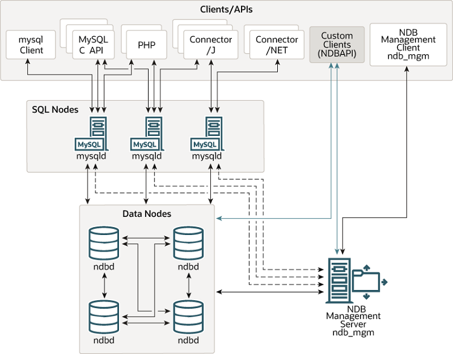

# MySQL Cluster

[TOC]

## 概述

MySQL Cluster 是一种技术，允许在无共享的系统中部署“内存中”数据库的 Cluster 。通过无共享体系结构，系统能够使用廉价的硬件，而且对软硬件无特殊要求。此外，由于每个组件都有自己的内存和硬盘，因此不存在单点故障。

由一组计算机构成，每台计算机上均运行着多种进程，包括 MySQL 服务器、NDB Cluster 的数据节点、管理服务器以及（可能）专门的数据访问程序。

 

所有的节点构成一个完整的 MySQL 集群体系。数据保存在“ NDB 存储服务器”的存储引擎中，表（结构）则保存在“ MySQL 服务器”中。应用程序通过“ MySQL 服务器”访问这些数据表。集群管理服务器通过管理工具（ndb_mgmd）来管理“ NDB 存储服务器”。

NDB 是一种“内存中”的存储引擎，具有可用性高和数据一致性好的特点。

MySQL Cluster 能够使用多种故障切换和负载平衡选项配置 NDB 存储引擎，但在 Cluster 级别上的存储引擎上做这个最简单。MySQL Cluster 的 NDB 存储引擎包含完整的数据集，仅取决于 Cluster 本身内的其他数据。

节点：

* 管理节点

  管理 MySQL Cluster 内的其他节点，如提供配置数据、启动并停止节点、运行备份和管理日志等。应在启动其他节点之间启动。

* 数据节点

  用于保存 Cluster 的数据。数据节点的数目与副本的数目相关，是片段的倍数。

* SQL 节点

  用来访问 Cluster 数据的节点。对于 MySQL Cluster ，客户端节点是使用 NDB Cluster 存储引擎的传统 MySQL 服务器。

* Clients

  * 标准 MySQL 客户端

  * 管理客户端

    与管理服务器相连，提供了启动和停止节点、启动和停止消息跟踪、显示节点版本和状态、启动和停止备份等命令。

