# 安装

[TOC]

## Oracle Database 12c / 11g

### Oracle Linux 7 (内容不准确，正在修正)

通过安装 `oracle-rdbms-server-12cR1-preinstall` 或 `oracle-rdbms-server-11gR2-preinstall` RPM 软件包简化 Oracle Linux 6 上的 Oracle Database 12c 或 11g 安装。这两个软件包自动执行了许多任务，例如安装所需的软件包，解决软件包依赖关系以及修改内核参数。

> 注意：
>
> * 对于 Oracle Database 12c 第 2 版，预安装 RPM 的名称与下文中使用的名称不同：`oracle-database-server-12cR2-preinstall` 
> * 预安装 RPM 发布在 [Oracle Linux yum 服务器](http://yum.oracle.com/)新信息库中，适用于 Oracle Linux 6 和 7。Oracle Linux 6 和 7 新版本中默认对它们进行了配置和启用。

由于数据库需要某些软件包、软件包版本以及内核参数微调，因此当在系统上安装 Oracle Database 12*c* 或 11*g* 之前，需要预先配置操作环境。                                                   

**注**：本文适用于 Oracle Linux 6。前一篇文章“[如何简化 Oracle Linux 上的 Oracle Database 安装](https://www.oracle.com/technetwork/articles/servers-storage-admin/ginny-dbinstallonlinux-2111493.html?ssSourceSiteId=otncn)”介绍了如何在 Oracle Linux 5 上执行类似任务。

在 Oracle Linux 上，我发现有一种非常简单的方法可以满足这些安装先决条件：首先，根据您的数据库版本，安装名为 `oracle-rdbms-server-12cR1-preinstall` 或 `oracle-rdbms-server-11gR2-preinstall` 的 RPM 软件包。此 RPM 执行一些预配置步骤，包括：

- 自动下载并安装 Oracle Grid Infrastructure 和 Oracle Database 12 *c* 第 1 版 (12.1) 或 11*g* 第 2 版 (11.2.0.3) 安装过程所需的任何其他软件包和特定软件版本，并通过 `yum` 或 `up2date` 功能处理软件包依赖关系。
- 创建用户 `oracle` 和组 `oinstall`（针对 `OraInventory`）、`dba`（针对 `OSDBA`），供数据库安装期间使用。（出于安全考虑，此用户默认没有密码，无法远程登录）。要启用远程登录，请使用 `passwd` 工具设置一个密码。）
- 修改 `/etc/sysctl.conf` 中的内核参数以更改共享内存、信号、最大文件描述符数量等设置。
- 设置 `/etc/security/limits.conf` 中的软硬 shell 资源限制，如锁定内存地址空间、打开的文件数量、进程数和核心文件大小。
- 对于 x86_64 计算机，在内核中设置 ` numa=off`。

请注意，`oracle-rdbms-server-12cR1-preinstall` 和 `oracle-rdbms-server-11gR2-preinstall` 只是根据数据库安装的需要来分析现有的 `/etc/sysctl.conf` 和 `/etc/security/limits.conf` 文件并更新值。所有与数据库安装无关的预自定义设置保持不变。

`oracle-rdbms-server-12cR1-preinstall` 和 `oracle-rdbms-server-11gR2-preinstall` RPM 软件包可通过 [Oracle Unbreakable Linux Network](https://linux.oracle.com/pls/apex/f?p=101:3)（ULN，需要支持合同）、Oracle Linux 分发介质或 [Oracle 公共 yum 信息库](http://public-yum.oracle.com/)获取。因此，无论系统是否在 ULN 注册访问 Oracle 补丁和支持，您均可使用 `oracle-rdbms-server-12cR1-preinstall` 和 `oracle-rdbms-server-11gR2-preinstall` 来简化 Oracle Linux 上的数据库安装。此外，Oracle 公共 yum 信息库现在还包括了所有安全和错误勘误表，从而通过新的安全更新和错误修复来确保系统的安全和稳定。

## 安装 `oracle-rdbms-server-12cR1-preinstall` 或 `oracle-rdbms-server-11gR2-preinstall` RPM

本文其余部分将逐步介绍通过 Oracle 公共 yum 信息库在 Oracle Linux 上安装 `oracle-rdbms-server-11gR2-preinstall` 的过程。以下部分中概述的步骤可用于预安装 RPM 软件包的任一版本。我首先从一个运行适用于 x86_64 的 Oracle Linux 第 6 版 Update 4 的系统开始，这个 64 位版本的 Oracle Linux 是我从 [Oracle 软件交付云](https://edelivery.oracle.com/linux)（需要注册或登录）下载的。首先，设置一个 `yum` 配置文件，让其指向正确的信息库，然后从该信息库安装 `oracle-rdbms-server-11gR2-preinstall` RPM。

以下是针对 Oracle Database 安装使用 `oracle-rdbms-server-11gR2-preinstall` 对系统进行预配置的步骤。请记住，使用 `oracle-rdbms-server-12cR1-preinstall` 包时，步骤相同；您只需在 yum 安装步骤中更改 RPM 软件包的名称。

1. 作为一个授权用户（如 

   ```
   root
   ```

   ）检索配置信息库位置的文件：

   ```
   # cd /etc/yum.repos.d
   
   # wget http://yum.oracle.com/public-yum-ol6.repo
   ```

2. 使用文本编辑器修改文件，将字段 

   ```
   enabled=0
   ```

    更改为 

   ```
   enabled=1
   ```

    以反映与计算机操作系统版本对应的信息库。 

   下面是 `public-yum-old6.repo` 的部分内容，用粗体显示更改过的行。

   ```
   [ol6_latest]
   
   name=Oracle Linux $releasever Latest ($basearch)
   
   baseurl=http://yum.oracle.com/repo/OracleLinux/OL6/latest/$basearch/
   
   gpgkey=http://yum.oracle.com/RPM-GPG-KEY-oracle-ol6
   
   gpgcheck=1
   
   enabled=1
   
   
   
   
   
   [ol6_UEK_latest]
   
   name=Latest Unbreakable Enterprise Kernel for Oracle Linux $releasever ($basearch)
   
   baseurl=http://yum.oracle.com/repo/OracleLinux/OL6/UEK/latest/$basearch/
   
   gpgkey=http://yum.oracle.com/RPM-GPG-KEY-oracle-ol6
   
   gpgcheck=1
   
   enabled=1
   ```

   因为目标系统运行的是适用于 x86_64 的 Oracle Linux 第 6 版 Update 4（默认情况下安装 Oracle Unbreakable Enterprise Kernel），所以要启用 `[ol6_latest]` 和 `[ol6_UEK_latest]` 信息库。

3. 接下来，使用 

   ```
   yum install
   ```

    命令安装 

   ```
   oracle-rdbms-server-11gR2-preinstall
   ```

    RPM。如果您使用的是 Oracle Database 12

   c

   ，那么您可以键入 

   ```
   yum install
   ```

   。

   清单 1 中的输出显示了安装过程如何检查依赖关系，然后下载和安装所需软件包。

   ```
   # yum install oracle-rdbms-server-11gR2-preinstall
   
   Loaded plugins: refresh-packagekit, rhnplugin, security
   
   Setting up Install Process
   
   Resolving Dependencies
   
   --> Running transaction check
   
   ---> Package oracle-rdbms-server-11gR2-preinstall.x86_64 0:1.0-6.el6 will be installed
   
   --> Processing Dependency: gcc-c++ for package: oracle-rdbms-server-11gR2-preinstall-1.0-6.el6.x86_64
   
   --> Processing Dependency: gcc for package: oracle-rdbms-server-11gR2-preinstall-1.0-6.el6.x86_64
   
   --> Processing Dependency: libaio-devel for package: oracle-rdbms-server-11gR2-preinstall-1.0-6.el6.x86_64
   
   --> Processing Dependency: libstdc++-devel for package: oracle-rdbms-server-11gR2-preinstall-1.0-6.el6.x86_64
   
   --> Processing Dependency: glibc-devel for package: oracle-rdbms-server-11gR2-preinstall-1.0-6.el6.x86_64
   
   --> Processing Dependency: compat-libstdc++-33 for package: oracle-rdbms-server-11gR2-preinstall-1.0-6.el6.x86_64
   
   --> Processing Dependency: ksh for package: oracle-rdbms-server-11gR2-preinstall-1.0-6.el6.x86_64
   
   --> Processing Dependency: compat-libcap1 for package: oracle-rdbms-server-11gR2-preinstall-1.0-6.el6.x86_64
   
   --> Running transaction check
   
   ---> Package compat-libcap1.x86_64 0:1.10-1 will be installed
   
   ---> Package compat-libstdc++-33.x86_64 0:3.2.3-69.el6 will be installed
   
   ---> Package gcc.x86_64 0:4.4.6-4.el6 will be installed
   
   --> Processing Dependency: cpp = 4.4.6-4.el6 for package: gcc-4.4.6-4.el6.x86_64
   
   --> Processing Dependency: cloog-ppl >= 0.15 for package: gcc-4.4.6-4.el6.x86_64
   
   ---> Package gcc-c++.x86_64 0:4.4.6-4.el6 will be installed
   
   --> Processing Dependency: libmpfr.so.1()(64bit) for package: gcc-c++-4.4.6-4.el6.x86_64
   
   ---> Package glibc-devel.x86_64 0:2.12-1.80.el6_3.4 will be installed
   
   --> Processing Dependency: glibc-headers = 2.12-1.80.el6_3.4 for package: glibc-devel-2.12-1.80.el6_3.4.x86_64
   
   --> Processing Dependency: glibc-headers for package: glibc-devel-2.12-1.80.el6_3.4.x86_64
   
   ---> Package ksh.x86_64 0:20100621-16.el6 will be installed
   
   ---> Package libaio-devel.x86_64 0:0.3.107-10.el6 will be installed
   
   ---> Package libstdc++-devel.x86_64 0:4.4.6-4.el6 will be installed
   
   --> Running transaction check
   
   ---> Package cloog-ppl.x86_64 0:0.15.7-1.2.el6 will be installed
   
   --> Processing Dependency: libppl_c.so.2()(64bit) for package: cloog-ppl-0.15.7-1.2.el6.x86_64
   
   --> Processing Dependency: libppl.so.7()(64bit) for package: cloog-ppl-0.15.7-1.2.el6.x86_64
   
   ---> Package cpp.x86_64 0:4.4.6-4.el6 will be installed
   
   ---> Package glibc-headers.x86_64 0:2.12-1.80.el6_3.4 will be installed
   
   --> Processing Dependency: kernel-headers >= 2.2.1 for package: glibc-headers-2.12-1.80.el6_3.4.x86_64
   
   --> Processing Dependency: kernel-headers for package: glibc-headers-2.12-1.80.el6_3.4.x86_64
   
   ---> Package mpfr.x86_64 0:2.4.1-6.el6 will be installed
   
   --> Running transaction check
   
   ---> Package kernel-uek-headers.x86_64 0:2.6.32-300.32.1.el6uek will be installed
   
   ---> Package ppl.x86_64 0:0.10.2-11.el6 will be installed
   
   --> Finished Dependency Resolution
   
   
   
   Dependencies Resolved
   
   
   
   ================================================================================
   
    Package                         Arch   Version                Repository  Size
   
   ================================================================================
   
   Installing:
   
    oracle-rdbms-server-11gR2-preinstall
   
                                    x86_64 1.0-6.el6              ol6_latest  15 k
   
   Installing for dependencies:
   
    cloog-ppl                       x86_64 0.15.7-1.2.el6         ol6_latest  93 k
   
    compat-libcap1                  x86_64 1.10-1                 ol6_latest  17 k
   
    compat-libstdc++-33             x86_64 3.2.3-69.el6           ol6_latest 183 k
   
    cpp                             x86_64 4.4.6-4.el6            ol6_latest 3.7 M
   
    gcc                             x86_64 4.4.6-4.el6            ol6_latest  10 M
   
    gcc-c++                         x86_64 4.4.6-4.el6            ol6_latest 4.7 M
   
    glibc-devel                     x86_64 2.12-1.80.el6_3.4      ol6_latest 970 k
   
    glibc-headers                   x86_64 2.12-1.80.el6_3.4      ol6_latest 600 k
   
    kernel-uek-headers              x86_64 2.6.32-300.32.1.el6uek ol6_latest 713 k
   
    ksh                             x86_64 20100621-16.el6        ol6_latest 684 k
   
    libaio-devel                    x86_64 0.3.107-10.el6         ol6_latest  13 k
   
    libstdc++-devel                 x86_64 4.4.6-4.el6            ol6_latest 1.5 M
   
    mpfr                            x86_64 2.4.1-6.el6            ol6_latest 156 k
   
    ppl                             x86_64 0.10.2-11.el6          ol6_latest 1.3 M
   
   
   
   Transaction Summary
   
   ================================================================================
   
   Install      15 Package(s)
   
   
   
   Total download size: 25 M
   
   Installed size: 61 M
   
   Is this ok [y/N]: Downloading Packages:
   
   --------------------------------------------------------------------------------
   
   Total                                           710 kB/s |  25 MB     00:35     
   
   Running rpm_check_debug
   
   Running Transaction Test
   
   Transaction Test Succeeded
   
   Running Transaction
   
   
   
     Installing : mpfr-2.4.1-6.el6.x86_64                                     1/15 
   
     Installing : libstdc++-devel-4.4.6-4.el6.x86_64                          2/15 
   
     Installing : cpp-4.4.6-4.el6.x86_64                                      3/15 
   
     Installing : ppl-0.10.2-11.el6.x86_64                                    4/15 
   
     Installing : cloog-ppl-0.15.7-1.2.el6.x86_64                             5/15 
   
     Installing : kernel-uek-headers-2.6.32-300.32.1.el6uek.x86_64            6/15 
   
     Installing : glibc-headers-2.12-1.80.el6_3.4.x86_64                      7/15 
   
     Installing : glibc-devel-2.12-1.80.el6_3.4.x86_64                        8/15 
   
     Installing : gcc-4.4.6-4.el6.x86_64                                      9/15 
   
     Installing : gcc-c++-4.4.6-4.el6.x86_64                                 10/15 
   
     Installing : compat-libstdc++-33-3.2.3-69.el6.x86_64                    11/15 
   
     Installing : libaio-devel-0.3.107-10.el6.x86_64                         12/15 
   
     Installing : ksh-20100621-16.el6.x86_64                                 13/15 
   
     Installing : compat-libcap1-1.10-1.x86_64                               14/15 
   
   
   
     Installing : oracle-rdbms-server-11gR2-preinstall-1.0-6.el6.x86_64      15/15 
   
     Verifying  : gcc-4.4.6-4.el6.x86_64                                      1/15
   
     Verifying  : compat-libcap1-1.10-1.x86_64                                2/15 
   
     Verifying  : ksh-20100621-16.el6.x86_64                                  3/15 
   
     Verifying  : glibc-devel-2.12-1.80.el6_3.4.x86_64                        4/15 
   
     Verifying  : libaio-devel-0.3.107-10.el6.x86_64                          5/15 
   
     Verifying  : oracle-rdbms-server-11gR2-preinstall-1.0-6.el6.x86_64       6/15 
   
     Verifying  : gcc-c++-4.4.6-4.el6.x86_64                                  7/15 
   
     Verifying  : glibc-headers-2.12-1.80.el6_3.4.x86_64                      8/15 
   
     Verifying  : libstdc++-devel-4.4.6-4.el6.x86_64                          9/15 
   
     Verifying  : compat-libstdc++-33-3.2.3-69.el6.x86_64                    10/15 
   
     Verifying  : mpfr-2.4.1-6.el6.x86_64                                    11/15 
   
     Verifying  : kernel-uek-headers-2.6.32-300.32.1.el6uek.x86_64           12/15 
   
     Verifying  : cpp-4.4.6-4.el6.x86_64                                     13/15 
   
     Verifying  : ppl-0.10.2-11.el6.x86_64                                   14/15 
   
     Verifying  : cloog-ppl-0.15.7-1.2.el6.x86_64                            15/15 
   
   
   
   Installed:
   
     oracle-rdbms-server-11gR2-preinstall.x86_64 0:1.0-6.el6                       
   
   
   
   Dependency Installed:
   
     cloog-ppl.x86_64 0:0.15.7-1.2.el6                                             
   
     compat-libcap1.x86_64 0:1.10-1                                                
   
     compat-libstdc++-33.x86_64 0:3.2.3-69.el6                                     
   
     cpp.x86_64 0:4.4.6-4.el6                                                      
   
     gcc.x86_64 0:4.4.6-4.el6                                                      
   
     gcc-c++.x86_64 0:4.4.6-4.el6                                                  
   
     glibc-devel.x86_64 0:2.12-1.80.el6_3.4                                        
   
     glibc-headers.x86_64 0:2.12-1.80.el6_3.4                                      
   
     kernel-uek-headers.x86_64 0:2.6.32-300.32.1.el6uek                            
   
     ksh.x86_64 0:20100621-16.el6                                                  
   
     libaio-devel.x86_64 0:0.3.107-10.el6                                          
   
     libstdc++-devel.x86_64 0:4.4.6-4.el6                                          
   
     mpfr.x86_64 0:2.4.1-6.el6                                                     
   
     ppl.x86_64 0:0.10.2-11.el6                                                    
   
   
   
   Complete!
   ```

   **清单 1：安装 `oracle-rdbms-server-11gR2-preinstall` RPM** 

   yum 安装过程在 `/var/log/oracle-rdbms-server-11gR2-preinstall/results/orakernel.log` 文件中记录有关内核更改的消息，并在 `/var/log/oracle-rdbms-server-11gR2-preinstall/backup` 目录中备份当前系统设置。

4. 至此，系统已准备好，可以安装 Oracle Database 了。举例来说，若要安装 Oracle Database 11

   g

    第 2 版，请按照“

   适用于 Linux 的数据库安装指南

   ”的第 4 章“安装 Oracle Database”中的说明进行操作。

   下面介绍我在测试环境中安装 Oracle Database 11*g* 第 2 版的步骤。在生产环境中进行安装之前，请务必查看所有文档并遵循建议的优秀实践。

   1. 以 

      ```
      root
      ```

       身份在一个具有足够空间的文件系统中创建一个父目录作为下载文件的目标位置：

      ```
      # mkdir /home/OraDB11g
      
      # cd /home/OraDB11g
      ```

      该文件系统中所需的磁盘空间量随具体的安装类型而变化，但大概 zip 文件大小两倍的空间（即 5 GB）就足以容纳相应软件和数据文件。

   2. 从 Oracle 技术网上的[“Oracle 数据库软件下载”页面](http://www.oracle.com/technetwork/cn/database/enterprise-edition/downloads/index.html)将安装介质文件下载到此目标目录中。

   3. 解压缩文件： 

      ```
      # unzip linux.x64_11gR2_database_1of2.zip
      
      # unzip linux.x64_11gR2_database_2of2.zip 
      ```

   4. 以 

      ```
      oracle
      ```

       用户身份登录。转到 

      ```
      database
      ```

       目录，输入以下命令运行 Oracle Universal Installer：

      ```
      $ cd /home/OraDB11g/database
      
      $ ./runInstaller 
      ```

   Oracle Universal Installer 执行一些检查，验证是否已经安装必要的操作系统软件包和版本。此外，它还检查通过 `oracle-rdbms-server-11gR2-preinstall` 安装设置的内核参数。在内核设置检查期间，安装程序可能将一些设置标志为“failed”，您应调查这些故障。在有些情况下，仍然可以继续数据库安装。在检查 `/etc/sysctl.conf` 中的内核设置时，您会发现 `oracle-rdbms-server-11gR2-preinstall` 已经修改并且添加了必要的设置，以确保满足最低要求，具体定义请参见*适用于 Linux 的 Oracle Database 安装指南 11g 第 2 版 (11.2)* 第 2 章 [Oracle Database 安装前要求](http://docs.oracle.com/cd/E11882_01/install.112/e24321/pre_install.htm#autoId42) 中的 2.10.1 节“显示和更改内核参数值”。以下是要求清单：

   ```
   fs.aio-max-nr = 1048576
   
   fs.file-max = 6815744
   
   kernel.shmall = 2097152
   
   kernel.shmmax = 4294967295
   
   kernel.shmmni = 4096
   
   kernel.sem = 250 32000 100 128
   
   net.ipv4.ip_local_port_range = 9000 65500
   
   net.core.rmem_default = 262144
   
   net.core.rmem_max = 4194304
   
   net.core.wmem_default = 262144
   
   net.core.wmem_max = 1048576
   ```

   如果需要，您可以（以 `root` 身份）编辑 `/etc/sysctl.conf` 文件来手动指定设置，例如：

   ```
   # vi /etc/sysctl.conf 
   
   # /sbin/sysctl -p
   ```

   Oracle Universal Installer 还会执行其他检查，如验证 `glibc` 版本、磁盘空间是否足够、环境变量和路径设置，以及物理内存和交换空间是否足够。一般来说，安装 `oracle-rdbms-server-11gR2-preinstall` 即可满足先决条件，因此您可以直接继续安装数据库。

## 总结

安装 `oracle-rdbms-server-12cR1-preinstall` 和 `oracle-rdbms-server-11gR2-preinstall` RPM 可以节省在 Oracle Linux 上安装 Oracle Database 12*c* 和 11*g* 的时间。这两个 RPM 能让系统满足 Oracle Database 安装的大多数先决条件，从而极大地简化安装过程。

## 另请参见

以下是本文前面所引用的资源：

- Oracle Unbreakable Linux Network：[https://linux.oracle.com](https://linux.oracle.com/)
- Oracle Linux yum 服务器：[http://yum.oracle.com/](http://public-yum.oracle.com/)
- Oracle 软件交付云（需要注册或登录）：https://edelivery.oracle.com/linux
- *适用于 Linux 的数据库安装指南* 第 4 章“安装 Oracle Database”：http://docs.oracle.com/cd/E11882_01/install.112/e24321/inst_task.htm#BABBBHJH
- Oracle 技术网上的“Oracle 数据库软件下载”页面：http://www.oracle.com/technetwork/cn/database/enterprise-edition/downloads/index.html

以下是 Oracle Database 文档库中的一些其他资源：http://www.oracle.com/pls/db112/homepage。*适用于 Linux 的 Oracle 数据库安装指南 11g* *第 2 版 (11.2)* (http://download.oracle.com/docs/cd/E11882_01/install.112/e16763/toc.htm) 中相关部分内容的当前有效 URL 如下：

- 第 1 章“Oracle 数据库安装概述”中的“关于 Oracle RDBMS 预安装和 Oracle 验证的 RPM”：http://download.oracle.com/docs/cd/E11882_01/install.112/e16763/install_overview.htm#BABDBHCJ
- 第 2 章“Oracle 数据库安装前要求”：http://download.oracle.com/docs/cd/E11882_01/install.112/e16763/pre_install.htm#BABFDGHJ
- 第 4 章“安装 Oracle 数据库”中的“下载 Oracle 软件”，介绍如何从 Oracle 技术网下载安装文件：http://docs.oracle.com/cd/E11882_01/install.112/e16763/inst_task.htm#autoId6

您还可以查看博客条目“适用于 Oracle Linux 6 的 Oracle RDBMS Server 11*g*R2 预安装 RPM 现已发布”：https://blogs.oracle.com/linux/entry/oracle_rdbms_server_11gr2_pre

## 图形化安装

 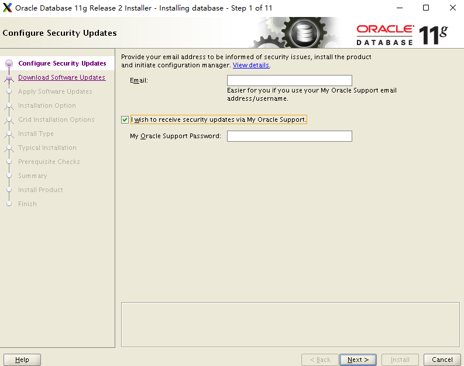

如没有支持，可以取消勾选，其他项留空。

 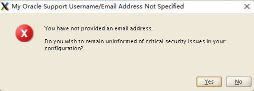

 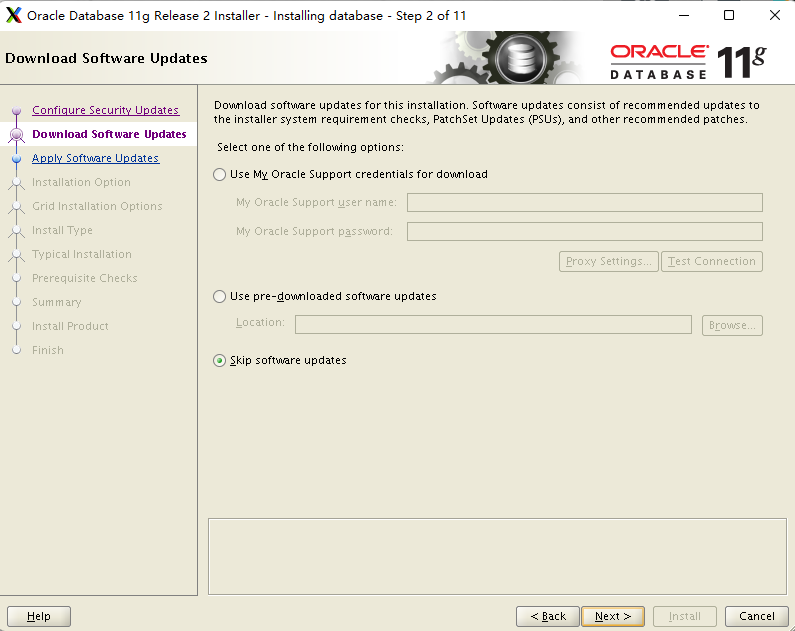

 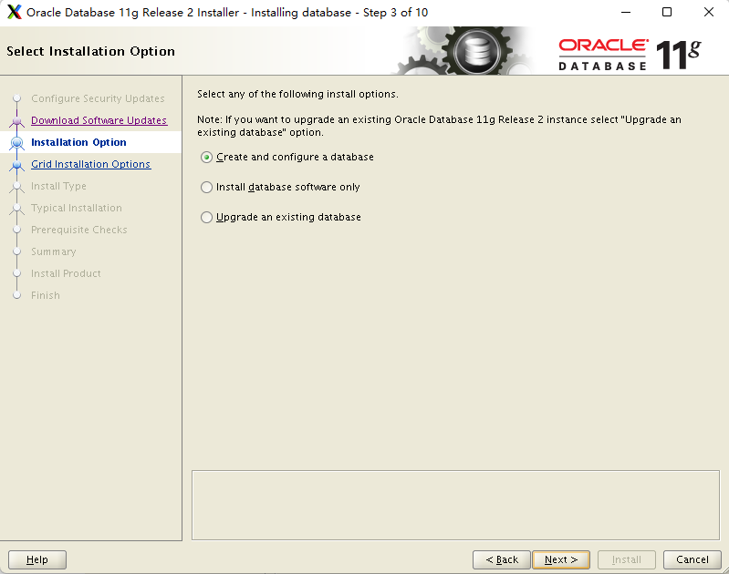

 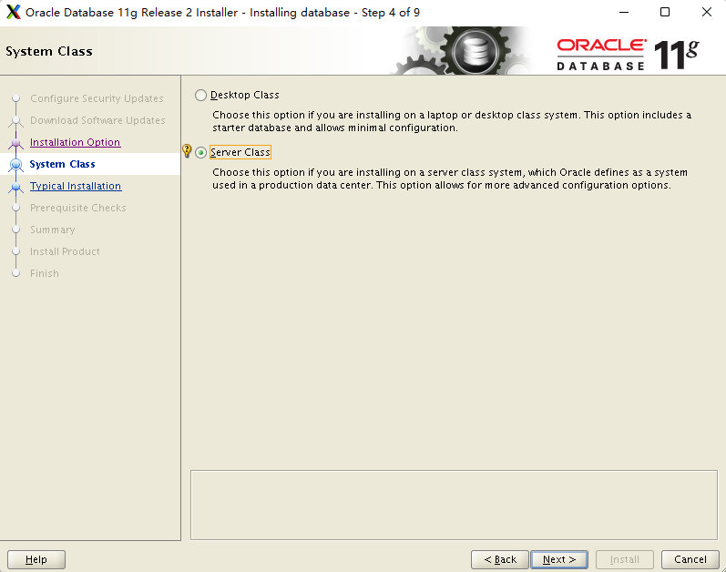

 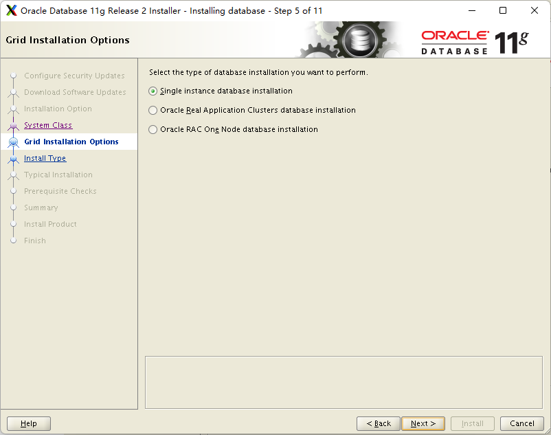

 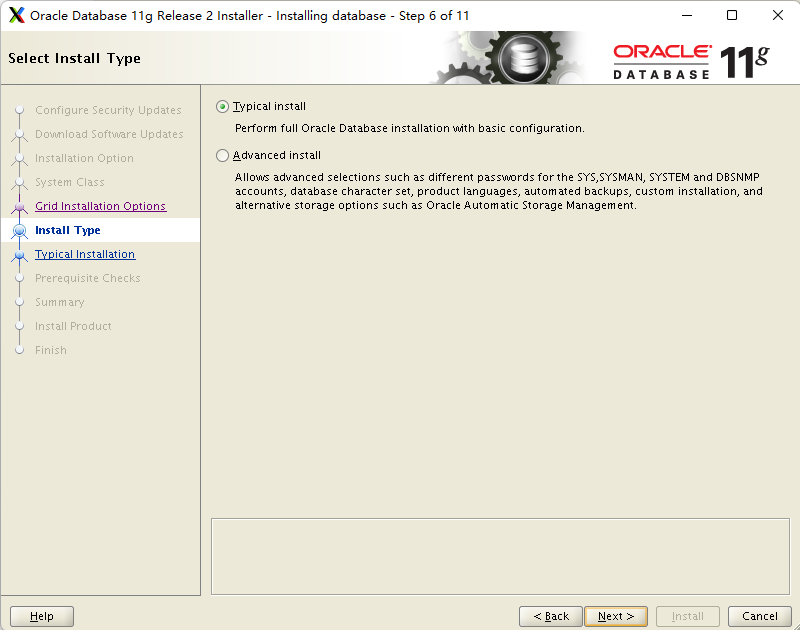

 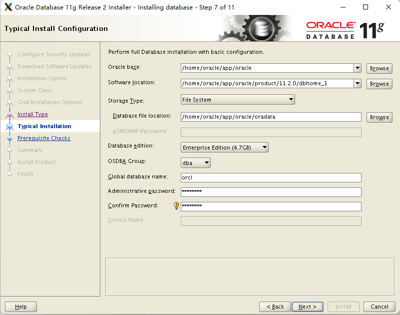

 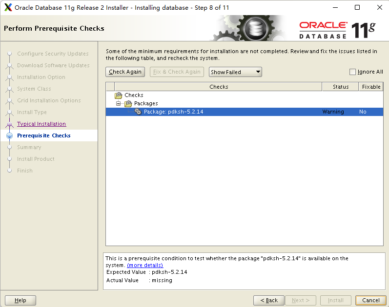

该软件包在RHEL等系统上不存在，有资料说明可以使用 ksh 包替代，此处勾选右上角的选择框（Ignore All）。

 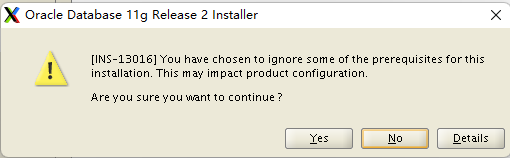

此时选择 “Yes” 按钮。

 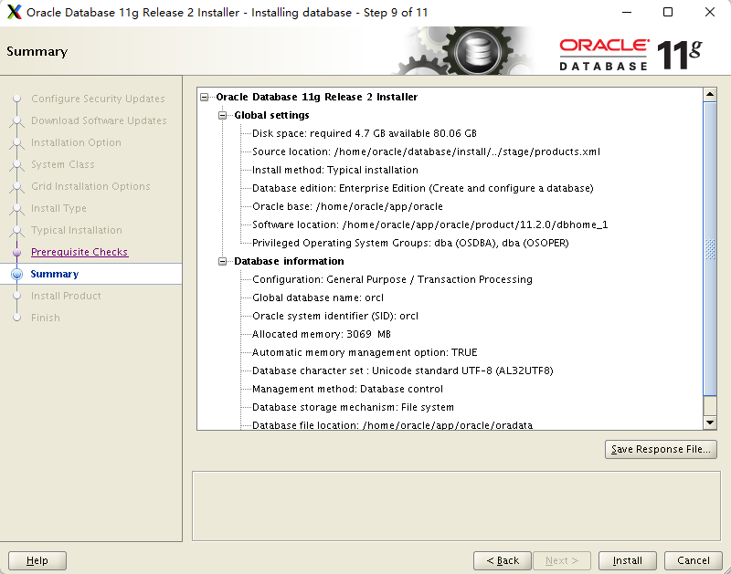

显示汇总信息。

 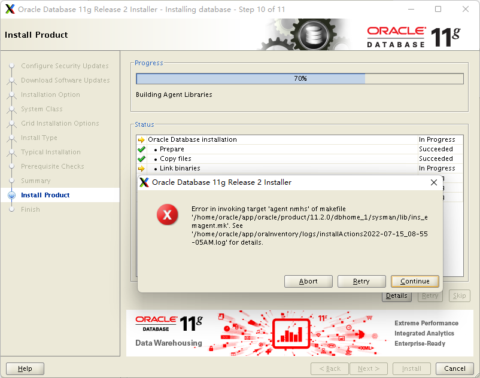

编辑文件 /home/oracle/app/oracle/product/11.2.0/dbhome_1/sysman/lib/ins_emagent.mk 文件，增加 `-lnnz11` 。

```bash
#=========================
#	emdctl
#=========================

$(SYSMANBIN) emdctl:
		$(MK_EMAGENT_NMECTL) -lnnz11
```

点击重试，继续安装，问题解决

 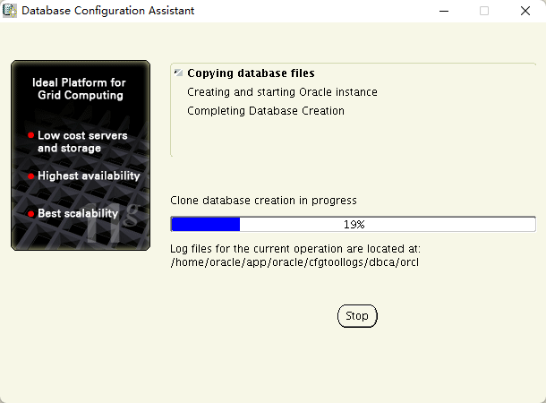

 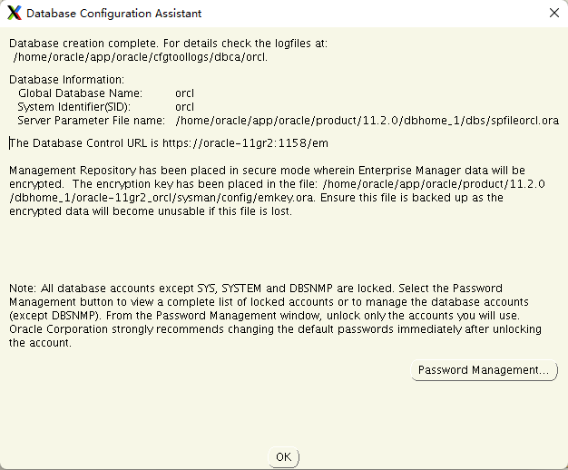

 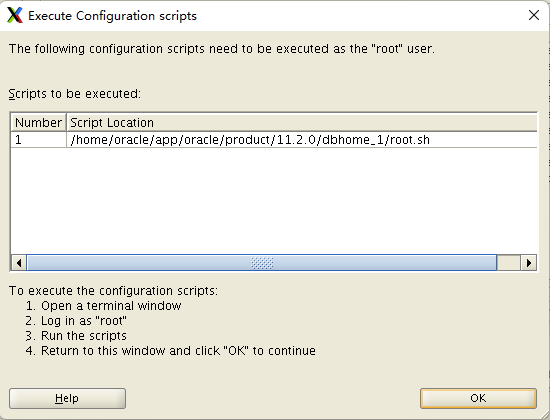


 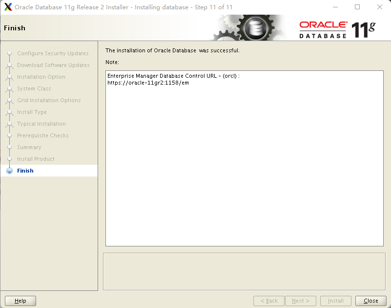