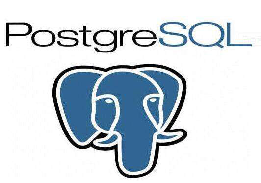

# PostgreSQL

[TOC]

## 概述

 

**官网：**https://www.postgresql.org/

PostgreSQL 是一个对象关系型数据库管理系统（ORDBMS）。在 BSD 许可证下发行。

PostgreSQL 开发者把它念作 `post-gress-Q-L` 。

PostgreSQL 的 Slogan 是 "世界上最先进的开源关系型数据库"。

| 端口 | 管理员用户名 |
| ---- | ------------ |
| 5432 | postgres     |

**优点：**
1、性能更强大，媲美商业数据库，可能是性能最强悍的开源数据库
2、SQL标准语法支持更全面
3、数据类型、统计函数支持更丰富，数组、jsonb等、表继承等等、在做OLAP的统计上更完善
4、索引、序列支持更全面，gist、gin索引
5、集群支持，Greenplum、PostgreSQL-XL

**极限值：**

| 最大单个数据库大小 | 不限                        |
| ------------------ | --------------------------- |
| 最大数据单表大小   | 32 TB                       |
| 单条记录最大       | 1.6 TB                      |
| 单字段最大允许     | 1 GB                        |
| 单表允许最大记录数 | 不限                        |
| 单表最大字段数     | 250 - 1600 (取决于字段类型) |
| 单表最大索引数     | 不限                        |

## 架构

在数据库术语里，PostgreSQL 使用一种客户端/服务器的模型。一次 PostgreSQL 会话由下列相关的进程（程序）组成：     

- 一个服务器进程，它管理数据库文件、接受来自客户端应用与数据库的联接并且代表客户端在数据库上执行操作。 该数据库服务器程序叫做 `postgres`。             
- 那些需要执行数据库操作的用户的客户端（前端）应用。 客户端应用可能本身就是多种多样的：可以是一个面向文本的工具，  也可以是一个图形界面的应用，或者是一个通过访问数据库来显示网页的网页服务器，或者是一个特制的数据库管理工具。 一些客户端应用是和 PostgreSQL发布一起提供的，但绝大部分是用户开发的。

PostgreSQL服务器可以处理来自客户端的多个并发请求。 因此，它为每个连接启动（“forks”）一个新的进程。 从这个时候开始，客户端和新服务器进程就不再经过最初的 `postgres` 进程的干涉进行通讯。 因此，主服务器进程总是在运行并等待着客户端联接， 而客户端和相关联的服务器进程则是起起停停。   

## 安装

```bash
# CentOS 8
dnf install -y https://download.postgresql.org/pub/repos/yum/reporpms/EL-8-x86_64/pgdg-redhat-repo-latest.noarch.rpm
dnf -qy module disable postgresql
dnf install -y postgresql14-server

/usr/pgsql-14/bin/postgresql-14-setup initdb

systemctl enable postgresql-14
systemctl start postgresql-14

# CentOS 7
yum install -y https://download.postgresql.org/pub/repos/yum/reporpms/EL-7-x86_64/pgdg-redhat-repo-latest.noarch.rpm
yum install -y postgresql14-server
/usr/pgsql-14/bin/postgresql-14-setup initdb

systemctl enable postgresql-14
systemctl start postgresql-14

# Ubuntu
sudo apt-get install postgresql postgresql-client 
```

## 数据库

### 创建

要创建一个新的数据库，需要使用 postgres 用户，数据库名为`mydb`，有 3 种方法：

* `CREATE DATABASE` SQL 语句。
* `createdb` 命令。
* 使用 pgAdmin 工具。

```sql
mydb=# CREATE DATABASE mydb;

$ createdb mydb
```

如果不产生任何响则表示该步骤成功。   

PostgreSQL允许在一个站点上创建任意数量的数据库。 数据库名必须是以字母开头并且小于 63 个字符长。一个方便的做法是创建和你当前用户名同名的数据库。许多工具假设该数据库名为缺省数据库名。 要创建这样的数据库，只需要键入：

```bash
$ createdb
```

#### createdb

createdb 是一个 SQL 命令 `CREATE DATABASE` 的封装。

```bash
createdb [option...] [dbname [description]]

# dbname       要创建的数据库名。
# description  关于新创建的数据库相关的说明。
# options      参数可选项，可以是以下值：
#   -D tablespace  指定数据库默认表空间。
#   -e             将 createdb 生成的命令发送到服务端。
#   -E encoding    指定数据库的编码。
#   -l locale      指定数据库的语言环境。
#   -T template    指定创建此数据库的模板。
#   --help         显示 createdb 命令的帮助信息。
#   -h host        指定服务器的主机名。
#   -p port        指定服务器监听的端口，或者 socket 文件。
#   -U username    连接数据库的用户名。
#   -w             忽略输入密码。
#   -W             连接时强制要求输入密码。
```

示例：

```bash
$ cd /Library/PostgreSQL/11/bin/
$ createdb -h localhost -p 5432 -U postgres mydb
password ******
```

### 删除

PostgreSQL 删除数据库可以用以下三种方式：

- 使用 `DROP DATABASE` SQL 语句来删除。会删除数据库的系统目录项并且删除包含数据的文件目录。只能由超级管理员或数据库拥有者执行。

  ```sql
  DROP DATABASE [ IF EXISTS ] name
  # IF EXISTS  如果数据库不存在则发出提示信息，而不是错误信息。
  # name       要删除的数据库的名称。
  
  postgres=# DROP DATABASE mydb;
  ```

- 使用 dropdb 命令来删除。

  是 DROP DATABASE 的包装器。用于删除 PostgreSQL 数据库。只能由超级管理员或数据库拥有者执行。

  ```bash
  dropdb [connection-option...] [option...] dbname
  
  # dbname	要删除的数据库名。
  # options	参数可选项，可以是以下值：
  # 	-e						显示 dropdb 生成的命令并发送到数据库服务器。
  #	-i 						在做删除的工作之前发出一个验证提示。
  #	-V 						打印 dropdb 版本并退出。
  #	--if-exists 			如果数据库不存在则发出提示信息，而不是错误信息。
  #	--help 					显示有关 dropdb 命令的帮助信息。
  #	-h host 				指定运行服务器的主机名。
  #	-p port 				指定服务器监听的端口，或者 socket 文件。
  #	-U username 			连接数据库的用户名。
  #	-w 						连接时忽略输入密码。
  #	-W 						连接时强制要求输入密码。
  #	--maintenance-db=dbname	删除数据库时指定连接的数据库，默认为 postgres，如果它不存在则使用 template1。
  ```

  示例：

  ```bash
  dropdb -h localhost -p 5432 -U postgres mydb
  ```

- 使用 pgAdmin 工具。

**注意：**删除数据库要谨慎操作，一旦删除，所有信息都会消失。这个动作将在物理上把所有与该数据库相关的文件都删除并且不可取消。   

### 访问

可以通过以下方式访问：     

- 运行 PostgreSQL 的交互式终端程序，被称为 `psql`。

  ```bash
  ============= 1 =============
  psql
  postgres=# \l	        #查看数据库列表
                               List of databases
     Name    |  Owner   | Encoding | Collate | Ctype |   Access privileges   
  -----------+----------+----------+---------+-------+-----------------------
   postgres  | postgres | UTF8     | C       | C     | 
   mydb      | postgres | UTF8     | C       | C     | 
   template0 | postgres | UTF8     | C       | C     | =c/postgres          +
             |          |          |         |       | postgres=CTc/postgres
   template1 | postgres | UTF8     | C       | C     | =c/postgres          +
             |          |          |         |       | postgres=CTc/postgres
  (4 rows)
  
  postgres=# \c mydb      #进入数据库
  mydb=#
  
  ============= 2 =============
  psql mydb
  
  psql (14.4)
  Type "help" for help.
  
  mydb=#
  mydb=>
  ```

- 使用一种图形化前端工具，比如 `pgAdmin` 或者带 `ODBC` 或 `JDBC` 支持的办公套件来创建和管理数据库。      

- 使用多种绑定发行的语言中的一种写一个自定义的应用。

如果不提供数据库名字，那么它的缺省值就是你的用户账号名字。

### 内部命令

`psql` 程序有一些不属于 SQL 命令的内部命令。以反斜线开头，“`\`” 。 欢迎信息中列出了一些这种命令。

```bash
General
  \copyright             show PostgreSQL usage and distribution terms
  \crosstabview [COLUMNS] execute query and display results in crosstab
  \errverbose            show most recent error message at maximum verbosity
  \g [(OPTIONS)] [FILE]  execute query (and send results to file or |pipe);
                         \g with no arguments is equivalent to a semicolon
  \gdesc                 describe result of query, without executing it
  \gexec                 execute query, then execute each value in its result
  \gset [PREFIX]         execute query and store results in psql variables
  \gx [(OPTIONS)] [FILE] as \g, but forces expanded output mode
  \q                     退出 psql
  \watch [SEC]           execute query every SEC seconds

# 帮助
  \? [commands]          show help on backslash commands
  \? options             show help on psql command-line options
  \? variables           show help on special variables
  \h [NAME]              help on syntax of SQL commands, * for all commands
  \help

Query Buffer
  \e [FILE] [LINE]       edit the query buffer (or file) with external editor
  \ef [FUNCNAME [LINE]]  edit function definition with external editor
  \ev [VIEWNAME [LINE]]  edit view definition with external editor
  \p                     show the contents of the query buffer
  \r                     reset (clear) the query buffer
  \s [FILE]              display history or save it to file
  \w FILE                write query buffer to file

Input/Output
  \copy ...              perform SQL COPY with data stream to the client host
  \echo [-n] [STRING]    write string to standard output (-n for no newline)
  \i FILE                execute commands from file
  \ir FILE               as \i, but relative to location of current script
  \o [FILE]              send all query results to file or |pipe
  \qecho [-n] [STRING]   write string to \o output stream (-n for no newline)
  \warn [-n] [STRING]    write string to standard error (-n for no newline)

Conditional
  \if EXPR               begin conditional block
  \elif EXPR             alternative within current conditional block
  \else                  final alternative within current conditional block
  \endif                 end conditional block

Informational
  (options: S = show system objects, + = additional detail)
  \d[S+]                 list tables, views, and sequences
  \d[S+]  NAME           describe table, view, sequence, or index
  \da[S]  [PATTERN]      list aggregates
  \dA[+]  [PATTERN]      list access methods
  \dAc[+] [AMPTRN [TYPEPTRN]]  list operator classes
  \dAf[+] [AMPTRN [TYPEPTRN]]  list operator families
  \dAo[+] [AMPTRN [OPFPTRN]]   list operators of operator families
  \dAp[+] [AMPTRN [OPFPTRN]]   list support functions of operator families
  \db[+]  [PATTERN]      list tablespaces
  \dc[S+] [PATTERN]      list conversions
  \dC[+]  [PATTERN]      list casts
  \dd[S]  [PATTERN]      show object descriptions not displayed elsewhere
  \dD[S+] [PATTERN]      list domains
  \ddp    [PATTERN]      list default privileges
  \dE[S+] [PATTERN]      list foreign tables
  \des[+] [PATTERN]      list foreign servers
  \det[+] [PATTERN]      list foreign tables
  \deu[+] [PATTERN]      list user mappings
  \dew[+] [PATTERN]      list foreign-data wrappers
  \df[anptw][S+] [FUNCPTRN [TYPEPTRN ...]]
                         list [only agg/normal/procedure/trigger/window] functions
  \dF[+]  [PATTERN]      list text search configurations
  \dFd[+] [PATTERN]      list text search dictionaries
  \dFp[+] [PATTERN]      list text search parsers
  \dFt[+] [PATTERN]      list text search templates
  \dg[S+] [PATTERN]      list roles
  \di[S+] [PATTERN]      list indexes
  \dl                    list large objects, same as \lo_list
  \dL[S+] [PATTERN]      list procedural languages
  \dm[S+] [PATTERN]      list materialized views
  \dn[S+] [PATTERN]      list schemas
  \do[S+] [OPPTRN [TYPEPTRN [TYPEPTRN]]]
                         list operators
  \dO[S+] [PATTERN]      list collations
  \dp     [PATTERN]      list table, view, and sequence access privileges
  \dP[itn+] [PATTERN]    list [only index/table] partitioned relations [n=nested]
  \drds [ROLEPTRN [DBPTRN]] list per-database role settings
  \dRp[+] [PATTERN]      list replication publications
  \dRs[+] [PATTERN]      list replication subscriptions
  \ds[S+] [PATTERN]      list sequences
  \dt[S+] [PATTERN]      list tables
  \dT[S+] [PATTERN]      list data types
  \du[S+] [PATTERN]      list roles
  \dv[S+] [PATTERN]      list views
  \dx[+]  [PATTERN]      list extensions
  \dX     [PATTERN]      list extended statistics
  \dy[+]  [PATTERN]      list event triggers
  \l[+]   [PATTERN]      list databases
  \sf[+]  FUNCNAME       show a function's definition
  \sv[+]  VIEWNAME       show a view's definition
  \z      [PATTERN]      same as \dp

Formatting
  \a                     toggle between unaligned and aligned output mode
  \C [STRING]            set table title, or unset if none
  \f [STRING]            show or set field separator for unaligned query output
  \H                     toggle HTML output mode (currently off)
  \pset [NAME [VALUE]]   set table output option
                         (border|columns|csv_fieldsep|expanded|fieldsep|
                         fieldsep_zero|footer|format|linestyle|null|
                         numericlocale|pager|pager_min_lines|recordsep|
                         recordsep_zero|tableattr|title|tuples_only|
                         unicode_border_linestyle|unicode_column_linestyle|
                         unicode_header_linestyle)
  \t [on|off]            show only rows (currently off)
  \T [STRING]            set HTML <table> tag attributes, or unset if none
  \x [on|off|auto]       toggle expanded output (currently off)

Connection
  \c[onnect] {[DBNAME|- USER|- HOST|- PORT|-] | conninfo}
                         connect to new database (currently "mydb")
  \conninfo              display information about current connection
  \encoding [ENCODING]   show or set client encoding
  \password [USERNAME]   securely change the password for a user

Operating System
  \cd [DIR]              change the current working directory
  \setenv NAME [VALUE]   set or unset environment variable
  \timing [on|off]       toggle timing of commands (currently off)
  \! [COMMAND]           execute command in shell or start interactive shell

Variables
  \prompt [TEXT] NAME    prompt user to set internal variable
  \set [NAME [VALUE]]    set internal variable, or list all if no parameters
  \unset NAME            unset (delete) internal variable

Large Objects
  \lo_export LOBOID FILE
  \lo_import FILE [COMMENT]
  \lo_list
  \lo_unlink LOBOID      large object operations
```

## 表

### 创建

通过指定表的名字和所有列的名字及其类型来创建表∶

```sql
CREATE TABLE table_name(
   column1 datatype,
   column2 datatype,
   column3 datatype,
   .....
   columnN datatype,
   PRIMARY KEY( 一个或多个列 )
);

CREATE TABLE weather (
    city            varchar(80),
    temp_lo         int,           -- 最低温度
    temp_hi         int,           -- 最高温度
    prcp            real,          -- 湿度
    date            date
);
```

表名字必需在同一模式中的其它表、 序列、索引、视图或外部表名字中唯一。在当前数据库创建一个新的空白表，该表将由发出此命令的用户所拥有。

可以在 SQL 命令中自由使用空白（即空格、制表符和换行符）。

两个划线（“`--`”）引入注释。

SQL 是对关键字和标识符大小写不敏感的语言，只有在标识符用双引号包围时才能保留它们的大小写。

第二个例子将保存城市和它们相关的地理位置：

```sql
CREATE TABLE cities (
    name            varchar(80),
    location        point
);
```

### 删除

使用 DROP TABLE 语句来删除表格，包含表格数据、规则、触发器等。删除表格要慎重，删除后所有信息就消失了。

```sql
DROP TABLE tablename;
```

### 查看表

```sql
# 使用 \d 命令来查看表格是否创建成功

mydb=# \d
           List of relations
 Schema |    Name    | Type  |  Owner   
--------+------------+-------+----------
 public | company    | table | postgres
 public | department | table | postgres
(2 rows)

# 使用 \d tablename 查看表格信息

mydb=# \d company
                  Table "public.company"
 Column  |     Type      | Collation | Nullable | Default 
---------+---------------+-----------+----------+---------
 id      | integer       |           | not null | 
 name    | text          |           | not null | 
 age     | integer       |           | not null | 
 address | character(50) |           |          | 
 salary  | real          |           |          | 
Indexes:
    "company_pkey" PRIMARY KEY, btree (id)
```

### 在表中增加行

INSERT INTO 语句用于向表中插入新记录。可以插入一行也可以同时插入多行。

```sql
INSERT INTO TABLE_NAME (column1, column2, column3,...columnN) VALUES (value1, value2, value3,...valueN);
```

- column1, column2,...columnN 为表中字段名。
- value1, value2, value3,...valueN 为字段对应的值。

在使用 INSERT INTO 语句时，字段列必须和数据值数量相同，且顺序也要对应。

如果向表中的所有字段插入值，则可以不需要指定字段，只需要指定插入的值即可：

```sql
INSERT INTO TABLE_NAME VALUES (value1,value2,value3,...valueN);
```

下表列出执行插入后返回结果的说明：

| 输出信息     | 描述                                                         |
| ------------ | ------------------------------------------------------------ |
| INSERT oid 1 | 只插入一行并且目标表具有 OID的返回信息， 那么 oid 是分配给被插入行的 OID。 |
| INSERT 0 #   | 插入多行返回的信息， # 为插入的行数。                        |

### 实例

在 mydb 数据库中创建 COMPANY 表：

```sql
mydb=# CREATE TABLE COMPANY(
   ID INT PRIMARY KEY     NOT NULL,
   NAME           TEXT    NOT NULL,
   AGE            INT     NOT NULL,
   ADDRESS        CHAR(50),
   SALARY         REAL,
   JOIN_DATE      DATE
);
```

在 COMPANY 表中插入以下数据：

```sql
mydb=# INSERT INTO COMPANY (ID,NAME,AGE,ADDRESS,SALARY,JOIN_DATE) VALUES (1, 'Paul', 32, 'California', 20000.00,'2001-07-13');
INSERT 0 1
```

以下插入语句忽略 SALARY 字段：

```sql
mydb=# INSERT INTO COMPANY (ID,NAME,AGE,ADDRESS,JOIN_DATE) VALUES (2, 'Allen', 25, 'Texas', '2007-12-13');
INSERT 0 1
```

以下插入语句 JOIN_DATE 字段使用 DEFAULT 子句来设置默认值，而不是指定值：

```sql
mydb=# INSERT INTO COMPANY (ID,NAME,AGE,ADDRESS,SALARY,JOIN_DATE) VALUES (3, 'Teddy', 23, 'Norway', 20000.00, DEFAULT );
INSERT 0 1
```

以下实例插入多行：

```sql
mydb=# INSERT INTO COMPANY (ID,NAME,AGE,ADDRESS,SALARY,JOIN_DATE) VALUES (4, 'Mark', 25, 'Rich-Mond ', 65000.00, '2007-12-13' ), (5, 'David', 27, 'Texas', 85000.00, '2007-12-13');
INSERT 0 2
```

使用 SELECT 语句查询表格数据：

```sql
mydb=# SELECT * FROM company;

ID        NAME        AGE        ADDRESS     SALARY   JOIN_DATE
----      ----------  -----      ----------  -------      --------
1         Paul        32         California  20000.0      2001-07-13
2         Allen       25         Texas                    2007-12-13
3         Teddy       23         Norway      20000.0
4         Mark        25         Rich-Mond   65000.0      2007-12-13
5         David       27         Texas       85000.0      2007-12-13
```

可以使用 `COPY` 从文本文件中装载大量数据。这种方式通常更快，因为 `COPY` 命令就是为这类应用优化的， 只是比 `INSERT` 少一些灵活性。比如：

```bash
COPY weather FROM '/home/user/weather.txt';
```

这里源文件的文件名必须在运行后端进程的机器上是可用的，而不是在客户端上，因为后端进程将直接读取该文件。   

### 查询一个表

SELECT 语句用于从数据库中选取数据。结果被存储在一个结果表中，称为结果集。

要检索表 `weather` 的所有行，键入：

```sql
SELECT * FROM weather;
```

可以在选择列表中写任意表达式，而不仅仅是列的列表。

```sql
SELECT city, (temp_hi+temp_lo)/2 AS temp_avg, date FROM weather;

-- AS子句是如何给输出列重新命名的（AS子句是可选的）。
```

一个查询可以使用 `WHERE` 子句“修饰”，它指定需要哪些行。`WHERE` 子句包含一个布尔（真值）表达式，只有那些使布尔表达式为真的行才会被返回。在条件中可以使用常用的布尔操作符（`AND`、`OR` 和 `NOT`）。

```sql
SELECT * FROM weather
    WHERE city = 'San Francisco' AND prcp > 0.0;
```

可以要求返回的查询结果是排好序的：

```sql
SELECT * FROM weather
    ORDER BY city;
```

在这个例子里，排序的顺序并未完全被指定，因此你可能看到属于旧金山的行被随机地排序。但是如果你使用下面的语句，那么就总是会得到上面的结果：

```sql
SELECT * FROM weather
    ORDER BY city, temp_lo;
```

可以要求在查询的结果中消除重复的行：

```sql
SELECT DISTINCT city
    FROM weather;
```

结果行的顺序可能变化。可以组合使用`DISTINCT`和`ORDER BY`来保证获取一致的结果：

```sql
SELECT DISTINCT city
    FROM weather
    ORDER BY city;     
```

### 在表之间连接

一个同时访问同一个或者不同表的多个行的查询叫**连接查询**。 

```sql
SELECT *
    FROM weather, cities
    WHERE city = name;
    
SELECT city, temp_lo, temp_hi, prcp, date, location
    FROM weather, cities
    WHERE city = name;
```

列的名字都不一样，规划器自动地找出它们属于哪个表。如果在两个表里有重名的列，需要**限定**列名来说明究竟想要哪一个：

```sql
SELECT weather.city, weather.temp_lo, weather.temp_hi,
       weather.prcp, weather.date, cities.location
    FROM weather, cities
    WHERE cities.name = weather.city;
```

广泛认为在一个连接查询中限定所有列名是一种好的风格，这样即使未来向其中一个表里添加重名列也不会导致查询失败。

到目前为止，这种类型的连接查询也可以用下面这样的形式写出来：

```sql
SELECT *
    FROM weather INNER JOIN cities ON (weather.city = cities.name);
```

想让查询干的事是扫描 `weather`表， 并且对每一行都找出匹配的`cities`表行。如果我们没有找到匹配的行，那么我们需要一些“空值”代替cities表的列。 这种类型的查询叫**外连接** 。

```sql
SELECT *
    FROM weather LEFT OUTER JOIN cities ON (weather.city = cities.name);
```

这个查询是一个**左外连接**， 因为在连接操作符左部的表中的行在输出中至少要出现一次， 而在右部的表的行只有在能找到匹配的左部表行时才被输出。 如果输出的左部表的行没有对应匹配的右部表的行，那么右部表行的列将填充空值（null）。   

也可以把一个表和自己连接起来。这叫做**自连接**。 比如，假设我们想找出那些在其它天气记录的温度范围之外的天气记录。这样我们就需要拿 `weather`表里每行的`temp_lo`和`temp_hi`列与`weather`表里其它行的`temp_lo`和`temp_hi`列进行比较。我们可以用下面的查询实现这个目标：

```sql
SELECT W1.city, W1.temp_lo AS low, W1.temp_hi AS high,
    W2.city, W2.temp_lo AS low, W2.temp_hi AS high
    FROM weather W1, weather W2
    WHERE W1.temp_lo < W2.temp_lo
    AND W1.temp_hi > W2.temp_hi;

     city      | low | high |     city      | low | high
---------------+-----+------+---------------+-----+------
 San Francisco |  43 |   57 | San Francisco |  46 |   50
 Hayward       |  37 |   54 | San Francisco |  46 |   50
(2 rows)
```

在这里我们把weather表重新标记为`W1`和`W2`以区分连接的左部和右部。你还可以用这样的别名在其它查询里节约一些敲键，比如：

```sql
SELECT *
    FROM weather w, cities c
    WHERE w.city = c.name;
```

### 聚集函数

一个聚集函数从多个输入行中计算出一个结果。 比如，我们有在一个行集合上计算`count`（计数）、`sum`（和）、`avg`（均值）、`max`（最大值）和`min`（最小值）的函数。   

比如，可以用下面的语句找出所有记录中最低温度中的最高温度：

```sql
SELECT max(temp_lo) FROM weather;

 max
-----
  46
(1 row)
```

如果我们想知道该读数发生在哪个城市，我们可以用：

```sql
SELECT city FROM weather WHERE temp_lo = max(temp_lo);     -- 错误
```

聚集 `max` 不能被用于 `WHERE` 子句中（存在这个限制是因为 `WHERE` 子句决定哪些行可以被聚集计算包括；因此显然它必需在聚集函数之前被计算）。 不过，我们通常都可以用其它方法实现我们的目的；这里我们就可以使用**子查询**：

```sql
SELECT city FROM weather
    WHERE temp_lo = (SELECT max(temp_lo) FROM weather);
    
     city
---------------
 San Francisco
(1 row)
```

子查询是一次独立的计算，它独立于外层的查询计算出自己的聚集。   

聚集同样也常用于和`GROUP BY`子句组合。比如，我们可以获取每个城市观测到的最低温度的最高值：

```sql
SELECT city, max(temp_lo)
    FROM weather
    GROUP BY city;
    
     city      | max
---------------+-----
 Hayward       |  37
 San Francisco |  46
(2 rows)
```

这样给我们每个城市一个输出。每个聚集结果都是在匹配该城市的表行上面计算的。我们可以用`HAVING` 过滤这些被分组的行：

```sql
SELECT city, max(temp_lo)
    FROM weather
    GROUP BY city
    HAVING max(temp_lo) < 40;
    
  city   | max
---------+-----
 Hayward |  37
(1 row)
```

这样就只给出那些所有`temp_lo`值曾都低于 40的城市。最后，如果我们只关心那些名字以“`S`”开头的城市，我们可以用：

```sql
SELECT city, max(temp_lo)
    FROM weather
    WHERE city LIKE 'S%'
    GROUP BY city
    HAVING max(temp_lo) < 40;
```

`WHERE` 和 `HAVING` 的基本区别如下：

`WHERE`在分组和聚集计算之前选取输入行（因此，它控制哪些行进入聚集计算）， 而`HAVING`在分组和聚集之后选取分组行。相反，`HAVING`子句总是包含聚集函数（严格说来，你可以写不使用聚集的`HAVING`子句， 但这样做很少有用。同样的条件用在`WHERE`阶段会更有效）。      

### 更新

`UPDATE` 命令更新现有的行。假设发现所有 11 月 28 日以后的温度读数都低了两度，那么就可以用下面的方式改正数据：

```sql
UPDATE weather
    SET temp_hi = temp_hi - 2,  temp_lo = temp_lo - 2
    WHERE date > '1994-11-28';
```

###  删除

```sql
DELETE FROM weather WHERE city = 'Hayward';
```

用下面形式的语句的时候一定要小心

```sql
DELETE FROM tablename;
```

如果没有一个限制，`DELETE`将从指定表中删除所有行，把它清空。

## 视图

假设天气记录和城市位置的组合列表对应用有用，但又不想每次需要使用它时都敲入整个查询。可以在该查询上创建一个**视图**，这会给该查询一个名字，可以像使用一个普通表一样来使用它：

```sql
CREATE VIEW myview AS
    SELECT city, temp_lo, temp_hi, prcp, date, location
        FROM weather, cities
        WHERE city = name;

SELECT * FROM myview;
```

视图允许用户通过始终如一的接口封装表的结构细节，这样可以避免表结构随着应用的进化而改变。 

查看视图

```sql

```

## 外键

考虑以下问题：希望确保在 `cities` 表中有相应项之前任何人都不能在 `weather` 表中插入行。这叫做维持数据的*引用完整性*。在过分简化的数据库系统中，可以通过先检查`cities`表中是否有匹配的记录存在，然后决定应该接受还是拒绝即将插入`weather`表的行。这种方法有一些问题且并不方便，于是PostgreSQL可以为我们来解决：   

新的表定义如下：

```sql
CREATE TABLE cities (
        city     varchar(80) primary key,
        location point
);

CREATE TABLE weather (
        city      varchar(80) references cities(city),
        temp_lo   int,
        temp_hi   int,
        prcp      real,
        date      date
);
```

现在尝试插入一个非法的记录：

```sql
INSERT INTO weather VALUES ('Berkeley', 45, 53, 0.0, '1994-11-28');

ERROR:  insert or update on table "weather" violates foreign key constraint "weather_city_fkey"
DETAIL:  Key (city)=(Berkeley) is not present in table "cities". 
```

## 事务

事务最重要的一点是它将多个步骤捆绑成了一个单一的、要么全完成要么全不完成的操作。步骤之间的中间状态对于其他并发事务是不可见的，并且如果有某些错误发生导致事务不能完成，则其中任何一个步骤都不会对数据库造成影响。   

例如，考虑一个保存着多个客户账户余额和支行总存款额的银行数据库。假设我们希望记录一笔从 Alice 的账户到 Bob 的账户的额度为 100.00 美元的转账。在最大程度地简化后，涉及到的 SQL 命令是：

```sql
UPDATE accounts SET balance = balance - 100.00
    WHERE name = 'Alice';
UPDATE branches SET balance = balance - 100.00
    WHERE name = (SELECT branch_name FROM accounts WHERE name = 'Alice');
UPDATE accounts SET balance = balance + 100.00
    WHERE name = 'Bob';
UPDATE branches SET balance = balance + 100.00
    WHERE name = (SELECT branch_name FROM accounts WHERE name = 'Bob');
```

这些命令的细节在这里并不重要，关键点是为了完成这个相当简单的操作涉及到多个独立的更新。我们的银行职员希望确保这些更新要么全部发生，或者全部不发生。当然不能发生因为系统错误导致 Bob 收到 100 美元而 Alice 并未被扣款的情况。Alice 当然也不希望自己被扣款而 Bob 没有收到钱。需要一种保障，当操作中途某些错误发生时已经执行的步骤不会产生效果。将这些更新组织成一个*事务*就可以给我们这种保障。一个事务被称为是*原子的*：从其他事务的角度来看，它要么整个发生要么完全不发生。   

同样希望能保证一旦一个事务被数据库系统完成并认可，它就被永久地记录下来且即便其后发生崩溃也不会被丢失。例如，如果我们正在记录 Bob 的一次现金提款，我们当然不希望他刚走出银行大门，对他账户的扣款就消失。一个事务型数据库保证一个事务在被报告为完成之前它所做的所有更新都被记录在持久存储（即磁盘）。

事务型数据库的另一个重要性质与原子更新的概念紧密相关：当多个事务并发运行时，每一个都不能看到其他事务未完成的修改。例如，如果一个事务正忙着总计所有支行的余额，它不会只包括 Alice 的支行的扣款而不包括 Bob 的支行的存款，或者反之。所以事务的全做或全不做并不只体现在它们对数据库的持久影响，也体现在它们发生时的可见性。一个事务所做的更新在它完成之前对于其他事务是不可见的，而之后所有的更新将同时变得可见。   

在 PostgreSQL 中，开启一个事务需要将 SQL 命令用 `BEGIN` 和 `COMMIT` 命令包围起来。因此我们的银行事务看起来会是这样：

```sql
BEGIN;
UPDATE accounts SET balance = balance - 100.00
    WHERE name = 'Alice';
-- etc etc
COMMIT;
```

如果，在事务执行中我们并不想提交（或许是我们注意到 Alice 的余额不足），我们可以发出 `ROLLBACK` 命令而不是 `COMMIT` 命令，这样所有目前的更新将会被取消。   

PostgreSQL 实际上将每一个 SQL 语句都作为一个事务来执行。如果我们没有发出 `BEGIN` 命令，则每个独立的语句都会被加上一个隐式的 `BEGIN` 以及（如果成功） `COMMIT` 来包围它。一组被 `BEGIN` 和 `COMMIT` 包围的语句也被称为一个*事务块*。   

> 注意:
>
> 某些客户端库会自动发出 `BEGIN` 和 `COMMIT` 命令，因此我们可能会在不被告知的情况下得到事务块的效果。具体请查看所使用的接口文档。    

也可以利用*保存点*来以更细的粒度来控制一个事务中的语句。保存点允许我们有选择性地放弃事务的一部分而提交剩下的部分。在使用 `SAVEPOINT` 定义一个保存点后，我们可以在必要时利用 `ROLLBACK TO` 回滚到该保存点。该事务中位于保存点和回滚点之间的数据库修改都会被放弃，但是早于该保存点的修改则会被保存。   

在回滚到保存点之后，它的定义依然存在，因此我们可以多次回滚到它。反过来，如果确定不再需要回滚到特定的保存点，它可以被释放以便系统释放一些资源。记住不管是释放保存点还是回滚到保存点都会释放定义在该保存点之后的所有其他保存点。   

所有这些都发生在一个事务块内，因此这些对于其他数据库会话都不可见。当提交整个事务块时，被提交的动作将作为一个单元变得对其他会话可见，而被回滚的动作则永远不会变得可见。   

记住那个银行数据库，假设我们从 Alice 的账户扣款 100 美元，然后存款到 Bob 的账户，结果直到最后才发现我们应该存到 Wally 的账户。我们可以通过使用保存点来做这件事：

```sql
BEGIN;
UPDATE accounts SET balance = balance - 100.00
    WHERE name = 'Alice';
SAVEPOINT my_savepoint;
UPDATE accounts SET balance = balance + 100.00
    WHERE name = 'Bob';
-- oops ... forget that and use Wally's account
ROLLBACK TO my_savepoint;
UPDATE accounts SET balance = balance + 100.00
    WHERE name = 'Wally';
COMMIT;
```

当然，这个例子是被过度简化的，但是在一个事务块中使用保存点存在很多种控制可能性。此外，`ROLLBACK TO `是唯一的途径来重新控制一个由于错误被系统置为中断状态的事务块，而不是完全回滚它并重新启动。

## 窗口函数

一个*窗口函数*在一系列与当前行有某种关联的表行上执行一种计算。这与一个聚集函数所完成的计算有可比之处。但是窗口函数并不会使多行被聚集成一个单独的输出行，这与通常的非窗口聚集函数不同。取而代之，行保留它们独立的标识。在这些现象背后，窗口函数可以访问的不仅仅是查询结果的当前行。   

​    下面是一个例子用于展示如何将每一个员工的薪水与他/她所在部门的平均薪水进行比较：

```
SELECT depname, empno, salary, avg(salary) OVER (PARTITION BY depname) FROM empsalary;
```


```
  depname  | empno | salary |          avg
-----------+-------+--------+-----------------------
 develop   |    11 |   5200 | 5020.0000000000000000
 develop   |     7 |   4200 | 5020.0000000000000000
 develop   |     9 |   4500 | 5020.0000000000000000
 develop   |     8 |   6000 | 5020.0000000000000000
 develop   |    10 |   5200 | 5020.0000000000000000
 personnel |     5 |   3500 | 3700.0000000000000000
 personnel |     2 |   3900 | 3700.0000000000000000
 sales     |     3 |   4800 | 4866.6666666666666667
 sales     |     1 |   5000 | 4866.6666666666666667
 sales     |     4 |   4800 | 4866.6666666666666667
(10 rows)
```

​    最开始的三个输出列直接来自于表`empsalary`，并且表中每一行都有一个输出行。第四列表示对与当前行具有相同`depname`值的所有表行取得平均值（这实际和非窗口`avg`聚集函数是相同的函数，但是`OVER`子句使得它被当做一个窗口函数处理并在一个合适的窗口帧上计算。）。   

​    一个窗口函数调用总是包含一个直接跟在窗口函数名及其参数之后的`OVER`子句。这使得它从句法上和一个普通函数或非窗口函数区分开来。`OVER`子句决定究竟查询中的哪些行被分离出来由窗口函数处理。`OVER`子句中的`PARTITION BY`子句指定了将具有相同`PARTITION BY`表达式值的行分到组或者分区。对于每一行，窗口函数都会在当前行同一分区的行上进行计算。   

​    我们可以通过`OVER`上的`ORDER BY`控制窗口函数处理行的顺序（窗口的`ORDER BY`并不一定要符合行输出的顺序。）。下面是一个例子：

```
SELECT depname, empno, salary,
       rank() OVER (PARTITION BY depname ORDER BY salary DESC) FROM empsalary;
```


```
  depname  | empno | salary | rank
-----------+-------+--------+------
 develop   |     8 |   6000 |    1
 develop   |    10 |   5200 |    2
 develop   |    11 |   5200 |    2
 develop   |     9 |   4500 |    4
 develop   |     7 |   4200 |    5
 personnel |     2 |   3900 |    1
 personnel |     5 |   3500 |    2
 sales     |     1 |   5000 |    1
 sales     |     4 |   4800 |    2
 sales     |     3 |   4800 |    2
(10 rows)
```

​    如上所示，`rank`函数在当前行的分区内按照`ORDER BY`子句的顺序为每一个可区分的`ORDER BY`值产生了一个数字等级。`rank`不需要显式的参数，因为它的行为完全决定于`OVER`子句。   

​    一个窗口函数所考虑的行属于那些通过查询的`FROM`子句产生并通过`WHERE`、`GROUP BY`、`HAVING`过滤的“虚拟表”。例如，一个由于不满足`WHERE`条件被删除的行是不会被任何窗口函数所见的。在一个查询中可以包含多个窗口函数，每个窗口函数都可以用不同的`OVER`子句来按不同方式划分数据，但是它们都作用在由虚拟表定义的同一个行集上。   

​    我们已经看到如果行的顺序不重要时`ORDER BY`可以忽略。`PARTITION BY`同样也可以被忽略，在这种情况下会产生一个包含所有行的分区。   

​    这里有一个与窗口函数相关的重要概念：对于每一行，在它的分区中的行集被称为它的窗口帧。 一些窗口函数只作用在*窗口帧*中的行上，而不是整个分区。默认情况下，如果使用`ORDER BY`，则帧包括从分区开始到当前行的所有行，以及后续任何与当前行在`ORDER BY`子句上相等的行。如果`ORDER BY`被忽略，则默认帧包含整个分区中所有的行。     [[4\]](http://www.postgres.cn/docs/13/tutorial-window.html#ftn.id-1.4.5.6.9.5)    下面是使用`sum`的例子：   

```
SELECT salary, sum(salary) OVER () FROM empsalary;
 salary |  sum
--------+-------
   5200 | 47100
   5000 | 47100
   3500 | 47100
   4800 | 47100
   3900 | 47100
   4200 | 47100
   4500 | 47100
   4800 | 47100
   6000 | 47100
   5200 | 47100
(10 rows)
```

​    如上所示，由于在`OVER`子句中没有`ORDER BY`，窗口帧和分区一样，而如果缺少`PARTITION BY`则和整个表一样。换句话说，每个合计都会在整个表上进行，这样我们为每一个输出行得到的都是相同的结果。但是如果我们加上一个`ORDER BY`子句，我们会得到非常不同的结果：   

```
SELECT salary, sum(salary) OVER (ORDER BY salary) FROM empsalary;
 salary |  sum
--------+-------
   3500 |  3500
   3900 |  7400
   4200 | 11600
   4500 | 16100
   4800 | 25700
   4800 | 25700
   5000 | 30700
   5200 | 41100
   5200 | 41100
   6000 | 47100
(10 rows)
```

​    这里的合计是从第一个（最低的）薪水一直到当前行，包括任何与当前行相同的行（注意相同薪水行的结果）。   

​    窗口函数只允许出现在查询的`SELECT`列表和`ORDER BY`子句中。它们不允许出现在其他地方，例如`GROUP BY`、`HAVING`和`WHERE`子句中。这是因为窗口函数的执行逻辑是在处理完这些子句之后。另外，窗口函数在非窗口聚集函数之后执行。这意味着可以在窗口函数的参数中包括一个聚集函数，但反过来不行。   

​    如果需要在窗口计算执行后进行过滤或者分组，我们可以使用子查询。例如：

```
SELECT depname, empno, salary, enroll_date
FROM
  (SELECT depname, empno, salary, enroll_date,
          rank() OVER (PARTITION BY depname ORDER BY salary DESC, empno) AS pos
     FROM empsalary
  ) AS ss
WHERE pos < 3;
```

​    上述查询仅仅显示了内层查询中`rank`低于3的结果。   

​    当一个查询涉及到多个窗口函数时，可以将每一个分别写在一个独立的`OVER`子句中。但如果多个函数要求同一个窗口行为时，这种做法是冗余的而且容易出错的。替代方案是，每一个窗口行为可以被放在一个命名的`WINDOW`子句中，然后在`OVER`中引用它。例如：

```
SELECT sum(salary) OVER w, avg(salary) OVER w
  FROM empsalary
  WINDOW w AS (PARTITION BY depname ORDER BY salary DESC);
```

​     


------

[[4\] ](http://www.postgres.cn/docs/13/tutorial-window.html#id-1.4.5.6.9.5)       还有些选项用于以其他方式定义窗口帧，但是这不包括在本教程内。详见[第 4.2.8 节](http://www.postgres.cn/docs/13/sql-expressions.html#SYNTAX-WINDOW-FUNCTIONS)。      

## 3.6. 继承


​    继承是面向对象数据库中的概念。它展示了数据库设计的新的可能性。   

​    让我们创建两个表：表`cities`和表`capitals`。自然地，首都也是城市，所以我们需要有某种方式能够在列举所有城市的时候也隐式地包含首都。如果真的聪明，我们会设计如下的模式：

```
CREATE TABLE capitals (
  name       text,
  population real,
  altitude   int,    -- (in ft)
  state      char(2)
);

CREATE TABLE non_capitals (
  name       text,
  population real,
  altitude   int     -- (in ft)
);

CREATE VIEW cities AS
  SELECT name, population, altitude FROM capitals
    UNION
  SELECT name, population, altitude FROM non_capitals;
```

​    这个模式对于查询而言工作正常，但是当我们需要更新一些行时它就变得不好用了。   

​    更好的方案是：

```
CREATE TABLE cities (
  name       text,
  population real,
  altitude   int     -- (in ft)
);

CREATE TABLE capitals (
  state      char(2)
) INHERITS (cities);
```

   

​    在这种情况下，一个`capitals`的行从它的*父亲*`cities`*继承*了所有列（`name`、`population`和`altitude`）。列`name`的类型是`text`，一种用于变长字符串的本地PostgreSQL类型。州首都有一个附加列`state`用于显示它们的州。在PostgreSQL中，一个表可以从0个或者多个表继承。   

​    例如，如下查询可以寻找所有海拔500尺以上的城市名称，包括州首都：

```
SELECT name, altitude
  FROM cities
  WHERE altitude > 500;
```

​    它的返回为：

```
   name    | altitude
-----------+----------
 Las Vegas |     2174
 Mariposa  |     1953
 Madison   |      845
(3 rows)
```

   

​    在另一方面，下面的查询可以查找所有海拔高于500尺且不是州首府的城市：

```
SELECT name, altitude
    FROM ONLY cities
    WHERE altitude > 500;
```


```
   name    | altitude
-----------+----------
 Las Vegas |     2174
 Mariposa  |     1953
(2 rows)
```

   

​    其中`cities`之前的`ONLY`用于指示查询只在`cities`表上进行而不会涉及到继承层次中位于`cities`之下的其他表。很多我们已经讨论过的命令 — `SELECT`、`UPDATE` 和`DELETE` — 都支持这个`ONLY`记号。   

### 注意

​     尽管继承很有用，但是它还未与唯一约束或外键集成，这也限制了它的可用性。更多详情见[第 5.10 节](http://www.postgres.cn/docs/13/ddl-inherit.html)。    


## 数据类型

数据类型是我们在创建表的时候为每个字段设置的。

### 数值类型

数值类型由 2 字节、4 字节或 8 字节的整数以及 4 字节或 8 字节的浮点数和可选精度的十进制数组成。

| 名字             | 存储长度 | 描述                 | 范围                                         |
| ---------------- | -------- | -------------------- | -------------------------------------------- |
| smallint         | 2 字节   | 小范围整数           | -32768 到 +32767                             |
| integer          | 4 字节   | 常用的整数           | -2147483648 到 +2147483647                   |
| bigint           | 8 字节   | 大范围整数           | -9223372036854775808 到 +9223372036854775807 |
| decimal          | 可变长   | 用户指定的精度，精确 | 小数点前 131072 位；小数点后 16383 位        |
| numeric          | 可变长   | 用户指定的精度，精确 | 小数点前 131072 位；小数点后 16383 位        |
| real             | 4 字节   | 可变精度，不精确     | 6 位十进制数字精度                           |
| double precision | 8 字节   | 可变精度，不精确     | 15 位十进制数字精度                          |
| smallserial      | 2 字节   | 自增的小范围整数     | 1 到 32767                                   |
| serial           | 4 字节   | 自增整数             | 1 到 2147483647                              |
| bigserial        | 8 字节   | 自增的大范围整数     | 1 到 9223372036854775807                     |

### 货币类型

money 类型存储带有固定小数精度的货币金额。

numeric、int 和 bigint 类型的值可以转换为 money，不建议使用浮点数来处理处理货币类型，因为存在舍入错误的可能性。

| 名字  | 存储容量 | 描述     | 范围                                           |
| ----- | -------- | -------- | ---------------------------------------------- |
| money | 8 字节   | 货币金额 | -92233720368547758.08 到 +92233720368547758.07 |

### 字符类型

| 名字                              | 描述                         |
| -------------------------------- | ---------------------------- |
| character varying(n), varchar(n) | 变长，有长度限制                |
| character(n), char(n)            | f 定长,不足补空白               |
| text                             | 变长，无长度限制                |

### 日期/时间类型

| 名字                                      | 存储空间 | 描述                     | 最低值        | 最高值        | 分辨率         |
| ----------------------------------------- | -------- | ------------------------ | ------------- | ------------- | -------------- |
| timestamp [ (*p*) ] [ without time zone ] | 8 字节   | 日期和时间(无时区)       | 4713 BC       | 294276 AD     | 1 毫秒 / 14 位 |
| timestamp [ (*p*) ] with time zone        | 8 字节   | 日期和时间，有时区       | 4713 BC       | 294276 AD     | 1 毫秒 / 14 位 |
| date                                      | 4 字节   | 只用于日期               | 4713 BC       | 5874897 AD    | 1 天           |
| time [ (*p*) ] [ without time zone ]      | 8 字节   | 只用于一日内时间         | 00:00:00      | 24:00:00      | 1 毫秒 / 14 位 |
| time [ (*p*) ] with time zone             | 12 字节  | 只用于一日内时间，带时区 | 00:00:00+1459 | 24:00:00-1459 | 1 毫秒 / 14 位 |
| interval [ *fields* ] [ (*p*) ]           | 12 字节  | 时间间隔                 | -178000000 年 | 178000000 年  | 1 毫秒 / 14 位 |

### 布尔类型

boolean 有 "true"(真) 或 "false"(假) 两个状态， 第三种 "unknown"(未知) 状态，用 NULL 表示。

| 名称    | 存储格式 | 描述         |
| ------- | -------- | ------------ |
| boolean | 1 字节   | true / false |

### 枚举类型

枚举类型是一个包含静态和值的有序集合的数据类型。类似于 C 语言中的 enum 类型。

枚举类型需要使用 CREATE TYPE 命令创建。

```sql
CREATE TYPE mood AS ENUM ('sad', 'ok', 'happy');
```

创建一周中的几天，如下所示:

```sql
CREATE TYPE week AS ENUM ('Mon', 'Tue', 'Wed', 'Thu', 'Fri', 'Sat', 'Sun');
```

就像其他类型一样，一旦创建，枚举类型可以用于表和函数定义。

```sql
CREATE TYPE mood AS ENUM ('sad', 'ok', 'happy');
CREATE TABLE person (
    name text,
    current_mood mood
);
INSERT INTO person VALUES ('Moe', 'happy');
SELECT * FROM person WHERE current_mood = 'happy';
 name | current_mood 
------+--------------
 Moe  | happy
(1 row)
```

### 几何类型

表示二维的平面物体。最基本的类型：点。它是其它类型的基础。

| 名字    | 存储空间    | 说明                   | 表现形式               |
| ------- | ----------- | ---------------------- | ---------------------- |
| point   | 16 字节     | 平面中的点             | (x,y)                  |
| line    | 32 字节     | (无穷)直线(未完全实现) | ((x1,y1),(x2,y2))      |
| lseg    | 32 字节     | (有限)线段             | ((x1,y1),(x2,y2))      |
| box     | 32 字节     | 矩形                   | ((x1,y1),(x2,y2))      |
| path    | 16+16n 字节 | 闭合路径(与多边形类似) | ((x1,y1),...)          |
| path    | 16+16n 字节 | 开放路径               | [(x1,y1),...]          |
| polygon | 40+16n 字节 | 多边形(与闭合路径相似) | ((x1,y1),...)          |
| circle  | 24 字节     | 圆                     | <(x,y),r> (圆心和半径) |

### 网络地址类型

用于存储 IPv4 、IPv6 、MAC 地址的数据类型。

用这些数据类型存储网络地址比用纯文本类型好， 因为这些类型提供输入错误检查和特殊的操作和功能。

| 名字    | 存储空间     | 描述                    |
| ------- | ------------ | ----------------------- |
| cidr    | 7 或 19 字节 | IPv4 或 IPv6 网络       |
| inet    | 7 或 19 字节 | IPv4 或 IPv6 主机和网络 |
| macaddr | 6 字节       | MAC 地址                |

在对 inet 或 cidr 数据类型进行排序的时候， IPv4 地址总是排在 IPv6 地址前面，包括那些封装或者是映射在 IPv6 地址里的 IPv4 地址， 比如 `::10.2.3.4` 或 `::ffff:10.4.3.2` 。

### 位串类型

位串就是一串 1 和 0 的字符串。用于存储和直观化位掩码。 有两种 SQL 位类型：bit(n) 和bit varying(n)， n 是一个正整数。

bit 类型的数据必须准确匹配长度 n， 试图存储短些或者长一些的数据都是错误的。bit varying 类型数据是最长 n  的变长类型；更长的串会被拒绝。 写一个没有长度的bit 等效于 bit(1)， 没有长度的 bit varying 意思是没有长度限制。

### 文本搜索类型

全文检索即通过自然语言文档的集合来找到那些匹配一个查询的检索。

| 名字 | 描述                            |
| ---- | ---------------------------------------------------------- |
| tsvector    | tsvector 的值是一个无重复值的 lexemes 排序列表， 即一些同一个词的不同变种的标准化。 |
| tsquery    | tsquery 存储用于检索的词汇，并且使用布尔操作符 &(AND)，\|(OR) 和 !(NOT) 来组合它们，括号用来强调操作符的分组。 |

### UUID 类型

uuid 数据类型用来存储 RFC 4122，ISO/IEF 9834-8:2005 以及相关标准定义的通用唯一标识符（UUID）。  （一些系统认为这个数据类型为全球唯一标识符，或 GUID ） 这个标识符是一个由算法产生的 128 位标识符，使它不可能在已知使用相同算法的模块中和其他方式产生的标识符相同。因此，对分布式系统而言，这种标识符比序列能更好的提供唯一性保证，因为序列只能在单一数据库中保证唯一。

UUID 被写成一个小写十六进制数字的序列，由分字符分成几组， 特别是一组8位数字+3组4位数字+一组12位数字，总共 32 个数字代表 128 位， 一个这种标准的 UUID 例子如下：

```bash
a0eebc99-9c0b-4ef8-bb6d-6bb9bd380a11
```

### XML 类型

xml 数据类型可以用于存储 XML 数据。 将 XML 数据存到 text 类型中的优势在于它能够为结构良好性来检查输入值， 且支持函数对其进行类型安全性检查。 使用这个数据类型，编译时必须使用 `configure --with-libxml` 。

xml 可以存储由 XML 标准定义的格式良好的"文档"， 以及由 XML 标准中的 **XMLDecl? content** 定义的"内容"片段， 大致上，这意味着内容片段可以有多个顶级元素或字符节点。 xmlvalue IS DOCUMENT 表达式可以用来判断一个特定的 xml 值是一个完整的文件还是内容片段。

#### 创建XML值

使用函数 xmlparse: 来从字符数据产生 xml 类型的值：

```sql
XMLPARSE (DOCUMENT '<?xml version="1.0"?><book><title>Manual</title><chapter>...</chapter></book>')
XMLPARSE (CONTENT 'abc<foo>bar</foo><bar>foo</bar>')
```

### JSON 类型

json 数据类型可以用来存储 JSON（JavaScript Object Notation）数据， 这样的数据也可以存储为 text，但是 json 数据类型更有利于检查每个存储的数值是可用的 JSON 值。

|                   实例                   |      实例结果       |
| -------------------------------------- | ---------------- |
| array_to_json('{{1,5},{99,100}}'::int[]) |  [[1,5],[99,100]]   |
|        row_to_json(row(1,'foo'))         | {"f1":1,"f2":"foo"} |

### 数组类型

将字段定义成变长的多维数组。

数组类型可以是任何基本类型或用户定义类型，枚举类型或复合类型。 

#### 声明数组

创建表的时候，可以声明数组，方式如下：

```sql
CREATE TABLE sal_emp (
    name            text,
    pay_by_quarter  integer[],
    schedule        text[][]
);
```

pay_by_quarter 为一维整型数组、schedule 为二维文本类型数组。

也可以使用 "ARRAY" 关键字，如下所示：

```sql
CREATE TABLE sal_emp (
   name           text,
   pay_by_quarter integer ARRAY[4],
   schedule       text[][]
);
```

#### 插入值

插入值使用花括号 {}，元素在 {} 使用逗号隔开：

```sql
INSERT INTO sal_emp
    VALUES ('Bill',
    '{10000, 10000, 10000, 10000}',
    '{{"meeting", "lunch"}, {"training", "presentation"}}');

INSERT INTO sal_emp
    VALUES ('Carol',
    '{20000, 25000, 25000, 25000}',
    '{{"breakfast", "consulting"}, {"meeting", "lunch"}}');
```

#### 访问数组

```sql
SELECT name FROM sal_emp WHERE pay_by_quarter[1] <> pay_by_quarter[2];

 name
-------
 Carol
(1 row)
```

数组的下标数字是写在方括弧内的。

#### 修改数组

```sql
UPDATE sal_emp SET pay_by_quarter = '{25000,25000,27000,27000}'
    WHERE name = 'Carol';
```

或者使用 ARRAY 构造器语法：

```sql
UPDATE sal_emp SET pay_by_quarter = ARRAY[25000,25000,27000,27000]
    WHERE name = 'Carol';
```

#### 数组中检索

要搜索一个数组中的数值，必须检查该数组的每一个值。

比如：

```sql
SELECT * FROM sal_emp WHERE pay_by_quarter[1] = 10000 OR
                            pay_by_quarter[2] = 10000 OR
                            pay_by_quarter[3] = 10000 OR
                            pay_by_quarter[4] = 10000;
```

另外，你可以用下面的语句找出数组中所有元素值都等于 10000 的行：

```sql
SELECT * FROM sal_emp WHERE 10000 = ALL (pay_by_quarter);
```

或者，可以使用 generate_subscripts 函数。例如：

```sql
SELECT * FROM
   (SELECT pay_by_quarter,
           generate_subscripts(pay_by_quarter, 1) AS s
      FROM sal_emp) AS foo
 WHERE pay_by_quarter[s] = 10000;
```

### 复合类型

复合类型表示一行或者一条记录的结构； 它实际上只是一个字段名和它们的数据类型的列表。PostgreSQL 允许像简单数据类型那样使用复合类型。比如，一个表的某个字段可以声明为一个复合类型。

#### 声明复合类型

下面是两个定义复合类型的简单例子：

```sql
CREATE TYPE complex AS (
    r       double precision,
    i       double precision
);

CREATE TYPE inventory_item AS (
    name            text,
    supplier_id     integer,
    price           numeric
);
```

语法类似于 CREATE TABLE，只是这里只可以声明字段名字和类型。

定义了类型，我们就可以用它创建表：

```sql
CREATE TABLE on_hand (
    item      inventory_item,
    count     integer
);

INSERT INTO on_hand VALUES (ROW('fuzzy dice', 42, 1.99), 1000);
```

#### 复合类型值输入

要以文本常量书写复合类型值，在圆括弧里包围字段值并且用逗号分隔他们。 你可以在任何字段值周围放上双引号，如果值本身包含逗号或者圆括弧， 你必须用双引号括起。

复合类型常量的一般格式如下：

```sql
'( val1 , val2 , ... )'
```

一个例子是:

```sql
'("fuzzy dice",42,1.99)'
```

#### 访问复合类型

要访问复合类型字段的一个域，我们写出一个点以及域的名字， 非常类似从一个表名字里选出一个字段。实际上，因为实在太像从表名字中选取字段， 所以我们经常需要用圆括弧来避免分析器混淆。比如，你可能需要从on_hand 例子表中选取一些子域，像下面这样：

```sql
SELECT item.name FROM on_hand WHERE item.price > 9.99;
```

这样将不能工作，因为根据 SQL 语法，item是从一个表名字选取的， 而不是一个字段名字。你必须像下面这样写：

```sql
SELECT (item).name FROM on_hand WHERE (item).price > 9.99;
```

或者如果你也需要使用表名字(比如，在一个多表查询里)，那么这么写：

```sql
SELECT (on_hand.item).name FROM on_hand WHERE (on_hand.item).price > 9.99;
```

现在圆括弧对象正确地解析为一个指向item字段的引用，然后就可以从中选取子域。

### 范围类型

范围数据类型代表着某一元素类型在一定范围内的值。

例如，timestamp 范围可能被用于代表一间会议室被预定的时间范围。

PostgreSQL 内置的范围类型有：

- int4range — integer的范围      
- int8range —bigint的范围      
- numrange —numeric的范围      
- tsrange —timestamp without time zone的范围      
- tstzrange —timestamp with time zone的范围      
- daterange —date的范围      

此外，你可以定义你自己的范围类型。

```sql
CREATE TABLE reservation (room int, during tsrange);
INSERT INTO reservation VALUES
    (1108, '[2010-01-01 14:30, 2010-01-01 15:30)');

-- 包含
SELECT int4range(10, 20) @> 3;

-- 重叠
SELECT numrange(11.1, 22.2) && numrange(20.0, 30.0);

-- 提取上边界
SELECT upper(int8range(15, 25));

-- 计算交叉
SELECT int4range(10, 20) * int4range(15, 25);

-- 范围是否为空
SELECT isempty(numrange(1, 5));
```

范围值的输入必须遵循下面的格式：

```sql
(下边界,上边界)
(下边界,上边界]
[下边界,上边界)
[下边界,上边界]
空
```

圆括号或者方括号显示下边界和上边界是不包含的还是包含的。注意最后的格式是 空，代表着一个空的范围（一个不含有值的范围）。

```sql
-- 包括3，不包括7，并且包括二者之间的所有点
SELECT '[3,7)'::int4range;

-- 不包括3和7，但是包括二者之间所有点
SELECT '(3,7)'::int4range;

-- 只包括单一值4
SELECT '[4,4]'::int4range;

-- 不包括点（被标准化为‘空’）
SELECT '[4,4)'::int4range;
```

### 对象标识符类型

PostgreSQL 在内部使用对象标识符(OID)作为各种系统表的主键。

同时，系统不会给用户创建的表增加一个 OID 系统字段(除非在建表时声明了WITH OIDS  或者配置参数default_with_oids设置为开启)。oid 类型代表一个对象标识符。除此以外 oid 还有几个别名：regproc,  regprocedure, regoper, regoperator, regclass, regtype, regconfig,  和 regdictionary。

| 名字          | 引用         | 描述               | 数值例子                              |
| ------------- | ------------ | ------------------ | ------------------------------------- |
| oid           | 任意         | 数字化的对象标识符 | 564182                                |
| regproc       | pg_proc      | 函数名字           | sum                                   |
| regprocedure  | pg_proc      | 带参数类型的函数   | sum(int4)                             |
| regoper       | pg_operator  | 操作符名           | +                                     |
| regoperator   | pg_operator  | 带参数类型的操作符 | *(integer,integer) 或 -(NONE,integer) |
| regclass      | pg_class     | 关系名             | pg_type                               |
| regtype       | pg_type      | 数据类型名         | integer                               |
| regconfig     | pg_ts_config | 文本搜索配置       | english                               |
| regdictionary | pg_ts_dict   | 文本搜索字典       | simple                                |

### 伪类型

PostgreSQL类型系统包含一系列特殊用途的条目， 它们按照类别来说叫做伪类型。伪类型不能作为字段的数据类型， 但是它可以用于声明一个函数的参数或者结果类型。 伪类型在一个函数不只是简单地接受并返回某种SQL 数据类型的情况下很有用。

| 名字             | 描述                                               |
| ---------------- | -------------------------------------------------- |
| any              | 表示一个函数接受任何输入数据类型。                 |
| anyelement       | 表示一个函数接受任何数据类型。                     |
| anyarray         | 表示一个函数接受任意数组数据类型。                 |
| anynonarray      | 表示一个函数接受任意非数组数据类型。               |
| anyenum          | 表示一个函数接受任意枚举数据类型。                 |
| anyrange         | 表示一个函数接受任意范围数据类型。                 |
| cstring          | 表示一个函数接受或者返回一个空结尾的 C 字符串。    |
| internal         | 表示一个函数接受或者返回一种服务器内部的数据类型。 |
| language_handler | 一个过程语言调用处理器声明为返回language_handler。 |
| fdw_handler      | 一个外部数据封装器声明为返回fdw_handler。          |
| record           | 标识一个函数返回一个未声明的行类型。               |
| trigger          | 一个触发器函数声明为返回trigger。                  |
| void             | 表示一个函数不返回数值。                           |
| opaque           | 一个已经过时的类型，以前用于所有上面这些用途。     |

## 运算符

运算符是一种告诉编译器执行特定的数学或逻辑操作。是一个保留关键字或字符，一般用在 WHERE 语句中，作为过滤条件。

常见的运算符有：

- 算术运算符
- 比较运算符
- 逻辑运算符
- 按位运算符

### 算术运算符

假设变量 a 为 2，变量 b 为 3，则：

| 运算符 |        描述        |        实例         |
| :----: | :----------------: | :-----------------: |
|   +    |         加         |   a + b 结果为 5    |
|   -    |         减         |   a - b 结果为 -1   |
|   *    |         乘         |   a * b 结果为 6    |
|   /    |         除         |   b / a 结果为 1    |
|   %    |     模（取余）     |   b % a 结果为 1    |
|   ^    |        指数        |   a ^ b 结果为 8    |
|  \|/   |       平方根       |  \|/ 25.0 结果为 5  |
| \|\|/  |       立方根       | \|\|/ 27.0 结果为 3 |
|   !    |        阶乘        |   5 ! 结果为 120    |
|   !!   | 阶乘（前缀操作符） |   !! 5 结果为 120   |

```sql
select 2+3;
----------
        5

select 2*3;
----------
        6

select 10/5;
----------
        2

select 12%5;
----------
        2

select 2^3;
----------
        8

select |/ 25.0;
----------
        5

select ||/ 27.0;
----------
        3

select 5 !;
----------
      120

select !!5;
----------
      120
```

### 比较运算符

假设变量 a 为 10，变量 b 为 20，则：

| 运算符 |   描述   |        实例         |
| :----: | :------: | :-----------------: |
|   =    |   等于   | (a = b) 为 false。  |
|   !=   |  不等于  | (a != b) 为 true。  |
|   <>   |  不等于  | (a <> b) 为 true。  |
|   >    |   大于   | (a > b) 为 false。  |
|   <    |   小于   |  (a < b) 为 true。  |
|   >=   | 大于等于 | (a >= b) 为 false。 |
|   <=   | 小于等于 | (a <= b) 为 true。  |

```sql
select * from COMPANY;
 id | name  | age | address   | salary
----+-------+-----+-----------+--------
  1 | Paul  |  32 | California|  20000
  2 | Allen |  25 | Texas     |  15000
  3 | Teddy |  23 | Norway    |  20000
  4 | Mark  |  25 | Rich-Mond |  65000
  5 | David |  27 | Texas     |  85000
  6 | Kim   |  22 | South-Hall|  45000
  7 | James |  24 | Houston   |  10000
(7 rows)
```

读取 SALARY  字段大于 50000 的数据：

```sql
SELECT * FROM COMPANY WHERE SALARY > 50000;
 id | name  | age |address    | salary
----+-------+-----+-----------+--------
  4 | Mark  |  25 | Rich-Mond |  65000
  5 | David |  27 | Texas     |  85000
(2 rows)
```

读取 SALARY  字段等于 20000 的数据：

```sql
SELECT * FROM COMPANY WHERE SALARY = 20000;
 id | name  | age |  address    | salary
 ----+-------+-----+-------------+--------
   1 | Paul  |  32 | California  |  20000
   3 | Teddy |  23 | Norway      |  20000
(2 rows)
```

读取 SALARY  字段不等于 20000 的数据：

```sql
SELECT * FROM COMPANY WHERE SALARY != 20000;
 id | name  | age |  address    | salary
----+-------+-----+-------------+--------
  2 | Allen |  25 | Texas       |  15000
  4 | Mark  |  25 | Rich-Mond   |  65000
  5 | David |  27 | Texas       |  85000
  6 | Kim   |  22 | South-Hall  |  45000
  7 | James |  24 | Houston     |  10000
(5 rows)

SELECT * FROM COMPANY WHERE SALARY <> 20000;
 id | name  | age | address    | salary
----+-------+-----+------------+--------
  2 | Allen |  25 | Texas      |  15000
  4 | Mark  |  25 | Rich-Mond  |  65000
  5 | David |  27 | Texas      |  85000
  6 | Kim   |  22 | South-Hall |  45000
  7 | James |  24 | Houston    |  10000
(5 rows)
```

读取 SALARY  字段大于等于  65000 的数据：

```sql
SELECT * FROM COMPANY WHERE SALARY >= 65000;
 id | name  | age |  address  | salary
----+-------+-----+-----------+--------
  4 | Mark  |  25 | Rich-Mond |  65000
  5 | David |  27 | Texas     |  85000
(2 rows)
```

### 逻辑运算符

PostgreSQL 逻辑运算符有以下几种：

| 运算符 |                             描述                             |
| ------ | :----------------------------------------------------------: |
| AND    | 逻辑与运算符。如果两个操作数都非零，则条件为真。 PostgresSQL  中的 WHERE 语句可以用 AND 包含多个过滤条件。 |
| NOT    | 逻辑非运算符。用来逆转操作数的逻辑状态。如果条件为真则逻辑非运算符将使其为假。 PostgresSQL 有 NOT EXISTS, NOT BETWEEN, NOT IN 等运算符。 |
| OR     | 逻辑或运算符。如果两个操作数中有任意一个非零，则条件为真。 PostgresSQL  中的 WHERE 语句可以用 OR 包含多个过滤条件。 |

SQL 使用三值的逻辑系统，包括 true、false 和 null，null 表示"未知"。

| *`a`* | *`b`* | *`a`* AND *`b`* | *`a`* OR *`b`* |
| ----- | ----- | --------------- | -------------- |
| TRUE  | TRUE  | TRUE            | TRUE           |
| TRUE  | FALSE | FALSE           | TRUE           |
| TRUE  | NULL  | NULL            | TRUE           |
| FALSE | FALSE | FALSE           | FALSE          |
| FALSE | NULL  | FALSE           | NULL           |
| NULL  | NULL  | NULL            | NULL           |

| *`a`* | NOT *`a`* |
| ----- | --------- |
| TRUE  | FALSE     |
| FALSE | TRUE      |
| NULL  | NULL      |

```
runoobdb=# select * from COMPANY;
 id | name  | age | address   | salary
----+-------+-----+-----------+--------
  1 | Paul  |  32 | California|  20000
  2 | Allen |  25 | Texas     |  15000
  3 | Teddy |  23 | Norway    |  20000
  4 | Mark  |  25 | Rich-Mond |  65000
  5 | David |  27 | Texas     |  85000
  6 | Kim   |  22 | South-Hall|  45000
  7 | James |  24 | Houston   |  10000
(7 rows)
```

读取 AGE  字段大于等于  25 且 SALARY 字段大于等于 6500 的数据：

```
runoobdb=# SELECT * FROM COMPANY WHERE AGE >= 25 AND SALARY >= 6500;
 id | name  | age |                      address                  | salary
----+-------+-----+-----------------------------------------------+--------
  1 | Paul  |  32 | California                                    |  20000
  2 | Allen |  25 | Texas                                         |  15000
  4 | Mark  |  25 | Rich-Mond                                     |  65000
  5 | David |  27 | Texas                                         |  85000
(4 rows)
```

读取 AGE  字段大于等于  25 或 SALARY 字段大于 6500 的数据：

```
runoobdb=# SELECT * FROM COMPANY WHERE AGE >= 25 OR SALARY >= 6500;
 id | name  | age |  address    | salary
----+-------+-----+-------------+--------
  1 | Paul  |  32 | California  |  20000
  2 | Allen |  25 | Texas       |  15000
  3 | Teddy |  23 | Norway      |  20000
  4 | Mark  |  25 | Rich-Mond   |  65000
  5 | David |  27 | Texas       |  85000
  6 | Kim   |  22 | South-Hall  |  45000
  7 | James |  24 | Houston     |  10000
  8 | Paul  |  24 | Houston     |  20000
  9 | James |  44 | Norway      |   5000
 10 | James |  45 | Texas       |   5000
(10 rows)
```

读取 SALARY 字段不为 NULL 的数据：

```
runoobdb=#  SELECT * FROM COMPANY WHERE SALARY IS NOT NULL;
 id | name  | age |  address    | salary
----+-------+-----+-------------+--------
  1 | Paul  |  32 | California  |  20000
  2 | Allen |  25 | Texas       |  15000
  3 | Teddy |  23 | Norway      |  20000
  4 | Mark  |  25 | Rich-Mond   |  65000
  5 | David |  27 | Texas       |  85000
  6 | Kim   |  22 | South-Hall  |  45000
  7 | James |  24 | Houston     |  10000
  8 | Paul  |  24 | Houston     |  20000
  9 | James |  44 | Norway      |   5000
 10 | James |  45 | Texas       |   5000
(10 rows)
```

### 位运算符

位运算符作用于位，并逐位执行操作。&、 | 和 ^ 的真值表如下所示：

| p    | q    | p & q | p \| q |
| ---- | ---- | ----- | ------ |
| 0    | 0    | 0     | 0      |
| 0    | 1    | 0     | 1      |
| 1    | 1    | 1     | 1      |
| 1    | 0    | 0     | 1      |

假设如果 A = 60，且 B = 13，现在以二进制格式表示，它们如下所示：

A = 0011 1100

B = 0000 1101

\-----------------

A&B = 0000 1100

A|B = 0011 1101

A^B = 0011 0001

~A = 1100 0011

下表显示了 PostgreSQL 支持的位运算符。假设变量 **A** 的值为 60，变量 **B** 的值为 13，则：

| 运算符 | 描述                                                         | 实例                                                         |
| ------ | ------------------------------------------------------------ | ------------------------------------------------------------ |
| &      | 按位与操作，按二进制位进行"与"运算。运算规则： `0&0=0;    0&1=0;     1&0=0;      1&1=1;` | (A & B) 将得到 12，即为 0000 1100                            |
| \|     | 按位或运算符，按二进制位进行"或"运算。运算规则： `0|0=0;    0|1=1;    1|0=1;     1|1=1;` | (A \| B) 将得到 61，即为 0011 1101                           |
| #      | 异或运算符，按二进制位进行"异或"运算。运算规则： `0#0=0;    0#1=1;    1#0=1;   1#1=0;` | (A # B) 将得到 49，即为 0011 0001                            |
| ~      | 取反运算符，按二进制位进行"取反"运算。运算规则： `~1=0;    ~0=1;` | (~A ) 将得到 -61，即为 1100 0011，一个有符号二进制数的补码形式。 |
| <<     | 二进制左移运算符。将一个运算对象的各二进制位全部左移若干位（左边的二进制位丢弃，右边补0）。 | A << 2 将得到 240，即为 1111 0000                            |
| >>     | 二进制右移运算符。将一个数的各二进制位全部右移若干位，正数左补0，负数左补1，右边丢弃。 | A >> 2 将得到 15，即为 0000 1111                             |

### 实例

```
runoobdb=# select 60 | 13;
 ?column?
----------
       61
(1 row)


runoobdb=# select 60 & 13;
 ?column?
----------
       12
(1 row)


runoobdb=#  select  (~60);
 ?column?
----------
      -61
(1 row)


runoobdb=# select  (60 << 2);
 ?column?
----------
      240
(1 row)


runoobdb=# select  (60 >> 2);
 ?column?
----------
       15
(1 row)


runoobdb=#  select 60 # 13;
 ?column?
----------
       49
(1 row)
```

# PostgreSQL 表达式

表达式是由一个或多个的值、运算符、PostgresSQL 函数组成的。

PostgreSQL 表达式类似一个公式，我们可以将其应用在查询语句中，用来查找数据库中指定条件的结果集。

### 语法

SELECT 语句的语法格式如下：

```
SELECT column1, column2, columnN
FROM table_name
WHERE [CONDITION | EXPRESSION];
```

PostgreSQL 的表达式可以有不同类型，我们接下来会讲到。

### 布尔表达式

布尔表达式是根据一个指定条件来读取数据：

```
SELECT column1, column2, columnN
FROM table_name
WHERE SINGLE VALUE MATCHTING EXPRESSION;
```

创建 COMPANY 表（[下载 COMPANY SQL 文件](https://static.runoob.com/download/company.sql) ），数据内容如下：

```
runoobdb# select * from COMPANY;
 id | name  | age | address   | salary
----+-------+-----+-----------+--------
  1 | Paul  |  32 | California|  20000
  2 | Allen |  25 | Texas     |  15000
  3 | Teddy |  23 | Norway    |  20000
  4 | Mark  |  25 | Rich-Mond |  65000
  5 | David |  27 | Texas     |  85000
  6 | Kim   |  22 | South-Hall|  45000
  7 | James |  24 | Houston   |  10000
(7 rows)
```

以下使用了布尔表达式（**SALARY=10000**）来查询数据：

```
runoobdb=# SELECT * FROM COMPANY WHERE SALARY = 10000;
 id | name  | age | address  | salary
----+-------+-----+----------+--------
  7 | James |  24 | Houston  |  10000
(1 row)
```

### 数字表达式

数字表达式常用于查询语句中的数学运算：

```
SELECT numerical_expression as  OPERATION_NAME
[FROM table_name WHERE CONDITION] ;
```

**numerical_expression** 是一个数学运算表达式，实例如下：

```
runoobdb=# SELECT (17 + 6) AS ADDITION ;
 addition 
----------
       23
(1 row)
```

此外 PostgreSQL 还内置了一些数学函数，如：

- avg() ： 返回一个表达式的平均值
- sum() ： 返回指定字段的总和
- count() ： 返回查询的记录总数

以下实例查询 COMPANY 表的记录总数：

```
runoobdb=# SELECT COUNT(*) AS "RECORDS" FROM COMPANY;
 RECORDS
---------
       7
(1 row)
```

### 日期表达式

日期表达式返回当前系统的日期和时间，可用于各种数据操作，以下实例查询当前时间：

```
runoobdb=# SELECT CURRENT_TIMESTAMP;
       current_timestamp       
-------------------------------
 2019-06-13 10:49:06.419243+08
(1 row)
```

# PostgreSQL WHERE 子句

在 PostgreSQL 中，当我们需要根据指定条件从单张表或者多张表中查询数据时，就可以在 SELECT 语句中添加 WHERE 子句，从而过滤掉我们不需要数据。

WHERE 子句不仅可以用于 SELECT 语句中，同时也可以用于 UPDATE，DELETE 等等语句中。

### 语法

以下是 SELECT 语句中使用 WHERE 子句从数据库中读取数据的通用语法：

```
SELECT column1, column2, columnN
FROM table_name
WHERE [condition1]
```

我们可以在 WHERE 子句中使用比较运算符或逻辑运算符，例如 >, <, =, LIKE, NOT 等等。

创建 COMPANY 表（[下载 COMPANY SQL 文件](https://static.runoob.com/download/company.sql) ），数据内容如下：

```
runoobdb# select * from COMPANY;
 id | name  | age | address   | salary
----+-------+-----+-----------+--------
  1 | Paul  |  32 | California|  20000
  2 | Allen |  25 | Texas     |  15000
  3 | Teddy |  23 | Norway    |  20000
  4 | Mark  |  25 | Rich-Mond |  65000
  5 | David |  27 | Texas     |  85000
  6 | Kim   |  22 | South-Hall|  45000
  7 | James |  24 | Houston   |  10000
(7 rows)
```

以下几个实例我们使用逻辑运算符来读取表中的数据。

### AND

找出 **AGE(年龄)** 字段大于等于 25，并且 **SALARY(薪资)** 字段大于等于 65000 的数据：

```
runoobdb=# SELECT * FROM COMPANY WHERE AGE >= 25 AND SALARY >= 65000;
 id | name  | age |  address   | salary
----+-------+-----+------------+--------
  4 | Mark  |  25 | Rich-Mond  |  65000
  5 | David |  27 | Texas      |  85000
(2 rows)
```

### OR

找出 **AGE(年龄)** 字段大于等于 25，或者 **SALARY(薪资)** 字段大于等于 65000 的数据：

```
runoobdb=# SELECT * FROM COMPANY WHERE AGE >= 25 OR SALARY >= 65000;
id | name  | age | address     | salary
----+-------+-----+-------------+--------
  1 | Paul  |  32 | California  |  20000
  2 | Allen |  25 | Texas       |  15000
  4 | Mark  |  25 | Rich-Mond   |  65000
  5 | David |  27 | Texas       |  85000
(4 rows)
```

### NOT NULL

在公司表中找出 **AGE(年龄)** 字段不为空的记录：

```
runoobdb=#  SELECT * FROM COMPANY WHERE AGE IS NOT NULL;
  id | name  | age | address    | salary
 ----+-------+-----+------------+--------
   1 | Paul  |  32 | California |  20000
   2 | Allen |  25 | Texas      |  15000
   3 | Teddy |  23 | Norway     |  20000
   4 | Mark  |  25 | Rich-Mond  |  65000
   5 | David |  27 | Texas      |  85000
   6 | Kim   |  22 | South-Hall |  45000
   7 | James |  24 | Houston    |  10000
(7 rows)
```

### LIKE

在 COMPANY 表中找出 **NAME(名字)** 字段中以 Pa 开头的的数据：

```
runoobdb=# SELECT * FROM COMPANY WHERE NAME LIKE 'Pa%';
id | name | age |address    | salary
----+------+-----+-----------+--------
  1 | Paul |  32 | California|  20000
```

### IN

以下 SELECT 语句列出了 **AGE(年龄)** 字段为  25 或 27 的数据：

```
runoobdb=# SELECT * FROM COMPANY WHERE AGE IN ( 25, 27 );
 id | name  | age | address    | salary
----+-------+-----+------------+--------
  2 | Allen |  25 | Texas      |  15000
  4 | Mark  |  25 | Rich-Mond  |  65000
  5 | David |  27 | Texas      |  85000
(3 rows)
```

### NOT IN

以下 SELECT 语句列出了 **AGE(年龄)** 字段不为  25 或 27 的数据：

```
runoobdb=# SELECT * FROM COMPANY WHERE AGE NOT IN ( 25, 27 );
 id | name  | age | address    | salary
----+-------+-----+------------+--------
  1 | Paul  |  32 | California |  20000
  3 | Teddy |  23 | Norway     |  20000
  6 | Kim   |  22 | South-Hall |  45000
  7 | James |  24 | Houston    |  10000
(4 rows)
```

### BETWEEN 

以下 SELECT 语句列出了 **AGE(年龄)** 字段在  25 到 27 的数据：

```
runoobdb=# SELECT * FROM COMPANY WHERE AGE BETWEEN 25 AND 27;
 id | name  | age | address    | salary
----+-------+-----+------------+--------
  2 | Allen |  25 | Texas      |  15000
  4 | Mark  |  25 | Rich-Mond  |  65000
  5 | David |  27 | Texas      |  85000
(3 rows)
```

### 子查询

以下的 SELECT 语句使用了 SQL 的子查询，子查询语句中读取 **SALARY(薪资)** 字段大于 65000 的数据，然后通过 **EXISTS** 运算符判断它是否返回行，如果有返回行则读取所有的 **AGE(年龄)** 字段。

```
runoobdb=# SELECT AGE FROM COMPANY
        WHERE EXISTS (SELECT AGE FROM COMPANY WHERE SALARY > 65000);
 age
-----
  32
  25
  23
  25
  27
  22
  24
(7 rows)
```

以下的 SELECT 语句同样使用了 SQL 的子查询，子查询语句中读取 **SALARY(薪资)** 字段大于 65000 的 **AGE(年龄)** 字段数据，然后用 **>** 运算符查询大于该 **AGE(年龄)** 字段数据：

```
runoobdb=# SELECT * FROM COMPANY
        WHERE AGE > (SELECT AGE FROM COMPANY WHERE SALARY > 65000);
 id | name | age | address    | salary
----+------+-----+------------+--------
  1 | Paul |  32 | California |  20000
```

# PostgreSQL AND & OR 运算符

在 PostgreSQL 中，AND 和 OR 也叫连接运算符，在查询数据时用于缩小查询范围，我们可以用 AND 或者 OR 指定一个或多个查询条件。

### AND

AND 运算符表示一个或者多个条件必须同时成立。

在 WHERE 子句中，AND 的使用语法如下：

```
SELECT column1, column2, columnN
FROM table_name
WHERE [condition1] AND [condition2]...AND [conditionN];
```

### 实例

创建 COMPANY 表（[下载 COMPANY SQL 文件](https://static.runoob.com/download/company.sql) ），数据内容如下：

```
runoobdb# select * from COMPANY;
 id | name  | age | address   | salary
----+-------+-----+-----------+--------
  1 | Paul  |  32 | California|  20000
  2 | Allen |  25 | Texas     |  15000
  3 | Teddy |  23 | Norway    |  20000
  4 | Mark  |  25 | Rich-Mond |  65000
  5 | David |  27 | Texas     |  85000
  6 | Kim   |  22 | South-Hall|  45000
  7 | James |  24 | Houston   |  10000
(7 rows)
```

以下实例读取 AGE 字段大于 25 且 SALARY 字段大于等于 65000 的所有记录：

```
runoobdb=# SELECT * FROM COMPANY WHERE AGE >= 25 AND SALARY >= 65000;
 id | name  | age | address    | salary
----+-------+-----+------------+--------
  4 | Mark  |  25 | Rich-Mond  |  65000
  5 | David |  27 | Texas      |  85000
(2 rows)
```

### OR

OR 运算符表示多个条件中只需满足其中任意一个即可。

在 WHERE 子句中，OR 的使用语法如下：

```
SELECT column1, column2, columnN
FROM table_name
WHERE [condition1] OR [condition2]...OR [conditionN]
```

创建 COMPANY 表（[下载 COMPANY SQL 文件](https://static.runoob.com/download/company.sql) ），数据内容如下：

```
runoobdb# select * from COMPANY;
 id | name  | age | address   | salary
----+-------+-----+-----------+--------
  1 | Paul  |  32 | California|  20000
  2 | Allen |  25 | Texas     |  15000
  3 | Teddy |  23 | Norway    |  20000
  4 | Mark  |  25 | Rich-Mond |  65000
  5 | David |  27 | Texas     |  85000
  6 | Kim   |  22 | South-Hall|  45000
  7 | James |  24 | Houston   |  10000
(7 rows)
```

以下实例读取 AGE 字段大于等于 25 或 SALARY 字段大于等于 65000 的所有记录：

```
runoobdb=# SELECT * FROM COMPANY WHERE AGE >= 25 OR SALARY >= 65000;
 id | name  | age | address    | salary
----+-------+-----+------------+--------
  1 | Paul  |  32 | California |  20000
  2 | Allen |  25 | Texas      |  15000
  4 | Mark  |  25 | Rich-Mond  |  65000
  5 | David |  27 | Texas      |  85000
(4 rows)
```

# PostgreSQL UPDATE 语句

如果我们要更新在 PostgreSQL 数据库中的数据，我们可以用 **UPDATE** 来操作。

### 语法

以下是 UPDATE 语句修改数据的通用 SQL 语法：

```
UPDATE table_name
SET column1 = value1, column2 = value2...., columnN = valueN
WHERE [condition];
```

- 我们可以同时更新一个或者多个字段。
- 我们可以在 WHERE 子句中指定任何条件。

### 实例

创建 COMPANY 表（[下载 COMPANY SQL 文件](https://static.runoob.com/download/company.sql) ），数据内容如下：

```
runoobdb# select * from COMPANY;
 id | name  | age | address   | salary
----+-------+-----+-----------+--------
  1 | Paul  |  32 | California|  20000
  2 | Allen |  25 | Texas     |  15000
  3 | Teddy |  23 | Norway    |  20000
  4 | Mark  |  25 | Rich-Mond |  65000
  5 | David |  27 | Texas     |  85000
  6 | Kim   |  22 | South-Hall|  45000
  7 | James |  24 | Houston   |  10000
(7 rows)
```

以下实例将更新 COMPANY 表中 id 为 3 的 salary 字段值：

```
runoobdb=# UPDATE COMPANY SET SALARY = 15000 WHERE ID = 3;
```

得到结果如下：

```
id | name  | age | address    | salary
----+-------+-----+------------+--------
  1 | Paul  |  32 | California |  20000
  2 | Allen |  25 | Texas      |  15000
  4 | Mark  |  25 | Rich-Mond  |  65000
  5 | David |  27 | Texas      |  85000
  6 | Kim   |  22 | South-Hall |  45000
  7 | James |  24 | Houston    |  10000
  3 | Teddy |  23 | Norway     |  15000
```

从结果上看，COMPANY 表中的 id 为 3 的 salary 字段值已被修改。

以下实例将同时更新 salary 字段和 address 字段的值：

```
runoobdb=# UPDATE COMPANY SET ADDRESS = 'Texas', SALARY=20000;
```

得到结果如下：

```
id | name  | age | address | salary
----+-------+-----+---------+--------
  1 | Paul  |  32 | Texas   |  20000
  2 | Allen |  25 | Texas   |  20000
  4 | Mark  |  25 | Texas   |  20000
  5 | David |  27 | Texas   |  20000
  6 | Kim   |  22 | Texas   |  20000
  7 | James |  24 | Texas   |  20000
  3 | Teddy |  23 | Texas   |  20000
(7 rows)
```

# PostgreSQL DELETE 语句

你可以使用 DELETE 语句来删除 PostgreSQL 表中的数据。

### 语法

以下是 DELETE 语句删除数据的通用语法：

```
DELETE FROM table_name WHERE [condition];
```

如果没有指定 WHERE 子句，PostgreSQL 表中的所有记录将被删除。

一般我们需要在 WHERE 子句中指定条件来删除对应的记录，条件语句可以使用 AND 或 OR 运算符来指定一个或多个。

### 实例

创建 COMPANY 表（[下载 COMPANY SQL 文件](https://static.runoob.com/download/company.sql) ），数据内容如下：

```
runoobdb# select * from COMPANY;
 id | name  | age | address   | salary
----+-------+-----+-----------+--------
  1 | Paul  |  32 | California|  20000
  2 | Allen |  25 | Texas     |  15000
  3 | Teddy |  23 | Norway    |  20000
  4 | Mark  |  25 | Rich-Mond |  65000
  5 | David |  27 | Texas     |  85000
  6 | Kim   |  22 | South-Hall|  45000
  7 | James |  24 | Houston   |  10000
(7 rows)
```

以下 SQL 语句将删除 ID 为 2 的数据：

```
runoobdb=# DELETE FROM COMPANY WHERE ID = 2;
```

得到结果如下：

```
 id | name  | age | address     | salary
----+-------+-----+-------------+--------
  1 | Paul  |  32 | California  |  20000
  3 | Teddy |  23 | Norway      |  20000
  4 | Mark  |  25 | Rich-Mond   |  65000
  5 | David |  27 | Texas       |  85000
  6 | Kim   |  22 | South-Hall  |  45000
  7 | James |  24 | Houston     |  10000
(6 rows)
```

从上面结果可以看出，id 为 2 的数据已被删除。

以下语句将删除整张 COMPANY 表：

```
DELETE FROM COMPANY;
```

# PostgreSQL LIKE 子句

在 PostgreSQL 数据库中，我们如果要获取包含某些字符的数据，可以使用 **LIKE** 子句。

在 LIKE 子句中，通常与通配符结合使用，通配符表示任意字符，在 PostgreSQL 中，主要有以下两种通配符：

- 百分号 %
- 下划线 _

如果没有使用以上两种通配符，LIKE 子句和等号 = 得到的结果是一样的。 

### 语法

以下是使用 LIKE 子句搭配百分号 **%** 和下划线 **_** 从数据库中获取数据的通用语法：

```
SELECT FROM table_name WHERE column LIKE 'XXXX%';
或者
SELECT FROM table_name WHERE column LIKE '%XXXX%';
或者
SELECT FROM table_name WHERE column LIKE 'XXXX_';
或者
SELECT FROM table_name WHERE column LIKE '_XXXX';
或者
SELECT FROM table_name WHERE column LIKE '_XXXX_';
```

你可以在 WHERE 子句中指定任何条件。

你可以使用 AND 或者 OR 指定一个或多个条件。

**XXXX** 可以是任何数字或者字符。

### 实例

下面是 LIKE 语句中演示了 % 和 _  的一些差别:

| 实例                            | 描述                                                   |
| :------------------------------ | :----------------------------------------------------- |
| WHERE SALARY::text LIKE '200%'  | 找出 SALARY 字段中以 200 开头的数据。                  |
| WHERE SALARY::text LIKE '%200%' | 找出 SALARY 字段中含有 200 字符的数据。                |
| WHERE SALARY::text LIKE '_00%'  | 找出 SALARY 字段中在第二和第三个位置上有 00 的数据。   |
| WHERE SALARY::text LIKE '2_%_%' | 找出 SALARY 字段中以 2 开头的字符长度大于 3 的数据。   |
| WHERE SALARY::text LIKE '%2'    | 找出 SALARY 字段中以 2 结尾的数据                      |
| WHERE SALARY::text LIKE '_2%3'  | 找出 SALARY 字段中 2 在第二个位置上并且以 3 结尾的数据 |
| WHERE SALARY::text LIKE '2___3' | 找出 SALARY 字段中以 2 开头，3 结尾并且是 5 位数的数据 |

在 PostgreSQL 中，LIKE 子句是只能用于对字符进行比较，因此在上面例子中，我们要将整型数据类型转化为字符串数据类型。

创建 COMPANY 表（[下载 COMPANY SQL 文件](https://static.runoob.com/download/company.sql) ），数据内容如下：

```
runoobdb# select * from COMPANY;
 id | name  | age | address   | salary
----+-------+-----+-----------+--------
  1 | Paul  |  32 | California|  20000
  2 | Allen |  25 | Texas     |  15000
  3 | Teddy |  23 | Norway    |  20000
  4 | Mark  |  25 | Rich-Mond |  65000
  5 | David |  27 | Texas     |  85000
  6 | Kim   |  22 | South-Hall|  45000
  7 | James |  24 | Houston   |  10000
(7 rows)
```

下面实例将找出 AGE 以 2 开头的数据：

```
runoobdb=# SELECT * FROM COMPANY WHERE AGE::text LIKE '2%';
```

得到以下结果：

```
id | name  | age | address     | salary
----+-------+-----+-------------+--------
  2 | Allen |  25 | Texas       |  15000
  3 | Teddy |  23 | Norway      |  20000
  4 | Mark  |  25 | Rich-Mond   |  65000
  5 | David |  27 | Texas       |  85000
  6 | Kim   |  22 | South-Hall  |  45000
  7 | James |  24 | Houston     |  10000
  8 | Paul  |  24 | Houston     |  20000
(7 rows)
```

下面实例将找出 address 字段中含有 **-** 字符的数据：

```
runoobdb=# SELECT * FROM COMPANY WHERE ADDRESS  LIKE '%-%';
```

得到结果如下：

```
id | name | age |                      address              | salary
----+------+-----+-------------------------------------------+--------
  4 | Mark |  25 | Rich-Mond                                 |  65000
  6 | Kim  |  22 | South-Hall                                |  45000
(2 rows)
```

# PostgreSQL LIMIT 子句

PostgreSQL 中的 **limit** 子句用于限制 SELECT 语句中查询的数据的数量。

### 语法

带有 LIMIT 子句的 SELECT 语句的基本语法如下：

```
SELECT column1, column2, columnN
FROM table_name
LIMIT [no of rows]
```

下面是 LIMIT 子句与 OFFSET 子句一起使用时的语法：

```
SELECT column1, column2, columnN 
FROM table_name
LIMIT [no of rows] OFFSET [row num]
```

### 实例

创建 COMPANY 表（[下载 COMPANY SQL 文件](https://static.runoob.com/download/company.sql) ），数据内容如下：

```
runoobdb# select * from COMPANY;
 id | name  | age | address   | salary
----+-------+-----+-----------+--------
  1 | Paul  |  32 | California|  20000
  2 | Allen |  25 | Texas     |  15000
  3 | Teddy |  23 | Norway    |  20000
  4 | Mark  |  25 | Rich-Mond |  65000
  5 | David |  27 | Texas     |  85000
  6 | Kim   |  22 | South-Hall|  45000
  7 | James |  24 | Houston   |  10000
(7 rows)
```

下面实例将找出限定的数量的数据，即读取 4 条数据：

```
runoobdb=# SELECT * FROM COMPANY LIMIT 4;
```

得到以下结果：

```
 id | name  | age | address     | salary
----+-------+-----+-------------+--------
  1 | Paul  |  32 | California  |  20000
  2 | Allen |  25 | Texas       |  15000
  3 | Teddy |  23 | Norway      |  20000
  4 | Mark  |  25 | Rich-Mond   |  65000
(4 rows)
```

但是，在某些情况下，可能需要从一个特定的偏移开始提取记录。

下面是一个实例，从第三位开始提取 3 个记录：

```
runoobdb=# SELECT * FROM COMPANY LIMIT 3 OFFSET 2;
```

得到以下结果：

```
 id | name  | age | address   | salary
----+-------+-----+-----------+--------
  3 | Teddy |  23 | Norway    |  20000
  4 | Mark  |  25 | Rich-Mond |  65000
  5 | David |  27 | Texas     |  85000
(3 rows)
```

# PostgreSQL ORDER BY  语句

在 PostgreSQL 中，**ORDER BY** 用于对一列或者多列数据进行升序（ASC）或者降序（DESC）排列。

### 语法

**ORDER BY** 子句的基础语法如下：

```
SELECT column-list
FROM table_name
[WHERE condition]
[ORDER BY column1, column2, .. columnN] [ASC | DESC];
```

您可以在 ORDER BY 中使用一列或者多列，但是必须保证要排序的列必须存在。

**ASC** 表示升序，**DESC** 表示降序。

### 实例

创建 COMPANY 表（[下载 COMPANY SQL 文件](https://static.runoob.com/download/company.sql) ），数据内容如下：

```
runoobdb# select * from COMPANY;
 id | name  | age | address   | salary
----+-------+-----+-----------+--------
  1 | Paul  |  32 | California|  20000
  2 | Allen |  25 | Texas     |  15000
  3 | Teddy |  23 | Norway    |  20000
  4 | Mark  |  25 | Rich-Mond |  65000
  5 | David |  27 | Texas     |  85000
  6 | Kim   |  22 | South-Hall|  45000
  7 | James |  24 | Houston   |  10000
(7 rows)
```

下面实例将对结果根据 AGE 字段值进行升序排列：

```
runoobdb=# SELECT * FROM COMPANY ORDER BY AGE ASC;
```

得到以下结果：

```
 id | name  | age |                      address                       | salary 
----+-------+-----+----------------------------------------------------+--------
  6 | Kim   |  22 | South-Hall                                         |  45000
  3 | Teddy |  23 | Norway                                             |  20000
  7 | James |  24 | Houston                                            |  10000
  4 | Mark  |  25 | Rich-Mond                                          |  65000
  2 | Allen |  25 | Texas                                              |  15000
  5 | David |  27 | Texas                                              |  85000
  1 | Paul  |  32 | California                                         |  20000
(7 rows)
```

下面实例将对结果根据 NAME 字段值和 SALARY 字段值进行升序排序：

```
runoobdb=# SELECT * FROM COMPANY ORDER BY NAME, SALARY ASC;
```

得到以下结果：

```
 id | name  | age |                      address                       | salary 
----+-------+-----+----------------------------------------------------+--------
  2 | Allen |  25 | Texas                                              |  15000
  5 | David |  27 | Texas                                              |  85000
  7 | James |  24 | Houston                                            |  10000
  6 | Kim   |  22 | South-Hall                                         |  45000
  4 | Mark  |  25 | Rich-Mond                                          |  65000
  1 | Paul  |  32 | California                                         |  20000
  3 | Teddy |  23 | Norway                                             |  20000
(7 rows)
```

下面实例将对结果根据NAME字段值进行降序排列：

```
runoobdb=# SELECT * FROM COMPANY ORDER BY NAME DESC;
```

得到以下结果：

```
 id | name  | age |                      address                       | salary 
----+-------+-----+----------------------------------------------------+--------
  3 | Teddy |  23 | Norway                                             |  20000
  1 | Paul  |  32 | California                                         |  20000
  4 | Mark  |  25 | Rich-Mond                                          |  65000
  6 | Kim   |  22 | South-Hall                                         |  45000
  7 | James |  24 | Houston                                            |  10000
  5 | David |  27 | Texas                                              |  85000
  2 | Allen |  25 | Texas                                              |  15000
(7 rows)
```

# PostgreSQL GROUP BY 语句

在 PostgreSQL 中，**GROUP BY** 语句和 SELECT 语句一起使用，用来对相同的数据进行分组。

GROUP BY 在一个 SELECT 语句中，放在 WHRER 子句的后面，ORDER BY 子句的前面。

### 语法

下面给出了 GROUP BY 子句的基本语法:

```
SELECT column-list
FROM table_name
WHERE [ conditions ]
GROUP BY column1, column2....columnN
ORDER BY column1, column2....columnN
```

GROUP BY 子句必须放在 WHERE 子句中的条件之后，必须放在 ORDER BY 子句之前。

在 GROUP BY 子句中，你可以对一列或者多列进行分组，但是被分组的列必须存在于列清单中。

### 实例

创建 COMPANY 表（[下载 COMPANY SQL 文件](https://static.runoob.com/download/company.sql) ），数据内容如下：

```
runoobdb# select * from COMPANY;
 id | name  | age | address   | salary
----+-------+-----+-----------+--------
  1 | Paul  |  32 | California|  20000
  2 | Allen |  25 | Texas     |  15000
  3 | Teddy |  23 | Norway    |  20000
  4 | Mark  |  25 | Rich-Mond |  65000
  5 | David |  27 | Texas     |  85000
  6 | Kim   |  22 | South-Hall|  45000
  7 | James |  24 | Houston   |  10000
(7 rows)
```

下面实例将根据 NAME 字段值进行分组，找出每个人的工资总额：

```
runoobdb=# SELECT NAME, SUM(SALARY) FROM COMPANY GROUP BY NAME;
```

得到以下结果：

```
  name  |  sum
 -------+-------
  Teddy | 20000
  Paul  | 20000
  Mark  | 65000
  David | 85000
  Allen | 15000
  Kim   | 45000
  James | 10000
(7 rows)
```

现在我们添加使用下面语句在 CAMPANY 表中添加三条记录：

```
INSERT INTO COMPANY VALUES (8, 'Paul', 24, 'Houston', 20000.00);
INSERT INTO COMPANY VALUES (9, 'James', 44, 'Norway', 5000.00);
INSERT INTO COMPANY VALUES (10, 'James', 45, 'Texas', 5000.00);
```

现在 COMPANY 表中存在重复的名称，数据如下：

```
 id | name  | age | address      | salary
 ----+-------+-----+--------------+--------
   1 | Paul  |  32 | California   |  20000
   2 | Allen |  25 | Texas        |  15000
   3 | Teddy |  23 | Norway       |  20000
   4 | Mark  |  25 | Rich-Mond    |  65000
   5 | David |  27 | Texas        |  85000
   6 | Kim   |  22 | South-Hall   |  45000
   7 | James |  24 | Houston      |  10000
   8 | Paul  |  24 | Houston      |  20000
   9 | James |  44 | Norway       |   5000
  10 | James |  45 | Texas        |   5000
(10 rows)
```

现在再根据 NAME 字段值进行分组，找出每个客户的工资总额：

```
runoobdb=# SELECT NAME, SUM(SALARY) FROM COMPANY GROUP BY NAME ORDER BY NAME;
```

这时的得到的结果如下：

```
name  |  sum
-------+-------
 Allen | 15000
 David | 85000
 James | 20000
 Kim   | 45000
 Mark  | 65000
 Paul  | 40000
 Teddy | 20000
(7 rows)
```

下面实例将 ORDER BY 子句与 GROUP BY 子句一起使用：

```
runoobdb=#  SELECT NAME, SUM(SALARY) FROM COMPANY GROUP BY NAME ORDER BY NAME DESC;
```

得到以下结果：

```
name  |  sum
-------+-------
 Teddy | 20000
 Paul  | 40000
 Mark  | 65000
 Kim   | 45000
 James | 20000
 David | 85000
 Allen | 15000
(7 rows)
```

# PostgreSQL WITH 子句

在 PostgreSQL 中，WITH 子句提供了一种编写辅助语句的方法，以便在更大的查询中使用。

WITH 子句有助于将复杂的大型查询分解为更简单的表单，便于阅读。这些语句通常称为通用表表达式（Common Table Express， CTE），也可以当做一个为查询而存在的临时表。

WITH 子句是在多次执行子查询时特别有用，允许我们在查询中通过它的名称(可能是多次)引用它。

WITH 子句在使用前必须先定义。

### 语法

WITH 查询的基础语法如下：

```
WITH
   name_for_summary_data AS (
      SELECT Statement)
   SELECT columns
   FROM name_for_summary_data
   WHERE conditions <=> (
      SELECT column
      FROM name_for_summary_data)
   [ORDER BY columns]
```

**name_for_summary_data** 是 WITH 子句的名称，**name_for_summary_data** 可以与现有的表名相同，并且具有优先级。

可以在 WITH 中使用数据 INSERT, UPDATE 或 DELETE 语句，允许您在同一个查询中执行多个不同的操作。

### WITH 递归

在 WITH 子句中可以使用自身输出的数据。

公用表表达式 (CTE) 具有一个重要的优点，那就是能够引用其自身，从而创建递归 CTE。递归 CTE 是一个重复执行初始 CTE 以返回数据子集直到获取完整结果集的公用表表达式。

### 实例

创建 COMPANY 表（[下载 COMPANY SQL 文件](https://static.runoob.com/download/company.sql) ），数据内容如下：

```
runoobdb# select * from COMPANY;
 id | name  | age | address   | salary
----+-------+-----+-----------+--------
  1 | Paul  |  32 | California|  20000
  2 | Allen |  25 | Texas     |  15000
  3 | Teddy |  23 | Norway    |  20000
  4 | Mark  |  25 | Rich-Mond |  65000
  5 | David |  27 | Texas     |  85000
  6 | Kim   |  22 | South-Hall|  45000
  7 | James |  24 | Houston   |  10000
(7 rows)
```

下面将使用 WITH 子句在上表中查询数据：

```
With CTE AS
(Select
 ID
, NAME
, AGE
, ADDRESS
, SALARY
FROM COMPANY )
Select * From CTE;
```

得到结果如下：

```
id | name  | age | address   | salary
----+-------+-----+-----------+--------
  1 | Paul  |  32 | California|  20000
  2 | Allen |  25 | Texas     |  15000
  3 | Teddy |  23 | Norway    |  20000
  4 | Mark  |  25 | Rich-Mond |  65000
  5 | David |  27 | Texas     |  85000
  6 | Kim   |  22 | South-Hall|  45000
  7 | James |  24 | Houston   |  10000
(7 rows)
```

接下来让我们使用 **RECURSIVE** 关键字和 WITH 子句编写一个查询，查找 **SALARY(工资)** 字段小于 20000 的数据并计算它们的和：

```
WITH RECURSIVE t(n) AS (
   VALUES (0)
   UNION ALL
   SELECT SALARY FROM COMPANY WHERE SALARY < 20000
)
SELECT sum(n) FROM t;
```

得到结果如下：

```
 sum
-------
 25000
(1 row)
```

下面我们建立一张和 COMPANY 表相似的 COMPANY1 表，使用 DELETE 语句和 WITH 子句删除 COMPANY 表中 **SALARY(工资)** 字段大于等于 30000 的数据，并将删除的数据插入 COMPANY1 表，实现将 COMPANY 表数据转移到 COMPANY1 表中：

```
CREATE TABLE COMPANY1(
   ID INT PRIMARY KEY     NOT NULL,
   NAME           TEXT    NOT NULL,
   AGE            INT     NOT NULL,
   ADDRESS        CHAR(50),
   SALARY         REAL
);


WITH moved_rows AS (
   DELETE FROM COMPANY
   WHERE
      SALARY >= 30000
   RETURNING *
)
INSERT INTO COMPANY1 (SELECT * FROM moved_rows);
```

得到结果如下：

```
INSERT 0 3
```

此时，CAMPANY 表和 CAMPANY1 表的数据如下：

```
runoobdb=# SELECT * FROM COMPANY;
 id | name  | age |  address   | salary
----+-------+-----+------------+--------
  1 | Paul  |  32 | California |  20000
  2 | Allen |  25 | Texas      |  15000
  3 | Teddy |  23 | Norway     |  20000
  7 | James |  24 | Houston    |  10000
(4 rows)


runoobdb=# SELECT * FROM COMPANY1;
 id | name  | age | address | salary
----+-------+-----+-------------+--------
  4 | Mark  |  25 | Rich-Mond   |  65000
  5 | David |  27 | Texas       |  85000
  6 | Kim   |  22 | South-Hall  |  45000
(3 rows)
```

# PostgreSQL HAVING 子句

HAVING 子句可以让我们筛选分组后的各组数据。

WHERE 子句在所选列上设置条件，而 HAVING 子句则在由 GROUP BY 子句创建的分组上设置条件。

### 语法

下面是 HAVING 子句在 SELECT 查询中的位置：

```
SELECT
FROM
WHERE
GROUP BY
HAVING
ORDER BY
```

HAVING 子句必须放置于 GROUP BY 子句后面，ORDER BY 子句前面，下面是 HAVING 子句在 SELECT 语句中基础语法：

```
SELECT column1, column2
FROM table1, table2
WHERE [ conditions ]
GROUP BY column1, column2
HAVING [ conditions ]
ORDER BY column1, column2
```

### 实例

创建 COMPANY 表（[下载 COMPANY SQL 文件](https://static.runoob.com/download/company.sql) ），数据内容如下：

```
runoobdb# select * from COMPANY;
 id | name  | age | address   | salary
----+-------+-----+-----------+--------
  1 | Paul  |  32 | California|  20000
  2 | Allen |  25 | Texas     |  15000
  3 | Teddy |  23 | Norway    |  20000
  4 | Mark  |  25 | Rich-Mond |  65000
  5 | David |  27 | Texas     |  85000
  6 | Kim   |  22 | South-Hall|  45000
  7 | James |  24 | Houston   |  10000
(7 rows)
```

下面实例将找出根据 NAME 字段值进行分组，并且 **name(名称)** 字段的计数少于 2 数据：

```
SELECT NAME FROM COMPANY GROUP BY name HAVING count(name) < 2;
```

得到以下结果：

```
  name
 -------
  Teddy
  Paul
  Mark
  David
  Allen
  Kim
  James
(7 rows)
```

我们往表里添加几条数据：

```
INSERT INTO COMPANY VALUES (8, 'Paul', 24, 'Houston', 20000.00);
INSERT INTO COMPANY VALUES (9, 'James', 44, 'Norway', 5000.00);
INSERT INTO COMPANY VALUES (10, 'James', 45, 'Texas', 5000.00);
```

此时，COMPANY 表的记录如下：

```
 id | name  | age | address      | salary
 ----+-------+-----+--------------+--------
   1 | Paul  |  32 | California   |  20000
   2 | Allen |  25 | Texas        |  15000
   3 | Teddy |  23 | Norway       |  20000
   4 | Mark  |  25 | Rich-Mond    |  65000
   5 | David |  27 | Texas        |  85000
   6 | Kim   |  22 | South-Hall   |  45000
   7 | James |  24 | Houston      |  10000
   8 | Paul  |  24 | Houston      |  20000
   9 | James |  44 | Norway       |   5000
  10 | James |  45 | Texas        |   5000
(10 rows)
```

下面实例将找出根据 name 字段值进行分组，并且名称的计数大于 1 数据：

```
runoobdb-# SELECT NAME FROM COMPANY GROUP BY name HAVING count(name) > 1;
```

得到结果如下：

```
 name
-------
 Paul
 James
(2 rows)
```

# PostgreSQL DISTINCT 关键字

在 PostgreSQL 中，DISTINCT 关键字与 SELECT 语句一起使用，用于去除重复记录，只获取唯一的记录。

我们平时在操作数据时，有可能出现一种情况，在一个表中有多个重复的记录，当提取这样的记录时，DISTINCT 关键字就显得特别有意义，它只获取唯一一次记录，而不是获取重复记录。

### 语法

用于去除重复记录的 DISTINCT 关键字的基本语法如下：

```
SELECT DISTINCT column1, column2,.....columnN
FROM table_name
WHERE [condition]
```

### 实例

创建 COMPANY 表（[下载 COMPANY SQL 文件](https://static.runoob.com/download/company.sql) ），数据内容如下：

```
runoobdb# select * from COMPANY;
 id | name  | age | address   | salary
----+-------+-----+-----------+--------
  1 | Paul  |  32 | California|  20000
  2 | Allen |  25 | Texas     |  15000
  3 | Teddy |  23 | Norway    |  20000
  4 | Mark  |  25 | Rich-Mond |  65000
  5 | David |  27 | Texas     |  85000
  6 | Kim   |  22 | South-Hall|  45000
  7 | James |  24 | Houston   |  10000
(7 rows)
```

让我们插入两条数据：

```
INSERT INTO COMPANY (ID,NAME,AGE,ADDRESS,SALARY)
VALUES (8, 'Paul', 32, 'California', 20000.00 );

INSERT INTO COMPANY (ID,NAME,AGE,ADDRESS,SALARY)
VALUES (9, 'Allen', 25, 'Texas', 15000.00 );
```

现在数据如下：

```
 id | name  | age | address    | salary
----+-------+-----+------------+--------
  1 | Paul  |  32 | California |  20000
  2 | Allen |  25 | Texas      |  15000
  3 | Teddy |  23 | Norway     |  20000
  4 | Mark  |  25 | Rich-Mond  |  65000
  5 | David |  27 | Texas      |  85000
  6 | Kim   |  22 | South-Hall |  45000
  7 | James |  24 | Houston    |  10000
  8 | Paul  |  32 | California |  20000
  9 | Allen |  25 | Texas      |  15000
(9 rows)
```

接下来我们找出 COMPANY 表中的所有 NAME：

```
runoobdb=# SELECT name FROM COMPANY;
```

得到结果如下：

```
 name
-------
 Paul
 Allen
 Teddy
 Mark
 David
 Kim
 James
 Paul
 Allen
(9 rows)
```

现在我们在 SELECT 语句中使用 DISTINCT 子句：

```
runoobdb=# SELECT DISTINCT name FROM COMPANY;
```

得到结果如下：

```
name
-------
 Teddy
 Paul
 Mark
 David
 Allen
 Kim
 James
(7 rows)
```

从结果可以看到，重复数据已经被删除。

# PostgreSQL 约束

PostgreSQL 约束用于规定表中的数据规则。

如果存在违反约束的数据行为，行为会被约束终止。

约束可以在创建表时规定（通过 CREATE TABLE 语句），或者在表创建之后规定（通过 ALTER TABLE 语句）。

约束确保了数据库中数据的准确性和可靠性。

约束可以是列级或表级。列级约束仅适用于列，表级约束被应用到整个表。

以下是在 PostgreSQL 中常用的约束。

- **NOT NULL**：指示某列不能存储 NULL 值。
- **UNIQUE**：确保某列的值都是唯一的。
- PRIMARY Key：NOT NULL 和 UNIQUE 的结合。确保某列（或两个列多个列的结合）有唯一标识，有助于更容易更快速地找到表中的一个特定的记录。。
- FOREIGN Key：  保证一个表中的数据匹配另一个表中的值的参照完整性。
- CHECK： 保证列中的值符合指定的条件。
- EXCLUSION ：排他约束，保证如果将任何两行的指定列或表达式使用指定操作符进行比较，至少其中一个操作符比较将会返回 false 或空值。

### NOT NULL 约束

默认情况下，列可以保存为 NULL 值。如果您不想某列有 NULL 值，那么需要在该列上定义此约束，指定在该列上不允许 NULL 值。

NULL 与没有数据是不一样的，它代表着未知的数据。

**实例**

下面实例创建了一张新表叫 COMPANY1，添加了 5 个字段，其中三个 ID，NAME，AGE 设置不接受空置：

```
CREATE TABLE COMPANY1(
   ID INT PRIMARY KEY     NOT NULL,
   NAME           TEXT    NOT NULL,
   AGE            INT     NOT NULL,
   ADDRESS        CHAR(50),
   SALARY         REAL
);
```

### UNIQUE 约束

UNIQUE 约束可以设置列是唯一的，避免同一列出现重复值。

**实例**

下面实例创建了一张新表叫 COMPANY3，添加了 5 个字段，其中 AGE 设置为 UNIQUE，因此你不能添加两条有相同年龄的记录：

```
CREATE TABLE COMPANY3(
   ID INT PRIMARY KEY     NOT NULL,
   NAME           TEXT    NOT NULL,
   AGE            INT     NOT NULL UNIQUE,
   ADDRESS        CHAR(50),
   SALARY         REAL    DEFAULT 50000.00
);
```

### PRIMARY KEY

在设计数据库时，PRIMARY KEY 非常重要。

PRIMARY KEY 称为主键，是数据表中每一条记录的唯一标识。

设置 UNIQUE 的列可能有多个，但是一张表只有一列可以设置 PRIMARY KEY。

我们可以使用主键来引用表中的行，也可以通过把主键设置为其他表的外键，来创建表之间的关系。

主键是非空约束和唯一约束的组合。

一个表只能有一个主键，它可以由一个或多个字段组成，当多个字段作为主键，它们被称为复合键。

如果一个表在任何字段上定义了一个主键，那么在这些字段上不能有两个记录具有相同的值。

**实例**

下面我们创建 COMAPNY4 表，其中 ID 作为主键：

```
CREATE TABLE COMPANY4(
   ID INT PRIMARY KEY     NOT NULL,
   NAME           TEXT    NOT NULL,
   AGE            INT     NOT NULL,
   ADDRESS        CHAR(50),
   SALARY         REAL
);
```

### FOREIGN KEY 约束

FOREIGN KEY 即外键约束，指定列(或一组列)中的值必须匹配另一个表的某一行中出现的值。

通常一个表中的 FOREIGN KEY 指向另一个表中的 UNIQUE KEY(唯一约束的键)，即维护了两个相关表之间的引用完整性。

**实例**

下面实例创建了一张 COMPANY6 表，并添加了5个字段：

```
CREATE TABLE COMPANY6(
   ID INT PRIMARY KEY     NOT NULL,
   NAME           TEXT    NOT NULL,
   AGE            INT     NOT NULL,
   ADDRESS        CHAR(50),
   SALARY         REAL
);
```

下面实例创建一张 DEPARTMENT1 表，并添加 3 个字段，EMP_ID 就是外键，参照 COMPANY6 的 ID：

```
CREATE TABLE DEPARTMENT1(
   ID INT PRIMARY KEY      NOT NULL,
   DEPT           CHAR(50) NOT NULL,
   EMP_ID         INT      references COMPANY6(ID)
);
```

### CHECK 约束

CHECK 约束保证列中的所有值满足某一条件，即对输入一条记录要进行检查。如果条件值为 false，则记录违反了约束，且不能输入到表。

**实例**

例如，下面实例建一个新的表 COMPANY5，增加了五列。在这里，我们为 SALARY 列添加 CHECK，所以工资不能为零：

```
CREATE TABLE COMPANY5(
   ID INT PRIMARY KEY     NOT NULL,
   NAME           TEXT    NOT NULL,
   AGE            INT     NOT NULL,
   ADDRESS        CHAR(50),
   SALARY         REAL    CHECK(SALARY > 0)
);
```

### EXCLUSION 约束

EXCLUSION 约束确保如果使用指定的运算符在指定列或表达式上比较任意两行，至少其中一个运算符比较将返回 false 或 null。

**实例**

下面实例创建了一张 COMPANY7 表，添加 5 个字段，并且使用了 EXCLUDE 约束。

```
CREATE TABLE COMPANY7(
   ID INT PRIMARY KEY     NOT NULL,
   NAME           TEXT,
   AGE            INT  ,
   ADDRESS        CHAR(50),
   SALARY         REAL,
   EXCLUDE USING gist
   (NAME WITH =,  -- 如果满足 NAME 相同，AGE 不相同则不允许插入，否则允许插入
   AGE WITH <>)   -- 其比较的结果是如果整个表边式返回 true，则不允许插入，否则允许
);
```

这里，USING gist 是用于构建和执行的索引一种类型。

> 您需要为每个数据库执行一次 CREATE EXTENSION btree_gist 命令，这将安装 btree_gist 扩展，它定义了对纯标量数据类型的 EXCLUDE 约束。

由于我们已经强制执行了年龄必须相同，让我们通过向表插入记录来查看这一点：

```
INSERT INTO COMPANY7 VALUES(1, 'Paul', 32, 'California', 20000.00 );
INSERT INTO COMPANY7 VALUES(2, 'Paul', 32, 'Texas', 20000.00 );
-- 此条数据的 NAME 与第一条相同，且 AGE 与第一条也相同，故满足插入条件
INSERT INTO COMPANY7 VALUES(3, 'Allen', 42, 'California', 20000.00 );
-- 此数据与上面数据的 NAME 相同，但 AGE 不相同，故不允许插入
```

前面两条顺利添加的 COMPANY7 表中，但是第三条则会报错：

```
ERROR:  conflicting key value violates exclusion constraint "company7_name_age_excl"
DETAIL:  Key (name, age)=(Paul, 42) conflicts with existing key (name, age)=(Paul, 32).
```

### 删除约束

删除约束必须知道约束名称，已经知道名称来删除约束很简单，如果不知道名称，则需要找到系统生成的名称，使用 \d 表名 可以找到这些信息。

通用语法如下：

```
ALTER TABLE table_name DROP CONSTRAINT some_name;
```

# PostgreSQL 连接(JOIN)

PostgreSQL JOIN 子句用于把来自两个或多个表的行结合起来，基于这些表之间的共同字段。

在 PostgreSQL  中，JOIN 有五种连接类型：

- CROSS JOIN ：交叉连接
- INNER JOIN：内连接
- LEFT OUTER JOIN：左外连接
- RIGHT OUTER JOIN：右外连接
- FULL OUTER JOIN：全外连接

接下来让我们创建两张表 **COMPANY** 和 **DEPARTMENT**。

### 实例

创建 COMPANY 表（[下载 COMPANY SQL 文件](https://static.runoob.com/download/company.sql) ），数据内容如下：

```
runoobdb# select * from COMPANY;
 id | name  | age | address   | salary
----+-------+-----+-----------+--------
  1 | Paul  |  32 | California|  20000
  2 | Allen |  25 | Texas     |  15000
  3 | Teddy |  23 | Norway    |  20000
  4 | Mark  |  25 | Rich-Mond |  65000
  5 | David |  27 | Texas     |  85000
  6 | Kim   |  22 | South-Hall|  45000
  7 | James |  24 | Houston   |  10000
(7 rows)
```

我们往表里添加几条数据：

```
INSERT INTO COMPANY VALUES (8, 'Paul', 24, 'Houston', 20000.00);
INSERT INTO COMPANY VALUES (9, 'James', 44, 'Norway', 5000.00);
INSERT INTO COMPANY VALUES (10, 'James', 45, 'Texas', 5000.00);
```

此时，COMPANY 表的记录如下：

```
 id | name  | age | address      | salary
 ----+-------+-----+--------------+--------
   1 | Paul  |  32 | California   |  20000
   2 | Allen |  25 | Texas        |  15000
   3 | Teddy |  23 | Norway       |  20000
   4 | Mark  |  25 | Rich-Mond    |  65000
   5 | David |  27 | Texas        |  85000
   6 | Kim   |  22 | South-Hall   |  45000
   7 | James |  24 | Houston      |  10000
   8 | Paul  |  24 | Houston      |  20000
   9 | James |  44 | Norway       |   5000
  10 | James |  45 | Texas        |   5000
(10 rows)
```

创建一张 DEPARTMENT 表，添加三个字段：

```
CREATE TABLE DEPARTMENT(
   ID INT PRIMARY KEY      NOT NULL,
   DEPT           CHAR(50) NOT NULL,
   EMP_ID         INT      NOT NULL
);
```

向 DEPARTMENT 表插入三条记录：

```
INSERT INTO DEPARTMENT (ID, DEPT, EMP_ID) VALUES (1, 'IT Billing', 1 );

INSERT INTO DEPARTMENT (ID, DEPT, EMP_ID) VALUES (2, 'Engineering', 2 );

INSERT INTO DEPARTMENT (ID, DEPT, EMP_ID) VALUES (3, 'Finance', 7 );
```

此时，DEPARTMENT 表的记录如下：

```
 id | dept        | emp_id
----+-------------+--------
  1 | IT Billing  |  1
  2 | Engineering |  2
  3 | Finance     |  7
```

------

## 交叉连接

交叉连接（CROSS JOIN）把第一个表的每一行与第二个表的每一行进行匹配。如果两个输入表分别有 x 和 y 行，则结果表有 x*y 行。

由于交叉连接（CROSS JOIN）有可能产生非常大的表，使用时必须谨慎，只在适当的时候使用它们。

下面是 CROSS JOIN 的基础语法：

```
SELECT ... FROM table1 CROSS JOIN table2 ...
```

基于上面的表，我们可以写一个交叉连接（CROSS JOIN），如下所示：

```
runoobdb=# SELECT EMP_ID, NAME, DEPT FROM COMPANY CROSS JOIN DEPARTMENT;
```

得到结果如下：

```
runoobdb=# SELECT EMP_ID, NAME, DEPT FROM COMPANY CROSS JOIN DEPARTMENT;
 emp_id | name  |       dept
--------+-------+--------------------
      1 | Paul  | IT Billing
      1 | Allen | IT Billing
      1 | Teddy | IT Billing
      1 | Mark  | IT Billing
      1 | David | IT Billing
      1 | Kim   | IT Billing
      1 | James | IT Billing
      1 | Paul  | IT Billing
      1 | James | IT Billing
      1 | James | IT Billing
      2 | Paul  | Engineering
      2 | Allen | Engineering
      2 | Teddy | Engineering
      2 | Mark  | Engineering
      2 | David | Engineering
      2 | Kim   | Engineering
      2 | James | Engineering
      2 | Paul  | Engineering
      2 | James | Engineering
      2 | James | Engineering
      7 | Paul  | Finance
```

------

## 内连接

内连接（INNER JOIN）根据连接谓词结合两个表（table1 和 table2）的列值来创建一个新的结果表。查询会把 table1 中的每一行与 table2  中的每一行进行比较，找到所有满足连接谓词的行的匹配对。

当满足连接谓词时，A 和 B 行的每个匹配对的列值会合并成一个结果行。

内连接（INNER JOIN）是最常见的连接类型，是默认的连接类型。

INNER 关键字是可选的。

下面是内连接（INNER JOIN）的语法：

```
SELECT table1.column1, table2.column2...
FROM table1
INNER JOIN table2
ON table1.common_filed = table2.common_field;
```

基于上面的表，我们可以写一个内连接，如下所示：

```
runoobdb=# SELECT EMP_ID, NAME, DEPT FROM COMPANY INNER JOIN DEPARTMENT ON COMPANY.ID = DEPARTMENT.EMP_ID;
 emp_id | name  |        dept
--------+-------+--------------
      1 | Paul  | IT Billing
      2 | Allen | Engineering
      7 | James | Finance
(3 rows)
```

------

## 左外连接

外部连接是内部连接的扩展。SQL 标准定义了三种类型的外部连接: LEFT、RIGHT 和 FULL, PostgreSQL 支持所有这些。

对于左外连接，首先执行一个内连接。然后，对于表 T1 中不满足表 T2 中连接条件的每一行，其中 T2 的列中有 null 值也会添加一个连接行。因此，连接的表在 T1 中每一行至少有一行。

下面是左外连接（ LEFT OUTER JOIN ）的基础语法：

```
SELECT ... FROM table1 LEFT OUTER JOIN table2 ON conditional_expression ...
```

基于上面两张表，我们可以写个左外连接，如下：

```
runoobdb=# SELECT EMP_ID, NAME, DEPT FROM COMPANY LEFT OUTER JOIN DEPARTMENT ON COMPANY.ID = DEPARTMENT.EMP_ID;
 emp_id | name  |      dept
--------+-------+----------------
      1 | Paul  | IT Billing
      2 | Allen | Engineering
      7 | James | Finance
        | James | 
        | David | 
        | Paul  | 
        | Kim   | 
        | Mark  | 
        | Teddy | 
        | James | 
(10 rows)
```

------

## 右外连接

首先，执行内部连接。然后，对于表T2中不满足表T1中连接条件的每一行，其中T1列中的值为空也会添加一个连接行。这与左联接相反;对于T2中的每一行，结果表总是有一行。

下面是右外连接（ RIGHT OUT JOIN）的基本语法：

```
SELECT ... FROM table1 RIGHT OUTER JOIN table2 ON conditional_expression ...
```

基于上面两张表，我们建立一个右外连接：

```
runoobdb=# SELECT EMP_ID, NAME, DEPT FROM COMPANY RIGHT OUTER JOIN DEPARTMENT ON COMPANY.ID = DEPARTMENT.EMP_ID;
 emp_id | name  |    dept
--------+-------+-----------------
      1 | Paul  | IT Billing
      2 | Allen | Engineering
      7 | James | Finance
(3 rows)
```

------

## 外连接

首先，执行内部连接。然后，对于表 T1 中不满足表 T2 中任何行连接条件的每一行，如果 T2 的列中有 null 值也会添加一个到结果中。此外，对于 T2 中不满足与 T1 中的任何行连接条件的每一行，将会添加 T1 列中包含 null 值的到结果中。

下面是外连接的基本语法：

```
SELECT ... FROM table1 FULL OUTER JOIN table2 ON conditional_expression ...
```

基于上面两张表，可以建立一个外连接：

```
runoobdb=# SELECT EMP_ID, NAME, DEPT FROM COMPANY FULL OUTER JOIN DEPARTMENT ON COMPANY.ID = DEPARTMENT.EMP_ID;
 emp_id | name  |      dept
--------+-------+-----------------
      1 | Paul  | IT Billing
      2 | Allen | Engineering
      7 | James | Finance
        | James | 
        | David | 
        | Paul  | 
        | Kim   | 
        | Mark  | 
        | Teddy | 
        | James | 
(10 rows)
```

# PostgreSQL UNION 操作符

PostgreSQL UNION 操作符合并两个或多个 SELECT 语句的结果。

UNION 操作符用于合并两个或多个 SELECT 语句的结果集。

请注意，UNION 内部的每个 SELECT 语句必须拥有相同数量的列。列也必须拥有相似的数据类型。同时，每个 SELECT 语句中的列的顺序必须相同。

### 语法

UNIONS 基础语法如下：

```
SELECT column1 [, column2 ]
FROM table1 [, table2 ]
[WHERE condition]

UNION

SELECT column1 [, column2 ]
FROM table1 [, table2 ]
[WHERE condition]
```

这里的条件语句可以根据您的需要设置任何表达式。

### 实例

创建 COMPANY 表（[下载 COMPANY SQL 文件](https://static.runoob.com/download/company.sql) ），数据内容如下：

```
runoobdb# select * from COMPANY;
 id | name  | age | address   | salary
----+-------+-----+-----------+--------
  1 | Paul  |  32 | California|  20000
  2 | Allen |  25 | Texas     |  15000
  3 | Teddy |  23 | Norway    |  20000
  4 | Mark  |  25 | Rich-Mond |  65000
  5 | David |  27 | Texas     |  85000
  6 | Kim   |  22 | South-Hall|  45000
  7 | James |  24 | Houston   |  10000
(7 rows)
```

创建 DEPARTMENT 表（[下载 DEPARTMENT SQL 文件](https://static.runoob.com/download/department.sql) ），数据内容如下：

```
runoobdb=# SELECT * from DEPARTMENT;
 id | dept        | emp_id
----+-------------+--------
  1 | IT Billing  |      1
  2 | Engineering |      2
  3 | Finance     |      7
  4 | Engineering |      3
  5 | Finance     |      4
  6 | Engineering |      5
  7 | Finance     |      6
(7 rows)
```

现在，我们在 SELECT 语句中使用 UNION  子句将两张表连接起来，如下所示：

```
SELECT EMP_ID, NAME, DEPT FROM COMPANY INNER JOIN DEPARTMENT
   ON COMPANY.ID = DEPARTMENT.EMP_ID
   UNION
SELECT EMP_ID, NAME, DEPT FROM COMPANY LEFT OUTER JOIN DEPARTMENT
    ON COMPANY.ID = DEPARTMENT.EMP_ID;
```

得到结果如下：

```
 emp_id | name  |  dept
--------+-------+--------------
      5 | David | Engineering
      6 | Kim   | Finance
      2 | Allen | Engineering
      3 | Teddy | Engineering
      4 | Mark  | Finance
      1 | Paul  | IT Billing
      7 | James | Finance
(7 rows)
```

------

## UNION ALL 子句

UNION ALL 操作符可以连接两个有重复行的 SELECT 语句，默认地，UNION 操作符选取不同的值。如果允许重复的值，请使用 UNION ALL。

### 语法

UINON ALL 子句基础语法如下：

```
SELECT column1 [, column2 ]
FROM table1 [, table2 ]
[WHERE condition]

UNION ALL

SELECT column1 [, column2 ]
FROM table1 [, table2 ]
[WHERE condition]
```

这里的条件语句可以根据您的需要设置任何表达式。

### 实例

现在，让我们把上面提到的两张表用 SELECT 语句结合 UNION ALL 子句连接起来：

```
SELECT EMP_ID, NAME, DEPT FROM COMPANY INNER JOIN DEPARTMENT
   ON COMPANY.ID = DEPARTMENT.EMP_ID
   UNION ALL
SELECT EMP_ID, NAME, DEPT FROM COMPANY LEFT OUTER JOIN DEPARTMENT
    ON COMPANY.ID = DEPARTMENT.EMP_ID;
```

得到结果如下：

```
 emp_id | name  | dept
--------+-------+--------------
      1 | Paul  | IT Billing
      2 | Allen | Engineering
      7 | James | Finance
      3 | Teddy | Engineering
      4 | Mark  | Finance
      5 | David | Engineering
      6 | Kim   | Finance
      1 | Paul  | IT Billing
      2 | Allen | Engineering
      7 | James | Finance
      3 | Teddy | Engineering
      4 | Mark  | Finance
      5 | David | Engineering
      6 | Kim   | Finance
(14 rows)
```

# PostgreSQL NULL 值

NULL 值代表遗漏的未知数据。

默认地，表的列可以存放 NULL 值。

本章讲解 IS NULL 和 IS NOT NULL 操作符。

### 语法

当创建表时，NULL 的基本语法如下：

```
CREATE TABLE COMPANY(
   ID INT PRIMARY KEY     NOT NULL,
   NAME           TEXT    NOT NULL,
   AGE            INT     NOT NULL,
   ADDRESS        CHAR(50),
   SALARY         REAL
);
```

这里，NOT NULL 表示强制字段始终包含值。这意味着，如果不向字段添加值，就无法插入新记录或者更新记录。

具有 NULL 值的字段表示在创建记录时可以留空。

在查询数据时，NULL  值可能会导致一些问题，因为一个未知的值去与其他任何值比较，结果永远是未知的。

另外无法比较 NULL 和 0，因为它们是不等价的。

### 实例

### 实例

创建 COMPANY 表（[下载 COMPANY SQL 文件](https://static.runoob.com/download/company.sql) ），数据内容如下：

```
runoobdb# select * from COMPANY;
 id | name  | age | address   | salary
----+-------+-----+-----------+--------
  1 | Paul  |  32 | California|  20000
  2 | Allen |  25 | Texas     |  15000
  3 | Teddy |  23 | Norway    |  20000
  4 | Mark  |  25 | Rich-Mond |  65000
  5 | David |  27 | Texas     |  85000
  6 | Kim   |  22 | South-Hall|  45000
  7 | James |  24 | Houston   |  10000
(7 rows)
```

接下来我们用 UPDATE 语句把几个可设置为空的字段设置为 NULL ：

```
runoobdb=# UPDATE COMPANY SET ADDRESS = NULL, SALARY = NULL where ID IN(6,7);
```

现在 COMPANY 表长这样：：

```
runoobdb=# select * from company;
 id | name  | age |         address     | salary 
----+-------+-----+---------------------+--------
  1 | Paul  |  32 | California          |  20000
  2 | Allen |  25 | Texas               |  15000
  3 | Teddy |  23 | Norway              |  20000
  4 | Mark  |  25 | Rich-Mond           |  65000
  5 | David |  27 | Texas               |  85000
  6 | Kim   |  22 |                     |       
  7 | James |  24 |                     |       
(7 rows)
```

**IS NOT NULL**

现在，我们用 IS NOT NULL 操作符把所有 SALARY（薪资） 值不为空的记录列出来：

```
runoobdb=# SELECT  ID, NAME, AGE, ADDRESS, SALARY FROM COMPANY WHERE SALARY IS NOT NULL;
```

得到结果如下：

```
 id | name  | age | address    | salary
----+-------+-----+------------+--------
  1 | Paul  |  32 | California |  20000
  2 | Allen |  25 | Texas      |  15000
  3 | Teddy |  23 | Norway     |  20000
  4 | Mark  |  25 | Rich-Mond  |  65000
  5 | David |  27 | Texas      |  85000
(5 rows)
```

**IS NULL**

IS NULL 用来查找为 NULL 值的字段。

下面是 IS NULL 操作符的用法，列出 SALARY（薪资） 值为空的记录：

```
runoobdb=#  SELECT  ID, NAME, AGE, ADDRESS, SALARY FROM COMPANY WHERE SALARY IS NULL;
```

得到结果如下：

```
id | name  | age | address | salary
----+-------+-----+---------+--------
  6 | Kim   |  22 |         |
  7 | James |  24 |         |
(2 rows)
```

# PostgreSQL 别名

我们可以用 SQL 重命名一张表或者一个字段的名称，这个名称就叫着该表或该字段的别名。

创建别名是为了让表名或列名的可读性更强。

SQL 中 使用 **AS** 来创建别名。

### 语法

表的别名语法:

```
SELECT column1, column2....
FROM table_name AS alias_name
WHERE [condition];
```

列的别名语法:

```
SELECT column_name AS alias_name
FROM table_name
WHERE [condition];
```

### 实例

创建 COMPANY 表（[下载 COMPANY SQL 文件](https://static.runoob.com/download/company.sql) ），数据内容如下：

```
runoobdb# select * from COMPANY;
 id | name  | age | address   | salary
----+-------+-----+-----------+--------
  1 | Paul  |  32 | California|  20000
  2 | Allen |  25 | Texas     |  15000
  3 | Teddy |  23 | Norway    |  20000
  4 | Mark  |  25 | Rich-Mond |  65000
  5 | David |  27 | Texas     |  85000
  6 | Kim   |  22 | South-Hall|  45000
  7 | James |  24 | Houston   |  10000
(7 rows)
```

创建 DEPARTMENT 表（[下载 COMPANY SQL 文件](https://static.runoob.com/download/department.sql) ），数据内容如下：

```
runoobdb=# SELECT * from DEPARTMENT;
 id | dept        | emp_id
----+-------------+--------
  1 | IT Billing  |      1
  2 | Engineering |      2
  3 | Finance     |      7
  4 | Engineering |      3
  5 | Finance     |      4
  6 | Engineering |      5
  7 | Finance     |      6
(7 rows)
```

下面我们分别用 C 和 D 表示 COMPANY 表和 DEPAERMENT 表的别名：

```
runoobdb=# SELECT C.ID, C.NAME, C.AGE, D.DEPT FROM COMPANY AS C, DEPARTMENT AS D WHERE  C.ID = D.EMP_ID;
```

得到结果如下：

```
 id | name  | age |  dept
----+-------+-----+------------
  1 | Paul  |  32 | IT Billing
  2 | Allen |  25 | Engineering
  7 | James |  24 | Finance
  3 | Teddy |  23 | Engineering
  4 | Mark  |  25 | Finance
  5 | David |  27 | Engineering
  6 | Kim   |  22 | Finance
(7 rows)
```

下面，我们用 COMPANY_ID 表示 ID 列，COMPANY_NAME 表示 NAME 列，来展示列别名的用法：

```
runoobdb=# SELECT C.ID AS COMPANY_ID, C.NAME AS COMPANY_NAME, C.AGE, D.DEPT  FROM COMPANY AS C, DEPARTMENT AS D WHERE  C.ID = D.EMP_ID;
```

得到结果如下：

```
company_id | company_name | age | dept
------------+--------------+-----+------------
      1     | Paul         |  32 | IT Billing
      2     | Allen        |  25 | Engineering
      7     | James        |  24 | Finance
      3     | Teddy        |  23 | Engineering
      4     | Mark         |  25 | Finance
      5     | David        |  27 | Engineering
      6     | Kim          |  22 | Finance
(7 rows)
```

# PostgreSQL 触发器

PostgreSQL 触发器是数据库的回调函数，它会在指定的数据库事件发生时自动执行/调用。

下面是关于 PostgreSQL 触发器几个比较重要的点：

- PostgreSQL 触发器可以在下面几种情况下触发：
  - 在执行操作之前（在检查约束并尝试插入、更新或删除之前）。
  - 在执行操作之后（在检查约束并插入、更新或删除完成之后）。
  - 更新操作（在对一个视图进行插入、更新、删除时）。
- 触发器的 FOR EACH ROW 属性是可选的，如果选中，当操作修改时每行调用一次；相反，选中 FOR EACH STATEMENT，不管修改了多少行，每个语句标记的触发器执行一次。
- WHEN 子句和触发器操作在引用 NEW.column-name 和 OLD.column-name 表单插入、删除或更新时可以访问每一行元素。其中 column-name 是与触发器关联的表中的列的名称。
- 如果存在 WHEN 子句，PostgreSQL 语句只会执行 WHEN 子句成立的那一行，如果没有 WHEN 子句，PostgreSQL 语句会在每一行执行。
- BEFORE 或 AFTER 关键字决定何时执行触发器动作，决定是在关联行的插入、修改或删除之前或者之后执行触发器动作。
- 要修改的表必须存在于同一数据库中，作为触发器被附加的表或视图，且必须只使用 tablename，而不是 database.tablename。
- 当创建约束触发器时会指定约束选项。这与常规触发器相同，只是可以使用这种约束来调整触发器触发的时间。当约束触发器实现的约束被违反时，它将抛出异常。

### 语法

创建触发器时的基础语法如下：

```
CREATE  TRIGGER trigger_name [BEFORE|AFTER|INSTEAD OF] event_name
ON table_name
[
 -- 触发器逻辑....
];
```

在这里，event_name 可以是在所提到的表 table_name 上的 INSERT、DELETE 和 UPDATE 数据库操作。您可以在表名后选择指定 FOR EACH ROW。

以下是在 UPDATE 操作上在表的一个或多个指定列上创建触发器的语法：

```
CREATE  TRIGGER trigger_name [BEFORE|AFTER] UPDATE OF column_name
ON table_name
[
 -- 触发器逻辑....
];
```

### 实例

让我们假设一个情况，我们要为被插入到新创建的 COMPANY 表（如果已经存在，则删除重新创建）中的每一个记录保持审计试验：

```
runoobdb=# CREATE TABLE COMPANY(
   ID INT PRIMARY KEY     NOT NULL,
   NAME           TEXT    NOT NULL,
   AGE            INT     NOT NULL,
   ADDRESS        CHAR(50),
   SALARY         REAL
);
```

为了保持审计试验，我们将创建一个名为 AUDIT 的新表。每当 COMPANY 表中有一个新的记录项时，日志消息将被插入其中：

```
runoobdb=# CREATE TABLE AUDIT(
   EMP_ID INT NOT NULL,
   ENTRY_DATE TEXT NOT NULL
);
```

在这里，ID 是 AUDIT 记录的 ID，EMP_ID 是来自 COMPANY 表的 ID，DATE 将保持 COMPANY 中记录被创建时的时间戳。所以，现在让我们在 COMPANY 表上创建一个触发器，如下所示：

```
runoobdb=# CREATE TRIGGER example_trigger AFTER INSERT ON COMPANY FOR EACH ROW EXECUTE PROCEDURE auditlogfunc();
```

auditlogfunc() 是 PostgreSQL 一个程序，其定义如下：

```
CREATE OR REPLACE FUNCTION auditlogfunc() RETURNS TRIGGER AS $example_table$
   BEGIN
      INSERT INTO AUDIT(EMP_ID, ENTRY_DATE) VALUES (new.ID, current_timestamp);
      RETURN NEW;
   END;
$example_table$ LANGUAGE plpgsql;
```

现在，我们开始往 COMPANY 表中插入数据：

```
runoobdb=# INSERT INTO COMPANY (ID,NAME,AGE,ADDRESS,SALARY) VALUES (1, 'Paul', 32, 'California', 20000.00 );
```

这时，COMPANY 表中插入了一条记录：

同时， AUDIT 表中也插入了一条记录，因为我们在插入 COMPANY 表时创建了一个触发器。相似的，我们也可以根据需求在更新和删除时创建触发器：

```
emp_id |          entry_date
--------+-------------------------------
      1 | 2013-05-05 15:49:59.968+05:30
(1 row)
```

### 列出触发器

你可以把从 pg_trigger 表中把当前数据库所有触发器列举出来：

```
runoobdb=# SELECT * FROM pg_trigger;
```

如果，你想列举出特定表的触发器，语法如下：

```
runoobdb=# SELECT tgname FROM pg_trigger, pg_class WHERE tgrelid=pg_class.oid AND relname='company';
```

得到结果如下：

```
 tgname
-----------------
 example_trigger
(1 row)
```

### 删除触发器

删除触发器基础语法如下：

```
drop trigger ${trigger_name} on ${table_of_trigger_dependent};
```

删除本文上表 company 上的触发器 example_trigger 的指令为：

```
drop trigger example_trigger on company;
```

# PostgreSQL 索引

索引是加速搜索引擎检索数据的一种特殊表查询。简单地说，索引是一个指向表中数据的指针。一个数据库中的索引与一本书的索引目录是非常相似的。

拿汉语字典的目录页（索引）打比方，我们可以按拼音、笔画、偏旁部首等排序的目录（索引）快速查找到需要的字。

索引有助于加快 SELECT 查询和 WHERE 子句，但它会减慢使用 UPDATE 和 INSERT 语句时的数据输入。索引可以创建或删除，但不会影响数据。

使用 CREATE INDEX 语句创建索引，它允许命名索引，指定表及要索引的一列或多列，并指示索引是升序排列还是降序排列。

索引也可以是唯一的，与 UNIQUE 约束类似，在列上或列组合上防止重复条目。

### CREATE INDEX 命令

CREATE INDEX （创建索引）的语法如下：

```
CREATE INDEX index_name ON table_name;
```

### 索引类型

**单列索引**

单列索引是一个只基于表的一个列上创建的索引，基本语法如下：

```
CREATE INDEX index_name
ON table_name (column_name);
```

**组合索引**

组合索引是基于表的多列上创建的索引，基本语法如下：

```
CREATE INDEX index_name
ON table_name (column1_name, column2_name);
```

不管是单列索引还是组合索引，该索引必须是在 WHERE 子句的过滤条件中使用非常频繁的列。

如果只有一列被使用到，就选择单列索引，如果有多列就使用组合索引。

**唯一索引**

使用唯一索引不仅是为了性能，同时也为了数据的完整性。唯一索引不允许任何重复的值插入到表中。基本语法如下：

```
CREATE UNIQUE INDEX index_name
on table_name (column_name);
```

**局部索引**

局部索引 是在表的子集上构建的索引；子集由一个条件表达式上定义。索引只包含满足条件的行。基础语法如下：

```
CREATE INDEX index_name
on table_name (conditional_expression);
```

**隐式索引**

隐式索引 是在创建对象时，由数据库服务器自动创建的索引。索引自动创建为主键约束和唯一约束。

### 实例

下面实例将在 COMPANY 表的 SALARY 列上创建索引：

```
# CREATE INDEX salary_index ON COMPANY (salary);
```

现在，用  **\d company** 命令列出 COMPANY 表的所有索引：

```
# \d company
```

得到的结果如下，company_pkey 是隐式索引 ，是表创建表时创建的：

```
runoobdb=# \d company
                  Table "public.company"
 Column  |     Type      | Collation | Nullable | Default 
---------+---------------+-----------+----------+---------
 id      | integer       |           | not null | 
 name    | text          |           | not null | 
 age     | integer       |           | not null | 
 address | character(50) |           |          | 
 salary  | real          |           |          | 
Indexes:
    "company_pkey" PRIMARY KEY, btree (id)
    "salary_index" btree (salary)
```

你可以使用 \di 命令列出数据库中所有索引：

```
runoobdb=# \di
                    List of relations
 Schema |      Name       | Type  |  Owner   |   Table    
--------+-----------------+-------+----------+------------
 public | company_pkey    | index | postgres | company
 public | department_pkey | index | postgres | department
 public | salary_index    | index | postgres | company
(3 rows)
```

### DROP INDEX （删除索引）

一个索引可以使用 PostgreSQL 的 DROP 命令删除。

```
DROP INDEX index_name;
```

您可以使用下面的语句来删除之前创建的索引：

```
# DROP INDEX salary_index;
```

删除后，可以看到 salary_index 已经在索引的列表中被删除：

```
runoobdb=# \di
                    List of relations
 Schema |      Name       | Type  |  Owner   |   Table    
--------+-----------------+-------+----------+------------
 public | company_pkey    | index | postgres | company
 public | department_pkey | index | postgres | department
(2 rows)
```

### 什么情况下要避免使用索引？

虽然索引的目的在于提高数据库的性能，但这里有几个情况需要避免使用索引。

使用索引时，需要考虑下列准则：

- 索引不应该使用在较小的表上。
- 索引不应该使用在有频繁的大批量的更新或插入操作的表上。
- 索引不应该使用在含有大量的 NULL 值的列上。
- 索引不应该使用在频繁操作的列上。

# PostgreSQL ALTER TABLE 命令

在 PostgreSQL 中，**ALTER TABLE** 命令用于添加，修改，删除一张已经存在表的列。

另外你也可以用 **ALTER TABLE** 命令添加和删除约束。

### 语法

用 ALTER TABLE 在一张已存在的表上添加列的语法如下：

```
ALTER TABLE table_name ADD column_name datatype;
```

在一张已存在的表上 DROP COLUMN（删除列），语法如下：

```
ALTER TABLE table_name DROP COLUMN column_name;
```

修改表中某列的 DATA TYPE（数据类型），语法如下：

```
ALTER TABLE table_name ALTER COLUMN column_name TYPE datatype;
```

给表中某列添加 NOT NULL 约束，语法如下：

```
ALTER TABLE table_name ALTER column_name datatype NOT NULL;
```

给表中某列 ADD UNIQUE CONSTRAINT（ 添加 UNIQUE 约束），语法如下：

```
ALTER TABLE table_name
ADD CONSTRAINT MyUniqueConstraint UNIQUE(column1, column2...);
```

给表中 ADD CHECK CONSTRAINT（添加 CHECK 约束），语法如下：

```
ALTER TABLE table_name
ADD CONSTRAINT MyUniqueConstraint CHECK (CONDITION);
```

给表 ADD PRIMARY KEY（添加主键），语法如下：

```
ALTER TABLE table_name
ADD CONSTRAINT MyPrimaryKey PRIMARY KEY (column1, column2...);
```

DROP CONSTRAINT （删除约束），语法如下：

```
ALTER TABLE table_name
DROP CONSTRAINT MyUniqueConstraint;
```

如果是 MYSQL ，代码是这样：

```
ALTER TABLE table_name
DROP INDEX MyUniqueConstraint;
```

DROP PRIMARY KEY （删除主键），语法如下：

```
ALTER TABLE table_name
DROP CONSTRAINT MyPrimaryKey;
```

如果是 MYSQL ，代码是这样：

```
ALTER TABLE table_name
DROP PRIMARY KEY;
```

### 实例

创建 COMPANY 表（[下载 COMPANY SQL 文件](https://static.runoob.com/download/company.sql) ），数据内容如下：

```
runoobdb# select * from COMPANY;
 id | name  | age | address   | salary
----+-------+-----+-----------+--------
  1 | Paul  |  32 | California|  20000
  2 | Allen |  25 | Texas     |  15000
  3 | Teddy |  23 | Norway    |  20000
  4 | Mark  |  25 | Rich-Mond |  65000
  5 | David |  27 | Texas     |  85000
  6 | Kim   |  22 | South-Hall|  45000
  7 | James |  24 | Houston   |  10000
(7 rows)
```

下面实例在这张表中添加新的列：

```
runoobdb=# ALTER TABLE COMPANY ADD GENDER char(1);
```

现在表长这样：

```
 id | name  | age | address     | salary | gender
----+-------+-----+-------------+--------+--------
  1 | Paul  |  32 | California  |  20000 |
  2 | Allen |  25 | Texas       |  15000 |
  3 | Teddy |  23 | Norway      |  20000 |
  4 | Mark  |  25 | Rich-Mond   |  65000 |
  5 | David |  27 | Texas       |  85000 |
  6 | Kim   |  22 | South-Hall  |  45000 |
  7 | James |  24 | Houston     |  10000 |
(7 rows)
```

下面实例删除 GENDER 列：

```
runoobdb=# ALTER TABLE COMPANY DROP GENDER;
```

得到结果如下：

```
id | name  | age | address   | salary
----+-------+-----+-----------+--------
  1 | Paul  |  32 | California|  20000
  2 | Allen |  25 | Texas     |  15000
  3 | Teddy |  23 | Norway    |  20000
  4 | Mark  |  25 | Rich-Mond |  65000
  5 | David |  27 | Texas     |  85000
  6 | Kim   |  22 | South-Hall|  45000
  7 | James |  24 | Houston   |  10000
```

# PostgreSQL TRUNCATE TABLE

PostgreSQL 中 TRUNCATE TABLE 用于删除表的数据，但不删除表结构。

也可以用 DROP TABLE 删除表，但是这个命令会连表的结构一起删除，如果想插入数据，需要重新建立这张表。

TRUNCATE TABLE 与 DELETE 具有相同的效果，但是由于它实际上并不扫描表，所以速度更快。 此外，TRUNCATE TABLE 可以立即释放表空间，而不需要后续 VACUUM 操作，这在大型表上非常有用。

PostgreSQL VACUUM 操作用于释放、再利用更新/删除行所占据的磁盘空间。

### 语法

TRUNCATE TABLE 基础语法如下：

```
TRUNCATE TABLE  table_name;
```

### 实例

创建 COMPANY 表（[下载 COMPANY SQL 文件](https://static.runoob.com/download/company.sql) ），数据内容如下：

```
runoobdb# select * from COMPANY;
 id | name  | age | address   | salary
----+-------+-----+-----------+--------
  1 | Paul  |  32 | California|  20000
  2 | Allen |  25 | Texas     |  15000
  3 | Teddy |  23 | Norway    |  20000
  4 | Mark  |  25 | Rich-Mond |  65000
  5 | David |  27 | Texas     |  85000
  6 | Kim   |  22 | South-Hall|  45000
  7 | James |  24 | Houston   |  10000
(7 rows)
```

下面实例使用了 TRUNCATE TABLE 来清除 COMPANY 表：

```
runoobdb=# TRUNCATE TABLE COMPANY;
```

得到结果如下：

```
runoobdb=# SELECT * FROM CUSTOMERS;
 id | name | age | address | salary
----+------+-----+---------+--------
(0 rows)
```

# PostgreSQL View（视图）

View（视图）是一张假表，只不过是通过相关的名称存储在数据库中的一个 PostgreSQL 语句。

View（视图）实际上是一个以预定义的 PostgreSQL 查询形式存在的表的组合。

View（视图）可以包含一个表的所有行或从一个或多个表选定行。

View（视图）可以从一个或多个表创建，这取决于要创建视图的 PostgreSQL 查询。

View（视图）是一种虚拟表，允许用户实现以下几点：

- 用户或用户组认为更自然或直观查找结构数据的方式。
- 限制数据访问，用户只能看到有限的数据，而不是完整的表。
- 汇总各种表中的数据，用于生成报告。

PostgreSQL 视图是只读的，因此可能无法在视图上执行 DELETE、INSERT 或 UPDATE 语句。但是可以在视图上创建一个触发器，当尝试 DELETE、INSERT 或 UPDATE 视图时触发，需要做的动作在触发器内容中定义。

### CREATE VIEW（创建视图）

在 PostgreSQL 用  CREATE VIEW 语句创建视图，视图创建可以从一张表，多张表或者其他视图。

CREATE VIEW 基础语法如下：

```
CREATE [TEMP | TEMPORARY] VIEW view_name AS
SELECT column1, column2.....
FROM table_name
WHERE [condition];
```

您可以在 SELECT 语句中包含多个表，这与在正常的 SQL SELECT 查询中的方式非常相似。如果使用了可选的 TEMP 或 TEMPORARY 关键字，则将在临时数据库中创建视图。

### 实例

创建 COMPANY 表（[下载 COMPANY SQL 文件](https://static.runoob.com/download/company.sql) ），数据内容如下：

```
runoobdb# select * from COMPANY;
 id | name  | age | address   | salary
----+-------+-----+-----------+--------
  1 | Paul  |  32 | California|  20000
  2 | Allen |  25 | Texas     |  15000
  3 | Teddy |  23 | Norway    |  20000
  4 | Mark  |  25 | Rich-Mond |  65000
  5 | David |  27 | Texas     |  85000
  6 | Kim   |  22 | South-Hall|  45000
  7 | James |  24 | Houston   |  10000
(7 rows)
```

现在，下面是一个从 COMPANY 表创建视图的实例。视图只从 COMPANY 表中选取几列：

```
runoobdb=# CREATE VIEW COMPANY_VIEW AS
SELECT ID, NAME, AGE
FROM  COMPANY;
```

现在，可以查询 COMPANY_VIEW，与查询实际表的方式类似。下面是实例：

```
runoobdb# SELECT * FROM COMPANY_VIEW;
```

得到结果如下：

```
id | name  | age
----+-------+-----
  1 | Paul  |  32
  2 | Allen |  25
  3 | Teddy |  23
  4 | Mark  |  25
  5 | David |  27
  6 | Kim   |  22
  7 | James |  24
(7 rows)
```

### DROP VIEW （删除视图）

要删除视图，只需使用带有 view_name 的 DROP VIEW 语句。DROP VIEW 的基本语法如下：

```
runoobdb=# DROP VIEW view_name;
```

下面的命令将删除我们在前面创建的 COMPANY_VIEW 视图：

runoobdb=# DROP VIEW COMPANY_VIEW;

```
			
```

# PostgreSQL TRANSACTION（事务）

TRANSACTION（事务）是数据库管理系统执行过程中的一个逻辑单位，由一个有限的数据库操作序列构成。

数据库事务通常包含了一个序列的对数据库的读/写操作。包含有以下两个目的：

- 为数据库操作序列提供了一个从失败中恢复到正常状态的方法，同时提供了数据库即使在异常状态下仍能保持一致性的方法。
- 当多个应用程序在并发访问数据库时，可以在这些应用程序之间提供一个隔离方法，以防止彼此的操作互相干扰。

当事务被提交给了数据库管理系统（DBMS），则 DBMS  需要确保该事务中的所有操作都成功完成且其结果被永久保存在数据库中，如果事务中有的操作没有成功完成，则事务中的所有操作都需要回滚，回到事务执行前的状态；同时，该事务对数据库或者其他事务的执行无影响，所有的事务都好像在独立的运行。

### 事务的属性

事务具有以下四个标准属性，通常根据首字母缩写为 ACID：

- 原子性（Atomicity）：事务作为一个整体被执行，包含在其中的对数据库的操作要么全部被执行，要么都不执行。
- 一致性（Consistency）：事务应确保数据库的状态从一个一致状态转变为另一个一致状态。一致状态的含义是数据库中的数据应满足完整性约束。
- 隔离性（Isolation）：多个事务并发执行时，一个事务的执行不应影响其他事务的执行。
- 持久性（Durability）：已被提交的事务对数据库的修改应该永久保存在数据库中。

### 例子

某人要在商店使用电子货币购买100元的东西，当中至少包括两个操作：

- 该人账户减少 100 元。
- 商店账户增加100元。

支持事务的数据库管理系统就是要确保以上两个操作（整个"事务"）都能完成，或一起取消，否则就会出现 100 元平白消失或出现的情况。

### 事务控制

使用下面的命令来控制事务：

BEGIN TRANSACTION：开始一个事务。 **COMMIT**：事务确认，或者可以使用 END TRANSACTION 命令。 **ROLLBACK**：事务回滚。

事务控制命令只与  INSERT、UPDATE 和 DELETE 一起使用。他们不能在创建表或删除表时使用，因为这些操作在数据库中是自动提交的。

### BEGIN TRANSACTION 命令

事务可以使用 BEGIN TRANSACTION 命令或简单的 BEGIN 命令来启动。此类事务通常会持续执行下去，直到遇到下一个 COMMIT 或 ROLLBACK 命令。不过在数据库关闭或发生错误时，事务处理也会回滚。以下是启动一个事务的简单语法：

```
BEGIN;

或者

BEGIN TRANSACTION;
```

### COMMIT 命令

COMMIT 命令是用于把事务调用的更改保存到数据库中的事务命令，即确认事务。

COMMIT 命令的语法如下：

```
COMMIT;

或者

END TRANSACTION;
```

### ROLLBACK 命令

ROLLBACK 命令是用于撤消尚未保存到数据库的事务命令，即回滚事务。

ROLLBACK 命令的语法如下：

```
ROLLBACK;
```

### 实例

创建 COMPANY 表（[下载 COMPANY SQL 文件](https://static.runoob.com/download/company.sql) ），数据内容如下：

```
runoobdb# select * from COMPANY;
 id | name  | age | address   | salary
----+-------+-----+-----------+--------
  1 | Paul  |  32 | California|  20000
  2 | Allen |  25 | Texas     |  15000
  3 | Teddy |  23 | Norway    |  20000
  4 | Mark  |  25 | Rich-Mond |  65000
  5 | David |  27 | Texas     |  85000
  6 | Kim   |  22 | South-Hall|  45000
  7 | James |  24 | Houston   |  10000
(7 rows)
```

现在，让我们开始一个事务，并从表中删除 age = 25 的记录，最后，我们使用 ROLLBACK 命令撤消所有的更改。

```
runoobdb=# BEGIN;
DELETE FROM COMPANY WHERE AGE = 25;
ROLLBACK;
```

检查 COMPANY 表，仍然有以下记录：

```
 id | name  | age | address   | salary
----+-------+-----+-----------+--------
  1 | Paul  |  32 | California|  20000
  2 | Allen |  25 | Texas     |  15000
  3 | Teddy |  23 | Norway    |  20000
  4 | Mark  |  25 | Rich-Mond |  65000
  5 | David |  27 | Texas     |  85000
  6 | Kim   |  22 | South-Hall|  45000
  7 | James |  24 | Houston   |  10000
```

现在，让我们开始另一个事务，从表中删除 age = 25 的记录，最后我们使用 COMMIT 命令提交所有的更改。

```
runoobdb=# BEGIN;
DELETE FROM COMPANY WHERE AGE = 25;
COMMIT;
```

检查 COMPANY 表，记录已被删除：

```
id | name  | age | address    | salary
----+-------+-----+------------+--------
  1 | Paul  |  32 | California |  20000
  3 | Teddy |  23 | Norway     |  20000
  5 | David |  27 | Texas      |  85000
  6 | Kim   |  22 | South-Hall |  45000
  7 | James |  24 | Houston    |  10000
(5 rows)
```

# PostgreSQL LOCK（锁）

锁主要是为了保持数据库数据的一致性，可以阻止用户修改一行或整个表，一般用在并发较高的数据库中。

在多个用户访问数据库的时候若对并发操作不加控制就可能会读取和存储不正确的数据，破坏数据库的一致性。

数据库中有两种基本的锁：排它锁（Exclusive Locks）和共享锁（Share Locks）。

如果数据对象加上排它锁，则其他的事务不能对它读取和修改。

如果加上共享锁，则该数据库对象可以被其他事务读取，但不能修改。

### LOCK 命令语法

LOCK 命令基础语法如下：

```
LOCK [ TABLE ]
name
 IN
lock_mode
```

- name：要锁定的现有表的名称（可选模式限定）。如果只在表名之前指定，则只锁定该表。如果未指定，则锁定该表及其所有子表（如果有）。
- lock_mode：锁定模式指定该锁与哪个锁冲突。如果没有指定锁定模式，则使用限制最大的访问独占模式。可能的值是：ACCESS  SHARE，ROW SHARE， ROW EXCLUSIVE， SHARE UPDATE EXCLUSIVE， SHARE，SHARE ROW  EXCLUSIVE，EXCLUSIVE，ACCESS EXCLUSIVE。

一旦获得了锁，锁将在当前事务的其余时间保持。没有解锁表命令；锁总是在事务结束时释放。

### 死锁

当两个事务彼此等待对方完成其操作时，可能会发生死锁。尽管 PostgreSQL 可以检测它们并以回滚结束它们，但死锁仍然很不方便。为了防止应用程序遇到这个问题，请确保将应用程序设计为以相同的顺序锁定对象。

### 咨询锁

PostgreSQL 提供了创建具有应用程序定义含义的锁的方法。这些被称为咨询锁。由于系统不强制使用它们，所以正确使用它们取决于应用程序。咨询锁对于不适合 MVCC 模型的锁定策略非常有用。

例如，咨询锁的一个常见用途是模拟所谓"平面文件"数据管理系统中典型的悲观锁定策略。虽然存储在表中的标志可以用于相同的目的，但是通知锁更快，避免了表膨胀，并且在会话结束时由服务器自动清理。

### 实例

创建 COMPANY 表（[下载 COMPANY SQL 文件](https://static.runoob.com/download/company.sql) ），数据内容如下：

```
runoobdb# select * from COMPANY;
 id | name  | age | address   | salary
----+-------+-----+-----------+--------
  1 | Paul  |  32 | California|  20000
  2 | Allen |  25 | Texas     |  15000
  3 | Teddy |  23 | Norway    |  20000
  4 | Mark  |  25 | Rich-Mond |  65000
  5 | David |  27 | Texas     |  85000
  6 | Kim   |  22 | South-Hall|  45000
  7 | James |  24 | Houston   |  10000
(7 rows)
```

下面的示例将 runoobdb 数据库中的 COMPANY 表锁定为 ACCESS EXCLUSIVE 模式。

LOCK 语句只在事务模式下工作。

```
runoobdb=#BEGIN;
LOCK TABLE company1 IN ACCESS EXCLUSIVE MODE;
```

上面操作将得到下面结果：

```
LOCK TABLE
```

上面的消息指示表被锁定，直到事务结束，并且要完成事务，您必须回滚或提交事务。	

# PostgreSQL 子查询

子查询或称为内部查询、嵌套查询，指的是在 PostgreSQL 查询中的 WHERE 子句中嵌入查询语句。

一个 SELECT 语句的查询结果能够作为另一个语句的输入值。

子查询可以与 SELECT、INSERT、UPDATE 和 DELETE 语句一起使用，并可使用运算符如 =、<、>、>=、<=、IN、BETWEEN 等。

以下是子查询必须遵循的几个规则：

- 子查询必须用括号括起来。
- 子查询在 SELECT 子句中只能有一个列，除非在主查询中有多列，与子查询的所选列进行比较。
- ORDER BY 不能用在子查询中，虽然主查询可以使用 ORDER BY。可以在子查询中使用 GROUP BY，功能与 ORDER BY 相同。
- 子查询返回多于一行，只能与多值运算符一起使用，如 IN 运算符。
- BETWEEN 运算符不能与子查询一起使用，但是，BETWEEN 可在子查询内使用。

## SELECT 语句中的子查询使用

子查询通常与 SELECT 语句一起使用。基本语法如下：

```
SELECT column_name [, column_name ]
FROM   table1 [, table2 ]
WHERE  column_name OPERATOR
      (SELECT column_name [, column_name ]
      FROM table1 [, table2 ]
      [WHERE])
```

### 实例

创建 COMPANY 表（[下载 COMPANY SQL 文件](https://static.runoob.com/download/company.sql) ），数据内容如下：

```
runoobdb# select * from COMPANY;
 id | name  | age | address   | salary
----+-------+-----+-----------+--------
  1 | Paul  |  32 | California|  20000
  2 | Allen |  25 | Texas     |  15000
  3 | Teddy |  23 | Norway    |  20000
  4 | Mark  |  25 | Rich-Mond |  65000
  5 | David |  27 | Texas     |  85000
  6 | Kim   |  22 | South-Hall|  45000
  7 | James |  24 | Houston   |  10000
(7 rows)
```

现在，让我们在 SELECT 语句中使用子查询：

```
runoobdb=# SELECT * FROM COMPANY WHERE ID IN (SELECT ID FROM COMPANY  WHERE SALARY > 45000) ;
```

得到结果如下：

```
 id | name  | age |  address    | salary
----+-------+-----+-------------+--------
  4 | Mark  |  25 | Rich-Mond   |  65000
  5 | David |  27 | Texas       |  85000
(2 rows)
```

------

## INSERT 语句中的子查询使用

子查询也可以与 INSERT 语句一起使用。INSERT 语句使用子查询返回的数据插入到另一个表中。

在子查询中所选择的数据可以用任何字符、日期或数字函数修改。

基本语法如下：

```
INSERT INTO table_name [ (column1 [, column2 ]) ]
   SELECT [ *|column1 [, column2 ] ]
   FROM table1 [, table2 ]
   [ WHERE VALUE OPERATOR ]
```

### 实例

假设 COMPANY_BKP 的结构与 COMPANY 表相似，且可使用相同的 CREATE TABLE 进行创建，只是表名改为 COMPANY_BKP。现在把整个 COMPANY 表复制到 COMPANY_BKP，语法如下：

```
runoobdb=# INSERT INTO COMPANY_BKP SELECT * FROM COMPANY  WHERE ID IN (SELECT ID FROM COMPANY) ;
```

------

## UPDATE 语句中的子查询使用

子查询可以与 UPDATE 语句结合使用。当通过 UPDATE 语句使用子查询时，表中单个或多个列被更新。

基本语法如下：

```
UPDATE table
SET column_name = new_value
[ WHERE OPERATOR [ VALUE ]
   (SELECT COLUMN_NAME
   FROM TABLE_NAME)
   [ WHERE) ]
```

### 实例

假设，我们有 COMPANY_BKP 表，是 COMPANY 表的备份。

下面的实例把 COMPANY 表中所有 AGE 大于 27 的客户的 SALARY 更新为原来的 0.50 倍：

```
runoobdb=# UPDATE COMPANY SET SALARY = SALARY * 0.50 WHERE AGE IN (SELECT AGE FROM COMPANY_BKP WHERE AGE >= 27 );
```

这将影响两行，最后 COMPANY 表中的记录如下：

```
 id | name  | age | address     | salary
----+-------+-----+-------------+--------
  2 | Allen |  25 | Texas       |  15000
  3 | Teddy |  23 | Norway      |  20000
  4 | Mark  |  25 | Rich-Mond   |  65000
  6 | Kim   |  22 | South-Hall  |  45000
  7 | James |  24 | Houston     |  10000
  1 | Paul  |  32 | California  |  10000
  5 | David |  27 | Texas       |  42500
(7 rows)
```

------

## DELETE 语句中的子查询使用

子查询可以与 DELETE 语句结合使用，就像上面提到的其他语句一样。

基本语法如下：

```
DELETE FROM TABLE_NAME
[ WHERE OPERATOR [ VALUE ]
   (SELECT COLUMN_NAME
   FROM TABLE_NAME)
   [ WHERE) ]
```

### 实例

假设，我们有 COMPANY_BKP 表，是 COMPANY 表的备份。

下面的实例删除 COMPANY 表中所有 AGE 大于或等于 27 的客户记录：

```
runoobdb=# DELETE FROM COMPANY WHERE AGE IN (SELECT AGE FROM COMPANY_BKP WHERE AGE > 27 );
```

这将影响两行，最后 COMPANY 表中的记录如下：

```
 id | name  | age | address     | salary
----+-------+-----+-------------+--------
  2 | Allen |  25 | Texas       |  15000
  3 | Teddy |  23 | Norway      |  20000
  4 | Mark  |  25 | Rich-Mond   |  65000
  6 | Kim   |  22 | South-Hall  |  45000
  7 | James |  24 | Houston     |  10000
  5 | David |  27 | Texas       |  42500
(6 rows)
```

# PostgreSQL AUTO INCREMENT（自动增长）

AUTO INCREMENT（自动增长） 会在新记录插入表中时生成一个唯一的数字。

PostgreSQL 使用序列来标识字段的自增长，数据类型有 smallserial、serial 和 bigserial 。这些属性类似于 MySQL 数据库支持的 AUTO_INCREMENT 属性。

使用 MySQL 设置自动增长的语句如下:

```
CREATE TABLE IF NOT EXISTS `runoob_tbl`(
   `runoob_id` INT UNSIGNED AUTO_INCREMENT,
   `runoob_title` VARCHAR(100) NOT NULL,
   `runoob_author` VARCHAR(40) NOT NULL,
   `submission_date` DATE,
   PRIMARY KEY ( `runoob_id` )
)ENGINE=InnoDB DEFAULT CHARSET=utf8;
```

MySQL 是用 AUTO_INCREMENT 这个属性来标识字段的自增。

PostgreSQL 使用序列来标识字段的自增长：

```
CREATE TABLE runoob
(
    id serial NOT NULL,
    alttext text,
    imgurl text
)
```

SMALLSERIAL、SERIAL 和 BIGSERIAL 范围：

| 伪类型        | 存储大小 | 范围                          |
| ------------- | -------- | ----------------------------- |
| `SMALLSERIAL` | 2字节    | 1 到 32,767                   |
| `SERIAL`      | 4字节    | 1 到 2,147,483,647            |
| `BIGSERIAL`   | 8字节    | 1 到 922,337,2036,854,775,807 |

### 语法

SERIAL  数据类型基础语法如下：

```
CREATE TABLE tablename (
   colname SERIAL
);
```

### 实例

假定我们要创建一张 COMPANY 表，并创建下面几个字段：

```
runoobdb=# CREATE TABLE COMPANY(
   ID  SERIAL PRIMARY KEY,
   NAME           TEXT      NOT NULL,
   AGE            INT       NOT NULL,
   ADDRESS        CHAR(50),
   SALARY         REAL
);
```

现在往表中插入几条记录：

```
INSERT INTO COMPANY (NAME,AGE,ADDRESS,SALARY)
VALUES ( 'Paul', 32, 'California', 20000.00 );

INSERT INTO COMPANY (NAME,AGE,ADDRESS,SALARY)
VALUES ('Allen', 25, 'Texas', 15000.00 );

INSERT INTO COMPANY (NAME,AGE,ADDRESS,SALARY)
VALUES ('Teddy', 23, 'Norway', 20000.00 );

INSERT INTO COMPANY (NAME,AGE,ADDRESS,SALARY)
VALUES ( 'Mark', 25, 'Rich-Mond ', 65000.00 );

INSERT INTO COMPANY (NAME,AGE,ADDRESS,SALARY)
VALUES ( 'David', 27, 'Texas', 85000.00 );

INSERT INTO COMPANY (NAME,AGE,ADDRESS,SALARY)
VALUES ( 'Kim', 22, 'South-Hall', 45000.00 );

INSERT INTO COMPANY (NAME,AGE,ADDRESS,SALARY)
VALUES ( 'James', 24, 'Houston', 10000.00 );
```

查看 COMPANY 表的记录如下：

```
 id | name  | age | address    | salary
----+-------+-----+------------+--------
  1 | Paul  |  32 | California |  20000
  2 | Allen |  25 | Texas      |  15000
  3 | Teddy |  23 | Norway     |  20000
  4 | Mark  |  25 | Rich-Mond  |  65000
  5 | David |  27 | Texas      |  85000
  6 | Kim   |  22 | South-Hall |  45000
  7 | James |  24 | Houston    |  10000
```

# PostgreSQL PRIVILEGES（权限）

无论何时创建数据库对象，都会为其分配一个所有者，所有者通常是执行 create 语句的人。

对于大多数类型的对象，初始状态是只有所有者(或超级用户)才能修改或删除对象。要允许其他角色或用户使用它，必须为该用户设置权限。

在 PostgreSQL 中，权限分为以下几种：

- SELECT
- INSERT
- UPDATE
- DELETE
- TRUNCATE
- REFERENCES
- TRIGGER
- CREATE
- CONNECT
- TEMPORARY
- EXECUTE
- USAGE

根据对象的类型(表、函数等)，将指定权限应用于该对象。

要向用户分配权限，可以使用 GRANT 命令。

### GRANT 语法

GRANT 命令的基本语法如下：

```
GRANT privilege [, ...]
ON object [, ...]
TO { PUBLIC | GROUP group | username }
```

- privilege − 值可以为：SELECT，INSERT，UPDATE，DELETE， RULE，ALL。
- object − 要授予访问权限的对象名称。可能的对象有： table， view，sequence。
- PUBLIC − 表示所有用户。
- GROUP group − 为用户组授予权限。
- username − 要授予权限的用户名。PUBLIC 是代表所有用户的简短形式。

另外，我们可以使用 REVOKE 命令取消权限，REVOKE 语法：

```
REVOKE privilege [, ...]
ON object [, ...]
FROM { PUBLIC | GROUP groupname | username }
```

### 实例

为了理解权限，创建一个用户：

```
runoobdb=# CREATE USER runoob WITH PASSWORD 'password';
CREATE ROLE
```

信息 CREATE ROLE 表示创建了一个用户 "runoob"。

### 实例

创建 COMPANY 表（[下载 COMPANY SQL 文件](https://static.runoob.com/download/company.sql) ），数据内容如下：

```
runoobdb# select * from COMPANY;
 id | name  | age | address   | salary
----+-------+-----+-----------+--------
  1 | Paul  |  32 | California|  20000
  2 | Allen |  25 | Texas     |  15000
  3 | Teddy |  23 | Norway    |  20000
  4 | Mark  |  25 | Rich-Mond |  65000
  5 | David |  27 | Texas     |  85000
  6 | Kim   |  22 | South-Hall|  45000
  7 | James |  24 | Houston   |  10000
(7 rows)
```

现在给用户 "runoob" 分配权限：

```
runoobdb=# GRANT ALL ON COMPANY TO runoob;
GRANT
```

信息 GRANT 表示所有权限已经分配给了 "runoob"。

下面撤销用户 "runoob" 的权限：

```
runoobdb=# REVOKE ALL ON COMPANY FROM runoob;
REVOKE
```

信息 REVOKE 表示已经将用户的权限撤销。

你也可以删除用户：

```
runoobdb=# DROP USER runoob;
DROP ROLE
```

信息 DROP ROLE 表示用户 "runoob" 已经从数据库中删除。

# PostgreSQL 时间/日期函数和操作符

### 日期/时间操作符

下表演示了基本算术操作符的行为(+,*, 等)：

| 操作符 | 例子                                                         | 结果                              |
| ------ | ------------------------------------------------------------ | --------------------------------- |
| `+`    | `date '2001-09-28' + integer '7'`                            | `date '2001-10-05'`               |
| `+`    | `date '2001-09-28' + interval '1 hour'`                      | `timestamp '2001-09-28 01:00:00'` |
| `+`    | `date '2001-09-28' + time '03:00'`                           | `timestamp '2001-09-28 03:00:00'` |
| `+`    | `interval '1 day' + interval '1 hour'`                       | `interval '1 day 01:00:00'`       |
| `+`    | `timestamp '2001-09-28 01:00' + interval '23 hours'`         | `timestamp '2001-09-29 00:00:00'` |
| `+`    | `time '01:00' + interval '3 hours'`                          | `time '04:00:00'`                 |
| `-`    | `- interval '23 hours'`                                      | `interval '-23:00:00'`            |
| `-`    | `date '2001-10-01' - date '2001-09-28'`                      | `integer '3'` (days)              |
| `-`    | `date '2001-10-01' - integer '7'`                            | `date '2001-09-24'`               |
| `-`    | `date '2001-09-28' - interval '1 hour'`                      | `timestamp '2001-09-27 23:00:00'` |
| `-`    | `time '05:00' - time '03:00'`                                | `interval '02:00:00'`             |
| `-`    | `time '05:00' - interval '2 hours'`                          | `time '03:00:00'`                 |
| `-`    | `timestamp '2001-09-28 23:00' - interval '23 hours'`         | `timestamp '2001-09-28 00:00:00'` |
| `-`    | `interval '1 day' - interval '1 hour'`                       | `interval '1 day -01:00:00'`      |
| `-`    | `timestamp '2001-09-29 03:00' - timestamp '2001-09-27 12:00'` | `interval '1 day 15:00:00'`       |
| `*`    | `900 * interval '1 second'`                                  | `interval '00:15:00'`             |
| `*`    | `21 * interval '1 day'`                                      | `interval '21 days'`              |
| `*`    | `double precision '3.5' * interval '1 hour'`                 | `interval '03:30:00'`             |
| `/`    | `interval '1 hour' / double precision '1.5'`                 | `interval '00:40:00'`             |

### 日期/时间函数

| 函数                                                         | 返回类型                   | 描述                                                         | 例子                                                       | 结果                       |
| ------------------------------------------------------------ | -------------------------- | ------------------------------------------------------------ | ---------------------------------------------------------- | -------------------------- |
| `age(timestamp, timestamp)`                                  | `interval`                 | 减去参数后的"符号化"结果，使用年和月，不只是使用天           | `age(timestamp '2001-04-10', timestamp '1957-06-13')`      | `43 years 9 mons 27 days`  |
| `age(timestamp)`                                             | `interval`                 | 从`current_date`减去参数后的结果（在午夜）                   | `age(timestamp '1957-06-13')`                              | `43 years 8 mons 3 days`   |
| `clock_timestamp()`                                          | `timestamp with time zone` | 实时时钟的当前时间戳（在语句执行时变化）                     |                                                            |                            |
| `current_date`                                               | `date`                     | 当前的日期；                                                 |                                                            |                            |
| `current_time`                                               | `time with time zone`      | 当日时间；                                                   |                                                            |                            |
| `current_timestamp`                                          | `timestamp with time zone` | 当前事务开始时的时间戳；                                     |                                                            |                            |
| `date_part(text, timestamp)`                                 | `double precision`         | 获取子域(等效于`extract`)；                                  | `date_part('hour', timestamp '2001-02-16 20:38:40')`       | `20`                       |
| `date_part(text, interval)`                                  | `double precision`         | 获取子域(等效于`extract`)；                                  | `date_part('month', interval '2 years 3 months')`          | `3`                        |
| `date_trunc(text, timestamp)`                                | `timestamp`                | 截断成指定的精度；                                           | `date_trunc('hour', timestamp '2001-02-16 20:38:40')`      | `2001-02-16 20:00:00`      |
| `date_trunc(text, interval)`                                 | `interval`                 | 截取指定的精度，                                             | `date_trunc('hour', interval '2 days 3 hours 40 minutes')` | `2 days 03:00:00`          |
| `extract(field from         timestamp)`                      | `double precision`         | 获取子域；                                                   | `extract(hour from timestamp '2001-02-16 20:38:40')`       | `20`                       |
| `extract(field from         interval)`                       | `double precision`         | 获取子域；                                                   | `extract(month from interval '2 years 3 months')`          | `3`                        |
| `isfinite(date)`                                             | `boolean`                  | 测试是否为有穷日期(不是 +/-无穷)                             | `isfinite(date '2001-02-16')`                              | `true`                     |
| `isfinite(timestamp)`                                        | `boolean`                  | 测试是否为有穷时间戳(不是 +/-无穷)                           | `isfinite(timestamp '2001-02-16 21:28:30')`                | `true`                     |
| `isfinite(interval)`                                         | `boolean`                  | 测试是否为有穷时间间隔                                       | `isfinite(interval '4 hours')`                             | `true`                     |
| `justify_days(interval)`                                     | `interval`                 | 按照每月 30 天调整时间间隔                                   | `justify_days(interval '35 days')`                         | `1 mon 5 days`             |
| `justify_hours(interval)`                                    | `interval`                 | 按照每天 24 小时调整时间间隔                                 | `justify_hours(interval '27 hours')`                       | `1 day 03:00:00`           |
| `justify_interval(interval)`                                 | `interval`                 | 使用`justify_days`和`justify_hours`调整时间间隔的同时进行正负号调整 | `justify_interval(interval '1 mon -1 hour')`               | `29 days 23:00:00`         |
| `localtime`                                                  | `time`                     | 当日时间；                                                   |                                                            |                            |
| `localtimestamp`                                             | `timestamp`                | 当前事务开始时的时间戳；                                     |                                                            |                            |
| `                         make_date(year int,             month int,             day int)                     ` | `date`                     | 为年、月和日字段创建日期                                     | `make_date(2013, 7, 15)`                                   | `2013-07-15`               |
| `                     make_interval(years int DEFAULT 0,           months int DEFAULT 0,           weeks int DEFAULT 0,           days int DEFAULT 0,           hours int DEFAULT 0,           mins int DEFAULT 0,           secs double precision DEFAULT 0.0)                   ` | `interval`                 | 从年、月、周、天、小时、分钟和秒字段中创建间隔               | `make_interval(days := 10)`                                | `10 days`                  |
| `                     make_time(hour int,           min int,           sec double precision)                   ` | `time`                     | 从小时、分钟和秒字段中创建时间                               | `make_time(8, 15, 23.5)`                                   | `08:15:23.5`               |
| `                     make_timestamp(year int,           month int,           day int,           hour int,           min int,           sec double precision)                   ` | `timestamp`                | 从年、月、日、小时、分钟和秒字段中创建时间戳                 | `make_timestamp(2013, 7, 15, 8, 15, 23.5)`                 | `2013-07-15 08:15:23.5`    |
| `                     make_timestamptz(year int,           month int,           day int,           hour int,           min int,           sec double precision,           [ timezone text ])                   ` | `timestamp with time zone` | 从年、月、日、小时、分钟和秒字段中创建带有时区的时间戳。         没有指定`timezone`时，使用当前的时区。 | `make_timestamptz(2013, 7, 15, 8, 15, 23.5)`               | `2013-07-15 08:15:23.5+01` |
| `now()`                                                      | `timestamp with time zone` | 当前事务开始时的时间戳；                                     |                                                            |                            |
| `statement_timestamp()`                                      | `timestamp with time zone` | 实时时钟的当前时间戳；                                       |                                                            |                            |
| `timeofday()`                                                | `text`                     | 与`clock_timestamp`相同，但结果是一个`text` 字符串；         |                                                            |                            |
| `transaction_timestamp()`                                    | `timestamp with time zone` | 当前事务开始时的时间戳；                                     |                                                            |                            |

# PostgreSQL  常用函数

PostgreSQL 内置函数也称为聚合函数，用于对字符串或数字数据执行处理。

下面是所有通用 PostgreSQL 内置函数的列表：

- COUNT 函数：用于计算数据库表中的行数。
- MAX 函数：用于查询某一特定列中最大值。
- MIN 函数：用于查询某一特定列中最小值。
- AVG 函数：用于计算某一特定列中平均值。
- SUM 函数：用于计算数字列所有值的总和。
- ARRAY 函数：用于输入值(包括null)添加到数组中。
- Numeric 函数：完整列出一个 SQL 中所需的操作数的函数。
- String 函数：完整列出一个 SQL 中所需的操作字符的函数。

------

## 数学函数

下面是PostgreSQL中提供的数学函数列表，需要说明的是，这些函数中有许多都存在多种形式，区别只是参数类型不同。除非特别指明，任何特定形式的函数都返回和它的参数相同的数据类型。

| 函数                        | 返回类型 | 描述                   | 例子            | 结果              |
| --------------------------- | -------- | ---------------------- | --------------- | ----------------- |
| abs(x)                      |          | 绝对值                 | abs(-17.4)      | 17.4              |
| cbrt(double)                |          | 立方根                 | cbrt(27.0)      | 3                 |
| ceil(double/numeric)        |          | 不小于参数的最小的整数 | ceil(-42.8)     | -42               |
| degrees(double)             |          | 把弧度转为角度         | degrees(0.5)    | 28.6478897565412  |
| exp(double/numeric)         |          | 自然指数               | exp(1.0)        | 2.71828182845905  |
| floor(double/numeric)       |          | 不大于参数的最大整数   | floor(-42.8)    | -43               |
| ln(double/numeric)          |          | 自然对数               | ln(2.0)         | 0.693147180559945 |
| log(double/numeric)         |          | 10为底的对数           | log(100.0)      | 2                 |
| log(b numeric,x numeric)    | numeric  | 指定底数的对数         | log(2.0, 64.0)  | 6.0000000000      |
| mod(y, x)                   |          | 取余数                 | mod(9,4)        | 1                 |
| pi()                        | double   | "π"常量                | pi()            | 3.14159265358979  |
| power(a double, b double)   | double   | 求a的b次幂             | power(9.0, 3.0) | 729               |
| power(a numeric, b numeric) | numeric  | 求a的b次幂             | power(9.0, 3.0) | 729               |
| radians(double)             | double   | 把角度转为弧度         | radians(45.0)   | 0.785398163397448 |
| random()                    | double   | 0.0到1.0之间的随机数值 | random()        |                   |
| round(double/numeric)       |          | 圆整为最接近的整数     | round(42.4)     | 42                |
| round(v numeric, s int)     | numeric  | 圆整为s位小数数字      | round(42.438,2) | 42.44             |
| sign(double/numeric)        |          | 参数的符号(-1,0,+1)    | sign(-8.4)      | -1                |
| sqrt(double/numeric)        |          | 平方根                 | sqrt(2.0)       | 1.4142135623731   |
| trunc(double/numeric)       |          | 截断(向零靠近)         | trunc(42.8)     | 42                |
| trunc(v numeric, s int)     | numeric  | 截断为s小数位置的数字  | trunc(42.438,2) | 42.43             |

### 三角函数列表

| 函数        | 描述              |
| ----------- | ----------------- |
| acos(x)     | 反余弦            |
| asin(x)     | 反正弦            |
| atan(x)     | 反正切            |
| atan2(x, y) | 正切 y/x 的反函数 |
| cos(x)      | 余弦              |
| cot(x)      | 余切              |
| sin(x)      | 正弦              |
| tan(x)      | 正切              |

------

## 字符串函数和操作符

下面是 PostgreSQL 中提供的字符串操作符列表：

| 函数                                                         | 返回类型 | 描述                                                         | 例子                                           | 结果                               |
| ------------------------------------------------------------ | -------- | ------------------------------------------------------------ | ---------------------------------------------- | ---------------------------------- |
| string \|\| string                                           | text     | 字串连接                                                     | 'Post' 丨丨 'greSQL'                           | PostgreSQL                         |
| bit_length(string)                                           | int      | 字串里二进制位的个数                                         | bit_length('jose')                             | 32                                 |
| char_length(string)                                          | int      | 字串中的字符个数                                             | char_length('jose')                            | 4                                  |
| convert(string using conversion_name)                        | text     | 使用指定的转换名字改变编码。                                 | convert('PostgreSQL' using iso_8859_1_to_utf8) | 'PostgreSQL'                       |
| lower(string)                                                | text     | 把字串转化为小写                                             | lower('TOM')                                   | tom                                |
| octet_length(string)                                         | int      | 字串中的字节数                                               | octet_length('jose')                           | 4                                  |
| overlay(string placing string from int [for int])            | text     | 替换子字串                                                   | overlay('Txxxxas' placing 'hom' from 2 for 4)  | Thomas                             |
| position(substring in string)                                | int      | 指定的子字串的位置                                           | position('om' in 'Thomas')                     | 3                                  |
| substring(string [from int] [for int])                       | text     | 抽取子字串                                                   | substring('Thomas' from 2 for 3)               | hom                                |
| substring(string from pattern)                               | text     | 抽取匹配 POSIX 正则表达式的子字串                            | substring('Thomas' from '…$')                  | mas                                |
| substring(string from pattern for escape)                    | text     | 抽取匹配SQL正则表达式的子字串                                | substring('Thomas' from '%#"o_a#"_' for '#')   | oma                                |
| trim([leading丨trailing 丨 both] [characters] from string)   | text     | 从字串string的开头/结尾/两边/ 删除只包含characters(默认是一个空白)的最长的字串 | trim(both 'x' from 'xTomxx')                   | Tom                                |
| upper(string)                                                | text     | 把字串转化为大写。                                           | upper('tom')                                   | TOM                                |
| ascii(text)                                                  | int      | 参数第一个字符的ASCII码                                      | ascii('x')                                     | 120                                |
| btrim(string text [, characters text])                       | text     | 从string开头和结尾删除只包含在characters里(默认是空白)的字符的最长字串 | btrim('xyxtrimyyx','xy')                       | trim                               |
| chr(int)                                                     | text     | 给出ASCII码的字符                                            | chr(65)                                        | A                                  |
| convert(string text, [src_encoding name,] dest_encoding name) | text     | 把字串转换为dest_encoding                                    | convert( 'text_in_utf8', 'UTF8', 'LATIN1')     | 以ISO 8859-1编码表示的text_in_utf8 |
| initcap(text)                                                | text     | 把每个单词的第一个子母转为大写，其它的保留小写。单词是一系列字母数字组成的字符，用非字母数字分隔。 | initcap('hi thomas')                           | Hi Thomas                          |
| length(string text)                                          | int      | string中字符的数目                                           | length('jose')                                 | 4                                  |
| lpad(string text, length int [, fill text])                  | text     | 通过填充字符fill(默认为空白)，把string填充为长度length。 如果string已经比length长则将其截断(在右边)。 | lpad('hi', 5, 'xy')                            | xyxhi                              |
| ltrim(string text [, characters text])                       | text     | 从字串string的开头删除只包含characters(默认是一个空白)的最长的字串。 | ltrim('zzzytrim','xyz')                        | trim                               |
| md5(string text)                                             | text     | 计算给出string的MD5散列，以十六进制返回结果。                | md5('abc')                                     |                                    |
| repeat(string text, number int)                              | text     | 重复string number次。                                        | repeat('Pg', 4)                                | PgPgPgPg                           |
| replace(string text, from text, to text)                     | text     | 把字串string里出现地所有子字串from替换成子字串to。           | replace('abcdefabcdef', 'cd', 'XX')            | abXXefabXXef                       |
| rpad(string text, length int [, fill text])                  | text     | 通过填充字符fill(默认为空白)，把string填充为长度length。如果string已经比length长则将其截断。 | rpad('hi', 5, 'xy')                            | hixyx                              |
| rtrim(string text [, character text])                        | text     | 从字串string的结尾删除只包含character(默认是个空白)的最长的字 | rtrim('trimxxxx','x')                          | trim                               |
| split_part(string text, delimiter text, field int)           | text     | 根据delimiter分隔string返回生成的第field个子字串(1 Base)。   | split_part('abc~@~def~@~ghi', '~@~', 2)        | def                                |
| strpos(string, substring)                                    | text     | 声明的子字串的位置。                                         | strpos('high','ig')                            | 2                                  |
| substr(string, from [, count])                               | text     | 抽取子字串。                                                 | substr('alphabet', 3, 2)                       | ph                                 |
| to_ascii(text [, encoding])                                  | text     | 把text从其它编码转换为ASCII。                                | to_ascii('Karel')                              | Karel                              |
| to_hex(number int/bigint)                                    | text     | 把number转换成其对应地十六进制表现形式。                     | to_hex(9223372036854775807)                    | 7fffffffffffffff                   |
| translate(string text, from text, to text)                   | text     | 把在string中包含的任何匹配from中的字符的字符转化为对应的在to中的字符。 | translate('12345', '14', 'ax')                 | a23x5                              |

------

## 类型转换相关函数

| 函数                            | 返回类型  | 描述                                                         | 实例                                         |
| ------------------------------- | --------- | ------------------------------------------------------------ | -------------------------------------------- |
| to_char(timestamp, text)        | text      | 将时间戳转换为字符串                                         | to_char(current_timestamp, 'HH12:MI:SS')     |
| to_char(interval, text)         | text      | 将时间间隔转换为字符串                                       | to_char(interval '15h 2m 12s', 'HH24:MI:SS') |
| to_char(int, text)              | text      | 整型转换为字符串                                             | to_char(125, '999')                          |
| to_char(double precision, text) | text      | 双精度转换为字符串                                           | to_char(125.8::real, '999D9')                |
| to_char(numeric, text)          | text      | 数字转换为字符串                                             | to_char(-125.8, '999D99S')                   |
| to_date(text, text)             | date      | 字符串转换为日期                                             | to_date('05 Dec 2000', 'DD Mon YYYY')        |
| to_number(text, text)           | numeric   | 转换字符串为数字                                             | to_number('12,454.8-', '99G999D9S')          |
| to_timestamp(text, text)        | timestamp | 转换为指定的时间格式 time zone  convert string to time stamp | to_timestamp('05 Dec 2000', 'DD Mon YYYY')   |
| to_timestamp(double precision)  | timestamp | 把UNIX纪元转换成时间戳                                       | to_timestamp(1284352323)                     |

> 参考文章：https://blog.csdn.net/sun5769675/article/details/50628979

​														

## SQL 语言

PostgreSQL支持标准的SQL类型`int`、`smallint`、`real`、`double precision`、`char(*`N`*)`、`varchar(*`N`*)`、`date`、`time`、`timestamp`和`interval`，还支持其他的通用功能的类型和丰富的几何类型。PostgreSQL中可以定制任意数量的用户定义数据类型。因而类型名并不是语法关键字，除了SQL标准要求支持的特例外。

​    这部份描述在PostgreSQL中SQL语言的使用。我们从描述SQL的一般语法开始，然后解释如何创建保存数据的结构、如何填充数据库以及如何查询它。中间的部分列出了在SQL命令中可用的数据类型和函数。剩余的部分则留给对于调优数据性能的重要方面。   

​    这部份的信息被组织成让一个新用户可以从头到尾跟随它来全面理解主题，而不需要多次参考后面的内容。这些章都是自包含的，这样高级用户可以根据他们的选择阅读单独的章。这一部分的信息被以一种叙事的风格展现。需要查看一个特定命令的完整描述的读者应该去看看[第 VI 部分](http://www.postgres.cn/docs/13/reference.html)。   

​    这一部分的阅读者应该知道如何连接到一个PostgreSQL数据库并且发出SQL命令。我们鼓励不熟悉这些问题的读者先去阅读[第 I 部分](http://www.postgres.cn/docs/13/tutorial.html)。SQL通常使用PostgreSQL的交互式终端psql输入，但是其他具有相似功能的程序也可以被使用。   

## 4.1. 词法结构

- [4.1.1. 标识符和关键词](http://www.postgres.cn/docs/13/sql-syntax-lexical.html#SQL-SYNTAX-IDENTIFIERS)
- [4.1.2. 常量](http://www.postgres.cn/docs/13/sql-syntax-lexical.html#SQL-SYNTAX-CONSTANTS)
- [4.1.3. 操作符](http://www.postgres.cn/docs/13/sql-syntax-lexical.html#SQL-SYNTAX-OPERATORS)
- [4.1.4. 特殊字符](http://www.postgres.cn/docs/13/sql-syntax-lexical.html#SQL-SYNTAX-SPECIAL-CHARS)
- [4.1.5. 注释](http://www.postgres.cn/docs/13/sql-syntax-lexical.html#SQL-SYNTAX-COMMENTS)
- [4.1.6. 操作符优先级](http://www.postgres.cn/docs/13/sql-syntax-lexical.html#SQL-PRECEDENCE)


   SQL输入由一个*命令*序列组成。一个命令由一个*记号*的序列构成，并由一个分号（“;”）终结。输入流的末端也会标志一个命令的结束。具体哪些记号是合法的与具体命令的语法有关。  

   一个记号可以是一个*关键词*、一个*标识符*、一个*带引号的标识符*、一个*literal*（或常量）或者一个特殊字符符号。记号通常以空白（空格、制表符、新行）来分隔，但在无歧义时并不强制要求如此（唯一的例子是一个特殊字符紧挨着其他记号）。  

​    例如，下面是一个（语法上）合法的SQL输入：

```
SELECT * FROM MY_TABLE;
UPDATE MY_TABLE SET A = 5;
INSERT INTO MY_TABLE VALUES (3, 'hi there');
```

​    这是一个由三个命令组成的序列，每一行一个命令（尽管这不是必须地，在同一行中可以有超过一个命令，而且命令还可以被跨行分割）。   

   另外，*注释*也可以出现在SQL输入中。它们不是记号，它们和空白完全一样。  

   根据标识命令、操作符、参数的记号不同，SQL的语法不很一致。最前面的一些记号通常是命令名，因此在上面的例子中我们通常会说一个“SELECT”、一个“UPDATE”和一个“INSERT”命令。但是例如`UPDATE`命令总是要求一个`SET`记号出现在一个特定位置，而`INSERT`则要求一个`VALUES`来完成命令。每个命令的精确语法规则在[第 VI 部分](http://www.postgres.cn/docs/13/reference.html)中介绍。  

### 4.1.1. 标识符和关键词


​    上例中的`SELECT`、`UPDATE`或`VALUES`记号是*关键词*的例子，即SQL语言中具有特定意义的词。记号`MY_TABLE`和`A`则是*标识符*的例子。它们标识表、列或者其他数据库对象的名字，取决于使用它们的命令。因此它们有时也被简称为“名字”。关键词和标识符具有相同的词法结构，这意味着我们无法在没有语言知识的前提下区分一个标识符和关键词。一个关键词的完整列表可以在[附录 C](http://www.postgres.cn/docs/13/sql-keywords-appendix.html)中找到。   

​    SQL标识符和关键词必须以一个字母（`a`-`z`，也可以是带变音符的字母和非拉丁字母）或一个下划线（_）开始。后续字符可以是字母、下划线（`_`）、数字（`0`-`9`）或美元符号（`$`）。注意根据SQL标准的字母规定，美元符号是不允许出现在标识符中的，因此它们的使用可能会降低应用的可移植性。SQL标准不会定义包含数字或者以下划线开头或结尾的关键词，因此这种形式的标识符不会与未来可能的标准扩展冲突 。   

​        系统中一个标识符的长度不能超过 `NAMEDATALEN`-1 字节，在命令中可以写超过此长度的标识符，但是它们会被截断。默认情况下，`NAMEDATALEN` 的值为64，因此标识符的长度上限为63字节。如果这个限制有问题，可以在`src/include/pg_config_manual.h`中修改 `NAMEDATALEN` 常量。   

​        关键词和不被引号修饰的标识符是大小写不敏感的。因此：

```
UPDATE MY_TABLE SET A = 5;
```

​    可以等价地写成：

```
uPDaTE my_TabLE SeT a = 5;
```

​    一个常见的习惯是将关键词写成大写，而名称写成小写，例如：

```
UPDATE my_table SET a = 5;
```

   

​        这里还有第二种形式的标识符：*受限标识符*或*被引号修饰的标识符*。它是由双引号（`"`）包围的一个任意字符序列。一个受限标识符总是一个标识符而不会是一个关键字。因此`"select"`可以用于引用一个名为“select”的列或者表，而一个没有引号修饰的`select`则会被当作一个关键词，从而在本应使用表或列名的地方引起解析错误。在上例中使用受限标识符的例子如下：

```
UPDATE "my_table" SET "a" = 5;
```

   

​    受限标识符可以包含任何字符，除了代码为0的字符（如果要包含一个双引号，则写两个双引号）。这使得可以构建原本不被允许的表或列的名称，例如包含空格或花号的名字。但是长度限制依然有效。   


​    一种受限标识符的变体允许包括转义的用代码点标识的Unicode字符。这种变体以`U&`（大写或小写U跟上一个花号）开始，后面紧跟双引号修饰的名称，两者之间没有任何空白，如`U&"foo"`（注意这里与操作符`&`似乎有一些混淆，但是在`&`操作符周围使用空白避免了这个问题） 。在引号内，Unicode字符可以以转义的形式指定：反斜线接上4位16进制代码点号码或者反斜线和加号接上6位16进制代码点号码。例如，标识符`"data"`可以写成：

```
U&"d\0061t\+000061"
```

​    下面的例子用斯拉夫语字母写出了俄语单词 “slon”（大象）：

```
U&"\0441\043B\043E\043D"
```

   

​    如果希望使用其他转义字符来代替反斜线，可以在字符串后使用`UESCAPE`子句，例如：

```
U&"d!0061t!+000061" UESCAPE '!'
```

​    转义字符可以是除了16进制位、加号、单引号、双引号、空白字符之外的任意单个字符。注意转义字符是被写在单引号而不是双引号内。   

​    为了在标识符中包括转义字符本身，将其写两次即可。   

​    Unicode转义语法只有在服务器编码为`UTF8`时才起效。当使用其他服务器编码时，只有在ASCII范围内（最高到`\007F`）的编码点才能被使用。4位和6位形式都可以被用来定义UTF-16代理对来组成代码点大于U+FFFF的字符，尽管6位形式的存在使得这种做法变得不必要（代理对并不被直接存储，而是被被绑定到一个单独的代码点然后被编码到UTF-8）。   

​    将一个标识符变得受限同时也使它变成大小写敏感的，反之非受限名称总是被转换成小写形 式。例如，标识符`FOO`、`foo`和`"foo"`在PostgreSQL中被认为是相同的，而`"Foo"`和`"FOO"`则互 不相同且也不同于前面三个标识符（PostgreSQL将非受限名字转换为小写形式与SQL标准是不兼容  的，SQL标准中要求将非受限名称转换为大写形式。这样根据标准， `foo`应该和 `"FOO"`而不是`"foo"`相同。如果希望写一个可移植的应用，我们应该总是用引号修饰一个特定名字或者 从不使用 引号修饰）。   

### 4.1.2. 常量


​    在PostgreSQL中有三种*隐式类型常量*：字符串、位串和数字。常量也可以被指定显示类型，这可以使得它被更精确地展示以及更有效地处理。这些选择将会在后续小节中讨论。   

#### 4.1.2.1. 字符串常量


​               在SQL中，一个字符串常量是一个由单引号（`'`）包围的任意字符序列，例如`'This is a string'`。为了在一个字符串中包括一个单引号，可以写两个相连的单引号，例如`'Dianne''s horse'`。注意这和一个双引号（`"`）*不*同。    

​     两个只由空白及*至少一个新行*分隔的字符串常量会被连接在一起，并且将作为一个写在一起的字符串常量来对待。例如：

```
SELECT 'foo'
'bar';
```

​     等同于：

```
SELECT 'foobar';
```

​     但是：

```
SELECT 'foo'      'bar';
```

​     则不是合法的语法（这种有些奇怪的行为是SQL指定的，PostgreSQL遵循了该标准）。    

#### 4.1.2.2. C风格转义的字符串常量


​     PostgreSQL也接受“转义”字符串常量，这也是SQL标准的一个扩展。一个转义字符串常量可以通过在开单引号前面写一个字母`E`（大写或小写形式）来指定，例如`E'foo'`（当一个转义字符串常量跨行时，只在第一个开引号之前写`E`）。在一个转义字符串内部，一个反斜线字符（`\`）会开始一个 C 风格的*反斜线转义*序列，在其中反斜线和后续字符的组合表示一个特殊的字节值（如[表 4.1](http://www.postgres.cn/docs/13/sql-syntax-lexical.html#SQL-BACKSLASH-TABLE)中所示）。    

**表 4.1. 反斜线转义序列**

| 反斜线转义序列                                               | 解释                               |
| ------------------------------------------------------------ | ---------------------------------- |
| `\b`                                                         | 退格                               |
| `\f`                                                         | 换页                               |
| `\n`                                                         | 换行                               |
| `\r`                                                         | 回车                               |
| `\t`                                                         | 制表符                             |
| `\*`o`*`,         `\*`oo`*`,         `\*`ooo`*`         (*`o`* = 0 - 7) | 八进制字节值                       |
| `\x*`h`*`,         `\x*`hh`*`         (*`h`* = 0 - 9, A - F) | 十六进制字节值                     |
| `\u*`xxxx`*`,         `\U*`xxxxxxxx`*`         (*`x`* = 0 - 9, A - F) | 16 或 32-位十六进制 Unicode 字符值 |


​     跟随在一个反斜线后面的任何其他字符被当做其字面意思。因此，要包括一个反斜线字符，请写两个反斜线（`\\`）。在一个转义字符串中包括一个单引号除了普通方法`''`之外，还可以写成`\'`。    

​     你要负责保证你创建的字节序列由服务器字符集编码中合法的字符组成，特别是在使用八进制或十六进制转义时。如果服务器编码为 UTF-8，那么应该使用 Unicode 转义或替代的 Unicode 转义语法（在[第 4.1.2.3 节](http://www.postgres.cn/docs/13/sql-syntax-lexical.html#SQL-SYNTAX-STRINGS-UESCAPE)中解释）。替代方案可能是手工写出 UTF-8 编码字节，这可能会非常麻烦。    

​     只有当服务器编码是`UTF8`时，Unicode 转义语法才能完全工作。当使用其他服务器编码时，只有在 ASCII 范围（低于`\u007F`）内的代码点能够被指定。4 位和 8 位形式都能被用来指定 UTF-16 代理对，用来组成代码点超过 U+FFFF 的字符，不过 8 位形式的可用从技术上使得这种做法不再是必须的（当服务器编码为`UTF8`并使用代理对时，它们首先被结合到一个单一代码点，然后会被用 UTF-8 编码）。    

### 小心

​     如果配置参数[standard_conforming_strings](http://www.postgres.cn/docs/13/runtime-config-compatible.html#GUC-STANDARD-CONFORMING-STRINGS)为`off`，那么PostgreSQL对常规字符串常量和转义字符串常量中的反斜线转义都识别。不过，从PostgreSQL 9.1 开始，该参数的默认值为`on`，意味着只在转义字符串常量中识别反斜线转义。这种行为更兼容标准，但是可能打断依赖于历史行为（反斜线转义总是会被识别）的应用。作为一种变通，你可以设置该参数为`off`，但是最好迁移到符合新的行为。如果你需要使用一个反斜线转义来表示一个特殊字符，为该字符串常量写上一个`E`。    

​     在`standard_conforming_strings`之外，配置参数[escape_string_warning](http://www.postgres.cn/docs/13/runtime-config-compatible.html#GUC-ESCAPE-STRING-WARNING)和[backslash_quote](http://www.postgres.cn/docs/13/runtime-config-compatible.html#GUC-BACKSLASH-QUOTE)也决定了如何对待字符串常量中的反斜线。    

​     代码零的字符不能出现在一个字符串常量中。    

#### 4.1.2.3. 带有 Unicode 转义的字符串常量


​     PostgreSQL也支持另一种类型的字符串转义语法，它允许用代码点指定任意 Unicode 字符。一个 Unicode 转义字符串常量开始于`U&`（大写或小写形式的字母 U，后跟花号），后面紧跟着开引号，之间没有任何空白，例如`U&'foo'`（注意这产生了与操作符`&`的混淆。在操作符周围使用空白来避免这个问题）。在引号内，Unicode 字符可以通过写一个后跟 4 位十六进制代码点编号或者一个前面有加号的 6 位十六进制代码点编号的反斜线来指定。例如，字符串`'data'`可以被写为

```
U&'d\0061t\+000061'
```

​     下面的例子用斯拉夫字母写出了俄语的单词“slon”（大象）：

```
U&'\0441\043B\043E\043D'
```

​    

​     如果想要一个不是反斜线的转义字符，可以在字符串之后使用`UESCAPE`子句来指定，例如：

```
U&'d!0061t!+000061' UESCAPE '!'
```

​     转义字符可以是出一个十六进制位、加号、单引号、双引号或空白字符之外的任何单一字符。    

​     只有当服务器编码是`UTF8`时，Unicode 转义语法才能完全工作。当使用其他服务器编码时，只有在 ASCII 范围（低于`\u007F`）内的代码点能够被指定。4 位和 8 位形式都能被用来指定 UTF-16 代理对，用来组成代码点超过 U+FFFF 的字符，不过 8 位形式的可用从技术上使得这种做法不再是必须的（当服务器编码为`UTF8`并使用代理对时，它们首先被结合到一个单一代码点，然后会被用 UTF-8 编码）。    

​     还有，只有当配置参数[standard_conforming_strings](http://www.postgres.cn/docs/13/runtime-config-compatible.html#GUC-STANDARD-CONFORMING-STRINGS)被打开时，用于字符串常量的 Unicode 转义语法才能工作。这是因为否则这种语法将迷惑客户端中肯地解析 SQL 语句，进而会导致 SQL 注入以及类似的安全性问题。如果这个参数被设置为关闭，这种语法将被拒绝并且报告一个错误消息。    

​     要在一个字符串中包括一个表示其字面意思的转义字符，把它写两次。    

#### 4.1.2.4. 美元引用的字符串常量


​     虽然用于指定字符串常量的标准语法通常都很方便，但是当字符串中包含了很多单引号或反斜线时很难理解它，因为每一个都需要被双写。要在这种情形下允许可读性更好的查询，PostgreSQL提供了另一种被称为“美元引用”的方式来书写字符串常量。一个美元引用的字符串常量由一个美元符号（`$`）、一个可选的另个或更多字符的“标签”、另一个美元符号、一个构成字符串内容的任意字符序列、一个美元符号、开始这个美元引用的相同标签和一个美元符号组成。例如，这里有两种不同的方法使用美元引用指定字符串“Dianne's horse”：

```
$$Dianne's horse$$
$SomeTag$Dianne's horse$SomeTag$
```

​     注意在美元引用字符串中，单引号可以在不被转义的情况下使用。事实上，在一个美元引用字符串中不需要对字符进行转义：字符串内容总是按其字面意思写出。反斜线不是特殊的，并且美元符号也不是特殊的，除非它们是匹配开标签的一个序列的一部分。    

​     可以通过在每一个嵌套级别上选择不同的标签来嵌套美元引用字符串常量。这最常被用在编写函数定义上。例如：

```
$function$
BEGIN
    RETURN ($1 ~ $q$[\t\r\n\v\\]$q$);
END;
$function$
```

​     这里，序列`$q$[\t\r\n\v\\]$q$`表示一个美元引用的文字串`[\t\r\n\v\\]`，当该函数体被PostgreSQL执行时它将被识别。但是因为该序列不匹配外层的美元引用的定界符`$function$`，它只是一些在外层字符串所关注的常量中的字符而已。    

​     一个美元引用字符串的标签（如果有）遵循一个未被引用标识符的相同规则，除了它不能包含一个美元符号之外。标签是大小写敏感的，因此`$tag$String content$tag$`是正确的，但是`$TAG$String content$tag$`不正确。    

​     一个跟着一个关键词或标识符的美元引用字符串必须用空白与之分隔开，否则美元引用定界符可能会被作为前面标识符的一部分。    

​     美元引用不是 SQL  标准的一部分，但是在书写复杂字符串文字方面，它常常是一种比兼容标准的单引号语法更方便的方法。当要表示的字符串常量位于其他常量中时它特别有用，这种情况常常在过程函数定义中出现。如果用单引号语法，上一个例子中的每个反斜线将必须被写成四个反斜线，这在解析原始字符串常量时会被缩减到两个反斜线，并且接着在函数执行期间重新解析内层字符串常量时变成一个。    

#### 4.1.2.5. 位串常量


​     位串常量看起来像常规字符串常量在开引号之前（中间无空白）加了一个`B`（大写或小写形式），例如`B'1001'`。位串常量中允许的字符只有`0`和`1`。    

​     作为一种选择，位串常量可以用十六进制记号法指定，使用一个前导`X`（大写或小写形式）,例如`X'1FF'`。这种记号法等价于一个用四个二进制位取代每个十六进制位的位串常量。    

​     两种形式的位串常量可以以常规字符串常量相同的方式跨行继续。美元引用不能被用在位串常量中。    

#### 4.1.2.6. 数字常量


​     在这些一般形式中可以接受数字常量：

```
digits
digits.[digits][e[+-]digits]
[digits].digits[e[+-]digits]
digitse[+-]digits
```

​     其中*`digits`*是一个或多个十进制数字（0 到 9）。如果使用了小数点，在小数点前面或后面必须至少有一个数字。如果存在一个指数标记（`e`），在其后必须跟着至少一个数字。在该常量中不能嵌入任何空白或其他字符。注意任何前导的加号或减号并不实际被考虑为常量的一部分，它是一个应用到该常量的操作符。    

​     这些是合法数字常量的例子：


 42
 3.5
 4.
 .001
 5e2
 1.925e-3

​    

​                    如果一个不包含小数点和指数的数字常量的值适合类型`integer`（32 位），它首先被假定为类型`integer`。否则如果它的值适合类型`bigint`（64 位），它被假定为类型`bigint`。再否则它会被取做类型`numeric`。包含小数点和/或指数的常量总是首先被假定为类型`numeric`。    

​     一个数字常量初始指派的数据类型只是类型转换算法的一个开始点。在大部分情况中，常量将被根据上下文自动被强制到最合适的类型。必要时，你可以通过造型它来强制一个数字值被解释为一种指定数据类型。例如，你可以这样强制一个数字值被当做类型`real`（`float4`）：

```
REAL '1.23'  -- string style
1.23::REAL   -- PostgreSQL (historical) style
```

​     这些实际上只是接下来要讨论的一般造型记号的特例。    

#### 4.1.2.7. 其他类型的常量


​      一种*任意*类型的一个常量可以使用下列记号中的任意一种输入：

```
type 'string'
'string'::type
CAST ( 'string' AS type )
```

​     字符串常量的文本被传递到名为*`type`*的类型的输入转换例程中。其结果是指定类型的一个常量。如果对该常量的类型没有歧义（例如，当它被直接指派给一个表列时），显式类型造型可以被忽略，在那种情况下它会被自动强制。    

​     字符串常量可以使用常规 SQL 记号或美元引用书写。    

​     也可以使用一个类似函数的语法来指定一个类型强制：

```
typename ( 'string' )
```

​     但是并非所有类型名都可以用在这种方法中，详见[第 4.2.9 节](http://www.postgres.cn/docs/13/sql-expressions.html#SQL-SYNTAX-TYPE-CASTS)。    

​     如[第 4.2.9 节](http://www.postgres.cn/docs/13/sql-expressions.html#SQL-SYNTAX-TYPE-CASTS)中讨论的，`::`、`CAST()`以及函数调用语法也可以被用来指定任意表达式的运行时类型转换。要避免语法歧义，`*`type`* '*`string`*'`语法只能被用来指定简单文字常量的类型。`*`type`* '*`string`*'`语法上的另一个限制是它无法对数组类型工作，指定一个数组常量的类型可使用`::`或`CAST()`。    

​     `CAST()`语法符合 SQL。`*`type`* '*`string`*'`语法是该标准的一般化：SQL 指定这种语法只用于一些数据类型，但是PostgreSQL允许它用于所有类型。带有`::`的语法是PostgreSQL的历史用法，就像函数调用语法一样。    

### 4.1.3. 操作符


​    一个操作符名是最多`NAMEDATALEN`-1（默认为 63）的一个字符序列，其中的字符来自下面的列表：


 \+ - * / < > = ~ ! @ # % ^ & | ` ?

​    不过，在操作符名上有一些限制：    

- ​       `--` and `/*`不能在一个操作符名的任何地方出现，因为它们将被作为一段注释的开始。      

- ​       一个多字符操作符名不能以`+`或`-`结尾，除非该名称也至少包含这些字符中的一个：

  
   ~ ! @ # % ^ & | ` ?

  ​       例如，`@-`是一个被允许的操作符名，但`*-`不是。这些限制允许PostgreSQL解析 SQL 兼容的查询而不需要在记号之间有空格。      

   

​    当使用非 SQL 标准的操作符名时，你通常需要用空格分隔相邻的操作符来避免歧义。例如，如果你定义了一个名为`@`的左一元操作符，你不能写`X*@Y`，你必须写`X* @Y`来确保PostgreSQL把它读作两个操作符名而不是一个。   

### 4.1.4. 特殊字符

   一些不是数字字母的字符有一种不同于作为操作符的特殊含义。这些字符的详细用法可以在描述相应语法元素的地方找到。这一节只是为了告知它们的存在以及总结这些字符的目的。    

- ​      跟随在一个美元符号（`$`）后面的数字被用来表示在一个函数定义或一个预备语句中的位置参数。在其他上下文中该美元符号可以作为一个标识符或者一个美元引用字符串常量的一部分。     
- ​      圆括号（`()`）具有它们通常的含义，用来分组表达式并且强制优先。在某些情况中，圆括号被要求作为一个特定 SQL 命令的固定语法的一部分。     
- ​      方括号（`[]`）被用来选择一个数组中的元素。更多关于数组的信息见[第 8.15 节](http://www.postgres.cn/docs/13/arrays.html)。     
- ​      逗号（`,`）被用在某些语法结构中来分割一个列表的元素。     
- ​      分号（`;`）结束一个 SQL 命令。它不能出现在一个命令中间的任何位置，除了在一个字符串常量中或者一个被引用的标识符中。     
- ​      冒号（`:`）被用来从数组中选择“切片”（见[第 8.15 节](http://www.postgres.cn/docs/13/arrays.html)）。在某些 SQL 的“方言”（例如嵌入式 SQL）中，冒号被用来作为变量名的前缀。     
- ​      星号（`*`）被用在某些上下文中标记一个表的所有域或者组合值。当它被用作一个聚集函数的参数时，它还有一种特殊的含义，即该聚集不要求任何显式参数。     
- ​      句点（`.`）被用在数字常量中，并且被用来分割模式、表和列名。     

   

### 4.1.5. 注释


​    一段注释是以双横杠开始并且延伸到行结尾的一个字符序列，例如：

```
-- This is a standard SQL comment
```

   

​    另外，也可以使用 C 风格注释块：

```
/* multiline comment
 * with nesting: /* nested block comment */
 */
```

​    这里该注释开始于`/*`并且延伸到匹配出现的`*/`。这些注释块可按照 SQL 标准中指定的方式嵌套，但和 C 中不同。这样我们可以注释掉一大段可能包含注释块的代码。   

​    在进一步的语法分析前，注释会被从输入流中被移除并且实际被替换为空白。   

### 4.1.6. 操作符优先级


​    [表 4.2](http://www.postgres.cn/docs/13/sql-syntax-lexical.html#SQL-PRECEDENCE-TABLE)显示了PostgreSQL中操作符的优先级和结合性。大部分操作符具有相同的优先并且是左结合的。操作符的优先级和结合性被硬写在解析器中。

​      此外，当使用二元和一元操作符的组合时，有时你将需要增加圆括号。例如：

```
SELECT 5 ! - 6;
```

   将被解析为：

```
SELECT 5 ! (- 6);
```

​    因为解析器不知道 — 知道时就为时已晚 — `!`被定义为一个后缀操作符而不是一个中缀操作符。在这种情况下要得到想要的行为，你必须写成：

```
SELECT (5 !) - 6;
```

​    只是为了扩展性必须付出的代价。   

**表 4.2. 操作符优先级（从高到低）**

| 操作符/元素                             | 结合性 | 描述                                                         |
| --------------------------------------- | ------ | ------------------------------------------------------------ |
| `.`                                     | 左     | 表/列名分隔符                                                |
| `::`                                    | 左     | PostgreSQL-风格的类型转换                                    |
| `[` `]`                                 | 左     | 数组元素选择                                                 |
| `+` `-`                                 | 右     | 一元加、一元减                                               |
| `^`                                     | 左     | 指数                                                         |
| `*` `/` `%`                             | 左     | 乘、除、模                                                   |
| `+` `-`                                 | 左     | 加、减                                                       |
| （任意其他操作符）                      | 左     | 所有其他本地以及用户定义的操作符                             |
| `BETWEEN` `IN` `LIKE` `ILIKE` `SIMILAR` |        | 范围包含、集合成员关系、字符串匹配                           |
| `<` `>` `=` `<=` `>=` `<>`              |        | 比较操作符                                                   |
| `IS` `ISNULL` `NOTNULL`                 |        | `IS TRUE`、`IS FALSE`、`IS       NULL`、`IS DISTINCT FROM`等 |
| `NOT`                                   | 右     | 逻辑否定                                                     |
| `AND`                                   | 左     | 逻辑合取                                                     |
| `OR`                                    | 左     | 逻辑析取                                                     |


​    注意该操作符有限规则也适用于与上述内建操作符具有相同名称的用户定义的操作符。例如，如果你为某种自定义数据类型定义了一个“+”操作符，它将具有和内建的“+”操作符相同的优先级，不管你的操作符要做什么。   

​    当一个模式限定的操作符名被用在`OPERATOR`语法中时，如下面的例子：

```
SELECT 3 OPERATOR(pg_catalog.+) 4;
```

​    `OPERATOR`结构被用来为“任意其他操作符”获得[表 4.2](http://www.postgres.cn/docs/13/sql-syntax-lexical.html#SQL-PRECEDENCE-TABLE)中默认的优先级。不管出现在`OPERATOR()`中的是哪个指定操作符，这都是真的。   

### 注意

​     版本 9.5 之前的PostgreSQL使用的操作符优先级     规则略有不同。特别是，`<=`、`>=`     和`<>`习惯于被当作普通操作符，`IS`     测试习惯于具有较高的优先级。并且在一些认为`NOT`比     `BETWEEN`优先级高的情况下，`NOT BETWEEN`     和相关的结构的行为不一致。为了更好地兼容 SQL 标准并且减少对     逻辑上等价的结构不一致的处理，这些规则也得到了修改。在大部分情况下，     这些变化不会导致行为上的变化，或者可能会产生“no such operator”     错误，但可以通过增加圆括号解决。不过在一些极端情况中，查询可能在     没有被报告解析错误的情况下发生行为的改变。如果你发觉这些改变悄悄地     破坏了一些事情，可以打开[operator_precedence_warning](http://www.postgres.cn/docs/13/runtime-config-compatible.html#GUC-OPERATOR-PRECEDENCE-WARNING)     配置参数，然后测试你的应用看看有没有一些警告被记录。    

## 4.2. 值表达式

- [4.2.1. 列引用](http://www.postgres.cn/docs/13/sql-expressions.html#SQL-EXPRESSIONS-COLUMN-REFS)
- [4.2.2. 位置参数](http://www.postgres.cn/docs/13/sql-expressions.html#SQL-EXPRESSIONS-PARAMETERS-POSITIONAL)
- [4.2.3. 下标](http://www.postgres.cn/docs/13/sql-expressions.html#SQL-EXPRESSIONS-SUBSCRIPTS)
- [4.2.4. 域选择](http://www.postgres.cn/docs/13/sql-expressions.html#FIELD-SELECTION)
- [4.2.5. 操作符调用](http://www.postgres.cn/docs/13/sql-expressions.html#SQL-EXPRESSIONS-OPERATOR-CALLS)
- [4.2.6. 函数调用](http://www.postgres.cn/docs/13/sql-expressions.html#SQL-EXPRESSIONS-FUNCTION-CALLS)
- [4.2.7. 聚集表达式](http://www.postgres.cn/docs/13/sql-expressions.html#SYNTAX-AGGREGATES)
- [4.2.8. 窗口函数调用](http://www.postgres.cn/docs/13/sql-expressions.html#SYNTAX-WINDOW-FUNCTIONS)
- [4.2.9. 类型转换](http://www.postgres.cn/docs/13/sql-expressions.html#SQL-SYNTAX-TYPE-CASTS)
- [4.2.10. 排序规则表达式](http://www.postgres.cn/docs/13/sql-expressions.html#SQL-SYNTAX-COLLATE-EXPRS)
- [4.2.11. 标量子查询](http://www.postgres.cn/docs/13/sql-expressions.html#SQL-SYNTAX-SCALAR-SUBQUERIES)
- [4.2.12. 数组构造器](http://www.postgres.cn/docs/13/sql-expressions.html#SQL-SYNTAX-ARRAY-CONSTRUCTORS)
- [4.2.13. 行构造器](http://www.postgres.cn/docs/13/sql-expressions.html#SQL-SYNTAX-ROW-CONSTRUCTORS)
- [4.2.14. 表达式计算规则](http://www.postgres.cn/docs/13/sql-expressions.html#SYNTAX-EXPRESS-EVAL)


   值表达式被用于各种各样的环境中，例如在`SELECT`命令的目标列表中、作为`INSERT`或`UPDATE`中的新列值或者若干命令中的搜索条件。为了区别于一个表表达式（是一个表）的结果，一个值表达式的结果有时候被称为一个*标量*。值表达式因此也被称为*标量表达式*（或者甚至简称为*表达式*）。表达式语法允许使用算数、逻辑、集合和其他操作从原始部分计算值。  

   一个值表达式是下列之一：    

- ​      一个常量或文字值     
- ​      一个列引用     
- ​      在一个函数定义体或预备语句中的一个位置参数引用     
- ​      一个下标表达式     
- ​      一个域选择表达式     
- ​      一个操作符调用     
- ​      一个函数调用     
- ​      一个聚集表达式     
- ​      一个窗口函数调用     
- ​      一个类型转换     
- ​      一个排序规则表达式     
- ​      一个标量子查询     
- ​      一个数组构造器     
- ​      一个行构造器     
- ​      另一个在圆括号（用来分组子表达式以及重载优先级）中的值表达式     

  

   在这个列表之外，还有一些结构可以被分类为一个表达式，但是它们不遵循任何一般语法规则。这些通常具有一个函数或操作符的语义并且在[第 9 章](http://www.postgres.cn/docs/13/functions.html)中的合适位置解释。一个例子是`IS NULL`子句。  

   我们已经在[第 4.1.2 节](http://www.postgres.cn/docs/13/sql-syntax-lexical.html#SQL-SYNTAX-CONSTANTS)中讨论过常量。下面的小节会讨论剩下的选项。  

### 4.2.1. 列引用


​    一个列可以以下面的形式被引用：

```
correlation.columnname
```

   

​    *`correlation`*是一个表（有可能以一个模式名限定）的名字，或者是在`FROM`子句中为一个表定义的别名。如果列名在当前索引所使用的表中都是唯一的，关联名称和分隔用的句点可以被忽略（另见[第 7 章](http://www.postgres.cn/docs/13/queries.html)）。   

### 4.2.2. 位置参数


​    一个位置参数引用被用来指示一个由 SQL 语句外部提供的值。参数被用于 SQL 函数定义和预备查询中。某些客户端库还支持独立于 SQL 命令字符串来指定数据值，在这种情况中参数被用来引用那些线外数据值。一个参数引用的形式是：

```
$number
```

   

​    例如，考虑一个函数`dept`的定义：

```
CREATE FUNCTION dept(text) RETURNS dept
    AS $$ SELECT * FROM dept WHERE name = $1 $$
    LANGUAGE SQL;
```

​    这里`$1`引用函数被调用时第一个函数参数的值。   

### 4.2.3. 下标


​    如果一个表达式得到了一个数组类型的值，那么可以抽取出该数组值的一个特定元素：

```
expression[subscript]
```

​    或者抽取出多个相邻元素（一个“数组切片”）：

```
expression[lower_subscript:upper_subscript]
```

​    （这里，方括号`[ ]`表示其字面意思）。每一个*`下标`*自身是一个表达式，它必须得到一个整数值。   

​    通常，数组*`表达式`*必须被加上括号，但是当要被加下标的表达式只是一个列引用或位置参数时，括号可以被忽略。还有，当原始数组是多维时，多个下标可以被连接起来。例如：

```
mytable.arraycolumn[4]
mytable.two_d_column[17][34]
$1[10:42]
(arrayfunction(a,b))[42]
```

​    最后一个例子中的圆括号是必需的。详见[第 8.15 节](http://www.postgres.cn/docs/13/arrays.html)。   

### 4.2.4. 域选择


​    如果一个表达式得到一个组合类型（行类型）的值，那么可以抽取该行的指定域

```
expression.fieldname
```

   

​    通常行*`表达式`*必须被加上括号，但是当该表达式是仅从一个表引用或位置参数选择时，圆括号可以被忽略。例如：

```
mytable.mycolumn
$1.somecolumn
(rowfunction(a,b)).col3
```

​    （因此，一个被限定的列引用实际上只是域选择语法的一种特例）。一种重要的特例是从一个组合类型的表列中抽取一个域：

```
(compositecol).somefield
(mytable.compositecol).somefield
```

​    这里需要圆括号来显示`compositecol`是一个列名而不是一个表名，在第二种情况中则是显示`mytable`是一个表名而不是一个模式名。   

​    你可以通过书写`.*`来请求一个组合值的所有域：

```
(compositecol).*
```

​    这种记法的行为根据上下文会有不同，详见[第 8.16.5 节](http://www.postgres.cn/docs/13/rowtypes.html#ROWTYPES-USAGE)。   

### 4.2.5. 操作符调用


​    对于一次操作符调用，有三种可能的语法：    

| *`expression`* *`operator`* *`expression`*（二元中缀操作符） |
| ------------------------------------------------------------ |
| *`operator`* *`expression`*（一元前缀操作符）                |
| *`expression`* *`operator`*（一元后缀操作符）                |

​    其中*`operator`*记号遵循[第 4.1.3 节](http://www.postgres.cn/docs/13/sql-syntax-lexical.html#SQL-SYNTAX-OPERATORS)的语法规则，或者是关键词`AND`、`OR`和`NOT`之一，或者是一个如下形式的受限定操作符名：

```
OPERATOR(schema.operatorname)
```

​    哪个特定操作符存在以及它们是一元的还是二元的取决于由系统或用户定义的那些操作符。[第 9 章](http://www.postgres.cn/docs/13/functions.html)描述了内建操作符。   

### 4.2.6. 函数调用


​    一个函数调用的语法是一个函数的名称（可能受限于一个模式名）后面跟上封闭于圆括号中的参数列表：

```
function_name ([expression [, expression ... ]] )
```

   

​    例如，下面会计算 2 的平方根：

```
sqrt(2)
```

   

​    当在一个某些用户不信任其他用户的数据库中发出查询时，在编写函数调用时应遵守[第 10.3 节](http://www.postgres.cn/docs/13/typeconv-func.html)中的安全防范措施。   

​    内建函数的列表在[第 9 章](http://www.postgres.cn/docs/13/functions.html)中。其他函数可以由用户增加。   

​    参数可以有选择地被附加名称。详见[第 4.3 节](http://www.postgres.cn/docs/13/sql-syntax-calling-funcs.html)。   

### 注意

​     一个采用单一组合类型参数的函数可以被有选择地称为域选择语法，并且反过来域选择可以被写成函数的风格。也就是说，记号`col(table)`和`table.col`是可以互换的。这种行为是非 SQL 标准的但是在PostgreSQL中被提供，因为它允许函数的使用来模拟“计算域”。详见[第 8.16.5 节](http://www.postgres.cn/docs/13/rowtypes.html#ROWTYPES-USAGE)。    

### 4.2.7. 聚集表达式


​    一个*聚集表达式*表示在由一个查询选择的行上应用一个聚集函数。一个聚集函数将多个输入减少到一个单一输出值，例如对输入的求和或平均。一个聚集表达式的语法是下列之一：

```
aggregate_name (expression [ , ... ] [ order_by_clause ] ) [ FILTER ( WHERE filter_clause ) ]
aggregate_name (ALL expression [ , ... ] [ order_by_clause ] ) [ FILTER ( WHERE filter_clause ) ]
aggregate_name (DISTINCT expression [ , ... ] [ order_by_clause ] ) [ FILTER ( WHERE filter_clause ) ]
aggregate_name ( * ) [ FILTER ( WHERE filter_clause ) ]
aggregate_name ( [ expression [ , ... ] ] ) WITHIN GROUP ( order_by_clause ) [ FILTER ( WHERE filter_clause ) ]
```

​    这里*`aggregate_name`*是一个之前定义的聚集（可能带有一个模式名限定），并且*`expression`*是任意自身不包含聚集表达式的值表达式或一个窗口函数调用。可选的*`order_by_clause`*和*`filter_clause`*描述如下。   

​    第一种形式的聚集表达式为每一个输入行调用一次聚集。第二种形式和第一种相同，因为`ALL`是默认选项。第三种形式为输入行中表达式的每一个可区分值（或者对于多个表达式是值的可区分集合）调用一次聚集。第四种形式为每一个输入行调用一次聚集，因为没有特定的输入值被指定，它通常只对于`count(*)`聚集函数有用。最后一种形式被用于*有序集*聚集函数，其描述如下。   

​    大部分聚集函数忽略空输入，这样其中一个或多个表达式得到空值的行将被丢弃。除非另有说明，对于所有内建聚集都是这样。   

​    例如，`count(*)`得到输入行的总数。`count(f1)`得到输入行中`f1`为非空的数量，因为`count`忽略空值。而`count(distinct f1)`得到`f1`的非空可区分值的数量。   

​    一般地，交给聚集函数的输入行是未排序的。在很多情况中这没有关系，例如不管接收到什么样的输入，`min`总是产生相同的结果。但是，某些聚集函数（例如`array_agg` 和`string_agg`）依据输入行的排序产生结果。当使用这类聚集时，可选的*`order_by_clause`*可以被用来指定想要的顺序。*`order_by_clause`*与查询级别的`ORDER BY`子句（如[第 7.5 节](http://www.postgres.cn/docs/13/queries-order.html)所述）具有相同的语法，除非它的表达式总是仅有表达式并且不能是输出列名称或编号。例如：

```
SELECT array_agg(a ORDER BY b DESC) FROM table;
```

   

​    在处理多参数聚集函数时，注意`ORDER BY`出现在所有聚集参数之后。例如，要这样写：

```
SELECT string_agg(a, ',' ORDER BY a) FROM table;
```

​    而不能这样写：

```
SELECT string_agg(a ORDER BY a, ',') FROM table;  -- 不正确
```

​    后者在语法上是合法的，但是它表示用两个`ORDER BY`键来调用一个单一参数聚集函数（第二个是无用的，因为它是一个常量）。   

​    如果在*`order_by_clause`*之外指定了`DISTINCT`，那么所有的`ORDER BY`表达式必须匹配聚集的常规参数。也就是说，你不能在`DISTINCT`列表没有包括的表达式上排序。   

### 注意

​     在一个聚集函数中指定`DISTINCT`以及`ORDER BY`的能力是一种PostgreSQL扩展。    

​    按照到目前为止的描述，如果一般目的和统计性聚集中    排序是可选的，在要为它排序输入行时可以在该聚集的常规参数    列表中放置`ORDER BY`。有一个聚集函数的子集叫    做*有序集聚集*，它*要求*一个    *`order_by_clause`*，通常是因为    该聚集的计算只对其输入行的特定顺序有意义。有序集聚集的典    型例子包括排名和百分位计算。按照上文的最后一种语法，对于    一个有序集聚集，    *`order_by_clause`*被写在    `WITHIN GROUP (...)`中。     *`order_by_clause`*中的表达式     会像普通聚集参数一样对每一个输入行计算一次，按照每个     *`order_by_clause`*的要求排序并     且交给该聚集函数作为输入参数（这和非     `WITHIN GROUP`      *`order_by_clause`*的情况不同，在其中表达     式的结果不会被作为聚集函数的参数）。如果有在     `WITHIN GROUP`之前的参数表达式，会把它们称     为*直接参数*以便与列在     *`order_by_clause`*中的     *聚集参数*相区分。与普通聚集参数不同，针对     每次聚集调用只会计算一次直接参数，而不是为每一个输入行     计算一次。这意味着只有那些变量被`GROUP BY`     分组时，它们才能包含这些变量。这个限制同样适用于根本不在     一个聚集表达式内部的直接参数。直接参数通常被用于百分数     之类的东西，它们只有作为每次聚集计算用一次的单一值才有意     义。直接参数列表可以为空，在这种情况下，写成`()`     而不是`(*)`（实际上     PostgreSQL接受两种拼写，但是只有第一     种符合 SQL 标准）。   

​         有序集聚集的调用例子：

```
SELECT percentile_cont(0.5) WITHIN GROUP (ORDER BY income) FROM households;
 percentile_cont
-----------------
           50489
```

   这会从表`households`的   `income`列得到第 50 个百分位或者中位的值。   这里`0.5`是一个直接参数，对于百分位部分是一个   在不同行之间变化的值的情况它没有意义。   

​    如果指定了`FILTER`，那么只有对*`filter_clause`*计算为真的输入行会被交给该聚集函数，其他行会被丢弃。例如：

```
SELECT
    count(*) AS unfiltered,
    count(*) FILTER (WHERE i < 5) AS filtered
FROM generate_series(1,10) AS s(i);
 unfiltered | filtered
------------+----------
         10 |        4
(1 row)
```

   

​    预定义的聚集函数在[第 9.20 节](http://www.postgres.cn/docs/13/functions-aggregate.html)中描述。其他聚集函数可以由用户增加。   

​    一个聚集表达式只能出现在`SELECT`命令的结果列表或是`HAVING`子句中。在其他子句（如`WHERE`）中禁止使用它，因为那些子句的计算在逻辑上是在聚集的结果被形成之前。   

​    当一个聚集表达式出现在一个子查询中（见[第 4.2.11 节](http://www.postgres.cn/docs/13/sql-expressions.html#SQL-SYNTAX-SCALAR-SUBQUERIES)和[第 9.22 节](http://www.postgres.cn/docs/13/functions-subquery.html)），聚集通常在该子查询的行上被计算。但是如果该聚集的参数（以及*`filter_clause`*，如果有）只包含外层变量则会产生一个异常：该聚集则属于最近的那个外层，并且会在那个查询的行上被计算。该聚集表达式从整体上则是对其所出现于的子查询的一种外层引用，并且在那个子查询的任意一次计算中都作为一个常量。只出现在结果列表或`HAVING`子句的限制适用于该聚集所属的查询层次。   

### 4.2.8. 窗口函数调用


​    一个*窗口函数调用*表示在一个查询选择的行的某个部分上应用一个聚集类的函数。和非窗口聚集函数调用不同，这不会被约束为将被选择的行分组为一个单一的输出行 — 在查询输出中每一个行仍保持独立。不过，窗口函数能够根据窗口函数调用的分组声明（`PARTITION BY`列表）访问属于当前行所在分组中的所有行。一个窗口函数调用的语法是下列之一：

```
function_name ([expression [, expression ... ]]) [ FILTER ( WHERE filter_clause ) ] OVER window_name
function_name ([expression [, expression ... ]]) [ FILTER ( WHERE filter_clause ) ] OVER ( window_definition )
function_name ( * ) [ FILTER ( WHERE filter_clause ) ] OVER window_name
function_name ( * ) [ FILTER ( WHERE filter_clause ) ] OVER ( window_definition )
```

​    其中*`window_definition`*的语法是

```
[ existing_window_name ]
[ PARTITION BY expression [, ...] ]
[ ORDER BY expression [ ASC | DESC | USING operator ] [ NULLS { FIRST | LAST } ] [, ...] ]
[ frame_clause ]
```

​    可选的*`frame_clause`*是下列之一

```
{ RANGE | ROWS | GROUPS } frame_start [ frame_exclusion ]
{ RANGE | ROWS | GROUPS } BETWEEN frame_start AND frame_end [ frame_exclusion ]
```

​    其中*`frame_start`*和*`frame_end`*可以是下面形式中的一种

```
UNBOUNDED PRECEDING
offset PRECEDING
CURRENT ROW
offset FOLLOWING
UNBOUNDED FOLLOWING
```

​    而*`frame_exclusion`*可以是下列之一

```
EXCLUDE CURRENT ROW
EXCLUDE GROUP
EXCLUDE TIES
EXCLUDE NO OTHERS
```

   

​    这里，*`expression`*表示任何自身不含有窗口函数调用的值表达式。   

​    *`window_name`*是对定义在查询的`WINDOW`子句中的一个命名窗口声明的引用。还可以使用在`WINDOW`子句中定义命名窗口的相同语法在圆括号内给定一个完整的*`window_definition`*，详见[SELECT](http://www.postgres.cn/docs/13/sql-select.html)参考页。值得指出的是，`OVER wname`并不严格地等价于`OVER (wname ...)`，后者表示复制并修改窗口定义，并且在被引用窗口声明包括一个帧子句时会被拒绝。   

​    `PARTITION BY`选项将查询的行分组成为*分区*，窗口函数会独立地处理它们。`PARTITION BY`工作起来类似于一个查询级别的`GROUP BY`子句，不过它的表达式总是只是表达式并且不能是输出列的名称或编号。如果没有`PARTITION BY`，该查询产生的所有行被当作一个单一分区来处理。`ORDER BY`选项决定被窗口函数处理的一个分区中的行的顺序。它工作起来类似于一个查询级别的`ORDER BY`子句，但是同样不能使用输出列的名称或编号。如果没有`ORDER BY`，行将被以未指定的顺序被处理。   

​    *`frame_clause`*指定构成*窗口帧*的行集合，它是当前分区的一个子集，窗口函数将作用在该帧而不是整个分区。帧中的行集合会随着哪一行是当前行而变化。在`RANGE`、`ROWS`或者`GROUPS`模式中可以指定帧，在每一种情况下，帧的范围都是从*`frame_start`*到*`frame_end`*。如果*`frame_end`*被省略，则末尾默认为`CURRENT ROW`。   

​    `UNBOUNDED PRECEDING`的一个*`frame_start`*表示该帧开始于分区的第一行，类似地`UNBOUNDED FOLLOWING`的一个*`frame_end`*表示该帧结束于分区的最后一行。   

​    在`RANGE`或`GROUPS`模式中，`CURRENT ROW`的一个*`frame_start`*表示帧开始于当前行的第一个*平级*行（被窗口的`ORDER BY`子句排序为与当前行等效的行），而`CURRENT ROW`的一个*`frame_end`*表示帧结束于当前行的最后一个平级行。在`ROWS`模式中，`CURRENT ROW`就表示当前行。   

​    在*`offset`* `PRECEDING`以及*`offset`* `FOLLOWING`帧选项中，*`offset`*必须是一个不包含任何变量、聚集函数或者窗口函数的表达式。*`offset`*的含义取决于帧模式：    

- ​       在`ROWS`模式中，*`offset`*必须得到一个非空、非负的整数，并且该选项表示帧开始于当前行之前或者之后指定数量的行。      
- ​       在`GROUPS`模式中，*`offset`*也必须得到一个非空、非负的整数，并且该选项表示帧开始于当前行的平级组之前或者之后指定数量的*平级组*，这里平级组是在`ORDER BY`顺序中等效的行集合（要使用`GROUPS`模式，在窗口定义中就必须有一个`ORDER BY`子句）。      
- ​       在`RANGE`模式中，这些选项要求`ORDER BY`子句正好指定一列。*`offset`*指定当前行中那一列的值与它在该帧中前面或后面的行中的列值的最大差值。*`offset`*表达式的数据类型会随着排序列的数据类型而变化。对于数字的排序列，它通常是与排序列相同的类型，但对于日期时间排序列它是一个`interval`。例如，如果排序列是类型`date`或者`timestamp`，我们可以写`RANGE BETWEEN '1 day' PRECEDING AND '10 days' FOLLOWING`。*`offset`*仍然要求是非空且非负，不过“非负”的含义取决于它的数据类型。      

​    在任何一种情况下，到帧末尾的距离都受限于到分区末尾的距离，因此对于离分区末尾比较近的行来说，帧可能会包含比较少的行。   

​    注意在`ROWS`以及`GROUPS`模式中，`0 PRECEDING`和`0 FOLLOWING`与`CURRENT ROW`等效。通常在`RANGE`模式中，这个结论也成立（只要有一种合适的、与数据类型相关的“零”的含义）。   

​    *`frame_exclusion`*选项允许当前行周围的行被排除在帧之外，即便根据帧的开始和结束选项应该把它们包括在帧中。`EXCLUDE CURRENT ROW`会把当前行排除在帧之外。`EXCLUDE GROUP`会把当前行以及它在顺序上的平级行都排除在帧之外。`EXCLUDE TIES`把当前行的任何平级行都从帧中排除，但不排除当前行本身。`EXCLUDE NO OTHERS`只是明确地指定不排除当前行或其平级行的这种默认行为。   

​    默认的帧选项是`RANGE UNBOUNDED PRECEDING`，它和`RANGE BETWEEN UNBOUNDED PRECEDING AND CURRENT ROW`相同。如果使用`ORDER BY`，这会把该帧设置为从分区开始一直到当前行的最后一个`ORDER BY`平级行的所有行。如果不使用`ORDER BY`，就意味着分区中所有的行都被包括在窗口帧中，因为所有行都成为了当前行的平级行。   

​    限制是*`frame_start`*不能是`UNBOUNDED FOLLOWING`、*`frame_end`*不能是`UNBOUNDED PRECEDING`，并且在上述*`frame_start`*和*`frame_end`*选项的列表中*`frame_end`*选择不能早于*`frame_start`*选择出现 — 例如不允许`RANGE BETWEEN CURRENT ROW AND *`offset`* PRECEDING`，但允许`ROWS BETWEEN 7 PRECEDING AND 8 PRECEDING`，虽然它不会选择任何行。   

​    如果指定了`FILTER`，那么只有对*`filter_clause`*计算为真的输入行会被交给该窗口函数，其他行会被丢弃。只有是聚集的窗口函数才接受`FILTER` 。   

​    内建的窗口函数在[表 9.60](http://www.postgres.cn/docs/13/functions-window.html#FUNCTIONS-WINDOW-TABLE)中介绍。用户可以加入其他窗口函数。此外，任何内建的或者用户定义的通用聚集或者统计性聚集都可以被用作窗口函数（有序集和假想集聚集当前不能被用作窗口函数）。   

​    使用`*`的语法被用来把参数较少的聚集函数当作窗口函数调用，例如`count(*) OVER (PARTITION BY x ORDER BY y)`。星号（`*`）通常不被用于窗口相关的函数。窗口相关的函数不允许在函数参数列表中使用`DISTINCT`或`ORDER BY`。   

​    只有在`SELECT`列表和查询的`ORDER BY`子句中才允许窗口函数调用。   

​    更多关于窗口函数的信息可以在[第 3.5 节](http://www.postgres.cn/docs/13/tutorial-window.html)、[第 9.21 节](http://www.postgres.cn/docs/13/functions-window.html)以及[第 7.2.5 节](http://www.postgres.cn/docs/13/queries-table-expressions.html#QUERIES-WINDOW)中找到。   

### 4.2.9. 类型转换


​    一个类型造型指定从一种数据类型到另一种数据类型的转换。PostgreSQL接受两种等价的类型造型语法：

```
CAST ( expression AS type )
expression::type
```

​    `CAST`语法遵从 SQL，而用`::`的语法是PostgreSQL的历史用法。   

​    当一个造型被应用到一种未知类型的值表达式上时，它表示一种运行时类型转换。只有已经定义了一种合适的类型转换操作时，该造型才会成功。注意这和常量的造型（如[第 4.1.2.7 节](http://www.postgres.cn/docs/13/sql-syntax-lexical.html#SQL-SYNTAX-CONSTANTS-GENERIC)中所示）使用不同。应用于一个未修饰串文字的造型表示一种类型到一个文字常量值的初始赋值，并且因此它将对任意类型都成功（如果该串文字的内容对于该数据类型的输入语法是可接受的）。   

​    如果一个值表达式必须产生的类型没有歧义（例如当它被指派给一个表列），通常可以省略显式类型造型，在这种情况下系统会自动应用一个类型造型。但是，只有对在系统目录中被标记为“OK to apply implicitly”的造型才会执行自动造型。其他造型必须使用显式造型语法调用。这种限制是为了防止出人意料的转换被无声无息地应用。   

​    还可以用像函数的语法来指定一次类型造型：

```
typename ( expression )
```

​    不过，这只对那些名字也作为函数名可用的类型有效。例如，`double precision`不能以这种方式使用，但是等效的`float8`可以。还有，如果名称`interval`、`time`和`timestamp`被用双引号引用，那么由于语法冲突的原因，它们只能以这种风格使用。因此，函数风格的造型语法的使用会导致不一致性并且应该尽可能被避免。   

### 注意

​     函数风格的语法事实上只是一次函数调用。当两种标准造型语法之一被用来做一次运行时转换时，它将在内部调用一个已注册的函数来执行该转换。简而言之，这些转换函数具有和它们的输出类型相同的名字，并且因此“函数风格的语法”无非是对底层转换函数的一次直接调用。显然，一个可移植的应用不应当依赖于它。详见[CREATE CAST](http://www.postgres.cn/docs/13/sql-createcast.html)。    

### 4.2.10. 排序规则表达式


​    `COLLATE`子句会重载一个表达式的排序规则。它被追加到它适用的表达式：

```
expr COLLATE collation
```

​    这里*`collation`*可能是一个受模式限定的标识符。`COLLATE`子句比操作符绑得更紧，需要时可以使用圆括号。   

​    如果没有显式指定排序规则，数据库系统会从表达式所涉及的列中得到一个排序规则，如果该表达式没有涉及列，则会默认采用数据库的默认排序规则。   

​    `COLLATE`子句的两种常见使用是重载`ORDER BY`子句中的排序顺序，例如：

```
SELECT a, b, c FROM tbl WHERE ... ORDER BY a COLLATE "C";
```

​    以及重载具有区域敏感结果的函数或操作符调用的排序规则，例如：

```
SELECT * FROM tbl WHERE a > 'foo' COLLATE "C";
```

​    注意在后一种情况中，`COLLATE`子句被附加到我们希望影响的操作符的一个输入参数上。`COLLATE`子句被附加到该操作符或函数调用的哪个参数上无关紧要，因为被操作符或函数应用的排序规则是考虑所有参数得来的，并且一个显式的`COLLATE`子句将重载所有其他参数的排序规则（不过，附加非匹配`COLLATE`子句到多于一个参数是一种错误。详见[第 23.2 节](http://www.postgres.cn/docs/13/collation.html)）。因此，这会给出和前一个例子相同的结果：

```
SELECT * FROM tbl WHERE a COLLATE "C" > 'foo';
```

​    但是这是一个错误：

```
SELECT * FROM tbl WHERE (a > 'foo') COLLATE "C";
```

​    因为它尝试把一个排序规则应用到`>`操作符的结果，而它的数据类型是非可排序数据类型`boolean`。   

### 4.2.11. 标量子查询


​    一个标量子查询是一种圆括号内的普通`SELECT`查询，它刚好返回一行一列（关于书写查询可见[第 7 章](http://www.postgres.cn/docs/13/queries.html)）。`SELECT`查询被执行并且该单一返回值被使用在周围的值表达式中。将一个返回超过一行或一列的查询作为一个标量子查询使用是一种错误（但是如果在一次特定执行期间该子查询没有返回行则不是错误，该标量结果被当做为空）。该子查询可以从周围的查询中引用变量，这些变量在该子查询的任何一次计算中都将作为常量。对于其他涉及子查询的表达式还可见[第 9.22 节](http://www.postgres.cn/docs/13/functions-subquery.html)。   

​    例如，下列语句会寻找每个州中最大的城市人口：

```
SELECT name, (SELECT max(pop) FROM cities WHERE cities.state = states.name)
    FROM states;
```

   

### 4.2.12. 数组构造器


​    一个数组构造器是一个能构建一个数组值并且将值用于它的成员元素的表达式。一个简单的数组构造器由关键词`ARRAY`、一个左方括号`[`、一个用于数组元素值的表达式列表（用逗号分隔）以及最后的一个右方括号`]`组成。例如：

```
SELECT ARRAY[1,2,3+4];
  array
---------
 {1,2,7}
(1 row)
```

​    默认情况下，数组元素类型是成员表达式的公共类型，使用和`UNION`或`CASE`结构（见[第 10.5 节](http://www.postgres.cn/docs/13/typeconv-union-case.html)）相同的规则决定。你可以通过显式将数组构造器造型为想要的类型来重载，例如：

```
SELECT ARRAY[1,2,22.7]::integer[];
  array
----------
 {1,2,23}
(1 row)
```

​    这和把每一个表达式单独地造型为数组元素类型的效果相同。关于造型的更多信息请见[第 4.2.9 节](http://www.postgres.cn/docs/13/sql-expressions.html#SQL-SYNTAX-TYPE-CASTS)。   

​    多维数组值可以通过嵌套数组构造器来构建。在内层的构造器中，关键词`ARRAY`可以被忽略。例如，这些语句产生相同的结果：

```
SELECT ARRAY[ARRAY[1,2], ARRAY[3,4]];
     array
---------------
 {{1,2},{3,4}}
(1 row)

SELECT ARRAY[[1,2],[3,4]];
     array
---------------
 {{1,2},{3,4}}
(1 row)
```

​    因为多维数组必须是矩形的，处于同一层次的内层构造器必须产生相同维度的子数组。任何被应用于外层`ARRAY`构造器的造型会自动传播到所有的内层构造器。  

​    多维数组构造器元素可以是任何得到一个正确种类数组的任何东西，而不仅仅是一个子-`ARRAY`结构。例如：

```
CREATE TABLE arr(f1 int[], f2 int[]);

INSERT INTO arr VALUES (ARRAY[[1,2],[3,4]], ARRAY[[5,6],[7,8]]);

SELECT ARRAY[f1, f2, '{{9,10},{11,12}}'::int[]] FROM arr;
                     array
------------------------------------------------
 {{{1,2},{3,4}},{{5,6},{7,8}},{{9,10},{11,12}}}
(1 row)
```

  

   你可以构造一个空数组，但是因为无法得到一个无类型的数组，你必须显式地把你的空数组造型成想要的类型。例如：

```
SELECT ARRAY[]::integer[];
 array
-------
 {}
(1 row)
```

  

   也可以从一个子查询的结果构建一个数组。在这种形式中，数组构造器被写为关键词`ARRAY`后跟着一个加了圆括号（不是方括号）的子查询。例如：

```
SELECT ARRAY(SELECT oid FROM pg_proc WHERE proname LIKE 'bytea%');
                                 array
-----------------------------------------------------------------------
 {2011,1954,1948,1952,1951,1244,1950,2005,1949,1953,2006,31,2412,2413}
(1 row)

SELECT ARRAY(SELECT ARRAY[i, i*2] FROM generate_series(1,5) AS a(i));
              array
----------------------------------
 {{1,2},{2,4},{3,6},{4,8},{5,10}}
(1 row)
```

   子查询必须返回一个单一列。如果子查询的输出列是非数组类型，   结果的一维数组将为该子查询结果中的每一行有一个元素，   并且有一个与子查询的输出列匹配的元素类型。如果子查询的输出列   是一种数组类型，结果将是同类型的一个数组，但是要高一个维度。   在这种情况下，该子查询的所有行必须产生同样维度的数组，否则结果   就不会是矩形形式。  

   用`ARRAY`构建的一个数组值的下标总是从一开始。更多关于数组的信息，请见[第 8.15 节](http://www.postgres.cn/docs/13/arrays.html)。  

### 4.2.13. 行构造器


​    一个行构造器是能够构建一个行值（也称作一个组合类型）并用值作为其成员域的表达式。一个行构造器由关键词`ROW`、一个左圆括号、用于行的域值的零个或多个表达式（用逗号分隔）以及最后的一个右圆括号组成。例如：

```
SELECT ROW(1,2.5,'this is a test');
```

​    当在列表中有超过一个表达式时，关键词`ROW`是可选的。   

​    一个行构造器可以包括语法*`rowvalue`*`.*`，它将被扩展为该行值的元素的一个列表，就像在一个顶层`SELECT`列表（见[第 8.16.5 节](http://www.postgres.cn/docs/13/rowtypes.html#ROWTYPES-USAGE)）中使用`.*`时发生的事情一样。例如，如果表`t`有列`f1`和`f2`，那么这些是相同的：

```
SELECT ROW(t.*, 42) FROM t;
SELECT ROW(t.f1, t.f2, 42) FROM t;
```

   

### 注意

​     在PostgreSQL 8.2 以前，`.*`语法不会在行构造器中被扩展，这样写`ROW(t.*, 42)`会创建一个有两个域的行，其第一个域是另一个行值。新的行为通常更有用。如果你需要嵌套行值的旧行为，写内层行值时不要用`.*`，例如`ROW(t, 42)`。    

​    默认情况下，由一个`ROW`表达式创建的值是一种匿名记录类型。如果必要，它可以被造型为一种命名的组合类型 — 或者是一个表的行类型，或者是一种用`CREATE TYPE AS`创建的组合类型。为了避免歧义，可能需要一个显式造型。例如：

```
CREATE TABLE mytable(f1 int, f2 float, f3 text);

CREATE FUNCTION getf1(mytable) RETURNS int AS 'SELECT $1.f1' LANGUAGE SQL;

-- 不需要造型因为只有一个 getf1() 存在
SELECT getf1(ROW(1,2.5,'this is a test'));
 getf1
-------
     1
(1 row)

CREATE TYPE myrowtype AS (f1 int, f2 text, f3 numeric);

CREATE FUNCTION getf1(myrowtype) RETURNS int AS 'SELECT $1.f1' LANGUAGE SQL;

-- 现在我们需要一个造型来指示要调用哪个函数：
SELECT getf1(ROW(1,2.5,'this is a test'));
ERROR:  function getf1(record) is not unique

SELECT getf1(ROW(1,2.5,'this is a test')::mytable);
 getf1
-------
     1
(1 row)

SELECT getf1(CAST(ROW(11,'this is a test',2.5) AS myrowtype));
 getf1
-------
    11
(1 row)
```

  

   行构造器可以被用来构建存储在一个组合类型表列中的组合值，或者被传递给一个接受组合参数的函数。还有，可以比较两个行值，或者用`IS NULL`或`IS NOT NULL`测试一个行，例如：

```
SELECT ROW(1,2.5,'this is a test') = ROW(1, 3, 'not the same');

SELECT ROW(table.*) IS NULL FROM table;  -- detect all-null rows
```

   详见[第 9.23 节](http://www.postgres.cn/docs/13/functions-comparisons.html)。如[第 9.22 节](http://www.postgres.cn/docs/13/functions-subquery.html)中所讨论的，行构造器也可以被用来与子查询相连接。  

### 4.2.14. 表达式计算规则


​    子表达式的计算顺序没有被定义。特别地，一个操作符或函数的输入不必按照从左至右或其他任何固定顺序进行计算。   

​    此外，如果一个表达式的结果可以通过只计算其一部分来决定，那么其他子表达式可能完全不需要被计算。例如，如果我们写：

```
SELECT true OR somefunc();
```

​    那么`somefunc()`将（可能）完全不被调用。如果我们写成下面这样也是一样：

```
SELECT somefunc() OR true;
```

​    注意这和一些编程语言中布尔操作符从左至右的“短路”不同。   

​    因此，在复杂表达式中使用带有副作用的函数是不明智的。在`WHERE`和`HAVING`子句中依赖副作用或计算顺序尤其危险，因为在建立一个执行计划时这些子句会被广泛地重新处理。这些子句中布尔表达式（`AND`/`OR`/`NOT`的组合）可能会以布尔代数定律所允许的任何方式被重组。   

​    当有必要强制计算顺序时，可以使用一个`CASE`结构（见[第 9.17 节](http://www.postgres.cn/docs/13/functions-conditional.html)）。例如，在一个`WHERE`子句中使用下面的方法尝试避免除零是不可靠的：

```
SELECT ... WHERE x > 0 AND y/x > 1.5;
```

​    但是这是安全的：

```
SELECT ... WHERE CASE WHEN x > 0 THEN y/x > 1.5 ELSE false END;
```

​    一个以这种风格使用的`CASE`结构将使得优化尝试失败，因此只有必要时才这样做（在这个特别的例子中，最好通过写`y > 1.5*x`来回避这个问题）。   

​    不过，`CASE`不是这类问题的万灵药。上述技术的一个限制是，    它无法阻止常量子表达式的提早计算。如[第 37.7 节](http://www.postgres.cn/docs/13/xfunc-volatility.html)    中所述，当查询被规划而不是被执行时，被标记成    `IMMUTABLE`的函数和操作符可以被计算。因此

```
SELECT CASE WHEN x > 0 THEN x ELSE 1/0 END FROM tab;
```

​    很可能会导致一次除零失败，因为规划器尝试简化常量子表达式。即便是    表中的每一行都有`x > 0`（这样运行时永远不会进入到    `ELSE`分支）也是这样。   

​    虽然这个特别的例子可能看起来愚蠢，没有明显涉及常量的情况可能会发生    在函数内执行的查询中，因为因为函数参数的值和本地变量可以作为常量    被插入到查询中用于规划目的。例如，在PL/pgSQL函数    中，使用一个`IF`-`THEN`-`ELSE`语句来    保护一种有风险的计算比把它嵌在一个`CASE`表达式中要安全得多。   

​    另一个同类型的限制是，一个`CASE`无法阻止其所包含的聚集表达式    的计算，因为在考虑`SELECT`列表或`HAVING`子句中的    其他表达式之前，会先计算聚集表达式。例如，下面的查询会导致一个除零错误，    虽然看起来好像已经这种情况加以了保护：

```
SELECT CASE WHEN min(employees) > 0
            THEN avg(expenses / employees)
       END
    FROM departments;
```

​    `min()`和`avg()`聚集会在所有输入行上并行地计算，    因此如果任何行有`employees`等于零，在有机会测试    `min()`的结果之前，就会发生除零错误。取而代之的是，可以使用    一个`WHERE`或`FILTER`子句来首先阻止有问题的输入行到达    一个聚集函数。   

## 4.3. 调用函数

- [4.3.1. 使用位置记号](http://www.postgres.cn/docs/13/sql-syntax-calling-funcs.html#SQL-SYNTAX-CALLING-FUNCS-POSITIONAL)
- [4.3.2. 使用命名记号](http://www.postgres.cn/docs/13/sql-syntax-calling-funcs.html#SQL-SYNTAX-CALLING-FUNCS-NAMED)
- [4.3.3. 使用混合记号](http://www.postgres.cn/docs/13/sql-syntax-calling-funcs.html#SQL-SYNTAX-CALLING-FUNCS-MIXED)


​    PostgreSQL允许带有命名参数的函数被使用*位置*或*命名*记号法调用。命名记号法对于有大量参数的函数特别有用，因为它让参数和实际参数之间的关联更明显和可靠。在位置记号法中，书写一个函数调用时，其参数值要按照它们在函数声明中被定义的顺序书写。在命名记号法中，参数根据名称匹配函数参数，并且可以以任何顺序书写。对于每一种记法，还要考虑函数参数类型的效果，这些在[第 10.3 节](http://www.postgres.cn/docs/13/typeconv-func.html)有介绍。   

​    在任意一种记号法中，在函数声明中给出了默认值的参数根本不需要在调用中写出。但是这在命名记号法中特别有用，因为任何参数的组合都可以被忽略。而在位置记号法中参数只能从右往左忽略。   

​    PostgreSQL也支持*混合*记号法，它组合了位置和命名记号法。在这种情况中，位置参数被首先写出并且命名参数出现在其后。   

​    下列例子将展示所有三种记号法的用法：

```
CREATE FUNCTION concat_lower_or_upper(a text, b text, uppercase boolean DEFAULT false)
RETURNS text
AS
$$
 SELECT CASE
        WHEN $3 THEN UPPER($1 || ' ' || $2)
        ELSE LOWER($1 || ' ' || $2)
        END;
$$
LANGUAGE SQL IMMUTABLE STRICT;
```

​    函数`concat_lower_or_upper`有两个强制参数，`a`和`b`。此外，有一个可选的参数`uppercase`，其默认值为`false`。`a`和`b`输入将被串接，并且根据`uppercase`参数被强制为大写或小写形式。这个函数的剩余细节对这里并不重要（详见[第 37 章](http://www.postgres.cn/docs/13/extend.html)）。   

### 4.3.1. 使用位置记号


​     在PostgreSQL中，位置记号法是给函数传递参数的传统机制。一个例子：

```
SELECT concat_lower_or_upper('Hello', 'World', true);
 concat_lower_or_upper 
-----------------------
 HELLO WORLD
(1 row)
```

​     所有参数被按照顺序指定。结果是大写形式，因为`uppercase`被指定为`true`。另一个例子：

```
SELECT concat_lower_or_upper('Hello', 'World');
 concat_lower_or_upper 
-----------------------
 hello world
(1 row)
```

​     这里，`uppercase`参数被忽略，因此它接收它的默认值`false`，并导致小写形式的输出。在位置记号法中，参数可以按照从右往左被忽略并且因此而得到默认值。    

### 4.3.2. 使用命名记号


​     在命名记号法中，每一个参数名都用`=>`     指定来把它与参数表达式分隔开。例如：

```
SELECT concat_lower_or_upper(a => 'Hello', b => 'World');
 concat_lower_or_upper 
-----------------------
 hello world
(1 row)
```

​     再次，参数`uppercase`被忽略，因此它被隐式地设置为`false`。使用命名记号法的一个优点是参数可以用任何顺序指定，例如：

```
SELECT concat_lower_or_upper(a => 'Hello', b => 'World', uppercase => true);
 concat_lower_or_upper 
-----------------------
 HELLO WORLD
(1 row)

SELECT concat_lower_or_upper(a => 'Hello', uppercase => true, b => 'World');
 concat_lower_or_upper 
-----------------------
 HELLO WORLD
(1 row)
```

​    

​      为了向后兼容性，基于 ":=" 的旧语法仍被支持：

```
SELECT concat_lower_or_upper(a := 'Hello', uppercase := true, b := 'World');
 concat_lower_or_upper 
-----------------------
 HELLO WORLD
(1 row)
```

​    

### 4.3.3. 使用混合记号


​    混合记号法组合了位置和命名记号法。不过，正如已经提到过的，命名参数不能超越位置参数。例如：

```
SELECT concat_lower_or_upper('Hello', 'World', uppercase => true);
 concat_lower_or_upper 
-----------------------
 HELLO WORLD
(1 row)
```

​    在上述查询中，参数`a`和`b`被以位置指定，而`uppercase`通过名字指定。在这个例子中，这只增加了一点文档。在一个具有大量带默认值参数的复杂函数中，命名的或混合的记号法可以节省大量的书写并且减少出错的机会。   

### 注意

​     命名的和混合的调用记号法当前不能在调用聚集函数时使用（但是当聚集函数被用作窗口函数时它们可以被使用）。    

## 第 5 章 数据定义

**目录**

- [5.1. 表基础](http://www.postgres.cn/docs/13/ddl-basics.html)

- [5.2. 默认值](http://www.postgres.cn/docs/13/ddl-default.html)

- [5.3. 生成列](http://www.postgres.cn/docs/13/ddl-generated-columns.html)

- [5.4. 约束](http://www.postgres.cn/docs/13/ddl-constraints.html)

  [5.4.1. 检查约束](http://www.postgres.cn/docs/13/ddl-constraints.html#DDL-CONSTRAINTS-CHECK-CONSTRAINTS)[5.4.2. 非空约束](http://www.postgres.cn/docs/13/ddl-constraints.html#id-1.5.4.6.6)[5.4.3. 唯一约束](http://www.postgres.cn/docs/13/ddl-constraints.html#DDL-CONSTRAINTS-UNIQUE-CONSTRAINTS)[5.4.4. 主键](http://www.postgres.cn/docs/13/ddl-constraints.html#DDL-CONSTRAINTS-PRIMARY-KEYS)[5.4.5. 外键](http://www.postgres.cn/docs/13/ddl-constraints.html#DDL-CONSTRAINTS-FK)[5.4.6. 排他约束](http://www.postgres.cn/docs/13/ddl-constraints.html#DDL-CONSTRAINTS-EXCLUSION)

- [5.5. 系统列](http://www.postgres.cn/docs/13/ddl-system-columns.html)

- [5.6. 修改表](http://www.postgres.cn/docs/13/ddl-alter.html)

  [5.6.1. 增加列](http://www.postgres.cn/docs/13/ddl-alter.html#DDL-ALTER-ADDING-A-COLUMN)[5.6.2. 移除列](http://www.postgres.cn/docs/13/ddl-alter.html#DDL-ALTER-REMOVING-A-COLUMN)[5.6.3. 增加约束](http://www.postgres.cn/docs/13/ddl-alter.html#DDL-ALTER-ADDING-A-CONSTRAINT)[5.6.4. 移除约束](http://www.postgres.cn/docs/13/ddl-alter.html#DDL-ALTER-REMOVING-A-CONSTRAINT)[5.6.5. 更改列的默认值](http://www.postgres.cn/docs/13/ddl-alter.html#id-1.5.4.8.9)[5.6.6. 修改列的数据类型](http://www.postgres.cn/docs/13/ddl-alter.html#id-1.5.4.8.10)[5.6.7. 重命名列](http://www.postgres.cn/docs/13/ddl-alter.html#id-1.5.4.8.11)[5.6.8. 重命名表](http://www.postgres.cn/docs/13/ddl-alter.html#id-1.5.4.8.12)

- [5.7. 权限](http://www.postgres.cn/docs/13/ddl-priv.html)

- [5.8. 行安全性策略](http://www.postgres.cn/docs/13/ddl-rowsecurity.html)

- [5.9. 模式](http://www.postgres.cn/docs/13/ddl-schemas.html)

  [5.9.1. 创建模式](http://www.postgres.cn/docs/13/ddl-schemas.html#DDL-SCHEMAS-CREATE)[5.9.2. 公共模式](http://www.postgres.cn/docs/13/ddl-schemas.html#DDL-SCHEMAS-PUBLIC)[5.9.3. 模式搜索路径](http://www.postgres.cn/docs/13/ddl-schemas.html#DDL-SCHEMAS-PATH)[5.9.4. 模式和权限](http://www.postgres.cn/docs/13/ddl-schemas.html#DDL-SCHEMAS-PRIV)[5.9.5. 系统目录模式](http://www.postgres.cn/docs/13/ddl-schemas.html#DDL-SCHEMAS-CATALOG)[5.9.6. 使用模式](http://www.postgres.cn/docs/13/ddl-schemas.html#DDL-SCHEMAS-PATTERNS)[5.9.7. 可移植性](http://www.postgres.cn/docs/13/ddl-schemas.html#DDL-SCHEMAS-PORTABILITY)

- [5.10. 继承](http://www.postgres.cn/docs/13/ddl-inherit.html)

  [5.10.1. 警告](http://www.postgres.cn/docs/13/ddl-inherit.html#DDL-INHERIT-CAVEATS)

- [5.11. 表分区](http://www.postgres.cn/docs/13/ddl-partitioning.html)

  [5.11.1. 概述](http://www.postgres.cn/docs/13/ddl-partitioning.html#DDL-PARTITIONING-OVERVIEW)[5.11.2. 声明式划分](http://www.postgres.cn/docs/13/ddl-partitioning.html#DDL-PARTITIONING-DECLARATIVE)[5.11.3. 使用继承实现](http://www.postgres.cn/docs/13/ddl-partitioning.html#DDL-PARTITIONING-IMPLEMENTATION-INHERITANCE)[5.11.4. 分区剪枝](http://www.postgres.cn/docs/13/ddl-partitioning.html#DDL-PARTITION-PRUNING)[5.11.5. 分区和约束排除](http://www.postgres.cn/docs/13/ddl-partitioning.html#DDL-PARTITIONING-CONSTRAINT-EXCLUSION)[5.11.6. 声明分区最佳实践](http://www.postgres.cn/docs/13/ddl-partitioning.html#DDL-PARTITIONING-DECLARATIVE-BEST-PRACTICES)

- [5.12. 外部数据](http://www.postgres.cn/docs/13/ddl-foreign-data.html)

- [5.13. 其他数据库对象](http://www.postgres.cn/docs/13/ddl-others.html)

- [5.14. 依赖跟踪](http://www.postgres.cn/docs/13/ddl-depend.html)

   本章包含了如何创建用来保存数据的数据库结构。在一个关系型数据库中，原始数据被存储在表中，因此本章的主要工作就是解释如何创建和修改表，以及哪些特性可以控制何种数据会被存储在表中。接着，我们讨论表如何被组织成模式，以及如何将权限分配给表。最后，我们将将简短地介绍其他一些影响数据存储的特性，例如继承、表分区、视图、函数和触发器。 

## 5.1. 表基础


​    关系型数据库中的一个表非常像纸上的一张表：它由行和列组成。列的数量和顺序是固定的，并且每一列拥有一个名字。行的数目是变化的，它反映了在一个给定时刻表中存储的数据量。SQL并不保证表中行的顺序。当一个表被读取时，表中的行将以非特定顺序出现，除非明确地指定需要排序。这些将在[第 7 章](http://www.postgres.cn/docs/13/queries.html)介绍。此外，SQL不会为行分配唯一的标识符，因此在一个表中可能会存在一些完全相同的行。这是SQL之下的数学模型导致的结果，但并不是所期望的。稍后在本章中我们将看到如何处理这种问题。  

​    每一列都有一个数据类型。数据类型约束着一组可以分配给列的可能值，并且它为列中存储的数据赋予了语义，这样它可以用于计算。例如，一个被声明为数字类型的列将不会接受任何文本串，而存储在这样一列中的数据可以用来进行数学计算。反过来，一个被声明为字符串类型的列将接受几乎任何一种的数据，它可以进行如字符串连接的操作但不允许进行数学计算。  

   PostgreSQL包括了相当多的内建数据类型，可以适用于很多应用。用户也可以定义他们自己的数据类型。大部分内建数据类型有着显而易见的名称和语义，所以我们将它们的详细解释放在[第 8 章](http://www.postgres.cn/docs/13/datatype.html)中。一些常用的数据类型是：用于整数的`integer`；可以用于分数的`numeric`；用于字符串的`text`，用于日期的`date`，用于一天内时间的`time`以及可以同时包含日期和时间的`timestamp`。  


   要创建一个表，我们要用到[CREATE TABLE](http://www.postgres.cn/docs/13/sql-createtable.html)命令。在这个命令中 我们需要为新表至少指定一个名字、列的名字及数据类型。例如：

```
CREATE TABLE my_first_table (
    first_column text,
    second_column integer
);
```

   这将创建一个名为`my_first_table`的表，它拥有两个列。第一个列名为`first_column`且数据类型为`text`；第二个列名为`second_column`且数据类型为`integer`。表和列的名字遵循[第 4.1.1 节](http://www.postgres.cn/docs/13/sql-syntax-lexical.html#SQL-SYNTAX-IDENTIFIERS)中解释的标识符语法。类型名称通常也是标识符，但是也有些例外。注意列的列表由逗号分隔并被圆括号包围。  

   当然，前面的例子是非常不自然的。通常，我们为表和列赋予的名称都会表明它们存储着什么类别的数据。因此让我们再看一个更现实的例子：

```
CREATE TABLE products (
    product_no integer,
    name text,
    price numeric
);
```

   （`numeric`类型能够存储小数部分，典型的例子是金额。）  

### 提示

​    当我们创建很多相关的表时，最好为表和列选择一致的命名模式。例如，一种选择是用单数或复数名词作为表名，每一种都受到一些理论家支持。   

   一个表能够拥有的列的数据是有限的，根据列的类型，这个限制介于250和1600之间。但是，极少会定义一个接近这个限制的表，即便有也是一个值的商榷的设计。  


   如果我们不再需要一个表，我们可以通过使用[DROP TABLE](http://www.postgres.cn/docs/13/sql-droptable.html)命令来移除它。例如：

```
DROP TABLE my_first_table;
DROP TABLE products;
```

   尝试移除一个不存在的表会引起错误。然而，在SQL脚本中在创建每个表之前无条件地尝试移除它的做法是很常见的，即使发生错误也会忽略之，因此这样的脚本可以在表存在和不存在时都工作得很好（如果你喜欢，可以使用`DROP TABLE IF EXISTS`变体来防止出现错误消息，但这并非标准SQL）。  

   如果我们需要修改一个已经存在的表，请参考本章稍后的[第 5.6 节](http://www.postgres.cn/docs/13/ddl-alter.html)。  

   利用到目前为止所讨论的工具，我们可以创建一个全功能的表。本章的后续部分将集中于为表定义增加特性来保证数据完整性、安全性或方便。如果你希望现在就去填充你的表，你可以跳过这些直接去[第 6 章](http://www.postgres.cn/docs/13/dml.html)。  

## 5.2. 默认值


   一个列可以被分配一个默认值。当一个新行被创建且没有为某些列指定值时，这些列将会被它们相应的默认值填充。一个数据操纵命令也可以显式地要求一个列被置为它的默认值，而不需要知道这个值到底是什么（数据操纵命令详见[第 6 章](http://www.postgres.cn/docs/13/dml.html)）。  

​      如果没有显式指定默认值，则默认值是空值。这是合理的，因为空值表示未知数据。  

   在一个表定义中，默认值被列在列的数据类型之后。例如：

```
CREATE TABLE products (
    product_no integer,
    name text,
    price numeric DEFAULT 9.99
);
```

  

   默认值可以是一个表达式，它将在任何需要插入默认值的时候被实时计算（*不*是表创建时）。一个常见的例子是为一个`timestamp`列指定默认值为`CURRENT_TIMESTAMP`，这样它将得到行被插入时的时间。另一个常见的例子是为每一行生成一个“序列号” 。这在PostgreSQL可以按照如下方式实现：

```
CREATE TABLE products (
    product_no integer DEFAULT nextval('products_product_no_seq'),
    ...
);
```

   这里`nextval()`函数从一个*序列对象*[第 9.16 节](http://www.postgres.cn/docs/13/functions-sequence.html)）。还有一种特别的速写：

```
CREATE TABLE products (
    product_no SERIAL,
    ...
);
```

   `SERIAL`速写将在[第 8.1.4 节](http://www.postgres.cn/docs/13/datatype-numeric.html#DATATYPE-SERIAL)进一步讨论。  

## 5.3. 生成列


   生成的列是一个特殊的列，它总是从其他列计算而来。因此说，它对于列就像视图对于表一样。生成列有两种:存储列和虚拟列。   存储生成列在写入(插入或更新)时计算，并且像普通列一样占用存储空间。虚拟生成列不占用存储空间并且在读取时进行计算。   如此看来，虚拟生成列类似于视图，存储生成列类似于物化视图(除了它总是自动更新之外)。   PostgreSQL目前只实现了存储生成列。  

   建立一个生成列，在 `CREATE TABLE`中使用 `GENERATED ALWAYS AS` 子句, 例如:

```
CREATE TABLE people (
    ...,
    height_cm numeric,
    height_in numeric GENERATED ALWAYS AS (height_cm / 2.54) STORED
);
```

   必须指定关键字 `STORED` 以选择存储类型的生成列。更多细节请参见 [CREATE TABLE](http://www.postgres.cn/docs/13/sql-createtable.html) 。  

   生成列不能被直接写入.     在`INSERT` 或 `UPDATE` 命令中, 不能为生成列指定值, 但是可以指定关键字`DEFAULT`。  

   考虑列缺省情况和生成列之间的差异。   如果没有提供其他值，列缺省情况下在行被首次插入时计算一次;生成列则在行每次改变时进行更新，并且不能被取代。   列缺省情况下不能引用表的其他列；生成表达式通常会这样做。   列缺省情况下可以使用易失性函数，例如`random()`或引用当前时间函数; 而对于生成列这是不允许的。  

   生成列和涉及生成列的表的定义有几个限制:    

- ​      生成表达式只能使用不可变函数，并且不能使用子查询或以任何方式引用当前行以外的任何内容。     
- ​      生成表达式不能引用另一个生成列。     
- ​      生成表达式不能引用系统表，除了 `tableoid`。     
- ​      生成列不能具有列默认或标识定义。     
- ​      生成列不能是分区键的一部分。     
- ​      外部表可以有生成列.  更多细节请参见 [CREATE FOREIGN TABLE](http://www.postgres.cn/docs/13/sql-createforeigntable.html) .     

  

   使用生成列的其他注意事项。   

- ​      生成列保留着有别于其下层的基础列的访问权限。因此，可以对其进行排列以便于从生成列中读取特定的角色，而不是从下层基础列。     
- ​      从概念上讲，生成列在`BEFORE` 触发器运行后更新。      因此，`BEFORE` 触发器中的基础列所做的变更将反映在生成列中。       但相反，不允许访问`BEFORE` 触发器中的生成列。     

## 5.4. 约束

- [5.4.1. 检查约束](http://www.postgres.cn/docs/13/ddl-constraints.html#DDL-CONSTRAINTS-CHECK-CONSTRAINTS)
- [5.4.2. 非空约束](http://www.postgres.cn/docs/13/ddl-constraints.html#id-1.5.4.6.6)
- [5.4.3. 唯一约束](http://www.postgres.cn/docs/13/ddl-constraints.html#DDL-CONSTRAINTS-UNIQUE-CONSTRAINTS)
- [5.4.4. 主键](http://www.postgres.cn/docs/13/ddl-constraints.html#DDL-CONSTRAINTS-PRIMARY-KEYS)
- [5.4.5. 外键](http://www.postgres.cn/docs/13/ddl-constraints.html#DDL-CONSTRAINTS-FK)
- [5.4.6. 排他约束](http://www.postgres.cn/docs/13/ddl-constraints.html#DDL-CONSTRAINTS-EXCLUSION)


​    数据类型是一种限制能够存储在表中数据类别的方法。但是对于很多应用来说，它们提供的约束太粗糙。例如，一个包含产品价格的列应该只接受正值。但是没有任何一种标准数据类型只接受正值。另一个问题是我们可能需要根据其他列或行来约束一个列中的数据。例如，在一个包含产品信息的表中，对于每个产品编号应该只有一行。  

   到目前为止，SQL允许我们在列和表上定义约束。约束让我们能够根据我们的愿望来控制表中的数据。如果一个用户试图在一个列中保存违反一个约束的数据，一个错误会被抛出。即便是这个值来自于默认值定义，这个规则也同样适用。  

### 5.4.1. 检查约束


​    一个检查约束是最普通的约束类型。它允许我们指定一个特定列中的值必须要满足一个布尔表达式。例如，为了要求正值的产品价格，我们可以使用：

```
CREATE TABLE products (
    product_no integer,
    name text,
    price numeric CHECK (price > 0)
);
```

   

​    如你所见，约束定义就和默认值定义一样跟在数据类型之后。默认值和约束之间的顺序没有影响。一个检查约束有关键字`CHECK`以及其后的包围在圆括号中的表达式组成。检查约束表达式应该涉及到被约束的列，否则该约束也没什么实际意义。   


​    我们也可以给与约束一个独立的名称。这会使得错误消息更为清晰，同时也允许我们在需要更改约束时能引用它。语法为：

```
CREATE TABLE products (
    product_no integer,
    name text,
    price numeric CONSTRAINT positive_price CHECK (price > 0)
);
```

​    要指定一个命名的约束，请在约束名称标识符前使用关键词`CONSTRAINT`，然后把约束定义放在标识符之后（如果没有以这种方式指定一个约束名称，系统将会为我们选择一个）。   

​    一个检查约束也可以引用多个列。例如我们存储一个普通价格和一个打折后的价格，而我们希望保证打折后的价格低于普通价格：

```
CREATE TABLE products (
    product_no integer,
    name text,
    price numeric CHECK (price > 0),
    discounted_price numeric CHECK (discounted_price > 0),
    CHECK (price > discounted_price)
);
```

   

​    前两个约束看起来很相似。第三个则使用了一种新语法。它并没有依附在一个特定的列，而是作为一个独立的项出现在逗号分隔的列列表中。列定义和这种约束定义可以以混合的顺序出现在列表中。   

​    我们将前两个约束称为列约束，而第三个约束为表约束，因为它独立于任何一个列定义。列约束也可以写成表约束，但反过来不行，因为一个列约束只能引用它所依附的那一个列（PostgreSQL并不强制要求这个规则，但是如果我们希望表定义能够在其他数据库系统中工作，那就应该遵循它）。上述例子也可以写成：

```
CREATE TABLE products (
    product_no integer,
    name text,
    price numeric,
    CHECK (price > 0),
    discounted_price numeric,
    CHECK (discounted_price > 0),
    CHECK (price > discounted_price)
);
```

​    甚至是：

```
CREATE TABLE products (
    product_no integer,
    name text,
    price numeric CHECK (price > 0),
    discounted_price numeric,
    CHECK (discounted_price > 0 AND price > discounted_price)
);
```

​    这只是口味的问题。   

​    表约束也可以用列约束相同的方法来指定名称：

```
CREATE TABLE products (
    product_no integer,
    name text,
    price numeric,
    CHECK (price > 0),
    discounted_price numeric,
    CHECK (discounted_price > 0),
    CONSTRAINT valid_discount CHECK (price > discounted_price)
);
```

   


​    需要注意的是，一个检查约束在其检查表达式值为真或空值时被满足。因为当任何操作数为空时大部分表达式将计算为空值，所以它们不会阻止被约束列中的空值。为了保证一个列不包含空值，可以使用下一节中的非空约束。   

### 注意

​     PostgreSQL不支持引用表数据以外的要检查的新增或更新的行的`CHECK`约束。     虽然违反此规则的`CHECK`约束在简单测试中看起来能工作，它不能保证数据库不会达到约束条件为假(false)的状态（由于涉及的其他行随后发生了更改）。     这将导致数据库转储和重新加载失败。 即使完整的数据库状态与约束一致，重新加载也可能失败，因为行未按照满足约束的顺序加载。      如果可能的话，使用`UNIQUE`, `EXCLUDE`,或 `FOREIGN KEY`约束以表示跨行和跨表限制。    

​     如果你希望的是在插入行时的时候对其他行进行一次性检查，而不是持续维护的一致性保证，一个自定义的 [trigger](http://www.postgres.cn/docs/13/triggers.html) 可以用于实现这个功能。     （此方法避免了转储/重新加载问题，因为pg_dump不会重新安装触发器直到重新加载数据之后，因此不会在转储/重新加载期间强制执行检查。）    

### 注意

​     PostgreSQL假定`CHECK`约束的条件是不可变的，也就是说，它们始终为同一输入行提供相同的结果。     这个假设是仅在插入或更新行时,而不是在其他时间检查`CHECK`约束的原因。      （上面关于不引用其他表数据的警告实际上是此限制的特殊情况。）    

​     打破此假设的常见方法的一个示例是在 `CHECK`表达式中引用用户定义的函数，然后更改该函数的行为。     PostgreSQL不会禁止那样，但它不会注意到现在表中是否有行违反了`CHECK`约束。这将导致后续数据库转储和重新加载失败。     处理此类更改的建议方法是删除约束（使用`ALTER TABLE`），调整函数定义，然后重新添加约束，从而对所有表行进行重新检查。    

### 5.4.2. 非空约束


​    一个非空约束仅仅指定一个列中不会有空值。语法例子：

```
CREATE TABLE products (
    product_no integer NOT NULL,
    name text NOT NULL,
    price numeric
);
```

   

​    一个非空约束总是被写成一个列约束。一个非空约束等价于创建一个检查约束`CHECK (*`column_name`*    IS NOT NULL)`，但在PostgreSQL中创建一个显式的非空约束更高效。这种方式创建的非空约束的缺点是我们无法为它给予一个显式的名称。   

​    当然，一个列可以有多于一个的约束，只需要将这些约束一个接一个写出：

```
CREATE TABLE products (
    product_no integer NOT NULL,
    name text NOT NULL,
    price numeric NOT NULL CHECK (price > 0)
);
```

​    约束的顺序没有关系，因为并不需要决定约束被检查的顺序。   

​    `NOT NULL`约束有一个相反的情况：`NULL`约束。这并不意味着该列必须为空，进而肯定是无用的。相反，它仅仅选择了列可能为空的默认行为。SQL标准中并不存在`NULL`约束，因此它不能被用于可移植的应用中（PostgreSQL中加入它是为了和某些其他数据库系统兼容）。但是某些用户喜欢它，因为它使得在一个脚本文件中可以很容易的进行约束切换。例如，初始时我们可以：

```
CREATE TABLE products (
    product_no integer NULL,
    name text NULL,
    price numeric NULL
);
```

​    然后可以在需要的地方插入`NOT`关键词。   

### 提示

​     在大部分数据库中多数列应该被标记为非空。    

### 5.4.3. 唯一约束


​    唯一约束保证\在一列中或者一组列中保存的数据在表中所有行间是唯一的。写成一个列约束的语法是：

```
CREATE TABLE products (
    product_no integer UNIQUE,
    name text,
    price numeric
);
```

​    写成一个表约束的语法是：

```
CREATE TABLE products (
    product_no integer,
    name text,
    price numeric,
    UNIQUE (product_no)
);
```

​    当写入表约束时。   

​    要为一组列定义一个唯一约束，把它写作一个表级约束，列名用逗号分隔：

```
CREATE TABLE example (
    a integer,
    b integer,
    c integer,
    UNIQUE (a, c)
);
```

​    这指定这些列的组合值在整个表的范围内是唯一的，但其中任意一列的值并不需要是（一般也不是）唯一的。   

​    我们可以通常的方式为一个唯一索引命名：

```
CREATE TABLE products (
    product_no integer CONSTRAINT must_be_different UNIQUE,
    name text,
    price numeric
);
```

   

​    增加一个唯一约束会在约束中列出的列或列组上自动创建一个唯一B-tree索引。只覆盖某些行的唯一性限制不能被写为一个唯一约束，但可以通过创建一个唯一的[部分索引](http://www.postgres.cn/docs/13/indexes-partial.html)来强制这种限制。   


​     通常，如果表中有超过一行在约束所包括列上的值相同，将会违反唯一约束。但是在这种比较中，两个空值被认为是不同的。这意味着即便存在一个唯一约束，也可以存储多个在至少一个被约束列中包含空值的行。这种行为符合SQL标准，但我们听说一些其他SQL数据库可能不遵循这个规则。所以在开发需要可移植的应用时应注意这一点。   

### 5.4.4. 主键


​    一个主键约束表示可以用作表中行的唯一标识符的一个列或者一组列。这要求那些值都是唯一的并且非空。因此，下面的两个表定义接受相同的数据：

```
CREATE TABLE products (
    product_no integer UNIQUE NOT NULL,
    name text,
    price numeric
);
```


```
CREATE TABLE products (
    product_no integer PRIMARY KEY,
    name text,
    price numeric
);
```

   

​    主键也可以包含多于一个列，其语法和唯一约束相似：

```
CREATE TABLE example (
    a integer,
    b integer,
    c integer,
    PRIMARY KEY (a, c)
);
```

   

​    增加一个主键将自动在主键中列出的列或列组上创建一个唯一B-tree索引。并且会强制这些列被标记为`NOT NULL`。   

​    一个表最多只能有一个主键（可以有任意数量的唯一和非空约束，它们可以达到和主键几乎一样的功能，但只能有一个被标识为主键）。关系数据库理论要求每一个表都要有一个主键。但PostgreSQL中并未强制要求这一点，但是最好能够遵循它。   

​    主键对于文档和客户端应用都是有用的。例如，一个允许修改行值的 GUI 应用可能需要知道一个表的主键，以便能唯一地标识行。如果定义了主键，数据库系统也有多种方法来利用主键。例如，主键定义了外键要引用的默认目标列。   

### 5.4.5. 外键


​    一个外键约束指定一列（或一组列）中的值必须匹配出现在另一个表中某些行的值。我们说这维持了两个关联表之间的*引用完整性*。   

​    例如我们有一个使用过多次的产品表：

```
CREATE TABLE products (
    product_no integer PRIMARY KEY,
    name text,
    price numeric
);
```

​    让我们假设我们还有一个存储这些产品订单的表。我们希望保证订单表中只包含真正存在的产品的订单。因此我们在订单表中定义一个引用产品表的外键约束：

```
CREATE TABLE orders (
    order_id integer PRIMARY KEY,
    product_no integer REFERENCES products (product_no),
    quantity integer
);
```

​    现在就不可能创建包含不存在于产品表中的`product_no`值（非空）的订单。   

​    我们说在这种情况下，订单表是*引用*表而产品表是*被引用*表。相应地，也有引用和被引用列的说法。   

​    我们也可以把上述命令简写为：

```
CREATE TABLE orders (
    order_id integer PRIMARY KEY,
    product_no integer REFERENCES products,
    quantity integer
);
```

​    因为如果缺少列的列表，则被引用表的主键将被用作被引用列。   

​    一个外键也可以约束和引用一组列。照例，它需要被写成表约束的形式。下面是一个例子：

```
CREATE TABLE t1 (
  a integer PRIMARY KEY,
  b integer,
  c integer,
  FOREIGN KEY (b, c) REFERENCES other_table (c1, c2)
);
```

​    当然，被约束列的数量和类型应该匹配被引用列的数量和类型。   

​    按照前面的方式，我们可以为一个外键约束命名。   

​    一个表可以有超过一个的外键约束。这被用于实现表之间的多对多关系。例如我们有关于产品和订单的表，但我们现在希望一个订单能包含多种产品（这在上面的结构中是不允许的）。我们可以使用这种表结构：

```
CREATE TABLE products (
    product_no integer PRIMARY KEY,
    name text,
    price numeric
);

CREATE TABLE orders (
    order_id integer PRIMARY KEY,
    shipping_address text,
    ...
);

CREATE TABLE order_items (
    product_no integer REFERENCES products,
    order_id integer REFERENCES orders,
    quantity integer,
    PRIMARY KEY (product_no, order_id)
);
```

​    注意在最后一个表中主键和外键之间有重叠。   


​    我们知道外键不允许创建与任何产品都不相关的订单。但如果一个产品在一个引用它的订单创建之后被移除会发生什么？SQL允许我们处理这种情况。直观上，我们有几种选项：    

- 不允许删除一个被引用的产品
- 同时也删除引用产品的订单
- 其他？

   

​    为了说明这些，让我们在上面的多对多关系例子中实现下面的策略：当某人希望移除一个仍然被一个订单引用（通过`order_items`）的产品时 ，我们组织它。如果某人移除一个订单，订单项也同时被移除：

```
CREATE TABLE products (
    product_no integer PRIMARY KEY,
    name text,
    price numeric
);

CREATE TABLE orders (
    order_id integer PRIMARY KEY,
    shipping_address text,
    ...
);

CREATE TABLE order_items (
    product_no integer REFERENCES products ON DELETE RESTRICT,
    order_id integer REFERENCES orders ON DELETE CASCADE,
    quantity integer,
    PRIMARY KEY (product_no, order_id)
);
```

   

​    限制删除或者级联删除是两种最常见的选项。`RESTRICT`阻止删除一个被引用的行。`NO ACTION`表示在约束被检察时如果有任何引用行存在，则会抛出一个错误，这是我们没有指定任何东西时的默认行为（这两种选择的本质不同在于`NO ACTION`允许检查被推迟到事务的最后，而`RESTRICT`则不会）。`CASCADE`指定当一个被引用行被删除后，引用它的行也应该被自动删除。还有其他两种选项：`SET NULL`和`SET DEFAULT`。这些将导致在被引用行被删除后，引用行中的引用列被置为空值或它们的默认值。注意这些并不会是我们免于遵守任何约束。例如，如果一个动作指定了`SET DEFAULT`，但是默认值不满足外键约束，操作将会失败。   

​    与`ON DELETE`相似，同样有`ON UPDATE`可以用在一个被引用列被修改（更新）的情况，可选的动作相同。在这种情况下，`CASCADE`意味着被引用列的更新值应该被复制到引用行中。   

​    正常情况下，如果一个引用行的任意一个引用列都为空，则它不需要满足外键约束。如果在外键定义中加入了`MATCH FULL`，一个引用行只有在它的所有引用列为空时才不需要满足外键约束（因此空和非空值的混合肯定会导致`MATCH FULL`约束失败）。如果不希望引用行能够避开外键约束，将引用行声明为`NOT NULL`。   

​    一个外键所引用的列必须是一个主键或者被唯一约束所限制。这意味着被引用列总是拥有一个索引（位于主键或唯一约束之下的索引），因此在其上进行的一个引用行是否匹配的检查将会很高效。由于从被引用表中`DELETE`一行或者`UPDATE`一个被引用列将要求对引用表进行扫描以得到匹配旧值的行，在引用列上建立合适的索引也会大有益处。由于这种做法并不是必须的，而且创建索引也有很多种选择，所以外键约束的定义并不会自动在引用列上创建索引。   

​    更多关于更新和删除数据的信息请见[第 6 章](http://www.postgres.cn/docs/13/dml.html)。外键约束的语法描述请参考[CREATE TABLE](http://www.postgres.cn/docs/13/sql-createtable.html)。   

### 5.4.6. 排他约束


​    排他约束保证如果将任何两行的指定列或表达式使用指定操作符进行比较，至少其中一个操作符比较将会返回否或空值。语法是：

```
CREATE TABLE circles (
    c circle,
    EXCLUDE USING gist (c WITH &&)
);
```

   

​    详见[`CREATE     TABLE ... CONSTRAINT ... EXCLUDE`](http://www.postgres.cn/docs/13/sql-createtable.html#SQL-CREATETABLE-EXCLUDE)。   

​    增加一个排他约束将在约束声明所指定的类型上自动创建索引。   

## 5.5. 系统列

   每一个表都拥有一些由系统隐式定义的*system columns*。因此，这些列的名字不能像用户定义的列一样使用（注意这种限制与名称是否为关键词没有关系，即便用引号限定一个名称也无法绕过这种限制）。 事实上用户不需要关心这些列，只需要知道它们存在即可。  


- `tableoid`

  ​      包含这一行的表的OID。该列是特别为从继承层次（见[第 5.10 节](http://www.postgres.cn/docs/13/ddl-inherit.html)）中选择的查询而准备，因为如果没有它将很难知道一行来自于哪个表。`tableoid`可以与`pg_class`的`oid`列进行连接来获得表的名称。     

- `xmin`

  ​      插入该行版本的事务身份（事务ID）。一个行版本是一个行的一个特别版本，对一个逻辑行的每一次更新都将创建一个新的行版本。     

- `cmin`

  ​      插入事务中的命令标识符（从0开始）。     

- `xmax`

  ​      删除事务的身份（事务ID），对于未删除的行版本为0。对于一个可见的行版本，该列值也可能为非零。这通常表示删除事务还没有提交，或者一个删除尝试被回滚。     

- `cmax`

  ​      删除事务中的命令标识符，或者为0。     

- `ctid`

  ​      行版本在其表中的物理位置。注意尽管`ctid`可以被用来非常快速地定位行版本，但是一个行的`ctid`会在被更新或者被`VACUUM FULL`移动时改变。因此，`ctid`不能作为一个长期行标识符。      应使用主键来标识逻辑行。     

​    事务标识符也是32位量。在一个历时长久的数据库中事务ID同样会绕回。但如果采取适当的维护过程，这不会是一个致命的问题，详见[第 24 章](http://www.postgres.cn/docs/13/maintenance.html)。但是，长期（超过10亿个事务）依赖事务ID的唯一性是不明智的。   

​    命令标识符也是32位量。这对一个事务中包含的SQL命令设置了一个硬极限：    232（40亿）。在实践中，该限制并不是问题 — 注意该限制只是针对SQL命令的数目而不是被处理的行数。同样，只有真正    修改了数据库内容的命令才会消耗一个命令标识符。   

## 5.6. 修改表

- [5.6.1. 增加列](http://www.postgres.cn/docs/13/ddl-alter.html#DDL-ALTER-ADDING-A-COLUMN)
- [5.6.2. 移除列](http://www.postgres.cn/docs/13/ddl-alter.html#DDL-ALTER-REMOVING-A-COLUMN)
- [5.6.3. 增加约束](http://www.postgres.cn/docs/13/ddl-alter.html#DDL-ALTER-ADDING-A-CONSTRAINT)
- [5.6.4. 移除约束](http://www.postgres.cn/docs/13/ddl-alter.html#DDL-ALTER-REMOVING-A-CONSTRAINT)
- [5.6.5. 更改列的默认值](http://www.postgres.cn/docs/13/ddl-alter.html#id-1.5.4.8.9)
- [5.6.6. 修改列的数据类型](http://www.postgres.cn/docs/13/ddl-alter.html#id-1.5.4.8.10)
- [5.6.7. 重命名列](http://www.postgres.cn/docs/13/ddl-alter.html#id-1.5.4.8.11)
- [5.6.8. 重命名表](http://www.postgres.cn/docs/13/ddl-alter.html#id-1.5.4.8.12)


   当我们已经创建了一个表并意识到犯了一个错误或者应用需求发生改变时，我们可以移除表并重新创建它。但如果表中已经被填充数据或者被其他数据库对象引用（例如有一个外键约束），这种做法就显得很不方便。因此，PostgreSQL提供了一族命令来对已有的表进行修改。注意这和修改表中所包含的数据是不同的，这里要做的是对表的定义或者说结构进行修改。  

   利用这些命令，我们可以：   

- 增加列
- 移除列
- 增加约束
- 移除约束
- 修改默认值
- 修改列数据类型
- 重命名列
- 重命名表

   所有这些动作都由[ALTER TABLE](http://www.postgres.cn/docs/13/sql-altertable.html)命令执行，其参考页面中包含更详细的信息。  

### 5.6.1. 增加列


​    要增加一个列，可以使用这样的命令：

```
ALTER TABLE products ADD COLUMN description text;
```

​    新列将被默认值所填充（如果没有指定`DEFAULT`子句，则会填充空值）。   

### 提示

​     从 PostgreSQL 11开始，添加一个具有常量默认值的列不再意味着在执行`ALTER TABLE` 语句时需要更新表的每一行。     相反，默认值将在下次访问该行时返回，并在表被重写时应用，从而使得`ALTER TABLE`即使在大表上也非常快。    

​     但是，如果默认值是可变的（例如`clock_timestamp()`），则每一行需要被`ALTER TABLE`被执行时计算的值更新。     为避免潜在的长时间的更新操作，特别是如果你想要用大多数非默认值填充列，那么最好添加没有默认值的列，再用 `UPDATE`插入正确的值，然后按照下面所述添加任何期望的默认值。    

​    也可以同时为列定义约束，语法：

```
ALTER TABLE products ADD COLUMN description text CHECK (description <> '');
```

​    事实上`CREATE TABLE`中关于一列的描述都可以应用在这里。记住不管怎样，默认值必须满足给定的约束，否则`ADD`将会失败。也可以先将新列正确地填充好，然后再增加约束（见后文）。   

### 5.6.2. 移除列


​    为了移除一个列，使用如下的命令：

```
ALTER TABLE products DROP COLUMN description;
```

​    列中的数据将会消失。涉及到该列的表约束也会被移除。然而，如果该列被另一个表的外键所引用，PostgreSQL不会安静地移除该约束。我们可以通过增加`CASCADE`来授权移除任何依赖于被删除列的所有东西：

```
ALTER TABLE products DROP COLUMN description CASCADE;
```

​    关于这个操作背后的一般性机制请见[第 5.14 节](http://www.postgres.cn/docs/13/ddl-depend.html)。   

### 5.6.3. 增加约束


​    为了增加一个约束，可以使用表约束的语法，例如：

```
ALTER TABLE products ADD CHECK (name <> '');
ALTER TABLE products ADD CONSTRAINT some_name UNIQUE (product_no);
ALTER TABLE products ADD FOREIGN KEY (product_group_id) REFERENCES product_groups;
```

​    要增加一个不能写成表约束的非空约束，可使用语法：

```
ALTER TABLE products ALTER COLUMN product_no SET NOT NULL;
```

   

​    该约束会立即被检查，所以表中的数据必须在约束被增加之前就已经符合约束。   

### 5.6.4. 移除约束


​    为了移除一个约束首先需要知道它的名称。如果在创建时已经给它指定了名称，那么事情就变得很容易。否则约束的名称是由系统生成的，我们必须先找出这个名称。psql的命令`\d    *`表名`*`将会对此有所帮助，其他接口也会提供方法来查看表的细节。因此命令是：

```
ALTER TABLE products DROP CONSTRAINT some_name;
```

​    （如果处理的是自动生成的约束名称，如`$2`，别忘了用双引号使它变成一个合法的标识符。）   

​    和移除一个列相似，如果需要移除一个被某些别的东西依赖的约束，也需要加上`CASCADE`。一个例子是一个外键约束依赖于被引用列上的一个唯一或者主键约束。   

​    这对除了非空约束之外的所有约束类型都一样有效。为了移除一个非空约束可以用：

```
ALTER TABLE products ALTER COLUMN product_no DROP NOT NULL;
```

​    （回忆一下，非空约束是没有名称的，所以不能用第一种方式。）   

### 5.6.5. 更改列的默认值


​    要为一个列设置一个新默认值，使用命令：

```
ALTER TABLE products ALTER COLUMN price SET DEFAULT 7.77;
```

​    注意这不会影响任何表中已经存在的行，它只是为未来的`INSERT`命令改变了默认值。   

​    要移除任何默认值，使用：

```
ALTER TABLE products ALTER COLUMN price DROP DEFAULT;
```

​    这等同于将默认值设置为空值。相应的，试图删除一个未被定义的默认值并不会引发错误，因为默认值已经被隐式地设置为空值。   

### 5.6.6. 修改列的数据类型


​    为了将一个列转换为一种不同的数据类型，使用如下命令：

```
ALTER TABLE products ALTER COLUMN price TYPE numeric(10,2);
```

​    只有当列中的每一个项都能通过一个隐式造型转换为新的类型时该操作才能成功。如果需要一种更复杂的转换，应该加上一个`USING`子句来指定应该如何把旧值转换为新值。   

​    PostgreSQL将尝试把列的默认值转换为新类型，其他涉及到该列的任何约束也是一样。但是这些转换可能失败或者产生奇特的结果。因此最好在修改类型之前先删除该列上所有的约束，然后在修改完类型后重新加上相应修改过的约束。   

### 5.6.7. 重命名列


​    要重命名一个列：

```
ALTER TABLE products RENAME COLUMN product_no TO product_number;
```

   

### 5.6.8. 重命名表


​    要重命名一个表：

```
ALTER TABLE products RENAME TO items;
```

## 5.7. 权限


   一旦一个对象被创建，它会被分配一个所有者。所有者通常是执行创建语句的角色。对于大部分类型的对象，初始状态下只有所有者（或者超级用户）能够对该对象做任何事情。为了允许其他角色使用它，必须分配*权限*。  

   有多种不同的权限：`SELECT`、`INSERT`、`UPDATE`、`DELETE`、`TRUNCATE`、`REFERENCES`、`TRIGGER`、`CREATE`、`CONNECT`、`TEMPORARY`、`EXECUTE`以及`USAGE`。可以应用于一个特定对象的权限随着对象的类型（表、函数等）而不同。   有关这些权限含义的更多详细信息请参阅下文。后续的章节将介绍如何使用这些权限。  

   修改或销毁一个对象的权力通常是只有所有者才有的权限。  

   一个对象可以通过该对象类型相应的`ALTER`命令来重新分配所有者，例如

```
ALTER TABLE table_name OWNER TO new_owner;
```

   超级用户总是可以做到这点，普通角色只有同时是对象的当前所有者（或者是拥有角色的一个成员）以及新拥有角色的一个成员时才能做同样的事。  

   要分配权限，可以使用[GRANT](http://www.postgres.cn/docs/13/sql-grant.html)命令。例如，如果`joe`是一个已有角色，而`accounts`是一个已有表，更新该表的权限可以按如下方式授权：

```
GRANT UPDATE ON accounts TO joe;
```

   用`ALL`取代特定权限会把与对象类型相关的所有权限全部授权。  

   一个特殊的名为`PUBLIC`的“角色”可以用来向系统中的每一个角色授予一个权限。同时，在数据库中有很多用户时可以设置“组”角色来帮助管理权限。详见[第 21 章](http://www.postgres.cn/docs/13/user-manag.html)。  

   为了撤销一个权限，使用[REVOKE](http://www.postgres.cn/docs/13/sql-revoke.html) 命令：

```
REVOKE ALL ON accounts FROM PUBLIC;
```

   对象拥有者的特殊权限（即执行`DROP`、`GRANT`、`REVOKE`等的权力）总是隐式地属于拥有者，并且不能被授予或撤销。但是对象拥有者可以选择撤销他们自己的普通权限，例如把一个表变得对他们自己和其他人只读。  

   一般情况下，只有对象拥有者（或者超级用户）可以授予或撤销一个对象上的权限。但是可以在授予权限时使用“with grant option”来允许接收人将权限转授给其他人。如果后来授予选项被撤销，则所有从接收人那里获得的权限（直接或者通过授权链获得）都将被撤销。更多详情请见[GRANT](http://www.postgres.cn/docs/13/sql-grant.html)和[REVOKE](http://www.postgres.cn/docs/13/sql-revoke.html)参考页。  

   有效的权限如下:    

- `SELECT`

  ​       允许 [SELECT](http://www.postgres.cn/docs/13/sql-select.html) 从任何列、或特定的列、表、视图、物化视图、或其他类似表格的对象。       也允许使用 [COPY](http://www.postgres.cn/docs/13/sql-copy.html) TO.       还需要这个权限来引用[UPDATE](http://www.postgres.cn/docs/13/sql-update.html) 或 [DELETE](http://www.postgres.cn/docs/13/sql-delete.html)中现有的列值。       对于序列，这个权限还允许使用`currval` 函数。对于大对象，此权限允许读取对象。      

- `INSERT`

  ​       允许将新行的 [INSERT](http://www.postgres.cn/docs/13/sql-insert.html) 加入表、视图等等。       可以在特定列上授予，在这种情况下`INSERT`命令中只有那些列可以被分配（其他列将因此而收到默认值）。       还允许使用[COPY](http://www.postgres.cn/docs/13/sql-copy.html) FROM。      

- `UPDATE`

  ​       允许 [UPDATE](http://www.postgres.cn/docs/13/sql-update.html) 更新任何列、或指定列、表、视图等等。       (实际上，任何有效的`UPDATE`命令也需要`SELECT`权限，因为它必须引用表列来确定要更新的行，和/或计算列的新值。)       `SELECT ... FOR UPDATE`和`SELECT ... FOR SHARE`除了`SELECT`权限外，还需要至少一列上的这个权限。       对于序列，这个权限允许使用 `nextval` 和 `setval` 函数。对于大对象，此权限允许写入或截断对象。      

- `DELETE`

  ​       允许 [DELETE](http://www.postgres.cn/docs/13/sql-delete.html) 从表、视图等等中删除行.       (实际上，任何有效的`DELETE`命令也需要`SELECT`权限，因为它必须引用表列来确定要删除的行。)      

- `TRUNCATE`

  ​       允许在表、视图等等上 [TRUNCATE](http://www.postgres.cn/docs/13/sql-truncate.html) 。      

- `REFERENCES`

  ​       允许创建引用表或表的特定列的外键约束。      

- `TRIGGER`

  ​       允许在表、视图等等上创建触发器。      

- `CREATE`

  ​       对于数据库，允许在数据库中创建新的模式和发布。             对于模式，允许在模式中创建新对象。要重命名现有对象，你必须拥有对象 *and*所包含模式的此权限。             对于表空间，允许在表空间中创建表、索引和临时文件，并允许创建将表空间作为默认表空间的数据库。（注意，撤销此特权不会更改已有对象的位置。）      

- `CONNECT`

  ​       允许受让者连接到数据库。此权限在连接启动时进行检查(加之`pg_hba.conf`施加的任何约束).      

- `TEMPORARY`

  ​       允许在使用数据库时创建临时表。      

- `EXECUTE`

  ​       允许调用函数或过程，包括使用在函数之上实现的任何运算符。这是适用于函数和过程的唯一权限类型。      

- `USAGE`

  ​       对于程序语言，允许使用语言来创建该语言的函数。 这是适用于过程语言的唯一权限类型。             对于模式，允许访问模式中包含的对象（假设对象自己的权限要求也已得到满足）。        从本质上讲，这允许受让者“look up”模式中的对象。如果没有此权限，仍可以看到对象名称，例如通过查询系统目录。       此外，在撤消此权限后，现有会话可能还具有以前执行过此查找的语句，因此这不是阻止对象访问的彻底安全的方法。             对于序列, 允许使用`currval` 和 `nextval` 函数.             对于类型和域，允许在创建表、函数和其他模式对象时使用类型或域。       （注意，此权限不控制类型的全部 “usage” ，例如查询中出现的类型的值。 它仅防止创建依赖于类型的对象。        此权限的主要目的是控制哪些用户可以对类型创建依赖项，这可能会防止所有者以后更改类型。	）                对于外部数据包装器，允许使用外部数据包装器创建新服务器。             对于外部服务器，允许使用服务器创建外部表。受让者还可以创建、更改或删除与该服务器关联的自己的用户映射。      

   其他命令所需的权限罗列在相应命令的参考页上。  

   在创建对象时，PostgreSQL默认将某些类型对象的权限授予`PUBLIC`。   默认情况下，在表、表列、序列、外部数据包装器、外部服务器、大型对象、模式或表空间上，不向`PUBLIC`授予权限。   对于其他类型的对象，授予 `PUBLIC`的默认权限如下所示：   针对数据库的`CONNECT`和`TEMPORARY`（创建临时表）权限;   针对函数和程序的`EXECUTE`权限;以及针对语言和数据类型（包括域）的`USAGE`权限。   当然，对象所有者可以`REVOKE`默认权限和特别授予的权限。   （为了最大程度的安全性，在创建对象的同一事务中发出`REVOKE`;那么就没有其他用户能够使用该对象的窗口。）   此外，可以使用[ALTER DEFAULT PRIVILEGES](http://www.postgres.cn/docs/13/sql-alterdefaultprivileges.html)命令取代这些默认权限设置。  

   [表 5.1](http://www.postgres.cn/docs/13/ddl-priv.html#PRIVILEGE-ABBREVS-TABLE)显示了*ACL*（访问控制列表）值中用于这些权限类型的单字母缩写。   你将在下面列出的 [psql](http://www.postgres.cn/docs/13/app-psql.html) 命令的输出中，或者在查看系统目录的 ACL 列时看到这些字母。  

**表 5.1. ACL 权限缩写**

| 权限         | 缩写         | 适用对象类型                                                 |
| ------------ | ------------ | ------------------------------------------------------------ |
| `SELECT`     | `r` (“读”)   | `LARGE OBJECT`,       `SEQUENCE`,       `TABLE` (and table-like objects),       table column |
| `INSERT`     | `a` (“增补”) | `TABLE`, table column                                        |
| `UPDATE`     | `w` (“写”)   | `LARGE OBJECT`,       `SEQUENCE`,       `TABLE`,       table column |
| `DELETE`     | `d`          | `TABLE`                                                      |
| `TRUNCATE`   | `D`          | `TABLE`                                                      |
| `REFERENCES` | `x`          | `TABLE`, table column                                        |
| `TRIGGER`    | `t`          | `TABLE`                                                      |
| `CREATE`     | `C`          | `DATABASE`,       `SCHEMA`,       `TABLESPACE`               |
| `CONNECT`    | `c`          | `DATABASE`                                                   |
| `TEMPORARY`  | `T`          | `DATABASE`                                                   |
| `EXECUTE`    | `X`          | `FUNCTION`, `PROCEDURE`                                      |
| `USAGE`      | `U`          | `DOMAIN`,       `FOREIGN DATA WRAPPER`,       `FOREIGN SERVER`,       `LANGUAGE`,       `SCHEMA`,       `SEQUENCE`,       `TYPE` |


   [表 5.2](http://www.postgres.cn/docs/13/ddl-priv.html#PRIVILEGES-SUMMARY-TABLE) 使用上面所示的缩写总结了每种类型 SQL 对象可用的权限.   它还显示可用于检查每种对象类型的特权设置的 psql 命令。  

**表 5.2. 访问权限摘要**

| 对象类型                         | 所有权限  | 默认 `PUBLIC` 权限 | psql 命令 |
| -------------------------------- | --------- | ------------------ | --------- |
| `DATABASE`                       | `CTc`     | `Tc`               | `\l`      |
| `DOMAIN`                         | `U`       | `U`                | `\dD+`    |
| `FUNCTION` or `PROCEDURE`        | `X`       | `X`                | `\df+`    |
| `FOREIGN DATA WRAPPER`           | `U`       | none               | `\dew+`   |
| `FOREIGN SERVER`                 | `U`       | none               | `\des+`   |
| `LANGUAGE`                       | `U`       | `U`                | `\dL+`    |
| `LARGE OBJECT`                   | `rw`      | none               |           |
| `SCHEMA`                         | `UC`      | none               | `\dn+`    |
| `SEQUENCE`                       | `rwU`     | none               | `\dp`     |
| `TABLE` (and table-like objects) | `arwdDxt` | none               | `\dp`     |
| Table column                     | `arwx`    | none               | `\dp`     |
| `TABLESPACE`                     | `C`       | none               | `\db+`    |
| `TYPE`                           | `U`       | `U`                | `\dT+`    |


​      已授予特定对象的权限显示为`aclitem`项的列表，其中每个`aclitem`项描述了特定授予者授予给一个被授与者的权限。       例如，`calvin=r*w/hobbes` 指明角色`calvin`具有`SELECT`（`r`）权限和授予选项（`*`）以及不可授予权限`UPDATE`（`w`），均由角色`hobbes`授予。   如果`calvin`对由其他授予人授予的同一对象也具有一些权限，那将显示为单独的`aclitem`条目。   `aclitem` 中的空受赠方字段代表`PUBLIC`。  

   例如，假设用户`miriam`创建了表`mytable`并且:

```
GRANT SELECT ON mytable TO PUBLIC;
GRANT SELECT, UPDATE, INSERT ON mytable TO admin;
GRANT SELECT (col1), UPDATE (col1) ON mytable TO miriam_rw;
```

   则 psql的 `\dp` 命令将显示:

```
=> \dp mytable
                                  Access privileges
 Schema |  Name   | Type  |   Access privileges   |   Column privileges   | Policies
-−-−-−-−+-−-−-−-−-+-−-−-−-+-−-−-−-−-−-−-−-−-−-−-−-+-−-−-−-−-−-−-−-−-−-−-−-+-−-−-−-−-−
 public | mytable | table | miriam=arwdDxt/miriam+| col1:                +|
        |         |       | =r/miriam            +|   miriam_rw=rw/miriam |
        |         |       | admin=arw/miriam      |                       |
(1 row)
```

  

   如果“Access privileges”列对于给定对象为空，则表示该对象具有默认权限（也就是说，它在相关系统目录中的权限条目为空）。    默认权限始终包含所有者的所有权限，并且可以包括 `PUBLIC` 的一些权限，具体取决于对象类型，如上所述。    对象上的第一个`GRANT`或`REVOKE`将实例化默认权限（例如，生成`miriam_arwdDxt/miriam`），然后根据指定的请求修改它们。    类似的，只有具有非默认特权的列的条目才显示在“Column privileges”中。（注意：为此目的，“default privileges”始终表示对象类型的内置缺省权限。其权限受`ALTER DEFAULT PRIVILEGES` 命令影响的对象将始终显示一个显式权限条目，其中包含 `ALTER`。）  

   注意所有者的隐式授予选项没有在访问权限显示中标记。仅当授予选项被显式授予给某人时才会出现`*`。  

## 5.8. 行安全性策略


   除可以通过[GRANT](http://www.postgres.cn/docs/13/sql-grant.html)使用 SQL 标准的   [特权系统](http://www.postgres.cn/docs/13/ddl-priv.html)之外，表还可以具有   *行安全性策略*，它针对每一个用户限制哪些行可以   被普通的查询返回或者可以被数据修改命令插入、更新或删除。这种   特性也被称为*行级安全性*。默认情况下，表不具有   任何策略，这样用户根据 SQL 特权系统具有对表的访问特权，对于   查询或更新来说其中所有的行都是平等的。  

   当在一个表上启用行安全性时（使用   [ALTER TABLE ... ENABLE ROW LEVEL    SECURITY](http://www.postgres.cn/docs/13/sql-altertable.html)），所有对该表选择行或者修改行的普通访问都必须被一条   行安全性策略所允许（不过，表的拥有者通常不服从行安全性策略）。如果   表上不存在策略，将使用一条默认的否定策略，即所有的行都不可见或者不能   被修改。应用在整个表上的操作不服从行安全性，例如`TRUNCATE`和   `REFERENCES`。  

   行安全性策略可以针对特定的命令、角色或者两者。一条策略可以被指定为   适用于`ALL`命令，或者`SELECT`、   `INSERT`、`UPDATE`、或者`DELETE`。   可以为一条给定策略分配多个角色，并且通常的角色成员关系和继承规则也适用。  

   要指定哪些行根据一条策略是可见的或者是可修改的，需要一个返回布尔结果   的表达式。对于每一行，在计算任何来自用户查询的条件或函数之前，先会计   算这个表达式（这条规则的唯一例外是`leakproof`函数，   它们被保证不会泄露信息，优化器可能会选择在行安全性检查之前应用这类   函数）。使该表达式不返回`true`的行将不会被处理。可以指定   独立的表达式来单独控制哪些行可见以及哪些行被允许修改。策略表达式会作   为查询的一部分运行并且带有运行该查询的用户的特权，但是安全性定义者函数   可以被用来访问对调用用户不可用的数据。  

   具有`BYPASSRLS`属性的超级用户和角色在访问一个表时总是   可以绕过行安全性系统。表拥有者通常也能绕过行安全性，不过表拥有者   可以选择用[ALTER    TABLE ... FORCE ROW LEVEL SECURITY](http://www.postgres.cn/docs/13/sql-altertable.html)来服从行安全性。  

   启用和禁用行安全性以及向表增加策略是只有表拥有者具有的特权。  

   策略的创建可以使用[CREATE POLICY](http://www.postgres.cn/docs/13/sql-createpolicy.html)命令，策略的修改   可以使用[ALTER POLICY](http://www.postgres.cn/docs/13/sql-alterpolicy.html)命令，而策略的删除可以使用   [DROP POLICY](http://www.postgres.cn/docs/13/sql-droppolicy.html)命令。要为一个给定表启用或者禁用行   安全性，可以使用[ALTER TABLE](http://www.postgres.cn/docs/13/sql-altertable.html)命令。  

   每一条策略都有名称并且可以为一个表定义多条策略。由于策略是表相   关的，一个表的每一条策略都必须有一个唯一的名称。不同的表可以拥有   相同名称的策略。  

   当多条策略适用于一个给定的查询时，会把它们用`OR`（对宽容性策略，默认的策略类型）或者`AND`（对限制性策略）组合在一起。这和给定角色拥有它作为成员的所有角色的特权的规则类似。宽容性策略和限制性策略在下文将会进一步讨论。  

   作为一个简单的例子，这里是如何在`account`关系上   创建一条策略以允许只有`managers`角色的成员能访问行，   并且只能访问它们账户的行：  

```
CREATE TABLE accounts (manager text, company text, contact_email text);

ALTER TABLE accounts ENABLE ROW LEVEL SECURITY;

CREATE POLICY account_managers ON accounts TO managers
    USING (manager = current_user);
```

   上面的策略隐含地提供了一个与其该约束适用于被一个命令选择的行（这样一个经理不能`SELECT`、`UPDATE`或者`DELETE`属于其他经理的已有行）以及被一个命令修改的行（这样属于其他经理的行不能通过`INSERT`或者`UPDATE`创建）。  

   如果没有指定角色或者使用了特殊的用户名`PUBLIC`，   则该策略适用于系统上所有的用户。要允许所有用户访问`users`   表中属于他们自己的行，可以使用一条简单的策略：  

```
CREATE POLICY user_policy ON users
    USING (user_name = current_user);
```

   这个例子的效果和前一个类似。  

   为了对增加到表中的行使用与可见行不同的策略，可以组合多条策略。这一对策略将允许所有用户查看`users`表中的所有行，但只能修改他们自己的行：  

```
CREATE POLICY user_sel_policy ON users
    FOR SELECT
    USING (true);
CREATE POLICY user_mod_policy ON users
    USING (user_name = current_user);
```

   在一个`SELECT`命令中，这两条规则被用`OR`组合在一起，最终的效应就是所有的行都能被选择。在其他命令类型中，只有第二条策略适用，这样其效果就和以前相同。  

   也可以用`ALTER TABLE`命令禁用行安全性。禁用行安全性   不会移除定义在表上的任何策略，它们只是被简单地忽略。然后该表中的所有   行都是可见的并且可修改，服从于标准的 SQL 特权系统。  

   下面是一个较大的例子，它展示了这种特性如何被用于生产环境。表   `passwd`模拟了一个 Unix 口令文件：  

```
-− 简单的口令文件例子
CREATE TABLE passwd (
  user_name             text UNIQUE NOT NULL,
  pwhash                text,
  uid                   int  PRIMARY KEY,
  gid                   int  NOT NULL,
  real_name             text NOT NULL,
  home_phone            text,
  extra_info            text,
  home_dir              text NOT NULL,
  shell                 text NOT NULL
);

CREATE ROLE admin;  -− 管理员
CREATE ROLE bob;    -− 普通用户
CREATE ROLE alice;  -− 普通用户

-− 填充表
INSERT INTO passwd VALUES
  ('admin','xxx',0,0,'Admin','111-222-3333',null,'/root','/bin/dash');
INSERT INTO passwd VALUES
  ('bob','xxx',1,1,'Bob','123-456-7890',null,'/home/bob','/bin/zsh');
INSERT INTO passwd VALUES
  ('alice','xxx',2,1,'Alice','098-765-4321',null,'/home/alice','/bin/zsh');

-− 确保在表上启用行级安全性
ALTER TABLE passwd ENABLE ROW LEVEL SECURITY;

-− 创建策略
-− 管理员能看见所有行并且增加任意行
CREATE POLICY admin_all ON passwd TO admin USING (true) WITH CHECK (true);
-− 普通用户可以看见所有行
CREATE POLICY all_view ON passwd FOR SELECT USING (true);
-− 普通用户可以更新它们自己的记录，但是限制普通用户可用的 shell
CREATE POLICY user_mod ON passwd FOR UPDATE
  USING (current_user = user_name)
  WITH CHECK (
    current_user = user_name AND
    shell IN ('/bin/bash','/bin/sh','/bin/dash','/bin/zsh','/bin/tcsh')
  );

-− 允许管理员有所有普通权限
GRANT SELECT, INSERT, UPDATE, DELETE ON passwd TO admin;
-− 用户只在公共列上得到选择访问
GRANT SELECT
  (user_name, uid, gid, real_name, home_phone, extra_info, home_dir, shell)
  ON passwd TO public;
-− 允许用户更新特定行
GRANT UPDATE
  (pwhash, real_name, home_phone, extra_info, shell)
  ON passwd TO public;
```

   对于任意安全性设置来说，重要的是测试并确保系统的行为符合预期。   使用上述的例子，下面展示了权限系统工作正确：  

```
-− admin 可以看到所有的行和域
postgres=> set role admin;
SET
postgres=> table passwd;
 user_name | pwhash | uid | gid | real_name |  home_phone  | extra_info | home_dir    |   shell
-−-−-−-−-−-+-−-−-−-−+-−-−-+-−-−-+-−-−-−-−-−-+-−-−-−-−-−-−-−+-−-−-−-−-−-−+-−-−-−-−-−-−-+-−-−-−-−-−-
 admin     | xxx    |   0 |   0 | Admin     | 111-222-3333 |            | /root       | /bin/dash
 bob       | xxx    |   1 |   1 | Bob       | 123-456-7890 |            | /home/bob   | /bin/zsh
 alice     | xxx    |   2 |   1 | Alice     | 098-765-4321 |            | /home/alice | /bin/zsh
(3 rows)

-− 测试 Alice 能做什么
postgres=> set role alice;
SET
postgres=> table passwd;
ERROR:  permission denied for relation passwd
postgres=> select user_name,real_name,home_phone,extra_info,home_dir,shell from passwd;
 user_name | real_name |  home_phone  | extra_info | home_dir    |   shell
-−-−-−-−-−-+-−-−-−-−-−-+-−-−-−-−-−-−-−+-−-−-−-−-−-−+-−-−-−-−-−-−-+-−-−-−-−-−-
 admin     | Admin     | 111-222-3333 |            | /root       | /bin/dash
 bob       | Bob       | 123-456-7890 |            | /home/bob   | /bin/zsh
 alice     | Alice     | 098-765-4321 |            | /home/alice | /bin/zsh
(3 rows)

postgres=> update passwd set user_name = 'joe';
ERROR:  permission denied for relation passwd
-− Alice 被允许更改她自己的 real_name，但不能改其他的
postgres=> update passwd set real_name = 'Alice Doe';
UPDATE 1
postgres=> update passwd set real_name = 'John Doe' where user_name = 'admin';
UPDATE 0
postgres=> update passwd set shell = '/bin/xx';
ERROR:  new row violates WITH CHECK OPTION for "passwd"
postgres=> delete from passwd;
ERROR:  permission denied for relation passwd
postgres=> insert into passwd (user_name) values ('xxx');
ERROR:  permission denied for relation passwd
-− Alice 可以更改她自己的口令；行级安全性会悄悄地阻止更新其他行
postgres=> update passwd set pwhash = 'abc';
UPDATE 1
```

   目前为止所有构建的策略都是宽容性策略，也就是当多条策略都适用时会被适用“OR”布尔操作符组合在一起。而宽容性策略可以被用来仅允许在预计情况中对行的访问，这比将宽容性策略与限制性策略（记录必须通过这类策略并且它们会被“AND”布尔操作符组合起来）组合在一起更简单。在上面的例子之上，我们增加一条限制性策略要求通过一个本地Unix套接字连接过来的管理员访问`passwd`表的记录：  

```
CREATE POLICY admin_local_only ON passwd AS RESTRICTIVE TO admin
    USING (pg_catalog.inet_client_addr() IS NULL);
```

   然后，由于这条限制性规则的存在，我们可以看到从网络连接进来的管理员将无法看到任何记录：  

```
=> SELECT current_user;
 current_user 
-−-−-−-−-−-−-−
 admin
(1 row)

=> select inet_client_addr();
 inet_client_addr 
-−-−-−-−-−-−-−-−-−
 127.0.0.1
(1 row)

=> SELECT current_user;
 current_user 
-−-−-−-−-−-−-−
 admin
(1 row)

=> TABLE passwd;
 user_name | pwhash | uid | gid | real_name | home_phone | extra_info | home_dir | shell
-−-−-−-−-−-+-−-−-−-−+-−-−-+-−-−-+-−-−-−-−-−-+-−-−-−-−-−-−+-−-−-−-−-−-−+-−-−-−-−-−+-−-−-−-
(0 rows)

=> UPDATE passwd set pwhash = NULL;
UPDATE 0
```

   参照完整性检查（例如唯一或逐渐约束和外键引用）总是会绕过行级安全性以   保证数据完整性得到维护。在开发模式和行级安全性时必须小心避免   “隐通道”通过这类参照完整性检查泄露信息。  

   在某些环境中确保行安全性没有被应用很重要。例如，在做备份时，如果   行安全性悄悄地导致某些行被从备份中忽略掉，这会是灾难性的。在这类   情况下，你可以设置[row_security](http://www.postgres.cn/docs/13/runtime-config-client.html#GUC-ROW-SECURITY)配置参数为   `off`。这本身不会绕过行安全性，它所做的是如果任何结果会   被一条策略过滤掉，就会抛出一个错误。然后错误的原因就可以被找到并且   修复。  

   在上面的例子中，策略表达式只考虑了要被访问的行中的当前值。这是最简   单并且表现最好的情况。如果可能，最好设计行安全性应用以这种方式工作。   如果需要参考其他行或者其他表来做出策略的决定，可以在策略表达式中通过   使用子-`SELECT`或者包含`SELECT`的函数   来实现。不过要注意这类访问可能会导致竞争条件，在不小心的情况下这可能   会导致信息泄露。作为一个例子，考虑下面的表设计：  

```
-− 特权组的定义
CREATE TABLE groups (group_id int PRIMARY KEY,
                     group_name text NOT NULL);

INSERT INTO groups VALUES
  (1, 'low'),
  (2, 'medium'),
  (5, 'high');

GRANT ALL ON groups TO alice;  -− alice 是管理员
GRANT SELECT ON groups TO public;

-− 用户的特权级别的定义
CREATE TABLE users (user_name text PRIMARY KEY,
                    group_id int NOT NULL REFERENCES groups);

INSERT INTO users VALUES
  ('alice', 5),
  ('bob', 2),
  ('mallory', 2);

GRANT ALL ON users TO alice;
GRANT SELECT ON users TO public;

-− 保存要被保护的信息的表
CREATE TABLE information (info text,
                          group_id int NOT NULL REFERENCES groups);

INSERT INTO information VALUES
  ('barely secret', 1),
  ('slightly secret', 2),
  ('very secret', 5);

ALTER TABLE information ENABLE ROW LEVEL SECURITY;

-− 对于安全性 group_id 大于等于一行的 group_id 的用户，
-− 这一行应该是可见的/可更新的
CREATE POLICY fp_s ON information FOR SELECT
  USING (group_id <= (SELECT group_id FROM users WHERE user_name = current_user));
CREATE POLICY fp_u ON information FOR UPDATE
  USING (group_id <= (SELECT group_id FROM users WHERE user_name = current_user));

-− 我们只依赖于行级安全性来保护信息表
GRANT ALL ON information TO public;
```

   现在假设`alice`希望更改“有一点点秘密”   的信息，但是觉得`mallory`不应该看到该行中的新   内容，因此她这样做：  

```
BEGIN;
UPDATE users SET group_id = 1 WHERE user_name = 'mallory';
UPDATE information SET info = 'secret from mallory' WHERE group_id = 2;
COMMIT;
```

   这看起来是安全的，没有窗口可供`mallory`看到   “对 mallory 保密”的字符串。不过，这里有一种   竞争条件。如果`mallory`正在并行地做：

```
SELECT * FROM information WHERE group_id = 2 FOR UPDATE;
```

   并且她的事务处于`READ COMMITTED`模式，她就可能看到   “s对 mallory 保密”的东西。如果她的事务在`alice`   做完之后就到达`信息`行，这就会发生。它会阻塞等待   `alice`的事务提交，然后拜`FOR UPDATE`子句所赐   取得更新后的行内容。不过，对于来自`users`的隐式   `SELECT`，它*不会*取得一个已更新的行，   因为子-`SELECT`没有`FOR UPDATE`，相反   会使用查询开始时取得的快照读取`users`行。因此，   策略表达式会测试`mallory`的特权级别的旧值并且允许她看到   被更新的行。  

   有多种方法能解决这个问题。一种简单的答案是在行安全性策略中的   子-`SELECT`里使用`SELECT ... FOR SHARE`。   不过，这要求在被引用表（这里是`users`）上授予   `UPDATE`特权给受影响的用户，这可能不是我们想要的（   但是另一条行安全性策略可能被应用来阻止它们实际使用这个特权，或者   子-`SELECT`可能被嵌入到一个安全性定义者函数中）。   还有，在被引用的表上过多并发地使用行共享锁可能会导致性能问题，   特别是表更新比较频繁时。另一种解决方案（如果被引用表上的更新   不频繁就可行）是在更新被引用表时对它取一个排他锁，这样就没有   并发事务能够检查旧的行值了。或者我们可以在提交对被引用表的更新   之后、在做依赖于新安全性情况的更改之前等待所有并发事务结束。  

   更多细节请见[CREATE POLICY](http://www.postgres.cn/docs/13/sql-createpolicy.html)   和[ALTER TABLE](http://www.postgres.cn/docs/13/sql-altertable.html)。  

## 模式

模式（SCHEMA）可以看作是一个表的集合。一个模式可以包含视图、索引、数据类型、函数和操作符等。

相同的对象名称可以被用于不同的模式中而不会出现冲突，例如 schema1 和 myschema 都可以包含名为 mytable 的表。

使用模式的优势：

- 允许多个用户使用一个数据库并且不会互相干扰。
- 将数据库对象组织成逻辑组以便更容易管理。
- 第三方应用的对象可以放在独立的模式中，这样它们就不会与其他对象的名称发生冲突。

模式类似于操作系统层的目录，但是模式不能嵌套。

### 创建模式

```sql
CREATE SCHEMA myschema;
```

### 删除模式

删除一个为空的模式（其中的所有对象已经被删除）：

```sql
DROP SCHEMA myschema;
```

删除一个模式以及其中包含的所有对象：

```sql
DROP SCHEMA myschema CASCADE;
```


一个PostgreSQL数据库集簇中包含一个或更多命名的数据库。用户和用户组被整个集簇共享，但没有其他数据在数据库之间共享。任何给定客户端连接只能访问在连接中指定的数据库中的数据。  

### 注意

​    一个集簇的用户并不必拥有访问集簇中每一个数据库的权限。用户名的共享意味着不可能在同一个集簇中出现重名的不同用户，例如两个数据库中都有叫`joe`的用户。但系统可以被配置为只允许`joe`访问某些数据库。   

   一个数据库包含一个或多个命名*模式*，模式中包含着表。模式还包含其他类型的命名对象，包括数据类型、函数和操作符。相同的对象名称可以被用于不同的模式中二不会出现冲突，例如`schema1`和`myschema`都可以包含名为`mytable`的表。和数据库不同，模式并不是被严格地隔离：一个用户可以访问他们所连接的数据库中的所有模式内的对象，只要他们有足够的权限。  

在一个模式中创建或访问对象，需要使用由模式名和表名构成的*限定名*，模式名和表名之间以点号分隔：

```
schema.table
```

​    在任何需要一个表名的地方都可以这样用，包括表修改命令和后续章节要讨论的数据访问命令（为了简洁我们在这里只谈到表，但是这种方式对其他类型的命名对象同样有效，例如类型和函数）。   

​    事实上，还有更加通用的语法：

```
database.schema.table
```

​    也可以使用，但是目前它只是在*形式上*与SQL标准兼容。如果我们写一个数据库名称，它必须是我们正在连接的数据库。   

​    因此，如果要在一个新模式中创建一个表，可用：

```
CREATE TABLE myschema.mytable (
 ...
);
```

   

​    我们常常希望创建一个由其他人所拥有的模式（因为这是将用户动作限制在良定义的名字空间中的方法之一）。其语法是：

```
CREATE SCHEMA schema_name AUTHORIZATION user_name;
```

​    我们甚至可以省略模式名称，在此种情况下模式名称将会使用用户名，参见[第 5.9.6 节](http://www.postgres.cn/docs/13/ddl-schemas.html#DDL-SCHEMAS-PATTERNS)。   

​    以`pg_`开头的模式名被保留用于系统目的，所以不能被用户所创建。   

### 公共模式


​    在前面的小节中，我们创建的表都没有指定任何模式名称。默认情况下这些表（以及其他对象）会自动的被放入一个名为“public”的模式中。任何新数据库都包含这样一个模式。因此，下面的命令是等效的：

```
CREATE TABLE products ( ... );
```

​    以及：

```
CREATE TABLE public.products ( ... );
```

   

### 模式搜索路径


​    限定名写起来很冗长，通常最好不要把一个特定模式名拉到应用中。因此，表名通常被使用*非限定名*来引用，它只由表名构成。系统将沿着一条*搜索路径*来决定该名称指的是哪个表，搜索路径是一个进行查看的模式列表。 搜索路径中第一个匹配的表将被认为是所需要的。如果在搜索路径中没有任何匹配，即使在数据库的其他模式中存在匹配的表名也将会报告一个错误。   

​    在不同方案中创建命名相同的对象的能力使得编写每次都准确引用相同对象的查询变得复杂。这也使得用户有可能更改其他用户查询的行为，不管是出于恶意还是无意。由于未经限定的名称在查询中以及在PostgreSQL内部的广泛使用，在`search_path`中增加一个方案实际上是信任所有在该方案中具有`CREATE`特权的用户。在你运行一个普通查询时，恶意用户可以在你的搜索路径中的以方案中创建能够夺取控制权并且执行任意SQL函数的对象，而这些事情就像是你在执行一样。   


​    搜索路径中的第一个模式被称为当前模式。除了是第一个被搜索的模式外，如果`CREATE TABLE`命令没有指定模式名，它将是新创建表所在的模式。   


​    要显示当前搜索路径，使用下面的命令：

```
SHOW search_path;
```

​    在默认设置下这将返回：

```
 search_path
-−-−-−-−-−-−-−
 "$user", public
```

​    第一个元素说明一个和当前用户同名的模式会被搜索。如果不存在这个模式，该项将被忽略。第二个元素指向我们已经见过的公共模式。   

​     搜索路径中的第一个模式是创建新对象的默认存储位置。这就是默认情况下对象会被创建在公共模式中的原因。当对象在任何其他没有模式限定的环境中被引用（表修改、数据修改或查询命令）时，搜索路径将被遍历直到一个匹配对象被找到。因此，在默认配置中，任何非限定访问将只能指向公共模式。   

​    要把新模式放在搜索路径中，我们可以使用：

```
SET search_path TO myschema,public;
```

​    （我们在这里省略了`$user`，因为我们并不立即需要它）。然后我们可以删除该表而无需使用方案进行限定：

```
DROP TABLE mytable;
```

​    同样，由于`myschema`是路径中的第一个元素，新对象会被默认创建在其中。   

​    我们也可以这样写：

```
SET search_path TO myschema;
```

​    这样我们在没有显式限定时再也不必去访问公共模式了。公共模式没有什么特别之处，它只是默认存在而已，它也可以被删除。   

​    其他操作模式搜索路径的方法请见[第 9.25 节](http://www.postgres.cn/docs/13/functions-info.html)。   

​    搜索路径对于数据类型名称、函数名称和操作符名称的作用与表名一样。数据类型和函数名称可以使用和表名完全相同的限定方式。如果我们需要在一个表达式中写一个限定的操作符名称，我们必须写成一种特殊的形式：

```
OPERATOR(schema.operator)
```

​    这是为了避免句法歧义。例如：

```
SELECT 3 OPERATOR(pg_catalog.+) 4;
```

​    实际上我们通常都会依赖于搜索路径来查找操作符，因此没有必要去写如此“丑陋”的东西。   

### 模式和权限


​    默认情况下，用户不能访问不属于他们的方案中的任何对象。要允许这种行为，模式的拥有者必须在该模式上授予`USAGE`权限。为了允许用户使用方案中的对象，可能还需要根据对象授予额外的权限。   

​    一个用户也可以被允许在其他某人的模式中创建对象。要允许这种行为，模式上的`CREATE`权限必须被授予。注意在默认情况下，所有人都拥有在`public`模式上的`CREATE`和`USAGE`权限。这使得用户能够连接到一个给定数据库并在它的`public`模式中创建对象。回收这一特权的[使用模式](http://www.postgres.cn/docs/13/ddl-schemas.html#DDL-SCHEMAS-PATTERNS)调用：

```
REVOKE CREATE ON SCHEMA public FROM PUBLIC;
```

​    （第一个“public”是方案，第二个“public”指的是“每一个用户”。第一种是一个标识符，第二种是一个关键词，所以两者的大小写不同。请回想[第 4.1.1 节](http://www.postgres.cn/docs/13/sql-syntax-lexical.html#SQL-SYNTAX-IDENTIFIERS)中的指导方针。）   

### 系统目录模式


​    除`public`和用户创建的模式之外，每一个数据库还包括一个`pg_catalog`模式，它包含了系统表和所有内建的数据类型、函数以及操作符。`pg_catalog`总是搜索路径的一个有效部分。如果没有在路径中显式地包括该模式，它将在路径中的模式*之前*被搜索。这保证了内建的名称总是能被找到。然而，如果我们希望用用户定义的名称重载内建的名称，可以显式的将`pg_catalog`放在搜索路径的末尾。   

​    由于系统表名称以`pg_`开头，最好还是避免使用这样的名称，以避免和未来新版本中    可能出现的系统表名发生冲突。系统表将继续采用以`pg_`开头的方式，这样它们不会    与非限制的用户表名称冲突。   

### 使用模式

​    模式能够以多种方式组织数据.*secure schema usage pattern*防止不受信任的用户更改其他用户查询的行为。    当数据库不使用安全模式使用方式时，希望安全地查询该数据库的用户将在每个会话开始时采取保护操作。    具体的说，他们将通过设置`search_path`到空字符串或在其它情况下从`search_path`中删除非超级用户可写的模式来开始每个会话。    默认配置可以很容易的支持一些使用模式。    

- ​       将普通用户约束在其私有的方案中。要实现这一点，发出`REVOKE CREATE ON SCHEMA public FROM PUBLIC`，并且为每一个用户创建一个用其用户名命名的方案。       回想一下以`$user`开头的默认搜索路径，该路径解析为用户名。       因此，如果每个用户都有单独的模式，则默认情况下他们访问自己的模式。        在不受信任的用户已经登录的数据库中采用此模式后，请考虑审计名字类似于模式`pg_catalog`中的对象的公共模式。       此方式是一种安全模式的使用方式，除非不受信任的用户是数据库所有者或拥有`CREATEROLE`权限，在这种情况下没有安全模式使用方式存在。      
- ​       从默认搜索路径中删除公共模式，通过修改[`postgresql.conf`](http://www.postgres.cn/docs/13/config-setting.html#CONFIG-SETTING-CONFIGURATION-FILE)或通过发出`ALTER ROLE ALL SET search_path ="$user"`。       每一个都保留在公共模式中创建对象的能力，但是只有符合资格的名称才会选择这些对象。       虽然符合资格的表引用是可以的，但是要调用公共模式中的函数[will be unsafe or unreliable](http://www.postgres.cn/docs/13/typeconv-func.html)。       如果在公共模式中创建函数或扩展，请改用第一个方式。       否则，与第一个模式一样，这是安全的，除非不受信任的用户是数据库所有者或拥有`CREATEROLE`权限。      
- ​       保持默认。所有用户都隐式地访问公共模式。这模拟了方案根本不可用的情况，可以用于从无模式感知的世界平滑过渡。       但是，这绝不是一个安全的模式。只有当数据库仅有单个用户或者少数相互信任的用户时，才可以接受。      

   

​     对于任何一种模式，为了安装共享的应用（所有人都要用其中的表，第三方提供的额外函数，等等），可把它们放在单独的方案中。记住授予适当的特权以允许其他用户访问它们。然后用户可以通过以方案名限定名称的方式来引用这些额外的对象，或者他们可以把额外的方案放在自己的搜索路径中。   

### 可移植性

​    在SQL标准中，在由不同用户拥有的同一个模式中的对象是不存在的。此外，某些实现不允许创建与拥有者名称不同名的模式。事实上，在那些仅实现了标准中基本模式支持的数据库中，模式和用户的概念是等同的。因此，很多用户认为限定名称实际上是由`*`user_name`*.*`table_name`*`组成的。如果我们为每一个用户都创建了一个模式，PostgreSQL实际也是这样认为的。   

​    同样，在SQL标准中也没有`public`模式的概念。为了最大限度的与标准一致，我们不应使用（甚至是删除）`public`模式。   

​    当然，某些SQL数据库系统可能根本没有实现方案，或者提供允许跨数据库访问的名字空间。如果需要使用这样一些系统，最好不要使用方案。   

## 继承

- [5.10.1. 警告](http://www.postgres.cn/docs/13/ddl-inherit.html#DDL-INHERIT-CAVEATS)


   PostgreSQL实现了表继承，这对数据库设计者来说是一种有用的工具（SQL:1999及其后的版本定义了一种类型继承特性，但和这里介绍的继承有很大的不同）。  

​    让我们从一个例子开始：假设我们要为城市建立一个数据模型。每一个州有很多城市，但是只有一个首府。我们希望能够快速地检索任何特定州的首府城市。这可以通过创建两个表来实现：一个用于州首府，另一个用于不是首府的城市。然而，当我们想要查看一个城市的数据（不管它是不是一个首府）时会发生什么？继承特性将有助于解决这个问题。我们可以将`capitals`表定义为继承自`cities`表：

```
CREATE TABLE cities (
    name            text,
    population      float,
    altitude        int     -− in feet
);

CREATE TABLE capitals (
    state           char(2)
) INHERITS (cities);
```

   在这种情况下，`capitals`表*继承*了它的父表`cities`的所有列。州首府还有一个额外的列`state`用来表示它所属的州。  

   在PostgreSQL中，一个表可以从0个或者多个其他表继承，而对一个表的查询则可以引用一个表的所有行或者该表的所有行加上它所有的后代表。默认情况是后一种行为。例如，下面的查询将查找所有海拔高于500尺的城市的名称，包括州首府：

```
SELECT name, altitude
    FROM cities
    WHERE altitude > 500;
```

   对于来自PostgreSQL教程（见[第 2.1 节](http://www.postgres.cn/docs/13/tutorial-sql-intro.html)）的例子数据，它将返回：

```
   name    | altitude
-−-−-−-−-−-+-−-−-−-−-−
 Las Vegas |     2174
 Mariposa  |     1953
 Madison   |      845
```

  

   在另一方面，下面的查询将找到海拔超过500尺且不是州首府的所有城市：

```
SELECT name, altitude
    FROM ONLY cities
    WHERE altitude > 500;

   name    | altitude
-−-−-−-−-−-+-−-−-−-−-−
 Las Vegas |     2174
 Mariposa  |     1953
```

  

   这里的`ONLY`关键词指示查询只被应用于`cities`上，而其他在继承层次中位于`cities`之下的其他表都不会被该查询涉及。很多我们已经讨论过的命令（如`SELECT`、`UPDATE`和`DELETE`）都支持`ONLY`关键词。  

   我们也可以在表名后写上一个`*`来显式地将后代表包括在查询范围内：

```
SELECT name, altitude
    FROM cities*
    WHERE altitude > 500;
```

   写`*`不是必需的，因为这种行为总是默认的。不过，为了兼容可以修改默认值的较老版本，现在仍然支持这种语法。  

   在某些情况下，我们可能希望知道一个特定行来自于哪个表。每个表中的系统列`tableoid`可以告诉我们行来自于哪个表：

```
SELECT c.tableoid, c.name, c.altitude
FROM cities c
WHERE c.altitude > 500;
```

   将会返回：

```
 tableoid |   name    | altitude
-−-−-−-−-−+-−-−-−-−-−-+-−-−-−-−-−
   139793 | Las Vegas |     2174
   139793 | Mariposa  |     1953
   139798 | Madison   |      845
```

   （如果重新生成这个结果，可能会得到不同的OID数字。）通过与`pg_class`进行连接可以看到实际的表名：

```
SELECT p.relname, c.name, c.altitude
FROM cities c, pg_class p
WHERE c.altitude > 500 AND c.tableoid = p.oid;
```

   将会返回：

```
 relname  |   name    | altitude
-−-−-−-−-−+-−-−-−-−-−-+-−-−-−-−-−
 cities   | Las Vegas |     2174
 cities   | Mariposa  |     1953
 capitals | Madison   |      845
```

  

   另一种得到同样效果的方法是使用`regclass`别名类型，   它将象征性地打印出表的 OID：

```
SELECT c.tableoid::regclass, c.name, c.altitude
FROM cities c
WHERE c.altitude > 500;
```

  

   继承不会自动地将来自`INSERT`或`COPY`命令的数据传播到继承层次中的其他表中。在我们的例子中，下面的`INSERT`语句将会失败：

```
INSERT INTO cities (name, population, altitude, state)
VALUES ('Albany', NULL, NULL, 'NY');
```

   我们也许希望数据能被以某种方式被引入到`capitals`表中，但是这不会发生：`INSERT`总是向指定的表中插入。在某些情况下，可以通过使用一个规则（见[第 40 章](http://www.postgres.cn/docs/13/rules.html)）来将插入动作重定向。但是这对上面的情况并没有帮助，因为`cities`表根本就不包含`state`列，因而这个命令将在触发规则之前就被拒绝。  

   父表上的所有检查约束和非空约束都将自动被它的后代所继承，除非显式地指定了`NO INHERIT`子句。其他类型的约束（唯一、主键和外键约束）则不会被继承。  

   一个表可以从超过一个的父表继承，在这种情况下它拥有父表们所定义的列的并集。任何定义在子表上的列也会被加入到其中。如果在这个集合中出现重名列，那么这些列将被“合并”，这样在子表中只会有一个这样的列。重名列能被合并的前提是这些列必须具有相同的数据类型，否则会导致错误。可继承的检查约束和非空约束会以类似的方式被合并。例如，如果合并成一个合并列的任一列定义被标记为非空，则该合并列会被标记为非空。如果检查约束的名称相同，则他们会被合并，但如果它们的条件不同则合并会失败。  

   表继承通常是在子表被创建时建立，使用[CREATE TABLE](http://www.postgres.cn/docs/13/sql-createtable.html)语句的`INHERITS`子句。一个已经被创建的表也可以另外一种方式增加一个新的父亲关系，使用[ALTER TABLE](http://www.postgres.cn/docs/13/sql-altertable.html)的`INHERIT`变体。要这样做，新的子表必须已经包括和父表相同名称和数据类型的列。子表还必须包括和父表相同的检查约束和检查表达式。相似地，一个继承链接也可以使用`ALTER TABLE`的 `NO INHERIT`变体从一个子表中移除。动态增加和移除继承链接可以用于实现表划分（见[第 5.11 节](http://www.postgres.cn/docs/13/ddl-partitioning.html)）。  

   一种创建一个未来将被用做子女的新表的方法是在`CREATE   TABLE`中使用`LIKE`子句。这将创建一个和源表具有相同列的新表。如果源表上定义有任何`CHECK`约束，`LIKE`的`INCLUDING CONSTRAINTS`选项可以用来让新的子表也包含和父表相同的约束。  

   当有任何一个子表存在时，父表不能被删除。当子表的列或者检查约束继承于父表时，它们也不能被删除或修改。如果希望移除一个表和它的所有后代，一种简单的方法是使用`CASCADE`选项删除父表（见[第 5.14 节](http://www.postgres.cn/docs/13/ddl-depend.html)）。  

   [ALTER TABLE](http://www.postgres.cn/docs/13/sql-altertable.html)将会把列的数据定义或检查约束上的任何变化沿着继承层次向下传播。同样，删除被其他表依赖的列只能使用`CASCADE`选项。`ALTER TABLE`对于重名列的合并和拒绝遵循与`CREATE TABLE`同样的规则。  

   继承的查询仅在附表上执行访问权限检查。例如，在`cities`表上授予`UPDATE`权限也隐含着通过`cities`访问时在`capitals`表中更新行的权限。   这保留了数据（也）在父表中的样子。但是如果没有额外的授权，则不能直接更新`capitals`表。   此规则的两个例外是`TRUNCATE` 和 `LOCK TABLE`，总是检查子表的权限，不管它们是直接处理还是通过在父表上执行的那些命令递归处理。  

   以类似的方式，父表的行安全性策略（见[第 5.8 节](http://www.postgres.cn/docs/13/ddl-rowsecurity.html)）适用于继承查询期间来自于子表的行。   只有当子表在查询中被明确提到时，其策略（如果有）才会被应用，在那种情况下，附着在其父表上的任何策略都会被忽略。  

   外部表（见[第 5.12 节](http://www.postgres.cn/docs/13/ddl-foreign-data.html)）也可以是继承层次   中的一部分，即可以作为父表也可以作为子表，就像常规表一样。如果   一个外部表是继承层次的一部分，那么任何不被该外部表支持的操作也   不被整个层次所支持。  

### 5.10.1. 警告

   注意并非所有的SQL命令都能工作在继承层次上。用于数据查询、数据修改或模式修改（例如`SELECT`、`UPDATE`、`DELETE`、大部分`ALTER TABLE`的变体，但`INSERT`或`ALTER TABLE ... RENAME`不在此列）的命令会默认将子表包含在内并且支持`ONLY`记号来排除子表。负责数据库维护和调整的命令（如`REINDEX`、`VACUUM`）只工作在独立的、物理的表上并且不支持在继承层次上的递归。每个命令相应的行为请参见它们的参考页（[SQL 命令](http://www.postgres.cn/docs/13/sql-commands.html)）。  

   继承特性的一个严肃的限制是索引（包括唯一约束）和外键约束值应用在单个表上而非它们的继承子女。在外键约束的引用端和被引用端都是这样。因此，按照上面的例子：    

- ​      如果我们声明`cities`.`name`为`UNIQUE`或者`PRIMARY KEY`，这将不会阻止`capitals`表中拥有和`cities`中城市同名的行。而且这些重复的行将会默认显示在`cities`的查询中。事实上，`capitals`在默认情况下是根本不能拥有唯一约束的，并且因此能够包含多个同名的行。我们可以为`capitals`增加一个唯一约束，但这无法阻止相对于`cities`的重复。     
- ​      相似地，如果我们指定`cities`.`name` `REFERENCES`某个其他表，该约束不会自动地传播到`capitals`。在此种情况下，我们可以变通地在`capitals`上手工创建一个相同的`REFERENCES`约束。     
- ​      指定另一个表的列`REFERENCES cities(name)`将允许其他表包含城市名称，但不会包含首府名称。这对于这个例子不是一个好的变通方案。     

   某些未为继承层次结构实现的功能是为声明性分区实现的。在决定使用旧继承进行分区是否对应用程序有用时，需要非常小心。  

## 5.11. 表分区

- [5.11.1. 概述](http://www.postgres.cn/docs/13/ddl-partitioning.html#DDL-PARTITIONING-OVERVIEW)
- [5.11.2. 声明式划分](http://www.postgres.cn/docs/13/ddl-partitioning.html#DDL-PARTITIONING-DECLARATIVE)
- [5.11.3. 使用继承实现](http://www.postgres.cn/docs/13/ddl-partitioning.html#DDL-PARTITIONING-IMPLEMENTATION-INHERITANCE)
- [5.11.4. 分区剪枝](http://www.postgres.cn/docs/13/ddl-partitioning.html#DDL-PARTITION-PRUNING)
- [5.11.5. 分区和约束排除](http://www.postgres.cn/docs/13/ddl-partitioning.html#DDL-PARTITIONING-CONSTRAINT-EXCLUSION)
- [5.11.6. 声明分区最佳实践](http://www.postgres.cn/docs/13/ddl-partitioning.html#DDL-PARTITIONING-DECLARATIVE-BEST-PRACTICES)


​    PostgreSQL支持基本的表划分。本小节介绍为何以及怎样把划分实现为数据库设计的一部分。   

### 5.11.1. 概述

​    划分指的是将逻辑上的一个大表分成一些小的物理上的片。划分有很多益处：    

- ​      在某些情况下查询性能能够显著提升，特别是当那些访问压力大的行在一个分区或者少数几个分区时。划分可以取代索引的主导列、减小索引尺寸以及使索引中访问压力大的部分更有可能被放在内存中。      
- ​      当查询或更新访问一个分区的大部分行时，可以通过该分区上的一个顺序扫描来取代分散到整个表上的索引和随机访问，这样可以改善性能。      
- ​      如果批量操作的需求是在分区设计时就规划好的，则批量装载和删除可以通过增加或者去除分区来完成。执行`ALTER TABLE DETACH PARTITION`或者使用`DROP TABLE`删除一个分区远快于批量操作。这些命令也完全避免了批量`DELETE`导致的`VACUUM`开销。      
- ​      很少使用的数据可以被迁移到便宜且较慢的存储介质上。      

​    当一个表非常大时，划分所带来的好处是非常值得的。一个表何种情况下会从划分获益取决于应用，一个经验法则是当表的尺寸超过了数据库服务器物理内存时，划分会为表带来好处。    

​     PostgreSQL对下列分区形式提供了内建支持：      

- 范围划分

  ​        表被根据一个关键列或一组列划分为“范围”，不同的分区的范围之间没有重叠。例如，我们可以根据日期范围划分，或者根据特定业务对象的标识符划分。        

- 列表划分

  ​        通过显式地列出每一个分区中出现的键值来划分表。        

- 哈希分区

  ​         通过为每个分区指定模数和余数来对表进行分区。每个分区所持有的行都满足：分区键的值除以为其指定的模数将产生为其指定的余数。        

​    如果你的应用需要使用上面所列之外的分区形式，可以使用诸如继承和`UNION ALL`视图之类的替代方法。这些方法很灵活，但是却缺少内建声明式分区的一些性能优势。    

### 5.11.2. 声明式划分

​    PostgreSQL提供了一种方法指定如何把一个表划分成称为分区的片段。被划分的表被称作*分区表*。这种说明由*分区方法*以及要被用作*分区键*的列或者表达式列表组成。   

​    所有被插入到分区表的行将被基于分区键的值路由到*分区*中。每个分区都有一个由其*分区边界*定义的数据子集。当前支持的分区方法是范围、列表以及哈希。   

​    分区本身也可能被定义为分区表，这种用法被称为*子分区*。分区可以有自己的与其他分区不同的索引、约束以及默认值。创建分区表及分区的更多细节请见[CREATE TABLE](http://www.postgres.cn/docs/13/sql-createtable.html)。   

​    无法把一个常规表转换成分区表，反之亦然。不过，可以把一个包含数据的常规表或者分区表作为分区加入到另一个分区表，或者从分区表中移走一个分区并且把它变成一个独立的表。有关`ATTACH PARTITION`和`DETACH PARTITION`子命令的内容请见[ALTER TABLE](http://www.postgres.cn/docs/13/sql-altertable.html)。   

​     个体分区在内部以继承的方式链接到分区表，不过无法对声明式分区表或其分区使用继承的某些一般特性（下文讨论）。例如，分区不能有除其所属分区表之外的父表，一个常规表也不能从分区表继承使得后者成为其父表。这意味着分区表及其分区不会参与到与常规表的继承关系中。由于分区表及其分区组成的分区层次仍然是一种继承层次，所有[第 5.10 节](http://www.postgres.cn/docs/13/ddl-inherit.html)中所述的继承的普通规则也适用，不过有一些例外，尤其是：     

- ​       分区表的`CHECK`约束和`NOT NULL`约束总是会被其所有的分区所继承。不允许在分区表上创建标记为`NO INHERIT`的`CHECK`约束。      
- ​       只要分区表中不存在分区，则支持使用`ONLY`仅在分区表上增加或者删除约束。一旦分区存在，那样做就会导致错误，因为当分区存在时是不支持仅在分区表上增加或删除约束的。不过，分区表本身上的约束可以被增加（如果它们不出现在父表中）和删除。      
- ​       由于分区表并不直接拥有任何数据，尝试在分区表上使用`TRUNCATE` `ONLY`将总是返回错误。      
- ​       分区不能有在父表中不存在的列。在使用`CREATE TABLE`创建分区时不能指定列，在事后使用`ALTER TABLE`时也不能为分区增加列。只有当表的列正好匹配父表时，才能使用`ALTER TABLE ... ATTACH PARTITION`将它作为分区加入。      
- ​       如果`NOT NULL`约束在父表中存在，那么就不能删除分区的列上的对应的`NOT NULL`约束。      

   

​    分区也可以是外部表，不过它们有一些普通表没有的限制，详情请见[CREATE FOREIGN TABLE](http://www.postgres.cn/docs/13/sql-createforeigntable.html)。   

​    更新行的分区键可能导致它满足另一个不同的分区的分区边界，进而被移动到那个分区中。   

#### 5.11.2.1. 例子

​    假定我们正在为一个大型的冰激凌公司构建数据库。该公司每天测量最高温度以及每个区域的冰激凌销售情况。概念上，我们想要一个这样的表：

```
CREATE TABLE measurement (
    city_id         int not null,
    logdate         date not null,
    peaktemp        int,
    unitsales       int
);
```

​     我们知道大部分查询只会访问上周的、上月的或者上季度的数据，因为这个表的主要用途是为管理层准备在线报告。为了减少需要被存放的旧数据量，我们决定只保留最近3年的数据。在每个月的开始我们将去除掉最早的那个月的数据。在这种情况下我们可以使用分区技术来帮助我们满足对measurement表的所有不同需求。   

​    要在这种情况下使用声明式分区，可采用下面的步骤：     

1. ​       通过指定`PARTITION BY`子句把`measurement`表创建为分区表，该子句包括分区方法（这个例子中是`RANGE`）以及用作分区键的列列表。

   ```
   CREATE TABLE measurement (
       city_id         int not null,
       logdate         date not null,
       peaktemp        int,
       unitsales       int
   ) PARTITION BY RANGE (logdate);
   ```

   ​      

   ​        你可能需要决定在分区键中使用多列进行范围分区。当然，这通常会导致较大数量的分区，其中每一个个体都比较小。另一方面，使用较少的列可能会导致粗粒度的分区策略得到较少数量的分区。如果条件涉及这些列中的一部分或者全部，访问分区表的查询将不得不扫描较少的分区。例如，考虑一个使用列`lastname`和`firstname`（按照这样的顺序）作为分区键进行范围分区的表。      

2. ​       创建分区。每个分区的定义必须指定对应于父表的分区方法和分区键的边界。注意，如果指定的边界使得新分区的值会与已有分区中的值重叠，则会导致错误。向父表中插入无法映射到任何现有分区的数据将会导致错误，这种情况下应该手工增加一个合适的分区。      

   ​       分区以普通PostgreSQL表（或者可能是外部表）的方式创建。可以为每个分区单独指定表空间和存储参数。      

   ​       没有必要创建表约束来描述分区的分区边界条件。相反，只要需要引用分区约束时，分区约束会自动地隐式地从分区边界说明中生成。

   ```
   CREATE TABLE measurement_y2006m02 PARTITION OF measurement
       FOR VALUES FROM ('2006-02-01') TO ('2006-03-01');
   
   CREATE TABLE measurement_y2006m03 PARTITION OF measurement
       FOR VALUES FROM ('2006-03-01') TO ('2006-04-01');
   
   ...
   CREATE TABLE measurement_y2007m11 PARTITION OF measurement
       FOR VALUES FROM ('2007-11-01') TO ('2007-12-01');
   
   CREATE TABLE measurement_y2007m12 PARTITION OF measurement
       FOR VALUES FROM ('2007-12-01') TO ('2008-01-01')
       TABLESPACE fasttablespace;
   
   CREATE TABLE measurement_y2008m01 PARTITION OF measurement
       FOR VALUES FROM ('2008-01-01') TO ('2008-02-01')
       WITH (parallel_workers = 4)
       TABLESPACE fasttablespace;
   ```

   ​      

   ​       为了实现子分区，在创建分区的命令中指定`PARTITION BY`子句，例如：

   ```
   CREATE TABLE measurement_y2006m02 PARTITION OF measurement
       FOR VALUES FROM ('2006-02-01') TO ('2006-03-01')
       PARTITION BY RANGE (peaktemp);
   ```

   ​       在创建了`measurement_y2006m02`的分区之后，任何被插入到`measurement`中且被映射到`measurement_y2006m02`的数据（或者直接被插入到`measurement_y2006m02`的数据，假定它满足这个分区的分区约束）将被基于`peaktemp`列进一步重定向到`measurement_y2006m02`的一个分区。指定的分区键可以与父亲的分区键重叠，不过在指定子分区的边界时要注意它接受的数据集合是分区自身边界允许的数据集合的一个子集，系统不会尝试检查事情情况是否如此。      

3. ​       在分区表的键列上创建一个索引，还有其他需要的索引（键索引并不是必需的，但是大部分场景中它都能很有帮助）。这会自动在每个分区上创建一个索引，并且后来创建或者附着的任何分区也将会包含索引。

   ```
   CREATE INDEX ON measurement (logdate);
   ```

   ​      

4. ​        确保[enable_partition_pruning](http://www.postgres.cn/docs/13/runtime-config-query.html#GUC-ENABLE-PARTITION-PRUNING)配置参数在`postgresql.conf`中没有被禁用。如果被禁用，查询将不会按照想要的方式被优化。       

   

​    在上面的例子中，我们会每个月创建一个新分区，因此写一个脚本来自动生成所需的DDL会更好。   

#### 5.11.2.2. 分区维护

​      通常在初始定义分区表时建立的分区并非保持静态不变。移除旧分区的数据并且为新数据周期性地增加新分区的需求比比皆是。分区的最大好处之一就是可以通过操纵分区结构来近乎瞬时地执行这类让人头痛的任务，而不是物理地去除大量数据。    

​     移除旧数据最简单的选择是删除掉不再需要的分区：

```
DROP TABLE measurement_y2006m02;
```

​     这可以非常快地删除数百万行记录，因为它不需要逐个删除每个记录。不过要注意上面的命令需要在父表上拿到`ACCESS EXCLUSIVE`锁。    

​     另一种通常更好的选项是把分区从分区表中移除，但是保留它作为一个独立的表：

```
ALTER TABLE measurement DETACH PARTITION measurement_y2006m02;
```

​     这允许在它被删除之前在其数据上执行进一步的操作。例如，这通常是一种使用`COPY`、pg_dump或类似工具备份数据的好时候。这也是把数据聚集成较小的格式、执行其他数据操作或者运行报表的好时机。   

​     类似地，我们可以增加一个新分区来处理新数据。我们可以在分区表中创建一个空分区，就像上面创建的初始分区那样：

```
CREATE TABLE measurement_y2008m02 PARTITION OF measurement
    FOR VALUES FROM ('2008-02-01') TO ('2008-03-01')
    TABLESPACE fasttablespace;
```

​     另外一种选择是，有时候在分区结构之外创建新表更加方便，然后将它作为一个合适的分区。这允许先对数据进行装载、检查和转换，然后再让它们出现在分区表中：

```
CREATE TABLE measurement_y2008m02
  (LIKE measurement INCLUDING DEFAULTS INCLUDING CONSTRAINTS)
  TABLESPACE fasttablespace;

ALTER TABLE measurement_y2008m02 ADD CONSTRAINT y2008m02
   CHECK ( logdate >= DATE '2008-02-01' AND logdate < DATE '2008-03-01' );

\copy measurement_y2008m02 from 'measurement_y2008m02'
-− possibly some other data preparation work

ALTER TABLE measurement ATTACH PARTITION measurement_y2008m02
    FOR VALUES FROM ('2008-02-01') TO ('2008-03-01' );
```

​    

​     在运行`ATTACH PARTITION`命令之前，推荐在要被挂接的表上创建一个`CHECK`约束来匹配期望的分区约束。     这样，系统将能够跳过扫描来验证隐式分区约束。     没有`CHECK`约束，将扫描表以验证分区约束，同时对该分区持有`ACCESS EXCLUSIVE`锁定，并在父表上持有`SHARE UPDATE EXCLUSIVE`锁。     在完成`ATTACH PARTITION`后，可能需要删除冗余`CHECK`约束。    

​     如上所述，可以在分区的表上创建索引，并自动将其应用于整个层次结构。     这非常便利，因为不仅现有分区将变为索引，而且将来创建的任何分区都将变为索引。     一个限制是，在创建这样一个分区索引时，不可能同时使用`CONCURRENTLY`限定符。     为了克服长时间锁，可以对分区表使用`CREATE INDEX ON ONLY` ;这样的索引被标记为无效，并且分区不会自动应用该索引。     分区上的索引可以使用`CONCURRENTLY`分别的创建。     然后使用`ALTER INDEX .. ATTACH PARTITION`*attached*到父索引。     一旦所有分区的索引附加到父索引，父索引将自动标记为有效。 例如：

```
CREATE INDEX measurement_usls_idx ON ONLY measurement (unitsales);

CREATE INDEX measurement_usls_200602_idx
    ON measurement_y2006m02 (unitsales);
ALTER INDEX measurement_usls_idx
    ATTACH PARTITION measurement_usls_200602_idx;
...
```

​     该技术也可以与`UNIQUE` 和`PRIMARY KEY` 约束一起试用;     当创建约束时隐式创建索引。例如:

```
ALTER TABLE ONLY measurement ADD UNIQUE (city_id, logdate);

ALTER TABLE measurement_y2006m02 ADD UNIQUE (city_id, logdate);
ALTER INDEX measurement_city_id_logdate_key
    ATTACH PARTITION measurement_y2006m02_city_id_logdate_key;
...
```

​    

#### 5.11.2.3. 限制

​    分区表有下列限制：    

- ​       没有办法创建跨越所有分区的排除约束，只可能单个约束每个叶子分区。      
- ​       分区表上的惟一约束必须包括所有分区键列。存在此限制是因为PostgreSQL只能每个分区中分别强制实施唯一性。             
- ​       如果必要，必须在个体分区上定义`BEFORE ROW`触发器，分区表上不需要。      
- ​       不允许在同一个分区树中混杂临时关系和持久关系。因此，如果分区表是持久的，则其分区也必须是持久的，反之亦然。在使用临时关系时，分区数的所有成员都必须来自于同一个会话。      

​    

### 5.11.3. 使用继承实现

​     虽然内建的声明式分区适合于大部分常见的用例，但还是有一些场景需要更加灵活的方法。分区可以使用表继承来实现，这能够带来一些声明式分区不支持的特性，例如：      

- ​        对声明式分区来说，分区必须具有和分区表正好相同的列集合，而在表继承中，子表可以有父表中没有出现过的额外列。       
- ​        表继承允许多继承。       
- ​        声明式分区仅支持范围、列表以及哈希分区，而表继承允许数据按照用户的选择来划分（不过注意，如果约束排除不能有效地剪枝子表，查询性能可能会很差）。       
- ​        在使用声明式分区时，一些操作比使用表继承时要求更长的持锁时间。例如，向分区表中增加分区或者从分区表移除分区要求在父表上取得一个`ACCESS EXCLUSIVE`锁，而在常规继承的情况下一个`SHARE UPDATE EXCLUSIVE`锁就足够了。       

​    

#### 5.11.3.1. 例子

​      我们使用上面用过的同一个`measurement`表。为了使用继承实现分区，可使用下面的步骤：       

1. ​         创建“主”表，所有的“子”表都将从它继承。这个表将不包含数据。不要在这个表上定义任何检查约束，除非想让它们应用到所有的子表上。同样，在这个表上定义索引或者唯一约束也没有意义。对于我们的例子来说，主表是最初定义的`measurement`表。        

2. ​         创建数个“子”表，每一个都从主表继承。通常，这些表将不会在从主表继承的列集合之外增加任何列。正如声明性分区那样，这些表就是普通的PostgreSQL表（或者外部表）。        

   

   ```
   CREATE TABLE measurement_y2006m02 () INHERITS (measurement);
   CREATE TABLE measurement_y2006m03 () INHERITS (measurement);
   ...
   CREATE TABLE measurement_y2007m11 () INHERITS (measurement);
   CREATE TABLE measurement_y2007m12 () INHERITS (measurement);
   CREATE TABLE measurement_y2008m01 () INHERITS (measurement);
   ```

   ​        

3. ​         为子表增加不重叠的表约束来定义每个分区允许的键值。        

   ​         典型的例子是：

   ```
   CHECK ( x = 1 )
   CHECK ( county IN ( 'Oxfordshire', 'Buckinghamshire', 'Warwickshire' ))
   CHECK ( outletID >= 100 AND outletID < 200 )
   ```

   ​         确保约束能保证不同子表允许的键值之间没有重叠。设置范围约束的常见错误：

   ```
   CHECK ( outletID BETWEEN 100 AND 200 )
   CHECK ( outletID BETWEEN 200 AND 300 )
   ```

   ​         这是错误的，因为不清楚键值200属于哪一个子表。        

   ​         像下面这样创建子表会更好：

   ```
   CREATE TABLE measurement_y2006m02 (
       CHECK ( logdate >= DATE '2006-02-01' AND logdate < DATE '2006-03-01' )
   ) INHERITS (measurement);
   
   CREATE TABLE measurement_y2006m03 (
       CHECK ( logdate >= DATE '2006-03-01' AND logdate < DATE '2006-04-01' )
   ) INHERITS (measurement);
   
   ...
   CREATE TABLE measurement_y2007m11 (
       CHECK ( logdate >= DATE '2007-11-01' AND logdate < DATE '2007-12-01' )
   ) INHERITS (measurement);
   
   CREATE TABLE measurement_y2007m12 (
       CHECK ( logdate >= DATE '2007-12-01' AND logdate < DATE '2008-01-01' )
   ) INHERITS (measurement);
   
   CREATE TABLE measurement_y2008m01 (
       CHECK ( logdate >= DATE '2008-01-01' AND logdate < DATE '2008-02-01' )
   ) INHERITS (measurement);
   ```

   ​        

4. ​         对于每个子表，在键列上创建一个索引，以及任何想要的其他索引。

   ```
   CREATE INDEX measurement_y2006m02_logdate ON measurement_y2006m02 (logdate);
   CREATE INDEX measurement_y2006m03_logdate ON measurement_y2006m03 (logdate);
   CREATE INDEX measurement_y2007m11_logdate ON measurement_y2007m11 (logdate);
   CREATE INDEX measurement_y2007m12_logdate ON measurement_y2007m12 (logdate);
   CREATE INDEX measurement_y2008m01_logdate ON measurement_y2008m01 (logdate);
   ```

   ​        

5. ​         我们希望我们的应用能够使用`INSERT INTO measurement ...`并且数据将被重定向到合适的分区表。我们可以通过为主表附加一个合适的触发器函数来实现这一点。如果数据将只被增加到最后一个分区，我们可以使用一个非常简单的触发器函数：

   ```
   CREATE OR REPLACE FUNCTION measurement_insert_trigger()
   RETURNS TRIGGER AS $$
   BEGIN
       INSERT INTO measurement_y2008m01 VALUES (NEW.*);
       RETURN NULL;
   END;
   $$
   LANGUAGE plpgsql;
   ```

   ​        

   ​         完成函数创建后，我们创建一个调用该触发器函数的触发器：

   ```
   CREATE TRIGGER insert_measurement_trigger
       BEFORE INSERT ON measurement
       FOR EACH ROW EXECUTE FUNCTION measurement_insert_trigger();
   ```

   ​         我们必须在每个月重新定义触发器函数，这样它才会总是指向当前的子表。而触发器的定义则不需要被更新。        

   ​         我们也可能希望插入数据时服务器会自动地定位应该加入数据的子表。我们可以通过一个更复杂的触发器函数来实现之，例如：

   ```
   CREATE OR REPLACE FUNCTION measurement_insert_trigger()
   RETURNS TRIGGER AS $$
   BEGIN
       IF ( NEW.logdate >= DATE '2006-02-01' AND
            NEW.logdate < DATE '2006-03-01' ) THEN
           INSERT INTO measurement_y2006m02 VALUES (NEW.*);
       ELSIF ( NEW.logdate >= DATE '2006-03-01' AND
               NEW.logdate < DATE '2006-04-01' ) THEN
           INSERT INTO measurement_y2006m03 VALUES (NEW.*);
       ...
       ELSIF ( NEW.logdate >= DATE '2008-01-01' AND
               NEW.logdate < DATE '2008-02-01' ) THEN
           INSERT INTO measurement_y2008m01 VALUES (NEW.*);
       ELSE
           RAISE EXCEPTION 'Date out of range.  Fix the measurement_insert_trigger() function!';
       END IF;
       RETURN NULL;
   END;
   $$
   LANGUAGE plpgsql;
   ```

   ​         触发器的定义和以前一样。注意每一个`IF`测试必须准确地匹配它的子表的`CHECK`约束。        

   ​         当该函数比单月形式更加复杂时，并不需要频繁地更新它，因为可以在需要的时候提前加入分支。        

   ### 注意

   ​         在实践中，如果大部分插入都会进入最新的子表，最好先检查它。为了简洁，我们为触发器的检查采用了和本例中其他部分一致的顺序。         

   ​         把插入重定向到一个合适的子表中的另一种不同方法是在主表上设置规则而不是触发器。例如：

   ```
   CREATE RULE measurement_insert_y2006m02 AS
   ON INSERT TO measurement WHERE
       ( logdate >= DATE '2006-02-01' AND logdate < DATE '2006-03-01' )
   DO INSTEAD
       INSERT INTO measurement_y2006m02 VALUES (NEW.*);
   ...
   CREATE RULE measurement_insert_y2008m01 AS
   ON INSERT TO measurement WHERE
       ( logdate >= DATE '2008-01-01' AND logdate < DATE '2008-02-01' )
   DO INSTEAD
       INSERT INTO measurement_y2008m01 VALUES (NEW.*);
   ```

   ​         规则的开销比触发器大很多，但是这种开销是每个查询只有一次，而不是每行一次，因此这种方法可能对批量插入的情况有优势。不过，在大部分情况下，触发器方法将提供更好的性能。        

   ​         注意`COPY`会忽略规则。如果想要使用`COPY`插入数据，则需要拷贝到正确的子表而不是直接放在主表中。`COPY`会引发触发器，因此在使用触发器方法时可以正常使用它。        

   ​         规则方法的另一个缺点是，如果规则集合无法覆盖插入日期，则没有简单的方法能够强制产生错误，数据将会无声无息地进入到主表中。        

6. ​         确认[constraint_exclusion](http://www.postgres.cn/docs/13/runtime-config-query.html#GUC-CONSTRAINT-EXCLUSION)配置参数在`postgresql.conf`中没有被禁用，否则将会不必要地访问子表。        

​     

​      如我们所见，一个复杂的表层次可能需要大量的DDL。在上面的例子中，我们可能为每个月创建一个新的子表，因此编写一个脚本来自动生成所需要的DDL可能会更好。     

#### 5.11.3.2. 继承分区的维护

​      要快速移除旧数据，只需要简单地去掉不再需要的子表：

```
DROP TABLE measurement_y2006m02;
```

​     

​     要从继承层次表中去掉子表，但还是把它当做一个表保留：

```
ALTER TABLE measurement_y2006m02 NO INHERIT measurement;
```

​    

​     要增加一个新子表来处理新数据，可以像上面创建的原始子表那样创建一个空的子表：

```
CREATE TABLE measurement_y2008m02 (
    CHECK ( logdate >= DATE '2008-02-01' AND logdate < DATE '2008-03-01' )
) INHERITS (measurement);
```

​     或者，用户可能想要创建新子表并且在将它加入到表层次之前填充它。这可以允许数据在被父表上的查询可见之前对数据进行装载、检查以及转换。

```
CREATE TABLE measurement_y2008m02
  (LIKE measurement INCLUDING DEFAULTS INCLUDING CONSTRAINTS);
ALTER TABLE measurement_y2008m02 ADD CONSTRAINT y2008m02
   CHECK ( logdate >= DATE '2008-02-01' AND logdate < DATE '2008-03-01' );
\copy measurement_y2008m02 from 'measurement_y2008m02'
-− possibly some other data preparation work
ALTER TABLE measurement_y2008m02 INHERIT measurement;
```

​    

#### 5.11.3.3. 提醒

​     下面的提醒适用于用继承实现的分区：     

- ​        没有自动的方法啊验证所有的`CHECK`约束之间是否互斥。编写代码来产生子表以及创建和修改相关对象比手写命令要更加安全。       

- ​        索引和外键约束适用于单个表而不是其继承子级，因此它们有一些[caveats](http://www.postgres.cn/docs/13/ddl-inherit.html#DDL-INHERIT-CAVEATS) 需要注意。       

- ​	           这里展示的模式假定行的键列值从不改变，或者说改变不足以让行移动到另一个分区。由于`CHECK`约束的存在，尝试那样做的`UPDATE`将会失败。如果需要处理那种情况，可以在子表上放置适当的更新触发器，但是那会使对结构的管理更加复杂。       

- ​        如果使用手工的`VACUUM`或者`ANALYZE`命令，不要忘记需要在每个子表上单独运行它们。这样的命令：

  ```
  ANALYZE measurement;
  ```

  ​        将只会处理主表。       

- ​        带有`ON CONFLICT`子句的`INSERT`语句不太可能按照预期工作，因为只有在指定的目标关系而不是其子关系上发生唯一违背时才会采取`ON CONFLICT`行动。       

- ​        将会需要触发器或者规则将行路由到想要的子表中，除非应用明确地知道分区的模式。编写触发器可能会很复杂，并且会比声明式分区在内部执行的元组路由慢很多。       

​    

### 5.11.4. 分区剪枝


​    *分区剪枝*是一种提升声明式分区表性能的查询优化技术。例如：

```
SET enable_partition_pruning = on;                 -− the default
SELECT count(*) FROM measurement WHERE logdate >= DATE '2008-01-01';
```

​    如果没有分区剪枝，上面的查询将会扫描`measurement`表的每一个分区。如果启用了分区剪枝，规划器将会检查每个分区的定义并且检验该分区是否因为不包含符合查询`WHERE`子句的行而无需扫描。当规划器可以证实这一点时，它会把分区从查询计划中排除（*剪枝*）。   

​    通过使用EXPLAIN命令和[enable_partition_pruning](http://www.postgres.cn/docs/13/runtime-config-query.html#GUC-ENABLE-PARTITION-PRUNING)配置参数，可以展示剪枝掉分区的计划与没有剪枝的计划之间的差别。对这种类型的表设置，一种典型的未优化计划是：

```
SET enable_partition_pruning = off;
EXPLAIN SELECT count(*) FROM measurement WHERE logdate >= DATE '2008-01-01';
                                    QUERY PLAN
-−-−-−-−-−-−-−-−-−-−-−-−-−-−-−-−-−-−-−-−-−-−-−-−-−-−-−-−-−-−-−-−-−-−-−-−-−-−-−-−-−-
 Aggregate  (cost=188.76..188.77 rows=1 width=8)
   ->  Append  (cost=0.00..181.05 rows=3085 width=0)
         ->  Seq Scan on measurement_y2006m02  (cost=0.00..33.12 rows=617 width=0)
               Filter: (logdate >= '2008-01-01'::date)
         ->  Seq Scan on measurement_y2006m03  (cost=0.00..33.12 rows=617 width=0)
               Filter: (logdate >= '2008-01-01'::date)
...
         ->  Seq Scan on measurement_y2007m11  (cost=0.00..33.12 rows=617 width=0)
               Filter: (logdate >= '2008-01-01'::date)
         ->  Seq Scan on measurement_y2007m12  (cost=0.00..33.12 rows=617 width=0)
               Filter: (logdate >= '2008-01-01'::date)
         ->  Seq Scan on measurement_y2008m01  (cost=0.00..33.12 rows=617 width=0)
               Filter: (logdate >= '2008-01-01'::date)
```

​    某些或者全部的分区可能会使用索引扫描取代全表顺序扫描，但是这里的重点是根本不需要扫描较老的分区来回答这个查询。当我们启用分区剪枝时，我们会得到一个便宜很多的计划，而它能给出相同的答案：

```
SET enable_partition_pruning = on;
EXPLAIN SELECT count(*) FROM measurement WHERE logdate >= DATE '2008-01-01';
                                    QUERY PLAN
-−-−-−-−-−-−-−-−-−-−-−-−-−-−-−-−-−-−-−-−-−-−-−-−-−-−-−-−-−-−-−-−-−-−-−-−-−-−-−-−-−-
 Aggregate  (cost=37.75..37.76 rows=1 width=8)
   ->  Seq Scan on measurement_y2008m01  (cost=0.00..33.12 rows=617 width=0)
         Filter: (logdate >= '2008-01-01'::date)
```

   

​    注意，分区剪枝仅由分区键隐式定义的约束所驱动，而不是由索引的存在驱动。因此，没有必要在键列上定义索引。是否需要为一个给定分区创建索引取决于预期的查询扫描该分区时会扫描大部分还是小部分。后一种情况下索引的帮助会比前者大。   

​    不仅在给定查询的规划期间可以执行分区剪枝，在其执行期间也能执行分区剪枝。    这非常有用，因为如果子句中包含查询规划时值未知的表达式时，这可以剪枝掉更多的分区；    例如在`PREPARE`语句中定义的参数会使用从子查询拿到的值，或者嵌套循环连接内侧关系上的参数化值。    执行期间的分区剪枝可能在下列任何时刻执行：     

- ​       在查询计划的初始化期间。对于执行的初始化阶段就已知值的参数，可以在这里执行分区剪枝。这个阶段中被剪枝掉的分区将不会显示在查询的`EXPLAIN`或`EXPLAIN ANALYZE`结果中。通过观察`EXPLAIN`输出的“Subplans Removed”属性，可以确定被剪枝掉的分区数。      
- ​        在查询计划的实际执行期间。这里可以使用只有在实际查询执行时才能知道的值执行分区剪枝。这包括来自子查询的值以及来自执行时参数的值（例如来自于参数化嵌套循环连接的参数）。由于在查询执行期间这些参数的值可能会改变多次，所以只要分区剪枝使用到的执行参数发生改变，就会执行一次分区剪枝。要判断分区是否在这个阶段被剪枝，需要仔细地观察`EXPLAIN ANALYZE`输出中的`loops`属性。      对应于不同分区的子计划可以具有不同的值，这取决于在执行期间每个分区被修剪的次数。       如果每次都被剪枝，有些分区可能会显示为`(never executed)`。      

   

​    可以使用[enable_partition_pruning](http://www.postgres.cn/docs/13/runtime-config-query.html#GUC-ENABLE-PARTITION-PRUNING)设置禁用分区剪枝。   

### 注意

​     执行时间分区裁剪当前只针对`Append`和`MergeAppend`节点类型。     它还没有为`ModifyTable`节点类型实现，但有可能会在将来发布的 PostgreSQL中更改。    

### 5.11.5. 分区和约束排除


​    *约束排除*是一种与分区剪枝类似的查询优化技术。虽然它主要被用于使用传统继承方法实现的分区上，但它也可以被用于其他目的，包括用于声明式分区。   

​    约束排除以非常类似于分区剪枝的方式工作，不过它使用每个表的`CHECK`约束 — 这也是它得名的原因 — 而分区剪枝使用表的分区边界，分区边界仅存在于声明式分区的情况中。另一点不同之处是约束排除仅在规划时应用，在执行时不会尝试移除分区。   

​    由于约束排除使用`CHECK`约束，这导致它比分区剪枝要慢，但有时候可以被当作一种优点加以利用：因为甚至可以在声明式分区的表上（在分区边界之外）定义约束，约束排除可能可以从查询计划中消去额外的分区。   

​    [constraint_exclusion](http://www.postgres.cn/docs/13/runtime-config-query.html#GUC-CONSTRAINT-EXCLUSION)的默认（也是推荐的）设置不是`on`也不是`off`，而是一种被称为`partition`的中间设置，这会导致该技术仅被应用于可能工作在继承分区表上的查询。`on`设置导致规划器检查所有查询中的`CHECK`约束，甚至是那些不太可能受益的简单查询。   

​    下列提醒适用于约束排除：    

- ​      约束排除仅适用于查询规划期间，和分区裁剪不同，在查询执行期间也可以应用。     
- ​      只有查询的`WHERE`子句包含常量（或者外部提供的参数）时，约束排除才能有效果。例如，针对一个非不变函数（如`CURRENT_TIMESTAMP`）的比较不能被优化，因为规划器不知道该函数的值在运行时会落到哪个子表中。     
- ​       保持分区约束简单化，否则规划器可能无法验证哪些子表可能不需要被访问。如前面的例子所示，对列表分区使用简单的等值条件，对范围分区使用简单的范围测试。一种好的经验规则是分区约束应该仅包含分区列与常量使用B-树的可索引操作符的比较，因为只有B-树的可索引列才允许出现在分区键中。     
- ​      约束排除期间会检查父表的所有子表上的所有约束，因此大量的子表很可能明显地增加查询规划时间。因此，传统的基于继承的分区可以很好地处理上百个子表，不要尝试使用上千个子表。     

   

### 5.11.6. 声明分区最佳实践

​    应该谨慎地选择如何划分表，因为查询规划和执行的性能可能会受到不良设计的负面影响。   

​    最重要的设计决策之一是列或者如和对数据进行分区的。    通常最佳选择是按列或列集合进行分区，这些列最常出现在分区表上执行的查询的 `WHERE`子句中。    `WHERE`子句项与分区键匹配并兼容，可用于裁剪不需要的分区。    但是，你可能会被迫根据`PRIMARY KEY`或`UNIQUE`约束的要求做出其他决策。     在规划分区策略时，删除不需要的数据也是需要考虑的一个因素。    可以相当快地分离整个分区，因此采用这样方式设计分区策略可能是有益的，既把一次删除的所有数据都放在单个分区中。   

​    选择表应该划分的分区的目标数量也是一个重要的决策。    没有足够的分区可能意味着索引仍然太大，数据位置仍然较差，这可能导致缓存命中率很低。    但是，将表划分为太多的分区也会导致问题。 在查询规划和执行期间，过多的分区可能意味着查询计划时间较长，内存消耗也更高。    在选择如何划分表时，考虑将来可能发生的更改也很重要。    例如，如果您选择为每个客户提供一个分区，而您目前只有少量的大客户，那么，如果几年后您发现自己有大量的小客户，那么就要考虑这种影响。    在这种情况下，最好选择按`HASH`分区并且选择合理数量的分区，而不是尝试按 `LIST` 进行分区，并希望客户数量的增长不会超出按数据分区的实际范围。   

​    子分区可用于进一步划分预期会比其他分区更大的分区，尽管过多的子分区很容易导致大量分区，并可能导致前一段中提到的相同问题。   

​    考虑查询计划和执行期间的分区开销也很重要。    查询规划器通常能够很好地处理多达几千个分区的分区层次结构，前提是典型的查询允许查询规划器裁剪除了少量分区之外的所有分区。    规划器执行分区修剪后保留更多分区时，规划时间会变长，内存消耗会更高。对于`UPDATE` 和 `DELETE`命令尤其如此。    担心拥有大量分区的另一个原因是，服务器的内存消耗可能会在一段时间内显著增加，特别是如果许多会话接触大量分区。    这是因为每个分区都需要将其元数据加载到接触它的每个会话的本地内存中。   

​    对于数据仓库类型工作负载，使用比 OLTP 类型工作负载更多的分区数量很有意义。    通常，在数据仓库中，查询计划时间不太值得关注，因为大多数处理时间都花在查询执行期间。    对于这两种类型的工作负载，尽早做出正确的决策非常重要，因为重新分区大量数据可能会非常缓慢。    模拟预期工作负载通常有利于优化分区策略。永远不要假设更多的分区比更少的分区更好，反之亦然。   

## 5.12. 外部数据


​    PostgreSQL实现了部分的SQL/MED规定，允许我们使用普通SQL查询来访问位于PostgreSQL之外的数据。这种数据被称为*外部数据*（注意这种用法不要和外键混淆，后者是数据库中的一种约束）。   

​    外部数据可以在一个*外部数据包装器*的帮助下被访问。一个外部数据包装器是一个库，它可以与一个外部数据源通讯，并隐藏连接到数据源和从它获取数据的细节。在`contrib`模块中有一些外部数据包装器，参见[附录 F](http://www.postgres.cn/docs/13/contrib.html)。其他类型的外部数据包装器可以在第三方产品中找到。如果这些现有的外部数据包装器都不能满足你的需要，可以自己编写一个，参见[第 56 章](http://www.postgres.cn/docs/13/fdwhandler.html)。   

​    要访问外部数据，我们需要建立一个*外部服务器*对象，它根据它所支持的外部数据包装器所使用的一组选项定义了如何连接到一个特定的外部数据源。接着我们需要创建一个或多个*外部表*，它们定义了外部数据的结构。一个外部表可以在查询中像一个普通表一样地使用，但是在PostgreSQL服务器中外部表没有存储数据。不管使用什么外部数据包装器，PostgreSQL会要求外部数据包装器从外部数据源获取数据，或者在更新命令的情况下传送数据到外部数据源。   

​    访问远程数据可能需要在外部数据源的授权。这些信息通过一个*用户映射*提供，它基于当前的PostgreSQL角色提供了附加的数据例如用户名和密码。   

​    更多信息请见    [CREATE FOREIGN DATA WRAPPER](http://www.postgres.cn/docs/13/sql-createforeigndatawrapper.html)、    [CREATE SERVER](http://www.postgres.cn/docs/13/sql-createserver.html)、    [CREATE USER MAPPING](http://www.postgres.cn/docs/13/sql-createusermapping.html)、    [CREATE FOREIGN TABLE](http://www.postgres.cn/docs/13/sql-createforeigntable.html)、以及    [IMPORT FOREIGN SCHEMA](http://www.postgres.cn/docs/13/sql-importforeignschema.html)。   

## 5.13. 其他数据库对象

   表是一个关系型数据库结构中的核心对象，因为它们承载了我们的数据。但是它们并不是数据库中的唯一一种对象。有很多其他种类的对象可以被创建来使得数据的使用和刮泥更加方便或高效。在本章中不会讨论它们，但是我们在会给出一个列表：  

- ​     视图    
- ​     函数、过程和操作符    
- ​     数据类型和域    
- ​     触发器和重写规则    

   这些主题的详细信息请见[第 V 部分](http://www.postgres.cn/docs/13/server-programming.html)。  

## 5.14. 依赖跟踪


   当我们创建一个涉及到很多具有外键约束、视图、触发器、函数等的表的复杂数据库结构时，我们隐式地创建了一张对象之间的依赖关系网。例如，具有一个外键约束的表依赖于它所引用的表。  

   为了保证整个数据库结构的完整性，PostgreSQL确保我们无法删除仍然被其他对象依赖的对象。例如，尝试删除[第 5.4.5 节](http://www.postgres.cn/docs/13/ddl-constraints.html#DDL-CONSTRAINTS-FK)中的产品表会导致一个如下的错误消息，因为有订单表依赖于产品表：

```
DROP TABLE products;

ERROR:  cannot drop table products because other objects depend on it
DETAIL:  constraint orders_product_no_fkey on table orders depends on table products
HINT:  Use DROP ... CASCADE to drop the dependent objects too.
```

   该错误消息包含了一个有用的提示：如果我们不想一个一个去删除所有的依赖对象，我们可以执行：

```
DROP TABLE products CASCADE;
```

   这样所有的依赖对象将被移除，同样依赖于它们的任何对象也会被递归删除。在这种情况下，订单表不会被移除，但是它的外键约束会被移除。之所以在这里会停下，是因为没有什么依赖着外键约束（如果希望检查`DROP ... CASCADE`会干什么，运行不带`CASCADE`的`DROP`并阅读`DETAIL`输出）。  

   PostgreSQL中的几乎所有`DROP`命令都支持`CASCADE`。当然，其本质的区别随着对象的类型而不同。我们也可以用`RESTRICT`代替`CASCADE`来获得默认行为，它将阻止删除任何被其他对象依赖的对象。  

### 注意

​    根据SQL标准，在`DROP`命令中指定`RESTRICT`或`CASCADE`是被要求的。但没有哪个数据库系统真正强制了这个规则，但是不同的系统中两种默认行为都是可能的。   

   如果一个`DROP`命令列出了多个对象，只有在存在指定对象构成的组之外的依赖关系时才需要`CASCADE`。例如，如果发出命令`DROP TABLE tab1, tab2`且存在从`tab2`到`tab1`的外键引用，那么就不需要`CASCADE`即可成功执行。  

   对于用户定义的函数，PostgreSQL会追踪与函数外部可见性质相关的依赖性，例如它的参数和结果类型，但*不*追踪检查函数体才能知道的依赖性。例如，考虑这种情况：

```
CREATE TYPE rainbow AS ENUM ('red', 'orange', 'yellow',
                             'green', 'blue', 'purple');

CREATE TABLE my_colors (color rainbow, note text);

CREATE FUNCTION get_color_note (rainbow) RETURNS text AS
  'SELECT note FROM my_colors WHERE color = $1'
  LANGUAGE SQL;
```

   （SQL语言函数的解释见[第 37.5 节](http://www.postgres.cn/docs/13/xfunc-sql.html)）。PostgreSQL将会注意到`get_color_note`函数依赖于`rainbow`类型：删掉该类型会强制删除该函数，因为该函数的参数类型就无法定义了。但是PostgreSQL不会认为`get_color_note`依赖于`my_colors`表，因此即使该表被删除也不会删除这个函数。虽然这种方法有缺点，但是也有好处。如果该表丢失，这个函数在某种程度上仍然是有效的，但是执行它会导致错误。创建一个同名的新表将允许该函数重新有效。  

## 第 6 章 数据操纵

**目录**

- [6.1. 插入数据](http://www.postgres.cn/docs/13/dml-insert.html)
- [6.2. 更新数据](http://www.postgres.cn/docs/13/dml-update.html)
- [6.3. 删除数据](http://www.postgres.cn/docs/13/dml-delete.html)
- [6.4. 从修改的行中返回数据](http://www.postgres.cn/docs/13/dml-returning.html)

  前面的章节讨论了如何创建表和其他结构来保存你的数据。现在是时候给表填充数据了。本章涉及如何插入、更新和删除表数据。在接下来的一章将最终解释如何把你丢失已久的数据从数据库中抽取出来。 

## 6.1. 插入数据


   当一个表被创建后，它不包含数据。在数据库可以有点用之前要做的第一件事就是向里面插入数据。数据在概念上是以每次一行地方式被插入的。你当然可以每次插入多行，但是却没有办法一次插入少于一行的数据。即使你只知道几个列的值，那么你也必须创建一个完整的行。  

   要创建一个新行，使用[INSERT](http://www.postgres.cn/docs/13/sql-insert.html)命令。这条命令要求提供表的名字和其中列的值。例如，考虑[第 5 章](http://www.postgres.cn/docs/13/ddl.html)中的产品表：

```
CREATE TABLE products (
    product_no integer,
    name text,
    price numeric
);
```

   一个插入一行的命令将是：

```
INSERT INTO products VALUES (1, 'Cheese', 9.99);
```

   数据的值是按照这些列在表中出现的顺序列出的，并且用逗号分隔。通常，数据的值是文字（常量），但也允许使用标量表达式。  

   上面的语法的缺点是你必须知道表中列的顺序。要避免这个问题，你也可以显式地列出列。例如，下面的两条命令都有和上文那条 命令一样的效果：

```
INSERT INTO products (product_no, name, price) VALUES (1, 'Cheese', 9.99);
INSERT INTO products (name, price, product_no) VALUES ('Cheese', 9.99, 1);
```

   许多用户认为明确列出列的名字是个好习惯。  

   如果你没有获得所有列的值，那么你可以省略其中的一些。在这种情况下，这些列将被填充为它们的缺省值。例如：

```
INSERT INTO products (product_no, name) VALUES (1, 'Cheese');
INSERT INTO products VALUES (1, 'Cheese');
```

   第二种形式是PostgreSQL的一个扩展。它从使用给出的值从左开始填充列，有多少个给出的列值就填充多少个列，其他列的将使用缺省值。  

   为了保持清晰，你也可以显式地要求缺省值，用于单个的列或者用于整个行：

```
INSERT INTO products (product_no, name, price) VALUES (1, 'Cheese', DEFAULT);
INSERT INTO products DEFAULT VALUES;
```

  

   你可以在一个命令中插入多行：

```
INSERT INTO products (product_no, name, price) VALUES
    (1, 'Cheese', 9.99),
    (2, 'Bread', 1.99),
    (3, 'Milk', 2.99);
```

  

   也可以插入查询的结果（可能没有行、一行或多行）：

```
INSERT INTO products (product_no, name, price)
  SELECT product_no, name, price FROM new_products
    WHERE release_date = 'today';
```

   这提供了用于计算要插入的行的SQL查询机制（[第 7 章](http://www.postgres.cn/docs/13/queries.html)）的全部功能。  

### 提示

​    在一次性插入大量数据时，考虑使用[COPY](http://www.postgres.cn/docs/13/sql-copy.html)命令。它不如[INSERT](http://www.postgres.cn/docs/13/sql-insert.html)命令那么灵活，但是更高效。 参考[第 14.4 节](http://www.postgres.cn/docs/13/populate.html)获取更多有关批量装载性能的信息。   

## 6.2. 更新数据


   修改已经存储在数据库中的数据的行为叫做更新。你可以更新单个行，也可以更新表中所有的行，还可以更新其中的一部分行。 我们可以独立地更新每个列，而其他的列则不受影响。  

   要更新现有的行，使用[UPDATE](http://www.postgres.cn/docs/13/sql-update.html)命令。这需要提供三部分信息：   

1. 表的名字和要更新的列名
2. 列的新值
3. 要更新的是哪（些）行

  

   我们在[第 5 章](http://www.postgres.cn/docs/13/ddl.html)里说过，SQL  通常并不为行提供唯一标识符。因此我们无法总是直接指定需要更新哪一行。但是，我们可以通过指定一个被更新的行必须满足的条件。只有在表里面存在主键的时候（不管你声明它还是不声明它），我们才能可靠地通过选择一个匹配主键的条件来指定一个独立的行。图形化的数据库访问工具就靠这允许我们独立地更新某些行。  

   例如，这条命令把所有价格为5的产品的价格更新为10：

```
UPDATE products SET price = 10 WHERE price = 5;
```

​    这样做可能导致零行、一行或者更多行被更新。如果我们试图做一个不匹配任何行的更新，那也不算错误。  

   让我们仔细看看这个命令。首先是关键字`UPDATE`， 然后跟着表名字。和平常一样，表名字也可以是用模式限定的， 否则会从路径中查找它。然后是关键字`SET`， 后面跟着列名、一个等号以及新的列值。新的列值可以是任意标量表达式， 而不仅仅是常量。例如，如果你想把所有产品的价格提高 10%，你可以用：

```
UPDATE products SET price = price * 1.10;
```

   如你所见，用于新值的表达式也可以引用行中现有的值。我们还忽略了`WHERE`子句。如果我们忽略了这个子句， 那么就意味着表中的所有行都要被更新。如果出现了`WHERE`子句， 那么只有匹配它后面的条件的行被更新。请注意在`SET`子句中的等号是一个赋值， 而在`WHERE`子句中的等号是比较，不过这样并不会导致任何歧义。当然`WHERE`条件不一定非得是等值测试。许多其他操作符也都可以使用（参阅[第 9 章](http://www.postgres.cn/docs/13/functions.html)）。但是表达式必须得出一个布尔结果。  

   你还可以在一个`UPDATE`命令中更新更多的列， 方法是在`SET`子句中列出更多赋值。例如：

```
UPDATE mytable SET a = 5, b = 3, c = 1 WHERE a > 0;
```

## 6.3. 删除数据


​    到目前为止我们已经解释了如何向表中增加数据以及如何改变数据。剩下的是讨论如何删除不再需要的数据。和前面增加数据一样，你也只能从表中整行整行地删除数据。在前面的一节里我们解释了 SQL  不提供直接访问单个行的方法。因此，删除行只能是通过指定被删除行必须匹配的条件进行。如果你在表上有一个主键，那么你可以指定准确的行。但是你也可以删除匹配条件的一组行，或者你可以一次从表中删除所有的行。  

   可以使用[DELETE](http://www.postgres.cn/docs/13/sql-delete.html)命令删除行，它的语法和`UPDATE`命令非常类似。例如，要从产品表中删除所有价格为 10 的产品，使用：

```
DELETE FROM products WHERE price = 10;
```

  

   如果你只是写：

```
DELETE FROM products;
```

   那么表中所有行都会被删除！程序员一定要注意。  

## 6.4. 从修改的行中返回数据


   有时在修改行的操作过程中获取数据很有用。`INSERT`、   `UPDATE`和`DELETE`命令都有一个支持这个的可选的   `RETURNING`子句。使用`RETURNING`   可以避免执行额外的数据库查询来收集数据，并且在否则难以可靠地识别修改的行时尤其有用。  

   所允许的`RETURNING`子句的内容与`SELECT`命令的输出列表相同   （请参阅[第 7.3 节](http://www.postgres.cn/docs/13/queries-select-lists.html)）。它可以包含命令的目标表的列名，   或者包含使用这些列的值表达式。一个常见的简写是`RETURNING *`，   它按顺序选择目标表的所有列。  

   在`INSERT`中，可用于`RETURNING`的数据是插入的行。   这在琐碎的插入中并不是很有用，因为它只会重复客户端提供的数据。   但依赖于计算出的默认值时可以非常方便。例如，当使用   [`serial`](http://www.postgres.cn/docs/13/datatype-numeric.html#DATATYPE-SERIAL)列来提供唯一标识符时，   `RETURNING`可以返回分配给新行的ID：

```
CREATE TABLE users (firstname text, lastname text, id serial primary key);

INSERT INTO users (firstname, lastname) VALUES ('Joe', 'Cool') RETURNING id;
```

   `RETURNING`子句对于`INSERT ... SELECT`也非常有用。  

   在`UPDATE`中，可用于`RETURNING`的数据是被修改行的新内容。   例如：

```
UPDATE products SET price = price * 1.10
  WHERE price <= 99.99
  RETURNING name, price AS new_price;
```

  

   在`DELETE`中，可用于`RETURNING`的数据是删除行的内容。例如：

```
DELETE FROM products
  WHERE obsoletion_date = 'today'
  RETURNING *;
```

  

   如果目标表上有触发器([第 38 章](http://www.postgres.cn/docs/13/triggers.html))，可用于`RETURNING`   的数据是被触发器修改的行。因此，检查由触发器计算的列是   `RETURNING`的另一个常见用例。  

## 第 7 章 查询

**目录**

- [7.1. 概述](http://www.postgres.cn/docs/13/queries-overview.html)

- [7.2. 表表达式](http://www.postgres.cn/docs/13/queries-table-expressions.html)

  [7.2.1. `FROM`子句](http://www.postgres.cn/docs/13/queries-table-expressions.html#QUERIES-FROM)[7.2.2. `WHERE`子句](http://www.postgres.cn/docs/13/queries-table-expressions.html#QUERIES-WHERE)[7.2.3. `GROUP BY`和`HAVING`子句](http://www.postgres.cn/docs/13/queries-table-expressions.html#QUERIES-GROUP)[7.2.4. `GROUPING SETS`、`CUBE`和`ROLLUP`](http://www.postgres.cn/docs/13/queries-table-expressions.html#QUERIES-GROUPING-SETS)[7.2.5. 窗口函数处理](http://www.postgres.cn/docs/13/queries-table-expressions.html#QUERIES-WINDOW)

- [7.3. 选择列表](http://www.postgres.cn/docs/13/queries-select-lists.html)

  [7.3.1. 选择列表项](http://www.postgres.cn/docs/13/queries-select-lists.html#QUERIES-SELECT-LIST-ITEMS)[7.3.2. 列标签](http://www.postgres.cn/docs/13/queries-select-lists.html#QUERIES-COLUMN-LABELS)[7.3.3. `DISTINCT`](http://www.postgres.cn/docs/13/queries-select-lists.html#QUERIES-DISTINCT)

- [7.4. 组合查询](http://www.postgres.cn/docs/13/queries-union.html)

- [7.5. 行排序](http://www.postgres.cn/docs/13/queries-order.html)

- [7.6. `LIMIT`和`OFFSET`](http://www.postgres.cn/docs/13/queries-limit.html)

- [7.7. `VALUES`列表](http://www.postgres.cn/docs/13/queries-values.html)

- [7.8. `WITH`查询（公共表表达式）](http://www.postgres.cn/docs/13/queries-with.html)

  [7.8.1. `WITH`中的`SELECT`](http://www.postgres.cn/docs/13/queries-with.html#QUERIES-WITH-SELECT)[7.8.2. `WITH`中的数据修改语句](http://www.postgres.cn/docs/13/queries-with.html#QUERIES-WITH-MODIFYING)


  前面的章节解释了如何创建表、如何用数据填充它们 以及如何操纵那些数据。现在我们终于可以讨论如何从数据库中检索数据了。 

## 7.1. 概述

   从数据库中检索数据的过程或命令叫做*查询*。在 SQL 里[SELECT](http://www.postgres.cn/docs/13/sql-select.html)命令用于指定查询。 `SELECT`命令的一般语法是

```
[WITH with_queries] SELECT select_list FROM table_expression [sort_specification]
```

   下面几个小节描述选择列表、表表达式和排序声明的细节。`WITH`查询等高级特性将在最后讨论。  

   一个简单类型的查询的形式：

```
SELECT * FROM table1;
```

  假设有一个表叫做`table1`，这条命令将`table1`中检索所有行和所有用户定义的列（检索的方法取决于客户端应用。例如，psql程序将在屏幕上显示一个 ASCII 形式的表格， 而客户端库将提供函数来从检索结果中抽取单个值）。 选择列表声明`*`意味着所有表表达式提供的列。 一个选择列表也可以选择可用列的一个子集或者在使用它们之前对列进行计算。例如，如果`table1`有叫做`a`、`b`和`c`的列（可能还有其他），那么你可以用下面的查询：

```
SELECT a, b + c FROM table1;
```

  （假设`b`和`c`都是数字数据类型）。 参阅[第 7.3 节](http://www.postgres.cn/docs/13/queries-select-lists.html)获取更多细节。 

  `FROM table1`是一种非常简单的表表达式：它只读取了一个表。通常，表表达式可以是基本表、连接和子查询组成的复杂结构。 但你也可以省略整个表表达式而把`SELECT`命令当做一个计算器：

```
SELECT 3 * 4;
```

  如果选择列表里的表达式返回变化的结果，那么这就更有用了。例如，你可以用这种方法调用函数：

```
SELECT random();
```

## 7.2. 表表达式

- [7.2.1. `FROM`子句](http://www.postgres.cn/docs/13/queries-table-expressions.html#QUERIES-FROM)
- [7.2.2. `WHERE`子句](http://www.postgres.cn/docs/13/queries-table-expressions.html#QUERIES-WHERE)
- [7.2.3. `GROUP BY`和`HAVING`子句](http://www.postgres.cn/docs/13/queries-table-expressions.html#QUERIES-GROUP)
- [7.2.4. `GROUPING SETS`、`CUBE`和`ROLLUP`](http://www.postgres.cn/docs/13/queries-table-expressions.html#QUERIES-GROUPING-SETS)
- [7.2.5. 窗口函数处理](http://www.postgres.cn/docs/13/queries-table-expressions.html#QUERIES-WINDOW)


   *表表达式*计算一个表。该表表达式包含一个`FROM`子句，该子句后面可以根据需要选用`WHERE`、`GROUP BY`和`HAVING`子句。最简单的表表达式只是引用磁盘上的一个表，一个所谓的基本表，但是我们可以用更复杂的表表达式以多种方法修改或组合基本表。  

   表表达式里可选的`WHERE`、`GROUP BY`和`HAVING`子句指定一系列对源自`FROM`子句的表的转换操作。所有这些转换最后生成一个虚拟表，它提供行传递给选择列表计算查询的输出行。  

### 7.2.1. `FROM`子句

​    [`FROM` 子句](http://www.postgres.cn/docs/13/sql-select.html#SQL-FROM)从一个用逗号分隔的表引用列表中的一个或更多个其它表中生成一个表。

```
FROM table_reference [, table_reference [, ...]]
```

​    表引用可以是一个表名字（可能有模式限定）或者是一个生成的表， 例如子查询、一个`JOIN`结构或者这些东西的复杂组合。如果在`FROM`子句中引用了多于一个表， 那么它们被交叉连接（即构造它们的行的笛卡尔积，见下文）。`FROM`列表的结果是一个中间的虚拟表，该表可以进行由`WHERE`、`GROUP BY`和`HAVING`子句指定的转换，并最后生成全局的表表达式结果。   


​    如果一个表引用是一个简单的表名字并且它是表继承层次中的父表，那么该表引用将产生该表和它的后代表中的行，除非你在该表名字前面放上`ONLY`关键字。但是，这种引用只会产生出现在该命名表中的列 — 在子表中增加的列都会被忽略。   

​    除了在表名前写`ONLY`，你可以在表名后面写上`*`来显式地指定要包括所有的后代表。没有实际的理由再继续使用这种语法，因为搜索后代表现在总是默认行为。不过，为了保持与旧版本的兼容性，仍然支持这种语法。   

#### 7.2.1.1. 连接表


​     一个连接表是根据特定的连接类型的规则从两个其它表（真实表或生成表）中派生的表。目前支持内连接、外连接和交叉连接。一个连接表的一般语法是：

```
T1 join_type T2 [ join_condition ]
```

​     所有类型的连接都可以被链在一起或者嵌套：*`T1`*和*`T2`*都可以是连接表。在`JOIN`子句周围可以使用圆括号来控制连接顺序。如果不使用圆括号，`JOIN`子句会从左至右嵌套。    

**连接类型**

- 交叉连接                    

  `*`T1`* CROSS JOIN *`T2`* `        对来自于*`T1`*和*`T2`*的行的每一种可能的组合（即笛卡尔积），连接表将包含这样一行：它由所有*`T1`*里面的列后面跟着所有*`T2`*里面的列构成。如果两个表分别有 N 和 M 行，连接表将有 N * M 行。               `FROM *`T1`* CROSS JOIN *`T2`*`等效于`FROM *`T1`* INNER JOIN *`T2`* ON TRUE`（见下文）。它也等效于`FROM *`T1`*,*`T2`*`。        注意         当多于两个表出现时，后一种等效并不严格成立，因为`JOIN`比逗号绑得更紧。例如`FROM *`T1`* CROSS JOIN *`T2`* INNER JOIN *`T3`* ON *`condition`*`和`FROM *`T1`*,*`T2`* INNER JOIN *`T3`* ON *`condition`*`并不完全相同，因为第一种情况中的*`condition`*可以引用*`T1`*，但在第二种情况中却不行。               

- 条件连接                    

  `*`T1`* { [INNER] | { LEFT | RIGHT | FULL } [OUTER] } JOIN *`T2`* ON *`boolean_expression`* *`T1`* { [INNER] | { LEFT | RIGHT | FULL } [OUTER] } JOIN *`T2`* USING ( *`join column list`* ) *`T1`* NATURAL { [INNER] | { LEFT | RIGHT | FULL } [OUTER] } JOIN *`T2`* `        `INNER`和`OUTER`对所有连接形式都是可选的。`INNER`是缺省；`LEFT`、`RIGHT`和`FULL`指示一个外连接。               *连接条件*在`ON`或`USING`子句中指定， 或者用关键字`NATURAL`隐含地指定。连接条件决定来自两个源表中的哪些行是“匹配”的，这些我们将在后文详细解释。               可能的条件连接类型是：        `INNER JOIN`           对于 T1 的每一行 R1，生成的连接表都有一行对应 T2 中的每一个满足和 R1 的连接条件的行。          `LEFT OUTER JOIN`                                       首先，执行一次内连接。然后，为 T1 中每一个无法在连接条件上匹配 T2 里任何一行的行返回一个连接行，该连接行中 T2 的列用空值补齐。因此，生成的连接表里为来自 T1 的每一行都至少包含一行。          `RIGHT OUTER JOIN`                                       首先，执行一次内连接。然后，为 T2 中每一个无法在连接条件上匹配 T1 里任何一行的行返回一个连接行，该连接行中 T1 的列用空值补齐。因此，生成的连接表里为来自 T2 的每一行都至少包含一行。          `FULL OUTER JOIN`           首先，执行一次内连接。然后，为 T1 中每一个无法在连接条件上匹配 T2 里任何一行的行返回一个连接行，该连接行中 T2  的列用空值补齐。同样，为 T2 中每一个无法在连接条件上匹配 T1 里任何一行的行返回一个连接行，该连接行中 T1 的列用空值补齐。                        `ON`子句是最常见的连接条件的形式：它接收一个和`WHERE`子句里用的一样的布尔值表达式。 如果两个分别来自*`T1`*和*`T2`*的行在`ON`表达式上运算的结果为真，那么它们就算是匹配的行。               `USING`是个缩写符号，它允许你利用特殊的情况：连接的两端都具有相同的连接列名。它接受共享列名的一个逗号分隔列表，并且为其中每一个共享列构造一个包含等值比较的连接条件。例如用`USING (a, b)`连接*`T1`*和*`T2`*会产生连接条件`ON *`T1`*.a = *`T2`*.a AND *`T1`*.b = *`T2`*.b`。               更进一步，`JOIN USING`的输出会废除冗余列：不需要把匹配上的列都打印出来，因为它们必须具有相等的值。不过`JOIN ON`会先产生来自*`T1`*的所有列，后面跟上所有来自*`T2`*的列；而`JOIN USING`会先为列出的每一个列对产生一个输出列，然后先跟上来自*`T1`*的剩余列，最后跟上来自*`T2`*的剩余列。                               最后，`NATURAL`是`USING`的缩写形式：它形成一个`USING`列表， 该列表由那些在两个表里都出现了的列名组成。和`USING`一样，这些列只在输出表里出现一次。如果不存在公共列，`NATURAL JOIN`的行为将和`JOIN ... ON TRUE`一样产生交叉集连接。       注意         `USING`对于连接关系中的列改变是相当安全的，因为只有被列出的列会被组合成连接条件。`NATURAL`的风险更大，因为如果其中一个关系的模式改变会导致出现一个新的匹配列名，就会导致连接将新列也组合成连接条件。        

​     为了解释这些问题，假设我们有一个表`t1`：

```
 num | name
-----+------
   1 | a
   2 | b
   3 | c
```

​     和`t2`：

```
 num | value
-----+-------
   1 | xxx
   3 | yyy
   5 | zzz
```

​     然后我们用不同的连接方式可以获得各种结果：

```
=> SELECT * FROM t1 CROSS JOIN t2;
 num | name | num | value
-----+------+-----+-------
   1 | a    |   1 | xxx
   1 | a    |   3 | yyy
   1 | a    |   5 | zzz
   2 | b    |   1 | xxx
   2 | b    |   3 | yyy
   2 | b    |   5 | zzz
   3 | c    |   1 | xxx
   3 | c    |   3 | yyy
   3 | c    |   5 | zzz
(9 rows)

=> SELECT * FROM t1 INNER JOIN t2 ON t1.num = t2.num;
 num | name | num | value
-----+------+-----+-------
   1 | a    |   1 | xxx
   3 | c    |   3 | yyy
(2 rows)

=> SELECT * FROM t1 INNER JOIN t2 USING (num);
 num | name | value
-----+------+-------
   1 | a    | xxx
   3 | c    | yyy
(2 rows)

=> SELECT * FROM t1 NATURAL INNER JOIN t2;
 num | name | value
-----+------+-------
   1 | a    | xxx
   3 | c    | yyy
(2 rows)

=> SELECT * FROM t1 LEFT JOIN t2 ON t1.num = t2.num;
 num | name | num | value
-----+------+-----+-------
   1 | a    |   1 | xxx
   2 | b    |     |
   3 | c    |   3 | yyy
(3 rows)

=> SELECT * FROM t1 LEFT JOIN t2 USING (num);
 num | name | value
-----+------+-------
   1 | a    | xxx
   2 | b    |
   3 | c    | yyy
(3 rows)

=> SELECT * FROM t1 RIGHT JOIN t2 ON t1.num = t2.num;
 num | name | num | value
-----+------+-----+-------
   1 | a    |   1 | xxx
   3 | c    |   3 | yyy
     |      |   5 | zzz
(3 rows)

=> SELECT * FROM t1 FULL JOIN t2 ON t1.num = t2.num;
 num | name | num | value
-----+------+-----+-------
   1 | a    |   1 | xxx
   2 | b    |     |
   3 | c    |   3 | yyy
     |      |   5 | zzz
(4 rows)
```

​    

​     用`ON`指定的连接条件也可以包含与连接不直接相关的条件。这种功能可能对某些查询很有用，但是需要我们仔细想清楚。例如：

```
=> SELECT * FROM t1 LEFT JOIN t2 ON t1.num = t2.num AND t2.value = 'xxx';
 num | name | num | value
-----+------+-----+-------
   1 | a    |   1 | xxx
   2 | b    |     |
   3 | c    |     |
(3 rows)
```

​     注意把限制放在`WHERE`子句中会产生不同的结果：

```
=> SELECT * FROM t1 LEFT JOIN t2 ON t1.num = t2.num WHERE t2.value = 'xxx';
 num | name | num | value
-----+------+-----+-------
   1 | a    |   1 | xxx
(1 row)
```

​     这是因为放在`ON`子句中的一个约束在连接*之前*被处理，而放在`WHERE`子句中的一个约束是在连接*之后*被处理。这对内连接没有关系，但是对于外连接会带来麻烦。    

#### 7.2.1.2. 表和列别名


​     你可以给一个表或复杂的表引用指定一个临时的名字，用于剩下的查询中引用那些派生的表。这被叫做*表别名*。    

​     要创建一个表别名，我们可以写：

```
FROM table_reference AS alias
```

​     或者

```
FROM table_reference alias
```

​     `AS`关键字是可选的。*`别名`*可以是任意标识符。    

​     表别名的典型应用是给长表名赋予比较短的标识符， 好让连接子句更易读。例如：

```
SELECT * FROM some_very_long_table_name s JOIN another_fairly_long_name a ON s.id = a.num;
```

​    

​     到这里，别名成为当前查询的表引用的新名称 — 我们不再能够用该表最初的名字引用它了。因此，下面的用法是不合法的：

```
SELECT * FROM my_table AS m WHERE my_table.a > 5;    -- 错误
```

​    

​     表别名主要用于简化符号，但是当把一个表连接到它自身时必须使用别名，例如：

```
SELECT * FROM people AS mother JOIN people AS child ON mother.id = child.mother_id;
```

​     此外，如果一个表引用是一个子查询，则必须要使用一个别名（见[第 7.2.1.3 节](http://www.postgres.cn/docs/13/queries-table-expressions.html#QUERIES-SUBQUERIES)）。    

​     圆括弧用于解决歧义。在下面的例子中，第一个语句将把别名`b`赋给`my_table`的第二个实例，但是第二个语句把别名赋给连接的结果：

```
SELECT * FROM my_table AS a CROSS JOIN my_table AS b ...
SELECT * FROM (my_table AS a CROSS JOIN my_table) AS b ...
```

​    

​     另外一种给表指定别名的形式是给表的列赋予临时名字，就像给表本身指定别名一样：

```
FROM table_reference [AS] alias ( column1 [, column2 [, ...]] )
```

​     如果指定的列别名比表里实际的列少，那么剩下的列就没有被重命名。这种语法对于自连接或子查询特别有用。    

​     如果用这些形式中的任何一种给一个`JOIN`子句的输出附加了一个别名， 那么该别名就在`JOIN`的作用下隐去了其原始的名字。例如：

```
SELECT a.* FROM my_table AS a JOIN your_table AS b ON ...
```

​     是合法 SQL，但是：

```
SELECT a.* FROM (my_table AS a JOIN your_table AS b ON ...) AS c
```

​     是不合法的：表别名`a`在别名`c`外面是看不到的。    

#### 7.2.1.3. 子查询


​     子查询指定了一个派生表，它必须被包围在圆括弧里并且*必须*被赋予一个表别名（参阅[第 7.2.1.2 节](http://www.postgres.cn/docs/13/queries-table-expressions.html#QUERIES-TABLE-ALIASES)）。例如：

```
FROM (SELECT * FROM table1) AS alias_name
```

​    

​     这个例子等效于`FROM table1 AS alias_name`。更有趣的情况是在子查询里面有分组或聚集的时候， 子查询不能被简化为一个简单的连接。    

​     一个子查询也可以是一个`VALUES`列表：

```
FROM (VALUES ('anne', 'smith'), ('bob', 'jones'), ('joe', 'blow'))
     AS names(first, last)
```

​     再次的，这里要求一个表别名。为`VALUES`列表中的列分配别名是可选的，但是选择这样做是一个好习惯。更多信息可参见[第 7.7 节](http://www.postgres.cn/docs/13/queries-values.html)。    

#### 7.2.1.4. 表函数


​     表函数是那些生成一个行集合的函数，这个集合可以是由基本数据类型（标量类型）组成， 也可以是由复合数据类型（表行）组成。它们的用法类似一个表、视图或者在查询的`FROM`子句里的子查询。表函数返回的列可以像一个表列、视图或者子查询那样被包含在`SELECT`、`JOIN`或`WHERE`子句里。    

​     也可以使用`ROWS FROM`语法将平行列返回的结果组合成表函数；     这种情况下结果行的数量是最大一个函数结果的数量，较小的结果会用空值来填充。    

```
function_call [WITH ORDINALITY] [[AS] table_alias [(column_alias [, ... ])]]
ROWS FROM( function_call [, ... ] ) [WITH ORDINALITY] [[AS] table_alias [(column_alias [, ... ])]]
```

​     如果指定了`WITH ORDINALITY`子句，一个额外的     `bigint`类型的列将会被增加到函数的结果列中。这个列对     函数结果集的行进行编号，编号从 1 开始（这是对 SQL 标准语法     `UNNEST ... WITH ORDINALITY`的一般化）。默认情     况下，序数列被称为`ordinality`，但也可以通过使用一个     `AS`子句给它分配一个不同的列名。    

​     调用特殊的表函数`UNNEST`可以使用任意数量的数组参数，     它会返回对应的列数，就好像在每一个参数上单独调用     `UNNEST`（[第 9.18 节](http://www.postgres.cn/docs/13/functions-array.html)）并且使用     `ROWS FROM`结构把它们组合起来。    

```
UNNEST( array_expression [, ... ] ) [WITH ORDINALITY] [[AS] table_alias [(column_alias [, ... ])]]
```

​     如果没有指定*`table_alias`*，该函数名将被用作     表名。在`ROWS FROM()`结构的情况中，会使用第一个函数名。    

​     如果没有提供列的别名，那么对于一个返回基数据类型的函数，列名也与该函数     名相同。对于一个返回组合类型的函数，结果列会从该类型的属性得到名称。    

​     例子：

```
CREATE TABLE foo (fooid int, foosubid int, fooname text);

CREATE FUNCTION getfoo(int) RETURNS SETOF foo AS $$
    SELECT * FROM foo WHERE fooid = $1;
$$ LANGUAGE SQL;

SELECT * FROM getfoo(1) AS t1;

SELECT * FROM foo
    WHERE foosubid IN (
                        SELECT foosubid
                        FROM getfoo(foo.fooid) z
                        WHERE z.fooid = foo.fooid
                      );

CREATE VIEW vw_getfoo AS SELECT * FROM getfoo(1);

SELECT * FROM vw_getfoo;
```

​    

​     有时侯，定义一个能够根据它们被调用方式返回不同列集合的表函数是很有用的。为了支持这些，表函数可以被声明为返回伪类型`record`。 如果在查询里使用这样的函数，那么我们必须在查询中指定所预期的行结构，这样系统才知道如何分析和规划该查询。这种语法是这样的：     

```
function_call [AS] alias (column_definition [, ... ])
function_call AS [alias] (column_definition [, ... ])
ROWS FROM( ... function_call AS (column_definition [, ... ]) [, ... ] )
```

​     在没有使用`ROWS FROM()`语法时，     *`column_definition`*列表会取代无法附着在     `FROM`项上的列别名列表，列定义中的名称就起到列别名的作用。     在使用`ROWS FROM()`语法时，     可以为每一个成员函数单独附着一个     *`column_definition`*列表；或者在只有一个成员     函数并且没有`WITH ORDINALITY`子句的情况下，可以在     `ROWS FROM()`后面写一个     *`column_definition`*列表来取代一个列别名列表。    

​     考虑下面的例子：

```
SELECT *
    FROM dblink('dbname=mydb', 'SELECT proname, prosrc FROM pg_proc')
      AS t1(proname name, prosrc text)
    WHERE proname LIKE 'bytea%';
```

​     [dblink](http://www.postgres.cn/docs/13/contrib-dblink-function.html)函数（[dblink](http://www.postgres.cn/docs/13/dblink.html)模块的一部分）执行一个远程的查询。它被声明为返回`record`，因为它可能会被用于任何类型的查询。 实际的列集必须在调用它的查询中指定，这样分析器才知道类似`*`这样的东西应该扩展成什么样子。    

#### 7.2.1.5. `LATERAL`子查询


​     可以在出现于`FROM`中的子查询前放置关键词`LATERAL`。这允许它们引用前面的`FROM`项提供的列（如果没有`LATERAL`，每一个子查询将被独立计算，并且因此不能被其他`FROM`项交叉引用）。    

​     出现在`FROM`中的表函数的前面也可以被放上关键词`LATERAL`，但对于函数该关键词是可选的，在任何情况下函数的参数都可以包含对前面的`FROM`项提供的列的引用。    

​     一个`LATERAL`项可以出现在`FROM`列表顶层，或者出现在一个`JOIN`树中。在后一种情况下，如果它出现在`JOIN`的右部，那么它也可以引用 在`JOIN`左部的任何项。    

​     如果一个`FROM`项包含`LATERAL`交叉引用，计算过程如下：对于提供交叉引用列的`FROM`项的每一行，或者多个提供这些列的多个`FROM`项的行集合，`LATERAL`项将被使用该行或者行集中的列值进行计算。得到的结果行将和它们被计算出来的行进行正常的连接。对于来自这些列的源表的每一行或行集，该过程将重复。    

​     `LATERAL`的一个简单例子：

```
SELECT * FROM foo, LATERAL (SELECT * FROM bar WHERE bar.id = foo.bar_id) ss;
```

​     这不是非常有用，因为它和一种更简单的形式得到的结果完全一样：

```
SELECT * FROM foo, bar WHERE bar.id = foo.bar_id;
```

​     在必须要使用交叉引用列来计算那些即将要被连接的行时，`LATERAL`是最有用的。一种常用的应用是为一个返回集合的函数提供一个参数值。例如，假设`vertices(polygon)`返回一个多边形的顶点集合，我们可以这样标识存储在一个表中的多边形中靠近的顶点：

```
SELECT p1.id, p2.id, v1, v2
FROM polygons p1, polygons p2,
     LATERAL vertices(p1.poly) v1,
     LATERAL vertices(p2.poly) v2
WHERE (v1 <-> v2) < 10 AND p1.id != p2.id;
```

​     这个查询也可以被写成：

```
SELECT p1.id, p2.id, v1, v2
FROM polygons p1 CROSS JOIN LATERAL vertices(p1.poly) v1,
     polygons p2 CROSS JOIN LATERAL vertices(p2.poly) v2
WHERE (v1 <-> v2) < 10 AND p1.id != p2.id;
```

​     或者写成其他几种等价的公式（正如以上提到的，`LATERAL`关键词在这个例子中并不是必不可少的，但是我们在这里使用它是为了使表述更清晰）。    

​     有时候也会很特别地把`LEFT JOIN`放在一个`LATERAL`子查询的前面，这样即使`LATERAL`子查询对源行不产生行，源行也会出现在结果中。例如，如果`get_product_names()`返回一个制造商制造的产品的名字，但是某些制造商在我们的表中目前没有制造产品，我们可以找出哪些制造商是这样：

```
SELECT m.name
FROM manufacturers m LEFT JOIN LATERAL get_product_names(m.id) pname ON true
WHERE pname IS NULL;
```

​    

### 7.2.2. `WHERE`子句


​    [`WHERE` 子句](http://www.postgres.cn/docs/13/sql-select.html#SQL-WHERE)的语法是

```
WHERE search_condition
```

​    这里的*`search_condition`*是任意返回一个`boolean`类型值的值表达式（参阅[第 4.2 节](http://www.postgres.cn/docs/13/sql-expressions.html)）。   

​    在完成对`FROM`子句的处理之后，生成的虚拟表的每一行都会对根据搜索条件进行检查。 如果该条件的结果是真，那么该行被保留在输出表中；否则（也就是说，如果结果是假或空）就把它抛弃。搜索条件通常至少要引用一些在`FROM`子句里生成的列；虽然这不是必须的，但如果不引用这些列，那么`WHERE`子句就没什么用了。   

### 注意

​     内连接的连接条件既可以写在`WHERE`子句也可以写在`JOIN`子句里。例如，这些表表达式是等效的：

```
FROM a, b WHERE a.id = b.id AND b.val > 5
```

​     和：

```
FROM a INNER JOIN b ON (a.id = b.id) WHERE b.val > 5
```

​     或者可能还有：

```
FROM a NATURAL JOIN b WHERE b.val > 5
```

​     你想用哪个只是一个风格问题。`FROM`子句里的`JOIN`语法可能不那么容易移植到其它SQL数据库管理系统中。 对于外部连接而言没有选择：它们必须在`FROM`子句中完成。 外部连接的`ON`或`USING`子句*不*等于`WHERE`条件，因为它导致最终结果中行的增加（对那些不匹配的输入行）和减少。    

​    这里是一些`WHERE`子句的例子：

```
SELECT ... FROM fdt WHERE c1 > 5

SELECT ... FROM fdt WHERE c1 IN (1, 2, 3)

SELECT ... FROM fdt WHERE c1 IN (SELECT c1 FROM t2)

SELECT ... FROM fdt WHERE c1 IN (SELECT c3 FROM t2 WHERE c2 = fdt.c1 + 10)

SELECT ... FROM fdt WHERE c1 BETWEEN (SELECT c3 FROM t2 WHERE c2 = fdt.c1 + 10) AND 100

SELECT ... FROM fdt WHERE EXISTS (SELECT c1 FROM t2 WHERE c2 > fdt.c1)
```

​    在上面的例子里，`fdt`是从FROM子句中派生的表。 那些不符合`WHERE`子句的搜索条件的行会被从`fdt`中删除。请注意我们把标量子查询当做一个值表达式来用。 和任何其它查询一样，子查询里可以使用复杂的表表达式。同时还请注意`fdt`在子查询中也被引用。只有在`c1`也是作为子查询输入表的生成表的列时，才必须把`c1`限定成`fdt.c1`。但限定列名字可以增加语句的清晰度，即使有时候不是必须的。这个例子展示了一个外层查询的列名范围如何扩展到它的内层查询。   

### 7.2.3. `GROUP BY`和`HAVING`子句


​    在通过了`WHERE`过滤器之后，生成的输入表可以使用`GROUP BY`子句进行分组，然后用`HAVING`子句删除一些分组行。   

```
SELECT select_list
    FROM ...
    [WHERE ...]
    GROUP BY grouping_column_reference [, grouping_column_reference]...
```

​    [`GROUP BY` 子句](http://www.postgres.cn/docs/13/sql-select.html#SQL-GROUPBY)被用来把表中在所列出的列上具有相同值的行分组在一起。 这些列的列出顺序并没有什么关系。其效果是把每组具有相同值的行组合为一个组行，它代表该组里的所有行。 这样就可以删除输出里的重复和/或计算应用于这些组的聚集。例如：

```
=> SELECT * FROM test1;
 x | y
---+---
 a | 3
 c | 2
 b | 5
 a | 1
(4 rows)

=> SELECT x FROM test1 GROUP BY x;
 x
---
 a
 b
 c
(3 rows)
```

   

​    在第二个查询里，我们不能写成`SELECT * FROM test1 GROUP BY x`， 因为列`y`里没有哪个值可以和每个组相关联起来。被分组的列可以在选择列表中引用是因为它们在每个组都有单一的值。   

​    通常，如果一个表被分了组，那么没有在`GROUP BY`中列出的列都不能被引用，除非在聚集表达式中被引用。 一个用聚集表达式的例子是：

```
=> SELECT x, sum(y) FROM test1 GROUP BY x;
 x | sum
---+-----
 a |   4
 b |   5
 c |   2
(3 rows)
```

​    这里的`sum`是一个聚集函数，它在整个组上计算出一个单一值。有关可用的聚集函数的更多信息可以在[第 9.20 节](http://www.postgres.cn/docs/13/functions-aggregate.html)。   

### 提示

​     没有聚集表达式的分组实际上计算了一个列中可区分值的集合。我们也可以用`DISTINCT`子句实现（参阅[第 7.3.3 节](http://www.postgres.cn/docs/13/queries-select-lists.html#QUERIES-DISTINCT)）。    

​    这里是另外一个例子：它计算每种产品的总销售额（而不是所有产品的总销售额）：

```
SELECT product_id, p.name, (sum(s.units) * p.price) AS sales
    FROM products p LEFT JOIN sales s USING (product_id)
    GROUP BY product_id, p.name, p.price;
```

​    在这个例子里，列`product_id`、`p.name`和`p.price`必须在`GROUP BY`子句里， 因为它们都在查询的选择列表里被引用到（但见下文）。列`s.units`不必在`GROUP BY`列表里，因为它只是在一个聚集表达式（`sum(...)`）里使用，它代表一组产品的销售额。对于每种产品，这个查询都返回一个该产品的所有销售额的总和行。   


​    如果产品表被建立起来，例如`product_id`是主键，那么在上面的例子中用`product_id`来分组就够了，因为名称和价格都是*函数依赖*于产品ID，并且关于为每个产品ID分组返回哪个名称和价格值就不会有歧义。   

​    在严格的 SQL 里，`GROUP BY`只能对源表的列进行分组，但PostgreSQL把这个扩展为也允许`GROUP BY`去根据选择列表中的列分组。也允许对值表达式进行分组，而不仅是简单的列名。   


​    如果一个表已经用`GROUP BY`子句分了组，然后你又只对其中的某些组感兴趣， 那么就可以用`HAVING`子句，它很象`WHERE`子句，用于从结果中删除一些组。其语法是：

```
SELECT select_list FROM ... [WHERE ...] GROUP BY ... HAVING boolean_expression
```

​    在`HAVING`子句中的表达式可以引用分组的表达式和未分组的表达式（后者必须涉及一个聚集函数）。   

​    例子：

```
=> SELECT x, sum(y) FROM test1 GROUP BY x HAVING sum(y) > 3;
 x | sum
---+-----
 a |   4
 b |   5
(2 rows)

=> SELECT x, sum(y) FROM test1 GROUP BY x HAVING x < 'c';
 x | sum
---+-----
 a |   4
 b |   5
(2 rows)
```

   

​    再次，一个更现实的例子：

```
SELECT product_id, p.name, (sum(s.units) * (p.price - p.cost)) AS profit
    FROM products p LEFT JOIN sales s USING (product_id)
    WHERE s.date > CURRENT_DATE - INTERVAL '4 weeks'
    GROUP BY product_id, p.name, p.price, p.cost
    HAVING sum(p.price * s.units) > 5000;
```

​    在上面的例子里，`WHERE`子句用那些非分组的列选择数据行（表达式只是对那些最近四周发生的销售为真）。 而`HAVING`子句限制输出为总销售收入超过 5000 的组。请注意聚集表达式不需要在查询中的所有地方都一样。   

​    如果一个查询包含聚集函数调用，但是没有`GROUP BY`子句，分组仍然会发生：结果是一个单一行（或者根本就没有行，如果该单一行被`HAVING`所消除）。它包含一个`HAVING`子句时也是这样，即使没有任何聚集函数调用或者`GROUP BY`子句。   

### 7.2.4. `GROUPING SETS`、`CUBE`和`ROLLUP`


​    使用*分组集*的概念可以实现比上述更加复杂的分组操作。由    `FROM`和`WHERE`子句选出的数据被按照每一个指定    的分组集单独分组，按照简单`GROUP BY`子句对每一个分组计算    聚集，然后返回结果。例如：

```
=> SELECT * FROM items_sold;
 brand | size | sales
-------+------+-------
 Foo   | L    |  10
 Foo   | M    |  20
 Bar   | M    |  15
 Bar   | L    |  5
(4 rows)

=> SELECT brand, size, sum(sales) FROM items_sold GROUP BY GROUPING SETS ((brand), (size), ());
 brand | size | sum
-------+------+-----
 Foo   |      |  30
 Bar   |      |  20
       | L    |  15
       | M    |  35
       |      |  50
(5 rows)
```

   

​    `GROUPING SETS`的每一个子列表可以指定一个或者多个列或者表达式，    它们将按照直接出现在`GROUP BY`子句中同样的方式被解释。一个空的    分组集表示所有的行都要被聚集到一个单一分组（即使没有输入行存在也会被输出）    中，这就像前面所说的没有`GROUP BY`子句的聚集函数的情况一样。   

​    对于分组列或表达式没有出现在其中的分组集的结果行，对分组列或表达式的引用会    被空值所替代。要区分一个特定的输出行来自于哪个分组，请见    [表 9.59](http://www.postgres.cn/docs/13/functions-aggregate.html#FUNCTIONS-GROUPING-TABLE)。   

​    PostgreSQL 中提供了一种简化方法来指定两种常用类型的分组集。下面形式的子句

```
ROLLUP ( e1, e2, e3, ... )
```

​    表示给定的表达式列表及其所有前缀（包括空列表），因此它等效于

```
GROUPING SETS (
    ( e1, e2, e3, ... ),
    ...
    ( e1, e2 ),
    ( e1 ),
    ( )
)
```

​    这通常被用来分析历史数据，例如按部门、区和公司范围计算的总薪水。   

​    下面形式的子句

```
CUBE ( e1, e2, ... )
```

​    表示给定的列表及其可能的子集（即幂集）。因此

```
CUBE ( a, b, c )
```

​    等效于

```
GROUPING SETS (
    ( a, b, c ),
    ( a, b    ),
    ( a,    c ),
    ( a       ),
    (    b, c ),
    (    b    ),
    (       c ),
    (         )
)
```

   

​    `CUBE`或`ROLLUP`子句中的元素可以是表达式或者    圆括号中的元素子列表。在后一种情况中，对于生成分组集的目的来说，子列    表被当做单一单元来对待。例如：

```
CUBE ( (a, b), (c, d) )
```

​    等效于

```
GROUPING SETS (
    ( a, b, c, d ),
    ( a, b       ),
    (       c, d ),
    (            )
)
```

​    并且

```
ROLLUP ( a, (b, c), d )
```

​    等效于

```
GROUPING SETS (
    ( a, b, c, d ),
    ( a, b, c    ),
    ( a          ),
    (            )
)
```

   

​    `CUBE`和`ROLLUP`可以被直接用在    `GROUP BY`子句中，也可以被嵌套在一个    `GROUPING SETS`子句中。如果一个    `GROUPING SETS`子句被嵌套在另一个同类子句中，    效果和把内层子句的所有元素直接写在外层子句中一样。   

​    如果在一个`GROUP BY`子句中指定了多个分组项，那么最终的    分组集列表是这些项的叉积。例如：

```
GROUP BY a, CUBE (b, c), GROUPING SETS ((d), (e))
```

​    等效于

```
GROUP BY GROUPING SETS (
    (a, b, c, d), (a, b, c, e),
    (a, b, d),    (a, b, e),
    (a, c, d),    (a, c, e),
    (a, d),       (a, e)
)
```

   

### 注意

​    在表达式中，结构`(a, b)`通常被识别为一个    a [行构造器](http://www.postgres.cn/docs/13/sql-expressions.html#SQL-SYNTAX-ROW-CONSTRUCTORS)。在    `GROUP BY`子句中，这不会在表达式的顶层应用，并且    `(a, b)`会按照上面所说的被解析为一个表达式的列表。如果出于    某种原因你在分组表达式中*需要*一个行构造器，请使用    `ROW(a, b)`。   

### 7.2.5. 窗口函数处理


​    如果查询包含任何窗口函数（见[第 3.5 节](http://www.postgres.cn/docs/13/tutorial-window.html)、[第 9.21 节](http://www.postgres.cn/docs/13/functions-window.html)和[第 4.2.8 节](http://www.postgres.cn/docs/13/sql-expressions.html#SYNTAX-WINDOW-FUNCTIONS)），这些函数将在任何分组、聚集和`HAVING`过滤被执行之后被计算。也就是说如果查询使用了任何聚集、`GROUP BY`或`HAVING`，则窗口函数看到的行是分组行而不是来自于`FROM`/`WHERE`的原始表行。   

​    当多个窗口函数被使用，所有在窗口定义中有句法上等效的`PARTITION BY`和`ORDER BY`子句的窗口函数被保证在数据上的同一趟扫描中计算。因此它们将会看到相同的排序顺序，即使`ORDER BY`没有唯一地决定一个顺序。但是，对于具有不同`PARTITION BY`或`ORDER BY`定义的函数的计算没有这种保证（在这种情况中，在多个窗口函数计算之间通常要求一个排序步骤，并且并不保证保留行的顺序，即使它的`ORDER BY`把这些行视为等效的）。   

​    目前，窗口函数总是要求排序好的数据，并且这样查询的输出总是被根据窗口函数的`PARTITION BY`/`ORDER BY`子句的一个或者另一个排序。但是，我们不推荐依赖于此。如果你希望确保结果以特定的方式排序，请显式使用顶层的`ORDER BY`子句。   

## 7.3. 选择列表

- [7.3.1. 选择列表项](http://www.postgres.cn/docs/13/queries-select-lists.html#QUERIES-SELECT-LIST-ITEMS)
- [7.3.2. 列标签](http://www.postgres.cn/docs/13/queries-select-lists.html#QUERIES-COLUMN-LABELS)
- [7.3.3. `DISTINCT`](http://www.postgres.cn/docs/13/queries-select-lists.html#QUERIES-DISTINCT)


   如前面的小节说明的那样， 在`SELECT`命令里的表表达式构造了一个中间的虚拟表， 方法可能有组合表、视图、消除行、分组等等。这个表最后被*选择列表*传递下去处理。选择列表判断中间表的哪个*列*是实际输出。  

### 7.3.1. 选择列表项


​    最简单的选择列表类型是`*`，它发出表表达式生成的所有列。否则，一个选择列表是一个逗号分隔的值表达式的列表（和在[第 4.2 节](http://www.postgres.cn/docs/13/sql-expressions.html)里定义的一样）。 例如，它可能是一个列名的列表：

```
SELECT a, b, c FROM ...
```

​     列名字`a`、`b`和`c`要么是在`FROM`子句里引用的表中列的实际名字，要么是像[第 7.2.1.2 节](http://www.postgres.cn/docs/13/queries-table-expressions.html#QUERIES-TABLE-ALIASES)里解释的那样的别名。在选择列表里可用的名字空间和在`WHERE`子句里的一样， 除非你使用了分组，这时候它和`HAVING`子句一样。   

​    如果超过一个表有同样的列名，那么你还必须给出表名字，如：

```
SELECT tbl1.a, tbl2.a, tbl1.b FROM ...
```

​    在使用多个表时，要求一个特定表的所有列也是有用的：

```
SELECT tbl1.*, tbl2.a FROM ...
```

​    更多有关*`table_name`*`.*`记号的内容请参考[第 8.16.5 节](http://www.postgres.cn/docs/13/rowtypes.html#ROWTYPES-USAGE)。   

​    如果将任意值表达式用于选择列表，那么它在概念上向返回的表中增加了一个新的虚拟列。 值表达式为结果的每一行进行一次计算，对任何列引用替换行的值。 不过选择列表中的这个表达式并非一定要引用来自`FROM`子句中表表达式里面的列，例如它也可以是任意常量算术表达式。   

### 7.3.2. 列标签


​    选择列表中的项可以被赋予名字，用于进一步的处理。 例如为了在一个`ORDER BY`子句中使用或者为了客户端应用显示。例如：

```
SELECT a AS value, b + c AS sum FROM ...
```

   

​    如果没有使用`AS`指定输出列名，那么系统会分配一个缺省的列名。对于简单的列引用， 它是被引用列的名字。对于函数调用，它是函数的名字。对于复杂表达式，系统会生成一个通用的名字。   

​    只有在新列无法匹配任何PostgreSQL关键词（见[附录 C](http://www.postgres.cn/docs/13/sql-keywords-appendix.html)）时，`AS`关键词是可选的。为了避免一个关键字的意外匹配，你可以使用双引号来修饰列名。例如，`VALUE`是一个关键字，所以下面的语句不会工作：

```
SELECT a value, b + c AS sum FROM ...
```

​    但是这个可以：

```
SELECT a "value", b + c AS sum FROM ...
```

​    为了防止未来可能的关键词增加，我们推荐总是写`AS`或者用双引号修饰输出列名。   

### 注意

​     输出列的命名和在`FROM`子句里的命名是不一样的 （参阅[第 7.2.1.2 节](http://www.postgres.cn/docs/13/queries-table-expressions.html#QUERIES-TABLE-ALIASES)）。 它实际上允许你对同一个列命名两次，但是在选择列表中分配的名字是要传递下去的名字。    

### 7.3.3. `DISTINCT`


​    在处理完选择列表之后，结果表可以可选的删除重复行。我们可以直接在`SELECT`后面写上`DISTINCT`关键字来指定：

```
SELECT DISTINCT select_list ...
```

​    （如果不用`DISTINCT`你可以用`ALL`关键词来指定获得的所有行的缺省行为）。   


​    显然，如果两行里至少有一个列有不同的值，那么我们认为它是可区分的。空值在这种比较中被认为是相同的。   

​    另外，我们还可以用任意表达式来判断什么行可以被认为是可区分的：

```
SELECT DISTINCT ON (expression [, expression ...]) select_list ...
```

​    这里*`expression`*是任意值表达式，它为所有行计算。如果一个行集合里所有表达式的值是一样的， 那么我们认为它们是重复的并且因此只有第一行保留在输出中。请注意这里的一个集合的“第一行”是不可预料的， 除非你在足够多的列上对该查询排了序，保证到达`DISTINCT`过滤器的行的顺序是唯一的（`DISTINCT ON`处理是发生在`ORDER BY`排序后面的）。   

​    `DISTINCT ON`子句不是 SQL 标准的一部分， 有时候有人认为它是一个糟糕的风格，因为它的结果是不可判定的。 如果有选择的使用`GROUP BY`和在`FROM`中的子查询，那么我们可以避免使用这个构造， 但是通常它是更方便的候选方法。   

## 7.4. 组合查询


   两个查询的结果可以用集合操作并、交、差进行组合。语法是

```
query1 UNION [ALL] query2
query1 INTERSECT [ALL] query2
query1 EXCEPT [ALL] query2
```

   *`query1`*和*`query2`*都是可以使用以上所有特性的查询。集合操作也可以嵌套和级连，例如

```
query1 UNION query2 UNION query3
```

   实际执行的是：

```
(query1 UNION query2) UNION query3
```

  

   `UNION`有效地把*`query2`*的结果附加到*`query1`*的结果上（不过我们不能保证这就是这些行实际被返回的顺序）。此外，它将删除结果中所有重复的行， 就象`DISTINCT`做的那样，除非你使用了`UNION ALL`。  

   `INTERSECT`返回那些同时存在于*`query1`*和*`query2`*的结果中的行，除非声明了`INTERSECT ALL`， 否则所有重复行都被消除。  

   `EXCEPT`返回所有在*`query1`*的结果中但是不在*`query2`*的结果中的行（有时侯这叫做两个查询的*差*）。同样的，除非声明了`EXCEPT ALL`，否则所有重复行都被消除。  

   为了计算两个查询的并、交、差，这两个查询必须是“并操作兼容的”，也就意味着它们都返回同样数量的列， 并且对应的列有兼容的数据类型，如[第 10.5 节](http://www.postgres.cn/docs/13/typeconv-union-case.html)中描述的那样。  

## 7.5. 行排序


   在一个查询生成一个输出表之后（在处理完选择列表之后），还可以选择性地对它进行排序。如果没有选择排序，那么行将以未指定的顺序返回。  这时候的实际顺序将取决于扫描和连接计划类型以及行在磁盘上的顺序，但是肯定不能依赖这些东西。一种特定的顺序只能在显式地选择了排序步骤之后才能被保证。  

   `ORDER BY`子句指定了排序顺序：

```
SELECT select_list
    FROM table_expression
    ORDER BY sort_expression1 [ASC | DESC] [NULLS { FIRST | LAST }]
             [, sort_expression2 [ASC | DESC] [NULLS { FIRST | LAST }] ...]
```

   排序表达式可以是任何在查询的选择列表中合法的表达式。一个例子是：

```
SELECT a, b FROM table1 ORDER BY a + b, c;
```

   当多于一个表达式被指定，后面的值将被用于排序那些在前面值上相等的行。每一个表达式后可以选择性地放置一个`ASC`或`DESC`关键词来设置排序方向为升序或降序。`ASC`顺序是默认值。升序会把较小的值放在前面，而“较小”则由`<`操作符定义。相似地，降序则由`>`操作符定义。    [[5\]](http://www.postgres.cn/docs/13/queries-order.html#ftn.id-1.5.6.9.5.10)  

   `NULLS FIRST`和`NULLS LAST`选项将可以被用来决定在排序顺序中，空值是出现在非空值之前或者出现在非空值之后。默认情况下，排序时空值被认为比任何非空值都要大，即`NULLS FIRST`是`DESC`顺序的默认值，而不是`NULLS LAST`的默认值。  

   注意顺序选项是对每一个排序列独立考虑的。例如`ORDER BY x, y DESC`表示`ORDER BY x ASC, y DESC`，而和`ORDER BY x DESC, y DESC`不同。  

   一个*`sort_expression`*也可以是列标签或者一个输出列的编号，如：

```
SELECT a + b AS sum, c FROM table1 ORDER BY sum;
SELECT a, max(b) FROM table1 GROUP BY a ORDER BY 1;
```

   两者都根据第一个输出列排序。注意一个输出列的名字必须孤立，即它不能被用在一个表达式中 — 例如，这是*不*正确的：

```
SELECT a + b AS sum, c FROM table1 ORDER BY sum + c;          -- 错误
```

   该限制是为了减少混淆。如果一个`ORDER BY`项是一个单一名字并且匹配一个输出列名或者一个表表达式的列，仍然会出现混淆。在这种情况中输出列将被使用。只有在你使用`AS`来重命名一个输出列来匹配某些其他表列的名字时，这才会导致混淆。  

   `ORDER BY`可以被应用于`UNION`、`INTERSECT`或`EXCEPT`组合的结果，但是在这种情况中它只被允许根据输出列名或编号排序，而不能根据表达式排序。  


------

[[5\] ](http://www.postgres.cn/docs/13/queries-order.html#id-1.5.6.9.5.10)      事实上，PostgreSQL为表达式的数据类型使用*默认B-tree操作符类*来决定`ASC`和`DESC`的排序顺序。照惯例，数据类型将被建立，这样`<`和`>`操作符负责这个排序顺序，但是一个用户定义的数据类型的设计者可以选择做些不同的设置。     

## 7.6. `LIMIT`和`OFFSET`


   `LIMIT`和`OFFSET`允许你只检索查询剩余部分产生的行的一部分：

```
SELECT select_list
    FROM table_expression
    [ ORDER BY ... ]
    [ LIMIT { number | ALL } ] [ OFFSET number ]
```

  

   如果给出了一个限制计数，那么会返回数量不超过该限制的行（但可能更少些，因为查询本身可能生成的行数就比较少）。`LIMIT ALL`的效果和省略`LIMIT`子句一样，就像是`LIMIT`带有 NULL 参数一样。  

   `OFFSET`说明在开始返回行之前忽略多少行。`OFFSET 0`的效果和省略`OFFSET`子句是一样的，并且`LIMIT NULL`的效果和省略`LIMIT`子句一样，就像是`OFFSET`带有 NULL 参数一样。  

   如果`OFFSET`和`LIMIT`都出现了， 那么在返回`LIMIT`个行之前要先忽略`OFFSET`行。  

   如果使用`LIMIT`，那么用一个`ORDER BY`子句把结果行约束成一个唯一的顺序是很重要的。否则你就会拿到一个不可预料的该查询的行的子集。你要的可能是第十到第二十行，但以什么顺序的第十到第二十？除非你指定了`ORDER BY`，否则顺序是不知道的。  

   查询优化器在生成查询计划时会考虑`LIMIT`，因此如果你给定`LIMIT`和`OFFSET`，那么你很可能收到不同的规划（产生不同的行顺序）。因此，使用不同的`LIMIT`/`OFFSET`值选择查询结果的不同子集*将生成不一致的结果*，除非你用`ORDER BY`强制一个可预测的顺序。这并非bug， 这是一个很自然的结果，因为 SQL 没有许诺把查询的结果按照任何特定的顺序发出，除非用了`ORDER BY`来约束顺序。  

   被`OFFSET`子句忽略的行仍然需要在服务器内部计算；因此，一个很大的`OFFSET`的效率可能还是不够高。  

## 7.7. `VALUES`列表


   `VALUES`提供了一种生成“常量表”的方法，它可以被使用在一个查询中而不需要实际在磁盘上创建一个表。语法是：

```
VALUES ( expression [, ...] ) [, ...]
```

   每一个被圆括号包围的表达式列表生成表中的一行。列表都必须具有相同数据的元素（即表中列的数目），并且在每个列表中对应的项必须具有可兼容的数据类型。分配给结果的每一列的实际数据类型使用和`UNION`相同的规则确定（参见[第 10.5 节](http://www.postgres.cn/docs/13/typeconv-union-case.html)）。  

   一个例子：

```
VALUES (1, 'one'), (2, 'two'), (3, 'three');
```

   将会返回一个有两列三行的表。它实际上等效于：

```
SELECT 1 AS column1, 'one' AS column2
UNION ALL
SELECT 2, 'two'
UNION ALL
SELECT 3, 'three';
```

   在默认情况下，PostgreSQL将`column1`、`column2`等名字分配给一个`VALUES`表的列。这些列名不是由SQL标准指定的，并且不同的数据库系统的做法也不同，因此通常最好使用表别名列表来重写这些默认的名字，像这样：

```
=> SELECT * FROM (VALUES (1, 'one'), (2, 'two'), (3, 'three')) AS t (num,letter);
 num | letter
-----+--------
   1 | one
   2 | two
   3 | three
(3 rows)
```

  

   在句法上，后面跟随着表达式列表的`VALUES`列表被视为和

```
SELECT select_list FROM table_expression
```

   一样，并且可以出现在`SELECT`能出现的任何地方。例如，你可以把它用作`UNION`的一部分，或者附加一个*`sort_specification`*（`ORDER BY`、`LIMIT`和/或`OFFSET`）给它。`VALUES`最常见的用途是作为一个`INSERT`命令的数据源，以及作为一个子查询。  

   更多信息请见[VALUES](http://www.postgres.cn/docs/13/sql-values.html)。  

## 7.8. `WITH`查询（公共表表达式）

- [7.8.1. `WITH`中的`SELECT`](http://www.postgres.cn/docs/13/queries-with.html#QUERIES-WITH-SELECT)
- [7.8.2. `WITH`中的数据修改语句](http://www.postgres.cn/docs/13/queries-with.html#QUERIES-WITH-MODIFYING)


   `WITH`提供了一种方式来书写在一个大型查询中使用的辅助语句。这些语句通常被称为公共表表达式或CTE，它们可以被看成是定义只在一个查询中存在的临时表。在`WITH`子句中的每一个辅助语句可以是一个`SELECT`、`INSERT`、`UPDATE`或`DELETE`，并且`WITH`子句本身也可以被附加到一个主语句，主语句也可以是`SELECT`、`INSERT`、`UPDATE`或`DELETE`。  

### 7.8.1. `WITH`中的`SELECT`

   `WITH`中`SELECT`的基本价值是将复杂的查询分解称为简单的部分。一个例子：

```
WITH regional_sales AS (
    SELECT region, SUM(amount) AS total_sales
    FROM orders
    GROUP BY region
), top_regions AS (
    SELECT region
    FROM regional_sales
    WHERE total_sales > (SELECT SUM(total_sales)/10 FROM regional_sales)
)
SELECT region,
       product,
       SUM(quantity) AS product_units,
       SUM(amount) AS product_sales
FROM orders
WHERE region IN (SELECT region FROM top_regions)
GROUP BY region, product;
```

   它只显示在高销售区域每种产品的销售总额。`WITH`子句定义了两个辅助语句`regional_sales`和`top_regions`，其中`regional_sales`的输出用在`top_regions`中而`top_regions`的输出用在主`SELECT`查询。这个例子可以不用`WITH`来书写，但是我们必须要用两层嵌套的子`SELECT`。使用这种方法要更简单些。  

​      可选的`RECURSIVE`修饰符将`WITH`从单纯的句法便利变成了一种在标准SQL中不能完成的特性。通过使用`RECURSIVE`，一个`WITH`查询可以引用它自己的输出。一个非常简单的例子是计算从1到100的整数合的查询：

```
WITH RECURSIVE t(n) AS (
    VALUES (1)
  UNION ALL
    SELECT n+1 FROM t WHERE n < 100
)
SELECT sum(n) FROM t;
```

   一个递归`WITH`查询的通常形式总是一个*非递归项*，然后是`UNION`（或者`UNION ALL`），再然后是一个*递归项*，其中只有递归项能够包含对于查询自身输出的引用。这样一个查询可以被这样执行：  

**递归查询求值**

1. ​     计算非递归项。对`UNION`（但不对`UNION ALL`），抛弃重复行。把所有剩余的行包括在递归查询的结果中，并且也把它们放在一个临时的*工作表*中。    
2. ​     只要工作表不为空，重复下列步骤：    
   1. ​       计算递归项，用当前工作表的内容替换递归自引用。对`UNION`（不是`UNION ALL`），抛弃重复行以及那些与之前结果行重复的行。将剩下的所有行包括在递归查询的结果中，并且也把它们放在一个临时的*中间表*中。      
   2. ​       用中间表的内容替换工作表的内容，然后清空中间表。      

### 注意

​    严格来说，这个处理是迭代而不是递归，但是`RECURSIVE`是SQL标准委员会选择的术语。   

   在上面的例子中，工作表在每一步只有一个行，并且它在连续的步骤中取值从1到100。在第100步，由于`WHERE`子句导致没有输出，因此查询终止。  

   递归查询通常用于处理层次或者树状结构的数据。一个有用的例子是这个用于找到一个产品的直接或间接部件的查询，只要给定一个显示了直接包含关系的表：

```
WITH RECURSIVE included_parts(sub_part, part, quantity) AS (
    SELECT sub_part, part, quantity FROM parts WHERE part = 'our_product'
  UNION ALL
    SELECT p.sub_part, p.part, p.quantity
    FROM included_parts pr, parts p
    WHERE p.part = pr.sub_part
)
SELECT sub_part, SUM(quantity) as total_quantity
FROM included_parts
GROUP BY sub_part
```

  

   在使用递归查询时，确保查询的递归部分最终将不返回元组非常重要，否则查询将会无限循环。在某些时候，使用`UNION`替代`UNION ALL`可以通过抛弃与之前输出行重复的行来达到这个目的。不过，经常有循环不涉及到完全重复的输出行：它可能只需要检查一个或几个域来看相同点之前是否达到过。处理这种情况的标准方法是计算一个已经访问过值的数组。例如，考虑下面这个使用`link`域搜索表`graph`的查询：

```
WITH RECURSIVE search_graph(id, link, data, depth) AS (
    SELECT g.id, g.link, g.data, 1
    FROM graph g
  UNION ALL
    SELECT g.id, g.link, g.data, sg.depth + 1
    FROM graph g, search_graph sg
    WHERE g.id = sg.link
)
SELECT * FROM search_graph;
```

   如果`link`关系包含环，这个查询将会循环。因为我们要求一个“depth”输出，仅仅将`UNION ALL` 改为`UNION`不会消除循环。反过来在我们顺着一个特定链接路径搜索时，我们需要识别我们是否再次到达了一个相同的行。我们可以项这个有循环倾向的查询增加两个列`path`和`cycle`：

```
WITH RECURSIVE search_graph(id, link, data, depth, path, cycle) AS (
    SELECT g.id, g.link, g.data, 1,
      ARRAY[g.id],
      false
    FROM graph g
  UNION ALL
    SELECT g.id, g.link, g.data, sg.depth + 1,
      path || g.id,
      g.id = ANY(path)
    FROM graph g, search_graph sg
    WHERE g.id = sg.link AND NOT cycle
)
SELECT * FROM search_graph;
```

   除了阻止环，数组值对于它们自己的工作显示到达任何特定行的“path”也有用。  

   在通常情况下如果需要检查多于一个域来识别一个环，请用行数组。例如，如果我们需要比较域`f1`和`f2`：

```
WITH RECURSIVE search_graph(id, link, data, depth, path, cycle) AS (
    SELECT g.id, g.link, g.data, 1,
      ARRAY[ROW(g.f1, g.f2)],
      false
    FROM graph g
  UNION ALL
    SELECT g.id, g.link, g.data, sg.depth + 1,
      path || ROW(g.f1, g.f2),
      ROW(g.f1, g.f2) = ANY(path)
    FROM graph g, search_graph sg
    WHERE g.id = sg.link AND NOT cycle
)
SELECT * FROM search_graph;
```

  

### 提示

​    在通常情况下只有一个域需要被检查来识别一个环，可以省略`ROW()`语法。这允许使用一个简单的数组而不是一个组合类型数组，可以获得效率。   

### 提示

​    递归查询计算算法使用宽度优先搜索顺序产生它的输出。你可以通过让外部查询`ORDER BY`一个以这种方法构建的“path”，用来以深度优先搜索顺序显示结果。   

   当你不确定查询是否可能循环时，一个测试查询的有用技巧是在父查询中放一个`LIMIT`。例如，这个查询没有`LIMIT`时会永远循环：

```
WITH RECURSIVE t(n) AS (
    SELECT 1
  UNION ALL
    SELECT n+1 FROM t
)
SELECT n FROM t LIMIT 100;
```

   这会起作用，因为PostgreSQL的实现只计算`WITH`查询中被父查询实际取到的行。不推荐在生产中使用这个技巧，因为其他系统可能以不同方式工作。同样，如果你让外层查询排序递归查询的结果或者把它们连接成某种其他表，这个技巧将不会起作用，因为在这些情况下外层查询通常将尝试取得`WITH`查询的所有输出。  

   `WITH`查询的一个有用的特性是在每一次父查询的执行中它们通常只被计算一次，即使它们被父查询或兄弟`WITH`查询引用了超过一次。   因此，在多个地方需要的昂贵计算可以被放在一个`WITH`查询中来避免冗余工作。另一种可能的应用是阻止不希望的多个函数计算产生副作用。   但是，从另一方面来看，优化器不能将来自父查询的约束下推到乘法引用`WITH`查询，因为当他应该只影响一个时它可能会影响所有使用`WITH`查询的输出的使用。   乘法引用`WITH`查询通常将会被按照所写的方式计算，而不抑制父查询以后可能会抛弃的行（但是，如上所述，如果对查询的引用只请求有限数目的行，计算可能会提前停止）。  

   但是，如果 `WITH` 查询是非递归和边际效应无关的（就是说，它是一个`SELECT`包含没有可变函数），则它可以合并到父查询中，允许两个查询级别的联合优化。    默认情况下，这发生在如果父查询仅引用 `WITH`查询一次的时候，而不是它引用`WITH`查询多于一次时。    你可以超越控制这个决策，通过指定 `MATERIALIZED` 来强制分开计算 `WITH` 查询，或者通过指定 `NOT MATERIALIZED`来强制它被合并到父查询中。   后一种选择存在重复计算`WITH`查询的风险，但它仍然能提供净节省，如果`WITH`查询的每个使用只需要`WITH`查询的完整输出的一小部分。  

   这些规则的一个简单示例是

```
WITH w AS (
    SELECT * FROM big_table
)
SELECT * FROM w WHERE key = 123;
```

   这个 `WITH` 查询将被合并，生成相同的执行计划为

```
SELECT * FROM big_table WHERE key = 123;
```

   特别是，如果在`key`上有一个索引，它可能只用于获取具有 `key = 123`的行。 另一方面，在

```
WITH w AS (
    SELECT * FROM big_table
)
SELECT * FROM w AS w1 JOIN w AS w2 ON w1.key = w2.ref
WHERE w2.key = 123;
```

   `WITH`查询将被物化，生成一个`big_table`的临时拷贝，然后与其自身 — 联合，这样将不能从索引上获得任何好处。   如果写成下面的形式，这个查询将被执行得更有效率。

```
WITH w AS NOT MATERIALIZED (
    SELECT * FROM big_table
)
SELECT * FROM w AS w1 JOIN w AS w2 ON w1.key = w2.ref
WHERE w2.key = 123;
```

   所以父查询的限制可以直接应用于`big_table`的扫描。  

   一个`NOT MATERIALIZED` 可能不理想的例子为

```
WITH w AS (
    SELECT key, very_expensive_function(val) as f FROM some_table
)
SELECT * FROM w AS w1 JOIN w AS w2 ON w1.f = w2.f;
```

   在这里，`WITH`查询的物化确保`very_expensive_function`每个表行只计算一次，而不是两次。  

   以上的例子只展示了和`SELECT`一起使用的`WITH`，但是它可以被以相同的方式附加在`INSERT`、`UPDATE`或`DELETE`上。在每一种情况中，它实际上提供了可在主命令中引用的临时表。  

### 7.8.2. `WITH`中的数据修改语句

​    你可以在`WITH`中使用数据修改语句（`INSERT`、`UPDATE`或`DELETE`）。这允许你在同一个查询中执行多个而不同操作。一个例子：

```
WITH moved_rows AS (
    DELETE FROM products
    WHERE
        "date" >= '2010-10-01' AND
        "date" < '2010-11-01'
    RETURNING *
)
INSERT INTO products_log
SELECT * FROM moved_rows;
```

​    这个查询实际上从`products`把行移动到`products_log`。`WITH`中的`DELETE`删除来自`products`的指定行，以它的`RETURNING`子句返回它们的内容，并且接着主查询读该输出并将它插入到`products_log`。   

​    上述例子中好的一点是`WITH`子句被附加给`INSERT`，而没有附加给`INSERT`的子`SELECT`。这是必需的，因为数据修改语句只允许出现在附加给顶层语句的`WITH`子句中。不过，普通`WITH`可见性规则应用，这样才可能从子`SELECT`中引用到`WITH`语句的输出。   

​    正如上述例子所示，`WITH`中的数据修改语句通常具有`RETURNING`子句（见[第 6.4 节](http://www.postgres.cn/docs/13/dml-returning.html)）。它是`RETURNING`子句的输出，*不是*数据修改语句的目标表，它形成了剩余查询可以引用的临时表。如果一个`WITH`中的数据修改语句缺少一个`RETURNING`子句，则它形不成临时表并且不能在剩余的查询中被引用。但是这样一个语句将被执行。一个非特殊使用的例子：

```
WITH t AS (
    DELETE FROM foo
)
DELETE FROM bar;
```

​    这个例子将从表`foo`和`bar`中移除所有行。被报告给客户端的受影响行的数目可能只包括从`bar`中移除的行。   

​    数据修改语句中不允许递归自引用。在某些情况中可以采取引用一个递归`WITH`的输出来操作这个限制，例如：

```
WITH RECURSIVE included_parts(sub_part, part) AS (
    SELECT sub_part, part FROM parts WHERE part = 'our_product'
  UNION ALL
    SELECT p.sub_part, p.part
    FROM included_parts pr, parts p
    WHERE p.part = pr.sub_part
)
DELETE FROM parts
  WHERE part IN (SELECT part FROM included_parts);
```

​    这个查询将会移除一个产品的所有直接或间接子部件。   

​    `WITH`中的数据修改语句只被执行一次，并且总是能结束，而不管主查询是否读取它们所有（或者任何）的输出。注意这和`WITH`中`SELECT`的规则不同：正如前一小节所述，直到主查询要求`SELECT`的输出时，`SELECT`才会被执行。   

​    The sub-statements in `WITH`中的子语句被和每一个其他子语句以及主查询并发执行。因此在使用`WITH`中的数据修改语句时，指定更新的顺序实际是以不可预测的方式发生的。所有的语句都使用同一个*snapshot*执行（参见[第 13 章](http://www.postgres.cn/docs/13/mvcc.html)），因此它们不能“看见”在目标表上另一个执行的效果。这减轻了行更新的实际顺序的不可预见性的影响，并且意味着`RETURNING`数据是在不同`WITH`子语句和主查询之间传达改变的唯一方法。其例子

```
WITH t AS (
    UPDATE products SET price = price * 1.05
    RETURNING *
)
SELECT * FROM products;
```

​    外层`SELECT`可以返回在`UPDATE`动作之前的原始价格，而在

```
WITH t AS (
    UPDATE products SET price = price * 1.05
    RETURNING *
)
SELECT * FROM t;
```

​    外部`SELECT`将返回更新过的数据。   

​     在一个语句中试图两次更新同一行是不被支持的。只会发生一次修改，但是该办法不能很容易地（有时是不可能）可靠地预测哪一个会被执行。这也应用于删除一个已经在同一个语句中被更新过的行：只有更新被执行。因此你通常应该避免尝试在一个语句中尝试两次修改同一个行。尤其是防止书写可能影响被主语句或兄弟子语句修改的相同行。这样一个语句的效果将是不可预测的。   

​    当前，在`WITH`中一个数据修改语句中被用作目标的任何表不能有条件规则、`ALSO`规则或`INSTEAD`规则，这些规则会扩展成为多个语句。   

## 第 8 章 数据类型

**目录**

- [8.1. 数字类型](http://www.postgres.cn/docs/13/datatype-numeric.html)

  [8.1.1. 整数类型](http://www.postgres.cn/docs/13/datatype-numeric.html#DATATYPE-INT)[8.1.2. 任意精度数字](http://www.postgres.cn/docs/13/datatype-numeric.html#DATATYPE-NUMERIC-DECIMAL)[8.1.3. 浮点类型](http://www.postgres.cn/docs/13/datatype-numeric.html#DATATYPE-FLOAT)[8.1.4. 序数类型](http://www.postgres.cn/docs/13/datatype-numeric.html#DATATYPE-SERIAL)

- [8.2. 货币类型](http://www.postgres.cn/docs/13/datatype-money.html)

- [8.3. 字符类型](http://www.postgres.cn/docs/13/datatype-character.html)

- [8.4. 二进制数据类型](http://www.postgres.cn/docs/13/datatype-binary.html)

  [8.4.1. `bytea`的十六进制格式](http://www.postgres.cn/docs/13/datatype-binary.html#id-1.5.7.12.9)[8.4.2. `bytea`的转义格式](http://www.postgres.cn/docs/13/datatype-binary.html#id-1.5.7.12.10)

- [8.5. 日期/时间类型](http://www.postgres.cn/docs/13/datatype-datetime.html)

  [8.5.1.  日期/时间输入](http://www.postgres.cn/docs/13/datatype-datetime.html#DATATYPE-DATETIME-INPUT)[8.5.2. 日期/时间输出](http://www.postgres.cn/docs/13/datatype-datetime.html#DATATYPE-DATETIME-OUTPUT)[8.5.3.  时区](http://www.postgres.cn/docs/13/datatype-datetime.html#DATATYPE-TIMEZONES)[8.5.4. 间隔输入](http://www.postgres.cn/docs/13/datatype-datetime.html#DATATYPE-INTERVAL-INPUT)[8.5.5. 间隔输出](http://www.postgres.cn/docs/13/datatype-datetime.html#DATATYPE-INTERVAL-OUTPUT)

- [8.6. 布尔类型](http://www.postgres.cn/docs/13/datatype-boolean.html)

- [8.7. 枚举类型](http://www.postgres.cn/docs/13/datatype-enum.html)

  [8.7.1. 枚举类型的声明](http://www.postgres.cn/docs/13/datatype-enum.html#id-1.5.7.15.5)[8.7.2. 排序](http://www.postgres.cn/docs/13/datatype-enum.html#id-1.5.7.15.6)[8.7.3. 类型安全性](http://www.postgres.cn/docs/13/datatype-enum.html#id-1.5.7.15.7)[8.7.4. 实现细节](http://www.postgres.cn/docs/13/datatype-enum.html#id-1.5.7.15.8)

- [8.8. 几何类型](http://www.postgres.cn/docs/13/datatype-geometric.html)

  [8.8.1. 点](http://www.postgres.cn/docs/13/datatype-geometric.html#id-1.5.7.16.5)[8.8.2. 线](http://www.postgres.cn/docs/13/datatype-geometric.html#DATATYPE-LINE)[8.8.3. 线段](http://www.postgres.cn/docs/13/datatype-geometric.html#DATATYPE-LSEG)[8.8.4. 方框](http://www.postgres.cn/docs/13/datatype-geometric.html#id-1.5.7.16.8)[8.8.5. 路径](http://www.postgres.cn/docs/13/datatype-geometric.html#id-1.5.7.16.9)[8.8.6. 多边形](http://www.postgres.cn/docs/13/datatype-geometric.html#DATATYPE-POLYGON)[8.8.7. 圆](http://www.postgres.cn/docs/13/datatype-geometric.html#DATATYPE-CIRCLE)

- [8.9. 网络地址类型](http://www.postgres.cn/docs/13/datatype-net-types.html)

  [8.9.1. `inet`](http://www.postgres.cn/docs/13/datatype-net-types.html#DATATYPE-INET)[8.9.2. `cidr`](http://www.postgres.cn/docs/13/datatype-net-types.html#DATATYPE-CIDR)[8.9.3. `inet` vs. `cidr`](http://www.postgres.cn/docs/13/datatype-net-types.html#DATATYPE-INET-VS-CIDR)[8.9.4. `macaddr`](http://www.postgres.cn/docs/13/datatype-net-types.html#DATATYPE-MACADDR)[8.9.5. `macaddr8`](http://www.postgres.cn/docs/13/datatype-net-types.html#DATATYPE-MACADDR8)

- [8.10. 位串类型](http://www.postgres.cn/docs/13/datatype-bit.html)

- [8.11. 文本搜索类型](http://www.postgres.cn/docs/13/datatype-textsearch.html)

  [8.11.1. `tsvector`](http://www.postgres.cn/docs/13/datatype-textsearch.html#DATATYPE-TSVECTOR)[8.11.2. `tsquery`](http://www.postgres.cn/docs/13/datatype-textsearch.html#DATATYPE-TSQUERY)

- [8.12. UUID类型](http://www.postgres.cn/docs/13/datatype-uuid.html)

- [8.13. XML类型](http://www.postgres.cn/docs/13/datatype-xml.html)

  [8.13.1. 创建XML值](http://www.postgres.cn/docs/13/datatype-xml.html#id-1.5.7.21.6)[8.13.2. 编码处理](http://www.postgres.cn/docs/13/datatype-xml.html#id-1.5.7.21.7)[8.13.3. 访问XML值](http://www.postgres.cn/docs/13/datatype-xml.html#id-1.5.7.21.8)

- [8.14. JSON 类型](http://www.postgres.cn/docs/13/datatype-json.html)

  [8.14.1. JSON 输入和输出语法](http://www.postgres.cn/docs/13/datatype-json.html#JSON-KEYS-ELEMENTS)[8.14.2. 设计 JSON 文档](http://www.postgres.cn/docs/13/datatype-json.html#JSON-DOC-DESIGN)[8.14.3. `jsonb` 包含和存在](http://www.postgres.cn/docs/13/datatype-json.html#JSON-CONTAINMENT)[8.14.4. `jsonb` 索引](http://www.postgres.cn/docs/13/datatype-json.html#JSON-INDEXING)[8.14.5. 转换](http://www.postgres.cn/docs/13/datatype-json.html#id-1.5.7.22.19)[8.14.6. jsonpath Type](http://www.postgres.cn/docs/13/datatype-json.html#DATATYPE-JSONPATH)

- [8.15. 数组](http://www.postgres.cn/docs/13/arrays.html)

  [8.15.1. 数组类型的定义](http://www.postgres.cn/docs/13/arrays.html#ARRAYS-DECLARATION)[8.15.2. 数组值输入](http://www.postgres.cn/docs/13/arrays.html#ARRAYS-INPUT)[8.15.3. 访问数组](http://www.postgres.cn/docs/13/arrays.html#ARRAYS-ACCESSING)[8.15.4. 修改数组](http://www.postgres.cn/docs/13/arrays.html#ARRAYS-MODIFYING)[8.15.5. 在数组中搜索](http://www.postgres.cn/docs/13/arrays.html#ARRAYS-SEARCHING)[8.15.6. 数组输入和输出语法](http://www.postgres.cn/docs/13/arrays.html#ARRAYS-IO)

- [8.16. 组合类型](http://www.postgres.cn/docs/13/rowtypes.html)

  [8.16.1. 组合类型的声明](http://www.postgres.cn/docs/13/rowtypes.html#ROWTYPES-DECLARING)[8.16.2. 构造组合值](http://www.postgres.cn/docs/13/rowtypes.html#id-1.5.7.24.6)[8.16.3. 访问组合类型](http://www.postgres.cn/docs/13/rowtypes.html#ROWTYPES-ACCESSING)[8.16.4. 修改组合类型](http://www.postgres.cn/docs/13/rowtypes.html#id-1.5.7.24.8)[8.16.5. 在查询中使用组合类型](http://www.postgres.cn/docs/13/rowtypes.html#ROWTYPES-USAGE)[8.16.6. 组合类型输入和输出语法](http://www.postgres.cn/docs/13/rowtypes.html#ROWTYPES-IO-SYNTAX)

- [8.17. 范围类型](http://www.postgres.cn/docs/13/rangetypes.html)

  [8.17.1. 内建范围类型](http://www.postgres.cn/docs/13/rangetypes.html#RANGETYPES-BUILTIN)[8.17.2. 例子](http://www.postgres.cn/docs/13/rangetypes.html#RANGETYPES-EXAMPLES)[8.17.3. 包含和排除边界](http://www.postgres.cn/docs/13/rangetypes.html#RANGETYPES-INCLUSIVITY)[8.17.4. 无限（无界）范围](http://www.postgres.cn/docs/13/rangetypes.html#RANGETYPES-INFINITE)[8.17.5. 范围输入/输出](http://www.postgres.cn/docs/13/rangetypes.html#RANGETYPES-IO)[8.17.6. 构造范围](http://www.postgres.cn/docs/13/rangetypes.html#RANGETYPES-CONSTRUCT)[8.17.7. 离散范围类型](http://www.postgres.cn/docs/13/rangetypes.html#RANGETYPES-DISCRETE)[8.17.8. 定义新的范围类型](http://www.postgres.cn/docs/13/rangetypes.html#RANGETYPES-DEFINING)[8.17.9. 索引](http://www.postgres.cn/docs/13/rangetypes.html#RANGETYPES-INDEXING)[8.17.10. 范围上的约束](http://www.postgres.cn/docs/13/rangetypes.html#RANGETYPES-CONSTRAINT)

- [8.18. 域类型](http://www.postgres.cn/docs/13/domains.html)

- [8.19. 对象标识符类型](http://www.postgres.cn/docs/13/datatype-oid.html)

- [8.20. pg_lsn 类型](http://www.postgres.cn/docs/13/datatype-pg-lsn.html)

- [8.21. 伪类型](http://www.postgres.cn/docs/13/datatype-pseudo.html)


   PostgreSQL有着丰富的本地数据类型可用。用户可以使用[CREATE TYPE](http://www.postgres.cn/docs/13/sql-createtype.html)命令为 PostgreSQL增加新的数据类型。  

   [表 8.1](http://www.postgres.cn/docs/13/datatype.html#DATATYPE-TABLE)显示了所有内建的普通数据类型。大部分在“别名”列里列出的可选名字都是因历史原因 被PostgreSQL在内部使用的名字。另外，还有一些内部使用的或者废弃的类型也可以用，但没有在这里列出。  

**表 8.1. 数据类型**

| 名字                                          | 别名                                 | 描述                                          |
| --------------------------------------------- | ------------------------------------ | --------------------------------------------- |
| `bigint`                                      | `int8`                               | 有符号的8字节整数                             |
| `bigserial`                                   | `serial8`                            | 自动增长的8字节整数                           |
| `bit [ (*`n`*) ]`                             |                                      | 定长位串                                      |
| `bit varying [ (*`n`*) ]`                     | `varbit [ (*`n`*) ]`                 | 变长位串                                      |
| `boolean`                                     | `bool`                               | 逻辑布尔值（真/假）                           |
| `box`                                         |                                      | 平面上的普通方框                              |
| `bytea`                                       |                                      | 二进制数据（“字节数组”）                      |
| `character [ (*`n`*) ]`                       | `char [ (*`n`*) ]`                   | 定长字符串                                    |
| `character varying [ (*`n`*) ]`               | `varchar [ (*`n`*) ]`                | 变长字符串                                    |
| `cidr`                                        |                                      | IPv4或IPv6网络地址                            |
| `circle`                                      |                                      | 平面上的圆                                    |
| `date`                                        |                                      | 日历日期（年、月、日）                        |
| `double precision`                            | `float8`                             | 双精度浮点数（8字节）                         |
| `inet`                                        |                                      | IPv4或IPv6主机地址                            |
| `integer`                                     | `int`, `int4`                        | 有符号4字节整数                               |
| `interval [ *`fields`* ] [ (*`p`*) ]`         |                                      | 时间段                                        |
| `json`                                        |                                      | 文本 JSON 数据                                |
| `jsonb`                                       |                                      | 二进制 JSON 数据，已分解                      |
| `line`                                        |                                      | 平面上的无限长的线                            |
| `lseg`                                        |                                      | 平面上的线段                                  |
| `macaddr`                                     |                                      | MAC（Media Access Control）地址               |
| `macaddr8`                                    |                                      | MAC（Media Access Control）地址（EUI-64格式） |
| `money`                                       |                                      | 货币数量                                      |
| `numeric [ (*`p`*,         *`s`*) ]`          | `decimal [ (*`p`*,         *`s`*) ]` | 可选择精度的精确数字                          |
| `path`                                        |                                      | 平面上的几何路径                              |
| `pg_lsn`                                      |                                      | PostgreSQL日志序列号                          |
| `point`                                       |                                      | 平面上的几何点                                |
| `polygon`                                     |                                      | 平面上的封闭几何路径                          |
| `real`                                        | `float4`                             | 单精度浮点数（4字节）                         |
| `smallint`                                    | `int2`                               | 有符号2字节整数                               |
| `smallserial`                                 | `serial2`                            | 自动增长的2字节整数                           |
| `serial`                                      | `serial4`                            | 自动增长的4字节整数                           |
| `text`                                        |                                      | 变长字符串                                    |
| `time [ (*`p`*) ] [ without time zone ]`      |                                      | 一天中的时间（无时区）                        |
| `time [ (*`p`*) ] with time zone`             | `timetz`                             | 一天中的时间，包括时区                        |
| `timestamp [ (*`p`*) ] [ without time zone ]` |                                      | 日期和时间（无时区）                          |
| `timestamp [ (*`p`*) ] with time zone`        | `timestamptz`                        | 日期和时间，包括时区                          |
| `tsquery`                                     |                                      | 文本搜索查询                                  |
| `tsvector`                                    |                                      | 文本搜索文档                                  |
| `txid_snapshot`                               |                                      | 用户级别事务ID快照                            |
| `uuid`                                        |                                      | 通用唯一标识码                                |
| `xml`                                         |                                      | XML数据                                       |


### 兼容性

​    下列类型（或者及其拼写）是SQL指定的：`bigint`、`bit`、`bit varying`、`boolean`、`char`、`character varying`、`character`、`varchar`、`date`、`double precision`、`integer`、`interval`、`numeric`、`decimal`、`real`、`smallint`、`time`（有时区或无时区）、`timestamp`（有时区或无时区）、`xml`。   

   每种数据类型都有一个由其输入和输出函数决定的外部表现形式。许多内建的类型有明显的格式。不过，许多类型要么是PostgreSQL所特有的（例如几何路径），要么可能是有几种不同的格式（例如日期和时间类型）。 有些输入和输出函数是不可逆的，即输出函数的结果和原始输入比较时可能丢失精度。  

## 8.1. 数字类型

- [8.1.1. 整数类型](http://www.postgres.cn/docs/13/datatype-numeric.html#DATATYPE-INT)
- [8.1.2. 任意精度数字](http://www.postgres.cn/docs/13/datatype-numeric.html#DATATYPE-NUMERIC-DECIMAL)
- [8.1.3. 浮点类型](http://www.postgres.cn/docs/13/datatype-numeric.html#DATATYPE-FLOAT)
- [8.1.4. 序数类型](http://www.postgres.cn/docs/13/datatype-numeric.html#DATATYPE-SERIAL)


​    数字类型由2、4或8字节的整数以及4或8字节的浮点数和可选精度小数组成。[表 8.2](http://www.postgres.cn/docs/13/datatype-numeric.html#DATATYPE-NUMERIC-TABLE)列出了所有可用类型。   

**表 8.2. 数字类型**

| 名字               | 存储尺寸 | 描述               | 范围                                         |
| ------------------ | -------- | ------------------ | -------------------------------------------- |
| `smallint`         | 2字节    | 小范围整数         | -32768 to +32767                             |
| `integer`          | 4字节    | 整数的典型选择     | -2147483648 to +2147483647                   |
| `bigint`           | 8字节    | 大范围整数         | -9223372036854775808 to +9223372036854775807 |
| `decimal`          | 可变     | 用户指定精度，精确 | 最高小数点前131072位，以及小数点后16383位    |
| `numeric`          | 可变     | 用户指定精度，精确 | 最高小数点前131072位，以及小数点后16383位    |
| `real`             | 4字节    | 可变精度，不精确   | 6位十进制精度                                |
| `double precision` | 8字节    | 可变精度，不精确   | 15位十进制精度                               |
| `smallserial`      | 2字节    | 自动增加的小整数   | 1到32767                                     |
| `serial`           | 4字节    | 自动增加的整数     | 1到2147483647                                |
| `bigserial`        | 8字节    | 自动增长的大整数   | 1到9223372036854775807                       |


​    数字类型常量的语法在[第 4.1.2 节](http://www.postgres.cn/docs/13/sql-syntax-lexical.html#SQL-SYNTAX-CONSTANTS)里描述。数字类型有一整套对应的数学操作符和函数。相关信息请参考 [第 9 章](http://www.postgres.cn/docs/13/functions.html)。下面的几节详细描述这些类型。   

### 8.1.1. 整数类型


​     类型`smallint`、`integer`和`bigint`存储各种范围的全部是数字的数，也就是没有小数部分的数字。试图存储超出范围以外的值将导致一个错误。    

​     常用的类型是`integer`，因为它提供了在范围、存储空间和性能之间的最佳平衡。一般只有在磁盘空间紧张的时候才使用 `smallint`类型。而只有在`integer`的范围不够的时候才使用`bigint`。    

​     SQL只声明了整数类型`integer`（或`int`）、`smallint`和`bigint`。类型`int2`、`int4`和`int8`都是扩展，也在许多其它SQL数据库系统中使用。    

### 8.1.2. 任意精度数字


​     类型`numeric`可以存储非常多位的数字。我们特别建议将它用于货币金额和其它要求计算准确的数量。`numeric`值的计算在可能的情况下会得到准确的结果，例如加法、减法、乘法。不过，`numeric`类型上的算术运算比整数类型或者下一节描述的浮点数类型要慢很多。    

​     在随后的内容里，我们使用了下述术语：一个`numeric`的*precision*（精度）是整个数中有效位的总数，也就是小数点两边的位数。`numeric`的*scale*（刻度）是小数部分的数字位数，也就是小数点右边的部分。因此数字 23.5141 的精度为6而刻度为4。可以认为整数的刻度为零。    

​     `numeric`列的最大精度和最大比例都是可以配置的。要声明一个类型为`numeric`的列，你可以用下面的语法：

```
NUMERIC(precision, scale)
```

​     精度必须为正数，比例可以为零或者正数。另外：

```
NUMERIC(precision)
```

​     选择比例为 0 。如果使用

```
NUMERIC
```

​     创建一个列时不使用精度或比例，则该列可以存储任何精度和比例的数字值，并且值的范围最多可以到实现精度的上限。一个这种列将不会把输入值转化成任何特定的比例，而带有比例声明的`numeric`列将把输入值转化为该比例（SQL标准要求缺省的比例是 0，即转化成整数精度。我们觉得这样做有点没用。如果你关心移植性，那你最好总是显式声明精度和比例）。    

### 注意

​      显式指定类型精度时的最大允许精度为 1000，没有指定精度的`NUMERIC`受到[表 8.2](http://www.postgres.cn/docs/13/datatype-numeric.html#DATATYPE-NUMERIC-TABLE)中描述的限制所控制。     

​     如果一个要存储的值的比例比列声明的比例高，那么系统将尝试圆整（四舍五入）该值到指定的分数位数。 然后，如果小数点左边的位数超过了声明的精度减去声明的比例，那么抛出一个错误。    

​     数字值在物理上是以不带任何前导或者后缀零的形式存储。 因此，列上声明的精度和比例都是最大值，而不是固定分配的 （在这个方面，`numeric`类型更类似于`varchar(*`n`*)`， 而不像`char(*`n`*)`）。 实际存储要求是每四个十进制位组用两个字节，再加上三到八个字节的开销。    


​     除了普通的数字值之外，`numeric`类型允许特殊值`NaN`， 表示“不是一个数字”。任何在 `NaN`上面的操作都生成另外一个`NaN`。 如果在 SQL 命令里把这些值当作一个常量写，你必须在其周围放上单引号，例如`UPDATE table SET x = 'NaN'`。在输入时，字串`NaN`被识别为大小写无关。    

### 注意

​      在“不是一个数字”概念的大部分实现中，`NaN`被认为不等于任何其他数字值（包括`NaN`）。为了允许`numeric`值可以被排序和使用基于树的索引，PostgreSQL把`NaN`值视为相等，并且比所有非`NaN`值都要大。     

​     类型`decimal`和`numeric`是等效的。两种类型都是SQL标准的一部分。    

​     在对值进行圆整时，`numeric`类型会圆到远离零的整数，而（在大部分机器上）`real`和`double precision`类型会圆到最近的偶数上。例如：

```
SELECT x,
  round(x::numeric) AS num_round,
  round(x::double precision) AS dbl_round
FROM generate_series(-3.5, 3.5, 1) as x;
  x   | num_round | dbl_round
------+-----------+-----------
 -3.5 |        -4 |        -4
 -2.5 |        -3 |        -2
 -1.5 |        -2 |        -2
 -0.5 |        -1 |        -0
  0.5 |         1 |         0
  1.5 |         2 |         2
  2.5 |         3 |         2
  3.5 |         4 |         4
(8 rows)
```

​    

### 8.1.3. 浮点类型


​     数据类型`real`和`double precision`是不精确的、变精度的数字类型。     在所有当前支持的平台上，这些类型是IEEE标准 754 二进制浮点算术（分别对应单精度和双精度）的实现， 一直到下层处理器、操作系统和支持它的编译器。    

​     不准确意味着一些值不能准确地转换成内部格式并且是以近似的形式存储的，因此存储和检索一个值可能出现一些缺失。  处理这些错误以及这些错误是如何在计算中传播的主题属于数学和计算机科学的一个完整的分支， 我们不会在这里进一步讨论它，这里的讨论仅限于如下几点：     

- ​        如果你要求准确的存储和计算（例如计算货币金额），应使用`numeric`类型。       
- ​        如果你想用这些类型做任何重要的复杂计算，尤其是那些你对范围情况（无穷、下溢）严重依赖的事情，那你应该仔细评诂你的实现。       
- ​        用两个浮点数值进行等值比较不可能总是按照期望地进行。       

​    

​     在所有当前支持的平台上，`real`类型的范围是 1E-37 to 1E+37 ，精度至少是 6 位小数。     `double precision`类型的范围是 1E-307 to 1E+308 ，精度至少是 15 位数字。     太大或者太小的值都会导致错误。 如果输入数字的精度太高，那么可能发生四舍五入。     太接近零的数字，如果不能体现出与零的区别就会导致下溢错误。    

​     默认情况下，浮点值以其最短精确的十进制表示的文本形式输出；所产生的十进制值与相同二进制精度的任何其他的值表示相比，更接近于真实存储的二进制值。    （但是，当前输出值永远不会*精确地*处于两个可表示的值之间，以免输入程序不能正确遵守舍近取整法则。）     对于`float8`值，此值最多使用 17 个有效十进制数字，对于`float4`值，最多使用9个数字。    

### 注意

​	  生成这种最短精确的输出格式比历史的四舍五入的格式要快得多。     

​	 为了与PostgreSQL的较旧版本生成的输出兼容，并允许降低输出精度，可以使用[extra_float_digits](http://www.postgres.cn/docs/13/runtime-config-client.html#GUC-EXTRA-FLOAT-DIGITS)参数选择四舍五入的十进制输出。     将值设置为0将恢复以前的默认值，即将值四舍五入为6（对于`float4`）或15（对于`float8`）个有效的十进制数字。     设置负值会进一步减少位数。 例如-2会将输出分别舍入到4或13位数字。    

​     设置[extra_float_digits](http://www.postgres.cn/docs/13/runtime-config-client.html#GUC-EXTRA-FLOAT-DIGITS)位任何大于 0 的值将选择最短精确格式。    

### 注意

​     需要更精确值的应用需要设置[extra_float_digits](http://www.postgres.cn/docs/13/runtime-config-client.html#GUC-EXTRA-FLOAT-DIGITS)为3以获取更精确值。  为了版本之间的最大兼容性，他们可以继续这样做。     


​     除了普通的数字值之外，浮点类型还有几个特殊值：


 `Infinity`
 `-Infinity`
 `NaN`

​     这些分别代表 IEEE 754 特殊值“infinity”、“negative infinity”以及“not-a-number”，     如果在 SQL 命令里把这些数值当作常量写，你必须在它们周围放上单引号，例如`UPDATE table SET x = '-Infinity'`。 在输入时，这些字符串是以大小写不敏感的方式识别的。    

### 注意

​      IEEE754指定`NaN`不应该与任何其他浮点值（包括`NaN`）相等。为了允许浮点值被排序或者在基于树的索引中使用，PostgreSQL将`NaN`值视为相等，并且比所有非`NaN`值要更大。     

​     PostgreSQL还支持 SQL 标准表示法`float`和`float(*`p`*)`用于声明非精确的数字类型。在这里，*`p`*指定以*二进制*位表示的最低可接受精度。 在选取`real`类型的时候，PostgreSQL接受`float(1)`到`float(24)`，在选取`double precision`的时候，接受`float(25)`到`float(53)`。在允许范围之外的*`p`*值将导致一个错误。没有指定精度的`float`将被当作是`double precision`。    

### 8.1.4. 序数类型


### 注意

​      这一节描述了PostgreSQL特有的创建一个自增列的方法。另一种方法是使用SQL标准的标识列特性，它在[CREATE TABLE](http://www.postgres.cn/docs/13/sql-createtable.html)中描述。     

​     `smallserial`、`serial`和`bigserial`类型不是真正的类型，它们只是为了创建唯一标识符列而存在的方便符号（类似其它一些数据库中支持的`AUTO_INCREMENT`属性）。 在目前的实现中，下面一个语句：

```
CREATE TABLE tablename (
    colname SERIAL
);
```

​     等价于以下语句：

```
CREATE SEQUENCE tablename_colname_seq AS integer;
CREATE TABLE tablename (
    colname integer NOT NULL DEFAULT nextval('tablename_colname_seq')
);
ALTER SEQUENCE tablename_colname_seq OWNED BY tablename.colname;
```

​     因此，我们就创建了一个整数列并且把它的缺省值安排为从一个序列发生器取值。应用了一个`NOT NULL`约束以确保空值不会被插入（在大多数情况下你可能还希望附加一个`UNIQUE`或者`PRIMARY KEY`约束避免意外地插入重复的值，但这个不是自动发生的）。最后，该序列被标记为“属于”该列，这样当列或表被删除时该序列也会被删除。    

### 注意

​        因为`smallserial`、`serial`和`bigserial`是用序列实现的，所以即使没有删除过行，在出现在列中的序列值可能有“空洞”或者间隙。如果一个从序列中分配的值被用在一行中，即使该行最终没有被成功地插入到表中，该值也被“用掉”了。例如，当插入事务回滚时就会发生这种情况。更多信息参见[第 9.16 节](http://www.postgres.cn/docs/13/functions-sequence.html)中的`nextval()`。      

​     要使用`serial`列插入序列的下一个数值到表中， 请指定`serial`列应该被赋予其缺省值。我们可以通过在`INSERT`语句中把该列排除在列列表之外来实现，也可以通过使用`DEFAULT`关键字来实现。    

​     类型名`serial`和`serial4`是等效的： 两个都创建`integer`列。类型名`bigserial`和`serial8`也一样，只不过它们创建一个 `bigint`列。如果你预计在表的生存期中使用的标识符数目超过 231 个，那么你应该使用`bigserial`。类型名`smallserial`和`serial2`也以相同方式工作，只不过它们创建一个`smallint`列。    

​     为一个`serial`列创建的序列在所属的列被删除的时候自动删除。你可以在不删除列的情况下删除序列，但是这会强制删除该列的默认值表达式。    

## 8.2. 货币类型

​    `money`类型存储固定小数精度的货币数字，参阅[表 8.3](http://www.postgres.cn/docs/13/datatype-money.html#DATATYPE-MONEY-TABLE)。小数的精度由数据库的[lc_monetary](http://www.postgres.cn/docs/13/runtime-config-client.html#GUC-LC-MONETARY)设置决定。表中展示的范围假设有两个小数位。可接受的输入格式很多，包括整数和浮点数文字，以及常用的货币格式，如`'$1,000.00'`。 输出通常是最后一种形式，但和区域相关。   

**表 8.3. 货币类型**

| 名字    | 存储尺寸 | 描述   | 范围                                         |
| ------- | -------- | ------ | -------------------------------------------- |
| `money` | 8 bytes  | 货币额 | -92233720368547758.08到+92233720368547758.07 |


​    由于这种数据类型的输出是区域敏感的，因此将`money`数据装入到一个具有不同`lc_monetary`设置的数据库是不起作用的。为了避免这种问题，在恢复一个转储到一个新数据库中之前，应确保新数据库的`lc_monetary`设置和被转储数据库的相同或者具有等效值。   

​    数据类型`numeric`、`int`和`bigint`的值可以被造型成`money`。从数据类型`real`和`double precision`的转换可以通过先造型成`numeric`来实现，例如：

```
SELECT '12.34'::float8::numeric::money;
```

​    但是，我们不推荐这样做。浮点数不应该被用来处理货币，因为浮点数可能会有圆整错误。   

​    一个`money`值可以在不损失精度的情况下被造型成`numeric`。转换到其他类型可能会丢失精度，并且必须采用两个阶段完成：

```
SELECT '52093.89'::money::numeric::float8;
```

   

​    一个`money`值被一个整数值除的除法结果会被截去分数部分。要得到圆整的结果，可以除以一个浮点值，或者在除法之前把`money`转换成`numeric`然后在除法之后转回`money`（如果要避免精度丢失的风险则后者更好）。当一个`money`值被另一个`money`值除时，结果是`double precision`（即一个纯数字，而不是金额），在除法中货币单位被约掉了。   

## 8.3. 字符类型


**表 8.4. 字符类型**

| 名字                                         | 描述           |
| -------------------------------------------- | -------------- |
| `character varying(*`n`*)`, `varchar(*`n`*)` | 有限制的变长   |
| `character(*`n`*)`, `char(*`n`*)`            | 定长，空格填充 |
| `text`                                       | 无限变长       |


​    [表 8.4](http://www.postgres.cn/docs/13/datatype-character.html#DATATYPE-CHARACTER-TABLE)显示了在PostgreSQL里可用的一般用途的字符类型。   

​    SQL定义了两种基本的字符类型： `character varying(*`n`*)`和`character(*`n`*)`， 其中*`n`*是一个正整数。两种类型都可以存储最多*`n`*个字符长的串。试图存储更长的串到这些类型的列里会产生一个错误， 除非超出长度的字符都是空白，这种情况下该串将被截断为最大长度（这个看上去有点怪异的例外是SQL标准要求的）。 如果要存储的串比声明的长度短，类型为`character`的值将会用空白填满；而类型为`character varying`的值将只是存储短些的串。   

​    如果我们明确地把一个值造型成`character varying(*`n`*)`或者`character(*`n`*)`， 那么超长的值将被截断成*`n`*个字符，而不会抛出错误（这也是SQL标准的要求）。   

​    `varchar(*`n`*)`和`char(*`n`*)`的概念分别是`character varying(*`n`*)`和`character(*`n`*)`的别名。没有长度声明词的`character`等效于`character(1)`。如果不带长度说明词使用`character varying`，那么该类型接受任何长度的串。后者是一个PostgreSQL的扩展。   

​    另外，PostgreSQL提供`text`类型，它可以存储任何长度的串。尽管类型`text`不是SQL标准，但是许多其它 SQL 数据库系统也有它。   

​    类型`character`的值物理上都用空白填充到指定的长度*`n`*， 并且以这种方式存储和显示。不过，拖尾的空白被当作是没有意义的，并且在比较两个    `character`类型值时不会考虑它们。在空白有意义的排序规则中，这种行为可能会    产生意料之外的结果，例如`SELECT 'a '::CHAR(2) collate "C" <    E'a\n'::CHAR(2)`会返回真（即便`C`区域会认为一个空格比新行更大）。当把一个`character`值转换成其他    字符串类型之一时，拖尾的空白会被移除。请注意，在`character varying`和`text`值里， 结尾的空白语意上*是*有含义的，并且在使用模式匹配（如`LIKE`和正则表达式）时也会被考虑。   

​    这些类型的存储需求是 4 字节加上实际的字串，如果是 character 的话再加上填充的字节。长的字串将会自动被系统压缩，  因此在磁盘上的物理需求可能会更少些。长的数值也会存储在后台表里面，这样它们就不会干扰对短字段值的快速访问。 不管怎样，允许存储的最长字串大概是 1 GB。 （允许在数据类型声明中出现的的 n 的最大值比这还小。 修改这个行为没有甚么意义，因为在多字节编码下字符和字节的数目可能差别很大。  如果你想存储没有特定上限的长字串，那么使用 text 或者没有长度声明词的 character varying， 而不要选择一个任意长度限制。）    一个短串（最长126字节）的存储要求是1个字节外加实际的串，该串在`character`情况下包含填充的空白。长一些的串在前面需要4个字节而不是1个字节。长串会被系统自动压缩，这样在磁盘上的物理需求可能会更少。非常长的值也会被存储在背景表中，这样它们不会干扰对较短的列值的快速访问。在任何情况下，能被存储的最长的字符串是1GB（数据类型定义中*`n`*能允许的最大值比这个值要小。修改它没有用处，因为对于多字节字符编码来说，字符的数量和字节数可能完全不同。如果你想要存储没有指定上限的长串，使用`text`或没有长度声明的`character varying`，而不是给出一个任意长度限制）。   

### 提示

​     这三种类型之间没有性能差别，只不过是在使用填充空白的类型的时候需要更多存储尺寸，以及在存储到一个有长度约束的列时需要少量额外CPU周期来检查长度。虽然在某些其它的数据库系统里，`character(*`n`*)`有一定的性能优势，但在PostgreSQL里没有。事实上，`character(*`n`*)`通常是这三种类型之中最慢的一个，因为它需要额外的存储开销。在大多数情况下，应该使用`text`或者`character varying`。    

​    请参考[第 4.1.2.1 节](http://www.postgres.cn/docs/13/sql-syntax-lexical.html#SQL-SYNTAX-STRINGS)获取关于串文本的语法的信息，以及参阅[第 9 章](http://www.postgres.cn/docs/13/functions.html)获取关于可用操作符和函数的信息。 数据库的字符集决定用于存储文本值的字符集；有关字符集支持的更多信息，请参考[第 23.3 节](http://www.postgres.cn/docs/13/multibyte.html)。   

**例 8.1. 使用字符类型**

```
CREATE TABLE test1 (a character(4));
INSERT INTO test1 VALUES ('ok');
SELECT a, char_length(a) FROM test1; -- (1)

  a   | char_length
------+-------------
 ok   |           2


CREATE TABLE test2 (b varchar(5));
INSERT INTO test2 VALUES ('ok');
INSERT INTO test2 VALUES ('good      ');
INSERT INTO test2 VALUES ('too long');
ERROR:  value too long for type character varying(5)
INSERT INTO test2 VALUES ('too long'::varchar(5)); -- explicit truncation
SELECT b, char_length(b) FROM test2;

   b   | char_length
-------+-------------
 ok    |           2
 good  |           5
 too l |           5
```

| [(1)](http://www.postgres.cn/docs/13/datatype-character.html#co.datatype-char) | 函数`char_length`在[第 9.4 节](http://www.postgres.cn/docs/13/functions-string.html)中讨论。 |
| ------------------------------------------------------------ | ------------------------------------------------------------ |
|                                                              |                                                              |


​    在PostgreSQL里另外还有两种定长字符类型，在[表 8.5](http://www.postgres.cn/docs/13/datatype-character.html#DATATYPE-CHARACTER-SPECIAL-TABLE)里显示。 `name`类型*只*用于在内部系统目录中存储标识符并且不是给一般用户使用的。该类型长度当前定为 64 字节（63 可用字符加结束符）但在`C`源代码应该使用常量 `NAMEDATALEN`引用。这个长度是在编译的时候设置的（因而可以为特殊用途调整），缺省的最大长度在以后的版本可能会改变。类型`"char"`（注意引号）和 `char(1)`是不一样的，它只用了一个字节的存储空间。它在系统内部用于系统目录当做简化的枚举类型用。   

**表 8.5. 特殊字符类型**

| 名字     | 存储尺寸 | 描述                 |
| -------- | -------- | -------------------- |
| `"char"` | 1字节    | 单字节内部类型       |
| `name`   | 64字节   | 用于对象名的内部类型 |


## 管理软件

pgAdmin

### psql

```bash
$ psql mydb
```

如果不提供数据库名字，它的缺省值就是用户账号名字。

```bash
psql (12.2)
Type "help" for help.

mydb=>
```

最后一行也可能是：

```bash
mydb=#
```

这个提示符意味着你是数据库超级用户。       

```sql
mydb=> SELECT version();
                                         version
------------------------------------------------------------------------------------------
 PostgreSQL 12.2 on x86_64-pc-linux-gnu, compiled by gcc (Debian 4.9.2-10) 4.9.2, 64-bit
(1 row)

mydb=> SELECT current_date;
    date
------------
 2016-01-07
(1 row)

mydb=> SELECT 2 + 2;
 ?column?
----------
        4
(1 row)
```

`psql`程序有一些不属于SQL命令的内部命令。它们以反斜线开头，“`\`”。

```bash
\copyright	#显示发行条款
\h			#显示SQL命令的说明
\?			#显示pgsql命令的说明
\g			#或者以分号(;)结尾以执行查询
\q			#退出
```

```
$ cd ..../tutorial
$ psql -s mydb

...


mydb=> \i basics.sql
```

​    `\i`命令从指定的文件中读取命令。`psql`的`-s`选项把你置于单步模式，它在向服务器发送每个语句之前暂停。 

​			 				


1. ​	4.3. PostgreSQL 用户


​				PostgreSQL 用户为以下类型： 		

- ​						`postgres` UNIX 系统用户 - 应该仅用于运行 **PostgreSQL** 服务器和客户端应用程序，如 `pg_dump`。不要将 `postgres` 系统用户用于 **PostgreSQL** 管理的任何交互式工作，如数据库创建和用户管理。 				
- ​						数据库超级用户 - 默认的 `postgres` **PostgreSQL** 超级用户与 `postgres` 系统用户无关。您可以在 `pg_hba.conf` 文件中限制 `postgres` 超级用户的权限，否则没有其他权限限制。您也可以创建其他数据库超级用户。 				
- ​						具有特定数据库访问权限的角色： 				
  - ​								数据库用户 - 默认具有登录权限 						
  - ​								一组用户 - 启用整个组的管理权限 						

​				角色可以拥有数据库对象（如表和函数），并且可以使用 SQL 命令将对象特权分配给其他角色。 		

​				标准数据库管理特权包括 `SELECT`、`INSERT`、`UPDATE`、`DELETE`、`TRUNCATE`、`REFERENCES`、`TRIGGER`、`CREATE`、`CONNECT`、`TEMPORARY`、`EXECUTE` 和 `USAGE`。 		

​				角色属性是特殊的特权，如 `LOGIN`、`SUPERUSER`、`CREATEDB` 和 `CREATEROLE`。 		

重要

​					红帽建议以不是超级用户的角色身份执行大部分任务。常见的做法是创建一个具有 `CREATEDB` 和 `CREATEROLE` 特权的角色，并将此角色用于所有数据库和角色的日常管理。 			

## 配置 PostgreSQL

​				在 **PostgreSQL** 数据库中，所有数据和配置文件都存储在一个名为database cluster的目录中。红帽建议将所有数据存储在默认的 `/var/lib/pgsql/data/` 目录中。 		

​				**PostgreSQL** 配置由以下文件组成： 		

- ​						`PostgreSQL.conf` - 用于设置数据库集群参数。 				
- ​						`PostgreSQL.auto.conf` - 包含与 `postgresql.conf` 类似的基本 **PostgreSQL** 设置。但是这个文件由服务器控制。它由 `ALTER SYSTEM` 查询来编辑，无法手动编辑。 				
- ​						`pg_ident.conf` - 用于将来自外部身份验证机制的用户身份映射到 **PostgreSQL** 用户身份。 				
- ​						`pg_hba.conf` - 用于为 **PostgreSQL** 数据库配置客户端身份验证。 				

​				要修改 **PostgreSQL** 配置，请使用以下流程： 		

**流程**

1. ​						编辑相应的配置文件，如 `/var/lib/pgsql/data/postgresql.conf`。 				

2. ​						重启 `postgresql` 服务，以使修改生效： 				

   ```none
   # systemctl restart postgresql.service
   ```

**例 4.1. 配置 PostgreSQL 数据库集群参数**

​					本例展示了 `/var/lib/pgsql/data/postgresql.conf` 文件中数据库集群参数的基本设置。 			

```none
# This is a comment
log_connections = yes
log_destination = 'syslog'
search_path = '"$user", public'
shared_buffers = 128MB
```

**例 4.2. 在 PostgreSQL 中设置客户端身份验证**

​					本例演示了如何在 `/var/lib/pgsql/data/pg_hba.conf` 文件中设置客户端身份验证。 			

```none
# TYPE    DATABASE       USER        ADDRESS              METHOD
local     all            all                              trust
host      postgres       all         192.168.93.0/24      ident
host      all            all         .example.com         scram-sha-256
```

## 备份数据

使用以下方法： 		

- SQL dump			
- 文件系统级备份				
- 持续归档				

### SQL dump

SQL dump 方法基于使用 SQL 命令生成转储文件。

可使用以下客户端应用程序： 			

- **pg_dump**        转储单个数据库，而无需有关角色或表空间的集群范围的信息 					
- **pg_dumpall**   转储给定集群中的每个数据库，并保留集群范围的数据，如角色和表空间定义。 					

默认情况下，`pg_dump` 和 `pg_dumpall` 命令将它的们结果写入标准输出。要将转储保存到文件中，请将输出重定向到 SQL 文件。生成的 SQL 文件可以是文本格式，也可以是允许并行且可以更详细地控制对象恢复的其他格式。

可以在任何可访问数据库的远程主机中执行 SQL dump 。

#### 优点和缺陷

优点：

- SQL dump 是唯一的、不针对特定服务器版本的备份方法。pg_dump 工具的输出可以重新加载到 PostgreSQL 的后续版本中。 						
- SQL dump 是将数据库传输到不同计算机架构（比如从 32 位服务器传输到 64 位服务器）的唯一方法。 						
- SQL dump 提供内部一致的转储。转储表示在 pg_dump 开始运行时的数据库快照。
- pg_dump 程序不会阻止数据库中的其他操作。

缺点:

* 与文件系统级备份相比，它需要更长的时间。 				

#### 4.5.1.2. 使用 pg_dump 执行 SQL 转储

​						要转储一个没有集群范围信息的单个数据库，请使用 **pg_dump** 工具。 				

**先决条件**

- ​								您必须对要转储的所有表具有读的权限。若要转储整个数据库，您必须以 `postgres` 超级用户或具有数据库管理员特权的用户身份运行命令。 						

**流程**

- ​								转储没有集群范围信息的数据库： 						

  ```none
  $ pg_dump dbname > dumpfile
  ```

​						要指定 **pg_dump** 会联系哪个数据库服务器，请使用以下命令行选项： 				

- ​								`-h` 选项用来定义主机 。 						

  ​								默认主机要么是本地主机，要么是 `PGHOST` 环境变量所指定的主机。 						

- ​								`-p` 选项用来定义端口 。 						

  ​								默认端口是由 `PGPORT` 环境变量或编译后的默认值指明的。 						

#### 4.5.1.3. 使用 pg_dumpall 执行 SQL 转储

​						要转储给定数据库集群中的每个数据库，并保留集群范围的数据，请使用 **pg_dumpall** 工具。 				

**先决条件**

- ​								您必须以 `postgres` 超级用户或具有数据库管理员特权的用户身份运行命令。 						

**流程**

- ​								转储数据库集群中的所有数据库，并保留集群范围的数据： 						

  ```none
  $ pg_dumpall > dumpfile
  ```

​						要指定**pg_dumpall**与哪个数据库服务器联系，请使用以下命令行选项： 				

- ​								`-h` 选项用来定义主机 。 						

  ​								默认主机要么是本地主机，要么是 `PGHOST` 环境变量所指定的主机。 						

- ​								`-p` 选项用来定义端口 。 						

  ​								默认端口是由 `PGPORT` 环境变量或编译后的默认值指明的。 						

- ​								`-l` 选项用来定义默认数据库。 						

  ​								这个选项使您能够选择一个与初始化过程中自动创建的 `postgres` 数据库不同的默认数据库。 						

#### 4.5.1.4. 恢复使用 pg_dump 转储的数据库

​						要从使用 **pg_dump** 工具转储的 SQL 转储恢复数据库，请按照以下流程。 				

**先决条件**

- ​								您必须以 `postgres` 超级用户或具有数据库管理员特权的用户身份运行命令。 						

**流程**

1. ​								创建新数据库： 						

   ```none
   $ createdb dbname
   ```

2. ​								确保所有拥有对象的用户或对转储数据库中的对象赋予了权限的用户都已存在。如果这样的用户不存在，恢复将无法重新创建具有原始所有权和权限的对象。 						

3. ​								运行 **psql** 工具来恢复 **pg_dump** 程序创建的文本文件转储： 						

   ```none
   $ psql dbname < dumpfile
   ```

   ​								其中 `dumpfile` 是 `pg_dump` 命令的输出。要恢复非文本文件转储，请使用 `pg_restore` 工具： 						

   ```none
   $ pg_restore non-plain-text-file
   ```

#### 4.5.1.5. 恢复使用 pg_dumpall 转储的数据库

​						要从使用 **pg_dumpall** 工具转储的数据库集群中恢复数据，请按照以下步骤。 				

**先决条件**

- ​								您必须以 `postgres` 超级用户或具有数据库管理员特权的用户身份运行命令。 						

**流程**

1. ​								确保所有拥有对象的用户或对转储数据库中的对象赋予了权限的用户都已存在。如果这样的用户不存在，恢复将无法重新创建具有原始所有权和权限的对象。 						

2. ​								运行 **psql** 工具来恢复由 **pg_dumpall** 工具创建的文本文件转储： 						

   ```none
   $ psql < dumpfile
   ```

   ​								其中 `dumpfile` 是 `pg_dumpall` 命令的输出。 						

#### 4.5.1.6. 在另一服务器上执行数据库的 SQL 转储

​						将数据库从一台服务器直接转储到另一台服务器是可能的，因为 **pg_dump** 和 **psql** 可以写入管道并从管道读取。 				

**流程**

- ​								要从一个服务器到另一个服务器转储数据库，请运行： 						

  ```none
  $ pg_dump -h host1 dbname | psql -h host2 dbname
  ```

#### 4.5.1.7. 在恢复过程中处理 SQL 错误

​						默认情况下，如果出现 SQL 错误，**psql** 会继续执行，从而导致数据库只部分恢复。 				

​						要修改默认行为，在恢复转储时使用以下任一方法： 				

**先决条件**

- ​								您必须以 `postgres` 超级用户或具有数据库管理员特权的用户身份运行命令。 						

**流程**

- ​								请设置 `ON_ERROR_STOP` 变量，使 **psql** 在发生 SQL 错误时退出，且有一个为 3 的退出状态码： 						

  ```none
  $ psql --set ON_ERROR_STOP=on dbname < dumpfile
  ```

- ​								指定整个转储作为一个事务来恢复，以便要么全部完成，要么全部取消。 						

  - ​										使用 `psql` 工具恢复文本文件转储时： 								

    ```none
    $ psql -1
    ```

  - ​										使用 `pg_restore` 工具恢复非文本文件转储时： 								

    ```none
    $ pg_restore -e
    ```

    ​										请注意，在使用这个方法时，即使一个小的错误也可以取消已经运行了很长时间的恢复操作。 								

1. ​								其他资源 						
   - ​										[PostgreSQL 文档 - SQL 转储](https://www.postgresql.org/docs/current/backup-dump.html)。 								

### 使用文件系统级别备份

​					要执行文件系统级备份，请将 **PostgreSQL** 数据库文件复制到其它位置。例如，您可以使用以下任一方法： 			

- ​							使用 **tar** 工具创建归档文件。 					
- ​							使用 **rsync** 工具将文件复制到其它位置。 					
- ​							创建数据目录的一致快照。 					

#### 4.5.2.1. 文件系统级别备份的优点和缺陷

​						文件系统级别备份与其他 **PostgreSQL** 备份方法相比有以下优点： 				

- ​								文件系统级的备份通常比 SQL 转储要快。 						

​						与其它 **PostgreSQL** 备份方法相比，文件系统级别备份有以下缺陷： 				

- ​								当您要从 RHEL 8 升级到 RHEL 9  时，这个备份方法不合适，并将您的数据迁移到升级的系统。文件系统级别备份是特定于架构的，特定于 RHEL 主版本。如果升级不成功，但无法在  RHEL 9 系统中恢复数据，则可以在 RHEL 8 系统中恢复数据。 						
- ​								数据库服务器必须在数据备份前和数据恢复前关闭。 						
- ​								无法备份和恢复某些独立文件或表。文件系统备份只能用于完整备份和恢复整个数据库集群。 						

#### 4.5.2.2. 执行文件系统级别备份

​						要执行文件系统级备份，请使用以下流程： 				

**流程**

1. ​								选择数据库集群的位置，并初始化该集群： 						

   ```none
   # postgresql-setup --initdb
   ```

2. ​								停止 postgresql 服务： 						

   ```none
   # systemctl stop postgresql.service
   ```

3. ​								使用任何方法来进行文件系统备份，例如 `tar` 归档： 						

   ```none
   $ tar -cf backup.tar /var/lib/pgsql/data
   ```

4. ​								启动 postgresql 服务： 						

   ```none
   # systemctl start postgresql.service
   ```

### 通过持续存档来备份

4.5.3.1. 持续归档介绍

​						**PostgreSQL** 将对数据库的数据文件所做的每项修改记录到预写日志(WAL)文件中，该文件位于集群数据目录的 `pg_wal/` 子目录中。此日志主要用于崩溃恢复。崩溃后，可用上次检查点以后所记录的日志条目将数据库恢复到一致。 				

​						持续归档方法也称为在线备份，以在运行的服务器上执行的基础备份或文件系统级备份的形式，将 WAL 文件与数据库集群的副本结合起来。 				

​						如果需要进行数据库恢复，您可以从数据库集群的副本恢复数据库，然后从备份的 WAL 文件中重新执行日志，使系统恢复到当前状态。 				

​						使用持续归档方法时，您必须保持所有归档的 WAL 文件的连续顺序，这些文件至少可扩展到上一次基础备份的开始时间。因此，基础备份的理想频率取决于： 				

- ​								归档 WAL 文件的存储卷。 						
- ​								需要恢复时数据恢复的最可能持续时间。如果自上次备份起已有较长时间，系统会重新执行更多的 WAL 段，因此恢复需要更长的时间。 						

注意

​							您不能将 **pg_dump** 和 **pg_dumpall** SQL 转储用作持续归档备份解决方案的一部分。SQL 转储生成逻辑备份，但所包含的信息不足以供WAL重新执行。 					

​						要使用持续归档方法执行数据库备份和恢复，请按照以下说明： 				

1. ​								设置并测试您归档 WAL 文件的步骤 - 请参阅 [第 4.5.3.3 节 “设置 WAL 归档”](https://access.redhat.com/documentation/zh-cn/red_hat_enterprise_linux/9/html-single/configuring_and_using_database_servers/index#setting-wal-archiving)。 						
2. ​								执行基础备份 - 请参阅 [第 4.5.3.4 节 “进行基础备份”](https://access.redhat.com/documentation/zh-cn/red_hat_enterprise_linux/9/html-single/configuring_and_using_database_servers/index#making-base-backup)。 						

​						要恢复您的数据，请按照 [第 4.5.3.5 节 “使用持续归档备份来恢复数据库”](https://access.redhat.com/documentation/zh-cn/red_hat_enterprise_linux/9/html-single/configuring_and_using_database_servers/index#restoring-database-with-continuous-archiving) 中的说明。 				

#### 4.5.3.2. 持续归档的优点和缺陷

​						与其它 **PostgreSQL** 备份方法相比，持续归档具有以下优势： 				

- ​								使用持续备份方法时，可以使用不完全一致的基础备份，因为备份中的任何内部不一致都可以被重新执行日志所修正。因此，您可以在正在运行的 **PostgreSQL** 服务器上执行基础备份。 						
- ​								不需要文件系统快照； `tar` 或类似的归档工具就足够了。 						
- ​								持续备份可以通过继续归档 WAL 文件来实现，因为日志重播的 WAL 文件序列可能会无限期地延长。这对大型数据库尤其重要。 						
- ​								持续备份支持点恢复。不需要将 WAL 条目重新显示到结尾。可在任何时间点停止重新执行，并且数据库可以恢复到执行基础备份以后的任何状态。 						
- ​								如果已经加载了相同的基础备份文件的另一台机器可以连续使用WAL文件系列，那么可以在任何时候用数据库几乎当前的副本来恢复其它机器。 						

​						与其他 **PostgreSQL** 备份方法相比，持续归档有以下缺点： 				

- ​								持续备份方法只支持恢复整个数据库集群，而不是子集。 						
- ​								持续备份需要广泛的归档存储。 						

#### 4.5.3.3. 设置 WAL 归档

​						运行的 **PostgreSQL** 服务器会生成一系列预写日志(WAL)记录。服务器物理上将该序列分成 WAL 段文件，这些文件被指定了数字名称，以反映它们在 WAL 序列中的位置。如果不进行 WAL 归档，段文件将被重新使用，并被重命名为更高的段号。 				

​						在归档 WAL 数据时，在重用段文件之前，都会捕获每一个段文件的内容，并将其保存在一个新的位置。您有多个保存内容的选项，例如其他机器上的 NFS 挂载目录、磁带驱动器或 CD。 				

​						请注意，WAL 记录不包括对配置文件的修改。 				

​						要启用 WAL 归档，请使用以下流程： 				

**流程**

1. ​								在 `/var/lib/pgsql/data/postgresql.conf` 文件中： 						

   1. ​										将 `wal_level` 配置参数设置为 `replica` 或更高的值。 								
   2. ​										将 `archive_mode` 参数设置为 `on`。 								
   3. ​										在 `archive_command` 配置参数中指定 shell 命令。您可以使用 `cp` 命令、其它命令或 shell 脚本。 								

2. ​								重启 `postgresql` 服务以使修改生效： 						

   ```none
   # systemctl restart postgresql.service
   ```

3. ​								测试您的归档命令，并确保它不会覆盖现有的文件，如果失败，它会返回一个非零的退出状态码。 						

4. ​								要保护您的数据，请确保将段文件归档到不具有组或全局读权限的目录中。 						

注意

​							归档命令只对已完成的 WAL 段执行。生成小 WAL 流量的服务器在交易完成和其归档存储中的安全记录之间可能会有很长时间的延迟。要限制未归档数据可保留多久，您可以： 					

- ​									设置 `archive_timeout` 参数，来强制服务器以给定频率切换到新的 WAL 段文件。 							
- ​									使用 `pg_switch_wal` 参数强制段切换，以确保交易在完成后立即归档。 							

**例 4.3. 用于归档 WAL 段的 shell 命令**

​							本例显示了您可以在 `archive_command` 配置参数中设置的简单 shell 命令。 					

​							以下命令将完成的段文件复制到所需位置： 					

```none
archive_command = 'test ! -f /mnt/server/archivedir/%f && cp %p /mnt/server/archivedir/%f'
```

​							其中 `%p` 参数替换为归档文件的相对路径，`%f` 参数替换为文件名。 					

​							此命令将可归档的 WAL 段复制到 `/mnt/server/archivedir/` 目录中。替换 `%p` 和 `%f` 参数后，执行的命令如下所示： 					

```none
test ! -f /mnt/server/archivedir/00000001000000A900000065 && cp pg_wal/00000001000000A900000065 /mnt/server/archivedir/00000001000000A900000065
```

​							对每个归档的新文件都会生成类似的命令。 					

**其他资源**

- ​								有关设置 WAL 存档的更多信息，请参阅 [PostgreSQL 13 文档](https://www.postgresql.org/docs/13/continuous-archiving.html#BACKUP-ARCHIVING-WAL) 						

#### 4.5.3.4. 进行基础备份

​						您可以通过多种方法创建基础备份：本节描述了在运行的 **PostgreSQL** 服务器上使用 **pg_basebackup** 工具执行基础备份的最简单的方法。 				

​						基础备份进程会创建一个备份历史记录文件，该文件存储在 WAL 归档区，并以基础备份所需的第一个 WAL 段文件来命名。 				

​						备份历史记录文件是一个小文本文件，其包含开始和结束时间，以及备份的 WAL 段。如果您使用标签字符串来标识关联的转储文件，那么您可以使用备份历史记录文件来确定要恢复哪个转储文件。 				

注意

​							请考虑保留多个备份集，以确保您可以恢复数据。 					

​						要执行基础备份，请使用以下流程： 				

**先决条件**

- ​								您必须以 `postgres` 超级用户身份、具有数据库管理员特权的用户身份或至少具有 `REPLICATION` 权限的其他用户身份来运行命令。 						
- ​								您必须保留在基础备份期间和之后生成的所有 WAL 段文件。 						

**流程**

1. ​								使用 `pg_basebackup` 工具执行基础备份。 						

   - ​										将基础备份创建为单个的文件（纯格式）： 								

     ```none
     $ pg_basebackup -D backup_directory -Fp
     ```

     ​										将 *backup_directory* 替换为您所希望的备份位置。 								

     ​										如果您在与服务器相同的主机上使用表空间并执行基础备份，那么也必须使用 `--tablespace-mapping` 选项，否则当试图将备份写入到同一位置时，备份将失败。 								

   - ​										将基础备份创建为一个 `tar` 归档（`tar` 和压缩格式）： 								

     ```none
     $ pg_basebackup -D backup_directory -Ft -z
     ```

     ​										将 *backup_directory* 替换为您所希望的备份位置。 								

     ​										要恢复此数据，您必须手动提取正确位置中的文件。 								

2. ​								基础备份进程完成后，将备份历史记录文件中指定的数据库集群副本和备份过程中使用的 WAL 段文件进行安全归档。 						

3. ​								删除比基础备份中使用的 WAL 段文件数值更低的WAL段，因为这些比基础备份旧，并且不再需要进行恢复。 						

​						要指定**serverpg_basebackup**将与哪个数据库联系，请使用以下命令行选项： 				

- ​								`-h` 选项用来定义主机的。 						

  ​								默认主机要么是本地主机，要么是 `PGHOST` 环境变量所指定的主机。 						

- ​								`-p` 选项用来定义端口。 						

  ​								默认端口是由 `PGPORT` 环境变量或编译后的默认值指明的。 						

**其他资源**

- ​								[PostgreSQL 文档 - 基础备份](https://www.postgresql.org/docs/current/continuous-archiving.html#BACKUP-BASE-BACKUP). 						
- ​								[PostgreSQL 文档 - **pg_basebackup** 工具](https://www.postgresql.org/docs/13/app-pgbasebackup.html)。 						

#### 4.5.3.5. 使用持续归档备份来恢复数据库

​						要使用持续备份来恢复数据库，请使用以下流程： 				

**流程**

1. ​								停止服务器： 						

   ```none
   # systemctl stop postgresql.service
   ```

2. ​								将必要的数据复制到临时位置。 						

   ​								最好复制整个集群数据目录和任何表空间。请注意，这需要系统上有足够的可用空间来保存现有数据库的两个副本。 						

   ​								如果您没有足够的空间，就保存集群的`pg_wal` 目录的内容，其中可能包含系统关闭前没有归档的日志。 						

3. ​								删除集群数据目录下的所有现有文件和子目录，并在您要使用的任何表空间的根目录下删除。 						

4. ​								从您的基础备份恢复数据库文件。 						

   ​								请确定： 						

   - ​										恢复的文件具有正确的所有权（数据库系统用户，而不是 `root`）。 								
   - ​										恢复的文件具有正确的权限。 								
   - ​										`pg_tblspc/` 子目录中的符号链接被正确恢复。 								

5. ​								删除 `pg_wal/` 子目录中的任何文件。 						

   ​								这些文件源自基础备份，因此已过时。如果您没有归档 `pg_wal/`，请重新创建它，并使其具有正确的权限。 						

6. ​								将你在步骤 2 中保存的任何未归档的 WAL 段文件复制到 `pg_wal/` 中。 						

7. ​								在集群数据目录中创建 `restore.conf` 恢复命令文件，并在 `restore_command` 配置参数中指定 shell 命令。您可以使用 `cp` 命令、其它命令或 shell 脚本。例如： 						

   ```none
   restore_command = 'cp /mnt/server/archivedir/%f "%p"'
   ```

8. ​								启动服务器： 						

   ```none
   # systemctl start postgresql.service
   ```

   ​								服务器将进入恢复模式，并继续读取所需的存档 WAL 文件。 						

   ​								如果恢复因为外部错误而终止，那么可以重启服务器，它将继续进行恢复。恢复过程完成后，服务器将 `restore.conf` 重命名为 `restore.done`。这可以防止服务器在启动正常的数据库操作后意外重新进入恢复模式。 						

9. ​								检查数据库的内容，确保数据库已恢复到所需的状态。 						

   ​								如果数据库尚未恢复到所需状态，请返回到第 1 步。如果数据库已恢复到所需的状态，那么通过恢复 `pg_hba.conf` 文件中的客户端身份验证配置来允许用户进行连接。 						

​						有关使用持续备份恢复的更多信息，请参阅 [PostgreSQL 文档](https://www.postgresql.org/docs/current/continuous-archiving.html#BACKUP-PITR-RECOVERY)。 				

**其他资源**

- ​								[PostgreSQL 文档 - 持续存档方法](https://www.postgresql.org/docs/current/continuous-archiving.html)。 						

## 4.6. 迁移到 RHEL 9 的 PostgreSQL 版本

​				Red Hat Enterprise Linux 上的 **PostgreSQL** 用户可为数据库文件使用两个迁移路径： 		

- ​						[使用 pg_upgrade 工具快速升级](https://access.redhat.com/documentation/zh-cn/red_hat_enterprise_linux/9/html-single/configuring_and_using_database_servers/index#fast-upgrade-using-the-pg_upgrade-tool_migrating-to-a-rhel-9-version-of-postgresql) 				
- ​						[转储和恢复升级](https://access.redhat.com/documentation/zh-cn/red_hat_enterprise_linux/9/html-single/configuring_and_using_database_servers/index#dump-and-restore-upgrade_migrating-to-a-rhel-9-version-of-postgresql) 				

​				快速升级方法比转储和恢复过程要快。然而，在某些情况下，快速升级无法正常工作，例如，当跨架构升级时，只能使用转储和恢复过程。 		

​				迁移到更新版本的 **PostgreSQL** 的先决条件是备份所有 **PostgreSQL** 数据库。 		

​				转储和恢复过程需要转储数据库并执行SQL文件备份，建议使用快速升级方法。 		

​				在迁移到 **PostgreSQL** 的后续版本之前，请参阅您要迁移的 **PostgreSQL** 版本的[上游兼容性说明](https://www.postgresql.org/docs/13/release.html)，以及您要迁移的版本与目标版本之间所有跳过的 **PostgreSQL** 版本。 		

### 4.6.1. 使用 pg_upgrade 工具快速升级

​					在快速升级过程中，必须将二进制数据文件复制到 `/var/lib/pgsql/data/` 目录中，并使用 `pg_upgrade` 工具。 			

​					您可以使用此方法将数据从 RHEL 8 的 **PostgreSQL 12** 版本迁移到 RHEL 9 版本的 **PostgreSQL 13**。 			

​					以下流程描述了使用快速升级方法从 RHEL 8 版本的 **PostgreSQL 12** 迁移到 RHEL 9 版本的 **PostgreSQL 13**。对于从 `12` 以外的 `postgresql` 流进行迁移，请使用以下方法之一： 			

- ​							将 RHEL 8 上的 **PostgreSQL** 服务器更新至版本 12，然后使用 `pg_upgrade` 程序执行一个到 RHEL 9 版本的 **PostgreSQL 13** 的快速升级。如需更多信息，请参阅 [迁移到 PostgreSQL 的 RHEL 9 版本](https://access.redhat.com/documentation/zh-cn/red_hat_enterprise_linux/9/html-single/configuring_and_using_database_servers/index#migrating-to-a-rhel-9-version-of-postgresql_using-postgresql)。 					
- ​							使用 dump 和 restore 直接在 RHEL 8 中的 **PostgreSQL** 版本和 RHEL 9 中的 **PGPostgreSQL 13** 之间进行升级。 					

**先决条件**

- ​							在执行升级前，请备份存储在 **PostgreSQL** 数据库中的所有数据。默认情况下，所有数据都存储在 RHEL 8 和 RHEL 9 系统的 `/var/lib/pgsql/data/` 目录中。 					

**流程**

1. ​							在 RHEL 9 系统中，安装 `postgresql-server` 和 `postgresql-upgrade` 软件包： 					

   ```none
   # dnf install postgresql-server postgresql-upgrade
   ```

   ​							另外，如果您在 RHEL 8 上使用了任何 **PostgreSQL** 服务器模块，那么也可以在 RHEL 9 系统上安装该模块的两个版本，分别针对 **PostgreSQL 12** （作为 `postgresql-upgrade` 软件包安装）和 **PostgreSQL 13** 的目标版本（作为 `postgresql-server` 软件包安装）进行编译。如果您需要编译第三方**PostgreSQL**服务器模块，请根据`postgresql-devel`和`postgresql-upgrade-devel`软件包来构建它。 					

2. ​							检查以下项： 					

   - ​									基本配置：在 RHEL 9 系统中，检查您的服务器是否使用默认 `/var/lib/pgsql/data` 目录，且数据库已正确初始化并启用。此外，数据文件必须存储在 `/usr/lib/systemd/system/postgresql.service` 文件中提及的相同路径。 							
   - ​									**PostgreSQL** 服务器：您的系统可以运行多个 **PostgreSQL** 服务器。请确定所有这些服务器的数据目录都是独立处理的。 							
   - ​									**PostgreSQL** 服务器模块：确保在 RHEL 8 中使用的 **PostgreSQL** 服务器模块也安装在 RHEL 9 系统中。请注意，插件安装在 `/usr/lib64/pgsql/` 目录中。 							

3. ​							确保 `postgresql` 服务在复制数据时未在源和目标系统上运行。 					

   ```none
   # systemctl stop postgresql.service
   ```

4. ​							将源位置中的数据库文件复制到 RHEL 9 系统上的 `/var/lib/pgsql/data/` 目录中。 					

5. ​							以 **PostgreSQL** 用户身份运行以下命令来执行升级过程： 					

   ```none
   # postgresql-setup --upgrade
   ```

   ​							这会在后台启动 `pg_upgrade` 进程。 					

   ​							在出现故障时，`postgresql-setup` 会提供一条说明性的错误消息。 					

6. ​							将之前的配置从 `/var/lib/pgsql/data-old` 复制到新集群。 					

   ​							请注意，快速升级不会在较新的数据栈中重用之前的配置，配置是从零开始生成的。如果要手动组合旧配置和新配置，请使用数据目录中的 *.conf 文件。 					

7. ​							启动新的 **PostgreSQL** 服务器： 					

   ```none
   # systemctl start postgresql.service
   ```

8. ​							运行 **PostgreSQL** 主目录中的 `analyze_new_cluster.sh` 脚本： 					

   ```none
   su postgres -c '~/analyze_new_cluster.sh'
   ```

9. ​							如果您希望新 **PostgreSQL** 服务器在引导时自动启动，请运行： 					

   ```none
   # systemctl enable postgresql.service
   ```

### 4.6.2. 转储和恢复升级

​					使用转储和恢复升级时，您必须将所有的数据库内容转储到 SQL 文件转储文件中。请注意，转储和恢复升级比快速升级方法慢，可能需要在生成的 SQL 文件中进行一些手动修复。 			

​					您可以使用此方法将数据从任何 RHEL 8 版本的 **PostgreSQL** 迁移到 RHEL 9 版本的 **PostgreSQL 13**。 			

​					在 RHEL 8 和 RHEL 9 系统中，**PostgreSQL** 数据默认存储在 `/var/lib/pgsql/data/` 目录中。 			

​					要执行转储和恢复升级，请将用户改为 `root`。 			

​					以下流程描述了从 RHEL 8 的默认 **Postgreql 10** 迁移到 RHEL 9 的 **PostgreSQL 13**。 			

**流程**

1. ​							在 RHEL 8 系统中，启动 **PostgreSQL 10** 服务器： 					

   ```none
   # systemctl start postgresql.service
   ```

2. ​							在 RHEL 8 系统中，将所有数据库内容转储到 `pgdump_file.sql` 文件中： 					

   ```none
   su - postgres -c "pg_dumpall > ~/pgdump_file.sql"
   ```

3. ​							确保正确转储数据库： 					

   ```none
   su - postgres -c 'less "$HOME/pgdump_file.sql"'
   ```

   ​							结果显示的转储的 sql 文件的路径为：`/var/lib/pgsql/pgdump_file.sql`。 					

4. ​							在 RHEL 9 系统中，安装 `postgresql-server` 软件包： 					

   ```none
   # dnf install postgresql-server
   ```

   ​							另外，如果您在 RHEL 8 中使用了任何 **PostgreSQL** 服务器模块，也需要在 RHEL 9 系统中安装它们。如果您需要编译第三方 **PostgreSQL** 服务器模块，请根据 `postgresql-devel` 软件包进行构建。 					

5. ​							在 RHEL 9 系统中，初始化新 **PostgreSQL** 服务器的数据目录： 					

   ```none
   # postgresql-setup --initdb
   ```

6. ​							在 RHEL 9 系统中，将 `pgdump_file.sql` 复制到 **PostgreSQL** 主目录中，并检查是否已正确复制该文件： 					

   ```none
   su - postgres -c 'test -e "$HOME/pgdump_file.sql" && echo exists'
   ```

7. ​							复制 RHEL 8 系统中的配置文件： 					

   ```none
   su - postgres -c 'ls -1 $PGDATA/*.conf'
   ```

   ​							要复制的配置文件包括： 					

   - ​									`/var/lib/pgsql/data/pg_hba.conf` 							
   - ​									`/var/lib/pgsql/data/pg_ident.conf` 							
   - ​									`/var/lib/pgsql/data/postgresql.conf` 							

8. ​							在 RHEL 9 系统中，启动新的 **PostgreSQL** 服务器： 					

   ```none
   # systemctl start postgresql.service
   ```

9. ​							在 RHEL 9 系统中，从转储的 sql 文件中导入数据： 					

   ```none
   su - postgres -c 'psql -f ~/pgdump_file.sql postgres'
   ```

## 命令

### ABORT

用于退出当前事务。

```sql
ABORT [ WORK | TRANSACTION ]
```

### ALTER

#### AGGREGATE

修改一个聚集函数的定义 。

```sql
ALTER AGGREGATE _name_ ( _argtype_ [ , ... ] ) RENAME TO _new_name_
ALTER AGGREGATE _name_ ( _argtype_ [ , ... ] ) OWNER TO _new_owner_
ALTER AGGREGATE _name_ ( _argtype_ [ , ... ] ) SET SCHEMA _new_schema_
```

#### COLLATION

修改一个排序规则定义 。

```sql
ALTER COLLATION _name_ RENAME TO _new_name_
ALTER COLLATION _name_ OWNER TO _new_owner_
ALTER COLLATION _name_ SET SCHEMA _new_schema_
```

#### CONVERSION

修改一个编码转换的定义。

```sql
ALTER CONVERSION name RENAME TO new_name
ALTER CONVERSION name OWNER TO new_owner
```

#### DATABASE

修改一个数据库。

```sql
ALTER DATABASE name SET parameter { TO | = } { value | DEFAULT }
ALTER DATABASE name RESET parameter
ALTER DATABASE name RENAME TO new_name
ALTER DATABASE name OWNER TO new_owner
```

#### DEFAULT PRIVILEGES

定义默认的访问权限。

```sql
ALTER DEFAULT PRIVILEGES
    [ FOR { ROLE | USER } target_role [, ...] ]
    [ IN SCHEMA schema_name [, ...] ]
    abbreviated_grant_or_revoke

where abbreviated_grant_or_revoke is one of:

GRANT { { SELECT | INSERT | UPDATE | DELETE | TRUNCATE | REFERENCES | TRIGGER }
    [, ...] | ALL [ PRIVILEGES ] }
    ON TABLES
    TO { [ GROUP ] role_name | PUBLIC } [, ...] [ WITH GRANT OPTION ]
...
```

#### DOMAIN

 修改一个域的定义。

```sql
ALTER DOMAIN name { SET DEFAULT expression | DROP DEFAULT }
ALTER DOMAIN name { SET | DROP } NOT NULL
ALTER DOMAIN name ADD domain_constraint
ALTER DOMAIN name DROP CONSTRAINT constraint_name [ RESTRICT | CASCADE ]
ALTER DOMAIN name OWNER TO new_owner
```

#### FUNCTION

修改一个函数的定义。

```sql
ALTER FUNCTION name ( [ type [, ...] ] ) RENAME TO new_name
ALTER FUNCTION name ( [ type [, ...] ] ) OWNER TO new_owner
```

#### GROUP

修改一个用户组。

```sql
ALTER GROUP groupname ADD USER username [, ... ]
ALTER GROUP groupname DROP USER username [, ... ]
ALTER GROUP groupname RENAME TO new_name
```

#### INDEX

修改一个索引的定义。

```sql
ALTER INDEX name OWNER TO new_owner
ALTER INDEX name SET TABLESPACE indexspace_name
ALTER INDEX name RENAME TO new_name
```

#### LANGUAGE

修改一个过程语言的定义。

```sql
ALTER LANGUAGE name RENAME TO new_name
```

#### OPERATOR

改变一个操作符的定义。

```sql
ALTER OPERATOR name ( { lefttype | NONE }, { righttype | NONE } )
OWNER TO new_owner
```

#### OPERATOR CLASS

修改一个操作符表的定义。

```sql
ALTER OPERATOR CLASS name USING index_method RENAME TO new_name
ALTER OPERATOR CLASS name USING index_method OWNER TO new_owner
```

#### SCHEMA

修改一个模式的定义。

```sql
ALTER SCHEMA name RENAME TO new_name
ALTER SCHEMA name OWNER TO new_owner
```

#### SEQUENCE

修改一个序列生成器的定义。

```sql
ALTER SEQUENCE name [ INCREMENT [ BY ] increment ]
[ MINVALUE minvalue | NO MINVALUE ]
[ MAXVALUE maxvalue | NO MAXVALUE ]
[ RESTART [ WITH ] start ] [ CACHE cache ] [ [ NO ] CYCLE ]
```

#### TABLE

修改表的定义。

```sql
ALTER TABLE [ ONLY ] name [ * ]
action [, ... ]
ALTER TABLE [ ONLY ] name [ * ]
RENAME [ COLUMN ] column TO new_column
ALTER TABLE name
RENAME TO new_name
```

其中 action 可以是以选项之一：

```sql
ADD [ COLUMN ] column_type [ column_constraint [ ... ] ]
DROP [ COLUMN ] column [ RESTRICT | CASCADE ]
ALTER [ COLUMN ] column TYPE type [ USING expression ]
ALTER [ COLUMN ] column SET DEFAULT expression
ALTER [ COLUMN ] column DROP DEFAULT
ALTER [ COLUMN ] column { SET | DROP } NOT NULL
ALTER [ COLUMN ] column SET STATISTICS integer
ALTER [ COLUMN ] column SET STORAGE { PLAIN | EXTERNAL | EXTENDED | MAIN }
ADD table_constraint
DROP CONSTRAINT constraint_name [ RESTRICT | CASCADE ]
CLUSTER ON index_name
SET WITHOUT CLUSTER
SET WITHOUT OIDS
OWNER TO new_owner
SET TABLESPACE tablespace_name
```

#### TABLESPACE

修改一个表空间的定义。

```sql
ALTER TABLESPACE name RENAME TO new_name
ALTER TABLESPACE name OWNER TO new_owner
```

#### TRIGGER

修改改变一个触发器的定义 。

```sql
ALTER TRIGGER name ON table RENAME TO new_name
```

#### TYPE

修改一个类型的定义 。 

```sql
ALTER TYPE name OWNER TO new_owner
```

#### USER

修改数据库用户帐号 。

```sql
ALTER USER name [ [ WITH ] option [ ... ] ]
ALTER USER name RENAME TO new_name
ALTER USER name SET parameter { TO | = } { value | DEFAULT }
ALTER USER name RESET parameter
```

Where *option* can be −

```sql
[ ENCRYPTED | UNENCRYPTED ] PASSWORD 'password'
| CREATEDB | NOCREATEDB
| CREATEUSER | NOCREATEUSER
| VALID UNTIL 'abstime'
```

### ANALYZE

 收集与数据库有关的统计。

```sql
ANALYZE [ VERBOSE ] [ table [ (column [, ...] ) ] ]
```

### BEGIN

 开始一个事务块。

```sql
BEGIN [ WORK | TRANSACTION ] [ transaction_mode [, ...] ]
```

 *transaction_mode* 可以是以下选项之一：

```sql
ISOLATION LEVEL { 
   SERIALIZABLE | REPEATABLE READ | READ COMMITTED
   | READ UNCOMMITTED
}
READ WRITE | READ ONLY
```

### CHECKPOINT

强制一个事务日志检查点 。

```sql
CHECKPOINT
```

### CLOSE

关闭游标。

```sql
CLOSE name
```

### CLUSTER

根据一个索引对某个表盘簇化排序。

```sql
CLUSTER index_name ON table_name
CLUSTER table_name
CLUSTER
```

### COMMENT

定义或者改变一个对象的注释。

```sql
COMMENT ON {
   TABLE object_name |
   COLUMN table_name.column_name |
   AGGREGATE agg_name (agg_type) |
   CAST (source_type AS target_type) |
   CONSTRAINT constraint_name ON table_name |
   CONVERSION object_name |
   DATABASE object_name |
   DOMAIN object_name |
   FUNCTION func_name (arg1_type, arg2_type, ...) |
   INDEX object_name |
   LARGE OBJECT large_object_oid |
   OPERATOR op (left_operand_type, right_operand_type) |
   OPERATOR CLASS object_name USING index_method |
   [ PROCEDURAL ] LANGUAGE object_name |
   RULE rule_name ON table_name |
   SCHEMA object_name |
   SEQUENCE object_name |
   TRIGGER trigger_name ON table_name |
   TYPE object_name |
   VIEW object_name
} 
IS 'text'
```

### COMMIT

提交当前事务。

```sql
COMMIT [ WORK | TRANSACTION ]
```

### COPY

在表和文件之间拷贝数据。

```sql
COPY table_name [ ( column [, ...] ) ]
FROM { 'filename' | STDIN }
[ WITH ]
[ BINARY ]
[ OIDS ]
[ DELIMITER [ AS ] 'delimiter' ]
[ NULL [ AS ] 'null string' ]
[ CSV [ QUOTE [ AS ] 'quote' ]
[ ESCAPE [ AS ] 'escape' ]
[ FORCE NOT NULL column [, ...] ]
COPY table_name [ ( column [, ...] ) ]
TO { 'filename' | STDOUT }
[ [ WITH ]
[ BINARY ]
[ OIDS ]
[ DELIMITER [ AS ] 'delimiter' ]
[ NULL [ AS ] 'null string' ]
[ CSV [ QUOTE [ AS ] 'quote' ]
[ ESCAPE [ AS ] 'escape' ]
[ FORCE QUOTE column [, ...] ]
```

### CREATE

#### AGGREGATE

定义一个新的聚集函数。

```sql
CREATE AGGREGATE name (
   BASETYPE = input_data_type,
   SFUNC = sfunc,
   STYPE = state_data_type
   [, FINALFUNC = ffunc ]
   [, INITCOND = initial_condition ]
)
```

#### SCAST

定义一个用户定义的转换。

```sql
CREATE CAST (source_type AS target_type)
WITH FUNCTION func_name (arg_types)
[ AS ASSIGNMENT | AS IMPLICIT ]
CREATE CAST (source_type AS target_type)
WITHOUT FUNCTION
[ AS ASSIGNMENT | AS IMPLICIT ]
```

#### CONSTRAINT TRIGGER

定义一个新的约束触发器 。

```sql
CREATE CONSTRAINT TRIGGER name
AFTER events ON
table_name constraint attributes
FOR EACH ROW EXECUTE PROCEDURE func_name ( args )
```

#### CONVERSION

定义一个新的的编码转换。

```sql
CREATE [DEFAULT] CONVERSION name
FOR source_encoding TO dest_encoding FROM func_name
```

#### DATABASE

创建新数据库。

```sql
CREATE DATABASE name
[ [ WITH ] [ OWNER [=] db_owner ]
   [ TEMPLATE [=] template ]
   [ ENCODING [=] encoding ]
   [ TABLESPACE [=] tablespace ] 
]
```

#### DOMAIN

 定义一个新域。

```sql
CREATE DOMAIN name [AS] data_type
[ DEFAULT expression ]
[ constraint [ ... ] ]
```

*constraint* 可以是以下选项之一：

```sql
[ CONSTRAINT constraint_name ]
{ NOT NULL | NULL | CHECK (expression) }
```

#### FUNCTION

定义一个新函数。

```sql
CREATE [ OR REPLACE ] FUNCTION name ( [ [ arg_name ] arg_type [, ...] ] )
RETURNS ret_type
{ LANGUAGE lang_name
   | IMMUTABLE | STABLE | VOLATILE
   | CALLED ON NULL INPUT | RETURNS NULL ON NULL INPUT | STRICT
   | [ EXTERNAL ] SECURITY INVOKER | [ EXTERNAL ] SECURITY DEFINER
   | AS 'definition'
   | AS 'obj_file', 'link_symbol'
} ...
[ WITH ( attribute [, ...] ) ]
```

#### GROUP

定义一个新的用户组。

```sql
CREATE GROUP name [ [ WITH ] option [ ... ] ]
Where option can be:
SYSID gid
| USER username [, ...]
```

#### INDEX

定义一个新索引。

```sql
CREATE [ UNIQUE ] INDEX name ON table [ USING method ]
( { column | ( expression ) } [ opclass ] [, ...] )
[ TABLESPACE tablespace ]
[ WHERE predicate ]
```

#### LANGUAGE

定义一种新的过程语言。

```sql
CREATE [ TRUSTED ] [ PROCEDURAL ] LANGUAGE name
HANDLER call_handler [ VALIDATOR val_function ]
```

#### OPERATOR

定义一个新的操作符。

```sql
CREATE OPERATOR name (
   PROCEDURE = func_name
   [, LEFTARG = left_type ] [, RIGHTARG = right_type ]
   [, COMMUTATOR = com_op ] [, NEGATOR = neg_op ]
   [, RESTRICT = res_proc ] [, JOIN = join_proc ]
   [, HASHES ] [, MERGES ]
   [, SORT1 = left_sort_op ] [, SORT2 = right_sort_op ]
   [, LTCMP = less_than_op ] [, GTCMP = greater_than_op ]
)
```

#### OPERATOR CLASS

定义一个新的操作符表。

```sql
CREATE OPERATOR CLASS name [ DEFAULT ] FOR TYPE data_type
USING index_method AS
{ OPERATOR strategy_number operator_name [ ( op_type, op_type ) ] [ RECHECK ]
   | FUNCTION support_number func_name ( argument_type [, ...] )
   | STORAGE storage_type
} [, ... ]
```

#### ROLE

定义一个新的数据库角色。

```
CREATE ROLE _name_ [ [ WITH ] _option_ [ ... ] ]

where `_option_` can be:

      SUPERUSER | NOSUPERUSER
    | CREATEDB | NOCREATEDB
    | CREATEROLE | NOCREATEROLE
...
```

#### RULE

定义一个新重写规则。

```
CREATE [ OR REPLACE ] RULE name AS ON event
TO table [ WHERE condition ]
DO [ ALSO | INSTEAD ] { NOTHING | command | ( command ; command ... ) }
```

#### SCHEMA

定义一个新模式。

```
CREATE SCHEMA schema_name
[ AUTHORIZATION username ] [ schema_element [ ... ] ]
CREATE SCHEMA AUTHORIZATION username
[ schema_element [ ... ] ]
```

#### SERVER

定义一个新的外部服务器。。

```
CREATE SERVER _server_name_ [ TYPE '_server_type_' ] [ VERSION '_server_version_' ]
    FOREIGN DATA WRAPPER _fdw_name_
    [ OPTIONS ( _option_ '_value_' [, ... ] ) ]
```

#### SEQUENCE

定义一个新序列发生器。

```
CREATE [ TEMPORARY | TEMP ] SEQUENCE name
[ INCREMENT [ BY ] increment ]
[ MINVALUE minvalue | NO MINVALUE ]
[ MAXVALUE maxvalue | NO MAXVALUE ]
[ START [ WITH ] start ] [ CACHE cache ] [ [ NO ] CYCLE ]
```

#### TABLE

定义一个新表。

```
CREATE [ [ GLOBAL | LOCAL ] { 
   TEMPORARY | TEMP } ] TABLE table_name ( { 
      column_name data_type [ DEFAULT default_expr ] [ column_constraint [ ... ] ]
      | table_constraint
      | LIKE parent_table [ { INCLUDING | EXCLUDING } DEFAULTS ] 
   } [, ... ]
)
[ INHERITS ( parent_table [, ... ] ) ]
[ WITH OIDS | WITHOUT OIDS ]
[ ON COMMIT { PRESERVE ROWS | DELETE ROWS | DROP } ]
[ TABLESPACE tablespace ]
```

*column_constraint* 可以是以下选项之一：

```
[ CONSTRAINT constraint_name ] { 
   NOT NULL |
   NULL |
   UNIQUE [ USING INDEX TABLESPACE tablespace ] |
   PRIMARY KEY [ USING INDEX TABLESPACE tablespace ] |
   CHECK (expression) |
   REFERENCES ref_table [ ( ref_column ) ]
   [ MATCH FULL | MATCH PARTIAL | MATCH SIMPLE ]
   [ ON DELETE action ] [ ON UPDATE action ] 
}
[ DEFERRABLE | NOT DEFERRABLE ] [ INITIALLY DEFERRED | INITIALLY IMMEDIATE ]
```

*table_constraint* 可以是以下选项之一：

```
[ CONSTRAINT constraint_name ]
{ UNIQUE ( column_name [, ... ] ) [ USING INDEX TABLESPACE tablespace ] |
PRIMARY KEY ( column_name [, ... ] ) [ USING INDEX TABLESPACE tablespace ] |
CHECK ( expression ) |
FOREIGN KEY ( column_name [, ... ] )
REFERENCES ref_table [ ( ref_column [, ... ] ) ]
[ MATCH FULL | MATCH PARTIAL | MATCH SIMPLE ]
[ ON DELETE action ] [ ON UPDATE action ] }
[ DEFERRABLE | NOT DEFERRABLE ] [ INITIALLY DEFERRED | INITIALLY IMMEDIATE ]
```

#### TABLE AS

从一条查询的结果中定义一个新表。

```
CREATE [ [ GLOBAL | LOCAL ] { TEMPORARY | TEMP } ] TABLE table_name
[ (column_name [, ...] ) ] [ [ WITH | WITHOUT ] OIDS ]
AS query
```

#### TABLESPACE

定义一个新的表空间。

```
CREATE TABLESPACE tablespace_name [ OWNER username ] LOCATION 'directory'
```

#### TRIGGER

定义一个新的触发器。

```
CREATE TRIGGER name { BEFORE | AFTER } { event [ OR ... ] }
ON table [ FOR [ EACH ] { ROW | STATEMENT } ]
EXECUTE PROCEDURE func_name ( arguments )
```

#### TYPE

定义一个新的数据类型。

```
CREATE TYPE name AS
( attribute_name data_type [, ... ] )
CREATE TYPE name (
INPUT = input_function,
OUTPUT = output_function
[, RECEIVE = receive_function ]
[, SEND = send_function ]
[, ANALYZE = analyze_function ]
[, INTERNALLENGTH = { internal_length | VARIABLE } ]
[, PASSEDBYVALUE ]
[, ALIGNMENT = alignment ]
[, STORAGE = storage ]
[, DEFAULT = default ]
[, ELEMENT = element ]
[, DELIMITER = delimiter ]
)
```

#### USER

创建一个新的数据库用户帐户。

```
CREATE USER name [ [ WITH ] option [ ... ] ]
```

*option* 可以是以下选项之一：

```
SYSID uid
| [ ENCRYPTED | UNENCRYPTED ] PASSWORD 'password'
| CREATEDB | NOCREATEDB
| CREATEUSER | NOCREATEUSER
| IN GROUP group_name [, ...]
| VALID UNTIL 'abs_time'
```

#### VIEW

定义一个视图。

```
CREATE [ OR REPLACE ] VIEW name [ ( column_name [, ...] ) ] AS query
```

### DEALLOCATE

删除一个准备好的查询。

```
DEALLOCATE [ PREPARE ] plan_name
```

### DECLARE

 定义一个游标。

```
DECLARE name [ BINARY ] [ INSENSITIVE ] [ [ NO ] SCROLL ]
CURSOR [ { WITH | WITHOUT } HOLD ] FOR query
[ FOR { READ ONLY | UPDATE [ OF column [, ...] ] } ]
```

### DELETE

删除一个表中的行。

```
DELETE FROM [ ONLY ] table [ WHERE condition ]
```

### DROP AGGREGATE

删除一个用户定义的聚集函数。

```
DROP AGGREGATE name ( type ) [ CASCADE | RESTRICT ]
```

### DROP CAST

 删除一个用户定义的类型转换。

```
DROP CAST (source_type AS target_type) [ CASCADE | RESTRICT ]
```

### DROP CONVERSION

 删除一个用户定义的编码转换。

```
DROP CONVERSION name [ CASCADE | RESTRICT ]
```

### DROP DATABASE

 删除一个数据库。

```
DROP DATABASE name
```

### DROP DOMAIN

 删除一个用户定义的域。

```
DROP DOMAIN name [, ...] [ CASCADE | RESTRICT ]
```

### DROP FUNCTION

 删除一个函数。

```
DROP FUNCTION name ( [ type [, ...] ] ) [ CASCADE | RESTRICT ]
```

### DROP GROUP

删除一个用户组。

```
DROP GROUP name
```

### DROP INDEX

 删除一个索引。

```
DROP INDEX name [, ...] [ CASCADE | RESTRICT ]
```

### DROP LANGUAGE

删除一个过程语言。

```
DROP [ PROCEDURAL ] LANGUAGE name [ CASCADE | RESTRICT ]
```

### DROP OPERATOR

删除一个操作符。

```
DROP OPERATOR name ( { left_type | NONE }, { right_type | NONE } )
[ CASCADE | RESTRICT ]
```

### DROP OPERATOR CLASS

删除一个操作符表。

```
DROP OPERATOR CLASS name USING index_method [ CASCADE | RESTRICT ]
```

### DROP ROLE

删除一个数据库角色。

```
DROP ROLE [ IF EXISTS ] _name_ [, ...]
```

### DROP RULE

删除一个重写规则。

```
DROP RULE name ON relation [ CASCADE | RESTRICT ]
```

### DROP SCHEMA

删除一个模式。

```
DROP SCHEMA name [, ...] [ CASCADE | RESTRICT ]
```

### DROP SEQUENCE

 删除一个序列。

```
DROP SEQUENCE name [, ...] [ CASCADE | RESTRICT ]
```

### DROP TABLE

删除一个表。

```
DROP TABLE name [, ...] [ CASCADE | RESTRICT ]
```

### DROP TABLESPACE

删除一个表空间。

```
DROP TABLESPACE tablespace_name
```

### DROP TRIGGER

 删除一个触发器定义。

```
DROP TRIGGER name ON table [ CASCADE | RESTRICT ]
```

### DROP TYPE

删除一个用户定义数据类型。

```
DROP TYPE name [, ...] [ CASCADE | RESTRICT ]
```

### DROP USER

删除一个数据库用户帐号。

```
DROP USER name
```

### DROP VIEW

删除一个视图。

```
DROP VIEW name [, ...] [ CASCADE | RESTRICT ]
```

### END

提交当前的事务。

```
END [ WORK | TRANSACTION ]
```

### EXECUTE

执行一个准备好的查询。

```
EXECUTE plan_name [ (parameter [, ...] ) ]
```

### EXPLAIN

显示一个语句的执行规划。

```
EXPLAIN [ ANALYZE ] [ VERBOSE ] statement
```

### FETCH

用游标从查询中抓取行。

```
FETCH [ direction { FROM | IN } ] cursor_name
```

*direction* 可以是以下选项之一：

```
NEXT
PRIOR
FIRST
LAST
ABSOLUTE count
RELATIVE count
count
ALL
FORWARD
FORWARD count
FORWARD ALL
BACKWARD
BACKWARD count
BACKWARD ALL
```

### GRANT

定义访问权限。

```
GRANT { { SELECT | INSERT | UPDATE | DELETE | RULE | REFERENCES | TRIGGER }
[,...] | ALL [ PRIVILEGES ] }
ON [ TABLE ] table_name [, ...]
TO { username | GROUP group_name | PUBLIC } [, ...] [ WITH GRANT OPTION ]

GRANT { { CREATE | TEMPORARY | TEMP } [,...] | ALL [ PRIVILEGES ] }
ON DATABASE db_name [, ...]
TO { username | GROUP group_name | PUBLIC } [, ...] [ WITH GRANT OPTION ]

GRANT { CREATE | ALL [ PRIVILEGES ] }
ON TABLESPACE tablespace_name [, ...]
TO { username | GROUP group_name | PUBLIC } [, ...] [ WITH GRANT OPTION ]

GRANT { EXECUTE | ALL [ PRIVILEGES ] }
ON FUNCTION func_name ([type, ...]) [, ...]
TO { username | GROUP group_name | PUBLIC } [, ...] [ WITH GRANT OPTION ]

GRANT { USAGE | ALL [ PRIVILEGES ] }
ON LANGUAGE lang_name [, ...]
TO { username | GROUP group_name | PUBLIC } [, ...] [ WITH GRANT OPTION ]

GRANT { { CREATE | USAGE } [,...] | ALL [ PRIVILEGES ] }
ON SCHEMA schema_name [, ...]
TO { username | GROUP group_name | PUBLIC } [, ...] [ WITH GRANT OPTION ]
```

### INSERT

在表中创建新行，即插入数据。

```
INSERT INTO table [ ( column [, ...] ) ]
{ DEFAULT VALUES | VALUES ( { expression | DEFAULT } [, ...] ) | query }
```

### LISTEN

监听一个通知。

```
LISTEN name
```

### LOAD

加载或重载一个共享库文件。 

```
LOAD 'filename'
```

### LOCK

 锁定一个表。

```
LOCK [ TABLE ] name [, ...] [ IN lock_mode MODE ] [ NOWAIT ]
```

*lock_mode* 可以是以下选项之一：

```
ACCESS SHARE | ROW SHARE | ROW EXCLUSIVE | SHARE UPDATE EXCLUSIVE
| SHARE | SHARE ROW EXCLUSIVE | EXCLUSIVE | ACCESS EXCLUSIVE
```

### MOVE

定位一个游标。 

```
MOVE [ direction { FROM | IN } ] cursor_name
```

### NOTIFY

生成一个通知。

```
NOTIFY name
```

### PREPARE

创建一个准备好的查询。

```
PREPARE plan_name [ (data_type [, ...] ) ] AS statement
```

### REINDEX

 重建索引。

```
REINDEX { DATABASE | TABLE | INDEX } name [ FORCE ]
```

### RELEASE SAVEPOINT

删除一个前面定义的保存点。

```
RELEASE [ SAVEPOINT ] savepoint_name
```

### RESET

把一个运行时参数值恢复为默认值。

```
RESET name
RESET ALL
```

### REVOKE

删除访问权限。

```
REVOKE [ GRANT OPTION FOR ]
{ { SELECT | INSERT | UPDATE | DELETE | RULE | REFERENCES | TRIGGER }
[,...] | ALL [ PRIVILEGES ] }
ON [ TABLE ] table_name [, ...]
FROM { username | GROUP group_name | PUBLIC } [, ...]
[ CASCADE | RESTRICT ]

REVOKE [ GRANT OPTION FOR ]
{ { CREATE | TEMPORARY | TEMP } [,...] | ALL [ PRIVILEGES ] }
ON DATABASE db_name [, ...]
FROM { username | GROUP group_name | PUBLIC } [, ...]
[ CASCADE | RESTRICT ]

REVOKE [ GRANT OPTION FOR ]
{ CREATE | ALL [ PRIVILEGES ] }
ON TABLESPACE tablespace_name [, ...]
FROM { username | GROUP group_name | PUBLIC } [, ...]
[ CASCADE | RESTRICT ]

REVOKE [ GRANT OPTION FOR ]
{ EXECUTE | ALL [ PRIVILEGES ] }
ON FUNCTION func_name ([type, ...]) [, ...]
FROM { username | GROUP group_name | PUBLIC } [, ...]
[ CASCADE | RESTRICT ]

REVOKE [ GRANT OPTION FOR ]
{ USAGE | ALL [ PRIVILEGES ] }
ON LANGUAGE lang_name [, ...]
FROM { username | GROUP group_name | PUBLIC } [, ...]
[ CASCADE | RESTRICT ]

REVOKE [ GRANT OPTION FOR ]
{ { CREATE | USAGE } [,...] | ALL [ PRIVILEGES ] }
ON SCHEMA schema_name [, ...]
FROM { username | GROUP group_name | PUBLIC } [, ...]
[ CASCADE | RESTRICT ]
```

### ROLLBACK

退出当前事务。

```
ROLLBACK [ WORK | TRANSACTION ]
```

### ROLLBACK TO SAVEPOINT

 回滚到一个保存点。

```
ROLLBACK [ WORK | TRANSACTION ] TO [ SAVEPOINT ] savepoint_name
```

### SAVEPOINT

在当前事务里定义一个新的保存点。

```
SAVEPOINT savepoint_name
```

### SELECT

从表或视图中取出若干行。

```
SELECT [ ALL | DISTINCT [ ON ( expression [, ...] ) ] ]
* | expression [ AS output_name ] [, ...]
[ FROM from_item [, ...] ]
[ WHERE condition ]
[ GROUP BY expression [, ...] ]
[ HAVING condition [, ...] ]
[ { UNION | INTERSECT | EXCEPT } [ ALL ] select ]
[ ORDER BY expression [ ASC | DESC | USING operator ] [, ...] ]
[ LIMIT { count | ALL } ]
[ OFFSET start ]
[ FOR UPDATE [ OF table_name [, ...] ] ]
```

*from_item* 可以是以下选项：

```
[ ONLY ] table_name [ * ] [ [ AS ] alias [ ( column_alias [, ...] ) ] ]
( select ) [ AS ] alias [ ( column_alias [, ...] ) ]
function_name ( [ argument [, ...] ] )
[ AS ] alias [ ( column_alias [, ...] | column_definition [, ...] ) ]
function_name ( [ argument [, ...] ] ) AS ( column_definition [, ...] )
from_item [ NATURAL ] join_type from_item
[ ON join_condition | USING ( join_column [, ...] ) ]
```

### SELECT INTO

从一个查询的结果中定义一个新表。

```
SELECT [ ALL | DISTINCT [ ON ( expression [, ...] ) ] ]
* | expression [ AS output_name ] [, ...]
INTO [ TEMPORARY | TEMP ] [ TABLE ] new_table
[ FROM from_item [, ...] ]
[ WHERE condition ]
[ GROUP BY expression [, ...] ]
[ HAVING condition [, ...] ]
[ { UNION | INTERSECT | EXCEPT } [ ALL ] select ]
[ ORDER BY expression [ ASC | DESC | USING operator ] [, ...] ]
[ LIMIT { count | ALL } ]
[ OFFSET start ]
[ FOR UPDATE [ OF table_name [, ...] ] ]
```

### SET

修改运行时参数。

```
SET [ SESSION | LOCAL ] name { TO | = } { value | 'value' | DEFAULT }
SET [ SESSION | LOCAL ] TIME ZONE { time_zone | LOCAL | DEFAULT }
```

### SET CONSTRAINTS

设置当前事务的约束检查模式。

```
SET CONSTRAINTS { ALL | name [, ...] } { DEFERRED | IMMEDIATE }
```

### SET SESSION AUTHORIZATION

为当前会话设置会话用户标识符和当前用户标识符。

```
SET [ SESSION | LOCAL ] SESSION AUTHORIZATION username
SET [ SESSION | LOCAL ] SESSION AUTHORIZATION DEFAULT
RESET SESSION AUTHORIZATION
```

### SET TRANSACTION

开始一个事务块。

```
SET TRANSACTION transaction_mode [, ...]
SET SESSION CHARACTERISTICS AS TRANSACTION transaction_mode [, ...]
```

Where *transaction_mode* is one of −

```
ISOLATION LEVEL { SERIALIZABLE | REPEATABLE READ | READ COMMITTED
| READ UNCOMMITTED }
READ WRITE | READ ONLY
```

### SHOW

显示运行时参数的值。

```
SHOW name
SHOW ALL
```

### START TRANSACTION

开始一个事务块。

```
START TRANSACTION [ transaction_mode [, ...] ]
```

*transaction_mode* 可以是下面的选项之一：

```
ISOLATION LEVEL { SERIALIZABLE | REPEATABLE READ | READ COMMITTED
| READ UNCOMMITTED }
READ WRITE | READ ONLY
```

### TRUNCATE

清空一个或一组表。

```
TRUNCATE [ TABLE ] name
```

### UNLISTEN

 停止监听通知信息。

```
UNLISTEN { name | * }
```

### UPDATE

更新一个表中的行。

```
UPDATE [ ONLY ] table SET column = { expression | DEFAULT } [, ...]
[ FROM from_list ]
[ WHERE condition ]
```

### VACUUM

垃圾收集以及可选地分析一个数据库。

```sql
VACUUM [ FULL ] [ FREEZE ] [ VERBOSE ] [ table ]
VACUUM [ FULL ] [ FREEZE ] [ VERBOSE ] ANALYZE [ table [ (column [, ...] ) ] ]
```

### VALUES

计算一个或一组行。

```sql
VALUES ( _expression_ [, ...] ) [, ...]
    [ ORDER BY _sort_expression_ [ ASC | DESC | USING _operator_ ] [, ...] ]
    [ LIMIT { _count_ | ALL } ]
    [ OFFSET _start_ [ ROW | ROWS ] ]
    [ FETCH { FIRST | NEXT } [ _count_ ] { ROW | ROWS } ONLY ]
```

​			**PostgreSQL** 服务器是一个基于 SQL 语言的开源、健壮且高度可扩展的数据库服务器。这部分描述了如何在 RHEL 系统上安装和配置 **PostgreSQL**，如何备份 **PostgreSQL** 数据，以及如何从早期的 **PostgreSQL** 版本迁移。 	

## 4.1. PostgreSQL 入门

​				**PostgreSQL** 服务器提供了一个对象关系型数据库系统，它允许您管理大量的数据集和大量的并发用户。因此，**PostgreSQL** 服务器可用于在集群中管理大量数据。 		

​				**PostgreSQL** 服务器包含可用于确保数据完整性、构建容错环境及构建应用程序的功能。它允许用户使用用户自己的数据类型、自定义函数或来自不同编程语言的代码扩展数据库，而无需重新编译数据库。 		

​				这部分描述了： 		

- ​						如何在[安装 PostgreSQL ](https://access.redhat.com/documentation/zh-cn/red_hat_enterprise_linux/9/html-single/configuring_and_using_database_servers/index#installing-postgresql_using-postgresql) 的过程中安装 **PostgreSQL**。 				
- ​						[创建 PostgreSQL](https://access.redhat.com/documentation/zh-cn/red_hat_enterprise_linux/9/html-single/configuring_and_using_database_servers/index#con_postgresql-users_using-postgresql) 用户中的用户、角色和特权。 				
- ​						在 [配置 PostgreSQL](https://access.redhat.com/documentation/zh-cn/red_hat_enterprise_linux/9/html-single/configuring_and_using_database_servers/index#configuring-postgresql_using-postgresql) 中如何调整 **PostgreSQL** 配置。 				
- ​						如何在 **PostgreSQL** 服务器上启用对 TLS 的支持（[在 PostgreSQL 服务器上配置 TLS 加密](https://access.redhat.com/documentation/zh-cn/red_hat_enterprise_linux/9/html-single/configuring_and_using_database_servers/index#proc_configuring-tls-encryption-on-a-postgresql-server_using-postgresql)。 				
- ​						如何在 [备份 PostgreSQL 数据](https://access.redhat.com/documentation/zh-cn/red_hat_enterprise_linux/9/html-single/configuring_and_using_database_servers/index#backing-up-postgresql-data_using-postgresql) 的过程中备份您的数据库。 				
- ​						如何在 [迁移到 PostgreSQL 的 RHEL 9 版本](https://access.redhat.com/documentation/zh-cn/red_hat_enterprise_linux/9/html-single/configuring_and_using_database_servers/index#migrating-to-a-rhel-9-version-of-postgresql_using-postgresql) 的过程中迁移到 RHEL 9 版本的 **PostgreSQL 13**。迁移的一个先决条件是执行数据备份。 				

## 4.2. 安装 PostgreSQL

​				RHEL 9.0 提供 **PostgreSQL 13** 作为此 Application Stream 的初始版本，可作为 RPM 软件包轻松安装。在以后的 RHEL 9 次版本中，将提供额外的 **PostgreSQL** 版本作为带有较短生命周期的模块提供。 		

​				要安装 **PostgreSQL**，请使用以下流程： 		

**流程**

1. ​						安装 **PostgreSQL** 服务器软件包： 				

   

   ```none
   # dnf install postgresql-server
   ```

   ​						`postgres` 超级用户会自动创建。 				

2. ​						初始化数据库集群： 				

   

   ```none
   # postgresql-setup --initdb
   ```

   ​						红帽建议将数据存储在默认的 `/var/lib/pgsql/data` 目录中。 				

3. ​						启动 `postgresql` 服务： 				

   

   ```none
   # systemctl start postgresql.service
   ```

4. ​						启用 `postgresql` 服务，以便在引导时启动： 				

   

   ```none
   # systemctl enable postgresql.service
   ```

## 4.3. 创建 PostgreSQL 用户

​				PostgreSQL 用户为以下类型： 		

- ​						`postgres` UNIX 系统用户 - 应该仅用于运行 **PostgreSQL** 服务器和客户端应用程序，如 `pg_dump`。不要将 `postgres` 系统用户用于 **PostgreSQL** 管理的任何交互式工作，如数据库创建和用户管理。 				
- ​						数据库超级用户 - 默认的 `postgres` **PostgreSQL** 超级用户与 `postgres` 系统用户无关。您可以在 `pg_hba.conf` 文件中限制 `postgres` 超级用户的权限，否则没有其他权限限制。您也可以创建其他数据库超级用户。 				
- ​						具有特定数据库访问权限的角色： 				
  - ​								数据库用户 - 默认具有登录权限 						
  - ​								一组用户 - 启用整个组的管理权限 						

​				角色可以拥有数据库对象（如表和函数），并且可以使用 SQL 命令将对象特权分配给其他角色。 		

​				标准数据库管理特权包括 `SELECT`、`INSERT`、`UPDATE`、`DELETE`、`TRUNCATE`、`REFERENCES`、`TRIGGER`、`CREATE`、`CONNECT`、`TEMPORARY`、`EXECUTE` 和 `USAGE`。 		

​				角色属性是特殊的特权，如 `LOGIN`、`SUPERUSER`、`CREATEDB` 和 `CREATEROLE`。 		

重要

​					红帽建议以不是超级用户的角色身份执行大部分任务。常见的做法是创建一个具有 `CREATEDB` 和 `CREATEROLE` 特权的角色，并将此角色用于所有数据库和角色的日常管理。 			

**先决条件**

- ​						已安装 **PostgreSQL** 服务器。 				
- ​						初始化数据库集群。 				

**流程**

- ​						要创建用户，请为用户设置密码，并为该用户分配 `CREATEROLE` 和 `CREATEDB` 权限： 				

  

  ```none
  postgres=# CREATE USER mydbuser WITH PASSWORD 'mypasswd' CREATEROLE CREATEDB;
  ```

  ​						将 *mydbuser* 替换为用户名，*mypasswd* 替换为用户的密码。 				

**其他资源**

- ​						[PostgreSQL 数据库角色](https://www.postgresql.org/docs/current/user-manag.html) 				
- ​						[PostgreSQL 权限](https://www.postgresql.org/docs/current/ddl-priv.html) 				
- ​						[配置 PostgreSQL](https://access.redhat.com/documentation/zh-cn/red_hat_enterprise_linux/9/html-single/configuring_and_using_database_servers/index#configuring-postgresql_using-postgresql) 				

例 4.1. 初始化、创建和连接到 PostgreSQL 数据库

​					本例演示如何初始化 PostgreSQL 数据库，创建具有例行数据库管理特权的数据库用户，以及如何创建可通过具有管理特权的任何系统帐户访问的数据库帐户。 			

1. ​							安装 PosgreSQL 服务器： 					

   

   ```none
   # dnf install postgresql-server
   ```

2. ​							初始化数据库集群： 					

   

   ```none
   # postgresql-setup --initdb
   * Initializing database in '/var/lib/pgsql/data'
   * Initialized, logs are in /var/lib/pgsql/initdb_postgresql.log
   ```

3. ​							将密码哈希算法设置为 `scram-sha-256`。 					

   1. ​									在 `/var/lib/pgsql/data/postgresql.conf` 文件中，更改以下行： 							

      

      ```none
      #password_encryption = md5              # md5 or scram-sha-256
      ```

      ​									改为： 							

      

      ```none
      password_encryption = scram-sha-256
      ```

   2. ​									在 `/var/lib/pgsql/data/pg_hba.conf` 文件中，更改 IPv4 本地连接的以下行： 							

      

      ```none
      host    all             all             127.0.0.1/32            ident
      ```

      ​									改为： 							

      

      ```none
      host    all             all             127.0.0.1/32            scram-sha-256
      ```

4. ​							启动 postgresql 服务： 					

   

   ```none
   # systemctl start postgresql.service
   ```

5. ​							以名为 `postgres` 的系统用户登录： 					

   

   ```none
   # su - postgres
   ```

6. ​							启动 **PostgreSQL** 互动终端： 					

   

   ```none
   $ psql
   psql (13.7)
   Type "help" for help.
   
   postgres=#
   ```

7. ​							可选：获取有关当前数据库连接的信息： 					

   

   ```none
   postgres=# \conninfo
   You are connected to database "postgres" as user "postgres" via socket in "/var/run/postgresql" at port "5432".
   ```

8. ​							创建名为 `mydbuser` 的用户，为 `mydbuser` 设置密码，并为 `mydbuser` 分配 `CREATEROLE` 和 `CREATEDB` 权限： 					

   

   ```none
   postgres=# CREATE USER mydbuser WITH PASSWORD 'mypasswd' CREATEROLE CREATEDB;
   CREATE ROLE
   ```

   ​							`mydbuser` 用户现在可以执行日常数据库管理操作：创建数据库并管理用户索引。 					

9. ​							使用 `\q` meta 命令从互动终端注销： 					

   

   ```none
   postgres=# \q
   ```

10. ​							注销 `postgres` 用户会话： 					

    

    ```none
    $ logout
    ```

11. ​							以 `mydbuser` 用户身份登录 **PostgreSQL** 终端，指定主机名并连接到默认的 `postgres` 数据库，该数据库在初始化过程中创建： 					

    

    ```none
    # psql -U mydbuser -h 127.0.0.1 -d postgres
    Password for user mydbuser:
    Type the password.
    psql (13.7)
    Type "help" for help.
    
    postgres=>
    ```

12. ​							创建名为 `mydatabase` 的数据库： 					

    

    ```none
    postgres=> CREATE DATABASE mydatabase;
    CREATE DATABASE
    postgres=>
    ```

13. ​							从会话注销： 					

    

    ```none
    postgres=# \q
    ```

14. ​							以 `mydbuser` 用户身份连接到 mydatabase： 					

    

    ```none
    # psql -U mydbuser -h 127.0.0.1 -d mydatabase
    Password for user mydbuser:
    psql (13.7)
    Type "help" for help.
    mydatabase=>
    ```

15. ​							可选：获取有关当前数据库连接的信息： 					

    

    ```none
    mydatabase=> \conninfo
    You are connected to database "mydatabase" as user "mydbuser" on host "127.0.0.1" at port "5432".
    ```

## 4.4. 配置 PostgreSQL

​				在 **PostgreSQL** 数据库中，所有数据和配置文件都存储在一个名为database cluster的目录中。红帽建议将所有数据（包括配置文件）存储在默认的 `/var/lib/pgsql/data/` 目录中。 		

​				**PostgreSQL** 配置由以下文件组成： 		

- ​						`PostgreSQL.conf` - 用于设置数据库集群参数。 				
- ​						`PostgreSQL.auto.conf` - 包含与 `postgresql.conf` 类似的基本 **PostgreSQL** 设置。但是这个文件由服务器控制。它由 `ALTER SYSTEM` 查询来编辑，无法手动编辑。 				
- ​						`pg_ident.conf` - 用于将来自外部身份验证机制的用户身份映射到 **PostgreSQL** 用户身份。 				
- ​						`pg_hba.conf` - 用于为 **PostgreSQL** 数据库配置客户端身份验证。 				

​				要修改 **PostgreSQL** 配置，请使用以下流程： 		

**流程**

1. ​						编辑相应的配置文件，如 `/var/lib/pgsql/data/postgresql.conf`。 				

2. ​						重启 `postgresql` 服务，以使修改生效： 				

   

   ```none
   # systemctl restart postgresql.service
   ```

例 4.2. 配置 PostgreSQL 数据库集群参数

​					本例展示了 `/var/lib/pgsql/data/postgresql.conf` 文件中数据库集群参数的基本设置。 			


```none
# This is a comment
log_connections = yes
log_destination = 'syslog'
search_path = '"$user", public'
shared_buffers = 128MB
password_encryption = scram-sha-256
```

例 4.3. 在 PostgreSQL 中设置客户端身份验证

​					本例演示了如何在 `/var/lib/pgsql/data/pg_hba.conf` 文件中设置客户端身份验证。 			


```none
# TYPE    DATABASE       USER        ADDRESS              METHOD
local     all            all                              trust
host      postgres       all         192.168.93.0/24      ident
host      all            all         .example.com         scram-sha-256
```

## 4.5. 在 PostgreSQL 服务器中配置 TLS 加密

​				默认情况下，**PostgreSQL** 使用未加密的连接。如需更多安全连接，您可以在 **PostgreSQL** 服务器中启用传输层安全(TLS)支持，并将客户端配置为建立加密连接。 		

**先决条件**

- ​						已安装 **PostgreSQL** 服务器。 				
- ​						初始化数据库集群。 				

**流程**

1. ​						安装 OpenSSL 库： 				

   

   ```none
   # dnf install openssl
   ```

2. ​						生成 TLS 证书和密钥： 				

   

   ```none
   # openssl req -new -x509 -days 365 -nodes -text -out server.crt \
     -keyout server.key -subj "/CN=dbhost.yourdomain.com"
   ```

   ​						将 *dbhost.yourdomain.com* 替换为您的数据库主机和域名。 				

3. ​						将签名的证书和私钥复制到数据库服务器的所需位置： 				

   

   ```none
   # cp server.{key,crt} /var/lib/pgsql/data/.
   ```

4. ​						将签名证书的所有者和组所有权改为 `postgres` 用户： 				

   

   ```none
   # chown postgres:postgres /var/lib/pgsql/data/server.{key,crt}
   ```

5. ​						限制私钥的权限，使其只可由所有者读取： 				

   

   ```none
   # chmod 0400 /var/lib/pgsql/data/server.key
   ```

6. ​						通过在 `/var/lib/pgsql/data/postgresql.conf` 文件中更改以下行，将密码哈希算法设置为 `scram-sha-256` ： 				

   

   ```none
   #password_encryption = md5              # md5 or scram-sha-256
   ```

   ​						改为： 				

   

   ```none
   password_encryption = scram-sha-256
   ```

7. ​						通过在 `/var/lib/pgsql/data/postgresql.conf` 文件中更改以下行，将 PostgreSQL 配置为使用 SSL/TLS： 				

   

   ```none
   #ssl = off
   ```

   ​						改为： 				

   

   ```none
   ssl=on
   ```

8. ​						通过更改 `/var/lib/pgsql/data/pg_hba.conf` 文件中的 IPv4 本地连接，将所有数据库的访问限制为只使用 TLS 的客户端的连接： 				

   

   ```none
   host		all		all		127.0.0.1/32		ident
   ```

   ​						改为： 				

   

   ```none
   hostssl 	all		all		127.0.0.1/32		scram-sha-256
   ```

   ​						另外，您可以通过添加以下新行来限制单个数据库和用户的访问： 				

   

   ```none
   hostssl	mydatabase	mydbuser	127.0.0.1/32		scram-sha-256
   ```

   ​						将 *mydatabase* 替换为数据库名称，并将 *mydbuser* 替换为用户名。 				

9. ​						通过重启 `postgresql` 服务来有效地进行更改： 				

   

   ```none
   # systemctl restart postgresql.service
   ```

**验证**

- ​						手动验证连接是否已加密： 				

  1. ​								以 *mydbuser* 用户身份连接 **PostgreSQL** 数据库，指定主机名和数据库名称： 						

     

     ```none
     $ psql -U mydbuser -h 127.0.0.1 -d mydatabase
     Password for user mydbuser:
     ```

     ​								将 *mydatabase* 替换为数据库名称，并将 *mydbuser* 替换为用户名。 						

  2. ​								获取有关当前数据库连接的信息： 						

     

     ```none
     mydbuser=> \conninfo
     You are connected to database "mydatabase" as user "mydbuser" on host "127.0.0.1" at port "5432".
     SSL connection (protocol: TLSv1.3, cipher: TLS_AES_256_GCM_SHA384, bits: 256, compression: off)
     ```

- ​						您可以编写一个简单的应用程序，验证与 **PostgreSQL** 的连接是否已加密。本例演示了使用 C 编写的那些使用 `libpq` 客户端库（由 `libpq-devel` 软件包提供）的应用程序： 				

  

  ```none
  #include <stdio.h>
  #include <stdlib.h>
  #include <libpq-fe.h>
  
  int main(int argc, char* argv[])
  {
  //Create connection
  PGconn* connection = PQconnectdb("hostaddr=127.0.0.1 password=mypassword port=5432 dbname=mydatabase user=mydbuser");
  
  if (PQstatus(connection) ==CONNECTION_BAD)
      {
      printf("Connection error\n");
      PQfinish(connection);
      return -1; //Execution of the program will stop here
      }
      printf("Connection ok\n");
      //Verify TLS
      if (PQsslInUse(connection)){
       printf("TLS in use\n");
       printf("%s\n", PQsslAttribute(connection,"protocol"));
      }
      //End connection
      PQfinish(connection);
      printf("Disconnected\n");
      return 0;
  }
  ```

  ​						将 *mypassword* 替换为密码，将 *mydatabase* 替换为数据库名称，并将 *mydbuser* 替换为用户名。 				

  注意

  ​							您必须使用 `-lpq` 选项为编译加载 `pq` 库。例如，使用 GCC 编译器编译应用程序： 					

  

  ```none
  $ gcc source_file.c -lpq -o myapplication
  ```

  ​							其中 *source_file.c* 包含上面的示例代码，*myapplication* 是应用程序的名称，用于验证安全的 **PostgreSQL** 连接。 					

例 4.4. 使用 TLS 加密初始化、创建和连接到 PostgreSQL 数据库

​					本例演示如何初始化 PostgreSQL 数据库，创建数据库用户和数据库，以及如何使用安全连接连接到数据库。 			

1. ​							安装 PosgreSQL 服务器： 					

   

   ```none
   # dnf install postgresql-server
   ```

2. ​							初始化数据库集群： 					

   

   ```none
   # postgresql-setup --initdb
   * Initializing database in '/var/lib/pgsql/data'
   * Initialized, logs are in /var/lib/pgsql/initdb_postgresql.log
   ```

3. ​							安装 OpenSSL 库： 					

   

   ```none
   # dnf install openssl
   ```

4. ​							生成 TLS 证书和密钥： 					

   

   ```none
   # openssl req -new -x509 -days 365 -nodes -text -out server.crt \
     -keyout server.key -subj "/CN=dbhost.yourdomain.com"
   ```

   ​							将 *dbhost.yourdomain.com* 替换为您的数据库主机和域名。 					

5. ​							将签名的证书和私钥复制到数据库服务器的所需位置： 					

   

   ```none
   # cp server.{key,crt} /var/lib/pgsql/data/.
   ```

6. ​							将签名证书的所有者和组所有权改为 `postgres` 用户： 					

   

   ```none
   # chown postgres:postgres /var/lib/pgsql/data/server.{key,crt}
   ```

7. ​							限制私钥的权限，使其只可由所有者读取： 					

   

   ```none
   # chmod 0400 /var/lib/pgsql/data/server.key
   ```

8. ​							将密码哈希算法设置为 `scram-sha-256`。在 `/var/lib/pgsql/data/postgresql.conf` 文件中，更改以下行： 					

   

   ```none
   #password_encryption = md5              # md5 or scram-sha-256
   ```

   ​							改为： 					

   

   ```none
   password_encryption = scram-sha-256
   ```

9. ​							将 PostgreSQL 配置为使用 SSL/TLS。在 `/var/lib/pgsql/data/postgresql.conf` 文件中，更改以下行： 					

   

   ```none
   #ssl = off
   ```

   ​							改为： 					

   

   ```none
   ssl=on
   ```

10. ​							启动 `postgresql` 服务： 					

    

    ```none
    # systemctl start postgresql.service
    ```

11. ​							以名为 `postgres` 的系统用户登录： 					

    

    ```none
    # su - postgres
    ```

12. ​							以 `postgres` 用户身份启动 **PostgreSQL** 互动终端： 					

    

    ```none
    $ psql -U postgres
    psql (13.7)
    Type "help" for help.
    
    postgres=#
    ```

13. ​							创建名为 `mydbuser` 的用户，再为 `mydbuser` 设置一个密码： 					

    

    ```none
    postgres=# CREATE USER mydbuser WITH PASSWORD 'mypasswd';
    CREATE ROLE
    postgres=#
    ```

14. ​							创建名为 `mydatabase` 的数据库： 					

    

    ```none
    postgres=# CREATE DATABASE mydatabase;
    CREATE DATABASE
    postgres=#
    ```

15. ​							为 `mydbuser` 用户授予所有权限： 					

    

    ```none
    postgres=# GRANT ALL PRIVILEGES ON DATABASE mydatabase TO mydbuser;
    GRANT
    postgres=#
    ```

16. ​							从互动终端注销： 					

    

    ```none
    postgres=# \q
    ```

17. ​							注销 `postgres` 用户会话： 					

    

    ```none
    $ logout
    ```

18. ​							通过更改 `/var/lib/pgsql/data/pg_hba.conf` 文件中的 IPv4 本地连接，将所有数据库的访问限制为只使用 TLS 的客户端的连接： 					

    

    ```none
    host		all		all		127.0.0.1/32		ident
    ```

    ​							改为： 					

    

    ```none
    hostssl 	all		all		127.0.0.1/32		scram-sha-256
    ```

19. ​							通过重启 `postgresql` 服务来有效地进行更改： 					

    

    ```none
    # systemctl restart postgresql.service
    ```

20. ​							以 `mydbuser` 用户身份连接 **PostgreSQL** 数据库，指定主机名和数据库名称： 					

    

    ```none
    $ psql -U mydbuser -h 127.0.0.1 -d mydatabase
    Password for user mydbuser:
    psql (13.7)
    SSL connection (protocol: TLSv1.3, cipher: TLS_AES_256_GCM_SHA384, bits: 256, compression: off)
    Type "help" for help.
    
    mydatabase=>
    ```

## 4.6. 备份 PostgreSQL 数据

​				要备份 **PostgreSQL** 数据，请使用以下方法之一： 		

- SQL 转储

  ​							[请参阅使用 SQL 转储备份](https://access.redhat.com/documentation/zh-cn/red_hat_enterprise_linux/9/html-single/configuring_and_using_database_servers/index#backuping-postgresql-sql-dump_backing-up-postgresql-data)。 					

- 文件系统级别备份

  ​							请参阅 [文件系统级别备份](https://access.redhat.com/documentation/zh-cn/red_hat_enterprise_linux/9/html-single/configuring_and_using_database_servers/index#backuping-postgresql-system-level-backup_backing-up-postgresql-data)。 					

- 持续归档

  ​							请参阅 [持续归档](https://access.redhat.com/documentation/zh-cn/red_hat_enterprise_linux/9/html-single/configuring_and_using_database_servers/index#backuping-postgresql-continuous-archiving_backing-up-postgresql-data)。 					

### 4.6.1. 使用 SQL 转储备份 PostgreSQL 数据

​					SQL 转储方法基于使用 SQL 命令生成转储文件。当转储上传回数据库服务器时，它会按与转储时相同的状态重新创建数据库。 			

​					以下 **PostgreSQL** 客户端应用程序为 SQL 转储提供了保证： 			

- ​							**pg_dump** 转储单个数据库，而无需有关角色或表空间的集群范围的信息 					
- ​							**pg_dumpall** 转储给定集群中的每个数据库，并保留集群范围的数据，如角色和表空间定义。 					

​					默认情况下，`pg_dump` 和 `pg_dumpall` 命令将它的们结果写入标准输出。要将转储保存到文件中，请将输出重定向到 SQL 文件。生成的 SQL 文件可以是文本格式，也可以是允许并行且可以更详细地控制对象恢复的其他格式。 			

​					您可以在任何可访问数据库的远程主机中执行 SQL 转储。 			

#### 4.6.1.1. SQL 转储的优点和缺陷

​						与其它 **PostgreSQL** 备份方法相比，SQL 转储具有以下优点： 				

- ​								SQL 转储是唯一的、不针对特定服务器版本的 **PostgreSQL** 备份方法。**pg_dump** 工具的输出可以重新加载到 **PostgreSQL** 的后续版本中，这不适用于文件系统级备份或持续归档。 						
- ​								SQL 转储是将数据库传输到不同计算机架构（比如从 32 位服务器传输到 64 位服务器）的唯一方法。 						
- ​								SQL 转储提供内部一致的转储。转储表示在**pg_dump** 开始运行时的数据库快照。 						
- ​								**pg_dump** 程序不会阻止数据库中的其他操作。 						

​						SQL 转储的一个缺点是，与文件系统级备份相比，它需要更长的时间。 				

#### 4.6.1.2. 使用 pg_dump 执行 SQL 转储

​						要转储一个没有集群范围信息的单个数据库，请使用 **pg_dump** 工具。 				

**先决条件**

- ​								您必须对要转储的所有表具有读的权限。若要转储整个数据库，您必须以 `postgres` 超级用户或具有数据库管理员特权的用户身份运行命令。 						

**流程**

- ​								转储没有集群范围信息的数据库： 						

  

  ```none
  $ pg_dump dbname > dumpfile
  ```

​						要指定 **pg_dump** 会联系哪个数据库服务器，请使用以下命令行选项： 				

- ​								`-h` 选项用来定义主机 。 						

  ​								默认主机要么是本地主机，要么是 `PGHOST` 环境变量所指定的主机。 						

- ​								`-p` 选项用来定义端口 。 						

  ​								默认端口是由 `PGPORT` 环境变量或编译后的默认值指明的。 						

#### 4.6.1.3. 使用 pg_dumpall 执行 SQL 转储

​						要转储给定数据库集群中的每个数据库，并保留集群范围的数据，请使用 **pg_dumpall** 工具。 				

**先决条件**

- ​								您必须以 `postgres` 超级用户或具有数据库管理员特权的用户身份运行命令。 						

**流程**

- ​								转储数据库集群中的所有数据库，并保留集群范围的数据： 						

  ​								$ **pg_dumpall > dumpfile** 						

​						要指定**pg_dumpall**与哪个数据库服务器联系，请使用以下命令行选项： 				

- ​								`-h` 选项用来定义主机 。 						

  ​								默认主机要么是本地主机，要么是 `PGHOST` 环境变量所指定的主机。 						

- ​								`-p` 选项用来定义端口 。 						

  ​								默认端口是由 `PGPORT` 环境变量或编译后的默认值指明的。 						

- ​								`-l` 选项用来定义默认数据库。 						

  ​								这个选项使您能够选择一个与初始化过程中自动创建的 `postgres` 数据库不同的默认数据库。 						

#### 4.6.1.4. 恢复使用 pg_dump 转储的数据库

​						要从使用 **pg_dump** 工具转储的 SQL 转储恢复数据库，请按照以下流程。 				

**先决条件**

- ​								您必须以 `postgres` 超级用户或具有数据库管理员特权的用户身份运行命令。 						

**流程**

1. ​								创建新数据库： 						

   

   ```none
   $ createdb dbname
   ```

2. ​								确保所有拥有对象的用户或对转储数据库中的对象赋予了权限的用户都已存在。如果这样的用户不存在，恢复将无法重新创建具有原始所有权和权限的对象。 						

3. ​								运行 **psql** 工具来恢复 **pg_dump** 程序创建的文本文件转储： 						

   

   ```none
   $ psql dbname < dumpfile
   ```

   ​								其中 `dumpfile` 是 `pg_dump` 命令的输出。要恢复非文本文件转储，请使用 `pg_restore` 工具： 						

   

   ```none
   $ pg_restore non-plain-text-file
   ```

#### 4.6.1.5. 恢复使用 pg_dumpall 转储的数据库

​						要从使用 **pg_dumpall** 工具转储的数据库集群中恢复数据，请按照以下步骤。 				

**先决条件**

- ​								您必须以 `postgres` 超级用户或具有数据库管理员特权的用户身份运行命令。 						

**流程**

1. ​								确保所有拥有对象的用户或对转储数据库中的对象赋予了权限的用户都已存在。如果这样的用户不存在，恢复将无法重新创建具有原始所有权和权限的对象。 						

2. ​								运行 **psql** 工具来恢复由 **pg_dumpall** 工具创建的文本文件转储： 						

   

   ```none
   $ psql < dumpfile
   ```

   ​								其中 `dumpfile` 是 `pg_dumpall` 命令的输出。 						

#### 4.6.1.6. 在另一服务器上执行数据库的 SQL 转储

​						将数据库从一台服务器直接转储到另一台服务器是可能的，因为 **pg_dump** 和 **psql** 可以写入管道并从管道读取。 				

**流程**

- ​								要从一个服务器到另一个服务器转储数据库，请运行： 						

  

  ```none
  $ pg_dump -h host1 dbname | psql -h host2 dbname
  ```

#### 4.6.1.7. 在恢复过程中处理 SQL 错误

​						默认情况下，如果出现 SQL 错误，**psql** 会继续执行，从而导致数据库只部分恢复。 				

​						要修改默认行为，在恢复转储时使用以下任一方法： 				

**先决条件**

- ​								您必须以 `postgres` 超级用户或具有数据库管理员特权的用户身份运行命令。 						

**流程**

- ​								请设置 `ON_ERROR_STOP` 变量，使 **psql** 在发生 SQL 错误时退出，且有一个为 3 的退出状态码： 						

  ​								$ **psql --set ON_ERROR_STOP=on dbname < dumpfile** 						

- ​								指定整个转储作为一个事务来恢复，以便要么全部完成，要么全部取消。 						

  - ​										使用 `psql` 工具恢复文本文件转储时： 								

    

    ```none
    $ psql -1
    ```

  - ​										使用 `pg_restore` 工具恢复非文本文件转储时： 								

    

    ```none
    $ pg_restore -e
    ```

    ​										请注意，在使用这个方法时，即使一个小的错误也可以取消已经运行了很长时间的恢复操作。 								

#### 4.6.1.8. 其他资源

- ​								[PostgreSQL 文档 - SQL 转储](https://www.postgresql.org/docs/current/backup-dump.html) 						

### 4.6.2. 使用文件系统级别备份来备份 PostgreSQL 数据

​					要创建文件系统级别备份，请将 **PostgreSQL** 数据库文件复制到另一个位置。例如，您可以使用以下任一方法： 			

- ​							使用 **tar** 工具创建归档文件。 					
- ​							使用 **rsync** 工具将文件复制到其它位置。 					
- ​							创建数据目录的一致快照。 					

#### 4.6.2.1. 文件系统备份的优点和限制

​						文件系统级别备份与其他 **PostgreSQL** 备份方法相比有以下优点： 				

- ​								文件系统级的备份通常比 SQL 转储要快。 						

​						与其它 **PostgreSQL** 备份方法相比，文件系统级备份有以下限制： 				

- ​								当您要从 RHEL 8 升级到 RHEL 9 时，这个备份方法不合适，并将您的数据迁移到升级的系统。文件系统级别备份特定于架构和 RHEL 主版本。如果升级不成功，但无法在 RHEL 9 系统中恢复数据，则可以在 RHEL 8 系统中恢复数据。 						
- ​								在备份和恢复数据前，必须关闭数据库服务器。 						
- ​								无法备份和恢复某些独立文件或表。备份文件系统只适用于完全备份和恢复整个数据库集群。 						

#### 4.6.2.2. 执行文件系统级别备份

​						要执行文件系统级别备份，请使用以下步骤。 				

**流程**

1. ​								选择数据库集群的位置，并初始化该集群： 						

   

   ```none
   # postgresql-setup --initdb
   ```

2. ​								停止 postgresql 服务： 						

   

   ```none
   # systemctl stop postgresql.service
   ```

3. ​								使用任意方法创建文件系统备份，如 `tar` 归档： 						

   

   ```none
   $ tar -cf backup.tar /var/lib/pgsql/data
   ```

4. ​								启动 postgresql 服务： 						

   

   ```none
   # systemctl start postgresql.service
   ```

**其他资源**

- ​								[PostgreSQL 文档 - 文件系统级别备份](https://www.postgresql.org/docs/current/backup-file.html) 						

### 4.6.3. 通过持续存档来备份 PostgreSQL 数据

#### 4.6.3.1. 持续归档介绍

​						**PostgreSQL** 将对数据库的数据文件所做的每项修改记录到预写日志(WAL)文件中，该文件位于集群数据目录的 `pg_wal/` 子目录中。此日志主要用于崩溃恢复。崩溃后，可用上次检查点以后所记录的日志条目将数据库恢复到一致。 				

​						持续归档方法也称为在线备份，以在运行的服务器上执行的基础备份或文件系统级备份的形式，将 WAL 文件与数据库集群的副本结合起来。 				

​						如果需要进行数据库恢复，您可以从数据库集群的副本恢复数据库，然后从备份的 WAL 文件中重新执行日志，使系统恢复到当前状态。 				

​						使用持续归档方法时，您必须保持所有归档的 WAL 文件的连续顺序，这些文件至少可扩展到上一次基础备份的开始时间。因此，基本备份的理想频率取决于： 				

- ​								归档 WAL 文件的存储卷。 						
- ​								需要恢复时数据恢复的最可能持续时间。如果自上次备份起已有较长时间，系统会重新执行更多的 WAL 段，因此恢复需要更长的时间。 						

注意

​							您不能将 **pg_dump** 和 **pg_dumpall** SQL 转储用作持续归档备份解决方案的一部分。SQL 转储生成逻辑备份，但所包含的信息不足以供WAL重新执行。 					

​						要使用持续归档方法执行数据库备份和恢复，请按照以下说明： 				

1. ​								设置并测试归档 WAL 文件的步骤 - 请参阅 [WAL 归档](https://access.redhat.com/documentation/zh-cn/red_hat_enterprise_linux/9/html-single/configuring_and_using_database_servers/index#setting-wal-archiving)。 						
2. ​								执行基础备份 - 请参阅 [基础备份](https://access.redhat.com/documentation/zh-cn/red_hat_enterprise_linux/9/html-single/configuring_and_using_database_servers/index#making-base-backup)。 						

​						要恢复您的数据，请遵循 [使用持续归档恢复数据库](https://access.redhat.com/documentation/zh-cn/red_hat_enterprise_linux/9/html-single/configuring_and_using_database_servers/index#restoring-database-with-continuous-archiving) 中的说明。 				

#### 4.6.3.2. 持续归档的优点和缺陷

​						与其它 **PostgreSQL** 备份方法相比，持续归档具有以下优势： 				

- ​								使用持续备份方法时，可以使用不完全一致的基础备份，因为备份中的任何内部不一致都可以被重新执行日志所修正。因此，您可以在正在运行的 **PostgreSQL** 服务器上执行基础备份。 						
- ​								不需要文件系统快照； `tar` 或类似的归档工具就足够了。 						
- ​								持续备份可以通过继续归档 WAL 文件来实现，因为日志重播的 WAL 文件序列可能会无限期地延长。这对大型数据库尤其重要。 						
- ​								持续备份支持点恢复。不需要将 WAL 条目重新显示到结尾。可在任何时间点停止重新执行，并且数据库可以恢复到执行基础备份以后的任何状态。 						
- ​								如果已经加载了相同的基础备份文件的另一台机器可以连续使用WAL文件系列，那么可以在任何时候用数据库几乎当前的副本来恢复其它机器。 						

​						与其他 **PostgreSQL** 备份方法相比，持续归档有以下缺点： 				

- ​								持续备份方法只支持恢复整个数据库集群，而不是子集。 						
- ​								持续备份需要广泛的归档存储。 						

#### 4.6.3.3. 设置 WAL 归档

​						运行的 **PostgreSQL** 服务器会生成一系列预写日志(WAL)记录。服务器物理上将该序列分成 WAL 段文件，这些文件被指定了数字名称，以反映它们在 WAL 序列中的位置。如果不进行 WAL 归档，段文件将被重新使用，并被重命名为更高的段号。 				

​						在归档 WAL 数据时，在重用段文件之前，都会捕获每一个段文件的内容，并将其保存在一个新的位置。您有多个保存内容的选项，例如其他机器上的 NFS 挂载目录、磁带驱动器或 CD。 				

​						请注意，WAL 记录不包括对配置文件的修改。 				

​						要启用 WAL 归档，请使用以下流程： 				

**流程**

1. ​								在 `/var/lib/pgsql/data/postgresql.conf` 文件中： 						

   1. ​										将 `wal_level` 配置参数设置为 `replica` 或更高的值。 								
   2. ​										将 `archive_mode` 参数设置为 `on`。 								
   3. ​										在 `archive_command` 配置参数中指定 shell 命令。您可以使用 `cp` 命令、其它命令或 shell 脚本。 								

2. ​								重启 `postgresql` 服务以使修改生效： 						

   

   ```none
   # systemctl restart postgresql.service
   ```

3. ​								测试您的归档命令，并确保它不会覆盖现有的文件，如果失败，它会返回一个非零的退出状态码。 						

4. ​								要保护您的数据，请确保将段文件归档到不具有组或全局读权限的目录中。 						

注意

​							归档命令只对已完成的 WAL 段执行。生成小 WAL 流量的服务器在交易完成和其归档存储中的安全记录之间可能会有很长时间的延迟。要限制未归档数据可保留多久，您可以： 					

- ​									设置 `archive_timeout` 参数，来强制服务器以给定频率切换到新的 WAL 段文件。 							
- ​									使用 `pg_switch_wal` 参数强制段切换，以确保交易在完成后立即归档。 							

例 4.5. 用于归档 WAL 段的 shell 命令

​							本例显示了您可以在 `archive_command` 配置参数中设置的简单 shell 命令。 					

​							以下命令将完成的段文件复制到所需位置： 					


```none
archive_command = 'test ! -f /mnt/server/archivedir/%f && cp %p /mnt/server/archivedir/%f'
```

​							其中 `%p` 参数替换为归档文件的相对路径，`%f` 参数替换为文件名。 					

​							此命令将可归档的 WAL 段复制到 `/mnt/server/archivedir/` 目录中。替换 `%p` 和 `%f` 参数后，执行的命令如下所示： 					


```none
test ! -f /mnt/server/archivedir/00000001000000A900000065 && cp pg_wal/00000001000000A900000065 /mnt/server/archivedir/00000001000000A900000065
```

​							对每个归档的新文件都会生成类似的命令。 					

**其他资源**

- ​								[PostgreSQL 13 文档](https://www.postgresql.org/docs/13/continuous-archiving.html#BACKUP-ARCHIVING-WAL) 						

#### 4.6.3.4. 进行基础备份

​						您可以通过多种方法创建基础备份：本节描述了在运行的 **PostgreSQL** 服务器上使用 **pg_basebackup** 工具执行基础备份的最简单的方法。 				

​						基础备份进程会创建一个备份历史记录文件，该文件存储在 WAL 归档区，并以基础备份所需的第一个 WAL 段文件来命名。 				

​						备份历史记录文件是一个小文本文件，其包含开始和结束时间，以及备份的 WAL 段。如果您使用标签字符串来标识关联的转储文件，那么您可以使用备份历史记录文件来确定要恢复哪个转储文件。 				

注意

​							请考虑保留多个备份集，以确保您可以恢复数据。 					

​						要执行基础备份，请使用以下流程： 				

**先决条件**

- ​								您必须以 `postgres` 超级用户身份、具有数据库管理员特权的用户身份或至少具有 `REPLICATION` 权限的其他用户身份来运行命令。 						
- ​								您必须保留在基础备份期间和之后生成的所有 WAL 段文件。 						

**流程**

1. ​								使用 `pg_basebackup` 工具执行基础备份。 						

   - ​										将基础备份创建为单个的文件（纯格式）： 								

     

     ```none
     $ pg_basebackup -D backup_directory -Fp
     ```

     ​										将 *backup_directory* 替换为您所希望的备份位置。 								

     ​										如果您在与服务器相同的主机上使用表空间并执行基础备份，那么也必须使用 `--tablespace-mapping` 选项，否则当试图将备份写入到同一位置时，备份将失败。 								

   - ​										将基础备份创建为一个 `tar` 归档（`tar` 和压缩格式）： 								

     

     ```none
     $ pg_basebackup -D backup_directory -Ft -z
     ```

     ​										将 *backup_directory* 替换为您所希望的备份位置。 								

     ​										要恢复此数据，您必须手动提取正确位置中的文件。 								

2. ​								基础备份进程完成后，将备份历史记录文件中指定的数据库集群副本和备份过程中使用的 WAL 段文件进行安全归档。 						

3. ​								删除比基础备份中使用的 WAL 段文件数值更低的WAL段，因为这些比基础备份旧，并且不再需要进行恢复。 						

​						要指定**serverpg_basebackup**将与哪个数据库联系，请使用以下命令行选项： 				

- ​								`-h` 选项用来定义主机的。 						

  ​								默认主机要么是本地主机，要么是 `PGHOST` 环境变量所指定的主机。 						

- ​								`-p` 选项用来定义端口。 						

  ​								默认端口是由 `PGPORT` 环境变量或编译后的默认值指明的。 						

**其他资源**

- ​								[PostgreSQL 文档 - 基础备份](https://www.postgresql.org/docs/current/continuous-archiving.html#BACKUP-BASE-BACKUP) 						
- ​								[PostgreSQL 文档 - pg_basebackup 工具](https://www.postgresql.org/docs/13/app-pgbasebackup.html) 						

#### 4.6.3.5. 使用持续归档备份来恢复数据库

​						要使用持续备份来恢复数据库，请使用以下流程： 				

**流程**

1. ​								停止服务器： 						

   

   ```none
   # systemctl stop postgresql.service
   ```

2. ​								将必要的数据复制到临时位置。 						

   ​								最好复制整个集群数据目录和任何表空间。请注意，这需要系统上有足够的可用空间来保存现有数据库的两个副本。 						

   ​								如果您没有足够的空间，就保存集群的`pg_wal` 目录的内容，其中可能包含系统关闭前没有归档的日志。 						

3. ​								删除集群数据目录下的所有现有文件和子目录，并在您要使用的任何表空间的根目录下删除。 						

4. ​								从您的基础备份恢复数据库文件。 						

   ​								确保： 						

   - ​										恢复的文件具有正确的所有权（数据库系统用户，而不是 `root`）。 								
   - ​										恢复的文件具有正确的权限。 								
   - ​										`pg_tblspc/` 子目录中的符号链接被正确恢复。 								

5. ​								删除 `pg_wal/` 子目录中的任何文件。 						

   ​								这些文件源自基础备份，因此已过时。如果您没有归档 `pg_wal/`，请重新创建它，并使其具有正确的权限。 						

6. ​								将你在步骤 2 中保存的任何未归档的 WAL 段文件复制到 `pg_wal/` 中。 						

7. ​								在集群数据目录中创建 `restore.conf` 恢复命令文件，并在 `restore_command` 配置参数中指定 shell 命令。您可以使用 `cp` 命令、其它命令或 shell 脚本。例如： 						

   

   ```none
   restore_command = 'cp /mnt/server/archivedir/%f "%p"'
   ```

8. ​								启动服务器： 						

   

   ```none
   # systemctl start postgresql.service
   ```

   ​								服务器将进入恢复模式，并继续读取所需的存档 WAL 文件。 						

   ​								如果恢复因为外部错误而终止，那么可以重启服务器，它将继续进行恢复。恢复过程完成后，服务器将 `restore.conf` 重命名为 `restore.done`。这可以防止服务器在启动正常的数据库操作后意外重新进入恢复模式。 						

9. ​								检查数据库的内容，确保数据库已恢复到所需的状态。 						

   ​								如果数据库尚未恢复到所需状态，请返回到第 1 步。如果数据库已恢复到所需的状态，那么通过恢复 `pg_hba.conf` 文件中的客户端身份验证配置来允许用户进行连接。 						

​						有关使用持续备份恢复的更多信息，请参阅 [PostgreSQL 文档](https://www.postgresql.org/docs/current/continuous-archiving.html#BACKUP-PITR-RECOVERY)。 				

#### 4.6.3.6. 其他资源

- ​								[持续归档方法](https://www.postgresql.org/docs/current/continuous-archiving.html) 						

## 4.7. 迁移到 RHEL 9 的 PostgreSQL 版本

​				Red Hat Enterprise Linux 8 在多个模块流中提供 **PostgreSQL** ：**PostgreSQL 10** （默认的 postgresql 流）、**PostgreSQL 9.6**、**PostgreSQL 12** 和 **PostgreSQL 13**。在 RHEL 9 中，**PostgreSQL 13** 可用。 		

​				在 RHEL 中，您可以为数据库文件使用两个 **PostgreSQL** 迁移路径： 		

- ​						[使用 pg_upgrade 工具快速升级](https://access.redhat.com/documentation/zh-cn/red_hat_enterprise_linux/9/html-single/configuring_and_using_database_servers/index#fast-upgrade-using-the-pg_upgrade-tool_migrating-to-a-rhel-9-version-of-postgresql) 				
- ​						[转储和恢复升级](https://access.redhat.com/documentation/zh-cn/red_hat_enterprise_linux/9/html-single/configuring_and_using_database_servers/index#dump-and-restore-upgrade_migrating-to-a-rhel-9-version-of-postgresql) 				

​				快速升级方法比转储和恢复过程要快。然而，在某些情况下，快速升级无法正常工作，例如，当跨架构升级时，只能使用转储和恢复过程。 		

​				迁移到更新版本的 **PostgreSQL** 的先决条件是备份所有 **PostgreSQL** 数据库。 		

​				转储和恢复过程需要转储数据库并执行SQL文件备份，建议使用快速升级方法。 		

​				在迁移到 **PostgreSQL** 的后续版本之前，请参阅您要迁移的 **PostgreSQL** 版本的[上游兼容性说明](https://www.postgresql.org/docs/13/release.html)，以及您要迁移的版本与目标版本之间所有跳过的 **PostgreSQL** 版本。 		

### 4.7.1. 使用 pg_upgrade 工具快速升级

​					作为系统管理员，您可以使用快速升级方法升级到 **PostgreSQL** 的最新版本。要执行快速升级，您必须将二进制数据文件复制到 `/var/lib/pgsql/data/` 目录中，并使用 `pg_upgrade` 工具。 			

​					以下流程描述了使用快速升级方法从 RHEL 8 版本的 **PostgreSQL 12** 迁移到 RHEL 9 版本的 **PostgreSQL 13**。对于从 `12` 以外的 `postgresql` 流进行迁移，请使用以下方法之一： 			

- ​							将 RHEL 8 上的 **PostgreSQL** 服务器更新至版本 12，然后使用 `pg_upgrade` 程序执行一个到 RHEL 9 版本的 **PostgreSQL 13** 的快速升级。如需更多信息，请参阅 [迁移到 PostgreSQL 的 RHEL 9 版本](https://access.redhat.com/documentation/zh-cn/red_hat_enterprise_linux/9/html-single/configuring_and_using_database_servers/index#migrating-to-a-rhel-9-version-of-postgresql_using-postgresql)。 					
- ​							使用转储并在 RHEL 9 中的任何 RHEL 8 版本的 **PostgreSQL** 和 **PostgreSQL 13** 之间直接恢复升级。 					

**先决条件**

- ​							在执行升级前，请备份存储在 **PostgreSQL** 数据库中的所有数据。默认情况下，所有数据都存储在 RHEL 8 和 RHEL 9 系统的 `/var/lib/pgsql/data/` 目录中。 					

**流程**

1. ​							在 RHEL 9 系统中，安装 `postgresql-server` 和 `postgresql-upgrade` 软件包： 					

   

   ```none
   # dnf install postgresql-server postgresql-upgrade
   ```

   ​							另外，如果您在 RHEL 8 上使用了任何 **PostgreSQL** 服务器模块，那么也可以在 RHEL 9 系统上安装该模块的两个版本，分别针对 **PostgreSQL 12** （作为 `postgresql-upgrade` 软件包安装）和 **PostgreSQL 13** 的目标版本（作为 `postgresql-server` 软件包安装）进行编译。如果您需要编译第三方**PostgreSQL**服务器模块，请根据`postgresql-devel`和`postgresql-upgrade-devel`软件包来构建它。 					

2. ​							检查以下项： 					

   - ​									基本配置：在 RHEL 9 系统中，检查您的服务器是否使用默认 `/var/lib/pgsql/data` 目录，且数据库已正确初始化并启用。此外，数据文件必须存储在 `/usr/lib/systemd/system/postgresql.service` 文件中提及的相同路径。 							
   - ​									**PostgreSQL** 服务器：您的系统可以运行多个 **PostgreSQL** 服务器。确保所有这些服务器的数据目录都是独立处理的。 							
   - ​									**PostgreSQL** 服务器模块：确保在 RHEL 8 中使用的 **PostgreSQL** 服务器模块也安装在 RHEL 9 系统中。请注意，插件安装在 `/usr/lib64/pgsql/` 目录中。 							

3. ​							确保 `postgresql` 服务在复制数据时未在源和目标系统上运行。 					

   

   ```none
   # systemctl stop postgresql.service
   ```

4. ​							将源位置中的数据库文件复制到 RHEL 9 系统上的 `/var/lib/pgsql/data/` 目录中。 					

5. ​							以 **PostgreSQL** 用户身份运行以下命令来执行升级过程： 					

   

   ```none
   # postgresql-setup --upgrade
   ```

   ​							这会在后台启动 `pg_upgrade` 进程。 					

   ​							在出现故障时，`postgresql-setup` 会提供一条说明性的错误消息。 					

6. ​							将之前的配置从 `/var/lib/pgsql/data-old` 复制到新集群。 					

   ​							请注意，快速升级不会在较新的数据栈中重用之前的配置，配置是从零开始生成的。如果要手动组合旧配置和新配置，请使用数据目录中的 *.conf 文件。 					

7. ​							启动新的 **PostgreSQL** 服务器： 					

   

   ```none
   # systemctl start postgresql.service
   ```

8. ​							运行 **PostgreSQL** 主目录中的 `analyze_new_cluster.sh` 脚本： 					

   

   ```none
   su postgres -c '~/analyze_new_cluster.sh'
   ```

9. ​							如果您希望新 **PostgreSQL** 服务器在引导时自动启动，请运行： 					

   

   ```none
   # systemctl enable postgresql.service
   ```

### 4.7.2. 转储和恢复升级

​					使用转储和恢复升级时，您必须将所有的数据库内容转储到 SQL 文件转储文件中。请注意，转储和恢复升级比快速升级方法慢，可能需要在生成的 SQL 文件中进行一些手动修复。 			

​					您可以使用此方法将数据从任何 RHEL 8 版本的 **PostgreSQL** 迁移到 RHEL 9 版本的 **PostgreSQL 13**。 			

​					在 RHEL 8 和 RHEL 9 系统中，**PostgreSQL** 数据默认存储在 `/var/lib/pgsql/data/` 目录中。 			

​					要执行转储和恢复升级，请将用户改为 `root`。 			

​					以下流程描述了从 RHEL 8 的默认 **Postgreql 10** 迁移到 RHEL 9 的 **PostgreSQL 13**。 			

**流程**

1. ​							在 RHEL 8 系统中，启动 **PostgreSQL 10** 服务器： 					

   

   ```none
   # systemctl start postgresql.service
   ```

2. ​							在 RHEL 8 系统中，将所有数据库内容转储到 `pgdump_file.sql` 文件中： 					

   

   ```none
   su - postgres -c "pg_dumpall > ~/pgdump_file.sql"
   ```

3. ​							确保正确转储数据库： 					

   

   ```none
   su - postgres -c 'less "$HOME/pgdump_file.sql"'
   ```

   ​							结果显示的转储的 sql 文件的路径为：`/var/lib/pgsql/pgdump_file.sql`。 					

4. ​							在 RHEL 9 系统中，安装 `postgresql-server` 软件包： 					

   

   ```none
   # dnf install postgresql-server
   ```

   ​							另外，如果您在 RHEL 8 中使用了任何 **PostgreSQL** 服务器模块，也需要在 RHEL 9 系统中安装它们。如果您需要编译第三方 **PostgreSQL** 服务器模块，请根据 `postgresql-devel` 软件包进行构建。 					

5. ​							在 RHEL 9 系统中，初始化新 **PostgreSQL** 服务器的数据目录： 					

   

   ```none
   # postgresql-setup --initdb
   ```

6. ​							在 RHEL 9 系统中，将 `pgdump_file.sql` 复制到 **PostgreSQL** 主目录中，并检查是否已正确复制该文件： 					

   

   ```none
   su - postgres -c 'test -e "$HOME/pgdump_file.sql" && echo exists'
   ```

7. ​							复制 RHEL 8 系统中的配置文件： 					

   

   ```none
   su - postgres -c 'ls -1 $PGDATA/.conf'*
   ```

   ​							要复制的配置文件包括： 					

   - ​									`/var/lib/pgsql/data/pg_hba.conf` 							
   - ​									`/var/lib/pgsql/data/pg_ident.conf` 							
   - ​									`/var/lib/pgsql/data/postgresql.conf` 							

8. ​							在 RHEL 9 系统中，启动新的 **PostgreSQL** 服务器： 					

   

   ```none
   # systemctl start postgresql.service
   ```

9. ​							在 RHEL 9 系统中，从转储的 sql 文件中导入数据： 					

   

   ```none
   su - postgres -c 'psql -f ~/pgdump_file.sql postgres'
   ```