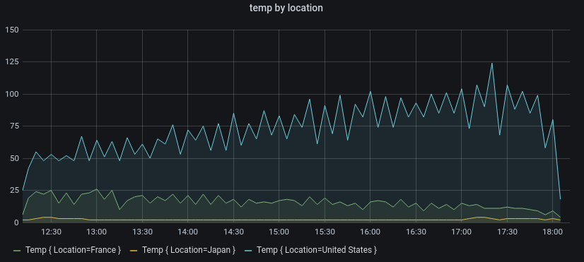

# 时间序列

[TOC]

## 简介

假设您想知道外面的温度在一天中是如何变化的。每小时一次，需要检查温度计并记下时间以及当前温度。一段时间后，会得到这样的结果：

| Time 时间 | Value 值 |
| --------- | -------- |
| 09:00     | 24°C     |
| 10:00     | 26°C     |
| 11:00     | 27°C     |

像这样的温度数据是我们所说的*时间序列*的一个例子，时间序列是按时间排序的一系列测量数据。表中的每一行都表示特定时间的一个单独测量。

当想要识别单个测量值时，表格非常有用，但它们会使您难以看到大局。时间序列更常见的可视化是*图形 graph*，它将每个测量值沿时间轴放置。像图表这样的可视化表示可以更轻松地发现数据的模式和特征，否则这些模式和特征将难以看到。


像示例中的温度数据远非时间序列的唯一示例。时间序列的其他示例包括：

- CPU 和内存使用情况
- 传感器数据
- 股票市场指数

虽然这些示例都是按时间顺序排序的测量序列，但它们也共享其他属性：

- 新数据会定期在末尾附加，例如，每小时 09：00、10：00、11：00 等。
- 测量值在添加后很少更新，例如，昨天的温度不会改变。

时间序列功能强大。它们通过让您分析系统在任何时间点的状态来帮助您了解过去。时间序列可以告诉您，服务器在可用磁盘空间降至零后立即崩溃。

时间序列还可以通过发现数据中的趋势来帮助您预测未来。如果过去几个月注册用户数每月增长 4%，您可以预测年底的用户群将有多大。

某些时间序列具有在已知时间段内重复的模式。例如，温度通常在白天较高，然后在晚上下降。通过识别这些周期性或*季节性*时间序列，您可以对下一个周期做出可靠的预测。如果您知道系统负载在每天 18：00 左右达到峰值，则可以在之前添加更多计算机。

## 聚合时间序列

Depending on what you’re measuring, the data can vary greatly. What if you wanted to compare periods longer than the interval between measurements? 根据你测量的内容，数据可能会有很大差异。如果您想比较长于测量间隔的周期，该怎么办？如果每小时测量一次温度，则每天将得到 24 个数据点。To compare the temperature in August over the years,  you’d have to combine the 31 times 24 data points into one.要比较多年来 8 月的温度，您必须将 31 乘以 24 个数据点合并为一个。

Combining a collection of measurements is called *aggregation*. 组合度量的集合称为 *聚合*。有几种方法可以聚合时间序列数据。以下是一些常见的：

- **Average** 返回所有值的总和除以值的总数。
- **Min** 和 **Max** 返回集合中的最小值和最大值。
- **Sum** 返回集合中所有值的总和。
- **Count** 返回集合中的值数。

例如，通过聚合一个月的数据，您可以确定 2017 年 8 月的平均温度高于前一年。相反，要查看哪个月份的温度最高，您需要比较每个月的最高温度。

选择如何聚合时间序列数据是一个重要的决定，取决于您希望用数据讲述的故事。通常使用不同的聚合以不同的方式可视化相同的时间序列数据。

## 时间序列和监控

在 IT 行业中，通常会收集时间序列数据来监控基础设施、硬件或应用程序事件等内容。机器生成的时间序列数据通常以较短的时间间隔收集，这使您可以在任何意外更改发生后立即做出反应。因此，数据会快速累积，因此必须能够有效地存储和查询数据。因此，针对时间序列数据优化的数据库近年来越来越受欢迎。

### 时间序列数据库

时间序列数据库 （TSDB） 是专门为时间序列数据设计的数据库。虽然可以使用任何常规数据库来存储测量值，但 TSDB 具有一些有用的优化功能。

现代时间序列数据库利用了这样一个事实，即测量值只是附加的，很少更新或删除。例如，每次测量的时间戳随时间变化很小，这会导致存储冗余数据。

看看这个 Unix 时间戳序列：

```bash
1572524345, 1572524375, 1572524404, 1572524434, 1572524464
```

查看这些时间戳，它们都以 `1572524` 开头，导致磁盘空间使用不当。相反，我们可以将每个后续时间戳存储为与第一个时间戳的差值或*增量*：

```bash
1572524345, +30, +29, +30, +30
```

We could even take it a step further, by calculating the deltas of these deltas:
甚至可以更进一步，通过计算这些 delta 的 deltas：

```bash
1572524345, +30, -1, +1, +0
```

If measurements are taken at regular intervals, most of these  delta-of-deltas will be 0. 如果定期进行测量，则大多数 delta-of-delta 将为 0。由于这些优化，TSDB 使用的空间比其他数据库少得多。

TSDB 的另一个功能是能够使用*标签*过滤测量。每个数据点都标有添加上下文信息的标签，例如测量的地点。下面是一个 [InfluxDB 数据格式](https://docs.influxdata.com/influxdb/v1.7/write_protocols/line_protocol_tutorial/#syntax)示例，演示了如何存储每个度量值。

```bash
weather,location=us-midwest temperature=82 1465839830100400200
  |    -------------------- --------------  |
  |             |             |             |
  |             |             |             |
+-----------+--------+-+---------+-+---------+
|measurement|,tag_set| |field_set| |timestamp|
+-----------+--------+-+---------+-+---------+
```

以下是 Grafana 支持的一些 TSDB：

- [Graphite](https://graphiteapp.org/)
- [InfluxDB](https://www.influxdata.com/products/influxdb-overview/)
- [Prometheus](https://prometheus.io/)

### 收集时间序列数据

要收集时间序列数据，您通常会在要监控的设备、计算机或实例上安装*收集器*。有些收集器是针对特定数据库创建的，有些则支持不同的输出目标。

以下是一些收集器的示例：

- [collectd](https://collectd.org/)
- [statsd](https://github.com/statsd/statsd)
- [Prometheus exporters](https://prometheus.io/docs/instrumenting/exporters/)
- [Telegraf](https://github.com/influxdata/telegraf)

收集器要么将数据*推送到*数据库，要么*让数据库从*中提取数据。这两种方法都有自己的优点和缺点：

|      | 优点                               | 缺点                                               |
| ---- | ---------------------------------- | -------------------------------------------------- |
| Push | 更轻松地将数据复制到多个目标。     | TSDB 无法控制发送的数据量。                        |
| Pull | 更好地控制提取的数据量及其真实性。 | 防火墙、VPN 或负载均衡器可能会使访问代理变得困难。 |

由于将每个测量值写入数据库效率低下，因此收集器会预先聚合数据并定期写入时间序列数据库。

## 时间序列维度

With time series data, the data often contain more than a single series, and is a set of multiple time series. 对于时间序列数据，数据通常包含多个序列，并且是一组多个时间序列。许多 Grafana 数据源都支持此类数据。

 

The common case is issuing a single query for a measurement with one or  more additional properties as dimensions. For example, querying a  temperature measurement along with a location property. In this case,  multiple series are returned back from that single query and each series has unique location as a dimension.
常见情况是针对具有一个或多个附加属性作为维度的度量发出单个查询。例如，查询温度测量值以及 location 属性。在这种情况下，将从该单个查询返回多个序列，并且每个序列都具有唯一的维度位置。

To identify unique series within a set of time series, Grafana stores dimensions in *labels*.
为了识别一组时间序列中的唯一序列，Grafana 将维度存储在*标签*中。

### 标签

Grafana 中的每个时间序列都可以选择具有标签。标签是一组用于标识维度的键/值对。示例标签可以是 `{location=us}` 或 `{country=us,state=ma,city=boston}` 。在一组时间序列中，其名称和标签的组合标识每个序列。例如，`temperature {country=us,state=ma,city=boston}` 可以识别美国波士顿市的一系列温度值。

Different sources of time series data have dimensions stored natively, or common  storage patterns that allow the data to be extracted into dimensions.
不同的时间序列数据源具有本地存储的维度，或者允许将数据提取到维度中的常见存储模式。

时间序列数据库 （TSDB） 通常原生支持维度。Prometheus 还将维度存储在*标签*中。在 Graphite 或 OpenTSDB 等 TSDB 中，使用术语 *tags* 代替。

在 SQL 等表数据库中，these dimensions are generally the `GROUP BY` parameters of a query.这些维度通常是查询的 `GROUP BY` 参数。

### 表格格式的多个维度

In SQL or SQL-like databases that return table responses, additional  dimensions are usually represented as columns in the query response  table.
在返回表响应的 SQL 或类似 SQL 的数据库中，其他维度通常表示为查询响应表中的列。

#### 单维度

例如，考虑如下查询：

```sql
SELECT BUCKET(StartTime, 1h), AVG(Temperature) AS Temp, Location FROM T
  GROUP BY BUCKET(StartTime, 1h), Location
  ORDER BY time asc
```

此查询将返回一个包含三列的表，数据类型分别为 time、number 和 string：

| StartTime | Temp | Location |
| --------- | ---- | -------- |
| 09:00     | 24   | LGA      |
| 09:00     | 20   | BOS      |
| 10:00     | 26   | LGA      |
| 10:00     | 22   | BOS      |

The table format is a *long* formatted time series, also called *tall*. It has repeated time stamps, and repeated values in Location. In this  case, we have two time series in the set that would be identified as `Temp {Location=LGA}` and `Temp {Location=BOS}`.
表格格式是*长*格式的时间序列，也称为 *tall*。它具有重复的时间戳，并在 Location 中具有重复的值。在本例中，我们在集中有两个时间序列，它们将被标识为 `Temp {Location=LGA}` 和 `Temp {Location=BOS}`。

Individual time series from the set are extracted by using the time typed column `StartTime` as the time index of the time series, the numeric typed column `Temp` as the series name, and the name and values of the string typed `Location` column to build the labels, such as Location=LGA.
通过使用时间类型列 `StartTime` 作为时间序列的时间索引，使用数字类型列 `Temp` 作为序列名称，并使用字符串类型列 `Location` 列的名称和值来构建标签，例如 Location=LGA，从而从集中提取各个时间序列。

#### 多维度

If the query is updated to select and group by more than just one string column, for example, `GROUP BY BUCKET(StartTime, 1h), Location, Sensor`, then an additional dimension is added:
如果查询更新为按多个字符串列（例如 `GROUP BY BUCKET(StartTime, 1h), Location, Sensor` ）进行 select 和 group，则会添加其他维度：

| StartTime | Temp | Location | Sensor |
| --------- | ---- | -------- | ------ |
| 09:00     | 24   | LGA      | A      |
| 09:00     | 24.1 | LGA      | B      |
| 09:00     | 20   | BOS      | A      |
| 09:00     | 20.2 | BOS      | B      |
| 10:00     | 26   | LGA      | A      |
| 10:00     | 26.1 | LGA      | B      |
| 10:00     | 22   | BOS      | A      |
| 10:00     | 22.2 | BOS      | B      |

In this case the labels that represent the dimensions will have two keys based on the two string typed columns `Location` and `Sensor`. This data results four series:
在这种情况下，表示维度的标签将具有两个键，基于两个字符串类型列 `Location` 和 `Sensor`。此数据生成四个序列： `Temp {Location=LGA,Sensor=A}` ， `Temp {Location=LGA,Sensor=B}` ， `Temp {Location=BOS,Sensor=A}` 和 `Temp {Location=BOS,Sensor=B}` 。

> 注意：
>
> More than one dimension is currently only supported in the Logs queries within the Azure Monitor service as of version 7.1.
>
> 从版本 7.1 开始，目前仅在 Azure Monitor 服务中的日志查询中支持多个维度。

> 注意：
>
> Multiple dimensions are not supported in a way that maps to multiple alerts in  Grafana, but rather they are treated as multiple conditions to a single  alert. 
>
> 在 Grafana 中，不支持映射到多个警报的多个维度，而是将它们视为单个警报的多个条件。

#### 多个值

In the case of SQL-like data sources, more than one numeric column can be  selected, with or without additional string columns to be used as  dimensions.对于类似 SQL 的数据源，可以选择多个数字列，其中包含或不用作维度的其他字符串列。例如， `AVG(Temperature) AS AvgTemp, MAX(Temperature) AS MaxTemp` .This, if combined with multiple dimensions, can result in a lot of  series. 如果与多个维度结合使用，则可能会生成大量序列。选择多个值目前仅用于可视化。