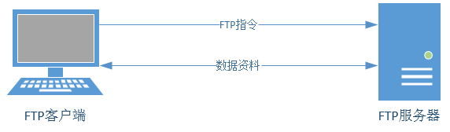

# FTP

[TOC]

FTP，File transfer protocol 的缩写，中文叫文本传输协议，是用于在网络上进行文件传输的一套标准协议，属于网络传输协议的应用层。注意，它是**协议**，不是软件。

基于客户端/服务器模式，默认使用 20、21 号端口，其中端口 20 用于进行数据传输，端口 21 用于接受客户端发出的相关 FTP 命令与参数。FTP 服务器普遍部署于内网中，具有容易搭建、方便管理的特点。而且有些FTP客户端工具还可以支持文件的多点下载以及断点续传技术，因此得到了广大用户的青睐。FTP的传输拓扑如图所示。

 

FTP 服务器是按照 FTP 协议在互联网上提供文件存储和访问服务的主机，FTP 客户端则是向服务器发送连接请求，以建立数据传输链路的主机。

FTP协议有下面两种工作模式：

* **主动模式**：FTP 服务器主动向客户端发起连接请求。
* **被动模式**：FTP 服务器等待客户端发起连接请求（默认工作模式）。

防火墙一般是用于过滤从外网进入内网的流量，因此有些时候需要将FTP的工作模式设置为主动模式，才可以传输数据。
