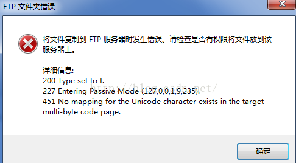

# Error

## FTP

### 报错“451 No mapping for the Unicode character”

通过win7自带的IIS来搭建一个只能实现基本功能的FTP服务器，在上传文件夹或者文件的时候，如果文件夹或者文件名称中英文混和，则会出现以下错误提示框。

​    

**解决：**

1. 打开 控制面板 - “Internet” - Web管理工具 - IIS管理控制台 的 FTP 设置界面，选择“高级设置”
2. 将“允许UTF8”从 “True” 改为 “False”，重新启动服务器， 即可解决。