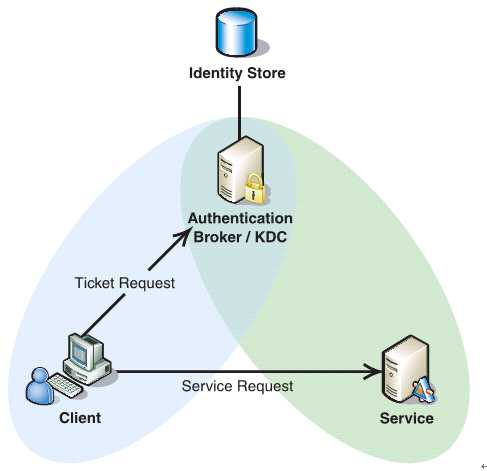
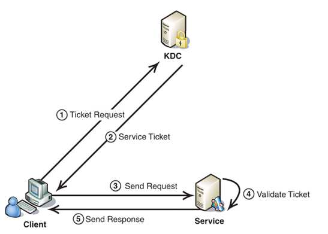

# Kerberos
Kerberos协议主要用于计算机网络的身份鉴别(Authentication), 其特点是用户只需输入一次身份验证信息就可以凭借此验证获得的票据(ticket-granting ticket)访问多个服务，即SSO(Single Sign On)。由于在每个Client和Service之间建立了共享密钥，使得该协议具有相当的安全性。


# 如何安装 Kerberos 服务器

For this discussion, we will create an MIT Kerberos domain with the following features (edit them to fit your needs):
在本次讨论中，我们将创建一个具有以下功能的 MIT Kerberos 域（编辑它们以满足您的需求）：

- **Realm**: `EXAMPLE.COM` 领域： `EXAMPLE.COM` 
- **Primary KDC**: `kdc01.example.com` 主要 KDC： `kdc01.example.com` 
- **Secondary KDC**: `kdc02.example.com` 次级 KDC： `kdc02.example.com` 
- **User principal**: `ubuntu`
  用户主体： `ubuntu` 
- **Admin principal**: `ubuntu/admin`
  管理员负责人： `ubuntu/admin` 

## Prerequisites 先决条件

Before installing the Kerberos server, a **properly configured DNS server** is needed for your domain. Since the Kerberos realm (by convention) matches the domain name, this section uses the `EXAMPLE.COM` domain configured in the [primary server section](https://ubuntu.com/server/docs/domain-name-service-dns#heading--dns-primarymaster-configuration) of the DNS documentation.
在安装 Kerberos 服务器之前，需要为您的域正确配置 DNS 服务器。由于 Kerberos 领域（按照约定）与域名匹配，因此本节使用 DNS 文档的主服务器部分中配置的 `EXAMPLE.COM` 域。

Also, Kerberos is a time sensitive protocol. If the local system time between a client machine and the server differs by more than five minutes (by  default), the workstation will not be able to authenticate. To correct  the problem all hosts should have their time synchronized using the same Network Time Protocol (NTP) server. Check out the [NTP chapter](https://ubuntu.com/server/docs/about-time-synchronisation) for more details.
此外，Kerberos  是一种时间敏感协议。如果客户端计算机和服务器之间的本地系统时间相差超过五分钟（默认情况下），则工作站将无法进行身份验证。要解决此问题，所有主机都应使用相同的网络时间协议 （NTP） 服务器同步其时间。有关更多详细信息，请查看 NTP 章节。

## Install the Kerberos packages 安装 Kerberos 软件包

The first step in creating a Kerberos realm is to install the `krb5-kdc` and `krb5-admin-server` packages. From a terminal enter:
创建 Kerberos 领域的第一步是安装 `krb5-kdc` and `krb5-admin-server` 包。从终端输入：

```bash
sudo apt install krb5-kdc krb5-admin-server
```

You will be asked at the end of the install to supply the hostname for the  Kerberos and Admin servers for the realm, which may or may not be the  same server. Since we are going to create the realm, and thus these  servers, type in the full hostname of this server.
在安装结束时，系统将要求您提供该领域的 Kerberos 和管理服务器的主机名，它们可能是也可能不是同一台服务器。由于我们将创建领域，从而创建这些服务器，因此请键入此服务器的完整主机名。

> **Note**: 注意：
>  By default the realm name will be domain name of the Key Distribution Center (KDC) server.
> 默认情况下，领域名称将是密钥分发中心 （KDC） 服务器的域名。

Next, create the new realm with the `kdb5_newrealm` utility:
接下来，使用 `kdb5_newrealm` 以下实用程序创建新领域：

```bash
sudo krb5_newrealm
```

It will ask you for a database master password, which is used to encrypt  the local database. Chose a secure password: its strength is not  verified for you.
它将要求您输入数据库主密码，该密码用于加密本地数据库。选择安全密码：其强度不会为您验证。

## Configure the Kerberos server 配置 Kerberos 服务器

The questions asked during installation are used to configure the `/etc/krb5.conf` and `/etc/krb5kdc/kdc.conf` files. The former is used by the Kerberos 5 libraries, and the latter  configures the KDC. If you need to adjust the KDC settings, edit the  file and restart the `krb5-kdc` daemon. If you need to reconfigure Kerberos from scratch, perhaps to change the realm name, you can do so by typing:
安装过程中提出的问题用于配置 `/etc/krb5.conf` and `/etc/krb5kdc/kdc.conf` 文件。前者由 Kerberos 5 库使用，后者配置 KDC。如果需要调整 KDC 设置，请编辑文件并重新启动 `krb5-kdc` 守护程序。如果您需要从头开始重新配置 Kerberos，也许要更改领域名称，您可以通过键入以下命令来实现：

```bash
sudo dpkg-reconfigure krb5-kdc
```

> **Note**: 注意：
>  The manpage for `krb5.conf` is in the `krb5-doc` package.
> 的 `krb5.conf` 手册页位于包中 `krb5-doc` 。

Let’s create our first principal. Since there is no principal create yet, we need to use `kadmin.local`, which uses a local UNIX socket to talk to the KDC, and requires root privileges:
让我们创建第一个主体。由于还没有主体创建，我们需要使用 `kadmin.local` ，它使用本地 UNIX 套接字与 KDC 通信，并且需要 root 权限：

```bash
$ sudo kadmin.local
Authenticating as principal root/admin@EXAMPLE.COM with password.
kadmin.local: addprinc ubuntu
WARNING: no policy specified for ubuntu@EXAMPLE.COM; defaulting to no policy
Enter password for principal "ubuntu@EXAMPLE.COM": 
Re-enter password for principal "ubuntu@EXAMPLE.COM": 
Principal "ubuntu@EXAMPLE.COM" created.
kadmin.local: quit
```

To be able to use `kadmin` remotely, we should create an **admin principal**. Convention suggests it should be an **admin instance**, as that also makes creating a generic Access Control List (ACL) easier. Let’s create an admin instance for the `ubuntu` principal:
为了能够远程使用 `kadmin` ，我们应该创建一个管理员主体。约定建议它应该是一个管理实例，因为这也使创建通用访问控制列表 （ACL） 变得更加容易。让我们为 `ubuntu` 主体创建一个管理实例：

```bash
$ sudo kadmin.local
Authenticating as principal root/admin@EXAMPLE.COM with password.
kadmin.local: addprinc ubuntu/admin
WARNING: no policy specified for ubuntu/admin@EXAMPLE.COM; defaulting to no policy
Enter password for principal "ubuntu/admin@EXAMPLE.COM": 
Re-enter password for principal "ubuntu/admin@EXAMPLE.COM": 
Principal "ubuntu/admin@EXAMPLE.COM" created.
kadmin.local: quit
```

Next, the new admin principal needs to have the appropriate ACL permissions. The permissions are configured in the `/etc/krb5kdc/kadm5.acl` file:
接下来，新的管理员主体需要具有适当的 ACL 权限。 `/etc/krb5kdc/kadm5.acl` 权限在文件中配置：

```bash
ubuntu/admin@EXAMPLE.COM        *
```

You can also use a more generic form for this ACL:
您还可以为此 ACL 使用更通用的表单：

```bash
*/admin@EXAMPLE.COM        *
```

The above will grant all privileges to any admin instance of a principal. See the [`kadm5.acl` manpage](http://manpages.ubuntu.com/manpages/jammy/man5/kadm5.acl.5.html) for details.
上述内容将向主体的任何管理实例授予所有权限。有关详细信息， `kadm5.acl` 请参阅手册页。

Now restart the `krb5-admin-server` for the new ACL to take effect:
现在重新启动 要 `krb5-admin-server` 使新 ACL 生效：

```bash
sudo systemctl restart krb5-admin-server.service
```

The new user principal can be tested using the `kinit` utility:
可以使用以下 `kinit` 实用程序测试新的用户主体：

```bash
$ kinit ubuntu/admin
Password for ubuntu/admin@EXAMPLE.COM:
```

After entering the password, use the `klist` utility to view information about the Ticket Granting Ticket (TGT):
输入密码后，使用 `klist` 该实用程序查看有关票证授予票证 （TGT） 的信息：

```bash
$ klist
Ticket cache: FILE:/tmp/krb5cc_1000
Default principal: ubuntu/admin@EXAMPLE.COM

Valid starting     Expires            Service principal
04/03/20 19:16:57  04/04/20 05:16:57  krbtgt/EXAMPLE.COM@EXAMPLE.COM
     renew until 04/04/20 19:16:55
```

Where the cache filename `krb5cc_1000` is composed of the prefix `krb5cc_` and the user id (UID), which in this case is `1000`.
其中缓存文件名 `krb5cc_1000` 由前缀 `krb5cc_` 和用户 ID （UID） 组成，在本例中为 `1000` .

`kinit` will inspect `/etc/krb5.conf` to find out which KDC to contact, and the corresponding address. The  KDC can also be found via DNS lookups for special TXT and SRV records.  You can add these records to your `example.com` DNS zone:
 `kinit` 将检查 `/etc/krb5.conf` 以找出要联系的 KDC 以及相应的地址。还可以通过 DNS 查找特殊 TXT 和 SRV 记录来找到 KDC。您可以将以下记录添加到 `example.com` DNS 区域：

```plaintext
_kerberos._udp.EXAMPLE.COM.     IN SRV 1  0 88  kdc01.example.com.
_kerberos._tcp.EXAMPLE.COM.     IN SRV 1  0 88  kdc01.example.com.
_kerberos._udp.EXAMPLE.COM.     IN SRV 10 0 88  kdc02.example.com. 
_kerberos._tcp.EXAMPLE.COM.     IN SRV 10 0 88  kdc02.example.com. 
_kerberos-adm._tcp.EXAMPLE.COM. IN SRV 1  0 749 kdc01.example.com.
_kpasswd._udp.EXAMPLE.COM.      IN SRV 1  0 464 kdc01.example.com.
```

See the [DNS chapter](https://ubuntu.com/server/docs/domain-name-service-dns) for detailed instructions on setting up DNS.
有关设置 DNS 的详细说明，请参阅 DNS 一章。

A very quick and useful way to troubleshoot what `kinit` is doing is to set the environment variable `KRB5_TRACE` to a file, or `stderr`, and it will show extra information. The output is quite verbose:
对正在执行的 `kinit` 操作进行故障排除的一个非常快速且有用的方法是将环境变量 `KRB5_TRACE` 设置为文件或 `stderr` ，它将显示额外的信息。输出非常冗长：

```bash
$ KRB5_TRACE=/dev/stderr kinit ubuntu/admin
[2898] 1585941845.278578: Getting initial credentials for ubuntu/admin@EXAMPLE.COM
[2898] 1585941845.278580: Sending unauthenticated request
[2898] 1585941845.278581: Sending request (189 bytes) to EXAMPLE.COM
[2898] 1585941845.278582: Resolving hostname kdc01.example.com
(...)
```

Your new Kerberos realm is now ready to authenticate clients.
您的新 Kerberos 领域现在已准备好对客户端进行身份验证。

# How to configure Kerberos service principals 如何配置 Kerberos 服务主体

The specific steps to enable Kerberos for a service can vary, but in general both of the following are needed:
为服务启用 Kerberos 的具体步骤可能会有所不同，但通常需要满足以下两个步骤：

- A principal for the service – usually `service/host@REALM`
  服务的主体 - 通常 `service/host@REALM` 
- A keytab accessible to the service wherever it’s running – usually in `/etc/krb5.keytab`
  无论服务在何处运行，都可以访问的密钥表 - 通常在 `/etc/krb5.keytab` 

For example, let’s create a principal for an LDAP service running on the `ldap-server.example.com` host:
例如，让我们为 `ldap-server.example.com` 主机上运行的 LDAP 服务创建一个主体：

```bash
ubuntu@ldap-server:~$ sudo kadmin -p ubuntu/admin
Authenticating as principal ubuntu/admin with password.
Password for ubuntu/admin@EXAMPLE.COM:
kadmin:  addprinc -randkey ldap/ldap-server.example.com
No policy specified for ldap/ldap-server.example.com@EXAMPLE.COM; defaulting to no policy
Principal "ldap/ldap-server.example.com@EXAMPLE.COM" created.
```

Let’s dig a bit into what is happening here:
让我们深入了解一下这里发生的事情：

- The `kadmin` command is being run on the `ldap-server` machine, not on the Key Distribution Center (KDC). We are using `kadmin` remotely.
  该 `kadmin` 命令是在 `ldap-server` 计算机上运行的，而不是在密钥分发中心 （KDC） 上运行的。我们正在远程使用 `kadmin` 。
- It’s being run with `sudo`. The reason for this will become clear later.
  它正在运行 `sudo` 。其原因稍后会变得清晰。
- We are logged in on the server as `ubuntu`, but specifying an `ubuntu/admin` principal. Remember the `ubuntu` principal has no special privileges.
  我们以 `ubuntu` ，但指定了 `ubuntu/admin` 主体。请记住， `ubuntu` 校长没有特权。
- The name of the principal we are creating follows the pattern `service/hostname`.
  我们正在创建的主体的名称遵循以下模式 `service/hostname` 。
- In order to select a random secret, we pass the `-randkey` parameter. Otherwise we would be asked to type in a password.
  为了选择一个随机密钥，我们传递参数 `-randkey` 。否则，我们会被要求输入密码。

With the principal created, we need to extract the key from the KDC and store it in the `ldap-server` host, so that the `ldap` service can use it to authenticate itself with the KDC. Still in the same `kadmin` session:
创建主体后，我们需要从 KDC 中提取密钥并将其存储在主机中 `ldap-server` ，以便 `ldap` 服务可以使用它向 KDC 进行身份验证。仍然在同一个 `kadmin` 会话中：

```plaintext
kadmin:  ktadd ldap/ldap-server.example.com
Entry for principal ldap/ldap-server.example.com with kvno 2, encryption type aes256-cts-hmac-sha1-96 added to keytab FILE:/etc/krb5.keytab.
Entry for principal ldap/ldap-server.example.com with kvno 2, encryption type aes128-cts-hmac-sha1-96 added to keytab FILE:/etc/krb5.keytab.
```

This is why we needed to run `kadmin` with `sudo`: so that it can write to `/etc/krb5.keytab`. This is the system keytab file, which is the default file for all keys  that might be needed for services on this host, and we can list them  with `klist`. Back in the shell:
这就是为什么我们需要使用 ： 运行 `kadmin` `sudo` ，以便它可以写入 `/etc/krb5.keytab` 。这是系统密钥表文件，它是此主机上服务可能需要的所有密钥的默认文件，我们可以用 `klist` 列出它们。回到外壳中：

```bash
$ sudo klist -k
Keytab name: FILE:/etc/krb5.keytab
KVNO Principal
---- --------------------------------------------------------------------------
   2 ldap/ldap-server.example.com@EXAMPLE.COM
   2 ldap/ldap-server.example.com@EXAMPLE.COM
```

If you don’t have the `kadmin` utility on the target host, one alternative is to extract the keys on a different host and into a different file, and then transfer this file *securely* to the target server. For example:
如果目标主机上没有该 `kadmin` 实用程序，另一种方法是将密钥提取到其他主机上并提取到其他文件中，然后将此文件安全地传输到目标服务器。例如：

```plaintext
kadmin:  ktadd -k /home/ubuntu/ldap.keytab ldap/ldap-server.example.com
Entry for principal ldap/ldap-server.example.com with kvno 3, encryption type aes256-cts-hmac-sha1-96 added to keytab WRFILE:/home/ubuntu/ldap.keytab.
Entry for principal ldap/ldap-server.example.com with kvno 3, encryption type aes128-cts-hmac-sha1-96 added to keytab WRFILE:/home/ubuntu/ldap.keytab.
```

> **Note**: 注意：
>  Notice how the `kvno` changed from `2` to `3` in the example above, when using `ktadd` a second time? This is the key version, and it invalidated the previously extracted key with `kvno 2`. Every time a key is extracted with `ktadd`, its version is bumped and that invalidates the previous ones!
> 请注意，在第二次使用 `ktadd` 时，上面示例中的 `2` to `3` 是如何 `kvno` 更改的？这是密钥版本，它使之前提取的密钥失 `kvno 2` 效。每次提取密钥时 `ktadd` ，其版本都会被颠簸，从而使以前的版本失效！

In this case, as long as the target location is writable, you don’t even have to run `kadmin` with `sudo`.
在这种情况下，只要目标位置是可写的，您甚至不必 `kadmin` 使用 `sudo` .

Then use `scp` to transfer it to the target host:
然后用于 `scp` 将其传输到目标主机：

```bash
$ scp /home/ubuntu/ldap.keytab ldap-server.example.com:
```

And over there copy it to `/etc/krb5.keytab`, making sure it’s mode `0600` and owned by `root:root`.
然后在那里将其复制到 `/etc/krb5.keytab` ，确保它是模式 `0600` 并归 `root:root` 所有。

# Kerberos encryption types Kerberos 加密类型

Encryption is at the heart of Kerberos, and it supports multiple cryptographic  algorithms. The default choices are good enough for most deployments,  but specific situations might need to tweak these settings.
加密是 Kerberos 的核心，它支持多种加密算法。默认选项对于大多数部署来说已经足够好了，但特定情况可能需要调整这些设置。

This document will explain the basic configuration parameters of Kerberos  that control the selection of encryption algorithms used in a Kerberos  deployment.
本文档将介绍 Kerberos 的基本配置参数，这些参数控制 Kerberos 部署中使用的加密算法的选择。

## Server-side configuration 服务器端配置

There are two main server-side configuration parameters that control the  encryption types used on the server for its database and its collection  or principals. Both exist in `/etc/krb5kdc/kdc.conf` inside the `[realms]` section and are as follows:
有两个主要的服务器端配置参数，用于控制服务器上用于其数据库及其集合或主体的加密类型。两者都存在于本节 `/etc/krb5kdc/kdc.conf`  `[realms]` 中，如下所示：

- `master_key_type`
   Specifies the key type of the master key. This is used to encrypt the database, and the default is `aes256-cts-hmac-sha1-96`.
  指定主密钥的密钥类型。这用于加密数据库，默认值为 `aes256-cts-hmac-sha1-96` 。
- `supported_enctypes`
   Specifies the default key/salt combinations of principals for this realm. The default is `aes256-cts-hmac-sha1-96:normal aes128-cts-hmac-sha1-96:normal`, and the encryption types should be listed in order of preference.
  指定此领域的主体的默认键/盐组合。默认值为 `aes256-cts-hmac-sha1-96:normal aes128-cts-hmac-sha1-96:normal` ，加密类型应按优先顺序列出。

Possible values for the encryption algorithms are listed in the [MIT documentation on encryption types](https://web.mit.edu/kerberos/krb5-latest/doc/admin/conf_files/kdc_conf.html#encryption-types), and the salt types can be seen [in the MIT keysalt lists](https://web.mit.edu/kerberos/krb5-latest/doc/admin/conf_files/kdc_conf.html#keysalt-lists).
有关加密类型的 MIT 文档中列出了加密算法的可能值，并且可以在 MIT 密钥盐列表中查看 salt 类型。

Here is an example showing the default values (other settings removed for brevity):
下面是一个显示默认值的示例（为简洁起见，删除了其他设置）：

```plaintext
[realms]
    EXAMPLE.INTERNAL = {
        (...)
        master_key_type = aes256-cts
        supported_enctypes = aes256-cts-hmac-sha1-96:normal aes128-cts-hmac-sha1-96:normal
        (...)
}
```

The master key is created once per realm, when the realm is bootstrapped. That is usually done with the `krb5_newrealm` tool (see [how to install a Kerberos server](https://ubuntu.com/server/docs/how-to-install-a-kerberos-server) for details). You can check the master key type with either of these commands on the KDC server:
主密钥在引导领域时，每个领域创建一次主密钥。这通常是通过该 `krb5_newrealm` 工具完成的（有关详细信息，请参阅如何安装 Kerberos 服务器）。您可以在 KDC 服务器上使用以下任一命令检查主密钥类型：

```bash
$ sudo kadmin.local
kadmin.local:  getprinc K/M
Principal: K/M@EXAMPLE.INTERNAL
(...)
Number of keys: 1
Key: vno 1, aes256-cts-hmac-sha1-96
(...)

$ sudo klist -ke /etc/krb5kdc/stash
Keytab name: FILE:/etc/krb5kdc/stash
KVNO Principal
---- --------------------------------------------------------------------------
   1 K/M@EXAMPLE.INTERNAL (aes256-cts-hmac-sha1-96) 
```

When a new Kerberos principal is created through the `kadmind` service (via the `kadmin` or `kadmin.local` utilities), the types of encryption keys it will get are controlled via the `supported_enctypes` configuration parameter.
通过 `kadmind` 服务（通过 `kadmin` or `kadmin.local` 实用程序）创建新的 Kerberos 主体时，将通过 `supported_enctypes` 配置参数控制其获取的加密密钥类型。

For example, let’s create an `ubuntu` principal, and check the keys that were created for it (output abbreviated):
例如，让我们创建一个 `ubuntu` 主体，并检查为其创建的键（输出缩写）：

```bash
$ sudo kadmin.local
Authenticating as principal root/admin@EXAMPLE.INTERNAL with password.
kadmin.local:  addprinc ubuntu
No policy specified for ubuntu@EXAMPLE.INTERNAL; defaulting to no policy
Enter password for principal "ubuntu@EXAMPLE.INTERNAL":
Re-enter password for principal "ubuntu@EXAMPLE.INTERNAL":
Principal "ubuntu@EXAMPLE.INTERNAL" created.

kadmin.local:  getprinc ubuntu
Principal: ubuntu@EXAMPLE.INTERNAL
(...)
Number of keys: 2
Key: vno 1, aes256-cts-hmac-sha1-96
Key: vno 1, aes128-cts-hmac-sha1-96
(...)
```

Two keys were created for the `ubuntu` principal, following the default setting of `supported_enctypes` in `kdc.conf` for this realm.
按照此领域的 `supported_enctypes` 默认设置 in `kdc.conf` ，为 `ubuntu` 主体创建了两个密钥。

> **Note**: 注意：
>  The server config `supported_enctypes` has the *default* list of key types that are created for a principal. This list applies to the moment when that principal is **created** by `kadmind`. Changing that setting after the fact won’t affect the keys that the  principal in question has after that event. In particular, principals  can be created with specific key types regardless of the `supported_enctypes` setting. See the `-e` parameter for the [kadmin add_principal command](https://web.mit.edu/kerberos/krb5-latest/doc/admin/database.html#add-principal).
> 服务器配置 `supported_enctypes` 具有为主体创建的密钥类型的默认列表。此列表适用于由 `kadmind` 创建该主体的时刻。事后更改该设置不会影响相关主体在该事件后拥有的密钥。具体而言，无论设置如何 `supported_enctypes` ，都可以使用特定的密钥类型创建主体。请参阅 kadmin add_principal 命令的 `-e` 参数。

If we had `supported_enctypes` set to `aes256-sha2:normal aes128-sha2:normal camellia256-cts:normal` in `kdc.conf`, then the `ubuntu` principal would get three key types:
如果我们 `supported_enctypes` 设置为 `aes256-sha2:normal aes128-sha2:normal camellia256-cts:normal` in `kdc.conf` ，则 `ubuntu` 主体将获得三种密钥类型：

```plaintext
kadmin.local:  getprinc ubuntu
Principal: ubuntu@EXAMPLE.INTERNAL
(...)
Number of keys: 3
Key: vno 1, aes256-cts-hmac-sha384-192
Key: vno 1, aes128-cts-hmac-sha256-128
Key: vno 1, camellia256-cts-cmac
```

> **Note**: 注意：
>  Bootstrapping a new Kerberos realm via the `krb5_newrealm` command also creates some system principals required by Kerberos, such as `kadmin/admin`, `kadmin/changepw` and others. They will all also get the same number of keys each: one per encryption type in `supported_enctypes`.
> 通过 `krb5_newrealm` 命令引导新的 Kerberos 领域还会创建 Kerberos 所需的一些系统主体，例如 `kadmin/admin` 等 `kadmin/changepw` 。它们还将分别获得相同数量的密钥：每种加密类型 1 个 `supported_enctypes` 。

## Client-side configuration 客户端配置

When we say “client-side”, we really mean “applications linked with the  Kerberos libraries”. These live on the server too, so keep that in mind.
当我们说“客户端”时，我们实际上是指“与Kerberos库链接的应用程序”。这些也存在于服务器上，所以请记住这一点。

The encryption types supported by the Kerberos libraries are defined in the `/etc/krb5.conf` file, inside the `[libdefaults]` section, via the `permitted_enctypes` parameter.
Kerberos 库支持的加密类型通过 `permitted_enctypes` 参数在 `/etc/krb5.conf`  `[libdefaults]` 文件部分内定义。

Example: 例：

```plaintext
[libdefaults]
(...)
permitted_enctypes = aes256-cts-hmac-sha1-96 aes128-cts-hmac-sha1-96
```

This parameter contains a space-separated list of encryption type names, in order of preference. Default value: `aes256-cts-hmac-sha1-96 aes128-cts-hmac-sha1-96 aes256-cts-hmac-sha384-192  aes128-cts-hmac-sha256-128 des3-cbc-sha1 arcfour-hmac-md5  camellia256-cts-cmac camellia128-cts-cmac`.
此参数包含按首选项顺序分隔的加密类型名称列表。默认值： `aes256-cts-hmac-sha1-96 aes128-cts-hmac-sha1-96 aes256-cts-hmac-sha384-192  aes128-cts-hmac-sha256-128 des3-cbc-sha1 arcfour-hmac-md5  camellia256-cts-cmac camellia128-cts-cmac` .

Possible values for the encryption algorithms are listed in [the MIT documentation](https://web.mit.edu/kerberos/krb5-latest/doc/admin/conf_files/kdc_conf.html#encryption-types) (same ones as for the KDC).
MIT 文档中列出了加密算法的可能值（与 KDC 的值相同）。

> **Note**: 注意：
>  There are more encryption-related parameters in `krb5.conf`, but most take their defaults from `permitted_enctypes`. See the [MIT libdefaults documentation](https://web.mit.edu/kerberos/krb5-latest/doc/admin/conf_files/krb5_conf.html#libdefaults) for more information.
> 中 `krb5.conf` 还有更多与加密相关的参数，但大多数参数的默认值取自 `permitted_enctypes` 。有关更多信息，请参阅 MIT libdefaults 文档。

## Putting it all together 把它们放在一起

When a client performs Kerberos authentication and requests a ticket from  the KDC, the encryption type used in that ticket is decided by picking  the common set of:
当客户端执行 Kerberos 身份验证并从 KDC 请求票证时，该票证中使用的加密类型是通过选择以下公共集来决定的：

- The encryption types supported by the server for that principal
  服务器支持该主体的加密类型
- The encryption types supported by the client
  客户端支持的加密类型

If there is no common algorithm between what the client accepts, and what  the server has to offer for that specific principal, then `kinit` will fail.
如果客户端接受的内容与服务器必须为该特定主体提供的内容之间没有通用算法，则 `kinit` 将失败。

For example, if the principal on the server has:
例如，如果服务器上的主体具有：

```plaintext
kadmin.local:  getprinc ubuntu
Principal: ubuntu@EXAMPLE.INTERNAL
(...)
Number of keys: 2
Key: vno 1, aes256-cts-hmac-sha384-192
Key: vno 1, aes128-cts-hmac-sha256-128
```

And the client’s `krb5.conf` has:
客户 `krb5.conf` 有：

```plaintext
permitted_enctypes = aes256-sha1 aes128-sha1
```

Then `kinit` will fail, because the client only supports `sha1` variants, and the server only has `sha2` to offer for that particular principal the client is requesting:
然后 `kinit` 将失败，因为客户端仅支持 `sha1` 变体，并且服务器只需要 `sha2` 为客户端请求的特定主体提供：

```bash
$ kinit ubuntu

kinit: Generic error (see e-text) while getting initial credentials
```

The server log (`journalctl -u krb5-admin-server.service`) will have more details about the error:
服务器日志 （ `journalctl -u krb5-admin-server.service` ） 将包含有关该错误的更多详细信息：

```plaintext
Apr 19 19:31:49 j-kdc krb5kdc[8597]: AS_REQ (2 etypes {aes256-cts-hmac-sha1-96(18), aes128-cts-hmac-sha1-96(17)}) fd42:78f4:b1c4:3964:216:3eff:feda:118c: GET_LOCAL_TGT: ubuntu@EXAMPLE.INTERNAL for krbtgt/EXAMPLE.INTERNAL@EXAMPLE.INTERNAL, No matching key in entry having a permitted enctype
```

This log says that there was an `AS-REQ` request which accepted two encryption types, but there was no matching key type on the server database for that principal.
此日志显示有一个 `AS-REQ` 请求接受两种加密类型，但该主体的服务器数据库上没有匹配的密钥类型。

## Changing encryption types 更改加密类型

Changing encryption types of an existing Kerberos realm is no small task. Just  changing the configuration settings won’t recreate existing keys, nor  add new ones. The modifications have to be done in incremental steps.
更改现有 Kerberos 领域的加密类型并非易事。仅更改配置设置不会重新创建现有密钥，也不会添加新密钥。修改必须以渐进步骤进行。

MIT Kerberos has a [guide on updating encryption types](https://web.mit.edu/kerberos/krb5-latest/doc/admin/enctypes.html#migrating-away-from-older-encryption-types) that covers many scenarios, including deployments with multiple replicating servers:
MIT Kerberos 有一个关于更新加密类型的指南，该指南涵盖了许多方案，包括具有多个复制服务器的部署：

## References 引用

- [Encryption types in MIT Kerberos
  MIT Kerberos 中的加密类型](https://web.mit.edu/kerberos/krb5-latest/doc/admin/enctypes.html)
- [`krb5.conf` encryption related configurations options
   `krb5.conf` 加密相关配置选项](https://web.mit.edu/kerberos/krb5-latest/doc/admin/enctypes.html#configuration-variables)
- [Migrating away from older encryption types
  从较旧的加密类型迁移](https://web.mit.edu/kerberos/krb5-latest/doc/admin/enctypes.html#migrating-away-from-older-encryption-types)
- [`kdc.conf` manpage `kdc.conf` 手册页](https://manpages.ubuntu.com/manpages/jammy/man5/kdc.conf.5.html)
- [`krb5.conf` manpage `krb5.conf` 手册页](https://manpages.ubuntu.com/manpages/jammy/man5/krb5.conf.5.html)
- [Kerberos V5 concepts Kerberos V5 概念](https://web.mit.edu/kerberos/krb5-latest/doc/basic/index.html)


# How to set up a secondary KDC 如何设置辅助 KDC

Once you have one Key Distribution Center (KDC) on your network, it is good  practice to have a secondary KDC in case the primary becomes  unavailable.
在网络上有一个密钥分发中心 （KDC） 后，最好有一个辅助 KDC，以防主 KDC 不可用。

Also, if you have Kerberos clients that are on different networks (possibly  separated by routers using NAT), it is wise to place a secondary KDC in  each of those networks.
此外，如果您的 Kerberos 客户端位于不同的网络上（可能由使用 NAT 的路由器分隔），则明智的做法是在每个网络中放置辅助 KDC。

> **Note**: 注意：
>  The native replication mechanism explained here relies on a cron job; it essentially dumps the DB on the primary and loads it back up on the  secondary. You may want to take a look at using the `kldap` backend, which can use the OpenLDAP replication mechanism. This is explained further below.
> 这里解释的本机复制机制依赖于 cron 作业;它实质上是将数据库转储到主数据库上，并将其加载回辅助数据库上。您可能需要了解如何使用 `kldap` 后端，它可以使用 OpenLDAP 复制机制。下面将对此进行进一步解释。

## Install the required packages 安装所需的软件包

First, install the packages, and when asked for the Kerberos and Admin server names enter the name of the Primary KDC:
首先，安装软件包，当要求输入 Kerberos 和管理服务器名称时，输入主 KDC 的名称：

```bash
sudo apt install krb5-kdc krb5-admin-server
```

Once you have installed the packages, create the host principals for both KDCs. From a terminal prompt, enter:
安装包后，为两个 KDC 创建主机主体。在终端提示符下，输入：

```bash
$ kadmin -q "addprinc -randkey host/kdc01.example.com"
$ kadmin -q "addprinc -randkey host/kdc02.example.com"
```

> **Note**: 注意：
>  The `kadmin` command defaults to using a principal like `username/admin@EXAMPLE.COM`, where `username` is your current shell user. If you need to override that, use `-p <principal-you-want>`.
> 该 `kadmin` 命令默认使用主体，例如 `username/admin@EXAMPLE.COM` ，其中 `username` 当前 shell 用户。如果需要覆盖它，请使用 `-p <principal-you-want>` .

Extract the **key file** for the `kdc02` principal, which is the server we are on:
提取 `kdc02` 主体的密钥文件，主体是我们所在的服务器：

```bash
$ sudo kadmin -p ubuntu/admin -q "ktadd host/kdc02.example.com"
```

Next, there needs to be a `kpropd.acl` file on each KDC that lists all KDCs for the realm. For example, on both the **primary and secondary KDC**, create `/etc/krb5kdc/kpropd.acl`:
接下来，每个 KDC 上都需要有一个 `kpropd.acl` 文件，其中列出了该领域的所有 KDC。例如，在主 KDC 和辅助 KDC 上，创建 `/etc/krb5kdc/kpropd.acl` ：

```plaintext
host/kdc01.example.com@EXAMPLE.COM
host/kdc02.example.com@EXAMPLE.COM
```

> **Note**: 注意：
>  It’s customary to allow both KDCs because one may want to switch their  roles if one goes bad. For such an eventuality, both are already listed  here.
> 习惯上允许两个 KDC，因为如果一个 KDC 坏了，一个人可能想要切换他们的角色。对于这种可能性，两者都已经在此处列出。

Create an empty database on the **secondary KDC**:
在辅助 KDC 上创建一个空数据库：

```bash
$ sudo kdb5_util create -s
```

Now install `kpropd` daemon, which listens for connections from the `kprop` utility from the **primary KDC**:
现在安装 `kpropd` 守护程序，它侦听来自主 KDC 的 `kprop` 实用程序的连接：

```bash
$ sudo apt install krb5-kpropd
```

The service will be running immediately after installation.
该服务将在安装后立即运行。

From a terminal on the **primary KDC**, create a dump file of the principal database:
在主 KDC 上的终端中，创建主体数据库的转储文件：

```bash
$ sudo kdb5_util dump /var/lib/krb5kdc/dump
```

Still on the **Primary KDC**, extract its **key**:
仍在主 KDC 上，提取其密钥：

```bash
$ sudo kadmin.local -q "ktadd host/kdc01.example.com"
```

On the **primary KDC**, run the `kprop` utility to push the database dump made before to the secondary KDC:
在主 KDC 上，运行 `kprop` 实用程序以将之前创建的数据库转储推送到辅助 KDC：

```bash
$ sudo kprop -r EXAMPLE.COM -f /var/lib/krb5kdc/dump kdc02.example.com
Database propagation to kdc02.example.com: SUCCEEDED
```

Note the `SUCCEEDED` message, which signals that the propagation worked. If there is an error message, check `/var/log/syslog` on the secondary KDC for more information.
请注意该 `SUCCEEDED` 消息，该消息表示传播有效。如果出现错误消息，请检查 `/var/log/syslog` 辅助 KDC 以获取更多信息。

You may also want to create a cron job to periodically update the database on the **secondary KDC**. For example, the following will push the database every hour:
您可能还需要创建一个 cron 作业来定期更新辅助 KDC 上的数据库。例如，以下内容将每小时推送一次数据库：

```bash
# m h  dom mon dow   command
0 * * * * root /usr/sbin/kdb5_util dump /var/lib/krb5kdc/dump && /usr/sbin/kprop -r EXAMPLE.COM -f /var/lib/krb5kdc/dump kdc02.example.com
```

Finally, start the `krb5-kdc` daemon on the **secondary KDC**:
最后，在辅助 KDC 上启动 `krb5-kdc` 守护程序：

```bash
$ sudo systemctl start krb5-kdc.service
```

> **Note**: 注意：
>  The secondary KDC does not run an admin server, since it’s a read-only copy.
> 辅助 KDC 不运行管理服务器，因为它是只读副本。

From now on, you can specify both KDC servers in `/etc/krb5.conf` for the `EXAMPLE.COM` realm, in any host participating in this realm (including `kdc01` and `kdc02`), but remember that there can only be one admin server and that’s the one running on `kdc01`:
从现在开始，您可以在参与此领域的任何主机（包括 `kdc01` 和 ）中 `/etc/krb5.conf` 为 `EXAMPLE.COM` 该领域指定两个 KDC 服务器，但请记住，只能有一个管理服务器，那就是运行在 `kdc01` 以下位置的 `kdc02` 服务器：

```plaintext
[realms]
    EXAMPLE.COM = {
            kdc = kdc01.example.com
            kdc = kdc02.example.com
            admin_server = kdc01.example.com
    }
```

The **secondary KDC** should now be able to issue tickets for the realm. You can test this by stopping the `krb5-kdc` daemon on the primary KDC, then using `kinit` to request a ticket. If all goes well you should receive a ticket from the secondary KDC. Otherwise, check `/var/log/syslog` and `/var/log/auth.log` on the secondary KDC.
辅助 KDC 现在应该能够为领域颁发票证。您可以通过停止主 KDC 上的 `krb5-kdc` 守护程序，然后用于 `kinit` 请求票证来测试这一点。如果一切顺利，您应该会收到来自辅助 KDC 的票证。否则，请检查 `/var/log/syslog` 辅助 KDC。 `/var/log/auth.log` 

# How to set up basic workstation authentication 如何设置基本工作站身份验证

In this section we’ll look at configuring a Linux system as a Kerberos  client. This will allow access to any “Kerber-ised” services once a user has successfully logged into the system.
在本节中，我们将介绍如何将 Linux 系统配置为 Kerberos 客户端。这将允许在用户成功登录系统后访问任何“Kerber-ised”服务。

Note that Kerberos alone is not enough for a user to exist in a Linux  system. We cannot just point the system at a Kerberos server and expect  all the Kerberos principals to be able to *log in* on the Linux system, simply because these users do not *exist* locally.
请注意，仅靠 Kerberos 不足以让用户存在于 Linux 系统中。我们不能仅仅将系统指向 Kerberos 服务器，并期望所有 Kerberos 主体都能够登录 Linux 系统，仅仅因为这些用户在本地不存在。

Kerberos only provides authentication: it doesn’t know about user groups, Linux  UIDs and GIDs, home directories, etc. Normally, another network source  is used for this information, such as an LDAP or Windows server, and, in the old days, NIS was used for that as well.
Kerberos 只提供身份验证：它不知道用户组、Linux UID 和 GID、主目录等。通常，此信息使用另一个网络源，例如 LDAP 或 Windows 服务器，在过去，NIS 也用于此。

## Set up a Linux system as a Kerberos client 将 Linux 系统设置为 Kerberos 客户端

If you have local users matching the principals in a Kerberos realm, and  just want to switch the authentication from local to remote using  Kerberos, you can follow this section. This is not a very usual  scenario, but serves to highlight the separation between user  authentication and user information (full name, UID, GID, home  directory, groups, etc). If you just want to be able to grab tickets and use them, it’s enough to install `krb5-user` and run `kinit`.
如果您有与 Kerberos 领域中的主体匹配的本地用户，并且只想使用 Kerberos  将身份验证从本地切换到远程，则可以按照此部分进行操作。这不是一个很常见的场景，但用于突出用户身份验证和用户信息（全名、UID、GID、主目录、组等）之间的分离。如果您只想能够抢票并使用它们，那么安装 `krb5-user` 并运行 `kinit` 就足够了。

We are going to use `sssd` with a trick so that it will fetch the user information from the local  system files, instead of a remote source which is the more common case.
我们将使用 `sssd` 一个技巧，以便它从本地系统文件中获取用户信息，而不是更常见的远程源。

### Install the required packages 安装所需的软件包

To install the packages enter the following in a terminal prompt:
若要安装软件包，请在终端提示符中输入以下内容：

```bash
$ sudo apt install krb5-user sssd-krb5
```

You will be prompted for the addresses of your KDCs and admin servers. If you have followed our [how to install a Kerberos server](https://ubuntu.com/server/docs/how-to-install-a-kerberos-server) and [how to set up a secondary KDC](https://ubuntu.com/server/docs/how-to-set-up-a-secondary-kdc) guides, the KDCs will be  (space separated):
系统将提示您输入 KDC 和管理服务器的地址。如果您已按照我们的如何安装 Kerberos 服务器和如何设置辅助 KDC 指南进行操作，则 KDC 将（以空间分隔）：

```auto
kdc01.example.com kdc02.example.com`
```

And the admin server will be:
管理服务器将是：

```auto
kdc01.example.com
```

Remember that `kdc02` is a read-only copy of the primary KDC, so it doesn’t run an admin server.
请记住，这是 `kdc02` 主 KDC 的只读副本，因此它不会运行管理服务器。

> **Note**: 注意：
>  If you have added the appropriate SRV records to DNS, none of those prompts will need answering.
> 如果已将相应的 SRV 记录添加到 DNS，则这些提示都不需要应答。

### Configure Kerberos 配置 Kerberos

If you missed the questions earlier, you can reconfigure the package to fill them in again:
如果您之前错过了问题，您可以重新配置包以再次填写它们：

```auto
sudo dpkg-reconfigure krb5-config
```

You can test the Kerberos configuration by requesting a ticket using the `kinit` utility. For example:
您可以通过使用 `kinit` 实用程序请求票证来测试 Kerberos 配置。例如：

```bash
$ kinit ubuntu
Password for ubuntu@EXAMPLE.COM:
```

Note that `kinit` doesn’t need the principal to exist as a local user in the system. In fact, you can `kinit` any principal you want. If you don’t specify one, then the tool will use the username of whoever is running `kinit`.
请注意， `kinit` 不需要主体作为本地用户存在于系统中。事实上，你可以 `kinit` 随心所欲。如果未指定，则该工具将使用正在运行 `kinit` 的用户的用户名。

### Configure `sssd` 配置 `sssd` 

The only remaining configuration now is for `sssd`. Create the file `/etc/sssd/sssd.conf` with the following content:
现在唯一剩下的配置是 `sssd` 。创建包含以下内容的文件 `/etc/sssd/sssd.conf` ：

```plaintext
    [sssd]
    config_file_version = 2
    services = pam
    domains = example.com

    [pam]

    [domain/example.com]
    id_provider = proxy
    proxy_lib_name = files
    auth_provider = krb5
    krb5_server = kdc01.example.com,kdc02.example.com
    krb5_kpasswd = kdc01.example.com
    krb5_realm = EXAMPLE.COM
```

The above configuration will use Kerberos for **authentication** (`auth_provider`), but will use the local system users for user and group information (`id_provider`).
上述配置将使用 Kerberos 进行身份验证 （ `auth_provider` ），但将使用本地系统用户来获取用户和组信息 （ `id_provider` ）。

Adjust the permissions of the config file and start `sssd`:
调整配置文件的权限，开始 `sssd` ：

```bash
$ sudo chown root:root /etc/sssd/sssd.conf
$ sudo chmod 0600 /etc/sssd/sssd.conf
$ sudo systemctl start sssd
```

Just by having installed `sssd` and its dependencies, PAM will already have been configured to use `sssd`, with a fallback to local user authentication. To try it out, if this is a workstation, simply switch users (in the GUI), or open a login  terminal (Ctrl-Alt-number), or spawn a login shell with `sudo login`, and try logging in using the name of a Kerberos principal. Remember that this user must already exist on the local system:
只需安装 `sssd` 及其依赖项，PAM 就已经配置为使用 `sssd` ，并回退到本地用户身份验证。要试用它，如果这是一个工作站，只需切换用户（在 GUI 中），或打开登录终端 （ Ctrl - Alt - number ），或使用 生成一个登录 `sudo login` shell，然后尝试使用 Kerberos 主体的名称登录。请记住，此用户必须已存在于本地系统上：

```bash
$ sudo login
focal-krb5-client login: ubuntu
Password:
Welcome to Ubuntu Focal Fossa (development branch) (GNU/Linux 5.4.0-21-generic x86_64)

(...)

Last login: Thu Apr  9 21:23:50 UTC 2020 from 10.20.20.1 on pts/0
$ klist
Ticket cache: FILE:/tmp/krb5cc_1000_NlfnSX
Default principal: ubuntu@EXAMPLE.COM

Valid starting     Expires            Service principal
04/09/20 21:36:12  04/10/20 07:36:12  krbtgt/EXAMPLE.COM@EXAMPLE.COM
    renew until 04/10/20 21:36:12
```

You will have a Kerberos ticket already right after login.
登录后，您将立即获得 Kerberos 票证。

# How to set up Kerberos with OpenLDAP backend 如何使用 OpenLDAP 后端设置 Kerberos

Kerberos supports a few different database backends. The default one (which we  have used in our other Kerberos guides so far) is called `db2`. The [DB types documentation](https://web.mit.edu/kerberos/krb5-latest/doc/admin/dbtypes.html) shows all the options, one of which is LDAP.
Kerberos 支持几种不同的数据库后端。默认的（到目前为止，我们在其他 Kerberos 指南中使用过）称为 `db2` 。数据库类型文档显示了所有选项，其中一个是 LDAP。

## Why use LDAP? 为什么要使用 LDAP？

There are several reasons why one would want to have the Kerberos principals  stored in LDAP as opposed to a local on-disk database. There are also  cases when it is not a good idea. Each site has to evaluate the pros and cons. Here are a few:
有几个原因可以解释为什么人们希望将 Kerberos 主体存储在 LDAP 中，而不是存储在本地磁盘数据库中。在某些情况下，这不是一个好主意。每个站点都必须评估利弊。这里有几个：

- Pros:

   优点：

  - OpenLDAP replication is faster and more robust than the native Kerberos one, based on a cron job
    OpenLDAP 复制比基于 cron 作业的本机 Kerberos 复制更快、更强大
  - If you already have OpenLDAP set up for other things, such as storing  users and groups, adding the Kerberos attributes can be beneficial,  providing an integrated story
    如果您已经为其他事情（例如存储用户和组）设置了 OpenLDAP，那么添加 Kerberos 属性可能会有所帮助，因为它提供了一个集成的故事

- Cons:

   缺点：

  - Setting up the LDAP backend isn’t a trivial task and shouldn’t be attempted by  administrators without prior knowledge of OpenLDAP
    设置 LDAP 后端并非易事，管理员不应在没有 OpenLDAP 先验知识的情况下尝试
  - As highlighted in the [LDAP section of DB types](https://web.mit.edu/kerberos/krb5-latest/doc/admin/dbtypes.html#ldap-module-kldap), since `krb5kdc` is single-threaded there may be higher latency in servicing requests when using the OpenLDAP backend
    正如数据库类型的 LDAP 部分所强调的那样，由于 `krb5kdc` 是单线程的，因此在使用 OpenLDAP 后端时，服务请求的延迟可能会更高

## In this guide 在本指南中

In this section we’ll configure a primary and secondary Kerberos server to use OpenLDAP for the principal database. Note that as of version 1.18,  the Key Distribution Center (KDC) from MIT Kerberos [does not support](https://krbdev.mit.edu/rt/Ticket/Display.html?id=7754#) a primary KDC using a read-only consumer (secondary) LDAP server. What  we have to consider here is that a primary KDC is read-write, and it  needs a read-write backend. The secondary KDCs can use both a read-write and read-only backend, because they are expected to be read-only.  Therefore there are only some possible layouts we can use:
在本节中，我们将配置主 Kerberos 服务器和辅助 Kerberos 服务器，以便将 OpenLDAP 用于主体数据库。请注意，从版本 1.18 开始，MIT  Kerberos 的密钥分发中心 （KDC） 不支持使用只读使用者（辅助）LDAP 服务器的主 KDC。我们在这里要考虑的是，主 KDC  是读写的，它需要一个读写后端。辅助 KDC 可以同时使用读写和只读后端，因为它们应该是只读的。因此，我们只能使用一些可能的布局：

1. Simple case

   :

    简单案例：

   - Primary KDC connected to primary OpenLDAP
     连接到主 OpenLDAP 的主 KDC
   - Secondary KDC connected to both primary and secondary OpenLDAP
     连接到主 OpenLDAP 和辅助 OpenLDAP 的辅助 KDC

2. Extended simple case

   :

    扩展简单案例：

   - Multiple primary KDCs connected to one primary OpenLDAP
     多个主 KDC 连接到一个主 OpenLDAP
   - Multiple secondary KDCs connected to primary and secondary OpenLDAP
     连接到主 OpenLDAP 和辅助 OpenLDAP 的多个辅助 KDC

3. OpenLDAP with multi-master replication

   :

   
   具有多主复制功能的 OpenLDAP：

   - Multiple primary KDCs connected to all primary OpenLDAP servers
     连接到所有主 OpenLDAP 服务器的多个主 KDC

We haven’t covered OpenLDAP multi-master replication in this guide, so we will show the **simple case** only. The second scenario is an extension: just add another primary KDC to the mix, talking to the same primary OpenLDAP server.
在本指南中，我们没有介绍OpenLDAP多主复制，因此我们将仅介绍简单情况。第二种情况是扩展：只需将另一个主 KDC 添加到组合中，与同一个主 OpenLDAP 服务器通信。

## Configure OpenLDAP 配置 OpenLDAP

We are going to install the OpenLDAP server on the same host as the KDC,  to simplify the communication between them. In such a setup, we can use  the `ldapi:///` transport, which is via a UNIX socket, and we don’t need to set up SSL  certificates to secure the communication between the Kerberos services  and OpenLDAP. Note, however, that SSL is still needed for the OpenLDAP  replication. See [LDAP with TLS](https://ubuntu.com/server/docs/ldap-and-transport-layer-security-tls) for details.
我们将 OpenLDAP 服务器安装在与 KDC 相同的主机上，以简化它们之间的通信。在这样的设置中，我们可以使用 `ldapi:///` 传输，这是通过UNIX套接字，我们不需要设置SSL证书来保护Kerberos服务和OpenLDAP之间的通信。但请注意，OpenLDAP 复制仍然需要 SSL。有关详细信息，请参阅使用 TLS 的 LDAP。

If you want to use an existing OpenLDAP server, that’s also possible, but  keep in mind that you should then use SSL for the communication between  the KDC and this OpenLDAP server.
如果您想使用现有的 OpenLDAP 服务器，这也是可能的，但请记住，您应该使用 SSL 进行 KDC 和此 OpenLDAP 服务器之间的通信。

First, the necessary **schema** needs to be loaded on an OpenLDAP server that has network connectivity to both the **primary** and **secondary** KDCs. The rest of this section assumes that you also have LDAP  replication configured between at least two servers. For information on  setting up OpenLDAP see [OpenLDAP Server](https://ubuntu.com/server/docs/install-and-configure-ldap).
首先，需要将必要的架构加载到与主KDC和辅助KDC具有网络连接的OpenLDAP服务器上。本节的其余部分假定您还在至少两台服务器之间配置了 LDAP 复制。有关设置 OpenLDAP 的信息，请参阅 OpenLDAP 服务器。

> **Note**: 注意：
>  `cn=admin,dc=example,dc=com` is a default admin user that is created during the installation of the `slapd` package (the OpenLDAP server). The domain component will change for your server, so adjust accordingly.
>  `cn=admin,dc=example,dc=com` 是在 `slapd` 软件包安装期间创建的默认管理员用户（OpenLDAP 服务器）。域组件将针对您的服务器进行更改，因此请进行相应调整。

- Install the necessary packages (it’s assumed that OpenLDAP is already installed):
  安装必要的软件包（假设已安装 OpenLDAP）：

  ```bash
  sudo apt install krb5-kdc-ldap krb5-admin-server
  ```

- Next, extract the `kerberos.schema.gz` file:
  接下来，解压 `kerberos.schema.gz` 文件：

  ```bash
  sudo cp /usr/share/doc/krb5-kdc-ldap/kerberos.schema.gz /etc/ldap/schema/
  sudo gunzip /etc/ldap/schema/kerberos.schema.gz
  ```

- The **Kerberos schema** needs to be added to the `cn=config` tree. This schema file needs to be converted to LDIF format before it can be added. For that we will use a helper tool, called `schema2ldif`, provided by the package of the same name which is available in the Universe archive:
  需要将 Kerberos 架构添加到树中 `cn=config` 。此架构文件需要先转换为 LDIF 格式，然后才能添加。为此，我们将使用一个名为 `schema2ldif` 的辅助工具，该工具由 Universe 存档中提供的同名软件包提供：

  ```bash
  sudo apt install schema2ldif
  ```

- To import the Kerberos schema, run:
  若要导入 Kerberos 架构，请运行：

  ```bash
  $ sudo ldap-schema-manager -i kerberos.schema
  SASL/EXTERNAL authentication started
  SASL username: gidNumber=0+uidNumber=0,cn=peercred,cn=external,cn=auth
  SASL SSF: 0
  executing 'ldapadd -Y EXTERNAL -H ldapi:/// -f /etc/ldap/schema/kerberos.ldif'
  SASL/EXTERNAL authentication started
  SASL username: gidNumber=0+uidNumber=0,cn=peercred,cn=external,cn=auth
  SASL SSF: 0
  adding new entry "cn=kerberos,cn=schema,cn=config"
  ```

- With the new schema loaded, let’s index an attribute often used in searches:
  加载新架构后，让我们为搜索中经常使用的属性编制索引：

  ```bash
  $ sudo ldapmodify -Q -Y EXTERNAL -H ldapi:/// <<EOF
  dn: olcDatabase={1}mdb,cn=config
  add: olcDbIndex
  olcDbIndex: krbPrincipalName eq,pres,sub
  EOF
  
  modifying entry "olcDatabase={1}mdb,cn=config"
  ```

- Let’s create LDAP entries for the Kerberos administrative entities that will  contact the OpenLDAP server to perform operations. There are two:
  让我们为 Kerberos 管理实体创建 LDAP 条目，这些实体将联系 OpenLDAP 服务器执行操作。有两个：

  - **`ldap_kdc_dn`**: needs to have read rights on the realm container, principal container and realm sub-trees. If **`disable_last_success`** and **`disable_lockout`** are not set, however, then **`ldap_kdc_dn`** needs write access to the Kerberos container just like the admin DN below.
     `ldap_kdc_dn` ：需要对领域容器、主体容器和领域子树具有读取权限。但是，如果 `disable_last_success` 未设置 和 `disable_lockout` ，则 `ldap_kdc_dn` 需要对 Kerberos 容器的写入访问权限，就像下面的管理员 DN 一样。
  - **`ldap_kadmind_dn`**: needs to have read and write rights on the realm container, principal container and realm sub-trees
     `ldap_kadmind_dn` ：需要对领域容器、主体容器和领域子树具有读写权限

  Here is the command to create these entities:
  以下是创建这些实体的命令：

  ```bash
  $ ldapadd -x -D cn=admin,dc=example,dc=com -W <<EOF
  dn: uid=kdc-service,dc=example,dc=com
  uid: kdc-service
  objectClass: account
  objectClass: simpleSecurityObject
  userPassword: {CRYPT}x
  description: Account used for the Kerberos KDC
  
  dn: uid=kadmin-service,dc=example,dc=com
  uid: kadmin-service
  objectClass: account
  objectClass: simpleSecurityObject
  userPassword: {CRYPT}x
  description: Account used for the Kerberos Admin server
  EOF
  Enter LDAP Password: 
  adding new entry "uid=kdc-service,dc=example,dc=com"
  
  adding new entry "uid=kadmin-service,dc=example,dc=com"
  ```

  Now let’s set a password for them. Note that first the tool asks for the  password you want for the specified user DN, and then for the password  of the **`cn=admin`** DN:
  现在让我们为他们设置一个密码。请注意，该工具首先会要求输入指定用户 DN 所需的密码，然后询问 `cn=admin` DN 的密码：

  ```bash
  $ ldappasswd -x -D cn=admin,dc=example,dc=com -W -S uid=kdc-service,dc=example,dc=com
  New password:   <-- password you want for uid-kdc-service 
  Re-enter new password: 
  Enter LDAP Password:  <-- password for the dn specified with the -D option
  ```

  Repeat for the `uid=kadmin-service` dn. These passwords will be needed later.
  对 `uid=kadmin-service` dn 重复上述步骤。稍后将需要这些密码。

  You can test these with `ldapwhoami`:
  您可以使用以下方法 `ldapwhoami` 测试这些：

  ```bash
  $ ldapwhoami -x -D uid=kdc-service,dc=example,dc=com -W
  Enter LDAP Password: 
  dn:uid=kdc-service,dc=example,dc=com
  ```

- Finally, update the Access Control Lists (ACL). These can be tricky, as it  highly depends on what you have defined already. By default, the `slapd` package configures your database with the following ACLs:
  最后，更新访问控制列表 （ACL）。这些可能很棘手，因为它在很大程度上取决于您已经定义的内容。默认情况下，该 `slapd` 包使用以下 ACL 配置数据库：

  ```plaintext
  olcAccess: {0}to attrs=userPassword by self write by anonymous auth by * none
  olcAccess: {1}to attrs=shadowLastChange by self write by * read
  olcAccess: {2}to * by * read
  ```

  We need to insert new rules before the final `to * by * read` one, to control access to the Kerberos related entries and attributes:
  我们需要在最后一个 `to * by * read` 规则之前插入新规则，以控制对 Kerberos 相关条目和属性的访问：

  ```bash
  $ sudo ldapmodify -Q -Y EXTERNAL -H ldapi:/// <<EOF
  dn: olcDatabase={1}mdb,cn=config
  add: olcAccess
  olcAccess: {2}to attrs=krbPrincipalKey
    by anonymous auth
    by dn.exact="uid=kdc-service,dc=example,dc=com" read
    by dn.exact="uid=kadmin-service,dc=example,dc=com" write
    by self write
    by * none
  -
  add: olcAccess
  olcAccess: {3}to dn.subtree="cn=krbContainer,dc=example,dc=com"
    by dn.exact="uid=kdc-service,dc=example,dc=com" read
    by dn.exact="uid=kadmin-service,dc=example,dc=com" write
    by * none
  EOF
  
  modifying entry "olcDatabase={1}mdb,cn=config"
  
  This will make the existing {2} rule become {4}. Check with sudo slapcat -b cn=config (the output below was reformatted a bit for clarity):
  
  olcAccess: {0}to attrs=userPassword
      by self write
      by anonymous auth
      by * none
  olcAccess: {1}to attrs=shadowLastChange
      by self write
      by * read
  olcAccess: {2}to attrs=krbPrincipalKey by anonymous auth
  	by dn.exact="uid=kdc-service,dc=example,dc=com" read
  	by dn.exact="uid=kadmin-service,dc=example,dc=com" write
  	by self write
  	by * none
  olcAccess: {3}to dn.subtree="cn=krbContainer,dc=example,dc=com"
  	by dn.exact="uid=kdc-service,dc=example,dc=com" read
  	by dn.exact="uid=kadmin-service,dc=example,dc=com" write
  	by * none
  olcAccess: {4}to * by * read
  ```

Your LDAP directory is now ready to serve as a Kerberos principal database.
LDAP 目录现在已准备好用作 Kerberos 主体数据库。

## Primary KDC configuration (LDAP) 主 KDC 配置 （LDAP）

With OpenLDAP configured it is time to configure the KDC. In this example we are doing it in the same OpenLDAP server to take advantage of local  UNIX socket communication.
配置 OpenLDAP 后，是时候配置 KDC 了。在此示例中，我们在同一 OpenLDAP 服务器中执行此操作，以利用本地 UNIX 套接字通信。

- Reconfigure the `krb5-config` package if needed to get a good starting point with `/etc/krb5.conf`:
  如果需要， `krb5-config` 请重新配置软件包，以便通过 `/etc/krb5.conf` 以下方式获得良好的起点：

  ```bash
  sudo dpkg-reconfigure krb5-config
  ```

- Now edit `/etc/krb5.conf` adding the `database_module` option to the `EXAMPLE.COM` realm section:
  现在编辑 `/etc/krb5.conf` 将 `database_module` 选项添加到 `EXAMPLE.COM` 领域部分：

  ```plaintext
  [realms]
          EXAMPLE.COM = {
                  kdc = kdc01.example.com
                  kdc = kdc02.example.com
                  admin_server = kdc01.example.com
                  default_domain = example.com
                  database_module = openldap_ldapconf
          }
  ```

  Then also add these new sections:
  然后添加以下新部分：

  ```plaintext
  [dbdefaults]
          ldap_kerberos_container_dn = cn=krbContainer,dc=example,dc=com
  
  [dbmodules]
          openldap_ldapconf = {
                  db_library = kldap
  
  				# if either of these is false, then the ldap_kdc_dn needs to
  				# have write access
  				disable_last_success = true
  				disable_lockout  = true
  
                  # this object needs to have read rights on
                  # the realm container, principal container and realm sub-trees
                  ldap_kdc_dn = "uid=kdc-service,dc=example,dc=com"
  
                  # this object needs to have read and write rights on
                  # the realm container, principal container and realm sub-trees
                  ldap_kadmind_dn = "uid=kadmin-service,dc=example,dc=com"
  
                  ldap_service_password_file = /etc/krb5kdc/service.keyfile
                  ldap_servers = ldapi:///
                  ldap_conns_per_server = 5
          }
  ```

- Next, use the `kdb5_ldap_util` utility to create the realm:
  接下来，使用 `kdb5_ldap_util` 实用程序创建领域：

  ```bash
  $ sudo kdb5_ldap_util -D cn=admin,dc=example,dc=com create -subtrees dc=example,dc=com -r EXAMPLE.COM -s -H ldapi:///
  Password for "cn=admin,dc=example,dc=com": 
  Initializing database for realm 'EXAMPLE.COM'
  You will be prompted for the database Master Password.
  It is important that you NOT FORGET this password.
  Enter KDC database master key: 
  Re-enter KDC database master key to verify: 
  ```

- Create a stash of the password used to bind to the LDAP server. Run it once for each `ldap_kdc_dn` and `ldap_kadmin_dn`:
  创建用于绑定到 LDAP 服务器的密码的存储库。为每个 `ldap_kdc_dn` 运行一次，然后 `ldap_kadmin_dn` ：

  ```bash
  sudo kdb5_ldap_util -D cn=admin,dc=example,dc=com stashsrvpw -f /etc/krb5kdc/service.keyfile uid=kdc-service,dc=example,dc=com
  sudo kdb5_ldap_util -D cn=admin,dc=example,dc=com stashsrvpw -f /etc/krb5kdc/service.keyfile uid=kadmin-service,dc=example,dc=com
  ```

  > **Note**: 注意：
  >  The `/etc/krb5kdc/service.keyfile` file now contains clear text versions of the passwords used by the KDC to contact the LDAP server!
  > 该 `/etc/krb5kdc/service.keyfile` 文件现在包含 KDC 用于联系 LDAP 服务器的密码的明文版本！

- Create a `/etc/krb5kdc/kadm5.acl` file for the admin server, if you haven’t already:
  为管理服务器创建 `/etc/krb5kdc/kadm5.acl` 文件（如果尚未）：

  ```plaintext
  */admin@EXAMPLE.COM        *
  ```

- Start the Kerberos KDC and admin server:
  启动 Kerberos KDC 和管理服务器：

  ```bash
  sudo systemctl start krb5-kdc.service krb5-admin-server.service
  ```

You can now add Kerberos principals to the LDAP database, and they will be  copied to any other LDAP servers configured for replication. To add a  principal using the `kadmin.local` utility enter:
现在，您可以将 Kerberos 主体添加到 LDAP 数据库，并且它们将被复制到配置为复制的任何其他 LDAP 服务器。要使用实用程序添加主体， `kadmin.local` 请输入：

```bash
$ sudo kadmin.local
Authenticating as principal root/admin@EXAMPLE.COM with password.
kadmin.local:  addprinc ubuntu
WARNING: no policy specified for ubuntu@EXAMPLE.COM; defaulting to no policy
Enter password for principal "ubuntu@EXAMPLE.COM": 
Re-enter password for principal "ubuntu@EXAMPLE.COM": 
Principal "ubuntu@EXAMPLE.COM" created.
kadmin.local:  
```

The above will create an `ubuntu` principal with a DN of `krbPrincipalName=ubuntu@EXAMPLE.COM,cn=EXAMPLE.COM,cn=krbContainer,dc=example,dc=com`.
以上将创建一个 DN 为 `krbPrincipalName=ubuntu@EXAMPLE.COM,cn=EXAMPLE.COM,cn=krbContainer,dc=example,dc=com` 的 `ubuntu` 主体。

Let’s say, however, that you already have a user in your directory, and it’s in `uid=testuser1,ou=People,dc=example,dc=com`. How can you add the Kerberos attributes to it? You use the `-x` parameter to specify the location. For the `ldap_kadmin_dn` to be able to write to it, we first need to update the ACLs:
但是，假设您的目录中已经有一个用户，并且它位于 `uid=testuser1,ou=People,dc=example,dc=com` .如何向其添加 Kerberos 属性？您可以使用该 `-x` 参数指定位置。 `ldap_kadmin_dn` 为了能够写入它，我们首先需要更新 ACL：

```bash
$ sudo ldapmodify -Q -Y EXTERNAL -H ldapi:/// <<EOF
dn: olcDatabase={1}mdb,cn=config
add: olcAccess
olcAccess: {4}to dn.subtree=“ou=People,dc=example,dc=com”
    by dn.exact=”uid=kdc-service,dc=example,dc=com” read
    by dn.exact=”uid=kadmin-service,dc=example,dc=com” write
    by * break
EOF
```

And now we can specify the new location:
现在我们可以指定新位置：

```bash
$ sudo kadmin.local
Authenticating as principal root/admin@EXAMPLE.COM with password.
kadmin.local:  addprinc -x dn=uid=testuser1,ou=People,dc=example,dc=com testuser1
WARNING: no policy specified for testuser1@EXAMPLE.COM; defaulting to no policy
Enter password for principal "testuser1@EXAMPLE.COM": 
Re-enter password for principal "testuser1@EXAMPLE.COM": 
Principal "testuser1@EXAMPLE.COM" created.
```

Since the specified DN already exists, `kadmin.local` will just add the required Kerberos attributes to this existing entry.  If it didn’t exist, it would be created from scratch, with only the  Kerberos attributes, just like what happened with the `ubuntu` example above, but in the specified location.
由于指定的 DN 已存在， `kadmin.local` 因此只需将所需的 Kerberos 属性添加到此现有条目中。如果它不存在，它将从头开始创建，仅具有 Kerberos 属性，就像上面 `ubuntu` 的示例中发生的情况一样，但在指定位置。

> **Note**: 注意：
>  The `ldap_kadmin_dn` DN (`uid=kadmin-service` in our example) does not have write access to the location specified by the `-x` parameter, you will get an `Insufficient access` error.
>  `ldap_kadmin_dn` DN（在我们的示例 `uid=kadmin-service` 中）对 `-x` 参数指定的位置没有写入权限，您将收到 `Insufficient access` 错误。

Both places are visible for `kinit`, since, when the realm was created with `kdb5_ldap_util`, the default value for the search scope and base were taken: `subtree`, and `dc=example,dc=com`.
这两个地方对于 `kinit` 都是可见的，因为当使用 `kdb5_ldap_util` 创建领域时，采用了搜索范围和基数的默认值： `subtree` 和 `dc=example,dc=com` 。

## Secondary KDC configuration (LDAP) 辅助 KDC 配置 （LDAP）

The setup of the secondary KDC (and its OpenLDAP replica) is very similar.  Once you have the OpenLDAP replication setup, repeat these steps on the  secondary: 

- Install `krb5-kdc-ldap`, `ldap-utils`. Do **not** install `krb5-admin-server`. 

- Load the Kerberos schema using `schema2ldif`. 

- Add the index for `krbPrincipalName`. 

- Add the ACLs. 

- Configure `krb5.conf` in the same way, initially. If you want to, and if you configured SSL properly, you can add `ldaps://kdc01.example.com` to the `ldap_servers` list after `ldapi:///`, so that the secondary KDC can have two LDAP backends at its disposal. 

- **DO NOT** run `kdb5_ldap_util`. There is no need to create the database since it’s being replicated from the primary.
  不要运行 `kdb5_ldap_util` 。无需创建数据库，因为它是从主数据库复制的。

- Copy over the following files from the primary KDC and place them in the same location on the secondary:

  
  从主 KDC 复制以下文件，并将它们放在辅助 KDC 上的同一位置：

  - `/etc/krb5kdc/stash`
  - `/etc/krb5kdc/service.keyfile`

- Start the KDC: `sudo systemctl start krb5-kdc.service` 启动 KDC： `sudo systemctl start krb5-kdc.service` 

## Resources 资源

- [Configuring Kerberos with OpenLDAP back-end
  使用 OpenLDAP 后端配置 Kerberos](https://web.mit.edu/kerberos/krb5-latest/doc/admin/conf_ldap.html#conf-ldap)
- [MIT Kerberos backend types
  MIT Kerberos 后端类型](https://web.mit.edu/kerberos/krb5-latest/doc/admin/dbtypes.html)


## 条件

Client与KDC， KDC与Service 在协议工作前已经有了各自的共享密钥，并且由于协议中的消息无法穿透防火墙，这些条件就限制了Kerberos协议往往用于一个组织的内部， 使其应用场景不同于X.509 PKI。

## 过程
Kerberos协议分为两个部分：  
1 . Client向KDC发送自己的身份信息，KDC从Ticket Granting Service得到TGT(ticket-granting ticket)， 并用协议开始前Client与KDC之间的密钥将TGT加密回复给Client。此时只有真正的Client才能利用它与KDC之间的密钥将加密后的TGT解密，从而获得TGT。（此过程避免了Client直接向KDC发送密码，以求通过验证的不安全方式）  
2. Client利用之前获得的TGT向KDC请求其他Service的Ticket，从而通过其他Service的身份鉴别。  
Kerberos协议的重点在于第二部分，简介如下：

1． Client将之前获得TGT和要请求的服务信息(服务名等)发送给KDC，KDC中的Ticket Granting Service将为Client和Service之间生成一个Session Key用于Service对Client的身份鉴别。然后KDC将这个Session Key和用户名，用户地址（IP），服务名，有效期, 时间戳一起包装成一个Ticket(这些信息最终用于Service对Client的身份鉴别)发送给Service， 不过Kerberos协议并没有直接将Ticket发送给Service，而是通过Client转发给Service.所以有了第二步。

2． 此时KDC将刚才的Ticket转发给Client。由于这个Ticket是要给Service的，不能让Client看到，所以KDC用协议开始前KDC与Service之间的密钥将Ticket加密后再发送给Client。同时为了让Client和Service之间共享那个秘密(KDC在第一步为它们创建的Session Key)， KDC用Client与它之间的密钥将Session Key加密随加密的Ticket一起返回给Client。

3． 为了完成Ticket的传递，Client将刚才收到的Ticket转发到Service. 由于Client不知道KDC与Service之间的密钥，所以它无法算改Ticket中的信息。同时Client将收到的Session Key解密出来，然后将自己的用户名，用户地址（IP）打包成Authenticator用Session Key加密也发送给Service。

4． Service 收到Ticket后利用它与KDC之间的密钥将Ticket中的信息解密出来，从而获得Session Key和用户名，用户地址（IP），服务名，有效期。然后再用Session Key将Authenticator解密从而获得用户名，用户地址（IP）将其与之前Ticket中解密出来的用户名，用户地址（IP）做比较从而验证Client的身份。

5． 如果Service有返回结果，将其返回给Client。