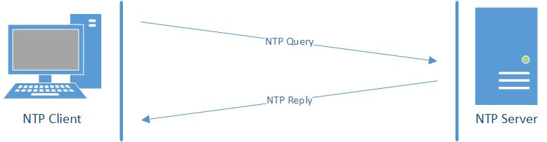
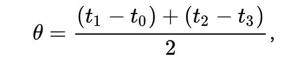

# NTP

[TOC]

## 概述

NTP（Network Time Protocol ，网络时间协议）是一种 Internet 协议，用于将计算机的时钟同步到某个时间参考。广泛用于将计算机同步到 Internet  时间服务器或其他来源，例如无线电或卫星接收器或电话调制解调器服务。可以提供高精准度的时间校正（LAN 上与标准时间差小于 1 毫秒，WAN 上几毫秒），且可介由加密确认的方式来防止恶意的协议攻击。

NTP 确保了全球、海底甚至太空中数十亿台设备的可靠性。精确的计时对于许多已经彻底改变并对我们的日常生活至关重要的应用至关重要：卫星、GPS、5G、金融服务、医疗保健等。

NTP 项目生成 NTP 标准的开源参考实现，维护实现文档，并开发用于在系统之间通信时间的协议和算法标准。

Network Time Foundation 为 NTP 项目提供支持。了解更多关于基金会在 https://www.nwtime.org/ 的工作。

典型的 NTP 配置利用多个冗余服务器和不同的网络路径来实现高精度和可靠性。

是在分组交换、延迟时间可变的数据网络上进行时钟同步的网络协议。

最初由特拉华大学 (University of Delaware) 的 David L. Mills 教授设计。自 1985 年以来，NTP 是目前仍在使用的最古老的互联网协议之一。

NTP 只考虑 UTC 时间，不考虑时区，不考虑夏令时等。

* **协    议：** UDP
* **端口号：** 123

此发行版是 [RFC-5905“网络时间协议版本 4：协议和算法规范”](https://www.ntp.org/reflib/rfc/rfc5905.txt) 的实现。

n framework in which substantially all the runtime NTP operations and most features can be tested and  evaluated. This has been very useful in exploring in vitro response to  unusual circumstances or over time periods impractical in vivo. 
该发行版包括一个仿真框架，在该框架中，可以测试和评估几乎所有运行时 NTP 操作和大多数功能。这对于探索体外对异常情况或体内不切实际的反应非常有用。

### SNTP

SNTP（Simple Network Time Protocol，简单网络时间协议）基本上也是 NTP ，但缺少一些并非所有类型的服务器都需要的内部算法。由于 NTP 协议的完整实施对于许多系统来说似乎过于复杂，因此定义了该协议的简化版本，即 SNTP 。

## 同步时间的必要性

Time usually just advances. If you have communicating programs running on  different computers, time will still advance if you switch from one  computer to another. Obviously if one system is ahead of the others, the others are behind that particular one. From the perspective of an  external observer, switching between these systems would cause time to  jump forward and back, a non-desirable effect.
时间通常只是前进。如果您在不同的计算机上运行通信程序，则从一台计算机切换到另一台计算机，时间仍将提前。显然，如果一个系统领先于其他系统，那么其他系统就会落后于该特定系统。从外部观察者的角度来看，在这些系统之间切换会导致时间向前和向后跳跃，这是一种不受欢迎的效果。

As a consequence, isolated networks may run their own wrong time, but as  soon as you connect to the Internet, effects will be visible. 
因此，孤立的网络可能会运行错误的时间，但一旦您连接到互联网，效果就会显现出来。想象一下，一封电子邮件在发送前五分钟到达，回复日期在邮件发送前两分钟。

For example, database systems using transactions and crash  recovery like to know the time of the last good state. Even if a  database like Oracle uses integer numbers for transaction sequencing  internally, users may want to perform time-based recovery.
即使在一台计算机上，当时间向后跳跃时，某些应用程序也会出现问题。例如，使用事务和崩溃恢复的数据库系统喜欢知道上次良好状态的时间。即使像 Oracle 这样的数据库在内部使用整数进行事务排序，用户也可能希望执行基于时间的恢复。

因此，空中交通管制是 NTP 的首批应用之一。

## 基本功能

- All clocks are set towards that true time. It will not just make all systems agree on *some* time, but will make them agree upon the true time as defined by some standard. 
  NTP 需要一些参考时钟来定义实际运行时间。所有时钟都设置为该真实时间。它不仅会让所有系统就某个时间达成一致，而且会让它们就某个标准定义的真实时间达成一致。NTP 使用 UTC 作为参考时间。
- Multiple candidates  can be combined to minimize the accumulated error. Temporarily or  permanently unreliable time sources will be detected and avoided.
  NTP 是一种容错协议，它将自动选择多个可用时间源中的最佳时间源进行同步。可以组合多个候选者，以最大程度地减少累积误差。暂时或永久不可靠的时间源将被检测并避免。
- A synchronization network may consist of several  reference clocks. Each node of such a network can exchange time  information either bidirectional or unidirectional. Propagating time  from one node to another forms a hierarchical graph with reference  clocks at the top.
  NTP 具有高度可扩展性。同步网络可以由多个参考时钟组成。这种网络的每个节点都可以双向或单向交换时间信息。将时间从一个节点传播到另一个节点形成一个分层图，参考时钟位于顶部。
- Having available several time sources, NTP can select the best candidates to  build its estimate of the current time. The protocol is highly accurate, using a resolution of less than a nanosecond (about 2^-32 seconds). In contrast, the protocol used by `rdate` and defined in [RFC 868](https://www.rfc-editor.org/rfc/rfc868.html) only uses a resolution of one second.
  有了多个可用的时间源，NTP 可以选择最佳候选者来构建其对当前时间的估计。该协议非常准确，使用小于一纳秒（约 2 ^ -32 秒）的分辨率。相比之下，RFC 868 使用 `rdate` 和定义的协议仅使用一秒的分辨率。
- Even when a network connection is temporarily unavailable, NTP can use  measurements from the past to estimate current time and error.
  即使网络连接暂时不可用，NTP 也可以使用过去的测量值来估计当前时间和误差。
- For formal reasons NTP will also maintain estimates for the accuracy of the local time.
  出于正式原因，NTP还将维护对当地时间准确性的估计。

## 工作原理

 

NTP Query   3

NTP Reply    4

### 时间延迟计算

 

时间偏移 `θ` 定义为：

 

往返延迟 `δ` 为：

 

其中：

* `t0`  请求数据包传输的客户端时间戳，
* `t1`  请求数据包回复的服务器时间戳，
* `t2`  响应数据包传输的服务器时间戳，
* `t3`  响应数据包回复的客户端时间戳。

`t1` , `t2` 是属于同一个时钟的，因此它们的差值是有意义的，同理，`t3` , `t0` 的差值也是有意义的。

`t3 - t0` 是数据包传输的全部时间，服务器处理的时间是 `t2 - t1`, 那么**往返**网络传输时间就是 `δ=(t3 - t0) - (t2 - t1)`。

现在假设网络延迟是对称的，那么**单程**网络延时就是 `δ/2`,也就是 `[(t3 - t0) - (t2 - t1)]/2`。

现在假设这个差值为 `θ` ，考虑从 `t2 => t3` 的过程，从服务器 `t2` 时刻开始，经过网络延时(`δ/2`,单程延时)到达 `t3` ,但是 `t3` 是客户端的时间，`t3 + θ` 对应的就是服务器的时间，那么它们应该是相等的。

`t2 + δ/2 = t3 + θ`，计算`θ`,得到

 

例如上面图中的 `θ=(135 - 231 + 137 - 298)/2`=`-(257/2)`,客户端比服务器快，时间是负值。

客户端会同时请求好几个服务器，进行统计分析，过滤不合理的值，并从最好的三个剩余候选中导出估算的时间偏移，然后调整时钟频率以逐渐减小偏移。

## 层次 stratum

使用一种树状的，半分层的时间源系统。每一层叫做 `stratum`。每个 stratum 都有一个编号，`0 - 15`，`16` 被用来标记设备未同步。一般情况下，第 `n+1` 层 stratum 从第 `n` 层同步时间。

- stratum 0:

  一般用硬件实现，例如原子钟（如铯、铷）、GPS 时钟或其他无线电时钟。也被称为**参考（基准）时钟(reference clocks)**。

- stratum 1:
   这一层是计算机，它们的系统时间和连接其上的 stratum 0 设备保持同步，误差在几个微秒。
   本层计算机可能与其他同层的计算机对等相连，以进行完整性检查和备份。它们也被称为**主要（primary）时间服务器**。这一层对互联网是不可见的，虽然它们是部署在互联网上的。
- stratum 2:
   从 stratum1 机器同步时间。stratum2 的计算机将查询 stratum 1 服务器。stratum 2 计算机也可能与其他 stratum 2 计算机对等相连，为对等组中的所有设备提供更稳定的时间。
- stratum 3:
   这些计算机与 stratum 2 的服务器同步。使用与 stratum 2 相同的算法进行对等和数据采样，并可以自己作为服务器担任阶 stratum 4 计算机，以此类推。

 

对于提供 `network time service provider` 的主机来说，stratum 的设定要尽可能准确。而作为局域网的 `time service provider`，通常将 stratum 设置为 `10` 。ntpd 对下层 client 来说是 service server ，对于上层 server 来说是 client 。

## 同步时间间隔

与软件有关。Linux 下 ntpd 在不稳定的时候为 64 秒，随着稳定程度的提高，会逐渐变成 128 秒、256 秒......成倍增长，最长时间可达 1024 秒。

## 客户端运行模式

1. step 模式

   校准工作一气呵成。ntpd 默认在客户端与服务端时间相差大于 128 毫秒时采用该运行模式。

2. slew 模式

   校准是慢条斯理的完成。ntpd 默认在客户端与服务端时间相差小于 128 毫秒时采用该运行模式。
## 服务器工作模式

1. 广播/多播方式

   适用于局域网，服务器周期性地以广播/多播的方式将时间信息传送给其他网络中的服务器。配置简单，精度不高。

2. 对称方式

   适用于配置冗余的 NTP 服务器。该服务器可以提供时间给其他服务器，也可以从其他服务器获取时间。

3. 客户端/服务器方式

   与对称方式相似，不提供给其他服务器时间信息，适用于一台服务器接收上层服务器时间信息，并提供时间信息给下层的用户。

## 实现

* ntpd
* chrony
* open-ntp
* Ntimed

## 国内常用NTP服务器地址及IP

```bash
                             210.72.145.44      国家授时中心服务器
                             133.100.11.8       日本 福冈大学  
time-a.nist.gov              129.6.15.28        NIST, Gaithersburg, Maryland   
time-b.nist.gov              129.6.15.29        NIST, Gaithersburg, Maryland   
time-a.timefreq.bldrdoc.gov  132.163.4.101      NIST, Boulder, Colorado   
time-b.timefreq.bldrdoc.gov  132.163.4.102      NIST, Boulder, Colorado   
time-c.timefreq.bldrdoc.gov  132.163.4.103      NIST, Boulder, Colorado   
utcnist.colorado.edu         128.138.140.44     University of Colorado, Boulder   
time.nist.gov                192.43.244.18      NCAR, Boulder, Colorado   
time-nw.nist.gov             131.107.1.10       Microsoft, Redmond, Washington   
nist1.symmetricom.com        69.25.96.13        Symmetricom, San Jose, California   
nist1-dc.glassey.com         216.200.93.8       Abovenet, Virginia   
nist1-ny.glassey.com         208.184.49.9       Abovenet, New York City   
nist1-sj.glassey.com         207.126.98.204     Abovenet, San Jose, California   
nist1.aol-ca.truetime.com    207.200.81.113     TrueTime, AOL facility, Sunnyvale, California   
nist1.aol-va.truetime.com    64.236.96.53       TrueTime, AOL facility, Virginia  
————————————————————————————————————  
ntp.sjtu.edu.cn              202.120.2.101      上海交通大学网络中心NTP服务器地址
s1a.time.edu.cn					    			北京邮电大学  
s1b.time.edu.cn 								清华大学  
s1c.time.edu.cn 								北京大学  
s1d.time.edu.cn									东南大学  
s1e.time.edu.cn 								清华大学  
s2a.time.edu.cn 								清华大学  
s2b.time.edu.cn 								清华大学  
s2c.time.edu.cn 								北京邮电大学  
s2d.time.edu.cn 								西南地区网络中心  
s2e.time.edu.cn 								西北地区网络中心  
s2f.time.edu.cn 								东北地区网络中心  
s2g.time.edu.cn 								华东南地区网络中心  
s2h.time.edu.cn 								四川大学网络管理中心  
s2j.time.edu.cn 								大连理工大学网络中心  
s2k.time.edu.cn 								CERNET桂林主节点  
s2m.time.edu.cn 								北京大学

time.nist.gov	美国标准技术院
s2g.time.edu.cn	华东南地区网络中心
time-a.nist.gov	美国标准技术院
s2f.time.edu.cn	东北地区网络中心
s1d.time.edu.cn	东南大学
time-b.nist.gov	美国标准技术院
s2c.time.edu.cn	北京邮电大学
```

# 的工作原理

Last update: November 23, 2022 17:49 UTC ([1b4d24aef](https://git.nwtime.org/websites/ntpwww/commit/1b4d24aef65c630791ad0f89d6c09ec258781c2c))
最后更新： 2022年11月23日 17：49 UTC （ 1b4d24aef）

#### Table of Contents 目录

- [Abstract 抽象](https://www.ntp.org/documentation/4.2.8-series/warp/#abstract)
- [Introduction and Overview
  简介和概述](https://www.ntp.org/documentation/4.2.8-series/warp/#introduction-and-overview)
- [NTP Timescale and Data Formats
  NTP 时间刻度和数据格式](https://www.ntp.org/documentation/4.2.8-series/warp/#ntp-timescale-and-data-formats)
- [Architecture and Algorithms
  架构和算法](https://www.ntp.org/documentation/4.2.8-series/warp/#architecture-and-algorithms)

------

#### Abstract 抽象

This page and its dependencies contain a technical description of the  Network Time Protocol (NTP) architecture and operation. It is intended  for administrators, operators and monitoring personnel. Additional  information for nontechnical readers can be found in the white paper [Executive Summary: Computer Network Time Synchronization](https://www.ntp.org/reflib/exec/). While this page and its dependencies are primarily concerned with NTP,  additional information on related protocols can be found in the white  papers [IEEE 1588 Precision Time Protocol (PTP)](https://www.ntp.org/reflib/ptp/) and [Time Synchronization for Space Data Links](https://www.ntp.org/reflib/proximity/).
此页面及其依赖项包含网络时间协议 （NTP）  体系结构和操作的技术说明。它适用于管理员、操作员和监控人员。对于非技术读者，可以在白皮书执行摘要：计算机网络时间同步中找到其他信息。虽然本页及其依赖项主要涉及 NTP，但有关相关协议的其他信息可在白皮书 IEEE 1588 精确时间协议 （PTP） 和空间数据链路的时间同步中找到。

------

#### Introduction and Overview 简介和概述

NTP time synchronization services are widely available in the public  Internet. The public NTP subnet currently includes several thousand  servers in most countries and on every continent of the globe, including Antarctica, and sometimes in space and on the sea floor. These servers  support, directly or indirectly, a total population estimated at over 25 million computers in the global Internet.
NTP时间同步服务在公共互联网上广泛可用。公有NTP子网目前在大多数国家和全球各大洲（包括南极洲）包括数千台服务器，有时在太空和海底。这些服务器直接或间接地支持全球互联网中估计超过 2500 万台计算机的总人口。

The NTP subnet operates with a hierarchy of levels, where each level is  assigned a number called the stratum. Stratum 1 (primary) servers at the lowest level are directly synchronized to national time services via  satellite, radio or telephone modem. Stratum 2 (secondary) servers at  the next higher level are synchronized to stratum 1 servers and so on.  Normally, NTP clients and servers with a relatively small number of  clients do not synchronize to public primary servers. There are several  hundred public secondary servers operating at higher strata and are the  preferred choice.
NTP 子网使用级别层次结构运行，其中每个级别都分配了一个称为层的数字。最低级别的第 1  层（主）服务器通过卫星、无线电或电话调制解调器直接同步到国家时间服务。下一个更高级别的 Stratum 2（辅助）服务器将同步到第 1  层服务器，依此类推。通常，NTP 客户端和客户端数量相对较少的服务器不会同步到公共主服务器。有数百台公共辅助服务器在较高的层级运行，是首选。

This page presents an overview of the NTP implementation included in this  software distribution. We refer to this implementation as the *reference implementation* only because it was used to test and validate the NTPv4 specification [RFC 5905](https://www.ntp.org/reflib/rfc/rfc5905.txt). It is best read in conjunction with the briefings and white papers on the [Network Time Synchronization Research Project](https://www.ntp.org/reflib/ntp/) page. An executive summary suitable for management and planning purposes is in the white paper [Executive Summary: Computer Network Time Synchronization](https://www.ntp.org/reflib/exec/).
本页概述了此软件发行版中包含的 NTP 实现。我们将此实现称为参考实现，只是因为它用于测试和验证 NTPv4 规范 RFC  5905。最好与网络时间同步研究项目页面上的简报和白皮书一起阅读。白皮书《执行摘要：计算机网络时间同步》中提供了适用于管理和规划目的的执行摘要。

------

#### NTP Timescale and Data Formats NTP 时间刻度和数据格式

NTP clients and servers synchronize to the Coordinated Universal Time (UTC) timescale used by national laboratories and disseminated by radio,  satellite and telephone modem. This is a global timescale independent of geographic position. There are no provisions to correct for local time  zone or daylight savings time; however, these functions can be performed by the operating system on a per-user basis.
NTP 客户端和服务器与国家实验室使用的协调世界时 （UTC） 时间刻度同步，并通过无线电、卫星和电话调制解调器进行传播。这是一个与地理位置无关的全球时间尺度。没有更正当地时区或夏令时的规定;但是，这些功能可以由操作系统按用户执行。

The UT1 timescale, upon which UTC is based, is determined by the rotation  of the Earth about its axis. The Earth rotation is gradually slowing  down relative to International Atomic Time (TAI). In order to  rationalize UTC with respect to TAI, a leap second is inserted at  intervals of about 18 months, as determined by the International Earth  Rotation Service (IERS). Reckoning with leap seconds in the NTP  timescale is described in the white paper [The NTP Timescale and Leap Seconds](https://www.ntp.org/reflib/leap/).
UTC 所基于的 UT1  时间尺度由地球绕其轴的自转决定。相对于国际原子时（TAI），地球自转正在逐渐减慢。为了使UTC与TAI的合理化，根据国际地球自转服务（IERS）的规定，每隔大约18个月插入一个闰秒。NTP 时间刻度和闰秒白皮书中介绍了 NTP 时间刻度中的闰秒计算。

The historic insertions are documented in the `leap-seconds.list` file, which can be downloaded from NIST. This file is updated at  intervals not exceeding six months. Leap second warnings are  disseminated by the national laboratories in the broadcast timecode  format. These warnings are propagated from the NTP primary servers via  other server to the clients by the NTP on-wire protocol. The leap second is implemented by the operating system kernel, as described in the  white paper [The NTP Timescale and Leap Seconds](https://www.ntp.org/reflib/leap/). Implementation details are described on the [Leap Second Processing](https://www.ntp.org/documentation/4.2.8-series/leap/) page.
历史插入记录在 `leap-seconds.list` 文件中，可从 NIST 下载。此文件的更新间隔不超过六个月。闰秒警告由国家实验室以广播时间码格式发布。这些警告通过 NTP 在线协议从 NTP 主服务器通过其他服务器传播到客户端。闰秒由操作系统内核实现，如白皮书 NTP 时间刻度和闰秒中所述。实现细节在闰秒处理页面上进行了描述。


  


**Figure 1: NTP Data Formats
图 1：NTP 数据格式**

Figure 1 shows two NTP time formats, a 64-bit *timestamp* format and a 128-bit *datestamp* format. The datestamp format is used internally, while the timestamp  format is used in packet headers exchanged between clients and servers.  The timestamp format spans 136 years, called an *era*. The current era began on 1 January 1900, while the next one begins in  2036. Details on these formats and conversions between them are in the  white paper [The NTP Era and Era Numbering](https://www.ntp.org/reflib/y2k/). However, the NTP protocol will synchronize correctly, regardless of  era, as long as the system clock is set initially within 68 years of the correct time. Further discussion on this issue is in the white paper [NTP Timestamp Calculations](https://www.ntp.org/reflib/time/). Ordinarily, these formats are not seen by application programs, which  convert these NTP formats to native Unix or Windows formats.
图 1 显示了两种 NTP 时间格式：一种是 64 位时间戳格式，另一种是 128  位日期戳格式。日期戳格式在内部使用，而时间戳格式用于客户端和服务器之间交换的数据包标头。时间戳格式跨越 136 年，称为时代。当前时代始于  1900 年 1 月 1 日，而下一个时代始于 2036 年。有关这些格式及其之间转换的详细信息，请参阅白皮书 NTP  时代和时代编号。但是，无论时代如何，只要系统时钟最初设置在正确时间的 68 年内，NTP 协议就会正确同步。有关此问题的进一步讨论，请参阅白皮书 NTP 时间戳计算。通常，应用程序看不到这些格式，这些应用程序将这些 NTP 格式转换为本机 Unix 或 Windows 格式。

------

#### Architecture and Algorithms 架构和算法


  


**Figure 2: NTP Daemon Processes and Algorithms
图 2：NTP 守护进程和算法**

The overall organization of the NTP architecture is shown in Figure 2. It  is useful in this context to consider the implementation as both a  client of upstream (lower stratum) servers and as a server for  downstream (higher stratum) clients. It includes a pair of peer/poll  processes for each reference clock or remote server used as a  synchronization source. Packets are exchanged between the client and  server using the *on-wire protocol* described in the white paper [Analysis and Simulation of the NTP On-Wire Protocols](https://www.ntp.org/reflib/onwire/). The protocol is resistant to lost, replayed or spoofed packets.
NTP 架构的整体组织如图 2  所示。在此上下文中，将实现视为上游（下层）服务器的客户端和下游（上层）客户端的服务器是很有用的。它包括一对对等/轮询过程，用于用作同步源的每个参考时钟或远程服务器。数据包使用白皮书《NTP 在线协议的分析和仿真》中描述的在线协议在客户端和服务器之间交换。该协议可抵抗丢失、重放或欺骗的数据包。

The poll process sends NTP packets at intervals ranging from 8 s to 36 hr. The intervals are managed as described on the [Poll Process](https://www.ntp.org/documentation/4.2.8-series/poll/) page to maximize accuracy while minimizing network load. The peer  process receives NTP packets and performs the packet sanity tests  described on the [Event Messages and Status Words](https://www.ntp.org/documentation/4.2.8-series/decode/) page and [flash status word](https://www.ntp.org/documentation/4.2.8-series/decode/#flash-status-word). The flash status word reports in addition the results of various access control and security checks described in the white paper [NTP Security Analysis](https://www.ntp.org/reflib/security/). A sophisticated traffic monitoring facility described on the [Rate Management and the Kiss-o'-Death Packet](https://www.ntp.org/documentation/4.2.8-series/rate/) page protects against denial-of-service (DoS) attacks.
轮询过程以 8 秒到 36 小时的间隔发送 NTP  数据包。按照“轮询过程”页面上的说明对间隔进行管理，以最大限度地提高准确性，同时最大限度地减少网络负载。对等进程接收 NTP  数据包，并执行“事件消息和状态词”页面和闪存状态字中描述的数据包健全性测试。闪存状态字还报告了白皮书 NTP  安全分析中描述的各种访问控制和安全检查的结果。速率管理和 Kiss-o'-Death 数据包页面上描述的复杂流量监控工具可防止拒绝服务  （DoS） 攻击。

Packets that fail one or more of these tests are summarily discarded.  Otherwise, the peer process runs the on-wire protocol that uses four raw timestamps: the *origin timestamp* `*T*1` upon departure of the client request, the *receive timestamp* `*T*2` upon arrival at the server, the *transmit timestamp* `*T*3` upon departure of the server reply, and the *destination timestamp* `*T*4` upon arrival at the client. These timestamps, which are recorded by the `rawstats` option of the [`filegen`](https://www.ntp.org/documentation/4.2.8-series/monopt/#monitoring-commands-and-options) command, are used to calculate the clock offset and roundtrip delay samples:
未通过其中一项或多项测试的数据包将被立即丢弃。否则，对等进程将运行使用四个原始时间戳的在线协议：客户端请求离开时的源时间戳 `*T*1` 、到达服务器时的接收时间戳 `*T*2` 、服务器回复离开时的传输时间戳 `*T*3` 以及到达客户端时的目标时间戳 `*T*4` 。这些时间戳由 `filegen` 命令 `rawstats` 选项记录，用于计算时钟偏移和往返延迟样本：

- offset = `[(*T*2 - *T*1) + (*T*3 - *T*4)] / 2` 偏移量 = `[(*T*2 - *T*1) + (*T*3 - *T*4)] / 2` 

  **delay** = `(*T*4 - *T*1) - (*T*3 - *T*2)` 延迟 = `(*T*4 - *T*1) - (*T*3 - *T*2)` 

In this description the transmit timestamps `*T*1` and `*T*3` are *softstamps* measured by the inline code. Softstamps are subject to various queuing and processing delays. A more accurate measurement uses *drivestamps*, as described on the [NTP Interleaved Modes](https://www.ntp.org/documentation/4.2.8-series/xleave/) page. These issues along with mathematical models are discussed in the white paper [NTP Timestamp Calculations](https://www.ntp.org/reflib/time/).
在此描述中，传输时间戳 `*T*1` 和 `*T*3` 软戳由内联代码度量。软印章会受到各种排队和处理延迟的影响。更准确的测量使用驱动器戳，如 NTP 交错模式页面上所述。这些问题以及数学模型在白皮书 NTP 时间戳计算中进行了讨论。

The offset and delay statistics for one or more peer processes are  processed by a suite of mitigation algorithms. The algorithm described  on the [Clock Filter Algorithm](https://www.ntp.org/documentation/4.2.8-series/filter/) page selects the offset and delay samples most likely to produce  accurate results. Those servers that have passed the sanity tests are  declared *selectable*. From the selectable population the statistics are used by the algorithm described on the [Clock Select Algorithm](https://www.ntp.org/documentation/4.2.8-series/select/) page to determine a number of *truechimers* according to Byzantine agreement and correctness principles. From the truechimer population the algorithm described on the [Clock Cluster Algorithm](https://www.ntp.org/documentation/4.2.8-series/cluster/) page determines a number of *survivors* on the basis of statistical clustering principles.
一个或多个对等进程的偏移和延迟统计信息由一套缓解算法处理。时钟滤波器算法页面上描述的算法选择最有可能产生准确结果的偏移和延迟样本。那些已通过健全性测试的服务器被声明为可选。从可选择的总体中，根据拜占庭协议和正确性原则，使用时钟选择算法页面上描述的算法使用统计数据来确定真嵌合体的数量。从真嵌合体种群中，时钟聚类算法页面上描述的算法根据统计聚类原理确定幸存者的数量。

The algorithms described on the [Mitigation Rules and the `prefer` Keyword](https://www.ntp.org/documentation/4.2.8-series/prefer/) page combine the survivor offsets, designate one of them as the *system peer* and produces the final offset used by the algorithm described on the [Clock Discipline Algorithm](https://www.ntp.org/documentation/4.2.8-series/discipline/) page to adjust the system clock time and frequency. The clock offset and frequency, are recorded by the `loopstats` option of the [`filegen`](https://www.ntp.org/documentation/4.2.8-series/monopt/#monitoring-commands-and-options) command. For additional details about these algorithms, see the [Architecture Briefing](https://www.ntp.org/reflib/brief/arch/arch.pdf). For additional information on statistical principles and performance metrics, see the [Performance Metrics](https://www.ntp.org/documentation/4.2.8-series/stats/) page.
“缓解规则”和“ `prefer` 关键字”页上描述的算法将幸存者偏移量组合在一起，将其中一个偏移指定为系统对等方，并生成“时钟规则算法”页上描述的算法使用的最终偏移量，以调整系统时钟时间和频率。时钟偏移量和频率由 `filegen` 命令 `loopstats` 选项记录。有关这些算法的其他详细信息，请参阅体系结构简报。有关统计原则和性能指标的其他信息，请参阅性能指标页面。
